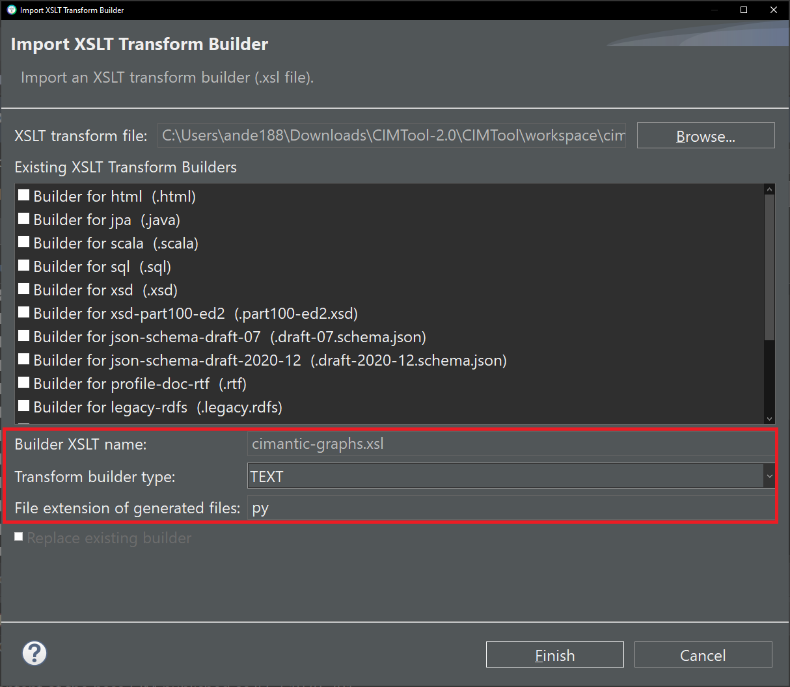
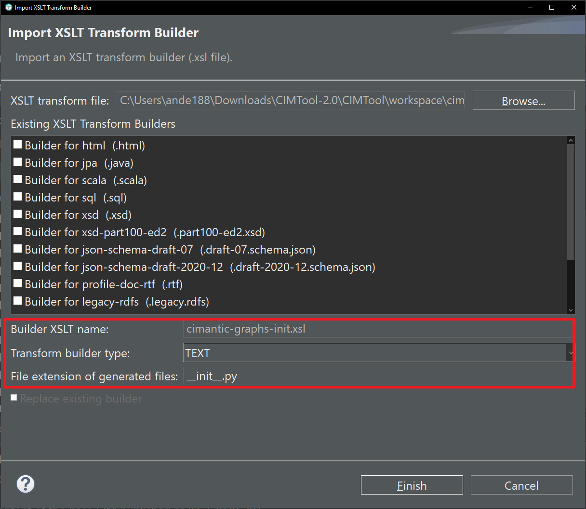
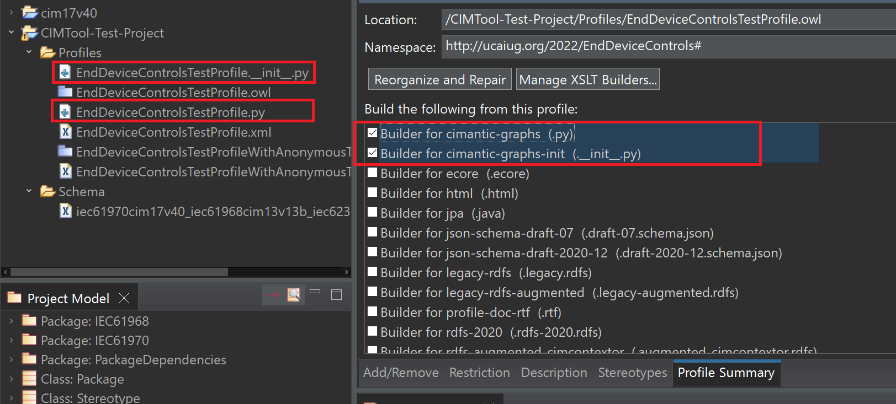
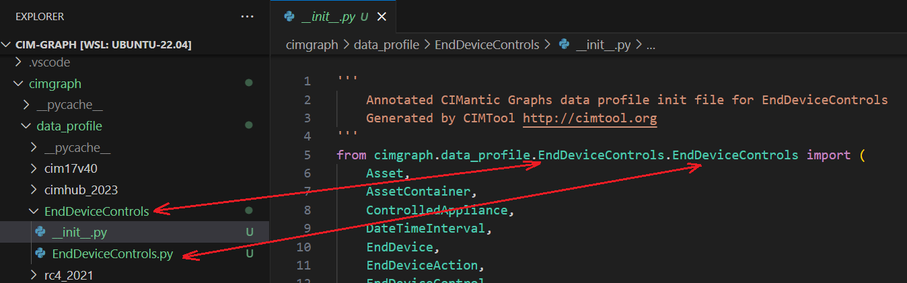

# cimantic-graphs.xsl

A custom builder shared with UCAIug by Pacific Northwest National Laboratory.

## Builder Description

The **[cimantic-graphs.xsl](cimantic-graphs.xsl)** builder produces a specialized python dataclass schema to be used as input into the [CIMantic Graphs](https://github.com/PNNL-CIM-Tools/CIM-Graph/tree/develop) open source library for creating, parsing, and editing CIM power system models using in-memory knowledge graphs.

This builder creates a hierarchical tree of CIM classes starting with top-level classes (such as `IdentifiedObject`) and then listing all classes inheriting from each level of dataclass. The dataclasses are used as the "single-source-of-truth" for auto-generated database queries and graph traversal using CIMantic Graphs.

This builder is intended to be used in conjunction the [cimantic-graphs-init.xsl](cimantic-graphs-init.xsl) builder, which generates the python `__init__.py` file required for library imports to work correctly. The files generated by both builders should be placed in a new folder within the CIMantic Graphs library `./cimgraph/data_profile` subdirectory.

Below is an example of a specialized python dataclass schema generated by this builder.

```PYTHON
@dataclass
class IdentifiedObject(Identity):
    '''
    This is a root class to provide common identification for all classes needing
    identification and naming attributes.
    '''
    mRID: Optional[ str ] = field(
        default = None,
        metadata = {
            'type': 'Attribute',
            'minOccurs': '0',
            'maxOccurs': '1'
        })
    '''
    Master resource identifier issued by a model authority. The mRID is unique
    within an exchange context. Global uniqueness is easily achieved by using
    a UUID, as specified in RFC 4122, for the mRID. The use of UUID is strongly
    recommended.
    For CIMXML data files in RDF syntax conforming to IEC 61970-552, the mRID
    is mapped to rdf:ID or rdf:about attributes that identify CIM object elements.
    '''

@dataclass
class ACDCTerminal(IdentifiedObject):
    '''
    An electrical connection point (AC or DC) to a piece of conducting equipment.
    Terminals are connected at physical connection points called connectivity
    nodes.
    '''
    BusNameMarker: Optional[ str | BusNameMarker ] = field(
        default = None,
        metadata = {
            'type': 'Association',
            'minOccurs': '0',
            'maxOccurs': '1',
            'inverse': 'BusNameMarker.Terminal'
        })
    '''
    The bus name marker used to name the bus (topological node).
    '''

    Measurements: list[ str | Measurement ] = field(
        default_factory = list,
        metadata = {
            'type': 'Association',
            'minOccurs': '0',
            'maxOccurs': 'unbounded',
            'inverse': 'Measurement.Terminal'
        })
    '''
    Measurements associated with this terminal defining where the measurement
    is placed in the network topology. It may be used, for instance, to capture
    the sensor position, such as a voltage transformer (PT) at a busbar or
    a current transformer (CT) at the bar between a breaker and an isolator.
    '''

@dataclass
class Terminal(ACDCTerminal):
    '''
    An AC electrical connection point to a piece of conducting equipment. Terminals
    are connected at physical connection points called connectivity nodes.
    '''
    phases: Optional[ str | PhaseCode ] = field(
        default = None,
        metadata = {
            'type': 'enumeration',
            'minOccurs': '0',
            'maxOccurs': '1'
        })

```
The accompanying __init__.py file is used for library imports and contains a list of all classes within the profile:

```PYTHON
from cimgraph.data_profile.cim17v40.cim17v40 import (
    ACDCTerminal,
    ACLineSegment,
    ACLineSegmentPhase,
    * * *
)
__all__ = [
    ACDCTerminal,
    ACLineSegment,
    ACLineSegmentPhase,
    * * *
]

```


## XSLT Version

This builder is XSLT 1.0 compliant.

## Author

Alex A. Anderson [@aandersn] on behalf of UCAIug.

## Submission Date

01-May-2024

## Builder NTE Configuration


The below screenshot highlights the NTE (Name/Type/Extension) settings for the builder.

The cimantic-graphs.xsl builder should be configured as a `TEXT` transform with the extension of `py`. The cimantic-graphs-init.xsl builder should be configured as a `TEXT` transform with the extensions of `__init__.py`.





To generate the profile artifacts for use with CIMantic Graphs, select both builders in the Profile Summary tab and click Save. Next, create a new folder in the cimgraph/data_profile subdirectory with the same name as the new profile. Copy the generated .py files to the new folder and rename the second file to just `__init__.py`. It may also be necessary to rename the main python file to match the profile/namespace name in line 5 of the init file.





The dataclasses can then be accessed by calling from
```PYTHON
import cimgraph.data_profile.EndDeviceControls as cim

new_device = cim.EndDevice()
```


>*NOTE: </br>CIMTool requires that file extensions be unique and will prevent you from entering an extension already assigned to a builder. This is because an artifact's name is derived by concatenating the base name of the CIMTool ```.owl``` profile with the file extension assigned to the builder. Therefore, a unique file extension must be assigned to each builder when imported. The file extension for a builder can be modified later from within the "Maintain XSLT Transform Builders" screen.*


## License

This builder is released under a [BSD-3](https://github.com/PNNL-CIM-Tools/CIM-Graph/blob/main/LICENSE) license as part of the CIMantic Graphs library developed by PNNL.

This software was created under a project sponsored by the U.S. Department of Energy’s Office of Electricity, an agency of the United States Government. Neither the United States Government nor the United States Department of Energy, nor Battelle, nor any of their employees, nor any jurisdiction or organization that has cooperated in the development of these materials, makes any warranty, express or implied, or assumes any legal liability or responsibility for the accuracy, completeness, or usefulness or any information, apparatus, product, software, or process disclosed, or represents that its use would not infringe privately owned rights.

Reference herein to any specific commercial product, process, or service by trade name, trademark, manufacturer, or otherwise does not necessarily constitute or imply its endorsement, recommendation, or favoring by the United States Government or any agency thereof, or Battelle Memorial Institute. The views and opinions of authors expressed herein do not necessarily state or reflect those of the United States Government or any agency thereof.

PACIFIC NORTHWEST NATIONAL LABORATORY

operated by BATTELLE for the

UNITED STATES DEPARTMENT OF ENERGY

under Contract DE-AC05-76RL01830
