# cim16v33 Profile Specification

Profile namespace: `http://www.ucaiug.org/profile#`

## Profile Profile

## Concrete Classes

{#cim16v33-ACDCConverterDCTerminal}
### (Description) ACDCConverterDCTerminal

Inheritance path = [DCBaseTerminal](#cim16v33-DCBaseTerminal) => [ACDCTerminal](#cim16v33-ACDCTerminal) => [IdentifiedObject](#cim16v33-IdentifiedObject)

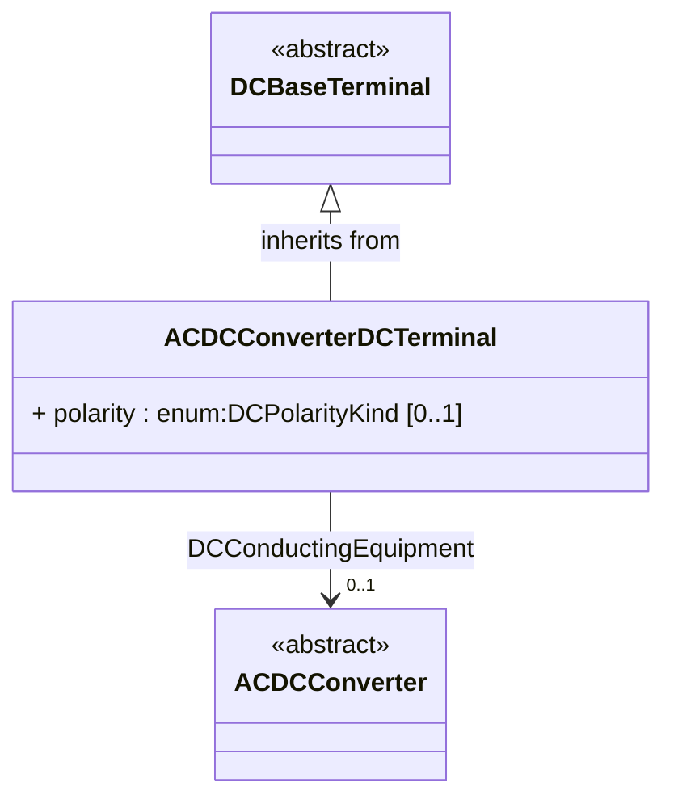
```mermaid
classDiagram
direction TB

class ACDCConverterDCTerminal {
+ polarity : enum:DCPolarityKind [0..1]
}

class DCBaseTerminal {
<<abstract>>
}

DCBaseTerminal <|-- ACDCConverterDCTerminal : inherits from
class ACDCConverter {
<<abstract>>
}

ACDCConverterDCTerminal --> "0..1" ACDCConverter : DCConductingEquipment
```

> **Note:** This class is tagged in this profile with the 'Description' tag. To refer to the full definition of this class as defined in the profile this one depends on visit [ACDCConverterDCTerminal](#{cim16v33-description-profile}-ACDCConverterDCTerminal).

A DC electrical connection point at the AC/DC converter. The AC/DC converter is electrically connected also to the AC side. The AC connection is inherited from the AC conducting equipment in the same way as any other AC equipment. The AC/DC converter DC terminal is separate from generic DC terminal to restrict the connection with the AC side to AC/DC converter and so that no other DC conducting equipment can be connected to the AC side.

#### Native Members

| name | type | description | mapping |
|------|------|-------------|---------|
| polarity [0..1] | [DCPolarityKind](#cim16v33-DCPolarityKind) | Represents the normal network polarity condition. | |
| DCConductingEquipment [0..1] | [ACDCConverter](#cim16v33-ACDCConverter) | A DC converter terminal belong to an DC converter. | |

#### Inherited Members

| name | type | description | mapping |
|------|------|-------------|---------|
| DCNode [0..1] | [DCNode](#cim16v33-DCNode) | see [DCBaseTerminal](cim16v33-DCBaseTerminal) | |
| DCTopologicalNode [0..1] | [DCTopologicalNode](#cim16v33-DCTopologicalNode) | see [DCBaseTerminal](cim16v33-DCBaseTerminal) | |
| connected [0..1] | [Boolean](#cim16v33-Boolean) | see [ACDCTerminal](#cim16v33-ACDCTerminal) | |
| sequenceNumber [0..1] | [Integer](#cim16v33-Integer) | see [ACDCTerminal](#cim16v33-ACDCTerminal) | |
| BusNameMarker [0..1] | [BusNameMarker](#cim16v33-BusNameMarker) | see [ACDCTerminal](cim16v33-ACDCTerminal) | |
| Measurements [0..*] | [Measurement](#cim16v33-Measurement) | see [ACDCTerminal](cim16v33-ACDCTerminal) | |
| OperationalLimitSet [0..*] | [OperationalLimitSet](#cim16v33-OperationalLimitSet) | see [ACDCTerminal](cim16v33-ACDCTerminal) | |
| mRID [0..1] | [String](#cim16v33-String) | see [IdentifiedObject](#cim16v33-IdentifiedObject) | |
| aliasName [0..1] | [String](#cim16v33-String) | see [IdentifiedObject](#cim16v33-IdentifiedObject) | |
| description [0..1] | [String](#cim16v33-String) | see [IdentifiedObject](#cim16v33-IdentifiedObject) | |
| name [0..1] | [String](#cim16v33-String) | see [IdentifiedObject](#cim16v33-IdentifiedObject) | |
| DiagramObjects [0..*] | [DiagramObject](#cim16v33-DiagramObject) | see [IdentifiedObject](cim16v33-IdentifiedObject) | |
| Names [0..*] | [Name](#cim16v33-Name) | see [IdentifiedObject](cim16v33-IdentifiedObject) | |

{#cim16v33-ACLineSegment}
### (Description) ACLineSegment

Inheritance path = [Conductor](#cim16v33-Conductor) => [ConductingEquipment](#cim16v33-ConductingEquipment) => [Equipment](#cim16v33-Equipment) => [PowerSystemResource](#cim16v33-PowerSystemResource) => [IdentifiedObject](#cim16v33-IdentifiedObject)

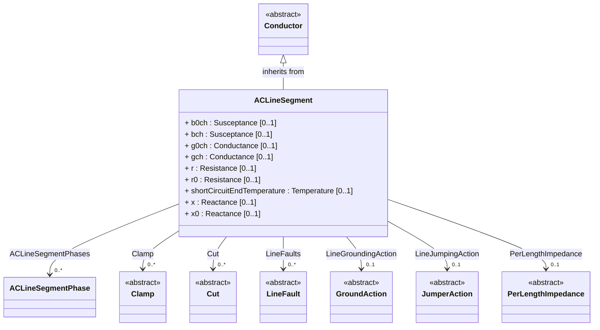
```mermaid
classDiagram
direction TB

class ACLineSegment {
+ b0ch : Susceptance [0..1]
+ bch : Susceptance [0..1]
+ g0ch : Conductance [0..1]
+ gch : Conductance [0..1]
+ r : Resistance [0..1]
+ r0 : Resistance [0..1]
+ shortCircuitEndTemperature : Temperature [0..1]
+ x : Reactance [0..1]
+ x0 : Reactance [0..1]
}

class Conductor {
<<abstract>>
}

Conductor <|-- ACLineSegment : inherits from
class ACLineSegmentPhase {
}

ACLineSegment --> "0..*" ACLineSegmentPhase : ACLineSegmentPhases
class Clamp {
<<abstract>>
}

ACLineSegment --> "0..*" Clamp : Clamp
class Cut {
<<abstract>>
}

ACLineSegment --> "0..*" Cut : Cut
class LineFault {
<<abstract>>
}

ACLineSegment --> "0..*" LineFault : LineFaults
class GroundAction {
<<abstract>>
}

ACLineSegment --> "0..1" GroundAction : LineGroundingAction
class JumperAction {
<<abstract>>
}

ACLineSegment --> "0..1" JumperAction : LineJumpingAction
class PerLengthImpedance {
<<abstract>>
}

ACLineSegment --> "0..1" PerLengthImpedance : PerLengthImpedance
```

> **Note:** This class is tagged in this profile with the 'Description' tag. To refer to the full definition of this class as defined in the profile this one depends on visit [ACLineSegment](#{cim16v33-description-profile}-ACLineSegment).

A wire or combination of wires, with consistent electrical characteristics, building a single electrical system, used to carry alternating current between points in the power system.

For symmetrical, transposed 3ph lines, it is sufficient to use attributes of the line segment, which describe impedances and admittances for the entire length of the segment. Additionally impedances can be computed by using length and associated per length impedances.

The BaseVoltage at the two ends of ACLineSegments in a Line shall have the same BaseVoltage.nominalVoltage. However, boundary lines may have slightly different BaseVoltage.nominalVoltages and variation is allowed. Larger voltage difference in general requires use of an equivalent branch.

#### Native Members

| name | type | description | mapping |
|------|------|-------------|---------|
| b0ch [0..1] | [Susceptance](#cim16v33-Susceptance) | Zero sequence shunt (charging) susceptance, uniformly distributed, of the entire line section. | |
| bch [0..1] | [Susceptance](#cim16v33-Susceptance) | Positive sequence shunt (charging) susceptance, uniformly distributed, of the entire line section. This value represents the full charging over the full length of the line. | |
| g0ch [0..1] | [Conductance](#cim16v33-Conductance) | Zero sequence shunt (charging) conductance, uniformly distributed, of the entire line section. | |
| gch [0..1] | [Conductance](#cim16v33-Conductance) | Positive sequence shunt (charging) conductance, uniformly distributed, of the entire line section. | |
| r [0..1] | [Resistance](#cim16v33-Resistance) | Positive sequence series resistance of the entire line section. | |
| r0 [0..1] | [Resistance](#cim16v33-Resistance) | Zero sequence series resistance of the entire line section. | |
| shortCircuitEndTemperature [0..1] | [Temperature](#cim16v33-Temperature) | Maximum permitted temperature at the end of SC for the calculation of minimum short-circuit currents. Used for short circuit data exchange according to IEC 60909 | |
| x [0..1] | [Reactance](#cim16v33-Reactance) | Positive sequence series reactance of the entire line section. | |
| x0 [0..1] | [Reactance](#cim16v33-Reactance) | Zero sequence series reactance of the entire line section. | |
| ACLineSegmentPhases [0..*] | [ACLineSegmentPhase](#cim16v33-ACLineSegmentPhase) | The line segment phases which belong to the line segment. | |
| Clamp [0..*] | [Clamp](#cim16v33-Clamp) | The clamps connected to the line segment. | |
| Cut [0..*] | [Cut](#cim16v33-Cut) | Cuts applied to the line segment. | |
| LineFaults [0..*] | [LineFault](#cim16v33-LineFault) | The line faults of the line segment. | |
| LineGroundingAction [0..1] | [GroundAction](#cim16v33-GroundAction) | Ground action involving clamp usage (for the case when the ground is applied along the line segment instead of at its terminals). | |
| LineJumpingAction [0..1] | [JumperAction](#cim16v33-JumperAction) | Jumper action involving clamp usage (for the case when the jumper is applied along the line segment instead of at its terminals). | |
| PerLengthImpedance [0..1] | [PerLengthImpedance](#cim16v33-PerLengthImpedance) | Per-length impedance of this line segment. | |

#### Inherited Members

| name | type | description | mapping |
|------|------|-------------|---------|
| length [0..1] | [Length](#cim16v33-Length) | see [Conductor](cim16v33-Conductor) | |
| BaseVoltage [0..1] | [BaseVoltage](#cim16v33-BaseVoltage) | see [ConductingEquipment](cim16v33-ConductingEquipment) | |
| GroundingAction [0..1] | [GroundAction](#cim16v33-GroundAction) | see [ConductingEquipment](cim16v33-ConductingEquipment) | |
| JumpingAction [0..1] | [JumperAction](#cim16v33-JumperAction) | see [ConductingEquipment](cim16v33-ConductingEquipment) | |
| ProtectionEquipments [0..*] | [ProtectionEquipment](#cim16v33-ProtectionEquipment) | see [ConductingEquipment](cim16v33-ConductingEquipment) | |
| ProtectiveActionAdjustment [0..*] | [ProtectiveActionAdjustment](#cim16v33-ProtectiveActionAdjustment) | see [ConductingEquipment](cim16v33-ConductingEquipment) | |
| SvStatus [0..1] | [SvStatus](#cim16v33-SvStatus) | see [ConductingEquipment](cim16v33-ConductingEquipment) | |
| Terminals [0..*] | [Terminal](#cim16v33-Terminal) | see [ConductingEquipment](cim16v33-ConductingEquipment) | |
| aggregate [0..1] | [Boolean](#cim16v33-Boolean) | see [Equipment](#cim16v33-Equipment) | |
| normallyInService [0..1] | [Boolean](#cim16v33-Boolean) | see [Equipment](#cim16v33-Equipment) | |
| ContingencyEquipment [0..*] | [ContingencyEquipment](#cim16v33-ContingencyEquipment) | see [Equipment](cim16v33-Equipment) | |
| EqiupmentLimitSeriesComponent [0..*] | [EquipmentLimitSeriesComponent](#cim16v33-EquipmentLimitSeriesComponent) | see [Equipment](cim16v33-Equipment) | |
| `EquipmentContainer [0..1]` (OfAggregate) | [EquipmentContainer](#cim16v33-EquipmentContainer) | see [Equipment](cim16v33-Equipment) | |
| Faults [0..*] | [Fault](#cim16v33-Fault) | see [Equipment](cim16v33-Equipment) | |
| `LimitDependencyModel [0..*]` (AggregateOf) | [LimitDependency](#cim16v33-LimitDependency) | see [Equipment](cim16v33-Equipment) | |
| OperationalLimitSet [0..*] | [OperationalLimitSet](#cim16v33-OperationalLimitSet) | see [Equipment](cim16v33-Equipment) | |
| OperationalRestrictions [0..*] | [OperationalRestriction](#cim16v33-OperationalRestriction) | see [Equipment](cim16v33-Equipment) | |
| Outages [0..*] | [Outage](#cim16v33-Outage) | see [Equipment](cim16v33-Equipment) | |
| ProtectiveActionEquipment [0..*] | [ProtectiveActionEquipment](#cim16v33-ProtectiveActionEquipment) | see [Equipment](cim16v33-Equipment) | |
| UsagePoints [0..*] | [UsagePoint](#cim16v33-UsagePoint) | see [Equipment](cim16v33-Equipment) | |
| WeatherStation [0..*] | [WeatherStation](#cim16v33-WeatherStation) | see [Equipment](cim16v33-Equipment) | |
| AssetDatasheet [0..1] | [AssetInfo](#cim16v33-AssetInfo) | see [PowerSystemResource](cim16v33-PowerSystemResource) | |
| Assets [0..*] | [Asset](#cim16v33-Asset) | see [PowerSystemResource](cim16v33-PowerSystemResource) | |
| Controls [0..*] | [Control](#cim16v33-Control) | see [PowerSystemResource](cim16v33-PowerSystemResource) | |
| Location [0..1] | [Location](#cim16v33-Location) | see [PowerSystemResource](cim16v33-PowerSystemResource) | |
| `Measurements [0..*]` (AggregateOf) | [Measurement](#cim16v33-Measurement) | see [PowerSystemResource](cim16v33-PowerSystemResource) | |
| PSRType [0..1] | [PSRType](#cim16v33-PSRType) | see [PowerSystemResource](cim16v33-PowerSystemResource) | |
| ReportingGroup [0..*] | [ReportingGroup](#cim16v33-ReportingGroup) | see [PowerSystemResource](cim16v33-PowerSystemResource) | |
| mRID [0..1] | [String](#cim16v33-String) | see [IdentifiedObject](#cim16v33-IdentifiedObject) | |
| aliasName [0..1] | [String](#cim16v33-String) | see [IdentifiedObject](#cim16v33-IdentifiedObject) | |
| description [0..1] | [String](#cim16v33-String) | see [IdentifiedObject](#cim16v33-IdentifiedObject) | |
| name [0..1] | [String](#cim16v33-String) | see [IdentifiedObject](#cim16v33-IdentifiedObject) | |
| DiagramObjects [0..*] | [DiagramObject](#cim16v33-DiagramObject) | see [IdentifiedObject](cim16v33-IdentifiedObject) | |
| Names [0..*] | [Name](#cim16v33-Name) | see [IdentifiedObject](cim16v33-IdentifiedObject) | |

{#cim16v33-ACLineSegmentPhase}
### (Description) ACLineSegmentPhase

Inheritance path = [PowerSystemResource](#cim16v33-PowerSystemResource) => [IdentifiedObject](#cim16v33-IdentifiedObject)

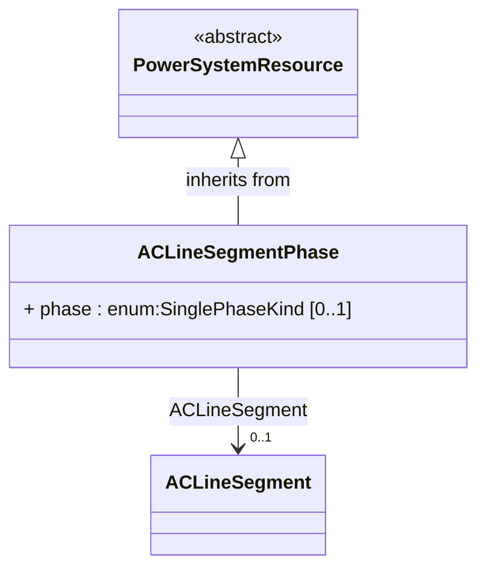
```mermaid
classDiagram
direction TB

class ACLineSegmentPhase {
+ phase : enum:SinglePhaseKind [0..1]
}

class PowerSystemResource {
<<abstract>>
}

PowerSystemResource <|-- ACLineSegmentPhase : inherits from
class ACLineSegment {
}

ACLineSegmentPhase --> "0..1" ACLineSegment : ACLineSegment
```

> **Note:** This class is tagged in this profile with the 'Description' tag. To refer to the full definition of this class as defined in the profile this one depends on visit [ACLineSegmentPhase](#{cim16v33-description-profile}-ACLineSegmentPhase).

Represents a single wire of an alternating current line segment.

#### Native Members

| name | type | description | mapping |
|------|------|-------------|---------|
| phase [0..1] | [SinglePhaseKind](#cim16v33-SinglePhaseKind) | The phase connection of the wire at both ends. | |
| ACLineSegment [0..1] | [ACLineSegment](#cim16v33-ACLineSegment) | The line segment to which the phase belongs. | |

#### Inherited Members

| name | type | description | mapping |
|------|------|-------------|---------|
| AssetDatasheet [0..1] | [AssetInfo](#cim16v33-AssetInfo) | see [PowerSystemResource](cim16v33-PowerSystemResource) | |
| Assets [0..*] | [Asset](#cim16v33-Asset) | see [PowerSystemResource](cim16v33-PowerSystemResource) | |
| Controls [0..*] | [Control](#cim16v33-Control) | see [PowerSystemResource](cim16v33-PowerSystemResource) | |
| Location [0..1] | [Location](#cim16v33-Location) | see [PowerSystemResource](cim16v33-PowerSystemResource) | |
| `Measurements [0..*]` (AggregateOf) | [Measurement](#cim16v33-Measurement) | see [PowerSystemResource](cim16v33-PowerSystemResource) | |
| PSRType [0..1] | [PSRType](#cim16v33-PSRType) | see [PowerSystemResource](cim16v33-PowerSystemResource) | |
| ReportingGroup [0..*] | [ReportingGroup](#cim16v33-ReportingGroup) | see [PowerSystemResource](cim16v33-PowerSystemResource) | |
| mRID [0..1] | [String](#cim16v33-String) | see [IdentifiedObject](#cim16v33-IdentifiedObject) | |
| aliasName [0..1] | [String](#cim16v33-String) | see [IdentifiedObject](#cim16v33-IdentifiedObject) | |
| description [0..1] | [String](#cim16v33-String) | see [IdentifiedObject](#cim16v33-IdentifiedObject) | |
| name [0..1] | [String](#cim16v33-String) | see [IdentifiedObject](#cim16v33-IdentifiedObject) | |
| DiagramObjects [0..*] | [DiagramObject](#cim16v33-DiagramObject) | see [IdentifiedObject](cim16v33-IdentifiedObject) | |
| Names [0..*] | [Name](#cim16v33-Name) | see [IdentifiedObject](cim16v33-IdentifiedObject) | |

{#cim16v33-Accumulator}
### (Description) Accumulator

Inheritance path = [Measurement](#cim16v33-Measurement) => [IdentifiedObject](#cim16v33-IdentifiedObject)

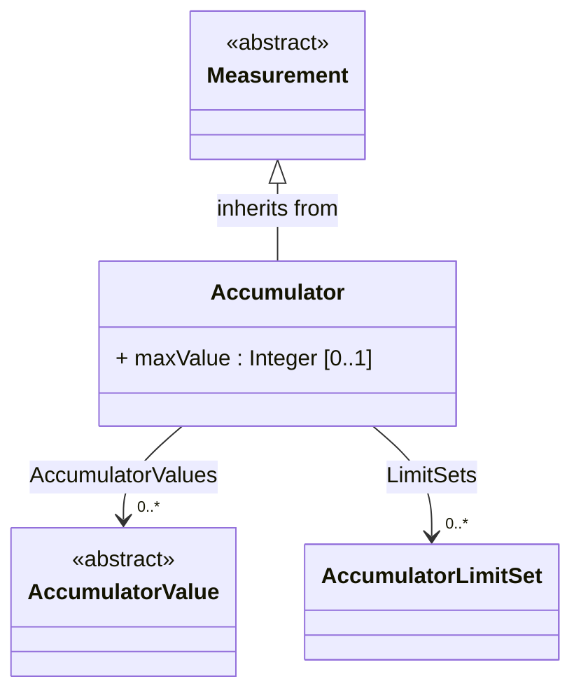
```mermaid
classDiagram
direction TB

class Accumulator {
+ maxValue : Integer [0..1]
}

class Measurement {
<<abstract>>
}

Measurement <|-- Accumulator : inherits from
class AccumulatorValue {
<<abstract>>
}

Accumulator --> "0..*" AccumulatorValue : AccumulatorValues
class AccumulatorLimitSet {
}

Accumulator --> "0..*" AccumulatorLimitSet : LimitSets
```

> **Note:** This class is tagged in this profile with the 'Description' tag. To refer to the full definition of this class as defined in the profile this one depends on visit [Accumulator](#{cim16v33-description-profile}-Accumulator).

Accumulator represents an accumulated (counted) Measurement, e.g. an energy value.

#### Native Members

| name | type | description | mapping |
|------|------|-------------|---------|
| maxValue [0..1] | [Integer](#cim16v33-Integer) | Normal value range maximum for any of the MeasurementValue.values. Used for scaling, e.g. in bar graphs or of telemetered raw values. | |
| AccumulatorValues [0..*] | [AccumulatorValue](#cim16v33-AccumulatorValue) | The values connected to this measurement. | |
| LimitSets [0..*] | [AccumulatorLimitSet](#cim16v33-AccumulatorLimitSet) | A measurement may have zero or more limit ranges defined for it. | |

#### Inherited Members

| name | type | description | mapping |
|------|------|-------------|---------|
| measurementType [0..1] | [String](#cim16v33-String) | see [Measurement](#cim16v33-Measurement) | |
| phases [0..1] | [PhaseCode](#cim16v33-PhaseCode) | see [Measurement](cim16v33-Measurement) | |
| unitMultiplier [0..1] | [UnitMultiplier](#cim16v33-UnitMultiplier) | see [Measurement](cim16v33-Measurement) | |
| unitSymbol [0..1] | [UnitSymbol](#cim16v33-UnitSymbol) | see [Measurement](cim16v33-Measurement) | |
| Asset [0..1] | [Asset](#cim16v33-Asset) | see [Measurement](cim16v33-Measurement) | |
| Locations [0..*] | [Location](#cim16v33-Location) | see [Measurement](cim16v33-Measurement) | |
| MeasurementCalculatorInput [0..*] | [MeasurementCalculatorInput](#cim16v33-MeasurementCalculatorInput) | see [Measurement](cim16v33-Measurement) | |
| `PowerSystemResource [0..1]` (OfAggregate) | [PowerSystemResource](#cim16v33-PowerSystemResource) | see [Measurement](cim16v33-Measurement) | |
| ProtectiveActionAdjustment [0..*] | [ProtectiveActionAdjustment](#cim16v33-ProtectiveActionAdjustment) | see [Measurement](cim16v33-Measurement) | |
| Terminal [0..1] | [ACDCTerminal](#cim16v33-ACDCTerminal) | see [Measurement](cim16v33-Measurement) | |
| mRID [0..1] | [String](#cim16v33-String) | see [IdentifiedObject](#cim16v33-IdentifiedObject) | |
| aliasName [0..1] | [String](#cim16v33-String) | see [IdentifiedObject](#cim16v33-IdentifiedObject) | |
| description [0..1] | [String](#cim16v33-String) | see [IdentifiedObject](#cim16v33-IdentifiedObject) | |
| name [0..1] | [String](#cim16v33-String) | see [IdentifiedObject](#cim16v33-IdentifiedObject) | |
| DiagramObjects [0..*] | [DiagramObject](#cim16v33-DiagramObject) | see [IdentifiedObject](cim16v33-IdentifiedObject) | |
| Names [0..*] | [Name](#cim16v33-Name) | see [IdentifiedObject](cim16v33-IdentifiedObject) | |

{#cim16v33-AccumulatorLimit}
### (Description) AccumulatorLimit

Inheritance path = [Limit](#cim16v33-Limit) => [IdentifiedObject](#cim16v33-IdentifiedObject)

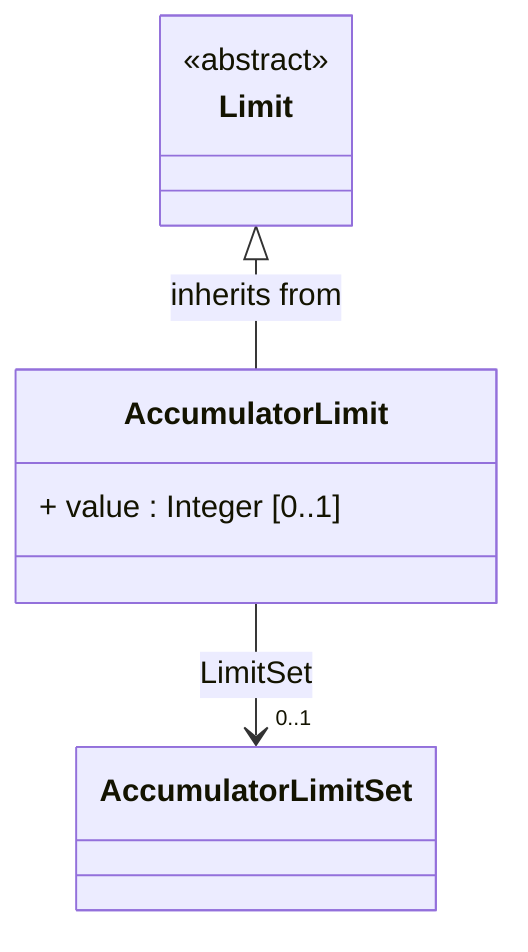
```mermaid
classDiagram
direction TB

class AccumulatorLimit {
+ value : Integer [0..1]
}

class Limit {
<<abstract>>
}

Limit <|-- AccumulatorLimit : inherits from
class AccumulatorLimitSet {
}

AccumulatorLimit --> "0..1" AccumulatorLimitSet : LimitSet
```

> **Note:** This class is tagged in this profile with the 'Description' tag. To refer to the full definition of this class as defined in the profile this one depends on visit [AccumulatorLimit](#{cim16v33-description-profile}-AccumulatorLimit).

Limit values for Accumulator measurements.

#### Native Members

| name | type | description | mapping |
|------|------|-------------|---------|
| value [0..1] | [Integer](#cim16v33-Integer) | The value to supervise against. The value is positive. | |
| `LimitSet [0..1]` (OfAggregate) | [AccumulatorLimitSet](#cim16v33-AccumulatorLimitSet) | The set of limits. | |

#### Inherited Members

| name | type | description | mapping |
|------|------|-------------|---------|
| `Procedures [0..*]` (informative) | [Procedure](#cim16v33-Procedure) | see [Limit](cim16v33-Limit) | |
| mRID [0..1] | [String](#cim16v33-String) | see [IdentifiedObject](#cim16v33-IdentifiedObject) | |
| aliasName [0..1] | [String](#cim16v33-String) | see [IdentifiedObject](#cim16v33-IdentifiedObject) | |
| description [0..1] | [String](#cim16v33-String) | see [IdentifiedObject](#cim16v33-IdentifiedObject) | |
| name [0..1] | [String](#cim16v33-String) | see [IdentifiedObject](#cim16v33-IdentifiedObject) | |
| DiagramObjects [0..*] | [DiagramObject](#cim16v33-DiagramObject) | see [IdentifiedObject](cim16v33-IdentifiedObject) | |
| Names [0..*] | [Name](#cim16v33-Name) | see [IdentifiedObject](cim16v33-IdentifiedObject) | |

{#cim16v33-AccumulatorLimitSet}
### AccumulatorLimitSet

Inheritance path = [LimitSet](#cim16v33-LimitSet) => [IdentifiedObject](#cim16v33-IdentifiedObject)

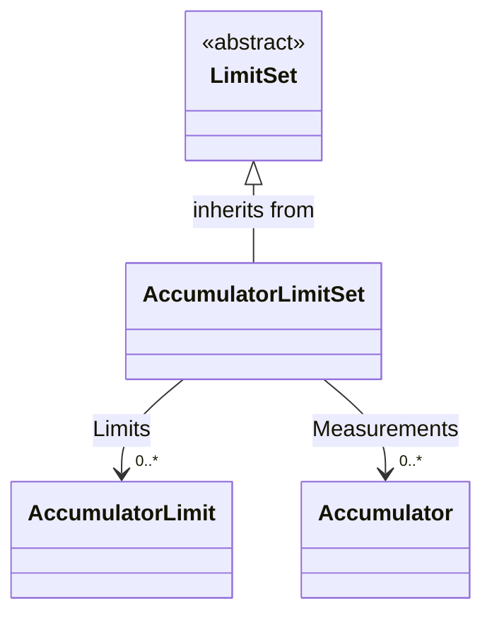
```mermaid
classDiagram
direction TB

class AccumulatorLimitSet {
}

class LimitSet {
<<abstract>>
}

LimitSet <|-- AccumulatorLimitSet : inherits from
class AccumulatorLimit {
}

AccumulatorLimitSet --> "0..*" AccumulatorLimit : Limits
class Accumulator {
}

AccumulatorLimitSet --> "0..*" Accumulator : Measurements
```

An AccumulatorLimitSet specifies a set of Limits that are associated with an Accumulator measurement.

#### Native Members

| name | type | description | mapping |
|------|------|-------------|---------|
| `Limits [0..*]` (AggregateOf) | [AccumulatorLimit](#cim16v33-AccumulatorLimit) | The limit values used for supervision of Measurements. | |
| Measurements [0..*] | [Accumulator](#cim16v33-Accumulator) | The Measurements using the LimitSet. | |

#### Inherited Members

| name | type | description | mapping |
|------|------|-------------|---------|
| isPercentageLimits [0..1] | [Boolean](#cim16v33-Boolean) | see [LimitSet](#cim16v33-LimitSet) | |
| mRID [0..1] | [String](#cim16v33-String) | see [IdentifiedObject](#cim16v33-IdentifiedObject) | |
| aliasName [0..1] | [String](#cim16v33-String) | see [IdentifiedObject](#cim16v33-IdentifiedObject) | |
| description [0..1] | [String](#cim16v33-String) | see [IdentifiedObject](#cim16v33-IdentifiedObject) | |
| name [0..1] | [String](#cim16v33-String) | see [IdentifiedObject](#cim16v33-IdentifiedObject) | |
| DiagramObjects [0..*] | [DiagramObject](#cim16v33-DiagramObject) | see [IdentifiedObject](cim16v33-IdentifiedObject) | |
| Names [0..*] | [Name](#cim16v33-Name) | see [IdentifiedObject](cim16v33-IdentifiedObject) | |

{#cim16v33-AccumulatorReset}
### AccumulatorReset

Inheritance path = [Control](#cim16v33-Control) => [IdentifiedObject](#cim16v33-IdentifiedObject)

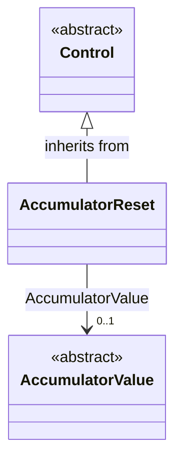
```mermaid
classDiagram
direction TB

class AccumulatorReset {
}

class Control {
<<abstract>>
}

Control <|-- AccumulatorReset : inherits from
class AccumulatorValue {
<<abstract>>
}

AccumulatorReset --> "0..1" AccumulatorValue : AccumulatorValue
```

This command reset the counter value to zero.

#### Native Members

| name | type | description | mapping |
|------|------|-------------|---------|
| AccumulatorValue [0..1] | [AccumulatorValue](#cim16v33-AccumulatorValue) | The accumulator value that is reset by the command. | |

#### Inherited Members

| name | type | description | mapping |
|------|------|-------------|---------|
| controlType [0..1] | [String](#cim16v33-String) | see [Control](#cim16v33-Control) | |
| operationInProgress [0..1] | [Boolean](#cim16v33-Boolean) | see [Control](#cim16v33-Control) | |
| timeStamp [0..1] | [DateTime](#cim16v33-DateTime) | see [Control](#cim16v33-Control) | |
| unitMultiplier [0..1] | [UnitMultiplier](#cim16v33-UnitMultiplier) | see [Control](cim16v33-Control) | |
| unitSymbol [0..1] | [UnitSymbol](#cim16v33-UnitSymbol) | see [Control](cim16v33-Control) | |
| PowerSystemResource [0..1] | [PowerSystemResource](#cim16v33-PowerSystemResource) | see [Control](cim16v33-Control) | |
| RemoteControl [0..1] | [RemoteControl](#cim16v33-RemoteControl) | see [Control](cim16v33-Control) | |
| mRID [0..1] | [String](#cim16v33-String) | see [IdentifiedObject](#cim16v33-IdentifiedObject) | |
| aliasName [0..1] | [String](#cim16v33-String) | see [IdentifiedObject](#cim16v33-IdentifiedObject) | |
| description [0..1] | [String](#cim16v33-String) | see [IdentifiedObject](#cim16v33-IdentifiedObject) | |
| name [0..1] | [String](#cim16v33-String) | see [IdentifiedObject](#cim16v33-IdentifiedObject) | |
| DiagramObjects [0..*] | [DiagramObject](#cim16v33-DiagramObject) | see [IdentifiedObject](cim16v33-IdentifiedObject) | |
| Names [0..*] | [Name](#cim16v33-Name) | see [IdentifiedObject](cim16v33-IdentifiedObject) | |

{#cim16v33-AirCompressor}
### AirCompressor

Inheritance path = [PowerSystemResource](#cim16v33-PowerSystemResource) => [IdentifiedObject](#cim16v33-IdentifiedObject)

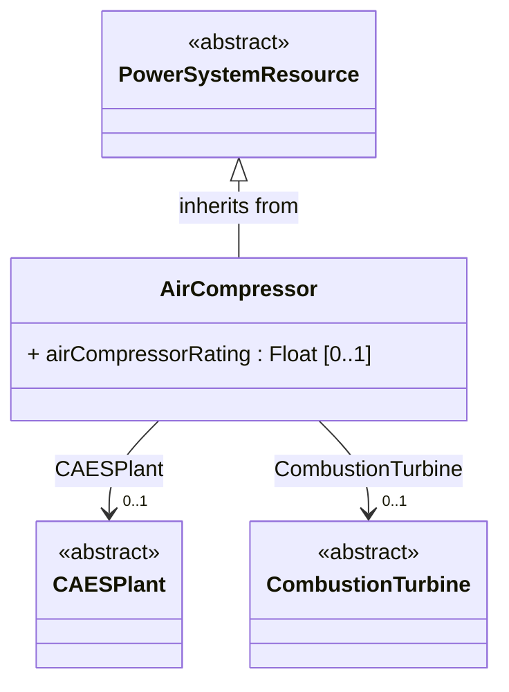
```mermaid
classDiagram
direction TB

class AirCompressor {
+ airCompressorRating : Float [0..1]
}

class PowerSystemResource {
<<abstract>>
}

PowerSystemResource <|-- AirCompressor : inherits from
class CAESPlant {
<<abstract>>
}

AirCompressor --> "0..1" CAESPlant : CAESPlant
class CombustionTurbine {
<<abstract>>
}

AirCompressor --> "0..1" CombustionTurbine : CombustionTurbine
```

Combustion turbine air compressor which is an integral part of a compressed air energy storage (CAES) plant.

#### Native Members

| name | type | description | mapping |
|------|------|-------------|---------|
| airCompressorRating [0..1] | [Float](#cim16v33-Float) | Rating of the CAES air compressor. | |
| `CAESPlant [0..1]` (OfAggregate) | [CAESPlant](#cim16v33-CAESPlant) | An air compressor may be a member of a compressed air energy storage plant. | |
| CombustionTurbine [0..1] | [CombustionTurbine](#cim16v33-CombustionTurbine) | A CAES air compressor is driven by combustion turbine. | |

#### Inherited Members

| name | type | description | mapping |
|------|------|-------------|---------|
| AssetDatasheet [0..1] | [AssetInfo](#cim16v33-AssetInfo) | see [PowerSystemResource](cim16v33-PowerSystemResource) | |
| Assets [0..*] | [Asset](#cim16v33-Asset) | see [PowerSystemResource](cim16v33-PowerSystemResource) | |
| Controls [0..*] | [Control](#cim16v33-Control) | see [PowerSystemResource](cim16v33-PowerSystemResource) | |
| Location [0..1] | [Location](#cim16v33-Location) | see [PowerSystemResource](cim16v33-PowerSystemResource) | |
| `Measurements [0..*]` (AggregateOf) | [Measurement](#cim16v33-Measurement) | see [PowerSystemResource](cim16v33-PowerSystemResource) | |
| PSRType [0..1] | [PSRType](#cim16v33-PSRType) | see [PowerSystemResource](cim16v33-PowerSystemResource) | |
| ReportingGroup [0..*] | [ReportingGroup](#cim16v33-ReportingGroup) | see [PowerSystemResource](cim16v33-PowerSystemResource) | |
| mRID [0..1] | [String](#cim16v33-String) | see [IdentifiedObject](#cim16v33-IdentifiedObject) | |
| aliasName [0..1] | [String](#cim16v33-String) | see [IdentifiedObject](#cim16v33-IdentifiedObject) | |
| description [0..1] | [String](#cim16v33-String) | see [IdentifiedObject](#cim16v33-IdentifiedObject) | |
| name [0..1] | [String](#cim16v33-String) | see [IdentifiedObject](#cim16v33-IdentifiedObject) | |
| DiagramObjects [0..*] | [DiagramObject](#cim16v33-DiagramObject) | see [IdentifiedObject](cim16v33-IdentifiedObject) | |
| Names [0..*] | [Name](#cim16v33-Name) | see [IdentifiedObject](cim16v33-IdentifiedObject) | |

{#cim16v33-Analog}
### (Description) Analog

Inheritance path = [Measurement](#cim16v33-Measurement) => [IdentifiedObject](#cim16v33-IdentifiedObject)

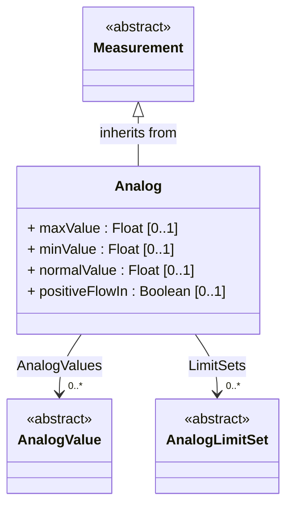
```mermaid
classDiagram
direction TB

class Analog {
+ maxValue : Float [0..1]
+ minValue : Float [0..1]
+ normalValue : Float [0..1]
+ positiveFlowIn : Boolean [0..1]
}

class Measurement {
<<abstract>>
}

Measurement <|-- Analog : inherits from
class AnalogValue {
<<abstract>>
}

Analog --> "0..*" AnalogValue : AnalogValues
class AnalogLimitSet {
<<abstract>>
}

Analog --> "0..*" AnalogLimitSet : LimitSets
```

> **Note:** This class is tagged in this profile with the 'Description' tag. To refer to the full definition of this class as defined in the profile this one depends on visit [Analog](#{cim16v33-description-profile}-Analog).

Analog represents an analog Measurement.

#### Native Members

| name | type | description | mapping |
|------|------|-------------|---------|
| maxValue [0..1] | [Float](#cim16v33-Float) | Normal value range maximum for any of the MeasurementValue.values. Used for scaling, e.g. in bar graphs or of telemetered raw values. | |
| minValue [0..1] | [Float](#cim16v33-Float) | Normal value range minimum for any of the MeasurementValue.values. Used for scaling, e.g. in bar graphs or of telemetered raw values. | |
| normalValue [0..1] | [Float](#cim16v33-Float) | Normal measurement value, e.g., used for percentage calculations. | |
| positiveFlowIn [0..1] | [Boolean](#cim16v33-Boolean) | If true then this measurement is an active power, reactive power or current with the convention that a positive value measured at the Terminal means power is flowing into the related PowerSystemResource. | |
| AnalogValues [0..*] | [AnalogValue](#cim16v33-AnalogValue) | The values connected to this measurement. | |
| LimitSets [0..*] | [AnalogLimitSet](#cim16v33-AnalogLimitSet) | A measurement may have zero or more limit ranges defined for it. | |

#### Inherited Members

| name | type | description | mapping |
|------|------|-------------|---------|
| measurementType [0..1] | [String](#cim16v33-String) | see [Measurement](#cim16v33-Measurement) | |
| phases [0..1] | [PhaseCode](#cim16v33-PhaseCode) | see [Measurement](cim16v33-Measurement) | |
| unitMultiplier [0..1] | [UnitMultiplier](#cim16v33-UnitMultiplier) | see [Measurement](cim16v33-Measurement) | |
| unitSymbol [0..1] | [UnitSymbol](#cim16v33-UnitSymbol) | see [Measurement](cim16v33-Measurement) | |
| Asset [0..1] | [Asset](#cim16v33-Asset) | see [Measurement](cim16v33-Measurement) | |
| Locations [0..*] | [Location](#cim16v33-Location) | see [Measurement](cim16v33-Measurement) | |
| MeasurementCalculatorInput [0..*] | [MeasurementCalculatorInput](#cim16v33-MeasurementCalculatorInput) | see [Measurement](cim16v33-Measurement) | |
| `PowerSystemResource [0..1]` (OfAggregate) | [PowerSystemResource](#cim16v33-PowerSystemResource) | see [Measurement](cim16v33-Measurement) | |
| ProtectiveActionAdjustment [0..*] | [ProtectiveActionAdjustment](#cim16v33-ProtectiveActionAdjustment) | see [Measurement](cim16v33-Measurement) | |
| Terminal [0..1] | [ACDCTerminal](#cim16v33-ACDCTerminal) | see [Measurement](cim16v33-Measurement) | |
| mRID [0..1] | [String](#cim16v33-String) | see [IdentifiedObject](#cim16v33-IdentifiedObject) | |
| aliasName [0..1] | [String](#cim16v33-String) | see [IdentifiedObject](#cim16v33-IdentifiedObject) | |
| description [0..1] | [String](#cim16v33-String) | see [IdentifiedObject](#cim16v33-IdentifiedObject) | |
| name [0..1] | [String](#cim16v33-String) | see [IdentifiedObject](#cim16v33-IdentifiedObject) | |
| DiagramObjects [0..*] | [DiagramObject](#cim16v33-DiagramObject) | see [IdentifiedObject](cim16v33-IdentifiedObject) | |
| Names [0..*] | [Name](#cim16v33-Name) | see [IdentifiedObject](cim16v33-IdentifiedObject) | |

{#cim16v33-AnalogControl}
### AnalogControl

Inheritance path = [Control](#cim16v33-Control) => [IdentifiedObject](#cim16v33-IdentifiedObject)

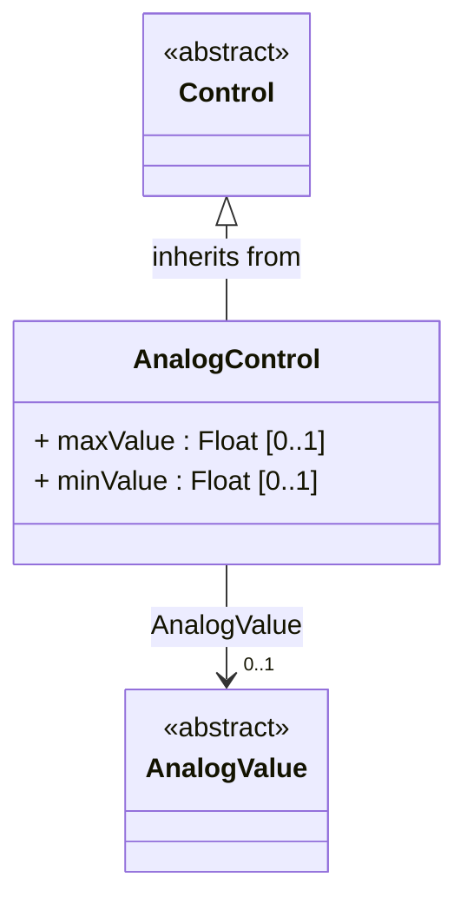
```mermaid
classDiagram
direction TB

class AnalogControl {
+ maxValue : Float [0..1]
+ minValue : Float [0..1]
}

class Control {
<<abstract>>
}

Control <|-- AnalogControl : inherits from
class AnalogValue {
<<abstract>>
}

AnalogControl --> "0..1" AnalogValue : AnalogValue
```

An analog control used for supervisory control.

#### Native Members

| name | type | description | mapping |
|------|------|-------------|---------|
| maxValue [0..1] | [Float](#cim16v33-Float) | Normal value range maximum for any of the Control.value. Used for scaling, e.g. in bar graphs. | |
| minValue [0..1] | [Float](#cim16v33-Float) | Normal value range minimum for any of the Control.value. Used for scaling, e.g. in bar graphs. | |
| AnalogValue [0..1] | [AnalogValue](#cim16v33-AnalogValue) | The MeasurementValue that is controlled. | |

#### Inherited Members

| name | type | description | mapping |
|------|------|-------------|---------|
| controlType [0..1] | [String](#cim16v33-String) | see [Control](#cim16v33-Control) | |
| operationInProgress [0..1] | [Boolean](#cim16v33-Boolean) | see [Control](#cim16v33-Control) | |
| timeStamp [0..1] | [DateTime](#cim16v33-DateTime) | see [Control](#cim16v33-Control) | |
| unitMultiplier [0..1] | [UnitMultiplier](#cim16v33-UnitMultiplier) | see [Control](cim16v33-Control) | |
| unitSymbol [0..1] | [UnitSymbol](#cim16v33-UnitSymbol) | see [Control](cim16v33-Control) | |
| PowerSystemResource [0..1] | [PowerSystemResource](#cim16v33-PowerSystemResource) | see [Control](cim16v33-Control) | |
| RemoteControl [0..1] | [RemoteControl](#cim16v33-RemoteControl) | see [Control](cim16v33-Control) | |
| mRID [0..1] | [String](#cim16v33-String) | see [IdentifiedObject](#cim16v33-IdentifiedObject) | |
| aliasName [0..1] | [String](#cim16v33-String) | see [IdentifiedObject](#cim16v33-IdentifiedObject) | |
| description [0..1] | [String](#cim16v33-String) | see [IdentifiedObject](#cim16v33-IdentifiedObject) | |
| name [0..1] | [String](#cim16v33-String) | see [IdentifiedObject](#cim16v33-IdentifiedObject) | |
| DiagramObjects [0..*] | [DiagramObject](#cim16v33-DiagramObject) | see [IdentifiedObject](cim16v33-IdentifiedObject) | |
| Names [0..*] | [Name](#cim16v33-Name) | see [IdentifiedObject](cim16v33-IdentifiedObject) | |

{#cim16v33-AsynchronousMachine}
### (Description) AsynchronousMachine

Inheritance path = [RotatingMachine](#cim16v33-RotatingMachine) => [RegulatingCondEq](#cim16v33-RegulatingCondEq) => [ConductingEquipment](#cim16v33-ConductingEquipment) => [Equipment](#cim16v33-Equipment) => [PowerSystemResource](#cim16v33-PowerSystemResource) => [IdentifiedObject](#cim16v33-IdentifiedObject)

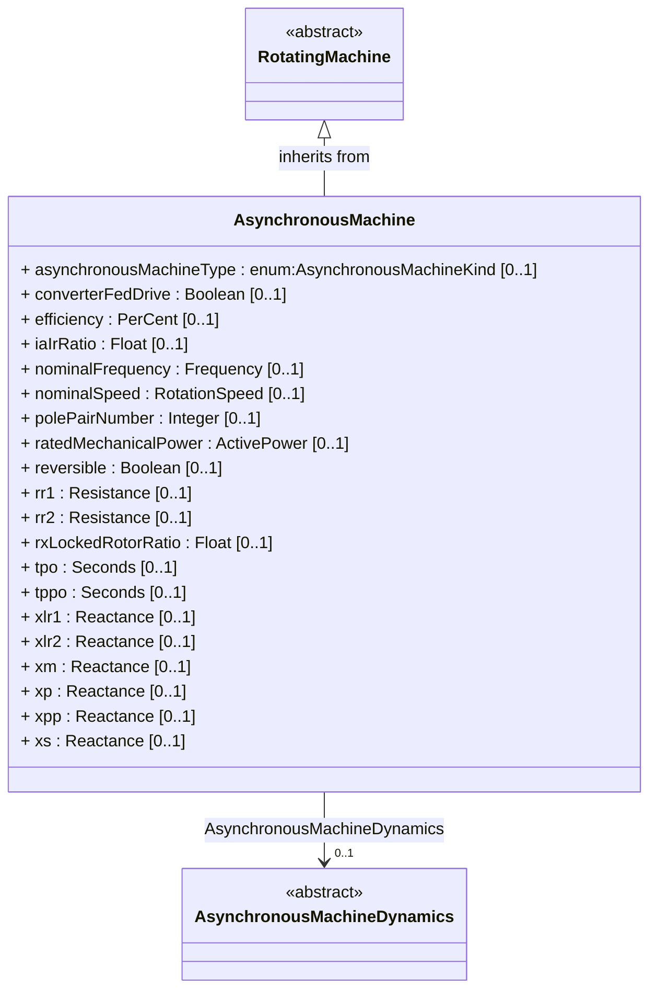
```mermaid
classDiagram
direction TB

class AsynchronousMachine {
+ asynchronousMachineType : enum:AsynchronousMachineKind [0..1]
+ converterFedDrive : Boolean [0..1]
+ efficiency : PerCent [0..1]
+ iaIrRatio : Float [0..1]
+ nominalFrequency : Frequency [0..1]
+ nominalSpeed : RotationSpeed [0..1]
+ polePairNumber : Integer [0..1]
+ ratedMechanicalPower : ActivePower [0..1]
+ reversible : Boolean [0..1]
+ rr1 : Resistance [0..1]
+ rr2 : Resistance [0..1]
+ rxLockedRotorRatio : Float [0..1]
+ tpo : Seconds [0..1]
+ tppo : Seconds [0..1]
+ xlr1 : Reactance [0..1]
+ xlr2 : Reactance [0..1]
+ xm : Reactance [0..1]
+ xp : Reactance [0..1]
+ xpp : Reactance [0..1]
+ xs : Reactance [0..1]
}

class RotatingMachine {
<<abstract>>
}

RotatingMachine <|-- AsynchronousMachine : inherits from
class AsynchronousMachineDynamics {
<<abstract>>
}

AsynchronousMachine --> "0..1" AsynchronousMachineDynamics : AsynchronousMachineDynamics
```

> **Note:** This class is tagged in this profile with the 'Description' tag. To refer to the full definition of this class as defined in the profile this one depends on visit [AsynchronousMachine](#{cim16v33-description-profile}-AsynchronousMachine).

A rotating machine whose shaft rotates asynchronously with the electrical field. Also known as an induction machine with no external connection to the rotor windings, e.g squirrel-cage induction machine.

#### Native Members

| name | type | description | mapping |
|------|------|-------------|---------|
| asynchronousMachineType [0..1] | [AsynchronousMachineKind](#cim16v33-AsynchronousMachineKind) | Indicates the type of Asynchronous Machine (motor or generator). | |
| converterFedDrive [0..1] | [Boolean](#cim16v33-Boolean) | Indicates whether the machine is a converter fed drive. Used for short circuit data exchange according to IEC 60909 | |
| efficiency [0..1] | [PerCent](#cim16v33-PerCent) | Efficiency of the asynchronous machine at nominal operation in percent. Indicator for converter drive motors. Used for short circuit data exchange according to IEC 60909 | |
| iaIrRatio [0..1] | [Float](#cim16v33-Float) | Ratio of locked-rotor current to the rated current of the motor (Ia/Ir). Used for short circuit data exchange according to IEC 60909 | |
| nominalFrequency [0..1] | [Frequency](#cim16v33-Frequency) | Nameplate data indicates if the machine is 50 or 60 Hz. | |
| nominalSpeed [0..1] | [RotationSpeed](#cim16v33-RotationSpeed) | Nameplate data. Depends on the slip and number of pole pairs. | |
| polePairNumber [0..1] | [Integer](#cim16v33-Integer) | Number of pole pairs of stator. Used for short circuit data exchange according to IEC 60909 | |
| ratedMechanicalPower [0..1] | [ActivePower](#cim16v33-ActivePower) | Rated mechanical power (Pr in the IEC 60909-0). Used for short circuit data exchange according to IEC 60909. | |
| reversible [0..1] | [Boolean](#cim16v33-Boolean) | Indicates for converter drive motors if the power can be reversible. Used for short circuit data exchange according to IEC 60909 | |
| rr1 [0..1] | [Resistance](#cim16v33-Resistance) | Damper 1 winding resistance. | |
| rr2 [0..1] | [Resistance](#cim16v33-Resistance) | Damper 2 winding resistance. | |
| rxLockedRotorRatio [0..1] | [Float](#cim16v33-Float) | Locked rotor ratio (R/X). Used for short circuit data exchange according to IEC 60909 | |
| tpo [0..1] | [Seconds](#cim16v33-Seconds) | Transient rotor time constant (greater than tppo). | |
| tppo [0..1] | [Seconds](#cim16v33-Seconds) | Sub-transient rotor time constant (greater than 0). | |
| xlr1 [0..1] | [Reactance](#cim16v33-Reactance) | Damper 1 winding leakage reactance. | |
| xlr2 [0..1] | [Reactance](#cim16v33-Reactance) | Damper 2 winding leakage reactance. | |
| xm [0..1] | [Reactance](#cim16v33-Reactance) | Magnetizing reactance. | |
| xp [0..1] | [Reactance](#cim16v33-Reactance) | Transient reactance (unsaturated) (greater than or equal to xpp). | |
| xpp [0..1] | [Reactance](#cim16v33-Reactance) | Sub-transient reactance (unsaturated) (greather than Xl). | |
| xs [0..1] | [Reactance](#cim16v33-Reactance) | Synchronous reactance (greather than xp). | |
| AsynchronousMachineDynamics [0..1] | [AsynchronousMachineDynamics](#cim16v33-AsynchronousMachineDynamics) | Asynchronous machine dynamics model used to describe dynamic behavior of this asynchronous machine. | |

#### Inherited Members

| name | type | description | mapping |
|------|------|-------------|---------|
| p [0..1] | [ActivePower](#cim16v33-ActivePower) | see [RotatingMachine](cim16v33-RotatingMachine) | |
| q [0..1] | [ReactivePower](#cim16v33-ReactivePower) | see [RotatingMachine](cim16v33-RotatingMachine) | |
| ratedPowerFactor [0..1] | [Float](#cim16v33-Float) | see [RotatingMachine](#cim16v33-RotatingMachine) | |
| ratedS [0..1] | [ApparentPower](#cim16v33-ApparentPower) | see [RotatingMachine](cim16v33-RotatingMachine) | |
| ratedU [0..1] | [Voltage](#cim16v33-Voltage) | see [RotatingMachine](cim16v33-RotatingMachine) | |
| GeneratingUnit [0..1] | [GeneratingUnit](#cim16v33-GeneratingUnit) | see [RotatingMachine](cim16v33-RotatingMachine) | |
| HydroPump [0..1] | [HydroPump](#cim16v33-HydroPump) | see [RotatingMachine](cim16v33-RotatingMachine) | |
| controlEnabled [0..1] | [Boolean](#cim16v33-Boolean) | see [RegulatingCondEq](#cim16v33-RegulatingCondEq) | |
| RegulatingControl [0..1] | [RegulatingControl](#cim16v33-RegulatingControl) | see [RegulatingCondEq](cim16v33-RegulatingCondEq) | |
| BaseVoltage [0..1] | [BaseVoltage](#cim16v33-BaseVoltage) | see [ConductingEquipment](cim16v33-ConductingEquipment) | |
| GroundingAction [0..1] | [GroundAction](#cim16v33-GroundAction) | see [ConductingEquipment](cim16v33-ConductingEquipment) | |
| JumpingAction [0..1] | [JumperAction](#cim16v33-JumperAction) | see [ConductingEquipment](cim16v33-ConductingEquipment) | |
| ProtectionEquipments [0..*] | [ProtectionEquipment](#cim16v33-ProtectionEquipment) | see [ConductingEquipment](cim16v33-ConductingEquipment) | |
| ProtectiveActionAdjustment [0..*] | [ProtectiveActionAdjustment](#cim16v33-ProtectiveActionAdjustment) | see [ConductingEquipment](cim16v33-ConductingEquipment) | |
| SvStatus [0..1] | [SvStatus](#cim16v33-SvStatus) | see [ConductingEquipment](cim16v33-ConductingEquipment) | |
| Terminals [0..*] | [Terminal](#cim16v33-Terminal) | see [ConductingEquipment](cim16v33-ConductingEquipment) | |
| aggregate [0..1] | [Boolean](#cim16v33-Boolean) | see [Equipment](#cim16v33-Equipment) | |
| normallyInService [0..1] | [Boolean](#cim16v33-Boolean) | see [Equipment](#cim16v33-Equipment) | |
| ContingencyEquipment [0..*] | [ContingencyEquipment](#cim16v33-ContingencyEquipment) | see [Equipment](cim16v33-Equipment) | |
| EqiupmentLimitSeriesComponent [0..*] | [EquipmentLimitSeriesComponent](#cim16v33-EquipmentLimitSeriesComponent) | see [Equipment](cim16v33-Equipment) | |
| `EquipmentContainer [0..1]` (OfAggregate) | [EquipmentContainer](#cim16v33-EquipmentContainer) | see [Equipment](cim16v33-Equipment) | |
| Faults [0..*] | [Fault](#cim16v33-Fault) | see [Equipment](cim16v33-Equipment) | |
| `LimitDependencyModel [0..*]` (AggregateOf) | [LimitDependency](#cim16v33-LimitDependency) | see [Equipment](cim16v33-Equipment) | |
| OperationalLimitSet [0..*] | [OperationalLimitSet](#cim16v33-OperationalLimitSet) | see [Equipment](cim16v33-Equipment) | |
| OperationalRestrictions [0..*] | [OperationalRestriction](#cim16v33-OperationalRestriction) | see [Equipment](cim16v33-Equipment) | |
| Outages [0..*] | [Outage](#cim16v33-Outage) | see [Equipment](cim16v33-Equipment) | |
| ProtectiveActionEquipment [0..*] | [ProtectiveActionEquipment](#cim16v33-ProtectiveActionEquipment) | see [Equipment](cim16v33-Equipment) | |
| UsagePoints [0..*] | [UsagePoint](#cim16v33-UsagePoint) | see [Equipment](cim16v33-Equipment) | |
| WeatherStation [0..*] | [WeatherStation](#cim16v33-WeatherStation) | see [Equipment](cim16v33-Equipment) | |
| AssetDatasheet [0..1] | [AssetInfo](#cim16v33-AssetInfo) | see [PowerSystemResource](cim16v33-PowerSystemResource) | |
| Assets [0..*] | [Asset](#cim16v33-Asset) | see [PowerSystemResource](cim16v33-PowerSystemResource) | |
| Controls [0..*] | [Control](#cim16v33-Control) | see [PowerSystemResource](cim16v33-PowerSystemResource) | |
| Location [0..1] | [Location](#cim16v33-Location) | see [PowerSystemResource](cim16v33-PowerSystemResource) | |
| `Measurements [0..*]` (AggregateOf) | [Measurement](#cim16v33-Measurement) | see [PowerSystemResource](cim16v33-PowerSystemResource) | |
| PSRType [0..1] | [PSRType](#cim16v33-PSRType) | see [PowerSystemResource](cim16v33-PowerSystemResource) | |
| ReportingGroup [0..*] | [ReportingGroup](#cim16v33-ReportingGroup) | see [PowerSystemResource](cim16v33-PowerSystemResource) | |
| mRID [0..1] | [String](#cim16v33-String) | see [IdentifiedObject](#cim16v33-IdentifiedObject) | |
| aliasName [0..1] | [String](#cim16v33-String) | see [IdentifiedObject](#cim16v33-IdentifiedObject) | |
| description [0..1] | [String](#cim16v33-String) | see [IdentifiedObject](#cim16v33-IdentifiedObject) | |
| name [0..1] | [String](#cim16v33-String) | see [IdentifiedObject](#cim16v33-IdentifiedObject) | |
| DiagramObjects [0..*] | [DiagramObject](#cim16v33-DiagramObject) | see [IdentifiedObject](cim16v33-IdentifiedObject) | |
| Names [0..*] | [Name](#cim16v33-Name) | see [IdentifiedObject](cim16v33-IdentifiedObject) | |

{#cim16v33-BaseFrequency}
### BaseFrequency

Inheritance path = [IdentifiedObject](#cim16v33-IdentifiedObject)

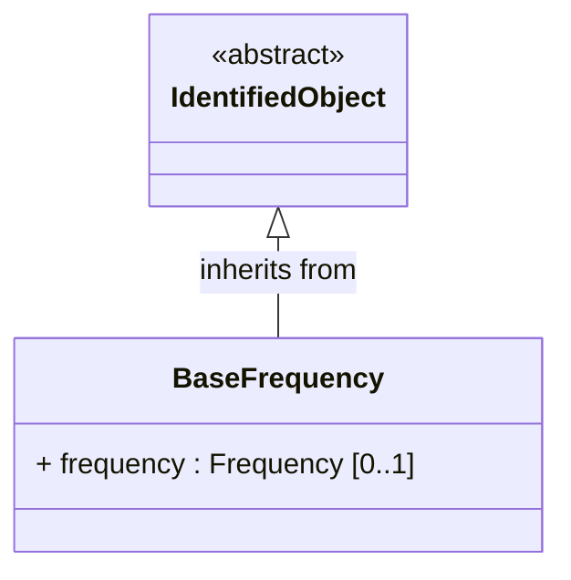
```mermaid
classDiagram
direction TB

class BaseFrequency {
+ frequency : Frequency [0..1]
}

class IdentifiedObject {
<<abstract>>
}

IdentifiedObject <|-- BaseFrequency : inherits from
```

The class describe a base frequency for a power system network. In case of multiple power networks with different frequencies, e.g. 50 or 60 Hertz each network will have it's own base frequency class. Hence it is assumed that power system objects having different base frequencies appear in separate documents where each document has a single base frequency instance.

#### Native Members

| name | type | description | mapping |
|------|------|-------------|---------|
| frequency [0..1] | [Frequency](#cim16v33-Frequency) | The base frequency. | |

#### Inherited Members

| name | type | description | mapping |
|------|------|-------------|---------|
| mRID [0..1] | [String](#cim16v33-String) | see [IdentifiedObject](#cim16v33-IdentifiedObject) | |
| aliasName [0..1] | [String](#cim16v33-String) | see [IdentifiedObject](#cim16v33-IdentifiedObject) | |
| description [0..1] | [String](#cim16v33-String) | see [IdentifiedObject](#cim16v33-IdentifiedObject) | |
| name [0..1] | [String](#cim16v33-String) | see [IdentifiedObject](#cim16v33-IdentifiedObject) | |
| DiagramObjects [0..*] | [DiagramObject](#cim16v33-DiagramObject) | see [IdentifiedObject](cim16v33-IdentifiedObject) | |
| Names [0..*] | [Name](#cim16v33-Name) | see [IdentifiedObject](cim16v33-IdentifiedObject) | |

{#cim16v33-BasePower}
### BasePower

Inheritance path = [IdentifiedObject](#cim16v33-IdentifiedObject)

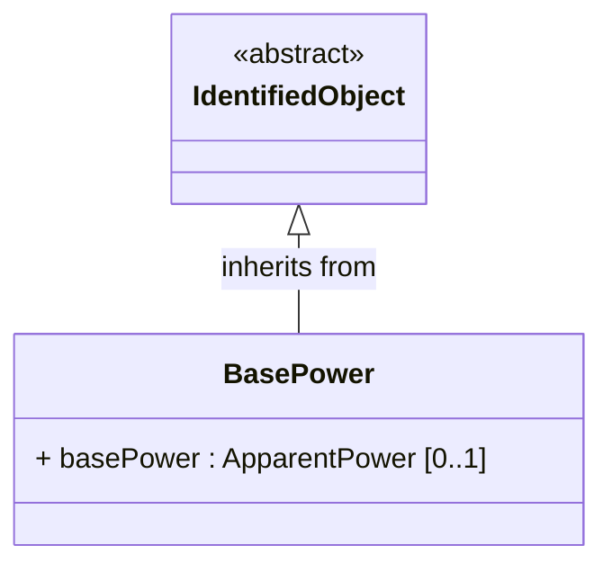
```mermaid
classDiagram
direction TB

class BasePower {
+ basePower : ApparentPower [0..1]
}

class IdentifiedObject {
<<abstract>>
}

IdentifiedObject <|-- BasePower : inherits from
```

The BasePower class defines the base power used in the per unit calculations.

#### Native Members

| name | type | description | mapping |
|------|------|-------------|---------|
| basePower [0..1] | [ApparentPower](#cim16v33-ApparentPower) | Value used as base power. | |

#### Inherited Members

| name | type | description | mapping |
|------|------|-------------|---------|
| mRID [0..1] | [String](#cim16v33-String) | see [IdentifiedObject](#cim16v33-IdentifiedObject) | |
| aliasName [0..1] | [String](#cim16v33-String) | see [IdentifiedObject](#cim16v33-IdentifiedObject) | |
| description [0..1] | [String](#cim16v33-String) | see [IdentifiedObject](#cim16v33-IdentifiedObject) | |
| name [0..1] | [String](#cim16v33-String) | see [IdentifiedObject](#cim16v33-IdentifiedObject) | |
| DiagramObjects [0..*] | [DiagramObject](#cim16v33-DiagramObject) | see [IdentifiedObject](cim16v33-IdentifiedObject) | |
| Names [0..*] | [Name](#cim16v33-Name) | see [IdentifiedObject](cim16v33-IdentifiedObject) | |

{#cim16v33-BaseVoltage}
### BaseVoltage

Inheritance path = [IdentifiedObject](#cim16v33-IdentifiedObject)

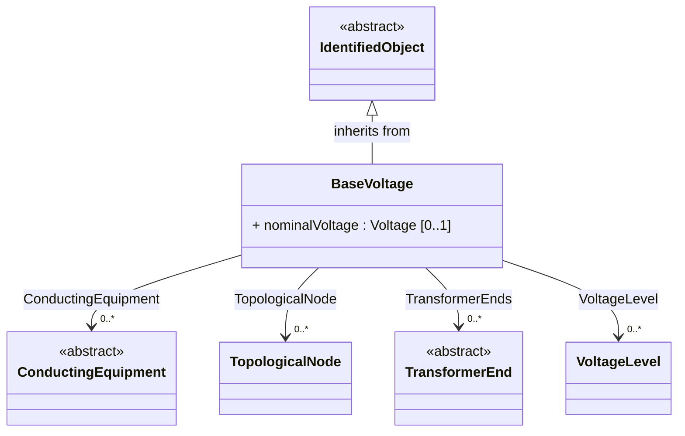
```mermaid
classDiagram
direction TB

class BaseVoltage {
+ nominalVoltage : Voltage [0..1]
}

class IdentifiedObject {
<<abstract>>
}

IdentifiedObject <|-- BaseVoltage : inherits from
class ConductingEquipment {
<<abstract>>
}

BaseVoltage --> "0..*" ConductingEquipment : ConductingEquipment
class TopologicalNode {
}

BaseVoltage --> "0..*" TopologicalNode : TopologicalNode
class TransformerEnd {
<<abstract>>
}

BaseVoltage --> "0..*" TransformerEnd : TransformerEnds
class VoltageLevel {
}

BaseVoltage --> "0..*" VoltageLevel : VoltageLevel
```

Defines a system base voltage which is referenced.

#### Native Members

| name | type | description | mapping |
|------|------|-------------|---------|
| nominalVoltage [0..1] | [Voltage](#cim16v33-Voltage) | The power system resource's base voltage. | |
| ConductingEquipment [0..*] | [ConductingEquipment](#cim16v33-ConductingEquipment) | All conducting equipment with this base voltage. Use only when there is no voltage level container used and only one base voltage applies. For example, not used for transformers. | |
| TopologicalNode [0..*] | [TopologicalNode](#cim16v33-TopologicalNode) | The topological nodes at the base voltage. | |
| TransformerEnds [0..*] | [TransformerEnd](#cim16v33-TransformerEnd) | Transformer ends at the base voltage. This is essential for PU calculation. | |
| VoltageLevel [0..*] | [VoltageLevel](#cim16v33-VoltageLevel) | The voltage levels having this base voltage. | |

#### Inherited Members

| name | type | description | mapping |
|------|------|-------------|---------|
| mRID [0..1] | [String](#cim16v33-String) | see [IdentifiedObject](#cim16v33-IdentifiedObject) | |
| aliasName [0..1] | [String](#cim16v33-String) | see [IdentifiedObject](#cim16v33-IdentifiedObject) | |
| description [0..1] | [String](#cim16v33-String) | see [IdentifiedObject](#cim16v33-IdentifiedObject) | |
| name [0..1] | [String](#cim16v33-String) | see [IdentifiedObject](#cim16v33-IdentifiedObject) | |
| DiagramObjects [0..*] | [DiagramObject](#cim16v33-DiagramObject) | see [IdentifiedObject](cim16v33-IdentifiedObject) | |
| Names [0..*] | [Name](#cim16v33-Name) | see [IdentifiedObject](cim16v33-IdentifiedObject) | |

{#cim16v33-Breaker}
### (Description) Breaker

Inheritance path = [ProtectedSwitch](#cim16v33-ProtectedSwitch) => [Switch](#cim16v33-Switch) => [ConductingEquipment](#cim16v33-ConductingEquipment) => [Equipment](#cim16v33-Equipment) => [PowerSystemResource](#cim16v33-PowerSystemResource) => [IdentifiedObject](#cim16v33-IdentifiedObject)

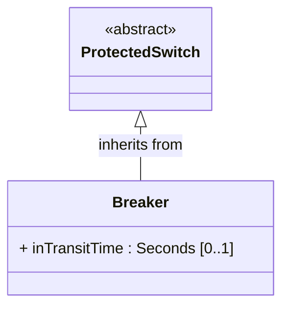
```mermaid
classDiagram
direction TB

class Breaker {
+ inTransitTime : Seconds [0..1]
}

class ProtectedSwitch {
<<abstract>>
}

ProtectedSwitch <|-- Breaker : inherits from
```

> **Note:** This class is tagged in this profile with the 'Description' tag. To refer to the full definition of this class as defined in the profile this one depends on visit [Breaker](#{cim16v33-description-profile}-Breaker).

A mechanical switching device capable of making, carrying, and breaking currents under normal circuit conditions and also making, carrying for a specified time, and breaking currents under specified abnormal circuit conditions e.g. those of short circuit.

#### Native Members

| name | type | description | mapping |
|------|------|-------------|---------|
| inTransitTime [0..1] | [Seconds](#cim16v33-Seconds) | The transition time from open to close. | |

#### Inherited Members

| name | type | description | mapping |
|------|------|-------------|---------|
| breakingCapacity [0..1] | [CurrentFlow](#cim16v33-CurrentFlow) | see [ProtectedSwitch](cim16v33-ProtectedSwitch) | |
| OperatedByProtectionEquipment [0..*] | [ProtectionEquipment](#cim16v33-ProtectionEquipment) | see [ProtectedSwitch](cim16v33-ProtectedSwitch) | |
| `RecloseSequences [0..*]` (AggregateOf) | [RecloseSequence](#cim16v33-RecloseSequence) | see [ProtectedSwitch](cim16v33-ProtectedSwitch) | |
| normalOpen [0..1] | [Boolean](#cim16v33-Boolean) | see [Switch](#cim16v33-Switch) | |
| open [0..1] | [Boolean](#cim16v33-Boolean) | see [Switch](#cim16v33-Switch) | |
| ratedCurrent [0..1] | [CurrentFlow](#cim16v33-CurrentFlow) | see [Switch](cim16v33-Switch) | |
| retained [0..1] | [Boolean](#cim16v33-Boolean) | see [Switch](#cim16v33-Switch) | |
| switchOnCount [0..1] | [Integer](#cim16v33-Integer) | see [Switch](#cim16v33-Switch) | |
| switchOnDate [0..1] | [DateTime](#cim16v33-DateTime) | see [Switch](#cim16v33-Switch) | |
| `CompositeSwitch [0..1]` (OfAggregate) | [CompositeSwitch](#cim16v33-CompositeSwitch) | see [Switch](cim16v33-Switch) | |
| `ConnectDisconnectFunctions [0..*]` (informative) | [ConnectDisconnectFunction](#cim16v33-ConnectDisconnectFunction) | see [Switch](cim16v33-Switch) | |
| Outage [0..1] | [Outage](#cim16v33-Outage) | see [Switch](cim16v33-Switch) | |
| SwitchAction [0..1] | [SwitchAction](#cim16v33-SwitchAction) | see [Switch](cim16v33-Switch) | |
| SwitchPhase [0..*] | [SwitchPhase](#cim16v33-SwitchPhase) | see [Switch](cim16v33-Switch) | |
| SwitchSchedules [0..*] | [SwitchSchedule](#cim16v33-SwitchSchedule) | see [Switch](cim16v33-Switch) | |
| BaseVoltage [0..1] | [BaseVoltage](#cim16v33-BaseVoltage) | see [ConductingEquipment](cim16v33-ConductingEquipment) | |
| GroundingAction [0..1] | [GroundAction](#cim16v33-GroundAction) | see [ConductingEquipment](cim16v33-ConductingEquipment) | |
| JumpingAction [0..1] | [JumperAction](#cim16v33-JumperAction) | see [ConductingEquipment](cim16v33-ConductingEquipment) | |
| ProtectionEquipments [0..*] | [ProtectionEquipment](#cim16v33-ProtectionEquipment) | see [ConductingEquipment](cim16v33-ConductingEquipment) | |
| ProtectiveActionAdjustment [0..*] | [ProtectiveActionAdjustment](#cim16v33-ProtectiveActionAdjustment) | see [ConductingEquipment](cim16v33-ConductingEquipment) | |
| SvStatus [0..1] | [SvStatus](#cim16v33-SvStatus) | see [ConductingEquipment](cim16v33-ConductingEquipment) | |
| Terminals [0..*] | [Terminal](#cim16v33-Terminal) | see [ConductingEquipment](cim16v33-ConductingEquipment) | |
| aggregate [0..1] | [Boolean](#cim16v33-Boolean) | see [Equipment](#cim16v33-Equipment) | |
| normallyInService [0..1] | [Boolean](#cim16v33-Boolean) | see [Equipment](#cim16v33-Equipment) | |
| ContingencyEquipment [0..*] | [ContingencyEquipment](#cim16v33-ContingencyEquipment) | see [Equipment](cim16v33-Equipment) | |
| EqiupmentLimitSeriesComponent [0..*] | [EquipmentLimitSeriesComponent](#cim16v33-EquipmentLimitSeriesComponent) | see [Equipment](cim16v33-Equipment) | |
| `EquipmentContainer [0..1]` (OfAggregate) | [EquipmentContainer](#cim16v33-EquipmentContainer) | see [Equipment](cim16v33-Equipment) | |
| Faults [0..*] | [Fault](#cim16v33-Fault) | see [Equipment](cim16v33-Equipment) | |
| `LimitDependencyModel [0..*]` (AggregateOf) | [LimitDependency](#cim16v33-LimitDependency) | see [Equipment](cim16v33-Equipment) | |
| OperationalLimitSet [0..*] | [OperationalLimitSet](#cim16v33-OperationalLimitSet) | see [Equipment](cim16v33-Equipment) | |
| OperationalRestrictions [0..*] | [OperationalRestriction](#cim16v33-OperationalRestriction) | see [Equipment](cim16v33-Equipment) | |
| Outages [0..*] | [Outage](#cim16v33-Outage) | see [Equipment](cim16v33-Equipment) | |
| ProtectiveActionEquipment [0..*] | [ProtectiveActionEquipment](#cim16v33-ProtectiveActionEquipment) | see [Equipment](cim16v33-Equipment) | |
| UsagePoints [0..*] | [UsagePoint](#cim16v33-UsagePoint) | see [Equipment](cim16v33-Equipment) | |
| WeatherStation [0..*] | [WeatherStation](#cim16v33-WeatherStation) | see [Equipment](cim16v33-Equipment) | |
| AssetDatasheet [0..1] | [AssetInfo](#cim16v33-AssetInfo) | see [PowerSystemResource](cim16v33-PowerSystemResource) | |
| Assets [0..*] | [Asset](#cim16v33-Asset) | see [PowerSystemResource](cim16v33-PowerSystemResource) | |
| Controls [0..*] | [Control](#cim16v33-Control) | see [PowerSystemResource](cim16v33-PowerSystemResource) | |
| Location [0..1] | [Location](#cim16v33-Location) | see [PowerSystemResource](cim16v33-PowerSystemResource) | |
| `Measurements [0..*]` (AggregateOf) | [Measurement](#cim16v33-Measurement) | see [PowerSystemResource](cim16v33-PowerSystemResource) | |
| PSRType [0..1] | [PSRType](#cim16v33-PSRType) | see [PowerSystemResource](cim16v33-PowerSystemResource) | |
| ReportingGroup [0..*] | [ReportingGroup](#cim16v33-ReportingGroup) | see [PowerSystemResource](cim16v33-PowerSystemResource) | |
| mRID [0..1] | [String](#cim16v33-String) | see [IdentifiedObject](#cim16v33-IdentifiedObject) | |
| aliasName [0..1] | [String](#cim16v33-String) | see [IdentifiedObject](#cim16v33-IdentifiedObject) | |
| description [0..1] | [String](#cim16v33-String) | see [IdentifiedObject](#cim16v33-IdentifiedObject) | |
| name [0..1] | [String](#cim16v33-String) | see [IdentifiedObject](#cim16v33-IdentifiedObject) | |
| DiagramObjects [0..*] | [DiagramObject](#cim16v33-DiagramObject) | see [IdentifiedObject](cim16v33-IdentifiedObject) | |
| Names [0..*] | [Name](#cim16v33-Name) | see [IdentifiedObject](cim16v33-IdentifiedObject) | |

{#cim16v33-BusbarSection}
### (Description) BusbarSection

Inheritance path = [Connector](#cim16v33-Connector) => [ConductingEquipment](#cim16v33-ConductingEquipment) => [Equipment](#cim16v33-Equipment) => [PowerSystemResource](#cim16v33-PowerSystemResource) => [IdentifiedObject](#cim16v33-IdentifiedObject)

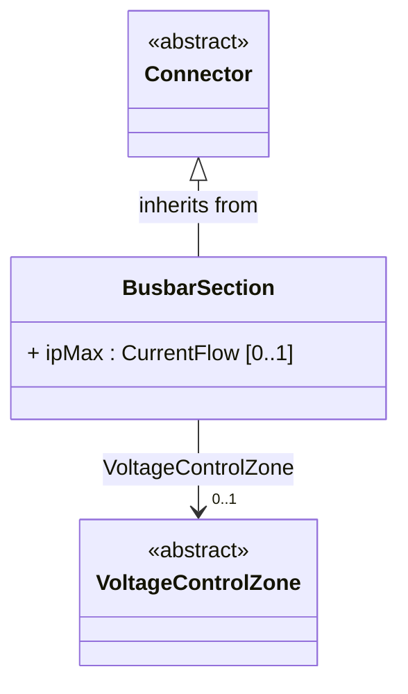
```mermaid
classDiagram
direction TB

class BusbarSection {
+ ipMax : CurrentFlow [0..1]
}

class Connector {
<<abstract>>
}

Connector <|-- BusbarSection : inherits from
class VoltageControlZone {
<<abstract>>
}

BusbarSection --> "0..1" VoltageControlZone : VoltageControlZone
```

> **Note:** This class is tagged in this profile with the 'Description' tag. To refer to the full definition of this class as defined in the profile this one depends on visit [BusbarSection](#{cim16v33-description-profile}-BusbarSection).

A conductor, or group of conductors, with negligible impedance, that serve to connect other conducting equipment within a single substation.

Voltage measurements are typically obtained from VoltageTransformers that are connected to busbar sections. A bus bar section may have many physical terminals but for analysis is modelled with exactly one logical terminal.

#### Native Members

| name | type | description | mapping |
|------|------|-------------|---------|
| ipMax [0..1] | [CurrentFlow](#cim16v33-CurrentFlow) | Maximum allowable peak short-circuit current of busbar (Ipmax in the IEC 60909-0).Mechanical limit of the busbar in the substation itself. Used for short circuit data exchange according to IEC 60909 | |
| VoltageControlZone [0..1] | [VoltageControlZone](#cim16v33-VoltageControlZone) | A VoltageControlZone is controlled by a designated BusbarSection. | |

#### Inherited Members

| name | type | description | mapping |
|------|------|-------------|---------|
| BaseVoltage [0..1] | [BaseVoltage](#cim16v33-BaseVoltage) | see [ConductingEquipment](cim16v33-ConductingEquipment) | |
| GroundingAction [0..1] | [GroundAction](#cim16v33-GroundAction) | see [ConductingEquipment](cim16v33-ConductingEquipment) | |
| JumpingAction [0..1] | [JumperAction](#cim16v33-JumperAction) | see [ConductingEquipment](cim16v33-ConductingEquipment) | |
| ProtectionEquipments [0..*] | [ProtectionEquipment](#cim16v33-ProtectionEquipment) | see [ConductingEquipment](cim16v33-ConductingEquipment) | |
| ProtectiveActionAdjustment [0..*] | [ProtectiveActionAdjustment](#cim16v33-ProtectiveActionAdjustment) | see [ConductingEquipment](cim16v33-ConductingEquipment) | |
| SvStatus [0..1] | [SvStatus](#cim16v33-SvStatus) | see [ConductingEquipment](cim16v33-ConductingEquipment) | |
| Terminals [0..*] | [Terminal](#cim16v33-Terminal) | see [ConductingEquipment](cim16v33-ConductingEquipment) | |
| aggregate [0..1] | [Boolean](#cim16v33-Boolean) | see [Equipment](#cim16v33-Equipment) | |
| normallyInService [0..1] | [Boolean](#cim16v33-Boolean) | see [Equipment](#cim16v33-Equipment) | |
| ContingencyEquipment [0..*] | [ContingencyEquipment](#cim16v33-ContingencyEquipment) | see [Equipment](cim16v33-Equipment) | |
| EqiupmentLimitSeriesComponent [0..*] | [EquipmentLimitSeriesComponent](#cim16v33-EquipmentLimitSeriesComponent) | see [Equipment](cim16v33-Equipment) | |
| `EquipmentContainer [0..1]` (OfAggregate) | [EquipmentContainer](#cim16v33-EquipmentContainer) | see [Equipment](cim16v33-Equipment) | |
| Faults [0..*] | [Fault](#cim16v33-Fault) | see [Equipment](cim16v33-Equipment) | |
| `LimitDependencyModel [0..*]` (AggregateOf) | [LimitDependency](#cim16v33-LimitDependency) | see [Equipment](cim16v33-Equipment) | |
| OperationalLimitSet [0..*] | [OperationalLimitSet](#cim16v33-OperationalLimitSet) | see [Equipment](cim16v33-Equipment) | |
| OperationalRestrictions [0..*] | [OperationalRestriction](#cim16v33-OperationalRestriction) | see [Equipment](cim16v33-Equipment) | |
| Outages [0..*] | [Outage](#cim16v33-Outage) | see [Equipment](cim16v33-Equipment) | |
| ProtectiveActionEquipment [0..*] | [ProtectiveActionEquipment](#cim16v33-ProtectiveActionEquipment) | see [Equipment](cim16v33-Equipment) | |
| UsagePoints [0..*] | [UsagePoint](#cim16v33-UsagePoint) | see [Equipment](cim16v33-Equipment) | |
| WeatherStation [0..*] | [WeatherStation](#cim16v33-WeatherStation) | see [Equipment](cim16v33-Equipment) | |
| AssetDatasheet [0..1] | [AssetInfo](#cim16v33-AssetInfo) | see [PowerSystemResource](cim16v33-PowerSystemResource) | |
| Assets [0..*] | [Asset](#cim16v33-Asset) | see [PowerSystemResource](cim16v33-PowerSystemResource) | |
| Controls [0..*] | [Control](#cim16v33-Control) | see [PowerSystemResource](cim16v33-PowerSystemResource) | |
| Location [0..1] | [Location](#cim16v33-Location) | see [PowerSystemResource](cim16v33-PowerSystemResource) | |
| `Measurements [0..*]` (AggregateOf) | [Measurement](#cim16v33-Measurement) | see [PowerSystemResource](cim16v33-PowerSystemResource) | |
| PSRType [0..1] | [PSRType](#cim16v33-PSRType) | see [PowerSystemResource](cim16v33-PowerSystemResource) | |
| ReportingGroup [0..*] | [ReportingGroup](#cim16v33-ReportingGroup) | see [PowerSystemResource](cim16v33-PowerSystemResource) | |
| mRID [0..1] | [String](#cim16v33-String) | see [IdentifiedObject](#cim16v33-IdentifiedObject) | |
| aliasName [0..1] | [String](#cim16v33-String) | see [IdentifiedObject](#cim16v33-IdentifiedObject) | |
| description [0..1] | [String](#cim16v33-String) | see [IdentifiedObject](#cim16v33-IdentifiedObject) | |
| name [0..1] | [String](#cim16v33-String) | see [IdentifiedObject](#cim16v33-IdentifiedObject) | |
| DiagramObjects [0..*] | [DiagramObject](#cim16v33-DiagramObject) | see [IdentifiedObject](cim16v33-IdentifiedObject) | |
| Names [0..*] | [Name](#cim16v33-Name) | see [IdentifiedObject](cim16v33-IdentifiedObject) | |

{#cim16v33-Recloser}
### (Description) Recloser

Inheritance path = [ProtectedSwitch](#cim16v33-ProtectedSwitch) => [Switch](#cim16v33-Switch) => [ConductingEquipment](#cim16v33-ConductingEquipment) => [Equipment](#cim16v33-Equipment) => [PowerSystemResource](#cim16v33-PowerSystemResource) => [IdentifiedObject](#cim16v33-IdentifiedObject)

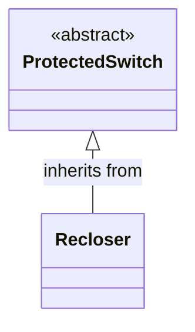
```mermaid
classDiagram
direction TB

class Recloser {
}

class ProtectedSwitch {
<<abstract>>
}

ProtectedSwitch <|-- Recloser : inherits from
```

> **Note:** This class is tagged in this profile with the 'Description' tag. To refer to the full definition of this class as defined in the profile this one depends on visit [Recloser](#{cim16v33-description-profile}-Recloser).

Pole-mounted fault interrupter with built-in phase and ground relays, current transformer (CT), and supplemental controls.

#### Inherited Members

| name | type | description | mapping |
|------|------|-------------|---------|
| breakingCapacity [0..1] | [CurrentFlow](#cim16v33-CurrentFlow) | see [ProtectedSwitch](cim16v33-ProtectedSwitch) | |
| OperatedByProtectionEquipment [0..*] | [ProtectionEquipment](#cim16v33-ProtectionEquipment) | see [ProtectedSwitch](cim16v33-ProtectedSwitch) | |
| `RecloseSequences [0..*]` (AggregateOf) | [RecloseSequence](#cim16v33-RecloseSequence) | see [ProtectedSwitch](cim16v33-ProtectedSwitch) | |
| normalOpen [0..1] | [Boolean](#cim16v33-Boolean) | see [Switch](#cim16v33-Switch) | |
| open [0..1] | [Boolean](#cim16v33-Boolean) | see [Switch](#cim16v33-Switch) | |
| ratedCurrent [0..1] | [CurrentFlow](#cim16v33-CurrentFlow) | see [Switch](cim16v33-Switch) | |
| retained [0..1] | [Boolean](#cim16v33-Boolean) | see [Switch](#cim16v33-Switch) | |
| switchOnCount [0..1] | [Integer](#cim16v33-Integer) | see [Switch](#cim16v33-Switch) | |
| switchOnDate [0..1] | [DateTime](#cim16v33-DateTime) | see [Switch](#cim16v33-Switch) | |
| `CompositeSwitch [0..1]` (OfAggregate) | [CompositeSwitch](#cim16v33-CompositeSwitch) | see [Switch](cim16v33-Switch) | |
| `ConnectDisconnectFunctions [0..*]` (informative) | [ConnectDisconnectFunction](#cim16v33-ConnectDisconnectFunction) | see [Switch](cim16v33-Switch) | |
| Outage [0..1] | [Outage](#cim16v33-Outage) | see [Switch](cim16v33-Switch) | |
| SwitchAction [0..1] | [SwitchAction](#cim16v33-SwitchAction) | see [Switch](cim16v33-Switch) | |
| SwitchPhase [0..*] | [SwitchPhase](#cim16v33-SwitchPhase) | see [Switch](cim16v33-Switch) | |
| SwitchSchedules [0..*] | [SwitchSchedule](#cim16v33-SwitchSchedule) | see [Switch](cim16v33-Switch) | |
| BaseVoltage [0..1] | [BaseVoltage](#cim16v33-BaseVoltage) | see [ConductingEquipment](cim16v33-ConductingEquipment) | |
| GroundingAction [0..1] | [GroundAction](#cim16v33-GroundAction) | see [ConductingEquipment](cim16v33-ConductingEquipment) | |
| JumpingAction [0..1] | [JumperAction](#cim16v33-JumperAction) | see [ConductingEquipment](cim16v33-ConductingEquipment) | |
| ProtectionEquipments [0..*] | [ProtectionEquipment](#cim16v33-ProtectionEquipment) | see [ConductingEquipment](cim16v33-ConductingEquipment) | |
| ProtectiveActionAdjustment [0..*] | [ProtectiveActionAdjustment](#cim16v33-ProtectiveActionAdjustment) | see [ConductingEquipment](cim16v33-ConductingEquipment) | |
| SvStatus [0..1] | [SvStatus](#cim16v33-SvStatus) | see [ConductingEquipment](cim16v33-ConductingEquipment) | |
| Terminals [0..*] | [Terminal](#cim16v33-Terminal) | see [ConductingEquipment](cim16v33-ConductingEquipment) | |
| aggregate [0..1] | [Boolean](#cim16v33-Boolean) | see [Equipment](#cim16v33-Equipment) | |
| normallyInService [0..1] | [Boolean](#cim16v33-Boolean) | see [Equipment](#cim16v33-Equipment) | |
| ContingencyEquipment [0..*] | [ContingencyEquipment](#cim16v33-ContingencyEquipment) | see [Equipment](cim16v33-Equipment) | |
| EqiupmentLimitSeriesComponent [0..*] | [EquipmentLimitSeriesComponent](#cim16v33-EquipmentLimitSeriesComponent) | see [Equipment](cim16v33-Equipment) | |
| `EquipmentContainer [0..1]` (OfAggregate) | [EquipmentContainer](#cim16v33-EquipmentContainer) | see [Equipment](cim16v33-Equipment) | |
| Faults [0..*] | [Fault](#cim16v33-Fault) | see [Equipment](cim16v33-Equipment) | |
| `LimitDependencyModel [0..*]` (AggregateOf) | [LimitDependency](#cim16v33-LimitDependency) | see [Equipment](cim16v33-Equipment) | |
| OperationalLimitSet [0..*] | [OperationalLimitSet](#cim16v33-OperationalLimitSet) | see [Equipment](cim16v33-Equipment) | |
| OperationalRestrictions [0..*] | [OperationalRestriction](#cim16v33-OperationalRestriction) | see [Equipment](cim16v33-Equipment) | |
| Outages [0..*] | [Outage](#cim16v33-Outage) | see [Equipment](cim16v33-Equipment) | |
| ProtectiveActionEquipment [0..*] | [ProtectiveActionEquipment](#cim16v33-ProtectiveActionEquipment) | see [Equipment](cim16v33-Equipment) | |
| UsagePoints [0..*] | [UsagePoint](#cim16v33-UsagePoint) | see [Equipment](cim16v33-Equipment) | |
| WeatherStation [0..*] | [WeatherStation](#cim16v33-WeatherStation) | see [Equipment](cim16v33-Equipment) | |
| AssetDatasheet [0..1] | [AssetInfo](#cim16v33-AssetInfo) | see [PowerSystemResource](cim16v33-PowerSystemResource) | |
| Assets [0..*] | [Asset](#cim16v33-Asset) | see [PowerSystemResource](cim16v33-PowerSystemResource) | |
| Controls [0..*] | [Control](#cim16v33-Control) | see [PowerSystemResource](cim16v33-PowerSystemResource) | |
| Location [0..1] | [Location](#cim16v33-Location) | see [PowerSystemResource](cim16v33-PowerSystemResource) | |
| `Measurements [0..*]` (AggregateOf) | [Measurement](#cim16v33-Measurement) | see [PowerSystemResource](cim16v33-PowerSystemResource) | |
| PSRType [0..1] | [PSRType](#cim16v33-PSRType) | see [PowerSystemResource](cim16v33-PowerSystemResource) | |
| ReportingGroup [0..*] | [ReportingGroup](#cim16v33-ReportingGroup) | see [PowerSystemResource](cim16v33-PowerSystemResource) | |
| mRID [0..1] | [String](#cim16v33-String) | see [IdentifiedObject](#cim16v33-IdentifiedObject) | |
| aliasName [0..1] | [String](#cim16v33-String) | see [IdentifiedObject](#cim16v33-IdentifiedObject) | |
| description [0..1] | [String](#cim16v33-String) | see [IdentifiedObject](#cim16v33-IdentifiedObject) | |
| name [0..1] | [String](#cim16v33-String) | see [IdentifiedObject](#cim16v33-IdentifiedObject) | |
| DiagramObjects [0..*] | [DiagramObject](#cim16v33-DiagramObject) | see [IdentifiedObject](cim16v33-IdentifiedObject) | |
| Names [0..*] | [Name](#cim16v33-Name) | see [IdentifiedObject](cim16v33-IdentifiedObject) | |

{#cim16v33-Sectionaliser}
### Sectionaliser

Inheritance path = [Switch](#cim16v33-Switch) => [ConductingEquipment](#cim16v33-ConductingEquipment) => [Equipment](#cim16v33-Equipment) => [PowerSystemResource](#cim16v33-PowerSystemResource) => [IdentifiedObject](#cim16v33-IdentifiedObject)

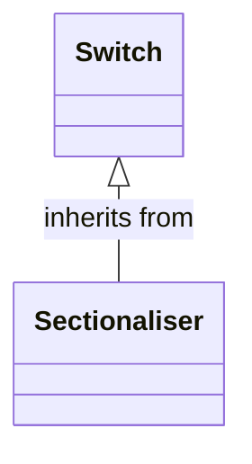
```mermaid
classDiagram
direction TB

class Sectionaliser {
}

class Switch {
}

Switch <|-- Sectionaliser : inherits from
```

Automatic switch that will lock open to isolate a faulted section. It may, or may not, have load breaking capability. Its primary purpose is to provide fault sectionalising at locations where the fault current is either too high, or too low, for proper coordination of fuses.

#### Inherited Members

| name | type | description | mapping |
|------|------|-------------|---------|
| normalOpen [0..1] | [Boolean](#cim16v33-Boolean) | see [Switch](#cim16v33-Switch) | |
| open [0..1] | [Boolean](#cim16v33-Boolean) | see [Switch](#cim16v33-Switch) | |
| ratedCurrent [0..1] | [CurrentFlow](#cim16v33-CurrentFlow) | see [Switch](cim16v33-Switch) | |
| retained [0..1] | [Boolean](#cim16v33-Boolean) | see [Switch](#cim16v33-Switch) | |
| switchOnCount [0..1] | [Integer](#cim16v33-Integer) | see [Switch](#cim16v33-Switch) | |
| switchOnDate [0..1] | [DateTime](#cim16v33-DateTime) | see [Switch](#cim16v33-Switch) | |
| `CompositeSwitch [0..1]` (OfAggregate) | [CompositeSwitch](#cim16v33-CompositeSwitch) | see [Switch](cim16v33-Switch) | |
| `ConnectDisconnectFunctions [0..*]` (informative) | [ConnectDisconnectFunction](#cim16v33-ConnectDisconnectFunction) | see [Switch](cim16v33-Switch) | |
| Outage [0..1] | [Outage](#cim16v33-Outage) | see [Switch](cim16v33-Switch) | |
| SwitchAction [0..1] | [SwitchAction](#cim16v33-SwitchAction) | see [Switch](cim16v33-Switch) | |
| SwitchPhase [0..*] | [SwitchPhase](#cim16v33-SwitchPhase) | see [Switch](cim16v33-Switch) | |
| SwitchSchedules [0..*] | [SwitchSchedule](#cim16v33-SwitchSchedule) | see [Switch](cim16v33-Switch) | |
| BaseVoltage [0..1] | [BaseVoltage](#cim16v33-BaseVoltage) | see [ConductingEquipment](cim16v33-ConductingEquipment) | |
| GroundingAction [0..1] | [GroundAction](#cim16v33-GroundAction) | see [ConductingEquipment](cim16v33-ConductingEquipment) | |
| JumpingAction [0..1] | [JumperAction](#cim16v33-JumperAction) | see [ConductingEquipment](cim16v33-ConductingEquipment) | |
| ProtectionEquipments [0..*] | [ProtectionEquipment](#cim16v33-ProtectionEquipment) | see [ConductingEquipment](cim16v33-ConductingEquipment) | |
| ProtectiveActionAdjustment [0..*] | [ProtectiveActionAdjustment](#cim16v33-ProtectiveActionAdjustment) | see [ConductingEquipment](cim16v33-ConductingEquipment) | |
| SvStatus [0..1] | [SvStatus](#cim16v33-SvStatus) | see [ConductingEquipment](cim16v33-ConductingEquipment) | |
| Terminals [0..*] | [Terminal](#cim16v33-Terminal) | see [ConductingEquipment](cim16v33-ConductingEquipment) | |
| aggregate [0..1] | [Boolean](#cim16v33-Boolean) | see [Equipment](#cim16v33-Equipment) | |
| normallyInService [0..1] | [Boolean](#cim16v33-Boolean) | see [Equipment](#cim16v33-Equipment) | |
| ContingencyEquipment [0..*] | [ContingencyEquipment](#cim16v33-ContingencyEquipment) | see [Equipment](cim16v33-Equipment) | |
| EqiupmentLimitSeriesComponent [0..*] | [EquipmentLimitSeriesComponent](#cim16v33-EquipmentLimitSeriesComponent) | see [Equipment](cim16v33-Equipment) | |
| `EquipmentContainer [0..1]` (OfAggregate) | [EquipmentContainer](#cim16v33-EquipmentContainer) | see [Equipment](cim16v33-Equipment) | |
| Faults [0..*] | [Fault](#cim16v33-Fault) | see [Equipment](cim16v33-Equipment) | |
| `LimitDependencyModel [0..*]` (AggregateOf) | [LimitDependency](#cim16v33-LimitDependency) | see [Equipment](cim16v33-Equipment) | |
| OperationalLimitSet [0..*] | [OperationalLimitSet](#cim16v33-OperationalLimitSet) | see [Equipment](cim16v33-Equipment) | |
| OperationalRestrictions [0..*] | [OperationalRestriction](#cim16v33-OperationalRestriction) | see [Equipment](cim16v33-Equipment) | |
| Outages [0..*] | [Outage](#cim16v33-Outage) | see [Equipment](cim16v33-Equipment) | |
| ProtectiveActionEquipment [0..*] | [ProtectiveActionEquipment](#cim16v33-ProtectiveActionEquipment) | see [Equipment](cim16v33-Equipment) | |
| UsagePoints [0..*] | [UsagePoint](#cim16v33-UsagePoint) | see [Equipment](cim16v33-Equipment) | |
| WeatherStation [0..*] | [WeatherStation](#cim16v33-WeatherStation) | see [Equipment](cim16v33-Equipment) | |
| AssetDatasheet [0..1] | [AssetInfo](#cim16v33-AssetInfo) | see [PowerSystemResource](cim16v33-PowerSystemResource) | |
| Assets [0..*] | [Asset](#cim16v33-Asset) | see [PowerSystemResource](cim16v33-PowerSystemResource) | |
| Controls [0..*] | [Control](#cim16v33-Control) | see [PowerSystemResource](cim16v33-PowerSystemResource) | |
| Location [0..1] | [Location](#cim16v33-Location) | see [PowerSystemResource](cim16v33-PowerSystemResource) | |
| `Measurements [0..*]` (AggregateOf) | [Measurement](#cim16v33-Measurement) | see [PowerSystemResource](cim16v33-PowerSystemResource) | |
| PSRType [0..1] | [PSRType](#cim16v33-PSRType) | see [PowerSystemResource](cim16v33-PowerSystemResource) | |
| ReportingGroup [0..*] | [ReportingGroup](#cim16v33-ReportingGroup) | see [PowerSystemResource](cim16v33-PowerSystemResource) | |
| mRID [0..1] | [String](#cim16v33-String) | see [IdentifiedObject](#cim16v33-IdentifiedObject) | |
| aliasName [0..1] | [String](#cim16v33-String) | see [IdentifiedObject](#cim16v33-IdentifiedObject) | |
| description [0..1] | [String](#cim16v33-String) | see [IdentifiedObject](#cim16v33-IdentifiedObject) | |
| name [0..1] | [String](#cim16v33-String) | see [IdentifiedObject](#cim16v33-IdentifiedObject) | |
| DiagramObjects [0..*] | [DiagramObject](#cim16v33-DiagramObject) | see [IdentifiedObject](cim16v33-IdentifiedObject) | |
| Names [0..*] | [Name](#cim16v33-Name) | see [IdentifiedObject](cim16v33-IdentifiedObject) | |

{#cim16v33-ShortCircuitTest}
### ShortCircuitTest

Inheritance path = [TransformerTest](#cim16v33-TransformerTest) => [IdentifiedObject](#cim16v33-IdentifiedObject)

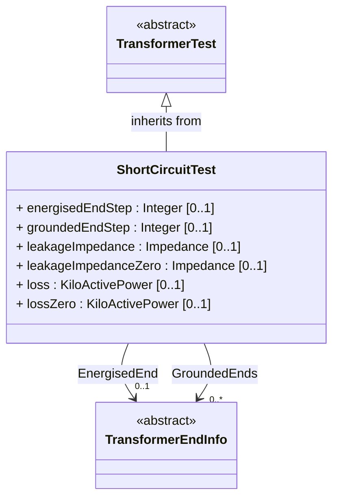
```mermaid
classDiagram
direction TB

class ShortCircuitTest {
+ energisedEndStep : Integer [0..1]
+ groundedEndStep : Integer [0..1]
+ leakageImpedance : Impedance [0..1]
+ leakageImpedanceZero : Impedance [0..1]
+ loss : KiloActivePower [0..1]
+ lossZero : KiloActivePower [0..1]
}

class TransformerTest {
<<abstract>>
}

TransformerTest <|-- ShortCircuitTest : inherits from
class TransformerEndInfo {
<<abstract>>
}

ShortCircuitTest --> "0..1" TransformerEndInfo : EnergisedEnd
class TransformerEndInfo {
<<abstract>>
}

ShortCircuitTest --> "0..*" TransformerEndInfo : GroundedEnds
```

Short-circuit test results determine mesh impedance parameters. They include load losses and leakage impedances. For three-phase windings, the excitation can be a positive sequence (the default) or a zero sequence. There shall be at least one grounded winding.

#### Native Members

| name | type | description | mapping |
|------|------|-------------|---------|
| energisedEndStep [0..1] | [Integer](#cim16v33-Integer) | Tap step number for the energised end of the test pair. | |
| groundedEndStep [0..1] | [Integer](#cim16v33-Integer) | Tap step number for the grounded end of the test pair. | |
| leakageImpedance [0..1] | [Impedance](#cim16v33-Impedance) | Leakage impedance measured from a positive-sequence or single-phase short-circuit test. | |
| leakageImpedanceZero [0..1] | [Impedance](#cim16v33-Impedance) | Leakage impedance measured from a zero-sequence short-circuit test. | |
| loss [0..1] | [KiloActivePower](#cim16v33-KiloActivePower) | Load losses from a positive-sequence or single-phase short-circuit test. | |
| lossZero [0..1] | [KiloActivePower](#cim16v33-KiloActivePower) | Load losses from a zero-sequence short-circuit test. | |
| EnergisedEnd [0..1] | [TransformerEndInfo](#cim16v33-TransformerEndInfo) | Transformer end that voltage is applied to in this short-circuit test. The test voltage is chosen to induce rated current in the energised end. | |
| GroundedEnds [0..*] | [TransformerEndInfo](#cim16v33-TransformerEndInfo) | All ends short-circuited in this short-circuit test. | |

#### Inherited Members

| name | type | description | mapping |
|------|------|-------------|---------|
| basePower [0..1] | [ApparentPower](#cim16v33-ApparentPower) | see [TransformerTest](cim16v33-TransformerTest) | |
| temperature [0..1] | [Temperature](#cim16v33-Temperature) | see [TransformerTest](cim16v33-TransformerTest) | |
| mRID [0..1] | [String](#cim16v33-String) | see [IdentifiedObject](#cim16v33-IdentifiedObject) | |
| aliasName [0..1] | [String](#cim16v33-String) | see [IdentifiedObject](#cim16v33-IdentifiedObject) | |
| description [0..1] | [String](#cim16v33-String) | see [IdentifiedObject](#cim16v33-IdentifiedObject) | |
| name [0..1] | [String](#cim16v33-String) | see [IdentifiedObject](#cim16v33-IdentifiedObject) | |
| DiagramObjects [0..*] | [DiagramObject](#cim16v33-DiagramObject) | see [IdentifiedObject](cim16v33-IdentifiedObject) | |
| Names [0..*] | [Name](#cim16v33-Name) | see [IdentifiedObject](cim16v33-IdentifiedObject) | |

{#cim16v33-SolarGeneratingUnit}
### (Description) SolarGeneratingUnit

Inheritance path = [GeneratingUnit](#cim16v33-GeneratingUnit) => [Equipment](#cim16v33-Equipment) => [PowerSystemResource](#cim16v33-PowerSystemResource) => [IdentifiedObject](#cim16v33-IdentifiedObject)

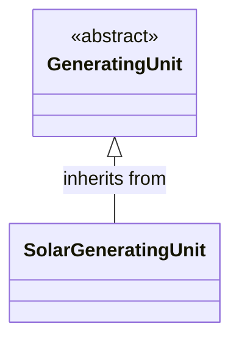
```mermaid
classDiagram
direction TB

class SolarGeneratingUnit {
}

class GeneratingUnit {
<<abstract>>
}

GeneratingUnit <|-- SolarGeneratingUnit : inherits from
```

> **Note:** This class is tagged in this profile with the 'Description' tag. To refer to the full definition of this class as defined in the profile this one depends on visit [SolarGeneratingUnit](#{cim16v33-description-profile}-SolarGeneratingUnit).

A solar thermal generating unit.

#### Inherited Members

| name | type | description | mapping |
|------|------|-------------|---------|
| allocSpinResP [0..1] | [ActivePower](#cim16v33-ActivePower) | see [GeneratingUnit](cim16v33-GeneratingUnit) | |
| autoCntrlMarginP [0..1] | [ActivePower](#cim16v33-ActivePower) | see [GeneratingUnit](cim16v33-GeneratingUnit) | |
| baseP [0..1] | [ActivePower](#cim16v33-ActivePower) | see [GeneratingUnit](cim16v33-GeneratingUnit) | |
| controlDeadband [0..1] | [ActivePower](#cim16v33-ActivePower) | see [GeneratingUnit](cim16v33-GeneratingUnit) | |
| controlPulseHigh [0..1] | [Seconds](#cim16v33-Seconds) | see [GeneratingUnit](cim16v33-GeneratingUnit) | |
| controlPulseLow [0..1] | [Seconds](#cim16v33-Seconds) | see [GeneratingUnit](cim16v33-GeneratingUnit) | |
| controlResponseRate [0..1] | [ActivePowerChangeRate](#cim16v33-ActivePowerChangeRate) | see [GeneratingUnit](cim16v33-GeneratingUnit) | |
| efficiency [0..1] | [PerCent](#cim16v33-PerCent) | see [GeneratingUnit](cim16v33-GeneratingUnit) | |
| genControlMode [0..1] | [GeneratorControlMode](#cim16v33-GeneratorControlMode) | see [GeneratingUnit](cim16v33-GeneratingUnit) | |
| genControlSource [0..1] | [GeneratorControlSource](#cim16v33-GeneratorControlSource) | see [GeneratingUnit](cim16v33-GeneratingUnit) | |
| governorMPL [0..1] | [PU](#cim16v33-PU) | see [GeneratingUnit](cim16v33-GeneratingUnit) | |
| governorSCD [0..1] | [PerCent](#cim16v33-PerCent) | see [GeneratingUnit](cim16v33-GeneratingUnit) | |
| highControlLimit [0..1] | [ActivePower](#cim16v33-ActivePower) | see [GeneratingUnit](cim16v33-GeneratingUnit) | |
| initialP [0..1] | [ActivePower](#cim16v33-ActivePower) | see [GeneratingUnit](cim16v33-GeneratingUnit) | |
| longPF [0..1] | [Float](#cim16v33-Float) | see [GeneratingUnit](#cim16v33-GeneratingUnit) | |
| lowControlLimit [0..1] | [ActivePower](#cim16v33-ActivePower) | see [GeneratingUnit](cim16v33-GeneratingUnit) | |
| lowerRampRate [0..1] | [ActivePowerChangeRate](#cim16v33-ActivePowerChangeRate) | see [GeneratingUnit](cim16v33-GeneratingUnit) | |
| maxEconomicP [0..1] | [ActivePower](#cim16v33-ActivePower) | see [GeneratingUnit](cim16v33-GeneratingUnit) | |
| maximumAllowableSpinningReserve [0..1] | [ActivePower](#cim16v33-ActivePower) | see [GeneratingUnit](cim16v33-GeneratingUnit) | |
| maxOperatingP [0..1] | [ActivePower](#cim16v33-ActivePower) | see [GeneratingUnit](cim16v33-GeneratingUnit) | |
| minEconomicP [0..1] | [ActivePower](#cim16v33-ActivePower) | see [GeneratingUnit](cim16v33-GeneratingUnit) | |
| minimumOffTime [0..1] | [Seconds](#cim16v33-Seconds) | see [GeneratingUnit](cim16v33-GeneratingUnit) | |
| minOperatingP [0..1] | [ActivePower](#cim16v33-ActivePower) | see [GeneratingUnit](cim16v33-GeneratingUnit) | |
| modelDetail [0..1] | [Classification](#cim16v33-Classification) | see [GeneratingUnit](cim16v33-GeneratingUnit) | |
| nominalP [0..1] | [ActivePower](#cim16v33-ActivePower) | see [GeneratingUnit](cim16v33-GeneratingUnit) | |
| normalPF [0..1] | [Float](#cim16v33-Float) | see [GeneratingUnit](#cim16v33-GeneratingUnit) | |
| penaltyFactor [0..1] | [Float](#cim16v33-Float) | see [GeneratingUnit](#cim16v33-GeneratingUnit) | |
| raiseRampRate [0..1] | [ActivePowerChangeRate](#cim16v33-ActivePowerChangeRate) | see [GeneratingUnit](cim16v33-GeneratingUnit) | |
| ratedGrossMaxP [0..1] | [ActivePower](#cim16v33-ActivePower) | see [GeneratingUnit](cim16v33-GeneratingUnit) | |
| ratedGrossMinP [0..1] | [ActivePower](#cim16v33-ActivePower) | see [GeneratingUnit](cim16v33-GeneratingUnit) | |
| ratedNetMaxP [0..1] | [ActivePower](#cim16v33-ActivePower) | see [GeneratingUnit](cim16v33-GeneratingUnit) | |
| shortPF [0..1] | [Float](#cim16v33-Float) | see [GeneratingUnit](#cim16v33-GeneratingUnit) | |
| startupCost [0..1] | [Money](#cim16v33-Money) | see [GeneratingUnit](cim16v33-GeneratingUnit) | |
| startupTime [0..1] | [Seconds](#cim16v33-Seconds) | see [GeneratingUnit](cim16v33-GeneratingUnit) | |
| tieLinePF [0..1] | [Float](#cim16v33-Float) | see [GeneratingUnit](#cim16v33-GeneratingUnit) | |
| totalEfficiency [0..1] | [PerCent](#cim16v33-PerCent) | see [GeneratingUnit](cim16v33-GeneratingUnit) | |
| variableCost [0..1] | [Money](#cim16v33-Money) | see [GeneratingUnit](cim16v33-GeneratingUnit) | |
| ControlAreaGeneratingUnit [0..*] | [ControlAreaGeneratingUnit](#cim16v33-ControlAreaGeneratingUnit) | see [GeneratingUnit](cim16v33-GeneratingUnit) | |
| `GenUnitOpCostCurves [0..*]` (AggregateOf) | [GenUnitOpCostCurve](#cim16v33-GenUnitOpCostCurve) | see [GeneratingUnit](cim16v33-GeneratingUnit) | |
| `GenUnitOpSchedule [0..1]` (AggregateOf) | [GenUnitOpSchedule](#cim16v33-GenUnitOpSchedule) | see [GeneratingUnit](cim16v33-GeneratingUnit) | |
| `GrossToNetActivePowerCurves [0..*]` (AggregateOf) | [GrossToNetActivePowerCurve](#cim16v33-GrossToNetActivePowerCurve) | see [GeneratingUnit](cim16v33-GeneratingUnit) | |
| RotatingMachine [0..*] | [RotatingMachine](#cim16v33-RotatingMachine) | see [GeneratingUnit](cim16v33-GeneratingUnit) | |
| aggregate [0..1] | [Boolean](#cim16v33-Boolean) | see [Equipment](#cim16v33-Equipment) | |
| normallyInService [0..1] | [Boolean](#cim16v33-Boolean) | see [Equipment](#cim16v33-Equipment) | |
| ContingencyEquipment [0..*] | [ContingencyEquipment](#cim16v33-ContingencyEquipment) | see [Equipment](cim16v33-Equipment) | |
| EqiupmentLimitSeriesComponent [0..*] | [EquipmentLimitSeriesComponent](#cim16v33-EquipmentLimitSeriesComponent) | see [Equipment](cim16v33-Equipment) | |
| `EquipmentContainer [0..1]` (OfAggregate) | [EquipmentContainer](#cim16v33-EquipmentContainer) | see [Equipment](cim16v33-Equipment) | |
| Faults [0..*] | [Fault](#cim16v33-Fault) | see [Equipment](cim16v33-Equipment) | |
| `LimitDependencyModel [0..*]` (AggregateOf) | [LimitDependency](#cim16v33-LimitDependency) | see [Equipment](cim16v33-Equipment) | |
| OperationalLimitSet [0..*] | [OperationalLimitSet](#cim16v33-OperationalLimitSet) | see [Equipment](cim16v33-Equipment) | |
| OperationalRestrictions [0..*] | [OperationalRestriction](#cim16v33-OperationalRestriction) | see [Equipment](cim16v33-Equipment) | |
| Outages [0..*] | [Outage](#cim16v33-Outage) | see [Equipment](cim16v33-Equipment) | |
| ProtectiveActionEquipment [0..*] | [ProtectiveActionEquipment](#cim16v33-ProtectiveActionEquipment) | see [Equipment](cim16v33-Equipment) | |
| UsagePoints [0..*] | [UsagePoint](#cim16v33-UsagePoint) | see [Equipment](cim16v33-Equipment) | |
| WeatherStation [0..*] | [WeatherStation](#cim16v33-WeatherStation) | see [Equipment](cim16v33-Equipment) | |
| AssetDatasheet [0..1] | [AssetInfo](#cim16v33-AssetInfo) | see [PowerSystemResource](cim16v33-PowerSystemResource) | |
| Assets [0..*] | [Asset](#cim16v33-Asset) | see [PowerSystemResource](cim16v33-PowerSystemResource) | |
| Controls [0..*] | [Control](#cim16v33-Control) | see [PowerSystemResource](cim16v33-PowerSystemResource) | |
| Location [0..1] | [Location](#cim16v33-Location) | see [PowerSystemResource](cim16v33-PowerSystemResource) | |
| `Measurements [0..*]` (AggregateOf) | [Measurement](#cim16v33-Measurement) | see [PowerSystemResource](cim16v33-PowerSystemResource) | |
| PSRType [0..1] | [PSRType](#cim16v33-PSRType) | see [PowerSystemResource](cim16v33-PowerSystemResource) | |
| ReportingGroup [0..*] | [ReportingGroup](#cim16v33-ReportingGroup) | see [PowerSystemResource](cim16v33-PowerSystemResource) | |
| mRID [0..1] | [String](#cim16v33-String) | see [IdentifiedObject](#cim16v33-IdentifiedObject) | |
| aliasName [0..1] | [String](#cim16v33-String) | see [IdentifiedObject](#cim16v33-IdentifiedObject) | |
| description [0..1] | [String](#cim16v33-String) | see [IdentifiedObject](#cim16v33-IdentifiedObject) | |
| name [0..1] | [String](#cim16v33-String) | see [IdentifiedObject](#cim16v33-IdentifiedObject) | |
| DiagramObjects [0..*] | [DiagramObject](#cim16v33-DiagramObject) | see [IdentifiedObject](cim16v33-IdentifiedObject) | |
| Names [0..*] | [Name](#cim16v33-Name) | see [IdentifiedObject](cim16v33-IdentifiedObject) | |

{#cim16v33-SubGeographicalRegion}
### (Description) SubGeographicalRegion

Inheritance path = [IdentifiedObject](#cim16v33-IdentifiedObject)

```mermaid
classDiagram
direction TB

class SubGeographicalRegion {
}

class IdentifiedObject {
<<abstract>>
}

IdentifiedObject <|-- SubGeographicalRegion : inherits from
class DCLine {
<<abstract>>
}

SubGeographicalRegion --> "0..*" DCLine : DCLines
class Line {
<<abstract>>
}

SubGeographicalRegion --> "0..*" Line : Lines
class GeographicalRegion {
<<abstract>>
}

SubGeographicalRegion --> "0..1" GeographicalRegion : Region
class Substation {
}

SubGeographicalRegion --> "0..*" Substation : Substations
```

> **Note:** This class is tagged in this profile with the 'Description' tag. To refer to the full definition of this class as defined in the profile this one depends on visit [SubGeographicalRegion](#{cim16v33-description-profile}-SubGeographicalRegion).

A subset of a geographical region of a power system network model.

#### Native Members

| name | type | description | mapping |
|------|------|-------------|---------|
| DCLines [0..*] | [DCLine](#cim16v33-DCLine) | The DC lines in this sub-geographical region. | |
| `Lines [0..*]` (AggregateOf) | [Line](#cim16v33-Line) | The lines within the sub-geographical region. | |
| `Region [0..1]` (OfAggregate) | [GeographicalRegion](#cim16v33-GeographicalRegion) | The geographical region to which this sub-geographical region is within. | |
| `Substations [0..*]` (AggregateOf) | [Substation](#cim16v33-Substation) | The substations in this sub-geographical region. | |

#### Inherited Members

| name | type | description | mapping |
|------|------|-------------|---------|
| mRID [0..1] | [String](#cim16v33-String) | see [IdentifiedObject](#cim16v33-IdentifiedObject) | |
| aliasName [0..1] | [String](#cim16v33-String) | see [IdentifiedObject](#cim16v33-IdentifiedObject) | |
| description [0..1] | [String](#cim16v33-String) | see [IdentifiedObject](#cim16v33-IdentifiedObject) | |
| name [0..1] | [String](#cim16v33-String) | see [IdentifiedObject](#cim16v33-IdentifiedObject) | |
| DiagramObjects [0..*] | [DiagramObject](#cim16v33-DiagramObject) | see [IdentifiedObject](cim16v33-IdentifiedObject) | |
| Names [0..*] | [Name](#cim16v33-Name) | see [IdentifiedObject](cim16v33-IdentifiedObject) | |

{#cim16v33-Substation}
### (Description) Substation

Inheritance path = [EquipmentContainer](#cim16v33-EquipmentContainer) => [ConnectivityNodeContainer](#cim16v33-ConnectivityNodeContainer) => [PowerSystemResource](#cim16v33-PowerSystemResource) => [IdentifiedObject](#cim16v33-IdentifiedObject)

```mermaid
classDiagram
direction TB

class Substation {
}

class EquipmentContainer {
<<abstract>>
}

EquipmentContainer <|-- Substation : inherits from
class Bay {
<<abstract>>
}

Substation --> "0..*" Bay : Bays
class DCConverterUnit {
<<abstract>>
}

Substation --> "0..*" DCConverterUnit : DCConverterUnit
class SubGeographicalRegion {
}

Substation --> "0..1" SubGeographicalRegion : Region
class VoltageLevel {
}

Substation --> "0..*" VoltageLevel : VoltageLevels
```

> **Note:** This class is tagged in this profile with the 'Description' tag. To refer to the full definition of this class as defined in the profile this one depends on visit [Substation](#{cim16v33-description-profile}-Substation).

A collection of equipment for purposes other than generation or utilization, through which electric energy in bulk is passed for the purposes of switching or modifying its characteristics.

#### Native Members

| name | type | description | mapping |
|------|------|-------------|---------|
| `Bays [0..*]` (AggregateOf) | [Bay](#cim16v33-Bay) | Bays contained in the substation. | |
| `DCConverterUnit [0..*]` (AggregateOf) | [DCConverterUnit](#cim16v33-DCConverterUnit) | The DC converter unit belonging of the substation. | |
| `Region [0..1]` (OfAggregate) | [SubGeographicalRegion](#cim16v33-SubGeographicalRegion) | The SubGeographicalRegion containing the substation. | |
| `VoltageLevels [0..*]` (AggregateOf) | [VoltageLevel](#cim16v33-VoltageLevel) | The voltage levels within this substation. | |

#### Inherited Members

| name | type | description | mapping |
|------|------|-------------|---------|
| `Equipments [0..*]` (AggregateOf) | [Equipment](#cim16v33-Equipment) | see [EquipmentContainer](cim16v33-EquipmentContainer) | |
| ConnectivityNodes [0..*] | [ConnectivityNode](#cim16v33-ConnectivityNode) | see [ConnectivityNodeContainer](cim16v33-ConnectivityNodeContainer) | |
| TopologicalNode [0..*] | [TopologicalNode](#cim16v33-TopologicalNode) | see [ConnectivityNodeContainer](cim16v33-ConnectivityNodeContainer) | |
| AssetDatasheet [0..1] | [AssetInfo](#cim16v33-AssetInfo) | see [PowerSystemResource](cim16v33-PowerSystemResource) | |
| Assets [0..*] | [Asset](#cim16v33-Asset) | see [PowerSystemResource](cim16v33-PowerSystemResource) | |
| Controls [0..*] | [Control](#cim16v33-Control) | see [PowerSystemResource](cim16v33-PowerSystemResource) | |
| Location [0..1] | [Location](#cim16v33-Location) | see [PowerSystemResource](cim16v33-PowerSystemResource) | |
| `Measurements [0..*]` (AggregateOf) | [Measurement](#cim16v33-Measurement) | see [PowerSystemResource](cim16v33-PowerSystemResource) | |
| PSRType [0..1] | [PSRType](#cim16v33-PSRType) | see [PowerSystemResource](cim16v33-PowerSystemResource) | |
| ReportingGroup [0..*] | [ReportingGroup](#cim16v33-ReportingGroup) | see [PowerSystemResource](cim16v33-PowerSystemResource) | |
| mRID [0..1] | [String](#cim16v33-String) | see [IdentifiedObject](#cim16v33-IdentifiedObject) | |
| aliasName [0..1] | [String](#cim16v33-String) | see [IdentifiedObject](#cim16v33-IdentifiedObject) | |
| description [0..1] | [String](#cim16v33-String) | see [IdentifiedObject](#cim16v33-IdentifiedObject) | |
| name [0..1] | [String](#cim16v33-String) | see [IdentifiedObject](#cim16v33-IdentifiedObject) | |
| DiagramObjects [0..*] | [DiagramObject](#cim16v33-DiagramObject) | see [IdentifiedObject](cim16v33-IdentifiedObject) | |
| Names [0..*] | [Name](#cim16v33-Name) | see [IdentifiedObject](cim16v33-IdentifiedObject) | |

{#cim16v33-SurgeArrester}
### SurgeArrester

Inheritance path = [AuxiliaryEquipment](#cim16v33-AuxiliaryEquipment) => [Equipment](#cim16v33-Equipment) => [PowerSystemResource](#cim16v33-PowerSystemResource) => [IdentifiedObject](#cim16v33-IdentifiedObject)

```mermaid
classDiagram
direction TB

class SurgeArrester {
}

class AuxiliaryEquipment {
<<abstract>>
}

AuxiliaryEquipment <|-- SurgeArrester : inherits from
```

Shunt device, installed on the network, usually in the proximity of electrical equipment in order to protect the said equipment against transient voltage transients caused by lightning or switching activity.

#### Inherited Members

| name | type | description | mapping |
|------|------|-------------|---------|
| Terminal [0..1] | [Terminal](#cim16v33-Terminal) | see [AuxiliaryEquipment](cim16v33-AuxiliaryEquipment) | |
| aggregate [0..1] | [Boolean](#cim16v33-Boolean) | see [Equipment](#cim16v33-Equipment) | |
| normallyInService [0..1] | [Boolean](#cim16v33-Boolean) | see [Equipment](#cim16v33-Equipment) | |
| ContingencyEquipment [0..*] | [ContingencyEquipment](#cim16v33-ContingencyEquipment) | see [Equipment](cim16v33-Equipment) | |
| EqiupmentLimitSeriesComponent [0..*] | [EquipmentLimitSeriesComponent](#cim16v33-EquipmentLimitSeriesComponent) | see [Equipment](cim16v33-Equipment) | |
| `EquipmentContainer [0..1]` (OfAggregate) | [EquipmentContainer](#cim16v33-EquipmentContainer) | see [Equipment](cim16v33-Equipment) | |
| Faults [0..*] | [Fault](#cim16v33-Fault) | see [Equipment](cim16v33-Equipment) | |
| `LimitDependencyModel [0..*]` (AggregateOf) | [LimitDependency](#cim16v33-LimitDependency) | see [Equipment](cim16v33-Equipment) | |
| OperationalLimitSet [0..*] | [OperationalLimitSet](#cim16v33-OperationalLimitSet) | see [Equipment](cim16v33-Equipment) | |
| OperationalRestrictions [0..*] | [OperationalRestriction](#cim16v33-OperationalRestriction) | see [Equipment](cim16v33-Equipment) | |
| Outages [0..*] | [Outage](#cim16v33-Outage) | see [Equipment](cim16v33-Equipment) | |
| ProtectiveActionEquipment [0..*] | [ProtectiveActionEquipment](#cim16v33-ProtectiveActionEquipment) | see [Equipment](cim16v33-Equipment) | |
| UsagePoints [0..*] | [UsagePoint](#cim16v33-UsagePoint) | see [Equipment](cim16v33-Equipment) | |
| WeatherStation [0..*] | [WeatherStation](#cim16v33-WeatherStation) | see [Equipment](cim16v33-Equipment) | |
| AssetDatasheet [0..1] | [AssetInfo](#cim16v33-AssetInfo) | see [PowerSystemResource](cim16v33-PowerSystemResource) | |
| Assets [0..*] | [Asset](#cim16v33-Asset) | see [PowerSystemResource](cim16v33-PowerSystemResource) | |
| Controls [0..*] | [Control](#cim16v33-Control) | see [PowerSystemResource](cim16v33-PowerSystemResource) | |
| Location [0..1] | [Location](#cim16v33-Location) | see [PowerSystemResource](cim16v33-PowerSystemResource) | |
| `Measurements [0..*]` (AggregateOf) | [Measurement](#cim16v33-Measurement) | see [PowerSystemResource](cim16v33-PowerSystemResource) | |
| PSRType [0..1] | [PSRType](#cim16v33-PSRType) | see [PowerSystemResource](cim16v33-PowerSystemResource) | |
| ReportingGroup [0..*] | [ReportingGroup](#cim16v33-ReportingGroup) | see [PowerSystemResource](cim16v33-PowerSystemResource) | |
| mRID [0..1] | [String](#cim16v33-String) | see [IdentifiedObject](#cim16v33-IdentifiedObject) | |
| aliasName [0..1] | [String](#cim16v33-String) | see [IdentifiedObject](#cim16v33-IdentifiedObject) | |
| description [0..1] | [String](#cim16v33-String) | see [IdentifiedObject](#cim16v33-IdentifiedObject) | |
| name [0..1] | [String](#cim16v33-String) | see [IdentifiedObject](#cim16v33-IdentifiedObject) | |
| DiagramObjects [0..*] | [DiagramObject](#cim16v33-DiagramObject) | see [IdentifiedObject](cim16v33-IdentifiedObject) | |
| Names [0..*] | [Name](#cim16v33-Name) | see [IdentifiedObject](cim16v33-IdentifiedObject) | |

{#cim16v33-SvInjection}
### SvInjection

Inheritance path = [StateVariable](#cim16v33-StateVariable)

```mermaid
classDiagram
direction TB

class SvInjection {
+ pInjection : ActivePower [0..1]
+ qInjection : ReactivePower [0..1]
}

class StateVariable {
<<abstract>>
}

StateVariable <|-- SvInjection : inherits from
class TopologicalNode {
}

SvInjection --> "0..1" TopologicalNode : TopologicalNode
```

The SvInjection is reporting the calculated bus injection minus the sum of the terminal flows. The terminal flow is positive out from the bus (load sign convention) and bus injection has positive flow into the bus. SvInjection may have the remainder after state estimation or slack after power flow calculation.

#### Native Members

| name | type | description | mapping |
|------|------|-------------|---------|
| pInjection [0..1] | [ActivePower](#cim16v33-ActivePower) | The active power mismatch between calculated injection and initial injection. Positive sign means injection into the TopologicalNode (bus). | |
| qInjection [0..1] | [ReactivePower](#cim16v33-ReactivePower) | The reactive power mismatch between calculated injection and initial injection. Positive sign means injection into the TopologicalNode (bus). | |
| TopologicalNode [0..1] | [TopologicalNode](#cim16v33-TopologicalNode) | The topological node associated with the flow injection state variable. | |

#### Inherited Members

| name | type | description | mapping |
|------|------|-------------|---------|

{#cim16v33-SvPowerFlow}
### SvPowerFlow

Inheritance path = [StateVariable](#cim16v33-StateVariable)

```mermaid
classDiagram
direction TB

class SvPowerFlow {
+ p : ActivePower [0..1]
+ q : ReactivePower [0..1]
}

class StateVariable {
<<abstract>>
}

StateVariable <|-- SvPowerFlow : inherits from
class Terminal {
}

SvPowerFlow --> "0..1" Terminal : Terminal
```

State variable for power flow. Load convention is used for flow direction. This means flow out from the TopologicalNode into the equipment is positive.

#### Native Members

| name | type | description | mapping |
|------|------|-------------|---------|
| p [0..1] | [ActivePower](#cim16v33-ActivePower) | The active power flow. Load sign convention is used, i.e. positive sign means flow out from a TopologicalNode (bus) into the conducting equipment. | |
| q [0..1] | [ReactivePower](#cim16v33-ReactivePower) | The reactive power flow. Load sign convention is used, i.e. positive sign means flow out from a TopologicalNode (bus) into the conducting equipment. | |
| Terminal [0..1] | [Terminal](#cim16v33-Terminal) | The terminal associated with the power flow state variable. | |

#### Inherited Members

| name | type | description | mapping |
|------|------|-------------|---------|

{#cim16v33-SvShuntCompensatorSections}
### SvShuntCompensatorSections

Inheritance path = [StateVariable](#cim16v33-StateVariable)

```mermaid
classDiagram
direction TB

class SvShuntCompensatorSections {
+ sections : Float [0..1]
}

class StateVariable {
<<abstract>>
}

StateVariable <|-- SvShuntCompensatorSections : inherits from
class ShuntCompensator {
<<abstract>>
}

SvShuntCompensatorSections --> "0..1" ShuntCompensator : ShuntCompensator
```

State variable for the number of sections in service for a shunt compensator.

#### Native Members

| name | type | description | mapping |
|------|------|-------------|---------|
| sections [0..1] | [Float](#cim16v33-Float) | The number of sections in service as a continous variable. To get integer value scale with ShuntCompensator.bPerSection. | |
| ShuntCompensator [0..1] | [ShuntCompensator](#cim16v33-ShuntCompensator) | The shunt compensator for which the state applies. | |

#### Inherited Members

| name | type | description | mapping |
|------|------|-------------|---------|

{#cim16v33-SvStatus}
### SvStatus

Inheritance path = [StateVariable](#cim16v33-StateVariable)

```mermaid
classDiagram
direction TB

class SvStatus {
+ inService : Boolean [0..1]
}

class StateVariable {
<<abstract>>
}

StateVariable <|-- SvStatus : inherits from
class ConductingEquipment {
<<abstract>>
}

SvStatus --> "0..1" ConductingEquipment : ConductingEquipment
```

State variable for status.

#### Native Members

| name | type | description | mapping |
|------|------|-------------|---------|
| inService [0..1] | [Boolean](#cim16v33-Boolean) | The in service status as a result of topology processing. | |
| ConductingEquipment [0..1] | [ConductingEquipment](#cim16v33-ConductingEquipment) | The conducting equipment associated with the status state variable. | |

#### Inherited Members

| name | type | description | mapping |
|------|------|-------------|---------|

{#cim16v33-SvTapStep}
### SvTapStep

Inheritance path = [StateVariable](#cim16v33-StateVariable)

```mermaid
classDiagram
direction TB

class SvTapStep {
+ position : Float [0..1]
}

class StateVariable {
<<abstract>>
}

StateVariable <|-- SvTapStep : inherits from
class TapChanger {
<<abstract>>
}

SvTapStep --> "0..1" TapChanger : TapChanger
```

State variable for transformer tap step.

#### Native Members

| name | type | description | mapping |
|------|------|-------------|---------|
| position [0..1] | [Float](#cim16v33-Float) | The floating point tap position. This is not the tap ratio, but rather the tap step position as defined by the related tap changer model and normally is constrained to be within the range of minimum and maximum tap positions. | |
| TapChanger [0..1] | [TapChanger](#cim16v33-TapChanger) | The tap changer associated with the tap step state. | |

#### Inherited Members

| name | type | description | mapping |
|------|------|-------------|---------|

{#cim16v33-SvVoltage}
### SvVoltage

Inheritance path = [StateVariable](#cim16v33-StateVariable)

```mermaid
classDiagram
direction TB

class SvVoltage {
+ angle : AngleDegrees [0..1]
+ v : Voltage [0..1]
}

class StateVariable {
<<abstract>>
}

StateVariable <|-- SvVoltage : inherits from
class TopologicalNode {
}

SvVoltage --> "0..1" TopologicalNode : TopologicalNode
```

State variable for voltage.

#### Native Members

| name | type | description | mapping |
|------|------|-------------|---------|
| angle [0..1] | [AngleDegrees](#cim16v33-AngleDegrees) | The voltage angle of the topological node complex voltage with respect to system reference. | |
| v [0..1] | [Voltage](#cim16v33-Voltage) | The voltage magnitude of the topological node. | |
| TopologicalNode [0..1] | [TopologicalNode](#cim16v33-TopologicalNode) | The topological node associated with the voltage state. | |

#### Inherited Members

| name | type | description | mapping |
|------|------|-------------|---------|

{#cim16v33-Switch}
### (Description) Switch

Inheritance path = [ConductingEquipment](#cim16v33-ConductingEquipment) => [Equipment](#cim16v33-Equipment) => [PowerSystemResource](#cim16v33-PowerSystemResource) => [IdentifiedObject](#cim16v33-IdentifiedObject)

```mermaid
classDiagram
direction TB

class Switch {
+ normalOpen : Boolean [0..1]
+ open : Boolean [0..1]
+ ratedCurrent : CurrentFlow [0..1]
+ retained : Boolean [0..1]
+ switchOnCount : Integer [0..1]
+ switchOnDate : DateTime [0..1]
}

class ConductingEquipment {
<<abstract>>
}

ConductingEquipment <|-- Switch : inherits from
class CompositeSwitch {
<<abstract>>
}

Switch --> "0..1" CompositeSwitch : CompositeSwitch
class ConnectDisconnectFunction {
<<abstract>>
}

Switch --> "0..*" ConnectDisconnectFunction : ConnectDisconnectFunctions
class Outage {
<<abstract>>
}

Switch --> "0..1" Outage : Outage
class SwitchAction {
<<abstract>>
}

Switch --> "0..1" SwitchAction : SwitchAction
class SwitchPhase {
}

Switch --> "0..*" SwitchPhase : SwitchPhase
class SwitchSchedule {
<<abstract>>
}

Switch --> "0..*" SwitchSchedule : SwitchSchedules
```

> **Note:** This class is tagged in this profile with the 'Description' tag. To refer to the full definition of this class as defined in the profile this one depends on visit [Switch](#{cim16v33-description-profile}-Switch).

A generic device designed to close, or open, or both, one or more electric circuits. All switches are two terminal devices including grounding switches.

#### Native Members

| name | type | description | mapping |
|------|------|-------------|---------|
| normalOpen [0..1] | [Boolean](#cim16v33-Boolean) | The attribute is used in cases when no Measurement for the status value is present. If the Switch has a status measurement the Discrete.normalValue is expected to match with the Switch.normalOpen. | |
| open [0..1] | [Boolean](#cim16v33-Boolean) | The attribute tells if the switch is considered open when used as input to topology processing. | |
| ratedCurrent [0..1] | [CurrentFlow](#cim16v33-CurrentFlow) | The maximum continuous current carrying capacity in amps governed by the device material and construction. | |
| retained [0..1] | [Boolean](#cim16v33-Boolean) | Branch is retained in a bus branch model. The flow through retained switches will normally be calculated in power flow. | |
| switchOnCount [0..1] | [Integer](#cim16v33-Integer) | The switch on count since the switch was last reset or initialized. | |
| switchOnDate [0..1] | [DateTime](#cim16v33-DateTime) | The date and time when the switch was last switched on. | |
| `CompositeSwitch [0..1]` (OfAggregate) | [CompositeSwitch](#cim16v33-CompositeSwitch) | Composite switch to which this Switch belongs. | |
| `ConnectDisconnectFunctions [0..*]` (informative) | [ConnectDisconnectFunction](#cim16v33-ConnectDisconnectFunction) | | |
| Outage [0..1] | [Outage](#cim16v33-Outage) | Current outage of this protective device. | |
| SwitchAction [0..1] | [SwitchAction](#cim16v33-SwitchAction) | Action changing status of this switch. | |
| SwitchPhase [0..*] | [SwitchPhase](#cim16v33-SwitchPhase) | The individual switch phases for the switch. | |
| SwitchSchedules [0..*] | [SwitchSchedule](#cim16v33-SwitchSchedule) | A Switch can be associated with SwitchSchedules. | |

#### Inherited Members

| name | type | description | mapping |
|------|------|-------------|---------|
| BaseVoltage [0..1] | [BaseVoltage](#cim16v33-BaseVoltage) | see [ConductingEquipment](cim16v33-ConductingEquipment) | |
| GroundingAction [0..1] | [GroundAction](#cim16v33-GroundAction) | see [ConductingEquipment](cim16v33-ConductingEquipment) | |
| JumpingAction [0..1] | [JumperAction](#cim16v33-JumperAction) | see [ConductingEquipment](cim16v33-ConductingEquipment) | |
| ProtectionEquipments [0..*] | [ProtectionEquipment](#cim16v33-ProtectionEquipment) | see [ConductingEquipment](cim16v33-ConductingEquipment) | |
| ProtectiveActionAdjustment [0..*] | [ProtectiveActionAdjustment](#cim16v33-ProtectiveActionAdjustment) | see [ConductingEquipment](cim16v33-ConductingEquipment) | |
| SvStatus [0..1] | [SvStatus](#cim16v33-SvStatus) | see [ConductingEquipment](cim16v33-ConductingEquipment) | |
| Terminals [0..*] | [Terminal](#cim16v33-Terminal) | see [ConductingEquipment](cim16v33-ConductingEquipment) | |
| aggregate [0..1] | [Boolean](#cim16v33-Boolean) | see [Equipment](#cim16v33-Equipment) | |
| normallyInService [0..1] | [Boolean](#cim16v33-Boolean) | see [Equipment](#cim16v33-Equipment) | |
| ContingencyEquipment [0..*] | [ContingencyEquipment](#cim16v33-ContingencyEquipment) | see [Equipment](cim16v33-Equipment) | |
| EqiupmentLimitSeriesComponent [0..*] | [EquipmentLimitSeriesComponent](#cim16v33-EquipmentLimitSeriesComponent) | see [Equipment](cim16v33-Equipment) | |
| `EquipmentContainer [0..1]` (OfAggregate) | [EquipmentContainer](#cim16v33-EquipmentContainer) | see [Equipment](cim16v33-Equipment) | |
| Faults [0..*] | [Fault](#cim16v33-Fault) | see [Equipment](cim16v33-Equipment) | |
| `LimitDependencyModel [0..*]` (AggregateOf) | [LimitDependency](#cim16v33-LimitDependency) | see [Equipment](cim16v33-Equipment) | |
| OperationalLimitSet [0..*] | [OperationalLimitSet](#cim16v33-OperationalLimitSet) | see [Equipment](cim16v33-Equipment) | |
| OperationalRestrictions [0..*] | [OperationalRestriction](#cim16v33-OperationalRestriction) | see [Equipment](cim16v33-Equipment) | |
| Outages [0..*] | [Outage](#cim16v33-Outage) | see [Equipment](cim16v33-Equipment) | |
| ProtectiveActionEquipment [0..*] | [ProtectiveActionEquipment](#cim16v33-ProtectiveActionEquipment) | see [Equipment](cim16v33-Equipment) | |
| UsagePoints [0..*] | [UsagePoint](#cim16v33-UsagePoint) | see [Equipment](cim16v33-Equipment) | |
| WeatherStation [0..*] | [WeatherStation](#cim16v33-WeatherStation) | see [Equipment](cim16v33-Equipment) | |
| AssetDatasheet [0..1] | [AssetInfo](#cim16v33-AssetInfo) | see [PowerSystemResource](cim16v33-PowerSystemResource) | |
| Assets [0..*] | [Asset](#cim16v33-Asset) | see [PowerSystemResource](cim16v33-PowerSystemResource) | |
| Controls [0..*] | [Control](#cim16v33-Control) | see [PowerSystemResource](cim16v33-PowerSystemResource) | |
| Location [0..1] | [Location](#cim16v33-Location) | see [PowerSystemResource](cim16v33-PowerSystemResource) | |
| `Measurements [0..*]` (AggregateOf) | [Measurement](#cim16v33-Measurement) | see [PowerSystemResource](cim16v33-PowerSystemResource) | |
| PSRType [0..1] | [PSRType](#cim16v33-PSRType) | see [PowerSystemResource](cim16v33-PowerSystemResource) | |
| ReportingGroup [0..*] | [ReportingGroup](#cim16v33-ReportingGroup) | see [PowerSystemResource](cim16v33-PowerSystemResource) | |
| mRID [0..1] | [String](#cim16v33-String) | see [IdentifiedObject](#cim16v33-IdentifiedObject) | |
| aliasName [0..1] | [String](#cim16v33-String) | see [IdentifiedObject](#cim16v33-IdentifiedObject) | |
| description [0..1] | [String](#cim16v33-String) | see [IdentifiedObject](#cim16v33-IdentifiedObject) | |
| name [0..1] | [String](#cim16v33-String) | see [IdentifiedObject](#cim16v33-IdentifiedObject) | |
| DiagramObjects [0..*] | [DiagramObject](#cim16v33-DiagramObject) | see [IdentifiedObject](cim16v33-IdentifiedObject) | |
| Names [0..*] | [Name](#cim16v33-Name) | see [IdentifiedObject](cim16v33-IdentifiedObject) | |

{#cim16v33-SwitchInfo}
### (Description) SwitchInfo

Inheritance path = [AssetInfo](#cim16v33-AssetInfo) => [IdentifiedObject](#cim16v33-IdentifiedObject)

```mermaid
classDiagram
direction TB

class SwitchInfo {
+ breakingCapacity : CurrentFlow [0..1]
+ isSinglePhase : Boolean [0..1]
+ isUnganged : Boolean [0..1]
+ ratedCurrent : CurrentFlow [0..1]
+ ratedVoltage : Voltage [0..1]
}

class AssetInfo {
<<abstract>>
}

AssetInfo <|-- SwitchInfo : inherits from
```

> **Note:** This class is tagged in this profile with the 'Description' tag. To refer to the full definition of this class as defined in the profile this one depends on visit [SwitchInfo](#{cim16v33-description-profile}-SwitchInfo).

Switch data.

#### Native Members

| name | type | description | mapping |
|------|------|-------------|---------|
| breakingCapacity [0..1] | [CurrentFlow](#cim16v33-CurrentFlow) | The maximum fault current a breaking device can break safely under prescribed conditions of use. | |
| isSinglePhase [0..1] | [Boolean](#cim16v33-Boolean) | If true, it is a single phase switch. | |
| isUnganged [0..1] | [Boolean](#cim16v33-Boolean) | If true, the switch is not ganged (i.e., a switch phase may be operated separately from other phases). | |
| ratedCurrent [0..1] | [CurrentFlow](#cim16v33-CurrentFlow) | Rated current. | |
| ratedVoltage [0..1] | [Voltage](#cim16v33-Voltage) | Rated voltage. | |

#### Inherited Members

| name | type | description | mapping |
|------|------|-------------|---------|
| AssetModel [0..1] | [AssetModel](#cim16v33-AssetModel) | see [AssetInfo](cim16v33-AssetInfo) | |
| Assets [0..*] | [Asset](#cim16v33-Asset) | see [AssetInfo](cim16v33-AssetInfo) | |
| PowerSystemResources [0..*] | [PowerSystemResource](#cim16v33-PowerSystemResource) | see [AssetInfo](cim16v33-AssetInfo) | |
| mRID [0..1] | [String](#cim16v33-String) | see [IdentifiedObject](#cim16v33-IdentifiedObject) | |
| aliasName [0..1] | [String](#cim16v33-String) | see [IdentifiedObject](#cim16v33-IdentifiedObject) | |
| description [0..1] | [String](#cim16v33-String) | see [IdentifiedObject](#cim16v33-IdentifiedObject) | |
| name [0..1] | [String](#cim16v33-String) | see [IdentifiedObject](#cim16v33-IdentifiedObject) | |
| DiagramObjects [0..*] | [DiagramObject](#cim16v33-DiagramObject) | see [IdentifiedObject](cim16v33-IdentifiedObject) | |
| Names [0..*] | [Name](#cim16v33-Name) | see [IdentifiedObject](cim16v33-IdentifiedObject) | |

{#cim16v33-SwitchPhase}
### (Description) SwitchPhase

Inheritance path = [PowerSystemResource](#cim16v33-PowerSystemResource) => [IdentifiedObject](#cim16v33-IdentifiedObject)

```mermaid
classDiagram
direction TB

class SwitchPhase {
+ closed : Boolean [0..1]
+ normalOpen : Boolean [0..1]
+ phaseSide1 : enum:SinglePhaseKind [0..1]
+ phaseSide2 : enum:SinglePhaseKind [0..1]
}

class PowerSystemResource {
<<abstract>>
}

PowerSystemResource <|-- SwitchPhase : inherits from
class Switch {
}

SwitchPhase --> "0..1" Switch : Switch
```

> **Note:** This class is tagged in this profile with the 'Description' tag. To refer to the full definition of this class as defined in the profile this one depends on visit [SwitchPhase](#{cim16v33-description-profile}-SwitchPhase).

Single phase of a multi-phase switch when its attributes might be different per phase.

#### Native Members

| name | type | description | mapping |
|------|------|-------------|---------|
| closed [0..1] | [Boolean](#cim16v33-Boolean) | The attribute tells if the switch is considered closed when used as input to topology processing. | |
| normalOpen [0..1] | [Boolean](#cim16v33-Boolean) | Used in cases when no Measurement for the status value is present. If the SwitchPhase has a status measurement the Discrete.normalValue is expected to match with this value. | |
| phaseSide1 [0..1] | [SinglePhaseKind](#cim16v33-SinglePhaseKind) | Phase of this SwitchPhase on the side with terminal sequence number equal 1. Should be a phase contained in that terminal&rsquo;s phases attribute. | |
| phaseSide2 [0..1] | [SinglePhaseKind](#cim16v33-SinglePhaseKind) | Phase of this SwitchPhase on the side with terminal sequence number equal 2. Should be a phase contained in that terminal&rsquo;s Terminal.phases attribute. | |
| Switch [0..1] | [Switch](#cim16v33-Switch) | The switch of the switch phase. | |

#### Inherited Members

| name | type | description | mapping |
|------|------|-------------|---------|
| AssetDatasheet [0..1] | [AssetInfo](#cim16v33-AssetInfo) | see [PowerSystemResource](cim16v33-PowerSystemResource) | |
| Assets [0..*] | [Asset](#cim16v33-Asset) | see [PowerSystemResource](cim16v33-PowerSystemResource) | |
| Controls [0..*] | [Control](#cim16v33-Control) | see [PowerSystemResource](cim16v33-PowerSystemResource) | |
| Location [0..1] | [Location](#cim16v33-Location) | see [PowerSystemResource](cim16v33-PowerSystemResource) | |
| `Measurements [0..*]` (AggregateOf) | [Measurement](#cim16v33-Measurement) | see [PowerSystemResource](cim16v33-PowerSystemResource) | |
| PSRType [0..1] | [PSRType](#cim16v33-PSRType) | see [PowerSystemResource](cim16v33-PowerSystemResource) | |
| ReportingGroup [0..*] | [ReportingGroup](#cim16v33-ReportingGroup) | see [PowerSystemResource](cim16v33-PowerSystemResource) | |
| mRID [0..1] | [String](#cim16v33-String) | see [IdentifiedObject](#cim16v33-IdentifiedObject) | |
| aliasName [0..1] | [String](#cim16v33-String) | see [IdentifiedObject](#cim16v33-IdentifiedObject) | |
| description [0..1] | [String](#cim16v33-String) | see [IdentifiedObject](#cim16v33-IdentifiedObject) | |
| name [0..1] | [String](#cim16v33-String) | see [IdentifiedObject](#cim16v33-IdentifiedObject) | |
| DiagramObjects [0..*] | [DiagramObject](#cim16v33-DiagramObject) | see [IdentifiedObject](cim16v33-IdentifiedObject) | |
| Names [0..*] | [Name](#cim16v33-Name) | see [IdentifiedObject](cim16v33-IdentifiedObject) | |

{#cim16v33-SynchronousMachine}
### (Description) SynchronousMachine

Inheritance path = [RotatingMachine](#cim16v33-RotatingMachine) => [RegulatingCondEq](#cim16v33-RegulatingCondEq) => [ConductingEquipment](#cim16v33-ConductingEquipment) => [Equipment](#cim16v33-Equipment) => [PowerSystemResource](#cim16v33-PowerSystemResource) => [IdentifiedObject](#cim16v33-IdentifiedObject)

```mermaid
classDiagram
direction TB

class SynchronousMachine {
+ aVRToManualLag : Seconds [0..1]
+ aVRToManualLead : Seconds [0..1]
+ baseQ : ReactivePower [0..1]
+ condenserP : ActivePower [0..1]
+ coolantCondition : Float [0..1]
+ coolantType : enum:CoolantType [0..1]
+ earthing : Boolean [0..1]
+ earthingStarPointR : Resistance [0..1]
+ earthingStarPointX : Reactance [0..1]
+ ikk : CurrentFlow [0..1]
+ manualToAVR : Seconds [0..1]
+ maxQ : ReactivePower [0..1]
+ maxU : Voltage [0..1]
+ minQ : ReactivePower [0..1]
+ minU : Voltage [0..1]
+ mu : Float [0..1]
+ operatingMode : enum:SynchronousMachineOperatingMode [0..1]
+ qPercent : PerCent [0..1]
+ r : Resistance [0..1]
+ r0 : Resistance [0..1]
+ r2 : Resistance [0..1]
+ referencePriority : Integer [0..1]
+ satDirectSubtransX : PU [0..1]
+ satDirectSyncX : PU [0..1]
+ satDirectTransX : PU [0..1]
+ shortCircuitRotorType : enum:ShortCircuitRotorKind [0..1]
+ type : enum:SynchronousMachineKind [0..1]
+ voltageRegulationRange : PerCent [0..1]
+ x0 : Reactance [0..1]
+ x2 : Reactance [0..1]
}

class RotatingMachine {
<<abstract>>
}

RotatingMachine <|-- SynchronousMachine : inherits from
class ReactiveCapabilityCurve {
<<abstract>>
}

SynchronousMachine --> "0..1" ReactiveCapabilityCurve : InitialReactiveCapabilityCurve
class PrimeMover {
<<abstract>>
}

SynchronousMachine --> "0..*" PrimeMover : PrimeMovers
class ReactiveCapabilityCurve {
<<abstract>>
}

SynchronousMachine --> "0..*" ReactiveCapabilityCurve : ReactiveCapabilityCurves
class SynchronousMachineDynamics {
<<abstract>>
}

SynchronousMachine --> "0..1" SynchronousMachineDynamics : SynchronousMachineDynamics
```

> **Note:** This class is tagged in this profile with the 'Description' tag. To refer to the full definition of this class as defined in the profile this one depends on visit [SynchronousMachine](#{cim16v33-description-profile}-SynchronousMachine).

An electromechanical device that operates with shaft rotating synchronously with the network. It is a single machine operating either as a generator or synchronous condenser or pump.

#### Native Members

| name | type | description | mapping |
|------|------|-------------|---------|
| aVRToManualLag [0..1] | [Seconds](#cim16v33-Seconds) | Time delay required when switching from Automatic Voltage Regulation (AVR) to Manual for a lagging MVAr violation. | |
| aVRToManualLead [0..1] | [Seconds](#cim16v33-Seconds) | Time delay required when switching from Automatic Voltage Regulation (AVR) to Manual for a leading MVAr violation. | |
| baseQ [0..1] | [ReactivePower](#cim16v33-ReactivePower) | Default base reactive power value. This value represents the initial reactive power that can be used by any application function. | |
| condenserP [0..1] | [ActivePower](#cim16v33-ActivePower) | Active power consumed when in condenser mode operation. | |
| coolantCondition [0..1] | [Float](#cim16v33-Float) | Temperature or pressure of coolant medium | |
| coolantType [0..1] | [CoolantType](#cim16v33-CoolantType) | Method of cooling the machine. | |
| earthing [0..1] | [Boolean](#cim16v33-Boolean) | Indicates whether or not the generator is earthed. Used for short circuit data exchange according to IEC 60909 | |
| earthingStarPointR [0..1] | [Resistance](#cim16v33-Resistance) | Generator star point earthing resistance (Re). Used for short circuit data exchange according to IEC 60909 | |
| earthingStarPointX [0..1] | [Reactance](#cim16v33-Reactance) | Generator star point earthing reactance (Xe). Used for short circuit data exchange according to IEC 60909 | |
| ikk [0..1] | [CurrentFlow](#cim16v33-CurrentFlow) | Steady-state short-circuit current (in A for the profile) of generator with compound excitation during 3-phase short circuit.- Ikk=0: Generator with no compound excitation.- Ikk?0: Generator with compound excitation.Ikk is used to calculate the minimum steady-state short-circuit current for generators with compound excitation(Section 4.6.1.2 in the IEC 60909-0)Used only for single fed short circuit on a generator. (Section 4.3.4.2. in the IEC 60909-0) | |
| manualToAVR [0..1] | [Seconds](#cim16v33-Seconds) | Time delay required when switching from Manual to Automatic Voltage Regulation. This value is used in the accelerating power reference frame for powerflow solutions | |
| maxQ [0..1] | [ReactivePower](#cim16v33-ReactivePower) | Maximum reactive power limit. This is the maximum (nameplate) limit for the unit. | |
| maxU [0..1] | [Voltage](#cim16v33-Voltage) | Maximum voltage limit for the unit. | |
| minQ [0..1] | [ReactivePower](#cim16v33-ReactivePower) | Minimum reactive power limit for the unit. | |
| minU [0..1] | [Voltage](#cim16v33-Voltage) | Minimum voltage limit for the unit. | |
| mu [0..1] | [Float](#cim16v33-Float) | Factor to calculate the breaking current (Section 4.5.2.1 in the IEC 60909-0).Used only for single fed short circuit on a generator (Section 4.3.4.2. in the IEC 60909-0). | |
| operatingMode [0..1] | [SynchronousMachineOperatingMode](#cim16v33-SynchronousMachineOperatingMode) | Current mode of operation. | |
| qPercent [0..1] | [PerCent](#cim16v33-PerCent) | Part of the coordinated reactive control that comes from this machine. The attribute is used as a participation factor not necessarily summing up to 100% for the devices participating in the control. | |
| r [0..1] | [Resistance](#cim16v33-Resistance) | Equivalent resistance (RG) of generator. RG is considered for the calculation of all currents, except for the calculation of the peak current ip. Used for short circuit data exchange according to IEC 60909 | |
| r0 [0..1] | [Resistance](#cim16v33-Resistance) | Zero sequence resistance of the synchronous machine. | |
| r2 [0..1] | [Resistance](#cim16v33-Resistance) | Negative sequence resistance. | |
| referencePriority [0..1] | [Integer](#cim16v33-Integer) | Priority of unit for use as powerflow voltage phase angle reference bus selection. 0 = don t care (default) 1 = highest priority. 2 is less than 1 and so on. | |
| satDirectSubtransX [0..1] | [PU](#cim16v33-PU) | Direct-axis subtransient reactance saturated, also known as Xd"sat. | |
| satDirectSyncX [0..1] | [PU](#cim16v33-PU) | Direct-axes saturated synchronous reactance (xdsat); reciprocal of short-circuit ration. Used for short circuit data exchange, only for single fed short circuit on a generator. (Section 4.3.4.2. in the IEC 60909-0). | |
| satDirectTransX [0..1] | [PU](#cim16v33-PU) | Saturated Direct-axis transient reactance. The attribute is primarily used for short circuit calculations according to ANSI. | |
| shortCircuitRotorType [0..1] | [ShortCircuitRotorKind](#cim16v33-ShortCircuitRotorKind) | Type of rotor, used by short circuit applications, only for single fed short circuit according to IEC 60909. | |
| type [0..1] | [SynchronousMachineKind](#cim16v33-SynchronousMachineKind) | Modes that this synchronous machine can operate in. | |
| voltageRegulationRange [0..1] | [PerCent](#cim16v33-PerCent) | Range of generator voltage regulation (PG in the IEC 60909-0) used for calculation of the impedance correction factor KG defined in IEC 60909-0This attribute is used to describe the operating voltage of the generating unit. | |
| x0 [0..1] | [Reactance](#cim16v33-Reactance) | Zero sequence reactance of the synchronous machine. | |
| x2 [0..1] | [Reactance](#cim16v33-Reactance) | Negative sequence reactance. | |
| InitialReactiveCapabilityCurve [0..1] | [ReactiveCapabilityCurve](#cim16v33-ReactiveCapabilityCurve) | The default reactive capability curve for use by a synchronous machine. | |
| PrimeMovers [0..*] | [PrimeMover](#cim16v33-PrimeMover) | Prime movers that drive this SynchronousMachine. | |
| ReactiveCapabilityCurves [0..*] | [ReactiveCapabilityCurve](#cim16v33-ReactiveCapabilityCurve) | All available reactive capability curves for this synchronous machine. | |
| SynchronousMachineDynamics [0..1] | [SynchronousMachineDynamics](#cim16v33-SynchronousMachineDynamics) | Synchronous machine dynamics model used to describe dynamic behavior of this synchronous machine. | |

#### Inherited Members

| name | type | description | mapping |
|------|------|-------------|---------|
| p [0..1] | [ActivePower](#cim16v33-ActivePower) | see [RotatingMachine](cim16v33-RotatingMachine) | |
| q [0..1] | [ReactivePower](#cim16v33-ReactivePower) | see [RotatingMachine](cim16v33-RotatingMachine) | |
| ratedPowerFactor [0..1] | [Float](#cim16v33-Float) | see [RotatingMachine](#cim16v33-RotatingMachine) | |
| ratedS [0..1] | [ApparentPower](#cim16v33-ApparentPower) | see [RotatingMachine](cim16v33-RotatingMachine) | |
| ratedU [0..1] | [Voltage](#cim16v33-Voltage) | see [RotatingMachine](cim16v33-RotatingMachine) | |
| GeneratingUnit [0..1] | [GeneratingUnit](#cim16v33-GeneratingUnit) | see [RotatingMachine](cim16v33-RotatingMachine) | |
| HydroPump [0..1] | [HydroPump](#cim16v33-HydroPump) | see [RotatingMachine](cim16v33-RotatingMachine) | |
| controlEnabled [0..1] | [Boolean](#cim16v33-Boolean) | see [RegulatingCondEq](#cim16v33-RegulatingCondEq) | |
| RegulatingControl [0..1] | [RegulatingControl](#cim16v33-RegulatingControl) | see [RegulatingCondEq](cim16v33-RegulatingCondEq) | |
| BaseVoltage [0..1] | [BaseVoltage](#cim16v33-BaseVoltage) | see [ConductingEquipment](cim16v33-ConductingEquipment) | |
| GroundingAction [0..1] | [GroundAction](#cim16v33-GroundAction) | see [ConductingEquipment](cim16v33-ConductingEquipment) | |
| JumpingAction [0..1] | [JumperAction](#cim16v33-JumperAction) | see [ConductingEquipment](cim16v33-ConductingEquipment) | |
| ProtectionEquipments [0..*] | [ProtectionEquipment](#cim16v33-ProtectionEquipment) | see [ConductingEquipment](cim16v33-ConductingEquipment) | |
| ProtectiveActionAdjustment [0..*] | [ProtectiveActionAdjustment](#cim16v33-ProtectiveActionAdjustment) | see [ConductingEquipment](cim16v33-ConductingEquipment) | |
| SvStatus [0..1] | [SvStatus](#cim16v33-SvStatus) | see [ConductingEquipment](cim16v33-ConductingEquipment) | |
| Terminals [0..*] | [Terminal](#cim16v33-Terminal) | see [ConductingEquipment](cim16v33-ConductingEquipment) | |
| aggregate [0..1] | [Boolean](#cim16v33-Boolean) | see [Equipment](#cim16v33-Equipment) | |
| normallyInService [0..1] | [Boolean](#cim16v33-Boolean) | see [Equipment](#cim16v33-Equipment) | |
| ContingencyEquipment [0..*] | [ContingencyEquipment](#cim16v33-ContingencyEquipment) | see [Equipment](cim16v33-Equipment) | |
| EqiupmentLimitSeriesComponent [0..*] | [EquipmentLimitSeriesComponent](#cim16v33-EquipmentLimitSeriesComponent) | see [Equipment](cim16v33-Equipment) | |
| `EquipmentContainer [0..1]` (OfAggregate) | [EquipmentContainer](#cim16v33-EquipmentContainer) | see [Equipment](cim16v33-Equipment) | |
| Faults [0..*] | [Fault](#cim16v33-Fault) | see [Equipment](cim16v33-Equipment) | |
| `LimitDependencyModel [0..*]` (AggregateOf) | [LimitDependency](#cim16v33-LimitDependency) | see [Equipment](cim16v33-Equipment) | |
| OperationalLimitSet [0..*] | [OperationalLimitSet](#cim16v33-OperationalLimitSet) | see [Equipment](cim16v33-Equipment) | |
| OperationalRestrictions [0..*] | [OperationalRestriction](#cim16v33-OperationalRestriction) | see [Equipment](cim16v33-Equipment) | |
| Outages [0..*] | [Outage](#cim16v33-Outage) | see [Equipment](cim16v33-Equipment) | |
| ProtectiveActionEquipment [0..*] | [ProtectiveActionEquipment](#cim16v33-ProtectiveActionEquipment) | see [Equipment](cim16v33-Equipment) | |
| UsagePoints [0..*] | [UsagePoint](#cim16v33-UsagePoint) | see [Equipment](cim16v33-Equipment) | |
| WeatherStation [0..*] | [WeatherStation](#cim16v33-WeatherStation) | see [Equipment](cim16v33-Equipment) | |
| AssetDatasheet [0..1] | [AssetInfo](#cim16v33-AssetInfo) | see [PowerSystemResource](cim16v33-PowerSystemResource) | |
| Assets [0..*] | [Asset](#cim16v33-Asset) | see [PowerSystemResource](cim16v33-PowerSystemResource) | |
| Controls [0..*] | [Control](#cim16v33-Control) | see [PowerSystemResource](cim16v33-PowerSystemResource) | |
| Location [0..1] | [Location](#cim16v33-Location) | see [PowerSystemResource](cim16v33-PowerSystemResource) | |
| `Measurements [0..*]` (AggregateOf) | [Measurement](#cim16v33-Measurement) | see [PowerSystemResource](cim16v33-PowerSystemResource) | |
| PSRType [0..1] | [PSRType](#cim16v33-PSRType) | see [PowerSystemResource](cim16v33-PowerSystemResource) | |
| ReportingGroup [0..*] | [ReportingGroup](#cim16v33-ReportingGroup) | see [PowerSystemResource](cim16v33-PowerSystemResource) | |
| mRID [0..1] | [String](#cim16v33-String) | see [IdentifiedObject](#cim16v33-IdentifiedObject) | |
| aliasName [0..1] | [String](#cim16v33-String) | see [IdentifiedObject](#cim16v33-IdentifiedObject) | |
| description [0..1] | [String](#cim16v33-String) | see [IdentifiedObject](#cim16v33-IdentifiedObject) | |
| name [0..1] | [String](#cim16v33-String) | see [IdentifiedObject](#cim16v33-IdentifiedObject) | |
| DiagramObjects [0..*] | [DiagramObject](#cim16v33-DiagramObject) | see [IdentifiedObject](cim16v33-IdentifiedObject) | |
| Names [0..*] | [Name](#cim16v33-Name) | see [IdentifiedObject](cim16v33-IdentifiedObject) | |

{#cim16v33-TapChangerControl}
### (Description) TapChangerControl

Inheritance path = [RegulatingControl](#cim16v33-RegulatingControl) => [PowerSystemResource](#cim16v33-PowerSystemResource) => [IdentifiedObject](#cim16v33-IdentifiedObject)

```mermaid
classDiagram
direction TB

class TapChangerControl {
+ limitVoltage : Voltage [0..1]
+ lineDropCompensation : Boolean [0..1]
+ lineDropR : Resistance [0..1]
+ lineDropX : Reactance [0..1]
+ reverseLineDropR : Resistance [0..1]
+ reverseLineDropX : Reactance [0..1]
}

class RegulatingControl {
<<abstract>>
}

RegulatingControl <|-- TapChangerControl : inherits from
class TapChanger {
<<abstract>>
}

TapChangerControl --> "0..*" TapChanger : TapChanger
```

> **Note:** This class is tagged in this profile with the 'Description' tag. To refer to the full definition of this class as defined in the profile this one depends on visit [TapChangerControl](#{cim16v33-description-profile}-TapChangerControl).

Describes behavior specific to tap changers, e.g. how the voltage at the end of a line varies with the load level and compensation of the voltage drop by tap adjustment.

#### Native Members

| name | type | description | mapping |
|------|------|-------------|---------|
| limitVoltage [0..1] | [Voltage](#cim16v33-Voltage) | Maximum allowed regulated voltage on the PT secondary, regardless of line drop compensation. Sometimes referred to as first-house protection. | |
| lineDropCompensation [0..1] | [Boolean](#cim16v33-Boolean) | If true, the line drop compensation is to be applied. | |
| lineDropR [0..1] | [Resistance](#cim16v33-Resistance) | Line drop compensator resistance setting for normal (forward) power flow. | |
| lineDropX [0..1] | [Reactance](#cim16v33-Reactance) | Line drop compensator reactance setting for normal (forward) power flow. | |
| reverseLineDropR [0..1] | [Resistance](#cim16v33-Resistance) | Line drop compensator resistance setting for reverse power flow. | |
| reverseLineDropX [0..1] | [Reactance](#cim16v33-Reactance) | Line drop compensator reactance setting for reverse power flow. | |
| TapChanger [0..*] | [TapChanger](#cim16v33-TapChanger) | The tap changers that participates in this regulating tap control scheme. | |

#### Inherited Members

| name | type | description | mapping |
|------|------|-------------|---------|
| discrete [0..1] | [Boolean](#cim16v33-Boolean) | see [RegulatingControl](#cim16v33-RegulatingControl) | |
| enabled [0..1] | [Boolean](#cim16v33-Boolean) | see [RegulatingControl](#cim16v33-RegulatingControl) | |
| mode [0..1] | [RegulatingControlModeKind](#cim16v33-RegulatingControlModeKind) | see [RegulatingControl](cim16v33-RegulatingControl) | |
| monitoredPhase [0..1] | [PhaseCode](#cim16v33-PhaseCode) | see [RegulatingControl](cim16v33-RegulatingControl) | |
| targetDeadband [0..1] | [Float](#cim16v33-Float) | see [RegulatingControl](#cim16v33-RegulatingControl) | |
| targetValue [0..1] | [Float](#cim16v33-Float) | see [RegulatingControl](#cim16v33-RegulatingControl) | |
| targetValueUnitMultiplier [0..1] | [UnitMultiplier](#cim16v33-UnitMultiplier) | see [RegulatingControl](cim16v33-RegulatingControl) | |
| ProtectiveActionRegulation [0..*] | [ProtectiveActionRegulation](#cim16v33-ProtectiveActionRegulation) | see [RegulatingControl](cim16v33-RegulatingControl) | |
| RegulatingCondEq [0..*] | [RegulatingCondEq](#cim16v33-RegulatingCondEq) | see [RegulatingControl](cim16v33-RegulatingControl) | |
| RegulationSchedule [0..*] | [RegulationSchedule](#cim16v33-RegulationSchedule) | see [RegulatingControl](cim16v33-RegulatingControl) | |
| Terminal [0..1] | [Terminal](#cim16v33-Terminal) | see [RegulatingControl](cim16v33-RegulatingControl) | |
| AssetDatasheet [0..1] | [AssetInfo](#cim16v33-AssetInfo) | see [PowerSystemResource](cim16v33-PowerSystemResource) | |
| Assets [0..*] | [Asset](#cim16v33-Asset) | see [PowerSystemResource](cim16v33-PowerSystemResource) | |
| Controls [0..*] | [Control](#cim16v33-Control) | see [PowerSystemResource](cim16v33-PowerSystemResource) | |
| Location [0..1] | [Location](#cim16v33-Location) | see [PowerSystemResource](cim16v33-PowerSystemResource) | |
| `Measurements [0..*]` (AggregateOf) | [Measurement](#cim16v33-Measurement) | see [PowerSystemResource](cim16v33-PowerSystemResource) | |
| PSRType [0..1] | [PSRType](#cim16v33-PSRType) | see [PowerSystemResource](cim16v33-PowerSystemResource) | |
| ReportingGroup [0..*] | [ReportingGroup](#cim16v33-ReportingGroup) | see [PowerSystemResource](cim16v33-PowerSystemResource) | |
| mRID [0..1] | [String](#cim16v33-String) | see [IdentifiedObject](#cim16v33-IdentifiedObject) | |
| aliasName [0..1] | [String](#cim16v33-String) | see [IdentifiedObject](#cim16v33-IdentifiedObject) | |
| description [0..1] | [String](#cim16v33-String) | see [IdentifiedObject](#cim16v33-IdentifiedObject) | |
| name [0..1] | [String](#cim16v33-String) | see [IdentifiedObject](#cim16v33-IdentifiedObject) | |
| DiagramObjects [0..*] | [DiagramObject](#cim16v33-DiagramObject) | see [IdentifiedObject](cim16v33-IdentifiedObject) | |
| Names [0..*] | [Name](#cim16v33-Name) | see [IdentifiedObject](cim16v33-IdentifiedObject) | |

{#cim16v33-TapChangerInfo}
### (Description) TapChangerInfo

Inheritance path = [AssetInfo](#cim16v33-AssetInfo) => [IdentifiedObject](#cim16v33-IdentifiedObject)

```mermaid
classDiagram
direction TB

class TapChangerInfo {
+ bil : Voltage [0..1]
+ ctRating : CurrentFlow [0..1]
+ ctRatio : Float [0..1]
+ frequency : Frequency [0..1]
+ highStep : Integer [0..1]
+ isTcul : Boolean [0..1]
+ lowStep : Integer [0..1]
+ neutralStep : Integer [0..1]
+ neutralU : Voltage [0..1]
+ ptRatio : Float [0..1]
+ ratedApparentPower : ApparentPower [0..1]
+ ratedCurrent : CurrentFlow [0..1]
+ ratedVoltage : Voltage [0..1]
+ stepPhaseIncrement : AngleDegrees [0..1]
+ stepVoltageIncrement : PerCent [0..1]
}

class AssetInfo {
<<abstract>>
}

AssetInfo <|-- TapChangerInfo : inherits from
```

> **Note:** This class is tagged in this profile with the 'Description' tag. To refer to the full definition of this class as defined in the profile this one depends on visit [TapChangerInfo](#{cim16v33-description-profile}-TapChangerInfo).

Tap changer data.

#### Native Members

| name | type | description | mapping |
|------|------|-------------|---------|
| bil [0..1] | [Voltage](#cim16v33-Voltage) | Basic Insulation Level (BIL) expressed as the impulse crest voltage of a nominal wave, typically 1.2 X 50 microsecond. This is a measure of the ability of the insulation to withstand very high voltage surges. | |
| ctRating [0..1] | [CurrentFlow](#cim16v33-CurrentFlow) | Built-in current transformer primary rating. | |
| ctRatio [0..1] | [Float](#cim16v33-Float) | Built-in current transducer ratio. | |
| frequency [0..1] | [Frequency](#cim16v33-Frequency) | Frequency at which the ratings apply. | |
| highStep [0..1] | [Integer](#cim16v33-Integer) | Highest possible tap step position, advance from neutral. | |
| isTcul [0..1] | [Boolean](#cim16v33-Boolean) | Whether this tap changer has under load tap changing capabilities. | |
| lowStep [0..1] | [Integer](#cim16v33-Integer) | Lowest possible tap step position, retard from neutral. | |
| neutralStep [0..1] | [Integer](#cim16v33-Integer) | The neutral tap step position for the winding. | |
| neutralU [0..1] | [Voltage](#cim16v33-Voltage) | Voltage at which the winding operates at the neutral tap setting. | |
| ptRatio [0..1] | [Float](#cim16v33-Float) | Built-in voltage transducer ratio. | |
| ratedApparentPower [0..1] | [ApparentPower](#cim16v33-ApparentPower) | Rated apparent power. | |
| ratedCurrent [0..1] | [CurrentFlow](#cim16v33-CurrentFlow) | Rated current. | |
| ratedVoltage [0..1] | [Voltage](#cim16v33-Voltage) | Rated voltage. | |
| stepPhaseIncrement [0..1] | [AngleDegrees](#cim16v33-AngleDegrees) | Phase shift per step position. | |
| stepVoltageIncrement [0..1] | [PerCent](#cim16v33-PerCent) | Tap step increment, in per cent of rated voltage, per step position. | |

#### Inherited Members

| name | type | description | mapping |
|------|------|-------------|---------|
| AssetModel [0..1] | [AssetModel](#cim16v33-AssetModel) | see [AssetInfo](cim16v33-AssetInfo) | |
| Assets [0..*] | [Asset](#cim16v33-Asset) | see [AssetInfo](cim16v33-AssetInfo) | |
| PowerSystemResources [0..*] | [PowerSystemResource](#cim16v33-PowerSystemResource) | see [AssetInfo](cim16v33-AssetInfo) | |
| mRID [0..1] | [String](#cim16v33-String) | see [IdentifiedObject](#cim16v33-IdentifiedObject) | |
| aliasName [0..1] | [String](#cim16v33-String) | see [IdentifiedObject](#cim16v33-IdentifiedObject) | |
| description [0..1] | [String](#cim16v33-String) | see [IdentifiedObject](#cim16v33-IdentifiedObject) | |
| name [0..1] | [String](#cim16v33-String) | see [IdentifiedObject](#cim16v33-IdentifiedObject) | |
| DiagramObjects [0..*] | [DiagramObject](#cim16v33-DiagramObject) | see [IdentifiedObject](cim16v33-IdentifiedObject) | |
| Names [0..*] | [Name](#cim16v33-Name) | see [IdentifiedObject](cim16v33-IdentifiedObject) | |

{#cim16v33-TapChangerTablePoint}
### TapChangerTablePoint

```mermaid
classDiagram
direction TB

class TapChangerTablePoint {
+ b : PerCent [0..1]
+ g : PerCent [0..1]
+ r : PerCent [0..1]
+ ratio : Float [0..1]
+ step : Integer [0..1]
+ x : PerCent [0..1]
}

```

#### Native Members

| name | type | description | mapping |
|------|------|-------------|---------|
| b [0..1] | [PerCent](#cim16v33-PerCent) | The magnetizing branch susceptance deviation in percent of nominal value. The actual susceptance is calculated as follows:calculated magnetizing susceptance = b(nominal) * (1 + b(from this class)/100). The b(nominal) is defined as the static magnetizing susceptance on the associated power transformer end or ends. This model assumes the star impedance (pi model) form. | |
| g [0..1] | [PerCent](#cim16v33-PerCent) | The magnetizing branch conductance deviation in percent of nominal value. The actual conductance is calculated as follows:calculated magnetizing conductance = g(nominal) * (1 + g(from this class)/100). The g(nominal) is defined as the static magnetizing conductance on the associated power transformer end or ends. This model assumes the star impedance (pi model) form. | |
| r [0..1] | [PerCent](#cim16v33-PerCent) | The resistance deviation in percent of nominal value. The actual reactance is calculated as follows:calculated resistance = r(nominal) * (1 + r(from this class)/100). The r(nominal) is defined as the static resistance on the associated power transformer end or ends. This model assumes the star impedance (pi model) form. | |
| ratio [0..1] | [Float](#cim16v33-Float) | The voltage ratio in per unit. Hence this is a value close to one. | |
| step [0..1] | [Integer](#cim16v33-Integer) | The tap step. | |
| x [0..1] | [PerCent](#cim16v33-PerCent) | The series reactance deviation in percent of nominal value. The actual reactance is calculated as follows:calculated reactance = x(nominal) * (1 + x(from this class)/100). The x(nominal) is defined as the static series reactance on the associated power transformer end or ends. This model assumes the star impedance (pi model) form. | |

{#cim16v33-Terminal}
### (Description) Terminal

Inheritance path = [ACDCTerminal](#cim16v33-ACDCTerminal) => [IdentifiedObject](#cim16v33-IdentifiedObject)

```mermaid
classDiagram
direction TB

class Terminal {
+ phases : enum:PhaseCode [0..1]
}

class ACDCTerminal {
<<abstract>>
}

ACDCTerminal <|-- Terminal : inherits from
class AuxiliaryEquipment {
<<abstract>>
}

Terminal --> "0..*" AuxiliaryEquipment : AuxiliaryEquipment
class Bushing {
<<abstract>>
}

Terminal --> "0..1" Bushing : Bushing
class ConductingEquipment {
<<abstract>>
}

Terminal --> "0..1" ConductingEquipment : ConductingEquipment
class ConnectivityNode {
<<abstract>>
}

Terminal --> "0..1" ConnectivityNode : ConnectivityNode
class MutualCoupling {
<<abstract>>
}

Terminal --> "0..*" MutualCoupling : HasFirstMutualCoupling
class MutualCoupling {
<<abstract>>
}

Terminal --> "0..*" MutualCoupling : HasSecondMutualCoupling
class RegulatingControl {
<<abstract>>
}

Terminal --> "0..*" RegulatingControl : RegulatingControl
class SvPowerFlow {
}

Terminal --> "0..1" SvPowerFlow : SvPowerFlow
class TopologicalNode {
}

Terminal --> "0..1" TopologicalNode : TopologicalNode
class TransformerEnd {
<<abstract>>
}

Terminal --> "0..*" TransformerEnd : TransformerEnd
```

> **Note:** This class is tagged in this profile with the 'Description' tag. To refer to the full definition of this class as defined in the profile this one depends on visit [Terminal](#{cim16v33-description-profile}-Terminal).

An AC electrical connection point to a piece of conducting equipment. Terminals are connected at physical connection points called connectivity nodes.

#### Native Members

| name | type | description | mapping |
|------|------|-------------|---------|
| phases [0..1] | [PhaseCode](#cim16v33-PhaseCode) | Represents the normal network phasing condition.If the attribute is missing three phases (ABC or ABCN) shall be assumed. | |
| AuxiliaryEquipment [0..*] | [AuxiliaryEquipment](#cim16v33-AuxiliaryEquipment) | The auxiliary equipment connected to the terminal. | |
| `Bushing [0..1]` (informative) | [Bushing](#cim16v33-Bushing) | | |
| ConductingEquipment [0..1] | [ConductingEquipment](#cim16v33-ConductingEquipment) | The conducting equipment of the terminal. Conducting equipment have terminals that may be connected to other conducting equipment terminals via connectivity nodes or topological nodes. | |
| ConnectivityNode [0..1] | [ConnectivityNode](#cim16v33-ConnectivityNode) | The connectivity node to which this terminal connects with zero impedance. | |
| HasFirstMutualCoupling [0..*] | [MutualCoupling](#cim16v33-MutualCoupling) | Mutual couplings associated with the branch as the first branch. | |
| HasSecondMutualCoupling [0..*] | [MutualCoupling](#cim16v33-MutualCoupling) | Mutual couplings with the branch associated as the first branch. | |
| RegulatingControl [0..*] | [RegulatingControl](#cim16v33-RegulatingControl) | The controls regulating this terminal. | |
| SvPowerFlow [0..1] | [SvPowerFlow](#cim16v33-SvPowerFlow) | The power flow state variable associated with the terminal. | |
| `TopologicalNode [0..1]` (OfAggregate) | [TopologicalNode](#cim16v33-TopologicalNode) | The topological node associated with the terminal. This can be used as an alternative to the connectivity node path to topological node, thus making it unneccesary to model connectivity nodes in some cases. Note that the if connectivity nodes are in the model, this association would probably not be used as an input specification. | |
| TransformerEnd [0..*] | [TransformerEnd](#cim16v33-TransformerEnd) | All transformer ends connected at this terminal. | |

#### Inherited Members

| name | type | description | mapping |
|------|------|-------------|---------|
| connected [0..1] | [Boolean](#cim16v33-Boolean) | see [ACDCTerminal](#cim16v33-ACDCTerminal) | |
| sequenceNumber [0..1] | [Integer](#cim16v33-Integer) | see [ACDCTerminal](#cim16v33-ACDCTerminal) | |
| BusNameMarker [0..1] | [BusNameMarker](#cim16v33-BusNameMarker) | see [ACDCTerminal](cim16v33-ACDCTerminal) | |
| Measurements [0..*] | [Measurement](#cim16v33-Measurement) | see [ACDCTerminal](cim16v33-ACDCTerminal) | |
| OperationalLimitSet [0..*] | [OperationalLimitSet](#cim16v33-OperationalLimitSet) | see [ACDCTerminal](cim16v33-ACDCTerminal) | |
| mRID [0..1] | [String](#cim16v33-String) | see [IdentifiedObject](#cim16v33-IdentifiedObject) | |
| aliasName [0..1] | [String](#cim16v33-String) | see [IdentifiedObject](#cim16v33-IdentifiedObject) | |
| description [0..1] | [String](#cim16v33-String) | see [IdentifiedObject](#cim16v33-IdentifiedObject) | |
| name [0..1] | [String](#cim16v33-String) | see [IdentifiedObject](#cim16v33-IdentifiedObject) | |
| DiagramObjects [0..*] | [DiagramObject](#cim16v33-DiagramObject) | see [IdentifiedObject](cim16v33-IdentifiedObject) | |
| Names [0..*] | [Name](#cim16v33-Name) | see [IdentifiedObject](cim16v33-IdentifiedObject) | |

{#cim16v33-TopologicalIsland}
### (Description) TopologicalIsland

Inheritance path = [IdentifiedObject](#cim16v33-IdentifiedObject)

```mermaid
classDiagram
direction TB

class TopologicalIsland {
}

class IdentifiedObject {
<<abstract>>
}

IdentifiedObject <|-- TopologicalIsland : inherits from
class TopologicalNode {
}

TopologicalIsland --> "0..1" TopologicalNode : AngleRefTopologicalNode
class TopologicalNode {
}

TopologicalIsland --> "0..*" TopologicalNode : TopologicalNodes
```

> **Note:** This class is tagged in this profile with the 'Description' tag. To refer to the full definition of this class as defined in the profile this one depends on visit [TopologicalIsland](#{cim16v33-description-profile}-TopologicalIsland).

An electrically connected subset of the network. Topological islands can change as the current network state changes: e.g. due to

- disconnect switches or breakers change state in a SCADA/EMS

- manual creation, change or deletion of topological nodes in a planning tool.

#### Native Members

| name | type | description | mapping |
|------|------|-------------|---------|
| AngleRefTopologicalNode [0..1] | [TopologicalNode](#cim16v33-TopologicalNode) | The angle reference for the island. Normally there is one TopologicalNode that is selected as the angle reference for each island. Other reference schemes exist, so the association is typically optional. | |
| `TopologicalNodes [0..*]` (AggregateOf) | [TopologicalNode](#cim16v33-TopologicalNode) | A topological node belongs to a topological island. | |

#### Inherited Members

| name | type | description | mapping |
|------|------|-------------|---------|
| mRID [0..1] | [String](#cim16v33-String) | see [IdentifiedObject](#cim16v33-IdentifiedObject) | |
| aliasName [0..1] | [String](#cim16v33-String) | see [IdentifiedObject](#cim16v33-IdentifiedObject) | |
| description [0..1] | [String](#cim16v33-String) | see [IdentifiedObject](#cim16v33-IdentifiedObject) | |
| name [0..1] | [String](#cim16v33-String) | see [IdentifiedObject](#cim16v33-IdentifiedObject) | |
| DiagramObjects [0..*] | [DiagramObject](#cim16v33-DiagramObject) | see [IdentifiedObject](cim16v33-IdentifiedObject) | |
| Names [0..*] | [Name](#cim16v33-Name) | see [IdentifiedObject](cim16v33-IdentifiedObject) | |

{#cim16v33-TopologicalNode}
### (Description) TopologicalNode

Inheritance path = [IdentifiedObject](#cim16v33-IdentifiedObject)

```mermaid
classDiagram
direction TB

class TopologicalNode {
+ pInjection : ActivePower [0..1]
+ qInjection : ReactivePower [0..1]
}

class IdentifiedObject {
<<abstract>>
}

IdentifiedObject <|-- TopologicalNode : inherits from
class TopologicalIsland {
}

TopologicalNode --> "0..1" TopologicalIsland : AngleRefTopologicalIsland
class BaseVoltage {
}

TopologicalNode --> "0..1" BaseVoltage : BaseVoltage
class ConnectivityNodeContainer {
<<abstract>>
}

TopologicalNode --> "0..1" ConnectivityNodeContainer : ConnectivityNodeContainer
class ConnectivityNode {
<<abstract>>
}

TopologicalNode --> "0..*" ConnectivityNode : ConnectivityNodes
class ReportingGroup {
<<abstract>>
}

TopologicalNode --> "0..1" ReportingGroup : ReportingGroup
class SvInjection {
}

TopologicalNode --> "0..1" SvInjection : SvInjection
class SvVoltage {
}

TopologicalNode --> "0..1" SvVoltage : SvVoltage
class Terminal {
}

TopologicalNode --> "0..*" Terminal : Terminal
class TopologicalIsland {
}

TopologicalNode --> "0..1" TopologicalIsland : TopologicalIsland
```

> **Note:** This class is tagged in this profile with the 'Description' tag. To refer to the full definition of this class as defined in the profile this one depends on visit [TopologicalNode](#{cim16v33-description-profile}-TopologicalNode).

For a detailed substation model a topological node is a set of connectivity nodes that, in the current network state, are connected together through any type of closed switches, including jumpers. Topological nodes change as the current network state changes (i.e., switches, breakers, etc. change state).

For a planning model, switch statuses are not used to form topological nodes. Instead they are manually created or deleted in a model builder tool. Topological nodes maintained this way are also called "busses".

#### Native Members

| name | type | description | mapping |
|------|------|-------------|---------|
| pInjection [0..1] | [ActivePower](#cim16v33-ActivePower) | The active power injected into the bus at this location in addition to injections from equipment. Positive sign means injection into the TopologicalNode (bus).Starting value for a steady state solution. | |
| qInjection [0..1] | [ReactivePower](#cim16v33-ReactivePower) | The reactive power injected into the bus at this location in addition to injections from equipment. Positive sign means injection into the TopologicalNode (bus).Starting value for a steady state solution. | |
| AngleRefTopologicalIsland [0..1] | [TopologicalIsland](#cim16v33-TopologicalIsland) | The island for which the node is an angle reference. Normally there is one angle reference node for each island. | |
| BaseVoltage [0..1] | [BaseVoltage](#cim16v33-BaseVoltage) | The base voltage of the topologocial node. | |
| ConnectivityNodeContainer [0..1] | [ConnectivityNodeContainer](#cim16v33-ConnectivityNodeContainer) | The connectivity node container to which the toplogical node belongs. | |
| `ConnectivityNodes [0..*]` (AggregateOf) | [ConnectivityNode](#cim16v33-ConnectivityNode) | The connectivity nodes combined together to form this topological node. May depend on the current state of switches in the network. | |
| ReportingGroup [0..1] | [ReportingGroup](#cim16v33-ReportingGroup) | The reporting group to which the topological node belongs. | |
| SvInjection [0..1] | [SvInjection](#cim16v33-SvInjection) | The injection flows state variables associated with the topological node. | |
| SvVoltage [0..1] | [SvVoltage](#cim16v33-SvVoltage) | The state voltage associated with the topological node. | |
| `Terminal [0..*]` (AggregateOf) | [Terminal](#cim16v33-Terminal) | The terminals associated with the topological node. This can be used as an alternative to the connectivity node path to terminal, thus making it unneccesary to model connectivity nodes in some cases. Note that if connectivity nodes are in the model, this association would probably not be used as an input specification. | |
| `TopologicalIsland [0..1]` (OfAggregate) | [TopologicalIsland](#cim16v33-TopologicalIsland) | A topological node belongs to a topological island. | |

#### Inherited Members

| name | type | description | mapping |
|------|------|-------------|---------|
| mRID [0..1] | [String](#cim16v33-String) | see [IdentifiedObject](#cim16v33-IdentifiedObject) | |
| aliasName [0..1] | [String](#cim16v33-String) | see [IdentifiedObject](#cim16v33-IdentifiedObject) | |
| description [0..1] | [String](#cim16v33-String) | see [IdentifiedObject](#cim16v33-IdentifiedObject) | |
| name [0..1] | [String](#cim16v33-String) | see [IdentifiedObject](#cim16v33-IdentifiedObject) | |
| DiagramObjects [0..*] | [DiagramObject](#cim16v33-DiagramObject) | see [IdentifiedObject](cim16v33-IdentifiedObject) | |
| Names [0..*] | [Name](#cim16v33-Name) | see [IdentifiedObject](cim16v33-IdentifiedObject) | |

{#cim16v33-TransformerCoreAdmittance}
### (Description) TransformerCoreAdmittance

Inheritance path = [IdentifiedObject](#cim16v33-IdentifiedObject)

```mermaid
classDiagram
direction TB

class TransformerCoreAdmittance {
+ b : Susceptance [0..1]
+ b0 : Susceptance [0..1]
+ g : Conductance [0..1]
+ g0 : Conductance [0..1]
}

class IdentifiedObject {
<<abstract>>
}

IdentifiedObject <|-- TransformerCoreAdmittance : inherits from
class TransformerEnd {
<<abstract>>
}

TransformerCoreAdmittance --> "0..*" TransformerEnd : TransformerEnd
class TransformerEndInfo {
<<abstract>>
}

TransformerCoreAdmittance --> "0..1" TransformerEndInfo : TransformerEndInfo
```

> **Note:** This class is tagged in this profile with the 'Description' tag. To refer to the full definition of this class as defined in the profile this one depends on visit [TransformerCoreAdmittance](#{cim16v33-description-profile}-TransformerCoreAdmittance).

The transformer core admittance. Used to specify the core admittance of a transformer in a manner that can be shared among power transformers.

#### Native Members

| name | type | description | mapping |
|------|------|-------------|---------|
| b [0..1] | [Susceptance](#cim16v33-Susceptance) | Magnetizing branch susceptance (B mag). The value can be positive or negative. | |
| b0 [0..1] | [Susceptance](#cim16v33-Susceptance) | Zero sequence magnetizing branch susceptance. | |
| g [0..1] | [Conductance](#cim16v33-Conductance) | Magnetizing branch conductance (G mag). | |
| g0 [0..1] | [Conductance](#cim16v33-Conductance) | Zero sequence magnetizing branch conductance. | |
| TransformerEnd [0..*] | [TransformerEnd](#cim16v33-TransformerEnd) | All transformer ends having this core admittance. | |
| TransformerEndInfo [0..1] | [TransformerEndInfo](#cim16v33-TransformerEndInfo) | Transformer end datasheet used to calculate this core admittance. | |

#### Inherited Members

| name | type | description | mapping |
|------|------|-------------|---------|
| mRID [0..1] | [String](#cim16v33-String) | see [IdentifiedObject](#cim16v33-IdentifiedObject) | |
| aliasName [0..1] | [String](#cim16v33-String) | see [IdentifiedObject](#cim16v33-IdentifiedObject) | |
| description [0..1] | [String](#cim16v33-String) | see [IdentifiedObject](#cim16v33-IdentifiedObject) | |
| name [0..1] | [String](#cim16v33-String) | see [IdentifiedObject](#cim16v33-IdentifiedObject) | |
| DiagramObjects [0..*] | [DiagramObject](#cim16v33-DiagramObject) | see [IdentifiedObject](cim16v33-IdentifiedObject) | |
| Names [0..*] | [Name](#cim16v33-Name) | see [IdentifiedObject](cim16v33-IdentifiedObject) | |

{#cim16v33-TransformerMeshImpedance}
### (Description) TransformerMeshImpedance

Inheritance path = [IdentifiedObject](#cim16v33-IdentifiedObject)

```mermaid
classDiagram
direction TB

class TransformerMeshImpedance {
+ r : Resistance [0..1]
+ r0 : Resistance [0..1]
+ x : Reactance [0..1]
+ x0 : Reactance [0..1]
}

class IdentifiedObject {
<<abstract>>
}

IdentifiedObject <|-- TransformerMeshImpedance : inherits from
class TransformerEnd {
<<abstract>>
}

TransformerMeshImpedance --> "0..1" TransformerEnd : FromTransformerEnd
class TransformerEndInfo {
<<abstract>>
}

TransformerMeshImpedance --> "0..1" TransformerEndInfo : FromTransformerEndInfo
class TransformerEnd {
<<abstract>>
}

TransformerMeshImpedance --> "0..*" TransformerEnd : ToTransformerEnd
class TransformerEndInfo {
<<abstract>>
}

TransformerMeshImpedance --> "0..*" TransformerEndInfo : ToTransformerEndInfos
```

> **Note:** This class is tagged in this profile with the 'Description' tag. To refer to the full definition of this class as defined in the profile this one depends on visit [TransformerMeshImpedance](#{cim16v33-description-profile}-TransformerMeshImpedance).

Transformer mesh impedance (Delta-model) between transformer ends.

The typical case is that this class describes the impedance between two transformer ends pair-wise, i.e. the cardinalities at both tranformer end associations are 1. But in cases where two or more transformer ends are modeled the cardinalities are larger than 1.

#### Native Members

| name | type | description | mapping |
|------|------|-------------|---------|
| r [0..1] | [Resistance](#cim16v33-Resistance) | Resistance between the 'from' and the 'to' end, seen from the 'from' end. | |
| r0 [0..1] | [Resistance](#cim16v33-Resistance) | Zero-sequence resistance between the 'from' and the 'to' end, seen from the 'from' end. | |
| x [0..1] | [Reactance](#cim16v33-Reactance) | Reactance between the 'from' and the 'to' end, seen from the 'from' end. | |
| x0 [0..1] | [Reactance](#cim16v33-Reactance) | Zero-sequence reactance between the 'from' and the 'to' end, seen from the 'from' end. | |
| FromTransformerEnd [0..1] | [TransformerEnd](#cim16v33-TransformerEnd) | From end this mesh impedance is connected to. It determines the voltage reference. | |
| FromTransformerEndInfo [0..1] | [TransformerEndInfo](#cim16v33-TransformerEndInfo) | 'from' transformer end datasheet this mesh impedance is calculated from. It determines the voltage reference. | |
| ToTransformerEnd [0..*] | [TransformerEnd](#cim16v33-TransformerEnd) | All transformer ends this mesh impedance is connected to. | |
| ToTransformerEndInfos [0..*] | [TransformerEndInfo](#cim16v33-TransformerEndInfo) | All 'to' transformer end datasheets this mesh impedance for 'from' transformer end is calculated from. | |

#### Inherited Members

| name | type | description | mapping |
|------|------|-------------|---------|
| mRID [0..1] | [String](#cim16v33-String) | see [IdentifiedObject](#cim16v33-IdentifiedObject) | |
| aliasName [0..1] | [String](#cim16v33-String) | see [IdentifiedObject](#cim16v33-IdentifiedObject) | |
| description [0..1] | [String](#cim16v33-String) | see [IdentifiedObject](#cim16v33-IdentifiedObject) | |
| name [0..1] | [String](#cim16v33-String) | see [IdentifiedObject](#cim16v33-IdentifiedObject) | |
| DiagramObjects [0..*] | [DiagramObject](#cim16v33-DiagramObject) | see [IdentifiedObject](cim16v33-IdentifiedObject) | |
| Names [0..*] | [Name](#cim16v33-Name) | see [IdentifiedObject](cim16v33-IdentifiedObject) | |

{#cim16v33-TransformerStarImpedance}
### (Description) TransformerStarImpedance

Inheritance path = [IdentifiedObject](#cim16v33-IdentifiedObject)

```mermaid
classDiagram
direction TB

class TransformerStarImpedance {
+ r : Resistance [0..1]
+ r0 : Resistance [0..1]
+ x : Reactance [0..1]
+ x0 : Reactance [0..1]
}

class IdentifiedObject {
<<abstract>>
}

IdentifiedObject <|-- TransformerStarImpedance : inherits from
class TransformerEnd {
<<abstract>>
}

TransformerStarImpedance --> "0..*" TransformerEnd : TransformerEnd
class TransformerEndInfo {
<<abstract>>
}

TransformerStarImpedance --> "0..1" TransformerEndInfo : TransformerEndInfo
```

> **Note:** This class is tagged in this profile with the 'Description' tag. To refer to the full definition of this class as defined in the profile this one depends on visit [TransformerStarImpedance](#{cim16v33-description-profile}-TransformerStarImpedance).

Transformer star impedance (Pi-model) that accurately reflects impedance for transformers with 2 or 3 windings. For transformers with 4 or more windings, you must use TransformerMeshImpedance class.

For transmission networks use PowerTransformerEnd impedances (r, r0, x, x0, b, b0, g and g0).

#### Native Members

| name | type | description | mapping |
|------|------|-------------|---------|
| r [0..1] | [Resistance](#cim16v33-Resistance) | Resistance of the transformer end. | |
| r0 [0..1] | [Resistance](#cim16v33-Resistance) | Zero sequence series resistance of the transformer end. | |
| x [0..1] | [Reactance](#cim16v33-Reactance) | Positive sequence series reactance of the transformer end. | |
| x0 [0..1] | [Reactance](#cim16v33-Reactance) | Zero sequence series reactance of the transformer end. | |
| TransformerEnd [0..*] | [TransformerEnd](#cim16v33-TransformerEnd) | All transformer ends having this star impedance. | |
| TransformerEndInfo [0..1] | [TransformerEndInfo](#cim16v33-TransformerEndInfo) | Transformer end datasheet used to calculate this transformer star impedance. | |

#### Inherited Members

| name | type | description | mapping |
|------|------|-------------|---------|
| mRID [0..1] | [String](#cim16v33-String) | see [IdentifiedObject](#cim16v33-IdentifiedObject) | |
| aliasName [0..1] | [String](#cim16v33-String) | see [IdentifiedObject](#cim16v33-IdentifiedObject) | |
| description [0..1] | [String](#cim16v33-String) | see [IdentifiedObject](#cim16v33-IdentifiedObject) | |
| name [0..1] | [String](#cim16v33-String) | see [IdentifiedObject](#cim16v33-IdentifiedObject) | |
| DiagramObjects [0..*] | [DiagramObject](#cim16v33-DiagramObject) | see [IdentifiedObject](cim16v33-IdentifiedObject) | |
| Names [0..*] | [Name](#cim16v33-Name) | see [IdentifiedObject](cim16v33-IdentifiedObject) | |

{#cim16v33-TransformerTank}
### (Description) TransformerTank

Inheritance path = [Equipment](#cim16v33-Equipment) => [PowerSystemResource](#cim16v33-PowerSystemResource) => [IdentifiedObject](#cim16v33-IdentifiedObject)

```mermaid
classDiagram
direction TB

class TransformerTank {
}

class Equipment {
<<abstract>>
}

Equipment <|-- TransformerTank : inherits from
class PowerTransformer {
<<abstract>>
}

TransformerTank --> "0..1" PowerTransformer : PowerTransformer
class TransformerObservation {
<<abstract>>
}

TransformerTank --> "0..*" TransformerObservation : TransformerObservations
class TransformerTankEnd {
}

TransformerTank --> "0..*" TransformerTankEnd : TransformerTankEnds
```

> **Note:** This class is tagged in this profile with the 'Description' tag. To refer to the full definition of this class as defined in the profile this one depends on visit [TransformerTank](#{cim16v33-description-profile}-TransformerTank).

An assembly of two or more coupled windings that transform electrical power between voltage levels. These windings are bound on a common core and place in the same tank. Transformer tank can be used to model both single-phase and 3-phase transformers.

#### Native Members

| name | type | description | mapping |
|------|------|-------------|---------|
| PowerTransformer [0..1] | [PowerTransformer](#cim16v33-PowerTransformer) | Bank this transformer belongs to. | |
| `TransformerObservations [0..*]` (informative) | [TransformerObservation](#cim16v33-TransformerObservation) | | |
| TransformerTankEnds [0..*] | [TransformerTankEnd](#cim16v33-TransformerTankEnd) | All windings of this transformer. | |

#### Inherited Members

| name | type | description | mapping |
|------|------|-------------|---------|
| aggregate [0..1] | [Boolean](#cim16v33-Boolean) | see [Equipment](#cim16v33-Equipment) | |
| normallyInService [0..1] | [Boolean](#cim16v33-Boolean) | see [Equipment](#cim16v33-Equipment) | |
| ContingencyEquipment [0..*] | [ContingencyEquipment](#cim16v33-ContingencyEquipment) | see [Equipment](cim16v33-Equipment) | |
| EqiupmentLimitSeriesComponent [0..*] | [EquipmentLimitSeriesComponent](#cim16v33-EquipmentLimitSeriesComponent) | see [Equipment](cim16v33-Equipment) | |
| `EquipmentContainer [0..1]` (OfAggregate) | [EquipmentContainer](#cim16v33-EquipmentContainer) | see [Equipment](cim16v33-Equipment) | |
| Faults [0..*] | [Fault](#cim16v33-Fault) | see [Equipment](cim16v33-Equipment) | |
| `LimitDependencyModel [0..*]` (AggregateOf) | [LimitDependency](#cim16v33-LimitDependency) | see [Equipment](cim16v33-Equipment) | |
| OperationalLimitSet [0..*] | [OperationalLimitSet](#cim16v33-OperationalLimitSet) | see [Equipment](cim16v33-Equipment) | |
| OperationalRestrictions [0..*] | [OperationalRestriction](#cim16v33-OperationalRestriction) | see [Equipment](cim16v33-Equipment) | |
| Outages [0..*] | [Outage](#cim16v33-Outage) | see [Equipment](cim16v33-Equipment) | |
| ProtectiveActionEquipment [0..*] | [ProtectiveActionEquipment](#cim16v33-ProtectiveActionEquipment) | see [Equipment](cim16v33-Equipment) | |
| UsagePoints [0..*] | [UsagePoint](#cim16v33-UsagePoint) | see [Equipment](cim16v33-Equipment) | |
| WeatherStation [0..*] | [WeatherStation](#cim16v33-WeatherStation) | see [Equipment](cim16v33-Equipment) | |
| AssetDatasheet [0..1] | [AssetInfo](#cim16v33-AssetInfo) | see [PowerSystemResource](cim16v33-PowerSystemResource) | |
| Assets [0..*] | [Asset](#cim16v33-Asset) | see [PowerSystemResource](cim16v33-PowerSystemResource) | |
| Controls [0..*] | [Control](#cim16v33-Control) | see [PowerSystemResource](cim16v33-PowerSystemResource) | |
| Location [0..1] | [Location](#cim16v33-Location) | see [PowerSystemResource](cim16v33-PowerSystemResource) | |
| `Measurements [0..*]` (AggregateOf) | [Measurement](#cim16v33-Measurement) | see [PowerSystemResource](cim16v33-PowerSystemResource) | |
| PSRType [0..1] | [PSRType](#cim16v33-PSRType) | see [PowerSystemResource](cim16v33-PowerSystemResource) | |
| ReportingGroup [0..*] | [ReportingGroup](#cim16v33-ReportingGroup) | see [PowerSystemResource](cim16v33-PowerSystemResource) | |
| mRID [0..1] | [String](#cim16v33-String) | see [IdentifiedObject](#cim16v33-IdentifiedObject) | |
| aliasName [0..1] | [String](#cim16v33-String) | see [IdentifiedObject](#cim16v33-IdentifiedObject) | |
| description [0..1] | [String](#cim16v33-String) | see [IdentifiedObject](#cim16v33-IdentifiedObject) | |
| name [0..1] | [String](#cim16v33-String) | see [IdentifiedObject](#cim16v33-IdentifiedObject) | |
| DiagramObjects [0..*] | [DiagramObject](#cim16v33-DiagramObject) | see [IdentifiedObject](cim16v33-IdentifiedObject) | |
| Names [0..*] | [Name](#cim16v33-Name) | see [IdentifiedObject](cim16v33-IdentifiedObject) | |

{#cim16v33-TransformerTankEnd}
### (Description) TransformerTankEnd

Inheritance path = [TransformerEnd](#cim16v33-TransformerEnd) => [IdentifiedObject](#cim16v33-IdentifiedObject)

```mermaid
classDiagram
direction TB

class TransformerTankEnd {
+ phases : enum:PhaseCode [0..1]
}

class TransformerEnd {
<<abstract>>
}

TransformerEnd <|-- TransformerTankEnd : inherits from
class TransformerTank {
}

TransformerTankEnd --> "0..1" TransformerTank : TransformerTank
```

> **Note:** This class is tagged in this profile with the 'Description' tag. To refer to the full definition of this class as defined in the profile this one depends on visit [TransformerTankEnd](#{cim16v33-description-profile}-TransformerTankEnd).

Transformer tank end represents an individual winding for unbalanced models or for transformer tanks connected into a bank (and bank is modelled with the PowerTransformer).

#### Native Members

| name | type | description | mapping |
|------|------|-------------|---------|
| phases [0..1] | [PhaseCode](#cim16v33-PhaseCode) | Describes the phases carried by a conducting equipment. | |
| TransformerTank [0..1] | [TransformerTank](#cim16v33-TransformerTank) | Transformer this winding belongs to. | |

#### Inherited Members

| name | type | description | mapping |
|------|------|-------------|---------|
| bmagSat [0..1] | [PerCent](#cim16v33-PerCent) | see [TransformerEnd](cim16v33-TransformerEnd) | |
| endNumber [0..1] | [Integer](#cim16v33-Integer) | see [TransformerEnd](#cim16v33-TransformerEnd) | |
| grounded [0..1] | [Boolean](#cim16v33-Boolean) | see [TransformerEnd](#cim16v33-TransformerEnd) | |
| magBaseU [0..1] | [Voltage](#cim16v33-Voltage) | see [TransformerEnd](cim16v33-TransformerEnd) | |
| magSatFlux [0..1] | [PerCent](#cim16v33-PerCent) | see [TransformerEnd](cim16v33-TransformerEnd) | |
| rground [0..1] | [Resistance](#cim16v33-Resistance) | see [TransformerEnd](cim16v33-TransformerEnd) | |
| xground [0..1] | [Reactance](#cim16v33-Reactance) | see [TransformerEnd](cim16v33-TransformerEnd) | |
| BaseVoltage [0..1] | [BaseVoltage](#cim16v33-BaseVoltage) | see [TransformerEnd](cim16v33-TransformerEnd) | |
| CoreAdmittance [0..1] | [TransformerCoreAdmittance](#cim16v33-TransformerCoreAdmittance) | see [TransformerEnd](cim16v33-TransformerEnd) | |
| FromMeshImpedance [0..*] | [TransformerMeshImpedance](#cim16v33-TransformerMeshImpedance) | see [TransformerEnd](cim16v33-TransformerEnd) | |
| `FromWindingInsulations [0..*]` (informative) | [WindingInsulation](#cim16v33-WindingInsulation) | see [TransformerEnd](cim16v33-TransformerEnd) | |
| PhaseTapChanger [0..1] | [PhaseTapChanger](#cim16v33-PhaseTapChanger) | see [TransformerEnd](cim16v33-TransformerEnd) | |
| RatioTapChanger [0..1] | [RatioTapChanger](#cim16v33-RatioTapChanger) | see [TransformerEnd](cim16v33-TransformerEnd) | |
| StarImpedance [0..1] | [TransformerStarImpedance](#cim16v33-TransformerStarImpedance) | see [TransformerEnd](cim16v33-TransformerEnd) | |
| Terminal [0..1] | [Terminal](#cim16v33-Terminal) | see [TransformerEnd](cim16v33-TransformerEnd) | |
| ToMeshImpedance [0..*] | [TransformerMeshImpedance](#cim16v33-TransformerMeshImpedance) | see [TransformerEnd](cim16v33-TransformerEnd) | |
| `ToWindingInsulations [0..*]` (informative) | [WindingInsulation](#cim16v33-WindingInsulation) | see [TransformerEnd](cim16v33-TransformerEnd) | |
| mRID [0..1] | [String](#cim16v33-String) | see [IdentifiedObject](#cim16v33-IdentifiedObject) | |
| aliasName [0..1] | [String](#cim16v33-String) | see [IdentifiedObject](#cim16v33-IdentifiedObject) | |
| description [0..1] | [String](#cim16v33-String) | see [IdentifiedObject](#cim16v33-IdentifiedObject) | |
| name [0..1] | [String](#cim16v33-String) | see [IdentifiedObject](#cim16v33-IdentifiedObject) | |
| DiagramObjects [0..*] | [DiagramObject](#cim16v33-DiagramObject) | see [IdentifiedObject](cim16v33-IdentifiedObject) | |
| Names [0..*] | [Name](#cim16v33-Name) | see [IdentifiedObject](cim16v33-IdentifiedObject) | |

{#cim16v33-TransformerTankInfo}
### (Description) TransformerTankInfo

Inheritance path = [AssetInfo](#cim16v33-AssetInfo) => [IdentifiedObject](#cim16v33-IdentifiedObject)

```mermaid
classDiagram
direction TB

class TransformerTankInfo {
}

class AssetInfo {
<<abstract>>
}

AssetInfo <|-- TransformerTankInfo : inherits from
class PowerTransformerInfo {
<<abstract>>
}

TransformerTankInfo --> "0..1" PowerTransformerInfo : PowerTransformerInfo
class TransformerEndInfo {
<<abstract>>
}

TransformerTankInfo --> "0..*" TransformerEndInfo : TransformerEndInfos
```

> **Note:** This class is tagged in this profile with the 'Description' tag. To refer to the full definition of this class as defined in the profile this one depends on visit [TransformerTankInfo](#{cim16v33-description-profile}-TransformerTankInfo).

Set of transformer tank data, from an equipment library.

#### Native Members

| name | type | description | mapping |
|------|------|-------------|---------|
| PowerTransformerInfo [0..1] | [PowerTransformerInfo](#cim16v33-PowerTransformerInfo) | Power transformer data that this tank description is part of. | |
| TransformerEndInfos [0..*] | [TransformerEndInfo](#cim16v33-TransformerEndInfo) | Data for all the ends described by this transformer tank data. | |

#### Inherited Members

| name | type | description | mapping |
|------|------|-------------|---------|
| AssetModel [0..1] | [AssetModel](#cim16v33-AssetModel) | see [AssetInfo](cim16v33-AssetInfo) | |
| Assets [0..*] | [Asset](#cim16v33-Asset) | see [AssetInfo](cim16v33-AssetInfo) | |
| PowerSystemResources [0..*] | [PowerSystemResource](#cim16v33-PowerSystemResource) | see [AssetInfo](cim16v33-AssetInfo) | |
| mRID [0..1] | [String](#cim16v33-String) | see [IdentifiedObject](#cim16v33-IdentifiedObject) | |
| aliasName [0..1] | [String](#cim16v33-String) | see [IdentifiedObject](#cim16v33-IdentifiedObject) | |
| description [0..1] | [String](#cim16v33-String) | see [IdentifiedObject](#cim16v33-IdentifiedObject) | |
| name [0..1] | [String](#cim16v33-String) | see [IdentifiedObject](#cim16v33-IdentifiedObject) | |
| DiagramObjects [0..*] | [DiagramObject](#cim16v33-DiagramObject) | see [IdentifiedObject](cim16v33-IdentifiedObject) | |
| Names [0..*] | [Name](#cim16v33-Name) | see [IdentifiedObject](cim16v33-IdentifiedObject) | |

{#cim16v33-VoltageLevel}
### (Description) VoltageLevel

Inheritance path = [EquipmentContainer](#cim16v33-EquipmentContainer) => [ConnectivityNodeContainer](#cim16v33-ConnectivityNodeContainer) => [PowerSystemResource](#cim16v33-PowerSystemResource) => [IdentifiedObject](#cim16v33-IdentifiedObject)

```mermaid
classDiagram
direction TB

class VoltageLevel {
+ highVoltageLimit : Voltage [0..1]
+ lowVoltageLimit : Voltage [0..1]
}

class EquipmentContainer {
<<abstract>>
}

EquipmentContainer <|-- VoltageLevel : inherits from
class BaseVoltage {
}

VoltageLevel --> "0..1" BaseVoltage : BaseVoltage
class Substation {
}

VoltageLevel --> "0..1" Substation : Substation
```

> **Note:** This class is tagged in this profile with the 'Description' tag. To refer to the full definition of this class as defined in the profile this one depends on visit [VoltageLevel](#{cim16v33-description-profile}-VoltageLevel).

A collection of equipment at one common system voltage forming a switchgear. The equipment typically consist of breakers, busbars, instrumentation, control, regulation and protection devices as well as assemblies of all these.

#### Native Members

| name | type | description | mapping |
|------|------|-------------|---------|
| highVoltageLimit [0..1] | [Voltage](#cim16v33-Voltage) | The bus bar's high voltage limit | |
| lowVoltageLimit [0..1] | [Voltage](#cim16v33-Voltage) | The bus bar's low voltage limit | |
| BaseVoltage [0..1] | [BaseVoltage](#cim16v33-BaseVoltage) | The base voltage used for all equipment within the voltage level. | |
| `Substation [0..1]` (OfAggregate) | [Substation](#cim16v33-Substation) | The substation of the voltage level. | |

#### Inherited Members

| name | type | description | mapping |
|------|------|-------------|---------|
| `Equipments [0..*]` (AggregateOf) | [Equipment](#cim16v33-Equipment) | see [EquipmentContainer](cim16v33-EquipmentContainer) | |
| ConnectivityNodes [0..*] | [ConnectivityNode](#cim16v33-ConnectivityNode) | see [ConnectivityNodeContainer](cim16v33-ConnectivityNodeContainer) | |
| TopologicalNode [0..*] | [TopologicalNode](#cim16v33-TopologicalNode) | see [ConnectivityNodeContainer](cim16v33-ConnectivityNodeContainer) | |
| AssetDatasheet [0..1] | [AssetInfo](#cim16v33-AssetInfo) | see [PowerSystemResource](cim16v33-PowerSystemResource) | |
| Assets [0..*] | [Asset](#cim16v33-Asset) | see [PowerSystemResource](cim16v33-PowerSystemResource) | |
| Controls [0..*] | [Control](#cim16v33-Control) | see [PowerSystemResource](cim16v33-PowerSystemResource) | |
| Location [0..1] | [Location](#cim16v33-Location) | see [PowerSystemResource](cim16v33-PowerSystemResource) | |
| `Measurements [0..*]` (AggregateOf) | [Measurement](#cim16v33-Measurement) | see [PowerSystemResource](cim16v33-PowerSystemResource) | |
| PSRType [0..1] | [PSRType](#cim16v33-PSRType) | see [PowerSystemResource](cim16v33-PowerSystemResource) | |
| ReportingGroup [0..*] | [ReportingGroup](#cim16v33-ReportingGroup) | see [PowerSystemResource](cim16v33-PowerSystemResource) | |
| mRID [0..1] | [String](#cim16v33-String) | see [IdentifiedObject](#cim16v33-IdentifiedObject) | |
| aliasName [0..1] | [String](#cim16v33-String) | see [IdentifiedObject](#cim16v33-IdentifiedObject) | |
| description [0..1] | [String](#cim16v33-String) | see [IdentifiedObject](#cim16v33-IdentifiedObject) | |
| name [0..1] | [String](#cim16v33-String) | see [IdentifiedObject](#cim16v33-IdentifiedObject) | |
| DiagramObjects [0..*] | [DiagramObject](#cim16v33-DiagramObject) | see [IdentifiedObject](cim16v33-IdentifiedObject) | |
| Names [0..*] | [Name](#cim16v33-Name) | see [IdentifiedObject](cim16v33-IdentifiedObject) | |

{#cim16v33-WindGeneratingUnit}
### (Description) WindGeneratingUnit

Inheritance path = [GeneratingUnit](#cim16v33-GeneratingUnit) => [Equipment](#cim16v33-Equipment) => [PowerSystemResource](#cim16v33-PowerSystemResource) => [IdentifiedObject](#cim16v33-IdentifiedObject)

```mermaid
classDiagram
direction TB

class WindGeneratingUnit {
+ windGenUnitType : enum:WindGenUnitKind [0..1]
}

class GeneratingUnit {
<<abstract>>
}

GeneratingUnit <|-- WindGeneratingUnit : inherits from
```

> **Note:** This class is tagged in this profile with the 'Description' tag. To refer to the full definition of this class as defined in the profile this one depends on visit [WindGeneratingUnit](#{cim16v33-description-profile}-WindGeneratingUnit).

A wind driven generating unit. May be used to represent a single turbine or an aggregation.

#### Native Members

| name | type | description | mapping |
|------|------|-------------|---------|
| windGenUnitType [0..1] | [WindGenUnitKind](#cim16v33-WindGenUnitKind) | The kind of wind generating unit | |

#### Inherited Members

| name | type | description | mapping |
|------|------|-------------|---------|
| allocSpinResP [0..1] | [ActivePower](#cim16v33-ActivePower) | see [GeneratingUnit](cim16v33-GeneratingUnit) | |
| autoCntrlMarginP [0..1] | [ActivePower](#cim16v33-ActivePower) | see [GeneratingUnit](cim16v33-GeneratingUnit) | |
| baseP [0..1] | [ActivePower](#cim16v33-ActivePower) | see [GeneratingUnit](cim16v33-GeneratingUnit) | |
| controlDeadband [0..1] | [ActivePower](#cim16v33-ActivePower) | see [GeneratingUnit](cim16v33-GeneratingUnit) | |
| controlPulseHigh [0..1] | [Seconds](#cim16v33-Seconds) | see [GeneratingUnit](cim16v33-GeneratingUnit) | |
| controlPulseLow [0..1] | [Seconds](#cim16v33-Seconds) | see [GeneratingUnit](cim16v33-GeneratingUnit) | |
| controlResponseRate [0..1] | [ActivePowerChangeRate](#cim16v33-ActivePowerChangeRate) | see [GeneratingUnit](cim16v33-GeneratingUnit) | |
| efficiency [0..1] | [PerCent](#cim16v33-PerCent) | see [GeneratingUnit](cim16v33-GeneratingUnit) | |
| genControlMode [0..1] | [GeneratorControlMode](#cim16v33-GeneratorControlMode) | see [GeneratingUnit](cim16v33-GeneratingUnit) | |
| genControlSource [0..1] | [GeneratorControlSource](#cim16v33-GeneratorControlSource) | see [GeneratingUnit](cim16v33-GeneratingUnit) | |
| governorMPL [0..1] | [PU](#cim16v33-PU) | see [GeneratingUnit](cim16v33-GeneratingUnit) | |
| governorSCD [0..1] | [PerCent](#cim16v33-PerCent) | see [GeneratingUnit](cim16v33-GeneratingUnit) | |
| highControlLimit [0..1] | [ActivePower](#cim16v33-ActivePower) | see [GeneratingUnit](cim16v33-GeneratingUnit) | |
| initialP [0..1] | [ActivePower](#cim16v33-ActivePower) | see [GeneratingUnit](cim16v33-GeneratingUnit) | |
| longPF [0..1] | [Float](#cim16v33-Float) | see [GeneratingUnit](#cim16v33-GeneratingUnit) | |
| lowControlLimit [0..1] | [ActivePower](#cim16v33-ActivePower) | see [GeneratingUnit](cim16v33-GeneratingUnit) | |
| lowerRampRate [0..1] | [ActivePowerChangeRate](#cim16v33-ActivePowerChangeRate) | see [GeneratingUnit](cim16v33-GeneratingUnit) | |
| maxEconomicP [0..1] | [ActivePower](#cim16v33-ActivePower) | see [GeneratingUnit](cim16v33-GeneratingUnit) | |
| maximumAllowableSpinningReserve [0..1] | [ActivePower](#cim16v33-ActivePower) | see [GeneratingUnit](cim16v33-GeneratingUnit) | |
| maxOperatingP [0..1] | [ActivePower](#cim16v33-ActivePower) | see [GeneratingUnit](cim16v33-GeneratingUnit) | |
| minEconomicP [0..1] | [ActivePower](#cim16v33-ActivePower) | see [GeneratingUnit](cim16v33-GeneratingUnit) | |
| minimumOffTime [0..1] | [Seconds](#cim16v33-Seconds) | see [GeneratingUnit](cim16v33-GeneratingUnit) | |
| minOperatingP [0..1] | [ActivePower](#cim16v33-ActivePower) | see [GeneratingUnit](cim16v33-GeneratingUnit) | |
| modelDetail [0..1] | [Classification](#cim16v33-Classification) | see [GeneratingUnit](cim16v33-GeneratingUnit) | |
| nominalP [0..1] | [ActivePower](#cim16v33-ActivePower) | see [GeneratingUnit](cim16v33-GeneratingUnit) | |
| normalPF [0..1] | [Float](#cim16v33-Float) | see [GeneratingUnit](#cim16v33-GeneratingUnit) | |
| penaltyFactor [0..1] | [Float](#cim16v33-Float) | see [GeneratingUnit](#cim16v33-GeneratingUnit) | |
| raiseRampRate [0..1] | [ActivePowerChangeRate](#cim16v33-ActivePowerChangeRate) | see [GeneratingUnit](cim16v33-GeneratingUnit) | |
| ratedGrossMaxP [0..1] | [ActivePower](#cim16v33-ActivePower) | see [GeneratingUnit](cim16v33-GeneratingUnit) | |
| ratedGrossMinP [0..1] | [ActivePower](#cim16v33-ActivePower) | see [GeneratingUnit](cim16v33-GeneratingUnit) | |
| ratedNetMaxP [0..1] | [ActivePower](#cim16v33-ActivePower) | see [GeneratingUnit](cim16v33-GeneratingUnit) | |
| shortPF [0..1] | [Float](#cim16v33-Float) | see [GeneratingUnit](#cim16v33-GeneratingUnit) | |
| startupCost [0..1] | [Money](#cim16v33-Money) | see [GeneratingUnit](cim16v33-GeneratingUnit) | |
| startupTime [0..1] | [Seconds](#cim16v33-Seconds) | see [GeneratingUnit](cim16v33-GeneratingUnit) | |
| tieLinePF [0..1] | [Float](#cim16v33-Float) | see [GeneratingUnit](#cim16v33-GeneratingUnit) | |
| totalEfficiency [0..1] | [PerCent](#cim16v33-PerCent) | see [GeneratingUnit](cim16v33-GeneratingUnit) | |
| variableCost [0..1] | [Money](#cim16v33-Money) | see [GeneratingUnit](cim16v33-GeneratingUnit) | |
| ControlAreaGeneratingUnit [0..*] | [ControlAreaGeneratingUnit](#cim16v33-ControlAreaGeneratingUnit) | see [GeneratingUnit](cim16v33-GeneratingUnit) | |
| `GenUnitOpCostCurves [0..*]` (AggregateOf) | [GenUnitOpCostCurve](#cim16v33-GenUnitOpCostCurve) | see [GeneratingUnit](cim16v33-GeneratingUnit) | |
| `GenUnitOpSchedule [0..1]` (AggregateOf) | [GenUnitOpSchedule](#cim16v33-GenUnitOpSchedule) | see [GeneratingUnit](cim16v33-GeneratingUnit) | |
| `GrossToNetActivePowerCurves [0..*]` (AggregateOf) | [GrossToNetActivePowerCurve](#cim16v33-GrossToNetActivePowerCurve) | see [GeneratingUnit](cim16v33-GeneratingUnit) | |
| RotatingMachine [0..*] | [RotatingMachine](#cim16v33-RotatingMachine) | see [GeneratingUnit](cim16v33-GeneratingUnit) | |
| aggregate [0..1] | [Boolean](#cim16v33-Boolean) | see [Equipment](#cim16v33-Equipment) | |
| normallyInService [0..1] | [Boolean](#cim16v33-Boolean) | see [Equipment](#cim16v33-Equipment) | |
| ContingencyEquipment [0..*] | [ContingencyEquipment](#cim16v33-ContingencyEquipment) | see [Equipment](cim16v33-Equipment) | |
| EqiupmentLimitSeriesComponent [0..*] | [EquipmentLimitSeriesComponent](#cim16v33-EquipmentLimitSeriesComponent) | see [Equipment](cim16v33-Equipment) | |
| `EquipmentContainer [0..1]` (OfAggregate) | [EquipmentContainer](#cim16v33-EquipmentContainer) | see [Equipment](cim16v33-Equipment) | |
| Faults [0..*] | [Fault](#cim16v33-Fault) | see [Equipment](cim16v33-Equipment) | |
| `LimitDependencyModel [0..*]` (AggregateOf) | [LimitDependency](#cim16v33-LimitDependency) | see [Equipment](cim16v33-Equipment) | |
| OperationalLimitSet [0..*] | [OperationalLimitSet](#cim16v33-OperationalLimitSet) | see [Equipment](cim16v33-Equipment) | |
| OperationalRestrictions [0..*] | [OperationalRestriction](#cim16v33-OperationalRestriction) | see [Equipment](cim16v33-Equipment) | |
| Outages [0..*] | [Outage](#cim16v33-Outage) | see [Equipment](cim16v33-Equipment) | |
| ProtectiveActionEquipment [0..*] | [ProtectiveActionEquipment](#cim16v33-ProtectiveActionEquipment) | see [Equipment](cim16v33-Equipment) | |
| UsagePoints [0..*] | [UsagePoint](#cim16v33-UsagePoint) | see [Equipment](cim16v33-Equipment) | |
| WeatherStation [0..*] | [WeatherStation](#cim16v33-WeatherStation) | see [Equipment](cim16v33-Equipment) | |
| AssetDatasheet [0..1] | [AssetInfo](#cim16v33-AssetInfo) | see [PowerSystemResource](cim16v33-PowerSystemResource) | |
| Assets [0..*] | [Asset](#cim16v33-Asset) | see [PowerSystemResource](cim16v33-PowerSystemResource) | |
| Controls [0..*] | [Control](#cim16v33-Control) | see [PowerSystemResource](cim16v33-PowerSystemResource) | |
| Location [0..1] | [Location](#cim16v33-Location) | see [PowerSystemResource](cim16v33-PowerSystemResource) | |
| `Measurements [0..*]` (AggregateOf) | [Measurement](#cim16v33-Measurement) | see [PowerSystemResource](cim16v33-PowerSystemResource) | |
| PSRType [0..1] | [PSRType](#cim16v33-PSRType) | see [PowerSystemResource](cim16v33-PowerSystemResource) | |
| ReportingGroup [0..*] | [ReportingGroup](#cim16v33-ReportingGroup) | see [PowerSystemResource](cim16v33-PowerSystemResource) | |
| mRID [0..1] | [String](#cim16v33-String) | see [IdentifiedObject](#cim16v33-IdentifiedObject) | |
| aliasName [0..1] | [String](#cim16v33-String) | see [IdentifiedObject](#cim16v33-IdentifiedObject) | |
| description [0..1] | [String](#cim16v33-String) | see [IdentifiedObject](#cim16v33-IdentifiedObject) | |
| name [0..1] | [String](#cim16v33-String) | see [IdentifiedObject](#cim16v33-IdentifiedObject) | |
| DiagramObjects [0..*] | [DiagramObject](#cim16v33-DiagramObject) | see [IdentifiedObject](cim16v33-IdentifiedObject) | |
| Names [0..*] | [Name](#cim16v33-Name) | see [IdentifiedObject](cim16v33-IdentifiedObject) | |

{#cim16v33-WindTurbineType3or4Dynamics}
### (Description) WindTurbineType3or4Dynamics

Inheritance path = [IdentifiedObject](#cim16v33-IdentifiedObject)

```mermaid
classDiagram
direction TB

class WindTurbineType3or4Dynamics {
}

class IdentifiedObject {
<<abstract>>
}

IdentifiedObject <|-- WindTurbineType3or4Dynamics : inherits from
class PowerElectronicsConnection {
<<abstract>>
}

WindTurbineType3or4Dynamics --> "0..1" PowerElectronicsConnection : PowerElectronicsConnection
```

> **Note:** This class is tagged in this profile with the 'Description' tag. To refer to the full definition of this class as defined in the profile this one depends on visit [WindTurbineType3or4Dynamics](#{cim16v33-description-profile}-WindTurbineType3or4Dynamics).

Parent class supporting relationships to wind turbines type 3 and type 4 and wind plant including their control models.

#### Native Members

| name | type | description | mapping |
|------|------|-------------|---------|
| PowerElectronicsConnection [0..1] | [PowerElectronicsConnection](#cim16v33-PowerElectronicsConnection) | The power electronics connection associated with this wind turbine type 3 or type 4 dynamics model. | |

#### Inherited Members

| name | type | description | mapping |
|------|------|-------------|---------|
| mRID [0..1] | [String](#cim16v33-String) | see [IdentifiedObject](#cim16v33-IdentifiedObject) | |
| aliasName [0..1] | [String](#cim16v33-String) | see [IdentifiedObject](#cim16v33-IdentifiedObject) | |
| description [0..1] | [String](#cim16v33-String) | see [IdentifiedObject](#cim16v33-IdentifiedObject) | |
| name [0..1] | [String](#cim16v33-String) | see [IdentifiedObject](#cim16v33-IdentifiedObject) | |
| DiagramObjects [0..*] | [DiagramObject](#cim16v33-DiagramObject) | see [IdentifiedObject](cim16v33-IdentifiedObject) | |
| Names [0..*] | [Name](#cim16v33-Name) | see [IdentifiedObject](cim16v33-IdentifiedObject) | |

{#cim16v33-WirePosition}
### (Description) WirePosition

Inheritance path = [IdentifiedObject](#cim16v33-IdentifiedObject)

```mermaid
classDiagram
direction TB

class WirePosition {
+ phase : enum:SinglePhaseKind [0..1]
+ xCoord : Displacement [0..1]
+ yCoord : Displacement [0..1]
}

class IdentifiedObject {
<<abstract>>
}

IdentifiedObject <|-- WirePosition : inherits from
class WireSpacingInfo {
}

WirePosition --> "0..1" WireSpacingInfo : WireSpacingInfo
```

> **Note:** This class is tagged in this profile with the 'Description' tag. To refer to the full definition of this class as defined in the profile this one depends on visit [WirePosition](#{cim16v33-description-profile}-WirePosition).

Identification, spacing and configuration of the wires of a conductor with respect to a structure.

#### Native Members

| name | type | description | mapping |
|------|------|-------------|---------|
| phase [0..1] | [SinglePhaseKind](#cim16v33-SinglePhaseKind) | Single phase or neutral designation for the wire with this position. | |
| xCoord [0..1] | [Displacement](#cim16v33-Displacement) | Signed horizontal distance from the wire at this position to a common reference point. | |
| yCoord [0..1] | [Displacement](#cim16v33-Displacement) | Signed vertical distance from the wire at this position: above ground (positive value) or burial depth below ground (negative value). | |
| WireSpacingInfo [0..1] | [WireSpacingInfo](#cim16v33-WireSpacingInfo) | Wire spacing data this wire position belongs to. | |

#### Inherited Members

| name | type | description | mapping |
|------|------|-------------|---------|
| mRID [0..1] | [String](#cim16v33-String) | see [IdentifiedObject](#cim16v33-IdentifiedObject) | |
| aliasName [0..1] | [String](#cim16v33-String) | see [IdentifiedObject](#cim16v33-IdentifiedObject) | |
| description [0..1] | [String](#cim16v33-String) | see [IdentifiedObject](#cim16v33-IdentifiedObject) | |
| name [0..1] | [String](#cim16v33-String) | see [IdentifiedObject](#cim16v33-IdentifiedObject) | |
| DiagramObjects [0..*] | [DiagramObject](#cim16v33-DiagramObject) | see [IdentifiedObject](cim16v33-IdentifiedObject) | |
| Names [0..*] | [Name](#cim16v33-Name) | see [IdentifiedObject](cim16v33-IdentifiedObject) | |

{#cim16v33-WireSpacingInfo}
### (Description) WireSpacingInfo

Inheritance path = [AssetInfo](#cim16v33-AssetInfo) => [IdentifiedObject](#cim16v33-IdentifiedObject)

```mermaid
classDiagram
direction TB

class WireSpacingInfo {
+ isCable : Boolean [0..1]
+ phaseWireCount : Integer [0..1]
+ phaseWireSpacing : Length [0..1]
+ usage : enum:WireUsageKind [0..1]
}

class AssetInfo {
<<abstract>>
}

AssetInfo <|-- WireSpacingInfo : inherits from
class DuctBank {
<<abstract>>
}

WireSpacingInfo --> "0..1" DuctBank : DuctBank
class PerLengthLineParameter {
<<abstract>>
}

WireSpacingInfo --> "0..*" PerLengthLineParameter : PerLengthParameters
class Structure {
<<abstract>>
}

WireSpacingInfo --> "0..*" Structure : Structures
class WirePosition {
}

WireSpacingInfo --> "0..*" WirePosition : WirePositions
```

> **Note:** This class is tagged in this profile with the 'Description' tag. To refer to the full definition of this class as defined in the profile this one depends on visit [WireSpacingInfo](#{cim16v33-description-profile}-WireSpacingInfo).

Wire spacing data that associates multiple wire positions with the line segment, and allows to calculate line segment impedances. Number of phases can be derived from the number of associated wire positions whose phase is not neutral.

#### Native Members

| name | type | description | mapping |
|------|------|-------------|---------|
| isCable [0..1] | [Boolean](#cim16v33-Boolean) | If true, this spacing data describes a cable. | |
| phaseWireCount [0..1] | [Integer](#cim16v33-Integer) | Number of wire sub-conductors in the symmetrical bundle (typically between 1 and 4). | |
| phaseWireSpacing [0..1] | [Length](#cim16v33-Length) | Distance between wire sub-conductors in a symmetrical bundle. | |
| usage [0..1] | [WireUsageKind](#cim16v33-WireUsageKind) | Usage of the associated wires. | |
| `DuctBank [0..1]` (informative) | [DuctBank](#cim16v33-DuctBank) | | |
| PerLengthParameters [0..*] | [PerLengthLineParameter](#cim16v33-PerLengthLineParameter) | All per-length parameters calculated from this wire spacing datasheet. | |
| `Structures [0..*]` (informative) | [Structure](#cim16v33-Structure) | | |
| WirePositions [0..*] | [WirePosition](#cim16v33-WirePosition) | All positions of single wires (phase or neutral) making the conductor. | |

#### Inherited Members

| name | type | description | mapping |
|------|------|-------------|---------|
| AssetModel [0..1] | [AssetModel](#cim16v33-AssetModel) | see [AssetInfo](cim16v33-AssetInfo) | |
| Assets [0..*] | [Asset](#cim16v33-Asset) | see [AssetInfo](cim16v33-AssetInfo) | |
| PowerSystemResources [0..*] | [PowerSystemResource](#cim16v33-PowerSystemResource) | see [AssetInfo](cim16v33-AssetInfo) | |
| mRID [0..1] | [String](#cim16v33-String) | see [IdentifiedObject](#cim16v33-IdentifiedObject) | |
| aliasName [0..1] | [String](#cim16v33-String) | see [IdentifiedObject](#cim16v33-IdentifiedObject) | |
| description [0..1] | [String](#cim16v33-String) | see [IdentifiedObject](#cim16v33-IdentifiedObject) | |
| name [0..1] | [String](#cim16v33-String) | see [IdentifiedObject](#cim16v33-IdentifiedObject) | |
| DiagramObjects [0..*] | [DiagramObject](#cim16v33-DiagramObject) | see [IdentifiedObject](cim16v33-IdentifiedObject) | |
| Names [0..*] | [Name](#cim16v33-Name) | see [IdentifiedObject](cim16v33-IdentifiedObject) | |

## Abstract Classes

{#cim16v33-ACDCConverter}
### ACDCConverter

Inheritance path = [ConductingEquipment](#cim16v33-ConductingEquipment) => [Equipment](#cim16v33-Equipment) => [PowerSystemResource](#cim16v33-PowerSystemResource) => [IdentifiedObject](#cim16v33-IdentifiedObject)

```mermaid
classDiagram
direction TB

class ACDCConverter {
<<abstract>>
+ baseS : ApparentPower [0..1]
+ idc : CurrentFlow [0..1]
+ idleLoss : ActivePower [0..1]
+ maxUdc : Voltage [0..1]
+ minUdc : Voltage [0..1]
+ numberOfValves : Integer [0..1]
+ p : ActivePower [0..1]
+ poleLossP : ActivePower [0..1]
+ q : ReactivePower [0..1]
+ ratedUdc : Voltage [0..1]
+ resistiveLoss : Resistance [0..1]
+ switchingLoss : ActivePowerPerCurrentFlow [0..1]
+ targetPpcc : ActivePower [0..1]
+ targetUdc : Voltage [0..1]
+ uc : Voltage [0..1]
+ udc : Voltage [0..1]
+ valveU0 : Voltage [0..1]
}

class ConductingEquipment {
<<abstract>>
}

ConductingEquipment <|-- ACDCConverter : inherits from
class ACDCConverterDCTerminal {
}

ACDCConverter --> "0..*" ACDCConverterDCTerminal : DCTerminals
class Terminal {
}

ACDCConverter --> "0..1" Terminal : PccTerminal
```

A unit with valves for three phases, together with unit control equipment, essential protective and switching devices, DC storage capacitors, phase reactors and auxiliaries, if any, used for conversion.

#### Native Members

| name | type | description | mapping |
|------|------|-------------|---------|
| baseS [0..1] | [ApparentPower](#cim16v33-ApparentPower) | Base apparent power of the converter pole. | |
| idc [0..1] | [CurrentFlow](#cim16v33-CurrentFlow) | Converter DC current, also called Id. Converter state variable, result from power flow. | |
| idleLoss [0..1] | [ActivePower](#cim16v33-ActivePower) | Active power loss in pole at no power transfer. Converter configuration data used in power flow. | |
| maxUdc [0..1] | [Voltage](#cim16v33-Voltage) | The maximum voltage on the DC side at which the converter should operate. Converter configuration data used in power flow. | |
| minUdc [0..1] | [Voltage](#cim16v33-Voltage) | Min allowed converter DC voltage. Converter configuration data used in power flow. | |
| numberOfValves [0..1] | [Integer](#cim16v33-Integer) | Number of valves in the converter. Used in loss calculations. | |
| p [0..1] | [ActivePower](#cim16v33-ActivePower) | Active power at the point of common coupling. Load sign convention is used, i.e. positive sign means flow out from a node.Starting value for a steady state solution in the case a simplified power flow model is used. | |
| poleLossP [0..1] | [ActivePower](#cim16v33-ActivePower) | The active power loss at a DC Pole= idleLoss + switchingLoss*{vbar}Idc{vbar} + resitiveLoss*Idc^2For lossless operation Pdc=PacFor rectifier operation with losses Pdc=Pac-lossPFor inverter operation with losses Pdc=Pac+lossPConverter state variable used in power flow. | |
| q [0..1] | [ReactivePower](#cim16v33-ReactivePower) | Reactive power at the point of common coupling. Load sign convention is used, i.e. positive sign means flow out from a node.Starting value for a steady state solution in the case a simplified power flow model is used. | |
| ratedUdc [0..1] | [Voltage](#cim16v33-Voltage) | Rated converter DC voltage, also called UdN. Converter configuration data used in power flow. | |
| resistiveLoss [0..1] | [Resistance](#cim16v33-Resistance) | Converter configuration data used in power flow. Refer to poleLossP. | |
| switchingLoss [0..1] | [ActivePowerPerCurrentFlow](#cim16v33-ActivePowerPerCurrentFlow) | Switching losses, relative to the base apparent power 'baseS'.Refer to poleLossP. | |
| targetPpcc [0..1] | [ActivePower](#cim16v33-ActivePower) | Real power injection target in AC grid, at point of common coupling. | |
| targetUdc [0..1] | [Voltage](#cim16v33-Voltage) | Target value for DC voltage magnitude. | |
| uc [0..1] | [Voltage](#cim16v33-Voltage) | Line-to-line converter voltage, the voltage at the AC side of the valve. Converter state variable, result from power flow. | |
| udc [0..1] | [Voltage](#cim16v33-Voltage) | Converter voltage at the DC side, also called Ud. Converter state variable, result from power flow. | |
| valveU0 [0..1] | [Voltage](#cim16v33-Voltage) | Valve threshold voltage, also called Uvalve. Forward voltage drop when the valve is conducting. Used in loss calculations, i.e. the switchLoss depends on numberOfValves * valveU0. | |
| DCTerminals [0..*] | [ACDCConverterDCTerminal](#cim16v33-ACDCConverterDCTerminal) | A DC converter have DC converter terminals. A converter has two DC converter terminals. | |
| PccTerminal [0..1] | [Terminal](#cim16v33-Terminal) | Point of common coupling terminal for this converter DC side. It is typically the terminal on the power transformer (or switch) closest to the AC network. The power flow measurement must be the sum of all flows into the transformer. | |

#### Inherited Members

| name | type | description | mapping |
|------|------|-------------|---------|
| BaseVoltage [0..1] | [BaseVoltage](#cim16v33-BaseVoltage) | see [ConductingEquipment](cim16v33-ConductingEquipment) | |
| GroundingAction [0..1] | [GroundAction](#cim16v33-GroundAction) | see [ConductingEquipment](cim16v33-ConductingEquipment) | |
| JumpingAction [0..1] | [JumperAction](#cim16v33-JumperAction) | see [ConductingEquipment](cim16v33-ConductingEquipment) | |
| ProtectionEquipments [0..*] | [ProtectionEquipment](#cim16v33-ProtectionEquipment) | see [ConductingEquipment](cim16v33-ConductingEquipment) | |
| ProtectiveActionAdjustment [0..*] | [ProtectiveActionAdjustment](#cim16v33-ProtectiveActionAdjustment) | see [ConductingEquipment](cim16v33-ConductingEquipment) | |
| SvStatus [0..1] | [SvStatus](#cim16v33-SvStatus) | see [ConductingEquipment](cim16v33-ConductingEquipment) | |
| Terminals [0..*] | [Terminal](#cim16v33-Terminal) | see [ConductingEquipment](cim16v33-ConductingEquipment) | |
| aggregate [0..1] | [Boolean](#cim16v33-Boolean) | see [Equipment](#cim16v33-Equipment) | |
| normallyInService [0..1] | [Boolean](#cim16v33-Boolean) | see [Equipment](#cim16v33-Equipment) | |
| ContingencyEquipment [0..*] | [ContingencyEquipment](#cim16v33-ContingencyEquipment) | see [Equipment](cim16v33-Equipment) | |
| EqiupmentLimitSeriesComponent [0..*] | [EquipmentLimitSeriesComponent](#cim16v33-EquipmentLimitSeriesComponent) | see [Equipment](cim16v33-Equipment) | |
| `EquipmentContainer [0..1]` (OfAggregate) | [EquipmentContainer](#cim16v33-EquipmentContainer) | see [Equipment](cim16v33-Equipment) | |
| Faults [0..*] | [Fault](#cim16v33-Fault) | see [Equipment](cim16v33-Equipment) | |
| `LimitDependencyModel [0..*]` (AggregateOf) | [LimitDependency](#cim16v33-LimitDependency) | see [Equipment](cim16v33-Equipment) | |
| OperationalLimitSet [0..*] | [OperationalLimitSet](#cim16v33-OperationalLimitSet) | see [Equipment](cim16v33-Equipment) | |
| OperationalRestrictions [0..*] | [OperationalRestriction](#cim16v33-OperationalRestriction) | see [Equipment](cim16v33-Equipment) | |
| Outages [0..*] | [Outage](#cim16v33-Outage) | see [Equipment](cim16v33-Equipment) | |
| ProtectiveActionEquipment [0..*] | [ProtectiveActionEquipment](#cim16v33-ProtectiveActionEquipment) | see [Equipment](cim16v33-Equipment) | |
| UsagePoints [0..*] | [UsagePoint](#cim16v33-UsagePoint) | see [Equipment](cim16v33-Equipment) | |
| WeatherStation [0..*] | [WeatherStation](#cim16v33-WeatherStation) | see [Equipment](cim16v33-Equipment) | |
| AssetDatasheet [0..1] | [AssetInfo](#cim16v33-AssetInfo) | see [PowerSystemResource](cim16v33-PowerSystemResource) | |
| Assets [0..*] | [Asset](#cim16v33-Asset) | see [PowerSystemResource](cim16v33-PowerSystemResource) | |
| Controls [0..*] | [Control](#cim16v33-Control) | see [PowerSystemResource](cim16v33-PowerSystemResource) | |
| Location [0..1] | [Location](#cim16v33-Location) | see [PowerSystemResource](cim16v33-PowerSystemResource) | |
| `Measurements [0..*]` (AggregateOf) | [Measurement](#cim16v33-Measurement) | see [PowerSystemResource](cim16v33-PowerSystemResource) | |
| PSRType [0..1] | [PSRType](#cim16v33-PSRType) | see [PowerSystemResource](cim16v33-PowerSystemResource) | |
| ReportingGroup [0..*] | [ReportingGroup](#cim16v33-ReportingGroup) | see [PowerSystemResource](cim16v33-PowerSystemResource) | |
| mRID [0..1] | [String](#cim16v33-String) | see [IdentifiedObject](#cim16v33-IdentifiedObject) | |
| aliasName [0..1] | [String](#cim16v33-String) | see [IdentifiedObject](#cim16v33-IdentifiedObject) | |
| description [0..1] | [String](#cim16v33-String) | see [IdentifiedObject](#cim16v33-IdentifiedObject) | |
| name [0..1] | [String](#cim16v33-String) | see [IdentifiedObject](#cim16v33-IdentifiedObject) | |
| DiagramObjects [0..*] | [DiagramObject](#cim16v33-DiagramObject) | see [IdentifiedObject](cim16v33-IdentifiedObject) | |
| Names [0..*] | [Name](#cim16v33-Name) | see [IdentifiedObject](cim16v33-IdentifiedObject) | |

{#cim16v33-ACDCTerminal}
### ACDCTerminal

Inheritance path = [IdentifiedObject](#cim16v33-IdentifiedObject)

```mermaid
classDiagram
direction TB

class ACDCTerminal {
<<abstract>>
+ connected : Boolean [0..1]
+ sequenceNumber : Integer [0..1]
}

class IdentifiedObject {
<<abstract>>
}

IdentifiedObject <|-- ACDCTerminal : inherits from
class BusNameMarker {
<<abstract>>
}

ACDCTerminal --> "0..1" BusNameMarker : BusNameMarker
class Measurement {
<<abstract>>
}

ACDCTerminal --> "0..*" Measurement : Measurements
class OperationalLimitSet {
<<abstract>>
}

ACDCTerminal --> "0..*" OperationalLimitSet : OperationalLimitSet
```

An electrical connection point (AC or DC) to a piece of conducting equipment. Terminals are connected at physical connection points called connectivity nodes.

#### Native Members

| name | type | description | mapping |
|------|------|-------------|---------|
| connected [0..1] | [Boolean](#cim16v33-Boolean) | The connected status is related to a bus-branch model and the topological node to terminal relation. True implies the terminal is connected to the related topological node and false implies it is not.In a bus-branch model, the connected status is used to tell if equipment is disconnected without having to change the connectivity described by the topological node to terminal relation. A valid case is that conducting equipment can be connected in one end and open in the other. In particular for an AC line segment, where the reactive line charging can be significant, this is a relevant case. | |
| sequenceNumber [0..1] | [Integer](#cim16v33-Integer) | The orientation of the terminal connections for a multiple terminal conducting equipment. The sequence numbering starts with 1 and additional terminals should follow in increasing order. The first terminal is the "starting point" for a two terminal branch. | |
| BusNameMarker [0..1] | [BusNameMarker](#cim16v33-BusNameMarker) | The bus name marker used to name the bus (topological node). | |
| Measurements [0..*] | [Measurement](#cim16v33-Measurement) | Measurements associated with this terminal defining where the measurement is placed in the network topology. It may be used, for instance, to capture the sensor position, such as a voltage transformer (PT) at a busbar or a current transformer (CT) at the bar between a breaker and an isolator. | |
| OperationalLimitSet [0..*] | [OperationalLimitSet](#cim16v33-OperationalLimitSet) | The operational limit sets at the terminal. | |

#### Inherited Members

| name | type | description | mapping |
|------|------|-------------|---------|
| mRID [0..1] | [String](#cim16v33-String) | see [IdentifiedObject](#cim16v33-IdentifiedObject) | |
| aliasName [0..1] | [String](#cim16v33-String) | see [IdentifiedObject](#cim16v33-IdentifiedObject) | |
| description [0..1] | [String](#cim16v33-String) | see [IdentifiedObject](#cim16v33-IdentifiedObject) | |
| name [0..1] | [String](#cim16v33-String) | see [IdentifiedObject](#cim16v33-IdentifiedObject) | |
| DiagramObjects [0..*] | [DiagramObject](#cim16v33-DiagramObject) | see [IdentifiedObject](cim16v33-IdentifiedObject) | |
| Names [0..*] | [Name](#cim16v33-Name) | see [IdentifiedObject](cim16v33-IdentifiedObject) | |

{#cim16v33-AccumulatorValue}
### AccumulatorValue

Inheritance path = [MeasurementValue](#cim16v33-MeasurementValue) => [IdentifiedObject](#cim16v33-IdentifiedObject)

```mermaid
classDiagram
direction TB

class AccumulatorValue {
<<abstract>>
+ value : Integer [0..1]
}

class MeasurementValue {
<<abstract>>
}

MeasurementValue <|-- AccumulatorValue : inherits from
class Accumulator {
}

AccumulatorValue --> "0..1" Accumulator : Accumulator
class AccumulatorReset {
}

AccumulatorValue --> "0..1" AccumulatorReset : AccumulatorReset
```

AccumulatorValue represents an accumulated (counted) MeasurementValue.

#### Native Members

| name | type | description | mapping |
|------|------|-------------|---------|
| value [0..1] | [Integer](#cim16v33-Integer) | The value to supervise. The value is positive. | |
| Accumulator [0..1] | [Accumulator](#cim16v33-Accumulator) | Measurement to which this value is connected. | |
| AccumulatorReset [0..1] | [AccumulatorReset](#cim16v33-AccumulatorReset) | The command that reset the accumulator value. | |

#### Inherited Members

| name | type | description | mapping |
|------|------|-------------|---------|
| sensorAccuracy [0..1] | [PerCent](#cim16v33-PerCent) | see [MeasurementValue](cim16v33-MeasurementValue) | |
| timeStamp [0..1] | [DateTime](#cim16v33-DateTime) | see [MeasurementValue](#cim16v33-MeasurementValue) | |
| `MeasurementValueQuality [0..1]` (AggregateOf) | [MeasurementValueQuality](#cim16v33-MeasurementValueQuality) | see [MeasurementValue](cim16v33-MeasurementValue) | |
| MeasurementValueSource [0..1] | [MeasurementValueSource](#cim16v33-MeasurementValueSource) | see [MeasurementValue](cim16v33-MeasurementValue) | |
| RemoteSource [0..1] | [RemoteSource](#cim16v33-RemoteSource) | see [MeasurementValue](cim16v33-MeasurementValue) | |
| mRID [0..1] | [String](#cim16v33-String) | see [IdentifiedObject](#cim16v33-IdentifiedObject) | |
| aliasName [0..1] | [String](#cim16v33-String) | see [IdentifiedObject](#cim16v33-IdentifiedObject) | |
| description [0..1] | [String](#cim16v33-String) | see [IdentifiedObject](#cim16v33-IdentifiedObject) | |
| name [0..1] | [String](#cim16v33-String) | see [IdentifiedObject](#cim16v33-IdentifiedObject) | |
| DiagramObjects [0..*] | [DiagramObject](#cim16v33-DiagramObject) | see [IdentifiedObject](cim16v33-IdentifiedObject) | |
| Names [0..*] | [Name](#cim16v33-Name) | see [IdentifiedObject](cim16v33-IdentifiedObject) | |

{#cim16v33-ActivePowerLimit}
### ActivePowerLimit

Inheritance path = [OperationalLimit](#cim16v33-OperationalLimit) => [IdentifiedObject](#cim16v33-IdentifiedObject)

```mermaid
classDiagram
direction TB

class ActivePowerLimit {
<<abstract>>
+ value : ActivePower [0..1]
}

class OperationalLimit {
<<abstract>>
}

OperationalLimit <|-- ActivePowerLimit : inherits from
```

Limit on active power flow.

#### Native Members

| name | type | description | mapping |
|------|------|-------------|---------|
| value [0..1] | [ActivePower](#cim16v33-ActivePower) | Value of active power limit. | |

#### Inherited Members

| name | type | description | mapping |
|------|------|-------------|---------|
| LimitDependencyModel [0..*] | [LimitDependency](#cim16v33-LimitDependency) | see [OperationalLimit](cim16v33-OperationalLimit) | |
| LimitScalingLimit [0..*] | [LimitScalingLimit](#cim16v33-LimitScalingLimit) | see [OperationalLimit](cim16v33-OperationalLimit) | |
| `OperationalLimitSet [0..1]` (OfAggregate) | [OperationalLimitSet](#cim16v33-OperationalLimitSet) | see [OperationalLimit](cim16v33-OperationalLimit) | |
| OperationalLimitType [0..1] | [OperationalLimitType](#cim16v33-OperationalLimitType) | see [OperationalLimit](cim16v33-OperationalLimit) | |
| mRID [0..1] | [String](#cim16v33-String) | see [IdentifiedObject](#cim16v33-IdentifiedObject) | |
| aliasName [0..1] | [String](#cim16v33-String) | see [IdentifiedObject](#cim16v33-IdentifiedObject) | |
| description [0..1] | [String](#cim16v33-String) | see [IdentifiedObject](#cim16v33-IdentifiedObject) | |
| name [0..1] | [String](#cim16v33-String) | see [IdentifiedObject](#cim16v33-IdentifiedObject) | |
| DiagramObjects [0..*] | [DiagramObject](#cim16v33-DiagramObject) | see [IdentifiedObject](cim16v33-IdentifiedObject) | |
| Names [0..*] | [Name](#cim16v33-Name) | see [IdentifiedObject](cim16v33-IdentifiedObject) | |

{#cim16v33-ActivityRecord}
### ActivityRecord

Inheritance path = [IdentifiedObject](#cim16v33-IdentifiedObject)

```mermaid
classDiagram
direction TB

class ActivityRecord {
<<abstract>>
+ createdDateTime : DateTime [0..1]
+ reason : String [0..1]
+ severity : String [0..1]
+ type : String [0..1]
+ status : Status [0..1]
}

class IdentifiedObject {
<<abstract>>
}

IdentifiedObject <|-- ActivityRecord : inherits from
class Asset {
<<abstract>>
}

ActivityRecord --> "0..*" Asset : Assets
class Organisation {
<<abstract>>
}

ActivityRecord --> "0..*" Organisation : Organisations
```

Records activity for an entity at a point in time; activity may be for an event that has already occurred or for a planned activity.

#### Native Members

| name | type | description | mapping |
|------|------|-------------|---------|
| createdDateTime [0..1] | [DateTime](#cim16v33-DateTime) | Date and time this activity record has been created (different from the 'status.dateTime', which is the time of a status change of the associated object, if applicable). | |
| reason [0..1] | [String](#cim16v33-String) | Reason for event resulting in this activity record, typically supplied when user initiated. | |
| severity [0..1] | [String](#cim16v33-String) | Severity level of event resulting in this activity record. | |
| type [0..1] | [String](#cim16v33-String) | Type of event resulting in this activity record. | |
| Assets [0..*] | [Asset](#cim16v33-Asset) | All assets for which this activity record has been created. | |
| `Organisations [0..*]` (informative) | [Organisation](#cim16v33-Organisation) | | |
| status [0..1] | [Status](#cim16v33-Status) | Information on consequence of event resulting in this activity record. | |

#### Inherited Members

| name | type | description | mapping |
|------|------|-------------|---------|
| mRID [0..1] | [String](#cim16v33-String) | see [IdentifiedObject](#cim16v33-IdentifiedObject) | |
| aliasName [0..1] | [String](#cim16v33-String) | see [IdentifiedObject](#cim16v33-IdentifiedObject) | |
| description [0..1] | [String](#cim16v33-String) | see [IdentifiedObject](#cim16v33-IdentifiedObject) | |
| name [0..1] | [String](#cim16v33-String) | see [IdentifiedObject](#cim16v33-IdentifiedObject) | |
| DiagramObjects [0..*] | [DiagramObject](#cim16v33-DiagramObject) | see [IdentifiedObject](cim16v33-IdentifiedObject) | |
| Names [0..*] | [Name](#cim16v33-Name) | see [IdentifiedObject](cim16v33-IdentifiedObject) | |

{#cim16v33-Agreement}
### Agreement

Inheritance path = [Document](#cim16v33-Document) => [IdentifiedObject](#cim16v33-IdentifiedObject)

```mermaid
classDiagram
direction TB

class Agreement {
<<abstract>>
+ signDate : Date [0..1]
+ validityInterval : DateTimeInterval [0..1]
}

class Document {
<<abstract>>
}

Document <|-- Agreement : inherits from
```

Formal agreement between two parties defining the terms and conditions for a set of services. The specifics of the services are, in turn, defined via one or more service agreements.

#### Native Members

| name | type | description | mapping |
|------|------|-------------|---------|
| signDate [0..1] | [Date](#cim16v33-Date) | Date this agreement was consummated among associated persons and/or organisations. | |
| validityInterval [0..1] | [DateTimeInterval](#cim16v33-DateTimeInterval) | Date and time interval this agreement is valid (from going into effect to termination). | |

#### Inherited Members

| name | type | description | mapping |
|------|------|-------------|---------|
| authorName [0..1] | [String](#cim16v33-String) | see [Document](#cim16v33-Document) | |
| comment [0..1] | [String](#cim16v33-String) | see [Document](#cim16v33-Document) | |
| createdDateTime [0..1] | [DateTime](#cim16v33-DateTime) | see [Document](#cim16v33-Document) | |
| lastModifiedDateTime [0..1] | [DateTime](#cim16v33-DateTime) | see [Document](#cim16v33-Document) | |
| revisionNumber [0..1] | [String](#cim16v33-String) | see [Document](#cim16v33-Document) | |
| subject [0..1] | [String](#cim16v33-String) | see [Document](#cim16v33-Document) | |
| title [0..1] | [String](#cim16v33-String) | see [Document](#cim16v33-Document) | |
| type [0..1] | [String](#cim16v33-String) | see [Document](#cim16v33-Document) | |
| ConfigurationEvents [0..*] | [ConfigurationEvent](#cim16v33-ConfigurationEvent) | see [Document](cim16v33-Document) | |
| docStatus [0..1] | [Status](#cim16v33-Status) | see [Document](cim16v33-Document) | |
| electronicAddress [0..1] | [ElectronicAddress](#cim16v33-ElectronicAddress) | see [Document](cim16v33-Document) | |
| status [0..1] | [Status](#cim16v33-Status) | see [Document](cim16v33-Document) | |
| mRID [0..1] | [String](#cim16v33-String) | see [IdentifiedObject](#cim16v33-IdentifiedObject) | |
| aliasName [0..1] | [String](#cim16v33-String) | see [IdentifiedObject](#cim16v33-IdentifiedObject) | |
| description [0..1] | [String](#cim16v33-String) | see [IdentifiedObject](#cim16v33-IdentifiedObject) | |
| name [0..1] | [String](#cim16v33-String) | see [IdentifiedObject](#cim16v33-IdentifiedObject) | |
| DiagramObjects [0..*] | [DiagramObject](#cim16v33-DiagramObject) | see [IdentifiedObject](cim16v33-IdentifiedObject) | |
| Names [0..*] | [Name](#cim16v33-Name) | see [IdentifiedObject](cim16v33-IdentifiedObject) | |

{#cim16v33-AltGeneratingUnitMeas}
### AltGeneratingUnitMeas

```mermaid
classDiagram
direction TB

class AltGeneratingUnitMeas {
<<abstract>>
+ priority : Integer [0..1]
}

class AnalogValue {
<<abstract>>
}

AltGeneratingUnitMeas --> "0..1" AnalogValue : AnalogValue
class ControlAreaGeneratingUnit {
<<abstract>>
}

AltGeneratingUnitMeas --> "0..1" ControlAreaGeneratingUnit : ControlAreaGeneratingUnit
```

A prioritized measurement to be used for the generating unit in the control area specificaiton.

#### Native Members

| name | type | description | mapping |
|------|------|-------------|---------|
| priority [0..1] | [Integer](#cim16v33-Integer) | Priority of a measurement usage. Lower numbers have first priority. | |
| AnalogValue [0..1] | [AnalogValue](#cim16v33-AnalogValue) | The specific analog value used as a source. | |
| `ControlAreaGeneratingUnit [0..1]` (OfAggregate) | [ControlAreaGeneratingUnit](#cim16v33-ControlAreaGeneratingUnit) | The control aread generating unit to which the prioritized measurement assignment is applied. | |

{#cim16v33-AltTieMeas}
### AltTieMeas

```mermaid
classDiagram
direction TB

class AltTieMeas {
<<abstract>>
+ priority : Integer [0..1]
}

class AnalogValue {
<<abstract>>
}

AltTieMeas --> "0..1" AnalogValue : AnalogValue
class TieFlow {
<<abstract>>
}

AltTieMeas --> "0..1" TieFlow : TieFlow
```

A prioritized measurement to be used for the tie flow as part of the control area specification.

#### Native Members

| name | type | description | mapping |
|------|------|-------------|---------|
| priority [0..1] | [Integer](#cim16v33-Integer) | Priority of a measurement usage. Lower numbers have first priority. | |
| AnalogValue [0..1] | [AnalogValue](#cim16v33-AnalogValue) | The specific analog value used as a source. | |
| `TieFlow [0..1]` (OfAggregate) | [TieFlow](#cim16v33-TieFlow) | The tie flow of the alternate measurements. | |

{#cim16v33-AnalogLimit}
### AnalogLimit

Inheritance path = [Limit](#cim16v33-Limit) => [IdentifiedObject](#cim16v33-IdentifiedObject)

```mermaid
classDiagram
direction TB

class AnalogLimit {
<<abstract>>
+ value : Float [0..1]
}

class Limit {
<<abstract>>
}

Limit <|-- AnalogLimit : inherits from
class AnalogLimitSet {
<<abstract>>
}

AnalogLimit --> "0..1" AnalogLimitSet : LimitSet
```

Limit values for Analog measurements.

#### Native Members

| name | type | description | mapping |
|------|------|-------------|---------|
| value [0..1] | [Float](#cim16v33-Float) | The value to supervise against. | |
| `LimitSet [0..1]` (OfAggregate) | [AnalogLimitSet](#cim16v33-AnalogLimitSet) | The set of limits. | |

#### Inherited Members

| name | type | description | mapping |
|------|------|-------------|---------|
| `Procedures [0..*]` (informative) | [Procedure](#cim16v33-Procedure) | see [Limit](cim16v33-Limit) | |
| mRID [0..1] | [String](#cim16v33-String) | see [IdentifiedObject](#cim16v33-IdentifiedObject) | |
| aliasName [0..1] | [String](#cim16v33-String) | see [IdentifiedObject](#cim16v33-IdentifiedObject) | |
| description [0..1] | [String](#cim16v33-String) | see [IdentifiedObject](#cim16v33-IdentifiedObject) | |
| name [0..1] | [String](#cim16v33-String) | see [IdentifiedObject](#cim16v33-IdentifiedObject) | |
| DiagramObjects [0..*] | [DiagramObject](#cim16v33-DiagramObject) | see [IdentifiedObject](cim16v33-IdentifiedObject) | |
| Names [0..*] | [Name](#cim16v33-Name) | see [IdentifiedObject](cim16v33-IdentifiedObject) | |

{#cim16v33-AnalogLimitSet}
### AnalogLimitSet

Inheritance path = [LimitSet](#cim16v33-LimitSet) => [IdentifiedObject](#cim16v33-IdentifiedObject)

```mermaid
classDiagram
direction TB

class AnalogLimitSet {
<<abstract>>
}

class LimitSet {
<<abstract>>
}

LimitSet <|-- AnalogLimitSet : inherits from
class AnalogLimit {
<<abstract>>
}

AnalogLimitSet --> "0..*" AnalogLimit : Limits
class Analog {
}

AnalogLimitSet --> "0..*" Analog : Measurements
```

An AnalogLimitSet specifies a set of Limits that are associated with an Analog measurement.

#### Native Members

| name | type | description | mapping |
|------|------|-------------|---------|
| `Limits [0..*]` (AggregateOf) | [AnalogLimit](#cim16v33-AnalogLimit) | The limit values used for supervision of Measurements. | |
| Measurements [0..*] | [Analog](#cim16v33-Analog) | The Measurements using the LimitSet. | |

#### Inherited Members

| name | type | description | mapping |
|------|------|-------------|---------|
| isPercentageLimits [0..1] | [Boolean](#cim16v33-Boolean) | see [LimitSet](#cim16v33-LimitSet) | |
| mRID [0..1] | [String](#cim16v33-String) | see [IdentifiedObject](#cim16v33-IdentifiedObject) | |
| aliasName [0..1] | [String](#cim16v33-String) | see [IdentifiedObject](#cim16v33-IdentifiedObject) | |
| description [0..1] | [String](#cim16v33-String) | see [IdentifiedObject](#cim16v33-IdentifiedObject) | |
| name [0..1] | [String](#cim16v33-String) | see [IdentifiedObject](#cim16v33-IdentifiedObject) | |
| DiagramObjects [0..*] | [DiagramObject](#cim16v33-DiagramObject) | see [IdentifiedObject](cim16v33-IdentifiedObject) | |
| Names [0..*] | [Name](#cim16v33-Name) | see [IdentifiedObject](cim16v33-IdentifiedObject) | |

{#cim16v33-AnalogValue}
### AnalogValue

Inheritance path = [MeasurementValue](#cim16v33-MeasurementValue) => [IdentifiedObject](#cim16v33-IdentifiedObject)

```mermaid
classDiagram
direction TB

class AnalogValue {
<<abstract>>
+ value : Float [0..1]
}

class MeasurementValue {
<<abstract>>
}

MeasurementValue <|-- AnalogValue : inherits from
class AltGeneratingUnitMeas {
<<abstract>>
}

AnalogValue --> "0..*" AltGeneratingUnitMeas : AltGeneratingUnit
class AltTieMeas {
<<abstract>>
}

AnalogValue --> "0..*" AltTieMeas : AltTieMeas
class Analog {
}

AnalogValue --> "0..1" Analog : Analog
class AnalogControl {
}

AnalogValue --> "0..1" AnalogControl : AnalogControl
```

AnalogValue represents an analog MeasurementValue.

#### Native Members

| name | type | description | mapping |
|------|------|-------------|---------|
| value [0..1] | [Float](#cim16v33-Float) | The value to supervise. | |
| AltGeneratingUnit [0..*] | [AltGeneratingUnitMeas](#cim16v33-AltGeneratingUnitMeas) | The alternate generating unit for which this measurement value applies. | |
| AltTieMeas [0..*] | [AltTieMeas](#cim16v33-AltTieMeas) | The usage of the measurement within the control area specification. | |
| Analog [0..1] | [Analog](#cim16v33-Analog) | Measurement to which this value is connected. | |
| AnalogControl [0..1] | [AnalogControl](#cim16v33-AnalogControl) | The Control variable associated with the MeasurementValue. | |

#### Inherited Members

| name | type | description | mapping |
|------|------|-------------|---------|
| sensorAccuracy [0..1] | [PerCent](#cim16v33-PerCent) | see [MeasurementValue](cim16v33-MeasurementValue) | |
| timeStamp [0..1] | [DateTime](#cim16v33-DateTime) | see [MeasurementValue](#cim16v33-MeasurementValue) | |
| `MeasurementValueQuality [0..1]` (AggregateOf) | [MeasurementValueQuality](#cim16v33-MeasurementValueQuality) | see [MeasurementValue](cim16v33-MeasurementValue) | |
| MeasurementValueSource [0..1] | [MeasurementValueSource](#cim16v33-MeasurementValueSource) | see [MeasurementValue](cim16v33-MeasurementValue) | |
| RemoteSource [0..1] | [RemoteSource](#cim16v33-RemoteSource) | see [MeasurementValue](cim16v33-MeasurementValue) | |
| mRID [0..1] | [String](#cim16v33-String) | see [IdentifiedObject](#cim16v33-IdentifiedObject) | |
| aliasName [0..1] | [String](#cim16v33-String) | see [IdentifiedObject](#cim16v33-IdentifiedObject) | |
| description [0..1] | [String](#cim16v33-String) | see [IdentifiedObject](#cim16v33-IdentifiedObject) | |
| name [0..1] | [String](#cim16v33-String) | see [IdentifiedObject](#cim16v33-IdentifiedObject) | |
| DiagramObjects [0..*] | [DiagramObject](#cim16v33-DiagramObject) | see [IdentifiedObject](cim16v33-IdentifiedObject) | |
| Names [0..*] | [Name](#cim16v33-Name) | see [IdentifiedObject](cim16v33-IdentifiedObject) | |

{#cim16v33-ApparentPowerLimit}
### ApparentPowerLimit

Inheritance path = [OperationalLimit](#cim16v33-OperationalLimit) => [IdentifiedObject](#cim16v33-IdentifiedObject)

```mermaid
classDiagram
direction TB

class ApparentPowerLimit {
<<abstract>>
+ value : ApparentPower [0..1]
}

class OperationalLimit {
<<abstract>>
}

OperationalLimit <|-- ApparentPowerLimit : inherits from
```

Apparent power limit.

#### Native Members

| name | type | description | mapping |
|------|------|-------------|---------|
| value [0..1] | [ApparentPower](#cim16v33-ApparentPower) | The apparent power limit. | |

#### Inherited Members

| name | type | description | mapping |
|------|------|-------------|---------|
| LimitDependencyModel [0..*] | [LimitDependency](#cim16v33-LimitDependency) | see [OperationalLimit](cim16v33-OperationalLimit) | |
| LimitScalingLimit [0..*] | [LimitScalingLimit](#cim16v33-LimitScalingLimit) | see [OperationalLimit](cim16v33-OperationalLimit) | |
| `OperationalLimitSet [0..1]` (OfAggregate) | [OperationalLimitSet](#cim16v33-OperationalLimitSet) | see [OperationalLimit](cim16v33-OperationalLimit) | |
| OperationalLimitType [0..1] | [OperationalLimitType](#cim16v33-OperationalLimitType) | see [OperationalLimit](cim16v33-OperationalLimit) | |
| mRID [0..1] | [String](#cim16v33-String) | see [IdentifiedObject](#cim16v33-IdentifiedObject) | |
| aliasName [0..1] | [String](#cim16v33-String) | see [IdentifiedObject](#cim16v33-IdentifiedObject) | |
| description [0..1] | [String](#cim16v33-String) | see [IdentifiedObject](#cim16v33-IdentifiedObject) | |
| name [0..1] | [String](#cim16v33-String) | see [IdentifiedObject](#cim16v33-IdentifiedObject) | |
| DiagramObjects [0..*] | [DiagramObject](#cim16v33-DiagramObject) | see [IdentifiedObject](cim16v33-IdentifiedObject) | |
| Names [0..*] | [Name](#cim16v33-Name) | see [IdentifiedObject](cim16v33-IdentifiedObject) | |

{#cim16v33-Appointment}
### Appointment

Inheritance path = [IdentifiedObject](#cim16v33-IdentifiedObject)

```mermaid
classDiagram
direction TB

class Appointment {
<<abstract>>
+ callAhead : Boolean [0..1]
+ meetingInterval : DateTimeInterval [0..1]
}

class IdentifiedObject {
<<abstract>>
}

IdentifiedObject <|-- Appointment : inherits from
class PersonRole {
<<abstract>>
}

Appointment --> "0..*" PersonRole : Persons
class Work {
<<abstract>>
}

Appointment --> "0..*" Work : Works
```

Meeting time and location.

#### Native Members

| name | type | description | mapping |
|------|------|-------------|---------|
| callAhead [0..1] | [Boolean](#cim16v33-Boolean) | True if requested to call customer when someone is about to arrive at their premises. | |
| meetingInterval [0..1] | [DateTimeInterval](#cim16v33-DateTimeInterval) | Date and time reserved for appointment. | |
| Persons [0..*] | [PersonRole](#cim16v33-PersonRole) | All persons for this appointment. | |
| Works [0..*] | [Work](#cim16v33-Work) | All works for this appointment. | |

#### Inherited Members

| name | type | description | mapping |
|------|------|-------------|---------|
| mRID [0..1] | [String](#cim16v33-String) | see [IdentifiedObject](#cim16v33-IdentifiedObject) | |
| aliasName [0..1] | [String](#cim16v33-String) | see [IdentifiedObject](#cim16v33-IdentifiedObject) | |
| description [0..1] | [String](#cim16v33-String) | see [IdentifiedObject](#cim16v33-IdentifiedObject) | |
| name [0..1] | [String](#cim16v33-String) | see [IdentifiedObject](#cim16v33-IdentifiedObject) | |
| DiagramObjects [0..*] | [DiagramObject](#cim16v33-DiagramObject) | see [IdentifiedObject](cim16v33-IdentifiedObject) | |
| Names [0..*] | [Name](#cim16v33-Name) | see [IdentifiedObject](cim16v33-IdentifiedObject) | |

{#cim16v33-Asset}
### Asset

Inheritance path = [IdentifiedObject](#cim16v33-IdentifiedObject)

```mermaid
classDiagram
direction TB

class Asset {
<<abstract>>
+ critical : Boolean [0..1]
+ initialCondition : String [0..1]
+ initialLossOfLife : PerCent [0..1]
+ lotNumber : String [0..1]
+ purchasePrice : Money [0..1]
+ serialNumber : String [0..1]
+ type : String [0..1]
+ utcNumber : String [0..1]
+ acceptanceTest : AcceptanceTest [0..1]
+ electronicAddress : ElectronicAddress [0..1]
+ lifecycle : LifecycleDate [0..1]
+ status : Status [0..1]
}

class IdentifiedObject {
<<abstract>>
}

IdentifiedObject <|-- Asset : inherits from
class AssetContainer {
<<abstract>>
}

Asset --> "0..1" AssetContainer : AssetContainer
class AssetInfo {
<<abstract>>
}

Asset --> "0..1" AssetInfo : AssetInfo
class ErpInventory {
<<abstract>>
}

Asset --> "0..1" ErpInventory : ErpInventory
class ErpItemMaster {
<<abstract>>
}

Asset --> "0..1" ErpItemMaster : ErpItemMaster
class FinancialInfo {
<<abstract>>
}

Asset --> "0..1" FinancialInfo : FinancialInfo
class Location {
<<abstract>>
}

Asset --> "0..1" Location : Location
class Measurement {
<<abstract>>
}

Asset --> "0..*" Measurement : Measurements
class PowerSystemResource {
<<abstract>>
}

Asset --> "0..*" PowerSystemResource : PowerSystemResources
```

Tangible resource of the utility, including power system equipment, various end devices, cabinets, buildings, etc. For electrical network equipment, the role of the asset is defined through PowerSystemResource and its subclasses, defined mainly in the Wires model (refer to IEC61970-301 and model package IEC61970::Wires). Asset description places emphasis on the physical characteristics of the equipment fulfilling that role.

#### Native Members

| name | type | description | mapping |
|------|------|-------------|---------|
| critical [0..1] | [Boolean](#cim16v33-Boolean) | True if asset is considered critical for some reason (for example, a pole with critical attachments). | |
| initialCondition [0..1] | [String](#cim16v33-String) | Condition of asset in inventory or at time of installation. Examples include new, rebuilt, overhaul required, other. Refer to inspection data for information on the most current condition of the asset. | |
| initialLossOfLife [0..1] | [PerCent](#cim16v33-PerCent) | Whenever an asset is reconditioned, percentage of expected life for the asset when it was new; zero for new devices. | |
| lotNumber [0..1] | [String](#cim16v33-String) | Lot number for this asset. Even for the same model and version number, many assets are manufactured in lots. | |
| purchasePrice [0..1] | [Money](#cim16v33-Money) | Purchase price of asset. | |
| serialNumber [0..1] | [String](#cim16v33-String) | Serial number of this asset. | |
| type [0..1] | [String](#cim16v33-String) | Utility-specific classification of Asset and its subtypes, according to their corporate standards, practices, and existing IT systems (e.g., for management of assets, maintenance, work, outage, customers, etc.). | |
| utcNumber [0..1] | [String](#cim16v33-String) | Uniquely tracked commodity (UTC) number. | |
| acceptanceTest [0..1] | [AcceptanceTest](#cim16v33-AcceptanceTest) | Information on acceptance test. | |
| AssetContainer [0..1] | [AssetContainer](#cim16v33-AssetContainer) | Container of this asset. | |
| AssetInfo [0..1] | [AssetInfo](#cim16v33-AssetInfo) | Data applicable to this asset. | |
| electronicAddress [0..1] | [ElectronicAddress](#cim16v33-ElectronicAddress) | Electronic address. | |
| `ErpInventory [0..1]` (informative) | [ErpInventory](#cim16v33-ErpInventory) | | |
| `ErpItemMaster [0..1]` (informative) | [ErpItemMaster](#cim16v33-ErpItemMaster) | | |
| `FinancialInfo [0..1]` (informative) | [FinancialInfo](#cim16v33-FinancialInfo) | | |
| lifecycle [0..1] | [LifecycleDate](#cim16v33-LifecycleDate) | Lifecycle dates for this asset. | |
| Location [0..1] | [Location](#cim16v33-Location) | Location of this asset. | |
| Measurements [0..*] | [Measurement](#cim16v33-Measurement) | | |
| PowerSystemResources [0..*] | [PowerSystemResource](#cim16v33-PowerSystemResource) | All power system resources used to electrically model this asset. For example, transformer asset is electrically modelled with a transformer and its windings and tap changer. | |
| status [0..1] | [Status](#cim16v33-Status) | Status of this asset. | |

#### Inherited Members

| name | type | description | mapping |
|------|------|-------------|---------|
| mRID [0..1] | [String](#cim16v33-String) | see [IdentifiedObject](#cim16v33-IdentifiedObject) | |
| aliasName [0..1] | [String](#cim16v33-String) | see [IdentifiedObject](#cim16v33-IdentifiedObject) | |
| description [0..1] | [String](#cim16v33-String) | see [IdentifiedObject](#cim16v33-IdentifiedObject) | |
| name [0..1] | [String](#cim16v33-String) | see [IdentifiedObject](#cim16v33-IdentifiedObject) | |
| DiagramObjects [0..*] | [DiagramObject](#cim16v33-DiagramObject) | see [IdentifiedObject](cim16v33-IdentifiedObject) | |
| Names [0..*] | [Name](#cim16v33-Name) | see [IdentifiedObject](cim16v33-IdentifiedObject) | |

{#cim16v33-AssetContainer}
### AssetContainer

Inheritance path = [Asset](#cim16v33-Asset) => [IdentifiedObject](#cim16v33-IdentifiedObject)

```mermaid
classDiagram
direction TB

class AssetContainer {
<<abstract>>
}

class Asset {
<<abstract>>
}

Asset <|-- AssetContainer : inherits from
class Asset {
<<abstract>>
}

AssetContainer --> "0..*" Asset : Assets
```

Asset that is aggregation of other assets such as conductors, transformers, switchgear, land, fences, buildings, equipment, vehicles, etc.

#### Native Members

| name | type | description | mapping |
|------|------|-------------|---------|
| Assets [0..*] | [Asset](#cim16v33-Asset) | All assets within this container asset. | |

#### Inherited Members

| name | type | description | mapping |
|------|------|-------------|---------|
| critical [0..1] | [Boolean](#cim16v33-Boolean) | see [Asset](#cim16v33-Asset) | |
| initialCondition [0..1] | [String](#cim16v33-String) | see [Asset](#cim16v33-Asset) | |
| initialLossOfLife [0..1] | [PerCent](#cim16v33-PerCent) | see [Asset](cim16v33-Asset) | |
| lotNumber [0..1] | [String](#cim16v33-String) | see [Asset](#cim16v33-Asset) | |
| purchasePrice [0..1] | [Money](#cim16v33-Money) | see [Asset](cim16v33-Asset) | |
| serialNumber [0..1] | [String](#cim16v33-String) | see [Asset](#cim16v33-Asset) | |
| type [0..1] | [String](#cim16v33-String) | see [Asset](#cim16v33-Asset) | |
| utcNumber [0..1] | [String](#cim16v33-String) | see [Asset](#cim16v33-Asset) | |
| acceptanceTest [0..1] | [AcceptanceTest](#cim16v33-AcceptanceTest) | see [Asset](cim16v33-Asset) | |
| AssetContainer [0..1] | [AssetContainer](#cim16v33-AssetContainer) | see [Asset](cim16v33-Asset) | |
| AssetInfo [0..1] | [AssetInfo](#cim16v33-AssetInfo) | see [Asset](cim16v33-Asset) | |
| electronicAddress [0..1] | [ElectronicAddress](#cim16v33-ElectronicAddress) | see [Asset](cim16v33-Asset) | |
| `ErpInventory [0..1]` (informative) | [ErpInventory](#cim16v33-ErpInventory) | see [Asset](cim16v33-Asset) | |
| `ErpItemMaster [0..1]` (informative) | [ErpItemMaster](#cim16v33-ErpItemMaster) | see [Asset](cim16v33-Asset) | |
| `FinancialInfo [0..1]` (informative) | [FinancialInfo](#cim16v33-FinancialInfo) | see [Asset](cim16v33-Asset) | |
| lifecycle [0..1] | [LifecycleDate](#cim16v33-LifecycleDate) | see [Asset](cim16v33-Asset) | |
| Location [0..1] | [Location](#cim16v33-Location) | see [Asset](cim16v33-Asset) | |
| Measurements [0..*] | [Measurement](#cim16v33-Measurement) | see [Asset](cim16v33-Asset) | |
| PowerSystemResources [0..*] | [PowerSystemResource](#cim16v33-PowerSystemResource) | see [Asset](cim16v33-Asset) | |
| status [0..1] | [Status](#cim16v33-Status) | see [Asset](cim16v33-Asset) | |
| mRID [0..1] | [String](#cim16v33-String) | see [IdentifiedObject](#cim16v33-IdentifiedObject) | |
| aliasName [0..1] | [String](#cim16v33-String) | see [IdentifiedObject](#cim16v33-IdentifiedObject) | |
| description [0..1] | [String](#cim16v33-String) | see [IdentifiedObject](#cim16v33-IdentifiedObject) | |
| name [0..1] | [String](#cim16v33-String) | see [IdentifiedObject](#cim16v33-IdentifiedObject) | |
| DiagramObjects [0..*] | [DiagramObject](#cim16v33-DiagramObject) | see [IdentifiedObject](cim16v33-IdentifiedObject) | |
| Names [0..*] | [Name](#cim16v33-Name) | see [IdentifiedObject](cim16v33-IdentifiedObject) | |

{#cim16v33-AssetFunction}
### AssetFunction

Inheritance path = [IdentifiedObject](#cim16v33-IdentifiedObject)

```mermaid
classDiagram
direction TB

class AssetFunction {
<<abstract>>
+ configID : String [0..1]
+ firmwareID : String [0..1]
+ hardwareID : String [0..1]
+ password : String [0..1]
+ programID : String [0..1]
}

class IdentifiedObject {
<<abstract>>
}

IdentifiedObject <|-- AssetFunction : inherits from
```

Function performed by an asset.

#### Native Members

| name | type | description | mapping |
|------|------|-------------|---------|
| configID [0..1] | [String](#cim16v33-String) | Configuration specified for this function. | |
| firmwareID [0..1] | [String](#cim16v33-String) | Firmware version. | |
| hardwareID [0..1] | [String](#cim16v33-String) | Hardware version. | |
| password [0..1] | [String](#cim16v33-String) | Password needed to access this function. | |
| programID [0..1] | [String](#cim16v33-String) | Name of program. | |

#### Inherited Members

| name | type | description | mapping |
|------|------|-------------|---------|
| mRID [0..1] | [String](#cim16v33-String) | see [IdentifiedObject](#cim16v33-IdentifiedObject) | |
| aliasName [0..1] | [String](#cim16v33-String) | see [IdentifiedObject](#cim16v33-IdentifiedObject) | |
| description [0..1] | [String](#cim16v33-String) | see [IdentifiedObject](#cim16v33-IdentifiedObject) | |
| name [0..1] | [String](#cim16v33-String) | see [IdentifiedObject](#cim16v33-IdentifiedObject) | |
| DiagramObjects [0..*] | [DiagramObject](#cim16v33-DiagramObject) | see [IdentifiedObject](cim16v33-IdentifiedObject) | |
| Names [0..*] | [Name](#cim16v33-Name) | see [IdentifiedObject](cim16v33-IdentifiedObject) | |

{#cim16v33-AssetInfo}
### AssetInfo

Inheritance path = [IdentifiedObject](#cim16v33-IdentifiedObject)

```mermaid
classDiagram
direction TB

class AssetInfo {
<<abstract>>
}

class IdentifiedObject {
<<abstract>>
}

IdentifiedObject <|-- AssetInfo : inherits from
class AssetModel {
<<abstract>>
}

AssetInfo --> "0..1" AssetModel : AssetModel
class Asset {
<<abstract>>
}

AssetInfo --> "0..*" Asset : Assets
class PowerSystemResource {
<<abstract>>
}

AssetInfo --> "0..*" PowerSystemResource : PowerSystemResources
```

Set of attributes of an asset, representing typical datasheet information of a physical device that can be instantiated and shared in different data exchange contexts:

- as attributes of an asset instance (installed or in stock)

- as attributes of an asset model (product by a manufacturer)

- as attributes of a type asset (generic type of an asset as used in designs/extension planning).

#### Native Members

| name | type | description | mapping |
|------|------|-------------|---------|
| AssetModel [0..1] | [AssetModel](#cim16v33-AssetModel) | Asset model described by this data. | |
| Assets [0..*] | [Asset](#cim16v33-Asset) | All assets described by this data. | |
| PowerSystemResources [0..*] | [PowerSystemResource](#cim16v33-PowerSystemResource) | All power system resources with this datasheet information. | |

#### Inherited Members

| name | type | description | mapping |
|------|------|-------------|---------|
| mRID [0..1] | [String](#cim16v33-String) | see [IdentifiedObject](#cim16v33-IdentifiedObject) | |
| aliasName [0..1] | [String](#cim16v33-String) | see [IdentifiedObject](#cim16v33-IdentifiedObject) | |
| description [0..1] | [String](#cim16v33-String) | see [IdentifiedObject](#cim16v33-IdentifiedObject) | |
| name [0..1] | [String](#cim16v33-String) | see [IdentifiedObject](#cim16v33-IdentifiedObject) | |
| DiagramObjects [0..*] | [DiagramObject](#cim16v33-DiagramObject) | see [IdentifiedObject](cim16v33-IdentifiedObject) | |
| Names [0..*] | [Name](#cim16v33-Name) | see [IdentifiedObject](cim16v33-IdentifiedObject) | |

{#cim16v33-AssetLocationHazard}
### AssetLocationHazard

Inheritance path = [Hazard](#cim16v33-Hazard) => [IdentifiedObject](#cim16v33-IdentifiedObject)

```mermaid
classDiagram
direction TB

class AssetLocationHazard {
<<abstract>>
}

class Hazard {
<<abstract>>
}

Hazard <|-- AssetLocationHazard : inherits from
class Location {
<<abstract>>
}

AssetLocationHazard --> "0..*" Location : Locations
```

Potential hazard related to the location of an asset. Examples are trees growing under overhead power lines, a park being located by a substation (i.e., children climb fence to recover a ball), a lake near an overhead distribution line (fishing pole/line contacting power lines), dangerous neighbour, etc.

#### Native Members

| name | type | description | mapping |
|------|------|-------------|---------|
| Locations [0..*] | [Location](#cim16v33-Location) | The location of this hazard. | |

#### Inherited Members

| name | type | description | mapping |
|------|------|-------------|---------|
| type [0..1] | [String](#cim16v33-String) | see [Hazard](#cim16v33-Hazard) | |
| status [0..1] | [Status](#cim16v33-Status) | see [Hazard](cim16v33-Hazard) | |
| mRID [0..1] | [String](#cim16v33-String) | see [IdentifiedObject](#cim16v33-IdentifiedObject) | |
| aliasName [0..1] | [String](#cim16v33-String) | see [IdentifiedObject](#cim16v33-IdentifiedObject) | |
| description [0..1] | [String](#cim16v33-String) | see [IdentifiedObject](#cim16v33-IdentifiedObject) | |
| name [0..1] | [String](#cim16v33-String) | see [IdentifiedObject](#cim16v33-IdentifiedObject) | |
| DiagramObjects [0..*] | [DiagramObject](#cim16v33-DiagramObject) | see [IdentifiedObject](cim16v33-IdentifiedObject) | |
| Names [0..*] | [Name](#cim16v33-Name) | see [IdentifiedObject](cim16v33-IdentifiedObject) | |

{#cim16v33-AssetModel}
### AssetModel

Inheritance path = [IdentifiedObject](#cim16v33-IdentifiedObject)

```mermaid
classDiagram
direction TB

class AssetModel {
<<abstract>>
}

class IdentifiedObject {
<<abstract>>
}

IdentifiedObject <|-- AssetModel : inherits from
class AssetInfo {
<<abstract>>
}

AssetModel --> "0..1" AssetInfo : AssetInfo
```

Model of an asset, either a product of a specific manufacturer or a generic asset model or material item. Datasheet characteristics are available through the associated AssetInfo subclass and can be shared with asset or power system resource instances.

#### Native Members

| name | type | description | mapping |
|------|------|-------------|---------|
| AssetInfo [0..1] | [AssetInfo](#cim16v33-AssetInfo) | Data applicable to this asset model. | |

#### Inherited Members

| name | type | description | mapping |
|------|------|-------------|---------|
| mRID [0..1] | [String](#cim16v33-String) | see [IdentifiedObject](#cim16v33-IdentifiedObject) | |
| aliasName [0..1] | [String](#cim16v33-String) | see [IdentifiedObject](#cim16v33-IdentifiedObject) | |
| description [0..1] | [String](#cim16v33-String) | see [IdentifiedObject](#cim16v33-IdentifiedObject) | |
| name [0..1] | [String](#cim16v33-String) | see [IdentifiedObject](#cim16v33-IdentifiedObject) | |
| DiagramObjects [0..*] | [DiagramObject](#cim16v33-DiagramObject) | see [IdentifiedObject](cim16v33-IdentifiedObject) | |
| Names [0..*] | [Name](#cim16v33-Name) | see [IdentifiedObject](cim16v33-IdentifiedObject) | |

{#cim16v33-AssetModelCatalogueItem}
### AssetModelCatalogueItem

Inheritance path = [Document](#cim16v33-Document) => [IdentifiedObject](#cim16v33-IdentifiedObject)

```mermaid
classDiagram
direction TB

class AssetModelCatalogueItem {
<<abstract>>
}

class Document {
<<abstract>>
}

Document <|-- AssetModelCatalogueItem : inherits from
```

Provides pricing and other relevant information about a specific manufacturer's product (i.e., AssetModel), and its price from a given supplier. A single AssetModel may be availble from multiple suppliers. Note that manufacturer and supplier are both types of organisation, which the association is inherited from Document.

#### Inherited Members

| name | type | description | mapping |
|------|------|-------------|---------|
| authorName [0..1] | [String](#cim16v33-String) | see [Document](#cim16v33-Document) | |
| comment [0..1] | [String](#cim16v33-String) | see [Document](#cim16v33-Document) | |
| createdDateTime [0..1] | [DateTime](#cim16v33-DateTime) | see [Document](#cim16v33-Document) | |
| lastModifiedDateTime [0..1] | [DateTime](#cim16v33-DateTime) | see [Document](#cim16v33-Document) | |
| revisionNumber [0..1] | [String](#cim16v33-String) | see [Document](#cim16v33-Document) | |
| subject [0..1] | [String](#cim16v33-String) | see [Document](#cim16v33-Document) | |
| title [0..1] | [String](#cim16v33-String) | see [Document](#cim16v33-Document) | |
| type [0..1] | [String](#cim16v33-String) | see [Document](#cim16v33-Document) | |
| ConfigurationEvents [0..*] | [ConfigurationEvent](#cim16v33-ConfigurationEvent) | see [Document](cim16v33-Document) | |
| docStatus [0..1] | [Status](#cim16v33-Status) | see [Document](cim16v33-Document) | |
| electronicAddress [0..1] | [ElectronicAddress](#cim16v33-ElectronicAddress) | see [Document](cim16v33-Document) | |
| status [0..1] | [Status](#cim16v33-Status) | see [Document](cim16v33-Document) | |
| mRID [0..1] | [String](#cim16v33-String) | see [IdentifiedObject](#cim16v33-IdentifiedObject) | |
| aliasName [0..1] | [String](#cim16v33-String) | see [IdentifiedObject](#cim16v33-IdentifiedObject) | |
| description [0..1] | [String](#cim16v33-String) | see [IdentifiedObject](#cim16v33-IdentifiedObject) | |
| name [0..1] | [String](#cim16v33-String) | see [IdentifiedObject](#cim16v33-IdentifiedObject) | |
| DiagramObjects [0..*] | [DiagramObject](#cim16v33-DiagramObject) | see [IdentifiedObject](cim16v33-IdentifiedObject) | |
| Names [0..*] | [Name](#cim16v33-Name) | see [IdentifiedObject](cim16v33-IdentifiedObject) | |

{#cim16v33-AssetOrganisationRole}
### AssetOrganisationRole

Inheritance path = [OrganisationRole](#cim16v33-OrganisationRole) => [IdentifiedObject](#cim16v33-IdentifiedObject)

```mermaid
classDiagram
direction TB

class AssetOrganisationRole {
<<abstract>>
}

class OrganisationRole {
<<abstract>>
}

OrganisationRole <|-- AssetOrganisationRole : inherits from
class Asset {
<<abstract>>
}

AssetOrganisationRole --> "0..*" Asset : Assets
```

Role an organisation plays with respect to asset.

#### Native Members

| name | type | description | mapping |
|------|------|-------------|---------|
| Assets [0..*] | [Asset](#cim16v33-Asset) | All assets for this organisation role. | |

#### Inherited Members

| name | type | description | mapping |
|------|------|-------------|---------|
| Organisation [0..1] | [Organisation](#cim16v33-Organisation) | see [OrganisationRole](cim16v33-OrganisationRole) | |
| mRID [0..1] | [String](#cim16v33-String) | see [IdentifiedObject](#cim16v33-IdentifiedObject) | |
| aliasName [0..1] | [String](#cim16v33-String) | see [IdentifiedObject](#cim16v33-IdentifiedObject) | |
| description [0..1] | [String](#cim16v33-String) | see [IdentifiedObject](#cim16v33-IdentifiedObject) | |
| name [0..1] | [String](#cim16v33-String) | see [IdentifiedObject](#cim16v33-IdentifiedObject) | |
| DiagramObjects [0..*] | [DiagramObject](#cim16v33-DiagramObject) | see [IdentifiedObject](cim16v33-IdentifiedObject) | |
| Names [0..*] | [Name](#cim16v33-Name) | see [IdentifiedObject](cim16v33-IdentifiedObject) | |

{#cim16v33-AssetOwner}
### AssetOwner

Inheritance path = [AssetOrganisationRole](#cim16v33-AssetOrganisationRole) => [OrganisationRole](#cim16v33-OrganisationRole) => [IdentifiedObject](#cim16v33-IdentifiedObject)

```mermaid
classDiagram
direction TB

class AssetOwner {
<<abstract>>
}

class AssetOrganisationRole {
<<abstract>>
}

AssetOrganisationRole <|-- AssetOwner : inherits from
class Ownership {
<<abstract>>
}

AssetOwner --> "0..*" Ownership : Ownerships
```

Owner of the asset.

#### Native Members

| name | type | description | mapping |
|------|------|-------------|---------|
| Ownerships [0..*] | [Ownership](#cim16v33-Ownership) | All ownerships of this owner. | |

#### Inherited Members

| name | type | description | mapping |
|------|------|-------------|---------|
| Assets [0..*] | [Asset](#cim16v33-Asset) | see [AssetOrganisationRole](cim16v33-AssetOrganisationRole) | |
| Organisation [0..1] | [Organisation](#cim16v33-Organisation) | see [OrganisationRole](cim16v33-OrganisationRole) | |
| mRID [0..1] | [String](#cim16v33-String) | see [IdentifiedObject](#cim16v33-IdentifiedObject) | |
| aliasName [0..1] | [String](#cim16v33-String) | see [IdentifiedObject](#cim16v33-IdentifiedObject) | |
| description [0..1] | [String](#cim16v33-String) | see [IdentifiedObject](#cim16v33-IdentifiedObject) | |
| name [0..1] | [String](#cim16v33-String) | see [IdentifiedObject](#cim16v33-IdentifiedObject) | |
| DiagramObjects [0..*] | [DiagramObject](#cim16v33-DiagramObject) | see [IdentifiedObject](cim16v33-IdentifiedObject) | |
| Names [0..*] | [Name](#cim16v33-Name) | see [IdentifiedObject](cim16v33-IdentifiedObject) | |

{#cim16v33-AssetUser}
### AssetUser

Inheritance path = [AssetOrganisationRole](#cim16v33-AssetOrganisationRole) => [OrganisationRole](#cim16v33-OrganisationRole) => [IdentifiedObject](#cim16v33-IdentifiedObject)

```mermaid
classDiagram
direction TB

class AssetUser {
<<abstract>>
}

class AssetOrganisationRole {
<<abstract>>
}

AssetOrganisationRole <|-- AssetUser : inherits from
```

Organisation that is a user of the asset.

#### Inherited Members

| name | type | description | mapping |
|------|------|-------------|---------|
| Assets [0..*] | [Asset](#cim16v33-Asset) | see [AssetOrganisationRole](cim16v33-AssetOrganisationRole) | |
| Organisation [0..1] | [Organisation](#cim16v33-Organisation) | see [OrganisationRole](cim16v33-OrganisationRole) | |
| mRID [0..1] | [String](#cim16v33-String) | see [IdentifiedObject](#cim16v33-IdentifiedObject) | |
| aliasName [0..1] | [String](#cim16v33-String) | see [IdentifiedObject](#cim16v33-IdentifiedObject) | |
| description [0..1] | [String](#cim16v33-String) | see [IdentifiedObject](#cim16v33-IdentifiedObject) | |
| name [0..1] | [String](#cim16v33-String) | see [IdentifiedObject](#cim16v33-IdentifiedObject) | |
| DiagramObjects [0..*] | [DiagramObject](#cim16v33-DiagramObject) | see [IdentifiedObject](cim16v33-IdentifiedObject) | |
| Names [0..*] | [Name](#cim16v33-Name) | see [IdentifiedObject](cim16v33-IdentifiedObject) | |

{#cim16v33-AsynchronousMachineDynamics}
### AsynchronousMachineDynamics

Inheritance path = [IdentifiedObject](#cim16v33-IdentifiedObject)

```mermaid
classDiagram
direction TB

class AsynchronousMachineDynamics {
<<abstract>>
}

class IdentifiedObject {
<<abstract>>
}

IdentifiedObject <|-- AsynchronousMachineDynamics : inherits from
class AsynchronousMachine {
}

AsynchronousMachineDynamics --> "0..1" AsynchronousMachine : AsynchronousMachine
```

Asynchronous machine whose behaviour is described by reference to a standard model expressed in either time constant reactance form or equivalent circuit form or by definition of a user-defined model.

Parameter details:

<ol>

<li>Asynchronous machine parameters such as <i>Xl, Xs,</i> etc. are actually used as inductances in the model, but are commonly referred to as reactances since, at nominal frequency, the PU values are the same. However, some references use the symbol <i>L</i> instead of <i>X</i>.</li>

</ol>

#### Native Members

| name | type | description | mapping |
|------|------|-------------|---------|
| AsynchronousMachine [0..1] | [AsynchronousMachine](#cim16v33-AsynchronousMachine) | Asynchronous machine to which this asynchronous machine dynamics model applies. | |

#### Inherited Members

| name | type | description | mapping |
|------|------|-------------|---------|
| mRID [0..1] | [String](#cim16v33-String) | see [IdentifiedObject](#cim16v33-IdentifiedObject) | |
| aliasName [0..1] | [String](#cim16v33-String) | see [IdentifiedObject](#cim16v33-IdentifiedObject) | |
| description [0..1] | [String](#cim16v33-String) | see [IdentifiedObject](#cim16v33-IdentifiedObject) | |
| name [0..1] | [String](#cim16v33-String) | see [IdentifiedObject](#cim16v33-IdentifiedObject) | |
| DiagramObjects [0..*] | [DiagramObject](#cim16v33-DiagramObject) | see [IdentifiedObject](cim16v33-IdentifiedObject) | |
| Names [0..*] | [Name](#cim16v33-Name) | see [IdentifiedObject](cim16v33-IdentifiedObject) | |

{#cim16v33-AuxiliaryEquipment}
### AuxiliaryEquipment

Inheritance path = [Equipment](#cim16v33-Equipment) => [PowerSystemResource](#cim16v33-PowerSystemResource) => [IdentifiedObject](#cim16v33-IdentifiedObject)

```mermaid
classDiagram
direction TB

class AuxiliaryEquipment {
<<abstract>>
}

class Equipment {
<<abstract>>
}

Equipment <|-- AuxiliaryEquipment : inherits from
class Terminal {
}

AuxiliaryEquipment --> "0..1" Terminal : Terminal
```

AuxiliaryEquipment describe equipment that is not performing any primary functions but support for the equipment performing the primary function.

AuxiliaryEquipment is attached to primary eqipment via an association with Terminal.

#### Native Members

| name | type | description | mapping |
|------|------|-------------|---------|
| Terminal [0..1] | [Terminal](#cim16v33-Terminal) | The Terminal at the equipment where the AuxiliaryEquipment is attached. | |

#### Inherited Members

| name | type | description | mapping |
|------|------|-------------|---------|
| aggregate [0..1] | [Boolean](#cim16v33-Boolean) | see [Equipment](#cim16v33-Equipment) | |
| normallyInService [0..1] | [Boolean](#cim16v33-Boolean) | see [Equipment](#cim16v33-Equipment) | |
| ContingencyEquipment [0..*] | [ContingencyEquipment](#cim16v33-ContingencyEquipment) | see [Equipment](cim16v33-Equipment) | |
| EqiupmentLimitSeriesComponent [0..*] | [EquipmentLimitSeriesComponent](#cim16v33-EquipmentLimitSeriesComponent) | see [Equipment](cim16v33-Equipment) | |
| `EquipmentContainer [0..1]` (OfAggregate) | [EquipmentContainer](#cim16v33-EquipmentContainer) | see [Equipment](cim16v33-Equipment) | |
| Faults [0..*] | [Fault](#cim16v33-Fault) | see [Equipment](cim16v33-Equipment) | |
| `LimitDependencyModel [0..*]` (AggregateOf) | [LimitDependency](#cim16v33-LimitDependency) | see [Equipment](cim16v33-Equipment) | |
| OperationalLimitSet [0..*] | [OperationalLimitSet](#cim16v33-OperationalLimitSet) | see [Equipment](cim16v33-Equipment) | |
| OperationalRestrictions [0..*] | [OperationalRestriction](#cim16v33-OperationalRestriction) | see [Equipment](cim16v33-Equipment) | |
| Outages [0..*] | [Outage](#cim16v33-Outage) | see [Equipment](cim16v33-Equipment) | |
| ProtectiveActionEquipment [0..*] | [ProtectiveActionEquipment](#cim16v33-ProtectiveActionEquipment) | see [Equipment](cim16v33-Equipment) | |
| UsagePoints [0..*] | [UsagePoint](#cim16v33-UsagePoint) | see [Equipment](cim16v33-Equipment) | |
| WeatherStation [0..*] | [WeatherStation](#cim16v33-WeatherStation) | see [Equipment](cim16v33-Equipment) | |
| AssetDatasheet [0..1] | [AssetInfo](#cim16v33-AssetInfo) | see [PowerSystemResource](cim16v33-PowerSystemResource) | |
| Assets [0..*] | [Asset](#cim16v33-Asset) | see [PowerSystemResource](cim16v33-PowerSystemResource) | |
| Controls [0..*] | [Control](#cim16v33-Control) | see [PowerSystemResource](cim16v33-PowerSystemResource) | |
| Location [0..1] | [Location](#cim16v33-Location) | see [PowerSystemResource](cim16v33-PowerSystemResource) | |
| `Measurements [0..*]` (AggregateOf) | [Measurement](#cim16v33-Measurement) | see [PowerSystemResource](cim16v33-PowerSystemResource) | |
| PSRType [0..1] | [PSRType](#cim16v33-PSRType) | see [PowerSystemResource](cim16v33-PowerSystemResource) | |
| ReportingGroup [0..*] | [ReportingGroup](#cim16v33-ReportingGroup) | see [PowerSystemResource](cim16v33-PowerSystemResource) | |
| mRID [0..1] | [String](#cim16v33-String) | see [IdentifiedObject](#cim16v33-IdentifiedObject) | |
| aliasName [0..1] | [String](#cim16v33-String) | see [IdentifiedObject](#cim16v33-IdentifiedObject) | |
| description [0..1] | [String](#cim16v33-String) | see [IdentifiedObject](#cim16v33-IdentifiedObject) | |
| name [0..1] | [String](#cim16v33-String) | see [IdentifiedObject](#cim16v33-IdentifiedObject) | |
| DiagramObjects [0..*] | [DiagramObject](#cim16v33-DiagramObject) | see [IdentifiedObject](cim16v33-IdentifiedObject) | |
| Names [0..*] | [Name](#cim16v33-Name) | see [IdentifiedObject](cim16v33-IdentifiedObject) | |

{#cim16v33-BWRSteamSupply}
### BWRSteamSupply

Inheritance path = [SteamSupply](#cim16v33-SteamSupply) => [PowerSystemResource](#cim16v33-PowerSystemResource) => [IdentifiedObject](#cim16v33-IdentifiedObject)

```mermaid
classDiagram
direction TB

class BWRSteamSupply {
<<abstract>>
+ highPowerLimit : PU [0..1]
+ inCoreThermalTC : Seconds [0..1]
+ integralGain : Float [0..1]
+ lowerLimit : PU [0..1]
+ lowPowerLimit : PU [0..1]
+ pressureLimit : PU [0..1]
+ pressureSetpointGA : Float [0..1]
+ pressureSetpointTC1 : Seconds [0..1]
+ pressureSetpointTC2 : Seconds [0..1]
+ proportionalGain : Float [0..1]
+ rfAux1 : PU [0..1]
+ rfAux2 : PU [0..1]
+ rfAux3 : PU [0..1]
+ rfAux4 : PU [0..1]
+ rfAux5 : PU [0..1]
+ rfAux6 : PU [0..1]
+ rfAux7 : PU [0..1]
+ rfAux8 : PU [0..1]
+ rodPattern : PU [0..1]
+ rodPatternConstant : Float [0..1]
+ upperLimit : PU [0..1]
}

class SteamSupply {
<<abstract>>
}

SteamSupply <|-- BWRSteamSupply : inherits from
```

Boiling water reactor used as a steam supply to a steam turbine.

#### Native Members

| name | type | description | mapping |
|------|------|-------------|---------|
| highPowerLimit [0..1] | [PU](#cim16v33-PU) | High power limit. | |
| inCoreThermalTC [0..1] | [Seconds](#cim16v33-Seconds) | In-core thermal time constant. | |
| integralGain [0..1] | [Float](#cim16v33-Float) | Integral gain. | |
| lowerLimit [0..1] | [PU](#cim16v33-PU) | Initial lower limit. | |
| lowPowerLimit [0..1] | [PU](#cim16v33-PU) | Low power limit. | |
| pressureLimit [0..1] | [PU](#cim16v33-PU) | Pressure limit. | |
| pressureSetpointGA [0..1] | [Float](#cim16v33-Float) | Pressure setpoint gain adjuster. | |
| pressureSetpointTC1 [0..1] | [Seconds](#cim16v33-Seconds) | Pressure setpoint time constant. | |
| pressureSetpointTC2 [0..1] | [Seconds](#cim16v33-Seconds) | Pressure setpoint time constant. | |
| proportionalGain [0..1] | [Float](#cim16v33-Float) | Proportional gain. | |
| rfAux1 [0..1] | [PU](#cim16v33-PU) | Coefficient for modeling the effect of off-nominal frequency and voltage on recirculation and core flow, which affects the BWR power output. | |
| rfAux2 [0..1] | [PU](#cim16v33-PU) | Coefficient for modeling the effect of off-nominal frequency and voltage on recirculation and core flow, which affects the BWR power output. | |
| rfAux3 [0..1] | [PU](#cim16v33-PU) | Coefficient for modeling the effect of off-nominal frequency and voltage on recirculation and core flow, which affects the BWR power output. | |
| rfAux4 [0..1] | [PU](#cim16v33-PU) | Coefficient for modeling the effect of off-nominal frequency and voltage on recirculation and core flow, which affects the BWR power output. | |
| rfAux5 [0..1] | [PU](#cim16v33-PU) | Coefficient for modeling the effect of off-nominal frequency and voltage on recirculation and core flow, which affects the BWR power output. | |
| rfAux6 [0..1] | [PU](#cim16v33-PU) | Coefficient for modeling the effect of off-nominal frequency and voltage on recirculation and core flow, which affects the BWR power output. | |
| rfAux7 [0..1] | [PU](#cim16v33-PU) | Coefficient for modeling the effect of off-nominal frequency and voltage on recirculation and core flow, which affects the BWR power output. | |
| rfAux8 [0..1] | [PU](#cim16v33-PU) | Coefficient for modeling the effect of off-nominal frequency and voltage on recirculation and core flow, which affects the BWR power output. | |
| rodPattern [0..1] | [PU](#cim16v33-PU) | Rod pattern. | |
| rodPatternConstant [0..1] | [Float](#cim16v33-Float) | Constant associated with rod pattern. | |
| upperLimit [0..1] | [PU](#cim16v33-PU) | Initial upper limit. | |

#### Inherited Members

| name | type | description | mapping |
|------|------|-------------|---------|
| steamSupplyRating [0..1] | [Float](#cim16v33-Float) | see [SteamSupply](#cim16v33-SteamSupply) | |
| SteamTurbines [0..*] | [SteamTurbine](#cim16v33-SteamTurbine) | see [SteamSupply](cim16v33-SteamSupply) | |
| AssetDatasheet [0..1] | [AssetInfo](#cim16v33-AssetInfo) | see [PowerSystemResource](cim16v33-PowerSystemResource) | |
| Assets [0..*] | [Asset](#cim16v33-Asset) | see [PowerSystemResource](cim16v33-PowerSystemResource) | |
| Controls [0..*] | [Control](#cim16v33-Control) | see [PowerSystemResource](cim16v33-PowerSystemResource) | |
| Location [0..1] | [Location](#cim16v33-Location) | see [PowerSystemResource](cim16v33-PowerSystemResource) | |
| `Measurements [0..*]` (AggregateOf) | [Measurement](#cim16v33-Measurement) | see [PowerSystemResource](cim16v33-PowerSystemResource) | |
| PSRType [0..1] | [PSRType](#cim16v33-PSRType) | see [PowerSystemResource](cim16v33-PowerSystemResource) | |
| ReportingGroup [0..*] | [ReportingGroup](#cim16v33-ReportingGroup) | see [PowerSystemResource](cim16v33-PowerSystemResource) | |
| mRID [0..1] | [String](#cim16v33-String) | see [IdentifiedObject](#cim16v33-IdentifiedObject) | |
| aliasName [0..1] | [String](#cim16v33-String) | see [IdentifiedObject](#cim16v33-IdentifiedObject) | |
| description [0..1] | [String](#cim16v33-String) | see [IdentifiedObject](#cim16v33-IdentifiedObject) | |
| name [0..1] | [String](#cim16v33-String) | see [IdentifiedObject](#cim16v33-IdentifiedObject) | |
| DiagramObjects [0..*] | [DiagramObject](#cim16v33-DiagramObject) | see [IdentifiedObject](cim16v33-IdentifiedObject) | |
| Names [0..*] | [Name](#cim16v33-Name) | see [IdentifiedObject](cim16v33-IdentifiedObject) | |

{#cim16v33-BasicIntervalSchedule}
### BasicIntervalSchedule

Inheritance path = [IdentifiedObject](#cim16v33-IdentifiedObject)

```mermaid
classDiagram
direction TB

class BasicIntervalSchedule {
<<abstract>>
+ startTime : DateTime [0..1]
+ value1Multiplier : enum:UnitMultiplier [0..1]
+ value1Unit : enum:UnitSymbol [0..1]
+ value2Multiplier : enum:UnitMultiplier [0..1]
+ value2Unit : enum:UnitSymbol [0..1]
}

class IdentifiedObject {
<<abstract>>
}

IdentifiedObject <|-- BasicIntervalSchedule : inherits from
```

Schedule of values at points in time.

#### Native Members

| name | type | description | mapping |
|------|------|-------------|---------|
| startTime [0..1] | [DateTime](#cim16v33-DateTime) | The time for the first time point. | |
| value1Multiplier [0..1] | [UnitMultiplier](#cim16v33-UnitMultiplier) | Multiplier for value1. | |
| value1Unit [0..1] | [UnitSymbol](#cim16v33-UnitSymbol) | Value1 units of measure. | |
| value2Multiplier [0..1] | [UnitMultiplier](#cim16v33-UnitMultiplier) | Multiplier for value2. | |
| value2Unit [0..1] | [UnitSymbol](#cim16v33-UnitSymbol) | Value2 units of measure. | |

#### Inherited Members

| name | type | description | mapping |
|------|------|-------------|---------|
| mRID [0..1] | [String](#cim16v33-String) | see [IdentifiedObject](#cim16v33-IdentifiedObject) | |
| aliasName [0..1] | [String](#cim16v33-String) | see [IdentifiedObject](#cim16v33-IdentifiedObject) | |
| description [0..1] | [String](#cim16v33-String) | see [IdentifiedObject](#cim16v33-IdentifiedObject) | |
| name [0..1] | [String](#cim16v33-String) | see [IdentifiedObject](#cim16v33-IdentifiedObject) | |
| DiagramObjects [0..*] | [DiagramObject](#cim16v33-DiagramObject) | see [IdentifiedObject](cim16v33-IdentifiedObject) | |
| Names [0..*] | [Name](#cim16v33-Name) | see [IdentifiedObject](cim16v33-IdentifiedObject) | |

{#cim16v33-Bay}
### Bay

Inheritance path = [EquipmentContainer](#cim16v33-EquipmentContainer) => [ConnectivityNodeContainer](#cim16v33-ConnectivityNodeContainer) => [PowerSystemResource](#cim16v33-PowerSystemResource) => [IdentifiedObject](#cim16v33-IdentifiedObject)

```mermaid
classDiagram
direction TB

class Bay {
<<abstract>>
+ bayEnergyMeasFlag : Boolean [0..1]
+ bayPowerMeasFlag : Boolean [0..1]
+ breakerConfiguration : enum:BreakerConfiguration [0..1]
+ busBarConfiguration : enum:BusbarConfiguration [0..1]
}

class EquipmentContainer {
<<abstract>>
}

EquipmentContainer <|-- Bay : inherits from
class Substation {
}

Bay --> "0..1" Substation : Substation
class VoltageLevel {
}

Bay --> "0..1" VoltageLevel : VoltageLevel
```

A collection of power system resources (within a given substation) including conducting equipment, protection relays, measurements, and telemetry. A bay typically represents a physical grouping related to modularization of equipment.

#### Native Members

| name | type | description | mapping |
|------|------|-------------|---------|
| bayEnergyMeasFlag [0..1] | [Boolean](#cim16v33-Boolean) | Indicates the presence/absence of energy measurements. | |
| bayPowerMeasFlag [0..1] | [Boolean](#cim16v33-Boolean) | Indicates the presence/absence of active/reactive power measurements. | |
| breakerConfiguration [0..1] | [BreakerConfiguration](#cim16v33-BreakerConfiguration) | Breaker configuration. | |
| busBarConfiguration [0..1] | [BusbarConfiguration](#cim16v33-BusbarConfiguration) | Bus bar configuration. | |
| `Substation [0..1]` (OfAggregate) | [Substation](#cim16v33-Substation) | Substation containing the bay. | |
| `VoltageLevel [0..1]` (OfAggregate) | [VoltageLevel](#cim16v33-VoltageLevel) | The voltage level containing this bay. | |

#### Inherited Members

| name | type | description | mapping |
|------|------|-------------|---------|
| `Equipments [0..*]` (AggregateOf) | [Equipment](#cim16v33-Equipment) | see [EquipmentContainer](cim16v33-EquipmentContainer) | |
| ConnectivityNodes [0..*] | [ConnectivityNode](#cim16v33-ConnectivityNode) | see [ConnectivityNodeContainer](cim16v33-ConnectivityNodeContainer) | |
| TopologicalNode [0..*] | [TopologicalNode](#cim16v33-TopologicalNode) | see [ConnectivityNodeContainer](cim16v33-ConnectivityNodeContainer) | |
| AssetDatasheet [0..1] | [AssetInfo](#cim16v33-AssetInfo) | see [PowerSystemResource](cim16v33-PowerSystemResource) | |
| Assets [0..*] | [Asset](#cim16v33-Asset) | see [PowerSystemResource](cim16v33-PowerSystemResource) | |
| Controls [0..*] | [Control](#cim16v33-Control) | see [PowerSystemResource](cim16v33-PowerSystemResource) | |
| Location [0..1] | [Location](#cim16v33-Location) | see [PowerSystemResource](cim16v33-PowerSystemResource) | |
| `Measurements [0..*]` (AggregateOf) | [Measurement](#cim16v33-Measurement) | see [PowerSystemResource](cim16v33-PowerSystemResource) | |
| PSRType [0..1] | [PSRType](#cim16v33-PSRType) | see [PowerSystemResource](cim16v33-PowerSystemResource) | |
| ReportingGroup [0..*] | [ReportingGroup](#cim16v33-ReportingGroup) | see [PowerSystemResource](cim16v33-PowerSystemResource) | |
| mRID [0..1] | [String](#cim16v33-String) | see [IdentifiedObject](#cim16v33-IdentifiedObject) | |
| aliasName [0..1] | [String](#cim16v33-String) | see [IdentifiedObject](#cim16v33-IdentifiedObject) | |
| description [0..1] | [String](#cim16v33-String) | see [IdentifiedObject](#cim16v33-IdentifiedObject) | |
| name [0..1] | [String](#cim16v33-String) | see [IdentifiedObject](#cim16v33-IdentifiedObject) | |
| DiagramObjects [0..*] | [DiagramObject](#cim16v33-DiagramObject) | see [IdentifiedObject](cim16v33-IdentifiedObject) | |
| Names [0..*] | [Name](#cim16v33-Name) | see [IdentifiedObject](cim16v33-IdentifiedObject) | |

{#cim16v33-BranchGroup}
### BranchGroup

Inheritance path = [IdentifiedObject](#cim16v33-IdentifiedObject)

```mermaid
classDiagram
direction TB

class BranchGroup {
<<abstract>>
+ maximumActivePower : ActivePower [0..1]
+ maximumReactivePower : ReactivePower [0..1]
+ minimumActivePower : ActivePower [0..1]
+ minimumReactivePower : ReactivePower [0..1]
+ monitorActivePower : Boolean [0..1]
+ monitorReactivePower : Boolean [0..1]
}

class IdentifiedObject {
<<abstract>>
}

IdentifiedObject <|-- BranchGroup : inherits from
class BranchGroupTerminal {
<<abstract>>
}

BranchGroup --> "0..*" BranchGroupTerminal : BranchGroupTerminal
```

A group of branch terminals whose directed flow summation is to be monitored. A branch group need not form a cutset of the network.

#### Native Members

| name | type | description | mapping |
|------|------|-------------|---------|
| maximumActivePower [0..1] | [ActivePower](#cim16v33-ActivePower) | The maximum active power flow. | |
| maximumReactivePower [0..1] | [ReactivePower](#cim16v33-ReactivePower) | The maximum reactive power flow. | |
| minimumActivePower [0..1] | [ActivePower](#cim16v33-ActivePower) | The minimum active power flow. | |
| minimumReactivePower [0..1] | [ReactivePower](#cim16v33-ReactivePower) | The minimum reactive power flow. | |
| monitorActivePower [0..1] | [Boolean](#cim16v33-Boolean) | Monitor the active power flow. | |
| monitorReactivePower [0..1] | [Boolean](#cim16v33-Boolean) | Monitor the reactive power flow. | |
| `BranchGroupTerminal [0..*]` (AggregateOf) | [BranchGroupTerminal](#cim16v33-BranchGroupTerminal) | The directed branch group terminals to be summed. | |

#### Inherited Members

| name | type | description | mapping |
|------|------|-------------|---------|
| mRID [0..1] | [String](#cim16v33-String) | see [IdentifiedObject](#cim16v33-IdentifiedObject) | |
| aliasName [0..1] | [String](#cim16v33-String) | see [IdentifiedObject](#cim16v33-IdentifiedObject) | |
| description [0..1] | [String](#cim16v33-String) | see [IdentifiedObject](#cim16v33-IdentifiedObject) | |
| name [0..1] | [String](#cim16v33-String) | see [IdentifiedObject](#cim16v33-IdentifiedObject) | |
| DiagramObjects [0..*] | [DiagramObject](#cim16v33-DiagramObject) | see [IdentifiedObject](cim16v33-IdentifiedObject) | |
| Names [0..*] | [Name](#cim16v33-Name) | see [IdentifiedObject](cim16v33-IdentifiedObject) | |

{#cim16v33-BranchGroupTerminal}
### BranchGroupTerminal

```mermaid
classDiagram
direction TB

class BranchGroupTerminal {
<<abstract>>
+ positiveFlowIn : Boolean [0..1]
}

class BranchGroup {
<<abstract>>
}

BranchGroupTerminal --> "0..1" BranchGroup : BranchGroup
class Terminal {
}

BranchGroupTerminal --> "0..1" Terminal : Terminal
```

A specific directed terminal flow for a branch group.

#### Native Members

| name | type | description | mapping |
|------|------|-------------|---------|
| positiveFlowIn [0..1] | [Boolean](#cim16v33-Boolean) | The flow into the terminal is summed if set true. The flow out of the terminanl is summed if set false. | |
| `BranchGroup [0..1]` (OfAggregate) | [BranchGroup](#cim16v33-BranchGroup) | The branch group to which the directed branch group terminals belong. | |
| Terminal [0..1] | [Terminal](#cim16v33-Terminal) | The terminal to be summed. | |

{#cim16v33-BusNameMarker}
### BusNameMarker

Inheritance path = [IdentifiedObject](#cim16v33-IdentifiedObject)

```mermaid
classDiagram
direction TB

class BusNameMarker {
<<abstract>>
+ priority : Integer [0..1]
}

class IdentifiedObject {
<<abstract>>
}

IdentifiedObject <|-- BusNameMarker : inherits from
class ReportingGroup {
<<abstract>>
}

BusNameMarker --> "0..1" ReportingGroup : ReportingGroup
class ACDCTerminal {
<<abstract>>
}

BusNameMarker --> "0..*" ACDCTerminal : Terminal
```

Used to apply user standard names to topology buses. Typically used for "bus/branch" case generation. Associated with one or more terminals that are normally connected with the bus name. The associated terminals are normally connected by non-retained switches. For a ring bus station configuration, all busbar terminals in the ring are typically associated. For a breaker and a half scheme, both busbars would normally be associated. For a ring bus, all busbars would normally be associated. For a "straight" busbar configuration, normally only the main terminal at the busbar would be associated.

#### Native Members

| name | type | description | mapping |
|------|------|-------------|---------|
| priority [0..1] | [Integer](#cim16v33-Integer) | Priority of bus name marker for use as topology bus name. Use 0 for don t care. Use 1 for highest priority. Use 2 as priority is less than 1 and so on. | |
| ReportingGroup [0..1] | [ReportingGroup](#cim16v33-ReportingGroup) | The reporting group to which this bus name marker belongs. | |
| Terminal [0..*] | [ACDCTerminal](#cim16v33-ACDCTerminal) | The terminals associated with this bus name marker. | |

#### Inherited Members

| name | type | description | mapping |
|------|------|-------------|---------|
| mRID [0..1] | [String](#cim16v33-String) | see [IdentifiedObject](#cim16v33-IdentifiedObject) | |
| aliasName [0..1] | [String](#cim16v33-String) | see [IdentifiedObject](#cim16v33-IdentifiedObject) | |
| description [0..1] | [String](#cim16v33-String) | see [IdentifiedObject](#cim16v33-IdentifiedObject) | |
| name [0..1] | [String](#cim16v33-String) | see [IdentifiedObject](#cim16v33-IdentifiedObject) | |
| DiagramObjects [0..*] | [DiagramObject](#cim16v33-DiagramObject) | see [IdentifiedObject](cim16v33-IdentifiedObject) | |
| Names [0..*] | [Name](#cim16v33-Name) | see [IdentifiedObject](cim16v33-IdentifiedObject) | |

{#cim16v33-BusbarSectionInfo}
### BusbarSectionInfo

Inheritance path = [AssetInfo](#cim16v33-AssetInfo) => [IdentifiedObject](#cim16v33-IdentifiedObject)

```mermaid
classDiagram
direction TB

class BusbarSectionInfo {
<<abstract>>
+ ratedCurrent : CurrentFlow [0..1]
+ ratedVoltage : Voltage [0..1]
}

class AssetInfo {
<<abstract>>
}

AssetInfo <|-- BusbarSectionInfo : inherits from
```

Busbar section data.

#### Native Members

| name | type | description | mapping |
|------|------|-------------|---------|
| ratedCurrent [0..1] | [CurrentFlow](#cim16v33-CurrentFlow) | Rated current. | |
| ratedVoltage [0..1] | [Voltage](#cim16v33-Voltage) | Rated voltage. | |

#### Inherited Members

| name | type | description | mapping |
|------|------|-------------|---------|
| AssetModel [0..1] | [AssetModel](#cim16v33-AssetModel) | see [AssetInfo](cim16v33-AssetInfo) | |
| Assets [0..*] | [Asset](#cim16v33-Asset) | see [AssetInfo](cim16v33-AssetInfo) | |
| PowerSystemResources [0..*] | [PowerSystemResource](#cim16v33-PowerSystemResource) | see [AssetInfo](cim16v33-AssetInfo) | |
| mRID [0..1] | [String](#cim16v33-String) | see [IdentifiedObject](#cim16v33-IdentifiedObject) | |
| aliasName [0..1] | [String](#cim16v33-String) | see [IdentifiedObject](#cim16v33-IdentifiedObject) | |
| description [0..1] | [String](#cim16v33-String) | see [IdentifiedObject](#cim16v33-IdentifiedObject) | |
| name [0..1] | [String](#cim16v33-String) | see [IdentifiedObject](#cim16v33-IdentifiedObject) | |
| DiagramObjects [0..*] | [DiagramObject](#cim16v33-DiagramObject) | see [IdentifiedObject](cim16v33-IdentifiedObject) | |
| Names [0..*] | [Name](#cim16v33-Name) | see [IdentifiedObject](cim16v33-IdentifiedObject) | |

{#cim16v33-Bushing}
### (informative) Bushing

Inheritance path = [Asset](#cim16v33-Asset) => [IdentifiedObject](#cim16v33-IdentifiedObject)

```mermaid
classDiagram
direction TB

class Bushing {
<<abstract>>
+ c1Capacitance : Capacitance [0..1]
+ c1PowerFactor : Float [0..1]
+ c2Capacitance : Capacitance [0..1]
+ c2PowerFactor : Float [0..1]
+ insulationKind : enum:BushingInsulationKind [0..1]
}

class Asset {
<<abstract>>
}

Asset <|-- Bushing : inherits from
class BushingInsulationPF {
<<abstract>>
}

Bushing --> "0..*" BushingInsulationPF : BushingInsulationPFs
class Terminal {
}

Bushing --> "0..1" Terminal : Terminal
```

Bushing asset.

#### Native Members

| name | type | description | mapping |
|------|------|-------------|---------|
| c1Capacitance [0..1] | [Capacitance](#cim16v33-Capacitance) | Factory measured capacitance, measured between the power factor tap and the bushing conductor. | |
| c1PowerFactor [0..1] | [Float](#cim16v33-Float) | Factory measured insulation power factor, measured between the power factor tap and the bushing conductor. | |
| c2Capacitance [0..1] | [Capacitance](#cim16v33-Capacitance) | Factory measured capacitance measured between the power factor tap and ground. | |
| c2PowerFactor [0..1] | [Float](#cim16v33-Float) | Factory measured insulation power factor, measured between the power factor tap and ground. | |
| insulationKind [0..1] | [BushingInsulationKind](#cim16v33-BushingInsulationKind) | Kind of insulation. | |
| `BushingInsulationPFs [0..*]` (informative) | [BushingInsulationPF](#cim16v33-BushingInsulationPF) | | |
| `Terminal [0..1]` (informative) | [Terminal](#cim16v33-Terminal) | | |

#### Inherited Members

| name | type | description | mapping |
|------|------|-------------|---------|
| critical [0..1] | [Boolean](#cim16v33-Boolean) | see [Asset](#cim16v33-Asset) | |
| initialCondition [0..1] | [String](#cim16v33-String) | see [Asset](#cim16v33-Asset) | |
| initialLossOfLife [0..1] | [PerCent](#cim16v33-PerCent) | see [Asset](cim16v33-Asset) | |
| lotNumber [0..1] | [String](#cim16v33-String) | see [Asset](#cim16v33-Asset) | |
| purchasePrice [0..1] | [Money](#cim16v33-Money) | see [Asset](cim16v33-Asset) | |
| serialNumber [0..1] | [String](#cim16v33-String) | see [Asset](#cim16v33-Asset) | |
| type [0..1] | [String](#cim16v33-String) | see [Asset](#cim16v33-Asset) | |
| utcNumber [0..1] | [String](#cim16v33-String) | see [Asset](#cim16v33-Asset) | |
| acceptanceTest [0..1] | [AcceptanceTest](#cim16v33-AcceptanceTest) | see [Asset](cim16v33-Asset) | |
| AssetContainer [0..1] | [AssetContainer](#cim16v33-AssetContainer) | see [Asset](cim16v33-Asset) | |
| AssetInfo [0..1] | [AssetInfo](#cim16v33-AssetInfo) | see [Asset](cim16v33-Asset) | |
| electronicAddress [0..1] | [ElectronicAddress](#cim16v33-ElectronicAddress) | see [Asset](cim16v33-Asset) | |
| `ErpInventory [0..1]` (informative) | [ErpInventory](#cim16v33-ErpInventory) | see [Asset](cim16v33-Asset) | |
| `ErpItemMaster [0..1]` (informative) | [ErpItemMaster](#cim16v33-ErpItemMaster) | see [Asset](cim16v33-Asset) | |
| `FinancialInfo [0..1]` (informative) | [FinancialInfo](#cim16v33-FinancialInfo) | see [Asset](cim16v33-Asset) | |
| lifecycle [0..1] | [LifecycleDate](#cim16v33-LifecycleDate) | see [Asset](cim16v33-Asset) | |
| Location [0..1] | [Location](#cim16v33-Location) | see [Asset](cim16v33-Asset) | |
| Measurements [0..*] | [Measurement](#cim16v33-Measurement) | see [Asset](cim16v33-Asset) | |
| PowerSystemResources [0..*] | [PowerSystemResource](#cim16v33-PowerSystemResource) | see [Asset](cim16v33-Asset) | |
| status [0..1] | [Status](#cim16v33-Status) | see [Asset](cim16v33-Asset) | |
| mRID [0..1] | [String](#cim16v33-String) | see [IdentifiedObject](#cim16v33-IdentifiedObject) | |
| aliasName [0..1] | [String](#cim16v33-String) | see [IdentifiedObject](#cim16v33-IdentifiedObject) | |
| description [0..1] | [String](#cim16v33-String) | see [IdentifiedObject](#cim16v33-IdentifiedObject) | |
| name [0..1] | [String](#cim16v33-String) | see [IdentifiedObject](#cim16v33-IdentifiedObject) | |
| DiagramObjects [0..*] | [DiagramObject](#cim16v33-DiagramObject) | see [IdentifiedObject](cim16v33-IdentifiedObject) | |
| Names [0..*] | [Name](#cim16v33-Name) | see [IdentifiedObject](cim16v33-IdentifiedObject) | |

{#cim16v33-BushingInsulationPF}
### BushingInsulationPF

Inheritance path = [IdentifiedObject](#cim16v33-IdentifiedObject)

```mermaid
classDiagram
direction TB

class BushingInsulationPF {
<<abstract>>
+ testKind : enum:BushingInsulationPfTestKind [0..1]
+ status : Status [0..1]
}

class IdentifiedObject {
<<abstract>>
}

IdentifiedObject <|-- BushingInsulationPF : inherits from
class Bushing {
<<abstract>>
}

BushingInsulationPF --> "0..1" Bushing : Bushing
class TransformerObservation {
<<abstract>>
}

BushingInsulationPF --> "0..1" TransformerObservation : TransformerObservation
```

Bushing insulation power factor condition as a result of a test.

Typical status values are: Acceptable, Minor Deterioration or Moisture Absorption, Major Deterioration or Moisture Absorption, Failed.

#### Native Members

| name | type | description | mapping |
|------|------|-------------|---------|
| testKind [0..1] | [BushingInsulationPfTestKind](#cim16v33-BushingInsulationPfTestKind) | Kind of test for this bushing. | |
| `Bushing [0..1]` (informative) | [Bushing](#cim16v33-Bushing) | | |
| status [0..1] | [Status](#cim16v33-Status) | | |
| `TransformerObservation [0..1]` (informative) | [TransformerObservation](#cim16v33-TransformerObservation) | | |

#### Inherited Members

| name | type | description | mapping |
|------|------|-------------|---------|
| mRID [0..1] | [String](#cim16v33-String) | see [IdentifiedObject](#cim16v33-IdentifiedObject) | |
| aliasName [0..1] | [String](#cim16v33-String) | see [IdentifiedObject](#cim16v33-IdentifiedObject) | |
| description [0..1] | [String](#cim16v33-String) | see [IdentifiedObject](#cim16v33-IdentifiedObject) | |
| name [0..1] | [String](#cim16v33-String) | see [IdentifiedObject](#cim16v33-IdentifiedObject) | |
| DiagramObjects [0..*] | [DiagramObject](#cim16v33-DiagramObject) | see [IdentifiedObject](cim16v33-IdentifiedObject) | |
| Names [0..*] | [Name](#cim16v33-Name) | see [IdentifiedObject](cim16v33-IdentifiedObject) | |

{#cim16v33-CAESPlant}
### CAESPlant

Inheritance path = [PowerSystemResource](#cim16v33-PowerSystemResource) => [IdentifiedObject](#cim16v33-IdentifiedObject)

```mermaid
classDiagram
direction TB

class CAESPlant {
<<abstract>>
+ energyStorageCapacity : RealEnergy [0..1]
+ ratedCapacityP : ActivePower [0..1]
}

class PowerSystemResource {
<<abstract>>
}

PowerSystemResource <|-- CAESPlant : inherits from
class AirCompressor {
}

CAESPlant --> "0..1" AirCompressor : AirCompressor
class ThermalGeneratingUnit {
<<abstract>>
}

CAESPlant --> "0..1" ThermalGeneratingUnit : ThermalGeneratingUnit
```

Compressed air energy storage plant.

#### Native Members

| name | type | description | mapping |
|------|------|-------------|---------|
| energyStorageCapacity [0..1] | [RealEnergy](#cim16v33-RealEnergy) | The rated energy storage capacity. | |
| ratedCapacityP [0..1] | [ActivePower](#cim16v33-ActivePower) | The CAES plant's gross rated generating capacity. | |
| `AirCompressor [0..1]` (AggregateOf) | [AirCompressor](#cim16v33-AirCompressor) | An air compressor may be a member of a compressed air energy storage plant. | |
| ThermalGeneratingUnit [0..1] | [ThermalGeneratingUnit](#cim16v33-ThermalGeneratingUnit) | A thermal generating unit may be a member of a compressed air energy storage plant. | |

#### Inherited Members

| name | type | description | mapping |
|------|------|-------------|---------|
| AssetDatasheet [0..1] | [AssetInfo](#cim16v33-AssetInfo) | see [PowerSystemResource](cim16v33-PowerSystemResource) | |
| Assets [0..*] | [Asset](#cim16v33-Asset) | see [PowerSystemResource](cim16v33-PowerSystemResource) | |
| Controls [0..*] | [Control](#cim16v33-Control) | see [PowerSystemResource](cim16v33-PowerSystemResource) | |
| Location [0..1] | [Location](#cim16v33-Location) | see [PowerSystemResource](cim16v33-PowerSystemResource) | |
| `Measurements [0..*]` (AggregateOf) | [Measurement](#cim16v33-Measurement) | see [PowerSystemResource](cim16v33-PowerSystemResource) | |
| PSRType [0..1] | [PSRType](#cim16v33-PSRType) | see [PowerSystemResource](cim16v33-PowerSystemResource) | |
| ReportingGroup [0..*] | [ReportingGroup](#cim16v33-ReportingGroup) | see [PowerSystemResource](cim16v33-PowerSystemResource) | |
| mRID [0..1] | [String](#cim16v33-String) | see [IdentifiedObject](#cim16v33-IdentifiedObject) | |
| aliasName [0..1] | [String](#cim16v33-String) | see [IdentifiedObject](#cim16v33-IdentifiedObject) | |
| description [0..1] | [String](#cim16v33-String) | see [IdentifiedObject](#cim16v33-IdentifiedObject) | |
| name [0..1] | [String](#cim16v33-String) | see [IdentifiedObject](#cim16v33-IdentifiedObject) | |
| DiagramObjects [0..*] | [DiagramObject](#cim16v33-DiagramObject) | see [IdentifiedObject](cim16v33-IdentifiedObject) | |
| Names [0..*] | [Name](#cim16v33-Name) | see [IdentifiedObject](cim16v33-IdentifiedObject) | |

{#cim16v33-CSCDynamics}
### CSCDynamics

Inheritance path = [IdentifiedObject](#cim16v33-IdentifiedObject)

```mermaid
classDiagram
direction TB

class CSCDynamics {
<<abstract>>
}

class IdentifiedObject {
<<abstract>>
}

IdentifiedObject <|-- CSCDynamics : inherits from
class CsConverter {
<<abstract>>
}

CSCDynamics --> "0..1" CsConverter : CSConverter
```

CSC function block whose behaviour is described by reference to a standard model or by definition of a user-defined model.

#### Native Members

| name | type | description | mapping |
|------|------|-------------|---------|
| CSConverter [0..1] | [CsConverter](#cim16v33-CsConverter) | Current source converter to which current source converter dynamics model applies. | |

#### Inherited Members

| name | type | description | mapping |
|------|------|-------------|---------|
| mRID [0..1] | [String](#cim16v33-String) | see [IdentifiedObject](#cim16v33-IdentifiedObject) | |
| aliasName [0..1] | [String](#cim16v33-String) | see [IdentifiedObject](#cim16v33-IdentifiedObject) | |
| description [0..1] | [String](#cim16v33-String) | see [IdentifiedObject](#cim16v33-IdentifiedObject) | |
| name [0..1] | [String](#cim16v33-String) | see [IdentifiedObject](#cim16v33-IdentifiedObject) | |
| DiagramObjects [0..*] | [DiagramObject](#cim16v33-DiagramObject) | see [IdentifiedObject](cim16v33-IdentifiedObject) | |
| Names [0..*] | [Name](#cim16v33-Name) | see [IdentifiedObject](cim16v33-IdentifiedObject) | |

{#cim16v33-CTTempActivePowerCurve}
### CTTempActivePowerCurve

Inheritance path = [Curve](#cim16v33-Curve) => [IdentifiedObject](#cim16v33-IdentifiedObject)

```mermaid
classDiagram
direction TB

class CTTempActivePowerCurve {
<<abstract>>
}

class Curve {
<<abstract>>
}

Curve <|-- CTTempActivePowerCurve : inherits from
class CombustionTurbine {
<<abstract>>
}

CTTempActivePowerCurve --> "0..1" CombustionTurbine : CombustionTurbine
```

Relationship between the combustion turbine's power output rating in gross active power (X-axis) and the ambient air temperature (Y-axis).

#### Native Members

| name | type | description | mapping |
|------|------|-------------|---------|
| `CombustionTurbine [0..1]` (OfAggregate) | [CombustionTurbine](#cim16v33-CombustionTurbine) | A combustion turbine may have an active power versus ambient temperature relationship. | |

#### Inherited Members

| name | type | description | mapping |
|------|------|-------------|---------|
| curveStyle [0..1] | [CurveStyle](#cim16v33-CurveStyle) | see [Curve](cim16v33-Curve) | |
| xMultiplier [0..1] | [UnitMultiplier](#cim16v33-UnitMultiplier) | see [Curve](cim16v33-Curve) | |
| xUnit [0..1] | [UnitSymbol](#cim16v33-UnitSymbol) | see [Curve](cim16v33-Curve) | |
| y1Multiplier [0..1] | [UnitMultiplier](#cim16v33-UnitMultiplier) | see [Curve](cim16v33-Curve) | |
| y1Unit [0..1] | [UnitSymbol](#cim16v33-UnitSymbol) | see [Curve](cim16v33-Curve) | |
| y2Multiplier [0..1] | [UnitMultiplier](#cim16v33-UnitMultiplier) | see [Curve](cim16v33-Curve) | |
| y2Unit [0..1] | [UnitSymbol](#cim16v33-UnitSymbol) | see [Curve](cim16v33-Curve) | |
| y3Multiplier [0..1] | [UnitMultiplier](#cim16v33-UnitMultiplier) | see [Curve](cim16v33-Curve) | |
| y3Unit [0..1] | [UnitSymbol](#cim16v33-UnitSymbol) | see [Curve](cim16v33-Curve) | |
| `CurveDatas [0..*]` (AggregateOf) | [CurveData](#cim16v33-CurveData) | see [Curve](cim16v33-Curve) | |
| mRID [0..1] | [String](#cim16v33-String) | see [IdentifiedObject](#cim16v33-IdentifiedObject) | |
| aliasName [0..1] | [String](#cim16v33-String) | see [IdentifiedObject](#cim16v33-IdentifiedObject) | |
| description [0..1] | [String](#cim16v33-String) | see [IdentifiedObject](#cim16v33-IdentifiedObject) | |
| name [0..1] | [String](#cim16v33-String) | see [IdentifiedObject](#cim16v33-IdentifiedObject) | |
| DiagramObjects [0..*] | [DiagramObject](#cim16v33-DiagramObject) | see [IdentifiedObject](cim16v33-IdentifiedObject) | |
| Names [0..*] | [Name](#cim16v33-Name) | see [IdentifiedObject](cim16v33-IdentifiedObject) | |

{#cim16v33-CableInfo}
### CableInfo

Inheritance path = [WireInfo](#cim16v33-WireInfo) => [AssetInfo](#cim16v33-AssetInfo) => [IdentifiedObject](#cim16v33-IdentifiedObject)

```mermaid
classDiagram
direction TB

class CableInfo {
<<abstract>>
+ constructionKind : enum:CableConstructionKind [0..1]
+ diameterOverCore : Length [0..1]
+ diameterOverInsulation : Length [0..1]
+ diameterOverJacket : Length [0..1]
+ diameterOverScreen : Length [0..1]
+ isStrandFill : Boolean [0..1]
+ nominalTemperature : Temperature [0..1]
+ outerJacketKind : enum:CableOuterJacketKind [0..1]
+ sheathAsNeutral : Boolean [0..1]
+ shieldMaterial : enum:CableShieldMaterialKind [0..1]
}

class WireInfo {
<<abstract>>
}

WireInfo <|-- CableInfo : inherits from
```

Cable data.

#### Native Members

| name | type | description | mapping |
|------|------|-------------|---------|
| constructionKind [0..1] | [CableConstructionKind](#cim16v33-CableConstructionKind) | Kind of construction of this cable. | |
| diameterOverCore [0..1] | [Length](#cim16v33-Length) | Diameter over the core, including any semi-con screen; should be the insulating layer's inside diameter. | |
| diameterOverInsulation [0..1] | [Length](#cim16v33-Length) | Diameter over the insulating layer, excluding outer screen. | |
| diameterOverJacket [0..1] | [Length](#cim16v33-Length) | Diameter over the outermost jacketing layer. | |
| diameterOverScreen [0..1] | [Length](#cim16v33-Length) | Diameter over the outer screen; should be the shield's inside diameter. | |
| isStrandFill [0..1] | [Boolean](#cim16v33-Boolean) | True if wire strands are extruded in a way to fill the voids in the cable. | |
| nominalTemperature [0..1] | [Temperature](#cim16v33-Temperature) | Maximum nominal design operating temperature. | |
| outerJacketKind [0..1] | [CableOuterJacketKind](#cim16v33-CableOuterJacketKind) | Kind of outer jacket of this cable. | |
| sheathAsNeutral [0..1] | [Boolean](#cim16v33-Boolean) | True if sheath / shield is used as a neutral (i.e., bonded). | |
| shieldMaterial [0..1] | [CableShieldMaterialKind](#cim16v33-CableShieldMaterialKind) | Material of the shield. | |

#### Inherited Members

| name | type | description | mapping |
|------|------|-------------|---------|
| coreRadius [0..1] | [Length](#cim16v33-Length) | see [WireInfo](cim16v33-WireInfo) | |
| coreStrandCount [0..1] | [Integer](#cim16v33-Integer) | see [WireInfo](#cim16v33-WireInfo) | |
| gmr [0..1] | [Length](#cim16v33-Length) | see [WireInfo](cim16v33-WireInfo) | |
| insulated [0..1] | [Boolean](#cim16v33-Boolean) | see [WireInfo](#cim16v33-WireInfo) | |
| insulationMaterial [0..1] | [WireInsulationKind](#cim16v33-WireInsulationKind) | see [WireInfo](cim16v33-WireInfo) | |
| insulationThickness [0..1] | [Length](#cim16v33-Length) | see [WireInfo](cim16v33-WireInfo) | |
| material [0..1] | [WireMaterialKind](#cim16v33-WireMaterialKind) | see [WireInfo](cim16v33-WireInfo) | |
| rAC25 [0..1] | [ResistancePerLength](#cim16v33-ResistancePerLength) | see [WireInfo](cim16v33-WireInfo) | |
| rAC50 [0..1] | [ResistancePerLength](#cim16v33-ResistancePerLength) | see [WireInfo](cim16v33-WireInfo) | |
| rAC75 [0..1] | [ResistancePerLength](#cim16v33-ResistancePerLength) | see [WireInfo](cim16v33-WireInfo) | |
| radius [0..1] | [Length](#cim16v33-Length) | see [WireInfo](cim16v33-WireInfo) | |
| ratedCurrent [0..1] | [CurrentFlow](#cim16v33-CurrentFlow) | see [WireInfo](cim16v33-WireInfo) | |
| rDC20 [0..1] | [ResistancePerLength](#cim16v33-ResistancePerLength) | see [WireInfo](cim16v33-WireInfo) | |
| sizeDescription [0..1] | [String](#cim16v33-String) | see [WireInfo](#cim16v33-WireInfo) | |
| strandCount [0..1] | [Integer](#cim16v33-Integer) | see [WireInfo](#cim16v33-WireInfo) | |
| PerLengthParameters [0..*] | [PerLengthLineParameter](#cim16v33-PerLengthLineParameter) | see [WireInfo](cim16v33-WireInfo) | |
| AssetModel [0..1] | [AssetModel](#cim16v33-AssetModel) | see [AssetInfo](cim16v33-AssetInfo) | |
| Assets [0..*] | [Asset](#cim16v33-Asset) | see [AssetInfo](cim16v33-AssetInfo) | |
| PowerSystemResources [0..*] | [PowerSystemResource](#cim16v33-PowerSystemResource) | see [AssetInfo](cim16v33-AssetInfo) | |
| mRID [0..1] | [String](#cim16v33-String) | see [IdentifiedObject](#cim16v33-IdentifiedObject) | |
| aliasName [0..1] | [String](#cim16v33-String) | see [IdentifiedObject](#cim16v33-IdentifiedObject) | |
| description [0..1] | [String](#cim16v33-String) | see [IdentifiedObject](#cim16v33-IdentifiedObject) | |
| name [0..1] | [String](#cim16v33-String) | see [IdentifiedObject](#cim16v33-IdentifiedObject) | |
| DiagramObjects [0..*] | [DiagramObject](#cim16v33-DiagramObject) | see [IdentifiedObject](cim16v33-IdentifiedObject) | |
| Names [0..*] | [Name](#cim16v33-Name) | see [IdentifiedObject](cim16v33-IdentifiedObject) | |

{#cim16v33-Clamp}
### Clamp

Inheritance path = [ConductingEquipment](#cim16v33-ConductingEquipment) => [Equipment](#cim16v33-Equipment) => [PowerSystemResource](#cim16v33-PowerSystemResource) => [IdentifiedObject](#cim16v33-IdentifiedObject)

```mermaid
classDiagram
direction TB

class Clamp {
<<abstract>>
+ lengthFromTerminal1 : Length [0..1]
}

class ConductingEquipment {
<<abstract>>
}

ConductingEquipment <|-- Clamp : inherits from
class ACLineSegment {
}

Clamp --> "0..1" ACLineSegment : ACLineSegment
```

A Clamp is a galvanic connection at a line segment where other equipment is connected. A Clamp does not cut the line segment.

A Clamp is ConductingEquipment and has one Terminal with an associated ConnectivityNode. Any other ConductingEquipment can be connected to the Clamp ConnectivityNode.

#### Native Members

| name | type | description | mapping |
|------|------|-------------|---------|
| lengthFromTerminal1 [0..1] | [Length](#cim16v33-Length) | The length to the place where the clamp is located starting from side one of the line segment, i.e. the line segment terminal with sequence number equal to 1. | |
| ACLineSegment [0..1] | [ACLineSegment](#cim16v33-ACLineSegment) | The line segment to which the clamp is connected. | |

#### Inherited Members

| name | type | description | mapping |
|------|------|-------------|---------|
| BaseVoltage [0..1] | [BaseVoltage](#cim16v33-BaseVoltage) | see [ConductingEquipment](cim16v33-ConductingEquipment) | |
| GroundingAction [0..1] | [GroundAction](#cim16v33-GroundAction) | see [ConductingEquipment](cim16v33-ConductingEquipment) | |
| JumpingAction [0..1] | [JumperAction](#cim16v33-JumperAction) | see [ConductingEquipment](cim16v33-ConductingEquipment) | |
| ProtectionEquipments [0..*] | [ProtectionEquipment](#cim16v33-ProtectionEquipment) | see [ConductingEquipment](cim16v33-ConductingEquipment) | |
| ProtectiveActionAdjustment [0..*] | [ProtectiveActionAdjustment](#cim16v33-ProtectiveActionAdjustment) | see [ConductingEquipment](cim16v33-ConductingEquipment) | |
| SvStatus [0..1] | [SvStatus](#cim16v33-SvStatus) | see [ConductingEquipment](cim16v33-ConductingEquipment) | |
| Terminals [0..*] | [Terminal](#cim16v33-Terminal) | see [ConductingEquipment](cim16v33-ConductingEquipment) | |
| aggregate [0..1] | [Boolean](#cim16v33-Boolean) | see [Equipment](#cim16v33-Equipment) | |
| normallyInService [0..1] | [Boolean](#cim16v33-Boolean) | see [Equipment](#cim16v33-Equipment) | |
| ContingencyEquipment [0..*] | [ContingencyEquipment](#cim16v33-ContingencyEquipment) | see [Equipment](cim16v33-Equipment) | |
| EqiupmentLimitSeriesComponent [0..*] | [EquipmentLimitSeriesComponent](#cim16v33-EquipmentLimitSeriesComponent) | see [Equipment](cim16v33-Equipment) | |
| `EquipmentContainer [0..1]` (OfAggregate) | [EquipmentContainer](#cim16v33-EquipmentContainer) | see [Equipment](cim16v33-Equipment) | |
| Faults [0..*] | [Fault](#cim16v33-Fault) | see [Equipment](cim16v33-Equipment) | |
| `LimitDependencyModel [0..*]` (AggregateOf) | [LimitDependency](#cim16v33-LimitDependency) | see [Equipment](cim16v33-Equipment) | |
| OperationalLimitSet [0..*] | [OperationalLimitSet](#cim16v33-OperationalLimitSet) | see [Equipment](cim16v33-Equipment) | |
| OperationalRestrictions [0..*] | [OperationalRestriction](#cim16v33-OperationalRestriction) | see [Equipment](cim16v33-Equipment) | |
| Outages [0..*] | [Outage](#cim16v33-Outage) | see [Equipment](cim16v33-Equipment) | |
| ProtectiveActionEquipment [0..*] | [ProtectiveActionEquipment](#cim16v33-ProtectiveActionEquipment) | see [Equipment](cim16v33-Equipment) | |
| UsagePoints [0..*] | [UsagePoint](#cim16v33-UsagePoint) | see [Equipment](cim16v33-Equipment) | |
| WeatherStation [0..*] | [WeatherStation](#cim16v33-WeatherStation) | see [Equipment](cim16v33-Equipment) | |
| AssetDatasheet [0..1] | [AssetInfo](#cim16v33-AssetInfo) | see [PowerSystemResource](cim16v33-PowerSystemResource) | |
| Assets [0..*] | [Asset](#cim16v33-Asset) | see [PowerSystemResource](cim16v33-PowerSystemResource) | |
| Controls [0..*] | [Control](#cim16v33-Control) | see [PowerSystemResource](cim16v33-PowerSystemResource) | |
| Location [0..1] | [Location](#cim16v33-Location) | see [PowerSystemResource](cim16v33-PowerSystemResource) | |
| `Measurements [0..*]` (AggregateOf) | [Measurement](#cim16v33-Measurement) | see [PowerSystemResource](cim16v33-PowerSystemResource) | |
| PSRType [0..1] | [PSRType](#cim16v33-PSRType) | see [PowerSystemResource](cim16v33-PowerSystemResource) | |
| ReportingGroup [0..*] | [ReportingGroup](#cim16v33-ReportingGroup) | see [PowerSystemResource](cim16v33-PowerSystemResource) | |
| mRID [0..1] | [String](#cim16v33-String) | see [IdentifiedObject](#cim16v33-IdentifiedObject) | |
| aliasName [0..1] | [String](#cim16v33-String) | see [IdentifiedObject](#cim16v33-IdentifiedObject) | |
| description [0..1] | [String](#cim16v33-String) | see [IdentifiedObject](#cim16v33-IdentifiedObject) | |
| name [0..1] | [String](#cim16v33-String) | see [IdentifiedObject](#cim16v33-IdentifiedObject) | |
| DiagramObjects [0..*] | [DiagramObject](#cim16v33-DiagramObject) | see [IdentifiedObject](cim16v33-IdentifiedObject) | |
| Names [0..*] | [Name](#cim16v33-Name) | see [IdentifiedObject](cim16v33-IdentifiedObject) | |

{#cim16v33-CogenerationPlant}
### CogenerationPlant

Inheritance path = [PowerSystemResource](#cim16v33-PowerSystemResource) => [IdentifiedObject](#cim16v33-IdentifiedObject)

```mermaid
classDiagram
direction TB

class CogenerationPlant {
<<abstract>>
+ cogenHPSendoutRating : Float [0..1]
+ cogenHPSteamRating : Float [0..1]
+ cogenLPSendoutRating : Float [0..1]
+ cogenLPSteamRating : Float [0..1]
+ ratedP : ActivePower [0..1]
}

class PowerSystemResource {
<<abstract>>
}

PowerSystemResource <|-- CogenerationPlant : inherits from
class SteamSendoutSchedule {
<<abstract>>
}

CogenerationPlant --> "0..1" SteamSendoutSchedule : SteamSendoutSchedule
class ThermalGeneratingUnit {
<<abstract>>
}

CogenerationPlant --> "0..*" ThermalGeneratingUnit : ThermalGeneratingUnits
```

A set of thermal generating units for the production of electrical energy and process steam (usually from the output of the steam turbines). The steam sendout is typically used for industrial purposes or for municipal heating and cooling.

#### Native Members

| name | type | description | mapping |
|------|------|-------------|---------|
| cogenHPSendoutRating [0..1] | [Float](#cim16v33-Float) | The high pressure steam sendout. | |
| cogenHPSteamRating [0..1] | [Float](#cim16v33-Float) | The high pressure steam rating. | |
| cogenLPSendoutRating [0..1] | [Float](#cim16v33-Float) | The low pressure steam sendout. | |
| cogenLPSteamRating [0..1] | [Float](#cim16v33-Float) | The low pressure steam rating. | |
| ratedP [0..1] | [ActivePower](#cim16v33-ActivePower) | The rated output active power of the cogeneration plant. | |
| `SteamSendoutSchedule [0..1]` (AggregateOf) | [SteamSendoutSchedule](#cim16v33-SteamSendoutSchedule) | A cogeneration plant has a steam sendout schedule. | |
| ThermalGeneratingUnits [0..*] | [ThermalGeneratingUnit](#cim16v33-ThermalGeneratingUnit) | A thermal generating unit may be a member of a cogeneration plant. | |

#### Inherited Members

| name | type | description | mapping |
|------|------|-------------|---------|
| AssetDatasheet [0..1] | [AssetInfo](#cim16v33-AssetInfo) | see [PowerSystemResource](cim16v33-PowerSystemResource) | |
| Assets [0..*] | [Asset](#cim16v33-Asset) | see [PowerSystemResource](cim16v33-PowerSystemResource) | |
| Controls [0..*] | [Control](#cim16v33-Control) | see [PowerSystemResource](cim16v33-PowerSystemResource) | |
| Location [0..1] | [Location](#cim16v33-Location) | see [PowerSystemResource](cim16v33-PowerSystemResource) | |
| `Measurements [0..*]` (AggregateOf) | [Measurement](#cim16v33-Measurement) | see [PowerSystemResource](cim16v33-PowerSystemResource) | |
| PSRType [0..1] | [PSRType](#cim16v33-PSRType) | see [PowerSystemResource](cim16v33-PowerSystemResource) | |
| ReportingGroup [0..*] | [ReportingGroup](#cim16v33-ReportingGroup) | see [PowerSystemResource](cim16v33-PowerSystemResource) | |
| mRID [0..1] | [String](#cim16v33-String) | see [IdentifiedObject](#cim16v33-IdentifiedObject) | |
| aliasName [0..1] | [String](#cim16v33-String) | see [IdentifiedObject](#cim16v33-IdentifiedObject) | |
| description [0..1] | [String](#cim16v33-String) | see [IdentifiedObject](#cim16v33-IdentifiedObject) | |
| name [0..1] | [String](#cim16v33-String) | see [IdentifiedObject](#cim16v33-IdentifiedObject) | |
| DiagramObjects [0..*] | [DiagramObject](#cim16v33-DiagramObject) | see [IdentifiedObject](cim16v33-IdentifiedObject) | |
| Names [0..*] | [Name](#cim16v33-Name) | see [IdentifiedObject](cim16v33-IdentifiedObject) | |

{#cim16v33-ComMedia}
### ComMedia

Inheritance path = [Asset](#cim16v33-Asset) => [IdentifiedObject](#cim16v33-IdentifiedObject)

```mermaid
classDiagram
direction TB

class ComMedia {
<<abstract>>
}

class Asset {
<<abstract>>
}

Asset <|-- ComMedia : inherits from
```

Communication media such as fibre optic cable, power-line, telephone, etc.

#### Inherited Members

| name | type | description | mapping |
|------|------|-------------|---------|
| critical [0..1] | [Boolean](#cim16v33-Boolean) | see [Asset](#cim16v33-Asset) | |
| initialCondition [0..1] | [String](#cim16v33-String) | see [Asset](#cim16v33-Asset) | |
| initialLossOfLife [0..1] | [PerCent](#cim16v33-PerCent) | see [Asset](cim16v33-Asset) | |
| lotNumber [0..1] | [String](#cim16v33-String) | see [Asset](#cim16v33-Asset) | |
| purchasePrice [0..1] | [Money](#cim16v33-Money) | see [Asset](cim16v33-Asset) | |
| serialNumber [0..1] | [String](#cim16v33-String) | see [Asset](#cim16v33-Asset) | |
| type [0..1] | [String](#cim16v33-String) | see [Asset](#cim16v33-Asset) | |
| utcNumber [0..1] | [String](#cim16v33-String) | see [Asset](#cim16v33-Asset) | |
| acceptanceTest [0..1] | [AcceptanceTest](#cim16v33-AcceptanceTest) | see [Asset](cim16v33-Asset) | |
| AssetContainer [0..1] | [AssetContainer](#cim16v33-AssetContainer) | see [Asset](cim16v33-Asset) | |
| AssetInfo [0..1] | [AssetInfo](#cim16v33-AssetInfo) | see [Asset](cim16v33-Asset) | |
| electronicAddress [0..1] | [ElectronicAddress](#cim16v33-ElectronicAddress) | see [Asset](cim16v33-Asset) | |
| `ErpInventory [0..1]` (informative) | [ErpInventory](#cim16v33-ErpInventory) | see [Asset](cim16v33-Asset) | |
| `ErpItemMaster [0..1]` (informative) | [ErpItemMaster](#cim16v33-ErpItemMaster) | see [Asset](cim16v33-Asset) | |
| `FinancialInfo [0..1]` (informative) | [FinancialInfo](#cim16v33-FinancialInfo) | see [Asset](cim16v33-Asset) | |
| lifecycle [0..1] | [LifecycleDate](#cim16v33-LifecycleDate) | see [Asset](cim16v33-Asset) | |
| Location [0..1] | [Location](#cim16v33-Location) | see [Asset](cim16v33-Asset) | |
| Measurements [0..*] | [Measurement](#cim16v33-Measurement) | see [Asset](cim16v33-Asset) | |
| PowerSystemResources [0..*] | [PowerSystemResource](#cim16v33-PowerSystemResource) | see [Asset](cim16v33-Asset) | |
| status [0..1] | [Status](#cim16v33-Status) | see [Asset](cim16v33-Asset) | |
| mRID [0..1] | [String](#cim16v33-String) | see [IdentifiedObject](#cim16v33-IdentifiedObject) | |
| aliasName [0..1] | [String](#cim16v33-String) | see [IdentifiedObject](#cim16v33-IdentifiedObject) | |
| description [0..1] | [String](#cim16v33-String) | see [IdentifiedObject](#cim16v33-IdentifiedObject) | |
| name [0..1] | [String](#cim16v33-String) | see [IdentifiedObject](#cim16v33-IdentifiedObject) | |
| DiagramObjects [0..*] | [DiagramObject](#cim16v33-DiagramObject) | see [IdentifiedObject](cim16v33-IdentifiedObject) | |
| Names [0..*] | [Name](#cim16v33-Name) | see [IdentifiedObject](cim16v33-IdentifiedObject) | |

{#cim16v33-CombinedCyclePlant}
### CombinedCyclePlant

Inheritance path = [PowerSystemResource](#cim16v33-PowerSystemResource) => [IdentifiedObject](#cim16v33-IdentifiedObject)

```mermaid
classDiagram
direction TB

class CombinedCyclePlant {
<<abstract>>
+ combCyclePlantRating : ActivePower [0..1]
}

class PowerSystemResource {
<<abstract>>
}

PowerSystemResource <|-- CombinedCyclePlant : inherits from
class ThermalGeneratingUnit {
<<abstract>>
}

CombinedCyclePlant --> "0..*" ThermalGeneratingUnit : ThermalGeneratingUnits
```

A set of combustion turbines and steam turbines where the exhaust heat from the combustion turbines is recovered to make steam for the steam turbines, resulting in greater overall plant efficiency.

#### Native Members

| name | type | description | mapping |
|------|------|-------------|---------|
| combCyclePlantRating [0..1] | [ActivePower](#cim16v33-ActivePower) | The combined cycle plant's active power output rating. | |
| ThermalGeneratingUnits [0..*] | [ThermalGeneratingUnit](#cim16v33-ThermalGeneratingUnit) | A thermal generating unit may be a member of a combined cycle plant. | |

#### Inherited Members

| name | type | description | mapping |
|------|------|-------------|---------|
| AssetDatasheet [0..1] | [AssetInfo](#cim16v33-AssetInfo) | see [PowerSystemResource](cim16v33-PowerSystemResource) | |
| Assets [0..*] | [Asset](#cim16v33-Asset) | see [PowerSystemResource](cim16v33-PowerSystemResource) | |
| Controls [0..*] | [Control](#cim16v33-Control) | see [PowerSystemResource](cim16v33-PowerSystemResource) | |
| Location [0..1] | [Location](#cim16v33-Location) | see [PowerSystemResource](cim16v33-PowerSystemResource) | |
| `Measurements [0..*]` (AggregateOf) | [Measurement](#cim16v33-Measurement) | see [PowerSystemResource](cim16v33-PowerSystemResource) | |
| PSRType [0..1] | [PSRType](#cim16v33-PSRType) | see [PowerSystemResource](cim16v33-PowerSystemResource) | |
| ReportingGroup [0..*] | [ReportingGroup](#cim16v33-ReportingGroup) | see [PowerSystemResource](cim16v33-PowerSystemResource) | |
| mRID [0..1] | [String](#cim16v33-String) | see [IdentifiedObject](#cim16v33-IdentifiedObject) | |
| aliasName [0..1] | [String](#cim16v33-String) | see [IdentifiedObject](#cim16v33-IdentifiedObject) | |
| description [0..1] | [String](#cim16v33-String) | see [IdentifiedObject](#cim16v33-IdentifiedObject) | |
| name [0..1] | [String](#cim16v33-String) | see [IdentifiedObject](#cim16v33-IdentifiedObject) | |
| DiagramObjects [0..*] | [DiagramObject](#cim16v33-DiagramObject) | see [IdentifiedObject](cim16v33-IdentifiedObject) | |
| Names [0..*] | [Name](#cim16v33-Name) | see [IdentifiedObject](cim16v33-IdentifiedObject) | |

{#cim16v33-CombustionTurbine}
### CombustionTurbine

Inheritance path = [PrimeMover](#cim16v33-PrimeMover) => [PowerSystemResource](#cim16v33-PowerSystemResource) => [IdentifiedObject](#cim16v33-IdentifiedObject)

```mermaid
classDiagram
direction TB

class CombustionTurbine {
<<abstract>>
+ ambientTemp : Temperature [0..1]
+ auxPowerVersusFrequency : PU [0..1]
+ auxPowerVersusVoltage : PU [0..1]
+ capabilityVersusFrequency : PU [0..1]
+ heatRecoveryFlag : Boolean [0..1]
+ powerVariationByTemp : PU [0..1]
+ referenceTemp : Temperature [0..1]
+ timeConstant : Seconds [0..1]
}

class PrimeMover {
<<abstract>>
}

PrimeMover <|-- CombustionTurbine : inherits from
class AirCompressor {
}

CombustionTurbine --> "0..1" AirCompressor : AirCompressor
class CTTempActivePowerCurve {
<<abstract>>
}

CombustionTurbine --> "0..1" CTTempActivePowerCurve : CTTempActivePowerCurve
class HeatRecoveryBoiler {
<<abstract>>
}

CombustionTurbine --> "0..1" HeatRecoveryBoiler : HeatRecoveryBoiler
```

A prime mover that is typically fueled by gas or light oil.

#### Native Members

| name | type | description | mapping |
|------|------|-------------|---------|
| ambientTemp [0..1] | [Temperature](#cim16v33-Temperature) | Default ambient temperature to be used in modeling applications. | |
| auxPowerVersusFrequency [0..1] | [PU](#cim16v33-PU) | Off-nominal frequency effect on turbine auxiliaries. Per unit reduction in auxiliary active power consumption versus per unit reduction in frequency (from rated frequency). | |
| auxPowerVersusVoltage [0..1] | [PU](#cim16v33-PU) | Off-nominal voltage effect on turbine auxiliaries. Per unit reduction in auxiliary active power consumption versus per unit reduction in auxiliary bus voltage (from a specified voltage level). | |
| capabilityVersusFrequency [0..1] | [PU](#cim16v33-PU) | Off-nominal frequency effect on turbine capability. Per unit reduction in unit active power capability versus per unit reduction in frequency (from rated frequency). | |
| heatRecoveryFlag [0..1] | [Boolean](#cim16v33-Boolean) | Flag that is set to true if the combustion turbine is associated with a heat recovery boiler. | |
| powerVariationByTemp [0..1] | [PU](#cim16v33-PU) | Per unit change in power per (versus) unit change in ambient temperature. | |
| referenceTemp [0..1] | [Temperature](#cim16v33-Temperature) | Reference temperature at which the output of the turbine was defined. | |
| timeConstant [0..1] | [Seconds](#cim16v33-Seconds) | The time constant for the turbine. | |
| AirCompressor [0..1] | [AirCompressor](#cim16v33-AirCompressor) | A CAES air compressor is driven by combustion turbine. | |
| `CTTempActivePowerCurve [0..1]` (AggregateOf) | [CTTempActivePowerCurve](#cim16v33-CTTempActivePowerCurve) | A combustion turbine may have an active power versus ambient temperature relationship. | |
| HeatRecoveryBoiler [0..1] | [HeatRecoveryBoiler](#cim16v33-HeatRecoveryBoiler) | A combustion turbine may have a heat recovery boiler for making steam. | |

#### Inherited Members

| name | type | description | mapping |
|------|------|-------------|---------|
| primeMoverRating [0..1] | [Float](#cim16v33-Float) | see [PrimeMover](#cim16v33-PrimeMover) | |
| SynchronousMachines [0..*] | [SynchronousMachine](#cim16v33-SynchronousMachine) | see [PrimeMover](cim16v33-PrimeMover) | |
| AssetDatasheet [0..1] | [AssetInfo](#cim16v33-AssetInfo) | see [PowerSystemResource](cim16v33-PowerSystemResource) | |
| Assets [0..*] | [Asset](#cim16v33-Asset) | see [PowerSystemResource](cim16v33-PowerSystemResource) | |
| Controls [0..*] | [Control](#cim16v33-Control) | see [PowerSystemResource](cim16v33-PowerSystemResource) | |
| Location [0..1] | [Location](#cim16v33-Location) | see [PowerSystemResource](cim16v33-PowerSystemResource) | |
| `Measurements [0..*]` (AggregateOf) | [Measurement](#cim16v33-Measurement) | see [PowerSystemResource](cim16v33-PowerSystemResource) | |
| PSRType [0..1] | [PSRType](#cim16v33-PSRType) | see [PowerSystemResource](cim16v33-PowerSystemResource) | |
| ReportingGroup [0..*] | [ReportingGroup](#cim16v33-ReportingGroup) | see [PowerSystemResource](cim16v33-PowerSystemResource) | |
| mRID [0..1] | [String](#cim16v33-String) | see [IdentifiedObject](#cim16v33-IdentifiedObject) | |
| aliasName [0..1] | [String](#cim16v33-String) | see [IdentifiedObject](#cim16v33-IdentifiedObject) | |
| description [0..1] | [String](#cim16v33-String) | see [IdentifiedObject](#cim16v33-IdentifiedObject) | |
| name [0..1] | [String](#cim16v33-String) | see [IdentifiedObject](#cim16v33-IdentifiedObject) | |
| DiagramObjects [0..*] | [DiagramObject](#cim16v33-DiagramObject) | see [IdentifiedObject](cim16v33-IdentifiedObject) | |
| Names [0..*] | [Name](#cim16v33-Name) | see [IdentifiedObject](cim16v33-IdentifiedObject) | |

{#cim16v33-Command}
### Command

Inheritance path = [Control](#cim16v33-Control) => [IdentifiedObject](#cim16v33-IdentifiedObject)

```mermaid
classDiagram
direction TB

class Command {
<<abstract>>
+ normalValue : Integer [0..1]
+ value : Integer [0..1]
}

class Control {
<<abstract>>
}

Control <|-- Command : inherits from
class DiscreteValue {
<<abstract>>
}

Command --> "0..1" DiscreteValue : DiscreteValue
class ValueAliasSet {
<<abstract>>
}

Command --> "0..1" ValueAliasSet : ValueAliasSet
```

A Command is a discrete control used for supervisory control.

#### Native Members

| name | type | description | mapping |
|------|------|-------------|---------|
| normalValue [0..1] | [Integer](#cim16v33-Integer) | Normal value for Control.value e.g. used for percentage scaling. | |
| value [0..1] | [Integer](#cim16v33-Integer) | The value representing the actuator output. | |
| DiscreteValue [0..1] | [DiscreteValue](#cim16v33-DiscreteValue) | The MeasurementValue that is controlled. | |
| ValueAliasSet [0..1] | [ValueAliasSet](#cim16v33-ValueAliasSet) | The ValueAliasSet used for translation of a Control value to a name. | |

#### Inherited Members

| name | type | description | mapping |
|------|------|-------------|---------|
| controlType [0..1] | [String](#cim16v33-String) | see [Control](#cim16v33-Control) | |
| operationInProgress [0..1] | [Boolean](#cim16v33-Boolean) | see [Control](#cim16v33-Control) | |
| timeStamp [0..1] | [DateTime](#cim16v33-DateTime) | see [Control](#cim16v33-Control) | |
| unitMultiplier [0..1] | [UnitMultiplier](#cim16v33-UnitMultiplier) | see [Control](cim16v33-Control) | |
| unitSymbol [0..1] | [UnitSymbol](#cim16v33-UnitSymbol) | see [Control](cim16v33-Control) | |
| PowerSystemResource [0..1] | [PowerSystemResource](#cim16v33-PowerSystemResource) | see [Control](cim16v33-Control) | |
| RemoteControl [0..1] | [RemoteControl](#cim16v33-RemoteControl) | see [Control](cim16v33-Control) | |
| mRID [0..1] | [String](#cim16v33-String) | see [IdentifiedObject](#cim16v33-IdentifiedObject) | |
| aliasName [0..1] | [String](#cim16v33-String) | see [IdentifiedObject](#cim16v33-IdentifiedObject) | |
| description [0..1] | [String](#cim16v33-String) | see [IdentifiedObject](#cim16v33-IdentifiedObject) | |
| name [0..1] | [String](#cim16v33-String) | see [IdentifiedObject](#cim16v33-IdentifiedObject) | |
| DiagramObjects [0..*] | [DiagramObject](#cim16v33-DiagramObject) | see [IdentifiedObject](cim16v33-IdentifiedObject) | |
| Names [0..*] | [Name](#cim16v33-Name) | see [IdentifiedObject](cim16v33-IdentifiedObject) | |

{#cim16v33-CommunicationLink}
### CommunicationLink

Inheritance path = [PowerSystemResource](#cim16v33-PowerSystemResource) => [IdentifiedObject](#cim16v33-IdentifiedObject)

```mermaid
classDiagram
direction TB

class CommunicationLink {
<<abstract>>
}

class PowerSystemResource {
<<abstract>>
}

PowerSystemResource <|-- CommunicationLink : inherits from
class RemoteUnit {
<<abstract>>
}

CommunicationLink --> "0..*" RemoteUnit : RemoteUnits
```

The connection to remote units is through one or more communication links. Reduntant links may exist. The CommunicationLink class inherit PowerSystemResource. The intention is to allow CommunicationLinks to have Measurements. These Measurements can be used to model link status as operational, out of service, unit failure etc.

#### Native Members

| name | type | description | mapping |
|------|------|-------------|---------|
| RemoteUnits [0..*] | [RemoteUnit](#cim16v33-RemoteUnit) | RTUs may be attached to communication links. | |

#### Inherited Members

| name | type | description | mapping |
|------|------|-------------|---------|
| AssetDatasheet [0..1] | [AssetInfo](#cim16v33-AssetInfo) | see [PowerSystemResource](cim16v33-PowerSystemResource) | |
| Assets [0..*] | [Asset](#cim16v33-Asset) | see [PowerSystemResource](cim16v33-PowerSystemResource) | |
| Controls [0..*] | [Control](#cim16v33-Control) | see [PowerSystemResource](cim16v33-PowerSystemResource) | |
| Location [0..1] | [Location](#cim16v33-Location) | see [PowerSystemResource](cim16v33-PowerSystemResource) | |
| `Measurements [0..*]` (AggregateOf) | [Measurement](#cim16v33-Measurement) | see [PowerSystemResource](cim16v33-PowerSystemResource) | |
| PSRType [0..1] | [PSRType](#cim16v33-PSRType) | see [PowerSystemResource](cim16v33-PowerSystemResource) | |
| ReportingGroup [0..*] | [ReportingGroup](#cim16v33-ReportingGroup) | see [PowerSystemResource](cim16v33-PowerSystemResource) | |
| mRID [0..1] | [String](#cim16v33-String) | see [IdentifiedObject](#cim16v33-IdentifiedObject) | |
| aliasName [0..1] | [String](#cim16v33-String) | see [IdentifiedObject](#cim16v33-IdentifiedObject) | |
| description [0..1] | [String](#cim16v33-String) | see [IdentifiedObject](#cim16v33-IdentifiedObject) | |
| name [0..1] | [String](#cim16v33-String) | see [IdentifiedObject](#cim16v33-IdentifiedObject) | |
| DiagramObjects [0..*] | [DiagramObject](#cim16v33-DiagramObject) | see [IdentifiedObject](cim16v33-IdentifiedObject) | |
| Names [0..*] | [Name](#cim16v33-Name) | see [IdentifiedObject](cim16v33-IdentifiedObject) | |

{#cim16v33-CompositeSwitch}
### CompositeSwitch

Inheritance path = [Equipment](#cim16v33-Equipment) => [PowerSystemResource](#cim16v33-PowerSystemResource) => [IdentifiedObject](#cim16v33-IdentifiedObject)

```mermaid
classDiagram
direction TB

class CompositeSwitch {
<<abstract>>
+ compositeSwitchType : String [0..1]
}

class Equipment {
<<abstract>>
}

Equipment <|-- CompositeSwitch : inherits from
class Switch {
}

CompositeSwitch --> "0..*" Switch : Switches
```

A model of a set of individual Switches normally enclosed within the same cabinet and possibly with interlocks that restrict the combination of switch positions. These are typically found in medium voltage distribution networks.

A CompositeSwitch could represent a Ring-Main-Unit (RMU), or pad-mounted switchgear, with primitive internal devices such as an internal bus-bar plus 3 or 4 internal switches each of which may individually be open or closed. A CompositeSwitch and a set of contained Switches can also be used to represent a multi-position switch e.g. a switch that can connect a circuit to Ground, Open or Busbar.

#### Native Members

| name | type | description | mapping |
|------|------|-------------|---------|
| compositeSwitchType [0..1] | [String](#cim16v33-String) | An alphanumeric code that can be used as a reference to extra information such as the description of the interlocking scheme if any. | |
| `Switches [0..*]` (AggregateOf) | [Switch](#cim16v33-Switch) | Switches contained in this Composite switch. | |

#### Inherited Members

| name | type | description | mapping |
|------|------|-------------|---------|
| aggregate [0..1] | [Boolean](#cim16v33-Boolean) | see [Equipment](#cim16v33-Equipment) | |
| normallyInService [0..1] | [Boolean](#cim16v33-Boolean) | see [Equipment](#cim16v33-Equipment) | |
| ContingencyEquipment [0..*] | [ContingencyEquipment](#cim16v33-ContingencyEquipment) | see [Equipment](cim16v33-Equipment) | |
| EqiupmentLimitSeriesComponent [0..*] | [EquipmentLimitSeriesComponent](#cim16v33-EquipmentLimitSeriesComponent) | see [Equipment](cim16v33-Equipment) | |
| `EquipmentContainer [0..1]` (OfAggregate) | [EquipmentContainer](#cim16v33-EquipmentContainer) | see [Equipment](cim16v33-Equipment) | |
| Faults [0..*] | [Fault](#cim16v33-Fault) | see [Equipment](cim16v33-Equipment) | |
| `LimitDependencyModel [0..*]` (AggregateOf) | [LimitDependency](#cim16v33-LimitDependency) | see [Equipment](cim16v33-Equipment) | |
| OperationalLimitSet [0..*] | [OperationalLimitSet](#cim16v33-OperationalLimitSet) | see [Equipment](cim16v33-Equipment) | |
| OperationalRestrictions [0..*] | [OperationalRestriction](#cim16v33-OperationalRestriction) | see [Equipment](cim16v33-Equipment) | |
| Outages [0..*] | [Outage](#cim16v33-Outage) | see [Equipment](cim16v33-Equipment) | |
| ProtectiveActionEquipment [0..*] | [ProtectiveActionEquipment](#cim16v33-ProtectiveActionEquipment) | see [Equipment](cim16v33-Equipment) | |
| UsagePoints [0..*] | [UsagePoint](#cim16v33-UsagePoint) | see [Equipment](cim16v33-Equipment) | |
| WeatherStation [0..*] | [WeatherStation](#cim16v33-WeatherStation) | see [Equipment](cim16v33-Equipment) | |
| AssetDatasheet [0..1] | [AssetInfo](#cim16v33-AssetInfo) | see [PowerSystemResource](cim16v33-PowerSystemResource) | |
| Assets [0..*] | [Asset](#cim16v33-Asset) | see [PowerSystemResource](cim16v33-PowerSystemResource) | |
| Controls [0..*] | [Control](#cim16v33-Control) | see [PowerSystemResource](cim16v33-PowerSystemResource) | |
| Location [0..1] | [Location](#cim16v33-Location) | see [PowerSystemResource](cim16v33-PowerSystemResource) | |
| `Measurements [0..*]` (AggregateOf) | [Measurement](#cim16v33-Measurement) | see [PowerSystemResource](cim16v33-PowerSystemResource) | |
| PSRType [0..1] | [PSRType](#cim16v33-PSRType) | see [PowerSystemResource](cim16v33-PowerSystemResource) | |
| ReportingGroup [0..*] | [ReportingGroup](#cim16v33-ReportingGroup) | see [PowerSystemResource](cim16v33-PowerSystemResource) | |
| mRID [0..1] | [String](#cim16v33-String) | see [IdentifiedObject](#cim16v33-IdentifiedObject) | |
| aliasName [0..1] | [String](#cim16v33-String) | see [IdentifiedObject](#cim16v33-IdentifiedObject) | |
| description [0..1] | [String](#cim16v33-String) | see [IdentifiedObject](#cim16v33-IdentifiedObject) | |
| name [0..1] | [String](#cim16v33-String) | see [IdentifiedObject](#cim16v33-IdentifiedObject) | |
| DiagramObjects [0..*] | [DiagramObject](#cim16v33-DiagramObject) | see [IdentifiedObject](cim16v33-IdentifiedObject) | |
| Names [0..*] | [Name](#cim16v33-Name) | see [IdentifiedObject](cim16v33-IdentifiedObject) | |

{#cim16v33-ConcentricNeutralCableInfo}
### ConcentricNeutralCableInfo

Inheritance path = [CableInfo](#cim16v33-CableInfo) => [WireInfo](#cim16v33-WireInfo) => [AssetInfo](#cim16v33-AssetInfo) => [IdentifiedObject](#cim16v33-IdentifiedObject)

```mermaid
classDiagram
direction TB

class ConcentricNeutralCableInfo {
<<abstract>>
+ diameterOverNeutral : Length [0..1]
+ neutralStrandCount : Integer [0..1]
+ neutralStrandGmr : Length [0..1]
+ neutralStrandRadius : Length [0..1]
+ neutralStrandRDC20 : ResistancePerLength [0..1]
}

class CableInfo {
<<abstract>>
}

CableInfo <|-- ConcentricNeutralCableInfo : inherits from
```

Concentric neutral cable data.

#### Native Members

| name | type | description | mapping |
|------|------|-------------|---------|
| diameterOverNeutral [0..1] | [Length](#cim16v33-Length) | Diameter over the concentric neutral strands. | |
| neutralStrandCount [0..1] | [Integer](#cim16v33-Integer) | Number of concentric neutral strands. | |
| neutralStrandGmr [0..1] | [Length](#cim16v33-Length) | Geometric mean radius of the neutral strand. | |
| neutralStrandRadius [0..1] | [Length](#cim16v33-Length) | Outside radius of the neutral strand. | |
| neutralStrandRDC20 [0..1] | [ResistancePerLength](#cim16v33-ResistancePerLength) | DC resistance per unit length of the neutral strand at 20 �C. | |

#### Inherited Members

| name | type | description | mapping |
|------|------|-------------|---------|
| constructionKind [0..1] | [CableConstructionKind](#cim16v33-CableConstructionKind) | see [CableInfo](cim16v33-CableInfo) | |
| diameterOverCore [0..1] | [Length](#cim16v33-Length) | see [CableInfo](cim16v33-CableInfo) | |
| diameterOverInsulation [0..1] | [Length](#cim16v33-Length) | see [CableInfo](cim16v33-CableInfo) | |
| diameterOverJacket [0..1] | [Length](#cim16v33-Length) | see [CableInfo](cim16v33-CableInfo) | |
| diameterOverScreen [0..1] | [Length](#cim16v33-Length) | see [CableInfo](cim16v33-CableInfo) | |
| isStrandFill [0..1] | [Boolean](#cim16v33-Boolean) | see [CableInfo](#cim16v33-CableInfo) | |
| nominalTemperature [0..1] | [Temperature](#cim16v33-Temperature) | see [CableInfo](cim16v33-CableInfo) | |
| outerJacketKind [0..1] | [CableOuterJacketKind](#cim16v33-CableOuterJacketKind) | see [CableInfo](cim16v33-CableInfo) | |
| sheathAsNeutral [0..1] | [Boolean](#cim16v33-Boolean) | see [CableInfo](#cim16v33-CableInfo) | |
| shieldMaterial [0..1] | [CableShieldMaterialKind](#cim16v33-CableShieldMaterialKind) | see [CableInfo](cim16v33-CableInfo) | |
| coreRadius [0..1] | [Length](#cim16v33-Length) | see [WireInfo](cim16v33-WireInfo) | |
| coreStrandCount [0..1] | [Integer](#cim16v33-Integer) | see [WireInfo](#cim16v33-WireInfo) | |
| gmr [0..1] | [Length](#cim16v33-Length) | see [WireInfo](cim16v33-WireInfo) | |
| insulated [0..1] | [Boolean](#cim16v33-Boolean) | see [WireInfo](#cim16v33-WireInfo) | |
| insulationMaterial [0..1] | [WireInsulationKind](#cim16v33-WireInsulationKind) | see [WireInfo](cim16v33-WireInfo) | |
| insulationThickness [0..1] | [Length](#cim16v33-Length) | see [WireInfo](cim16v33-WireInfo) | |
| material [0..1] | [WireMaterialKind](#cim16v33-WireMaterialKind) | see [WireInfo](cim16v33-WireInfo) | |
| rAC25 [0..1] | [ResistancePerLength](#cim16v33-ResistancePerLength) | see [WireInfo](cim16v33-WireInfo) | |
| rAC50 [0..1] | [ResistancePerLength](#cim16v33-ResistancePerLength) | see [WireInfo](cim16v33-WireInfo) | |
| rAC75 [0..1] | [ResistancePerLength](#cim16v33-ResistancePerLength) | see [WireInfo](cim16v33-WireInfo) | |
| radius [0..1] | [Length](#cim16v33-Length) | see [WireInfo](cim16v33-WireInfo) | |
| ratedCurrent [0..1] | [CurrentFlow](#cim16v33-CurrentFlow) | see [WireInfo](cim16v33-WireInfo) | |
| rDC20 [0..1] | [ResistancePerLength](#cim16v33-ResistancePerLength) | see [WireInfo](cim16v33-WireInfo) | |
| sizeDescription [0..1] | [String](#cim16v33-String) | see [WireInfo](#cim16v33-WireInfo) | |
| strandCount [0..1] | [Integer](#cim16v33-Integer) | see [WireInfo](#cim16v33-WireInfo) | |
| PerLengthParameters [0..*] | [PerLengthLineParameter](#cim16v33-PerLengthLineParameter) | see [WireInfo](cim16v33-WireInfo) | |
| AssetModel [0..1] | [AssetModel](#cim16v33-AssetModel) | see [AssetInfo](cim16v33-AssetInfo) | |
| Assets [0..*] | [Asset](#cim16v33-Asset) | see [AssetInfo](cim16v33-AssetInfo) | |
| PowerSystemResources [0..*] | [PowerSystemResource](#cim16v33-PowerSystemResource) | see [AssetInfo](cim16v33-AssetInfo) | |
| mRID [0..1] | [String](#cim16v33-String) | see [IdentifiedObject](#cim16v33-IdentifiedObject) | |
| aliasName [0..1] | [String](#cim16v33-String) | see [IdentifiedObject](#cim16v33-IdentifiedObject) | |
| description [0..1] | [String](#cim16v33-String) | see [IdentifiedObject](#cim16v33-IdentifiedObject) | |
| name [0..1] | [String](#cim16v33-String) | see [IdentifiedObject](#cim16v33-IdentifiedObject) | |
| DiagramObjects [0..*] | [DiagramObject](#cim16v33-DiagramObject) | see [IdentifiedObject](cim16v33-IdentifiedObject) | |
| Names [0..*] | [Name](#cim16v33-Name) | see [IdentifiedObject](cim16v33-IdentifiedObject) | |

{#cim16v33-ConductingEquipment}
### ConductingEquipment

Inheritance path = [Equipment](#cim16v33-Equipment) => [PowerSystemResource](#cim16v33-PowerSystemResource) => [IdentifiedObject](#cim16v33-IdentifiedObject)

```mermaid
classDiagram
direction TB

class ConductingEquipment {
<<abstract>>
}

class Equipment {
<<abstract>>
}

Equipment <|-- ConductingEquipment : inherits from
class BaseVoltage {
}

ConductingEquipment --> "0..1" BaseVoltage : BaseVoltage
class GroundAction {
<<abstract>>
}

ConductingEquipment --> "0..1" GroundAction : GroundingAction
class JumperAction {
<<abstract>>
}

ConductingEquipment --> "0..1" JumperAction : JumpingAction
class ProtectionEquipment {
<<abstract>>
}

ConductingEquipment --> "0..*" ProtectionEquipment : ProtectionEquipments
class ProtectiveActionAdjustment {
<<abstract>>
}

ConductingEquipment --> "0..*" ProtectiveActionAdjustment : ProtectiveActionAdjustment
class SvStatus {
}

ConductingEquipment --> "0..1" SvStatus : SvStatus
class Terminal {
}

ConductingEquipment --> "0..*" Terminal : Terminals
```

The parts of the AC power system that are designed to carry current or that are conductively connected through terminals.

#### Native Members

| name | type | description | mapping |
|------|------|-------------|---------|
| BaseVoltage [0..1] | [BaseVoltage](#cim16v33-BaseVoltage) | Base voltage of this conducting equipment. Use only when there is no voltage level container used and only one base voltage applies. For example, not used for transformers. | |
| GroundingAction [0..1] | [GroundAction](#cim16v33-GroundAction) | Action involving grounding operation on this conducting equipment. | |
| JumpingAction [0..1] | [JumperAction](#cim16v33-JumperAction) | Jumper action involving jumping operation on this conducting equipment. | |
| ProtectionEquipments [0..*] | [ProtectionEquipment](#cim16v33-ProtectionEquipment) | Protection equipment used to protect specific conducting equipment. | |
| ProtectiveActionAdjustment [0..*] | [ProtectiveActionAdjustment](#cim16v33-ProtectiveActionAdjustment) | | |
| SvStatus [0..1] | [SvStatus](#cim16v33-SvStatus) | The status state variable associated with this conducting equipment. | |
| Terminals [0..*] | [Terminal](#cim16v33-Terminal) | Conducting equipment have terminals that may be connected to other conducting equipment terminals via connectivity nodes or topological nodes. | |

#### Inherited Members

| name | type | description | mapping |
|------|------|-------------|---------|
| aggregate [0..1] | [Boolean](#cim16v33-Boolean) | see [Equipment](#cim16v33-Equipment) | |
| normallyInService [0..1] | [Boolean](#cim16v33-Boolean) | see [Equipment](#cim16v33-Equipment) | |
| ContingencyEquipment [0..*] | [ContingencyEquipment](#cim16v33-ContingencyEquipment) | see [Equipment](cim16v33-Equipment) | |
| EqiupmentLimitSeriesComponent [0..*] | [EquipmentLimitSeriesComponent](#cim16v33-EquipmentLimitSeriesComponent) | see [Equipment](cim16v33-Equipment) | |
| `EquipmentContainer [0..1]` (OfAggregate) | [EquipmentContainer](#cim16v33-EquipmentContainer) | see [Equipment](cim16v33-Equipment) | |
| Faults [0..*] | [Fault](#cim16v33-Fault) | see [Equipment](cim16v33-Equipment) | |
| `LimitDependencyModel [0..*]` (AggregateOf) | [LimitDependency](#cim16v33-LimitDependency) | see [Equipment](cim16v33-Equipment) | |
| OperationalLimitSet [0..*] | [OperationalLimitSet](#cim16v33-OperationalLimitSet) | see [Equipment](cim16v33-Equipment) | |
| OperationalRestrictions [0..*] | [OperationalRestriction](#cim16v33-OperationalRestriction) | see [Equipment](cim16v33-Equipment) | |
| Outages [0..*] | [Outage](#cim16v33-Outage) | see [Equipment](cim16v33-Equipment) | |
| ProtectiveActionEquipment [0..*] | [ProtectiveActionEquipment](#cim16v33-ProtectiveActionEquipment) | see [Equipment](cim16v33-Equipment) | |
| UsagePoints [0..*] | [UsagePoint](#cim16v33-UsagePoint) | see [Equipment](cim16v33-Equipment) | |
| WeatherStation [0..*] | [WeatherStation](#cim16v33-WeatherStation) | see [Equipment](cim16v33-Equipment) | |
| AssetDatasheet [0..1] | [AssetInfo](#cim16v33-AssetInfo) | see [PowerSystemResource](cim16v33-PowerSystemResource) | |
| Assets [0..*] | [Asset](#cim16v33-Asset) | see [PowerSystemResource](cim16v33-PowerSystemResource) | |
| Controls [0..*] | [Control](#cim16v33-Control) | see [PowerSystemResource](cim16v33-PowerSystemResource) | |
| Location [0..1] | [Location](#cim16v33-Location) | see [PowerSystemResource](cim16v33-PowerSystemResource) | |
| `Measurements [0..*]` (AggregateOf) | [Measurement](#cim16v33-Measurement) | see [PowerSystemResource](cim16v33-PowerSystemResource) | |
| PSRType [0..1] | [PSRType](#cim16v33-PSRType) | see [PowerSystemResource](cim16v33-PowerSystemResource) | |
| ReportingGroup [0..*] | [ReportingGroup](#cim16v33-ReportingGroup) | see [PowerSystemResource](cim16v33-PowerSystemResource) | |
| mRID [0..1] | [String](#cim16v33-String) | see [IdentifiedObject](#cim16v33-IdentifiedObject) | |
| aliasName [0..1] | [String](#cim16v33-String) | see [IdentifiedObject](#cim16v33-IdentifiedObject) | |
| description [0..1] | [String](#cim16v33-String) | see [IdentifiedObject](#cim16v33-IdentifiedObject) | |
| name [0..1] | [String](#cim16v33-String) | see [IdentifiedObject](#cim16v33-IdentifiedObject) | |
| DiagramObjects [0..*] | [DiagramObject](#cim16v33-DiagramObject) | see [IdentifiedObject](cim16v33-IdentifiedObject) | |
| Names [0..*] | [Name](#cim16v33-Name) | see [IdentifiedObject](cim16v33-IdentifiedObject) | |

{#cim16v33-Conductor}
### Conductor

Inheritance path = [ConductingEquipment](#cim16v33-ConductingEquipment) => [Equipment](#cim16v33-Equipment) => [PowerSystemResource](#cim16v33-PowerSystemResource) => [IdentifiedObject](#cim16v33-IdentifiedObject)

```mermaid
classDiagram
direction TB

class Conductor {
<<abstract>>
+ length : Length [0..1]
}

class ConductingEquipment {
<<abstract>>
}

ConductingEquipment <|-- Conductor : inherits from
```

Combination of conducting material with consistent electrical characteristics, building a single electrical system, used to carry current between points in the power system.

#### Native Members

| name | type | description | mapping |
|------|------|-------------|---------|
| length [0..1] | [Length](#cim16v33-Length) | Segment length for calculating line section capabilities | |

#### Inherited Members

| name | type | description | mapping |
|------|------|-------------|---------|
| BaseVoltage [0..1] | [BaseVoltage](#cim16v33-BaseVoltage) | see [ConductingEquipment](cim16v33-ConductingEquipment) | |
| GroundingAction [0..1] | [GroundAction](#cim16v33-GroundAction) | see [ConductingEquipment](cim16v33-ConductingEquipment) | |
| JumpingAction [0..1] | [JumperAction](#cim16v33-JumperAction) | see [ConductingEquipment](cim16v33-ConductingEquipment) | |
| ProtectionEquipments [0..*] | [ProtectionEquipment](#cim16v33-ProtectionEquipment) | see [ConductingEquipment](cim16v33-ConductingEquipment) | |
| ProtectiveActionAdjustment [0..*] | [ProtectiveActionAdjustment](#cim16v33-ProtectiveActionAdjustment) | see [ConductingEquipment](cim16v33-ConductingEquipment) | |
| SvStatus [0..1] | [SvStatus](#cim16v33-SvStatus) | see [ConductingEquipment](cim16v33-ConductingEquipment) | |
| Terminals [0..*] | [Terminal](#cim16v33-Terminal) | see [ConductingEquipment](cim16v33-ConductingEquipment) | |
| aggregate [0..1] | [Boolean](#cim16v33-Boolean) | see [Equipment](#cim16v33-Equipment) | |
| normallyInService [0..1] | [Boolean](#cim16v33-Boolean) | see [Equipment](#cim16v33-Equipment) | |
| ContingencyEquipment [0..*] | [ContingencyEquipment](#cim16v33-ContingencyEquipment) | see [Equipment](cim16v33-Equipment) | |
| EqiupmentLimitSeriesComponent [0..*] | [EquipmentLimitSeriesComponent](#cim16v33-EquipmentLimitSeriesComponent) | see [Equipment](cim16v33-Equipment) | |
| `EquipmentContainer [0..1]` (OfAggregate) | [EquipmentContainer](#cim16v33-EquipmentContainer) | see [Equipment](cim16v33-Equipment) | |
| Faults [0..*] | [Fault](#cim16v33-Fault) | see [Equipment](cim16v33-Equipment) | |
| `LimitDependencyModel [0..*]` (AggregateOf) | [LimitDependency](#cim16v33-LimitDependency) | see [Equipment](cim16v33-Equipment) | |
| OperationalLimitSet [0..*] | [OperationalLimitSet](#cim16v33-OperationalLimitSet) | see [Equipment](cim16v33-Equipment) | |
| OperationalRestrictions [0..*] | [OperationalRestriction](#cim16v33-OperationalRestriction) | see [Equipment](cim16v33-Equipment) | |
| Outages [0..*] | [Outage](#cim16v33-Outage) | see [Equipment](cim16v33-Equipment) | |
| ProtectiveActionEquipment [0..*] | [ProtectiveActionEquipment](#cim16v33-ProtectiveActionEquipment) | see [Equipment](cim16v33-Equipment) | |
| UsagePoints [0..*] | [UsagePoint](#cim16v33-UsagePoint) | see [Equipment](cim16v33-Equipment) | |
| WeatherStation [0..*] | [WeatherStation](#cim16v33-WeatherStation) | see [Equipment](cim16v33-Equipment) | |
| AssetDatasheet [0..1] | [AssetInfo](#cim16v33-AssetInfo) | see [PowerSystemResource](cim16v33-PowerSystemResource) | |
| Assets [0..*] | [Asset](#cim16v33-Asset) | see [PowerSystemResource](cim16v33-PowerSystemResource) | |
| Controls [0..*] | [Control](#cim16v33-Control) | see [PowerSystemResource](cim16v33-PowerSystemResource) | |
| Location [0..1] | [Location](#cim16v33-Location) | see [PowerSystemResource](cim16v33-PowerSystemResource) | |
| `Measurements [0..*]` (AggregateOf) | [Measurement](#cim16v33-Measurement) | see [PowerSystemResource](cim16v33-PowerSystemResource) | |
| PSRType [0..1] | [PSRType](#cim16v33-PSRType) | see [PowerSystemResource](cim16v33-PowerSystemResource) | |
| ReportingGroup [0..*] | [ReportingGroup](#cim16v33-ReportingGroup) | see [PowerSystemResource](cim16v33-PowerSystemResource) | |
| mRID [0..1] | [String](#cim16v33-String) | see [IdentifiedObject](#cim16v33-IdentifiedObject) | |
| aliasName [0..1] | [String](#cim16v33-String) | see [IdentifiedObject](#cim16v33-IdentifiedObject) | |
| description [0..1] | [String](#cim16v33-String) | see [IdentifiedObject](#cim16v33-IdentifiedObject) | |
| name [0..1] | [String](#cim16v33-String) | see [IdentifiedObject](#cim16v33-IdentifiedObject) | |
| DiagramObjects [0..*] | [DiagramObject](#cim16v33-DiagramObject) | see [IdentifiedObject](cim16v33-IdentifiedObject) | |
| Names [0..*] | [Name](#cim16v33-Name) | see [IdentifiedObject](cim16v33-IdentifiedObject) | |

{#cim16v33-ConfigurationEvent}
### ConfigurationEvent

Inheritance path = [ActivityRecord](#cim16v33-ActivityRecord) => [IdentifiedObject](#cim16v33-IdentifiedObject)

```mermaid
classDiagram
direction TB

class ConfigurationEvent {
<<abstract>>
+ effectiveDateTime : DateTime [0..1]
+ modifiedBy : String [0..1]
+ remark : String [0..1]
}

class ActivityRecord {
<<abstract>>
}

ActivityRecord <|-- ConfigurationEvent : inherits from
class Asset {
<<abstract>>
}

ConfigurationEvent --> "0..1" Asset : ChangedAsset
class Document {
<<abstract>>
}

ConfigurationEvent --> "0..1" Document : ChangedDocument
class Location {
<<abstract>>
}

ConfigurationEvent --> "0..1" Location : ChangedLocation
class OrganisationRole {
<<abstract>>
}

ConfigurationEvent --> "0..1" OrganisationRole : ChangedOrganisationRole
class PersonRole {
<<abstract>>
}

ConfigurationEvent --> "0..1" PersonRole : ChangedPersonRole
class ServiceCategory {
<<abstract>>
}

ConfigurationEvent --> "0..1" ServiceCategory : ChangedServiceCategory
class UsagePoint {
<<abstract>>
}

ConfigurationEvent --> "0..1" UsagePoint : ChangedUsagePoint
```

Used to report details on creation, change or deletion of an entity or its configuration.

#### Native Members

| name | type | description | mapping |
|------|------|-------------|---------|
| effectiveDateTime [0..1] | [DateTime](#cim16v33-DateTime) | Date and time this event has or will become effective. | |
| modifiedBy [0..1] | [String](#cim16v33-String) | Source/initiator of modification. | |
| remark [0..1] | [String](#cim16v33-String) | Free text remarks. | |
| ChangedAsset [0..1] | [Asset](#cim16v33-Asset) | Asset whose change resulted in this configuration event. | |
| ChangedDocument [0..1] | [Document](#cim16v33-Document) | Document whose change resulted in this configuration event. | |
| ChangedLocation [0..1] | [Location](#cim16v33-Location) | Location whose change resulted in this configuration event. | |
| ChangedOrganisationRole [0..1] | [OrganisationRole](#cim16v33-OrganisationRole) | Organisation role whose change resulted in this configuration event. | |
| ChangedPersonRole [0..1] | [PersonRole](#cim16v33-PersonRole) | Person role whose change resulted in this configuration event. | |
| ChangedServiceCategory [0..1] | [ServiceCategory](#cim16v33-ServiceCategory) | Service category whose change resulted in this configuration event. | |
| ChangedUsagePoint [0..1] | [UsagePoint](#cim16v33-UsagePoint) | Usage point whose change resulted in this configuration event. | |

#### Inherited Members

| name | type | description | mapping |
|------|------|-------------|---------|
| createdDateTime [0..1] | [DateTime](#cim16v33-DateTime) | see [ActivityRecord](#cim16v33-ActivityRecord) | |
| reason [0..1] | [String](#cim16v33-String) | see [ActivityRecord](#cim16v33-ActivityRecord) | |
| severity [0..1] | [String](#cim16v33-String) | see [ActivityRecord](#cim16v33-ActivityRecord) | |
| type [0..1] | [String](#cim16v33-String) | see [ActivityRecord](#cim16v33-ActivityRecord) | |
| Assets [0..*] | [Asset](#cim16v33-Asset) | see [ActivityRecord](cim16v33-ActivityRecord) | |
| `Organisations [0..*]` (informative) | [Organisation](#cim16v33-Organisation) | see [ActivityRecord](cim16v33-ActivityRecord) | |
| status [0..1] | [Status](#cim16v33-Status) | see [ActivityRecord](cim16v33-ActivityRecord) | |
| mRID [0..1] | [String](#cim16v33-String) | see [IdentifiedObject](#cim16v33-IdentifiedObject) | |
| aliasName [0..1] | [String](#cim16v33-String) | see [IdentifiedObject](#cim16v33-IdentifiedObject) | |
| description [0..1] | [String](#cim16v33-String) | see [IdentifiedObject](#cim16v33-IdentifiedObject) | |
| name [0..1] | [String](#cim16v33-String) | see [IdentifiedObject](#cim16v33-IdentifiedObject) | |
| DiagramObjects [0..*] | [DiagramObject](#cim16v33-DiagramObject) | see [IdentifiedObject](cim16v33-IdentifiedObject) | |
| Names [0..*] | [Name](#cim16v33-Name) | see [IdentifiedObject](cim16v33-IdentifiedObject) | |

{#cim16v33-ConformLoad}
### ConformLoad

Inheritance path = [EnergyConsumer](#cim16v33-EnergyConsumer) => [ConductingEquipment](#cim16v33-ConductingEquipment) => [Equipment](#cim16v33-Equipment) => [PowerSystemResource](#cim16v33-PowerSystemResource) => [IdentifiedObject](#cim16v33-IdentifiedObject)

```mermaid
classDiagram
direction TB

class ConformLoad {
<<abstract>>
}

class EnergyConsumer {
<<abstract>>
}

EnergyConsumer <|-- ConformLoad : inherits from
class ConformLoadGroup {
<<abstract>>
}

ConformLoad --> "0..1" ConformLoadGroup : LoadGroup
```

ConformLoad represent loads that follow a daily load change pattern where the pattern can be used to scale the load with a system load.

#### Native Members

| name | type | description | mapping |
|------|------|-------------|---------|
| LoadGroup [0..1] | [ConformLoadGroup](#cim16v33-ConformLoadGroup) | Group of this ConformLoad. | |

#### Inherited Members

| name | type | description | mapping |
|------|------|-------------|---------|
| customerCount [0..1] | [Integer](#cim16v33-Integer) | see [EnergyConsumer](#cim16v33-EnergyConsumer) | |
| grounded [0..1] | [Boolean](#cim16v33-Boolean) | see [EnergyConsumer](#cim16v33-EnergyConsumer) | |
| p [0..1] | [ActivePower](#cim16v33-ActivePower) | see [EnergyConsumer](cim16v33-EnergyConsumer) | |
| pfixed [0..1] | [ActivePower](#cim16v33-ActivePower) | see [EnergyConsumer](cim16v33-EnergyConsumer) | |
| pfixedPct [0..1] | [PerCent](#cim16v33-PerCent) | see [EnergyConsumer](cim16v33-EnergyConsumer) | |
| phaseConnection [0..1] | [PhaseShuntConnectionKind](#cim16v33-PhaseShuntConnectionKind) | see [EnergyConsumer](cim16v33-EnergyConsumer) | |
| q [0..1] | [ReactivePower](#cim16v33-ReactivePower) | see [EnergyConsumer](cim16v33-EnergyConsumer) | |
| qfixed [0..1] | [ReactivePower](#cim16v33-ReactivePower) | see [EnergyConsumer](cim16v33-EnergyConsumer) | |
| qfixedPct [0..1] | [PerCent](#cim16v33-PerCent) | see [EnergyConsumer](cim16v33-EnergyConsumer) | |
| EnergyConsumerPhase [0..*] | [EnergyConsumerPhase](#cim16v33-EnergyConsumerPhase) | see [EnergyConsumer](cim16v33-EnergyConsumer) | |
| LoadDynamics [0..1] | [LoadDynamics](#cim16v33-LoadDynamics) | see [EnergyConsumer](cim16v33-EnergyConsumer) | |
| LoadResponse [0..1] | [LoadResponseCharacteristic](#cim16v33-LoadResponseCharacteristic) | see [EnergyConsumer](cim16v33-EnergyConsumer) | |
| `PowerCutZone [0..1]` (OfAggregate) | [PowerCutZone](#cim16v33-PowerCutZone) | see [EnergyConsumer](cim16v33-EnergyConsumer) | |
| BaseVoltage [0..1] | [BaseVoltage](#cim16v33-BaseVoltage) | see [ConductingEquipment](cim16v33-ConductingEquipment) | |
| GroundingAction [0..1] | [GroundAction](#cim16v33-GroundAction) | see [ConductingEquipment](cim16v33-ConductingEquipment) | |
| JumpingAction [0..1] | [JumperAction](#cim16v33-JumperAction) | see [ConductingEquipment](cim16v33-ConductingEquipment) | |
| ProtectionEquipments [0..*] | [ProtectionEquipment](#cim16v33-ProtectionEquipment) | see [ConductingEquipment](cim16v33-ConductingEquipment) | |
| ProtectiveActionAdjustment [0..*] | [ProtectiveActionAdjustment](#cim16v33-ProtectiveActionAdjustment) | see [ConductingEquipment](cim16v33-ConductingEquipment) | |
| SvStatus [0..1] | [SvStatus](#cim16v33-SvStatus) | see [ConductingEquipment](cim16v33-ConductingEquipment) | |
| Terminals [0..*] | [Terminal](#cim16v33-Terminal) | see [ConductingEquipment](cim16v33-ConductingEquipment) | |
| aggregate [0..1] | [Boolean](#cim16v33-Boolean) | see [Equipment](#cim16v33-Equipment) | |
| normallyInService [0..1] | [Boolean](#cim16v33-Boolean) | see [Equipment](#cim16v33-Equipment) | |
| ContingencyEquipment [0..*] | [ContingencyEquipment](#cim16v33-ContingencyEquipment) | see [Equipment](cim16v33-Equipment) | |
| EqiupmentLimitSeriesComponent [0..*] | [EquipmentLimitSeriesComponent](#cim16v33-EquipmentLimitSeriesComponent) | see [Equipment](cim16v33-Equipment) | |
| `EquipmentContainer [0..1]` (OfAggregate) | [EquipmentContainer](#cim16v33-EquipmentContainer) | see [Equipment](cim16v33-Equipment) | |
| Faults [0..*] | [Fault](#cim16v33-Fault) | see [Equipment](cim16v33-Equipment) | |
| `LimitDependencyModel [0..*]` (AggregateOf) | [LimitDependency](#cim16v33-LimitDependency) | see [Equipment](cim16v33-Equipment) | |
| OperationalLimitSet [0..*] | [OperationalLimitSet](#cim16v33-OperationalLimitSet) | see [Equipment](cim16v33-Equipment) | |
| OperationalRestrictions [0..*] | [OperationalRestriction](#cim16v33-OperationalRestriction) | see [Equipment](cim16v33-Equipment) | |
| Outages [0..*] | [Outage](#cim16v33-Outage) | see [Equipment](cim16v33-Equipment) | |
| ProtectiveActionEquipment [0..*] | [ProtectiveActionEquipment](#cim16v33-ProtectiveActionEquipment) | see [Equipment](cim16v33-Equipment) | |
| UsagePoints [0..*] | [UsagePoint](#cim16v33-UsagePoint) | see [Equipment](cim16v33-Equipment) | |
| WeatherStation [0..*] | [WeatherStation](#cim16v33-WeatherStation) | see [Equipment](cim16v33-Equipment) | |
| AssetDatasheet [0..1] | [AssetInfo](#cim16v33-AssetInfo) | see [PowerSystemResource](cim16v33-PowerSystemResource) | |
| Assets [0..*] | [Asset](#cim16v33-Asset) | see [PowerSystemResource](cim16v33-PowerSystemResource) | |
| Controls [0..*] | [Control](#cim16v33-Control) | see [PowerSystemResource](cim16v33-PowerSystemResource) | |
| Location [0..1] | [Location](#cim16v33-Location) | see [PowerSystemResource](cim16v33-PowerSystemResource) | |
| `Measurements [0..*]` (AggregateOf) | [Measurement](#cim16v33-Measurement) | see [PowerSystemResource](cim16v33-PowerSystemResource) | |
| PSRType [0..1] | [PSRType](#cim16v33-PSRType) | see [PowerSystemResource](cim16v33-PowerSystemResource) | |
| ReportingGroup [0..*] | [ReportingGroup](#cim16v33-ReportingGroup) | see [PowerSystemResource](cim16v33-PowerSystemResource) | |
| mRID [0..1] | [String](#cim16v33-String) | see [IdentifiedObject](#cim16v33-IdentifiedObject) | |
| aliasName [0..1] | [String](#cim16v33-String) | see [IdentifiedObject](#cim16v33-IdentifiedObject) | |
| description [0..1] | [String](#cim16v33-String) | see [IdentifiedObject](#cim16v33-IdentifiedObject) | |
| name [0..1] | [String](#cim16v33-String) | see [IdentifiedObject](#cim16v33-IdentifiedObject) | |
| DiagramObjects [0..*] | [DiagramObject](#cim16v33-DiagramObject) | see [IdentifiedObject](cim16v33-IdentifiedObject) | |
| Names [0..*] | [Name](#cim16v33-Name) | see [IdentifiedObject](cim16v33-IdentifiedObject) | |

{#cim16v33-ConformLoadGroup}
### ConformLoadGroup

Inheritance path = [LoadGroup](#cim16v33-LoadGroup) => [IdentifiedObject](#cim16v33-IdentifiedObject)

```mermaid
classDiagram
direction TB

class ConformLoadGroup {
<<abstract>>
}

class LoadGroup {
<<abstract>>
}

LoadGroup <|-- ConformLoadGroup : inherits from
class ConformLoadSchedule {
<<abstract>>
}

ConformLoadGroup --> "0..*" ConformLoadSchedule : ConformLoadSchedules
class ConformLoad {
<<abstract>>
}

ConformLoadGroup --> "0..*" ConformLoad : EnergyConsumers
```

A group of loads conforming to an allocation pattern.

#### Native Members

| name | type | description | mapping |
|------|------|-------------|---------|
| `ConformLoadSchedules [0..*]` (AggregateOf) | [ConformLoadSchedule](#cim16v33-ConformLoadSchedule) | The ConformLoadSchedules in the ConformLoadGroup. | |
| EnergyConsumers [0..*] | [ConformLoad](#cim16v33-ConformLoad) | Conform loads assigned to this ConformLoadGroup. | |

#### Inherited Members

| name | type | description | mapping |
|------|------|-------------|---------|
| `SubLoadArea [0..1]` (OfAggregate) | [SubLoadArea](#cim16v33-SubLoadArea) | see [LoadGroup](cim16v33-LoadGroup) | |
| mRID [0..1] | [String](#cim16v33-String) | see [IdentifiedObject](#cim16v33-IdentifiedObject) | |
| aliasName [0..1] | [String](#cim16v33-String) | see [IdentifiedObject](#cim16v33-IdentifiedObject) | |
| description [0..1] | [String](#cim16v33-String) | see [IdentifiedObject](#cim16v33-IdentifiedObject) | |
| name [0..1] | [String](#cim16v33-String) | see [IdentifiedObject](#cim16v33-IdentifiedObject) | |
| DiagramObjects [0..*] | [DiagramObject](#cim16v33-DiagramObject) | see [IdentifiedObject](cim16v33-IdentifiedObject) | |
| Names [0..*] | [Name](#cim16v33-Name) | see [IdentifiedObject](cim16v33-IdentifiedObject) | |

{#cim16v33-ConformLoadSchedule}
### ConformLoadSchedule

Inheritance path = [SeasonDayTypeSchedule](#cim16v33-SeasonDayTypeSchedule) => [RegularIntervalSchedule](#cim16v33-RegularIntervalSchedule) => [BasicIntervalSchedule](#cim16v33-BasicIntervalSchedule) => [IdentifiedObject](#cim16v33-IdentifiedObject)

```mermaid
classDiagram
direction TB

class ConformLoadSchedule {
<<abstract>>
}

class SeasonDayTypeSchedule {
<<abstract>>
}

SeasonDayTypeSchedule <|-- ConformLoadSchedule : inherits from
class ConformLoadGroup {
<<abstract>>
}

ConformLoadSchedule --> "0..1" ConformLoadGroup : ConformLoadGroup
```

A curve of load versus time (X-axis) showing the active power values (Y1-axis) and reactive power (Y2-axis) for each unit of the period covered. This curve represents a typical pattern of load over the time period for a given day type and season.

#### Native Members

| name | type | description | mapping |
|------|------|-------------|---------|
| `ConformLoadGroup [0..1]` (OfAggregate) | [ConformLoadGroup](#cim16v33-ConformLoadGroup) | The ConformLoadGroup where the ConformLoadSchedule belongs. | |

#### Inherited Members

| name | type | description | mapping |
|------|------|-------------|---------|
| DayType [0..1] | [DayType](#cim16v33-DayType) | see [SeasonDayTypeSchedule](cim16v33-SeasonDayTypeSchedule) | |
| Season [0..1] | [Season](#cim16v33-Season) | see [SeasonDayTypeSchedule](cim16v33-SeasonDayTypeSchedule) | |
| endTime [0..1] | [DateTime](#cim16v33-DateTime) | see [RegularIntervalSchedule](#cim16v33-RegularIntervalSchedule) | |
| timeStep [0..1] | [Seconds](#cim16v33-Seconds) | see [RegularIntervalSchedule](cim16v33-RegularIntervalSchedule) | |
| `TimePoints [0..*]` (AggregateOf) | [RegularTimePoint](#cim16v33-RegularTimePoint) | see [RegularIntervalSchedule](cim16v33-RegularIntervalSchedule) | |
| startTime [0..1] | [DateTime](#cim16v33-DateTime) | see [BasicIntervalSchedule](#cim16v33-BasicIntervalSchedule) | |
| value1Multiplier [0..1] | [UnitMultiplier](#cim16v33-UnitMultiplier) | see [BasicIntervalSchedule](cim16v33-BasicIntervalSchedule) | |
| value1Unit [0..1] | [UnitSymbol](#cim16v33-UnitSymbol) | see [BasicIntervalSchedule](cim16v33-BasicIntervalSchedule) | |
| value2Multiplier [0..1] | [UnitMultiplier](#cim16v33-UnitMultiplier) | see [BasicIntervalSchedule](cim16v33-BasicIntervalSchedule) | |
| value2Unit [0..1] | [UnitSymbol](#cim16v33-UnitSymbol) | see [BasicIntervalSchedule](cim16v33-BasicIntervalSchedule) | |
| mRID [0..1] | [String](#cim16v33-String) | see [IdentifiedObject](#cim16v33-IdentifiedObject) | |
| aliasName [0..1] | [String](#cim16v33-String) | see [IdentifiedObject](#cim16v33-IdentifiedObject) | |
| description [0..1] | [String](#cim16v33-String) | see [IdentifiedObject](#cim16v33-IdentifiedObject) | |
| name [0..1] | [String](#cim16v33-String) | see [IdentifiedObject](#cim16v33-IdentifiedObject) | |
| DiagramObjects [0..*] | [DiagramObject](#cim16v33-DiagramObject) | see [IdentifiedObject](cim16v33-IdentifiedObject) | |
| Names [0..*] | [Name](#cim16v33-Name) | see [IdentifiedObject](cim16v33-IdentifiedObject) | |

{#cim16v33-ConnectDisconnectFunction}
### ConnectDisconnectFunction

```mermaid
classDiagram
direction TB

class ConnectDisconnectFunction {
<<abstract>>
+ eventCount : Integer [0..1]
+ isConnected : Boolean [0..1]
+ isDelayedDiscon : Boolean [0..1]
+ isLocalAutoDisconOp : Boolean [0..1]
+ isLocalAutoReconOp : Boolean [0..1]
+ isRemoteAutoDisconOp : Boolean [0..1]
+ isRemoteAutoReconOp : Boolean [0..1]
}

class Switch {
}

ConnectDisconnectFunction --> "0..*" Switch : Switches
```

A function that will disconnect and reconnect the customer's load under defined conditions.

#### Native Members

| name | type | description | mapping |
|------|------|-------------|---------|
| eventCount [0..1] | [Integer](#cim16v33-Integer) | Running cumulative count of connect or disconnect events, for the lifetime of this function or until the value is cleared. | |
| isConnected [0..1] | [Boolean](#cim16v33-Boolean) | True if this function is in the connected state. | |
| isDelayedDiscon [0..1] | [Boolean](#cim16v33-Boolean) | If set true, the switch may disconnect the service at the end of a specified time delay after the disconnect signal has been given. If set false, the switch may disconnect the service immediately after the disconnect signal has been given. This is typically the case for over current circuit-breakers which are classified as either instantaneous or slow acting. | |
| isLocalAutoDisconOp [0..1] | [Boolean](#cim16v33-Boolean) | If set true and if disconnection can be operated locally, the operation happens automatically. Otherwise it happens manually. | |
| isLocalAutoReconOp [0..1] | [Boolean](#cim16v33-Boolean) | If set true and if reconnection can be operated locally, then the operation happens automatically. Otherwise, it happens manually. | |
| isRemoteAutoDisconOp [0..1] | [Boolean](#cim16v33-Boolean) | If set true and if disconnection can be operated remotely, then the operation happens automatically. If set false and if disconnection can be operated remotely, then the operation happens manually. | |
| isRemoteAutoReconOp [0..1] | [Boolean](#cim16v33-Boolean) | If set true and if reconnection can be operated remotely, then the operation happens automatically. If set false and if reconnection can be operated remotely, then the operation happens manually. | |
| `Switches [0..*]` (informative) | [Switch](#cim16v33-Switch) | | |

{#cim16v33-ConnectivityNode}
### ConnectivityNode

Inheritance path = [IdentifiedObject](#cim16v33-IdentifiedObject)

```mermaid
classDiagram
direction TB

class ConnectivityNode {
<<abstract>>
}

class IdentifiedObject {
<<abstract>>
}

IdentifiedObject <|-- ConnectivityNode : inherits from
class ConnectivityNodeContainer {
<<abstract>>
}

ConnectivityNode --> "0..1" ConnectivityNodeContainer : ConnectivityNodeContainer
class Terminal {
}

ConnectivityNode --> "0..*" Terminal : Terminals
class TopologicalNode {
}

ConnectivityNode --> "0..1" TopologicalNode : TopologicalNode
```

Connectivity nodes are points where terminals of AC conducting equipment are connected together with zero impedance.

#### Native Members

| name | type | description | mapping |
|------|------|-------------|---------|
| ConnectivityNodeContainer [0..1] | [ConnectivityNodeContainer](#cim16v33-ConnectivityNodeContainer) | Container of this connectivity node. | |
| Terminals [0..*] | [Terminal](#cim16v33-Terminal) | Terminals interconnected with zero impedance at a this connectivity node. | |
| `TopologicalNode [0..1]` (OfAggregate) | [TopologicalNode](#cim16v33-TopologicalNode) | The topological node to which this connectivity node is assigned. May depend on the current state of switches in the network. | |

#### Inherited Members

| name | type | description | mapping |
|------|------|-------------|---------|
| mRID [0..1] | [String](#cim16v33-String) | see [IdentifiedObject](#cim16v33-IdentifiedObject) | |
| aliasName [0..1] | [String](#cim16v33-String) | see [IdentifiedObject](#cim16v33-IdentifiedObject) | |
| description [0..1] | [String](#cim16v33-String) | see [IdentifiedObject](#cim16v33-IdentifiedObject) | |
| name [0..1] | [String](#cim16v33-String) | see [IdentifiedObject](#cim16v33-IdentifiedObject) | |
| DiagramObjects [0..*] | [DiagramObject](#cim16v33-DiagramObject) | see [IdentifiedObject](cim16v33-IdentifiedObject) | |
| Names [0..*] | [Name](#cim16v33-Name) | see [IdentifiedObject](cim16v33-IdentifiedObject) | |

{#cim16v33-ConnectivityNodeContainer}
### ConnectivityNodeContainer

Inheritance path = [PowerSystemResource](#cim16v33-PowerSystemResource) => [IdentifiedObject](#cim16v33-IdentifiedObject)

```mermaid
classDiagram
direction TB

class ConnectivityNodeContainer {
<<abstract>>
}

class PowerSystemResource {
<<abstract>>
}

PowerSystemResource <|-- ConnectivityNodeContainer : inherits from
class ConnectivityNode {
<<abstract>>
}

ConnectivityNodeContainer --> "0..*" ConnectivityNode : ConnectivityNodes
class TopologicalNode {
}

ConnectivityNodeContainer --> "0..*" TopologicalNode : TopologicalNode
```

A base class for all objects that may contain connectivity nodes or topological nodes.

#### Native Members

| name | type | description | mapping |
|------|------|-------------|---------|
| ConnectivityNodes [0..*] | [ConnectivityNode](#cim16v33-ConnectivityNode) | Connectivity nodes which belong to this connectivity node container. | |
| TopologicalNode [0..*] | [TopologicalNode](#cim16v33-TopologicalNode) | The topological nodes which belong to this connectivity node container. | |

#### Inherited Members

| name | type | description | mapping |
|------|------|-------------|---------|
| AssetDatasheet [0..1] | [AssetInfo](#cim16v33-AssetInfo) | see [PowerSystemResource](cim16v33-PowerSystemResource) | |
| Assets [0..*] | [Asset](#cim16v33-Asset) | see [PowerSystemResource](cim16v33-PowerSystemResource) | |
| Controls [0..*] | [Control](#cim16v33-Control) | see [PowerSystemResource](cim16v33-PowerSystemResource) | |
| Location [0..1] | [Location](#cim16v33-Location) | see [PowerSystemResource](cim16v33-PowerSystemResource) | |
| `Measurements [0..*]` (AggregateOf) | [Measurement](#cim16v33-Measurement) | see [PowerSystemResource](cim16v33-PowerSystemResource) | |
| PSRType [0..1] | [PSRType](#cim16v33-PSRType) | see [PowerSystemResource](cim16v33-PowerSystemResource) | |
| ReportingGroup [0..*] | [ReportingGroup](#cim16v33-ReportingGroup) | see [PowerSystemResource](cim16v33-PowerSystemResource) | |
| mRID [0..1] | [String](#cim16v33-String) | see [IdentifiedObject](#cim16v33-IdentifiedObject) | |
| aliasName [0..1] | [String](#cim16v33-String) | see [IdentifiedObject](#cim16v33-IdentifiedObject) | |
| description [0..1] | [String](#cim16v33-String) | see [IdentifiedObject](#cim16v33-IdentifiedObject) | |
| name [0..1] | [String](#cim16v33-String) | see [IdentifiedObject](#cim16v33-IdentifiedObject) | |
| DiagramObjects [0..*] | [DiagramObject](#cim16v33-DiagramObject) | see [IdentifiedObject](cim16v33-IdentifiedObject) | |
| Names [0..*] | [Name](#cim16v33-Name) | see [IdentifiedObject](cim16v33-IdentifiedObject) | |

{#cim16v33-Connector}
### Connector

Inheritance path = [ConductingEquipment](#cim16v33-ConductingEquipment) => [Equipment](#cim16v33-Equipment) => [PowerSystemResource](#cim16v33-PowerSystemResource) => [IdentifiedObject](#cim16v33-IdentifiedObject)

```mermaid
classDiagram
direction TB

class Connector {
<<abstract>>
}

class ConductingEquipment {
<<abstract>>
}

ConductingEquipment <|-- Connector : inherits from
```

A conductor, or group of conductors, with negligible impedance, that serve to connect other conducting equipment within a single substation and are modelled with a single logical terminal.

#### Inherited Members

| name | type | description | mapping |
|------|------|-------------|---------|
| BaseVoltage [0..1] | [BaseVoltage](#cim16v33-BaseVoltage) | see [ConductingEquipment](cim16v33-ConductingEquipment) | |
| GroundingAction [0..1] | [GroundAction](#cim16v33-GroundAction) | see [ConductingEquipment](cim16v33-ConductingEquipment) | |
| JumpingAction [0..1] | [JumperAction](#cim16v33-JumperAction) | see [ConductingEquipment](cim16v33-ConductingEquipment) | |
| ProtectionEquipments [0..*] | [ProtectionEquipment](#cim16v33-ProtectionEquipment) | see [ConductingEquipment](cim16v33-ConductingEquipment) | |
| ProtectiveActionAdjustment [0..*] | [ProtectiveActionAdjustment](#cim16v33-ProtectiveActionAdjustment) | see [ConductingEquipment](cim16v33-ConductingEquipment) | |
| SvStatus [0..1] | [SvStatus](#cim16v33-SvStatus) | see [ConductingEquipment](cim16v33-ConductingEquipment) | |
| Terminals [0..*] | [Terminal](#cim16v33-Terminal) | see [ConductingEquipment](cim16v33-ConductingEquipment) | |
| aggregate [0..1] | [Boolean](#cim16v33-Boolean) | see [Equipment](#cim16v33-Equipment) | |
| normallyInService [0..1] | [Boolean](#cim16v33-Boolean) | see [Equipment](#cim16v33-Equipment) | |
| ContingencyEquipment [0..*] | [ContingencyEquipment](#cim16v33-ContingencyEquipment) | see [Equipment](cim16v33-Equipment) | |
| EqiupmentLimitSeriesComponent [0..*] | [EquipmentLimitSeriesComponent](#cim16v33-EquipmentLimitSeriesComponent) | see [Equipment](cim16v33-Equipment) | |
| `EquipmentContainer [0..1]` (OfAggregate) | [EquipmentContainer](#cim16v33-EquipmentContainer) | see [Equipment](cim16v33-Equipment) | |
| Faults [0..*] | [Fault](#cim16v33-Fault) | see [Equipment](cim16v33-Equipment) | |
| `LimitDependencyModel [0..*]` (AggregateOf) | [LimitDependency](#cim16v33-LimitDependency) | see [Equipment](cim16v33-Equipment) | |
| OperationalLimitSet [0..*] | [OperationalLimitSet](#cim16v33-OperationalLimitSet) | see [Equipment](cim16v33-Equipment) | |
| OperationalRestrictions [0..*] | [OperationalRestriction](#cim16v33-OperationalRestriction) | see [Equipment](cim16v33-Equipment) | |
| Outages [0..*] | [Outage](#cim16v33-Outage) | see [Equipment](cim16v33-Equipment) | |
| ProtectiveActionEquipment [0..*] | [ProtectiveActionEquipment](#cim16v33-ProtectiveActionEquipment) | see [Equipment](cim16v33-Equipment) | |
| UsagePoints [0..*] | [UsagePoint](#cim16v33-UsagePoint) | see [Equipment](cim16v33-Equipment) | |
| WeatherStation [0..*] | [WeatherStation](#cim16v33-WeatherStation) | see [Equipment](cim16v33-Equipment) | |
| AssetDatasheet [0..1] | [AssetInfo](#cim16v33-AssetInfo) | see [PowerSystemResource](cim16v33-PowerSystemResource) | |
| Assets [0..*] | [Asset](#cim16v33-Asset) | see [PowerSystemResource](cim16v33-PowerSystemResource) | |
| Controls [0..*] | [Control](#cim16v33-Control) | see [PowerSystemResource](cim16v33-PowerSystemResource) | |
| Location [0..1] | [Location](#cim16v33-Location) | see [PowerSystemResource](cim16v33-PowerSystemResource) | |
| `Measurements [0..*]` (AggregateOf) | [Measurement](#cim16v33-Measurement) | see [PowerSystemResource](cim16v33-PowerSystemResource) | |
| PSRType [0..1] | [PSRType](#cim16v33-PSRType) | see [PowerSystemResource](cim16v33-PowerSystemResource) | |
| ReportingGroup [0..*] | [ReportingGroup](#cim16v33-ReportingGroup) | see [PowerSystemResource](cim16v33-PowerSystemResource) | |
| mRID [0..1] | [String](#cim16v33-String) | see [IdentifiedObject](#cim16v33-IdentifiedObject) | |
| aliasName [0..1] | [String](#cim16v33-String) | see [IdentifiedObject](#cim16v33-IdentifiedObject) | |
| description [0..1] | [String](#cim16v33-String) | see [IdentifiedObject](#cim16v33-IdentifiedObject) | |
| name [0..1] | [String](#cim16v33-String) | see [IdentifiedObject](#cim16v33-IdentifiedObject) | |
| DiagramObjects [0..*] | [DiagramObject](#cim16v33-DiagramObject) | see [IdentifiedObject](cim16v33-IdentifiedObject) | |
| Names [0..*] | [Name](#cim16v33-Name) | see [IdentifiedObject](cim16v33-IdentifiedObject) | |

{#cim16v33-Contingency}
### Contingency

Inheritance path = [IdentifiedObject](#cim16v33-IdentifiedObject)

```mermaid
classDiagram
direction TB

class Contingency {
<<abstract>>
+ mustStudy : Boolean [0..1]
}

class IdentifiedObject {
<<abstract>>
}

IdentifiedObject <|-- Contingency : inherits from
class ContingencyElement {
<<abstract>>
}

Contingency --> "0..*" ContingencyElement : ContingencyElement
```

An event threatening system reliability, consisting of one or more contingency elements.

#### Native Members

| name | type | description | mapping |
|------|------|-------------|---------|
| mustStudy [0..1] | [Boolean](#cim16v33-Boolean) | Set true if must study this contingency. | |
| `ContingencyElement [0..*]` (AggregateOf) | [ContingencyElement](#cim16v33-ContingencyElement) | A contingency can have any number of contingency elements. | |

#### Inherited Members

| name | type | description | mapping |
|------|------|-------------|---------|
| mRID [0..1] | [String](#cim16v33-String) | see [IdentifiedObject](#cim16v33-IdentifiedObject) | |
| aliasName [0..1] | [String](#cim16v33-String) | see [IdentifiedObject](#cim16v33-IdentifiedObject) | |
| description [0..1] | [String](#cim16v33-String) | see [IdentifiedObject](#cim16v33-IdentifiedObject) | |
| name [0..1] | [String](#cim16v33-String) | see [IdentifiedObject](#cim16v33-IdentifiedObject) | |
| DiagramObjects [0..*] | [DiagramObject](#cim16v33-DiagramObject) | see [IdentifiedObject](cim16v33-IdentifiedObject) | |
| Names [0..*] | [Name](#cim16v33-Name) | see [IdentifiedObject](cim16v33-IdentifiedObject) | |

{#cim16v33-ContingencyElement}
### ContingencyElement

Inheritance path = [IdentifiedObject](#cim16v33-IdentifiedObject)

```mermaid
classDiagram
direction TB

class ContingencyElement {
<<abstract>>
}

class IdentifiedObject {
<<abstract>>
}

IdentifiedObject <|-- ContingencyElement : inherits from
class Contingency {
<<abstract>>
}

ContingencyElement --> "0..1" Contingency : Contingency
```

An element of a system event to be studied by contingency analysis, representing a change in status of a single piece of equipment.

#### Native Members

| name | type | description | mapping |
|------|------|-------------|---------|
| `Contingency [0..1]` (OfAggregate) | [Contingency](#cim16v33-Contingency) | A contingency element belongs to one contingency. | |

#### Inherited Members

| name | type | description | mapping |
|------|------|-------------|---------|
| mRID [0..1] | [String](#cim16v33-String) | see [IdentifiedObject](#cim16v33-IdentifiedObject) | |
| aliasName [0..1] | [String](#cim16v33-String) | see [IdentifiedObject](#cim16v33-IdentifiedObject) | |
| description [0..1] | [String](#cim16v33-String) | see [IdentifiedObject](#cim16v33-IdentifiedObject) | |
| name [0..1] | [String](#cim16v33-String) | see [IdentifiedObject](#cim16v33-IdentifiedObject) | |
| DiagramObjects [0..*] | [DiagramObject](#cim16v33-DiagramObject) | see [IdentifiedObject](cim16v33-IdentifiedObject) | |
| Names [0..*] | [Name](#cim16v33-Name) | see [IdentifiedObject](cim16v33-IdentifiedObject) | |

{#cim16v33-ContingencyEquipment}
### ContingencyEquipment

Inheritance path = [ContingencyElement](#cim16v33-ContingencyElement) => [IdentifiedObject](#cim16v33-IdentifiedObject)

```mermaid
classDiagram
direction TB

class ContingencyEquipment {
<<abstract>>
+ contingentStatus : enum:ContingencyEquipmentStatusKind [0..1]
}

class ContingencyElement {
<<abstract>>
}

ContingencyElement <|-- ContingencyEquipment : inherits from
class Equipment {
<<abstract>>
}

ContingencyEquipment --> "0..1" Equipment : Equipment
```

A equipment to which the in service status is to change such as a power transformer or AC line segment.

#### Native Members

| name | type | description | mapping |
|------|------|-------------|---------|
| contingentStatus [0..1] | [ContingencyEquipmentStatusKind](#cim16v33-ContingencyEquipmentStatusKind) | The status for the associated equipment when in the contingency state. This status is independent of the case to which the contingency is originally applied, but defines the equipment status when the contingency is applied. | |
| Equipment [0..1] | [Equipment](#cim16v33-Equipment) | The single piece of equipment to which to apply the contingency. | |

#### Inherited Members

| name | type | description | mapping |
|------|------|-------------|---------|
| `Contingency [0..1]` (OfAggregate) | [Contingency](#cim16v33-Contingency) | see [ContingencyElement](cim16v33-ContingencyElement) | |
| mRID [0..1] | [String](#cim16v33-String) | see [IdentifiedObject](#cim16v33-IdentifiedObject) | |
| aliasName [0..1] | [String](#cim16v33-String) | see [IdentifiedObject](#cim16v33-IdentifiedObject) | |
| description [0..1] | [String](#cim16v33-String) | see [IdentifiedObject](#cim16v33-IdentifiedObject) | |
| name [0..1] | [String](#cim16v33-String) | see [IdentifiedObject](#cim16v33-IdentifiedObject) | |
| DiagramObjects [0..*] | [DiagramObject](#cim16v33-DiagramObject) | see [IdentifiedObject](cim16v33-IdentifiedObject) | |
| Names [0..*] | [Name](#cim16v33-Name) | see [IdentifiedObject](cim16v33-IdentifiedObject) | |

{#cim16v33-Control}
### Control

Inheritance path = [IdentifiedObject](#cim16v33-IdentifiedObject)

```mermaid
classDiagram
direction TB

class Control {
<<abstract>>
+ controlType : String [0..1]
+ operationInProgress : Boolean [0..1]
+ timeStamp : DateTime [0..1]
+ unitMultiplier : enum:UnitMultiplier [0..1]
+ unitSymbol : enum:UnitSymbol [0..1]
}

class IdentifiedObject {
<<abstract>>
}

IdentifiedObject <|-- Control : inherits from
class PowerSystemResource {
<<abstract>>
}

Control --> "0..1" PowerSystemResource : PowerSystemResource
class RemoteControl {
<<abstract>>
}

Control --> "0..1" RemoteControl : RemoteControl
```

Control is used for supervisory/device control. It represents control outputs that are used to change the state in a process, e.g. close or open breaker, a set point value or a raise lower command.

#### Native Members

| name | type | description | mapping |
|------|------|-------------|---------|
| controlType [0..1] | [String](#cim16v33-String) | Specifies the type of Control, e.g. BreakerOn/Off, GeneratorVoltageSetPoint, TieLineFlow etc. The ControlType.name shall be unique among all specified types and describe the type. | |
| operationInProgress [0..1] | [Boolean](#cim16v33-Boolean) | Indicates that a client is currently sending control commands that has not completed. | |
| timeStamp [0..1] | [DateTime](#cim16v33-DateTime) | The last time a control output was sent. | |
| unitMultiplier [0..1] | [UnitMultiplier](#cim16v33-UnitMultiplier) | The unit multiplier of the controlled quantity. | |
| unitSymbol [0..1] | [UnitSymbol](#cim16v33-UnitSymbol) | The unit of measure of the controlled quantity. | |
| PowerSystemResource [0..1] | [PowerSystemResource](#cim16v33-PowerSystemResource) | Regulating device governed by this control output. | |
| RemoteControl [0..1] | [RemoteControl](#cim16v33-RemoteControl) | The remote point controlling the physical actuator. | |

#### Inherited Members

| name | type | description | mapping |
|------|------|-------------|---------|
| mRID [0..1] | [String](#cim16v33-String) | see [IdentifiedObject](#cim16v33-IdentifiedObject) | |
| aliasName [0..1] | [String](#cim16v33-String) | see [IdentifiedObject](#cim16v33-IdentifiedObject) | |
| description [0..1] | [String](#cim16v33-String) | see [IdentifiedObject](#cim16v33-IdentifiedObject) | |
| name [0..1] | [String](#cim16v33-String) | see [IdentifiedObject](#cim16v33-IdentifiedObject) | |
| DiagramObjects [0..*] | [DiagramObject](#cim16v33-DiagramObject) | see [IdentifiedObject](cim16v33-IdentifiedObject) | |
| Names [0..*] | [Name](#cim16v33-Name) | see [IdentifiedObject](cim16v33-IdentifiedObject) | |

{#cim16v33-ControlArea}
### ControlArea

Inheritance path = [PowerSystemResource](#cim16v33-PowerSystemResource) => [IdentifiedObject](#cim16v33-IdentifiedObject)

```mermaid
classDiagram
direction TB

class ControlArea {
<<abstract>>
+ netInterchange : ActivePower [0..1]
+ pTolerance : ActivePower [0..1]
+ type : enum:ControlAreaTypeKind [0..1]
}

class PowerSystemResource {
<<abstract>>
}

PowerSystemResource <|-- ControlArea : inherits from
class EnergyArea {
<<abstract>>
}

ControlArea --> "0..1" EnergyArea : EnergyArea
```

A control area<b> </b>is a grouping of generating units and/or loads and a cutset of tie lines (as terminals) which may be used for a variety of purposes including automatic generation control, powerflow solution area interchange control specification, and input to load forecasting. Note that any number of overlapping control area specifications can be superimposed on the physical model.

#### Native Members

| name | type | description | mapping |
|------|------|-------------|---------|
| netInterchange [0..1] | [ActivePower](#cim16v33-ActivePower) | The specified positive net interchange into the control area, i.e. positive sign means flow in to the area. | |
| pTolerance [0..1] | [ActivePower](#cim16v33-ActivePower) | Active power net interchange tolerance | |
| type [0..1] | [ControlAreaTypeKind](#cim16v33-ControlAreaTypeKind) | The primary type of control area definition used to determine if this is used for automatic generation control, for planning interchange control, or other purposes. A control area specified with primary type of automatic generation control could still be forecast and used as an interchange area in power flow analysis. | |
| EnergyArea [0..1] | [EnergyArea](#cim16v33-EnergyArea) | The energy area that is forecast from this control area specification. | |

#### Inherited Members

| name | type | description | mapping |
|------|------|-------------|---------|
| AssetDatasheet [0..1] | [AssetInfo](#cim16v33-AssetInfo) | see [PowerSystemResource](cim16v33-PowerSystemResource) | |
| Assets [0..*] | [Asset](#cim16v33-Asset) | see [PowerSystemResource](cim16v33-PowerSystemResource) | |
| Controls [0..*] | [Control](#cim16v33-Control) | see [PowerSystemResource](cim16v33-PowerSystemResource) | |
| Location [0..1] | [Location](#cim16v33-Location) | see [PowerSystemResource](cim16v33-PowerSystemResource) | |
| `Measurements [0..*]` (AggregateOf) | [Measurement](#cim16v33-Measurement) | see [PowerSystemResource](cim16v33-PowerSystemResource) | |
| PSRType [0..1] | [PSRType](#cim16v33-PSRType) | see [PowerSystemResource](cim16v33-PowerSystemResource) | |
| ReportingGroup [0..*] | [ReportingGroup](#cim16v33-ReportingGroup) | see [PowerSystemResource](cim16v33-PowerSystemResource) | |
| mRID [0..1] | [String](#cim16v33-String) | see [IdentifiedObject](#cim16v33-IdentifiedObject) | |
| aliasName [0..1] | [String](#cim16v33-String) | see [IdentifiedObject](#cim16v33-IdentifiedObject) | |
| description [0..1] | [String](#cim16v33-String) | see [IdentifiedObject](#cim16v33-IdentifiedObject) | |
| name [0..1] | [String](#cim16v33-String) | see [IdentifiedObject](#cim16v33-IdentifiedObject) | |
| DiagramObjects [0..*] | [DiagramObject](#cim16v33-DiagramObject) | see [IdentifiedObject](cim16v33-IdentifiedObject) | |
| Names [0..*] | [Name](#cim16v33-Name) | see [IdentifiedObject](cim16v33-IdentifiedObject) | |

{#cim16v33-ControlAreaGeneratingUnit}
### ControlAreaGeneratingUnit

Inheritance path = [IdentifiedObject](#cim16v33-IdentifiedObject)

```mermaid
classDiagram
direction TB

class ControlAreaGeneratingUnit {
<<abstract>>
}

class IdentifiedObject {
<<abstract>>
}

IdentifiedObject <|-- ControlAreaGeneratingUnit : inherits from
class AltGeneratingUnitMeas {
<<abstract>>
}

ControlAreaGeneratingUnit --> "0..*" AltGeneratingUnitMeas : AltGeneratingUnitMeas
class ControlArea {
<<abstract>>
}

ControlAreaGeneratingUnit --> "0..1" ControlArea : ControlArea
class GeneratingUnit {
<<abstract>>
}

ControlAreaGeneratingUnit --> "0..1" GeneratingUnit : GeneratingUnit
```

A control area generating unit. This class is needed so that alternate control area definitions may include the same generating unit. Note only one instance within a control area should reference a specific generating unit.

#### Native Members

| name | type | description | mapping |
|------|------|-------------|---------|
| `AltGeneratingUnitMeas [0..*]` (AggregateOf) | [AltGeneratingUnitMeas](#cim16v33-AltGeneratingUnitMeas) | The link to prioritized measurements for this GeneratingUnit. | |
| `ControlArea [0..1]` (OfAggregate) | [ControlArea](#cim16v33-ControlArea) | The parent control area for the generating unit specifications. | |
| GeneratingUnit [0..1] | [GeneratingUnit](#cim16v33-GeneratingUnit) | The generating unit specified for this control area. Note that a control area should include a GeneratingUnit only once. | |

#### Inherited Members

| name | type | description | mapping |
|------|------|-------------|---------|
| mRID [0..1] | [String](#cim16v33-String) | see [IdentifiedObject](#cim16v33-IdentifiedObject) | |
| aliasName [0..1] | [String](#cim16v33-String) | see [IdentifiedObject](#cim16v33-IdentifiedObject) | |
| description [0..1] | [String](#cim16v33-String) | see [IdentifiedObject](#cim16v33-IdentifiedObject) | |
| name [0..1] | [String](#cim16v33-String) | see [IdentifiedObject](#cim16v33-IdentifiedObject) | |
| DiagramObjects [0..*] | [DiagramObject](#cim16v33-DiagramObject) | see [IdentifiedObject](cim16v33-IdentifiedObject) | |
| Names [0..*] | [Name](#cim16v33-Name) | see [IdentifiedObject](cim16v33-IdentifiedObject) | |

{#cim16v33-CoordinateSystem}
### CoordinateSystem

Inheritance path = [IdentifiedObject](#cim16v33-IdentifiedObject)

```mermaid
classDiagram
direction TB

class CoordinateSystem {
<<abstract>>
+ crsUrn : String [0..1]
}

class IdentifiedObject {
<<abstract>>
}

IdentifiedObject <|-- CoordinateSystem : inherits from
class Location {
<<abstract>>
}

CoordinateSystem --> "0..*" Location : Locations
```

Coordinate reference system.

#### Native Members

| name | type | description | mapping |
|------|------|-------------|---------|
| crsUrn [0..1] | [String](#cim16v33-String) | A Uniform Resource Name (URN) for the coordinate reference system (crs) used to define 'Location.PositionPoints'.An example would be the European Petroleum Survey Group (EPSG) code for a coordinate reference system, defined in URN under the Open Geospatial Consortium (OGC) namespace as: urn:ogc:def:uom:EPSG::XXXX, where XXXX is an EPSG code (a full list of codes can be found at the EPSG Registry web site http://www.epsg-registry.org/). To define the coordinate system as being WGS84 (latitude, longitude) using an EPSG OGC, this attribute would be urn:ogc:def:uom:EPSG::4236.A profile should limit this code to a set of allowed URNs agreed to by all sending and receiving parties. | |
| Locations [0..*] | [Location](#cim16v33-Location) | All locations described with position points in this coordinate system. | |

#### Inherited Members

| name | type | description | mapping |
|------|------|-------------|---------|
| mRID [0..1] | [String](#cim16v33-String) | see [IdentifiedObject](#cim16v33-IdentifiedObject) | |
| aliasName [0..1] | [String](#cim16v33-String) | see [IdentifiedObject](#cim16v33-IdentifiedObject) | |
| description [0..1] | [String](#cim16v33-String) | see [IdentifiedObject](#cim16v33-IdentifiedObject) | |
| name [0..1] | [String](#cim16v33-String) | see [IdentifiedObject](#cim16v33-IdentifiedObject) | |
| DiagramObjects [0..*] | [DiagramObject](#cim16v33-DiagramObject) | see [IdentifiedObject](cim16v33-IdentifiedObject) | |
| Names [0..*] | [Name](#cim16v33-Name) | see [IdentifiedObject](cim16v33-IdentifiedObject) | |

{#cim16v33-Crew}
### Crew

Inheritance path = [IdentifiedObject](#cim16v33-IdentifiedObject)

```mermaid
classDiagram
direction TB

class Crew {
<<abstract>>
+ status : Status [0..1]
}

class IdentifiedObject {
<<abstract>>
}

IdentifiedObject <|-- Crew : inherits from
class CrewMember {
<<abstract>>
}

Crew --> "0..*" CrewMember : CrewMembers
class CrewType {
<<abstract>>
}

Crew --> "0..1" CrewType : CrewType
```

Group of people with specific skills, tools, and vehicles.

#### Native Members

| name | type | description | mapping |
|------|------|-------------|---------|
| CrewMembers [0..*] | [CrewMember](#cim16v33-CrewMember) | All members of this crew. | |
| CrewType [0..1] | [CrewType](#cim16v33-CrewType) | Type of this crew. | |
| status [0..1] | [Status](#cim16v33-Status) | Status of this crew. | |

#### Inherited Members

| name | type | description | mapping |
|------|------|-------------|---------|
| mRID [0..1] | [String](#cim16v33-String) | see [IdentifiedObject](#cim16v33-IdentifiedObject) | |
| aliasName [0..1] | [String](#cim16v33-String) | see [IdentifiedObject](#cim16v33-IdentifiedObject) | |
| description [0..1] | [String](#cim16v33-String) | see [IdentifiedObject](#cim16v33-IdentifiedObject) | |
| name [0..1] | [String](#cim16v33-String) | see [IdentifiedObject](#cim16v33-IdentifiedObject) | |
| DiagramObjects [0..*] | [DiagramObject](#cim16v33-DiagramObject) | see [IdentifiedObject](cim16v33-IdentifiedObject) | |
| Names [0..*] | [Name](#cim16v33-Name) | see [IdentifiedObject](cim16v33-IdentifiedObject) | |

{#cim16v33-CrewMember}
### CrewMember

Inheritance path = [OperationPersonRole](#cim16v33-OperationPersonRole) => [PersonRole](#cim16v33-PersonRole) => [IdentifiedObject](#cim16v33-IdentifiedObject)

```mermaid
classDiagram
direction TB

class CrewMember {
<<abstract>>
}

class OperationPersonRole {
<<abstract>>
}

OperationPersonRole <|-- CrewMember : inherits from
class Crew {
<<abstract>>
}

CrewMember --> "0..1" Crew : Crew
```

Member of a crew.

#### Native Members

| name | type | description | mapping |
|------|------|-------------|---------|
| Crew [0..1] | [Crew](#cim16v33-Crew) | Crew to which this crew member belongs. | |

#### Inherited Members

| name | type | description | mapping |
|------|------|-------------|---------|
| Person [0..1] | [Person](#cim16v33-Person) | see [PersonRole](cim16v33-PersonRole) | |
| mRID [0..1] | [String](#cim16v33-String) | see [IdentifiedObject](#cim16v33-IdentifiedObject) | |
| aliasName [0..1] | [String](#cim16v33-String) | see [IdentifiedObject](#cim16v33-IdentifiedObject) | |
| description [0..1] | [String](#cim16v33-String) | see [IdentifiedObject](#cim16v33-IdentifiedObject) | |
| name [0..1] | [String](#cim16v33-String) | see [IdentifiedObject](#cim16v33-IdentifiedObject) | |
| DiagramObjects [0..*] | [DiagramObject](#cim16v33-DiagramObject) | see [IdentifiedObject](cim16v33-IdentifiedObject) | |
| Names [0..*] | [Name](#cim16v33-Name) | see [IdentifiedObject](cim16v33-IdentifiedObject) | |

{#cim16v33-CrewType}
### CrewType

Inheritance path = [IdentifiedObject](#cim16v33-IdentifiedObject)

```mermaid
classDiagram
direction TB

class CrewType {
<<abstract>>
}

class IdentifiedObject {
<<abstract>>
}

IdentifiedObject <|-- CrewType : inherits from
class Crew {
<<abstract>>
}

CrewType --> "0..*" Crew : Crews
```

Custom description of the type of crew. This may be used to determine the type of work the crew can be assigned to. Examples include repair, tree trimming, switching, etc.

#### Native Members

| name | type | description | mapping |
|------|------|-------------|---------|
| Crews [0..*] | [Crew](#cim16v33-Crew) | All crews of this type. | |

#### Inherited Members

| name | type | description | mapping |
|------|------|-------------|---------|
| mRID [0..1] | [String](#cim16v33-String) | see [IdentifiedObject](#cim16v33-IdentifiedObject) | |
| aliasName [0..1] | [String](#cim16v33-String) | see [IdentifiedObject](#cim16v33-IdentifiedObject) | |
| description [0..1] | [String](#cim16v33-String) | see [IdentifiedObject](#cim16v33-IdentifiedObject) | |
| name [0..1] | [String](#cim16v33-String) | see [IdentifiedObject](#cim16v33-IdentifiedObject) | |
| DiagramObjects [0..*] | [DiagramObject](#cim16v33-DiagramObject) | see [IdentifiedObject](cim16v33-IdentifiedObject) | |
| Names [0..*] | [Name](#cim16v33-Name) | see [IdentifiedObject](cim16v33-IdentifiedObject) | |

{#cim16v33-CsConverter}
### CsConverter

Inheritance path = [ACDCConverter](#cim16v33-ACDCConverter) => [ConductingEquipment](#cim16v33-ConductingEquipment) => [Equipment](#cim16v33-Equipment) => [PowerSystemResource](#cim16v33-PowerSystemResource) => [IdentifiedObject](#cim16v33-IdentifiedObject)

```mermaid
classDiagram
direction TB

class CsConverter {
<<abstract>>
+ alpha : AngleDegrees [0..1]
+ gamma : AngleDegrees [0..1]
+ maxAlpha : AngleDegrees [0..1]
+ maxGamma : AngleDegrees [0..1]
+ maxIdc : CurrentFlow [0..1]
+ minAlpha : AngleDegrees [0..1]
+ minGamma : AngleDegrees [0..1]
+ minIdc : CurrentFlow [0..1]
+ operatingMode : enum:CsOperatingModeKind [0..1]
+ pPccControl : enum:CsPpccControlKind [0..1]
+ ratedIdc : CurrentFlow [0..1]
+ targetAlpha : AngleDegrees [0..1]
+ targetGamma : AngleDegrees [0..1]
+ targetIdc : CurrentFlow [0..1]
}

class ACDCConverter {
<<abstract>>
}

ACDCConverter <|-- CsConverter : inherits from
class CSCDynamics {
<<abstract>>
}

CsConverter --> "0..1" CSCDynamics : CSCDynamics
```

DC side of the current source converter (CSC).

#### Native Members

| name | type | description | mapping |
|------|------|-------------|---------|
| alpha [0..1] | [AngleDegrees](#cim16v33-AngleDegrees) | Firing angle, typical value between 10 and 18 degrees for a rectifier. CSC state variable, result from power flow. | |
| gamma [0..1] | [AngleDegrees](#cim16v33-AngleDegrees) | Extinction angle. CSC state variable, result from power flow. | |
| maxAlpha [0..1] | [AngleDegrees](#cim16v33-AngleDegrees) | Maximum firing angle. CSC configuration data used in power flow. | |
| maxGamma [0..1] | [AngleDegrees](#cim16v33-AngleDegrees) | Maximum extinction angle. CSC configuration data used in power flow. | |
| maxIdc [0..1] | [CurrentFlow](#cim16v33-CurrentFlow) | The maximum direct current (Id) on the DC side at which the converter should operate. Converter configuration data use in power flow. | |
| minAlpha [0..1] | [AngleDegrees](#cim16v33-AngleDegrees) | Minimum firing angle. CSC configuration data used in power flow. | |
| minGamma [0..1] | [AngleDegrees](#cim16v33-AngleDegrees) | Minimum extinction angle. CSC configuration data used in power flow. | |
| minIdc [0..1] | [CurrentFlow](#cim16v33-CurrentFlow) | The minimum direct current (Id) on the DC side at which the converter should operate. CSC configuration data used in power flow. | |
| operatingMode [0..1] | [CsOperatingModeKind](#cim16v33-CsOperatingModeKind) | Indicates whether the DC pole is operating as an inverter or as a rectifier. CSC control variable used in power flow. | |
| pPccControl [0..1] | [CsPpccControlKind](#cim16v33-CsPpccControlKind) | Kind of active power control. | |
| ratedIdc [0..1] | [CurrentFlow](#cim16v33-CurrentFlow) | Rated converter DC current, also called IdN. Converter configuration data used in power flow. | |
| targetAlpha [0..1] | [AngleDegrees](#cim16v33-AngleDegrees) | Target firing angle. CSC control variable used in power flow. | |
| targetGamma [0..1] | [AngleDegrees](#cim16v33-AngleDegrees) | Target extinction angle. CSC control variable used in power flow. | |
| targetIdc [0..1] | [CurrentFlow](#cim16v33-CurrentFlow) | DC current target value. CSC control variable used in power flow. | |
| CSCDynamics [0..1] | [CSCDynamics](#cim16v33-CSCDynamics) | Current source converter dynamics model used to describe dynamic behavior of this converter. | |

#### Inherited Members

| name | type | description | mapping |
|------|------|-------------|---------|
| baseS [0..1] | [ApparentPower](#cim16v33-ApparentPower) | see [ACDCConverter](cim16v33-ACDCConverter) | |
| idc [0..1] | [CurrentFlow](#cim16v33-CurrentFlow) | see [ACDCConverter](cim16v33-ACDCConverter) | |
| idleLoss [0..1] | [ActivePower](#cim16v33-ActivePower) | see [ACDCConverter](cim16v33-ACDCConverter) | |
| maxUdc [0..1] | [Voltage](#cim16v33-Voltage) | see [ACDCConverter](cim16v33-ACDCConverter) | |
| minUdc [0..1] | [Voltage](#cim16v33-Voltage) | see [ACDCConverter](cim16v33-ACDCConverter) | |
| numberOfValves [0..1] | [Integer](#cim16v33-Integer) | see [ACDCConverter](#cim16v33-ACDCConverter) | |
| p [0..1] | [ActivePower](#cim16v33-ActivePower) | see [ACDCConverter](cim16v33-ACDCConverter) | |
| poleLossP [0..1] | [ActivePower](#cim16v33-ActivePower) | see [ACDCConverter](cim16v33-ACDCConverter) | |
| q [0..1] | [ReactivePower](#cim16v33-ReactivePower) | see [ACDCConverter](cim16v33-ACDCConverter) | |
| ratedUdc [0..1] | [Voltage](#cim16v33-Voltage) | see [ACDCConverter](cim16v33-ACDCConverter) | |
| resistiveLoss [0..1] | [Resistance](#cim16v33-Resistance) | see [ACDCConverter](cim16v33-ACDCConverter) | |
| switchingLoss [0..1] | [ActivePowerPerCurrentFlow](#cim16v33-ActivePowerPerCurrentFlow) | see [ACDCConverter](cim16v33-ACDCConverter) | |
| targetPpcc [0..1] | [ActivePower](#cim16v33-ActivePower) | see [ACDCConverter](cim16v33-ACDCConverter) | |
| targetUdc [0..1] | [Voltage](#cim16v33-Voltage) | see [ACDCConverter](cim16v33-ACDCConverter) | |
| uc [0..1] | [Voltage](#cim16v33-Voltage) | see [ACDCConverter](cim16v33-ACDCConverter) | |
| udc [0..1] | [Voltage](#cim16v33-Voltage) | see [ACDCConverter](cim16v33-ACDCConverter) | |
| valveU0 [0..1] | [Voltage](#cim16v33-Voltage) | see [ACDCConverter](cim16v33-ACDCConverter) | |
| DCTerminals [0..*] | [ACDCConverterDCTerminal](#cim16v33-ACDCConverterDCTerminal) | see [ACDCConverter](cim16v33-ACDCConverter) | |
| PccTerminal [0..1] | [Terminal](#cim16v33-Terminal) | see [ACDCConverter](cim16v33-ACDCConverter) | |
| BaseVoltage [0..1] | [BaseVoltage](#cim16v33-BaseVoltage) | see [ConductingEquipment](cim16v33-ConductingEquipment) | |
| GroundingAction [0..1] | [GroundAction](#cim16v33-GroundAction) | see [ConductingEquipment](cim16v33-ConductingEquipment) | |
| JumpingAction [0..1] | [JumperAction](#cim16v33-JumperAction) | see [ConductingEquipment](cim16v33-ConductingEquipment) | |
| ProtectionEquipments [0..*] | [ProtectionEquipment](#cim16v33-ProtectionEquipment) | see [ConductingEquipment](cim16v33-ConductingEquipment) | |
| ProtectiveActionAdjustment [0..*] | [ProtectiveActionAdjustment](#cim16v33-ProtectiveActionAdjustment) | see [ConductingEquipment](cim16v33-ConductingEquipment) | |
| SvStatus [0..1] | [SvStatus](#cim16v33-SvStatus) | see [ConductingEquipment](cim16v33-ConductingEquipment) | |
| Terminals [0..*] | [Terminal](#cim16v33-Terminal) | see [ConductingEquipment](cim16v33-ConductingEquipment) | |
| aggregate [0..1] | [Boolean](#cim16v33-Boolean) | see [Equipment](#cim16v33-Equipment) | |
| normallyInService [0..1] | [Boolean](#cim16v33-Boolean) | see [Equipment](#cim16v33-Equipment) | |
| ContingencyEquipment [0..*] | [ContingencyEquipment](#cim16v33-ContingencyEquipment) | see [Equipment](cim16v33-Equipment) | |
| EqiupmentLimitSeriesComponent [0..*] | [EquipmentLimitSeriesComponent](#cim16v33-EquipmentLimitSeriesComponent) | see [Equipment](cim16v33-Equipment) | |
| `EquipmentContainer [0..1]` (OfAggregate) | [EquipmentContainer](#cim16v33-EquipmentContainer) | see [Equipment](cim16v33-Equipment) | |
| Faults [0..*] | [Fault](#cim16v33-Fault) | see [Equipment](cim16v33-Equipment) | |
| `LimitDependencyModel [0..*]` (AggregateOf) | [LimitDependency](#cim16v33-LimitDependency) | see [Equipment](cim16v33-Equipment) | |
| OperationalLimitSet [0..*] | [OperationalLimitSet](#cim16v33-OperationalLimitSet) | see [Equipment](cim16v33-Equipment) | |
| OperationalRestrictions [0..*] | [OperationalRestriction](#cim16v33-OperationalRestriction) | see [Equipment](cim16v33-Equipment) | |
| Outages [0..*] | [Outage](#cim16v33-Outage) | see [Equipment](cim16v33-Equipment) | |
| ProtectiveActionEquipment [0..*] | [ProtectiveActionEquipment](#cim16v33-ProtectiveActionEquipment) | see [Equipment](cim16v33-Equipment) | |
| UsagePoints [0..*] | [UsagePoint](#cim16v33-UsagePoint) | see [Equipment](cim16v33-Equipment) | |
| WeatherStation [0..*] | [WeatherStation](#cim16v33-WeatherStation) | see [Equipment](cim16v33-Equipment) | |
| AssetDatasheet [0..1] | [AssetInfo](#cim16v33-AssetInfo) | see [PowerSystemResource](cim16v33-PowerSystemResource) | |
| Assets [0..*] | [Asset](#cim16v33-Asset) | see [PowerSystemResource](cim16v33-PowerSystemResource) | |
| Controls [0..*] | [Control](#cim16v33-Control) | see [PowerSystemResource](cim16v33-PowerSystemResource) | |
| Location [0..1] | [Location](#cim16v33-Location) | see [PowerSystemResource](cim16v33-PowerSystemResource) | |
| `Measurements [0..*]` (AggregateOf) | [Measurement](#cim16v33-Measurement) | see [PowerSystemResource](cim16v33-PowerSystemResource) | |
| PSRType [0..1] | [PSRType](#cim16v33-PSRType) | see [PowerSystemResource](cim16v33-PowerSystemResource) | |
| ReportingGroup [0..*] | [ReportingGroup](#cim16v33-ReportingGroup) | see [PowerSystemResource](cim16v33-PowerSystemResource) | |
| mRID [0..1] | [String](#cim16v33-String) | see [IdentifiedObject](#cim16v33-IdentifiedObject) | |
| aliasName [0..1] | [String](#cim16v33-String) | see [IdentifiedObject](#cim16v33-IdentifiedObject) | |
| description [0..1] | [String](#cim16v33-String) | see [IdentifiedObject](#cim16v33-IdentifiedObject) | |
| name [0..1] | [String](#cim16v33-String) | see [IdentifiedObject](#cim16v33-IdentifiedObject) | |
| DiagramObjects [0..*] | [DiagramObject](#cim16v33-DiagramObject) | see [IdentifiedObject](cim16v33-IdentifiedObject) | |
| Names [0..*] | [Name](#cim16v33-Name) | see [IdentifiedObject](cim16v33-IdentifiedObject) | |

{#cim16v33-CurrentLimit}
### CurrentLimit

Inheritance path = [OperationalLimit](#cim16v33-OperationalLimit) => [IdentifiedObject](#cim16v33-IdentifiedObject)

```mermaid
classDiagram
direction TB

class CurrentLimit {
<<abstract>>
+ value : CurrentFlow [0..1]
}

class OperationalLimit {
<<abstract>>
}

OperationalLimit <|-- CurrentLimit : inherits from
```

Operational limit on current.

#### Native Members

| name | type | description | mapping |
|------|------|-------------|---------|
| value [0..1] | [CurrentFlow](#cim16v33-CurrentFlow) | Limit on current flow. | |

#### Inherited Members

| name | type | description | mapping |
|------|------|-------------|---------|
| LimitDependencyModel [0..*] | [LimitDependency](#cim16v33-LimitDependency) | see [OperationalLimit](cim16v33-OperationalLimit) | |
| LimitScalingLimit [0..*] | [LimitScalingLimit](#cim16v33-LimitScalingLimit) | see [OperationalLimit](cim16v33-OperationalLimit) | |
| `OperationalLimitSet [0..1]` (OfAggregate) | [OperationalLimitSet](#cim16v33-OperationalLimitSet) | see [OperationalLimit](cim16v33-OperationalLimit) | |
| OperationalLimitType [0..1] | [OperationalLimitType](#cim16v33-OperationalLimitType) | see [OperationalLimit](cim16v33-OperationalLimit) | |
| mRID [0..1] | [String](#cim16v33-String) | see [IdentifiedObject](#cim16v33-IdentifiedObject) | |
| aliasName [0..1] | [String](#cim16v33-String) | see [IdentifiedObject](#cim16v33-IdentifiedObject) | |
| description [0..1] | [String](#cim16v33-String) | see [IdentifiedObject](#cim16v33-IdentifiedObject) | |
| name [0..1] | [String](#cim16v33-String) | see [IdentifiedObject](#cim16v33-IdentifiedObject) | |
| DiagramObjects [0..*] | [DiagramObject](#cim16v33-DiagramObject) | see [IdentifiedObject](cim16v33-IdentifiedObject) | |
| Names [0..*] | [Name](#cim16v33-Name) | see [IdentifiedObject](cim16v33-IdentifiedObject) | |

{#cim16v33-CurrentRelay}
### CurrentRelay

Inheritance path = [ProtectionEquipment](#cim16v33-ProtectionEquipment) => [Equipment](#cim16v33-Equipment) => [PowerSystemResource](#cim16v33-PowerSystemResource) => [IdentifiedObject](#cim16v33-IdentifiedObject)

```mermaid
classDiagram
direction TB

class CurrentRelay {
<<abstract>>
+ currentLimit1 : CurrentFlow [0..1]
+ currentLimit2 : CurrentFlow [0..1]
+ currentLimit3 : CurrentFlow [0..1]
+ inverseTimeFlag : Boolean [0..1]
+ timeDelay1 : Seconds [0..1]
+ timeDelay2 : Seconds [0..1]
+ timeDelay3 : Seconds [0..1]
}

class ProtectionEquipment {
<<abstract>>
}

ProtectionEquipment <|-- CurrentRelay : inherits from
```

A device that checks current flow values in any direction or designated direction.

#### Native Members

| name | type | description | mapping |
|------|------|-------------|---------|
| currentLimit1 [0..1] | [CurrentFlow](#cim16v33-CurrentFlow) | Current limit number one 1 for inverse time pickup. | |
| currentLimit2 [0..1] | [CurrentFlow](#cim16v33-CurrentFlow) | Current limit number 2 for inverse time pickup. | |
| currentLimit3 [0..1] | [CurrentFlow](#cim16v33-CurrentFlow) | Current limit number 3 for inverse time pickup. | |
| inverseTimeFlag [0..1] | [Boolean](#cim16v33-Boolean) | Set true if the current relay has inverse time characteristic. | |
| timeDelay1 [0..1] | [Seconds](#cim16v33-Seconds) | Inverse time delay number 1 for current limit number 1. | |
| timeDelay2 [0..1] | [Seconds](#cim16v33-Seconds) | Inverse time delay number 2 for current limit number 2. | |
| timeDelay3 [0..1] | [Seconds](#cim16v33-Seconds) | Inverse time delay number 3 for current limit number 3. | |

#### Inherited Members

| name | type | description | mapping |
|------|------|-------------|---------|
| highLimit [0..1] | [Float](#cim16v33-Float) | see [ProtectionEquipment](#cim16v33-ProtectionEquipment) | |
| lowLimit [0..1] | [Float](#cim16v33-Float) | see [ProtectionEquipment](#cim16v33-ProtectionEquipment) | |
| powerDirectionFlag [0..1] | [Boolean](#cim16v33-Boolean) | see [ProtectionEquipment](#cim16v33-ProtectionEquipment) | |
| relayDelayTime [0..1] | [Seconds](#cim16v33-Seconds) | see [ProtectionEquipment](cim16v33-ProtectionEquipment) | |
| unitMultiplier [0..1] | [UnitMultiplier](#cim16v33-UnitMultiplier) | see [ProtectionEquipment](cim16v33-ProtectionEquipment) | |
| unitSymbol [0..1] | [UnitSymbol](#cim16v33-UnitSymbol) | see [ProtectionEquipment](cim16v33-ProtectionEquipment) | |
| ConductingEquipments [0..*] | [ConductingEquipment](#cim16v33-ConductingEquipment) | see [ProtectionEquipment](cim16v33-ProtectionEquipment) | |
| ProtectedSwitches [0..*] | [ProtectedSwitch](#cim16v33-ProtectedSwitch) | see [ProtectionEquipment](cim16v33-ProtectionEquipment) | |
| ProtectiveAction [0..*] | [ProtectiveAction](#cim16v33-ProtectiveAction) | see [ProtectionEquipment](cim16v33-ProtectionEquipment) | |
| aggregate [0..1] | [Boolean](#cim16v33-Boolean) | see [Equipment](#cim16v33-Equipment) | |
| normallyInService [0..1] | [Boolean](#cim16v33-Boolean) | see [Equipment](#cim16v33-Equipment) | |
| ContingencyEquipment [0..*] | [ContingencyEquipment](#cim16v33-ContingencyEquipment) | see [Equipment](cim16v33-Equipment) | |
| EqiupmentLimitSeriesComponent [0..*] | [EquipmentLimitSeriesComponent](#cim16v33-EquipmentLimitSeriesComponent) | see [Equipment](cim16v33-Equipment) | |
| `EquipmentContainer [0..1]` (OfAggregate) | [EquipmentContainer](#cim16v33-EquipmentContainer) | see [Equipment](cim16v33-Equipment) | |
| Faults [0..*] | [Fault](#cim16v33-Fault) | see [Equipment](cim16v33-Equipment) | |
| `LimitDependencyModel [0..*]` (AggregateOf) | [LimitDependency](#cim16v33-LimitDependency) | see [Equipment](cim16v33-Equipment) | |
| OperationalLimitSet [0..*] | [OperationalLimitSet](#cim16v33-OperationalLimitSet) | see [Equipment](cim16v33-Equipment) | |
| OperationalRestrictions [0..*] | [OperationalRestriction](#cim16v33-OperationalRestriction) | see [Equipment](cim16v33-Equipment) | |
| Outages [0..*] | [Outage](#cim16v33-Outage) | see [Equipment](cim16v33-Equipment) | |
| ProtectiveActionEquipment [0..*] | [ProtectiveActionEquipment](#cim16v33-ProtectiveActionEquipment) | see [Equipment](cim16v33-Equipment) | |
| UsagePoints [0..*] | [UsagePoint](#cim16v33-UsagePoint) | see [Equipment](cim16v33-Equipment) | |
| WeatherStation [0..*] | [WeatherStation](#cim16v33-WeatherStation) | see [Equipment](cim16v33-Equipment) | |
| AssetDatasheet [0..1] | [AssetInfo](#cim16v33-AssetInfo) | see [PowerSystemResource](cim16v33-PowerSystemResource) | |
| Assets [0..*] | [Asset](#cim16v33-Asset) | see [PowerSystemResource](cim16v33-PowerSystemResource) | |
| Controls [0..*] | [Control](#cim16v33-Control) | see [PowerSystemResource](cim16v33-PowerSystemResource) | |
| Location [0..1] | [Location](#cim16v33-Location) | see [PowerSystemResource](cim16v33-PowerSystemResource) | |
| `Measurements [0..*]` (AggregateOf) | [Measurement](#cim16v33-Measurement) | see [PowerSystemResource](cim16v33-PowerSystemResource) | |
| PSRType [0..1] | [PSRType](#cim16v33-PSRType) | see [PowerSystemResource](cim16v33-PowerSystemResource) | |
| ReportingGroup [0..*] | [ReportingGroup](#cim16v33-ReportingGroup) | see [PowerSystemResource](cim16v33-PowerSystemResource) | |
| mRID [0..1] | [String](#cim16v33-String) | see [IdentifiedObject](#cim16v33-IdentifiedObject) | |
| aliasName [0..1] | [String](#cim16v33-String) | see [IdentifiedObject](#cim16v33-IdentifiedObject) | |
| description [0..1] | [String](#cim16v33-String) | see [IdentifiedObject](#cim16v33-IdentifiedObject) | |
| name [0..1] | [String](#cim16v33-String) | see [IdentifiedObject](#cim16v33-IdentifiedObject) | |
| DiagramObjects [0..*] | [DiagramObject](#cim16v33-DiagramObject) | see [IdentifiedObject](cim16v33-IdentifiedObject) | |
| Names [0..*] | [Name](#cim16v33-Name) | see [IdentifiedObject](cim16v33-IdentifiedObject) | |

{#cim16v33-CurrentTransformer}
### CurrentTransformer

Inheritance path = [Sensor](#cim16v33-Sensor) => [AuxiliaryEquipment](#cim16v33-AuxiliaryEquipment) => [Equipment](#cim16v33-Equipment) => [PowerSystemResource](#cim16v33-PowerSystemResource) => [IdentifiedObject](#cim16v33-IdentifiedObject)

```mermaid
classDiagram
direction TB

class CurrentTransformer {
<<abstract>>
+ accuracyClass : String [0..1]
+ accuracyLimit : PerCent [0..1]
+ coreBurden : ActivePower [0..1]
+ ctClass : String [0..1]
+ usage : String [0..1]
}

class Sensor {
<<abstract>>
}

Sensor <|-- CurrentTransformer : inherits from
```

Instrument transformer used to measure electrical qualities of the circuit that is being protected and/or monitored. Typically used as current transducer for the purpose of metering or protection. A typical secondary current rating would be 5A.

#### Native Members

| name | type | description | mapping |
|------|------|-------------|---------|
| accuracyClass [0..1] | [String](#cim16v33-String) | CT accuracy classification. | |
| accuracyLimit [0..1] | [PerCent](#cim16v33-PerCent) | Percent of rated current for which the CT remains accurate within specified limits. | |
| coreBurden [0..1] | [ActivePower](#cim16v33-ActivePower) | Power burden of the CT core. | |
| ctClass [0..1] | [String](#cim16v33-String) | CT classification; i.e. class 10P. | |
| usage [0..1] | [String](#cim16v33-String) | Intended usage of the CT; i.e. metering, protection. | |

#### Inherited Members

| name | type | description | mapping |
|------|------|-------------|---------|
| Terminal [0..1] | [Terminal](#cim16v33-Terminal) | see [AuxiliaryEquipment](cim16v33-AuxiliaryEquipment) | |
| aggregate [0..1] | [Boolean](#cim16v33-Boolean) | see [Equipment](#cim16v33-Equipment) | |
| normallyInService [0..1] | [Boolean](#cim16v33-Boolean) | see [Equipment](#cim16v33-Equipment) | |
| ContingencyEquipment [0..*] | [ContingencyEquipment](#cim16v33-ContingencyEquipment) | see [Equipment](cim16v33-Equipment) | |
| EqiupmentLimitSeriesComponent [0..*] | [EquipmentLimitSeriesComponent](#cim16v33-EquipmentLimitSeriesComponent) | see [Equipment](cim16v33-Equipment) | |
| `EquipmentContainer [0..1]` (OfAggregate) | [EquipmentContainer](#cim16v33-EquipmentContainer) | see [Equipment](cim16v33-Equipment) | |
| Faults [0..*] | [Fault](#cim16v33-Fault) | see [Equipment](cim16v33-Equipment) | |
| `LimitDependencyModel [0..*]` (AggregateOf) | [LimitDependency](#cim16v33-LimitDependency) | see [Equipment](cim16v33-Equipment) | |
| OperationalLimitSet [0..*] | [OperationalLimitSet](#cim16v33-OperationalLimitSet) | see [Equipment](cim16v33-Equipment) | |
| OperationalRestrictions [0..*] | [OperationalRestriction](#cim16v33-OperationalRestriction) | see [Equipment](cim16v33-Equipment) | |
| Outages [0..*] | [Outage](#cim16v33-Outage) | see [Equipment](cim16v33-Equipment) | |
| ProtectiveActionEquipment [0..*] | [ProtectiveActionEquipment](#cim16v33-ProtectiveActionEquipment) | see [Equipment](cim16v33-Equipment) | |
| UsagePoints [0..*] | [UsagePoint](#cim16v33-UsagePoint) | see [Equipment](cim16v33-Equipment) | |
| WeatherStation [0..*] | [WeatherStation](#cim16v33-WeatherStation) | see [Equipment](cim16v33-Equipment) | |
| AssetDatasheet [0..1] | [AssetInfo](#cim16v33-AssetInfo) | see [PowerSystemResource](cim16v33-PowerSystemResource) | |
| Assets [0..*] | [Asset](#cim16v33-Asset) | see [PowerSystemResource](cim16v33-PowerSystemResource) | |
| Controls [0..*] | [Control](#cim16v33-Control) | see [PowerSystemResource](cim16v33-PowerSystemResource) | |
| Location [0..1] | [Location](#cim16v33-Location) | see [PowerSystemResource](cim16v33-PowerSystemResource) | |
| `Measurements [0..*]` (AggregateOf) | [Measurement](#cim16v33-Measurement) | see [PowerSystemResource](cim16v33-PowerSystemResource) | |
| PSRType [0..1] | [PSRType](#cim16v33-PSRType) | see [PowerSystemResource](cim16v33-PowerSystemResource) | |
| ReportingGroup [0..*] | [ReportingGroup](#cim16v33-ReportingGroup) | see [PowerSystemResource](cim16v33-PowerSystemResource) | |
| mRID [0..1] | [String](#cim16v33-String) | see [IdentifiedObject](#cim16v33-IdentifiedObject) | |
| aliasName [0..1] | [String](#cim16v33-String) | see [IdentifiedObject](#cim16v33-IdentifiedObject) | |
| description [0..1] | [String](#cim16v33-String) | see [IdentifiedObject](#cim16v33-IdentifiedObject) | |
| name [0..1] | [String](#cim16v33-String) | see [IdentifiedObject](#cim16v33-IdentifiedObject) | |
| DiagramObjects [0..*] | [DiagramObject](#cim16v33-DiagramObject) | see [IdentifiedObject](cim16v33-IdentifiedObject) | |
| Names [0..*] | [Name](#cim16v33-Name) | see [IdentifiedObject](cim16v33-IdentifiedObject) | |

{#cim16v33-Curve}
### Curve

Inheritance path = [IdentifiedObject](#cim16v33-IdentifiedObject)

```mermaid
classDiagram
direction TB

class Curve {
<<abstract>>
+ curveStyle : enum:CurveStyle [0..1]
+ xMultiplier : enum:UnitMultiplier [0..1]
+ xUnit : enum:UnitSymbol [0..1]
+ y1Multiplier : enum:UnitMultiplier [0..1]
+ y1Unit : enum:UnitSymbol [0..1]
+ y2Multiplier : enum:UnitMultiplier [0..1]
+ y2Unit : enum:UnitSymbol [0..1]
+ y3Multiplier : enum:UnitMultiplier [0..1]
+ y3Unit : enum:UnitSymbol [0..1]
}

class IdentifiedObject {
<<abstract>>
}

IdentifiedObject <|-- Curve : inherits from
class CurveData {
<<abstract>>
}

Curve --> "0..*" CurveData : CurveDatas
```

A multi-purpose curve or functional relationship between an independent variable (X-axis) and dependent (Y-axis) variables.

#### Native Members

| name | type | description | mapping |
|------|------|-------------|---------|
| curveStyle [0..1] | [CurveStyle](#cim16v33-CurveStyle) | The style or shape of the curve. | |
| xMultiplier [0..1] | [UnitMultiplier](#cim16v33-UnitMultiplier) | Multiplier for X-axis. | |
| xUnit [0..1] | [UnitSymbol](#cim16v33-UnitSymbol) | The X-axis units of measure. | |
| y1Multiplier [0..1] | [UnitMultiplier](#cim16v33-UnitMultiplier) | Multiplier for Y1-axis. | |
| y1Unit [0..1] | [UnitSymbol](#cim16v33-UnitSymbol) | The Y1-axis units of measure. | |
| y2Multiplier [0..1] | [UnitMultiplier](#cim16v33-UnitMultiplier) | Multiplier for Y2-axis. | |
| y2Unit [0..1] | [UnitSymbol](#cim16v33-UnitSymbol) | The Y2-axis units of measure. | |
| y3Multiplier [0..1] | [UnitMultiplier](#cim16v33-UnitMultiplier) | Multiplier for Y3-axis. | |
| y3Unit [0..1] | [UnitSymbol](#cim16v33-UnitSymbol) | The Y3-axis units of measure. | |
| `CurveDatas [0..*]` (AggregateOf) | [CurveData](#cim16v33-CurveData) | The point data values that define this curve. | |

#### Inherited Members

| name | type | description | mapping |
|------|------|-------------|---------|
| mRID [0..1] | [String](#cim16v33-String) | see [IdentifiedObject](#cim16v33-IdentifiedObject) | |
| aliasName [0..1] | [String](#cim16v33-String) | see [IdentifiedObject](#cim16v33-IdentifiedObject) | |
| description [0..1] | [String](#cim16v33-String) | see [IdentifiedObject](#cim16v33-IdentifiedObject) | |
| name [0..1] | [String](#cim16v33-String) | see [IdentifiedObject](#cim16v33-IdentifiedObject) | |
| DiagramObjects [0..*] | [DiagramObject](#cim16v33-DiagramObject) | see [IdentifiedObject](cim16v33-IdentifiedObject) | |
| Names [0..*] | [Name](#cim16v33-Name) | see [IdentifiedObject](cim16v33-IdentifiedObject) | |

{#cim16v33-CurveData}
### CurveData

```mermaid
classDiagram
direction TB

class CurveData {
<<abstract>>
+ xvalue : Float [0..1]
+ y1value : Float [0..1]
+ y2value : Float [0..1]
+ y3value : Float [0..1]
}

class Curve {
<<abstract>>
}

CurveData --> "0..1" Curve : Curve
```

Multi-purpose data points for defining a curve. The use of this generic class is discouraged if a more specific class can be used to specify the x and y axis values along with their specific data types.

#### Native Members

| name | type | description | mapping |
|------|------|-------------|---------|
| xvalue [0..1] | [Float](#cim16v33-Float) | The data value of the X-axis variable, depending on the X-axis units. | |
| y1value [0..1] | [Float](#cim16v33-Float) | The data value of the first Y-axis variable, depending on the Y-axis units. | |
| y2value [0..1] | [Float](#cim16v33-Float) | The data value of the second Y-axis variable (if present), depending on the Y-axis units. | |
| y3value [0..1] | [Float](#cim16v33-Float) | The data value of the third Y-axis variable (if present), depending on the Y-axis units. | |
| `Curve [0..1]` (OfAggregate) | [Curve](#cim16v33-Curve) | The curve of this curve data point. | |

{#cim16v33-Cut}
### Cut

Inheritance path = [Switch](#cim16v33-Switch) => [ConductingEquipment](#cim16v33-ConductingEquipment) => [Equipment](#cim16v33-Equipment) => [PowerSystemResource](#cim16v33-PowerSystemResource) => [IdentifiedObject](#cim16v33-IdentifiedObject)

```mermaid
classDiagram
direction TB

class Cut {
<<abstract>>
+ lengthFromTerminal1 : Length [0..1]
}

class Switch {
}

Switch <|-- Cut : inherits from
class ACLineSegment {
}

Cut --> "0..1" ACLineSegment : ACLineSegment
class CutAction {
<<abstract>>
}

Cut --> "0..1" CutAction : CutAction
```

A cut separates a line segment into two parts. The cut appears as a switch inserted between these two parts and connects them together. As the cut is normally open there is no galvanic connection between the two line segment parts. But it is possible to close the cut to get galvanic connection.

The cut terminals are oriented towards the line segment terminals with the same sequence number. Hence the cut terminal with sequence number equal to 1 is oriented to the line segment's terminal with sequence number equal to 1.

The cut terminals also act as connection points for jumpers and other equipment, e.g. a mobile generator. To enable this, connectivity nodes are placed at the cut terminals. Once the connectivity nodes are in place any conducting equipment can be connected at them.

#### Native Members

| name | type | description | mapping |
|------|------|-------------|---------|
| lengthFromTerminal1 [0..1] | [Length](#cim16v33-Length) | The length to the place where the cut is located starting from side one of the cut line segment, i.e. the line segment Terminal with sequenceNumber equal to 1. | |
| ACLineSegment [0..1] | [ACLineSegment](#cim16v33-ACLineSegment) | The line segment to which the cut is applied. | |
| CutAction [0..1] | [CutAction](#cim16v33-CutAction) | Action taken with this cut. | |

#### Inherited Members

| name | type | description | mapping |
|------|------|-------------|---------|
| normalOpen [0..1] | [Boolean](#cim16v33-Boolean) | see [Switch](#cim16v33-Switch) | |
| open [0..1] | [Boolean](#cim16v33-Boolean) | see [Switch](#cim16v33-Switch) | |
| ratedCurrent [0..1] | [CurrentFlow](#cim16v33-CurrentFlow) | see [Switch](cim16v33-Switch) | |
| retained [0..1] | [Boolean](#cim16v33-Boolean) | see [Switch](#cim16v33-Switch) | |
| switchOnCount [0..1] | [Integer](#cim16v33-Integer) | see [Switch](#cim16v33-Switch) | |
| switchOnDate [0..1] | [DateTime](#cim16v33-DateTime) | see [Switch](#cim16v33-Switch) | |
| `CompositeSwitch [0..1]` (OfAggregate) | [CompositeSwitch](#cim16v33-CompositeSwitch) | see [Switch](cim16v33-Switch) | |
| `ConnectDisconnectFunctions [0..*]` (informative) | [ConnectDisconnectFunction](#cim16v33-ConnectDisconnectFunction) | see [Switch](cim16v33-Switch) | |
| Outage [0..1] | [Outage](#cim16v33-Outage) | see [Switch](cim16v33-Switch) | |
| SwitchAction [0..1] | [SwitchAction](#cim16v33-SwitchAction) | see [Switch](cim16v33-Switch) | |
| SwitchPhase [0..*] | [SwitchPhase](#cim16v33-SwitchPhase) | see [Switch](cim16v33-Switch) | |
| SwitchSchedules [0..*] | [SwitchSchedule](#cim16v33-SwitchSchedule) | see [Switch](cim16v33-Switch) | |
| BaseVoltage [0..1] | [BaseVoltage](#cim16v33-BaseVoltage) | see [ConductingEquipment](cim16v33-ConductingEquipment) | |
| GroundingAction [0..1] | [GroundAction](#cim16v33-GroundAction) | see [ConductingEquipment](cim16v33-ConductingEquipment) | |
| JumpingAction [0..1] | [JumperAction](#cim16v33-JumperAction) | see [ConductingEquipment](cim16v33-ConductingEquipment) | |
| ProtectionEquipments [0..*] | [ProtectionEquipment](#cim16v33-ProtectionEquipment) | see [ConductingEquipment](cim16v33-ConductingEquipment) | |
| ProtectiveActionAdjustment [0..*] | [ProtectiveActionAdjustment](#cim16v33-ProtectiveActionAdjustment) | see [ConductingEquipment](cim16v33-ConductingEquipment) | |
| SvStatus [0..1] | [SvStatus](#cim16v33-SvStatus) | see [ConductingEquipment](cim16v33-ConductingEquipment) | |
| Terminals [0..*] | [Terminal](#cim16v33-Terminal) | see [ConductingEquipment](cim16v33-ConductingEquipment) | |
| aggregate [0..1] | [Boolean](#cim16v33-Boolean) | see [Equipment](#cim16v33-Equipment) | |
| normallyInService [0..1] | [Boolean](#cim16v33-Boolean) | see [Equipment](#cim16v33-Equipment) | |
| ContingencyEquipment [0..*] | [ContingencyEquipment](#cim16v33-ContingencyEquipment) | see [Equipment](cim16v33-Equipment) | |
| EqiupmentLimitSeriesComponent [0..*] | [EquipmentLimitSeriesComponent](#cim16v33-EquipmentLimitSeriesComponent) | see [Equipment](cim16v33-Equipment) | |
| `EquipmentContainer [0..1]` (OfAggregate) | [EquipmentContainer](#cim16v33-EquipmentContainer) | see [Equipment](cim16v33-Equipment) | |
| Faults [0..*] | [Fault](#cim16v33-Fault) | see [Equipment](cim16v33-Equipment) | |
| `LimitDependencyModel [0..*]` (AggregateOf) | [LimitDependency](#cim16v33-LimitDependency) | see [Equipment](cim16v33-Equipment) | |
| OperationalLimitSet [0..*] | [OperationalLimitSet](#cim16v33-OperationalLimitSet) | see [Equipment](cim16v33-Equipment) | |
| OperationalRestrictions [0..*] | [OperationalRestriction](#cim16v33-OperationalRestriction) | see [Equipment](cim16v33-Equipment) | |
| Outages [0..*] | [Outage](#cim16v33-Outage) | see [Equipment](cim16v33-Equipment) | |
| ProtectiveActionEquipment [0..*] | [ProtectiveActionEquipment](#cim16v33-ProtectiveActionEquipment) | see [Equipment](cim16v33-Equipment) | |
| UsagePoints [0..*] | [UsagePoint](#cim16v33-UsagePoint) | see [Equipment](cim16v33-Equipment) | |
| WeatherStation [0..*] | [WeatherStation](#cim16v33-WeatherStation) | see [Equipment](cim16v33-Equipment) | |
| AssetDatasheet [0..1] | [AssetInfo](#cim16v33-AssetInfo) | see [PowerSystemResource](cim16v33-PowerSystemResource) | |
| Assets [0..*] | [Asset](#cim16v33-Asset) | see [PowerSystemResource](cim16v33-PowerSystemResource) | |
| Controls [0..*] | [Control](#cim16v33-Control) | see [PowerSystemResource](cim16v33-PowerSystemResource) | |
| Location [0..1] | [Location](#cim16v33-Location) | see [PowerSystemResource](cim16v33-PowerSystemResource) | |
| `Measurements [0..*]` (AggregateOf) | [Measurement](#cim16v33-Measurement) | see [PowerSystemResource](cim16v33-PowerSystemResource) | |
| PSRType [0..1] | [PSRType](#cim16v33-PSRType) | see [PowerSystemResource](cim16v33-PowerSystemResource) | |
| ReportingGroup [0..*] | [ReportingGroup](#cim16v33-ReportingGroup) | see [PowerSystemResource](cim16v33-PowerSystemResource) | |
| mRID [0..1] | [String](#cim16v33-String) | see [IdentifiedObject](#cim16v33-IdentifiedObject) | |
| aliasName [0..1] | [String](#cim16v33-String) | see [IdentifiedObject](#cim16v33-IdentifiedObject) | |
| description [0..1] | [String](#cim16v33-String) | see [IdentifiedObject](#cim16v33-IdentifiedObject) | |
| name [0..1] | [String](#cim16v33-String) | see [IdentifiedObject](#cim16v33-IdentifiedObject) | |
| DiagramObjects [0..*] | [DiagramObject](#cim16v33-DiagramObject) | see [IdentifiedObject](cim16v33-IdentifiedObject) | |
| Names [0..*] | [Name](#cim16v33-Name) | see [IdentifiedObject](cim16v33-IdentifiedObject) | |

{#cim16v33-CutAction}
### CutAction

Inheritance path = [SwitchingStep](#cim16v33-SwitchingStep)

```mermaid
classDiagram
direction TB

class CutAction {
<<abstract>>
+ kind : enum:TempEquipActionKind [0..1]
}

class SwitchingStep {
<<abstract>>
}

SwitchingStep <|-- CutAction : inherits from
class Cut {
<<abstract>>
}

CutAction --> "0..1" Cut : Cut
class SwitchingStepGroup {
<<abstract>>
}

CutAction --> "0..1" SwitchingStepGroup : SwitchingStepGroup
```

Action on cut as a switching step.

#### Native Members

| name | type | description | mapping |
|------|------|-------------|---------|
| kind [0..1] | [TempEquipActionKind](#cim16v33-TempEquipActionKind) | Switching action to perform. | |
| Cut [0..1] | [Cut](#cim16v33-Cut) | Cut on which this action is taken. | |
| SwitchingStepGroup [0..1] | [SwitchingStepGroup](#cim16v33-SwitchingStepGroup) | Group to which this step belongs. | |

#### Inherited Members

| name | type | description | mapping |
|------|------|-------------|---------|

{#cim16v33-DCBaseTerminal}
### DCBaseTerminal

Inheritance path = [ACDCTerminal](#cim16v33-ACDCTerminal) => [IdentifiedObject](#cim16v33-IdentifiedObject)

```mermaid
classDiagram
direction TB

class DCBaseTerminal {
<<abstract>>
}

class ACDCTerminal {
<<abstract>>
}

ACDCTerminal <|-- DCBaseTerminal : inherits from
class DCNode {
<<abstract>>
}

DCBaseTerminal --> "0..1" DCNode : DCNode
class DCTopologicalNode {
<<abstract>>
}

DCBaseTerminal --> "0..1" DCTopologicalNode : DCTopologicalNode
```

An electrical connection point at a piece of DC conducting equipment. DC terminals are connected at one physical DC node that may have multiple DC terminals connected. A DC node is similar to an AC connectivity node. The model enforces that DC connections are distinct from AC connections.

#### Native Members

| name | type | description | mapping |
|------|------|-------------|---------|
| DCNode [0..1] | [DCNode](#cim16v33-DCNode) | The DC connectivity node to which this DC base terminal connects with zero impedance. | |
| DCTopologicalNode [0..1] | [DCTopologicalNode](#cim16v33-DCTopologicalNode) | The DC topological node associated with the DC base terminal. | |

#### Inherited Members

| name | type | description | mapping |
|------|------|-------------|---------|
| connected [0..1] | [Boolean](#cim16v33-Boolean) | see [ACDCTerminal](#cim16v33-ACDCTerminal) | |
| sequenceNumber [0..1] | [Integer](#cim16v33-Integer) | see [ACDCTerminal](#cim16v33-ACDCTerminal) | |
| BusNameMarker [0..1] | [BusNameMarker](#cim16v33-BusNameMarker) | see [ACDCTerminal](cim16v33-ACDCTerminal) | |
| Measurements [0..*] | [Measurement](#cim16v33-Measurement) | see [ACDCTerminal](cim16v33-ACDCTerminal) | |
| OperationalLimitSet [0..*] | [OperationalLimitSet](#cim16v33-OperationalLimitSet) | see [ACDCTerminal](cim16v33-ACDCTerminal) | |
| mRID [0..1] | [String](#cim16v33-String) | see [IdentifiedObject](#cim16v33-IdentifiedObject) | |
| aliasName [0..1] | [String](#cim16v33-String) | see [IdentifiedObject](#cim16v33-IdentifiedObject) | |
| description [0..1] | [String](#cim16v33-String) | see [IdentifiedObject](#cim16v33-IdentifiedObject) | |
| name [0..1] | [String](#cim16v33-String) | see [IdentifiedObject](#cim16v33-IdentifiedObject) | |
| DiagramObjects [0..*] | [DiagramObject](#cim16v33-DiagramObject) | see [IdentifiedObject](cim16v33-IdentifiedObject) | |
| Names [0..*] | [Name](#cim16v33-Name) | see [IdentifiedObject](cim16v33-IdentifiedObject) | |

{#cim16v33-DCBreaker}
### DCBreaker

Inheritance path = [DCSwitch](#cim16v33-DCSwitch) => [DCConductingEquipment](#cim16v33-DCConductingEquipment) => [Equipment](#cim16v33-Equipment) => [PowerSystemResource](#cim16v33-PowerSystemResource) => [IdentifiedObject](#cim16v33-IdentifiedObject)

```mermaid
classDiagram
direction TB

class DCBreaker {
<<abstract>>
}

class DCSwitch {
<<abstract>>
}

DCSwitch <|-- DCBreaker : inherits from
```

A breaker within a DC system.

#### Inherited Members

| name | type | description | mapping |
|------|------|-------------|---------|
| DCTerminals [0..*] | [DCTerminal](#cim16v33-DCTerminal) | see [DCConductingEquipment](cim16v33-DCConductingEquipment) | |
| ProtectiveActionAdjustment [0..*] | [ProtectiveActionAdjustment](#cim16v33-ProtectiveActionAdjustment) | see [DCConductingEquipment](cim16v33-DCConductingEquipment) | |
| aggregate [0..1] | [Boolean](#cim16v33-Boolean) | see [Equipment](#cim16v33-Equipment) | |
| normallyInService [0..1] | [Boolean](#cim16v33-Boolean) | see [Equipment](#cim16v33-Equipment) | |
| ContingencyEquipment [0..*] | [ContingencyEquipment](#cim16v33-ContingencyEquipment) | see [Equipment](cim16v33-Equipment) | |
| EqiupmentLimitSeriesComponent [0..*] | [EquipmentLimitSeriesComponent](#cim16v33-EquipmentLimitSeriesComponent) | see [Equipment](cim16v33-Equipment) | |
| `EquipmentContainer [0..1]` (OfAggregate) | [EquipmentContainer](#cim16v33-EquipmentContainer) | see [Equipment](cim16v33-Equipment) | |
| Faults [0..*] | [Fault](#cim16v33-Fault) | see [Equipment](cim16v33-Equipment) | |
| `LimitDependencyModel [0..*]` (AggregateOf) | [LimitDependency](#cim16v33-LimitDependency) | see [Equipment](cim16v33-Equipment) | |
| OperationalLimitSet [0..*] | [OperationalLimitSet](#cim16v33-OperationalLimitSet) | see [Equipment](cim16v33-Equipment) | |
| OperationalRestrictions [0..*] | [OperationalRestriction](#cim16v33-OperationalRestriction) | see [Equipment](cim16v33-Equipment) | |
| Outages [0..*] | [Outage](#cim16v33-Outage) | see [Equipment](cim16v33-Equipment) | |
| ProtectiveActionEquipment [0..*] | [ProtectiveActionEquipment](#cim16v33-ProtectiveActionEquipment) | see [Equipment](cim16v33-Equipment) | |
| UsagePoints [0..*] | [UsagePoint](#cim16v33-UsagePoint) | see [Equipment](cim16v33-Equipment) | |
| WeatherStation [0..*] | [WeatherStation](#cim16v33-WeatherStation) | see [Equipment](cim16v33-Equipment) | |
| AssetDatasheet [0..1] | [AssetInfo](#cim16v33-AssetInfo) | see [PowerSystemResource](cim16v33-PowerSystemResource) | |
| Assets [0..*] | [Asset](#cim16v33-Asset) | see [PowerSystemResource](cim16v33-PowerSystemResource) | |
| Controls [0..*] | [Control](#cim16v33-Control) | see [PowerSystemResource](cim16v33-PowerSystemResource) | |
| Location [0..1] | [Location](#cim16v33-Location) | see [PowerSystemResource](cim16v33-PowerSystemResource) | |
| `Measurements [0..*]` (AggregateOf) | [Measurement](#cim16v33-Measurement) | see [PowerSystemResource](cim16v33-PowerSystemResource) | |
| PSRType [0..1] | [PSRType](#cim16v33-PSRType) | see [PowerSystemResource](cim16v33-PowerSystemResource) | |
| ReportingGroup [0..*] | [ReportingGroup](#cim16v33-ReportingGroup) | see [PowerSystemResource](cim16v33-PowerSystemResource) | |
| mRID [0..1] | [String](#cim16v33-String) | see [IdentifiedObject](#cim16v33-IdentifiedObject) | |
| aliasName [0..1] | [String](#cim16v33-String) | see [IdentifiedObject](#cim16v33-IdentifiedObject) | |
| description [0..1] | [String](#cim16v33-String) | see [IdentifiedObject](#cim16v33-IdentifiedObject) | |
| name [0..1] | [String](#cim16v33-String) | see [IdentifiedObject](#cim16v33-IdentifiedObject) | |
| DiagramObjects [0..*] | [DiagramObject](#cim16v33-DiagramObject) | see [IdentifiedObject](cim16v33-IdentifiedObject) | |
| Names [0..*] | [Name](#cim16v33-Name) | see [IdentifiedObject](cim16v33-IdentifiedObject) | |

{#cim16v33-DCBusbar}
### DCBusbar

Inheritance path = [DCConductingEquipment](#cim16v33-DCConductingEquipment) => [Equipment](#cim16v33-Equipment) => [PowerSystemResource](#cim16v33-PowerSystemResource) => [IdentifiedObject](#cim16v33-IdentifiedObject)

```mermaid
classDiagram
direction TB

class DCBusbar {
<<abstract>>
}

class DCConductingEquipment {
<<abstract>>
}

DCConductingEquipment <|-- DCBusbar : inherits from
```

A busbar within a DC system.

#### Inherited Members

| name | type | description | mapping |
|------|------|-------------|---------|
| DCTerminals [0..*] | [DCTerminal](#cim16v33-DCTerminal) | see [DCConductingEquipment](cim16v33-DCConductingEquipment) | |
| ProtectiveActionAdjustment [0..*] | [ProtectiveActionAdjustment](#cim16v33-ProtectiveActionAdjustment) | see [DCConductingEquipment](cim16v33-DCConductingEquipment) | |
| aggregate [0..1] | [Boolean](#cim16v33-Boolean) | see [Equipment](#cim16v33-Equipment) | |
| normallyInService [0..1] | [Boolean](#cim16v33-Boolean) | see [Equipment](#cim16v33-Equipment) | |
| ContingencyEquipment [0..*] | [ContingencyEquipment](#cim16v33-ContingencyEquipment) | see [Equipment](cim16v33-Equipment) | |
| EqiupmentLimitSeriesComponent [0..*] | [EquipmentLimitSeriesComponent](#cim16v33-EquipmentLimitSeriesComponent) | see [Equipment](cim16v33-Equipment) | |
| `EquipmentContainer [0..1]` (OfAggregate) | [EquipmentContainer](#cim16v33-EquipmentContainer) | see [Equipment](cim16v33-Equipment) | |
| Faults [0..*] | [Fault](#cim16v33-Fault) | see [Equipment](cim16v33-Equipment) | |
| `LimitDependencyModel [0..*]` (AggregateOf) | [LimitDependency](#cim16v33-LimitDependency) | see [Equipment](cim16v33-Equipment) | |
| OperationalLimitSet [0..*] | [OperationalLimitSet](#cim16v33-OperationalLimitSet) | see [Equipment](cim16v33-Equipment) | |
| OperationalRestrictions [0..*] | [OperationalRestriction](#cim16v33-OperationalRestriction) | see [Equipment](cim16v33-Equipment) | |
| Outages [0..*] | [Outage](#cim16v33-Outage) | see [Equipment](cim16v33-Equipment) | |
| ProtectiveActionEquipment [0..*] | [ProtectiveActionEquipment](#cim16v33-ProtectiveActionEquipment) | see [Equipment](cim16v33-Equipment) | |
| UsagePoints [0..*] | [UsagePoint](#cim16v33-UsagePoint) | see [Equipment](cim16v33-Equipment) | |
| WeatherStation [0..*] | [WeatherStation](#cim16v33-WeatherStation) | see [Equipment](cim16v33-Equipment) | |
| AssetDatasheet [0..1] | [AssetInfo](#cim16v33-AssetInfo) | see [PowerSystemResource](cim16v33-PowerSystemResource) | |
| Assets [0..*] | [Asset](#cim16v33-Asset) | see [PowerSystemResource](cim16v33-PowerSystemResource) | |
| Controls [0..*] | [Control](#cim16v33-Control) | see [PowerSystemResource](cim16v33-PowerSystemResource) | |
| Location [0..1] | [Location](#cim16v33-Location) | see [PowerSystemResource](cim16v33-PowerSystemResource) | |
| `Measurements [0..*]` (AggregateOf) | [Measurement](#cim16v33-Measurement) | see [PowerSystemResource](cim16v33-PowerSystemResource) | |
| PSRType [0..1] | [PSRType](#cim16v33-PSRType) | see [PowerSystemResource](cim16v33-PowerSystemResource) | |
| ReportingGroup [0..*] | [ReportingGroup](#cim16v33-ReportingGroup) | see [PowerSystemResource](cim16v33-PowerSystemResource) | |
| mRID [0..1] | [String](#cim16v33-String) | see [IdentifiedObject](#cim16v33-IdentifiedObject) | |
| aliasName [0..1] | [String](#cim16v33-String) | see [IdentifiedObject](#cim16v33-IdentifiedObject) | |
| description [0..1] | [String](#cim16v33-String) | see [IdentifiedObject](#cim16v33-IdentifiedObject) | |
| name [0..1] | [String](#cim16v33-String) | see [IdentifiedObject](#cim16v33-IdentifiedObject) | |
| DiagramObjects [0..*] | [DiagramObject](#cim16v33-DiagramObject) | see [IdentifiedObject](cim16v33-IdentifiedObject) | |
| Names [0..*] | [Name](#cim16v33-Name) | see [IdentifiedObject](cim16v33-IdentifiedObject) | |

{#cim16v33-DCChopper}
### DCChopper

Inheritance path = [DCConductingEquipment](#cim16v33-DCConductingEquipment) => [Equipment](#cim16v33-Equipment) => [PowerSystemResource](#cim16v33-PowerSystemResource) => [IdentifiedObject](#cim16v33-IdentifiedObject)

```mermaid
classDiagram
direction TB

class DCChopper {
<<abstract>>
}

class DCConductingEquipment {
<<abstract>>
}

DCConductingEquipment <|-- DCChopper : inherits from
```

Low resistance equipment used in the internal DC circuit to balance voltages. It has typically positive and negative pole terminals and a ground.

#### Inherited Members

| name | type | description | mapping |
|------|------|-------------|---------|
| DCTerminals [0..*] | [DCTerminal](#cim16v33-DCTerminal) | see [DCConductingEquipment](cim16v33-DCConductingEquipment) | |
| ProtectiveActionAdjustment [0..*] | [ProtectiveActionAdjustment](#cim16v33-ProtectiveActionAdjustment) | see [DCConductingEquipment](cim16v33-DCConductingEquipment) | |
| aggregate [0..1] | [Boolean](#cim16v33-Boolean) | see [Equipment](#cim16v33-Equipment) | |
| normallyInService [0..1] | [Boolean](#cim16v33-Boolean) | see [Equipment](#cim16v33-Equipment) | |
| ContingencyEquipment [0..*] | [ContingencyEquipment](#cim16v33-ContingencyEquipment) | see [Equipment](cim16v33-Equipment) | |
| EqiupmentLimitSeriesComponent [0..*] | [EquipmentLimitSeriesComponent](#cim16v33-EquipmentLimitSeriesComponent) | see [Equipment](cim16v33-Equipment) | |
| `EquipmentContainer [0..1]` (OfAggregate) | [EquipmentContainer](#cim16v33-EquipmentContainer) | see [Equipment](cim16v33-Equipment) | |
| Faults [0..*] | [Fault](#cim16v33-Fault) | see [Equipment](cim16v33-Equipment) | |
| `LimitDependencyModel [0..*]` (AggregateOf) | [LimitDependency](#cim16v33-LimitDependency) | see [Equipment](cim16v33-Equipment) | |
| OperationalLimitSet [0..*] | [OperationalLimitSet](#cim16v33-OperationalLimitSet) | see [Equipment](cim16v33-Equipment) | |
| OperationalRestrictions [0..*] | [OperationalRestriction](#cim16v33-OperationalRestriction) | see [Equipment](cim16v33-Equipment) | |
| Outages [0..*] | [Outage](#cim16v33-Outage) | see [Equipment](cim16v33-Equipment) | |
| ProtectiveActionEquipment [0..*] | [ProtectiveActionEquipment](#cim16v33-ProtectiveActionEquipment) | see [Equipment](cim16v33-Equipment) | |
| UsagePoints [0..*] | [UsagePoint](#cim16v33-UsagePoint) | see [Equipment](cim16v33-Equipment) | |
| WeatherStation [0..*] | [WeatherStation](#cim16v33-WeatherStation) | see [Equipment](cim16v33-Equipment) | |
| AssetDatasheet [0..1] | [AssetInfo](#cim16v33-AssetInfo) | see [PowerSystemResource](cim16v33-PowerSystemResource) | |
| Assets [0..*] | [Asset](#cim16v33-Asset) | see [PowerSystemResource](cim16v33-PowerSystemResource) | |
| Controls [0..*] | [Control](#cim16v33-Control) | see [PowerSystemResource](cim16v33-PowerSystemResource) | |
| Location [0..1] | [Location](#cim16v33-Location) | see [PowerSystemResource](cim16v33-PowerSystemResource) | |
| `Measurements [0..*]` (AggregateOf) | [Measurement](#cim16v33-Measurement) | see [PowerSystemResource](cim16v33-PowerSystemResource) | |
| PSRType [0..1] | [PSRType](#cim16v33-PSRType) | see [PowerSystemResource](cim16v33-PowerSystemResource) | |
| ReportingGroup [0..*] | [ReportingGroup](#cim16v33-ReportingGroup) | see [PowerSystemResource](cim16v33-PowerSystemResource) | |
| mRID [0..1] | [String](#cim16v33-String) | see [IdentifiedObject](#cim16v33-IdentifiedObject) | |
| aliasName [0..1] | [String](#cim16v33-String) | see [IdentifiedObject](#cim16v33-IdentifiedObject) | |
| description [0..1] | [String](#cim16v33-String) | see [IdentifiedObject](#cim16v33-IdentifiedObject) | |
| name [0..1] | [String](#cim16v33-String) | see [IdentifiedObject](#cim16v33-IdentifiedObject) | |
| DiagramObjects [0..*] | [DiagramObject](#cim16v33-DiagramObject) | see [IdentifiedObject](cim16v33-IdentifiedObject) | |
| Names [0..*] | [Name](#cim16v33-Name) | see [IdentifiedObject](cim16v33-IdentifiedObject) | |

{#cim16v33-DCConductingEquipment}
### DCConductingEquipment

Inheritance path = [Equipment](#cim16v33-Equipment) => [PowerSystemResource](#cim16v33-PowerSystemResource) => [IdentifiedObject](#cim16v33-IdentifiedObject)

```mermaid
classDiagram
direction TB

class DCConductingEquipment {
<<abstract>>
}

class Equipment {
<<abstract>>
}

Equipment <|-- DCConductingEquipment : inherits from
class DCTerminal {
<<abstract>>
}

DCConductingEquipment --> "0..*" DCTerminal : DCTerminals
class ProtectiveActionAdjustment {
<<abstract>>
}

DCConductingEquipment --> "0..*" ProtectiveActionAdjustment : ProtectiveActionAdjustment
```

The parts of the DC power system that are designed to carry current or that are conductively connected through DC terminals.

#### Native Members

| name | type | description | mapping |
|------|------|-------------|---------|
| DCTerminals [0..*] | [DCTerminal](#cim16v33-DCTerminal) | A DC conducting equipment has DC terminals. | |
| ProtectiveActionAdjustment [0..*] | [ProtectiveActionAdjustment](#cim16v33-ProtectiveActionAdjustment) | | |

#### Inherited Members

| name | type | description | mapping |
|------|------|-------------|---------|
| aggregate [0..1] | [Boolean](#cim16v33-Boolean) | see [Equipment](#cim16v33-Equipment) | |
| normallyInService [0..1] | [Boolean](#cim16v33-Boolean) | see [Equipment](#cim16v33-Equipment) | |
| ContingencyEquipment [0..*] | [ContingencyEquipment](#cim16v33-ContingencyEquipment) | see [Equipment](cim16v33-Equipment) | |
| EqiupmentLimitSeriesComponent [0..*] | [EquipmentLimitSeriesComponent](#cim16v33-EquipmentLimitSeriesComponent) | see [Equipment](cim16v33-Equipment) | |
| `EquipmentContainer [0..1]` (OfAggregate) | [EquipmentContainer](#cim16v33-EquipmentContainer) | see [Equipment](cim16v33-Equipment) | |
| Faults [0..*] | [Fault](#cim16v33-Fault) | see [Equipment](cim16v33-Equipment) | |
| `LimitDependencyModel [0..*]` (AggregateOf) | [LimitDependency](#cim16v33-LimitDependency) | see [Equipment](cim16v33-Equipment) | |
| OperationalLimitSet [0..*] | [OperationalLimitSet](#cim16v33-OperationalLimitSet) | see [Equipment](cim16v33-Equipment) | |
| OperationalRestrictions [0..*] | [OperationalRestriction](#cim16v33-OperationalRestriction) | see [Equipment](cim16v33-Equipment) | |
| Outages [0..*] | [Outage](#cim16v33-Outage) | see [Equipment](cim16v33-Equipment) | |
| ProtectiveActionEquipment [0..*] | [ProtectiveActionEquipment](#cim16v33-ProtectiveActionEquipment) | see [Equipment](cim16v33-Equipment) | |
| UsagePoints [0..*] | [UsagePoint](#cim16v33-UsagePoint) | see [Equipment](cim16v33-Equipment) | |
| WeatherStation [0..*] | [WeatherStation](#cim16v33-WeatherStation) | see [Equipment](cim16v33-Equipment) | |
| AssetDatasheet [0..1] | [AssetInfo](#cim16v33-AssetInfo) | see [PowerSystemResource](cim16v33-PowerSystemResource) | |
| Assets [0..*] | [Asset](#cim16v33-Asset) | see [PowerSystemResource](cim16v33-PowerSystemResource) | |
| Controls [0..*] | [Control](#cim16v33-Control) | see [PowerSystemResource](cim16v33-PowerSystemResource) | |
| Location [0..1] | [Location](#cim16v33-Location) | see [PowerSystemResource](cim16v33-PowerSystemResource) | |
| `Measurements [0..*]` (AggregateOf) | [Measurement](#cim16v33-Measurement) | see [PowerSystemResource](cim16v33-PowerSystemResource) | |
| PSRType [0..1] | [PSRType](#cim16v33-PSRType) | see [PowerSystemResource](cim16v33-PowerSystemResource) | |
| ReportingGroup [0..*] | [ReportingGroup](#cim16v33-ReportingGroup) | see [PowerSystemResource](cim16v33-PowerSystemResource) | |
| mRID [0..1] | [String](#cim16v33-String) | see [IdentifiedObject](#cim16v33-IdentifiedObject) | |
| aliasName [0..1] | [String](#cim16v33-String) | see [IdentifiedObject](#cim16v33-IdentifiedObject) | |
| description [0..1] | [String](#cim16v33-String) | see [IdentifiedObject](#cim16v33-IdentifiedObject) | |
| name [0..1] | [String](#cim16v33-String) | see [IdentifiedObject](#cim16v33-IdentifiedObject) | |
| DiagramObjects [0..*] | [DiagramObject](#cim16v33-DiagramObject) | see [IdentifiedObject](cim16v33-IdentifiedObject) | |
| Names [0..*] | [Name](#cim16v33-Name) | see [IdentifiedObject](cim16v33-IdentifiedObject) | |

{#cim16v33-DCConverterUnit}
### DCConverterUnit

Inheritance path = [DCEquipmentContainer](#cim16v33-DCEquipmentContainer) => [EquipmentContainer](#cim16v33-EquipmentContainer) => [ConnectivityNodeContainer](#cim16v33-ConnectivityNodeContainer) => [PowerSystemResource](#cim16v33-PowerSystemResource) => [IdentifiedObject](#cim16v33-IdentifiedObject)

```mermaid
classDiagram
direction TB

class DCConverterUnit {
<<abstract>>
+ operationMode : enum:DCConverterOperatingModeKind [0..1]
}

class DCEquipmentContainer {
<<abstract>>
}

DCEquipmentContainer <|-- DCConverterUnit : inherits from
class Substation {
}

DCConverterUnit --> "0..1" Substation : Substation
```

Indivisible operative unit comprising all equipment between the point of common coupling on the AC side and the point of common coupling � DC side, essentially one or more converters, together with one or more converter transformers, converter control equipment, essential protective and switching devices and auxiliaries, if any, used for conversion.

#### Native Members

| name | type | description | mapping |
|------|------|-------------|---------|
| operationMode [0..1] | [DCConverterOperatingModeKind](#cim16v33-DCConverterOperatingModeKind) | | |
| `Substation [0..1]` (OfAggregate) | [Substation](#cim16v33-Substation) | The containing substation of the DC converter unit. | |

#### Inherited Members

| name | type | description | mapping |
|------|------|-------------|---------|
| DCNodes [0..*] | [DCNode](#cim16v33-DCNode) | see [DCEquipmentContainer](cim16v33-DCEquipmentContainer) | |
| DCTopologicalNode [0..*] | [DCTopologicalNode](#cim16v33-DCTopologicalNode) | see [DCEquipmentContainer](cim16v33-DCEquipmentContainer) | |
| `Equipments [0..*]` (AggregateOf) | [Equipment](#cim16v33-Equipment) | see [EquipmentContainer](cim16v33-EquipmentContainer) | |
| ConnectivityNodes [0..*] | [ConnectivityNode](#cim16v33-ConnectivityNode) | see [ConnectivityNodeContainer](cim16v33-ConnectivityNodeContainer) | |
| TopologicalNode [0..*] | [TopologicalNode](#cim16v33-TopologicalNode) | see [ConnectivityNodeContainer](cim16v33-ConnectivityNodeContainer) | |
| AssetDatasheet [0..1] | [AssetInfo](#cim16v33-AssetInfo) | see [PowerSystemResource](cim16v33-PowerSystemResource) | |
| Assets [0..*] | [Asset](#cim16v33-Asset) | see [PowerSystemResource](cim16v33-PowerSystemResource) | |
| Controls [0..*] | [Control](#cim16v33-Control) | see [PowerSystemResource](cim16v33-PowerSystemResource) | |
| Location [0..1] | [Location](#cim16v33-Location) | see [PowerSystemResource](cim16v33-PowerSystemResource) | |
| `Measurements [0..*]` (AggregateOf) | [Measurement](#cim16v33-Measurement) | see [PowerSystemResource](cim16v33-PowerSystemResource) | |
| PSRType [0..1] | [PSRType](#cim16v33-PSRType) | see [PowerSystemResource](cim16v33-PowerSystemResource) | |
| ReportingGroup [0..*] | [ReportingGroup](#cim16v33-ReportingGroup) | see [PowerSystemResource](cim16v33-PowerSystemResource) | |
| mRID [0..1] | [String](#cim16v33-String) | see [IdentifiedObject](#cim16v33-IdentifiedObject) | |
| aliasName [0..1] | [String](#cim16v33-String) | see [IdentifiedObject](#cim16v33-IdentifiedObject) | |
| description [0..1] | [String](#cim16v33-String) | see [IdentifiedObject](#cim16v33-IdentifiedObject) | |
| name [0..1] | [String](#cim16v33-String) | see [IdentifiedObject](#cim16v33-IdentifiedObject) | |
| DiagramObjects [0..*] | [DiagramObject](#cim16v33-DiagramObject) | see [IdentifiedObject](cim16v33-IdentifiedObject) | |
| Names [0..*] | [Name](#cim16v33-Name) | see [IdentifiedObject](cim16v33-IdentifiedObject) | |

{#cim16v33-DCDisconnector}
### DCDisconnector

Inheritance path = [DCSwitch](#cim16v33-DCSwitch) => [DCConductingEquipment](#cim16v33-DCConductingEquipment) => [Equipment](#cim16v33-Equipment) => [PowerSystemResource](#cim16v33-PowerSystemResource) => [IdentifiedObject](#cim16v33-IdentifiedObject)

```mermaid
classDiagram
direction TB

class DCDisconnector {
<<abstract>>
}

class DCSwitch {
<<abstract>>
}

DCSwitch <|-- DCDisconnector : inherits from
```

A disconnector within a DC system.

#### Inherited Members

| name | type | description | mapping |
|------|------|-------------|---------|
| DCTerminals [0..*] | [DCTerminal](#cim16v33-DCTerminal) | see [DCConductingEquipment](cim16v33-DCConductingEquipment) | |
| ProtectiveActionAdjustment [0..*] | [ProtectiveActionAdjustment](#cim16v33-ProtectiveActionAdjustment) | see [DCConductingEquipment](cim16v33-DCConductingEquipment) | |
| aggregate [0..1] | [Boolean](#cim16v33-Boolean) | see [Equipment](#cim16v33-Equipment) | |
| normallyInService [0..1] | [Boolean](#cim16v33-Boolean) | see [Equipment](#cim16v33-Equipment) | |
| ContingencyEquipment [0..*] | [ContingencyEquipment](#cim16v33-ContingencyEquipment) | see [Equipment](cim16v33-Equipment) | |
| EqiupmentLimitSeriesComponent [0..*] | [EquipmentLimitSeriesComponent](#cim16v33-EquipmentLimitSeriesComponent) | see [Equipment](cim16v33-Equipment) | |
| `EquipmentContainer [0..1]` (OfAggregate) | [EquipmentContainer](#cim16v33-EquipmentContainer) | see [Equipment](cim16v33-Equipment) | |
| Faults [0..*] | [Fault](#cim16v33-Fault) | see [Equipment](cim16v33-Equipment) | |
| `LimitDependencyModel [0..*]` (AggregateOf) | [LimitDependency](#cim16v33-LimitDependency) | see [Equipment](cim16v33-Equipment) | |
| OperationalLimitSet [0..*] | [OperationalLimitSet](#cim16v33-OperationalLimitSet) | see [Equipment](cim16v33-Equipment) | |
| OperationalRestrictions [0..*] | [OperationalRestriction](#cim16v33-OperationalRestriction) | see [Equipment](cim16v33-Equipment) | |
| Outages [0..*] | [Outage](#cim16v33-Outage) | see [Equipment](cim16v33-Equipment) | |
| ProtectiveActionEquipment [0..*] | [ProtectiveActionEquipment](#cim16v33-ProtectiveActionEquipment) | see [Equipment](cim16v33-Equipment) | |
| UsagePoints [0..*] | [UsagePoint](#cim16v33-UsagePoint) | see [Equipment](cim16v33-Equipment) | |
| WeatherStation [0..*] | [WeatherStation](#cim16v33-WeatherStation) | see [Equipment](cim16v33-Equipment) | |
| AssetDatasheet [0..1] | [AssetInfo](#cim16v33-AssetInfo) | see [PowerSystemResource](cim16v33-PowerSystemResource) | |
| Assets [0..*] | [Asset](#cim16v33-Asset) | see [PowerSystemResource](cim16v33-PowerSystemResource) | |
| Controls [0..*] | [Control](#cim16v33-Control) | see [PowerSystemResource](cim16v33-PowerSystemResource) | |
| Location [0..1] | [Location](#cim16v33-Location) | see [PowerSystemResource](cim16v33-PowerSystemResource) | |
| `Measurements [0..*]` (AggregateOf) | [Measurement](#cim16v33-Measurement) | see [PowerSystemResource](cim16v33-PowerSystemResource) | |
| PSRType [0..1] | [PSRType](#cim16v33-PSRType) | see [PowerSystemResource](cim16v33-PowerSystemResource) | |
| ReportingGroup [0..*] | [ReportingGroup](#cim16v33-ReportingGroup) | see [PowerSystemResource](cim16v33-PowerSystemResource) | |
| mRID [0..1] | [String](#cim16v33-String) | see [IdentifiedObject](#cim16v33-IdentifiedObject) | |
| aliasName [0..1] | [String](#cim16v33-String) | see [IdentifiedObject](#cim16v33-IdentifiedObject) | |
| description [0..1] | [String](#cim16v33-String) | see [IdentifiedObject](#cim16v33-IdentifiedObject) | |
| name [0..1] | [String](#cim16v33-String) | see [IdentifiedObject](#cim16v33-IdentifiedObject) | |
| DiagramObjects [0..*] | [DiagramObject](#cim16v33-DiagramObject) | see [IdentifiedObject](cim16v33-IdentifiedObject) | |
| Names [0..*] | [Name](#cim16v33-Name) | see [IdentifiedObject](cim16v33-IdentifiedObject) | |

{#cim16v33-DCEquipmentContainer}
### DCEquipmentContainer

Inheritance path = [EquipmentContainer](#cim16v33-EquipmentContainer) => [ConnectivityNodeContainer](#cim16v33-ConnectivityNodeContainer) => [PowerSystemResource](#cim16v33-PowerSystemResource) => [IdentifiedObject](#cim16v33-IdentifiedObject)

```mermaid
classDiagram
direction TB

class DCEquipmentContainer {
<<abstract>>
}

class EquipmentContainer {
<<abstract>>
}

EquipmentContainer <|-- DCEquipmentContainer : inherits from
class DCNode {
<<abstract>>
}

DCEquipmentContainer --> "0..*" DCNode : DCNodes
class DCTopologicalNode {
<<abstract>>
}

DCEquipmentContainer --> "0..*" DCTopologicalNode : DCTopologicalNode
```

A modeling construct to provide a root class for containment of DC as well as AC equipment. The class differ from the EquipmentContaner for AC in that it may also contain DCNodes. Hence it can contain both AC and DC equipment.

#### Native Members

| name | type | description | mapping |
|------|------|-------------|---------|
| DCNodes [0..*] | [DCNode](#cim16v33-DCNode) | The DC nodes contained in the DC equipment container. | |
| DCTopologicalNode [0..*] | [DCTopologicalNode](#cim16v33-DCTopologicalNode) | The topological nodes which belong to this connectivity node container. | |

#### Inherited Members

| name | type | description | mapping |
|------|------|-------------|---------|
| `Equipments [0..*]` (AggregateOf) | [Equipment](#cim16v33-Equipment) | see [EquipmentContainer](cim16v33-EquipmentContainer) | |
| ConnectivityNodes [0..*] | [ConnectivityNode](#cim16v33-ConnectivityNode) | see [ConnectivityNodeContainer](cim16v33-ConnectivityNodeContainer) | |
| TopologicalNode [0..*] | [TopologicalNode](#cim16v33-TopologicalNode) | see [ConnectivityNodeContainer](cim16v33-ConnectivityNodeContainer) | |
| AssetDatasheet [0..1] | [AssetInfo](#cim16v33-AssetInfo) | see [PowerSystemResource](cim16v33-PowerSystemResource) | |
| Assets [0..*] | [Asset](#cim16v33-Asset) | see [PowerSystemResource](cim16v33-PowerSystemResource) | |
| Controls [0..*] | [Control](#cim16v33-Control) | see [PowerSystemResource](cim16v33-PowerSystemResource) | |
| Location [0..1] | [Location](#cim16v33-Location) | see [PowerSystemResource](cim16v33-PowerSystemResource) | |
| `Measurements [0..*]` (AggregateOf) | [Measurement](#cim16v33-Measurement) | see [PowerSystemResource](cim16v33-PowerSystemResource) | |
| PSRType [0..1] | [PSRType](#cim16v33-PSRType) | see [PowerSystemResource](cim16v33-PowerSystemResource) | |
| ReportingGroup [0..*] | [ReportingGroup](#cim16v33-ReportingGroup) | see [PowerSystemResource](cim16v33-PowerSystemResource) | |
| mRID [0..1] | [String](#cim16v33-String) | see [IdentifiedObject](#cim16v33-IdentifiedObject) | |
| aliasName [0..1] | [String](#cim16v33-String) | see [IdentifiedObject](#cim16v33-IdentifiedObject) | |
| description [0..1] | [String](#cim16v33-String) | see [IdentifiedObject](#cim16v33-IdentifiedObject) | |
| name [0..1] | [String](#cim16v33-String) | see [IdentifiedObject](#cim16v33-IdentifiedObject) | |
| DiagramObjects [0..*] | [DiagramObject](#cim16v33-DiagramObject) | see [IdentifiedObject](cim16v33-IdentifiedObject) | |
| Names [0..*] | [Name](#cim16v33-Name) | see [IdentifiedObject](cim16v33-IdentifiedObject) | |

{#cim16v33-DCGround}
### DCGround

Inheritance path = [DCConductingEquipment](#cim16v33-DCConductingEquipment) => [Equipment](#cim16v33-Equipment) => [PowerSystemResource](#cim16v33-PowerSystemResource) => [IdentifiedObject](#cim16v33-IdentifiedObject)

```mermaid
classDiagram
direction TB

class DCGround {
<<abstract>>
+ inductance : Inductance [0..1]
+ r : Resistance [0..1]
}

class DCConductingEquipment {
<<abstract>>
}

DCConductingEquipment <|-- DCGround : inherits from
```

A ground within a DC system.

#### Native Members

| name | type | description | mapping |
|------|------|-------------|---------|
| inductance [0..1] | [Inductance](#cim16v33-Inductance) | Inductance to ground. | |
| r [0..1] | [Resistance](#cim16v33-Resistance) | Resistance to ground. | |

#### Inherited Members

| name | type | description | mapping |
|------|------|-------------|---------|
| DCTerminals [0..*] | [DCTerminal](#cim16v33-DCTerminal) | see [DCConductingEquipment](cim16v33-DCConductingEquipment) | |
| ProtectiveActionAdjustment [0..*] | [ProtectiveActionAdjustment](#cim16v33-ProtectiveActionAdjustment) | see [DCConductingEquipment](cim16v33-DCConductingEquipment) | |
| aggregate [0..1] | [Boolean](#cim16v33-Boolean) | see [Equipment](#cim16v33-Equipment) | |
| normallyInService [0..1] | [Boolean](#cim16v33-Boolean) | see [Equipment](#cim16v33-Equipment) | |
| ContingencyEquipment [0..*] | [ContingencyEquipment](#cim16v33-ContingencyEquipment) | see [Equipment](cim16v33-Equipment) | |
| EqiupmentLimitSeriesComponent [0..*] | [EquipmentLimitSeriesComponent](#cim16v33-EquipmentLimitSeriesComponent) | see [Equipment](cim16v33-Equipment) | |
| `EquipmentContainer [0..1]` (OfAggregate) | [EquipmentContainer](#cim16v33-EquipmentContainer) | see [Equipment](cim16v33-Equipment) | |
| Faults [0..*] | [Fault](#cim16v33-Fault) | see [Equipment](cim16v33-Equipment) | |
| `LimitDependencyModel [0..*]` (AggregateOf) | [LimitDependency](#cim16v33-LimitDependency) | see [Equipment](cim16v33-Equipment) | |
| OperationalLimitSet [0..*] | [OperationalLimitSet](#cim16v33-OperationalLimitSet) | see [Equipment](cim16v33-Equipment) | |
| OperationalRestrictions [0..*] | [OperationalRestriction](#cim16v33-OperationalRestriction) | see [Equipment](cim16v33-Equipment) | |
| Outages [0..*] | [Outage](#cim16v33-Outage) | see [Equipment](cim16v33-Equipment) | |
| ProtectiveActionEquipment [0..*] | [ProtectiveActionEquipment](#cim16v33-ProtectiveActionEquipment) | see [Equipment](cim16v33-Equipment) | |
| UsagePoints [0..*] | [UsagePoint](#cim16v33-UsagePoint) | see [Equipment](cim16v33-Equipment) | |
| WeatherStation [0..*] | [WeatherStation](#cim16v33-WeatherStation) | see [Equipment](cim16v33-Equipment) | |
| AssetDatasheet [0..1] | [AssetInfo](#cim16v33-AssetInfo) | see [PowerSystemResource](cim16v33-PowerSystemResource) | |
| Assets [0..*] | [Asset](#cim16v33-Asset) | see [PowerSystemResource](cim16v33-PowerSystemResource) | |
| Controls [0..*] | [Control](#cim16v33-Control) | see [PowerSystemResource](cim16v33-PowerSystemResource) | |
| Location [0..1] | [Location](#cim16v33-Location) | see [PowerSystemResource](cim16v33-PowerSystemResource) | |
| `Measurements [0..*]` (AggregateOf) | [Measurement](#cim16v33-Measurement) | see [PowerSystemResource](cim16v33-PowerSystemResource) | |
| PSRType [0..1] | [PSRType](#cim16v33-PSRType) | see [PowerSystemResource](cim16v33-PowerSystemResource) | |
| ReportingGroup [0..*] | [ReportingGroup](#cim16v33-ReportingGroup) | see [PowerSystemResource](cim16v33-PowerSystemResource) | |
| mRID [0..1] | [String](#cim16v33-String) | see [IdentifiedObject](#cim16v33-IdentifiedObject) | |
| aliasName [0..1] | [String](#cim16v33-String) | see [IdentifiedObject](#cim16v33-IdentifiedObject) | |
| description [0..1] | [String](#cim16v33-String) | see [IdentifiedObject](#cim16v33-IdentifiedObject) | |
| name [0..1] | [String](#cim16v33-String) | see [IdentifiedObject](#cim16v33-IdentifiedObject) | |
| DiagramObjects [0..*] | [DiagramObject](#cim16v33-DiagramObject) | see [IdentifiedObject](cim16v33-IdentifiedObject) | |
| Names [0..*] | [Name](#cim16v33-Name) | see [IdentifiedObject](cim16v33-IdentifiedObject) | |

{#cim16v33-DCLine}
### DCLine

Inheritance path = [DCEquipmentContainer](#cim16v33-DCEquipmentContainer) => [EquipmentContainer](#cim16v33-EquipmentContainer) => [ConnectivityNodeContainer](#cim16v33-ConnectivityNodeContainer) => [PowerSystemResource](#cim16v33-PowerSystemResource) => [IdentifiedObject](#cim16v33-IdentifiedObject)

```mermaid
classDiagram
direction TB

class DCLine {
<<abstract>>
}

class DCEquipmentContainer {
<<abstract>>
}

DCEquipmentContainer <|-- DCLine : inherits from
class SubGeographicalRegion {
}

DCLine --> "0..1" SubGeographicalRegion : Region
```

Overhead lines and/or cables connecting two or more HVDC substations.

#### Native Members

| name | type | description | mapping |
|------|------|-------------|---------|
| Region [0..1] | [SubGeographicalRegion](#cim16v33-SubGeographicalRegion) | The SubGeographicalRegion containing the DC line. | |

#### Inherited Members

| name | type | description | mapping |
|------|------|-------------|---------|
| DCNodes [0..*] | [DCNode](#cim16v33-DCNode) | see [DCEquipmentContainer](cim16v33-DCEquipmentContainer) | |
| DCTopologicalNode [0..*] | [DCTopologicalNode](#cim16v33-DCTopologicalNode) | see [DCEquipmentContainer](cim16v33-DCEquipmentContainer) | |
| `Equipments [0..*]` (AggregateOf) | [Equipment](#cim16v33-Equipment) | see [EquipmentContainer](cim16v33-EquipmentContainer) | |
| ConnectivityNodes [0..*] | [ConnectivityNode](#cim16v33-ConnectivityNode) | see [ConnectivityNodeContainer](cim16v33-ConnectivityNodeContainer) | |
| TopologicalNode [0..*] | [TopologicalNode](#cim16v33-TopologicalNode) | see [ConnectivityNodeContainer](cim16v33-ConnectivityNodeContainer) | |
| AssetDatasheet [0..1] | [AssetInfo](#cim16v33-AssetInfo) | see [PowerSystemResource](cim16v33-PowerSystemResource) | |
| Assets [0..*] | [Asset](#cim16v33-Asset) | see [PowerSystemResource](cim16v33-PowerSystemResource) | |
| Controls [0..*] | [Control](#cim16v33-Control) | see [PowerSystemResource](cim16v33-PowerSystemResource) | |
| Location [0..1] | [Location](#cim16v33-Location) | see [PowerSystemResource](cim16v33-PowerSystemResource) | |
| `Measurements [0..*]` (AggregateOf) | [Measurement](#cim16v33-Measurement) | see [PowerSystemResource](cim16v33-PowerSystemResource) | |
| PSRType [0..1] | [PSRType](#cim16v33-PSRType) | see [PowerSystemResource](cim16v33-PowerSystemResource) | |
| ReportingGroup [0..*] | [ReportingGroup](#cim16v33-ReportingGroup) | see [PowerSystemResource](cim16v33-PowerSystemResource) | |
| mRID [0..1] | [String](#cim16v33-String) | see [IdentifiedObject](#cim16v33-IdentifiedObject) | |
| aliasName [0..1] | [String](#cim16v33-String) | see [IdentifiedObject](#cim16v33-IdentifiedObject) | |
| description [0..1] | [String](#cim16v33-String) | see [IdentifiedObject](#cim16v33-IdentifiedObject) | |
| name [0..1] | [String](#cim16v33-String) | see [IdentifiedObject](#cim16v33-IdentifiedObject) | |
| DiagramObjects [0..*] | [DiagramObject](#cim16v33-DiagramObject) | see [IdentifiedObject](cim16v33-IdentifiedObject) | |
| Names [0..*] | [Name](#cim16v33-Name) | see [IdentifiedObject](cim16v33-IdentifiedObject) | |

{#cim16v33-DCLineSegment}
### DCLineSegment

Inheritance path = [DCConductingEquipment](#cim16v33-DCConductingEquipment) => [Equipment](#cim16v33-Equipment) => [PowerSystemResource](#cim16v33-PowerSystemResource) => [IdentifiedObject](#cim16v33-IdentifiedObject)

```mermaid
classDiagram
direction TB

class DCLineSegment {
<<abstract>>
+ capacitance : Capacitance [0..1]
+ inductance : Inductance [0..1]
+ length : Length [0..1]
+ resistance : Resistance [0..1]
}

class DCConductingEquipment {
<<abstract>>
}

DCConductingEquipment <|-- DCLineSegment : inherits from
class PerLengthDCLineParameter {
<<abstract>>
}

DCLineSegment --> "0..1" PerLengthDCLineParameter : PerLengthParameter
```

A wire or combination of wires not insulated from one another, with consistent electrical characteristics, used to carry direct current between points in the DC region of the power system.

#### Native Members

| name | type | description | mapping |
|------|------|-------------|---------|
| capacitance [0..1] | [Capacitance](#cim16v33-Capacitance) | Capacitance of the DC line segment. Significant for cables only. | |
| inductance [0..1] | [Inductance](#cim16v33-Inductance) | Inductance of the DC line segment. Neglectable compared with DCSeriesDevice used for smoothing. | |
| length [0..1] | [Length](#cim16v33-Length) | Segment length for calculating line section capabilities. | |
| resistance [0..1] | [Resistance](#cim16v33-Resistance) | Resistance of the DC line segment. | |
| PerLengthParameter [0..1] | [PerLengthDCLineParameter](#cim16v33-PerLengthDCLineParameter) | Set of per-length parameters for this line segment. | |

#### Inherited Members

| name | type | description | mapping |
|------|------|-------------|---------|
| DCTerminals [0..*] | [DCTerminal](#cim16v33-DCTerminal) | see [DCConductingEquipment](cim16v33-DCConductingEquipment) | |
| ProtectiveActionAdjustment [0..*] | [ProtectiveActionAdjustment](#cim16v33-ProtectiveActionAdjustment) | see [DCConductingEquipment](cim16v33-DCConductingEquipment) | |
| aggregate [0..1] | [Boolean](#cim16v33-Boolean) | see [Equipment](#cim16v33-Equipment) | |
| normallyInService [0..1] | [Boolean](#cim16v33-Boolean) | see [Equipment](#cim16v33-Equipment) | |
| ContingencyEquipment [0..*] | [ContingencyEquipment](#cim16v33-ContingencyEquipment) | see [Equipment](cim16v33-Equipment) | |
| EqiupmentLimitSeriesComponent [0..*] | [EquipmentLimitSeriesComponent](#cim16v33-EquipmentLimitSeriesComponent) | see [Equipment](cim16v33-Equipment) | |
| `EquipmentContainer [0..1]` (OfAggregate) | [EquipmentContainer](#cim16v33-EquipmentContainer) | see [Equipment](cim16v33-Equipment) | |
| Faults [0..*] | [Fault](#cim16v33-Fault) | see [Equipment](cim16v33-Equipment) | |
| `LimitDependencyModel [0..*]` (AggregateOf) | [LimitDependency](#cim16v33-LimitDependency) | see [Equipment](cim16v33-Equipment) | |
| OperationalLimitSet [0..*] | [OperationalLimitSet](#cim16v33-OperationalLimitSet) | see [Equipment](cim16v33-Equipment) | |
| OperationalRestrictions [0..*] | [OperationalRestriction](#cim16v33-OperationalRestriction) | see [Equipment](cim16v33-Equipment) | |
| Outages [0..*] | [Outage](#cim16v33-Outage) | see [Equipment](cim16v33-Equipment) | |
| ProtectiveActionEquipment [0..*] | [ProtectiveActionEquipment](#cim16v33-ProtectiveActionEquipment) | see [Equipment](cim16v33-Equipment) | |
| UsagePoints [0..*] | [UsagePoint](#cim16v33-UsagePoint) | see [Equipment](cim16v33-Equipment) | |
| WeatherStation [0..*] | [WeatherStation](#cim16v33-WeatherStation) | see [Equipment](cim16v33-Equipment) | |
| AssetDatasheet [0..1] | [AssetInfo](#cim16v33-AssetInfo) | see [PowerSystemResource](cim16v33-PowerSystemResource) | |
| Assets [0..*] | [Asset](#cim16v33-Asset) | see [PowerSystemResource](cim16v33-PowerSystemResource) | |
| Controls [0..*] | [Control](#cim16v33-Control) | see [PowerSystemResource](cim16v33-PowerSystemResource) | |
| Location [0..1] | [Location](#cim16v33-Location) | see [PowerSystemResource](cim16v33-PowerSystemResource) | |
| `Measurements [0..*]` (AggregateOf) | [Measurement](#cim16v33-Measurement) | see [PowerSystemResource](cim16v33-PowerSystemResource) | |
| PSRType [0..1] | [PSRType](#cim16v33-PSRType) | see [PowerSystemResource](cim16v33-PowerSystemResource) | |
| ReportingGroup [0..*] | [ReportingGroup](#cim16v33-ReportingGroup) | see [PowerSystemResource](cim16v33-PowerSystemResource) | |
| mRID [0..1] | [String](#cim16v33-String) | see [IdentifiedObject](#cim16v33-IdentifiedObject) | |
| aliasName [0..1] | [String](#cim16v33-String) | see [IdentifiedObject](#cim16v33-IdentifiedObject) | |
| description [0..1] | [String](#cim16v33-String) | see [IdentifiedObject](#cim16v33-IdentifiedObject) | |
| name [0..1] | [String](#cim16v33-String) | see [IdentifiedObject](#cim16v33-IdentifiedObject) | |
| DiagramObjects [0..*] | [DiagramObject](#cim16v33-DiagramObject) | see [IdentifiedObject](cim16v33-IdentifiedObject) | |
| Names [0..*] | [Name](#cim16v33-Name) | see [IdentifiedObject](cim16v33-IdentifiedObject) | |

{#cim16v33-DCNode}
### DCNode

Inheritance path = [IdentifiedObject](#cim16v33-IdentifiedObject)

```mermaid
classDiagram
direction TB

class DCNode {
<<abstract>>
}

class IdentifiedObject {
<<abstract>>
}

IdentifiedObject <|-- DCNode : inherits from
class DCEquipmentContainer {
<<abstract>>
}

DCNode --> "0..1" DCEquipmentContainer : DCEquipmentContainer
class DCBaseTerminal {
<<abstract>>
}

DCNode --> "0..*" DCBaseTerminal : DCTerminals
class DCTopologicalNode {
<<abstract>>
}

DCNode --> "0..1" DCTopologicalNode : DCTopologicalNode
```

DC nodes are points where terminals of DC conducting equipment are connected together with zero impedance.

#### Native Members

| name | type | description | mapping |
|------|------|-------------|---------|
| DCEquipmentContainer [0..1] | [DCEquipmentContainer](#cim16v33-DCEquipmentContainer) | The DC container for the DC nodes. | |
| DCTerminals [0..*] | [DCBaseTerminal](#cim16v33-DCBaseTerminal) | DC base terminals interconnected with zero impedance at a this DC connectivity node. | |
| DCTopologicalNode [0..1] | [DCTopologicalNode](#cim16v33-DCTopologicalNode) | The DC topological node to which this DC connectivity node is assigned. May depend on the current state of switches in the network. | |

#### Inherited Members

| name | type | description | mapping |
|------|------|-------------|---------|
| mRID [0..1] | [String](#cim16v33-String) | see [IdentifiedObject](#cim16v33-IdentifiedObject) | |
| aliasName [0..1] | [String](#cim16v33-String) | see [IdentifiedObject](#cim16v33-IdentifiedObject) | |
| description [0..1] | [String](#cim16v33-String) | see [IdentifiedObject](#cim16v33-IdentifiedObject) | |
| name [0..1] | [String](#cim16v33-String) | see [IdentifiedObject](#cim16v33-IdentifiedObject) | |
| DiagramObjects [0..*] | [DiagramObject](#cim16v33-DiagramObject) | see [IdentifiedObject](cim16v33-IdentifiedObject) | |
| Names [0..*] | [Name](#cim16v33-Name) | see [IdentifiedObject](cim16v33-IdentifiedObject) | |

{#cim16v33-DCSeriesDevice}
### DCSeriesDevice

Inheritance path = [DCConductingEquipment](#cim16v33-DCConductingEquipment) => [Equipment](#cim16v33-Equipment) => [PowerSystemResource](#cim16v33-PowerSystemResource) => [IdentifiedObject](#cim16v33-IdentifiedObject)

```mermaid
classDiagram
direction TB

class DCSeriesDevice {
<<abstract>>
+ inductance : Inductance [0..1]
+ ratedUdc : Voltage [0..1]
+ resistance : Resistance [0..1]
}

class DCConductingEquipment {
<<abstract>>
}

DCConductingEquipment <|-- DCSeriesDevice : inherits from
```

A series device within the DC system, typically a reactor used for filtering or smoothing. Needed for transient and short circuit studies.

#### Native Members

| name | type | description | mapping |
|------|------|-------------|---------|
| inductance [0..1] | [Inductance](#cim16v33-Inductance) | Inductance of the device. | |
| ratedUdc [0..1] | [Voltage](#cim16v33-Voltage) | Rated DC device voltage. Converter configuration data used in power flow. | |
| resistance [0..1] | [Resistance](#cim16v33-Resistance) | Resistance of the DC device. | |

#### Inherited Members

| name | type | description | mapping |
|------|------|-------------|---------|
| DCTerminals [0..*] | [DCTerminal](#cim16v33-DCTerminal) | see [DCConductingEquipment](cim16v33-DCConductingEquipment) | |
| ProtectiveActionAdjustment [0..*] | [ProtectiveActionAdjustment](#cim16v33-ProtectiveActionAdjustment) | see [DCConductingEquipment](cim16v33-DCConductingEquipment) | |
| aggregate [0..1] | [Boolean](#cim16v33-Boolean) | see [Equipment](#cim16v33-Equipment) | |
| normallyInService [0..1] | [Boolean](#cim16v33-Boolean) | see [Equipment](#cim16v33-Equipment) | |
| ContingencyEquipment [0..*] | [ContingencyEquipment](#cim16v33-ContingencyEquipment) | see [Equipment](cim16v33-Equipment) | |
| EqiupmentLimitSeriesComponent [0..*] | [EquipmentLimitSeriesComponent](#cim16v33-EquipmentLimitSeriesComponent) | see [Equipment](cim16v33-Equipment) | |
| `EquipmentContainer [0..1]` (OfAggregate) | [EquipmentContainer](#cim16v33-EquipmentContainer) | see [Equipment](cim16v33-Equipment) | |
| Faults [0..*] | [Fault](#cim16v33-Fault) | see [Equipment](cim16v33-Equipment) | |
| `LimitDependencyModel [0..*]` (AggregateOf) | [LimitDependency](#cim16v33-LimitDependency) | see [Equipment](cim16v33-Equipment) | |
| OperationalLimitSet [0..*] | [OperationalLimitSet](#cim16v33-OperationalLimitSet) | see [Equipment](cim16v33-Equipment) | |
| OperationalRestrictions [0..*] | [OperationalRestriction](#cim16v33-OperationalRestriction) | see [Equipment](cim16v33-Equipment) | |
| Outages [0..*] | [Outage](#cim16v33-Outage) | see [Equipment](cim16v33-Equipment) | |
| ProtectiveActionEquipment [0..*] | [ProtectiveActionEquipment](#cim16v33-ProtectiveActionEquipment) | see [Equipment](cim16v33-Equipment) | |
| UsagePoints [0..*] | [UsagePoint](#cim16v33-UsagePoint) | see [Equipment](cim16v33-Equipment) | |
| WeatherStation [0..*] | [WeatherStation](#cim16v33-WeatherStation) | see [Equipment](cim16v33-Equipment) | |
| AssetDatasheet [0..1] | [AssetInfo](#cim16v33-AssetInfo) | see [PowerSystemResource](cim16v33-PowerSystemResource) | |
| Assets [0..*] | [Asset](#cim16v33-Asset) | see [PowerSystemResource](cim16v33-PowerSystemResource) | |
| Controls [0..*] | [Control](#cim16v33-Control) | see [PowerSystemResource](cim16v33-PowerSystemResource) | |
| Location [0..1] | [Location](#cim16v33-Location) | see [PowerSystemResource](cim16v33-PowerSystemResource) | |
| `Measurements [0..*]` (AggregateOf) | [Measurement](#cim16v33-Measurement) | see [PowerSystemResource](cim16v33-PowerSystemResource) | |
| PSRType [0..1] | [PSRType](#cim16v33-PSRType) | see [PowerSystemResource](cim16v33-PowerSystemResource) | |
| ReportingGroup [0..*] | [ReportingGroup](#cim16v33-ReportingGroup) | see [PowerSystemResource](cim16v33-PowerSystemResource) | |
| mRID [0..1] | [String](#cim16v33-String) | see [IdentifiedObject](#cim16v33-IdentifiedObject) | |
| aliasName [0..1] | [String](#cim16v33-String) | see [IdentifiedObject](#cim16v33-IdentifiedObject) | |
| description [0..1] | [String](#cim16v33-String) | see [IdentifiedObject](#cim16v33-IdentifiedObject) | |
| name [0..1] | [String](#cim16v33-String) | see [IdentifiedObject](#cim16v33-IdentifiedObject) | |
| DiagramObjects [0..*] | [DiagramObject](#cim16v33-DiagramObject) | see [IdentifiedObject](cim16v33-IdentifiedObject) | |
| Names [0..*] | [Name](#cim16v33-Name) | see [IdentifiedObject](cim16v33-IdentifiedObject) | |

{#cim16v33-DCShunt}
### DCShunt

Inheritance path = [DCConductingEquipment](#cim16v33-DCConductingEquipment) => [Equipment](#cim16v33-Equipment) => [PowerSystemResource](#cim16v33-PowerSystemResource) => [IdentifiedObject](#cim16v33-IdentifiedObject)

```mermaid
classDiagram
direction TB

class DCShunt {
<<abstract>>
+ capacitance : Capacitance [0..1]
+ ratedUdc : Voltage [0..1]
+ resistance : Resistance [0..1]
}

class DCConductingEquipment {
<<abstract>>
}

DCConductingEquipment <|-- DCShunt : inherits from
```

A shunt device within the DC system, typically used for filtering. Needed for transient and short circuit studies.

#### Native Members

| name | type | description | mapping |
|------|------|-------------|---------|
| capacitance [0..1] | [Capacitance](#cim16v33-Capacitance) | Capacitance of the DC shunt. | |
| ratedUdc [0..1] | [Voltage](#cim16v33-Voltage) | Rated DC device voltage. Converter configuration data used in power flow. | |
| resistance [0..1] | [Resistance](#cim16v33-Resistance) | Resistance of the DC device. | |

#### Inherited Members

| name | type | description | mapping |
|------|------|-------------|---------|
| DCTerminals [0..*] | [DCTerminal](#cim16v33-DCTerminal) | see [DCConductingEquipment](cim16v33-DCConductingEquipment) | |
| ProtectiveActionAdjustment [0..*] | [ProtectiveActionAdjustment](#cim16v33-ProtectiveActionAdjustment) | see [DCConductingEquipment](cim16v33-DCConductingEquipment) | |
| aggregate [0..1] | [Boolean](#cim16v33-Boolean) | see [Equipment](#cim16v33-Equipment) | |
| normallyInService [0..1] | [Boolean](#cim16v33-Boolean) | see [Equipment](#cim16v33-Equipment) | |
| ContingencyEquipment [0..*] | [ContingencyEquipment](#cim16v33-ContingencyEquipment) | see [Equipment](cim16v33-Equipment) | |
| EqiupmentLimitSeriesComponent [0..*] | [EquipmentLimitSeriesComponent](#cim16v33-EquipmentLimitSeriesComponent) | see [Equipment](cim16v33-Equipment) | |
| `EquipmentContainer [0..1]` (OfAggregate) | [EquipmentContainer](#cim16v33-EquipmentContainer) | see [Equipment](cim16v33-Equipment) | |
| Faults [0..*] | [Fault](#cim16v33-Fault) | see [Equipment](cim16v33-Equipment) | |
| `LimitDependencyModel [0..*]` (AggregateOf) | [LimitDependency](#cim16v33-LimitDependency) | see [Equipment](cim16v33-Equipment) | |
| OperationalLimitSet [0..*] | [OperationalLimitSet](#cim16v33-OperationalLimitSet) | see [Equipment](cim16v33-Equipment) | |
| OperationalRestrictions [0..*] | [OperationalRestriction](#cim16v33-OperationalRestriction) | see [Equipment](cim16v33-Equipment) | |
| Outages [0..*] | [Outage](#cim16v33-Outage) | see [Equipment](cim16v33-Equipment) | |
| ProtectiveActionEquipment [0..*] | [ProtectiveActionEquipment](#cim16v33-ProtectiveActionEquipment) | see [Equipment](cim16v33-Equipment) | |
| UsagePoints [0..*] | [UsagePoint](#cim16v33-UsagePoint) | see [Equipment](cim16v33-Equipment) | |
| WeatherStation [0..*] | [WeatherStation](#cim16v33-WeatherStation) | see [Equipment](cim16v33-Equipment) | |
| AssetDatasheet [0..1] | [AssetInfo](#cim16v33-AssetInfo) | see [PowerSystemResource](cim16v33-PowerSystemResource) | |
| Assets [0..*] | [Asset](#cim16v33-Asset) | see [PowerSystemResource](cim16v33-PowerSystemResource) | |
| Controls [0..*] | [Control](#cim16v33-Control) | see [PowerSystemResource](cim16v33-PowerSystemResource) | |
| Location [0..1] | [Location](#cim16v33-Location) | see [PowerSystemResource](cim16v33-PowerSystemResource) | |
| `Measurements [0..*]` (AggregateOf) | [Measurement](#cim16v33-Measurement) | see [PowerSystemResource](cim16v33-PowerSystemResource) | |
| PSRType [0..1] | [PSRType](#cim16v33-PSRType) | see [PowerSystemResource](cim16v33-PowerSystemResource) | |
| ReportingGroup [0..*] | [ReportingGroup](#cim16v33-ReportingGroup) | see [PowerSystemResource](cim16v33-PowerSystemResource) | |
| mRID [0..1] | [String](#cim16v33-String) | see [IdentifiedObject](#cim16v33-IdentifiedObject) | |
| aliasName [0..1] | [String](#cim16v33-String) | see [IdentifiedObject](#cim16v33-IdentifiedObject) | |
| description [0..1] | [String](#cim16v33-String) | see [IdentifiedObject](#cim16v33-IdentifiedObject) | |
| name [0..1] | [String](#cim16v33-String) | see [IdentifiedObject](#cim16v33-IdentifiedObject) | |
| DiagramObjects [0..*] | [DiagramObject](#cim16v33-DiagramObject) | see [IdentifiedObject](cim16v33-IdentifiedObject) | |
| Names [0..*] | [Name](#cim16v33-Name) | see [IdentifiedObject](cim16v33-IdentifiedObject) | |

{#cim16v33-DCSwitch}
### DCSwitch

Inheritance path = [DCConductingEquipment](#cim16v33-DCConductingEquipment) => [Equipment](#cim16v33-Equipment) => [PowerSystemResource](#cim16v33-PowerSystemResource) => [IdentifiedObject](#cim16v33-IdentifiedObject)

```mermaid
classDiagram
direction TB

class DCSwitch {
<<abstract>>
}

class DCConductingEquipment {
<<abstract>>
}

DCConductingEquipment <|-- DCSwitch : inherits from
```

A switch within the DC system.

#### Inherited Members

| name | type | description | mapping |
|------|------|-------------|---------|
| DCTerminals [0..*] | [DCTerminal](#cim16v33-DCTerminal) | see [DCConductingEquipment](cim16v33-DCConductingEquipment) | |
| ProtectiveActionAdjustment [0..*] | [ProtectiveActionAdjustment](#cim16v33-ProtectiveActionAdjustment) | see [DCConductingEquipment](cim16v33-DCConductingEquipment) | |
| aggregate [0..1] | [Boolean](#cim16v33-Boolean) | see [Equipment](#cim16v33-Equipment) | |
| normallyInService [0..1] | [Boolean](#cim16v33-Boolean) | see [Equipment](#cim16v33-Equipment) | |
| ContingencyEquipment [0..*] | [ContingencyEquipment](#cim16v33-ContingencyEquipment) | see [Equipment](cim16v33-Equipment) | |
| EqiupmentLimitSeriesComponent [0..*] | [EquipmentLimitSeriesComponent](#cim16v33-EquipmentLimitSeriesComponent) | see [Equipment](cim16v33-Equipment) | |
| `EquipmentContainer [0..1]` (OfAggregate) | [EquipmentContainer](#cim16v33-EquipmentContainer) | see [Equipment](cim16v33-Equipment) | |
| Faults [0..*] | [Fault](#cim16v33-Fault) | see [Equipment](cim16v33-Equipment) | |
| `LimitDependencyModel [0..*]` (AggregateOf) | [LimitDependency](#cim16v33-LimitDependency) | see [Equipment](cim16v33-Equipment) | |
| OperationalLimitSet [0..*] | [OperationalLimitSet](#cim16v33-OperationalLimitSet) | see [Equipment](cim16v33-Equipment) | |
| OperationalRestrictions [0..*] | [OperationalRestriction](#cim16v33-OperationalRestriction) | see [Equipment](cim16v33-Equipment) | |
| Outages [0..*] | [Outage](#cim16v33-Outage) | see [Equipment](cim16v33-Equipment) | |
| ProtectiveActionEquipment [0..*] | [ProtectiveActionEquipment](#cim16v33-ProtectiveActionEquipment) | see [Equipment](cim16v33-Equipment) | |
| UsagePoints [0..*] | [UsagePoint](#cim16v33-UsagePoint) | see [Equipment](cim16v33-Equipment) | |
| WeatherStation [0..*] | [WeatherStation](#cim16v33-WeatherStation) | see [Equipment](cim16v33-Equipment) | |
| AssetDatasheet [0..1] | [AssetInfo](#cim16v33-AssetInfo) | see [PowerSystemResource](cim16v33-PowerSystemResource) | |
| Assets [0..*] | [Asset](#cim16v33-Asset) | see [PowerSystemResource](cim16v33-PowerSystemResource) | |
| Controls [0..*] | [Control](#cim16v33-Control) | see [PowerSystemResource](cim16v33-PowerSystemResource) | |
| Location [0..1] | [Location](#cim16v33-Location) | see [PowerSystemResource](cim16v33-PowerSystemResource) | |
| `Measurements [0..*]` (AggregateOf) | [Measurement](#cim16v33-Measurement) | see [PowerSystemResource](cim16v33-PowerSystemResource) | |
| PSRType [0..1] | [PSRType](#cim16v33-PSRType) | see [PowerSystemResource](cim16v33-PowerSystemResource) | |
| ReportingGroup [0..*] | [ReportingGroup](#cim16v33-ReportingGroup) | see [PowerSystemResource](cim16v33-PowerSystemResource) | |
| mRID [0..1] | [String](#cim16v33-String) | see [IdentifiedObject](#cim16v33-IdentifiedObject) | |
| aliasName [0..1] | [String](#cim16v33-String) | see [IdentifiedObject](#cim16v33-IdentifiedObject) | |
| description [0..1] | [String](#cim16v33-String) | see [IdentifiedObject](#cim16v33-IdentifiedObject) | |
| name [0..1] | [String](#cim16v33-String) | see [IdentifiedObject](#cim16v33-IdentifiedObject) | |
| DiagramObjects [0..*] | [DiagramObject](#cim16v33-DiagramObject) | see [IdentifiedObject](cim16v33-IdentifiedObject) | |
| Names [0..*] | [Name](#cim16v33-Name) | see [IdentifiedObject](cim16v33-IdentifiedObject) | |

{#cim16v33-DCTerminal}
### DCTerminal

Inheritance path = [DCBaseTerminal](#cim16v33-DCBaseTerminal) => [ACDCTerminal](#cim16v33-ACDCTerminal) => [IdentifiedObject](#cim16v33-IdentifiedObject)

```mermaid
classDiagram
direction TB

class DCTerminal {
<<abstract>>
}

class DCBaseTerminal {
<<abstract>>
}

DCBaseTerminal <|-- DCTerminal : inherits from
class DCConductingEquipment {
<<abstract>>
}

DCTerminal --> "0..1" DCConductingEquipment : DCConductingEquipment
```

An electrical connection point to generic DC conducting equipment.

#### Native Members

| name | type | description | mapping |
|------|------|-------------|---------|
| DCConductingEquipment [0..1] | [DCConductingEquipment](#cim16v33-DCConductingEquipment) | An DC terminal belong to a DC conducting equipment. | |

#### Inherited Members

| name | type | description | mapping |
|------|------|-------------|---------|
| DCNode [0..1] | [DCNode](#cim16v33-DCNode) | see [DCBaseTerminal](cim16v33-DCBaseTerminal) | |
| DCTopologicalNode [0..1] | [DCTopologicalNode](#cim16v33-DCTopologicalNode) | see [DCBaseTerminal](cim16v33-DCBaseTerminal) | |
| connected [0..1] | [Boolean](#cim16v33-Boolean) | see [ACDCTerminal](#cim16v33-ACDCTerminal) | |
| sequenceNumber [0..1] | [Integer](#cim16v33-Integer) | see [ACDCTerminal](#cim16v33-ACDCTerminal) | |
| BusNameMarker [0..1] | [BusNameMarker](#cim16v33-BusNameMarker) | see [ACDCTerminal](cim16v33-ACDCTerminal) | |
| Measurements [0..*] | [Measurement](#cim16v33-Measurement) | see [ACDCTerminal](cim16v33-ACDCTerminal) | |
| OperationalLimitSet [0..*] | [OperationalLimitSet](#cim16v33-OperationalLimitSet) | see [ACDCTerminal](cim16v33-ACDCTerminal) | |
| mRID [0..1] | [String](#cim16v33-String) | see [IdentifiedObject](#cim16v33-IdentifiedObject) | |
| aliasName [0..1] | [String](#cim16v33-String) | see [IdentifiedObject](#cim16v33-IdentifiedObject) | |
| description [0..1] | [String](#cim16v33-String) | see [IdentifiedObject](#cim16v33-IdentifiedObject) | |
| name [0..1] | [String](#cim16v33-String) | see [IdentifiedObject](#cim16v33-IdentifiedObject) | |
| DiagramObjects [0..*] | [DiagramObject](#cim16v33-DiagramObject) | see [IdentifiedObject](cim16v33-IdentifiedObject) | |
| Names [0..*] | [Name](#cim16v33-Name) | see [IdentifiedObject](cim16v33-IdentifiedObject) | |

{#cim16v33-DCTopologicalIsland}
### DCTopologicalIsland

Inheritance path = [IdentifiedObject](#cim16v33-IdentifiedObject)

```mermaid
classDiagram
direction TB

class DCTopologicalIsland {
<<abstract>>
}

class IdentifiedObject {
<<abstract>>
}

IdentifiedObject <|-- DCTopologicalIsland : inherits from
class DCTopologicalNode {
<<abstract>>
}

DCTopologicalIsland --> "0..*" DCTopologicalNode : DCTopologicalNodes
```

An electrically connected subset of the network. DC topological islands can change as the current network state changes: e.g. due to

- disconnect switches or breakers change state in a SCADA/EMS

- manual creation, change or deletion of topological nodes in a planning tool.

#### Native Members

| name | type | description | mapping |
|------|------|-------------|---------|
| `DCTopologicalNodes [0..*]` (AggregateOf) | [DCTopologicalNode](#cim16v33-DCTopologicalNode) | The DC topological nodes in a DC topological island. | |

#### Inherited Members

| name | type | description | mapping |
|------|------|-------------|---------|
| mRID [0..1] | [String](#cim16v33-String) | see [IdentifiedObject](#cim16v33-IdentifiedObject) | |
| aliasName [0..1] | [String](#cim16v33-String) | see [IdentifiedObject](#cim16v33-IdentifiedObject) | |
| description [0..1] | [String](#cim16v33-String) | see [IdentifiedObject](#cim16v33-IdentifiedObject) | |
| name [0..1] | [String](#cim16v33-String) | see [IdentifiedObject](#cim16v33-IdentifiedObject) | |
| DiagramObjects [0..*] | [DiagramObject](#cim16v33-DiagramObject) | see [IdentifiedObject](cim16v33-IdentifiedObject) | |
| Names [0..*] | [Name](#cim16v33-Name) | see [IdentifiedObject](cim16v33-IdentifiedObject) | |

{#cim16v33-DCTopologicalNode}
### DCTopologicalNode

Inheritance path = [IdentifiedObject](#cim16v33-IdentifiedObject)

```mermaid
classDiagram
direction TB

class DCTopologicalNode {
<<abstract>>
}

class IdentifiedObject {
<<abstract>>
}

IdentifiedObject <|-- DCTopologicalNode : inherits from
class DCEquipmentContainer {
<<abstract>>
}

DCTopologicalNode --> "0..1" DCEquipmentContainer : DCEquipmentContainer
class DCNode {
<<abstract>>
}

DCTopologicalNode --> "0..*" DCNode : DCNodes
class DCBaseTerminal {
<<abstract>>
}

DCTopologicalNode --> "0..*" DCBaseTerminal : DCTerminals
class DCTopologicalIsland {
<<abstract>>
}

DCTopologicalNode --> "0..1" DCTopologicalIsland : DCTopologicalIsland
```

DC bus.

#### Native Members

| name | type | description | mapping |
|------|------|-------------|---------|
| DCEquipmentContainer [0..1] | [DCEquipmentContainer](#cim16v33-DCEquipmentContainer) | The connectivity node container to which the toplogical node belongs. | |
| DCNodes [0..*] | [DCNode](#cim16v33-DCNode) | The DC connectivity nodes combined together to form this DC topological node. May depend on the current state of switches in the network. | |
| DCTerminals [0..*] | [DCBaseTerminal](#cim16v33-DCBaseTerminal) | The DC base terminals associated with the DC topological node. | |
| `DCTopologicalIsland [0..1]` (OfAggregate) | [DCTopologicalIsland](#cim16v33-DCTopologicalIsland) | A DC topological node belongs to a DC topological island. | |

#### Inherited Members

| name | type | description | mapping |
|------|------|-------------|---------|
| mRID [0..1] | [String](#cim16v33-String) | see [IdentifiedObject](#cim16v33-IdentifiedObject) | |
| aliasName [0..1] | [String](#cim16v33-String) | see [IdentifiedObject](#cim16v33-IdentifiedObject) | |
| description [0..1] | [String](#cim16v33-String) | see [IdentifiedObject](#cim16v33-IdentifiedObject) | |
| name [0..1] | [String](#cim16v33-String) | see [IdentifiedObject](#cim16v33-IdentifiedObject) | |
| DiagramObjects [0..*] | [DiagramObject](#cim16v33-DiagramObject) | see [IdentifiedObject](cim16v33-IdentifiedObject) | |
| Names [0..*] | [Name](#cim16v33-Name) | see [IdentifiedObject](cim16v33-IdentifiedObject) | |

{#cim16v33-DayType}
### DayType

Inheritance path = [IdentifiedObject](#cim16v33-IdentifiedObject)

```mermaid
classDiagram
direction TB

class DayType {
<<abstract>>
}

class IdentifiedObject {
<<abstract>>
}

IdentifiedObject <|-- DayType : inherits from
class SeasonDayTypeSchedule {
<<abstract>>
}

DayType --> "0..*" SeasonDayTypeSchedule : SeasonDayTypeSchedules
```

Group of similar days. For example it could be used to represent weekdays, weekend, or holidays.

#### Native Members

| name | type | description | mapping |
|------|------|-------------|---------|
| SeasonDayTypeSchedules [0..*] | [SeasonDayTypeSchedule](#cim16v33-SeasonDayTypeSchedule) | Schedules that use this DayType. | |

#### Inherited Members

| name | type | description | mapping |
|------|------|-------------|---------|
| mRID [0..1] | [String](#cim16v33-String) | see [IdentifiedObject](#cim16v33-IdentifiedObject) | |
| aliasName [0..1] | [String](#cim16v33-String) | see [IdentifiedObject](#cim16v33-IdentifiedObject) | |
| description [0..1] | [String](#cim16v33-String) | see [IdentifiedObject](#cim16v33-IdentifiedObject) | |
| name [0..1] | [String](#cim16v33-String) | see [IdentifiedObject](#cim16v33-IdentifiedObject) | |
| DiagramObjects [0..*] | [DiagramObject](#cim16v33-DiagramObject) | see [IdentifiedObject](cim16v33-IdentifiedObject) | |
| Names [0..*] | [Name](#cim16v33-Name) | see [IdentifiedObject](cim16v33-IdentifiedObject) | |

{#cim16v33-Diagram}
### Diagram

Inheritance path = [IdentifiedObject](#cim16v33-IdentifiedObject)

```mermaid
classDiagram
direction TB

class Diagram {
<<abstract>>
+ orientation : enum:OrientationKind [0..1]
+ x1InitialView : Float [0..1]
+ x2InitialView : Float [0..1]
+ y1InitialView : Float [0..1]
+ y2InitialView : Float [0..1]
}

class IdentifiedObject {
<<abstract>>
}

IdentifiedObject <|-- Diagram : inherits from
class DiagramObject {
<<abstract>>
}

Diagram --> "0..*" DiagramObject : DiagramElements
class DiagramStyle {
<<abstract>>
}

Diagram --> "0..1" DiagramStyle : DiagramStyle
```

The diagram being exchanged. The coordinate system is a standard Cartesian coordinate system and the orientation attribute defines the orientation.

#### Native Members

| name | type | description | mapping |
|------|------|-------------|---------|
| orientation [0..1] | [OrientationKind](#cim16v33-OrientationKind) | Coordinate system orientation of the diagram. | |
| x1InitialView [0..1] | [Float](#cim16v33-Float) | X coordinate of the first corner of the initial view. | |
| x2InitialView [0..1] | [Float](#cim16v33-Float) | X coordinate of the second corner of the initial view. | |
| y1InitialView [0..1] | [Float](#cim16v33-Float) | Y coordinate of the first corner of the initial view. | |
| y2InitialView [0..1] | [Float](#cim16v33-Float) | Y coordinate of the second corner of the initial view. | |
| DiagramElements [0..*] | [DiagramObject](#cim16v33-DiagramObject) | A diagram is made up of multiple diagram objects. | |
| DiagramStyle [0..1] | [DiagramStyle](#cim16v33-DiagramStyle) | A Diagram may have a DiagramStyle. | |

#### Inherited Members

| name | type | description | mapping |
|------|------|-------------|---------|
| mRID [0..1] | [String](#cim16v33-String) | see [IdentifiedObject](#cim16v33-IdentifiedObject) | |
| aliasName [0..1] | [String](#cim16v33-String) | see [IdentifiedObject](#cim16v33-IdentifiedObject) | |
| description [0..1] | [String](#cim16v33-String) | see [IdentifiedObject](#cim16v33-IdentifiedObject) | |
| name [0..1] | [String](#cim16v33-String) | see [IdentifiedObject](#cim16v33-IdentifiedObject) | |
| DiagramObjects [0..*] | [DiagramObject](#cim16v33-DiagramObject) | see [IdentifiedObject](cim16v33-IdentifiedObject) | |
| Names [0..*] | [Name](#cim16v33-Name) | see [IdentifiedObject](cim16v33-IdentifiedObject) | |

{#cim16v33-DiagramObject}
### DiagramObject

Inheritance path = [IdentifiedObject](#cim16v33-IdentifiedObject)

```mermaid
classDiagram
direction TB

class DiagramObject {
<<abstract>>
+ drawingOrder : Integer [0..1]
+ isPolygon : Boolean [0..1]
+ offsetX : Float [0..1]
+ offsetY : Float [0..1]
+ rotation : AngleDegrees [0..1]
}

class IdentifiedObject {
<<abstract>>
}

IdentifiedObject <|-- DiagramObject : inherits from
class Diagram {
<<abstract>>
}

DiagramObject --> "0..1" Diagram : Diagram
class DiagramObjectPoint {
<<abstract>>
}

DiagramObject --> "0..*" DiagramObjectPoint : DiagramObjectPoints
class DiagramObjectStyle {
<<abstract>>
}

DiagramObject --> "0..1" DiagramObjectStyle : DiagramObjectStyle
class IdentifiedObject {
<<abstract>>
}

DiagramObject --> "0..1" IdentifiedObject : IdentifiedObject
class VisibilityLayer {
<<abstract>>
}

DiagramObject --> "0..*" VisibilityLayer : VisibilityLayers
```

An object that defines one or more points in a given space. This object can be associated with anything that specializes IdentifiedObject. For single line diagrams such objects typically include such items as analog values, breakers, disconnectors, power transformers, and transmission lines.

#### Native Members

| name | type | description | mapping |
|------|------|-------------|---------|
| drawingOrder [0..1] | [Integer](#cim16v33-Integer) | The drawing order of this element. The higher the number, the later the element is drawn in sequence. This is used to ensure that elements that overlap are rendered in the correct order. | |
| isPolygon [0..1] | [Boolean](#cim16v33-Boolean) | Defines whether or not the diagram objects points define the boundaries of a polygon or the routing of a polyline. If this value is true then a receiving application should consider the first and last points to be connected. | |
| offsetX [0..1] | [Float](#cim16v33-Float) | The offset in the X direction. This is used for defining the offset from centre for rendering an icon (the default is that a single point specifies the centre of the icon).The offset is in per-unit with 0 indicating there is no offset from the horizontal centre of the icon. -0.5 indicates it is offset by 50% to the left and 0.5 indicates an offset of 50% to the right. | |
| offsetY [0..1] | [Float](#cim16v33-Float) | The offset in the Y direction. This is used for defining the offset from centre for rendering an icon (the default is that a single point specifies the centre of the icon).The offset is in per-unit with 0 indicating there is no offset from the vertical centre of the icon. The offset direction is dependent on the orientation of the diagram, with -0.5 and 0.5 indicating an offset of +/- 50% on the vertical axis. | |
| rotation [0..1] | [AngleDegrees](#cim16v33-AngleDegrees) | Sets the angle of rotation of the diagram object. Zero degrees is pointing to the top of the diagram. Rotation is clockwise. | |
| Diagram [0..1] | [Diagram](#cim16v33-Diagram) | A diagram object is part of a diagram. | |
| DiagramObjectPoints [0..*] | [DiagramObjectPoint](#cim16v33-DiagramObjectPoint) | A diagram object can have 0 or more points to reflect its layout position, routing (for polylines) or boundary (for polygons). | |
| DiagramObjectStyle [0..1] | [DiagramObjectStyle](#cim16v33-DiagramObjectStyle) | A diagram object has a style associated that provides a reference for the style used in the originating system. | |
| IdentifiedObject [0..1] | [IdentifiedObject](#cim16v33-IdentifiedObject) | The domain object to which this diagram object is associated. | |
| VisibilityLayers [0..*] | [VisibilityLayer](#cim16v33-VisibilityLayer) | A diagram object can be part of multiple visibility layers. | |

#### Inherited Members

| name | type | description | mapping |
|------|------|-------------|---------|
| mRID [0..1] | [String](#cim16v33-String) | see [IdentifiedObject](#cim16v33-IdentifiedObject) | |
| aliasName [0..1] | [String](#cim16v33-String) | see [IdentifiedObject](#cim16v33-IdentifiedObject) | |
| description [0..1] | [String](#cim16v33-String) | see [IdentifiedObject](#cim16v33-IdentifiedObject) | |
| name [0..1] | [String](#cim16v33-String) | see [IdentifiedObject](#cim16v33-IdentifiedObject) | |
| DiagramObjects [0..*] | [DiagramObject](#cim16v33-DiagramObject) | see [IdentifiedObject](cim16v33-IdentifiedObject) | |
| Names [0..*] | [Name](#cim16v33-Name) | see [IdentifiedObject](cim16v33-IdentifiedObject) | |

{#cim16v33-DiagramObjectGluePoint}
### DiagramObjectGluePoint

```mermaid
classDiagram
direction TB

class DiagramObjectGluePoint {
<<abstract>>
}

class DiagramObjectPoint {
<<abstract>>
}

DiagramObjectGluePoint --> "0..*" DiagramObjectPoint : DiagramObjectPoints
```

This is used for grouping diagram object points from different diagram objects that are considered to be glued together in a diagram even if they are not at the exact same coordinates.

#### Native Members

| name | type | description | mapping |
|------|------|-------------|---------|
| DiagramObjectPoints [0..*] | [DiagramObjectPoint](#cim16v33-DiagramObjectPoint) | A diagram object glue point is associated with 2 or more object points that are considered to be 'glued' together. | |

{#cim16v33-DiagramObjectPoint}
### DiagramObjectPoint

```mermaid
classDiagram
direction TB

class DiagramObjectPoint {
<<abstract>>
+ sequenceNumber : Integer [0..1]
+ xPosition : Float [0..1]
+ yPosition : Float [0..1]
+ zPosition : Float [0..1]
}

class DiagramObject {
<<abstract>>
}

DiagramObjectPoint --> "0..1" DiagramObject : DiagramObject
class DiagramObjectGluePoint {
<<abstract>>
}

DiagramObjectPoint --> "0..1" DiagramObjectGluePoint : DiagramObjectGluePoint
```

A point in a given space defined by 3 coordinates and associated to a diagram object. The coordinates may be positive or negative as the origin does not have to be in the corner of a diagram.

#### Native Members

| name | type | description | mapping |
|------|------|-------------|---------|
| sequenceNumber [0..1] | [Integer](#cim16v33-Integer) | The sequence position of the point, used for defining the order of points for diagram objects acting as a polyline or polygon with more than one point. | |
| xPosition [0..1] | [Float](#cim16v33-Float) | The X coordinate of this point. | |
| yPosition [0..1] | [Float](#cim16v33-Float) | The Y coordinate of this point. | |
| zPosition [0..1] | [Float](#cim16v33-Float) | The Z coordinate of this point. | |
| DiagramObject [0..1] | [DiagramObject](#cim16v33-DiagramObject) | The diagram object with which the points are associated. | |
| DiagramObjectGluePoint [0..1] | [DiagramObjectGluePoint](#cim16v33-DiagramObjectGluePoint) | The 'glue' point to which this point is associated. | |

{#cim16v33-DiagramObjectStyle}
### DiagramObjectStyle

Inheritance path = [IdentifiedObject](#cim16v33-IdentifiedObject)

```mermaid
classDiagram
direction TB

class DiagramObjectStyle {
<<abstract>>
}

class IdentifiedObject {
<<abstract>>
}

IdentifiedObject <|-- DiagramObjectStyle : inherits from
class DiagramObject {
<<abstract>>
}

DiagramObjectStyle --> "0..*" DiagramObject : StyledObjects
```

A reference to a style used by the originating system for a diagram object. A diagram object style describes information such as line thickness, shape such as circle or rectangle etc, and color.

#### Native Members

| name | type | description | mapping |
|------|------|-------------|---------|
| StyledObjects [0..*] | [DiagramObject](#cim16v33-DiagramObject) | A style can be assigned to multiple diagram objects. | |

#### Inherited Members

| name | type | description | mapping |
|------|------|-------------|---------|
| mRID [0..1] | [String](#cim16v33-String) | see [IdentifiedObject](#cim16v33-IdentifiedObject) | |
| aliasName [0..1] | [String](#cim16v33-String) | see [IdentifiedObject](#cim16v33-IdentifiedObject) | |
| description [0..1] | [String](#cim16v33-String) | see [IdentifiedObject](#cim16v33-IdentifiedObject) | |
| name [0..1] | [String](#cim16v33-String) | see [IdentifiedObject](#cim16v33-IdentifiedObject) | |
| DiagramObjects [0..*] | [DiagramObject](#cim16v33-DiagramObject) | see [IdentifiedObject](cim16v33-IdentifiedObject) | |
| Names [0..*] | [Name](#cim16v33-Name) | see [IdentifiedObject](cim16v33-IdentifiedObject) | |

{#cim16v33-DiagramStyle}
### DiagramStyle

Inheritance path = [IdentifiedObject](#cim16v33-IdentifiedObject)

```mermaid
classDiagram
direction TB

class DiagramStyle {
<<abstract>>
}

class IdentifiedObject {
<<abstract>>
}

IdentifiedObject <|-- DiagramStyle : inherits from
class Diagram {
<<abstract>>
}

DiagramStyle --> "0..*" Diagram : Diagram
```

The diagram style refer to a style used by the originating system for a diagram. A diagram style describes information such as schematic, geographic, bus-branch etc.

#### Native Members

| name | type | description | mapping |
|------|------|-------------|---------|
| Diagram [0..*] | [Diagram](#cim16v33-Diagram) | A DiagramStyle can be used by many Diagrams. | |

#### Inherited Members

| name | type | description | mapping |
|------|------|-------------|---------|
| mRID [0..1] | [String](#cim16v33-String) | see [IdentifiedObject](#cim16v33-IdentifiedObject) | |
| aliasName [0..1] | [String](#cim16v33-String) | see [IdentifiedObject](#cim16v33-IdentifiedObject) | |
| description [0..1] | [String](#cim16v33-String) | see [IdentifiedObject](#cim16v33-IdentifiedObject) | |
| name [0..1] | [String](#cim16v33-String) | see [IdentifiedObject](#cim16v33-IdentifiedObject) | |
| DiagramObjects [0..*] | [DiagramObject](#cim16v33-DiagramObject) | see [IdentifiedObject](cim16v33-IdentifiedObject) | |
| Names [0..*] | [Name](#cim16v33-Name) | see [IdentifiedObject](cim16v33-IdentifiedObject) | |

{#cim16v33-Disconnector}
### Disconnector

Inheritance path = [Switch](#cim16v33-Switch) => [ConductingEquipment](#cim16v33-ConductingEquipment) => [Equipment](#cim16v33-Equipment) => [PowerSystemResource](#cim16v33-PowerSystemResource) => [IdentifiedObject](#cim16v33-IdentifiedObject)

```mermaid
classDiagram
direction TB

class Disconnector {
<<abstract>>
}

class Switch {
}

Switch <|-- Disconnector : inherits from
```

A manually operated or motor operated mechanical switching device used for changing the connections in a circuit, or for isolating a circuit or equipment from a source of power. It is required to open or close circuits when negligible current is broken or made.

#### Inherited Members

| name | type | description | mapping |
|------|------|-------------|---------|
| normalOpen [0..1] | [Boolean](#cim16v33-Boolean) | see [Switch](#cim16v33-Switch) | |
| open [0..1] | [Boolean](#cim16v33-Boolean) | see [Switch](#cim16v33-Switch) | |
| ratedCurrent [0..1] | [CurrentFlow](#cim16v33-CurrentFlow) | see [Switch](cim16v33-Switch) | |
| retained [0..1] | [Boolean](#cim16v33-Boolean) | see [Switch](#cim16v33-Switch) | |
| switchOnCount [0..1] | [Integer](#cim16v33-Integer) | see [Switch](#cim16v33-Switch) | |
| switchOnDate [0..1] | [DateTime](#cim16v33-DateTime) | see [Switch](#cim16v33-Switch) | |
| `CompositeSwitch [0..1]` (OfAggregate) | [CompositeSwitch](#cim16v33-CompositeSwitch) | see [Switch](cim16v33-Switch) | |
| `ConnectDisconnectFunctions [0..*]` (informative) | [ConnectDisconnectFunction](#cim16v33-ConnectDisconnectFunction) | see [Switch](cim16v33-Switch) | |
| Outage [0..1] | [Outage](#cim16v33-Outage) | see [Switch](cim16v33-Switch) | |
| SwitchAction [0..1] | [SwitchAction](#cim16v33-SwitchAction) | see [Switch](cim16v33-Switch) | |
| SwitchPhase [0..*] | [SwitchPhase](#cim16v33-SwitchPhase) | see [Switch](cim16v33-Switch) | |
| SwitchSchedules [0..*] | [SwitchSchedule](#cim16v33-SwitchSchedule) | see [Switch](cim16v33-Switch) | |
| BaseVoltage [0..1] | [BaseVoltage](#cim16v33-BaseVoltage) | see [ConductingEquipment](cim16v33-ConductingEquipment) | |
| GroundingAction [0..1] | [GroundAction](#cim16v33-GroundAction) | see [ConductingEquipment](cim16v33-ConductingEquipment) | |
| JumpingAction [0..1] | [JumperAction](#cim16v33-JumperAction) | see [ConductingEquipment](cim16v33-ConductingEquipment) | |
| ProtectionEquipments [0..*] | [ProtectionEquipment](#cim16v33-ProtectionEquipment) | see [ConductingEquipment](cim16v33-ConductingEquipment) | |
| ProtectiveActionAdjustment [0..*] | [ProtectiveActionAdjustment](#cim16v33-ProtectiveActionAdjustment) | see [ConductingEquipment](cim16v33-ConductingEquipment) | |
| SvStatus [0..1] | [SvStatus](#cim16v33-SvStatus) | see [ConductingEquipment](cim16v33-ConductingEquipment) | |
| Terminals [0..*] | [Terminal](#cim16v33-Terminal) | see [ConductingEquipment](cim16v33-ConductingEquipment) | |
| aggregate [0..1] | [Boolean](#cim16v33-Boolean) | see [Equipment](#cim16v33-Equipment) | |
| normallyInService [0..1] | [Boolean](#cim16v33-Boolean) | see [Equipment](#cim16v33-Equipment) | |
| ContingencyEquipment [0..*] | [ContingencyEquipment](#cim16v33-ContingencyEquipment) | see [Equipment](cim16v33-Equipment) | |
| EqiupmentLimitSeriesComponent [0..*] | [EquipmentLimitSeriesComponent](#cim16v33-EquipmentLimitSeriesComponent) | see [Equipment](cim16v33-Equipment) | |
| `EquipmentContainer [0..1]` (OfAggregate) | [EquipmentContainer](#cim16v33-EquipmentContainer) | see [Equipment](cim16v33-Equipment) | |
| Faults [0..*] | [Fault](#cim16v33-Fault) | see [Equipment](cim16v33-Equipment) | |
| `LimitDependencyModel [0..*]` (AggregateOf) | [LimitDependency](#cim16v33-LimitDependency) | see [Equipment](cim16v33-Equipment) | |
| OperationalLimitSet [0..*] | [OperationalLimitSet](#cim16v33-OperationalLimitSet) | see [Equipment](cim16v33-Equipment) | |
| OperationalRestrictions [0..*] | [OperationalRestriction](#cim16v33-OperationalRestriction) | see [Equipment](cim16v33-Equipment) | |
| Outages [0..*] | [Outage](#cim16v33-Outage) | see [Equipment](cim16v33-Equipment) | |
| ProtectiveActionEquipment [0..*] | [ProtectiveActionEquipment](#cim16v33-ProtectiveActionEquipment) | see [Equipment](cim16v33-Equipment) | |
| UsagePoints [0..*] | [UsagePoint](#cim16v33-UsagePoint) | see [Equipment](cim16v33-Equipment) | |
| WeatherStation [0..*] | [WeatherStation](#cim16v33-WeatherStation) | see [Equipment](cim16v33-Equipment) | |
| AssetDatasheet [0..1] | [AssetInfo](#cim16v33-AssetInfo) | see [PowerSystemResource](cim16v33-PowerSystemResource) | |
| Assets [0..*] | [Asset](#cim16v33-Asset) | see [PowerSystemResource](cim16v33-PowerSystemResource) | |
| Controls [0..*] | [Control](#cim16v33-Control) | see [PowerSystemResource](cim16v33-PowerSystemResource) | |
| Location [0..1] | [Location](#cim16v33-Location) | see [PowerSystemResource](cim16v33-PowerSystemResource) | |
| `Measurements [0..*]` (AggregateOf) | [Measurement](#cim16v33-Measurement) | see [PowerSystemResource](cim16v33-PowerSystemResource) | |
| PSRType [0..1] | [PSRType](#cim16v33-PSRType) | see [PowerSystemResource](cim16v33-PowerSystemResource) | |
| ReportingGroup [0..*] | [ReportingGroup](#cim16v33-ReportingGroup) | see [PowerSystemResource](cim16v33-PowerSystemResource) | |
| mRID [0..1] | [String](#cim16v33-String) | see [IdentifiedObject](#cim16v33-IdentifiedObject) | |
| aliasName [0..1] | [String](#cim16v33-String) | see [IdentifiedObject](#cim16v33-IdentifiedObject) | |
| description [0..1] | [String](#cim16v33-String) | see [IdentifiedObject](#cim16v33-IdentifiedObject) | |
| name [0..1] | [String](#cim16v33-String) | see [IdentifiedObject](#cim16v33-IdentifiedObject) | |
| DiagramObjects [0..*] | [DiagramObject](#cim16v33-DiagramObject) | see [IdentifiedObject](cim16v33-IdentifiedObject) | |
| Names [0..*] | [Name](#cim16v33-Name) | see [IdentifiedObject](cim16v33-IdentifiedObject) | |

{#cim16v33-Discrete}
### Discrete

Inheritance path = [Measurement](#cim16v33-Measurement) => [IdentifiedObject](#cim16v33-IdentifiedObject)

```mermaid
classDiagram
direction TB

class Discrete {
<<abstract>>
+ maxValue : Integer [0..1]
+ minValue : Integer [0..1]
+ normalValue : Integer [0..1]
}

class Measurement {
<<abstract>>
}

Measurement <|-- Discrete : inherits from
class DiscreteValue {
<<abstract>>
}

Discrete --> "0..*" DiscreteValue : DiscreteValues
class ValueAliasSet {
<<abstract>>
}

Discrete --> "0..1" ValueAliasSet : ValueAliasSet
```

Discrete represents a discrete Measurement, i.e. a Measurement representing discrete values, e.g. a Breaker position.

#### Native Members

| name | type | description | mapping |
|------|------|-------------|---------|
| maxValue [0..1] | [Integer](#cim16v33-Integer) | Normal value range maximum for any of the MeasurementValue.values. Used for scaling, e.g. in bar graphs or of telemetered raw values. | |
| minValue [0..1] | [Integer](#cim16v33-Integer) | Normal value range minimum for any of the MeasurementValue.values. Used for scaling, e.g. in bar graphs or of telemetered raw values. | |
| normalValue [0..1] | [Integer](#cim16v33-Integer) | Normal measurement value, e.g., used for percentage calculations. | |
| DiscreteValues [0..*] | [DiscreteValue](#cim16v33-DiscreteValue) | The values connected to this measurement. | |
| ValueAliasSet [0..1] | [ValueAliasSet](#cim16v33-ValueAliasSet) | The ValueAliasSet used for translation of a MeasurementValue.value to a name. | |

#### Inherited Members

| name | type | description | mapping |
|------|------|-------------|---------|
| measurementType [0..1] | [String](#cim16v33-String) | see [Measurement](#cim16v33-Measurement) | |
| phases [0..1] | [PhaseCode](#cim16v33-PhaseCode) | see [Measurement](cim16v33-Measurement) | |
| unitMultiplier [0..1] | [UnitMultiplier](#cim16v33-UnitMultiplier) | see [Measurement](cim16v33-Measurement) | |
| unitSymbol [0..1] | [UnitSymbol](#cim16v33-UnitSymbol) | see [Measurement](cim16v33-Measurement) | |
| Asset [0..1] | [Asset](#cim16v33-Asset) | see [Measurement](cim16v33-Measurement) | |
| Locations [0..*] | [Location](#cim16v33-Location) | see [Measurement](cim16v33-Measurement) | |
| MeasurementCalculatorInput [0..*] | [MeasurementCalculatorInput](#cim16v33-MeasurementCalculatorInput) | see [Measurement](cim16v33-Measurement) | |
| `PowerSystemResource [0..1]` (OfAggregate) | [PowerSystemResource](#cim16v33-PowerSystemResource) | see [Measurement](cim16v33-Measurement) | |
| ProtectiveActionAdjustment [0..*] | [ProtectiveActionAdjustment](#cim16v33-ProtectiveActionAdjustment) | see [Measurement](cim16v33-Measurement) | |
| Terminal [0..1] | [ACDCTerminal](#cim16v33-ACDCTerminal) | see [Measurement](cim16v33-Measurement) | |
| mRID [0..1] | [String](#cim16v33-String) | see [IdentifiedObject](#cim16v33-IdentifiedObject) | |
| aliasName [0..1] | [String](#cim16v33-String) | see [IdentifiedObject](#cim16v33-IdentifiedObject) | |
| description [0..1] | [String](#cim16v33-String) | see [IdentifiedObject](#cim16v33-IdentifiedObject) | |
| name [0..1] | [String](#cim16v33-String) | see [IdentifiedObject](#cim16v33-IdentifiedObject) | |
| DiagramObjects [0..*] | [DiagramObject](#cim16v33-DiagramObject) | see [IdentifiedObject](cim16v33-IdentifiedObject) | |
| Names [0..*] | [Name](#cim16v33-Name) | see [IdentifiedObject](cim16v33-IdentifiedObject) | |

{#cim16v33-DiscreteCommand}
### DiscreteCommand

Inheritance path = [Command](#cim16v33-Command) => [Control](#cim16v33-Control) => [IdentifiedObject](#cim16v33-IdentifiedObject)

```mermaid
classDiagram
direction TB

class DiscreteCommand {
<<abstract>>
}

class Command {
<<abstract>>
}

Command <|-- DiscreteCommand : inherits from
```

#### Inherited Members

| name | type | description | mapping |
|------|------|-------------|---------|
| normalValue [0..1] | [Integer](#cim16v33-Integer) | see [Command](#cim16v33-Command) | |
| value [0..1] | [Integer](#cim16v33-Integer) | see [Command](#cim16v33-Command) | |
| DiscreteValue [0..1] | [DiscreteValue](#cim16v33-DiscreteValue) | see [Command](cim16v33-Command) | |
| ValueAliasSet [0..1] | [ValueAliasSet](#cim16v33-ValueAliasSet) | see [Command](cim16v33-Command) | |
| controlType [0..1] | [String](#cim16v33-String) | see [Control](#cim16v33-Control) | |
| operationInProgress [0..1] | [Boolean](#cim16v33-Boolean) | see [Control](#cim16v33-Control) | |
| timeStamp [0..1] | [DateTime](#cim16v33-DateTime) | see [Control](#cim16v33-Control) | |
| unitMultiplier [0..1] | [UnitMultiplier](#cim16v33-UnitMultiplier) | see [Control](cim16v33-Control) | |
| unitSymbol [0..1] | [UnitSymbol](#cim16v33-UnitSymbol) | see [Control](cim16v33-Control) | |
| PowerSystemResource [0..1] | [PowerSystemResource](#cim16v33-PowerSystemResource) | see [Control](cim16v33-Control) | |
| RemoteControl [0..1] | [RemoteControl](#cim16v33-RemoteControl) | see [Control](cim16v33-Control) | |
| mRID [0..1] | [String](#cim16v33-String) | see [IdentifiedObject](#cim16v33-IdentifiedObject) | |
| aliasName [0..1] | [String](#cim16v33-String) | see [IdentifiedObject](#cim16v33-IdentifiedObject) | |
| description [0..1] | [String](#cim16v33-String) | see [IdentifiedObject](#cim16v33-IdentifiedObject) | |
| name [0..1] | [String](#cim16v33-String) | see [IdentifiedObject](#cim16v33-IdentifiedObject) | |
| DiagramObjects [0..*] | [DiagramObject](#cim16v33-DiagramObject) | see [IdentifiedObject](cim16v33-IdentifiedObject) | |
| Names [0..*] | [Name](#cim16v33-Name) | see [IdentifiedObject](cim16v33-IdentifiedObject) | |

{#cim16v33-DiscreteValue}
### DiscreteValue

Inheritance path = [MeasurementValue](#cim16v33-MeasurementValue) => [IdentifiedObject](#cim16v33-IdentifiedObject)

```mermaid
classDiagram
direction TB

class DiscreteValue {
<<abstract>>
+ value : Integer [0..1]
}

class MeasurementValue {
<<abstract>>
}

MeasurementValue <|-- DiscreteValue : inherits from
class Command {
<<abstract>>
}

DiscreteValue --> "0..1" Command : Command
class Discrete {
<<abstract>>
}

DiscreteValue --> "0..1" Discrete : Discrete
```

DiscreteValue represents a discrete MeasurementValue.

#### Native Members

| name | type | description | mapping |
|------|------|-------------|---------|
| value [0..1] | [Integer](#cim16v33-Integer) | The value to supervise. | |
| Command [0..1] | [Command](#cim16v33-Command) | The Control variable associated with the MeasurementValue. | |
| Discrete [0..1] | [Discrete](#cim16v33-Discrete) | Measurement to which this value is connected. | |

#### Inherited Members

| name | type | description | mapping |
|------|------|-------------|---------|
| sensorAccuracy [0..1] | [PerCent](#cim16v33-PerCent) | see [MeasurementValue](cim16v33-MeasurementValue) | |
| timeStamp [0..1] | [DateTime](#cim16v33-DateTime) | see [MeasurementValue](#cim16v33-MeasurementValue) | |
| `MeasurementValueQuality [0..1]` (AggregateOf) | [MeasurementValueQuality](#cim16v33-MeasurementValueQuality) | see [MeasurementValue](cim16v33-MeasurementValue) | |
| MeasurementValueSource [0..1] | [MeasurementValueSource](#cim16v33-MeasurementValueSource) | see [MeasurementValue](cim16v33-MeasurementValue) | |
| RemoteSource [0..1] | [RemoteSource](#cim16v33-RemoteSource) | see [MeasurementValue](cim16v33-MeasurementValue) | |
| mRID [0..1] | [String](#cim16v33-String) | see [IdentifiedObject](#cim16v33-IdentifiedObject) | |
| aliasName [0..1] | [String](#cim16v33-String) | see [IdentifiedObject](#cim16v33-IdentifiedObject) | |
| description [0..1] | [String](#cim16v33-String) | see [IdentifiedObject](#cim16v33-IdentifiedObject) | |
| name [0..1] | [String](#cim16v33-String) | see [IdentifiedObject](#cim16v33-IdentifiedObject) | |
| DiagramObjects [0..*] | [DiagramObject](#cim16v33-DiagramObject) | see [IdentifiedObject](cim16v33-IdentifiedObject) | |
| Names [0..*] | [Name](#cim16v33-Name) | see [IdentifiedObject](cim16v33-IdentifiedObject) | |

{#cim16v33-Document}
### Document

Inheritance path = [IdentifiedObject](#cim16v33-IdentifiedObject)

```mermaid
classDiagram
direction TB

class Document {
<<abstract>>
+ authorName : String [0..1]
+ comment : String [0..1]
+ createdDateTime : DateTime [0..1]
+ lastModifiedDateTime : DateTime [0..1]
+ revisionNumber : String [0..1]
+ subject : String [0..1]
+ title : String [0..1]
+ type : String [0..1]
+ docStatus : Status [0..1]
+ electronicAddress : ElectronicAddress [0..1]
+ status : Status [0..1]
}

class IdentifiedObject {
<<abstract>>
}

IdentifiedObject <|-- Document : inherits from
class ConfigurationEvent {
<<abstract>>
}

Document --> "0..*" ConfigurationEvent : ConfigurationEvents
```

Parent class for different groupings of information collected and managed as a part of a business process. It will frequently contain references to other objects, such as assets, people and power system resources.

#### Native Members

| name | type | description | mapping |
|------|------|-------------|---------|
| authorName [0..1] | [String](#cim16v33-String) | Name of the author of this document. | |
| comment [0..1] | [String](#cim16v33-String) | Free text comment. | |
| createdDateTime [0..1] | [DateTime](#cim16v33-DateTime) | Date and time that this document was created. | |
| lastModifiedDateTime [0..1] | [DateTime](#cim16v33-DateTime) | Date and time this document was last modified. Documents may potentially be modified many times during their lifetime. | |
| revisionNumber [0..1] | [String](#cim16v33-String) | Revision number for this document. | |
| subject [0..1] | [String](#cim16v33-String) | Document subject. | |
| title [0..1] | [String](#cim16v33-String) | Document title. | |
| type [0..1] | [String](#cim16v33-String) | Utility-specific classification of this document, according to its corporate standards, practices, and existing IT systems (e.g., for management of assets, maintenance, work, outage, customers, etc.). | |
| ConfigurationEvents [0..*] | [ConfigurationEvent](#cim16v33-ConfigurationEvent) | All configuration events created for this document. | |
| docStatus [0..1] | [Status](#cim16v33-Status) | Status of this document. For status of subject matter this document represents (e.g., Agreement, Work), use 'status' attribute.Example values for 'docStatus.status' are draft, approved, cancelled, etc. | |
| electronicAddress [0..1] | [ElectronicAddress](#cim16v33-ElectronicAddress) | Electronic address. | |
| status [0..1] | [Status](#cim16v33-Status) | Status of subject matter (e.g., Agreement, Work) this document represents. For status of the document itself, use 'docStatus' attribute. | |

#### Inherited Members

| name | type | description | mapping |
|------|------|-------------|---------|
| mRID [0..1] | [String](#cim16v33-String) | see [IdentifiedObject](#cim16v33-IdentifiedObject) | |
| aliasName [0..1] | [String](#cim16v33-String) | see [IdentifiedObject](#cim16v33-IdentifiedObject) | |
| description [0..1] | [String](#cim16v33-String) | see [IdentifiedObject](#cim16v33-IdentifiedObject) | |
| name [0..1] | [String](#cim16v33-String) | see [IdentifiedObject](#cim16v33-IdentifiedObject) | |
| DiagramObjects [0..*] | [DiagramObject](#cim16v33-DiagramObject) | see [IdentifiedObject](cim16v33-IdentifiedObject) | |
| Names [0..*] | [Name](#cim16v33-Name) | see [IdentifiedObject](cim16v33-IdentifiedObject) | |

{#cim16v33-DrumBoiler}
### DrumBoiler

Inheritance path = [FossilSteamSupply](#cim16v33-FossilSteamSupply) => [SteamSupply](#cim16v33-SteamSupply) => [PowerSystemResource](#cim16v33-PowerSystemResource) => [IdentifiedObject](#cim16v33-IdentifiedObject)

```mermaid
classDiagram
direction TB

class DrumBoiler {
<<abstract>>
+ drumBoilerRating : Float [0..1]
}

class FossilSteamSupply {
<<abstract>>
}

FossilSteamSupply <|-- DrumBoiler : inherits from
```

Drum boiler.

#### Native Members

| name | type | description | mapping |
|------|------|-------------|---------|
| drumBoilerRating [0..1] | [Float](#cim16v33-Float) | Rating of drum boiler in steam units. | |

#### Inherited Members

| name | type | description | mapping |
|------|------|-------------|---------|
| auxPowerVersusFrequency [0..1] | [PU](#cim16v33-PU) | see [FossilSteamSupply](cim16v33-FossilSteamSupply) | |
| auxPowerVersusVoltage [0..1] | [PU](#cim16v33-PU) | see [FossilSteamSupply](cim16v33-FossilSteamSupply) | |
| boilerControlMode [0..1] | [BoilerControlMode](#cim16v33-BoilerControlMode) | see [FossilSteamSupply](cim16v33-FossilSteamSupply) | |
| controlErrorBiasP [0..1] | [Float](#cim16v33-Float) | see [FossilSteamSupply](#cim16v33-FossilSteamSupply) | |
| controlIC [0..1] | [Float](#cim16v33-Float) | see [FossilSteamSupply](#cim16v33-FossilSteamSupply) | |
| controlPC [0..1] | [Float](#cim16v33-Float) | see [FossilSteamSupply](#cim16v33-FossilSteamSupply) | |
| controlPEB [0..1] | [Float](#cim16v33-Float) | see [FossilSteamSupply](#cim16v33-FossilSteamSupply) | |
| controlPED [0..1] | [PU](#cim16v33-PU) | see [FossilSteamSupply](cim16v33-FossilSteamSupply) | |
| controlTC [0..1] | [Float](#cim16v33-Float) | see [FossilSteamSupply](#cim16v33-FossilSteamSupply) | |
| feedWaterIG [0..1] | [Float](#cim16v33-Float) | see [FossilSteamSupply](#cim16v33-FossilSteamSupply) | |
| feedWaterPG [0..1] | [Float](#cim16v33-Float) | see [FossilSteamSupply](#cim16v33-FossilSteamSupply) | |
| feedWaterTC [0..1] | [Seconds](#cim16v33-Seconds) | see [FossilSteamSupply](cim16v33-FossilSteamSupply) | |
| fuelDemandLimit [0..1] | [PU](#cim16v33-PU) | see [FossilSteamSupply](cim16v33-FossilSteamSupply) | |
| fuelSupplyDelay [0..1] | [Seconds](#cim16v33-Seconds) | see [FossilSteamSupply](cim16v33-FossilSteamSupply) | |
| fuelSupplyTC [0..1] | [Seconds](#cim16v33-Seconds) | see [FossilSteamSupply](cim16v33-FossilSteamSupply) | |
| maxErrorRateP [0..1] | [Float](#cim16v33-Float) | see [FossilSteamSupply](#cim16v33-FossilSteamSupply) | |
| mechPowerSensorLag [0..1] | [Seconds](#cim16v33-Seconds) | see [FossilSteamSupply](cim16v33-FossilSteamSupply) | |
| minErrorRateP [0..1] | [Float](#cim16v33-Float) | see [FossilSteamSupply](#cim16v33-FossilSteamSupply) | |
| pressureCtrlDG [0..1] | [Float](#cim16v33-Float) | see [FossilSteamSupply](#cim16v33-FossilSteamSupply) | |
| pressureCtrlIG [0..1] | [Float](#cim16v33-Float) | see [FossilSteamSupply](#cim16v33-FossilSteamSupply) | |
| pressureCtrlPG [0..1] | [Float](#cim16v33-Float) | see [FossilSteamSupply](#cim16v33-FossilSteamSupply) | |
| pressureFeedback [0..1] | [Integer](#cim16v33-Integer) | see [FossilSteamSupply](#cim16v33-FossilSteamSupply) | |
| superHeater1Capacity [0..1] | [Float](#cim16v33-Float) | see [FossilSteamSupply](#cim16v33-FossilSteamSupply) | |
| superHeater2Capacity [0..1] | [Float](#cim16v33-Float) | see [FossilSteamSupply](#cim16v33-FossilSteamSupply) | |
| superHeaterPipePD [0..1] | [Float](#cim16v33-Float) | see [FossilSteamSupply](#cim16v33-FossilSteamSupply) | |
| throttlePressureSP [0..1] | [PU](#cim16v33-PU) | see [FossilSteamSupply](cim16v33-FossilSteamSupply) | |
| steamSupplyRating [0..1] | [Float](#cim16v33-Float) | see [SteamSupply](#cim16v33-SteamSupply) | |
| SteamTurbines [0..*] | [SteamTurbine](#cim16v33-SteamTurbine) | see [SteamSupply](cim16v33-SteamSupply) | |
| AssetDatasheet [0..1] | [AssetInfo](#cim16v33-AssetInfo) | see [PowerSystemResource](cim16v33-PowerSystemResource) | |
| Assets [0..*] | [Asset](#cim16v33-Asset) | see [PowerSystemResource](cim16v33-PowerSystemResource) | |
| Controls [0..*] | [Control](#cim16v33-Control) | see [PowerSystemResource](cim16v33-PowerSystemResource) | |
| Location [0..1] | [Location](#cim16v33-Location) | see [PowerSystemResource](cim16v33-PowerSystemResource) | |
| `Measurements [0..*]` (AggregateOf) | [Measurement](#cim16v33-Measurement) | see [PowerSystemResource](cim16v33-PowerSystemResource) | |
| PSRType [0..1] | [PSRType](#cim16v33-PSRType) | see [PowerSystemResource](cim16v33-PowerSystemResource) | |
| ReportingGroup [0..*] | [ReportingGroup](#cim16v33-ReportingGroup) | see [PowerSystemResource](cim16v33-PowerSystemResource) | |
| mRID [0..1] | [String](#cim16v33-String) | see [IdentifiedObject](#cim16v33-IdentifiedObject) | |
| aliasName [0..1] | [String](#cim16v33-String) | see [IdentifiedObject](#cim16v33-IdentifiedObject) | |
| description [0..1] | [String](#cim16v33-String) | see [IdentifiedObject](#cim16v33-IdentifiedObject) | |
| name [0..1] | [String](#cim16v33-String) | see [IdentifiedObject](#cim16v33-IdentifiedObject) | |
| DiagramObjects [0..*] | [DiagramObject](#cim16v33-DiagramObject) | see [IdentifiedObject](cim16v33-IdentifiedObject) | |
| Names [0..*] | [Name](#cim16v33-Name) | see [IdentifiedObject](cim16v33-IdentifiedObject) | |

{#cim16v33-DuctBank}
### (informative) DuctBank

Inheritance path = [AssetContainer](#cim16v33-AssetContainer) => [Asset](#cim16v33-Asset) => [IdentifiedObject](#cim16v33-IdentifiedObject)

```mermaid
classDiagram
direction TB

class DuctBank {
<<abstract>>
+ circuitCount : Integer [0..1]
}

class AssetContainer {
<<abstract>>
}

AssetContainer <|-- DuctBank : inherits from
class WireSpacingInfo {
}

DuctBank --> "0..*" WireSpacingInfo : WireSpacingInfos
```

A duct contains individual wires in the layout as specified with associated wire spacing instances; number of them gives the number of conductors in this duct.

#### Native Members

| name | type | description | mapping |
|------|------|-------------|---------|
| circuitCount [0..1] | [Integer](#cim16v33-Integer) | Number of circuits in duct bank. Refer to associations between a duct (ConductorAsset) and an ACLineSegment to understand which circuits are in which ducts. | |
| `WireSpacingInfos [0..*]` (informative) | [WireSpacingInfo](#cim16v33-WireSpacingInfo) | | |

#### Inherited Members

| name | type | description | mapping |
|------|------|-------------|---------|
| Assets [0..*] | [Asset](#cim16v33-Asset) | see [AssetContainer](cim16v33-AssetContainer) | |
| critical [0..1] | [Boolean](#cim16v33-Boolean) | see [Asset](#cim16v33-Asset) | |
| initialCondition [0..1] | [String](#cim16v33-String) | see [Asset](#cim16v33-Asset) | |
| initialLossOfLife [0..1] | [PerCent](#cim16v33-PerCent) | see [Asset](cim16v33-Asset) | |
| lotNumber [0..1] | [String](#cim16v33-String) | see [Asset](#cim16v33-Asset) | |
| purchasePrice [0..1] | [Money](#cim16v33-Money) | see [Asset](cim16v33-Asset) | |
| serialNumber [0..1] | [String](#cim16v33-String) | see [Asset](#cim16v33-Asset) | |
| type [0..1] | [String](#cim16v33-String) | see [Asset](#cim16v33-Asset) | |
| utcNumber [0..1] | [String](#cim16v33-String) | see [Asset](#cim16v33-Asset) | |
| acceptanceTest [0..1] | [AcceptanceTest](#cim16v33-AcceptanceTest) | see [Asset](cim16v33-Asset) | |
| AssetContainer [0..1] | [AssetContainer](#cim16v33-AssetContainer) | see [Asset](cim16v33-Asset) | |
| AssetInfo [0..1] | [AssetInfo](#cim16v33-AssetInfo) | see [Asset](cim16v33-Asset) | |
| electronicAddress [0..1] | [ElectronicAddress](#cim16v33-ElectronicAddress) | see [Asset](cim16v33-Asset) | |
| `ErpInventory [0..1]` (informative) | [ErpInventory](#cim16v33-ErpInventory) | see [Asset](cim16v33-Asset) | |
| `ErpItemMaster [0..1]` (informative) | [ErpItemMaster](#cim16v33-ErpItemMaster) | see [Asset](cim16v33-Asset) | |
| `FinancialInfo [0..1]` (informative) | [FinancialInfo](#cim16v33-FinancialInfo) | see [Asset](cim16v33-Asset) | |
| lifecycle [0..1] | [LifecycleDate](#cim16v33-LifecycleDate) | see [Asset](cim16v33-Asset) | |
| Location [0..1] | [Location](#cim16v33-Location) | see [Asset](cim16v33-Asset) | |
| Measurements [0..*] | [Measurement](#cim16v33-Measurement) | see [Asset](cim16v33-Asset) | |
| PowerSystemResources [0..*] | [PowerSystemResource](#cim16v33-PowerSystemResource) | see [Asset](cim16v33-Asset) | |
| status [0..1] | [Status](#cim16v33-Status) | see [Asset](cim16v33-Asset) | |
| mRID [0..1] | [String](#cim16v33-String) | see [IdentifiedObject](#cim16v33-IdentifiedObject) | |
| aliasName [0..1] | [String](#cim16v33-String) | see [IdentifiedObject](#cim16v33-IdentifiedObject) | |
| description [0..1] | [String](#cim16v33-String) | see [IdentifiedObject](#cim16v33-IdentifiedObject) | |
| name [0..1] | [String](#cim16v33-String) | see [IdentifiedObject](#cim16v33-IdentifiedObject) | |
| DiagramObjects [0..*] | [DiagramObject](#cim16v33-DiagramObject) | see [IdentifiedObject](cim16v33-IdentifiedObject) | |
| Names [0..*] | [Name](#cim16v33-Name) | see [IdentifiedObject](cim16v33-IdentifiedObject) | |

{#cim16v33-EarthFaultCompensator}
### EarthFaultCompensator

Inheritance path = [ConductingEquipment](#cim16v33-ConductingEquipment) => [Equipment](#cim16v33-Equipment) => [PowerSystemResource](#cim16v33-PowerSystemResource) => [IdentifiedObject](#cim16v33-IdentifiedObject)

```mermaid
classDiagram
direction TB

class EarthFaultCompensator {
<<abstract>>
+ r : Resistance [0..1]
}

class ConductingEquipment {
<<abstract>>
}

ConductingEquipment <|-- EarthFaultCompensator : inherits from
```

A conducting equipment used to represent a connection to ground which is typically used to compensate earth faults.. An earth fault compensator device modeled with a single terminal implies a second terminal solidly connected to ground. If two terminals are modeled, the ground is not assumed and normal connection rules apply.

#### Native Members

| name | type | description | mapping |
|------|------|-------------|---------|
| r [0..1] | [Resistance](#cim16v33-Resistance) | Nominal resistance of device. | |

#### Inherited Members

| name | type | description | mapping |
|------|------|-------------|---------|
| BaseVoltage [0..1] | [BaseVoltage](#cim16v33-BaseVoltage) | see [ConductingEquipment](cim16v33-ConductingEquipment) | |
| GroundingAction [0..1] | [GroundAction](#cim16v33-GroundAction) | see [ConductingEquipment](cim16v33-ConductingEquipment) | |
| JumpingAction [0..1] | [JumperAction](#cim16v33-JumperAction) | see [ConductingEquipment](cim16v33-ConductingEquipment) | |
| ProtectionEquipments [0..*] | [ProtectionEquipment](#cim16v33-ProtectionEquipment) | see [ConductingEquipment](cim16v33-ConductingEquipment) | |
| ProtectiveActionAdjustment [0..*] | [ProtectiveActionAdjustment](#cim16v33-ProtectiveActionAdjustment) | see [ConductingEquipment](cim16v33-ConductingEquipment) | |
| SvStatus [0..1] | [SvStatus](#cim16v33-SvStatus) | see [ConductingEquipment](cim16v33-ConductingEquipment) | |
| Terminals [0..*] | [Terminal](#cim16v33-Terminal) | see [ConductingEquipment](cim16v33-ConductingEquipment) | |
| aggregate [0..1] | [Boolean](#cim16v33-Boolean) | see [Equipment](#cim16v33-Equipment) | |
| normallyInService [0..1] | [Boolean](#cim16v33-Boolean) | see [Equipment](#cim16v33-Equipment) | |
| ContingencyEquipment [0..*] | [ContingencyEquipment](#cim16v33-ContingencyEquipment) | see [Equipment](cim16v33-Equipment) | |
| EqiupmentLimitSeriesComponent [0..*] | [EquipmentLimitSeriesComponent](#cim16v33-EquipmentLimitSeriesComponent) | see [Equipment](cim16v33-Equipment) | |
| `EquipmentContainer [0..1]` (OfAggregate) | [EquipmentContainer](#cim16v33-EquipmentContainer) | see [Equipment](cim16v33-Equipment) | |
| Faults [0..*] | [Fault](#cim16v33-Fault) | see [Equipment](cim16v33-Equipment) | |
| `LimitDependencyModel [0..*]` (AggregateOf) | [LimitDependency](#cim16v33-LimitDependency) | see [Equipment](cim16v33-Equipment) | |
| OperationalLimitSet [0..*] | [OperationalLimitSet](#cim16v33-OperationalLimitSet) | see [Equipment](cim16v33-Equipment) | |
| OperationalRestrictions [0..*] | [OperationalRestriction](#cim16v33-OperationalRestriction) | see [Equipment](cim16v33-Equipment) | |
| Outages [0..*] | [Outage](#cim16v33-Outage) | see [Equipment](cim16v33-Equipment) | |
| ProtectiveActionEquipment [0..*] | [ProtectiveActionEquipment](#cim16v33-ProtectiveActionEquipment) | see [Equipment](cim16v33-Equipment) | |
| UsagePoints [0..*] | [UsagePoint](#cim16v33-UsagePoint) | see [Equipment](cim16v33-Equipment) | |
| WeatherStation [0..*] | [WeatherStation](#cim16v33-WeatherStation) | see [Equipment](cim16v33-Equipment) | |
| AssetDatasheet [0..1] | [AssetInfo](#cim16v33-AssetInfo) | see [PowerSystemResource](cim16v33-PowerSystemResource) | |
| Assets [0..*] | [Asset](#cim16v33-Asset) | see [PowerSystemResource](cim16v33-PowerSystemResource) | |
| Controls [0..*] | [Control](#cim16v33-Control) | see [PowerSystemResource](cim16v33-PowerSystemResource) | |
| Location [0..1] | [Location](#cim16v33-Location) | see [PowerSystemResource](cim16v33-PowerSystemResource) | |
| `Measurements [0..*]` (AggregateOf) | [Measurement](#cim16v33-Measurement) | see [PowerSystemResource](cim16v33-PowerSystemResource) | |
| PSRType [0..1] | [PSRType](#cim16v33-PSRType) | see [PowerSystemResource](cim16v33-PowerSystemResource) | |
| ReportingGroup [0..*] | [ReportingGroup](#cim16v33-ReportingGroup) | see [PowerSystemResource](cim16v33-PowerSystemResource) | |
| mRID [0..1] | [String](#cim16v33-String) | see [IdentifiedObject](#cim16v33-IdentifiedObject) | |
| aliasName [0..1] | [String](#cim16v33-String) | see [IdentifiedObject](#cim16v33-IdentifiedObject) | |
| description [0..1] | [String](#cim16v33-String) | see [IdentifiedObject](#cim16v33-IdentifiedObject) | |
| name [0..1] | [String](#cim16v33-String) | see [IdentifiedObject](#cim16v33-IdentifiedObject) | |
| DiagramObjects [0..*] | [DiagramObject](#cim16v33-DiagramObject) | see [IdentifiedObject](cim16v33-IdentifiedObject) | |
| Names [0..*] | [Name](#cim16v33-Name) | see [IdentifiedObject](cim16v33-IdentifiedObject) | |

{#cim16v33-EmissionAccount}
### EmissionAccount

Inheritance path = [Curve](#cim16v33-Curve) => [IdentifiedObject](#cim16v33-IdentifiedObject)

```mermaid
classDiagram
direction TB

class EmissionAccount {
<<abstract>>
+ emissionType : enum:EmissionType [0..1]
+ emissionValueSource : enum:EmissionValueSource [0..1]
}

class Curve {
<<abstract>>
}

Curve <|-- EmissionAccount : inherits from
class ThermalGeneratingUnit {
<<abstract>>
}

EmissionAccount --> "0..1" ThermalGeneratingUnit : ThermalGeneratingUnit
```

Accounts for tracking emissions usage and credits for thermal generating units. A unit may have zero or more emission accounts, and will typically have one for tracking usage and one for tracking credits.

#### Native Members

| name | type | description | mapping |
|------|------|-------------|---------|
| emissionType [0..1] | [EmissionType](#cim16v33-EmissionType) | The type of emission, for example sulfur dioxide (SO2). The y1AxisUnits of the curve contains the unit of measure (e.g. kg) and the emissionType is the type of emission (e.g. sulfer dioxide). | |
| emissionValueSource [0..1] | [EmissionValueSource](#cim16v33-EmissionValueSource) | The source of the emission value. | |
| `ThermalGeneratingUnit [0..1]` (OfAggregate) | [ThermalGeneratingUnit](#cim16v33-ThermalGeneratingUnit) | A thermal generating unit may have one or more emission allowance accounts. | |

#### Inherited Members

| name | type | description | mapping |
|------|------|-------------|---------|
| curveStyle [0..1] | [CurveStyle](#cim16v33-CurveStyle) | see [Curve](cim16v33-Curve) | |
| xMultiplier [0..1] | [UnitMultiplier](#cim16v33-UnitMultiplier) | see [Curve](cim16v33-Curve) | |
| xUnit [0..1] | [UnitSymbol](#cim16v33-UnitSymbol) | see [Curve](cim16v33-Curve) | |
| y1Multiplier [0..1] | [UnitMultiplier](#cim16v33-UnitMultiplier) | see [Curve](cim16v33-Curve) | |
| y1Unit [0..1] | [UnitSymbol](#cim16v33-UnitSymbol) | see [Curve](cim16v33-Curve) | |
| y2Multiplier [0..1] | [UnitMultiplier](#cim16v33-UnitMultiplier) | see [Curve](cim16v33-Curve) | |
| y2Unit [0..1] | [UnitSymbol](#cim16v33-UnitSymbol) | see [Curve](cim16v33-Curve) | |
| y3Multiplier [0..1] | [UnitMultiplier](#cim16v33-UnitMultiplier) | see [Curve](cim16v33-Curve) | |
| y3Unit [0..1] | [UnitSymbol](#cim16v33-UnitSymbol) | see [Curve](cim16v33-Curve) | |
| `CurveDatas [0..*]` (AggregateOf) | [CurveData](#cim16v33-CurveData) | see [Curve](cim16v33-Curve) | |
| mRID [0..1] | [String](#cim16v33-String) | see [IdentifiedObject](#cim16v33-IdentifiedObject) | |
| aliasName [0..1] | [String](#cim16v33-String) | see [IdentifiedObject](#cim16v33-IdentifiedObject) | |
| description [0..1] | [String](#cim16v33-String) | see [IdentifiedObject](#cim16v33-IdentifiedObject) | |
| name [0..1] | [String](#cim16v33-String) | see [IdentifiedObject](#cim16v33-IdentifiedObject) | |
| DiagramObjects [0..*] | [DiagramObject](#cim16v33-DiagramObject) | see [IdentifiedObject](cim16v33-IdentifiedObject) | |
| Names [0..*] | [Name](#cim16v33-Name) | see [IdentifiedObject](cim16v33-IdentifiedObject) | |

{#cim16v33-EmissionCurve}
### EmissionCurve

Inheritance path = [Curve](#cim16v33-Curve) => [IdentifiedObject](#cim16v33-IdentifiedObject)

```mermaid
classDiagram
direction TB

class EmissionCurve {
<<abstract>>
+ emissionContent : Emission [0..1]
+ emissionType : enum:EmissionType [0..1]
+ isNetGrossP : Boolean [0..1]
}

class Curve {
<<abstract>>
}

Curve <|-- EmissionCurve : inherits from
class ThermalGeneratingUnit {
<<abstract>>
}

EmissionCurve --> "0..1" ThermalGeneratingUnit : ThermalGeneratingUnit
```

Relationship between the unit's emission rate in units of mass per hour (Y-axis) and output active power (X-axis) for a given type of emission. This curve applies when only one type of fuel is being burned.

#### Native Members

| name | type | description | mapping |
|------|------|-------------|---------|
| emissionContent [0..1] | [Emission](#cim16v33-Emission) | The emission content per quantity of fuel burned. | |
| emissionType [0..1] | [EmissionType](#cim16v33-EmissionType) | The type of emission, which also gives the production rate measurement unit. The y1AxisUnits of the curve contains the unit of measure (e.g. kg) and the emissionType is the type of emission (e.g. sulfer dioxide). | |
| isNetGrossP [0..1] | [Boolean](#cim16v33-Boolean) | Flag is set to true when output is expressed in net active power. | |
| `ThermalGeneratingUnit [0..1]` (OfAggregate) | [ThermalGeneratingUnit](#cim16v33-ThermalGeneratingUnit) | A thermal generating unit may have one or more emission curves. | |

#### Inherited Members

| name | type | description | mapping |
|------|------|-------------|---------|
| curveStyle [0..1] | [CurveStyle](#cim16v33-CurveStyle) | see [Curve](cim16v33-Curve) | |
| xMultiplier [0..1] | [UnitMultiplier](#cim16v33-UnitMultiplier) | see [Curve](cim16v33-Curve) | |
| xUnit [0..1] | [UnitSymbol](#cim16v33-UnitSymbol) | see [Curve](cim16v33-Curve) | |
| y1Multiplier [0..1] | [UnitMultiplier](#cim16v33-UnitMultiplier) | see [Curve](cim16v33-Curve) | |
| y1Unit [0..1] | [UnitSymbol](#cim16v33-UnitSymbol) | see [Curve](cim16v33-Curve) | |
| y2Multiplier [0..1] | [UnitMultiplier](#cim16v33-UnitMultiplier) | see [Curve](cim16v33-Curve) | |
| y2Unit [0..1] | [UnitSymbol](#cim16v33-UnitSymbol) | see [Curve](cim16v33-Curve) | |
| y3Multiplier [0..1] | [UnitMultiplier](#cim16v33-UnitMultiplier) | see [Curve](cim16v33-Curve) | |
| y3Unit [0..1] | [UnitSymbol](#cim16v33-UnitSymbol) | see [Curve](cim16v33-Curve) | |
| `CurveDatas [0..*]` (AggregateOf) | [CurveData](#cim16v33-CurveData) | see [Curve](cim16v33-Curve) | |
| mRID [0..1] | [String](#cim16v33-String) | see [IdentifiedObject](#cim16v33-IdentifiedObject) | |
| aliasName [0..1] | [String](#cim16v33-String) | see [IdentifiedObject](#cim16v33-IdentifiedObject) | |
| description [0..1] | [String](#cim16v33-String) | see [IdentifiedObject](#cim16v33-IdentifiedObject) | |
| name [0..1] | [String](#cim16v33-String) | see [IdentifiedObject](#cim16v33-IdentifiedObject) | |
| DiagramObjects [0..*] | [DiagramObject](#cim16v33-DiagramObject) | see [IdentifiedObject](cim16v33-IdentifiedObject) | |
| Names [0..*] | [Name](#cim16v33-Name) | see [IdentifiedObject](cim16v33-IdentifiedObject) | |

{#cim16v33-EnergyArea}
### EnergyArea

Inheritance path = [IdentifiedObject](#cim16v33-IdentifiedObject)

```mermaid
classDiagram
direction TB

class EnergyArea {
<<abstract>>
}

class IdentifiedObject {
<<abstract>>
}

IdentifiedObject <|-- EnergyArea : inherits from
class ControlArea {
<<abstract>>
}

EnergyArea --> "0..1" ControlArea : ControlArea
```

Describes an area having energy production or consumption. Specializations are intended to support the load allocation function as typically required in energy management systems or planning studies to allocate hypothesized load levels to individual load points for power flow analysis. Often the energy area can be linked to both measured and forecast load levels.

#### Native Members

| name | type | description | mapping |
|------|------|-------------|---------|
| ControlArea [0..1] | [ControlArea](#cim16v33-ControlArea) | The control area specification that is used for the load forecast. | |

#### Inherited Members

| name | type | description | mapping |
|------|------|-------------|---------|
| mRID [0..1] | [String](#cim16v33-String) | see [IdentifiedObject](#cim16v33-IdentifiedObject) | |
| aliasName [0..1] | [String](#cim16v33-String) | see [IdentifiedObject](#cim16v33-IdentifiedObject) | |
| description [0..1] | [String](#cim16v33-String) | see [IdentifiedObject](#cim16v33-IdentifiedObject) | |
| name [0..1] | [String](#cim16v33-String) | see [IdentifiedObject](#cim16v33-IdentifiedObject) | |
| DiagramObjects [0..*] | [DiagramObject](#cim16v33-DiagramObject) | see [IdentifiedObject](cim16v33-IdentifiedObject) | |
| Names [0..*] | [Name](#cim16v33-Name) | see [IdentifiedObject](cim16v33-IdentifiedObject) | |

{#cim16v33-EnergyConsumer}
### EnergyConsumer

Inheritance path = [ConductingEquipment](#cim16v33-ConductingEquipment) => [Equipment](#cim16v33-Equipment) => [PowerSystemResource](#cim16v33-PowerSystemResource) => [IdentifiedObject](#cim16v33-IdentifiedObject)

```mermaid
classDiagram
direction TB

class EnergyConsumer {
<<abstract>>
+ customerCount : Integer [0..1]
+ grounded : Boolean [0..1]
+ p : ActivePower [0..1]
+ pfixed : ActivePower [0..1]
+ pfixedPct : PerCent [0..1]
+ phaseConnection : enum:PhaseShuntConnectionKind [0..1]
+ q : ReactivePower [0..1]
+ qfixed : ReactivePower [0..1]
+ qfixedPct : PerCent [0..1]
}

class ConductingEquipment {
<<abstract>>
}

ConductingEquipment <|-- EnergyConsumer : inherits from
class EnergyConsumerPhase {
<<abstract>>
}

EnergyConsumer --> "0..*" EnergyConsumerPhase : EnergyConsumerPhase
class LoadDynamics {
<<abstract>>
}

EnergyConsumer --> "0..1" LoadDynamics : LoadDynamics
class LoadResponseCharacteristic {
<<abstract>>
}

EnergyConsumer --> "0..1" LoadResponseCharacteristic : LoadResponse
class PowerCutZone {
<<abstract>>
}

EnergyConsumer --> "0..1" PowerCutZone : PowerCutZone
```

Generic user of energy - a point of consumption on the power system model.

#### Native Members

| name | type | description | mapping |
|------|------|-------------|---------|
| customerCount [0..1] | [Integer](#cim16v33-Integer) | Number of individual customers represented by this demand. | |
| grounded [0..1] | [Boolean](#cim16v33-Boolean) | Used for Yn and Zn connections. True if the neutral is solidly grounded. | |
| p [0..1] | [ActivePower](#cim16v33-ActivePower) | Active power of the load. Load sign convention is used, i.e. positive sign means flow out from a node.For voltage dependent loads the value is at rated voltage.Starting value for a steady state solution. | |
| pfixed [0..1] | [ActivePower](#cim16v33-ActivePower) | Active power of the load that is a fixed quantity. Load sign convention is used, i.e. positive sign means flow out from a node. | |
| pfixedPct [0..1] | [PerCent](#cim16v33-PerCent) | Fixed active power as per cent of load group fixed active power. Load sign convention is used, i.e. positive sign means flow out from a node. | |
| phaseConnection [0..1] | [PhaseShuntConnectionKind](#cim16v33-PhaseShuntConnectionKind) | The type of phase connection, such as wye or delta. | |
| q [0..1] | [ReactivePower](#cim16v33-ReactivePower) | Reactive power of the load. Load sign convention is used, i.e. positive sign means flow out from a node.For voltage dependent loads the value is at rated voltage.Starting value for a steady state solution. | |
| qfixed [0..1] | [ReactivePower](#cim16v33-ReactivePower) | Reactive power of the load that is a fixed quantity. Load sign convention is used, i.e. positive sign means flow out from a node. | |
| qfixedPct [0..1] | [PerCent](#cim16v33-PerCent) | Fixed reactive power as per cent of load group fixed reactive power. Load sign convention is used, i.e. positive sign means flow out from a node. | |
| EnergyConsumerPhase [0..*] | [EnergyConsumerPhase](#cim16v33-EnergyConsumerPhase) | The individual phase models for this energy consumer. | |
| LoadDynamics [0..1] | [LoadDynamics](#cim16v33-LoadDynamics) | Load dynamics model used to describe dynamic behavior of this energy consumer. | |
| LoadResponse [0..1] | [LoadResponseCharacteristic](#cim16v33-LoadResponseCharacteristic) | The load response characteristic of this load. If missing, this load is assumed to be constant power. | |
| `PowerCutZone [0..1]` (OfAggregate) | [PowerCutZone](#cim16v33-PowerCutZone) | The energy consumer is assigned to this power cut zone. | |

#### Inherited Members

| name | type | description | mapping |
|------|------|-------------|---------|
| BaseVoltage [0..1] | [BaseVoltage](#cim16v33-BaseVoltage) | see [ConductingEquipment](cim16v33-ConductingEquipment) | |
| GroundingAction [0..1] | [GroundAction](#cim16v33-GroundAction) | see [ConductingEquipment](cim16v33-ConductingEquipment) | |
| JumpingAction [0..1] | [JumperAction](#cim16v33-JumperAction) | see [ConductingEquipment](cim16v33-ConductingEquipment) | |
| ProtectionEquipments [0..*] | [ProtectionEquipment](#cim16v33-ProtectionEquipment) | see [ConductingEquipment](cim16v33-ConductingEquipment) | |
| ProtectiveActionAdjustment [0..*] | [ProtectiveActionAdjustment](#cim16v33-ProtectiveActionAdjustment) | see [ConductingEquipment](cim16v33-ConductingEquipment) | |
| SvStatus [0..1] | [SvStatus](#cim16v33-SvStatus) | see [ConductingEquipment](cim16v33-ConductingEquipment) | |
| Terminals [0..*] | [Terminal](#cim16v33-Terminal) | see [ConductingEquipment](cim16v33-ConductingEquipment) | |
| aggregate [0..1] | [Boolean](#cim16v33-Boolean) | see [Equipment](#cim16v33-Equipment) | |
| normallyInService [0..1] | [Boolean](#cim16v33-Boolean) | see [Equipment](#cim16v33-Equipment) | |
| ContingencyEquipment [0..*] | [ContingencyEquipment](#cim16v33-ContingencyEquipment) | see [Equipment](cim16v33-Equipment) | |
| EqiupmentLimitSeriesComponent [0..*] | [EquipmentLimitSeriesComponent](#cim16v33-EquipmentLimitSeriesComponent) | see [Equipment](cim16v33-Equipment) | |
| `EquipmentContainer [0..1]` (OfAggregate) | [EquipmentContainer](#cim16v33-EquipmentContainer) | see [Equipment](cim16v33-Equipment) | |
| Faults [0..*] | [Fault](#cim16v33-Fault) | see [Equipment](cim16v33-Equipment) | |
| `LimitDependencyModel [0..*]` (AggregateOf) | [LimitDependency](#cim16v33-LimitDependency) | see [Equipment](cim16v33-Equipment) | |
| OperationalLimitSet [0..*] | [OperationalLimitSet](#cim16v33-OperationalLimitSet) | see [Equipment](cim16v33-Equipment) | |
| OperationalRestrictions [0..*] | [OperationalRestriction](#cim16v33-OperationalRestriction) | see [Equipment](cim16v33-Equipment) | |
| Outages [0..*] | [Outage](#cim16v33-Outage) | see [Equipment](cim16v33-Equipment) | |
| ProtectiveActionEquipment [0..*] | [ProtectiveActionEquipment](#cim16v33-ProtectiveActionEquipment) | see [Equipment](cim16v33-Equipment) | |
| UsagePoints [0..*] | [UsagePoint](#cim16v33-UsagePoint) | see [Equipment](cim16v33-Equipment) | |
| WeatherStation [0..*] | [WeatherStation](#cim16v33-WeatherStation) | see [Equipment](cim16v33-Equipment) | |
| AssetDatasheet [0..1] | [AssetInfo](#cim16v33-AssetInfo) | see [PowerSystemResource](cim16v33-PowerSystemResource) | |
| Assets [0..*] | [Asset](#cim16v33-Asset) | see [PowerSystemResource](cim16v33-PowerSystemResource) | |
| Controls [0..*] | [Control](#cim16v33-Control) | see [PowerSystemResource](cim16v33-PowerSystemResource) | |
| Location [0..1] | [Location](#cim16v33-Location) | see [PowerSystemResource](cim16v33-PowerSystemResource) | |
| `Measurements [0..*]` (AggregateOf) | [Measurement](#cim16v33-Measurement) | see [PowerSystemResource](cim16v33-PowerSystemResource) | |
| PSRType [0..1] | [PSRType](#cim16v33-PSRType) | see [PowerSystemResource](cim16v33-PowerSystemResource) | |
| ReportingGroup [0..*] | [ReportingGroup](#cim16v33-ReportingGroup) | see [PowerSystemResource](cim16v33-PowerSystemResource) | |
| mRID [0..1] | [String](#cim16v33-String) | see [IdentifiedObject](#cim16v33-IdentifiedObject) | |
| aliasName [0..1] | [String](#cim16v33-String) | see [IdentifiedObject](#cim16v33-IdentifiedObject) | |
| description [0..1] | [String](#cim16v33-String) | see [IdentifiedObject](#cim16v33-IdentifiedObject) | |
| name [0..1] | [String](#cim16v33-String) | see [IdentifiedObject](#cim16v33-IdentifiedObject) | |
| DiagramObjects [0..*] | [DiagramObject](#cim16v33-DiagramObject) | see [IdentifiedObject](cim16v33-IdentifiedObject) | |
| Names [0..*] | [Name](#cim16v33-Name) | see [IdentifiedObject](cim16v33-IdentifiedObject) | |

{#cim16v33-EnergyConsumerPhase}
### EnergyConsumerPhase

Inheritance path = [PowerSystemResource](#cim16v33-PowerSystemResource) => [IdentifiedObject](#cim16v33-IdentifiedObject)

```mermaid
classDiagram
direction TB

class EnergyConsumerPhase {
<<abstract>>
+ pfixed : ActivePower [0..1]
+ pfixedPct : PerCent [0..1]
+ phase : enum:SinglePhaseKind [0..1]
+ qfixed : ReactivePower [0..1]
+ qfixedPct : PerCent [0..1]
}

class PowerSystemResource {
<<abstract>>
}

PowerSystemResource <|-- EnergyConsumerPhase : inherits from
class EnergyConsumer {
<<abstract>>
}

EnergyConsumerPhase --> "0..1" EnergyConsumer : EnergyConsumer
```

A single phase of an energy consumer.

#### Native Members

| name | type | description | mapping |
|------|------|-------------|---------|
| pfixed [0..1] | [ActivePower](#cim16v33-ActivePower) | Active power of the load that is a fixed quantity. Load sign convention is used, i.e. positive sign means flow out from a node. | |
| pfixedPct [0..1] | [PerCent](#cim16v33-PerCent) | Fixed active power as per cent of load group fixed active power. Load sign convention is used, i.e. positive sign means flow out from a node. | |
| phase [0..1] | [SinglePhaseKind](#cim16v33-SinglePhaseKind) | Phase of this energy consumer component. If the energy consumer is wye connected, the connection is from the indicated phase to the central ground or neutral point. If the energy consumer is delta connected, the phase indicates an energy consumer connected from the indicated phase to the next logical non-neutral phase. | |
| qfixed [0..1] | [ReactivePower](#cim16v33-ReactivePower) | Reactive power of the load that is a fixed quantity. Load sign convention is used, i.e. positive sign means flow out from a node. | |
| qfixedPct [0..1] | [PerCent](#cim16v33-PerCent) | Fixed reactive power as per cent of load group fixed reactive power. Load sign convention is used, i.e. positive sign means flow out from a node. | |
| EnergyConsumer [0..1] | [EnergyConsumer](#cim16v33-EnergyConsumer) | The energy consumer to which this phase belongs. | |

#### Inherited Members

| name | type | description | mapping |
|------|------|-------------|---------|
| AssetDatasheet [0..1] | [AssetInfo](#cim16v33-AssetInfo) | see [PowerSystemResource](cim16v33-PowerSystemResource) | |
| Assets [0..*] | [Asset](#cim16v33-Asset) | see [PowerSystemResource](cim16v33-PowerSystemResource) | |
| Controls [0..*] | [Control](#cim16v33-Control) | see [PowerSystemResource](cim16v33-PowerSystemResource) | |
| Location [0..1] | [Location](#cim16v33-Location) | see [PowerSystemResource](cim16v33-PowerSystemResource) | |
| `Measurements [0..*]` (AggregateOf) | [Measurement](#cim16v33-Measurement) | see [PowerSystemResource](cim16v33-PowerSystemResource) | |
| PSRType [0..1] | [PSRType](#cim16v33-PSRType) | see [PowerSystemResource](cim16v33-PowerSystemResource) | |
| ReportingGroup [0..*] | [ReportingGroup](#cim16v33-ReportingGroup) | see [PowerSystemResource](cim16v33-PowerSystemResource) | |
| mRID [0..1] | [String](#cim16v33-String) | see [IdentifiedObject](#cim16v33-IdentifiedObject) | |
| aliasName [0..1] | [String](#cim16v33-String) | see [IdentifiedObject](#cim16v33-IdentifiedObject) | |
| description [0..1] | [String](#cim16v33-String) | see [IdentifiedObject](#cim16v33-IdentifiedObject) | |
| name [0..1] | [String](#cim16v33-String) | see [IdentifiedObject](#cim16v33-IdentifiedObject) | |
| DiagramObjects [0..*] | [DiagramObject](#cim16v33-DiagramObject) | see [IdentifiedObject](cim16v33-IdentifiedObject) | |
| Names [0..*] | [Name](#cim16v33-Name) | see [IdentifiedObject](cim16v33-IdentifiedObject) | |

{#cim16v33-EnergySchedulingType}
### EnergySchedulingType

Inheritance path = [IdentifiedObject](#cim16v33-IdentifiedObject)

```mermaid
classDiagram
direction TB

class EnergySchedulingType {
<<abstract>>
}

class IdentifiedObject {
<<abstract>>
}

IdentifiedObject <|-- EnergySchedulingType : inherits from
class EnergySource {
<<abstract>>
}

EnergySchedulingType --> "0..*" EnergySource : EnergySource
```

Used to define the type of generation for scheduling purposes.

#### Native Members

| name | type | description | mapping |
|------|------|-------------|---------|
| EnergySource [0..*] | [EnergySource](#cim16v33-EnergySource) | Energy Source of a particular Energy Scheduling Type | |

#### Inherited Members

| name | type | description | mapping |
|------|------|-------------|---------|
| mRID [0..1] | [String](#cim16v33-String) | see [IdentifiedObject](#cim16v33-IdentifiedObject) | |
| aliasName [0..1] | [String](#cim16v33-String) | see [IdentifiedObject](#cim16v33-IdentifiedObject) | |
| description [0..1] | [String](#cim16v33-String) | see [IdentifiedObject](#cim16v33-IdentifiedObject) | |
| name [0..1] | [String](#cim16v33-String) | see [IdentifiedObject](#cim16v33-IdentifiedObject) | |
| DiagramObjects [0..*] | [DiagramObject](#cim16v33-DiagramObject) | see [IdentifiedObject](cim16v33-IdentifiedObject) | |
| Names [0..*] | [Name](#cim16v33-Name) | see [IdentifiedObject](cim16v33-IdentifiedObject) | |

{#cim16v33-EnergySource}
### EnergySource

Inheritance path = [ConductingEquipment](#cim16v33-ConductingEquipment) => [Equipment](#cim16v33-Equipment) => [PowerSystemResource](#cim16v33-PowerSystemResource) => [IdentifiedObject](#cim16v33-IdentifiedObject)

```mermaid
classDiagram
direction TB

class EnergySource {
<<abstract>>
+ activePower : ActivePower [0..1]
+ nominalVoltage : Voltage [0..1]
+ r : Resistance [0..1]
+ r0 : Resistance [0..1]
+ reactivePower : ReactivePower [0..1]
+ rn : Resistance [0..1]
+ voltageAngle : AngleRadians [0..1]
+ voltageMagnitude : Voltage [0..1]
+ x : Reactance [0..1]
+ x0 : Reactance [0..1]
+ xn : Reactance [0..1]
}

class ConductingEquipment {
<<abstract>>
}

ConductingEquipment <|-- EnergySource : inherits from
class EnergySchedulingType {
<<abstract>>
}

EnergySource --> "0..1" EnergySchedulingType : EnergySchedulingType
class EnergySourceAction {
<<abstract>>
}

EnergySource --> "0..1" EnergySourceAction : EnergySourceAction
```

A generic equivalent for an energy supplier on a transmission or distribution voltage level.

#### Native Members

| name | type | description | mapping |
|------|------|-------------|---------|
| activePower [0..1] | [ActivePower](#cim16v33-ActivePower) | High voltage source active injection. Load sign convention is used, i.e. positive sign means flow out from a node.Starting value for steady state solutions. | |
| nominalVoltage [0..1] | [Voltage](#cim16v33-Voltage) | Phase-to-phase nominal voltage. | |
| r [0..1] | [Resistance](#cim16v33-Resistance) | Positive sequence Thevenin resistance. | |
| r0 [0..1] | [Resistance](#cim16v33-Resistance) | Zero sequence Thevenin resistance. | |
| reactivePower [0..1] | [ReactivePower](#cim16v33-ReactivePower) | High voltage source reactive injection. Load sign convention is used, i.e. positive sign means flow out from a node.Starting value for steady state solutions. | |
| rn [0..1] | [Resistance](#cim16v33-Resistance) | Negative sequence Thevenin resistance. | |
| voltageAngle [0..1] | [AngleRadians](#cim16v33-AngleRadians) | Phase angle of a-phase open circuit. | |
| voltageMagnitude [0..1] | [Voltage](#cim16v33-Voltage) | Phase-to-phase open circuit voltage magnitude. | |
| x [0..1] | [Reactance](#cim16v33-Reactance) | Positive sequence Thevenin reactance. | |
| x0 [0..1] | [Reactance](#cim16v33-Reactance) | Zero sequence Thevenin reactance. | |
| xn [0..1] | [Reactance](#cim16v33-Reactance) | Negative sequence Thevenin reactance. | |
| EnergySchedulingType [0..1] | [EnergySchedulingType](#cim16v33-EnergySchedulingType) | Energy Scheduling Type of an Energy Source | |
| EnergySourceAction [0..1] | [EnergySourceAction](#cim16v33-EnergySourceAction) | Action taken with this energy source. | |

#### Inherited Members

| name | type | description | mapping |
|------|------|-------------|---------|
| BaseVoltage [0..1] | [BaseVoltage](#cim16v33-BaseVoltage) | see [ConductingEquipment](cim16v33-ConductingEquipment) | |
| GroundingAction [0..1] | [GroundAction](#cim16v33-GroundAction) | see [ConductingEquipment](cim16v33-ConductingEquipment) | |
| JumpingAction [0..1] | [JumperAction](#cim16v33-JumperAction) | see [ConductingEquipment](cim16v33-ConductingEquipment) | |
| ProtectionEquipments [0..*] | [ProtectionEquipment](#cim16v33-ProtectionEquipment) | see [ConductingEquipment](cim16v33-ConductingEquipment) | |
| ProtectiveActionAdjustment [0..*] | [ProtectiveActionAdjustment](#cim16v33-ProtectiveActionAdjustment) | see [ConductingEquipment](cim16v33-ConductingEquipment) | |
| SvStatus [0..1] | [SvStatus](#cim16v33-SvStatus) | see [ConductingEquipment](cim16v33-ConductingEquipment) | |
| Terminals [0..*] | [Terminal](#cim16v33-Terminal) | see [ConductingEquipment](cim16v33-ConductingEquipment) | |
| aggregate [0..1] | [Boolean](#cim16v33-Boolean) | see [Equipment](#cim16v33-Equipment) | |
| normallyInService [0..1] | [Boolean](#cim16v33-Boolean) | see [Equipment](#cim16v33-Equipment) | |
| ContingencyEquipment [0..*] | [ContingencyEquipment](#cim16v33-ContingencyEquipment) | see [Equipment](cim16v33-Equipment) | |
| EqiupmentLimitSeriesComponent [0..*] | [EquipmentLimitSeriesComponent](#cim16v33-EquipmentLimitSeriesComponent) | see [Equipment](cim16v33-Equipment) | |
| `EquipmentContainer [0..1]` (OfAggregate) | [EquipmentContainer](#cim16v33-EquipmentContainer) | see [Equipment](cim16v33-Equipment) | |
| Faults [0..*] | [Fault](#cim16v33-Fault) | see [Equipment](cim16v33-Equipment) | |
| `LimitDependencyModel [0..*]` (AggregateOf) | [LimitDependency](#cim16v33-LimitDependency) | see [Equipment](cim16v33-Equipment) | |
| OperationalLimitSet [0..*] | [OperationalLimitSet](#cim16v33-OperationalLimitSet) | see [Equipment](cim16v33-Equipment) | |
| OperationalRestrictions [0..*] | [OperationalRestriction](#cim16v33-OperationalRestriction) | see [Equipment](cim16v33-Equipment) | |
| Outages [0..*] | [Outage](#cim16v33-Outage) | see [Equipment](cim16v33-Equipment) | |
| ProtectiveActionEquipment [0..*] | [ProtectiveActionEquipment](#cim16v33-ProtectiveActionEquipment) | see [Equipment](cim16v33-Equipment) | |
| UsagePoints [0..*] | [UsagePoint](#cim16v33-UsagePoint) | see [Equipment](cim16v33-Equipment) | |
| WeatherStation [0..*] | [WeatherStation](#cim16v33-WeatherStation) | see [Equipment](cim16v33-Equipment) | |
| AssetDatasheet [0..1] | [AssetInfo](#cim16v33-AssetInfo) | see [PowerSystemResource](cim16v33-PowerSystemResource) | |
| Assets [0..*] | [Asset](#cim16v33-Asset) | see [PowerSystemResource](cim16v33-PowerSystemResource) | |
| Controls [0..*] | [Control](#cim16v33-Control) | see [PowerSystemResource](cim16v33-PowerSystemResource) | |
| Location [0..1] | [Location](#cim16v33-Location) | see [PowerSystemResource](cim16v33-PowerSystemResource) | |
| `Measurements [0..*]` (AggregateOf) | [Measurement](#cim16v33-Measurement) | see [PowerSystemResource](cim16v33-PowerSystemResource) | |
| PSRType [0..1] | [PSRType](#cim16v33-PSRType) | see [PowerSystemResource](cim16v33-PowerSystemResource) | |
| ReportingGroup [0..*] | [ReportingGroup](#cim16v33-ReportingGroup) | see [PowerSystemResource](cim16v33-PowerSystemResource) | |
| mRID [0..1] | [String](#cim16v33-String) | see [IdentifiedObject](#cim16v33-IdentifiedObject) | |
| aliasName [0..1] | [String](#cim16v33-String) | see [IdentifiedObject](#cim16v33-IdentifiedObject) | |
| description [0..1] | [String](#cim16v33-String) | see [IdentifiedObject](#cim16v33-IdentifiedObject) | |
| name [0..1] | [String](#cim16v33-String) | see [IdentifiedObject](#cim16v33-IdentifiedObject) | |
| DiagramObjects [0..*] | [DiagramObject](#cim16v33-DiagramObject) | see [IdentifiedObject](cim16v33-IdentifiedObject) | |
| Names [0..*] | [Name](#cim16v33-Name) | see [IdentifiedObject](cim16v33-IdentifiedObject) | |

{#cim16v33-EnergySourceAction}
### EnergySourceAction

Inheritance path = [SwitchingStep](#cim16v33-SwitchingStep)

```mermaid
classDiagram
direction TB

class EnergySourceAction {
<<abstract>>
+ kind : enum:TempEquipActionKind [0..1]
}

class SwitchingStep {
<<abstract>>
}

SwitchingStep <|-- EnergySourceAction : inherits from
class EnergySource {
<<abstract>>
}

EnergySourceAction --> "0..1" EnergySource : EnergySource
class SwitchingStepGroup {
<<abstract>>
}

EnergySourceAction --> "0..1" SwitchingStepGroup : SwitchingStepGroup
```

Action on energy source as a switching step.

#### Native Members

| name | type | description | mapping |
|------|------|-------------|---------|
| kind [0..1] | [TempEquipActionKind](#cim16v33-TempEquipActionKind) | Switching action to perform. | |
| EnergySource [0..1] | [EnergySource](#cim16v33-EnergySource) | Energy source on which this action is taken. | |
| SwitchingStepGroup [0..1] | [SwitchingStepGroup](#cim16v33-SwitchingStepGroup) | Group to which this step belongs. | |

#### Inherited Members

| name | type | description | mapping |
|------|------|-------------|---------|

{#cim16v33-Equipment}
### Equipment

Inheritance path = [PowerSystemResource](#cim16v33-PowerSystemResource) => [IdentifiedObject](#cim16v33-IdentifiedObject)

```mermaid
classDiagram
direction TB

class Equipment {
<<abstract>>
+ aggregate : Boolean [0..1]
+ normallyInService : Boolean [0..1]
}

class PowerSystemResource {
<<abstract>>
}

PowerSystemResource <|-- Equipment : inherits from
class ContingencyEquipment {
<<abstract>>
}

Equipment --> "0..*" ContingencyEquipment : ContingencyEquipment
class EquipmentLimitSeriesComponent {
<<abstract>>
}

Equipment --> "0..*" EquipmentLimitSeriesComponent : EqiupmentLimitSeriesComponent
class EquipmentContainer {
<<abstract>>
}

Equipment --> "0..1" EquipmentContainer : EquipmentContainer
class Fault {
<<abstract>>
}

Equipment --> "0..*" Fault : Faults
class LimitDependency {
<<abstract>>
}

Equipment --> "0..*" LimitDependency : LimitDependencyModel
class OperationalLimitSet {
<<abstract>>
}

Equipment --> "0..*" OperationalLimitSet : OperationalLimitSet
class OperationalRestriction {
<<abstract>>
}

Equipment --> "0..*" OperationalRestriction : OperationalRestrictions
class Outage {
<<abstract>>
}

Equipment --> "0..*" Outage : Outages
class ProtectiveActionEquipment {
<<abstract>>
}

Equipment --> "0..*" ProtectiveActionEquipment : ProtectiveActionEquipment
class UsagePoint {
<<abstract>>
}

Equipment --> "0..*" UsagePoint : UsagePoints
class WeatherStation {
<<abstract>>
}

Equipment --> "0..*" WeatherStation : WeatherStation
```

The parts of a power system that are physical devices, electronic or mechanical.

#### Native Members

| name | type | description | mapping |
|------|------|-------------|---------|
| aggregate [0..1] | [Boolean](#cim16v33-Boolean) | The single instance of equipment represents multiple pieces of equipment that have been modeled together as an aggregate. Examples would be power transformers or synchronous machines operating in parallel modeled as a single aggregate power transformer or aggregate synchronous machine. This is not to be used to indicate equipment that is part of a group of interdependent equipment produced by a network production program. | |
| normallyInService [0..1] | [Boolean](#cim16v33-Boolean) | If true, the equipment is normally in service. | |
| ContingencyEquipment [0..*] | [ContingencyEquipment](#cim16v33-ContingencyEquipment) | The contingency equipments in which this equipment participates. | |
| EqiupmentLimitSeriesComponent [0..*] | [EquipmentLimitSeriesComponent](#cim16v33-EquipmentLimitSeriesComponent) | Equipment limit series calculation component to which this equipment contributes. | |
| `EquipmentContainer [0..1]` (OfAggregate) | [EquipmentContainer](#cim16v33-EquipmentContainer) | Container of this equipment. | |
| Faults [0..*] | [Fault](#cim16v33-Fault) | All faults on this equipment. | |
| `LimitDependencyModel [0..*]` (AggregateOf) | [LimitDependency](#cim16v33-LimitDependency) | Limit dependencymodels organized under this equipment as a means for organizing the model in a tree view. | |
| OperationalLimitSet [0..*] | [OperationalLimitSet](#cim16v33-OperationalLimitSet) | The operational limit sets associated with this equipment. | |
| OperationalRestrictions [0..*] | [OperationalRestriction](#cim16v33-OperationalRestriction) | All operational restrictions for this equipment. | |
| Outages [0..*] | [Outage](#cim16v33-Outage) | All outages in which this equipment is involved. | |
| ProtectiveActionEquipment [0..*] | [ProtectiveActionEquipment](#cim16v33-ProtectiveActionEquipment) | | |
| UsagePoints [0..*] | [UsagePoint](#cim16v33-UsagePoint) | All usage points connected to the electrical grid through this equipment. | |
| WeatherStation [0..*] | [WeatherStation](#cim16v33-WeatherStation) | | |

#### Inherited Members

| name | type | description | mapping |
|------|------|-------------|---------|
| AssetDatasheet [0..1] | [AssetInfo](#cim16v33-AssetInfo) | see [PowerSystemResource](cim16v33-PowerSystemResource) | |
| Assets [0..*] | [Asset](#cim16v33-Asset) | see [PowerSystemResource](cim16v33-PowerSystemResource) | |
| Controls [0..*] | [Control](#cim16v33-Control) | see [PowerSystemResource](cim16v33-PowerSystemResource) | |
| Location [0..1] | [Location](#cim16v33-Location) | see [PowerSystemResource](cim16v33-PowerSystemResource) | |
| `Measurements [0..*]` (AggregateOf) | [Measurement](#cim16v33-Measurement) | see [PowerSystemResource](cim16v33-PowerSystemResource) | |
| PSRType [0..1] | [PSRType](#cim16v33-PSRType) | see [PowerSystemResource](cim16v33-PowerSystemResource) | |
| ReportingGroup [0..*] | [ReportingGroup](#cim16v33-ReportingGroup) | see [PowerSystemResource](cim16v33-PowerSystemResource) | |
| mRID [0..1] | [String](#cim16v33-String) | see [IdentifiedObject](#cim16v33-IdentifiedObject) | |
| aliasName [0..1] | [String](#cim16v33-String) | see [IdentifiedObject](#cim16v33-IdentifiedObject) | |
| description [0..1] | [String](#cim16v33-String) | see [IdentifiedObject](#cim16v33-IdentifiedObject) | |
| name [0..1] | [String](#cim16v33-String) | see [IdentifiedObject](#cim16v33-IdentifiedObject) | |
| DiagramObjects [0..*] | [DiagramObject](#cim16v33-DiagramObject) | see [IdentifiedObject](cim16v33-IdentifiedObject) | |
| Names [0..*] | [Name](#cim16v33-Name) | see [IdentifiedObject](cim16v33-IdentifiedObject) | |

{#cim16v33-EquipmentContainer}
### EquipmentContainer

Inheritance path = [ConnectivityNodeContainer](#cim16v33-ConnectivityNodeContainer) => [PowerSystemResource](#cim16v33-PowerSystemResource) => [IdentifiedObject](#cim16v33-IdentifiedObject)

```mermaid
classDiagram
direction TB

class EquipmentContainer {
<<abstract>>
}

class ConnectivityNodeContainer {
<<abstract>>
}

ConnectivityNodeContainer <|-- EquipmentContainer : inherits from
class Equipment {
<<abstract>>
}

EquipmentContainer --> "0..*" Equipment : Equipments
```

A modeling construct to provide a root class for containing equipment.

#### Native Members

| name | type | description | mapping |
|------|------|-------------|---------|
| `Equipments [0..*]` (AggregateOf) | [Equipment](#cim16v33-Equipment) | Contained equipment. | |

#### Inherited Members

| name | type | description | mapping |
|------|------|-------------|---------|
| ConnectivityNodes [0..*] | [ConnectivityNode](#cim16v33-ConnectivityNode) | see [ConnectivityNodeContainer](cim16v33-ConnectivityNodeContainer) | |
| TopologicalNode [0..*] | [TopologicalNode](#cim16v33-TopologicalNode) | see [ConnectivityNodeContainer](cim16v33-ConnectivityNodeContainer) | |
| AssetDatasheet [0..1] | [AssetInfo](#cim16v33-AssetInfo) | see [PowerSystemResource](cim16v33-PowerSystemResource) | |
| Assets [0..*] | [Asset](#cim16v33-Asset) | see [PowerSystemResource](cim16v33-PowerSystemResource) | |
| Controls [0..*] | [Control](#cim16v33-Control) | see [PowerSystemResource](cim16v33-PowerSystemResource) | |
| Location [0..1] | [Location](#cim16v33-Location) | see [PowerSystemResource](cim16v33-PowerSystemResource) | |
| `Measurements [0..*]` (AggregateOf) | [Measurement](#cim16v33-Measurement) | see [PowerSystemResource](cim16v33-PowerSystemResource) | |
| PSRType [0..1] | [PSRType](#cim16v33-PSRType) | see [PowerSystemResource](cim16v33-PowerSystemResource) | |
| ReportingGroup [0..*] | [ReportingGroup](#cim16v33-ReportingGroup) | see [PowerSystemResource](cim16v33-PowerSystemResource) | |
| mRID [0..1] | [String](#cim16v33-String) | see [IdentifiedObject](#cim16v33-IdentifiedObject) | |
| aliasName [0..1] | [String](#cim16v33-String) | see [IdentifiedObject](#cim16v33-IdentifiedObject) | |
| description [0..1] | [String](#cim16v33-String) | see [IdentifiedObject](#cim16v33-IdentifiedObject) | |
| name [0..1] | [String](#cim16v33-String) | see [IdentifiedObject](#cim16v33-IdentifiedObject) | |
| DiagramObjects [0..*] | [DiagramObject](#cim16v33-DiagramObject) | see [IdentifiedObject](cim16v33-IdentifiedObject) | |
| Names [0..*] | [Name](#cim16v33-Name) | see [IdentifiedObject](cim16v33-IdentifiedObject) | |

{#cim16v33-EquipmentFault}
### EquipmentFault

Inheritance path = [Fault](#cim16v33-Fault) => [IdentifiedObject](#cim16v33-IdentifiedObject)

```mermaid
classDiagram
direction TB

class EquipmentFault {
<<abstract>>
}

class Fault {
<<abstract>>
}

Fault <|-- EquipmentFault : inherits from
class Terminal {
}

EquipmentFault --> "0..1" Terminal : Terminal
```

A fault applied at the terminal, external to the equipment. This class is not used to specify faults internal to the equipment.

#### Native Members

| name | type | description | mapping |
|------|------|-------------|---------|
| Terminal [0..1] | [Terminal](#cim16v33-Terminal) | The terminal connecting to the bus to which the fault is applied. | |

#### Inherited Members

| name | type | description | mapping |
|------|------|-------------|---------|
| kind [0..1] | [PhaseConnectedFaultKind](#cim16v33-PhaseConnectedFaultKind) | see [Fault](cim16v33-Fault) | |
| phases [0..1] | [PhaseCode](#cim16v33-PhaseCode) | see [Fault](cim16v33-Fault) | |
| FaultCauseTypes [0..*] | [FaultCauseType](#cim16v33-FaultCauseType) | see [Fault](cim16v33-Fault) | |
| FaultyEquipment [0..1] | [Equipment](#cim16v33-Equipment) | see [Fault](cim16v33-Fault) | |
| impedance [0..1] | [FaultImpedance](#cim16v33-FaultImpedance) | see [Fault](cim16v33-Fault) | |
| Outage [0..1] | [Outage](#cim16v33-Outage) | see [Fault](cim16v33-Fault) | |
| mRID [0..1] | [String](#cim16v33-String) | see [IdentifiedObject](#cim16v33-IdentifiedObject) | |
| aliasName [0..1] | [String](#cim16v33-String) | see [IdentifiedObject](#cim16v33-IdentifiedObject) | |
| description [0..1] | [String](#cim16v33-String) | see [IdentifiedObject](#cim16v33-IdentifiedObject) | |
| name [0..1] | [String](#cim16v33-String) | see [IdentifiedObject](#cim16v33-IdentifiedObject) | |
| DiagramObjects [0..*] | [DiagramObject](#cim16v33-DiagramObject) | see [IdentifiedObject](cim16v33-IdentifiedObject) | |
| Names [0..*] | [Name](#cim16v33-Name) | see [IdentifiedObject](cim16v33-IdentifiedObject) | |

{#cim16v33-EquipmentLimitSeriesComponent}
### EquipmentLimitSeriesComponent

Inheritance path = [IdentifiedObject](#cim16v33-IdentifiedObject)

```mermaid
classDiagram
direction TB

class EquipmentLimitSeriesComponent {
<<abstract>>
}

class IdentifiedObject {
<<abstract>>
}

IdentifiedObject <|-- EquipmentLimitSeriesComponent : inherits from
class Equipment {
<<abstract>>
}

EquipmentLimitSeriesComponent --> "0..1" Equipment : Equipment
class SeriesEquipmentDependentLimit {
<<abstract>>
}

EquipmentLimitSeriesComponent --> "0..1" SeriesEquipmentDependentLimit : SeriesEquipmentDependentLimit
```

This represents one instance of an equipment that contributes to the calculation of an operational limit.

#### Native Members

| name | type | description | mapping |
|------|------|-------------|---------|
| Equipment [0..1] | [Equipment](#cim16v33-Equipment) | Equipment contributing toward the series limit. The reference here is to Equipment rather than a specific limit on the equipment so the grouiping can be reused for multiple limits of different types on the same instance of equipment. | |
| `SeriesEquipmentDependentLimit [0..1]` (OfAggregate) | [SeriesEquipmentDependentLimit](#cim16v33-SeriesEquipmentDependentLimit) | Calculation in which the refernce to equipment applies. | |

#### Inherited Members

| name | type | description | mapping |
|------|------|-------------|---------|
| mRID [0..1] | [String](#cim16v33-String) | see [IdentifiedObject](#cim16v33-IdentifiedObject) | |
| aliasName [0..1] | [String](#cim16v33-String) | see [IdentifiedObject](#cim16v33-IdentifiedObject) | |
| description [0..1] | [String](#cim16v33-String) | see [IdentifiedObject](#cim16v33-IdentifiedObject) | |
| name [0..1] | [String](#cim16v33-String) | see [IdentifiedObject](#cim16v33-IdentifiedObject) | |
| DiagramObjects [0..*] | [DiagramObject](#cim16v33-DiagramObject) | see [IdentifiedObject](cim16v33-IdentifiedObject) | |
| Names [0..*] | [Name](#cim16v33-Name) | see [IdentifiedObject](cim16v33-IdentifiedObject) | |

{#cim16v33-EquivalentBranch}
### EquivalentBranch

Inheritance path = [EquivalentEquipment](#cim16v33-EquivalentEquipment) => [ConductingEquipment](#cim16v33-ConductingEquipment) => [Equipment](#cim16v33-Equipment) => [PowerSystemResource](#cim16v33-PowerSystemResource) => [IdentifiedObject](#cim16v33-IdentifiedObject)

```mermaid
classDiagram
direction TB

class EquivalentBranch {
<<abstract>>
+ negativeR12 : Resistance [0..1]
+ negativeR21 : Resistance [0..1]
+ negativeX12 : Reactance [0..1]
+ negativeX21 : Reactance [0..1]
+ positiveR12 : Resistance [0..1]
+ positiveR21 : Resistance [0..1]
+ positiveX12 : Reactance [0..1]
+ positiveX21 : Reactance [0..1]
+ r : Resistance [0..1]
+ r21 : Resistance [0..1]
+ x : Reactance [0..1]
+ x21 : Reactance [0..1]
+ zeroR12 : Resistance [0..1]
+ zeroR21 : Resistance [0..1]
+ zeroX12 : Reactance [0..1]
+ zeroX21 : Reactance [0..1]
}

class EquivalentEquipment {
<<abstract>>
}

EquivalentEquipment <|-- EquivalentBranch : inherits from
```

The class represents equivalent branches.

#### Native Members

| name | type | description | mapping |
|------|------|-------------|---------|
| negativeR12 [0..1] | [Resistance](#cim16v33-Resistance) | Negative sequence series resistance from terminal sequence 1 to terminal sequence 2. Used for short circuit data exchange according to IEC 60909EquivalentBranch is a result of network reduction prior to the data exchange | |
| negativeR21 [0..1] | [Resistance](#cim16v33-Resistance) | Negative sequence series resistance from terminal sequence 2 to terminal sequence 1. Used for short circuit data exchange according to IEC 60909EquivalentBranch is a result of network reduction prior to the data exchange | |
| negativeX12 [0..1] | [Reactance](#cim16v33-Reactance) | Negative sequence series reactance from terminal sequence 1 to terminal sequence 2. Used for short circuit data exchange according to IEC 60909Usage : EquivalentBranch is a result of network reduction prior to the data exchange | |
| negativeX21 [0..1] | [Reactance](#cim16v33-Reactance) | Negative sequence series reactance from terminal sequence 2 to terminal sequence 1. Used for short circuit data exchange according to IEC 60909.Usage: EquivalentBranch is a result of network reduction prior to the data exchange | |
| positiveR12 [0..1] | [Resistance](#cim16v33-Resistance) | Positive sequence series resistance from terminal sequence 1 to terminal sequence 2 . Used for short circuit data exchange according to IEC 60909.EquivalentBranch is a result of network reduction prior to the data exchange. | |
| positiveR21 [0..1] | [Resistance](#cim16v33-Resistance) | Positive sequence series resistance from terminal sequence 2 to terminal sequence 1. Used for short circuit data exchange according to IEC 60909EquivalentBranch is a result of network reduction prior to the data exchange | |
| positiveX12 [0..1] | [Reactance](#cim16v33-Reactance) | Positive sequence series reactance from terminal sequence 1 to terminal sequence 2. Used for short circuit data exchange according to IEC 60909Usage : EquivalentBranch is a result of network reduction prior to the data exchange | |
| positiveX21 [0..1] | [Reactance](#cim16v33-Reactance) | Positive sequence series reactance from terminal sequence 2 to terminal sequence 1. Used for short circuit data exchange according to IEC 60909Usage : EquivalentBranch is a result of network reduction prior to the data exchange | |
| r [0..1] | [Resistance](#cim16v33-Resistance) | Positive sequence series resistance of the reduced branch. | |
| r21 [0..1] | [Resistance](#cim16v33-Resistance) | Resistance from terminal sequence 2 to terminal sequence 1 .Used for steady state power flow. This attribute is optional and represent unbalanced network such as off-nominal phase shifter. If only EquivalentBranch.r is given, then EquivalentBranch.r21 is assumed equal to EquivalentBranch.r.Usage rule : EquivalentBranch is a result of network reduction prior to the data exchange. | |
| x [0..1] | [Reactance](#cim16v33-Reactance) | Positive sequence series reactance of the reduced branch. | |
| x21 [0..1] | [Reactance](#cim16v33-Reactance) | Reactance from terminal sequence 2 to terminal sequence 1 .Used for steady state power flow. This attribute is optional and represent unbalanced network such as off-nominal phase shifter. If only EquivalentBranch.x is given, then EquivalentBranch.x21 is assumed equal to EquivalentBranch.x.Usage rule : EquivalentBranch is a result of network reduction prior to the data exchange. | |
| zeroR12 [0..1] | [Resistance](#cim16v33-Resistance) | Zero sequence series resistance from terminal sequence 1 to terminal sequence 2. Used for short circuit data exchange according to IEC 60909EquivalentBranch is a result of network reduction prior to the data exchange | |
| zeroR21 [0..1] | [Resistance](#cim16v33-Resistance) | Zero sequence series resistance from terminal sequence 2 to terminal sequence 1. Used for short circuit data exchange according to IEC 60909Usage : EquivalentBranch is a result of network reduction prior to the data exchange | |
| zeroX12 [0..1] | [Reactance](#cim16v33-Reactance) | Zero sequence series reactance from terminal sequence 1 to terminal sequence 2. Used for short circuit data exchange according to IEC 60909Usage : EquivalentBranch is a result of network reduction prior to the data exchange | |
| zeroX21 [0..1] | [Reactance](#cim16v33-Reactance) | Zero sequence series reactance from terminal sequence 2 to terminal sequence 1. Used for short circuit data exchange according to IEC 60909Usage : EquivalentBranch is a result of network reduction prior to the data exchange | |

#### Inherited Members

| name | type | description | mapping |
|------|------|-------------|---------|
| `EquivalentNetwork [0..1]` (OfAggregate) | [EquivalentNetwork](#cim16v33-EquivalentNetwork) | see [EquivalentEquipment](cim16v33-EquivalentEquipment) | |
| BaseVoltage [0..1] | [BaseVoltage](#cim16v33-BaseVoltage) | see [ConductingEquipment](cim16v33-ConductingEquipment) | |
| GroundingAction [0..1] | [GroundAction](#cim16v33-GroundAction) | see [ConductingEquipment](cim16v33-ConductingEquipment) | |
| JumpingAction [0..1] | [JumperAction](#cim16v33-JumperAction) | see [ConductingEquipment](cim16v33-ConductingEquipment) | |
| ProtectionEquipments [0..*] | [ProtectionEquipment](#cim16v33-ProtectionEquipment) | see [ConductingEquipment](cim16v33-ConductingEquipment) | |
| ProtectiveActionAdjustment [0..*] | [ProtectiveActionAdjustment](#cim16v33-ProtectiveActionAdjustment) | see [ConductingEquipment](cim16v33-ConductingEquipment) | |
| SvStatus [0..1] | [SvStatus](#cim16v33-SvStatus) | see [ConductingEquipment](cim16v33-ConductingEquipment) | |
| Terminals [0..*] | [Terminal](#cim16v33-Terminal) | see [ConductingEquipment](cim16v33-ConductingEquipment) | |
| aggregate [0..1] | [Boolean](#cim16v33-Boolean) | see [Equipment](#cim16v33-Equipment) | |
| normallyInService [0..1] | [Boolean](#cim16v33-Boolean) | see [Equipment](#cim16v33-Equipment) | |
| ContingencyEquipment [0..*] | [ContingencyEquipment](#cim16v33-ContingencyEquipment) | see [Equipment](cim16v33-Equipment) | |
| EqiupmentLimitSeriesComponent [0..*] | [EquipmentLimitSeriesComponent](#cim16v33-EquipmentLimitSeriesComponent) | see [Equipment](cim16v33-Equipment) | |
| `EquipmentContainer [0..1]` (OfAggregate) | [EquipmentContainer](#cim16v33-EquipmentContainer) | see [Equipment](cim16v33-Equipment) | |
| Faults [0..*] | [Fault](#cim16v33-Fault) | see [Equipment](cim16v33-Equipment) | |
| `LimitDependencyModel [0..*]` (AggregateOf) | [LimitDependency](#cim16v33-LimitDependency) | see [Equipment](cim16v33-Equipment) | |
| OperationalLimitSet [0..*] | [OperationalLimitSet](#cim16v33-OperationalLimitSet) | see [Equipment](cim16v33-Equipment) | |
| OperationalRestrictions [0..*] | [OperationalRestriction](#cim16v33-OperationalRestriction) | see [Equipment](cim16v33-Equipment) | |
| Outages [0..*] | [Outage](#cim16v33-Outage) | see [Equipment](cim16v33-Equipment) | |
| ProtectiveActionEquipment [0..*] | [ProtectiveActionEquipment](#cim16v33-ProtectiveActionEquipment) | see [Equipment](cim16v33-Equipment) | |
| UsagePoints [0..*] | [UsagePoint](#cim16v33-UsagePoint) | see [Equipment](cim16v33-Equipment) | |
| WeatherStation [0..*] | [WeatherStation](#cim16v33-WeatherStation) | see [Equipment](cim16v33-Equipment) | |
| AssetDatasheet [0..1] | [AssetInfo](#cim16v33-AssetInfo) | see [PowerSystemResource](cim16v33-PowerSystemResource) | |
| Assets [0..*] | [Asset](#cim16v33-Asset) | see [PowerSystemResource](cim16v33-PowerSystemResource) | |
| Controls [0..*] | [Control](#cim16v33-Control) | see [PowerSystemResource](cim16v33-PowerSystemResource) | |
| Location [0..1] | [Location](#cim16v33-Location) | see [PowerSystemResource](cim16v33-PowerSystemResource) | |
| `Measurements [0..*]` (AggregateOf) | [Measurement](#cim16v33-Measurement) | see [PowerSystemResource](cim16v33-PowerSystemResource) | |
| PSRType [0..1] | [PSRType](#cim16v33-PSRType) | see [PowerSystemResource](cim16v33-PowerSystemResource) | |
| ReportingGroup [0..*] | [ReportingGroup](#cim16v33-ReportingGroup) | see [PowerSystemResource](cim16v33-PowerSystemResource) | |
| mRID [0..1] | [String](#cim16v33-String) | see [IdentifiedObject](#cim16v33-IdentifiedObject) | |
| aliasName [0..1] | [String](#cim16v33-String) | see [IdentifiedObject](#cim16v33-IdentifiedObject) | |
| description [0..1] | [String](#cim16v33-String) | see [IdentifiedObject](#cim16v33-IdentifiedObject) | |
| name [0..1] | [String](#cim16v33-String) | see [IdentifiedObject](#cim16v33-IdentifiedObject) | |
| DiagramObjects [0..*] | [DiagramObject](#cim16v33-DiagramObject) | see [IdentifiedObject](cim16v33-IdentifiedObject) | |
| Names [0..*] | [Name](#cim16v33-Name) | see [IdentifiedObject](cim16v33-IdentifiedObject) | |

{#cim16v33-EquivalentEquipment}
### EquivalentEquipment

Inheritance path = [ConductingEquipment](#cim16v33-ConductingEquipment) => [Equipment](#cim16v33-Equipment) => [PowerSystemResource](#cim16v33-PowerSystemResource) => [IdentifiedObject](#cim16v33-IdentifiedObject)

```mermaid
classDiagram
direction TB

class EquivalentEquipment {
<<abstract>>
}

class ConductingEquipment {
<<abstract>>
}

ConductingEquipment <|-- EquivalentEquipment : inherits from
class EquivalentNetwork {
<<abstract>>
}

EquivalentEquipment --> "0..1" EquivalentNetwork : EquivalentNetwork
```

The class represents equivalent objects that are the result of a network reduction. The class is the base for equivalent objects of different types.

#### Native Members

| name | type | description | mapping |
|------|------|-------------|---------|
| `EquivalentNetwork [0..1]` (OfAggregate) | [EquivalentNetwork](#cim16v33-EquivalentNetwork) | The equivalent where the reduced model belongs. | |

#### Inherited Members

| name | type | description | mapping |
|------|------|-------------|---------|
| BaseVoltage [0..1] | [BaseVoltage](#cim16v33-BaseVoltage) | see [ConductingEquipment](cim16v33-ConductingEquipment) | |
| GroundingAction [0..1] | [GroundAction](#cim16v33-GroundAction) | see [ConductingEquipment](cim16v33-ConductingEquipment) | |
| JumpingAction [0..1] | [JumperAction](#cim16v33-JumperAction) | see [ConductingEquipment](cim16v33-ConductingEquipment) | |
| ProtectionEquipments [0..*] | [ProtectionEquipment](#cim16v33-ProtectionEquipment) | see [ConductingEquipment](cim16v33-ConductingEquipment) | |
| ProtectiveActionAdjustment [0..*] | [ProtectiveActionAdjustment](#cim16v33-ProtectiveActionAdjustment) | see [ConductingEquipment](cim16v33-ConductingEquipment) | |
| SvStatus [0..1] | [SvStatus](#cim16v33-SvStatus) | see [ConductingEquipment](cim16v33-ConductingEquipment) | |
| Terminals [0..*] | [Terminal](#cim16v33-Terminal) | see [ConductingEquipment](cim16v33-ConductingEquipment) | |
| aggregate [0..1] | [Boolean](#cim16v33-Boolean) | see [Equipment](#cim16v33-Equipment) | |
| normallyInService [0..1] | [Boolean](#cim16v33-Boolean) | see [Equipment](#cim16v33-Equipment) | |
| ContingencyEquipment [0..*] | [ContingencyEquipment](#cim16v33-ContingencyEquipment) | see [Equipment](cim16v33-Equipment) | |
| EqiupmentLimitSeriesComponent [0..*] | [EquipmentLimitSeriesComponent](#cim16v33-EquipmentLimitSeriesComponent) | see [Equipment](cim16v33-Equipment) | |
| `EquipmentContainer [0..1]` (OfAggregate) | [EquipmentContainer](#cim16v33-EquipmentContainer) | see [Equipment](cim16v33-Equipment) | |
| Faults [0..*] | [Fault](#cim16v33-Fault) | see [Equipment](cim16v33-Equipment) | |
| `LimitDependencyModel [0..*]` (AggregateOf) | [LimitDependency](#cim16v33-LimitDependency) | see [Equipment](cim16v33-Equipment) | |
| OperationalLimitSet [0..*] | [OperationalLimitSet](#cim16v33-OperationalLimitSet) | see [Equipment](cim16v33-Equipment) | |
| OperationalRestrictions [0..*] | [OperationalRestriction](#cim16v33-OperationalRestriction) | see [Equipment](cim16v33-Equipment) | |
| Outages [0..*] | [Outage](#cim16v33-Outage) | see [Equipment](cim16v33-Equipment) | |
| ProtectiveActionEquipment [0..*] | [ProtectiveActionEquipment](#cim16v33-ProtectiveActionEquipment) | see [Equipment](cim16v33-Equipment) | |
| UsagePoints [0..*] | [UsagePoint](#cim16v33-UsagePoint) | see [Equipment](cim16v33-Equipment) | |
| WeatherStation [0..*] | [WeatherStation](#cim16v33-WeatherStation) | see [Equipment](cim16v33-Equipment) | |
| AssetDatasheet [0..1] | [AssetInfo](#cim16v33-AssetInfo) | see [PowerSystemResource](cim16v33-PowerSystemResource) | |
| Assets [0..*] | [Asset](#cim16v33-Asset) | see [PowerSystemResource](cim16v33-PowerSystemResource) | |
| Controls [0..*] | [Control](#cim16v33-Control) | see [PowerSystemResource](cim16v33-PowerSystemResource) | |
| Location [0..1] | [Location](#cim16v33-Location) | see [PowerSystemResource](cim16v33-PowerSystemResource) | |
| `Measurements [0..*]` (AggregateOf) | [Measurement](#cim16v33-Measurement) | see [PowerSystemResource](cim16v33-PowerSystemResource) | |
| PSRType [0..1] | [PSRType](#cim16v33-PSRType) | see [PowerSystemResource](cim16v33-PowerSystemResource) | |
| ReportingGroup [0..*] | [ReportingGroup](#cim16v33-ReportingGroup) | see [PowerSystemResource](cim16v33-PowerSystemResource) | |
| mRID [0..1] | [String](#cim16v33-String) | see [IdentifiedObject](#cim16v33-IdentifiedObject) | |
| aliasName [0..1] | [String](#cim16v33-String) | see [IdentifiedObject](#cim16v33-IdentifiedObject) | |
| description [0..1] | [String](#cim16v33-String) | see [IdentifiedObject](#cim16v33-IdentifiedObject) | |
| name [0..1] | [String](#cim16v33-String) | see [IdentifiedObject](#cim16v33-IdentifiedObject) | |
| DiagramObjects [0..*] | [DiagramObject](#cim16v33-DiagramObject) | see [IdentifiedObject](cim16v33-IdentifiedObject) | |
| Names [0..*] | [Name](#cim16v33-Name) | see [IdentifiedObject](cim16v33-IdentifiedObject) | |

{#cim16v33-EquivalentInjection}
### EquivalentInjection

Inheritance path = [EquivalentEquipment](#cim16v33-EquivalentEquipment) => [ConductingEquipment](#cim16v33-ConductingEquipment) => [Equipment](#cim16v33-Equipment) => [PowerSystemResource](#cim16v33-PowerSystemResource) => [IdentifiedObject](#cim16v33-IdentifiedObject)

```mermaid
classDiagram
direction TB

class EquivalentInjection {
<<abstract>>
+ maxP : ActivePower [0..1]
+ maxQ : ReactivePower [0..1]
+ minP : ActivePower [0..1]
+ minQ : ReactivePower [0..1]
+ p : ActivePower [0..1]
+ q : ReactivePower [0..1]
+ r : Resistance [0..1]
+ r0 : Resistance [0..1]
+ r2 : Resistance [0..1]
+ regulationCapability : Boolean [0..1]
+ regulationStatus : Boolean [0..1]
+ regulationTarget : Voltage [0..1]
+ x : Reactance [0..1]
+ x0 : Reactance [0..1]
+ x2 : Reactance [0..1]
}

class EquivalentEquipment {
<<abstract>>
}

EquivalentEquipment <|-- EquivalentInjection : inherits from
class ReactiveCapabilityCurve {
<<abstract>>
}

EquivalentInjection --> "0..1" ReactiveCapabilityCurve : ReactiveCapabilityCurve
```

This class represents equivalent injections (generation or load). Voltage regulation is allowed only at the point of connection.

#### Native Members

| name | type | description | mapping |
|------|------|-------------|---------|
| maxP [0..1] | [ActivePower](#cim16v33-ActivePower) | Maximum active power of the injection. | |
| maxQ [0..1] | [ReactivePower](#cim16v33-ReactivePower) | Used for modeling of infeed for load flow exchange. Not used for short circuit modeling. If maxQ and minQ are not used ReactiveCapabilityCurve can be used. | |
| minP [0..1] | [ActivePower](#cim16v33-ActivePower) | Minimum active power of the injection. | |
| minQ [0..1] | [ReactivePower](#cim16v33-ReactivePower) | Used for modeling of infeed for load flow exchange. Not used for short circuit modeling. If maxQ and minQ are not used ReactiveCapabilityCurve can be used. | |
| p [0..1] | [ActivePower](#cim16v33-ActivePower) | Equivalent active power injection. Load sign convention is used, i.e. positive sign means flow out from a node.Starting value for steady state solutions. | |
| q [0..1] | [ReactivePower](#cim16v33-ReactivePower) | Equivalent reactive power injection. Load sign convention is used, i.e. positive sign means flow out from a node.Starting value for steady state solutions. | |
| r [0..1] | [Resistance](#cim16v33-Resistance) | Positive sequence resistance. Used to represent Extended-Ward (IEC 60909).Usage : Extended-Ward is a result of network reduction prior to the data exchange. | |
| r0 [0..1] | [Resistance](#cim16v33-Resistance) | Zero sequence resistance. Used to represent Extended-Ward (IEC 60909).Usage : Extended-Ward is a result of network reduction prior to the data exchange. | |
| r2 [0..1] | [Resistance](#cim16v33-Resistance) | Negative sequence resistance. Used to represent Extended-Ward (IEC 60909).Usage : Extended-Ward is a result of network reduction prior to the data exchange. | |
| regulationCapability [0..1] | [Boolean](#cim16v33-Boolean) | Specifies whether or not the EquivalentInjection has the capability to regulate the local voltage. | |
| regulationStatus [0..1] | [Boolean](#cim16v33-Boolean) | Specifies the default regulation status of the EquivalentInjection. True is regulating. False is not regulating. | |
| regulationTarget [0..1] | [Voltage](#cim16v33-Voltage) | The target voltage for voltage regulation. | |
| x [0..1] | [Reactance](#cim16v33-Reactance) | Positive sequence reactance. Used to represent Extended-Ward (IEC 60909).Usage : Extended-Ward is a result of network reduction prior to the data exchange. | |
| x0 [0..1] | [Reactance](#cim16v33-Reactance) | Zero sequence reactance. Used to represent Extended-Ward (IEC 60909).Usage : Extended-Ward is a result of network reduction prior to the data exchange. | |
| x2 [0..1] | [Reactance](#cim16v33-Reactance) | Negative sequence reactance. Used to represent Extended-Ward (IEC 60909).Usage : Extended-Ward is a result of network reduction prior to the data exchange. | |
| ReactiveCapabilityCurve [0..1] | [ReactiveCapabilityCurve](#cim16v33-ReactiveCapabilityCurve) | The reactive capability curve used by this equivalent injection. | |

#### Inherited Members

| name | type | description | mapping |
|------|------|-------------|---------|
| `EquivalentNetwork [0..1]` (OfAggregate) | [EquivalentNetwork](#cim16v33-EquivalentNetwork) | see [EquivalentEquipment](cim16v33-EquivalentEquipment) | |
| BaseVoltage [0..1] | [BaseVoltage](#cim16v33-BaseVoltage) | see [ConductingEquipment](cim16v33-ConductingEquipment) | |
| GroundingAction [0..1] | [GroundAction](#cim16v33-GroundAction) | see [ConductingEquipment](cim16v33-ConductingEquipment) | |
| JumpingAction [0..1] | [JumperAction](#cim16v33-JumperAction) | see [ConductingEquipment](cim16v33-ConductingEquipment) | |
| ProtectionEquipments [0..*] | [ProtectionEquipment](#cim16v33-ProtectionEquipment) | see [ConductingEquipment](cim16v33-ConductingEquipment) | |
| ProtectiveActionAdjustment [0..*] | [ProtectiveActionAdjustment](#cim16v33-ProtectiveActionAdjustment) | see [ConductingEquipment](cim16v33-ConductingEquipment) | |
| SvStatus [0..1] | [SvStatus](#cim16v33-SvStatus) | see [ConductingEquipment](cim16v33-ConductingEquipment) | |
| Terminals [0..*] | [Terminal](#cim16v33-Terminal) | see [ConductingEquipment](cim16v33-ConductingEquipment) | |
| aggregate [0..1] | [Boolean](#cim16v33-Boolean) | see [Equipment](#cim16v33-Equipment) | |
| normallyInService [0..1] | [Boolean](#cim16v33-Boolean) | see [Equipment](#cim16v33-Equipment) | |
| ContingencyEquipment [0..*] | [ContingencyEquipment](#cim16v33-ContingencyEquipment) | see [Equipment](cim16v33-Equipment) | |
| EqiupmentLimitSeriesComponent [0..*] | [EquipmentLimitSeriesComponent](#cim16v33-EquipmentLimitSeriesComponent) | see [Equipment](cim16v33-Equipment) | |
| `EquipmentContainer [0..1]` (OfAggregate) | [EquipmentContainer](#cim16v33-EquipmentContainer) | see [Equipment](cim16v33-Equipment) | |
| Faults [0..*] | [Fault](#cim16v33-Fault) | see [Equipment](cim16v33-Equipment) | |
| `LimitDependencyModel [0..*]` (AggregateOf) | [LimitDependency](#cim16v33-LimitDependency) | see [Equipment](cim16v33-Equipment) | |
| OperationalLimitSet [0..*] | [OperationalLimitSet](#cim16v33-OperationalLimitSet) | see [Equipment](cim16v33-Equipment) | |
| OperationalRestrictions [0..*] | [OperationalRestriction](#cim16v33-OperationalRestriction) | see [Equipment](cim16v33-Equipment) | |
| Outages [0..*] | [Outage](#cim16v33-Outage) | see [Equipment](cim16v33-Equipment) | |
| ProtectiveActionEquipment [0..*] | [ProtectiveActionEquipment](#cim16v33-ProtectiveActionEquipment) | see [Equipment](cim16v33-Equipment) | |
| UsagePoints [0..*] | [UsagePoint](#cim16v33-UsagePoint) | see [Equipment](cim16v33-Equipment) | |
| WeatherStation [0..*] | [WeatherStation](#cim16v33-WeatherStation) | see [Equipment](cim16v33-Equipment) | |
| AssetDatasheet [0..1] | [AssetInfo](#cim16v33-AssetInfo) | see [PowerSystemResource](cim16v33-PowerSystemResource) | |
| Assets [0..*] | [Asset](#cim16v33-Asset) | see [PowerSystemResource](cim16v33-PowerSystemResource) | |
| Controls [0..*] | [Control](#cim16v33-Control) | see [PowerSystemResource](cim16v33-PowerSystemResource) | |
| Location [0..1] | [Location](#cim16v33-Location) | see [PowerSystemResource](cim16v33-PowerSystemResource) | |
| `Measurements [0..*]` (AggregateOf) | [Measurement](#cim16v33-Measurement) | see [PowerSystemResource](cim16v33-PowerSystemResource) | |
| PSRType [0..1] | [PSRType](#cim16v33-PSRType) | see [PowerSystemResource](cim16v33-PowerSystemResource) | |
| ReportingGroup [0..*] | [ReportingGroup](#cim16v33-ReportingGroup) | see [PowerSystemResource](cim16v33-PowerSystemResource) | |
| mRID [0..1] | [String](#cim16v33-String) | see [IdentifiedObject](#cim16v33-IdentifiedObject) | |
| aliasName [0..1] | [String](#cim16v33-String) | see [IdentifiedObject](#cim16v33-IdentifiedObject) | |
| description [0..1] | [String](#cim16v33-String) | see [IdentifiedObject](#cim16v33-IdentifiedObject) | |
| name [0..1] | [String](#cim16v33-String) | see [IdentifiedObject](#cim16v33-IdentifiedObject) | |
| DiagramObjects [0..*] | [DiagramObject](#cim16v33-DiagramObject) | see [IdentifiedObject](cim16v33-IdentifiedObject) | |
| Names [0..*] | [Name](#cim16v33-Name) | see [IdentifiedObject](cim16v33-IdentifiedObject) | |

{#cim16v33-EquivalentNetwork}
### EquivalentNetwork

Inheritance path = [ConnectivityNodeContainer](#cim16v33-ConnectivityNodeContainer) => [PowerSystemResource](#cim16v33-PowerSystemResource) => [IdentifiedObject](#cim16v33-IdentifiedObject)

```mermaid
classDiagram
direction TB

class EquivalentNetwork {
<<abstract>>
}

class ConnectivityNodeContainer {
<<abstract>>
}

ConnectivityNodeContainer <|-- EquivalentNetwork : inherits from
class EquivalentEquipment {
<<abstract>>
}

EquivalentNetwork --> "0..*" EquivalentEquipment : EquivalentEquipments
```

A class that represents an external meshed network that has been reduced to an electrically equivalent model. The ConnectivityNodes contained in the equivalent are intended to reflect internal nodes of the equivalent. The boundary Connectivity nodes where the equivalent connects outside itself are NOT contained by the equivalent.

#### Native Members

| name | type | description | mapping |
|------|------|-------------|---------|
| `EquivalentEquipments [0..*]` (AggregateOf) | [EquivalentEquipment](#cim16v33-EquivalentEquipment) | The associated reduced equivalents. | |

#### Inherited Members

| name | type | description | mapping |
|------|------|-------------|---------|
| ConnectivityNodes [0..*] | [ConnectivityNode](#cim16v33-ConnectivityNode) | see [ConnectivityNodeContainer](cim16v33-ConnectivityNodeContainer) | |
| TopologicalNode [0..*] | [TopologicalNode](#cim16v33-TopologicalNode) | see [ConnectivityNodeContainer](cim16v33-ConnectivityNodeContainer) | |
| AssetDatasheet [0..1] | [AssetInfo](#cim16v33-AssetInfo) | see [PowerSystemResource](cim16v33-PowerSystemResource) | |
| Assets [0..*] | [Asset](#cim16v33-Asset) | see [PowerSystemResource](cim16v33-PowerSystemResource) | |
| Controls [0..*] | [Control](#cim16v33-Control) | see [PowerSystemResource](cim16v33-PowerSystemResource) | |
| Location [0..1] | [Location](#cim16v33-Location) | see [PowerSystemResource](cim16v33-PowerSystemResource) | |
| `Measurements [0..*]` (AggregateOf) | [Measurement](#cim16v33-Measurement) | see [PowerSystemResource](cim16v33-PowerSystemResource) | |
| PSRType [0..1] | [PSRType](#cim16v33-PSRType) | see [PowerSystemResource](cim16v33-PowerSystemResource) | |
| ReportingGroup [0..*] | [ReportingGroup](#cim16v33-ReportingGroup) | see [PowerSystemResource](cim16v33-PowerSystemResource) | |
| mRID [0..1] | [String](#cim16v33-String) | see [IdentifiedObject](#cim16v33-IdentifiedObject) | |
| aliasName [0..1] | [String](#cim16v33-String) | see [IdentifiedObject](#cim16v33-IdentifiedObject) | |
| description [0..1] | [String](#cim16v33-String) | see [IdentifiedObject](#cim16v33-IdentifiedObject) | |
| name [0..1] | [String](#cim16v33-String) | see [IdentifiedObject](#cim16v33-IdentifiedObject) | |
| DiagramObjects [0..*] | [DiagramObject](#cim16v33-DiagramObject) | see [IdentifiedObject](cim16v33-IdentifiedObject) | |
| Names [0..*] | [Name](#cim16v33-Name) | see [IdentifiedObject](cim16v33-IdentifiedObject) | |

{#cim16v33-EquivalentShunt}
### EquivalentShunt

Inheritance path = [EquivalentEquipment](#cim16v33-EquivalentEquipment) => [ConductingEquipment](#cim16v33-ConductingEquipment) => [Equipment](#cim16v33-Equipment) => [PowerSystemResource](#cim16v33-PowerSystemResource) => [IdentifiedObject](#cim16v33-IdentifiedObject)

```mermaid
classDiagram
direction TB

class EquivalentShunt {
<<abstract>>
+ b : Susceptance [0..1]
+ g : Conductance [0..1]
}

class EquivalentEquipment {
<<abstract>>
}

EquivalentEquipment <|-- EquivalentShunt : inherits from
```

The class represents equivalent shunts.

#### Native Members

| name | type | description | mapping |
|------|------|-------------|---------|
| b [0..1] | [Susceptance](#cim16v33-Susceptance) | Positive sequence shunt susceptance. | |
| g [0..1] | [Conductance](#cim16v33-Conductance) | Positive sequence shunt conductance. | |

#### Inherited Members

| name | type | description | mapping |
|------|------|-------------|---------|
| `EquivalentNetwork [0..1]` (OfAggregate) | [EquivalentNetwork](#cim16v33-EquivalentNetwork) | see [EquivalentEquipment](cim16v33-EquivalentEquipment) | |
| BaseVoltage [0..1] | [BaseVoltage](#cim16v33-BaseVoltage) | see [ConductingEquipment](cim16v33-ConductingEquipment) | |
| GroundingAction [0..1] | [GroundAction](#cim16v33-GroundAction) | see [ConductingEquipment](cim16v33-ConductingEquipment) | |
| JumpingAction [0..1] | [JumperAction](#cim16v33-JumperAction) | see [ConductingEquipment](cim16v33-ConductingEquipment) | |
| ProtectionEquipments [0..*] | [ProtectionEquipment](#cim16v33-ProtectionEquipment) | see [ConductingEquipment](cim16v33-ConductingEquipment) | |
| ProtectiveActionAdjustment [0..*] | [ProtectiveActionAdjustment](#cim16v33-ProtectiveActionAdjustment) | see [ConductingEquipment](cim16v33-ConductingEquipment) | |
| SvStatus [0..1] | [SvStatus](#cim16v33-SvStatus) | see [ConductingEquipment](cim16v33-ConductingEquipment) | |
| Terminals [0..*] | [Terminal](#cim16v33-Terminal) | see [ConductingEquipment](cim16v33-ConductingEquipment) | |
| aggregate [0..1] | [Boolean](#cim16v33-Boolean) | see [Equipment](#cim16v33-Equipment) | |
| normallyInService [0..1] | [Boolean](#cim16v33-Boolean) | see [Equipment](#cim16v33-Equipment) | |
| ContingencyEquipment [0..*] | [ContingencyEquipment](#cim16v33-ContingencyEquipment) | see [Equipment](cim16v33-Equipment) | |
| EqiupmentLimitSeriesComponent [0..*] | [EquipmentLimitSeriesComponent](#cim16v33-EquipmentLimitSeriesComponent) | see [Equipment](cim16v33-Equipment) | |
| `EquipmentContainer [0..1]` (OfAggregate) | [EquipmentContainer](#cim16v33-EquipmentContainer) | see [Equipment](cim16v33-Equipment) | |
| Faults [0..*] | [Fault](#cim16v33-Fault) | see [Equipment](cim16v33-Equipment) | |
| `LimitDependencyModel [0..*]` (AggregateOf) | [LimitDependency](#cim16v33-LimitDependency) | see [Equipment](cim16v33-Equipment) | |
| OperationalLimitSet [0..*] | [OperationalLimitSet](#cim16v33-OperationalLimitSet) | see [Equipment](cim16v33-Equipment) | |
| OperationalRestrictions [0..*] | [OperationalRestriction](#cim16v33-OperationalRestriction) | see [Equipment](cim16v33-Equipment) | |
| Outages [0..*] | [Outage](#cim16v33-Outage) | see [Equipment](cim16v33-Equipment) | |
| ProtectiveActionEquipment [0..*] | [ProtectiveActionEquipment](#cim16v33-ProtectiveActionEquipment) | see [Equipment](cim16v33-Equipment) | |
| UsagePoints [0..*] | [UsagePoint](#cim16v33-UsagePoint) | see [Equipment](cim16v33-Equipment) | |
| WeatherStation [0..*] | [WeatherStation](#cim16v33-WeatherStation) | see [Equipment](cim16v33-Equipment) | |
| AssetDatasheet [0..1] | [AssetInfo](#cim16v33-AssetInfo) | see [PowerSystemResource](cim16v33-PowerSystemResource) | |
| Assets [0..*] | [Asset](#cim16v33-Asset) | see [PowerSystemResource](cim16v33-PowerSystemResource) | |
| Controls [0..*] | [Control](#cim16v33-Control) | see [PowerSystemResource](cim16v33-PowerSystemResource) | |
| Location [0..1] | [Location](#cim16v33-Location) | see [PowerSystemResource](cim16v33-PowerSystemResource) | |
| `Measurements [0..*]` (AggregateOf) | [Measurement](#cim16v33-Measurement) | see [PowerSystemResource](cim16v33-PowerSystemResource) | |
| PSRType [0..1] | [PSRType](#cim16v33-PSRType) | see [PowerSystemResource](cim16v33-PowerSystemResource) | |
| ReportingGroup [0..*] | [ReportingGroup](#cim16v33-ReportingGroup) | see [PowerSystemResource](cim16v33-PowerSystemResource) | |
| mRID [0..1] | [String](#cim16v33-String) | see [IdentifiedObject](#cim16v33-IdentifiedObject) | |
| aliasName [0..1] | [String](#cim16v33-String) | see [IdentifiedObject](#cim16v33-IdentifiedObject) | |
| description [0..1] | [String](#cim16v33-String) | see [IdentifiedObject](#cim16v33-IdentifiedObject) | |
| name [0..1] | [String](#cim16v33-String) | see [IdentifiedObject](#cim16v33-IdentifiedObject) | |
| DiagramObjects [0..*] | [DiagramObject](#cim16v33-DiagramObject) | see [IdentifiedObject](cim16v33-IdentifiedObject) | |
| Names [0..*] | [Name](#cim16v33-Name) | see [IdentifiedObject](cim16v33-IdentifiedObject) | |

{#cim16v33-ErpInventory}
### (informative) ErpInventory

Inheritance path = [IdentifiedObject](#cim16v33-IdentifiedObject)

```mermaid
classDiagram
direction TB

class ErpInventory {
<<abstract>>
}

class IdentifiedObject {
<<abstract>>
}

IdentifiedObject <|-- ErpInventory : inherits from
class Asset {
<<abstract>>
}

ErpInventory --> "0..1" Asset : Asset
```

Utility inventory-related information about an item or part (and not for description of the item and its attributes). It is used by ERP applications to enable the synchronization of Inventory data that exists on separate Item Master databases. This data is not the master data that describes the attributes of the item such as dimensions, weight, or unit of measure - it describes the item as it exists at a specific location.

#### Native Members

| name | type | description | mapping |
|------|------|-------------|---------|
| `Asset [0..1]` (informative) | [Asset](#cim16v33-Asset) | | |

#### Inherited Members

| name | type | description | mapping |
|------|------|-------------|---------|
| mRID [0..1] | [String](#cim16v33-String) | see [IdentifiedObject](#cim16v33-IdentifiedObject) | |
| aliasName [0..1] | [String](#cim16v33-String) | see [IdentifiedObject](#cim16v33-IdentifiedObject) | |
| description [0..1] | [String](#cim16v33-String) | see [IdentifiedObject](#cim16v33-IdentifiedObject) | |
| name [0..1] | [String](#cim16v33-String) | see [IdentifiedObject](#cim16v33-IdentifiedObject) | |
| DiagramObjects [0..*] | [DiagramObject](#cim16v33-DiagramObject) | see [IdentifiedObject](cim16v33-IdentifiedObject) | |
| Names [0..*] | [Name](#cim16v33-Name) | see [IdentifiedObject](cim16v33-IdentifiedObject) | |

{#cim16v33-ErpItemMaster}
### (informative) ErpItemMaster

Inheritance path = [IdentifiedObject](#cim16v33-IdentifiedObject)

```mermaid
classDiagram
direction TB

class ErpItemMaster {
<<abstract>>
}

class IdentifiedObject {
<<abstract>>
}

IdentifiedObject <|-- ErpItemMaster : inherits from
class Asset {
<<abstract>>
}

ErpItemMaster --> "0..1" Asset : Asset
```

Any unique purchased part for manufactured product tracked by ERP systems for a utility.

Item, as used by the OAG, refers to the basic information about an item, including its attributes, cost, and locations. It does not include item quantities. Compare to the Inventory, which includes all quantities and other location-specific information.

#### Native Members

| name | type | description | mapping |
|------|------|-------------|---------|
| `Asset [0..1]` (informative) | [Asset](#cim16v33-Asset) | | |

#### Inherited Members

| name | type | description | mapping |
|------|------|-------------|---------|
| mRID [0..1] | [String](#cim16v33-String) | see [IdentifiedObject](#cim16v33-IdentifiedObject) | |
| aliasName [0..1] | [String](#cim16v33-String) | see [IdentifiedObject](#cim16v33-IdentifiedObject) | |
| description [0..1] | [String](#cim16v33-String) | see [IdentifiedObject](#cim16v33-IdentifiedObject) | |
| name [0..1] | [String](#cim16v33-String) | see [IdentifiedObject](#cim16v33-IdentifiedObject) | |
| DiagramObjects [0..*] | [DiagramObject](#cim16v33-DiagramObject) | see [IdentifiedObject](cim16v33-IdentifiedObject) | |
| Names [0..*] | [Name](#cim16v33-Name) | see [IdentifiedObject](cim16v33-IdentifiedObject) | |

{#cim16v33-ExternalNetworkInjection}
### ExternalNetworkInjection

Inheritance path = [RegulatingCondEq](#cim16v33-RegulatingCondEq) => [ConductingEquipment](#cim16v33-ConductingEquipment) => [Equipment](#cim16v33-Equipment) => [PowerSystemResource](#cim16v33-PowerSystemResource) => [IdentifiedObject](#cim16v33-IdentifiedObject)

```mermaid
classDiagram
direction TB

class ExternalNetworkInjection {
<<abstract>>
+ governorSCD : ActivePowerPerFrequency [0..1]
+ ikSecond : Boolean [0..1]
+ maxInitialSymShCCurrent : CurrentFlow [0..1]
+ maxP : ActivePower [0..1]
+ maxQ : ReactivePower [0..1]
+ maxR0ToX0Ratio : Float [0..1]
+ maxR1ToX1Ratio : Float [0..1]
+ maxZ0ToZ1Ratio : Float [0..1]
+ minInitialSymShCCurrent : CurrentFlow [0..1]
+ minP : ActivePower [0..1]
+ minQ : ReactivePower [0..1]
+ minR0ToX0Ratio : Float [0..1]
+ minR1ToX1Ratio : Float [0..1]
+ minZ0ToZ1Ratio : Float [0..1]
+ p : ActivePower [0..1]
+ q : ReactivePower [0..1]
+ referencePriority : Integer [0..1]
+ voltageFactor : PU [0..1]
}

class RegulatingCondEq {
<<abstract>>
}

RegulatingCondEq <|-- ExternalNetworkInjection : inherits from
```

This class represents external network and it is used for IEC 60909 calculations.

#### Native Members

| name | type | description | mapping |
|------|------|-------------|---------|
| governorSCD [0..1] | [ActivePowerPerFrequency](#cim16v33-ActivePowerPerFrequency) | Power Frequency Bias. This is the change in power injection divided by the change in frequency and negated. A positive value of the power frequency bias provides additional power injection upon a drop in frequency. | |
| ikSecond [0..1] | [Boolean](#cim16v33-Boolean) | Indicates whether initial symmetrical short-circuit current and power have been calculated according to IEC (Ik"). | |
| maxInitialSymShCCurrent [0..1] | [CurrentFlow](#cim16v33-CurrentFlow) | Maximum initial symmetrical short-circuit currents (Ik" max) in A (Ik" = Sk"/(SQRT(3) Un)). Used for short circuit data exchange according to IEC 60909 | |
| maxP [0..1] | [ActivePower](#cim16v33-ActivePower) | Maximum active power of the injection. | |
| maxQ [0..1] | [ReactivePower](#cim16v33-ReactivePower) | Not for short circuit modelling; It is used for modelling of infeed for load flow exchange. If maxQ and minQ are not used ReactiveCapabilityCurve can be used | |
| maxR0ToX0Ratio [0..1] | [Float](#cim16v33-Float) | Maximum ratio of zero sequence resistance of Network Feeder to its zero sequence reactance (R(0)/X(0) max). Used for short circuit data exchange according to IEC 60909 | |
| maxR1ToX1Ratio [0..1] | [Float](#cim16v33-Float) | Maximum ratio of positive sequence resistance of Network Feeder to its positive sequence reactance (R(1)/X(1) max). Used for short circuit data exchange according to IEC 60909 | |
| maxZ0ToZ1Ratio [0..1] | [Float](#cim16v33-Float) | Maximum ratio of zero sequence impedance to its positive sequence impedance (Z(0)/Z(1) max). Used for short circuit data exchange according to IEC 60909 | |
| minInitialSymShCCurrent [0..1] | [CurrentFlow](#cim16v33-CurrentFlow) | Minimum initial symmetrical short-circuit currents (Ik" min) in A (Ik" = Sk"/(SQRT(3) Un)). Used for short circuit data exchange according to IEC 60909 | |
| minP [0..1] | [ActivePower](#cim16v33-ActivePower) | Minimum active power of the injection. | |
| minQ [0..1] | [ReactivePower](#cim16v33-ReactivePower) | Not for short circuit modelling; It is used for modelling of infeed for load flow exchange. If maxQ and minQ are not used ReactiveCapabilityCurve can be used | |
| minR0ToX0Ratio [0..1] | [Float](#cim16v33-Float) | Indicates whether initial symmetrical short-circuit current and power have been calculated according to IEC (Ik"). Used for short circuit data exchange according to IEC 6090 | |
| minR1ToX1Ratio [0..1] | [Float](#cim16v33-Float) | Minimum ratio of positive sequence resistance of Network Feeder to its positive sequence reactance (R(1)/X(1) min). Used for short circuit data exchange according to IEC 60909 | |
| minZ0ToZ1Ratio [0..1] | [Float](#cim16v33-Float) | Minimum ratio of zero sequence impedance to its positive sequence impedance (Z(0)/Z(1) min). Used for short circuit data exchange according to IEC 60909 | |
| p [0..1] | [ActivePower](#cim16v33-ActivePower) | Active power injection. Load sign convention is used, i.e. positive sign means flow out from a node.Starting value for steady state solutions. | |
| q [0..1] | [ReactivePower](#cim16v33-ReactivePower) | Reactive power injection. Load sign convention is used, i.e. positive sign means flow out from a node.Starting value for steady state solutions. | |
| referencePriority [0..1] | [Integer](#cim16v33-Integer) | Priority of unit for use as powerflow voltage phase angle reference bus selection. 0 = don t care (default) 1 = highest priority. 2 is less than 1 and so on. | |
| voltageFactor [0..1] | [PU](#cim16v33-PU) | Voltage factor in pu, which was used to calculate short-circuit current Ik" and power Sk". | |

#### Inherited Members

| name | type | description | mapping |
|------|------|-------------|---------|
| controlEnabled [0..1] | [Boolean](#cim16v33-Boolean) | see [RegulatingCondEq](#cim16v33-RegulatingCondEq) | |
| RegulatingControl [0..1] | [RegulatingControl](#cim16v33-RegulatingControl) | see [RegulatingCondEq](cim16v33-RegulatingCondEq) | |
| BaseVoltage [0..1] | [BaseVoltage](#cim16v33-BaseVoltage) | see [ConductingEquipment](cim16v33-ConductingEquipment) | |
| GroundingAction [0..1] | [GroundAction](#cim16v33-GroundAction) | see [ConductingEquipment](cim16v33-ConductingEquipment) | |
| JumpingAction [0..1] | [JumperAction](#cim16v33-JumperAction) | see [ConductingEquipment](cim16v33-ConductingEquipment) | |
| ProtectionEquipments [0..*] | [ProtectionEquipment](#cim16v33-ProtectionEquipment) | see [ConductingEquipment](cim16v33-ConductingEquipment) | |
| ProtectiveActionAdjustment [0..*] | [ProtectiveActionAdjustment](#cim16v33-ProtectiveActionAdjustment) | see [ConductingEquipment](cim16v33-ConductingEquipment) | |
| SvStatus [0..1] | [SvStatus](#cim16v33-SvStatus) | see [ConductingEquipment](cim16v33-ConductingEquipment) | |
| Terminals [0..*] | [Terminal](#cim16v33-Terminal) | see [ConductingEquipment](cim16v33-ConductingEquipment) | |
| aggregate [0..1] | [Boolean](#cim16v33-Boolean) | see [Equipment](#cim16v33-Equipment) | |
| normallyInService [0..1] | [Boolean](#cim16v33-Boolean) | see [Equipment](#cim16v33-Equipment) | |
| ContingencyEquipment [0..*] | [ContingencyEquipment](#cim16v33-ContingencyEquipment) | see [Equipment](cim16v33-Equipment) | |
| EqiupmentLimitSeriesComponent [0..*] | [EquipmentLimitSeriesComponent](#cim16v33-EquipmentLimitSeriesComponent) | see [Equipment](cim16v33-Equipment) | |
| `EquipmentContainer [0..1]` (OfAggregate) | [EquipmentContainer](#cim16v33-EquipmentContainer) | see [Equipment](cim16v33-Equipment) | |
| Faults [0..*] | [Fault](#cim16v33-Fault) | see [Equipment](cim16v33-Equipment) | |
| `LimitDependencyModel [0..*]` (AggregateOf) | [LimitDependency](#cim16v33-LimitDependency) | see [Equipment](cim16v33-Equipment) | |
| OperationalLimitSet [0..*] | [OperationalLimitSet](#cim16v33-OperationalLimitSet) | see [Equipment](cim16v33-Equipment) | |
| OperationalRestrictions [0..*] | [OperationalRestriction](#cim16v33-OperationalRestriction) | see [Equipment](cim16v33-Equipment) | |
| Outages [0..*] | [Outage](#cim16v33-Outage) | see [Equipment](cim16v33-Equipment) | |
| ProtectiveActionEquipment [0..*] | [ProtectiveActionEquipment](#cim16v33-ProtectiveActionEquipment) | see [Equipment](cim16v33-Equipment) | |
| UsagePoints [0..*] | [UsagePoint](#cim16v33-UsagePoint) | see [Equipment](cim16v33-Equipment) | |
| WeatherStation [0..*] | [WeatherStation](#cim16v33-WeatherStation) | see [Equipment](cim16v33-Equipment) | |
| AssetDatasheet [0..1] | [AssetInfo](#cim16v33-AssetInfo) | see [PowerSystemResource](cim16v33-PowerSystemResource) | |
| Assets [0..*] | [Asset](#cim16v33-Asset) | see [PowerSystemResource](cim16v33-PowerSystemResource) | |
| Controls [0..*] | [Control](#cim16v33-Control) | see [PowerSystemResource](cim16v33-PowerSystemResource) | |
| Location [0..1] | [Location](#cim16v33-Location) | see [PowerSystemResource](cim16v33-PowerSystemResource) | |
| `Measurements [0..*]` (AggregateOf) | [Measurement](#cim16v33-Measurement) | see [PowerSystemResource](cim16v33-PowerSystemResource) | |
| PSRType [0..1] | [PSRType](#cim16v33-PSRType) | see [PowerSystemResource](cim16v33-PowerSystemResource) | |
| ReportingGroup [0..*] | [ReportingGroup](#cim16v33-ReportingGroup) | see [PowerSystemResource](cim16v33-PowerSystemResource) | |
| mRID [0..1] | [String](#cim16v33-String) | see [IdentifiedObject](#cim16v33-IdentifiedObject) | |
| aliasName [0..1] | [String](#cim16v33-String) | see [IdentifiedObject](#cim16v33-IdentifiedObject) | |
| description [0..1] | [String](#cim16v33-String) | see [IdentifiedObject](#cim16v33-IdentifiedObject) | |
| name [0..1] | [String](#cim16v33-String) | see [IdentifiedObject](#cim16v33-IdentifiedObject) | |
| DiagramObjects [0..*] | [DiagramObject](#cim16v33-DiagramObject) | see [IdentifiedObject](cim16v33-IdentifiedObject) | |
| Names [0..*] | [Name](#cim16v33-Name) | see [IdentifiedObject](cim16v33-IdentifiedObject) | |

{#cim16v33-Fault}
### Fault

Inheritance path = [IdentifiedObject](#cim16v33-IdentifiedObject)

```mermaid
classDiagram
direction TB

class Fault {
<<abstract>>
+ kind : enum:PhaseConnectedFaultKind [0..1]
+ phases : enum:PhaseCode [0..1]
+ impedance : FaultImpedance [0..1]
}

class IdentifiedObject {
<<abstract>>
}

IdentifiedObject <|-- Fault : inherits from
class FaultCauseType {
<<abstract>>
}

Fault --> "0..*" FaultCauseType : FaultCauseTypes
class Equipment {
<<abstract>>
}

Fault --> "0..1" Equipment : FaultyEquipment
class Outage {
<<abstract>>
}

Fault --> "0..1" Outage : Outage
```

Abnormal condition causing current flow through conducting equipment, such as caused by equipment failure or short circuits from objects not typically modeled (for example, a tree falling on a line).

#### Native Members

| name | type | description | mapping |
|------|------|-------------|---------|
| kind [0..1] | [PhaseConnectedFaultKind](#cim16v33-PhaseConnectedFaultKind) | The kind of phase fault. | |
| phases [0..1] | [PhaseCode](#cim16v33-PhaseCode) | The phases participating in the fault. The fault connections into these phases are further specified by the type of fault. | |
| FaultCauseTypes [0..*] | [FaultCauseType](#cim16v33-FaultCauseType) | All types of fault cause. | |
| FaultyEquipment [0..1] | [Equipment](#cim16v33-Equipment) | Equipment carrying this fault. | |
| impedance [0..1] | [FaultImpedance](#cim16v33-FaultImpedance) | Fault impedance. Its usage is described by 'kind'. | |
| Outage [0..1] | [Outage](#cim16v33-Outage) | Outage associated with this fault. | |

#### Inherited Members

| name | type | description | mapping |
|------|------|-------------|---------|
| mRID [0..1] | [String](#cim16v33-String) | see [IdentifiedObject](#cim16v33-IdentifiedObject) | |
| aliasName [0..1] | [String](#cim16v33-String) | see [IdentifiedObject](#cim16v33-IdentifiedObject) | |
| description [0..1] | [String](#cim16v33-String) | see [IdentifiedObject](#cim16v33-IdentifiedObject) | |
| name [0..1] | [String](#cim16v33-String) | see [IdentifiedObject](#cim16v33-IdentifiedObject) | |
| DiagramObjects [0..*] | [DiagramObject](#cim16v33-DiagramObject) | see [IdentifiedObject](cim16v33-IdentifiedObject) | |
| Names [0..*] | [Name](#cim16v33-Name) | see [IdentifiedObject](cim16v33-IdentifiedObject) | |

{#cim16v33-FaultCauseType}
### FaultCauseType

Inheritance path = [IdentifiedObject](#cim16v33-IdentifiedObject)

```mermaid
classDiagram
direction TB

class FaultCauseType {
<<abstract>>
}

class IdentifiedObject {
<<abstract>>
}

IdentifiedObject <|-- FaultCauseType : inherits from
class Fault {
<<abstract>>
}

FaultCauseType --> "0..*" Fault : Faults
```

Type of cause of the fault.

#### Native Members

| name | type | description | mapping |
|------|------|-------------|---------|
| Faults [0..*] | [Fault](#cim16v33-Fault) | All faults with this cause type. | |

#### Inherited Members

| name | type | description | mapping |
|------|------|-------------|---------|
| mRID [0..1] | [String](#cim16v33-String) | see [IdentifiedObject](#cim16v33-IdentifiedObject) | |
| aliasName [0..1] | [String](#cim16v33-String) | see [IdentifiedObject](#cim16v33-IdentifiedObject) | |
| description [0..1] | [String](#cim16v33-String) | see [IdentifiedObject](#cim16v33-IdentifiedObject) | |
| name [0..1] | [String](#cim16v33-String) | see [IdentifiedObject](#cim16v33-IdentifiedObject) | |
| DiagramObjects [0..*] | [DiagramObject](#cim16v33-DiagramObject) | see [IdentifiedObject](cim16v33-IdentifiedObject) | |
| Names [0..*] | [Name](#cim16v33-Name) | see [IdentifiedObject](cim16v33-IdentifiedObject) | |

{#cim16v33-FaultIndicator}
### FaultIndicator

Inheritance path = [AuxiliaryEquipment](#cim16v33-AuxiliaryEquipment) => [Equipment](#cim16v33-Equipment) => [PowerSystemResource](#cim16v33-PowerSystemResource) => [IdentifiedObject](#cim16v33-IdentifiedObject)

```mermaid
classDiagram
direction TB

class FaultIndicator {
<<abstract>>
}

class AuxiliaryEquipment {
<<abstract>>
}

AuxiliaryEquipment <|-- FaultIndicator : inherits from
```

A FaultIndicator is typically only an indicator (which may or may not be remotely monitored), and not a piece of equipment that actually initiates a protection event. It is used for FLISR (Fault Location, Isolation and Restoration) purposes, assisting with the dispatch of crews to "most likely" part of the network (i.e. assists with determining circuit section where the fault most likely happened).

#### Inherited Members

| name | type | description | mapping |
|------|------|-------------|---------|
| Terminal [0..1] | [Terminal](#cim16v33-Terminal) | see [AuxiliaryEquipment](cim16v33-AuxiliaryEquipment) | |
| aggregate [0..1] | [Boolean](#cim16v33-Boolean) | see [Equipment](#cim16v33-Equipment) | |
| normallyInService [0..1] | [Boolean](#cim16v33-Boolean) | see [Equipment](#cim16v33-Equipment) | |
| ContingencyEquipment [0..*] | [ContingencyEquipment](#cim16v33-ContingencyEquipment) | see [Equipment](cim16v33-Equipment) | |
| EqiupmentLimitSeriesComponent [0..*] | [EquipmentLimitSeriesComponent](#cim16v33-EquipmentLimitSeriesComponent) | see [Equipment](cim16v33-Equipment) | |
| `EquipmentContainer [0..1]` (OfAggregate) | [EquipmentContainer](#cim16v33-EquipmentContainer) | see [Equipment](cim16v33-Equipment) | |
| Faults [0..*] | [Fault](#cim16v33-Fault) | see [Equipment](cim16v33-Equipment) | |
| `LimitDependencyModel [0..*]` (AggregateOf) | [LimitDependency](#cim16v33-LimitDependency) | see [Equipment](cim16v33-Equipment) | |
| OperationalLimitSet [0..*] | [OperationalLimitSet](#cim16v33-OperationalLimitSet) | see [Equipment](cim16v33-Equipment) | |
| OperationalRestrictions [0..*] | [OperationalRestriction](#cim16v33-OperationalRestriction) | see [Equipment](cim16v33-Equipment) | |
| Outages [0..*] | [Outage](#cim16v33-Outage) | see [Equipment](cim16v33-Equipment) | |
| ProtectiveActionEquipment [0..*] | [ProtectiveActionEquipment](#cim16v33-ProtectiveActionEquipment) | see [Equipment](cim16v33-Equipment) | |
| UsagePoints [0..*] | [UsagePoint](#cim16v33-UsagePoint) | see [Equipment](cim16v33-Equipment) | |
| WeatherStation [0..*] | [WeatherStation](#cim16v33-WeatherStation) | see [Equipment](cim16v33-Equipment) | |
| AssetDatasheet [0..1] | [AssetInfo](#cim16v33-AssetInfo) | see [PowerSystemResource](cim16v33-PowerSystemResource) | |
| Assets [0..*] | [Asset](#cim16v33-Asset) | see [PowerSystemResource](cim16v33-PowerSystemResource) | |
| Controls [0..*] | [Control](#cim16v33-Control) | see [PowerSystemResource](cim16v33-PowerSystemResource) | |
| Location [0..1] | [Location](#cim16v33-Location) | see [PowerSystemResource](cim16v33-PowerSystemResource) | |
| `Measurements [0..*]` (AggregateOf) | [Measurement](#cim16v33-Measurement) | see [PowerSystemResource](cim16v33-PowerSystemResource) | |
| PSRType [0..1] | [PSRType](#cim16v33-PSRType) | see [PowerSystemResource](cim16v33-PowerSystemResource) | |
| ReportingGroup [0..*] | [ReportingGroup](#cim16v33-ReportingGroup) | see [PowerSystemResource](cim16v33-PowerSystemResource) | |
| mRID [0..1] | [String](#cim16v33-String) | see [IdentifiedObject](#cim16v33-IdentifiedObject) | |
| aliasName [0..1] | [String](#cim16v33-String) | see [IdentifiedObject](#cim16v33-IdentifiedObject) | |
| description [0..1] | [String](#cim16v33-String) | see [IdentifiedObject](#cim16v33-IdentifiedObject) | |
| name [0..1] | [String](#cim16v33-String) | see [IdentifiedObject](#cim16v33-IdentifiedObject) | |
| DiagramObjects [0..*] | [DiagramObject](#cim16v33-DiagramObject) | see [IdentifiedObject](cim16v33-IdentifiedObject) | |
| Names [0..*] | [Name](#cim16v33-Name) | see [IdentifiedObject](cim16v33-IdentifiedObject) | |

{#cim16v33-FinancialInfo}
### (informative) FinancialInfo

Inheritance path = [IdentifiedObject](#cim16v33-IdentifiedObject)

```mermaid
classDiagram
direction TB

class FinancialInfo {
<<abstract>>
}

class IdentifiedObject {
<<abstract>>
}

IdentifiedObject <|-- FinancialInfo : inherits from
```

Various current financial properties associated with a particular asset. Historical properties may be determined by ActivityRecords associated with the asset.

#### Inherited Members

| name | type | description | mapping |
|------|------|-------------|---------|
| mRID [0..1] | [String](#cim16v33-String) | see [IdentifiedObject](#cim16v33-IdentifiedObject) | |
| aliasName [0..1] | [String](#cim16v33-String) | see [IdentifiedObject](#cim16v33-IdentifiedObject) | |
| description [0..1] | [String](#cim16v33-String) | see [IdentifiedObject](#cim16v33-IdentifiedObject) | |
| name [0..1] | [String](#cim16v33-String) | see [IdentifiedObject](#cim16v33-IdentifiedObject) | |
| DiagramObjects [0..*] | [DiagramObject](#cim16v33-DiagramObject) | see [IdentifiedObject](cim16v33-IdentifiedObject) | |
| Names [0..*] | [Name](#cim16v33-Name) | see [IdentifiedObject](cim16v33-IdentifiedObject) | |

{#cim16v33-FossilFuel}
### FossilFuel

Inheritance path = [IdentifiedObject](#cim16v33-IdentifiedObject)

```mermaid
classDiagram
direction TB

class FossilFuel {
<<abstract>>
+ fossilFuelType : enum:FuelType [0..1]
+ fuelCost : CostPerHeatUnit [0..1]
+ fuelDispatchCost : CostPerHeatUnit [0..1]
+ fuelEffFactor : PU [0..1]
+ fuelHandlingCost : CostPerHeatUnit [0..1]
+ fuelHeatContent : Float [0..1]
+ fuelMixture : PerCent [0..1]
+ fuelSulfur : PU [0..1]
+ highBreakpointP : ActivePower [0..1]
+ lowBreakpointP : ActivePower [0..1]
}

class IdentifiedObject {
<<abstract>>
}

IdentifiedObject <|-- FossilFuel : inherits from
class FuelAllocationSchedule {
<<abstract>>
}

FossilFuel --> "0..*" FuelAllocationSchedule : FuelAllocationSchedules
class ThermalGeneratingUnit {
<<abstract>>
}

FossilFuel --> "0..1" ThermalGeneratingUnit : ThermalGeneratingUnit
```

The fossil fuel consumed by the non-nuclear thermal generating unit. For example, coal, oil, gas, etc. This a the specific fuels that the generating unit can consume.

#### Native Members

| name | type | description | mapping |
|------|------|-------------|---------|
| fossilFuelType [0..1] | [FuelType](#cim16v33-FuelType) | The type of fossil fuel, such as coal, oil, or gas. | |
| fuelCost [0..1] | [CostPerHeatUnit](#cim16v33-CostPerHeatUnit) | The cost in terms of heat value for the given type of fuel. | |
| fuelDispatchCost [0..1] | [CostPerHeatUnit](#cim16v33-CostPerHeatUnit) | The cost of fuel used for economic dispatching which includes: fuel cost, transportation cost, and incremental maintenance cost. | |
| fuelEffFactor [0..1] | [PU](#cim16v33-PU) | The efficiency factor for the fuel (per unit) in terms of the effective energy absorbed. | |
| fuelHandlingCost [0..1] | [CostPerHeatUnit](#cim16v33-CostPerHeatUnit) | Handling and processing cost associated with this fuel. | |
| fuelHeatContent [0..1] | [Float](#cim16v33-Float) | The amount of heat per weight (or volume) of the given type of fuel. | |
| fuelMixture [0..1] | [PerCent](#cim16v33-PerCent) | Relative amount of the given type of fuel, when multiple fuels are being consumed. | |
| fuelSulfur [0..1] | [PU](#cim16v33-PU) | The fuel's fraction of pollution credit per unit of heat content. | |
| highBreakpointP [0..1] | [ActivePower](#cim16v33-ActivePower) | The active power output level of the unit at which the given type of fuel is switched on. This fuel (e.g., oil) is sometimes used to supplement the base fuel (e.g., coal) at high active power output levels. | |
| lowBreakpointP [0..1] | [ActivePower](#cim16v33-ActivePower) | The active power output level of the unit at which the given type of fuel is switched off. This fuel (e.g., oil) is sometimes used to stabilize the base fuel (e.g., coal) at low active power output levels. | |
| FuelAllocationSchedules [0..*] | [FuelAllocationSchedule](#cim16v33-FuelAllocationSchedule) | A fuel allocation schedule must have a fossil fuel. | |
| ThermalGeneratingUnit [0..1] | [ThermalGeneratingUnit](#cim16v33-ThermalGeneratingUnit) | A thermal generating unit may have one or more fossil fuels. | |

#### Inherited Members

| name | type | description | mapping |
|------|------|-------------|---------|
| mRID [0..1] | [String](#cim16v33-String) | see [IdentifiedObject](#cim16v33-IdentifiedObject) | |
| aliasName [0..1] | [String](#cim16v33-String) | see [IdentifiedObject](#cim16v33-IdentifiedObject) | |
| description [0..1] | [String](#cim16v33-String) | see [IdentifiedObject](#cim16v33-IdentifiedObject) | |
| name [0..1] | [String](#cim16v33-String) | see [IdentifiedObject](#cim16v33-IdentifiedObject) | |
| DiagramObjects [0..*] | [DiagramObject](#cim16v33-DiagramObject) | see [IdentifiedObject](cim16v33-IdentifiedObject) | |
| Names [0..*] | [Name](#cim16v33-Name) | see [IdentifiedObject](cim16v33-IdentifiedObject) | |

{#cim16v33-FossilSteamSupply}
### FossilSteamSupply

Inheritance path = [SteamSupply](#cim16v33-SteamSupply) => [PowerSystemResource](#cim16v33-PowerSystemResource) => [IdentifiedObject](#cim16v33-IdentifiedObject)

```mermaid
classDiagram
direction TB

class FossilSteamSupply {
<<abstract>>
+ auxPowerVersusFrequency : PU [0..1]
+ auxPowerVersusVoltage : PU [0..1]
+ boilerControlMode : enum:BoilerControlMode [0..1]
+ controlErrorBiasP : Float [0..1]
+ controlIC : Float [0..1]
+ controlPC : Float [0..1]
+ controlPEB : Float [0..1]
+ controlPED : PU [0..1]
+ controlTC : Float [0..1]
+ feedWaterIG : Float [0..1]
+ feedWaterPG : Float [0..1]
+ feedWaterTC : Seconds [0..1]
+ fuelDemandLimit : PU [0..1]
+ fuelSupplyDelay : Seconds [0..1]
+ fuelSupplyTC : Seconds [0..1]
+ maxErrorRateP : Float [0..1]
+ mechPowerSensorLag : Seconds [0..1]
+ minErrorRateP : Float [0..1]
+ pressureCtrlDG : Float [0..1]
+ pressureCtrlIG : Float [0..1]
+ pressureCtrlPG : Float [0..1]
+ pressureFeedback : Integer [0..1]
+ superHeater1Capacity : Float [0..1]
+ superHeater2Capacity : Float [0..1]
+ superHeaterPipePD : Float [0..1]
+ throttlePressureSP : PU [0..1]
}

class SteamSupply {
<<abstract>>
}

SteamSupply <|-- FossilSteamSupply : inherits from
```

Fossil fueled boiler (e.g., coal, oil, gas).

#### Native Members

| name | type | description | mapping |
|------|------|-------------|---------|
| auxPowerVersusFrequency [0..1] | [PU](#cim16v33-PU) | Off nominal frequency effect on auxiliary real power. Per unit active power variation versus per unit frequency variation. | |
| auxPowerVersusVoltage [0..1] | [PU](#cim16v33-PU) | Off nominal voltage effect on auxiliary real power. Per unit active power variation versus per unit voltage variation. | |
| boilerControlMode [0..1] | [BoilerControlMode](#cim16v33-BoilerControlMode) | The control mode of the boiler. | |
| controlErrorBiasP [0..1] | [Float](#cim16v33-Float) | Active power error bias ratio. | |
| controlIC [0..1] | [Float](#cim16v33-Float) | Integral constant. | |
| controlPC [0..1] | [Float](#cim16v33-Float) | Proportional constant. | |
| controlPEB [0..1] | [Float](#cim16v33-Float) | Pressure error bias ratio. | |
| controlPED [0..1] | [PU](#cim16v33-PU) | Pressure error deadband. | |
| controlTC [0..1] | [Float](#cim16v33-Float) | Time constant. | |
| feedWaterIG [0..1] | [Float](#cim16v33-Float) | Feedwater integral gain ratio. | |
| feedWaterPG [0..1] | [Float](#cim16v33-Float) | Feedwater proportional gain ratio. | |
| feedWaterTC [0..1] | [Seconds](#cim16v33-Seconds) | Feedwater time constant rato. | |
| fuelDemandLimit [0..1] | [PU](#cim16v33-PU) | Fuel demand limit. | |
| fuelSupplyDelay [0..1] | [Seconds](#cim16v33-Seconds) | Fuel delay. | |
| fuelSupplyTC [0..1] | [Seconds](#cim16v33-Seconds) | Fuel supply time constant. | |
| maxErrorRateP [0..1] | [Float](#cim16v33-Float) | Active power maximum error rate limit. | |
| mechPowerSensorLag [0..1] | [Seconds](#cim16v33-Seconds) | Mechanical power sensor lag. | |
| minErrorRateP [0..1] | [Float](#cim16v33-Float) | Active power minimum error rate limit. | |
| pressureCtrlDG [0..1] | [Float](#cim16v33-Float) | Pressure control derivative gain ratio. | |
| pressureCtrlIG [0..1] | [Float](#cim16v33-Float) | Pressure control integral gain ratio. | |
| pressureCtrlPG [0..1] | [Float](#cim16v33-Float) | Pressure control proportional gain ratio. | |
| pressureFeedback [0..1] | [Integer](#cim16v33-Integer) | Pressure feedback indicator. | |
| superHeater1Capacity [0..1] | [Float](#cim16v33-Float) | Drum/primary superheater capacity. | |
| superHeater2Capacity [0..1] | [Float](#cim16v33-Float) | Secondary superheater capacity. | |
| superHeaterPipePD [0..1] | [Float](#cim16v33-Float) | Superheater pipe pressure drop constant. | |
| throttlePressureSP [0..1] | [PU](#cim16v33-PU) | Throttle pressure setpoint. | |

#### Inherited Members

| name | type | description | mapping |
|------|------|-------------|---------|
| steamSupplyRating [0..1] | [Float](#cim16v33-Float) | see [SteamSupply](#cim16v33-SteamSupply) | |
| SteamTurbines [0..*] | [SteamTurbine](#cim16v33-SteamTurbine) | see [SteamSupply](cim16v33-SteamSupply) | |
| AssetDatasheet [0..1] | [AssetInfo](#cim16v33-AssetInfo) | see [PowerSystemResource](cim16v33-PowerSystemResource) | |
| Assets [0..*] | [Asset](#cim16v33-Asset) | see [PowerSystemResource](cim16v33-PowerSystemResource) | |
| Controls [0..*] | [Control](#cim16v33-Control) | see [PowerSystemResource](cim16v33-PowerSystemResource) | |
| Location [0..1] | [Location](#cim16v33-Location) | see [PowerSystemResource](cim16v33-PowerSystemResource) | |
| `Measurements [0..*]` (AggregateOf) | [Measurement](#cim16v33-Measurement) | see [PowerSystemResource](cim16v33-PowerSystemResource) | |
| PSRType [0..1] | [PSRType](#cim16v33-PSRType) | see [PowerSystemResource](cim16v33-PowerSystemResource) | |
| ReportingGroup [0..*] | [ReportingGroup](#cim16v33-ReportingGroup) | see [PowerSystemResource](cim16v33-PowerSystemResource) | |
| mRID [0..1] | [String](#cim16v33-String) | see [IdentifiedObject](#cim16v33-IdentifiedObject) | |
| aliasName [0..1] | [String](#cim16v33-String) | see [IdentifiedObject](#cim16v33-IdentifiedObject) | |
| description [0..1] | [String](#cim16v33-String) | see [IdentifiedObject](#cim16v33-IdentifiedObject) | |
| name [0..1] | [String](#cim16v33-String) | see [IdentifiedObject](#cim16v33-IdentifiedObject) | |
| DiagramObjects [0..*] | [DiagramObject](#cim16v33-DiagramObject) | see [IdentifiedObject](cim16v33-IdentifiedObject) | |
| Names [0..*] | [Name](#cim16v33-Name) | see [IdentifiedObject](cim16v33-IdentifiedObject) | |

{#cim16v33-FrequencyConverter}
### FrequencyConverter

Inheritance path = [RegulatingCondEq](#cim16v33-RegulatingCondEq) => [ConductingEquipment](#cim16v33-ConductingEquipment) => [Equipment](#cim16v33-Equipment) => [PowerSystemResource](#cim16v33-PowerSystemResource) => [IdentifiedObject](#cim16v33-IdentifiedObject)

```mermaid
classDiagram
direction TB

class FrequencyConverter {
<<abstract>>
+ frequency : Frequency [0..1]
+ maxP : ActivePower [0..1]
+ maxU : Voltage [0..1]
+ minP : ActivePower [0..1]
+ minU : Voltage [0..1]
}

class RegulatingCondEq {
<<abstract>>
}

RegulatingCondEq <|-- FrequencyConverter : inherits from
```

A device to convert from one frequency to another (e.g., frequency F1 to F2) comprises a pair of FrequencyConverter instances. One converts from F1 to DC, the other converts the DC to F2.

#### Native Members

| name | type | description | mapping |
|------|------|-------------|---------|
| frequency [0..1] | [Frequency](#cim16v33-Frequency) | Frequency on the AC side. | |
| maxP [0..1] | [ActivePower](#cim16v33-ActivePower) | The maximum active power on the DC side at which the frequence converter should operate. | |
| maxU [0..1] | [Voltage](#cim16v33-Voltage) | The maximum voltage on the DC side at which the frequency converter should operate. | |
| minP [0..1] | [ActivePower](#cim16v33-ActivePower) | The minimum active power on the DC side at which the frequence converter should operate. | |
| minU [0..1] | [Voltage](#cim16v33-Voltage) | The minimum voltage on the DC side at which the frequency converter should operate. | |

#### Inherited Members

| name | type | description | mapping |
|------|------|-------------|---------|
| controlEnabled [0..1] | [Boolean](#cim16v33-Boolean) | see [RegulatingCondEq](#cim16v33-RegulatingCondEq) | |
| RegulatingControl [0..1] | [RegulatingControl](#cim16v33-RegulatingControl) | see [RegulatingCondEq](cim16v33-RegulatingCondEq) | |
| BaseVoltage [0..1] | [BaseVoltage](#cim16v33-BaseVoltage) | see [ConductingEquipment](cim16v33-ConductingEquipment) | |
| GroundingAction [0..1] | [GroundAction](#cim16v33-GroundAction) | see [ConductingEquipment](cim16v33-ConductingEquipment) | |
| JumpingAction [0..1] | [JumperAction](#cim16v33-JumperAction) | see [ConductingEquipment](cim16v33-ConductingEquipment) | |
| ProtectionEquipments [0..*] | [ProtectionEquipment](#cim16v33-ProtectionEquipment) | see [ConductingEquipment](cim16v33-ConductingEquipment) | |
| ProtectiveActionAdjustment [0..*] | [ProtectiveActionAdjustment](#cim16v33-ProtectiveActionAdjustment) | see [ConductingEquipment](cim16v33-ConductingEquipment) | |
| SvStatus [0..1] | [SvStatus](#cim16v33-SvStatus) | see [ConductingEquipment](cim16v33-ConductingEquipment) | |
| Terminals [0..*] | [Terminal](#cim16v33-Terminal) | see [ConductingEquipment](cim16v33-ConductingEquipment) | |
| aggregate [0..1] | [Boolean](#cim16v33-Boolean) | see [Equipment](#cim16v33-Equipment) | |
| normallyInService [0..1] | [Boolean](#cim16v33-Boolean) | see [Equipment](#cim16v33-Equipment) | |
| ContingencyEquipment [0..*] | [ContingencyEquipment](#cim16v33-ContingencyEquipment) | see [Equipment](cim16v33-Equipment) | |
| EqiupmentLimitSeriesComponent [0..*] | [EquipmentLimitSeriesComponent](#cim16v33-EquipmentLimitSeriesComponent) | see [Equipment](cim16v33-Equipment) | |
| `EquipmentContainer [0..1]` (OfAggregate) | [EquipmentContainer](#cim16v33-EquipmentContainer) | see [Equipment](cim16v33-Equipment) | |
| Faults [0..*] | [Fault](#cim16v33-Fault) | see [Equipment](cim16v33-Equipment) | |
| `LimitDependencyModel [0..*]` (AggregateOf) | [LimitDependency](#cim16v33-LimitDependency) | see [Equipment](cim16v33-Equipment) | |
| OperationalLimitSet [0..*] | [OperationalLimitSet](#cim16v33-OperationalLimitSet) | see [Equipment](cim16v33-Equipment) | |
| OperationalRestrictions [0..*] | [OperationalRestriction](#cim16v33-OperationalRestriction) | see [Equipment](cim16v33-Equipment) | |
| Outages [0..*] | [Outage](#cim16v33-Outage) | see [Equipment](cim16v33-Equipment) | |
| ProtectiveActionEquipment [0..*] | [ProtectiveActionEquipment](#cim16v33-ProtectiveActionEquipment) | see [Equipment](cim16v33-Equipment) | |
| UsagePoints [0..*] | [UsagePoint](#cim16v33-UsagePoint) | see [Equipment](cim16v33-Equipment) | |
| WeatherStation [0..*] | [WeatherStation](#cim16v33-WeatherStation) | see [Equipment](cim16v33-Equipment) | |
| AssetDatasheet [0..1] | [AssetInfo](#cim16v33-AssetInfo) | see [PowerSystemResource](cim16v33-PowerSystemResource) | |
| Assets [0..*] | [Asset](#cim16v33-Asset) | see [PowerSystemResource](cim16v33-PowerSystemResource) | |
| Controls [0..*] | [Control](#cim16v33-Control) | see [PowerSystemResource](cim16v33-PowerSystemResource) | |
| Location [0..1] | [Location](#cim16v33-Location) | see [PowerSystemResource](cim16v33-PowerSystemResource) | |
| `Measurements [0..*]` (AggregateOf) | [Measurement](#cim16v33-Measurement) | see [PowerSystemResource](cim16v33-PowerSystemResource) | |
| PSRType [0..1] | [PSRType](#cim16v33-PSRType) | see [PowerSystemResource](cim16v33-PowerSystemResource) | |
| ReportingGroup [0..*] | [ReportingGroup](#cim16v33-ReportingGroup) | see [PowerSystemResource](cim16v33-PowerSystemResource) | |
| mRID [0..1] | [String](#cim16v33-String) | see [IdentifiedObject](#cim16v33-IdentifiedObject) | |
| aliasName [0..1] | [String](#cim16v33-String) | see [IdentifiedObject](#cim16v33-IdentifiedObject) | |
| description [0..1] | [String](#cim16v33-String) | see [IdentifiedObject](#cim16v33-IdentifiedObject) | |
| name [0..1] | [String](#cim16v33-String) | see [IdentifiedObject](#cim16v33-IdentifiedObject) | |
| DiagramObjects [0..*] | [DiagramObject](#cim16v33-DiagramObject) | see [IdentifiedObject](cim16v33-IdentifiedObject) | |
| Names [0..*] | [Name](#cim16v33-Name) | see [IdentifiedObject](cim16v33-IdentifiedObject) | |

{#cim16v33-FuelAllocationSchedule}
### FuelAllocationSchedule

Inheritance path = [Curve](#cim16v33-Curve) => [IdentifiedObject](#cim16v33-IdentifiedObject)

```mermaid
classDiagram
direction TB

class FuelAllocationSchedule {
<<abstract>>
+ fuelAllocationEndDate : DateTime [0..1]
+ fuelAllocationStartDate : DateTime [0..1]
+ fuelType : enum:FuelType [0..1]
+ maxFuelAllocation : Float [0..1]
+ minFuelAllocation : Float [0..1]
}

class Curve {
<<abstract>>
}

Curve <|-- FuelAllocationSchedule : inherits from
class FossilFuel {
<<abstract>>
}

FuelAllocationSchedule --> "0..1" FossilFuel : FossilFuel
class ThermalGeneratingUnit {
<<abstract>>
}

FuelAllocationSchedule --> "0..1" ThermalGeneratingUnit : ThermalGeneratingUnit
```

The amount of fuel of a given type which is allocated for consumption over a specified period of time.

#### Native Members

| name | type | description | mapping |
|------|------|-------------|---------|
| fuelAllocationEndDate [0..1] | [DateTime](#cim16v33-DateTime) | The end time and date of the fuel allocation schedule. | |
| fuelAllocationStartDate [0..1] | [DateTime](#cim16v33-DateTime) | The start time and date of the fuel allocation schedule. | |
| fuelType [0..1] | [FuelType](#cim16v33-FuelType) | The type of fuel, which also indicates the corresponding measurement unit. | |
| maxFuelAllocation [0..1] | [Float](#cim16v33-Float) | The maximum amount fuel that is allocated for consumption for the scheduled time period. | |
| minFuelAllocation [0..1] | [Float](#cim16v33-Float) | The minimum amount fuel that is allocated for consumption for the scheduled time period, e.g., based on a "take-or-pay" contract. | |
| FossilFuel [0..1] | [FossilFuel](#cim16v33-FossilFuel) | A fuel allocation schedule must have a fossil fuel. | |
| `ThermalGeneratingUnit [0..1]` (OfAggregate) | [ThermalGeneratingUnit](#cim16v33-ThermalGeneratingUnit) | A thermal generating unit may have one or more fuel allocation schedules. | |

#### Inherited Members

| name | type | description | mapping |
|------|------|-------------|---------|
| curveStyle [0..1] | [CurveStyle](#cim16v33-CurveStyle) | see [Curve](cim16v33-Curve) | |
| xMultiplier [0..1] | [UnitMultiplier](#cim16v33-UnitMultiplier) | see [Curve](cim16v33-Curve) | |
| xUnit [0..1] | [UnitSymbol](#cim16v33-UnitSymbol) | see [Curve](cim16v33-Curve) | |
| y1Multiplier [0..1] | [UnitMultiplier](#cim16v33-UnitMultiplier) | see [Curve](cim16v33-Curve) | |
| y1Unit [0..1] | [UnitSymbol](#cim16v33-UnitSymbol) | see [Curve](cim16v33-Curve) | |
| y2Multiplier [0..1] | [UnitMultiplier](#cim16v33-UnitMultiplier) | see [Curve](cim16v33-Curve) | |
| y2Unit [0..1] | [UnitSymbol](#cim16v33-UnitSymbol) | see [Curve](cim16v33-Curve) | |
| y3Multiplier [0..1] | [UnitMultiplier](#cim16v33-UnitMultiplier) | see [Curve](cim16v33-Curve) | |
| y3Unit [0..1] | [UnitSymbol](#cim16v33-UnitSymbol) | see [Curve](cim16v33-Curve) | |
| `CurveDatas [0..*]` (AggregateOf) | [CurveData](#cim16v33-CurveData) | see [Curve](cim16v33-Curve) | |
| mRID [0..1] | [String](#cim16v33-String) | see [IdentifiedObject](#cim16v33-IdentifiedObject) | |
| aliasName [0..1] | [String](#cim16v33-String) | see [IdentifiedObject](#cim16v33-IdentifiedObject) | |
| description [0..1] | [String](#cim16v33-String) | see [IdentifiedObject](#cim16v33-IdentifiedObject) | |
| name [0..1] | [String](#cim16v33-String) | see [IdentifiedObject](#cim16v33-IdentifiedObject) | |
| DiagramObjects [0..*] | [DiagramObject](#cim16v33-DiagramObject) | see [IdentifiedObject](cim16v33-IdentifiedObject) | |
| Names [0..*] | [Name](#cim16v33-Name) | see [IdentifiedObject](cim16v33-IdentifiedObject) | |

{#cim16v33-Fuse}
### Fuse

Inheritance path = [Switch](#cim16v33-Switch) => [ConductingEquipment](#cim16v33-ConductingEquipment) => [Equipment](#cim16v33-Equipment) => [PowerSystemResource](#cim16v33-PowerSystemResource) => [IdentifiedObject](#cim16v33-IdentifiedObject)

```mermaid
classDiagram
direction TB

class Fuse {
<<abstract>>
}

class Switch {
}

Switch <|-- Fuse : inherits from
```

An overcurrent protective device with a circuit opening fusible part that is heated and severed by the passage of overcurrent through it. A fuse is considered a switching device because it breaks current.

#### Inherited Members

| name | type | description | mapping |
|------|------|-------------|---------|
| normalOpen [0..1] | [Boolean](#cim16v33-Boolean) | see [Switch](#cim16v33-Switch) | |
| open [0..1] | [Boolean](#cim16v33-Boolean) | see [Switch](#cim16v33-Switch) | |
| ratedCurrent [0..1] | [CurrentFlow](#cim16v33-CurrentFlow) | see [Switch](cim16v33-Switch) | |
| retained [0..1] | [Boolean](#cim16v33-Boolean) | see [Switch](#cim16v33-Switch) | |
| switchOnCount [0..1] | [Integer](#cim16v33-Integer) | see [Switch](#cim16v33-Switch) | |
| switchOnDate [0..1] | [DateTime](#cim16v33-DateTime) | see [Switch](#cim16v33-Switch) | |
| `CompositeSwitch [0..1]` (OfAggregate) | [CompositeSwitch](#cim16v33-CompositeSwitch) | see [Switch](cim16v33-Switch) | |
| `ConnectDisconnectFunctions [0..*]` (informative) | [ConnectDisconnectFunction](#cim16v33-ConnectDisconnectFunction) | see [Switch](cim16v33-Switch) | |
| Outage [0..1] | [Outage](#cim16v33-Outage) | see [Switch](cim16v33-Switch) | |
| SwitchAction [0..1] | [SwitchAction](#cim16v33-SwitchAction) | see [Switch](cim16v33-Switch) | |
| SwitchPhase [0..*] | [SwitchPhase](#cim16v33-SwitchPhase) | see [Switch](cim16v33-Switch) | |
| SwitchSchedules [0..*] | [SwitchSchedule](#cim16v33-SwitchSchedule) | see [Switch](cim16v33-Switch) | |
| BaseVoltage [0..1] | [BaseVoltage](#cim16v33-BaseVoltage) | see [ConductingEquipment](cim16v33-ConductingEquipment) | |
| GroundingAction [0..1] | [GroundAction](#cim16v33-GroundAction) | see [ConductingEquipment](cim16v33-ConductingEquipment) | |
| JumpingAction [0..1] | [JumperAction](#cim16v33-JumperAction) | see [ConductingEquipment](cim16v33-ConductingEquipment) | |
| ProtectionEquipments [0..*] | [ProtectionEquipment](#cim16v33-ProtectionEquipment) | see [ConductingEquipment](cim16v33-ConductingEquipment) | |
| ProtectiveActionAdjustment [0..*] | [ProtectiveActionAdjustment](#cim16v33-ProtectiveActionAdjustment) | see [ConductingEquipment](cim16v33-ConductingEquipment) | |
| SvStatus [0..1] | [SvStatus](#cim16v33-SvStatus) | see [ConductingEquipment](cim16v33-ConductingEquipment) | |
| Terminals [0..*] | [Terminal](#cim16v33-Terminal) | see [ConductingEquipment](cim16v33-ConductingEquipment) | |
| aggregate [0..1] | [Boolean](#cim16v33-Boolean) | see [Equipment](#cim16v33-Equipment) | |
| normallyInService [0..1] | [Boolean](#cim16v33-Boolean) | see [Equipment](#cim16v33-Equipment) | |
| ContingencyEquipment [0..*] | [ContingencyEquipment](#cim16v33-ContingencyEquipment) | see [Equipment](cim16v33-Equipment) | |
| EqiupmentLimitSeriesComponent [0..*] | [EquipmentLimitSeriesComponent](#cim16v33-EquipmentLimitSeriesComponent) | see [Equipment](cim16v33-Equipment) | |
| `EquipmentContainer [0..1]` (OfAggregate) | [EquipmentContainer](#cim16v33-EquipmentContainer) | see [Equipment](cim16v33-Equipment) | |
| Faults [0..*] | [Fault](#cim16v33-Fault) | see [Equipment](cim16v33-Equipment) | |
| `LimitDependencyModel [0..*]` (AggregateOf) | [LimitDependency](#cim16v33-LimitDependency) | see [Equipment](cim16v33-Equipment) | |
| OperationalLimitSet [0..*] | [OperationalLimitSet](#cim16v33-OperationalLimitSet) | see [Equipment](cim16v33-Equipment) | |
| OperationalRestrictions [0..*] | [OperationalRestriction](#cim16v33-OperationalRestriction) | see [Equipment](cim16v33-Equipment) | |
| Outages [0..*] | [Outage](#cim16v33-Outage) | see [Equipment](cim16v33-Equipment) | |
| ProtectiveActionEquipment [0..*] | [ProtectiveActionEquipment](#cim16v33-ProtectiveActionEquipment) | see [Equipment](cim16v33-Equipment) | |
| UsagePoints [0..*] | [UsagePoint](#cim16v33-UsagePoint) | see [Equipment](cim16v33-Equipment) | |
| WeatherStation [0..*] | [WeatherStation](#cim16v33-WeatherStation) | see [Equipment](cim16v33-Equipment) | |
| AssetDatasheet [0..1] | [AssetInfo](#cim16v33-AssetInfo) | see [PowerSystemResource](cim16v33-PowerSystemResource) | |
| Assets [0..*] | [Asset](#cim16v33-Asset) | see [PowerSystemResource](cim16v33-PowerSystemResource) | |
| Controls [0..*] | [Control](#cim16v33-Control) | see [PowerSystemResource](cim16v33-PowerSystemResource) | |
| Location [0..1] | [Location](#cim16v33-Location) | see [PowerSystemResource](cim16v33-PowerSystemResource) | |
| `Measurements [0..*]` (AggregateOf) | [Measurement](#cim16v33-Measurement) | see [PowerSystemResource](cim16v33-PowerSystemResource) | |
| PSRType [0..1] | [PSRType](#cim16v33-PSRType) | see [PowerSystemResource](cim16v33-PowerSystemResource) | |
| ReportingGroup [0..*] | [ReportingGroup](#cim16v33-ReportingGroup) | see [PowerSystemResource](cim16v33-PowerSystemResource) | |
| mRID [0..1] | [String](#cim16v33-String) | see [IdentifiedObject](#cim16v33-IdentifiedObject) | |
| aliasName [0..1] | [String](#cim16v33-String) | see [IdentifiedObject](#cim16v33-IdentifiedObject) | |
| description [0..1] | [String](#cim16v33-String) | see [IdentifiedObject](#cim16v33-IdentifiedObject) | |
| name [0..1] | [String](#cim16v33-String) | see [IdentifiedObject](#cim16v33-IdentifiedObject) | |
| DiagramObjects [0..*] | [DiagramObject](#cim16v33-DiagramObject) | see [IdentifiedObject](cim16v33-IdentifiedObject) | |
| Names [0..*] | [Name](#cim16v33-Name) | see [IdentifiedObject](cim16v33-IdentifiedObject) | |

{#cim16v33-GenUnitOpCostCurve}
### GenUnitOpCostCurve

Inheritance path = [Curve](#cim16v33-Curve) => [IdentifiedObject](#cim16v33-IdentifiedObject)

```mermaid
classDiagram
direction TB

class GenUnitOpCostCurve {
<<abstract>>
+ isNetGrossP : Boolean [0..1]
}

class Curve {
<<abstract>>
}

Curve <|-- GenUnitOpCostCurve : inherits from
class GeneratingUnit {
<<abstract>>
}

GenUnitOpCostCurve --> "0..1" GeneratingUnit : GeneratingUnit
```

Relationship between unit operating cost (Y-axis) and unit output active power (X-axis). The operating cost curve for thermal units is derived from heat input and fuel costs. The operating cost curve for hydro units is derived from water flow rates and equivalent water costs.

#### Native Members

| name | type | description | mapping |
|------|------|-------------|---------|
| isNetGrossP [0..1] | [Boolean](#cim16v33-Boolean) | Flag is set to true when output is expressed in net active power. | |
| `GeneratingUnit [0..1]` (OfAggregate) | [GeneratingUnit](#cim16v33-GeneratingUnit) | A generating unit may have one or more cost curves, depending upon fuel mixture and fuel cost. | |

#### Inherited Members

| name | type | description | mapping |
|------|------|-------------|---------|
| curveStyle [0..1] | [CurveStyle](#cim16v33-CurveStyle) | see [Curve](cim16v33-Curve) | |
| xMultiplier [0..1] | [UnitMultiplier](#cim16v33-UnitMultiplier) | see [Curve](cim16v33-Curve) | |
| xUnit [0..1] | [UnitSymbol](#cim16v33-UnitSymbol) | see [Curve](cim16v33-Curve) | |
| y1Multiplier [0..1] | [UnitMultiplier](#cim16v33-UnitMultiplier) | see [Curve](cim16v33-Curve) | |
| y1Unit [0..1] | [UnitSymbol](#cim16v33-UnitSymbol) | see [Curve](cim16v33-Curve) | |
| y2Multiplier [0..1] | [UnitMultiplier](#cim16v33-UnitMultiplier) | see [Curve](cim16v33-Curve) | |
| y2Unit [0..1] | [UnitSymbol](#cim16v33-UnitSymbol) | see [Curve](cim16v33-Curve) | |
| y3Multiplier [0..1] | [UnitMultiplier](#cim16v33-UnitMultiplier) | see [Curve](cim16v33-Curve) | |
| y3Unit [0..1] | [UnitSymbol](#cim16v33-UnitSymbol) | see [Curve](cim16v33-Curve) | |
| `CurveDatas [0..*]` (AggregateOf) | [CurveData](#cim16v33-CurveData) | see [Curve](cim16v33-Curve) | |
| mRID [0..1] | [String](#cim16v33-String) | see [IdentifiedObject](#cim16v33-IdentifiedObject) | |
| aliasName [0..1] | [String](#cim16v33-String) | see [IdentifiedObject](#cim16v33-IdentifiedObject) | |
| description [0..1] | [String](#cim16v33-String) | see [IdentifiedObject](#cim16v33-IdentifiedObject) | |
| name [0..1] | [String](#cim16v33-String) | see [IdentifiedObject](#cim16v33-IdentifiedObject) | |
| DiagramObjects [0..*] | [DiagramObject](#cim16v33-DiagramObject) | see [IdentifiedObject](cim16v33-IdentifiedObject) | |
| Names [0..*] | [Name](#cim16v33-Name) | see [IdentifiedObject](cim16v33-IdentifiedObject) | |

{#cim16v33-GenUnitOpSchedule}
### GenUnitOpSchedule

Inheritance path = [RegularIntervalSchedule](#cim16v33-RegularIntervalSchedule) => [BasicIntervalSchedule](#cim16v33-BasicIntervalSchedule) => [IdentifiedObject](#cim16v33-IdentifiedObject)

```mermaid
classDiagram
direction TB

class GenUnitOpSchedule {
<<abstract>>
}

class RegularIntervalSchedule {
<<abstract>>
}

RegularIntervalSchedule <|-- GenUnitOpSchedule : inherits from
class GeneratingUnit {
<<abstract>>
}

GenUnitOpSchedule --> "0..1" GeneratingUnit : GeneratingUnit
```

The generating unit's Operator-approved current operating schedule (or plan), typically produced with the aid of unit commitment type analyses. The X-axis represents absolute time. The Y1-axis represents the status (0=off-line and unavailable: 1=available: 2=must run: 3=must run at fixed power value: etc.). The Y2-axis represents the must run fixed power value where required.

#### Native Members

| name | type | description | mapping |
|------|------|-------------|---------|
| `GeneratingUnit [0..1]` (OfAggregate) | [GeneratingUnit](#cim16v33-GeneratingUnit) | A generating unit may have an operating schedule, indicating the planned operation of the unit. | |

#### Inherited Members

| name | type | description | mapping |
|------|------|-------------|---------|
| endTime [0..1] | [DateTime](#cim16v33-DateTime) | see [RegularIntervalSchedule](#cim16v33-RegularIntervalSchedule) | |
| timeStep [0..1] | [Seconds](#cim16v33-Seconds) | see [RegularIntervalSchedule](cim16v33-RegularIntervalSchedule) | |
| `TimePoints [0..*]` (AggregateOf) | [RegularTimePoint](#cim16v33-RegularTimePoint) | see [RegularIntervalSchedule](cim16v33-RegularIntervalSchedule) | |
| startTime [0..1] | [DateTime](#cim16v33-DateTime) | see [BasicIntervalSchedule](#cim16v33-BasicIntervalSchedule) | |
| value1Multiplier [0..1] | [UnitMultiplier](#cim16v33-UnitMultiplier) | see [BasicIntervalSchedule](cim16v33-BasicIntervalSchedule) | |
| value1Unit [0..1] | [UnitSymbol](#cim16v33-UnitSymbol) | see [BasicIntervalSchedule](cim16v33-BasicIntervalSchedule) | |
| value2Multiplier [0..1] | [UnitMultiplier](#cim16v33-UnitMultiplier) | see [BasicIntervalSchedule](cim16v33-BasicIntervalSchedule) | |
| value2Unit [0..1] | [UnitSymbol](#cim16v33-UnitSymbol) | see [BasicIntervalSchedule](cim16v33-BasicIntervalSchedule) | |
| mRID [0..1] | [String](#cim16v33-String) | see [IdentifiedObject](#cim16v33-IdentifiedObject) | |
| aliasName [0..1] | [String](#cim16v33-String) | see [IdentifiedObject](#cim16v33-IdentifiedObject) | |
| description [0..1] | [String](#cim16v33-String) | see [IdentifiedObject](#cim16v33-IdentifiedObject) | |
| name [0..1] | [String](#cim16v33-String) | see [IdentifiedObject](#cim16v33-IdentifiedObject) | |
| DiagramObjects [0..*] | [DiagramObject](#cim16v33-DiagramObject) | see [IdentifiedObject](cim16v33-IdentifiedObject) | |
| Names [0..*] | [Name](#cim16v33-Name) | see [IdentifiedObject](cim16v33-IdentifiedObject) | |

{#cim16v33-GeneratingUnit}
### GeneratingUnit

Inheritance path = [Equipment](#cim16v33-Equipment) => [PowerSystemResource](#cim16v33-PowerSystemResource) => [IdentifiedObject](#cim16v33-IdentifiedObject)

```mermaid
classDiagram
direction TB

class GeneratingUnit {
<<abstract>>
+ allocSpinResP : ActivePower [0..1]
+ autoCntrlMarginP : ActivePower [0..1]
+ baseP : ActivePower [0..1]
+ controlDeadband : ActivePower [0..1]
+ controlPulseHigh : Seconds [0..1]
+ controlPulseLow : Seconds [0..1]
+ controlResponseRate : ActivePowerChangeRate [0..1]
+ efficiency : PerCent [0..1]
+ genControlMode : enum:GeneratorControlMode [0..1]
+ genControlSource : enum:GeneratorControlSource [0..1]
+ governorMPL : PU [0..1]
+ governorSCD : PerCent [0..1]
+ highControlLimit : ActivePower [0..1]
+ initialP : ActivePower [0..1]
+ longPF : Float [0..1]
+ lowControlLimit : ActivePower [0..1]
+ lowerRampRate : ActivePowerChangeRate [0..1]
+ maxEconomicP : ActivePower [0..1]
+ maximumAllowableSpinningReserve : ActivePower [0..1]
+ maxOperatingP : ActivePower [0..1]
+ minEconomicP : ActivePower [0..1]
+ minimumOffTime : Seconds [0..1]
+ minOperatingP : ActivePower [0..1]
+ modelDetail : Classification [0..1]
+ nominalP : ActivePower [0..1]
+ normalPF : Float [0..1]
+ penaltyFactor : Float [0..1]
+ raiseRampRate : ActivePowerChangeRate [0..1]
+ ratedGrossMaxP : ActivePower [0..1]
+ ratedGrossMinP : ActivePower [0..1]
+ ratedNetMaxP : ActivePower [0..1]
+ shortPF : Float [0..1]
+ startupCost : Money [0..1]
+ startupTime : Seconds [0..1]
+ tieLinePF : Float [0..1]
+ totalEfficiency : PerCent [0..1]
+ variableCost : Money [0..1]
}

class Equipment {
<<abstract>>
}

Equipment <|-- GeneratingUnit : inherits from
class ControlAreaGeneratingUnit {
<<abstract>>
}

GeneratingUnit --> "0..*" ControlAreaGeneratingUnit : ControlAreaGeneratingUnit
class GenUnitOpCostCurve {
<<abstract>>
}

GeneratingUnit --> "0..*" GenUnitOpCostCurve : GenUnitOpCostCurves
class GenUnitOpSchedule {
<<abstract>>
}

GeneratingUnit --> "0..1" GenUnitOpSchedule : GenUnitOpSchedule
class GrossToNetActivePowerCurve {
<<abstract>>
}

GeneratingUnit --> "0..*" GrossToNetActivePowerCurve : GrossToNetActivePowerCurves
class RotatingMachine {
<<abstract>>
}

GeneratingUnit --> "0..*" RotatingMachine : RotatingMachine
```

A single or set of synchronous machines for converting mechanical power into alternating-current power. For example, individual machines within a set may be defined for scheduling purposes while a single control signal is derived for the set. In this case there would be a GeneratingUnit for each member of the set and an additional GeneratingUnit corresponding to the set.

#### Native Members

| name | type | description | mapping |
|------|------|-------------|---------|
| allocSpinResP [0..1] | [ActivePower](#cim16v33-ActivePower) | The planned unused capacity (spinning reserve) which can be used to support emergency load. | |
| autoCntrlMarginP [0..1] | [ActivePower](#cim16v33-ActivePower) | The planned unused capacity which can be used to support automatic control overruns. | |
| baseP [0..1] | [ActivePower](#cim16v33-ActivePower) | For dispatchable units, this value represents the economic active power basepoint, for units that are not dispatchable, this value represents the fixed generation value. The value must be between the operating low and high limits. | |
| controlDeadband [0..1] | [ActivePower](#cim16v33-ActivePower) | Unit control error deadband. When a unit's desired active power change is less than this deadband, then no control pulses will be sent to the unit. | |
| controlPulseHigh [0..1] | [Seconds](#cim16v33-Seconds) | Pulse high limit which is the largest control pulse that the unit can respond to. | |
| controlPulseLow [0..1] | [Seconds](#cim16v33-Seconds) | Pulse low limit which is the smallest control pulse that the unit can respond to. | |
| controlResponseRate [0..1] | [ActivePowerChangeRate](#cim16v33-ActivePowerChangeRate) | Unit response rate which specifies the active power change for a control pulse of one second in the most responsive loading level of the unit. | |
| efficiency [0..1] | [PerCent](#cim16v33-PerCent) | The efficiency of the unit in converting mechanical energy, from the prime mover, into electrical energy. | |
| genControlMode [0..1] | [GeneratorControlMode](#cim16v33-GeneratorControlMode) | The unit control mode. | |
| genControlSource [0..1] | [GeneratorControlSource](#cim16v33-GeneratorControlSource) | The source of controls for a generating unit. | |
| governorMPL [0..1] | [PU](#cim16v33-PU) | Governor motor position limit. | |
| governorSCD [0..1] | [PerCent](#cim16v33-PerCent) | Governor Speed Changer Droop. This is the change in generator power output divided by the change in frequency normalized by the nominal power of the generator and the nominal frequency and expressed in percent and negated. A positive value of speed change droop provides additional generator output upon a drop in frequency. | |
| highControlLimit [0..1] | [ActivePower](#cim16v33-ActivePower) | High limit for secondary (AGC) control. | |
| initialP [0..1] | [ActivePower](#cim16v33-ActivePower) | Default initial active power which is used to store a powerflow result for the initial active power for this unit in this network configuration. | |
| longPF [0..1] | [Float](#cim16v33-Float) | Generating unit long term economic participation factor. | |
| lowControlLimit [0..1] | [ActivePower](#cim16v33-ActivePower) | Low limit for secondary (AGC) control. | |
| lowerRampRate [0..1] | [ActivePowerChangeRate](#cim16v33-ActivePowerChangeRate) | The normal maximum rate the generating unit active power output can be lowered by control actions. | |
| maxEconomicP [0..1] | [ActivePower](#cim16v33-ActivePower) | Maximum high economic active power limit, that should not exceed the maximum operating active power limit. | |
| maximumAllowableSpinningReserve [0..1] | [ActivePower](#cim16v33-ActivePower) | Maximum allowable spinning reserve. Spinning reserve will never be considered greater than this value regardless of the current operating point. | |
| maxOperatingP [0..1] | [ActivePower](#cim16v33-ActivePower) | This is the maximum operating active power limit the dispatcher can enter for this unit. | |
| minEconomicP [0..1] | [ActivePower](#cim16v33-ActivePower) | Low economic active power limit that must be greater than or equal to the minimum operating active power limit. | |
| minimumOffTime [0..1] | [Seconds](#cim16v33-Seconds) | Minimum time interval between unit shutdown and startup. | |
| minOperatingP [0..1] | [ActivePower](#cim16v33-ActivePower) | This is the minimum operating active power limit the dispatcher can enter for this unit. | |
| modelDetail [0..1] | [Classification](#cim16v33-Classification) | Detail level of the generator model data. | |
| nominalP [0..1] | [ActivePower](#cim16v33-ActivePower) | The nominal power of the generating unit. Used to give precise meaning to percentage based attributes such as the governor speed change droop (governorSCD attribute).The attribute shall be a positive value equal or less than RotatingMachine.ratedS. | |
| normalPF [0..1] | [Float](#cim16v33-Float) | Generating unit economic participation factor. | |
| penaltyFactor [0..1] | [Float](#cim16v33-Float) | Defined as: 1 / ( 1 - Incremental Transmission Loss); with the Incremental Transmission Loss expressed as a plus or minus value. The typical range of penalty factors is (0.9 to 1.1). | |
| raiseRampRate [0..1] | [ActivePowerChangeRate](#cim16v33-ActivePowerChangeRate) | The normal maximum rate the generating unit active power output can be raised by control actions. | |
| ratedGrossMaxP [0..1] | [ActivePower](#cim16v33-ActivePower) | The unit's gross rated maximum capacity (book value). | |
| ratedGrossMinP [0..1] | [ActivePower](#cim16v33-ActivePower) | The gross rated minimum generation level which the unit can safely operate at while delivering power to the transmission grid. | |
| ratedNetMaxP [0..1] | [ActivePower](#cim16v33-ActivePower) | The net rated maximum capacity determined by subtracting the auxiliary power used to operate the internal plant machinery from the rated gross maximum capacity. | |
| shortPF [0..1] | [Float](#cim16v33-Float) | Generating unit short term economic participation factor. | |
| startupCost [0..1] | [Money](#cim16v33-Money) | The initial startup cost incurred for each start of the GeneratingUnit. | |
| startupTime [0..1] | [Seconds](#cim16v33-Seconds) | Time it takes to get the unit on-line, from the time that the prime mover mechanical power is applied. | |
| tieLinePF [0..1] | [Float](#cim16v33-Float) | Generating unit economic participation factor. | |
| totalEfficiency [0..1] | [PerCent](#cim16v33-PerCent) | The efficiency of the unit in converting the fuel into electrical energy. | |
| variableCost [0..1] | [Money](#cim16v33-Money) | The variable cost component of production per unit of ActivePower. | |
| ControlAreaGeneratingUnit [0..*] | [ControlAreaGeneratingUnit](#cim16v33-ControlAreaGeneratingUnit) | ControlArea specifications for this generating unit. | |
| `GenUnitOpCostCurves [0..*]` (AggregateOf) | [GenUnitOpCostCurve](#cim16v33-GenUnitOpCostCurve) | A generating unit may have one or more cost curves, depending upon fuel mixture and fuel cost. | |
| `GenUnitOpSchedule [0..1]` (AggregateOf) | [GenUnitOpSchedule](#cim16v33-GenUnitOpSchedule) | A generating unit may have an operating schedule, indicating the planned operation of the unit. | |
| `GrossToNetActivePowerCurves [0..*]` (AggregateOf) | [GrossToNetActivePowerCurve](#cim16v33-GrossToNetActivePowerCurve) | A generating unit may have a gross active power to net active power curve, describing the losses and auxiliary power requirements of the unit. | |
| RotatingMachine [0..*] | [RotatingMachine](#cim16v33-RotatingMachine) | A synchronous machine may operate as a generator and as such becomes a member of a generating unit. | |

#### Inherited Members

| name | type | description | mapping |
|------|------|-------------|---------|
| aggregate [0..1] | [Boolean](#cim16v33-Boolean) | see [Equipment](#cim16v33-Equipment) | |
| normallyInService [0..1] | [Boolean](#cim16v33-Boolean) | see [Equipment](#cim16v33-Equipment) | |
| ContingencyEquipment [0..*] | [ContingencyEquipment](#cim16v33-ContingencyEquipment) | see [Equipment](cim16v33-Equipment) | |
| EqiupmentLimitSeriesComponent [0..*] | [EquipmentLimitSeriesComponent](#cim16v33-EquipmentLimitSeriesComponent) | see [Equipment](cim16v33-Equipment) | |
| `EquipmentContainer [0..1]` (OfAggregate) | [EquipmentContainer](#cim16v33-EquipmentContainer) | see [Equipment](cim16v33-Equipment) | |
| Faults [0..*] | [Fault](#cim16v33-Fault) | see [Equipment](cim16v33-Equipment) | |
| `LimitDependencyModel [0..*]` (AggregateOf) | [LimitDependency](#cim16v33-LimitDependency) | see [Equipment](cim16v33-Equipment) | |
| OperationalLimitSet [0..*] | [OperationalLimitSet](#cim16v33-OperationalLimitSet) | see [Equipment](cim16v33-Equipment) | |
| OperationalRestrictions [0..*] | [OperationalRestriction](#cim16v33-OperationalRestriction) | see [Equipment](cim16v33-Equipment) | |
| Outages [0..*] | [Outage](#cim16v33-Outage) | see [Equipment](cim16v33-Equipment) | |
| ProtectiveActionEquipment [0..*] | [ProtectiveActionEquipment](#cim16v33-ProtectiveActionEquipment) | see [Equipment](cim16v33-Equipment) | |
| UsagePoints [0..*] | [UsagePoint](#cim16v33-UsagePoint) | see [Equipment](cim16v33-Equipment) | |
| WeatherStation [0..*] | [WeatherStation](#cim16v33-WeatherStation) | see [Equipment](cim16v33-Equipment) | |
| AssetDatasheet [0..1] | [AssetInfo](#cim16v33-AssetInfo) | see [PowerSystemResource](cim16v33-PowerSystemResource) | |
| Assets [0..*] | [Asset](#cim16v33-Asset) | see [PowerSystemResource](cim16v33-PowerSystemResource) | |
| Controls [0..*] | [Control](#cim16v33-Control) | see [PowerSystemResource](cim16v33-PowerSystemResource) | |
| Location [0..1] | [Location](#cim16v33-Location) | see [PowerSystemResource](cim16v33-PowerSystemResource) | |
| `Measurements [0..*]` (AggregateOf) | [Measurement](#cim16v33-Measurement) | see [PowerSystemResource](cim16v33-PowerSystemResource) | |
| PSRType [0..1] | [PSRType](#cim16v33-PSRType) | see [PowerSystemResource](cim16v33-PowerSystemResource) | |
| ReportingGroup [0..*] | [ReportingGroup](#cim16v33-ReportingGroup) | see [PowerSystemResource](cim16v33-PowerSystemResource) | |
| mRID [0..1] | [String](#cim16v33-String) | see [IdentifiedObject](#cim16v33-IdentifiedObject) | |
| aliasName [0..1] | [String](#cim16v33-String) | see [IdentifiedObject](#cim16v33-IdentifiedObject) | |
| description [0..1] | [String](#cim16v33-String) | see [IdentifiedObject](#cim16v33-IdentifiedObject) | |
| name [0..1] | [String](#cim16v33-String) | see [IdentifiedObject](#cim16v33-IdentifiedObject) | |
| DiagramObjects [0..*] | [DiagramObject](#cim16v33-DiagramObject) | see [IdentifiedObject](cim16v33-IdentifiedObject) | |
| Names [0..*] | [Name](#cim16v33-Name) | see [IdentifiedObject](cim16v33-IdentifiedObject) | |

{#cim16v33-GenericAssetModelOrMaterial}
### (informative) GenericAssetModelOrMaterial

Inheritance path = [AssetModel](#cim16v33-AssetModel) => [IdentifiedObject](#cim16v33-IdentifiedObject)

```mermaid
classDiagram
direction TB

class GenericAssetModelOrMaterial {
<<abstract>>
}

class AssetModel {
<<abstract>>
}

AssetModel <|-- GenericAssetModelOrMaterial : inherits from
```

Generic asset or material item that may be used for planning, work or design purposes.

#### Inherited Members

| name | type | description | mapping |
|------|------|-------------|---------|
| AssetInfo [0..1] | [AssetInfo](#cim16v33-AssetInfo) | see [AssetModel](cim16v33-AssetModel) | |
| mRID [0..1] | [String](#cim16v33-String) | see [IdentifiedObject](#cim16v33-IdentifiedObject) | |
| aliasName [0..1] | [String](#cim16v33-String) | see [IdentifiedObject](#cim16v33-IdentifiedObject) | |
| description [0..1] | [String](#cim16v33-String) | see [IdentifiedObject](#cim16v33-IdentifiedObject) | |
| name [0..1] | [String](#cim16v33-String) | see [IdentifiedObject](#cim16v33-IdentifiedObject) | |
| DiagramObjects [0..*] | [DiagramObject](#cim16v33-DiagramObject) | see [IdentifiedObject](cim16v33-IdentifiedObject) | |
| Names [0..*] | [Name](#cim16v33-Name) | see [IdentifiedObject](cim16v33-IdentifiedObject) | |

{#cim16v33-GeographicalRegion}
### GeographicalRegion

Inheritance path = [IdentifiedObject](#cim16v33-IdentifiedObject)

```mermaid
classDiagram
direction TB

class GeographicalRegion {
<<abstract>>
}

class IdentifiedObject {
<<abstract>>
}

IdentifiedObject <|-- GeographicalRegion : inherits from
class SubGeographicalRegion {
}

GeographicalRegion --> "0..*" SubGeographicalRegion : Regions
```

A geographical region of a power system network model.

#### Native Members

| name | type | description | mapping |
|------|------|-------------|---------|
| `Regions [0..*]` (AggregateOf) | [SubGeographicalRegion](#cim16v33-SubGeographicalRegion) | All sub-geograhpical regions within this geographical region. | |

#### Inherited Members

| name | type | description | mapping |
|------|------|-------------|---------|
| mRID [0..1] | [String](#cim16v33-String) | see [IdentifiedObject](#cim16v33-IdentifiedObject) | |
| aliasName [0..1] | [String](#cim16v33-String) | see [IdentifiedObject](#cim16v33-IdentifiedObject) | |
| description [0..1] | [String](#cim16v33-String) | see [IdentifiedObject](#cim16v33-IdentifiedObject) | |
| name [0..1] | [String](#cim16v33-String) | see [IdentifiedObject](#cim16v33-IdentifiedObject) | |
| DiagramObjects [0..*] | [DiagramObject](#cim16v33-DiagramObject) | see [IdentifiedObject](cim16v33-IdentifiedObject) | |
| Names [0..*] | [Name](#cim16v33-Name) | see [IdentifiedObject](cim16v33-IdentifiedObject) | |

{#cim16v33-GrossToNetActivePowerCurve}
### GrossToNetActivePowerCurve

Inheritance path = [Curve](#cim16v33-Curve) => [IdentifiedObject](#cim16v33-IdentifiedObject)

```mermaid
classDiagram
direction TB

class GrossToNetActivePowerCurve {
<<abstract>>
}

class Curve {
<<abstract>>
}

Curve <|-- GrossToNetActivePowerCurve : inherits from
class GeneratingUnit {
<<abstract>>
}

GrossToNetActivePowerCurve --> "0..1" GeneratingUnit : GeneratingUnit
```

Relationship between the generating unit's gross active power output on the X-axis (measured at the terminals of the machine(s)) and the generating unit's net active power output on the Y-axis (based on utility-defined measurements at the power station). Station service loads, when modeled, should be treated as non-conforming bus loads. There may be more than one curve, depending on the auxiliary equipment that is in service.

#### Native Members

| name | type | description | mapping |
|------|------|-------------|---------|
| `GeneratingUnit [0..1]` (OfAggregate) | [GeneratingUnit](#cim16v33-GeneratingUnit) | A generating unit may have a gross active power to net active power curve, describing the losses and auxiliary power requirements of the unit. | |

#### Inherited Members

| name | type | description | mapping |
|------|------|-------------|---------|
| curveStyle [0..1] | [CurveStyle](#cim16v33-CurveStyle) | see [Curve](cim16v33-Curve) | |
| xMultiplier [0..1] | [UnitMultiplier](#cim16v33-UnitMultiplier) | see [Curve](cim16v33-Curve) | |
| xUnit [0..1] | [UnitSymbol](#cim16v33-UnitSymbol) | see [Curve](cim16v33-Curve) | |
| y1Multiplier [0..1] | [UnitMultiplier](#cim16v33-UnitMultiplier) | see [Curve](cim16v33-Curve) | |
| y1Unit [0..1] | [UnitSymbol](#cim16v33-UnitSymbol) | see [Curve](cim16v33-Curve) | |
| y2Multiplier [0..1] | [UnitMultiplier](#cim16v33-UnitMultiplier) | see [Curve](cim16v33-Curve) | |
| y2Unit [0..1] | [UnitSymbol](#cim16v33-UnitSymbol) | see [Curve](cim16v33-Curve) | |
| y3Multiplier [0..1] | [UnitMultiplier](#cim16v33-UnitMultiplier) | see [Curve](cim16v33-Curve) | |
| y3Unit [0..1] | [UnitSymbol](#cim16v33-UnitSymbol) | see [Curve](cim16v33-Curve) | |
| `CurveDatas [0..*]` (AggregateOf) | [CurveData](#cim16v33-CurveData) | see [Curve](cim16v33-Curve) | |
| mRID [0..1] | [String](#cim16v33-String) | see [IdentifiedObject](#cim16v33-IdentifiedObject) | |
| aliasName [0..1] | [String](#cim16v33-String) | see [IdentifiedObject](#cim16v33-IdentifiedObject) | |
| description [0..1] | [String](#cim16v33-String) | see [IdentifiedObject](#cim16v33-IdentifiedObject) | |
| name [0..1] | [String](#cim16v33-String) | see [IdentifiedObject](#cim16v33-IdentifiedObject) | |
| DiagramObjects [0..*] | [DiagramObject](#cim16v33-DiagramObject) | see [IdentifiedObject](cim16v33-IdentifiedObject) | |
| Names [0..*] | [Name](#cim16v33-Name) | see [IdentifiedObject](cim16v33-IdentifiedObject) | |

{#cim16v33-Ground}
### Ground

Inheritance path = [ConductingEquipment](#cim16v33-ConductingEquipment) => [Equipment](#cim16v33-Equipment) => [PowerSystemResource](#cim16v33-PowerSystemResource) => [IdentifiedObject](#cim16v33-IdentifiedObject)

```mermaid
classDiagram
direction TB

class Ground {
<<abstract>>
}

class ConductingEquipment {
<<abstract>>
}

ConductingEquipment <|-- Ground : inherits from
class GroundAction {
<<abstract>>
}

Ground --> "0..1" GroundAction : GroundAction
```

A point where the system is grounded used for connecting conducting equipment to ground. The power system model can have any number of grounds.

#### Native Members

| name | type | description | mapping |
|------|------|-------------|---------|
| GroundAction [0..1] | [GroundAction](#cim16v33-GroundAction) | Action taken with this ground. | |

#### Inherited Members

| name | type | description | mapping |
|------|------|-------------|---------|
| BaseVoltage [0..1] | [BaseVoltage](#cim16v33-BaseVoltage) | see [ConductingEquipment](cim16v33-ConductingEquipment) | |
| GroundingAction [0..1] | [GroundAction](#cim16v33-GroundAction) | see [ConductingEquipment](cim16v33-ConductingEquipment) | |
| JumpingAction [0..1] | [JumperAction](#cim16v33-JumperAction) | see [ConductingEquipment](cim16v33-ConductingEquipment) | |
| ProtectionEquipments [0..*] | [ProtectionEquipment](#cim16v33-ProtectionEquipment) | see [ConductingEquipment](cim16v33-ConductingEquipment) | |
| ProtectiveActionAdjustment [0..*] | [ProtectiveActionAdjustment](#cim16v33-ProtectiveActionAdjustment) | see [ConductingEquipment](cim16v33-ConductingEquipment) | |
| SvStatus [0..1] | [SvStatus](#cim16v33-SvStatus) | see [ConductingEquipment](cim16v33-ConductingEquipment) | |
| Terminals [0..*] | [Terminal](#cim16v33-Terminal) | see [ConductingEquipment](cim16v33-ConductingEquipment) | |
| aggregate [0..1] | [Boolean](#cim16v33-Boolean) | see [Equipment](#cim16v33-Equipment) | |
| normallyInService [0..1] | [Boolean](#cim16v33-Boolean) | see [Equipment](#cim16v33-Equipment) | |
| ContingencyEquipment [0..*] | [ContingencyEquipment](#cim16v33-ContingencyEquipment) | see [Equipment](cim16v33-Equipment) | |
| EqiupmentLimitSeriesComponent [0..*] | [EquipmentLimitSeriesComponent](#cim16v33-EquipmentLimitSeriesComponent) | see [Equipment](cim16v33-Equipment) | |
| `EquipmentContainer [0..1]` (OfAggregate) | [EquipmentContainer](#cim16v33-EquipmentContainer) | see [Equipment](cim16v33-Equipment) | |
| Faults [0..*] | [Fault](#cim16v33-Fault) | see [Equipment](cim16v33-Equipment) | |
| `LimitDependencyModel [0..*]` (AggregateOf) | [LimitDependency](#cim16v33-LimitDependency) | see [Equipment](cim16v33-Equipment) | |
| OperationalLimitSet [0..*] | [OperationalLimitSet](#cim16v33-OperationalLimitSet) | see [Equipment](cim16v33-Equipment) | |
| OperationalRestrictions [0..*] | [OperationalRestriction](#cim16v33-OperationalRestriction) | see [Equipment](cim16v33-Equipment) | |
| Outages [0..*] | [Outage](#cim16v33-Outage) | see [Equipment](cim16v33-Equipment) | |
| ProtectiveActionEquipment [0..*] | [ProtectiveActionEquipment](#cim16v33-ProtectiveActionEquipment) | see [Equipment](cim16v33-Equipment) | |
| UsagePoints [0..*] | [UsagePoint](#cim16v33-UsagePoint) | see [Equipment](cim16v33-Equipment) | |
| WeatherStation [0..*] | [WeatherStation](#cim16v33-WeatherStation) | see [Equipment](cim16v33-Equipment) | |
| AssetDatasheet [0..1] | [AssetInfo](#cim16v33-AssetInfo) | see [PowerSystemResource](cim16v33-PowerSystemResource) | |
| Assets [0..*] | [Asset](#cim16v33-Asset) | see [PowerSystemResource](cim16v33-PowerSystemResource) | |
| Controls [0..*] | [Control](#cim16v33-Control) | see [PowerSystemResource](cim16v33-PowerSystemResource) | |
| Location [0..1] | [Location](#cim16v33-Location) | see [PowerSystemResource](cim16v33-PowerSystemResource) | |
| `Measurements [0..*]` (AggregateOf) | [Measurement](#cim16v33-Measurement) | see [PowerSystemResource](cim16v33-PowerSystemResource) | |
| PSRType [0..1] | [PSRType](#cim16v33-PSRType) | see [PowerSystemResource](cim16v33-PowerSystemResource) | |
| ReportingGroup [0..*] | [ReportingGroup](#cim16v33-ReportingGroup) | see [PowerSystemResource](cim16v33-PowerSystemResource) | |
| mRID [0..1] | [String](#cim16v33-String) | see [IdentifiedObject](#cim16v33-IdentifiedObject) | |
| aliasName [0..1] | [String](#cim16v33-String) | see [IdentifiedObject](#cim16v33-IdentifiedObject) | |
| description [0..1] | [String](#cim16v33-String) | see [IdentifiedObject](#cim16v33-IdentifiedObject) | |
| name [0..1] | [String](#cim16v33-String) | see [IdentifiedObject](#cim16v33-IdentifiedObject) | |
| DiagramObjects [0..*] | [DiagramObject](#cim16v33-DiagramObject) | see [IdentifiedObject](cim16v33-IdentifiedObject) | |
| Names [0..*] | [Name](#cim16v33-Name) | see [IdentifiedObject](cim16v33-IdentifiedObject) | |

{#cim16v33-GroundAction}
### GroundAction

Inheritance path = [SwitchingStep](#cim16v33-SwitchingStep)

```mermaid
classDiagram
direction TB

class GroundAction {
<<abstract>>
+ kind : enum:TempEquipActionKind [0..1]
}

class SwitchingStep {
<<abstract>>
}

SwitchingStep <|-- GroundAction : inherits from
class ACLineSegment {
}

GroundAction --> "0..1" ACLineSegment : AlongACLineSegment
class Ground {
<<abstract>>
}

GroundAction --> "0..1" Ground : Ground
class ConductingEquipment {
<<abstract>>
}

GroundAction --> "0..1" ConductingEquipment : GroundedEquipment
class SwitchingStepGroup {
<<abstract>>
}

GroundAction --> "0..1" SwitchingStepGroup : SwitchingStepGroup
```

Action on ground as a switching step.

#### Native Members

| name | type | description | mapping |
|------|------|-------------|---------|
| kind [0..1] | [TempEquipActionKind](#cim16v33-TempEquipActionKind) | Switching action to perform. | |
| AlongACLineSegment [0..1] | [ACLineSegment](#cim16v33-ACLineSegment) | The line segment that this ground action will affect. This is the only way to access relationship to clamp in case the ground needs to be placed along the line segment. | |
| Ground [0..1] | [Ground](#cim16v33-Ground) | Ground on which this action is taken. | |
| GroundedEquipment [0..1] | [ConductingEquipment](#cim16v33-ConductingEquipment) | Equipment being grounded with this operation. In case of placing a ground anywhere along a line segment, you must use the clamp (to get the distance from one terminal), so use the explicit relation with line segment. In all other cases (including placing the ground at a line segment terminal), reference to one or more conducting equipment is sufficient. | |
| SwitchingStepGroup [0..1] | [SwitchingStepGroup](#cim16v33-SwitchingStepGroup) | Group to which this step belongs. | |

#### Inherited Members

| name | type | description | mapping |
|------|------|-------------|---------|

{#cim16v33-GroundDisconnector}
### GroundDisconnector

Inheritance path = [Switch](#cim16v33-Switch) => [ConductingEquipment](#cim16v33-ConductingEquipment) => [Equipment](#cim16v33-Equipment) => [PowerSystemResource](#cim16v33-PowerSystemResource) => [IdentifiedObject](#cim16v33-IdentifiedObject)

```mermaid
classDiagram
direction TB

class GroundDisconnector {
<<abstract>>
}

class Switch {
}

Switch <|-- GroundDisconnector : inherits from
```

A manually operated or motor operated mechanical switching device used for isolating a circuit or equipment from ground.

#### Inherited Members

| name | type | description | mapping |
|------|------|-------------|---------|
| normalOpen [0..1] | [Boolean](#cim16v33-Boolean) | see [Switch](#cim16v33-Switch) | |
| open [0..1] | [Boolean](#cim16v33-Boolean) | see [Switch](#cim16v33-Switch) | |
| ratedCurrent [0..1] | [CurrentFlow](#cim16v33-CurrentFlow) | see [Switch](cim16v33-Switch) | |
| retained [0..1] | [Boolean](#cim16v33-Boolean) | see [Switch](#cim16v33-Switch) | |
| switchOnCount [0..1] | [Integer](#cim16v33-Integer) | see [Switch](#cim16v33-Switch) | |
| switchOnDate [0..1] | [DateTime](#cim16v33-DateTime) | see [Switch](#cim16v33-Switch) | |
| `CompositeSwitch [0..1]` (OfAggregate) | [CompositeSwitch](#cim16v33-CompositeSwitch) | see [Switch](cim16v33-Switch) | |
| `ConnectDisconnectFunctions [0..*]` (informative) | [ConnectDisconnectFunction](#cim16v33-ConnectDisconnectFunction) | see [Switch](cim16v33-Switch) | |
| Outage [0..1] | [Outage](#cim16v33-Outage) | see [Switch](cim16v33-Switch) | |
| SwitchAction [0..1] | [SwitchAction](#cim16v33-SwitchAction) | see [Switch](cim16v33-Switch) | |
| SwitchPhase [0..*] | [SwitchPhase](#cim16v33-SwitchPhase) | see [Switch](cim16v33-Switch) | |
| SwitchSchedules [0..*] | [SwitchSchedule](#cim16v33-SwitchSchedule) | see [Switch](cim16v33-Switch) | |
| BaseVoltage [0..1] | [BaseVoltage](#cim16v33-BaseVoltage) | see [ConductingEquipment](cim16v33-ConductingEquipment) | |
| GroundingAction [0..1] | [GroundAction](#cim16v33-GroundAction) | see [ConductingEquipment](cim16v33-ConductingEquipment) | |
| JumpingAction [0..1] | [JumperAction](#cim16v33-JumperAction) | see [ConductingEquipment](cim16v33-ConductingEquipment) | |
| ProtectionEquipments [0..*] | [ProtectionEquipment](#cim16v33-ProtectionEquipment) | see [ConductingEquipment](cim16v33-ConductingEquipment) | |
| ProtectiveActionAdjustment [0..*] | [ProtectiveActionAdjustment](#cim16v33-ProtectiveActionAdjustment) | see [ConductingEquipment](cim16v33-ConductingEquipment) | |
| SvStatus [0..1] | [SvStatus](#cim16v33-SvStatus) | see [ConductingEquipment](cim16v33-ConductingEquipment) | |
| Terminals [0..*] | [Terminal](#cim16v33-Terminal) | see [ConductingEquipment](cim16v33-ConductingEquipment) | |
| aggregate [0..1] | [Boolean](#cim16v33-Boolean) | see [Equipment](#cim16v33-Equipment) | |
| normallyInService [0..1] | [Boolean](#cim16v33-Boolean) | see [Equipment](#cim16v33-Equipment) | |
| ContingencyEquipment [0..*] | [ContingencyEquipment](#cim16v33-ContingencyEquipment) | see [Equipment](cim16v33-Equipment) | |
| EqiupmentLimitSeriesComponent [0..*] | [EquipmentLimitSeriesComponent](#cim16v33-EquipmentLimitSeriesComponent) | see [Equipment](cim16v33-Equipment) | |
| `EquipmentContainer [0..1]` (OfAggregate) | [EquipmentContainer](#cim16v33-EquipmentContainer) | see [Equipment](cim16v33-Equipment) | |
| Faults [0..*] | [Fault](#cim16v33-Fault) | see [Equipment](cim16v33-Equipment) | |
| `LimitDependencyModel [0..*]` (AggregateOf) | [LimitDependency](#cim16v33-LimitDependency) | see [Equipment](cim16v33-Equipment) | |
| OperationalLimitSet [0..*] | [OperationalLimitSet](#cim16v33-OperationalLimitSet) | see [Equipment](cim16v33-Equipment) | |
| OperationalRestrictions [0..*] | [OperationalRestriction](#cim16v33-OperationalRestriction) | see [Equipment](cim16v33-Equipment) | |
| Outages [0..*] | [Outage](#cim16v33-Outage) | see [Equipment](cim16v33-Equipment) | |
| ProtectiveActionEquipment [0..*] | [ProtectiveActionEquipment](#cim16v33-ProtectiveActionEquipment) | see [Equipment](cim16v33-Equipment) | |
| UsagePoints [0..*] | [UsagePoint](#cim16v33-UsagePoint) | see [Equipment](cim16v33-Equipment) | |
| WeatherStation [0..*] | [WeatherStation](#cim16v33-WeatherStation) | see [Equipment](cim16v33-Equipment) | |
| AssetDatasheet [0..1] | [AssetInfo](#cim16v33-AssetInfo) | see [PowerSystemResource](cim16v33-PowerSystemResource) | |
| Assets [0..*] | [Asset](#cim16v33-Asset) | see [PowerSystemResource](cim16v33-PowerSystemResource) | |
| Controls [0..*] | [Control](#cim16v33-Control) | see [PowerSystemResource](cim16v33-PowerSystemResource) | |
| Location [0..1] | [Location](#cim16v33-Location) | see [PowerSystemResource](cim16v33-PowerSystemResource) | |
| `Measurements [0..*]` (AggregateOf) | [Measurement](#cim16v33-Measurement) | see [PowerSystemResource](cim16v33-PowerSystemResource) | |
| PSRType [0..1] | [PSRType](#cim16v33-PSRType) | see [PowerSystemResource](cim16v33-PowerSystemResource) | |
| ReportingGroup [0..*] | [ReportingGroup](#cim16v33-ReportingGroup) | see [PowerSystemResource](cim16v33-PowerSystemResource) | |
| mRID [0..1] | [String](#cim16v33-String) | see [IdentifiedObject](#cim16v33-IdentifiedObject) | |
| aliasName [0..1] | [String](#cim16v33-String) | see [IdentifiedObject](#cim16v33-IdentifiedObject) | |
| description [0..1] | [String](#cim16v33-String) | see [IdentifiedObject](#cim16v33-IdentifiedObject) | |
| name [0..1] | [String](#cim16v33-String) | see [IdentifiedObject](#cim16v33-IdentifiedObject) | |
| DiagramObjects [0..*] | [DiagramObject](#cim16v33-DiagramObject) | see [IdentifiedObject](cim16v33-IdentifiedObject) | |
| Names [0..*] | [Name](#cim16v33-Name) | see [IdentifiedObject](cim16v33-IdentifiedObject) | |

{#cim16v33-GroundingImpedance}
### GroundingImpedance

Inheritance path = [EarthFaultCompensator](#cim16v33-EarthFaultCompensator) => [ConductingEquipment](#cim16v33-ConductingEquipment) => [Equipment](#cim16v33-Equipment) => [PowerSystemResource](#cim16v33-PowerSystemResource) => [IdentifiedObject](#cim16v33-IdentifiedObject)

```mermaid
classDiagram
direction TB

class GroundingImpedance {
<<abstract>>
+ x : Reactance [0..1]
}

class EarthFaultCompensator {
<<abstract>>
}

EarthFaultCompensator <|-- GroundingImpedance : inherits from
```

A fixed impedance device used for grounding.

#### Native Members

| name | type | description | mapping |
|------|------|-------------|---------|
| x [0..1] | [Reactance](#cim16v33-Reactance) | Reactance of device. | |

#### Inherited Members

| name | type | description | mapping |
|------|------|-------------|---------|
| r [0..1] | [Resistance](#cim16v33-Resistance) | see [EarthFaultCompensator](cim16v33-EarthFaultCompensator) | |
| BaseVoltage [0..1] | [BaseVoltage](#cim16v33-BaseVoltage) | see [ConductingEquipment](cim16v33-ConductingEquipment) | |
| GroundingAction [0..1] | [GroundAction](#cim16v33-GroundAction) | see [ConductingEquipment](cim16v33-ConductingEquipment) | |
| JumpingAction [0..1] | [JumperAction](#cim16v33-JumperAction) | see [ConductingEquipment](cim16v33-ConductingEquipment) | |
| ProtectionEquipments [0..*] | [ProtectionEquipment](#cim16v33-ProtectionEquipment) | see [ConductingEquipment](cim16v33-ConductingEquipment) | |
| ProtectiveActionAdjustment [0..*] | [ProtectiveActionAdjustment](#cim16v33-ProtectiveActionAdjustment) | see [ConductingEquipment](cim16v33-ConductingEquipment) | |
| SvStatus [0..1] | [SvStatus](#cim16v33-SvStatus) | see [ConductingEquipment](cim16v33-ConductingEquipment) | |
| Terminals [0..*] | [Terminal](#cim16v33-Terminal) | see [ConductingEquipment](cim16v33-ConductingEquipment) | |
| aggregate [0..1] | [Boolean](#cim16v33-Boolean) | see [Equipment](#cim16v33-Equipment) | |
| normallyInService [0..1] | [Boolean](#cim16v33-Boolean) | see [Equipment](#cim16v33-Equipment) | |
| ContingencyEquipment [0..*] | [ContingencyEquipment](#cim16v33-ContingencyEquipment) | see [Equipment](cim16v33-Equipment) | |
| EqiupmentLimitSeriesComponent [0..*] | [EquipmentLimitSeriesComponent](#cim16v33-EquipmentLimitSeriesComponent) | see [Equipment](cim16v33-Equipment) | |
| `EquipmentContainer [0..1]` (OfAggregate) | [EquipmentContainer](#cim16v33-EquipmentContainer) | see [Equipment](cim16v33-Equipment) | |
| Faults [0..*] | [Fault](#cim16v33-Fault) | see [Equipment](cim16v33-Equipment) | |
| `LimitDependencyModel [0..*]` (AggregateOf) | [LimitDependency](#cim16v33-LimitDependency) | see [Equipment](cim16v33-Equipment) | |
| OperationalLimitSet [0..*] | [OperationalLimitSet](#cim16v33-OperationalLimitSet) | see [Equipment](cim16v33-Equipment) | |
| OperationalRestrictions [0..*] | [OperationalRestriction](#cim16v33-OperationalRestriction) | see [Equipment](cim16v33-Equipment) | |
| Outages [0..*] | [Outage](#cim16v33-Outage) | see [Equipment](cim16v33-Equipment) | |
| ProtectiveActionEquipment [0..*] | [ProtectiveActionEquipment](#cim16v33-ProtectiveActionEquipment) | see [Equipment](cim16v33-Equipment) | |
| UsagePoints [0..*] | [UsagePoint](#cim16v33-UsagePoint) | see [Equipment](cim16v33-Equipment) | |
| WeatherStation [0..*] | [WeatherStation](#cim16v33-WeatherStation) | see [Equipment](cim16v33-Equipment) | |
| AssetDatasheet [0..1] | [AssetInfo](#cim16v33-AssetInfo) | see [PowerSystemResource](cim16v33-PowerSystemResource) | |
| Assets [0..*] | [Asset](#cim16v33-Asset) | see [PowerSystemResource](cim16v33-PowerSystemResource) | |
| Controls [0..*] | [Control](#cim16v33-Control) | see [PowerSystemResource](cim16v33-PowerSystemResource) | |
| Location [0..1] | [Location](#cim16v33-Location) | see [PowerSystemResource](cim16v33-PowerSystemResource) | |
| `Measurements [0..*]` (AggregateOf) | [Measurement](#cim16v33-Measurement) | see [PowerSystemResource](cim16v33-PowerSystemResource) | |
| PSRType [0..1] | [PSRType](#cim16v33-PSRType) | see [PowerSystemResource](cim16v33-PowerSystemResource) | |
| ReportingGroup [0..*] | [ReportingGroup](#cim16v33-ReportingGroup) | see [PowerSystemResource](cim16v33-PowerSystemResource) | |
| mRID [0..1] | [String](#cim16v33-String) | see [IdentifiedObject](#cim16v33-IdentifiedObject) | |
| aliasName [0..1] | [String](#cim16v33-String) | see [IdentifiedObject](#cim16v33-IdentifiedObject) | |
| description [0..1] | [String](#cim16v33-String) | see [IdentifiedObject](#cim16v33-IdentifiedObject) | |
| name [0..1] | [String](#cim16v33-String) | see [IdentifiedObject](#cim16v33-IdentifiedObject) | |
| DiagramObjects [0..*] | [DiagramObject](#cim16v33-DiagramObject) | see [IdentifiedObject](cim16v33-IdentifiedObject) | |
| Names [0..*] | [Name](#cim16v33-Name) | see [IdentifiedObject](cim16v33-IdentifiedObject) | |

{#cim16v33-Hazard}
### Hazard

Inheritance path = [IdentifiedObject](#cim16v33-IdentifiedObject)

```mermaid
classDiagram
direction TB

class Hazard {
<<abstract>>
+ type : String [0..1]
+ status : Status [0..1]
}

class IdentifiedObject {
<<abstract>>
}

IdentifiedObject <|-- Hazard : inherits from
```

An object or a condition that is a danger for causing loss or perils to an asset and/or people.

#### Native Members

| name | type | description | mapping |
|------|------|-------------|---------|
| type [0..1] | [String](#cim16v33-String) | Type of this hazard. | |
| status [0..1] | [Status](#cim16v33-Status) | Status of this hazard. | |

#### Inherited Members

| name | type | description | mapping |
|------|------|-------------|---------|
| mRID [0..1] | [String](#cim16v33-String) | see [IdentifiedObject](#cim16v33-IdentifiedObject) | |
| aliasName [0..1] | [String](#cim16v33-String) | see [IdentifiedObject](#cim16v33-IdentifiedObject) | |
| description [0..1] | [String](#cim16v33-String) | see [IdentifiedObject](#cim16v33-IdentifiedObject) | |
| name [0..1] | [String](#cim16v33-String) | see [IdentifiedObject](#cim16v33-IdentifiedObject) | |
| DiagramObjects [0..*] | [DiagramObject](#cim16v33-DiagramObject) | see [IdentifiedObject](cim16v33-IdentifiedObject) | |
| Names [0..*] | [Name](#cim16v33-Name) | see [IdentifiedObject](cim16v33-IdentifiedObject) | |

{#cim16v33-HeatInputCurve}
### HeatInputCurve

Inheritance path = [Curve](#cim16v33-Curve) => [IdentifiedObject](#cim16v33-IdentifiedObject)

```mermaid
classDiagram
direction TB

class HeatInputCurve {
<<abstract>>
+ auxPowerMult : PU [0..1]
+ auxPowerOffset : ActivePower [0..1]
+ heatInputEff : PU [0..1]
+ heatInputOffset : HeatRate [0..1]
+ isNetGrossP : Boolean [0..1]
}

class Curve {
<<abstract>>
}

Curve <|-- HeatInputCurve : inherits from
class ThermalGeneratingUnit {
<<abstract>>
}

HeatInputCurve --> "0..1" ThermalGeneratingUnit : ThermalGeneratingUnit
```

Relationship between unit heat input in energy per time for main fuel (Y1-axis) and supplemental fuel (Y2-axis) versus unit output in active power (X-axis). The quantity of main fuel used to sustain generation at this output level is prorated for throttling between definition points. The quantity of supplemental fuel used at this output level is fixed and not prorated.

#### Native Members

| name | type | description | mapping |
|------|------|-------------|---------|
| auxPowerMult [0..1] | [PU](#cim16v33-PU) | Power output - auxiliary power multiplier adjustment factor. | |
| auxPowerOffset [0..1] | [ActivePower](#cim16v33-ActivePower) | Power output - auxiliary power offset adjustment factor. | |
| heatInputEff [0..1] | [PU](#cim16v33-PU) | Heat input - efficiency multiplier adjustment factor. | |
| heatInputOffset [0..1] | [HeatRate](#cim16v33-HeatRate) | Heat input - offset adjustment factor. | |
| isNetGrossP [0..1] | [Boolean](#cim16v33-Boolean) | Flag is set to true when output is expressed in net active power. | |
| `ThermalGeneratingUnit [0..1]` (OfAggregate) | [ThermalGeneratingUnit](#cim16v33-ThermalGeneratingUnit) | A thermal generating unit may have a heat input curve. | |

#### Inherited Members

| name | type | description | mapping |
|------|------|-------------|---------|
| curveStyle [0..1] | [CurveStyle](#cim16v33-CurveStyle) | see [Curve](cim16v33-Curve) | |
| xMultiplier [0..1] | [UnitMultiplier](#cim16v33-UnitMultiplier) | see [Curve](cim16v33-Curve) | |
| xUnit [0..1] | [UnitSymbol](#cim16v33-UnitSymbol) | see [Curve](cim16v33-Curve) | |
| y1Multiplier [0..1] | [UnitMultiplier](#cim16v33-UnitMultiplier) | see [Curve](cim16v33-Curve) | |
| y1Unit [0..1] | [UnitSymbol](#cim16v33-UnitSymbol) | see [Curve](cim16v33-Curve) | |
| y2Multiplier [0..1] | [UnitMultiplier](#cim16v33-UnitMultiplier) | see [Curve](cim16v33-Curve) | |
| y2Unit [0..1] | [UnitSymbol](#cim16v33-UnitSymbol) | see [Curve](cim16v33-Curve) | |
| y3Multiplier [0..1] | [UnitMultiplier](#cim16v33-UnitMultiplier) | see [Curve](cim16v33-Curve) | |
| y3Unit [0..1] | [UnitSymbol](#cim16v33-UnitSymbol) | see [Curve](cim16v33-Curve) | |
| `CurveDatas [0..*]` (AggregateOf) | [CurveData](#cim16v33-CurveData) | see [Curve](cim16v33-Curve) | |
| mRID [0..1] | [String](#cim16v33-String) | see [IdentifiedObject](#cim16v33-IdentifiedObject) | |
| aliasName [0..1] | [String](#cim16v33-String) | see [IdentifiedObject](#cim16v33-IdentifiedObject) | |
| description [0..1] | [String](#cim16v33-String) | see [IdentifiedObject](#cim16v33-IdentifiedObject) | |
| name [0..1] | [String](#cim16v33-String) | see [IdentifiedObject](#cim16v33-IdentifiedObject) | |
| DiagramObjects [0..*] | [DiagramObject](#cim16v33-DiagramObject) | see [IdentifiedObject](cim16v33-IdentifiedObject) | |
| Names [0..*] | [Name](#cim16v33-Name) | see [IdentifiedObject](cim16v33-IdentifiedObject) | |

{#cim16v33-HeatRateCurve}
### HeatRateCurve

Inheritance path = [Curve](#cim16v33-Curve) => [IdentifiedObject](#cim16v33-IdentifiedObject)

```mermaid
classDiagram
direction TB

class HeatRateCurve {
<<abstract>>
+ isNetGrossP : Boolean [0..1]
}

class Curve {
<<abstract>>
}

Curve <|-- HeatRateCurve : inherits from
class ThermalGeneratingUnit {
<<abstract>>
}

HeatRateCurve --> "0..1" ThermalGeneratingUnit : ThermalGeneratingUnit
```

Relationship between unit heat rate per active power (Y-axis) and unit output (X-axis). The heat input is from all fuels.

#### Native Members

| name | type | description | mapping |
|------|------|-------------|---------|
| isNetGrossP [0..1] | [Boolean](#cim16v33-Boolean) | Flag is set to true when output is expressed in net active power. | |
| `ThermalGeneratingUnit [0..1]` (OfAggregate) | [ThermalGeneratingUnit](#cim16v33-ThermalGeneratingUnit) | A thermal generating unit may have a heat rate curve. | |

#### Inherited Members

| name | type | description | mapping |
|------|------|-------------|---------|
| curveStyle [0..1] | [CurveStyle](#cim16v33-CurveStyle) | see [Curve](cim16v33-Curve) | |
| xMultiplier [0..1] | [UnitMultiplier](#cim16v33-UnitMultiplier) | see [Curve](cim16v33-Curve) | |
| xUnit [0..1] | [UnitSymbol](#cim16v33-UnitSymbol) | see [Curve](cim16v33-Curve) | |
| y1Multiplier [0..1] | [UnitMultiplier](#cim16v33-UnitMultiplier) | see [Curve](cim16v33-Curve) | |
| y1Unit [0..1] | [UnitSymbol](#cim16v33-UnitSymbol) | see [Curve](cim16v33-Curve) | |
| y2Multiplier [0..1] | [UnitMultiplier](#cim16v33-UnitMultiplier) | see [Curve](cim16v33-Curve) | |
| y2Unit [0..1] | [UnitSymbol](#cim16v33-UnitSymbol) | see [Curve](cim16v33-Curve) | |
| y3Multiplier [0..1] | [UnitMultiplier](#cim16v33-UnitMultiplier) | see [Curve](cim16v33-Curve) | |
| y3Unit [0..1] | [UnitSymbol](#cim16v33-UnitSymbol) | see [Curve](cim16v33-Curve) | |
| `CurveDatas [0..*]` (AggregateOf) | [CurveData](#cim16v33-CurveData) | see [Curve](cim16v33-Curve) | |
| mRID [0..1] | [String](#cim16v33-String) | see [IdentifiedObject](#cim16v33-IdentifiedObject) | |
| aliasName [0..1] | [String](#cim16v33-String) | see [IdentifiedObject](#cim16v33-IdentifiedObject) | |
| description [0..1] | [String](#cim16v33-String) | see [IdentifiedObject](#cim16v33-IdentifiedObject) | |
| name [0..1] | [String](#cim16v33-String) | see [IdentifiedObject](#cim16v33-IdentifiedObject) | |
| DiagramObjects [0..*] | [DiagramObject](#cim16v33-DiagramObject) | see [IdentifiedObject](cim16v33-IdentifiedObject) | |
| Names [0..*] | [Name](#cim16v33-Name) | see [IdentifiedObject](cim16v33-IdentifiedObject) | |

{#cim16v33-HeatRecoveryBoiler}
### HeatRecoveryBoiler

Inheritance path = [FossilSteamSupply](#cim16v33-FossilSteamSupply) => [SteamSupply](#cim16v33-SteamSupply) => [PowerSystemResource](#cim16v33-PowerSystemResource) => [IdentifiedObject](#cim16v33-IdentifiedObject)

```mermaid
classDiagram
direction TB

class HeatRecoveryBoiler {
<<abstract>>
+ steamSupplyRating2 : Float [0..1]
}

class FossilSteamSupply {
<<abstract>>
}

FossilSteamSupply <|-- HeatRecoveryBoiler : inherits from
class CombustionTurbine {
<<abstract>>
}

HeatRecoveryBoiler --> "0..*" CombustionTurbine : CombustionTurbines
```

The heat recovery system associated with combustion turbines in order to produce steam for combined cycle plants.

#### Native Members

| name | type | description | mapping |
|------|------|-------------|---------|
| steamSupplyRating2 [0..1] | [Float](#cim16v33-Float) | The steam supply rating in kilopounds per hour, if dual pressure boiler. | |
| CombustionTurbines [0..*] | [CombustionTurbine](#cim16v33-CombustionTurbine) | A combustion turbine may have a heat recovery boiler for making steam. | |

#### Inherited Members

| name | type | description | mapping |
|------|------|-------------|---------|
| auxPowerVersusFrequency [0..1] | [PU](#cim16v33-PU) | see [FossilSteamSupply](cim16v33-FossilSteamSupply) | |
| auxPowerVersusVoltage [0..1] | [PU](#cim16v33-PU) | see [FossilSteamSupply](cim16v33-FossilSteamSupply) | |
| boilerControlMode [0..1] | [BoilerControlMode](#cim16v33-BoilerControlMode) | see [FossilSteamSupply](cim16v33-FossilSteamSupply) | |
| controlErrorBiasP [0..1] | [Float](#cim16v33-Float) | see [FossilSteamSupply](#cim16v33-FossilSteamSupply) | |
| controlIC [0..1] | [Float](#cim16v33-Float) | see [FossilSteamSupply](#cim16v33-FossilSteamSupply) | |
| controlPC [0..1] | [Float](#cim16v33-Float) | see [FossilSteamSupply](#cim16v33-FossilSteamSupply) | |
| controlPEB [0..1] | [Float](#cim16v33-Float) | see [FossilSteamSupply](#cim16v33-FossilSteamSupply) | |
| controlPED [0..1] | [PU](#cim16v33-PU) | see [FossilSteamSupply](cim16v33-FossilSteamSupply) | |
| controlTC [0..1] | [Float](#cim16v33-Float) | see [FossilSteamSupply](#cim16v33-FossilSteamSupply) | |
| feedWaterIG [0..1] | [Float](#cim16v33-Float) | see [FossilSteamSupply](#cim16v33-FossilSteamSupply) | |
| feedWaterPG [0..1] | [Float](#cim16v33-Float) | see [FossilSteamSupply](#cim16v33-FossilSteamSupply) | |
| feedWaterTC [0..1] | [Seconds](#cim16v33-Seconds) | see [FossilSteamSupply](cim16v33-FossilSteamSupply) | |
| fuelDemandLimit [0..1] | [PU](#cim16v33-PU) | see [FossilSteamSupply](cim16v33-FossilSteamSupply) | |
| fuelSupplyDelay [0..1] | [Seconds](#cim16v33-Seconds) | see [FossilSteamSupply](cim16v33-FossilSteamSupply) | |
| fuelSupplyTC [0..1] | [Seconds](#cim16v33-Seconds) | see [FossilSteamSupply](cim16v33-FossilSteamSupply) | |
| maxErrorRateP [0..1] | [Float](#cim16v33-Float) | see [FossilSteamSupply](#cim16v33-FossilSteamSupply) | |
| mechPowerSensorLag [0..1] | [Seconds](#cim16v33-Seconds) | see [FossilSteamSupply](cim16v33-FossilSteamSupply) | |
| minErrorRateP [0..1] | [Float](#cim16v33-Float) | see [FossilSteamSupply](#cim16v33-FossilSteamSupply) | |
| pressureCtrlDG [0..1] | [Float](#cim16v33-Float) | see [FossilSteamSupply](#cim16v33-FossilSteamSupply) | |
| pressureCtrlIG [0..1] | [Float](#cim16v33-Float) | see [FossilSteamSupply](#cim16v33-FossilSteamSupply) | |
| pressureCtrlPG [0..1] | [Float](#cim16v33-Float) | see [FossilSteamSupply](#cim16v33-FossilSteamSupply) | |
| pressureFeedback [0..1] | [Integer](#cim16v33-Integer) | see [FossilSteamSupply](#cim16v33-FossilSteamSupply) | |
| superHeater1Capacity [0..1] | [Float](#cim16v33-Float) | see [FossilSteamSupply](#cim16v33-FossilSteamSupply) | |
| superHeater2Capacity [0..1] | [Float](#cim16v33-Float) | see [FossilSteamSupply](#cim16v33-FossilSteamSupply) | |
| superHeaterPipePD [0..1] | [Float](#cim16v33-Float) | see [FossilSteamSupply](#cim16v33-FossilSteamSupply) | |
| throttlePressureSP [0..1] | [PU](#cim16v33-PU) | see [FossilSteamSupply](cim16v33-FossilSteamSupply) | |
| steamSupplyRating [0..1] | [Float](#cim16v33-Float) | see [SteamSupply](#cim16v33-SteamSupply) | |
| SteamTurbines [0..*] | [SteamTurbine](#cim16v33-SteamTurbine) | see [SteamSupply](cim16v33-SteamSupply) | |
| AssetDatasheet [0..1] | [AssetInfo](#cim16v33-AssetInfo) | see [PowerSystemResource](cim16v33-PowerSystemResource) | |
| Assets [0..*] | [Asset](#cim16v33-Asset) | see [PowerSystemResource](cim16v33-PowerSystemResource) | |
| Controls [0..*] | [Control](#cim16v33-Control) | see [PowerSystemResource](cim16v33-PowerSystemResource) | |
| Location [0..1] | [Location](#cim16v33-Location) | see [PowerSystemResource](cim16v33-PowerSystemResource) | |
| `Measurements [0..*]` (AggregateOf) | [Measurement](#cim16v33-Measurement) | see [PowerSystemResource](cim16v33-PowerSystemResource) | |
| PSRType [0..1] | [PSRType](#cim16v33-PSRType) | see [PowerSystemResource](cim16v33-PowerSystemResource) | |
| ReportingGroup [0..*] | [ReportingGroup](#cim16v33-ReportingGroup) | see [PowerSystemResource](cim16v33-PowerSystemResource) | |
| mRID [0..1] | [String](#cim16v33-String) | see [IdentifiedObject](#cim16v33-IdentifiedObject) | |
| aliasName [0..1] | [String](#cim16v33-String) | see [IdentifiedObject](#cim16v33-IdentifiedObject) | |
| description [0..1] | [String](#cim16v33-String) | see [IdentifiedObject](#cim16v33-IdentifiedObject) | |
| name [0..1] | [String](#cim16v33-String) | see [IdentifiedObject](#cim16v33-IdentifiedObject) | |
| DiagramObjects [0..*] | [DiagramObject](#cim16v33-DiagramObject) | see [IdentifiedObject](cim16v33-IdentifiedObject) | |
| Names [0..*] | [Name](#cim16v33-Name) | see [IdentifiedObject](cim16v33-IdentifiedObject) | |

{#cim16v33-HydroGeneratingEfficiencyCurve}
### HydroGeneratingEfficiencyCurve

Inheritance path = [Curve](#cim16v33-Curve) => [IdentifiedObject](#cim16v33-IdentifiedObject)

```mermaid
classDiagram
direction TB

class HydroGeneratingEfficiencyCurve {
<<abstract>>
}

class Curve {
<<abstract>>
}

Curve <|-- HydroGeneratingEfficiencyCurve : inherits from
class HydroGeneratingUnit {
<<abstract>>
}

HydroGeneratingEfficiencyCurve --> "0..1" HydroGeneratingUnit : HydroGeneratingUnit
```

Relationship between unit efficiency in percent and unit output active power for a given net head in meters. The relationship between efficiency, discharge, head, and power output is expressed as follows: E =KP/HQ

Where: (E=percentage) (P=active power) (H=height) (Q=volume/time unit) (K=constant)

For example, a curve instance for a given net head could relate efficiency (Y-axis) versus active power output (X-axis) or versus discharge on the X-axis.

#### Native Members

| name | type | description | mapping |
|------|------|-------------|---------|
| `HydroGeneratingUnit [0..1]` (OfAggregate) | [HydroGeneratingUnit](#cim16v33-HydroGeneratingUnit) | A hydro generating unit has an efficiency curve. | |

#### Inherited Members

| name | type | description | mapping |
|------|------|-------------|---------|
| curveStyle [0..1] | [CurveStyle](#cim16v33-CurveStyle) | see [Curve](cim16v33-Curve) | |
| xMultiplier [0..1] | [UnitMultiplier](#cim16v33-UnitMultiplier) | see [Curve](cim16v33-Curve) | |
| xUnit [0..1] | [UnitSymbol](#cim16v33-UnitSymbol) | see [Curve](cim16v33-Curve) | |
| y1Multiplier [0..1] | [UnitMultiplier](#cim16v33-UnitMultiplier) | see [Curve](cim16v33-Curve) | |
| y1Unit [0..1] | [UnitSymbol](#cim16v33-UnitSymbol) | see [Curve](cim16v33-Curve) | |
| y2Multiplier [0..1] | [UnitMultiplier](#cim16v33-UnitMultiplier) | see [Curve](cim16v33-Curve) | |
| y2Unit [0..1] | [UnitSymbol](#cim16v33-UnitSymbol) | see [Curve](cim16v33-Curve) | |
| y3Multiplier [0..1] | [UnitMultiplier](#cim16v33-UnitMultiplier) | see [Curve](cim16v33-Curve) | |
| y3Unit [0..1] | [UnitSymbol](#cim16v33-UnitSymbol) | see [Curve](cim16v33-Curve) | |
| `CurveDatas [0..*]` (AggregateOf) | [CurveData](#cim16v33-CurveData) | see [Curve](cim16v33-Curve) | |
| mRID [0..1] | [String](#cim16v33-String) | see [IdentifiedObject](#cim16v33-IdentifiedObject) | |
| aliasName [0..1] | [String](#cim16v33-String) | see [IdentifiedObject](#cim16v33-IdentifiedObject) | |
| description [0..1] | [String](#cim16v33-String) | see [IdentifiedObject](#cim16v33-IdentifiedObject) | |
| name [0..1] | [String](#cim16v33-String) | see [IdentifiedObject](#cim16v33-IdentifiedObject) | |
| DiagramObjects [0..*] | [DiagramObject](#cim16v33-DiagramObject) | see [IdentifiedObject](cim16v33-IdentifiedObject) | |
| Names [0..*] | [Name](#cim16v33-Name) | see [IdentifiedObject](cim16v33-IdentifiedObject) | |

{#cim16v33-HydroGeneratingUnit}
### HydroGeneratingUnit

Inheritance path = [GeneratingUnit](#cim16v33-GeneratingUnit) => [Equipment](#cim16v33-Equipment) => [PowerSystemResource](#cim16v33-PowerSystemResource) => [IdentifiedObject](#cim16v33-IdentifiedObject)

```mermaid
classDiagram
direction TB

class HydroGeneratingUnit {
<<abstract>>
+ energyConversionCapability : enum:HydroEnergyConversionKind [0..1]
+ hydroUnitWaterCost : CostPerVolume [0..1]
}

class GeneratingUnit {
<<abstract>>
}

GeneratingUnit <|-- HydroGeneratingUnit : inherits from
class HydroPowerPlant {
<<abstract>>
}

HydroGeneratingUnit --> "0..1" HydroPowerPlant : HydroPowerPlant
class PenstockLossCurve {
<<abstract>>
}

HydroGeneratingUnit --> "0..1" PenstockLossCurve : PenstockLossCurve
```

A generating unit whose prime mover is a hydraulic turbine (e.g., Francis, Pelton, Kaplan).

#### Native Members

| name | type | description | mapping |
|------|------|-------------|---------|
| energyConversionCapability [0..1] | [HydroEnergyConversionKind](#cim16v33-HydroEnergyConversionKind) | Energy conversion capability for generating. | |
| hydroUnitWaterCost [0..1] | [CostPerVolume](#cim16v33-CostPerVolume) | The equivalent cost of water that drives the hydro turbine. | |
| `HydroPowerPlant [0..1]` (OfAggregate) | [HydroPowerPlant](#cim16v33-HydroPowerPlant) | The hydro generating unit belongs to a hydro power plant. | |
| `PenstockLossCurve [0..1]` (AggregateOf) | [PenstockLossCurve](#cim16v33-PenstockLossCurve) | A hydro generating unit has a penstock loss curve. | |

#### Inherited Members

| name | type | description | mapping |
|------|------|-------------|---------|
| allocSpinResP [0..1] | [ActivePower](#cim16v33-ActivePower) | see [GeneratingUnit](cim16v33-GeneratingUnit) | |
| autoCntrlMarginP [0..1] | [ActivePower](#cim16v33-ActivePower) | see [GeneratingUnit](cim16v33-GeneratingUnit) | |
| baseP [0..1] | [ActivePower](#cim16v33-ActivePower) | see [GeneratingUnit](cim16v33-GeneratingUnit) | |
| controlDeadband [0..1] | [ActivePower](#cim16v33-ActivePower) | see [GeneratingUnit](cim16v33-GeneratingUnit) | |
| controlPulseHigh [0..1] | [Seconds](#cim16v33-Seconds) | see [GeneratingUnit](cim16v33-GeneratingUnit) | |
| controlPulseLow [0..1] | [Seconds](#cim16v33-Seconds) | see [GeneratingUnit](cim16v33-GeneratingUnit) | |
| controlResponseRate [0..1] | [ActivePowerChangeRate](#cim16v33-ActivePowerChangeRate) | see [GeneratingUnit](cim16v33-GeneratingUnit) | |
| efficiency [0..1] | [PerCent](#cim16v33-PerCent) | see [GeneratingUnit](cim16v33-GeneratingUnit) | |
| genControlMode [0..1] | [GeneratorControlMode](#cim16v33-GeneratorControlMode) | see [GeneratingUnit](cim16v33-GeneratingUnit) | |
| genControlSource [0..1] | [GeneratorControlSource](#cim16v33-GeneratorControlSource) | see [GeneratingUnit](cim16v33-GeneratingUnit) | |
| governorMPL [0..1] | [PU](#cim16v33-PU) | see [GeneratingUnit](cim16v33-GeneratingUnit) | |
| governorSCD [0..1] | [PerCent](#cim16v33-PerCent) | see [GeneratingUnit](cim16v33-GeneratingUnit) | |
| highControlLimit [0..1] | [ActivePower](#cim16v33-ActivePower) | see [GeneratingUnit](cim16v33-GeneratingUnit) | |
| initialP [0..1] | [ActivePower](#cim16v33-ActivePower) | see [GeneratingUnit](cim16v33-GeneratingUnit) | |
| longPF [0..1] | [Float](#cim16v33-Float) | see [GeneratingUnit](#cim16v33-GeneratingUnit) | |
| lowControlLimit [0..1] | [ActivePower](#cim16v33-ActivePower) | see [GeneratingUnit](cim16v33-GeneratingUnit) | |
| lowerRampRate [0..1] | [ActivePowerChangeRate](#cim16v33-ActivePowerChangeRate) | see [GeneratingUnit](cim16v33-GeneratingUnit) | |
| maxEconomicP [0..1] | [ActivePower](#cim16v33-ActivePower) | see [GeneratingUnit](cim16v33-GeneratingUnit) | |
| maximumAllowableSpinningReserve [0..1] | [ActivePower](#cim16v33-ActivePower) | see [GeneratingUnit](cim16v33-GeneratingUnit) | |
| maxOperatingP [0..1] | [ActivePower](#cim16v33-ActivePower) | see [GeneratingUnit](cim16v33-GeneratingUnit) | |
| minEconomicP [0..1] | [ActivePower](#cim16v33-ActivePower) | see [GeneratingUnit](cim16v33-GeneratingUnit) | |
| minimumOffTime [0..1] | [Seconds](#cim16v33-Seconds) | see [GeneratingUnit](cim16v33-GeneratingUnit) | |
| minOperatingP [0..1] | [ActivePower](#cim16v33-ActivePower) | see [GeneratingUnit](cim16v33-GeneratingUnit) | |
| modelDetail [0..1] | [Classification](#cim16v33-Classification) | see [GeneratingUnit](cim16v33-GeneratingUnit) | |
| nominalP [0..1] | [ActivePower](#cim16v33-ActivePower) | see [GeneratingUnit](cim16v33-GeneratingUnit) | |
| normalPF [0..1] | [Float](#cim16v33-Float) | see [GeneratingUnit](#cim16v33-GeneratingUnit) | |
| penaltyFactor [0..1] | [Float](#cim16v33-Float) | see [GeneratingUnit](#cim16v33-GeneratingUnit) | |
| raiseRampRate [0..1] | [ActivePowerChangeRate](#cim16v33-ActivePowerChangeRate) | see [GeneratingUnit](cim16v33-GeneratingUnit) | |
| ratedGrossMaxP [0..1] | [ActivePower](#cim16v33-ActivePower) | see [GeneratingUnit](cim16v33-GeneratingUnit) | |
| ratedGrossMinP [0..1] | [ActivePower](#cim16v33-ActivePower) | see [GeneratingUnit](cim16v33-GeneratingUnit) | |
| ratedNetMaxP [0..1] | [ActivePower](#cim16v33-ActivePower) | see [GeneratingUnit](cim16v33-GeneratingUnit) | |
| shortPF [0..1] | [Float](#cim16v33-Float) | see [GeneratingUnit](#cim16v33-GeneratingUnit) | |
| startupCost [0..1] | [Money](#cim16v33-Money) | see [GeneratingUnit](cim16v33-GeneratingUnit) | |
| startupTime [0..1] | [Seconds](#cim16v33-Seconds) | see [GeneratingUnit](cim16v33-GeneratingUnit) | |
| tieLinePF [0..1] | [Float](#cim16v33-Float) | see [GeneratingUnit](#cim16v33-GeneratingUnit) | |
| totalEfficiency [0..1] | [PerCent](#cim16v33-PerCent) | see [GeneratingUnit](cim16v33-GeneratingUnit) | |
| variableCost [0..1] | [Money](#cim16v33-Money) | see [GeneratingUnit](cim16v33-GeneratingUnit) | |
| ControlAreaGeneratingUnit [0..*] | [ControlAreaGeneratingUnit](#cim16v33-ControlAreaGeneratingUnit) | see [GeneratingUnit](cim16v33-GeneratingUnit) | |
| `GenUnitOpCostCurves [0..*]` (AggregateOf) | [GenUnitOpCostCurve](#cim16v33-GenUnitOpCostCurve) | see [GeneratingUnit](cim16v33-GeneratingUnit) | |
| `GenUnitOpSchedule [0..1]` (AggregateOf) | [GenUnitOpSchedule](#cim16v33-GenUnitOpSchedule) | see [GeneratingUnit](cim16v33-GeneratingUnit) | |
| `GrossToNetActivePowerCurves [0..*]` (AggregateOf) | [GrossToNetActivePowerCurve](#cim16v33-GrossToNetActivePowerCurve) | see [GeneratingUnit](cim16v33-GeneratingUnit) | |
| RotatingMachine [0..*] | [RotatingMachine](#cim16v33-RotatingMachine) | see [GeneratingUnit](cim16v33-GeneratingUnit) | |
| aggregate [0..1] | [Boolean](#cim16v33-Boolean) | see [Equipment](#cim16v33-Equipment) | |
| normallyInService [0..1] | [Boolean](#cim16v33-Boolean) | see [Equipment](#cim16v33-Equipment) | |
| ContingencyEquipment [0..*] | [ContingencyEquipment](#cim16v33-ContingencyEquipment) | see [Equipment](cim16v33-Equipment) | |
| EqiupmentLimitSeriesComponent [0..*] | [EquipmentLimitSeriesComponent](#cim16v33-EquipmentLimitSeriesComponent) | see [Equipment](cim16v33-Equipment) | |
| `EquipmentContainer [0..1]` (OfAggregate) | [EquipmentContainer](#cim16v33-EquipmentContainer) | see [Equipment](cim16v33-Equipment) | |
| Faults [0..*] | [Fault](#cim16v33-Fault) | see [Equipment](cim16v33-Equipment) | |
| `LimitDependencyModel [0..*]` (AggregateOf) | [LimitDependency](#cim16v33-LimitDependency) | see [Equipment](cim16v33-Equipment) | |
| OperationalLimitSet [0..*] | [OperationalLimitSet](#cim16v33-OperationalLimitSet) | see [Equipment](cim16v33-Equipment) | |
| OperationalRestrictions [0..*] | [OperationalRestriction](#cim16v33-OperationalRestriction) | see [Equipment](cim16v33-Equipment) | |
| Outages [0..*] | [Outage](#cim16v33-Outage) | see [Equipment](cim16v33-Equipment) | |
| ProtectiveActionEquipment [0..*] | [ProtectiveActionEquipment](#cim16v33-ProtectiveActionEquipment) | see [Equipment](cim16v33-Equipment) | |
| UsagePoints [0..*] | [UsagePoint](#cim16v33-UsagePoint) | see [Equipment](cim16v33-Equipment) | |
| WeatherStation [0..*] | [WeatherStation](#cim16v33-WeatherStation) | see [Equipment](cim16v33-Equipment) | |
| AssetDatasheet [0..1] | [AssetInfo](#cim16v33-AssetInfo) | see [PowerSystemResource](cim16v33-PowerSystemResource) | |
| Assets [0..*] | [Asset](#cim16v33-Asset) | see [PowerSystemResource](cim16v33-PowerSystemResource) | |
| Controls [0..*] | [Control](#cim16v33-Control) | see [PowerSystemResource](cim16v33-PowerSystemResource) | |
| Location [0..1] | [Location](#cim16v33-Location) | see [PowerSystemResource](cim16v33-PowerSystemResource) | |
| `Measurements [0..*]` (AggregateOf) | [Measurement](#cim16v33-Measurement) | see [PowerSystemResource](cim16v33-PowerSystemResource) | |
| PSRType [0..1] | [PSRType](#cim16v33-PSRType) | see [PowerSystemResource](cim16v33-PowerSystemResource) | |
| ReportingGroup [0..*] | [ReportingGroup](#cim16v33-ReportingGroup) | see [PowerSystemResource](cim16v33-PowerSystemResource) | |
| mRID [0..1] | [String](#cim16v33-String) | see [IdentifiedObject](#cim16v33-IdentifiedObject) | |
| aliasName [0..1] | [String](#cim16v33-String) | see [IdentifiedObject](#cim16v33-IdentifiedObject) | |
| description [0..1] | [String](#cim16v33-String) | see [IdentifiedObject](#cim16v33-IdentifiedObject) | |
| name [0..1] | [String](#cim16v33-String) | see [IdentifiedObject](#cim16v33-IdentifiedObject) | |
| DiagramObjects [0..*] | [DiagramObject](#cim16v33-DiagramObject) | see [IdentifiedObject](cim16v33-IdentifiedObject) | |
| Names [0..*] | [Name](#cim16v33-Name) | see [IdentifiedObject](cim16v33-IdentifiedObject) | |

{#cim16v33-HydroPowerPlant}
### HydroPowerPlant

Inheritance path = [PowerSystemResource](#cim16v33-PowerSystemResource) => [IdentifiedObject](#cim16v33-IdentifiedObject)

```mermaid
classDiagram
direction TB

class HydroPowerPlant {
<<abstract>>
+ dischargeTravelDelay : Seconds [0..1]
+ genRatedP : ActivePower [0..1]
+ hydroPlantStorageType : enum:HydroPlantStorageKind [0..1]
+ penstockType : String [0..1]
+ plantDischargeCapacity : VolumeFlowRate [0..1]
+ plantRatedHead : Length [0..1]
+ pumpRatedP : ActivePower [0..1]
+ surgeTankCode : String [0..1]
+ surgeTankCrestLevel : WaterLevel [0..1]
}

class PowerSystemResource {
<<abstract>>
}

PowerSystemResource <|-- HydroPowerPlant : inherits from
class Reservoir {
<<abstract>>
}

HydroPowerPlant --> "0..1" Reservoir : GenSourcePumpDischargeReservoir
class HydroGeneratingUnit {
<<abstract>>
}

HydroPowerPlant --> "0..*" HydroGeneratingUnit : HydroGeneratingUnits
class HydroPump {
<<abstract>>
}

HydroPowerPlant --> "0..*" HydroPump : HydroPumps
class Reservoir {
<<abstract>>
}

HydroPowerPlant --> "0..1" Reservoir : Reservoir
```

A hydro power station which can generate or pump. When generating, the generator turbines receive water from an upper reservoir. When pumping, the pumps receive their water from a lower reservoir.

#### Native Members

| name | type | description | mapping |
|------|------|-------------|---------|
| dischargeTravelDelay [0..1] | [Seconds](#cim16v33-Seconds) | Water travel delay from tailbay to next downstream hydro power station. | |
| genRatedP [0..1] | [ActivePower](#cim16v33-ActivePower) | The hydro plant's generating rating active power for rated head conditions. | |
| hydroPlantStorageType [0..1] | [HydroPlantStorageKind](#cim16v33-HydroPlantStorageKind) | The type of hydro power plant water storage. | |
| penstockType [0..1] | [String](#cim16v33-String) | Type and configuration of hydro plant penstock(s). | |
| plantDischargeCapacity [0..1] | [VolumeFlowRate](#cim16v33-VolumeFlowRate) | Total plant discharge capacity. | |
| plantRatedHead [0..1] | [Length](#cim16v33-Length) | The plant's rated gross head. | |
| pumpRatedP [0..1] | [ActivePower](#cim16v33-ActivePower) | The hydro plant's pumping rating active power for rated head conditions. | |
| surgeTankCode [0..1] | [String](#cim16v33-String) | A code describing the type (or absence) of surge tank that is associated with the hydro power plant. | |
| surgeTankCrestLevel [0..1] | [WaterLevel](#cim16v33-WaterLevel) | The level at which the surge tank spills. | |
| GenSourcePumpDischargeReservoir [0..1] | [Reservoir](#cim16v33-Reservoir) | Generators are supplied water from or pumps discharge water to an upstream reservoir. | |
| `HydroGeneratingUnits [0..*]` (AggregateOf) | [HydroGeneratingUnit](#cim16v33-HydroGeneratingUnit) | The hydro generating unit belongs to a hydro power plant. | |
| `HydroPumps [0..*]` (AggregateOf) | [HydroPump](#cim16v33-HydroPump) | The hydro pump may be a member of a pumped storage plant or a pump for distributing water. | |
| Reservoir [0..1] | [Reservoir](#cim16v33-Reservoir) | Generators discharge water to or pumps are supplied water from a downstream reservoir. | |

#### Inherited Members

| name | type | description | mapping |
|------|------|-------------|---------|
| AssetDatasheet [0..1] | [AssetInfo](#cim16v33-AssetInfo) | see [PowerSystemResource](cim16v33-PowerSystemResource) | |
| Assets [0..*] | [Asset](#cim16v33-Asset) | see [PowerSystemResource](cim16v33-PowerSystemResource) | |
| Controls [0..*] | [Control](#cim16v33-Control) | see [PowerSystemResource](cim16v33-PowerSystemResource) | |
| Location [0..1] | [Location](#cim16v33-Location) | see [PowerSystemResource](cim16v33-PowerSystemResource) | |
| `Measurements [0..*]` (AggregateOf) | [Measurement](#cim16v33-Measurement) | see [PowerSystemResource](cim16v33-PowerSystemResource) | |
| PSRType [0..1] | [PSRType](#cim16v33-PSRType) | see [PowerSystemResource](cim16v33-PowerSystemResource) | |
| ReportingGroup [0..*] | [ReportingGroup](#cim16v33-ReportingGroup) | see [PowerSystemResource](cim16v33-PowerSystemResource) | |
| mRID [0..1] | [String](#cim16v33-String) | see [IdentifiedObject](#cim16v33-IdentifiedObject) | |
| aliasName [0..1] | [String](#cim16v33-String) | see [IdentifiedObject](#cim16v33-IdentifiedObject) | |
| description [0..1] | [String](#cim16v33-String) | see [IdentifiedObject](#cim16v33-IdentifiedObject) | |
| name [0..1] | [String](#cim16v33-String) | see [IdentifiedObject](#cim16v33-IdentifiedObject) | |
| DiagramObjects [0..*] | [DiagramObject](#cim16v33-DiagramObject) | see [IdentifiedObject](cim16v33-IdentifiedObject) | |
| Names [0..*] | [Name](#cim16v33-Name) | see [IdentifiedObject](cim16v33-IdentifiedObject) | |

{#cim16v33-HydroPump}
### HydroPump

Inheritance path = [Equipment](#cim16v33-Equipment) => [PowerSystemResource](#cim16v33-PowerSystemResource) => [IdentifiedObject](#cim16v33-IdentifiedObject)

```mermaid
classDiagram
direction TB

class HydroPump {
<<abstract>>
+ pumpDischAtMaxHead : VolumeFlowRate [0..1]
+ pumpDischAtMinHead : VolumeFlowRate [0..1]
+ pumpPowerAtMaxHead : ActivePower [0..1]
+ pumpPowerAtMinHead : ActivePower [0..1]
}

class Equipment {
<<abstract>>
}

Equipment <|-- HydroPump : inherits from
class HydroPowerPlant {
<<abstract>>
}

HydroPump --> "0..1" HydroPowerPlant : HydroPowerPlant
class HydroPumpOpSchedule {
<<abstract>>
}

HydroPump --> "0..1" HydroPumpOpSchedule : HydroPumpOpSchedule
class RotatingMachine {
<<abstract>>
}

HydroPump --> "0..1" RotatingMachine : RotatingMachine
```

A synchronous motor-driven pump, typically associated with a pumped storage plant.

#### Native Members

| name | type | description | mapping |
|------|------|-------------|---------|
| pumpDischAtMaxHead [0..1] | [VolumeFlowRate](#cim16v33-VolumeFlowRate) | The pumping discharge under maximum head conditions, usually at full gate. | |
| pumpDischAtMinHead [0..1] | [VolumeFlowRate](#cim16v33-VolumeFlowRate) | The pumping discharge under minimum head conditions, usually at full gate. | |
| pumpPowerAtMaxHead [0..1] | [ActivePower](#cim16v33-ActivePower) | The pumping power under maximum head conditions, usually at full gate. | |
| pumpPowerAtMinHead [0..1] | [ActivePower](#cim16v33-ActivePower) | The pumping power under minimum head conditions, usually at full gate. | |
| `HydroPowerPlant [0..1]` (OfAggregate) | [HydroPowerPlant](#cim16v33-HydroPowerPlant) | The hydro pump may be a member of a pumped storage plant or a pump for distributing water. | |
| `HydroPumpOpSchedule [0..1]` (AggregateOf) | [HydroPumpOpSchedule](#cim16v33-HydroPumpOpSchedule) | The hydro pump has a pumping schedule over time, indicating when pumping is to occur. | |
| RotatingMachine [0..1] | [RotatingMachine](#cim16v33-RotatingMachine) | The synchronous machine drives the turbine which moves the water from a low elevation to a higher elevation. The direction of machine rotation for pumping may or may not be the same as for generating. | |

#### Inherited Members

| name | type | description | mapping |
|------|------|-------------|---------|
| aggregate [0..1] | [Boolean](#cim16v33-Boolean) | see [Equipment](#cim16v33-Equipment) | |
| normallyInService [0..1] | [Boolean](#cim16v33-Boolean) | see [Equipment](#cim16v33-Equipment) | |
| ContingencyEquipment [0..*] | [ContingencyEquipment](#cim16v33-ContingencyEquipment) | see [Equipment](cim16v33-Equipment) | |
| EqiupmentLimitSeriesComponent [0..*] | [EquipmentLimitSeriesComponent](#cim16v33-EquipmentLimitSeriesComponent) | see [Equipment](cim16v33-Equipment) | |
| `EquipmentContainer [0..1]` (OfAggregate) | [EquipmentContainer](#cim16v33-EquipmentContainer) | see [Equipment](cim16v33-Equipment) | |
| Faults [0..*] | [Fault](#cim16v33-Fault) | see [Equipment](cim16v33-Equipment) | |
| `LimitDependencyModel [0..*]` (AggregateOf) | [LimitDependency](#cim16v33-LimitDependency) | see [Equipment](cim16v33-Equipment) | |
| OperationalLimitSet [0..*] | [OperationalLimitSet](#cim16v33-OperationalLimitSet) | see [Equipment](cim16v33-Equipment) | |
| OperationalRestrictions [0..*] | [OperationalRestriction](#cim16v33-OperationalRestriction) | see [Equipment](cim16v33-Equipment) | |
| Outages [0..*] | [Outage](#cim16v33-Outage) | see [Equipment](cim16v33-Equipment) | |
| ProtectiveActionEquipment [0..*] | [ProtectiveActionEquipment](#cim16v33-ProtectiveActionEquipment) | see [Equipment](cim16v33-Equipment) | |
| UsagePoints [0..*] | [UsagePoint](#cim16v33-UsagePoint) | see [Equipment](cim16v33-Equipment) | |
| WeatherStation [0..*] | [WeatherStation](#cim16v33-WeatherStation) | see [Equipment](cim16v33-Equipment) | |
| AssetDatasheet [0..1] | [AssetInfo](#cim16v33-AssetInfo) | see [PowerSystemResource](cim16v33-PowerSystemResource) | |
| Assets [0..*] | [Asset](#cim16v33-Asset) | see [PowerSystemResource](cim16v33-PowerSystemResource) | |
| Controls [0..*] | [Control](#cim16v33-Control) | see [PowerSystemResource](cim16v33-PowerSystemResource) | |
| Location [0..1] | [Location](#cim16v33-Location) | see [PowerSystemResource](cim16v33-PowerSystemResource) | |
| `Measurements [0..*]` (AggregateOf) | [Measurement](#cim16v33-Measurement) | see [PowerSystemResource](cim16v33-PowerSystemResource) | |
| PSRType [0..1] | [PSRType](#cim16v33-PSRType) | see [PowerSystemResource](cim16v33-PowerSystemResource) | |
| ReportingGroup [0..*] | [ReportingGroup](#cim16v33-ReportingGroup) | see [PowerSystemResource](cim16v33-PowerSystemResource) | |
| mRID [0..1] | [String](#cim16v33-String) | see [IdentifiedObject](#cim16v33-IdentifiedObject) | |
| aliasName [0..1] | [String](#cim16v33-String) | see [IdentifiedObject](#cim16v33-IdentifiedObject) | |
| description [0..1] | [String](#cim16v33-String) | see [IdentifiedObject](#cim16v33-IdentifiedObject) | |
| name [0..1] | [String](#cim16v33-String) | see [IdentifiedObject](#cim16v33-IdentifiedObject) | |
| DiagramObjects [0..*] | [DiagramObject](#cim16v33-DiagramObject) | see [IdentifiedObject](cim16v33-IdentifiedObject) | |
| Names [0..*] | [Name](#cim16v33-Name) | see [IdentifiedObject](cim16v33-IdentifiedObject) | |

{#cim16v33-HydroPumpOpSchedule}
### HydroPumpOpSchedule

Inheritance path = [RegularIntervalSchedule](#cim16v33-RegularIntervalSchedule) => [BasicIntervalSchedule](#cim16v33-BasicIntervalSchedule) => [IdentifiedObject](#cim16v33-IdentifiedObject)

```mermaid
classDiagram
direction TB

class HydroPumpOpSchedule {
<<abstract>>
}

class RegularIntervalSchedule {
<<abstract>>
}

RegularIntervalSchedule <|-- HydroPumpOpSchedule : inherits from
class HydroPump {
<<abstract>>
}

HydroPumpOpSchedule --> "0..1" HydroPump : HydroPump
```

The hydro pump's Operator-approved current operating schedule (or plan), typically produced with the aid of unit commitment type analyses.The unit's operating schedule status is typically given as: (0=unavailable) (1=avilable to startup or shutdown) (2=must pump).

#### Native Members

| name | type | description | mapping |
|------|------|-------------|---------|
| `HydroPump [0..1]` (OfAggregate) | [HydroPump](#cim16v33-HydroPump) | The hydro pump has a pumping schedule over time, indicating when pumping is to occur. | |

#### Inherited Members

| name | type | description | mapping |
|------|------|-------------|---------|
| endTime [0..1] | [DateTime](#cim16v33-DateTime) | see [RegularIntervalSchedule](#cim16v33-RegularIntervalSchedule) | |
| timeStep [0..1] | [Seconds](#cim16v33-Seconds) | see [RegularIntervalSchedule](cim16v33-RegularIntervalSchedule) | |
| `TimePoints [0..*]` (AggregateOf) | [RegularTimePoint](#cim16v33-RegularTimePoint) | see [RegularIntervalSchedule](cim16v33-RegularIntervalSchedule) | |
| startTime [0..1] | [DateTime](#cim16v33-DateTime) | see [BasicIntervalSchedule](#cim16v33-BasicIntervalSchedule) | |
| value1Multiplier [0..1] | [UnitMultiplier](#cim16v33-UnitMultiplier) | see [BasicIntervalSchedule](cim16v33-BasicIntervalSchedule) | |
| value1Unit [0..1] | [UnitSymbol](#cim16v33-UnitSymbol) | see [BasicIntervalSchedule](cim16v33-BasicIntervalSchedule) | |
| value2Multiplier [0..1] | [UnitMultiplier](#cim16v33-UnitMultiplier) | see [BasicIntervalSchedule](cim16v33-BasicIntervalSchedule) | |
| value2Unit [0..1] | [UnitSymbol](#cim16v33-UnitSymbol) | see [BasicIntervalSchedule](cim16v33-BasicIntervalSchedule) | |
| mRID [0..1] | [String](#cim16v33-String) | see [IdentifiedObject](#cim16v33-IdentifiedObject) | |
| aliasName [0..1] | [String](#cim16v33-String) | see [IdentifiedObject](#cim16v33-IdentifiedObject) | |
| description [0..1] | [String](#cim16v33-String) | see [IdentifiedObject](#cim16v33-IdentifiedObject) | |
| name [0..1] | [String](#cim16v33-String) | see [IdentifiedObject](#cim16v33-IdentifiedObject) | |
| DiagramObjects [0..*] | [DiagramObject](#cim16v33-DiagramObject) | see [IdentifiedObject](cim16v33-IdentifiedObject) | |
| Names [0..*] | [Name](#cim16v33-Name) | see [IdentifiedObject](cim16v33-IdentifiedObject) | |

{#cim16v33-HydroTurbine}
### HydroTurbine

Inheritance path = [PrimeMover](#cim16v33-PrimeMover) => [PowerSystemResource](#cim16v33-PowerSystemResource) => [IdentifiedObject](#cim16v33-IdentifiedObject)

```mermaid
classDiagram
direction TB

class HydroTurbine {
<<abstract>>
+ gateRateLimit : Float [0..1]
+ gateUpperLimit : PU [0..1]
+ maxHeadMaxP : ActivePower [0..1]
+ minHeadMaxP : ActivePower [0..1]
+ speedRating : RotationSpeed [0..1]
+ speedRegulation : PU [0..1]
+ transientDroopTime : Seconds [0..1]
+ transientRegulation : PU [0..1]
+ turbineRating : ActivePower [0..1]
+ turbineType : enum:TurbineType [0..1]
+ waterStartingTime : Seconds [0..1]
}

class PrimeMover {
<<abstract>>
}

PrimeMover <|-- HydroTurbine : inherits from
```

A water driven prime mover. Typical turbine types are: Francis, Kaplan, and Pelton.

#### Native Members

| name | type | description | mapping |
|------|------|-------------|---------|
| gateRateLimit [0..1] | [Float](#cim16v33-Float) | Gate rate limit. | |
| gateUpperLimit [0..1] | [PU](#cim16v33-PU) | Gate upper limit. | |
| maxHeadMaxP [0..1] | [ActivePower](#cim16v33-ActivePower) | Maximum efficiency active power at maximum head conditions. | |
| minHeadMaxP [0..1] | [ActivePower](#cim16v33-ActivePower) | Maximum efficiency active power at minimum head conditions. | |
| speedRating [0..1] | [RotationSpeed](#cim16v33-RotationSpeed) | Rated speed in number of revolutions. | |
| speedRegulation [0..1] | [PU](#cim16v33-PU) | Speed regulation. | |
| transientDroopTime [0..1] | [Seconds](#cim16v33-Seconds) | Transient droop time constant. | |
| transientRegulation [0..1] | [PU](#cim16v33-PU) | Transient regulation. | |
| turbineRating [0..1] | [ActivePower](#cim16v33-ActivePower) | Rated turbine active power. | |
| turbineType [0..1] | [TurbineType](#cim16v33-TurbineType) | Type of turbine. | |
| waterStartingTime [0..1] | [Seconds](#cim16v33-Seconds) | Water starting time. | |

#### Inherited Members

| name | type | description | mapping |
|------|------|-------------|---------|
| primeMoverRating [0..1] | [Float](#cim16v33-Float) | see [PrimeMover](#cim16v33-PrimeMover) | |
| SynchronousMachines [0..*] | [SynchronousMachine](#cim16v33-SynchronousMachine) | see [PrimeMover](cim16v33-PrimeMover) | |
| AssetDatasheet [0..1] | [AssetInfo](#cim16v33-AssetInfo) | see [PowerSystemResource](cim16v33-PowerSystemResource) | |
| Assets [0..*] | [Asset](#cim16v33-Asset) | see [PowerSystemResource](cim16v33-PowerSystemResource) | |
| Controls [0..*] | [Control](#cim16v33-Control) | see [PowerSystemResource](cim16v33-PowerSystemResource) | |
| Location [0..1] | [Location](#cim16v33-Location) | see [PowerSystemResource](cim16v33-PowerSystemResource) | |
| `Measurements [0..*]` (AggregateOf) | [Measurement](#cim16v33-Measurement) | see [PowerSystemResource](cim16v33-PowerSystemResource) | |
| PSRType [0..1] | [PSRType](#cim16v33-PSRType) | see [PowerSystemResource](cim16v33-PowerSystemResource) | |
| ReportingGroup [0..*] | [ReportingGroup](#cim16v33-ReportingGroup) | see [PowerSystemResource](cim16v33-PowerSystemResource) | |
| mRID [0..1] | [String](#cim16v33-String) | see [IdentifiedObject](#cim16v33-IdentifiedObject) | |
| aliasName [0..1] | [String](#cim16v33-String) | see [IdentifiedObject](#cim16v33-IdentifiedObject) | |
| description [0..1] | [String](#cim16v33-String) | see [IdentifiedObject](#cim16v33-IdentifiedObject) | |
| name [0..1] | [String](#cim16v33-String) | see [IdentifiedObject](#cim16v33-IdentifiedObject) | |
| DiagramObjects [0..*] | [DiagramObject](#cim16v33-DiagramObject) | see [IdentifiedObject](cim16v33-IdentifiedObject) | |
| Names [0..*] | [Name](#cim16v33-Name) | see [IdentifiedObject](cim16v33-IdentifiedObject) | |

{#cim16v33-IdentifiedObject}
### IdentifiedObject

```mermaid
classDiagram
direction TB

class IdentifiedObject {
<<abstract>>
+ mRID : String [0..1]
+ aliasName : String [0..1]
+ description : String [0..1]
+ name : String [0..1]
}

class DiagramObject {
<<abstract>>
}

IdentifiedObject --> "0..*" DiagramObject : DiagramObjects
class Name {
<<abstract>>
}

IdentifiedObject --> "0..*" Name : Names
```

This is a root class to provide common identification for all classes needing identification and naming attributes.

#### Native Members

| name | type | description | mapping |
|------|------|-------------|---------|
| mRID [0..1] | [String](#cim16v33-String) | Master resource identifier issued by a model authority. The mRID is globally unique within an exchange context. Global uniqueness is easily achieved by using a UUID, as specified in RFC 4122, for the mRID. The use of UUID is strongly recommended.For CIMXML data files in RDF syntax conforming to IEC 61970-552 Edition 1, the mRID is mapped to rdf:ID or rdf:about attributes that identify CIM object elements. | |
| aliasName [0..1] | [String](#cim16v33-String) | The aliasName is free text human readable name of the object alternative to IdentifiedObject.name. It may be non unique and may not correlate to a naming hierarchy.The attribute aliasName is retained because of backwards compatibility between CIM relases. It is however recommended to replace aliasName with the Name class as aliasName is planned for retirement at a future time. | |
| description [0..1] | [String](#cim16v33-String) | The description is a free human readable text describing or naming the object. It may be non unique and may not correlate to a naming hierarchy. | |
| name [0..1] | [String](#cim16v33-String) | The name is any free human readable and possibly non unique text naming the object. | |
| DiagramObjects [0..*] | [DiagramObject](#cim16v33-DiagramObject) | The diagram objects that are associated with the domain object. | |
| Names [0..*] | [Name](#cim16v33-Name) | All names of this identified object. | |

{#cim16v33-IncrementalHeatRateCurve}
### IncrementalHeatRateCurve

Inheritance path = [Curve](#cim16v33-Curve) => [IdentifiedObject](#cim16v33-IdentifiedObject)

```mermaid
classDiagram
direction TB

class IncrementalHeatRateCurve {
<<abstract>>
+ isNetGrossP : Boolean [0..1]
}

class Curve {
<<abstract>>
}

Curve <|-- IncrementalHeatRateCurve : inherits from
class ThermalGeneratingUnit {
<<abstract>>
}

IncrementalHeatRateCurve --> "0..1" ThermalGeneratingUnit : ThermalGeneratingUnit
```

Relationship between unit incremental heat rate in (delta energy/time) per (delta active power) and unit output in active power. The IHR curve represents the slope of the HeatInputCurve. Note that the "incremental heat rate" and the "heat rate" have the same engineering units.

#### Native Members

| name | type | description | mapping |
|------|------|-------------|---------|
| isNetGrossP [0..1] | [Boolean](#cim16v33-Boolean) | Flag is set to true when output is expressed in net active power. | |
| `ThermalGeneratingUnit [0..1]` (OfAggregate) | [ThermalGeneratingUnit](#cim16v33-ThermalGeneratingUnit) | A thermal generating unit may have an incremental heat rate curve. | |

#### Inherited Members

| name | type | description | mapping |
|------|------|-------------|---------|
| curveStyle [0..1] | [CurveStyle](#cim16v33-CurveStyle) | see [Curve](cim16v33-Curve) | |
| xMultiplier [0..1] | [UnitMultiplier](#cim16v33-UnitMultiplier) | see [Curve](cim16v33-Curve) | |
| xUnit [0..1] | [UnitSymbol](#cim16v33-UnitSymbol) | see [Curve](cim16v33-Curve) | |
| y1Multiplier [0..1] | [UnitMultiplier](#cim16v33-UnitMultiplier) | see [Curve](cim16v33-Curve) | |
| y1Unit [0..1] | [UnitSymbol](#cim16v33-UnitSymbol) | see [Curve](cim16v33-Curve) | |
| y2Multiplier [0..1] | [UnitMultiplier](#cim16v33-UnitMultiplier) | see [Curve](cim16v33-Curve) | |
| y2Unit [0..1] | [UnitSymbol](#cim16v33-UnitSymbol) | see [Curve](cim16v33-Curve) | |
| y3Multiplier [0..1] | [UnitMultiplier](#cim16v33-UnitMultiplier) | see [Curve](cim16v33-Curve) | |
| y3Unit [0..1] | [UnitSymbol](#cim16v33-UnitSymbol) | see [Curve](cim16v33-Curve) | |
| `CurveDatas [0..*]` (AggregateOf) | [CurveData](#cim16v33-CurveData) | see [Curve](cim16v33-Curve) | |
| mRID [0..1] | [String](#cim16v33-String) | see [IdentifiedObject](#cim16v33-IdentifiedObject) | |
| aliasName [0..1] | [String](#cim16v33-String) | see [IdentifiedObject](#cim16v33-IdentifiedObject) | |
| description [0..1] | [String](#cim16v33-String) | see [IdentifiedObject](#cim16v33-IdentifiedObject) | |
| name [0..1] | [String](#cim16v33-String) | see [IdentifiedObject](#cim16v33-IdentifiedObject) | |
| DiagramObjects [0..*] | [DiagramObject](#cim16v33-DiagramObject) | see [IdentifiedObject](cim16v33-IdentifiedObject) | |
| Names [0..*] | [Name](#cim16v33-Name) | see [IdentifiedObject](cim16v33-IdentifiedObject) | |

{#cim16v33-InflowForecast}
### InflowForecast

Inheritance path = [RegularIntervalSchedule](#cim16v33-RegularIntervalSchedule) => [BasicIntervalSchedule](#cim16v33-BasicIntervalSchedule) => [IdentifiedObject](#cim16v33-IdentifiedObject)

```mermaid
classDiagram
direction TB

class InflowForecast {
<<abstract>>
}

class RegularIntervalSchedule {
<<abstract>>
}

RegularIntervalSchedule <|-- InflowForecast : inherits from
class Reservoir {
<<abstract>>
}

InflowForecast --> "0..1" Reservoir : Reservoir
```

Natural water inflow to a reservoir, usually forecasted from predicted rain and snowmelt. Typically in one hour increments for up to 10 days. The forecast is given in average cubic meters per second over the time increment.

#### Native Members

| name | type | description | mapping |
|------|------|-------------|---------|
| `Reservoir [0..1]` (OfAggregate) | [Reservoir](#cim16v33-Reservoir) | A reservoir may have a "natural" inflow forecast. | |

#### Inherited Members

| name | type | description | mapping |
|------|------|-------------|---------|
| endTime [0..1] | [DateTime](#cim16v33-DateTime) | see [RegularIntervalSchedule](#cim16v33-RegularIntervalSchedule) | |
| timeStep [0..1] | [Seconds](#cim16v33-Seconds) | see [RegularIntervalSchedule](cim16v33-RegularIntervalSchedule) | |
| `TimePoints [0..*]` (AggregateOf) | [RegularTimePoint](#cim16v33-RegularTimePoint) | see [RegularIntervalSchedule](cim16v33-RegularIntervalSchedule) | |
| startTime [0..1] | [DateTime](#cim16v33-DateTime) | see [BasicIntervalSchedule](#cim16v33-BasicIntervalSchedule) | |
| value1Multiplier [0..1] | [UnitMultiplier](#cim16v33-UnitMultiplier) | see [BasicIntervalSchedule](cim16v33-BasicIntervalSchedule) | |
| value1Unit [0..1] | [UnitSymbol](#cim16v33-UnitSymbol) | see [BasicIntervalSchedule](cim16v33-BasicIntervalSchedule) | |
| value2Multiplier [0..1] | [UnitMultiplier](#cim16v33-UnitMultiplier) | see [BasicIntervalSchedule](cim16v33-BasicIntervalSchedule) | |
| value2Unit [0..1] | [UnitSymbol](#cim16v33-UnitSymbol) | see [BasicIntervalSchedule](cim16v33-BasicIntervalSchedule) | |
| mRID [0..1] | [String](#cim16v33-String) | see [IdentifiedObject](#cim16v33-IdentifiedObject) | |
| aliasName [0..1] | [String](#cim16v33-String) | see [IdentifiedObject](#cim16v33-IdentifiedObject) | |
| description [0..1] | [String](#cim16v33-String) | see [IdentifiedObject](#cim16v33-IdentifiedObject) | |
| name [0..1] | [String](#cim16v33-String) | see [IdentifiedObject](#cim16v33-IdentifiedObject) | |
| DiagramObjects [0..*] | [DiagramObject](#cim16v33-DiagramObject) | see [IdentifiedObject](cim16v33-IdentifiedObject) | |
| Names [0..*] | [Name](#cim16v33-Name) | see [IdentifiedObject](cim16v33-IdentifiedObject) | |

{#cim16v33-InspectionDataSet}
### (informative) InspectionDataSet

Inheritance path = [ProcedureDataSet](#cim16v33-ProcedureDataSet) => [Document](#cim16v33-Document) => [IdentifiedObject](#cim16v33-IdentifiedObject)

```mermaid
classDiagram
direction TB

class InspectionDataSet {
<<abstract>>
+ locationCondition : String [0..1]
}

class ProcedureDataSet {
<<abstract>>
}

ProcedureDataSet <|-- InspectionDataSet : inherits from
class ScheduledEventData {
<<abstract>>
}

InspectionDataSet --> "0..*" ScheduledEventData : AccordingToSchedules
```

Documents the result of one inspection, for a given attribute of an asset.

#### Native Members

| name | type | description | mapping |
|------|------|-------------|---------|
| locationCondition [0..1] | [String](#cim16v33-String) | Description of the conditions of the location where the asset resides. | |
| `AccordingToSchedules [0..*]` (informative) | [ScheduledEventData](#cim16v33-ScheduledEventData) | | |

#### Inherited Members

| name | type | description | mapping |
|------|------|-------------|---------|
| completedDateTime [0..1] | [DateTime](#cim16v33-DateTime) | see [ProcedureDataSet](#cim16v33-ProcedureDataSet) | |
| `MeasurementValues [0..*]` (informative) | [MeasurementValue](#cim16v33-MeasurementValue) | see [ProcedureDataSet](cim16v33-ProcedureDataSet) | |
| Procedure [0..1] | [Procedure](#cim16v33-Procedure) | see [ProcedureDataSet](cim16v33-ProcedureDataSet) | |
| `Properties [0..*]` (informative) | [UserAttribute](#cim16v33-UserAttribute) | see [ProcedureDataSet](cim16v33-ProcedureDataSet) | |
| `TransformerObservations [0..*]` (informative) | [TransformerObservation](#cim16v33-TransformerObservation) | see [ProcedureDataSet](cim16v33-ProcedureDataSet) | |
| authorName [0..1] | [String](#cim16v33-String) | see [Document](#cim16v33-Document) | |
| comment [0..1] | [String](#cim16v33-String) | see [Document](#cim16v33-Document) | |
| createdDateTime [0..1] | [DateTime](#cim16v33-DateTime) | see [Document](#cim16v33-Document) | |
| lastModifiedDateTime [0..1] | [DateTime](#cim16v33-DateTime) | see [Document](#cim16v33-Document) | |
| revisionNumber [0..1] | [String](#cim16v33-String) | see [Document](#cim16v33-Document) | |
| subject [0..1] | [String](#cim16v33-String) | see [Document](#cim16v33-Document) | |
| title [0..1] | [String](#cim16v33-String) | see [Document](#cim16v33-Document) | |
| type [0..1] | [String](#cim16v33-String) | see [Document](#cim16v33-Document) | |
| ConfigurationEvents [0..*] | [ConfigurationEvent](#cim16v33-ConfigurationEvent) | see [Document](cim16v33-Document) | |
| docStatus [0..1] | [Status](#cim16v33-Status) | see [Document](cim16v33-Document) | |
| electronicAddress [0..1] | [ElectronicAddress](#cim16v33-ElectronicAddress) | see [Document](cim16v33-Document) | |
| status [0..1] | [Status](#cim16v33-Status) | see [Document](cim16v33-Document) | |
| mRID [0..1] | [String](#cim16v33-String) | see [IdentifiedObject](#cim16v33-IdentifiedObject) | |
| aliasName [0..1] | [String](#cim16v33-String) | see [IdentifiedObject](#cim16v33-IdentifiedObject) | |
| description [0..1] | [String](#cim16v33-String) | see [IdentifiedObject](#cim16v33-IdentifiedObject) | |
| name [0..1] | [String](#cim16v33-String) | see [IdentifiedObject](#cim16v33-IdentifiedObject) | |
| DiagramObjects [0..*] | [DiagramObject](#cim16v33-DiagramObject) | see [IdentifiedObject](cim16v33-IdentifiedObject) | |
| Names [0..*] | [Name](#cim16v33-Name) | see [IdentifiedObject](cim16v33-IdentifiedObject) | |

{#cim16v33-IrregularIntervalSchedule}
### IrregularIntervalSchedule

Inheritance path = [BasicIntervalSchedule](#cim16v33-BasicIntervalSchedule) => [IdentifiedObject](#cim16v33-IdentifiedObject)

```mermaid
classDiagram
direction TB

class IrregularIntervalSchedule {
<<abstract>>
}

class BasicIntervalSchedule {
<<abstract>>
}

BasicIntervalSchedule <|-- IrregularIntervalSchedule : inherits from
class IrregularTimePoint {
<<abstract>>
}

IrregularIntervalSchedule --> "0..*" IrregularTimePoint : TimePoints
```

The schedule has time points where the time between them varies.

#### Native Members

| name | type | description | mapping |
|------|------|-------------|---------|
| `TimePoints [0..*]` (AggregateOf) | [IrregularTimePoint](#cim16v33-IrregularTimePoint) | The point data values that define a curve. | |

#### Inherited Members

| name | type | description | mapping |
|------|------|-------------|---------|
| startTime [0..1] | [DateTime](#cim16v33-DateTime) | see [BasicIntervalSchedule](#cim16v33-BasicIntervalSchedule) | |
| value1Multiplier [0..1] | [UnitMultiplier](#cim16v33-UnitMultiplier) | see [BasicIntervalSchedule](cim16v33-BasicIntervalSchedule) | |
| value1Unit [0..1] | [UnitSymbol](#cim16v33-UnitSymbol) | see [BasicIntervalSchedule](cim16v33-BasicIntervalSchedule) | |
| value2Multiplier [0..1] | [UnitMultiplier](#cim16v33-UnitMultiplier) | see [BasicIntervalSchedule](cim16v33-BasicIntervalSchedule) | |
| value2Unit [0..1] | [UnitSymbol](#cim16v33-UnitSymbol) | see [BasicIntervalSchedule](cim16v33-BasicIntervalSchedule) | |
| mRID [0..1] | [String](#cim16v33-String) | see [IdentifiedObject](#cim16v33-IdentifiedObject) | |
| aliasName [0..1] | [String](#cim16v33-String) | see [IdentifiedObject](#cim16v33-IdentifiedObject) | |
| description [0..1] | [String](#cim16v33-String) | see [IdentifiedObject](#cim16v33-IdentifiedObject) | |
| name [0..1] | [String](#cim16v33-String) | see [IdentifiedObject](#cim16v33-IdentifiedObject) | |
| DiagramObjects [0..*] | [DiagramObject](#cim16v33-DiagramObject) | see [IdentifiedObject](cim16v33-IdentifiedObject) | |
| Names [0..*] | [Name](#cim16v33-Name) | see [IdentifiedObject](cim16v33-IdentifiedObject) | |

{#cim16v33-IrregularTimePoint}
### IrregularTimePoint

```mermaid
classDiagram
direction TB

class IrregularTimePoint {
<<abstract>>
+ time : Seconds [0..1]
+ value1 : Float [0..1]
+ value2 : Float [0..1]
}

class IrregularIntervalSchedule {
<<abstract>>
}

IrregularTimePoint --> "0..1" IrregularIntervalSchedule : IntervalSchedule
```

TimePoints for a schedule where the time between the points varies.

#### Native Members

| name | type | description | mapping |
|------|------|-------------|---------|
| time [0..1] | [Seconds](#cim16v33-Seconds) | The time is relative to the schedule starting time. | |
| value1 [0..1] | [Float](#cim16v33-Float) | The first value at the time. The meaning of the value is defined by the derived type of the associated schedule. | |
| value2 [0..1] | [Float](#cim16v33-Float) | The second value at the time. The meaning of the value is defined by the derived type of the associated schedule. | |
| `IntervalSchedule [0..1]` (OfAggregate) | [IrregularIntervalSchedule](#cim16v33-IrregularIntervalSchedule) | An IrregularTimePoint belongs to an IrregularIntervalSchedule. | |

{#cim16v33-Jumper}
### Jumper

Inheritance path = [Switch](#cim16v33-Switch) => [ConductingEquipment](#cim16v33-ConductingEquipment) => [Equipment](#cim16v33-Equipment) => [PowerSystemResource](#cim16v33-PowerSystemResource) => [IdentifiedObject](#cim16v33-IdentifiedObject)

```mermaid
classDiagram
direction TB

class Jumper {
<<abstract>>
}

class Switch {
}

Switch <|-- Jumper : inherits from
class JumperAction {
<<abstract>>
}

Jumper --> "0..1" JumperAction : JumperAction
```

A short section of conductor with negligible impedance which can be manually removed and replaced if the circuit is de-energized. Note that zero-impedance branches can potentially be modeled by other equipment types.

#### Native Members

| name | type | description | mapping |
|------|------|-------------|---------|
| JumperAction [0..1] | [JumperAction](#cim16v33-JumperAction) | Action taken with this jumper. | |

#### Inherited Members

| name | type | description | mapping |
|------|------|-------------|---------|
| normalOpen [0..1] | [Boolean](#cim16v33-Boolean) | see [Switch](#cim16v33-Switch) | |
| open [0..1] | [Boolean](#cim16v33-Boolean) | see [Switch](#cim16v33-Switch) | |
| ratedCurrent [0..1] | [CurrentFlow](#cim16v33-CurrentFlow) | see [Switch](cim16v33-Switch) | |
| retained [0..1] | [Boolean](#cim16v33-Boolean) | see [Switch](#cim16v33-Switch) | |
| switchOnCount [0..1] | [Integer](#cim16v33-Integer) | see [Switch](#cim16v33-Switch) | |
| switchOnDate [0..1] | [DateTime](#cim16v33-DateTime) | see [Switch](#cim16v33-Switch) | |
| `CompositeSwitch [0..1]` (OfAggregate) | [CompositeSwitch](#cim16v33-CompositeSwitch) | see [Switch](cim16v33-Switch) | |
| `ConnectDisconnectFunctions [0..*]` (informative) | [ConnectDisconnectFunction](#cim16v33-ConnectDisconnectFunction) | see [Switch](cim16v33-Switch) | |
| Outage [0..1] | [Outage](#cim16v33-Outage) | see [Switch](cim16v33-Switch) | |
| SwitchAction [0..1] | [SwitchAction](#cim16v33-SwitchAction) | see [Switch](cim16v33-Switch) | |
| SwitchPhase [0..*] | [SwitchPhase](#cim16v33-SwitchPhase) | see [Switch](cim16v33-Switch) | |
| SwitchSchedules [0..*] | [SwitchSchedule](#cim16v33-SwitchSchedule) | see [Switch](cim16v33-Switch) | |
| BaseVoltage [0..1] | [BaseVoltage](#cim16v33-BaseVoltage) | see [ConductingEquipment](cim16v33-ConductingEquipment) | |
| GroundingAction [0..1] | [GroundAction](#cim16v33-GroundAction) | see [ConductingEquipment](cim16v33-ConductingEquipment) | |
| JumpingAction [0..1] | [JumperAction](#cim16v33-JumperAction) | see [ConductingEquipment](cim16v33-ConductingEquipment) | |
| ProtectionEquipments [0..*] | [ProtectionEquipment](#cim16v33-ProtectionEquipment) | see [ConductingEquipment](cim16v33-ConductingEquipment) | |
| ProtectiveActionAdjustment [0..*] | [ProtectiveActionAdjustment](#cim16v33-ProtectiveActionAdjustment) | see [ConductingEquipment](cim16v33-ConductingEquipment) | |
| SvStatus [0..1] | [SvStatus](#cim16v33-SvStatus) | see [ConductingEquipment](cim16v33-ConductingEquipment) | |
| Terminals [0..*] | [Terminal](#cim16v33-Terminal) | see [ConductingEquipment](cim16v33-ConductingEquipment) | |
| aggregate [0..1] | [Boolean](#cim16v33-Boolean) | see [Equipment](#cim16v33-Equipment) | |
| normallyInService [0..1] | [Boolean](#cim16v33-Boolean) | see [Equipment](#cim16v33-Equipment) | |
| ContingencyEquipment [0..*] | [ContingencyEquipment](#cim16v33-ContingencyEquipment) | see [Equipment](cim16v33-Equipment) | |
| EqiupmentLimitSeriesComponent [0..*] | [EquipmentLimitSeriesComponent](#cim16v33-EquipmentLimitSeriesComponent) | see [Equipment](cim16v33-Equipment) | |
| `EquipmentContainer [0..1]` (OfAggregate) | [EquipmentContainer](#cim16v33-EquipmentContainer) | see [Equipment](cim16v33-Equipment) | |
| Faults [0..*] | [Fault](#cim16v33-Fault) | see [Equipment](cim16v33-Equipment) | |
| `LimitDependencyModel [0..*]` (AggregateOf) | [LimitDependency](#cim16v33-LimitDependency) | see [Equipment](cim16v33-Equipment) | |
| OperationalLimitSet [0..*] | [OperationalLimitSet](#cim16v33-OperationalLimitSet) | see [Equipment](cim16v33-Equipment) | |
| OperationalRestrictions [0..*] | [OperationalRestriction](#cim16v33-OperationalRestriction) | see [Equipment](cim16v33-Equipment) | |
| Outages [0..*] | [Outage](#cim16v33-Outage) | see [Equipment](cim16v33-Equipment) | |
| ProtectiveActionEquipment [0..*] | [ProtectiveActionEquipment](#cim16v33-ProtectiveActionEquipment) | see [Equipment](cim16v33-Equipment) | |
| UsagePoints [0..*] | [UsagePoint](#cim16v33-UsagePoint) | see [Equipment](cim16v33-Equipment) | |
| WeatherStation [0..*] | [WeatherStation](#cim16v33-WeatherStation) | see [Equipment](cim16v33-Equipment) | |
| AssetDatasheet [0..1] | [AssetInfo](#cim16v33-AssetInfo) | see [PowerSystemResource](cim16v33-PowerSystemResource) | |
| Assets [0..*] | [Asset](#cim16v33-Asset) | see [PowerSystemResource](cim16v33-PowerSystemResource) | |
| Controls [0..*] | [Control](#cim16v33-Control) | see [PowerSystemResource](cim16v33-PowerSystemResource) | |
| Location [0..1] | [Location](#cim16v33-Location) | see [PowerSystemResource](cim16v33-PowerSystemResource) | |
| `Measurements [0..*]` (AggregateOf) | [Measurement](#cim16v33-Measurement) | see [PowerSystemResource](cim16v33-PowerSystemResource) | |
| PSRType [0..1] | [PSRType](#cim16v33-PSRType) | see [PowerSystemResource](cim16v33-PowerSystemResource) | |
| ReportingGroup [0..*] | [ReportingGroup](#cim16v33-ReportingGroup) | see [PowerSystemResource](cim16v33-PowerSystemResource) | |
| mRID [0..1] | [String](#cim16v33-String) | see [IdentifiedObject](#cim16v33-IdentifiedObject) | |
| aliasName [0..1] | [String](#cim16v33-String) | see [IdentifiedObject](#cim16v33-IdentifiedObject) | |
| description [0..1] | [String](#cim16v33-String) | see [IdentifiedObject](#cim16v33-IdentifiedObject) | |
| name [0..1] | [String](#cim16v33-String) | see [IdentifiedObject](#cim16v33-IdentifiedObject) | |
| DiagramObjects [0..*] | [DiagramObject](#cim16v33-DiagramObject) | see [IdentifiedObject](cim16v33-IdentifiedObject) | |
| Names [0..*] | [Name](#cim16v33-Name) | see [IdentifiedObject](cim16v33-IdentifiedObject) | |

{#cim16v33-JumperAction}
### JumperAction

Inheritance path = [SwitchingStep](#cim16v33-SwitchingStep)

```mermaid
classDiagram
direction TB

class JumperAction {
<<abstract>>
+ kind : enum:TempEquipActionKind [0..1]
}

class SwitchingStep {
<<abstract>>
}

SwitchingStep <|-- JumperAction : inherits from
class ACLineSegment {
}

JumperAction --> "0..*" ACLineSegment : AlongACLineSegments
class ConductingEquipment {
<<abstract>>
}

JumperAction --> "0..*" ConductingEquipment : JumpedEquipments
class Jumper {
<<abstract>>
}

JumperAction --> "0..1" Jumper : Jumper
class SwitchingStepGroup {
<<abstract>>
}

JumperAction --> "0..1" SwitchingStepGroup : SwitchingStepGroup
```

Action on jumper as a switching step.

#### Native Members

| name | type | description | mapping |
|------|------|-------------|---------|
| kind [0..1] | [TempEquipActionKind](#cim16v33-TempEquipActionKind) | Switching action to perform. | |
| AlongACLineSegments [0..*] | [ACLineSegment](#cim16v33-ACLineSegment) | The line segment that this jumper action will affect. This is the only way to access relationship to clamp in case the jumper needs to connect along the line segment. | |
| JumpedEquipments [0..*] | [ConductingEquipment](#cim16v33-ConductingEquipment) | The conducting equipment that this jumper action will affect. In case of placing a jumper anywhere along a line segment, you must use the clamp (to get the distance from one terminal), so use the explicit relation with line segment. In all other cases (including placing the jumper at a line segment terminal), reference to one or more conducting equipment is sufficient. | |
| Jumper [0..1] | [Jumper](#cim16v33-Jumper) | Jumper on which this action is taken. | |
| SwitchingStepGroup [0..1] | [SwitchingStepGroup](#cim16v33-SwitchingStepGroup) | Group to which this step belongs. | |

#### Inherited Members

| name | type | description | mapping |
|------|------|-------------|---------|

{#cim16v33-Junction}
### Junction

Inheritance path = [Connector](#cim16v33-Connector) => [ConductingEquipment](#cim16v33-ConductingEquipment) => [Equipment](#cim16v33-Equipment) => [PowerSystemResource](#cim16v33-PowerSystemResource) => [IdentifiedObject](#cim16v33-IdentifiedObject)

```mermaid
classDiagram
direction TB

class Junction {
<<abstract>>
}

class Connector {
<<abstract>>
}

Connector <|-- Junction : inherits from
```

A point where one or more conducting equipments are connected with zero resistance.

#### Inherited Members

| name | type | description | mapping |
|------|------|-------------|---------|
| BaseVoltage [0..1] | [BaseVoltage](#cim16v33-BaseVoltage) | see [ConductingEquipment](cim16v33-ConductingEquipment) | |
| GroundingAction [0..1] | [GroundAction](#cim16v33-GroundAction) | see [ConductingEquipment](cim16v33-ConductingEquipment) | |
| JumpingAction [0..1] | [JumperAction](#cim16v33-JumperAction) | see [ConductingEquipment](cim16v33-ConductingEquipment) | |
| ProtectionEquipments [0..*] | [ProtectionEquipment](#cim16v33-ProtectionEquipment) | see [ConductingEquipment](cim16v33-ConductingEquipment) | |
| ProtectiveActionAdjustment [0..*] | [ProtectiveActionAdjustment](#cim16v33-ProtectiveActionAdjustment) | see [ConductingEquipment](cim16v33-ConductingEquipment) | |
| SvStatus [0..1] | [SvStatus](#cim16v33-SvStatus) | see [ConductingEquipment](cim16v33-ConductingEquipment) | |
| Terminals [0..*] | [Terminal](#cim16v33-Terminal) | see [ConductingEquipment](cim16v33-ConductingEquipment) | |
| aggregate [0..1] | [Boolean](#cim16v33-Boolean) | see [Equipment](#cim16v33-Equipment) | |
| normallyInService [0..1] | [Boolean](#cim16v33-Boolean) | see [Equipment](#cim16v33-Equipment) | |
| ContingencyEquipment [0..*] | [ContingencyEquipment](#cim16v33-ContingencyEquipment) | see [Equipment](cim16v33-Equipment) | |
| EqiupmentLimitSeriesComponent [0..*] | [EquipmentLimitSeriesComponent](#cim16v33-EquipmentLimitSeriesComponent) | see [Equipment](cim16v33-Equipment) | |
| `EquipmentContainer [0..1]` (OfAggregate) | [EquipmentContainer](#cim16v33-EquipmentContainer) | see [Equipment](cim16v33-Equipment) | |
| Faults [0..*] | [Fault](#cim16v33-Fault) | see [Equipment](cim16v33-Equipment) | |
| `LimitDependencyModel [0..*]` (AggregateOf) | [LimitDependency](#cim16v33-LimitDependency) | see [Equipment](cim16v33-Equipment) | |
| OperationalLimitSet [0..*] | [OperationalLimitSet](#cim16v33-OperationalLimitSet) | see [Equipment](cim16v33-Equipment) | |
| OperationalRestrictions [0..*] | [OperationalRestriction](#cim16v33-OperationalRestriction) | see [Equipment](cim16v33-Equipment) | |
| Outages [0..*] | [Outage](#cim16v33-Outage) | see [Equipment](cim16v33-Equipment) | |
| ProtectiveActionEquipment [0..*] | [ProtectiveActionEquipment](#cim16v33-ProtectiveActionEquipment) | see [Equipment](cim16v33-Equipment) | |
| UsagePoints [0..*] | [UsagePoint](#cim16v33-UsagePoint) | see [Equipment](cim16v33-Equipment) | |
| WeatherStation [0..*] | [WeatherStation](#cim16v33-WeatherStation) | see [Equipment](cim16v33-Equipment) | |
| AssetDatasheet [0..1] | [AssetInfo](#cim16v33-AssetInfo) | see [PowerSystemResource](cim16v33-PowerSystemResource) | |
| Assets [0..*] | [Asset](#cim16v33-Asset) | see [PowerSystemResource](cim16v33-PowerSystemResource) | |
| Controls [0..*] | [Control](#cim16v33-Control) | see [PowerSystemResource](cim16v33-PowerSystemResource) | |
| Location [0..1] | [Location](#cim16v33-Location) | see [PowerSystemResource](cim16v33-PowerSystemResource) | |
| `Measurements [0..*]` (AggregateOf) | [Measurement](#cim16v33-Measurement) | see [PowerSystemResource](cim16v33-PowerSystemResource) | |
| PSRType [0..1] | [PSRType](#cim16v33-PSRType) | see [PowerSystemResource](cim16v33-PowerSystemResource) | |
| ReportingGroup [0..*] | [ReportingGroup](#cim16v33-ReportingGroup) | see [PowerSystemResource](cim16v33-PowerSystemResource) | |
| mRID [0..1] | [String](#cim16v33-String) | see [IdentifiedObject](#cim16v33-IdentifiedObject) | |
| aliasName [0..1] | [String](#cim16v33-String) | see [IdentifiedObject](#cim16v33-IdentifiedObject) | |
| description [0..1] | [String](#cim16v33-String) | see [IdentifiedObject](#cim16v33-IdentifiedObject) | |
| name [0..1] | [String](#cim16v33-String) | see [IdentifiedObject](#cim16v33-IdentifiedObject) | |
| DiagramObjects [0..*] | [DiagramObject](#cim16v33-DiagramObject) | see [IdentifiedObject](cim16v33-IdentifiedObject) | |
| Names [0..*] | [Name](#cim16v33-Name) | see [IdentifiedObject](cim16v33-IdentifiedObject) | |

{#cim16v33-LevelVsVolumeCurve}
### LevelVsVolumeCurve

Inheritance path = [Curve](#cim16v33-Curve) => [IdentifiedObject](#cim16v33-IdentifiedObject)

```mermaid
classDiagram
direction TB

class LevelVsVolumeCurve {
<<abstract>>
}

class Curve {
<<abstract>>
}

Curve <|-- LevelVsVolumeCurve : inherits from
class Reservoir {
<<abstract>>
}

LevelVsVolumeCurve --> "0..1" Reservoir : Reservoir
```

Relationship between reservoir volume and reservoir level. The volume is at the y-axis and the reservoir level at the x-axis.

#### Native Members

| name | type | description | mapping |
|------|------|-------------|---------|
| `Reservoir [0..1]` (OfAggregate) | [Reservoir](#cim16v33-Reservoir) | A reservoir may have a level versus volume relationship. | |

#### Inherited Members

| name | type | description | mapping |
|------|------|-------------|---------|
| curveStyle [0..1] | [CurveStyle](#cim16v33-CurveStyle) | see [Curve](cim16v33-Curve) | |
| xMultiplier [0..1] | [UnitMultiplier](#cim16v33-UnitMultiplier) | see [Curve](cim16v33-Curve) | |
| xUnit [0..1] | [UnitSymbol](#cim16v33-UnitSymbol) | see [Curve](cim16v33-Curve) | |
| y1Multiplier [0..1] | [UnitMultiplier](#cim16v33-UnitMultiplier) | see [Curve](cim16v33-Curve) | |
| y1Unit [0..1] | [UnitSymbol](#cim16v33-UnitSymbol) | see [Curve](cim16v33-Curve) | |
| y2Multiplier [0..1] | [UnitMultiplier](#cim16v33-UnitMultiplier) | see [Curve](cim16v33-Curve) | |
| y2Unit [0..1] | [UnitSymbol](#cim16v33-UnitSymbol) | see [Curve](cim16v33-Curve) | |
| y3Multiplier [0..1] | [UnitMultiplier](#cim16v33-UnitMultiplier) | see [Curve](cim16v33-Curve) | |
| y3Unit [0..1] | [UnitSymbol](#cim16v33-UnitSymbol) | see [Curve](cim16v33-Curve) | |
| `CurveDatas [0..*]` (AggregateOf) | [CurveData](#cim16v33-CurveData) | see [Curve](cim16v33-Curve) | |
| mRID [0..1] | [String](#cim16v33-String) | see [IdentifiedObject](#cim16v33-IdentifiedObject) | |
| aliasName [0..1] | [String](#cim16v33-String) | see [IdentifiedObject](#cim16v33-IdentifiedObject) | |
| description [0..1] | [String](#cim16v33-String) | see [IdentifiedObject](#cim16v33-IdentifiedObject) | |
| name [0..1] | [String](#cim16v33-String) | see [IdentifiedObject](#cim16v33-IdentifiedObject) | |
| DiagramObjects [0..*] | [DiagramObject](#cim16v33-DiagramObject) | see [IdentifiedObject](cim16v33-IdentifiedObject) | |
| Names [0..*] | [Name](#cim16v33-Name) | see [IdentifiedObject](cim16v33-IdentifiedObject) | |

{#cim16v33-Limit}
### Limit

Inheritance path = [IdentifiedObject](#cim16v33-IdentifiedObject)

```mermaid
classDiagram
direction TB

class Limit {
<<abstract>>
}

class IdentifiedObject {
<<abstract>>
}

IdentifiedObject <|-- Limit : inherits from
class Procedure {
<<abstract>>
}

Limit --> "0..*" Procedure : Procedures
```

Specifies one limit value for a Measurement. A Measurement typically has several limits that are kept together by the LimitSet class. The actual meaning and use of a Limit instance (i.e., if it is an alarm or warning limit or if it is a high or low limit) is not captured in the Limit class. However the name of a Limit instance may indicate both meaning and use.

#### Native Members

| name | type | description | mapping |
|------|------|-------------|---------|
| `Procedures [0..*]` (informative) | [Procedure](#cim16v33-Procedure) | | |

#### Inherited Members

| name | type | description | mapping |
|------|------|-------------|---------|
| mRID [0..1] | [String](#cim16v33-String) | see [IdentifiedObject](#cim16v33-IdentifiedObject) | |
| aliasName [0..1] | [String](#cim16v33-String) | see [IdentifiedObject](#cim16v33-IdentifiedObject) | |
| description [0..1] | [String](#cim16v33-String) | see [IdentifiedObject](#cim16v33-IdentifiedObject) | |
| name [0..1] | [String](#cim16v33-String) | see [IdentifiedObject](#cim16v33-IdentifiedObject) | |
| DiagramObjects [0..*] | [DiagramObject](#cim16v33-DiagramObject) | see [IdentifiedObject](cim16v33-IdentifiedObject) | |
| Names [0..*] | [Name](#cim16v33-Name) | see [IdentifiedObject](cim16v33-IdentifiedObject) | |

{#cim16v33-LimitDependency}
### LimitDependency

Inheritance path = [IdentifiedObject](#cim16v33-IdentifiedObject)

```mermaid
classDiagram
direction TB

class LimitDependency {
<<abstract>>
}

class IdentifiedObject {
<<abstract>>
}

IdentifiedObject <|-- LimitDependency : inherits from
class Equipment {
<<abstract>>
}

LimitDependency --> "0..1" Equipment : Equipment
class OperationalLimit {
<<abstract>>
}

LimitDependency --> "0..*" OperationalLimit : OperationalLimit
```

A limit calculation model used to compute an operational limit based on external input such as temperature. These are intended to be shared among operational limits with the same calculation form that apply to a piece of equipment..

#### Native Members

| name | type | description | mapping |
|------|------|-------------|---------|
| `Equipment [0..1]` (OfAggregate) | [Equipment](#cim16v33-Equipment) | The equipment for which this limit dependency model is organized under. | |
| OperationalLimit [0..*] | [OperationalLimit](#cim16v33-OperationalLimit) | The operational limits to which this limit dependency model applies. | |

#### Inherited Members

| name | type | description | mapping |
|------|------|-------------|---------|
| mRID [0..1] | [String](#cim16v33-String) | see [IdentifiedObject](#cim16v33-IdentifiedObject) | |
| aliasName [0..1] | [String](#cim16v33-String) | see [IdentifiedObject](#cim16v33-IdentifiedObject) | |
| description [0..1] | [String](#cim16v33-String) | see [IdentifiedObject](#cim16v33-IdentifiedObject) | |
| name [0..1] | [String](#cim16v33-String) | see [IdentifiedObject](#cim16v33-IdentifiedObject) | |
| DiagramObjects [0..*] | [DiagramObject](#cim16v33-DiagramObject) | see [IdentifiedObject](cim16v33-IdentifiedObject) | |
| Names [0..*] | [Name](#cim16v33-Name) | see [IdentifiedObject](cim16v33-IdentifiedObject) | |

{#cim16v33-LimitScalingLimit}
### LimitScalingLimit

Inheritance path = [LimitDependency](#cim16v33-LimitDependency) => [IdentifiedObject](#cim16v33-IdentifiedObject)

```mermaid
classDiagram
direction TB

class LimitScalingLimit {
<<abstract>>
}

class LimitDependency {
<<abstract>>
}

LimitDependency <|-- LimitScalingLimit : inherits from
```

Specifies an operational limit is calculated by scaling another operational limit.

#### Inherited Members

| name | type | description | mapping |
|------|------|-------------|---------|
| `Equipment [0..1]` (OfAggregate) | [Equipment](#cim16v33-Equipment) | see [LimitDependency](cim16v33-LimitDependency) | |
| OperationalLimit [0..*] | [OperationalLimit](#cim16v33-OperationalLimit) | see [LimitDependency](cim16v33-LimitDependency) | |
| mRID [0..1] | [String](#cim16v33-String) | see [IdentifiedObject](#cim16v33-IdentifiedObject) | |
| aliasName [0..1] | [String](#cim16v33-String) | see [IdentifiedObject](#cim16v33-IdentifiedObject) | |
| description [0..1] | [String](#cim16v33-String) | see [IdentifiedObject](#cim16v33-IdentifiedObject) | |
| name [0..1] | [String](#cim16v33-String) | see [IdentifiedObject](#cim16v33-IdentifiedObject) | |
| DiagramObjects [0..*] | [DiagramObject](#cim16v33-DiagramObject) | see [IdentifiedObject](cim16v33-IdentifiedObject) | |
| Names [0..*] | [Name](#cim16v33-Name) | see [IdentifiedObject](cim16v33-IdentifiedObject) | |

{#cim16v33-LimitSet}
### LimitSet

Inheritance path = [IdentifiedObject](#cim16v33-IdentifiedObject)

```mermaid
classDiagram
direction TB

class LimitSet {
<<abstract>>
+ isPercentageLimits : Boolean [0..1]
}

class IdentifiedObject {
<<abstract>>
}

IdentifiedObject <|-- LimitSet : inherits from
```

Specifies a set of Limits that are associated with a Measurement. A Measurement may have several LimitSets corresponding to seasonal or other changing conditions. The condition is captured in the name and description attributes. The same LimitSet may be used for several Measurements. In particular percentage limits are used this way.

#### Native Members

| name | type | description | mapping |
|------|------|-------------|---------|
| isPercentageLimits [0..1] | [Boolean](#cim16v33-Boolean) | Tells if the limit values are in percentage of normalValue or the specified Unit for Measurements and Controls. | |

#### Inherited Members

| name | type | description | mapping |
|------|------|-------------|---------|
| mRID [0..1] | [String](#cim16v33-String) | see [IdentifiedObject](#cim16v33-IdentifiedObject) | |
| aliasName [0..1] | [String](#cim16v33-String) | see [IdentifiedObject](#cim16v33-IdentifiedObject) | |
| description [0..1] | [String](#cim16v33-String) | see [IdentifiedObject](#cim16v33-IdentifiedObject) | |
| name [0..1] | [String](#cim16v33-String) | see [IdentifiedObject](#cim16v33-IdentifiedObject) | |
| DiagramObjects [0..*] | [DiagramObject](#cim16v33-DiagramObject) | see [IdentifiedObject](cim16v33-IdentifiedObject) | |
| Names [0..*] | [Name](#cim16v33-Name) | see [IdentifiedObject](cim16v33-IdentifiedObject) | |

{#cim16v33-Line}
### Line

Inheritance path = [EquipmentContainer](#cim16v33-EquipmentContainer) => [ConnectivityNodeContainer](#cim16v33-ConnectivityNodeContainer) => [PowerSystemResource](#cim16v33-PowerSystemResource) => [IdentifiedObject](#cim16v33-IdentifiedObject)

```mermaid
classDiagram
direction TB

class Line {
<<abstract>>
}

class EquipmentContainer {
<<abstract>>
}

EquipmentContainer <|-- Line : inherits from
class SubGeographicalRegion {
}

Line --> "0..1" SubGeographicalRegion : Region
```

Contains equipment beyond a substation belonging to a power transmission line.

#### Native Members

| name | type | description | mapping |
|------|------|-------------|---------|
| `Region [0..1]` (OfAggregate) | [SubGeographicalRegion](#cim16v33-SubGeographicalRegion) | The sub-geographical region of the line. | |

#### Inherited Members

| name | type | description | mapping |
|------|------|-------------|---------|
| `Equipments [0..*]` (AggregateOf) | [Equipment](#cim16v33-Equipment) | see [EquipmentContainer](cim16v33-EquipmentContainer) | |
| ConnectivityNodes [0..*] | [ConnectivityNode](#cim16v33-ConnectivityNode) | see [ConnectivityNodeContainer](cim16v33-ConnectivityNodeContainer) | |
| TopologicalNode [0..*] | [TopologicalNode](#cim16v33-TopologicalNode) | see [ConnectivityNodeContainer](cim16v33-ConnectivityNodeContainer) | |
| AssetDatasheet [0..1] | [AssetInfo](#cim16v33-AssetInfo) | see [PowerSystemResource](cim16v33-PowerSystemResource) | |
| Assets [0..*] | [Asset](#cim16v33-Asset) | see [PowerSystemResource](cim16v33-PowerSystemResource) | |
| Controls [0..*] | [Control](#cim16v33-Control) | see [PowerSystemResource](cim16v33-PowerSystemResource) | |
| Location [0..1] | [Location](#cim16v33-Location) | see [PowerSystemResource](cim16v33-PowerSystemResource) | |
| `Measurements [0..*]` (AggregateOf) | [Measurement](#cim16v33-Measurement) | see [PowerSystemResource](cim16v33-PowerSystemResource) | |
| PSRType [0..1] | [PSRType](#cim16v33-PSRType) | see [PowerSystemResource](cim16v33-PowerSystemResource) | |
| ReportingGroup [0..*] | [ReportingGroup](#cim16v33-ReportingGroup) | see [PowerSystemResource](cim16v33-PowerSystemResource) | |
| mRID [0..1] | [String](#cim16v33-String) | see [IdentifiedObject](#cim16v33-IdentifiedObject) | |
| aliasName [0..1] | [String](#cim16v33-String) | see [IdentifiedObject](#cim16v33-IdentifiedObject) | |
| description [0..1] | [String](#cim16v33-String) | see [IdentifiedObject](#cim16v33-IdentifiedObject) | |
| name [0..1] | [String](#cim16v33-String) | see [IdentifiedObject](#cim16v33-IdentifiedObject) | |
| DiagramObjects [0..*] | [DiagramObject](#cim16v33-DiagramObject) | see [IdentifiedObject](cim16v33-IdentifiedObject) | |
| Names [0..*] | [Name](#cim16v33-Name) | see [IdentifiedObject](cim16v33-IdentifiedObject) | |

{#cim16v33-LineFault}
### LineFault

Inheritance path = [Fault](#cim16v33-Fault) => [IdentifiedObject](#cim16v33-IdentifiedObject)

```mermaid
classDiagram
direction TB

class LineFault {
<<abstract>>
+ lengthFromTerminal1 : Length [0..1]
}

class Fault {
<<abstract>>
}

Fault <|-- LineFault : inherits from
class ACLineSegment {
}

LineFault --> "0..1" ACLineSegment : ACLineSegment
```

A fault that occurs on an AC line segment at some point along the length.

#### Native Members

| name | type | description | mapping |
|------|------|-------------|---------|
| lengthFromTerminal1 [0..1] | [Length](#cim16v33-Length) | The length to the place where the fault is located starting from terminal with sequence number 1 of the faulted line segment. | |
| ACLineSegment [0..1] | [ACLineSegment](#cim16v33-ACLineSegment) | The line segment of this line fault. | |

#### Inherited Members

| name | type | description | mapping |
|------|------|-------------|---------|
| kind [0..1] | [PhaseConnectedFaultKind](#cim16v33-PhaseConnectedFaultKind) | see [Fault](cim16v33-Fault) | |
| phases [0..1] | [PhaseCode](#cim16v33-PhaseCode) | see [Fault](cim16v33-Fault) | |
| FaultCauseTypes [0..*] | [FaultCauseType](#cim16v33-FaultCauseType) | see [Fault](cim16v33-Fault) | |
| FaultyEquipment [0..1] | [Equipment](#cim16v33-Equipment) | see [Fault](cim16v33-Fault) | |
| impedance [0..1] | [FaultImpedance](#cim16v33-FaultImpedance) | see [Fault](cim16v33-Fault) | |
| Outage [0..1] | [Outage](#cim16v33-Outage) | see [Fault](cim16v33-Fault) | |
| mRID [0..1] | [String](#cim16v33-String) | see [IdentifiedObject](#cim16v33-IdentifiedObject) | |
| aliasName [0..1] | [String](#cim16v33-String) | see [IdentifiedObject](#cim16v33-IdentifiedObject) | |
| description [0..1] | [String](#cim16v33-String) | see [IdentifiedObject](#cim16v33-IdentifiedObject) | |
| name [0..1] | [String](#cim16v33-String) | see [IdentifiedObject](#cim16v33-IdentifiedObject) | |
| DiagramObjects [0..*] | [DiagramObject](#cim16v33-DiagramObject) | see [IdentifiedObject](cim16v33-IdentifiedObject) | |
| Names [0..*] | [Name](#cim16v33-Name) | see [IdentifiedObject](cim16v33-IdentifiedObject) | |

{#cim16v33-LinearShuntCompensator}
### LinearShuntCompensator

Inheritance path = [ShuntCompensator](#cim16v33-ShuntCompensator) => [RegulatingCondEq](#cim16v33-RegulatingCondEq) => [ConductingEquipment](#cim16v33-ConductingEquipment) => [Equipment](#cim16v33-Equipment) => [PowerSystemResource](#cim16v33-PowerSystemResource) => [IdentifiedObject](#cim16v33-IdentifiedObject)

```mermaid
classDiagram
direction TB

class LinearShuntCompensator {
<<abstract>>
+ b0PerSection : Susceptance [0..1]
+ bPerSection : Susceptance [0..1]
+ g0PerSection : Conductance [0..1]
+ gPerSection : Conductance [0..1]
}

class ShuntCompensator {
<<abstract>>
}

ShuntCompensator <|-- LinearShuntCompensator : inherits from
```

A linear shunt compensator has banks or sections with equal admittance values.

#### Native Members

| name | type | description | mapping |
|------|------|-------------|---------|
| b0PerSection [0..1] | [Susceptance](#cim16v33-Susceptance) | Zero sequence shunt (charging) susceptance per section | |
| bPerSection [0..1] | [Susceptance](#cim16v33-Susceptance) | Positive sequence shunt (charging) susceptance per section | |
| g0PerSection [0..1] | [Conductance](#cim16v33-Conductance) | Zero sequence shunt (charging) conductance per section | |
| gPerSection [0..1] | [Conductance](#cim16v33-Conductance) | Positive sequence shunt (charging) conductance per section | |

#### Inherited Members

| name | type | description | mapping |
|------|------|-------------|---------|
| aVRDelay [0..1] | [Seconds](#cim16v33-Seconds) | see [ShuntCompensator](cim16v33-ShuntCompensator) | |
| grounded [0..1] | [Boolean](#cim16v33-Boolean) | see [ShuntCompensator](#cim16v33-ShuntCompensator) | |
| maximumSections [0..1] | [Integer](#cim16v33-Integer) | see [ShuntCompensator](#cim16v33-ShuntCompensator) | |
| nomU [0..1] | [Voltage](#cim16v33-Voltage) | see [ShuntCompensator](cim16v33-ShuntCompensator) | |
| normalSections [0..1] | [Integer](#cim16v33-Integer) | see [ShuntCompensator](#cim16v33-ShuntCompensator) | |
| phaseConnection [0..1] | [PhaseShuntConnectionKind](#cim16v33-PhaseShuntConnectionKind) | see [ShuntCompensator](cim16v33-ShuntCompensator) | |
| sections [0..1] | [Float](#cim16v33-Float) | see [ShuntCompensator](#cim16v33-ShuntCompensator) | |
| switchOnCount [0..1] | [Integer](#cim16v33-Integer) | see [ShuntCompensator](#cim16v33-ShuntCompensator) | |
| switchOnDate [0..1] | [DateTime](#cim16v33-DateTime) | see [ShuntCompensator](#cim16v33-ShuntCompensator) | |
| voltageSensitivity [0..1] | [VoltagePerReactivePower](#cim16v33-VoltagePerReactivePower) | see [ShuntCompensator](cim16v33-ShuntCompensator) | |
| ShuntCompensatorPhase [0..*] | [ShuntCompensatorPhase](#cim16v33-ShuntCompensatorPhase) | see [ShuntCompensator](cim16v33-ShuntCompensator) | |
| SvShuntCompensatorSections [0..1] | [SvShuntCompensatorSections](#cim16v33-SvShuntCompensatorSections) | see [ShuntCompensator](cim16v33-ShuntCompensator) | |
| controlEnabled [0..1] | [Boolean](#cim16v33-Boolean) | see [RegulatingCondEq](#cim16v33-RegulatingCondEq) | |
| RegulatingControl [0..1] | [RegulatingControl](#cim16v33-RegulatingControl) | see [RegulatingCondEq](cim16v33-RegulatingCondEq) | |
| BaseVoltage [0..1] | [BaseVoltage](#cim16v33-BaseVoltage) | see [ConductingEquipment](cim16v33-ConductingEquipment) | |
| GroundingAction [0..1] | [GroundAction](#cim16v33-GroundAction) | see [ConductingEquipment](cim16v33-ConductingEquipment) | |
| JumpingAction [0..1] | [JumperAction](#cim16v33-JumperAction) | see [ConductingEquipment](cim16v33-ConductingEquipment) | |
| ProtectionEquipments [0..*] | [ProtectionEquipment](#cim16v33-ProtectionEquipment) | see [ConductingEquipment](cim16v33-ConductingEquipment) | |
| ProtectiveActionAdjustment [0..*] | [ProtectiveActionAdjustment](#cim16v33-ProtectiveActionAdjustment) | see [ConductingEquipment](cim16v33-ConductingEquipment) | |
| SvStatus [0..1] | [SvStatus](#cim16v33-SvStatus) | see [ConductingEquipment](cim16v33-ConductingEquipment) | |
| Terminals [0..*] | [Terminal](#cim16v33-Terminal) | see [ConductingEquipment](cim16v33-ConductingEquipment) | |
| aggregate [0..1] | [Boolean](#cim16v33-Boolean) | see [Equipment](#cim16v33-Equipment) | |
| normallyInService [0..1] | [Boolean](#cim16v33-Boolean) | see [Equipment](#cim16v33-Equipment) | |
| ContingencyEquipment [0..*] | [ContingencyEquipment](#cim16v33-ContingencyEquipment) | see [Equipment](cim16v33-Equipment) | |
| EqiupmentLimitSeriesComponent [0..*] | [EquipmentLimitSeriesComponent](#cim16v33-EquipmentLimitSeriesComponent) | see [Equipment](cim16v33-Equipment) | |
| `EquipmentContainer [0..1]` (OfAggregate) | [EquipmentContainer](#cim16v33-EquipmentContainer) | see [Equipment](cim16v33-Equipment) | |
| Faults [0..*] | [Fault](#cim16v33-Fault) | see [Equipment](cim16v33-Equipment) | |
| `LimitDependencyModel [0..*]` (AggregateOf) | [LimitDependency](#cim16v33-LimitDependency) | see [Equipment](cim16v33-Equipment) | |
| OperationalLimitSet [0..*] | [OperationalLimitSet](#cim16v33-OperationalLimitSet) | see [Equipment](cim16v33-Equipment) | |
| OperationalRestrictions [0..*] | [OperationalRestriction](#cim16v33-OperationalRestriction) | see [Equipment](cim16v33-Equipment) | |
| Outages [0..*] | [Outage](#cim16v33-Outage) | see [Equipment](cim16v33-Equipment) | |
| ProtectiveActionEquipment [0..*] | [ProtectiveActionEquipment](#cim16v33-ProtectiveActionEquipment) | see [Equipment](cim16v33-Equipment) | |
| UsagePoints [0..*] | [UsagePoint](#cim16v33-UsagePoint) | see [Equipment](cim16v33-Equipment) | |
| WeatherStation [0..*] | [WeatherStation](#cim16v33-WeatherStation) | see [Equipment](cim16v33-Equipment) | |
| AssetDatasheet [0..1] | [AssetInfo](#cim16v33-AssetInfo) | see [PowerSystemResource](cim16v33-PowerSystemResource) | |
| Assets [0..*] | [Asset](#cim16v33-Asset) | see [PowerSystemResource](cim16v33-PowerSystemResource) | |
| Controls [0..*] | [Control](#cim16v33-Control) | see [PowerSystemResource](cim16v33-PowerSystemResource) | |
| Location [0..1] | [Location](#cim16v33-Location) | see [PowerSystemResource](cim16v33-PowerSystemResource) | |
| `Measurements [0..*]` (AggregateOf) | [Measurement](#cim16v33-Measurement) | see [PowerSystemResource](cim16v33-PowerSystemResource) | |
| PSRType [0..1] | [PSRType](#cim16v33-PSRType) | see [PowerSystemResource](cim16v33-PowerSystemResource) | |
| ReportingGroup [0..*] | [ReportingGroup](#cim16v33-ReportingGroup) | see [PowerSystemResource](cim16v33-PowerSystemResource) | |
| mRID [0..1] | [String](#cim16v33-String) | see [IdentifiedObject](#cim16v33-IdentifiedObject) | |
| aliasName [0..1] | [String](#cim16v33-String) | see [IdentifiedObject](#cim16v33-IdentifiedObject) | |
| description [0..1] | [String](#cim16v33-String) | see [IdentifiedObject](#cim16v33-IdentifiedObject) | |
| name [0..1] | [String](#cim16v33-String) | see [IdentifiedObject](#cim16v33-IdentifiedObject) | |
| DiagramObjects [0..*] | [DiagramObject](#cim16v33-DiagramObject) | see [IdentifiedObject](cim16v33-IdentifiedObject) | |
| Names [0..*] | [Name](#cim16v33-Name) | see [IdentifiedObject](cim16v33-IdentifiedObject) | |

{#cim16v33-LinearShuntCompensatorPhase}
### LinearShuntCompensatorPhase

Inheritance path = [ShuntCompensatorPhase](#cim16v33-ShuntCompensatorPhase) => [PowerSystemResource](#cim16v33-PowerSystemResource) => [IdentifiedObject](#cim16v33-IdentifiedObject)

```mermaid
classDiagram
direction TB

class LinearShuntCompensatorPhase {
<<abstract>>
+ bPerSection : Susceptance [0..1]
+ gPerSection : Conductance [0..1]
}

class ShuntCompensatorPhase {
<<abstract>>
}

ShuntCompensatorPhase <|-- LinearShuntCompensatorPhase : inherits from
```

A per phase linear shunt compensator has banks or sections with equal admittance values.

#### Native Members

| name | type | description | mapping |
|------|------|-------------|---------|
| bPerSection [0..1] | [Susceptance](#cim16v33-Susceptance) | Susceptance per section of the phase if shunt compensator is wye connected. Susceptance per section phase to phase if shunt compensator is delta connected. | |
| gPerSection [0..1] | [Conductance](#cim16v33-Conductance) | Conductance per section for this phase if shunt compensator is wye connected. Conductance per section phase to phase if shunt compensator is delta connected. | |

#### Inherited Members

| name | type | description | mapping |
|------|------|-------------|---------|
| maximumSections [0..1] | [Integer](#cim16v33-Integer) | see [ShuntCompensatorPhase](#cim16v33-ShuntCompensatorPhase) | |
| normalSections [0..1] | [Integer](#cim16v33-Integer) | see [ShuntCompensatorPhase](#cim16v33-ShuntCompensatorPhase) | |
| phase [0..1] | [SinglePhaseKind](#cim16v33-SinglePhaseKind) | see [ShuntCompensatorPhase](cim16v33-ShuntCompensatorPhase) | |
| ShuntCompensator [0..1] | [ShuntCompensator](#cim16v33-ShuntCompensator) | see [ShuntCompensatorPhase](cim16v33-ShuntCompensatorPhase) | |
| AssetDatasheet [0..1] | [AssetInfo](#cim16v33-AssetInfo) | see [PowerSystemResource](cim16v33-PowerSystemResource) | |
| Assets [0..*] | [Asset](#cim16v33-Asset) | see [PowerSystemResource](cim16v33-PowerSystemResource) | |
| Controls [0..*] | [Control](#cim16v33-Control) | see [PowerSystemResource](cim16v33-PowerSystemResource) | |
| Location [0..1] | [Location](#cim16v33-Location) | see [PowerSystemResource](cim16v33-PowerSystemResource) | |
| `Measurements [0..*]` (AggregateOf) | [Measurement](#cim16v33-Measurement) | see [PowerSystemResource](cim16v33-PowerSystemResource) | |
| PSRType [0..1] | [PSRType](#cim16v33-PSRType) | see [PowerSystemResource](cim16v33-PowerSystemResource) | |
| ReportingGroup [0..*] | [ReportingGroup](#cim16v33-ReportingGroup) | see [PowerSystemResource](cim16v33-PowerSystemResource) | |
| mRID [0..1] | [String](#cim16v33-String) | see [IdentifiedObject](#cim16v33-IdentifiedObject) | |
| aliasName [0..1] | [String](#cim16v33-String) | see [IdentifiedObject](#cim16v33-IdentifiedObject) | |
| description [0..1] | [String](#cim16v33-String) | see [IdentifiedObject](#cim16v33-IdentifiedObject) | |
| name [0..1] | [String](#cim16v33-String) | see [IdentifiedObject](#cim16v33-IdentifiedObject) | |
| DiagramObjects [0..*] | [DiagramObject](#cim16v33-DiagramObject) | see [IdentifiedObject](cim16v33-IdentifiedObject) | |
| Names [0..*] | [Name](#cim16v33-Name) | see [IdentifiedObject](cim16v33-IdentifiedObject) | |

{#cim16v33-LoadArea}
### LoadArea

Inheritance path = [EnergyArea](#cim16v33-EnergyArea) => [IdentifiedObject](#cim16v33-IdentifiedObject)

```mermaid
classDiagram
direction TB

class LoadArea {
<<abstract>>
}

class EnergyArea {
<<abstract>>
}

EnergyArea <|-- LoadArea : inherits from
class SubLoadArea {
<<abstract>>
}

LoadArea --> "0..*" SubLoadArea : SubLoadAreas
```

The class is the root or first level in a hierarchical structure for grouping of loads for the purpose of load flow load scaling.

#### Native Members

| name | type | description | mapping |
|------|------|-------------|---------|
| `SubLoadAreas [0..*]` (AggregateOf) | [SubLoadArea](#cim16v33-SubLoadArea) | The SubLoadAreas in the LoadArea. | |

#### Inherited Members

| name | type | description | mapping |
|------|------|-------------|---------|
| ControlArea [0..1] | [ControlArea](#cim16v33-ControlArea) | see [EnergyArea](cim16v33-EnergyArea) | |
| mRID [0..1] | [String](#cim16v33-String) | see [IdentifiedObject](#cim16v33-IdentifiedObject) | |
| aliasName [0..1] | [String](#cim16v33-String) | see [IdentifiedObject](#cim16v33-IdentifiedObject) | |
| description [0..1] | [String](#cim16v33-String) | see [IdentifiedObject](#cim16v33-IdentifiedObject) | |
| name [0..1] | [String](#cim16v33-String) | see [IdentifiedObject](#cim16v33-IdentifiedObject) | |
| DiagramObjects [0..*] | [DiagramObject](#cim16v33-DiagramObject) | see [IdentifiedObject](cim16v33-IdentifiedObject) | |
| Names [0..*] | [Name](#cim16v33-Name) | see [IdentifiedObject](cim16v33-IdentifiedObject) | |

{#cim16v33-LoadBreakSwitch}
### LoadBreakSwitch

Inheritance path = [ProtectedSwitch](#cim16v33-ProtectedSwitch) => [Switch](#cim16v33-Switch) => [ConductingEquipment](#cim16v33-ConductingEquipment) => [Equipment](#cim16v33-Equipment) => [PowerSystemResource](#cim16v33-PowerSystemResource) => [IdentifiedObject](#cim16v33-IdentifiedObject)

```mermaid
classDiagram
direction TB

class LoadBreakSwitch {
<<abstract>>
}

class ProtectedSwitch {
<<abstract>>
}

ProtectedSwitch <|-- LoadBreakSwitch : inherits from
```

A mechanical switching device capable of making, carrying, and breaking currents under normal operating conditions.

#### Inherited Members

| name | type | description | mapping |
|------|------|-------------|---------|
| breakingCapacity [0..1] | [CurrentFlow](#cim16v33-CurrentFlow) | see [ProtectedSwitch](cim16v33-ProtectedSwitch) | |
| OperatedByProtectionEquipment [0..*] | [ProtectionEquipment](#cim16v33-ProtectionEquipment) | see [ProtectedSwitch](cim16v33-ProtectedSwitch) | |
| `RecloseSequences [0..*]` (AggregateOf) | [RecloseSequence](#cim16v33-RecloseSequence) | see [ProtectedSwitch](cim16v33-ProtectedSwitch) | |
| normalOpen [0..1] | [Boolean](#cim16v33-Boolean) | see [Switch](#cim16v33-Switch) | |
| open [0..1] | [Boolean](#cim16v33-Boolean) | see [Switch](#cim16v33-Switch) | |
| ratedCurrent [0..1] | [CurrentFlow](#cim16v33-CurrentFlow) | see [Switch](cim16v33-Switch) | |
| retained [0..1] | [Boolean](#cim16v33-Boolean) | see [Switch](#cim16v33-Switch) | |
| switchOnCount [0..1] | [Integer](#cim16v33-Integer) | see [Switch](#cim16v33-Switch) | |
| switchOnDate [0..1] | [DateTime](#cim16v33-DateTime) | see [Switch](#cim16v33-Switch) | |
| `CompositeSwitch [0..1]` (OfAggregate) | [CompositeSwitch](#cim16v33-CompositeSwitch) | see [Switch](cim16v33-Switch) | |
| `ConnectDisconnectFunctions [0..*]` (informative) | [ConnectDisconnectFunction](#cim16v33-ConnectDisconnectFunction) | see [Switch](cim16v33-Switch) | |
| Outage [0..1] | [Outage](#cim16v33-Outage) | see [Switch](cim16v33-Switch) | |
| SwitchAction [0..1] | [SwitchAction](#cim16v33-SwitchAction) | see [Switch](cim16v33-Switch) | |
| SwitchPhase [0..*] | [SwitchPhase](#cim16v33-SwitchPhase) | see [Switch](cim16v33-Switch) | |
| SwitchSchedules [0..*] | [SwitchSchedule](#cim16v33-SwitchSchedule) | see [Switch](cim16v33-Switch) | |
| BaseVoltage [0..1] | [BaseVoltage](#cim16v33-BaseVoltage) | see [ConductingEquipment](cim16v33-ConductingEquipment) | |
| GroundingAction [0..1] | [GroundAction](#cim16v33-GroundAction) | see [ConductingEquipment](cim16v33-ConductingEquipment) | |
| JumpingAction [0..1] | [JumperAction](#cim16v33-JumperAction) | see [ConductingEquipment](cim16v33-ConductingEquipment) | |
| ProtectionEquipments [0..*] | [ProtectionEquipment](#cim16v33-ProtectionEquipment) | see [ConductingEquipment](cim16v33-ConductingEquipment) | |
| ProtectiveActionAdjustment [0..*] | [ProtectiveActionAdjustment](#cim16v33-ProtectiveActionAdjustment) | see [ConductingEquipment](cim16v33-ConductingEquipment) | |
| SvStatus [0..1] | [SvStatus](#cim16v33-SvStatus) | see [ConductingEquipment](cim16v33-ConductingEquipment) | |
| Terminals [0..*] | [Terminal](#cim16v33-Terminal) | see [ConductingEquipment](cim16v33-ConductingEquipment) | |
| aggregate [0..1] | [Boolean](#cim16v33-Boolean) | see [Equipment](#cim16v33-Equipment) | |
| normallyInService [0..1] | [Boolean](#cim16v33-Boolean) | see [Equipment](#cim16v33-Equipment) | |
| ContingencyEquipment [0..*] | [ContingencyEquipment](#cim16v33-ContingencyEquipment) | see [Equipment](cim16v33-Equipment) | |
| EqiupmentLimitSeriesComponent [0..*] | [EquipmentLimitSeriesComponent](#cim16v33-EquipmentLimitSeriesComponent) | see [Equipment](cim16v33-Equipment) | |
| `EquipmentContainer [0..1]` (OfAggregate) | [EquipmentContainer](#cim16v33-EquipmentContainer) | see [Equipment](cim16v33-Equipment) | |
| Faults [0..*] | [Fault](#cim16v33-Fault) | see [Equipment](cim16v33-Equipment) | |
| `LimitDependencyModel [0..*]` (AggregateOf) | [LimitDependency](#cim16v33-LimitDependency) | see [Equipment](cim16v33-Equipment) | |
| OperationalLimitSet [0..*] | [OperationalLimitSet](#cim16v33-OperationalLimitSet) | see [Equipment](cim16v33-Equipment) | |
| OperationalRestrictions [0..*] | [OperationalRestriction](#cim16v33-OperationalRestriction) | see [Equipment](cim16v33-Equipment) | |
| Outages [0..*] | [Outage](#cim16v33-Outage) | see [Equipment](cim16v33-Equipment) | |
| ProtectiveActionEquipment [0..*] | [ProtectiveActionEquipment](#cim16v33-ProtectiveActionEquipment) | see [Equipment](cim16v33-Equipment) | |
| UsagePoints [0..*] | [UsagePoint](#cim16v33-UsagePoint) | see [Equipment](cim16v33-Equipment) | |
| WeatherStation [0..*] | [WeatherStation](#cim16v33-WeatherStation) | see [Equipment](cim16v33-Equipment) | |
| AssetDatasheet [0..1] | [AssetInfo](#cim16v33-AssetInfo) | see [PowerSystemResource](cim16v33-PowerSystemResource) | |
| Assets [0..*] | [Asset](#cim16v33-Asset) | see [PowerSystemResource](cim16v33-PowerSystemResource) | |
| Controls [0..*] | [Control](#cim16v33-Control) | see [PowerSystemResource](cim16v33-PowerSystemResource) | |
| Location [0..1] | [Location](#cim16v33-Location) | see [PowerSystemResource](cim16v33-PowerSystemResource) | |
| `Measurements [0..*]` (AggregateOf) | [Measurement](#cim16v33-Measurement) | see [PowerSystemResource](cim16v33-PowerSystemResource) | |
| PSRType [0..1] | [PSRType](#cim16v33-PSRType) | see [PowerSystemResource](cim16v33-PowerSystemResource) | |
| ReportingGroup [0..*] | [ReportingGroup](#cim16v33-ReportingGroup) | see [PowerSystemResource](cim16v33-PowerSystemResource) | |
| mRID [0..1] | [String](#cim16v33-String) | see [IdentifiedObject](#cim16v33-IdentifiedObject) | |
| aliasName [0..1] | [String](#cim16v33-String) | see [IdentifiedObject](#cim16v33-IdentifiedObject) | |
| description [0..1] | [String](#cim16v33-String) | see [IdentifiedObject](#cim16v33-IdentifiedObject) | |
| name [0..1] | [String](#cim16v33-String) | see [IdentifiedObject](#cim16v33-IdentifiedObject) | |
| DiagramObjects [0..*] | [DiagramObject](#cim16v33-DiagramObject) | see [IdentifiedObject](cim16v33-IdentifiedObject) | |
| Names [0..*] | [Name](#cim16v33-Name) | see [IdentifiedObject](cim16v33-IdentifiedObject) | |

{#cim16v33-LoadDynamics}
### LoadDynamics

Inheritance path = [IdentifiedObject](#cim16v33-IdentifiedObject)

```mermaid
classDiagram
direction TB

class LoadDynamics {
<<abstract>>
}

class IdentifiedObject {
<<abstract>>
}

IdentifiedObject <|-- LoadDynamics : inherits from
class EnergyConsumer {
<<abstract>>
}

LoadDynamics --> "0..*" EnergyConsumer : EnergyConsumer
```

Load whose behaviour is described by reference to a standard model or by definition of a user-defined model.

A standard feature of dynamic load behaviour modelling is the ability to associate the same behaviour to multiple energy consumers by means of a single load definition. The load model is always applied to individual bus loads (energy consumers).

#### Native Members

| name | type | description | mapping |
|------|------|-------------|---------|
| EnergyConsumer [0..*] | [EnergyConsumer](#cim16v33-EnergyConsumer) | Energy consumer to which this dynamics load model applies. | |

#### Inherited Members

| name | type | description | mapping |
|------|------|-------------|---------|
| mRID [0..1] | [String](#cim16v33-String) | see [IdentifiedObject](#cim16v33-IdentifiedObject) | |
| aliasName [0..1] | [String](#cim16v33-String) | see [IdentifiedObject](#cim16v33-IdentifiedObject) | |
| description [0..1] | [String](#cim16v33-String) | see [IdentifiedObject](#cim16v33-IdentifiedObject) | |
| name [0..1] | [String](#cim16v33-String) | see [IdentifiedObject](#cim16v33-IdentifiedObject) | |
| DiagramObjects [0..*] | [DiagramObject](#cim16v33-DiagramObject) | see [IdentifiedObject](cim16v33-IdentifiedObject) | |
| Names [0..*] | [Name](#cim16v33-Name) | see [IdentifiedObject](cim16v33-IdentifiedObject) | |

{#cim16v33-LoadGroup}
### LoadGroup

Inheritance path = [IdentifiedObject](#cim16v33-IdentifiedObject)

```mermaid
classDiagram
direction TB

class LoadGroup {
<<abstract>>
}

class IdentifiedObject {
<<abstract>>
}

IdentifiedObject <|-- LoadGroup : inherits from
class SubLoadArea {
<<abstract>>
}

LoadGroup --> "0..1" SubLoadArea : SubLoadArea
```

The class is the third level in a hierarchical structure for grouping of loads for the purpose of load flow load scaling.

#### Native Members

| name | type | description | mapping |
|------|------|-------------|---------|
| `SubLoadArea [0..1]` (OfAggregate) | [SubLoadArea](#cim16v33-SubLoadArea) | The SubLoadArea where the Loadgroup belongs. | |

#### Inherited Members

| name | type | description | mapping |
|------|------|-------------|---------|
| mRID [0..1] | [String](#cim16v33-String) | see [IdentifiedObject](#cim16v33-IdentifiedObject) | |
| aliasName [0..1] | [String](#cim16v33-String) | see [IdentifiedObject](#cim16v33-IdentifiedObject) | |
| description [0..1] | [String](#cim16v33-String) | see [IdentifiedObject](#cim16v33-IdentifiedObject) | |
| name [0..1] | [String](#cim16v33-String) | see [IdentifiedObject](#cim16v33-IdentifiedObject) | |
| DiagramObjects [0..*] | [DiagramObject](#cim16v33-DiagramObject) | see [IdentifiedObject](cim16v33-IdentifiedObject) | |
| Names [0..*] | [Name](#cim16v33-Name) | see [IdentifiedObject](cim16v33-IdentifiedObject) | |

{#cim16v33-LoadResponseCharacteristic}
### LoadResponseCharacteristic

Inheritance path = [IdentifiedObject](#cim16v33-IdentifiedObject)

```mermaid
classDiagram
direction TB

class LoadResponseCharacteristic {
<<abstract>>
+ exponentModel : Boolean [0..1]
+ pConstantCurrent : Float [0..1]
+ pConstantImpedance : Float [0..1]
+ pConstantPower : Float [0..1]
+ pFrequencyExponent : Float [0..1]
+ pVoltageExponent : Float [0..1]
+ qConstantCurrent : Float [0..1]
+ qConstantImpedance : Float [0..1]
+ qConstantPower : Float [0..1]
+ qFrequencyExponent : Float [0..1]
+ qVoltageExponent : Float [0..1]
}

class IdentifiedObject {
<<abstract>>
}

IdentifiedObject <|-- LoadResponseCharacteristic : inherits from
class EnergyConsumer {
<<abstract>>
}

LoadResponseCharacteristic --> "0..*" EnergyConsumer : EnergyConsumer
```

Models the characteristic response of the load demand due to changes in system conditions such as voltage and frequency. This is not related to demand response.

If LoadResponseCharacteristic.exponentModel is True, the voltage exponents are specified and used as to calculate:

Active power component = Pnominal * (Voltage/cim:BaseVoltage.nominalVoltage) ** cim:LoadResponseCharacteristic.pVoltageExponent

Reactive power component = Qnominal * (Voltage/cim:BaseVoltage.nominalVoltage)** cim:LoadResponseCharacteristic.qVoltageExponent

Where * means "multiply" and ** is "raised to power of".

#### Native Members

| name | type | description | mapping |
|------|------|-------------|---------|
| exponentModel [0..1] | [Boolean](#cim16v33-Boolean) | Indicates the exponential voltage dependency model is to be used. If false, the coefficient model is to be used.The exponential voltage dependency model consist of the attributes- pVoltageExponent- qVoltageExponent.The coefficient model consist of the attributes- pConstantImpedance- pConstantCurrent- pConstantPower- qConstantImpedance- qConstantCurrent- qConstantPower.The sum of pConstantImpedance, pConstantCurrent and pConstantPower shall equal 1.The sum of qConstantImpedance, qConstantCurrent and qConstantPower shall equal 1. | |
| pConstantCurrent [0..1] | [Float](#cim16v33-Float) | Portion of active power load modeled as constant current. | |
| pConstantImpedance [0..1] | [Float](#cim16v33-Float) | Portion of active power load modeled as constant impedance. | |
| pConstantPower [0..1] | [Float](#cim16v33-Float) | Portion of active power load modeled as constant power. | |
| pFrequencyExponent [0..1] | [Float](#cim16v33-Float) | Exponent of per unit frequency effecting active power. | |
| pVoltageExponent [0..1] | [Float](#cim16v33-Float) | Exponent of per unit voltage effecting real power. | |
| qConstantCurrent [0..1] | [Float](#cim16v33-Float) | Portion of reactive power load modeled as constant current. | |
| qConstantImpedance [0..1] | [Float](#cim16v33-Float) | Portion of reactive power load modeled as constant impedance. | |
| qConstantPower [0..1] | [Float](#cim16v33-Float) | Portion of reactive power load modeled as constant power. | |
| qFrequencyExponent [0..1] | [Float](#cim16v33-Float) | Exponent of per unit frequency effecting reactive power. | |
| qVoltageExponent [0..1] | [Float](#cim16v33-Float) | Exponent of per unit voltage effecting reactive power. | |
| EnergyConsumer [0..*] | [EnergyConsumer](#cim16v33-EnergyConsumer) | The set of loads that have the response characteristics. | |

#### Inherited Members

| name | type | description | mapping |
|------|------|-------------|---------|
| mRID [0..1] | [String](#cim16v33-String) | see [IdentifiedObject](#cim16v33-IdentifiedObject) | |
| aliasName [0..1] | [String](#cim16v33-String) | see [IdentifiedObject](#cim16v33-IdentifiedObject) | |
| description [0..1] | [String](#cim16v33-String) | see [IdentifiedObject](#cim16v33-IdentifiedObject) | |
| name [0..1] | [String](#cim16v33-String) | see [IdentifiedObject](#cim16v33-IdentifiedObject) | |
| DiagramObjects [0..*] | [DiagramObject](#cim16v33-DiagramObject) | see [IdentifiedObject](cim16v33-IdentifiedObject) | |
| Names [0..*] | [Name](#cim16v33-Name) | see [IdentifiedObject](cim16v33-IdentifiedObject) | |

{#cim16v33-Location}
### Location

Inheritance path = [IdentifiedObject](#cim16v33-IdentifiedObject)

```mermaid
classDiagram
direction TB

class Location {
<<abstract>>
+ direction : String [0..1]
+ geoInfoReference : String [0..1]
+ type : String [0..1]
+ electronicAddress : ElectronicAddress [0..1]
+ mainAddress : StreetAddress [0..1]
+ phone1 : TelephoneNumber [0..1]
+ phone2 : TelephoneNumber [0..1]
+ secondaryAddress : StreetAddress [0..1]
+ status : Status [0..1]
}

class IdentifiedObject {
<<abstract>>
}

IdentifiedObject <|-- Location : inherits from
class Asset {
<<abstract>>
}

Location --> "0..*" Asset : Assets
class ConfigurationEvent {
<<abstract>>
}

Location --> "0..*" ConfigurationEvent : ConfigurationEvents
class CoordinateSystem {
<<abstract>>
}

Location --> "0..1" CoordinateSystem : CoordinateSystem
class AssetLocationHazard {
<<abstract>>
}

Location --> "0..*" AssetLocationHazard : Hazards
class Measurement {
<<abstract>>
}

Location --> "0..*" Measurement : Measurements
class PositionPoint {
<<abstract>>
}

Location --> "0..*" PositionPoint : PositionPoints
class PowerSystemResource {
<<abstract>>
}

Location --> "0..*" PowerSystemResource : PowerSystemResources
```

The place, scene, or point of something where someone or something has been, is, and/or will be at a given moment in time. It can be defined with one or more postition points (coordinates) in a given coordinate system.

#### Native Members

| name | type | description | mapping |
|------|------|-------------|---------|
| direction [0..1] | [String](#cim16v33-String) | (if applicable) Direction that allows field crews to quickly find a given asset. For a given location, such as a street address, this is the relative direction in which to find the asset. For example, a streetlight may be located at the 'NW' (northwest) corner of the customer's site, or a usage point may be located on the second floor of an apartment building. | |
| geoInfoReference [0..1] | [String](#cim16v33-String) | (if applicable) Reference to geographical information source, often external to the utility. | |
| type [0..1] | [String](#cim16v33-String) | Classification by utility's corporate standards and practices, relative to the location itself (e.g., geographical, functional accounting, etc., not a given property that happens to exist at that location). | |
| Assets [0..*] | [Asset](#cim16v33-Asset) | All assets at this location. | |
| ConfigurationEvents [0..*] | [ConfigurationEvent](#cim16v33-ConfigurationEvent) | All configuration events created for this location. | |
| CoordinateSystem [0..1] | [CoordinateSystem](#cim16v33-CoordinateSystem) | Coordinate system used to describe position points of this location. | |
| electronicAddress [0..1] | [ElectronicAddress](#cim16v33-ElectronicAddress) | Electronic address. | |
| Hazards [0..*] | [AssetLocationHazard](#cim16v33-AssetLocationHazard) | All asset hazards at this location. | |
| mainAddress [0..1] | [StreetAddress](#cim16v33-StreetAddress) | Main address of the location. | |
| Measurements [0..*] | [Measurement](#cim16v33-Measurement) | | |
| phone1 [0..1] | [TelephoneNumber](#cim16v33-TelephoneNumber) | Phone number. | |
| phone2 [0..1] | [TelephoneNumber](#cim16v33-TelephoneNumber) | Additional phone number. | |
| PositionPoints [0..*] | [PositionPoint](#cim16v33-PositionPoint) | Sequence of position points describing this location, expressed in coordinate system 'Location.CoordinateSystem'. | |
| PowerSystemResources [0..*] | [PowerSystemResource](#cim16v33-PowerSystemResource) | All power system resources at this location. | |
| secondaryAddress [0..1] | [StreetAddress](#cim16v33-StreetAddress) | Secondary address of the location. For example, PO Box address may have different ZIP code than that in the 'mainAddress'. | |
| status [0..1] | [Status](#cim16v33-Status) | Status of this location. | |

#### Inherited Members

| name | type | description | mapping |
|------|------|-------------|---------|
| mRID [0..1] | [String](#cim16v33-String) | see [IdentifiedObject](#cim16v33-IdentifiedObject) | |
| aliasName [0..1] | [String](#cim16v33-String) | see [IdentifiedObject](#cim16v33-IdentifiedObject) | |
| description [0..1] | [String](#cim16v33-String) | see [IdentifiedObject](#cim16v33-IdentifiedObject) | |
| name [0..1] | [String](#cim16v33-String) | see [IdentifiedObject](#cim16v33-IdentifiedObject) | |
| DiagramObjects [0..*] | [DiagramObject](#cim16v33-DiagramObject) | see [IdentifiedObject](cim16v33-IdentifiedObject) | |
| Names [0..*] | [Name](#cim16v33-Name) | see [IdentifiedObject](cim16v33-IdentifiedObject) | |

{#cim16v33-Maintainer}
### Maintainer

Inheritance path = [AssetOrganisationRole](#cim16v33-AssetOrganisationRole) => [OrganisationRole](#cim16v33-OrganisationRole) => [IdentifiedObject](#cim16v33-IdentifiedObject)

```mermaid
classDiagram
direction TB

class Maintainer {
<<abstract>>
}

class AssetOrganisationRole {
<<abstract>>
}

AssetOrganisationRole <|-- Maintainer : inherits from
```

Organisation that maintains assets.

#### Inherited Members

| name | type | description | mapping |
|------|------|-------------|---------|
| Assets [0..*] | [Asset](#cim16v33-Asset) | see [AssetOrganisationRole](cim16v33-AssetOrganisationRole) | |
| Organisation [0..1] | [Organisation](#cim16v33-Organisation) | see [OrganisationRole](cim16v33-OrganisationRole) | |
| mRID [0..1] | [String](#cim16v33-String) | see [IdentifiedObject](#cim16v33-IdentifiedObject) | |
| aliasName [0..1] | [String](#cim16v33-String) | see [IdentifiedObject](#cim16v33-IdentifiedObject) | |
| description [0..1] | [String](#cim16v33-String) | see [IdentifiedObject](#cim16v33-IdentifiedObject) | |
| name [0..1] | [String](#cim16v33-String) | see [IdentifiedObject](#cim16v33-IdentifiedObject) | |
| DiagramObjects [0..*] | [DiagramObject](#cim16v33-DiagramObject) | see [IdentifiedObject](cim16v33-IdentifiedObject) | |
| Names [0..*] | [Name](#cim16v33-Name) | see [IdentifiedObject](cim16v33-IdentifiedObject) | |

{#cim16v33-Manufacturer}
### Manufacturer

Inheritance path = [OrganisationRole](#cim16v33-OrganisationRole) => [IdentifiedObject](#cim16v33-IdentifiedObject)

```mermaid
classDiagram
direction TB

class Manufacturer {
<<abstract>>
}

class OrganisationRole {
<<abstract>>
}

OrganisationRole <|-- Manufacturer : inherits from
class ProductAssetModel {
<<abstract>>
}

Manufacturer --> "0..*" ProductAssetModel : ProductAssetModels
```

Organisation that manufactures asset products.

#### Native Members

| name | type | description | mapping |
|------|------|-------------|---------|
| ProductAssetModels [0..*] | [ProductAssetModel](#cim16v33-ProductAssetModel) | All asset models by this manufacturer. | |

#### Inherited Members

| name | type | description | mapping |
|------|------|-------------|---------|
| Organisation [0..1] | [Organisation](#cim16v33-Organisation) | see [OrganisationRole](cim16v33-OrganisationRole) | |
| mRID [0..1] | [String](#cim16v33-String) | see [IdentifiedObject](#cim16v33-IdentifiedObject) | |
| aliasName [0..1] | [String](#cim16v33-String) | see [IdentifiedObject](#cim16v33-IdentifiedObject) | |
| description [0..1] | [String](#cim16v33-String) | see [IdentifiedObject](#cim16v33-IdentifiedObject) | |
| name [0..1] | [String](#cim16v33-String) | see [IdentifiedObject](#cim16v33-IdentifiedObject) | |
| DiagramObjects [0..*] | [DiagramObject](#cim16v33-DiagramObject) | see [IdentifiedObject](cim16v33-IdentifiedObject) | |
| Names [0..*] | [Name](#cim16v33-Name) | see [IdentifiedObject](cim16v33-IdentifiedObject) | |

{#cim16v33-Measurement}
### Measurement

Inheritance path = [IdentifiedObject](#cim16v33-IdentifiedObject)

```mermaid
classDiagram
direction TB

class Measurement {
<<abstract>>
+ measurementType : String [0..1]
+ phases : enum:PhaseCode [0..1]
+ unitMultiplier : enum:UnitMultiplier [0..1]
+ unitSymbol : enum:UnitSymbol [0..1]
}

class IdentifiedObject {
<<abstract>>
}

IdentifiedObject <|-- Measurement : inherits from
class Asset {
<<abstract>>
}

Measurement --> "0..1" Asset : Asset
class Location {
<<abstract>>
}

Measurement --> "0..*" Location : Locations
class MeasurementCalculatorInput {
<<abstract>>
}

Measurement --> "0..*" MeasurementCalculatorInput : MeasurementCalculatorInput
class PowerSystemResource {
<<abstract>>
}

Measurement --> "0..1" PowerSystemResource : PowerSystemResource
class ProtectiveActionAdjustment {
<<abstract>>
}

Measurement --> "0..*" ProtectiveActionAdjustment : ProtectiveActionAdjustment
class ACDCTerminal {
<<abstract>>
}

Measurement --> "0..1" ACDCTerminal : Terminal
```

A Measurement represents any measured, calculated or non-measured non-calculated quantity. Any piece of equipment may contain Measurements, e.g. a substation may have temperature measurements and door open indications, a transformer may have oil temperature and tank pressure measurements, a bay may contain a number of power flow measurements and a Breaker may contain a switch status measurement.

The PSR - Measurement association is intended to capture this use of Measurement and is included in the naming hierarchy based on EquipmentContainer. The naming hierarchy typically has Measurements as leafs, e.g. Substation-VoltageLevel-Bay-Switch-Measurement.

Some Measurements represent quantities related to a particular sensor location in the network, e.g. a voltage transformer (PT) at a busbar or a current transformer (CT) at the bar between a breaker and an isolator. The sensing position is not captured in the PSR - Measurement association. Instead it is captured by the Measurement - Terminal association that is used to define the sensing location in the network topology. The location is defined by the connection of the Terminal to ConductingEquipment.

If both a Terminal and PSR are associated, and the PSR is of type ConductingEquipment, the associated Terminal should belong to that ConductingEquipment instance.

When the sensor location is needed both Measurement-PSR and Measurement-Terminal are used. The Measurement-Terminal association is never used alone.

#### Native Members

| name | type | description | mapping |
|------|------|-------------|---------|
| measurementType [0..1] | [String](#cim16v33-String) | Specifies the type of measurement. For example, this specifies if the measurement represents an indoor temperature, outdoor temperature, bus voltage, line flow, etc. | |
| phases [0..1] | [PhaseCode](#cim16v33-PhaseCode) | Indicates to which phases the measurement applies and avoids the need to use 'measurementType' to also encode phase information (which would explode the types). The phase information in Measurement, along with 'measurementType' and 'phases' uniquely defines a Measurement for a device, based on normal network phase. Their meaning will not change when the computed energizing phasing is changed due to jumpers or other reasons.If the attribute is missing three phases (ABC) shall be assumed. | |
| unitMultiplier [0..1] | [UnitMultiplier](#cim16v33-UnitMultiplier) | The unit multiplier of the measured quantity. | |
| unitSymbol [0..1] | [UnitSymbol](#cim16v33-UnitSymbol) | The unit of measure of the measured quantity. | |
| Asset [0..1] | [Asset](#cim16v33-Asset) | | |
| Locations [0..*] | [Location](#cim16v33-Location) | | |
| MeasurementCalculatorInput [0..*] | [MeasurementCalculatorInput](#cim16v33-MeasurementCalculatorInput) | | |
| `PowerSystemResource [0..1]` (OfAggregate) | [PowerSystemResource](#cim16v33-PowerSystemResource) | The power system resource that contains the measurement. | |
| ProtectiveActionAdjustment [0..*] | [ProtectiveActionAdjustment](#cim16v33-ProtectiveActionAdjustment) | | |
| Terminal [0..1] | [ACDCTerminal](#cim16v33-ACDCTerminal) | One or more measurements may be associated with a terminal in the network. | |

#### Inherited Members

| name | type | description | mapping |
|------|------|-------------|---------|
| mRID [0..1] | [String](#cim16v33-String) | see [IdentifiedObject](#cim16v33-IdentifiedObject) | |
| aliasName [0..1] | [String](#cim16v33-String) | see [IdentifiedObject](#cim16v33-IdentifiedObject) | |
| description [0..1] | [String](#cim16v33-String) | see [IdentifiedObject](#cim16v33-IdentifiedObject) | |
| name [0..1] | [String](#cim16v33-String) | see [IdentifiedObject](#cim16v33-IdentifiedObject) | |
| DiagramObjects [0..*] | [DiagramObject](#cim16v33-DiagramObject) | see [IdentifiedObject](cim16v33-IdentifiedObject) | |
| Names [0..*] | [Name](#cim16v33-Name) | see [IdentifiedObject](cim16v33-IdentifiedObject) | |

{#cim16v33-MeasurementCalculator}
### MeasurementCalculator

Inheritance path = [IdentifiedObject](#cim16v33-IdentifiedObject)

```mermaid
classDiagram
direction TB

class MeasurementCalculator {
<<abstract>>
}

class IdentifiedObject {
<<abstract>>
}

IdentifiedObject <|-- MeasurementCalculator : inherits from
```

Result of a calculation of one or more measurement.

#### Inherited Members

| name | type | description | mapping |
|------|------|-------------|---------|
| mRID [0..1] | [String](#cim16v33-String) | see [IdentifiedObject](#cim16v33-IdentifiedObject) | |
| aliasName [0..1] | [String](#cim16v33-String) | see [IdentifiedObject](#cim16v33-IdentifiedObject) | |
| description [0..1] | [String](#cim16v33-String) | see [IdentifiedObject](#cim16v33-IdentifiedObject) | |
| name [0..1] | [String](#cim16v33-String) | see [IdentifiedObject](#cim16v33-IdentifiedObject) | |
| DiagramObjects [0..*] | [DiagramObject](#cim16v33-DiagramObject) | see [IdentifiedObject](cim16v33-IdentifiedObject) | |
| Names [0..*] | [Name](#cim16v33-Name) | see [IdentifiedObject](cim16v33-IdentifiedObject) | |

{#cim16v33-MeasurementCalculatorInput}
### MeasurementCalculatorInput

Inheritance path = [IdentifiedObject](#cim16v33-IdentifiedObject)

```mermaid
classDiagram
direction TB

class MeasurementCalculatorInput {
<<abstract>>
+ absoluteValue : Boolean [0..1]
+ order : Integer [0..1]
}

class IdentifiedObject {
<<abstract>>
}

IdentifiedObject <|-- MeasurementCalculatorInput : inherits from
class Measurement {
<<abstract>>
}

MeasurementCalculatorInput --> "0..1" Measurement : Measurement
class MeasurementCalculator {
<<abstract>>
}

MeasurementCalculatorInput --> "0..1" MeasurementCalculator : MeasurementCalculator
```

Input to measurement calculation. Support Analog, Discrete and Accumulator.

#### Native Members

| name | type | description | mapping |
|------|------|-------------|---------|
| absoluteValue [0..1] | [Boolean](#cim16v33-Boolean) | If true, use the absolute value for the calculation. | |
| order [0..1] | [Integer](#cim16v33-Integer) | Positive number that defines the order of the operant in the calculation. 0 = default. The order is not relevant (e.g. summation). | |
| Measurement [0..1] | [Measurement](#cim16v33-Measurement) | | |
| `MeasurementCalculator [0..1]` (OfAggregate) | [MeasurementCalculator](#cim16v33-MeasurementCalculator) | | |

#### Inherited Members

| name | type | description | mapping |
|------|------|-------------|---------|
| mRID [0..1] | [String](#cim16v33-String) | see [IdentifiedObject](#cim16v33-IdentifiedObject) | |
| aliasName [0..1] | [String](#cim16v33-String) | see [IdentifiedObject](#cim16v33-IdentifiedObject) | |
| description [0..1] | [String](#cim16v33-String) | see [IdentifiedObject](#cim16v33-IdentifiedObject) | |
| name [0..1] | [String](#cim16v33-String) | see [IdentifiedObject](#cim16v33-IdentifiedObject) | |
| DiagramObjects [0..*] | [DiagramObject](#cim16v33-DiagramObject) | see [IdentifiedObject](cim16v33-IdentifiedObject) | |
| Names [0..*] | [Name](#cim16v33-Name) | see [IdentifiedObject](cim16v33-IdentifiedObject) | |

{#cim16v33-MeasurementValue}
### MeasurementValue

Inheritance path = [IdentifiedObject](#cim16v33-IdentifiedObject)

```mermaid
classDiagram
direction TB

class MeasurementValue {
<<abstract>>
+ sensorAccuracy : PerCent [0..1]
+ timeStamp : DateTime [0..1]
}

class IdentifiedObject {
<<abstract>>
}

IdentifiedObject <|-- MeasurementValue : inherits from
class MeasurementValueQuality {
<<abstract>>
}

MeasurementValue --> "0..1" MeasurementValueQuality : MeasurementValueQuality
class MeasurementValueSource {
<<abstract>>
}

MeasurementValue --> "0..1" MeasurementValueSource : MeasurementValueSource
class RemoteSource {
<<abstract>>
}

MeasurementValue --> "0..1" RemoteSource : RemoteSource
```

The current state for a measurement. A state value is an instance of a measurement from a specific source. Measurements can be associated with many state values, each representing a different source for the measurement.

#### Native Members

| name | type | description | mapping |
|------|------|-------------|---------|
| sensorAccuracy [0..1] | [PerCent](#cim16v33-PerCent) | The limit, expressed as a percentage of the sensor maximum, that errors will not exceed when the sensor is used under reference conditions. | |
| timeStamp [0..1] | [DateTime](#cim16v33-DateTime) | The time when the value was last updated | |
| `MeasurementValueQuality [0..1]` (AggregateOf) | [MeasurementValueQuality](#cim16v33-MeasurementValueQuality) | A MeasurementValue has a MeasurementValueQuality associated with it. | |
| MeasurementValueSource [0..1] | [MeasurementValueSource](#cim16v33-MeasurementValueSource) | A reference to the type of source that updates the MeasurementValue, e.g. SCADA, CCLink, manual, etc. User conventions for the names of sources are contained in the introduction to IEC 61970-301. | |
| RemoteSource [0..1] | [RemoteSource](#cim16v33-RemoteSource) | Link to the physical telemetered point associated with this measurement. | |

#### Inherited Members

| name | type | description | mapping |
|------|------|-------------|---------|
| mRID [0..1] | [String](#cim16v33-String) | see [IdentifiedObject](#cim16v33-IdentifiedObject) | |
| aliasName [0..1] | [String](#cim16v33-String) | see [IdentifiedObject](#cim16v33-IdentifiedObject) | |
| description [0..1] | [String](#cim16v33-String) | see [IdentifiedObject](#cim16v33-IdentifiedObject) | |
| name [0..1] | [String](#cim16v33-String) | see [IdentifiedObject](#cim16v33-IdentifiedObject) | |
| DiagramObjects [0..*] | [DiagramObject](#cim16v33-DiagramObject) | see [IdentifiedObject](cim16v33-IdentifiedObject) | |
| Names [0..*] | [Name](#cim16v33-Name) | see [IdentifiedObject](cim16v33-IdentifiedObject) | |

{#cim16v33-MeasurementValueQuality}
### MeasurementValueQuality

Inheritance path = [Quality61850](#cim16v33-Quality61850)

```mermaid
classDiagram
direction TB

class MeasurementValueQuality {
<<abstract>>
}

class Quality61850 {
<<abstract>>
}

Quality61850 <|-- MeasurementValueQuality : inherits from
class MeasurementValue {
<<abstract>>
}

MeasurementValueQuality --> "0..1" MeasurementValue : MeasurementValue
```

Measurement quality flags. Bits 0-10 are defined for substation automation in draft IEC 61850 part 7-3. Bits 11-15 are reserved for future expansion by that document. Bits 16-31 are reserved for EMS applications.

#### Native Members

| name | type | description | mapping |
|------|------|-------------|---------|
| `MeasurementValue [0..1]` (OfAggregate) | [MeasurementValue](#cim16v33-MeasurementValue) | A MeasurementValue has a MeasurementValueQuality associated with it. | |

#### Inherited Members

| name | type | description | mapping |
|------|------|-------------|---------|
| badReference [0..1] | [Boolean](#cim16v33-Boolean) | see [Quality61850](#cim16v33-Quality61850) | |
| estimatorReplaced [0..1] | [Boolean](#cim16v33-Boolean) | see [Quality61850](#cim16v33-Quality61850) | |
| failure [0..1] | [Boolean](#cim16v33-Boolean) | see [Quality61850](#cim16v33-Quality61850) | |
| oldData [0..1] | [Boolean](#cim16v33-Boolean) | see [Quality61850](#cim16v33-Quality61850) | |
| operatorBlocked [0..1] | [Boolean](#cim16v33-Boolean) | see [Quality61850](#cim16v33-Quality61850) | |
| oscillatory [0..1] | [Boolean](#cim16v33-Boolean) | see [Quality61850](#cim16v33-Quality61850) | |
| outOfRange [0..1] | [Boolean](#cim16v33-Boolean) | see [Quality61850](#cim16v33-Quality61850) | |
| overFlow [0..1] | [Boolean](#cim16v33-Boolean) | see [Quality61850](#cim16v33-Quality61850) | |
| source [0..1] | [Source](#cim16v33-Source) | see [Quality61850](cim16v33-Quality61850) | |
| suspect [0..1] | [Boolean](#cim16v33-Boolean) | see [Quality61850](#cim16v33-Quality61850) | |
| test [0..1] | [Boolean](#cim16v33-Boolean) | see [Quality61850](#cim16v33-Quality61850) | |
| validity [0..1] | [Validity](#cim16v33-Validity) | see [Quality61850](cim16v33-Quality61850) | |

{#cim16v33-MeasurementValueSource}
### MeasurementValueSource

Inheritance path = [IdentifiedObject](#cim16v33-IdentifiedObject)

```mermaid
classDiagram
direction TB

class MeasurementValueSource {
<<abstract>>
}

class IdentifiedObject {
<<abstract>>
}

IdentifiedObject <|-- MeasurementValueSource : inherits from
class MeasurementValue {
<<abstract>>
}

MeasurementValueSource --> "0..*" MeasurementValue : MeasurementValues
```

MeasurementValueSource describes the alternative sources updating a MeasurementValue. User conventions for how to use the MeasurementValueSource attributes are described in the introduction to IEC 61970-301.

#### Native Members

| name | type | description | mapping |
|------|------|-------------|---------|
| MeasurementValues [0..*] | [MeasurementValue](#cim16v33-MeasurementValue) | The MeasurementValues updated by the source. | |

#### Inherited Members

| name | type | description | mapping |
|------|------|-------------|---------|
| mRID [0..1] | [String](#cim16v33-String) | see [IdentifiedObject](#cim16v33-IdentifiedObject) | |
| aliasName [0..1] | [String](#cim16v33-String) | see [IdentifiedObject](#cim16v33-IdentifiedObject) | |
| description [0..1] | [String](#cim16v33-String) | see [IdentifiedObject](#cim16v33-IdentifiedObject) | |
| name [0..1] | [String](#cim16v33-String) | see [IdentifiedObject](#cim16v33-IdentifiedObject) | |
| DiagramObjects [0..*] | [DiagramObject](#cim16v33-DiagramObject) | see [IdentifiedObject](cim16v33-IdentifiedObject) | |
| Names [0..*] | [Name](#cim16v33-Name) | see [IdentifiedObject](cim16v33-IdentifiedObject) | |

{#cim16v33-MutualCoupling}
### MutualCoupling

Inheritance path = [IdentifiedObject](#cim16v33-IdentifiedObject)

```mermaid
classDiagram
direction TB

class MutualCoupling {
<<abstract>>
+ b0ch : Susceptance [0..1]
+ distance11 : Length [0..1]
+ distance12 : Length [0..1]
+ distance21 : Length [0..1]
+ distance22 : Length [0..1]
+ g0ch : Conductance [0..1]
+ r0 : Resistance [0..1]
+ x0 : Reactance [0..1]
}

class IdentifiedObject {
<<abstract>>
}

IdentifiedObject <|-- MutualCoupling : inherits from
class Terminal {
}

MutualCoupling --> "0..1" Terminal : First_Terminal
class Terminal {
}

MutualCoupling --> "0..1" Terminal : Second_Terminal
```

This class represents the zero sequence line mutual coupling.

#### Native Members

| name | type | description | mapping |
|------|------|-------------|---------|
| b0ch [0..1] | [Susceptance](#cim16v33-Susceptance) | Zero sequence mutual coupling shunt (charging) susceptance, uniformly distributed, of the entire line section. | |
| distance11 [0..1] | [Length](#cim16v33-Length) | Distance to the start of the coupled region from the first line's terminal having sequence number equal to 1. | |
| distance12 [0..1] | [Length](#cim16v33-Length) | Distance to the end of the coupled region from the first line's terminal with sequence number equal to 1. | |
| distance21 [0..1] | [Length](#cim16v33-Length) | Distance to the start of coupled region from the second line's terminal with sequence number equal to 1. | |
| distance22 [0..1] | [Length](#cim16v33-Length) | Distance to the end of coupled region from the second line's terminal with sequence number equal to 1. | |
| g0ch [0..1] | [Conductance](#cim16v33-Conductance) | Zero sequence mutual coupling shunt (charging) conductance, uniformly distributed, of the entire line section. | |
| r0 [0..1] | [Resistance](#cim16v33-Resistance) | Zero sequence branch-to-branch mutual impedance coupling, resistance. | |
| x0 [0..1] | [Reactance](#cim16v33-Reactance) | Zero sequence branch-to-branch mutual impedance coupling, reactance. | |
| First_Terminal [0..1] | [Terminal](#cim16v33-Terminal) | The starting terminal for the calculation of distances along the first branch of the mutual coupling. Normally MutualCoupling would only be used for terminals of AC line segments. The first and second terminals of a mutual coupling should point to different AC line segments. | |
| Second_Terminal [0..1] | [Terminal](#cim16v33-Terminal) | The starting terminal for the calculation of distances along the second branch of the mutual coupling. | |

#### Inherited Members

| name | type | description | mapping |
|------|------|-------------|---------|
| mRID [0..1] | [String](#cim16v33-String) | see [IdentifiedObject](#cim16v33-IdentifiedObject) | |
| aliasName [0..1] | [String](#cim16v33-String) | see [IdentifiedObject](#cim16v33-IdentifiedObject) | |
| description [0..1] | [String](#cim16v33-String) | see [IdentifiedObject](#cim16v33-IdentifiedObject) | |
| name [0..1] | [String](#cim16v33-String) | see [IdentifiedObject](#cim16v33-IdentifiedObject) | |
| DiagramObjects [0..*] | [DiagramObject](#cim16v33-DiagramObject) | see [IdentifiedObject](cim16v33-IdentifiedObject) | |
| Names [0..*] | [Name](#cim16v33-Name) | see [IdentifiedObject](cim16v33-IdentifiedObject) | |

{#cim16v33-Name}
### Name

```mermaid
classDiagram
direction TB

class Name {
<<abstract>>
+ name : String [0..1]
}

class IdentifiedObject {
<<abstract>>
}

Name --> "0..1" IdentifiedObject : IdentifiedObject
class NameType {
<<abstract>>
}

Name --> "0..1" NameType : NameType
```

The Name class provides the means to define any number of human readable names for an object. A name is <b>not</b> to be used for defining inter-object relationships. For inter-object relationships instead use the object identification 'mRID'.

#### Native Members

| name | type | description | mapping |
|------|------|-------------|---------|
| name [0..1] | [String](#cim16v33-String) | Any free text that name the object. | |
| IdentifiedObject [0..1] | [IdentifiedObject](#cim16v33-IdentifiedObject) | Identified object that this name designates. | |
| NameType [0..1] | [NameType](#cim16v33-NameType) | Type of this name. | |

{#cim16v33-NameType}
### NameType

```mermaid
classDiagram
direction TB

class NameType {
<<abstract>>
+ description : String [0..1]
+ name : String [0..1]
}

class Name {
<<abstract>>
}

NameType --> "0..*" Name : Names
class NameTypeAuthority {
<<abstract>>
}

NameType --> "0..1" NameTypeAuthority : NameTypeAuthority
```

Type of name. Possible values for attribute 'name' are implementation dependent but standard profiles may specify types. An enterprise may have multiple IT systems each having its own local name for the same object, e.g. a planning system may have different names from an EMS. An object may also have different names within the same IT system, e.g. localName as defined in CIM version 14. The definition from CIM14 is:

The localName is a human readable name of the object. It is a free text name local to a node in a naming hierarchy similar to a file directory structure. A power system related naming hierarchy may be: Substation, VoltageLevel, Equipment etc. Children of the same parent in such a hierarchy have names that typically are unique among them.

#### Native Members

| name | type | description | mapping |
|------|------|-------------|---------|
| description [0..1] | [String](#cim16v33-String) | Description of the name type. | |
| name [0..1] | [String](#cim16v33-String) | Name of the name type. | |
| Names [0..*] | [Name](#cim16v33-Name) | All names of this type. | |
| NameTypeAuthority [0..1] | [NameTypeAuthority](#cim16v33-NameTypeAuthority) | Authority responsible for managing names of this type. | |

{#cim16v33-NameTypeAuthority}
### NameTypeAuthority

```mermaid
classDiagram
direction TB

class NameTypeAuthority {
<<abstract>>
+ description : String [0..1]
+ name : String [0..1]
}

class NameType {
<<abstract>>
}

NameTypeAuthority --> "0..*" NameType : NameTypes
```

Authority responsible for creation and management of names of a given type; typically an organization or an enterprise system.

#### Native Members

| name | type | description | mapping |
|------|------|-------------|---------|
| description [0..1] | [String](#cim16v33-String) | Description of the name type authority. | |
| name [0..1] | [String](#cim16v33-String) | Name of the name type authority. | |
| NameTypes [0..*] | [NameType](#cim16v33-NameType) | All name types managed by this authority. | |

{#cim16v33-NoLoadTest}
### NoLoadTest

Inheritance path = [TransformerTest](#cim16v33-TransformerTest) => [IdentifiedObject](#cim16v33-IdentifiedObject)

```mermaid
classDiagram
direction TB

class NoLoadTest {
<<abstract>>
+ energisedEndVoltage : Voltage [0..1]
+ excitingCurrent : PerCent [0..1]
+ excitingCurrentZero : PerCent [0..1]
+ loss : KiloActivePower [0..1]
+ lossZero : KiloActivePower [0..1]
}

class TransformerTest {
<<abstract>>
}

TransformerTest <|-- NoLoadTest : inherits from
class TransformerEndInfo {
<<abstract>>
}

NoLoadTest --> "0..1" TransformerEndInfo : EnergisedEnd
```

No-load test results determine core admittance parameters. They include exciting current and core loss measurements from applying voltage to one winding. The excitation may be positive sequence or zero sequence. The test may be repeated at different voltages to measure saturation.

#### Native Members

| name | type | description | mapping |
|------|------|-------------|---------|
| energisedEndVoltage [0..1] | [Voltage](#cim16v33-Voltage) | Voltage applied to the winding (end) during test. | |
| excitingCurrent [0..1] | [PerCent](#cim16v33-PerCent) | Exciting current measured from a positive-sequence or single-phase excitation test. | |
| excitingCurrentZero [0..1] | [PerCent](#cim16v33-PerCent) | Exciting current measured from a zero-sequence open-circuit excitation test. | |
| loss [0..1] | [KiloActivePower](#cim16v33-KiloActivePower) | Losses measured from a positive-sequence or single-phase excitation test. | |
| lossZero [0..1] | [KiloActivePower](#cim16v33-KiloActivePower) | Losses measured from a zero-sequence excitation test. | |
| EnergisedEnd [0..1] | [TransformerEndInfo](#cim16v33-TransformerEndInfo) | Transformer end that current is applied to in this no-load test. | |

#### Inherited Members

| name | type | description | mapping |
|------|------|-------------|---------|
| basePower [0..1] | [ApparentPower](#cim16v33-ApparentPower) | see [TransformerTest](cim16v33-TransformerTest) | |
| temperature [0..1] | [Temperature](#cim16v33-Temperature) | see [TransformerTest](cim16v33-TransformerTest) | |
| mRID [0..1] | [String](#cim16v33-String) | see [IdentifiedObject](#cim16v33-IdentifiedObject) | |
| aliasName [0..1] | [String](#cim16v33-String) | see [IdentifiedObject](#cim16v33-IdentifiedObject) | |
| description [0..1] | [String](#cim16v33-String) | see [IdentifiedObject](#cim16v33-IdentifiedObject) | |
| name [0..1] | [String](#cim16v33-String) | see [IdentifiedObject](#cim16v33-IdentifiedObject) | |
| DiagramObjects [0..*] | [DiagramObject](#cim16v33-DiagramObject) | see [IdentifiedObject](cim16v33-IdentifiedObject) | |
| Names [0..*] | [Name](#cim16v33-Name) | see [IdentifiedObject](cim16v33-IdentifiedObject) | |

{#cim16v33-NonConformLoad}
### NonConformLoad

Inheritance path = [EnergyConsumer](#cim16v33-EnergyConsumer) => [ConductingEquipment](#cim16v33-ConductingEquipment) => [Equipment](#cim16v33-Equipment) => [PowerSystemResource](#cim16v33-PowerSystemResource) => [IdentifiedObject](#cim16v33-IdentifiedObject)

```mermaid
classDiagram
direction TB

class NonConformLoad {
<<abstract>>
}

class EnergyConsumer {
<<abstract>>
}

EnergyConsumer <|-- NonConformLoad : inherits from
class NonConformLoadGroup {
<<abstract>>
}

NonConformLoad --> "0..1" NonConformLoadGroup : LoadGroup
```

NonConformLoad represent loads that do not follow a daily load change pattern and changes are not correlated with the daily load change pattern.

#### Native Members

| name | type | description | mapping |
|------|------|-------------|---------|
| LoadGroup [0..1] | [NonConformLoadGroup](#cim16v33-NonConformLoadGroup) | Group of this ConformLoad. | |

#### Inherited Members

| name | type | description | mapping |
|------|------|-------------|---------|
| customerCount [0..1] | [Integer](#cim16v33-Integer) | see [EnergyConsumer](#cim16v33-EnergyConsumer) | |
| grounded [0..1] | [Boolean](#cim16v33-Boolean) | see [EnergyConsumer](#cim16v33-EnergyConsumer) | |
| p [0..1] | [ActivePower](#cim16v33-ActivePower) | see [EnergyConsumer](cim16v33-EnergyConsumer) | |
| pfixed [0..1] | [ActivePower](#cim16v33-ActivePower) | see [EnergyConsumer](cim16v33-EnergyConsumer) | |
| pfixedPct [0..1] | [PerCent](#cim16v33-PerCent) | see [EnergyConsumer](cim16v33-EnergyConsumer) | |
| phaseConnection [0..1] | [PhaseShuntConnectionKind](#cim16v33-PhaseShuntConnectionKind) | see [EnergyConsumer](cim16v33-EnergyConsumer) | |
| q [0..1] | [ReactivePower](#cim16v33-ReactivePower) | see [EnergyConsumer](cim16v33-EnergyConsumer) | |
| qfixed [0..1] | [ReactivePower](#cim16v33-ReactivePower) | see [EnergyConsumer](cim16v33-EnergyConsumer) | |
| qfixedPct [0..1] | [PerCent](#cim16v33-PerCent) | see [EnergyConsumer](cim16v33-EnergyConsumer) | |
| EnergyConsumerPhase [0..*] | [EnergyConsumerPhase](#cim16v33-EnergyConsumerPhase) | see [EnergyConsumer](cim16v33-EnergyConsumer) | |
| LoadDynamics [0..1] | [LoadDynamics](#cim16v33-LoadDynamics) | see [EnergyConsumer](cim16v33-EnergyConsumer) | |
| LoadResponse [0..1] | [LoadResponseCharacteristic](#cim16v33-LoadResponseCharacteristic) | see [EnergyConsumer](cim16v33-EnergyConsumer) | |
| `PowerCutZone [0..1]` (OfAggregate) | [PowerCutZone](#cim16v33-PowerCutZone) | see [EnergyConsumer](cim16v33-EnergyConsumer) | |
| BaseVoltage [0..1] | [BaseVoltage](#cim16v33-BaseVoltage) | see [ConductingEquipment](cim16v33-ConductingEquipment) | |
| GroundingAction [0..1] | [GroundAction](#cim16v33-GroundAction) | see [ConductingEquipment](cim16v33-ConductingEquipment) | |
| JumpingAction [0..1] | [JumperAction](#cim16v33-JumperAction) | see [ConductingEquipment](cim16v33-ConductingEquipment) | |
| ProtectionEquipments [0..*] | [ProtectionEquipment](#cim16v33-ProtectionEquipment) | see [ConductingEquipment](cim16v33-ConductingEquipment) | |
| ProtectiveActionAdjustment [0..*] | [ProtectiveActionAdjustment](#cim16v33-ProtectiveActionAdjustment) | see [ConductingEquipment](cim16v33-ConductingEquipment) | |
| SvStatus [0..1] | [SvStatus](#cim16v33-SvStatus) | see [ConductingEquipment](cim16v33-ConductingEquipment) | |
| Terminals [0..*] | [Terminal](#cim16v33-Terminal) | see [ConductingEquipment](cim16v33-ConductingEquipment) | |
| aggregate [0..1] | [Boolean](#cim16v33-Boolean) | see [Equipment](#cim16v33-Equipment) | |
| normallyInService [0..1] | [Boolean](#cim16v33-Boolean) | see [Equipment](#cim16v33-Equipment) | |
| ContingencyEquipment [0..*] | [ContingencyEquipment](#cim16v33-ContingencyEquipment) | see [Equipment](cim16v33-Equipment) | |
| EqiupmentLimitSeriesComponent [0..*] | [EquipmentLimitSeriesComponent](#cim16v33-EquipmentLimitSeriesComponent) | see [Equipment](cim16v33-Equipment) | |
| `EquipmentContainer [0..1]` (OfAggregate) | [EquipmentContainer](#cim16v33-EquipmentContainer) | see [Equipment](cim16v33-Equipment) | |
| Faults [0..*] | [Fault](#cim16v33-Fault) | see [Equipment](cim16v33-Equipment) | |
| `LimitDependencyModel [0..*]` (AggregateOf) | [LimitDependency](#cim16v33-LimitDependency) | see [Equipment](cim16v33-Equipment) | |
| OperationalLimitSet [0..*] | [OperationalLimitSet](#cim16v33-OperationalLimitSet) | see [Equipment](cim16v33-Equipment) | |
| OperationalRestrictions [0..*] | [OperationalRestriction](#cim16v33-OperationalRestriction) | see [Equipment](cim16v33-Equipment) | |
| Outages [0..*] | [Outage](#cim16v33-Outage) | see [Equipment](cim16v33-Equipment) | |
| ProtectiveActionEquipment [0..*] | [ProtectiveActionEquipment](#cim16v33-ProtectiveActionEquipment) | see [Equipment](cim16v33-Equipment) | |
| UsagePoints [0..*] | [UsagePoint](#cim16v33-UsagePoint) | see [Equipment](cim16v33-Equipment) | |
| WeatherStation [0..*] | [WeatherStation](#cim16v33-WeatherStation) | see [Equipment](cim16v33-Equipment) | |
| AssetDatasheet [0..1] | [AssetInfo](#cim16v33-AssetInfo) | see [PowerSystemResource](cim16v33-PowerSystemResource) | |
| Assets [0..*] | [Asset](#cim16v33-Asset) | see [PowerSystemResource](cim16v33-PowerSystemResource) | |
| Controls [0..*] | [Control](#cim16v33-Control) | see [PowerSystemResource](cim16v33-PowerSystemResource) | |
| Location [0..1] | [Location](#cim16v33-Location) | see [PowerSystemResource](cim16v33-PowerSystemResource) | |
| `Measurements [0..*]` (AggregateOf) | [Measurement](#cim16v33-Measurement) | see [PowerSystemResource](cim16v33-PowerSystemResource) | |
| PSRType [0..1] | [PSRType](#cim16v33-PSRType) | see [PowerSystemResource](cim16v33-PowerSystemResource) | |
| ReportingGroup [0..*] | [ReportingGroup](#cim16v33-ReportingGroup) | see [PowerSystemResource](cim16v33-PowerSystemResource) | |
| mRID [0..1] | [String](#cim16v33-String) | see [IdentifiedObject](#cim16v33-IdentifiedObject) | |
| aliasName [0..1] | [String](#cim16v33-String) | see [IdentifiedObject](#cim16v33-IdentifiedObject) | |
| description [0..1] | [String](#cim16v33-String) | see [IdentifiedObject](#cim16v33-IdentifiedObject) | |
| name [0..1] | [String](#cim16v33-String) | see [IdentifiedObject](#cim16v33-IdentifiedObject) | |
| DiagramObjects [0..*] | [DiagramObject](#cim16v33-DiagramObject) | see [IdentifiedObject](cim16v33-IdentifiedObject) | |
| Names [0..*] | [Name](#cim16v33-Name) | see [IdentifiedObject](cim16v33-IdentifiedObject) | |

{#cim16v33-NonConformLoadGroup}
### NonConformLoadGroup

Inheritance path = [LoadGroup](#cim16v33-LoadGroup) => [IdentifiedObject](#cim16v33-IdentifiedObject)

```mermaid
classDiagram
direction TB

class NonConformLoadGroup {
<<abstract>>
}

class LoadGroup {
<<abstract>>
}

LoadGroup <|-- NonConformLoadGroup : inherits from
class NonConformLoad {
<<abstract>>
}

NonConformLoadGroup --> "0..*" NonConformLoad : EnergyConsumers
class NonConformLoadSchedule {
<<abstract>>
}

NonConformLoadGroup --> "0..*" NonConformLoadSchedule : NonConformLoadSchedules
```

Loads that do not follow a daily and seasonal load variation pattern.

#### Native Members

| name | type | description | mapping |
|------|------|-------------|---------|
| EnergyConsumers [0..*] | [NonConformLoad](#cim16v33-NonConformLoad) | Conform loads assigned to this ConformLoadGroup. | |
| `NonConformLoadSchedules [0..*]` (AggregateOf) | [NonConformLoadSchedule](#cim16v33-NonConformLoadSchedule) | The NonConformLoadSchedules in the NonConformLoadGroup. | |

#### Inherited Members

| name | type | description | mapping |
|------|------|-------------|---------|
| `SubLoadArea [0..1]` (OfAggregate) | [SubLoadArea](#cim16v33-SubLoadArea) | see [LoadGroup](cim16v33-LoadGroup) | |
| mRID [0..1] | [String](#cim16v33-String) | see [IdentifiedObject](#cim16v33-IdentifiedObject) | |
| aliasName [0..1] | [String](#cim16v33-String) | see [IdentifiedObject](#cim16v33-IdentifiedObject) | |
| description [0..1] | [String](#cim16v33-String) | see [IdentifiedObject](#cim16v33-IdentifiedObject) | |
| name [0..1] | [String](#cim16v33-String) | see [IdentifiedObject](#cim16v33-IdentifiedObject) | |
| DiagramObjects [0..*] | [DiagramObject](#cim16v33-DiagramObject) | see [IdentifiedObject](cim16v33-IdentifiedObject) | |
| Names [0..*] | [Name](#cim16v33-Name) | see [IdentifiedObject](cim16v33-IdentifiedObject) | |

{#cim16v33-NonConformLoadSchedule}
### NonConformLoadSchedule

Inheritance path = [SeasonDayTypeSchedule](#cim16v33-SeasonDayTypeSchedule) => [RegularIntervalSchedule](#cim16v33-RegularIntervalSchedule) => [BasicIntervalSchedule](#cim16v33-BasicIntervalSchedule) => [IdentifiedObject](#cim16v33-IdentifiedObject)

```mermaid
classDiagram
direction TB

class NonConformLoadSchedule {
<<abstract>>
}

class SeasonDayTypeSchedule {
<<abstract>>
}

SeasonDayTypeSchedule <|-- NonConformLoadSchedule : inherits from
class NonConformLoadGroup {
<<abstract>>
}

NonConformLoadSchedule --> "0..1" NonConformLoadGroup : NonConformLoadGroup
```

An active power (Y1-axis) and reactive power (Y2-axis) schedule (curves) versus time (X-axis) for non-conforming loads, e.g., large industrial load or power station service (where modeled).

#### Native Members

| name | type | description | mapping |
|------|------|-------------|---------|
| `NonConformLoadGroup [0..1]` (OfAggregate) | [NonConformLoadGroup](#cim16v33-NonConformLoadGroup) | The NonConformLoadGroup where the NonConformLoadSchedule belongs. | |

#### Inherited Members

| name | type | description | mapping |
|------|------|-------------|---------|
| DayType [0..1] | [DayType](#cim16v33-DayType) | see [SeasonDayTypeSchedule](cim16v33-SeasonDayTypeSchedule) | |
| Season [0..1] | [Season](#cim16v33-Season) | see [SeasonDayTypeSchedule](cim16v33-SeasonDayTypeSchedule) | |
| endTime [0..1] | [DateTime](#cim16v33-DateTime) | see [RegularIntervalSchedule](#cim16v33-RegularIntervalSchedule) | |
| timeStep [0..1] | [Seconds](#cim16v33-Seconds) | see [RegularIntervalSchedule](cim16v33-RegularIntervalSchedule) | |
| `TimePoints [0..*]` (AggregateOf) | [RegularTimePoint](#cim16v33-RegularTimePoint) | see [RegularIntervalSchedule](cim16v33-RegularIntervalSchedule) | |
| startTime [0..1] | [DateTime](#cim16v33-DateTime) | see [BasicIntervalSchedule](#cim16v33-BasicIntervalSchedule) | |
| value1Multiplier [0..1] | [UnitMultiplier](#cim16v33-UnitMultiplier) | see [BasicIntervalSchedule](cim16v33-BasicIntervalSchedule) | |
| value1Unit [0..1] | [UnitSymbol](#cim16v33-UnitSymbol) | see [BasicIntervalSchedule](cim16v33-BasicIntervalSchedule) | |
| value2Multiplier [0..1] | [UnitMultiplier](#cim16v33-UnitMultiplier) | see [BasicIntervalSchedule](cim16v33-BasicIntervalSchedule) | |
| value2Unit [0..1] | [UnitSymbol](#cim16v33-UnitSymbol) | see [BasicIntervalSchedule](cim16v33-BasicIntervalSchedule) | |
| mRID [0..1] | [String](#cim16v33-String) | see [IdentifiedObject](#cim16v33-IdentifiedObject) | |
| aliasName [0..1] | [String](#cim16v33-String) | see [IdentifiedObject](#cim16v33-IdentifiedObject) | |
| description [0..1] | [String](#cim16v33-String) | see [IdentifiedObject](#cim16v33-IdentifiedObject) | |
| name [0..1] | [String](#cim16v33-String) | see [IdentifiedObject](#cim16v33-IdentifiedObject) | |
| DiagramObjects [0..*] | [DiagramObject](#cim16v33-DiagramObject) | see [IdentifiedObject](cim16v33-IdentifiedObject) | |
| Names [0..*] | [Name](#cim16v33-Name) | see [IdentifiedObject](cim16v33-IdentifiedObject) | |

{#cim16v33-NonlinearShuntCompensator}
### NonlinearShuntCompensator

Inheritance path = [ShuntCompensator](#cim16v33-ShuntCompensator) => [RegulatingCondEq](#cim16v33-RegulatingCondEq) => [ConductingEquipment](#cim16v33-ConductingEquipment) => [Equipment](#cim16v33-Equipment) => [PowerSystemResource](#cim16v33-PowerSystemResource) => [IdentifiedObject](#cim16v33-IdentifiedObject)

```mermaid
classDiagram
direction TB

class NonlinearShuntCompensator {
<<abstract>>
}

class ShuntCompensator {
<<abstract>>
}

ShuntCompensator <|-- NonlinearShuntCompensator : inherits from
class NonlinearShuntCompensatorPoint {
<<abstract>>
}

NonlinearShuntCompensator --> "0..*" NonlinearShuntCompensatorPoint : NonlinearShuntCompensatorPoints
```

A non linear shunt compensator has bank or section admittance values that differs.

#### Native Members

| name | type | description | mapping |
|------|------|-------------|---------|
| `NonlinearShuntCompensatorPoints [0..*]` (AggregateOf) | [NonlinearShuntCompensatorPoint](#cim16v33-NonlinearShuntCompensatorPoint) | All points of the non-linear shunt compensator. | |

#### Inherited Members

| name | type | description | mapping |
|------|------|-------------|---------|
| aVRDelay [0..1] | [Seconds](#cim16v33-Seconds) | see [ShuntCompensator](cim16v33-ShuntCompensator) | |
| grounded [0..1] | [Boolean](#cim16v33-Boolean) | see [ShuntCompensator](#cim16v33-ShuntCompensator) | |
| maximumSections [0..1] | [Integer](#cim16v33-Integer) | see [ShuntCompensator](#cim16v33-ShuntCompensator) | |
| nomU [0..1] | [Voltage](#cim16v33-Voltage) | see [ShuntCompensator](cim16v33-ShuntCompensator) | |
| normalSections [0..1] | [Integer](#cim16v33-Integer) | see [ShuntCompensator](#cim16v33-ShuntCompensator) | |
| phaseConnection [0..1] | [PhaseShuntConnectionKind](#cim16v33-PhaseShuntConnectionKind) | see [ShuntCompensator](cim16v33-ShuntCompensator) | |
| sections [0..1] | [Float](#cim16v33-Float) | see [ShuntCompensator](#cim16v33-ShuntCompensator) | |
| switchOnCount [0..1] | [Integer](#cim16v33-Integer) | see [ShuntCompensator](#cim16v33-ShuntCompensator) | |
| switchOnDate [0..1] | [DateTime](#cim16v33-DateTime) | see [ShuntCompensator](#cim16v33-ShuntCompensator) | |
| voltageSensitivity [0..1] | [VoltagePerReactivePower](#cim16v33-VoltagePerReactivePower) | see [ShuntCompensator](cim16v33-ShuntCompensator) | |
| ShuntCompensatorPhase [0..*] | [ShuntCompensatorPhase](#cim16v33-ShuntCompensatorPhase) | see [ShuntCompensator](cim16v33-ShuntCompensator) | |
| SvShuntCompensatorSections [0..1] | [SvShuntCompensatorSections](#cim16v33-SvShuntCompensatorSections) | see [ShuntCompensator](cim16v33-ShuntCompensator) | |
| controlEnabled [0..1] | [Boolean](#cim16v33-Boolean) | see [RegulatingCondEq](#cim16v33-RegulatingCondEq) | |
| RegulatingControl [0..1] | [RegulatingControl](#cim16v33-RegulatingControl) | see [RegulatingCondEq](cim16v33-RegulatingCondEq) | |
| BaseVoltage [0..1] | [BaseVoltage](#cim16v33-BaseVoltage) | see [ConductingEquipment](cim16v33-ConductingEquipment) | |
| GroundingAction [0..1] | [GroundAction](#cim16v33-GroundAction) | see [ConductingEquipment](cim16v33-ConductingEquipment) | |
| JumpingAction [0..1] | [JumperAction](#cim16v33-JumperAction) | see [ConductingEquipment](cim16v33-ConductingEquipment) | |
| ProtectionEquipments [0..*] | [ProtectionEquipment](#cim16v33-ProtectionEquipment) | see [ConductingEquipment](cim16v33-ConductingEquipment) | |
| ProtectiveActionAdjustment [0..*] | [ProtectiveActionAdjustment](#cim16v33-ProtectiveActionAdjustment) | see [ConductingEquipment](cim16v33-ConductingEquipment) | |
| SvStatus [0..1] | [SvStatus](#cim16v33-SvStatus) | see [ConductingEquipment](cim16v33-ConductingEquipment) | |
| Terminals [0..*] | [Terminal](#cim16v33-Terminal) | see [ConductingEquipment](cim16v33-ConductingEquipment) | |
| aggregate [0..1] | [Boolean](#cim16v33-Boolean) | see [Equipment](#cim16v33-Equipment) | |
| normallyInService [0..1] | [Boolean](#cim16v33-Boolean) | see [Equipment](#cim16v33-Equipment) | |
| ContingencyEquipment [0..*] | [ContingencyEquipment](#cim16v33-ContingencyEquipment) | see [Equipment](cim16v33-Equipment) | |
| EqiupmentLimitSeriesComponent [0..*] | [EquipmentLimitSeriesComponent](#cim16v33-EquipmentLimitSeriesComponent) | see [Equipment](cim16v33-Equipment) | |
| `EquipmentContainer [0..1]` (OfAggregate) | [EquipmentContainer](#cim16v33-EquipmentContainer) | see [Equipment](cim16v33-Equipment) | |
| Faults [0..*] | [Fault](#cim16v33-Fault) | see [Equipment](cim16v33-Equipment) | |
| `LimitDependencyModel [0..*]` (AggregateOf) | [LimitDependency](#cim16v33-LimitDependency) | see [Equipment](cim16v33-Equipment) | |
| OperationalLimitSet [0..*] | [OperationalLimitSet](#cim16v33-OperationalLimitSet) | see [Equipment](cim16v33-Equipment) | |
| OperationalRestrictions [0..*] | [OperationalRestriction](#cim16v33-OperationalRestriction) | see [Equipment](cim16v33-Equipment) | |
| Outages [0..*] | [Outage](#cim16v33-Outage) | see [Equipment](cim16v33-Equipment) | |
| ProtectiveActionEquipment [0..*] | [ProtectiveActionEquipment](#cim16v33-ProtectiveActionEquipment) | see [Equipment](cim16v33-Equipment) | |
| UsagePoints [0..*] | [UsagePoint](#cim16v33-UsagePoint) | see [Equipment](cim16v33-Equipment) | |
| WeatherStation [0..*] | [WeatherStation](#cim16v33-WeatherStation) | see [Equipment](cim16v33-Equipment) | |
| AssetDatasheet [0..1] | [AssetInfo](#cim16v33-AssetInfo) | see [PowerSystemResource](cim16v33-PowerSystemResource) | |
| Assets [0..*] | [Asset](#cim16v33-Asset) | see [PowerSystemResource](cim16v33-PowerSystemResource) | |
| Controls [0..*] | [Control](#cim16v33-Control) | see [PowerSystemResource](cim16v33-PowerSystemResource) | |
| Location [0..1] | [Location](#cim16v33-Location) | see [PowerSystemResource](cim16v33-PowerSystemResource) | |
| `Measurements [0..*]` (AggregateOf) | [Measurement](#cim16v33-Measurement) | see [PowerSystemResource](cim16v33-PowerSystemResource) | |
| PSRType [0..1] | [PSRType](#cim16v33-PSRType) | see [PowerSystemResource](cim16v33-PowerSystemResource) | |
| ReportingGroup [0..*] | [ReportingGroup](#cim16v33-ReportingGroup) | see [PowerSystemResource](cim16v33-PowerSystemResource) | |
| mRID [0..1] | [String](#cim16v33-String) | see [IdentifiedObject](#cim16v33-IdentifiedObject) | |
| aliasName [0..1] | [String](#cim16v33-String) | see [IdentifiedObject](#cim16v33-IdentifiedObject) | |
| description [0..1] | [String](#cim16v33-String) | see [IdentifiedObject](#cim16v33-IdentifiedObject) | |
| name [0..1] | [String](#cim16v33-String) | see [IdentifiedObject](#cim16v33-IdentifiedObject) | |
| DiagramObjects [0..*] | [DiagramObject](#cim16v33-DiagramObject) | see [IdentifiedObject](cim16v33-IdentifiedObject) | |
| Names [0..*] | [Name](#cim16v33-Name) | see [IdentifiedObject](cim16v33-IdentifiedObject) | |

{#cim16v33-NonlinearShuntCompensatorPhase}
### NonlinearShuntCompensatorPhase

Inheritance path = [ShuntCompensatorPhase](#cim16v33-ShuntCompensatorPhase) => [PowerSystemResource](#cim16v33-PowerSystemResource) => [IdentifiedObject](#cim16v33-IdentifiedObject)

```mermaid
classDiagram
direction TB

class NonlinearShuntCompensatorPhase {
<<abstract>>
}

class ShuntCompensatorPhase {
<<abstract>>
}

ShuntCompensatorPhase <|-- NonlinearShuntCompensatorPhase : inherits from
class NonlinearShuntCompensatorPhasePoint {
<<abstract>>
}

NonlinearShuntCompensatorPhase --> "0..*" NonlinearShuntCompensatorPhasePoint : NonlinearShuntCompensatorPhasePoints
```

A per phase non linear shunt compensator has bank or section admittance values that differs.

#### Native Members

| name | type | description | mapping |
|------|------|-------------|---------|
| `NonlinearShuntCompensatorPhasePoints [0..*]` (AggregateOf) | [NonlinearShuntCompensatorPhasePoint](#cim16v33-NonlinearShuntCompensatorPhasePoint) | All points of the non-linear shunt compensator phase. | |

#### Inherited Members

| name | type | description | mapping |
|------|------|-------------|---------|
| maximumSections [0..1] | [Integer](#cim16v33-Integer) | see [ShuntCompensatorPhase](#cim16v33-ShuntCompensatorPhase) | |
| normalSections [0..1] | [Integer](#cim16v33-Integer) | see [ShuntCompensatorPhase](#cim16v33-ShuntCompensatorPhase) | |
| phase [0..1] | [SinglePhaseKind](#cim16v33-SinglePhaseKind) | see [ShuntCompensatorPhase](cim16v33-ShuntCompensatorPhase) | |
| ShuntCompensator [0..1] | [ShuntCompensator](#cim16v33-ShuntCompensator) | see [ShuntCompensatorPhase](cim16v33-ShuntCompensatorPhase) | |
| AssetDatasheet [0..1] | [AssetInfo](#cim16v33-AssetInfo) | see [PowerSystemResource](cim16v33-PowerSystemResource) | |
| Assets [0..*] | [Asset](#cim16v33-Asset) | see [PowerSystemResource](cim16v33-PowerSystemResource) | |
| Controls [0..*] | [Control](#cim16v33-Control) | see [PowerSystemResource](cim16v33-PowerSystemResource) | |
| Location [0..1] | [Location](#cim16v33-Location) | see [PowerSystemResource](cim16v33-PowerSystemResource) | |
| `Measurements [0..*]` (AggregateOf) | [Measurement](#cim16v33-Measurement) | see [PowerSystemResource](cim16v33-PowerSystemResource) | |
| PSRType [0..1] | [PSRType](#cim16v33-PSRType) | see [PowerSystemResource](cim16v33-PowerSystemResource) | |
| ReportingGroup [0..*] | [ReportingGroup](#cim16v33-ReportingGroup) | see [PowerSystemResource](cim16v33-PowerSystemResource) | |
| mRID [0..1] | [String](#cim16v33-String) | see [IdentifiedObject](#cim16v33-IdentifiedObject) | |
| aliasName [0..1] | [String](#cim16v33-String) | see [IdentifiedObject](#cim16v33-IdentifiedObject) | |
| description [0..1] | [String](#cim16v33-String) | see [IdentifiedObject](#cim16v33-IdentifiedObject) | |
| name [0..1] | [String](#cim16v33-String) | see [IdentifiedObject](#cim16v33-IdentifiedObject) | |
| DiagramObjects [0..*] | [DiagramObject](#cim16v33-DiagramObject) | see [IdentifiedObject](cim16v33-IdentifiedObject) | |
| Names [0..*] | [Name](#cim16v33-Name) | see [IdentifiedObject](cim16v33-IdentifiedObject) | |

{#cim16v33-NonlinearShuntCompensatorPhasePoint}
### NonlinearShuntCompensatorPhasePoint

```mermaid
classDiagram
direction TB

class NonlinearShuntCompensatorPhasePoint {
<<abstract>>
+ b : Susceptance [0..1]
+ g : Conductance [0..1]
+ sectionNumber : Integer [0..1]
}

class NonlinearShuntCompensatorPhase {
<<abstract>>
}

NonlinearShuntCompensatorPhasePoint --> "0..1" NonlinearShuntCompensatorPhase : NonlinearShuntCompensatorPhase
```

A per phase non linear shunt compensator bank or section admittance value.

#### Native Members

| name | type | description | mapping |
|------|------|-------------|---------|
| b [0..1] | [Susceptance](#cim16v33-Susceptance) | Positive sequence shunt (charging) susceptance per section | |
| g [0..1] | [Conductance](#cim16v33-Conductance) | Positive sequence shunt (charging) conductance per section | |
| sectionNumber [0..1] | [Integer](#cim16v33-Integer) | The number of the section. | |
| `NonlinearShuntCompensatorPhase [0..1]` (OfAggregate) | [NonlinearShuntCompensatorPhase](#cim16v33-NonlinearShuntCompensatorPhase) | Non-linear shunt compensator phase owning this point. | |

{#cim16v33-NonlinearShuntCompensatorPoint}
### NonlinearShuntCompensatorPoint

```mermaid
classDiagram
direction TB

class NonlinearShuntCompensatorPoint {
<<abstract>>
+ b : Susceptance [0..1]
+ b0 : Susceptance [0..1]
+ g : Conductance [0..1]
+ g0 : Conductance [0..1]
+ sectionNumber : Integer [0..1]
}

class NonlinearShuntCompensator {
<<abstract>>
}

NonlinearShuntCompensatorPoint --> "0..1" NonlinearShuntCompensator : NonlinearShuntCompensator
```

A non linear shunt compensator bank or section admittance value.

#### Native Members

| name | type | description | mapping |
|------|------|-------------|---------|
| b [0..1] | [Susceptance](#cim16v33-Susceptance) | Positive sequence shunt (charging) susceptance per section | |
| b0 [0..1] | [Susceptance](#cim16v33-Susceptance) | Zero sequence shunt (charging) susceptance per section | |
| g [0..1] | [Conductance](#cim16v33-Conductance) | Positive sequence shunt (charging) conductance per section | |
| g0 [0..1] | [Conductance](#cim16v33-Conductance) | Zero sequence shunt (charging) conductance per section | |
| sectionNumber [0..1] | [Integer](#cim16v33-Integer) | The number of the section. | |
| `NonlinearShuntCompensator [0..1]` (OfAggregate) | [NonlinearShuntCompensator](#cim16v33-NonlinearShuntCompensator) | Non-linear shunt compensator owning this point. | |

{#cim16v33-NuclearGeneratingUnit}
### NuclearGeneratingUnit

Inheritance path = [GeneratingUnit](#cim16v33-GeneratingUnit) => [Equipment](#cim16v33-Equipment) => [PowerSystemResource](#cim16v33-PowerSystemResource) => [IdentifiedObject](#cim16v33-IdentifiedObject)

```mermaid
classDiagram
direction TB

class NuclearGeneratingUnit {
<<abstract>>
}

class GeneratingUnit {
<<abstract>>
}

GeneratingUnit <|-- NuclearGeneratingUnit : inherits from
```

A nuclear generating unit.

#### Inherited Members

| name | type | description | mapping |
|------|------|-------------|---------|
| allocSpinResP [0..1] | [ActivePower](#cim16v33-ActivePower) | see [GeneratingUnit](cim16v33-GeneratingUnit) | |
| autoCntrlMarginP [0..1] | [ActivePower](#cim16v33-ActivePower) | see [GeneratingUnit](cim16v33-GeneratingUnit) | |
| baseP [0..1] | [ActivePower](#cim16v33-ActivePower) | see [GeneratingUnit](cim16v33-GeneratingUnit) | |
| controlDeadband [0..1] | [ActivePower](#cim16v33-ActivePower) | see [GeneratingUnit](cim16v33-GeneratingUnit) | |
| controlPulseHigh [0..1] | [Seconds](#cim16v33-Seconds) | see [GeneratingUnit](cim16v33-GeneratingUnit) | |
| controlPulseLow [0..1] | [Seconds](#cim16v33-Seconds) | see [GeneratingUnit](cim16v33-GeneratingUnit) | |
| controlResponseRate [0..1] | [ActivePowerChangeRate](#cim16v33-ActivePowerChangeRate) | see [GeneratingUnit](cim16v33-GeneratingUnit) | |
| efficiency [0..1] | [PerCent](#cim16v33-PerCent) | see [GeneratingUnit](cim16v33-GeneratingUnit) | |
| genControlMode [0..1] | [GeneratorControlMode](#cim16v33-GeneratorControlMode) | see [GeneratingUnit](cim16v33-GeneratingUnit) | |
| genControlSource [0..1] | [GeneratorControlSource](#cim16v33-GeneratorControlSource) | see [GeneratingUnit](cim16v33-GeneratingUnit) | |
| governorMPL [0..1] | [PU](#cim16v33-PU) | see [GeneratingUnit](cim16v33-GeneratingUnit) | |
| governorSCD [0..1] | [PerCent](#cim16v33-PerCent) | see [GeneratingUnit](cim16v33-GeneratingUnit) | |
| highControlLimit [0..1] | [ActivePower](#cim16v33-ActivePower) | see [GeneratingUnit](cim16v33-GeneratingUnit) | |
| initialP [0..1] | [ActivePower](#cim16v33-ActivePower) | see [GeneratingUnit](cim16v33-GeneratingUnit) | |
| longPF [0..1] | [Float](#cim16v33-Float) | see [GeneratingUnit](#cim16v33-GeneratingUnit) | |
| lowControlLimit [0..1] | [ActivePower](#cim16v33-ActivePower) | see [GeneratingUnit](cim16v33-GeneratingUnit) | |
| lowerRampRate [0..1] | [ActivePowerChangeRate](#cim16v33-ActivePowerChangeRate) | see [GeneratingUnit](cim16v33-GeneratingUnit) | |
| maxEconomicP [0..1] | [ActivePower](#cim16v33-ActivePower) | see [GeneratingUnit](cim16v33-GeneratingUnit) | |
| maximumAllowableSpinningReserve [0..1] | [ActivePower](#cim16v33-ActivePower) | see [GeneratingUnit](cim16v33-GeneratingUnit) | |
| maxOperatingP [0..1] | [ActivePower](#cim16v33-ActivePower) | see [GeneratingUnit](cim16v33-GeneratingUnit) | |
| minEconomicP [0..1] | [ActivePower](#cim16v33-ActivePower) | see [GeneratingUnit](cim16v33-GeneratingUnit) | |
| minimumOffTime [0..1] | [Seconds](#cim16v33-Seconds) | see [GeneratingUnit](cim16v33-GeneratingUnit) | |
| minOperatingP [0..1] | [ActivePower](#cim16v33-ActivePower) | see [GeneratingUnit](cim16v33-GeneratingUnit) | |
| modelDetail [0..1] | [Classification](#cim16v33-Classification) | see [GeneratingUnit](cim16v33-GeneratingUnit) | |
| nominalP [0..1] | [ActivePower](#cim16v33-ActivePower) | see [GeneratingUnit](cim16v33-GeneratingUnit) | |
| normalPF [0..1] | [Float](#cim16v33-Float) | see [GeneratingUnit](#cim16v33-GeneratingUnit) | |
| penaltyFactor [0..1] | [Float](#cim16v33-Float) | see [GeneratingUnit](#cim16v33-GeneratingUnit) | |
| raiseRampRate [0..1] | [ActivePowerChangeRate](#cim16v33-ActivePowerChangeRate) | see [GeneratingUnit](cim16v33-GeneratingUnit) | |
| ratedGrossMaxP [0..1] | [ActivePower](#cim16v33-ActivePower) | see [GeneratingUnit](cim16v33-GeneratingUnit) | |
| ratedGrossMinP [0..1] | [ActivePower](#cim16v33-ActivePower) | see [GeneratingUnit](cim16v33-GeneratingUnit) | |
| ratedNetMaxP [0..1] | [ActivePower](#cim16v33-ActivePower) | see [GeneratingUnit](cim16v33-GeneratingUnit) | |
| shortPF [0..1] | [Float](#cim16v33-Float) | see [GeneratingUnit](#cim16v33-GeneratingUnit) | |
| startupCost [0..1] | [Money](#cim16v33-Money) | see [GeneratingUnit](cim16v33-GeneratingUnit) | |
| startupTime [0..1] | [Seconds](#cim16v33-Seconds) | see [GeneratingUnit](cim16v33-GeneratingUnit) | |
| tieLinePF [0..1] | [Float](#cim16v33-Float) | see [GeneratingUnit](#cim16v33-GeneratingUnit) | |
| totalEfficiency [0..1] | [PerCent](#cim16v33-PerCent) | see [GeneratingUnit](cim16v33-GeneratingUnit) | |
| variableCost [0..1] | [Money](#cim16v33-Money) | see [GeneratingUnit](cim16v33-GeneratingUnit) | |
| ControlAreaGeneratingUnit [0..*] | [ControlAreaGeneratingUnit](#cim16v33-ControlAreaGeneratingUnit) | see [GeneratingUnit](cim16v33-GeneratingUnit) | |
| `GenUnitOpCostCurves [0..*]` (AggregateOf) | [GenUnitOpCostCurve](#cim16v33-GenUnitOpCostCurve) | see [GeneratingUnit](cim16v33-GeneratingUnit) | |
| `GenUnitOpSchedule [0..1]` (AggregateOf) | [GenUnitOpSchedule](#cim16v33-GenUnitOpSchedule) | see [GeneratingUnit](cim16v33-GeneratingUnit) | |
| `GrossToNetActivePowerCurves [0..*]` (AggregateOf) | [GrossToNetActivePowerCurve](#cim16v33-GrossToNetActivePowerCurve) | see [GeneratingUnit](cim16v33-GeneratingUnit) | |
| RotatingMachine [0..*] | [RotatingMachine](#cim16v33-RotatingMachine) | see [GeneratingUnit](cim16v33-GeneratingUnit) | |
| aggregate [0..1] | [Boolean](#cim16v33-Boolean) | see [Equipment](#cim16v33-Equipment) | |
| normallyInService [0..1] | [Boolean](#cim16v33-Boolean) | see [Equipment](#cim16v33-Equipment) | |
| ContingencyEquipment [0..*] | [ContingencyEquipment](#cim16v33-ContingencyEquipment) | see [Equipment](cim16v33-Equipment) | |
| EqiupmentLimitSeriesComponent [0..*] | [EquipmentLimitSeriesComponent](#cim16v33-EquipmentLimitSeriesComponent) | see [Equipment](cim16v33-Equipment) | |
| `EquipmentContainer [0..1]` (OfAggregate) | [EquipmentContainer](#cim16v33-EquipmentContainer) | see [Equipment](cim16v33-Equipment) | |
| Faults [0..*] | [Fault](#cim16v33-Fault) | see [Equipment](cim16v33-Equipment) | |
| `LimitDependencyModel [0..*]` (AggregateOf) | [LimitDependency](#cim16v33-LimitDependency) | see [Equipment](cim16v33-Equipment) | |
| OperationalLimitSet [0..*] | [OperationalLimitSet](#cim16v33-OperationalLimitSet) | see [Equipment](cim16v33-Equipment) | |
| OperationalRestrictions [0..*] | [OperationalRestriction](#cim16v33-OperationalRestriction) | see [Equipment](cim16v33-Equipment) | |
| Outages [0..*] | [Outage](#cim16v33-Outage) | see [Equipment](cim16v33-Equipment) | |
| ProtectiveActionEquipment [0..*] | [ProtectiveActionEquipment](#cim16v33-ProtectiveActionEquipment) | see [Equipment](cim16v33-Equipment) | |
| UsagePoints [0..*] | [UsagePoint](#cim16v33-UsagePoint) | see [Equipment](cim16v33-Equipment) | |
| WeatherStation [0..*] | [WeatherStation](#cim16v33-WeatherStation) | see [Equipment](cim16v33-Equipment) | |
| AssetDatasheet [0..1] | [AssetInfo](#cim16v33-AssetInfo) | see [PowerSystemResource](cim16v33-PowerSystemResource) | |
| Assets [0..*] | [Asset](#cim16v33-Asset) | see [PowerSystemResource](cim16v33-PowerSystemResource) | |
| Controls [0..*] | [Control](#cim16v33-Control) | see [PowerSystemResource](cim16v33-PowerSystemResource) | |
| Location [0..1] | [Location](#cim16v33-Location) | see [PowerSystemResource](cim16v33-PowerSystemResource) | |
| `Measurements [0..*]` (AggregateOf) | [Measurement](#cim16v33-Measurement) | see [PowerSystemResource](cim16v33-PowerSystemResource) | |
| PSRType [0..1] | [PSRType](#cim16v33-PSRType) | see [PowerSystemResource](cim16v33-PowerSystemResource) | |
| ReportingGroup [0..*] | [ReportingGroup](#cim16v33-ReportingGroup) | see [PowerSystemResource](cim16v33-PowerSystemResource) | |
| mRID [0..1] | [String](#cim16v33-String) | see [IdentifiedObject](#cim16v33-IdentifiedObject) | |
| aliasName [0..1] | [String](#cim16v33-String) | see [IdentifiedObject](#cim16v33-IdentifiedObject) | |
| description [0..1] | [String](#cim16v33-String) | see [IdentifiedObject](#cim16v33-IdentifiedObject) | |
| name [0..1] | [String](#cim16v33-String) | see [IdentifiedObject](#cim16v33-IdentifiedObject) | |
| DiagramObjects [0..*] | [DiagramObject](#cim16v33-DiagramObject) | see [IdentifiedObject](cim16v33-IdentifiedObject) | |
| Names [0..*] | [Name](#cim16v33-Name) | see [IdentifiedObject](cim16v33-IdentifiedObject) | |

{#cim16v33-OpenCircuitTest}
### OpenCircuitTest

Inheritance path = [TransformerTest](#cim16v33-TransformerTest) => [IdentifiedObject](#cim16v33-IdentifiedObject)

```mermaid
classDiagram
direction TB

class OpenCircuitTest {
<<abstract>>
+ energisedEndStep : Integer [0..1]
+ energisedEndVoltage : Voltage [0..1]
+ openEndStep : Integer [0..1]
+ openEndVoltage : Voltage [0..1]
+ phaseShift : AngleDegrees [0..1]
}

class TransformerTest {
<<abstract>>
}

TransformerTest <|-- OpenCircuitTest : inherits from
class TransformerEndInfo {
<<abstract>>
}

OpenCircuitTest --> "0..1" TransformerEndInfo : EnergisedEnd
class TransformerEndInfo {
<<abstract>>
}

OpenCircuitTest --> "0..1" TransformerEndInfo : OpenEnd
```

Open-circuit test results verify winding turn ratios and phase shifts. They include induced voltage and phase shift measurements on open-circuit windings, with voltage applied to the energised end. For three-phase windings, the excitation can be a positive sequence (the default) or a zero sequence.

#### Native Members

| name | type | description | mapping |
|------|------|-------------|---------|
| energisedEndStep [0..1] | [Integer](#cim16v33-Integer) | Tap step number for the energised end of the test pair. | |
| energisedEndVoltage [0..1] | [Voltage](#cim16v33-Voltage) | Voltage applied to the winding (end) during test. | |
| openEndStep [0..1] | [Integer](#cim16v33-Integer) | Tap step number for the open end of the test pair. | |
| openEndVoltage [0..1] | [Voltage](#cim16v33-Voltage) | Voltage measured at the open-circuited end, with the energised end set to rated voltage and all other ends open. | |
| phaseShift [0..1] | [AngleDegrees](#cim16v33-AngleDegrees) | Phase shift measured at the open end with the energised end set to rated voltage and all other ends open. | |
| EnergisedEnd [0..1] | [TransformerEndInfo](#cim16v33-TransformerEndInfo) | Transformer end that current is applied to in this open-circuit test. | |
| OpenEnd [0..1] | [TransformerEndInfo](#cim16v33-TransformerEndInfo) | Transformer end measured for induced voltage and angle in this open-circuit test. | |

#### Inherited Members

| name | type | description | mapping |
|------|------|-------------|---------|
| basePower [0..1] | [ApparentPower](#cim16v33-ApparentPower) | see [TransformerTest](cim16v33-TransformerTest) | |
| temperature [0..1] | [Temperature](#cim16v33-Temperature) | see [TransformerTest](cim16v33-TransformerTest) | |
| mRID [0..1] | [String](#cim16v33-String) | see [IdentifiedObject](#cim16v33-IdentifiedObject) | |
| aliasName [0..1] | [String](#cim16v33-String) | see [IdentifiedObject](#cim16v33-IdentifiedObject) | |
| description [0..1] | [String](#cim16v33-String) | see [IdentifiedObject](#cim16v33-IdentifiedObject) | |
| name [0..1] | [String](#cim16v33-String) | see [IdentifiedObject](#cim16v33-IdentifiedObject) | |
| DiagramObjects [0..*] | [DiagramObject](#cim16v33-DiagramObject) | see [IdentifiedObject](cim16v33-IdentifiedObject) | |
| Names [0..*] | [Name](#cim16v33-Name) | see [IdentifiedObject](cim16v33-IdentifiedObject) | |

{#cim16v33-OperatingParticipant}
### OperatingParticipant

Inheritance path = [IdentifiedObject](#cim16v33-IdentifiedObject)

```mermaid
classDiagram
direction TB

class OperatingParticipant {
<<abstract>>
}

class IdentifiedObject {
<<abstract>>
}

IdentifiedObject <|-- OperatingParticipant : inherits from
class OperatingShare {
<<abstract>>
}

OperatingParticipant --> "0..*" OperatingShare : OperatingShare
```

An operator of multiple power system resource objects. Note multple operating participants may operate the same power system resource object. This can be used for modeling jointly owned units where each owner operates as a contractual share.

#### Native Members

| name | type | description | mapping |
|------|------|-------------|---------|
| OperatingShare [0..*] | [OperatingShare](#cim16v33-OperatingShare) | The operating shares of this operating participant. An operating participant can be resused for any number of power system resources. | |

#### Inherited Members

| name | type | description | mapping |
|------|------|-------------|---------|
| mRID [0..1] | [String](#cim16v33-String) | see [IdentifiedObject](#cim16v33-IdentifiedObject) | |
| aliasName [0..1] | [String](#cim16v33-String) | see [IdentifiedObject](#cim16v33-IdentifiedObject) | |
| description [0..1] | [String](#cim16v33-String) | see [IdentifiedObject](#cim16v33-IdentifiedObject) | |
| name [0..1] | [String](#cim16v33-String) | see [IdentifiedObject](#cim16v33-IdentifiedObject) | |
| DiagramObjects [0..*] | [DiagramObject](#cim16v33-DiagramObject) | see [IdentifiedObject](cim16v33-IdentifiedObject) | |
| Names [0..*] | [Name](#cim16v33-Name) | see [IdentifiedObject](cim16v33-IdentifiedObject) | |

{#cim16v33-OperatingShare}
### OperatingShare

```mermaid
classDiagram
direction TB

class OperatingShare {
<<abstract>>
+ percentage : PerCent [0..1]
}

class OperatingParticipant {
<<abstract>>
}

OperatingShare --> "0..1" OperatingParticipant : OperatingParticipant
class PowerSystemResource {
<<abstract>>
}

OperatingShare --> "0..1" PowerSystemResource : PowerSystemResource
```

Specifies the operations contract relationship between a power system resource and a contract participant.

#### Native Members

| name | type | description | mapping |
|------|------|-------------|---------|
| percentage [0..1] | [PerCent](#cim16v33-PerCent) | Percentage operational ownership between the pair (power system resource and operatging participant) associated with this share. The total percentage ownership for a power system resource should add to 100%. | |
| OperatingParticipant [0..1] | [OperatingParticipant](#cim16v33-OperatingParticipant) | The operating participant having this share with the associated power system resource. | |
| PowerSystemResource [0..1] | [PowerSystemResource](#cim16v33-PowerSystemResource) | The power system resource to which the share applies. | |

{#cim16v33-OperationPersonRole}
### OperationPersonRole

Inheritance path = [PersonRole](#cim16v33-PersonRole) => [IdentifiedObject](#cim16v33-IdentifiedObject)

```mermaid
classDiagram
direction TB

class OperationPersonRole {
<<abstract>>
}

class PersonRole {
<<abstract>>
}

PersonRole <|-- OperationPersonRole : inherits from
```

Person role in the context of utility operations.

#### Inherited Members

| name | type | description | mapping |
|------|------|-------------|---------|
| Person [0..1] | [Person](#cim16v33-Person) | see [PersonRole](cim16v33-PersonRole) | |
| mRID [0..1] | [String](#cim16v33-String) | see [IdentifiedObject](#cim16v33-IdentifiedObject) | |
| aliasName [0..1] | [String](#cim16v33-String) | see [IdentifiedObject](#cim16v33-IdentifiedObject) | |
| description [0..1] | [String](#cim16v33-String) | see [IdentifiedObject](#cim16v33-IdentifiedObject) | |
| name [0..1] | [String](#cim16v33-String) | see [IdentifiedObject](#cim16v33-IdentifiedObject) | |
| DiagramObjects [0..*] | [DiagramObject](#cim16v33-DiagramObject) | see [IdentifiedObject](cim16v33-IdentifiedObject) | |
| Names [0..*] | [Name](#cim16v33-Name) | see [IdentifiedObject](cim16v33-IdentifiedObject) | |

{#cim16v33-OperationalLimit}
### OperationalLimit

Inheritance path = [IdentifiedObject](#cim16v33-IdentifiedObject)

```mermaid
classDiagram
direction TB

class OperationalLimit {
<<abstract>>
}

class IdentifiedObject {
<<abstract>>
}

IdentifiedObject <|-- OperationalLimit : inherits from
class LimitDependency {
<<abstract>>
}

OperationalLimit --> "0..*" LimitDependency : LimitDependencyModel
class LimitScalingLimit {
<<abstract>>
}

OperationalLimit --> "0..*" LimitScalingLimit : LimitScalingLimit
class OperationalLimitSet {
<<abstract>>
}

OperationalLimit --> "0..1" OperationalLimitSet : OperationalLimitSet
class OperationalLimitType {
<<abstract>>
}

OperationalLimit --> "0..1" OperationalLimitType : OperationalLimitType
```

A value associated with a specific kind of limit.

The sub class value attribute shall be positive.

The sub class value attribute is inversely proportional to OperationalLimitType.acceptableDuration (acceptableDuration for short). A pair of value_x and acceptableDuration_x are related to each other as follows:

if value_1 &gt; value_2 &gt; value_3 &gt;... then

acceptableDuration_1 &lt; acceptableDuration_2 &lt; acceptableDuration_3 &lt; ...

A value_x with direction="high" shall be greater than a value_y with direction="low".

#### Native Members

| name | type | description | mapping |
|------|------|-------------|---------|
| LimitDependencyModel [0..*] | [LimitDependency](#cim16v33-LimitDependency) | The limit dependency models which are used to calculate this limit. If no limit dependencies are specified then the native limit value is used. | |
| LimitScalingLimit [0..*] | [LimitScalingLimit](#cim16v33-LimitScalingLimit) | | |
| `OperationalLimitSet [0..1]` (OfAggregate) | [OperationalLimitSet](#cim16v33-OperationalLimitSet) | The limit set to which the limit values belong. | |
| OperationalLimitType [0..1] | [OperationalLimitType](#cim16v33-OperationalLimitType) | The limit type associated with this limit. | |

#### Inherited Members

| name | type | description | mapping |
|------|------|-------------|---------|
| mRID [0..1] | [String](#cim16v33-String) | see [IdentifiedObject](#cim16v33-IdentifiedObject) | |
| aliasName [0..1] | [String](#cim16v33-String) | see [IdentifiedObject](#cim16v33-IdentifiedObject) | |
| description [0..1] | [String](#cim16v33-String) | see [IdentifiedObject](#cim16v33-IdentifiedObject) | |
| name [0..1] | [String](#cim16v33-String) | see [IdentifiedObject](#cim16v33-IdentifiedObject) | |
| DiagramObjects [0..*] | [DiagramObject](#cim16v33-DiagramObject) | see [IdentifiedObject](cim16v33-IdentifiedObject) | |
| Names [0..*] | [Name](#cim16v33-Name) | see [IdentifiedObject](cim16v33-IdentifiedObject) | |

{#cim16v33-OperationalLimitSet}
### OperationalLimitSet

Inheritance path = [IdentifiedObject](#cim16v33-IdentifiedObject)

```mermaid
classDiagram
direction TB

class OperationalLimitSet {
<<abstract>>
}

class IdentifiedObject {
<<abstract>>
}

IdentifiedObject <|-- OperationalLimitSet : inherits from
class Equipment {
<<abstract>>
}

OperationalLimitSet --> "0..1" Equipment : Equipment
class OperationalLimit {
<<abstract>>
}

OperationalLimitSet --> "0..*" OperationalLimit : OperationalLimitValue
class ACDCTerminal {
<<abstract>>
}

OperationalLimitSet --> "0..1" ACDCTerminal : Terminal
```

A set of limits associated with equipment. Sets of limits might apply to a specific temperature, or season for example. A set of limits may contain different severities of limit levels that would apply to the same equipment. The set may contain limits of different types such as apparent power and current limits or high and low voltage limits that are logically applied together as a set.

#### Native Members

| name | type | description | mapping |
|------|------|-------------|---------|
| Equipment [0..1] | [Equipment](#cim16v33-Equipment) | The equipment to which the limit set applies. | |
| `OperationalLimitValue [0..*]` (AggregateOf) | [OperationalLimit](#cim16v33-OperationalLimit) | Values of equipment limits. | |
| Terminal [0..1] | [ACDCTerminal](#cim16v33-ACDCTerminal) | The terminal where the operational limit set apply. | |

#### Inherited Members

| name | type | description | mapping |
|------|------|-------------|---------|
| mRID [0..1] | [String](#cim16v33-String) | see [IdentifiedObject](#cim16v33-IdentifiedObject) | |
| aliasName [0..1] | [String](#cim16v33-String) | see [IdentifiedObject](#cim16v33-IdentifiedObject) | |
| description [0..1] | [String](#cim16v33-String) | see [IdentifiedObject](#cim16v33-IdentifiedObject) | |
| name [0..1] | [String](#cim16v33-String) | see [IdentifiedObject](#cim16v33-IdentifiedObject) | |
| DiagramObjects [0..*] | [DiagramObject](#cim16v33-DiagramObject) | see [IdentifiedObject](cim16v33-IdentifiedObject) | |
| Names [0..*] | [Name](#cim16v33-Name) | see [IdentifiedObject](cim16v33-IdentifiedObject) | |

{#cim16v33-OperationalLimitType}
### OperationalLimitType

Inheritance path = [IdentifiedObject](#cim16v33-IdentifiedObject)

```mermaid
classDiagram
direction TB

class OperationalLimitType {
<<abstract>>
+ acceptableDuration : Seconds [0..1]
+ direction : enum:OperationalLimitDirectionKind [0..1]
}

class IdentifiedObject {
<<abstract>>
}

IdentifiedObject <|-- OperationalLimitType : inherits from
class OperationalLimit {
<<abstract>>
}

OperationalLimitType --> "0..*" OperationalLimit : OperationalLimit
class OperatonalLimitTypeScaling {
<<abstract>>
}

OperationalLimitType --> "0..*" OperatonalLimitTypeScaling : SourceOperationalLimitTypeScaling
class OperatonalLimitTypeScaling {
<<abstract>>
}

OperationalLimitType --> "0..1" OperatonalLimitTypeScaling : TargetOperationalLimitmTypeScaling
```

The operational meaning of a category of limits.

#### Native Members

| name | type | description | mapping |
|------|------|-------------|---------|
| acceptableDuration [0..1] | [Seconds](#cim16v33-Seconds) | The nominal acceptable duration of the limit. Limits are commonly expressed in terms of the a time limit for which the limit is normally acceptable. The actual acceptable duration of a specific limit may depend on other local factors such as temperature or wind speed. | |
| direction [0..1] | [OperationalLimitDirectionKind](#cim16v33-OperationalLimitDirectionKind) | The direction of the limit. | |
| OperationalLimit [0..*] | [OperationalLimit](#cim16v33-OperationalLimit) | The operational limits associated with this type of limit. | |
| SourceOperationalLimitTypeScaling [0..*] | [OperatonalLimitTypeScaling](#cim16v33-OperatonalLimitTypeScaling) | | |
| TargetOperationalLimitmTypeScaling [0..1] | [OperatonalLimitTypeScaling](#cim16v33-OperatonalLimitTypeScaling) | | |

#### Inherited Members

| name | type | description | mapping |
|------|------|-------------|---------|
| mRID [0..1] | [String](#cim16v33-String) | see [IdentifiedObject](#cim16v33-IdentifiedObject) | |
| aliasName [0..1] | [String](#cim16v33-String) | see [IdentifiedObject](#cim16v33-IdentifiedObject) | |
| description [0..1] | [String](#cim16v33-String) | see [IdentifiedObject](#cim16v33-IdentifiedObject) | |
| name [0..1] | [String](#cim16v33-String) | see [IdentifiedObject](#cim16v33-IdentifiedObject) | |
| DiagramObjects [0..*] | [DiagramObject](#cim16v33-DiagramObject) | see [IdentifiedObject](cim16v33-IdentifiedObject) | |
| Names [0..*] | [Name](#cim16v33-Name) | see [IdentifiedObject](cim16v33-IdentifiedObject) | |

{#cim16v33-OperationalRestriction}
### OperationalRestriction

Inheritance path = [Document](#cim16v33-Document) => [IdentifiedObject](#cim16v33-IdentifiedObject)

```mermaid
classDiagram
direction TB

class OperationalRestriction {
<<abstract>>
+ restrictedValue : FloatQuantity [0..1]
}

class Document {
<<abstract>>
}

Document <|-- OperationalRestriction : inherits from
class Equipment {
<<abstract>>
}

OperationalRestriction --> "0..*" Equipment : Equipments
class ProductAssetModel {
<<abstract>>
}

OperationalRestriction --> "0..1" ProductAssetModel : ProductAssetModel
```

A document that can be associated with equipment to describe any sort of restrictions compared with the original manufacturer's specification or with the usual operational practice e.g. temporary maximum loadings, maximum switching current, do not operate if bus couplers are open, etc.

In the UK, for example, if a breaker or switch ever mal-operates, this is reported centrally and utilities use their asset systems to identify all the installed devices of the same manufacturer's type. They then apply operational restrictions in the operational systems to warn operators of potential problems. After appropriate inspection and maintenance, the operational restrictions may be removed.

#### Native Members

| name | type | description | mapping |
|------|------|-------------|---------|
| Equipments [0..*] | [Equipment](#cim16v33-Equipment) | All equipments to which this restriction applies. | |
| `ProductAssetModel [0..1]` (informative) | [ProductAssetModel](#cim16v33-ProductAssetModel) | Asset model to which this restriction applies. | |
| restrictedValue [0..1] | [FloatQuantity](#cim16v33-FloatQuantity) | Restricted (new) value; includes unit of measure and potentially multiplier. | |

#### Inherited Members

| name | type | description | mapping |
|------|------|-------------|---------|
| authorName [0..1] | [String](#cim16v33-String) | see [Document](#cim16v33-Document) | |
| comment [0..1] | [String](#cim16v33-String) | see [Document](#cim16v33-Document) | |
| createdDateTime [0..1] | [DateTime](#cim16v33-DateTime) | see [Document](#cim16v33-Document) | |
| lastModifiedDateTime [0..1] | [DateTime](#cim16v33-DateTime) | see [Document](#cim16v33-Document) | |
| revisionNumber [0..1] | [String](#cim16v33-String) | see [Document](#cim16v33-Document) | |
| subject [0..1] | [String](#cim16v33-String) | see [Document](#cim16v33-Document) | |
| title [0..1] | [String](#cim16v33-String) | see [Document](#cim16v33-Document) | |
| type [0..1] | [String](#cim16v33-String) | see [Document](#cim16v33-Document) | |
| ConfigurationEvents [0..*] | [ConfigurationEvent](#cim16v33-ConfigurationEvent) | see [Document](cim16v33-Document) | |
| docStatus [0..1] | [Status](#cim16v33-Status) | see [Document](cim16v33-Document) | |
| electronicAddress [0..1] | [ElectronicAddress](#cim16v33-ElectronicAddress) | see [Document](cim16v33-Document) | |
| status [0..1] | [Status](#cim16v33-Status) | see [Document](cim16v33-Document) | |
| mRID [0..1] | [String](#cim16v33-String) | see [IdentifiedObject](#cim16v33-IdentifiedObject) | |
| aliasName [0..1] | [String](#cim16v33-String) | see [IdentifiedObject](#cim16v33-IdentifiedObject) | |
| description [0..1] | [String](#cim16v33-String) | see [IdentifiedObject](#cim16v33-IdentifiedObject) | |
| name [0..1] | [String](#cim16v33-String) | see [IdentifiedObject](#cim16v33-IdentifiedObject) | |
| DiagramObjects [0..*] | [DiagramObject](#cim16v33-DiagramObject) | see [IdentifiedObject](cim16v33-IdentifiedObject) | |
| Names [0..*] | [Name](#cim16v33-Name) | see [IdentifiedObject](cim16v33-IdentifiedObject) | |

{#cim16v33-OperatonalLimitTypeScaling}
### OperatonalLimitTypeScaling

```mermaid
classDiagram
direction TB

class OperatonalLimitTypeScaling {
<<abstract>>
+ scalingPercent : PerCent [0..1]
}

class OperationalLimitType {
<<abstract>>
}

OperatonalLimitTypeScaling --> "0..1" OperationalLimitType : SourceOperationalLimitType
class OperationalLimitType {
<<abstract>>
}

OperatonalLimitTypeScaling --> "0..1" OperationalLimitType : TargetOperationalLimit
```

One operational limit type scales values of another operational limit type when under the same operational limit set. This applies to any operational limit assigned to the target operational limit type and without other limit dependency models.

#### Native Members

| name | type | description | mapping |
|------|------|-------------|---------|
| scalingPercent [0..1] | [PerCent](#cim16v33-PerCent) | The percentage scaling of the source limit to compute the target limit. Applys to operational limits within an operaitonal limit set when both source and target operational limit types exist. | |
| SourceOperationalLimitType [0..1] | [OperationalLimitType](#cim16v33-OperationalLimitType) | | |
| TargetOperationalLimit [0..1] | [OperationalLimitType](#cim16v33-OperationalLimitType) | | |

{#cim16v33-Operator}
### Operator

Inheritance path = [OperationPersonRole](#cim16v33-OperationPersonRole) => [PersonRole](#cim16v33-PersonRole) => [IdentifiedObject](#cim16v33-IdentifiedObject)

```mermaid
classDiagram
direction TB

class Operator {
<<abstract>>
}

class OperationPersonRole {
<<abstract>>
}

OperationPersonRole <|-- Operator : inherits from
class SwitchingStep {
<<abstract>>
}

Operator --> "0..*" SwitchingStep : SwitchingSteps
```

Control room operator.

#### Native Members

| name | type | description | mapping |
|------|------|-------------|---------|
| SwitchingSteps [0..*] | [SwitchingStep](#cim16v33-SwitchingStep) | All switching steps this operator is responsible for. | |

#### Inherited Members

| name | type | description | mapping |
|------|------|-------------|---------|
| Person [0..1] | [Person](#cim16v33-Person) | see [PersonRole](cim16v33-PersonRole) | |
| mRID [0..1] | [String](#cim16v33-String) | see [IdentifiedObject](#cim16v33-IdentifiedObject) | |
| aliasName [0..1] | [String](#cim16v33-String) | see [IdentifiedObject](#cim16v33-IdentifiedObject) | |
| description [0..1] | [String](#cim16v33-String) | see [IdentifiedObject](#cim16v33-IdentifiedObject) | |
| name [0..1] | [String](#cim16v33-String) | see [IdentifiedObject](#cim16v33-IdentifiedObject) | |
| DiagramObjects [0..*] | [DiagramObject](#cim16v33-DiagramObject) | see [IdentifiedObject](cim16v33-IdentifiedObject) | |
| Names [0..*] | [Name](#cim16v33-Name) | see [IdentifiedObject](cim16v33-IdentifiedObject) | |

{#cim16v33-Organisation}
### Organisation

Inheritance path = [IdentifiedObject](#cim16v33-IdentifiedObject)

```mermaid
classDiagram
direction TB

class Organisation {
<<abstract>>
+ electronicAddress : ElectronicAddress [0..1]
+ phone1 : TelephoneNumber [0..1]
+ phone2 : TelephoneNumber [0..1]
+ postalAddress : PostalAddress [0..1]
+ streetAddress : StreetAddress [0..1]
}

class IdentifiedObject {
<<abstract>>
}

IdentifiedObject <|-- Organisation : inherits from
```

Organisation that might have roles as utility, contractor, supplier, manufacturer, customer, etc.

#### Native Members

| name | type | description | mapping |
|------|------|-------------|---------|
| electronicAddress [0..1] | [ElectronicAddress](#cim16v33-ElectronicAddress) | Electronic address. | |
| phone1 [0..1] | [TelephoneNumber](#cim16v33-TelephoneNumber) | Phone number. | |
| phone2 [0..1] | [TelephoneNumber](#cim16v33-TelephoneNumber) | Additional phone number. | |
| postalAddress [0..1] | [PostalAddress](#cim16v33-PostalAddress) | Postal address, potentially different than 'streetAddress' (e.g., another city). | |
| streetAddress [0..1] | [StreetAddress](#cim16v33-StreetAddress) | Street address. | |

#### Inherited Members

| name | type | description | mapping |
|------|------|-------------|---------|
| mRID [0..1] | [String](#cim16v33-String) | see [IdentifiedObject](#cim16v33-IdentifiedObject) | |
| aliasName [0..1] | [String](#cim16v33-String) | see [IdentifiedObject](#cim16v33-IdentifiedObject) | |
| description [0..1] | [String](#cim16v33-String) | see [IdentifiedObject](#cim16v33-IdentifiedObject) | |
| name [0..1] | [String](#cim16v33-String) | see [IdentifiedObject](#cim16v33-IdentifiedObject) | |
| DiagramObjects [0..*] | [DiagramObject](#cim16v33-DiagramObject) | see [IdentifiedObject](cim16v33-IdentifiedObject) | |
| Names [0..*] | [Name](#cim16v33-Name) | see [IdentifiedObject](cim16v33-IdentifiedObject) | |

{#cim16v33-OrganisationRole}
### OrganisationRole

Inheritance path = [IdentifiedObject](#cim16v33-IdentifiedObject)

```mermaid
classDiagram
direction TB

class OrganisationRole {
<<abstract>>
}

class IdentifiedObject {
<<abstract>>
}

IdentifiedObject <|-- OrganisationRole : inherits from
class Organisation {
<<abstract>>
}

OrganisationRole --> "0..1" Organisation : Organisation
```

Identifies a way in which an organisation may participate in the utility enterprise (e.g., customer, manufacturer, etc).

#### Native Members

| name | type | description | mapping |
|------|------|-------------|---------|
| Organisation [0..1] | [Organisation](#cim16v33-Organisation) | Organisation having this role. | |

#### Inherited Members

| name | type | description | mapping |
|------|------|-------------|---------|
| mRID [0..1] | [String](#cim16v33-String) | see [IdentifiedObject](#cim16v33-IdentifiedObject) | |
| aliasName [0..1] | [String](#cim16v33-String) | see [IdentifiedObject](#cim16v33-IdentifiedObject) | |
| description [0..1] | [String](#cim16v33-String) | see [IdentifiedObject](#cim16v33-IdentifiedObject) | |
| name [0..1] | [String](#cim16v33-String) | see [IdentifiedObject](#cim16v33-IdentifiedObject) | |
| DiagramObjects [0..*] | [DiagramObject](#cim16v33-DiagramObject) | see [IdentifiedObject](cim16v33-IdentifiedObject) | |
| Names [0..*] | [Name](#cim16v33-Name) | see [IdentifiedObject](cim16v33-IdentifiedObject) | |

{#cim16v33-Outage}
### Outage

Inheritance path = [Document](#cim16v33-Document) => [IdentifiedObject](#cim16v33-IdentifiedObject)

```mermaid
classDiagram
direction TB

class Outage {
<<abstract>>
+ cancelledDateTime : DateTime [0..1]
+ cause : String [0..1]
+ isPlanned : Boolean [0..1]
}

class Document {
<<abstract>>
}

Document <|-- Outage : inherits from
class Equipment {
<<abstract>>
}

Outage --> "0..*" Equipment : Equipments
class Switch {
}

Outage --> "0..*" Switch : OpenedSwitches
```

Document describing details of an active or planned outage in a part of the electrical network.

A non-planned outage may be created upon:

- a breaker trip,

- a fault indicator status change,

- a meter event indicating customer outage,

- a reception of one or more customer trouble calls, or

- an operator command, reflecting information obtained from the field crew.

Outage restoration may be performed using a switching plan which complements the outage information with detailed switching activities, including the relationship to the crew and work.

A planned outage may be created upon:

- a request for service, maintenance or construction work in the field, or

- an operator-defined outage for what-if/contingency network analysis.

#### Native Members

| name | type | description | mapping |
|------|------|-------------|---------|
| cancelledDateTime [0..1] | [DateTime](#cim16v33-DateTime) | Date and time planned outage has been cancelled. | |
| cause [0..1] | [String](#cim16v33-String) | One or more causes of this outage.Note: At present, this is a free text; could be replaced with a separate associated class in case we have multiple causes (e.g. OutageCauseType, inheriting from IdentifiedObject). | |
| isPlanned [0..1] | [Boolean](#cim16v33-Boolean) | True if planned, false otherwise (for example due to a breaker trip). | |
| Equipments [0..*] | [Equipment](#cim16v33-Equipment) | All equipments associated with this outage. | |
| OpenedSwitches [0..*] | [Switch](#cim16v33-Switch) | All potentially open switches causing this outage. This realationship is meant to be used as "indication" for initiation of outage-related business processes, whereas for actual actions of switches, SwitchAction-Switch relationship should be used. | |

#### Inherited Members

| name | type | description | mapping |
|------|------|-------------|---------|
| authorName [0..1] | [String](#cim16v33-String) | see [Document](#cim16v33-Document) | |
| comment [0..1] | [String](#cim16v33-String) | see [Document](#cim16v33-Document) | |
| createdDateTime [0..1] | [DateTime](#cim16v33-DateTime) | see [Document](#cim16v33-Document) | |
| lastModifiedDateTime [0..1] | [DateTime](#cim16v33-DateTime) | see [Document](#cim16v33-Document) | |
| revisionNumber [0..1] | [String](#cim16v33-String) | see [Document](#cim16v33-Document) | |
| subject [0..1] | [String](#cim16v33-String) | see [Document](#cim16v33-Document) | |
| title [0..1] | [String](#cim16v33-String) | see [Document](#cim16v33-Document) | |
| type [0..1] | [String](#cim16v33-String) | see [Document](#cim16v33-Document) | |
| ConfigurationEvents [0..*] | [ConfigurationEvent](#cim16v33-ConfigurationEvent) | see [Document](cim16v33-Document) | |
| docStatus [0..1] | [Status](#cim16v33-Status) | see [Document](cim16v33-Document) | |
| electronicAddress [0..1] | [ElectronicAddress](#cim16v33-ElectronicAddress) | see [Document](cim16v33-Document) | |
| status [0..1] | [Status](#cim16v33-Status) | see [Document](cim16v33-Document) | |
| mRID [0..1] | [String](#cim16v33-String) | see [IdentifiedObject](#cim16v33-IdentifiedObject) | |
| aliasName [0..1] | [String](#cim16v33-String) | see [IdentifiedObject](#cim16v33-IdentifiedObject) | |
| description [0..1] | [String](#cim16v33-String) | see [IdentifiedObject](#cim16v33-IdentifiedObject) | |
| name [0..1] | [String](#cim16v33-String) | see [IdentifiedObject](#cim16v33-IdentifiedObject) | |
| DiagramObjects [0..*] | [DiagramObject](#cim16v33-DiagramObject) | see [IdentifiedObject](cim16v33-IdentifiedObject) | |
| Names [0..*] | [Name](#cim16v33-Name) | see [IdentifiedObject](cim16v33-IdentifiedObject) | |

{#cim16v33-OverheadWireInfo}
### OverheadWireInfo

Inheritance path = [WireInfo](#cim16v33-WireInfo) => [AssetInfo](#cim16v33-AssetInfo) => [IdentifiedObject](#cim16v33-IdentifiedObject)

```mermaid
classDiagram
direction TB

class OverheadWireInfo {
<<abstract>>
}

class WireInfo {
<<abstract>>
}

WireInfo <|-- OverheadWireInfo : inherits from
```

Overhead wire data.

#### Inherited Members

| name | type | description | mapping |
|------|------|-------------|---------|
| coreRadius [0..1] | [Length](#cim16v33-Length) | see [WireInfo](cim16v33-WireInfo) | |
| coreStrandCount [0..1] | [Integer](#cim16v33-Integer) | see [WireInfo](#cim16v33-WireInfo) | |
| gmr [0..1] | [Length](#cim16v33-Length) | see [WireInfo](cim16v33-WireInfo) | |
| insulated [0..1] | [Boolean](#cim16v33-Boolean) | see [WireInfo](#cim16v33-WireInfo) | |
| insulationMaterial [0..1] | [WireInsulationKind](#cim16v33-WireInsulationKind) | see [WireInfo](cim16v33-WireInfo) | |
| insulationThickness [0..1] | [Length](#cim16v33-Length) | see [WireInfo](cim16v33-WireInfo) | |
| material [0..1] | [WireMaterialKind](#cim16v33-WireMaterialKind) | see [WireInfo](cim16v33-WireInfo) | |
| rAC25 [0..1] | [ResistancePerLength](#cim16v33-ResistancePerLength) | see [WireInfo](cim16v33-WireInfo) | |
| rAC50 [0..1] | [ResistancePerLength](#cim16v33-ResistancePerLength) | see [WireInfo](cim16v33-WireInfo) | |
| rAC75 [0..1] | [ResistancePerLength](#cim16v33-ResistancePerLength) | see [WireInfo](cim16v33-WireInfo) | |
| radius [0..1] | [Length](#cim16v33-Length) | see [WireInfo](cim16v33-WireInfo) | |
| ratedCurrent [0..1] | [CurrentFlow](#cim16v33-CurrentFlow) | see [WireInfo](cim16v33-WireInfo) | |
| rDC20 [0..1] | [ResistancePerLength](#cim16v33-ResistancePerLength) | see [WireInfo](cim16v33-WireInfo) | |
| sizeDescription [0..1] | [String](#cim16v33-String) | see [WireInfo](#cim16v33-WireInfo) | |
| strandCount [0..1] | [Integer](#cim16v33-Integer) | see [WireInfo](#cim16v33-WireInfo) | |
| PerLengthParameters [0..*] | [PerLengthLineParameter](#cim16v33-PerLengthLineParameter) | see [WireInfo](cim16v33-WireInfo) | |
| AssetModel [0..1] | [AssetModel](#cim16v33-AssetModel) | see [AssetInfo](cim16v33-AssetInfo) | |
| Assets [0..*] | [Asset](#cim16v33-Asset) | see [AssetInfo](cim16v33-AssetInfo) | |
| PowerSystemResources [0..*] | [PowerSystemResource](#cim16v33-PowerSystemResource) | see [AssetInfo](cim16v33-AssetInfo) | |
| mRID [0..1] | [String](#cim16v33-String) | see [IdentifiedObject](#cim16v33-IdentifiedObject) | |
| aliasName [0..1] | [String](#cim16v33-String) | see [IdentifiedObject](#cim16v33-IdentifiedObject) | |
| description [0..1] | [String](#cim16v33-String) | see [IdentifiedObject](#cim16v33-IdentifiedObject) | |
| name [0..1] | [String](#cim16v33-String) | see [IdentifiedObject](#cim16v33-IdentifiedObject) | |
| DiagramObjects [0..*] | [DiagramObject](#cim16v33-DiagramObject) | see [IdentifiedObject](cim16v33-IdentifiedObject) | |
| Names [0..*] | [Name](#cim16v33-Name) | see [IdentifiedObject](cim16v33-IdentifiedObject) | |

{#cim16v33-Ownership}
### Ownership

Inheritance path = [IdentifiedObject](#cim16v33-IdentifiedObject)

```mermaid
classDiagram
direction TB

class Ownership {
<<abstract>>
+ share : PerCent [0..1]
}

class IdentifiedObject {
<<abstract>>
}

IdentifiedObject <|-- Ownership : inherits from
class Asset {
<<abstract>>
}

Ownership --> "0..1" Asset : Asset
class AssetOwner {
<<abstract>>
}

Ownership --> "0..1" AssetOwner : AssetOwner
```

Ownership of e.g. asset.

#### Native Members

| name | type | description | mapping |
|------|------|-------------|---------|
| share [0..1] | [PerCent](#cim16v33-PerCent) | Share of this ownership. | |
| Asset [0..1] | [Asset](#cim16v33-Asset) | Asset that is object of this ownership. | |
| AssetOwner [0..1] | [AssetOwner](#cim16v33-AssetOwner) | Asset owner that is subject in this ownership. | |

#### Inherited Members

| name | type | description | mapping |
|------|------|-------------|---------|
| mRID [0..1] | [String](#cim16v33-String) | see [IdentifiedObject](#cim16v33-IdentifiedObject) | |
| aliasName [0..1] | [String](#cim16v33-String) | see [IdentifiedObject](#cim16v33-IdentifiedObject) | |
| description [0..1] | [String](#cim16v33-String) | see [IdentifiedObject](#cim16v33-IdentifiedObject) | |
| name [0..1] | [String](#cim16v33-String) | see [IdentifiedObject](#cim16v33-IdentifiedObject) | |
| DiagramObjects [0..*] | [DiagramObject](#cim16v33-DiagramObject) | see [IdentifiedObject](cim16v33-IdentifiedObject) | |
| Names [0..*] | [Name](#cim16v33-Name) | see [IdentifiedObject](cim16v33-IdentifiedObject) | |

{#cim16v33-PSRType}
### PSRType

Inheritance path = [IdentifiedObject](#cim16v33-IdentifiedObject)

```mermaid
classDiagram
direction TB

class PSRType {
<<abstract>>
}

class IdentifiedObject {
<<abstract>>
}

IdentifiedObject <|-- PSRType : inherits from
class PowerSystemResource {
<<abstract>>
}

PSRType --> "0..*" PowerSystemResource : PowerSystemResources
```

Classifying instances of the same class, e.g. overhead and underground ACLineSegments. This classification mechanism is intended to provide flexibility outside the scope of this standard, i.e. provide customisation that is non standard.

#### Native Members

| name | type | description | mapping |
|------|------|-------------|---------|
| PowerSystemResources [0..*] | [PowerSystemResource](#cim16v33-PowerSystemResource) | Power system resources classified with this power system resource type. | |

#### Inherited Members

| name | type | description | mapping |
|------|------|-------------|---------|
| mRID [0..1] | [String](#cim16v33-String) | see [IdentifiedObject](#cim16v33-IdentifiedObject) | |
| aliasName [0..1] | [String](#cim16v33-String) | see [IdentifiedObject](#cim16v33-IdentifiedObject) | |
| description [0..1] | [String](#cim16v33-String) | see [IdentifiedObject](#cim16v33-IdentifiedObject) | |
| name [0..1] | [String](#cim16v33-String) | see [IdentifiedObject](#cim16v33-IdentifiedObject) | |
| DiagramObjects [0..*] | [DiagramObject](#cim16v33-DiagramObject) | see [IdentifiedObject](cim16v33-IdentifiedObject) | |
| Names [0..*] | [Name](#cim16v33-Name) | see [IdentifiedObject](cim16v33-IdentifiedObject) | |

{#cim16v33-PWRSteamSupply}
### PWRSteamSupply

Inheritance path = [SteamSupply](#cim16v33-SteamSupply) => [PowerSystemResource](#cim16v33-PowerSystemResource) => [IdentifiedObject](#cim16v33-IdentifiedObject)

```mermaid
classDiagram
direction TB

class PWRSteamSupply {
<<abstract>>
+ coldLegFBLagTC : PU [0..1]
+ coldLegFBLeadTC1 : PU [0..1]
+ coldLegFBLeadTC2 : PU [0..1]
+ coldLegFG1 : PU [0..1]
+ coldLegFG2 : PU [0..1]
+ coldLegLagTC : PU [0..1]
+ coreHTLagTC1 : PU [0..1]
+ coreHTLagTC2 : PU [0..1]
+ coreNeutronicsEffTC : PU [0..1]
+ coreNeutronicsHT : PU [0..1]
+ feedbackFactor : PU [0..1]
+ hotLegLagTC : PU [0..1]
+ hotLegSteamGain : PU [0..1]
+ hotLegToColdLegGain : PU [0..1]
+ pressureCG : PU [0..1]
+ steamFlowFG : PU [0..1]
+ steamPressureDropLagTC : PU [0..1]
+ steamPressureFG : PU [0..1]
+ throttlePressureFactor : PU [0..1]
+ throttlePressureSP : PU [0..1]
}

class SteamSupply {
<<abstract>>
}

SteamSupply <|-- PWRSteamSupply : inherits from
```

Pressurized water reactor used as a steam supply to a steam turbine.

#### Native Members

| name | type | description | mapping |
|------|------|-------------|---------|
| coldLegFBLagTC [0..1] | [PU](#cim16v33-PU) | Cold leg feedback lag time constant. | |
| coldLegFBLeadTC1 [0..1] | [PU](#cim16v33-PU) | Cold leg feedback lead time constant. | |
| coldLegFBLeadTC2 [0..1] | [PU](#cim16v33-PU) | Cold leg feedback lead time constant. | |
| coldLegFG1 [0..1] | [PU](#cim16v33-PU) | Cold leg feedback gain 1. | |
| coldLegFG2 [0..1] | [PU](#cim16v33-PU) | Cold leg feedback gain 2. | |
| coldLegLagTC [0..1] | [PU](#cim16v33-PU) | Cold leg lag time constant. | |
| coreHTLagTC1 [0..1] | [PU](#cim16v33-PU) | Core heat transfer lag time constant. | |
| coreHTLagTC2 [0..1] | [PU](#cim16v33-PU) | Core heat transfer lag time constant. | |
| coreNeutronicsEffTC [0..1] | [PU](#cim16v33-PU) | Core neutronics effective time constant. | |
| coreNeutronicsHT [0..1] | [PU](#cim16v33-PU) | Core neutronics and heat transfer. | |
| feedbackFactor [0..1] | [PU](#cim16v33-PU) | Feedback factor. | |
| hotLegLagTC [0..1] | [PU](#cim16v33-PU) | Hot leg lag time constant. | |
| hotLegSteamGain [0..1] | [PU](#cim16v33-PU) | Hot leg steam gain. | |
| hotLegToColdLegGain [0..1] | [PU](#cim16v33-PU) | Hot leg to cold leg gain. | |
| pressureCG [0..1] | [PU](#cim16v33-PU) | Pressure control gain. | |
| steamFlowFG [0..1] | [PU](#cim16v33-PU) | Steam flow feedback gain. | |
| steamPressureDropLagTC [0..1] | [PU](#cim16v33-PU) | Steam pressure drop lag time constant. | |
| steamPressureFG [0..1] | [PU](#cim16v33-PU) | Steam pressure feedback gain. | |
| throttlePressureFactor [0..1] | [PU](#cim16v33-PU) | Throttle pressure factor. | |
| throttlePressureSP [0..1] | [PU](#cim16v33-PU) | Throttle pressure setpoint. | |

#### Inherited Members

| name | type | description | mapping |
|------|------|-------------|---------|
| steamSupplyRating [0..1] | [Float](#cim16v33-Float) | see [SteamSupply](#cim16v33-SteamSupply) | |
| SteamTurbines [0..*] | [SteamTurbine](#cim16v33-SteamTurbine) | see [SteamSupply](cim16v33-SteamSupply) | |
| AssetDatasheet [0..1] | [AssetInfo](#cim16v33-AssetInfo) | see [PowerSystemResource](cim16v33-PowerSystemResource) | |
| Assets [0..*] | [Asset](#cim16v33-Asset) | see [PowerSystemResource](cim16v33-PowerSystemResource) | |
| Controls [0..*] | [Control](#cim16v33-Control) | see [PowerSystemResource](cim16v33-PowerSystemResource) | |
| Location [0..1] | [Location](#cim16v33-Location) | see [PowerSystemResource](cim16v33-PowerSystemResource) | |
| `Measurements [0..*]` (AggregateOf) | [Measurement](#cim16v33-Measurement) | see [PowerSystemResource](cim16v33-PowerSystemResource) | |
| PSRType [0..1] | [PSRType](#cim16v33-PSRType) | see [PowerSystemResource](cim16v33-PowerSystemResource) | |
| ReportingGroup [0..*] | [ReportingGroup](#cim16v33-ReportingGroup) | see [PowerSystemResource](cim16v33-PowerSystemResource) | |
| mRID [0..1] | [String](#cim16v33-String) | see [IdentifiedObject](#cim16v33-IdentifiedObject) | |
| aliasName [0..1] | [String](#cim16v33-String) | see [IdentifiedObject](#cim16v33-IdentifiedObject) | |
| description [0..1] | [String](#cim16v33-String) | see [IdentifiedObject](#cim16v33-IdentifiedObject) | |
| name [0..1] | [String](#cim16v33-String) | see [IdentifiedObject](#cim16v33-IdentifiedObject) | |
| DiagramObjects [0..*] | [DiagramObject](#cim16v33-DiagramObject) | see [IdentifiedObject](cim16v33-IdentifiedObject) | |
| Names [0..*] | [Name](#cim16v33-Name) | see [IdentifiedObject](cim16v33-IdentifiedObject) | |

{#cim16v33-PenstockLossCurve}
### PenstockLossCurve

Inheritance path = [Curve](#cim16v33-Curve) => [IdentifiedObject](#cim16v33-IdentifiedObject)

```mermaid
classDiagram
direction TB

class PenstockLossCurve {
<<abstract>>
}

class Curve {
<<abstract>>
}

Curve <|-- PenstockLossCurve : inherits from
class HydroGeneratingUnit {
<<abstract>>
}

PenstockLossCurve --> "0..1" HydroGeneratingUnit : HydroGeneratingUnit
```

Relationship between penstock head loss (in meters) and total discharge through the penstock (in cubic meters per second). One or more turbines may be connected to the same penstock.

#### Native Members

| name | type | description | mapping |
|------|------|-------------|---------|
| `HydroGeneratingUnit [0..1]` (OfAggregate) | [HydroGeneratingUnit](#cim16v33-HydroGeneratingUnit) | A hydro generating unit has a penstock loss curve. | |

#### Inherited Members

| name | type | description | mapping |
|------|------|-------------|---------|
| curveStyle [0..1] | [CurveStyle](#cim16v33-CurveStyle) | see [Curve](cim16v33-Curve) | |
| xMultiplier [0..1] | [UnitMultiplier](#cim16v33-UnitMultiplier) | see [Curve](cim16v33-Curve) | |
| xUnit [0..1] | [UnitSymbol](#cim16v33-UnitSymbol) | see [Curve](cim16v33-Curve) | |
| y1Multiplier [0..1] | [UnitMultiplier](#cim16v33-UnitMultiplier) | see [Curve](cim16v33-Curve) | |
| y1Unit [0..1] | [UnitSymbol](#cim16v33-UnitSymbol) | see [Curve](cim16v33-Curve) | |
| y2Multiplier [0..1] | [UnitMultiplier](#cim16v33-UnitMultiplier) | see [Curve](cim16v33-Curve) | |
| y2Unit [0..1] | [UnitSymbol](#cim16v33-UnitSymbol) | see [Curve](cim16v33-Curve) | |
| y3Multiplier [0..1] | [UnitMultiplier](#cim16v33-UnitMultiplier) | see [Curve](cim16v33-Curve) | |
| y3Unit [0..1] | [UnitSymbol](#cim16v33-UnitSymbol) | see [Curve](cim16v33-Curve) | |
| `CurveDatas [0..*]` (AggregateOf) | [CurveData](#cim16v33-CurveData) | see [Curve](cim16v33-Curve) | |
| mRID [0..1] | [String](#cim16v33-String) | see [IdentifiedObject](#cim16v33-IdentifiedObject) | |
| aliasName [0..1] | [String](#cim16v33-String) | see [IdentifiedObject](#cim16v33-IdentifiedObject) | |
| description [0..1] | [String](#cim16v33-String) | see [IdentifiedObject](#cim16v33-IdentifiedObject) | |
| name [0..1] | [String](#cim16v33-String) | see [IdentifiedObject](#cim16v33-IdentifiedObject) | |
| DiagramObjects [0..*] | [DiagramObject](#cim16v33-DiagramObject) | see [IdentifiedObject](cim16v33-IdentifiedObject) | |
| Names [0..*] | [Name](#cim16v33-Name) | see [IdentifiedObject](cim16v33-IdentifiedObject) | |

{#cim16v33-PerLengthDCLineParameter}
### PerLengthDCLineParameter

Inheritance path = [PerLengthLineParameter](#cim16v33-PerLengthLineParameter) => [IdentifiedObject](#cim16v33-IdentifiedObject)

```mermaid
classDiagram
direction TB

class PerLengthDCLineParameter {
<<abstract>>
+ capacitance : CapacitancePerLength [0..1]
+ inductance : InductancePerLength [0..1]
+ resistance : ResistancePerLength [0..1]
}

class PerLengthLineParameter {
<<abstract>>
}

PerLengthLineParameter <|-- PerLengthDCLineParameter : inherits from
class DCLineSegment {
<<abstract>>
}

PerLengthDCLineParameter --> "0..*" DCLineSegment : DCLineSegments
```

#### Native Members

| name | type | description | mapping |
|------|------|-------------|---------|
| capacitance [0..1] | [CapacitancePerLength](#cim16v33-CapacitancePerLength) | Capacitance per unit of length of the DC line segment; significant for cables only. | |
| inductance [0..1] | [InductancePerLength](#cim16v33-InductancePerLength) | Inductance per unit of length of the DC line segment. | |
| resistance [0..1] | [ResistancePerLength](#cim16v33-ResistancePerLength) | Resistance per length of the DC line segment. | |
| DCLineSegments [0..*] | [DCLineSegment](#cim16v33-DCLineSegment) | All line segments described by this set of per-length parameters. | |

#### Inherited Members

| name | type | description | mapping |
|------|------|-------------|---------|
| WireInfos [0..*] | [WireInfo](#cim16v33-WireInfo) | see [PerLengthLineParameter](cim16v33-PerLengthLineParameter) | |
| WireSpacingInfo [0..1] | [WireSpacingInfo](#cim16v33-WireSpacingInfo) | see [PerLengthLineParameter](cim16v33-PerLengthLineParameter) | |
| mRID [0..1] | [String](#cim16v33-String) | see [IdentifiedObject](#cim16v33-IdentifiedObject) | |
| aliasName [0..1] | [String](#cim16v33-String) | see [IdentifiedObject](#cim16v33-IdentifiedObject) | |
| description [0..1] | [String](#cim16v33-String) | see [IdentifiedObject](#cim16v33-IdentifiedObject) | |
| name [0..1] | [String](#cim16v33-String) | see [IdentifiedObject](#cim16v33-IdentifiedObject) | |
| DiagramObjects [0..*] | [DiagramObject](#cim16v33-DiagramObject) | see [IdentifiedObject](cim16v33-IdentifiedObject) | |
| Names [0..*] | [Name](#cim16v33-Name) | see [IdentifiedObject](cim16v33-IdentifiedObject) | |

{#cim16v33-PerLengthImpedance}
### PerLengthImpedance

Inheritance path = [PerLengthLineParameter](#cim16v33-PerLengthLineParameter) => [IdentifiedObject](#cim16v33-IdentifiedObject)

```mermaid
classDiagram
direction TB

class PerLengthImpedance {
<<abstract>>
}

class PerLengthLineParameter {
<<abstract>>
}

PerLengthLineParameter <|-- PerLengthImpedance : inherits from
class ACLineSegment {
}

PerLengthImpedance --> "0..*" ACLineSegment : ACLineSegments
```

Common type for per-length impedance electrical catalogues.

#### Native Members

| name | type | description | mapping |
|------|------|-------------|---------|
| ACLineSegments [0..*] | [ACLineSegment](#cim16v33-ACLineSegment) | All line segments described by this per-length impedance. | |

#### Inherited Members

| name | type | description | mapping |
|------|------|-------------|---------|
| WireInfos [0..*] | [WireInfo](#cim16v33-WireInfo) | see [PerLengthLineParameter](cim16v33-PerLengthLineParameter) | |
| WireSpacingInfo [0..1] | [WireSpacingInfo](#cim16v33-WireSpacingInfo) | see [PerLengthLineParameter](cim16v33-PerLengthLineParameter) | |
| mRID [0..1] | [String](#cim16v33-String) | see [IdentifiedObject](#cim16v33-IdentifiedObject) | |
| aliasName [0..1] | [String](#cim16v33-String) | see [IdentifiedObject](#cim16v33-IdentifiedObject) | |
| description [0..1] | [String](#cim16v33-String) | see [IdentifiedObject](#cim16v33-IdentifiedObject) | |
| name [0..1] | [String](#cim16v33-String) | see [IdentifiedObject](#cim16v33-IdentifiedObject) | |
| DiagramObjects [0..*] | [DiagramObject](#cim16v33-DiagramObject) | see [IdentifiedObject](cim16v33-IdentifiedObject) | |
| Names [0..*] | [Name](#cim16v33-Name) | see [IdentifiedObject](cim16v33-IdentifiedObject) | |

{#cim16v33-PerLengthLineParameter}
### PerLengthLineParameter

Inheritance path = [IdentifiedObject](#cim16v33-IdentifiedObject)

```mermaid
classDiagram
direction TB

class PerLengthLineParameter {
<<abstract>>
}

class IdentifiedObject {
<<abstract>>
}

IdentifiedObject <|-- PerLengthLineParameter : inherits from
class WireInfo {
<<abstract>>
}

PerLengthLineParameter --> "0..*" WireInfo : WireInfos
class WireSpacingInfo {
}

PerLengthLineParameter --> "0..1" WireSpacingInfo : WireSpacingInfo
```

Common type for per-length electrical catalogues describing line parameters.

#### Native Members

| name | type | description | mapping |
|------|------|-------------|---------|
| WireInfos [0..*] | [WireInfo](#cim16v33-WireInfo) | All wire datasheets used to calculate this per-length parameter. | |
| WireSpacingInfo [0..1] | [WireSpacingInfo](#cim16v33-WireSpacingInfo) | Wire spacing datasheet used to calculate this per-length parameter. | |

#### Inherited Members

| name | type | description | mapping |
|------|------|-------------|---------|
| mRID [0..1] | [String](#cim16v33-String) | see [IdentifiedObject](#cim16v33-IdentifiedObject) | |
| aliasName [0..1] | [String](#cim16v33-String) | see [IdentifiedObject](#cim16v33-IdentifiedObject) | |
| description [0..1] | [String](#cim16v33-String) | see [IdentifiedObject](#cim16v33-IdentifiedObject) | |
| name [0..1] | [String](#cim16v33-String) | see [IdentifiedObject](#cim16v33-IdentifiedObject) | |
| DiagramObjects [0..*] | [DiagramObject](#cim16v33-DiagramObject) | see [IdentifiedObject](cim16v33-IdentifiedObject) | |
| Names [0..*] | [Name](#cim16v33-Name) | see [IdentifiedObject](cim16v33-IdentifiedObject) | |

{#cim16v33-PerLengthPhaseImpedance}
### PerLengthPhaseImpedance

Inheritance path = [PerLengthImpedance](#cim16v33-PerLengthImpedance) => [PerLengthLineParameter](#cim16v33-PerLengthLineParameter) => [IdentifiedObject](#cim16v33-IdentifiedObject)

```mermaid
classDiagram
direction TB

class PerLengthPhaseImpedance {
<<abstract>>
+ conductorCount : Integer [0..1]
}

class PerLengthImpedance {
<<abstract>>
}

PerLengthImpedance <|-- PerLengthPhaseImpedance : inherits from
class PhaseImpedanceData {
<<abstract>>
}

PerLengthPhaseImpedance --> "0..*" PhaseImpedanceData : PhaseImpedanceData
```

Impedance and admittance parameters per unit length for n-wire unbalanced lines, in matrix form.

#### Native Members

| name | type | description | mapping |
|------|------|-------------|---------|
| conductorCount [0..1] | [Integer](#cim16v33-Integer) | Number of phase, neutral, and other wires retained. Constrains the number of matrix elements and the phase codes that can be used with this matrix. | |
| PhaseImpedanceData [0..*] | [PhaseImpedanceData](#cim16v33-PhaseImpedanceData) | All data that belong to this conductor phase impedance. | |

#### Inherited Members

| name | type | description | mapping |
|------|------|-------------|---------|
| ACLineSegments [0..*] | [ACLineSegment](#cim16v33-ACLineSegment) | see [PerLengthImpedance](cim16v33-PerLengthImpedance) | |
| WireInfos [0..*] | [WireInfo](#cim16v33-WireInfo) | see [PerLengthLineParameter](cim16v33-PerLengthLineParameter) | |
| WireSpacingInfo [0..1] | [WireSpacingInfo](#cim16v33-WireSpacingInfo) | see [PerLengthLineParameter](cim16v33-PerLengthLineParameter) | |
| mRID [0..1] | [String](#cim16v33-String) | see [IdentifiedObject](#cim16v33-IdentifiedObject) | |
| aliasName [0..1] | [String](#cim16v33-String) | see [IdentifiedObject](#cim16v33-IdentifiedObject) | |
| description [0..1] | [String](#cim16v33-String) | see [IdentifiedObject](#cim16v33-IdentifiedObject) | |
| name [0..1] | [String](#cim16v33-String) | see [IdentifiedObject](#cim16v33-IdentifiedObject) | |
| DiagramObjects [0..*] | [DiagramObject](#cim16v33-DiagramObject) | see [IdentifiedObject](cim16v33-IdentifiedObject) | |
| Names [0..*] | [Name](#cim16v33-Name) | see [IdentifiedObject](cim16v33-IdentifiedObject) | |

{#cim16v33-PerLengthSequenceImpedance}
### PerLengthSequenceImpedance

Inheritance path = [PerLengthImpedance](#cim16v33-PerLengthImpedance) => [PerLengthLineParameter](#cim16v33-PerLengthLineParameter) => [IdentifiedObject](#cim16v33-IdentifiedObject)

```mermaid
classDiagram
direction TB

class PerLengthSequenceImpedance {
<<abstract>>
+ b0ch : SusceptancePerLength [0..1]
+ bch : SusceptancePerLength [0..1]
+ g0ch : ConductancePerLength [0..1]
+ gch : ConductancePerLength [0..1]
+ r : ResistancePerLength [0..1]
+ r0 : ResistancePerLength [0..1]
+ x : ReactancePerLength [0..1]
+ x0 : ReactancePerLength [0..1]
}

class PerLengthImpedance {
<<abstract>>
}

PerLengthImpedance <|-- PerLengthSequenceImpedance : inherits from
```

Sequence impedance and admittance parameters per unit length, for transposed lines of 1, 2, or 3 phases. For 1-phase lines, define x=x0=xself. For 2-phase lines, define x=xs-xm and x0=xs+xm.

#### Native Members

| name | type | description | mapping |
|------|------|-------------|---------|
| b0ch [0..1] | [SusceptancePerLength](#cim16v33-SusceptancePerLength) | Zero sequence shunt (charging) susceptance, per unit of length. | |
| bch [0..1] | [SusceptancePerLength](#cim16v33-SusceptancePerLength) | Positive sequence shunt (charging) susceptance, per unit of length. | |
| g0ch [0..1] | [ConductancePerLength](#cim16v33-ConductancePerLength) | Zero sequence shunt (charging) conductance, per unit of length. | |
| gch [0..1] | [ConductancePerLength](#cim16v33-ConductancePerLength) | Positive sequence shunt (charging) conductance, per unit of length. | |
| r [0..1] | [ResistancePerLength](#cim16v33-ResistancePerLength) | Positive sequence series resistance, per unit of length. | |
| r0 [0..1] | [ResistancePerLength](#cim16v33-ResistancePerLength) | Zero sequence series resistance, per unit of length. | |
| x [0..1] | [ReactancePerLength](#cim16v33-ReactancePerLength) | Positive sequence series reactance, per unit of length. | |
| x0 [0..1] | [ReactancePerLength](#cim16v33-ReactancePerLength) | Zero sequence series reactance, per unit of length. | |

#### Inherited Members

| name | type | description | mapping |
|------|------|-------------|---------|
| ACLineSegments [0..*] | [ACLineSegment](#cim16v33-ACLineSegment) | see [PerLengthImpedance](cim16v33-PerLengthImpedance) | |
| WireInfos [0..*] | [WireInfo](#cim16v33-WireInfo) | see [PerLengthLineParameter](cim16v33-PerLengthLineParameter) | |
| WireSpacingInfo [0..1] | [WireSpacingInfo](#cim16v33-WireSpacingInfo) | see [PerLengthLineParameter](cim16v33-PerLengthLineParameter) | |
| mRID [0..1] | [String](#cim16v33-String) | see [IdentifiedObject](#cim16v33-IdentifiedObject) | |
| aliasName [0..1] | [String](#cim16v33-String) | see [IdentifiedObject](#cim16v33-IdentifiedObject) | |
| description [0..1] | [String](#cim16v33-String) | see [IdentifiedObject](#cim16v33-IdentifiedObject) | |
| name [0..1] | [String](#cim16v33-String) | see [IdentifiedObject](#cim16v33-IdentifiedObject) | |
| DiagramObjects [0..*] | [DiagramObject](#cim16v33-DiagramObject) | see [IdentifiedObject](cim16v33-IdentifiedObject) | |
| Names [0..*] | [Name](#cim16v33-Name) | see [IdentifiedObject](cim16v33-IdentifiedObject) | |

{#cim16v33-Person}
### Person

Inheritance path = [IdentifiedObject](#cim16v33-IdentifiedObject)

```mermaid
classDiagram
direction TB

class Person {
<<abstract>>
+ firstName : String [0..1]
+ lastName : String [0..1]
+ mName : String [0..1]
+ prefix : String [0..1]
+ specialNeed : String [0..1]
+ suffix : String [0..1]
+ electronicAddress : ElectronicAddress [0..1]
+ landlinePhone : TelephoneNumber [0..1]
+ mobilePhone : TelephoneNumber [0..1]
}

class IdentifiedObject {
<<abstract>>
}

IdentifiedObject <|-- Person : inherits from
class PersonRole {
<<abstract>>
}

Person --> "0..*" PersonRole : Roles
```

General purpose information for name and other information to contact people.

#### Native Members

| name | type | description | mapping |
|------|------|-------------|---------|
| firstName [0..1] | [String](#cim16v33-String) | Person's first name. | |
| lastName [0..1] | [String](#cim16v33-String) | Person's last (family, sir) name. | |
| mName [0..1] | [String](#cim16v33-String) | Middle name(s) or initial(s). | |
| prefix [0..1] | [String](#cim16v33-String) | A prefix or title for the person's name, such as Miss, Mister, Doctor, etc. | |
| specialNeed [0..1] | [String](#cim16v33-String) | Special service needs for the person (contact) are described; examples include life support, etc. | |
| suffix [0..1] | [String](#cim16v33-String) | A suffix for the person's name, such as II, III, etc. | |
| electronicAddress [0..1] | [ElectronicAddress](#cim16v33-ElectronicAddress) | Electronic address. | |
| landlinePhone [0..1] | [TelephoneNumber](#cim16v33-TelephoneNumber) | Landline phone number. | |
| mobilePhone [0..1] | [TelephoneNumber](#cim16v33-TelephoneNumber) | Mobile phone number. | |
| Roles [0..*] | [PersonRole](#cim16v33-PersonRole) | All roles of this person. | |

#### Inherited Members

| name | type | description | mapping |
|------|------|-------------|---------|
| mRID [0..1] | [String](#cim16v33-String) | see [IdentifiedObject](#cim16v33-IdentifiedObject) | |
| aliasName [0..1] | [String](#cim16v33-String) | see [IdentifiedObject](#cim16v33-IdentifiedObject) | |
| description [0..1] | [String](#cim16v33-String) | see [IdentifiedObject](#cim16v33-IdentifiedObject) | |
| name [0..1] | [String](#cim16v33-String) | see [IdentifiedObject](#cim16v33-IdentifiedObject) | |
| DiagramObjects [0..*] | [DiagramObject](#cim16v33-DiagramObject) | see [IdentifiedObject](cim16v33-IdentifiedObject) | |
| Names [0..*] | [Name](#cim16v33-Name) | see [IdentifiedObject](cim16v33-IdentifiedObject) | |

{#cim16v33-PersonRole}
### PersonRole

Inheritance path = [IdentifiedObject](#cim16v33-IdentifiedObject)

```mermaid
classDiagram
direction TB

class PersonRole {
<<abstract>>
}

class IdentifiedObject {
<<abstract>>
}

IdentifiedObject <|-- PersonRole : inherits from
class Person {
<<abstract>>
}

PersonRole --> "0..1" Person : Person
```

#### Native Members

| name | type | description | mapping |
|------|------|-------------|---------|
| Person [0..1] | [Person](#cim16v33-Person) | Person having this role. | |

#### Inherited Members

| name | type | description | mapping |
|------|------|-------------|---------|
| mRID [0..1] | [String](#cim16v33-String) | see [IdentifiedObject](#cim16v33-IdentifiedObject) | |
| aliasName [0..1] | [String](#cim16v33-String) | see [IdentifiedObject](#cim16v33-IdentifiedObject) | |
| description [0..1] | [String](#cim16v33-String) | see [IdentifiedObject](#cim16v33-IdentifiedObject) | |
| name [0..1] | [String](#cim16v33-String) | see [IdentifiedObject](#cim16v33-IdentifiedObject) | |
| DiagramObjects [0..*] | [DiagramObject](#cim16v33-DiagramObject) | see [IdentifiedObject](cim16v33-IdentifiedObject) | |
| Names [0..*] | [Name](#cim16v33-Name) | see [IdentifiedObject](cim16v33-IdentifiedObject) | |

{#cim16v33-PetersenCoil}
### PetersenCoil

Inheritance path = [EarthFaultCompensator](#cim16v33-EarthFaultCompensator) => [ConductingEquipment](#cim16v33-ConductingEquipment) => [Equipment](#cim16v33-Equipment) => [PowerSystemResource](#cim16v33-PowerSystemResource) => [IdentifiedObject](#cim16v33-IdentifiedObject)

```mermaid
classDiagram
direction TB

class PetersenCoil {
<<abstract>>
+ mode : enum:PetersenCoilModeKind [0..1]
+ nominalU : Voltage [0..1]
+ offsetCurrent : CurrentFlow [0..1]
+ positionCurrent : CurrentFlow [0..1]
+ xGroundMax : Reactance [0..1]
+ xGroundMin : Reactance [0..1]
+ xGroundNominal : Reactance [0..1]
}

class EarthFaultCompensator {
<<abstract>>
}

EarthFaultCompensator <|-- PetersenCoil : inherits from
```

A tunable impedance device normally used to offset line charging during single line faults in an ungrounded section of network.

#### Native Members

| name | type | description | mapping |
|------|------|-------------|---------|
| mode [0..1] | [PetersenCoilModeKind](#cim16v33-PetersenCoilModeKind) | The mode of operation of the Petersen coil. | |
| nominalU [0..1] | [Voltage](#cim16v33-Voltage) | The nominal voltage for which the coil is designed. | |
| offsetCurrent [0..1] | [CurrentFlow](#cim16v33-CurrentFlow) | The offset current that the Petersen coil controller is operating from the resonant point. This is normally a fixed amount for which the controller is configured and could be positive or negative. Typically 0 to 60 Amperes depending on voltage and resonance conditions. | |
| positionCurrent [0..1] | [CurrentFlow](#cim16v33-CurrentFlow) | The control current used to control the Petersen coil also known as the position current. Typically in the range of 20-200mA. | |
| xGroundMax [0..1] | [Reactance](#cim16v33-Reactance) | The maximum reactance. | |
| xGroundMin [0..1] | [Reactance](#cim16v33-Reactance) | The minimum reactance. | |
| xGroundNominal [0..1] | [Reactance](#cim16v33-Reactance) | The nominal reactance. This is the operating point (normally over compensation) that is defined based on the resonance point in the healthy network condition. The impedance is calculated based on nominal voltage divided by position current. | |

#### Inherited Members

| name | type | description | mapping |
|------|------|-------------|---------|
| r [0..1] | [Resistance](#cim16v33-Resistance) | see [EarthFaultCompensator](cim16v33-EarthFaultCompensator) | |
| BaseVoltage [0..1] | [BaseVoltage](#cim16v33-BaseVoltage) | see [ConductingEquipment](cim16v33-ConductingEquipment) | |
| GroundingAction [0..1] | [GroundAction](#cim16v33-GroundAction) | see [ConductingEquipment](cim16v33-ConductingEquipment) | |
| JumpingAction [0..1] | [JumperAction](#cim16v33-JumperAction) | see [ConductingEquipment](cim16v33-ConductingEquipment) | |
| ProtectionEquipments [0..*] | [ProtectionEquipment](#cim16v33-ProtectionEquipment) | see [ConductingEquipment](cim16v33-ConductingEquipment) | |
| ProtectiveActionAdjustment [0..*] | [ProtectiveActionAdjustment](#cim16v33-ProtectiveActionAdjustment) | see [ConductingEquipment](cim16v33-ConductingEquipment) | |
| SvStatus [0..1] | [SvStatus](#cim16v33-SvStatus) | see [ConductingEquipment](cim16v33-ConductingEquipment) | |
| Terminals [0..*] | [Terminal](#cim16v33-Terminal) | see [ConductingEquipment](cim16v33-ConductingEquipment) | |
| aggregate [0..1] | [Boolean](#cim16v33-Boolean) | see [Equipment](#cim16v33-Equipment) | |
| normallyInService [0..1] | [Boolean](#cim16v33-Boolean) | see [Equipment](#cim16v33-Equipment) | |
| ContingencyEquipment [0..*] | [ContingencyEquipment](#cim16v33-ContingencyEquipment) | see [Equipment](cim16v33-Equipment) | |
| EqiupmentLimitSeriesComponent [0..*] | [EquipmentLimitSeriesComponent](#cim16v33-EquipmentLimitSeriesComponent) | see [Equipment](cim16v33-Equipment) | |
| `EquipmentContainer [0..1]` (OfAggregate) | [EquipmentContainer](#cim16v33-EquipmentContainer) | see [Equipment](cim16v33-Equipment) | |
| Faults [0..*] | [Fault](#cim16v33-Fault) | see [Equipment](cim16v33-Equipment) | |
| `LimitDependencyModel [0..*]` (AggregateOf) | [LimitDependency](#cim16v33-LimitDependency) | see [Equipment](cim16v33-Equipment) | |
| OperationalLimitSet [0..*] | [OperationalLimitSet](#cim16v33-OperationalLimitSet) | see [Equipment](cim16v33-Equipment) | |
| OperationalRestrictions [0..*] | [OperationalRestriction](#cim16v33-OperationalRestriction) | see [Equipment](cim16v33-Equipment) | |
| Outages [0..*] | [Outage](#cim16v33-Outage) | see [Equipment](cim16v33-Equipment) | |
| ProtectiveActionEquipment [0..*] | [ProtectiveActionEquipment](#cim16v33-ProtectiveActionEquipment) | see [Equipment](cim16v33-Equipment) | |
| UsagePoints [0..*] | [UsagePoint](#cim16v33-UsagePoint) | see [Equipment](cim16v33-Equipment) | |
| WeatherStation [0..*] | [WeatherStation](#cim16v33-WeatherStation) | see [Equipment](cim16v33-Equipment) | |
| AssetDatasheet [0..1] | [AssetInfo](#cim16v33-AssetInfo) | see [PowerSystemResource](cim16v33-PowerSystemResource) | |
| Assets [0..*] | [Asset](#cim16v33-Asset) | see [PowerSystemResource](cim16v33-PowerSystemResource) | |
| Controls [0..*] | [Control](#cim16v33-Control) | see [PowerSystemResource](cim16v33-PowerSystemResource) | |
| Location [0..1] | [Location](#cim16v33-Location) | see [PowerSystemResource](cim16v33-PowerSystemResource) | |
| `Measurements [0..*]` (AggregateOf) | [Measurement](#cim16v33-Measurement) | see [PowerSystemResource](cim16v33-PowerSystemResource) | |
| PSRType [0..1] | [PSRType](#cim16v33-PSRType) | see [PowerSystemResource](cim16v33-PowerSystemResource) | |
| ReportingGroup [0..*] | [ReportingGroup](#cim16v33-ReportingGroup) | see [PowerSystemResource](cim16v33-PowerSystemResource) | |
| mRID [0..1] | [String](#cim16v33-String) | see [IdentifiedObject](#cim16v33-IdentifiedObject) | |
| aliasName [0..1] | [String](#cim16v33-String) | see [IdentifiedObject](#cim16v33-IdentifiedObject) | |
| description [0..1] | [String](#cim16v33-String) | see [IdentifiedObject](#cim16v33-IdentifiedObject) | |
| name [0..1] | [String](#cim16v33-String) | see [IdentifiedObject](#cim16v33-IdentifiedObject) | |
| DiagramObjects [0..*] | [DiagramObject](#cim16v33-DiagramObject) | see [IdentifiedObject](cim16v33-IdentifiedObject) | |
| Names [0..*] | [Name](#cim16v33-Name) | see [IdentifiedObject](cim16v33-IdentifiedObject) | |

{#cim16v33-PhaseImpedanceData}
### PhaseImpedanceData

```mermaid
classDiagram
direction TB

class PhaseImpedanceData {
<<abstract>>
+ b : SusceptancePerLength [0..1]
+ r : ResistancePerLength [0..1]
+ sequenceNumber : Integer [0..1]
+ x : ReactancePerLength [0..1]
}

class PerLengthPhaseImpedance {
<<abstract>>
}

PhaseImpedanceData --> "0..1" PerLengthPhaseImpedance : PhaseImpedance
```

Triplet of resistance, reactance, and susceptance matrix element values.

#### Native Members

| name | type | description | mapping |
|------|------|-------------|---------|
| b [0..1] | [SusceptancePerLength](#cim16v33-SusceptancePerLength) | Susceptance matrix element value, per length of unit. | |
| r [0..1] | [ResistancePerLength](#cim16v33-ResistancePerLength) | Resistance matrix element value, per length of unit. | |
| sequenceNumber [0..1] | [Integer](#cim16v33-Integer) | Column-wise element index, assuming a symmetrical matrix. Ranges from 1 to N + N*(N-1)/2. | |
| x [0..1] | [ReactancePerLength](#cim16v33-ReactancePerLength) | Reactance matrix element value, per length of unit. | |
| PhaseImpedance [0..1] | [PerLengthPhaseImpedance](#cim16v33-PerLengthPhaseImpedance) | Conductor phase impedance to which this data belongs. | |

{#cim16v33-PhaseTapChanger}
### PhaseTapChanger

Inheritance path = [TapChanger](#cim16v33-TapChanger) => [PowerSystemResource](#cim16v33-PowerSystemResource) => [IdentifiedObject](#cim16v33-IdentifiedObject)

```mermaid
classDiagram
direction TB

class PhaseTapChanger {
<<abstract>>
}

class TapChanger {
<<abstract>>
}

TapChanger <|-- PhaseTapChanger : inherits from
class TransformerEnd {
<<abstract>>
}

PhaseTapChanger --> "0..1" TransformerEnd : TransformerEnd
```

A transformer phase shifting tap model that controls the phase angle difference across the power transformer and potentially the active power flow through the power transformer. This phase tap model may also impact the voltage magnitude.

#### Native Members

| name | type | description | mapping |
|------|------|-------------|---------|
| TransformerEnd [0..1] | [TransformerEnd](#cim16v33-TransformerEnd) | Transformer end to which this phase tap changer belongs. | |

#### Inherited Members

| name | type | description | mapping |
|------|------|-------------|---------|
| controlEnabled [0..1] | [Boolean](#cim16v33-Boolean) | see [TapChanger](#cim16v33-TapChanger) | |
| highStep [0..1] | [Integer](#cim16v33-Integer) | see [TapChanger](#cim16v33-TapChanger) | |
| initialDelay [0..1] | [Seconds](#cim16v33-Seconds) | see [TapChanger](cim16v33-TapChanger) | |
| lowStep [0..1] | [Integer](#cim16v33-Integer) | see [TapChanger](#cim16v33-TapChanger) | |
| ltcFlag [0..1] | [Boolean](#cim16v33-Boolean) | see [TapChanger](#cim16v33-TapChanger) | |
| neutralStep [0..1] | [Integer](#cim16v33-Integer) | see [TapChanger](#cim16v33-TapChanger) | |
| neutralU [0..1] | [Voltage](#cim16v33-Voltage) | see [TapChanger](cim16v33-TapChanger) | |
| normalStep [0..1] | [Integer](#cim16v33-Integer) | see [TapChanger](#cim16v33-TapChanger) | |
| step [0..1] | [Float](#cim16v33-Float) | see [TapChanger](#cim16v33-TapChanger) | |
| subsequentDelay [0..1] | [Seconds](#cim16v33-Seconds) | see [TapChanger](cim16v33-TapChanger) | |
| SvTapStep [0..1] | [SvTapStep](#cim16v33-SvTapStep) | see [TapChanger](cim16v33-TapChanger) | |
| TapChangerControl [0..1] | [TapChangerControl](#cim16v33-TapChangerControl) | see [TapChanger](cim16v33-TapChanger) | |
| TapSchedules [0..*] | [TapSchedule](#cim16v33-TapSchedule) | see [TapChanger](cim16v33-TapChanger) | |
| AssetDatasheet [0..1] | [AssetInfo](#cim16v33-AssetInfo) | see [PowerSystemResource](cim16v33-PowerSystemResource) | |
| Assets [0..*] | [Asset](#cim16v33-Asset) | see [PowerSystemResource](cim16v33-PowerSystemResource) | |
| Controls [0..*] | [Control](#cim16v33-Control) | see [PowerSystemResource](cim16v33-PowerSystemResource) | |
| Location [0..1] | [Location](#cim16v33-Location) | see [PowerSystemResource](cim16v33-PowerSystemResource) | |
| `Measurements [0..*]` (AggregateOf) | [Measurement](#cim16v33-Measurement) | see [PowerSystemResource](cim16v33-PowerSystemResource) | |
| PSRType [0..1] | [PSRType](#cim16v33-PSRType) | see [PowerSystemResource](cim16v33-PowerSystemResource) | |
| ReportingGroup [0..*] | [ReportingGroup](#cim16v33-ReportingGroup) | see [PowerSystemResource](cim16v33-PowerSystemResource) | |
| mRID [0..1] | [String](#cim16v33-String) | see [IdentifiedObject](#cim16v33-IdentifiedObject) | |
| aliasName [0..1] | [String](#cim16v33-String) | see [IdentifiedObject](#cim16v33-IdentifiedObject) | |
| description [0..1] | [String](#cim16v33-String) | see [IdentifiedObject](#cim16v33-IdentifiedObject) | |
| name [0..1] | [String](#cim16v33-String) | see [IdentifiedObject](#cim16v33-IdentifiedObject) | |
| DiagramObjects [0..*] | [DiagramObject](#cim16v33-DiagramObject) | see [IdentifiedObject](cim16v33-IdentifiedObject) | |
| Names [0..*] | [Name](#cim16v33-Name) | see [IdentifiedObject](cim16v33-IdentifiedObject) | |

{#cim16v33-PhaseTapChangerAsymmetrical}
### PhaseTapChangerAsymmetrical

Inheritance path = [PhaseTapChangerNonLinear](#cim16v33-PhaseTapChangerNonLinear) => [PhaseTapChanger](#cim16v33-PhaseTapChanger) => [TapChanger](#cim16v33-TapChanger) => [PowerSystemResource](#cim16v33-PowerSystemResource) => [IdentifiedObject](#cim16v33-IdentifiedObject)

```mermaid
classDiagram
direction TB

class PhaseTapChangerAsymmetrical {
<<abstract>>
+ windingConnectionAngle : AngleDegrees [0..1]
}

class PhaseTapChangerNonLinear {
<<abstract>>
}

PhaseTapChangerNonLinear <|-- PhaseTapChangerAsymmetrical : inherits from
```

Describes the tap model for an asymmetrical phase shifting transformer in which the difference voltage vector adds to the primary side voltage. The angle between the primary side voltage and the difference voltage is named the winding connection angle. The phase shift depends on both the difference voltage magnitude and the winding connection angle.

#### Native Members

| name | type | description | mapping |
|------|------|-------------|---------|
| windingConnectionAngle [0..1] | [AngleDegrees](#cim16v33-AngleDegrees) | The phase angle between the in-phase winding and the out-of -phase winding used for creating phase shift. The out-of-phase winding produces what is known as the difference voltage. Setting this angle to 90 degrees is not the same as a symmemtrical transformer. | |

#### Inherited Members

| name | type | description | mapping |
|------|------|-------------|---------|
| voltageStepIncrement [0..1] | [PerCent](#cim16v33-PerCent) | see [PhaseTapChangerNonLinear](cim16v33-PhaseTapChangerNonLinear) | |
| xMax [0..1] | [Reactance](#cim16v33-Reactance) | see [PhaseTapChangerNonLinear](cim16v33-PhaseTapChangerNonLinear) | |
| xMin [0..1] | [Reactance](#cim16v33-Reactance) | see [PhaseTapChangerNonLinear](cim16v33-PhaseTapChangerNonLinear) | |
| TransformerEnd [0..1] | [TransformerEnd](#cim16v33-TransformerEnd) | see [PhaseTapChanger](cim16v33-PhaseTapChanger) | |
| controlEnabled [0..1] | [Boolean](#cim16v33-Boolean) | see [TapChanger](#cim16v33-TapChanger) | |
| highStep [0..1] | [Integer](#cim16v33-Integer) | see [TapChanger](#cim16v33-TapChanger) | |
| initialDelay [0..1] | [Seconds](#cim16v33-Seconds) | see [TapChanger](cim16v33-TapChanger) | |
| lowStep [0..1] | [Integer](#cim16v33-Integer) | see [TapChanger](#cim16v33-TapChanger) | |
| ltcFlag [0..1] | [Boolean](#cim16v33-Boolean) | see [TapChanger](#cim16v33-TapChanger) | |
| neutralStep [0..1] | [Integer](#cim16v33-Integer) | see [TapChanger](#cim16v33-TapChanger) | |
| neutralU [0..1] | [Voltage](#cim16v33-Voltage) | see [TapChanger](cim16v33-TapChanger) | |
| normalStep [0..1] | [Integer](#cim16v33-Integer) | see [TapChanger](#cim16v33-TapChanger) | |
| step [0..1] | [Float](#cim16v33-Float) | see [TapChanger](#cim16v33-TapChanger) | |
| subsequentDelay [0..1] | [Seconds](#cim16v33-Seconds) | see [TapChanger](cim16v33-TapChanger) | |
| SvTapStep [0..1] | [SvTapStep](#cim16v33-SvTapStep) | see [TapChanger](cim16v33-TapChanger) | |
| TapChangerControl [0..1] | [TapChangerControl](#cim16v33-TapChangerControl) | see [TapChanger](cim16v33-TapChanger) | |
| TapSchedules [0..*] | [TapSchedule](#cim16v33-TapSchedule) | see [TapChanger](cim16v33-TapChanger) | |
| AssetDatasheet [0..1] | [AssetInfo](#cim16v33-AssetInfo) | see [PowerSystemResource](cim16v33-PowerSystemResource) | |
| Assets [0..*] | [Asset](#cim16v33-Asset) | see [PowerSystemResource](cim16v33-PowerSystemResource) | |
| Controls [0..*] | [Control](#cim16v33-Control) | see [PowerSystemResource](cim16v33-PowerSystemResource) | |
| Location [0..1] | [Location](#cim16v33-Location) | see [PowerSystemResource](cim16v33-PowerSystemResource) | |
| `Measurements [0..*]` (AggregateOf) | [Measurement](#cim16v33-Measurement) | see [PowerSystemResource](cim16v33-PowerSystemResource) | |
| PSRType [0..1] | [PSRType](#cim16v33-PSRType) | see [PowerSystemResource](cim16v33-PowerSystemResource) | |
| ReportingGroup [0..*] | [ReportingGroup](#cim16v33-ReportingGroup) | see [PowerSystemResource](cim16v33-PowerSystemResource) | |
| mRID [0..1] | [String](#cim16v33-String) | see [IdentifiedObject](#cim16v33-IdentifiedObject) | |
| aliasName [0..1] | [String](#cim16v33-String) | see [IdentifiedObject](#cim16v33-IdentifiedObject) | |
| description [0..1] | [String](#cim16v33-String) | see [IdentifiedObject](#cim16v33-IdentifiedObject) | |
| name [0..1] | [String](#cim16v33-String) | see [IdentifiedObject](#cim16v33-IdentifiedObject) | |
| DiagramObjects [0..*] | [DiagramObject](#cim16v33-DiagramObject) | see [IdentifiedObject](cim16v33-IdentifiedObject) | |
| Names [0..*] | [Name](#cim16v33-Name) | see [IdentifiedObject](cim16v33-IdentifiedObject) | |

{#cim16v33-PhaseTapChangerLinear}
### PhaseTapChangerLinear

Inheritance path = [PhaseTapChanger](#cim16v33-PhaseTapChanger) => [TapChanger](#cim16v33-TapChanger) => [PowerSystemResource](#cim16v33-PowerSystemResource) => [IdentifiedObject](#cim16v33-IdentifiedObject)

```mermaid
classDiagram
direction TB

class PhaseTapChangerLinear {
<<abstract>>
+ stepPhaseShiftIncrement : AngleDegrees [0..1]
+ xMax : Reactance [0..1]
+ xMin : Reactance [0..1]
}

class PhaseTapChanger {
<<abstract>>
}

PhaseTapChanger <|-- PhaseTapChangerLinear : inherits from
```

Describes a tap changer with a linear relation between the tap step and the phase angle difference across the transformer. This is a mathematical model that is an approximation of a real phase tap changer.

The phase angle is computed as stepPhaseShitfIncrement times the tap position.

The secondary side voltage magnitude is the same as at the primary side.

#### Native Members

| name | type | description | mapping |
|------|------|-------------|---------|
| stepPhaseShiftIncrement [0..1] | [AngleDegrees](#cim16v33-AngleDegrees) | Phase shift per step position. A positive value indicates a positive phase shift from the winding where the tap is located to the other winding (for a two-winding transformer).The actual phase shift increment might be more accurately computed from the symmetrical or asymmetrical models or a tap step table lookup if those are available. | |
| xMax [0..1] | [Reactance](#cim16v33-Reactance) | The reactance depend on the tap position according to a "u" shaped curve. The maximum reactance (xMax) appear at the low and high tap positions. | |
| xMin [0..1] | [Reactance](#cim16v33-Reactance) | The reactance depend on the tap position according to a "u" shaped curve. The minimum reactance (xMin) appear at the mid tap position. | |

#### Inherited Members

| name | type | description | mapping |
|------|------|-------------|---------|
| TransformerEnd [0..1] | [TransformerEnd](#cim16v33-TransformerEnd) | see [PhaseTapChanger](cim16v33-PhaseTapChanger) | |
| controlEnabled [0..1] | [Boolean](#cim16v33-Boolean) | see [TapChanger](#cim16v33-TapChanger) | |
| highStep [0..1] | [Integer](#cim16v33-Integer) | see [TapChanger](#cim16v33-TapChanger) | |
| initialDelay [0..1] | [Seconds](#cim16v33-Seconds) | see [TapChanger](cim16v33-TapChanger) | |
| lowStep [0..1] | [Integer](#cim16v33-Integer) | see [TapChanger](#cim16v33-TapChanger) | |
| ltcFlag [0..1] | [Boolean](#cim16v33-Boolean) | see [TapChanger](#cim16v33-TapChanger) | |
| neutralStep [0..1] | [Integer](#cim16v33-Integer) | see [TapChanger](#cim16v33-TapChanger) | |
| neutralU [0..1] | [Voltage](#cim16v33-Voltage) | see [TapChanger](cim16v33-TapChanger) | |
| normalStep [0..1] | [Integer](#cim16v33-Integer) | see [TapChanger](#cim16v33-TapChanger) | |
| step [0..1] | [Float](#cim16v33-Float) | see [TapChanger](#cim16v33-TapChanger) | |
| subsequentDelay [0..1] | [Seconds](#cim16v33-Seconds) | see [TapChanger](cim16v33-TapChanger) | |
| SvTapStep [0..1] | [SvTapStep](#cim16v33-SvTapStep) | see [TapChanger](cim16v33-TapChanger) | |
| TapChangerControl [0..1] | [TapChangerControl](#cim16v33-TapChangerControl) | see [TapChanger](cim16v33-TapChanger) | |
| TapSchedules [0..*] | [TapSchedule](#cim16v33-TapSchedule) | see [TapChanger](cim16v33-TapChanger) | |
| AssetDatasheet [0..1] | [AssetInfo](#cim16v33-AssetInfo) | see [PowerSystemResource](cim16v33-PowerSystemResource) | |
| Assets [0..*] | [Asset](#cim16v33-Asset) | see [PowerSystemResource](cim16v33-PowerSystemResource) | |
| Controls [0..*] | [Control](#cim16v33-Control) | see [PowerSystemResource](cim16v33-PowerSystemResource) | |
| Location [0..1] | [Location](#cim16v33-Location) | see [PowerSystemResource](cim16v33-PowerSystemResource) | |
| `Measurements [0..*]` (AggregateOf) | [Measurement](#cim16v33-Measurement) | see [PowerSystemResource](cim16v33-PowerSystemResource) | |
| PSRType [0..1] | [PSRType](#cim16v33-PSRType) | see [PowerSystemResource](cim16v33-PowerSystemResource) | |
| ReportingGroup [0..*] | [ReportingGroup](#cim16v33-ReportingGroup) | see [PowerSystemResource](cim16v33-PowerSystemResource) | |
| mRID [0..1] | [String](#cim16v33-String) | see [IdentifiedObject](#cim16v33-IdentifiedObject) | |
| aliasName [0..1] | [String](#cim16v33-String) | see [IdentifiedObject](#cim16v33-IdentifiedObject) | |
| description [0..1] | [String](#cim16v33-String) | see [IdentifiedObject](#cim16v33-IdentifiedObject) | |
| name [0..1] | [String](#cim16v33-String) | see [IdentifiedObject](#cim16v33-IdentifiedObject) | |
| DiagramObjects [0..*] | [DiagramObject](#cim16v33-DiagramObject) | see [IdentifiedObject](cim16v33-IdentifiedObject) | |
| Names [0..*] | [Name](#cim16v33-Name) | see [IdentifiedObject](cim16v33-IdentifiedObject) | |

{#cim16v33-PhaseTapChangerNonLinear}
### PhaseTapChangerNonLinear

Inheritance path = [PhaseTapChanger](#cim16v33-PhaseTapChanger) => [TapChanger](#cim16v33-TapChanger) => [PowerSystemResource](#cim16v33-PowerSystemResource) => [IdentifiedObject](#cim16v33-IdentifiedObject)

```mermaid
classDiagram
direction TB

class PhaseTapChangerNonLinear {
<<abstract>>
+ voltageStepIncrement : PerCent [0..1]
+ xMax : Reactance [0..1]
+ xMin : Reactance [0..1]
}

class PhaseTapChanger {
<<abstract>>
}

PhaseTapChanger <|-- PhaseTapChangerNonLinear : inherits from
```

The non-linear phase tap changer describes the non-linear behavior of a phase tap changer. This is a base class for the symmetrical and asymmetrical phase tap changer models. The details of these models can be found in the IEC 61970-301 document.

#### Native Members

| name | type | description | mapping |
|------|------|-------------|---------|
| voltageStepIncrement [0..1] | [PerCent](#cim16v33-PerCent) | The voltage step increment on the out of phase winding specified in percent of nominal voltage of the transformer end. | |
| xMax [0..1] | [Reactance](#cim16v33-Reactance) | The reactance depend on the tap position according to a "u" shaped curve. The maximum reactance (xMax) appear at the low and high tap positions. | |
| xMin [0..1] | [Reactance](#cim16v33-Reactance) | The reactance depend on the tap position according to a "u" shaped curve. The minimum reactance (xMin) appear at the mid tap position. | |

#### Inherited Members

| name | type | description | mapping |
|------|------|-------------|---------|
| TransformerEnd [0..1] | [TransformerEnd](#cim16v33-TransformerEnd) | see [PhaseTapChanger](cim16v33-PhaseTapChanger) | |
| controlEnabled [0..1] | [Boolean](#cim16v33-Boolean) | see [TapChanger](#cim16v33-TapChanger) | |
| highStep [0..1] | [Integer](#cim16v33-Integer) | see [TapChanger](#cim16v33-TapChanger) | |
| initialDelay [0..1] | [Seconds](#cim16v33-Seconds) | see [TapChanger](cim16v33-TapChanger) | |
| lowStep [0..1] | [Integer](#cim16v33-Integer) | see [TapChanger](#cim16v33-TapChanger) | |
| ltcFlag [0..1] | [Boolean](#cim16v33-Boolean) | see [TapChanger](#cim16v33-TapChanger) | |
| neutralStep [0..1] | [Integer](#cim16v33-Integer) | see [TapChanger](#cim16v33-TapChanger) | |
| neutralU [0..1] | [Voltage](#cim16v33-Voltage) | see [TapChanger](cim16v33-TapChanger) | |
| normalStep [0..1] | [Integer](#cim16v33-Integer) | see [TapChanger](#cim16v33-TapChanger) | |
| step [0..1] | [Float](#cim16v33-Float) | see [TapChanger](#cim16v33-TapChanger) | |
| subsequentDelay [0..1] | [Seconds](#cim16v33-Seconds) | see [TapChanger](cim16v33-TapChanger) | |
| SvTapStep [0..1] | [SvTapStep](#cim16v33-SvTapStep) | see [TapChanger](cim16v33-TapChanger) | |
| TapChangerControl [0..1] | [TapChangerControl](#cim16v33-TapChangerControl) | see [TapChanger](cim16v33-TapChanger) | |
| TapSchedules [0..*] | [TapSchedule](#cim16v33-TapSchedule) | see [TapChanger](cim16v33-TapChanger) | |
| AssetDatasheet [0..1] | [AssetInfo](#cim16v33-AssetInfo) | see [PowerSystemResource](cim16v33-PowerSystemResource) | |
| Assets [0..*] | [Asset](#cim16v33-Asset) | see [PowerSystemResource](cim16v33-PowerSystemResource) | |
| Controls [0..*] | [Control](#cim16v33-Control) | see [PowerSystemResource](cim16v33-PowerSystemResource) | |
| Location [0..1] | [Location](#cim16v33-Location) | see [PowerSystemResource](cim16v33-PowerSystemResource) | |
| `Measurements [0..*]` (AggregateOf) | [Measurement](#cim16v33-Measurement) | see [PowerSystemResource](cim16v33-PowerSystemResource) | |
| PSRType [0..1] | [PSRType](#cim16v33-PSRType) | see [PowerSystemResource](cim16v33-PowerSystemResource) | |
| ReportingGroup [0..*] | [ReportingGroup](#cim16v33-ReportingGroup) | see [PowerSystemResource](cim16v33-PowerSystemResource) | |
| mRID [0..1] | [String](#cim16v33-String) | see [IdentifiedObject](#cim16v33-IdentifiedObject) | |
| aliasName [0..1] | [String](#cim16v33-String) | see [IdentifiedObject](#cim16v33-IdentifiedObject) | |
| description [0..1] | [String](#cim16v33-String) | see [IdentifiedObject](#cim16v33-IdentifiedObject) | |
| name [0..1] | [String](#cim16v33-String) | see [IdentifiedObject](#cim16v33-IdentifiedObject) | |
| DiagramObjects [0..*] | [DiagramObject](#cim16v33-DiagramObject) | see [IdentifiedObject](cim16v33-IdentifiedObject) | |
| Names [0..*] | [Name](#cim16v33-Name) | see [IdentifiedObject](cim16v33-IdentifiedObject) | |

{#cim16v33-PhaseTapChangerSymmetrical}
### PhaseTapChangerSymmetrical

Inheritance path = [PhaseTapChangerNonLinear](#cim16v33-PhaseTapChangerNonLinear) => [PhaseTapChanger](#cim16v33-PhaseTapChanger) => [TapChanger](#cim16v33-TapChanger) => [PowerSystemResource](#cim16v33-PowerSystemResource) => [IdentifiedObject](#cim16v33-IdentifiedObject)

```mermaid
classDiagram
direction TB

class PhaseTapChangerSymmetrical {
<<abstract>>
}

class PhaseTapChangerNonLinear {
<<abstract>>
}

PhaseTapChangerNonLinear <|-- PhaseTapChangerSymmetrical : inherits from
```

Describes a symmetrical phase shifting transformer tap model in which the secondary side voltage magnitude is the same as at the primary side. The difference voltage magnitude is the base in an equal-sided triangle where the sides corresponds to the primary and secondary voltages. The phase angle difference corresponds to the top angle and can be expressed as twice the arctangent of half the total difference voltage.

#### Inherited Members

| name | type | description | mapping |
|------|------|-------------|---------|
| voltageStepIncrement [0..1] | [PerCent](#cim16v33-PerCent) | see [PhaseTapChangerNonLinear](cim16v33-PhaseTapChangerNonLinear) | |
| xMax [0..1] | [Reactance](#cim16v33-Reactance) | see [PhaseTapChangerNonLinear](cim16v33-PhaseTapChangerNonLinear) | |
| xMin [0..1] | [Reactance](#cim16v33-Reactance) | see [PhaseTapChangerNonLinear](cim16v33-PhaseTapChangerNonLinear) | |
| TransformerEnd [0..1] | [TransformerEnd](#cim16v33-TransformerEnd) | see [PhaseTapChanger](cim16v33-PhaseTapChanger) | |
| controlEnabled [0..1] | [Boolean](#cim16v33-Boolean) | see [TapChanger](#cim16v33-TapChanger) | |
| highStep [0..1] | [Integer](#cim16v33-Integer) | see [TapChanger](#cim16v33-TapChanger) | |
| initialDelay [0..1] | [Seconds](#cim16v33-Seconds) | see [TapChanger](cim16v33-TapChanger) | |
| lowStep [0..1] | [Integer](#cim16v33-Integer) | see [TapChanger](#cim16v33-TapChanger) | |
| ltcFlag [0..1] | [Boolean](#cim16v33-Boolean) | see [TapChanger](#cim16v33-TapChanger) | |
| neutralStep [0..1] | [Integer](#cim16v33-Integer) | see [TapChanger](#cim16v33-TapChanger) | |
| neutralU [0..1] | [Voltage](#cim16v33-Voltage) | see [TapChanger](cim16v33-TapChanger) | |
| normalStep [0..1] | [Integer](#cim16v33-Integer) | see [TapChanger](#cim16v33-TapChanger) | |
| step [0..1] | [Float](#cim16v33-Float) | see [TapChanger](#cim16v33-TapChanger) | |
| subsequentDelay [0..1] | [Seconds](#cim16v33-Seconds) | see [TapChanger](cim16v33-TapChanger) | |
| SvTapStep [0..1] | [SvTapStep](#cim16v33-SvTapStep) | see [TapChanger](cim16v33-TapChanger) | |
| TapChangerControl [0..1] | [TapChangerControl](#cim16v33-TapChangerControl) | see [TapChanger](cim16v33-TapChanger) | |
| TapSchedules [0..*] | [TapSchedule](#cim16v33-TapSchedule) | see [TapChanger](cim16v33-TapChanger) | |
| AssetDatasheet [0..1] | [AssetInfo](#cim16v33-AssetInfo) | see [PowerSystemResource](cim16v33-PowerSystemResource) | |
| Assets [0..*] | [Asset](#cim16v33-Asset) | see [PowerSystemResource](cim16v33-PowerSystemResource) | |
| Controls [0..*] | [Control](#cim16v33-Control) | see [PowerSystemResource](cim16v33-PowerSystemResource) | |
| Location [0..1] | [Location](#cim16v33-Location) | see [PowerSystemResource](cim16v33-PowerSystemResource) | |
| `Measurements [0..*]` (AggregateOf) | [Measurement](#cim16v33-Measurement) | see [PowerSystemResource](cim16v33-PowerSystemResource) | |
| PSRType [0..1] | [PSRType](#cim16v33-PSRType) | see [PowerSystemResource](cim16v33-PowerSystemResource) | |
| ReportingGroup [0..*] | [ReportingGroup](#cim16v33-ReportingGroup) | see [PowerSystemResource](cim16v33-PowerSystemResource) | |
| mRID [0..1] | [String](#cim16v33-String) | see [IdentifiedObject](#cim16v33-IdentifiedObject) | |
| aliasName [0..1] | [String](#cim16v33-String) | see [IdentifiedObject](#cim16v33-IdentifiedObject) | |
| description [0..1] | [String](#cim16v33-String) | see [IdentifiedObject](#cim16v33-IdentifiedObject) | |
| name [0..1] | [String](#cim16v33-String) | see [IdentifiedObject](#cim16v33-IdentifiedObject) | |
| DiagramObjects [0..*] | [DiagramObject](#cim16v33-DiagramObject) | see [IdentifiedObject](cim16v33-IdentifiedObject) | |
| Names [0..*] | [Name](#cim16v33-Name) | see [IdentifiedObject](cim16v33-IdentifiedObject) | |

{#cim16v33-PhaseTapChangerTable}
### PhaseTapChangerTable

Inheritance path = [IdentifiedObject](#cim16v33-IdentifiedObject)

```mermaid
classDiagram
direction TB

class PhaseTapChangerTable {
<<abstract>>
}

class IdentifiedObject {
<<abstract>>
}

IdentifiedObject <|-- PhaseTapChangerTable : inherits from
class PhaseTapChangerTablePoint {
<<abstract>>
}

PhaseTapChangerTable --> "0..*" PhaseTapChangerTablePoint : PhaseTapChangerTablePoint
class PhaseTapChangerTabular {
<<abstract>>
}

PhaseTapChangerTable --> "0..*" PhaseTapChangerTabular : PhaseTapChangerTabular
```

Describes a tabular curve for how the phase angle difference and impedance varies with the tap step.

#### Native Members

| name | type | description | mapping |
|------|------|-------------|---------|
| PhaseTapChangerTablePoint [0..*] | [PhaseTapChangerTablePoint](#cim16v33-PhaseTapChangerTablePoint) | The points of this table. | |
| PhaseTapChangerTabular [0..*] | [PhaseTapChangerTabular](#cim16v33-PhaseTapChangerTabular) | The phase tap changers to which this phase tap table applies. | |

#### Inherited Members

| name | type | description | mapping |
|------|------|-------------|---------|
| mRID [0..1] | [String](#cim16v33-String) | see [IdentifiedObject](#cim16v33-IdentifiedObject) | |
| aliasName [0..1] | [String](#cim16v33-String) | see [IdentifiedObject](#cim16v33-IdentifiedObject) | |
| description [0..1] | [String](#cim16v33-String) | see [IdentifiedObject](#cim16v33-IdentifiedObject) | |
| name [0..1] | [String](#cim16v33-String) | see [IdentifiedObject](#cim16v33-IdentifiedObject) | |
| DiagramObjects [0..*] | [DiagramObject](#cim16v33-DiagramObject) | see [IdentifiedObject](cim16v33-IdentifiedObject) | |
| Names [0..*] | [Name](#cim16v33-Name) | see [IdentifiedObject](cim16v33-IdentifiedObject) | |

{#cim16v33-PhaseTapChangerTablePoint}
### PhaseTapChangerTablePoint

Inheritance path = [TapChangerTablePoint](#cim16v33-TapChangerTablePoint)

```mermaid
classDiagram
direction TB

class PhaseTapChangerTablePoint {
<<abstract>>
+ angle : AngleDegrees [0..1]
}

class TapChangerTablePoint {
}

TapChangerTablePoint <|-- PhaseTapChangerTablePoint : inherits from
class PhaseTapChangerTable {
<<abstract>>
}

PhaseTapChangerTablePoint --> "0..1" PhaseTapChangerTable : PhaseTapChangerTable
```

Describes each tap step in the phase tap changer tabular curve.

#### Native Members

| name | type | description | mapping |
|------|------|-------------|---------|
| angle [0..1] | [AngleDegrees](#cim16v33-AngleDegrees) | The angle difference in degrees. A positive value indicates a positive phase shift from the winding where the tap is located to the other winding (for a two-winding transformer). | |
| PhaseTapChangerTable [0..1] | [PhaseTapChangerTable](#cim16v33-PhaseTapChangerTable) | The table of this point. | |

#### Inherited Members

| name | type | description | mapping |
|------|------|-------------|---------|
| b [0..1] | [PerCent](#cim16v33-PerCent) | see [TapChangerTablePoint](cim16v33-TapChangerTablePoint) | |
| g [0..1] | [PerCent](#cim16v33-PerCent) | see [TapChangerTablePoint](cim16v33-TapChangerTablePoint) | |
| r [0..1] | [PerCent](#cim16v33-PerCent) | see [TapChangerTablePoint](cim16v33-TapChangerTablePoint) | |
| ratio [0..1] | [Float](#cim16v33-Float) | see [TapChangerTablePoint](#cim16v33-TapChangerTablePoint) | |
| step [0..1] | [Integer](#cim16v33-Integer) | see [TapChangerTablePoint](#cim16v33-TapChangerTablePoint) | |
| x [0..1] | [PerCent](#cim16v33-PerCent) | see [TapChangerTablePoint](cim16v33-TapChangerTablePoint) | |

{#cim16v33-PhaseTapChangerTabular}
### PhaseTapChangerTabular

Inheritance path = [PhaseTapChanger](#cim16v33-PhaseTapChanger) => [TapChanger](#cim16v33-TapChanger) => [PowerSystemResource](#cim16v33-PowerSystemResource) => [IdentifiedObject](#cim16v33-IdentifiedObject)

```mermaid
classDiagram
direction TB

class PhaseTapChangerTabular {
<<abstract>>
}

class PhaseTapChanger {
<<abstract>>
}

PhaseTapChanger <|-- PhaseTapChangerTabular : inherits from
class PhaseTapChangerTable {
<<abstract>>
}

PhaseTapChangerTabular --> "0..1" PhaseTapChangerTable : PhaseTapChangerTable
```

#### Native Members

| name | type | description | mapping |
|------|------|-------------|---------|
| PhaseTapChangerTable [0..1] | [PhaseTapChangerTable](#cim16v33-PhaseTapChangerTable) | The phase tap changer table for this phase tap changer. | |

#### Inherited Members

| name | type | description | mapping |
|------|------|-------------|---------|
| TransformerEnd [0..1] | [TransformerEnd](#cim16v33-TransformerEnd) | see [PhaseTapChanger](cim16v33-PhaseTapChanger) | |
| controlEnabled [0..1] | [Boolean](#cim16v33-Boolean) | see [TapChanger](#cim16v33-TapChanger) | |
| highStep [0..1] | [Integer](#cim16v33-Integer) | see [TapChanger](#cim16v33-TapChanger) | |
| initialDelay [0..1] | [Seconds](#cim16v33-Seconds) | see [TapChanger](cim16v33-TapChanger) | |
| lowStep [0..1] | [Integer](#cim16v33-Integer) | see [TapChanger](#cim16v33-TapChanger) | |
| ltcFlag [0..1] | [Boolean](#cim16v33-Boolean) | see [TapChanger](#cim16v33-TapChanger) | |
| neutralStep [0..1] | [Integer](#cim16v33-Integer) | see [TapChanger](#cim16v33-TapChanger) | |
| neutralU [0..1] | [Voltage](#cim16v33-Voltage) | see [TapChanger](cim16v33-TapChanger) | |
| normalStep [0..1] | [Integer](#cim16v33-Integer) | see [TapChanger](#cim16v33-TapChanger) | |
| step [0..1] | [Float](#cim16v33-Float) | see [TapChanger](#cim16v33-TapChanger) | |
| subsequentDelay [0..1] | [Seconds](#cim16v33-Seconds) | see [TapChanger](cim16v33-TapChanger) | |
| SvTapStep [0..1] | [SvTapStep](#cim16v33-SvTapStep) | see [TapChanger](cim16v33-TapChanger) | |
| TapChangerControl [0..1] | [TapChangerControl](#cim16v33-TapChangerControl) | see [TapChanger](cim16v33-TapChanger) | |
| TapSchedules [0..*] | [TapSchedule](#cim16v33-TapSchedule) | see [TapChanger](cim16v33-TapChanger) | |
| AssetDatasheet [0..1] | [AssetInfo](#cim16v33-AssetInfo) | see [PowerSystemResource](cim16v33-PowerSystemResource) | |
| Assets [0..*] | [Asset](#cim16v33-Asset) | see [PowerSystemResource](cim16v33-PowerSystemResource) | |
| Controls [0..*] | [Control](#cim16v33-Control) | see [PowerSystemResource](cim16v33-PowerSystemResource) | |
| Location [0..1] | [Location](#cim16v33-Location) | see [PowerSystemResource](cim16v33-PowerSystemResource) | |
| `Measurements [0..*]` (AggregateOf) | [Measurement](#cim16v33-Measurement) | see [PowerSystemResource](cim16v33-PowerSystemResource) | |
| PSRType [0..1] | [PSRType](#cim16v33-PSRType) | see [PowerSystemResource](cim16v33-PowerSystemResource) | |
| ReportingGroup [0..*] | [ReportingGroup](#cim16v33-ReportingGroup) | see [PowerSystemResource](cim16v33-PowerSystemResource) | |
| mRID [0..1] | [String](#cim16v33-String) | see [IdentifiedObject](#cim16v33-IdentifiedObject) | |
| aliasName [0..1] | [String](#cim16v33-String) | see [IdentifiedObject](#cim16v33-IdentifiedObject) | |
| description [0..1] | [String](#cim16v33-String) | see [IdentifiedObject](#cim16v33-IdentifiedObject) | |
| name [0..1] | [String](#cim16v33-String) | see [IdentifiedObject](#cim16v33-IdentifiedObject) | |
| DiagramObjects [0..*] | [DiagramObject](#cim16v33-DiagramObject) | see [IdentifiedObject](cim16v33-IdentifiedObject) | |
| Names [0..*] | [Name](#cim16v33-Name) | see [IdentifiedObject](cim16v33-IdentifiedObject) | |

{#cim16v33-Plant}
### Plant

Inheritance path = [EquipmentContainer](#cim16v33-EquipmentContainer) => [ConnectivityNodeContainer](#cim16v33-ConnectivityNodeContainer) => [PowerSystemResource](#cim16v33-PowerSystemResource) => [IdentifiedObject](#cim16v33-IdentifiedObject)

```mermaid
classDiagram
direction TB

class Plant {
<<abstract>>
}

class EquipmentContainer {
<<abstract>>
}

EquipmentContainer <|-- Plant : inherits from
```

A Plant is a collection of equipment for purposes of generation.

#### Inherited Members

| name | type | description | mapping |
|------|------|-------------|---------|
| `Equipments [0..*]` (AggregateOf) | [Equipment](#cim16v33-Equipment) | see [EquipmentContainer](cim16v33-EquipmentContainer) | |
| ConnectivityNodes [0..*] | [ConnectivityNode](#cim16v33-ConnectivityNode) | see [ConnectivityNodeContainer](cim16v33-ConnectivityNodeContainer) | |
| TopologicalNode [0..*] | [TopologicalNode](#cim16v33-TopologicalNode) | see [ConnectivityNodeContainer](cim16v33-ConnectivityNodeContainer) | |
| AssetDatasheet [0..1] | [AssetInfo](#cim16v33-AssetInfo) | see [PowerSystemResource](cim16v33-PowerSystemResource) | |
| Assets [0..*] | [Asset](#cim16v33-Asset) | see [PowerSystemResource](cim16v33-PowerSystemResource) | |
| Controls [0..*] | [Control](#cim16v33-Control) | see [PowerSystemResource](cim16v33-PowerSystemResource) | |
| Location [0..1] | [Location](#cim16v33-Location) | see [PowerSystemResource](cim16v33-PowerSystemResource) | |
| `Measurements [0..*]` (AggregateOf) | [Measurement](#cim16v33-Measurement) | see [PowerSystemResource](cim16v33-PowerSystemResource) | |
| PSRType [0..1] | [PSRType](#cim16v33-PSRType) | see [PowerSystemResource](cim16v33-PowerSystemResource) | |
| ReportingGroup [0..*] | [ReportingGroup](#cim16v33-ReportingGroup) | see [PowerSystemResource](cim16v33-PowerSystemResource) | |
| mRID [0..1] | [String](#cim16v33-String) | see [IdentifiedObject](#cim16v33-IdentifiedObject) | |
| aliasName [0..1] | [String](#cim16v33-String) | see [IdentifiedObject](#cim16v33-IdentifiedObject) | |
| description [0..1] | [String](#cim16v33-String) | see [IdentifiedObject](#cim16v33-IdentifiedObject) | |
| name [0..1] | [String](#cim16v33-String) | see [IdentifiedObject](#cim16v33-IdentifiedObject) | |
| DiagramObjects [0..*] | [DiagramObject](#cim16v33-DiagramObject) | see [IdentifiedObject](cim16v33-IdentifiedObject) | |
| Names [0..*] | [Name](#cim16v33-Name) | see [IdentifiedObject](cim16v33-IdentifiedObject) | |

{#cim16v33-PositionPoint}
### PositionPoint

```mermaid
classDiagram
direction TB

class PositionPoint {
<<abstract>>
+ sequenceNumber : Integer [0..1]
+ xPosition : String [0..1]
+ yPosition : String [0..1]
+ zPosition : String [0..1]
}

class Location {
<<abstract>>
}

PositionPoint --> "0..1" Location : Location
```

Set of spatial coordinates that determine a point, defined in the coordinate system specified in 'Location.CoordinateSystem'. Use a single position point instance to desribe a point-oriented location. Use a sequence of position points to describe a line-oriented object (physical location of non-point oriented objects like cables or lines), or area of an object (like a substation or a geographical zone - in this case, have first and last position point with the same values).

#### Native Members

| name | type | description | mapping |
|------|------|-------------|---------|
| sequenceNumber [0..1] | [Integer](#cim16v33-Integer) | Zero-relative sequence number of this point within a series of points. | |
| xPosition [0..1] | [String](#cim16v33-String) | X axis position. | |
| yPosition [0..1] | [String](#cim16v33-String) | Y axis position. | |
| zPosition [0..1] | [String](#cim16v33-String) | (if applicable) Z axis position. | |
| Location [0..1] | [Location](#cim16v33-Location) | Location described by this position point. | |

{#cim16v33-PostLineSensor}
### PostLineSensor

Inheritance path = [Sensor](#cim16v33-Sensor) => [AuxiliaryEquipment](#cim16v33-AuxiliaryEquipment) => [Equipment](#cim16v33-Equipment) => [PowerSystemResource](#cim16v33-PowerSystemResource) => [IdentifiedObject](#cim16v33-IdentifiedObject)

```mermaid
classDiagram
direction TB

class PostLineSensor {
<<abstract>>
}

class Sensor {
<<abstract>>
}

Sensor <|-- PostLineSensor : inherits from
```

A sensor used mainly in overhead distribution networks as the source of both current and voltage measurements.

#### Inherited Members

| name | type | description | mapping |
|------|------|-------------|---------|
| Terminal [0..1] | [Terminal](#cim16v33-Terminal) | see [AuxiliaryEquipment](cim16v33-AuxiliaryEquipment) | |
| aggregate [0..1] | [Boolean](#cim16v33-Boolean) | see [Equipment](#cim16v33-Equipment) | |
| normallyInService [0..1] | [Boolean](#cim16v33-Boolean) | see [Equipment](#cim16v33-Equipment) | |
| ContingencyEquipment [0..*] | [ContingencyEquipment](#cim16v33-ContingencyEquipment) | see [Equipment](cim16v33-Equipment) | |
| EqiupmentLimitSeriesComponent [0..*] | [EquipmentLimitSeriesComponent](#cim16v33-EquipmentLimitSeriesComponent) | see [Equipment](cim16v33-Equipment) | |
| `EquipmentContainer [0..1]` (OfAggregate) | [EquipmentContainer](#cim16v33-EquipmentContainer) | see [Equipment](cim16v33-Equipment) | |
| Faults [0..*] | [Fault](#cim16v33-Fault) | see [Equipment](cim16v33-Equipment) | |
| `LimitDependencyModel [0..*]` (AggregateOf) | [LimitDependency](#cim16v33-LimitDependency) | see [Equipment](cim16v33-Equipment) | |
| OperationalLimitSet [0..*] | [OperationalLimitSet](#cim16v33-OperationalLimitSet) | see [Equipment](cim16v33-Equipment) | |
| OperationalRestrictions [0..*] | [OperationalRestriction](#cim16v33-OperationalRestriction) | see [Equipment](cim16v33-Equipment) | |
| Outages [0..*] | [Outage](#cim16v33-Outage) | see [Equipment](cim16v33-Equipment) | |
| ProtectiveActionEquipment [0..*] | [ProtectiveActionEquipment](#cim16v33-ProtectiveActionEquipment) | see [Equipment](cim16v33-Equipment) | |
| UsagePoints [0..*] | [UsagePoint](#cim16v33-UsagePoint) | see [Equipment](cim16v33-Equipment) | |
| WeatherStation [0..*] | [WeatherStation](#cim16v33-WeatherStation) | see [Equipment](cim16v33-Equipment) | |
| AssetDatasheet [0..1] | [AssetInfo](#cim16v33-AssetInfo) | see [PowerSystemResource](cim16v33-PowerSystemResource) | |
| Assets [0..*] | [Asset](#cim16v33-Asset) | see [PowerSystemResource](cim16v33-PowerSystemResource) | |
| Controls [0..*] | [Control](#cim16v33-Control) | see [PowerSystemResource](cim16v33-PowerSystemResource) | |
| Location [0..1] | [Location](#cim16v33-Location) | see [PowerSystemResource](cim16v33-PowerSystemResource) | |
| `Measurements [0..*]` (AggregateOf) | [Measurement](#cim16v33-Measurement) | see [PowerSystemResource](cim16v33-PowerSystemResource) | |
| PSRType [0..1] | [PSRType](#cim16v33-PSRType) | see [PowerSystemResource](cim16v33-PowerSystemResource) | |
| ReportingGroup [0..*] | [ReportingGroup](#cim16v33-ReportingGroup) | see [PowerSystemResource](cim16v33-PowerSystemResource) | |
| mRID [0..1] | [String](#cim16v33-String) | see [IdentifiedObject](#cim16v33-IdentifiedObject) | |
| aliasName [0..1] | [String](#cim16v33-String) | see [IdentifiedObject](#cim16v33-IdentifiedObject) | |
| description [0..1] | [String](#cim16v33-String) | see [IdentifiedObject](#cim16v33-IdentifiedObject) | |
| name [0..1] | [String](#cim16v33-String) | see [IdentifiedObject](#cim16v33-IdentifiedObject) | |
| DiagramObjects [0..*] | [DiagramObject](#cim16v33-DiagramObject) | see [IdentifiedObject](cim16v33-IdentifiedObject) | |
| Names [0..*] | [Name](#cim16v33-Name) | see [IdentifiedObject](cim16v33-IdentifiedObject) | |

{#cim16v33-PotentialTransformer}
### PotentialTransformer

Inheritance path = [Sensor](#cim16v33-Sensor) => [AuxiliaryEquipment](#cim16v33-AuxiliaryEquipment) => [Equipment](#cim16v33-Equipment) => [PowerSystemResource](#cim16v33-PowerSystemResource) => [IdentifiedObject](#cim16v33-IdentifiedObject)

```mermaid
classDiagram
direction TB

class PotentialTransformer {
<<abstract>>
+ accuracyClass : String [0..1]
+ nominalRatio : Float [0..1]
+ ptClass : String [0..1]
+ type : enum:PotentialTransformerKind [0..1]
}

class Sensor {
<<abstract>>
}

Sensor <|-- PotentialTransformer : inherits from
```

Instrument transformer (also known as Voltage Transformer) used to measure electrical qualities of the circuit that is being protected and/or monitored. Typically used as voltage transducer for the purpose of metering, protection, or sometimes auxiliary substation supply. A typical secondary voltage rating would be 120V.

#### Native Members

| name | type | description | mapping |
|------|------|-------------|---------|
| accuracyClass [0..1] | [String](#cim16v33-String) | PT accuracy classification. | |
| nominalRatio [0..1] | [Float](#cim16v33-Float) | Nominal ratio between the primary and secondary voltage. | |
| ptClass [0..1] | [String](#cim16v33-String) | Potential transformer (PT) classification covering burden. | |
| type [0..1] | [PotentialTransformerKind](#cim16v33-PotentialTransformerKind) | Potential transformer construction type. | |

#### Inherited Members

| name | type | description | mapping |
|------|------|-------------|---------|
| Terminal [0..1] | [Terminal](#cim16v33-Terminal) | see [AuxiliaryEquipment](cim16v33-AuxiliaryEquipment) | |
| aggregate [0..1] | [Boolean](#cim16v33-Boolean) | see [Equipment](#cim16v33-Equipment) | |
| normallyInService [0..1] | [Boolean](#cim16v33-Boolean) | see [Equipment](#cim16v33-Equipment) | |
| ContingencyEquipment [0..*] | [ContingencyEquipment](#cim16v33-ContingencyEquipment) | see [Equipment](cim16v33-Equipment) | |
| EqiupmentLimitSeriesComponent [0..*] | [EquipmentLimitSeriesComponent](#cim16v33-EquipmentLimitSeriesComponent) | see [Equipment](cim16v33-Equipment) | |
| `EquipmentContainer [0..1]` (OfAggregate) | [EquipmentContainer](#cim16v33-EquipmentContainer) | see [Equipment](cim16v33-Equipment) | |
| Faults [0..*] | [Fault](#cim16v33-Fault) | see [Equipment](cim16v33-Equipment) | |
| `LimitDependencyModel [0..*]` (AggregateOf) | [LimitDependency](#cim16v33-LimitDependency) | see [Equipment](cim16v33-Equipment) | |
| OperationalLimitSet [0..*] | [OperationalLimitSet](#cim16v33-OperationalLimitSet) | see [Equipment](cim16v33-Equipment) | |
| OperationalRestrictions [0..*] | [OperationalRestriction](#cim16v33-OperationalRestriction) | see [Equipment](cim16v33-Equipment) | |
| Outages [0..*] | [Outage](#cim16v33-Outage) | see [Equipment](cim16v33-Equipment) | |
| ProtectiveActionEquipment [0..*] | [ProtectiveActionEquipment](#cim16v33-ProtectiveActionEquipment) | see [Equipment](cim16v33-Equipment) | |
| UsagePoints [0..*] | [UsagePoint](#cim16v33-UsagePoint) | see [Equipment](cim16v33-Equipment) | |
| WeatherStation [0..*] | [WeatherStation](#cim16v33-WeatherStation) | see [Equipment](cim16v33-Equipment) | |
| AssetDatasheet [0..1] | [AssetInfo](#cim16v33-AssetInfo) | see [PowerSystemResource](cim16v33-PowerSystemResource) | |
| Assets [0..*] | [Asset](#cim16v33-Asset) | see [PowerSystemResource](cim16v33-PowerSystemResource) | |
| Controls [0..*] | [Control](#cim16v33-Control) | see [PowerSystemResource](cim16v33-PowerSystemResource) | |
| Location [0..1] | [Location](#cim16v33-Location) | see [PowerSystemResource](cim16v33-PowerSystemResource) | |
| `Measurements [0..*]` (AggregateOf) | [Measurement](#cim16v33-Measurement) | see [PowerSystemResource](cim16v33-PowerSystemResource) | |
| PSRType [0..1] | [PSRType](#cim16v33-PSRType) | see [PowerSystemResource](cim16v33-PowerSystemResource) | |
| ReportingGroup [0..*] | [ReportingGroup](#cim16v33-ReportingGroup) | see [PowerSystemResource](cim16v33-PowerSystemResource) | |
| mRID [0..1] | [String](#cim16v33-String) | see [IdentifiedObject](#cim16v33-IdentifiedObject) | |
| aliasName [0..1] | [String](#cim16v33-String) | see [IdentifiedObject](#cim16v33-IdentifiedObject) | |
| description [0..1] | [String](#cim16v33-String) | see [IdentifiedObject](#cim16v33-IdentifiedObject) | |
| name [0..1] | [String](#cim16v33-String) | see [IdentifiedObject](#cim16v33-IdentifiedObject) | |
| DiagramObjects [0..*] | [DiagramObject](#cim16v33-DiagramObject) | see [IdentifiedObject](cim16v33-IdentifiedObject) | |
| Names [0..*] | [Name](#cim16v33-Name) | see [IdentifiedObject](cim16v33-IdentifiedObject) | |

{#cim16v33-PowerCutZone}
### PowerCutZone

Inheritance path = [PowerSystemResource](#cim16v33-PowerSystemResource) => [IdentifiedObject](#cim16v33-IdentifiedObject)

```mermaid
classDiagram
direction TB

class PowerCutZone {
<<abstract>>
+ cutLevel1 : PerCent [0..1]
+ cutLevel2 : PerCent [0..1]
}

class PowerSystemResource {
<<abstract>>
}

PowerSystemResource <|-- PowerCutZone : inherits from
class EnergyConsumer {
<<abstract>>
}

PowerCutZone --> "0..*" EnergyConsumer : EnergyConsumers
```

An area or zone of the power system which is used for load shedding purposes.

#### Native Members

| name | type | description | mapping |
|------|------|-------------|---------|
| cutLevel1 [0..1] | [PerCent](#cim16v33-PerCent) | First level (amount) of load to cut as a percentage of total zone load. | |
| cutLevel2 [0..1] | [PerCent](#cim16v33-PerCent) | Second level (amount) of load to cut as a percentage of total zone load. | |
| `EnergyConsumers [0..*]` (AggregateOf) | [EnergyConsumer](#cim16v33-EnergyConsumer) | Energy consumer is assigned to the power cut zone. | |

#### Inherited Members

| name | type | description | mapping |
|------|------|-------------|---------|
| AssetDatasheet [0..1] | [AssetInfo](#cim16v33-AssetInfo) | see [PowerSystemResource](cim16v33-PowerSystemResource) | |
| Assets [0..*] | [Asset](#cim16v33-Asset) | see [PowerSystemResource](cim16v33-PowerSystemResource) | |
| Controls [0..*] | [Control](#cim16v33-Control) | see [PowerSystemResource](cim16v33-PowerSystemResource) | |
| Location [0..1] | [Location](#cim16v33-Location) | see [PowerSystemResource](cim16v33-PowerSystemResource) | |
| `Measurements [0..*]` (AggregateOf) | [Measurement](#cim16v33-Measurement) | see [PowerSystemResource](cim16v33-PowerSystemResource) | |
| PSRType [0..1] | [PSRType](#cim16v33-PSRType) | see [PowerSystemResource](cim16v33-PowerSystemResource) | |
| ReportingGroup [0..*] | [ReportingGroup](#cim16v33-ReportingGroup) | see [PowerSystemResource](cim16v33-PowerSystemResource) | |
| mRID [0..1] | [String](#cim16v33-String) | see [IdentifiedObject](#cim16v33-IdentifiedObject) | |
| aliasName [0..1] | [String](#cim16v33-String) | see [IdentifiedObject](#cim16v33-IdentifiedObject) | |
| description [0..1] | [String](#cim16v33-String) | see [IdentifiedObject](#cim16v33-IdentifiedObject) | |
| name [0..1] | [String](#cim16v33-String) | see [IdentifiedObject](#cim16v33-IdentifiedObject) | |
| DiagramObjects [0..*] | [DiagramObject](#cim16v33-DiagramObject) | see [IdentifiedObject](cim16v33-IdentifiedObject) | |
| Names [0..*] | [Name](#cim16v33-Name) | see [IdentifiedObject](cim16v33-IdentifiedObject) | |

{#cim16v33-PowerElectronicsConnection}
### PowerElectronicsConnection

Inheritance path = [RegulatingCondEq](#cim16v33-RegulatingCondEq) => [ConductingEquipment](#cim16v33-ConductingEquipment) => [Equipment](#cim16v33-Equipment) => [PowerSystemResource](#cim16v33-PowerSystemResource) => [IdentifiedObject](#cim16v33-IdentifiedObject)

```mermaid
classDiagram
direction TB

class PowerElectronicsConnection {
<<abstract>>
+ maxQ : ReactivePower [0..1]
+ minQ : ReactivePower [0..1]
+ p : ActivePower [0..1]
+ q : ReactivePower [0..1]
+ r : Resistance [0..1]
+ r0 : Resistance [0..1]
+ ratedS : ApparentPower [0..1]
+ ratedU : Voltage [0..1]
+ rn : Resistance [0..1]
+ x : Reactance [0..1]
+ x0 : Reactance [0..1]
+ xn : Reactance [0..1]
}

class RegulatingCondEq {
<<abstract>>
}

RegulatingCondEq <|-- PowerElectronicsConnection : inherits from
class PowerElectronicsUnit {
<<abstract>>
}

PowerElectronicsConnection --> "0..*" PowerElectronicsUnit : PowerElectronicsUnit
class WindTurbineType3or4Dynamics {
}

PowerElectronicsConnection --> "0..1" WindTurbineType3or4Dynamics : WindTurbineType3or4Dynamics
```

A connection to the AC network for energy production or consumption that uses power electronics rather than rotating machines.

#### Native Members

| name | type | description | mapping |
|------|------|-------------|---------|
| maxQ [0..1] | [ReactivePower](#cim16v33-ReactivePower) | Maximum reactive power limit. This is the maximum (nameplate) limit for the unit. | |
| minQ [0..1] | [ReactivePower](#cim16v33-ReactivePower) | Minimum reactive power limit for the unit. This is the minimum (nameplate) limit for the unit. | |
| p [0..1] | [ActivePower](#cim16v33-ActivePower) | Active power injection. Load sign convention is used, i.e. positive sign means flow out from a node.Starting value for a steady state solution. | |
| q [0..1] | [ReactivePower](#cim16v33-ReactivePower) | Reactive power injection. Load sign convention is used, i.e. positive sign means flow out from a node.Starting value for a steady state solution. | |
| r [0..1] | [Resistance](#cim16v33-Resistance) | Equivalent resistance (RG) of generator. RG is considered for the calculation of all currents, except for the calculation of the peak current ip. Used for short circuit data exchange according to IEC 60909. | |
| r0 [0..1] | [Resistance](#cim16v33-Resistance) | Zero sequence resistance of the synchronous machine. | |
| ratedS [0..1] | [ApparentPower](#cim16v33-ApparentPower) | Nameplate apparent power rating for the unit.The attribute shall have a positive value. | |
| ratedU [0..1] | [Voltage](#cim16v33-Voltage) | Rated voltage (nameplate data, Ur in IEC 60909-0). It is primarily used for short circuit data exchange according to IEC 60909. | |
| rn [0..1] | [Resistance](#cim16v33-Resistance) | Negative sequence Thevenin resistance. | |
| x [0..1] | [Reactance](#cim16v33-Reactance) | Positive sequence Thevenin reactance. | |
| x0 [0..1] | [Reactance](#cim16v33-Reactance) | Zero sequence Thevenin reactance. | |
| xn [0..1] | [Reactance](#cim16v33-Reactance) | Negative sequence Thevenin reactance. | |
| PowerElectronicsUnit [0..*] | [PowerElectronicsUnit](#cim16v33-PowerElectronicsUnit) | An AC network connection may have several power electronics units connecting through it. | |
| WindTurbineType3or4Dynamics [0..1] | [WindTurbineType3or4Dynamics](#cim16v33-WindTurbineType3or4Dynamics) | The wind turbine type 3 or type 4 dynamics model associated with this power electronics connection. | |

#### Inherited Members

| name | type | description | mapping |
|------|------|-------------|---------|
| controlEnabled [0..1] | [Boolean](#cim16v33-Boolean) | see [RegulatingCondEq](#cim16v33-RegulatingCondEq) | |
| RegulatingControl [0..1] | [RegulatingControl](#cim16v33-RegulatingControl) | see [RegulatingCondEq](cim16v33-RegulatingCondEq) | |
| BaseVoltage [0..1] | [BaseVoltage](#cim16v33-BaseVoltage) | see [ConductingEquipment](cim16v33-ConductingEquipment) | |
| GroundingAction [0..1] | [GroundAction](#cim16v33-GroundAction) | see [ConductingEquipment](cim16v33-ConductingEquipment) | |
| JumpingAction [0..1] | [JumperAction](#cim16v33-JumperAction) | see [ConductingEquipment](cim16v33-ConductingEquipment) | |
| ProtectionEquipments [0..*] | [ProtectionEquipment](#cim16v33-ProtectionEquipment) | see [ConductingEquipment](cim16v33-ConductingEquipment) | |
| ProtectiveActionAdjustment [0..*] | [ProtectiveActionAdjustment](#cim16v33-ProtectiveActionAdjustment) | see [ConductingEquipment](cim16v33-ConductingEquipment) | |
| SvStatus [0..1] | [SvStatus](#cim16v33-SvStatus) | see [ConductingEquipment](cim16v33-ConductingEquipment) | |
| Terminals [0..*] | [Terminal](#cim16v33-Terminal) | see [ConductingEquipment](cim16v33-ConductingEquipment) | |
| aggregate [0..1] | [Boolean](#cim16v33-Boolean) | see [Equipment](#cim16v33-Equipment) | |
| normallyInService [0..1] | [Boolean](#cim16v33-Boolean) | see [Equipment](#cim16v33-Equipment) | |
| ContingencyEquipment [0..*] | [ContingencyEquipment](#cim16v33-ContingencyEquipment) | see [Equipment](cim16v33-Equipment) | |
| EqiupmentLimitSeriesComponent [0..*] | [EquipmentLimitSeriesComponent](#cim16v33-EquipmentLimitSeriesComponent) | see [Equipment](cim16v33-Equipment) | |
| `EquipmentContainer [0..1]` (OfAggregate) | [EquipmentContainer](#cim16v33-EquipmentContainer) | see [Equipment](cim16v33-Equipment) | |
| Faults [0..*] | [Fault](#cim16v33-Fault) | see [Equipment](cim16v33-Equipment) | |
| `LimitDependencyModel [0..*]` (AggregateOf) | [LimitDependency](#cim16v33-LimitDependency) | see [Equipment](cim16v33-Equipment) | |
| OperationalLimitSet [0..*] | [OperationalLimitSet](#cim16v33-OperationalLimitSet) | see [Equipment](cim16v33-Equipment) | |
| OperationalRestrictions [0..*] | [OperationalRestriction](#cim16v33-OperationalRestriction) | see [Equipment](cim16v33-Equipment) | |
| Outages [0..*] | [Outage](#cim16v33-Outage) | see [Equipment](cim16v33-Equipment) | |
| ProtectiveActionEquipment [0..*] | [ProtectiveActionEquipment](#cim16v33-ProtectiveActionEquipment) | see [Equipment](cim16v33-Equipment) | |
| UsagePoints [0..*] | [UsagePoint](#cim16v33-UsagePoint) | see [Equipment](cim16v33-Equipment) | |
| WeatherStation [0..*] | [WeatherStation](#cim16v33-WeatherStation) | see [Equipment](cim16v33-Equipment) | |
| AssetDatasheet [0..1] | [AssetInfo](#cim16v33-AssetInfo) | see [PowerSystemResource](cim16v33-PowerSystemResource) | |
| Assets [0..*] | [Asset](#cim16v33-Asset) | see [PowerSystemResource](cim16v33-PowerSystemResource) | |
| Controls [0..*] | [Control](#cim16v33-Control) | see [PowerSystemResource](cim16v33-PowerSystemResource) | |
| Location [0..1] | [Location](#cim16v33-Location) | see [PowerSystemResource](cim16v33-PowerSystemResource) | |
| `Measurements [0..*]` (AggregateOf) | [Measurement](#cim16v33-Measurement) | see [PowerSystemResource](cim16v33-PowerSystemResource) | |
| PSRType [0..1] | [PSRType](#cim16v33-PSRType) | see [PowerSystemResource](cim16v33-PowerSystemResource) | |
| ReportingGroup [0..*] | [ReportingGroup](#cim16v33-ReportingGroup) | see [PowerSystemResource](cim16v33-PowerSystemResource) | |
| mRID [0..1] | [String](#cim16v33-String) | see [IdentifiedObject](#cim16v33-IdentifiedObject) | |
| aliasName [0..1] | [String](#cim16v33-String) | see [IdentifiedObject](#cim16v33-IdentifiedObject) | |
| description [0..1] | [String](#cim16v33-String) | see [IdentifiedObject](#cim16v33-IdentifiedObject) | |
| name [0..1] | [String](#cim16v33-String) | see [IdentifiedObject](#cim16v33-IdentifiedObject) | |
| DiagramObjects [0..*] | [DiagramObject](#cim16v33-DiagramObject) | see [IdentifiedObject](cim16v33-IdentifiedObject) | |
| Names [0..*] | [Name](#cim16v33-Name) | see [IdentifiedObject](cim16v33-IdentifiedObject) | |

{#cim16v33-PowerElectronicsUnit}
### PowerElectronicsUnit

Inheritance path = [Equipment](#cim16v33-Equipment) => [PowerSystemResource](#cim16v33-PowerSystemResource) => [IdentifiedObject](#cim16v33-IdentifiedObject)

```mermaid
classDiagram
direction TB

class PowerElectronicsUnit {
<<abstract>>
+ maxP : ActivePower [0..1]
+ minP : ActivePower [0..1]
}

class Equipment {
<<abstract>>
}

Equipment <|-- PowerElectronicsUnit : inherits from
class PowerElectronicsConnection {
<<abstract>>
}

PowerElectronicsUnit --> "0..1" PowerElectronicsConnection : PowerElectronicsConnection
```

A generating unit or battery or aggregation that connects to the AC network using power electronics rather than rotating machines.

#### Native Members

| name | type | description | mapping |
|------|------|-------------|---------|
| maxP [0..1] | [ActivePower](#cim16v33-ActivePower) | Maximum active power limit. This is the maximum (nameplate) limit for the unit. | |
| minP [0..1] | [ActivePower](#cim16v33-ActivePower) | Minimum active power limit. This is the minimum (nameplate) limit for the unit. | |
| PowerElectronicsConnection [0..1] | [PowerElectronicsConnection](#cim16v33-PowerElectronicsConnection) | A power electronics unit have a connection to the AC network. | |

#### Inherited Members

| name | type | description | mapping |
|------|------|-------------|---------|
| aggregate [0..1] | [Boolean](#cim16v33-Boolean) | see [Equipment](#cim16v33-Equipment) | |
| normallyInService [0..1] | [Boolean](#cim16v33-Boolean) | see [Equipment](#cim16v33-Equipment) | |
| ContingencyEquipment [0..*] | [ContingencyEquipment](#cim16v33-ContingencyEquipment) | see [Equipment](cim16v33-Equipment) | |
| EqiupmentLimitSeriesComponent [0..*] | [EquipmentLimitSeriesComponent](#cim16v33-EquipmentLimitSeriesComponent) | see [Equipment](cim16v33-Equipment) | |
| `EquipmentContainer [0..1]` (OfAggregate) | [EquipmentContainer](#cim16v33-EquipmentContainer) | see [Equipment](cim16v33-Equipment) | |
| Faults [0..*] | [Fault](#cim16v33-Fault) | see [Equipment](cim16v33-Equipment) | |
| `LimitDependencyModel [0..*]` (AggregateOf) | [LimitDependency](#cim16v33-LimitDependency) | see [Equipment](cim16v33-Equipment) | |
| OperationalLimitSet [0..*] | [OperationalLimitSet](#cim16v33-OperationalLimitSet) | see [Equipment](cim16v33-Equipment) | |
| OperationalRestrictions [0..*] | [OperationalRestriction](#cim16v33-OperationalRestriction) | see [Equipment](cim16v33-Equipment) | |
| Outages [0..*] | [Outage](#cim16v33-Outage) | see [Equipment](cim16v33-Equipment) | |
| ProtectiveActionEquipment [0..*] | [ProtectiveActionEquipment](#cim16v33-ProtectiveActionEquipment) | see [Equipment](cim16v33-Equipment) | |
| UsagePoints [0..*] | [UsagePoint](#cim16v33-UsagePoint) | see [Equipment](cim16v33-Equipment) | |
| WeatherStation [0..*] | [WeatherStation](#cim16v33-WeatherStation) | see [Equipment](cim16v33-Equipment) | |
| AssetDatasheet [0..1] | [AssetInfo](#cim16v33-AssetInfo) | see [PowerSystemResource](cim16v33-PowerSystemResource) | |
| Assets [0..*] | [Asset](#cim16v33-Asset) | see [PowerSystemResource](cim16v33-PowerSystemResource) | |
| Controls [0..*] | [Control](#cim16v33-Control) | see [PowerSystemResource](cim16v33-PowerSystemResource) | |
| Location [0..1] | [Location](#cim16v33-Location) | see [PowerSystemResource](cim16v33-PowerSystemResource) | |
| `Measurements [0..*]` (AggregateOf) | [Measurement](#cim16v33-Measurement) | see [PowerSystemResource](cim16v33-PowerSystemResource) | |
| PSRType [0..1] | [PSRType](#cim16v33-PSRType) | see [PowerSystemResource](cim16v33-PowerSystemResource) | |
| ReportingGroup [0..*] | [ReportingGroup](#cim16v33-ReportingGroup) | see [PowerSystemResource](cim16v33-PowerSystemResource) | |
| mRID [0..1] | [String](#cim16v33-String) | see [IdentifiedObject](#cim16v33-IdentifiedObject) | |
| aliasName [0..1] | [String](#cim16v33-String) | see [IdentifiedObject](#cim16v33-IdentifiedObject) | |
| description [0..1] | [String](#cim16v33-String) | see [IdentifiedObject](#cim16v33-IdentifiedObject) | |
| name [0..1] | [String](#cim16v33-String) | see [IdentifiedObject](#cim16v33-IdentifiedObject) | |
| DiagramObjects [0..*] | [DiagramObject](#cim16v33-DiagramObject) | see [IdentifiedObject](cim16v33-IdentifiedObject) | |
| Names [0..*] | [Name](#cim16v33-Name) | see [IdentifiedObject](cim16v33-IdentifiedObject) | |

{#cim16v33-PowerElectronicsWindUnit}
### PowerElectronicsWindUnit

Inheritance path = [PowerElectronicsUnit](#cim16v33-PowerElectronicsUnit) => [Equipment](#cim16v33-Equipment) => [PowerSystemResource](#cim16v33-PowerSystemResource) => [IdentifiedObject](#cim16v33-IdentifiedObject)

```mermaid
classDiagram
direction TB

class PowerElectronicsWindUnit {
<<abstract>>
}

class PowerElectronicsUnit {
<<abstract>>
}

PowerElectronicsUnit <|-- PowerElectronicsWindUnit : inherits from
```

A wind generating unit that connects to the AC network with power electronics rather than rotating machines or an aggregation of such units.

#### Inherited Members

| name | type | description | mapping |
|------|------|-------------|---------|
| maxP [0..1] | [ActivePower](#cim16v33-ActivePower) | see [PowerElectronicsUnit](cim16v33-PowerElectronicsUnit) | |
| minP [0..1] | [ActivePower](#cim16v33-ActivePower) | see [PowerElectronicsUnit](cim16v33-PowerElectronicsUnit) | |
| PowerElectronicsConnection [0..1] | [PowerElectronicsConnection](#cim16v33-PowerElectronicsConnection) | see [PowerElectronicsUnit](cim16v33-PowerElectronicsUnit) | |
| aggregate [0..1] | [Boolean](#cim16v33-Boolean) | see [Equipment](#cim16v33-Equipment) | |
| normallyInService [0..1] | [Boolean](#cim16v33-Boolean) | see [Equipment](#cim16v33-Equipment) | |
| ContingencyEquipment [0..*] | [ContingencyEquipment](#cim16v33-ContingencyEquipment) | see [Equipment](cim16v33-Equipment) | |
| EqiupmentLimitSeriesComponent [0..*] | [EquipmentLimitSeriesComponent](#cim16v33-EquipmentLimitSeriesComponent) | see [Equipment](cim16v33-Equipment) | |
| `EquipmentContainer [0..1]` (OfAggregate) | [EquipmentContainer](#cim16v33-EquipmentContainer) | see [Equipment](cim16v33-Equipment) | |
| Faults [0..*] | [Fault](#cim16v33-Fault) | see [Equipment](cim16v33-Equipment) | |
| `LimitDependencyModel [0..*]` (AggregateOf) | [LimitDependency](#cim16v33-LimitDependency) | see [Equipment](cim16v33-Equipment) | |
| OperationalLimitSet [0..*] | [OperationalLimitSet](#cim16v33-OperationalLimitSet) | see [Equipment](cim16v33-Equipment) | |
| OperationalRestrictions [0..*] | [OperationalRestriction](#cim16v33-OperationalRestriction) | see [Equipment](cim16v33-Equipment) | |
| Outages [0..*] | [Outage](#cim16v33-Outage) | see [Equipment](cim16v33-Equipment) | |
| ProtectiveActionEquipment [0..*] | [ProtectiveActionEquipment](#cim16v33-ProtectiveActionEquipment) | see [Equipment](cim16v33-Equipment) | |
| UsagePoints [0..*] | [UsagePoint](#cim16v33-UsagePoint) | see [Equipment](cim16v33-Equipment) | |
| WeatherStation [0..*] | [WeatherStation](#cim16v33-WeatherStation) | see [Equipment](cim16v33-Equipment) | |
| AssetDatasheet [0..1] | [AssetInfo](#cim16v33-AssetInfo) | see [PowerSystemResource](cim16v33-PowerSystemResource) | |
| Assets [0..*] | [Asset](#cim16v33-Asset) | see [PowerSystemResource](cim16v33-PowerSystemResource) | |
| Controls [0..*] | [Control](#cim16v33-Control) | see [PowerSystemResource](cim16v33-PowerSystemResource) | |
| Location [0..1] | [Location](#cim16v33-Location) | see [PowerSystemResource](cim16v33-PowerSystemResource) | |
| `Measurements [0..*]` (AggregateOf) | [Measurement](#cim16v33-Measurement) | see [PowerSystemResource](cim16v33-PowerSystemResource) | |
| PSRType [0..1] | [PSRType](#cim16v33-PSRType) | see [PowerSystemResource](cim16v33-PowerSystemResource) | |
| ReportingGroup [0..*] | [ReportingGroup](#cim16v33-ReportingGroup) | see [PowerSystemResource](cim16v33-PowerSystemResource) | |
| mRID [0..1] | [String](#cim16v33-String) | see [IdentifiedObject](#cim16v33-IdentifiedObject) | |
| aliasName [0..1] | [String](#cim16v33-String) | see [IdentifiedObject](#cim16v33-IdentifiedObject) | |
| description [0..1] | [String](#cim16v33-String) | see [IdentifiedObject](#cim16v33-IdentifiedObject) | |
| name [0..1] | [String](#cim16v33-String) | see [IdentifiedObject](#cim16v33-IdentifiedObject) | |
| DiagramObjects [0..*] | [DiagramObject](#cim16v33-DiagramObject) | see [IdentifiedObject](cim16v33-IdentifiedObject) | |
| Names [0..*] | [Name](#cim16v33-Name) | see [IdentifiedObject](cim16v33-IdentifiedObject) | |

{#cim16v33-PowerSystemResource}
### PowerSystemResource

Inheritance path = [IdentifiedObject](#cim16v33-IdentifiedObject)

```mermaid
classDiagram
direction TB

class PowerSystemResource {
<<abstract>>
}

class IdentifiedObject {
<<abstract>>
}

IdentifiedObject <|-- PowerSystemResource : inherits from
class AssetInfo {
<<abstract>>
}

PowerSystemResource --> "0..1" AssetInfo : AssetDatasheet
class Asset {
<<abstract>>
}

PowerSystemResource --> "0..*" Asset : Assets
class Control {
<<abstract>>
}

PowerSystemResource --> "0..*" Control : Controls
class Location {
<<abstract>>
}

PowerSystemResource --> "0..1" Location : Location
class Measurement {
<<abstract>>
}

PowerSystemResource --> "0..*" Measurement : Measurements
class PSRType {
<<abstract>>
}

PowerSystemResource --> "0..1" PSRType : PSRType
class ReportingGroup {
<<abstract>>
}

PowerSystemResource --> "0..*" ReportingGroup : ReportingGroup
```

A power system resource can be an item of equipment such as a switch, an equipment container containing many individual items of equipment such as a substation, or an organisational entity such as sub-control area. Power system resources can have measurements associated.

#### Native Members

| name | type | description | mapping |
|------|------|-------------|---------|
| AssetDatasheet [0..1] | [AssetInfo](#cim16v33-AssetInfo) | Datasheet information for this power system resource. | |
| Assets [0..*] | [Asset](#cim16v33-Asset) | All assets represented by this power system resource. For example, multiple conductor assets are electrically modelled as a single AC line segment. | |
| Controls [0..*] | [Control](#cim16v33-Control) | The controller outputs used to actually govern a regulating device, e.g. the magnetization of a synchronous machine or capacitor bank breaker actuator. | |
| Location [0..1] | [Location](#cim16v33-Location) | Location of this power system resource. | |
| `Measurements [0..*]` (AggregateOf) | [Measurement](#cim16v33-Measurement) | The measurements associated with this power system resource. | |
| PSRType [0..1] | [PSRType](#cim16v33-PSRType) | Custom classification for this power system resource. | |
| ReportingGroup [0..*] | [ReportingGroup](#cim16v33-ReportingGroup) | Reporting groups to which this power system resource belongs. | |

#### Inherited Members

| name | type | description | mapping |
|------|------|-------------|---------|
| mRID [0..1] | [String](#cim16v33-String) | see [IdentifiedObject](#cim16v33-IdentifiedObject) | |
| aliasName [0..1] | [String](#cim16v33-String) | see [IdentifiedObject](#cim16v33-IdentifiedObject) | |
| description [0..1] | [String](#cim16v33-String) | see [IdentifiedObject](#cim16v33-IdentifiedObject) | |
| name [0..1] | [String](#cim16v33-String) | see [IdentifiedObject](#cim16v33-IdentifiedObject) | |
| DiagramObjects [0..*] | [DiagramObject](#cim16v33-DiagramObject) | see [IdentifiedObject](cim16v33-IdentifiedObject) | |
| Names [0..*] | [Name](#cim16v33-Name) | see [IdentifiedObject](cim16v33-IdentifiedObject) | |

{#cim16v33-PowerTransformer}
### PowerTransformer

Inheritance path = [ConductingEquipment](#cim16v33-ConductingEquipment) => [Equipment](#cim16v33-Equipment) => [PowerSystemResource](#cim16v33-PowerSystemResource) => [IdentifiedObject](#cim16v33-IdentifiedObject)

```mermaid
classDiagram
direction TB

class PowerTransformer {
<<abstract>>
+ beforeShCircuitHighestOperatingCurrent : CurrentFlow [0..1]
+ beforeShCircuitHighestOperatingVoltage : Voltage [0..1]
+ beforeShortCircuitAnglePf : AngleDegrees [0..1]
+ highSideMinOperatingU : Voltage [0..1]
+ isPartOfGeneratorUnit : Boolean [0..1]
+ operationalValuesConsidered : Boolean [0..1]
+ vectorGroup : String [0..1]
}

class ConductingEquipment {
<<abstract>>
}

ConductingEquipment <|-- PowerTransformer : inherits from
class PowerTransformerEnd {
<<abstract>>
}

PowerTransformer --> "0..*" PowerTransformerEnd : PowerTransformerEnd
class TransformerTank {
}

PowerTransformer --> "0..*" TransformerTank : TransformerTanks
```

An electrical device consisting of two or more coupled windings, with or without a magnetic core, for introducing mutual coupling between electric circuits. Transformers can be used to control voltage and phase shift (active power flow).

A power transformer may be composed of separate transformer tanks that need not be identical.

A power transformer can be modeled with or without tanks and is intended for use in both balanced and unbalanced representations. A power transformer typically has two terminals, but may have one (grounding), three or more terminals.

The inherited association ConductingEquipment.BaseVoltage should not be used. The association from TransformerEnd to BaseVoltage should be used instead.

#### Native Members

| name | type | description | mapping |
|------|------|-------------|---------|
| beforeShCircuitHighestOperatingCurrent [0..1] | [CurrentFlow](#cim16v33-CurrentFlow) | The highest operating current (Ib in the IEC 60909-0) before short circuit (depends on network configuration and relevant reliability philosophy). It is used for calculation of the impedance correction factor KT defined in IEC 60909-0. | |
| beforeShCircuitHighestOperatingVoltage [0..1] | [Voltage](#cim16v33-Voltage) | The highest operating voltage (Ub in the IEC 60909-0) before short circuit. It is used for calculation of the impedance correction factor KT defined in IEC 60909-0. This is worst case voltage on the low side winding (Section 3.7.1 in the standard). Used to define operating conditions. | |
| beforeShortCircuitAnglePf [0..1] | [AngleDegrees](#cim16v33-AngleDegrees) | The angle of power factor before short circuit (phib in the IEC 60909-0). It is used for calculation of the impedance correction factor KT defined in IEC 60909-0. This is the worst case power factor. Used to define operating conditions. | |
| highSideMinOperatingU [0..1] | [Voltage](#cim16v33-Voltage) | The minimum operating voltage (uQmin in the IEC 60909-0) at the high voltage side (Q side) of the unit transformer of the power station unit. A value well established from long-term operating experience of the system. It is used for calculation of the impedance correction factor KG defined in IEC 60909-0 | |
| isPartOfGeneratorUnit [0..1] | [Boolean](#cim16v33-Boolean) | Indicates whether the machine is part of a power station unit. Used for short circuit data exchange according to IEC 60909 | |
| operationalValuesConsidered [0..1] | [Boolean](#cim16v33-Boolean) | It is used to define if the data (other attributes related to short circuit data exchange) defines long term operational conditions or not. Used for short circuit data exchange according to IEC 60909. | |
| vectorGroup [0..1] | [String](#cim16v33-String) | Vector group of the transformer for protective relaying, e.g., Dyn1. For unbalanced transformers, this may not be simply determined from the constituent winding connections and phase angle dispacements.The vectorGroup string consists of the following components in the order listed: high voltage winding connection, mid voltage winding connection (for three winding transformers), phase displacement clock number from 0 to 11, low voltage winding connectionphase displacement clock number from 0 to 11. The winding connections are D (delta), Y (wye), YN (wye with neutral), Z (zigzag), ZN (zigzag with neutral), A (auto transformer). Upper case means the high voltage, lower case mid or low. The high voltage winding always has clock postion 0 and is not included in the vector group string. Some examples: YNy0 (two winding wye to wye with no phase displacement), YNd11 (two winding wye to delta with 330 degrees phase displacement), YNyn0d5 (three winding transformer wye with neutral high voltgage, wye with neutral mid voltgage and no phase displacement, delta low voltage with 150 degrees displacement).Phase displacement is defined as the angular difference between the phasors representing the voltages between the neutral point (real or imaginary) and the corresponding terminals of two windings, a positive sequence voltage system being applied to the high-voltage terminals, following each other in alphabetical sequence if they are lettered, or in numerical sequence if they are numbered: the phasors are assumed to rotate in a counter-clockwise sense. | |
| PowerTransformerEnd [0..*] | [PowerTransformerEnd](#cim16v33-PowerTransformerEnd) | The ends of this power transformer. | |
| TransformerTanks [0..*] | [TransformerTank](#cim16v33-TransformerTank) | All transformers that belong to this bank. | |

#### Inherited Members

| name | type | description | mapping |
|------|------|-------------|---------|
| BaseVoltage [0..1] | [BaseVoltage](#cim16v33-BaseVoltage) | see [ConductingEquipment](cim16v33-ConductingEquipment) | |
| GroundingAction [0..1] | [GroundAction](#cim16v33-GroundAction) | see [ConductingEquipment](cim16v33-ConductingEquipment) | |
| JumpingAction [0..1] | [JumperAction](#cim16v33-JumperAction) | see [ConductingEquipment](cim16v33-ConductingEquipment) | |
| ProtectionEquipments [0..*] | [ProtectionEquipment](#cim16v33-ProtectionEquipment) | see [ConductingEquipment](cim16v33-ConductingEquipment) | |
| ProtectiveActionAdjustment [0..*] | [ProtectiveActionAdjustment](#cim16v33-ProtectiveActionAdjustment) | see [ConductingEquipment](cim16v33-ConductingEquipment) | |
| SvStatus [0..1] | [SvStatus](#cim16v33-SvStatus) | see [ConductingEquipment](cim16v33-ConductingEquipment) | |
| Terminals [0..*] | [Terminal](#cim16v33-Terminal) | see [ConductingEquipment](cim16v33-ConductingEquipment) | |
| aggregate [0..1] | [Boolean](#cim16v33-Boolean) | see [Equipment](#cim16v33-Equipment) | |
| normallyInService [0..1] | [Boolean](#cim16v33-Boolean) | see [Equipment](#cim16v33-Equipment) | |
| ContingencyEquipment [0..*] | [ContingencyEquipment](#cim16v33-ContingencyEquipment) | see [Equipment](cim16v33-Equipment) | |
| EqiupmentLimitSeriesComponent [0..*] | [EquipmentLimitSeriesComponent](#cim16v33-EquipmentLimitSeriesComponent) | see [Equipment](cim16v33-Equipment) | |
| `EquipmentContainer [0..1]` (OfAggregate) | [EquipmentContainer](#cim16v33-EquipmentContainer) | see [Equipment](cim16v33-Equipment) | |
| Faults [0..*] | [Fault](#cim16v33-Fault) | see [Equipment](cim16v33-Equipment) | |
| `LimitDependencyModel [0..*]` (AggregateOf) | [LimitDependency](#cim16v33-LimitDependency) | see [Equipment](cim16v33-Equipment) | |
| OperationalLimitSet [0..*] | [OperationalLimitSet](#cim16v33-OperationalLimitSet) | see [Equipment](cim16v33-Equipment) | |
| OperationalRestrictions [0..*] | [OperationalRestriction](#cim16v33-OperationalRestriction) | see [Equipment](cim16v33-Equipment) | |
| Outages [0..*] | [Outage](#cim16v33-Outage) | see [Equipment](cim16v33-Equipment) | |
| ProtectiveActionEquipment [0..*] | [ProtectiveActionEquipment](#cim16v33-ProtectiveActionEquipment) | see [Equipment](cim16v33-Equipment) | |
| UsagePoints [0..*] | [UsagePoint](#cim16v33-UsagePoint) | see [Equipment](cim16v33-Equipment) | |
| WeatherStation [0..*] | [WeatherStation](#cim16v33-WeatherStation) | see [Equipment](cim16v33-Equipment) | |
| AssetDatasheet [0..1] | [AssetInfo](#cim16v33-AssetInfo) | see [PowerSystemResource](cim16v33-PowerSystemResource) | |
| Assets [0..*] | [Asset](#cim16v33-Asset) | see [PowerSystemResource](cim16v33-PowerSystemResource) | |
| Controls [0..*] | [Control](#cim16v33-Control) | see [PowerSystemResource](cim16v33-PowerSystemResource) | |
| Location [0..1] | [Location](#cim16v33-Location) | see [PowerSystemResource](cim16v33-PowerSystemResource) | |
| `Measurements [0..*]` (AggregateOf) | [Measurement](#cim16v33-Measurement) | see [PowerSystemResource](cim16v33-PowerSystemResource) | |
| PSRType [0..1] | [PSRType](#cim16v33-PSRType) | see [PowerSystemResource](cim16v33-PowerSystemResource) | |
| ReportingGroup [0..*] | [ReportingGroup](#cim16v33-ReportingGroup) | see [PowerSystemResource](cim16v33-PowerSystemResource) | |
| mRID [0..1] | [String](#cim16v33-String) | see [IdentifiedObject](#cim16v33-IdentifiedObject) | |
| aliasName [0..1] | [String](#cim16v33-String) | see [IdentifiedObject](#cim16v33-IdentifiedObject) | |
| description [0..1] | [String](#cim16v33-String) | see [IdentifiedObject](#cim16v33-IdentifiedObject) | |
| name [0..1] | [String](#cim16v33-String) | see [IdentifiedObject](#cim16v33-IdentifiedObject) | |
| DiagramObjects [0..*] | [DiagramObject](#cim16v33-DiagramObject) | see [IdentifiedObject](cim16v33-IdentifiedObject) | |
| Names [0..*] | [Name](#cim16v33-Name) | see [IdentifiedObject](cim16v33-IdentifiedObject) | |

{#cim16v33-PowerTransformerEnd}
### PowerTransformerEnd

Inheritance path = [TransformerEnd](#cim16v33-TransformerEnd) => [IdentifiedObject](#cim16v33-IdentifiedObject)

```mermaid
classDiagram
direction TB

class PowerTransformerEnd {
<<abstract>>
+ b : Susceptance [0..1]
+ b0 : Susceptance [0..1]
+ connectionKind : enum:WindingConnection [0..1]
+ g : Conductance [0..1]
+ g0 : Conductance [0..1]
+ phaseAngleClock : Integer [0..1]
+ r : Resistance [0..1]
+ r0 : Resistance [0..1]
+ ratedS : ApparentPower [0..1]
+ ratedU : Voltage [0..1]
+ x : Reactance [0..1]
+ x0 : Reactance [0..1]
}

class TransformerEnd {
<<abstract>>
}

TransformerEnd <|-- PowerTransformerEnd : inherits from
class PowerTransformer {
<<abstract>>
}

PowerTransformerEnd --> "0..1" PowerTransformer : PowerTransformer
```

A PowerTransformerEnd is associated with each Terminal of a PowerTransformer.

The impedance values r, r0, x, and x0 of a PowerTransformerEnd represents a star equivalent as follows

1) for a two Terminal PowerTransformer the high voltage (TransformerEnd.endNumber=1) PowerTransformerEnd has non zero values on r, r0, x, and x0 while the low voltage (TransformerEnd.endNumber=0) PowerTransformerEnd has zero values for r, r0, x, and x0.

2) for a three Terminal PowerTransformer the three PowerTransformerEnds represents a star equivalent with each leg in the star represented by r, r0, x, and x0 values.

3) For a three Terminal transformer each PowerTransformerEnd shall have g, g0, b and b0 values corresponding the no load losses distributed on the three PowerTransformerEnds. The total no load loss shunt impedances may also be placed at one of the PowerTransformerEnds, preferably the end numbered 1, having the shunt values on end 1 is the preferred way.

4) for a PowerTransformer with more than three Terminals the PowerTransformerEnd impedance values cannot be used. Instead use the TransformerMeshImpedance or split the transformer into multiple PowerTransformers.

#### Native Members

| name | type | description | mapping |
|------|------|-------------|---------|
| b [0..1] | [Susceptance](#cim16v33-Susceptance) | Magnetizing branch susceptance (B mag). The value can be positive or negative. | |
| b0 [0..1] | [Susceptance](#cim16v33-Susceptance) | Zero sequence magnetizing branch susceptance. | |
| connectionKind [0..1] | [WindingConnection](#cim16v33-WindingConnection) | Kind of connection. | |
| g [0..1] | [Conductance](#cim16v33-Conductance) | Magnetizing branch conductance. | |
| g0 [0..1] | [Conductance](#cim16v33-Conductance) | Zero sequence magnetizing branch conductance (star-model). | |
| phaseAngleClock [0..1] | [Integer](#cim16v33-Integer) | Terminal voltage phase angle displacement where 360 degrees are represented with clock hours. The valid values are 0 to 11. For example, for the secondary side end of a transformer with vector group code of 'Dyn11', specify the connection kind as wye with neutral and specify the phase angle of the clock as 11. The clock value of the transformer end number specified as 1, is assumed to be zero. Note the transformer end number is not assumed to be the same as the terminal sequence number. | |
| r [0..1] | [Resistance](#cim16v33-Resistance) | Resistance (star-model) of the transformer end.The attribute shall be equal or greater than zero for non-equivalent transformers. | |
| r0 [0..1] | [Resistance](#cim16v33-Resistance) | Zero sequence series resistance (star-model) of the transformer end. | |
| ratedS [0..1] | [ApparentPower](#cim16v33-ApparentPower) | Normal apparent power rating.The attribute shall be a positive value. For a two-winding transformer the values for the high and low voltage sides shall be identical. | |
| ratedU [0..1] | [Voltage](#cim16v33-Voltage) | Rated voltage: phase-phase for three-phase windings, and either phase-phase or phase-neutral for single-phase windings.A high voltage side, as given by TransformerEnd.endNumber, shall have a ratedU that is greater or equal than ratedU for the lower voltage sides. | |
| x [0..1] | [Reactance](#cim16v33-Reactance) | Positive sequence series reactance (star-model) of the transformer end. | |
| x0 [0..1] | [Reactance](#cim16v33-Reactance) | Zero sequence series reactance of the transformer end. | |
| PowerTransformer [0..1] | [PowerTransformer](#cim16v33-PowerTransformer) | The power transformer of this power transformer end. | |

#### Inherited Members

| name | type | description | mapping |
|------|------|-------------|---------|
| bmagSat [0..1] | [PerCent](#cim16v33-PerCent) | see [TransformerEnd](cim16v33-TransformerEnd) | |
| endNumber [0..1] | [Integer](#cim16v33-Integer) | see [TransformerEnd](#cim16v33-TransformerEnd) | |
| grounded [0..1] | [Boolean](#cim16v33-Boolean) | see [TransformerEnd](#cim16v33-TransformerEnd) | |
| magBaseU [0..1] | [Voltage](#cim16v33-Voltage) | see [TransformerEnd](cim16v33-TransformerEnd) | |
| magSatFlux [0..1] | [PerCent](#cim16v33-PerCent) | see [TransformerEnd](cim16v33-TransformerEnd) | |
| rground [0..1] | [Resistance](#cim16v33-Resistance) | see [TransformerEnd](cim16v33-TransformerEnd) | |
| xground [0..1] | [Reactance](#cim16v33-Reactance) | see [TransformerEnd](cim16v33-TransformerEnd) | |
| BaseVoltage [0..1] | [BaseVoltage](#cim16v33-BaseVoltage) | see [TransformerEnd](cim16v33-TransformerEnd) | |
| CoreAdmittance [0..1] | [TransformerCoreAdmittance](#cim16v33-TransformerCoreAdmittance) | see [TransformerEnd](cim16v33-TransformerEnd) | |
| FromMeshImpedance [0..*] | [TransformerMeshImpedance](#cim16v33-TransformerMeshImpedance) | see [TransformerEnd](cim16v33-TransformerEnd) | |
| `FromWindingInsulations [0..*]` (informative) | [WindingInsulation](#cim16v33-WindingInsulation) | see [TransformerEnd](cim16v33-TransformerEnd) | |
| PhaseTapChanger [0..1] | [PhaseTapChanger](#cim16v33-PhaseTapChanger) | see [TransformerEnd](cim16v33-TransformerEnd) | |
| RatioTapChanger [0..1] | [RatioTapChanger](#cim16v33-RatioTapChanger) | see [TransformerEnd](cim16v33-TransformerEnd) | |
| StarImpedance [0..1] | [TransformerStarImpedance](#cim16v33-TransformerStarImpedance) | see [TransformerEnd](cim16v33-TransformerEnd) | |
| Terminal [0..1] | [Terminal](#cim16v33-Terminal) | see [TransformerEnd](cim16v33-TransformerEnd) | |
| ToMeshImpedance [0..*] | [TransformerMeshImpedance](#cim16v33-TransformerMeshImpedance) | see [TransformerEnd](cim16v33-TransformerEnd) | |
| `ToWindingInsulations [0..*]` (informative) | [WindingInsulation](#cim16v33-WindingInsulation) | see [TransformerEnd](cim16v33-TransformerEnd) | |
| mRID [0..1] | [String](#cim16v33-String) | see [IdentifiedObject](#cim16v33-IdentifiedObject) | |
| aliasName [0..1] | [String](#cim16v33-String) | see [IdentifiedObject](#cim16v33-IdentifiedObject) | |
| description [0..1] | [String](#cim16v33-String) | see [IdentifiedObject](#cim16v33-IdentifiedObject) | |
| name [0..1] | [String](#cim16v33-String) | see [IdentifiedObject](#cim16v33-IdentifiedObject) | |
| DiagramObjects [0..*] | [DiagramObject](#cim16v33-DiagramObject) | see [IdentifiedObject](cim16v33-IdentifiedObject) | |
| Names [0..*] | [Name](#cim16v33-Name) | see [IdentifiedObject](cim16v33-IdentifiedObject) | |

{#cim16v33-PowerTransformerInfo}
### PowerTransformerInfo

Inheritance path = [AssetInfo](#cim16v33-AssetInfo) => [IdentifiedObject](#cim16v33-IdentifiedObject)

```mermaid
classDiagram
direction TB

class PowerTransformerInfo {
<<abstract>>
}

class AssetInfo {
<<abstract>>
}

AssetInfo <|-- PowerTransformerInfo : inherits from
class TransformerTankInfo {
}

PowerTransformerInfo --> "0..*" TransformerTankInfo : TransformerTankInfos
```

Set of power transformer data, from an equipment library.

#### Native Members

| name | type | description | mapping |
|------|------|-------------|---------|
| TransformerTankInfos [0..*] | [TransformerTankInfo](#cim16v33-TransformerTankInfo) | Data for all the tanks described by this power transformer data. | |

#### Inherited Members

| name | type | description | mapping |
|------|------|-------------|---------|
| AssetModel [0..1] | [AssetModel](#cim16v33-AssetModel) | see [AssetInfo](cim16v33-AssetInfo) | |
| Assets [0..*] | [Asset](#cim16v33-Asset) | see [AssetInfo](cim16v33-AssetInfo) | |
| PowerSystemResources [0..*] | [PowerSystemResource](#cim16v33-PowerSystemResource) | see [AssetInfo](cim16v33-AssetInfo) | |
| mRID [0..1] | [String](#cim16v33-String) | see [IdentifiedObject](#cim16v33-IdentifiedObject) | |
| aliasName [0..1] | [String](#cim16v33-String) | see [IdentifiedObject](#cim16v33-IdentifiedObject) | |
| description [0..1] | [String](#cim16v33-String) | see [IdentifiedObject](#cim16v33-IdentifiedObject) | |
| name [0..1] | [String](#cim16v33-String) | see [IdentifiedObject](#cim16v33-IdentifiedObject) | |
| DiagramObjects [0..*] | [DiagramObject](#cim16v33-DiagramObject) | see [IdentifiedObject](cim16v33-IdentifiedObject) | |
| Names [0..*] | [Name](#cim16v33-Name) | see [IdentifiedObject](cim16v33-IdentifiedObject) | |

{#cim16v33-PrimeMover}
### PrimeMover

Inheritance path = [PowerSystemResource](#cim16v33-PowerSystemResource) => [IdentifiedObject](#cim16v33-IdentifiedObject)

```mermaid
classDiagram
direction TB

class PrimeMover {
<<abstract>>
+ primeMoverRating : Float [0..1]
}

class PowerSystemResource {
<<abstract>>
}

PowerSystemResource <|-- PrimeMover : inherits from
class SynchronousMachine {
}

PrimeMover --> "0..*" SynchronousMachine : SynchronousMachines
```

The machine used to develop mechanical energy used to drive a generator.

#### Native Members

| name | type | description | mapping |
|------|------|-------------|---------|
| primeMoverRating [0..1] | [Float](#cim16v33-Float) | Rating of prime mover. | |
| SynchronousMachines [0..*] | [SynchronousMachine](#cim16v33-SynchronousMachine) | Synchronous machines this Prime mover drives. | |

#### Inherited Members

| name | type | description | mapping |
|------|------|-------------|---------|
| AssetDatasheet [0..1] | [AssetInfo](#cim16v33-AssetInfo) | see [PowerSystemResource](cim16v33-PowerSystemResource) | |
| Assets [0..*] | [Asset](#cim16v33-Asset) | see [PowerSystemResource](cim16v33-PowerSystemResource) | |
| Controls [0..*] | [Control](#cim16v33-Control) | see [PowerSystemResource](cim16v33-PowerSystemResource) | |
| Location [0..1] | [Location](#cim16v33-Location) | see [PowerSystemResource](cim16v33-PowerSystemResource) | |
| `Measurements [0..*]` (AggregateOf) | [Measurement](#cim16v33-Measurement) | see [PowerSystemResource](cim16v33-PowerSystemResource) | |
| PSRType [0..1] | [PSRType](#cim16v33-PSRType) | see [PowerSystemResource](cim16v33-PowerSystemResource) | |
| ReportingGroup [0..*] | [ReportingGroup](#cim16v33-ReportingGroup) | see [PowerSystemResource](cim16v33-PowerSystemResource) | |
| mRID [0..1] | [String](#cim16v33-String) | see [IdentifiedObject](#cim16v33-IdentifiedObject) | |
| aliasName [0..1] | [String](#cim16v33-String) | see [IdentifiedObject](#cim16v33-IdentifiedObject) | |
| description [0..1] | [String](#cim16v33-String) | see [IdentifiedObject](#cim16v33-IdentifiedObject) | |
| name [0..1] | [String](#cim16v33-String) | see [IdentifiedObject](#cim16v33-IdentifiedObject) | |
| DiagramObjects [0..*] | [DiagramObject](#cim16v33-DiagramObject) | see [IdentifiedObject](cim16v33-IdentifiedObject) | |
| Names [0..*] | [Name](#cim16v33-Name) | see [IdentifiedObject](cim16v33-IdentifiedObject) | |

{#cim16v33-Procedure}
### Procedure

Inheritance path = [Document](#cim16v33-Document) => [IdentifiedObject](#cim16v33-IdentifiedObject)

```mermaid
classDiagram
direction TB

class Procedure {
<<abstract>>
+ instruction : String [0..1]
+ kind : enum:ProcedureKind [0..1]
+ sequenceNumber : String [0..1]
}

class Document {
<<abstract>>
}

Document <|-- Procedure : inherits from
class Asset {
<<abstract>>
}

Procedure --> "0..*" Asset : Assets
class Limit {
<<abstract>>
}

Procedure --> "0..*" Limit : Limits
class Measurement {
<<abstract>>
}

Procedure --> "0..*" Measurement : Measurements
class ProcedureDataSet {
<<abstract>>
}

Procedure --> "0..*" ProcedureDataSet : ProcedureDataSets
```

Documented procedure for various types of work or work tasks on assets.

#### Native Members

| name | type | description | mapping |
|------|------|-------------|---------|
| instruction [0..1] | [String](#cim16v33-String) | Textual description of this procedure. | |
| kind [0..1] | [ProcedureKind](#cim16v33-ProcedureKind) | Kind of procedure. | |
| sequenceNumber [0..1] | [String](#cim16v33-String) | Sequence number in a sequence of procedures being performed. | |
| Assets [0..*] | [Asset](#cim16v33-Asset) | All assets to which this procedure applies. | |
| `Limits [0..*]` (informative) | [Limit](#cim16v33-Limit) | | |
| Measurements [0..*] | [Measurement](#cim16v33-Measurement) | Document containing this measurement. | |
| ProcedureDataSets [0..*] | [ProcedureDataSet](#cim16v33-ProcedureDataSet) | All data sets captured by this procedure. | |

#### Inherited Members

| name | type | description | mapping |
|------|------|-------------|---------|
| authorName [0..1] | [String](#cim16v33-String) | see [Document](#cim16v33-Document) | |
| comment [0..1] | [String](#cim16v33-String) | see [Document](#cim16v33-Document) | |
| createdDateTime [0..1] | [DateTime](#cim16v33-DateTime) | see [Document](#cim16v33-Document) | |
| lastModifiedDateTime [0..1] | [DateTime](#cim16v33-DateTime) | see [Document](#cim16v33-Document) | |
| revisionNumber [0..1] | [String](#cim16v33-String) | see [Document](#cim16v33-Document) | |
| subject [0..1] | [String](#cim16v33-String) | see [Document](#cim16v33-Document) | |
| title [0..1] | [String](#cim16v33-String) | see [Document](#cim16v33-Document) | |
| type [0..1] | [String](#cim16v33-String) | see [Document](#cim16v33-Document) | |
| ConfigurationEvents [0..*] | [ConfigurationEvent](#cim16v33-ConfigurationEvent) | see [Document](cim16v33-Document) | |
| docStatus [0..1] | [Status](#cim16v33-Status) | see [Document](cim16v33-Document) | |
| electronicAddress [0..1] | [ElectronicAddress](#cim16v33-ElectronicAddress) | see [Document](cim16v33-Document) | |
| status [0..1] | [Status](#cim16v33-Status) | see [Document](cim16v33-Document) | |
| mRID [0..1] | [String](#cim16v33-String) | see [IdentifiedObject](#cim16v33-IdentifiedObject) | |
| aliasName [0..1] | [String](#cim16v33-String) | see [IdentifiedObject](#cim16v33-IdentifiedObject) | |
| description [0..1] | [String](#cim16v33-String) | see [IdentifiedObject](#cim16v33-IdentifiedObject) | |
| name [0..1] | [String](#cim16v33-String) | see [IdentifiedObject](#cim16v33-IdentifiedObject) | |
| DiagramObjects [0..*] | [DiagramObject](#cim16v33-DiagramObject) | see [IdentifiedObject](cim16v33-IdentifiedObject) | |
| Names [0..*] | [Name](#cim16v33-Name) | see [IdentifiedObject](cim16v33-IdentifiedObject) | |

{#cim16v33-ProcedureDataSet}
### ProcedureDataSet

Inheritance path = [Document](#cim16v33-Document) => [IdentifiedObject](#cim16v33-IdentifiedObject)

```mermaid
classDiagram
direction TB

class ProcedureDataSet {
<<abstract>>
+ completedDateTime : DateTime [0..1]
}

class Document {
<<abstract>>
}

Document <|-- ProcedureDataSet : inherits from
class MeasurementValue {
<<abstract>>
}

ProcedureDataSet --> "0..*" MeasurementValue : MeasurementValues
class Procedure {
<<abstract>>
}

ProcedureDataSet --> "0..1" Procedure : Procedure
class UserAttribute {
<<abstract>>
}

ProcedureDataSet --> "0..*" UserAttribute : Properties
class TransformerObservation {
<<abstract>>
}

ProcedureDataSet --> "0..*" TransformerObservation : TransformerObservations
```

A data set recorded each time a procedure is executed. Observed results are captured in associated measurement values and/or values for properties relevant to the type of procedure performed.

#### Native Members

| name | type | description | mapping |
|------|------|-------------|---------|
| completedDateTime [0..1] | [DateTime](#cim16v33-DateTime) | Date and time procedure was completed. | |
| `MeasurementValues [0..*]` (informative) | [MeasurementValue](#cim16v33-MeasurementValue) | | |
| Procedure [0..1] | [Procedure](#cim16v33-Procedure) | Procedure capturing this data set. | |
| `Properties [0..*]` (informative) | [UserAttribute](#cim16v33-UserAttribute) | UserAttributes used to specify further properties of this procedure data set. Use 'name' to specify what kind of property it is, and 'value.value' attribute for the actual value. | |
| `TransformerObservations [0..*]` (informative) | [TransformerObservation](#cim16v33-TransformerObservation) | | |

#### Inherited Members

| name | type | description | mapping |
|------|------|-------------|---------|
| authorName [0..1] | [String](#cim16v33-String) | see [Document](#cim16v33-Document) | |
| comment [0..1] | [String](#cim16v33-String) | see [Document](#cim16v33-Document) | |
| createdDateTime [0..1] | [DateTime](#cim16v33-DateTime) | see [Document](#cim16v33-Document) | |
| lastModifiedDateTime [0..1] | [DateTime](#cim16v33-DateTime) | see [Document](#cim16v33-Document) | |
| revisionNumber [0..1] | [String](#cim16v33-String) | see [Document](#cim16v33-Document) | |
| subject [0..1] | [String](#cim16v33-String) | see [Document](#cim16v33-Document) | |
| title [0..1] | [String](#cim16v33-String) | see [Document](#cim16v33-Document) | |
| type [0..1] | [String](#cim16v33-String) | see [Document](#cim16v33-Document) | |
| ConfigurationEvents [0..*] | [ConfigurationEvent](#cim16v33-ConfigurationEvent) | see [Document](cim16v33-Document) | |
| docStatus [0..1] | [Status](#cim16v33-Status) | see [Document](cim16v33-Document) | |
| electronicAddress [0..1] | [ElectronicAddress](#cim16v33-ElectronicAddress) | see [Document](cim16v33-Document) | |
| status [0..1] | [Status](#cim16v33-Status) | see [Document](cim16v33-Document) | |
| mRID [0..1] | [String](#cim16v33-String) | see [IdentifiedObject](#cim16v33-IdentifiedObject) | |
| aliasName [0..1] | [String](#cim16v33-String) | see [IdentifiedObject](#cim16v33-IdentifiedObject) | |
| description [0..1] | [String](#cim16v33-String) | see [IdentifiedObject](#cim16v33-IdentifiedObject) | |
| name [0..1] | [String](#cim16v33-String) | see [IdentifiedObject](#cim16v33-IdentifiedObject) | |
| DiagramObjects [0..*] | [DiagramObject](#cim16v33-DiagramObject) | see [IdentifiedObject](cim16v33-IdentifiedObject) | |
| Names [0..*] | [Name](#cim16v33-Name) | see [IdentifiedObject](cim16v33-IdentifiedObject) | |

{#cim16v33-ProductAssetModel}
### ProductAssetModel

Inheritance path = [AssetModel](#cim16v33-AssetModel) => [IdentifiedObject](#cim16v33-IdentifiedObject)

```mermaid
classDiagram
direction TB

class ProductAssetModel {
<<abstract>>
+ corporateStandardKind : enum:CorporateStandardKind [0..1]
+ modelNumber : String [0..1]
+ modelVersion : String [0..1]
+ usageKind : enum:AssetModelUsageKind [0..1]
+ weightTotal : Weight [0..1]
}

class AssetModel {
<<abstract>>
}

AssetModel <|-- ProductAssetModel : inherits from
class AssetModelCatalogueItem {
<<abstract>>
}

ProductAssetModel --> "0..*" AssetModelCatalogueItem : AssetModelCatalogueItems
class GenericAssetModelOrMaterial {
<<abstract>>
}

ProductAssetModel --> "0..1" GenericAssetModelOrMaterial : GenericAssetModelOrMaterial
class Manufacturer {
<<abstract>>
}

ProductAssetModel --> "0..1" Manufacturer : Manufacturer
```

Asset model by a specific manufacturer.

#### Native Members

| name | type | description | mapping |
|------|------|-------------|---------|
| corporateStandardKind [0..1] | [CorporateStandardKind](#cim16v33-CorporateStandardKind) | Kind of corporate standard for this asset model. | |
| modelNumber [0..1] | [String](#cim16v33-String) | Manufacturer's model number. | |
| modelVersion [0..1] | [String](#cim16v33-String) | Version number for product model, which indicates vintage of the product. | |
| usageKind [0..1] | [AssetModelUsageKind](#cim16v33-AssetModelUsageKind) | Intended usage for this asset model. | |
| weightTotal [0..1] | [Weight](#cim16v33-Weight) | Total manufactured weight of asset. | |
| `AssetModelCatalogueItems [0..*]` (informative) | [AssetModelCatalogueItem](#cim16v33-AssetModelCatalogueItem) | | |
| `GenericAssetModelOrMaterial [0..1]` (informative) | [GenericAssetModelOrMaterial](#cim16v33-GenericAssetModelOrMaterial) | Generic asset model or material satisified by this product asset model. | |
| Manufacturer [0..1] | [Manufacturer](#cim16v33-Manufacturer) | Manufacturer of this asset model. | |

#### Inherited Members

| name | type | description | mapping |
|------|------|-------------|---------|
| AssetInfo [0..1] | [AssetInfo](#cim16v33-AssetInfo) | see [AssetModel](cim16v33-AssetModel) | |
| mRID [0..1] | [String](#cim16v33-String) | see [IdentifiedObject](#cim16v33-IdentifiedObject) | |
| aliasName [0..1] | [String](#cim16v33-String) | see [IdentifiedObject](#cim16v33-IdentifiedObject) | |
| description [0..1] | [String](#cim16v33-String) | see [IdentifiedObject](#cim16v33-IdentifiedObject) | |
| name [0..1] | [String](#cim16v33-String) | see [IdentifiedObject](#cim16v33-IdentifiedObject) | |
| DiagramObjects [0..*] | [DiagramObject](#cim16v33-DiagramObject) | see [IdentifiedObject](cim16v33-IdentifiedObject) | |
| Names [0..*] | [Name](#cim16v33-Name) | see [IdentifiedObject](cim16v33-IdentifiedObject) | |

{#cim16v33-ProtectedSwitch}
### ProtectedSwitch

Inheritance path = [Switch](#cim16v33-Switch) => [ConductingEquipment](#cim16v33-ConductingEquipment) => [Equipment](#cim16v33-Equipment) => [PowerSystemResource](#cim16v33-PowerSystemResource) => [IdentifiedObject](#cim16v33-IdentifiedObject)

```mermaid
classDiagram
direction TB

class ProtectedSwitch {
<<abstract>>
+ breakingCapacity : CurrentFlow [0..1]
}

class Switch {
}

Switch <|-- ProtectedSwitch : inherits from
class ProtectionEquipment {
<<abstract>>
}

ProtectedSwitch --> "0..*" ProtectionEquipment : OperatedByProtectionEquipment
class RecloseSequence {
<<abstract>>
}

ProtectedSwitch --> "0..*" RecloseSequence : RecloseSequences
```

A ProtectedSwitch is a switching device that can be operated by ProtectionEquipment.

#### Native Members

| name | type | description | mapping |
|------|------|-------------|---------|
| breakingCapacity [0..1] | [CurrentFlow](#cim16v33-CurrentFlow) | The maximum fault current a breaking device can break safely under prescribed conditions of use. | |
| OperatedByProtectionEquipment [0..*] | [ProtectionEquipment](#cim16v33-ProtectionEquipment) | Protection equipments that operate this ProtectedSwitch. | |
| `RecloseSequences [0..*]` (AggregateOf) | [RecloseSequence](#cim16v33-RecloseSequence) | A breaker may have zero or more automatic reclosures after a trip occurs. | |

#### Inherited Members

| name | type | description | mapping |
|------|------|-------------|---------|
| normalOpen [0..1] | [Boolean](#cim16v33-Boolean) | see [Switch](#cim16v33-Switch) | |
| open [0..1] | [Boolean](#cim16v33-Boolean) | see [Switch](#cim16v33-Switch) | |
| ratedCurrent [0..1] | [CurrentFlow](#cim16v33-CurrentFlow) | see [Switch](cim16v33-Switch) | |
| retained [0..1] | [Boolean](#cim16v33-Boolean) | see [Switch](#cim16v33-Switch) | |
| switchOnCount [0..1] | [Integer](#cim16v33-Integer) | see [Switch](#cim16v33-Switch) | |
| switchOnDate [0..1] | [DateTime](#cim16v33-DateTime) | see [Switch](#cim16v33-Switch) | |
| `CompositeSwitch [0..1]` (OfAggregate) | [CompositeSwitch](#cim16v33-CompositeSwitch) | see [Switch](cim16v33-Switch) | |
| `ConnectDisconnectFunctions [0..*]` (informative) | [ConnectDisconnectFunction](#cim16v33-ConnectDisconnectFunction) | see [Switch](cim16v33-Switch) | |
| Outage [0..1] | [Outage](#cim16v33-Outage) | see [Switch](cim16v33-Switch) | |
| SwitchAction [0..1] | [SwitchAction](#cim16v33-SwitchAction) | see [Switch](cim16v33-Switch) | |
| SwitchPhase [0..*] | [SwitchPhase](#cim16v33-SwitchPhase) | see [Switch](cim16v33-Switch) | |
| SwitchSchedules [0..*] | [SwitchSchedule](#cim16v33-SwitchSchedule) | see [Switch](cim16v33-Switch) | |
| BaseVoltage [0..1] | [BaseVoltage](#cim16v33-BaseVoltage) | see [ConductingEquipment](cim16v33-ConductingEquipment) | |
| GroundingAction [0..1] | [GroundAction](#cim16v33-GroundAction) | see [ConductingEquipment](cim16v33-ConductingEquipment) | |
| JumpingAction [0..1] | [JumperAction](#cim16v33-JumperAction) | see [ConductingEquipment](cim16v33-ConductingEquipment) | |
| ProtectionEquipments [0..*] | [ProtectionEquipment](#cim16v33-ProtectionEquipment) | see [ConductingEquipment](cim16v33-ConductingEquipment) | |
| ProtectiveActionAdjustment [0..*] | [ProtectiveActionAdjustment](#cim16v33-ProtectiveActionAdjustment) | see [ConductingEquipment](cim16v33-ConductingEquipment) | |
| SvStatus [0..1] | [SvStatus](#cim16v33-SvStatus) | see [ConductingEquipment](cim16v33-ConductingEquipment) | |
| Terminals [0..*] | [Terminal](#cim16v33-Terminal) | see [ConductingEquipment](cim16v33-ConductingEquipment) | |
| aggregate [0..1] | [Boolean](#cim16v33-Boolean) | see [Equipment](#cim16v33-Equipment) | |
| normallyInService [0..1] | [Boolean](#cim16v33-Boolean) | see [Equipment](#cim16v33-Equipment) | |
| ContingencyEquipment [0..*] | [ContingencyEquipment](#cim16v33-ContingencyEquipment) | see [Equipment](cim16v33-Equipment) | |
| EqiupmentLimitSeriesComponent [0..*] | [EquipmentLimitSeriesComponent](#cim16v33-EquipmentLimitSeriesComponent) | see [Equipment](cim16v33-Equipment) | |
| `EquipmentContainer [0..1]` (OfAggregate) | [EquipmentContainer](#cim16v33-EquipmentContainer) | see [Equipment](cim16v33-Equipment) | |
| Faults [0..*] | [Fault](#cim16v33-Fault) | see [Equipment](cim16v33-Equipment) | |
| `LimitDependencyModel [0..*]` (AggregateOf) | [LimitDependency](#cim16v33-LimitDependency) | see [Equipment](cim16v33-Equipment) | |
| OperationalLimitSet [0..*] | [OperationalLimitSet](#cim16v33-OperationalLimitSet) | see [Equipment](cim16v33-Equipment) | |
| OperationalRestrictions [0..*] | [OperationalRestriction](#cim16v33-OperationalRestriction) | see [Equipment](cim16v33-Equipment) | |
| Outages [0..*] | [Outage](#cim16v33-Outage) | see [Equipment](cim16v33-Equipment) | |
| ProtectiveActionEquipment [0..*] | [ProtectiveActionEquipment](#cim16v33-ProtectiveActionEquipment) | see [Equipment](cim16v33-Equipment) | |
| UsagePoints [0..*] | [UsagePoint](#cim16v33-UsagePoint) | see [Equipment](cim16v33-Equipment) | |
| WeatherStation [0..*] | [WeatherStation](#cim16v33-WeatherStation) | see [Equipment](cim16v33-Equipment) | |
| AssetDatasheet [0..1] | [AssetInfo](#cim16v33-AssetInfo) | see [PowerSystemResource](cim16v33-PowerSystemResource) | |
| Assets [0..*] | [Asset](#cim16v33-Asset) | see [PowerSystemResource](cim16v33-PowerSystemResource) | |
| Controls [0..*] | [Control](#cim16v33-Control) | see [PowerSystemResource](cim16v33-PowerSystemResource) | |
| Location [0..1] | [Location](#cim16v33-Location) | see [PowerSystemResource](cim16v33-PowerSystemResource) | |
| `Measurements [0..*]` (AggregateOf) | [Measurement](#cim16v33-Measurement) | see [PowerSystemResource](cim16v33-PowerSystemResource) | |
| PSRType [0..1] | [PSRType](#cim16v33-PSRType) | see [PowerSystemResource](cim16v33-PowerSystemResource) | |
| ReportingGroup [0..*] | [ReportingGroup](#cim16v33-ReportingGroup) | see [PowerSystemResource](cim16v33-PowerSystemResource) | |
| mRID [0..1] | [String](#cim16v33-String) | see [IdentifiedObject](#cim16v33-IdentifiedObject) | |
| aliasName [0..1] | [String](#cim16v33-String) | see [IdentifiedObject](#cim16v33-IdentifiedObject) | |
| description [0..1] | [String](#cim16v33-String) | see [IdentifiedObject](#cim16v33-IdentifiedObject) | |
| name [0..1] | [String](#cim16v33-String) | see [IdentifiedObject](#cim16v33-IdentifiedObject) | |
| DiagramObjects [0..*] | [DiagramObject](#cim16v33-DiagramObject) | see [IdentifiedObject](cim16v33-IdentifiedObject) | |
| Names [0..*] | [Name](#cim16v33-Name) | see [IdentifiedObject](cim16v33-IdentifiedObject) | |

{#cim16v33-ProtectionEquipment}
### ProtectionEquipment

Inheritance path = [Equipment](#cim16v33-Equipment) => [PowerSystemResource](#cim16v33-PowerSystemResource) => [IdentifiedObject](#cim16v33-IdentifiedObject)

```mermaid
classDiagram
direction TB

class ProtectionEquipment {
<<abstract>>
+ highLimit : Float [0..1]
+ lowLimit : Float [0..1]
+ powerDirectionFlag : Boolean [0..1]
+ relayDelayTime : Seconds [0..1]
+ unitMultiplier : enum:UnitMultiplier [0..1]
+ unitSymbol : enum:UnitSymbol [0..1]
}

class Equipment {
<<abstract>>
}

Equipment <|-- ProtectionEquipment : inherits from
class ConductingEquipment {
<<abstract>>
}

ProtectionEquipment --> "0..*" ConductingEquipment : ConductingEquipments
class ProtectedSwitch {
<<abstract>>
}

ProtectionEquipment --> "0..*" ProtectedSwitch : ProtectedSwitches
class ProtectiveAction {
<<abstract>>
}

ProtectionEquipment --> "0..*" ProtectiveAction : ProtectiveAction
```

An electrical device designed to respond to input conditions in a prescribed manner and after specified conditions are met to cause contact operation or similar abrupt change in associated electric control circuits, or simply to display the detected condition. Protection equipment are associated with conducting equipment and usually operate circuit breakers.

#### Native Members

| name | type | description | mapping |
|------|------|-------------|---------|
| highLimit [0..1] | [Float](#cim16v33-Float) | The maximum allowable value. | |
| lowLimit [0..1] | [Float](#cim16v33-Float) | The minimum allowable value. | |
| powerDirectionFlag [0..1] | [Boolean](#cim16v33-Boolean) | Direction same as positive active power flow value. | |
| relayDelayTime [0..1] | [Seconds](#cim16v33-Seconds) | The time delay from detection of abnormal conditions to relay operation. | |
| unitMultiplier [0..1] | [UnitMultiplier](#cim16v33-UnitMultiplier) | The unit multiplier of the value. | |
| unitSymbol [0..1] | [UnitSymbol](#cim16v33-UnitSymbol) | The unit of measure of the value. | |
| ConductingEquipments [0..*] | [ConductingEquipment](#cim16v33-ConductingEquipment) | Protection equipment may be used to protect specific conducting equipment. | |
| ProtectedSwitches [0..*] | [ProtectedSwitch](#cim16v33-ProtectedSwitch) | Protected switches operated by this ProtectionEquipment. | |
| ProtectiveAction [0..*] | [ProtectiveAction](#cim16v33-ProtectiveAction) | | |

#### Inherited Members

| name | type | description | mapping |
|------|------|-------------|---------|
| aggregate [0..1] | [Boolean](#cim16v33-Boolean) | see [Equipment](#cim16v33-Equipment) | |
| normallyInService [0..1] | [Boolean](#cim16v33-Boolean) | see [Equipment](#cim16v33-Equipment) | |
| ContingencyEquipment [0..*] | [ContingencyEquipment](#cim16v33-ContingencyEquipment) | see [Equipment](cim16v33-Equipment) | |
| EqiupmentLimitSeriesComponent [0..*] | [EquipmentLimitSeriesComponent](#cim16v33-EquipmentLimitSeriesComponent) | see [Equipment](cim16v33-Equipment) | |
| `EquipmentContainer [0..1]` (OfAggregate) | [EquipmentContainer](#cim16v33-EquipmentContainer) | see [Equipment](cim16v33-Equipment) | |
| Faults [0..*] | [Fault](#cim16v33-Fault) | see [Equipment](cim16v33-Equipment) | |
| `LimitDependencyModel [0..*]` (AggregateOf) | [LimitDependency](#cim16v33-LimitDependency) | see [Equipment](cim16v33-Equipment) | |
| OperationalLimitSet [0..*] | [OperationalLimitSet](#cim16v33-OperationalLimitSet) | see [Equipment](cim16v33-Equipment) | |
| OperationalRestrictions [0..*] | [OperationalRestriction](#cim16v33-OperationalRestriction) | see [Equipment](cim16v33-Equipment) | |
| Outages [0..*] | [Outage](#cim16v33-Outage) | see [Equipment](cim16v33-Equipment) | |
| ProtectiveActionEquipment [0..*] | [ProtectiveActionEquipment](#cim16v33-ProtectiveActionEquipment) | see [Equipment](cim16v33-Equipment) | |
| UsagePoints [0..*] | [UsagePoint](#cim16v33-UsagePoint) | see [Equipment](cim16v33-Equipment) | |
| WeatherStation [0..*] | [WeatherStation](#cim16v33-WeatherStation) | see [Equipment](cim16v33-Equipment) | |
| AssetDatasheet [0..1] | [AssetInfo](#cim16v33-AssetInfo) | see [PowerSystemResource](cim16v33-PowerSystemResource) | |
| Assets [0..*] | [Asset](#cim16v33-Asset) | see [PowerSystemResource](cim16v33-PowerSystemResource) | |
| Controls [0..*] | [Control](#cim16v33-Control) | see [PowerSystemResource](cim16v33-PowerSystemResource) | |
| Location [0..1] | [Location](#cim16v33-Location) | see [PowerSystemResource](cim16v33-PowerSystemResource) | |
| `Measurements [0..*]` (AggregateOf) | [Measurement](#cim16v33-Measurement) | see [PowerSystemResource](cim16v33-PowerSystemResource) | |
| PSRType [0..1] | [PSRType](#cim16v33-PSRType) | see [PowerSystemResource](cim16v33-PowerSystemResource) | |
| ReportingGroup [0..*] | [ReportingGroup](#cim16v33-ReportingGroup) | see [PowerSystemResource](cim16v33-PowerSystemResource) | |
| mRID [0..1] | [String](#cim16v33-String) | see [IdentifiedObject](#cim16v33-IdentifiedObject) | |
| aliasName [0..1] | [String](#cim16v33-String) | see [IdentifiedObject](#cim16v33-IdentifiedObject) | |
| description [0..1] | [String](#cim16v33-String) | see [IdentifiedObject](#cim16v33-IdentifiedObject) | |
| name [0..1] | [String](#cim16v33-String) | see [IdentifiedObject](#cim16v33-IdentifiedObject) | |
| DiagramObjects [0..*] | [DiagramObject](#cim16v33-DiagramObject) | see [IdentifiedObject](cim16v33-IdentifiedObject) | |
| Names [0..*] | [Name](#cim16v33-Name) | see [IdentifiedObject](cim16v33-IdentifiedObject) | |

{#cim16v33-ProtectiveAction}
### ProtectiveAction

Inheritance path = [IdentifiedObject](#cim16v33-IdentifiedObject)

```mermaid
classDiagram
direction TB

class ProtectiveAction {
<<abstract>>
}

class IdentifiedObject {
<<abstract>>
}

IdentifiedObject <|-- ProtectiveAction : inherits from
```

A protective action for supporting the integrity of the power system.

#### Inherited Members

| name | type | description | mapping |
|------|------|-------------|---------|
| mRID [0..1] | [String](#cim16v33-String) | see [IdentifiedObject](#cim16v33-IdentifiedObject) | |
| aliasName [0..1] | [String](#cim16v33-String) | see [IdentifiedObject](#cim16v33-IdentifiedObject) | |
| description [0..1] | [String](#cim16v33-String) | see [IdentifiedObject](#cim16v33-IdentifiedObject) | |
| name [0..1] | [String](#cim16v33-String) | see [IdentifiedObject](#cim16v33-IdentifiedObject) | |
| DiagramObjects [0..*] | [DiagramObject](#cim16v33-DiagramObject) | see [IdentifiedObject](cim16v33-IdentifiedObject) | |
| Names [0..*] | [Name](#cim16v33-Name) | see [IdentifiedObject](cim16v33-IdentifiedObject) | |

{#cim16v33-ProtectiveActionAdjustment}
### ProtectiveActionAdjustment

Inheritance path = [ProtectiveAction](#cim16v33-ProtectiveAction) => [IdentifiedObject](#cim16v33-IdentifiedObject)

```mermaid
classDiagram
direction TB

class ProtectiveActionAdjustment {
<<abstract>>
+ byPercentage : PerCent [0..1]
+ byValue : Float [0..1]
+ kind : enum:ProtectiveActionAdjustmentKind [0..1]
+ reduce : Boolean [0..1]
+ setValue : Float [0..1]
}

class ProtectiveAction {
<<abstract>>
}

ProtectiveAction <|-- ProtectiveActionAdjustment : inherits from
class ConductingEquipment {
<<abstract>>
}

ProtectiveActionAdjustment --> "0..1" ConductingEquipment : ConductingEquipment
class DCConductingEquipment {
<<abstract>>
}

ProtectiveActionAdjustment --> "0..1" DCConductingEquipment : DCConductingEquipment
class Measurement {
<<abstract>>
}

ProtectiveActionAdjustment --> "0..1" Measurement : Measurement
```

Protective actions on non-switching equipment. The operating condition is adjusted.

#### Native Members

| name | type | description | mapping |
|------|------|-------------|---------|
| byPercentage [0..1] | [PerCent](#cim16v33-PerCent) | The adjustment is given in percent of the active value. | |
| byValue [0..1] | [Float](#cim16v33-Float) | The adjustment is given in value of the active value. | |
| kind [0..1] | [ProtectiveActionAdjustmentKind](#cim16v33-ProtectiveActionAdjustmentKind) | Defines the kind of adjustment that should be done. With this value the correct attribute containing the value needs to be used. | |
| reduce [0..1] | [Boolean](#cim16v33-Boolean) | If true, the adjusted value is an reduction. Other wise it is an increase in the value. | |
| setValue [0..1] | [Float](#cim16v33-Float) | The adjustment is given by a new active value. | |
| ConductingEquipment [0..1] | [ConductingEquipment](#cim16v33-ConductingEquipment) | | |
| DCConductingEquipment [0..1] | [DCConductingEquipment](#cim16v33-DCConductingEquipment) | | |
| Measurement [0..1] | [Measurement](#cim16v33-Measurement) | | |

#### Inherited Members

| name | type | description | mapping |
|------|------|-------------|---------|
| mRID [0..1] | [String](#cim16v33-String) | see [IdentifiedObject](#cim16v33-IdentifiedObject) | |
| aliasName [0..1] | [String](#cim16v33-String) | see [IdentifiedObject](#cim16v33-IdentifiedObject) | |
| description [0..1] | [String](#cim16v33-String) | see [IdentifiedObject](#cim16v33-IdentifiedObject) | |
| name [0..1] | [String](#cim16v33-String) | see [IdentifiedObject](#cim16v33-IdentifiedObject) | |
| DiagramObjects [0..*] | [DiagramObject](#cim16v33-DiagramObject) | see [IdentifiedObject](cim16v33-IdentifiedObject) | |
| Names [0..*] | [Name](#cim16v33-Name) | see [IdentifiedObject](cim16v33-IdentifiedObject) | |

{#cim16v33-ProtectiveActionEquipment}
### ProtectiveActionEquipment

Inheritance path = [ProtectiveAction](#cim16v33-ProtectiveAction) => [IdentifiedObject](#cim16v33-IdentifiedObject)

```mermaid
classDiagram
direction TB

class ProtectiveActionEquipment {
<<abstract>>
+ inService : Boolean [0..1]
}

class ProtectiveAction {
<<abstract>>
}

ProtectiveAction <|-- ProtectiveActionEquipment : inherits from
class Equipment {
<<abstract>>
}

ProtectiveActionEquipment --> "0..1" Equipment : Equipment
```

Protective action to put an Equipment in-service/out-of-service.

#### Native Members

| name | type | description | mapping |
|------|------|-------------|---------|
| inService [0..1] | [Boolean](#cim16v33-Boolean) | If true the equipment is put in-service, otherwise out-of-service. | |
| Equipment [0..1] | [Equipment](#cim16v33-Equipment) | | |

#### Inherited Members

| name | type | description | mapping |
|------|------|-------------|---------|
| mRID [0..1] | [String](#cim16v33-String) | see [IdentifiedObject](#cim16v33-IdentifiedObject) | |
| aliasName [0..1] | [String](#cim16v33-String) | see [IdentifiedObject](#cim16v33-IdentifiedObject) | |
| description [0..1] | [String](#cim16v33-String) | see [IdentifiedObject](#cim16v33-IdentifiedObject) | |
| name [0..1] | [String](#cim16v33-String) | see [IdentifiedObject](#cim16v33-IdentifiedObject) | |
| DiagramObjects [0..*] | [DiagramObject](#cim16v33-DiagramObject) | see [IdentifiedObject](cim16v33-IdentifiedObject) | |
| Names [0..*] | [Name](#cim16v33-Name) | see [IdentifiedObject](cim16v33-IdentifiedObject) | |

{#cim16v33-ProtectiveActionRegulation}
### ProtectiveActionRegulation

Inheritance path = [ProtectiveAction](#cim16v33-ProtectiveAction) => [IdentifiedObject](#cim16v33-IdentifiedObject)

```mermaid
classDiagram
direction TB

class ProtectiveActionRegulation {
<<abstract>>
+ isRegulating : Boolean [0..1]
+ targetValue : Float [0..1]
}

class ProtectiveAction {
<<abstract>>
}

ProtectiveAction <|-- ProtectiveActionRegulation : inherits from
class RegulatingControl {
<<abstract>>
}

ProtectiveActionRegulation --> "0..1" RegulatingControl : RegulatingControl
```

Protective action to change regulation to Equipment.

#### Native Members

| name | type | description | mapping |
|------|------|-------------|---------|
| isRegulating [0..1] | [Boolean](#cim16v33-Boolean) | If true the regulator is put in-service, otherwise out-of-service (no regulation). | |
| targetValue [0..1] | [Float](#cim16v33-Float) | The target value specified the new case input for the regulator. The value has the units appropriate to the mode attribute. The protective action does not change the mode attribute. | |
| RegulatingControl [0..1] | [RegulatingControl](#cim16v33-RegulatingControl) | | |

#### Inherited Members

| name | type | description | mapping |
|------|------|-------------|---------|
| mRID [0..1] | [String](#cim16v33-String) | see [IdentifiedObject](#cim16v33-IdentifiedObject) | |
| aliasName [0..1] | [String](#cim16v33-String) | see [IdentifiedObject](#cim16v33-IdentifiedObject) | |
| description [0..1] | [String](#cim16v33-String) | see [IdentifiedObject](#cim16v33-IdentifiedObject) | |
| name [0..1] | [String](#cim16v33-String) | see [IdentifiedObject](#cim16v33-IdentifiedObject) | |
| DiagramObjects [0..*] | [DiagramObject](#cim16v33-DiagramObject) | see [IdentifiedObject](cim16v33-IdentifiedObject) | |
| Names [0..*] | [Name](#cim16v33-Name) | see [IdentifiedObject](cim16v33-IdentifiedObject) | |

{#cim16v33-Quality61850}
### Quality61850

```mermaid
classDiagram
direction TB

class Quality61850 {
<<abstract>>
+ badReference : Boolean [0..1]
+ estimatorReplaced : Boolean [0..1]
+ failure : Boolean [0..1]
+ oldData : Boolean [0..1]
+ operatorBlocked : Boolean [0..1]
+ oscillatory : Boolean [0..1]
+ outOfRange : Boolean [0..1]
+ overFlow : Boolean [0..1]
+ source : enum:Source [0..1]
+ suspect : Boolean [0..1]
+ test : Boolean [0..1]
+ validity : enum:Validity [0..1]
}

```

Quality flags in this class are as defined in IEC 61850, except for estimatorReplaced, which has been included in this class for convenience.

#### Native Members

| name | type | description | mapping |
|------|------|-------------|---------|
| badReference [0..1] | [Boolean](#cim16v33-Boolean) | Measurement value may be incorrect due to a reference being out of calibration. | |
| estimatorReplaced [0..1] | [Boolean](#cim16v33-Boolean) | Value has been replaced by State Estimator. estimatorReplaced is not an IEC61850 quality bit but has been put in this class for convenience. | |
| failure [0..1] | [Boolean](#cim16v33-Boolean) | This identifier indicates that a supervision function has detected an internal or external failure, e.g. communication failure. | |
| oldData [0..1] | [Boolean](#cim16v33-Boolean) | Measurement value is old and possibly invalid, as it has not been successfully updated during a specified time interval. | |
| operatorBlocked [0..1] | [Boolean](#cim16v33-Boolean) | Measurement value is blocked and hence unavailable for transmission. | |
| oscillatory [0..1] | [Boolean](#cim16v33-Boolean) | To prevent some overload of the communication it is sensible to detect and suppress oscillating (fast changing) binary inputs. If a signal changes in a defined time (tosc) twice in the same direction (from 0 to 1 or from 1 to 0) then oscillation is detected and the detail quality identifier "oscillatory" is set. If it is detected a configured numbers of transient changes could be passed by. In this time the validity status "questionable" is set. If after this defined numbers of changes the signal is still in the oscillating state the value shall be set either to the opposite state of the previous stable value or to a defined default value. In this case the validity status "questionable" is reset and "invalid" is set as long as the signal is oscillating. If it is configured such that no transient changes should be passed by then the validity status "invalid" is set immediately in addition to the detail quality identifier "oscillatory" (used for status information only). | |
| outOfRange [0..1] | [Boolean](#cim16v33-Boolean) | Measurement value is beyond a predefined range of value. | |
| overFlow [0..1] | [Boolean](#cim16v33-Boolean) | Measurement value is beyond the capability of being represented properly. For example, a counter value overflows from maximum count back to a value of zero. | |
| source [0..1] | [Source](#cim16v33-Source) | Source gives information related to the origin of a value. The value may be acquired from the process, defaulted or substituted. | |
| suspect [0..1] | [Boolean](#cim16v33-Boolean) | A correlation function has detected that the value is not consitent with other values. Typically set by a network State Estimator. | |
| test [0..1] | [Boolean](#cim16v33-Boolean) | Measurement value is transmitted for test purposes. | |
| validity [0..1] | [Validity](#cim16v33-Validity) | Validity of the measurement value. | |

{#cim16v33-RaiseLowerCommand}
### RaiseLowerCommand

Inheritance path = [AnalogControl](#cim16v33-AnalogControl) => [Control](#cim16v33-Control) => [IdentifiedObject](#cim16v33-IdentifiedObject)

```mermaid
classDiagram
direction TB

class RaiseLowerCommand {
<<abstract>>
}

class AnalogControl {
}

AnalogControl <|-- RaiseLowerCommand : inherits from
class ValueAliasSet {
<<abstract>>
}

RaiseLowerCommand --> "0..1" ValueAliasSet : ValueAliasSet
```

An analog control that increase or decrease a set point value with pulses.

#### Native Members

| name | type | description | mapping |
|------|------|-------------|---------|
| ValueAliasSet [0..1] | [ValueAliasSet](#cim16v33-ValueAliasSet) | The ValueAliasSet used for translation of a Control value to a name. | |

#### Inherited Members

| name | type | description | mapping |
|------|------|-------------|---------|
| maxValue [0..1] | [Float](#cim16v33-Float) | see [AnalogControl](#cim16v33-AnalogControl) | |
| minValue [0..1] | [Float](#cim16v33-Float) | see [AnalogControl](#cim16v33-AnalogControl) | |
| AnalogValue [0..1] | [AnalogValue](#cim16v33-AnalogValue) | see [AnalogControl](cim16v33-AnalogControl) | |
| controlType [0..1] | [String](#cim16v33-String) | see [Control](#cim16v33-Control) | |
| operationInProgress [0..1] | [Boolean](#cim16v33-Boolean) | see [Control](#cim16v33-Control) | |
| timeStamp [0..1] | [DateTime](#cim16v33-DateTime) | see [Control](#cim16v33-Control) | |
| unitMultiplier [0..1] | [UnitMultiplier](#cim16v33-UnitMultiplier) | see [Control](cim16v33-Control) | |
| unitSymbol [0..1] | [UnitSymbol](#cim16v33-UnitSymbol) | see [Control](cim16v33-Control) | |
| PowerSystemResource [0..1] | [PowerSystemResource](#cim16v33-PowerSystemResource) | see [Control](cim16v33-Control) | |
| RemoteControl [0..1] | [RemoteControl](#cim16v33-RemoteControl) | see [Control](cim16v33-Control) | |
| mRID [0..1] | [String](#cim16v33-String) | see [IdentifiedObject](#cim16v33-IdentifiedObject) | |
| aliasName [0..1] | [String](#cim16v33-String) | see [IdentifiedObject](#cim16v33-IdentifiedObject) | |
| description [0..1] | [String](#cim16v33-String) | see [IdentifiedObject](#cim16v33-IdentifiedObject) | |
| name [0..1] | [String](#cim16v33-String) | see [IdentifiedObject](#cim16v33-IdentifiedObject) | |
| DiagramObjects [0..*] | [DiagramObject](#cim16v33-DiagramObject) | see [IdentifiedObject](cim16v33-IdentifiedObject) | |
| Names [0..*] | [Name](#cim16v33-Name) | see [IdentifiedObject](cim16v33-IdentifiedObject) | |

{#cim16v33-RatioTapChanger}
### RatioTapChanger

Inheritance path = [TapChanger](#cim16v33-TapChanger) => [PowerSystemResource](#cim16v33-PowerSystemResource) => [IdentifiedObject](#cim16v33-IdentifiedObject)

```mermaid
classDiagram
direction TB

class RatioTapChanger {
<<abstract>>
+ stepVoltageIncrement : PerCent [0..1]
+ tculControlMode : enum:TransformerControlMode [0..1]
}

class TapChanger {
<<abstract>>
}

TapChanger <|-- RatioTapChanger : inherits from
class RatioTapChangerTable {
<<abstract>>
}

RatioTapChanger --> "0..1" RatioTapChangerTable : RatioTapChangerTable
class TransformerEnd {
<<abstract>>
}

RatioTapChanger --> "0..1" TransformerEnd : TransformerEnd
```

A tap changer that changes the voltage ratio impacting the voltage magnitude but not the phase angle across the transformer.

#### Native Members

| name | type | description | mapping |
|------|------|-------------|---------|
| stepVoltageIncrement [0..1] | [PerCent](#cim16v33-PerCent) | Tap step increment, in per cent of nominal voltage, per step position. | |
| tculControlMode [0..1] | [TransformerControlMode](#cim16v33-TransformerControlMode) | Specifies the regulation control mode (voltage or reactive) of the RatioTapChanger. | |
| RatioTapChangerTable [0..1] | [RatioTapChangerTable](#cim16v33-RatioTapChangerTable) | The tap ratio table for this ratio tap changer. | |
| TransformerEnd [0..1] | [TransformerEnd](#cim16v33-TransformerEnd) | Transformer end to which this ratio tap changer belongs. | |

#### Inherited Members

| name | type | description | mapping |
|------|------|-------------|---------|
| controlEnabled [0..1] | [Boolean](#cim16v33-Boolean) | see [TapChanger](#cim16v33-TapChanger) | |
| highStep [0..1] | [Integer](#cim16v33-Integer) | see [TapChanger](#cim16v33-TapChanger) | |
| initialDelay [0..1] | [Seconds](#cim16v33-Seconds) | see [TapChanger](cim16v33-TapChanger) | |
| lowStep [0..1] | [Integer](#cim16v33-Integer) | see [TapChanger](#cim16v33-TapChanger) | |
| ltcFlag [0..1] | [Boolean](#cim16v33-Boolean) | see [TapChanger](#cim16v33-TapChanger) | |
| neutralStep [0..1] | [Integer](#cim16v33-Integer) | see [TapChanger](#cim16v33-TapChanger) | |
| neutralU [0..1] | [Voltage](#cim16v33-Voltage) | see [TapChanger](cim16v33-TapChanger) | |
| normalStep [0..1] | [Integer](#cim16v33-Integer) | see [TapChanger](#cim16v33-TapChanger) | |
| step [0..1] | [Float](#cim16v33-Float) | see [TapChanger](#cim16v33-TapChanger) | |
| subsequentDelay [0..1] | [Seconds](#cim16v33-Seconds) | see [TapChanger](cim16v33-TapChanger) | |
| SvTapStep [0..1] | [SvTapStep](#cim16v33-SvTapStep) | see [TapChanger](cim16v33-TapChanger) | |
| TapChangerControl [0..1] | [TapChangerControl](#cim16v33-TapChangerControl) | see [TapChanger](cim16v33-TapChanger) | |
| TapSchedules [0..*] | [TapSchedule](#cim16v33-TapSchedule) | see [TapChanger](cim16v33-TapChanger) | |
| AssetDatasheet [0..1] | [AssetInfo](#cim16v33-AssetInfo) | see [PowerSystemResource](cim16v33-PowerSystemResource) | |
| Assets [0..*] | [Asset](#cim16v33-Asset) | see [PowerSystemResource](cim16v33-PowerSystemResource) | |
| Controls [0..*] | [Control](#cim16v33-Control) | see [PowerSystemResource](cim16v33-PowerSystemResource) | |
| Location [0..1] | [Location](#cim16v33-Location) | see [PowerSystemResource](cim16v33-PowerSystemResource) | |
| `Measurements [0..*]` (AggregateOf) | [Measurement](#cim16v33-Measurement) | see [PowerSystemResource](cim16v33-PowerSystemResource) | |
| PSRType [0..1] | [PSRType](#cim16v33-PSRType) | see [PowerSystemResource](cim16v33-PowerSystemResource) | |
| ReportingGroup [0..*] | [ReportingGroup](#cim16v33-ReportingGroup) | see [PowerSystemResource](cim16v33-PowerSystemResource) | |
| mRID [0..1] | [String](#cim16v33-String) | see [IdentifiedObject](#cim16v33-IdentifiedObject) | |
| aliasName [0..1] | [String](#cim16v33-String) | see [IdentifiedObject](#cim16v33-IdentifiedObject) | |
| description [0..1] | [String](#cim16v33-String) | see [IdentifiedObject](#cim16v33-IdentifiedObject) | |
| name [0..1] | [String](#cim16v33-String) | see [IdentifiedObject](#cim16v33-IdentifiedObject) | |
| DiagramObjects [0..*] | [DiagramObject](#cim16v33-DiagramObject) | see [IdentifiedObject](cim16v33-IdentifiedObject) | |
| Names [0..*] | [Name](#cim16v33-Name) | see [IdentifiedObject](cim16v33-IdentifiedObject) | |

{#cim16v33-RatioTapChangerTable}
### RatioTapChangerTable

Inheritance path = [IdentifiedObject](#cim16v33-IdentifiedObject)

```mermaid
classDiagram
direction TB

class RatioTapChangerTable {
<<abstract>>
}

class IdentifiedObject {
<<abstract>>
}

IdentifiedObject <|-- RatioTapChangerTable : inherits from
class RatioTapChanger {
<<abstract>>
}

RatioTapChangerTable --> "0..*" RatioTapChanger : RatioTapChanger
class RatioTapChangerTablePoint {
<<abstract>>
}

RatioTapChangerTable --> "0..*" RatioTapChangerTablePoint : RatioTapChangerTablePoint
```

Describes a curve for how the voltage magnitude and impedance varies with the tap step.

#### Native Members

| name | type | description | mapping |
|------|------|-------------|---------|
| RatioTapChanger [0..*] | [RatioTapChanger](#cim16v33-RatioTapChanger) | The ratio tap changer of this tap ratio table. | |
| RatioTapChangerTablePoint [0..*] | [RatioTapChangerTablePoint](#cim16v33-RatioTapChangerTablePoint) | Points of this table. | |

#### Inherited Members

| name | type | description | mapping |
|------|------|-------------|---------|
| mRID [0..1] | [String](#cim16v33-String) | see [IdentifiedObject](#cim16v33-IdentifiedObject) | |
| aliasName [0..1] | [String](#cim16v33-String) | see [IdentifiedObject](#cim16v33-IdentifiedObject) | |
| description [0..1] | [String](#cim16v33-String) | see [IdentifiedObject](#cim16v33-IdentifiedObject) | |
| name [0..1] | [String](#cim16v33-String) | see [IdentifiedObject](#cim16v33-IdentifiedObject) | |
| DiagramObjects [0..*] | [DiagramObject](#cim16v33-DiagramObject) | see [IdentifiedObject](cim16v33-IdentifiedObject) | |
| Names [0..*] | [Name](#cim16v33-Name) | see [IdentifiedObject](cim16v33-IdentifiedObject) | |

{#cim16v33-RatioTapChangerTablePoint}
### RatioTapChangerTablePoint

Inheritance path = [TapChangerTablePoint](#cim16v33-TapChangerTablePoint)

```mermaid
classDiagram
direction TB

class RatioTapChangerTablePoint {
<<abstract>>
}

class TapChangerTablePoint {
}

TapChangerTablePoint <|-- RatioTapChangerTablePoint : inherits from
class RatioTapChangerTable {
<<abstract>>
}

RatioTapChangerTablePoint --> "0..1" RatioTapChangerTable : RatioTapChangerTable
```

Describes each tap step in the ratio tap changer tabular curve.

#### Native Members

| name | type | description | mapping |
|------|------|-------------|---------|
| RatioTapChangerTable [0..1] | [RatioTapChangerTable](#cim16v33-RatioTapChangerTable) | Table of this point. | |

#### Inherited Members

| name | type | description | mapping |
|------|------|-------------|---------|
| b [0..1] | [PerCent](#cim16v33-PerCent) | see [TapChangerTablePoint](cim16v33-TapChangerTablePoint) | |
| g [0..1] | [PerCent](#cim16v33-PerCent) | see [TapChangerTablePoint](cim16v33-TapChangerTablePoint) | |
| r [0..1] | [PerCent](#cim16v33-PerCent) | see [TapChangerTablePoint](cim16v33-TapChangerTablePoint) | |
| ratio [0..1] | [Float](#cim16v33-Float) | see [TapChangerTablePoint](#cim16v33-TapChangerTablePoint) | |
| step [0..1] | [Integer](#cim16v33-Integer) | see [TapChangerTablePoint](#cim16v33-TapChangerTablePoint) | |
| x [0..1] | [PerCent](#cim16v33-PerCent) | see [TapChangerTablePoint](cim16v33-TapChangerTablePoint) | |

{#cim16v33-ReactiveCapabilityCurve}
### ReactiveCapabilityCurve

Inheritance path = [Curve](#cim16v33-Curve) => [IdentifiedObject](#cim16v33-IdentifiedObject)

```mermaid
classDiagram
direction TB

class ReactiveCapabilityCurve {
<<abstract>>
+ coolantTemperature : Temperature [0..1]
+ hydrogenPressure : Pressure [0..1]
}

class Curve {
<<abstract>>
}

Curve <|-- ReactiveCapabilityCurve : inherits from
class EquivalentInjection {
<<abstract>>
}

ReactiveCapabilityCurve --> "0..*" EquivalentInjection : EquivalentInjection
class SynchronousMachine {
}

ReactiveCapabilityCurve --> "0..*" SynchronousMachine : SynchronousMachines
```

Reactive power rating envelope versus the synchronous machine's active power, in both the generating and motoring modes. For each active power value there is a corresponding high and low reactive power limit value. Typically there will be a separate curve for each coolant condition, such as hydrogen pressure. The Y1 axis values represent reactive minimum and the Y2 axis values represent reactive maximum.

#### Native Members

| name | type | description | mapping |
|------|------|-------------|---------|
| coolantTemperature [0..1] | [Temperature](#cim16v33-Temperature) | The machine's coolant temperature (e.g., ambient air or stator circulating water). | |
| hydrogenPressure [0..1] | [Pressure](#cim16v33-Pressure) | The hydrogen coolant pressure | |
| EquivalentInjection [0..*] | [EquivalentInjection](#cim16v33-EquivalentInjection) | The equivalent injection using this reactive capability curve. | |
| SynchronousMachines [0..*] | [SynchronousMachine](#cim16v33-SynchronousMachine) | Synchronous machines using this curve. | |

#### Inherited Members

| name | type | description | mapping |
|------|------|-------------|---------|
| curveStyle [0..1] | [CurveStyle](#cim16v33-CurveStyle) | see [Curve](cim16v33-Curve) | |
| xMultiplier [0..1] | [UnitMultiplier](#cim16v33-UnitMultiplier) | see [Curve](cim16v33-Curve) | |
| xUnit [0..1] | [UnitSymbol](#cim16v33-UnitSymbol) | see [Curve](cim16v33-Curve) | |
| y1Multiplier [0..1] | [UnitMultiplier](#cim16v33-UnitMultiplier) | see [Curve](cim16v33-Curve) | |
| y1Unit [0..1] | [UnitSymbol](#cim16v33-UnitSymbol) | see [Curve](cim16v33-Curve) | |
| y2Multiplier [0..1] | [UnitMultiplier](#cim16v33-UnitMultiplier) | see [Curve](cim16v33-Curve) | |
| y2Unit [0..1] | [UnitSymbol](#cim16v33-UnitSymbol) | see [Curve](cim16v33-Curve) | |
| y3Multiplier [0..1] | [UnitMultiplier](#cim16v33-UnitMultiplier) | see [Curve](cim16v33-Curve) | |
| y3Unit [0..1] | [UnitSymbol](#cim16v33-UnitSymbol) | see [Curve](cim16v33-Curve) | |
| `CurveDatas [0..*]` (AggregateOf) | [CurveData](#cim16v33-CurveData) | see [Curve](cim16v33-Curve) | |
| mRID [0..1] | [String](#cim16v33-String) | see [IdentifiedObject](#cim16v33-IdentifiedObject) | |
| aliasName [0..1] | [String](#cim16v33-String) | see [IdentifiedObject](#cim16v33-IdentifiedObject) | |
| description [0..1] | [String](#cim16v33-String) | see [IdentifiedObject](#cim16v33-IdentifiedObject) | |
| name [0..1] | [String](#cim16v33-String) | see [IdentifiedObject](#cim16v33-IdentifiedObject) | |
| DiagramObjects [0..*] | [DiagramObject](#cim16v33-DiagramObject) | see [IdentifiedObject](cim16v33-IdentifiedObject) | |
| Names [0..*] | [Name](#cim16v33-Name) | see [IdentifiedObject](cim16v33-IdentifiedObject) | |

{#cim16v33-RecloseSequence}
### RecloseSequence

Inheritance path = [IdentifiedObject](#cim16v33-IdentifiedObject)

```mermaid
classDiagram
direction TB

class RecloseSequence {
<<abstract>>
+ recloseDelay : Seconds [0..1]
+ recloseStep : Integer [0..1]
}

class IdentifiedObject {
<<abstract>>
}

IdentifiedObject <|-- RecloseSequence : inherits from
class ProtectedSwitch {
<<abstract>>
}

RecloseSequence --> "0..1" ProtectedSwitch : ProtectedSwitch
```

A reclose sequence (open and close) is defined for each possible reclosure of a breaker.

#### Native Members

| name | type | description | mapping |
|------|------|-------------|---------|
| recloseDelay [0..1] | [Seconds](#cim16v33-Seconds) | Indicates the time lapse before the reclose step will execute a reclose. | |
| recloseStep [0..1] | [Integer](#cim16v33-Integer) | Indicates the ordinal position of the reclose step relative to other steps in the sequence. | |
| `ProtectedSwitch [0..1]` (OfAggregate) | [ProtectedSwitch](#cim16v33-ProtectedSwitch) | A breaker may have zero or more automatic reclosures after a trip occurs. | |

#### Inherited Members

| name | type | description | mapping |
|------|------|-------------|---------|
| mRID [0..1] | [String](#cim16v33-String) | see [IdentifiedObject](#cim16v33-IdentifiedObject) | |
| aliasName [0..1] | [String](#cim16v33-String) | see [IdentifiedObject](#cim16v33-IdentifiedObject) | |
| description [0..1] | [String](#cim16v33-String) | see [IdentifiedObject](#cim16v33-IdentifiedObject) | |
| name [0..1] | [String](#cim16v33-String) | see [IdentifiedObject](#cim16v33-IdentifiedObject) | |
| DiagramObjects [0..*] | [DiagramObject](#cim16v33-DiagramObject) | see [IdentifiedObject](cim16v33-IdentifiedObject) | |
| Names [0..*] | [Name](#cim16v33-Name) | see [IdentifiedObject](cim16v33-IdentifiedObject) | |

{#cim16v33-RegularIntervalSchedule}
### RegularIntervalSchedule

Inheritance path = [BasicIntervalSchedule](#cim16v33-BasicIntervalSchedule) => [IdentifiedObject](#cim16v33-IdentifiedObject)

```mermaid
classDiagram
direction TB

class RegularIntervalSchedule {
<<abstract>>
+ endTime : DateTime [0..1]
+ timeStep : Seconds [0..1]
}

class BasicIntervalSchedule {
<<abstract>>
}

BasicIntervalSchedule <|-- RegularIntervalSchedule : inherits from
class RegularTimePoint {
<<abstract>>
}

RegularIntervalSchedule --> "0..*" RegularTimePoint : TimePoints
```

The schedule has time points where the time between them is constant.

#### Native Members

| name | type | description | mapping |
|------|------|-------------|---------|
| endTime [0..1] | [DateTime](#cim16v33-DateTime) | The time for the last time point. | |
| timeStep [0..1] | [Seconds](#cim16v33-Seconds) | The time between each pair of subsequent regular time points in sequence order. | |
| `TimePoints [0..*]` (AggregateOf) | [RegularTimePoint](#cim16v33-RegularTimePoint) | The regular interval time point data values that define this schedule. | |

#### Inherited Members

| name | type | description | mapping |
|------|------|-------------|---------|
| startTime [0..1] | [DateTime](#cim16v33-DateTime) | see [BasicIntervalSchedule](#cim16v33-BasicIntervalSchedule) | |
| value1Multiplier [0..1] | [UnitMultiplier](#cim16v33-UnitMultiplier) | see [BasicIntervalSchedule](cim16v33-BasicIntervalSchedule) | |
| value1Unit [0..1] | [UnitSymbol](#cim16v33-UnitSymbol) | see [BasicIntervalSchedule](cim16v33-BasicIntervalSchedule) | |
| value2Multiplier [0..1] | [UnitMultiplier](#cim16v33-UnitMultiplier) | see [BasicIntervalSchedule](cim16v33-BasicIntervalSchedule) | |
| value2Unit [0..1] | [UnitSymbol](#cim16v33-UnitSymbol) | see [BasicIntervalSchedule](cim16v33-BasicIntervalSchedule) | |
| mRID [0..1] | [String](#cim16v33-String) | see [IdentifiedObject](#cim16v33-IdentifiedObject) | |
| aliasName [0..1] | [String](#cim16v33-String) | see [IdentifiedObject](#cim16v33-IdentifiedObject) | |
| description [0..1] | [String](#cim16v33-String) | see [IdentifiedObject](#cim16v33-IdentifiedObject) | |
| name [0..1] | [String](#cim16v33-String) | see [IdentifiedObject](#cim16v33-IdentifiedObject) | |
| DiagramObjects [0..*] | [DiagramObject](#cim16v33-DiagramObject) | see [IdentifiedObject](cim16v33-IdentifiedObject) | |
| Names [0..*] | [Name](#cim16v33-Name) | see [IdentifiedObject](cim16v33-IdentifiedObject) | |

{#cim16v33-RegularTimePoint}
### RegularTimePoint

```mermaid
classDiagram
direction TB

class RegularTimePoint {
<<abstract>>
+ sequenceNumber : Integer [0..1]
+ value1 : Float [0..1]
+ value2 : Float [0..1]
}

class RegularIntervalSchedule {
<<abstract>>
}

RegularTimePoint --> "0..1" RegularIntervalSchedule : IntervalSchedule
```

Time point for a schedule where the time between the consecutive points is constant.

#### Native Members

| name | type | description | mapping |
|------|------|-------------|---------|
| sequenceNumber [0..1] | [Integer](#cim16v33-Integer) | The position of the regular time point in the sequence. Note that time points don't have to be sequential, i.e. time points may be omitted. The actual time for a RegularTimePoint is computed by multiplying the associated regular interval schedule's time step with the regular time point sequence number and adding the associated schedules start time. | |
| value1 [0..1] | [Float](#cim16v33-Float) | The first value at the time. The meaning of the value is defined by the derived type of the associated schedule. | |
| value2 [0..1] | [Float](#cim16v33-Float) | The second value at the time. The meaning of the value is defined by the derived type of the associated schedule. | |
| `IntervalSchedule [0..1]` (OfAggregate) | [RegularIntervalSchedule](#cim16v33-RegularIntervalSchedule) | Regular interval schedule containing this time point. | |

{#cim16v33-RegulatingCondEq}
### RegulatingCondEq

Inheritance path = [ConductingEquipment](#cim16v33-ConductingEquipment) => [Equipment](#cim16v33-Equipment) => [PowerSystemResource](#cim16v33-PowerSystemResource) => [IdentifiedObject](#cim16v33-IdentifiedObject)

```mermaid
classDiagram
direction TB

class RegulatingCondEq {
<<abstract>>
+ controlEnabled : Boolean [0..1]
}

class ConductingEquipment {
<<abstract>>
}

ConductingEquipment <|-- RegulatingCondEq : inherits from
class RegulatingControl {
<<abstract>>
}

RegulatingCondEq --> "0..1" RegulatingControl : RegulatingControl
```

A type of conducting equipment that can regulate a quantity (i.e. voltage or flow) at a specific point in the network.

#### Native Members

| name | type | description | mapping |
|------|------|-------------|---------|
| controlEnabled [0..1] | [Boolean](#cim16v33-Boolean) | Specifies the regulation status of the equipment. True is regulating, false is not regulating. | |
| RegulatingControl [0..1] | [RegulatingControl](#cim16v33-RegulatingControl) | The regulating control scheme in which this equipment participates. | |

#### Inherited Members

| name | type | description | mapping |
|------|------|-------------|---------|
| BaseVoltage [0..1] | [BaseVoltage](#cim16v33-BaseVoltage) | see [ConductingEquipment](cim16v33-ConductingEquipment) | |
| GroundingAction [0..1] | [GroundAction](#cim16v33-GroundAction) | see [ConductingEquipment](cim16v33-ConductingEquipment) | |
| JumpingAction [0..1] | [JumperAction](#cim16v33-JumperAction) | see [ConductingEquipment](cim16v33-ConductingEquipment) | |
| ProtectionEquipments [0..*] | [ProtectionEquipment](#cim16v33-ProtectionEquipment) | see [ConductingEquipment](cim16v33-ConductingEquipment) | |
| ProtectiveActionAdjustment [0..*] | [ProtectiveActionAdjustment](#cim16v33-ProtectiveActionAdjustment) | see [ConductingEquipment](cim16v33-ConductingEquipment) | |
| SvStatus [0..1] | [SvStatus](#cim16v33-SvStatus) | see [ConductingEquipment](cim16v33-ConductingEquipment) | |
| Terminals [0..*] | [Terminal](#cim16v33-Terminal) | see [ConductingEquipment](cim16v33-ConductingEquipment) | |
| aggregate [0..1] | [Boolean](#cim16v33-Boolean) | see [Equipment](#cim16v33-Equipment) | |
| normallyInService [0..1] | [Boolean](#cim16v33-Boolean) | see [Equipment](#cim16v33-Equipment) | |
| ContingencyEquipment [0..*] | [ContingencyEquipment](#cim16v33-ContingencyEquipment) | see [Equipment](cim16v33-Equipment) | |
| EqiupmentLimitSeriesComponent [0..*] | [EquipmentLimitSeriesComponent](#cim16v33-EquipmentLimitSeriesComponent) | see [Equipment](cim16v33-Equipment) | |
| `EquipmentContainer [0..1]` (OfAggregate) | [EquipmentContainer](#cim16v33-EquipmentContainer) | see [Equipment](cim16v33-Equipment) | |
| Faults [0..*] | [Fault](#cim16v33-Fault) | see [Equipment](cim16v33-Equipment) | |
| `LimitDependencyModel [0..*]` (AggregateOf) | [LimitDependency](#cim16v33-LimitDependency) | see [Equipment](cim16v33-Equipment) | |
| OperationalLimitSet [0..*] | [OperationalLimitSet](#cim16v33-OperationalLimitSet) | see [Equipment](cim16v33-Equipment) | |
| OperationalRestrictions [0..*] | [OperationalRestriction](#cim16v33-OperationalRestriction) | see [Equipment](cim16v33-Equipment) | |
| Outages [0..*] | [Outage](#cim16v33-Outage) | see [Equipment](cim16v33-Equipment) | |
| ProtectiveActionEquipment [0..*] | [ProtectiveActionEquipment](#cim16v33-ProtectiveActionEquipment) | see [Equipment](cim16v33-Equipment) | |
| UsagePoints [0..*] | [UsagePoint](#cim16v33-UsagePoint) | see [Equipment](cim16v33-Equipment) | |
| WeatherStation [0..*] | [WeatherStation](#cim16v33-WeatherStation) | see [Equipment](cim16v33-Equipment) | |
| AssetDatasheet [0..1] | [AssetInfo](#cim16v33-AssetInfo) | see [PowerSystemResource](cim16v33-PowerSystemResource) | |
| Assets [0..*] | [Asset](#cim16v33-Asset) | see [PowerSystemResource](cim16v33-PowerSystemResource) | |
| Controls [0..*] | [Control](#cim16v33-Control) | see [PowerSystemResource](cim16v33-PowerSystemResource) | |
| Location [0..1] | [Location](#cim16v33-Location) | see [PowerSystemResource](cim16v33-PowerSystemResource) | |
| `Measurements [0..*]` (AggregateOf) | [Measurement](#cim16v33-Measurement) | see [PowerSystemResource](cim16v33-PowerSystemResource) | |
| PSRType [0..1] | [PSRType](#cim16v33-PSRType) | see [PowerSystemResource](cim16v33-PowerSystemResource) | |
| ReportingGroup [0..*] | [ReportingGroup](#cim16v33-ReportingGroup) | see [PowerSystemResource](cim16v33-PowerSystemResource) | |
| mRID [0..1] | [String](#cim16v33-String) | see [IdentifiedObject](#cim16v33-IdentifiedObject) | |
| aliasName [0..1] | [String](#cim16v33-String) | see [IdentifiedObject](#cim16v33-IdentifiedObject) | |
| description [0..1] | [String](#cim16v33-String) | see [IdentifiedObject](#cim16v33-IdentifiedObject) | |
| name [0..1] | [String](#cim16v33-String) | see [IdentifiedObject](#cim16v33-IdentifiedObject) | |
| DiagramObjects [0..*] | [DiagramObject](#cim16v33-DiagramObject) | see [IdentifiedObject](cim16v33-IdentifiedObject) | |
| Names [0..*] | [Name](#cim16v33-Name) | see [IdentifiedObject](cim16v33-IdentifiedObject) | |

{#cim16v33-RegulatingControl}
### RegulatingControl

Inheritance path = [PowerSystemResource](#cim16v33-PowerSystemResource) => [IdentifiedObject](#cim16v33-IdentifiedObject)

```mermaid
classDiagram
direction TB

class RegulatingControl {
<<abstract>>
+ discrete : Boolean [0..1]
+ enabled : Boolean [0..1]
+ mode : enum:RegulatingControlModeKind [0..1]
+ monitoredPhase : enum:PhaseCode [0..1]
+ targetDeadband : Float [0..1]
+ targetValue : Float [0..1]
+ targetValueUnitMultiplier : enum:UnitMultiplier [0..1]
}

class PowerSystemResource {
<<abstract>>
}

PowerSystemResource <|-- RegulatingControl : inherits from
class ProtectiveActionRegulation {
<<abstract>>
}

RegulatingControl --> "0..*" ProtectiveActionRegulation : ProtectiveActionRegulation
class RegulatingCondEq {
<<abstract>>
}

RegulatingControl --> "0..*" RegulatingCondEq : RegulatingCondEq
class RegulationSchedule {
<<abstract>>
}

RegulatingControl --> "0..*" RegulationSchedule : RegulationSchedule
class Terminal {
}

RegulatingControl --> "0..1" Terminal : Terminal
```

Specifies a set of equipment that works together to control a power system quantity such as voltage or flow.

Remote bus voltage control is possible by specifying the controlled terminal located at some place remote from the controlling equipment.

In case multiple equipment, possibly of different types, control same terminal there must be only one RegulatingControl at that terminal. The most specific subtype of RegulatingControl shall be used in case such equipment participate in the control, e.g. TapChangerControl for tap changers.

For flow control load sign convention is used, i.e. positive sign means flow out from a TopologicalNode (bus) into the conducting equipment.

#### Native Members

| name | type | description | mapping |
|------|------|-------------|---------|
| discrete [0..1] | [Boolean](#cim16v33-Boolean) | The regulation is performed in a discrete mode. This applies to equipment with discrete controls, e.g. tap changers and shunt compensators. | |
| enabled [0..1] | [Boolean](#cim16v33-Boolean) | The flag tells if regulation is enabled. | |
| mode [0..1] | [RegulatingControlModeKind](#cim16v33-RegulatingControlModeKind) | The regulating control mode presently available. This specification allows for determining the kind of regulation without need for obtaining the units from a schedule. | |
| monitoredPhase [0..1] | [PhaseCode](#cim16v33-PhaseCode) | Phase voltage controlling this regulator, measured at regulator location. | |
| targetDeadband [0..1] | [Float](#cim16v33-Float) | This is a deadband used with discrete control to avoid excessive update of controls like tap changers and shunt compensator banks while regulating.The units of those appropriate for the mode. | |
| targetValue [0..1] | [Float](#cim16v33-Float) | The target value specified for case input. This value can be used for the target value without the use of schedules. The value has the units appropriate to the mode attribute. | |
| targetValueUnitMultiplier [0..1] | [UnitMultiplier](#cim16v33-UnitMultiplier) | Specify the multiplier for used for the targetValue. | |
| ProtectiveActionRegulation [0..*] | [ProtectiveActionRegulation](#cim16v33-ProtectiveActionRegulation) | | |
| RegulatingCondEq [0..*] | [RegulatingCondEq](#cim16v33-RegulatingCondEq) | The equipment that participates in this regulating control scheme. | |
| RegulationSchedule [0..*] | [RegulationSchedule](#cim16v33-RegulationSchedule) | Schedule for this Regulating regulating control. | |
| Terminal [0..1] | [Terminal](#cim16v33-Terminal) | The terminal associated with this regulating control. The terminal is associated instead of a node, since the terminal could connect into either a topological node (bus in bus-branch model) or a connectivity node (detailed switch model). Sometimes it is useful to model regulation at a terminal of a bus bar object since the bus bar can be present in both a bus-branch model or a model with switch detail. | |

#### Inherited Members

| name | type | description | mapping |
|------|------|-------------|---------|
| AssetDatasheet [0..1] | [AssetInfo](#cim16v33-AssetInfo) | see [PowerSystemResource](cim16v33-PowerSystemResource) | |
| Assets [0..*] | [Asset](#cim16v33-Asset) | see [PowerSystemResource](cim16v33-PowerSystemResource) | |
| Controls [0..*] | [Control](#cim16v33-Control) | see [PowerSystemResource](cim16v33-PowerSystemResource) | |
| Location [0..1] | [Location](#cim16v33-Location) | see [PowerSystemResource](cim16v33-PowerSystemResource) | |
| `Measurements [0..*]` (AggregateOf) | [Measurement](#cim16v33-Measurement) | see [PowerSystemResource](cim16v33-PowerSystemResource) | |
| PSRType [0..1] | [PSRType](#cim16v33-PSRType) | see [PowerSystemResource](cim16v33-PowerSystemResource) | |
| ReportingGroup [0..*] | [ReportingGroup](#cim16v33-ReportingGroup) | see [PowerSystemResource](cim16v33-PowerSystemResource) | |
| mRID [0..1] | [String](#cim16v33-String) | see [IdentifiedObject](#cim16v33-IdentifiedObject) | |
| aliasName [0..1] | [String](#cim16v33-String) | see [IdentifiedObject](#cim16v33-IdentifiedObject) | |
| description [0..1] | [String](#cim16v33-String) | see [IdentifiedObject](#cim16v33-IdentifiedObject) | |
| name [0..1] | [String](#cim16v33-String) | see [IdentifiedObject](#cim16v33-IdentifiedObject) | |
| DiagramObjects [0..*] | [DiagramObject](#cim16v33-DiagramObject) | see [IdentifiedObject](cim16v33-IdentifiedObject) | |
| Names [0..*] | [Name](#cim16v33-Name) | see [IdentifiedObject](cim16v33-IdentifiedObject) | |

{#cim16v33-RegulationSchedule}
### RegulationSchedule

Inheritance path = [SeasonDayTypeSchedule](#cim16v33-SeasonDayTypeSchedule) => [RegularIntervalSchedule](#cim16v33-RegularIntervalSchedule) => [BasicIntervalSchedule](#cim16v33-BasicIntervalSchedule) => [IdentifiedObject](#cim16v33-IdentifiedObject)

```mermaid
classDiagram
direction TB

class RegulationSchedule {
<<abstract>>
}

class SeasonDayTypeSchedule {
<<abstract>>
}

SeasonDayTypeSchedule <|-- RegulationSchedule : inherits from
class RegulatingControl {
<<abstract>>
}

RegulationSchedule --> "0..1" RegulatingControl : RegulatingControl
class VoltageControlZone {
<<abstract>>
}

RegulationSchedule --> "0..*" VoltageControlZone : VoltageControlZones
```

A pre-established pattern over time for a controlled variable, e.g., busbar voltage.

#### Native Members

| name | type | description | mapping |
|------|------|-------------|---------|
| RegulatingControl [0..1] | [RegulatingControl](#cim16v33-RegulatingControl) | Regulating controls that have this Schedule. | |
| VoltageControlZones [0..*] | [VoltageControlZone](#cim16v33-VoltageControlZone) | A VoltageControlZone may have a voltage regulation schedule. | |

#### Inherited Members

| name | type | description | mapping |
|------|------|-------------|---------|
| DayType [0..1] | [DayType](#cim16v33-DayType) | see [SeasonDayTypeSchedule](cim16v33-SeasonDayTypeSchedule) | |
| Season [0..1] | [Season](#cim16v33-Season) | see [SeasonDayTypeSchedule](cim16v33-SeasonDayTypeSchedule) | |
| endTime [0..1] | [DateTime](#cim16v33-DateTime) | see [RegularIntervalSchedule](#cim16v33-RegularIntervalSchedule) | |
| timeStep [0..1] | [Seconds](#cim16v33-Seconds) | see [RegularIntervalSchedule](cim16v33-RegularIntervalSchedule) | |
| `TimePoints [0..*]` (AggregateOf) | [RegularTimePoint](#cim16v33-RegularTimePoint) | see [RegularIntervalSchedule](cim16v33-RegularIntervalSchedule) | |
| startTime [0..1] | [DateTime](#cim16v33-DateTime) | see [BasicIntervalSchedule](#cim16v33-BasicIntervalSchedule) | |
| value1Multiplier [0..1] | [UnitMultiplier](#cim16v33-UnitMultiplier) | see [BasicIntervalSchedule](cim16v33-BasicIntervalSchedule) | |
| value1Unit [0..1] | [UnitSymbol](#cim16v33-UnitSymbol) | see [BasicIntervalSchedule](cim16v33-BasicIntervalSchedule) | |
| value2Multiplier [0..1] | [UnitMultiplier](#cim16v33-UnitMultiplier) | see [BasicIntervalSchedule](cim16v33-BasicIntervalSchedule) | |
| value2Unit [0..1] | [UnitSymbol](#cim16v33-UnitSymbol) | see [BasicIntervalSchedule](cim16v33-BasicIntervalSchedule) | |
| mRID [0..1] | [String](#cim16v33-String) | see [IdentifiedObject](#cim16v33-IdentifiedObject) | |
| aliasName [0..1] | [String](#cim16v33-String) | see [IdentifiedObject](#cim16v33-IdentifiedObject) | |
| description [0..1] | [String](#cim16v33-String) | see [IdentifiedObject](#cim16v33-IdentifiedObject) | |
| name [0..1] | [String](#cim16v33-String) | see [IdentifiedObject](#cim16v33-IdentifiedObject) | |
| DiagramObjects [0..*] | [DiagramObject](#cim16v33-DiagramObject) | see [IdentifiedObject](cim16v33-IdentifiedObject) | |
| Names [0..*] | [Name](#cim16v33-Name) | see [IdentifiedObject](cim16v33-IdentifiedObject) | |

{#cim16v33-RemoteControl}
### RemoteControl

Inheritance path = [RemotePoint](#cim16v33-RemotePoint) => [IdentifiedObject](#cim16v33-IdentifiedObject)

```mermaid
classDiagram
direction TB

class RemoteControl {
<<abstract>>
+ actuatorMaximum : Float [0..1]
+ actuatorMinimum : Float [0..1]
+ remoteControlled : Boolean [0..1]
}

class RemotePoint {
<<abstract>>
}

RemotePoint <|-- RemoteControl : inherits from
class Control {
<<abstract>>
}

RemoteControl --> "0..1" Control : Control
```

Remote controls are ouputs that are sent by the remote unit to actuators in the process.

#### Native Members

| name | type | description | mapping |
|------|------|-------------|---------|
| actuatorMaximum [0..1] | [Float](#cim16v33-Float) | The maximum set point value accepted by the remote control point. | |
| actuatorMinimum [0..1] | [Float](#cim16v33-Float) | The minimum set point value accepted by the remote control point. | |
| remoteControlled [0..1] | [Boolean](#cim16v33-Boolean) | Set to true if the actuator is remotely controlled. | |
| Control [0..1] | [Control](#cim16v33-Control) | The Control for the RemoteControl point. | |

#### Inherited Members

| name | type | description | mapping |
|------|------|-------------|---------|
| `RemoteUnit [0..1]` (OfAggregate) | [RemoteUnit](#cim16v33-RemoteUnit) | see [RemotePoint](cim16v33-RemotePoint) | |
| mRID [0..1] | [String](#cim16v33-String) | see [IdentifiedObject](#cim16v33-IdentifiedObject) | |
| aliasName [0..1] | [String](#cim16v33-String) | see [IdentifiedObject](#cim16v33-IdentifiedObject) | |
| description [0..1] | [String](#cim16v33-String) | see [IdentifiedObject](#cim16v33-IdentifiedObject) | |
| name [0..1] | [String](#cim16v33-String) | see [IdentifiedObject](#cim16v33-IdentifiedObject) | |
| DiagramObjects [0..*] | [DiagramObject](#cim16v33-DiagramObject) | see [IdentifiedObject](cim16v33-IdentifiedObject) | |
| Names [0..*] | [Name](#cim16v33-Name) | see [IdentifiedObject](cim16v33-IdentifiedObject) | |

{#cim16v33-RemotePoint}
### RemotePoint

Inheritance path = [IdentifiedObject](#cim16v33-IdentifiedObject)

```mermaid
classDiagram
direction TB

class RemotePoint {
<<abstract>>
}

class IdentifiedObject {
<<abstract>>
}

IdentifiedObject <|-- RemotePoint : inherits from
class RemoteUnit {
<<abstract>>
}

RemotePoint --> "0..1" RemoteUnit : RemoteUnit
```

For a RTU remote points correspond to telemetered values or control outputs. Other units (e.g. control centers) usually also contain calculated values.

#### Native Members

| name | type | description | mapping |
|------|------|-------------|---------|
| `RemoteUnit [0..1]` (OfAggregate) | [RemoteUnit](#cim16v33-RemoteUnit) | Remote unit this point belongs to. | |

#### Inherited Members

| name | type | description | mapping |
|------|------|-------------|---------|
| mRID [0..1] | [String](#cim16v33-String) | see [IdentifiedObject](#cim16v33-IdentifiedObject) | |
| aliasName [0..1] | [String](#cim16v33-String) | see [IdentifiedObject](#cim16v33-IdentifiedObject) | |
| description [0..1] | [String](#cim16v33-String) | see [IdentifiedObject](#cim16v33-IdentifiedObject) | |
| name [0..1] | [String](#cim16v33-String) | see [IdentifiedObject](#cim16v33-IdentifiedObject) | |
| DiagramObjects [0..*] | [DiagramObject](#cim16v33-DiagramObject) | see [IdentifiedObject](cim16v33-IdentifiedObject) | |
| Names [0..*] | [Name](#cim16v33-Name) | see [IdentifiedObject](cim16v33-IdentifiedObject) | |

{#cim16v33-RemoteSource}
### RemoteSource

Inheritance path = [RemotePoint](#cim16v33-RemotePoint) => [IdentifiedObject](#cim16v33-IdentifiedObject)

```mermaid
classDiagram
direction TB

class RemoteSource {
<<abstract>>
+ deadband : Float [0..1]
+ scanInterval : Seconds [0..1]
+ sensorMaximum : Float [0..1]
+ sensorMinimum : Float [0..1]
}

class RemotePoint {
<<abstract>>
}

RemotePoint <|-- RemoteSource : inherits from
class MeasurementValue {
<<abstract>>
}

RemoteSource --> "0..1" MeasurementValue : MeasurementValue
```

Remote sources are state variables that are telemetered or calculated within the remote unit.

#### Native Members

| name | type | description | mapping |
|------|------|-------------|---------|
| deadband [0..1] | [Float](#cim16v33-Float) | The smallest change in value to be reported. | |
| scanInterval [0..1] | [Seconds](#cim16v33-Seconds) | The time interval between scans. | |
| sensorMaximum [0..1] | [Float](#cim16v33-Float) | The maximum value the telemetry item can return. | |
| sensorMinimum [0..1] | [Float](#cim16v33-Float) | The minimum value the telemetry item can return. | |
| MeasurementValue [0..1] | [MeasurementValue](#cim16v33-MeasurementValue) | Link to the physical telemetered point associated with this measurement. | |

#### Inherited Members

| name | type | description | mapping |
|------|------|-------------|---------|
| `RemoteUnit [0..1]` (OfAggregate) | [RemoteUnit](#cim16v33-RemoteUnit) | see [RemotePoint](cim16v33-RemotePoint) | |
| mRID [0..1] | [String](#cim16v33-String) | see [IdentifiedObject](#cim16v33-IdentifiedObject) | |
| aliasName [0..1] | [String](#cim16v33-String) | see [IdentifiedObject](#cim16v33-IdentifiedObject) | |
| description [0..1] | [String](#cim16v33-String) | see [IdentifiedObject](#cim16v33-IdentifiedObject) | |
| name [0..1] | [String](#cim16v33-String) | see [IdentifiedObject](#cim16v33-IdentifiedObject) | |
| DiagramObjects [0..*] | [DiagramObject](#cim16v33-DiagramObject) | see [IdentifiedObject](cim16v33-IdentifiedObject) | |
| Names [0..*] | [Name](#cim16v33-Name) | see [IdentifiedObject](cim16v33-IdentifiedObject) | |

{#cim16v33-RemoteUnit}
### RemoteUnit

Inheritance path = [PowerSystemResource](#cim16v33-PowerSystemResource) => [IdentifiedObject](#cim16v33-IdentifiedObject)

```mermaid
classDiagram
direction TB

class RemoteUnit {
<<abstract>>
+ remoteUnitType : enum:RemoteUnitType [0..1]
}

class PowerSystemResource {
<<abstract>>
}

PowerSystemResource <|-- RemoteUnit : inherits from
class CommunicationLink {
<<abstract>>
}

RemoteUnit --> "0..*" CommunicationLink : CommunicationLinks
class RemotePoint {
<<abstract>>
}

RemoteUnit --> "0..*" RemotePoint : RemotePoints
```

A remote unit can be a RTU, IED, substation control system, control center etc. The communication with the remote unit can be through various standard protocols (e.g. IEC 61870, IEC 61850) or non standard protocols (e.g. DNP, RP570 etc.). A remote unit contain remote data points that might be telemetered, collected or calculated. The RemoteUnit class inherit PowerSystemResource. The intention is to allow RemotUnits to have Measurements. These Measurements can be used to model unit status as operational, out of service, unit failure etc.

#### Native Members

| name | type | description | mapping |
|------|------|-------------|---------|
| remoteUnitType [0..1] | [RemoteUnitType](#cim16v33-RemoteUnitType) | Type of remote unit. | |
| CommunicationLinks [0..*] | [CommunicationLink](#cim16v33-CommunicationLink) | RTUs may be attached to communication links. | |
| `RemotePoints [0..*]` (AggregateOf) | [RemotePoint](#cim16v33-RemotePoint) | Remote points this Remote unit contains. | |

#### Inherited Members

| name | type | description | mapping |
|------|------|-------------|---------|
| AssetDatasheet [0..1] | [AssetInfo](#cim16v33-AssetInfo) | see [PowerSystemResource](cim16v33-PowerSystemResource) | |
| Assets [0..*] | [Asset](#cim16v33-Asset) | see [PowerSystemResource](cim16v33-PowerSystemResource) | |
| Controls [0..*] | [Control](#cim16v33-Control) | see [PowerSystemResource](cim16v33-PowerSystemResource) | |
| Location [0..1] | [Location](#cim16v33-Location) | see [PowerSystemResource](cim16v33-PowerSystemResource) | |
| `Measurements [0..*]` (AggregateOf) | [Measurement](#cim16v33-Measurement) | see [PowerSystemResource](cim16v33-PowerSystemResource) | |
| PSRType [0..1] | [PSRType](#cim16v33-PSRType) | see [PowerSystemResource](cim16v33-PowerSystemResource) | |
| ReportingGroup [0..*] | [ReportingGroup](#cim16v33-ReportingGroup) | see [PowerSystemResource](cim16v33-PowerSystemResource) | |
| mRID [0..1] | [String](#cim16v33-String) | see [IdentifiedObject](#cim16v33-IdentifiedObject) | |
| aliasName [0..1] | [String](#cim16v33-String) | see [IdentifiedObject](#cim16v33-IdentifiedObject) | |
| description [0..1] | [String](#cim16v33-String) | see [IdentifiedObject](#cim16v33-IdentifiedObject) | |
| name [0..1] | [String](#cim16v33-String) | see [IdentifiedObject](#cim16v33-IdentifiedObject) | |
| DiagramObjects [0..*] | [DiagramObject](#cim16v33-DiagramObject) | see [IdentifiedObject](cim16v33-IdentifiedObject) | |
| Names [0..*] | [Name](#cim16v33-Name) | see [IdentifiedObject](cim16v33-IdentifiedObject) | |

{#cim16v33-ReportingGroup}
### ReportingGroup

Inheritance path = [IdentifiedObject](#cim16v33-IdentifiedObject)

```mermaid
classDiagram
direction TB

class ReportingGroup {
<<abstract>>
}

class IdentifiedObject {
<<abstract>>
}

IdentifiedObject <|-- ReportingGroup : inherits from
class BusNameMarker {
<<abstract>>
}

ReportingGroup --> "0..*" BusNameMarker : BusNameMarker
class PowerSystemResource {
<<abstract>>
}

ReportingGroup --> "0..*" PowerSystemResource : PowerSystemResource
class ReportingSuperGroup {
<<abstract>>
}

ReportingGroup --> "0..1" ReportingSuperGroup : ReportingSuperGroup
class TopologicalNode {
}

ReportingGroup --> "0..*" TopologicalNode : TopologicalNode
```

A reporting group is used for various ad-hoc groupings used for reporting.

#### Native Members

| name | type | description | mapping |
|------|------|-------------|---------|
| BusNameMarker [0..*] | [BusNameMarker](#cim16v33-BusNameMarker) | The bus name markers that belong to this reporting group. | |
| PowerSystemResource [0..*] | [PowerSystemResource](#cim16v33-PowerSystemResource) | Power system resources which belong to this reporting group. | |
| `ReportingSuperGroup [0..1]` (OfAggregate) | [ReportingSuperGroup](#cim16v33-ReportingSuperGroup) | Reporting super group to which this reporting group belongs. | |
| TopologicalNode [0..*] | [TopologicalNode](#cim16v33-TopologicalNode) | The topological nodes that belong to the reporting group. | |

#### Inherited Members

| name | type | description | mapping |
|------|------|-------------|---------|
| mRID [0..1] | [String](#cim16v33-String) | see [IdentifiedObject](#cim16v33-IdentifiedObject) | |
| aliasName [0..1] | [String](#cim16v33-String) | see [IdentifiedObject](#cim16v33-IdentifiedObject) | |
| description [0..1] | [String](#cim16v33-String) | see [IdentifiedObject](#cim16v33-IdentifiedObject) | |
| name [0..1] | [String](#cim16v33-String) | see [IdentifiedObject](#cim16v33-IdentifiedObject) | |
| DiagramObjects [0..*] | [DiagramObject](#cim16v33-DiagramObject) | see [IdentifiedObject](cim16v33-IdentifiedObject) | |
| Names [0..*] | [Name](#cim16v33-Name) | see [IdentifiedObject](cim16v33-IdentifiedObject) | |

{#cim16v33-ReportingSuperGroup}
### ReportingSuperGroup

Inheritance path = [IdentifiedObject](#cim16v33-IdentifiedObject)

```mermaid
classDiagram
direction TB

class ReportingSuperGroup {
<<abstract>>
}

class IdentifiedObject {
<<abstract>>
}

IdentifiedObject <|-- ReportingSuperGroup : inherits from
class ReportingGroup {
<<abstract>>
}

ReportingSuperGroup --> "0..*" ReportingGroup : ReportingGroup
```

A reporting super group, groups reporting groups for a higher level report.

#### Native Members

| name | type | description | mapping |
|------|------|-------------|---------|
| `ReportingGroup [0..*]` (AggregateOf) | [ReportingGroup](#cim16v33-ReportingGroup) | Reporting groups that are grouped under this super group. | |

#### Inherited Members

| name | type | description | mapping |
|------|------|-------------|---------|
| mRID [0..1] | [String](#cim16v33-String) | see [IdentifiedObject](#cim16v33-IdentifiedObject) | |
| aliasName [0..1] | [String](#cim16v33-String) | see [IdentifiedObject](#cim16v33-IdentifiedObject) | |
| description [0..1] | [String](#cim16v33-String) | see [IdentifiedObject](#cim16v33-IdentifiedObject) | |
| name [0..1] | [String](#cim16v33-String) | see [IdentifiedObject](#cim16v33-IdentifiedObject) | |
| DiagramObjects [0..*] | [DiagramObject](#cim16v33-DiagramObject) | see [IdentifiedObject](cim16v33-IdentifiedObject) | |
| Names [0..*] | [Name](#cim16v33-Name) | see [IdentifiedObject](cim16v33-IdentifiedObject) | |

{#cim16v33-Reservoir}
### Reservoir

Inheritance path = [PowerSystemResource](#cim16v33-PowerSystemResource) => [IdentifiedObject](#cim16v33-IdentifiedObject)

```mermaid
classDiagram
direction TB

class Reservoir {
<<abstract>>
+ activeStorageCapacity : Volume [0..1]
+ energyStorageRating : Float [0..1]
+ fullSupplyLevel : WaterLevel [0..1]
+ grossCapacity : Volume [0..1]
+ normalMinOperateLevel : WaterLevel [0..1]
+ riverOutletWorks : String [0..1]
+ spillTravelDelay : Seconds [0..1]
+ spillwayCapacity : Float [0..1]
+ spillwayCrestLength : Length [0..1]
+ spillwayCrestLevel : WaterLevel [0..1]
+ spillWayGateType : String [0..1]
}

class PowerSystemResource {
<<abstract>>
}

PowerSystemResource <|-- Reservoir : inherits from
class HydroPowerPlant {
<<abstract>>
}

Reservoir --> "0..*" HydroPowerPlant : HydroPowerPlants
class Reservoir {
<<abstract>>
}

Reservoir --> "0..1" Reservoir : SpillsFromReservoir
class TargetLevelSchedule {
<<abstract>>
}

Reservoir --> "0..1" TargetLevelSchedule : TargetLevelSchedule
```

A water storage facility within a hydro system, including: ponds, lakes, lagoons, and rivers. The storage is usually behind some type of dam.

#### Native Members

| name | type | description | mapping |
|------|------|-------------|---------|
| activeStorageCapacity [0..1] | [Volume](#cim16v33-Volume) | Storage volume between the full supply level and the normal minimum operating level. | |
| energyStorageRating [0..1] | [Float](#cim16v33-Float) | The reservoir's energy storage rating in energy for given head conditions. | |
| fullSupplyLevel [0..1] | [WaterLevel](#cim16v33-WaterLevel) | Full supply level, above which water will spill. This can be the spillway crest level or the top of closed gates. | |
| grossCapacity [0..1] | [Volume](#cim16v33-Volume) | Total capacity of reservoir. | |
| normalMinOperateLevel [0..1] | [WaterLevel](#cim16v33-WaterLevel) | Normal minimum operating level below which the penstocks will draw air. | |
| riverOutletWorks [0..1] | [String](#cim16v33-String) | River outlet works for riparian right releases or other purposes. | |
| spillTravelDelay [0..1] | [Seconds](#cim16v33-Seconds) | The spillway water travel delay to the next downstream reservoir. | |
| spillwayCapacity [0..1] | [Float](#cim16v33-Float) | The flow capacity of the spillway in cubic meters per second. | |
| spillwayCrestLength [0..1] | [Length](#cim16v33-Length) | The length of the spillway crest. | |
| spillwayCrestLevel [0..1] | [WaterLevel](#cim16v33-WaterLevel) | Spillway crest level above which water will spill. | |
| spillWayGateType [0..1] | [String](#cim16v33-String) | Type of spillway gate, including parameters. | |
| HydroPowerPlants [0..*] | [HydroPowerPlant](#cim16v33-HydroPowerPlant) | Generators discharge water to or pumps are supplied water from a downstream reservoir. | |
| SpillsFromReservoir [0..1] | [Reservoir](#cim16v33-Reservoir) | A reservoir may spill into a downstream reservoir. | |
| `TargetLevelSchedule [0..1]` (AggregateOf) | [TargetLevelSchedule](#cim16v33-TargetLevelSchedule) | A reservoir may have a water level target schedule. | |

#### Inherited Members

| name | type | description | mapping |
|------|------|-------------|---------|
| AssetDatasheet [0..1] | [AssetInfo](#cim16v33-AssetInfo) | see [PowerSystemResource](cim16v33-PowerSystemResource) | |
| Assets [0..*] | [Asset](#cim16v33-Asset) | see [PowerSystemResource](cim16v33-PowerSystemResource) | |
| Controls [0..*] | [Control](#cim16v33-Control) | see [PowerSystemResource](cim16v33-PowerSystemResource) | |
| Location [0..1] | [Location](#cim16v33-Location) | see [PowerSystemResource](cim16v33-PowerSystemResource) | |
| `Measurements [0..*]` (AggregateOf) | [Measurement](#cim16v33-Measurement) | see [PowerSystemResource](cim16v33-PowerSystemResource) | |
| PSRType [0..1] | [PSRType](#cim16v33-PSRType) | see [PowerSystemResource](cim16v33-PowerSystemResource) | |
| ReportingGroup [0..*] | [ReportingGroup](#cim16v33-ReportingGroup) | see [PowerSystemResource](cim16v33-PowerSystemResource) | |
| mRID [0..1] | [String](#cim16v33-String) | see [IdentifiedObject](#cim16v33-IdentifiedObject) | |
| aliasName [0..1] | [String](#cim16v33-String) | see [IdentifiedObject](#cim16v33-IdentifiedObject) | |
| description [0..1] | [String](#cim16v33-String) | see [IdentifiedObject](#cim16v33-IdentifiedObject) | |
| name [0..1] | [String](#cim16v33-String) | see [IdentifiedObject](#cim16v33-IdentifiedObject) | |
| DiagramObjects [0..*] | [DiagramObject](#cim16v33-DiagramObject) | see [IdentifiedObject](cim16v33-IdentifiedObject) | |
| Names [0..*] | [Name](#cim16v33-Name) | see [IdentifiedObject](cim16v33-IdentifiedObject) | |

{#cim16v33-RotatingMachine}
### RotatingMachine

Inheritance path = [RegulatingCondEq](#cim16v33-RegulatingCondEq) => [ConductingEquipment](#cim16v33-ConductingEquipment) => [Equipment](#cim16v33-Equipment) => [PowerSystemResource](#cim16v33-PowerSystemResource) => [IdentifiedObject](#cim16v33-IdentifiedObject)

```mermaid
classDiagram
direction TB

class RotatingMachine {
<<abstract>>
+ p : ActivePower [0..1]
+ q : ReactivePower [0..1]
+ ratedPowerFactor : Float [0..1]
+ ratedS : ApparentPower [0..1]
+ ratedU : Voltage [0..1]
}

class RegulatingCondEq {
<<abstract>>
}

RegulatingCondEq <|-- RotatingMachine : inherits from
class GeneratingUnit {
<<abstract>>
}

RotatingMachine --> "0..1" GeneratingUnit : GeneratingUnit
class HydroPump {
<<abstract>>
}

RotatingMachine --> "0..1" HydroPump : HydroPump
```

A rotating machine which may be used as a generator or motor.

#### Native Members

| name | type | description | mapping |
|------|------|-------------|---------|
| p [0..1] | [ActivePower](#cim16v33-ActivePower) | Active power injection. Load sign convention is used, i.e. positive sign means flow out from a node.Starting value for a steady state solution. | |
| q [0..1] | [ReactivePower](#cim16v33-ReactivePower) | Reactive power injection. Load sign convention is used, i.e. positive sign means flow out from a node.Starting value for a steady state solution. | |
| ratedPowerFactor [0..1] | [Float](#cim16v33-Float) | Power factor (nameplate data). It is primarily used for short circuit data exchange according to IEC 60909. | |
| ratedS [0..1] | [ApparentPower](#cim16v33-ApparentPower) | Nameplate apparent power rating for the unit.The attribute shall have a positive value. | |
| ratedU [0..1] | [Voltage](#cim16v33-Voltage) | Rated voltage (nameplate data, Ur in IEC 60909-0). It is primarily used for short circuit data exchange according to IEC 60909. | |
| GeneratingUnit [0..1] | [GeneratingUnit](#cim16v33-GeneratingUnit) | A synchronous machine may operate as a generator and as such becomes a member of a generating unit. | |
| HydroPump [0..1] | [HydroPump](#cim16v33-HydroPump) | The synchronous machine drives the turbine which moves the water from a low elevation to a higher elevation. The direction of machine rotation for pumping may or may not be the same as for generating. | |

#### Inherited Members

| name | type | description | mapping |
|------|------|-------------|---------|
| controlEnabled [0..1] | [Boolean](#cim16v33-Boolean) | see [RegulatingCondEq](#cim16v33-RegulatingCondEq) | |
| RegulatingControl [0..1] | [RegulatingControl](#cim16v33-RegulatingControl) | see [RegulatingCondEq](cim16v33-RegulatingCondEq) | |
| BaseVoltage [0..1] | [BaseVoltage](#cim16v33-BaseVoltage) | see [ConductingEquipment](cim16v33-ConductingEquipment) | |
| GroundingAction [0..1] | [GroundAction](#cim16v33-GroundAction) | see [ConductingEquipment](cim16v33-ConductingEquipment) | |
| JumpingAction [0..1] | [JumperAction](#cim16v33-JumperAction) | see [ConductingEquipment](cim16v33-ConductingEquipment) | |
| ProtectionEquipments [0..*] | [ProtectionEquipment](#cim16v33-ProtectionEquipment) | see [ConductingEquipment](cim16v33-ConductingEquipment) | |
| ProtectiveActionAdjustment [0..*] | [ProtectiveActionAdjustment](#cim16v33-ProtectiveActionAdjustment) | see [ConductingEquipment](cim16v33-ConductingEquipment) | |
| SvStatus [0..1] | [SvStatus](#cim16v33-SvStatus) | see [ConductingEquipment](cim16v33-ConductingEquipment) | |
| Terminals [0..*] | [Terminal](#cim16v33-Terminal) | see [ConductingEquipment](cim16v33-ConductingEquipment) | |
| aggregate [0..1] | [Boolean](#cim16v33-Boolean) | see [Equipment](#cim16v33-Equipment) | |
| normallyInService [0..1] | [Boolean](#cim16v33-Boolean) | see [Equipment](#cim16v33-Equipment) | |
| ContingencyEquipment [0..*] | [ContingencyEquipment](#cim16v33-ContingencyEquipment) | see [Equipment](cim16v33-Equipment) | |
| EqiupmentLimitSeriesComponent [0..*] | [EquipmentLimitSeriesComponent](#cim16v33-EquipmentLimitSeriesComponent) | see [Equipment](cim16v33-Equipment) | |
| `EquipmentContainer [0..1]` (OfAggregate) | [EquipmentContainer](#cim16v33-EquipmentContainer) | see [Equipment](cim16v33-Equipment) | |
| Faults [0..*] | [Fault](#cim16v33-Fault) | see [Equipment](cim16v33-Equipment) | |
| `LimitDependencyModel [0..*]` (AggregateOf) | [LimitDependency](#cim16v33-LimitDependency) | see [Equipment](cim16v33-Equipment) | |
| OperationalLimitSet [0..*] | [OperationalLimitSet](#cim16v33-OperationalLimitSet) | see [Equipment](cim16v33-Equipment) | |
| OperationalRestrictions [0..*] | [OperationalRestriction](#cim16v33-OperationalRestriction) | see [Equipment](cim16v33-Equipment) | |
| Outages [0..*] | [Outage](#cim16v33-Outage) | see [Equipment](cim16v33-Equipment) | |
| ProtectiveActionEquipment [0..*] | [ProtectiveActionEquipment](#cim16v33-ProtectiveActionEquipment) | see [Equipment](cim16v33-Equipment) | |
| UsagePoints [0..*] | [UsagePoint](#cim16v33-UsagePoint) | see [Equipment](cim16v33-Equipment) | |
| WeatherStation [0..*] | [WeatherStation](#cim16v33-WeatherStation) | see [Equipment](cim16v33-Equipment) | |
| AssetDatasheet [0..1] | [AssetInfo](#cim16v33-AssetInfo) | see [PowerSystemResource](cim16v33-PowerSystemResource) | |
| Assets [0..*] | [Asset](#cim16v33-Asset) | see [PowerSystemResource](cim16v33-PowerSystemResource) | |
| Controls [0..*] | [Control](#cim16v33-Control) | see [PowerSystemResource](cim16v33-PowerSystemResource) | |
| Location [0..1] | [Location](#cim16v33-Location) | see [PowerSystemResource](cim16v33-PowerSystemResource) | |
| `Measurements [0..*]` (AggregateOf) | [Measurement](#cim16v33-Measurement) | see [PowerSystemResource](cim16v33-PowerSystemResource) | |
| PSRType [0..1] | [PSRType](#cim16v33-PSRType) | see [PowerSystemResource](cim16v33-PowerSystemResource) | |
| ReportingGroup [0..*] | [ReportingGroup](#cim16v33-ReportingGroup) | see [PowerSystemResource](cim16v33-PowerSystemResource) | |
| mRID [0..1] | [String](#cim16v33-String) | see [IdentifiedObject](#cim16v33-IdentifiedObject) | |
| aliasName [0..1] | [String](#cim16v33-String) | see [IdentifiedObject](#cim16v33-IdentifiedObject) | |
| description [0..1] | [String](#cim16v33-String) | see [IdentifiedObject](#cim16v33-IdentifiedObject) | |
| name [0..1] | [String](#cim16v33-String) | see [IdentifiedObject](#cim16v33-IdentifiedObject) | |
| DiagramObjects [0..*] | [DiagramObject](#cim16v33-DiagramObject) | see [IdentifiedObject](cim16v33-IdentifiedObject) | |
| Names [0..*] | [Name](#cim16v33-Name) | see [IdentifiedObject](cim16v33-IdentifiedObject) | |

{#cim16v33-ScheduledEvent}
### ScheduledEvent

Inheritance path = [IdentifiedObject](#cim16v33-IdentifiedObject)

```mermaid
classDiagram
direction TB

class ScheduledEvent {
<<abstract>>
+ duration : Seconds [0..1]
+ type : String [0..1]
+ status : Status [0..1]
}

class IdentifiedObject {
<<abstract>>
}

IdentifiedObject <|-- ScheduledEvent : inherits from
class ScheduledEventData {
<<abstract>>
}

ScheduledEvent --> "0..1" ScheduledEventData : ScheduledEventData
```

An event to trigger one or more activities, such as reading a meter, recalculating a bill, requesting work, when generating units must be scheduled for maintenance, when a transformer is scheduled to be refurbished, etc.

#### Native Members

| name | type | description | mapping |
|------|------|-------------|---------|
| duration [0..1] | [Seconds](#cim16v33-Seconds) | Duration of the scheduled event, for example, the time to ramp between values. | |
| type [0..1] | [String](#cim16v33-String) | Type of scheduled event. | |
| ScheduledEventData [0..1] | [ScheduledEventData](#cim16v33-ScheduledEventData) | Specification for this scheduled event. | |
| status [0..1] | [Status](#cim16v33-Status) | | |

#### Inherited Members

| name | type | description | mapping |
|------|------|-------------|---------|
| mRID [0..1] | [String](#cim16v33-String) | see [IdentifiedObject](#cim16v33-IdentifiedObject) | |
| aliasName [0..1] | [String](#cim16v33-String) | see [IdentifiedObject](#cim16v33-IdentifiedObject) | |
| description [0..1] | [String](#cim16v33-String) | see [IdentifiedObject](#cim16v33-IdentifiedObject) | |
| name [0..1] | [String](#cim16v33-String) | see [IdentifiedObject](#cim16v33-IdentifiedObject) | |
| DiagramObjects [0..*] | [DiagramObject](#cim16v33-DiagramObject) | see [IdentifiedObject](cim16v33-IdentifiedObject) | |
| Names [0..*] | [Name](#cim16v33-Name) | see [IdentifiedObject](cim16v33-IdentifiedObject) | |

{#cim16v33-ScheduledEventData}
### ScheduledEventData

```mermaid
classDiagram
direction TB

class ScheduledEventData {
<<abstract>>
+ estimatedWindow : DateTimeInterval [0..1]
+ requestedWindow : DateTimeInterval [0..1]
+ status : Status [0..1]
}

class InspectionDataSet {
<<abstract>>
}

ScheduledEventData --> "0..1" InspectionDataSet : InspectionDataSet
class ScheduledEvent {
<<abstract>>
}

ScheduledEventData --> "0..*" ScheduledEvent : ScheduledEvents
```

Schedule parameters for an activity that is to occur, is occurring, or has completed.

#### Native Members

| name | type | description | mapping |
|------|------|-------------|---------|
| estimatedWindow [0..1] | [DateTimeInterval](#cim16v33-DateTimeInterval) | Estimated date and time for activity execution (with earliest possibility of activity initiation and latest possibility of activity completion). | |
| `InspectionDataSet [0..1]` (informative) | [InspectionDataSet](#cim16v33-InspectionDataSet) | | |
| requestedWindow [0..1] | [DateTimeInterval](#cim16v33-DateTimeInterval) | Requested date and time interval for activity execution. | |
| ScheduledEvents [0..*] | [ScheduledEvent](#cim16v33-ScheduledEvent) | All scheduled events with this specification. | |
| status [0..1] | [Status](#cim16v33-Status) | | |

{#cim16v33-Seal}
### Seal

Inheritance path = [IdentifiedObject](#cim16v33-IdentifiedObject)

```mermaid
classDiagram
direction TB

class Seal {
<<abstract>>
+ appliedDateTime : DateTime [0..1]
+ condition : enum:SealConditionKind [0..1]
+ kind : enum:SealKind [0..1]
+ sealNumber : String [0..1]
}

class IdentifiedObject {
<<abstract>>
}

IdentifiedObject <|-- Seal : inherits from
class AssetContainer {
<<abstract>>
}

Seal --> "0..1" AssetContainer : AssetContainer
```

Physically controls access to AssetContainers.

#### Native Members

| name | type | description | mapping |
|------|------|-------------|---------|
| appliedDateTime [0..1] | [DateTime](#cim16v33-DateTime) | Date and time this seal has been applied. | |
| condition [0..1] | [SealConditionKind](#cim16v33-SealConditionKind) | Condition of seal. | |
| kind [0..1] | [SealKind](#cim16v33-SealKind) | Kind of seal. | |
| sealNumber [0..1] | [String](#cim16v33-String) | (reserved word) Seal number. | |
| AssetContainer [0..1] | [AssetContainer](#cim16v33-AssetContainer) | Asset container to which this seal is applied. | |

#### Inherited Members

| name | type | description | mapping |
|------|------|-------------|---------|
| mRID [0..1] | [String](#cim16v33-String) | see [IdentifiedObject](#cim16v33-IdentifiedObject) | |
| aliasName [0..1] | [String](#cim16v33-String) | see [IdentifiedObject](#cim16v33-IdentifiedObject) | |
| description [0..1] | [String](#cim16v33-String) | see [IdentifiedObject](#cim16v33-IdentifiedObject) | |
| name [0..1] | [String](#cim16v33-String) | see [IdentifiedObject](#cim16v33-IdentifiedObject) | |
| DiagramObjects [0..*] | [DiagramObject](#cim16v33-DiagramObject) | see [IdentifiedObject](cim16v33-IdentifiedObject) | |
| Names [0..*] | [Name](#cim16v33-Name) | see [IdentifiedObject](cim16v33-IdentifiedObject) | |

{#cim16v33-Season}
### Season

Inheritance path = [IdentifiedObject](#cim16v33-IdentifiedObject)

```mermaid
classDiagram
direction TB

class Season {
<<abstract>>
+ endDate : MonthDay [0..1]
+ startDate : MonthDay [0..1]
}

class IdentifiedObject {
<<abstract>>
}

IdentifiedObject <|-- Season : inherits from
```

A specified time period of the year.

#### Native Members

| name | type | description | mapping |
|------|------|-------------|---------|
| endDate [0..1] | [MonthDay](#cim16v33-MonthDay) | Date season ends. | |
| startDate [0..1] | [MonthDay](#cim16v33-MonthDay) | Date season starts. | |

#### Inherited Members

| name | type | description | mapping |
|------|------|-------------|---------|
| mRID [0..1] | [String](#cim16v33-String) | see [IdentifiedObject](#cim16v33-IdentifiedObject) | |
| aliasName [0..1] | [String](#cim16v33-String) | see [IdentifiedObject](#cim16v33-IdentifiedObject) | |
| description [0..1] | [String](#cim16v33-String) | see [IdentifiedObject](#cim16v33-IdentifiedObject) | |
| name [0..1] | [String](#cim16v33-String) | see [IdentifiedObject](#cim16v33-IdentifiedObject) | |
| DiagramObjects [0..*] | [DiagramObject](#cim16v33-DiagramObject) | see [IdentifiedObject](cim16v33-IdentifiedObject) | |
| Names [0..*] | [Name](#cim16v33-Name) | see [IdentifiedObject](cim16v33-IdentifiedObject) | |

{#cim16v33-SeasonDayTypeSchedule}
### SeasonDayTypeSchedule

Inheritance path = [RegularIntervalSchedule](#cim16v33-RegularIntervalSchedule) => [BasicIntervalSchedule](#cim16v33-BasicIntervalSchedule) => [IdentifiedObject](#cim16v33-IdentifiedObject)

```mermaid
classDiagram
direction TB

class SeasonDayTypeSchedule {
<<abstract>>
}

class RegularIntervalSchedule {
<<abstract>>
}

RegularIntervalSchedule <|-- SeasonDayTypeSchedule : inherits from
class DayType {
<<abstract>>
}

SeasonDayTypeSchedule --> "0..1" DayType : DayType
class Season {
<<abstract>>
}

SeasonDayTypeSchedule --> "0..1" Season : Season
```

A time schedule covering a 24 hour period, with curve data for a specific type of season and day.

#### Native Members

| name | type | description | mapping |
|------|------|-------------|---------|
| DayType [0..1] | [DayType](#cim16v33-DayType) | DayType for the Schedule. | |
| Season [0..1] | [Season](#cim16v33-Season) | Season for the Schedule. | |

#### Inherited Members

| name | type | description | mapping |
|------|------|-------------|---------|
| endTime [0..1] | [DateTime](#cim16v33-DateTime) | see [RegularIntervalSchedule](#cim16v33-RegularIntervalSchedule) | |
| timeStep [0..1] | [Seconds](#cim16v33-Seconds) | see [RegularIntervalSchedule](cim16v33-RegularIntervalSchedule) | |
| `TimePoints [0..*]` (AggregateOf) | [RegularTimePoint](#cim16v33-RegularTimePoint) | see [RegularIntervalSchedule](cim16v33-RegularIntervalSchedule) | |
| startTime [0..1] | [DateTime](#cim16v33-DateTime) | see [BasicIntervalSchedule](#cim16v33-BasicIntervalSchedule) | |
| value1Multiplier [0..1] | [UnitMultiplier](#cim16v33-UnitMultiplier) | see [BasicIntervalSchedule](cim16v33-BasicIntervalSchedule) | |
| value1Unit [0..1] | [UnitSymbol](#cim16v33-UnitSymbol) | see [BasicIntervalSchedule](cim16v33-BasicIntervalSchedule) | |
| value2Multiplier [0..1] | [UnitMultiplier](#cim16v33-UnitMultiplier) | see [BasicIntervalSchedule](cim16v33-BasicIntervalSchedule) | |
| value2Unit [0..1] | [UnitSymbol](#cim16v33-UnitSymbol) | see [BasicIntervalSchedule](cim16v33-BasicIntervalSchedule) | |
| mRID [0..1] | [String](#cim16v33-String) | see [IdentifiedObject](#cim16v33-IdentifiedObject) | |
| aliasName [0..1] | [String](#cim16v33-String) | see [IdentifiedObject](#cim16v33-IdentifiedObject) | |
| description [0..1] | [String](#cim16v33-String) | see [IdentifiedObject](#cim16v33-IdentifiedObject) | |
| name [0..1] | [String](#cim16v33-String) | see [IdentifiedObject](#cim16v33-IdentifiedObject) | |
| DiagramObjects [0..*] | [DiagramObject](#cim16v33-DiagramObject) | see [IdentifiedObject](cim16v33-IdentifiedObject) | |
| Names [0..*] | [Name](#cim16v33-Name) | see [IdentifiedObject](cim16v33-IdentifiedObject) | |

{#cim16v33-Sensor}
### Sensor

Inheritance path = [AuxiliaryEquipment](#cim16v33-AuxiliaryEquipment) => [Equipment](#cim16v33-Equipment) => [PowerSystemResource](#cim16v33-PowerSystemResource) => [IdentifiedObject](#cim16v33-IdentifiedObject)

```mermaid
classDiagram
direction TB

class Sensor {
<<abstract>>
}

class AuxiliaryEquipment {
<<abstract>>
}

AuxiliaryEquipment <|-- Sensor : inherits from
```

This class describe devices that transform a measured quantity into signals that can be presented at displays, used in control or be recorded.

#### Inherited Members

| name | type | description | mapping |
|------|------|-------------|---------|
| Terminal [0..1] | [Terminal](#cim16v33-Terminal) | see [AuxiliaryEquipment](cim16v33-AuxiliaryEquipment) | |
| aggregate [0..1] | [Boolean](#cim16v33-Boolean) | see [Equipment](#cim16v33-Equipment) | |
| normallyInService [0..1] | [Boolean](#cim16v33-Boolean) | see [Equipment](#cim16v33-Equipment) | |
| ContingencyEquipment [0..*] | [ContingencyEquipment](#cim16v33-ContingencyEquipment) | see [Equipment](cim16v33-Equipment) | |
| EqiupmentLimitSeriesComponent [0..*] | [EquipmentLimitSeriesComponent](#cim16v33-EquipmentLimitSeriesComponent) | see [Equipment](cim16v33-Equipment) | |
| `EquipmentContainer [0..1]` (OfAggregate) | [EquipmentContainer](#cim16v33-EquipmentContainer) | see [Equipment](cim16v33-Equipment) | |
| Faults [0..*] | [Fault](#cim16v33-Fault) | see [Equipment](cim16v33-Equipment) | |
| `LimitDependencyModel [0..*]` (AggregateOf) | [LimitDependency](#cim16v33-LimitDependency) | see [Equipment](cim16v33-Equipment) | |
| OperationalLimitSet [0..*] | [OperationalLimitSet](#cim16v33-OperationalLimitSet) | see [Equipment](cim16v33-Equipment) | |
| OperationalRestrictions [0..*] | [OperationalRestriction](#cim16v33-OperationalRestriction) | see [Equipment](cim16v33-Equipment) | |
| Outages [0..*] | [Outage](#cim16v33-Outage) | see [Equipment](cim16v33-Equipment) | |
| ProtectiveActionEquipment [0..*] | [ProtectiveActionEquipment](#cim16v33-ProtectiveActionEquipment) | see [Equipment](cim16v33-Equipment) | |
| UsagePoints [0..*] | [UsagePoint](#cim16v33-UsagePoint) | see [Equipment](cim16v33-Equipment) | |
| WeatherStation [0..*] | [WeatherStation](#cim16v33-WeatherStation) | see [Equipment](cim16v33-Equipment) | |
| AssetDatasheet [0..1] | [AssetInfo](#cim16v33-AssetInfo) | see [PowerSystemResource](cim16v33-PowerSystemResource) | |
| Assets [0..*] | [Asset](#cim16v33-Asset) | see [PowerSystemResource](cim16v33-PowerSystemResource) | |
| Controls [0..*] | [Control](#cim16v33-Control) | see [PowerSystemResource](cim16v33-PowerSystemResource) | |
| Location [0..1] | [Location](#cim16v33-Location) | see [PowerSystemResource](cim16v33-PowerSystemResource) | |
| `Measurements [0..*]` (AggregateOf) | [Measurement](#cim16v33-Measurement) | see [PowerSystemResource](cim16v33-PowerSystemResource) | |
| PSRType [0..1] | [PSRType](#cim16v33-PSRType) | see [PowerSystemResource](cim16v33-PowerSystemResource) | |
| ReportingGroup [0..*] | [ReportingGroup](#cim16v33-ReportingGroup) | see [PowerSystemResource](cim16v33-PowerSystemResource) | |
| mRID [0..1] | [String](#cim16v33-String) | see [IdentifiedObject](#cim16v33-IdentifiedObject) | |
| aliasName [0..1] | [String](#cim16v33-String) | see [IdentifiedObject](#cim16v33-IdentifiedObject) | |
| description [0..1] | [String](#cim16v33-String) | see [IdentifiedObject](#cim16v33-IdentifiedObject) | |
| name [0..1] | [String](#cim16v33-String) | see [IdentifiedObject](#cim16v33-IdentifiedObject) | |
| DiagramObjects [0..*] | [DiagramObject](#cim16v33-DiagramObject) | see [IdentifiedObject](cim16v33-IdentifiedObject) | |
| Names [0..*] | [Name](#cim16v33-Name) | see [IdentifiedObject](cim16v33-IdentifiedObject) | |

{#cim16v33-SeriesCompensator}
### SeriesCompensator

Inheritance path = [ConductingEquipment](#cim16v33-ConductingEquipment) => [Equipment](#cim16v33-Equipment) => [PowerSystemResource](#cim16v33-PowerSystemResource) => [IdentifiedObject](#cim16v33-IdentifiedObject)

```mermaid
classDiagram
direction TB

class SeriesCompensator {
<<abstract>>
+ r : Resistance [0..1]
+ r0 : Resistance [0..1]
+ varistorPresent : Boolean [0..1]
+ varistorRatedCurrent : CurrentFlow [0..1]
+ varistorVoltageThreshold : Voltage [0..1]
+ x : Reactance [0..1]
+ x0 : Reactance [0..1]
}

class ConductingEquipment {
<<abstract>>
}

ConductingEquipment <|-- SeriesCompensator : inherits from
```

A Series Compensator is a series capacitor or reactor or an AC transmission line without charging susceptance. It is a two terminal device.

#### Native Members

| name | type | description | mapping |
|------|------|-------------|---------|
| r [0..1] | [Resistance](#cim16v33-Resistance) | Positive sequence resistance. | |
| r0 [0..1] | [Resistance](#cim16v33-Resistance) | Zero sequence resistance. | |
| varistorPresent [0..1] | [Boolean](#cim16v33-Boolean) | Describe if a metal oxide varistor (mov) for over voltage protection is configured at the series compensator. | |
| varistorRatedCurrent [0..1] | [CurrentFlow](#cim16v33-CurrentFlow) | The maximum current the varistor is designed to handle at specified duration. | |
| varistorVoltageThreshold [0..1] | [Voltage](#cim16v33-Voltage) | The dc voltage at which the varistor start conducting. | |
| x [0..1] | [Reactance](#cim16v33-Reactance) | Positive sequence reactance. | |
| x0 [0..1] | [Reactance](#cim16v33-Reactance) | Zero sequence reactance. | |

#### Inherited Members

| name | type | description | mapping |
|------|------|-------------|---------|
| BaseVoltage [0..1] | [BaseVoltage](#cim16v33-BaseVoltage) | see [ConductingEquipment](cim16v33-ConductingEquipment) | |
| GroundingAction [0..1] | [GroundAction](#cim16v33-GroundAction) | see [ConductingEquipment](cim16v33-ConductingEquipment) | |
| JumpingAction [0..1] | [JumperAction](#cim16v33-JumperAction) | see [ConductingEquipment](cim16v33-ConductingEquipment) | |
| ProtectionEquipments [0..*] | [ProtectionEquipment](#cim16v33-ProtectionEquipment) | see [ConductingEquipment](cim16v33-ConductingEquipment) | |
| ProtectiveActionAdjustment [0..*] | [ProtectiveActionAdjustment](#cim16v33-ProtectiveActionAdjustment) | see [ConductingEquipment](cim16v33-ConductingEquipment) | |
| SvStatus [0..1] | [SvStatus](#cim16v33-SvStatus) | see [ConductingEquipment](cim16v33-ConductingEquipment) | |
| Terminals [0..*] | [Terminal](#cim16v33-Terminal) | see [ConductingEquipment](cim16v33-ConductingEquipment) | |
| aggregate [0..1] | [Boolean](#cim16v33-Boolean) | see [Equipment](#cim16v33-Equipment) | |
| normallyInService [0..1] | [Boolean](#cim16v33-Boolean) | see [Equipment](#cim16v33-Equipment) | |
| ContingencyEquipment [0..*] | [ContingencyEquipment](#cim16v33-ContingencyEquipment) | see [Equipment](cim16v33-Equipment) | |
| EqiupmentLimitSeriesComponent [0..*] | [EquipmentLimitSeriesComponent](#cim16v33-EquipmentLimitSeriesComponent) | see [Equipment](cim16v33-Equipment) | |
| `EquipmentContainer [0..1]` (OfAggregate) | [EquipmentContainer](#cim16v33-EquipmentContainer) | see [Equipment](cim16v33-Equipment) | |
| Faults [0..*] | [Fault](#cim16v33-Fault) | see [Equipment](cim16v33-Equipment) | |
| `LimitDependencyModel [0..*]` (AggregateOf) | [LimitDependency](#cim16v33-LimitDependency) | see [Equipment](cim16v33-Equipment) | |
| OperationalLimitSet [0..*] | [OperationalLimitSet](#cim16v33-OperationalLimitSet) | see [Equipment](cim16v33-Equipment) | |
| OperationalRestrictions [0..*] | [OperationalRestriction](#cim16v33-OperationalRestriction) | see [Equipment](cim16v33-Equipment) | |
| Outages [0..*] | [Outage](#cim16v33-Outage) | see [Equipment](cim16v33-Equipment) | |
| ProtectiveActionEquipment [0..*] | [ProtectiveActionEquipment](#cim16v33-ProtectiveActionEquipment) | see [Equipment](cim16v33-Equipment) | |
| UsagePoints [0..*] | [UsagePoint](#cim16v33-UsagePoint) | see [Equipment](cim16v33-Equipment) | |
| WeatherStation [0..*] | [WeatherStation](#cim16v33-WeatherStation) | see [Equipment](cim16v33-Equipment) | |
| AssetDatasheet [0..1] | [AssetInfo](#cim16v33-AssetInfo) | see [PowerSystemResource](cim16v33-PowerSystemResource) | |
| Assets [0..*] | [Asset](#cim16v33-Asset) | see [PowerSystemResource](cim16v33-PowerSystemResource) | |
| Controls [0..*] | [Control](#cim16v33-Control) | see [PowerSystemResource](cim16v33-PowerSystemResource) | |
| Location [0..1] | [Location](#cim16v33-Location) | see [PowerSystemResource](cim16v33-PowerSystemResource) | |
| `Measurements [0..*]` (AggregateOf) | [Measurement](#cim16v33-Measurement) | see [PowerSystemResource](cim16v33-PowerSystemResource) | |
| PSRType [0..1] | [PSRType](#cim16v33-PSRType) | see [PowerSystemResource](cim16v33-PowerSystemResource) | |
| ReportingGroup [0..*] | [ReportingGroup](#cim16v33-ReportingGroup) | see [PowerSystemResource](cim16v33-PowerSystemResource) | |
| mRID [0..1] | [String](#cim16v33-String) | see [IdentifiedObject](#cim16v33-IdentifiedObject) | |
| aliasName [0..1] | [String](#cim16v33-String) | see [IdentifiedObject](#cim16v33-IdentifiedObject) | |
| description [0..1] | [String](#cim16v33-String) | see [IdentifiedObject](#cim16v33-IdentifiedObject) | |
| name [0..1] | [String](#cim16v33-String) | see [IdentifiedObject](#cim16v33-IdentifiedObject) | |
| DiagramObjects [0..*] | [DiagramObject](#cim16v33-DiagramObject) | see [IdentifiedObject](cim16v33-IdentifiedObject) | |
| Names [0..*] | [Name](#cim16v33-Name) | see [IdentifiedObject](cim16v33-IdentifiedObject) | |

{#cim16v33-SeriesEquipmentDependentLimit}
### SeriesEquipmentDependentLimit

Inheritance path = [LimitDependency](#cim16v33-LimitDependency) => [IdentifiedObject](#cim16v33-IdentifiedObject)

```mermaid
classDiagram
direction TB

class SeriesEquipmentDependentLimit {
<<abstract>>
}

class LimitDependency {
<<abstract>>
}

LimitDependency <|-- SeriesEquipmentDependentLimit : inherits from
class EquipmentLimitSeriesComponent {
<<abstract>>
}

SeriesEquipmentDependentLimit --> "0..*" EquipmentLimitSeriesComponent : EquipmentLimitSeriesComponent
```

Limit based on most restrictive series equipment limit.

A specification of of equipment that determines the calculated operational limit values based upon other equipment and their ratings. The most restrictive limit connected in series within the group is used. The physical connection based on switch status for example may also impact which elements in the group are considered. Any equipment in the group that are presently connected in series with the equipment of the directly associated operational limit are used. This provides a means to indicate which potentially series equipment limits are considered for a computed operational limit. The operational limit of the same operational limit type is assumed to be used from the grouped equipment. It is also possible to make assumptions or calculations regarding how flow might split if the equipment is not simply in series.

#### Native Members

| name | type | description | mapping |
|------|------|-------------|---------|
| `EquipmentLimitSeriesComponent [0..*]` (AggregateOf) | [EquipmentLimitSeriesComponent](#cim16v33-EquipmentLimitSeriesComponent) | Equipment linkages that participates in the limit calculation. | |

#### Inherited Members

| name | type | description | mapping |
|------|------|-------------|---------|
| `Equipment [0..1]` (OfAggregate) | [Equipment](#cim16v33-Equipment) | see [LimitDependency](cim16v33-LimitDependency) | |
| OperationalLimit [0..*] | [OperationalLimit](#cim16v33-OperationalLimit) | see [LimitDependency](cim16v33-LimitDependency) | |
| mRID [0..1] | [String](#cim16v33-String) | see [IdentifiedObject](#cim16v33-IdentifiedObject) | |
| aliasName [0..1] | [String](#cim16v33-String) | see [IdentifiedObject](#cim16v33-IdentifiedObject) | |
| description [0..1] | [String](#cim16v33-String) | see [IdentifiedObject](#cim16v33-IdentifiedObject) | |
| name [0..1] | [String](#cim16v33-String) | see [IdentifiedObject](#cim16v33-IdentifiedObject) | |
| DiagramObjects [0..*] | [DiagramObject](#cim16v33-DiagramObject) | see [IdentifiedObject](cim16v33-IdentifiedObject) | |
| Names [0..*] | [Name](#cim16v33-Name) | see [IdentifiedObject](cim16v33-IdentifiedObject) | |

{#cim16v33-ServiceCategory}
### ServiceCategory

Inheritance path = [IdentifiedObject](#cim16v33-IdentifiedObject)

```mermaid
classDiagram
direction TB

class ServiceCategory {
<<abstract>>
+ kind : enum:ServiceKind [0..1]
}

class IdentifiedObject {
<<abstract>>
}

IdentifiedObject <|-- ServiceCategory : inherits from
```

Category of service provided to the customer.

#### Native Members

| name | type | description | mapping |
|------|------|-------------|---------|
| kind [0..1] | [ServiceKind](#cim16v33-ServiceKind) | Kind of service. | |

#### Inherited Members

| name | type | description | mapping |
|------|------|-------------|---------|
| mRID [0..1] | [String](#cim16v33-String) | see [IdentifiedObject](#cim16v33-IdentifiedObject) | |
| aliasName [0..1] | [String](#cim16v33-String) | see [IdentifiedObject](#cim16v33-IdentifiedObject) | |
| description [0..1] | [String](#cim16v33-String) | see [IdentifiedObject](#cim16v33-IdentifiedObject) | |
| name [0..1] | [String](#cim16v33-String) | see [IdentifiedObject](#cim16v33-IdentifiedObject) | |
| DiagramObjects [0..*] | [DiagramObject](#cim16v33-DiagramObject) | see [IdentifiedObject](cim16v33-IdentifiedObject) | |
| Names [0..*] | [Name](#cim16v33-Name) | see [IdentifiedObject](cim16v33-IdentifiedObject) | |

{#cim16v33-SetPoint}
### SetPoint

Inheritance path = [AnalogControl](#cim16v33-AnalogControl) => [Control](#cim16v33-Control) => [IdentifiedObject](#cim16v33-IdentifiedObject)

```mermaid
classDiagram
direction TB

class SetPoint {
<<abstract>>
+ normalValue : Float [0..1]
+ value : Float [0..1]
}

class AnalogControl {
}

AnalogControl <|-- SetPoint : inherits from
```

An analog control that issue a set point value.

#### Native Members

| name | type | description | mapping |
|------|------|-------------|---------|
| normalValue [0..1] | [Float](#cim16v33-Float) | Normal value for Control.value e.g. used for percentage scaling. | |
| value [0..1] | [Float](#cim16v33-Float) | The value representing the actuator output. | |

#### Inherited Members

| name | type | description | mapping |
|------|------|-------------|---------|
| maxValue [0..1] | [Float](#cim16v33-Float) | see [AnalogControl](#cim16v33-AnalogControl) | |
| minValue [0..1] | [Float](#cim16v33-Float) | see [AnalogControl](#cim16v33-AnalogControl) | |
| AnalogValue [0..1] | [AnalogValue](#cim16v33-AnalogValue) | see [AnalogControl](cim16v33-AnalogControl) | |
| controlType [0..1] | [String](#cim16v33-String) | see [Control](#cim16v33-Control) | |
| operationInProgress [0..1] | [Boolean](#cim16v33-Boolean) | see [Control](#cim16v33-Control) | |
| timeStamp [0..1] | [DateTime](#cim16v33-DateTime) | see [Control](#cim16v33-Control) | |
| unitMultiplier [0..1] | [UnitMultiplier](#cim16v33-UnitMultiplier) | see [Control](cim16v33-Control) | |
| unitSymbol [0..1] | [UnitSymbol](#cim16v33-UnitSymbol) | see [Control](cim16v33-Control) | |
| PowerSystemResource [0..1] | [PowerSystemResource](#cim16v33-PowerSystemResource) | see [Control](cim16v33-Control) | |
| RemoteControl [0..1] | [RemoteControl](#cim16v33-RemoteControl) | see [Control](cim16v33-Control) | |
| mRID [0..1] | [String](#cim16v33-String) | see [IdentifiedObject](#cim16v33-IdentifiedObject) | |
| aliasName [0..1] | [String](#cim16v33-String) | see [IdentifiedObject](#cim16v33-IdentifiedObject) | |
| description [0..1] | [String](#cim16v33-String) | see [IdentifiedObject](#cim16v33-IdentifiedObject) | |
| name [0..1] | [String](#cim16v33-String) | see [IdentifiedObject](#cim16v33-IdentifiedObject) | |
| DiagramObjects [0..*] | [DiagramObject](#cim16v33-DiagramObject) | see [IdentifiedObject](cim16v33-IdentifiedObject) | |
| Names [0..*] | [Name](#cim16v33-Name) | see [IdentifiedObject](cim16v33-IdentifiedObject) | |

{#cim16v33-ShuntCompensator}
### ShuntCompensator

Inheritance path = [RegulatingCondEq](#cim16v33-RegulatingCondEq) => [ConductingEquipment](#cim16v33-ConductingEquipment) => [Equipment](#cim16v33-Equipment) => [PowerSystemResource](#cim16v33-PowerSystemResource) => [IdentifiedObject](#cim16v33-IdentifiedObject)

```mermaid
classDiagram
direction TB

class ShuntCompensator {
<<abstract>>
+ aVRDelay : Seconds [0..1]
+ grounded : Boolean [0..1]
+ maximumSections : Integer [0..1]
+ nomU : Voltage [0..1]
+ normalSections : Integer [0..1]
+ phaseConnection : enum:PhaseShuntConnectionKind [0..1]
+ sections : Float [0..1]
+ switchOnCount : Integer [0..1]
+ switchOnDate : DateTime [0..1]
+ voltageSensitivity : VoltagePerReactivePower [0..1]
}

class RegulatingCondEq {
<<abstract>>
}

RegulatingCondEq <|-- ShuntCompensator : inherits from
class ShuntCompensatorPhase {
<<abstract>>
}

ShuntCompensator --> "0..*" ShuntCompensatorPhase : ShuntCompensatorPhase
class SvShuntCompensatorSections {
}

ShuntCompensator --> "0..1" SvShuntCompensatorSections : SvShuntCompensatorSections
```

A shunt capacitor or reactor or switchable bank of shunt capacitors or reactors. A section of a shunt compensator is an individual capacitor or reactor. A negative value for reactivePerSection indicates that the compensator is a reactor. ShuntCompensator is a single terminal device. Ground is implied.

#### Native Members

| name | type | description | mapping |
|------|------|-------------|---------|
| aVRDelay [0..1] | [Seconds](#cim16v33-Seconds) | Time delay required for the device to be connected or disconnected by automatic voltage regulation (AVR). | |
| grounded [0..1] | [Boolean](#cim16v33-Boolean) | Used for Yn and Zn connections. True if the neutral is solidly grounded. | |
| maximumSections [0..1] | [Integer](#cim16v33-Integer) | The maximum number of sections that may be switched in. | |
| nomU [0..1] | [Voltage](#cim16v33-Voltage) | The voltage at which the nominal reactive power may be calculated. This should normally be within 10% of the voltage at which the capacitor is connected to the network. | |
| normalSections [0..1] | [Integer](#cim16v33-Integer) | The normal number of sections switched in. | |
| phaseConnection [0..1] | [PhaseShuntConnectionKind](#cim16v33-PhaseShuntConnectionKind) | The type of phase connection, such as wye or delta. | |
| sections [0..1] | [Float](#cim16v33-Float) | Shunt compensator sections in use.Starting value for steady state solution. Non integer values are allowed to support continuous variables. The reasons for continuous value are to support study cases where no discrete shunt compensators has yet been designed, a solutions where a narrow voltage band force the sections to oscillate or accommodate for a continuous solution as input. | |
| switchOnCount [0..1] | [Integer](#cim16v33-Integer) | The switch on count since the capacitor count was last reset or initialized. | |
| switchOnDate [0..1] | [DateTime](#cim16v33-DateTime) | The date and time when the capacitor bank was last switched on. | |
| voltageSensitivity [0..1] | [VoltagePerReactivePower](#cim16v33-VoltagePerReactivePower) | Voltage sensitivity required for the device to regulate the bus voltage, in voltage/reactive power. | |
| ShuntCompensatorPhase [0..*] | [ShuntCompensatorPhase](#cim16v33-ShuntCompensatorPhase) | The individual phases models for the shunt compensator. | |
| SvShuntCompensatorSections [0..1] | [SvShuntCompensatorSections](#cim16v33-SvShuntCompensatorSections) | The state for the number of shunt compensator sections in service. | |

#### Inherited Members

| name | type | description | mapping |
|------|------|-------------|---------|
| controlEnabled [0..1] | [Boolean](#cim16v33-Boolean) | see [RegulatingCondEq](#cim16v33-RegulatingCondEq) | |
| RegulatingControl [0..1] | [RegulatingControl](#cim16v33-RegulatingControl) | see [RegulatingCondEq](cim16v33-RegulatingCondEq) | |
| BaseVoltage [0..1] | [BaseVoltage](#cim16v33-BaseVoltage) | see [ConductingEquipment](cim16v33-ConductingEquipment) | |
| GroundingAction [0..1] | [GroundAction](#cim16v33-GroundAction) | see [ConductingEquipment](cim16v33-ConductingEquipment) | |
| JumpingAction [0..1] | [JumperAction](#cim16v33-JumperAction) | see [ConductingEquipment](cim16v33-ConductingEquipment) | |
| ProtectionEquipments [0..*] | [ProtectionEquipment](#cim16v33-ProtectionEquipment) | see [ConductingEquipment](cim16v33-ConductingEquipment) | |
| ProtectiveActionAdjustment [0..*] | [ProtectiveActionAdjustment](#cim16v33-ProtectiveActionAdjustment) | see [ConductingEquipment](cim16v33-ConductingEquipment) | |
| SvStatus [0..1] | [SvStatus](#cim16v33-SvStatus) | see [ConductingEquipment](cim16v33-ConductingEquipment) | |
| Terminals [0..*] | [Terminal](#cim16v33-Terminal) | see [ConductingEquipment](cim16v33-ConductingEquipment) | |
| aggregate [0..1] | [Boolean](#cim16v33-Boolean) | see [Equipment](#cim16v33-Equipment) | |
| normallyInService [0..1] | [Boolean](#cim16v33-Boolean) | see [Equipment](#cim16v33-Equipment) | |
| ContingencyEquipment [0..*] | [ContingencyEquipment](#cim16v33-ContingencyEquipment) | see [Equipment](cim16v33-Equipment) | |
| EqiupmentLimitSeriesComponent [0..*] | [EquipmentLimitSeriesComponent](#cim16v33-EquipmentLimitSeriesComponent) | see [Equipment](cim16v33-Equipment) | |
| `EquipmentContainer [0..1]` (OfAggregate) | [EquipmentContainer](#cim16v33-EquipmentContainer) | see [Equipment](cim16v33-Equipment) | |
| Faults [0..*] | [Fault](#cim16v33-Fault) | see [Equipment](cim16v33-Equipment) | |
| `LimitDependencyModel [0..*]` (AggregateOf) | [LimitDependency](#cim16v33-LimitDependency) | see [Equipment](cim16v33-Equipment) | |
| OperationalLimitSet [0..*] | [OperationalLimitSet](#cim16v33-OperationalLimitSet) | see [Equipment](cim16v33-Equipment) | |
| OperationalRestrictions [0..*] | [OperationalRestriction](#cim16v33-OperationalRestriction) | see [Equipment](cim16v33-Equipment) | |
| Outages [0..*] | [Outage](#cim16v33-Outage) | see [Equipment](cim16v33-Equipment) | |
| ProtectiveActionEquipment [0..*] | [ProtectiveActionEquipment](#cim16v33-ProtectiveActionEquipment) | see [Equipment](cim16v33-Equipment) | |
| UsagePoints [0..*] | [UsagePoint](#cim16v33-UsagePoint) | see [Equipment](cim16v33-Equipment) | |
| WeatherStation [0..*] | [WeatherStation](#cim16v33-WeatherStation) | see [Equipment](cim16v33-Equipment) | |
| AssetDatasheet [0..1] | [AssetInfo](#cim16v33-AssetInfo) | see [PowerSystemResource](cim16v33-PowerSystemResource) | |
| Assets [0..*] | [Asset](#cim16v33-Asset) | see [PowerSystemResource](cim16v33-PowerSystemResource) | |
| Controls [0..*] | [Control](#cim16v33-Control) | see [PowerSystemResource](cim16v33-PowerSystemResource) | |
| Location [0..1] | [Location](#cim16v33-Location) | see [PowerSystemResource](cim16v33-PowerSystemResource) | |
| `Measurements [0..*]` (AggregateOf) | [Measurement](#cim16v33-Measurement) | see [PowerSystemResource](cim16v33-PowerSystemResource) | |
| PSRType [0..1] | [PSRType](#cim16v33-PSRType) | see [PowerSystemResource](cim16v33-PowerSystemResource) | |
| ReportingGroup [0..*] | [ReportingGroup](#cim16v33-ReportingGroup) | see [PowerSystemResource](cim16v33-PowerSystemResource) | |
| mRID [0..1] | [String](#cim16v33-String) | see [IdentifiedObject](#cim16v33-IdentifiedObject) | |
| aliasName [0..1] | [String](#cim16v33-String) | see [IdentifiedObject](#cim16v33-IdentifiedObject) | |
| description [0..1] | [String](#cim16v33-String) | see [IdentifiedObject](#cim16v33-IdentifiedObject) | |
| name [0..1] | [String](#cim16v33-String) | see [IdentifiedObject](#cim16v33-IdentifiedObject) | |
| DiagramObjects [0..*] | [DiagramObject](#cim16v33-DiagramObject) | see [IdentifiedObject](cim16v33-IdentifiedObject) | |
| Names [0..*] | [Name](#cim16v33-Name) | see [IdentifiedObject](cim16v33-IdentifiedObject) | |

{#cim16v33-ShuntCompensatorControl}
### (informative) ShuntCompensatorControl

Inheritance path = [RegulatingControl](#cim16v33-RegulatingControl) => [PowerSystemResource](#cim16v33-PowerSystemResource) => [IdentifiedObject](#cim16v33-IdentifiedObject)

```mermaid
classDiagram
direction TB

class ShuntCompensatorControl {
<<abstract>>
+ branchDirect : Integer [0..1]
+ cellSize : ReactivePower [0..1]
+ controlKind : enum:ShuntImpedanceControlKind [0..1]
+ highVoltageOverride : PU [0..1]
+ localControlKind : enum:ShuntImpedanceLocalControlKind [0..1]
+ localOffLevel : String [0..1]
+ localOnLevel : String [0..1]
+ localOverride : Boolean [0..1]
+ lowVoltageOverride : PU [0..1]
+ maxSwitchOperationCount : Integer [0..1]
+ normalOpen : Boolean [0..1]
+ regBranch : String [0..1]
+ regBranchEnd : Integer [0..1]
+ regBranchKind : enum:RegulationBranchKind [0..1]
+ sensingPhaseCode : enum:PhaseCode [0..1]
+ switchOperationCycle : Hours [0..1]
+ vRegLineLine : Boolean [0..1]
}

class RegulatingControl {
<<abstract>>
}

RegulatingControl <|-- ShuntCompensatorControl : inherits from
class ShuntCompensatorInfo {
<<abstract>>
}

ShuntCompensatorControl --> "0..1" ShuntCompensatorInfo : ShuntCompensatorInfo
```

Distribution capacitor bank control settings.

#### Native Members

| name | type | description | mapping |
|------|------|-------------|---------|
| branchDirect [0..1] | [Integer](#cim16v33-Integer) | For VAR, amp, or power factor locally controlled shunt impedances, the flow direction: in, out. | |
| cellSize [0..1] | [ReactivePower](#cim16v33-ReactivePower) | The size of the individual units that make up the bank. | |
| controlKind [0..1] | [ShuntImpedanceControlKind](#cim16v33-ShuntImpedanceControlKind) | Kind of control (if any). | |
| highVoltageOverride [0..1] | [PU](#cim16v33-PU) | For locally controlled shunt impedances which have a voltage override feature, the high voltage override value. If the voltage is above this value, the shunt impedance will be turned off regardless of the other local controller settings. | |
| localControlKind [0..1] | [ShuntImpedanceLocalControlKind](#cim16v33-ShuntImpedanceLocalControlKind) | Kind of local controller. | |
| localOffLevel [0..1] | [String](#cim16v33-String) | Upper control setting. | |
| localOnLevel [0..1] | [String](#cim16v33-String) | Lower control setting. | |
| localOverride [0..1] | [Boolean](#cim16v33-Boolean) | True if the locally controlled capacitor has voltage override capability. | |
| lowVoltageOverride [0..1] | [PU](#cim16v33-PU) | For locally controlled shunt impedances which have a voltage override feature, the low voltage override value. If the voltage is below this value, the shunt impedance will be turned on regardless of the other local controller settings. | |
| maxSwitchOperationCount [0..1] | [Integer](#cim16v33-Integer) | IdmsShuntImpedanceData.maxNumSwitchOps. | |
| normalOpen [0..1] | [Boolean](#cim16v33-Boolean) | True if open is normal status for a fixed capacitor bank, otherwise normal status is closed. | |
| regBranch [0..1] | [String](#cim16v33-String) | For VAR, amp, or power factor locally controlled shunt impedances, the index of the regulation branch. | |
| regBranchEnd [0..1] | [Integer](#cim16v33-Integer) | For VAR, amp, or power factor locally controlled shunt impedances, the end of the branch that is regulated. The field has the following values: from side, to side, and tertiary (only if the branch is a transformer). | |
| regBranchKind [0..1] | [RegulationBranchKind](#cim16v33-RegulationBranchKind) | (For VAR, amp, or power factor locally controlled shunt impedances) Kind of regulation branch. | |
| sensingPhaseCode [0..1] | [PhaseCode](#cim16v33-PhaseCode) | Phases that are measured for controlling the device. | |
| switchOperationCycle [0..1] | [Hours](#cim16v33-Hours) | Time interval between consecutive switching operations. | |
| vRegLineLine [0..1] | [Boolean](#cim16v33-Boolean) | True if regulated voltages are measured line to line, otherwise they are measured line to ground. | |
| `ShuntCompensatorInfo [0..1]` (informative) | [ShuntCompensatorInfo](#cim16v33-ShuntCompensatorInfo) | | |

#### Inherited Members

| name | type | description | mapping |
|------|------|-------------|---------|
| discrete [0..1] | [Boolean](#cim16v33-Boolean) | see [RegulatingControl](#cim16v33-RegulatingControl) | |
| enabled [0..1] | [Boolean](#cim16v33-Boolean) | see [RegulatingControl](#cim16v33-RegulatingControl) | |
| mode [0..1] | [RegulatingControlModeKind](#cim16v33-RegulatingControlModeKind) | see [RegulatingControl](cim16v33-RegulatingControl) | |
| monitoredPhase [0..1] | [PhaseCode](#cim16v33-PhaseCode) | see [RegulatingControl](cim16v33-RegulatingControl) | |
| targetDeadband [0..1] | [Float](#cim16v33-Float) | see [RegulatingControl](#cim16v33-RegulatingControl) | |
| targetValue [0..1] | [Float](#cim16v33-Float) | see [RegulatingControl](#cim16v33-RegulatingControl) | |
| targetValueUnitMultiplier [0..1] | [UnitMultiplier](#cim16v33-UnitMultiplier) | see [RegulatingControl](cim16v33-RegulatingControl) | |
| ProtectiveActionRegulation [0..*] | [ProtectiveActionRegulation](#cim16v33-ProtectiveActionRegulation) | see [RegulatingControl](cim16v33-RegulatingControl) | |
| RegulatingCondEq [0..*] | [RegulatingCondEq](#cim16v33-RegulatingCondEq) | see [RegulatingControl](cim16v33-RegulatingControl) | |
| RegulationSchedule [0..*] | [RegulationSchedule](#cim16v33-RegulationSchedule) | see [RegulatingControl](cim16v33-RegulatingControl) | |
| Terminal [0..1] | [Terminal](#cim16v33-Terminal) | see [RegulatingControl](cim16v33-RegulatingControl) | |
| AssetDatasheet [0..1] | [AssetInfo](#cim16v33-AssetInfo) | see [PowerSystemResource](cim16v33-PowerSystemResource) | |
| Assets [0..*] | [Asset](#cim16v33-Asset) | see [PowerSystemResource](cim16v33-PowerSystemResource) | |
| Controls [0..*] | [Control](#cim16v33-Control) | see [PowerSystemResource](cim16v33-PowerSystemResource) | |
| Location [0..1] | [Location](#cim16v33-Location) | see [PowerSystemResource](cim16v33-PowerSystemResource) | |
| `Measurements [0..*]` (AggregateOf) | [Measurement](#cim16v33-Measurement) | see [PowerSystemResource](cim16v33-PowerSystemResource) | |
| PSRType [0..1] | [PSRType](#cim16v33-PSRType) | see [PowerSystemResource](cim16v33-PowerSystemResource) | |
| ReportingGroup [0..*] | [ReportingGroup](#cim16v33-ReportingGroup) | see [PowerSystemResource](cim16v33-PowerSystemResource) | |
| mRID [0..1] | [String](#cim16v33-String) | see [IdentifiedObject](#cim16v33-IdentifiedObject) | |
| aliasName [0..1] | [String](#cim16v33-String) | see [IdentifiedObject](#cim16v33-IdentifiedObject) | |
| description [0..1] | [String](#cim16v33-String) | see [IdentifiedObject](#cim16v33-IdentifiedObject) | |
| name [0..1] | [String](#cim16v33-String) | see [IdentifiedObject](#cim16v33-IdentifiedObject) | |
| DiagramObjects [0..*] | [DiagramObject](#cim16v33-DiagramObject) | see [IdentifiedObject](cim16v33-IdentifiedObject) | |
| Names [0..*] | [Name](#cim16v33-Name) | see [IdentifiedObject](cim16v33-IdentifiedObject) | |

{#cim16v33-ShuntCompensatorInfo}
### ShuntCompensatorInfo

Inheritance path = [AssetInfo](#cim16v33-AssetInfo) => [IdentifiedObject](#cim16v33-IdentifiedObject)

```mermaid
classDiagram
direction TB

class ShuntCompensatorInfo {
<<abstract>>
+ maxPowerLoss : ApparentPower [0..1]
+ ratedCurrent : CurrentFlow [0..1]
+ ratedReactivePower : ReactivePower [0..1]
+ ratedVoltage : Voltage [0..1]
}

class AssetInfo {
<<abstract>>
}

AssetInfo <|-- ShuntCompensatorInfo : inherits from
class ShuntCompensatorControl {
<<abstract>>
}

ShuntCompensatorInfo --> "0..1" ShuntCompensatorControl : ShuntCompensatorControl
```

Properties of shunt capacitor, shunt reactor or switchable bank of shunt capacitor or reactor assets.

#### Native Members

| name | type | description | mapping |
|------|------|-------------|---------|
| maxPowerLoss [0..1] | [ApparentPower](#cim16v33-ApparentPower) | Maximum allowed apparent power loss. | |
| ratedCurrent [0..1] | [CurrentFlow](#cim16v33-CurrentFlow) | Rated current. | |
| ratedReactivePower [0..1] | [ReactivePower](#cim16v33-ReactivePower) | Rated reactive power. | |
| ratedVoltage [0..1] | [Voltage](#cim16v33-Voltage) | Rated voltage. | |
| `ShuntCompensatorControl [0..1]` (informative) | [ShuntCompensatorControl](#cim16v33-ShuntCompensatorControl) | | |

#### Inherited Members

| name | type | description | mapping |
|------|------|-------------|---------|
| AssetModel [0..1] | [AssetModel](#cim16v33-AssetModel) | see [AssetInfo](cim16v33-AssetInfo) | |
| Assets [0..*] | [Asset](#cim16v33-Asset) | see [AssetInfo](cim16v33-AssetInfo) | |
| PowerSystemResources [0..*] | [PowerSystemResource](#cim16v33-PowerSystemResource) | see [AssetInfo](cim16v33-AssetInfo) | |
| mRID [0..1] | [String](#cim16v33-String) | see [IdentifiedObject](#cim16v33-IdentifiedObject) | |
| aliasName [0..1] | [String](#cim16v33-String) | see [IdentifiedObject](#cim16v33-IdentifiedObject) | |
| description [0..1] | [String](#cim16v33-String) | see [IdentifiedObject](#cim16v33-IdentifiedObject) | |
| name [0..1] | [String](#cim16v33-String) | see [IdentifiedObject](#cim16v33-IdentifiedObject) | |
| DiagramObjects [0..*] | [DiagramObject](#cim16v33-DiagramObject) | see [IdentifiedObject](cim16v33-IdentifiedObject) | |
| Names [0..*] | [Name](#cim16v33-Name) | see [IdentifiedObject](cim16v33-IdentifiedObject) | |

{#cim16v33-ShuntCompensatorPhase}
### ShuntCompensatorPhase

Inheritance path = [PowerSystemResource](#cim16v33-PowerSystemResource) => [IdentifiedObject](#cim16v33-IdentifiedObject)

```mermaid
classDiagram
direction TB

class ShuntCompensatorPhase {
<<abstract>>
+ maximumSections : Integer [0..1]
+ normalSections : Integer [0..1]
+ phase : enum:SinglePhaseKind [0..1]
}

class PowerSystemResource {
<<abstract>>
}

PowerSystemResource <|-- ShuntCompensatorPhase : inherits from
class ShuntCompensator {
<<abstract>>
}

ShuntCompensatorPhase --> "0..1" ShuntCompensator : ShuntCompensator
```

Single phase of a multi-phase shunt compensator when its attributes might be different per phase.

#### Native Members

| name | type | description | mapping |
|------|------|-------------|---------|
| maximumSections [0..1] | [Integer](#cim16v33-Integer) | The maximum number of sections that may be switched in for this phase. | |
| normalSections [0..1] | [Integer](#cim16v33-Integer) | For the capacitor phase, the normal number of sections switched in. | |
| phase [0..1] | [SinglePhaseKind](#cim16v33-SinglePhaseKind) | Phase of this shunt compensator component. If the shunt compensator is wye connected, the connection is from the indicated phase to the central ground or neutral point. If the shunt compensator is delta connected, the phase indicates a shunt compensator connected from the indicated phase to the next logical non-neutral phase. | |
| ShuntCompensator [0..1] | [ShuntCompensator](#cim16v33-ShuntCompensator) | Shunt compensator of this shunt compensator phase. | |

#### Inherited Members

| name | type | description | mapping |
|------|------|-------------|---------|
| AssetDatasheet [0..1] | [AssetInfo](#cim16v33-AssetInfo) | see [PowerSystemResource](cim16v33-PowerSystemResource) | |
| Assets [0..*] | [Asset](#cim16v33-Asset) | see [PowerSystemResource](cim16v33-PowerSystemResource) | |
| Controls [0..*] | [Control](#cim16v33-Control) | see [PowerSystemResource](cim16v33-PowerSystemResource) | |
| Location [0..1] | [Location](#cim16v33-Location) | see [PowerSystemResource](cim16v33-PowerSystemResource) | |
| `Measurements [0..*]` (AggregateOf) | [Measurement](#cim16v33-Measurement) | see [PowerSystemResource](cim16v33-PowerSystemResource) | |
| PSRType [0..1] | [PSRType](#cim16v33-PSRType) | see [PowerSystemResource](cim16v33-PowerSystemResource) | |
| ReportingGroup [0..*] | [ReportingGroup](#cim16v33-ReportingGroup) | see [PowerSystemResource](cim16v33-PowerSystemResource) | |
| mRID [0..1] | [String](#cim16v33-String) | see [IdentifiedObject](#cim16v33-IdentifiedObject) | |
| aliasName [0..1] | [String](#cim16v33-String) | see [IdentifiedObject](#cim16v33-IdentifiedObject) | |
| description [0..1] | [String](#cim16v33-String) | see [IdentifiedObject](#cim16v33-IdentifiedObject) | |
| name [0..1] | [String](#cim16v33-String) | see [IdentifiedObject](#cim16v33-IdentifiedObject) | |
| DiagramObjects [0..*] | [DiagramObject](#cim16v33-DiagramObject) | see [IdentifiedObject](cim16v33-IdentifiedObject) | |
| Names [0..*] | [Name](#cim16v33-Name) | see [IdentifiedObject](cim16v33-IdentifiedObject) | |

{#cim16v33-ShutdownCurve}
### ShutdownCurve

Inheritance path = [Curve](#cim16v33-Curve) => [IdentifiedObject](#cim16v33-IdentifiedObject)

```mermaid
classDiagram
direction TB

class ShutdownCurve {
<<abstract>>
+ shutdownCost : Money [0..1]
+ shutdownDate : DateTime [0..1]
}

class Curve {
<<abstract>>
}

Curve <|-- ShutdownCurve : inherits from
class ThermalGeneratingUnit {
<<abstract>>
}

ShutdownCurve --> "0..1" ThermalGeneratingUnit : ThermalGeneratingUnit
```

Relationship between the rate in gross active power/minute (Y-axis) at which a unit should be shutdown and its present gross MW output (X-axis).

#### Native Members

| name | type | description | mapping |
|------|------|-------------|---------|
| shutdownCost [0..1] | [Money](#cim16v33-Money) | Fixed shutdown cost. | |
| shutdownDate [0..1] | [DateTime](#cim16v33-DateTime) | The date and time of the most recent generating unit shutdown. | |
| `ThermalGeneratingUnit [0..1]` (OfAggregate) | [ThermalGeneratingUnit](#cim16v33-ThermalGeneratingUnit) | A thermal generating unit may have a shutdown curve. | |

#### Inherited Members

| name | type | description | mapping |
|------|------|-------------|---------|
| curveStyle [0..1] | [CurveStyle](#cim16v33-CurveStyle) | see [Curve](cim16v33-Curve) | |
| xMultiplier [0..1] | [UnitMultiplier](#cim16v33-UnitMultiplier) | see [Curve](cim16v33-Curve) | |
| xUnit [0..1] | [UnitSymbol](#cim16v33-UnitSymbol) | see [Curve](cim16v33-Curve) | |
| y1Multiplier [0..1] | [UnitMultiplier](#cim16v33-UnitMultiplier) | see [Curve](cim16v33-Curve) | |
| y1Unit [0..1] | [UnitSymbol](#cim16v33-UnitSymbol) | see [Curve](cim16v33-Curve) | |
| y2Multiplier [0..1] | [UnitMultiplier](#cim16v33-UnitMultiplier) | see [Curve](cim16v33-Curve) | |
| y2Unit [0..1] | [UnitSymbol](#cim16v33-UnitSymbol) | see [Curve](cim16v33-Curve) | |
| y3Multiplier [0..1] | [UnitMultiplier](#cim16v33-UnitMultiplier) | see [Curve](cim16v33-Curve) | |
| y3Unit [0..1] | [UnitSymbol](#cim16v33-UnitSymbol) | see [Curve](cim16v33-Curve) | |
| `CurveDatas [0..*]` (AggregateOf) | [CurveData](#cim16v33-CurveData) | see [Curve](cim16v33-Curve) | |
| mRID [0..1] | [String](#cim16v33-String) | see [IdentifiedObject](#cim16v33-IdentifiedObject) | |
| aliasName [0..1] | [String](#cim16v33-String) | see [IdentifiedObject](#cim16v33-IdentifiedObject) | |
| description [0..1] | [String](#cim16v33-String) | see [IdentifiedObject](#cim16v33-IdentifiedObject) | |
| name [0..1] | [String](#cim16v33-String) | see [IdentifiedObject](#cim16v33-IdentifiedObject) | |
| DiagramObjects [0..*] | [DiagramObject](#cim16v33-DiagramObject) | see [IdentifiedObject](cim16v33-IdentifiedObject) | |
| Names [0..*] | [Name](#cim16v33-Name) | see [IdentifiedObject](cim16v33-IdentifiedObject) | |

{#cim16v33-Specification}
### (informative) Specification

Inheritance path = [Document](#cim16v33-Document) => [IdentifiedObject](#cim16v33-IdentifiedObject)

```mermaid
classDiagram
direction TB

class Specification {
<<abstract>>
}

class Document {
<<abstract>>
}

Document <|-- Specification : inherits from
```

Specification can be used for various purposes relative to an asset, a logical device (PowerSystemResource), location, etc. Examples include documents supplied by manufacturers such as asset installation instructions, asset maintenance instructions, etc.

#### Inherited Members

| name | type | description | mapping |
|------|------|-------------|---------|
| authorName [0..1] | [String](#cim16v33-String) | see [Document](#cim16v33-Document) | |
| comment [0..1] | [String](#cim16v33-String) | see [Document](#cim16v33-Document) | |
| createdDateTime [0..1] | [DateTime](#cim16v33-DateTime) | see [Document](#cim16v33-Document) | |
| lastModifiedDateTime [0..1] | [DateTime](#cim16v33-DateTime) | see [Document](#cim16v33-Document) | |
| revisionNumber [0..1] | [String](#cim16v33-String) | see [Document](#cim16v33-Document) | |
| subject [0..1] | [String](#cim16v33-String) | see [Document](#cim16v33-Document) | |
| title [0..1] | [String](#cim16v33-String) | see [Document](#cim16v33-Document) | |
| type [0..1] | [String](#cim16v33-String) | see [Document](#cim16v33-Document) | |
| ConfigurationEvents [0..*] | [ConfigurationEvent](#cim16v33-ConfigurationEvent) | see [Document](cim16v33-Document) | |
| docStatus [0..1] | [Status](#cim16v33-Status) | see [Document](cim16v33-Document) | |
| electronicAddress [0..1] | [ElectronicAddress](#cim16v33-ElectronicAddress) | see [Document](cim16v33-Document) | |
| status [0..1] | [Status](#cim16v33-Status) | see [Document](cim16v33-Document) | |
| mRID [0..1] | [String](#cim16v33-String) | see [IdentifiedObject](#cim16v33-IdentifiedObject) | |
| aliasName [0..1] | [String](#cim16v33-String) | see [IdentifiedObject](#cim16v33-IdentifiedObject) | |
| description [0..1] | [String](#cim16v33-String) | see [IdentifiedObject](#cim16v33-IdentifiedObject) | |
| name [0..1] | [String](#cim16v33-String) | see [IdentifiedObject](#cim16v33-IdentifiedObject) | |
| DiagramObjects [0..*] | [DiagramObject](#cim16v33-DiagramObject) | see [IdentifiedObject](cim16v33-IdentifiedObject) | |
| Names [0..*] | [Name](#cim16v33-Name) | see [IdentifiedObject](cim16v33-IdentifiedObject) | |

{#cim16v33-StartIgnFuelCurve}
### StartIgnFuelCurve

Inheritance path = [Curve](#cim16v33-Curve) => [IdentifiedObject](#cim16v33-IdentifiedObject)

```mermaid
classDiagram
direction TB

class StartIgnFuelCurve {
<<abstract>>
+ ignitionFuelType : enum:FuelType [0..1]
}

class Curve {
<<abstract>>
}

Curve <|-- StartIgnFuelCurve : inherits from
class StartupModel {
<<abstract>>
}

StartIgnFuelCurve --> "0..1" StartupModel : StartupModel
```

The quantity of ignition fuel (Y-axis) used to restart and repay the auxiliary power consumed versus the number of hours (X-axis) the unit was off line.

#### Native Members

| name | type | description | mapping |
|------|------|-------------|---------|
| ignitionFuelType [0..1] | [FuelType](#cim16v33-FuelType) | Type of ignition fuel. | |
| `StartupModel [0..1]` (OfAggregate) | [StartupModel](#cim16v33-StartupModel) | The unit's startup model may have a startup ignition fuel curve. | |

#### Inherited Members

| name | type | description | mapping |
|------|------|-------------|---------|
| curveStyle [0..1] | [CurveStyle](#cim16v33-CurveStyle) | see [Curve](cim16v33-Curve) | |
| xMultiplier [0..1] | [UnitMultiplier](#cim16v33-UnitMultiplier) | see [Curve](cim16v33-Curve) | |
| xUnit [0..1] | [UnitSymbol](#cim16v33-UnitSymbol) | see [Curve](cim16v33-Curve) | |
| y1Multiplier [0..1] | [UnitMultiplier](#cim16v33-UnitMultiplier) | see [Curve](cim16v33-Curve) | |
| y1Unit [0..1] | [UnitSymbol](#cim16v33-UnitSymbol) | see [Curve](cim16v33-Curve) | |
| y2Multiplier [0..1] | [UnitMultiplier](#cim16v33-UnitMultiplier) | see [Curve](cim16v33-Curve) | |
| y2Unit [0..1] | [UnitSymbol](#cim16v33-UnitSymbol) | see [Curve](cim16v33-Curve) | |
| y3Multiplier [0..1] | [UnitMultiplier](#cim16v33-UnitMultiplier) | see [Curve](cim16v33-Curve) | |
| y3Unit [0..1] | [UnitSymbol](#cim16v33-UnitSymbol) | see [Curve](cim16v33-Curve) | |
| `CurveDatas [0..*]` (AggregateOf) | [CurveData](#cim16v33-CurveData) | see [Curve](cim16v33-Curve) | |
| mRID [0..1] | [String](#cim16v33-String) | see [IdentifiedObject](#cim16v33-IdentifiedObject) | |
| aliasName [0..1] | [String](#cim16v33-String) | see [IdentifiedObject](#cim16v33-IdentifiedObject) | |
| description [0..1] | [String](#cim16v33-String) | see [IdentifiedObject](#cim16v33-IdentifiedObject) | |
| name [0..1] | [String](#cim16v33-String) | see [IdentifiedObject](#cim16v33-IdentifiedObject) | |
| DiagramObjects [0..*] | [DiagramObject](#cim16v33-DiagramObject) | see [IdentifiedObject](cim16v33-IdentifiedObject) | |
| Names [0..*] | [Name](#cim16v33-Name) | see [IdentifiedObject](cim16v33-IdentifiedObject) | |

{#cim16v33-StartMainFuelCurve}
### StartMainFuelCurve

Inheritance path = [Curve](#cim16v33-Curve) => [IdentifiedObject](#cim16v33-IdentifiedObject)

```mermaid
classDiagram
direction TB

class StartMainFuelCurve {
<<abstract>>
+ mainFuelType : enum:FuelType [0..1]
}

class Curve {
<<abstract>>
}

Curve <|-- StartMainFuelCurve : inherits from
class StartupModel {
<<abstract>>
}

StartMainFuelCurve --> "0..1" StartupModel : StartupModel
```

The quantity of main fuel (Y-axis) used to restart and repay the auxiliary power consumed versus the number of hours (X-axis) the unit was off line.

#### Native Members

| name | type | description | mapping |
|------|------|-------------|---------|
| mainFuelType [0..1] | [FuelType](#cim16v33-FuelType) | Type of main fuel. | |
| `StartupModel [0..1]` (OfAggregate) | [StartupModel](#cim16v33-StartupModel) | The unit's startup model may have a startup main fuel curve. | |

#### Inherited Members

| name | type | description | mapping |
|------|------|-------------|---------|
| curveStyle [0..1] | [CurveStyle](#cim16v33-CurveStyle) | see [Curve](cim16v33-Curve) | |
| xMultiplier [0..1] | [UnitMultiplier](#cim16v33-UnitMultiplier) | see [Curve](cim16v33-Curve) | |
| xUnit [0..1] | [UnitSymbol](#cim16v33-UnitSymbol) | see [Curve](cim16v33-Curve) | |
| y1Multiplier [0..1] | [UnitMultiplier](#cim16v33-UnitMultiplier) | see [Curve](cim16v33-Curve) | |
| y1Unit [0..1] | [UnitSymbol](#cim16v33-UnitSymbol) | see [Curve](cim16v33-Curve) | |
| y2Multiplier [0..1] | [UnitMultiplier](#cim16v33-UnitMultiplier) | see [Curve](cim16v33-Curve) | |
| y2Unit [0..1] | [UnitSymbol](#cim16v33-UnitSymbol) | see [Curve](cim16v33-Curve) | |
| y3Multiplier [0..1] | [UnitMultiplier](#cim16v33-UnitMultiplier) | see [Curve](cim16v33-Curve) | |
| y3Unit [0..1] | [UnitSymbol](#cim16v33-UnitSymbol) | see [Curve](cim16v33-Curve) | |
| `CurveDatas [0..*]` (AggregateOf) | [CurveData](#cim16v33-CurveData) | see [Curve](cim16v33-Curve) | |
| mRID [0..1] | [String](#cim16v33-String) | see [IdentifiedObject](#cim16v33-IdentifiedObject) | |
| aliasName [0..1] | [String](#cim16v33-String) | see [IdentifiedObject](#cim16v33-IdentifiedObject) | |
| description [0..1] | [String](#cim16v33-String) | see [IdentifiedObject](#cim16v33-IdentifiedObject) | |
| name [0..1] | [String](#cim16v33-String) | see [IdentifiedObject](#cim16v33-IdentifiedObject) | |
| DiagramObjects [0..*] | [DiagramObject](#cim16v33-DiagramObject) | see [IdentifiedObject](cim16v33-IdentifiedObject) | |
| Names [0..*] | [Name](#cim16v33-Name) | see [IdentifiedObject](cim16v33-IdentifiedObject) | |

{#cim16v33-StartRampCurve}
### StartRampCurve

Inheritance path = [Curve](#cim16v33-Curve) => [IdentifiedObject](#cim16v33-IdentifiedObject)

```mermaid
classDiagram
direction TB

class StartRampCurve {
<<abstract>>
+ hotStandbyRamp : ActivePowerChangeRate [0..1]
}

class Curve {
<<abstract>>
}

Curve <|-- StartRampCurve : inherits from
class StartupModel {
<<abstract>>
}

StartRampCurve --> "0..1" StartupModel : StartupModel
```

Rate in gross active power/minute (Y-axis) at which a unit can be loaded versus the number of hours (X-axis) the unit was off line.

#### Native Members

| name | type | description | mapping |
|------|------|-------------|---------|
| hotStandbyRamp [0..1] | [ActivePowerChangeRate](#cim16v33-ActivePowerChangeRate) | The startup ramp rate in gross for a unit that is on hot standby. | |
| `StartupModel [0..1]` (OfAggregate) | [StartupModel](#cim16v33-StartupModel) | The unit's startup model may have a startup ramp curve. | |

#### Inherited Members

| name | type | description | mapping |
|------|------|-------------|---------|
| curveStyle [0..1] | [CurveStyle](#cim16v33-CurveStyle) | see [Curve](cim16v33-Curve) | |
| xMultiplier [0..1] | [UnitMultiplier](#cim16v33-UnitMultiplier) | see [Curve](cim16v33-Curve) | |
| xUnit [0..1] | [UnitSymbol](#cim16v33-UnitSymbol) | see [Curve](cim16v33-Curve) | |
| y1Multiplier [0..1] | [UnitMultiplier](#cim16v33-UnitMultiplier) | see [Curve](cim16v33-Curve) | |
| y1Unit [0..1] | [UnitSymbol](#cim16v33-UnitSymbol) | see [Curve](cim16v33-Curve) | |
| y2Multiplier [0..1] | [UnitMultiplier](#cim16v33-UnitMultiplier) | see [Curve](cim16v33-Curve) | |
| y2Unit [0..1] | [UnitSymbol](#cim16v33-UnitSymbol) | see [Curve](cim16v33-Curve) | |
| y3Multiplier [0..1] | [UnitMultiplier](#cim16v33-UnitMultiplier) | see [Curve](cim16v33-Curve) | |
| y3Unit [0..1] | [UnitSymbol](#cim16v33-UnitSymbol) | see [Curve](cim16v33-Curve) | |
| `CurveDatas [0..*]` (AggregateOf) | [CurveData](#cim16v33-CurveData) | see [Curve](cim16v33-Curve) | |
| mRID [0..1] | [String](#cim16v33-String) | see [IdentifiedObject](#cim16v33-IdentifiedObject) | |
| aliasName [0..1] | [String](#cim16v33-String) | see [IdentifiedObject](#cim16v33-IdentifiedObject) | |
| description [0..1] | [String](#cim16v33-String) | see [IdentifiedObject](#cim16v33-IdentifiedObject) | |
| name [0..1] | [String](#cim16v33-String) | see [IdentifiedObject](#cim16v33-IdentifiedObject) | |
| DiagramObjects [0..*] | [DiagramObject](#cim16v33-DiagramObject) | see [IdentifiedObject](cim16v33-IdentifiedObject) | |
| Names [0..*] | [Name](#cim16v33-Name) | see [IdentifiedObject](cim16v33-IdentifiedObject) | |

{#cim16v33-StartupModel}
### StartupModel

Inheritance path = [IdentifiedObject](#cim16v33-IdentifiedObject)

```mermaid
classDiagram
direction TB

class StartupModel {
<<abstract>>
+ fixedMaintCost : CostRate [0..1]
+ hotStandbyHeat : HeatRate [0..1]
+ incrementalMaintCost : CostPerEnergyUnit [0..1]
+ minimumDownTime : Hours [0..1]
+ minimumRunTime : Hours [0..1]
+ riskFactorCost : Money [0..1]
+ startupCost : Money [0..1]
+ startupDate : DateTime [0..1]
+ startupPriority : Integer [0..1]
+ stbyAuxP : ActivePower [0..1]
}

class IdentifiedObject {
<<abstract>>
}

IdentifiedObject <|-- StartupModel : inherits from
class StartIgnFuelCurve {
<<abstract>>
}

StartupModel --> "0..1" StartIgnFuelCurve : StartIgnFuelCurve
class StartMainFuelCurve {
<<abstract>>
}

StartupModel --> "0..1" StartMainFuelCurve : StartMainFuelCurve
class StartRampCurve {
<<abstract>>
}

StartupModel --> "0..1" StartRampCurve : StartRampCurve
class ThermalGeneratingUnit {
<<abstract>>
}

StartupModel --> "0..1" ThermalGeneratingUnit : ThermalGeneratingUnit
```

Unit start up characteristics depending on how long the unit has been off line.

#### Native Members

| name | type | description | mapping |
|------|------|-------------|---------|
| fixedMaintCost [0..1] | [CostRate](#cim16v33-CostRate) | Fixed maintenance cost. | |
| hotStandbyHeat [0..1] | [HeatRate](#cim16v33-HeatRate) | The amount of heat input per time uint required for hot standby operation. | |
| incrementalMaintCost [0..1] | [CostPerEnergyUnit](#cim16v33-CostPerEnergyUnit) | Incremental maintenance cost. | |
| minimumDownTime [0..1] | [Hours](#cim16v33-Hours) | The minimum number of hours the unit must be down before restart. | |
| minimumRunTime [0..1] | [Hours](#cim16v33-Hours) | The minimum number of hours the unit must be operating before being allowed to shut down. | |
| riskFactorCost [0..1] | [Money](#cim16v33-Money) | The opportunity cost associated with the return in monetary unit. This represents the restart's "share" of the unit depreciation and risk of an event which would damage the unit. | |
| startupCost [0..1] | [Money](#cim16v33-Money) | Total miscellaneous start up costs. | |
| startupDate [0..1] | [DateTime](#cim16v33-DateTime) | The date and time of the most recent generating unit startup. | |
| startupPriority [0..1] | [Integer](#cim16v33-Integer) | Startup priority within control area where lower numbers indicate higher priorities. More than one unit in an area may be assigned the same priority. | |
| stbyAuxP [0..1] | [ActivePower](#cim16v33-ActivePower) | The unit's auxiliary active power consumption to maintain standby mode. | |
| `StartIgnFuelCurve [0..1]` (AggregateOf) | [StartIgnFuelCurve](#cim16v33-StartIgnFuelCurve) | The unit's startup model may have a startup ignition fuel curve. | |
| `StartMainFuelCurve [0..1]` (AggregateOf) | [StartMainFuelCurve](#cim16v33-StartMainFuelCurve) | The unit's startup model may have a startup main fuel curve. | |
| `StartRampCurve [0..1]` (AggregateOf) | [StartRampCurve](#cim16v33-StartRampCurve) | The unit's startup model may have a startup ramp curve. | |
| `ThermalGeneratingUnit [0..1]` (OfAggregate) | [ThermalGeneratingUnit](#cim16v33-ThermalGeneratingUnit) | A thermal generating unit may have a startup model. | |

#### Inherited Members

| name | type | description | mapping |
|------|------|-------------|---------|
| mRID [0..1] | [String](#cim16v33-String) | see [IdentifiedObject](#cim16v33-IdentifiedObject) | |
| aliasName [0..1] | [String](#cim16v33-String) | see [IdentifiedObject](#cim16v33-IdentifiedObject) | |
| description [0..1] | [String](#cim16v33-String) | see [IdentifiedObject](#cim16v33-IdentifiedObject) | |
| name [0..1] | [String](#cim16v33-String) | see [IdentifiedObject](#cim16v33-IdentifiedObject) | |
| DiagramObjects [0..*] | [DiagramObject](#cim16v33-DiagramObject) | see [IdentifiedObject](cim16v33-IdentifiedObject) | |
| Names [0..*] | [Name](#cim16v33-Name) | see [IdentifiedObject](cim16v33-IdentifiedObject) | |

{#cim16v33-StateVariable}
### StateVariable

```mermaid
classDiagram
direction TB

class StateVariable {
<<abstract>>
}

```

An abstract class for state variables.

{#cim16v33-StaticVarCompensator}
### StaticVarCompensator

Inheritance path = [RegulatingCondEq](#cim16v33-RegulatingCondEq) => [ConductingEquipment](#cim16v33-ConductingEquipment) => [Equipment](#cim16v33-Equipment) => [PowerSystemResource](#cim16v33-PowerSystemResource) => [IdentifiedObject](#cim16v33-IdentifiedObject)

```mermaid
classDiagram
direction TB

class StaticVarCompensator {
<<abstract>>
+ capacitiveRating : Reactance [0..1]
+ inductiveRating : Reactance [0..1]
+ q : ReactivePower [0..1]
+ slope : VoltagePerReactivePower [0..1]
+ sVCControlMode : enum:SVCControlMode [0..1]
+ voltageSetPoint : Voltage [0..1]
}

class RegulatingCondEq {
<<abstract>>
}

RegulatingCondEq <|-- StaticVarCompensator : inherits from
class StaticVarCompensatorDynamics {
<<abstract>>
}

StaticVarCompensator --> "0..1" StaticVarCompensatorDynamics : StaticVarCompensatorDynamics
```

A facility for providing variable and controllable shunt reactive power. The SVC typically consists of a stepdown transformer, filter, thyristor-controlled reactor, and thyristor-switched capacitor arms.

The SVC may operate in fixed MVar output mode or in voltage control mode. When in voltage control mode, the output of the SVC will be proportional to the deviation of voltage at the controlled bus from the voltage setpoint. The SVC characteristic slope defines the proportion. If the voltage at the controlled bus is equal to the voltage setpoint, the SVC MVar output is zero.

#### Native Members

| name | type | description | mapping |
|------|------|-------------|---------|
| capacitiveRating [0..1] | [Reactance](#cim16v33-Reactance) | Maximum available capacitive reactance. | |
| inductiveRating [0..1] | [Reactance](#cim16v33-Reactance) | Maximum available inductive reactance. | |
| q [0..1] | [ReactivePower](#cim16v33-ReactivePower) | Reactive power injection. Load sign convention is used, i.e. positive sign means flow out from a node.Starting value for a steady state solution. | |
| slope [0..1] | [VoltagePerReactivePower](#cim16v33-VoltagePerReactivePower) | The characteristics slope of an SVC defines how the reactive power output changes in proportion to the difference between the regulated bus voltage and the voltage setpoint. | |
| sVCControlMode [0..1] | [SVCControlMode](#cim16v33-SVCControlMode) | SVC control mode. | |
| voltageSetPoint [0..1] | [Voltage](#cim16v33-Voltage) | The reactive power output of the SVC is proportional to the difference between the voltage at the regulated bus and the voltage setpoint. When the regulated bus voltage is equal to the voltage setpoint, the reactive power output is zero. | |
| StaticVarCompensatorDynamics [0..1] | [StaticVarCompensatorDynamics](#cim16v33-StaticVarCompensatorDynamics) | Static Var Compensator dynamics model used to describe dynamic behavior of this Static Var Compensator. | |

#### Inherited Members

| name | type | description | mapping |
|------|------|-------------|---------|
| controlEnabled [0..1] | [Boolean](#cim16v33-Boolean) | see [RegulatingCondEq](#cim16v33-RegulatingCondEq) | |
| RegulatingControl [0..1] | [RegulatingControl](#cim16v33-RegulatingControl) | see [RegulatingCondEq](cim16v33-RegulatingCondEq) | |
| BaseVoltage [0..1] | [BaseVoltage](#cim16v33-BaseVoltage) | see [ConductingEquipment](cim16v33-ConductingEquipment) | |
| GroundingAction [0..1] | [GroundAction](#cim16v33-GroundAction) | see [ConductingEquipment](cim16v33-ConductingEquipment) | |
| JumpingAction [0..1] | [JumperAction](#cim16v33-JumperAction) | see [ConductingEquipment](cim16v33-ConductingEquipment) | |
| ProtectionEquipments [0..*] | [ProtectionEquipment](#cim16v33-ProtectionEquipment) | see [ConductingEquipment](cim16v33-ConductingEquipment) | |
| ProtectiveActionAdjustment [0..*] | [ProtectiveActionAdjustment](#cim16v33-ProtectiveActionAdjustment) | see [ConductingEquipment](cim16v33-ConductingEquipment) | |
| SvStatus [0..1] | [SvStatus](#cim16v33-SvStatus) | see [ConductingEquipment](cim16v33-ConductingEquipment) | |
| Terminals [0..*] | [Terminal](#cim16v33-Terminal) | see [ConductingEquipment](cim16v33-ConductingEquipment) | |
| aggregate [0..1] | [Boolean](#cim16v33-Boolean) | see [Equipment](#cim16v33-Equipment) | |
| normallyInService [0..1] | [Boolean](#cim16v33-Boolean) | see [Equipment](#cim16v33-Equipment) | |
| ContingencyEquipment [0..*] | [ContingencyEquipment](#cim16v33-ContingencyEquipment) | see [Equipment](cim16v33-Equipment) | |
| EqiupmentLimitSeriesComponent [0..*] | [EquipmentLimitSeriesComponent](#cim16v33-EquipmentLimitSeriesComponent) | see [Equipment](cim16v33-Equipment) | |
| `EquipmentContainer [0..1]` (OfAggregate) | [EquipmentContainer](#cim16v33-EquipmentContainer) | see [Equipment](cim16v33-Equipment) | |
| Faults [0..*] | [Fault](#cim16v33-Fault) | see [Equipment](cim16v33-Equipment) | |
| `LimitDependencyModel [0..*]` (AggregateOf) | [LimitDependency](#cim16v33-LimitDependency) | see [Equipment](cim16v33-Equipment) | |
| OperationalLimitSet [0..*] | [OperationalLimitSet](#cim16v33-OperationalLimitSet) | see [Equipment](cim16v33-Equipment) | |
| OperationalRestrictions [0..*] | [OperationalRestriction](#cim16v33-OperationalRestriction) | see [Equipment](cim16v33-Equipment) | |
| Outages [0..*] | [Outage](#cim16v33-Outage) | see [Equipment](cim16v33-Equipment) | |
| ProtectiveActionEquipment [0..*] | [ProtectiveActionEquipment](#cim16v33-ProtectiveActionEquipment) | see [Equipment](cim16v33-Equipment) | |
| UsagePoints [0..*] | [UsagePoint](#cim16v33-UsagePoint) | see [Equipment](cim16v33-Equipment) | |
| WeatherStation [0..*] | [WeatherStation](#cim16v33-WeatherStation) | see [Equipment](cim16v33-Equipment) | |
| AssetDatasheet [0..1] | [AssetInfo](#cim16v33-AssetInfo) | see [PowerSystemResource](cim16v33-PowerSystemResource) | |
| Assets [0..*] | [Asset](#cim16v33-Asset) | see [PowerSystemResource](cim16v33-PowerSystemResource) | |
| Controls [0..*] | [Control](#cim16v33-Control) | see [PowerSystemResource](cim16v33-PowerSystemResource) | |
| Location [0..1] | [Location](#cim16v33-Location) | see [PowerSystemResource](cim16v33-PowerSystemResource) | |
| `Measurements [0..*]` (AggregateOf) | [Measurement](#cim16v33-Measurement) | see [PowerSystemResource](cim16v33-PowerSystemResource) | |
| PSRType [0..1] | [PSRType](#cim16v33-PSRType) | see [PowerSystemResource](cim16v33-PowerSystemResource) | |
| ReportingGroup [0..*] | [ReportingGroup](#cim16v33-ReportingGroup) | see [PowerSystemResource](cim16v33-PowerSystemResource) | |
| mRID [0..1] | [String](#cim16v33-String) | see [IdentifiedObject](#cim16v33-IdentifiedObject) | |
| aliasName [0..1] | [String](#cim16v33-String) | see [IdentifiedObject](#cim16v33-IdentifiedObject) | |
| description [0..1] | [String](#cim16v33-String) | see [IdentifiedObject](#cim16v33-IdentifiedObject) | |
| name [0..1] | [String](#cim16v33-String) | see [IdentifiedObject](#cim16v33-IdentifiedObject) | |
| DiagramObjects [0..*] | [DiagramObject](#cim16v33-DiagramObject) | see [IdentifiedObject](cim16v33-IdentifiedObject) | |
| Names [0..*] | [Name](#cim16v33-Name) | see [IdentifiedObject](cim16v33-IdentifiedObject) | |

{#cim16v33-StaticVarCompensatorDynamics}
### StaticVarCompensatorDynamics

Inheritance path = [IdentifiedObject](#cim16v33-IdentifiedObject)

```mermaid
classDiagram
direction TB

class StaticVarCompensatorDynamics {
<<abstract>>
}

class IdentifiedObject {
<<abstract>>
}

IdentifiedObject <|-- StaticVarCompensatorDynamics : inherits from
class StaticVarCompensator {
<<abstract>>
}

StaticVarCompensatorDynamics --> "0..1" StaticVarCompensator : StaticVarCompensator
```

Static var compensator whose behaviour is described by reference to a standard model or by definition of a user-defined model.

#### Native Members

| name | type | description | mapping |
|------|------|-------------|---------|
| StaticVarCompensator [0..1] | [StaticVarCompensator](#cim16v33-StaticVarCompensator) | Static Var Compensator to which Static Var Compensator dynamics model applies. | |

#### Inherited Members

| name | type | description | mapping |
|------|------|-------------|---------|
| mRID [0..1] | [String](#cim16v33-String) | see [IdentifiedObject](#cim16v33-IdentifiedObject) | |
| aliasName [0..1] | [String](#cim16v33-String) | see [IdentifiedObject](#cim16v33-IdentifiedObject) | |
| description [0..1] | [String](#cim16v33-String) | see [IdentifiedObject](#cim16v33-IdentifiedObject) | |
| name [0..1] | [String](#cim16v33-String) | see [IdentifiedObject](#cim16v33-IdentifiedObject) | |
| DiagramObjects [0..*] | [DiagramObject](#cim16v33-DiagramObject) | see [IdentifiedObject](cim16v33-IdentifiedObject) | |
| Names [0..*] | [Name](#cim16v33-Name) | see [IdentifiedObject](cim16v33-IdentifiedObject) | |

{#cim16v33-StationSupply}
### StationSupply

Inheritance path = [EnergyConsumer](#cim16v33-EnergyConsumer) => [ConductingEquipment](#cim16v33-ConductingEquipment) => [Equipment](#cim16v33-Equipment) => [PowerSystemResource](#cim16v33-PowerSystemResource) => [IdentifiedObject](#cim16v33-IdentifiedObject)

```mermaid
classDiagram
direction TB

class StationSupply {
<<abstract>>
}

class EnergyConsumer {
<<abstract>>
}

EnergyConsumer <|-- StationSupply : inherits from
```

Station supply with load derived from the station output.

#### Inherited Members

| name | type | description | mapping |
|------|------|-------------|---------|
| customerCount [0..1] | [Integer](#cim16v33-Integer) | see [EnergyConsumer](#cim16v33-EnergyConsumer) | |
| grounded [0..1] | [Boolean](#cim16v33-Boolean) | see [EnergyConsumer](#cim16v33-EnergyConsumer) | |
| p [0..1] | [ActivePower](#cim16v33-ActivePower) | see [EnergyConsumer](cim16v33-EnergyConsumer) | |
| pfixed [0..1] | [ActivePower](#cim16v33-ActivePower) | see [EnergyConsumer](cim16v33-EnergyConsumer) | |
| pfixedPct [0..1] | [PerCent](#cim16v33-PerCent) | see [EnergyConsumer](cim16v33-EnergyConsumer) | |
| phaseConnection [0..1] | [PhaseShuntConnectionKind](#cim16v33-PhaseShuntConnectionKind) | see [EnergyConsumer](cim16v33-EnergyConsumer) | |
| q [0..1] | [ReactivePower](#cim16v33-ReactivePower) | see [EnergyConsumer](cim16v33-EnergyConsumer) | |
| qfixed [0..1] | [ReactivePower](#cim16v33-ReactivePower) | see [EnergyConsumer](cim16v33-EnergyConsumer) | |
| qfixedPct [0..1] | [PerCent](#cim16v33-PerCent) | see [EnergyConsumer](cim16v33-EnergyConsumer) | |
| EnergyConsumerPhase [0..*] | [EnergyConsumerPhase](#cim16v33-EnergyConsumerPhase) | see [EnergyConsumer](cim16v33-EnergyConsumer) | |
| LoadDynamics [0..1] | [LoadDynamics](#cim16v33-LoadDynamics) | see [EnergyConsumer](cim16v33-EnergyConsumer) | |
| LoadResponse [0..1] | [LoadResponseCharacteristic](#cim16v33-LoadResponseCharacteristic) | see [EnergyConsumer](cim16v33-EnergyConsumer) | |
| `PowerCutZone [0..1]` (OfAggregate) | [PowerCutZone](#cim16v33-PowerCutZone) | see [EnergyConsumer](cim16v33-EnergyConsumer) | |
| BaseVoltage [0..1] | [BaseVoltage](#cim16v33-BaseVoltage) | see [ConductingEquipment](cim16v33-ConductingEquipment) | |
| GroundingAction [0..1] | [GroundAction](#cim16v33-GroundAction) | see [ConductingEquipment](cim16v33-ConductingEquipment) | |
| JumpingAction [0..1] | [JumperAction](#cim16v33-JumperAction) | see [ConductingEquipment](cim16v33-ConductingEquipment) | |
| ProtectionEquipments [0..*] | [ProtectionEquipment](#cim16v33-ProtectionEquipment) | see [ConductingEquipment](cim16v33-ConductingEquipment) | |
| ProtectiveActionAdjustment [0..*] | [ProtectiveActionAdjustment](#cim16v33-ProtectiveActionAdjustment) | see [ConductingEquipment](cim16v33-ConductingEquipment) | |
| SvStatus [0..1] | [SvStatus](#cim16v33-SvStatus) | see [ConductingEquipment](cim16v33-ConductingEquipment) | |
| Terminals [0..*] | [Terminal](#cim16v33-Terminal) | see [ConductingEquipment](cim16v33-ConductingEquipment) | |
| aggregate [0..1] | [Boolean](#cim16v33-Boolean) | see [Equipment](#cim16v33-Equipment) | |
| normallyInService [0..1] | [Boolean](#cim16v33-Boolean) | see [Equipment](#cim16v33-Equipment) | |
| ContingencyEquipment [0..*] | [ContingencyEquipment](#cim16v33-ContingencyEquipment) | see [Equipment](cim16v33-Equipment) | |
| EqiupmentLimitSeriesComponent [0..*] | [EquipmentLimitSeriesComponent](#cim16v33-EquipmentLimitSeriesComponent) | see [Equipment](cim16v33-Equipment) | |
| `EquipmentContainer [0..1]` (OfAggregate) | [EquipmentContainer](#cim16v33-EquipmentContainer) | see [Equipment](cim16v33-Equipment) | |
| Faults [0..*] | [Fault](#cim16v33-Fault) | see [Equipment](cim16v33-Equipment) | |
| `LimitDependencyModel [0..*]` (AggregateOf) | [LimitDependency](#cim16v33-LimitDependency) | see [Equipment](cim16v33-Equipment) | |
| OperationalLimitSet [0..*] | [OperationalLimitSet](#cim16v33-OperationalLimitSet) | see [Equipment](cim16v33-Equipment) | |
| OperationalRestrictions [0..*] | [OperationalRestriction](#cim16v33-OperationalRestriction) | see [Equipment](cim16v33-Equipment) | |
| Outages [0..*] | [Outage](#cim16v33-Outage) | see [Equipment](cim16v33-Equipment) | |
| ProtectiveActionEquipment [0..*] | [ProtectiveActionEquipment](#cim16v33-ProtectiveActionEquipment) | see [Equipment](cim16v33-Equipment) | |
| UsagePoints [0..*] | [UsagePoint](#cim16v33-UsagePoint) | see [Equipment](cim16v33-Equipment) | |
| WeatherStation [0..*] | [WeatherStation](#cim16v33-WeatherStation) | see [Equipment](cim16v33-Equipment) | |
| AssetDatasheet [0..1] | [AssetInfo](#cim16v33-AssetInfo) | see [PowerSystemResource](cim16v33-PowerSystemResource) | |
| Assets [0..*] | [Asset](#cim16v33-Asset) | see [PowerSystemResource](cim16v33-PowerSystemResource) | |
| Controls [0..*] | [Control](#cim16v33-Control) | see [PowerSystemResource](cim16v33-PowerSystemResource) | |
| Location [0..1] | [Location](#cim16v33-Location) | see [PowerSystemResource](cim16v33-PowerSystemResource) | |
| `Measurements [0..*]` (AggregateOf) | [Measurement](#cim16v33-Measurement) | see [PowerSystemResource](cim16v33-PowerSystemResource) | |
| PSRType [0..1] | [PSRType](#cim16v33-PSRType) | see [PowerSystemResource](cim16v33-PowerSystemResource) | |
| ReportingGroup [0..*] | [ReportingGroup](#cim16v33-ReportingGroup) | see [PowerSystemResource](cim16v33-PowerSystemResource) | |
| mRID [0..1] | [String](#cim16v33-String) | see [IdentifiedObject](#cim16v33-IdentifiedObject) | |
| aliasName [0..1] | [String](#cim16v33-String) | see [IdentifiedObject](#cim16v33-IdentifiedObject) | |
| description [0..1] | [String](#cim16v33-String) | see [IdentifiedObject](#cim16v33-IdentifiedObject) | |
| name [0..1] | [String](#cim16v33-String) | see [IdentifiedObject](#cim16v33-IdentifiedObject) | |
| DiagramObjects [0..*] | [DiagramObject](#cim16v33-DiagramObject) | see [IdentifiedObject](cim16v33-IdentifiedObject) | |
| Names [0..*] | [Name](#cim16v33-Name) | see [IdentifiedObject](cim16v33-IdentifiedObject) | |

{#cim16v33-SteamSendoutSchedule}
### SteamSendoutSchedule

Inheritance path = [RegularIntervalSchedule](#cim16v33-RegularIntervalSchedule) => [BasicIntervalSchedule](#cim16v33-BasicIntervalSchedule) => [IdentifiedObject](#cim16v33-IdentifiedObject)

```mermaid
classDiagram
direction TB

class SteamSendoutSchedule {
<<abstract>>
}

class RegularIntervalSchedule {
<<abstract>>
}

RegularIntervalSchedule <|-- SteamSendoutSchedule : inherits from
class CogenerationPlant {
<<abstract>>
}

SteamSendoutSchedule --> "0..1" CogenerationPlant : CogenerationPlant
```

The cogeneration plant's steam sendout schedule in volume per time unit.

#### Native Members

| name | type | description | mapping |
|------|------|-------------|---------|
| `CogenerationPlant [0..1]` (OfAggregate) | [CogenerationPlant](#cim16v33-CogenerationPlant) | A cogeneration plant has a steam sendout schedule. | |

#### Inherited Members

| name | type | description | mapping |
|------|------|-------------|---------|
| endTime [0..1] | [DateTime](#cim16v33-DateTime) | see [RegularIntervalSchedule](#cim16v33-RegularIntervalSchedule) | |
| timeStep [0..1] | [Seconds](#cim16v33-Seconds) | see [RegularIntervalSchedule](cim16v33-RegularIntervalSchedule) | |
| `TimePoints [0..*]` (AggregateOf) | [RegularTimePoint](#cim16v33-RegularTimePoint) | see [RegularIntervalSchedule](cim16v33-RegularIntervalSchedule) | |
| startTime [0..1] | [DateTime](#cim16v33-DateTime) | see [BasicIntervalSchedule](#cim16v33-BasicIntervalSchedule) | |
| value1Multiplier [0..1] | [UnitMultiplier](#cim16v33-UnitMultiplier) | see [BasicIntervalSchedule](cim16v33-BasicIntervalSchedule) | |
| value1Unit [0..1] | [UnitSymbol](#cim16v33-UnitSymbol) | see [BasicIntervalSchedule](cim16v33-BasicIntervalSchedule) | |
| value2Multiplier [0..1] | [UnitMultiplier](#cim16v33-UnitMultiplier) | see [BasicIntervalSchedule](cim16v33-BasicIntervalSchedule) | |
| value2Unit [0..1] | [UnitSymbol](#cim16v33-UnitSymbol) | see [BasicIntervalSchedule](cim16v33-BasicIntervalSchedule) | |
| mRID [0..1] | [String](#cim16v33-String) | see [IdentifiedObject](#cim16v33-IdentifiedObject) | |
| aliasName [0..1] | [String](#cim16v33-String) | see [IdentifiedObject](#cim16v33-IdentifiedObject) | |
| description [0..1] | [String](#cim16v33-String) | see [IdentifiedObject](#cim16v33-IdentifiedObject) | |
| name [0..1] | [String](#cim16v33-String) | see [IdentifiedObject](#cim16v33-IdentifiedObject) | |
| DiagramObjects [0..*] | [DiagramObject](#cim16v33-DiagramObject) | see [IdentifiedObject](cim16v33-IdentifiedObject) | |
| Names [0..*] | [Name](#cim16v33-Name) | see [IdentifiedObject](cim16v33-IdentifiedObject) | |

{#cim16v33-SteamSupply}
### SteamSupply

Inheritance path = [PowerSystemResource](#cim16v33-PowerSystemResource) => [IdentifiedObject](#cim16v33-IdentifiedObject)

```mermaid
classDiagram
direction TB

class SteamSupply {
<<abstract>>
+ steamSupplyRating : Float [0..1]
}

class PowerSystemResource {
<<abstract>>
}

PowerSystemResource <|-- SteamSupply : inherits from
class SteamTurbine {
<<abstract>>
}

SteamSupply --> "0..*" SteamTurbine : SteamTurbines
```

Steam supply for steam turbine.

#### Native Members

| name | type | description | mapping |
|------|------|-------------|---------|
| steamSupplyRating [0..1] | [Float](#cim16v33-Float) | Rating of steam supply. | |
| SteamTurbines [0..*] | [SteamTurbine](#cim16v33-SteamTurbine) | Steam turbines may have steam supplied by a steam supply. | |

#### Inherited Members

| name | type | description | mapping |
|------|------|-------------|---------|
| AssetDatasheet [0..1] | [AssetInfo](#cim16v33-AssetInfo) | see [PowerSystemResource](cim16v33-PowerSystemResource) | |
| Assets [0..*] | [Asset](#cim16v33-Asset) | see [PowerSystemResource](cim16v33-PowerSystemResource) | |
| Controls [0..*] | [Control](#cim16v33-Control) | see [PowerSystemResource](cim16v33-PowerSystemResource) | |
| Location [0..1] | [Location](#cim16v33-Location) | see [PowerSystemResource](cim16v33-PowerSystemResource) | |
| `Measurements [0..*]` (AggregateOf) | [Measurement](#cim16v33-Measurement) | see [PowerSystemResource](cim16v33-PowerSystemResource) | |
| PSRType [0..1] | [PSRType](#cim16v33-PSRType) | see [PowerSystemResource](cim16v33-PowerSystemResource) | |
| ReportingGroup [0..*] | [ReportingGroup](#cim16v33-ReportingGroup) | see [PowerSystemResource](cim16v33-PowerSystemResource) | |
| mRID [0..1] | [String](#cim16v33-String) | see [IdentifiedObject](#cim16v33-IdentifiedObject) | |
| aliasName [0..1] | [String](#cim16v33-String) | see [IdentifiedObject](#cim16v33-IdentifiedObject) | |
| description [0..1] | [String](#cim16v33-String) | see [IdentifiedObject](#cim16v33-IdentifiedObject) | |
| name [0..1] | [String](#cim16v33-String) | see [IdentifiedObject](#cim16v33-IdentifiedObject) | |
| DiagramObjects [0..*] | [DiagramObject](#cim16v33-DiagramObject) | see [IdentifiedObject](cim16v33-IdentifiedObject) | |
| Names [0..*] | [Name](#cim16v33-Name) | see [IdentifiedObject](cim16v33-IdentifiedObject) | |

{#cim16v33-SteamTurbine}
### SteamTurbine

Inheritance path = [PrimeMover](#cim16v33-PrimeMover) => [PowerSystemResource](#cim16v33-PowerSystemResource) => [IdentifiedObject](#cim16v33-IdentifiedObject)

```mermaid
classDiagram
direction TB

class SteamTurbine {
<<abstract>>
+ crossoverTC : Seconds [0..1]
+ reheater1TC : Seconds [0..1]
+ reheater2TC : Seconds [0..1]
+ shaft1PowerHP : Float [0..1]
+ shaft1PowerIP : Float [0..1]
+ shaft1PowerLP1 : Float [0..1]
+ shaft1PowerLP2 : Float [0..1]
+ shaft2PowerHP : Float [0..1]
+ shaft2PowerIP : Float [0..1]
+ shaft2PowerLP1 : Float [0..1]
+ shaft2PowerLP2 : Float [0..1]
+ steamChestTC : Seconds [0..1]
}

class PrimeMover {
<<abstract>>
}

PrimeMover <|-- SteamTurbine : inherits from
class SteamSupply {
<<abstract>>
}

SteamTurbine --> "0..*" SteamSupply : SteamSupplys
```

Steam turbine.

#### Native Members

| name | type | description | mapping |
|------|------|-------------|---------|
| crossoverTC [0..1] | [Seconds](#cim16v33-Seconds) | Crossover time constant. | |
| reheater1TC [0..1] | [Seconds](#cim16v33-Seconds) | First reheater time constant. | |
| reheater2TC [0..1] | [Seconds](#cim16v33-Seconds) | Second reheater time constant. | |
| shaft1PowerHP [0..1] | [Float](#cim16v33-Float) | Fraction of power from shaft 1 high pressure turbine output. | |
| shaft1PowerIP [0..1] | [Float](#cim16v33-Float) | Fraction of power from shaft 1 intermediate pressure turbine output. | |
| shaft1PowerLP1 [0..1] | [Float](#cim16v33-Float) | Fraction of power from shaft 1 first low pressure turbine output. | |
| shaft1PowerLP2 [0..1] | [Float](#cim16v33-Float) | Fraction of power from shaft 1 second low pressure turbine output. | |
| shaft2PowerHP [0..1] | [Float](#cim16v33-Float) | Fraction of power from shaft 2 high pressure turbine output. | |
| shaft2PowerIP [0..1] | [Float](#cim16v33-Float) | Fraction of power from shaft 2 intermediate pressure turbine output. | |
| shaft2PowerLP1 [0..1] | [Float](#cim16v33-Float) | Fraction of power from shaft 2 first low pressure turbine output. | |
| shaft2PowerLP2 [0..1] | [Float](#cim16v33-Float) | Fraction of power from shaft 2 second low pressure turbine output. | |
| steamChestTC [0..1] | [Seconds](#cim16v33-Seconds) | Steam chest time constant. | |
| SteamSupplys [0..*] | [SteamSupply](#cim16v33-SteamSupply) | Steam turbines may have steam supplied by a steam supply. | |

#### Inherited Members

| name | type | description | mapping |
|------|------|-------------|---------|
| primeMoverRating [0..1] | [Float](#cim16v33-Float) | see [PrimeMover](#cim16v33-PrimeMover) | |
| SynchronousMachines [0..*] | [SynchronousMachine](#cim16v33-SynchronousMachine) | see [PrimeMover](cim16v33-PrimeMover) | |
| AssetDatasheet [0..1] | [AssetInfo](#cim16v33-AssetInfo) | see [PowerSystemResource](cim16v33-PowerSystemResource) | |
| Assets [0..*] | [Asset](#cim16v33-Asset) | see [PowerSystemResource](cim16v33-PowerSystemResource) | |
| Controls [0..*] | [Control](#cim16v33-Control) | see [PowerSystemResource](cim16v33-PowerSystemResource) | |
| Location [0..1] | [Location](#cim16v33-Location) | see [PowerSystemResource](cim16v33-PowerSystemResource) | |
| `Measurements [0..*]` (AggregateOf) | [Measurement](#cim16v33-Measurement) | see [PowerSystemResource](cim16v33-PowerSystemResource) | |
| PSRType [0..1] | [PSRType](#cim16v33-PSRType) | see [PowerSystemResource](cim16v33-PowerSystemResource) | |
| ReportingGroup [0..*] | [ReportingGroup](#cim16v33-ReportingGroup) | see [PowerSystemResource](cim16v33-PowerSystemResource) | |
| mRID [0..1] | [String](#cim16v33-String) | see [IdentifiedObject](#cim16v33-IdentifiedObject) | |
| aliasName [0..1] | [String](#cim16v33-String) | see [IdentifiedObject](#cim16v33-IdentifiedObject) | |
| description [0..1] | [String](#cim16v33-String) | see [IdentifiedObject](#cim16v33-IdentifiedObject) | |
| name [0..1] | [String](#cim16v33-String) | see [IdentifiedObject](#cim16v33-IdentifiedObject) | |
| DiagramObjects [0..*] | [DiagramObject](#cim16v33-DiagramObject) | see [IdentifiedObject](cim16v33-IdentifiedObject) | |
| Names [0..*] | [Name](#cim16v33-Name) | see [IdentifiedObject](cim16v33-IdentifiedObject) | |

{#cim16v33-StringMeasurement}
### StringMeasurement

Inheritance path = [Measurement](#cim16v33-Measurement) => [IdentifiedObject](#cim16v33-IdentifiedObject)

```mermaid
classDiagram
direction TB

class StringMeasurement {
<<abstract>>
}

class Measurement {
<<abstract>>
}

Measurement <|-- StringMeasurement : inherits from
class StringMeasurementValue {
<<abstract>>
}

StringMeasurement --> "0..*" StringMeasurementValue : StringMeasurementValues
```

StringMeasurement represents a measurement with values of type string.

#### Native Members

| name | type | description | mapping |
|------|------|-------------|---------|
| StringMeasurementValues [0..*] | [StringMeasurementValue](#cim16v33-StringMeasurementValue) | The values connected to this measurement. | |

#### Inherited Members

| name | type | description | mapping |
|------|------|-------------|---------|
| measurementType [0..1] | [String](#cim16v33-String) | see [Measurement](#cim16v33-Measurement) | |
| phases [0..1] | [PhaseCode](#cim16v33-PhaseCode) | see [Measurement](cim16v33-Measurement) | |
| unitMultiplier [0..1] | [UnitMultiplier](#cim16v33-UnitMultiplier) | see [Measurement](cim16v33-Measurement) | |
| unitSymbol [0..1] | [UnitSymbol](#cim16v33-UnitSymbol) | see [Measurement](cim16v33-Measurement) | |
| Asset [0..1] | [Asset](#cim16v33-Asset) | see [Measurement](cim16v33-Measurement) | |
| Locations [0..*] | [Location](#cim16v33-Location) | see [Measurement](cim16v33-Measurement) | |
| MeasurementCalculatorInput [0..*] | [MeasurementCalculatorInput](#cim16v33-MeasurementCalculatorInput) | see [Measurement](cim16v33-Measurement) | |
| `PowerSystemResource [0..1]` (OfAggregate) | [PowerSystemResource](#cim16v33-PowerSystemResource) | see [Measurement](cim16v33-Measurement) | |
| ProtectiveActionAdjustment [0..*] | [ProtectiveActionAdjustment](#cim16v33-ProtectiveActionAdjustment) | see [Measurement](cim16v33-Measurement) | |
| Terminal [0..1] | [ACDCTerminal](#cim16v33-ACDCTerminal) | see [Measurement](cim16v33-Measurement) | |
| mRID [0..1] | [String](#cim16v33-String) | see [IdentifiedObject](#cim16v33-IdentifiedObject) | |
| aliasName [0..1] | [String](#cim16v33-String) | see [IdentifiedObject](#cim16v33-IdentifiedObject) | |
| description [0..1] | [String](#cim16v33-String) | see [IdentifiedObject](#cim16v33-IdentifiedObject) | |
| name [0..1] | [String](#cim16v33-String) | see [IdentifiedObject](#cim16v33-IdentifiedObject) | |
| DiagramObjects [0..*] | [DiagramObject](#cim16v33-DiagramObject) | see [IdentifiedObject](cim16v33-IdentifiedObject) | |
| Names [0..*] | [Name](#cim16v33-Name) | see [IdentifiedObject](cim16v33-IdentifiedObject) | |

{#cim16v33-StringMeasurementValue}
### StringMeasurementValue

Inheritance path = [MeasurementValue](#cim16v33-MeasurementValue) => [IdentifiedObject](#cim16v33-IdentifiedObject)

```mermaid
classDiagram
direction TB

class StringMeasurementValue {
<<abstract>>
+ value : String [0..1]
}

class MeasurementValue {
<<abstract>>
}

MeasurementValue <|-- StringMeasurementValue : inherits from
class StringMeasurement {
<<abstract>>
}

StringMeasurementValue --> "0..1" StringMeasurement : StringMeasurement
```

StringMeasurementValue represents a measurement value of type string.

#### Native Members

| name | type | description | mapping |
|------|------|-------------|---------|
| value [0..1] | [String](#cim16v33-String) | The value to supervise. | |
| StringMeasurement [0..1] | [StringMeasurement](#cim16v33-StringMeasurement) | Measurement to which this value is connected. | |

#### Inherited Members

| name | type | description | mapping |
|------|------|-------------|---------|
| sensorAccuracy [0..1] | [PerCent](#cim16v33-PerCent) | see [MeasurementValue](cim16v33-MeasurementValue) | |
| timeStamp [0..1] | [DateTime](#cim16v33-DateTime) | see [MeasurementValue](#cim16v33-MeasurementValue) | |
| `MeasurementValueQuality [0..1]` (AggregateOf) | [MeasurementValueQuality](#cim16v33-MeasurementValueQuality) | see [MeasurementValue](cim16v33-MeasurementValue) | |
| MeasurementValueSource [0..1] | [MeasurementValueSource](#cim16v33-MeasurementValueSource) | see [MeasurementValue](cim16v33-MeasurementValue) | |
| RemoteSource [0..1] | [RemoteSource](#cim16v33-RemoteSource) | see [MeasurementValue](cim16v33-MeasurementValue) | |
| mRID [0..1] | [String](#cim16v33-String) | see [IdentifiedObject](#cim16v33-IdentifiedObject) | |
| aliasName [0..1] | [String](#cim16v33-String) | see [IdentifiedObject](#cim16v33-IdentifiedObject) | |
| description [0..1] | [String](#cim16v33-String) | see [IdentifiedObject](#cim16v33-IdentifiedObject) | |
| name [0..1] | [String](#cim16v33-String) | see [IdentifiedObject](#cim16v33-IdentifiedObject) | |
| DiagramObjects [0..*] | [DiagramObject](#cim16v33-DiagramObject) | see [IdentifiedObject](cim16v33-IdentifiedObject) | |
| Names [0..*] | [Name](#cim16v33-Name) | see [IdentifiedObject](cim16v33-IdentifiedObject) | |

{#cim16v33-Structure}
### Structure

Inheritance path = [AssetContainer](#cim16v33-AssetContainer) => [Asset](#cim16v33-Asset) => [IdentifiedObject](#cim16v33-IdentifiedObject)

```mermaid
classDiagram
direction TB

class Structure {
<<abstract>>
+ height : Length [0..1]
+ materialKind : enum:StructureMaterialKind [0..1]
}

class AssetContainer {
<<abstract>>
}

AssetContainer <|-- Structure : inherits from
```

Construction holding assets such as conductors, transformers, switchgear, etc. Where applicable, number of conductors can be derived from the number of associated wire spacing instances.

#### Native Members

| name | type | description | mapping |
|------|------|-------------|---------|
| height [0..1] | [Length](#cim16v33-Length) | Visible height of structure above ground level for overhead construction (e.g., Pole or Tower) or below ground level for an underground vault, manhole, etc. Refer to associated DimensionPropertiesInfo for other types of dimensions. | |
| materialKind [0..1] | [StructureMaterialKind](#cim16v33-StructureMaterialKind) | Material this structure is made of. | |

#### Inherited Members

| name | type | description | mapping |
|------|------|-------------|---------|
| Assets [0..*] | [Asset](#cim16v33-Asset) | see [AssetContainer](cim16v33-AssetContainer) | |
| critical [0..1] | [Boolean](#cim16v33-Boolean) | see [Asset](#cim16v33-Asset) | |
| initialCondition [0..1] | [String](#cim16v33-String) | see [Asset](#cim16v33-Asset) | |
| initialLossOfLife [0..1] | [PerCent](#cim16v33-PerCent) | see [Asset](cim16v33-Asset) | |
| lotNumber [0..1] | [String](#cim16v33-String) | see [Asset](#cim16v33-Asset) | |
| purchasePrice [0..1] | [Money](#cim16v33-Money) | see [Asset](cim16v33-Asset) | |
| serialNumber [0..1] | [String](#cim16v33-String) | see [Asset](#cim16v33-Asset) | |
| type [0..1] | [String](#cim16v33-String) | see [Asset](#cim16v33-Asset) | |
| utcNumber [0..1] | [String](#cim16v33-String) | see [Asset](#cim16v33-Asset) | |
| acceptanceTest [0..1] | [AcceptanceTest](#cim16v33-AcceptanceTest) | see [Asset](cim16v33-Asset) | |
| AssetContainer [0..1] | [AssetContainer](#cim16v33-AssetContainer) | see [Asset](cim16v33-Asset) | |
| AssetInfo [0..1] | [AssetInfo](#cim16v33-AssetInfo) | see [Asset](cim16v33-Asset) | |
| electronicAddress [0..1] | [ElectronicAddress](#cim16v33-ElectronicAddress) | see [Asset](cim16v33-Asset) | |
| `ErpInventory [0..1]` (informative) | [ErpInventory](#cim16v33-ErpInventory) | see [Asset](cim16v33-Asset) | |
| `ErpItemMaster [0..1]` (informative) | [ErpItemMaster](#cim16v33-ErpItemMaster) | see [Asset](cim16v33-Asset) | |
| `FinancialInfo [0..1]` (informative) | [FinancialInfo](#cim16v33-FinancialInfo) | see [Asset](cim16v33-Asset) | |
| lifecycle [0..1] | [LifecycleDate](#cim16v33-LifecycleDate) | see [Asset](cim16v33-Asset) | |
| Location [0..1] | [Location](#cim16v33-Location) | see [Asset](cim16v33-Asset) | |
| Measurements [0..*] | [Measurement](#cim16v33-Measurement) | see [Asset](cim16v33-Asset) | |
| PowerSystemResources [0..*] | [PowerSystemResource](#cim16v33-PowerSystemResource) | see [Asset](cim16v33-Asset) | |
| status [0..1] | [Status](#cim16v33-Status) | see [Asset](cim16v33-Asset) | |
| mRID [0..1] | [String](#cim16v33-String) | see [IdentifiedObject](#cim16v33-IdentifiedObject) | |
| aliasName [0..1] | [String](#cim16v33-String) | see [IdentifiedObject](#cim16v33-IdentifiedObject) | |
| description [0..1] | [String](#cim16v33-String) | see [IdentifiedObject](#cim16v33-IdentifiedObject) | |
| name [0..1] | [String](#cim16v33-String) | see [IdentifiedObject](#cim16v33-IdentifiedObject) | |
| DiagramObjects [0..*] | [DiagramObject](#cim16v33-DiagramObject) | see [IdentifiedObject](cim16v33-IdentifiedObject) | |
| Names [0..*] | [Name](#cim16v33-Name) | see [IdentifiedObject](cim16v33-IdentifiedObject) | |

{#cim16v33-SubLoadArea}
### SubLoadArea

Inheritance path = [EnergyArea](#cim16v33-EnergyArea) => [IdentifiedObject](#cim16v33-IdentifiedObject)

```mermaid
classDiagram
direction TB

class SubLoadArea {
<<abstract>>
}

class EnergyArea {
<<abstract>>
}

EnergyArea <|-- SubLoadArea : inherits from
class LoadArea {
<<abstract>>
}

SubLoadArea --> "0..1" LoadArea : LoadArea
class LoadGroup {
<<abstract>>
}

SubLoadArea --> "0..*" LoadGroup : LoadGroups
```

The class is the second level in a hierarchical structure for grouping of loads for the purpose of load flow load scaling.

#### Native Members

| name | type | description | mapping |
|------|------|-------------|---------|
| `LoadArea [0..1]` (OfAggregate) | [LoadArea](#cim16v33-LoadArea) | The LoadArea where the SubLoadArea belongs. | |
| `LoadGroups [0..*]` (AggregateOf) | [LoadGroup](#cim16v33-LoadGroup) | The Loadgroups in the SubLoadArea. | |

#### Inherited Members

| name | type | description | mapping |
|------|------|-------------|---------|
| ControlArea [0..1] | [ControlArea](#cim16v33-ControlArea) | see [EnergyArea](cim16v33-EnergyArea) | |
| mRID [0..1] | [String](#cim16v33-String) | see [IdentifiedObject](#cim16v33-IdentifiedObject) | |
| aliasName [0..1] | [String](#cim16v33-String) | see [IdentifiedObject](#cim16v33-IdentifiedObject) | |
| description [0..1] | [String](#cim16v33-String) | see [IdentifiedObject](#cim16v33-IdentifiedObject) | |
| name [0..1] | [String](#cim16v33-String) | see [IdentifiedObject](#cim16v33-IdentifiedObject) | |
| DiagramObjects [0..*] | [DiagramObject](#cim16v33-DiagramObject) | see [IdentifiedObject](cim16v33-IdentifiedObject) | |
| Names [0..*] | [Name](#cim16v33-Name) | see [IdentifiedObject](cim16v33-IdentifiedObject) | |

{#cim16v33-Subcritical}
### Subcritical

Inheritance path = [FossilSteamSupply](#cim16v33-FossilSteamSupply) => [SteamSupply](#cim16v33-SteamSupply) => [PowerSystemResource](#cim16v33-PowerSystemResource) => [IdentifiedObject](#cim16v33-IdentifiedObject)

```mermaid
classDiagram
direction TB

class Subcritical {
<<abstract>>
}

class FossilSteamSupply {
<<abstract>>
}

FossilSteamSupply <|-- Subcritical : inherits from
```

Once-through subcritical boiler.

#### Inherited Members

| name | type | description | mapping |
|------|------|-------------|---------|
| auxPowerVersusFrequency [0..1] | [PU](#cim16v33-PU) | see [FossilSteamSupply](cim16v33-FossilSteamSupply) | |
| auxPowerVersusVoltage [0..1] | [PU](#cim16v33-PU) | see [FossilSteamSupply](cim16v33-FossilSteamSupply) | |
| boilerControlMode [0..1] | [BoilerControlMode](#cim16v33-BoilerControlMode) | see [FossilSteamSupply](cim16v33-FossilSteamSupply) | |
| controlErrorBiasP [0..1] | [Float](#cim16v33-Float) | see [FossilSteamSupply](#cim16v33-FossilSteamSupply) | |
| controlIC [0..1] | [Float](#cim16v33-Float) | see [FossilSteamSupply](#cim16v33-FossilSteamSupply) | |
| controlPC [0..1] | [Float](#cim16v33-Float) | see [FossilSteamSupply](#cim16v33-FossilSteamSupply) | |
| controlPEB [0..1] | [Float](#cim16v33-Float) | see [FossilSteamSupply](#cim16v33-FossilSteamSupply) | |
| controlPED [0..1] | [PU](#cim16v33-PU) | see [FossilSteamSupply](cim16v33-FossilSteamSupply) | |
| controlTC [0..1] | [Float](#cim16v33-Float) | see [FossilSteamSupply](#cim16v33-FossilSteamSupply) | |
| feedWaterIG [0..1] | [Float](#cim16v33-Float) | see [FossilSteamSupply](#cim16v33-FossilSteamSupply) | |
| feedWaterPG [0..1] | [Float](#cim16v33-Float) | see [FossilSteamSupply](#cim16v33-FossilSteamSupply) | |
| feedWaterTC [0..1] | [Seconds](#cim16v33-Seconds) | see [FossilSteamSupply](cim16v33-FossilSteamSupply) | |
| fuelDemandLimit [0..1] | [PU](#cim16v33-PU) | see [FossilSteamSupply](cim16v33-FossilSteamSupply) | |
| fuelSupplyDelay [0..1] | [Seconds](#cim16v33-Seconds) | see [FossilSteamSupply](cim16v33-FossilSteamSupply) | |
| fuelSupplyTC [0..1] | [Seconds](#cim16v33-Seconds) | see [FossilSteamSupply](cim16v33-FossilSteamSupply) | |
| maxErrorRateP [0..1] | [Float](#cim16v33-Float) | see [FossilSteamSupply](#cim16v33-FossilSteamSupply) | |
| mechPowerSensorLag [0..1] | [Seconds](#cim16v33-Seconds) | see [FossilSteamSupply](cim16v33-FossilSteamSupply) | |
| minErrorRateP [0..1] | [Float](#cim16v33-Float) | see [FossilSteamSupply](#cim16v33-FossilSteamSupply) | |
| pressureCtrlDG [0..1] | [Float](#cim16v33-Float) | see [FossilSteamSupply](#cim16v33-FossilSteamSupply) | |
| pressureCtrlIG [0..1] | [Float](#cim16v33-Float) | see [FossilSteamSupply](#cim16v33-FossilSteamSupply) | |
| pressureCtrlPG [0..1] | [Float](#cim16v33-Float) | see [FossilSteamSupply](#cim16v33-FossilSteamSupply) | |
| pressureFeedback [0..1] | [Integer](#cim16v33-Integer) | see [FossilSteamSupply](#cim16v33-FossilSteamSupply) | |
| superHeater1Capacity [0..1] | [Float](#cim16v33-Float) | see [FossilSteamSupply](#cim16v33-FossilSteamSupply) | |
| superHeater2Capacity [0..1] | [Float](#cim16v33-Float) | see [FossilSteamSupply](#cim16v33-FossilSteamSupply) | |
| superHeaterPipePD [0..1] | [Float](#cim16v33-Float) | see [FossilSteamSupply](#cim16v33-FossilSteamSupply) | |
| throttlePressureSP [0..1] | [PU](#cim16v33-PU) | see [FossilSteamSupply](cim16v33-FossilSteamSupply) | |
| steamSupplyRating [0..1] | [Float](#cim16v33-Float) | see [SteamSupply](#cim16v33-SteamSupply) | |
| SteamTurbines [0..*] | [SteamTurbine](#cim16v33-SteamTurbine) | see [SteamSupply](cim16v33-SteamSupply) | |
| AssetDatasheet [0..1] | [AssetInfo](#cim16v33-AssetInfo) | see [PowerSystemResource](cim16v33-PowerSystemResource) | |
| Assets [0..*] | [Asset](#cim16v33-Asset) | see [PowerSystemResource](cim16v33-PowerSystemResource) | |
| Controls [0..*] | [Control](#cim16v33-Control) | see [PowerSystemResource](cim16v33-PowerSystemResource) | |
| Location [0..1] | [Location](#cim16v33-Location) | see [PowerSystemResource](cim16v33-PowerSystemResource) | |
| `Measurements [0..*]` (AggregateOf) | [Measurement](#cim16v33-Measurement) | see [PowerSystemResource](cim16v33-PowerSystemResource) | |
| PSRType [0..1] | [PSRType](#cim16v33-PSRType) | see [PowerSystemResource](cim16v33-PowerSystemResource) | |
| ReportingGroup [0..*] | [ReportingGroup](#cim16v33-ReportingGroup) | see [PowerSystemResource](cim16v33-PowerSystemResource) | |
| mRID [0..1] | [String](#cim16v33-String) | see [IdentifiedObject](#cim16v33-IdentifiedObject) | |
| aliasName [0..1] | [String](#cim16v33-String) | see [IdentifiedObject](#cim16v33-IdentifiedObject) | |
| description [0..1] | [String](#cim16v33-String) | see [IdentifiedObject](#cim16v33-IdentifiedObject) | |
| name [0..1] | [String](#cim16v33-String) | see [IdentifiedObject](#cim16v33-IdentifiedObject) | |
| DiagramObjects [0..*] | [DiagramObject](#cim16v33-DiagramObject) | see [IdentifiedObject](cim16v33-IdentifiedObject) | |
| Names [0..*] | [Name](#cim16v33-Name) | see [IdentifiedObject](cim16v33-IdentifiedObject) | |

{#cim16v33-Supercritical}
### Supercritical

Inheritance path = [FossilSteamSupply](#cim16v33-FossilSteamSupply) => [SteamSupply](#cim16v33-SteamSupply) => [PowerSystemResource](#cim16v33-PowerSystemResource) => [IdentifiedObject](#cim16v33-IdentifiedObject)

```mermaid
classDiagram
direction TB

class Supercritical {
<<abstract>>
}

class FossilSteamSupply {
<<abstract>>
}

FossilSteamSupply <|-- Supercritical : inherits from
```

Once-through supercritical boiler.

#### Inherited Members

| name | type | description | mapping |
|------|------|-------------|---------|
| auxPowerVersusFrequency [0..1] | [PU](#cim16v33-PU) | see [FossilSteamSupply](cim16v33-FossilSteamSupply) | |
| auxPowerVersusVoltage [0..1] | [PU](#cim16v33-PU) | see [FossilSteamSupply](cim16v33-FossilSteamSupply) | |
| boilerControlMode [0..1] | [BoilerControlMode](#cim16v33-BoilerControlMode) | see [FossilSteamSupply](cim16v33-FossilSteamSupply) | |
| controlErrorBiasP [0..1] | [Float](#cim16v33-Float) | see [FossilSteamSupply](#cim16v33-FossilSteamSupply) | |
| controlIC [0..1] | [Float](#cim16v33-Float) | see [FossilSteamSupply](#cim16v33-FossilSteamSupply) | |
| controlPC [0..1] | [Float](#cim16v33-Float) | see [FossilSteamSupply](#cim16v33-FossilSteamSupply) | |
| controlPEB [0..1] | [Float](#cim16v33-Float) | see [FossilSteamSupply](#cim16v33-FossilSteamSupply) | |
| controlPED [0..1] | [PU](#cim16v33-PU) | see [FossilSteamSupply](cim16v33-FossilSteamSupply) | |
| controlTC [0..1] | [Float](#cim16v33-Float) | see [FossilSteamSupply](#cim16v33-FossilSteamSupply) | |
| feedWaterIG [0..1] | [Float](#cim16v33-Float) | see [FossilSteamSupply](#cim16v33-FossilSteamSupply) | |
| feedWaterPG [0..1] | [Float](#cim16v33-Float) | see [FossilSteamSupply](#cim16v33-FossilSteamSupply) | |
| feedWaterTC [0..1] | [Seconds](#cim16v33-Seconds) | see [FossilSteamSupply](cim16v33-FossilSteamSupply) | |
| fuelDemandLimit [0..1] | [PU](#cim16v33-PU) | see [FossilSteamSupply](cim16v33-FossilSteamSupply) | |
| fuelSupplyDelay [0..1] | [Seconds](#cim16v33-Seconds) | see [FossilSteamSupply](cim16v33-FossilSteamSupply) | |
| fuelSupplyTC [0..1] | [Seconds](#cim16v33-Seconds) | see [FossilSteamSupply](cim16v33-FossilSteamSupply) | |
| maxErrorRateP [0..1] | [Float](#cim16v33-Float) | see [FossilSteamSupply](#cim16v33-FossilSteamSupply) | |
| mechPowerSensorLag [0..1] | [Seconds](#cim16v33-Seconds) | see [FossilSteamSupply](cim16v33-FossilSteamSupply) | |
| minErrorRateP [0..1] | [Float](#cim16v33-Float) | see [FossilSteamSupply](#cim16v33-FossilSteamSupply) | |
| pressureCtrlDG [0..1] | [Float](#cim16v33-Float) | see [FossilSteamSupply](#cim16v33-FossilSteamSupply) | |
| pressureCtrlIG [0..1] | [Float](#cim16v33-Float) | see [FossilSteamSupply](#cim16v33-FossilSteamSupply) | |
| pressureCtrlPG [0..1] | [Float](#cim16v33-Float) | see [FossilSteamSupply](#cim16v33-FossilSteamSupply) | |
| pressureFeedback [0..1] | [Integer](#cim16v33-Integer) | see [FossilSteamSupply](#cim16v33-FossilSteamSupply) | |
| superHeater1Capacity [0..1] | [Float](#cim16v33-Float) | see [FossilSteamSupply](#cim16v33-FossilSteamSupply) | |
| superHeater2Capacity [0..1] | [Float](#cim16v33-Float) | see [FossilSteamSupply](#cim16v33-FossilSteamSupply) | |
| superHeaterPipePD [0..1] | [Float](#cim16v33-Float) | see [FossilSteamSupply](#cim16v33-FossilSteamSupply) | |
| throttlePressureSP [0..1] | [PU](#cim16v33-PU) | see [FossilSteamSupply](cim16v33-FossilSteamSupply) | |
| steamSupplyRating [0..1] | [Float](#cim16v33-Float) | see [SteamSupply](#cim16v33-SteamSupply) | |
| SteamTurbines [0..*] | [SteamTurbine](#cim16v33-SteamTurbine) | see [SteamSupply](cim16v33-SteamSupply) | |
| AssetDatasheet [0..1] | [AssetInfo](#cim16v33-AssetInfo) | see [PowerSystemResource](cim16v33-PowerSystemResource) | |
| Assets [0..*] | [Asset](#cim16v33-Asset) | see [PowerSystemResource](cim16v33-PowerSystemResource) | |
| Controls [0..*] | [Control](#cim16v33-Control) | see [PowerSystemResource](cim16v33-PowerSystemResource) | |
| Location [0..1] | [Location](#cim16v33-Location) | see [PowerSystemResource](cim16v33-PowerSystemResource) | |
| `Measurements [0..*]` (AggregateOf) | [Measurement](#cim16v33-Measurement) | see [PowerSystemResource](cim16v33-PowerSystemResource) | |
| PSRType [0..1] | [PSRType](#cim16v33-PSRType) | see [PowerSystemResource](cim16v33-PowerSystemResource) | |
| ReportingGroup [0..*] | [ReportingGroup](#cim16v33-ReportingGroup) | see [PowerSystemResource](cim16v33-PowerSystemResource) | |
| mRID [0..1] | [String](#cim16v33-String) | see [IdentifiedObject](#cim16v33-IdentifiedObject) | |
| aliasName [0..1] | [String](#cim16v33-String) | see [IdentifiedObject](#cim16v33-IdentifiedObject) | |
| description [0..1] | [String](#cim16v33-String) | see [IdentifiedObject](#cim16v33-IdentifiedObject) | |
| name [0..1] | [String](#cim16v33-String) | see [IdentifiedObject](#cim16v33-IdentifiedObject) | |
| DiagramObjects [0..*] | [DiagramObject](#cim16v33-DiagramObject) | see [IdentifiedObject](cim16v33-IdentifiedObject) | |
| Names [0..*] | [Name](#cim16v33-Name) | see [IdentifiedObject](cim16v33-IdentifiedObject) | |

{#cim16v33-SwitchAction}
### SwitchAction

Inheritance path = [SwitchingStep](#cim16v33-SwitchingStep)

```mermaid
classDiagram
direction TB

class SwitchAction {
<<abstract>>
+ kind : enum:SwitchActionKind [0..1]
}

class SwitchingStep {
<<abstract>>
}

SwitchingStep <|-- SwitchAction : inherits from
class Switch {
}

SwitchAction --> "0..1" Switch : OperatedSwitch
```

Action on switch as a switching step.

#### Native Members

| name | type | description | mapping |
|------|------|-------------|---------|
| kind [0..1] | [SwitchActionKind](#cim16v33-SwitchActionKind) | Switching action to perform. | |
| OperatedSwitch [0..1] | [Switch](#cim16v33-Switch) | Switch that is the object of this switch action. | |

#### Inherited Members

| name | type | description | mapping |
|------|------|-------------|---------|

{#cim16v33-SwitchSchedule}
### SwitchSchedule

Inheritance path = [SeasonDayTypeSchedule](#cim16v33-SeasonDayTypeSchedule) => [RegularIntervalSchedule](#cim16v33-RegularIntervalSchedule) => [BasicIntervalSchedule](#cim16v33-BasicIntervalSchedule) => [IdentifiedObject](#cim16v33-IdentifiedObject)

```mermaid
classDiagram
direction TB

class SwitchSchedule {
<<abstract>>
}

class SeasonDayTypeSchedule {
<<abstract>>
}

SeasonDayTypeSchedule <|-- SwitchSchedule : inherits from
class Switch {
}

SwitchSchedule --> "0..1" Switch : Switch
```

A schedule of switch positions. If RegularTimePoint.value1 is 0, the switch is open. If 1, the switch is closed.

#### Native Members

| name | type | description | mapping |
|------|------|-------------|---------|
| Switch [0..1] | [Switch](#cim16v33-Switch) | A SwitchSchedule is associated with a Switch. | |

#### Inherited Members

| name | type | description | mapping |
|------|------|-------------|---------|
| DayType [0..1] | [DayType](#cim16v33-DayType) | see [SeasonDayTypeSchedule](cim16v33-SeasonDayTypeSchedule) | |
| Season [0..1] | [Season](#cim16v33-Season) | see [SeasonDayTypeSchedule](cim16v33-SeasonDayTypeSchedule) | |
| endTime [0..1] | [DateTime](#cim16v33-DateTime) | see [RegularIntervalSchedule](#cim16v33-RegularIntervalSchedule) | |
| timeStep [0..1] | [Seconds](#cim16v33-Seconds) | see [RegularIntervalSchedule](cim16v33-RegularIntervalSchedule) | |
| `TimePoints [0..*]` (AggregateOf) | [RegularTimePoint](#cim16v33-RegularTimePoint) | see [RegularIntervalSchedule](cim16v33-RegularIntervalSchedule) | |
| startTime [0..1] | [DateTime](#cim16v33-DateTime) | see [BasicIntervalSchedule](#cim16v33-BasicIntervalSchedule) | |
| value1Multiplier [0..1] | [UnitMultiplier](#cim16v33-UnitMultiplier) | see [BasicIntervalSchedule](cim16v33-BasicIntervalSchedule) | |
| value1Unit [0..1] | [UnitSymbol](#cim16v33-UnitSymbol) | see [BasicIntervalSchedule](cim16v33-BasicIntervalSchedule) | |
| value2Multiplier [0..1] | [UnitMultiplier](#cim16v33-UnitMultiplier) | see [BasicIntervalSchedule](cim16v33-BasicIntervalSchedule) | |
| value2Unit [0..1] | [UnitSymbol](#cim16v33-UnitSymbol) | see [BasicIntervalSchedule](cim16v33-BasicIntervalSchedule) | |
| mRID [0..1] | [String](#cim16v33-String) | see [IdentifiedObject](#cim16v33-IdentifiedObject) | |
| aliasName [0..1] | [String](#cim16v33-String) | see [IdentifiedObject](#cim16v33-IdentifiedObject) | |
| description [0..1] | [String](#cim16v33-String) | see [IdentifiedObject](#cim16v33-IdentifiedObject) | |
| name [0..1] | [String](#cim16v33-String) | see [IdentifiedObject](#cim16v33-IdentifiedObject) | |
| DiagramObjects [0..*] | [DiagramObject](#cim16v33-DiagramObject) | see [IdentifiedObject](cim16v33-IdentifiedObject) | |
| Names [0..*] | [Name](#cim16v33-Name) | see [IdentifiedObject](cim16v33-IdentifiedObject) | |

{#cim16v33-SwitchingStep}
### SwitchingStep

```mermaid
classDiagram
direction TB

class SwitchingStep {
<<abstract>>
}

```

Atomic switching step; can be part of a switching step group, or of the switching plan.

{#cim16v33-SwitchingStepGroup}
### SwitchingStepGroup

Inheritance path = [Document](#cim16v33-Document) => [IdentifiedObject](#cim16v33-IdentifiedObject)

```mermaid
classDiagram
direction TB

class SwitchingStepGroup {
<<abstract>>
}

class Document {
<<abstract>>
}

Document <|-- SwitchingStepGroup : inherits from
```

A logical step, grouping atomic switching steps that are important to distinguish when they may change topology (e.g. placing a jumper between two cuts).

#### Inherited Members

| name | type | description | mapping |
|------|------|-------------|---------|
| authorName [0..1] | [String](#cim16v33-String) | see [Document](#cim16v33-Document) | |
| comment [0..1] | [String](#cim16v33-String) | see [Document](#cim16v33-Document) | |
| createdDateTime [0..1] | [DateTime](#cim16v33-DateTime) | see [Document](#cim16v33-Document) | |
| lastModifiedDateTime [0..1] | [DateTime](#cim16v33-DateTime) | see [Document](#cim16v33-Document) | |
| revisionNumber [0..1] | [String](#cim16v33-String) | see [Document](#cim16v33-Document) | |
| subject [0..1] | [String](#cim16v33-String) | see [Document](#cim16v33-Document) | |
| title [0..1] | [String](#cim16v33-String) | see [Document](#cim16v33-Document) | |
| type [0..1] | [String](#cim16v33-String) | see [Document](#cim16v33-Document) | |
| ConfigurationEvents [0..*] | [ConfigurationEvent](#cim16v33-ConfigurationEvent) | see [Document](cim16v33-Document) | |
| docStatus [0..1] | [Status](#cim16v33-Status) | see [Document](cim16v33-Document) | |
| electronicAddress [0..1] | [ElectronicAddress](#cim16v33-ElectronicAddress) | see [Document](cim16v33-Document) | |
| status [0..1] | [Status](#cim16v33-Status) | see [Document](cim16v33-Document) | |
| mRID [0..1] | [String](#cim16v33-String) | see [IdentifiedObject](#cim16v33-IdentifiedObject) | |
| aliasName [0..1] | [String](#cim16v33-String) | see [IdentifiedObject](#cim16v33-IdentifiedObject) | |
| description [0..1] | [String](#cim16v33-String) | see [IdentifiedObject](#cim16v33-IdentifiedObject) | |
| name [0..1] | [String](#cim16v33-String) | see [IdentifiedObject](#cim16v33-IdentifiedObject) | |
| DiagramObjects [0..*] | [DiagramObject](#cim16v33-DiagramObject) | see [IdentifiedObject](cim16v33-IdentifiedObject) | |
| Names [0..*] | [Name](#cim16v33-Name) | see [IdentifiedObject](cim16v33-IdentifiedObject) | |

{#cim16v33-SynchrocheckRelay}
### SynchrocheckRelay

Inheritance path = [ProtectionEquipment](#cim16v33-ProtectionEquipment) => [Equipment](#cim16v33-Equipment) => [PowerSystemResource](#cim16v33-PowerSystemResource) => [IdentifiedObject](#cim16v33-IdentifiedObject)

```mermaid
classDiagram
direction TB

class SynchrocheckRelay {
<<abstract>>
+ maxAngleDiff : AngleRadians [0..1]
+ maxFreqDiff : Frequency [0..1]
+ maxVoltDiff : Voltage [0..1]
}

class ProtectionEquipment {
<<abstract>>
}

ProtectionEquipment <|-- SynchrocheckRelay : inherits from
```

A device that operates when two AC circuits are within the desired limits of frequency, phase angle, and voltage, to permit or to cause the paralleling of these two circuits. Used to prevent the paralleling of non-synchronous topological islands.

#### Native Members

| name | type | description | mapping |
|------|------|-------------|---------|
| maxAngleDiff [0..1] | [AngleRadians](#cim16v33-AngleRadians) | The maximum allowable voltage vector phase angle difference across the open device. | |
| maxFreqDiff [0..1] | [Frequency](#cim16v33-Frequency) | The maximum allowable frequency difference across the open device. | |
| maxVoltDiff [0..1] | [Voltage](#cim16v33-Voltage) | The maximum allowable difference voltage across the open device. | |

#### Inherited Members

| name | type | description | mapping |
|------|------|-------------|---------|
| highLimit [0..1] | [Float](#cim16v33-Float) | see [ProtectionEquipment](#cim16v33-ProtectionEquipment) | |
| lowLimit [0..1] | [Float](#cim16v33-Float) | see [ProtectionEquipment](#cim16v33-ProtectionEquipment) | |
| powerDirectionFlag [0..1] | [Boolean](#cim16v33-Boolean) | see [ProtectionEquipment](#cim16v33-ProtectionEquipment) | |
| relayDelayTime [0..1] | [Seconds](#cim16v33-Seconds) | see [ProtectionEquipment](cim16v33-ProtectionEquipment) | |
| unitMultiplier [0..1] | [UnitMultiplier](#cim16v33-UnitMultiplier) | see [ProtectionEquipment](cim16v33-ProtectionEquipment) | |
| unitSymbol [0..1] | [UnitSymbol](#cim16v33-UnitSymbol) | see [ProtectionEquipment](cim16v33-ProtectionEquipment) | |
| ConductingEquipments [0..*] | [ConductingEquipment](#cim16v33-ConductingEquipment) | see [ProtectionEquipment](cim16v33-ProtectionEquipment) | |
| ProtectedSwitches [0..*] | [ProtectedSwitch](#cim16v33-ProtectedSwitch) | see [ProtectionEquipment](cim16v33-ProtectionEquipment) | |
| ProtectiveAction [0..*] | [ProtectiveAction](#cim16v33-ProtectiveAction) | see [ProtectionEquipment](cim16v33-ProtectionEquipment) | |
| aggregate [0..1] | [Boolean](#cim16v33-Boolean) | see [Equipment](#cim16v33-Equipment) | |
| normallyInService [0..1] | [Boolean](#cim16v33-Boolean) | see [Equipment](#cim16v33-Equipment) | |
| ContingencyEquipment [0..*] | [ContingencyEquipment](#cim16v33-ContingencyEquipment) | see [Equipment](cim16v33-Equipment) | |
| EqiupmentLimitSeriesComponent [0..*] | [EquipmentLimitSeriesComponent](#cim16v33-EquipmentLimitSeriesComponent) | see [Equipment](cim16v33-Equipment) | |
| `EquipmentContainer [0..1]` (OfAggregate) | [EquipmentContainer](#cim16v33-EquipmentContainer) | see [Equipment](cim16v33-Equipment) | |
| Faults [0..*] | [Fault](#cim16v33-Fault) | see [Equipment](cim16v33-Equipment) | |
| `LimitDependencyModel [0..*]` (AggregateOf) | [LimitDependency](#cim16v33-LimitDependency) | see [Equipment](cim16v33-Equipment) | |
| OperationalLimitSet [0..*] | [OperationalLimitSet](#cim16v33-OperationalLimitSet) | see [Equipment](cim16v33-Equipment) | |
| OperationalRestrictions [0..*] | [OperationalRestriction](#cim16v33-OperationalRestriction) | see [Equipment](cim16v33-Equipment) | |
| Outages [0..*] | [Outage](#cim16v33-Outage) | see [Equipment](cim16v33-Equipment) | |
| ProtectiveActionEquipment [0..*] | [ProtectiveActionEquipment](#cim16v33-ProtectiveActionEquipment) | see [Equipment](cim16v33-Equipment) | |
| UsagePoints [0..*] | [UsagePoint](#cim16v33-UsagePoint) | see [Equipment](cim16v33-Equipment) | |
| WeatherStation [0..*] | [WeatherStation](#cim16v33-WeatherStation) | see [Equipment](cim16v33-Equipment) | |
| AssetDatasheet [0..1] | [AssetInfo](#cim16v33-AssetInfo) | see [PowerSystemResource](cim16v33-PowerSystemResource) | |
| Assets [0..*] | [Asset](#cim16v33-Asset) | see [PowerSystemResource](cim16v33-PowerSystemResource) | |
| Controls [0..*] | [Control](#cim16v33-Control) | see [PowerSystemResource](cim16v33-PowerSystemResource) | |
| Location [0..1] | [Location](#cim16v33-Location) | see [PowerSystemResource](cim16v33-PowerSystemResource) | |
| `Measurements [0..*]` (AggregateOf) | [Measurement](#cim16v33-Measurement) | see [PowerSystemResource](cim16v33-PowerSystemResource) | |
| PSRType [0..1] | [PSRType](#cim16v33-PSRType) | see [PowerSystemResource](cim16v33-PowerSystemResource) | |
| ReportingGroup [0..*] | [ReportingGroup](#cim16v33-ReportingGroup) | see [PowerSystemResource](cim16v33-PowerSystemResource) | |
| mRID [0..1] | [String](#cim16v33-String) | see [IdentifiedObject](#cim16v33-IdentifiedObject) | |
| aliasName [0..1] | [String](#cim16v33-String) | see [IdentifiedObject](#cim16v33-IdentifiedObject) | |
| description [0..1] | [String](#cim16v33-String) | see [IdentifiedObject](#cim16v33-IdentifiedObject) | |
| name [0..1] | [String](#cim16v33-String) | see [IdentifiedObject](#cim16v33-IdentifiedObject) | |
| DiagramObjects [0..*] | [DiagramObject](#cim16v33-DiagramObject) | see [IdentifiedObject](cim16v33-IdentifiedObject) | |
| Names [0..*] | [Name](#cim16v33-Name) | see [IdentifiedObject](cim16v33-IdentifiedObject) | |

{#cim16v33-SynchronousMachineDynamics}
### SynchronousMachineDynamics

Inheritance path = [IdentifiedObject](#cim16v33-IdentifiedObject)

```mermaid
classDiagram
direction TB

class SynchronousMachineDynamics {
<<abstract>>
}

class IdentifiedObject {
<<abstract>>
}

IdentifiedObject <|-- SynchronousMachineDynamics : inherits from
```

Synchronous machine whose behaviour is described by reference to a standard model expressed in one of the following forms:

- simplified (or classical), where a group of generators or motors is not modelled in detail;

- detailed, in equivalent circuit form;

- detailed, in time constant reactance form; or

- by definition of a user-defined model.

It is a common practice to represent small generators by a negative load rather than by a dynamic generator model when performing dynamics simulations. In this case, a SynchronousMachine in the static model is not represented by anything in the dynamics model, instead it is treated as an ordinary load.

Parameter details:

<ol>

<li>Synchronous machine parameters such as <i>Xl, Xd, Xp</i> etc. are actually used as inductances in the models, but are commonly referred to as reactances since, at nominal frequency, the PU values are the same. However, some references use the symbol <i>L</i> instead of <i>X</i>.</li>

</ol>

#### Inherited Members

| name | type | description | mapping |
|------|------|-------------|---------|
| mRID [0..1] | [String](#cim16v33-String) | see [IdentifiedObject](#cim16v33-IdentifiedObject) | |
| aliasName [0..1] | [String](#cim16v33-String) | see [IdentifiedObject](#cim16v33-IdentifiedObject) | |
| description [0..1] | [String](#cim16v33-String) | see [IdentifiedObject](#cim16v33-IdentifiedObject) | |
| name [0..1] | [String](#cim16v33-String) | see [IdentifiedObject](#cim16v33-IdentifiedObject) | |
| DiagramObjects [0..*] | [DiagramObject](#cim16v33-DiagramObject) | see [IdentifiedObject](cim16v33-IdentifiedObject) | |
| Names [0..*] | [Name](#cim16v33-Name) | see [IdentifiedObject](cim16v33-IdentifiedObject) | |

{#cim16v33-TailbayLossCurve}
### TailbayLossCurve

Inheritance path = [Curve](#cim16v33-Curve) => [IdentifiedObject](#cim16v33-IdentifiedObject)

```mermaid
classDiagram
direction TB

class TailbayLossCurve {
<<abstract>>
}

class Curve {
<<abstract>>
}

Curve <|-- TailbayLossCurve : inherits from
class HydroGeneratingUnit {
<<abstract>>
}

TailbayLossCurve --> "0..1" HydroGeneratingUnit : HydroGeneratingUnit
```

Relationship between tailbay head loss hight (y-axis) and the total discharge into the power station's tailbay volume per time unit (x-axis) . There could be more than one curve depending on the level of the tailbay reservoir or river level.

#### Native Members

| name | type | description | mapping |
|------|------|-------------|---------|
| `HydroGeneratingUnit [0..1]` (OfAggregate) | [HydroGeneratingUnit](#cim16v33-HydroGeneratingUnit) | A hydro generating unit has a tailbay loss curve. | |

#### Inherited Members

| name | type | description | mapping |
|------|------|-------------|---------|
| curveStyle [0..1] | [CurveStyle](#cim16v33-CurveStyle) | see [Curve](cim16v33-Curve) | |
| xMultiplier [0..1] | [UnitMultiplier](#cim16v33-UnitMultiplier) | see [Curve](cim16v33-Curve) | |
| xUnit [0..1] | [UnitSymbol](#cim16v33-UnitSymbol) | see [Curve](cim16v33-Curve) | |
| y1Multiplier [0..1] | [UnitMultiplier](#cim16v33-UnitMultiplier) | see [Curve](cim16v33-Curve) | |
| y1Unit [0..1] | [UnitSymbol](#cim16v33-UnitSymbol) | see [Curve](cim16v33-Curve) | |
| y2Multiplier [0..1] | [UnitMultiplier](#cim16v33-UnitMultiplier) | see [Curve](cim16v33-Curve) | |
| y2Unit [0..1] | [UnitSymbol](#cim16v33-UnitSymbol) | see [Curve](cim16v33-Curve) | |
| y3Multiplier [0..1] | [UnitMultiplier](#cim16v33-UnitMultiplier) | see [Curve](cim16v33-Curve) | |
| y3Unit [0..1] | [UnitSymbol](#cim16v33-UnitSymbol) | see [Curve](cim16v33-Curve) | |
| `CurveDatas [0..*]` (AggregateOf) | [CurveData](#cim16v33-CurveData) | see [Curve](cim16v33-Curve) | |
| mRID [0..1] | [String](#cim16v33-String) | see [IdentifiedObject](#cim16v33-IdentifiedObject) | |
| aliasName [0..1] | [String](#cim16v33-String) | see [IdentifiedObject](#cim16v33-IdentifiedObject) | |
| description [0..1] | [String](#cim16v33-String) | see [IdentifiedObject](#cim16v33-IdentifiedObject) | |
| name [0..1] | [String](#cim16v33-String) | see [IdentifiedObject](#cim16v33-IdentifiedObject) | |
| DiagramObjects [0..*] | [DiagramObject](#cim16v33-DiagramObject) | see [IdentifiedObject](cim16v33-IdentifiedObject) | |
| Names [0..*] | [Name](#cim16v33-Name) | see [IdentifiedObject](cim16v33-IdentifiedObject) | |

{#cim16v33-TapChanger}
### TapChanger

Inheritance path = [PowerSystemResource](#cim16v33-PowerSystemResource) => [IdentifiedObject](#cim16v33-IdentifiedObject)

```mermaid
classDiagram
direction TB

class TapChanger {
<<abstract>>
+ controlEnabled : Boolean [0..1]
+ highStep : Integer [0..1]
+ initialDelay : Seconds [0..1]
+ lowStep : Integer [0..1]
+ ltcFlag : Boolean [0..1]
+ neutralStep : Integer [0..1]
+ neutralU : Voltage [0..1]
+ normalStep : Integer [0..1]
+ step : Float [0..1]
+ subsequentDelay : Seconds [0..1]
}

class PowerSystemResource {
<<abstract>>
}

PowerSystemResource <|-- TapChanger : inherits from
class SvTapStep {
}

TapChanger --> "0..1" SvTapStep : SvTapStep
class TapChangerControl {
}

TapChanger --> "0..1" TapChangerControl : TapChangerControl
class TapSchedule {
<<abstract>>
}

TapChanger --> "0..*" TapSchedule : TapSchedules
```

Mechanism for changing transformer winding tap positions.

#### Native Members

| name | type | description | mapping |
|------|------|-------------|---------|
| controlEnabled [0..1] | [Boolean](#cim16v33-Boolean) | Specifies the regulation status of the equipment. True is regulating, false is not regulating. | |
| highStep [0..1] | [Integer](#cim16v33-Integer) | Highest possible tap step position, advance from neutral.The attribute shall be greater than lowStep. | |
| initialDelay [0..1] | [Seconds](#cim16v33-Seconds) | For an LTC, the delay for initial tap changer operation (first step change) | |
| lowStep [0..1] | [Integer](#cim16v33-Integer) | Lowest possible tap step position, retard from neutral | |
| ltcFlag [0..1] | [Boolean](#cim16v33-Boolean) | Specifies whether or not a TapChanger has load tap changing capabilities. | |
| neutralStep [0..1] | [Integer](#cim16v33-Integer) | The neutral tap step position for this winding.The attribute shall be equal or greater than lowStep and equal or less than highStep. | |
| neutralU [0..1] | [Voltage](#cim16v33-Voltage) | Voltage at which the winding operates at the neutral tap setting. | |
| normalStep [0..1] | [Integer](#cim16v33-Integer) | The tap step position used in "normal" network operation for this winding. For a "Fixed" tap changer indicates the current physical tap setting.The attribute shall be equal or greater than lowStep and equal or less than highStep. | |
| step [0..1] | [Float](#cim16v33-Float) | Tap changer position.Starting step for a steady state solution. Non integer values are allowed to support continuous tap variables. The reasons for continuous value are to support study cases where no discrete tap changers has yet been designed, a solutions where a narrow voltage band force the tap step to oscillate or accommodate for a continuous solution as input.The attribute shall be equal or greater than lowStep and equal or less than highStep. | |
| subsequentDelay [0..1] | [Seconds](#cim16v33-Seconds) | For an LTC, the delay for subsequent tap changer operation (second and later step changes) | |
| SvTapStep [0..1] | [SvTapStep](#cim16v33-SvTapStep) | The tap step state associated with the tap changer. | |
| TapChangerControl [0..1] | [TapChangerControl](#cim16v33-TapChangerControl) | The regulating control scheme in which this tap changer participates. | |
| TapSchedules [0..*] | [TapSchedule](#cim16v33-TapSchedule) | A TapChanger can have TapSchedules. | |

#### Inherited Members

| name | type | description | mapping |
|------|------|-------------|---------|
| AssetDatasheet [0..1] | [AssetInfo](#cim16v33-AssetInfo) | see [PowerSystemResource](cim16v33-PowerSystemResource) | |
| Assets [0..*] | [Asset](#cim16v33-Asset) | see [PowerSystemResource](cim16v33-PowerSystemResource) | |
| Controls [0..*] | [Control](#cim16v33-Control) | see [PowerSystemResource](cim16v33-PowerSystemResource) | |
| Location [0..1] | [Location](#cim16v33-Location) | see [PowerSystemResource](cim16v33-PowerSystemResource) | |
| `Measurements [0..*]` (AggregateOf) | [Measurement](#cim16v33-Measurement) | see [PowerSystemResource](cim16v33-PowerSystemResource) | |
| PSRType [0..1] | [PSRType](#cim16v33-PSRType) | see [PowerSystemResource](cim16v33-PowerSystemResource) | |
| ReportingGroup [0..*] | [ReportingGroup](#cim16v33-ReportingGroup) | see [PowerSystemResource](cim16v33-PowerSystemResource) | |
| mRID [0..1] | [String](#cim16v33-String) | see [IdentifiedObject](#cim16v33-IdentifiedObject) | |
| aliasName [0..1] | [String](#cim16v33-String) | see [IdentifiedObject](#cim16v33-IdentifiedObject) | |
| description [0..1] | [String](#cim16v33-String) | see [IdentifiedObject](#cim16v33-IdentifiedObject) | |
| name [0..1] | [String](#cim16v33-String) | see [IdentifiedObject](#cim16v33-IdentifiedObject) | |
| DiagramObjects [0..*] | [DiagramObject](#cim16v33-DiagramObject) | see [IdentifiedObject](cim16v33-IdentifiedObject) | |
| Names [0..*] | [Name](#cim16v33-Name) | see [IdentifiedObject](cim16v33-IdentifiedObject) | |

{#cim16v33-TapSchedule}
### TapSchedule

Inheritance path = [SeasonDayTypeSchedule](#cim16v33-SeasonDayTypeSchedule) => [RegularIntervalSchedule](#cim16v33-RegularIntervalSchedule) => [BasicIntervalSchedule](#cim16v33-BasicIntervalSchedule) => [IdentifiedObject](#cim16v33-IdentifiedObject)

```mermaid
classDiagram
direction TB

class TapSchedule {
<<abstract>>
}

class SeasonDayTypeSchedule {
<<abstract>>
}

SeasonDayTypeSchedule <|-- TapSchedule : inherits from
class TapChanger {
<<abstract>>
}

TapSchedule --> "0..1" TapChanger : TapChanger
```

A pre-established pattern over time for a tap step.

#### Native Members

| name | type | description | mapping |
|------|------|-------------|---------|
| TapChanger [0..1] | [TapChanger](#cim16v33-TapChanger) | A TapSchedule is associated with a TapChanger. | |

#### Inherited Members

| name | type | description | mapping |
|------|------|-------------|---------|
| DayType [0..1] | [DayType](#cim16v33-DayType) | see [SeasonDayTypeSchedule](cim16v33-SeasonDayTypeSchedule) | |
| Season [0..1] | [Season](#cim16v33-Season) | see [SeasonDayTypeSchedule](cim16v33-SeasonDayTypeSchedule) | |
| endTime [0..1] | [DateTime](#cim16v33-DateTime) | see [RegularIntervalSchedule](#cim16v33-RegularIntervalSchedule) | |
| timeStep [0..1] | [Seconds](#cim16v33-Seconds) | see [RegularIntervalSchedule](cim16v33-RegularIntervalSchedule) | |
| `TimePoints [0..*]` (AggregateOf) | [RegularTimePoint](#cim16v33-RegularTimePoint) | see [RegularIntervalSchedule](cim16v33-RegularIntervalSchedule) | |
| startTime [0..1] | [DateTime](#cim16v33-DateTime) | see [BasicIntervalSchedule](#cim16v33-BasicIntervalSchedule) | |
| value1Multiplier [0..1] | [UnitMultiplier](#cim16v33-UnitMultiplier) | see [BasicIntervalSchedule](cim16v33-BasicIntervalSchedule) | |
| value1Unit [0..1] | [UnitSymbol](#cim16v33-UnitSymbol) | see [BasicIntervalSchedule](cim16v33-BasicIntervalSchedule) | |
| value2Multiplier [0..1] | [UnitMultiplier](#cim16v33-UnitMultiplier) | see [BasicIntervalSchedule](cim16v33-BasicIntervalSchedule) | |
| value2Unit [0..1] | [UnitSymbol](#cim16v33-UnitSymbol) | see [BasicIntervalSchedule](cim16v33-BasicIntervalSchedule) | |
| mRID [0..1] | [String](#cim16v33-String) | see [IdentifiedObject](#cim16v33-IdentifiedObject) | |
| aliasName [0..1] | [String](#cim16v33-String) | see [IdentifiedObject](#cim16v33-IdentifiedObject) | |
| description [0..1] | [String](#cim16v33-String) | see [IdentifiedObject](#cim16v33-IdentifiedObject) | |
| name [0..1] | [String](#cim16v33-String) | see [IdentifiedObject](#cim16v33-IdentifiedObject) | |
| DiagramObjects [0..*] | [DiagramObject](#cim16v33-DiagramObject) | see [IdentifiedObject](cim16v33-IdentifiedObject) | |
| Names [0..*] | [Name](#cim16v33-Name) | see [IdentifiedObject](cim16v33-IdentifiedObject) | |

{#cim16v33-TapeShieldCableInfo}
### TapeShieldCableInfo

Inheritance path = [CableInfo](#cim16v33-CableInfo) => [WireInfo](#cim16v33-WireInfo) => [AssetInfo](#cim16v33-AssetInfo) => [IdentifiedObject](#cim16v33-IdentifiedObject)

```mermaid
classDiagram
direction TB

class TapeShieldCableInfo {
<<abstract>>
+ tapeLap : PerCent [0..1]
+ tapeThickness : Length [0..1]
}

class CableInfo {
<<abstract>>
}

CableInfo <|-- TapeShieldCableInfo : inherits from
```

Tape shield cable data.

#### Native Members

| name | type | description | mapping |
|------|------|-------------|---------|
| tapeLap [0..1] | [PerCent](#cim16v33-PerCent) | Percentage of the tape shield width that overlaps in each wrap, typically 10% to 25%. | |
| tapeThickness [0..1] | [Length](#cim16v33-Length) | Thickness of the tape shield, before wrapping. | |

#### Inherited Members

| name | type | description | mapping |
|------|------|-------------|---------|
| constructionKind [0..1] | [CableConstructionKind](#cim16v33-CableConstructionKind) | see [CableInfo](cim16v33-CableInfo) | |
| diameterOverCore [0..1] | [Length](#cim16v33-Length) | see [CableInfo](cim16v33-CableInfo) | |
| diameterOverInsulation [0..1] | [Length](#cim16v33-Length) | see [CableInfo](cim16v33-CableInfo) | |
| diameterOverJacket [0..1] | [Length](#cim16v33-Length) | see [CableInfo](cim16v33-CableInfo) | |
| diameterOverScreen [0..1] | [Length](#cim16v33-Length) | see [CableInfo](cim16v33-CableInfo) | |
| isStrandFill [0..1] | [Boolean](#cim16v33-Boolean) | see [CableInfo](#cim16v33-CableInfo) | |
| nominalTemperature [0..1] | [Temperature](#cim16v33-Temperature) | see [CableInfo](cim16v33-CableInfo) | |
| outerJacketKind [0..1] | [CableOuterJacketKind](#cim16v33-CableOuterJacketKind) | see [CableInfo](cim16v33-CableInfo) | |
| sheathAsNeutral [0..1] | [Boolean](#cim16v33-Boolean) | see [CableInfo](#cim16v33-CableInfo) | |
| shieldMaterial [0..1] | [CableShieldMaterialKind](#cim16v33-CableShieldMaterialKind) | see [CableInfo](cim16v33-CableInfo) | |
| coreRadius [0..1] | [Length](#cim16v33-Length) | see [WireInfo](cim16v33-WireInfo) | |
| coreStrandCount [0..1] | [Integer](#cim16v33-Integer) | see [WireInfo](#cim16v33-WireInfo) | |
| gmr [0..1] | [Length](#cim16v33-Length) | see [WireInfo](cim16v33-WireInfo) | |
| insulated [0..1] | [Boolean](#cim16v33-Boolean) | see [WireInfo](#cim16v33-WireInfo) | |
| insulationMaterial [0..1] | [WireInsulationKind](#cim16v33-WireInsulationKind) | see [WireInfo](cim16v33-WireInfo) | |
| insulationThickness [0..1] | [Length](#cim16v33-Length) | see [WireInfo](cim16v33-WireInfo) | |
| material [0..1] | [WireMaterialKind](#cim16v33-WireMaterialKind) | see [WireInfo](cim16v33-WireInfo) | |
| rAC25 [0..1] | [ResistancePerLength](#cim16v33-ResistancePerLength) | see [WireInfo](cim16v33-WireInfo) | |
| rAC50 [0..1] | [ResistancePerLength](#cim16v33-ResistancePerLength) | see [WireInfo](cim16v33-WireInfo) | |
| rAC75 [0..1] | [ResistancePerLength](#cim16v33-ResistancePerLength) | see [WireInfo](cim16v33-WireInfo) | |
| radius [0..1] | [Length](#cim16v33-Length) | see [WireInfo](cim16v33-WireInfo) | |
| ratedCurrent [0..1] | [CurrentFlow](#cim16v33-CurrentFlow) | see [WireInfo](cim16v33-WireInfo) | |
| rDC20 [0..1] | [ResistancePerLength](#cim16v33-ResistancePerLength) | see [WireInfo](cim16v33-WireInfo) | |
| sizeDescription [0..1] | [String](#cim16v33-String) | see [WireInfo](#cim16v33-WireInfo) | |
| strandCount [0..1] | [Integer](#cim16v33-Integer) | see [WireInfo](#cim16v33-WireInfo) | |
| PerLengthParameters [0..*] | [PerLengthLineParameter](#cim16v33-PerLengthLineParameter) | see [WireInfo](cim16v33-WireInfo) | |
| AssetModel [0..1] | [AssetModel](#cim16v33-AssetModel) | see [AssetInfo](cim16v33-AssetInfo) | |
| Assets [0..*] | [Asset](#cim16v33-Asset) | see [AssetInfo](cim16v33-AssetInfo) | |
| PowerSystemResources [0..*] | [PowerSystemResource](#cim16v33-PowerSystemResource) | see [AssetInfo](cim16v33-AssetInfo) | |
| mRID [0..1] | [String](#cim16v33-String) | see [IdentifiedObject](#cim16v33-IdentifiedObject) | |
| aliasName [0..1] | [String](#cim16v33-String) | see [IdentifiedObject](#cim16v33-IdentifiedObject) | |
| description [0..1] | [String](#cim16v33-String) | see [IdentifiedObject](#cim16v33-IdentifiedObject) | |
| name [0..1] | [String](#cim16v33-String) | see [IdentifiedObject](#cim16v33-IdentifiedObject) | |
| DiagramObjects [0..*] | [DiagramObject](#cim16v33-DiagramObject) | see [IdentifiedObject](cim16v33-IdentifiedObject) | |
| Names [0..*] | [Name](#cim16v33-Name) | see [IdentifiedObject](cim16v33-IdentifiedObject) | |

{#cim16v33-TargetLevelSchedule}
### TargetLevelSchedule

Inheritance path = [Curve](#cim16v33-Curve) => [IdentifiedObject](#cim16v33-IdentifiedObject)

```mermaid
classDiagram
direction TB

class TargetLevelSchedule {
<<abstract>>
+ highLevelLimit : WaterLevel [0..1]
+ lowLevelLimit : WaterLevel [0..1]
}

class Curve {
<<abstract>>
}

Curve <|-- TargetLevelSchedule : inherits from
class Reservoir {
<<abstract>>
}

TargetLevelSchedule --> "0..1" Reservoir : Reservoir
```

Reservoir water level targets from advanced studies or "rule curves". Typically in one hour increments for up to 10 days.

#### Native Members

| name | type | description | mapping |
|------|------|-------------|---------|
| highLevelLimit [0..1] | [WaterLevel](#cim16v33-WaterLevel) | High target level limit, above which the reservoir operation will be penalized. | |
| lowLevelLimit [0..1] | [WaterLevel](#cim16v33-WaterLevel) | Low target level limit, below which the reservoir operation will be penalized. | |
| `Reservoir [0..1]` (OfAggregate) | [Reservoir](#cim16v33-Reservoir) | A reservoir may have a water level target schedule. | |

#### Inherited Members

| name | type | description | mapping |
|------|------|-------------|---------|
| curveStyle [0..1] | [CurveStyle](#cim16v33-CurveStyle) | see [Curve](cim16v33-Curve) | |
| xMultiplier [0..1] | [UnitMultiplier](#cim16v33-UnitMultiplier) | see [Curve](cim16v33-Curve) | |
| xUnit [0..1] | [UnitSymbol](#cim16v33-UnitSymbol) | see [Curve](cim16v33-Curve) | |
| y1Multiplier [0..1] | [UnitMultiplier](#cim16v33-UnitMultiplier) | see [Curve](cim16v33-Curve) | |
| y1Unit [0..1] | [UnitSymbol](#cim16v33-UnitSymbol) | see [Curve](cim16v33-Curve) | |
| y2Multiplier [0..1] | [UnitMultiplier](#cim16v33-UnitMultiplier) | see [Curve](cim16v33-Curve) | |
| y2Unit [0..1] | [UnitSymbol](#cim16v33-UnitSymbol) | see [Curve](cim16v33-Curve) | |
| y3Multiplier [0..1] | [UnitMultiplier](#cim16v33-UnitMultiplier) | see [Curve](cim16v33-Curve) | |
| y3Unit [0..1] | [UnitSymbol](#cim16v33-UnitSymbol) | see [Curve](cim16v33-Curve) | |
| `CurveDatas [0..*]` (AggregateOf) | [CurveData](#cim16v33-CurveData) | see [Curve](cim16v33-Curve) | |
| mRID [0..1] | [String](#cim16v33-String) | see [IdentifiedObject](#cim16v33-IdentifiedObject) | |
| aliasName [0..1] | [String](#cim16v33-String) | see [IdentifiedObject](#cim16v33-IdentifiedObject) | |
| description [0..1] | [String](#cim16v33-String) | see [IdentifiedObject](#cim16v33-IdentifiedObject) | |
| name [0..1] | [String](#cim16v33-String) | see [IdentifiedObject](#cim16v33-IdentifiedObject) | |
| DiagramObjects [0..*] | [DiagramObject](#cim16v33-DiagramObject) | see [IdentifiedObject](cim16v33-IdentifiedObject) | |
| Names [0..*] | [Name](#cim16v33-Name) | see [IdentifiedObject](cim16v33-IdentifiedObject) | |

{#cim16v33-TextDiagramObject}
### TextDiagramObject

Inheritance path = [DiagramObject](#cim16v33-DiagramObject) => [IdentifiedObject](#cim16v33-IdentifiedObject)

```mermaid
classDiagram
direction TB

class TextDiagramObject {
<<abstract>>
+ text : String [0..1]
}

class DiagramObject {
<<abstract>>
}

DiagramObject <|-- TextDiagramObject : inherits from
```

A diagram object for placing free-text or text derived from an associated domain object.

#### Native Members

| name | type | description | mapping |
|------|------|-------------|---------|
| text [0..1] | [String](#cim16v33-String) | The text that is displayed by this text diagram object. | |

#### Inherited Members

| name | type | description | mapping |
|------|------|-------------|---------|
| drawingOrder [0..1] | [Integer](#cim16v33-Integer) | see [DiagramObject](#cim16v33-DiagramObject) | |
| isPolygon [0..1] | [Boolean](#cim16v33-Boolean) | see [DiagramObject](#cim16v33-DiagramObject) | |
| offsetX [0..1] | [Float](#cim16v33-Float) | see [DiagramObject](#cim16v33-DiagramObject) | |
| offsetY [0..1] | [Float](#cim16v33-Float) | see [DiagramObject](#cim16v33-DiagramObject) | |
| rotation [0..1] | [AngleDegrees](#cim16v33-AngleDegrees) | see [DiagramObject](cim16v33-DiagramObject) | |
| Diagram [0..1] | [Diagram](#cim16v33-Diagram) | see [DiagramObject](cim16v33-DiagramObject) | |
| DiagramObjectPoints [0..*] | [DiagramObjectPoint](#cim16v33-DiagramObjectPoint) | see [DiagramObject](cim16v33-DiagramObject) | |
| DiagramObjectStyle [0..1] | [DiagramObjectStyle](#cim16v33-DiagramObjectStyle) | see [DiagramObject](cim16v33-DiagramObject) | |
| IdentifiedObject [0..1] | [IdentifiedObject](#cim16v33-IdentifiedObject) | see [DiagramObject](cim16v33-DiagramObject) | |
| VisibilityLayers [0..*] | [VisibilityLayer](#cim16v33-VisibilityLayer) | see [DiagramObject](cim16v33-DiagramObject) | |
| mRID [0..1] | [String](#cim16v33-String) | see [IdentifiedObject](#cim16v33-IdentifiedObject) | |
| aliasName [0..1] | [String](#cim16v33-String) | see [IdentifiedObject](#cim16v33-IdentifiedObject) | |
| description [0..1] | [String](#cim16v33-String) | see [IdentifiedObject](#cim16v33-IdentifiedObject) | |
| name [0..1] | [String](#cim16v33-String) | see [IdentifiedObject](#cim16v33-IdentifiedObject) | |
| DiagramObjects [0..*] | [DiagramObject](#cim16v33-DiagramObject) | see [IdentifiedObject](cim16v33-IdentifiedObject) | |
| Names [0..*] | [Name](#cim16v33-Name) | see [IdentifiedObject](cim16v33-IdentifiedObject) | |

{#cim16v33-ThermalGeneratingUnit}
### ThermalGeneratingUnit

Inheritance path = [GeneratingUnit](#cim16v33-GeneratingUnit) => [Equipment](#cim16v33-Equipment) => [PowerSystemResource](#cim16v33-PowerSystemResource) => [IdentifiedObject](#cim16v33-IdentifiedObject)

```mermaid
classDiagram
direction TB

class ThermalGeneratingUnit {
<<abstract>>
+ oMCost : CostPerHeatUnit [0..1]
}

class GeneratingUnit {
<<abstract>>
}

GeneratingUnit <|-- ThermalGeneratingUnit : inherits from
class CAESPlant {
<<abstract>>
}

ThermalGeneratingUnit --> "0..1" CAESPlant : CAESPlant
class CogenerationPlant {
<<abstract>>
}

ThermalGeneratingUnit --> "0..1" CogenerationPlant : CogenerationPlant
class CombinedCyclePlant {
<<abstract>>
}

ThermalGeneratingUnit --> "0..1" CombinedCyclePlant : CombinedCyclePlant
class HeatInputCurve {
<<abstract>>
}

ThermalGeneratingUnit --> "0..1" HeatInputCurve : HeatInputCurve
class HeatRateCurve {
<<abstract>>
}

ThermalGeneratingUnit --> "0..1" HeatRateCurve : HeatRateCurve
class IncrementalHeatRateCurve {
<<abstract>>
}

ThermalGeneratingUnit --> "0..1" IncrementalHeatRateCurve : IncrementalHeatRateCurve
class ShutdownCurve {
<<abstract>>
}

ThermalGeneratingUnit --> "0..1" ShutdownCurve : ShutdownCurve
class StartupModel {
<<abstract>>
}

ThermalGeneratingUnit --> "0..1" StartupModel : StartupModel
```

A generating unit whose prime mover could be a steam turbine, combustion turbine, or diesel engine.

#### Native Members

| name | type | description | mapping |
|------|------|-------------|---------|
| oMCost [0..1] | [CostPerHeatUnit](#cim16v33-CostPerHeatUnit) | Operating and maintenance cost for the thermal unit. | |
| CAESPlant [0..1] | [CAESPlant](#cim16v33-CAESPlant) | A thermal generating unit may be a member of a compressed air energy storage plant. | |
| CogenerationPlant [0..1] | [CogenerationPlant](#cim16v33-CogenerationPlant) | A thermal generating unit may be a member of a cogeneration plant. | |
| CombinedCyclePlant [0..1] | [CombinedCyclePlant](#cim16v33-CombinedCyclePlant) | A thermal generating unit may be a member of a combined cycle plant. | |
| `HeatInputCurve [0..1]` (AggregateOf) | [HeatInputCurve](#cim16v33-HeatInputCurve) | A thermal generating unit may have a heat input curve. | |
| `HeatRateCurve [0..1]` (AggregateOf) | [HeatRateCurve](#cim16v33-HeatRateCurve) | A thermal generating unit may have a heat rate curve. | |
| `IncrementalHeatRateCurve [0..1]` (AggregateOf) | [IncrementalHeatRateCurve](#cim16v33-IncrementalHeatRateCurve) | A thermal generating unit may have an incremental heat rate curve. | |
| `ShutdownCurve [0..1]` (AggregateOf) | [ShutdownCurve](#cim16v33-ShutdownCurve) | A thermal generating unit may have a shutdown curve. | |
| `StartupModel [0..1]` (AggregateOf) | [StartupModel](#cim16v33-StartupModel) | A thermal generating unit may have a startup model. | |

#### Inherited Members

| name | type | description | mapping |
|------|------|-------------|---------|
| allocSpinResP [0..1] | [ActivePower](#cim16v33-ActivePower) | see [GeneratingUnit](cim16v33-GeneratingUnit) | |
| autoCntrlMarginP [0..1] | [ActivePower](#cim16v33-ActivePower) | see [GeneratingUnit](cim16v33-GeneratingUnit) | |
| baseP [0..1] | [ActivePower](#cim16v33-ActivePower) | see [GeneratingUnit](cim16v33-GeneratingUnit) | |
| controlDeadband [0..1] | [ActivePower](#cim16v33-ActivePower) | see [GeneratingUnit](cim16v33-GeneratingUnit) | |
| controlPulseHigh [0..1] | [Seconds](#cim16v33-Seconds) | see [GeneratingUnit](cim16v33-GeneratingUnit) | |
| controlPulseLow [0..1] | [Seconds](#cim16v33-Seconds) | see [GeneratingUnit](cim16v33-GeneratingUnit) | |
| controlResponseRate [0..1] | [ActivePowerChangeRate](#cim16v33-ActivePowerChangeRate) | see [GeneratingUnit](cim16v33-GeneratingUnit) | |
| efficiency [0..1] | [PerCent](#cim16v33-PerCent) | see [GeneratingUnit](cim16v33-GeneratingUnit) | |
| genControlMode [0..1] | [GeneratorControlMode](#cim16v33-GeneratorControlMode) | see [GeneratingUnit](cim16v33-GeneratingUnit) | |
| genControlSource [0..1] | [GeneratorControlSource](#cim16v33-GeneratorControlSource) | see [GeneratingUnit](cim16v33-GeneratingUnit) | |
| governorMPL [0..1] | [PU](#cim16v33-PU) | see [GeneratingUnit](cim16v33-GeneratingUnit) | |
| governorSCD [0..1] | [PerCent](#cim16v33-PerCent) | see [GeneratingUnit](cim16v33-GeneratingUnit) | |
| highControlLimit [0..1] | [ActivePower](#cim16v33-ActivePower) | see [GeneratingUnit](cim16v33-GeneratingUnit) | |
| initialP [0..1] | [ActivePower](#cim16v33-ActivePower) | see [GeneratingUnit](cim16v33-GeneratingUnit) | |
| longPF [0..1] | [Float](#cim16v33-Float) | see [GeneratingUnit](#cim16v33-GeneratingUnit) | |
| lowControlLimit [0..1] | [ActivePower](#cim16v33-ActivePower) | see [GeneratingUnit](cim16v33-GeneratingUnit) | |
| lowerRampRate [0..1] | [ActivePowerChangeRate](#cim16v33-ActivePowerChangeRate) | see [GeneratingUnit](cim16v33-GeneratingUnit) | |
| maxEconomicP [0..1] | [ActivePower](#cim16v33-ActivePower) | see [GeneratingUnit](cim16v33-GeneratingUnit) | |
| maximumAllowableSpinningReserve [0..1] | [ActivePower](#cim16v33-ActivePower) | see [GeneratingUnit](cim16v33-GeneratingUnit) | |
| maxOperatingP [0..1] | [ActivePower](#cim16v33-ActivePower) | see [GeneratingUnit](cim16v33-GeneratingUnit) | |
| minEconomicP [0..1] | [ActivePower](#cim16v33-ActivePower) | see [GeneratingUnit](cim16v33-GeneratingUnit) | |
| minimumOffTime [0..1] | [Seconds](#cim16v33-Seconds) | see [GeneratingUnit](cim16v33-GeneratingUnit) | |
| minOperatingP [0..1] | [ActivePower](#cim16v33-ActivePower) | see [GeneratingUnit](cim16v33-GeneratingUnit) | |
| modelDetail [0..1] | [Classification](#cim16v33-Classification) | see [GeneratingUnit](cim16v33-GeneratingUnit) | |
| nominalP [0..1] | [ActivePower](#cim16v33-ActivePower) | see [GeneratingUnit](cim16v33-GeneratingUnit) | |
| normalPF [0..1] | [Float](#cim16v33-Float) | see [GeneratingUnit](#cim16v33-GeneratingUnit) | |
| penaltyFactor [0..1] | [Float](#cim16v33-Float) | see [GeneratingUnit](#cim16v33-GeneratingUnit) | |
| raiseRampRate [0..1] | [ActivePowerChangeRate](#cim16v33-ActivePowerChangeRate) | see [GeneratingUnit](cim16v33-GeneratingUnit) | |
| ratedGrossMaxP [0..1] | [ActivePower](#cim16v33-ActivePower) | see [GeneratingUnit](cim16v33-GeneratingUnit) | |
| ratedGrossMinP [0..1] | [ActivePower](#cim16v33-ActivePower) | see [GeneratingUnit](cim16v33-GeneratingUnit) | |
| ratedNetMaxP [0..1] | [ActivePower](#cim16v33-ActivePower) | see [GeneratingUnit](cim16v33-GeneratingUnit) | |
| shortPF [0..1] | [Float](#cim16v33-Float) | see [GeneratingUnit](#cim16v33-GeneratingUnit) | |
| startupCost [0..1] | [Money](#cim16v33-Money) | see [GeneratingUnit](cim16v33-GeneratingUnit) | |
| startupTime [0..1] | [Seconds](#cim16v33-Seconds) | see [GeneratingUnit](cim16v33-GeneratingUnit) | |
| tieLinePF [0..1] | [Float](#cim16v33-Float) | see [GeneratingUnit](#cim16v33-GeneratingUnit) | |
| totalEfficiency [0..1] | [PerCent](#cim16v33-PerCent) | see [GeneratingUnit](cim16v33-GeneratingUnit) | |
| variableCost [0..1] | [Money](#cim16v33-Money) | see [GeneratingUnit](cim16v33-GeneratingUnit) | |
| ControlAreaGeneratingUnit [0..*] | [ControlAreaGeneratingUnit](#cim16v33-ControlAreaGeneratingUnit) | see [GeneratingUnit](cim16v33-GeneratingUnit) | |
| `GenUnitOpCostCurves [0..*]` (AggregateOf) | [GenUnitOpCostCurve](#cim16v33-GenUnitOpCostCurve) | see [GeneratingUnit](cim16v33-GeneratingUnit) | |
| `GenUnitOpSchedule [0..1]` (AggregateOf) | [GenUnitOpSchedule](#cim16v33-GenUnitOpSchedule) | see [GeneratingUnit](cim16v33-GeneratingUnit) | |
| `GrossToNetActivePowerCurves [0..*]` (AggregateOf) | [GrossToNetActivePowerCurve](#cim16v33-GrossToNetActivePowerCurve) | see [GeneratingUnit](cim16v33-GeneratingUnit) | |
| RotatingMachine [0..*] | [RotatingMachine](#cim16v33-RotatingMachine) | see [GeneratingUnit](cim16v33-GeneratingUnit) | |
| aggregate [0..1] | [Boolean](#cim16v33-Boolean) | see [Equipment](#cim16v33-Equipment) | |
| normallyInService [0..1] | [Boolean](#cim16v33-Boolean) | see [Equipment](#cim16v33-Equipment) | |
| ContingencyEquipment [0..*] | [ContingencyEquipment](#cim16v33-ContingencyEquipment) | see [Equipment](cim16v33-Equipment) | |
| EqiupmentLimitSeriesComponent [0..*] | [EquipmentLimitSeriesComponent](#cim16v33-EquipmentLimitSeriesComponent) | see [Equipment](cim16v33-Equipment) | |
| `EquipmentContainer [0..1]` (OfAggregate) | [EquipmentContainer](#cim16v33-EquipmentContainer) | see [Equipment](cim16v33-Equipment) | |
| Faults [0..*] | [Fault](#cim16v33-Fault) | see [Equipment](cim16v33-Equipment) | |
| `LimitDependencyModel [0..*]` (AggregateOf) | [LimitDependency](#cim16v33-LimitDependency) | see [Equipment](cim16v33-Equipment) | |
| OperationalLimitSet [0..*] | [OperationalLimitSet](#cim16v33-OperationalLimitSet) | see [Equipment](cim16v33-Equipment) | |
| OperationalRestrictions [0..*] | [OperationalRestriction](#cim16v33-OperationalRestriction) | see [Equipment](cim16v33-Equipment) | |
| Outages [0..*] | [Outage](#cim16v33-Outage) | see [Equipment](cim16v33-Equipment) | |
| ProtectiveActionEquipment [0..*] | [ProtectiveActionEquipment](#cim16v33-ProtectiveActionEquipment) | see [Equipment](cim16v33-Equipment) | |
| UsagePoints [0..*] | [UsagePoint](#cim16v33-UsagePoint) | see [Equipment](cim16v33-Equipment) | |
| WeatherStation [0..*] | [WeatherStation](#cim16v33-WeatherStation) | see [Equipment](cim16v33-Equipment) | |
| AssetDatasheet [0..1] | [AssetInfo](#cim16v33-AssetInfo) | see [PowerSystemResource](cim16v33-PowerSystemResource) | |
| Assets [0..*] | [Asset](#cim16v33-Asset) | see [PowerSystemResource](cim16v33-PowerSystemResource) | |
| Controls [0..*] | [Control](#cim16v33-Control) | see [PowerSystemResource](cim16v33-PowerSystemResource) | |
| Location [0..1] | [Location](#cim16v33-Location) | see [PowerSystemResource](cim16v33-PowerSystemResource) | |
| `Measurements [0..*]` (AggregateOf) | [Measurement](#cim16v33-Measurement) | see [PowerSystemResource](cim16v33-PowerSystemResource) | |
| PSRType [0..1] | [PSRType](#cim16v33-PSRType) | see [PowerSystemResource](cim16v33-PowerSystemResource) | |
| ReportingGroup [0..*] | [ReportingGroup](#cim16v33-ReportingGroup) | see [PowerSystemResource](cim16v33-PowerSystemResource) | |
| mRID [0..1] | [String](#cim16v33-String) | see [IdentifiedObject](#cim16v33-IdentifiedObject) | |
| aliasName [0..1] | [String](#cim16v33-String) | see [IdentifiedObject](#cim16v33-IdentifiedObject) | |
| description [0..1] | [String](#cim16v33-String) | see [IdentifiedObject](#cim16v33-IdentifiedObject) | |
| name [0..1] | [String](#cim16v33-String) | see [IdentifiedObject](#cim16v33-IdentifiedObject) | |
| DiagramObjects [0..*] | [DiagramObject](#cim16v33-DiagramObject) | see [IdentifiedObject](cim16v33-IdentifiedObject) | |
| Names [0..*] | [Name](#cim16v33-Name) | see [IdentifiedObject](cim16v33-IdentifiedObject) | |

{#cim16v33-TieFlow}
### TieFlow

```mermaid
classDiagram
direction TB

class TieFlow {
<<abstract>>
+ positiveFlowIn : Boolean [0..1]
}

class ControlArea {
<<abstract>>
}

TieFlow --> "0..1" ControlArea : ControlArea
class Terminal {
}

TieFlow --> "0..1" Terminal : Terminal
```

A flow specification in terms of location and direction for a control area.

#### Native Members

| name | type | description | mapping |
|------|------|-------------|---------|
| positiveFlowIn [0..1] | [Boolean](#cim16v33-Boolean) | True if the flow into the terminal (load convention) is also flow into the control area. For example, this attribute should be true if using the tie line terminal further away from the control area. For example to represent a tie to a shunt component (like a load or generator) in another area, this is the near end of a branch and this attribute would be specified as false. | |
| `ControlArea [0..1]` (OfAggregate) | [ControlArea](#cim16v33-ControlArea) | The control area of the tie flows. | |
| Terminal [0..1] | [Terminal](#cim16v33-Terminal) | The terminal to which this tie flow belongs. | |

{#cim16v33-TimePoint}
### TimePoint

Inheritance path = [IdentifiedObject](#cim16v33-IdentifiedObject)

```mermaid
classDiagram
direction TB

class TimePoint {
<<abstract>>
+ dateTime : DateTime [0..1]
+ relativeTimeInterval : Seconds [0..1]
+ sequenceNumber : Integer [0..1]
+ status : Status [0..1]
+ window : DateTimeInterval [0..1]
}

class IdentifiedObject {
<<abstract>>
}

IdentifiedObject <|-- TimePoint : inherits from
class TimeSchedule {
<<abstract>>
}

TimePoint --> "0..1" TimeSchedule : TimeSchedule
```

A point in time within a sequence of points in time relative to a time schedule.

#### Native Members

| name | type | description | mapping |
|------|------|-------------|---------|
| dateTime [0..1] | [DateTime](#cim16v33-DateTime) | Absolute date and time for this time point. For calendar-based time point, it is typically manually entered, while for interval-based or sequence-based time point it is derived. | |
| relativeTimeInterval [0..1] | [Seconds](#cim16v33-Seconds) | (if interval-based) A point in time relative to scheduled start time in 'TimeSchedule.scheduleInterval.start'. | |
| sequenceNumber [0..1] | [Integer](#cim16v33-Integer) | (if sequence-based) Relative sequence number for this time point. | |
| status [0..1] | [Status](#cim16v33-Status) | Status of this time point. | |
| TimeSchedule [0..1] | [TimeSchedule](#cim16v33-TimeSchedule) | Time schedule owning this time point. | |
| window [0..1] | [DateTimeInterval](#cim16v33-DateTimeInterval) | Interval defining the window of time that this time point is valid (for example, seasonal, only on weekends, not on weekends, only 8:00 am to 5:00 pm, etc.). | |

#### Inherited Members

| name | type | description | mapping |
|------|------|-------------|---------|
| mRID [0..1] | [String](#cim16v33-String) | see [IdentifiedObject](#cim16v33-IdentifiedObject) | |
| aliasName [0..1] | [String](#cim16v33-String) | see [IdentifiedObject](#cim16v33-IdentifiedObject) | |
| description [0..1] | [String](#cim16v33-String) | see [IdentifiedObject](#cim16v33-IdentifiedObject) | |
| name [0..1] | [String](#cim16v33-String) | see [IdentifiedObject](#cim16v33-IdentifiedObject) | |
| DiagramObjects [0..*] | [DiagramObject](#cim16v33-DiagramObject) | see [IdentifiedObject](cim16v33-IdentifiedObject) | |
| Names [0..*] | [Name](#cim16v33-Name) | see [IdentifiedObject](cim16v33-IdentifiedObject) | |

{#cim16v33-TimeSchedule}
### TimeSchedule

Inheritance path = [Document](#cim16v33-Document) => [IdentifiedObject](#cim16v33-IdentifiedObject)

```mermaid
classDiagram
direction TB

class TimeSchedule {
<<abstract>>
+ disabled : Boolean [0..1]
+ offset : Seconds [0..1]
+ recurrencePattern : String [0..1]
+ recurrencePeriod : Seconds [0..1]
+ scheduleInterval : DateTimeInterval [0..1]
}

class Document {
<<abstract>>
}

Document <|-- TimeSchedule : inherits from
class TimePoint {
<<abstract>>
}

TimeSchedule --> "0..*" TimePoint : TimePoints
```

Description of anything that changes through time. Time schedule is used to perform a single-valued function of time. Use inherited 'type' attribute to give additional information on this schedule, such as: periodic (hourly, daily, weekly, monthly, etc.), day of the month, by date, calendar (specific times and dates).

#### Native Members

| name | type | description | mapping |
|------|------|-------------|---------|
| disabled [0..1] | [Boolean](#cim16v33-Boolean) | True if this schedule is deactivated (disabled). | |
| offset [0..1] | [Seconds](#cim16v33-Seconds) | The offset from midnight (i.e., 0 h, 0 min, 0 s) for the periodic time points to begin. For example, for an interval meter that is set up for five minute intervals ('recurrencePeriod'=300=5 min), setting 'offset'=120=2 min would result in scheduled events to read the meter executing at 2 min, 7 min, 12 min, 17 min, 22 min, 27 min, 32 min, 37 min, 42 min, 47 min, 52 min, and 57 min past each hour. | |
| recurrencePattern [0..1] | [String](#cim16v33-String) | Interval at which the scheduled action repeats (e.g., first Monday of every month, last day of the month, etc.). | |
| recurrencePeriod [0..1] | [Seconds](#cim16v33-Seconds) | Duration between time points, from the beginning of one period to the beginning of the next period. Note that a device like a meter may have multiple interval periods (e.g., 1 min, 5 min, 15 min, 30 min, or 60 min). | |
| scheduleInterval [0..1] | [DateTimeInterval](#cim16v33-DateTimeInterval) | Schedule date and time interval. | |
| TimePoints [0..*] | [TimePoint](#cim16v33-TimePoint) | Sequence of time points belonging to this time schedule. | |

#### Inherited Members

| name | type | description | mapping |
|------|------|-------------|---------|
| authorName [0..1] | [String](#cim16v33-String) | see [Document](#cim16v33-Document) | |
| comment [0..1] | [String](#cim16v33-String) | see [Document](#cim16v33-Document) | |
| createdDateTime [0..1] | [DateTime](#cim16v33-DateTime) | see [Document](#cim16v33-Document) | |
| lastModifiedDateTime [0..1] | [DateTime](#cim16v33-DateTime) | see [Document](#cim16v33-Document) | |
| revisionNumber [0..1] | [String](#cim16v33-String) | see [Document](#cim16v33-Document) | |
| subject [0..1] | [String](#cim16v33-String) | see [Document](#cim16v33-Document) | |
| title [0..1] | [String](#cim16v33-String) | see [Document](#cim16v33-Document) | |
| type [0..1] | [String](#cim16v33-String) | see [Document](#cim16v33-Document) | |
| ConfigurationEvents [0..*] | [ConfigurationEvent](#cim16v33-ConfigurationEvent) | see [Document](cim16v33-Document) | |
| docStatus [0..1] | [Status](#cim16v33-Status) | see [Document](cim16v33-Document) | |
| electronicAddress [0..1] | [ElectronicAddress](#cim16v33-ElectronicAddress) | see [Document](cim16v33-Document) | |
| status [0..1] | [Status](#cim16v33-Status) | see [Document](cim16v33-Document) | |
| mRID [0..1] | [String](#cim16v33-String) | see [IdentifiedObject](#cim16v33-IdentifiedObject) | |
| aliasName [0..1] | [String](#cim16v33-String) | see [IdentifiedObject](#cim16v33-IdentifiedObject) | |
| description [0..1] | [String](#cim16v33-String) | see [IdentifiedObject](#cim16v33-IdentifiedObject) | |
| name [0..1] | [String](#cim16v33-String) | see [IdentifiedObject](#cim16v33-IdentifiedObject) | |
| DiagramObjects [0..*] | [DiagramObject](#cim16v33-DiagramObject) | see [IdentifiedObject](cim16v33-IdentifiedObject) | |
| Names [0..*] | [Name](#cim16v33-Name) | see [IdentifiedObject](cim16v33-IdentifiedObject) | |

{#cim16v33-Transaction}
### Transaction

Inheritance path = [IdentifiedObject](#cim16v33-IdentifiedObject)

```mermaid
classDiagram
direction TB

class Transaction {
<<abstract>>
}

class IdentifiedObject {
<<abstract>>
}

IdentifiedObject <|-- Transaction : inherits from
```

The record of details of payment for service or token sale.

#### Inherited Members

| name | type | description | mapping |
|------|------|-------------|---------|
| mRID [0..1] | [String](#cim16v33-String) | see [IdentifiedObject](#cim16v33-IdentifiedObject) | |
| aliasName [0..1] | [String](#cim16v33-String) | see [IdentifiedObject](#cim16v33-IdentifiedObject) | |
| description [0..1] | [String](#cim16v33-String) | see [IdentifiedObject](#cim16v33-IdentifiedObject) | |
| name [0..1] | [String](#cim16v33-String) | see [IdentifiedObject](#cim16v33-IdentifiedObject) | |
| DiagramObjects [0..*] | [DiagramObject](#cim16v33-DiagramObject) | see [IdentifiedObject](cim16v33-IdentifiedObject) | |
| Names [0..*] | [Name](#cim16v33-Name) | see [IdentifiedObject](cim16v33-IdentifiedObject) | |

{#cim16v33-TransformerEnd}
### TransformerEnd

Inheritance path = [IdentifiedObject](#cim16v33-IdentifiedObject)

```mermaid
classDiagram
direction TB

class TransformerEnd {
<<abstract>>
+ bmagSat : PerCent [0..1]
+ endNumber : Integer [0..1]
+ grounded : Boolean [0..1]
+ magBaseU : Voltage [0..1]
+ magSatFlux : PerCent [0..1]
+ rground : Resistance [0..1]
+ xground : Reactance [0..1]
}

class IdentifiedObject {
<<abstract>>
}

IdentifiedObject <|-- TransformerEnd : inherits from
class BaseVoltage {
}

TransformerEnd --> "0..1" BaseVoltage : BaseVoltage
class TransformerCoreAdmittance {
}

TransformerEnd --> "0..1" TransformerCoreAdmittance : CoreAdmittance
class TransformerMeshImpedance {
}

TransformerEnd --> "0..*" TransformerMeshImpedance : FromMeshImpedance
class WindingInsulation {
<<abstract>>
}

TransformerEnd --> "0..*" WindingInsulation : FromWindingInsulations
class PhaseTapChanger {
<<abstract>>
}

TransformerEnd --> "0..1" PhaseTapChanger : PhaseTapChanger
class RatioTapChanger {
<<abstract>>
}

TransformerEnd --> "0..1" RatioTapChanger : RatioTapChanger
class TransformerStarImpedance {
}

TransformerEnd --> "0..1" TransformerStarImpedance : StarImpedance
class Terminal {
}

TransformerEnd --> "0..1" Terminal : Terminal
class TransformerMeshImpedance {
}

TransformerEnd --> "0..*" TransformerMeshImpedance : ToMeshImpedance
class WindingInsulation {
<<abstract>>
}

TransformerEnd --> "0..*" WindingInsulation : ToWindingInsulations
```

A conducting connection point of a power transformer. It corresponds to a physical transformer winding terminal. In earlier CIM versions, the TransformerWinding class served a similar purpose, but this class is more flexible because it associates to terminal but is not a specialization of ConductingEquipment.

#### Native Members

| name | type | description | mapping |
|------|------|-------------|---------|
| bmagSat [0..1] | [PerCent](#cim16v33-PerCent) | Core shunt magnetizing susceptance in the saturation region. | |
| endNumber [0..1] | [Integer](#cim16v33-Integer) | Number for this transformer end, corresponding to the end's order in the power transformer vector group or phase angle clock number. Highest voltage winding should be 1. Each end within a power transformer should have a unique subsequent end number. Note the transformer end number need not match the terminal sequence number. | |
| grounded [0..1] | [Boolean](#cim16v33-Boolean) | (for Yn and Zn connections) True if the neutral is solidly grounded. | |
| magBaseU [0..1] | [Voltage](#cim16v33-Voltage) | The reference voltage at which the magnetizing saturation measurements were made | |
| magSatFlux [0..1] | [PerCent](#cim16v33-PerCent) | Core magnetizing saturation curve knee flux level. | |
| rground [0..1] | [Resistance](#cim16v33-Resistance) | (for Yn and Zn connections) Resistance part of neutral impedance where 'grounded' is true. | |
| xground [0..1] | [Reactance](#cim16v33-Reactance) | (for Yn and Zn connections) Reactive part of neutral impedance where 'grounded' is true. | |
| BaseVoltage [0..1] | [BaseVoltage](#cim16v33-BaseVoltage) | Base voltage of the transformer end. This is essential for PU calculation. | |
| CoreAdmittance [0..1] | [TransformerCoreAdmittance](#cim16v33-TransformerCoreAdmittance) | Core admittance of this transformer end, representing magnetising current and core losses. The full values of the transformer should be supplied for one transformer end only. | |
| FromMeshImpedance [0..*] | [TransformerMeshImpedance](#cim16v33-TransformerMeshImpedance) | All mesh impedances between this 'to' and other 'from' transformer ends. | |
| `FromWindingInsulations [0..*]` (informative) | [WindingInsulation](#cim16v33-WindingInsulation) | | |
| PhaseTapChanger [0..1] | [PhaseTapChanger](#cim16v33-PhaseTapChanger) | Phase tap changer associated with this transformer end. | |
| RatioTapChanger [0..1] | [RatioTapChanger](#cim16v33-RatioTapChanger) | Ratio tap changer associated with this transformer end. | |
| StarImpedance [0..1] | [TransformerStarImpedance](#cim16v33-TransformerStarImpedance) | (accurate for 2- or 3-winding transformers only) Pi-model impedances of this transformer end. By convention, for a two winding transformer, the full values of the transformer should be entered on the high voltage end (endNumber=1). | |
| Terminal [0..1] | [Terminal](#cim16v33-Terminal) | Terminal of the power transformer to which this transformer end belongs. | |
| ToMeshImpedance [0..*] | [TransformerMeshImpedance](#cim16v33-TransformerMeshImpedance) | All mesh impedances between this 'from' and other 'to' transformer ends. | |
| `ToWindingInsulations [0..*]` (informative) | [WindingInsulation](#cim16v33-WindingInsulation) | | |

#### Inherited Members

| name | type | description | mapping |
|------|------|-------------|---------|
| mRID [0..1] | [String](#cim16v33-String) | see [IdentifiedObject](#cim16v33-IdentifiedObject) | |
| aliasName [0..1] | [String](#cim16v33-String) | see [IdentifiedObject](#cim16v33-IdentifiedObject) | |
| description [0..1] | [String](#cim16v33-String) | see [IdentifiedObject](#cim16v33-IdentifiedObject) | |
| name [0..1] | [String](#cim16v33-String) | see [IdentifiedObject](#cim16v33-IdentifiedObject) | |
| DiagramObjects [0..*] | [DiagramObject](#cim16v33-DiagramObject) | see [IdentifiedObject](cim16v33-IdentifiedObject) | |
| Names [0..*] | [Name](#cim16v33-Name) | see [IdentifiedObject](cim16v33-IdentifiedObject) | |

{#cim16v33-TransformerEndInfo}
### TransformerEndInfo

Inheritance path = [AssetInfo](#cim16v33-AssetInfo) => [IdentifiedObject](#cim16v33-IdentifiedObject)

```mermaid
classDiagram
direction TB

class TransformerEndInfo {
<<abstract>>
+ connectionKind : enum:WindingConnection [0..1]
+ emergencyS : ApparentPower [0..1]
+ endNumber : Integer [0..1]
+ insulationU : Voltage [0..1]
+ phaseAngleClock : Integer [0..1]
+ r : Resistance [0..1]
+ ratedS : ApparentPower [0..1]
+ ratedU : Voltage [0..1]
+ shortTermS : ApparentPower [0..1]
}

class AssetInfo {
<<abstract>>
}

AssetInfo <|-- TransformerEndInfo : inherits from
class TransformerCoreAdmittance {
}

TransformerEndInfo --> "0..1" TransformerCoreAdmittance : CoreAdmittance
class NoLoadTest {
<<abstract>>
}

TransformerEndInfo --> "0..*" NoLoadTest : EnergisedEndNoLoadTests
class OpenCircuitTest {
<<abstract>>
}

TransformerEndInfo --> "0..*" OpenCircuitTest : EnergisedEndOpenCircuitTests
class ShortCircuitTest {
}

TransformerEndInfo --> "0..*" ShortCircuitTest : EnergisedEndShortCircuitTests
class TransformerMeshImpedance {
}

TransformerEndInfo --> "0..*" TransformerMeshImpedance : FromMeshImpedances
class ShortCircuitTest {
}

TransformerEndInfo --> "0..*" ShortCircuitTest : GroundedEndShortCircuitTests
class OpenCircuitTest {
<<abstract>>
}

TransformerEndInfo --> "0..*" OpenCircuitTest : OpenEndOpenCircuitTests
class TransformerMeshImpedance {
}

TransformerEndInfo --> "0..*" TransformerMeshImpedance : ToMeshImpedances
class TransformerStarImpedance {
}

TransformerEndInfo --> "0..1" TransformerStarImpedance : TransformerStarImpedance
class TransformerTankInfo {
}

TransformerEndInfo --> "0..1" TransformerTankInfo : TransformerTankInfo
```

Transformer end data.

#### Native Members

| name | type | description | mapping |
|------|------|-------------|---------|
| connectionKind [0..1] | [WindingConnection](#cim16v33-WindingConnection) | Kind of connection. | |
| emergencyS [0..1] | [ApparentPower](#cim16v33-ApparentPower) | Apparent power that the winding can carry under emergency conditions (also called long-term emergency power). | |
| endNumber [0..1] | [Integer](#cim16v33-Integer) | Number for this transformer end, corresponding to the end's order in the PowerTransformer.vectorGroup attribute. Highest voltage winding should be 1. | |
| insulationU [0..1] | [Voltage](#cim16v33-Voltage) | Basic insulation level voltage rating. | |
| phaseAngleClock [0..1] | [Integer](#cim16v33-Integer) | Winding phase angle where 360 degrees are represented with clock hours, so the valid values are {0, ..., 11}. For example, to express the second winding in code 'Dyn11', set attributes as follows: 'endNumber'=2, 'connectionKind' = Yn and 'phaseAngleClock' = 11. | |
| r [0..1] | [Resistance](#cim16v33-Resistance) | DC resistance. | |
| ratedS [0..1] | [ApparentPower](#cim16v33-ApparentPower) | Normal apparent power rating. | |
| ratedU [0..1] | [Voltage](#cim16v33-Voltage) | Rated voltage: phase-phase for three-phase windings, and either phase-phase or phase-neutral for single-phase windings. | |
| shortTermS [0..1] | [ApparentPower](#cim16v33-ApparentPower) | Apparent power that this winding can carry for a short period of time (in emergency). | |
| CoreAdmittance [0..1] | [TransformerCoreAdmittance](#cim16v33-TransformerCoreAdmittance) | Core admittance calculated from this transformer end datasheet, representing magnetising current and core losses. The full values of the transformer should be supplied for one transformer end info only. | |
| EnergisedEndNoLoadTests [0..*] | [NoLoadTest](#cim16v33-NoLoadTest) | All no-load test measurements in which this transformer end was energised. | |
| EnergisedEndOpenCircuitTests [0..*] | [OpenCircuitTest](#cim16v33-OpenCircuitTest) | All open-circuit test measurements in which this transformer end was excited. | |
| EnergisedEndShortCircuitTests [0..*] | [ShortCircuitTest](#cim16v33-ShortCircuitTest) | All short-circuit test measurements in which this transformer end was energised. | |
| FromMeshImpedances [0..*] | [TransformerMeshImpedance](#cim16v33-TransformerMeshImpedance) | All mesh impedances between this 'to' and other 'from' transformer ends. | |
| GroundedEndShortCircuitTests [0..*] | [ShortCircuitTest](#cim16v33-ShortCircuitTest) | All short-circuit test measurements in which this transformer end was short-circuited. | |
| OpenEndOpenCircuitTests [0..*] | [OpenCircuitTest](#cim16v33-OpenCircuitTest) | All open-circuit test measurements in which this transformer end was not excited. | |
| ToMeshImpedances [0..*] | [TransformerMeshImpedance](#cim16v33-TransformerMeshImpedance) | All mesh impedances between this 'from' and other 'to' transformer ends. | |
| TransformerStarImpedance [0..1] | [TransformerStarImpedance](#cim16v33-TransformerStarImpedance) | Transformer star impedance calculated from this transformer end datasheet. | |
| TransformerTankInfo [0..1] | [TransformerTankInfo](#cim16v33-TransformerTankInfo) | Transformer tank data that this end description is part of. | |

#### Inherited Members

| name | type | description | mapping |
|------|------|-------------|---------|
| AssetModel [0..1] | [AssetModel](#cim16v33-AssetModel) | see [AssetInfo](cim16v33-AssetInfo) | |
| Assets [0..*] | [Asset](#cim16v33-Asset) | see [AssetInfo](cim16v33-AssetInfo) | |
| PowerSystemResources [0..*] | [PowerSystemResource](#cim16v33-PowerSystemResource) | see [AssetInfo](cim16v33-AssetInfo) | |
| mRID [0..1] | [String](#cim16v33-String) | see [IdentifiedObject](#cim16v33-IdentifiedObject) | |
| aliasName [0..1] | [String](#cim16v33-String) | see [IdentifiedObject](#cim16v33-IdentifiedObject) | |
| description [0..1] | [String](#cim16v33-String) | see [IdentifiedObject](#cim16v33-IdentifiedObject) | |
| name [0..1] | [String](#cim16v33-String) | see [IdentifiedObject](#cim16v33-IdentifiedObject) | |
| DiagramObjects [0..*] | [DiagramObject](#cim16v33-DiagramObject) | see [IdentifiedObject](cim16v33-IdentifiedObject) | |
| Names [0..*] | [Name](#cim16v33-Name) | see [IdentifiedObject](cim16v33-IdentifiedObject) | |

{#cim16v33-TransformerObservation}
### TransformerObservation

Inheritance path = [IdentifiedObject](#cim16v33-IdentifiedObject)

```mermaid
classDiagram
direction TB

class TransformerObservation {
<<abstract>>
+ bushingTemp : Temperature [0..1]
+ dga : String [0..1]
+ freqResp : String [0..1]
+ furfuralDP : String [0..1]
+ hotSpotTemp : Temperature [0..1]
+ oilColor : String [0..1]
+ oilDielectricStrength : Voltage [0..1]
+ oilIFT : String [0..1]
+ oilLevel : String [0..1]
+ oilNeutralizationNumber : String [0..1]
+ pumpVibration : String [0..1]
+ topOilTemp : Temperature [0..1]
+ waterContent : String [0..1]
}

class IdentifiedObject {
<<abstract>>
}

IdentifiedObject <|-- TransformerObservation : inherits from
class TransformerTank {
}

TransformerObservation --> "0..1" TransformerTank : Transformer
```

Common information captured during transformer inspections and/or diagnostics. Note that some properties may be measured through other means and therefore have measurement values in addition to the observed values recorded here.

#### Native Members

| name | type | description | mapping |
|------|------|-------------|---------|
| bushingTemp [0..1] | [Temperature](#cim16v33-Temperature) | Bushing temperature. | |
| dga [0..1] | [String](#cim16v33-String) | Dissolved Gas Analysis. Typical values are: Acceptable, Overheating, Corona, Sparking, Arcing. | |
| freqResp [0..1] | [String](#cim16v33-String) | Frequency Response Analysis. Typical values are: acceptable, slight movement, significant movement, failed, near failure. A graphic of the response diagram, which is a type of document, may be associated with this analysis through the recursive document relationship of the ProcedureDataSet. | |
| furfuralDP [0..1] | [String](#cim16v33-String) | Overall measure of furfural in oil and mechanical strength of paper. DP, the degree of polymerization, is the strength of the paper. Furfural is a measure of furfural compounds, often expressed in parts per million. | |
| hotSpotTemp [0..1] | [Temperature](#cim16v33-Temperature) | Hotspot oil temperature. | |
| oilColor [0..1] | [String](#cim16v33-String) | Oil Quality Analysis-Color. | |
| oilDielectricStrength [0..1] | [Voltage](#cim16v33-Voltage) | Oil Quality Analysis-Dielectric Strength. | |
| oilIFT [0..1] | [String](#cim16v33-String) | Oil Quality Analysis- inter facial tension (IFT) - number-Dynes/CM. | |
| oilLevel [0..1] | [String](#cim16v33-String) | The level of oil in the transformer. | |
| oilNeutralizationNumber [0..1] | [String](#cim16v33-String) | Oil Quality Analysis-Neutralization Number - Number - Mg KOH. | |
| pumpVibration [0..1] | [String](#cim16v33-String) | Pump vibration, with typical values being: nominal, high. | |
| topOilTemp [0..1] | [Temperature](#cim16v33-Temperature) | Top oil temperature. | |
| waterContent [0..1] | [String](#cim16v33-String) | Water Content expressed in parts per million. | |
| `Transformer [0..1]` (informative) | [TransformerTank](#cim16v33-TransformerTank) | | |

#### Inherited Members

| name | type | description | mapping |
|------|------|-------------|---------|
| mRID [0..1] | [String](#cim16v33-String) | see [IdentifiedObject](#cim16v33-IdentifiedObject) | |
| aliasName [0..1] | [String](#cim16v33-String) | see [IdentifiedObject](#cim16v33-IdentifiedObject) | |
| description [0..1] | [String](#cim16v33-String) | see [IdentifiedObject](#cim16v33-IdentifiedObject) | |
| name [0..1] | [String](#cim16v33-String) | see [IdentifiedObject](#cim16v33-IdentifiedObject) | |
| DiagramObjects [0..*] | [DiagramObject](#cim16v33-DiagramObject) | see [IdentifiedObject](cim16v33-IdentifiedObject) | |
| Names [0..*] | [Name](#cim16v33-Name) | see [IdentifiedObject](cim16v33-IdentifiedObject) | |

{#cim16v33-TransformerTest}
### TransformerTest

Inheritance path = [IdentifiedObject](#cim16v33-IdentifiedObject)

```mermaid
classDiagram
direction TB

class TransformerTest {
<<abstract>>
+ basePower : ApparentPower [0..1]
+ temperature : Temperature [0..1]
}

class IdentifiedObject {
<<abstract>>
}

IdentifiedObject <|-- TransformerTest : inherits from
```

Test result for transformer ends, such as short-circuit, open-circuit (excitation) or no-load test.

#### Native Members

| name | type | description | mapping |
|------|------|-------------|---------|
| basePower [0..1] | [ApparentPower](#cim16v33-ApparentPower) | Base power at which the tests are conducted, usually equal to the rateds of one of the involved transformer ends. | |
| temperature [0..1] | [Temperature](#cim16v33-Temperature) | Temperature at which the test is conducted. | |

#### Inherited Members

| name | type | description | mapping |
|------|------|-------------|---------|
| mRID [0..1] | [String](#cim16v33-String) | see [IdentifiedObject](#cim16v33-IdentifiedObject) | |
| aliasName [0..1] | [String](#cim16v33-String) | see [IdentifiedObject](#cim16v33-IdentifiedObject) | |
| description [0..1] | [String](#cim16v33-String) | see [IdentifiedObject](#cim16v33-IdentifiedObject) | |
| name [0..1] | [String](#cim16v33-String) | see [IdentifiedObject](#cim16v33-IdentifiedObject) | |
| DiagramObjects [0..*] | [DiagramObject](#cim16v33-DiagramObject) | see [IdentifiedObject](cim16v33-IdentifiedObject) | |
| Names [0..*] | [Name](#cim16v33-Name) | see [IdentifiedObject](cim16v33-IdentifiedObject) | |

{#cim16v33-UsagePoint}
### UsagePoint

Inheritance path = [IdentifiedObject](#cim16v33-IdentifiedObject)

```mermaid
classDiagram
direction TB

class UsagePoint {
<<abstract>>
+ amiBillingReady : enum:AmiBillingReadyKind [0..1]
+ checkBilling : Boolean [0..1]
+ connectionState : enum:UsagePointConnectedKind [0..1]
+ estimatedLoad : CurrentFlow [0..1]
+ grounded : Boolean [0..1]
+ isSdp : Boolean [0..1]
+ isVirtual : Boolean [0..1]
+ minimalUsageExpected : Boolean [0..1]
+ nominalServiceVoltage : Voltage [0..1]
+ outageRegion : String [0..1]
+ phaseCode : enum:PhaseCode [0..1]
+ ratedCurrent : CurrentFlow [0..1]
+ ratedPower : ActivePower [0..1]
+ readCycle : String [0..1]
+ readRoute : String [0..1]
+ serviceDeliveryRemark : String [0..1]
+ servicePriority : String [0..1]
}

class IdentifiedObject {
<<abstract>>
}

IdentifiedObject <|-- UsagePoint : inherits from
class Equipment {
<<abstract>>
}

UsagePoint --> "0..*" Equipment : Equipments
```

Logical or physical point in the network to which readings or events may be attributed. Used at the place where a physical or virtual meter may be located; however, it is not required that a meter be present.

#### Native Members

| name | type | description | mapping |
|------|------|-------------|---------|
| amiBillingReady [0..1] | [AmiBillingReadyKind](#cim16v33-AmiBillingReadyKind) | Tracks the lifecycle of the metering installation at a usage point with respect to readiness for billing via advanced metering infrastructure reads. | |
| checkBilling [0..1] | [Boolean](#cim16v33-Boolean) | True if as a result of an inspection or otherwise, there is a reason to suspect that a previous billing may have been performed with erroneous data. Value should be reset once this potential discrepancy has been resolved. | |
| connectionState [0..1] | [UsagePointConnectedKind](#cim16v33-UsagePointConnectedKind) | State of the usage point with respect to connection to the network. | |
| estimatedLoad [0..1] | [CurrentFlow](#cim16v33-CurrentFlow) | Estimated load. | |
| grounded [0..1] | [Boolean](#cim16v33-Boolean) | True if grounded. | |
| isSdp [0..1] | [Boolean](#cim16v33-Boolean) | If true, this usage point is a service delivery point, i.e., a usage point where the ownership of the service changes hands. | |
| isVirtual [0..1] | [Boolean](#cim16v33-Boolean) | If true, this usage point is virtual, i.e., no physical location exists in the network where a meter could be located to collect the meter readings. For example, one may define a virtual usage point to serve as an aggregation of usage for all of a company's premises distributed widely across the distribution territory. Otherwise, the usage point is physical, i.e., there is a logical point in the network where a meter could be located to collect meter readings. | |
| minimalUsageExpected [0..1] | [Boolean](#cim16v33-Boolean) | If true, minimal or zero usage is expected at this usage point for situations such as premises vacancy, logical or physical disconnect. It is used for readings validation and estimation. | |
| nominalServiceVoltage [0..1] | [Voltage](#cim16v33-Voltage) | Nominal service voltage. | |
| outageRegion [0..1] | [String](#cim16v33-String) | Outage region in which this usage point is located. | |
| phaseCode [0..1] | [PhaseCode](#cim16v33-PhaseCode) | Phase code. Number of wires and specific nominal phases can be deduced from enumeration literal values. For example, ABCN is three-phase, four-wire, s12n (splitSecondary12N) is single-phase, three-wire, and s1n and s2n are single-phase, two-wire. | |
| ratedCurrent [0..1] | [CurrentFlow](#cim16v33-CurrentFlow) | Current flow that this usage point is configured to deliver. | |
| ratedPower [0..1] | [ActivePower](#cim16v33-ActivePower) | Active power that this usage point is configured to deliver. | |
| readCycle [0..1] | [String](#cim16v33-String) | Cycle day on which the meter for this usage point will normally be read. Usually correlated with the billing cycle. | |
| readRoute [0..1] | [String](#cim16v33-String) | Identifier of the route to which this usage point is assigned for purposes of meter reading. Typically used to configure hand held meter reading systems prior to collection of reads. | |
| serviceDeliveryRemark [0..1] | [String](#cim16v33-String) | Remarks about this usage point, for example the reason for it being rated with a non-nominal priority. | |
| servicePriority [0..1] | [String](#cim16v33-String) | Priority of service for this usage point. Note that usage points at the same service location can have different priorities. | |
| Equipments [0..*] | [Equipment](#cim16v33-Equipment) | All equipment connecting this usage point to the electrical grid. | |

#### Inherited Members

| name | type | description | mapping |
|------|------|-------------|---------|
| mRID [0..1] | [String](#cim16v33-String) | see [IdentifiedObject](#cim16v33-IdentifiedObject) | |
| aliasName [0..1] | [String](#cim16v33-String) | see [IdentifiedObject](#cim16v33-IdentifiedObject) | |
| description [0..1] | [String](#cim16v33-String) | see [IdentifiedObject](#cim16v33-IdentifiedObject) | |
| name [0..1] | [String](#cim16v33-String) | see [IdentifiedObject](#cim16v33-IdentifiedObject) | |
| DiagramObjects [0..*] | [DiagramObject](#cim16v33-DiagramObject) | see [IdentifiedObject](cim16v33-IdentifiedObject) | |
| Names [0..*] | [Name](#cim16v33-Name) | see [IdentifiedObject](cim16v33-IdentifiedObject) | |

{#cim16v33-UserAttribute}
### UserAttribute

```mermaid
classDiagram
direction TB

class UserAttribute {
<<abstract>>
+ name : String [0..1]
+ sequenceNumber : Integer [0..1]
+ value : StringQuantity [0..1]
}

class Specification {
<<abstract>>
}

UserAttribute --> "0..1" Specification : PropertySpecification
class Specification {
<<abstract>>
}

UserAttribute --> "0..1" Specification : RatingSpecification
class Transaction {
<<abstract>>
}

UserAttribute --> "0..1" Transaction : Transaction
```

Generic name-value pair class, with optional sequence number and units for value; can be used to model parts of information exchange when concrete types are not known in advance.

#### Native Members

| name | type | description | mapping |
|------|------|-------------|---------|
| name [0..1] | [String](#cim16v33-String) | Name of an attribute. | |
| sequenceNumber [0..1] | [Integer](#cim16v33-Integer) | Sequence number for this attribute in a list of attributes. | |
| `PropertySpecification [0..1]` (informative) | [Specification](#cim16v33-Specification) | | |
| `RatingSpecification [0..1]` (informative) | [Specification](#cim16v33-Specification) | | |
| Transaction [0..1] | [Transaction](#cim16v33-Transaction) | Transaction for which this snapshot has been recorded. | |
| value [0..1] | [StringQuantity](#cim16v33-StringQuantity) | Value of an attribute, including unit information. | |

{#cim16v33-VSCDynamics}
### VSCDynamics

Inheritance path = [IdentifiedObject](#cim16v33-IdentifiedObject)

```mermaid
classDiagram
direction TB

class VSCDynamics {
<<abstract>>
}

class IdentifiedObject {
<<abstract>>
}

IdentifiedObject <|-- VSCDynamics : inherits from
```

VSC function block whose behaviour is described by reference to a standard model or by definition of a user-defined model.

#### Inherited Members

| name | type | description | mapping |
|------|------|-------------|---------|
| mRID [0..1] | [String](#cim16v33-String) | see [IdentifiedObject](#cim16v33-IdentifiedObject) | |
| aliasName [0..1] | [String](#cim16v33-String) | see [IdentifiedObject](#cim16v33-IdentifiedObject) | |
| description [0..1] | [String](#cim16v33-String) | see [IdentifiedObject](#cim16v33-IdentifiedObject) | |
| name [0..1] | [String](#cim16v33-String) | see [IdentifiedObject](#cim16v33-IdentifiedObject) | |
| DiagramObjects [0..*] | [DiagramObject](#cim16v33-DiagramObject) | see [IdentifiedObject](cim16v33-IdentifiedObject) | |
| Names [0..*] | [Name](#cim16v33-Name) | see [IdentifiedObject](cim16v33-IdentifiedObject) | |

{#cim16v33-ValueAliasSet}
### ValueAliasSet

Inheritance path = [IdentifiedObject](#cim16v33-IdentifiedObject)

```mermaid
classDiagram
direction TB

class ValueAliasSet {
<<abstract>>
}

class IdentifiedObject {
<<abstract>>
}

IdentifiedObject <|-- ValueAliasSet : inherits from
```

Describes the translation of a set of values into a name and is intendend to facilitate cusom translations. Each ValueAliasSet has a name, description etc. A specific Measurement may represent a discrete state like Open, Closed, Intermediate etc. This requires a translation from the MeasurementValue.value number to a string, e.g. 0-&gt;"Invalid", 1-&gt;"Open", 2-&gt;"Closed", 3-&gt;"Intermediate". Each ValueToAlias member in ValueAliasSet.Value describe a mapping for one particular value to a name.

#### Inherited Members

| name | type | description | mapping |
|------|------|-------------|---------|
| mRID [0..1] | [String](#cim16v33-String) | see [IdentifiedObject](#cim16v33-IdentifiedObject) | |
| aliasName [0..1] | [String](#cim16v33-String) | see [IdentifiedObject](#cim16v33-IdentifiedObject) | |
| description [0..1] | [String](#cim16v33-String) | see [IdentifiedObject](#cim16v33-IdentifiedObject) | |
| name [0..1] | [String](#cim16v33-String) | see [IdentifiedObject](#cim16v33-IdentifiedObject) | |
| DiagramObjects [0..*] | [DiagramObject](#cim16v33-DiagramObject) | see [IdentifiedObject](cim16v33-IdentifiedObject) | |
| Names [0..*] | [Name](#cim16v33-Name) | see [IdentifiedObject](cim16v33-IdentifiedObject) | |

{#cim16v33-ValueToAlias}
### ValueToAlias

Inheritance path = [IdentifiedObject](#cim16v33-IdentifiedObject)

```mermaid
classDiagram
direction TB

class ValueToAlias {
<<abstract>>
+ value : Integer [0..1]
}

class IdentifiedObject {
<<abstract>>
}

IdentifiedObject <|-- ValueToAlias : inherits from
class ValueAliasSet {
<<abstract>>
}

ValueToAlias --> "0..1" ValueAliasSet : ValueAliasSet
```

Describes the translation of one particular value into a name, e.g. 1 as "Open".

#### Native Members

| name | type | description | mapping |
|------|------|-------------|---------|
| value [0..1] | [Integer](#cim16v33-Integer) | The value that is mapped. | |
| `ValueAliasSet [0..1]` (OfAggregate) | [ValueAliasSet](#cim16v33-ValueAliasSet) | The ValueAliasSet having the ValueToAlias mappings. | |

#### Inherited Members

| name | type | description | mapping |
|------|------|-------------|---------|
| mRID [0..1] | [String](#cim16v33-String) | see [IdentifiedObject](#cim16v33-IdentifiedObject) | |
| aliasName [0..1] | [String](#cim16v33-String) | see [IdentifiedObject](#cim16v33-IdentifiedObject) | |
| description [0..1] | [String](#cim16v33-String) | see [IdentifiedObject](#cim16v33-IdentifiedObject) | |
| name [0..1] | [String](#cim16v33-String) | see [IdentifiedObject](#cim16v33-IdentifiedObject) | |
| DiagramObjects [0..*] | [DiagramObject](#cim16v33-DiagramObject) | see [IdentifiedObject](cim16v33-IdentifiedObject) | |
| Names [0..*] | [Name](#cim16v33-Name) | see [IdentifiedObject](cim16v33-IdentifiedObject) | |

{#cim16v33-VisibilityLayer}
### VisibilityLayer

Inheritance path = [IdentifiedObject](#cim16v33-IdentifiedObject)

```mermaid
classDiagram
direction TB

class VisibilityLayer {
<<abstract>>
+ drawingOrder : Integer [0..1]
}

class IdentifiedObject {
<<abstract>>
}

IdentifiedObject <|-- VisibilityLayer : inherits from
class DiagramObject {
<<abstract>>
}

VisibilityLayer --> "0..*" DiagramObject : VisibleObjects
```

Layers are typically used for grouping diagram objects according to themes and scales. Themes are used to display or hide certain information (e.g., lakes, borders), while scales are used for hiding or displaying information depending on the current zoom level (hide text when it is too small to be read, or when it exceeds the screen size). This is also called de-cluttering.

CIM based graphics exchange will support an m:n relationship between diagram objects and layers. It will be the task of the importing system to convert an m:n case into an appropriate 1:n representation if the importing system does not support m:n.

#### Native Members

| name | type | description | mapping |
|------|------|-------------|---------|
| drawingOrder [0..1] | [Integer](#cim16v33-Integer) | The drawing order for this layer. The higher the number, the later the layer and the objects within it are rendered. | |
| VisibleObjects [0..*] | [DiagramObject](#cim16v33-DiagramObject) | A visibility layer can contain one or more diagram objects. | |

#### Inherited Members

| name | type | description | mapping |
|------|------|-------------|---------|
| mRID [0..1] | [String](#cim16v33-String) | see [IdentifiedObject](#cim16v33-IdentifiedObject) | |
| aliasName [0..1] | [String](#cim16v33-String) | see [IdentifiedObject](#cim16v33-IdentifiedObject) | |
| description [0..1] | [String](#cim16v33-String) | see [IdentifiedObject](#cim16v33-IdentifiedObject) | |
| name [0..1] | [String](#cim16v33-String) | see [IdentifiedObject](#cim16v33-IdentifiedObject) | |
| DiagramObjects [0..*] | [DiagramObject](#cim16v33-DiagramObject) | see [IdentifiedObject](cim16v33-IdentifiedObject) | |
| Names [0..*] | [Name](#cim16v33-Name) | see [IdentifiedObject](cim16v33-IdentifiedObject) | |

{#cim16v33-VoltageControlZone}
### VoltageControlZone

Inheritance path = [PowerSystemResource](#cim16v33-PowerSystemResource) => [IdentifiedObject](#cim16v33-IdentifiedObject)

```mermaid
classDiagram
direction TB

class VoltageControlZone {
<<abstract>>
}

class PowerSystemResource {
<<abstract>>
}

PowerSystemResource <|-- VoltageControlZone : inherits from
class BusbarSection {
}

VoltageControlZone --> "0..1" BusbarSection : BusbarSection
class RegulationSchedule {
<<abstract>>
}

VoltageControlZone --> "0..1" RegulationSchedule : RegulationSchedule
```

An area of the power system network which is defined for secondary voltage control purposes. A voltage control zone consists of a collection of substations with a designated bus bar section whose voltage will be controlled.

#### Native Members

| name | type | description | mapping |
|------|------|-------------|---------|
| BusbarSection [0..1] | [BusbarSection](#cim16v33-BusbarSection) | A VoltageControlZone is controlled by a designated BusbarSection. | |
| RegulationSchedule [0..1] | [RegulationSchedule](#cim16v33-RegulationSchedule) | A VoltageControlZone may have a voltage regulation schedule. | |

#### Inherited Members

| name | type | description | mapping |
|------|------|-------------|---------|
| AssetDatasheet [0..1] | [AssetInfo](#cim16v33-AssetInfo) | see [PowerSystemResource](cim16v33-PowerSystemResource) | |
| Assets [0..*] | [Asset](#cim16v33-Asset) | see [PowerSystemResource](cim16v33-PowerSystemResource) | |
| Controls [0..*] | [Control](#cim16v33-Control) | see [PowerSystemResource](cim16v33-PowerSystemResource) | |
| Location [0..1] | [Location](#cim16v33-Location) | see [PowerSystemResource](cim16v33-PowerSystemResource) | |
| `Measurements [0..*]` (AggregateOf) | [Measurement](#cim16v33-Measurement) | see [PowerSystemResource](cim16v33-PowerSystemResource) | |
| PSRType [0..1] | [PSRType](#cim16v33-PSRType) | see [PowerSystemResource](cim16v33-PowerSystemResource) | |
| ReportingGroup [0..*] | [ReportingGroup](#cim16v33-ReportingGroup) | see [PowerSystemResource](cim16v33-PowerSystemResource) | |
| mRID [0..1] | [String](#cim16v33-String) | see [IdentifiedObject](#cim16v33-IdentifiedObject) | |
| aliasName [0..1] | [String](#cim16v33-String) | see [IdentifiedObject](#cim16v33-IdentifiedObject) | |
| description [0..1] | [String](#cim16v33-String) | see [IdentifiedObject](#cim16v33-IdentifiedObject) | |
| name [0..1] | [String](#cim16v33-String) | see [IdentifiedObject](#cim16v33-IdentifiedObject) | |
| DiagramObjects [0..*] | [DiagramObject](#cim16v33-DiagramObject) | see [IdentifiedObject](cim16v33-IdentifiedObject) | |
| Names [0..*] | [Name](#cim16v33-Name) | see [IdentifiedObject](cim16v33-IdentifiedObject) | |

{#cim16v33-VoltageLimit}
### VoltageLimit

Inheritance path = [OperationalLimit](#cim16v33-OperationalLimit) => [IdentifiedObject](#cim16v33-IdentifiedObject)

```mermaid
classDiagram
direction TB

class VoltageLimit {
<<abstract>>
+ value : Voltage [0..1]
}

class OperationalLimit {
<<abstract>>
}

OperationalLimit <|-- VoltageLimit : inherits from
```

Operational limit applied to voltage.

#### Native Members

| name | type | description | mapping |
|------|------|-------------|---------|
| value [0..1] | [Voltage](#cim16v33-Voltage) | Limit on voltage. High or low limit nature of the limit depends upon the properties of the operational limit type. | |

#### Inherited Members

| name | type | description | mapping |
|------|------|-------------|---------|
| LimitDependencyModel [0..*] | [LimitDependency](#cim16v33-LimitDependency) | see [OperationalLimit](cim16v33-OperationalLimit) | |
| LimitScalingLimit [0..*] | [LimitScalingLimit](#cim16v33-LimitScalingLimit) | see [OperationalLimit](cim16v33-OperationalLimit) | |
| `OperationalLimitSet [0..1]` (OfAggregate) | [OperationalLimitSet](#cim16v33-OperationalLimitSet) | see [OperationalLimit](cim16v33-OperationalLimit) | |
| OperationalLimitType [0..1] | [OperationalLimitType](#cim16v33-OperationalLimitType) | see [OperationalLimit](cim16v33-OperationalLimit) | |
| mRID [0..1] | [String](#cim16v33-String) | see [IdentifiedObject](#cim16v33-IdentifiedObject) | |
| aliasName [0..1] | [String](#cim16v33-String) | see [IdentifiedObject](#cim16v33-IdentifiedObject) | |
| description [0..1] | [String](#cim16v33-String) | see [IdentifiedObject](#cim16v33-IdentifiedObject) | |
| name [0..1] | [String](#cim16v33-String) | see [IdentifiedObject](#cim16v33-IdentifiedObject) | |
| DiagramObjects [0..*] | [DiagramObject](#cim16v33-DiagramObject) | see [IdentifiedObject](cim16v33-IdentifiedObject) | |
| Names [0..*] | [Name](#cim16v33-Name) | see [IdentifiedObject](cim16v33-IdentifiedObject) | |

{#cim16v33-VsCapabilityCurve}
### VsCapabilityCurve

Inheritance path = [Curve](#cim16v33-Curve) => [IdentifiedObject](#cim16v33-IdentifiedObject)

```mermaid
classDiagram
direction TB

class VsCapabilityCurve {
<<abstract>>
}

class Curve {
<<abstract>>
}

Curve <|-- VsCapabilityCurve : inherits from
```

The P-Q capability curve for a voltage source converter, with P on x-axis and Qmin and Qmax on y1-axis and y2-axis.

#### Inherited Members

| name | type | description | mapping |
|------|------|-------------|---------|
| curveStyle [0..1] | [CurveStyle](#cim16v33-CurveStyle) | see [Curve](cim16v33-Curve) | |
| xMultiplier [0..1] | [UnitMultiplier](#cim16v33-UnitMultiplier) | see [Curve](cim16v33-Curve) | |
| xUnit [0..1] | [UnitSymbol](#cim16v33-UnitSymbol) | see [Curve](cim16v33-Curve) | |
| y1Multiplier [0..1] | [UnitMultiplier](#cim16v33-UnitMultiplier) | see [Curve](cim16v33-Curve) | |
| y1Unit [0..1] | [UnitSymbol](#cim16v33-UnitSymbol) | see [Curve](cim16v33-Curve) | |
| y2Multiplier [0..1] | [UnitMultiplier](#cim16v33-UnitMultiplier) | see [Curve](cim16v33-Curve) | |
| y2Unit [0..1] | [UnitSymbol](#cim16v33-UnitSymbol) | see [Curve](cim16v33-Curve) | |
| y3Multiplier [0..1] | [UnitMultiplier](#cim16v33-UnitMultiplier) | see [Curve](cim16v33-Curve) | |
| y3Unit [0..1] | [UnitSymbol](#cim16v33-UnitSymbol) | see [Curve](cim16v33-Curve) | |
| `CurveDatas [0..*]` (AggregateOf) | [CurveData](#cim16v33-CurveData) | see [Curve](cim16v33-Curve) | |
| mRID [0..1] | [String](#cim16v33-String) | see [IdentifiedObject](#cim16v33-IdentifiedObject) | |
| aliasName [0..1] | [String](#cim16v33-String) | see [IdentifiedObject](#cim16v33-IdentifiedObject) | |
| description [0..1] | [String](#cim16v33-String) | see [IdentifiedObject](#cim16v33-IdentifiedObject) | |
| name [0..1] | [String](#cim16v33-String) | see [IdentifiedObject](#cim16v33-IdentifiedObject) | |
| DiagramObjects [0..*] | [DiagramObject](#cim16v33-DiagramObject) | see [IdentifiedObject](cim16v33-IdentifiedObject) | |
| Names [0..*] | [Name](#cim16v33-Name) | see [IdentifiedObject](cim16v33-IdentifiedObject) | |

{#cim16v33-VsConverter}
### VsConverter

Inheritance path = [ACDCConverter](#cim16v33-ACDCConverter) => [ConductingEquipment](#cim16v33-ConductingEquipment) => [Equipment](#cim16v33-Equipment) => [PowerSystemResource](#cim16v33-PowerSystemResource) => [IdentifiedObject](#cim16v33-IdentifiedObject)

```mermaid
classDiagram
direction TB

class VsConverter {
<<abstract>>
+ delta : AngleDegrees [0..1]
+ droop : PU [0..1]
+ droopCompensation : Resistance [0..1]
+ maxModulationIndex : Float [0..1]
+ maxValveCurrent : CurrentFlow [0..1]
+ pPccControl : enum:VsPpccControlKind [0..1]
+ qPccControl : enum:VsQpccControlKind [0..1]
+ qShare : PerCent [0..1]
+ targetQpcc : ReactivePower [0..1]
+ targetUpcc : Voltage [0..1]
+ uv : Voltage [0..1]
}

class ACDCConverter {
<<abstract>>
}

ACDCConverter <|-- VsConverter : inherits from
class VsCapabilityCurve {
<<abstract>>
}

VsConverter --> "0..1" VsCapabilityCurve : CapabilityCurve
class VSCDynamics {
<<abstract>>
}

VsConverter --> "0..1" VSCDynamics : VSCDynamics
```

DC side of the voltage source converter (VSC).

#### Native Members

| name | type | description | mapping |
|------|------|-------------|---------|
| delta [0..1] | [AngleDegrees](#cim16v33-AngleDegrees) | Angle between uf and uc. Converter state variable used in power flow. | |
| droop [0..1] | [PU](#cim16v33-PU) | Droop constant; pu value is obtained as D [kV/MW] x Sb / Ubdc. | |
| droopCompensation [0..1] | [Resistance](#cim16v33-Resistance) | Compensation constant. Used to compensate for voltage drop when controlling voltage at a distant bus. | |
| maxModulationIndex [0..1] | [Float](#cim16v33-Float) | The max quotient between the AC converter voltage (Uc) and DC voltage (Ud). A factor typically less than 1. VSC configuration data used in power flow. | |
| maxValveCurrent [0..1] | [CurrentFlow](#cim16v33-CurrentFlow) | The maximum current through a valve. This current limit is the basis for calculating the capability diagram. VSC configuration data. | |
| pPccControl [0..1] | [VsPpccControlKind](#cim16v33-VsPpccControlKind) | Kind of active power control. | |
| qPccControl [0..1] | [VsQpccControlKind](#cim16v33-VsQpccControlKind) | Kind of reactive power control. | |
| qShare [0..1] | [PerCent](#cim16v33-PerCent) | Reactive power sharing factor among parallel converters on Uac control. | |
| targetQpcc [0..1] | [ReactivePower](#cim16v33-ReactivePower) | Reactive power injection target in AC grid, at point of common coupling. | |
| targetUpcc [0..1] | [Voltage](#cim16v33-Voltage) | Voltage target in AC grid, at point of common coupling. | |
| uv [0..1] | [Voltage](#cim16v33-Voltage) | Line-to-line voltage on the valve side of the converter transformer. Converter state variable, result from power flow. | |
| CapabilityCurve [0..1] | [VsCapabilityCurve](#cim16v33-VsCapabilityCurve) | Capability curve of this converter. | |
| VSCDynamics [0..1] | [VSCDynamics](#cim16v33-VSCDynamics) | Voltage source converter dynamics model used to describe dynamic behavior of this converter. | |

#### Inherited Members

| name | type | description | mapping |
|------|------|-------------|---------|
| baseS [0..1] | [ApparentPower](#cim16v33-ApparentPower) | see [ACDCConverter](cim16v33-ACDCConverter) | |
| idc [0..1] | [CurrentFlow](#cim16v33-CurrentFlow) | see [ACDCConverter](cim16v33-ACDCConverter) | |
| idleLoss [0..1] | [ActivePower](#cim16v33-ActivePower) | see [ACDCConverter](cim16v33-ACDCConverter) | |
| maxUdc [0..1] | [Voltage](#cim16v33-Voltage) | see [ACDCConverter](cim16v33-ACDCConverter) | |
| minUdc [0..1] | [Voltage](#cim16v33-Voltage) | see [ACDCConverter](cim16v33-ACDCConverter) | |
| numberOfValves [0..1] | [Integer](#cim16v33-Integer) | see [ACDCConverter](#cim16v33-ACDCConverter) | |
| p [0..1] | [ActivePower](#cim16v33-ActivePower) | see [ACDCConverter](cim16v33-ACDCConverter) | |
| poleLossP [0..1] | [ActivePower](#cim16v33-ActivePower) | see [ACDCConverter](cim16v33-ACDCConverter) | |
| q [0..1] | [ReactivePower](#cim16v33-ReactivePower) | see [ACDCConverter](cim16v33-ACDCConverter) | |
| ratedUdc [0..1] | [Voltage](#cim16v33-Voltage) | see [ACDCConverter](cim16v33-ACDCConverter) | |
| resistiveLoss [0..1] | [Resistance](#cim16v33-Resistance) | see [ACDCConverter](cim16v33-ACDCConverter) | |
| switchingLoss [0..1] | [ActivePowerPerCurrentFlow](#cim16v33-ActivePowerPerCurrentFlow) | see [ACDCConverter](cim16v33-ACDCConverter) | |
| targetPpcc [0..1] | [ActivePower](#cim16v33-ActivePower) | see [ACDCConverter](cim16v33-ACDCConverter) | |
| targetUdc [0..1] | [Voltage](#cim16v33-Voltage) | see [ACDCConverter](cim16v33-ACDCConverter) | |
| uc [0..1] | [Voltage](#cim16v33-Voltage) | see [ACDCConverter](cim16v33-ACDCConverter) | |
| udc [0..1] | [Voltage](#cim16v33-Voltage) | see [ACDCConverter](cim16v33-ACDCConverter) | |
| valveU0 [0..1] | [Voltage](#cim16v33-Voltage) | see [ACDCConverter](cim16v33-ACDCConverter) | |
| DCTerminals [0..*] | [ACDCConverterDCTerminal](#cim16v33-ACDCConverterDCTerminal) | see [ACDCConverter](cim16v33-ACDCConverter) | |
| PccTerminal [0..1] | [Terminal](#cim16v33-Terminal) | see [ACDCConverter](cim16v33-ACDCConverter) | |
| BaseVoltage [0..1] | [BaseVoltage](#cim16v33-BaseVoltage) | see [ConductingEquipment](cim16v33-ConductingEquipment) | |
| GroundingAction [0..1] | [GroundAction](#cim16v33-GroundAction) | see [ConductingEquipment](cim16v33-ConductingEquipment) | |
| JumpingAction [0..1] | [JumperAction](#cim16v33-JumperAction) | see [ConductingEquipment](cim16v33-ConductingEquipment) | |
| ProtectionEquipments [0..*] | [ProtectionEquipment](#cim16v33-ProtectionEquipment) | see [ConductingEquipment](cim16v33-ConductingEquipment) | |
| ProtectiveActionAdjustment [0..*] | [ProtectiveActionAdjustment](#cim16v33-ProtectiveActionAdjustment) | see [ConductingEquipment](cim16v33-ConductingEquipment) | |
| SvStatus [0..1] | [SvStatus](#cim16v33-SvStatus) | see [ConductingEquipment](cim16v33-ConductingEquipment) | |
| Terminals [0..*] | [Terminal](#cim16v33-Terminal) | see [ConductingEquipment](cim16v33-ConductingEquipment) | |
| aggregate [0..1] | [Boolean](#cim16v33-Boolean) | see [Equipment](#cim16v33-Equipment) | |
| normallyInService [0..1] | [Boolean](#cim16v33-Boolean) | see [Equipment](#cim16v33-Equipment) | |
| ContingencyEquipment [0..*] | [ContingencyEquipment](#cim16v33-ContingencyEquipment) | see [Equipment](cim16v33-Equipment) | |
| EqiupmentLimitSeriesComponent [0..*] | [EquipmentLimitSeriesComponent](#cim16v33-EquipmentLimitSeriesComponent) | see [Equipment](cim16v33-Equipment) | |
| `EquipmentContainer [0..1]` (OfAggregate) | [EquipmentContainer](#cim16v33-EquipmentContainer) | see [Equipment](cim16v33-Equipment) | |
| Faults [0..*] | [Fault](#cim16v33-Fault) | see [Equipment](cim16v33-Equipment) | |
| `LimitDependencyModel [0..*]` (AggregateOf) | [LimitDependency](#cim16v33-LimitDependency) | see [Equipment](cim16v33-Equipment) | |
| OperationalLimitSet [0..*] | [OperationalLimitSet](#cim16v33-OperationalLimitSet) | see [Equipment](cim16v33-Equipment) | |
| OperationalRestrictions [0..*] | [OperationalRestriction](#cim16v33-OperationalRestriction) | see [Equipment](cim16v33-Equipment) | |
| Outages [0..*] | [Outage](#cim16v33-Outage) | see [Equipment](cim16v33-Equipment) | |
| ProtectiveActionEquipment [0..*] | [ProtectiveActionEquipment](#cim16v33-ProtectiveActionEquipment) | see [Equipment](cim16v33-Equipment) | |
| UsagePoints [0..*] | [UsagePoint](#cim16v33-UsagePoint) | see [Equipment](cim16v33-Equipment) | |
| WeatherStation [0..*] | [WeatherStation](#cim16v33-WeatherStation) | see [Equipment](cim16v33-Equipment) | |
| AssetDatasheet [0..1] | [AssetInfo](#cim16v33-AssetInfo) | see [PowerSystemResource](cim16v33-PowerSystemResource) | |
| Assets [0..*] | [Asset](#cim16v33-Asset) | see [PowerSystemResource](cim16v33-PowerSystemResource) | |
| Controls [0..*] | [Control](#cim16v33-Control) | see [PowerSystemResource](cim16v33-PowerSystemResource) | |
| Location [0..1] | [Location](#cim16v33-Location) | see [PowerSystemResource](cim16v33-PowerSystemResource) | |
| `Measurements [0..*]` (AggregateOf) | [Measurement](#cim16v33-Measurement) | see [PowerSystemResource](cim16v33-PowerSystemResource) | |
| PSRType [0..1] | [PSRType](#cim16v33-PSRType) | see [PowerSystemResource](cim16v33-PowerSystemResource) | |
| ReportingGroup [0..*] | [ReportingGroup](#cim16v33-ReportingGroup) | see [PowerSystemResource](cim16v33-PowerSystemResource) | |
| mRID [0..1] | [String](#cim16v33-String) | see [IdentifiedObject](#cim16v33-IdentifiedObject) | |
| aliasName [0..1] | [String](#cim16v33-String) | see [IdentifiedObject](#cim16v33-IdentifiedObject) | |
| description [0..1] | [String](#cim16v33-String) | see [IdentifiedObject](#cim16v33-IdentifiedObject) | |
| name [0..1] | [String](#cim16v33-String) | see [IdentifiedObject](#cim16v33-IdentifiedObject) | |
| DiagramObjects [0..*] | [DiagramObject](#cim16v33-DiagramObject) | see [IdentifiedObject](cim16v33-IdentifiedObject) | |
| Names [0..*] | [Name](#cim16v33-Name) | see [IdentifiedObject](cim16v33-IdentifiedObject) | |

{#cim16v33-WaveTrap}
### WaveTrap

Inheritance path = [AuxiliaryEquipment](#cim16v33-AuxiliaryEquipment) => [Equipment](#cim16v33-Equipment) => [PowerSystemResource](#cim16v33-PowerSystemResource) => [IdentifiedObject](#cim16v33-IdentifiedObject)

```mermaid
classDiagram
direction TB

class WaveTrap {
<<abstract>>
}

class AuxiliaryEquipment {
<<abstract>>
}

AuxiliaryEquipment <|-- WaveTrap : inherits from
```

Line traps are devices that impede high frequency power line carrier signals yet present a negligible impedance at the main power frequency.

#### Inherited Members

| name | type | description | mapping |
|------|------|-------------|---------|
| Terminal [0..1] | [Terminal](#cim16v33-Terminal) | see [AuxiliaryEquipment](cim16v33-AuxiliaryEquipment) | |
| aggregate [0..1] | [Boolean](#cim16v33-Boolean) | see [Equipment](#cim16v33-Equipment) | |
| normallyInService [0..1] | [Boolean](#cim16v33-Boolean) | see [Equipment](#cim16v33-Equipment) | |
| ContingencyEquipment [0..*] | [ContingencyEquipment](#cim16v33-ContingencyEquipment) | see [Equipment](cim16v33-Equipment) | |
| EqiupmentLimitSeriesComponent [0..*] | [EquipmentLimitSeriesComponent](#cim16v33-EquipmentLimitSeriesComponent) | see [Equipment](cim16v33-Equipment) | |
| `EquipmentContainer [0..1]` (OfAggregate) | [EquipmentContainer](#cim16v33-EquipmentContainer) | see [Equipment](cim16v33-Equipment) | |
| Faults [0..*] | [Fault](#cim16v33-Fault) | see [Equipment](cim16v33-Equipment) | |
| `LimitDependencyModel [0..*]` (AggregateOf) | [LimitDependency](#cim16v33-LimitDependency) | see [Equipment](cim16v33-Equipment) | |
| OperationalLimitSet [0..*] | [OperationalLimitSet](#cim16v33-OperationalLimitSet) | see [Equipment](cim16v33-Equipment) | |
| OperationalRestrictions [0..*] | [OperationalRestriction](#cim16v33-OperationalRestriction) | see [Equipment](cim16v33-Equipment) | |
| Outages [0..*] | [Outage](#cim16v33-Outage) | see [Equipment](cim16v33-Equipment) | |
| ProtectiveActionEquipment [0..*] | [ProtectiveActionEquipment](#cim16v33-ProtectiveActionEquipment) | see [Equipment](cim16v33-Equipment) | |
| UsagePoints [0..*] | [UsagePoint](#cim16v33-UsagePoint) | see [Equipment](cim16v33-Equipment) | |
| WeatherStation [0..*] | [WeatherStation](#cim16v33-WeatherStation) | see [Equipment](cim16v33-Equipment) | |
| AssetDatasheet [0..1] | [AssetInfo](#cim16v33-AssetInfo) | see [PowerSystemResource](cim16v33-PowerSystemResource) | |
| Assets [0..*] | [Asset](#cim16v33-Asset) | see [PowerSystemResource](cim16v33-PowerSystemResource) | |
| Controls [0..*] | [Control](#cim16v33-Control) | see [PowerSystemResource](cim16v33-PowerSystemResource) | |
| Location [0..1] | [Location](#cim16v33-Location) | see [PowerSystemResource](cim16v33-PowerSystemResource) | |
| `Measurements [0..*]` (AggregateOf) | [Measurement](#cim16v33-Measurement) | see [PowerSystemResource](cim16v33-PowerSystemResource) | |
| PSRType [0..1] | [PSRType](#cim16v33-PSRType) | see [PowerSystemResource](cim16v33-PowerSystemResource) | |
| ReportingGroup [0..*] | [ReportingGroup](#cim16v33-ReportingGroup) | see [PowerSystemResource](cim16v33-PowerSystemResource) | |
| mRID [0..1] | [String](#cim16v33-String) | see [IdentifiedObject](#cim16v33-IdentifiedObject) | |
| aliasName [0..1] | [String](#cim16v33-String) | see [IdentifiedObject](#cim16v33-IdentifiedObject) | |
| description [0..1] | [String](#cim16v33-String) | see [IdentifiedObject](#cim16v33-IdentifiedObject) | |
| name [0..1] | [String](#cim16v33-String) | see [IdentifiedObject](#cim16v33-IdentifiedObject) | |
| DiagramObjects [0..*] | [DiagramObject](#cim16v33-DiagramObject) | see [IdentifiedObject](cim16v33-IdentifiedObject) | |
| Names [0..*] | [Name](#cim16v33-Name) | see [IdentifiedObject](cim16v33-IdentifiedObject) | |

{#cim16v33-WeatherStation}
### WeatherStation

Inheritance path = [PowerSystemResource](#cim16v33-PowerSystemResource) => [IdentifiedObject](#cim16v33-IdentifiedObject)

```mermaid
classDiagram
direction TB

class WeatherStation {
<<abstract>>
}

class PowerSystemResource {
<<abstract>>
}

PowerSystemResource <|-- WeatherStation : inherits from
class Equipment {
<<abstract>>
}

WeatherStation --> "0..*" Equipment : Equipment
```

This represents a source of ambient temperature.

#### Native Members

| name | type | description | mapping |
|------|------|-------------|---------|
| Equipment [0..*] | [Equipment](#cim16v33-Equipment) | | |

#### Inherited Members

| name | type | description | mapping |
|------|------|-------------|---------|
| AssetDatasheet [0..1] | [AssetInfo](#cim16v33-AssetInfo) | see [PowerSystemResource](cim16v33-PowerSystemResource) | |
| Assets [0..*] | [Asset](#cim16v33-Asset) | see [PowerSystemResource](cim16v33-PowerSystemResource) | |
| Controls [0..*] | [Control](#cim16v33-Control) | see [PowerSystemResource](cim16v33-PowerSystemResource) | |
| Location [0..1] | [Location](#cim16v33-Location) | see [PowerSystemResource](cim16v33-PowerSystemResource) | |
| `Measurements [0..*]` (AggregateOf) | [Measurement](#cim16v33-Measurement) | see [PowerSystemResource](cim16v33-PowerSystemResource) | |
| PSRType [0..1] | [PSRType](#cim16v33-PSRType) | see [PowerSystemResource](cim16v33-PowerSystemResource) | |
| ReportingGroup [0..*] | [ReportingGroup](#cim16v33-ReportingGroup) | see [PowerSystemResource](cim16v33-PowerSystemResource) | |
| mRID [0..1] | [String](#cim16v33-String) | see [IdentifiedObject](#cim16v33-IdentifiedObject) | |
| aliasName [0..1] | [String](#cim16v33-String) | see [IdentifiedObject](#cim16v33-IdentifiedObject) | |
| description [0..1] | [String](#cim16v33-String) | see [IdentifiedObject](#cim16v33-IdentifiedObject) | |
| name [0..1] | [String](#cim16v33-String) | see [IdentifiedObject](#cim16v33-IdentifiedObject) | |
| DiagramObjects [0..*] | [DiagramObject](#cim16v33-DiagramObject) | see [IdentifiedObject](cim16v33-IdentifiedObject) | |
| Names [0..*] | [Name](#cim16v33-Name) | see [IdentifiedObject](cim16v33-IdentifiedObject) | |

{#cim16v33-WindingInsulation}
### WindingInsulation

Inheritance path = [IdentifiedObject](#cim16v33-IdentifiedObject)

```mermaid
classDiagram
direction TB

class WindingInsulation {
<<abstract>>
}

class IdentifiedObject {
<<abstract>>
}

IdentifiedObject <|-- WindingInsulation : inherits from
```

Winding insulation condition as a result of a test.

#### Inherited Members

| name | type | description | mapping |
|------|------|-------------|---------|
| mRID [0..1] | [String](#cim16v33-String) | see [IdentifiedObject](#cim16v33-IdentifiedObject) | |
| aliasName [0..1] | [String](#cim16v33-String) | see [IdentifiedObject](#cim16v33-IdentifiedObject) | |
| description [0..1] | [String](#cim16v33-String) | see [IdentifiedObject](#cim16v33-IdentifiedObject) | |
| name [0..1] | [String](#cim16v33-String) | see [IdentifiedObject](#cim16v33-IdentifiedObject) | |
| DiagramObjects [0..*] | [DiagramObject](#cim16v33-DiagramObject) | see [IdentifiedObject](cim16v33-IdentifiedObject) | |
| Names [0..*] | [Name](#cim16v33-Name) | see [IdentifiedObject](cim16v33-IdentifiedObject) | |

{#cim16v33-WireInfo}
### WireInfo

Inheritance path = [AssetInfo](#cim16v33-AssetInfo) => [IdentifiedObject](#cim16v33-IdentifiedObject)

```mermaid
classDiagram
direction TB

class WireInfo {
<<abstract>>
+ coreRadius : Length [0..1]
+ coreStrandCount : Integer [0..1]
+ gmr : Length [0..1]
+ insulated : Boolean [0..1]
+ insulationMaterial : enum:WireInsulationKind [0..1]
+ insulationThickness : Length [0..1]
+ material : enum:WireMaterialKind [0..1]
+ rAC25 : ResistancePerLength [0..1]
+ rAC50 : ResistancePerLength [0..1]
+ rAC75 : ResistancePerLength [0..1]
+ radius : Length [0..1]
+ ratedCurrent : CurrentFlow [0..1]
+ rDC20 : ResistancePerLength [0..1]
+ sizeDescription : String [0..1]
+ strandCount : Integer [0..1]
}

class AssetInfo {
<<abstract>>
}

AssetInfo <|-- WireInfo : inherits from
class PerLengthLineParameter {
<<abstract>>
}

WireInfo --> "0..*" PerLengthLineParameter : PerLengthParameters
```

Wire data that can be specified per line segment phase, or for the line segment as a whole in case its phases all have the same wire characteristics.

#### Native Members

| name | type | description | mapping |
|------|------|-------------|---------|
| coreRadius [0..1] | [Length](#cim16v33-Length) | (if there is a different core material) Radius of the central core. | |
| coreStrandCount [0..1] | [Integer](#cim16v33-Integer) | (if used) Number of strands in the steel core. | |
| gmr [0..1] | [Length](#cim16v33-Length) | Geometric mean radius. If we replace the conductor by a thin walled tube of radius GMR, then its reactance is identical to the reactance of the actual conductor. | |
| insulated [0..1] | [Boolean](#cim16v33-Boolean) | True if conductor is insulated. | |
| insulationMaterial [0..1] | [WireInsulationKind](#cim16v33-WireInsulationKind) | (if insulated conductor) Material used for insulation. | |
| insulationThickness [0..1] | [Length](#cim16v33-Length) | (if insulated conductor) Thickness of the insulation. | |
| material [0..1] | [WireMaterialKind](#cim16v33-WireMaterialKind) | Conductor material. | |
| rAC25 [0..1] | [ResistancePerLength](#cim16v33-ResistancePerLength) | AC resistance per unit length of the conductor at 25 �C. | |
| rAC50 [0..1] | [ResistancePerLength](#cim16v33-ResistancePerLength) | AC resistance per unit length of the conductor at 50 �C. | |
| rAC75 [0..1] | [ResistancePerLength](#cim16v33-ResistancePerLength) | AC resistance per unit length of the conductor at 75 �C. | |
| radius [0..1] | [Length](#cim16v33-Length) | Outside radius of the wire. | |
| ratedCurrent [0..1] | [CurrentFlow](#cim16v33-CurrentFlow) | Current carrying capacity of the wire under stated thermal conditions. | |
| rDC20 [0..1] | [ResistancePerLength](#cim16v33-ResistancePerLength) | DC resistance per unit length of the conductor at 20 �C. | |
| sizeDescription [0..1] | [String](#cim16v33-String) | Describes the wire gauge or cross section (e.g., 4/0, #2, 336.5). | |
| strandCount [0..1] | [Integer](#cim16v33-Integer) | Number of strands in the conductor. | |
| PerLengthParameters [0..*] | [PerLengthLineParameter](#cim16v33-PerLengthLineParameter) | All per-length parameters calculated from this wire datasheet. | |

#### Inherited Members

| name | type | description | mapping |
|------|------|-------------|---------|
| AssetModel [0..1] | [AssetModel](#cim16v33-AssetModel) | see [AssetInfo](cim16v33-AssetInfo) | |
| Assets [0..*] | [Asset](#cim16v33-Asset) | see [AssetInfo](cim16v33-AssetInfo) | |
| PowerSystemResources [0..*] | [PowerSystemResource](#cim16v33-PowerSystemResource) | see [AssetInfo](cim16v33-AssetInfo) | |
| mRID [0..1] | [String](#cim16v33-String) | see [IdentifiedObject](#cim16v33-IdentifiedObject) | |
| aliasName [0..1] | [String](#cim16v33-String) | see [IdentifiedObject](#cim16v33-IdentifiedObject) | |
| description [0..1] | [String](#cim16v33-String) | see [IdentifiedObject](#cim16v33-IdentifiedObject) | |
| name [0..1] | [String](#cim16v33-String) | see [IdentifiedObject](#cim16v33-IdentifiedObject) | |
| DiagramObjects [0..*] | [DiagramObject](#cim16v33-DiagramObject) | see [IdentifiedObject](cim16v33-IdentifiedObject) | |
| Names [0..*] | [Name](#cim16v33-Name) | see [IdentifiedObject](cim16v33-IdentifiedObject) | |

{#cim16v33-Work}
### Work

```mermaid
classDiagram
direction TB

class Work {
<<abstract>>
}

```

Document used to request, initiate, track and record work.

## Compound Types

## cim16v33-AcceptanceTest
### (Attribute) AcceptanceTest

Acceptance test for assets.

```mermaid
classDiagram
direction TB

Acceptance test for assets.http://langdale.com.au/2005/UML#compoundhttp://langdale.com.au/2005/UML#attributeDate and time the asset was last tested using the 'type' of test and yielding the current status in 'success' attribute.http://langdale.com.au/2005/UML#attributeTrue if asset has passed acceptance test and may be placed in or is in service. It is set to false if asset is removed from service and is required to be tested again before being placed back in service, possibly in a new location. Since asset may go through multiple tests during its lifecycle, the date of each acceptance test may be recorded in 'Asset.ActivityRecord.status.dateTime'.http://langdale.com.au/2005/UML#attributeType of test or group of tests that was conducted on 'dateTime'.http://langdale.com.au/2005/UML#attribute
```

#### Members

| name | type | description | mapping |
|------|------|-------------|---------|
| dateTime [0..1] | [DateTime](#cim16v33-DateTime) | Date and time the asset was last tested using the 'type' of test and yielding the current status in 'success' attribute. | |
| success [0..1] | [Boolean](#cim16v33-Boolean) | True if asset has passed acceptance test and may be placed in or is in service. It is set to false if asset is removed from service and is required to be tested again before being placed back in service, possibly in a new location. Since asset may go through multiple tests during its lifecycle, the date of each acceptance test may be recorded in 'Asset.ActivityRecord.status.dateTime'. | |
| type [0..1] | [String](#cim16v33-String) | Type of test or group of tests that was conducted on 'dateTime'. | |

## cim16v33-DateInterval
### DateInterval

Interval between two dates.

```mermaid
classDiagram
direction TB

Interval between two dates.http://langdale.com.au/2005/UML#compoundEnd date of this interval.http://langdale.com.au/2005/UML#attributeStart date of this interval.http://langdale.com.au/2005/UML#attribute
```

#### Members

| name | type | description | mapping |
|------|------|-------------|---------|
| end [0..1] | [Date](#cim16v33-Date) | End date of this interval. | |
| start [0..1] | [Date](#cim16v33-Date) | Start date of this interval. | |

## cim16v33-DateTimeInterval
### (Attribute) DateTimeInterval

Interval between two date and time points.

```mermaid
classDiagram
direction TB

Interval between two date and time points.http://langdale.com.au/2005/UML#compoundhttp://langdale.com.au/2005/UML#attributeEnd date and time of this interval.http://langdale.com.au/2005/UML#attributeStart date and time of this interval.http://langdale.com.au/2005/UML#attribute
```

#### Members

| name | type | description | mapping |
|------|------|-------------|---------|
| end [0..1] | [DateTime](#cim16v33-DateTime) | End date and time of this interval. | |
| start [0..1] | [DateTime](#cim16v33-DateTime) | Start date and time of this interval. | |

## cim16v33-DecimalQuantity
### DecimalQuantity

```mermaid
classDiagram
direction TB

http://langdale.com.au/2005/UML#compoundQuantity with decimal value and associated unit or currency information.http://langdale.com.au/2005/UML#enumerationhttp://langdale.com.au/2005/UML#attributehttp://langdale.com.au/2005/UML#enumerationhttp://langdale.com.au/2005/UML#attributehttp://langdale.com.au/2005/UML#enumerationhttp://langdale.com.au/2005/UML#attributehttp://langdale.com.au/2005/UML#attribute
```

#### Members

| name | type | description | mapping |
|------|------|-------------|---------|
| currency [0..1] | [Currency](#cim16v33-Currency) | Quantity with decimal value and associated unit or currency information. | |
| multiplier [0..1] | [UnitMultiplier](#cim16v33-UnitMultiplier) | | |
| unit [0..1] | [UnitSymbol](#cim16v33-UnitSymbol) | | |
| value [0..1] | [Decimal](#cim16v33-Decimal) | | |

## cim16v33-ElectronicAddress
### (Attribute) ElectronicAddress

Electronic address information.

```mermaid
classDiagram
direction TB

Electronic address information.http://langdale.com.au/2005/UML#compoundhttp://langdale.com.au/2005/UML#attributePrimary email address.http://langdale.com.au/2005/UML#attributeAlternate email address.http://langdale.com.au/2005/UML#attributeAddress on local area network.http://langdale.com.au/2005/UML#attributeMAC (Media Access Control) address.http://langdale.com.au/2005/UML#attributePassword needed to log in.http://langdale.com.au/2005/UML#attributeRadio address.http://langdale.com.au/2005/UML#attributeUser ID needed to log in, which can be for an individual person, an organisation, a location, etc.http://langdale.com.au/2005/UML#attributeWorld wide web address.http://langdale.com.au/2005/UML#attribute
```

#### Members

| name | type | description | mapping |
|------|------|-------------|---------|
| email1 [0..1] | [String](#cim16v33-String) | Primary email address. | |
| email2 [0..1] | [String](#cim16v33-String) | Alternate email address. | |
| lan [0..1] | [String](#cim16v33-String) | Address on local area network. | |
| mac [0..1] | [String](#cim16v33-String) | MAC (Media Access Control) address. | |
| password [0..1] | [String](#cim16v33-String) | Password needed to log in. | |
| radio [0..1] | [String](#cim16v33-String) | Radio address. | |
| userID [0..1] | [String](#cim16v33-String) | User ID needed to log in, which can be for an individual person, an organisation, a location, etc. | |
| web [0..1] | [String](#cim16v33-String) | World wide web address. | |

## cim16v33-FaultImpedance
### (Attribute) FaultImpedance

Impedance description for the fault.

```mermaid
classDiagram
direction TB

Impedance description for the fault.http://langdale.com.au/2005/UML#compoundhttp://langdale.com.au/2005/UML#attributeThe resistance of the fault between phases and ground.http://langdale.com.au/2005/UML#attributeThe resistance of the fault between phases.http://langdale.com.au/2005/UML#attributeThe reactance of the fault between phases and ground.http://langdale.com.au/2005/UML#attributeThe reactance of the fault between phases.http://langdale.com.au/2005/UML#attribute
```

#### Members

| name | type | description | mapping |
|------|------|-------------|---------|
| rGround [0..1] | [Resistance](#cim16v33-Resistance) | The resistance of the fault between phases and ground. | |
| rLineToLine [0..1] | [Resistance](#cim16v33-Resistance) | The resistance of the fault between phases. | |
| xGround [0..1] | [Reactance](#cim16v33-Reactance) | The reactance of the fault between phases and ground. | |
| xLineToLine [0..1] | [Reactance](#cim16v33-Reactance) | The reactance of the fault between phases. | |

## cim16v33-FloatQuantity
### FloatQuantity

Quantity with float value and associated unit information.

```mermaid
classDiagram
direction TB

Quantity with float value and associated unit information.http://langdale.com.au/2005/UML#compoundhttp://langdale.com.au/2005/UML#enumerationhttp://langdale.com.au/2005/UML#attributehttp://langdale.com.au/2005/UML#enumerationhttp://langdale.com.au/2005/UML#attributehttp://langdale.com.au/2005/UML#attribute
```

#### Members

| name | type | description | mapping |
|------|------|-------------|---------|
| multiplier [0..1] | [UnitMultiplier](#cim16v33-UnitMultiplier) | | |
| unit [0..1] | [UnitSymbol](#cim16v33-UnitSymbol) | | |
| value [0..1] | [Float](#cim16v33-Float) | | |

## cim16v33-IntegerQuantity
### IntegerQuantity

Quantity with integer value and associated unit information.

```mermaid
classDiagram
direction TB

Quantity with integer value and associated unit information.http://langdale.com.au/2005/UML#compoundhttp://langdale.com.au/2005/UML#enumerationhttp://langdale.com.au/2005/UML#attributehttp://langdale.com.au/2005/UML#enumerationhttp://langdale.com.au/2005/UML#attributehttp://langdale.com.au/2005/UML#attribute
```

#### Members

| name | type | description | mapping |
|------|------|-------------|---------|
| multiplier [0..1] | [UnitMultiplier](#cim16v33-UnitMultiplier) | | |
| unit [0..1] | [UnitSymbol](#cim16v33-UnitSymbol) | | |
| value [0..1] | [Integer](#cim16v33-Integer) | | |

## cim16v33-LifecycleDate
### (Attribute) LifecycleDate

Dates for lifecycle events of an asset.

```mermaid
classDiagram
direction TB

Dates for lifecycle events of an asset.http://langdale.com.au/2005/UML#compoundhttp://langdale.com.au/2005/UML#attribute(if applicable) Date current installation was completed, which may not be the same as the in-service date. Asset may have been installed at other locations previously. Ignored if asset is (1) not currently installed (e.g., stored in a depot) or (2) not intended to be installed (e.g., vehicle, tool).http://langdale.com.au/2005/UML#attributeDate the asset was manufactured.http://langdale.com.au/2005/UML#attributeDate the asset was purchased. Note that even though an asset may have been purchased, it may not have been received into inventory at the time of purchase.http://langdale.com.au/2005/UML#attributeDate the asset was received and first placed into inventory.http://langdale.com.au/2005/UML#attribute(if applicable) Date when the asset was last removed from service. Ignored if (1) not intended to be in service, or (2) currently in service.http://langdale.com.au/2005/UML#attribute(if applicable) Date the asset is permanently retired from service and may be scheduled for disposal. Ignored if asset is (1) currently in service, or (2) permanently removed from service.http://langdale.com.au/2005/UML#attribute
```

#### Members

| name | type | description | mapping |
|------|------|-------------|---------|
| installationDate [0..1] | [Date](#cim16v33-Date) | (if applicable) Date current installation was completed, which may not be the same as the in-service date. Asset may have been installed at other locations previously. Ignored if asset is (1) not currently installed (e.g., stored in a depot) or (2) not intended to be installed (e.g., vehicle, tool). | |
| manufacturedDate [0..1] | [Date](#cim16v33-Date) | Date the asset was manufactured. | |
| purchaseDate [0..1] | [Date](#cim16v33-Date) | Date the asset was purchased. Note that even though an asset may have been purchased, it may not have been received into inventory at the time of purchase. | |
| receivedDate [0..1] | [Date](#cim16v33-Date) | Date the asset was received and first placed into inventory. | |
| removalDate [0..1] | [Date](#cim16v33-Date) | (if applicable) Date when the asset was last removed from service. Ignored if (1) not intended to be in service, or (2) currently in service. | |
| retiredDate [0..1] | [Date](#cim16v33-Date) | (if applicable) Date the asset is permanently retired from service and may be scheduled for disposal. Ignored if asset is (1) currently in service, or (2) permanently removed from service. | |

## cim16v33-MonthDayInterval
### MonthDayInterval

Interval between two times specified as mont and date.

```mermaid
classDiagram
direction TB

Interval between two times specified as mont and date.http://langdale.com.au/2005/UML#compoundEnd time of this interval.http://langdale.com.au/2005/UML#attributeStart time of this interval.http://langdale.com.au/2005/UML#attribute
```

#### Members

| name | type | description | mapping |
|------|------|-------------|---------|
| end [0..1] | [MonthDay](#cim16v33-MonthDay) | End time of this interval. | |
| start [0..1] | [MonthDay](#cim16v33-MonthDay) | Start time of this interval. | |

## cim16v33-PostalAddress
### (Attribute) PostalAddress

General purpose postal address information.

```mermaid
classDiagram
direction TB

General purpose postal address information.http://langdale.com.au/2005/UML#attributehttp://langdale.com.au/2005/UML#compoundPost office box.http://langdale.com.au/2005/UML#attributePostal code for the address.http://langdale.com.au/2005/UML#attributeStreet detail.http://langdale.com.au/2005/UML#compoundhttp://langdale.com.au/2005/UML#attributeTown detail.http://langdale.com.au/2005/UML#compoundhttp://langdale.com.au/2005/UML#attribute
```

#### Members

| name | type | description | mapping |
|------|------|-------------|---------|
| poBox [0..1] | [String](#cim16v33-String) | Post office box. | |
| postalCode [0..1] | [String](#cim16v33-String) | Postal code for the address. | |
| streetDetail [0..1] | [StreetDetail](#cim16v33-StreetDetail) | Street detail. | |
| townDetail [0..1] | [TownDetail](#cim16v33-TownDetail) | Town detail. | |

## cim16v33-Priority
### Priority

Priority definition.

```mermaid
classDiagram
direction TB

Priority definition.http://langdale.com.au/2005/UML#compoundJustification for 'rank'.http://langdale.com.au/2005/UML#attributePriority level; usually, lower number means high priority, but the details are provided in 'type'.http://langdale.com.au/2005/UML#attributeType describing 'rank'; e.g., high, emergency, etc.http://langdale.com.au/2005/UML#attribute
```

#### Members

| name | type | description | mapping |
|------|------|-------------|---------|
| justification [0..1] | [String](#cim16v33-String) | Justification for 'rank'. | |
| rank [0..1] | [Integer](#cim16v33-Integer) | Priority level; usually, lower number means high priority, but the details are provided in 'type'. | |
| type [0..1] | [String](#cim16v33-String) | Type describing 'rank'; e.g., high, emergency, etc. | |

## cim16v33-Status
### (Attribute) Status

Current status information relevant to an entity.

```mermaid
classDiagram
direction TB

Current status information relevant to an entity.http://langdale.com.au/2005/UML#compoundhttp://langdale.com.au/2005/UML#attributeDate and time for which status 'value' applies.http://langdale.com.au/2005/UML#attributeReason code or explanation for why an object went to the current status 'value'.http://langdale.com.au/2005/UML#attributePertinent information regarding the current 'value', as free form text.http://langdale.com.au/2005/UML#attributeStatus value at 'dateTime'; prior status changes may have been kept in instances of activity records associated with the object to which this status applies.http://langdale.com.au/2005/UML#attribute
```

#### Members

| name | type | description | mapping |
|------|------|-------------|---------|
| dateTime [0..1] | [DateTime](#cim16v33-DateTime) | Date and time for which status 'value' applies. | |
| reason [0..1] | [String](#cim16v33-String) | Reason code or explanation for why an object went to the current status 'value'. | |
| remark [0..1] | [String](#cim16v33-String) | Pertinent information regarding the current 'value', as free form text. | |
| value [0..1] | [String](#cim16v33-String) | Status value at 'dateTime'; prior status changes may have been kept in instances of activity records associated with the object to which this status applies. | |

## cim16v33-StreetAddress
### (Attribute) StreetAddress

General purpose street address information.

```mermaid
classDiagram
direction TB

General purpose street address information.http://langdale.com.au/2005/UML#attributehttp://langdale.com.au/2005/UML#compoundStatus of this address.http://langdale.com.au/2005/UML#compoundhttp://langdale.com.au/2005/UML#attributeStreet detail.http://langdale.com.au/2005/UML#compoundhttp://langdale.com.au/2005/UML#attributeTown detail.http://langdale.com.au/2005/UML#compoundhttp://langdale.com.au/2005/UML#attribute
```

#### Members

| name | type | description | mapping |
|------|------|-------------|---------|
| status [0..1] | [Status](#cim16v33-Status) | Status of this address. | |
| streetDetail [0..1] | [StreetDetail](#cim16v33-StreetDetail) | Street detail. | |
| townDetail [0..1] | [TownDetail](#cim16v33-TownDetail) | Town detail. | |

## cim16v33-StreetDetail
### (Attribute) StreetDetail

Street details, in the context of address.

```mermaid
classDiagram
direction TB

Street details, in the context of address.http://langdale.com.au/2005/UML#compoundhttp://langdale.com.au/2005/UML#attributeAdditional address information, for example a mailstop.http://langdale.com.au/2005/UML#attribute(if applicable) In certain cases the physical location of the place of interest does not have a direct point of entry from the street, but may be located inside a larger structure such as a building, complex, office block, apartment, etc.http://langdale.com.au/2005/UML#attribute(if applicable) Utilities often make use of external reference systems, such as those of the town-planner's department or surveyor general's mapping system, that allocate global reference codes to streets.http://langdale.com.au/2005/UML#attributeName of the street.http://langdale.com.au/2005/UML#attributeDesignator of the specific location on the street.http://langdale.com.au/2005/UML#attributePrefix to the street name. For example: North, South, East, West.http://langdale.com.au/2005/UML#attributeSuffix to the street name. For example: North, South, East, West.http://langdale.com.au/2005/UML#attributeNumber of the apartment or suite.http://langdale.com.au/2005/UML#attributeType of street. Examples include: street, circle, boulevard, avenue, road, drive, etc.http://langdale.com.au/2005/UML#attributeTrue if this street is within the legal geographical boundaries of the specified town (default).http://langdale.com.au/2005/UML#attribute
```

#### Members

| name | type | description | mapping |
|------|------|-------------|---------|
| addressGeneral [0..1] | [String](#cim16v33-String) | Additional address information, for example a mailstop. | |
| buildingName [0..1] | [String](#cim16v33-String) | (if applicable) In certain cases the physical location of the place of interest does not have a direct point of entry from the street, but may be located inside a larger structure such as a building, complex, office block, apartment, etc. | |
| code [0..1] | [String](#cim16v33-String) | (if applicable) Utilities often make use of external reference systems, such as those of the town-planner's department or surveyor general's mapping system, that allocate global reference codes to streets. | |
| name [0..1] | [String](#cim16v33-String) | Name of the street. | |
| number [0..1] | [String](#cim16v33-String) | Designator of the specific location on the street. | |
| prefix [0..1] | [String](#cim16v33-String) | Prefix to the street name. For example: North, South, East, West. | |
| suffix [0..1] | [String](#cim16v33-String) | Suffix to the street name. For example: North, South, East, West. | |
| suiteNumber [0..1] | [String](#cim16v33-String) | Number of the apartment or suite. | |
| type [0..1] | [String](#cim16v33-String) | Type of street. Examples include: street, circle, boulevard, avenue, road, drive, etc. | |
| withinTownLimits [0..1] | [Boolean](#cim16v33-Boolean) | True if this street is within the legal geographical boundaries of the specified town (default). | |

## cim16v33-StringQuantity
### (Attribute) StringQuantity

Quantity with string value (when it is not important whether it is an integral or a floating point number) and associated unit information.

```mermaid
classDiagram
direction TB

Quantity with string value (when it is not important whether it is an integral or a floating point number) and associated unit information.http://langdale.com.au/2005/UML#compoundhttp://langdale.com.au/2005/UML#attributehttp://langdale.com.au/2005/UML#enumerationhttp://langdale.com.au/2005/UML#attributehttp://langdale.com.au/2005/UML#enumerationhttp://langdale.com.au/2005/UML#attributehttp://langdale.com.au/2005/UML#attribute
```

#### Members

| name | type | description | mapping |
|------|------|-------------|---------|
| multiplier [0..1] | [UnitMultiplier](#cim16v33-UnitMultiplier) | | |
| unit [0..1] | [UnitSymbol](#cim16v33-UnitSymbol) | | |
| value [0..1] | [String](#cim16v33-String) | | |

## cim16v33-TelephoneNumber
### (Attribute) TelephoneNumber

Telephone number.

```mermaid
classDiagram
direction TB

Telephone number.http://langdale.com.au/2005/UML#compoundhttp://langdale.com.au/2005/UML#attributeArea or region code.http://langdale.com.au/2005/UML#attribute(if applicable) City code.http://langdale.com.au/2005/UML#attributeCountry code.http://langdale.com.au/2005/UML#attribute(if applicable) Extension for this telephone number.http://langdale.com.au/2005/UML#attributeMain (local) part of this telephone number.http://langdale.com.au/2005/UML#attribute
```

#### Members

| name | type | description | mapping |
|------|------|-------------|---------|
| areaCode [0..1] | [String](#cim16v33-String) | Area or region code. | |
| cityCode [0..1] | [String](#cim16v33-String) | (if applicable) City code. | |
| countryCode [0..1] | [String](#cim16v33-String) | Country code. | |
| extension [0..1] | [String](#cim16v33-String) | (if applicable) Extension for this telephone number. | |
| localNumber [0..1] | [String](#cim16v33-String) | Main (local) part of this telephone number. | |

## cim16v33-TimeInterval
### TimeInterval

Interval between two times.

```mermaid
classDiagram
direction TB

Interval between two times.http://langdale.com.au/2005/UML#compoundEnd time of this interval.http://langdale.com.au/2005/UML#attributeStart time of this interval.http://langdale.com.au/2005/UML#attribute
```

#### Members

| name | type | description | mapping |
|------|------|-------------|---------|
| end [0..1] | [Time](#cim16v33-Time) | End time of this interval. | |
| start [0..1] | [Time](#cim16v33-Time) | Start time of this interval. | |

## cim16v33-TownDetail
### (Attribute) TownDetail

Town details, in the context of address.

```mermaid
classDiagram
direction TB

Town details, in the context of address.http://langdale.com.au/2005/UML#compoundhttp://langdale.com.au/2005/UML#attributeTown code.http://langdale.com.au/2005/UML#attributeName of the country.http://langdale.com.au/2005/UML#attributeTown name.http://langdale.com.au/2005/UML#attributeTown section. For example, it is common for there to be 36 sections per township.http://langdale.com.au/2005/UML#attributeName of the state or province.http://langdale.com.au/2005/UML#attribute
```

#### Members

| name | type | description | mapping |
|------|------|-------------|---------|
| code [0..1] | [String](#cim16v33-String) | Town code. | |
| country [0..1] | [String](#cim16v33-String) | Name of the country. | |
| name [0..1] | [String](#cim16v33-String) | Town name. | |
| section [0..1] | [String](#cim16v33-String) | Town section. For example, it is common for there to be 36 sections per township. | |
| stateOrProvince [0..1] | [String](#cim16v33-String) | Name of the state or province. | |

## Enumerations

cim16v33-AmiBillingReadyKind
### AmiBillingReadyKind

Lifecycle states of the metering installation at a usage point with respect to readiness for billing via advanced metering infrastructure reads.

| name | description |
|------|-------------|
| amiCapable | Usage point is equipped with an AMI capable meter that is not yet currently equipped with a communications module. |
| amiDisabled | Usage point is equipped with an AMI capable meter; however, the AMI functionality has been disabled or is not being used. |
| billingApproved | Usage point is equipped with an operating AMI capable meter and accuracy has been certified for billing purposes. |
| enabled | Usage point is equipped with an AMI capable meter having communications capability. |
| nonAmi | Usage point is equipped with a non AMI capable meter. |
| nonMetered | Usage point is not currently equipped with a meter. |
| operable | Usage point is equipped with an AMI capable meter that is functioning and communicating with the AMI network. |

cim16v33-AssetModelUsageKind
### (Attribute) AssetModelUsageKind

Usage for an asset model.

| name | description |
|------|-------------|
| customerSubstation | Asset model is intended for use in customer substation. |
| distributionOverhead | Asset model is intended for use in distribution overhead network. |
| distributionUnderground | Asset model is intended for use in underground distribution network. |
| other | Other kind of asset model usage. |
| streetlight | Asset model is intended for use as streetlight. |
| substation | Asset model is intended for use in substation. |
| transmission | Asset model is intended for use in transmission network. |
| unknown | Usage of the asset model is unknown. |

cim16v33-AsynchronousMachineKind
### (Attribute) AsynchronousMachineKind

Kind of Asynchronous Machine.

| name | description |
|------|-------------|
| generator | The Asynchronous Machine is a generator. |
| motor | The Asynchronous Machine is a motor. |

cim16v33-BoilerControlMode
### (Attribute) BoilerControlMode

Boiler control mode.

| name | description |
|------|-------------|
| coordinated | Coordinated. |
| following | Following. |

cim16v33-BreakerConfiguration
### (Attribute) BreakerConfiguration

Switching arrangement for bay.

| name | description |
|------|-------------|
| breakerAndAHalf | Breaker and a half. |
| doubleBreaker | Double breaker. |
| noBreaker | No breaker. |
| singleBreaker | Single breaker. |

cim16v33-BusbarConfiguration
### (Attribute) BusbarConfiguration

Busbar layout for bay.

| name | description |
|------|-------------|
| doubleBus | Double bus. |
| mainWithTransfer | Main bus with transfer bus. |
| ringBus | Ring bus. |
| singleBus | Single bus. |

cim16v33-BushingInsulationKind
### BushingInsulationKind

Insulation kind for bushings.

| name | description |
|------|-------------|
| compound | |
| other | |
| paperoil | |
| solidPorcelain | |

cim16v33-BushingInsulationPfTestKind
### BushingInsulationPfTestKind

Kind of PF test for bushing insulation.

| name | description |
|------|-------------|
| c1 | Power factor tap-to-ground. |
| c2 | Power factor tap-to-conductor. |

cim16v33-CableConstructionKind
### (Attribute) CableConstructionKind

Kind of cable construction.

| name | description |
|------|-------------|
| compacted | Compacted cable. |
| compressed | Compressed cable. |
| other | Other kind of cable construction. |
| sector | Sector cable. |
| segmental | Segmental cable. |
| solid | Solid cable. |
| stranded | Stranded cable. |

cim16v33-CableOuterJacketKind
### (Attribute) CableOuterJacketKind

Kind of cable outer jacket.

| name | description |
|------|-------------|
| insulating | Insulating cable outer jacket. |
| linearLowDensityPolyethylene | Linear low density polyethylene cable outer jacket. |
| none | Cable has no outer jacket. |
| other | Pther kind of cable outer jacket. |
| polyethylene | Polyethylene cable outer jacket. |
| pvc | PVC cable outer jacket. |
| semiconducting | Semiconducting cable outer jacket. |

cim16v33-CableShieldMaterialKind
### (Attribute) CableShieldMaterialKind

Kind of cable shield material.

| name | description |
|------|-------------|
| aluminum | Aluminum cable shield. |
| copper | Copper cable shield. |
| lead | Lead cable shield. |
| other | Other kind of cable shield material. |
| steel | Steel cable shield. |

cim16v33-ContingencyEquipmentStatusKind
### (Attribute) ContingencyEquipmentStatusKind

Indicates the state which the contingency equipment is to be in when the contingency is applied.

| name | description |
|------|-------------|
| inService | The equipment is in service. |
| outOfService | The equipment is to be taken out of service. |

cim16v33-ControlAreaTypeKind
### (Attribute) ControlAreaTypeKind

The type of control area.

| name | description |
|------|-------------|
| AGC | Used for automatic generation control. |
| Forecast | Used for load forecast. |
| Interchange | Used for interchange specification or control. |

cim16v33-CoolantType
### (Attribute) CoolantType

Method of cooling a machine.

| name | description |
|------|-------------|
| air | Air. |
| hydrogenGas | Hydrogen gas. |
| water | Water. |

cim16v33-CorporateStandardKind
### (Attribute) CorporateStandardKind

Kind of corporate standard.

| name | description |
|------|-------------|
| experimental | Asset model is used experimentally. |
| other | Other kind of corporate standard for the asset model. |
| standard | Asset model is used as corporate standard. |
| underEvaluation | Asset model usage is under evaluation. |

cim16v33-CsOperatingModeKind
### (Attribute) CsOperatingModeKind

Operating mode for HVDC line operating as Current Source Converter.

| name | description |
|------|-------------|
| inverter | Operating as inverter |
| rectifier | Operating as rectifier. |

cim16v33-CsPpccControlKind
### (Attribute) CsPpccControlKind

Active power control modes for HVDC line operating as Current Source Converter.

| name | description |
|------|-------------|
| activePower | Active power control at AC side. |
| dcCurrent | DC current control |
| dcVoltage | DC voltage control. |

cim16v33-Currency
### (Attribute) Currency

Monetary currencies. Apologies for this list not being exhaustive.

| name | description |
|------|-------------|
| AUD | Australian dollar |
| CAD | Canadian dollar |
| CHF | Swiss francs |
| CNY | Chinese yuan renminbi |
| DKK | Danish crown |
| EUR | European euro |
| GBP | British pound |
| INR | India rupees |
| JPY | Japanese yen |
| NOK | Norwegian crown |
| RUR | Russian ruble |
| SEK | Swedish crown |
| USD | US dollar |
| other | Another type of currency. |

cim16v33-CurveStyle
### (Attribute) CurveStyle

Style or shape of curve.

| name | description |
|------|-------------|
| constantYValue | The Y-axis values are assumed constant until the next curve point and prior to the first curve point. |
| straightLineYValues | The Y-axis values are assumed to be a straight line between values. Also known as linear interpolation. |

cim16v33-DCConverterOperatingModeKind
### (Attribute) DCConverterOperatingModeKind

The operating mode of an HVDC bipole.

| name | description |
|------|-------------|
| bipolar | Bipolar operation. |
| monopolarGroundReturn | Monopolar operation with ground return |
| monopolarMetallicReturn | Monopolar operation with metallic return |

cim16v33-DCPolarityKind
### (Attribute) DCPolarityKind

Polarity for DC circuits.

| name | description |
|------|-------------|
| middle | Middle pole, potentially grounded. |
| negative | Negative pole. |
| positive | Positive pole. |

cim16v33-EmissionType
### (Attribute) EmissionType

The type of emission.

| name | description |
|------|-------------|
| carbonDioxide | Carbon diaoxide. |
| carbonDisulfide | Carbon disulfide. |
| chlorine | Clorine. |
| hydrogenSulfide | Hydrogen sulfide. |
| nitrogenOxide | Nitrogen oxide. |
| sulfurDioxide | Sulfer dioxide. |

cim16v33-EmissionValueSource
### (Attribute) EmissionValueSource

The source of the emission value.

| name | description |
|------|-------------|
| calculated | Calculated. |
| measured | Measured. |

cim16v33-FuelType
### (Attribute) FuelType

Type of fuel.

| name | description |
|------|-------------|
| coal | Generic coal, not including lignite type. |
| gas | Natural gas. |
| hardCoal | Hard coal |
| lignite | The fuel is lignite coal. Note that this is a special type of coal, so the other enum of coal is reserved for hard coal types or if the exact type of coal is not known. |
| oil | Oil. |
| oilShale | Oil Shale |

cim16v33-GeneratorControlMode
### (Attribute) GeneratorControlMode

Unit control modes.

| name | description |
|------|-------------|
| pulse | Pulse control mode. |
| setpoint | Setpoint control mode. |

cim16v33-GeneratorControlSource
### (Attribute) GeneratorControlSource

The source of controls for a generating unit.

| name | description |
|------|-------------|
| offAGC | Off of automatic generation control (AGC). |
| onAGC | On automatic generation control (AGC). |
| plantControl | Plant is controlling. |
| unavailable | Not available. |

cim16v33-HydroEnergyConversionKind
### (Attribute) HydroEnergyConversionKind

Specifies the capability of the hydro generating unit to convert energy as a generator or pump.

| name | description |
|------|-------------|
| generator | Able to generate power, but not able to pump water for energy storage. |
| pumpAndGenerator | Able to both generate power and pump water for energy storage. |

cim16v33-HydroPlantStorageKind
### (Attribute) HydroPlantStorageKind

The type of hydro power plant.

| name | description |
|------|-------------|
| pumpedStorage | Pumped storage. |
| runOfRiver | Run of river. |
| storage | Storage. |

cim16v33-OperationalLimitDirectionKind
### (Attribute) OperationalLimitDirectionKind

The direction attribute describes the side of a limit that is a violation.

| name | description |
|------|-------------|
| absoluteValue | An absoluteValue limit means that a monitored absolute value above the limit value is a violation. |
| high | High means that a monitored value above the limit value is a violation. If applied to a terminal flow, the positive direction is into the terminal. |
| low | Low means a monitored value below the limit is a violation. If applied to a terminal flow, the positive direction is into the terminal. |

cim16v33-OrientationKind
### (Attribute) OrientationKind

The orientation of the coordinate system with respect to top, left, and the coordinate number system.

| name | description |
|------|-------------|
| negative | For 2D diagrams, a negative orientation gives the left-hand orientation (favoured by computer graphics displays) with X values increasing from left to right and Y values increasing from top to bottom. This is also known as a left hand orientation. |
| positive | For 2D diagrams, a positive orientation will result in X values increasing from left to right and Y values increasing from bottom to top. This is also known as a right hand orientation. |

cim16v33-PetersenCoilModeKind
### (Attribute) PetersenCoilModeKind

The mode of operation for a Petersen coil.

| name | description |
|------|-------------|
| automaticPositioning | Automatic positioning. |
| fixed | Fixed position. |
| manual | Manual positioning. |

cim16v33-PhaseCode
### (Attribute) PhaseCode

Enumeration of phase identifiers. Allows designation of phases for both transmission and distribution equipment, circuits and loads.

Residential and small commercial loads are often served from single-phase, or split-phase, secondary circuits. For example of s12N, phases 1 and 2 refer to hot wires that are 180 degrees out of phase, while N refers to the neutral wire. Through single-phase transformer connections, these secondary circuits may be served from one or two of the primary phases A, B, and C. For three-phase loads, use the A, B, C phase codes instead of s12N.

| name | description |
|------|-------------|
| A | Phase A. |
| AB | Phases A and B. |
| ABC | Phases A, B, and C. |
| ABCN | Phases A, B, C, and N. |
| ABN | Phases A, B, and neutral. |
| AC | Phases A and C. |
| ACN | Phases A, C and neutral. |
| AN | Phases A and neutral. |
| B | Phase B. |
| BC | Phases B and C. |
| BCN | Phases B, C, and neutral. |
| BN | Phases B and neutral. |
| C | Phase C. |
| CN | Phases C and neutral. |
| N | Neutral phase. |
| s1 | Secondary phase 1. |
| s12 | Secondary phase 1 and 2. |
| s12N | Secondary phases 1, 2, and neutral. |
| s1N | Secondary phase 1 and neutral. |
| s2 | Secondary phase 2. |
| s2N | Secondary phase 2 and neutral. |

cim16v33-PhaseConnectedFaultKind
### (Attribute) PhaseConnectedFaultKind

The type of fault connection among phases.

| name | description |
|------|-------------|
| lineToGround | The fault connects the indicated phases to ground. The line to line fault impedance is not used and assumed infinite. The full ground impedance is connected between each phase specified in the fault and ground, but not between the phases. |
| lineToLine | The fault connects the specified phases together without a connection to ground. The ground impedance of this fault is ignored. The line to line impedance is connected between each of the phases specified in the fault. For example three times for a three phase fault, one time for a two phase fault. A single phase fault should not be specified. |
| lineToLineToGround | The fault connects the indicated phases to ground and to each other. The line to line impedance is connected between each of the phases specified in the fault in a full mesh. For example three times for a three phase fault, one time for a two phase fault. A single phase fault should not be specified. The full ground impedance is connected between each phase specified in the fault and ground. |

cim16v33-PhaseShuntConnectionKind
### (Attribute) PhaseShuntConnectionKind

The configuration of phase connections for a single terminal device such as a load or capactitor.

| name | description |
|------|-------------|
| D | Delta connection. |
| I | Independent winding, for single-phase connections. |
| Y | Wye connection. |
| Yn | Wye, with neutral brought out for grounding. |

cim16v33-PotentialTransformerKind
### (Attribute) PotentialTransformerKind

The construction kind of the potential transformer.

| name | description |
|------|-------------|
| capacitiveCoupling | The potential transformer is using capacitive coupling to create secondary voltage. |
| inductive | The potential transformer is using induction coils to create secondary voltage. |

cim16v33-ProcedureKind
### (Attribute) ProcedureKind

Kind of procedure.

| name | description |
|------|-------------|
| diagnosis | |
| inspection | |
| maintenance | |
| other | |
| test | |

cim16v33-ProtectiveActionAdjustmentKind
### ProtectiveActionAdjustmentKind

Categorisation of different protective action adjustments that can be performed on equipment.

| name | description |
|------|-------------|
| byPercentage | The adjustment is in percentage of the active value. |
| byValue | The adjustment is in given by a value that defined the changes that will be done to the active value. |
| measurement | The equipment will operating on a value given by a measurement. |
| setValue | The equipment will operate on the new value. |

cim16v33-RegulatingControlModeKind
### (Attribute) RegulatingControlModeKind

The kind of regulation model. For example regulating voltage, reactive power, active power, etc.

| name | description |
|------|-------------|
| activePower | Active power is specified. |
| admittance | Admittance is specified. |
| currentFlow | Current flow is specified. |
| powerFactor | Power factor is specified. |
| reactivePower | Reactive power is specified. |
| temperature | Control switches on/off based on the local temperature (i.e., a thermostat). |
| timeScheduled | Control switches on/off by time of day. The times may change on the weekend, or in different seasons. |
| voltage | Voltage is specified. |

cim16v33-RegulationBranchKind
### RegulationBranchKind

Kind of regulation branch for shunt impedance.

| name | description |
|------|-------------|
| breaker | |
| fuse | |
| line | |
| other | |
| recloser | |
| sectionner | |
| switch | |
| transformer | |

cim16v33-RemoteUnitType
### (Attribute) RemoteUnitType

Type of remote unit.

| name | description |
|------|-------------|
| ControlCenter | Control center. |
| IED | Intelligent electronic device (IED). |
| RTU | Remote terminal unit. |
| SubstationControlSystem | Substation control system. |

cim16v33-SVCControlMode
### (Attribute) SVCControlMode

Static VAr Compensator control mode.

| name | description |
|------|-------------|
| reactivePower | |
| voltage | |

cim16v33-SealConditionKind
### (Attribute) SealConditionKind

Kind of seal condition.

| name | description |
|------|-------------|
| broken | Seal is broken. |
| locked | Seal is locked. |
| missing | Seal is missing. |
| open | Seal is open. |
| other | Other kind of seal condition. |

cim16v33-SealKind
### (Attribute) SealKind

Kind of seal.

| name | description |
|------|-------------|
| lead | Lead seal. |
| lock | Lock seal. |
| other | Other kind of seal. |
| steel | Steel seal. |

cim16v33-ServiceKind
### ServiceKind

Kind of service.

| name | description |
|------|-------------|
| electricity | Electricity service. |
| gas | Gas service. |
| heat | Heat service. |
| internet | Internet service. |
| other | Other kind of service. |
| rates | Rates (e.g. tax, charge, toll, duty, tariff, etc.) service. |
| refuse | Refuse (waster) service. |
| sewerage | Sewerage service. |
| time | Time service. |
| tvLicence | TV license service. |
| water | Water service. |

cim16v33-ShortCircuitRotorKind
### (Attribute) ShortCircuitRotorKind

Type of rotor, used by short circuit applications.

| name | description |
|------|-------------|
| salientPole1 | Salient pole 1 in the IEC 60909 |
| salientPole2 | Salient pole 2 in IEC 60909 |
| turboSeries1 | Turbo Series 1 in the IEC 60909 |
| turboSeries2 | Turbo series 2 in IEC 60909 |

cim16v33-ShuntImpedanceControlKind
### ShuntImpedanceControlKind

Kind of control for shunt impedance.

| name | description |
|------|-------------|
| fixed | |
| localOnly | |
| remoteOnly | |
| remoteWithLocalOverride | |

cim16v33-ShuntImpedanceLocalControlKind
### ShuntImpedanceLocalControlKind

Kind of local control for shunt impedance.

| name | description |
|------|-------------|
| current | |
| none | |
| powerFactor | |
| reactivePower | |
| temperature | |
| time | |
| voltage | |

cim16v33-SinglePhaseKind
### (Attribute) SinglePhaseKind

Enumeration of single phase identifiers. Allows designation of single phases for both transmission and distribution equipment, circuits and loads.

| name | description |
|------|-------------|
| A | Phase A. |
| B | Phase B. |
| C | Phase C. |
| N | Neutral. |
| s1 | Secondary phase 1. |
| s2 | Secondary phase 2. |

cim16v33-Source
### (Attribute) Source

Source gives information related to the origin of a value.

| name | description |
|------|-------------|
| DEFAULTED | The value contains a default value. |
| PROCESS | The value is provided by input from the process I/O or being calculated from some function. |
| SUBSTITUTED | The value is provided by input of an operator or by an automatic source. |

cim16v33-StructureMaterialKind
### StructureMaterialKind

Kind of material used for structures.

| name | description |
|------|-------------|
| concrete | |
| other | |
| steel | |
| wood | |

cim16v33-SwitchActionKind
### SwitchActionKind

Kind of action on switch.

| name | description |
|------|-------------|
| close | Close the switch. |
| disableReclosing | Disable (automatic) switch reclosing. |
| enableReclosing | Enable (automatic) switch reclosing. |
| open | Open the switch. |

cim16v33-SynchronousMachineKind
### (Attribute) SynchronousMachineKind

Synchronous machine type.

| name | description |
|------|-------------|
| condenser | |
| generator | |
| generatorOrCondenser | |
| generatorOrCondenserOrMotor | |
| generatorOrMotor | |
| motor | |
| motorOrCondenser | |

cim16v33-SynchronousMachineOperatingMode
### (Attribute) SynchronousMachineOperatingMode

Synchronous machine operating mode.

| name | description |
|------|-------------|
| condenser | |
| generator | |
| motor | |

cim16v33-TempEquipActionKind
### TempEquipActionKind

Kind of action on temporary equipment (such as cut, jumper, ground, energy source).

| name | description |
|------|-------------|
| place | Place the jumper (close) or the cut (open). |
| remove | Remove the jumper (open) or the cut (close). |

cim16v33-TransformerControlMode
### (Attribute) TransformerControlMode

Control modes for a transformer.

| name | description |
|------|-------------|
| reactive | Reactive power flow control |
| volt | Voltage control |

cim16v33-TurbineType
### (Attribute) TurbineType

Type of turbine.

| name | description |
|------|-------------|
| francis | Francis. |
| kaplan | Kaplan. |
| pelton | Pelton. |

cim16v33-UnitMultiplier
### (Attribute) UnitMultiplier

The unit multipliers defined for the CIM.

| name | description |
|------|-------------|
| G | Giga 10**9. |
| M | Mega 10**6. |
| T | Tera 10**12. |
| c | Centi 10**-2. |
| d | Deci 10**-1. |
| k | Kilo 10**3. |
| m | Milli 10**-3. |
| micro | Micro 10**-6. |
| n | Nano 10**-9. |
| none | No multiplier or equivalently multiply by 1. |
| p | Pico 10**-12. |

cim16v33-UnitSymbol
### (Attribute) UnitSymbol

The units defined for usage in the CIM.

| name | description |
|------|-------------|
| A | Current in ampere. |
| F | Capacitance in farad. |
| H | Inductance in henry. |
| Hz | Frequency in hertz. |
| J | Energy in joule. |
| N | Force in newton. |
| Pa | Pressure in pascal (n/m2). |
| S | Conductance in siemens. |
| V | Voltage in volt. |
| VA | Apparent power in volt ampere. |
| VAh | Apparent energy in volt ampere hours. |
| VAr | Reactive power in volt ampere reactive. |
| VArh | Reactive energy in volt ampere reactive hours. |
| W | Active power in watt. |
| Wh | Real energy in what hours. |
| deg | Plane angle in degrees. |
| degC | Relative temperature in degrees Celsius. In the SI unit system the symbol is �C. Electric charge is measured in coulomb that has the unit symbol C. To distinguish degree Celsius form coulomb the symbol used in the UML is degC. Reason for not using �C is the special character � is difficult to manage in software. |
| g | Mass in gram. |
| h | Time in hours. |
| m | Length in meter. |
| m2 | Area in square meters. |
| m3 | Volume in cubic meters. |
| min | Time in minutes. |
| none | Dimension less quantity, e.g. count, per unit, etc. |
| ohm | Resistance in ohm. |
| rad | Plane angle in radians. |
| s | Time in seconds. |

cim16v33-UsagePointConnectedKind
### UsagePointConnectedKind

State of the usage point with respect to connection to the network.

| name | description |
|------|-------------|
| connected | The usage point is connected to the network and able to receive or send the applicable commodity (electricity, gas, water, etc.). |
| logicallyDisconnected | The usage point has been disconnected through operation of a disconnect function within the meter present at the usage point. The usage point is unable to receive or send the applicable commodity (electricity, gas, water, etc.) A logical disconnect can often be achieved without utilising a field crew. |
| physicallyDisconnected | The usage point has been disconnected from the network at a point upstream of the meter. The usage point is unable to receive or send the applicable commodity (electricity, gas, water, etc.). A physical disconnect is often achieved by utilising a field crew. |

cim16v33-Validity
### (Attribute) Validity

Validity for MeasurementValue.

| name | description |
|------|-------------|
| GOOD | The value is marked good if no abnormal condition of the acquisition function or the information source is detected. |
| INVALID | The value is marked invalid when a supervision function recognises abnormal conditions of the acquisition function or the information source (missing or non-operating updating devices). The value is not defined under this condition. The mark invalid is used to indicate to the client that the value may be incorrect and shall not be used. |
| QUESTIONABLE | The value is marked questionable if a supervision function detects an abnormal behaviour, however the value could still be valid. The client is responsible for determining whether or not values marked "questionable" should be used. |

cim16v33-VsPpccControlKind
### (Attribute) VsPpccControlKind

Types applicable to the control of real power and/or DC voltage by voltage source converter.

| name | description |
|------|-------------|
| pPcc | Control variable (target) is real power at PCC bus. |
| pPccAndUdcDroop | Control variables (targets) are both active power at point of common coupling and local DC voltage, with the droop. |
| pPccAndUdcDroopPilot | Control variables (targets) are both active power at point of common coupling and the pilot DC voltage, with the droop. |
| pPccAndUdcDroopWithCompensation | Control variables (targets) are both active power at point of common coupling and compensated DC voltage, with the droop; compensation factor is the resistance, as an approximation of the DC voltage of a common (real or virtual) node in the DC network. |
| udc | Control variable (target) is DC voltage and real power at PCC bus is derived. |

cim16v33-VsQpccControlKind
### (Attribute) VsQpccControlKind

| name | description |
|------|-------------|
| powerFactorPcc | |
| reactivePcc | |
| voltagePcc | |

cim16v33-WindGenUnitKind
### (Attribute) WindGenUnitKind

Kind of wind generating unit.

| name | description |
|------|-------------|
| offshore | The wind generating unit is located offshore. |
| onshore | The wind generating unit is located onshore. |

cim16v33-WindingConnection
### (Attribute) WindingConnection

Winding connection type.

| name | description |
|------|-------------|
| A | Autotransformer common winding |
| D | Delta |
| I | Independent winding, for single-phase connections |
| Y | Wye |
| Yn | Wye, with neutral brought out for grounding. |
| Z | ZigZag |
| Zn | ZigZag, with neutral brought out for grounding. |

cim16v33-WireInsulationKind
### (Attribute) WireInsulationKind

Kind of wire insulation.

| name | description |
|------|-------------|
| asbestosAndVarnishedCambric | Asbestos and varnished cambric wire insulation. |
| beltedPilc | Belted pilc wire insulation. |
| butyl | Butyl wire insulation. |
| crosslinkedPolyethylene | Crosslinked polyethylene wire insulation. |
| ethylenePropyleneRubber | Ethylene propylene rubber wire insulation. |
| highMolecularWeightPolyethylene | High nolecular weight polyethylene wire insulation. |
| highPressureFluidFilled | High pressure fluid filled wire insulation. |
| lowCapacitanceRubber | Low capacitance rubber wire insulation. |
| oilPaper | Oil paper wire insulation. |
| other | Other kind of wire insulation. |
| ozoneResistantRubber | Ozone resistant rubber wire insulation. |
| rubber | Rubber wire insulation. |
| siliconRubber | Silicon rubber wire insulation. |
| treeResistantHighMolecularWeightPolyethylene | Tree resistant high molecular weight polyethylene wire insulation. |
| treeRetardantCrosslinkedPolyethylene | Tree retardant crosslinked polyethylene wire insulation. |
| unbeltedPilc | Unbelted pilc wire insulation. |
| varnishedCambricCloth | Varnished cambric cloth wire insulation. |
| varnishedDacronGlass | Varnished dacron glass wire insulation. |

cim16v33-WireMaterialKind
### (Attribute) WireMaterialKind

Kind of wire material.

| name | description |
|------|-------------|
| aaac | Aluminum-alloy conductor steel reinforced. |
| acsr | Aluminum conductor steel reinforced. |
| aluminum | Aluminum wire. |
| aluminumAlloy | Aluminum-alloy wire. |
| aluminumAlloySteel | Aluminum-alloy-steel wire. |
| aluminumSteel | Aluminum-steel wire. |
| copper | Copper wire. |
| other | Other wire material. |
| steel | Steel wire. |

cim16v33-WireUsageKind
### (Attribute) WireUsageKind

Kind of wire usage.

| name | description |
|------|-------------|
| distribution | Wire is used in medium voltage network. |
| other | Other kind of wire usage. |
| secondary | Wire is used in low voltage circuit. |
| transmission | Wire is used in extra-high voltage or high voltage network. |

## Datatypes

## cim16v33-ActivePower
### ActivePower

Product of RMS value of the voltage and the RMS value of the in-phase component of the current.

XSD type: `float`

## cim16v33-ActivePowerChangeRate
### ActivePowerChangeRate

Rate of change of active power per time.

XSD type: `float`

## cim16v33-ActivePowerPerCurrentFlow
### ActivePowerPerCurrentFlow

XSD type: `float`

## cim16v33-ActivePowerPerFrequency
### ActivePowerPerFrequency

Active power variation with frequency.

XSD type: `float`

## cim16v33-AngleDegrees
### AngleDegrees

Measurement of angle in degrees.

XSD type: `float`

## cim16v33-AngleRadians
### AngleRadians

Phase angle in radians.

XSD type: `float`

## cim16v33-ApparentPower
### ApparentPower

Product of the RMS value of the voltage and the RMS value of the current.

XSD type: `float`

## cim16v33-Capacitance
### Capacitance

Capacitive part of reactance (imaginary part of impedance), at rated frequency.

XSD type: `float`

## cim16v33-CapacitancePerLength
### CapacitancePerLength

Capacitance per unit of length.

XSD type: `float`

## cim16v33-Classification
### Classification

Classification of level. Specify as 1..n, with 1 being the most detailed, highest priority, etc as described on the attribue using this data type.

XSD type: `integer`

## cim16v33-Conductance
### Conductance

Factor by which voltage must be multiplied to give corresponding power lost from a circuit. Real part of admittance.

XSD type: `float`

## cim16v33-ConductancePerLength
### ConductancePerLength

Real part of admittance per unit of length.

XSD type: `float`

## cim16v33-CostPerEnergyUnit
### CostPerEnergyUnit

Cost, in units of currency, per quantity of electrical energy generated.

XSD type: `float`

## cim16v33-CostPerHeatUnit
### CostPerHeatUnit

Cost, in units of currency, per quantity of heat generated.

XSD type: `float`

## cim16v33-CostPerVolume
### CostPerVolume

Cost per unit volume.

XSD type: `float`

## cim16v33-CostRate
### CostRate

Cost, in units of currency, per elapsed time.

XSD type: `float`

## cim16v33-CurrentFlow
### CurrentFlow

Electrical current with sign convention: positive flow is out of the conducting equipment into the connectivity node. Can be both AC and DC.

XSD type: `float`

## cim16v33-Displacement
### Displacement

Unit of displacement relative a reference position, hence can be negative.

XSD type: `float`

## cim16v33-Emission
### Emission

Quantity of emission per fuel heat content.

XSD type: `float`

## cim16v33-Frequency
### Frequency

Cycles per second.

XSD type: `float`

## cim16v33-HeatRate
### HeatRate

Heat generated, in energy pertime unit of elapsed time.

XSD type: `float`

## cim16v33-Hours
### Hours

Time specified in hours.

XSD type: `float`

## cim16v33-Impedance
### Impedance

Ratio of voltage to current.

XSD type: `float`

## cim16v33-Inductance
### Inductance

Inductive part of reactance (imaginary part of impedance), at rated frequency.

XSD type: `float`

## cim16v33-InductancePerLength
### InductancePerLength

Inductance per unit of length.

XSD type: `float`

## cim16v33-KiloActivePower
### KiloActivePower

Active power in kilowatts.

XSD type: `float`

## cim16v33-Length
### Length

Unit of length. Never negative.

XSD type: `float`

## cim16v33-Money
### Money

Amount of money.

XSD type: `decimal`

## cim16v33-PU
### PU

Per Unit - a positive or negative value referred to a defined base. Values typically range from -10 to +10.

XSD type: `float`

## cim16v33-PerCent
### PerCent

Percentage on a defined base. For example, specify as 100 to indicate at the defined base.

XSD type: `float`

## cim16v33-Pressure
### Pressure

Pressure in Pascal.

XSD type: `float`

## cim16v33-Reactance
### Reactance

Reactance (imaginary part of impedance), at rated frequency.

XSD type: `float`

## cim16v33-ReactancePerLength
### ReactancePerLength

Reactance (imaginary part of impedance) per unit of length, at rated frequency.

XSD type: `float`

## cim16v33-ReactivePower
### ReactivePower

Product of RMS value of the voltage and the RMS value of the quadrature component of the current.

XSD type: `float`

## cim16v33-RealEnergy
### RealEnergy

Real electrical energy.

XSD type: `float`

## cim16v33-Resistance
### Resistance

Resistance (real part of impedance).

XSD type: `float`

## cim16v33-ResistancePerLength
### ResistancePerLength

Resistance (real part of impedance) per unit of length.

XSD type: `float`

## cim16v33-RotationSpeed
### RotationSpeed

Number of revolutions per second.

XSD type: `float`

## cim16v33-Seconds
### Seconds

Time, in seconds.

XSD type: `float`

## cim16v33-Susceptance
### Susceptance

Imaginary part of admittance.

XSD type: `float`

## cim16v33-SusceptancePerLength
### SusceptancePerLength

Imaginary part of admittance per unit of length.

XSD type: `float`

## cim16v33-Temperature
### Temperature

Value of temperature in degrees Celsius.

XSD type: `float`

## cim16v33-Voltage
### Voltage

Electrical voltage, can be both AC and DC.

XSD type: `float`

## cim16v33-VoltagePerReactivePower
### VoltagePerReactivePower

Voltage variation with reactive power.

XSD type: `float`

## cim16v33-Volume
### Volume

Volume.

XSD type: `float`

## cim16v33-VolumeFlowRate
### VolumeFlowRate

Volume per time.

XSD type: `float`

## cim16v33-WaterLevel
### WaterLevel

Reservoir water level referred to a given datum such as mean sea level.

XSD type: `float`

## cim16v33-Weight
### Weight

The weight of an object.

XSD type: `float`

## Primitive Types

## cim16v33-Boolean
### Boolean

A type with the value space "true" and "false".

XSD type: `boolean`

## cim16v33-Date
### Date

Date as "yyyy-mm-dd", which conforms with ISO 8601. UTC time zone is specified as "yyyy-mm-ddZ". A local timezone relative UTC is specified as "yyyy-mm-dd(+/-)hh:mm".

XSD type: `date`

## cim16v33-DateTime
### DateTime

Date and time as "yyyy-mm-ddThh:mm:ss.sss", which conforms with ISO 8601. UTC time zone is specified as "yyyy-mm-ddThh:mm:ss.sssZ". A local timezone relative UTC is specified as "yyyy-mm-ddThh:mm:ss.sss-hh:mm". The second component (shown here as "ss.sss") could have any number of digits in its fractional part to allow any kind of precision beyond seconds.

XSD type: `dateTime`

## cim16v33-Decimal
### Decimal

Decimal is the base-10 notational system for representing real numbers.

XSD type: `decimal`

## cim16v33-Float
### Float

A floating point number. The range is unspecified and not limited.

XSD type: `float`

## cim16v33-Integer
### Integer

An integer number. The range is unspecified and not limited.

XSD type: `integer`

## cim16v33-MonthDay
### MonthDay

MonthDay format as "--mm-dd", which conforms with XSD data type gMonthDay.

XSD type: `gMonthDay`

## cim16v33-String
### String

A string consisting of a sequence of characters. The character encoding is UTF-8. The string length is unspecified and unlimited.

XSD type: `string`

## cim16v33-Time
### Time

Time as "hh:mm:ss.sss", which conforms with ISO 8601. UTC time zone is specified as "hh:mm:ss.sssZ". A local timezone relative UTC is specified as "hh:mm:ss.sss�hh:mm". The second component (shown here as "ss.sss") could have any number of digits in its fractional part to allow any kind of precision beyond seconds.

XSD type: `time`
