# CIM18v15 Profile Specification

Profile namespace: `http://www.gridappsd.org/CIM101#`

## CIM18v15 Profile


## Concrete Classes

{#CIM18v15-ACLineSegment}
### ACLineSegment

Inheritance path = [Conductor](#CIM18v15-Conductor) => [ConductingEquipment](#CIM18v15-ConductingEquipment) => [Equipment](#CIM18v15-Equipment) => [PowerSystemResource](#CIM18v15-PowerSystemResource) => [IdentifiedObject](#CIM18v15-IdentifiedObject)

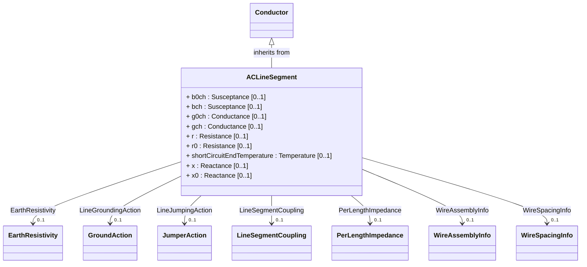

A line segment is a conductor or combination of conductors, with consistent electrical characteristics along its length, building a single electrical system that carries alternating current between two points in the power system.

The BaseVoltage at the two ends of a line segment shall have the same BaseVoltage.nominalVoltage. However, boundary lines may have slightly different BaseVoltage.nominalVoltages and variation is allowed. Larger voltage difference in general requires use of an equivalent branch.

Line segment impedances can be either directly described in electrical terms or physical line detail can be provided from which impedances can be calculated.

<b>Directly described impedances</b>

For symmetrical, transposed three phase line segments, it is sufficient to use attributes of the line segment, which describe impedances and admittances for the entire length of the line segment. Additionally, line segment impedances can be computed by using line segment length and associated per length impedances.

Unbalanced modeling of impedances is supported by the per length phase impedance matrix (PerLengthPhaseImpedance) in conjunction with phase-to-sequence number mapping supplied by either ACLineSegmentPhase or WirePosition. The sequence numbers are referenced by the row and column attributes of the per length phase impedance matrix. This method enables single-phase and two-phase line segments, and transpositions of phases, to be described using the same per length phase impedance matrix. The length of the line segment is used in the computation of total impedance values for the line segment.

<b>Line detail characteristics</b>

There are three approaches to providing line detail and all use WireAssembly to supply line positions:

<ul>

<li>Option 1 - WireAssembly supplies only line positions. ACLineSegmentPhase points to wire type and intraphase spacing and supplies the phase-to-sequence number mapping.</li>

<li>Option 2 - WireAssembly supplies line position and, for each position, also supplies wire type and intraphase spacing. ACLineSegmentPhase supplies the phase-to-sequence number mapping.</li>

<li>Option 3 - WireAssembly supplies line position and, for each position, also supplies wire type and intraphase spacing and phase. WireAssembly therefore supplies the phase-to-sequence number mapping and ACLineSegmentPhase is not needed.</li>

</ul>


#### Native Members

| name | type | description | mapping |
|------|------|-------------|---------|
| b0ch [0..1] | [Susceptance](#CIM18v15-Susceptance) | Zero sequence shunt (charging) susceptance, uniformly distributed, of the entire line segment. | |
| bch [0..1] | [Susceptance](#CIM18v15-Susceptance) | Positive sequence shunt (charging) susceptance, uniformly distributed, of the entire line segment. This value represents the full charging over the full length of the line segment. | |
| g0ch [0..1] | [Conductance](#CIM18v15-Conductance) | Zero sequence shunt (charging) conductance, uniformly distributed, of the entire line segment. | |
| gch [0..1] | [Conductance](#CIM18v15-Conductance) | Positive sequence shunt (charging) conductance, uniformly distributed, of the entire line segment. | |
| r [0..1] | [Resistance](#CIM18v15-Resistance) | Positive sequence series resistance of the entire line segment. | |
| r0 [0..1] | [Resistance](#CIM18v15-Resistance) | Zero sequence series resistance of the entire line segment. | |
| shortCircuitEndTemperature [0..1] | [Temperature](#CIM18v15-Temperature) | Maximum permitted temperature at the end of SC for the calculation of minimum short-circuit currents. Used for short circuit data exchange according to IEC 60909. | |
| x [0..1] | [Reactance](#CIM18v15-Reactance) | Positive sequence series reactance of the entire line segment. | |
| x0 [0..1] | [Reactance](#CIM18v15-Reactance) | Zero sequence series reactance of the entire line segment. | |
| `EarthResistivity [0..1]` | [EarthResistivity](#CIM18v15-EarthResistivity) | | |
| LineGroundingAction [0..1] | [GroundAction](#CIM18v15-GroundAction) | Ground action involving clamp usage (for the case when the ground is applied along the line segment instead of at its terminals). | |
| LineJumpingAction [0..1] | [JumperAction](#CIM18v15-JumperAction) | Jumper action involving clamp usage (for the case when the jumper is applied along the line segment instead of at its terminals). | |
| LineSegmentCoupling [0..1] | [LineSegmentCoupling](#CIM18v15-LineSegmentCoupling) | The description of this line's coupling with other lines in a coupled group. | |
| PerLengthImpedance [0..1] | [PerLengthImpedance](#CIM18v15-PerLengthImpedance) | Per-length impedance of this line segment. | |
| `WireAssemblyInfo [0..1]` | [WireAssemblyInfo](#CIM18v15-WireAssemblyInfo) | | |
| WireSpacingInfo [0..1] | [WireSpacingInfo](#CIM18v15-WireSpacingInfo) | | |

#### Inherited Members

| name | type | description | mapping |
|------|------|-------------|---------|
| length [0..1] | [Length](#CIM18v15-Length) | see [Conductor](CIM18v15-Conductor) | |
| DamageCurve [0..1] | [ConductorCharacteristicCurve](#CIM18v15-ConductorCharacteristicCurve) | see [Conductor](CIM18v15-Conductor) | |
| BaseVoltage [0..1] | [BaseVoltage](#CIM18v15-BaseVoltage) | see [ConductingEquipment](CIM18v15-ConductingEquipment) | |
| GroundingAction [0..1] | [GroundAction](#CIM18v15-GroundAction) | see [ConductingEquipment](CIM18v15-ConductingEquipment) | |
| JumpingAction [0..1] | [JumperAction](#CIM18v15-JumperAction) | see [ConductingEquipment](CIM18v15-ConductingEquipment) | |
| Outage [0..1] | [Outage](#CIM18v15-Outage) | see [ConductingEquipment](CIM18v15-ConductingEquipment) | |
| `ResourceContainer [0..1]` | [ResourceContainer](#CIM18v15-ResourceContainer) | see [ConductingEquipment](CIM18v15-ConductingEquipment) | |
| aggregate [0..1] | [Boolean](#CIM18v15-Boolean) | see [Equipment](#CIM18v15-Equipment) | |
| inService [0..1] | [Boolean](#CIM18v15-Boolean) | see [Equipment](#CIM18v15-Equipment) | |
| networkAnalysisEnabled [0..1] | [Boolean](#CIM18v15-Boolean) | see [Equipment](#CIM18v15-Equipment) | |
| normallyInService [0..1] | [Boolean](#CIM18v15-Boolean) | see [Equipment](#CIM18v15-Equipment) | |
| AdditionalEquipmentContainer [0..*] | [EquipmentContainer](#CIM18v15-EquipmentContainer) | see [Equipment](CIM18v15-Equipment) | |
| EquipmentContainer [0..1] | [EquipmentContainer](#CIM18v15-EquipmentContainer) | see [Equipment](CIM18v15-Equipment) | |
| AssetDatasheet [0..1] | [AssetInfo](#CIM18v15-AssetInfo) | see [PowerSystemResource](CIM18v15-PowerSystemResource) | |
| DesignElement [0..1] | [DesignElement](#CIM18v15-DesignElement) | see [PowerSystemResource](CIM18v15-PowerSystemResource) | |
| Location [0..1] | [Location](#CIM18v15-Location) | see [PowerSystemResource](CIM18v15-PowerSystemResource) | |
| PSRType [0..1] | [PSRType](#CIM18v15-PSRType) | see [PowerSystemResource](CIM18v15-PowerSystemResource) | |
| mRID [0..1] | [String](#CIM18v15-String) | see [IdentifiedObject](#CIM18v15-IdentifiedObject) | |
| aliasName [0..1] | [String](#CIM18v15-String) | see [IdentifiedObject](#CIM18v15-IdentifiedObject) | |
| description [0..1] | [String](#CIM18v15-String) | see [IdentifiedObject](#CIM18v15-IdentifiedObject) | |
| `energyIdentCodeEic [0..1]` (European) | [String](#CIM18v15-String) | see [IdentifiedObject](#CIM18v15-IdentifiedObject) | |
| name [0..1] | [String](#CIM18v15-String) | see [IdentifiedObject](#CIM18v15-IdentifiedObject) | |
| `shortName [0..1]` (European) | [String](#CIM18v15-String) | see [IdentifiedObject](#CIM18v15-IdentifiedObject) | |

{#CIM18v15-ACLineSegmentPhase}
### ACLineSegmentPhase

Inheritance path = [PowerSystemResource](#CIM18v15-PowerSystemResource) => [IdentifiedObject](#CIM18v15-IdentifiedObject)

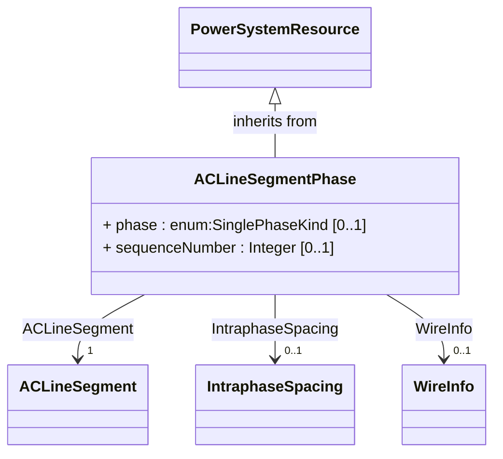

A line segment phase represents one phase (or optionally the neutral) of an alternating current line segment.

Under most circumstances there is not a line segment phase for the neutral. However, if a wire assembly is being used and it does not specify phase, a line segment phase must exist for each position in the assembly (including the neutral).


#### Native Members

| name | type | description | mapping |
|------|------|-------------|---------|
| phase [0..1] | [SinglePhaseKind](#CIM18v15-SinglePhaseKind) | Phase identifies the phase or neutral connection of the conductor at both ends. | |
| sequenceNumber [0..1] | [Integer](#CIM18v15-Integer) | Sequence number provides the numbering for this line segment phase. When impedance is directly described, sequence number binds the phase to the column and row for entries in the per length phase impedance matrix (PhaseImpedanceData of PerLengthPhaseImpedance). When used in conjunction with a wire assembly description, sequence number associates the line segment phase to a position.For a line segment not a part of a parallel line segment group, sequence number starts at one and increments by one through each line segment phase associated with the line segment. If there is a line segment phase for neutral, it is numbered last. | |
| ACLineSegment [1] | [ACLineSegment](#CIM18v15-ACLineSegment) | The line segment to which the phase belongs. | |
| IntraphaseSpacing [0..1] | [IntraphaseSpacing](#CIM18v15-IntraphaseSpacing) | | |
| WireInfo [0..1] | [WireInfo](#CIM18v15-WireInfo) | | |

#### Inherited Members

| name | type | description | mapping |
|------|------|-------------|---------|
| AssetDatasheet [0..1] | [AssetInfo](#CIM18v15-AssetInfo) | see [PowerSystemResource](CIM18v15-PowerSystemResource) | |
| DesignElement [0..1] | [DesignElement](#CIM18v15-DesignElement) | see [PowerSystemResource](CIM18v15-PowerSystemResource) | |
| Location [0..1] | [Location](#CIM18v15-Location) | see [PowerSystemResource](CIM18v15-PowerSystemResource) | |
| PSRType [0..1] | [PSRType](#CIM18v15-PSRType) | see [PowerSystemResource](CIM18v15-PowerSystemResource) | |
| mRID [0..1] | [String](#CIM18v15-String) | see [IdentifiedObject](#CIM18v15-IdentifiedObject) | |
| aliasName [0..1] | [String](#CIM18v15-String) | see [IdentifiedObject](#CIM18v15-IdentifiedObject) | |
| description [0..1] | [String](#CIM18v15-String) | see [IdentifiedObject](#CIM18v15-IdentifiedObject) | |
| `energyIdentCodeEic [0..1]` (European) | [String](#CIM18v15-String) | see [IdentifiedObject](#CIM18v15-IdentifiedObject) | |
| name [0..1] | [String](#CIM18v15-String) | see [IdentifiedObject](#CIM18v15-IdentifiedObject) | |
| `shortName [0..1]` (European) | [String](#CIM18v15-String) | see [IdentifiedObject](#CIM18v15-IdentifiedObject) | |

{#CIM18v15-Analog}
### Analog

Inheritance path = [Measurement](#CIM18v15-Measurement) => [IdentifiedObject](#CIM18v15-IdentifiedObject)

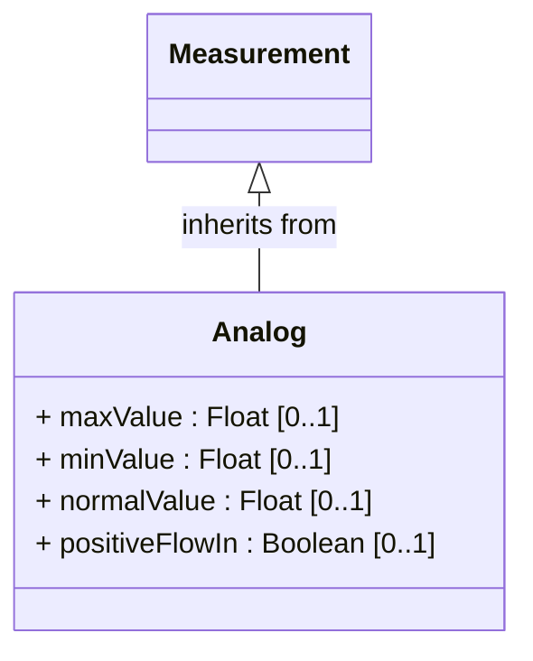

Analog represents an analog Measurement.


#### Native Members

| name | type | description | mapping |
|------|------|-------------|---------|
| maxValue [0..1] | [Float](#CIM18v15-Float) | Normal value range maximum for any of the MeasurementValue.values. Used for scaling, e.g. in bar graphs or of telemetered raw values. | |
| minValue [0..1] | [Float](#CIM18v15-Float) | Normal value range minimum for any of the MeasurementValue.values. Used for scaling, e.g. in bar graphs or of telemetered raw values. | |
| normalValue [0..1] | [Float](#CIM18v15-Float) | Normal measurement value, e.g., used for percentage calculations. | |
| positiveFlowIn [0..1] | [Boolean](#CIM18v15-Boolean) | Indicates the direction of positive flow relative to the primary equipment connectivity.The attribute is applicable for measurements of flow such as active power, reactive power or current.TRUE means a positive measurement value at the terminal, where the measurement is located, indicates power is flowing into the related PowerSystemResource.FALSE means a positive measurement value at the terminal, where the measurement is located, indicates power is flowing out of the related PowerSystemResource. | |

#### Inherited Members

| name | type | description | mapping |
|------|------|-------------|---------|
| measurementType [0..1] | [String](#CIM18v15-String) | see [Measurement](#CIM18v15-Measurement) | |
| phases [0..1] | [PhaseCode](#CIM18v15-PhaseCode) | see [Measurement](CIM18v15-Measurement) | |
| `sourceType [0..1]` (GridAPPSD) | [MeasurementSourceKind](#CIM18v15-MeasurementSourceKind) | see [Measurement](CIM18v15-Measurement) | |
| unitMultiplier [0..1] | [UnitMultiplier](#CIM18v15-UnitMultiplier) | see [Measurement](CIM18v15-Measurement) | |
| unitSymbol [0..1] | [UnitSymbol](#CIM18v15-UnitSymbol) | see [Measurement](CIM18v15-Measurement) | |
| Asset [0..1] | [Asset](#CIM18v15-Asset) | see [Measurement](CIM18v15-Measurement) | |
| CalculationMethodHierarchy [0..1] | [CalculationMethodHierarchy](#CIM18v15-CalculationMethodHierarchy) | see [Measurement](CIM18v15-Measurement) | |
| MeasurementAction [0..1] | [MeasurementAction](#CIM18v15-MeasurementAction) | see [Measurement](CIM18v15-Measurement) | |
| `MeasurementSystem [0..1]` | [MeasurementSystem](#CIM18v15-MeasurementSystem) | see [Measurement](CIM18v15-Measurement) | |
| PowerSystemResource [0..1] | [PowerSystemResource](#CIM18v15-PowerSystemResource) | see [Measurement](CIM18v15-Measurement) | |
| Terminal [0..1] | [ACDCTerminal](#CIM18v15-ACDCTerminal) | see [Measurement](CIM18v15-Measurement) | |
| mRID [0..1] | [String](#CIM18v15-String) | see [IdentifiedObject](#CIM18v15-IdentifiedObject) | |
| aliasName [0..1] | [String](#CIM18v15-String) | see [IdentifiedObject](#CIM18v15-IdentifiedObject) | |
| description [0..1] | [String](#CIM18v15-String) | see [IdentifiedObject](#CIM18v15-IdentifiedObject) | |
| `energyIdentCodeEic [0..1]` (European) | [String](#CIM18v15-String) | see [IdentifiedObject](#CIM18v15-IdentifiedObject) | |
| name [0..1] | [String](#CIM18v15-String) | see [IdentifiedObject](#CIM18v15-IdentifiedObject) | |
| `shortName [0..1]` (European) | [String](#CIM18v15-String) | see [IdentifiedObject](#CIM18v15-IdentifiedObject) | |

{#CIM18v15-AnalogValue}
### AnalogValue

Inheritance path = [MeasurementValue](#CIM18v15-MeasurementValue) => [IOPoint](#CIM18v15-IOPoint) => [IdentifiedObject](#CIM18v15-IdentifiedObject)

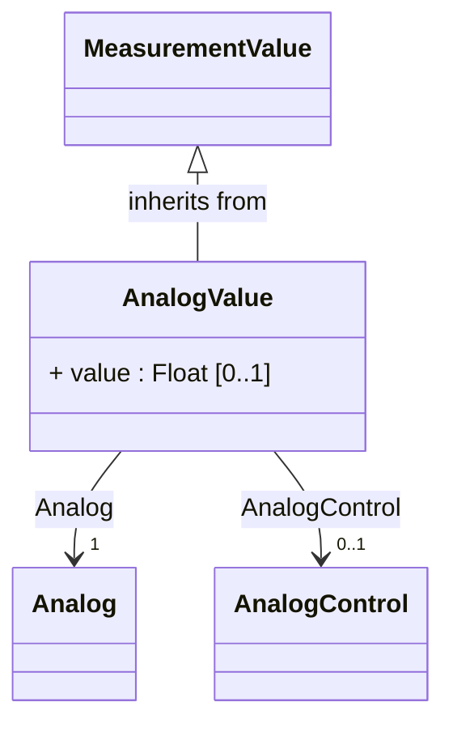

AnalogValue represents an analog MeasurementValue.


#### Native Members

| name | type | description | mapping |
|------|------|-------------|---------|
| value [0..1] | [Float](#CIM18v15-Float) | The value to supervise. | |
| `Analog [1]` (ShadowExtension) | [Analog](#CIM18v15-Analog) | Measurement to which this value is connected. | |
| AnalogControl [0..1] | [AnalogControl](#CIM18v15-AnalogControl) | The Control variable associated with the MeasurementValue. | |

#### Inherited Members

| name | type | description | mapping |
|------|------|-------------|---------|
| sensorAccuracy [0..1] | [PerCent](#CIM18v15-PerCent) | see [MeasurementValue](CIM18v15-MeasurementValue) | |
| timeStamp [0..1] | [DateTime](#CIM18v15-DateTime) | see [MeasurementValue](#CIM18v15-MeasurementValue) | |
| `CalculationMethodHierarchy [0..1]` (harmonization) | [CalculationMethodHierarchy](#CIM18v15-CalculationMethodHierarchy) | see [MeasurementValue](CIM18v15-MeasurementValue) | |
| `ErpPerson [0..1]` (informative) | [OldPerson](#CIM18v15-OldPerson) | see [MeasurementValue](CIM18v15-MeasurementValue) | |
| `MeasurementValueQuality [0..1]` (AggregateOf) | [MeasurementValueQuality](#CIM18v15-MeasurementValueQuality) | see [MeasurementValue](CIM18v15-MeasurementValue) | |
| MeasurementValueSource [1] | [MeasurementValueSource](#CIM18v15-MeasurementValueSource) | see [MeasurementValue](CIM18v15-MeasurementValue) | |
| RemoteSource [0..1] | [RemoteSource](#CIM18v15-RemoteSource) | see [MeasurementValue](CIM18v15-MeasurementValue) | |
| IOPointSource [0..1] | [IOPointSource](#CIM18v15-IOPointSource) | see [IOPoint](CIM18v15-IOPoint) | |
| mRID [0..1] | [String](#CIM18v15-String) | see [IdentifiedObject](#CIM18v15-IdentifiedObject) | |
| aliasName [0..1] | [String](#CIM18v15-String) | see [IdentifiedObject](#CIM18v15-IdentifiedObject) | |
| description [0..1] | [String](#CIM18v15-String) | see [IdentifiedObject](#CIM18v15-IdentifiedObject) | |
| `energyIdentCodeEic [0..1]` (European) | [String](#CIM18v15-String) | see [IdentifiedObject](#CIM18v15-IdentifiedObject) | |
| name [0..1] | [String](#CIM18v15-String) | see [IdentifiedObject](#CIM18v15-IdentifiedObject) | |
| `shortName [0..1]` (European) | [String](#CIM18v15-String) | see [IdentifiedObject](#CIM18v15-IdentifiedObject) | |

{#CIM18v15-AsynchronousMachine}
### AsynchronousMachine

Inheritance path = [RotatingMachine](#CIM18v15-RotatingMachine) => [RegulatingCondEq](#CIM18v15-RegulatingCondEq) => [EnergyConnection](#CIM18v15-EnergyConnection) => [ConductingEquipment](#CIM18v15-ConductingEquipment) => [Equipment](#CIM18v15-Equipment) => [PowerSystemResource](#CIM18v15-PowerSystemResource) => [IdentifiedObject](#CIM18v15-IdentifiedObject)

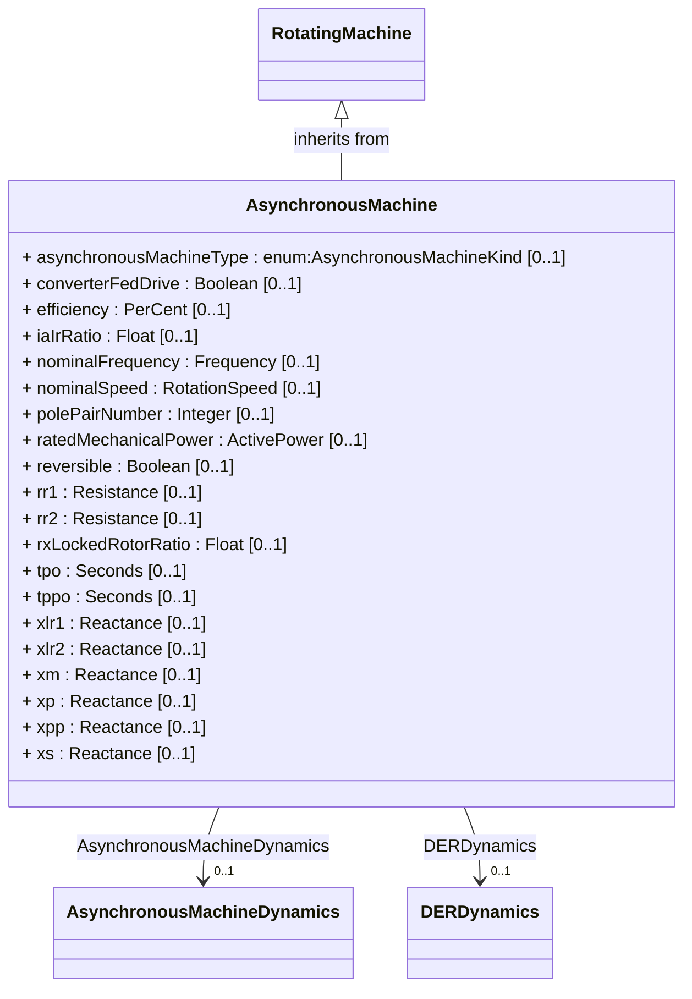

A rotating machine whose shaft rotates asynchronously with the electrical field. Also known as an induction machine with no external connection to the rotor windings, e.g. squirrel-cage induction machine.


#### Native Members

| name | type | description | mapping |
|------|------|-------------|---------|
| asynchronousMachineType [0..1] | [AsynchronousMachineKind](#CIM18v15-AsynchronousMachineKind) | Indicates the type of Asynchronous Machine (motor or generator). | |
| converterFedDrive [0..1] | [Boolean](#CIM18v15-Boolean) | Indicates whether the machine is a converter fed drive. Used for short circuit data exchange according to IEC 60909. | |
| efficiency [0..1] | [PerCent](#CIM18v15-PerCent) | Efficiency of the asynchronous machine at nominal operation as a percentage. Indicator for converter drive motors. Used for short circuit data exchange according to IEC 60909. | |
| iaIrRatio [0..1] | [Float](#CIM18v15-Float) | Ratio of locked-rotor current to the rated current of the motor (Ia/Ir). Used for short circuit data exchange according to IEC 60909. | |
| nominalFrequency [0..1] | [Frequency](#CIM18v15-Frequency) | Nameplate data indicates if the machine is 50 Hz or 60 Hz. | |
| nominalSpeed [0..1] | [RotationSpeed](#CIM18v15-RotationSpeed) | Nameplate data. Depends on the slip and number of pole pairs. | |
| polePairNumber [0..1] | [Integer](#CIM18v15-Integer) | Number of pole pairs of stator. Used for short circuit data exchange according to IEC 60909. | |
| ratedMechanicalPower [0..1] | [ActivePower](#CIM18v15-ActivePower) | Rated mechanical power (Pr in IEC 60909-0). Used for short circuit data exchange according to IEC 60909. | |
| reversible [0..1] | [Boolean](#CIM18v15-Boolean) | Indicates for converter drive motors if the power can be reversible. Used for short circuit data exchange according to IEC 60909. | |
| rr1 [0..1] | [Resistance](#CIM18v15-Resistance) | Damper 1 winding resistance. | |
| rr2 [0..1] | [Resistance](#CIM18v15-Resistance) | Damper 2 winding resistance. | |
| rxLockedRotorRatio [0..1] | [Float](#CIM18v15-Float) | Locked rotor ratio (R/X). Used for short circuit data exchange according to IEC 60909. | |
| tpo [0..1] | [Seconds](#CIM18v15-Seconds) | Transient rotor time constant (greater than tppo). | |
| tppo [0..1] | [Seconds](#CIM18v15-Seconds) | Sub-transient rotor time constant (greater than 0). | |
| xlr1 [0..1] | [Reactance](#CIM18v15-Reactance) | Damper 1 winding leakage reactance. | |
| xlr2 [0..1] | [Reactance](#CIM18v15-Reactance) | Damper 2 winding leakage reactance. | |
| xm [0..1] | [Reactance](#CIM18v15-Reactance) | Magnetizing reactance. | |
| xp [0..1] | [Reactance](#CIM18v15-Reactance) | Transient reactance (unsaturated) (greater than or equal to xpp). | |
| xpp [0..1] | [Reactance](#CIM18v15-Reactance) | Sub-transient reactance (unsaturated). | |
| xs [0..1] | [Reactance](#CIM18v15-Reactance) | Synchronous reactance (greater than xp). | |
| AsynchronousMachineDynamics [0..1] | [AsynchronousMachineDynamics](#CIM18v15-AsynchronousMachineDynamics) | Asynchronous machine dynamics model used to describe dynamic behaviour of this asynchronous machine. | |
| DERDynamics [0..1] | [DERDynamics](#CIM18v15-DERDynamics) | DER dynamics model associated with this asynchronous machine model. | |

#### Inherited Members

| name | type | description | mapping |
|------|------|-------------|---------|
| p [0..1] | [ActivePower](#CIM18v15-ActivePower) | see [RotatingMachine](CIM18v15-RotatingMachine) | |
| q [0..1] | [ReactivePower](#CIM18v15-ReactivePower) | see [RotatingMachine](CIM18v15-RotatingMachine) | |
| ratedPowerFactor [0..1] | [Float](#CIM18v15-Float) | see [RotatingMachine](#CIM18v15-RotatingMachine) | |
| ratedS [0..1] | [ApparentPower](#CIM18v15-ApparentPower) | see [RotatingMachine](CIM18v15-RotatingMachine) | |
| ratedU [0..1] | [Voltage](#CIM18v15-Voltage) | see [RotatingMachine](CIM18v15-RotatingMachine) | |
| `GeneratingUnit [0..1]` (NC) | [GeneratingUnit](#CIM18v15-GeneratingUnit) | see [RotatingMachine](CIM18v15-RotatingMachine) | |
| `HydroPump [0..1]` (NC) | [HydroPump](#CIM18v15-HydroPump) | see [RotatingMachine](CIM18v15-RotatingMachine) | |
| `RotatingMachinePhase [0..1]` | [RotatingMachinePhase](#CIM18v15-RotatingMachinePhase) | see [RotatingMachine](CIM18v15-RotatingMachine) | |
| controlEnabled [0..1] | [Boolean](#CIM18v15-Boolean) | see [RegulatingCondEq](#CIM18v15-RegulatingCondEq) | |
| EquipmentController [0..1] | [EquipmentController](#CIM18v15-EquipmentController) | see [RegulatingCondEq](CIM18v15-RegulatingCondEq) | |
| RegulatingControl [0..1] | [RegulatingControl](#CIM18v15-RegulatingControl) | see [RegulatingCondEq](CIM18v15-RegulatingCondEq) | |
| BaseVoltage [0..1] | [BaseVoltage](#CIM18v15-BaseVoltage) | see [ConductingEquipment](CIM18v15-ConductingEquipment) | |
| GroundingAction [0..1] | [GroundAction](#CIM18v15-GroundAction) | see [ConductingEquipment](CIM18v15-ConductingEquipment) | |
| JumpingAction [0..1] | [JumperAction](#CIM18v15-JumperAction) | see [ConductingEquipment](CIM18v15-ConductingEquipment) | |
| Outage [0..1] | [Outage](#CIM18v15-Outage) | see [ConductingEquipment](CIM18v15-ConductingEquipment) | |
| `ResourceContainer [0..1]` | [ResourceContainer](#CIM18v15-ResourceContainer) | see [ConductingEquipment](CIM18v15-ConductingEquipment) | |
| aggregate [0..1] | [Boolean](#CIM18v15-Boolean) | see [Equipment](#CIM18v15-Equipment) | |
| inService [0..1] | [Boolean](#CIM18v15-Boolean) | see [Equipment](#CIM18v15-Equipment) | |
| networkAnalysisEnabled [0..1] | [Boolean](#CIM18v15-Boolean) | see [Equipment](#CIM18v15-Equipment) | |
| normallyInService [0..1] | [Boolean](#CIM18v15-Boolean) | see [Equipment](#CIM18v15-Equipment) | |
| AdditionalEquipmentContainer [0..*] | [EquipmentContainer](#CIM18v15-EquipmentContainer) | see [Equipment](CIM18v15-Equipment) | |
| EquipmentContainer [0..1] | [EquipmentContainer](#CIM18v15-EquipmentContainer) | see [Equipment](CIM18v15-Equipment) | |
| AssetDatasheet [0..1] | [AssetInfo](#CIM18v15-AssetInfo) | see [PowerSystemResource](CIM18v15-PowerSystemResource) | |
| DesignElement [0..1] | [DesignElement](#CIM18v15-DesignElement) | see [PowerSystemResource](CIM18v15-PowerSystemResource) | |
| Location [0..1] | [Location](#CIM18v15-Location) | see [PowerSystemResource](CIM18v15-PowerSystemResource) | |
| PSRType [0..1] | [PSRType](#CIM18v15-PSRType) | see [PowerSystemResource](CIM18v15-PowerSystemResource) | |
| mRID [0..1] | [String](#CIM18v15-String) | see [IdentifiedObject](#CIM18v15-IdentifiedObject) | |
| aliasName [0..1] | [String](#CIM18v15-String) | see [IdentifiedObject](#CIM18v15-IdentifiedObject) | |
| description [0..1] | [String](#CIM18v15-String) | see [IdentifiedObject](#CIM18v15-IdentifiedObject) | |
| `energyIdentCodeEic [0..1]` (European) | [String](#CIM18v15-String) | see [IdentifiedObject](#CIM18v15-IdentifiedObject) | |
| name [0..1] | [String](#CIM18v15-String) | see [IdentifiedObject](#CIM18v15-IdentifiedObject) | |
| `shortName [0..1]` (European) | [String](#CIM18v15-String) | see [IdentifiedObject](#CIM18v15-IdentifiedObject) | |


## Abstract Classes

{#CIM18v15-ACDCConverter}
### ACDCConverter

Inheritance path = [ConductingEquipment](#CIM18v15-ConductingEquipment) => [Equipment](#CIM18v15-Equipment) => [PowerSystemResource](#CIM18v15-PowerSystemResource) => [IdentifiedObject](#CIM18v15-IdentifiedObject)

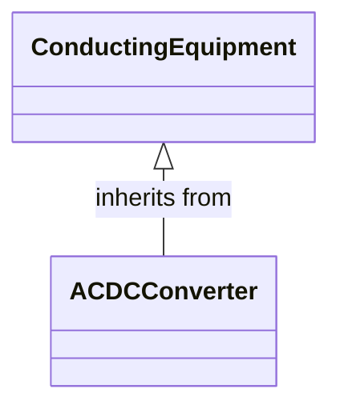

A unit with valves for three phases, together with unit control equipment, essential protective and switching devices, DC storage capacitors, phase reactors and auxiliaries, if any, used for conversion.


#### Inherited Members

| name | type | description | mapping |
|------|------|-------------|---------|
| BaseVoltage [0..1] | [BaseVoltage](#CIM18v15-BaseVoltage) | see [ConductingEquipment](CIM18v15-ConductingEquipment) | |
| GroundingAction [0..1] | [GroundAction](#CIM18v15-GroundAction) | see [ConductingEquipment](CIM18v15-ConductingEquipment) | |
| JumpingAction [0..1] | [JumperAction](#CIM18v15-JumperAction) | see [ConductingEquipment](CIM18v15-ConductingEquipment) | |
| Outage [0..1] | [Outage](#CIM18v15-Outage) | see [ConductingEquipment](CIM18v15-ConductingEquipment) | |
| `ResourceContainer [0..1]` | [ResourceContainer](#CIM18v15-ResourceContainer) | see [ConductingEquipment](CIM18v15-ConductingEquipment) | |
| aggregate [0..1] | [Boolean](#CIM18v15-Boolean) | see [Equipment](#CIM18v15-Equipment) | |
| inService [0..1] | [Boolean](#CIM18v15-Boolean) | see [Equipment](#CIM18v15-Equipment) | |
| networkAnalysisEnabled [0..1] | [Boolean](#CIM18v15-Boolean) | see [Equipment](#CIM18v15-Equipment) | |
| normallyInService [0..1] | [Boolean](#CIM18v15-Boolean) | see [Equipment](#CIM18v15-Equipment) | |
| AdditionalEquipmentContainer [0..*] | [EquipmentContainer](#CIM18v15-EquipmentContainer) | see [Equipment](CIM18v15-Equipment) | |
| EquipmentContainer [0..1] | [EquipmentContainer](#CIM18v15-EquipmentContainer) | see [Equipment](CIM18v15-Equipment) | |
| AssetDatasheet [0..1] | [AssetInfo](#CIM18v15-AssetInfo) | see [PowerSystemResource](CIM18v15-PowerSystemResource) | |
| DesignElement [0..1] | [DesignElement](#CIM18v15-DesignElement) | see [PowerSystemResource](CIM18v15-PowerSystemResource) | |
| Location [0..1] | [Location](#CIM18v15-Location) | see [PowerSystemResource](CIM18v15-PowerSystemResource) | |
| PSRType [0..1] | [PSRType](#CIM18v15-PSRType) | see [PowerSystemResource](CIM18v15-PowerSystemResource) | |
| mRID [0..1] | [String](#CIM18v15-String) | see [IdentifiedObject](#CIM18v15-IdentifiedObject) | |
| aliasName [0..1] | [String](#CIM18v15-String) | see [IdentifiedObject](#CIM18v15-IdentifiedObject) | |
| description [0..1] | [String](#CIM18v15-String) | see [IdentifiedObject](#CIM18v15-IdentifiedObject) | |
| `energyIdentCodeEic [0..1]` (European) | [String](#CIM18v15-String) | see [IdentifiedObject](#CIM18v15-IdentifiedObject) | |
| name [0..1] | [String](#CIM18v15-String) | see [IdentifiedObject](#CIM18v15-IdentifiedObject) | |
| `shortName [0..1]` (European) | [String](#CIM18v15-String) | see [IdentifiedObject](#CIM18v15-IdentifiedObject) | |

{#CIM18v15-ACDCConverterController}
### ACDCConverterController

Inheritance path = [DirectCurrentEquipmentController](#CIM18v15-DirectCurrentEquipmentController) => [EquipmentController](#CIM18v15-EquipmentController) => [AutomationFunction](#CIM18v15-AutomationFunction) => [PowerSystemResource](#CIM18v15-PowerSystemResource) => [IdentifiedObject](#CIM18v15-IdentifiedObject)

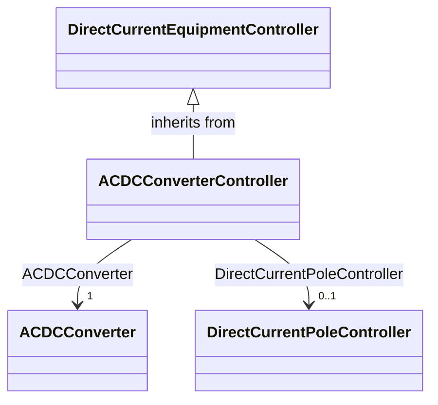

ACDC converter unit control. According to IEC 60633, it is the control system used for the controlling, monitoring and protection of a single converter unit.


#### Native Members

| name | type | description | mapping |
|------|------|-------------|---------|
| `ACDCConverter [1]` (ShadowExtension) | [ACDCConverter](#CIM18v15-ACDCConverter) | ACDC converter controlled by the direct current controller. | |
| DirectCurrentPoleController [0..1] | [DirectCurrentPoleController](#CIM18v15-DirectCurrentPoleController) | DC pole controller that controls this ACDC controller. | |

#### Inherited Members

| name | type | description | mapping |
|------|------|-------------|---------|
| mode [0..1] | [DCControlModeKind](#CIM18v15-DCControlModeKind) | see [DirectCurrentEquipmentController](CIM18v15-DirectCurrentEquipmentController) | |
| SystemControl [0..1] | [SystemControl](#CIM18v15-SystemControl) | see [EquipmentController](CIM18v15-EquipmentController) | |
| enabled [0..1] | [Boolean](#CIM18v15-Boolean) | see [AutomationFunction](#CIM18v15-AutomationFunction) | |
| normalEnabled [0..1] | [Boolean](#CIM18v15-Boolean) | see [AutomationFunction](#CIM18v15-AutomationFunction) | |
| type [0..1] | [String](#CIM18v15-String) | see [AutomationFunction](#CIM18v15-AutomationFunction) | |
| PartOf [0..1] | [AutomationFunction](#CIM18v15-AutomationFunction) | see [AutomationFunction](CIM18v15-AutomationFunction) | |
| AssetDatasheet [0..1] | [AssetInfo](#CIM18v15-AssetInfo) | see [PowerSystemResource](CIM18v15-PowerSystemResource) | |
| DesignElement [0..1] | [DesignElement](#CIM18v15-DesignElement) | see [PowerSystemResource](CIM18v15-PowerSystemResource) | |
| Location [0..1] | [Location](#CIM18v15-Location) | see [PowerSystemResource](CIM18v15-PowerSystemResource) | |
| PSRType [0..1] | [PSRType](#CIM18v15-PSRType) | see [PowerSystemResource](CIM18v15-PowerSystemResource) | |
| mRID [0..1] | [String](#CIM18v15-String) | see [IdentifiedObject](#CIM18v15-IdentifiedObject) | |
| aliasName [0..1] | [String](#CIM18v15-String) | see [IdentifiedObject](#CIM18v15-IdentifiedObject) | |
| description [0..1] | [String](#CIM18v15-String) | see [IdentifiedObject](#CIM18v15-IdentifiedObject) | |
| `energyIdentCodeEic [0..1]` (European) | [String](#CIM18v15-String) | see [IdentifiedObject](#CIM18v15-IdentifiedObject) | |
| name [0..1] | [String](#CIM18v15-String) | see [IdentifiedObject](#CIM18v15-IdentifiedObject) | |
| `shortName [0..1]` (European) | [String](#CIM18v15-String) | see [IdentifiedObject](#CIM18v15-IdentifiedObject) | |

{#CIM18v15-ACDCTerminal}
### ACDCTerminal

Inheritance path = [IdentifiedObject](#CIM18v15-IdentifiedObject)

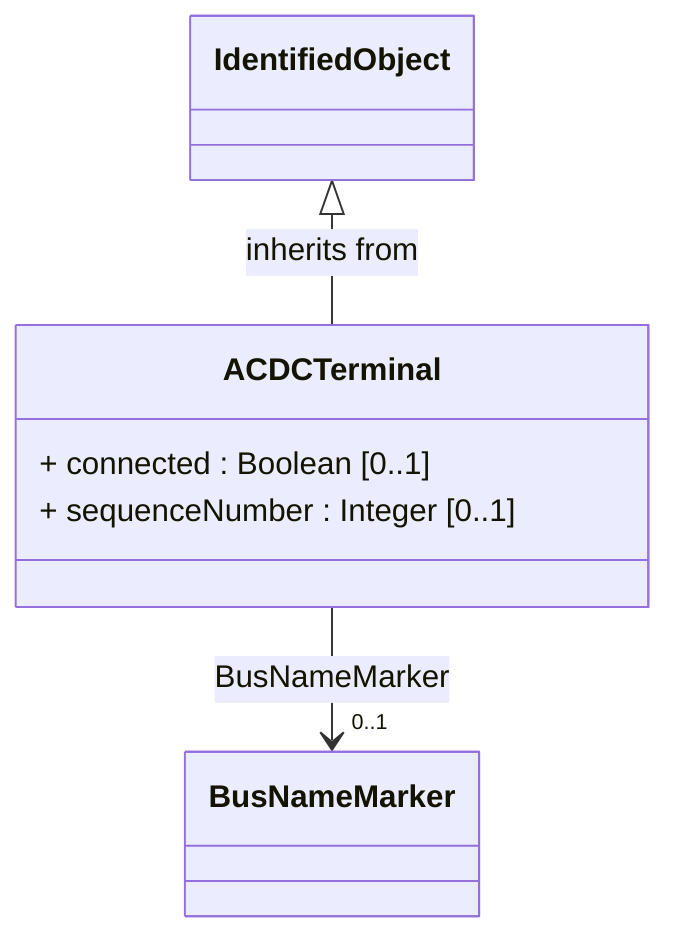

An electrical connection point (AC or DC) to a piece of conducting equipment. Terminals are connected at physical connection points called connectivity nodes.


#### Native Members

| name | type | description | mapping |
|------|------|-------------|---------|
| `connected [0..1]` (deprecated) | [Boolean](#CIM18v15-Boolean) | The connected status is related to a bus-branch model and the topological node to terminal relation. True implies the terminal is connected to the related topological node and false implies it is not.In a bus-branch model, the connected status is used to tell if equipment is disconnected without having to change the connectivity described by the topological node to terminal relation. A valid case is that conducting equipment can be connected in one end and open in the other. In particular for an AC line segment, where the reactive line charging can be significant, this is a relevant case. | |
| sequenceNumber [0..1] | [Integer](#CIM18v15-Integer) | The orientation of the terminal connections for a multiple terminal conducting equipment. The sequence numbering starts with 1 and additional terminals should follow in increasing order. The first terminal is the "starting point" for a two terminal branch. | |
| BusNameMarker [0..1] | [BusNameMarker](#CIM18v15-BusNameMarker) | The bus name marker used to name the bus (topological node). | |

#### Inherited Members

| name | type | description | mapping |
|------|------|-------------|---------|
| mRID [0..1] | [String](#CIM18v15-String) | see [IdentifiedObject](#CIM18v15-IdentifiedObject) | |
| aliasName [0..1] | [String](#CIM18v15-String) | see [IdentifiedObject](#CIM18v15-IdentifiedObject) | |
| description [0..1] | [String](#CIM18v15-String) | see [IdentifiedObject](#CIM18v15-IdentifiedObject) | |
| `energyIdentCodeEic [0..1]` (European) | [String](#CIM18v15-String) | see [IdentifiedObject](#CIM18v15-IdentifiedObject) | |
| name [0..1] | [String](#CIM18v15-String) | see [IdentifiedObject](#CIM18v15-IdentifiedObject) | |
| `shortName [0..1]` (European) | [String](#CIM18v15-String) | see [IdentifiedObject](#CIM18v15-IdentifiedObject) | |

{#CIM18v15-ACEmulationControlFunction}
### ACEmulationControlFunction

Inheritance path = [ControlFunctionBlock](#CIM18v15-ControlFunctionBlock) => [FunctionBlock](#CIM18v15-FunctionBlock) => [IdentifiedObject](#CIM18v15-IdentifiedObject)

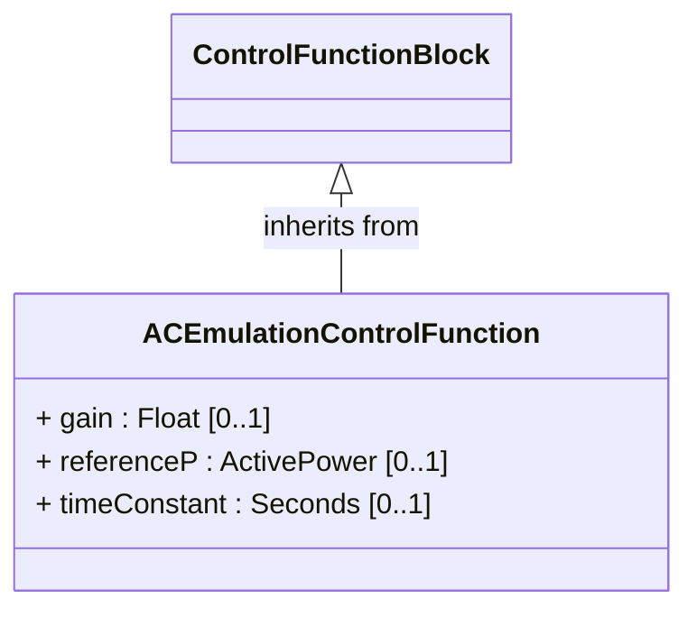

The AC emulation control function is used when AC emulation model is activated for a DC system. It consists in computing the active power set point of the DC system as a function of the voltage angle difference between both points of common coupling with the AC network in order to mimic the behavior of an AC transmission line. This control mode enables the automatic adjustment of the active power reference following variations of the AC system operational point.

The setpoint of the DC system is calculated by Psetpoint=Pref+Kdc*(angle1-angle2), where

- Pref is the existing active power setpoint;

- Kdc is the control system gain and

- angle1 and angle2 are the phase angle measurement (measured at points of common coupling with the AC network) respectively at the side 1 and 2 of the DC system.


#### Native Members

| name | type | description | mapping |
|------|------|-------------|---------|
| gain [0..1] | [Float](#CIM18v15-Float) | Control system gain in AC transmission emulation control measured in MW/deg. It plays the role of an admittance of the equivalent AC transmission line that the control is emulating the higher is the gain the higher is the active power transfer at steady state. | |
| referenceP [0..1] | [ActivePower](#CIM18v15-ActivePower) | Existing active power setpoint used to calculate the active power setpoint of the AC emulation control. | |
| timeConstant [0..1] | [Seconds](#CIM18v15-Seconds) | Control system time constant in AC transmission emulation control. It affects the time needed toreach a new steady state equilibrium point after a network perturbation extremely important to guarantee N-1 relief related to an interconnection. The higher is time constant the slower is the DC system dynamic. | |

#### Inherited Members

| name | type | description | mapping |
|------|------|-------------|---------|
| isDiscrete [0..1] | [Boolean](#CIM18v15-Boolean) | see [ControlFunctionBlock](#CIM18v15-ControlFunctionBlock) | |
| maxAllowedTargetValue [0..1] | [PerCent](#CIM18v15-PerCent) | see [ControlFunctionBlock](CIM18v15-ControlFunctionBlock) | |
| minAllowedTargetValue [0..1] | [PerCent](#CIM18v15-PerCent) | see [ControlFunctionBlock](CIM18v15-ControlFunctionBlock) | |
| normalMaxAllowedTargetValue [0..1] | [PerCent](#CIM18v15-PerCent) | see [ControlFunctionBlock](CIM18v15-ControlFunctionBlock) | |
| normalMinAllowedTargetValue [0..1] | [PerCent](#CIM18v15-PerCent) | see [ControlFunctionBlock](CIM18v15-ControlFunctionBlock) | |
| targetDeadband [0..1] | [Float](#CIM18v15-Float) | see [ControlFunctionBlock](#CIM18v15-ControlFunctionBlock) | |
| enabled [0..1] | [Boolean](#CIM18v15-Boolean) | see [FunctionBlock](#CIM18v15-FunctionBlock) | |
| normalEnabled [0..1] | [Boolean](#CIM18v15-Boolean) | see [FunctionBlock](#CIM18v15-FunctionBlock) | |
| AutomationBlockGroup [0..1] | [AutomationBlockGroup](#CIM18v15-AutomationBlockGroup) | see [FunctionBlock](CIM18v15-FunctionBlock) | |
| AutomationFunction [0..1] | [AutomationFunction](#CIM18v15-AutomationFunction) | see [FunctionBlock](CIM18v15-FunctionBlock) | |
| FunctionBlockType [0..1] | [FunctionBlockType](#CIM18v15-FunctionBlockType) | see [FunctionBlock](CIM18v15-FunctionBlock) | |
| mRID [0..1] | [String](#CIM18v15-String) | see [IdentifiedObject](#CIM18v15-IdentifiedObject) | |
| aliasName [0..1] | [String](#CIM18v15-String) | see [IdentifiedObject](#CIM18v15-IdentifiedObject) | |
| description [0..1] | [String](#CIM18v15-String) | see [IdentifiedObject](#CIM18v15-IdentifiedObject) | |
| `energyIdentCodeEic [0..1]` (European) | [String](#CIM18v15-String) | see [IdentifiedObject](#CIM18v15-IdentifiedObject) | |
| name [0..1] | [String](#CIM18v15-String) | see [IdentifiedObject](#CIM18v15-IdentifiedObject) | |
| `shortName [0..1]` (European) | [String](#CIM18v15-String) | see [IdentifiedObject](#CIM18v15-IdentifiedObject) | |

{#CIM18v15-ACPointOfCommonCoupling}
### ACPointOfCommonCoupling

Inheritance path = [PointOfCommonCoupling](#CIM18v15-PointOfCommonCoupling) => [IdentifiedObject](#CIM18v15-IdentifiedObject)

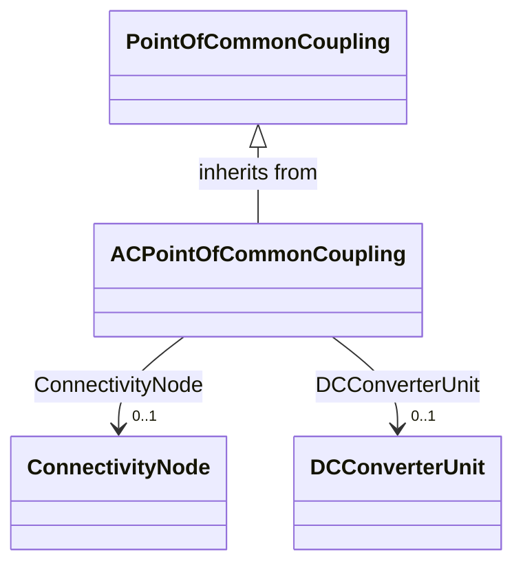

Point of interconnection of the DC converter station to the adjacent AC system (IEC 60633).


#### Native Members

| name | type | description | mapping |
|------|------|-------------|---------|
| ConnectivityNode [0..1] | [ConnectivityNode](#CIM18v15-ConnectivityNode) | Connectivity node which is a point of common coupling AC. | |
| DCConverterUnit [0..1] | [DCConverterUnit](#CIM18v15-DCConverterUnit) | DC converter unit that has AC point of common coupling. | |

#### Inherited Members

| name | type | description | mapping |
|------|------|-------------|---------|
| mRID [0..1] | [String](#CIM18v15-String) | see [IdentifiedObject](#CIM18v15-IdentifiedObject) | |
| aliasName [0..1] | [String](#CIM18v15-String) | see [IdentifiedObject](#CIM18v15-IdentifiedObject) | |
| description [0..1] | [String](#CIM18v15-String) | see [IdentifiedObject](#CIM18v15-IdentifiedObject) | |
| `energyIdentCodeEic [0..1]` (European) | [String](#CIM18v15-String) | see [IdentifiedObject](#CIM18v15-IdentifiedObject) | |
| name [0..1] | [String](#CIM18v15-String) | see [IdentifiedObject](#CIM18v15-IdentifiedObject) | |
| `shortName [0..1]` (European) | [String](#CIM18v15-String) | see [IdentifiedObject](#CIM18v15-IdentifiedObject) | |

{#CIM18v15-ACTieCorridor}
### ACTieCorridor

Inheritance path = [PowerSystemResource](#CIM18v15-PowerSystemResource) => [IdentifiedObject](#CIM18v15-IdentifiedObject)

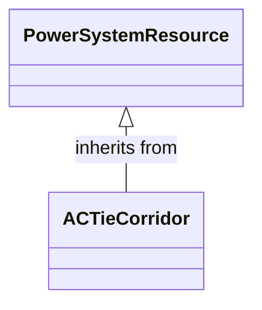

A collection of one or more AC tie lines that connect two different control areas.


#### Inherited Members

| name | type | description | mapping |
|------|------|-------------|---------|
| AssetDatasheet [0..1] | [AssetInfo](#CIM18v15-AssetInfo) | see [PowerSystemResource](CIM18v15-PowerSystemResource) | |
| DesignElement [0..1] | [DesignElement](#CIM18v15-DesignElement) | see [PowerSystemResource](CIM18v15-PowerSystemResource) | |
| Location [0..1] | [Location](#CIM18v15-Location) | see [PowerSystemResource](CIM18v15-PowerSystemResource) | |
| PSRType [0..1] | [PSRType](#CIM18v15-PSRType) | see [PowerSystemResource](CIM18v15-PowerSystemResource) | |
| mRID [0..1] | [String](#CIM18v15-String) | see [IdentifiedObject](#CIM18v15-IdentifiedObject) | |
| aliasName [0..1] | [String](#CIM18v15-String) | see [IdentifiedObject](#CIM18v15-IdentifiedObject) | |
| description [0..1] | [String](#CIM18v15-String) | see [IdentifiedObject](#CIM18v15-IdentifiedObject) | |
| `energyIdentCodeEic [0..1]` (European) | [String](#CIM18v15-String) | see [IdentifiedObject](#CIM18v15-IdentifiedObject) | |
| name [0..1] | [String](#CIM18v15-String) | see [IdentifiedObject](#CIM18v15-IdentifiedObject) | |
| `shortName [0..1]` (European) | [String](#CIM18v15-String) | see [IdentifiedObject](#CIM18v15-IdentifiedObject) | |

{#CIM18v15-Accumulator}
### Accumulator

Inheritance path = [Measurement](#CIM18v15-Measurement) => [IdentifiedObject](#CIM18v15-IdentifiedObject)

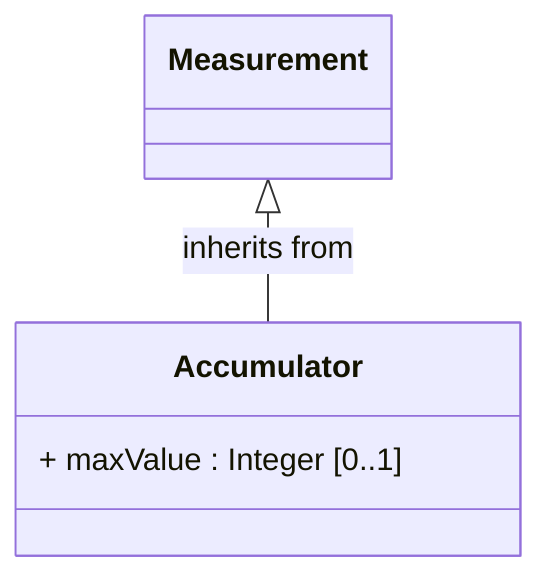

Accumulator represents an accumulated (counted) Measurement, e.g. an energy value.


#### Native Members

| name | type | description | mapping |
|------|------|-------------|---------|
| maxValue [0..1] | [Integer](#CIM18v15-Integer) | Normal value range maximum for any of the MeasurementValue.values. Used for scaling, e.g. in bar graphs or of telemetered raw values. | |

#### Inherited Members

| name | type | description | mapping |
|------|------|-------------|---------|
| measurementType [0..1] | [String](#CIM18v15-String) | see [Measurement](#CIM18v15-Measurement) | |
| phases [0..1] | [PhaseCode](#CIM18v15-PhaseCode) | see [Measurement](CIM18v15-Measurement) | |
| `sourceType [0..1]` (GridAPPSD) | [MeasurementSourceKind](#CIM18v15-MeasurementSourceKind) | see [Measurement](CIM18v15-Measurement) | |
| unitMultiplier [0..1] | [UnitMultiplier](#CIM18v15-UnitMultiplier) | see [Measurement](CIM18v15-Measurement) | |
| unitSymbol [0..1] | [UnitSymbol](#CIM18v15-UnitSymbol) | see [Measurement](CIM18v15-Measurement) | |
| Asset [0..1] | [Asset](#CIM18v15-Asset) | see [Measurement](CIM18v15-Measurement) | |
| CalculationMethodHierarchy [0..1] | [CalculationMethodHierarchy](#CIM18v15-CalculationMethodHierarchy) | see [Measurement](CIM18v15-Measurement) | |
| MeasurementAction [0..1] | [MeasurementAction](#CIM18v15-MeasurementAction) | see [Measurement](CIM18v15-Measurement) | |
| `MeasurementSystem [0..1]` | [MeasurementSystem](#CIM18v15-MeasurementSystem) | see [Measurement](CIM18v15-Measurement) | |
| PowerSystemResource [0..1] | [PowerSystemResource](#CIM18v15-PowerSystemResource) | see [Measurement](CIM18v15-Measurement) | |
| Terminal [0..1] | [ACDCTerminal](#CIM18v15-ACDCTerminal) | see [Measurement](CIM18v15-Measurement) | |
| mRID [0..1] | [String](#CIM18v15-String) | see [IdentifiedObject](#CIM18v15-IdentifiedObject) | |
| aliasName [0..1] | [String](#CIM18v15-String) | see [IdentifiedObject](#CIM18v15-IdentifiedObject) | |
| description [0..1] | [String](#CIM18v15-String) | see [IdentifiedObject](#CIM18v15-IdentifiedObject) | |
| `energyIdentCodeEic [0..1]` (European) | [String](#CIM18v15-String) | see [IdentifiedObject](#CIM18v15-IdentifiedObject) | |
| name [0..1] | [String](#CIM18v15-String) | see [IdentifiedObject](#CIM18v15-IdentifiedObject) | |
| `shortName [0..1]` (European) | [String](#CIM18v15-String) | see [IdentifiedObject](#CIM18v15-IdentifiedObject) | |

{#CIM18v15-AccumulatorLimit}
### AccumulatorLimit

Inheritance path = [Limit](#CIM18v15-Limit) => [IdentifiedObject](#CIM18v15-IdentifiedObject)

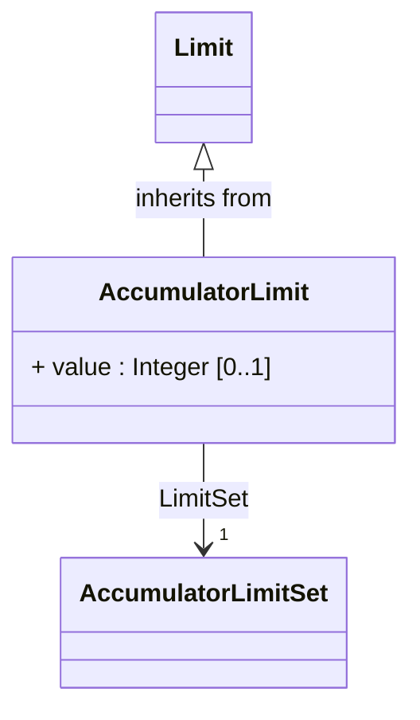

Limit values for Accumulator measurements.


#### Native Members

| name | type | description | mapping |
|------|------|-------------|---------|
| value [0..1] | [Integer](#CIM18v15-Integer) | The value to supervise against. The value is positive. | |
| `LimitSet [1]` (OfAggregate) | [AccumulatorLimitSet](#CIM18v15-AccumulatorLimitSet) | The set of limits. | |

#### Inherited Members

| name | type | description | mapping |
|------|------|-------------|---------|
| mRID [0..1] | [String](#CIM18v15-String) | see [IdentifiedObject](#CIM18v15-IdentifiedObject) | |
| aliasName [0..1] | [String](#CIM18v15-String) | see [IdentifiedObject](#CIM18v15-IdentifiedObject) | |
| description [0..1] | [String](#CIM18v15-String) | see [IdentifiedObject](#CIM18v15-IdentifiedObject) | |
| `energyIdentCodeEic [0..1]` (European) | [String](#CIM18v15-String) | see [IdentifiedObject](#CIM18v15-IdentifiedObject) | |
| name [0..1] | [String](#CIM18v15-String) | see [IdentifiedObject](#CIM18v15-IdentifiedObject) | |
| `shortName [0..1]` (European) | [String](#CIM18v15-String) | see [IdentifiedObject](#CIM18v15-IdentifiedObject) | |

{#CIM18v15-AccumulatorLimitSet}
### AccumulatorLimitSet

Inheritance path = [LimitSet](#CIM18v15-LimitSet) => [IdentifiedObject](#CIM18v15-IdentifiedObject)

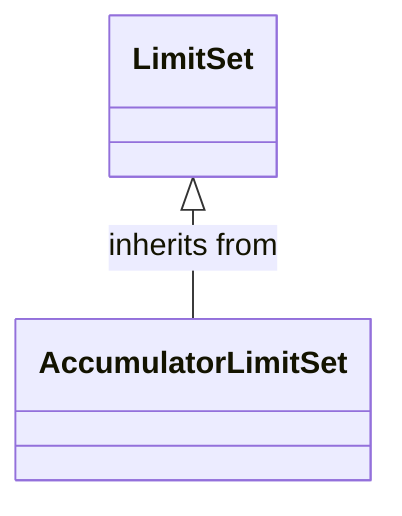

An AccumulatorLimitSet specifies a set of Limits that are associated with an Accumulator measurement.


#### Inherited Members

| name | type | description | mapping |
|------|------|-------------|---------|
| isPercentageLimits [0..1] | [Boolean](#CIM18v15-Boolean) | see [LimitSet](#CIM18v15-LimitSet) | |
| mRID [0..1] | [String](#CIM18v15-String) | see [IdentifiedObject](#CIM18v15-IdentifiedObject) | |
| aliasName [0..1] | [String](#CIM18v15-String) | see [IdentifiedObject](#CIM18v15-IdentifiedObject) | |
| description [0..1] | [String](#CIM18v15-String) | see [IdentifiedObject](#CIM18v15-IdentifiedObject) | |
| `energyIdentCodeEic [0..1]` (European) | [String](#CIM18v15-String) | see [IdentifiedObject](#CIM18v15-IdentifiedObject) | |
| name [0..1] | [String](#CIM18v15-String) | see [IdentifiedObject](#CIM18v15-IdentifiedObject) | |
| `shortName [0..1]` (European) | [String](#CIM18v15-String) | see [IdentifiedObject](#CIM18v15-IdentifiedObject) | |

{#CIM18v15-AccumulatorReset}
### AccumulatorReset

Inheritance path = [Control](#CIM18v15-Control) => [IOPoint](#CIM18v15-IOPoint) => [IdentifiedObject](#CIM18v15-IdentifiedObject)

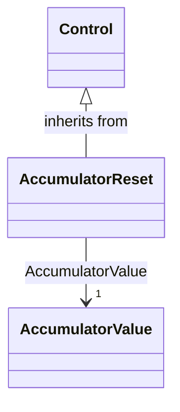

This command resets the counter value to zero.


#### Native Members

| name | type | description | mapping |
|------|------|-------------|---------|
| AccumulatorValue [1] | [AccumulatorValue](#CIM18v15-AccumulatorValue) | The accumulator value that is reset by the command. | |

#### Inherited Members

| name | type | description | mapping |
|------|------|-------------|---------|
| controlType [0..1] | [String](#CIM18v15-String) | see [Control](#CIM18v15-Control) | |
| operationInProgress [0..1] | [Boolean](#CIM18v15-Boolean) | see [Control](#CIM18v15-Control) | |
| timeStamp [0..1] | [DateTime](#CIM18v15-DateTime) | see [Control](#CIM18v15-Control) | |
| unitMultiplier [0..1] | [UnitMultiplier](#CIM18v15-UnitMultiplier) | see [Control](CIM18v15-Control) | |
| unitSymbol [0..1] | [UnitSymbol](#CIM18v15-UnitSymbol) | see [Control](CIM18v15-Control) | |
| ControlAction [0..1] | [ControlAction](#CIM18v15-ControlAction) | see [Control](CIM18v15-Control) | |
| PowerSystemResource [0..1] | [PowerSystemResource](#CIM18v15-PowerSystemResource) | see [Control](CIM18v15-Control) | |
| RemoteControl [0..1] | [RemoteControl](#CIM18v15-RemoteControl) | see [Control](CIM18v15-Control) | |
| IOPointSource [0..1] | [IOPointSource](#CIM18v15-IOPointSource) | see [IOPoint](CIM18v15-IOPoint) | |
| mRID [0..1] | [String](#CIM18v15-String) | see [IdentifiedObject](#CIM18v15-IdentifiedObject) | |
| aliasName [0..1] | [String](#CIM18v15-String) | see [IdentifiedObject](#CIM18v15-IdentifiedObject) | |
| description [0..1] | [String](#CIM18v15-String) | see [IdentifiedObject](#CIM18v15-IdentifiedObject) | |
| `energyIdentCodeEic [0..1]` (European) | [String](#CIM18v15-String) | see [IdentifiedObject](#CIM18v15-IdentifiedObject) | |
| name [0..1] | [String](#CIM18v15-String) | see [IdentifiedObject](#CIM18v15-IdentifiedObject) | |
| `shortName [0..1]` (European) | [String](#CIM18v15-String) | see [IdentifiedObject](#CIM18v15-IdentifiedObject) | |

{#CIM18v15-AccumulatorValue}
### AccumulatorValue

Inheritance path = [MeasurementValue](#CIM18v15-MeasurementValue) => [IOPoint](#CIM18v15-IOPoint) => [IdentifiedObject](#CIM18v15-IdentifiedObject)

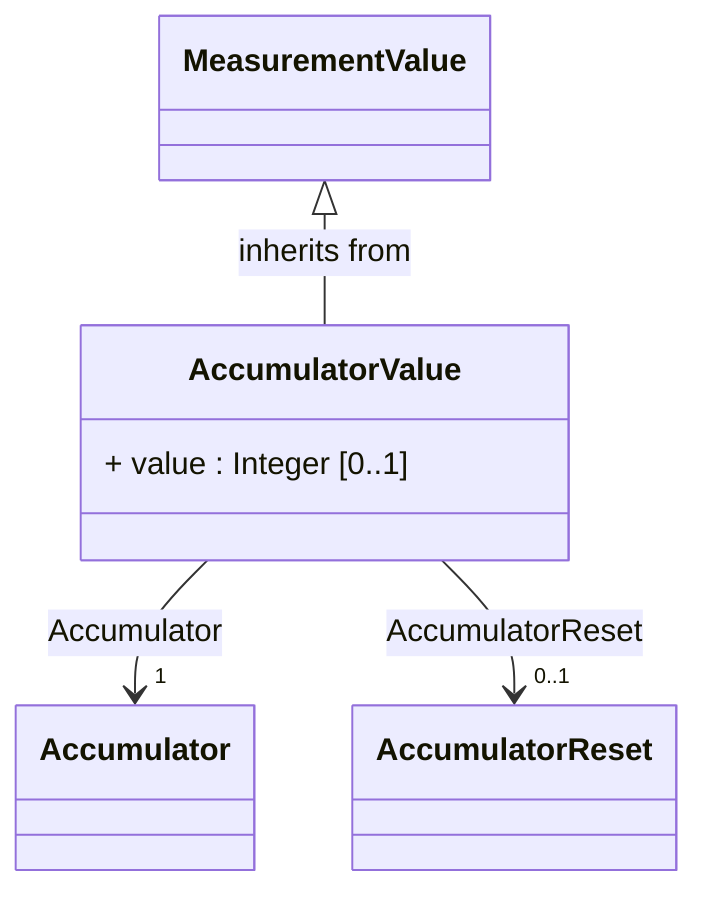

AccumulatorValue represents an accumulated (counted) MeasurementValue.


#### Native Members

| name | type | description | mapping |
|------|------|-------------|---------|
| value [0..1] | [Integer](#CIM18v15-Integer) | The value to supervise. The value is positive. | |
| `Accumulator [1]` (ShadowExtension) | [Accumulator](#CIM18v15-Accumulator) | Measurement to which this value is connected. | |
| AccumulatorReset [0..1] | [AccumulatorReset](#CIM18v15-AccumulatorReset) | The command that resets the accumulator value. | |

#### Inherited Members

| name | type | description | mapping |
|------|------|-------------|---------|
| sensorAccuracy [0..1] | [PerCent](#CIM18v15-PerCent) | see [MeasurementValue](CIM18v15-MeasurementValue) | |
| timeStamp [0..1] | [DateTime](#CIM18v15-DateTime) | see [MeasurementValue](#CIM18v15-MeasurementValue) | |
| `CalculationMethodHierarchy [0..1]` (harmonization) | [CalculationMethodHierarchy](#CIM18v15-CalculationMethodHierarchy) | see [MeasurementValue](CIM18v15-MeasurementValue) | |
| `ErpPerson [0..1]` (informative) | [OldPerson](#CIM18v15-OldPerson) | see [MeasurementValue](CIM18v15-MeasurementValue) | |
| `MeasurementValueQuality [0..1]` (AggregateOf) | [MeasurementValueQuality](#CIM18v15-MeasurementValueQuality) | see [MeasurementValue](CIM18v15-MeasurementValue) | |
| MeasurementValueSource [1] | [MeasurementValueSource](#CIM18v15-MeasurementValueSource) | see [MeasurementValue](CIM18v15-MeasurementValue) | |
| RemoteSource [0..1] | [RemoteSource](#CIM18v15-RemoteSource) | see [MeasurementValue](CIM18v15-MeasurementValue) | |
| IOPointSource [0..1] | [IOPointSource](#CIM18v15-IOPointSource) | see [IOPoint](CIM18v15-IOPoint) | |
| mRID [0..1] | [String](#CIM18v15-String) | see [IdentifiedObject](#CIM18v15-IdentifiedObject) | |
| aliasName [0..1] | [String](#CIM18v15-String) | see [IdentifiedObject](#CIM18v15-IdentifiedObject) | |
| description [0..1] | [String](#CIM18v15-String) | see [IdentifiedObject](#CIM18v15-IdentifiedObject) | |
| `energyIdentCodeEic [0..1]` (European) | [String](#CIM18v15-String) | see [IdentifiedObject](#CIM18v15-IdentifiedObject) | |
| name [0..1] | [String](#CIM18v15-String) | see [IdentifiedObject](#CIM18v15-IdentifiedObject) | |
| `shortName [0..1]` (European) | [String](#CIM18v15-String) | see [IdentifiedObject](#CIM18v15-IdentifiedObject) | |

{#CIM18v15-ActivePowerControlFunction}
### ActivePowerControlFunction

Inheritance path = [ControlFunctionBlock](#CIM18v15-ControlFunctionBlock) => [FunctionBlock](#CIM18v15-FunctionBlock) => [IdentifiedObject](#CIM18v15-IdentifiedObject)

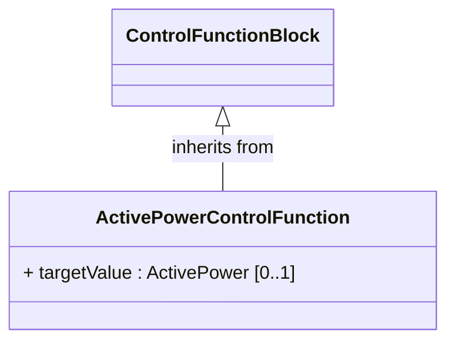

Active power control function is a function block that calculates operating point of the controlled equipment to achieve the target active power.


#### Native Members

| name | type | description | mapping |
|------|------|-------------|---------|
| targetValue [0..1] | [ActivePower](#CIM18v15-ActivePower) | Target value for the active power that the control function is calculating to achieve by adjusting the operational setting to the controlled equipment. | |

#### Inherited Members

| name | type | description | mapping |
|------|------|-------------|---------|
| isDiscrete [0..1] | [Boolean](#CIM18v15-Boolean) | see [ControlFunctionBlock](#CIM18v15-ControlFunctionBlock) | |
| maxAllowedTargetValue [0..1] | [PerCent](#CIM18v15-PerCent) | see [ControlFunctionBlock](CIM18v15-ControlFunctionBlock) | |
| minAllowedTargetValue [0..1] | [PerCent](#CIM18v15-PerCent) | see [ControlFunctionBlock](CIM18v15-ControlFunctionBlock) | |
| normalMaxAllowedTargetValue [0..1] | [PerCent](#CIM18v15-PerCent) | see [ControlFunctionBlock](CIM18v15-ControlFunctionBlock) | |
| normalMinAllowedTargetValue [0..1] | [PerCent](#CIM18v15-PerCent) | see [ControlFunctionBlock](CIM18v15-ControlFunctionBlock) | |
| targetDeadband [0..1] | [Float](#CIM18v15-Float) | see [ControlFunctionBlock](#CIM18v15-ControlFunctionBlock) | |
| enabled [0..1] | [Boolean](#CIM18v15-Boolean) | see [FunctionBlock](#CIM18v15-FunctionBlock) | |
| normalEnabled [0..1] | [Boolean](#CIM18v15-Boolean) | see [FunctionBlock](#CIM18v15-FunctionBlock) | |
| AutomationBlockGroup [0..1] | [AutomationBlockGroup](#CIM18v15-AutomationBlockGroup) | see [FunctionBlock](CIM18v15-FunctionBlock) | |
| AutomationFunction [0..1] | [AutomationFunction](#CIM18v15-AutomationFunction) | see [FunctionBlock](CIM18v15-FunctionBlock) | |
| FunctionBlockType [0..1] | [FunctionBlockType](#CIM18v15-FunctionBlockType) | see [FunctionBlock](CIM18v15-FunctionBlock) | |
| mRID [0..1] | [String](#CIM18v15-String) | see [IdentifiedObject](#CIM18v15-IdentifiedObject) | |
| aliasName [0..1] | [String](#CIM18v15-String) | see [IdentifiedObject](#CIM18v15-IdentifiedObject) | |
| description [0..1] | [String](#CIM18v15-String) | see [IdentifiedObject](#CIM18v15-IdentifiedObject) | |
| `energyIdentCodeEic [0..1]` (European) | [String](#CIM18v15-String) | see [IdentifiedObject](#CIM18v15-IdentifiedObject) | |
| name [0..1] | [String](#CIM18v15-String) | see [IdentifiedObject](#CIM18v15-IdentifiedObject) | |
| `shortName [0..1]` (European) | [String](#CIM18v15-String) | see [IdentifiedObject](#CIM18v15-IdentifiedObject) | |

{#CIM18v15-ActivePowerLimit}
### ActivePowerLimit

Inheritance path = [OperationalLimit](#CIM18v15-OperationalLimit) => [IdentifiedObject](#CIM18v15-IdentifiedObject)

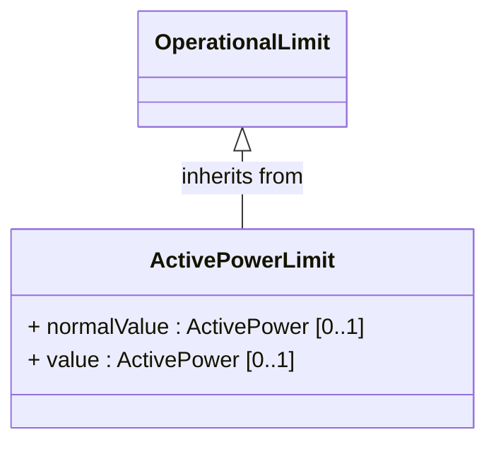

Limit on active power flow.


#### Native Members

| name | type | description | mapping |
|------|------|-------------|---------|
| normalValue [0..1] | [ActivePower](#CIM18v15-ActivePower) | The normal value of active power limit. The attribute shall be a positive value or zero. | |
| value [0..1] | [ActivePower](#CIM18v15-ActivePower) | Value of active power limit. The attribute shall be a positive value or zero. | |

#### Inherited Members

| name | type | description | mapping |
|------|------|-------------|---------|
| `OperationalLimitSet [1]` (OfAggregate) | [OperationalLimitSet](#CIM18v15-OperationalLimitSet) | see [OperationalLimit](CIM18v15-OperationalLimit) | |
| OperationalLimitType [0..1] | [OperationalLimitType](#CIM18v15-OperationalLimitType) | see [OperationalLimit](CIM18v15-OperationalLimit) | |
| StepOperationalLimitTable [0..1] | [StepOperationalLimitTable](#CIM18v15-StepOperationalLimitTable) | see [OperationalLimit](CIM18v15-OperationalLimit) | |
| mRID [0..1] | [String](#CIM18v15-String) | see [IdentifiedObject](#CIM18v15-IdentifiedObject) | |
| aliasName [0..1] | [String](#CIM18v15-String) | see [IdentifiedObject](#CIM18v15-IdentifiedObject) | |
| description [0..1] | [String](#CIM18v15-String) | see [IdentifiedObject](#CIM18v15-IdentifiedObject) | |
| `energyIdentCodeEic [0..1]` (European) | [String](#CIM18v15-String) | see [IdentifiedObject](#CIM18v15-IdentifiedObject) | |
| name [0..1] | [String](#CIM18v15-String) | see [IdentifiedObject](#CIM18v15-IdentifiedObject) | |
| `shortName [0..1]` (European) | [String](#CIM18v15-String) | see [IdentifiedObject](#CIM18v15-IdentifiedObject) | |

{#CIM18v15-AirCompressor}
### AirCompressor

Inheritance path = [PowerSystemResource](#CIM18v15-PowerSystemResource) => [IdentifiedObject](#CIM18v15-IdentifiedObject)

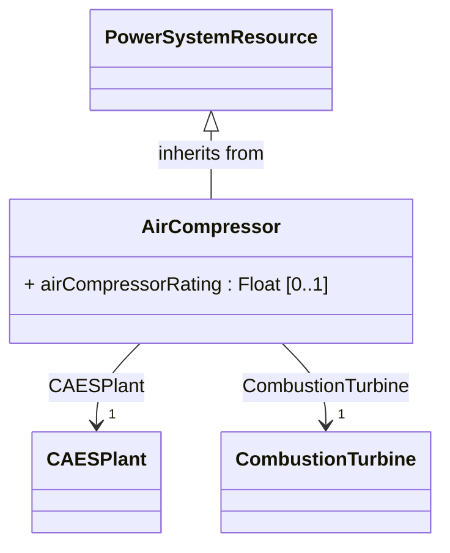

Combustion turbine air compressor which is an integral part of a compressed air energy storage (CAES) plant.


#### Native Members

| name | type | description | mapping |
|------|------|-------------|---------|
| airCompressorRating [0..1] | [Float](#CIM18v15-Float) | Rating of the CAES air compressor. | |
| `CAESPlant [1]` (OfAggregate) | [CAESPlant](#CIM18v15-CAESPlant) | An air compressor may be a member of a compressed air energy storage plant. | |
| CombustionTurbine [1] | [CombustionTurbine](#CIM18v15-CombustionTurbine) | A CAES air compressor is driven by combustion turbine. | |

#### Inherited Members

| name | type | description | mapping |
|------|------|-------------|---------|
| AssetDatasheet [0..1] | [AssetInfo](#CIM18v15-AssetInfo) | see [PowerSystemResource](CIM18v15-PowerSystemResource) | |
| DesignElement [0..1] | [DesignElement](#CIM18v15-DesignElement) | see [PowerSystemResource](CIM18v15-PowerSystemResource) | |
| Location [0..1] | [Location](#CIM18v15-Location) | see [PowerSystemResource](CIM18v15-PowerSystemResource) | |
| PSRType [0..1] | [PSRType](#CIM18v15-PSRType) | see [PowerSystemResource](CIM18v15-PowerSystemResource) | |
| mRID [0..1] | [String](#CIM18v15-String) | see [IdentifiedObject](#CIM18v15-IdentifiedObject) | |
| aliasName [0..1] | [String](#CIM18v15-String) | see [IdentifiedObject](#CIM18v15-IdentifiedObject) | |
| description [0..1] | [String](#CIM18v15-String) | see [IdentifiedObject](#CIM18v15-IdentifiedObject) | |
| `energyIdentCodeEic [0..1]` (European) | [String](#CIM18v15-String) | see [IdentifiedObject](#CIM18v15-IdentifiedObject) | |
| name [0..1] | [String](#CIM18v15-String) | see [IdentifiedObject](#CIM18v15-IdentifiedObject) | |
| `shortName [0..1]` (European) | [String](#CIM18v15-String) | see [IdentifiedObject](#CIM18v15-IdentifiedObject) | |

{#CIM18v15-AmbientTemperatureDependencyCurve}
### AmbientTemperatureDependencyCurve

Inheritance path = [Curve](#CIM18v15-Curve) => [IdentifiedObject](#CIM18v15-IdentifiedObject)

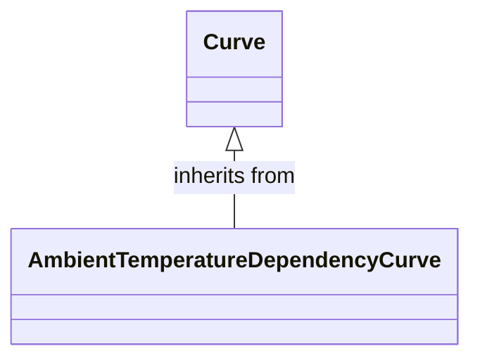

A curve or functional relationship between the ambient temperature independent variable (X-axis) and relative temperature dependent (Y-axis) variables.


#### Inherited Members

| name | type | description | mapping |
|------|------|-------------|---------|
| curveStyle [0..1] | [CurveStyle](#CIM18v15-CurveStyle) | see [Curve](CIM18v15-Curve) | |
| xMultiplier [0..1] | [UnitMultiplier](#CIM18v15-UnitMultiplier) | see [Curve](CIM18v15-Curve) | |
| xUnit [0..1] | [UnitSymbol](#CIM18v15-UnitSymbol) | see [Curve](CIM18v15-Curve) | |
| y1Multiplier [0..1] | [UnitMultiplier](#CIM18v15-UnitMultiplier) | see [Curve](CIM18v15-Curve) | |
| y1Unit [0..1] | [UnitSymbol](#CIM18v15-UnitSymbol) | see [Curve](CIM18v15-Curve) | |
| y2Multiplier [0..1] | [UnitMultiplier](#CIM18v15-UnitMultiplier) | see [Curve](CIM18v15-Curve) | |
| y2Unit [0..1] | [UnitSymbol](#CIM18v15-UnitSymbol) | see [Curve](CIM18v15-Curve) | |
| y3Multiplier [0..1] | [UnitMultiplier](#CIM18v15-UnitMultiplier) | see [Curve](CIM18v15-Curve) | |
| y3Unit [0..1] | [UnitSymbol](#CIM18v15-UnitSymbol) | see [Curve](CIM18v15-Curve) | |
| mRID [0..1] | [String](#CIM18v15-String) | see [IdentifiedObject](#CIM18v15-IdentifiedObject) | |
| aliasName [0..1] | [String](#CIM18v15-String) | see [IdentifiedObject](#CIM18v15-IdentifiedObject) | |
| description [0..1] | [String](#CIM18v15-String) | see [IdentifiedObject](#CIM18v15-IdentifiedObject) | |
| `energyIdentCodeEic [0..1]` (European) | [String](#CIM18v15-String) | see [IdentifiedObject](#CIM18v15-IdentifiedObject) | |
| name [0..1] | [String](#CIM18v15-String) | see [IdentifiedObject](#CIM18v15-IdentifiedObject) | |
| `shortName [0..1]` (European) | [String](#CIM18v15-String) | see [IdentifiedObject](#CIM18v15-IdentifiedObject) | |

{#CIM18v15-AnalogControl}
### AnalogControl

Inheritance path = [Control](#CIM18v15-Control) => [IOPoint](#CIM18v15-IOPoint) => [IdentifiedObject](#CIM18v15-IdentifiedObject)

```mermaid
classDiagram
direction TB

class AnalogControl {

+ maxValue : Float [0..1]
+ minValue : Float [0..1]
}

class Control {

}

Control <|-- AnalogControl : inherits from
class AnalogValue {
}

AnalogControl --> "1" AnalogValue : AnalogValue
```

An analog control used for supervisory control.


#### Native Members

| name | type | description | mapping |
|------|------|-------------|---------|
| maxValue [0..1] | [Float](#CIM18v15-Float) | Normal value range maximum for any of the Control.value. Used for scaling, e.g. in bar graphs. | |
| minValue [0..1] | [Float](#CIM18v15-Float) | Normal value range minimum for any of the Control.value. Used for scaling, e.g. in bar graphs. | |
| AnalogValue [1] | [AnalogValue](#CIM18v15-AnalogValue) | The MeasurementValue that is controlled. | |

#### Inherited Members

| name | type | description | mapping |
|------|------|-------------|---------|
| controlType [0..1] | [String](#CIM18v15-String) | see [Control](#CIM18v15-Control) | |
| operationInProgress [0..1] | [Boolean](#CIM18v15-Boolean) | see [Control](#CIM18v15-Control) | |
| timeStamp [0..1] | [DateTime](#CIM18v15-DateTime) | see [Control](#CIM18v15-Control) | |
| unitMultiplier [0..1] | [UnitMultiplier](#CIM18v15-UnitMultiplier) | see [Control](CIM18v15-Control) | |
| unitSymbol [0..1] | [UnitSymbol](#CIM18v15-UnitSymbol) | see [Control](CIM18v15-Control) | |
| ControlAction [0..1] | [ControlAction](#CIM18v15-ControlAction) | see [Control](CIM18v15-Control) | |
| PowerSystemResource [0..1] | [PowerSystemResource](#CIM18v15-PowerSystemResource) | see [Control](CIM18v15-Control) | |
| RemoteControl [0..1] | [RemoteControl](#CIM18v15-RemoteControl) | see [Control](CIM18v15-Control) | |
| IOPointSource [0..1] | [IOPointSource](#CIM18v15-IOPointSource) | see [IOPoint](CIM18v15-IOPoint) | |
| mRID [0..1] | [String](#CIM18v15-String) | see [IdentifiedObject](#CIM18v15-IdentifiedObject) | |
| aliasName [0..1] | [String](#CIM18v15-String) | see [IdentifiedObject](#CIM18v15-IdentifiedObject) | |
| description [0..1] | [String](#CIM18v15-String) | see [IdentifiedObject](#CIM18v15-IdentifiedObject) | |
| `energyIdentCodeEic [0..1]` (European) | [String](#CIM18v15-String) | see [IdentifiedObject](#CIM18v15-IdentifiedObject) | |
| name [0..1] | [String](#CIM18v15-String) | see [IdentifiedObject](#CIM18v15-IdentifiedObject) | |
| `shortName [0..1]` (European) | [String](#CIM18v15-String) | see [IdentifiedObject](#CIM18v15-IdentifiedObject) | |

{#CIM18v15-AnalogLimit}
### AnalogLimit

Inheritance path = [Limit](#CIM18v15-Limit) => [IdentifiedObject](#CIM18v15-IdentifiedObject)

```mermaid
classDiagram
direction TB

class AnalogLimit {

+ value : Float [0..1]
}

class Limit {

}

Limit <|-- AnalogLimit : inherits from
class AnalogLimitSet {

}

AnalogLimit --> "1" AnalogLimitSet : LimitSet
```

Limit values for Analog measurements.


#### Native Members

| name | type | description | mapping |
|------|------|-------------|---------|
| value [0..1] | [Float](#CIM18v15-Float) | The value to supervise against. | |
| `LimitSet [1]` (OfAggregate) | [AnalogLimitSet](#CIM18v15-AnalogLimitSet) | The set of limits. | |

#### Inherited Members

| name | type | description | mapping |
|------|------|-------------|---------|
| mRID [0..1] | [String](#CIM18v15-String) | see [IdentifiedObject](#CIM18v15-IdentifiedObject) | |
| aliasName [0..1] | [String](#CIM18v15-String) | see [IdentifiedObject](#CIM18v15-IdentifiedObject) | |
| description [0..1] | [String](#CIM18v15-String) | see [IdentifiedObject](#CIM18v15-IdentifiedObject) | |
| `energyIdentCodeEic [0..1]` (European) | [String](#CIM18v15-String) | see [IdentifiedObject](#CIM18v15-IdentifiedObject) | |
| name [0..1] | [String](#CIM18v15-String) | see [IdentifiedObject](#CIM18v15-IdentifiedObject) | |
| `shortName [0..1]` (European) | [String](#CIM18v15-String) | see [IdentifiedObject](#CIM18v15-IdentifiedObject) | |

{#CIM18v15-AnalogLimitSet}
### AnalogLimitSet

Inheritance path = [LimitSet](#CIM18v15-LimitSet) => [IdentifiedObject](#CIM18v15-IdentifiedObject)

```mermaid
classDiagram
direction TB

class AnalogLimitSet {

}

class LimitSet {

}

LimitSet <|-- AnalogLimitSet : inherits from
```

An AnalogLimitSet specifies a set of Limits that are associated with an Analog measurement.


#### Inherited Members

| name | type | description | mapping |
|------|------|-------------|---------|
| isPercentageLimits [0..1] | [Boolean](#CIM18v15-Boolean) | see [LimitSet](#CIM18v15-LimitSet) | |
| mRID [0..1] | [String](#CIM18v15-String) | see [IdentifiedObject](#CIM18v15-IdentifiedObject) | |
| aliasName [0..1] | [String](#CIM18v15-String) | see [IdentifiedObject](#CIM18v15-IdentifiedObject) | |
| description [0..1] | [String](#CIM18v15-String) | see [IdentifiedObject](#CIM18v15-IdentifiedObject) | |
| `energyIdentCodeEic [0..1]` (European) | [String](#CIM18v15-String) | see [IdentifiedObject](#CIM18v15-IdentifiedObject) | |
| name [0..1] | [String](#CIM18v15-String) | see [IdentifiedObject](#CIM18v15-IdentifiedObject) | |
| `shortName [0..1]` (European) | [String](#CIM18v15-String) | see [IdentifiedObject](#CIM18v15-IdentifiedObject) | |

{#CIM18v15-AngleBusbarInfo}
### AngleBusbarInfo

Inheritance path = [RigidBusbarInfo](#CIM18v15-RigidBusbarInfo) => [ConductorInfo](#CIM18v15-ConductorInfo) => [ConductingAssetInfo](#CIM18v15-ConductingAssetInfo) => [AssetInfo](#CIM18v15-AssetInfo) => [IdentifiedObject](#CIM18v15-IdentifiedObject)

```mermaid
classDiagram
direction TB

class AngleBusbarInfo {

+ crossSectionWidth : Length [0..1]
+ thickness : Length [0..1]
}

class RigidBusbarInfo {

}

RigidBusbarInfo <|-- AngleBusbarInfo : inherits from
```

L-shape bar with both legs of uniform thickness and same width


#### Native Members

| name | type | description | mapping |
|------|------|-------------|---------|
| crossSectionWidth [0..1] | [Length](#CIM18v15-Length) | Cross section width of the conductor | |
| thickness [0..1] | [Length](#CIM18v15-Length) | Thickness of the angle bus bar | |

#### Inherited Members

| name | type | description | mapping |
|------|------|-------------|---------|
| crossSection [0..1] | [Area](#CIM18v15-Area) | see [ConductorInfo](CIM18v15-ConductorInfo) | |
| `massPerLength [0..1]` (NeedsWork) | [MassPerLength](#CIM18v15-MassPerLength) | see [ConductorInfo](CIM18v15-ConductorInfo) | |
| material [0..1] | [WireMaterialKind](#CIM18v15-WireMaterialKind) | see [ConductorInfo](CIM18v15-ConductorInfo) | |
| purpose [0..1] | [String](#CIM18v15-String) | see [ConductorInfo](#CIM18v15-ConductorInfo) | |
| rAC25 [0..1] | [ResistancePerLength](#CIM18v15-ResistancePerLength) | see [ConductorInfo](CIM18v15-ConductorInfo) | |
| rAC50 [0..1] | [ResistancePerLength](#CIM18v15-ResistancePerLength) | see [ConductorInfo](CIM18v15-ConductorInfo) | |
| rAC75 [0..1] | [ResistancePerLength](#CIM18v15-ResistancePerLength) | see [ConductorInfo](CIM18v15-ConductorInfo) | |
| rDC20 [0..1] | [ResistancePerLength](#CIM18v15-ResistancePerLength) | see [ConductorInfo](CIM18v15-ConductorInfo) | |
| phaseCount [0..1] | [PhaseCountKind](#CIM18v15-PhaseCountKind) | see [ConductingAssetInfo](CIM18v15-ConductingAssetInfo) | |
| ratedCurrent [0..1] | [CurrentFlow](#CIM18v15-CurrentFlow) | see [ConductingAssetInfo](CIM18v15-ConductingAssetInfo) | |
| ratedFrequency [0..1] | [Frequency](#CIM18v15-Frequency) | see [ConductingAssetInfo](CIM18v15-ConductingAssetInfo) | |
| ratedVoltage [0..1] | [Voltage](#CIM18v15-Voltage) | see [ConductingAssetInfo](CIM18v15-ConductingAssetInfo) | |
| AssetRequirement [0..1] | [AssetRequirement](#CIM18v15-AssetRequirement) | see [AssetInfo](CIM18v15-AssetInfo) | |
| CatalogAssetType [0..1] | [CatalogAssetType](#CIM18v15-CatalogAssetType) | see [AssetInfo](CIM18v15-AssetInfo) | |
| ChildAssetInfoComponent [0..1] | [AssetInfoComponent](#CIM18v15-AssetInfoComponent) | see [AssetInfo](CIM18v15-AssetInfo) | |
| ParentAssetInfoComponent [0..1] | [AssetInfoComponent](#CIM18v15-AssetInfoComponent) | see [AssetInfo](CIM18v15-AssetInfo) | |
| ProductAssetModel [0..1] | [ProductAssetModel](#CIM18v15-ProductAssetModel) | see [AssetInfo](CIM18v15-AssetInfo) | |
| mRID [0..1] | [String](#CIM18v15-String) | see [IdentifiedObject](#CIM18v15-IdentifiedObject) | |
| aliasName [0..1] | [String](#CIM18v15-String) | see [IdentifiedObject](#CIM18v15-IdentifiedObject) | |
| description [0..1] | [String](#CIM18v15-String) | see [IdentifiedObject](#CIM18v15-IdentifiedObject) | |
| `energyIdentCodeEic [0..1]` (European) | [String](#CIM18v15-String) | see [IdentifiedObject](#CIM18v15-IdentifiedObject) | |
| name [0..1] | [String](#CIM18v15-String) | see [IdentifiedObject](#CIM18v15-IdentifiedObject) | |
| `shortName [0..1]` (European) | [String](#CIM18v15-String) | see [IdentifiedObject](#CIM18v15-IdentifiedObject) | |

{#CIM18v15-ApparentPowerLimit}
### ApparentPowerLimit

Inheritance path = [OperationalLimit](#CIM18v15-OperationalLimit) => [IdentifiedObject](#CIM18v15-IdentifiedObject)

```mermaid
classDiagram
direction TB

class ApparentPowerLimit {

+ normalValue : ApparentPower [0..1]
+ value : ApparentPower [0..1]
}

class OperationalLimit {

}

OperationalLimit <|-- ApparentPowerLimit : inherits from
```

Apparent power limit.


#### Native Members

| name | type | description | mapping |
|------|------|-------------|---------|
| normalValue [0..1] | [ApparentPower](#CIM18v15-ApparentPower) | The normal apparent power limit. The attribute shall be a positive value or zero. | |
| value [0..1] | [ApparentPower](#CIM18v15-ApparentPower) | The apparent power limit. The attribute shall be a positive value or zero. | |

#### Inherited Members

| name | type | description | mapping |
|------|------|-------------|---------|
| `OperationalLimitSet [1]` (OfAggregate) | [OperationalLimitSet](#CIM18v15-OperationalLimitSet) | see [OperationalLimit](CIM18v15-OperationalLimit) | |
| OperationalLimitType [0..1] | [OperationalLimitType](#CIM18v15-OperationalLimitType) | see [OperationalLimit](CIM18v15-OperationalLimit) | |
| StepOperationalLimitTable [0..1] | [StepOperationalLimitTable](#CIM18v15-StepOperationalLimitTable) | see [OperationalLimit](CIM18v15-OperationalLimit) | |
| mRID [0..1] | [String](#CIM18v15-String) | see [IdentifiedObject](#CIM18v15-IdentifiedObject) | |
| aliasName [0..1] | [String](#CIM18v15-String) | see [IdentifiedObject](#CIM18v15-IdentifiedObject) | |
| description [0..1] | [String](#CIM18v15-String) | see [IdentifiedObject](#CIM18v15-IdentifiedObject) | |
| `energyIdentCodeEic [0..1]` (European) | [String](#CIM18v15-String) | see [IdentifiedObject](#CIM18v15-IdentifiedObject) | |
| name [0..1] | [String](#CIM18v15-String) | see [IdentifiedObject](#CIM18v15-IdentifiedObject) | |
| `shortName [0..1]` (European) | [String](#CIM18v15-String) | see [IdentifiedObject](#CIM18v15-IdentifiedObject) | |

{#CIM18v15-AreaDispatchableUnit}
### (NC) AreaDispatchableUnit

Inheritance path = [PowerSystemResource](#CIM18v15-PowerSystemResource) => [IdentifiedObject](#CIM18v15-IdentifiedObject)

```mermaid
classDiagram
direction TB

class AreaDispatchableUnit {

}

class PowerSystemResource {

}

PowerSystemResource <|-- AreaDispatchableUnit : inherits from
```

Allocates a given producing or consuming unit, including direct current corridor and collection of units, to a given control area (through the scheduling area) for supporting the control of the given area through dispatch instruction.


#### Inherited Members

| name | type | description | mapping |
|------|------|-------------|---------|
| AssetDatasheet [0..1] | [AssetInfo](#CIM18v15-AssetInfo) | see [PowerSystemResource](CIM18v15-PowerSystemResource) | |
| DesignElement [0..1] | [DesignElement](#CIM18v15-DesignElement) | see [PowerSystemResource](CIM18v15-PowerSystemResource) | |
| Location [0..1] | [Location](#CIM18v15-Location) | see [PowerSystemResource](CIM18v15-PowerSystemResource) | |
| PSRType [0..1] | [PSRType](#CIM18v15-PSRType) | see [PowerSystemResource](CIM18v15-PowerSystemResource) | |
| mRID [0..1] | [String](#CIM18v15-String) | see [IdentifiedObject](#CIM18v15-IdentifiedObject) | |
| aliasName [0..1] | [String](#CIM18v15-String) | see [IdentifiedObject](#CIM18v15-IdentifiedObject) | |
| description [0..1] | [String](#CIM18v15-String) | see [IdentifiedObject](#CIM18v15-IdentifiedObject) | |
| `energyIdentCodeEic [0..1]` (European) | [String](#CIM18v15-String) | see [IdentifiedObject](#CIM18v15-IdentifiedObject) | |
| name [0..1] | [String](#CIM18v15-String) | see [IdentifiedObject](#CIM18v15-IdentifiedObject) | |
| `shortName [0..1]` (European) | [String](#CIM18v15-String) | see [IdentifiedObject](#CIM18v15-IdentifiedObject) | |

{#CIM18v15-AreaInterchangeController}
### AreaInterchangeController

Inheritance path = [SystemControl](#CIM18v15-SystemControl) => [AutomationFunction](#CIM18v15-AutomationFunction) => [PowerSystemResource](#CIM18v15-PowerSystemResource) => [IdentifiedObject](#CIM18v15-IdentifiedObject)

```mermaid
classDiagram
direction TB

class AreaInterchangeController {

+ pTolerance : ActivePower [0..1]
}

class SystemControl {

}

SystemControl <|-- AreaInterchangeController : inherits from
class BiddingZone {

}

AreaInterchangeController --> "0..1" BiddingZone : BiddingZone
class BiddingZoneBorder {

}

AreaInterchangeController --> "0..1" BiddingZoneBorder : BiddingZoneBorder
class ControlArea {

}

AreaInterchangeController --> "0..1" ControlArea : ControlArea
```

Area interchange control is set to control active power of an area.


#### Native Members

| name | type | description | mapping |
|------|------|-------------|---------|
| pTolerance [0..1] | [ActivePower](#CIM18v15-ActivePower) | Active power net interchange tolerance. The attribute shall be a positive value or zero. | |
| `BiddingZone [0..1]` | [BiddingZone](#CIM18v15-BiddingZone) | Bidding zone which has an area interchange controller. | |
| `BiddingZoneBorder [0..1]` | [BiddingZoneBorder](#CIM18v15-BiddingZoneBorder) | Bidding zone border that has an area interchange controller. | |
| ControlArea [0..1] | [ControlArea](#CIM18v15-ControlArea) | Control area that has a area interchange controller. | |

#### Inherited Members

| name | type | description | mapping |
|------|------|-------------|---------|
| enabled [0..1] | [Boolean](#CIM18v15-Boolean) | see [AutomationFunction](#CIM18v15-AutomationFunction) | |
| normalEnabled [0..1] | [Boolean](#CIM18v15-Boolean) | see [AutomationFunction](#CIM18v15-AutomationFunction) | |
| type [0..1] | [String](#CIM18v15-String) | see [AutomationFunction](#CIM18v15-AutomationFunction) | |
| PartOf [0..1] | [AutomationFunction](#CIM18v15-AutomationFunction) | see [AutomationFunction](CIM18v15-AutomationFunction) | |
| AssetDatasheet [0..1] | [AssetInfo](#CIM18v15-AssetInfo) | see [PowerSystemResource](CIM18v15-PowerSystemResource) | |
| DesignElement [0..1] | [DesignElement](#CIM18v15-DesignElement) | see [PowerSystemResource](CIM18v15-PowerSystemResource) | |
| Location [0..1] | [Location](#CIM18v15-Location) | see [PowerSystemResource](CIM18v15-PowerSystemResource) | |
| PSRType [0..1] | [PSRType](#CIM18v15-PSRType) | see [PowerSystemResource](CIM18v15-PowerSystemResource) | |
| mRID [0..1] | [String](#CIM18v15-String) | see [IdentifiedObject](#CIM18v15-IdentifiedObject) | |
| aliasName [0..1] | [String](#CIM18v15-String) | see [IdentifiedObject](#CIM18v15-IdentifiedObject) | |
| description [0..1] | [String](#CIM18v15-String) | see [IdentifiedObject](#CIM18v15-IdentifiedObject) | |
| `energyIdentCodeEic [0..1]` (European) | [String](#CIM18v15-String) | see [IdentifiedObject](#CIM18v15-IdentifiedObject) | |
| name [0..1] | [String](#CIM18v15-String) | see [IdentifiedObject](#CIM18v15-IdentifiedObject) | |
| `shortName [0..1]` (European) | [String](#CIM18v15-String) | see [IdentifiedObject](#CIM18v15-IdentifiedObject) | |

{#CIM18v15-Asset}
### Asset

Inheritance path = [IdentifiedObject](#CIM18v15-IdentifiedObject)

```mermaid
classDiagram
direction TB

class Asset {

}

class IdentifiedObject {

}

IdentifiedObject <|-- Asset : inherits from
```

Tangible resource of the utility, including power system equipment, various end devices, cabinets, buildings, etc. For electrical network equipment, the role of the asset is defined through PowerSystemResource and its subclasses, defined mainly in the Wires model (refer to IEC61970-301 and model package IEC61970::Wires). Asset description places emphasis on the physical characteristics of the equipment fulfilling that role.


#### Inherited Members

| name | type | description | mapping |
|------|------|-------------|---------|
| mRID [0..1] | [String](#CIM18v15-String) | see [IdentifiedObject](#CIM18v15-IdentifiedObject) | |
| aliasName [0..1] | [String](#CIM18v15-String) | see [IdentifiedObject](#CIM18v15-IdentifiedObject) | |
| description [0..1] | [String](#CIM18v15-String) | see [IdentifiedObject](#CIM18v15-IdentifiedObject) | |
| `energyIdentCodeEic [0..1]` (European) | [String](#CIM18v15-String) | see [IdentifiedObject](#CIM18v15-IdentifiedObject) | |
| name [0..1] | [String](#CIM18v15-String) | see [IdentifiedObject](#CIM18v15-IdentifiedObject) | |
| `shortName [0..1]` (European) | [String](#CIM18v15-String) | see [IdentifiedObject](#CIM18v15-IdentifiedObject) | |

{#CIM18v15-AssetInfo}
### AssetInfo

Inheritance path = [IdentifiedObject](#CIM18v15-IdentifiedObject)

```mermaid
classDiagram
direction TB

class AssetInfo {

}

class IdentifiedObject {

}

IdentifiedObject <|-- AssetInfo : inherits from
class AssetRequirement {

}

AssetInfo --> "0..1" AssetRequirement : AssetRequirement
class CatalogAssetType {

}

AssetInfo --> "0..1" CatalogAssetType : CatalogAssetType
class AssetInfoComponent {

}

AssetInfo --> "0..1" AssetInfoComponent : ChildAssetInfoComponent
class AssetInfoComponent {

}

AssetInfo --> "0..1" AssetInfoComponent : ParentAssetInfoComponent
class ProductAssetModel {

}

AssetInfo --> "0..1" ProductAssetModel : ProductAssetModel
```

Set of attributes of an asset, representing typical datasheet information of a physical device that can be instantiated and shared in different data exchange contexts:

- as attributes of an asset instance (installed or in stock)

- as attributes of an asset model (product by a manufacturer)

- as attributes of a type asset (generic type of an asset as used in designs/extension planning).


#### Native Members

| name | type | description | mapping |
|------|------|-------------|---------|
| AssetRequirement [0..1] | [AssetRequirement](#CIM18v15-AssetRequirement) | | |
| CatalogAssetType [0..1] | [CatalogAssetType](#CIM18v15-CatalogAssetType) | Asset information (nameplate) for this catalog asset type. | |
| ChildAssetInfoComponent [0..1] | [AssetInfoComponent](#CIM18v15-AssetInfoComponent) | | |
| ParentAssetInfoComponent [0..1] | [AssetInfoComponent](#CIM18v15-AssetInfoComponent) | | |
| ProductAssetModel [0..1] | [ProductAssetModel](#CIM18v15-ProductAssetModel) | Product asset model which conforms to this catalog asset type. | |

#### Inherited Members

| name | type | description | mapping |
|------|------|-------------|---------|
| mRID [0..1] | [String](#CIM18v15-String) | see [IdentifiedObject](#CIM18v15-IdentifiedObject) | |
| aliasName [0..1] | [String](#CIM18v15-String) | see [IdentifiedObject](#CIM18v15-IdentifiedObject) | |
| description [0..1] | [String](#CIM18v15-String) | see [IdentifiedObject](#CIM18v15-IdentifiedObject) | |
| `energyIdentCodeEic [0..1]` (European) | [String](#CIM18v15-String) | see [IdentifiedObject](#CIM18v15-IdentifiedObject) | |
| name [0..1] | [String](#CIM18v15-String) | see [IdentifiedObject](#CIM18v15-IdentifiedObject) | |
| `shortName [0..1]` (European) | [String](#CIM18v15-String) | see [IdentifiedObject](#CIM18v15-IdentifiedObject) | |

{#CIM18v15-AssetInfoComponent}
### AssetInfoComponent

Inheritance path = [IdentifiedObject](#CIM18v15-IdentifiedObject)

```mermaid
classDiagram
direction TB

class AssetInfoComponent {

+ type : String [0..1]
}

class IdentifiedObject {

}

IdentifiedObject <|-- AssetInfoComponent : inherits from
class AssetInfo {

}

AssetInfoComponent --> "0..1" AssetInfo : ChildAssetInfo
class AssetInfo {

}

AssetInfoComponent --> "0..1" AssetInfo : ParentAssetInfo
```

Components of an asset info


#### Native Members

| name | type | description | mapping |
|------|------|-------------|---------|
| type [0..1] | [String](#CIM18v15-String) | Type of component | |
| ChildAssetInfo [0..1] | [AssetInfo](#CIM18v15-AssetInfo) | | |
| ParentAssetInfo [0..1] | [AssetInfo](#CIM18v15-AssetInfo) | | |

#### Inherited Members

| name | type | description | mapping |
|------|------|-------------|---------|
| mRID [0..1] | [String](#CIM18v15-String) | see [IdentifiedObject](#CIM18v15-IdentifiedObject) | |
| aliasName [0..1] | [String](#CIM18v15-String) | see [IdentifiedObject](#CIM18v15-IdentifiedObject) | |
| description [0..1] | [String](#CIM18v15-String) | see [IdentifiedObject](#CIM18v15-IdentifiedObject) | |
| `energyIdentCodeEic [0..1]` (European) | [String](#CIM18v15-String) | see [IdentifiedObject](#CIM18v15-IdentifiedObject) | |
| name [0..1] | [String](#CIM18v15-String) | see [IdentifiedObject](#CIM18v15-IdentifiedObject) | |
| `shortName [0..1]` (European) | [String](#CIM18v15-String) | see [IdentifiedObject](#CIM18v15-IdentifiedObject) | |

{#CIM18v15-AssetRequirement}
### AssetRequirement

Inheritance path = [IdentifiedObject](#CIM18v15-IdentifiedObject)

```mermaid
classDiagram
direction TB

class AssetRequirement {

}

class IdentifiedObject {

}

IdentifiedObject <|-- AssetRequirement : inherits from
```

This is an asset requirement information defined by designed (product procurer). It is related to AssetInfo.


#### Inherited Members

| name | type | description | mapping |
|------|------|-------------|---------|
| mRID [0..1] | [String](#CIM18v15-String) | see [IdentifiedObject](#CIM18v15-IdentifiedObject) | |
| aliasName [0..1] | [String](#CIM18v15-String) | see [IdentifiedObject](#CIM18v15-IdentifiedObject) | |
| description [0..1] | [String](#CIM18v15-String) | see [IdentifiedObject](#CIM18v15-IdentifiedObject) | |
| `energyIdentCodeEic [0..1]` (European) | [String](#CIM18v15-String) | see [IdentifiedObject](#CIM18v15-IdentifiedObject) | |
| name [0..1] | [String](#CIM18v15-String) | see [IdentifiedObject](#CIM18v15-IdentifiedObject) | |
| `shortName [0..1]` (European) | [String](#CIM18v15-String) | see [IdentifiedObject](#CIM18v15-IdentifiedObject) | |

{#CIM18v15-AsynchronousMachineDynamics}
### AsynchronousMachineDynamics

Inheritance path = [IdentifiedObject](#CIM18v15-IdentifiedObject)

```mermaid
classDiagram
direction TB

class AsynchronousMachineDynamics {

}

class IdentifiedObject {

}

IdentifiedObject <|-- AsynchronousMachineDynamics : inherits from
```

Asynchronous machine whose behaviour is described by reference to a standard model expressed in either time constant reactance form or equivalent circuit form <font color="#0f0f0f">or by definition of a user-defined model.</font>

Parameter details:

<ol>

<li>Asynchronous machine parameters such as <i>Xl, Xs,</i> etc. are actually used as inductances in the model, but are commonly referred to as reactances since, at nominal frequency, the PU values are the same. However, some references use the symbol <i>L</i> instead of <i>X</i>.</li>

</ol>


#### Inherited Members

| name | type | description | mapping |
|------|------|-------------|---------|
| mRID [0..1] | [String](#CIM18v15-String) | see [IdentifiedObject](#CIM18v15-IdentifiedObject) | |
| aliasName [0..1] | [String](#CIM18v15-String) | see [IdentifiedObject](#CIM18v15-IdentifiedObject) | |
| description [0..1] | [String](#CIM18v15-String) | see [IdentifiedObject](#CIM18v15-IdentifiedObject) | |
| `energyIdentCodeEic [0..1]` (European) | [String](#CIM18v15-String) | see [IdentifiedObject](#CIM18v15-IdentifiedObject) | |
| name [0..1] | [String](#CIM18v15-String) | see [IdentifiedObject](#CIM18v15-IdentifiedObject) | |
| `shortName [0..1]` (European) | [String](#CIM18v15-String) | see [IdentifiedObject](#CIM18v15-IdentifiedObject) | |

{#CIM18v15-AutomationBlockGroup}
### AutomationBlockGroup


```mermaid
classDiagram
direction TB

class AutomationBlockGroup {

+ priority : Integer [0..1]
}

class AutomationFunction {

}

AutomationBlockGroup --> "1" AutomationFunction : AutomationFunction
```

Grouping of function block that are operated with the same priority as settings.


#### Native Members

| name | type | description | mapping |
|------|------|-------------|---------|
| priority [0..1] | [Integer](#CIM18v15-Integer) | Value 0 means ignore priority. 1 means the highest priority, 2 is the second highest priority. | |
| `AutomationFunction [1]` (OfAggregate) | [AutomationFunction](#CIM18v15-AutomationFunction) | Automation function which has automation block group. | |

{#CIM18v15-AutomationFunction}
### AutomationFunction

Inheritance path = [PowerSystemResource](#CIM18v15-PowerSystemResource) => [IdentifiedObject](#CIM18v15-IdentifiedObject)

```mermaid
classDiagram
direction TB

class AutomationFunction {

+ enabled : Boolean [0..1]
+ normalEnabled : Boolean [0..1]
+ type : String [0..1]
}

class PowerSystemResource {

}

PowerSystemResource <|-- AutomationFunction : inherits from
class AutomationFunction {

}

AutomationFunction --> "0..1" AutomationFunction : PartOf
```

Automation function is a collection of functional block or other automation function that can be executed as a work cycle program as part of an automated system.


#### Native Members

| name | type | description | mapping |
|------|------|-------------|---------|
| enabled [0..1] | [Boolean](#CIM18v15-Boolean) | True, if the automation function is enabled (active). Otherwise false. | |
| normalEnabled [0..1] | [Boolean](#CIM18v15-Boolean) | True, if the automation function is normally enabled (active). Otherwise false. | |
| type [0..1] | [String](#CIM18v15-String) | Type of automation function. | |
| PartOf [0..1] | [AutomationFunction](#CIM18v15-AutomationFunction) | Automation function is part of this automation function. | |

#### Inherited Members

| name | type | description | mapping |
|------|------|-------------|---------|
| AssetDatasheet [0..1] | [AssetInfo](#CIM18v15-AssetInfo) | see [PowerSystemResource](CIM18v15-PowerSystemResource) | |
| DesignElement [0..1] | [DesignElement](#CIM18v15-DesignElement) | see [PowerSystemResource](CIM18v15-PowerSystemResource) | |
| Location [0..1] | [Location](#CIM18v15-Location) | see [PowerSystemResource](CIM18v15-PowerSystemResource) | |
| PSRType [0..1] | [PSRType](#CIM18v15-PSRType) | see [PowerSystemResource](CIM18v15-PowerSystemResource) | |
| mRID [0..1] | [String](#CIM18v15-String) | see [IdentifiedObject](#CIM18v15-IdentifiedObject) | |
| aliasName [0..1] | [String](#CIM18v15-String) | see [IdentifiedObject](#CIM18v15-IdentifiedObject) | |
| description [0..1] | [String](#CIM18v15-String) | see [IdentifiedObject](#CIM18v15-IdentifiedObject) | |
| `energyIdentCodeEic [0..1]` (European) | [String](#CIM18v15-String) | see [IdentifiedObject](#CIM18v15-IdentifiedObject) | |
| name [0..1] | [String](#CIM18v15-String) | see [IdentifiedObject](#CIM18v15-IdentifiedObject) | |
| `shortName [0..1]` (European) | [String](#CIM18v15-String) | see [IdentifiedObject](#CIM18v15-IdentifiedObject) | |

{#CIM18v15-AutoreclosingFunctionBlock}
### AutoreclosingFunctionBlock

Inheritance path = [ProtectionRelatedFunctionBlock](#CIM18v15-ProtectionRelatedFunctionBlock) => [FunctionBlock](#CIM18v15-FunctionBlock) => [IdentifiedObject](#CIM18v15-IdentifiedObject)

```mermaid
classDiagram
direction TB

class AutoreclosingFunctionBlock {

+ resetTime : Seconds [0..1]
}

class ProtectionRelatedFunctionBlock {

}

ProtectionRelatedFunctionBlock <|-- AutoreclosingFunctionBlock : inherits from
```

This class represents a function for auto-reclosing.


#### Native Members

| name | type | description | mapping |
|------|------|-------------|---------|
| resetTime [0..1] | [Seconds](#CIM18v15-Seconds) | Time at which this function resets. | |

#### Inherited Members

| name | type | description | mapping |
|------|------|-------------|---------|
| operatingQuantityType [0..1] | [ProtectionOperatingQuantityKind](#CIM18v15-ProtectionOperatingQuantityKind) | see [ProtectionRelatedFunctionBlock](CIM18v15-ProtectionRelatedFunctionBlock) | |
| phases [0..1] | [PhaseCodeProtection](#CIM18v15-PhaseCodeProtection) | see [ProtectionRelatedFunctionBlock](CIM18v15-ProtectionRelatedFunctionBlock) | |
| `ProtectionEquipment [1]` (OfAggregate) | [ProtectionEquipment](#CIM18v15-ProtectionEquipment) | see [ProtectionRelatedFunctionBlock](CIM18v15-ProtectionRelatedFunctionBlock) | |
| ProtectionSettingsGroup [0..1] | [ProtectionSettingsGroup](#CIM18v15-ProtectionSettingsGroup) | see [ProtectionRelatedFunctionBlock](CIM18v15-ProtectionRelatedFunctionBlock) | |
| enabled [0..1] | [Boolean](#CIM18v15-Boolean) | see [FunctionBlock](#CIM18v15-FunctionBlock) | |
| normalEnabled [0..1] | [Boolean](#CIM18v15-Boolean) | see [FunctionBlock](#CIM18v15-FunctionBlock) | |
| AutomationBlockGroup [0..1] | [AutomationBlockGroup](#CIM18v15-AutomationBlockGroup) | see [FunctionBlock](CIM18v15-FunctionBlock) | |
| AutomationFunction [0..1] | [AutomationFunction](#CIM18v15-AutomationFunction) | see [FunctionBlock](CIM18v15-FunctionBlock) | |
| FunctionBlockType [0..1] | [FunctionBlockType](#CIM18v15-FunctionBlockType) | see [FunctionBlock](CIM18v15-FunctionBlock) | |
| mRID [0..1] | [String](#CIM18v15-String) | see [IdentifiedObject](#CIM18v15-IdentifiedObject) | |
| aliasName [0..1] | [String](#CIM18v15-String) | see [IdentifiedObject](#CIM18v15-IdentifiedObject) | |
| description [0..1] | [String](#CIM18v15-String) | see [IdentifiedObject](#CIM18v15-IdentifiedObject) | |
| `energyIdentCodeEic [0..1]` (European) | [String](#CIM18v15-String) | see [IdentifiedObject](#CIM18v15-IdentifiedObject) | |
| name [0..1] | [String](#CIM18v15-String) | see [IdentifiedObject](#CIM18v15-IdentifiedObject) | |
| `shortName [0..1]` (European) | [String](#CIM18v15-String) | see [IdentifiedObject](#CIM18v15-IdentifiedObject) | |

{#CIM18v15-BarBusbarInfo}
### BarBusbarInfo

Inheritance path = [RigidBusbarInfo](#CIM18v15-RigidBusbarInfo) => [ConductorInfo](#CIM18v15-ConductorInfo) => [ConductingAssetInfo](#CIM18v15-ConductingAssetInfo) => [AssetInfo](#CIM18v15-AssetInfo) => [IdentifiedObject](#CIM18v15-IdentifiedObject)

```mermaid
classDiagram
direction TB

class BarBusbarInfo {

+ crossSectionWidth : Length [0..1]
+ thickness : Length [0..1]
}

class RigidBusbarInfo {

}

RigidBusbarInfo <|-- BarBusbarInfo : inherits from
```

One rectangular slab with uniform thickness and width


#### Native Members

| name | type | description | mapping |
|------|------|-------------|---------|
| crossSectionWidth [0..1] | [Length](#CIM18v15-Length) | Cross section width of the conductor | |
| thickness [0..1] | [Length](#CIM18v15-Length) | Thickness of bar busbar | |

#### Inherited Members

| name | type | description | mapping |
|------|------|-------------|---------|
| crossSection [0..1] | [Area](#CIM18v15-Area) | see [ConductorInfo](CIM18v15-ConductorInfo) | |
| `massPerLength [0..1]` (NeedsWork) | [MassPerLength](#CIM18v15-MassPerLength) | see [ConductorInfo](CIM18v15-ConductorInfo) | |
| material [0..1] | [WireMaterialKind](#CIM18v15-WireMaterialKind) | see [ConductorInfo](CIM18v15-ConductorInfo) | |
| purpose [0..1] | [String](#CIM18v15-String) | see [ConductorInfo](#CIM18v15-ConductorInfo) | |
| rAC25 [0..1] | [ResistancePerLength](#CIM18v15-ResistancePerLength) | see [ConductorInfo](CIM18v15-ConductorInfo) | |
| rAC50 [0..1] | [ResistancePerLength](#CIM18v15-ResistancePerLength) | see [ConductorInfo](CIM18v15-ConductorInfo) | |
| rAC75 [0..1] | [ResistancePerLength](#CIM18v15-ResistancePerLength) | see [ConductorInfo](CIM18v15-ConductorInfo) | |
| rDC20 [0..1] | [ResistancePerLength](#CIM18v15-ResistancePerLength) | see [ConductorInfo](CIM18v15-ConductorInfo) | |
| phaseCount [0..1] | [PhaseCountKind](#CIM18v15-PhaseCountKind) | see [ConductingAssetInfo](CIM18v15-ConductingAssetInfo) | |
| ratedCurrent [0..1] | [CurrentFlow](#CIM18v15-CurrentFlow) | see [ConductingAssetInfo](CIM18v15-ConductingAssetInfo) | |
| ratedFrequency [0..1] | [Frequency](#CIM18v15-Frequency) | see [ConductingAssetInfo](CIM18v15-ConductingAssetInfo) | |
| ratedVoltage [0..1] | [Voltage](#CIM18v15-Voltage) | see [ConductingAssetInfo](CIM18v15-ConductingAssetInfo) | |
| AssetRequirement [0..1] | [AssetRequirement](#CIM18v15-AssetRequirement) | see [AssetInfo](CIM18v15-AssetInfo) | |
| CatalogAssetType [0..1] | [CatalogAssetType](#CIM18v15-CatalogAssetType) | see [AssetInfo](CIM18v15-AssetInfo) | |
| ChildAssetInfoComponent [0..1] | [AssetInfoComponent](#CIM18v15-AssetInfoComponent) | see [AssetInfo](CIM18v15-AssetInfo) | |
| ParentAssetInfoComponent [0..1] | [AssetInfoComponent](#CIM18v15-AssetInfoComponent) | see [AssetInfo](CIM18v15-AssetInfo) | |
| ProductAssetModel [0..1] | [ProductAssetModel](#CIM18v15-ProductAssetModel) | see [AssetInfo](CIM18v15-AssetInfo) | |
| mRID [0..1] | [String](#CIM18v15-String) | see [IdentifiedObject](#CIM18v15-IdentifiedObject) | |
| aliasName [0..1] | [String](#CIM18v15-String) | see [IdentifiedObject](#CIM18v15-IdentifiedObject) | |
| description [0..1] | [String](#CIM18v15-String) | see [IdentifiedObject](#CIM18v15-IdentifiedObject) | |
| `energyIdentCodeEic [0..1]` (European) | [String](#CIM18v15-String) | see [IdentifiedObject](#CIM18v15-IdentifiedObject) | |
| name [0..1] | [String](#CIM18v15-String) | see [IdentifiedObject](#CIM18v15-IdentifiedObject) | |
| `shortName [0..1]` (European) | [String](#CIM18v15-String) | see [IdentifiedObject](#CIM18v15-IdentifiedObject) | |

{#CIM18v15-BareWireInfo}
### BareWireInfo

Inheritance path = [WireInfo](#CIM18v15-WireInfo) => [ConductorInfo](#CIM18v15-ConductorInfo) => [ConductingAssetInfo](#CIM18v15-ConductingAssetInfo) => [AssetInfo](#CIM18v15-AssetInfo) => [IdentifiedObject](#CIM18v15-IdentifiedObject)

```mermaid
classDiagram
direction TB

class BareWireInfo {

+ wireConstructionKind : enum:WireConstructionKind [1]
}

class WireInfo {

}

WireInfo <|-- BareWireInfo : inherits from
```

Bare wire data.


#### Native Members

| name | type | description | mapping |
|------|------|-------------|---------|
| wireConstructionKind [1] | [WireConstructionKind](#CIM18v15-WireConstructionKind) | Kind of wire construction | |

#### Inherited Members

| name | type | description | mapping |
|------|------|-------------|---------|
| constructionKind [0..1] | [WireMaterialKind](#CIM18v15-WireMaterialKind) | see [WireInfo](CIM18v15-WireInfo) | |
| coreRadius [0..1] | [Length](#CIM18v15-Length) | see [WireInfo](CIM18v15-WireInfo) | |
| coreStrandCount [0..1] | [Integer](#CIM18v15-Integer) | see [WireInfo](#CIM18v15-WireInfo) | |
| coreStrandRadius [0..1] | [Length](#CIM18v15-Length) | see [WireInfo](CIM18v15-WireInfo) | |
| gmr [0..1] | [Length](#CIM18v15-Length) | see [WireInfo](CIM18v15-WireInfo) | |
| insulated [0..1] | [Boolean](#CIM18v15-Boolean) | see [WireInfo](#CIM18v15-WireInfo) | |
| insulationMaterial [0..1] | [WireInsulationKind](#CIM18v15-WireInsulationKind) | see [WireInfo](CIM18v15-WireInfo) | |
| insulationThickness [0..1] | [Length](#CIM18v15-Length) | see [WireInfo](CIM18v15-WireInfo) | |
| radius [0..1] | [Length](#CIM18v15-Length) | see [WireInfo](CIM18v15-WireInfo) | |
| ratedStrength [0..1] | [Force](#CIM18v15-Force) | see [WireInfo](CIM18v15-WireInfo) | |
| sizeDescription [0..1] | [String](#CIM18v15-String) | see [WireInfo](#CIM18v15-WireInfo) | |
| strandCount [0..1] | [Integer](#CIM18v15-Integer) | see [WireInfo](#CIM18v15-WireInfo) | |
| strandRadius [0..1] | [Length](#CIM18v15-Length) | see [WireInfo](CIM18v15-WireInfo) | |
| crossSection [0..1] | [Area](#CIM18v15-Area) | see [ConductorInfo](CIM18v15-ConductorInfo) | |
| `massPerLength [0..1]` (NeedsWork) | [MassPerLength](#CIM18v15-MassPerLength) | see [ConductorInfo](CIM18v15-ConductorInfo) | |
| material [0..1] | [WireMaterialKind](#CIM18v15-WireMaterialKind) | see [ConductorInfo](CIM18v15-ConductorInfo) | |
| purpose [0..1] | [String](#CIM18v15-String) | see [ConductorInfo](#CIM18v15-ConductorInfo) | |
| rAC25 [0..1] | [ResistancePerLength](#CIM18v15-ResistancePerLength) | see [ConductorInfo](CIM18v15-ConductorInfo) | |
| rAC50 [0..1] | [ResistancePerLength](#CIM18v15-ResistancePerLength) | see [ConductorInfo](CIM18v15-ConductorInfo) | |
| rAC75 [0..1] | [ResistancePerLength](#CIM18v15-ResistancePerLength) | see [ConductorInfo](CIM18v15-ConductorInfo) | |
| rDC20 [0..1] | [ResistancePerLength](#CIM18v15-ResistancePerLength) | see [ConductorInfo](CIM18v15-ConductorInfo) | |
| phaseCount [0..1] | [PhaseCountKind](#CIM18v15-PhaseCountKind) | see [ConductingAssetInfo](CIM18v15-ConductingAssetInfo) | |
| ratedCurrent [0..1] | [CurrentFlow](#CIM18v15-CurrentFlow) | see [ConductingAssetInfo](CIM18v15-ConductingAssetInfo) | |
| ratedFrequency [0..1] | [Frequency](#CIM18v15-Frequency) | see [ConductingAssetInfo](CIM18v15-ConductingAssetInfo) | |
| ratedVoltage [0..1] | [Voltage](#CIM18v15-Voltage) | see [ConductingAssetInfo](CIM18v15-ConductingAssetInfo) | |
| AssetRequirement [0..1] | [AssetRequirement](#CIM18v15-AssetRequirement) | see [AssetInfo](CIM18v15-AssetInfo) | |
| CatalogAssetType [0..1] | [CatalogAssetType](#CIM18v15-CatalogAssetType) | see [AssetInfo](CIM18v15-AssetInfo) | |
| ChildAssetInfoComponent [0..1] | [AssetInfoComponent](#CIM18v15-AssetInfoComponent) | see [AssetInfo](CIM18v15-AssetInfo) | |
| ParentAssetInfoComponent [0..1] | [AssetInfoComponent](#CIM18v15-AssetInfoComponent) | see [AssetInfo](CIM18v15-AssetInfo) | |
| ProductAssetModel [0..1] | [ProductAssetModel](#CIM18v15-ProductAssetModel) | see [AssetInfo](CIM18v15-AssetInfo) | |
| mRID [0..1] | [String](#CIM18v15-String) | see [IdentifiedObject](#CIM18v15-IdentifiedObject) | |
| aliasName [0..1] | [String](#CIM18v15-String) | see [IdentifiedObject](#CIM18v15-IdentifiedObject) | |
| description [0..1] | [String](#CIM18v15-String) | see [IdentifiedObject](#CIM18v15-IdentifiedObject) | |
| `energyIdentCodeEic [0..1]` (European) | [String](#CIM18v15-String) | see [IdentifiedObject](#CIM18v15-IdentifiedObject) | |
| name [0..1] | [String](#CIM18v15-String) | see [IdentifiedObject](#CIM18v15-IdentifiedObject) | |
| `shortName [0..1]` (European) | [String](#CIM18v15-String) | see [IdentifiedObject](#CIM18v15-IdentifiedObject) | |

{#CIM18v15-BaseFrequency}
### BaseFrequency

Inheritance path = [IdentifiedObject](#CIM18v15-IdentifiedObject)

```mermaid
classDiagram
direction TB

class BaseFrequency {

+ frequency : Frequency [0..1]
}

class IdentifiedObject {

}

IdentifiedObject <|-- BaseFrequency : inherits from
```

The BaseFrequency class describes a base frequency for a power system network. In case of multiple power networks with different frequencies, e.g. 50 Hz or 60 Hz each network will have its own base frequency class. Hence it is assumed that power system objects having different base frequencies appear in separate documents where each document has a single base frequency instance.


#### Native Members

| name | type | description | mapping |
|------|------|-------------|---------|
| frequency [0..1] | [Frequency](#CIM18v15-Frequency) | The base frequency. | |

#### Inherited Members

| name | type | description | mapping |
|------|------|-------------|---------|
| mRID [0..1] | [String](#CIM18v15-String) | see [IdentifiedObject](#CIM18v15-IdentifiedObject) | |
| aliasName [0..1] | [String](#CIM18v15-String) | see [IdentifiedObject](#CIM18v15-IdentifiedObject) | |
| description [0..1] | [String](#CIM18v15-String) | see [IdentifiedObject](#CIM18v15-IdentifiedObject) | |
| `energyIdentCodeEic [0..1]` (European) | [String](#CIM18v15-String) | see [IdentifiedObject](#CIM18v15-IdentifiedObject) | |
| name [0..1] | [String](#CIM18v15-String) | see [IdentifiedObject](#CIM18v15-IdentifiedObject) | |
| `shortName [0..1]` (European) | [String](#CIM18v15-String) | see [IdentifiedObject](#CIM18v15-IdentifiedObject) | |

{#CIM18v15-BaseOverloadLimitCurve}
### BaseOverloadLimitCurve

Inheritance path = [Curve](#CIM18v15-Curve) => [IdentifiedObject](#CIM18v15-IdentifiedObject)

```mermaid
classDiagram
direction TB

class BaseOverloadLimitCurve {

}

class Curve {

}

Curve <|-- BaseOverloadLimitCurve : inherits from
```

A curve or functional relationship between

- the relative loading - current loading over permanent loading (PATL) independent variable (X-axis), and

- temporary overloading (TATL) limiting dependent (Y-axis) variables.


#### Inherited Members

| name | type | description | mapping |
|------|------|-------------|---------|
| curveStyle [0..1] | [CurveStyle](#CIM18v15-CurveStyle) | see [Curve](CIM18v15-Curve) | |
| xMultiplier [0..1] | [UnitMultiplier](#CIM18v15-UnitMultiplier) | see [Curve](CIM18v15-Curve) | |
| xUnit [0..1] | [UnitSymbol](#CIM18v15-UnitSymbol) | see [Curve](CIM18v15-Curve) | |
| y1Multiplier [0..1] | [UnitMultiplier](#CIM18v15-UnitMultiplier) | see [Curve](CIM18v15-Curve) | |
| y1Unit [0..1] | [UnitSymbol](#CIM18v15-UnitSymbol) | see [Curve](CIM18v15-Curve) | |
| y2Multiplier [0..1] | [UnitMultiplier](#CIM18v15-UnitMultiplier) | see [Curve](CIM18v15-Curve) | |
| y2Unit [0..1] | [UnitSymbol](#CIM18v15-UnitSymbol) | see [Curve](CIM18v15-Curve) | |
| y3Multiplier [0..1] | [UnitMultiplier](#CIM18v15-UnitMultiplier) | see [Curve](CIM18v15-Curve) | |
| y3Unit [0..1] | [UnitSymbol](#CIM18v15-UnitSymbol) | see [Curve](CIM18v15-Curve) | |
| mRID [0..1] | [String](#CIM18v15-String) | see [IdentifiedObject](#CIM18v15-IdentifiedObject) | |
| aliasName [0..1] | [String](#CIM18v15-String) | see [IdentifiedObject](#CIM18v15-IdentifiedObject) | |
| description [0..1] | [String](#CIM18v15-String) | see [IdentifiedObject](#CIM18v15-IdentifiedObject) | |
| `energyIdentCodeEic [0..1]` (European) | [String](#CIM18v15-String) | see [IdentifiedObject](#CIM18v15-IdentifiedObject) | |
| name [0..1] | [String](#CIM18v15-String) | see [IdentifiedObject](#CIM18v15-IdentifiedObject) | |
| `shortName [0..1]` (European) | [String](#CIM18v15-String) | see [IdentifiedObject](#CIM18v15-IdentifiedObject) | |

{#CIM18v15-BasePower}
### BasePower

Inheritance path = [IdentifiedObject](#CIM18v15-IdentifiedObject)

```mermaid
classDiagram
direction TB

class BasePower {

+ basePower : ApparentPower [0..1]
}

class IdentifiedObject {

}

IdentifiedObject <|-- BasePower : inherits from
```

The BasePower class defines the base power used in the per unit calculations.


#### Native Members

| name | type | description | mapping |
|------|------|-------------|---------|
| basePower [0..1] | [ApparentPower](#CIM18v15-ApparentPower) | Value used as base power. | |

#### Inherited Members

| name | type | description | mapping |
|------|------|-------------|---------|
| mRID [0..1] | [String](#CIM18v15-String) | see [IdentifiedObject](#CIM18v15-IdentifiedObject) | |
| aliasName [0..1] | [String](#CIM18v15-String) | see [IdentifiedObject](#CIM18v15-IdentifiedObject) | |
| description [0..1] | [String](#CIM18v15-String) | see [IdentifiedObject](#CIM18v15-IdentifiedObject) | |
| `energyIdentCodeEic [0..1]` (European) | [String](#CIM18v15-String) | see [IdentifiedObject](#CIM18v15-IdentifiedObject) | |
| name [0..1] | [String](#CIM18v15-String) | see [IdentifiedObject](#CIM18v15-IdentifiedObject) | |
| `shortName [0..1]` (European) | [String](#CIM18v15-String) | see [IdentifiedObject](#CIM18v15-IdentifiedObject) | |

{#CIM18v15-BaseVoltage}
### BaseVoltage

Inheritance path = [IdentifiedObject](#CIM18v15-IdentifiedObject)

```mermaid
classDiagram
direction TB

class BaseVoltage {

+ nominalVoltage : Voltage [0..1]
}

class IdentifiedObject {

}

IdentifiedObject <|-- BaseVoltage : inherits from
```

Defines a system base voltage which is referenced. This may be different than the rated voltage.


#### Native Members

| name | type | description | mapping |
|------|------|-------------|---------|
| nominalVoltage [0..1] | [Voltage](#CIM18v15-Voltage) | The power system resource's base voltage, expressed on a phase-to-phase (line-to-line) basis. Shall be a positive value and not zero. | |

#### Inherited Members

| name | type | description | mapping |
|------|------|-------------|---------|
| mRID [0..1] | [String](#CIM18v15-String) | see [IdentifiedObject](#CIM18v15-IdentifiedObject) | |
| aliasName [0..1] | [String](#CIM18v15-String) | see [IdentifiedObject](#CIM18v15-IdentifiedObject) | |
| description [0..1] | [String](#CIM18v15-String) | see [IdentifiedObject](#CIM18v15-IdentifiedObject) | |
| `energyIdentCodeEic [0..1]` (European) | [String](#CIM18v15-String) | see [IdentifiedObject](#CIM18v15-IdentifiedObject) | |
| name [0..1] | [String](#CIM18v15-String) | see [IdentifiedObject](#CIM18v15-IdentifiedObject) | |
| `shortName [0..1]` (European) | [String](#CIM18v15-String) | see [IdentifiedObject](#CIM18v15-IdentifiedObject) | |

{#CIM18v15-BasicIntervalSchedule}
### BasicIntervalSchedule

Inheritance path = [IdentifiedObject](#CIM18v15-IdentifiedObject)

```mermaid
classDiagram
direction TB

class BasicIntervalSchedule {

+ startTime : DateTime [0..1]
+ value1Description : String [0..1]
+ value1Multiplier : enum:UnitMultiplier [0..1]
+ value1Unit : enum:UnitSymbol [0..1]
+ value2Description : String [0..1]
+ value2Multiplier : enum:UnitMultiplier [0..1]
+ value2Unit : enum:UnitSymbol [0..1]
+ value3Description : String [0..1]
+ value3Multiplier : enum:UnitMultiplier [0..1]
+ value3Unit : enum:UnitSymbol [0..1]
}

class IdentifiedObject {

}

IdentifiedObject <|-- BasicIntervalSchedule : inherits from
```

Schedule of values at points in time.


#### Native Members

| name | type | description | mapping |
|------|------|-------------|---------|
| startTime [0..1] | [DateTime](#CIM18v15-DateTime) | The time for the first time point. The value can be a time of day, not a specific date. | |
| value1Description [0..1] | [String](#CIM18v15-String) | Description for value1. | |
| value1Multiplier [0..1] | [UnitMultiplier](#CIM18v15-UnitMultiplier) | Multiplier for value1. | |
| value1Unit [0..1] | [UnitSymbol](#CIM18v15-UnitSymbol) | Value1 units of measure. | |
| value2Description [0..1] | [String](#CIM18v15-String) | Description for value2. | |
| value2Multiplier [0..1] | [UnitMultiplier](#CIM18v15-UnitMultiplier) | Multiplier for value2. | |
| value2Unit [0..1] | [UnitSymbol](#CIM18v15-UnitSymbol) | Value2 units of measure. | |
| value3Description [0..1] | [String](#CIM18v15-String) | Description for value3. | |
| value3Multiplier [0..1] | [UnitMultiplier](#CIM18v15-UnitMultiplier) | Multiplier for value3. | |
| value3Unit [0..1] | [UnitSymbol](#CIM18v15-UnitSymbol) | Value3 units of measure. | |

#### Inherited Members

| name | type | description | mapping |
|------|------|-------------|---------|
| mRID [0..1] | [String](#CIM18v15-String) | see [IdentifiedObject](#CIM18v15-IdentifiedObject) | |
| aliasName [0..1] | [String](#CIM18v15-String) | see [IdentifiedObject](#CIM18v15-IdentifiedObject) | |
| description [0..1] | [String](#CIM18v15-String) | see [IdentifiedObject](#CIM18v15-IdentifiedObject) | |
| `energyIdentCodeEic [0..1]` (European) | [String](#CIM18v15-String) | see [IdentifiedObject](#CIM18v15-IdentifiedObject) | |
| name [0..1] | [String](#CIM18v15-String) | see [IdentifiedObject](#CIM18v15-IdentifiedObject) | |
| `shortName [0..1]` (European) | [String](#CIM18v15-String) | see [IdentifiedObject](#CIM18v15-IdentifiedObject) | |

{#CIM18v15-BatteryInfo}
### BatteryInfo

Inheritance path = [GridEdgeDeviceInfo](#CIM18v15-GridEdgeDeviceInfo) => [ConductingAssetInfo](#CIM18v15-ConductingAssetInfo) => [AssetInfo](#CIM18v15-AssetInfo) => [IdentifiedObject](#CIM18v15-IdentifiedObject)

```mermaid
classDiagram
direction TB

class BatteryInfo {

+ batteryType : enum:BatteryTypeKind [0..1]
+ cellChemistry : String [0..1]
+ numberOfCells : Integer [0..1]
+ ratedCapacity : RealEnergy [0..1]
}

class GridEdgeDeviceInfo {

}

GridEdgeDeviceInfo <|-- BatteryInfo : inherits from
```


#### Native Members

| name | type | description | mapping |
|------|------|-------------|---------|
| `batteryType [0..1]` (GridAPPSD) | [BatteryTypeKind](#CIM18v15-BatteryTypeKind) | | |
| `cellChemistry [0..1]` | [String](#CIM18v15-String) | | |
| `numberOfCells [0..1]` | [Integer](#CIM18v15-Integer) | | |
| `ratedCapacity [0..1]` | [RealEnergy](#CIM18v15-RealEnergy) | | |

#### Inherited Members

| name | type | description | mapping |
|------|------|-------------|---------|
| apparentPowerMaximum [0..1] | [ApparentPower](#CIM18v15-ApparentPower) | see [GridEdgeDeviceInfo](CIM18v15-GridEdgeDeviceInfo) | |
| ratedVoltageMax [0..1] | [Voltage](#CIM18v15-Voltage) | see [GridEdgeDeviceInfo](CIM18v15-GridEdgeDeviceInfo) | |
| ratedVoltageMin [0..1] | [Voltage](#CIM18v15-Voltage) | see [GridEdgeDeviceInfo](CIM18v15-GridEdgeDeviceInfo) | |
| phaseCount [0..1] | [PhaseCountKind](#CIM18v15-PhaseCountKind) | see [ConductingAssetInfo](CIM18v15-ConductingAssetInfo) | |
| ratedCurrent [0..1] | [CurrentFlow](#CIM18v15-CurrentFlow) | see [ConductingAssetInfo](CIM18v15-ConductingAssetInfo) | |
| ratedFrequency [0..1] | [Frequency](#CIM18v15-Frequency) | see [ConductingAssetInfo](CIM18v15-ConductingAssetInfo) | |
| ratedVoltage [0..1] | [Voltage](#CIM18v15-Voltage) | see [ConductingAssetInfo](CIM18v15-ConductingAssetInfo) | |
| AssetRequirement [0..1] | [AssetRequirement](#CIM18v15-AssetRequirement) | see [AssetInfo](CIM18v15-AssetInfo) | |
| CatalogAssetType [0..1] | [CatalogAssetType](#CIM18v15-CatalogAssetType) | see [AssetInfo](CIM18v15-AssetInfo) | |
| ChildAssetInfoComponent [0..1] | [AssetInfoComponent](#CIM18v15-AssetInfoComponent) | see [AssetInfo](CIM18v15-AssetInfo) | |
| ParentAssetInfoComponent [0..1] | [AssetInfoComponent](#CIM18v15-AssetInfoComponent) | see [AssetInfo](CIM18v15-AssetInfo) | |
| ProductAssetModel [0..1] | [ProductAssetModel](#CIM18v15-ProductAssetModel) | see [AssetInfo](CIM18v15-AssetInfo) | |
| mRID [0..1] | [String](#CIM18v15-String) | see [IdentifiedObject](#CIM18v15-IdentifiedObject) | |
| aliasName [0..1] | [String](#CIM18v15-String) | see [IdentifiedObject](#CIM18v15-IdentifiedObject) | |
| description [0..1] | [String](#CIM18v15-String) | see [IdentifiedObject](#CIM18v15-IdentifiedObject) | |
| `energyIdentCodeEic [0..1]` (European) | [String](#CIM18v15-String) | see [IdentifiedObject](#CIM18v15-IdentifiedObject) | |
| name [0..1] | [String](#CIM18v15-String) | see [IdentifiedObject](#CIM18v15-IdentifiedObject) | |
| `shortName [0..1]` (European) | [String](#CIM18v15-String) | see [IdentifiedObject](#CIM18v15-IdentifiedObject) | |

{#CIM18v15-BatterySystem}
### BatterySystem

Inheritance path = [Asset](#CIM18v15-Asset) => [IdentifiedObject](#CIM18v15-IdentifiedObject)

```mermaid
classDiagram
direction TB

class BatterySystem {

+ cycleCount : Integer [0..1]
+ stateOfHealth : PerCent [0..1]
}

class Asset {

}

Asset <|-- BatterySystem : inherits from
```


#### Native Members

| name | type | description | mapping |
|------|------|-------------|---------|
| `cycleCount [0..1]` | [Integer](#CIM18v15-Integer) | Number of completed charge cycles | |
| `stateOfHealth [0..1]` | [PerCent](#CIM18v15-PerCent) | | |

#### Inherited Members

| name | type | description | mapping |
|------|------|-------------|---------|
| mRID [0..1] | [String](#CIM18v15-String) | see [IdentifiedObject](#CIM18v15-IdentifiedObject) | |
| aliasName [0..1] | [String](#CIM18v15-String) | see [IdentifiedObject](#CIM18v15-IdentifiedObject) | |
| description [0..1] | [String](#CIM18v15-String) | see [IdentifiedObject](#CIM18v15-IdentifiedObject) | |
| `energyIdentCodeEic [0..1]` (European) | [String](#CIM18v15-String) | see [IdentifiedObject](#CIM18v15-IdentifiedObject) | |
| name [0..1] | [String](#CIM18v15-String) | see [IdentifiedObject](#CIM18v15-IdentifiedObject) | |
| `shortName [0..1]` (European) | [String](#CIM18v15-String) | see [IdentifiedObject](#CIM18v15-IdentifiedObject) | |

{#CIM18v15-BatteryUnit}
### BatteryUnit

Inheritance path = [PowerElectronicsUnit](#CIM18v15-PowerElectronicsUnit) => [Equipment](#CIM18v15-Equipment) => [PowerSystemResource](#CIM18v15-PowerSystemResource) => [IdentifiedObject](#CIM18v15-IdentifiedObject)

```mermaid
classDiagram
direction TB

class BatteryUnit {

+ batteryState : enum:BatteryStateKind [0..1]
+ chargingEfficiency : PerCent [0..1]
+ dischargingEfficiency : PerCent [0..1]
+ idlingP : ActivePower [0..1]
+ idlingQ : ReactivePower [0..1]
+ minimumE : RealEnergy [0..1]
+ ratedE : RealEnergy [0..1]
+ storedE : RealEnergy [0..1]
}

class PowerElectronicsUnit {

}

PowerElectronicsUnit <|-- BatteryUnit : inherits from
```

An electrochemical energy storage device.


#### Native Members

| name | type | description | mapping |
|------|------|-------------|---------|
| batteryState [0..1] | [BatteryStateKind](#CIM18v15-BatteryStateKind) | The current state of the battery (charging, full, etc.). | |
| `chargingEfficiency [0..1]` | [PerCent](#CIM18v15-PerCent) | | |
| `dischargingEfficiency [0..1]` | [PerCent](#CIM18v15-PerCent) | | |
| `idlingP [0..1]` | [ActivePower](#CIM18v15-ActivePower) | Real power consumed while idling | |
| `idlingQ [0..1]` | [ReactivePower](#CIM18v15-ReactivePower) | Reactive power consumed while idling&lt;&lt;conversion note&gt;&gt;DSS equivalent is %Idlingkvar, Percent of rated kW consumed as reactive power (kvar) while idling. Default = | |
| `minimumE [0..1]` | [RealEnergy](#CIM18v15-RealEnergy) | Percent of rated kWh storage capacity to be held in reserve for normal operation. This is treated as the minimum energy discharge level unless there is an emergency. For emergency operation set this property lower. Cannot be less than zero. | |
| ratedE [0..1] | [RealEnergy](#CIM18v15-RealEnergy) | Full energy storage capacity of the battery. The attribute shall be a positive value. | |
| storedE [0..1] | [RealEnergy](#CIM18v15-RealEnergy) | Amount of energy currently stored. The attribute shall be a positive value or zero and lower than BatteryUnit.ratedE. | |

#### Inherited Members

| name | type | description | mapping |
|------|------|-------------|---------|
| maxP [0..1] | [ActivePower](#CIM18v15-ActivePower) | see [PowerElectronicsUnit](CIM18v15-PowerElectronicsUnit) | |
| minP [0..1] | [ActivePower](#CIM18v15-ActivePower) | see [PowerElectronicsUnit](CIM18v15-PowerElectronicsUnit) | |
| `AreaDispatchableUnit [0..1]` (NC, AggregateOf) | [AreaDispatchableUnit](#CIM18v15-AreaDispatchableUnit) | see [PowerElectronicsUnit](CIM18v15-PowerElectronicsUnit) | |
| PowerElectronicsConnection [0..1] | [PowerElectronicsConnection](#CIM18v15-PowerElectronicsConnection) | see [PowerElectronicsUnit](CIM18v15-PowerElectronicsUnit) | |
| PowerElectronicsUnitController [0..1] | [PowerElectronicsUnitController](#CIM18v15-PowerElectronicsUnitController) | see [PowerElectronicsUnit](CIM18v15-PowerElectronicsUnit) | |
| `PowerShiftKeyDistribution [0..1]` (NC) | [PowerShiftKeyDistribution](#CIM18v15-PowerShiftKeyDistribution) | see [PowerElectronicsUnit](CIM18v15-PowerElectronicsUnit) | |
| `ScheduleResource [0..1]` (NC) | [ScheduleResource](#CIM18v15-ScheduleResource) | see [PowerElectronicsUnit](CIM18v15-PowerElectronicsUnit) | |
| aggregate [0..1] | [Boolean](#CIM18v15-Boolean) | see [Equipment](#CIM18v15-Equipment) | |
| inService [0..1] | [Boolean](#CIM18v15-Boolean) | see [Equipment](#CIM18v15-Equipment) | |
| networkAnalysisEnabled [0..1] | [Boolean](#CIM18v15-Boolean) | see [Equipment](#CIM18v15-Equipment) | |
| normallyInService [0..1] | [Boolean](#CIM18v15-Boolean) | see [Equipment](#CIM18v15-Equipment) | |
| AdditionalEquipmentContainer [0..*] | [EquipmentContainer](#CIM18v15-EquipmentContainer) | see [Equipment](CIM18v15-Equipment) | |
| EquipmentContainer [0..1] | [EquipmentContainer](#CIM18v15-EquipmentContainer) | see [Equipment](CIM18v15-Equipment) | |
| AssetDatasheet [0..1] | [AssetInfo](#CIM18v15-AssetInfo) | see [PowerSystemResource](CIM18v15-PowerSystemResource) | |
| DesignElement [0..1] | [DesignElement](#CIM18v15-DesignElement) | see [PowerSystemResource](CIM18v15-PowerSystemResource) | |
| Location [0..1] | [Location](#CIM18v15-Location) | see [PowerSystemResource](CIM18v15-PowerSystemResource) | |
| PSRType [0..1] | [PSRType](#CIM18v15-PSRType) | see [PowerSystemResource](CIM18v15-PowerSystemResource) | |
| mRID [0..1] | [String](#CIM18v15-String) | see [IdentifiedObject](#CIM18v15-IdentifiedObject) | |
| aliasName [0..1] | [String](#CIM18v15-String) | see [IdentifiedObject](#CIM18v15-IdentifiedObject) | |
| description [0..1] | [String](#CIM18v15-String) | see [IdentifiedObject](#CIM18v15-IdentifiedObject) | |
| `energyIdentCodeEic [0..1]` (European) | [String](#CIM18v15-String) | see [IdentifiedObject](#CIM18v15-IdentifiedObject) | |
| name [0..1] | [String](#CIM18v15-String) | see [IdentifiedObject](#CIM18v15-IdentifiedObject) | |
| `shortName [0..1]` (European) | [String](#CIM18v15-String) | see [IdentifiedObject](#CIM18v15-IdentifiedObject) | |

{#CIM18v15-BatteryUnitContoller}
### BatteryUnitContoller

Inheritance path = [PowerElectronicsUnitController](#CIM18v15-PowerElectronicsUnitController) => [EquipmentController](#CIM18v15-EquipmentController) => [AutomationFunction](#CIM18v15-AutomationFunction) => [PowerSystemResource](#CIM18v15-PowerSystemResource) => [IdentifiedObject](#CIM18v15-IdentifiedObject)

```mermaid
classDiagram
direction TB

class BatteryUnitContoller {

+ maxAllowedSOC : PerCent [0..1]
+ minAllowedSOC : PerCent [0..1]
}

class PowerElectronicsUnitController {

}

PowerElectronicsUnitController <|-- BatteryUnitContoller : inherits from
```


#### Native Members

| name | type | description | mapping |
|------|------|-------------|---------|
| `maxAllowedSOC [0..1]` | [PerCent](#CIM18v15-PerCent) | | |
| `minAllowedSOC [0..1]` | [PerCent](#CIM18v15-PerCent) | | |

#### Inherited Members

| name | type | description | mapping |
|------|------|-------------|---------|
| PowerElectronicsConnectionController [0..1] | [PowerElectronicsConnectionController](#CIM18v15-PowerElectronicsConnectionController) | see [PowerElectronicsUnitController](CIM18v15-PowerElectronicsUnitController) | |
| SystemControl [0..1] | [SystemControl](#CIM18v15-SystemControl) | see [EquipmentController](CIM18v15-EquipmentController) | |
| enabled [0..1] | [Boolean](#CIM18v15-Boolean) | see [AutomationFunction](#CIM18v15-AutomationFunction) | |
| normalEnabled [0..1] | [Boolean](#CIM18v15-Boolean) | see [AutomationFunction](#CIM18v15-AutomationFunction) | |
| type [0..1] | [String](#CIM18v15-String) | see [AutomationFunction](#CIM18v15-AutomationFunction) | |
| PartOf [0..1] | [AutomationFunction](#CIM18v15-AutomationFunction) | see [AutomationFunction](CIM18v15-AutomationFunction) | |
| AssetDatasheet [0..1] | [AssetInfo](#CIM18v15-AssetInfo) | see [PowerSystemResource](CIM18v15-PowerSystemResource) | |
| DesignElement [0..1] | [DesignElement](#CIM18v15-DesignElement) | see [PowerSystemResource](CIM18v15-PowerSystemResource) | |
| Location [0..1] | [Location](#CIM18v15-Location) | see [PowerSystemResource](CIM18v15-PowerSystemResource) | |
| PSRType [0..1] | [PSRType](#CIM18v15-PSRType) | see [PowerSystemResource](CIM18v15-PowerSystemResource) | |
| mRID [0..1] | [String](#CIM18v15-String) | see [IdentifiedObject](#CIM18v15-IdentifiedObject) | |
| aliasName [0..1] | [String](#CIM18v15-String) | see [IdentifiedObject](#CIM18v15-IdentifiedObject) | |
| description [0..1] | [String](#CIM18v15-String) | see [IdentifiedObject](#CIM18v15-IdentifiedObject) | |
| `energyIdentCodeEic [0..1]` (European) | [String](#CIM18v15-String) | see [IdentifiedObject](#CIM18v15-IdentifiedObject) | |
| name [0..1] | [String](#CIM18v15-String) | see [IdentifiedObject](#CIM18v15-IdentifiedObject) | |
| `shortName [0..1]` (European) | [String](#CIM18v15-String) | see [IdentifiedObject](#CIM18v15-IdentifiedObject) | |

{#CIM18v15-Bay}
### Bay

Inheritance path = [EquipmentContainer](#CIM18v15-EquipmentContainer) => [ConnectivityNodeContainer](#CIM18v15-ConnectivityNodeContainer) => [PowerSystemResource](#CIM18v15-PowerSystemResource) => [IdentifiedObject](#CIM18v15-IdentifiedObject)

```mermaid
classDiagram
direction TB

class Bay {

+ bayEnergyMeasFlag : Boolean [0..1]
+ bayPowerMeasFlag : Boolean [0..1]
+ breakerConfiguration : enum:BreakerConfiguration [0..1]
+ busBarConfiguration : enum:BusbarConfiguration [0..1]
}

class EquipmentContainer {

}

EquipmentContainer <|-- Bay : inherits from
class Circuit {

}

Bay --> "0..1" Circuit : Circuit
class Substation {

}

Bay --> "0..1" Substation : Substation
class VoltageLevel {

}

Bay --> "0..1" VoltageLevel : VoltageLevel
```

A collection of power system resources (within a given substation) including conducting equipment, protection relays, measurements, and telemetry. A bay typically represents a physical grouping related to modularization of equipment.


#### Native Members

| name | type | description | mapping |
|------|------|-------------|---------|
| bayEnergyMeasFlag [0..1] | [Boolean](#CIM18v15-Boolean) | Indicates the presence/absence of energy measurements. | |
| bayPowerMeasFlag [0..1] | [Boolean](#CIM18v15-Boolean) | Indicates the presence/absence of active/reactive power measurements. | |
| breakerConfiguration [0..1] | [BreakerConfiguration](#CIM18v15-BreakerConfiguration) | Breaker configuration. | |
| busBarConfiguration [0..1] | [BusbarConfiguration](#CIM18v15-BusbarConfiguration) | Busbar configuration. | |
| `Circuit [0..1]` (informative) | [Circuit](#CIM18v15-Circuit) | Circuit containing the bay. | |
| `Substation [0..1]` (OfAggregate) | [Substation](#CIM18v15-Substation) | Substation containing the bay. | |
| `VoltageLevel [0..1]` (OfAggregate) | [VoltageLevel](#CIM18v15-VoltageLevel) | The voltage level containing this bay. | |

#### Inherited Members

| name | type | description | mapping |
|------|------|-------------|---------|
| AssetDatasheet [0..1] | [AssetInfo](#CIM18v15-AssetInfo) | see [PowerSystemResource](CIM18v15-PowerSystemResource) | |
| DesignElement [0..1] | [DesignElement](#CIM18v15-DesignElement) | see [PowerSystemResource](CIM18v15-PowerSystemResource) | |
| Location [0..1] | [Location](#CIM18v15-Location) | see [PowerSystemResource](CIM18v15-PowerSystemResource) | |
| PSRType [0..1] | [PSRType](#CIM18v15-PSRType) | see [PowerSystemResource](CIM18v15-PowerSystemResource) | |
| mRID [0..1] | [String](#CIM18v15-String) | see [IdentifiedObject](#CIM18v15-IdentifiedObject) | |
| aliasName [0..1] | [String](#CIM18v15-String) | see [IdentifiedObject](#CIM18v15-IdentifiedObject) | |
| description [0..1] | [String](#CIM18v15-String) | see [IdentifiedObject](#CIM18v15-IdentifiedObject) | |
| `energyIdentCodeEic [0..1]` (European) | [String](#CIM18v15-String) | see [IdentifiedObject](#CIM18v15-IdentifiedObject) | |
| name [0..1] | [String](#CIM18v15-String) | see [IdentifiedObject](#CIM18v15-IdentifiedObject) | |
| `shortName [0..1]` (European) | [String](#CIM18v15-String) | see [IdentifiedObject](#CIM18v15-IdentifiedObject) | |

{#CIM18v15-BiddingZone}
### (NC) BiddingZone

Inheritance path = [PowerSystemResource](#CIM18v15-PowerSystemResource) => [IdentifiedObject](#CIM18v15-IdentifiedObject)

```mermaid
classDiagram
direction TB

class BiddingZone {

}

class PowerSystemResource {

}

PowerSystemResource <|-- BiddingZone : inherits from
```

A bidding zone is a market-based method for handling power transmission congestion. It consists of scheduling areas that include the relevant production (supply) and consumption (demand) to form an electrical area with the same market price without capacity allocation.


#### Inherited Members

| name | type | description | mapping |
|------|------|-------------|---------|
| AssetDatasheet [0..1] | [AssetInfo](#CIM18v15-AssetInfo) | see [PowerSystemResource](CIM18v15-PowerSystemResource) | |
| DesignElement [0..1] | [DesignElement](#CIM18v15-DesignElement) | see [PowerSystemResource](CIM18v15-PowerSystemResource) | |
| Location [0..1] | [Location](#CIM18v15-Location) | see [PowerSystemResource](CIM18v15-PowerSystemResource) | |
| PSRType [0..1] | [PSRType](#CIM18v15-PSRType) | see [PowerSystemResource](CIM18v15-PowerSystemResource) | |
| mRID [0..1] | [String](#CIM18v15-String) | see [IdentifiedObject](#CIM18v15-IdentifiedObject) | |
| aliasName [0..1] | [String](#CIM18v15-String) | see [IdentifiedObject](#CIM18v15-IdentifiedObject) | |
| description [0..1] | [String](#CIM18v15-String) | see [IdentifiedObject](#CIM18v15-IdentifiedObject) | |
| `energyIdentCodeEic [0..1]` (European) | [String](#CIM18v15-String) | see [IdentifiedObject](#CIM18v15-IdentifiedObject) | |
| name [0..1] | [String](#CIM18v15-String) | see [IdentifiedObject](#CIM18v15-IdentifiedObject) | |
| `shortName [0..1]` (European) | [String](#CIM18v15-String) | see [IdentifiedObject](#CIM18v15-IdentifiedObject) | |

{#CIM18v15-BiddingZoneBorder}
### (NC) BiddingZoneBorder

Inheritance path = [PowerSystemResource](#CIM18v15-PowerSystemResource) => [IdentifiedObject](#CIM18v15-IdentifiedObject)

```mermaid
classDiagram
direction TB

class BiddingZoneBorder {

}

class PowerSystemResource {

}

PowerSystemResource <|-- BiddingZoneBorder : inherits from
```

Defines the aggregated connection capacity between two Bidding Zones.


#### Inherited Members

| name | type | description | mapping |
|------|------|-------------|---------|
| AssetDatasheet [0..1] | [AssetInfo](#CIM18v15-AssetInfo) | see [PowerSystemResource](CIM18v15-PowerSystemResource) | |
| DesignElement [0..1] | [DesignElement](#CIM18v15-DesignElement) | see [PowerSystemResource](CIM18v15-PowerSystemResource) | |
| Location [0..1] | [Location](#CIM18v15-Location) | see [PowerSystemResource](CIM18v15-PowerSystemResource) | |
| PSRType [0..1] | [PSRType](#CIM18v15-PSRType) | see [PowerSystemResource](CIM18v15-PowerSystemResource) | |
| mRID [0..1] | [String](#CIM18v15-String) | see [IdentifiedObject](#CIM18v15-IdentifiedObject) | |
| aliasName [0..1] | [String](#CIM18v15-String) | see [IdentifiedObject](#CIM18v15-IdentifiedObject) | |
| description [0..1] | [String](#CIM18v15-String) | see [IdentifiedObject](#CIM18v15-IdentifiedObject) | |
| `energyIdentCodeEic [0..1]` (European) | [String](#CIM18v15-String) | see [IdentifiedObject](#CIM18v15-IdentifiedObject) | |
| name [0..1] | [String](#CIM18v15-String) | see [IdentifiedObject](#CIM18v15-IdentifiedObject) | |
| `shortName [0..1]` (European) | [String](#CIM18v15-String) | see [IdentifiedObject](#CIM18v15-IdentifiedObject) | |

{#CIM18v15-BilateralExchangeActor}
### BilateralExchangeActor

Inheritance path = [IdentifiedObject](#CIM18v15-IdentifiedObject)

```mermaid
classDiagram
direction TB

class BilateralExchangeActor {

}

class IdentifiedObject {

}

IdentifiedObject <|-- BilateralExchangeActor : inherits from
```

BilateralExchangeActor describes an actor that provides ICCP data, consumes ICCP data or both. The ICCP data provider lists the data it makes available to an ICCP data consumer. This data is described by ProvidedBilateralPoints. The relation between an ICCP data provider and a consumer is established by a BilateralExchangeAgreement. It is up to the ICCP data consumer to select what ProvidedBilateralPoints to use. The selection made is not described in this information model.


#### Inherited Members

| name | type | description | mapping |
|------|------|-------------|---------|
| mRID [0..1] | [String](#CIM18v15-String) | see [IdentifiedObject](#CIM18v15-IdentifiedObject) | |
| aliasName [0..1] | [String](#CIM18v15-String) | see [IdentifiedObject](#CIM18v15-IdentifiedObject) | |
| description [0..1] | [String](#CIM18v15-String) | see [IdentifiedObject](#CIM18v15-IdentifiedObject) | |
| `energyIdentCodeEic [0..1]` (European) | [String](#CIM18v15-String) | see [IdentifiedObject](#CIM18v15-IdentifiedObject) | |
| name [0..1] | [String](#CIM18v15-String) | see [IdentifiedObject](#CIM18v15-IdentifiedObject) | |
| `shortName [0..1]` (European) | [String](#CIM18v15-String) | see [IdentifiedObject](#CIM18v15-IdentifiedObject) | |

{#CIM18v15-BooleanLogic}
### BooleanLogic

Inheritance path = [FunctionBlock](#CIM18v15-FunctionBlock) => [IdentifiedObject](#CIM18v15-IdentifiedObject)

```mermaid
classDiagram
direction TB

class BooleanLogic {

+ comparisonValue : Boolean [0..1]
+ gateLogicType : enum:GateLogicKind [1]
}

class FunctionBlock {

}

FunctionBlock <|-- BooleanLogic : inherits from
```

Specialization of FunctionBlock class intended to define a boolean logic gate. Its inputs should be specified by FunctionFunctionLink instances. If the comparisonValue attribute is defined, operate against the comparisonValue (same number of inputs as outputs).


#### Native Members

| name | type | description | mapping |
|------|------|-------------|---------|
| comparisonValue [0..1] | [Boolean](#CIM18v15-Boolean) | If provided, compare all inputs against this value and provide as many outputs. Inputs and outputs should be defined by FunctionFunctionLink instances if the inputs are coming or going to other FunctionBlock instances. | |
| gateLogicType [1] | [GateLogicKind](#CIM18v15-GateLogicKind) | Type of boolean gate. | |

#### Inherited Members

| name | type | description | mapping |
|------|------|-------------|---------|
| enabled [0..1] | [Boolean](#CIM18v15-Boolean) | see [FunctionBlock](#CIM18v15-FunctionBlock) | |
| normalEnabled [0..1] | [Boolean](#CIM18v15-Boolean) | see [FunctionBlock](#CIM18v15-FunctionBlock) | |
| AutomationBlockGroup [0..1] | [AutomationBlockGroup](#CIM18v15-AutomationBlockGroup) | see [FunctionBlock](CIM18v15-FunctionBlock) | |
| AutomationFunction [0..1] | [AutomationFunction](#CIM18v15-AutomationFunction) | see [FunctionBlock](CIM18v15-FunctionBlock) | |
| FunctionBlockType [0..1] | [FunctionBlockType](#CIM18v15-FunctionBlockType) | see [FunctionBlock](CIM18v15-FunctionBlock) | |
| mRID [0..1] | [String](#CIM18v15-String) | see [IdentifiedObject](#CIM18v15-IdentifiedObject) | |
| aliasName [0..1] | [String](#CIM18v15-String) | see [IdentifiedObject](#CIM18v15-IdentifiedObject) | |
| description [0..1] | [String](#CIM18v15-String) | see [IdentifiedObject](#CIM18v15-IdentifiedObject) | |
| `energyIdentCodeEic [0..1]` (European) | [String](#CIM18v15-String) | see [IdentifiedObject](#CIM18v15-IdentifiedObject) | |
| name [0..1] | [String](#CIM18v15-String) | see [IdentifiedObject](#CIM18v15-IdentifiedObject) | |
| `shortName [0..1]` (European) | [String](#CIM18v15-String) | see [IdentifiedObject](#CIM18v15-IdentifiedObject) | |

{#CIM18v15-BoundaryPoint}
### (European) BoundaryPoint

Inheritance path = [PowerSystemResource](#CIM18v15-PowerSystemResource) => [IdentifiedObject](#CIM18v15-IdentifiedObject)

```mermaid
classDiagram
direction TB

class BoundaryPoint {

+ fromEndIsoCode : String [0..1]
+ fromEndName : String [0..1]
+ fromEndNameTso : String [0..1]
+ isDirectCurrent : Boolean [0..1]
+ isExcludedFromAreaInterchange : Boolean [0..1]
+ toEndIsoCode : String [0..1]
+ toEndName : String [0..1]
+ toEndNameTso : String [0..1]
}

class PowerSystemResource {

}

PowerSystemResource <|-- BoundaryPoint : inherits from
class ConnectivityNode {

}

BoundaryPoint --> "1" ConnectivityNode : ConnectivityNode
```

Designates a connection point at which one or more model authority sets shall connect to. The location of the connection point as well as other properties are agreed between organisations responsible for the interconnection, hence all attributes of the class represent this agreement. It is primarily used in a boundary model authority set which can contain one or many BoundaryPoint-s among other Equipment-s and their connections.


#### Native Members

| name | type | description | mapping |
|------|------|-------------|---------|
| `fromEndIsoCode [0..1]` (European) | [String](#CIM18v15-String) | The ISO code of the region which the "From" side of the Boundary point belongs to or it is connected to.The ISO code is a two-character country code as defined by ISO 3166 (http://www.iso.org/iso/country_codes). The length of the string is 2 characters maximum. | |
| `fromEndName [0..1]` (European) | [String](#CIM18v15-String) | A human readable name with length of the string 64 characters maximum. It covers the following two cases:-if the Boundary point is placed on a tie-line, it is the name (IdentifiedObject.name) of the substation at which the "From" side of the tie-line is connected to.-if the Boundary point is placed in a substation, it is the name (IdentifiedObject.name) of the element (e.g. PowerTransformer, ACLineSegment, Switch, etc.) at which the "From" side of the Boundary point is connected to. | |
| `fromEndNameTso [0..1]` (European) | [String](#CIM18v15-String) | Identifies the name of the transmission system operator, distribution system operator or other entity at which the "From" side of the interconnection is connected to. The length of the string is 64 characters maximum. | |
| `isDirectCurrent [0..1]` (European) | [Boolean](#CIM18v15-Boolean) | If true, this boundary point is a point of common coupling (PCC) of a direct current (DC) interconnection, otherwise the interconnection is AC (default). | |
| `isExcludedFromAreaInterchange [0..1]` (European) | [Boolean](#CIM18v15-Boolean) | If true, this boundary point is on the interconnection that is excluded from control area interchange calculation and consequently has no related tie flows. Otherwise, the interconnection is included in control area interchange and a TieFlow is required at all sides of the boundary point (default). | |
| `toEndIsoCode [0..1]` (European) | [String](#CIM18v15-String) | The ISO code of the region which the "To" side of the Boundary point belongs to or is connected to.The ISO code is a two-character country code as defined by ISO 3166 (http://www.iso.org/iso/country_codes). The length of the string is 2 characters maximum. | |
| `toEndName [0..1]` (European) | [String](#CIM18v15-String) | A human readable name with length of the string 64 characters maximum. It covers the following two cases:-if the Boundary point is placed on a tie-line, it is the name (IdentifiedObject.name) of the substation at which the "To" side of the tie-line is connected to.-if the Boundary point is placed in a substation, it is the name (IdentifiedObject.name) of the element (e.g. PowerTransformer, ACLineSegment, Switch, etc.) at which the "To" side of the Boundary point is connected to. | |
| `toEndNameTso [0..1]` (European) | [String](#CIM18v15-String) | Identifies the name of the transmission system operator, distribution system operator or other entity at which the "To" side of the interconnection is connected to. The length of the string is 64 characters maximum. | |
| `ConnectivityNode [1]` (European) | [ConnectivityNode](#CIM18v15-ConnectivityNode) | The connectivity node that is designated as a boundary point. | |

#### Inherited Members

| name | type | description | mapping |
|------|------|-------------|---------|
| AssetDatasheet [0..1] | [AssetInfo](#CIM18v15-AssetInfo) | see [PowerSystemResource](CIM18v15-PowerSystemResource) | |
| DesignElement [0..1] | [DesignElement](#CIM18v15-DesignElement) | see [PowerSystemResource](CIM18v15-PowerSystemResource) | |
| Location [0..1] | [Location](#CIM18v15-Location) | see [PowerSystemResource](CIM18v15-PowerSystemResource) | |
| PSRType [0..1] | [PSRType](#CIM18v15-PSRType) | see [PowerSystemResource](CIM18v15-PowerSystemResource) | |
| mRID [0..1] | [String](#CIM18v15-String) | see [IdentifiedObject](#CIM18v15-IdentifiedObject) | |
| aliasName [0..1] | [String](#CIM18v15-String) | see [IdentifiedObject](#CIM18v15-IdentifiedObject) | |
| description [0..1] | [String](#CIM18v15-String) | see [IdentifiedObject](#CIM18v15-IdentifiedObject) | |
| `energyIdentCodeEic [0..1]` (European) | [String](#CIM18v15-String) | see [IdentifiedObject](#CIM18v15-IdentifiedObject) | |
| name [0..1] | [String](#CIM18v15-String) | see [IdentifiedObject](#CIM18v15-IdentifiedObject) | |
| `shortName [0..1]` (European) | [String](#CIM18v15-String) | see [IdentifiedObject](#CIM18v15-IdentifiedObject) | |

{#CIM18v15-BranchGroup}
### BranchGroup

Inheritance path = [IdentifiedObject](#CIM18v15-IdentifiedObject)

```mermaid
classDiagram
direction TB

class BranchGroup {

+ maximumActivePower : ActivePower [0..1]
+ maximumReactivePower : ReactivePower [0..1]
+ minimumActivePower : ActivePower [0..1]
+ minimumReactivePower : ReactivePower [0..1]
+ monitorActivePower : Boolean [0..1]
+ monitorReactivePower : Boolean [0..1]
}

class IdentifiedObject {

}

IdentifiedObject <|-- BranchGroup : inherits from
```

A group of branch terminals whose directed flow summation is to be monitored. A branch group need not form a cutset of the network.


#### Native Members

| name | type | description | mapping |
|------|------|-------------|---------|
| maximumActivePower [0..1] | [ActivePower](#CIM18v15-ActivePower) | The maximum active power flow. | |
| maximumReactivePower [0..1] | [ReactivePower](#CIM18v15-ReactivePower) | The maximum reactive power flow. | |
| minimumActivePower [0..1] | [ActivePower](#CIM18v15-ActivePower) | The minimum active power flow. | |
| minimumReactivePower [0..1] | [ReactivePower](#CIM18v15-ReactivePower) | The minimum reactive power flow. | |
| monitorActivePower [0..1] | [Boolean](#CIM18v15-Boolean) | Monitor the active power flow. | |
| monitorReactivePower [0..1] | [Boolean](#CIM18v15-Boolean) | Monitor the reactive power flow. | |

#### Inherited Members

| name | type | description | mapping |
|------|------|-------------|---------|
| mRID [0..1] | [String](#CIM18v15-String) | see [IdentifiedObject](#CIM18v15-IdentifiedObject) | |
| aliasName [0..1] | [String](#CIM18v15-String) | see [IdentifiedObject](#CIM18v15-IdentifiedObject) | |
| description [0..1] | [String](#CIM18v15-String) | see [IdentifiedObject](#CIM18v15-IdentifiedObject) | |
| `energyIdentCodeEic [0..1]` (European) | [String](#CIM18v15-String) | see [IdentifiedObject](#CIM18v15-IdentifiedObject) | |
| name [0..1] | [String](#CIM18v15-String) | see [IdentifiedObject](#CIM18v15-IdentifiedObject) | |
| `shortName [0..1]` (European) | [String](#CIM18v15-String) | see [IdentifiedObject](#CIM18v15-IdentifiedObject) | |

{#CIM18v15-BranchGroupTerminal}
### BranchGroupTerminal


```mermaid
classDiagram
direction TB

class BranchGroupTerminal {

+ positiveFlowIn : Boolean [0..1]
}

class BranchGroup {

}

BranchGroupTerminal --> "1" BranchGroup : BranchGroup
class Terminal {

}

BranchGroupTerminal --> "1" Terminal : Terminal
```

A specific directed terminal flow for a branch group.


#### Native Members

| name | type | description | mapping |
|------|------|-------------|---------|
| positiveFlowIn [0..1] | [Boolean](#CIM18v15-Boolean) | The flow into the terminal is summed if set true. The flow out of the terminal is summed if set false. | |
| `BranchGroup [1]` (OfAggregate) | [BranchGroup](#CIM18v15-BranchGroup) | The branch group to which the directed branch group terminals belong. | |
| Terminal [1] | [Terminal](#CIM18v15-Terminal) | The terminal to be summed. | |

{#CIM18v15-Breaker}
### Breaker

Inheritance path = [ProtectedSwitch](#CIM18v15-ProtectedSwitch) => [Switch](#CIM18v15-Switch) => [ConductingEquipment](#CIM18v15-ConductingEquipment) => [Equipment](#CIM18v15-Equipment) => [PowerSystemResource](#CIM18v15-PowerSystemResource) => [IdentifiedObject](#CIM18v15-IdentifiedObject)

```mermaid
classDiagram
direction TB

class Breaker {

+ inTransitTime : Seconds [0..1]
}

class ProtectedSwitch {

}

ProtectedSwitch <|-- Breaker : inherits from
```

A mechanical switching device capable of making, carrying, and breaking currents under normal circuit conditions and also making, carrying for a specified time, and breaking currents under specified abnormal circuit conditions e.g. those of short circuit.


#### Native Members

| name | type | description | mapping |
|------|------|-------------|---------|
| inTransitTime [0..1] | [Seconds](#CIM18v15-Seconds) | The transition time from open to close. | |

#### Inherited Members

| name | type | description | mapping |
|------|------|-------------|---------|
| breakingCapacity [0..1] | [CurrentFlow](#CIM18v15-CurrentFlow) | see [ProtectedSwitch](CIM18v15-ProtectedSwitch) | |
| `makingCapacity [0..1]` (GB) | [CurrentFlow](#CIM18v15-CurrentFlow) | see [ProtectedSwitch](CIM18v15-ProtectedSwitch) | |
| locked [0..1] | [Boolean](#CIM18v15-Boolean) | see [Switch](#CIM18v15-Switch) | |
| normalOpen [0..1] | [Boolean](#CIM18v15-Boolean) | see [Switch](#CIM18v15-Switch) | |
| open [0..1] | [Boolean](#CIM18v15-Boolean) | see [Switch](#CIM18v15-Switch) | |
| ratedCurrent [0..1] | [CurrentFlow](#CIM18v15-CurrentFlow) | see [Switch](CIM18v15-Switch) | |
| retained [0..1] | [Boolean](#CIM18v15-Boolean) | see [Switch](#CIM18v15-Switch) | |
| `CompositeSwitch [0..1]` (OfAggregate) | [CompositeSwitch](#CIM18v15-CompositeSwitch) | see [Switch](CIM18v15-Switch) | |
| SwitchAction [0..1] | [SwitchAction](#CIM18v15-SwitchAction) | see [Switch](CIM18v15-Switch) | |
| BaseVoltage [0..1] | [BaseVoltage](#CIM18v15-BaseVoltage) | see [ConductingEquipment](CIM18v15-ConductingEquipment) | |
| GroundingAction [0..1] | [GroundAction](#CIM18v15-GroundAction) | see [ConductingEquipment](CIM18v15-ConductingEquipment) | |
| JumpingAction [0..1] | [JumperAction](#CIM18v15-JumperAction) | see [ConductingEquipment](CIM18v15-ConductingEquipment) | |
| Outage [0..1] | [Outage](#CIM18v15-Outage) | see [ConductingEquipment](CIM18v15-ConductingEquipment) | |
| `ResourceContainer [0..1]` | [ResourceContainer](#CIM18v15-ResourceContainer) | see [ConductingEquipment](CIM18v15-ConductingEquipment) | |
| aggregate [0..1] | [Boolean](#CIM18v15-Boolean) | see [Equipment](#CIM18v15-Equipment) | |
| inService [0..1] | [Boolean](#CIM18v15-Boolean) | see [Equipment](#CIM18v15-Equipment) | |
| networkAnalysisEnabled [0..1] | [Boolean](#CIM18v15-Boolean) | see [Equipment](#CIM18v15-Equipment) | |
| normallyInService [0..1] | [Boolean](#CIM18v15-Boolean) | see [Equipment](#CIM18v15-Equipment) | |
| AdditionalEquipmentContainer [0..*] | [EquipmentContainer](#CIM18v15-EquipmentContainer) | see [Equipment](CIM18v15-Equipment) | |
| EquipmentContainer [0..1] | [EquipmentContainer](#CIM18v15-EquipmentContainer) | see [Equipment](CIM18v15-Equipment) | |
| AssetDatasheet [0..1] | [AssetInfo](#CIM18v15-AssetInfo) | see [PowerSystemResource](CIM18v15-PowerSystemResource) | |
| DesignElement [0..1] | [DesignElement](#CIM18v15-DesignElement) | see [PowerSystemResource](CIM18v15-PowerSystemResource) | |
| Location [0..1] | [Location](#CIM18v15-Location) | see [PowerSystemResource](CIM18v15-PowerSystemResource) | |
| PSRType [0..1] | [PSRType](#CIM18v15-PSRType) | see [PowerSystemResource](CIM18v15-PowerSystemResource) | |
| mRID [0..1] | [String](#CIM18v15-String) | see [IdentifiedObject](#CIM18v15-IdentifiedObject) | |
| aliasName [0..1] | [String](#CIM18v15-String) | see [IdentifiedObject](#CIM18v15-IdentifiedObject) | |
| description [0..1] | [String](#CIM18v15-String) | see [IdentifiedObject](#CIM18v15-IdentifiedObject) | |
| `energyIdentCodeEic [0..1]` (European) | [String](#CIM18v15-String) | see [IdentifiedObject](#CIM18v15-IdentifiedObject) | |
| name [0..1] | [String](#CIM18v15-String) | see [IdentifiedObject](#CIM18v15-IdentifiedObject) | |
| `shortName [0..1]` (European) | [String](#CIM18v15-String) | see [IdentifiedObject](#CIM18v15-IdentifiedObject) | |

{#CIM18v15-BreakerFailureFunctionBlock}
### BreakerFailureFunctionBlock

Inheritance path = [ProtectionRelatedFunctionBlock](#CIM18v15-ProtectionRelatedFunctionBlock) => [FunctionBlock](#CIM18v15-FunctionBlock) => [IdentifiedObject](#CIM18v15-IdentifiedObject)

```mermaid
classDiagram
direction TB

class BreakerFailureFunctionBlock {

+ additionalBacktripTimeDelay : Seconds [0..1]
+ backtripTimeDelay : Seconds [0..1]
+ currentThreshold : CurrentFlow [0..1]
+ retripTimeDelaySinglePole : Seconds [0..1]
+ retripTimeDelayThreePole : Seconds [0..1]
+ voltageThreshold : Voltage [0..1]
}

class ProtectionRelatedFunctionBlock {

}

ProtectionRelatedFunctionBlock <|-- BreakerFailureFunctionBlock : inherits from
```

This class represents a breaker failure function.


#### Native Members

| name | type | description | mapping |
|------|------|-------------|---------|
| additionalBacktripTimeDelay [0..1] | [Seconds](#CIM18v15-Seconds) | Extra time delay used on top of timeDelay to allow for extra maximum clearing fault time. Used to allow extra coordination time between three-pole and single-pole breakers. | |
| backtripTimeDelay [0..1] | [Seconds](#CIM18v15-Seconds) | Maximum clearing time considered to declared a cleared fault. | |
| currentThreshold [0..1] | [CurrentFlow](#CIM18v15-CurrentFlow) | Current threshold used to declare a cleared fault. If the detection mode only considers breaker status, this attribute should be left undefined (same as voltageThreshold). | |
| retripTimeDelaySinglePole [0..1] | [Seconds](#CIM18v15-Seconds) | From 61850-7-4, single pole time delay before the function tries to retrip the failed breaker. | |
| retripTimeDelayThreePole [0..1] | [Seconds](#CIM18v15-Seconds) | From 61850-7-4, three pole time delay before the function tries to retrip the failed breaker. | |
| voltageThreshold [0..1] | [Voltage](#CIM18v15-Voltage) | Voltage threshold used to declare a cleared fault. If the detection mode only considers breaker status, this attribute should be left undefined (same as currentThreshold). | |

#### Inherited Members

| name | type | description | mapping |
|------|------|-------------|---------|
| operatingQuantityType [0..1] | [ProtectionOperatingQuantityKind](#CIM18v15-ProtectionOperatingQuantityKind) | see [ProtectionRelatedFunctionBlock](CIM18v15-ProtectionRelatedFunctionBlock) | |
| phases [0..1] | [PhaseCodeProtection](#CIM18v15-PhaseCodeProtection) | see [ProtectionRelatedFunctionBlock](CIM18v15-ProtectionRelatedFunctionBlock) | |
| `ProtectionEquipment [1]` (OfAggregate) | [ProtectionEquipment](#CIM18v15-ProtectionEquipment) | see [ProtectionRelatedFunctionBlock](CIM18v15-ProtectionRelatedFunctionBlock) | |
| ProtectionSettingsGroup [0..1] | [ProtectionSettingsGroup](#CIM18v15-ProtectionSettingsGroup) | see [ProtectionRelatedFunctionBlock](CIM18v15-ProtectionRelatedFunctionBlock) | |
| enabled [0..1] | [Boolean](#CIM18v15-Boolean) | see [FunctionBlock](#CIM18v15-FunctionBlock) | |
| normalEnabled [0..1] | [Boolean](#CIM18v15-Boolean) | see [FunctionBlock](#CIM18v15-FunctionBlock) | |
| AutomationBlockGroup [0..1] | [AutomationBlockGroup](#CIM18v15-AutomationBlockGroup) | see [FunctionBlock](CIM18v15-FunctionBlock) | |
| AutomationFunction [0..1] | [AutomationFunction](#CIM18v15-AutomationFunction) | see [FunctionBlock](CIM18v15-FunctionBlock) | |
| FunctionBlockType [0..1] | [FunctionBlockType](#CIM18v15-FunctionBlockType) | see [FunctionBlock](CIM18v15-FunctionBlock) | |
| mRID [0..1] | [String](#CIM18v15-String) | see [IdentifiedObject](#CIM18v15-IdentifiedObject) | |
| aliasName [0..1] | [String](#CIM18v15-String) | see [IdentifiedObject](#CIM18v15-IdentifiedObject) | |
| description [0..1] | [String](#CIM18v15-String) | see [IdentifiedObject](#CIM18v15-IdentifiedObject) | |
| `energyIdentCodeEic [0..1]` (European) | [String](#CIM18v15-String) | see [IdentifiedObject](#CIM18v15-IdentifiedObject) | |
| name [0..1] | [String](#CIM18v15-String) | see [IdentifiedObject](#CIM18v15-IdentifiedObject) | |
| `shortName [0..1]` (European) | [String](#CIM18v15-String) | see [IdentifiedObject](#CIM18v15-IdentifiedObject) | |

{#CIM18v15-BundledCableInfo}
### BundledCableInfo

Inheritance path = [ConductingAssetInfo](#CIM18v15-ConductingAssetInfo) => [AssetInfo](#CIM18v15-AssetInfo) => [IdentifiedObject](#CIM18v15-IdentifiedObject)

```mermaid
classDiagram
direction TB

class BundledCableInfo {

+ additionalConductorCount : Integer [0..1]
+ hasNeutral : Boolean [0..1]
+ insulatedNeutral : Boolean [0..1]
+ neutralSizeDescription : String [0..1]
+ neutralStrandCount : Integer [0..1]
+ neutralStrandRDC20 : ResistancePerLength [0..1]
}

class ConductingAssetInfo {

}

ConductingAssetInfo <|-- BundledCableInfo : inherits from
```

Bundling two or more conductors, at most one bare wire.


#### Native Members

| name | type | description | mapping |
|------|------|-------------|---------|
| additionalConductorCount [0..1] | [Integer](#CIM18v15-Integer) | Additional conductor count | |
| hasNeutral [0..1] | [Boolean](#CIM18v15-Boolean) | True if neutral | |
| insulatedNeutral [0..1] | [Boolean](#CIM18v15-Boolean) | True if neutral wire is insulated | |
| neutralSizeDescription [0..1] | [String](#CIM18v15-String) | Neutral wire size description | |
| neutralStrandCount [0..1] | [Integer](#CIM18v15-Integer) | Neutral wire strand count | |
| neutralStrandRDC20 [0..1] | [ResistancePerLength](#CIM18v15-ResistancePerLength) | Neutral strand DC resistance per unit length of the conductor at 20 &#176;C | |

#### Inherited Members

| name | type | description | mapping |
|------|------|-------------|---------|
| phaseCount [0..1] | [PhaseCountKind](#CIM18v15-PhaseCountKind) | see [ConductingAssetInfo](CIM18v15-ConductingAssetInfo) | |
| ratedCurrent [0..1] | [CurrentFlow](#CIM18v15-CurrentFlow) | see [ConductingAssetInfo](CIM18v15-ConductingAssetInfo) | |
| ratedFrequency [0..1] | [Frequency](#CIM18v15-Frequency) | see [ConductingAssetInfo](CIM18v15-ConductingAssetInfo) | |
| ratedVoltage [0..1] | [Voltage](#CIM18v15-Voltage) | see [ConductingAssetInfo](CIM18v15-ConductingAssetInfo) | |
| AssetRequirement [0..1] | [AssetRequirement](#CIM18v15-AssetRequirement) | see [AssetInfo](CIM18v15-AssetInfo) | |
| CatalogAssetType [0..1] | [CatalogAssetType](#CIM18v15-CatalogAssetType) | see [AssetInfo](CIM18v15-AssetInfo) | |
| ChildAssetInfoComponent [0..1] | [AssetInfoComponent](#CIM18v15-AssetInfoComponent) | see [AssetInfo](CIM18v15-AssetInfo) | |
| ParentAssetInfoComponent [0..1] | [AssetInfoComponent](#CIM18v15-AssetInfoComponent) | see [AssetInfo](CIM18v15-AssetInfo) | |
| ProductAssetModel [0..1] | [ProductAssetModel](#CIM18v15-ProductAssetModel) | see [AssetInfo](CIM18v15-AssetInfo) | |
| mRID [0..1] | [String](#CIM18v15-String) | see [IdentifiedObject](#CIM18v15-IdentifiedObject) | |
| aliasName [0..1] | [String](#CIM18v15-String) | see [IdentifiedObject](#CIM18v15-IdentifiedObject) | |
| description [0..1] | [String](#CIM18v15-String) | see [IdentifiedObject](#CIM18v15-IdentifiedObject) | |
| `energyIdentCodeEic [0..1]` (European) | [String](#CIM18v15-String) | see [IdentifiedObject](#CIM18v15-IdentifiedObject) | |
| name [0..1] | [String](#CIM18v15-String) | see [IdentifiedObject](#CIM18v15-IdentifiedObject) | |
| `shortName [0..1]` (European) | [String](#CIM18v15-String) | see [IdentifiedObject](#CIM18v15-IdentifiedObject) | |

{#CIM18v15-BusNameMarker}
### BusNameMarker

Inheritance path = [IdentifiedObject](#CIM18v15-IdentifiedObject)

```mermaid
classDiagram
direction TB

class BusNameMarker {

+ priority : Integer [0..1]
}

class IdentifiedObject {

}

IdentifiedObject <|-- BusNameMarker : inherits from
class ReportingGroup {

}

BusNameMarker --> "0..1" ReportingGroup : ReportingGroup
class TopologicalNode {

}

BusNameMarker --> "0..1" TopologicalNode : TopologicalNode
```

Used to apply user standard names to TopologicalNodes. Associated with one or more terminals that are normally connected with the bus name. The associated terminals are normally connected by non-retained switches. For a ring bus station configuration, all BusbarSection terminals in the ring are typically associated. For a breaker and a half scheme, both BusbarSections would normally be associated. For a ring bus, all BusbarSections would normally be associated. For a "straight" busbar configuration, normally only the main terminal at the BusbarSection would be associated.


#### Native Members

| name | type | description | mapping |
|------|------|-------------|---------|
| priority [0..1] | [Integer](#CIM18v15-Integer) | Priority of bus name marker for use as topology bus name. Use 0 for do not care. Use 1 for highest priority. Use 2 as priority is less than 1 and so on. | |
| ReportingGroup [0..1] | [ReportingGroup](#CIM18v15-ReportingGroup) | The reporting group to which this bus name marker belongs. | |
| TopologicalNode [0..1] | [TopologicalNode](#CIM18v15-TopologicalNode) | A user defined topological node that was originally defined in a planning model not yet having topology described by ConnectivityNodes. Once ConnectivityNodes have been created they may be linked to user defined ToplogicalNodes using BusNameMarkers. | |

#### Inherited Members

| name | type | description | mapping |
|------|------|-------------|---------|
| mRID [0..1] | [String](#CIM18v15-String) | see [IdentifiedObject](#CIM18v15-IdentifiedObject) | |
| aliasName [0..1] | [String](#CIM18v15-String) | see [IdentifiedObject](#CIM18v15-IdentifiedObject) | |
| description [0..1] | [String](#CIM18v15-String) | see [IdentifiedObject](#CIM18v15-IdentifiedObject) | |
| `energyIdentCodeEic [0..1]` (European) | [String](#CIM18v15-String) | see [IdentifiedObject](#CIM18v15-IdentifiedObject) | |
| name [0..1] | [String](#CIM18v15-String) | see [IdentifiedObject](#CIM18v15-IdentifiedObject) | |
| `shortName [0..1]` (European) | [String](#CIM18v15-String) | see [IdentifiedObject](#CIM18v15-IdentifiedObject) | |

{#CIM18v15-BusSegment}
### BusSegment

Inheritance path = [Conductor](#CIM18v15-Conductor) => [ConductingEquipment](#CIM18v15-ConductingEquipment) => [Equipment](#CIM18v15-Equipment) => [PowerSystemResource](#CIM18v15-PowerSystemResource) => [IdentifiedObject](#CIM18v15-IdentifiedObject)

```mermaid
classDiagram
direction TB

class BusSegment {

+ Retain : Boolean [0..1]
+ retained : Boolean [0..1]
}

class Conductor {

}

Conductor <|-- BusSegment : inherits from
```

A two terminal and power conducting device of negligible impedance and length represented as zero impedance device that can be used to represent the conductor between connection points to substation conducting equipment on a substation bus.


#### Native Members

| name | type | description | mapping |
|------|------|-------------|---------|
| Retain [0..1] | [Boolean](#CIM18v15-Boolean) | True if retain | |
| retained [0..1] | [Boolean](#CIM18v15-Boolean) | Bus segment is retained in the topological solution. The flow through retained bus sections will normally be calculated in power flow. | |

#### Inherited Members

| name | type | description | mapping |
|------|------|-------------|---------|
| length [0..1] | [Length](#CIM18v15-Length) | see [Conductor](CIM18v15-Conductor) | |
| DamageCurve [0..1] | [ConductorCharacteristicCurve](#CIM18v15-ConductorCharacteristicCurve) | see [Conductor](CIM18v15-Conductor) | |
| BaseVoltage [0..1] | [BaseVoltage](#CIM18v15-BaseVoltage) | see [ConductingEquipment](CIM18v15-ConductingEquipment) | |
| GroundingAction [0..1] | [GroundAction](#CIM18v15-GroundAction) | see [ConductingEquipment](CIM18v15-ConductingEquipment) | |
| JumpingAction [0..1] | [JumperAction](#CIM18v15-JumperAction) | see [ConductingEquipment](CIM18v15-ConductingEquipment) | |
| Outage [0..1] | [Outage](#CIM18v15-Outage) | see [ConductingEquipment](CIM18v15-ConductingEquipment) | |
| `ResourceContainer [0..1]` | [ResourceContainer](#CIM18v15-ResourceContainer) | see [ConductingEquipment](CIM18v15-ConductingEquipment) | |
| aggregate [0..1] | [Boolean](#CIM18v15-Boolean) | see [Equipment](#CIM18v15-Equipment) | |
| inService [0..1] | [Boolean](#CIM18v15-Boolean) | see [Equipment](#CIM18v15-Equipment) | |
| networkAnalysisEnabled [0..1] | [Boolean](#CIM18v15-Boolean) | see [Equipment](#CIM18v15-Equipment) | |
| normallyInService [0..1] | [Boolean](#CIM18v15-Boolean) | see [Equipment](#CIM18v15-Equipment) | |
| AdditionalEquipmentContainer [0..*] | [EquipmentContainer](#CIM18v15-EquipmentContainer) | see [Equipment](CIM18v15-Equipment) | |
| EquipmentContainer [0..1] | [EquipmentContainer](#CIM18v15-EquipmentContainer) | see [Equipment](CIM18v15-Equipment) | |
| AssetDatasheet [0..1] | [AssetInfo](#CIM18v15-AssetInfo) | see [PowerSystemResource](CIM18v15-PowerSystemResource) | |
| DesignElement [0..1] | [DesignElement](#CIM18v15-DesignElement) | see [PowerSystemResource](CIM18v15-PowerSystemResource) | |
| Location [0..1] | [Location](#CIM18v15-Location) | see [PowerSystemResource](CIM18v15-PowerSystemResource) | |
| PSRType [0..1] | [PSRType](#CIM18v15-PSRType) | see [PowerSystemResource](CIM18v15-PowerSystemResource) | |
| mRID [0..1] | [String](#CIM18v15-String) | see [IdentifiedObject](#CIM18v15-IdentifiedObject) | |
| aliasName [0..1] | [String](#CIM18v15-String) | see [IdentifiedObject](#CIM18v15-IdentifiedObject) | |
| description [0..1] | [String](#CIM18v15-String) | see [IdentifiedObject](#CIM18v15-IdentifiedObject) | |
| `energyIdentCodeEic [0..1]` (European) | [String](#CIM18v15-String) | see [IdentifiedObject](#CIM18v15-IdentifiedObject) | |
| name [0..1] | [String](#CIM18v15-String) | see [IdentifiedObject](#CIM18v15-IdentifiedObject) | |
| `shortName [0..1]` (European) | [String](#CIM18v15-String) | see [IdentifiedObject](#CIM18v15-IdentifiedObject) | |

{#CIM18v15-BusbarSection}
### BusbarSection

Inheritance path = [Connector](#CIM18v15-Connector) => [ConductingEquipment](#CIM18v15-ConductingEquipment) => [Equipment](#CIM18v15-Equipment) => [PowerSystemResource](#CIM18v15-PowerSystemResource) => [IdentifiedObject](#CIM18v15-IdentifiedObject)

```mermaid
classDiagram
direction TB

class BusbarSection {

+ ipMax : CurrentFlow [0..1]
}

class Connector {

}

Connector <|-- BusbarSection : inherits from
class VoltageControlZone {

}

BusbarSection --> "0..1" VoltageControlZone : VoltageControlZone
```

A conductor, or group of conductors, with negligible impedance, that serve to connect other conducting equipment within a single substation. The BusbarSection class is intended to represent physical parts of bus bars no matter how that bus bar is constructed.

Voltage measurements are typically obtained from voltage transformers that are connected to busbar sections. A bus bar section may have many physical terminals but for analysis is modelled with exactly one logical terminal.


#### Native Members

| name | type | description | mapping |
|------|------|-------------|---------|
| ipMax [0..1] | [CurrentFlow](#CIM18v15-CurrentFlow) | Maximum allowable peak short-circuit current of busbar (Ipmax in IEC 60909-0).Mechanical limit of the busbar in the substation itself. Used for short circuit data exchange according to IEC 60909. | |
| VoltageControlZone [0..1] | [VoltageControlZone](#CIM18v15-VoltageControlZone) | A VoltageControlZone is controlled by a designated BusbarSection. | |

#### Inherited Members

| name | type | description | mapping |
|------|------|-------------|---------|
| BaseVoltage [0..1] | [BaseVoltage](#CIM18v15-BaseVoltage) | see [ConductingEquipment](CIM18v15-ConductingEquipment) | |
| GroundingAction [0..1] | [GroundAction](#CIM18v15-GroundAction) | see [ConductingEquipment](CIM18v15-ConductingEquipment) | |
| JumpingAction [0..1] | [JumperAction](#CIM18v15-JumperAction) | see [ConductingEquipment](CIM18v15-ConductingEquipment) | |
| Outage [0..1] | [Outage](#CIM18v15-Outage) | see [ConductingEquipment](CIM18v15-ConductingEquipment) | |
| `ResourceContainer [0..1]` | [ResourceContainer](#CIM18v15-ResourceContainer) | see [ConductingEquipment](CIM18v15-ConductingEquipment) | |
| aggregate [0..1] | [Boolean](#CIM18v15-Boolean) | see [Equipment](#CIM18v15-Equipment) | |
| inService [0..1] | [Boolean](#CIM18v15-Boolean) | see [Equipment](#CIM18v15-Equipment) | |
| networkAnalysisEnabled [0..1] | [Boolean](#CIM18v15-Boolean) | see [Equipment](#CIM18v15-Equipment) | |
| normallyInService [0..1] | [Boolean](#CIM18v15-Boolean) | see [Equipment](#CIM18v15-Equipment) | |
| AdditionalEquipmentContainer [0..*] | [EquipmentContainer](#CIM18v15-EquipmentContainer) | see [Equipment](CIM18v15-Equipment) | |
| EquipmentContainer [0..1] | [EquipmentContainer](#CIM18v15-EquipmentContainer) | see [Equipment](CIM18v15-Equipment) | |
| AssetDatasheet [0..1] | [AssetInfo](#CIM18v15-AssetInfo) | see [PowerSystemResource](CIM18v15-PowerSystemResource) | |
| DesignElement [0..1] | [DesignElement](#CIM18v15-DesignElement) | see [PowerSystemResource](CIM18v15-PowerSystemResource) | |
| Location [0..1] | [Location](#CIM18v15-Location) | see [PowerSystemResource](CIM18v15-PowerSystemResource) | |
| PSRType [0..1] | [PSRType](#CIM18v15-PSRType) | see [PowerSystemResource](CIM18v15-PowerSystemResource) | |
| mRID [0..1] | [String](#CIM18v15-String) | see [IdentifiedObject](#CIM18v15-IdentifiedObject) | |
| aliasName [0..1] | [String](#CIM18v15-String) | see [IdentifiedObject](#CIM18v15-IdentifiedObject) | |
| description [0..1] | [String](#CIM18v15-String) | see [IdentifiedObject](#CIM18v15-IdentifiedObject) | |
| `energyIdentCodeEic [0..1]` (European) | [String](#CIM18v15-String) | see [IdentifiedObject](#CIM18v15-IdentifiedObject) | |
| name [0..1] | [String](#CIM18v15-String) | see [IdentifiedObject](#CIM18v15-IdentifiedObject) | |
| `shortName [0..1]` (European) | [String](#CIM18v15-String) | see [IdentifiedObject](#CIM18v15-IdentifiedObject) | |

{#CIM18v15-BusbarSectionInfo}
### BusbarSectionInfo

Inheritance path = [ConductingAssetInfo](#CIM18v15-ConductingAssetInfo) => [AssetInfo](#CIM18v15-AssetInfo) => [IdentifiedObject](#CIM18v15-IdentifiedObject)

```mermaid
classDiagram
direction TB

class BusbarSectionInfo {

}

class ConductingAssetInfo {

}

ConductingAssetInfo <|-- BusbarSectionInfo : inherits from
```

Busbar section data.


#### Inherited Members

| name | type | description | mapping |
|------|------|-------------|---------|
| phaseCount [0..1] | [PhaseCountKind](#CIM18v15-PhaseCountKind) | see [ConductingAssetInfo](CIM18v15-ConductingAssetInfo) | |
| ratedCurrent [0..1] | [CurrentFlow](#CIM18v15-CurrentFlow) | see [ConductingAssetInfo](CIM18v15-ConductingAssetInfo) | |
| ratedFrequency [0..1] | [Frequency](#CIM18v15-Frequency) | see [ConductingAssetInfo](CIM18v15-ConductingAssetInfo) | |
| ratedVoltage [0..1] | [Voltage](#CIM18v15-Voltage) | see [ConductingAssetInfo](CIM18v15-ConductingAssetInfo) | |
| AssetRequirement [0..1] | [AssetRequirement](#CIM18v15-AssetRequirement) | see [AssetInfo](CIM18v15-AssetInfo) | |
| CatalogAssetType [0..1] | [CatalogAssetType](#CIM18v15-CatalogAssetType) | see [AssetInfo](CIM18v15-AssetInfo) | |
| ChildAssetInfoComponent [0..1] | [AssetInfoComponent](#CIM18v15-AssetInfoComponent) | see [AssetInfo](CIM18v15-AssetInfo) | |
| ParentAssetInfoComponent [0..1] | [AssetInfoComponent](#CIM18v15-AssetInfoComponent) | see [AssetInfo](CIM18v15-AssetInfo) | |
| ProductAssetModel [0..1] | [ProductAssetModel](#CIM18v15-ProductAssetModel) | see [AssetInfo](CIM18v15-AssetInfo) | |
| mRID [0..1] | [String](#CIM18v15-String) | see [IdentifiedObject](#CIM18v15-IdentifiedObject) | |
| aliasName [0..1] | [String](#CIM18v15-String) | see [IdentifiedObject](#CIM18v15-IdentifiedObject) | |
| description [0..1] | [String](#CIM18v15-String) | see [IdentifiedObject](#CIM18v15-IdentifiedObject) | |
| `energyIdentCodeEic [0..1]` (European) | [String](#CIM18v15-String) | see [IdentifiedObject](#CIM18v15-IdentifiedObject) | |
| name [0..1] | [String](#CIM18v15-String) | see [IdentifiedObject](#CIM18v15-IdentifiedObject) | |
| `shortName [0..1]` (European) | [String](#CIM18v15-String) | see [IdentifiedObject](#CIM18v15-IdentifiedObject) | |

{#CIM18v15-Bushing}
### Bushing

Inheritance path = [Asset](#CIM18v15-Asset) => [IdentifiedObject](#CIM18v15-IdentifiedObject)

```mermaid
classDiagram
direction TB

class Bushing {

}

class Asset {

}

Asset <|-- Bushing : inherits from
```

Bushing asset.


#### Inherited Members

| name | type | description | mapping |
|------|------|-------------|---------|
| mRID [0..1] | [String](#CIM18v15-String) | see [IdentifiedObject](#CIM18v15-IdentifiedObject) | |
| aliasName [0..1] | [String](#CIM18v15-String) | see [IdentifiedObject](#CIM18v15-IdentifiedObject) | |
| description [0..1] | [String](#CIM18v15-String) | see [IdentifiedObject](#CIM18v15-IdentifiedObject) | |
| `energyIdentCodeEic [0..1]` (European) | [String](#CIM18v15-String) | see [IdentifiedObject](#CIM18v15-IdentifiedObject) | |
| name [0..1] | [String](#CIM18v15-String) | see [IdentifiedObject](#CIM18v15-IdentifiedObject) | |
| `shortName [0..1]` (European) | [String](#CIM18v15-String) | see [IdentifiedObject](#CIM18v15-IdentifiedObject) | |

{#CIM18v15-BushingInfo}
### BushingInfo

Inheritance path = [ConductingAssetInfo](#CIM18v15-ConductingAssetInfo) => [AssetInfo](#CIM18v15-AssetInfo) => [IdentifiedObject](#CIM18v15-IdentifiedObject)

```mermaid
classDiagram
direction TB

class BushingInfo {

+ c1Capacitance : Capacitance [0..1]
+ c1PowerFactor : PerCent [0..1]
+ c2Capacitance : Capacitance [0..1]
+ c2PowerFactor : PerCent [0..1]
+ insulationKind : enum:BushingInsulationKind [0..1]
+ ratedImpulseWithstandVoltage : Voltage [0..1]
+ ratedLineToGroundVoltage : Voltage [0..1]
}

class ConductingAssetInfo {

}

ConductingAssetInfo <|-- BushingInfo : inherits from
```

Bushing datasheet information.


#### Native Members

| name | type | description | mapping |
|------|------|-------------|---------|
| c1Capacitance [0..1] | [Capacitance](#CIM18v15-Capacitance) | Factory measured capacitance, measured between the power factor tap and the bushing conductor. | |
| c1PowerFactor [0..1] | [PerCent](#CIM18v15-PerCent) | Factory measured insulation power factor, measured between the power factor tap and the bushing conductor. | |
| c2Capacitance [0..1] | [Capacitance](#CIM18v15-Capacitance) | Factory measured capacitance measured between the power factor tap and ground. | |
| c2PowerFactor [0..1] | [PerCent](#CIM18v15-PerCent) | Factory measured insulation power factor, measured between the power factor tap and ground. | |
| insulationKind [0..1] | [BushingInsulationKind](#CIM18v15-BushingInsulationKind) | Kind of insulation. | |
| ratedImpulseWithstandVoltage [0..1] | [Voltage](#CIM18v15-Voltage) | Rated impulse withstand voltage, also known as BIL (Basic Impulse Level). | |
| ratedLineToGroundVoltage [0..1] | [Voltage](#CIM18v15-Voltage) | Rated line-to-ground voltage. Also referred to as Uy on bushing nameplate. | |

#### Inherited Members

| name | type | description | mapping |
|------|------|-------------|---------|
| phaseCount [0..1] | [PhaseCountKind](#CIM18v15-PhaseCountKind) | see [ConductingAssetInfo](CIM18v15-ConductingAssetInfo) | |
| ratedCurrent [0..1] | [CurrentFlow](#CIM18v15-CurrentFlow) | see [ConductingAssetInfo](CIM18v15-ConductingAssetInfo) | |
| ratedFrequency [0..1] | [Frequency](#CIM18v15-Frequency) | see [ConductingAssetInfo](CIM18v15-ConductingAssetInfo) | |
| ratedVoltage [0..1] | [Voltage](#CIM18v15-Voltage) | see [ConductingAssetInfo](CIM18v15-ConductingAssetInfo) | |
| AssetRequirement [0..1] | [AssetRequirement](#CIM18v15-AssetRequirement) | see [AssetInfo](CIM18v15-AssetInfo) | |
| CatalogAssetType [0..1] | [CatalogAssetType](#CIM18v15-CatalogAssetType) | see [AssetInfo](CIM18v15-AssetInfo) | |
| ChildAssetInfoComponent [0..1] | [AssetInfoComponent](#CIM18v15-AssetInfoComponent) | see [AssetInfo](CIM18v15-AssetInfo) | |
| ParentAssetInfoComponent [0..1] | [AssetInfoComponent](#CIM18v15-AssetInfoComponent) | see [AssetInfo](CIM18v15-AssetInfo) | |
| ProductAssetModel [0..1] | [ProductAssetModel](#CIM18v15-ProductAssetModel) | see [AssetInfo](CIM18v15-AssetInfo) | |
| mRID [0..1] | [String](#CIM18v15-String) | see [IdentifiedObject](#CIM18v15-IdentifiedObject) | |
| aliasName [0..1] | [String](#CIM18v15-String) | see [IdentifiedObject](#CIM18v15-IdentifiedObject) | |
| description [0..1] | [String](#CIM18v15-String) | see [IdentifiedObject](#CIM18v15-IdentifiedObject) | |
| `energyIdentCodeEic [0..1]` (European) | [String](#CIM18v15-String) | see [IdentifiedObject](#CIM18v15-IdentifiedObject) | |
| name [0..1] | [String](#CIM18v15-String) | see [IdentifiedObject](#CIM18v15-IdentifiedObject) | |
| `shortName [0..1]` (European) | [String](#CIM18v15-String) | see [IdentifiedObject](#CIM18v15-IdentifiedObject) | |

{#CIM18v15-CAESPlant}
### CAESPlant

Inheritance path = [PowerSystemResource](#CIM18v15-PowerSystemResource) => [IdentifiedObject](#CIM18v15-IdentifiedObject)

```mermaid
classDiagram
direction TB

class CAESPlant {

+ energyStorageCapacity : RealEnergy [0..1]
+ ratedCapacityP : ActivePower [0..1]
}

class PowerSystemResource {

}

PowerSystemResource <|-- CAESPlant : inherits from
class AirCompressor {

}

CAESPlant --> "1" AirCompressor : AirCompressor
class ThermalGeneratingUnit {

}

CAESPlant --> "0..1" ThermalGeneratingUnit : ThermalGeneratingUnit
```

Compressed air energy storage plant.


#### Native Members

| name | type | description | mapping |
|------|------|-------------|---------|
| energyStorageCapacity [0..1] | [RealEnergy](#CIM18v15-RealEnergy) | The rated energy storage capacity. The attribute shall be a positive value. | |
| ratedCapacityP [0..1] | [ActivePower](#CIM18v15-ActivePower) | The CAES plant's gross rated generating capacity. The attribute shall be a positive value. | |
| `AirCompressor [1]` (AggregateOf) | [AirCompressor](#CIM18v15-AirCompressor) | An air compressor may be a member of a compressed air energy storage plant. | |
| ThermalGeneratingUnit [0..1] | [ThermalGeneratingUnit](#CIM18v15-ThermalGeneratingUnit) | A thermal generating unit may be a member of a compressed air energy storage plant. | |

#### Inherited Members

| name | type | description | mapping |
|------|------|-------------|---------|
| AssetDatasheet [0..1] | [AssetInfo](#CIM18v15-AssetInfo) | see [PowerSystemResource](CIM18v15-PowerSystemResource) | |
| DesignElement [0..1] | [DesignElement](#CIM18v15-DesignElement) | see [PowerSystemResource](CIM18v15-PowerSystemResource) | |
| Location [0..1] | [Location](#CIM18v15-Location) | see [PowerSystemResource](CIM18v15-PowerSystemResource) | |
| PSRType [0..1] | [PSRType](#CIM18v15-PSRType) | see [PowerSystemResource](CIM18v15-PowerSystemResource) | |
| mRID [0..1] | [String](#CIM18v15-String) | see [IdentifiedObject](#CIM18v15-IdentifiedObject) | |
| aliasName [0..1] | [String](#CIM18v15-String) | see [IdentifiedObject](#CIM18v15-IdentifiedObject) | |
| description [0..1] | [String](#CIM18v15-String) | see [IdentifiedObject](#CIM18v15-IdentifiedObject) | |
| `energyIdentCodeEic [0..1]` (European) | [String](#CIM18v15-String) | see [IdentifiedObject](#CIM18v15-IdentifiedObject) | |
| name [0..1] | [String](#CIM18v15-String) | see [IdentifiedObject](#CIM18v15-IdentifiedObject) | |
| `shortName [0..1]` (European) | [String](#CIM18v15-String) | see [IdentifiedObject](#CIM18v15-IdentifiedObject) | |

{#CIM18v15-CableArmorInfo}
### CableArmorInfo


```mermaid
classDiagram
direction TB

class CableArmorInfo {

+ diameterOverArmor : Length [0..1]
+ layLength : Length [0..1]
+ materialName : String [0..1]
+ numberOfTapes : Integer [0..1]
+ strandCount : Integer [0..1]
+ strandRadius : Length [0..1]
+ tapeLap : PerCent [0..1]
+ tapeThickness : Length [0..1]
+ TapeWidth : Length [0..1]
+ Thickness : Length [0..1]
+ Type : String [0..1]
}

```


#### Native Members

| name | type | description | mapping |
|------|------|-------------|---------|
| `diameterOverArmor [0..1]` | [Length](#CIM18v15-Length) | | |
| `layLength [0..1]` | [Length](#CIM18v15-Length) | | |
| `materialName [0..1]` | [String](#CIM18v15-String) | | |
| `numberOfTapes [0..1]` | [Integer](#CIM18v15-Integer) | | |
| `strandCount [0..1]` | [Integer](#CIM18v15-Integer) | | |
| `strandRadius [0..1]` | [Length](#CIM18v15-Length) | | |
| `tapeLap [0..1]` | [PerCent](#CIM18v15-PerCent) | | |
| `tapeThickness [0..1]` | [Length](#CIM18v15-Length) | | |
| `TapeWidth [0..1]` | [Length](#CIM18v15-Length) | | |
| `Thickness [0..1]` | [Length](#CIM18v15-Length) | | |
| `Type [0..1]` | [String](#CIM18v15-String) | | |

{#CIM18v15-CableInfo}
### CableInfo

Inheritance path = [WireInfo](#CIM18v15-WireInfo) => [ConductorInfo](#CIM18v15-ConductorInfo) => [ConductingAssetInfo](#CIM18v15-ConductingAssetInfo) => [AssetInfo](#CIM18v15-AssetInfo) => [IdentifiedObject](#CIM18v15-IdentifiedObject)

```mermaid
classDiagram
direction TB

class CableInfo {

+ constructionKind : enum:CableConstructionKind [0..1]
+ diameterOverCore : Length [0..1]
+ diameterOverInsulation : Length [0..1]
+ diameterOverJacket : Length [0..1]
+ diameterOverScreen : Length [0..1]
+ isStrandFill : Boolean [0..1]
+ nominalTemperature : Temperature [0..1]
+ outerJacketKind : enum:CableOuterJacketKind [0..1]
+ sheathAsNeutral : Boolean [0..1]
+ shieldMaterial : enum:CableShieldMaterialKind [0..1]
}

class WireInfo {

}

WireInfo <|-- CableInfo : inherits from
class InsulationInfo {

}

CableInfo --> "0..1" InsulationInfo : InsulationInfo
```

Cable data.


#### Native Members

| name | type | description | mapping |
|------|------|-------------|---------|
| constructionKind [0..1] | [CableConstructionKind](#CIM18v15-CableConstructionKind) | Kind of construction of this cable. | |
| diameterOverCore [0..1] | [Length](#CIM18v15-Length) | Diameter over the core, including any semi-con screen; should be the insulating layer's inside diameter. | |
| diameterOverInsulation [0..1] | [Length](#CIM18v15-Length) | Diameter over the insulating layer, excluding outer screen. | |
| diameterOverJacket [0..1] | [Length](#CIM18v15-Length) | Diameter over the outermost jacketing layer. | |
| diameterOverScreen [0..1] | [Length](#CIM18v15-Length) | Diameter over the outer screen; should be the shield's inside diameter. | |
| isStrandFill [0..1] | [Boolean](#CIM18v15-Boolean) | True if wire strands are extruded in a way to fill the voids in the cable. | |
| nominalTemperature [0..1] | [Temperature](#CIM18v15-Temperature) | Maximum nominal design operating temperature. | |
| outerJacketKind [0..1] | [CableOuterJacketKind](#CIM18v15-CableOuterJacketKind) | Kind of outer jacket of this cable. | |
| sheathAsNeutral [0..1] | [Boolean](#CIM18v15-Boolean) | True if sheath / shield is used as a neutral (i.e., bonded). | |
| shieldMaterial [0..1] | [CableShieldMaterialKind](#CIM18v15-CableShieldMaterialKind) | Material of the shield. | |
| InsulationInfo [0..1] | [InsulationInfo](#CIM18v15-InsulationInfo) | | |

#### Inherited Members

| name | type | description | mapping |
|------|------|-------------|---------|
| constructionKind [0..1] | [WireMaterialKind](#CIM18v15-WireMaterialKind) | see [WireInfo](CIM18v15-WireInfo) | |
| coreRadius [0..1] | [Length](#CIM18v15-Length) | see [WireInfo](CIM18v15-WireInfo) | |
| coreStrandCount [0..1] | [Integer](#CIM18v15-Integer) | see [WireInfo](#CIM18v15-WireInfo) | |
| coreStrandRadius [0..1] | [Length](#CIM18v15-Length) | see [WireInfo](CIM18v15-WireInfo) | |
| gmr [0..1] | [Length](#CIM18v15-Length) | see [WireInfo](CIM18v15-WireInfo) | |
| insulated [0..1] | [Boolean](#CIM18v15-Boolean) | see [WireInfo](#CIM18v15-WireInfo) | |
| insulationMaterial [0..1] | [WireInsulationKind](#CIM18v15-WireInsulationKind) | see [WireInfo](CIM18v15-WireInfo) | |
| insulationThickness [0..1] | [Length](#CIM18v15-Length) | see [WireInfo](CIM18v15-WireInfo) | |
| radius [0..1] | [Length](#CIM18v15-Length) | see [WireInfo](CIM18v15-WireInfo) | |
| ratedStrength [0..1] | [Force](#CIM18v15-Force) | see [WireInfo](CIM18v15-WireInfo) | |
| sizeDescription [0..1] | [String](#CIM18v15-String) | see [WireInfo](#CIM18v15-WireInfo) | |
| strandCount [0..1] | [Integer](#CIM18v15-Integer) | see [WireInfo](#CIM18v15-WireInfo) | |
| strandRadius [0..1] | [Length](#CIM18v15-Length) | see [WireInfo](CIM18v15-WireInfo) | |
| crossSection [0..1] | [Area](#CIM18v15-Area) | see [ConductorInfo](CIM18v15-ConductorInfo) | |
| `massPerLength [0..1]` (NeedsWork) | [MassPerLength](#CIM18v15-MassPerLength) | see [ConductorInfo](CIM18v15-ConductorInfo) | |
| material [0..1] | [WireMaterialKind](#CIM18v15-WireMaterialKind) | see [ConductorInfo](CIM18v15-ConductorInfo) | |
| purpose [0..1] | [String](#CIM18v15-String) | see [ConductorInfo](#CIM18v15-ConductorInfo) | |
| rAC25 [0..1] | [ResistancePerLength](#CIM18v15-ResistancePerLength) | see [ConductorInfo](CIM18v15-ConductorInfo) | |
| rAC50 [0..1] | [ResistancePerLength](#CIM18v15-ResistancePerLength) | see [ConductorInfo](CIM18v15-ConductorInfo) | |
| rAC75 [0..1] | [ResistancePerLength](#CIM18v15-ResistancePerLength) | see [ConductorInfo](CIM18v15-ConductorInfo) | |
| rDC20 [0..1] | [ResistancePerLength](#CIM18v15-ResistancePerLength) | see [ConductorInfo](CIM18v15-ConductorInfo) | |
| phaseCount [0..1] | [PhaseCountKind](#CIM18v15-PhaseCountKind) | see [ConductingAssetInfo](CIM18v15-ConductingAssetInfo) | |
| ratedCurrent [0..1] | [CurrentFlow](#CIM18v15-CurrentFlow) | see [ConductingAssetInfo](CIM18v15-ConductingAssetInfo) | |
| ratedFrequency [0..1] | [Frequency](#CIM18v15-Frequency) | see [ConductingAssetInfo](CIM18v15-ConductingAssetInfo) | |
| ratedVoltage [0..1] | [Voltage](#CIM18v15-Voltage) | see [ConductingAssetInfo](CIM18v15-ConductingAssetInfo) | |
| AssetRequirement [0..1] | [AssetRequirement](#CIM18v15-AssetRequirement) | see [AssetInfo](CIM18v15-AssetInfo) | |
| CatalogAssetType [0..1] | [CatalogAssetType](#CIM18v15-CatalogAssetType) | see [AssetInfo](CIM18v15-AssetInfo) | |
| ChildAssetInfoComponent [0..1] | [AssetInfoComponent](#CIM18v15-AssetInfoComponent) | see [AssetInfo](CIM18v15-AssetInfo) | |
| ParentAssetInfoComponent [0..1] | [AssetInfoComponent](#CIM18v15-AssetInfoComponent) | see [AssetInfo](CIM18v15-AssetInfo) | |
| ProductAssetModel [0..1] | [ProductAssetModel](#CIM18v15-ProductAssetModel) | see [AssetInfo](CIM18v15-AssetInfo) | |
| mRID [0..1] | [String](#CIM18v15-String) | see [IdentifiedObject](#CIM18v15-IdentifiedObject) | |
| aliasName [0..1] | [String](#CIM18v15-String) | see [IdentifiedObject](#CIM18v15-IdentifiedObject) | |
| description [0..1] | [String](#CIM18v15-String) | see [IdentifiedObject](#CIM18v15-IdentifiedObject) | |
| `energyIdentCodeEic [0..1]` (European) | [String](#CIM18v15-String) | see [IdentifiedObject](#CIM18v15-IdentifiedObject) | |
| name [0..1] | [String](#CIM18v15-String) | see [IdentifiedObject](#CIM18v15-IdentifiedObject) | |
| `shortName [0..1]` (European) | [String](#CIM18v15-String) | see [IdentifiedObject](#CIM18v15-IdentifiedObject) | |

{#CIM18v15-CalculationMethodHierarchy}
### (harmonization) CalculationMethodHierarchy

Inheritance path = [IdentifiedObject](#CIM18v15-IdentifiedObject)

```mermaid
classDiagram
direction TB

class CalculationMethodHierarchy {

}

class IdentifiedObject {

}

IdentifiedObject <|-- CalculationMethodHierarchy : inherits from
```

The hierarchy of calculation methods used to derive this measurement.


#### Inherited Members

| name | type | description | mapping |
|------|------|-------------|---------|
| mRID [0..1] | [String](#CIM18v15-String) | see [IdentifiedObject](#CIM18v15-IdentifiedObject) | |
| aliasName [0..1] | [String](#CIM18v15-String) | see [IdentifiedObject](#CIM18v15-IdentifiedObject) | |
| description [0..1] | [String](#CIM18v15-String) | see [IdentifiedObject](#CIM18v15-IdentifiedObject) | |
| `energyIdentCodeEic [0..1]` (European) | [String](#CIM18v15-String) | see [IdentifiedObject](#CIM18v15-IdentifiedObject) | |
| name [0..1] | [String](#CIM18v15-String) | see [IdentifiedObject](#CIM18v15-IdentifiedObject) | |
| `shortName [0..1]` (European) | [String](#CIM18v15-String) | see [IdentifiedObject](#CIM18v15-IdentifiedObject) | |

{#CIM18v15-CapacitorBankInfo}
### CapacitorBankInfo

Inheritance path = [AssetInfo](#CIM18v15-AssetInfo) => [IdentifiedObject](#CIM18v15-IdentifiedObject)

```mermaid
classDiagram
direction TB

class CapacitorBankInfo {

}

class AssetInfo {

}

AssetInfo <|-- CapacitorBankInfo : inherits from
```

Capacitor bank asset information


#### Inherited Members

| name | type | description | mapping |
|------|------|-------------|---------|
| AssetRequirement [0..1] | [AssetRequirement](#CIM18v15-AssetRequirement) | see [AssetInfo](CIM18v15-AssetInfo) | |
| CatalogAssetType [0..1] | [CatalogAssetType](#CIM18v15-CatalogAssetType) | see [AssetInfo](CIM18v15-AssetInfo) | |
| ChildAssetInfoComponent [0..1] | [AssetInfoComponent](#CIM18v15-AssetInfoComponent) | see [AssetInfo](CIM18v15-AssetInfo) | |
| ParentAssetInfoComponent [0..1] | [AssetInfoComponent](#CIM18v15-AssetInfoComponent) | see [AssetInfo](CIM18v15-AssetInfo) | |
| ProductAssetModel [0..1] | [ProductAssetModel](#CIM18v15-ProductAssetModel) | see [AssetInfo](CIM18v15-AssetInfo) | |
| mRID [0..1] | [String](#CIM18v15-String) | see [IdentifiedObject](#CIM18v15-IdentifiedObject) | |
| aliasName [0..1] | [String](#CIM18v15-String) | see [IdentifiedObject](#CIM18v15-IdentifiedObject) | |
| description [0..1] | [String](#CIM18v15-String) | see [IdentifiedObject](#CIM18v15-IdentifiedObject) | |
| `energyIdentCodeEic [0..1]` (European) | [String](#CIM18v15-String) | see [IdentifiedObject](#CIM18v15-IdentifiedObject) | |
| name [0..1] | [String](#CIM18v15-String) | see [IdentifiedObject](#CIM18v15-IdentifiedObject) | |
| `shortName [0..1]` (European) | [String](#CIM18v15-String) | see [IdentifiedObject](#CIM18v15-IdentifiedObject) | |

{#CIM18v15-CapacitorBankPhaseInfo}
### CapacitorBankPhaseInfo


```mermaid
classDiagram
direction TB

class CapacitorBankPhaseInfo {

}

```


{#CIM18v15-CapacitorCanInfo}
### CapacitorCanInfo

Inheritance path = [ConductingAssetInfo](#CIM18v15-ConductingAssetInfo) => [AssetInfo](#CIM18v15-AssetInfo) => [IdentifiedObject](#CIM18v15-IdentifiedObject)

```mermaid
classDiagram
direction TB

class CapacitorCanInfo {

+ dielectricFluidType : String [0..1]
+ dielectricFluidVolume : Float [0..1]
+ dischargeResistorType : enum:DischargeResistorKind [0..1]
+ fusingType : enum:CapacitorCanFusingKind [0..1]
+ ratedCapacitance : Float [0..1]
+ ratedReactiveRating : Float [0..1]
+ terminalConnectionType : enum:TerminalConnectionKind [0..1]
+ weight : Float [0..1]
+ rated10PctVoltTime : TimeInterval [0..1]
}

class ConductingAssetInfo {

}

ConductingAssetInfo <|-- CapacitorCanInfo : inherits from
```

A CapacitorCan info class is used to store asset info data for the small 2.4 - 25 KV capacitor units which make up a capacitor bank. These cans are connected in series to equal the energized voltage and connected in parallel groups to create the desired Mvar ratings.


#### Native Members

| name | type | description | mapping |
|------|------|-------------|---------|
| dielectricFluidType [0..1] | [String](#CIM18v15-String) | Type of dielectric fluid used for the capacitors (ex. WEMCOL, DPO, AROCLOR, etc.). | |
| dielectricFluidVolume [0..1] | [Float](#CIM18v15-Float) | Volume of dielectric fluid (oil) in litres. | |
| dischargeResistorType [0..1] | [DischargeResistorKind](#CIM18v15-DischargeResistorKind) | discharge resister installed, what type is it? (i.e. internal, external or not installed) | |
| fusingType [0..1] | [CapacitorCanFusingKind](#CIM18v15-CapacitorCanFusingKind) | The type of fusing used (i.e. internal or external). Fuses may be included inside the can or attached to the external terminal of the can. | |
| ratedCapacitance [0..1] | [Float](#CIM18v15-Float) | The factory rating of the capacitor cans in uF (Farads). All the capacitors in a capacitor bank have more or less equal capacitance coming out of factory. | |
| ratedReactiveRating [0..1] | [Float](#CIM18v15-Float) | The reactive power rating of the capacitor cans in KVAR at the can rated voltage. | |
| terminalConnectionType [0..1] | [TerminalConnectionKind](#CIM18v15-TerminalConnectionKind) | The terminal connection of the capacitor cans (i.e. single bushing double bushing or triple bushing). | |
| weight [0..1] | [Float](#CIM18v15-Float) | Total weight of one capacitor can (i.e., 20kG). | |
| rated10PctVoltTime [0..1] | [TimeInterval](#CIM18v15-TimeInterval) | The time it takes to discharge to one tenth of the capacitor cans voltage rating. | |

#### Inherited Members

| name | type | description | mapping |
|------|------|-------------|---------|
| phaseCount [0..1] | [PhaseCountKind](#CIM18v15-PhaseCountKind) | see [ConductingAssetInfo](CIM18v15-ConductingAssetInfo) | |
| ratedCurrent [0..1] | [CurrentFlow](#CIM18v15-CurrentFlow) | see [ConductingAssetInfo](CIM18v15-ConductingAssetInfo) | |
| ratedFrequency [0..1] | [Frequency](#CIM18v15-Frequency) | see [ConductingAssetInfo](CIM18v15-ConductingAssetInfo) | |
| ratedVoltage [0..1] | [Voltage](#CIM18v15-Voltage) | see [ConductingAssetInfo](CIM18v15-ConductingAssetInfo) | |
| AssetRequirement [0..1] | [AssetRequirement](#CIM18v15-AssetRequirement) | see [AssetInfo](CIM18v15-AssetInfo) | |
| CatalogAssetType [0..1] | [CatalogAssetType](#CIM18v15-CatalogAssetType) | see [AssetInfo](CIM18v15-AssetInfo) | |
| ChildAssetInfoComponent [0..1] | [AssetInfoComponent](#CIM18v15-AssetInfoComponent) | see [AssetInfo](CIM18v15-AssetInfo) | |
| ParentAssetInfoComponent [0..1] | [AssetInfoComponent](#CIM18v15-AssetInfoComponent) | see [AssetInfo](CIM18v15-AssetInfo) | |
| ProductAssetModel [0..1] | [ProductAssetModel](#CIM18v15-ProductAssetModel) | see [AssetInfo](CIM18v15-AssetInfo) | |
| mRID [0..1] | [String](#CIM18v15-String) | see [IdentifiedObject](#CIM18v15-IdentifiedObject) | |
| aliasName [0..1] | [String](#CIM18v15-String) | see [IdentifiedObject](#CIM18v15-IdentifiedObject) | |
| description [0..1] | [String](#CIM18v15-String) | see [IdentifiedObject](#CIM18v15-IdentifiedObject) | |
| `energyIdentCodeEic [0..1]` (European) | [String](#CIM18v15-String) | see [IdentifiedObject](#CIM18v15-IdentifiedObject) | |
| name [0..1] | [String](#CIM18v15-String) | see [IdentifiedObject](#CIM18v15-IdentifiedObject) | |
| `shortName [0..1]` (European) | [String](#CIM18v15-String) | see [IdentifiedObject](#CIM18v15-IdentifiedObject) | |

{#CIM18v15-CapacitorInfo}
### CapacitorInfo

Inheritance path = [CompensatorInfo](#CIM18v15-CompensatorInfo) => [ConductingAssetInfo](#CIM18v15-ConductingAssetInfo) => [AssetInfo](#CIM18v15-AssetInfo) => [IdentifiedObject](#CIM18v15-IdentifiedObject)

```mermaid
classDiagram
direction TB

class CapacitorInfo {

+ capacitorRackType : enum:CapacitorRackKind [0..1]
+ maxAmbientTempRating : Float [0..1]
+ minAmbientTempRating : Float [0..1]
+ numberOfCansPerPhase : Integer [0..1]
+ parallelUnitsPerPhase : Integer [0..1]
+ ratedImpulseWithstandVoltage : Voltage [0..1]
+ seriesGroupsPerPhase : Integer [0..1]
}

class CompensatorInfo {

}

CompensatorInfo <|-- CapacitorInfo : inherits from
```

Common properties of capacitor asset which can be used in a shunt or series application.

Also named as capacitor bank by IEC 60050


#### Native Members

| name | type | description | mapping |
|------|------|-------------|---------|
| capacitorRackType [0..1] | [CapacitorRackKind](#CIM18v15-CapacitorRackKind) | Rack type used (ie. Enclosed Rack or Open Rack). | |
| maxAmbientTempRating [0..1] | [Float](#CIM18v15-Float) | Maximum Operating ambient temperature (i.e., +85 DEG C). | |
| minAmbientTempRating [0..1] | [Float](#CIM18v15-Float) | Minimum Operating ambient temperature (i.e., -40 DEG C). | |
| numberOfCansPerPhase [0..1] | [Integer](#CIM18v15-Integer) | Total number of cans per phase in the capacitor bank | |
| parallelUnitsPerPhase [0..1] | [Integer](#CIM18v15-Integer) | Per phase how many elements are connected in parallel units per series group. | |
| ratedImpulseWithstandVoltage [0..1] | [Voltage](#CIM18v15-Voltage) | Basic Insulation Level voltage in kilovolts (lightening impulse withstand voltage). | |
| seriesGroupsPerPhase [0..1] | [Integer](#CIM18v15-Integer) | Per phase how many series groups (or sections) in the capacitor unit are connected. | |

#### Inherited Members

| name | type | description | mapping |
|------|------|-------------|---------|
| maxPowerLoss [0..1] | [ApparentPower](#CIM18v15-ApparentPower) | see [CompensatorInfo](CIM18v15-CompensatorInfo) | |
| ratedReactivePower [0..1] | [ReactivePower](#CIM18v15-ReactivePower) | see [CompensatorInfo](CIM18v15-CompensatorInfo) | |
| phaseCount [0..1] | [PhaseCountKind](#CIM18v15-PhaseCountKind) | see [ConductingAssetInfo](CIM18v15-ConductingAssetInfo) | |
| ratedCurrent [0..1] | [CurrentFlow](#CIM18v15-CurrentFlow) | see [ConductingAssetInfo](CIM18v15-ConductingAssetInfo) | |
| ratedFrequency [0..1] | [Frequency](#CIM18v15-Frequency) | see [ConductingAssetInfo](CIM18v15-ConductingAssetInfo) | |
| ratedVoltage [0..1] | [Voltage](#CIM18v15-Voltage) | see [ConductingAssetInfo](CIM18v15-ConductingAssetInfo) | |
| AssetRequirement [0..1] | [AssetRequirement](#CIM18v15-AssetRequirement) | see [AssetInfo](CIM18v15-AssetInfo) | |
| CatalogAssetType [0..1] | [CatalogAssetType](#CIM18v15-CatalogAssetType) | see [AssetInfo](CIM18v15-AssetInfo) | |
| ChildAssetInfoComponent [0..1] | [AssetInfoComponent](#CIM18v15-AssetInfoComponent) | see [AssetInfo](CIM18v15-AssetInfo) | |
| ParentAssetInfoComponent [0..1] | [AssetInfoComponent](#CIM18v15-AssetInfoComponent) | see [AssetInfo](CIM18v15-AssetInfo) | |
| ProductAssetModel [0..1] | [ProductAssetModel](#CIM18v15-ProductAssetModel) | see [AssetInfo](CIM18v15-AssetInfo) | |
| mRID [0..1] | [String](#CIM18v15-String) | see [IdentifiedObject](#CIM18v15-IdentifiedObject) | |
| aliasName [0..1] | [String](#CIM18v15-String) | see [IdentifiedObject](#CIM18v15-IdentifiedObject) | |
| description [0..1] | [String](#CIM18v15-String) | see [IdentifiedObject](#CIM18v15-IdentifiedObject) | |
| `energyIdentCodeEic [0..1]` (European) | [String](#CIM18v15-String) | see [IdentifiedObject](#CIM18v15-IdentifiedObject) | |
| name [0..1] | [String](#CIM18v15-String) | see [IdentifiedObject](#CIM18v15-IdentifiedObject) | |
| `shortName [0..1]` (European) | [String](#CIM18v15-String) | see [IdentifiedObject](#CIM18v15-IdentifiedObject) | |

{#CIM18v15-CatalogAssetType}
### CatalogAssetType

Inheritance path = [IdentifiedObject](#CIM18v15-IdentifiedObject)

```mermaid
classDiagram
direction TB

class CatalogAssetType {

}

class IdentifiedObject {

}

IdentifiedObject <|-- CatalogAssetType : inherits from
```

a Assets that may be used for planning, work or design purposes.


#### Inherited Members

| name | type | description | mapping |
|------|------|-------------|---------|
| mRID [0..1] | [String](#CIM18v15-String) | see [IdentifiedObject](#CIM18v15-IdentifiedObject) | |
| aliasName [0..1] | [String](#CIM18v15-String) | see [IdentifiedObject](#CIM18v15-IdentifiedObject) | |
| description [0..1] | [String](#CIM18v15-String) | see [IdentifiedObject](#CIM18v15-IdentifiedObject) | |
| `energyIdentCodeEic [0..1]` (European) | [String](#CIM18v15-String) | see [IdentifiedObject](#CIM18v15-IdentifiedObject) | |
| name [0..1] | [String](#CIM18v15-String) | see [IdentifiedObject](#CIM18v15-IdentifiedObject) | |
| `shortName [0..1]` (European) | [String](#CIM18v15-String) | see [IdentifiedObject](#CIM18v15-IdentifiedObject) | |

{#CIM18v15-ChangeSetMember}
### ChangeSetMember


```mermaid
classDiagram
direction TB

class ChangeSetMember {

}

```

A CRUD-style data object.


{#CIM18v15-ChargingConnectorInfo}
### ChargingConnectorInfo

Inheritance path = [AssetInfo](#CIM18v15-AssetInfo) => [IdentifiedObject](#CIM18v15-IdentifiedObject)

```mermaid
classDiagram
direction TB

class ChargingConnectorInfo {

+ connectorType : enum:ConnectorTypeKind [0..1]
+ hasLockingMechanism : Boolean [0..1]
}

class AssetInfo {

}

AssetInfo <|-- ChargingConnectorInfo : inherits from
```

Datasheet for charging connectors used within a charging station and electric vehicles


#### Native Members

| name | type | description | mapping |
|------|------|-------------|---------|
| `connectorType [0..1]` | [ConnectorTypeKind](#CIM18v15-ConnectorTypeKind) | Type of connector (e.g., CCS, CHAdeMO, Type 2). | |
| `hasLockingMechanism [0..1]` | [Boolean](#CIM18v15-Boolean) | Whether the connector supports a locking mechanism to prevent accidental removal | |

#### Inherited Members

| name | type | description | mapping |
|------|------|-------------|---------|
| AssetRequirement [0..1] | [AssetRequirement](#CIM18v15-AssetRequirement) | see [AssetInfo](CIM18v15-AssetInfo) | |
| CatalogAssetType [0..1] | [CatalogAssetType](#CIM18v15-CatalogAssetType) | see [AssetInfo](CIM18v15-AssetInfo) | |
| ChildAssetInfoComponent [0..1] | [AssetInfoComponent](#CIM18v15-AssetInfoComponent) | see [AssetInfo](CIM18v15-AssetInfo) | |
| ParentAssetInfoComponent [0..1] | [AssetInfoComponent](#CIM18v15-AssetInfoComponent) | see [AssetInfo](CIM18v15-AssetInfo) | |
| ProductAssetModel [0..1] | [ProductAssetModel](#CIM18v15-ProductAssetModel) | see [AssetInfo](CIM18v15-AssetInfo) | |
| mRID [0..1] | [String](#CIM18v15-String) | see [IdentifiedObject](#CIM18v15-IdentifiedObject) | |
| aliasName [0..1] | [String](#CIM18v15-String) | see [IdentifiedObject](#CIM18v15-IdentifiedObject) | |
| description [0..1] | [String](#CIM18v15-String) | see [IdentifiedObject](#CIM18v15-IdentifiedObject) | |
| `energyIdentCodeEic [0..1]` (European) | [String](#CIM18v15-String) | see [IdentifiedObject](#CIM18v15-IdentifiedObject) | |
| name [0..1] | [String](#CIM18v15-String) | see [IdentifiedObject](#CIM18v15-IdentifiedObject) | |
| `shortName [0..1]` (European) | [String](#CIM18v15-String) | see [IdentifiedObject](#CIM18v15-IdentifiedObject) | |

{#CIM18v15-ChargingPark}
### ChargingPark

Inheritance path = [ServiceLocation](#CIM18v15-ServiceLocation) => [Location](#CIM18v15-Location) => [IdentifiedObject](#CIM18v15-IdentifiedObject)

```mermaid
classDiagram
direction TB

class ChargingPark {

}

class ServiceLocation {

}

ServiceLocation <|-- ChargingPark : inherits from
```

geographical area that encloses one or more charging stations with one operator

[From : IEC 63110-1 and ISO]


#### Inherited Members

| name | type | description | mapping |
|------|------|-------------|---------|
| mRID [0..1] | [String](#CIM18v15-String) | see [IdentifiedObject](#CIM18v15-IdentifiedObject) | |
| aliasName [0..1] | [String](#CIM18v15-String) | see [IdentifiedObject](#CIM18v15-IdentifiedObject) | |
| description [0..1] | [String](#CIM18v15-String) | see [IdentifiedObject](#CIM18v15-IdentifiedObject) | |
| `energyIdentCodeEic [0..1]` (European) | [String](#CIM18v15-String) | see [IdentifiedObject](#CIM18v15-IdentifiedObject) | |
| name [0..1] | [String](#CIM18v15-String) | see [IdentifiedObject](#CIM18v15-IdentifiedObject) | |
| `shortName [0..1]` (European) | [String](#CIM18v15-String) | see [IdentifiedObject](#CIM18v15-IdentifiedObject) | |

{#CIM18v15-ChargingStation}
### ChargingStation

Inheritance path = [Asset](#CIM18v15-Asset) => [IdentifiedObject](#CIM18v15-IdentifiedObject)

```mermaid
classDiagram
direction TB

class ChargingStation {

+ networkProvider : String [0..1]
+ operatorName : String [0..1]
+ paymentMethods : String [0..1]
+ phoneSupport : String [0..1]
+ weatherProtection : Boolean [0..1]
}

class Asset {

}

Asset <|-- ChargingStation : inherits from
class ChargingConnectorInfo {

}

ChargingStation --> "0..1" ChargingConnectorInfo : ChargingConnector
```

Physical equipment consisting of one or more EV supply equipment managing the energy transfer to and from EVs. [IEC 63382-1]


#### Native Members

| name | type | description | mapping |
|------|------|-------------|---------|
| `networkProvider [0..1]` | [String](#CIM18v15-String) | | |
| `operatorName [0..1]` | [String](#CIM18v15-String) | | |
| `paymentMethods [0..1]` | [String](#CIM18v15-String) | | |
| `phoneSupport [0..1]` | [String](#CIM18v15-String) | | |
| `weatherProtection [0..1]` | [Boolean](#CIM18v15-Boolean) | | |
| `ChargingConnector [0..1]` | [ChargingConnectorInfo](#CIM18v15-ChargingConnectorInfo) | | |

#### Inherited Members

| name | type | description | mapping |
|------|------|-------------|---------|
| mRID [0..1] | [String](#CIM18v15-String) | see [IdentifiedObject](#CIM18v15-IdentifiedObject) | |
| aliasName [0..1] | [String](#CIM18v15-String) | see [IdentifiedObject](#CIM18v15-IdentifiedObject) | |
| description [0..1] | [String](#CIM18v15-String) | see [IdentifiedObject](#CIM18v15-IdentifiedObject) | |
| `energyIdentCodeEic [0..1]` (European) | [String](#CIM18v15-String) | see [IdentifiedObject](#CIM18v15-IdentifiedObject) | |
| name [0..1] | [String](#CIM18v15-String) | see [IdentifiedObject](#CIM18v15-IdentifiedObject) | |
| `shortName [0..1]` (European) | [String](#CIM18v15-String) | see [IdentifiedObject](#CIM18v15-IdentifiedObject) | |

{#CIM18v15-ChargingUnit}
### ChargingUnit

Inheritance path = [PowerElectronicsUnit](#CIM18v15-PowerElectronicsUnit) => [Equipment](#CIM18v15-Equipment) => [PowerSystemResource](#CIM18v15-PowerSystemResource) => [IdentifiedObject](#CIM18v15-IdentifiedObject)

```mermaid
classDiagram
direction TB

class ChargingUnit {

}

class PowerElectronicsUnit {

}

PowerElectronicsUnit <|-- ChargingUnit : inherits from
```

A unit that supplies electrical power for charging electrical non-stationary entities, e.g. electrical vehicle, trucks, buses, ferries, boats and airplanes. The characteristic is that the energy consumption is highly schedule dependent.


#### Inherited Members

| name | type | description | mapping |
|------|------|-------------|---------|
| maxP [0..1] | [ActivePower](#CIM18v15-ActivePower) | see [PowerElectronicsUnit](CIM18v15-PowerElectronicsUnit) | |
| minP [0..1] | [ActivePower](#CIM18v15-ActivePower) | see [PowerElectronicsUnit](CIM18v15-PowerElectronicsUnit) | |
| `AreaDispatchableUnit [0..1]` (NC, AggregateOf) | [AreaDispatchableUnit](#CIM18v15-AreaDispatchableUnit) | see [PowerElectronicsUnit](CIM18v15-PowerElectronicsUnit) | |
| PowerElectronicsConnection [0..1] | [PowerElectronicsConnection](#CIM18v15-PowerElectronicsConnection) | see [PowerElectronicsUnit](CIM18v15-PowerElectronicsUnit) | |
| PowerElectronicsUnitController [0..1] | [PowerElectronicsUnitController](#CIM18v15-PowerElectronicsUnitController) | see [PowerElectronicsUnit](CIM18v15-PowerElectronicsUnit) | |
| `PowerShiftKeyDistribution [0..1]` (NC) | [PowerShiftKeyDistribution](#CIM18v15-PowerShiftKeyDistribution) | see [PowerElectronicsUnit](CIM18v15-PowerElectronicsUnit) | |
| `ScheduleResource [0..1]` (NC) | [ScheduleResource](#CIM18v15-ScheduleResource) | see [PowerElectronicsUnit](CIM18v15-PowerElectronicsUnit) | |
| aggregate [0..1] | [Boolean](#CIM18v15-Boolean) | see [Equipment](#CIM18v15-Equipment) | |
| inService [0..1] | [Boolean](#CIM18v15-Boolean) | see [Equipment](#CIM18v15-Equipment) | |
| networkAnalysisEnabled [0..1] | [Boolean](#CIM18v15-Boolean) | see [Equipment](#CIM18v15-Equipment) | |
| normallyInService [0..1] | [Boolean](#CIM18v15-Boolean) | see [Equipment](#CIM18v15-Equipment) | |
| AdditionalEquipmentContainer [0..*] | [EquipmentContainer](#CIM18v15-EquipmentContainer) | see [Equipment](CIM18v15-Equipment) | |
| EquipmentContainer [0..1] | [EquipmentContainer](#CIM18v15-EquipmentContainer) | see [Equipment](CIM18v15-Equipment) | |
| AssetDatasheet [0..1] | [AssetInfo](#CIM18v15-AssetInfo) | see [PowerSystemResource](CIM18v15-PowerSystemResource) | |
| DesignElement [0..1] | [DesignElement](#CIM18v15-DesignElement) | see [PowerSystemResource](CIM18v15-PowerSystemResource) | |
| Location [0..1] | [Location](#CIM18v15-Location) | see [PowerSystemResource](CIM18v15-PowerSystemResource) | |
| PSRType [0..1] | [PSRType](#CIM18v15-PSRType) | see [PowerSystemResource](CIM18v15-PowerSystemResource) | |
| mRID [0..1] | [String](#CIM18v15-String) | see [IdentifiedObject](#CIM18v15-IdentifiedObject) | |
| aliasName [0..1] | [String](#CIM18v15-String) | see [IdentifiedObject](#CIM18v15-IdentifiedObject) | |
| description [0..1] | [String](#CIM18v15-String) | see [IdentifiedObject](#CIM18v15-IdentifiedObject) | |
| `energyIdentCodeEic [0..1]` (European) | [String](#CIM18v15-String) | see [IdentifiedObject](#CIM18v15-IdentifiedObject) | |
| name [0..1] | [String](#CIM18v15-String) | see [IdentifiedObject](#CIM18v15-IdentifiedObject) | |
| `shortName [0..1]` (European) | [String](#CIM18v15-String) | see [IdentifiedObject](#CIM18v15-IdentifiedObject) | |

{#CIM18v15-ChargingZone}
### ChargingZone

Inheritance path = [IdentifiedObject](#CIM18v15-IdentifiedObject)

```mermaid
classDiagram
direction TB

class ChargingZone {

}

class IdentifiedObject {

}

IdentifiedObject <|-- ChargingZone : inherits from
```

Power management concept representing a group of one or more charging stations within a particular charging park (typically with a relationship with the electrical arrangement)

A small park will only have one charging zone


#### Inherited Members

| name | type | description | mapping |
|------|------|-------------|---------|
| mRID [0..1] | [String](#CIM18v15-String) | see [IdentifiedObject](#CIM18v15-IdentifiedObject) | |
| aliasName [0..1] | [String](#CIM18v15-String) | see [IdentifiedObject](#CIM18v15-IdentifiedObject) | |
| description [0..1] | [String](#CIM18v15-String) | see [IdentifiedObject](#CIM18v15-IdentifiedObject) | |
| `energyIdentCodeEic [0..1]` (European) | [String](#CIM18v15-String) | see [IdentifiedObject](#CIM18v15-IdentifiedObject) | |
| name [0..1] | [String](#CIM18v15-String) | see [IdentifiedObject](#CIM18v15-IdentifiedObject) | |
| `shortName [0..1]` (European) | [String](#CIM18v15-String) | see [IdentifiedObject](#CIM18v15-IdentifiedObject) | |

{#CIM18v15-Circuit}
### (NC, informative) Circuit

Inheritance path = [Line](#CIM18v15-Line) => [EquipmentContainer](#CIM18v15-EquipmentContainer) => [ConnectivityNodeContainer](#CIM18v15-ConnectivityNodeContainer) => [PowerSystemResource](#CIM18v15-PowerSystemResource) => [IdentifiedObject](#CIM18v15-IdentifiedObject)

```mermaid
classDiagram
direction TB

class Circuit {

}

class Line {

}

Line <|-- Circuit : inherits from
```


#### Inherited Members

| name | type | description | mapping |
|------|------|-------------|---------|
| ACTieCorridor [0..1] | [ACTieCorridor](#CIM18v15-ACTieCorridor) | see [Line](CIM18v15-Line) | |
| `Region [0..1]` (OfAggregate) | [SubGeographicalRegion](#CIM18v15-SubGeographicalRegion) | see [Line](CIM18v15-Line) | |
| `SchedulingArea [0..1]` (NC) | [SchedulingArea](#CIM18v15-SchedulingArea) | see [Line](CIM18v15-Line) | |
| AssetDatasheet [0..1] | [AssetInfo](#CIM18v15-AssetInfo) | see [PowerSystemResource](CIM18v15-PowerSystemResource) | |
| DesignElement [0..1] | [DesignElement](#CIM18v15-DesignElement) | see [PowerSystemResource](CIM18v15-PowerSystemResource) | |
| Location [0..1] | [Location](#CIM18v15-Location) | see [PowerSystemResource](CIM18v15-PowerSystemResource) | |
| PSRType [0..1] | [PSRType](#CIM18v15-PSRType) | see [PowerSystemResource](CIM18v15-PowerSystemResource) | |
| mRID [0..1] | [String](#CIM18v15-String) | see [IdentifiedObject](#CIM18v15-IdentifiedObject) | |
| aliasName [0..1] | [String](#CIM18v15-String) | see [IdentifiedObject](#CIM18v15-IdentifiedObject) | |
| description [0..1] | [String](#CIM18v15-String) | see [IdentifiedObject](#CIM18v15-IdentifiedObject) | |
| `energyIdentCodeEic [0..1]` (European) | [String](#CIM18v15-String) | see [IdentifiedObject](#CIM18v15-IdentifiedObject) | |
| name [0..1] | [String](#CIM18v15-String) | see [IdentifiedObject](#CIM18v15-IdentifiedObject) | |
| `shortName [0..1]` (European) | [String](#CIM18v15-String) | see [IdentifiedObject](#CIM18v15-IdentifiedObject) | |

{#CIM18v15-Clamp}
### Clamp

Inheritance path = [ConductingEquipment](#CIM18v15-ConductingEquipment) => [Equipment](#CIM18v15-Equipment) => [PowerSystemResource](#CIM18v15-PowerSystemResource) => [IdentifiedObject](#CIM18v15-IdentifiedObject)

```mermaid
classDiagram
direction TB

class Clamp {

+ lengthFromTerminal1 : Length [0..1]
}

class ConductingEquipment {

}

ConductingEquipment <|-- Clamp : inherits from
class ACLineSegment {
}

Clamp --> "1" ACLineSegment : ACLineSegment
class ClampAction {

}

Clamp --> "0..1" ClampAction : ClampAction
class JumperAction {

}

Clamp --> "0..1" JumperAction : JumperAction
```

A Clamp is a galvanic connection at a line segment where other equipment is connected. A Clamp does not cut the line segment.

A Clamp is ConductingEquipment and has one Terminal with an associated ConnectivityNode. Any other ConductingEquipment can be connected to the Clamp ConnectivityNode.


#### Native Members

| name | type | description | mapping |
|------|------|-------------|---------|
| lengthFromTerminal1 [0..1] | [Length](#CIM18v15-Length) | The length to the place where the clamp is located starting from side one of the line segment, i.e. the line segment terminal with sequence number equal to 1. | |
| ACLineSegment [1] | [ACLineSegment](#CIM18v15-ACLineSegment) | The line segment to which the clamp is connected. | |
| ClampAction [0..1] | [ClampAction](#CIM18v15-ClampAction) | | |
| JumperAction [0..1] | [JumperAction](#CIM18v15-JumperAction) | | |

#### Inherited Members

| name | type | description | mapping |
|------|------|-------------|---------|
| BaseVoltage [0..1] | [BaseVoltage](#CIM18v15-BaseVoltage) | see [ConductingEquipment](CIM18v15-ConductingEquipment) | |
| GroundingAction [0..1] | [GroundAction](#CIM18v15-GroundAction) | see [ConductingEquipment](CIM18v15-ConductingEquipment) | |
| JumpingAction [0..1] | [JumperAction](#CIM18v15-JumperAction) | see [ConductingEquipment](CIM18v15-ConductingEquipment) | |
| Outage [0..1] | [Outage](#CIM18v15-Outage) | see [ConductingEquipment](CIM18v15-ConductingEquipment) | |
| `ResourceContainer [0..1]` | [ResourceContainer](#CIM18v15-ResourceContainer) | see [ConductingEquipment](CIM18v15-ConductingEquipment) | |
| aggregate [0..1] | [Boolean](#CIM18v15-Boolean) | see [Equipment](#CIM18v15-Equipment) | |
| inService [0..1] | [Boolean](#CIM18v15-Boolean) | see [Equipment](#CIM18v15-Equipment) | |
| networkAnalysisEnabled [0..1] | [Boolean](#CIM18v15-Boolean) | see [Equipment](#CIM18v15-Equipment) | |
| normallyInService [0..1] | [Boolean](#CIM18v15-Boolean) | see [Equipment](#CIM18v15-Equipment) | |
| AdditionalEquipmentContainer [0..*] | [EquipmentContainer](#CIM18v15-EquipmentContainer) | see [Equipment](CIM18v15-Equipment) | |
| EquipmentContainer [0..1] | [EquipmentContainer](#CIM18v15-EquipmentContainer) | see [Equipment](CIM18v15-Equipment) | |
| AssetDatasheet [0..1] | [AssetInfo](#CIM18v15-AssetInfo) | see [PowerSystemResource](CIM18v15-PowerSystemResource) | |
| DesignElement [0..1] | [DesignElement](#CIM18v15-DesignElement) | see [PowerSystemResource](CIM18v15-PowerSystemResource) | |
| Location [0..1] | [Location](#CIM18v15-Location) | see [PowerSystemResource](CIM18v15-PowerSystemResource) | |
| PSRType [0..1] | [PSRType](#CIM18v15-PSRType) | see [PowerSystemResource](CIM18v15-PowerSystemResource) | |
| mRID [0..1] | [String](#CIM18v15-String) | see [IdentifiedObject](#CIM18v15-IdentifiedObject) | |
| aliasName [0..1] | [String](#CIM18v15-String) | see [IdentifiedObject](#CIM18v15-IdentifiedObject) | |
| description [0..1] | [String](#CIM18v15-String) | see [IdentifiedObject](#CIM18v15-IdentifiedObject) | |
| `energyIdentCodeEic [0..1]` (European) | [String](#CIM18v15-String) | see [IdentifiedObject](#CIM18v15-IdentifiedObject) | |
| name [0..1] | [String](#CIM18v15-String) | see [IdentifiedObject](#CIM18v15-IdentifiedObject) | |
| `shortName [0..1]` (European) | [String](#CIM18v15-String) | see [IdentifiedObject](#CIM18v15-IdentifiedObject) | |

{#CIM18v15-ClampAction}
### ClampAction

Inheritance path = [IdentifiedObject](#CIM18v15-IdentifiedObject)

```mermaid
classDiagram
direction TB

class ClampAction {

}

class IdentifiedObject {

}

IdentifiedObject <|-- ClampAction : inherits from
```

Action on Clamp as a switching step


#### Inherited Members

| name | type | description | mapping |
|------|------|-------------|---------|
| mRID [0..1] | [String](#CIM18v15-String) | see [IdentifiedObject](#CIM18v15-IdentifiedObject) | |
| aliasName [0..1] | [String](#CIM18v15-String) | see [IdentifiedObject](#CIM18v15-IdentifiedObject) | |
| description [0..1] | [String](#CIM18v15-String) | see [IdentifiedObject](#CIM18v15-IdentifiedObject) | |
| `energyIdentCodeEic [0..1]` (European) | [String](#CIM18v15-String) | see [IdentifiedObject](#CIM18v15-IdentifiedObject) | |
| name [0..1] | [String](#CIM18v15-String) | see [IdentifiedObject](#CIM18v15-IdentifiedObject) | |
| `shortName [0..1]` (European) | [String](#CIM18v15-String) | see [IdentifiedObject](#CIM18v15-IdentifiedObject) | |

{#CIM18v15-CogenerationPlant}
### CogenerationPlant

Inheritance path = [PowerSystemResource](#CIM18v15-PowerSystemResource) => [IdentifiedObject](#CIM18v15-IdentifiedObject)

```mermaid
classDiagram
direction TB

class CogenerationPlant {

+ cogenHPSendoutRating : Float [0..1]
+ cogenHPSteamRating : Float [0..1]
+ cogenLPSendoutRating : Float [0..1]
+ cogenLPSteamRating : Float [0..1]
+ ratedP : ActivePower [0..1]
}

class PowerSystemResource {

}

PowerSystemResource <|-- CogenerationPlant : inherits from
class SteamSendoutSchedule {

}

CogenerationPlant --> "1" SteamSendoutSchedule : SteamSendoutSchedule
```

A set of thermal generating units for the production of electrical energy and process steam (usually from the output of the steam turbines). The steam sendout is typically used for industrial purposes or for municipal heating and cooling.


#### Native Members

| name | type | description | mapping |
|------|------|-------------|---------|
| cogenHPSendoutRating [0..1] | [Float](#CIM18v15-Float) | The high pressure steam sendout. | |
| cogenHPSteamRating [0..1] | [Float](#CIM18v15-Float) | The high pressure steam rating. | |
| cogenLPSendoutRating [0..1] | [Float](#CIM18v15-Float) | The low pressure steam sendout. | |
| cogenLPSteamRating [0..1] | [Float](#CIM18v15-Float) | The low pressure steam rating. | |
| ratedP [0..1] | [ActivePower](#CIM18v15-ActivePower) | The rated output active power of the cogeneration plant.The attribute shall be a positive value. | |
| `SteamSendoutSchedule [1]` (AggregateOf) | [SteamSendoutSchedule](#CIM18v15-SteamSendoutSchedule) | A cogeneration plant has a steam sendout schedule. | |

#### Inherited Members

| name | type | description | mapping |
|------|------|-------------|---------|
| AssetDatasheet [0..1] | [AssetInfo](#CIM18v15-AssetInfo) | see [PowerSystemResource](CIM18v15-PowerSystemResource) | |
| DesignElement [0..1] | [DesignElement](#CIM18v15-DesignElement) | see [PowerSystemResource](CIM18v15-PowerSystemResource) | |
| Location [0..1] | [Location](#CIM18v15-Location) | see [PowerSystemResource](CIM18v15-PowerSystemResource) | |
| PSRType [0..1] | [PSRType](#CIM18v15-PSRType) | see [PowerSystemResource](CIM18v15-PowerSystemResource) | |
| mRID [0..1] | [String](#CIM18v15-String) | see [IdentifiedObject](#CIM18v15-IdentifiedObject) | |
| aliasName [0..1] | [String](#CIM18v15-String) | see [IdentifiedObject](#CIM18v15-IdentifiedObject) | |
| description [0..1] | [String](#CIM18v15-String) | see [IdentifiedObject](#CIM18v15-IdentifiedObject) | |
| `energyIdentCodeEic [0..1]` (European) | [String](#CIM18v15-String) | see [IdentifiedObject](#CIM18v15-IdentifiedObject) | |
| name [0..1] | [String](#CIM18v15-String) | see [IdentifiedObject](#CIM18v15-IdentifiedObject) | |
| `shortName [0..1]` (European) | [String](#CIM18v15-String) | see [IdentifiedObject](#CIM18v15-IdentifiedObject) | |

{#CIM18v15-ComModuleInfo}
### ComModuleInfo


```mermaid
classDiagram
direction TB

class ComModuleInfo {

+ direction : enum:ComDirectionKind [0..1]
+ technology : enum:ComTechnologyKind [0..1]
}

```

Communication module asset informtion


#### Native Members

| name | type | description | mapping |
|------|------|-------------|---------|
| direction [0..1] | [ComDirectionKind](#CIM18v15-ComDirectionKind) | Communication direction. | |
| technology [0..1] | [ComTechnologyKind](#CIM18v15-ComTechnologyKind) | Communication technology. | |

{#CIM18v15-CombinedCyclePlant}
### CombinedCyclePlant

Inheritance path = [PowerSystemResource](#CIM18v15-PowerSystemResource) => [IdentifiedObject](#CIM18v15-IdentifiedObject)

```mermaid
classDiagram
direction TB

class CombinedCyclePlant {

+ combCyclePlantRating : ActivePower [0..1]
}

class PowerSystemResource {

}

PowerSystemResource <|-- CombinedCyclePlant : inherits from
```

A set of combustion turbines and steam turbines where the exhaust heat from the combustion turbines is recovered to make steam for the steam turbines, resulting in greater overall plant efficiency.


#### Native Members

| name | type | description | mapping |
|------|------|-------------|---------|
| combCyclePlantRating [0..1] | [ActivePower](#CIM18v15-ActivePower) | The combined cycle plant's active power output rating. | |

#### Inherited Members

| name | type | description | mapping |
|------|------|-------------|---------|
| AssetDatasheet [0..1] | [AssetInfo](#CIM18v15-AssetInfo) | see [PowerSystemResource](CIM18v15-PowerSystemResource) | |
| DesignElement [0..1] | [DesignElement](#CIM18v15-DesignElement) | see [PowerSystemResource](CIM18v15-PowerSystemResource) | |
| Location [0..1] | [Location](#CIM18v15-Location) | see [PowerSystemResource](CIM18v15-PowerSystemResource) | |
| PSRType [0..1] | [PSRType](#CIM18v15-PSRType) | see [PowerSystemResource](CIM18v15-PowerSystemResource) | |
| mRID [0..1] | [String](#CIM18v15-String) | see [IdentifiedObject](#CIM18v15-IdentifiedObject) | |
| aliasName [0..1] | [String](#CIM18v15-String) | see [IdentifiedObject](#CIM18v15-IdentifiedObject) | |
| description [0..1] | [String](#CIM18v15-String) | see [IdentifiedObject](#CIM18v15-IdentifiedObject) | |
| `energyIdentCodeEic [0..1]` (European) | [String](#CIM18v15-String) | see [IdentifiedObject](#CIM18v15-IdentifiedObject) | |
| name [0..1] | [String](#CIM18v15-String) | see [IdentifiedObject](#CIM18v15-IdentifiedObject) | |
| `shortName [0..1]` (European) | [String](#CIM18v15-String) | see [IdentifiedObject](#CIM18v15-IdentifiedObject) | |

{#CIM18v15-CombustionTurbine}
### CombustionTurbine

Inheritance path = [PowerSystemResource](#CIM18v15-PowerSystemResource) => [IdentifiedObject](#CIM18v15-IdentifiedObject)

```mermaid
classDiagram
direction TB

class CombustionTurbine {

}

class PowerSystemResource {

}

PowerSystemResource <|-- CombustionTurbine : inherits from
```

A prime mover that is typically fuelled by gas or light oil.


#### Inherited Members

| name | type | description | mapping |
|------|------|-------------|---------|
| AssetDatasheet [0..1] | [AssetInfo](#CIM18v15-AssetInfo) | see [PowerSystemResource](CIM18v15-PowerSystemResource) | |
| DesignElement [0..1] | [DesignElement](#CIM18v15-DesignElement) | see [PowerSystemResource](CIM18v15-PowerSystemResource) | |
| Location [0..1] | [Location](#CIM18v15-Location) | see [PowerSystemResource](CIM18v15-PowerSystemResource) | |
| PSRType [0..1] | [PSRType](#CIM18v15-PSRType) | see [PowerSystemResource](CIM18v15-PowerSystemResource) | |
| mRID [0..1] | [String](#CIM18v15-String) | see [IdentifiedObject](#CIM18v15-IdentifiedObject) | |
| aliasName [0..1] | [String](#CIM18v15-String) | see [IdentifiedObject](#CIM18v15-IdentifiedObject) | |
| description [0..1] | [String](#CIM18v15-String) | see [IdentifiedObject](#CIM18v15-IdentifiedObject) | |
| `energyIdentCodeEic [0..1]` (European) | [String](#CIM18v15-String) | see [IdentifiedObject](#CIM18v15-IdentifiedObject) | |
| name [0..1] | [String](#CIM18v15-String) | see [IdentifiedObject](#CIM18v15-IdentifiedObject) | |
| `shortName [0..1]` (European) | [String](#CIM18v15-String) | see [IdentifiedObject](#CIM18v15-IdentifiedObject) | |

{#CIM18v15-Command}
### Command

Inheritance path = [Control](#CIM18v15-Control) => [IOPoint](#CIM18v15-IOPoint) => [IdentifiedObject](#CIM18v15-IdentifiedObject)

```mermaid
classDiagram
direction TB

class Command {

+ normalValue : Integer [0..1]
+ value : Integer [0..1]
}

class Control {

}

Control <|-- Command : inherits from
class DiscreteValue {

}

Command --> "1" DiscreteValue : DiscreteValue
class ValueAliasSet {

}

Command --> "0..1" ValueAliasSet : ValueAliasSet
```

A Command is a discrete control used for supervisory control.


#### Native Members

| name | type | description | mapping |
|------|------|-------------|---------|
| normalValue [0..1] | [Integer](#CIM18v15-Integer) | Normal value for Control.value e.g. used for percentage scaling. | |
| value [0..1] | [Integer](#CIM18v15-Integer) | The value representing the actuator output. | |
| DiscreteValue [1] | [DiscreteValue](#CIM18v15-DiscreteValue) | The MeasurementValue that is controlled. | |
| ValueAliasSet [0..1] | [ValueAliasSet](#CIM18v15-ValueAliasSet) | The ValueAliasSet used for translation of a Control value to a name. | |

#### Inherited Members

| name | type | description | mapping |
|------|------|-------------|---------|
| controlType [0..1] | [String](#CIM18v15-String) | see [Control](#CIM18v15-Control) | |
| operationInProgress [0..1] | [Boolean](#CIM18v15-Boolean) | see [Control](#CIM18v15-Control) | |
| timeStamp [0..1] | [DateTime](#CIM18v15-DateTime) | see [Control](#CIM18v15-Control) | |
| unitMultiplier [0..1] | [UnitMultiplier](#CIM18v15-UnitMultiplier) | see [Control](CIM18v15-Control) | |
| unitSymbol [0..1] | [UnitSymbol](#CIM18v15-UnitSymbol) | see [Control](CIM18v15-Control) | |
| ControlAction [0..1] | [ControlAction](#CIM18v15-ControlAction) | see [Control](CIM18v15-Control) | |
| PowerSystemResource [0..1] | [PowerSystemResource](#CIM18v15-PowerSystemResource) | see [Control](CIM18v15-Control) | |
| RemoteControl [0..1] | [RemoteControl](#CIM18v15-RemoteControl) | see [Control](CIM18v15-Control) | |
| IOPointSource [0..1] | [IOPointSource](#CIM18v15-IOPointSource) | see [IOPoint](CIM18v15-IOPoint) | |
| mRID [0..1] | [String](#CIM18v15-String) | see [IdentifiedObject](#CIM18v15-IdentifiedObject) | |
| aliasName [0..1] | [String](#CIM18v15-String) | see [IdentifiedObject](#CIM18v15-IdentifiedObject) | |
| description [0..1] | [String](#CIM18v15-String) | see [IdentifiedObject](#CIM18v15-IdentifiedObject) | |
| `energyIdentCodeEic [0..1]` (European) | [String](#CIM18v15-String) | see [IdentifiedObject](#CIM18v15-IdentifiedObject) | |
| name [0..1] | [String](#CIM18v15-String) | see [IdentifiedObject](#CIM18v15-IdentifiedObject) | |
| `shortName [0..1]` (European) | [String](#CIM18v15-String) | see [IdentifiedObject](#CIM18v15-IdentifiedObject) | |

{#CIM18v15-CommunicationLink}
### CommunicationLink

Inheritance path = [PowerSystemResource](#CIM18v15-PowerSystemResource) => [IdentifiedObject](#CIM18v15-IdentifiedObject)

```mermaid
classDiagram
direction TB

class CommunicationLink {

+ communicationMediumKind : enum:CommunicationMediumKind [0..1]
+ communicationProtocolType : enum:CommunicationProtocolKind [0..1]
}

class PowerSystemResource {

}

PowerSystemResource <|-- CommunicationLink : inherits from
class BilateralExchangeActor {

}

CommunicationLink --> "0..1" BilateralExchangeActor : BilateralExchangeActor
```

The connection to remote units is through one or more communication links. Reduntant links may exist. The CommunicationLink class inherits PowerSystemResource. The intention is to allow CommunicationLinks to have Measurements. These Measurements can be used to model link status as operational, out of service, unit failure etc.


#### Native Members

| name | type | description | mapping |
|------|------|-------------|---------|
| `communicationMediumKind [0..1]` (GridAPPSD) | [CommunicationMediumKind](#CIM18v15-CommunicationMediumKind) | | |
| `communicationProtocolType [0..1]` (GridAPPSD) | [CommunicationProtocolKind](#CIM18v15-CommunicationProtocolKind) | | |
| BilateralExchangeActor [0..1] | [BilateralExchangeActor](#CIM18v15-BilateralExchangeActor) | ICCP data provider or consumer using communication addressing for a Bilateral table. | |

#### Inherited Members

| name | type | description | mapping |
|------|------|-------------|---------|
| AssetDatasheet [0..1] | [AssetInfo](#CIM18v15-AssetInfo) | see [PowerSystemResource](CIM18v15-PowerSystemResource) | |
| DesignElement [0..1] | [DesignElement](#CIM18v15-DesignElement) | see [PowerSystemResource](CIM18v15-PowerSystemResource) | |
| Location [0..1] | [Location](#CIM18v15-Location) | see [PowerSystemResource](CIM18v15-PowerSystemResource) | |
| PSRType [0..1] | [PSRType](#CIM18v15-PSRType) | see [PowerSystemResource](CIM18v15-PowerSystemResource) | |
| mRID [0..1] | [String](#CIM18v15-String) | see [IdentifiedObject](#CIM18v15-IdentifiedObject) | |
| aliasName [0..1] | [String](#CIM18v15-String) | see [IdentifiedObject](#CIM18v15-IdentifiedObject) | |
| description [0..1] | [String](#CIM18v15-String) | see [IdentifiedObject](#CIM18v15-IdentifiedObject) | |
| `energyIdentCodeEic [0..1]` (European) | [String](#CIM18v15-String) | see [IdentifiedObject](#CIM18v15-IdentifiedObject) | |
| name [0..1] | [String](#CIM18v15-String) | see [IdentifiedObject](#CIM18v15-IdentifiedObject) | |
| `shortName [0..1]` (European) | [String](#CIM18v15-String) | see [IdentifiedObject](#CIM18v15-IdentifiedObject) | |

{#CIM18v15-CompensatorController}
### CompensatorController

Inheritance path = [EquipmentController](#CIM18v15-EquipmentController) => [AutomationFunction](#CIM18v15-AutomationFunction) => [PowerSystemResource](#CIM18v15-PowerSystemResource) => [IdentifiedObject](#CIM18v15-IdentifiedObject)

```mermaid
classDiagram
direction TB

class CompensatorController {

+ mode : enum:CompensatorControlModeKind [0..1]
}

class EquipmentController {

}

EquipmentController <|-- CompensatorController : inherits from
```

Compensator controller is controlling the equipment to optimize the use of the compensators.


#### Native Members

| name | type | description | mapping |
|------|------|-------------|---------|
| mode [0..1] | [CompensatorControlModeKind](#CIM18v15-CompensatorControlModeKind) | Mode of the compensator controller. | |

#### Inherited Members

| name | type | description | mapping |
|------|------|-------------|---------|
| SystemControl [0..1] | [SystemControl](#CIM18v15-SystemControl) | see [EquipmentController](CIM18v15-EquipmentController) | |
| enabled [0..1] | [Boolean](#CIM18v15-Boolean) | see [AutomationFunction](#CIM18v15-AutomationFunction) | |
| normalEnabled [0..1] | [Boolean](#CIM18v15-Boolean) | see [AutomationFunction](#CIM18v15-AutomationFunction) | |
| type [0..1] | [String](#CIM18v15-String) | see [AutomationFunction](#CIM18v15-AutomationFunction) | |
| PartOf [0..1] | [AutomationFunction](#CIM18v15-AutomationFunction) | see [AutomationFunction](CIM18v15-AutomationFunction) | |
| AssetDatasheet [0..1] | [AssetInfo](#CIM18v15-AssetInfo) | see [PowerSystemResource](CIM18v15-PowerSystemResource) | |
| DesignElement [0..1] | [DesignElement](#CIM18v15-DesignElement) | see [PowerSystemResource](CIM18v15-PowerSystemResource) | |
| Location [0..1] | [Location](#CIM18v15-Location) | see [PowerSystemResource](CIM18v15-PowerSystemResource) | |
| PSRType [0..1] | [PSRType](#CIM18v15-PSRType) | see [PowerSystemResource](CIM18v15-PowerSystemResource) | |
| mRID [0..1] | [String](#CIM18v15-String) | see [IdentifiedObject](#CIM18v15-IdentifiedObject) | |
| aliasName [0..1] | [String](#CIM18v15-String) | see [IdentifiedObject](#CIM18v15-IdentifiedObject) | |
| description [0..1] | [String](#CIM18v15-String) | see [IdentifiedObject](#CIM18v15-IdentifiedObject) | |
| `energyIdentCodeEic [0..1]` (European) | [String](#CIM18v15-String) | see [IdentifiedObject](#CIM18v15-IdentifiedObject) | |
| name [0..1] | [String](#CIM18v15-String) | see [IdentifiedObject](#CIM18v15-IdentifiedObject) | |
| `shortName [0..1]` (European) | [String](#CIM18v15-String) | see [IdentifiedObject](#CIM18v15-IdentifiedObject) | |

{#CIM18v15-CompensatorInfo}
### CompensatorInfo

Inheritance path = [ConductingAssetInfo](#CIM18v15-ConductingAssetInfo) => [AssetInfo](#CIM18v15-AssetInfo) => [IdentifiedObject](#CIM18v15-IdentifiedObject)

```mermaid
classDiagram
direction TB

class CompensatorInfo {

+ maxPowerLoss : ApparentPower [0..1]
+ ratedReactivePower : ReactivePower [0..1]
}

class ConductingAssetInfo {

}

ConductingAssetInfo <|-- CompensatorInfo : inherits from
```

Data sheet for compensation devices which can be used in a shunt or series application.

Compensator can be specialized to Capacitor or Reactor.


#### Native Members

| name | type | description | mapping |
|------|------|-------------|---------|
| maxPowerLoss [0..1] | [ApparentPower](#CIM18v15-ApparentPower) | Maximum allowed apparent power loss. | |
| ratedReactivePower [0..1] | [ReactivePower](#CIM18v15-ReactivePower) | Reactive Power produced by the bank at rated voltage | |

#### Inherited Members

| name | type | description | mapping |
|------|------|-------------|---------|
| phaseCount [0..1] | [PhaseCountKind](#CIM18v15-PhaseCountKind) | see [ConductingAssetInfo](CIM18v15-ConductingAssetInfo) | |
| ratedCurrent [0..1] | [CurrentFlow](#CIM18v15-CurrentFlow) | see [ConductingAssetInfo](CIM18v15-ConductingAssetInfo) | |
| ratedFrequency [0..1] | [Frequency](#CIM18v15-Frequency) | see [ConductingAssetInfo](CIM18v15-ConductingAssetInfo) | |
| ratedVoltage [0..1] | [Voltage](#CIM18v15-Voltage) | see [ConductingAssetInfo](CIM18v15-ConductingAssetInfo) | |
| AssetRequirement [0..1] | [AssetRequirement](#CIM18v15-AssetRequirement) | see [AssetInfo](CIM18v15-AssetInfo) | |
| CatalogAssetType [0..1] | [CatalogAssetType](#CIM18v15-CatalogAssetType) | see [AssetInfo](CIM18v15-AssetInfo) | |
| ChildAssetInfoComponent [0..1] | [AssetInfoComponent](#CIM18v15-AssetInfoComponent) | see [AssetInfo](CIM18v15-AssetInfo) | |
| ParentAssetInfoComponent [0..1] | [AssetInfoComponent](#CIM18v15-AssetInfoComponent) | see [AssetInfo](CIM18v15-AssetInfo) | |
| ProductAssetModel [0..1] | [ProductAssetModel](#CIM18v15-ProductAssetModel) | see [AssetInfo](CIM18v15-AssetInfo) | |
| mRID [0..1] | [String](#CIM18v15-String) | see [IdentifiedObject](#CIM18v15-IdentifiedObject) | |
| aliasName [0..1] | [String](#CIM18v15-String) | see [IdentifiedObject](#CIM18v15-IdentifiedObject) | |
| description [0..1] | [String](#CIM18v15-String) | see [IdentifiedObject](#CIM18v15-IdentifiedObject) | |
| `energyIdentCodeEic [0..1]` (European) | [String](#CIM18v15-String) | see [IdentifiedObject](#CIM18v15-IdentifiedObject) | |
| name [0..1] | [String](#CIM18v15-String) | see [IdentifiedObject](#CIM18v15-IdentifiedObject) | |
| `shortName [0..1]` (European) | [String](#CIM18v15-String) | see [IdentifiedObject](#CIM18v15-IdentifiedObject) | |

{#CIM18v15-CompositeSwitch}
### CompositeSwitch

Inheritance path = [Equipment](#CIM18v15-Equipment) => [PowerSystemResource](#CIM18v15-PowerSystemResource) => [IdentifiedObject](#CIM18v15-IdentifiedObject)

```mermaid
classDiagram
direction TB

class CompositeSwitch {

+ compositeSwitchType : String [0..1]
}

class Equipment {

}

Equipment <|-- CompositeSwitch : inherits from
```

A model of a set of individual Switches normally enclosed within the same cabinet and possibly with interlocks that restrict the combination of switch positions. These are typically found in medium voltage distribution networks.

A CompositeSwitch could represent a Ring-Main-Unit (RMU), or pad-mounted switchgear, with primitive internal devices such as an internal bus-bar plus 3 or 4 internal switches each of which may individually be open or closed. A CompositeSwitch and a set of contained Switches can also be used to represent a multi-position switch e.g. a switch that can connect a circuit to Ground, Open or Busbar.


#### Native Members

| name | type | description | mapping |
|------|------|-------------|---------|
| compositeSwitchType [0..1] | [String](#CIM18v15-String) | An alphanumeric code that can be used as a reference to extra information such as the description of the interlocking scheme if any. | |

#### Inherited Members

| name | type | description | mapping |
|------|------|-------------|---------|
| aggregate [0..1] | [Boolean](#CIM18v15-Boolean) | see [Equipment](#CIM18v15-Equipment) | |
| inService [0..1] | [Boolean](#CIM18v15-Boolean) | see [Equipment](#CIM18v15-Equipment) | |
| networkAnalysisEnabled [0..1] | [Boolean](#CIM18v15-Boolean) | see [Equipment](#CIM18v15-Equipment) | |
| normallyInService [0..1] | [Boolean](#CIM18v15-Boolean) | see [Equipment](#CIM18v15-Equipment) | |
| AdditionalEquipmentContainer [0..*] | [EquipmentContainer](#CIM18v15-EquipmentContainer) | see [Equipment](CIM18v15-Equipment) | |
| EquipmentContainer [0..1] | [EquipmentContainer](#CIM18v15-EquipmentContainer) | see [Equipment](CIM18v15-Equipment) | |
| AssetDatasheet [0..1] | [AssetInfo](#CIM18v15-AssetInfo) | see [PowerSystemResource](CIM18v15-PowerSystemResource) | |
| DesignElement [0..1] | [DesignElement](#CIM18v15-DesignElement) | see [PowerSystemResource](CIM18v15-PowerSystemResource) | |
| Location [0..1] | [Location](#CIM18v15-Location) | see [PowerSystemResource](CIM18v15-PowerSystemResource) | |
| PSRType [0..1] | [PSRType](#CIM18v15-PSRType) | see [PowerSystemResource](CIM18v15-PowerSystemResource) | |
| mRID [0..1] | [String](#CIM18v15-String) | see [IdentifiedObject](#CIM18v15-IdentifiedObject) | |
| aliasName [0..1] | [String](#CIM18v15-String) | see [IdentifiedObject](#CIM18v15-IdentifiedObject) | |
| description [0..1] | [String](#CIM18v15-String) | see [IdentifiedObject](#CIM18v15-IdentifiedObject) | |
| `energyIdentCodeEic [0..1]` (European) | [String](#CIM18v15-String) | see [IdentifiedObject](#CIM18v15-IdentifiedObject) | |
| name [0..1] | [String](#CIM18v15-String) | see [IdentifiedObject](#CIM18v15-IdentifiedObject) | |
| `shortName [0..1]` (European) | [String](#CIM18v15-String) | see [IdentifiedObject](#CIM18v15-IdentifiedObject) | |

{#CIM18v15-CompositeSwitchInfo}
### CompositeSwitchInfo

Inheritance path = [ConductingAssetInfo](#CIM18v15-ConductingAssetInfo) => [AssetInfo](#CIM18v15-AssetInfo) => [IdentifiedObject](#CIM18v15-IdentifiedObject)

```mermaid
classDiagram
direction TB

class CompositeSwitchInfo {

+ ganged : Boolean [0..1]
+ initOpMode : String [0..1]
+ interruptingRating : CurrentFlow [0..1]
+ kind : enum:CompositeSwitchKind [0..1]
+ phaseCode : enum:PhaseCode [0..1]
+ phaseCount : Integer [0..1]
+ ratedVoltage : Voltage [0..1]
+ remote : Boolean [0..1]
+ switchStateCount : Integer [0..1]
}

class ConductingAssetInfo {

}

ConductingAssetInfo <|-- CompositeSwitchInfo : inherits from
```

Properties of a composite switch.


#### Native Members

| name | type | description | mapping |
|------|------|-------------|---------|
| ganged [0..1] | [Boolean](#CIM18v15-Boolean) | True if multi-phase switch controls all phases concurrently. | |
| initOpMode [0..1] | [String](#CIM18v15-String) | Initial operating mode, with the following values: Automatic, Manual. | |
| interruptingRating [0..1] | [CurrentFlow](#CIM18v15-CurrentFlow) | Breaking capacity, or short circuit rating, is the maximum rated current which the device can safely interrupt at the rated voltage. | |
| kind [0..1] | [CompositeSwitchKind](#CIM18v15-CompositeSwitchKind) | Kind of composite switch. | |
| phaseCode [0..1] | [PhaseCode](#CIM18v15-PhaseCode) | Phases carried, if applicable. | |
| phaseCount [0..1] | [Integer](#CIM18v15-Integer) | Supported number of phases, typically 0, 1 or 3. | |
| ratedVoltage [0..1] | [Voltage](#CIM18v15-Voltage) | Rated voltage. | |
| remote [0..1] | [Boolean](#CIM18v15-Boolean) | True if device is capable of being operated by remote control. | |
| switchStateCount [0..1] | [Integer](#CIM18v15-Integer) | Number of switch states represented by the composite switch. | |

#### Inherited Members

| name | type | description | mapping |
|------|------|-------------|---------|
| phaseCount [0..1] | [PhaseCountKind](#CIM18v15-PhaseCountKind) | see [ConductingAssetInfo](CIM18v15-ConductingAssetInfo) | |
| ratedCurrent [0..1] | [CurrentFlow](#CIM18v15-CurrentFlow) | see [ConductingAssetInfo](CIM18v15-ConductingAssetInfo) | |
| ratedFrequency [0..1] | [Frequency](#CIM18v15-Frequency) | see [ConductingAssetInfo](CIM18v15-ConductingAssetInfo) | |
| ratedVoltage [0..1] | [Voltage](#CIM18v15-Voltage) | see [ConductingAssetInfo](CIM18v15-ConductingAssetInfo) | |
| AssetRequirement [0..1] | [AssetRequirement](#CIM18v15-AssetRequirement) | see [AssetInfo](CIM18v15-AssetInfo) | |
| CatalogAssetType [0..1] | [CatalogAssetType](#CIM18v15-CatalogAssetType) | see [AssetInfo](CIM18v15-AssetInfo) | |
| ChildAssetInfoComponent [0..1] | [AssetInfoComponent](#CIM18v15-AssetInfoComponent) | see [AssetInfo](CIM18v15-AssetInfo) | |
| ParentAssetInfoComponent [0..1] | [AssetInfoComponent](#CIM18v15-AssetInfoComponent) | see [AssetInfo](CIM18v15-AssetInfo) | |
| ProductAssetModel [0..1] | [ProductAssetModel](#CIM18v15-ProductAssetModel) | see [AssetInfo](CIM18v15-AssetInfo) | |
| mRID [0..1] | [String](#CIM18v15-String) | see [IdentifiedObject](#CIM18v15-IdentifiedObject) | |
| aliasName [0..1] | [String](#CIM18v15-String) | see [IdentifiedObject](#CIM18v15-IdentifiedObject) | |
| description [0..1] | [String](#CIM18v15-String) | see [IdentifiedObject](#CIM18v15-IdentifiedObject) | |
| `energyIdentCodeEic [0..1]` (European) | [String](#CIM18v15-String) | see [IdentifiedObject](#CIM18v15-IdentifiedObject) | |
| name [0..1] | [String](#CIM18v15-String) | see [IdentifiedObject](#CIM18v15-IdentifiedObject) | |
| `shortName [0..1]` (European) | [String](#CIM18v15-String) | see [IdentifiedObject](#CIM18v15-IdentifiedObject) | |

{#CIM18v15-ConcentricNeutralCableInfo}
### ConcentricNeutralCableInfo

Inheritance path = [CableInfo](#CIM18v15-CableInfo) => [WireInfo](#CIM18v15-WireInfo) => [ConductorInfo](#CIM18v15-ConductorInfo) => [ConductingAssetInfo](#CIM18v15-ConductingAssetInfo) => [AssetInfo](#CIM18v15-AssetInfo) => [IdentifiedObject](#CIM18v15-IdentifiedObject)

```mermaid
classDiagram
direction TB

class ConcentricNeutralCableInfo {

+ diameterOverNeutral : Length [0..1]
+ neutralStrandCount : Integer [0..1]
+ neutralStrandGmr : Length [0..1]
+ neutralStrandRadius : Length [0..1]
+ neutralStrandRDC20 : ResistancePerLength [0..1]
}

class CableInfo {

}

CableInfo <|-- ConcentricNeutralCableInfo : inherits from
```

Concentric neutral cable data.


#### Native Members

| name | type | description | mapping |
|------|------|-------------|---------|
| diameterOverNeutral [0..1] | [Length](#CIM18v15-Length) | Diameter over the concentric neutral strands. | |
| neutralStrandCount [0..1] | [Integer](#CIM18v15-Integer) | Number of concentric neutral strands. | |
| neutralStrandGmr [0..1] | [Length](#CIM18v15-Length) | Geometric mean radius of the neutral strand. | |
| neutralStrandRadius [0..1] | [Length](#CIM18v15-Length) | Outside radius of the neutral strand. | |
| neutralStrandRDC20 [0..1] | [ResistancePerLength](#CIM18v15-ResistancePerLength) | DC resistance per unit length of the neutral strand at 20 �C. | |

#### Inherited Members

| name | type | description | mapping |
|------|------|-------------|---------|
| constructionKind [0..1] | [CableConstructionKind](#CIM18v15-CableConstructionKind) | see [CableInfo](CIM18v15-CableInfo) | |
| diameterOverCore [0..1] | [Length](#CIM18v15-Length) | see [CableInfo](CIM18v15-CableInfo) | |
| diameterOverInsulation [0..1] | [Length](#CIM18v15-Length) | see [CableInfo](CIM18v15-CableInfo) | |
| diameterOverJacket [0..1] | [Length](#CIM18v15-Length) | see [CableInfo](CIM18v15-CableInfo) | |
| diameterOverScreen [0..1] | [Length](#CIM18v15-Length) | see [CableInfo](CIM18v15-CableInfo) | |
| isStrandFill [0..1] | [Boolean](#CIM18v15-Boolean) | see [CableInfo](#CIM18v15-CableInfo) | |
| nominalTemperature [0..1] | [Temperature](#CIM18v15-Temperature) | see [CableInfo](CIM18v15-CableInfo) | |
| outerJacketKind [0..1] | [CableOuterJacketKind](#CIM18v15-CableOuterJacketKind) | see [CableInfo](CIM18v15-CableInfo) | |
| sheathAsNeutral [0..1] | [Boolean](#CIM18v15-Boolean) | see [CableInfo](#CIM18v15-CableInfo) | |
| shieldMaterial [0..1] | [CableShieldMaterialKind](#CIM18v15-CableShieldMaterialKind) | see [CableInfo](CIM18v15-CableInfo) | |
| InsulationInfo [0..1] | [InsulationInfo](#CIM18v15-InsulationInfo) | see [CableInfo](CIM18v15-CableInfo) | |
| constructionKind [0..1] | [WireMaterialKind](#CIM18v15-WireMaterialKind) | see [WireInfo](CIM18v15-WireInfo) | |
| coreRadius [0..1] | [Length](#CIM18v15-Length) | see [WireInfo](CIM18v15-WireInfo) | |
| coreStrandCount [0..1] | [Integer](#CIM18v15-Integer) | see [WireInfo](#CIM18v15-WireInfo) | |
| coreStrandRadius [0..1] | [Length](#CIM18v15-Length) | see [WireInfo](CIM18v15-WireInfo) | |
| gmr [0..1] | [Length](#CIM18v15-Length) | see [WireInfo](CIM18v15-WireInfo) | |
| insulated [0..1] | [Boolean](#CIM18v15-Boolean) | see [WireInfo](#CIM18v15-WireInfo) | |
| insulationMaterial [0..1] | [WireInsulationKind](#CIM18v15-WireInsulationKind) | see [WireInfo](CIM18v15-WireInfo) | |
| insulationThickness [0..1] | [Length](#CIM18v15-Length) | see [WireInfo](CIM18v15-WireInfo) | |
| radius [0..1] | [Length](#CIM18v15-Length) | see [WireInfo](CIM18v15-WireInfo) | |
| ratedStrength [0..1] | [Force](#CIM18v15-Force) | see [WireInfo](CIM18v15-WireInfo) | |
| sizeDescription [0..1] | [String](#CIM18v15-String) | see [WireInfo](#CIM18v15-WireInfo) | |
| strandCount [0..1] | [Integer](#CIM18v15-Integer) | see [WireInfo](#CIM18v15-WireInfo) | |
| strandRadius [0..1] | [Length](#CIM18v15-Length) | see [WireInfo](CIM18v15-WireInfo) | |
| crossSection [0..1] | [Area](#CIM18v15-Area) | see [ConductorInfo](CIM18v15-ConductorInfo) | |
| `massPerLength [0..1]` (NeedsWork) | [MassPerLength](#CIM18v15-MassPerLength) | see [ConductorInfo](CIM18v15-ConductorInfo) | |
| material [0..1] | [WireMaterialKind](#CIM18v15-WireMaterialKind) | see [ConductorInfo](CIM18v15-ConductorInfo) | |
| purpose [0..1] | [String](#CIM18v15-String) | see [ConductorInfo](#CIM18v15-ConductorInfo) | |
| rAC25 [0..1] | [ResistancePerLength](#CIM18v15-ResistancePerLength) | see [ConductorInfo](CIM18v15-ConductorInfo) | |
| rAC50 [0..1] | [ResistancePerLength](#CIM18v15-ResistancePerLength) | see [ConductorInfo](CIM18v15-ConductorInfo) | |
| rAC75 [0..1] | [ResistancePerLength](#CIM18v15-ResistancePerLength) | see [ConductorInfo](CIM18v15-ConductorInfo) | |
| rDC20 [0..1] | [ResistancePerLength](#CIM18v15-ResistancePerLength) | see [ConductorInfo](CIM18v15-ConductorInfo) | |
| phaseCount [0..1] | [PhaseCountKind](#CIM18v15-PhaseCountKind) | see [ConductingAssetInfo](CIM18v15-ConductingAssetInfo) | |
| ratedCurrent [0..1] | [CurrentFlow](#CIM18v15-CurrentFlow) | see [ConductingAssetInfo](CIM18v15-ConductingAssetInfo) | |
| ratedFrequency [0..1] | [Frequency](#CIM18v15-Frequency) | see [ConductingAssetInfo](CIM18v15-ConductingAssetInfo) | |
| ratedVoltage [0..1] | [Voltage](#CIM18v15-Voltage) | see [ConductingAssetInfo](CIM18v15-ConductingAssetInfo) | |
| AssetRequirement [0..1] | [AssetRequirement](#CIM18v15-AssetRequirement) | see [AssetInfo](CIM18v15-AssetInfo) | |
| CatalogAssetType [0..1] | [CatalogAssetType](#CIM18v15-CatalogAssetType) | see [AssetInfo](CIM18v15-AssetInfo) | |
| ChildAssetInfoComponent [0..1] | [AssetInfoComponent](#CIM18v15-AssetInfoComponent) | see [AssetInfo](CIM18v15-AssetInfo) | |
| ParentAssetInfoComponent [0..1] | [AssetInfoComponent](#CIM18v15-AssetInfoComponent) | see [AssetInfo](CIM18v15-AssetInfo) | |
| ProductAssetModel [0..1] | [ProductAssetModel](#CIM18v15-ProductAssetModel) | see [AssetInfo](CIM18v15-AssetInfo) | |
| mRID [0..1] | [String](#CIM18v15-String) | see [IdentifiedObject](#CIM18v15-IdentifiedObject) | |
| aliasName [0..1] | [String](#CIM18v15-String) | see [IdentifiedObject](#CIM18v15-IdentifiedObject) | |
| description [0..1] | [String](#CIM18v15-String) | see [IdentifiedObject](#CIM18v15-IdentifiedObject) | |
| `energyIdentCodeEic [0..1]` (European) | [String](#CIM18v15-String) | see [IdentifiedObject](#CIM18v15-IdentifiedObject) | |
| name [0..1] | [String](#CIM18v15-String) | see [IdentifiedObject](#CIM18v15-IdentifiedObject) | |
| `shortName [0..1]` (European) | [String](#CIM18v15-String) | see [IdentifiedObject](#CIM18v15-IdentifiedObject) | |

{#CIM18v15-ConductingAssetInfo}
### ConductingAssetInfo

Inheritance path = [AssetInfo](#CIM18v15-AssetInfo) => [IdentifiedObject](#CIM18v15-IdentifiedObject)

```mermaid
classDiagram
direction TB

class ConductingAssetInfo {

+ phaseCount : enum:PhaseCountKind [0..1]
+ ratedCurrent : CurrentFlow [0..1]
+ ratedFrequency : Frequency [0..1]
+ ratedVoltage : Voltage [0..1]
}

class AssetInfo {

}

AssetInfo <|-- ConductingAssetInfo : inherits from
```

Generic information for conducting asset


#### Native Members

| name | type | description | mapping |
|------|------|-------------|---------|
| phaseCount [0..1] | [PhaseCountKind](#CIM18v15-PhaseCountKind) | Number of phases | |
| ratedCurrent [0..1] | [CurrentFlow](#CIM18v15-CurrentFlow) | Rated current. | |
| ratedFrequency [0..1] | [Frequency](#CIM18v15-Frequency) | Rated frequency such as 50Hz or 60Hz | |
| ratedVoltage [0..1] | [Voltage](#CIM18v15-Voltage) | Rated voltage. | |

#### Inherited Members

| name | type | description | mapping |
|------|------|-------------|---------|
| AssetRequirement [0..1] | [AssetRequirement](#CIM18v15-AssetRequirement) | see [AssetInfo](CIM18v15-AssetInfo) | |
| CatalogAssetType [0..1] | [CatalogAssetType](#CIM18v15-CatalogAssetType) | see [AssetInfo](CIM18v15-AssetInfo) | |
| ChildAssetInfoComponent [0..1] | [AssetInfoComponent](#CIM18v15-AssetInfoComponent) | see [AssetInfo](CIM18v15-AssetInfo) | |
| ParentAssetInfoComponent [0..1] | [AssetInfoComponent](#CIM18v15-AssetInfoComponent) | see [AssetInfo](CIM18v15-AssetInfo) | |
| ProductAssetModel [0..1] | [ProductAssetModel](#CIM18v15-ProductAssetModel) | see [AssetInfo](CIM18v15-AssetInfo) | |
| mRID [0..1] | [String](#CIM18v15-String) | see [IdentifiedObject](#CIM18v15-IdentifiedObject) | |
| aliasName [0..1] | [String](#CIM18v15-String) | see [IdentifiedObject](#CIM18v15-IdentifiedObject) | |
| description [0..1] | [String](#CIM18v15-String) | see [IdentifiedObject](#CIM18v15-IdentifiedObject) | |
| `energyIdentCodeEic [0..1]` (European) | [String](#CIM18v15-String) | see [IdentifiedObject](#CIM18v15-IdentifiedObject) | |
| name [0..1] | [String](#CIM18v15-String) | see [IdentifiedObject](#CIM18v15-IdentifiedObject) | |
| `shortName [0..1]` (European) | [String](#CIM18v15-String) | see [IdentifiedObject](#CIM18v15-IdentifiedObject) | |

{#CIM18v15-ConductingEquipment}
### ConductingEquipment

Inheritance path = [Equipment](#CIM18v15-Equipment) => [PowerSystemResource](#CIM18v15-PowerSystemResource) => [IdentifiedObject](#CIM18v15-IdentifiedObject)

```mermaid
classDiagram
direction TB

class ConductingEquipment {

}

class Equipment {

}

Equipment <|-- ConductingEquipment : inherits from
class BaseVoltage {

}

ConductingEquipment --> "0..1" BaseVoltage : BaseVoltage
class GroundAction {

}

ConductingEquipment --> "0..1" GroundAction : GroundingAction
class JumperAction {

}

ConductingEquipment --> "0..1" JumperAction : JumpingAction
class Outage {

}

ConductingEquipment --> "0..1" Outage : Outage
class ResourceContainer {

}

ConductingEquipment --> "0..1" ResourceContainer : ResourceContainer
```

The parts of the AC power system that are designed to carry current or that are conductively connected through terminals.


#### Native Members

| name | type | description | mapping |
|------|------|-------------|---------|
| BaseVoltage [0..1] | [BaseVoltage](#CIM18v15-BaseVoltage) | Base voltage of this conducting equipment. Use only when there is no voltage level container used and only one base voltage applies. For example, not used for transformers. | |
| GroundingAction [0..1] | [GroundAction](#CIM18v15-GroundAction) | Action involving grounding operation on this conducting equipment. | |
| JumpingAction [0..1] | [JumperAction](#CIM18v15-JumperAction) | Jumper action involving jumping operation on this conducting equipment. | |
| Outage [0..1] | [Outage](#CIM18v15-Outage) | | |
| `ResourceContainer [0..1]` | [ResourceContainer](#CIM18v15-ResourceContainer) | | |

#### Inherited Members

| name | type | description | mapping |
|------|------|-------------|---------|
| aggregate [0..1] | [Boolean](#CIM18v15-Boolean) | see [Equipment](#CIM18v15-Equipment) | |
| inService [0..1] | [Boolean](#CIM18v15-Boolean) | see [Equipment](#CIM18v15-Equipment) | |
| networkAnalysisEnabled [0..1] | [Boolean](#CIM18v15-Boolean) | see [Equipment](#CIM18v15-Equipment) | |
| normallyInService [0..1] | [Boolean](#CIM18v15-Boolean) | see [Equipment](#CIM18v15-Equipment) | |
| AdditionalEquipmentContainer [0..*] | [EquipmentContainer](#CIM18v15-EquipmentContainer) | see [Equipment](CIM18v15-Equipment) | |
| EquipmentContainer [0..1] | [EquipmentContainer](#CIM18v15-EquipmentContainer) | see [Equipment](CIM18v15-Equipment) | |
| AssetDatasheet [0..1] | [AssetInfo](#CIM18v15-AssetInfo) | see [PowerSystemResource](CIM18v15-PowerSystemResource) | |
| DesignElement [0..1] | [DesignElement](#CIM18v15-DesignElement) | see [PowerSystemResource](CIM18v15-PowerSystemResource) | |
| Location [0..1] | [Location](#CIM18v15-Location) | see [PowerSystemResource](CIM18v15-PowerSystemResource) | |
| PSRType [0..1] | [PSRType](#CIM18v15-PSRType) | see [PowerSystemResource](CIM18v15-PowerSystemResource) | |
| mRID [0..1] | [String](#CIM18v15-String) | see [IdentifiedObject](#CIM18v15-IdentifiedObject) | |
| aliasName [0..1] | [String](#CIM18v15-String) | see [IdentifiedObject](#CIM18v15-IdentifiedObject) | |
| description [0..1] | [String](#CIM18v15-String) | see [IdentifiedObject](#CIM18v15-IdentifiedObject) | |
| `energyIdentCodeEic [0..1]` (European) | [String](#CIM18v15-String) | see [IdentifiedObject](#CIM18v15-IdentifiedObject) | |
| name [0..1] | [String](#CIM18v15-String) | see [IdentifiedObject](#CIM18v15-IdentifiedObject) | |
| `shortName [0..1]` (European) | [String](#CIM18v15-String) | see [IdentifiedObject](#CIM18v15-IdentifiedObject) | |

{#CIM18v15-ConductingMeter}
### (GridAPPSD) ConductingMeter

Inheritance path = [MeasurementSystem](#CIM18v15-MeasurementSystem) => [PowerSystemResource](#CIM18v15-PowerSystemResource) => [IdentifiedObject](#CIM18v15-IdentifiedObject)

```mermaid
classDiagram
direction TB

class ConductingMeter {

}

class MeasurementSystem {

}

MeasurementSystem <|-- ConductingMeter : inherits from
```


#### Inherited Members

| name | type | description | mapping |
|------|------|-------------|---------|
| `CommunicationLink [0..1]` | [CommunicationLink](#CIM18v15-CommunicationLink) | see [MeasurementSystem](CIM18v15-MeasurementSystem) | |
| AssetDatasheet [0..1] | [AssetInfo](#CIM18v15-AssetInfo) | see [PowerSystemResource](CIM18v15-PowerSystemResource) | |
| DesignElement [0..1] | [DesignElement](#CIM18v15-DesignElement) | see [PowerSystemResource](CIM18v15-PowerSystemResource) | |
| Location [0..1] | [Location](#CIM18v15-Location) | see [PowerSystemResource](CIM18v15-PowerSystemResource) | |
| PSRType [0..1] | [PSRType](#CIM18v15-PSRType) | see [PowerSystemResource](CIM18v15-PowerSystemResource) | |
| mRID [0..1] | [String](#CIM18v15-String) | see [IdentifiedObject](#CIM18v15-IdentifiedObject) | |
| aliasName [0..1] | [String](#CIM18v15-String) | see [IdentifiedObject](#CIM18v15-IdentifiedObject) | |
| description [0..1] | [String](#CIM18v15-String) | see [IdentifiedObject](#CIM18v15-IdentifiedObject) | |
| `energyIdentCodeEic [0..1]` (European) | [String](#CIM18v15-String) | see [IdentifiedObject](#CIM18v15-IdentifiedObject) | |
| name [0..1] | [String](#CIM18v15-String) | see [IdentifiedObject](#CIM18v15-IdentifiedObject) | |
| `shortName [0..1]` (European) | [String](#CIM18v15-String) | see [IdentifiedObject](#CIM18v15-IdentifiedObject) | |

{#CIM18v15-Conductor}
### Conductor

Inheritance path = [ConductingEquipment](#CIM18v15-ConductingEquipment) => [Equipment](#CIM18v15-Equipment) => [PowerSystemResource](#CIM18v15-PowerSystemResource) => [IdentifiedObject](#CIM18v15-IdentifiedObject)

```mermaid
classDiagram
direction TB

class Conductor {

+ length : Length [0..1]
}

class ConductingEquipment {

}

ConductingEquipment <|-- Conductor : inherits from
class ConductorCharacteristicCurve {

}

Conductor --> "0..1" ConductorCharacteristicCurve : DamageCurve
```

Combination of conducting material with consistent electrical characteristics, building a single electrical system, used to carry current between points in the power system.


#### Native Members

| name | type | description | mapping |
|------|------|-------------|---------|
| length [0..1] | [Length](#CIM18v15-Length) | Segment length for calculating line segment capabilities. | |
| DamageCurve [0..1] | [ConductorCharacteristicCurve](#CIM18v15-ConductorCharacteristicCurve) | Damage curve associated to a conductor. | |

#### Inherited Members

| name | type | description | mapping |
|------|------|-------------|---------|
| BaseVoltage [0..1] | [BaseVoltage](#CIM18v15-BaseVoltage) | see [ConductingEquipment](CIM18v15-ConductingEquipment) | |
| GroundingAction [0..1] | [GroundAction](#CIM18v15-GroundAction) | see [ConductingEquipment](CIM18v15-ConductingEquipment) | |
| JumpingAction [0..1] | [JumperAction](#CIM18v15-JumperAction) | see [ConductingEquipment](CIM18v15-ConductingEquipment) | |
| Outage [0..1] | [Outage](#CIM18v15-Outage) | see [ConductingEquipment](CIM18v15-ConductingEquipment) | |
| `ResourceContainer [0..1]` | [ResourceContainer](#CIM18v15-ResourceContainer) | see [ConductingEquipment](CIM18v15-ConductingEquipment) | |
| aggregate [0..1] | [Boolean](#CIM18v15-Boolean) | see [Equipment](#CIM18v15-Equipment) | |
| inService [0..1] | [Boolean](#CIM18v15-Boolean) | see [Equipment](#CIM18v15-Equipment) | |
| networkAnalysisEnabled [0..1] | [Boolean](#CIM18v15-Boolean) | see [Equipment](#CIM18v15-Equipment) | |
| normallyInService [0..1] | [Boolean](#CIM18v15-Boolean) | see [Equipment](#CIM18v15-Equipment) | |
| AdditionalEquipmentContainer [0..*] | [EquipmentContainer](#CIM18v15-EquipmentContainer) | see [Equipment](CIM18v15-Equipment) | |
| EquipmentContainer [0..1] | [EquipmentContainer](#CIM18v15-EquipmentContainer) | see [Equipment](CIM18v15-Equipment) | |
| AssetDatasheet [0..1] | [AssetInfo](#CIM18v15-AssetInfo) | see [PowerSystemResource](CIM18v15-PowerSystemResource) | |
| DesignElement [0..1] | [DesignElement](#CIM18v15-DesignElement) | see [PowerSystemResource](CIM18v15-PowerSystemResource) | |
| Location [0..1] | [Location](#CIM18v15-Location) | see [PowerSystemResource](CIM18v15-PowerSystemResource) | |
| PSRType [0..1] | [PSRType](#CIM18v15-PSRType) | see [PowerSystemResource](CIM18v15-PowerSystemResource) | |
| mRID [0..1] | [String](#CIM18v15-String) | see [IdentifiedObject](#CIM18v15-IdentifiedObject) | |
| aliasName [0..1] | [String](#CIM18v15-String) | see [IdentifiedObject](#CIM18v15-IdentifiedObject) | |
| description [0..1] | [String](#CIM18v15-String) | see [IdentifiedObject](#CIM18v15-IdentifiedObject) | |
| `energyIdentCodeEic [0..1]` (European) | [String](#CIM18v15-String) | see [IdentifiedObject](#CIM18v15-IdentifiedObject) | |
| name [0..1] | [String](#CIM18v15-String) | see [IdentifiedObject](#CIM18v15-IdentifiedObject) | |
| `shortName [0..1]` (European) | [String](#CIM18v15-String) | see [IdentifiedObject](#CIM18v15-IdentifiedObject) | |

{#CIM18v15-ConductorCharacteristicCurve}
### ConductorCharacteristicCurve

Inheritance path = [TimeCurrentCurve](#CIM18v15-TimeCurrentCurve) => [Curve](#CIM18v15-Curve) => [IdentifiedObject](#CIM18v15-IdentifiedObject)

```mermaid
classDiagram
direction TB

class ConductorCharacteristicCurve {

}

class TimeCurrentCurve {

}

TimeCurrentCurve <|-- ConductorCharacteristicCurve : inherits from
```

Class to associate damage curves to conductors or to their datasheets.


#### Inherited Members

| name | type | description | mapping |
|------|------|-------------|---------|
| curveStyle [0..1] | [CurveStyle](#CIM18v15-CurveStyle) | see [Curve](CIM18v15-Curve) | |
| xMultiplier [0..1] | [UnitMultiplier](#CIM18v15-UnitMultiplier) | see [Curve](CIM18v15-Curve) | |
| xUnit [0..1] | [UnitSymbol](#CIM18v15-UnitSymbol) | see [Curve](CIM18v15-Curve) | |
| y1Multiplier [0..1] | [UnitMultiplier](#CIM18v15-UnitMultiplier) | see [Curve](CIM18v15-Curve) | |
| y1Unit [0..1] | [UnitSymbol](#CIM18v15-UnitSymbol) | see [Curve](CIM18v15-Curve) | |
| y2Multiplier [0..1] | [UnitMultiplier](#CIM18v15-UnitMultiplier) | see [Curve](CIM18v15-Curve) | |
| y2Unit [0..1] | [UnitSymbol](#CIM18v15-UnitSymbol) | see [Curve](CIM18v15-Curve) | |
| y3Multiplier [0..1] | [UnitMultiplier](#CIM18v15-UnitMultiplier) | see [Curve](CIM18v15-Curve) | |
| y3Unit [0..1] | [UnitSymbol](#CIM18v15-UnitSymbol) | see [Curve](CIM18v15-Curve) | |
| mRID [0..1] | [String](#CIM18v15-String) | see [IdentifiedObject](#CIM18v15-IdentifiedObject) | |
| aliasName [0..1] | [String](#CIM18v15-String) | see [IdentifiedObject](#CIM18v15-IdentifiedObject) | |
| description [0..1] | [String](#CIM18v15-String) | see [IdentifiedObject](#CIM18v15-IdentifiedObject) | |
| `energyIdentCodeEic [0..1]` (European) | [String](#CIM18v15-String) | see [IdentifiedObject](#CIM18v15-IdentifiedObject) | |
| name [0..1] | [String](#CIM18v15-String) | see [IdentifiedObject](#CIM18v15-IdentifiedObject) | |
| `shortName [0..1]` (European) | [String](#CIM18v15-String) | see [IdentifiedObject](#CIM18v15-IdentifiedObject) | |

{#CIM18v15-ConductorInfo}
### ConductorInfo

Inheritance path = [ConductingAssetInfo](#CIM18v15-ConductingAssetInfo) => [AssetInfo](#CIM18v15-AssetInfo) => [IdentifiedObject](#CIM18v15-IdentifiedObject)

```mermaid
classDiagram
direction TB

class ConductorInfo {

+ crossSection : Area [0..1]
+ massPerLength : MassPerLength [0..1]
+ material : enum:WireMaterialKind [0..1]
+ purpose : String [0..1]
+ rAC25 : ResistancePerLength [0..1]
+ rAC50 : ResistancePerLength [0..1]
+ rAC75 : ResistancePerLength [0..1]
+ rDC20 : ResistancePerLength [0..1]
}

class ConductingAssetInfo {

}

ConductingAssetInfo <|-- ConductorInfo : inherits from
```

Common class for rigid and flexible conductors.

[IEC 826-14-06]: Conductive part intended to carry a specified electric current


#### Native Members

| name | type | description | mapping |
|------|------|-------------|---------|
| crossSection [0..1] | [Area](#CIM18v15-Area) | Area of conducting material cross section | |
| `massPerLength [0..1]` (NeedsWork) | [MassPerLength](#CIM18v15-MassPerLength) | Area of conducting material cross section | |
| material [0..1] | [WireMaterialKind](#CIM18v15-WireMaterialKind) | Conductor material. | |
| purpose [0..1] | [String](#CIM18v15-String) | Phase, neutral, lighting, or something else | |
| rAC25 [0..1] | [ResistancePerLength](#CIM18v15-ResistancePerLength) | AC resistance per unit length of the conductor at 25 �C. | |
| rAC50 [0..1] | [ResistancePerLength](#CIM18v15-ResistancePerLength) | AC resistance per unit length of the conductor at 50 �C. | |
| rAC75 [0..1] | [ResistancePerLength](#CIM18v15-ResistancePerLength) | AC resistance per unit length of the conductor at 75 �C. | |
| rDC20 [0..1] | [ResistancePerLength](#CIM18v15-ResistancePerLength) | DC resistance per unit length of the conductor at 20 �C. | |

#### Inherited Members

| name | type | description | mapping |
|------|------|-------------|---------|
| phaseCount [0..1] | [PhaseCountKind](#CIM18v15-PhaseCountKind) | see [ConductingAssetInfo](CIM18v15-ConductingAssetInfo) | |
| ratedCurrent [0..1] | [CurrentFlow](#CIM18v15-CurrentFlow) | see [ConductingAssetInfo](CIM18v15-ConductingAssetInfo) | |
| ratedFrequency [0..1] | [Frequency](#CIM18v15-Frequency) | see [ConductingAssetInfo](CIM18v15-ConductingAssetInfo) | |
| ratedVoltage [0..1] | [Voltage](#CIM18v15-Voltage) | see [ConductingAssetInfo](CIM18v15-ConductingAssetInfo) | |
| AssetRequirement [0..1] | [AssetRequirement](#CIM18v15-AssetRequirement) | see [AssetInfo](CIM18v15-AssetInfo) | |
| CatalogAssetType [0..1] | [CatalogAssetType](#CIM18v15-CatalogAssetType) | see [AssetInfo](CIM18v15-AssetInfo) | |
| ChildAssetInfoComponent [0..1] | [AssetInfoComponent](#CIM18v15-AssetInfoComponent) | see [AssetInfo](CIM18v15-AssetInfo) | |
| ParentAssetInfoComponent [0..1] | [AssetInfoComponent](#CIM18v15-AssetInfoComponent) | see [AssetInfo](CIM18v15-AssetInfo) | |
| ProductAssetModel [0..1] | [ProductAssetModel](#CIM18v15-ProductAssetModel) | see [AssetInfo](CIM18v15-AssetInfo) | |
| mRID [0..1] | [String](#CIM18v15-String) | see [IdentifiedObject](#CIM18v15-IdentifiedObject) | |
| aliasName [0..1] | [String](#CIM18v15-String) | see [IdentifiedObject](#CIM18v15-IdentifiedObject) | |
| description [0..1] | [String](#CIM18v15-String) | see [IdentifiedObject](#CIM18v15-IdentifiedObject) | |
| `energyIdentCodeEic [0..1]` (European) | [String](#CIM18v15-String) | see [IdentifiedObject](#CIM18v15-IdentifiedObject) | |
| name [0..1] | [String](#CIM18v15-String) | see [IdentifiedObject](#CIM18v15-IdentifiedObject) | |
| `shortName [0..1]` (European) | [String](#CIM18v15-String) | see [IdentifiedObject](#CIM18v15-IdentifiedObject) | |

{#CIM18v15-ConformLoad}
### ConformLoad

Inheritance path = [EnergyConsumer](#CIM18v15-EnergyConsumer) => [EnergyConnection](#CIM18v15-EnergyConnection) => [ConductingEquipment](#CIM18v15-ConductingEquipment) => [Equipment](#CIM18v15-Equipment) => [PowerSystemResource](#CIM18v15-PowerSystemResource) => [IdentifiedObject](#CIM18v15-IdentifiedObject)

```mermaid
classDiagram
direction TB

class ConformLoad {

}

class EnergyConsumer {

}

EnergyConsumer <|-- ConformLoad : inherits from
class ConformLoadGroup {

}

ConformLoad --> "0..1" ConformLoadGroup : LoadGroup
```

ConformLoad represents loads that follow a daily load change pattern where the pattern can be used to scale the load with a system load.


#### Native Members

| name | type | description | mapping |
|------|------|-------------|---------|
| LoadGroup [0..1] | [ConformLoadGroup](#CIM18v15-ConformLoadGroup) | Group of this ConformLoad. | |

#### Inherited Members

| name | type | description | mapping |
|------|------|-------------|---------|
| customerCount [0..1] | [Integer](#CIM18v15-Integer) | see [EnergyConsumer](#CIM18v15-EnergyConsumer) | |
| grounded [0..1] | [Boolean](#CIM18v15-Boolean) | see [EnergyConsumer](#CIM18v15-EnergyConsumer) | |
| p [0..1] | [ActivePower](#CIM18v15-ActivePower) | see [EnergyConsumer](CIM18v15-EnergyConsumer) | |
| pfixed [0..1] | [ActivePower](#CIM18v15-ActivePower) | see [EnergyConsumer](CIM18v15-EnergyConsumer) | |
| pfixedPct [0..1] | [PerCent](#CIM18v15-PerCent) | see [EnergyConsumer](CIM18v15-EnergyConsumer) | |
| phaseConnection [0..1] | [PhaseShuntConnectionKind](#CIM18v15-PhaseShuntConnectionKind) | see [EnergyConsumer](CIM18v15-EnergyConsumer) | |
| q [0..1] | [ReactivePower](#CIM18v15-ReactivePower) | see [EnergyConsumer](CIM18v15-EnergyConsumer) | |
| qfixed [0..1] | [ReactivePower](#CIM18v15-ReactivePower) | see [EnergyConsumer](CIM18v15-EnergyConsumer) | |
| qfixedPct [0..1] | [PerCent](#CIM18v15-PerCent) | see [EnergyConsumer](CIM18v15-EnergyConsumer) | |
| `AreaDispatchableUnit [0..1]` | [AreaDispatchableUnit](#CIM18v15-AreaDispatchableUnit) | see [EnergyConsumer](CIM18v15-EnergyConsumer) | |
| EnergyConsumerAction [0..1] | [EnergyConsumerAction](#CIM18v15-EnergyConsumerAction) | see [EnergyConsumer](CIM18v15-EnergyConsumer) | |
| LoadDynamics [0..1] | [LoadDynamics](#CIM18v15-LoadDynamics) | see [EnergyConsumer](CIM18v15-EnergyConsumer) | |
| LoadResponse [0..1] | [LoadResponseCharacteristic](#CIM18v15-LoadResponseCharacteristic) | see [EnergyConsumer](CIM18v15-EnergyConsumer) | |
| `PowerCutZone [0..1]` (OfAggregate) | [PowerCutZone](#CIM18v15-PowerCutZone) | see [EnergyConsumer](CIM18v15-EnergyConsumer) | |
| BaseVoltage [0..1] | [BaseVoltage](#CIM18v15-BaseVoltage) | see [ConductingEquipment](CIM18v15-ConductingEquipment) | |
| GroundingAction [0..1] | [GroundAction](#CIM18v15-GroundAction) | see [ConductingEquipment](CIM18v15-ConductingEquipment) | |
| JumpingAction [0..1] | [JumperAction](#CIM18v15-JumperAction) | see [ConductingEquipment](CIM18v15-ConductingEquipment) | |
| Outage [0..1] | [Outage](#CIM18v15-Outage) | see [ConductingEquipment](CIM18v15-ConductingEquipment) | |
| `ResourceContainer [0..1]` | [ResourceContainer](#CIM18v15-ResourceContainer) | see [ConductingEquipment](CIM18v15-ConductingEquipment) | |
| aggregate [0..1] | [Boolean](#CIM18v15-Boolean) | see [Equipment](#CIM18v15-Equipment) | |
| inService [0..1] | [Boolean](#CIM18v15-Boolean) | see [Equipment](#CIM18v15-Equipment) | |
| networkAnalysisEnabled [0..1] | [Boolean](#CIM18v15-Boolean) | see [Equipment](#CIM18v15-Equipment) | |
| normallyInService [0..1] | [Boolean](#CIM18v15-Boolean) | see [Equipment](#CIM18v15-Equipment) | |
| AdditionalEquipmentContainer [0..*] | [EquipmentContainer](#CIM18v15-EquipmentContainer) | see [Equipment](CIM18v15-Equipment) | |
| EquipmentContainer [0..1] | [EquipmentContainer](#CIM18v15-EquipmentContainer) | see [Equipment](CIM18v15-Equipment) | |
| AssetDatasheet [0..1] | [AssetInfo](#CIM18v15-AssetInfo) | see [PowerSystemResource](CIM18v15-PowerSystemResource) | |
| DesignElement [0..1] | [DesignElement](#CIM18v15-DesignElement) | see [PowerSystemResource](CIM18v15-PowerSystemResource) | |
| Location [0..1] | [Location](#CIM18v15-Location) | see [PowerSystemResource](CIM18v15-PowerSystemResource) | |
| PSRType [0..1] | [PSRType](#CIM18v15-PSRType) | see [PowerSystemResource](CIM18v15-PowerSystemResource) | |
| mRID [0..1] | [String](#CIM18v15-String) | see [IdentifiedObject](#CIM18v15-IdentifiedObject) | |
| aliasName [0..1] | [String](#CIM18v15-String) | see [IdentifiedObject](#CIM18v15-IdentifiedObject) | |
| description [0..1] | [String](#CIM18v15-String) | see [IdentifiedObject](#CIM18v15-IdentifiedObject) | |
| `energyIdentCodeEic [0..1]` (European) | [String](#CIM18v15-String) | see [IdentifiedObject](#CIM18v15-IdentifiedObject) | |
| name [0..1] | [String](#CIM18v15-String) | see [IdentifiedObject](#CIM18v15-IdentifiedObject) | |
| `shortName [0..1]` (European) | [String](#CIM18v15-String) | see [IdentifiedObject](#CIM18v15-IdentifiedObject) | |

{#CIM18v15-ConformLoadGroup}
### ConformLoadGroup

Inheritance path = [LoadGroup](#CIM18v15-LoadGroup) => [IdentifiedObject](#CIM18v15-IdentifiedObject)

```mermaid
classDiagram
direction TB

class ConformLoadGroup {

}

class LoadGroup {

}

LoadGroup <|-- ConformLoadGroup : inherits from
```

A group of loads conforming to an allocation pattern.


#### Inherited Members

| name | type | description | mapping |
|------|------|-------------|---------|
| `SubLoadArea [1]` (OfAggregate) | [SubLoadArea](#CIM18v15-SubLoadArea) | see [LoadGroup](CIM18v15-LoadGroup) | |
| mRID [0..1] | [String](#CIM18v15-String) | see [IdentifiedObject](#CIM18v15-IdentifiedObject) | |
| aliasName [0..1] | [String](#CIM18v15-String) | see [IdentifiedObject](#CIM18v15-IdentifiedObject) | |
| description [0..1] | [String](#CIM18v15-String) | see [IdentifiedObject](#CIM18v15-IdentifiedObject) | |
| `energyIdentCodeEic [0..1]` (European) | [String](#CIM18v15-String) | see [IdentifiedObject](#CIM18v15-IdentifiedObject) | |
| name [0..1] | [String](#CIM18v15-String) | see [IdentifiedObject](#CIM18v15-IdentifiedObject) | |
| `shortName [0..1]` (European) | [String](#CIM18v15-String) | see [IdentifiedObject](#CIM18v15-IdentifiedObject) | |

{#CIM18v15-ConformLoadSchedule}
### ConformLoadSchedule

Inheritance path = [SeasonDayTypeSchedule](#CIM18v15-SeasonDayTypeSchedule) => [RegularIntervalSchedule](#CIM18v15-RegularIntervalSchedule) => [BasicIntervalSchedule](#CIM18v15-BasicIntervalSchedule) => [IdentifiedObject](#CIM18v15-IdentifiedObject)

```mermaid
classDiagram
direction TB

class ConformLoadSchedule {

}

class SeasonDayTypeSchedule {

}

SeasonDayTypeSchedule <|-- ConformLoadSchedule : inherits from
class ConformLoadGroup {

}

ConformLoadSchedule --> "1" ConformLoadGroup : ConformLoadGroup
```

A curve of load versus time (X-axis) showing the active power values (Y1-axis) and reactive power (Y2-axis) for each unit of the period covered. This curve represents a typical pattern of load over the time period for a given day type and season.


#### Native Members

| name | type | description | mapping |
|------|------|-------------|---------|
| `ConformLoadGroup [1]` (OfAggregate) | [ConformLoadGroup](#CIM18v15-ConformLoadGroup) | The ConformLoadGroup where the ConformLoadSchedule belongs. | |

#### Inherited Members

| name | type | description | mapping |
|------|------|-------------|---------|
| DayType [0..1] | [DayType](#CIM18v15-DayType) | see [SeasonDayTypeSchedule](CIM18v15-SeasonDayTypeSchedule) | |
| Season [0..1] | [Season](#CIM18v15-Season) | see [SeasonDayTypeSchedule](CIM18v15-SeasonDayTypeSchedule) | |
| endTime [0..1] | [DateTime](#CIM18v15-DateTime) | see [RegularIntervalSchedule](#CIM18v15-RegularIntervalSchedule) | |
| timeStep [0..1] | [Seconds](#CIM18v15-Seconds) | see [RegularIntervalSchedule](CIM18v15-RegularIntervalSchedule) | |
| startTime [0..1] | [DateTime](#CIM18v15-DateTime) | see [BasicIntervalSchedule](#CIM18v15-BasicIntervalSchedule) | |
| value1Description [0..1] | [String](#CIM18v15-String) | see [BasicIntervalSchedule](#CIM18v15-BasicIntervalSchedule) | |
| value1Multiplier [0..1] | [UnitMultiplier](#CIM18v15-UnitMultiplier) | see [BasicIntervalSchedule](CIM18v15-BasicIntervalSchedule) | |
| value1Unit [0..1] | [UnitSymbol](#CIM18v15-UnitSymbol) | see [BasicIntervalSchedule](CIM18v15-BasicIntervalSchedule) | |
| value2Description [0..1] | [String](#CIM18v15-String) | see [BasicIntervalSchedule](#CIM18v15-BasicIntervalSchedule) | |
| value2Multiplier [0..1] | [UnitMultiplier](#CIM18v15-UnitMultiplier) | see [BasicIntervalSchedule](CIM18v15-BasicIntervalSchedule) | |
| value2Unit [0..1] | [UnitSymbol](#CIM18v15-UnitSymbol) | see [BasicIntervalSchedule](CIM18v15-BasicIntervalSchedule) | |
| value3Description [0..1] | [String](#CIM18v15-String) | see [BasicIntervalSchedule](#CIM18v15-BasicIntervalSchedule) | |
| value3Multiplier [0..1] | [UnitMultiplier](#CIM18v15-UnitMultiplier) | see [BasicIntervalSchedule](CIM18v15-BasicIntervalSchedule) | |
| value3Unit [0..1] | [UnitSymbol](#CIM18v15-UnitSymbol) | see [BasicIntervalSchedule](CIM18v15-BasicIntervalSchedule) | |
| mRID [0..1] | [String](#CIM18v15-String) | see [IdentifiedObject](#CIM18v15-IdentifiedObject) | |
| aliasName [0..1] | [String](#CIM18v15-String) | see [IdentifiedObject](#CIM18v15-IdentifiedObject) | |
| description [0..1] | [String](#CIM18v15-String) | see [IdentifiedObject](#CIM18v15-IdentifiedObject) | |
| `energyIdentCodeEic [0..1]` (European) | [String](#CIM18v15-String) | see [IdentifiedObject](#CIM18v15-IdentifiedObject) | |
| name [0..1] | [String](#CIM18v15-String) | see [IdentifiedObject](#CIM18v15-IdentifiedObject) | |
| `shortName [0..1]` (European) | [String](#CIM18v15-String) | see [IdentifiedObject](#CIM18v15-IdentifiedObject) | |

{#CIM18v15-ConnectionAngleTapChanger}
### ConnectionAngleTapChanger

Inheritance path = [PhaseTapChangerNonLinear](#CIM18v15-PhaseTapChangerNonLinear) => [PhaseTapChanger](#CIM18v15-PhaseTapChanger) => [TapChanger](#CIM18v15-TapChanger) => [PowerSystemResource](#CIM18v15-PowerSystemResource) => [IdentifiedObject](#CIM18v15-IdentifiedObject)

```mermaid
classDiagram
direction TB

class ConnectionAngleTapChanger {

+ connectionAngleStepSize : AngleDegrees [0..1]
+ maxWindingConnectionAngle : AngleDegrees [0..1]
+ minWindingConnectionAngle : AngleDegrees [0..1]
+ normalWindingConnectionAngle : AngleDegrees [0..1]
+ windingConnectionAngle : AngleDegrees [0..1]
}

class PhaseTapChangerNonLinear {

}

PhaseTapChangerNonLinear <|-- ConnectionAngleTapChanger : inherits from
```

Describes the tap model for an asymmetrical phase shifting transformer in which the difference voltage vector adds to the in-phase winding. The out-of-phase winding is the transformer end where the tap changer is located. The angle between the in-phase and out-of-phase windings is named the winding connection angle. The phase shift depends on both the difference voltage magnitude and the winding connection angle. The winding connection angle can be changed for different operating conditions while energized.

The following options are supported:

<ol>

<li>Modelling of tap changer using ConnectionAngleTapChanger without ConnectionAngleTapChangerTable. Equations for asymmetrical transformer defined in IEC 61970-301 are used. The supported winding connection angle range is defined by the maximum winding connection angle and the minimum winding connection angle. The connection angle step size is used to define the allowed winding connection angles for the tap changer.</li>

<li>Modelling of tap changer using ConnectionAngleTapChanger with ConnectionAngleTapChangerTable. There shall be different tables that relate to different winding connection angles that are supported by the tap changer. There is no need to provide information on winding connection angle range and connection angle step size as the allowed winding connection angles are defined by the table. The usage of the table is recommended in cases where the equations for asymmetrical transformer defined in IEC 61970-301 cannot fully describe the tap changer or in cases where it is exchange the data for different tap steps in an explicit way as a table.</li>

</ol>


#### Native Members

| name | type | description | mapping |
|------|------|-------------|---------|
| connectionAngleStepSize [0..1] | [AngleDegrees](#CIM18v15-AngleDegrees) | The supported winding connection angle range is defined by the maximum winding connection angle and the minimum winding connection angle. The connection angle step size is used to define the allowed winding connection angles for the tap changer. The attribute shall be a positive value and can only be multiples of 30 degrees. For example, if the tap changer has maximum winding connection angle equal to 60 degrees, minimum winding connection angle equal to -60 degrees and the connection angle step size is equal to 60, the allowed winding connection angle that can be used for this tap changer are -60 degrees, 0 degrees and -60 degrees. When using connection angle tap changer table there is no need to provide information on winding connection angle range and connection angle step size as the allowed winding connection angles are defined by the table. | |
| maxWindingConnectionAngle [0..1] | [AngleDegrees](#CIM18v15-AngleDegrees) | The maximum phase angle between the in-phase winding and the out-of -phase winding used for creating phase shift. The attribute can be positive, negative or zero and can only be multiples of 30 degrees. When 0 degree is used the asymmetrical phase tap changer acts as ratio tap changer controlling voltage. The maximum winding connection angle shall be greater than the minimum winding connection angle. When using connection angle tap changer table there is no need to provide information on winding connection angle range and connection angle step size as the allowed winding connection angles are defined by the table. | |
| minWindingConnectionAngle [0..1] | [AngleDegrees](#CIM18v15-AngleDegrees) | The minimum phase angle between the in-phase winding and the out-of -phase winding used for creating phase shift. The attribute can be positive, negative or zero and can only be multiples of 30 degrees. When 0 degree is used the asymmetrical phase tap changer acts as ratio tap changer controlling voltage. When using connection angle tap changer table there is no need to provide information on winding connection angle range and connection angle step size as the allowed winding connection angles are defined by the table. | |
| normalWindingConnectionAngle [0..1] | [AngleDegrees](#CIM18v15-AngleDegrees) | The normal phase angle between the in-phase winding and the out-of -phase winding used for creating phase shift. The out-of-phase winding produces what is known as the difference voltage. Setting this angle to 90 degrees is not the same as a symmetrical transformer. In this scenario you will still treat the 90-degree angle as a phase shifting transformer. The attribute can only be multiples of 30 degrees. When 0 degree is used the asymmetrical phase tap changer acts as ratio tap changer controlling voltage. | |
| windingConnectionAngle [0..1] | [AngleDegrees](#CIM18v15-AngleDegrees) | The operating phase angle between the in-phase winding and the out-of -phase winding used for creating phase shift. The out-of-phase winding produces what is known as the difference voltage. Setting this angle to 90 degrees is not the same as a symmetrical transformer. In this scenario you will still treat the 90-degree angle as a phase shifting transformer. The attribute can only be multiples of 30 degrees. When 0 degree is used the asymmetrical phase tap changer acts as ratio tap changer controlling voltage. | |

#### Inherited Members

| name | type | description | mapping |
|------|------|-------------|---------|
| voltageStepIncrement [0..1] | [PerCent](#CIM18v15-PerCent) | see [PhaseTapChangerNonLinear](CIM18v15-PhaseTapChangerNonLinear) | |
| xMax [0..1] | [Reactance](#CIM18v15-Reactance) | see [PhaseTapChangerNonLinear](CIM18v15-PhaseTapChangerNonLinear) | |
| TransformerEnd [1] | [TransformerEnd](#CIM18v15-TransformerEnd) | see [PhaseTapChanger](CIM18v15-PhaseTapChanger) | |
| controlEnabled [0..1] | [Boolean](#CIM18v15-Boolean) | see [TapChanger](#CIM18v15-TapChanger) | |
| ctRating [0..1] | [Float](#CIM18v15-Float) | see [TapChanger](#CIM18v15-TapChanger) | |
| ctRatio [0..1] | [Float](#CIM18v15-Float) | see [TapChanger](#CIM18v15-TapChanger) | |
| highStep [0..1] | [Integer](#CIM18v15-Integer) | see [TapChanger](#CIM18v15-TapChanger) | |
| initialDelay [0..1] | [Seconds](#CIM18v15-Seconds) | see [TapChanger](CIM18v15-TapChanger) | |
| lowStep [0..1] | [Integer](#CIM18v15-Integer) | see [TapChanger](#CIM18v15-TapChanger) | |
| ltcFlag [0..1] | [Boolean](#CIM18v15-Boolean) | see [TapChanger](#CIM18v15-TapChanger) | |
| neutralStep [0..1] | [Integer](#CIM18v15-Integer) | see [TapChanger](#CIM18v15-TapChanger) | |
| neutralU [0..1] | [Voltage](#CIM18v15-Voltage) | see [TapChanger](CIM18v15-TapChanger) | |
| normalStep [0..1] | [Integer](#CIM18v15-Integer) | see [TapChanger](#CIM18v15-TapChanger) | |
| ptRatio [0..1] | [Float](#CIM18v15-Float) | see [TapChanger](#CIM18v15-TapChanger) | |
| step [0..1] | [Float](#CIM18v15-Float) | see [TapChanger](#CIM18v15-TapChanger) | |
| subsequentDelay [0..1] | [Seconds](#CIM18v15-Seconds) | see [TapChanger](CIM18v15-TapChanger) | |
| SvTapStep [0..1] | [SvTapStep](#CIM18v15-SvTapStep) | see [TapChanger](CIM18v15-TapChanger) | |
| TapChangeController [0..1] | [TapChangerController](#CIM18v15-TapChangerController) | see [TapChanger](CIM18v15-TapChanger) | |
| TapChangerControl [0..1] | [TapChangerControl](#CIM18v15-TapChangerControl) | see [TapChanger](CIM18v15-TapChanger) | |
| AssetDatasheet [0..1] | [AssetInfo](#CIM18v15-AssetInfo) | see [PowerSystemResource](CIM18v15-PowerSystemResource) | |
| DesignElement [0..1] | [DesignElement](#CIM18v15-DesignElement) | see [PowerSystemResource](CIM18v15-PowerSystemResource) | |
| Location [0..1] | [Location](#CIM18v15-Location) | see [PowerSystemResource](CIM18v15-PowerSystemResource) | |
| PSRType [0..1] | [PSRType](#CIM18v15-PSRType) | see [PowerSystemResource](CIM18v15-PowerSystemResource) | |
| mRID [0..1] | [String](#CIM18v15-String) | see [IdentifiedObject](#CIM18v15-IdentifiedObject) | |
| aliasName [0..1] | [String](#CIM18v15-String) | see [IdentifiedObject](#CIM18v15-IdentifiedObject) | |
| description [0..1] | [String](#CIM18v15-String) | see [IdentifiedObject](#CIM18v15-IdentifiedObject) | |
| `energyIdentCodeEic [0..1]` (European) | [String](#CIM18v15-String) | see [IdentifiedObject](#CIM18v15-IdentifiedObject) | |
| name [0..1] | [String](#CIM18v15-String) | see [IdentifiedObject](#CIM18v15-IdentifiedObject) | |
| `shortName [0..1]` (European) | [String](#CIM18v15-String) | see [IdentifiedObject](#CIM18v15-IdentifiedObject) | |

{#CIM18v15-ConnectionAngleTapChangerTable}
### ConnectionAngleTapChangerTable

Inheritance path = [PhaseTapChangerTable](#CIM18v15-PhaseTapChangerTable) => [IdentifiedObject](#CIM18v15-IdentifiedObject)

```mermaid
classDiagram
direction TB

class ConnectionAngleTapChangerTable {

+ windingConnectionAngle : AngleDegrees [0..1]
}

class PhaseTapChangerTable {

}

PhaseTapChangerTable <|-- ConnectionAngleTapChangerTable : inherits from
class ConnectionAngleTapChanger {

}

ConnectionAngleTapChangerTable --> "0..1" ConnectionAngleTapChanger : ConnectionAngleTapChanger
```

Describes a tabular curve for how the connection angle varies with the tap step. This table is used when its winding connection angle matches the operating angle of the tap changer. There must be an instance of this table for each winding connection angle that can be used.


#### Native Members

| name | type | description | mapping |
|------|------|-------------|---------|
| windingConnectionAngle [0..1] | [AngleDegrees](#CIM18v15-AngleDegrees) | The phase angle between the in-phase winding and the out-of -phase winding used for creating phase shift. The out-of-phase winding produces what is known as the difference voltage. Setting this angle to 90 degrees is not the same as a symmetrical transformer. In this scenario you will still treat the 90-degree angle as a phase shifting transformer. The attribute can only be multiples of 30 degrees. When 0 degree is used the asymmetrical phase tap changer acts as ratio tap changer controlling voltage. | |
| ConnectionAngleTapChanger [0..1] | [ConnectionAngleTapChanger](#CIM18v15-ConnectionAngleTapChanger) | The connection angle tap changer that has this connection angle tap changer table. | |

#### Inherited Members

| name | type | description | mapping |
|------|------|-------------|---------|
| mRID [0..1] | [String](#CIM18v15-String) | see [IdentifiedObject](#CIM18v15-IdentifiedObject) | |
| aliasName [0..1] | [String](#CIM18v15-String) | see [IdentifiedObject](#CIM18v15-IdentifiedObject) | |
| description [0..1] | [String](#CIM18v15-String) | see [IdentifiedObject](#CIM18v15-IdentifiedObject) | |
| `energyIdentCodeEic [0..1]` (European) | [String](#CIM18v15-String) | see [IdentifiedObject](#CIM18v15-IdentifiedObject) | |
| name [0..1] | [String](#CIM18v15-String) | see [IdentifiedObject](#CIM18v15-IdentifiedObject) | |
| `shortName [0..1]` (European) | [String](#CIM18v15-String) | see [IdentifiedObject](#CIM18v15-IdentifiedObject) | |

{#CIM18v15-ConnectivityNode}
### (European) ConnectivityNode

Inheritance path = [IdentifiedObject](#CIM18v15-IdentifiedObject)

```mermaid
classDiagram
direction TB

class ConnectivityNode {

}

class IdentifiedObject {

}

IdentifiedObject <|-- ConnectivityNode : inherits from
class ACPointOfCommonCoupling {

}

ConnectivityNode --> "0..1" ACPointOfCommonCoupling : ACPointOfCommonCoupling
class BoundaryPoint {

}

ConnectivityNode --> "0..1" BoundaryPoint : BoundaryPoint
class ConnectivityNodeContainer {

}

ConnectivityNode --> "1" ConnectivityNodeContainer : ConnectivityNodeContainer
class IndividualPnode {

}

ConnectivityNode --> "0..1" IndividualPnode : IndividualPnode
class TopologicalNode {

}

ConnectivityNode --> "0..1" TopologicalNode : TopologicalNode
```

Connectivity nodes are points where terminals of AC conducting equipment are connected together with zero impedance.


#### Native Members

| name | type | description | mapping |
|------|------|-------------|---------|
| ACPointOfCommonCoupling [0..1] | [ACPointOfCommonCoupling](#CIM18v15-ACPointOfCommonCoupling) | Identifies this ConnectivityNode as a point of common coupling AC. | |
| `BoundaryPoint [0..1]` (European) | [BoundaryPoint](#CIM18v15-BoundaryPoint) | The boundary point associated with the connectivity node. | |
| ConnectivityNodeContainer [1] | [ConnectivityNodeContainer](#CIM18v15-ConnectivityNodeContainer) | Container of this connectivity node. | |
| IndividualPnode [0..1] | [IndividualPnode](#CIM18v15-IndividualPnode) | | |
| `TopologicalNode [0..1]` (OfAggregate) | [TopologicalNode](#CIM18v15-TopologicalNode) | The topological node to which this connectivity node is assigned. May depend on the current state of switches in the network. | |

#### Inherited Members

| name | type | description | mapping |
|------|------|-------------|---------|
| mRID [0..1] | [String](#CIM18v15-String) | see [IdentifiedObject](#CIM18v15-IdentifiedObject) | |
| aliasName [0..1] | [String](#CIM18v15-String) | see [IdentifiedObject](#CIM18v15-IdentifiedObject) | |
| description [0..1] | [String](#CIM18v15-String) | see [IdentifiedObject](#CIM18v15-IdentifiedObject) | |
| `energyIdentCodeEic [0..1]` (European) | [String](#CIM18v15-String) | see [IdentifiedObject](#CIM18v15-IdentifiedObject) | |
| name [0..1] | [String](#CIM18v15-String) | see [IdentifiedObject](#CIM18v15-IdentifiedObject) | |
| `shortName [0..1]` (European) | [String](#CIM18v15-String) | see [IdentifiedObject](#CIM18v15-IdentifiedObject) | |

{#CIM18v15-ConnectivityNodeContainer}
### ConnectivityNodeContainer

Inheritance path = [PowerSystemResource](#CIM18v15-PowerSystemResource) => [IdentifiedObject](#CIM18v15-IdentifiedObject)

```mermaid
classDiagram
direction TB

class ConnectivityNodeContainer {

}

class PowerSystemResource {

}

PowerSystemResource <|-- ConnectivityNodeContainer : inherits from
```

A base class for all objects that may contain connectivity nodes or topological nodes.


#### Inherited Members

| name | type | description | mapping |
|------|------|-------------|---------|
| AssetDatasheet [0..1] | [AssetInfo](#CIM18v15-AssetInfo) | see [PowerSystemResource](CIM18v15-PowerSystemResource) | |
| DesignElement [0..1] | [DesignElement](#CIM18v15-DesignElement) | see [PowerSystemResource](CIM18v15-PowerSystemResource) | |
| Location [0..1] | [Location](#CIM18v15-Location) | see [PowerSystemResource](CIM18v15-PowerSystemResource) | |
| PSRType [0..1] | [PSRType](#CIM18v15-PSRType) | see [PowerSystemResource](CIM18v15-PowerSystemResource) | |
| mRID [0..1] | [String](#CIM18v15-String) | see [IdentifiedObject](#CIM18v15-IdentifiedObject) | |
| aliasName [0..1] | [String](#CIM18v15-String) | see [IdentifiedObject](#CIM18v15-IdentifiedObject) | |
| description [0..1] | [String](#CIM18v15-String) | see [IdentifiedObject](#CIM18v15-IdentifiedObject) | |
| `energyIdentCodeEic [0..1]` (European) | [String](#CIM18v15-String) | see [IdentifiedObject](#CIM18v15-IdentifiedObject) | |
| name [0..1] | [String](#CIM18v15-String) | see [IdentifiedObject](#CIM18v15-IdentifiedObject) | |
| `shortName [0..1]` (European) | [String](#CIM18v15-String) | see [IdentifiedObject](#CIM18v15-IdentifiedObject) | |

{#CIM18v15-Connector}
### Connector

Inheritance path = [ConductingEquipment](#CIM18v15-ConductingEquipment) => [Equipment](#CIM18v15-Equipment) => [PowerSystemResource](#CIM18v15-PowerSystemResource) => [IdentifiedObject](#CIM18v15-IdentifiedObject)

```mermaid
classDiagram
direction TB

class Connector {

}

class ConductingEquipment {

}

ConductingEquipment <|-- Connector : inherits from
```

A conductor, or group of conductors, with negligible impedance, that serve to connect other conducting equipment within a single substation and are modelled with a single logical terminal.


#### Inherited Members

| name | type | description | mapping |
|------|------|-------------|---------|
| BaseVoltage [0..1] | [BaseVoltage](#CIM18v15-BaseVoltage) | see [ConductingEquipment](CIM18v15-ConductingEquipment) | |
| GroundingAction [0..1] | [GroundAction](#CIM18v15-GroundAction) | see [ConductingEquipment](CIM18v15-ConductingEquipment) | |
| JumpingAction [0..1] | [JumperAction](#CIM18v15-JumperAction) | see [ConductingEquipment](CIM18v15-ConductingEquipment) | |
| Outage [0..1] | [Outage](#CIM18v15-Outage) | see [ConductingEquipment](CIM18v15-ConductingEquipment) | |
| `ResourceContainer [0..1]` | [ResourceContainer](#CIM18v15-ResourceContainer) | see [ConductingEquipment](CIM18v15-ConductingEquipment) | |
| aggregate [0..1] | [Boolean](#CIM18v15-Boolean) | see [Equipment](#CIM18v15-Equipment) | |
| inService [0..1] | [Boolean](#CIM18v15-Boolean) | see [Equipment](#CIM18v15-Equipment) | |
| networkAnalysisEnabled [0..1] | [Boolean](#CIM18v15-Boolean) | see [Equipment](#CIM18v15-Equipment) | |
| normallyInService [0..1] | [Boolean](#CIM18v15-Boolean) | see [Equipment](#CIM18v15-Equipment) | |
| AdditionalEquipmentContainer [0..*] | [EquipmentContainer](#CIM18v15-EquipmentContainer) | see [Equipment](CIM18v15-Equipment) | |
| EquipmentContainer [0..1] | [EquipmentContainer](#CIM18v15-EquipmentContainer) | see [Equipment](CIM18v15-Equipment) | |
| AssetDatasheet [0..1] | [AssetInfo](#CIM18v15-AssetInfo) | see [PowerSystemResource](CIM18v15-PowerSystemResource) | |
| DesignElement [0..1] | [DesignElement](#CIM18v15-DesignElement) | see [PowerSystemResource](CIM18v15-PowerSystemResource) | |
| Location [0..1] | [Location](#CIM18v15-Location) | see [PowerSystemResource](CIM18v15-PowerSystemResource) | |
| PSRType [0..1] | [PSRType](#CIM18v15-PSRType) | see [PowerSystemResource](CIM18v15-PowerSystemResource) | |
| mRID [0..1] | [String](#CIM18v15-String) | see [IdentifiedObject](#CIM18v15-IdentifiedObject) | |
| aliasName [0..1] | [String](#CIM18v15-String) | see [IdentifiedObject](#CIM18v15-IdentifiedObject) | |
| description [0..1] | [String](#CIM18v15-String) | see [IdentifiedObject](#CIM18v15-IdentifiedObject) | |
| `energyIdentCodeEic [0..1]` (European) | [String](#CIM18v15-String) | see [IdentifiedObject](#CIM18v15-IdentifiedObject) | |
| name [0..1] | [String](#CIM18v15-String) | see [IdentifiedObject](#CIM18v15-IdentifiedObject) | |
| `shortName [0..1]` (European) | [String](#CIM18v15-String) | see [IdentifiedObject](#CIM18v15-IdentifiedObject) | |

{#CIM18v15-ConstantFunctionBlock}
### ConstantFunctionBlock

Inheritance path = [FunctionBlock](#CIM18v15-FunctionBlock) => [IdentifiedObject](#CIM18v15-IdentifiedObject)

```mermaid
classDiagram
direction TB

class ConstantFunctionBlock {

+ nameConstant : String [0..1]
+ typeConstant : String [0..1]
+ valueConstant : String [0..1]
}

class FunctionBlock {

}

FunctionBlock <|-- ConstantFunctionBlock : inherits from
```

Class to define a function block containing a constant value. A FunctionBlockType should be associated along with a FunctionLogicDescription with an specified language attribute. The typeConstant attribute should be aligned with available data types in the chosen programing language.


#### Native Members

| name | type | description | mapping |
|------|------|-------------|---------|
| nameConstant [0..1] | [String](#CIM18v15-String) | Name of the constant. | |
| typeConstant [0..1] | [String](#CIM18v15-String) | Defined the data type of the value in this constant. Should be aligned with available data types in the chosen programing language. | |
| valueConstant [0..1] | [String](#CIM18v15-String) | Value attached to the constant. | |

#### Inherited Members

| name | type | description | mapping |
|------|------|-------------|---------|
| enabled [0..1] | [Boolean](#CIM18v15-Boolean) | see [FunctionBlock](#CIM18v15-FunctionBlock) | |
| normalEnabled [0..1] | [Boolean](#CIM18v15-Boolean) | see [FunctionBlock](#CIM18v15-FunctionBlock) | |
| AutomationBlockGroup [0..1] | [AutomationBlockGroup](#CIM18v15-AutomationBlockGroup) | see [FunctionBlock](CIM18v15-FunctionBlock) | |
| AutomationFunction [0..1] | [AutomationFunction](#CIM18v15-AutomationFunction) | see [FunctionBlock](CIM18v15-FunctionBlock) | |
| FunctionBlockType [0..1] | [FunctionBlockType](#CIM18v15-FunctionBlockType) | see [FunctionBlock](CIM18v15-FunctionBlock) | |
| mRID [0..1] | [String](#CIM18v15-String) | see [IdentifiedObject](#CIM18v15-IdentifiedObject) | |
| aliasName [0..1] | [String](#CIM18v15-String) | see [IdentifiedObject](#CIM18v15-IdentifiedObject) | |
| description [0..1] | [String](#CIM18v15-String) | see [IdentifiedObject](#CIM18v15-IdentifiedObject) | |
| `energyIdentCodeEic [0..1]` (European) | [String](#CIM18v15-String) | see [IdentifiedObject](#CIM18v15-IdentifiedObject) | |
| name [0..1] | [String](#CIM18v15-String) | see [IdentifiedObject](#CIM18v15-IdentifiedObject) | |
| `shortName [0..1]` (European) | [String](#CIM18v15-String) | see [IdentifiedObject](#CIM18v15-IdentifiedObject) | |

{#CIM18v15-Contingency}
### (NC) Contingency

Inheritance path = [IdentifiedObject](#CIM18v15-IdentifiedObject)

```mermaid
classDiagram
direction TB

class Contingency {

+ mustStudy : Boolean [0..1]
}

class IdentifiedObject {

}

IdentifiedObject <|-- Contingency : inherits from
class SystemOperator {

}

Contingency --> "0..1" SystemOperator : EquipmentOperator
```

An event threatening system reliability, consisting of one or more contingency elements.


#### Native Members

| name | type | description | mapping |
|------|------|-------------|---------|
| mustStudy [0..1] | [Boolean](#CIM18v15-Boolean) | Set true if must study this contingency. | |
| `EquipmentOperator [0..1]` (NC) | [SystemOperator](#CIM18v15-SystemOperator) | System operator that is operating the equipment that is being run a contingency on. | |

#### Inherited Members

| name | type | description | mapping |
|------|------|-------------|---------|
| mRID [0..1] | [String](#CIM18v15-String) | see [IdentifiedObject](#CIM18v15-IdentifiedObject) | |
| aliasName [0..1] | [String](#CIM18v15-String) | see [IdentifiedObject](#CIM18v15-IdentifiedObject) | |
| description [0..1] | [String](#CIM18v15-String) | see [IdentifiedObject](#CIM18v15-IdentifiedObject) | |
| `energyIdentCodeEic [0..1]` (European) | [String](#CIM18v15-String) | see [IdentifiedObject](#CIM18v15-IdentifiedObject) | |
| name [0..1] | [String](#CIM18v15-String) | see [IdentifiedObject](#CIM18v15-IdentifiedObject) | |
| `shortName [0..1]` (European) | [String](#CIM18v15-String) | see [IdentifiedObject](#CIM18v15-IdentifiedObject) | |

{#CIM18v15-ContingencyElement}
### ContingencyElement

Inheritance path = [IdentifiedObject](#CIM18v15-IdentifiedObject)

```mermaid
classDiagram
direction TB

class ContingencyElement {

}

class IdentifiedObject {

}

IdentifiedObject <|-- ContingencyElement : inherits from
class Contingency {

}

ContingencyElement --> "1" Contingency : Contingency
```

An element of a system event to be studied by contingency analysis, representing a change in status of a single piece of equipment.


#### Native Members

| name | type | description | mapping |
|------|------|-------------|---------|
| `Contingency [1]` (OfAggregate, NC) | [Contingency](#CIM18v15-Contingency) | A contingency element belongs to one contingency. | |

#### Inherited Members

| name | type | description | mapping |
|------|------|-------------|---------|
| mRID [0..1] | [String](#CIM18v15-String) | see [IdentifiedObject](#CIM18v15-IdentifiedObject) | |
| aliasName [0..1] | [String](#CIM18v15-String) | see [IdentifiedObject](#CIM18v15-IdentifiedObject) | |
| description [0..1] | [String](#CIM18v15-String) | see [IdentifiedObject](#CIM18v15-IdentifiedObject) | |
| `energyIdentCodeEic [0..1]` (European) | [String](#CIM18v15-String) | see [IdentifiedObject](#CIM18v15-IdentifiedObject) | |
| name [0..1] | [String](#CIM18v15-String) | see [IdentifiedObject](#CIM18v15-IdentifiedObject) | |
| `shortName [0..1]` (European) | [String](#CIM18v15-String) | see [IdentifiedObject](#CIM18v15-IdentifiedObject) | |

{#CIM18v15-ContingencyEquipment}
### ContingencyEquipment

Inheritance path = [ContingencyElement](#CIM18v15-ContingencyElement) => [IdentifiedObject](#CIM18v15-IdentifiedObject)

```mermaid
classDiagram
direction TB

class ContingencyEquipment {

+ contingentStatus : enum:ContingencyEquipmentStatusKind [0..1]
}

class ContingencyElement {

}

ContingencyElement <|-- ContingencyEquipment : inherits from
class Equipment {

}

ContingencyEquipment --> "1" Equipment : Equipment
```

Equipment whose in service status is to change, such as a power transformer or AC line segment.


#### Native Members

| name | type | description | mapping |
|------|------|-------------|---------|
| contingentStatus [0..1] | [ContingencyEquipmentStatusKind](#CIM18v15-ContingencyEquipmentStatusKind) | The status for the associated equipment when in the contingency state. This status is independent of the case to which the contingency is originally applied, but defines the equipment status when the contingency is applied. | |
| Equipment [1] | [Equipment](#CIM18v15-Equipment) | The single piece of equipment to which to apply the contingency. | |

#### Inherited Members

| name | type | description | mapping |
|------|------|-------------|---------|
| `Contingency [1]` (OfAggregate, NC) | [Contingency](#CIM18v15-Contingency) | see [ContingencyElement](CIM18v15-ContingencyElement) | |
| mRID [0..1] | [String](#CIM18v15-String) | see [IdentifiedObject](#CIM18v15-IdentifiedObject) | |
| aliasName [0..1] | [String](#CIM18v15-String) | see [IdentifiedObject](#CIM18v15-IdentifiedObject) | |
| description [0..1] | [String](#CIM18v15-String) | see [IdentifiedObject](#CIM18v15-IdentifiedObject) | |
| `energyIdentCodeEic [0..1]` (European) | [String](#CIM18v15-String) | see [IdentifiedObject](#CIM18v15-IdentifiedObject) | |
| name [0..1] | [String](#CIM18v15-String) | see [IdentifiedObject](#CIM18v15-IdentifiedObject) | |
| `shortName [0..1]` (European) | [String](#CIM18v15-String) | see [IdentifiedObject](#CIM18v15-IdentifiedObject) | |

{#CIM18v15-Control}
### Control

Inheritance path = [IOPoint](#CIM18v15-IOPoint) => [IdentifiedObject](#CIM18v15-IdentifiedObject)

```mermaid
classDiagram
direction TB

class Control {

+ controlType : String [0..1]
+ operationInProgress : Boolean [0..1]
+ timeStamp : DateTime [0..1]
+ unitMultiplier : enum:UnitMultiplier [0..1]
+ unitSymbol : enum:UnitSymbol [0..1]
}

class IOPoint {

}

IOPoint <|-- Control : inherits from
class ControlAction {

}

Control --> "0..1" ControlAction : ControlAction
class PowerSystemResource {

}

Control --> "0..1" PowerSystemResource : PowerSystemResource
class RemoteControl {

}

Control --> "0..1" RemoteControl : RemoteControl
```

Control is used for supervisory/device control. It represents control outputs that are used to change the state in a process, e.g. close or open breaker, a set point value or a raise lower command.


#### Native Members

| name | type | description | mapping |
|------|------|-------------|---------|
| controlType [0..1] | [String](#CIM18v15-String) | Specifies the type of Control. For example, this specifies if the Control represents BreakerOpen, BreakerClose, GeneratorVoltageSetPoint, GeneratorRaise, GeneratorLower, etc. | |
| operationInProgress [0..1] | [Boolean](#CIM18v15-Boolean) | Indicates that a client is currently sending control commands that has not completed. | |
| timeStamp [0..1] | [DateTime](#CIM18v15-DateTime) | The last time a control output was sent. | |
| unitMultiplier [0..1] | [UnitMultiplier](#CIM18v15-UnitMultiplier) | The unit multiplier of the controlled quantity. | |
| unitSymbol [0..1] | [UnitSymbol](#CIM18v15-UnitSymbol) | The unit of measure of the controlled quantity. | |
| ControlAction [0..1] | [ControlAction](#CIM18v15-ControlAction) | | |
| PowerSystemResource [0..1] | [PowerSystemResource](#CIM18v15-PowerSystemResource) | Regulating device governed by this control output. | |
| RemoteControl [0..1] | [RemoteControl](#CIM18v15-RemoteControl) | The remote point controlling the physical actuator. | |

#### Inherited Members

| name | type | description | mapping |
|------|------|-------------|---------|
| IOPointSource [0..1] | [IOPointSource](#CIM18v15-IOPointSource) | see [IOPoint](CIM18v15-IOPoint) | |
| mRID [0..1] | [String](#CIM18v15-String) | see [IdentifiedObject](#CIM18v15-IdentifiedObject) | |
| aliasName [0..1] | [String](#CIM18v15-String) | see [IdentifiedObject](#CIM18v15-IdentifiedObject) | |
| description [0..1] | [String](#CIM18v15-String) | see [IdentifiedObject](#CIM18v15-IdentifiedObject) | |
| `energyIdentCodeEic [0..1]` (European) | [String](#CIM18v15-String) | see [IdentifiedObject](#CIM18v15-IdentifiedObject) | |
| name [0..1] | [String](#CIM18v15-String) | see [IdentifiedObject](#CIM18v15-IdentifiedObject) | |
| `shortName [0..1]` (European) | [String](#CIM18v15-String) | see [IdentifiedObject](#CIM18v15-IdentifiedObject) | |

{#CIM18v15-ControlAction}
### ControlAction

Inheritance path = [IdentifiedObject](#CIM18v15-IdentifiedObject)

```mermaid
classDiagram
direction TB

class ControlAction {

}

class IdentifiedObject {

}

IdentifiedObject <|-- ControlAction : inherits from
```

Control executed as a switching step.


#### Inherited Members

| name | type | description | mapping |
|------|------|-------------|---------|
| mRID [0..1] | [String](#CIM18v15-String) | see [IdentifiedObject](#CIM18v15-IdentifiedObject) | |
| aliasName [0..1] | [String](#CIM18v15-String) | see [IdentifiedObject](#CIM18v15-IdentifiedObject) | |
| description [0..1] | [String](#CIM18v15-String) | see [IdentifiedObject](#CIM18v15-IdentifiedObject) | |
| `energyIdentCodeEic [0..1]` (European) | [String](#CIM18v15-String) | see [IdentifiedObject](#CIM18v15-IdentifiedObject) | |
| name [0..1] | [String](#CIM18v15-String) | see [IdentifiedObject](#CIM18v15-IdentifiedObject) | |
| `shortName [0..1]` (European) | [String](#CIM18v15-String) | see [IdentifiedObject](#CIM18v15-IdentifiedObject) | |

{#CIM18v15-ControlArea}
### ControlArea

Inheritance path = [PowerSystemResource](#CIM18v15-PowerSystemResource) => [IdentifiedObject](#CIM18v15-IdentifiedObject)

```mermaid
classDiagram
direction TB

class ControlArea {

}

class PowerSystemResource {

}

PowerSystemResource <|-- ControlArea : inherits from
```

A control area is a grouping of generating units and/or loads and a cutset of tie lines (as terminals) which may be used for a variety of purposes including automatic generation control, power flow solution area interchange control specification, and input to load forecasting. All generation and load within the area defined by the terminals on the border are considered in the area interchange control. Note that any number of overlapping control area specifications may be superimposed on the physical model. The following general principles apply to ControlArea:

1. The control area orientation for net interchange is positive for an import, negative for an export.

2. The control area net interchange is determined by summing flows in Terminals. The Terminals are identified by creating a set of TieFlow objects associated with a ControlArea object. Each TieFlow object identifies one Terminal.

3. In a single network model, a tie between two control areas must be modelled in both control area specifications, such that the two representations of the tie flow sum to zero.

4. The normal orientation of Terminal flow is positive for flow into the conducting equipment that owns the Terminal. (i.e. flow from a bus into a device is positive.) However, the orientation of each flow in the control area specification must align with the control area convention, i.e. import is positive. If the orientation of the Terminal flow referenced by a TieFlow is positive into the control area, then this is confirmed by setting TieFlow.positiveFlowIn flag TRUE. If not, the orientation must be reversed by setting the TieFlow.positiveFlowIn flag FALSE.


#### Inherited Members

| name | type | description | mapping |
|------|------|-------------|---------|
| AssetDatasheet [0..1] | [AssetInfo](#CIM18v15-AssetInfo) | see [PowerSystemResource](CIM18v15-PowerSystemResource) | |
| DesignElement [0..1] | [DesignElement](#CIM18v15-DesignElement) | see [PowerSystemResource](CIM18v15-PowerSystemResource) | |
| Location [0..1] | [Location](#CIM18v15-Location) | see [PowerSystemResource](CIM18v15-PowerSystemResource) | |
| PSRType [0..1] | [PSRType](#CIM18v15-PSRType) | see [PowerSystemResource](CIM18v15-PowerSystemResource) | |
| mRID [0..1] | [String](#CIM18v15-String) | see [IdentifiedObject](#CIM18v15-IdentifiedObject) | |
| aliasName [0..1] | [String](#CIM18v15-String) | see [IdentifiedObject](#CIM18v15-IdentifiedObject) | |
| description [0..1] | [String](#CIM18v15-String) | see [IdentifiedObject](#CIM18v15-IdentifiedObject) | |
| `energyIdentCodeEic [0..1]` (European) | [String](#CIM18v15-String) | see [IdentifiedObject](#CIM18v15-IdentifiedObject) | |
| name [0..1] | [String](#CIM18v15-String) | see [IdentifiedObject](#CIM18v15-IdentifiedObject) | |
| `shortName [0..1]` (European) | [String](#CIM18v15-String) | see [IdentifiedObject](#CIM18v15-IdentifiedObject) | |

{#CIM18v15-ControlFunctionBlock}
### ControlFunctionBlock

Inheritance path = [FunctionBlock](#CIM18v15-FunctionBlock) => [IdentifiedObject](#CIM18v15-IdentifiedObject)

```mermaid
classDiagram
direction TB

class ControlFunctionBlock {

+ isDiscrete : Boolean [0..1]
+ maxAllowedTargetValue : PerCent [0..1]
+ minAllowedTargetValue : PerCent [0..1]
+ normalMaxAllowedTargetValue : PerCent [0..1]
+ normalMinAllowedTargetValue : PerCent [0..1]
+ targetDeadband : Float [0..1]
}

class FunctionBlock {

}

FunctionBlock <|-- ControlFunctionBlock : inherits from
```

Control function block is a function block that contains an algorithm for controlling the equipment.


#### Native Members

| name | type | description | mapping |
|------|------|-------------|---------|
| isDiscrete [0..1] | [Boolean](#CIM18v15-Boolean) | True, if the control function is discrete. This applies to equipment with discrete controls, e.g. tap changers and shunt compensators. | |
| maxAllowedTargetValue [0..1] | [PerCent](#CIM18v15-PerCent) | Maximum allowed target value given by the percent of target value.The allowed value range is [0,100]. | |
| minAllowedTargetValue [0..1] | [PerCent](#CIM18v15-PerCent) | Minimum allowed target value given by the percent of target value.The allowed value range is [0,100]. | |
| normalMaxAllowedTargetValue [0..1] | [PerCent](#CIM18v15-PerCent) | Normal maximum allowed target value given by the percent of target value.The allowed value range is [0,100]. | |
| normalMinAllowedTargetValue [0..1] | [PerCent](#CIM18v15-PerCent) | Normal minimum allowed target value given by the percent of target value.The allowed value range is [0,100]. | |
| targetDeadband [0..1] | [Float](#CIM18v15-Float) | Target deadband is used with discrete control to avoid excessive update of controls like tap changers and shunt compensator banks while regulating. The attribute shall be a positive value or zero. If isDiscrete is set to "false", the targetDeadband is to be ignored.Note that for instance, if the targetValue is 100 kV and the targetDeadband is 2 kV the range is from 99 to 101 kV. | |

#### Inherited Members

| name | type | description | mapping |
|------|------|-------------|---------|
| enabled [0..1] | [Boolean](#CIM18v15-Boolean) | see [FunctionBlock](#CIM18v15-FunctionBlock) | |
| normalEnabled [0..1] | [Boolean](#CIM18v15-Boolean) | see [FunctionBlock](#CIM18v15-FunctionBlock) | |
| AutomationBlockGroup [0..1] | [AutomationBlockGroup](#CIM18v15-AutomationBlockGroup) | see [FunctionBlock](CIM18v15-FunctionBlock) | |
| AutomationFunction [0..1] | [AutomationFunction](#CIM18v15-AutomationFunction) | see [FunctionBlock](CIM18v15-FunctionBlock) | |
| FunctionBlockType [0..1] | [FunctionBlockType](#CIM18v15-FunctionBlockType) | see [FunctionBlock](CIM18v15-FunctionBlock) | |
| mRID [0..1] | [String](#CIM18v15-String) | see [IdentifiedObject](#CIM18v15-IdentifiedObject) | |
| aliasName [0..1] | [String](#CIM18v15-String) | see [IdentifiedObject](#CIM18v15-IdentifiedObject) | |
| description [0..1] | [String](#CIM18v15-String) | see [IdentifiedObject](#CIM18v15-IdentifiedObject) | |
| `energyIdentCodeEic [0..1]` (European) | [String](#CIM18v15-String) | see [IdentifiedObject](#CIM18v15-IdentifiedObject) | |
| name [0..1] | [String](#CIM18v15-String) | see [IdentifiedObject](#CIM18v15-IdentifiedObject) | |
| `shortName [0..1]` (European) | [String](#CIM18v15-String) | see [IdentifiedObject](#CIM18v15-IdentifiedObject) | |

{#CIM18v15-CoolingInfo}
### CoolingInfo

Inheritance path = [AssetInfo](#CIM18v15-AssetInfo) => [IdentifiedObject](#CIM18v15-IdentifiedObject)

```mermaid
classDiagram
direction TB

class CoolingInfo {

+ typeOfCooling : String [0..1]
}

class AssetInfo {

}

AssetInfo <|-- CoolingInfo : inherits from
class Specification {

}

CoolingInfo --> "0..1" Specification : Specification
```

Cooling information


#### Native Members

| name | type | description | mapping |
|------|------|-------------|---------|
| typeOfCooling [0..1] | [String](#CIM18v15-String) | Type of cooling. | |
| Specification [0..1] | [Specification](#CIM18v15-Specification) | | |

#### Inherited Members

| name | type | description | mapping |
|------|------|-------------|---------|
| AssetRequirement [0..1] | [AssetRequirement](#CIM18v15-AssetRequirement) | see [AssetInfo](CIM18v15-AssetInfo) | |
| CatalogAssetType [0..1] | [CatalogAssetType](#CIM18v15-CatalogAssetType) | see [AssetInfo](CIM18v15-AssetInfo) | |
| ChildAssetInfoComponent [0..1] | [AssetInfoComponent](#CIM18v15-AssetInfoComponent) | see [AssetInfo](CIM18v15-AssetInfo) | |
| ParentAssetInfoComponent [0..1] | [AssetInfoComponent](#CIM18v15-AssetInfoComponent) | see [AssetInfo](CIM18v15-AssetInfo) | |
| ProductAssetModel [0..1] | [ProductAssetModel](#CIM18v15-ProductAssetModel) | see [AssetInfo](CIM18v15-AssetInfo) | |
| mRID [0..1] | [String](#CIM18v15-String) | see [IdentifiedObject](#CIM18v15-IdentifiedObject) | |
| aliasName [0..1] | [String](#CIM18v15-String) | see [IdentifiedObject](#CIM18v15-IdentifiedObject) | |
| description [0..1] | [String](#CIM18v15-String) | see [IdentifiedObject](#CIM18v15-IdentifiedObject) | |
| `energyIdentCodeEic [0..1]` (European) | [String](#CIM18v15-String) | see [IdentifiedObject](#CIM18v15-IdentifiedObject) | |
| name [0..1] | [String](#CIM18v15-String) | see [IdentifiedObject](#CIM18v15-IdentifiedObject) | |
| `shortName [0..1]` (European) | [String](#CIM18v15-String) | see [IdentifiedObject](#CIM18v15-IdentifiedObject) | |

{#CIM18v15-CoupledLineSegmentGroup}
### CoupledLineSegmentGroup

Inheritance path = [IdentifiedObject](#CIM18v15-IdentifiedObject)

```mermaid
classDiagram
direction TB

class CoupledLineSegmentGroup {

}

class IdentifiedObject {

}

IdentifiedObject <|-- CoupledLineSegmentGroup : inherits from
```

Aggregates a set of line segments that are on the same tower, or in the same right-of-way, close enough that mutual coupling impedances between the lines need to be included in network analysis.


#### Inherited Members

| name | type | description | mapping |
|------|------|-------------|---------|
| mRID [0..1] | [String](#CIM18v15-String) | see [IdentifiedObject](#CIM18v15-IdentifiedObject) | |
| aliasName [0..1] | [String](#CIM18v15-String) | see [IdentifiedObject](#CIM18v15-IdentifiedObject) | |
| description [0..1] | [String](#CIM18v15-String) | see [IdentifiedObject](#CIM18v15-IdentifiedObject) | |
| `energyIdentCodeEic [0..1]` (European) | [String](#CIM18v15-String) | see [IdentifiedObject](#CIM18v15-IdentifiedObject) | |
| name [0..1] | [String](#CIM18v15-String) | see [IdentifiedObject](#CIM18v15-IdentifiedObject) | |
| `shortName [0..1]` (European) | [String](#CIM18v15-String) | see [IdentifiedObject](#CIM18v15-IdentifiedObject) | |

{#CIM18v15-Crossarm}
### Crossarm

Inheritance path = [Asset](#CIM18v15-Asset) => [IdentifiedObject](#CIM18v15-IdentifiedObject)

```mermaid
classDiagram
direction TB

class Crossarm {

+ material : String [0..1]
}

class Asset {

}

Asset <|-- Crossarm : inherits from
class OverheadStructure {

}

Crossarm --> "0..1" OverheadStructure : OverheadStructure
```

Cross arm


#### Native Members

| name | type | description | mapping |
|------|------|-------------|---------|
| material [0..1] | [String](#CIM18v15-String) | Material | |
| OverheadStructure [0..1] | [OverheadStructure](#CIM18v15-OverheadStructure) | | |

#### Inherited Members

| name | type | description | mapping |
|------|------|-------------|---------|
| mRID [0..1] | [String](#CIM18v15-String) | see [IdentifiedObject](#CIM18v15-IdentifiedObject) | |
| aliasName [0..1] | [String](#CIM18v15-String) | see [IdentifiedObject](#CIM18v15-IdentifiedObject) | |
| description [0..1] | [String](#CIM18v15-String) | see [IdentifiedObject](#CIM18v15-IdentifiedObject) | |
| `energyIdentCodeEic [0..1]` (European) | [String](#CIM18v15-String) | see [IdentifiedObject](#CIM18v15-IdentifiedObject) | |
| name [0..1] | [String](#CIM18v15-String) | see [IdentifiedObject](#CIM18v15-IdentifiedObject) | |
| `shortName [0..1]` (European) | [String](#CIM18v15-String) | see [IdentifiedObject](#CIM18v15-IdentifiedObject) | |

{#CIM18v15-CrossarmInfo}
### CrossarmInfo

Inheritance path = [AssetInfo](#CIM18v15-AssetInfo) => [IdentifiedObject](#CIM18v15-IdentifiedObject)

```mermaid
classDiagram
direction TB

class CrossarmInfo {

}

class AssetInfo {

}

AssetInfo <|-- CrossarmInfo : inherits from
```

Cross arm information


#### Inherited Members

| name | type | description | mapping |
|------|------|-------------|---------|
| AssetRequirement [0..1] | [AssetRequirement](#CIM18v15-AssetRequirement) | see [AssetInfo](CIM18v15-AssetInfo) | |
| CatalogAssetType [0..1] | [CatalogAssetType](#CIM18v15-CatalogAssetType) | see [AssetInfo](CIM18v15-AssetInfo) | |
| ChildAssetInfoComponent [0..1] | [AssetInfoComponent](#CIM18v15-AssetInfoComponent) | see [AssetInfo](CIM18v15-AssetInfo) | |
| ParentAssetInfoComponent [0..1] | [AssetInfoComponent](#CIM18v15-AssetInfoComponent) | see [AssetInfo](CIM18v15-AssetInfo) | |
| ProductAssetModel [0..1] | [ProductAssetModel](#CIM18v15-ProductAssetModel) | see [AssetInfo](CIM18v15-AssetInfo) | |
| mRID [0..1] | [String](#CIM18v15-String) | see [IdentifiedObject](#CIM18v15-IdentifiedObject) | |
| aliasName [0..1] | [String](#CIM18v15-String) | see [IdentifiedObject](#CIM18v15-IdentifiedObject) | |
| description [0..1] | [String](#CIM18v15-String) | see [IdentifiedObject](#CIM18v15-IdentifiedObject) | |
| `energyIdentCodeEic [0..1]` (European) | [String](#CIM18v15-String) | see [IdentifiedObject](#CIM18v15-IdentifiedObject) | |
| name [0..1] | [String](#CIM18v15-String) | see [IdentifiedObject](#CIM18v15-IdentifiedObject) | |
| `shortName [0..1]` (European) | [String](#CIM18v15-String) | see [IdentifiedObject](#CIM18v15-IdentifiedObject) | |

{#CIM18v15-CurrentControlFunction}
### CurrentControlFunction

Inheritance path = [ControlFunctionBlock](#CIM18v15-ControlFunctionBlock) => [FunctionBlock](#CIM18v15-FunctionBlock) => [IdentifiedObject](#CIM18v15-IdentifiedObject)

```mermaid
classDiagram
direction TB

class CurrentControlFunction {

+ targetValue : CurrentFlow [0..1]
}

class ControlFunctionBlock {

}

ControlFunctionBlock <|-- CurrentControlFunction : inherits from
```

Current control function is a function block that calculates the operating point of the controlled equipment to achieve the target current.


#### Native Members

| name | type | description | mapping |
|------|------|-------------|---------|
| targetValue [0..1] | [CurrentFlow](#CIM18v15-CurrentFlow) | Target value for the current that the control function is calculating to achieve by adjusting the operational setting to the controlled equipment. | |

#### Inherited Members

| name | type | description | mapping |
|------|------|-------------|---------|
| isDiscrete [0..1] | [Boolean](#CIM18v15-Boolean) | see [ControlFunctionBlock](#CIM18v15-ControlFunctionBlock) | |
| maxAllowedTargetValue [0..1] | [PerCent](#CIM18v15-PerCent) | see [ControlFunctionBlock](CIM18v15-ControlFunctionBlock) | |
| minAllowedTargetValue [0..1] | [PerCent](#CIM18v15-PerCent) | see [ControlFunctionBlock](CIM18v15-ControlFunctionBlock) | |
| normalMaxAllowedTargetValue [0..1] | [PerCent](#CIM18v15-PerCent) | see [ControlFunctionBlock](CIM18v15-ControlFunctionBlock) | |
| normalMinAllowedTargetValue [0..1] | [PerCent](#CIM18v15-PerCent) | see [ControlFunctionBlock](CIM18v15-ControlFunctionBlock) | |
| targetDeadband [0..1] | [Float](#CIM18v15-Float) | see [ControlFunctionBlock](#CIM18v15-ControlFunctionBlock) | |
| enabled [0..1] | [Boolean](#CIM18v15-Boolean) | see [FunctionBlock](#CIM18v15-FunctionBlock) | |
| normalEnabled [0..1] | [Boolean](#CIM18v15-Boolean) | see [FunctionBlock](#CIM18v15-FunctionBlock) | |
| AutomationBlockGroup [0..1] | [AutomationBlockGroup](#CIM18v15-AutomationBlockGroup) | see [FunctionBlock](CIM18v15-FunctionBlock) | |
| AutomationFunction [0..1] | [AutomationFunction](#CIM18v15-AutomationFunction) | see [FunctionBlock](CIM18v15-FunctionBlock) | |
| FunctionBlockType [0..1] | [FunctionBlockType](#CIM18v15-FunctionBlockType) | see [FunctionBlock](CIM18v15-FunctionBlock) | |
| mRID [0..1] | [String](#CIM18v15-String) | see [IdentifiedObject](#CIM18v15-IdentifiedObject) | |
| aliasName [0..1] | [String](#CIM18v15-String) | see [IdentifiedObject](#CIM18v15-IdentifiedObject) | |
| description [0..1] | [String](#CIM18v15-String) | see [IdentifiedObject](#CIM18v15-IdentifiedObject) | |
| `energyIdentCodeEic [0..1]` (European) | [String](#CIM18v15-String) | see [IdentifiedObject](#CIM18v15-IdentifiedObject) | |
| name [0..1] | [String](#CIM18v15-String) | see [IdentifiedObject](#CIM18v15-IdentifiedObject) | |
| `shortName [0..1]` (European) | [String](#CIM18v15-String) | see [IdentifiedObject](#CIM18v15-IdentifiedObject) | |

{#CIM18v15-CurrentLimit}
### CurrentLimit

Inheritance path = [OperationalLimit](#CIM18v15-OperationalLimit) => [IdentifiedObject](#CIM18v15-IdentifiedObject)

```mermaid
classDiagram
direction TB

class CurrentLimit {

+ normalValue : CurrentFlow [0..1]
+ value : CurrentFlow [0..1]
}

class OperationalLimit {

}

OperationalLimit <|-- CurrentLimit : inherits from
```

Operational limit on current.


#### Native Members

| name | type | description | mapping |
|------|------|-------------|---------|
| normalValue [0..1] | [CurrentFlow](#CIM18v15-CurrentFlow) | The normal value for limit on current flow. The attribute shall be a positive value or zero. | |
| value [0..1] | [CurrentFlow](#CIM18v15-CurrentFlow) | Limit on current flow. The attribute shall be a positive value or zero. | |

#### Inherited Members

| name | type | description | mapping |
|------|------|-------------|---------|
| `OperationalLimitSet [1]` (OfAggregate) | [OperationalLimitSet](#CIM18v15-OperationalLimitSet) | see [OperationalLimit](CIM18v15-OperationalLimit) | |
| OperationalLimitType [0..1] | [OperationalLimitType](#CIM18v15-OperationalLimitType) | see [OperationalLimit](CIM18v15-OperationalLimit) | |
| StepOperationalLimitTable [0..1] | [StepOperationalLimitTable](#CIM18v15-StepOperationalLimitTable) | see [OperationalLimit](CIM18v15-OperationalLimit) | |
| mRID [0..1] | [String](#CIM18v15-String) | see [IdentifiedObject](#CIM18v15-IdentifiedObject) | |
| aliasName [0..1] | [String](#CIM18v15-String) | see [IdentifiedObject](#CIM18v15-IdentifiedObject) | |
| description [0..1] | [String](#CIM18v15-String) | see [IdentifiedObject](#CIM18v15-IdentifiedObject) | |
| `energyIdentCodeEic [0..1]` (European) | [String](#CIM18v15-String) | see [IdentifiedObject](#CIM18v15-IdentifiedObject) | |
| name [0..1] | [String](#CIM18v15-String) | see [IdentifiedObject](#CIM18v15-IdentifiedObject) | |
| `shortName [0..1]` (European) | [String](#CIM18v15-String) | see [IdentifiedObject](#CIM18v15-IdentifiedObject) | |

{#CIM18v15-CurrentProtectionFunctionBlock}
### CurrentProtectionFunctionBlock

Inheritance path = [FaultClearanceProtectionFunctionBlock](#CIM18v15-FaultClearanceProtectionFunctionBlock) => [ProtectionFunctionBlock](#CIM18v15-ProtectionFunctionBlock) => [FunctionBlock](#CIM18v15-FunctionBlock) => [IdentifiedObject](#CIM18v15-IdentifiedObject)

```mermaid
classDiagram
direction TB

class CurrentProtectionFunctionBlock {

+ operateValue : CurrentFlow [0..1]
}

class FaultClearanceProtectionFunctionBlock {

}

FaultClearanceProtectionFunctionBlock <|-- CurrentProtectionFunctionBlock : inherits from
```

This class is the base class of current relay function.


#### Native Members

| name | type | description | mapping |
|------|------|-------------|---------|
| operateValue [0..1] | [CurrentFlow](#CIM18v15-CurrentFlow) | | |

#### Inherited Members

| name | type | description | mapping |
|------|------|-------------|---------|
| operateDelaytime [0..1] | [Seconds](#CIM18v15-Seconds) | see [ProtectionFunctionBlock](CIM18v15-ProtectionFunctionBlock) | |
| operateTime [0..1] | [Seconds](#CIM18v15-Seconds) | see [ProtectionFunctionBlock](CIM18v15-ProtectionFunctionBlock) | |
| operatingQuantityType [0..1] | [ProtectionOperatingQuantityKind](#CIM18v15-ProtectionOperatingQuantityKind) | see [ProtectionFunctionBlock](CIM18v15-ProtectionFunctionBlock) | |
| phases [0..1] | [PhaseCodeProtection](#CIM18v15-PhaseCodeProtection) | see [ProtectionFunctionBlock](CIM18v15-ProtectionFunctionBlock) | |
| resetDelayTime [0..1] | [Seconds](#CIM18v15-Seconds) | see [ProtectionFunctionBlock](CIM18v15-ProtectionFunctionBlock) | |
| resetTime [0..1] | [Seconds](#CIM18v15-Seconds) | see [ProtectionFunctionBlock](CIM18v15-ProtectionFunctionBlock) | |
| startTime [0..1] | [Seconds](#CIM18v15-Seconds) | see [ProtectionFunctionBlock](CIM18v15-ProtectionFunctionBlock) | |
| usage [0..1] | [String](#CIM18v15-String) | see [ProtectionFunctionBlock](#CIM18v15-ProtectionFunctionBlock) | |
| MonitoredTerminal [0..1] | [Terminal](#CIM18v15-Terminal) | see [ProtectionFunctionBlock](CIM18v15-ProtectionFunctionBlock) | |
| `ProtectionEquipment [1]` (OfAggregate) | [ProtectionEquipment](#CIM18v15-ProtectionEquipment) | see [ProtectionFunctionBlock](CIM18v15-ProtectionFunctionBlock) | |
| ProtectionSettingsGroup [0..1] | [ProtectionSettingsGroup](#CIM18v15-ProtectionSettingsGroup) | see [ProtectionFunctionBlock](CIM18v15-ProtectionFunctionBlock) | |
| enabled [0..1] | [Boolean](#CIM18v15-Boolean) | see [FunctionBlock](#CIM18v15-FunctionBlock) | |
| normalEnabled [0..1] | [Boolean](#CIM18v15-Boolean) | see [FunctionBlock](#CIM18v15-FunctionBlock) | |
| AutomationBlockGroup [0..1] | [AutomationBlockGroup](#CIM18v15-AutomationBlockGroup) | see [FunctionBlock](CIM18v15-FunctionBlock) | |
| AutomationFunction [0..1] | [AutomationFunction](#CIM18v15-AutomationFunction) | see [FunctionBlock](CIM18v15-FunctionBlock) | |
| FunctionBlockType [0..1] | [FunctionBlockType](#CIM18v15-FunctionBlockType) | see [FunctionBlock](CIM18v15-FunctionBlock) | |
| mRID [0..1] | [String](#CIM18v15-String) | see [IdentifiedObject](#CIM18v15-IdentifiedObject) | |
| aliasName [0..1] | [String](#CIM18v15-String) | see [IdentifiedObject](#CIM18v15-IdentifiedObject) | |
| description [0..1] | [String](#CIM18v15-String) | see [IdentifiedObject](#CIM18v15-IdentifiedObject) | |
| `energyIdentCodeEic [0..1]` (European) | [String](#CIM18v15-String) | see [IdentifiedObject](#CIM18v15-IdentifiedObject) | |
| name [0..1] | [String](#CIM18v15-String) | see [IdentifiedObject](#CIM18v15-IdentifiedObject) | |
| `shortName [0..1]` (European) | [String](#CIM18v15-String) | see [IdentifiedObject](#CIM18v15-IdentifiedObject) | |

{#CIM18v15-CurrentRelay}
### CurrentRelay

Inheritance path = [ProtectionEquipment](#CIM18v15-ProtectionEquipment) => [Equipment](#CIM18v15-Equipment) => [PowerSystemResource](#CIM18v15-PowerSystemResource) => [IdentifiedObject](#CIM18v15-IdentifiedObject)

```mermaid
classDiagram
direction TB

class CurrentRelay {

+ currentLimit1 : CurrentFlow [0..1]
+ currentLimit2 : CurrentFlow [0..1]
+ currentLimit3 : CurrentFlow [0..1]
+ inverseTimeFlag : Boolean [0..1]
+ timeDelay1 : Seconds [0..1]
+ timeDelay2 : Seconds [0..1]
+ timeDelay3 : Seconds [0..1]
}

class ProtectionEquipment {

}

ProtectionEquipment <|-- CurrentRelay : inherits from
```

A device that checks current flow values in any direction or designated direction.


#### Native Members

| name | type | description | mapping |
|------|------|-------------|---------|
| currentLimit1 [0..1] | [CurrentFlow](#CIM18v15-CurrentFlow) | Current limit number one 1 for inverse time pickup. | |
| currentLimit2 [0..1] | [CurrentFlow](#CIM18v15-CurrentFlow) | Current limit number 2 for inverse time pickup. | |
| currentLimit3 [0..1] | [CurrentFlow](#CIM18v15-CurrentFlow) | Current limit number 3 for inverse time pickup. | |
| inverseTimeFlag [0..1] | [Boolean](#CIM18v15-Boolean) | Set true if the current relay has inverse time characteristic. | |
| timeDelay1 [0..1] | [Seconds](#CIM18v15-Seconds) | Inverse time delay number 1 for current limit number 1. | |
| timeDelay2 [0..1] | [Seconds](#CIM18v15-Seconds) | Inverse time delay number 2 for current limit number 2. | |
| timeDelay3 [0..1] | [Seconds](#CIM18v15-Seconds) | Inverse time delay number 3 for current limit number 3. | |

#### Inherited Members

| name | type | description | mapping |
|------|------|-------------|---------|
| highLimit [0..1] | [Float](#CIM18v15-Float) | see [ProtectionEquipment](#CIM18v15-ProtectionEquipment) | |
| lowLimit [0..1] | [Float](#CIM18v15-Float) | see [ProtectionEquipment](#CIM18v15-ProtectionEquipment) | |
| powerDirectionFlag [0..1] | [Boolean](#CIM18v15-Boolean) | see [ProtectionEquipment](#CIM18v15-ProtectionEquipment) | |
| relayDelayTime [0..1] | [Seconds](#CIM18v15-Seconds) | see [ProtectionEquipment](CIM18v15-ProtectionEquipment) | |
| unitMultiplier [0..1] | [UnitMultiplier](#CIM18v15-UnitMultiplier) | see [ProtectionEquipment](CIM18v15-ProtectionEquipment) | |
| unitSymbol [0..1] | [UnitSymbol](#CIM18v15-UnitSymbol) | see [ProtectionEquipment](CIM18v15-ProtectionEquipment) | |
| `DigitalFaultRecorder [0..1]` (GridAPPSD) | [DigitalFaultRecorder](#CIM18v15-DigitalFaultRecorder) | see [ProtectionEquipment](CIM18v15-ProtectionEquipment) | |
| `PhasorMeasurementUnit [0..1]` (GridAPPSD) | [PhasorMeasurementUnit](#CIM18v15-PhasorMeasurementUnit) | see [ProtectionEquipment](CIM18v15-ProtectionEquipment) | |
| aggregate [0..1] | [Boolean](#CIM18v15-Boolean) | see [Equipment](#CIM18v15-Equipment) | |
| inService [0..1] | [Boolean](#CIM18v15-Boolean) | see [Equipment](#CIM18v15-Equipment) | |
| networkAnalysisEnabled [0..1] | [Boolean](#CIM18v15-Boolean) | see [Equipment](#CIM18v15-Equipment) | |
| normallyInService [0..1] | [Boolean](#CIM18v15-Boolean) | see [Equipment](#CIM18v15-Equipment) | |
| AdditionalEquipmentContainer [0..*] | [EquipmentContainer](#CIM18v15-EquipmentContainer) | see [Equipment](CIM18v15-Equipment) | |
| EquipmentContainer [0..1] | [EquipmentContainer](#CIM18v15-EquipmentContainer) | see [Equipment](CIM18v15-Equipment) | |
| AssetDatasheet [0..1] | [AssetInfo](#CIM18v15-AssetInfo) | see [PowerSystemResource](CIM18v15-PowerSystemResource) | |
| DesignElement [0..1] | [DesignElement](#CIM18v15-DesignElement) | see [PowerSystemResource](CIM18v15-PowerSystemResource) | |
| Location [0..1] | [Location](#CIM18v15-Location) | see [PowerSystemResource](CIM18v15-PowerSystemResource) | |
| PSRType [0..1] | [PSRType](#CIM18v15-PSRType) | see [PowerSystemResource](CIM18v15-PowerSystemResource) | |
| mRID [0..1] | [String](#CIM18v15-String) | see [IdentifiedObject](#CIM18v15-IdentifiedObject) | |
| aliasName [0..1] | [String](#CIM18v15-String) | see [IdentifiedObject](#CIM18v15-IdentifiedObject) | |
| description [0..1] | [String](#CIM18v15-String) | see [IdentifiedObject](#CIM18v15-IdentifiedObject) | |
| `energyIdentCodeEic [0..1]` (European) | [String](#CIM18v15-String) | see [IdentifiedObject](#CIM18v15-IdentifiedObject) | |
| name [0..1] | [String](#CIM18v15-String) | see [IdentifiedObject](#CIM18v15-IdentifiedObject) | |
| `shortName [0..1]` (European) | [String](#CIM18v15-String) | see [IdentifiedObject](#CIM18v15-IdentifiedObject) | |

{#CIM18v15-CurrentTransformer}
### CurrentTransformer

Inheritance path = [Equipment](#CIM18v15-Equipment) => [PowerSystemResource](#CIM18v15-PowerSystemResource) => [IdentifiedObject](#CIM18v15-IdentifiedObject)

```mermaid
classDiagram
direction TB

class CurrentTransformer {

+ accuracyLimit : PerCent [0..1]
+ coreBurden : ActivePower [0..1]
+ usage : String [0..1]
}

class Equipment {

}

Equipment <|-- CurrentTransformer : inherits from
```

Instrument transformer used to measure electrical qualities of the circuit that is being protected and/or monitored. Typically used as current transducer for the purpose of metering or protection. A typical secondary current rating would be 5A.


#### Native Members

| name | type | description | mapping |
|------|------|-------------|---------|
| accuracyLimit [0..1] | [PerCent](#CIM18v15-PerCent) | Percent of rated current for which the CT remains accurate within specified limits. | |
| coreBurden [0..1] | [ActivePower](#CIM18v15-ActivePower) | Power burden of the CT core. | |
| usage [0..1] | [String](#CIM18v15-String) | Intended usage of the CT; i.e. metering, protection. | |

#### Inherited Members

| name | type | description | mapping |
|------|------|-------------|---------|
| aggregate [0..1] | [Boolean](#CIM18v15-Boolean) | see [Equipment](#CIM18v15-Equipment) | |
| inService [0..1] | [Boolean](#CIM18v15-Boolean) | see [Equipment](#CIM18v15-Equipment) | |
| networkAnalysisEnabled [0..1] | [Boolean](#CIM18v15-Boolean) | see [Equipment](#CIM18v15-Equipment) | |
| normallyInService [0..1] | [Boolean](#CIM18v15-Boolean) | see [Equipment](#CIM18v15-Equipment) | |
| AdditionalEquipmentContainer [0..*] | [EquipmentContainer](#CIM18v15-EquipmentContainer) | see [Equipment](CIM18v15-Equipment) | |
| EquipmentContainer [0..1] | [EquipmentContainer](#CIM18v15-EquipmentContainer) | see [Equipment](CIM18v15-Equipment) | |
| AssetDatasheet [0..1] | [AssetInfo](#CIM18v15-AssetInfo) | see [PowerSystemResource](CIM18v15-PowerSystemResource) | |
| DesignElement [0..1] | [DesignElement](#CIM18v15-DesignElement) | see [PowerSystemResource](CIM18v15-PowerSystemResource) | |
| Location [0..1] | [Location](#CIM18v15-Location) | see [PowerSystemResource](CIM18v15-PowerSystemResource) | |
| PSRType [0..1] | [PSRType](#CIM18v15-PSRType) | see [PowerSystemResource](CIM18v15-PowerSystemResource) | |
| mRID [0..1] | [String](#CIM18v15-String) | see [IdentifiedObject](#CIM18v15-IdentifiedObject) | |
| aliasName [0..1] | [String](#CIM18v15-String) | see [IdentifiedObject](#CIM18v15-IdentifiedObject) | |
| description [0..1] | [String](#CIM18v15-String) | see [IdentifiedObject](#CIM18v15-IdentifiedObject) | |
| `energyIdentCodeEic [0..1]` (European) | [String](#CIM18v15-String) | see [IdentifiedObject](#CIM18v15-IdentifiedObject) | |
| name [0..1] | [String](#CIM18v15-String) | see [IdentifiedObject](#CIM18v15-IdentifiedObject) | |
| `shortName [0..1]` (European) | [String](#CIM18v15-String) | see [IdentifiedObject](#CIM18v15-IdentifiedObject) | |

{#CIM18v15-Curve}
### Curve

Inheritance path = [IdentifiedObject](#CIM18v15-IdentifiedObject)

```mermaid
classDiagram
direction TB

class Curve {

+ curveStyle : enum:CurveStyle [0..1]
+ xMultiplier : enum:UnitMultiplier [0..1]
+ xUnit : enum:UnitSymbol [0..1]
+ y1Multiplier : enum:UnitMultiplier [0..1]
+ y1Unit : enum:UnitSymbol [0..1]
+ y2Multiplier : enum:UnitMultiplier [0..1]
+ y2Unit : enum:UnitSymbol [0..1]
+ y3Multiplier : enum:UnitMultiplier [0..1]
+ y3Unit : enum:UnitSymbol [0..1]
}

class IdentifiedObject {

}

IdentifiedObject <|-- Curve : inherits from
```

A multi-purpose curve or functional relationship between an independent variable (X-axis) and dependent (Y-axis) variables.


#### Native Members

| name | type | description | mapping |
|------|------|-------------|---------|
| curveStyle [0..1] | [CurveStyle](#CIM18v15-CurveStyle) | The style or shape of the curve. | |
| xMultiplier [0..1] | [UnitMultiplier](#CIM18v15-UnitMultiplier) | Multiplier for X-axis. | |
| xUnit [0..1] | [UnitSymbol](#CIM18v15-UnitSymbol) | The X-axis units of measure. | |
| y1Multiplier [0..1] | [UnitMultiplier](#CIM18v15-UnitMultiplier) | Multiplier for Y1-axis. | |
| y1Unit [0..1] | [UnitSymbol](#CIM18v15-UnitSymbol) | The Y1-axis units of measure. | |
| y2Multiplier [0..1] | [UnitMultiplier](#CIM18v15-UnitMultiplier) | Multiplier for Y2-axis. | |
| y2Unit [0..1] | [UnitSymbol](#CIM18v15-UnitSymbol) | The Y2-axis units of measure. | |
| y3Multiplier [0..1] | [UnitMultiplier](#CIM18v15-UnitMultiplier) | Multiplier for Y3-axis. | |
| y3Unit [0..1] | [UnitSymbol](#CIM18v15-UnitSymbol) | The Y3-axis units of measure. | |

#### Inherited Members

| name | type | description | mapping |
|------|------|-------------|---------|
| mRID [0..1] | [String](#CIM18v15-String) | see [IdentifiedObject](#CIM18v15-IdentifiedObject) | |
| aliasName [0..1] | [String](#CIM18v15-String) | see [IdentifiedObject](#CIM18v15-IdentifiedObject) | |
| description [0..1] | [String](#CIM18v15-String) | see [IdentifiedObject](#CIM18v15-IdentifiedObject) | |
| `energyIdentCodeEic [0..1]` (European) | [String](#CIM18v15-String) | see [IdentifiedObject](#CIM18v15-IdentifiedObject) | |
| name [0..1] | [String](#CIM18v15-String) | see [IdentifiedObject](#CIM18v15-IdentifiedObject) | |
| `shortName [0..1]` (European) | [String](#CIM18v15-String) | see [IdentifiedObject](#CIM18v15-IdentifiedObject) | |

{#CIM18v15-CurveData}
### CurveData


```mermaid
classDiagram
direction TB

class CurveData {

+ xvalue : Float [0..1]
+ y1value : Float [0..1]
+ y2value : Float [0..1]
+ y3value : Float [0..1]
}

class Curve {

}

CurveData --> "1" Curve : Curve
```

Multi-purpose data points for defining a curve. The use of this generic class is discouraged if a more specific class can be used to specify the X and Y axis values along with their specific data types.


#### Native Members

| name | type | description | mapping |
|------|------|-------------|---------|
| xvalue [0..1] | [Float](#CIM18v15-Float) | The data value of the X-axis variable, depending on the X-axis units. | |
| y1value [0..1] | [Float](#CIM18v15-Float) | The data value of the first Y-axis variable, depending on the Y-axis units. | |
| y2value [0..1] | [Float](#CIM18v15-Float) | The data value of the second Y-axis variable (if present), depending on the Y-axis units. | |
| y3value [0..1] | [Float](#CIM18v15-Float) | The data value of the third Y-axis variable (if present), depending on the Y-axis units. | |
| `Curve [1]` (OfAggregate) | [Curve](#CIM18v15-Curve) | The curve of this curve data point. | |

{#CIM18v15-CustomerAgreement}
### CustomerAgreement

Inheritance path = [IdentifiedObject](#CIM18v15-IdentifiedObject)

```mermaid
classDiagram
direction TB

class CustomerAgreement {

}

class IdentifiedObject {

}

IdentifiedObject <|-- CustomerAgreement : inherits from
```

Agreement between the customer and the service supplier to pay for service at a specific service location. It records certain billing information about the type of service provided at the service location and is used during charge creation to determine the type of service.


#### Inherited Members

| name | type | description | mapping |
|------|------|-------------|---------|
| mRID [0..1] | [String](#CIM18v15-String) | see [IdentifiedObject](#CIM18v15-IdentifiedObject) | |
| aliasName [0..1] | [String](#CIM18v15-String) | see [IdentifiedObject](#CIM18v15-IdentifiedObject) | |
| description [0..1] | [String](#CIM18v15-String) | see [IdentifiedObject](#CIM18v15-IdentifiedObject) | |
| `energyIdentCodeEic [0..1]` (European) | [String](#CIM18v15-String) | see [IdentifiedObject](#CIM18v15-IdentifiedObject) | |
| name [0..1] | [String](#CIM18v15-String) | see [IdentifiedObject](#CIM18v15-IdentifiedObject) | |
| `shortName [0..1]` (European) | [String](#CIM18v15-String) | see [IdentifiedObject](#CIM18v15-IdentifiedObject) | |

{#CIM18v15-Cut}
### Cut

Inheritance path = [Switch](#CIM18v15-Switch) => [ConductingEquipment](#CIM18v15-ConductingEquipment) => [Equipment](#CIM18v15-Equipment) => [PowerSystemResource](#CIM18v15-PowerSystemResource) => [IdentifiedObject](#CIM18v15-IdentifiedObject)

```mermaid
classDiagram
direction TB

class Cut {

+ lengthFromTerminal1 : Length [0..1]
}

class Switch {

}

Switch <|-- Cut : inherits from
class ACLineSegment {
}

Cut --> "1" ACLineSegment : ACLineSegment
class CutAction {

}

Cut --> "0..1" CutAction : CutAction
```

A cut separates a line segment into two parts. The cut appears as a switch inserted between these two parts and connects them together. As the cut is normally open there is no galvanic connection between the two line segment parts. But it is possible to close the cut to get galvanic connection.

The cut terminals are oriented towards the line segment terminals with the same sequence number. Hence the cut terminal with sequence number equal to 1 is oriented to the line segment's terminal with sequence number equal to 1.

The cut terminals also act as connection points for jumpers and other equipment, e.g. a mobile generator. To enable this, connectivity nodes are placed at the cut terminals. Once the connectivity nodes are in place any conducting equipment can be connected at them.


#### Native Members

| name | type | description | mapping |
|------|------|-------------|---------|
| lengthFromTerminal1 [0..1] | [Length](#CIM18v15-Length) | The length to the place where the cut is located starting from side one of the cut line segment, i.e. the line segment Terminal with sequenceNumber equal to 1. | |
| ACLineSegment [1] | [ACLineSegment](#CIM18v15-ACLineSegment) | The line segment to which the cut is applied. | |
| CutAction [0..1] | [CutAction](#CIM18v15-CutAction) | Action taken with this cut. | |

#### Inherited Members

| name | type | description | mapping |
|------|------|-------------|---------|
| locked [0..1] | [Boolean](#CIM18v15-Boolean) | see [Switch](#CIM18v15-Switch) | |
| normalOpen [0..1] | [Boolean](#CIM18v15-Boolean) | see [Switch](#CIM18v15-Switch) | |
| open [0..1] | [Boolean](#CIM18v15-Boolean) | see [Switch](#CIM18v15-Switch) | |
| ratedCurrent [0..1] | [CurrentFlow](#CIM18v15-CurrentFlow) | see [Switch](CIM18v15-Switch) | |
| retained [0..1] | [Boolean](#CIM18v15-Boolean) | see [Switch](#CIM18v15-Switch) | |
| `CompositeSwitch [0..1]` (OfAggregate) | [CompositeSwitch](#CIM18v15-CompositeSwitch) | see [Switch](CIM18v15-Switch) | |
| SwitchAction [0..1] | [SwitchAction](#CIM18v15-SwitchAction) | see [Switch](CIM18v15-Switch) | |
| BaseVoltage [0..1] | [BaseVoltage](#CIM18v15-BaseVoltage) | see [ConductingEquipment](CIM18v15-ConductingEquipment) | |
| GroundingAction [0..1] | [GroundAction](#CIM18v15-GroundAction) | see [ConductingEquipment](CIM18v15-ConductingEquipment) | |
| JumpingAction [0..1] | [JumperAction](#CIM18v15-JumperAction) | see [ConductingEquipment](CIM18v15-ConductingEquipment) | |
| Outage [0..1] | [Outage](#CIM18v15-Outage) | see [ConductingEquipment](CIM18v15-ConductingEquipment) | |
| `ResourceContainer [0..1]` | [ResourceContainer](#CIM18v15-ResourceContainer) | see [ConductingEquipment](CIM18v15-ConductingEquipment) | |
| aggregate [0..1] | [Boolean](#CIM18v15-Boolean) | see [Equipment](#CIM18v15-Equipment) | |
| inService [0..1] | [Boolean](#CIM18v15-Boolean) | see [Equipment](#CIM18v15-Equipment) | |
| networkAnalysisEnabled [0..1] | [Boolean](#CIM18v15-Boolean) | see [Equipment](#CIM18v15-Equipment) | |
| normallyInService [0..1] | [Boolean](#CIM18v15-Boolean) | see [Equipment](#CIM18v15-Equipment) | |
| AdditionalEquipmentContainer [0..*] | [EquipmentContainer](#CIM18v15-EquipmentContainer) | see [Equipment](CIM18v15-Equipment) | |
| EquipmentContainer [0..1] | [EquipmentContainer](#CIM18v15-EquipmentContainer) | see [Equipment](CIM18v15-Equipment) | |
| AssetDatasheet [0..1] | [AssetInfo](#CIM18v15-AssetInfo) | see [PowerSystemResource](CIM18v15-PowerSystemResource) | |
| DesignElement [0..1] | [DesignElement](#CIM18v15-DesignElement) | see [PowerSystemResource](CIM18v15-PowerSystemResource) | |
| Location [0..1] | [Location](#CIM18v15-Location) | see [PowerSystemResource](CIM18v15-PowerSystemResource) | |
| PSRType [0..1] | [PSRType](#CIM18v15-PSRType) | see [PowerSystemResource](CIM18v15-PowerSystemResource) | |
| mRID [0..1] | [String](#CIM18v15-String) | see [IdentifiedObject](#CIM18v15-IdentifiedObject) | |
| aliasName [0..1] | [String](#CIM18v15-String) | see [IdentifiedObject](#CIM18v15-IdentifiedObject) | |
| description [0..1] | [String](#CIM18v15-String) | see [IdentifiedObject](#CIM18v15-IdentifiedObject) | |
| `energyIdentCodeEic [0..1]` (European) | [String](#CIM18v15-String) | see [IdentifiedObject](#CIM18v15-IdentifiedObject) | |
| name [0..1] | [String](#CIM18v15-String) | see [IdentifiedObject](#CIM18v15-IdentifiedObject) | |
| `shortName [0..1]` (European) | [String](#CIM18v15-String) | see [IdentifiedObject](#CIM18v15-IdentifiedObject) | |

{#CIM18v15-CutAction}
### CutAction

Inheritance path = [IdentifiedObject](#CIM18v15-IdentifiedObject)

```mermaid
classDiagram
direction TB

class CutAction {

}

class IdentifiedObject {

}

IdentifiedObject <|-- CutAction : inherits from
```

Action on cut as a switching step.


#### Inherited Members

| name | type | description | mapping |
|------|------|-------------|---------|
| mRID [0..1] | [String](#CIM18v15-String) | see [IdentifiedObject](#CIM18v15-IdentifiedObject) | |
| aliasName [0..1] | [String](#CIM18v15-String) | see [IdentifiedObject](#CIM18v15-IdentifiedObject) | |
| description [0..1] | [String](#CIM18v15-String) | see [IdentifiedObject](#CIM18v15-IdentifiedObject) | |
| `energyIdentCodeEic [0..1]` (European) | [String](#CIM18v15-String) | see [IdentifiedObject](#CIM18v15-IdentifiedObject) | |
| name [0..1] | [String](#CIM18v15-String) | see [IdentifiedObject](#CIM18v15-IdentifiedObject) | |
| `shortName [0..1]` (European) | [String](#CIM18v15-String) | see [IdentifiedObject](#CIM18v15-IdentifiedObject) | |

{#CIM18v15-DCConverterUnit}
### DCConverterUnit

Inheritance path = [EquipmentContainer](#CIM18v15-EquipmentContainer) => [ConnectivityNodeContainer](#CIM18v15-ConnectivityNodeContainer) => [PowerSystemResource](#CIM18v15-PowerSystemResource) => [IdentifiedObject](#CIM18v15-IdentifiedObject)

```mermaid
classDiagram
direction TB

class DCConverterUnit {

}

class EquipmentContainer {

}

EquipmentContainer <|-- DCConverterUnit : inherits from
```

Indivisible operative unit comprising all equipment between the point of common coupling on the AC side and the point of common coupling � DC side, essentially one or more converters, together with one or more converter transformers, converter control equipment, essential protective and switching devices and auxiliaries, if any, used for conversion.


#### Inherited Members

| name | type | description | mapping |
|------|------|-------------|---------|
| AssetDatasheet [0..1] | [AssetInfo](#CIM18v15-AssetInfo) | see [PowerSystemResource](CIM18v15-PowerSystemResource) | |
| DesignElement [0..1] | [DesignElement](#CIM18v15-DesignElement) | see [PowerSystemResource](CIM18v15-PowerSystemResource) | |
| Location [0..1] | [Location](#CIM18v15-Location) | see [PowerSystemResource](CIM18v15-PowerSystemResource) | |
| PSRType [0..1] | [PSRType](#CIM18v15-PSRType) | see [PowerSystemResource](CIM18v15-PowerSystemResource) | |
| mRID [0..1] | [String](#CIM18v15-String) | see [IdentifiedObject](#CIM18v15-IdentifiedObject) | |
| aliasName [0..1] | [String](#CIM18v15-String) | see [IdentifiedObject](#CIM18v15-IdentifiedObject) | |
| description [0..1] | [String](#CIM18v15-String) | see [IdentifiedObject](#CIM18v15-IdentifiedObject) | |
| `energyIdentCodeEic [0..1]` (European) | [String](#CIM18v15-String) | see [IdentifiedObject](#CIM18v15-IdentifiedObject) | |
| name [0..1] | [String](#CIM18v15-String) | see [IdentifiedObject](#CIM18v15-IdentifiedObject) | |
| `shortName [0..1]` (European) | [String](#CIM18v15-String) | see [IdentifiedObject](#CIM18v15-IdentifiedObject) | |

{#CIM18v15-DCCurrentControlFunction}
### DCCurrentControlFunction

Inheritance path = [ControlFunctionBlock](#CIM18v15-ControlFunctionBlock) => [FunctionBlock](#CIM18v15-FunctionBlock) => [IdentifiedObject](#CIM18v15-IdentifiedObject)

```mermaid
classDiagram
direction TB

class DCCurrentControlFunction {

+ droop : PU [0..1]
+ droopCompensation : Resistance [0..1]
+ targetValue : CurrentFlow [0..1]
}

class ControlFunctionBlock {

}

ControlFunctionBlock <|-- DCCurrentControlFunction : inherits from
```

DC current control function is a function block that calculates the operating point of the controlled equipment to achieve the target current.


#### Native Members

| name | type | description | mapping |
|------|------|-------------|---------|
| droop [0..1] | [PU](#CIM18v15-PU) | Droop constant. The pu value is obtained as D [kV/MW] x Sb / Ubdc. The attribute shall be a positive value. | |
| droopCompensation [0..1] | [Resistance](#CIM18v15-Resistance) | Compensation constant. Used to compensate for voltage drop when controlling voltage at a distant bus. The attribute shall be a positive value. | |
| targetValue [0..1] | [CurrentFlow](#CIM18v15-CurrentFlow) | Target value for the current that the control function is calculating to achieve by adjusting the operational setting to the controlled equipment. | |

#### Inherited Members

| name | type | description | mapping |
|------|------|-------------|---------|
| isDiscrete [0..1] | [Boolean](#CIM18v15-Boolean) | see [ControlFunctionBlock](#CIM18v15-ControlFunctionBlock) | |
| maxAllowedTargetValue [0..1] | [PerCent](#CIM18v15-PerCent) | see [ControlFunctionBlock](CIM18v15-ControlFunctionBlock) | |
| minAllowedTargetValue [0..1] | [PerCent](#CIM18v15-PerCent) | see [ControlFunctionBlock](CIM18v15-ControlFunctionBlock) | |
| normalMaxAllowedTargetValue [0..1] | [PerCent](#CIM18v15-PerCent) | see [ControlFunctionBlock](CIM18v15-ControlFunctionBlock) | |
| normalMinAllowedTargetValue [0..1] | [PerCent](#CIM18v15-PerCent) | see [ControlFunctionBlock](CIM18v15-ControlFunctionBlock) | |
| targetDeadband [0..1] | [Float](#CIM18v15-Float) | see [ControlFunctionBlock](#CIM18v15-ControlFunctionBlock) | |
| enabled [0..1] | [Boolean](#CIM18v15-Boolean) | see [FunctionBlock](#CIM18v15-FunctionBlock) | |
| normalEnabled [0..1] | [Boolean](#CIM18v15-Boolean) | see [FunctionBlock](#CIM18v15-FunctionBlock) | |
| AutomationBlockGroup [0..1] | [AutomationBlockGroup](#CIM18v15-AutomationBlockGroup) | see [FunctionBlock](CIM18v15-FunctionBlock) | |
| AutomationFunction [0..1] | [AutomationFunction](#CIM18v15-AutomationFunction) | see [FunctionBlock](CIM18v15-FunctionBlock) | |
| FunctionBlockType [0..1] | [FunctionBlockType](#CIM18v15-FunctionBlockType) | see [FunctionBlock](CIM18v15-FunctionBlock) | |
| mRID [0..1] | [String](#CIM18v15-String) | see [IdentifiedObject](#CIM18v15-IdentifiedObject) | |
| aliasName [0..1] | [String](#CIM18v15-String) | see [IdentifiedObject](#CIM18v15-IdentifiedObject) | |
| description [0..1] | [String](#CIM18v15-String) | see [IdentifiedObject](#CIM18v15-IdentifiedObject) | |
| `energyIdentCodeEic [0..1]` (European) | [String](#CIM18v15-String) | see [IdentifiedObject](#CIM18v15-IdentifiedObject) | |
| name [0..1] | [String](#CIM18v15-String) | see [IdentifiedObject](#CIM18v15-IdentifiedObject) | |
| `shortName [0..1]` (European) | [String](#CIM18v15-String) | see [IdentifiedObject](#CIM18v15-IdentifiedObject) | |

{#CIM18v15-DCNode}
### DCNode

Inheritance path = [IdentifiedObject](#CIM18v15-IdentifiedObject)

```mermaid
classDiagram
direction TB

class DCNode {

}

class IdentifiedObject {

}

IdentifiedObject <|-- DCNode : inherits from
```

DC nodes are points where terminals of DC conducting equipment are connected together with zero impedance.


#### Inherited Members

| name | type | description | mapping |
|------|------|-------------|---------|
| mRID [0..1] | [String](#CIM18v15-String) | see [IdentifiedObject](#CIM18v15-IdentifiedObject) | |
| aliasName [0..1] | [String](#CIM18v15-String) | see [IdentifiedObject](#CIM18v15-IdentifiedObject) | |
| description [0..1] | [String](#CIM18v15-String) | see [IdentifiedObject](#CIM18v15-IdentifiedObject) | |
| `energyIdentCodeEic [0..1]` (European) | [String](#CIM18v15-String) | see [IdentifiedObject](#CIM18v15-IdentifiedObject) | |
| name [0..1] | [String](#CIM18v15-String) | see [IdentifiedObject](#CIM18v15-IdentifiedObject) | |
| `shortName [0..1]` (European) | [String](#CIM18v15-String) | see [IdentifiedObject](#CIM18v15-IdentifiedObject) | |

{#CIM18v15-DCPointOfCommonCoupling}
### DCPointOfCommonCoupling

Inheritance path = [PointOfCommonCoupling](#CIM18v15-PointOfCommonCoupling) => [IdentifiedObject](#CIM18v15-IdentifiedObject)

```mermaid
classDiagram
direction TB

class DCPointOfCommonCoupling {

}

class PointOfCommonCoupling {

}

PointOfCommonCoupling <|-- DCPointOfCommonCoupling : inherits from
class DCConverterUnit {

}

DCPointOfCommonCoupling --> "0..1" DCConverterUnit : DCConverterUnit
class DCNode {

}

DCPointOfCommonCoupling --> "0..1" DCNode : DCNode
```

Point of interconnection of the DC converter station to the DC transmission line (IEC 60633).


#### Native Members

| name | type | description | mapping |
|------|------|-------------|---------|
| DCConverterUnit [0..1] | [DCConverterUnit](#CIM18v15-DCConverterUnit) | DC converter unit that has DC point of common coupling. | |
| DCNode [0..1] | [DCNode](#CIM18v15-DCNode) | The DCNode that is a point of common coupling DC. | |

#### Inherited Members

| name | type | description | mapping |
|------|------|-------------|---------|
| mRID [0..1] | [String](#CIM18v15-String) | see [IdentifiedObject](#CIM18v15-IdentifiedObject) | |
| aliasName [0..1] | [String](#CIM18v15-String) | see [IdentifiedObject](#CIM18v15-IdentifiedObject) | |
| description [0..1] | [String](#CIM18v15-String) | see [IdentifiedObject](#CIM18v15-IdentifiedObject) | |
| `energyIdentCodeEic [0..1]` (European) | [String](#CIM18v15-String) | see [IdentifiedObject](#CIM18v15-IdentifiedObject) | |
| name [0..1] | [String](#CIM18v15-String) | see [IdentifiedObject](#CIM18v15-IdentifiedObject) | |
| `shortName [0..1]` (European) | [String](#CIM18v15-String) | see [IdentifiedObject](#CIM18v15-IdentifiedObject) | |

{#CIM18v15-DCPole}
### DCPole

Inheritance path = [PowerSystemResource](#CIM18v15-PowerSystemResource) => [IdentifiedObject](#CIM18v15-IdentifiedObject)

```mermaid
classDiagram
direction TB

class DCPole {

}

class PowerSystemResource {

}

PowerSystemResource <|-- DCPole : inherits from
```

The direct current (DC) system pole (IEC 60633) is part of a DC system consisting of all the equipment in the DC substations and the interconnecting transmission lines, if any, which during normal operation exhibit a common direct voltage polarity with respect to earth.


#### Inherited Members

| name | type | description | mapping |
|------|------|-------------|---------|
| AssetDatasheet [0..1] | [AssetInfo](#CIM18v15-AssetInfo) | see [PowerSystemResource](CIM18v15-PowerSystemResource) | |
| DesignElement [0..1] | [DesignElement](#CIM18v15-DesignElement) | see [PowerSystemResource](CIM18v15-PowerSystemResource) | |
| Location [0..1] | [Location](#CIM18v15-Location) | see [PowerSystemResource](CIM18v15-PowerSystemResource) | |
| PSRType [0..1] | [PSRType](#CIM18v15-PSRType) | see [PowerSystemResource](CIM18v15-PowerSystemResource) | |
| mRID [0..1] | [String](#CIM18v15-String) | see [IdentifiedObject](#CIM18v15-IdentifiedObject) | |
| aliasName [0..1] | [String](#CIM18v15-String) | see [IdentifiedObject](#CIM18v15-IdentifiedObject) | |
| description [0..1] | [String](#CIM18v15-String) | see [IdentifiedObject](#CIM18v15-IdentifiedObject) | |
| `energyIdentCodeEic [0..1]` (European) | [String](#CIM18v15-String) | see [IdentifiedObject](#CIM18v15-IdentifiedObject) | |
| name [0..1] | [String](#CIM18v15-String) | see [IdentifiedObject](#CIM18v15-IdentifiedObject) | |
| `shortName [0..1]` (European) | [String](#CIM18v15-String) | see [IdentifiedObject](#CIM18v15-IdentifiedObject) | |

{#CIM18v15-DCSubstationBipole}
### DCSubstationBipole

Inheritance path = [EquipmentContainer](#CIM18v15-EquipmentContainer) => [ConnectivityNodeContainer](#CIM18v15-ConnectivityNodeContainer) => [PowerSystemResource](#CIM18v15-PowerSystemResource) => [IdentifiedObject](#CIM18v15-IdentifiedObject)

```mermaid
classDiagram
direction TB

class DCSubstationBipole {

}

class EquipmentContainer {

}

EquipmentContainer <|-- DCSubstationBipole : inherits from
```

Part of a bipolar DC system (IEC 60633) contained within a DC substation.


#### Inherited Members

| name | type | description | mapping |
|------|------|-------------|---------|
| AssetDatasheet [0..1] | [AssetInfo](#CIM18v15-AssetInfo) | see [PowerSystemResource](CIM18v15-PowerSystemResource) | |
| DesignElement [0..1] | [DesignElement](#CIM18v15-DesignElement) | see [PowerSystemResource](CIM18v15-PowerSystemResource) | |
| Location [0..1] | [Location](#CIM18v15-Location) | see [PowerSystemResource](CIM18v15-PowerSystemResource) | |
| PSRType [0..1] | [PSRType](#CIM18v15-PSRType) | see [PowerSystemResource](CIM18v15-PowerSystemResource) | |
| mRID [0..1] | [String](#CIM18v15-String) | see [IdentifiedObject](#CIM18v15-IdentifiedObject) | |
| aliasName [0..1] | [String](#CIM18v15-String) | see [IdentifiedObject](#CIM18v15-IdentifiedObject) | |
| description [0..1] | [String](#CIM18v15-String) | see [IdentifiedObject](#CIM18v15-IdentifiedObject) | |
| `energyIdentCodeEic [0..1]` (European) | [String](#CIM18v15-String) | see [IdentifiedObject](#CIM18v15-IdentifiedObject) | |
| name [0..1] | [String](#CIM18v15-String) | see [IdentifiedObject](#CIM18v15-IdentifiedObject) | |
| `shortName [0..1]` (European) | [String](#CIM18v15-String) | see [IdentifiedObject](#CIM18v15-IdentifiedObject) | |

{#CIM18v15-DCSubstationPole}
### DCSubstationPole

Inheritance path = [EquipmentContainer](#CIM18v15-EquipmentContainer) => [ConnectivityNodeContainer](#CIM18v15-ConnectivityNodeContainer) => [PowerSystemResource](#CIM18v15-PowerSystemResource) => [IdentifiedObject](#CIM18v15-IdentifiedObject)

```mermaid
classDiagram
direction TB

class DCSubstationPole {

}

class EquipmentContainer {

}

EquipmentContainer <|-- DCSubstationPole : inherits from
```

Part of an DC system pole (IEC 60633) which is contained within a DC substation.


#### Inherited Members

| name | type | description | mapping |
|------|------|-------------|---------|
| AssetDatasheet [0..1] | [AssetInfo](#CIM18v15-AssetInfo) | see [PowerSystemResource](CIM18v15-PowerSystemResource) | |
| DesignElement [0..1] | [DesignElement](#CIM18v15-DesignElement) | see [PowerSystemResource](CIM18v15-PowerSystemResource) | |
| Location [0..1] | [Location](#CIM18v15-Location) | see [PowerSystemResource](CIM18v15-PowerSystemResource) | |
| PSRType [0..1] | [PSRType](#CIM18v15-PSRType) | see [PowerSystemResource](CIM18v15-PowerSystemResource) | |
| mRID [0..1] | [String](#CIM18v15-String) | see [IdentifiedObject](#CIM18v15-IdentifiedObject) | |
| aliasName [0..1] | [String](#CIM18v15-String) | see [IdentifiedObject](#CIM18v15-IdentifiedObject) | |
| description [0..1] | [String](#CIM18v15-String) | see [IdentifiedObject](#CIM18v15-IdentifiedObject) | |
| `energyIdentCodeEic [0..1]` (European) | [String](#CIM18v15-String) | see [IdentifiedObject](#CIM18v15-IdentifiedObject) | |
| name [0..1] | [String](#CIM18v15-String) | see [IdentifiedObject](#CIM18v15-IdentifiedObject) | |
| `shortName [0..1]` (European) | [String](#CIM18v15-String) | see [IdentifiedObject](#CIM18v15-IdentifiedObject) | |

{#CIM18v15-DCTieCorridor}
### DCTieCorridor

Inheritance path = [PowerSystemResource](#CIM18v15-PowerSystemResource) => [IdentifiedObject](#CIM18v15-IdentifiedObject)

```mermaid
classDiagram
direction TB

class DCTieCorridor {

}

class PowerSystemResource {

}

PowerSystemResource <|-- DCTieCorridor : inherits from
```

A collection of one or more direct current poles that connect two different control areas.


#### Inherited Members

| name | type | description | mapping |
|------|------|-------------|---------|
| AssetDatasheet [0..1] | [AssetInfo](#CIM18v15-AssetInfo) | see [PowerSystemResource](CIM18v15-PowerSystemResource) | |
| DesignElement [0..1] | [DesignElement](#CIM18v15-DesignElement) | see [PowerSystemResource](CIM18v15-PowerSystemResource) | |
| Location [0..1] | [Location](#CIM18v15-Location) | see [PowerSystemResource](CIM18v15-PowerSystemResource) | |
| PSRType [0..1] | [PSRType](#CIM18v15-PSRType) | see [PowerSystemResource](CIM18v15-PowerSystemResource) | |
| mRID [0..1] | [String](#CIM18v15-String) | see [IdentifiedObject](#CIM18v15-IdentifiedObject) | |
| aliasName [0..1] | [String](#CIM18v15-String) | see [IdentifiedObject](#CIM18v15-IdentifiedObject) | |
| description [0..1] | [String](#CIM18v15-String) | see [IdentifiedObject](#CIM18v15-IdentifiedObject) | |
| `energyIdentCodeEic [0..1]` (European) | [String](#CIM18v15-String) | see [IdentifiedObject](#CIM18v15-IdentifiedObject) | |
| name [0..1] | [String](#CIM18v15-String) | see [IdentifiedObject](#CIM18v15-IdentifiedObject) | |
| `shortName [0..1]` (European) | [String](#CIM18v15-String) | see [IdentifiedObject](#CIM18v15-IdentifiedObject) | |

{#CIM18v15-DCVoltageControlFunction}
### DCVoltageControlFunction

Inheritance path = [ControlFunctionBlock](#CIM18v15-ControlFunctionBlock) => [FunctionBlock](#CIM18v15-FunctionBlock) => [IdentifiedObject](#CIM18v15-IdentifiedObject)

```mermaid
classDiagram
direction TB

class DCVoltageControlFunction {

+ targetValue : Voltage [0..1]
}

class ControlFunctionBlock {

}

ControlFunctionBlock <|-- DCVoltageControlFunction : inherits from
```

DC voltage control function is a function block that calculate the operating point of the controlled equipment to achieve the target voltage.


#### Native Members

| name | type | description | mapping |
|------|------|-------------|---------|
| targetValue [0..1] | [Voltage](#CIM18v15-Voltage) | Target value for the voltage that the control function is calculating to achieve by adjusting the operational setting to the controlled equipment. | |

#### Inherited Members

| name | type | description | mapping |
|------|------|-------------|---------|
| isDiscrete [0..1] | [Boolean](#CIM18v15-Boolean) | see [ControlFunctionBlock](#CIM18v15-ControlFunctionBlock) | |
| maxAllowedTargetValue [0..1] | [PerCent](#CIM18v15-PerCent) | see [ControlFunctionBlock](CIM18v15-ControlFunctionBlock) | |
| minAllowedTargetValue [0..1] | [PerCent](#CIM18v15-PerCent) | see [ControlFunctionBlock](CIM18v15-ControlFunctionBlock) | |
| normalMaxAllowedTargetValue [0..1] | [PerCent](#CIM18v15-PerCent) | see [ControlFunctionBlock](CIM18v15-ControlFunctionBlock) | |
| normalMinAllowedTargetValue [0..1] | [PerCent](#CIM18v15-PerCent) | see [ControlFunctionBlock](CIM18v15-ControlFunctionBlock) | |
| targetDeadband [0..1] | [Float](#CIM18v15-Float) | see [ControlFunctionBlock](#CIM18v15-ControlFunctionBlock) | |
| enabled [0..1] | [Boolean](#CIM18v15-Boolean) | see [FunctionBlock](#CIM18v15-FunctionBlock) | |
| normalEnabled [0..1] | [Boolean](#CIM18v15-Boolean) | see [FunctionBlock](#CIM18v15-FunctionBlock) | |
| AutomationBlockGroup [0..1] | [AutomationBlockGroup](#CIM18v15-AutomationBlockGroup) | see [FunctionBlock](CIM18v15-FunctionBlock) | |
| AutomationFunction [0..1] | [AutomationFunction](#CIM18v15-AutomationFunction) | see [FunctionBlock](CIM18v15-FunctionBlock) | |
| FunctionBlockType [0..1] | [FunctionBlockType](#CIM18v15-FunctionBlockType) | see [FunctionBlock](CIM18v15-FunctionBlock) | |
| mRID [0..1] | [String](#CIM18v15-String) | see [IdentifiedObject](#CIM18v15-IdentifiedObject) | |
| aliasName [0..1] | [String](#CIM18v15-String) | see [IdentifiedObject](#CIM18v15-IdentifiedObject) | |
| description [0..1] | [String](#CIM18v15-String) | see [IdentifiedObject](#CIM18v15-IdentifiedObject) | |
| `energyIdentCodeEic [0..1]` (European) | [String](#CIM18v15-String) | see [IdentifiedObject](#CIM18v15-IdentifiedObject) | |
| name [0..1] | [String](#CIM18v15-String) | see [IdentifiedObject](#CIM18v15-IdentifiedObject) | |
| `shortName [0..1]` (European) | [String](#CIM18v15-String) | see [IdentifiedObject](#CIM18v15-IdentifiedObject) | |

{#CIM18v15-DERDynamics}
### DERDynamics

Inheritance path = [IdentifiedObject](#CIM18v15-IdentifiedObject)

```mermaid
classDiagram
direction TB

class DERDynamics {

}

class IdentifiedObject {

}

IdentifiedObject <|-- DERDynamics : inherits from
```

Parent class supporting relationships to DER dynamics models.


#### Inherited Members

| name | type | description | mapping |
|------|------|-------------|---------|
| mRID [0..1] | [String](#CIM18v15-String) | see [IdentifiedObject](#CIM18v15-IdentifiedObject) | |
| aliasName [0..1] | [String](#CIM18v15-String) | see [IdentifiedObject](#CIM18v15-IdentifiedObject) | |
| description [0..1] | [String](#CIM18v15-String) | see [IdentifiedObject](#CIM18v15-IdentifiedObject) | |
| `energyIdentCodeEic [0..1]` (European) | [String](#CIM18v15-String) | see [IdentifiedObject](#CIM18v15-IdentifiedObject) | |
| name [0..1] | [String](#CIM18v15-String) | see [IdentifiedObject](#CIM18v15-IdentifiedObject) | |
| `shortName [0..1]` (European) | [String](#CIM18v15-String) | see [IdentifiedObject](#CIM18v15-IdentifiedObject) | |

{#CIM18v15-DamperInfo}
### DamperInfo

Inheritance path = [AssetInfo](#CIM18v15-AssetInfo) => [IdentifiedObject](#CIM18v15-IdentifiedObject)

```mermaid
classDiagram
direction TB

class DamperInfo {

}

class AssetInfo {

}

AssetInfo <|-- DamperInfo : inherits from
```

Damper asset information


#### Inherited Members

| name | type | description | mapping |
|------|------|-------------|---------|
| AssetRequirement [0..1] | [AssetRequirement](#CIM18v15-AssetRequirement) | see [AssetInfo](CIM18v15-AssetInfo) | |
| CatalogAssetType [0..1] | [CatalogAssetType](#CIM18v15-CatalogAssetType) | see [AssetInfo](CIM18v15-AssetInfo) | |
| ChildAssetInfoComponent [0..1] | [AssetInfoComponent](#CIM18v15-AssetInfoComponent) | see [AssetInfo](CIM18v15-AssetInfo) | |
| ParentAssetInfoComponent [0..1] | [AssetInfoComponent](#CIM18v15-AssetInfoComponent) | see [AssetInfo](CIM18v15-AssetInfo) | |
| ProductAssetModel [0..1] | [ProductAssetModel](#CIM18v15-ProductAssetModel) | see [AssetInfo](CIM18v15-AssetInfo) | |
| mRID [0..1] | [String](#CIM18v15-String) | see [IdentifiedObject](#CIM18v15-IdentifiedObject) | |
| aliasName [0..1] | [String](#CIM18v15-String) | see [IdentifiedObject](#CIM18v15-IdentifiedObject) | |
| description [0..1] | [String](#CIM18v15-String) | see [IdentifiedObject](#CIM18v15-IdentifiedObject) | |
| `energyIdentCodeEic [0..1]` (European) | [String](#CIM18v15-String) | see [IdentifiedObject](#CIM18v15-IdentifiedObject) | |
| name [0..1] | [String](#CIM18v15-String) | see [IdentifiedObject](#CIM18v15-IdentifiedObject) | |
| `shortName [0..1]` (European) | [String](#CIM18v15-String) | see [IdentifiedObject](#CIM18v15-IdentifiedObject) | |

{#CIM18v15-DayType}
### DayType

Inheritance path = [IdentifiedObject](#CIM18v15-IdentifiedObject)

```mermaid
classDiagram
direction TB

class DayType {

}

class IdentifiedObject {

}

IdentifiedObject <|-- DayType : inherits from
```

Group of similar days. For example it could be used to represent weekdays, weekend, or holidays.


#### Inherited Members

| name | type | description | mapping |
|------|------|-------------|---------|
| mRID [0..1] | [String](#CIM18v15-String) | see [IdentifiedObject](#CIM18v15-IdentifiedObject) | |
| aliasName [0..1] | [String](#CIM18v15-String) | see [IdentifiedObject](#CIM18v15-IdentifiedObject) | |
| description [0..1] | [String](#CIM18v15-String) | see [IdentifiedObject](#CIM18v15-IdentifiedObject) | |
| `energyIdentCodeEic [0..1]` (European) | [String](#CIM18v15-String) | see [IdentifiedObject](#CIM18v15-IdentifiedObject) | |
| name [0..1] | [String](#CIM18v15-String) | see [IdentifiedObject](#CIM18v15-IdentifiedObject) | |
| `shortName [0..1]` (European) | [String](#CIM18v15-String) | see [IdentifiedObject](#CIM18v15-IdentifiedObject) | |

{#CIM18v15-DelayTimer}
### DelayTimer

Inheritance path = [FunctionBlock](#CIM18v15-FunctionBlock) => [IdentifiedObject](#CIM18v15-IdentifiedObject)

```mermaid
classDiagram
direction TB

class DelayTimer {

+ delay : Seconds [0..1]
+ onDelayTimer : Boolean [0..1]
}

class FunctionBlock {

}

FunctionBlock <|-- DelayTimer : inherits from
```

Class to define a DelayTimer. Behavior matches that of the On Delay Timer and Off Delay Timer standard function blocks from IEC 61131-3.


#### Native Members

| name | type | description | mapping |
|------|------|-------------|---------|
| delay [0..1] | [Seconds](#CIM18v15-Seconds) | | |
| onDelayTimer [0..1] | [Boolean](#CIM18v15-Boolean) | Set to True (or leave undefined) to tell if the timer's output is to be turned ON after delay. Otherwise, assume the timer's output is to be turned OFF after the delay. | |

#### Inherited Members

| name | type | description | mapping |
|------|------|-------------|---------|
| enabled [0..1] | [Boolean](#CIM18v15-Boolean) | see [FunctionBlock](#CIM18v15-FunctionBlock) | |
| normalEnabled [0..1] | [Boolean](#CIM18v15-Boolean) | see [FunctionBlock](#CIM18v15-FunctionBlock) | |
| AutomationBlockGroup [0..1] | [AutomationBlockGroup](#CIM18v15-AutomationBlockGroup) | see [FunctionBlock](CIM18v15-FunctionBlock) | |
| AutomationFunction [0..1] | [AutomationFunction](#CIM18v15-AutomationFunction) | see [FunctionBlock](CIM18v15-FunctionBlock) | |
| FunctionBlockType [0..1] | [FunctionBlockType](#CIM18v15-FunctionBlockType) | see [FunctionBlock](CIM18v15-FunctionBlock) | |
| mRID [0..1] | [String](#CIM18v15-String) | see [IdentifiedObject](#CIM18v15-IdentifiedObject) | |
| aliasName [0..1] | [String](#CIM18v15-String) | see [IdentifiedObject](#CIM18v15-IdentifiedObject) | |
| description [0..1] | [String](#CIM18v15-String) | see [IdentifiedObject](#CIM18v15-IdentifiedObject) | |
| `energyIdentCodeEic [0..1]` (European) | [String](#CIM18v15-String) | see [IdentifiedObject](#CIM18v15-IdentifiedObject) | |
| name [0..1] | [String](#CIM18v15-String) | see [IdentifiedObject](#CIM18v15-IdentifiedObject) | |
| `shortName [0..1]` (European) | [String](#CIM18v15-String) | see [IdentifiedObject](#CIM18v15-IdentifiedObject) | |

{#CIM18v15-DesignElement}
### DesignElement

Inheritance path = [IdentifiedObject](#CIM18v15-IdentifiedObject)

```mermaid
classDiagram
direction TB

class DesignElement {

}

class IdentifiedObject {

}

IdentifiedObject <|-- DesignElement : inherits from
```

An element of a design that places a compatible unit or an asset at a specific design location


#### Inherited Members

| name | type | description | mapping |
|------|------|-------------|---------|
| mRID [0..1] | [String](#CIM18v15-String) | see [IdentifiedObject](#CIM18v15-IdentifiedObject) | |
| aliasName [0..1] | [String](#CIM18v15-String) | see [IdentifiedObject](#CIM18v15-IdentifiedObject) | |
| description [0..1] | [String](#CIM18v15-String) | see [IdentifiedObject](#CIM18v15-IdentifiedObject) | |
| `energyIdentCodeEic [0..1]` (European) | [String](#CIM18v15-String) | see [IdentifiedObject](#CIM18v15-IdentifiedObject) | |
| name [0..1] | [String](#CIM18v15-String) | see [IdentifiedObject](#CIM18v15-IdentifiedObject) | |
| `shortName [0..1]` (European) | [String](#CIM18v15-String) | see [IdentifiedObject](#CIM18v15-IdentifiedObject) | |

{#CIM18v15-DifferentialProtectionFuntionBlock}
### DifferentialProtectionFuntionBlock

Inheritance path = [FaultClearanceProtectionFunctionBlock](#CIM18v15-FaultClearanceProtectionFunctionBlock) => [ProtectionFunctionBlock](#CIM18v15-ProtectionFunctionBlock) => [FunctionBlock](#CIM18v15-FunctionBlock) => [IdentifiedObject](#CIM18v15-IdentifiedObject)

```mermaid
classDiagram
direction TB

class DifferentialProtectionFuntionBlock {

+ highOperatingValue : CurrentFlow [0..1]
+ lowOperatingValue : CurrentFlow [0..1]
+ nominalCurrent : CurrentFlow [0..1]
+ slopeValue1 : PerCent [0..1]
+ slopeValue1BreakPoint : CurrentFlow [0..1]
+ slopeValue2 : PerCent [0..1]
+ slopeValue2BreakPoint : CurrentFlow [0..1]
}

class FaultClearanceProtectionFunctionBlock {

}

FaultClearanceProtectionFunctionBlock <|-- DifferentialProtectionFuntionBlock : inherits from
```

This class represents a function for differential protection and has some attributes based on IEC 60255-187-1.


#### Native Members

| name | type | description | mapping |
|------|------|-------------|---------|
| highOperatingValue [0..1] | [CurrentFlow](#CIM18v15-CurrentFlow) | This attribute means the high setting of differential current in IEC 60255-187-1. | |
| lowOperatingValue [0..1] | [CurrentFlow](#CIM18v15-CurrentFlow) | This attribute means the low setting of differential current in IEC 60255-187-1. | |
| nominalCurrent [0..1] | [CurrentFlow](#CIM18v15-CurrentFlow) | This attribute may be necessaty when converting the operate value to percent notation instead of current. | |
| slopeValue1 [0..1] | [PerCent](#CIM18v15-PerCent) | This attributes mean the slope between first break point of restraining current to second break point of ones. | |
| slopeValue1BreakPoint [0..1] | [CurrentFlow](#CIM18v15-CurrentFlow) | The break point of slopeValue1. | |
| slopeValue2 [0..1] | [PerCent](#CIM18v15-PerCent) | This attributes mean the slope between second break point of restraining current to high setting point of differential current. | |
| slopeValue2BreakPoint [0..1] | [CurrentFlow](#CIM18v15-CurrentFlow) | The break point of slopeValue2. | |

#### Inherited Members

| name | type | description | mapping |
|------|------|-------------|---------|
| operateDelaytime [0..1] | [Seconds](#CIM18v15-Seconds) | see [ProtectionFunctionBlock](CIM18v15-ProtectionFunctionBlock) | |
| operateTime [0..1] | [Seconds](#CIM18v15-Seconds) | see [ProtectionFunctionBlock](CIM18v15-ProtectionFunctionBlock) | |
| operatingQuantityType [0..1] | [ProtectionOperatingQuantityKind](#CIM18v15-ProtectionOperatingQuantityKind) | see [ProtectionFunctionBlock](CIM18v15-ProtectionFunctionBlock) | |
| phases [0..1] | [PhaseCodeProtection](#CIM18v15-PhaseCodeProtection) | see [ProtectionFunctionBlock](CIM18v15-ProtectionFunctionBlock) | |
| resetDelayTime [0..1] | [Seconds](#CIM18v15-Seconds) | see [ProtectionFunctionBlock](CIM18v15-ProtectionFunctionBlock) | |
| resetTime [0..1] | [Seconds](#CIM18v15-Seconds) | see [ProtectionFunctionBlock](CIM18v15-ProtectionFunctionBlock) | |
| startTime [0..1] | [Seconds](#CIM18v15-Seconds) | see [ProtectionFunctionBlock](CIM18v15-ProtectionFunctionBlock) | |
| usage [0..1] | [String](#CIM18v15-String) | see [ProtectionFunctionBlock](#CIM18v15-ProtectionFunctionBlock) | |
| MonitoredTerminal [0..1] | [Terminal](#CIM18v15-Terminal) | see [ProtectionFunctionBlock](CIM18v15-ProtectionFunctionBlock) | |
| `ProtectionEquipment [1]` (OfAggregate) | [ProtectionEquipment](#CIM18v15-ProtectionEquipment) | see [ProtectionFunctionBlock](CIM18v15-ProtectionFunctionBlock) | |
| ProtectionSettingsGroup [0..1] | [ProtectionSettingsGroup](#CIM18v15-ProtectionSettingsGroup) | see [ProtectionFunctionBlock](CIM18v15-ProtectionFunctionBlock) | |
| enabled [0..1] | [Boolean](#CIM18v15-Boolean) | see [FunctionBlock](#CIM18v15-FunctionBlock) | |
| normalEnabled [0..1] | [Boolean](#CIM18v15-Boolean) | see [FunctionBlock](#CIM18v15-FunctionBlock) | |
| AutomationBlockGroup [0..1] | [AutomationBlockGroup](#CIM18v15-AutomationBlockGroup) | see [FunctionBlock](CIM18v15-FunctionBlock) | |
| AutomationFunction [0..1] | [AutomationFunction](#CIM18v15-AutomationFunction) | see [FunctionBlock](CIM18v15-FunctionBlock) | |
| FunctionBlockType [0..1] | [FunctionBlockType](#CIM18v15-FunctionBlockType) | see [FunctionBlock](CIM18v15-FunctionBlock) | |
| mRID [0..1] | [String](#CIM18v15-String) | see [IdentifiedObject](#CIM18v15-IdentifiedObject) | |
| aliasName [0..1] | [String](#CIM18v15-String) | see [IdentifiedObject](#CIM18v15-IdentifiedObject) | |
| description [0..1] | [String](#CIM18v15-String) | see [IdentifiedObject](#CIM18v15-IdentifiedObject) | |
| `energyIdentCodeEic [0..1]` (European) | [String](#CIM18v15-String) | see [IdentifiedObject](#CIM18v15-IdentifiedObject) | |
| name [0..1] | [String](#CIM18v15-String) | see [IdentifiedObject](#CIM18v15-IdentifiedObject) | |
| `shortName [0..1]` (European) | [String](#CIM18v15-String) | see [IdentifiedObject](#CIM18v15-IdentifiedObject) | |

{#CIM18v15-DigitalFaultRecorder}
### (GridAPPSD) DigitalFaultRecorder

Inheritance path = [MeasurementSystem](#CIM18v15-MeasurementSystem) => [PowerSystemResource](#CIM18v15-PowerSystemResource) => [IdentifiedObject](#CIM18v15-IdentifiedObject)

```mermaid
classDiagram
direction TB

class DigitalFaultRecorder {

}

class MeasurementSystem {

}

MeasurementSystem <|-- DigitalFaultRecorder : inherits from
```


#### Inherited Members

| name | type | description | mapping |
|------|------|-------------|---------|
| `CommunicationLink [0..1]` | [CommunicationLink](#CIM18v15-CommunicationLink) | see [MeasurementSystem](CIM18v15-MeasurementSystem) | |
| AssetDatasheet [0..1] | [AssetInfo](#CIM18v15-AssetInfo) | see [PowerSystemResource](CIM18v15-PowerSystemResource) | |
| DesignElement [0..1] | [DesignElement](#CIM18v15-DesignElement) | see [PowerSystemResource](CIM18v15-PowerSystemResource) | |
| Location [0..1] | [Location](#CIM18v15-Location) | see [PowerSystemResource](CIM18v15-PowerSystemResource) | |
| PSRType [0..1] | [PSRType](#CIM18v15-PSRType) | see [PowerSystemResource](CIM18v15-PowerSystemResource) | |
| mRID [0..1] | [String](#CIM18v15-String) | see [IdentifiedObject](#CIM18v15-IdentifiedObject) | |
| aliasName [0..1] | [String](#CIM18v15-String) | see [IdentifiedObject](#CIM18v15-IdentifiedObject) | |
| description [0..1] | [String](#CIM18v15-String) | see [IdentifiedObject](#CIM18v15-IdentifiedObject) | |
| `energyIdentCodeEic [0..1]` (European) | [String](#CIM18v15-String) | see [IdentifiedObject](#CIM18v15-IdentifiedObject) | |
| name [0..1] | [String](#CIM18v15-String) | see [IdentifiedObject](#CIM18v15-IdentifiedObject) | |
| `shortName [0..1]` (European) | [String](#CIM18v15-String) | see [IdentifiedObject](#CIM18v15-IdentifiedObject) | |

{#CIM18v15-Dimension}
### Dimension

Inheritance path = [IdentifiedObject](#CIM18v15-IdentifiedObject)

```mermaid
classDiagram
direction TB

class Dimension {

}

class IdentifiedObject {

}

IdentifiedObject <|-- Dimension : inherits from
```

As applicable, the basic linear, area, or volume dimensions of an asset, asset type (AssetModel) or other type of object (such as land area). Units and multipliers are specified per dimension.


#### Inherited Members

| name | type | description | mapping |
|------|------|-------------|---------|
| mRID [0..1] | [String](#CIM18v15-String) | see [IdentifiedObject](#CIM18v15-IdentifiedObject) | |
| aliasName [0..1] | [String](#CIM18v15-String) | see [IdentifiedObject](#CIM18v15-IdentifiedObject) | |
| description [0..1] | [String](#CIM18v15-String) | see [IdentifiedObject](#CIM18v15-IdentifiedObject) | |
| `energyIdentCodeEic [0..1]` (European) | [String](#CIM18v15-String) | see [IdentifiedObject](#CIM18v15-IdentifiedObject) | |
| name [0..1] | [String](#CIM18v15-String) | see [IdentifiedObject](#CIM18v15-IdentifiedObject) | |
| `shortName [0..1]` (European) | [String](#CIM18v15-String) | see [IdentifiedObject](#CIM18v15-IdentifiedObject) | |

{#CIM18v15-DimensionsInfo}
### DimensionsInfo

Inheritance path = [IdentifiedObject](#CIM18v15-IdentifiedObject)

```mermaid
classDiagram
direction TB

class DimensionsInfo {

}

class IdentifiedObject {

}

IdentifiedObject <|-- DimensionsInfo : inherits from
```

As applicable, the basic linear, area, or volume dimensions of an asset, asset type (AssetModel) or other type of object (such as land area). Units and multipliers are specified per dimension.


#### Inherited Members

| name | type | description | mapping |
|------|------|-------------|---------|
| mRID [0..1] | [String](#CIM18v15-String) | see [IdentifiedObject](#CIM18v15-IdentifiedObject) | |
| aliasName [0..1] | [String](#CIM18v15-String) | see [IdentifiedObject](#CIM18v15-IdentifiedObject) | |
| description [0..1] | [String](#CIM18v15-String) | see [IdentifiedObject](#CIM18v15-IdentifiedObject) | |
| `energyIdentCodeEic [0..1]` (European) | [String](#CIM18v15-String) | see [IdentifiedObject](#CIM18v15-IdentifiedObject) | |
| name [0..1] | [String](#CIM18v15-String) | see [IdentifiedObject](#CIM18v15-IdentifiedObject) | |
| `shortName [0..1]` (European) | [String](#CIM18v15-String) | see [IdentifiedObject](#CIM18v15-IdentifiedObject) | |

{#CIM18v15-DirectCurrentBipoleController}
### DirectCurrentBipoleController

Inheritance path = [DirectCurrentEquipmentController](#CIM18v15-DirectCurrentEquipmentController) => [EquipmentController](#CIM18v15-EquipmentController) => [AutomationFunction](#CIM18v15-AutomationFunction) => [PowerSystemResource](#CIM18v15-PowerSystemResource) => [IdentifiedObject](#CIM18v15-IdentifiedObject)

```mermaid
classDiagram
direction TB

class DirectCurrentBipoleController {

}

class DirectCurrentEquipmentController {

}

DirectCurrentEquipmentController <|-- DirectCurrentBipoleController : inherits from
class DirectCurrentMasterController {

}

DirectCurrentBipoleController --> "0..1" DirectCurrentMasterController : DirectCurrentMasterController
```

DC system bipole control that is the control system of a bipole in accordance with IEC 60633.


#### Native Members

| name | type | description | mapping |
|------|------|-------------|---------|
| DirectCurrentMasterController [0..1] | [DirectCurrentMasterController](#CIM18v15-DirectCurrentMasterController) | Direct current master controller which has direct current bipole controllers. | |

#### Inherited Members

| name | type | description | mapping |
|------|------|-------------|---------|
| mode [0..1] | [DCControlModeKind](#CIM18v15-DCControlModeKind) | see [DirectCurrentEquipmentController](CIM18v15-DirectCurrentEquipmentController) | |
| SystemControl [0..1] | [SystemControl](#CIM18v15-SystemControl) | see [EquipmentController](CIM18v15-EquipmentController) | |
| enabled [0..1] | [Boolean](#CIM18v15-Boolean) | see [AutomationFunction](#CIM18v15-AutomationFunction) | |
| normalEnabled [0..1] | [Boolean](#CIM18v15-Boolean) | see [AutomationFunction](#CIM18v15-AutomationFunction) | |
| type [0..1] | [String](#CIM18v15-String) | see [AutomationFunction](#CIM18v15-AutomationFunction) | |
| PartOf [0..1] | [AutomationFunction](#CIM18v15-AutomationFunction) | see [AutomationFunction](CIM18v15-AutomationFunction) | |
| AssetDatasheet [0..1] | [AssetInfo](#CIM18v15-AssetInfo) | see [PowerSystemResource](CIM18v15-PowerSystemResource) | |
| DesignElement [0..1] | [DesignElement](#CIM18v15-DesignElement) | see [PowerSystemResource](CIM18v15-PowerSystemResource) | |
| Location [0..1] | [Location](#CIM18v15-Location) | see [PowerSystemResource](CIM18v15-PowerSystemResource) | |
| PSRType [0..1] | [PSRType](#CIM18v15-PSRType) | see [PowerSystemResource](CIM18v15-PowerSystemResource) | |
| mRID [0..1] | [String](#CIM18v15-String) | see [IdentifiedObject](#CIM18v15-IdentifiedObject) | |
| aliasName [0..1] | [String](#CIM18v15-String) | see [IdentifiedObject](#CIM18v15-IdentifiedObject) | |
| description [0..1] | [String](#CIM18v15-String) | see [IdentifiedObject](#CIM18v15-IdentifiedObject) | |
| `energyIdentCodeEic [0..1]` (European) | [String](#CIM18v15-String) | see [IdentifiedObject](#CIM18v15-IdentifiedObject) | |
| name [0..1] | [String](#CIM18v15-String) | see [IdentifiedObject](#CIM18v15-IdentifiedObject) | |
| `shortName [0..1]` (European) | [String](#CIM18v15-String) | see [IdentifiedObject](#CIM18v15-IdentifiedObject) | |

{#CIM18v15-DirectCurrentEquipmentController}
### DirectCurrentEquipmentController

Inheritance path = [EquipmentController](#CIM18v15-EquipmentController) => [AutomationFunction](#CIM18v15-AutomationFunction) => [PowerSystemResource](#CIM18v15-PowerSystemResource) => [IdentifiedObject](#CIM18v15-IdentifiedObject)

```mermaid
classDiagram
direction TB

class DirectCurrentEquipmentController {

+ mode : enum:DCControlModeKind [0..1]
}

class EquipmentController {

}

EquipmentController <|-- DirectCurrentEquipmentController : inherits from
```

Direct current equipment controller used to control different parts of the hierarchical structure of the DC control system defined by IEC 60633.


#### Native Members

| name | type | description | mapping |
|------|------|-------------|---------|
| mode [0..1] | [DCControlModeKind](#CIM18v15-DCControlModeKind) | Mode of the dc controller. | |

#### Inherited Members

| name | type | description | mapping |
|------|------|-------------|---------|
| SystemControl [0..1] | [SystemControl](#CIM18v15-SystemControl) | see [EquipmentController](CIM18v15-EquipmentController) | |
| enabled [0..1] | [Boolean](#CIM18v15-Boolean) | see [AutomationFunction](#CIM18v15-AutomationFunction) | |
| normalEnabled [0..1] | [Boolean](#CIM18v15-Boolean) | see [AutomationFunction](#CIM18v15-AutomationFunction) | |
| type [0..1] | [String](#CIM18v15-String) | see [AutomationFunction](#CIM18v15-AutomationFunction) | |
| PartOf [0..1] | [AutomationFunction](#CIM18v15-AutomationFunction) | see [AutomationFunction](CIM18v15-AutomationFunction) | |
| AssetDatasheet [0..1] | [AssetInfo](#CIM18v15-AssetInfo) | see [PowerSystemResource](CIM18v15-PowerSystemResource) | |
| DesignElement [0..1] | [DesignElement](#CIM18v15-DesignElement) | see [PowerSystemResource](CIM18v15-PowerSystemResource) | |
| Location [0..1] | [Location](#CIM18v15-Location) | see [PowerSystemResource](CIM18v15-PowerSystemResource) | |
| PSRType [0..1] | [PSRType](#CIM18v15-PSRType) | see [PowerSystemResource](CIM18v15-PowerSystemResource) | |
| mRID [0..1] | [String](#CIM18v15-String) | see [IdentifiedObject](#CIM18v15-IdentifiedObject) | |
| aliasName [0..1] | [String](#CIM18v15-String) | see [IdentifiedObject](#CIM18v15-IdentifiedObject) | |
| description [0..1] | [String](#CIM18v15-String) | see [IdentifiedObject](#CIM18v15-IdentifiedObject) | |
| `energyIdentCodeEic [0..1]` (European) | [String](#CIM18v15-String) | see [IdentifiedObject](#CIM18v15-IdentifiedObject) | |
| name [0..1] | [String](#CIM18v15-String) | see [IdentifiedObject](#CIM18v15-IdentifiedObject) | |
| `shortName [0..1]` (European) | [String](#CIM18v15-String) | see [IdentifiedObject](#CIM18v15-IdentifiedObject) | |

{#CIM18v15-DirectCurrentMasterController}
### DirectCurrentMasterController

Inheritance path = [DirectCurrentEquipmentController](#CIM18v15-DirectCurrentEquipmentController) => [EquipmentController](#CIM18v15-EquipmentController) => [AutomationFunction](#CIM18v15-AutomationFunction) => [PowerSystemResource](#CIM18v15-PowerSystemResource) => [IdentifiedObject](#CIM18v15-IdentifiedObject)

```mermaid
classDiagram
direction TB

class DirectCurrentMasterController {

}

class DirectCurrentEquipmentController {

}

DirectCurrentEquipmentController <|-- DirectCurrentMasterController : inherits from
class DCTieCorridor {

}

DirectCurrentMasterController --> "0..1" DCTieCorridor : DCTieCorridor
```

Direct current system control is a control system which governs the operation of an entire DC system consisting of more than one DC substation and performs those functions of controlling, monitoring and protection which require information from more than one substation. This can also be a multiterminal control which is a DC system control for more that two DC substations or a DC master control, which is a general concept for control coordination of a DC system. The DC master control may be implemented at the bipole and/or pole level as defined in IEC 60633.

The DC system control/multiterminal control/master control is part of the hierarchical structure of an HVDC control system that has an integrated AC/DC system control as the highest level of control which governs the integrated operation of AC and DC systems of a power system. This control system is under the responsibility of the system operator.


#### Native Members

| name | type | description | mapping |
|------|------|-------------|---------|
| DCTieCorridor [0..1] | [DCTieCorridor](#CIM18v15-DCTieCorridor) | DCTieCorridor controlled by this direct current master controller. | |

#### Inherited Members

| name | type | description | mapping |
|------|------|-------------|---------|
| mode [0..1] | [DCControlModeKind](#CIM18v15-DCControlModeKind) | see [DirectCurrentEquipmentController](CIM18v15-DirectCurrentEquipmentController) | |
| SystemControl [0..1] | [SystemControl](#CIM18v15-SystemControl) | see [EquipmentController](CIM18v15-EquipmentController) | |
| enabled [0..1] | [Boolean](#CIM18v15-Boolean) | see [AutomationFunction](#CIM18v15-AutomationFunction) | |
| normalEnabled [0..1] | [Boolean](#CIM18v15-Boolean) | see [AutomationFunction](#CIM18v15-AutomationFunction) | |
| type [0..1] | [String](#CIM18v15-String) | see [AutomationFunction](#CIM18v15-AutomationFunction) | |
| PartOf [0..1] | [AutomationFunction](#CIM18v15-AutomationFunction) | see [AutomationFunction](CIM18v15-AutomationFunction) | |
| AssetDatasheet [0..1] | [AssetInfo](#CIM18v15-AssetInfo) | see [PowerSystemResource](CIM18v15-PowerSystemResource) | |
| DesignElement [0..1] | [DesignElement](#CIM18v15-DesignElement) | see [PowerSystemResource](CIM18v15-PowerSystemResource) | |
| Location [0..1] | [Location](#CIM18v15-Location) | see [PowerSystemResource](CIM18v15-PowerSystemResource) | |
| PSRType [0..1] | [PSRType](#CIM18v15-PSRType) | see [PowerSystemResource](CIM18v15-PowerSystemResource) | |
| mRID [0..1] | [String](#CIM18v15-String) | see [IdentifiedObject](#CIM18v15-IdentifiedObject) | |
| aliasName [0..1] | [String](#CIM18v15-String) | see [IdentifiedObject](#CIM18v15-IdentifiedObject) | |
| description [0..1] | [String](#CIM18v15-String) | see [IdentifiedObject](#CIM18v15-IdentifiedObject) | |
| `energyIdentCodeEic [0..1]` (European) | [String](#CIM18v15-String) | see [IdentifiedObject](#CIM18v15-IdentifiedObject) | |
| name [0..1] | [String](#CIM18v15-String) | see [IdentifiedObject](#CIM18v15-IdentifiedObject) | |
| `shortName [0..1]` (European) | [String](#CIM18v15-String) | see [IdentifiedObject](#CIM18v15-IdentifiedObject) | |

{#CIM18v15-DirectCurrentPoleController}
### DirectCurrentPoleController

Inheritance path = [DirectCurrentEquipmentController](#CIM18v15-DirectCurrentEquipmentController) => [EquipmentController](#CIM18v15-EquipmentController) => [AutomationFunction](#CIM18v15-AutomationFunction) => [PowerSystemResource](#CIM18v15-PowerSystemResource) => [IdentifiedObject](#CIM18v15-IdentifiedObject)

```mermaid
classDiagram
direction TB

class DirectCurrentPoleController {

}

class DirectCurrentEquipmentController {

}

DirectCurrentEquipmentController <|-- DirectCurrentPoleController : inherits from
class DCPole {

}

DirectCurrentPoleController --> "1" DCPole : DCPole
class DirectCurrentBipoleController {

}

DirectCurrentPoleController --> "0..1" DirectCurrentBipoleController : DirectCurrentBipoleController
class DirectCurrentMasterController {

}

DirectCurrentPoleController --> "0..1" DirectCurrentMasterController : DirectCurrentMasterController
```

DC system pole control, which is the control system of a pole in accordance with IEC 60633.


#### Native Members

| name | type | description | mapping |
|------|------|-------------|---------|
| DCPole [1] | [DCPole](#CIM18v15-DCPole) | DC pole that is controlled by a DC pole controller. | |
| DirectCurrentBipoleController [0..1] | [DirectCurrentBipoleController](#CIM18v15-DirectCurrentBipoleController) | DC bipole controller that controls this DC pole controller. | |
| DirectCurrentMasterController [0..1] | [DirectCurrentMasterController](#CIM18v15-DirectCurrentMasterController) | DC master controller that has a DC pole controller. | |

#### Inherited Members

| name | type | description | mapping |
|------|------|-------------|---------|
| mode [0..1] | [DCControlModeKind](#CIM18v15-DCControlModeKind) | see [DirectCurrentEquipmentController](CIM18v15-DirectCurrentEquipmentController) | |
| SystemControl [0..1] | [SystemControl](#CIM18v15-SystemControl) | see [EquipmentController](CIM18v15-EquipmentController) | |
| enabled [0..1] | [Boolean](#CIM18v15-Boolean) | see [AutomationFunction](#CIM18v15-AutomationFunction) | |
| normalEnabled [0..1] | [Boolean](#CIM18v15-Boolean) | see [AutomationFunction](#CIM18v15-AutomationFunction) | |
| type [0..1] | [String](#CIM18v15-String) | see [AutomationFunction](#CIM18v15-AutomationFunction) | |
| PartOf [0..1] | [AutomationFunction](#CIM18v15-AutomationFunction) | see [AutomationFunction](CIM18v15-AutomationFunction) | |
| AssetDatasheet [0..1] | [AssetInfo](#CIM18v15-AssetInfo) | see [PowerSystemResource](CIM18v15-PowerSystemResource) | |
| DesignElement [0..1] | [DesignElement](#CIM18v15-DesignElement) | see [PowerSystemResource](CIM18v15-PowerSystemResource) | |
| Location [0..1] | [Location](#CIM18v15-Location) | see [PowerSystemResource](CIM18v15-PowerSystemResource) | |
| PSRType [0..1] | [PSRType](#CIM18v15-PSRType) | see [PowerSystemResource](CIM18v15-PowerSystemResource) | |
| mRID [0..1] | [String](#CIM18v15-String) | see [IdentifiedObject](#CIM18v15-IdentifiedObject) | |
| aliasName [0..1] | [String](#CIM18v15-String) | see [IdentifiedObject](#CIM18v15-IdentifiedObject) | |
| description [0..1] | [String](#CIM18v15-String) | see [IdentifiedObject](#CIM18v15-IdentifiedObject) | |
| `energyIdentCodeEic [0..1]` (European) | [String](#CIM18v15-String) | see [IdentifiedObject](#CIM18v15-IdentifiedObject) | |
| name [0..1] | [String](#CIM18v15-String) | see [IdentifiedObject](#CIM18v15-IdentifiedObject) | |
| `shortName [0..1]` (European) | [String](#CIM18v15-String) | see [IdentifiedObject](#CIM18v15-IdentifiedObject) | |

{#CIM18v15-DirectCurrentSubstationBipoleController}
### DirectCurrentSubstationBipoleController

Inheritance path = [DirectCurrentSubstationController](#CIM18v15-DirectCurrentSubstationController) => [DirectCurrentEquipmentController](#CIM18v15-DirectCurrentEquipmentController) => [EquipmentController](#CIM18v15-EquipmentController) => [AutomationFunction](#CIM18v15-AutomationFunction) => [PowerSystemResource](#CIM18v15-PowerSystemResource) => [IdentifiedObject](#CIM18v15-IdentifiedObject)

```mermaid
classDiagram
direction TB

class DirectCurrentSubstationBipoleController {

}

class DirectCurrentSubstationController {

}

DirectCurrentSubstationController <|-- DirectCurrentSubstationBipoleController : inherits from
class DCSubstationBipole {

}

DirectCurrentSubstationBipoleController --> "1" DCSubstationBipole : DCSubstationBipole
```

Control system of a substation bipole (IEC 60633).


#### Native Members

| name | type | description | mapping |
|------|------|-------------|---------|
| DCSubstationBipole [1] | [DCSubstationBipole](#CIM18v15-DCSubstationBipole) | DC substation bipole that is controlled by a DC substation bipole controller. | |

#### Inherited Members

| name | type | description | mapping |
|------|------|-------------|---------|
| MultiterminalControl [0..1] | [DirectCurrentMasterController](#CIM18v15-DirectCurrentMasterController) | see [DirectCurrentSubstationController](CIM18v15-DirectCurrentSubstationController) | |
| mode [0..1] | [DCControlModeKind](#CIM18v15-DCControlModeKind) | see [DirectCurrentEquipmentController](CIM18v15-DirectCurrentEquipmentController) | |
| SystemControl [0..1] | [SystemControl](#CIM18v15-SystemControl) | see [EquipmentController](CIM18v15-EquipmentController) | |
| enabled [0..1] | [Boolean](#CIM18v15-Boolean) | see [AutomationFunction](#CIM18v15-AutomationFunction) | |
| normalEnabled [0..1] | [Boolean](#CIM18v15-Boolean) | see [AutomationFunction](#CIM18v15-AutomationFunction) | |
| type [0..1] | [String](#CIM18v15-String) | see [AutomationFunction](#CIM18v15-AutomationFunction) | |
| PartOf [0..1] | [AutomationFunction](#CIM18v15-AutomationFunction) | see [AutomationFunction](CIM18v15-AutomationFunction) | |
| AssetDatasheet [0..1] | [AssetInfo](#CIM18v15-AssetInfo) | see [PowerSystemResource](CIM18v15-PowerSystemResource) | |
| DesignElement [0..1] | [DesignElement](#CIM18v15-DesignElement) | see [PowerSystemResource](CIM18v15-PowerSystemResource) | |
| Location [0..1] | [Location](#CIM18v15-Location) | see [PowerSystemResource](CIM18v15-PowerSystemResource) | |
| PSRType [0..1] | [PSRType](#CIM18v15-PSRType) | see [PowerSystemResource](CIM18v15-PowerSystemResource) | |
| mRID [0..1] | [String](#CIM18v15-String) | see [IdentifiedObject](#CIM18v15-IdentifiedObject) | |
| aliasName [0..1] | [String](#CIM18v15-String) | see [IdentifiedObject](#CIM18v15-IdentifiedObject) | |
| description [0..1] | [String](#CIM18v15-String) | see [IdentifiedObject](#CIM18v15-IdentifiedObject) | |
| `energyIdentCodeEic [0..1]` (European) | [String](#CIM18v15-String) | see [IdentifiedObject](#CIM18v15-IdentifiedObject) | |
| name [0..1] | [String](#CIM18v15-String) | see [IdentifiedObject](#CIM18v15-IdentifiedObject) | |
| `shortName [0..1]` (European) | [String](#CIM18v15-String) | see [IdentifiedObject](#CIM18v15-IdentifiedObject) | |

{#CIM18v15-DirectCurrentSubstationController}
### DirectCurrentSubstationController

Inheritance path = [DirectCurrentEquipmentController](#CIM18v15-DirectCurrentEquipmentController) => [EquipmentController](#CIM18v15-EquipmentController) => [AutomationFunction](#CIM18v15-AutomationFunction) => [PowerSystemResource](#CIM18v15-PowerSystemResource) => [IdentifiedObject](#CIM18v15-IdentifiedObject)

```mermaid
classDiagram
direction TB

class DirectCurrentSubstationController {

}

class DirectCurrentEquipmentController {

}

DirectCurrentEquipmentController <|-- DirectCurrentSubstationController : inherits from
class DirectCurrentMasterController {

}

DirectCurrentSubstationController --> "0..1" DirectCurrentMasterController : MultiterminalControl
```

Control system used for the controlling, monitoring and protection within a DC substation (IEC 60633). A DC substation control may be implemented at the bipole and/or pole level and may be referred to as local control.


#### Native Members

| name | type | description | mapping |
|------|------|-------------|---------|
| MultiterminalControl [0..1] | [DirectCurrentMasterController](#CIM18v15-DirectCurrentMasterController) | Multiterminal control that controls more than two DC substation controllers. | |

#### Inherited Members

| name | type | description | mapping |
|------|------|-------------|---------|
| mode [0..1] | [DCControlModeKind](#CIM18v15-DCControlModeKind) | see [DirectCurrentEquipmentController](CIM18v15-DirectCurrentEquipmentController) | |
| SystemControl [0..1] | [SystemControl](#CIM18v15-SystemControl) | see [EquipmentController](CIM18v15-EquipmentController) | |
| enabled [0..1] | [Boolean](#CIM18v15-Boolean) | see [AutomationFunction](#CIM18v15-AutomationFunction) | |
| normalEnabled [0..1] | [Boolean](#CIM18v15-Boolean) | see [AutomationFunction](#CIM18v15-AutomationFunction) | |
| type [0..1] | [String](#CIM18v15-String) | see [AutomationFunction](#CIM18v15-AutomationFunction) | |
| PartOf [0..1] | [AutomationFunction](#CIM18v15-AutomationFunction) | see [AutomationFunction](CIM18v15-AutomationFunction) | |
| AssetDatasheet [0..1] | [AssetInfo](#CIM18v15-AssetInfo) | see [PowerSystemResource](CIM18v15-PowerSystemResource) | |
| DesignElement [0..1] | [DesignElement](#CIM18v15-DesignElement) | see [PowerSystemResource](CIM18v15-PowerSystemResource) | |
| Location [0..1] | [Location](#CIM18v15-Location) | see [PowerSystemResource](CIM18v15-PowerSystemResource) | |
| PSRType [0..1] | [PSRType](#CIM18v15-PSRType) | see [PowerSystemResource](CIM18v15-PowerSystemResource) | |
| mRID [0..1] | [String](#CIM18v15-String) | see [IdentifiedObject](#CIM18v15-IdentifiedObject) | |
| aliasName [0..1] | [String](#CIM18v15-String) | see [IdentifiedObject](#CIM18v15-IdentifiedObject) | |
| description [0..1] | [String](#CIM18v15-String) | see [IdentifiedObject](#CIM18v15-IdentifiedObject) | |
| `energyIdentCodeEic [0..1]` (European) | [String](#CIM18v15-String) | see [IdentifiedObject](#CIM18v15-IdentifiedObject) | |
| name [0..1] | [String](#CIM18v15-String) | see [IdentifiedObject](#CIM18v15-IdentifiedObject) | |
| `shortName [0..1]` (European) | [String](#CIM18v15-String) | see [IdentifiedObject](#CIM18v15-IdentifiedObject) | |

{#CIM18v15-DirectCurrentSubstationPoleController}
### DirectCurrentSubstationPoleController

Inheritance path = [DirectCurrentSubstationController](#CIM18v15-DirectCurrentSubstationController) => [DirectCurrentEquipmentController](#CIM18v15-DirectCurrentEquipmentController) => [EquipmentController](#CIM18v15-EquipmentController) => [AutomationFunction](#CIM18v15-AutomationFunction) => [PowerSystemResource](#CIM18v15-PowerSystemResource) => [IdentifiedObject](#CIM18v15-IdentifiedObject)

```mermaid
classDiagram
direction TB

class DirectCurrentSubstationPoleController {

}

class DirectCurrentSubstationController {

}

DirectCurrentSubstationController <|-- DirectCurrentSubstationPoleController : inherits from
class DCSubstationPole {

}

DirectCurrentSubstationPoleController --> "1" DCSubstationPole : DCSubstationPole
```

Control system of a substation pole (IEC 60633).


#### Native Members

| name | type | description | mapping |
|------|------|-------------|---------|
| DCSubstationPole [1] | [DCSubstationPole](#CIM18v15-DCSubstationPole) | DC substation pole that is controlled by a DC substation pole controller. | |

#### Inherited Members

| name | type | description | mapping |
|------|------|-------------|---------|
| MultiterminalControl [0..1] | [DirectCurrentMasterController](#CIM18v15-DirectCurrentMasterController) | see [DirectCurrentSubstationController](CIM18v15-DirectCurrentSubstationController) | |
| mode [0..1] | [DCControlModeKind](#CIM18v15-DCControlModeKind) | see [DirectCurrentEquipmentController](CIM18v15-DirectCurrentEquipmentController) | |
| SystemControl [0..1] | [SystemControl](#CIM18v15-SystemControl) | see [EquipmentController](CIM18v15-EquipmentController) | |
| enabled [0..1] | [Boolean](#CIM18v15-Boolean) | see [AutomationFunction](#CIM18v15-AutomationFunction) | |
| normalEnabled [0..1] | [Boolean](#CIM18v15-Boolean) | see [AutomationFunction](#CIM18v15-AutomationFunction) | |
| type [0..1] | [String](#CIM18v15-String) | see [AutomationFunction](#CIM18v15-AutomationFunction) | |
| PartOf [0..1] | [AutomationFunction](#CIM18v15-AutomationFunction) | see [AutomationFunction](CIM18v15-AutomationFunction) | |
| AssetDatasheet [0..1] | [AssetInfo](#CIM18v15-AssetInfo) | see [PowerSystemResource](CIM18v15-PowerSystemResource) | |
| DesignElement [0..1] | [DesignElement](#CIM18v15-DesignElement) | see [PowerSystemResource](CIM18v15-PowerSystemResource) | |
| Location [0..1] | [Location](#CIM18v15-Location) | see [PowerSystemResource](CIM18v15-PowerSystemResource) | |
| PSRType [0..1] | [PSRType](#CIM18v15-PSRType) | see [PowerSystemResource](CIM18v15-PowerSystemResource) | |
| mRID [0..1] | [String](#CIM18v15-String) | see [IdentifiedObject](#CIM18v15-IdentifiedObject) | |
| aliasName [0..1] | [String](#CIM18v15-String) | see [IdentifiedObject](#CIM18v15-IdentifiedObject) | |
| description [0..1] | [String](#CIM18v15-String) | see [IdentifiedObject](#CIM18v15-IdentifiedObject) | |
| `energyIdentCodeEic [0..1]` (European) | [String](#CIM18v15-String) | see [IdentifiedObject](#CIM18v15-IdentifiedObject) | |
| name [0..1] | [String](#CIM18v15-String) | see [IdentifiedObject](#CIM18v15-IdentifiedObject) | |
| `shortName [0..1]` (European) | [String](#CIM18v15-String) | see [IdentifiedObject](#CIM18v15-IdentifiedObject) | |

{#CIM18v15-DirectionalProtectionFunctionBlock}
### DirectionalProtectionFunctionBlock

Inheritance path = [FaultClearanceProtectionFunctionBlock](#CIM18v15-FaultClearanceProtectionFunctionBlock) => [ProtectionFunctionBlock](#CIM18v15-ProtectionFunctionBlock) => [FunctionBlock](#CIM18v15-FunctionBlock) => [IdentifiedObject](#CIM18v15-IdentifiedObject)

```mermaid
classDiagram
direction TB

class DirectionalProtectionFunctionBlock {

+ directionType : enum:DirectionKind [0..1]
}

class FaultClearanceProtectionFunctionBlock {

}

FaultClearanceProtectionFunctionBlock <|-- DirectionalProtectionFunctionBlock : inherits from
```

This class is the base class of directional relay function.


#### Native Members

| name | type | description | mapping |
|------|------|-------------|---------|
| directionType [0..1] | [DirectionKind](#CIM18v15-DirectionKind) | | |

#### Inherited Members

| name | type | description | mapping |
|------|------|-------------|---------|
| operateDelaytime [0..1] | [Seconds](#CIM18v15-Seconds) | see [ProtectionFunctionBlock](CIM18v15-ProtectionFunctionBlock) | |
| operateTime [0..1] | [Seconds](#CIM18v15-Seconds) | see [ProtectionFunctionBlock](CIM18v15-ProtectionFunctionBlock) | |
| operatingQuantityType [0..1] | [ProtectionOperatingQuantityKind](#CIM18v15-ProtectionOperatingQuantityKind) | see [ProtectionFunctionBlock](CIM18v15-ProtectionFunctionBlock) | |
| phases [0..1] | [PhaseCodeProtection](#CIM18v15-PhaseCodeProtection) | see [ProtectionFunctionBlock](CIM18v15-ProtectionFunctionBlock) | |
| resetDelayTime [0..1] | [Seconds](#CIM18v15-Seconds) | see [ProtectionFunctionBlock](CIM18v15-ProtectionFunctionBlock) | |
| resetTime [0..1] | [Seconds](#CIM18v15-Seconds) | see [ProtectionFunctionBlock](CIM18v15-ProtectionFunctionBlock) | |
| startTime [0..1] | [Seconds](#CIM18v15-Seconds) | see [ProtectionFunctionBlock](CIM18v15-ProtectionFunctionBlock) | |
| usage [0..1] | [String](#CIM18v15-String) | see [ProtectionFunctionBlock](#CIM18v15-ProtectionFunctionBlock) | |
| MonitoredTerminal [0..1] | [Terminal](#CIM18v15-Terminal) | see [ProtectionFunctionBlock](CIM18v15-ProtectionFunctionBlock) | |
| `ProtectionEquipment [1]` (OfAggregate) | [ProtectionEquipment](#CIM18v15-ProtectionEquipment) | see [ProtectionFunctionBlock](CIM18v15-ProtectionFunctionBlock) | |
| ProtectionSettingsGroup [0..1] | [ProtectionSettingsGroup](#CIM18v15-ProtectionSettingsGroup) | see [ProtectionFunctionBlock](CIM18v15-ProtectionFunctionBlock) | |
| enabled [0..1] | [Boolean](#CIM18v15-Boolean) | see [FunctionBlock](#CIM18v15-FunctionBlock) | |
| normalEnabled [0..1] | [Boolean](#CIM18v15-Boolean) | see [FunctionBlock](#CIM18v15-FunctionBlock) | |
| AutomationBlockGroup [0..1] | [AutomationBlockGroup](#CIM18v15-AutomationBlockGroup) | see [FunctionBlock](CIM18v15-FunctionBlock) | |
| AutomationFunction [0..1] | [AutomationFunction](#CIM18v15-AutomationFunction) | see [FunctionBlock](CIM18v15-FunctionBlock) | |
| FunctionBlockType [0..1] | [FunctionBlockType](#CIM18v15-FunctionBlockType) | see [FunctionBlock](CIM18v15-FunctionBlock) | |
| mRID [0..1] | [String](#CIM18v15-String) | see [IdentifiedObject](#CIM18v15-IdentifiedObject) | |
| aliasName [0..1] | [String](#CIM18v15-String) | see [IdentifiedObject](#CIM18v15-IdentifiedObject) | |
| description [0..1] | [String](#CIM18v15-String) | see [IdentifiedObject](#CIM18v15-IdentifiedObject) | |
| `energyIdentCodeEic [0..1]` (European) | [String](#CIM18v15-String) | see [IdentifiedObject](#CIM18v15-IdentifiedObject) | |
| name [0..1] | [String](#CIM18v15-String) | see [IdentifiedObject](#CIM18v15-IdentifiedObject) | |
| `shortName [0..1]` (European) | [String](#CIM18v15-String) | see [IdentifiedObject](#CIM18v15-IdentifiedObject) | |

{#CIM18v15-DisconnectingCircuitBreaker}
### DisconnectingCircuitBreaker

Inheritance path = [Breaker](#CIM18v15-Breaker) => [ProtectedSwitch](#CIM18v15-ProtectedSwitch) => [Switch](#CIM18v15-Switch) => [ConductingEquipment](#CIM18v15-ConductingEquipment) => [Equipment](#CIM18v15-Equipment) => [PowerSystemResource](#CIM18v15-PowerSystemResource) => [IdentifiedObject](#CIM18v15-IdentifiedObject)

```mermaid
classDiagram
direction TB

class DisconnectingCircuitBreaker {

}

class Breaker {

}

Breaker <|-- DisconnectingCircuitBreaker : inherits from
```

A circuit breaking device including disconnecting function, eliminating the need for separate disconnectors.


#### Inherited Members

| name | type | description | mapping |
|------|------|-------------|---------|
| inTransitTime [0..1] | [Seconds](#CIM18v15-Seconds) | see [Breaker](CIM18v15-Breaker) | |
| breakingCapacity [0..1] | [CurrentFlow](#CIM18v15-CurrentFlow) | see [ProtectedSwitch](CIM18v15-ProtectedSwitch) | |
| `makingCapacity [0..1]` (GB) | [CurrentFlow](#CIM18v15-CurrentFlow) | see [ProtectedSwitch](CIM18v15-ProtectedSwitch) | |
| locked [0..1] | [Boolean](#CIM18v15-Boolean) | see [Switch](#CIM18v15-Switch) | |
| normalOpen [0..1] | [Boolean](#CIM18v15-Boolean) | see [Switch](#CIM18v15-Switch) | |
| open [0..1] | [Boolean](#CIM18v15-Boolean) | see [Switch](#CIM18v15-Switch) | |
| ratedCurrent [0..1] | [CurrentFlow](#CIM18v15-CurrentFlow) | see [Switch](CIM18v15-Switch) | |
| retained [0..1] | [Boolean](#CIM18v15-Boolean) | see [Switch](#CIM18v15-Switch) | |
| `CompositeSwitch [0..1]` (OfAggregate) | [CompositeSwitch](#CIM18v15-CompositeSwitch) | see [Switch](CIM18v15-Switch) | |
| SwitchAction [0..1] | [SwitchAction](#CIM18v15-SwitchAction) | see [Switch](CIM18v15-Switch) | |
| BaseVoltage [0..1] | [BaseVoltage](#CIM18v15-BaseVoltage) | see [ConductingEquipment](CIM18v15-ConductingEquipment) | |
| GroundingAction [0..1] | [GroundAction](#CIM18v15-GroundAction) | see [ConductingEquipment](CIM18v15-ConductingEquipment) | |
| JumpingAction [0..1] | [JumperAction](#CIM18v15-JumperAction) | see [ConductingEquipment](CIM18v15-ConductingEquipment) | |
| Outage [0..1] | [Outage](#CIM18v15-Outage) | see [ConductingEquipment](CIM18v15-ConductingEquipment) | |
| `ResourceContainer [0..1]` | [ResourceContainer](#CIM18v15-ResourceContainer) | see [ConductingEquipment](CIM18v15-ConductingEquipment) | |
| aggregate [0..1] | [Boolean](#CIM18v15-Boolean) | see [Equipment](#CIM18v15-Equipment) | |
| inService [0..1] | [Boolean](#CIM18v15-Boolean) | see [Equipment](#CIM18v15-Equipment) | |
| networkAnalysisEnabled [0..1] | [Boolean](#CIM18v15-Boolean) | see [Equipment](#CIM18v15-Equipment) | |
| normallyInService [0..1] | [Boolean](#CIM18v15-Boolean) | see [Equipment](#CIM18v15-Equipment) | |
| AdditionalEquipmentContainer [0..*] | [EquipmentContainer](#CIM18v15-EquipmentContainer) | see [Equipment](CIM18v15-Equipment) | |
| EquipmentContainer [0..1] | [EquipmentContainer](#CIM18v15-EquipmentContainer) | see [Equipment](CIM18v15-Equipment) | |
| AssetDatasheet [0..1] | [AssetInfo](#CIM18v15-AssetInfo) | see [PowerSystemResource](CIM18v15-PowerSystemResource) | |
| DesignElement [0..1] | [DesignElement](#CIM18v15-DesignElement) | see [PowerSystemResource](CIM18v15-PowerSystemResource) | |
| Location [0..1] | [Location](#CIM18v15-Location) | see [PowerSystemResource](CIM18v15-PowerSystemResource) | |
| PSRType [0..1] | [PSRType](#CIM18v15-PSRType) | see [PowerSystemResource](CIM18v15-PowerSystemResource) | |
| mRID [0..1] | [String](#CIM18v15-String) | see [IdentifiedObject](#CIM18v15-IdentifiedObject) | |
| aliasName [0..1] | [String](#CIM18v15-String) | see [IdentifiedObject](#CIM18v15-IdentifiedObject) | |
| description [0..1] | [String](#CIM18v15-String) | see [IdentifiedObject](#CIM18v15-IdentifiedObject) | |
| `energyIdentCodeEic [0..1]` (European) | [String](#CIM18v15-String) | see [IdentifiedObject](#CIM18v15-IdentifiedObject) | |
| name [0..1] | [String](#CIM18v15-String) | see [IdentifiedObject](#CIM18v15-IdentifiedObject) | |
| `shortName [0..1]` (European) | [String](#CIM18v15-String) | see [IdentifiedObject](#CIM18v15-IdentifiedObject) | |

{#CIM18v15-Disconnector}
### Disconnector

Inheritance path = [Switch](#CIM18v15-Switch) => [ConductingEquipment](#CIM18v15-ConductingEquipment) => [Equipment](#CIM18v15-Equipment) => [PowerSystemResource](#CIM18v15-PowerSystemResource) => [IdentifiedObject](#CIM18v15-IdentifiedObject)

```mermaid
classDiagram
direction TB

class Disconnector {

}

class Switch {

}

Switch <|-- Disconnector : inherits from
```

A mechanical switching device which provides, in the open position, an isolating distance in accordance with specified requirements.

A disconnector is capable of opening and closing a circuit when either negligible current is broken or made, or when no significant change in the voltage across the terminals of each of the poles of the disconnector occurs. It is also capable of carrying currents under normal circuit conditions and carrying for a specified time currents under abnormal conditions such as those of short circuit.


#### Inherited Members

| name | type | description | mapping |
|------|------|-------------|---------|
| locked [0..1] | [Boolean](#CIM18v15-Boolean) | see [Switch](#CIM18v15-Switch) | |
| normalOpen [0..1] | [Boolean](#CIM18v15-Boolean) | see [Switch](#CIM18v15-Switch) | |
| open [0..1] | [Boolean](#CIM18v15-Boolean) | see [Switch](#CIM18v15-Switch) | |
| ratedCurrent [0..1] | [CurrentFlow](#CIM18v15-CurrentFlow) | see [Switch](CIM18v15-Switch) | |
| retained [0..1] | [Boolean](#CIM18v15-Boolean) | see [Switch](#CIM18v15-Switch) | |
| `CompositeSwitch [0..1]` (OfAggregate) | [CompositeSwitch](#CIM18v15-CompositeSwitch) | see [Switch](CIM18v15-Switch) | |
| SwitchAction [0..1] | [SwitchAction](#CIM18v15-SwitchAction) | see [Switch](CIM18v15-Switch) | |
| BaseVoltage [0..1] | [BaseVoltage](#CIM18v15-BaseVoltage) | see [ConductingEquipment](CIM18v15-ConductingEquipment) | |
| GroundingAction [0..1] | [GroundAction](#CIM18v15-GroundAction) | see [ConductingEquipment](CIM18v15-ConductingEquipment) | |
| JumpingAction [0..1] | [JumperAction](#CIM18v15-JumperAction) | see [ConductingEquipment](CIM18v15-ConductingEquipment) | |
| Outage [0..1] | [Outage](#CIM18v15-Outage) | see [ConductingEquipment](CIM18v15-ConductingEquipment) | |
| `ResourceContainer [0..1]` | [ResourceContainer](#CIM18v15-ResourceContainer) | see [ConductingEquipment](CIM18v15-ConductingEquipment) | |
| aggregate [0..1] | [Boolean](#CIM18v15-Boolean) | see [Equipment](#CIM18v15-Equipment) | |
| inService [0..1] | [Boolean](#CIM18v15-Boolean) | see [Equipment](#CIM18v15-Equipment) | |
| networkAnalysisEnabled [0..1] | [Boolean](#CIM18v15-Boolean) | see [Equipment](#CIM18v15-Equipment) | |
| normallyInService [0..1] | [Boolean](#CIM18v15-Boolean) | see [Equipment](#CIM18v15-Equipment) | |
| AdditionalEquipmentContainer [0..*] | [EquipmentContainer](#CIM18v15-EquipmentContainer) | see [Equipment](CIM18v15-Equipment) | |
| EquipmentContainer [0..1] | [EquipmentContainer](#CIM18v15-EquipmentContainer) | see [Equipment](CIM18v15-Equipment) | |
| AssetDatasheet [0..1] | [AssetInfo](#CIM18v15-AssetInfo) | see [PowerSystemResource](CIM18v15-PowerSystemResource) | |
| DesignElement [0..1] | [DesignElement](#CIM18v15-DesignElement) | see [PowerSystemResource](CIM18v15-PowerSystemResource) | |
| Location [0..1] | [Location](#CIM18v15-Location) | see [PowerSystemResource](CIM18v15-PowerSystemResource) | |
| PSRType [0..1] | [PSRType](#CIM18v15-PSRType) | see [PowerSystemResource](CIM18v15-PowerSystemResource) | |
| mRID [0..1] | [String](#CIM18v15-String) | see [IdentifiedObject](#CIM18v15-IdentifiedObject) | |
| aliasName [0..1] | [String](#CIM18v15-String) | see [IdentifiedObject](#CIM18v15-IdentifiedObject) | |
| description [0..1] | [String](#CIM18v15-String) | see [IdentifiedObject](#CIM18v15-IdentifiedObject) | |
| `energyIdentCodeEic [0..1]` (European) | [String](#CIM18v15-String) | see [IdentifiedObject](#CIM18v15-IdentifiedObject) | |
| name [0..1] | [String](#CIM18v15-String) | see [IdentifiedObject](#CIM18v15-IdentifiedObject) | |
| `shortName [0..1]` (European) | [String](#CIM18v15-String) | see [IdentifiedObject](#CIM18v15-IdentifiedObject) | |

{#CIM18v15-Discrete}
### Discrete

Inheritance path = [Measurement](#CIM18v15-Measurement) => [IdentifiedObject](#CIM18v15-IdentifiedObject)

```mermaid
classDiagram
direction TB

class Discrete {

+ maxValue : Integer [0..1]
+ minValue : Integer [0..1]
+ normalValue : Integer [0..1]
}

class Measurement {

}

Measurement <|-- Discrete : inherits from
class ValueAliasSet {

}

Discrete --> "0..1" ValueAliasSet : ValueAliasSet
```

Discrete represents a discrete Measurement, i.e. a Measurement representing discrete values, e.g. a Breaker position.


#### Native Members

| name | type | description | mapping |
|------|------|-------------|---------|
| maxValue [0..1] | [Integer](#CIM18v15-Integer) | Normal value range maximum for any of the MeasurementValue.values. Used for scaling, e.g. in bar graphs or of telemetered raw values. | |
| minValue [0..1] | [Integer](#CIM18v15-Integer) | Normal value range minimum for any of the MeasurementValue.values. Used for scaling, e.g. in bar graphs or of telemetered raw values. | |
| normalValue [0..1] | [Integer](#CIM18v15-Integer) | Normal measurement value, e.g., used for percentage calculations. | |
| ValueAliasSet [0..1] | [ValueAliasSet](#CIM18v15-ValueAliasSet) | The ValueAliasSet used for translation of a MeasurementValue.value to a name. | |

#### Inherited Members

| name | type | description | mapping |
|------|------|-------------|---------|
| measurementType [0..1] | [String](#CIM18v15-String) | see [Measurement](#CIM18v15-Measurement) | |
| phases [0..1] | [PhaseCode](#CIM18v15-PhaseCode) | see [Measurement](CIM18v15-Measurement) | |
| `sourceType [0..1]` (GridAPPSD) | [MeasurementSourceKind](#CIM18v15-MeasurementSourceKind) | see [Measurement](CIM18v15-Measurement) | |
| unitMultiplier [0..1] | [UnitMultiplier](#CIM18v15-UnitMultiplier) | see [Measurement](CIM18v15-Measurement) | |
| unitSymbol [0..1] | [UnitSymbol](#CIM18v15-UnitSymbol) | see [Measurement](CIM18v15-Measurement) | |
| Asset [0..1] | [Asset](#CIM18v15-Asset) | see [Measurement](CIM18v15-Measurement) | |
| CalculationMethodHierarchy [0..1] | [CalculationMethodHierarchy](#CIM18v15-CalculationMethodHierarchy) | see [Measurement](CIM18v15-Measurement) | |
| MeasurementAction [0..1] | [MeasurementAction](#CIM18v15-MeasurementAction) | see [Measurement](CIM18v15-Measurement) | |
| `MeasurementSystem [0..1]` | [MeasurementSystem](#CIM18v15-MeasurementSystem) | see [Measurement](CIM18v15-Measurement) | |
| PowerSystemResource [0..1] | [PowerSystemResource](#CIM18v15-PowerSystemResource) | see [Measurement](CIM18v15-Measurement) | |
| Terminal [0..1] | [ACDCTerminal](#CIM18v15-ACDCTerminal) | see [Measurement](CIM18v15-Measurement) | |
| mRID [0..1] | [String](#CIM18v15-String) | see [IdentifiedObject](#CIM18v15-IdentifiedObject) | |
| aliasName [0..1] | [String](#CIM18v15-String) | see [IdentifiedObject](#CIM18v15-IdentifiedObject) | |
| description [0..1] | [String](#CIM18v15-String) | see [IdentifiedObject](#CIM18v15-IdentifiedObject) | |
| `energyIdentCodeEic [0..1]` (European) | [String](#CIM18v15-String) | see [IdentifiedObject](#CIM18v15-IdentifiedObject) | |
| name [0..1] | [String](#CIM18v15-String) | see [IdentifiedObject](#CIM18v15-IdentifiedObject) | |
| `shortName [0..1]` (European) | [String](#CIM18v15-String) | see [IdentifiedObject](#CIM18v15-IdentifiedObject) | |

{#CIM18v15-DiscreteValue}
### DiscreteValue

Inheritance path = [MeasurementValue](#CIM18v15-MeasurementValue) => [IOPoint](#CIM18v15-IOPoint) => [IdentifiedObject](#CIM18v15-IdentifiedObject)

```mermaid
classDiagram
direction TB

class DiscreteValue {

+ value : Integer [0..1]
}

class MeasurementValue {

}

MeasurementValue <|-- DiscreteValue : inherits from
class Command {

}

DiscreteValue --> "0..1" Command : Command
class Discrete {

}

DiscreteValue --> "1" Discrete : Discrete
```

DiscreteValue represents a discrete MeasurementValue.


#### Native Members

| name | type | description | mapping |
|------|------|-------------|---------|
| value [0..1] | [Integer](#CIM18v15-Integer) | The value to supervise. | |
| Command [0..1] | [Command](#CIM18v15-Command) | The Control variable associated with the MeasurementValue. | |
| `Discrete [1]` (ShadowExtension) | [Discrete](#CIM18v15-Discrete) | Measurement to which this value is connected. | |

#### Inherited Members

| name | type | description | mapping |
|------|------|-------------|---------|
| sensorAccuracy [0..1] | [PerCent](#CIM18v15-PerCent) | see [MeasurementValue](CIM18v15-MeasurementValue) | |
| timeStamp [0..1] | [DateTime](#CIM18v15-DateTime) | see [MeasurementValue](#CIM18v15-MeasurementValue) | |
| `CalculationMethodHierarchy [0..1]` (harmonization) | [CalculationMethodHierarchy](#CIM18v15-CalculationMethodHierarchy) | see [MeasurementValue](CIM18v15-MeasurementValue) | |
| `ErpPerson [0..1]` (informative) | [OldPerson](#CIM18v15-OldPerson) | see [MeasurementValue](CIM18v15-MeasurementValue) | |
| `MeasurementValueQuality [0..1]` (AggregateOf) | [MeasurementValueQuality](#CIM18v15-MeasurementValueQuality) | see [MeasurementValue](CIM18v15-MeasurementValue) | |
| MeasurementValueSource [1] | [MeasurementValueSource](#CIM18v15-MeasurementValueSource) | see [MeasurementValue](CIM18v15-MeasurementValue) | |
| RemoteSource [0..1] | [RemoteSource](#CIM18v15-RemoteSource) | see [MeasurementValue](CIM18v15-MeasurementValue) | |
| IOPointSource [0..1] | [IOPointSource](#CIM18v15-IOPointSource) | see [IOPoint](CIM18v15-IOPoint) | |
| mRID [0..1] | [String](#CIM18v15-String) | see [IdentifiedObject](#CIM18v15-IdentifiedObject) | |
| aliasName [0..1] | [String](#CIM18v15-String) | see [IdentifiedObject](#CIM18v15-IdentifiedObject) | |
| description [0..1] | [String](#CIM18v15-String) | see [IdentifiedObject](#CIM18v15-IdentifiedObject) | |
| `energyIdentCodeEic [0..1]` (European) | [String](#CIM18v15-String) | see [IdentifiedObject](#CIM18v15-IdentifiedObject) | |
| name [0..1] | [String](#CIM18v15-String) | see [IdentifiedObject](#CIM18v15-IdentifiedObject) | |
| `shortName [0..1]` (European) | [String](#CIM18v15-String) | see [IdentifiedObject](#CIM18v15-IdentifiedObject) | |

{#CIM18v15-DistanceProtectionFunctionBlock}
### DistanceProtectionFunctionBlock

Inheritance path = [FaultClearanceProtectionFunctionBlock](#CIM18v15-FaultClearanceProtectionFunctionBlock) => [ProtectionFunctionBlock](#CIM18v15-ProtectionFunctionBlock) => [FunctionBlock](#CIM18v15-FunctionBlock) => [IdentifiedObject](#CIM18v15-IdentifiedObject)

```mermaid
classDiagram
direction TB

class DistanceProtectionFunctionBlock {

+ characteristicAngle : AngleDegrees [0..1]
+ directionOperatePhaseAngle1 : AngleDegrees [0..1]
+ directionOperatePhaseAngle2 : AngleDegrees [0..1]
+ generalOffset : Float [0..1]
+ loadAreaAngle : AngleDegrees [0..1]
+ loadAreaReachValue : Resistance [0..1]
+ mhoOffsetValue : Impedance [0..1]
+ mhoPolarReachValue : Impedance [0..1]
+ mhoReachValue : Impedance [0..1]
+ reactanceReachValue : Reactance [0..1]
}

class FaultClearanceProtectionFunctionBlock {

}

FaultClearanceProtectionFunctionBlock <|-- DistanceProtectionFunctionBlock : inherits from
class ImpedanceLocusTypeFunctionBlock {

}

DistanceProtectionFunctionBlock --> "0..1" ImpedanceLocusTypeFunctionBlock : ImpedanceLocusTypeFunctionBlock
```

This class represents a function for distance protection.


#### Native Members

| name | type | description | mapping |
|------|------|-------------|---------|
| characteristicAngle [0..1] | [AngleDegrees](#CIM18v15-AngleDegrees) | This attribute represents the line/feeder impedance angle and can be mapped onto "LinAng" of PDIS in IEC 61850-7-4 Ed. 2.1. | |
| directionOperatePhaseAngle1 [0..1] | [AngleDegrees](#CIM18v15-AngleDegrees) | This attribute represents characteristic angle measured counter clockwise from the positive R-axis. | |
| directionOperatePhaseAngle2 [0..1] | [AngleDegrees](#CIM18v15-AngleDegrees) | This attribute represents characteristic angle measured clockwise from the positive R-axis. | |
| generalOffset [0..1] | [Float](#CIM18v15-Float) | This attribute represents offset from zero for analog value for all setting values in distance relay function and can be mapped onto "Ofs" of PDIS in IEC 61850-7-4 Ed. 2.1. | |
| loadAreaAngle [0..1] | [AngleDegrees](#CIM18v15-AngleDegrees) | This attribute represents angle setting for load area and can be mapped onto "AngLod" of PDIS in IEC 61850-7-4 Ed. 2.1. | |
| loadAreaReachValue [0..1] | [Resistance](#CIM18v15-Resistance) | This attribute represents resistive reach for load area and can be mapped onto "RisLod" of PDIS in IEC 61850-7-4 Ed. 2.1. | |
| mhoOffsetValue [0..1] | [Impedance](#CIM18v15-Impedance) | This attribute represents distance characteristic offset related to the line length and can be mapped onto "PctOfs" of PDIS in IEC 61850-7-4 Ed. 2.1. | |
| mhoPolarReachValue [0..1] | [Impedance](#CIM18v15-Impedance) | This attribute represents polar reach related to line length, i.e. the diameter of the Mho diagram, and can be mapped onto "PoRch" of PDIS in IEC 61850-7-4 Ed. 2.1. | |
| mhoReachValue [0..1] | [Impedance](#CIM18v15-Impedance) | This attribute represents distance characteristic reach related to the line length and can be mapped onto "PctRch" of PDIS in IEC 61850-7-4 Ed. 2.1. | |
| reactanceReachValue [0..1] | [Reactance](#CIM18v15-Reactance) | This attribute represents positive sequence line reactance and can be mapped onto "X1" of PDIS in IEC 61850-7-4 Ed. 2.1. | |
| ImpedanceLocusTypeFunctionBlock [0..1] | [ImpedanceLocusTypeFunctionBlock](#CIM18v15-ImpedanceLocusTypeFunctionBlock) | Impedance locus type of out-of-step relay function is composed by multiple distance relay elements. | |

#### Inherited Members

| name | type | description | mapping |
|------|------|-------------|---------|
| operateDelaytime [0..1] | [Seconds](#CIM18v15-Seconds) | see [ProtectionFunctionBlock](CIM18v15-ProtectionFunctionBlock) | |
| operateTime [0..1] | [Seconds](#CIM18v15-Seconds) | see [ProtectionFunctionBlock](CIM18v15-ProtectionFunctionBlock) | |
| operatingQuantityType [0..1] | [ProtectionOperatingQuantityKind](#CIM18v15-ProtectionOperatingQuantityKind) | see [ProtectionFunctionBlock](CIM18v15-ProtectionFunctionBlock) | |
| phases [0..1] | [PhaseCodeProtection](#CIM18v15-PhaseCodeProtection) | see [ProtectionFunctionBlock](CIM18v15-ProtectionFunctionBlock) | |
| resetDelayTime [0..1] | [Seconds](#CIM18v15-Seconds) | see [ProtectionFunctionBlock](CIM18v15-ProtectionFunctionBlock) | |
| resetTime [0..1] | [Seconds](#CIM18v15-Seconds) | see [ProtectionFunctionBlock](CIM18v15-ProtectionFunctionBlock) | |
| startTime [0..1] | [Seconds](#CIM18v15-Seconds) | see [ProtectionFunctionBlock](CIM18v15-ProtectionFunctionBlock) | |
| usage [0..1] | [String](#CIM18v15-String) | see [ProtectionFunctionBlock](#CIM18v15-ProtectionFunctionBlock) | |
| MonitoredTerminal [0..1] | [Terminal](#CIM18v15-Terminal) | see [ProtectionFunctionBlock](CIM18v15-ProtectionFunctionBlock) | |
| `ProtectionEquipment [1]` (OfAggregate) | [ProtectionEquipment](#CIM18v15-ProtectionEquipment) | see [ProtectionFunctionBlock](CIM18v15-ProtectionFunctionBlock) | |
| ProtectionSettingsGroup [0..1] | [ProtectionSettingsGroup](#CIM18v15-ProtectionSettingsGroup) | see [ProtectionFunctionBlock](CIM18v15-ProtectionFunctionBlock) | |
| enabled [0..1] | [Boolean](#CIM18v15-Boolean) | see [FunctionBlock](#CIM18v15-FunctionBlock) | |
| normalEnabled [0..1] | [Boolean](#CIM18v15-Boolean) | see [FunctionBlock](#CIM18v15-FunctionBlock) | |
| AutomationBlockGroup [0..1] | [AutomationBlockGroup](#CIM18v15-AutomationBlockGroup) | see [FunctionBlock](CIM18v15-FunctionBlock) | |
| AutomationFunction [0..1] | [AutomationFunction](#CIM18v15-AutomationFunction) | see [FunctionBlock](CIM18v15-FunctionBlock) | |
| FunctionBlockType [0..1] | [FunctionBlockType](#CIM18v15-FunctionBlockType) | see [FunctionBlock](CIM18v15-FunctionBlock) | |
| mRID [0..1] | [String](#CIM18v15-String) | see [IdentifiedObject](#CIM18v15-IdentifiedObject) | |
| aliasName [0..1] | [String](#CIM18v15-String) | see [IdentifiedObject](#CIM18v15-IdentifiedObject) | |
| description [0..1] | [String](#CIM18v15-String) | see [IdentifiedObject](#CIM18v15-IdentifiedObject) | |
| `energyIdentCodeEic [0..1]` (European) | [String](#CIM18v15-String) | see [IdentifiedObject](#CIM18v15-IdentifiedObject) | |
| name [0..1] | [String](#CIM18v15-String) | see [IdentifiedObject](#CIM18v15-IdentifiedObject) | |
| `shortName [0..1]` (European) | [String](#CIM18v15-String) | see [IdentifiedObject](#CIM18v15-IdentifiedObject) | |

{#CIM18v15-DisturbanceRecorder}
### (GridAPPSD) DisturbanceRecorder

Inheritance path = [PhasorMeasurementUnit](#CIM18v15-PhasorMeasurementUnit) => [MeasurementSystem](#CIM18v15-MeasurementSystem) => [PowerSystemResource](#CIM18v15-PowerSystemResource) => [IdentifiedObject](#CIM18v15-IdentifiedObject)

```mermaid
classDiagram
direction TB

class DisturbanceRecorder {

}

class PhasorMeasurementUnit {

}

PhasorMeasurementUnit <|-- DisturbanceRecorder : inherits from
```

PMU that is also capable of collecting point-on-wave data


#### Inherited Members

| name | type | description | mapping |
|------|------|-------------|---------|
| `reportingRate [0..1]` | [Frequency](#CIM18v15-Frequency) | see [PhasorMeasurementUnit](CIM18v15-PhasorMeasurementUnit) | |
| `timeSourceType [0..1]` | [TimeSourceKind](#CIM18v15-TimeSourceKind) | see [PhasorMeasurementUnit](CIM18v15-PhasorMeasurementUnit) | |
| `usageType [0..1]` | [SynchrophaserUsageKind](#CIM18v15-SynchrophaserUsageKind) | see [PhasorMeasurementUnit](CIM18v15-PhasorMeasurementUnit) | |
| `PhasorDataConcentrator [0..1]` (OfAggregate) | [PhasorDataConcentrator](#CIM18v15-PhasorDataConcentrator) | see [PhasorMeasurementUnit](CIM18v15-PhasorMeasurementUnit) | |
| `PMUConfiguration [0..1]` | [PMUConfiguration](#CIM18v15-PMUConfiguration) | see [PhasorMeasurementUnit](CIM18v15-PhasorMeasurementUnit) | |
| `PMUStream [0..1]` | [PMUStream](#CIM18v15-PMUStream) | see [PhasorMeasurementUnit](CIM18v15-PhasorMeasurementUnit) | |
| `CommunicationLink [0..1]` | [CommunicationLink](#CIM18v15-CommunicationLink) | see [MeasurementSystem](CIM18v15-MeasurementSystem) | |
| AssetDatasheet [0..1] | [AssetInfo](#CIM18v15-AssetInfo) | see [PowerSystemResource](CIM18v15-PowerSystemResource) | |
| DesignElement [0..1] | [DesignElement](#CIM18v15-DesignElement) | see [PowerSystemResource](CIM18v15-PowerSystemResource) | |
| Location [0..1] | [Location](#CIM18v15-Location) | see [PowerSystemResource](CIM18v15-PowerSystemResource) | |
| PSRType [0..1] | [PSRType](#CIM18v15-PSRType) | see [PowerSystemResource](CIM18v15-PowerSystemResource) | |
| mRID [0..1] | [String](#CIM18v15-String) | see [IdentifiedObject](#CIM18v15-IdentifiedObject) | |
| aliasName [0..1] | [String](#CIM18v15-String) | see [IdentifiedObject](#CIM18v15-IdentifiedObject) | |
| description [0..1] | [String](#CIM18v15-String) | see [IdentifiedObject](#CIM18v15-IdentifiedObject) | |
| `energyIdentCodeEic [0..1]` (European) | [String](#CIM18v15-String) | see [IdentifiedObject](#CIM18v15-IdentifiedObject) | |
| name [0..1] | [String](#CIM18v15-String) | see [IdentifiedObject](#CIM18v15-IdentifiedObject) | |
| `shortName [0..1]` (European) | [String](#CIM18v15-String) | see [IdentifiedObject](#CIM18v15-IdentifiedObject) | |

{#CIM18v15-DuctBank}
### (informative) DuctBank

Inheritance path = [Asset](#CIM18v15-Asset) => [IdentifiedObject](#CIM18v15-IdentifiedObject)

```mermaid
classDiagram
direction TB

class DuctBank {

}

class Asset {

}

Asset <|-- DuctBank : inherits from
```

A duct contains individual wires in the layout as specified with associated wire spacing instances; number of them gives the number of conductors in this duct.


#### Inherited Members

| name | type | description | mapping |
|------|------|-------------|---------|
| mRID [0..1] | [String](#CIM18v15-String) | see [IdentifiedObject](#CIM18v15-IdentifiedObject) | |
| aliasName [0..1] | [String](#CIM18v15-String) | see [IdentifiedObject](#CIM18v15-IdentifiedObject) | |
| description [0..1] | [String](#CIM18v15-String) | see [IdentifiedObject](#CIM18v15-IdentifiedObject) | |
| `energyIdentCodeEic [0..1]` (European) | [String](#CIM18v15-String) | see [IdentifiedObject](#CIM18v15-IdentifiedObject) | |
| name [0..1] | [String](#CIM18v15-String) | see [IdentifiedObject](#CIM18v15-IdentifiedObject) | |
| `shortName [0..1]` (European) | [String](#CIM18v15-String) | see [IdentifiedObject](#CIM18v15-IdentifiedObject) | |

{#CIM18v15-DurationOverloadLimitCurve}
### DurationOverloadLimitCurve

Inheritance path = [Curve](#CIM18v15-Curve) => [IdentifiedObject](#CIM18v15-IdentifiedObject)

```mermaid
classDiagram
direction TB

class DurationOverloadLimitCurve {

}

class Curve {

}

Curve <|-- DurationOverloadLimitCurve : inherits from
```

A curve or functional relationship between

- the overload duration independent variable (X-axis), and

- temporary overloading (TATL) limiting dependent (Y-axis) variables.


#### Inherited Members

| name | type | description | mapping |
|------|------|-------------|---------|
| curveStyle [0..1] | [CurveStyle](#CIM18v15-CurveStyle) | see [Curve](CIM18v15-Curve) | |
| xMultiplier [0..1] | [UnitMultiplier](#CIM18v15-UnitMultiplier) | see [Curve](CIM18v15-Curve) | |
| xUnit [0..1] | [UnitSymbol](#CIM18v15-UnitSymbol) | see [Curve](CIM18v15-Curve) | |
| y1Multiplier [0..1] | [UnitMultiplier](#CIM18v15-UnitMultiplier) | see [Curve](CIM18v15-Curve) | |
| y1Unit [0..1] | [UnitSymbol](#CIM18v15-UnitSymbol) | see [Curve](CIM18v15-Curve) | |
| y2Multiplier [0..1] | [UnitMultiplier](#CIM18v15-UnitMultiplier) | see [Curve](CIM18v15-Curve) | |
| y2Unit [0..1] | [UnitSymbol](#CIM18v15-UnitSymbol) | see [Curve](CIM18v15-Curve) | |
| y3Multiplier [0..1] | [UnitMultiplier](#CIM18v15-UnitMultiplier) | see [Curve](CIM18v15-Curve) | |
| y3Unit [0..1] | [UnitSymbol](#CIM18v15-UnitSymbol) | see [Curve](CIM18v15-Curve) | |
| mRID [0..1] | [String](#CIM18v15-String) | see [IdentifiedObject](#CIM18v15-IdentifiedObject) | |
| aliasName [0..1] | [String](#CIM18v15-String) | see [IdentifiedObject](#CIM18v15-IdentifiedObject) | |
| description [0..1] | [String](#CIM18v15-String) | see [IdentifiedObject](#CIM18v15-IdentifiedObject) | |
| `energyIdentCodeEic [0..1]` (European) | [String](#CIM18v15-String) | see [IdentifiedObject](#CIM18v15-IdentifiedObject) | |
| name [0..1] | [String](#CIM18v15-String) | see [IdentifiedObject](#CIM18v15-IdentifiedObject) | |
| `shortName [0..1]` (European) | [String](#CIM18v15-String) | see [IdentifiedObject](#CIM18v15-IdentifiedObject) | |

{#CIM18v15-EVSE}
### EVSE

Inheritance path = [PowerElectronicsConnection](#CIM18v15-PowerElectronicsConnection) => [RegulatingCondEq](#CIM18v15-RegulatingCondEq) => [EnergyConnection](#CIM18v15-EnergyConnection) => [ConductingEquipment](#CIM18v15-ConductingEquipment) => [Equipment](#CIM18v15-Equipment) => [PowerSystemResource](#CIM18v15-PowerSystemResource) => [IdentifiedObject](#CIM18v15-IdentifiedObject)

```mermaid
classDiagram
direction TB

class EVSE {

+ chargingModeType : enum:ChargingModeKind [0..1]
}

class PowerElectronicsConnection {

}

PowerElectronicsConnection <|-- EVSE : inherits from
```

Equipment or a combination of equipment, providing dedicated functions to supply electric energy from a fixed electrical installation or supply network to an EV for the purpose of charging and discharging [SOURCE: IEC 61851-1:2017, 3.1.1, modified

Electric Vehicle Supply Equipment (EVSE) is a power conversion and interface device that enables electric vehicles to connect to the power system for charging or, when supported, discharging (V2G). An EVSE controls the flow of power between the grid (or local DER/microgrid resources) and the connected vehicle battery, ensuring safety, interoperability, and adherence to communication standards.


#### Native Members

| name | type | description | mapping |
|------|------|-------------|---------|
| `chargingModeType [0..1]` (GridAPPSD) | [ChargingModeKind](#CIM18v15-ChargingModeKind) | | |

#### Inherited Members

| name | type | description | mapping |
|------|------|-------------|---------|
| inSafeMode [0..1] | [Boolean](#CIM18v15-Boolean) | see [PowerElectronicsConnection](#CIM18v15-PowerElectronicsConnection) | |
| isGridForming [0..1] | [Boolean](#CIM18v15-Boolean) | see [PowerElectronicsConnection](#CIM18v15-PowerElectronicsConnection) | |
| maxIFault [0..1] | [PU](#CIM18v15-PU) | see [PowerElectronicsConnection](CIM18v15-PowerElectronicsConnection) | |
| maxQ [0..1] | [ReactivePower](#CIM18v15-ReactivePower) | see [PowerElectronicsConnection](CIM18v15-PowerElectronicsConnection) | |
| minQ [0..1] | [ReactivePower](#CIM18v15-ReactivePower) | see [PowerElectronicsConnection](CIM18v15-PowerElectronicsConnection) | |
| p [0..1] | [ActivePower](#CIM18v15-ActivePower) | see [PowerElectronicsConnection](CIM18v15-PowerElectronicsConnection) | |
| q [0..1] | [ReactivePower](#CIM18v15-ReactivePower) | see [PowerElectronicsConnection](CIM18v15-PowerElectronicsConnection) | |
| ratedS [0..1] | [ApparentPower](#CIM18v15-ApparentPower) | see [PowerElectronicsConnection](CIM18v15-PowerElectronicsConnection) | |
| ratedU [0..1] | [Voltage](#CIM18v15-Voltage) | see [PowerElectronicsConnection](CIM18v15-PowerElectronicsConnection) | |
| DERDynamics [0..1] | [DERDynamics](#CIM18v15-DERDynamics) | see [PowerElectronicsConnection](CIM18v15-PowerElectronicsConnection) | |
| StatcomDynamics [0..1] | [StatcomDynamics](#CIM18v15-StatcomDynamics) | see [PowerElectronicsConnection](CIM18v15-PowerElectronicsConnection) | |
| WindTurbineType3or4Dynamics [0..1] | [WindTurbineType3or4Dynamics](#CIM18v15-WindTurbineType3or4Dynamics) | see [PowerElectronicsConnection](CIM18v15-PowerElectronicsConnection) | |
| controlEnabled [0..1] | [Boolean](#CIM18v15-Boolean) | see [RegulatingCondEq](#CIM18v15-RegulatingCondEq) | |
| EquipmentController [0..1] | [EquipmentController](#CIM18v15-EquipmentController) | see [RegulatingCondEq](CIM18v15-RegulatingCondEq) | |
| RegulatingControl [0..1] | [RegulatingControl](#CIM18v15-RegulatingControl) | see [RegulatingCondEq](CIM18v15-RegulatingCondEq) | |
| BaseVoltage [0..1] | [BaseVoltage](#CIM18v15-BaseVoltage) | see [ConductingEquipment](CIM18v15-ConductingEquipment) | |
| GroundingAction [0..1] | [GroundAction](#CIM18v15-GroundAction) | see [ConductingEquipment](CIM18v15-ConductingEquipment) | |
| JumpingAction [0..1] | [JumperAction](#CIM18v15-JumperAction) | see [ConductingEquipment](CIM18v15-ConductingEquipment) | |
| Outage [0..1] | [Outage](#CIM18v15-Outage) | see [ConductingEquipment](CIM18v15-ConductingEquipment) | |
| `ResourceContainer [0..1]` | [ResourceContainer](#CIM18v15-ResourceContainer) | see [ConductingEquipment](CIM18v15-ConductingEquipment) | |
| aggregate [0..1] | [Boolean](#CIM18v15-Boolean) | see [Equipment](#CIM18v15-Equipment) | |
| inService [0..1] | [Boolean](#CIM18v15-Boolean) | see [Equipment](#CIM18v15-Equipment) | |
| networkAnalysisEnabled [0..1] | [Boolean](#CIM18v15-Boolean) | see [Equipment](#CIM18v15-Equipment) | |
| normallyInService [0..1] | [Boolean](#CIM18v15-Boolean) | see [Equipment](#CIM18v15-Equipment) | |
| AdditionalEquipmentContainer [0..*] | [EquipmentContainer](#CIM18v15-EquipmentContainer) | see [Equipment](CIM18v15-Equipment) | |
| EquipmentContainer [0..1] | [EquipmentContainer](#CIM18v15-EquipmentContainer) | see [Equipment](CIM18v15-Equipment) | |
| AssetDatasheet [0..1] | [AssetInfo](#CIM18v15-AssetInfo) | see [PowerSystemResource](CIM18v15-PowerSystemResource) | |
| DesignElement [0..1] | [DesignElement](#CIM18v15-DesignElement) | see [PowerSystemResource](CIM18v15-PowerSystemResource) | |
| Location [0..1] | [Location](#CIM18v15-Location) | see [PowerSystemResource](CIM18v15-PowerSystemResource) | |
| PSRType [0..1] | [PSRType](#CIM18v15-PSRType) | see [PowerSystemResource](CIM18v15-PowerSystemResource) | |
| mRID [0..1] | [String](#CIM18v15-String) | see [IdentifiedObject](#CIM18v15-IdentifiedObject) | |
| aliasName [0..1] | [String](#CIM18v15-String) | see [IdentifiedObject](#CIM18v15-IdentifiedObject) | |
| description [0..1] | [String](#CIM18v15-String) | see [IdentifiedObject](#CIM18v15-IdentifiedObject) | |
| `energyIdentCodeEic [0..1]` (European) | [String](#CIM18v15-String) | see [IdentifiedObject](#CIM18v15-IdentifiedObject) | |
| name [0..1] | [String](#CIM18v15-String) | see [IdentifiedObject](#CIM18v15-IdentifiedObject) | |
| `shortName [0..1]` (European) | [String](#CIM18v15-String) | see [IdentifiedObject](#CIM18v15-IdentifiedObject) | |

{#CIM18v15-EarthFaultCompensator}
### EarthFaultCompensator

Inheritance path = [ConductingEquipment](#CIM18v15-ConductingEquipment) => [Equipment](#CIM18v15-Equipment) => [PowerSystemResource](#CIM18v15-PowerSystemResource) => [IdentifiedObject](#CIM18v15-IdentifiedObject)

```mermaid
classDiagram
direction TB

class EarthFaultCompensator {

+ r : Resistance [0..1]
}

class ConductingEquipment {

}

ConductingEquipment <|-- EarthFaultCompensator : inherits from
```

A conducting equipment used to represent a connection to ground which is typically used to compensate earth faults. An earth fault compensator device modelled with a single terminal implies a second terminal solidly connected to ground. If two terminals are modelled, the ground is not assumed and normal connection rules apply.


#### Native Members

| name | type | description | mapping |
|------|------|-------------|---------|
| r [0..1] | [Resistance](#CIM18v15-Resistance) | Nominal resistance of device. | |

#### Inherited Members

| name | type | description | mapping |
|------|------|-------------|---------|
| BaseVoltage [0..1] | [BaseVoltage](#CIM18v15-BaseVoltage) | see [ConductingEquipment](CIM18v15-ConductingEquipment) | |
| GroundingAction [0..1] | [GroundAction](#CIM18v15-GroundAction) | see [ConductingEquipment](CIM18v15-ConductingEquipment) | |
| JumpingAction [0..1] | [JumperAction](#CIM18v15-JumperAction) | see [ConductingEquipment](CIM18v15-ConductingEquipment) | |
| Outage [0..1] | [Outage](#CIM18v15-Outage) | see [ConductingEquipment](CIM18v15-ConductingEquipment) | |
| `ResourceContainer [0..1]` | [ResourceContainer](#CIM18v15-ResourceContainer) | see [ConductingEquipment](CIM18v15-ConductingEquipment) | |
| aggregate [0..1] | [Boolean](#CIM18v15-Boolean) | see [Equipment](#CIM18v15-Equipment) | |
| inService [0..1] | [Boolean](#CIM18v15-Boolean) | see [Equipment](#CIM18v15-Equipment) | |
| networkAnalysisEnabled [0..1] | [Boolean](#CIM18v15-Boolean) | see [Equipment](#CIM18v15-Equipment) | |
| normallyInService [0..1] | [Boolean](#CIM18v15-Boolean) | see [Equipment](#CIM18v15-Equipment) | |
| AdditionalEquipmentContainer [0..*] | [EquipmentContainer](#CIM18v15-EquipmentContainer) | see [Equipment](CIM18v15-Equipment) | |
| EquipmentContainer [0..1] | [EquipmentContainer](#CIM18v15-EquipmentContainer) | see [Equipment](CIM18v15-Equipment) | |
| AssetDatasheet [0..1] | [AssetInfo](#CIM18v15-AssetInfo) | see [PowerSystemResource](CIM18v15-PowerSystemResource) | |
| DesignElement [0..1] | [DesignElement](#CIM18v15-DesignElement) | see [PowerSystemResource](CIM18v15-PowerSystemResource) | |
| Location [0..1] | [Location](#CIM18v15-Location) | see [PowerSystemResource](CIM18v15-PowerSystemResource) | |
| PSRType [0..1] | [PSRType](#CIM18v15-PSRType) | see [PowerSystemResource](CIM18v15-PowerSystemResource) | |
| mRID [0..1] | [String](#CIM18v15-String) | see [IdentifiedObject](#CIM18v15-IdentifiedObject) | |
| aliasName [0..1] | [String](#CIM18v15-String) | see [IdentifiedObject](#CIM18v15-IdentifiedObject) | |
| description [0..1] | [String](#CIM18v15-String) | see [IdentifiedObject](#CIM18v15-IdentifiedObject) | |
| `energyIdentCodeEic [0..1]` (European) | [String](#CIM18v15-String) | see [IdentifiedObject](#CIM18v15-IdentifiedObject) | |
| name [0..1] | [String](#CIM18v15-String) | see [IdentifiedObject](#CIM18v15-IdentifiedObject) | |
| `shortName [0..1]` (European) | [String](#CIM18v15-String) | see [IdentifiedObject](#CIM18v15-IdentifiedObject) | |

{#CIM18v15-EarthResistivity}
### EarthResistivity

Inheritance path = [IdentifiedObject](#CIM18v15-IdentifiedObject)

```mermaid
classDiagram
direction TB

class EarthResistivity {

+ earthModelType : enum:EarthModelKind [0..1]
+ earthReturnGMR : Length [0..1]
+ rho : Resistance [0..1]
}

class IdentifiedObject {

}

IdentifiedObject <|-- EarthResistivity : inherits from
```

Resistance of earth (soil)


#### Native Members

| name | type | description | mapping |
|------|------|-------------|---------|
| `earthModelType [0..1]` (GridAPPSD) | [EarthModelKind](#CIM18v15-EarthModelKind) | | |
| `earthReturnGMR [0..1]` | [Length](#CIM18v15-Length) | Geometry mean radius of a set of hypothetical conductors with same impedance as the earth return, per Carson's Equations | |
| `rho [0..1]` | [Resistance](#CIM18v15-Resistance) | | |

#### Inherited Members

| name | type | description | mapping |
|------|------|-------------|---------|
| mRID [0..1] | [String](#CIM18v15-String) | see [IdentifiedObject](#CIM18v15-IdentifiedObject) | |
| aliasName [0..1] | [String](#CIM18v15-String) | see [IdentifiedObject](#CIM18v15-IdentifiedObject) | |
| description [0..1] | [String](#CIM18v15-String) | see [IdentifiedObject](#CIM18v15-IdentifiedObject) | |
| `energyIdentCodeEic [0..1]` (European) | [String](#CIM18v15-String) | see [IdentifiedObject](#CIM18v15-IdentifiedObject) | |
| name [0..1] | [String](#CIM18v15-String) | see [IdentifiedObject](#CIM18v15-IdentifiedObject) | |
| `shortName [0..1]` (European) | [String](#CIM18v15-String) | see [IdentifiedObject](#CIM18v15-IdentifiedObject) | |

{#CIM18v15-EarthingSwitch}
### EarthingSwitch

Inheritance path = [Switch](#CIM18v15-Switch) => [ConductingEquipment](#CIM18v15-ConductingEquipment) => [Equipment](#CIM18v15-Equipment) => [PowerSystemResource](#CIM18v15-PowerSystemResource) => [IdentifiedObject](#CIM18v15-IdentifiedObject)

```mermaid
classDiagram
direction TB

class EarthingSwitch {

}

class Switch {

}

Switch <|-- EarthingSwitch : inherits from
```

A mechanical switching device for earthing parts of a circuit, capable of withstanding for a specified time currents under abnormal conditions such as those of short circuit, but not required to carry current under normal conditions of the circuit.

An earthing switch may have a short-circuit making capacity.


#### Inherited Members

| name | type | description | mapping |
|------|------|-------------|---------|
| locked [0..1] | [Boolean](#CIM18v15-Boolean) | see [Switch](#CIM18v15-Switch) | |
| normalOpen [0..1] | [Boolean](#CIM18v15-Boolean) | see [Switch](#CIM18v15-Switch) | |
| open [0..1] | [Boolean](#CIM18v15-Boolean) | see [Switch](#CIM18v15-Switch) | |
| ratedCurrent [0..1] | [CurrentFlow](#CIM18v15-CurrentFlow) | see [Switch](CIM18v15-Switch) | |
| retained [0..1] | [Boolean](#CIM18v15-Boolean) | see [Switch](#CIM18v15-Switch) | |
| `CompositeSwitch [0..1]` (OfAggregate) | [CompositeSwitch](#CIM18v15-CompositeSwitch) | see [Switch](CIM18v15-Switch) | |
| SwitchAction [0..1] | [SwitchAction](#CIM18v15-SwitchAction) | see [Switch](CIM18v15-Switch) | |
| BaseVoltage [0..1] | [BaseVoltage](#CIM18v15-BaseVoltage) | see [ConductingEquipment](CIM18v15-ConductingEquipment) | |
| GroundingAction [0..1] | [GroundAction](#CIM18v15-GroundAction) | see [ConductingEquipment](CIM18v15-ConductingEquipment) | |
| JumpingAction [0..1] | [JumperAction](#CIM18v15-JumperAction) | see [ConductingEquipment](CIM18v15-ConductingEquipment) | |
| Outage [0..1] | [Outage](#CIM18v15-Outage) | see [ConductingEquipment](CIM18v15-ConductingEquipment) | |
| `ResourceContainer [0..1]` | [ResourceContainer](#CIM18v15-ResourceContainer) | see [ConductingEquipment](CIM18v15-ConductingEquipment) | |
| aggregate [0..1] | [Boolean](#CIM18v15-Boolean) | see [Equipment](#CIM18v15-Equipment) | |
| inService [0..1] | [Boolean](#CIM18v15-Boolean) | see [Equipment](#CIM18v15-Equipment) | |
| networkAnalysisEnabled [0..1] | [Boolean](#CIM18v15-Boolean) | see [Equipment](#CIM18v15-Equipment) | |
| normallyInService [0..1] | [Boolean](#CIM18v15-Boolean) | see [Equipment](#CIM18v15-Equipment) | |
| AdditionalEquipmentContainer [0..*] | [EquipmentContainer](#CIM18v15-EquipmentContainer) | see [Equipment](CIM18v15-Equipment) | |
| EquipmentContainer [0..1] | [EquipmentContainer](#CIM18v15-EquipmentContainer) | see [Equipment](CIM18v15-Equipment) | |
| AssetDatasheet [0..1] | [AssetInfo](#CIM18v15-AssetInfo) | see [PowerSystemResource](CIM18v15-PowerSystemResource) | |
| DesignElement [0..1] | [DesignElement](#CIM18v15-DesignElement) | see [PowerSystemResource](CIM18v15-PowerSystemResource) | |
| Location [0..1] | [Location](#CIM18v15-Location) | see [PowerSystemResource](CIM18v15-PowerSystemResource) | |
| PSRType [0..1] | [PSRType](#CIM18v15-PSRType) | see [PowerSystemResource](CIM18v15-PowerSystemResource) | |
| mRID [0..1] | [String](#CIM18v15-String) | see [IdentifiedObject](#CIM18v15-IdentifiedObject) | |
| aliasName [0..1] | [String](#CIM18v15-String) | see [IdentifiedObject](#CIM18v15-IdentifiedObject) | |
| description [0..1] | [String](#CIM18v15-String) | see [IdentifiedObject](#CIM18v15-IdentifiedObject) | |
| `energyIdentCodeEic [0..1]` (European) | [String](#CIM18v15-String) | see [IdentifiedObject](#CIM18v15-IdentifiedObject) | |
| name [0..1] | [String](#CIM18v15-String) | see [IdentifiedObject](#CIM18v15-IdentifiedObject) | |
| `shortName [0..1]` (European) | [String](#CIM18v15-String) | see [IdentifiedObject](#CIM18v15-IdentifiedObject) | |

{#CIM18v15-EdgeDetector}
### EdgeDetector

Inheritance path = [FunctionBlock](#CIM18v15-FunctionBlock) => [IdentifiedObject](#CIM18v15-IdentifiedObject)

```mermaid
classDiagram
direction TB

class EdgeDetector {

+ risingEdge : Boolean [0..1]
}

class FunctionBlock {

}

FunctionBlock <|-- EdgeDetector : inherits from
```

Class to define an Edge detector. Similar to the R_TRIG and F_TRIG standard function blocks from IEC 61131-3.


#### Native Members

| name | type | description | mapping |
|------|------|-------------|---------|
| risingEdge [0..1] | [Boolean](#CIM18v15-Boolean) | Set to True (or leave undefined) to model a rising edge detector. Otherwise, this is a falling edge detector. | |

#### Inherited Members

| name | type | description | mapping |
|------|------|-------------|---------|
| enabled [0..1] | [Boolean](#CIM18v15-Boolean) | see [FunctionBlock](#CIM18v15-FunctionBlock) | |
| normalEnabled [0..1] | [Boolean](#CIM18v15-Boolean) | see [FunctionBlock](#CIM18v15-FunctionBlock) | |
| AutomationBlockGroup [0..1] | [AutomationBlockGroup](#CIM18v15-AutomationBlockGroup) | see [FunctionBlock](CIM18v15-FunctionBlock) | |
| AutomationFunction [0..1] | [AutomationFunction](#CIM18v15-AutomationFunction) | see [FunctionBlock](CIM18v15-FunctionBlock) | |
| FunctionBlockType [0..1] | [FunctionBlockType](#CIM18v15-FunctionBlockType) | see [FunctionBlock](CIM18v15-FunctionBlock) | |
| mRID [0..1] | [String](#CIM18v15-String) | see [IdentifiedObject](#CIM18v15-IdentifiedObject) | |
| aliasName [0..1] | [String](#CIM18v15-String) | see [IdentifiedObject](#CIM18v15-IdentifiedObject) | |
| description [0..1] | [String](#CIM18v15-String) | see [IdentifiedObject](#CIM18v15-IdentifiedObject) | |
| `energyIdentCodeEic [0..1]` (European) | [String](#CIM18v15-String) | see [IdentifiedObject](#CIM18v15-IdentifiedObject) | |
| name [0..1] | [String](#CIM18v15-String) | see [IdentifiedObject](#CIM18v15-IdentifiedObject) | |
| `shortName [0..1]` (European) | [String](#CIM18v15-String) | see [IdentifiedObject](#CIM18v15-IdentifiedObject) | |

{#CIM18v15-ElectricVehicle}
### ElectricVehicle

Inheritance path = [Asset](#CIM18v15-Asset) => [IdentifiedObject](#CIM18v15-IdentifiedObject)

```mermaid
classDiagram
direction TB

class ElectricVehicle {

+ licensePlate : String [0..1]
+ vinNumber : String [0..1]
}

class Asset {

}

Asset <|-- ElectricVehicle : inherits from
```

An electric vehicle (EV) represents a mobile energy storage and load resource capable of connecting to the distribution system via an electric vehicle supply equipment (EVSE). The EV class captures essential identifying information, vehicle characteristics, and operational attributes relevant to grid integration.

EVs may participate in grid-supporting functions such as controlled charging, smart charging, or bidirectional power flow (V2G) when supported. The model associates the vehicle with its physical and operational characteristics (make, model, year, battery, connectors) and its state of charge (SOC) dynamics.


#### Native Members

| name | type | description | mapping |
|------|------|-------------|---------|
| `licensePlate [0..1]` | [String](#CIM18v15-String) | Vehicle�s registration/license plate number. | |
| `vinNumber [0..1]` | [String](#CIM18v15-String) | | |

#### Inherited Members

| name | type | description | mapping |
|------|------|-------------|---------|
| mRID [0..1] | [String](#CIM18v15-String) | see [IdentifiedObject](#CIM18v15-IdentifiedObject) | |
| aliasName [0..1] | [String](#CIM18v15-String) | see [IdentifiedObject](#CIM18v15-IdentifiedObject) | |
| description [0..1] | [String](#CIM18v15-String) | see [IdentifiedObject](#CIM18v15-IdentifiedObject) | |
| `energyIdentCodeEic [0..1]` (European) | [String](#CIM18v15-String) | see [IdentifiedObject](#CIM18v15-IdentifiedObject) | |
| name [0..1] | [String](#CIM18v15-String) | see [IdentifiedObject](#CIM18v15-IdentifiedObject) | |
| `shortName [0..1]` (European) | [String](#CIM18v15-String) | see [IdentifiedObject](#CIM18v15-IdentifiedObject) | |

{#CIM18v15-ElectricVehicleInfo}
### ElectricVehicleInfo

Inheritance path = [VehicleInfo](#CIM18v15-VehicleInfo) => [AssetInfo](#CIM18v15-AssetInfo) => [IdentifiedObject](#CIM18v15-IdentifiedObject)

```mermaid
classDiagram
direction TB

class ElectricVehicleInfo {

+ batteryCapacity : RealEnergy [0..1]
+ evType : enum:EVTypeKind [0..1]
+ maxChargingRate : ActivePower [0..1]
+ v2gCapable : Boolean [0..1]
}

class VehicleInfo {

}

VehicleInfo <|-- ElectricVehicleInfo : inherits from
class BatteryInfo {

}

ElectricVehicleInfo --> "0..1" BatteryInfo : BatteryInfo
```

The ElectricVehicleInfo class associates the vehicle with its physical and operational characteristics (make, model, year, battery, connectors) and its state of charge (SOC) dynamics.


#### Native Members

| name | type | description | mapping |
|------|------|-------------|---------|
| `batteryCapacity [0..1]` | [RealEnergy](#CIM18v15-RealEnergy) | | |
| `evType [0..1]` | [EVTypeKind](#CIM18v15-EVTypeKind) | Type of EV (e.g., BEV, PHEV, bus, truck, motorcycle). | |
| `maxChargingRate [0..1]` | [ActivePower](#CIM18v15-ActivePower) | | |
| `v2gCapable [0..1]` | [Boolean](#CIM18v15-Boolean) | | |
| `BatteryInfo [0..1]` | [BatteryInfo](#CIM18v15-BatteryInfo) | | |

#### Inherited Members

| name | type | description | mapping |
|------|------|-------------|---------|
| make [0..1] | [String](#CIM18v15-String) | see [VehicleInfo](#CIM18v15-VehicleInfo) | |
| model [0..1] | [String](#CIM18v15-String) | see [VehicleInfo](#CIM18v15-VehicleInfo) | |
| vehicleType [0..1] | [String](#CIM18v15-String) | see [VehicleInfo](#CIM18v15-VehicleInfo) | |
| year [0..1] | [String](#CIM18v15-String) | see [VehicleInfo](#CIM18v15-VehicleInfo) | |
| AssetRequirement [0..1] | [AssetRequirement](#CIM18v15-AssetRequirement) | see [AssetInfo](CIM18v15-AssetInfo) | |
| CatalogAssetType [0..1] | [CatalogAssetType](#CIM18v15-CatalogAssetType) | see [AssetInfo](CIM18v15-AssetInfo) | |
| ChildAssetInfoComponent [0..1] | [AssetInfoComponent](#CIM18v15-AssetInfoComponent) | see [AssetInfo](CIM18v15-AssetInfo) | |
| ParentAssetInfoComponent [0..1] | [AssetInfoComponent](#CIM18v15-AssetInfoComponent) | see [AssetInfo](CIM18v15-AssetInfo) | |
| ProductAssetModel [0..1] | [ProductAssetModel](#CIM18v15-ProductAssetModel) | see [AssetInfo](CIM18v15-AssetInfo) | |
| mRID [0..1] | [String](#CIM18v15-String) | see [IdentifiedObject](#CIM18v15-IdentifiedObject) | |
| aliasName [0..1] | [String](#CIM18v15-String) | see [IdentifiedObject](#CIM18v15-IdentifiedObject) | |
| description [0..1] | [String](#CIM18v15-String) | see [IdentifiedObject](#CIM18v15-IdentifiedObject) | |
| `energyIdentCodeEic [0..1]` (European) | [String](#CIM18v15-String) | see [IdentifiedObject](#CIM18v15-IdentifiedObject) | |
| name [0..1] | [String](#CIM18v15-String) | see [IdentifiedObject](#CIM18v15-IdentifiedObject) | |
| `shortName [0..1]` (European) | [String](#CIM18v15-String) | see [IdentifiedObject](#CIM18v15-IdentifiedObject) | |

{#CIM18v15-ElectricalVehicleUnit}
### (GridAPPSD) ElectricalVehicleUnit

Inheritance path = [MobileElectricalUnit](#CIM18v15-MobileElectricalUnit) => [BatteryUnit](#CIM18v15-BatteryUnit) => [PowerElectronicsUnit](#CIM18v15-PowerElectronicsUnit) => [Equipment](#CIM18v15-Equipment) => [PowerSystemResource](#CIM18v15-PowerSystemResource) => [IdentifiedObject](#CIM18v15-IdentifiedObject)

```mermaid
classDiagram
direction TB

class ElectricalVehicleUnit {

+ v2gCapable : Boolean [0..1]
}

class MobileElectricalUnit {

}

MobileElectricalUnit <|-- ElectricalVehicleUnit : inherits from
```


#### Native Members

| name | type | description | mapping |
|------|------|-------------|---------|
| `v2gCapable [0..1]` | [Boolean](#CIM18v15-Boolean) | | |

#### Inherited Members

| name | type | description | mapping |
|------|------|-------------|---------|
| `ChargingUnit [0..1]` | [ChargingUnit](#CIM18v15-ChargingUnit) | see [MobileElectricalUnit](CIM18v15-MobileElectricalUnit) | |
| batteryState [0..1] | [BatteryStateKind](#CIM18v15-BatteryStateKind) | see [BatteryUnit](CIM18v15-BatteryUnit) | |
| `chargingEfficiency [0..1]` | [PerCent](#CIM18v15-PerCent) | see [BatteryUnit](CIM18v15-BatteryUnit) | |
| `dischargingEfficiency [0..1]` | [PerCent](#CIM18v15-PerCent) | see [BatteryUnit](CIM18v15-BatteryUnit) | |
| `idlingP [0..1]` | [ActivePower](#CIM18v15-ActivePower) | see [BatteryUnit](CIM18v15-BatteryUnit) | |
| `idlingQ [0..1]` | [ReactivePower](#CIM18v15-ReactivePower) | see [BatteryUnit](CIM18v15-BatteryUnit) | |
| `minimumE [0..1]` | [RealEnergy](#CIM18v15-RealEnergy) | see [BatteryUnit](CIM18v15-BatteryUnit) | |
| ratedE [0..1] | [RealEnergy](#CIM18v15-RealEnergy) | see [BatteryUnit](CIM18v15-BatteryUnit) | |
| storedE [0..1] | [RealEnergy](#CIM18v15-RealEnergy) | see [BatteryUnit](CIM18v15-BatteryUnit) | |
| maxP [0..1] | [ActivePower](#CIM18v15-ActivePower) | see [PowerElectronicsUnit](CIM18v15-PowerElectronicsUnit) | |
| minP [0..1] | [ActivePower](#CIM18v15-ActivePower) | see [PowerElectronicsUnit](CIM18v15-PowerElectronicsUnit) | |
| `AreaDispatchableUnit [0..1]` (NC, AggregateOf) | [AreaDispatchableUnit](#CIM18v15-AreaDispatchableUnit) | see [PowerElectronicsUnit](CIM18v15-PowerElectronicsUnit) | |
| PowerElectronicsConnection [0..1] | [PowerElectronicsConnection](#CIM18v15-PowerElectronicsConnection) | see [PowerElectronicsUnit](CIM18v15-PowerElectronicsUnit) | |
| PowerElectronicsUnitController [0..1] | [PowerElectronicsUnitController](#CIM18v15-PowerElectronicsUnitController) | see [PowerElectronicsUnit](CIM18v15-PowerElectronicsUnit) | |
| `PowerShiftKeyDistribution [0..1]` (NC) | [PowerShiftKeyDistribution](#CIM18v15-PowerShiftKeyDistribution) | see [PowerElectronicsUnit](CIM18v15-PowerElectronicsUnit) | |
| `ScheduleResource [0..1]` (NC) | [ScheduleResource](#CIM18v15-ScheduleResource) | see [PowerElectronicsUnit](CIM18v15-PowerElectronicsUnit) | |
| aggregate [0..1] | [Boolean](#CIM18v15-Boolean) | see [Equipment](#CIM18v15-Equipment) | |
| inService [0..1] | [Boolean](#CIM18v15-Boolean) | see [Equipment](#CIM18v15-Equipment) | |
| networkAnalysisEnabled [0..1] | [Boolean](#CIM18v15-Boolean) | see [Equipment](#CIM18v15-Equipment) | |
| normallyInService [0..1] | [Boolean](#CIM18v15-Boolean) | see [Equipment](#CIM18v15-Equipment) | |
| AdditionalEquipmentContainer [0..*] | [EquipmentContainer](#CIM18v15-EquipmentContainer) | see [Equipment](CIM18v15-Equipment) | |
| EquipmentContainer [0..1] | [EquipmentContainer](#CIM18v15-EquipmentContainer) | see [Equipment](CIM18v15-Equipment) | |
| AssetDatasheet [0..1] | [AssetInfo](#CIM18v15-AssetInfo) | see [PowerSystemResource](CIM18v15-PowerSystemResource) | |
| DesignElement [0..1] | [DesignElement](#CIM18v15-DesignElement) | see [PowerSystemResource](CIM18v15-PowerSystemResource) | |
| Location [0..1] | [Location](#CIM18v15-Location) | see [PowerSystemResource](CIM18v15-PowerSystemResource) | |
| PSRType [0..1] | [PSRType](#CIM18v15-PSRType) | see [PowerSystemResource](CIM18v15-PowerSystemResource) | |
| mRID [0..1] | [String](#CIM18v15-String) | see [IdentifiedObject](#CIM18v15-IdentifiedObject) | |
| aliasName [0..1] | [String](#CIM18v15-String) | see [IdentifiedObject](#CIM18v15-IdentifiedObject) | |
| description [0..1] | [String](#CIM18v15-String) | see [IdentifiedObject](#CIM18v15-IdentifiedObject) | |
| `energyIdentCodeEic [0..1]` (European) | [String](#CIM18v15-String) | see [IdentifiedObject](#CIM18v15-IdentifiedObject) | |
| name [0..1] | [String](#CIM18v15-String) | see [IdentifiedObject](#CIM18v15-IdentifiedObject) | |
| `shortName [0..1]` (European) | [String](#CIM18v15-String) | see [IdentifiedObject](#CIM18v15-IdentifiedObject) | |

{#CIM18v15-EmissionAccount}
### EmissionAccount

Inheritance path = [Curve](#CIM18v15-Curve) => [IdentifiedObject](#CIM18v15-IdentifiedObject)

```mermaid
classDiagram
direction TB

class EmissionAccount {

+ emissionType : enum:EmissionType [0..1]
+ emissionValueSource : enum:EmissionValueSource [0..1]
}

class Curve {

}

Curve <|-- EmissionAccount : inherits from
class ThermalGeneratingUnit {

}

EmissionAccount --> "1" ThermalGeneratingUnit : ThermalGeneratingUnit
```

Accounts for tracking emissions usage and credits for thermal generating units. A unit may have zero or more emission accounts, and will typically have one for tracking usage and one for tracking credits.


#### Native Members

| name | type | description | mapping |
|------|------|-------------|---------|
| emissionType [0..1] | [EmissionType](#CIM18v15-EmissionType) | The type of emission, for example sulfur dioxide (SO2). The y1AxisUnits of the curve contains the unit of measure (e.g. kg) and the emissionType is the type of emission (e.g. sulfur dioxide). | |
| emissionValueSource [0..1] | [EmissionValueSource](#CIM18v15-EmissionValueSource) | The source of the emission value. | |
| `ThermalGeneratingUnit [1]` (OfAggregate) | [ThermalGeneratingUnit](#CIM18v15-ThermalGeneratingUnit) | A thermal generating unit may have one or more emission allowance accounts. | |

#### Inherited Members

| name | type | description | mapping |
|------|------|-------------|---------|
| curveStyle [0..1] | [CurveStyle](#CIM18v15-CurveStyle) | see [Curve](CIM18v15-Curve) | |
| xMultiplier [0..1] | [UnitMultiplier](#CIM18v15-UnitMultiplier) | see [Curve](CIM18v15-Curve) | |
| xUnit [0..1] | [UnitSymbol](#CIM18v15-UnitSymbol) | see [Curve](CIM18v15-Curve) | |
| y1Multiplier [0..1] | [UnitMultiplier](#CIM18v15-UnitMultiplier) | see [Curve](CIM18v15-Curve) | |
| y1Unit [0..1] | [UnitSymbol](#CIM18v15-UnitSymbol) | see [Curve](CIM18v15-Curve) | |
| y2Multiplier [0..1] | [UnitMultiplier](#CIM18v15-UnitMultiplier) | see [Curve](CIM18v15-Curve) | |
| y2Unit [0..1] | [UnitSymbol](#CIM18v15-UnitSymbol) | see [Curve](CIM18v15-Curve) | |
| y3Multiplier [0..1] | [UnitMultiplier](#CIM18v15-UnitMultiplier) | see [Curve](CIM18v15-Curve) | |
| y3Unit [0..1] | [UnitSymbol](#CIM18v15-UnitSymbol) | see [Curve](CIM18v15-Curve) | |
| mRID [0..1] | [String](#CIM18v15-String) | see [IdentifiedObject](#CIM18v15-IdentifiedObject) | |
| aliasName [0..1] | [String](#CIM18v15-String) | see [IdentifiedObject](#CIM18v15-IdentifiedObject) | |
| description [0..1] | [String](#CIM18v15-String) | see [IdentifiedObject](#CIM18v15-IdentifiedObject) | |
| `energyIdentCodeEic [0..1]` (European) | [String](#CIM18v15-String) | see [IdentifiedObject](#CIM18v15-IdentifiedObject) | |
| name [0..1] | [String](#CIM18v15-String) | see [IdentifiedObject](#CIM18v15-IdentifiedObject) | |
| `shortName [0..1]` (European) | [String](#CIM18v15-String) | see [IdentifiedObject](#CIM18v15-IdentifiedObject) | |

{#CIM18v15-EmissionCurve}
### EmissionCurve

Inheritance path = [Curve](#CIM18v15-Curve) => [IdentifiedObject](#CIM18v15-IdentifiedObject)

```mermaid
classDiagram
direction TB

class EmissionCurve {

+ emissionContent : Emission [0..1]
+ emissionType : enum:EmissionType [0..1]
+ isNetGrossP : Boolean [0..1]
}

class Curve {

}

Curve <|-- EmissionCurve : inherits from
class ThermalGeneratingUnit {

}

EmissionCurve --> "1" ThermalGeneratingUnit : ThermalGeneratingUnit
```

Relationship between the unit's emission rate in units of mass per hour (Y-axis) and output active power (X-axis) for a given type of emission. This curve applies when only one type of fuel is being burned.


#### Native Members

| name | type | description | mapping |
|------|------|-------------|---------|
| emissionContent [0..1] | [Emission](#CIM18v15-Emission) | The emission content per quantity of fuel burned. | |
| emissionType [0..1] | [EmissionType](#CIM18v15-EmissionType) | The type of emission, which also gives the production rate measurement unit. The y1AxisUnits of the curve contains the unit of measure (e.g. kg) and the emissionType is the type of emission (e.g. sulfur dioxide). | |
| isNetGrossP [0..1] | [Boolean](#CIM18v15-Boolean) | Flag is set to true when output is expressed in net active power. | |
| `ThermalGeneratingUnit [1]` (OfAggregate) | [ThermalGeneratingUnit](#CIM18v15-ThermalGeneratingUnit) | A thermal generating unit may have one or more emission curves. | |

#### Inherited Members

| name | type | description | mapping |
|------|------|-------------|---------|
| curveStyle [0..1] | [CurveStyle](#CIM18v15-CurveStyle) | see [Curve](CIM18v15-Curve) | |
| xMultiplier [0..1] | [UnitMultiplier](#CIM18v15-UnitMultiplier) | see [Curve](CIM18v15-Curve) | |
| xUnit [0..1] | [UnitSymbol](#CIM18v15-UnitSymbol) | see [Curve](CIM18v15-Curve) | |
| y1Multiplier [0..1] | [UnitMultiplier](#CIM18v15-UnitMultiplier) | see [Curve](CIM18v15-Curve) | |
| y1Unit [0..1] | [UnitSymbol](#CIM18v15-UnitSymbol) | see [Curve](CIM18v15-Curve) | |
| y2Multiplier [0..1] | [UnitMultiplier](#CIM18v15-UnitMultiplier) | see [Curve](CIM18v15-Curve) | |
| y2Unit [0..1] | [UnitSymbol](#CIM18v15-UnitSymbol) | see [Curve](CIM18v15-Curve) | |
| y3Multiplier [0..1] | [UnitMultiplier](#CIM18v15-UnitMultiplier) | see [Curve](CIM18v15-Curve) | |
| y3Unit [0..1] | [UnitSymbol](#CIM18v15-UnitSymbol) | see [Curve](CIM18v15-Curve) | |
| mRID [0..1] | [String](#CIM18v15-String) | see [IdentifiedObject](#CIM18v15-IdentifiedObject) | |
| aliasName [0..1] | [String](#CIM18v15-String) | see [IdentifiedObject](#CIM18v15-IdentifiedObject) | |
| description [0..1] | [String](#CIM18v15-String) | see [IdentifiedObject](#CIM18v15-IdentifiedObject) | |
| `energyIdentCodeEic [0..1]` (European) | [String](#CIM18v15-String) | see [IdentifiedObject](#CIM18v15-IdentifiedObject) | |
| name [0..1] | [String](#CIM18v15-String) | see [IdentifiedObject](#CIM18v15-IdentifiedObject) | |
| `shortName [0..1]` (European) | [String](#CIM18v15-String) | see [IdentifiedObject](#CIM18v15-IdentifiedObject) | |

{#CIM18v15-EnergyArea}
### EnergyArea

Inheritance path = [IdentifiedObject](#CIM18v15-IdentifiedObject)

```mermaid
classDiagram
direction TB

class EnergyArea {

}

class IdentifiedObject {

}

IdentifiedObject <|-- EnergyArea : inherits from
class ControlArea {

}

EnergyArea --> "0..1" ControlArea : ControlArea
```

Describes an area having energy production or consumption. Specializations are intended to support the load allocation function as typically required in energy management systems or planning studies to allocate hypothesized load levels to individual load points for power flow analysis. Often the energy area can be linked to both measured and forecast load levels.


#### Native Members

| name | type | description | mapping |
|------|------|-------------|---------|
| ControlArea [0..1] | [ControlArea](#CIM18v15-ControlArea) | The control area specification that is used for the load forecast. | |

#### Inherited Members

| name | type | description | mapping |
|------|------|-------------|---------|
| mRID [0..1] | [String](#CIM18v15-String) | see [IdentifiedObject](#CIM18v15-IdentifiedObject) | |
| aliasName [0..1] | [String](#CIM18v15-String) | see [IdentifiedObject](#CIM18v15-IdentifiedObject) | |
| description [0..1] | [String](#CIM18v15-String) | see [IdentifiedObject](#CIM18v15-IdentifiedObject) | |
| `energyIdentCodeEic [0..1]` (European) | [String](#CIM18v15-String) | see [IdentifiedObject](#CIM18v15-IdentifiedObject) | |
| name [0..1] | [String](#CIM18v15-String) | see [IdentifiedObject](#CIM18v15-IdentifiedObject) | |
| `shortName [0..1]` (European) | [String](#CIM18v15-String) | see [IdentifiedObject](#CIM18v15-IdentifiedObject) | |

{#CIM18v15-EnergyConnection}
### EnergyConnection

Inheritance path = [ConductingEquipment](#CIM18v15-ConductingEquipment) => [Equipment](#CIM18v15-Equipment) => [PowerSystemResource](#CIM18v15-PowerSystemResource) => [IdentifiedObject](#CIM18v15-IdentifiedObject)

```mermaid
classDiagram
direction TB

class EnergyConnection {

}

class ConductingEquipment {

}

ConductingEquipment <|-- EnergyConnection : inherits from
```

A connection of energy generation or consumption on the power system model.


#### Inherited Members

| name | type | description | mapping |
|------|------|-------------|---------|
| BaseVoltage [0..1] | [BaseVoltage](#CIM18v15-BaseVoltage) | see [ConductingEquipment](CIM18v15-ConductingEquipment) | |
| GroundingAction [0..1] | [GroundAction](#CIM18v15-GroundAction) | see [ConductingEquipment](CIM18v15-ConductingEquipment) | |
| JumpingAction [0..1] | [JumperAction](#CIM18v15-JumperAction) | see [ConductingEquipment](CIM18v15-ConductingEquipment) | |
| Outage [0..1] | [Outage](#CIM18v15-Outage) | see [ConductingEquipment](CIM18v15-ConductingEquipment) | |
| `ResourceContainer [0..1]` | [ResourceContainer](#CIM18v15-ResourceContainer) | see [ConductingEquipment](CIM18v15-ConductingEquipment) | |
| aggregate [0..1] | [Boolean](#CIM18v15-Boolean) | see [Equipment](#CIM18v15-Equipment) | |
| inService [0..1] | [Boolean](#CIM18v15-Boolean) | see [Equipment](#CIM18v15-Equipment) | |
| networkAnalysisEnabled [0..1] | [Boolean](#CIM18v15-Boolean) | see [Equipment](#CIM18v15-Equipment) | |
| normallyInService [0..1] | [Boolean](#CIM18v15-Boolean) | see [Equipment](#CIM18v15-Equipment) | |
| AdditionalEquipmentContainer [0..*] | [EquipmentContainer](#CIM18v15-EquipmentContainer) | see [Equipment](CIM18v15-Equipment) | |
| EquipmentContainer [0..1] | [EquipmentContainer](#CIM18v15-EquipmentContainer) | see [Equipment](CIM18v15-Equipment) | |
| AssetDatasheet [0..1] | [AssetInfo](#CIM18v15-AssetInfo) | see [PowerSystemResource](CIM18v15-PowerSystemResource) | |
| DesignElement [0..1] | [DesignElement](#CIM18v15-DesignElement) | see [PowerSystemResource](CIM18v15-PowerSystemResource) | |
| Location [0..1] | [Location](#CIM18v15-Location) | see [PowerSystemResource](CIM18v15-PowerSystemResource) | |
| PSRType [0..1] | [PSRType](#CIM18v15-PSRType) | see [PowerSystemResource](CIM18v15-PowerSystemResource) | |
| mRID [0..1] | [String](#CIM18v15-String) | see [IdentifiedObject](#CIM18v15-IdentifiedObject) | |
| aliasName [0..1] | [String](#CIM18v15-String) | see [IdentifiedObject](#CIM18v15-IdentifiedObject) | |
| description [0..1] | [String](#CIM18v15-String) | see [IdentifiedObject](#CIM18v15-IdentifiedObject) | |
| `energyIdentCodeEic [0..1]` (European) | [String](#CIM18v15-String) | see [IdentifiedObject](#CIM18v15-IdentifiedObject) | |
| name [0..1] | [String](#CIM18v15-String) | see [IdentifiedObject](#CIM18v15-IdentifiedObject) | |
| `shortName [0..1]` (European) | [String](#CIM18v15-String) | see [IdentifiedObject](#CIM18v15-IdentifiedObject) | |

{#CIM18v15-EnergyConsumer}
### (NC) EnergyConsumer

Inheritance path = [EnergyConnection](#CIM18v15-EnergyConnection) => [ConductingEquipment](#CIM18v15-ConductingEquipment) => [Equipment](#CIM18v15-Equipment) => [PowerSystemResource](#CIM18v15-PowerSystemResource) => [IdentifiedObject](#CIM18v15-IdentifiedObject)

```mermaid
classDiagram
direction TB

class EnergyConsumer {

+ customerCount : Integer [0..1]
+ grounded : Boolean [0..1]
+ p : ActivePower [0..1]
+ pfixed : ActivePower [0..1]
+ pfixedPct : PerCent [0..1]
+ phaseConnection : enum:PhaseShuntConnectionKind [0..1]
+ q : ReactivePower [0..1]
+ qfixed : ReactivePower [0..1]
+ qfixedPct : PerCent [0..1]
}

class EnergyConnection {

}

EnergyConnection <|-- EnergyConsumer : inherits from
class AreaDispatchableUnit {

}

EnergyConsumer --> "0..1" AreaDispatchableUnit : AreaDispatchableUnit
class EnergyConsumerAction {

}

EnergyConsumer --> "0..1" EnergyConsumerAction : EnergyConsumerAction
class LoadDynamics {

}

EnergyConsumer --> "0..1" LoadDynamics : LoadDynamics
class LoadResponseCharacteristic {

}

EnergyConsumer --> "0..1" LoadResponseCharacteristic : LoadResponse
class PowerCutZone {

}

EnergyConsumer --> "0..1" PowerCutZone : PowerCutZone
```

Generic user of energy - a point of consumption on the power system model.

EnergyConsumer.pfixed, .qfixed, .pfixedPct and .qfixedPct have meaning only if there is no LoadResponseCharacteristic associated with EnergyConsumer or if LoadResponseCharacteristic.exponentModel is set to False.


#### Native Members

| name | type | description | mapping |
|------|------|-------------|---------|
| customerCount [0..1] | [Integer](#CIM18v15-Integer) | Number of individual customers represented by this demand. | |
| grounded [0..1] | [Boolean](#CIM18v15-Boolean) | Required for Yn and I connections (as represented by EnergyConsumer.phaseConnection). True if the neutral is solidly grounded. | |
| p [0..1] | [ActivePower](#CIM18v15-ActivePower) | Active power of the load. Load sign convention is used, i.e. positive sign means flow out from a node.For voltage dependent loads the value is at rated voltage.Starting value for a steady state solution. | |
| pfixed [0..1] | [ActivePower](#CIM18v15-ActivePower) | Active power of the load that is a fixed quantity and does not vary as load group value varies. Load sign convention is used, i.e. positive sign means flow out from a node. | |
| pfixedPct [0..1] | [PerCent](#CIM18v15-PerCent) | Fixed active power as a percentage of load group fixed active power. Used to represent the time-varying components. Load sign convention is used, i.e. positive sign means flow out from a node. | |
| phaseConnection [0..1] | [PhaseShuntConnectionKind](#CIM18v15-PhaseShuntConnectionKind) | The type of phase connection, such as wye or delta. | |
| q [0..1] | [ReactivePower](#CIM18v15-ReactivePower) | Reactive power of the load. Load sign convention is used, i.e. positive sign means flow out from a node.For voltage dependent loads the value is at rated voltage.Starting value for a steady state solution. | |
| qfixed [0..1] | [ReactivePower](#CIM18v15-ReactivePower) | Reactive power of the load that is a fixed quantity and does not vary as load group value varies. Load sign convention is used, i.e. positive sign means flow out from a node. | |
| qfixedPct [0..1] | [PerCent](#CIM18v15-PerCent) | Fixed reactive power as a percentage of load group fixed reactive power. Used to represent the time-varying components. Load sign convention is used, i.e. positive sign means flow out from a node. | |
| `AreaDispatchableUnit [0..1]` | [AreaDispatchableUnit](#CIM18v15-AreaDispatchableUnit) | Area dispatchable unit that has this energy consumer. | |
| EnergyConsumerAction [0..1] | [EnergyConsumerAction](#CIM18v15-EnergyConsumerAction) | | |
| LoadDynamics [0..1] | [LoadDynamics](#CIM18v15-LoadDynamics) | Load dynamics model used to describe dynamic behaviour of this energy consumer. | |
| LoadResponse [0..1] | [LoadResponseCharacteristic](#CIM18v15-LoadResponseCharacteristic) | The load response characteristic of this load. If missing, this load is assumed to be constant power. | |
| `PowerCutZone [0..1]` (OfAggregate) | [PowerCutZone](#CIM18v15-PowerCutZone) | The energy consumer is assigned to this power cut zone. | |

#### Inherited Members

| name | type | description | mapping |
|------|------|-------------|---------|
| BaseVoltage [0..1] | [BaseVoltage](#CIM18v15-BaseVoltage) | see [ConductingEquipment](CIM18v15-ConductingEquipment) | |
| GroundingAction [0..1] | [GroundAction](#CIM18v15-GroundAction) | see [ConductingEquipment](CIM18v15-ConductingEquipment) | |
| JumpingAction [0..1] | [JumperAction](#CIM18v15-JumperAction) | see [ConductingEquipment](CIM18v15-ConductingEquipment) | |
| Outage [0..1] | [Outage](#CIM18v15-Outage) | see [ConductingEquipment](CIM18v15-ConductingEquipment) | |
| `ResourceContainer [0..1]` | [ResourceContainer](#CIM18v15-ResourceContainer) | see [ConductingEquipment](CIM18v15-ConductingEquipment) | |
| aggregate [0..1] | [Boolean](#CIM18v15-Boolean) | see [Equipment](#CIM18v15-Equipment) | |
| inService [0..1] | [Boolean](#CIM18v15-Boolean) | see [Equipment](#CIM18v15-Equipment) | |
| networkAnalysisEnabled [0..1] | [Boolean](#CIM18v15-Boolean) | see [Equipment](#CIM18v15-Equipment) | |
| normallyInService [0..1] | [Boolean](#CIM18v15-Boolean) | see [Equipment](#CIM18v15-Equipment) | |
| AdditionalEquipmentContainer [0..*] | [EquipmentContainer](#CIM18v15-EquipmentContainer) | see [Equipment](CIM18v15-Equipment) | |
| EquipmentContainer [0..1] | [EquipmentContainer](#CIM18v15-EquipmentContainer) | see [Equipment](CIM18v15-Equipment) | |
| AssetDatasheet [0..1] | [AssetInfo](#CIM18v15-AssetInfo) | see [PowerSystemResource](CIM18v15-PowerSystemResource) | |
| DesignElement [0..1] | [DesignElement](#CIM18v15-DesignElement) | see [PowerSystemResource](CIM18v15-PowerSystemResource) | |
| Location [0..1] | [Location](#CIM18v15-Location) | see [PowerSystemResource](CIM18v15-PowerSystemResource) | |
| PSRType [0..1] | [PSRType](#CIM18v15-PSRType) | see [PowerSystemResource](CIM18v15-PowerSystemResource) | |
| mRID [0..1] | [String](#CIM18v15-String) | see [IdentifiedObject](#CIM18v15-IdentifiedObject) | |
| aliasName [0..1] | [String](#CIM18v15-String) | see [IdentifiedObject](#CIM18v15-IdentifiedObject) | |
| description [0..1] | [String](#CIM18v15-String) | see [IdentifiedObject](#CIM18v15-IdentifiedObject) | |
| `energyIdentCodeEic [0..1]` (European) | [String](#CIM18v15-String) | see [IdentifiedObject](#CIM18v15-IdentifiedObject) | |
| name [0..1] | [String](#CIM18v15-String) | see [IdentifiedObject](#CIM18v15-IdentifiedObject) | |
| `shortName [0..1]` (European) | [String](#CIM18v15-String) | see [IdentifiedObject](#CIM18v15-IdentifiedObject) | |

{#CIM18v15-EnergyConsumerAction}
### EnergyConsumerAction

Inheritance path = [IdentifiedObject](#CIM18v15-IdentifiedObject)

```mermaid
classDiagram
direction TB

class EnergyConsumerAction {

}

class IdentifiedObject {

}

IdentifiedObject <|-- EnergyConsumerAction : inherits from
```

Action to connect or disconnect the Energy Consumer from its Terminal


#### Inherited Members

| name | type | description | mapping |
|------|------|-------------|---------|
| mRID [0..1] | [String](#CIM18v15-String) | see [IdentifiedObject](#CIM18v15-IdentifiedObject) | |
| aliasName [0..1] | [String](#CIM18v15-String) | see [IdentifiedObject](#CIM18v15-IdentifiedObject) | |
| description [0..1] | [String](#CIM18v15-String) | see [IdentifiedObject](#CIM18v15-IdentifiedObject) | |
| `energyIdentCodeEic [0..1]` (European) | [String](#CIM18v15-String) | see [IdentifiedObject](#CIM18v15-IdentifiedObject) | |
| name [0..1] | [String](#CIM18v15-String) | see [IdentifiedObject](#CIM18v15-IdentifiedObject) | |
| `shortName [0..1]` (European) | [String](#CIM18v15-String) | see [IdentifiedObject](#CIM18v15-IdentifiedObject) | |

{#CIM18v15-EnergyConsumerPhase}
### EnergyConsumerPhase

Inheritance path = [PowerSystemResource](#CIM18v15-PowerSystemResource) => [IdentifiedObject](#CIM18v15-IdentifiedObject)

```mermaid
classDiagram
direction TB

class EnergyConsumerPhase {

+ p : ActivePower [0..1]
+ pfixed : ActivePower [0..1]
+ pfixedPct : PerCent [0..1]
+ phase : enum:SinglePhaseKind [0..1]
+ q : ReactivePower [0..1]
+ qfixed : ReactivePower [0..1]
+ qfixedPct : PerCent [0..1]
}

class PowerSystemResource {

}

PowerSystemResource <|-- EnergyConsumerPhase : inherits from
class EnergyConsumer {

}

EnergyConsumerPhase --> "1" EnergyConsumer : EnergyConsumer
```

A single phase of an energy consumer.


#### Native Members

| name | type | description | mapping |
|------|------|-------------|---------|
| p [0..1] | [ActivePower](#CIM18v15-ActivePower) | Active power of the load. Load sign convention is used, i.e. positive sign means flow out from a node.For voltage dependent loads the value is at rated voltage.Starting value for a steady state solution. | |
| pfixed [0..1] | [ActivePower](#CIM18v15-ActivePower) | Active power of the load that is a fixed quantity. Load sign convention is used, i.e. positive sign means flow out from a node. | |
| pfixedPct [0..1] | [PerCent](#CIM18v15-PerCent) | Fixed active power as per cent of load group fixed active power. Load sign convention is used, i.e. positive sign means flow out from a node. | |
| phase [0..1] | [SinglePhaseKind](#CIM18v15-SinglePhaseKind) | Phase of this energy consumer component. If the energy consumer is wye connected, the connection is from the indicated phase to the central ground or neutral point. If the energy consumer is delta connected, the phase indicates an energy consumer connected from the indicated phase to the next logical non-neutral phase. | |
| q [0..1] | [ReactivePower](#CIM18v15-ReactivePower) | Reactive power of the load. Load sign convention is used, i.e. positive sign means flow out from a node.For voltage dependent loads the value is at rated voltage.Starting value for a steady state solution. | |
| qfixed [0..1] | [ReactivePower](#CIM18v15-ReactivePower) | Reactive power of the load that is a fixed quantity. Load sign convention is used, i.e. positive sign means flow out from a node. | |
| qfixedPct [0..1] | [PerCent](#CIM18v15-PerCent) | Fixed reactive power as per cent of load group fixed reactive power. Load sign convention is used, i.e. positive sign means flow out from a node. | |
| `EnergyConsumer [1]` (NC) | [EnergyConsumer](#CIM18v15-EnergyConsumer) | The energy consumer to which this phase belongs. | |

#### Inherited Members

| name | type | description | mapping |
|------|------|-------------|---------|
| AssetDatasheet [0..1] | [AssetInfo](#CIM18v15-AssetInfo) | see [PowerSystemResource](CIM18v15-PowerSystemResource) | |
| DesignElement [0..1] | [DesignElement](#CIM18v15-DesignElement) | see [PowerSystemResource](CIM18v15-PowerSystemResource) | |
| Location [0..1] | [Location](#CIM18v15-Location) | see [PowerSystemResource](CIM18v15-PowerSystemResource) | |
| PSRType [0..1] | [PSRType](#CIM18v15-PSRType) | see [PowerSystemResource](CIM18v15-PowerSystemResource) | |
| mRID [0..1] | [String](#CIM18v15-String) | see [IdentifiedObject](#CIM18v15-IdentifiedObject) | |
| aliasName [0..1] | [String](#CIM18v15-String) | see [IdentifiedObject](#CIM18v15-IdentifiedObject) | |
| description [0..1] | [String](#CIM18v15-String) | see [IdentifiedObject](#CIM18v15-IdentifiedObject) | |
| `energyIdentCodeEic [0..1]` (European) | [String](#CIM18v15-String) | see [IdentifiedObject](#CIM18v15-IdentifiedObject) | |
| name [0..1] | [String](#CIM18v15-String) | see [IdentifiedObject](#CIM18v15-IdentifiedObject) | |
| `shortName [0..1]` (European) | [String](#CIM18v15-String) | see [IdentifiedObject](#CIM18v15-IdentifiedObject) | |

{#CIM18v15-EnergySchedulingType}
### EnergySchedulingType

Inheritance path = [IdentifiedObject](#CIM18v15-IdentifiedObject)

```mermaid
classDiagram
direction TB

class EnergySchedulingType {

}

class IdentifiedObject {

}

IdentifiedObject <|-- EnergySchedulingType : inherits from
```

Used to define the type of generation for scheduling purposes.


#### Inherited Members

| name | type | description | mapping |
|------|------|-------------|---------|
| mRID [0..1] | [String](#CIM18v15-String) | see [IdentifiedObject](#CIM18v15-IdentifiedObject) | |
| aliasName [0..1] | [String](#CIM18v15-String) | see [IdentifiedObject](#CIM18v15-IdentifiedObject) | |
| description [0..1] | [String](#CIM18v15-String) | see [IdentifiedObject](#CIM18v15-IdentifiedObject) | |
| `energyIdentCodeEic [0..1]` (European) | [String](#CIM18v15-String) | see [IdentifiedObject](#CIM18v15-IdentifiedObject) | |
| name [0..1] | [String](#CIM18v15-String) | see [IdentifiedObject](#CIM18v15-IdentifiedObject) | |
| `shortName [0..1]` (European) | [String](#CIM18v15-String) | see [IdentifiedObject](#CIM18v15-IdentifiedObject) | |

{#CIM18v15-EnergySource}
### EnergySource

Inheritance path = [EnergyConnection](#CIM18v15-EnergyConnection) => [ConductingEquipment](#CIM18v15-ConductingEquipment) => [Equipment](#CIM18v15-Equipment) => [PowerSystemResource](#CIM18v15-PowerSystemResource) => [IdentifiedObject](#CIM18v15-IdentifiedObject)

```mermaid
classDiagram
direction TB

class EnergySource {

+ activePower : ActivePower [0..1]
+ grounded : Boolean [0..1]
+ nominalVoltage : Voltage [0..1]
+ pMax : ActivePower [0..1]
+ pMin : ActivePower [0..1]
+ r : Resistance [0..1]
+ r0 : Resistance [0..1]
+ r2 : Resistance [0..1]
+ reactivePower : ReactivePower [0..1]
+ voltageAngle : AngleRadians [0..1]
+ voltageMagnitude : Voltage [0..1]
+ x : Reactance [0..1]
+ x0 : Reactance [0..1]
+ x2 : Reactance [0..1]
}

class EnergyConnection {

}

EnergyConnection <|-- EnergySource : inherits from
class EnergySchedulingType {

}

EnergySource --> "0..1" EnergySchedulingType : EnergySchedulingType
class EnergySourceAction {

}

EnergySource --> "0..1" EnergySourceAction : EnergySourceAction
```

A generic equivalent for an energy supplier on a transmission or distribution voltage level.


#### Native Members

| name | type | description | mapping |
|------|------|-------------|---------|
| activePower [0..1] | [ActivePower](#CIM18v15-ActivePower) | High voltage source active injection. Load sign convention is used, i.e. positive sign means flow out from a node.Starting value for steady state solutions. | |
| grounded [0..1] | [Boolean](#CIM18v15-Boolean) | | |
| nominalVoltage [0..1] | [Voltage](#CIM18v15-Voltage) | Phase-to-phase nominal voltage. | |
| pMax [0..1] | [ActivePower](#CIM18v15-ActivePower) | This is the maximum active power that can be produced by the source. Load sign convention is used, i.e. positive sign means flow out from a TopologicalNode (bus) into the conducting equipment. | |
| pMin [0..1] | [ActivePower](#CIM18v15-ActivePower) | This is the minimum active power that can be produced by the source. Load sign convention is used, i.e. positive sign means flow out from a TopologicalNode (bus) into the conducting equipment. | |
| r [0..1] | [Resistance](#CIM18v15-Resistance) | Positive sequence Thevenin resistance. | |
| r0 [0..1] | [Resistance](#CIM18v15-Resistance) | Zero sequence Thevenin resistance. | |
| r2 [0..1] | [Resistance](#CIM18v15-Resistance) | Negative sequence Thevenin resistance. | |
| reactivePower [0..1] | [ReactivePower](#CIM18v15-ReactivePower) | High voltage source reactive injection. Load sign convention is used, i.e. positive sign means flow out from a node.Starting value for steady state solutions. | |
| voltageAngle [0..1] | [AngleRadians](#CIM18v15-AngleRadians) | Phase angle of a-phase open circuit used when voltage characteristics need to be imposed at the node associated with the terminal of the energy source, such as when voltages and angles from the transmission level are used as input to the distribution network. The attribute shall be a positive value or zero. | |
| voltageMagnitude [0..1] | [Voltage](#CIM18v15-Voltage) | Phase-to-phase open circuit voltage magnitude used when voltage characteristics need to be imposed at the node associated with the terminal of the energy source, such as when voltages and angles from the transmission level are used as input to the distribution network. The attribute shall be a positive value or zero. | |
| x [0..1] | [Reactance](#CIM18v15-Reactance) | Positive sequence Thevenin reactance. | |
| x0 [0..1] | [Reactance](#CIM18v15-Reactance) | Zero sequence Thevenin reactance. | |
| x2 [0..1] | [Reactance](#CIM18v15-Reactance) | Negative sequence Thevenin reactance. | |
| EnergySchedulingType [0..1] | [EnergySchedulingType](#CIM18v15-EnergySchedulingType) | Energy Scheduling Type of an Energy Source. | |
| EnergySourceAction [0..1] | [EnergySourceAction](#CIM18v15-EnergySourceAction) | Action taken with this energy source. | |

#### Inherited Members

| name | type | description | mapping |
|------|------|-------------|---------|
| BaseVoltage [0..1] | [BaseVoltage](#CIM18v15-BaseVoltage) | see [ConductingEquipment](CIM18v15-ConductingEquipment) | |
| GroundingAction [0..1] | [GroundAction](#CIM18v15-GroundAction) | see [ConductingEquipment](CIM18v15-ConductingEquipment) | |
| JumpingAction [0..1] | [JumperAction](#CIM18v15-JumperAction) | see [ConductingEquipment](CIM18v15-ConductingEquipment) | |
| Outage [0..1] | [Outage](#CIM18v15-Outage) | see [ConductingEquipment](CIM18v15-ConductingEquipment) | |
| `ResourceContainer [0..1]` | [ResourceContainer](#CIM18v15-ResourceContainer) | see [ConductingEquipment](CIM18v15-ConductingEquipment) | |
| aggregate [0..1] | [Boolean](#CIM18v15-Boolean) | see [Equipment](#CIM18v15-Equipment) | |
| inService [0..1] | [Boolean](#CIM18v15-Boolean) | see [Equipment](#CIM18v15-Equipment) | |
| networkAnalysisEnabled [0..1] | [Boolean](#CIM18v15-Boolean) | see [Equipment](#CIM18v15-Equipment) | |
| normallyInService [0..1] | [Boolean](#CIM18v15-Boolean) | see [Equipment](#CIM18v15-Equipment) | |
| AdditionalEquipmentContainer [0..*] | [EquipmentContainer](#CIM18v15-EquipmentContainer) | see [Equipment](CIM18v15-Equipment) | |
| EquipmentContainer [0..1] | [EquipmentContainer](#CIM18v15-EquipmentContainer) | see [Equipment](CIM18v15-Equipment) | |
| AssetDatasheet [0..1] | [AssetInfo](#CIM18v15-AssetInfo) | see [PowerSystemResource](CIM18v15-PowerSystemResource) | |
| DesignElement [0..1] | [DesignElement](#CIM18v15-DesignElement) | see [PowerSystemResource](CIM18v15-PowerSystemResource) | |
| Location [0..1] | [Location](#CIM18v15-Location) | see [PowerSystemResource](CIM18v15-PowerSystemResource) | |
| PSRType [0..1] | [PSRType](#CIM18v15-PSRType) | see [PowerSystemResource](CIM18v15-PowerSystemResource) | |
| mRID [0..1] | [String](#CIM18v15-String) | see [IdentifiedObject](#CIM18v15-IdentifiedObject) | |
| aliasName [0..1] | [String](#CIM18v15-String) | see [IdentifiedObject](#CIM18v15-IdentifiedObject) | |
| description [0..1] | [String](#CIM18v15-String) | see [IdentifiedObject](#CIM18v15-IdentifiedObject) | |
| `energyIdentCodeEic [0..1]` (European) | [String](#CIM18v15-String) | see [IdentifiedObject](#CIM18v15-IdentifiedObject) | |
| name [0..1] | [String](#CIM18v15-String) | see [IdentifiedObject](#CIM18v15-IdentifiedObject) | |
| `shortName [0..1]` (European) | [String](#CIM18v15-String) | see [IdentifiedObject](#CIM18v15-IdentifiedObject) | |

{#CIM18v15-EnergySourceAction}
### EnergySourceAction

Inheritance path = [IdentifiedObject](#CIM18v15-IdentifiedObject)

```mermaid
classDiagram
direction TB

class EnergySourceAction {

}

class IdentifiedObject {

}

IdentifiedObject <|-- EnergySourceAction : inherits from
```

Action on energy source as a switching step.


#### Inherited Members

| name | type | description | mapping |
|------|------|-------------|---------|
| mRID [0..1] | [String](#CIM18v15-String) | see [IdentifiedObject](#CIM18v15-IdentifiedObject) | |
| aliasName [0..1] | [String](#CIM18v15-String) | see [IdentifiedObject](#CIM18v15-IdentifiedObject) | |
| description [0..1] | [String](#CIM18v15-String) | see [IdentifiedObject](#CIM18v15-IdentifiedObject) | |
| `energyIdentCodeEic [0..1]` (European) | [String](#CIM18v15-String) | see [IdentifiedObject](#CIM18v15-IdentifiedObject) | |
| name [0..1] | [String](#CIM18v15-String) | see [IdentifiedObject](#CIM18v15-IdentifiedObject) | |
| `shortName [0..1]` (European) | [String](#CIM18v15-String) | see [IdentifiedObject](#CIM18v15-IdentifiedObject) | |

{#CIM18v15-EnergySourcePhase}
### EnergySourcePhase

Inheritance path = [PowerSystemResource](#CIM18v15-PowerSystemResource) => [IdentifiedObject](#CIM18v15-IdentifiedObject)

```mermaid
classDiagram
direction TB

class EnergySourcePhase {

+ phase : enum:SinglePhaseKind [0..1]
}

class PowerSystemResource {

}

PowerSystemResource <|-- EnergySourcePhase : inherits from
class EnergySource {

}

EnergySourcePhase --> "1" EnergySource : EnergySource
```

Represents the single phase information of an unbalanced energy source.


#### Native Members

| name | type | description | mapping |
|------|------|-------------|---------|
| phase [0..1] | [SinglePhaseKind](#CIM18v15-SinglePhaseKind) | Phase of this energy source component. If the energy source wye connected, the connection is from the indicated phase to the central ground or neutral point. If the energy source is delta connected, the phase indicates an energy source connected from the indicated phase to the next logical non-neutral phase. | |
| EnergySource [1] | [EnergySource](#CIM18v15-EnergySource) | The energy sourceto which the phase belongs. | |

#### Inherited Members

| name | type | description | mapping |
|------|------|-------------|---------|
| AssetDatasheet [0..1] | [AssetInfo](#CIM18v15-AssetInfo) | see [PowerSystemResource](CIM18v15-PowerSystemResource) | |
| DesignElement [0..1] | [DesignElement](#CIM18v15-DesignElement) | see [PowerSystemResource](CIM18v15-PowerSystemResource) | |
| Location [0..1] | [Location](#CIM18v15-Location) | see [PowerSystemResource](CIM18v15-PowerSystemResource) | |
| PSRType [0..1] | [PSRType](#CIM18v15-PSRType) | see [PowerSystemResource](CIM18v15-PowerSystemResource) | |
| mRID [0..1] | [String](#CIM18v15-String) | see [IdentifiedObject](#CIM18v15-IdentifiedObject) | |
| aliasName [0..1] | [String](#CIM18v15-String) | see [IdentifiedObject](#CIM18v15-IdentifiedObject) | |
| description [0..1] | [String](#CIM18v15-String) | see [IdentifiedObject](#CIM18v15-IdentifiedObject) | |
| `energyIdentCodeEic [0..1]` (European) | [String](#CIM18v15-String) | see [IdentifiedObject](#CIM18v15-IdentifiedObject) | |
| name [0..1] | [String](#CIM18v15-String) | see [IdentifiedObject](#CIM18v15-IdentifiedObject) | |
| `shortName [0..1]` (European) | [String](#CIM18v15-String) | see [IdentifiedObject](#CIM18v15-IdentifiedObject) | |

{#CIM18v15-EnvironmentalMonitoringStation}
### EnvironmentalMonitoringStation

Inheritance path = [IdentifiedObject](#CIM18v15-IdentifiedObject)

```mermaid
classDiagram
direction TB

class EnvironmentalMonitoringStation {

}

class IdentifiedObject {

}

IdentifiedObject <|-- EnvironmentalMonitoringStation : inherits from
```

An environmental monitoring station, examples of which could be a weather station or a seismic monitoring station.


#### Inherited Members

| name | type | description | mapping |
|------|------|-------------|---------|
| mRID [0..1] | [String](#CIM18v15-String) | see [IdentifiedObject](#CIM18v15-IdentifiedObject) | |
| aliasName [0..1] | [String](#CIM18v15-String) | see [IdentifiedObject](#CIM18v15-IdentifiedObject) | |
| description [0..1] | [String](#CIM18v15-String) | see [IdentifiedObject](#CIM18v15-IdentifiedObject) | |
| `energyIdentCodeEic [0..1]` (European) | [String](#CIM18v15-String) | see [IdentifiedObject](#CIM18v15-IdentifiedObject) | |
| name [0..1] | [String](#CIM18v15-String) | see [IdentifiedObject](#CIM18v15-IdentifiedObject) | |
| `shortName [0..1]` (European) | [String](#CIM18v15-String) | see [IdentifiedObject](#CIM18v15-IdentifiedObject) | |

{#CIM18v15-Equipment}
### Equipment

Inheritance path = [PowerSystemResource](#CIM18v15-PowerSystemResource) => [IdentifiedObject](#CIM18v15-IdentifiedObject)

```mermaid
classDiagram
direction TB

class Equipment {

+ aggregate : Boolean [0..1]
+ inService : Boolean [0..1]
+ networkAnalysisEnabled : Boolean [0..1]
+ normallyInService : Boolean [0..1]
}

class PowerSystemResource {

}

PowerSystemResource <|-- Equipment : inherits from
class EquipmentContainer {

}

Equipment --> "0..*" EquipmentContainer : AdditionalEquipmentContainer
class EquipmentContainer {

}

Equipment --> "0..1" EquipmentContainer : EquipmentContainer
```

The parts of a power system that are physical devices, electronic or mechanical.


#### Native Members

| name | type | description | mapping |
|------|------|-------------|---------|
| aggregate [0..1] | [Boolean](#CIM18v15-Boolean) | The aggregate flag provides an alternative way of representing an aggregated (equivalent) element. It is applicable in cases when the dedicated classes for equivalent equipment do not have all of the attributes necessary to represent the required level of detail. In case the flag is set to "true" the single instance of equipment represents multiple pieces of equipment that have been modelled together as an aggregate equivalent obtained by a network reduction procedure. Examples would be power transformers or synchronous machines operating in parallel modelled as a single aggregate power transformer or aggregate synchronous machine.The attribute is not used for EquivalentBranch, EquivalentShunt, EquivalentInjection and ExternalNetworkInjection. | |
| inService [0..1] | [Boolean](#CIM18v15-Boolean) | Specifies the availability of the equipment. True means the equipment is available for topology processing, which determines if the equipment is energized or not. False means that the equipment is treated by network applications as if it is not in the model. | |
| networkAnalysisEnabled [0..1] | [Boolean](#CIM18v15-Boolean) | The equipment is enabled to participate in network analysis. If unspecified, the value is assumed to be true. | |
| normallyInService [0..1] | [Boolean](#CIM18v15-Boolean) | Specifies the availability of the equipment under normal operating conditions. True means the equipment is available for topology processing, which determines if the equipment is energized or not. False means that the equipment is treated by network applications as if it is not in the model. | |
| AdditionalEquipmentContainer [0..*] | [EquipmentContainer](#CIM18v15-EquipmentContainer) | Additional equipment container beyond the primary equipment container. The equipment is contained in another equipment container, but also grouped with this equipment container. | |
| EquipmentContainer [0..1] | [EquipmentContainer](#CIM18v15-EquipmentContainer) | Container of this equipment. | |

#### Inherited Members

| name | type | description | mapping |
|------|------|-------------|---------|
| AssetDatasheet [0..1] | [AssetInfo](#CIM18v15-AssetInfo) | see [PowerSystemResource](CIM18v15-PowerSystemResource) | |
| DesignElement [0..1] | [DesignElement](#CIM18v15-DesignElement) | see [PowerSystemResource](CIM18v15-PowerSystemResource) | |
| Location [0..1] | [Location](#CIM18v15-Location) | see [PowerSystemResource](CIM18v15-PowerSystemResource) | |
| PSRType [0..1] | [PSRType](#CIM18v15-PSRType) | see [PowerSystemResource](CIM18v15-PowerSystemResource) | |
| mRID [0..1] | [String](#CIM18v15-String) | see [IdentifiedObject](#CIM18v15-IdentifiedObject) | |
| aliasName [0..1] | [String](#CIM18v15-String) | see [IdentifiedObject](#CIM18v15-IdentifiedObject) | |
| description [0..1] | [String](#CIM18v15-String) | see [IdentifiedObject](#CIM18v15-IdentifiedObject) | |
| `energyIdentCodeEic [0..1]` (European) | [String](#CIM18v15-String) | see [IdentifiedObject](#CIM18v15-IdentifiedObject) | |
| name [0..1] | [String](#CIM18v15-String) | see [IdentifiedObject](#CIM18v15-IdentifiedObject) | |
| `shortName [0..1]` (European) | [String](#CIM18v15-String) | see [IdentifiedObject](#CIM18v15-IdentifiedObject) | |

{#CIM18v15-EquipmentContainer}
### EquipmentContainer

Inheritance path = [ConnectivityNodeContainer](#CIM18v15-ConnectivityNodeContainer) => [PowerSystemResource](#CIM18v15-PowerSystemResource) => [IdentifiedObject](#CIM18v15-IdentifiedObject)

```mermaid
classDiagram
direction TB

class EquipmentContainer {

}

class ConnectivityNodeContainer {

}

ConnectivityNodeContainer <|-- EquipmentContainer : inherits from
```

A modelling construct to provide a root class for containing equipment.


#### Inherited Members

| name | type | description | mapping |
|------|------|-------------|---------|
| AssetDatasheet [0..1] | [AssetInfo](#CIM18v15-AssetInfo) | see [PowerSystemResource](CIM18v15-PowerSystemResource) | |
| DesignElement [0..1] | [DesignElement](#CIM18v15-DesignElement) | see [PowerSystemResource](CIM18v15-PowerSystemResource) | |
| Location [0..1] | [Location](#CIM18v15-Location) | see [PowerSystemResource](CIM18v15-PowerSystemResource) | |
| PSRType [0..1] | [PSRType](#CIM18v15-PSRType) | see [PowerSystemResource](CIM18v15-PowerSystemResource) | |
| mRID [0..1] | [String](#CIM18v15-String) | see [IdentifiedObject](#CIM18v15-IdentifiedObject) | |
| aliasName [0..1] | [String](#CIM18v15-String) | see [IdentifiedObject](#CIM18v15-IdentifiedObject) | |
| description [0..1] | [String](#CIM18v15-String) | see [IdentifiedObject](#CIM18v15-IdentifiedObject) | |
| `energyIdentCodeEic [0..1]` (European) | [String](#CIM18v15-String) | see [IdentifiedObject](#CIM18v15-IdentifiedObject) | |
| name [0..1] | [String](#CIM18v15-String) | see [IdentifiedObject](#CIM18v15-IdentifiedObject) | |
| `shortName [0..1]` (European) | [String](#CIM18v15-String) | see [IdentifiedObject](#CIM18v15-IdentifiedObject) | |

{#CIM18v15-EquipmentController}
### EquipmentController

Inheritance path = [AutomationFunction](#CIM18v15-AutomationFunction) => [PowerSystemResource](#CIM18v15-PowerSystemResource) => [IdentifiedObject](#CIM18v15-IdentifiedObject)

```mermaid
classDiagram
direction TB

class EquipmentController {

}

class AutomationFunction {

}

AutomationFunction <|-- EquipmentController : inherits from
class SystemControl {

}

EquipmentController --> "0..1" SystemControl : SystemControl
```

Equipment controller is an automation function that can control one or multiple equipment function to achieve all the targets inside the given tolerance.


#### Native Members

| name | type | description | mapping |
|------|------|-------------|---------|
| SystemControl [0..1] | [SystemControl](#CIM18v15-SystemControl) | System control which controls this equipment controller. | |

#### Inherited Members

| name | type | description | mapping |
|------|------|-------------|---------|
| enabled [0..1] | [Boolean](#CIM18v15-Boolean) | see [AutomationFunction](#CIM18v15-AutomationFunction) | |
| normalEnabled [0..1] | [Boolean](#CIM18v15-Boolean) | see [AutomationFunction](#CIM18v15-AutomationFunction) | |
| type [0..1] | [String](#CIM18v15-String) | see [AutomationFunction](#CIM18v15-AutomationFunction) | |
| PartOf [0..1] | [AutomationFunction](#CIM18v15-AutomationFunction) | see [AutomationFunction](CIM18v15-AutomationFunction) | |
| AssetDatasheet [0..1] | [AssetInfo](#CIM18v15-AssetInfo) | see [PowerSystemResource](CIM18v15-PowerSystemResource) | |
| DesignElement [0..1] | [DesignElement](#CIM18v15-DesignElement) | see [PowerSystemResource](CIM18v15-PowerSystemResource) | |
| Location [0..1] | [Location](#CIM18v15-Location) | see [PowerSystemResource](CIM18v15-PowerSystemResource) | |
| PSRType [0..1] | [PSRType](#CIM18v15-PSRType) | see [PowerSystemResource](CIM18v15-PowerSystemResource) | |
| mRID [0..1] | [String](#CIM18v15-String) | see [IdentifiedObject](#CIM18v15-IdentifiedObject) | |
| aliasName [0..1] | [String](#CIM18v15-String) | see [IdentifiedObject](#CIM18v15-IdentifiedObject) | |
| description [0..1] | [String](#CIM18v15-String) | see [IdentifiedObject](#CIM18v15-IdentifiedObject) | |
| `energyIdentCodeEic [0..1]` (European) | [String](#CIM18v15-String) | see [IdentifiedObject](#CIM18v15-IdentifiedObject) | |
| name [0..1] | [String](#CIM18v15-String) | see [IdentifiedObject](#CIM18v15-IdentifiedObject) | |
| `shortName [0..1]` (European) | [String](#CIM18v15-String) | see [IdentifiedObject](#CIM18v15-IdentifiedObject) | |

{#CIM18v15-ExtendedWardEquivalent}
### ExtendedWardEquivalent

Inheritance path = [ConductingEquipment](#CIM18v15-ConductingEquipment) => [Equipment](#CIM18v15-Equipment) => [PowerSystemResource](#CIM18v15-PowerSystemResource) => [IdentifiedObject](#CIM18v15-IdentifiedObject)

```mermaid
classDiagram
direction TB

class ExtendedWardEquivalent {

}

class ConductingEquipment {

}

ConductingEquipment <|-- ExtendedWardEquivalent : inherits from
```

An extended ward equivalent is a combination of an impedance load, a PQ load and as voltage source with an internal impedance.


#### Inherited Members

| name | type | description | mapping |
|------|------|-------------|---------|
| BaseVoltage [0..1] | [BaseVoltage](#CIM18v15-BaseVoltage) | see [ConductingEquipment](CIM18v15-ConductingEquipment) | |
| GroundingAction [0..1] | [GroundAction](#CIM18v15-GroundAction) | see [ConductingEquipment](CIM18v15-ConductingEquipment) | |
| JumpingAction [0..1] | [JumperAction](#CIM18v15-JumperAction) | see [ConductingEquipment](CIM18v15-ConductingEquipment) | |
| Outage [0..1] | [Outage](#CIM18v15-Outage) | see [ConductingEquipment](CIM18v15-ConductingEquipment) | |
| `ResourceContainer [0..1]` | [ResourceContainer](#CIM18v15-ResourceContainer) | see [ConductingEquipment](CIM18v15-ConductingEquipment) | |
| aggregate [0..1] | [Boolean](#CIM18v15-Boolean) | see [Equipment](#CIM18v15-Equipment) | |
| inService [0..1] | [Boolean](#CIM18v15-Boolean) | see [Equipment](#CIM18v15-Equipment) | |
| networkAnalysisEnabled [0..1] | [Boolean](#CIM18v15-Boolean) | see [Equipment](#CIM18v15-Equipment) | |
| normallyInService [0..1] | [Boolean](#CIM18v15-Boolean) | see [Equipment](#CIM18v15-Equipment) | |
| AdditionalEquipmentContainer [0..*] | [EquipmentContainer](#CIM18v15-EquipmentContainer) | see [Equipment](CIM18v15-Equipment) | |
| EquipmentContainer [0..1] | [EquipmentContainer](#CIM18v15-EquipmentContainer) | see [Equipment](CIM18v15-Equipment) | |
| AssetDatasheet [0..1] | [AssetInfo](#CIM18v15-AssetInfo) | see [PowerSystemResource](CIM18v15-PowerSystemResource) | |
| DesignElement [0..1] | [DesignElement](#CIM18v15-DesignElement) | see [PowerSystemResource](CIM18v15-PowerSystemResource) | |
| Location [0..1] | [Location](#CIM18v15-Location) | see [PowerSystemResource](CIM18v15-PowerSystemResource) | |
| PSRType [0..1] | [PSRType](#CIM18v15-PSRType) | see [PowerSystemResource](CIM18v15-PowerSystemResource) | |
| mRID [0..1] | [String](#CIM18v15-String) | see [IdentifiedObject](#CIM18v15-IdentifiedObject) | |
| aliasName [0..1] | [String](#CIM18v15-String) | see [IdentifiedObject](#CIM18v15-IdentifiedObject) | |
| description [0..1] | [String](#CIM18v15-String) | see [IdentifiedObject](#CIM18v15-IdentifiedObject) | |
| `energyIdentCodeEic [0..1]` (European) | [String](#CIM18v15-String) | see [IdentifiedObject](#CIM18v15-IdentifiedObject) | |
| name [0..1] | [String](#CIM18v15-String) | see [IdentifiedObject](#CIM18v15-IdentifiedObject) | |
| `shortName [0..1]` (European) | [String](#CIM18v15-String) | see [IdentifiedObject](#CIM18v15-IdentifiedObject) | |

{#CIM18v15-ExternalNetworkInjection}
### ExternalNetworkInjection

Inheritance path = [RegulatingCondEq](#CIM18v15-RegulatingCondEq) => [EnergyConnection](#CIM18v15-EnergyConnection) => [ConductingEquipment](#CIM18v15-ConductingEquipment) => [Equipment](#CIM18v15-Equipment) => [PowerSystemResource](#CIM18v15-PowerSystemResource) => [IdentifiedObject](#CIM18v15-IdentifiedObject)

```mermaid
classDiagram
direction TB

class ExternalNetworkInjection {

+ governorSCD : ActivePowerPerFrequency [0..1]
+ ikSecond : Boolean [0..1]
+ maxInitialSymShCCurrent : CurrentFlow [0..1]
+ maxP : ActivePower [0..1]
+ maxQ : ReactivePower [0..1]
+ maxR0ToX0Ratio : Float [0..1]
+ maxR1ToX1Ratio : Float [0..1]
+ maxZ0ToZ1Ratio : Float [0..1]
+ minInitialSymShCCurrent : CurrentFlow [0..1]
+ minP : ActivePower [0..1]
+ minQ : ReactivePower [0..1]
+ minR0ToX0Ratio : Float [0..1]
+ minR1ToX1Ratio : Float [0..1]
+ minZ0ToZ1Ratio : Float [0..1]
+ p : ActivePower [0..1]
+ q : ReactivePower [0..1]
+ referencePriority : Integer [0..1]
+ voltageFactor : PU [0..1]
}

class RegulatingCondEq {

}

RegulatingCondEq <|-- ExternalNetworkInjection : inherits from
```

This class represents the external network for use in power flow and short-circuit calculations.

In the power flow domain the external network is modelled as a power injection with power limits and a power-frequency bias. For short-circuit calculations the external network is modelled as the �network feeders� element defined in section 6.2 of IEC60909-0:2016. Boolean flag ikSecond allows short-circuit calculations using the superposition method to detect that the maximum and minimum initial symmetrical short-circuit currents have to be corrected for the fact that they were calculated according the IEC60909-0 method.


#### Native Members

| name | type | description | mapping |
|------|------|-------------|---------|
| governorSCD [0..1] | [ActivePowerPerFrequency](#CIM18v15-ActivePowerPerFrequency) | Power Frequency Bias. This is the change in power injection divided by the change in frequency and negated. A positive value of the power frequency bias provides additional power injection upon a drop in frequency. | |
| ikSecond [0..1] | [Boolean](#CIM18v15-Boolean) | Indicates whether the maximum and minimum initial symmetrical short-circuit currents (Ik� max and Ik� min) have been calculated according to the IEC 60909-0 method. Is only used in short-circuit calculations done according to the superposition method. | |
| maxInitialSymShCCurrent [0..1] | [CurrentFlow](#CIM18v15-CurrentFlow) | Maximum initial symmetrical short-circuit current (Ik" max) in A. Ik� is defined in clause 3.5 of IEC 60909-0:2016. | |
| maxP [0..1] | [ActivePower](#CIM18v15-ActivePower) | Maximum active power of the injection. | |
| maxQ [0..1] | [ReactivePower](#CIM18v15-ReactivePower) | Maximum reactive power of the injection. Used for modelling of infeed for load flow exchange. Not used for short-circuit modelling. | |
| maxR0ToX0Ratio [0..1] | [Float](#CIM18v15-Float) | Maximum ratio of zero sequence resistance to zero sequence reactance (R(0)/X(0) max). R0 and X0 are the real and imaginary parts of the zero sequence short-circuit impedance Z0 defined in clause 3.19.3 of IEC 60909-0:2016. | |
| maxR1ToX1Ratio [0..1] | [Float](#CIM18v15-Float) | Maximum ratio of positive sequence resistance to positive sequence reactance (R(1)/X(1) max). R1 and X1 are the real and imaginary parts of the positive sequence short-circuit impedance Z1 defined in clause 3.19.1 of IEC 60909-0:2016. | |
| maxZ0ToZ1Ratio [0..1] | [Float](#CIM18v15-Float) | Maximum ratio of zero sequence impedance to its positive sequence impedance (Z(0)/Z(1) max). Z0 is the zero sequence short-circuit impedance defined in clause 3.19.3 of IEC 60909-0:2016. Z1 is the positive sequence short-circuit impedance defined in clause 3.19.1 of IEC 60909-0:2016. | |
| minInitialSymShCCurrent [0..1] | [CurrentFlow](#CIM18v15-CurrentFlow) | Minimum initial symmetrical short-circuit current (Ik" min) in A. Ik� is defined in clause 3.5 of IEC 60909-0:2016. | |
| minP [0..1] | [ActivePower](#CIM18v15-ActivePower) | Minimum active power of the injection. | |
| minQ [0..1] | [ReactivePower](#CIM18v15-ReactivePower) | Minimum reactive power of the injection. Used for modelling of infeed for load flow exchange. Not used for short-circuit modelling. | |
| minR0ToX0Ratio [0..1] | [Float](#CIM18v15-Float) | Minimum ratio of zero sequence resistance to zero sequence reactance (R(0)/X(0) min). R0 and X0 are the real and imaginary parts of the zero sequence short-circuit impedance Z0 defined in clause 3.19.3 of IEC 60909-0:2016. | |
| minR1ToX1Ratio [0..1] | [Float](#CIM18v15-Float) | Minimum ratio of positive sequence resistance to positive sequence reactance (R(1)/X(1) min). R1 and X1 are the real and imaginary parts of the positive sequence short-circuit impedance Z1 defined in clause 3.19.1 of IEC 60909-0:2016. | |
| minZ0ToZ1Ratio [0..1] | [Float](#CIM18v15-Float) | Minimum ratio of zero sequence impedance to its positive sequence impedance (Z(0)/Z(1) min). Z0 is the zero sequence short-circuit impedance defined in clause 3.19.3 of IEC 60909-0:2016. Z1 is the positive sequence short-circuit impedance defined in clause 3.19.1 of IEC 60909-0:2016. | |
| p [0..1] | [ActivePower](#CIM18v15-ActivePower) | Active power injection. Load sign convention is used, i.e. positive sign means flow out from a node.Starting value for steady state solutions. | |
| q [0..1] | [ReactivePower](#CIM18v15-ReactivePower) | Reactive power injection. Load sign convention is used, i.e. positive sign means flow out from a node.Starting value for steady state solutions. | |
| referencePriority [0..1] | [Integer](#CIM18v15-Integer) | Priority of unit for use as powerflow voltage phase angle reference bus selection. 0 = don t care (default) 1 = highest priority. 2 is less than 1 and so on. | |
| voltageFactor [0..1] | [PU](#CIM18v15-PU) | Voltage factor (c) in pu which has been used to calculate the maximum and minimum initial symmetrical short-circuit currents (Ik� max and Ik� min). Is only used in short-circuit calculations done according to the superposition method. The voltage factor is defined in clause 3.15 of IEC 60909-0:2016. | |

#### Inherited Members

| name | type | description | mapping |
|------|------|-------------|---------|
| controlEnabled [0..1] | [Boolean](#CIM18v15-Boolean) | see [RegulatingCondEq](#CIM18v15-RegulatingCondEq) | |
| EquipmentController [0..1] | [EquipmentController](#CIM18v15-EquipmentController) | see [RegulatingCondEq](CIM18v15-RegulatingCondEq) | |
| RegulatingControl [0..1] | [RegulatingControl](#CIM18v15-RegulatingControl) | see [RegulatingCondEq](CIM18v15-RegulatingCondEq) | |
| BaseVoltage [0..1] | [BaseVoltage](#CIM18v15-BaseVoltage) | see [ConductingEquipment](CIM18v15-ConductingEquipment) | |
| GroundingAction [0..1] | [GroundAction](#CIM18v15-GroundAction) | see [ConductingEquipment](CIM18v15-ConductingEquipment) | |
| JumpingAction [0..1] | [JumperAction](#CIM18v15-JumperAction) | see [ConductingEquipment](CIM18v15-ConductingEquipment) | |
| Outage [0..1] | [Outage](#CIM18v15-Outage) | see [ConductingEquipment](CIM18v15-ConductingEquipment) | |
| `ResourceContainer [0..1]` | [ResourceContainer](#CIM18v15-ResourceContainer) | see [ConductingEquipment](CIM18v15-ConductingEquipment) | |
| aggregate [0..1] | [Boolean](#CIM18v15-Boolean) | see [Equipment](#CIM18v15-Equipment) | |
| inService [0..1] | [Boolean](#CIM18v15-Boolean) | see [Equipment](#CIM18v15-Equipment) | |
| networkAnalysisEnabled [0..1] | [Boolean](#CIM18v15-Boolean) | see [Equipment](#CIM18v15-Equipment) | |
| normallyInService [0..1] | [Boolean](#CIM18v15-Boolean) | see [Equipment](#CIM18v15-Equipment) | |
| AdditionalEquipmentContainer [0..*] | [EquipmentContainer](#CIM18v15-EquipmentContainer) | see [Equipment](CIM18v15-Equipment) | |
| EquipmentContainer [0..1] | [EquipmentContainer](#CIM18v15-EquipmentContainer) | see [Equipment](CIM18v15-Equipment) | |
| AssetDatasheet [0..1] | [AssetInfo](#CIM18v15-AssetInfo) | see [PowerSystemResource](CIM18v15-PowerSystemResource) | |
| DesignElement [0..1] | [DesignElement](#CIM18v15-DesignElement) | see [PowerSystemResource](CIM18v15-PowerSystemResource) | |
| Location [0..1] | [Location](#CIM18v15-Location) | see [PowerSystemResource](CIM18v15-PowerSystemResource) | |
| PSRType [0..1] | [PSRType](#CIM18v15-PSRType) | see [PowerSystemResource](CIM18v15-PowerSystemResource) | |
| mRID [0..1] | [String](#CIM18v15-String) | see [IdentifiedObject](#CIM18v15-IdentifiedObject) | |
| aliasName [0..1] | [String](#CIM18v15-String) | see [IdentifiedObject](#CIM18v15-IdentifiedObject) | |
| description [0..1] | [String](#CIM18v15-String) | see [IdentifiedObject](#CIM18v15-IdentifiedObject) | |
| `energyIdentCodeEic [0..1]` (European) | [String](#CIM18v15-String) | see [IdentifiedObject](#CIM18v15-IdentifiedObject) | |
| name [0..1] | [String](#CIM18v15-String) | see [IdentifiedObject](#CIM18v15-IdentifiedObject) | |
| `shortName [0..1]` (European) | [String](#CIM18v15-String) | see [IdentifiedObject](#CIM18v15-IdentifiedObject) | |

{#CIM18v15-FACTSInfo}
### FACTSInfo

Inheritance path = [CompensatorInfo](#CIM18v15-CompensatorInfo) => [ConductingAssetInfo](#CIM18v15-ConductingAssetInfo) => [AssetInfo](#CIM18v15-AssetInfo) => [IdentifiedObject](#CIM18v15-IdentifiedObject)

```mermaid
classDiagram
direction TB

class FACTSInfo {

+ appliedHarmonicFiltering : String [0..1]
+ capacitorHarmonicFilterRating : Reactance [0..1]
+ coolingType : String [0..1]
+ maxCapacitiveReactance : Reactance [0..1]
+ maxInductiveReactance : Reactance [0..1]
+ maxMechanicalSwitchedCapacitance : Reactance [0..1]
+ maxMechanicalSwitchedReactance : Reactance [0..1]
+ nomU : Voltage [0..1]
+ reactorHarmonicFilterRating : Reactance [0..1]
}

class CompensatorInfo {

}

CompensatorInfo <|-- FACTSInfo : inherits from
```

Flexible alternating current transmission system

High speed reactive compensation device


#### Native Members

| name | type | description | mapping |
|------|------|-------------|---------|
| appliedHarmonicFiltering [0..1] | [String](#CIM18v15-String) | Description of the harmonic filtering applied in the FACTS (5th order, 7th order, etc.) There may be multiple harmonics which are filtered | |
| capacitorHarmonicFilterRating [0..1] | [Reactance](#CIM18v15-Reactance) | Total Capacitor Harmonic Filter Rating in Reactance (imaginary part of impedance), at rated frequency provided in the applied harmonic filtering | |
| coolingType [0..1] | [String](#CIM18v15-String) | The cooling type of the FACTS Device Thyristorsex. Air Cooled, Water Cooled | |
| maxCapacitiveReactance [0..1] | [Reactance](#CIM18v15-Reactance) | Capacitive Reactance - Maximum Capacitive reactive impedance the FACTS can supply | |
| maxInductiveReactance [0..1] | [Reactance](#CIM18v15-Reactance) | Reactive Reactance - Maximum inductive reactive impedance the FACTS can supply | |
| maxMechanicalSwitchedCapacitance [0..1] | [Reactance](#CIM18v15-Reactance) | Total capacitor's reactive impedance of mechanically switched Capacitors under the control of the FACTS. Capacitors may be switched by breakers or circuit switchers. | |
| maxMechanicalSwitchedReactance [0..1] | [Reactance](#CIM18v15-Reactance) | Total inductor's reactive impedance of mechanically switched Reactors under the control of the FACTS. Reactors may be switched by breakers or circuit switchers. | |
| nomU [0..1] | [Voltage](#CIM18v15-Voltage) | Rated Voltage for the shunt capacitors and reactors in the FACTS device. | |
| reactorHarmonicFilterRating [0..1] | [Reactance](#CIM18v15-Reactance) | Total Reactor Harmonic Filter Rating in Reactance (imaginary part of impedance), at rated frequency provided in the applied harmonic filtering. | |

#### Inherited Members

| name | type | description | mapping |
|------|------|-------------|---------|
| maxPowerLoss [0..1] | [ApparentPower](#CIM18v15-ApparentPower) | see [CompensatorInfo](CIM18v15-CompensatorInfo) | |
| ratedReactivePower [0..1] | [ReactivePower](#CIM18v15-ReactivePower) | see [CompensatorInfo](CIM18v15-CompensatorInfo) | |
| phaseCount [0..1] | [PhaseCountKind](#CIM18v15-PhaseCountKind) | see [ConductingAssetInfo](CIM18v15-ConductingAssetInfo) | |
| ratedCurrent [0..1] | [CurrentFlow](#CIM18v15-CurrentFlow) | see [ConductingAssetInfo](CIM18v15-ConductingAssetInfo) | |
| ratedFrequency [0..1] | [Frequency](#CIM18v15-Frequency) | see [ConductingAssetInfo](CIM18v15-ConductingAssetInfo) | |
| ratedVoltage [0..1] | [Voltage](#CIM18v15-Voltage) | see [ConductingAssetInfo](CIM18v15-ConductingAssetInfo) | |
| AssetRequirement [0..1] | [AssetRequirement](#CIM18v15-AssetRequirement) | see [AssetInfo](CIM18v15-AssetInfo) | |
| CatalogAssetType [0..1] | [CatalogAssetType](#CIM18v15-CatalogAssetType) | see [AssetInfo](CIM18v15-AssetInfo) | |
| ChildAssetInfoComponent [0..1] | [AssetInfoComponent](#CIM18v15-AssetInfoComponent) | see [AssetInfo](CIM18v15-AssetInfo) | |
| ParentAssetInfoComponent [0..1] | [AssetInfoComponent](#CIM18v15-AssetInfoComponent) | see [AssetInfo](CIM18v15-AssetInfo) | |
| ProductAssetModel [0..1] | [ProductAssetModel](#CIM18v15-ProductAssetModel) | see [AssetInfo](CIM18v15-AssetInfo) | |
| mRID [0..1] | [String](#CIM18v15-String) | see [IdentifiedObject](#CIM18v15-IdentifiedObject) | |
| aliasName [0..1] | [String](#CIM18v15-String) | see [IdentifiedObject](#CIM18v15-IdentifiedObject) | |
| description [0..1] | [String](#CIM18v15-String) | see [IdentifiedObject](#CIM18v15-IdentifiedObject) | |
| `energyIdentCodeEic [0..1]` (European) | [String](#CIM18v15-String) | see [IdentifiedObject](#CIM18v15-IdentifiedObject) | |
| name [0..1] | [String](#CIM18v15-String) | see [IdentifiedObject](#CIM18v15-IdentifiedObject) | |
| `shortName [0..1]` (European) | [String](#CIM18v15-String) | see [IdentifiedObject](#CIM18v15-IdentifiedObject) | |

{#CIM18v15-FaultClearanceProtectionFunctionBlock}
### FaultClearanceProtectionFunctionBlock

Inheritance path = [ProtectionFunctionBlock](#CIM18v15-ProtectionFunctionBlock) => [FunctionBlock](#CIM18v15-FunctionBlock) => [IdentifiedObject](#CIM18v15-IdentifiedObject)

```mermaid
classDiagram
direction TB

class FaultClearanceProtectionFunctionBlock {

}

class ProtectionFunctionBlock {

}

ProtectionFunctionBlock <|-- FaultClearanceProtectionFunctionBlock : inherits from
```

This class is the base class of protection function blocks for fault clearance.


#### Inherited Members

| name | type | description | mapping |
|------|------|-------------|---------|
| operateDelaytime [0..1] | [Seconds](#CIM18v15-Seconds) | see [ProtectionFunctionBlock](CIM18v15-ProtectionFunctionBlock) | |
| operateTime [0..1] | [Seconds](#CIM18v15-Seconds) | see [ProtectionFunctionBlock](CIM18v15-ProtectionFunctionBlock) | |
| operatingQuantityType [0..1] | [ProtectionOperatingQuantityKind](#CIM18v15-ProtectionOperatingQuantityKind) | see [ProtectionFunctionBlock](CIM18v15-ProtectionFunctionBlock) | |
| phases [0..1] | [PhaseCodeProtection](#CIM18v15-PhaseCodeProtection) | see [ProtectionFunctionBlock](CIM18v15-ProtectionFunctionBlock) | |
| resetDelayTime [0..1] | [Seconds](#CIM18v15-Seconds) | see [ProtectionFunctionBlock](CIM18v15-ProtectionFunctionBlock) | |
| resetTime [0..1] | [Seconds](#CIM18v15-Seconds) | see [ProtectionFunctionBlock](CIM18v15-ProtectionFunctionBlock) | |
| startTime [0..1] | [Seconds](#CIM18v15-Seconds) | see [ProtectionFunctionBlock](CIM18v15-ProtectionFunctionBlock) | |
| usage [0..1] | [String](#CIM18v15-String) | see [ProtectionFunctionBlock](#CIM18v15-ProtectionFunctionBlock) | |
| MonitoredTerminal [0..1] | [Terminal](#CIM18v15-Terminal) | see [ProtectionFunctionBlock](CIM18v15-ProtectionFunctionBlock) | |
| `ProtectionEquipment [1]` (OfAggregate) | [ProtectionEquipment](#CIM18v15-ProtectionEquipment) | see [ProtectionFunctionBlock](CIM18v15-ProtectionFunctionBlock) | |
| ProtectionSettingsGroup [0..1] | [ProtectionSettingsGroup](#CIM18v15-ProtectionSettingsGroup) | see [ProtectionFunctionBlock](CIM18v15-ProtectionFunctionBlock) | |
| enabled [0..1] | [Boolean](#CIM18v15-Boolean) | see [FunctionBlock](#CIM18v15-FunctionBlock) | |
| normalEnabled [0..1] | [Boolean](#CIM18v15-Boolean) | see [FunctionBlock](#CIM18v15-FunctionBlock) | |
| AutomationBlockGroup [0..1] | [AutomationBlockGroup](#CIM18v15-AutomationBlockGroup) | see [FunctionBlock](CIM18v15-FunctionBlock) | |
| AutomationFunction [0..1] | [AutomationFunction](#CIM18v15-AutomationFunction) | see [FunctionBlock](CIM18v15-FunctionBlock) | |
| FunctionBlockType [0..1] | [FunctionBlockType](#CIM18v15-FunctionBlockType) | see [FunctionBlock](CIM18v15-FunctionBlock) | |
| mRID [0..1] | [String](#CIM18v15-String) | see [IdentifiedObject](#CIM18v15-IdentifiedObject) | |
| aliasName [0..1] | [String](#CIM18v15-String) | see [IdentifiedObject](#CIM18v15-IdentifiedObject) | |
| description [0..1] | [String](#CIM18v15-String) | see [IdentifiedObject](#CIM18v15-IdentifiedObject) | |
| `energyIdentCodeEic [0..1]` (European) | [String](#CIM18v15-String) | see [IdentifiedObject](#CIM18v15-IdentifiedObject) | |
| name [0..1] | [String](#CIM18v15-String) | see [IdentifiedObject](#CIM18v15-IdentifiedObject) | |
| `shortName [0..1]` (European) | [String](#CIM18v15-String) | see [IdentifiedObject](#CIM18v15-IdentifiedObject) | |

{#CIM18v15-Feeder}
### Feeder

Inheritance path = [EquipmentContainer](#CIM18v15-EquipmentContainer) => [ConnectivityNodeContainer](#CIM18v15-ConnectivityNodeContainer) => [PowerSystemResource](#CIM18v15-PowerSystemResource) => [IdentifiedObject](#CIM18v15-IdentifiedObject)

```mermaid
classDiagram
direction TB

class Feeder {

}

class EquipmentContainer {

}

EquipmentContainer <|-- Feeder : inherits from
class Substation {

}

Feeder --> "0..1" Substation : NormalEnergizingSubstation
class SubSchedulingArea {

}

Feeder --> "0..1" SubSchedulingArea : SubSchedulingArea
```

A collection of equipment for organizational purposes, used for grouping distribution resources.

The organization a feeder does not necessarily reflect connectivity or current operation state.


#### Native Members

| name | type | description | mapping |
|------|------|-------------|---------|
| `NormalEnergizingSubstation [0..1]` (OfAggregate) | [Substation](#CIM18v15-Substation) | The substation that nominally energizes the feeder. Also used for naming purposes. | |
| `SubSchedulingArea [0..1]` (NC) | [SubSchedulingArea](#CIM18v15-SubSchedulingArea) | The subscheduling area that has this feeder. | |

#### Inherited Members

| name | type | description | mapping |
|------|------|-------------|---------|
| AssetDatasheet [0..1] | [AssetInfo](#CIM18v15-AssetInfo) | see [PowerSystemResource](CIM18v15-PowerSystemResource) | |
| DesignElement [0..1] | [DesignElement](#CIM18v15-DesignElement) | see [PowerSystemResource](CIM18v15-PowerSystemResource) | |
| Location [0..1] | [Location](#CIM18v15-Location) | see [PowerSystemResource](CIM18v15-PowerSystemResource) | |
| PSRType [0..1] | [PSRType](#CIM18v15-PSRType) | see [PowerSystemResource](CIM18v15-PowerSystemResource) | |
| mRID [0..1] | [String](#CIM18v15-String) | see [IdentifiedObject](#CIM18v15-IdentifiedObject) | |
| aliasName [0..1] | [String](#CIM18v15-String) | see [IdentifiedObject](#CIM18v15-IdentifiedObject) | |
| description [0..1] | [String](#CIM18v15-String) | see [IdentifiedObject](#CIM18v15-IdentifiedObject) | |
| `energyIdentCodeEic [0..1]` (European) | [String](#CIM18v15-String) | see [IdentifiedObject](#CIM18v15-IdentifiedObject) | |
| name [0..1] | [String](#CIM18v15-String) | see [IdentifiedObject](#CIM18v15-IdentifiedObject) | |
| `shortName [0..1]` (European) | [String](#CIM18v15-String) | see [IdentifiedObject](#CIM18v15-IdentifiedObject) | |

{#CIM18v15-FlexibleEnergyUnit}
### FlexibleEnergyUnit

Inheritance path = [PowerElectronicsUnit](#CIM18v15-PowerElectronicsUnit) => [Equipment](#CIM18v15-Equipment) => [PowerSystemResource](#CIM18v15-PowerSystemResource) => [IdentifiedObject](#CIM18v15-IdentifiedObject)

```mermaid
classDiagram
direction TB

class FlexibleEnergyUnit {

+ buffer : ActivePower [0..1]
+ timeShift : ActivePower [0..1]
+ unconstrained : ActivePower [0..1]
+ uncontrollable : ActivePower [0..1]
}

class PowerElectronicsUnit {

}

PowerElectronicsUnit <|-- FlexibleEnergyUnit : inherits from
```

Flexible consumer or embedded producer of energy. The unit cannot be a net producer.


#### Native Members

| name | type | description | mapping |
|------|------|-------------|---------|
| buffer [0..1] | [ActivePower](#CIM18v15-ActivePower) | The active power, that has the flexibility to operate as production and/or consumption. The buffer is bound. Example are heat pump, cooling system, embedded batteries including electric vehicle. Load sign convention is used, i.e. positive sign means flow out from a node. | |
| timeShift [0..1] | [ActivePower](#CIM18v15-ActivePower) | The active power, that can be shifted from one pricing interval (market time unit) to another. It is expected to be a limited on the length of the shift. Example from household could be washing machine or dishwasher. Example from industry is the possible to shut down a machine for the relevant period. Load sign convention is used, i.e. positive sign means flow out from a node. | |
| unconstrained [0..1] | [ActivePower](#CIM18v15-ActivePower) | The active power, that has the flexibility to operate as production without any bound by a buffer. Example are alternative heating (wood, gas, diesel etc) or power generators. Load sign convention is used, i.e. positive sign means flow out from a node. | |
| uncontrollable [0..1] | [ActivePower](#CIM18v15-ActivePower) | The active power, that forms the base consumption for the unit. This is measured and expected consumption. Load sign convention is used, i.e. positive sign means flow out from a node. | |

#### Inherited Members

| name | type | description | mapping |
|------|------|-------------|---------|
| maxP [0..1] | [ActivePower](#CIM18v15-ActivePower) | see [PowerElectronicsUnit](CIM18v15-PowerElectronicsUnit) | |
| minP [0..1] | [ActivePower](#CIM18v15-ActivePower) | see [PowerElectronicsUnit](CIM18v15-PowerElectronicsUnit) | |
| `AreaDispatchableUnit [0..1]` (NC, AggregateOf) | [AreaDispatchableUnit](#CIM18v15-AreaDispatchableUnit) | see [PowerElectronicsUnit](CIM18v15-PowerElectronicsUnit) | |
| PowerElectronicsConnection [0..1] | [PowerElectronicsConnection](#CIM18v15-PowerElectronicsConnection) | see [PowerElectronicsUnit](CIM18v15-PowerElectronicsUnit) | |
| PowerElectronicsUnitController [0..1] | [PowerElectronicsUnitController](#CIM18v15-PowerElectronicsUnitController) | see [PowerElectronicsUnit](CIM18v15-PowerElectronicsUnit) | |
| `PowerShiftKeyDistribution [0..1]` (NC) | [PowerShiftKeyDistribution](#CIM18v15-PowerShiftKeyDistribution) | see [PowerElectronicsUnit](CIM18v15-PowerElectronicsUnit) | |
| `ScheduleResource [0..1]` (NC) | [ScheduleResource](#CIM18v15-ScheduleResource) | see [PowerElectronicsUnit](CIM18v15-PowerElectronicsUnit) | |
| aggregate [0..1] | [Boolean](#CIM18v15-Boolean) | see [Equipment](#CIM18v15-Equipment) | |
| inService [0..1] | [Boolean](#CIM18v15-Boolean) | see [Equipment](#CIM18v15-Equipment) | |
| networkAnalysisEnabled [0..1] | [Boolean](#CIM18v15-Boolean) | see [Equipment](#CIM18v15-Equipment) | |
| normallyInService [0..1] | [Boolean](#CIM18v15-Boolean) | see [Equipment](#CIM18v15-Equipment) | |
| AdditionalEquipmentContainer [0..*] | [EquipmentContainer](#CIM18v15-EquipmentContainer) | see [Equipment](CIM18v15-Equipment) | |
| EquipmentContainer [0..1] | [EquipmentContainer](#CIM18v15-EquipmentContainer) | see [Equipment](CIM18v15-Equipment) | |
| AssetDatasheet [0..1] | [AssetInfo](#CIM18v15-AssetInfo) | see [PowerSystemResource](CIM18v15-PowerSystemResource) | |
| DesignElement [0..1] | [DesignElement](#CIM18v15-DesignElement) | see [PowerSystemResource](CIM18v15-PowerSystemResource) | |
| Location [0..1] | [Location](#CIM18v15-Location) | see [PowerSystemResource](CIM18v15-PowerSystemResource) | |
| PSRType [0..1] | [PSRType](#CIM18v15-PSRType) | see [PowerSystemResource](CIM18v15-PowerSystemResource) | |
| mRID [0..1] | [String](#CIM18v15-String) | see [IdentifiedObject](#CIM18v15-IdentifiedObject) | |
| aliasName [0..1] | [String](#CIM18v15-String) | see [IdentifiedObject](#CIM18v15-IdentifiedObject) | |
| description [0..1] | [String](#CIM18v15-String) | see [IdentifiedObject](#CIM18v15-IdentifiedObject) | |
| `energyIdentCodeEic [0..1]` (European) | [String](#CIM18v15-String) | see [IdentifiedObject](#CIM18v15-IdentifiedObject) | |
| name [0..1] | [String](#CIM18v15-String) | see [IdentifiedObject](#CIM18v15-IdentifiedObject) | |
| `shortName [0..1]` (European) | [String](#CIM18v15-String) | see [IdentifiedObject](#CIM18v15-IdentifiedObject) | |

{#CIM18v15-FlipFlop}
### FlipFlop

Inheritance path = [FunctionBlock](#CIM18v15-FunctionBlock) => [IdentifiedObject](#CIM18v15-IdentifiedObject)

```mermaid
classDiagram
direction TB

class FlipFlop {

+ setDominant : Boolean [0..1]
}

class FunctionBlock {

}

FunctionBlock <|-- FlipFlop : inherits from
```

Class to define a Flipflop. Behavior matches that of the SR or RS Bistable standard function blocks from IEC 61131-3.


#### Native Members

| name | type | description | mapping |
|------|------|-------------|---------|
| setDominant [0..1] | [Boolean](#CIM18v15-Boolean) | Set to True (or leave undefined) to model a Set-dominant bi-stable. Otherwise, this is a Reset-dominant bi-stable. | |

#### Inherited Members

| name | type | description | mapping |
|------|------|-------------|---------|
| enabled [0..1] | [Boolean](#CIM18v15-Boolean) | see [FunctionBlock](#CIM18v15-FunctionBlock) | |
| normalEnabled [0..1] | [Boolean](#CIM18v15-Boolean) | see [FunctionBlock](#CIM18v15-FunctionBlock) | |
| AutomationBlockGroup [0..1] | [AutomationBlockGroup](#CIM18v15-AutomationBlockGroup) | see [FunctionBlock](CIM18v15-FunctionBlock) | |
| AutomationFunction [0..1] | [AutomationFunction](#CIM18v15-AutomationFunction) | see [FunctionBlock](CIM18v15-FunctionBlock) | |
| FunctionBlockType [0..1] | [FunctionBlockType](#CIM18v15-FunctionBlockType) | see [FunctionBlock](CIM18v15-FunctionBlock) | |
| mRID [0..1] | [String](#CIM18v15-String) | see [IdentifiedObject](#CIM18v15-IdentifiedObject) | |
| aliasName [0..1] | [String](#CIM18v15-String) | see [IdentifiedObject](#CIM18v15-IdentifiedObject) | |
| description [0..1] | [String](#CIM18v15-String) | see [IdentifiedObject](#CIM18v15-IdentifiedObject) | |
| `energyIdentCodeEic [0..1]` (European) | [String](#CIM18v15-String) | see [IdentifiedObject](#CIM18v15-IdentifiedObject) | |
| name [0..1] | [String](#CIM18v15-String) | see [IdentifiedObject](#CIM18v15-IdentifiedObject) | |
| `shortName [0..1]` (European) | [String](#CIM18v15-String) | see [IdentifiedObject](#CIM18v15-IdentifiedObject) | |

{#CIM18v15-FossilFuel}
### FossilFuel

Inheritance path = [IdentifiedObject](#CIM18v15-IdentifiedObject)

```mermaid
classDiagram
direction TB

class FossilFuel {

+ fossilFuelType : enum:FuelType [0..1]
+ fuelCost : CostPerHeatUnit [0..1]
+ fuelDispatchCost : CostPerHeatUnit [0..1]
+ fuelEffFactor : PU [0..1]
+ fuelHandlingCost : CostPerHeatUnit [0..1]
+ fuelHeatContent : Float [0..1]
+ fuelMixture : PerCent [0..1]
+ fuelSulfur : PU [0..1]
+ highBreakpointP : ActivePower [0..1]
+ lowBreakpointP : ActivePower [0..1]
}

class IdentifiedObject {

}

IdentifiedObject <|-- FossilFuel : inherits from
class FuelStorage {

}

FossilFuel --> "0..1" FuelStorage : FuelStorage
class ThermalGeneratingUnit {

}

FossilFuel --> "1" ThermalGeneratingUnit : ThermalGeneratingUnit
```

The fossil fuel consumed by the non-nuclear thermal generating unit. For example, coal, oil, gas, etc. These are the specific fuels that the generating unit can consume.


#### Native Members

| name | type | description | mapping |
|------|------|-------------|---------|
| fossilFuelType [0..1] | [FuelType](#CIM18v15-FuelType) | The type of fossil fuel, such as coal, oil, or gas. | |
| fuelCost [0..1] | [CostPerHeatUnit](#CIM18v15-CostPerHeatUnit) | The cost in terms of heat value for the given type of fuel. | |
| fuelDispatchCost [0..1] | [CostPerHeatUnit](#CIM18v15-CostPerHeatUnit) | The cost of fuel used for economic dispatching which includes: fuel cost, transportation cost, and incremental maintenance cost. | |
| fuelEffFactor [0..1] | [PU](#CIM18v15-PU) | The efficiency factor for the fuel (per unit) in terms of the effective energy absorbed. | |
| fuelHandlingCost [0..1] | [CostPerHeatUnit](#CIM18v15-CostPerHeatUnit) | Handling and processing cost associated with this fuel. | |
| fuelHeatContent [0..1] | [Float](#CIM18v15-Float) | The amount of heat per weight (or volume) of the given type of fuel. | |
| fuelMixture [0..1] | [PerCent](#CIM18v15-PerCent) | Relative amount of the given type of fuel, when multiple fuels are being consumed. | |
| fuelSulfur [0..1] | [PU](#CIM18v15-PU) | The fuel's fraction of pollution credit per unit of heat content. | |
| highBreakpointP [0..1] | [ActivePower](#CIM18v15-ActivePower) | The active power output level of the unit at which the given type of fuel is switched on. This fuel (e.g., oil) is sometimes used to supplement the base fuel (e.g., coal) at high active power output levels. | |
| lowBreakpointP [0..1] | [ActivePower](#CIM18v15-ActivePower) | The active power output level of the unit at which the given type of fuel is switched off. This fuel (e.g., oil) is sometimes used to stabilize the base fuel (e.g., coal) at low active power output levels. | |
| FuelStorage [0..1] | [FuelStorage](#CIM18v15-FuelStorage) | Fuel storage that store fossil fuels. | |
| ThermalGeneratingUnit [1] | [ThermalGeneratingUnit](#CIM18v15-ThermalGeneratingUnit) | A thermal generating unit may have one or more fossil fuels. | |

#### Inherited Members

| name | type | description | mapping |
|------|------|-------------|---------|
| mRID [0..1] | [String](#CIM18v15-String) | see [IdentifiedObject](#CIM18v15-IdentifiedObject) | |
| aliasName [0..1] | [String](#CIM18v15-String) | see [IdentifiedObject](#CIM18v15-IdentifiedObject) | |
| description [0..1] | [String](#CIM18v15-String) | see [IdentifiedObject](#CIM18v15-IdentifiedObject) | |
| `energyIdentCodeEic [0..1]` (European) | [String](#CIM18v15-String) | see [IdentifiedObject](#CIM18v15-IdentifiedObject) | |
| name [0..1] | [String](#CIM18v15-String) | see [IdentifiedObject](#CIM18v15-IdentifiedObject) | |
| `shortName [0..1]` (European) | [String](#CIM18v15-String) | see [IdentifiedObject](#CIM18v15-IdentifiedObject) | |

{#CIM18v15-FrequencyControlFunction}
### FrequencyControlFunction

Inheritance path = [ControlFunctionBlock](#CIM18v15-ControlFunctionBlock) => [FunctionBlock](#CIM18v15-FunctionBlock) => [IdentifiedObject](#CIM18v15-IdentifiedObject)

```mermaid
classDiagram
direction TB

class FrequencyControlFunction {

+ frequencyBias : Float [0..1]
+ targetValue : Frequency [0..1]
}

class ControlFunctionBlock {

}

ControlFunctionBlock <|-- FrequencyControlFunction : inherits from
```

Frequency control function is a function block that calculate the operating point of the controlled equipment to achieve the target frequency.


#### Native Members

| name | type | description | mapping |
|------|------|-------------|---------|
| frequencyBias [0..1] | [Float](#CIM18v15-Float) | Target value for the active power that the control function is calculating to achieve by adjusting the operational setting to the controlled equipment. | |
| targetValue [0..1] | [Frequency](#CIM18v15-Frequency) | Target value for the frequency that the control function is calculating to achieve by adjusting the operational setting to the controlled equipment. | |

#### Inherited Members

| name | type | description | mapping |
|------|------|-------------|---------|
| isDiscrete [0..1] | [Boolean](#CIM18v15-Boolean) | see [ControlFunctionBlock](#CIM18v15-ControlFunctionBlock) | |
| maxAllowedTargetValue [0..1] | [PerCent](#CIM18v15-PerCent) | see [ControlFunctionBlock](CIM18v15-ControlFunctionBlock) | |
| minAllowedTargetValue [0..1] | [PerCent](#CIM18v15-PerCent) | see [ControlFunctionBlock](CIM18v15-ControlFunctionBlock) | |
| normalMaxAllowedTargetValue [0..1] | [PerCent](#CIM18v15-PerCent) | see [ControlFunctionBlock](CIM18v15-ControlFunctionBlock) | |
| normalMinAllowedTargetValue [0..1] | [PerCent](#CIM18v15-PerCent) | see [ControlFunctionBlock](CIM18v15-ControlFunctionBlock) | |
| targetDeadband [0..1] | [Float](#CIM18v15-Float) | see [ControlFunctionBlock](#CIM18v15-ControlFunctionBlock) | |
| enabled [0..1] | [Boolean](#CIM18v15-Boolean) | see [FunctionBlock](#CIM18v15-FunctionBlock) | |
| normalEnabled [0..1] | [Boolean](#CIM18v15-Boolean) | see [FunctionBlock](#CIM18v15-FunctionBlock) | |
| AutomationBlockGroup [0..1] | [AutomationBlockGroup](#CIM18v15-AutomationBlockGroup) | see [FunctionBlock](CIM18v15-FunctionBlock) | |
| AutomationFunction [0..1] | [AutomationFunction](#CIM18v15-AutomationFunction) | see [FunctionBlock](CIM18v15-FunctionBlock) | |
| FunctionBlockType [0..1] | [FunctionBlockType](#CIM18v15-FunctionBlockType) | see [FunctionBlock](CIM18v15-FunctionBlock) | |
| mRID [0..1] | [String](#CIM18v15-String) | see [IdentifiedObject](#CIM18v15-IdentifiedObject) | |
| aliasName [0..1] | [String](#CIM18v15-String) | see [IdentifiedObject](#CIM18v15-IdentifiedObject) | |
| description [0..1] | [String](#CIM18v15-String) | see [IdentifiedObject](#CIM18v15-IdentifiedObject) | |
| `energyIdentCodeEic [0..1]` (European) | [String](#CIM18v15-String) | see [IdentifiedObject](#CIM18v15-IdentifiedObject) | |
| name [0..1] | [String](#CIM18v15-String) | see [IdentifiedObject](#CIM18v15-IdentifiedObject) | |
| `shortName [0..1]` (European) | [String](#CIM18v15-String) | see [IdentifiedObject](#CIM18v15-IdentifiedObject) | |

{#CIM18v15-FrequencyConverter}
### FrequencyConverter

Inheritance path = [RegulatingCondEq](#CIM18v15-RegulatingCondEq) => [EnergyConnection](#CIM18v15-EnergyConnection) => [ConductingEquipment](#CIM18v15-ConductingEquipment) => [Equipment](#CIM18v15-Equipment) => [PowerSystemResource](#CIM18v15-PowerSystemResource) => [IdentifiedObject](#CIM18v15-IdentifiedObject)

```mermaid
classDiagram
direction TB

class FrequencyConverter {

+ frequency : Frequency [0..1]
+ maxP : ActivePower [0..1]
+ maxU : Voltage [0..1]
+ minP : ActivePower [0..1]
+ minU : Voltage [0..1]
}

class RegulatingCondEq {

}

RegulatingCondEq <|-- FrequencyConverter : inherits from
```

A device to convert from one frequency to another (e.g., frequency F1 to F2) comprises a pair of FrequencyConverter instances. One converts from F1 to DC, the other converts the DC to F2.


#### Native Members

| name | type | description | mapping |
|------|------|-------------|---------|
| frequency [0..1] | [Frequency](#CIM18v15-Frequency) | Frequency on the AC side. | |
| maxP [0..1] | [ActivePower](#CIM18v15-ActivePower) | The maximum active power on the DC side at which the frequency converter should operate. | |
| maxU [0..1] | [Voltage](#CIM18v15-Voltage) | The maximum voltage on the DC side at which the frequency converter should operate. | |
| minP [0..1] | [ActivePower](#CIM18v15-ActivePower) | The minimum active power on the DC side at which the frequency converter should operate. | |
| minU [0..1] | [Voltage](#CIM18v15-Voltage) | The minimum voltage on the DC side at which the frequency converter should operate. | |

#### Inherited Members

| name | type | description | mapping |
|------|------|-------------|---------|
| controlEnabled [0..1] | [Boolean](#CIM18v15-Boolean) | see [RegulatingCondEq](#CIM18v15-RegulatingCondEq) | |
| EquipmentController [0..1] | [EquipmentController](#CIM18v15-EquipmentController) | see [RegulatingCondEq](CIM18v15-RegulatingCondEq) | |
| RegulatingControl [0..1] | [RegulatingControl](#CIM18v15-RegulatingControl) | see [RegulatingCondEq](CIM18v15-RegulatingCondEq) | |
| BaseVoltage [0..1] | [BaseVoltage](#CIM18v15-BaseVoltage) | see [ConductingEquipment](CIM18v15-ConductingEquipment) | |
| GroundingAction [0..1] | [GroundAction](#CIM18v15-GroundAction) | see [ConductingEquipment](CIM18v15-ConductingEquipment) | |
| JumpingAction [0..1] | [JumperAction](#CIM18v15-JumperAction) | see [ConductingEquipment](CIM18v15-ConductingEquipment) | |
| Outage [0..1] | [Outage](#CIM18v15-Outage) | see [ConductingEquipment](CIM18v15-ConductingEquipment) | |
| `ResourceContainer [0..1]` | [ResourceContainer](#CIM18v15-ResourceContainer) | see [ConductingEquipment](CIM18v15-ConductingEquipment) | |
| aggregate [0..1] | [Boolean](#CIM18v15-Boolean) | see [Equipment](#CIM18v15-Equipment) | |
| inService [0..1] | [Boolean](#CIM18v15-Boolean) | see [Equipment](#CIM18v15-Equipment) | |
| networkAnalysisEnabled [0..1] | [Boolean](#CIM18v15-Boolean) | see [Equipment](#CIM18v15-Equipment) | |
| normallyInService [0..1] | [Boolean](#CIM18v15-Boolean) | see [Equipment](#CIM18v15-Equipment) | |
| AdditionalEquipmentContainer [0..*] | [EquipmentContainer](#CIM18v15-EquipmentContainer) | see [Equipment](CIM18v15-Equipment) | |
| EquipmentContainer [0..1] | [EquipmentContainer](#CIM18v15-EquipmentContainer) | see [Equipment](CIM18v15-Equipment) | |
| AssetDatasheet [0..1] | [AssetInfo](#CIM18v15-AssetInfo) | see [PowerSystemResource](CIM18v15-PowerSystemResource) | |
| DesignElement [0..1] | [DesignElement](#CIM18v15-DesignElement) | see [PowerSystemResource](CIM18v15-PowerSystemResource) | |
| Location [0..1] | [Location](#CIM18v15-Location) | see [PowerSystemResource](CIM18v15-PowerSystemResource) | |
| PSRType [0..1] | [PSRType](#CIM18v15-PSRType) | see [PowerSystemResource](CIM18v15-PowerSystemResource) | |
| mRID [0..1] | [String](#CIM18v15-String) | see [IdentifiedObject](#CIM18v15-IdentifiedObject) | |
| aliasName [0..1] | [String](#CIM18v15-String) | see [IdentifiedObject](#CIM18v15-IdentifiedObject) | |
| description [0..1] | [String](#CIM18v15-String) | see [IdentifiedObject](#CIM18v15-IdentifiedObject) | |
| `energyIdentCodeEic [0..1]` (European) | [String](#CIM18v15-String) | see [IdentifiedObject](#CIM18v15-IdentifiedObject) | |
| name [0..1] | [String](#CIM18v15-String) | see [IdentifiedObject](#CIM18v15-IdentifiedObject) | |
| `shortName [0..1]` (European) | [String](#CIM18v15-String) | see [IdentifiedObject](#CIM18v15-IdentifiedObject) | |

{#CIM18v15-FrequencyMonitoringTerminal}
### FrequencyMonitoringTerminal


```mermaid
classDiagram
direction TB

class FrequencyMonitoringTerminal {

+ mRID : String [0..1]
+ priority : Integer [0..1]
}

class PowerFrequencyController {

}

FrequencyMonitoringTerminal --> "0..1" PowerFrequencyController : PowerFrequencyController
class Terminal {

}

FrequencyMonitoringTerminal --> "0..1" Terminal : Terminal
```

Frequency monitoring terminal provides location in the model where the frequency is monitored for the purpose of power frequency control.


#### Native Members

| name | type | description | mapping |
|------|------|-------------|---------|
| mRID [0..1] | [String](#CIM18v15-String) | Master resource identifier issued by a model authority. The mRID is unique within an exchange context. Global uniqueness is easily achieved by using a UUID, as specified in RFC 4122, for the mRID. The use of UUID is strongly recommended.For CIMXML data files in RDF syntax conforming to IEC 61970-552, the mRID is mapped to rdf:ID or rdf:about attributes that identify CIM object elements. | |
| priority [0..1] | [Integer](#CIM18v15-Integer) | Value 0 means ignore priority. 1 means the highest priority, 2 is the second highest priority. | |
| PowerFrequencyController [0..1] | [PowerFrequencyController](#CIM18v15-PowerFrequencyController) | Power frequency controller that has this frequency monitoring terminal. | |
| Terminal [0..1] | [Terminal](#CIM18v15-Terminal) | The terminal for this frequency monitoring terminal. | |

{#CIM18v15-FrequencyProtectionFunctionBlock}
### FrequencyProtectionFunctionBlock

Inheritance path = [WideAreaProtectionFunctionBlock](#CIM18v15-WideAreaProtectionFunctionBlock) => [ProtectionFunctionBlock](#CIM18v15-ProtectionFunctionBlock) => [FunctionBlock](#CIM18v15-FunctionBlock) => [IdentifiedObject](#CIM18v15-IdentifiedObject)

```mermaid
classDiagram
direction TB

class FrequencyProtectionFunctionBlock {

+ voltageBlockValue : Voltage [0..1]
}

class WideAreaProtectionFunctionBlock {

}

WideAreaProtectionFunctionBlock <|-- FrequencyProtectionFunctionBlock : inherits from
```

This class is the base class of frequency protections.


#### Native Members

| name | type | description | mapping |
|------|------|-------------|---------|
| voltageBlockValue [0..1] | [Voltage](#CIM18v15-Voltage) | This attribute may be used in frequency protections as a voltage block. | |

#### Inherited Members

| name | type | description | mapping |
|------|------|-------------|---------|
| operateDelaytime [0..1] | [Seconds](#CIM18v15-Seconds) | see [ProtectionFunctionBlock](CIM18v15-ProtectionFunctionBlock) | |
| operateTime [0..1] | [Seconds](#CIM18v15-Seconds) | see [ProtectionFunctionBlock](CIM18v15-ProtectionFunctionBlock) | |
| operatingQuantityType [0..1] | [ProtectionOperatingQuantityKind](#CIM18v15-ProtectionOperatingQuantityKind) | see [ProtectionFunctionBlock](CIM18v15-ProtectionFunctionBlock) | |
| phases [0..1] | [PhaseCodeProtection](#CIM18v15-PhaseCodeProtection) | see [ProtectionFunctionBlock](CIM18v15-ProtectionFunctionBlock) | |
| resetDelayTime [0..1] | [Seconds](#CIM18v15-Seconds) | see [ProtectionFunctionBlock](CIM18v15-ProtectionFunctionBlock) | |
| resetTime [0..1] | [Seconds](#CIM18v15-Seconds) | see [ProtectionFunctionBlock](CIM18v15-ProtectionFunctionBlock) | |
| startTime [0..1] | [Seconds](#CIM18v15-Seconds) | see [ProtectionFunctionBlock](CIM18v15-ProtectionFunctionBlock) | |
| usage [0..1] | [String](#CIM18v15-String) | see [ProtectionFunctionBlock](#CIM18v15-ProtectionFunctionBlock) | |
| MonitoredTerminal [0..1] | [Terminal](#CIM18v15-Terminal) | see [ProtectionFunctionBlock](CIM18v15-ProtectionFunctionBlock) | |
| `ProtectionEquipment [1]` (OfAggregate) | [ProtectionEquipment](#CIM18v15-ProtectionEquipment) | see [ProtectionFunctionBlock](CIM18v15-ProtectionFunctionBlock) | |
| ProtectionSettingsGroup [0..1] | [ProtectionSettingsGroup](#CIM18v15-ProtectionSettingsGroup) | see [ProtectionFunctionBlock](CIM18v15-ProtectionFunctionBlock) | |
| enabled [0..1] | [Boolean](#CIM18v15-Boolean) | see [FunctionBlock](#CIM18v15-FunctionBlock) | |
| normalEnabled [0..1] | [Boolean](#CIM18v15-Boolean) | see [FunctionBlock](#CIM18v15-FunctionBlock) | |
| AutomationBlockGroup [0..1] | [AutomationBlockGroup](#CIM18v15-AutomationBlockGroup) | see [FunctionBlock](CIM18v15-FunctionBlock) | |
| AutomationFunction [0..1] | [AutomationFunction](#CIM18v15-AutomationFunction) | see [FunctionBlock](CIM18v15-FunctionBlock) | |
| FunctionBlockType [0..1] | [FunctionBlockType](#CIM18v15-FunctionBlockType) | see [FunctionBlock](CIM18v15-FunctionBlock) | |
| mRID [0..1] | [String](#CIM18v15-String) | see [IdentifiedObject](#CIM18v15-IdentifiedObject) | |
| aliasName [0..1] | [String](#CIM18v15-String) | see [IdentifiedObject](#CIM18v15-IdentifiedObject) | |
| description [0..1] | [String](#CIM18v15-String) | see [IdentifiedObject](#CIM18v15-IdentifiedObject) | |
| `energyIdentCodeEic [0..1]` (European) | [String](#CIM18v15-String) | see [IdentifiedObject](#CIM18v15-IdentifiedObject) | |
| name [0..1] | [String](#CIM18v15-String) | see [IdentifiedObject](#CIM18v15-IdentifiedObject) | |
| `shortName [0..1]` (European) | [String](#CIM18v15-String) | see [IdentifiedObject](#CIM18v15-IdentifiedObject) | |

{#CIM18v15-FuelAllocationSchedule}
### FuelAllocationSchedule

Inheritance path = [Curve](#CIM18v15-Curve) => [IdentifiedObject](#CIM18v15-IdentifiedObject)

```mermaid
classDiagram
direction TB

class FuelAllocationSchedule {

+ fuelAllocationEndDate : DateTime [0..1]
+ fuelAllocationStartDate : DateTime [0..1]
+ fuelType : enum:FuelType [0..1]
+ maxFuelAllocation : Float [0..1]
+ minFuelAllocation : Float [0..1]
}

class Curve {

}

Curve <|-- FuelAllocationSchedule : inherits from
class FossilFuel {

}

FuelAllocationSchedule --> "1" FossilFuel : FossilFuel
class ThermalGeneratingUnit {

}

FuelAllocationSchedule --> "1" ThermalGeneratingUnit : ThermalGeneratingUnit
```

The amount of fuel of a given type which is allocated for consumption over a specified period of time.


#### Native Members

| name | type | description | mapping |
|------|------|-------------|---------|
| fuelAllocationEndDate [0..1] | [DateTime](#CIM18v15-DateTime) | The end time and date of the fuel allocation schedule. | |
| fuelAllocationStartDate [0..1] | [DateTime](#CIM18v15-DateTime) | The start time and date of the fuel allocation schedule. | |
| fuelType [0..1] | [FuelType](#CIM18v15-FuelType) | The type of fuel, which also indicates the corresponding measurement unit. | |
| maxFuelAllocation [0..1] | [Float](#CIM18v15-Float) | The maximum amount of fuel that is allocated for consumption for the scheduled time period. | |
| minFuelAllocation [0..1] | [Float](#CIM18v15-Float) | The minimum amount of fuel that is allocated for consumption for the scheduled time period, e.g., based on a "take-or-pay" contract. | |
| FossilFuel [1] | [FossilFuel](#CIM18v15-FossilFuel) | A fuel allocation schedule shall have a fossil fuel. | |
| `ThermalGeneratingUnit [1]` (OfAggregate) | [ThermalGeneratingUnit](#CIM18v15-ThermalGeneratingUnit) | A thermal generating unit may have one or more fuel allocation schedules. | |

#### Inherited Members

| name | type | description | mapping |
|------|------|-------------|---------|
| curveStyle [0..1] | [CurveStyle](#CIM18v15-CurveStyle) | see [Curve](CIM18v15-Curve) | |
| xMultiplier [0..1] | [UnitMultiplier](#CIM18v15-UnitMultiplier) | see [Curve](CIM18v15-Curve) | |
| xUnit [0..1] | [UnitSymbol](#CIM18v15-UnitSymbol) | see [Curve](CIM18v15-Curve) | |
| y1Multiplier [0..1] | [UnitMultiplier](#CIM18v15-UnitMultiplier) | see [Curve](CIM18v15-Curve) | |
| y1Unit [0..1] | [UnitSymbol](#CIM18v15-UnitSymbol) | see [Curve](CIM18v15-Curve) | |
| y2Multiplier [0..1] | [UnitMultiplier](#CIM18v15-UnitMultiplier) | see [Curve](CIM18v15-Curve) | |
| y2Unit [0..1] | [UnitSymbol](#CIM18v15-UnitSymbol) | see [Curve](CIM18v15-Curve) | |
| y3Multiplier [0..1] | [UnitMultiplier](#CIM18v15-UnitMultiplier) | see [Curve](CIM18v15-Curve) | |
| y3Unit [0..1] | [UnitSymbol](#CIM18v15-UnitSymbol) | see [Curve](CIM18v15-Curve) | |
| mRID [0..1] | [String](#CIM18v15-String) | see [IdentifiedObject](#CIM18v15-IdentifiedObject) | |
| aliasName [0..1] | [String](#CIM18v15-String) | see [IdentifiedObject](#CIM18v15-IdentifiedObject) | |
| description [0..1] | [String](#CIM18v15-String) | see [IdentifiedObject](#CIM18v15-IdentifiedObject) | |
| `energyIdentCodeEic [0..1]` (European) | [String](#CIM18v15-String) | see [IdentifiedObject](#CIM18v15-IdentifiedObject) | |
| name [0..1] | [String](#CIM18v15-String) | see [IdentifiedObject](#CIM18v15-IdentifiedObject) | |
| `shortName [0..1]` (European) | [String](#CIM18v15-String) | see [IdentifiedObject](#CIM18v15-IdentifiedObject) | |

{#CIM18v15-FuelStorage}
### FuelStorage

Inheritance path = [PowerSystemResource](#CIM18v15-PowerSystemResource) => [IdentifiedObject](#CIM18v15-IdentifiedObject)

```mermaid
classDiagram
direction TB

class FuelStorage {

+ energyStorage : RealEnergy [0..1]
}

class PowerSystemResource {

}

PowerSystemResource <|-- FuelStorage : inherits from
```

Fuel storage. e.g. pile of coal that can be shared between multiple thermal generating units.


#### Native Members

| name | type | description | mapping |
|------|------|-------------|---------|
| energyStorage [0..1] | [RealEnergy](#CIM18v15-RealEnergy) | Amount of energy available in the storage. | |

#### Inherited Members

| name | type | description | mapping |
|------|------|-------------|---------|
| AssetDatasheet [0..1] | [AssetInfo](#CIM18v15-AssetInfo) | see [PowerSystemResource](CIM18v15-PowerSystemResource) | |
| DesignElement [0..1] | [DesignElement](#CIM18v15-DesignElement) | see [PowerSystemResource](CIM18v15-PowerSystemResource) | |
| Location [0..1] | [Location](#CIM18v15-Location) | see [PowerSystemResource](CIM18v15-PowerSystemResource) | |
| PSRType [0..1] | [PSRType](#CIM18v15-PSRType) | see [PowerSystemResource](CIM18v15-PowerSystemResource) | |
| mRID [0..1] | [String](#CIM18v15-String) | see [IdentifiedObject](#CIM18v15-IdentifiedObject) | |
| aliasName [0..1] | [String](#CIM18v15-String) | see [IdentifiedObject](#CIM18v15-IdentifiedObject) | |
| description [0..1] | [String](#CIM18v15-String) | see [IdentifiedObject](#CIM18v15-IdentifiedObject) | |
| `energyIdentCodeEic [0..1]` (European) | [String](#CIM18v15-String) | see [IdentifiedObject](#CIM18v15-IdentifiedObject) | |
| name [0..1] | [String](#CIM18v15-String) | see [IdentifiedObject](#CIM18v15-IdentifiedObject) | |
| `shortName [0..1]` (European) | [String](#CIM18v15-String) | see [IdentifiedObject](#CIM18v15-IdentifiedObject) | |

{#CIM18v15-FunctionBlock}
### FunctionBlock

Inheritance path = [IdentifiedObject](#CIM18v15-IdentifiedObject)

```mermaid
classDiagram
direction TB

class FunctionBlock {

+ enabled : Boolean [0..1]
+ normalEnabled : Boolean [0..1]
}

class IdentifiedObject {

}

IdentifiedObject <|-- FunctionBlock : inherits from
class AutomationBlockGroup {

}

FunctionBlock --> "0..1" AutomationBlockGroup : AutomationBlockGroup
class AutomationFunction {

}

FunctionBlock --> "0..1" AutomationFunction : AutomationFunction
class FunctionBlockType {

}

FunctionBlock --> "0..1" FunctionBlockType : FunctionBlockType
```

Function block is a function described as a set of elementary blocks. The blocks describe the function between input variables and output variables.


#### Native Members

| name | type | description | mapping |
|------|------|-------------|---------|
| enabled [0..1] | [Boolean](#CIM18v15-Boolean) | True, if the function block is enabled (active). Otherwise false. | |
| normalEnabled [0..1] | [Boolean](#CIM18v15-Boolean) | True, if the function block is normally enabled (active). Otherwise false. | |
| AutomationBlockGroup [0..1] | [AutomationBlockGroup](#CIM18v15-AutomationBlockGroup) | Automation block group which has function blocks. | |
| AutomationFunction [0..1] | [AutomationFunction](#CIM18v15-AutomationFunction) | Automation function describe automation that this function block is part of. | |
| FunctionBlockType [0..1] | [FunctionBlockType](#CIM18v15-FunctionBlockType) | FunctionBlockType defining the behaviour inputs and outputs of generic FunctionBlock. | |

#### Inherited Members

| name | type | description | mapping |
|------|------|-------------|---------|
| mRID [0..1] | [String](#CIM18v15-String) | see [IdentifiedObject](#CIM18v15-IdentifiedObject) | |
| aliasName [0..1] | [String](#CIM18v15-String) | see [IdentifiedObject](#CIM18v15-IdentifiedObject) | |
| description [0..1] | [String](#CIM18v15-String) | see [IdentifiedObject](#CIM18v15-IdentifiedObject) | |
| `energyIdentCodeEic [0..1]` (European) | [String](#CIM18v15-String) | see [IdentifiedObject](#CIM18v15-IdentifiedObject) | |
| name [0..1] | [String](#CIM18v15-String) | see [IdentifiedObject](#CIM18v15-IdentifiedObject) | |
| `shortName [0..1]` (European) | [String](#CIM18v15-String) | see [IdentifiedObject](#CIM18v15-IdentifiedObject) | |

{#CIM18v15-FunctionBlockType}
### FunctionBlockType

Inheritance path = [IdentifiedObject](#CIM18v15-IdentifiedObject)

```mermaid
classDiagram
direction TB

class FunctionBlockType {

}

class IdentifiedObject {

}

IdentifiedObject <|-- FunctionBlockType : inherits from
```

Class used to specify the behavior of one or many instances of the FunctionBlock class.


#### Inherited Members

| name | type | description | mapping |
|------|------|-------------|---------|
| mRID [0..1] | [String](#CIM18v15-String) | see [IdentifiedObject](#CIM18v15-IdentifiedObject) | |
| aliasName [0..1] | [String](#CIM18v15-String) | see [IdentifiedObject](#CIM18v15-IdentifiedObject) | |
| description [0..1] | [String](#CIM18v15-String) | see [IdentifiedObject](#CIM18v15-IdentifiedObject) | |
| `energyIdentCodeEic [0..1]` (European) | [String](#CIM18v15-String) | see [IdentifiedObject](#CIM18v15-IdentifiedObject) | |
| name [0..1] | [String](#CIM18v15-String) | see [IdentifiedObject](#CIM18v15-IdentifiedObject) | |
| `shortName [0..1]` (European) | [String](#CIM18v15-String) | see [IdentifiedObject](#CIM18v15-IdentifiedObject) | |

{#CIM18v15-FunctionFunctionLink}
### FunctionFunctionLink


```mermaid
classDiagram
direction TB

class FunctionFunctionLink {

+ destinationParameterName : String [0..1]
+ sourceParameterName : String [0..1]
}

class FunctionBlock {

}

FunctionFunctionLink --> "1" FunctionBlock : DestinationFunctionBlock
class FunctionBlock {

}

FunctionFunctionLink --> "1" FunctionBlock : SourceFunctionBlock
```

Class to represent links between the inputs and outputs of generic FunctionBlock instances as defined in their associated FunctionBlockType instances. The destinationParameterName and sourceParameterName attributes must be dfined in the instances of the FunctionTypeInput and FunctionTypesOutput classes that are associated to the FunctionBlockType.


#### Native Members

| name | type | description | mapping |
|------|------|-------------|---------|
| destinationParameterName [0..1] | [String](#CIM18v15-String) | Name this link takes as input to a function block. | |
| sourceParameterName [0..1] | [String](#CIM18v15-String) | Name this link takes as output from a function block. | |
| DestinationFunctionBlock [1] | [FunctionBlock](#CIM18v15-FunctionBlock) | Function block receiving an input from a FunctionFunctionLink instance associated to another function block. | |
| SourceFunctionBlock [1] | [FunctionBlock](#CIM18v15-FunctionBlock) | Function block providing an output to a FunctionFunctionLink instance associated to another function block. | |

{#CIM18v15-FunctionInputVariable}
### FunctionInputVariable

Inheritance path = [IdentifiedObject](#CIM18v15-IdentifiedObject)

```mermaid
classDiagram
direction TB

class FunctionInputVariable {

}

class IdentifiedObject {

}

IdentifiedObject <|-- FunctionInputVariable : inherits from
class FunctionBlock {

}

FunctionInputVariable --> "0..1" FunctionBlock : Function
```

Functional input variable defines the domain of the function.


#### Native Members

| name | type | description | mapping |
|------|------|-------------|---------|
| Function [0..1] | [FunctionBlock](#CIM18v15-FunctionBlock) | Function block describe the function that function input variable provides the domain for. | |

#### Inherited Members

| name | type | description | mapping |
|------|------|-------------|---------|
| mRID [0..1] | [String](#CIM18v15-String) | see [IdentifiedObject](#CIM18v15-IdentifiedObject) | |
| aliasName [0..1] | [String](#CIM18v15-String) | see [IdentifiedObject](#CIM18v15-IdentifiedObject) | |
| description [0..1] | [String](#CIM18v15-String) | see [IdentifiedObject](#CIM18v15-IdentifiedObject) | |
| `energyIdentCodeEic [0..1]` (European) | [String](#CIM18v15-String) | see [IdentifiedObject](#CIM18v15-IdentifiedObject) | |
| name [0..1] | [String](#CIM18v15-String) | see [IdentifiedObject](#CIM18v15-IdentifiedObject) | |
| `shortName [0..1]` (European) | [String](#CIM18v15-String) | see [IdentifiedObject](#CIM18v15-IdentifiedObject) | |

{#CIM18v15-FunctionLogicDescription}
### FunctionLogicDescription


```mermaid
classDiagram
direction TB

class FunctionLogicDescription {

+ functionDefinition : String [0..1]
+ language : enum:ProgrammingLanguageKind [1]
+ otherLanguage : String [0..1]
}

class FunctionBlockType {

}

FunctionLogicDescription --> "1" FunctionBlockType : FunctionBlockType
```

Class providing a logic description for a FunctionBlockType instance.


#### Native Members

| name | type | description | mapping |
|------|------|-------------|---------|
| functionDefinition [0..1] | [String](#CIM18v15-String) | The declaration of this function. Must be consistent with the chosen programLanguage attribute. | |
| language [1] | [ProgrammingLanguageKind](#CIM18v15-ProgrammingLanguageKind) | The programming language used to define the input types, output types and declaration of this function. | |
| otherLanguage [0..1] | [String](#CIM18v15-String) | To be used when the programmingLanguage attribute is in the options defined in ProgrammingLanguageKind. | |
| FunctionBlockType [1] | [FunctionBlockType](#CIM18v15-FunctionBlockType) | Function block type whose logic is described by a FunctionLogicDescription instance. | |

{#CIM18v15-FunctionOutputVariable}
### FunctionOutputVariable

Inheritance path = [IdentifiedObject](#CIM18v15-IdentifiedObject)

```mermaid
classDiagram
direction TB

class FunctionOutputVariable {

}

class IdentifiedObject {

}

IdentifiedObject <|-- FunctionOutputVariable : inherits from
class FunctionBlock {

}

FunctionOutputVariable --> "0..1" FunctionBlock : FunctionBlock
class PropertyReference {

}

FunctionOutputVariable --> "0..1" PropertyReference : PropertyReference
```

Functional output variable defines the codomain of the function.


#### Native Members

| name | type | description | mapping |
|------|------|-------------|---------|
| `FunctionBlock [0..1]` (OfAggregate) | [FunctionBlock](#CIM18v15-FunctionBlock) | Function block describe the function that function output variable provides the codomain for. | |
| `PropertyReference [0..1]` | [PropertyReference](#CIM18v15-PropertyReference) | Property reference refers to a given class and property that is populated by the function output variable. | |

#### Inherited Members

| name | type | description | mapping |
|------|------|-------------|---------|
| mRID [0..1] | [String](#CIM18v15-String) | see [IdentifiedObject](#CIM18v15-IdentifiedObject) | |
| aliasName [0..1] | [String](#CIM18v15-String) | see [IdentifiedObject](#CIM18v15-IdentifiedObject) | |
| description [0..1] | [String](#CIM18v15-String) | see [IdentifiedObject](#CIM18v15-IdentifiedObject) | |
| `energyIdentCodeEic [0..1]` (European) | [String](#CIM18v15-String) | see [IdentifiedObject](#CIM18v15-IdentifiedObject) | |
| name [0..1] | [String](#CIM18v15-String) | see [IdentifiedObject](#CIM18v15-IdentifiedObject) | |
| `shortName [0..1]` (European) | [String](#CIM18v15-String) | see [IdentifiedObject](#CIM18v15-IdentifiedObject) | |

{#CIM18v15-FunctionTypeInput}
### FunctionTypeInput


```mermaid
classDiagram
direction TB

class FunctionTypeInput {

+ initialValue : String [0..1]
+ parameterName : String [0..1]
+ parameterType : String [0..1]
}

class FunctionBlockType {

}

FunctionTypeInput --> "1" FunctionBlockType : FunctionBlockType
```

Class to define the inputs to a FunctionBlockType instance. Its parameterType and initialValue attributes are defined as strings but must be consistent with the programLanguage attribute of the FunctionLogicDescription class instance associated to the FunctionBlockType.


#### Native Members

| name | type | description | mapping |
|------|------|-------------|---------|
| initialValue [0..1] | [String](#CIM18v15-String) | The initial value defined for this input.Must be consistent with the type and the programLanguage attribute of the associated FunctionLogicDescription. | |
| parameterName [0..1] | [String](#CIM18v15-String) | Name to this input. This name should be used in instances of FunctionFunctionLink. | |
| parameterType [0..1] | [String](#CIM18v15-String) | Type of this input. This type must be consistent with the programLanguage attribute of the FunctionLogicDescription class instance associated to the FunctionBlockType. | |
| `FunctionBlockType [1]` (OfAggregate) | [FunctionBlockType](#CIM18v15-FunctionBlockType) | Function block type receiving this input | |

{#CIM18v15-FunctionTypeOutput}
### FunctionTypeOutput


```mermaid
classDiagram
direction TB

class FunctionTypeOutput {

+ parameterName : String [0..1]
+ parameterType : String [0..1]
}

class FunctionBlockType {

}

FunctionTypeOutput --> "1" FunctionBlockType : FunctionBlockType
```

Class to define the outputs from a FunctionBlockType instance. Its parameterType attribute is defined as a string but must be consistent with the programLanguage attribute of the FunctionLogicDescription class instance associated to the FunctionBlockType.


#### Native Members

| name | type | description | mapping |
|------|------|-------------|---------|
| parameterName [0..1] | [String](#CIM18v15-String) | Name to this output. This name should be used in instances of FunctionFunctionLink. | |
| parameterType [0..1] | [String](#CIM18v15-String) | Type of this output. This type must be consistent with the programLanguage attribute of the FunctionLogicDescription class instance associated to the FunctionBlockType. | |
| `FunctionBlockType [1]` (OfAggregate) | [FunctionBlockType](#CIM18v15-FunctionBlockType) | Function block type providing this output | |

{#CIM18v15-Fuse}
### Fuse

Inheritance path = [Switch](#CIM18v15-Switch) => [ConductingEquipment](#CIM18v15-ConductingEquipment) => [Equipment](#CIM18v15-Equipment) => [PowerSystemResource](#CIM18v15-PowerSystemResource) => [IdentifiedObject](#CIM18v15-IdentifiedObject)

```mermaid
classDiagram
direction TB

class Fuse {

}

class Switch {

}

Switch <|-- Fuse : inherits from
class FuseCharacteristicCurve {

}

Fuse --> "0..1" FuseCharacteristicCurve : MiinimumMeltCurve
class FuseCharacteristicCurve {

}

Fuse --> "0..1" FuseCharacteristicCurve : TotalClearingTimeCurve
```

An overcurrent protective device with a circuit opening fusible part that is heated and severed by the passage of overcurrent through it. A fuse is considered a switching device because it breaks current.


#### Native Members

| name | type | description | mapping |
|------|------|-------------|---------|
| MiinimumMeltCurve [0..1] | [FuseCharacteristicCurve](#CIM18v15-FuseCharacteristicCurve) | Curves that define the time-current operation of this fuse (Minimum Melt) | |
| TotalClearingTimeCurve [0..1] | [FuseCharacteristicCurve](#CIM18v15-FuseCharacteristicCurve) | Curves that define the time-current operation of this fuse (Total Clearing Time Curves) | |

#### Inherited Members

| name | type | description | mapping |
|------|------|-------------|---------|
| locked [0..1] | [Boolean](#CIM18v15-Boolean) | see [Switch](#CIM18v15-Switch) | |
| normalOpen [0..1] | [Boolean](#CIM18v15-Boolean) | see [Switch](#CIM18v15-Switch) | |
| open [0..1] | [Boolean](#CIM18v15-Boolean) | see [Switch](#CIM18v15-Switch) | |
| ratedCurrent [0..1] | [CurrentFlow](#CIM18v15-CurrentFlow) | see [Switch](CIM18v15-Switch) | |
| retained [0..1] | [Boolean](#CIM18v15-Boolean) | see [Switch](#CIM18v15-Switch) | |
| `CompositeSwitch [0..1]` (OfAggregate) | [CompositeSwitch](#CIM18v15-CompositeSwitch) | see [Switch](CIM18v15-Switch) | |
| SwitchAction [0..1] | [SwitchAction](#CIM18v15-SwitchAction) | see [Switch](CIM18v15-Switch) | |
| BaseVoltage [0..1] | [BaseVoltage](#CIM18v15-BaseVoltage) | see [ConductingEquipment](CIM18v15-ConductingEquipment) | |
| GroundingAction [0..1] | [GroundAction](#CIM18v15-GroundAction) | see [ConductingEquipment](CIM18v15-ConductingEquipment) | |
| JumpingAction [0..1] | [JumperAction](#CIM18v15-JumperAction) | see [ConductingEquipment](CIM18v15-ConductingEquipment) | |
| Outage [0..1] | [Outage](#CIM18v15-Outage) | see [ConductingEquipment](CIM18v15-ConductingEquipment) | |
| `ResourceContainer [0..1]` | [ResourceContainer](#CIM18v15-ResourceContainer) | see [ConductingEquipment](CIM18v15-ConductingEquipment) | |
| aggregate [0..1] | [Boolean](#CIM18v15-Boolean) | see [Equipment](#CIM18v15-Equipment) | |
| inService [0..1] | [Boolean](#CIM18v15-Boolean) | see [Equipment](#CIM18v15-Equipment) | |
| networkAnalysisEnabled [0..1] | [Boolean](#CIM18v15-Boolean) | see [Equipment](#CIM18v15-Equipment) | |
| normallyInService [0..1] | [Boolean](#CIM18v15-Boolean) | see [Equipment](#CIM18v15-Equipment) | |
| AdditionalEquipmentContainer [0..*] | [EquipmentContainer](#CIM18v15-EquipmentContainer) | see [Equipment](CIM18v15-Equipment) | |
| EquipmentContainer [0..1] | [EquipmentContainer](#CIM18v15-EquipmentContainer) | see [Equipment](CIM18v15-Equipment) | |
| AssetDatasheet [0..1] | [AssetInfo](#CIM18v15-AssetInfo) | see [PowerSystemResource](CIM18v15-PowerSystemResource) | |
| DesignElement [0..1] | [DesignElement](#CIM18v15-DesignElement) | see [PowerSystemResource](CIM18v15-PowerSystemResource) | |
| Location [0..1] | [Location](#CIM18v15-Location) | see [PowerSystemResource](CIM18v15-PowerSystemResource) | |
| PSRType [0..1] | [PSRType](#CIM18v15-PSRType) | see [PowerSystemResource](CIM18v15-PowerSystemResource) | |
| mRID [0..1] | [String](#CIM18v15-String) | see [IdentifiedObject](#CIM18v15-IdentifiedObject) | |
| aliasName [0..1] | [String](#CIM18v15-String) | see [IdentifiedObject](#CIM18v15-IdentifiedObject) | |
| description [0..1] | [String](#CIM18v15-String) | see [IdentifiedObject](#CIM18v15-IdentifiedObject) | |
| `energyIdentCodeEic [0..1]` (European) | [String](#CIM18v15-String) | see [IdentifiedObject](#CIM18v15-IdentifiedObject) | |
| name [0..1] | [String](#CIM18v15-String) | see [IdentifiedObject](#CIM18v15-IdentifiedObject) | |
| `shortName [0..1]` (European) | [String](#CIM18v15-String) | see [IdentifiedObject](#CIM18v15-IdentifiedObject) | |

{#CIM18v15-FuseCharacteristicCurve}
### FuseCharacteristicCurve

Inheritance path = [TimeCurrentCurve](#CIM18v15-TimeCurrentCurve) => [Curve](#CIM18v15-Curve) => [IdentifiedObject](#CIM18v15-IdentifiedObject)

```mermaid
classDiagram
direction TB

class FuseCharacteristicCurve {

}

class TimeCurrentCurve {

}

TimeCurrentCurve <|-- FuseCharacteristicCurve : inherits from
class FuseInfo {

}

FuseCharacteristicCurve --> "0..1" FuseInfo : FuseInfoMinimumMelt
class Fuse {

}

FuseCharacteristicCurve --> "0..1" Fuse : FuseMinimumMelt
class Fuse {

}

FuseCharacteristicCurve --> "0..1" Fuse : FuseTotalClearing
class FuseInfo {

}

FuseCharacteristicCurve --> "0..1" FuseInfo : FusInfoTotalClearing
```

This class represents the characteristic curve of fuse.


#### Native Members

| name | type | description | mapping |
|------|------|-------------|---------|
| FuseInfoMinimumMelt [0..1] | [FuseInfo](#CIM18v15-FuseInfo) | FuseInfo this curve is associated to. | |
| FuseMinimumMelt [0..1] | [Fuse](#CIM18v15-Fuse) | Fuse this curve is associated to. | |
| FuseTotalClearing [0..1] | [Fuse](#CIM18v15-Fuse) | Fuse this curve is associated to. | |
| FusInfoTotalClearing [0..1] | [FuseInfo](#CIM18v15-FuseInfo) | FuseInfo this curve is associated to. | |

#### Inherited Members

| name | type | description | mapping |
|------|------|-------------|---------|
| curveStyle [0..1] | [CurveStyle](#CIM18v15-CurveStyle) | see [Curve](CIM18v15-Curve) | |
| xMultiplier [0..1] | [UnitMultiplier](#CIM18v15-UnitMultiplier) | see [Curve](CIM18v15-Curve) | |
| xUnit [0..1] | [UnitSymbol](#CIM18v15-UnitSymbol) | see [Curve](CIM18v15-Curve) | |
| y1Multiplier [0..1] | [UnitMultiplier](#CIM18v15-UnitMultiplier) | see [Curve](CIM18v15-Curve) | |
| y1Unit [0..1] | [UnitSymbol](#CIM18v15-UnitSymbol) | see [Curve](CIM18v15-Curve) | |
| y2Multiplier [0..1] | [UnitMultiplier](#CIM18v15-UnitMultiplier) | see [Curve](CIM18v15-Curve) | |
| y2Unit [0..1] | [UnitSymbol](#CIM18v15-UnitSymbol) | see [Curve](CIM18v15-Curve) | |
| y3Multiplier [0..1] | [UnitMultiplier](#CIM18v15-UnitMultiplier) | see [Curve](CIM18v15-Curve) | |
| y3Unit [0..1] | [UnitSymbol](#CIM18v15-UnitSymbol) | see [Curve](CIM18v15-Curve) | |
| mRID [0..1] | [String](#CIM18v15-String) | see [IdentifiedObject](#CIM18v15-IdentifiedObject) | |
| aliasName [0..1] | [String](#CIM18v15-String) | see [IdentifiedObject](#CIM18v15-IdentifiedObject) | |
| description [0..1] | [String](#CIM18v15-String) | see [IdentifiedObject](#CIM18v15-IdentifiedObject) | |
| `energyIdentCodeEic [0..1]` (European) | [String](#CIM18v15-String) | see [IdentifiedObject](#CIM18v15-IdentifiedObject) | |
| name [0..1] | [String](#CIM18v15-String) | see [IdentifiedObject](#CIM18v15-IdentifiedObject) | |
| `shortName [0..1]` (European) | [String](#CIM18v15-String) | see [IdentifiedObject](#CIM18v15-IdentifiedObject) | |

{#CIM18v15-FuseInfo}
### FuseInfo


```mermaid
classDiagram
direction TB

class FuseInfo {

}

class FuseCharacteristicCurve {

}

FuseInfo --> "0..1" FuseCharacteristicCurve : MinimumMeltCurve
class FuseCharacteristicCurve {

}

FuseInfo --> "0..1" FuseCharacteristicCurve : TotalClearingTimeCurve
```

Fuse datasheet information.


#### Native Members

| name | type | description | mapping |
|------|------|-------------|---------|
| MinimumMeltCurve [0..1] | [FuseCharacteristicCurve](#CIM18v15-FuseCharacteristicCurve) | Curves that define the time-current operation of this fuse (Minimum Melt) | |
| TotalClearingTimeCurve [0..1] | [FuseCharacteristicCurve](#CIM18v15-FuseCharacteristicCurve) | Curves that define the time-current operation of this fuse (Total Clearing Time Curves) | |

{#CIM18v15-GenUnitOpCostCurve}
### GenUnitOpCostCurve

Inheritance path = [Curve](#CIM18v15-Curve) => [IdentifiedObject](#CIM18v15-IdentifiedObject)

```mermaid
classDiagram
direction TB

class GenUnitOpCostCurve {

+ isNetGrossP : Boolean [0..1]
}

class Curve {

}

Curve <|-- GenUnitOpCostCurve : inherits from
class GeneratingUnit {

}

GenUnitOpCostCurve --> "1" GeneratingUnit : GeneratingUnit
```

Relationship between unit operating cost (Y-axis) and unit output active power (X-axis). The operating cost curve for thermal units is derived from heat input and fuel costs. The operating cost curve for hydro units is derived from water flow rates and equivalent water costs.


#### Native Members

| name | type | description | mapping |
|------|------|-------------|---------|
| isNetGrossP [0..1] | [Boolean](#CIM18v15-Boolean) | Flag is set to true when output is expressed in net active power. | |
| `GeneratingUnit [1]` (OfAggregate, NC) | [GeneratingUnit](#CIM18v15-GeneratingUnit) | A generating unit may have one or more cost curves, depending upon fuel mixture and fuel cost. | |

#### Inherited Members

| name | type | description | mapping |
|------|------|-------------|---------|
| curveStyle [0..1] | [CurveStyle](#CIM18v15-CurveStyle) | see [Curve](CIM18v15-Curve) | |
| xMultiplier [0..1] | [UnitMultiplier](#CIM18v15-UnitMultiplier) | see [Curve](CIM18v15-Curve) | |
| xUnit [0..1] | [UnitSymbol](#CIM18v15-UnitSymbol) | see [Curve](CIM18v15-Curve) | |
| y1Multiplier [0..1] | [UnitMultiplier](#CIM18v15-UnitMultiplier) | see [Curve](CIM18v15-Curve) | |
| y1Unit [0..1] | [UnitSymbol](#CIM18v15-UnitSymbol) | see [Curve](CIM18v15-Curve) | |
| y2Multiplier [0..1] | [UnitMultiplier](#CIM18v15-UnitMultiplier) | see [Curve](CIM18v15-Curve) | |
| y2Unit [0..1] | [UnitSymbol](#CIM18v15-UnitSymbol) | see [Curve](CIM18v15-Curve) | |
| y3Multiplier [0..1] | [UnitMultiplier](#CIM18v15-UnitMultiplier) | see [Curve](CIM18v15-Curve) | |
| y3Unit [0..1] | [UnitSymbol](#CIM18v15-UnitSymbol) | see [Curve](CIM18v15-Curve) | |
| mRID [0..1] | [String](#CIM18v15-String) | see [IdentifiedObject](#CIM18v15-IdentifiedObject) | |
| aliasName [0..1] | [String](#CIM18v15-String) | see [IdentifiedObject](#CIM18v15-IdentifiedObject) | |
| description [0..1] | [String](#CIM18v15-String) | see [IdentifiedObject](#CIM18v15-IdentifiedObject) | |
| `energyIdentCodeEic [0..1]` (European) | [String](#CIM18v15-String) | see [IdentifiedObject](#CIM18v15-IdentifiedObject) | |
| name [0..1] | [String](#CIM18v15-String) | see [IdentifiedObject](#CIM18v15-IdentifiedObject) | |
| `shortName [0..1]` (European) | [String](#CIM18v15-String) | see [IdentifiedObject](#CIM18v15-IdentifiedObject) | |

{#CIM18v15-GenUnitOpSchedule}
### GenUnitOpSchedule

Inheritance path = [RegularIntervalSchedule](#CIM18v15-RegularIntervalSchedule) => [BasicIntervalSchedule](#CIM18v15-BasicIntervalSchedule) => [IdentifiedObject](#CIM18v15-IdentifiedObject)

```mermaid
classDiagram
direction TB

class GenUnitOpSchedule {

}

class RegularIntervalSchedule {

}

RegularIntervalSchedule <|-- GenUnitOpSchedule : inherits from
class GeneratingUnit {

}

GenUnitOpSchedule --> "1" GeneratingUnit : GeneratingUnit
```

The generating unit's Operator-approved current operating schedule (or plan), typically produced with the aid of unit commitment type analyses. The X-axis represents absolute time. The Y1-axis represents the status (0=off-line and unavailable: 1=available: 2=must run: 3=must run at fixed power value: etc.). The Y2-axis represents the must run fixed power value where required.


#### Native Members

| name | type | description | mapping |
|------|------|-------------|---------|
| `GeneratingUnit [1]` (OfAggregate, NC) | [GeneratingUnit](#CIM18v15-GeneratingUnit) | A generating unit may have an operating schedule, indicating the planned operation of the unit. | |

#### Inherited Members

| name | type | description | mapping |
|------|------|-------------|---------|
| endTime [0..1] | [DateTime](#CIM18v15-DateTime) | see [RegularIntervalSchedule](#CIM18v15-RegularIntervalSchedule) | |
| timeStep [0..1] | [Seconds](#CIM18v15-Seconds) | see [RegularIntervalSchedule](CIM18v15-RegularIntervalSchedule) | |
| startTime [0..1] | [DateTime](#CIM18v15-DateTime) | see [BasicIntervalSchedule](#CIM18v15-BasicIntervalSchedule) | |
| value1Description [0..1] | [String](#CIM18v15-String) | see [BasicIntervalSchedule](#CIM18v15-BasicIntervalSchedule) | |
| value1Multiplier [0..1] | [UnitMultiplier](#CIM18v15-UnitMultiplier) | see [BasicIntervalSchedule](CIM18v15-BasicIntervalSchedule) | |
| value1Unit [0..1] | [UnitSymbol](#CIM18v15-UnitSymbol) | see [BasicIntervalSchedule](CIM18v15-BasicIntervalSchedule) | |
| value2Description [0..1] | [String](#CIM18v15-String) | see [BasicIntervalSchedule](#CIM18v15-BasicIntervalSchedule) | |
| value2Multiplier [0..1] | [UnitMultiplier](#CIM18v15-UnitMultiplier) | see [BasicIntervalSchedule](CIM18v15-BasicIntervalSchedule) | |
| value2Unit [0..1] | [UnitSymbol](#CIM18v15-UnitSymbol) | see [BasicIntervalSchedule](CIM18v15-BasicIntervalSchedule) | |
| value3Description [0..1] | [String](#CIM18v15-String) | see [BasicIntervalSchedule](#CIM18v15-BasicIntervalSchedule) | |
| value3Multiplier [0..1] | [UnitMultiplier](#CIM18v15-UnitMultiplier) | see [BasicIntervalSchedule](CIM18v15-BasicIntervalSchedule) | |
| value3Unit [0..1] | [UnitSymbol](#CIM18v15-UnitSymbol) | see [BasicIntervalSchedule](CIM18v15-BasicIntervalSchedule) | |
| mRID [0..1] | [String](#CIM18v15-String) | see [IdentifiedObject](#CIM18v15-IdentifiedObject) | |
| aliasName [0..1] | [String](#CIM18v15-String) | see [IdentifiedObject](#CIM18v15-IdentifiedObject) | |
| description [0..1] | [String](#CIM18v15-String) | see [IdentifiedObject](#CIM18v15-IdentifiedObject) | |
| `energyIdentCodeEic [0..1]` (European) | [String](#CIM18v15-String) | see [IdentifiedObject](#CIM18v15-IdentifiedObject) | |
| name [0..1] | [String](#CIM18v15-String) | see [IdentifiedObject](#CIM18v15-IdentifiedObject) | |
| `shortName [0..1]` (European) | [String](#CIM18v15-String) | see [IdentifiedObject](#CIM18v15-IdentifiedObject) | |

{#CIM18v15-GeneratingUnit}
### (NC) GeneratingUnit

Inheritance path = [Equipment](#CIM18v15-Equipment) => [PowerSystemResource](#CIM18v15-PowerSystemResource) => [IdentifiedObject](#CIM18v15-IdentifiedObject)

```mermaid
classDiagram
direction TB

class GeneratingUnit {

+ allocSpinResP : ActivePower [0..1]
+ autoCntrlMarginP : ActivePower [0..1]
+ baseP : ActivePower [0..1]
+ controlDeadband : ActivePower [0..1]
+ controlPulseHigh : Seconds [0..1]
+ controlPulseLow : Seconds [0..1]
+ controlResponseRate : ActivePowerChangeRate [0..1]
+ efficiency : PerCent [0..1]
+ genControlMode : enum:GeneratorControlMode [0..1]
+ genControlSource : enum:GeneratorControlSource [0..1]
+ governorMPL : PU [0..1]
+ governorSCD : PerCent [0..1]
+ highControlLimit : ActivePower [0..1]
+ initialP : ActivePower [0..1]
+ longPF : Float [0..1]
+ lowControlLimit : ActivePower [0..1]
+ lowerRampRate : ActivePowerChangeRate [0..1]
+ maxEconomicP : ActivePower [0..1]
+ maximumAllowableSpinningReserve : ActivePower [0..1]
+ maxOperatingP : ActivePower [0..1]
+ minEconomicP : ActivePower [0..1]
+ minimumOffTime : Seconds [0..1]
+ minOperatingP : ActivePower [0..1]
+ modelDetail : Classification [0..1]
+ nominalP : ActivePower [0..1]
+ normalPF : Float [0..1]
+ penaltyFactor : Float [0..1]
+ raiseRampRate : ActivePowerChangeRate [0..1]
+ ratedGrossMaxP : ActivePower [0..1]
+ ratedGrossMinP : ActivePower [0..1]
+ ratedNetMaxP : ActivePower [0..1]
+ shortPF : Float [0..1]
+ startupCost : Money [0..1]
+ startupTime : Seconds [0..1]
+ tieLinePF : Float [0..1]
+ totalEfficiency : PerCent [0..1]
+ variableCost : Money [0..1]
}

class Equipment {

}

Equipment <|-- GeneratingUnit : inherits from
class AreaDispatchableUnit {

}

GeneratingUnit --> "0..1" AreaDispatchableUnit : AreaDispatchableUnit
class GenUnitOpSchedule {

}

GeneratingUnit --> "0..1" GenUnitOpSchedule : GenUnitOpSchedule
class ScheduleResource {

}

GeneratingUnit --> "0..1" ScheduleResource : ScheduleResource
```

A single or set of synchronous machines for converting mechanical power into alternating-current power. For example, individual machines within a set may be defined for scheduling purposes while a single control signal is derived for the set. In this case there would be a GeneratingUnit for each member of the set and an additional GeneratingUnit corresponding to the set.


#### Native Members

| name | type | description | mapping |
|------|------|-------------|---------|
| allocSpinResP [0..1] | [ActivePower](#CIM18v15-ActivePower) | The planned unused capacity (spinning reserve) which can be used to support emergency load. | |
| autoCntrlMarginP [0..1] | [ActivePower](#CIM18v15-ActivePower) | The planned unused capacity which can be used to support automatic control overruns. | |
| baseP [0..1] | [ActivePower](#CIM18v15-ActivePower) | For dispatchable units, this value represents the economic active power basepoint, for units that are not dispatchable, this value represents the fixed generation value. The value shall be between the operating low and high limits. | |
| controlDeadband [0..1] | [ActivePower](#CIM18v15-ActivePower) | Unit control error deadband. When a unit's desired active power change is less than this deadband, then no control pulses will be sent to the unit. | |
| controlPulseHigh [0..1] | [Seconds](#CIM18v15-Seconds) | Pulse high limit which is the largest control pulse that the unit can respond to. | |
| controlPulseLow [0..1] | [Seconds](#CIM18v15-Seconds) | Pulse low limit which is the smallest control pulse that the unit can respond to. | |
| controlResponseRate [0..1] | [ActivePowerChangeRate](#CIM18v15-ActivePowerChangeRate) | Unit response rate which specifies the active power change for a control pulse of one second in the most responsive loading level of the unit. | |
| efficiency [0..1] | [PerCent](#CIM18v15-PerCent) | The efficiency of the unit in converting mechanical energy, from the prime mover, into electrical energy. | |
| genControlMode [0..1] | [GeneratorControlMode](#CIM18v15-GeneratorControlMode) | The unit control mode. | |
| genControlSource [0..1] | [GeneratorControlSource](#CIM18v15-GeneratorControlSource) | The source of controls for a generating unit. Defines the control status of the generating unit. | |
| governorMPL [0..1] | [PU](#CIM18v15-PU) | Governor motor position limit. | |
| governorSCD [0..1] | [PerCent](#CIM18v15-PerCent) | Governor Speed Changer Droop. This is the change in generator power output divided by the change in frequency normalized by the nominal power of the generator and the nominal frequency and expressed in percent and negated. A positive value of speed change droop provides additional generator output upon a drop in frequency. | |
| highControlLimit [0..1] | [ActivePower](#CIM18v15-ActivePower) | High limit for secondary (AGC) control. | |
| initialP [0..1] | [ActivePower](#CIM18v15-ActivePower) | Default initial active power which is used to store a powerflow result for the initial active power for this unit in this network configuration. | |
| longPF [0..1] | [Float](#CIM18v15-Float) | Generating unit long term economic participation factor. | |
| lowControlLimit [0..1] | [ActivePower](#CIM18v15-ActivePower) | Low limit for secondary (AGC) control. | |
| lowerRampRate [0..1] | [ActivePowerChangeRate](#CIM18v15-ActivePowerChangeRate) | The normal maximum rate the generating unit active power output can be lowered by control actions. | |
| maxEconomicP [0..1] | [ActivePower](#CIM18v15-ActivePower) | Maximum high economic active power limit, that should not exceed the maximum operating active power limit. | |
| maximumAllowableSpinningReserve [0..1] | [ActivePower](#CIM18v15-ActivePower) | Maximum allowable spinning reserve. Spinning reserve will never be considered greater than this value regardless of the current operating point. | |
| maxOperatingP [0..1] | [ActivePower](#CIM18v15-ActivePower) | This is the maximum operating active power limit the dispatcher can enter for this unit. | |
| minEconomicP [0..1] | [ActivePower](#CIM18v15-ActivePower) | Low economic active power limit that shall be greater than or equal to the minimum operating active power limit. | |
| minimumOffTime [0..1] | [Seconds](#CIM18v15-Seconds) | Minimum time interval between unit shutdown and startup. | |
| minOperatingP [0..1] | [ActivePower](#CIM18v15-ActivePower) | This is the minimum operating active power limit the dispatcher can enter for this unit. | |
| modelDetail [0..1] | [Classification](#CIM18v15-Classification) | Detail level of the generator model data. | |
| nominalP [0..1] | [ActivePower](#CIM18v15-ActivePower) | The nominal power of the generating unit. Used to give precise meaning to percentage based attributes such as the governor speed change droop (governorSCD attribute).The attribute shall be a positive value equal to or less than RotatingMachine.ratedS. | |
| normalPF [0..1] | [Float](#CIM18v15-Float) | Generating unit economic participation factor. The sum of the participation factors across generating units does not have to sum to one. It is used for representing distributed slack participation factor. The attribute shall be a positive value or zero. | |
| penaltyFactor [0..1] | [Float](#CIM18v15-Float) | Defined as: 1 / ( 1 - Incremental Transmission Loss); with the Incremental Transmission Loss expressed as a plus or minus value. The typical range of penalty factors is (0.9 to 1.1). | |
| raiseRampRate [0..1] | [ActivePowerChangeRate](#CIM18v15-ActivePowerChangeRate) | The normal maximum rate the generating unit active power output can be raised by control actions. | |
| ratedGrossMaxP [0..1] | [ActivePower](#CIM18v15-ActivePower) | The unit's gross rated maximum capacity (book value).The attribute shall be a positive value. | |
| ratedGrossMinP [0..1] | [ActivePower](#CIM18v15-ActivePower) | The gross rated minimum generation level which the unit can safely operate at while delivering power to the transmission grid.The attribute shall be a positive value. | |
| ratedNetMaxP [0..1] | [ActivePower](#CIM18v15-ActivePower) | The net rated maximum capacity determined by subtracting the auxiliary power used to operate the internal plant machinery from the rated gross maximum capacity.The attribute shall be a positive value. | |
| shortPF [0..1] | [Float](#CIM18v15-Float) | Generating unit short term economic participation factor. | |
| startupCost [0..1] | [Money](#CIM18v15-Money) | The initial startup cost incurred for each start of the GeneratingUnit. | |
| startupTime [0..1] | [Seconds](#CIM18v15-Seconds) | Time it takes to get the unit on-line, from the time that the prime mover mechanical power is applied. | |
| tieLinePF [0..1] | [Float](#CIM18v15-Float) | Generating unit economic participation factor. | |
| totalEfficiency [0..1] | [PerCent](#CIM18v15-PerCent) | The efficiency of the unit in converting the fuel into electrical energy. | |
| variableCost [0..1] | [Money](#CIM18v15-Money) | The variable cost component of production per unit of ActivePower. | |
| `AreaDispatchableUnit [0..1]` (NC, AggregateOf) | [AreaDispatchableUnit](#CIM18v15-AreaDispatchableUnit) | The area dispatchable unit for this generating unit. | |
| `GenUnitOpSchedule [0..1]` (AggregateOf) | [GenUnitOpSchedule](#CIM18v15-GenUnitOpSchedule) | A generating unit may have an operating schedule, indicating the planned operation of the unit. | |
| `ScheduleResource [0..1]` (NC) | [ScheduleResource](#CIM18v15-ScheduleResource) | The schedule resource that has this generating unit. | |

#### Inherited Members

| name | type | description | mapping |
|------|------|-------------|---------|
| aggregate [0..1] | [Boolean](#CIM18v15-Boolean) | see [Equipment](#CIM18v15-Equipment) | |
| inService [0..1] | [Boolean](#CIM18v15-Boolean) | see [Equipment](#CIM18v15-Equipment) | |
| networkAnalysisEnabled [0..1] | [Boolean](#CIM18v15-Boolean) | see [Equipment](#CIM18v15-Equipment) | |
| normallyInService [0..1] | [Boolean](#CIM18v15-Boolean) | see [Equipment](#CIM18v15-Equipment) | |
| AdditionalEquipmentContainer [0..*] | [EquipmentContainer](#CIM18v15-EquipmentContainer) | see [Equipment](CIM18v15-Equipment) | |
| EquipmentContainer [0..1] | [EquipmentContainer](#CIM18v15-EquipmentContainer) | see [Equipment](CIM18v15-Equipment) | |
| AssetDatasheet [0..1] | [AssetInfo](#CIM18v15-AssetInfo) | see [PowerSystemResource](CIM18v15-PowerSystemResource) | |
| DesignElement [0..1] | [DesignElement](#CIM18v15-DesignElement) | see [PowerSystemResource](CIM18v15-PowerSystemResource) | |
| Location [0..1] | [Location](#CIM18v15-Location) | see [PowerSystemResource](CIM18v15-PowerSystemResource) | |
| PSRType [0..1] | [PSRType](#CIM18v15-PSRType) | see [PowerSystemResource](CIM18v15-PowerSystemResource) | |
| mRID [0..1] | [String](#CIM18v15-String) | see [IdentifiedObject](#CIM18v15-IdentifiedObject) | |
| aliasName [0..1] | [String](#CIM18v15-String) | see [IdentifiedObject](#CIM18v15-IdentifiedObject) | |
| description [0..1] | [String](#CIM18v15-String) | see [IdentifiedObject](#CIM18v15-IdentifiedObject) | |
| `energyIdentCodeEic [0..1]` (European) | [String](#CIM18v15-String) | see [IdentifiedObject](#CIM18v15-IdentifiedObject) | |
| name [0..1] | [String](#CIM18v15-String) | see [IdentifiedObject](#CIM18v15-IdentifiedObject) | |
| `shortName [0..1]` (European) | [String](#CIM18v15-String) | see [IdentifiedObject](#CIM18v15-IdentifiedObject) | |

{#CIM18v15-GenerationInverterInfo}
### GenerationInverterInfo

Inheritance path = [InverterInfo](#CIM18v15-InverterInfo) => [GridEdgeDeviceInfo](#CIM18v15-GridEdgeDeviceInfo) => [ConductingAssetInfo](#CIM18v15-ConductingAssetInfo) => [AssetInfo](#CIM18v15-AssetInfo) => [IdentifiedObject](#CIM18v15-IdentifiedObject)

```mermaid
classDiagram
direction TB

class GenerationInverterInfo {

+ generationCategory : String [0..1]
}

class InverterInfo {

}

InverterInfo <|-- GenerationInverterInfo : inherits from
```

A Generation Inverter is an inverter backed by a source that is capable of generating electricity from an external source such as solar radiation, wind, or other fuels.


#### Native Members

| name | type | description | mapping |
|------|------|-------------|---------|
| generationCategory [0..1] | [String](#CIM18v15-String) | Type of Distribution Generation.Examples include:<ul> <li>Photovoltaic (PV)</li> <li>Combined Heat Power (CHP)</li> <li>Fuel Cells</li> <li>Small Wind Power</li></ul> | |

#### Inherited Members

| name | type | description | mapping |
|------|------|-------------|---------|
| activePowerRatingOverExcited [0..1] | [ActivePower](#CIM18v15-ActivePower) | see [InverterInfo](CIM18v15-InverterInfo) | |
| activePowerRatingUnderExcited [0..1] | [ActivePower](#CIM18v15-ActivePower) | see [InverterInfo](CIM18v15-InverterInfo) | |
| activePowerRatingUnityPowerFactor [0..1] | [ActivePower](#CIM18v15-ActivePower) | see [InverterInfo](CIM18v15-InverterInfo) | |
| operatingCategoryAbnormal [0..1] | [String](#CIM18v15-String) | see [InverterInfo](#CIM18v15-InverterInfo) | |
| operatingCategoryNormal [0..1] | [String](#CIM18v15-String) | see [InverterInfo](#CIM18v15-InverterInfo) | |
| powerFactorOverExcited [0..1] | [Float](#CIM18v15-Float) | see [InverterInfo](#CIM18v15-InverterInfo) | |
| powerFactorUnderExcited [0..1] | [Float](#CIM18v15-Float) | see [InverterInfo](#CIM18v15-InverterInfo) | |
| reactivePowerAbsorbedMax [0..1] | [ReactivePower](#CIM18v15-ReactivePower) | see [InverterInfo](CIM18v15-InverterInfo) | |
| reactivePowerInjectedMax [0..1] | [ReactivePower](#CIM18v15-ReactivePower) | see [InverterInfo](CIM18v15-InverterInfo) | |
| susceptanceOffline [0..1] | [Susceptance](#CIM18v15-Susceptance) | see [InverterInfo](CIM18v15-InverterInfo) | |
| InverterCapabilites [0..1] | [InverterCapabilities](#CIM18v15-InverterCapabilities) | see [InverterInfo](CIM18v15-InverterInfo) | |
| apparentPowerMaximum [0..1] | [ApparentPower](#CIM18v15-ApparentPower) | see [GridEdgeDeviceInfo](CIM18v15-GridEdgeDeviceInfo) | |
| ratedVoltageMax [0..1] | [Voltage](#CIM18v15-Voltage) | see [GridEdgeDeviceInfo](CIM18v15-GridEdgeDeviceInfo) | |
| ratedVoltageMin [0..1] | [Voltage](#CIM18v15-Voltage) | see [GridEdgeDeviceInfo](CIM18v15-GridEdgeDeviceInfo) | |
| phaseCount [0..1] | [PhaseCountKind](#CIM18v15-PhaseCountKind) | see [ConductingAssetInfo](CIM18v15-ConductingAssetInfo) | |
| ratedCurrent [0..1] | [CurrentFlow](#CIM18v15-CurrentFlow) | see [ConductingAssetInfo](CIM18v15-ConductingAssetInfo) | |
| ratedFrequency [0..1] | [Frequency](#CIM18v15-Frequency) | see [ConductingAssetInfo](CIM18v15-ConductingAssetInfo) | |
| ratedVoltage [0..1] | [Voltage](#CIM18v15-Voltage) | see [ConductingAssetInfo](CIM18v15-ConductingAssetInfo) | |
| AssetRequirement [0..1] | [AssetRequirement](#CIM18v15-AssetRequirement) | see [AssetInfo](CIM18v15-AssetInfo) | |
| CatalogAssetType [0..1] | [CatalogAssetType](#CIM18v15-CatalogAssetType) | see [AssetInfo](CIM18v15-AssetInfo) | |
| ChildAssetInfoComponent [0..1] | [AssetInfoComponent](#CIM18v15-AssetInfoComponent) | see [AssetInfo](CIM18v15-AssetInfo) | |
| ParentAssetInfoComponent [0..1] | [AssetInfoComponent](#CIM18v15-AssetInfoComponent) | see [AssetInfo](CIM18v15-AssetInfo) | |
| ProductAssetModel [0..1] | [ProductAssetModel](#CIM18v15-ProductAssetModel) | see [AssetInfo](CIM18v15-AssetInfo) | |
| mRID [0..1] | [String](#CIM18v15-String) | see [IdentifiedObject](#CIM18v15-IdentifiedObject) | |
| aliasName [0..1] | [String](#CIM18v15-String) | see [IdentifiedObject](#CIM18v15-IdentifiedObject) | |
| description [0..1] | [String](#CIM18v15-String) | see [IdentifiedObject](#CIM18v15-IdentifiedObject) | |
| `energyIdentCodeEic [0..1]` (European) | [String](#CIM18v15-String) | see [IdentifiedObject](#CIM18v15-IdentifiedObject) | |
| name [0..1] | [String](#CIM18v15-String) | see [IdentifiedObject](#CIM18v15-IdentifiedObject) | |
| `shortName [0..1]` (European) | [String](#CIM18v15-String) | see [IdentifiedObject](#CIM18v15-IdentifiedObject) | |

{#CIM18v15-GeographicalRegion}
### GeographicalRegion

Inheritance path = [IdentifiedObject](#CIM18v15-IdentifiedObject)

```mermaid
classDiagram
direction TB

class GeographicalRegion {

}

class IdentifiedObject {

}

IdentifiedObject <|-- GeographicalRegion : inherits from
```

A geographical region of a power system network model.


#### Inherited Members

| name | type | description | mapping |
|------|------|-------------|---------|
| mRID [0..1] | [String](#CIM18v15-String) | see [IdentifiedObject](#CIM18v15-IdentifiedObject) | |
| aliasName [0..1] | [String](#CIM18v15-String) | see [IdentifiedObject](#CIM18v15-IdentifiedObject) | |
| description [0..1] | [String](#CIM18v15-String) | see [IdentifiedObject](#CIM18v15-IdentifiedObject) | |
| `energyIdentCodeEic [0..1]` (European) | [String](#CIM18v15-String) | see [IdentifiedObject](#CIM18v15-IdentifiedObject) | |
| name [0..1] | [String](#CIM18v15-String) | see [IdentifiedObject](#CIM18v15-IdentifiedObject) | |
| `shortName [0..1]` (European) | [String](#CIM18v15-String) | see [IdentifiedObject](#CIM18v15-IdentifiedObject) | |

{#CIM18v15-GeothermalGeneratingUnit}
### GeothermalGeneratingUnit

Inheritance path = [GeneratingUnit](#CIM18v15-GeneratingUnit) => [Equipment](#CIM18v15-Equipment) => [PowerSystemResource](#CIM18v15-PowerSystemResource) => [IdentifiedObject](#CIM18v15-IdentifiedObject)

```mermaid
classDiagram
direction TB

class GeothermalGeneratingUnit {

+ kind : enum:GeothermalUnitKind [0..1]
}

class GeneratingUnit {

}

GeneratingUnit <|-- GeothermalGeneratingUnit : inherits from
```

Generating unit that is generating electrical power from geothermal energy.


#### Native Members

| name | type | description | mapping |
|------|------|-------------|---------|
| kind [0..1] | [GeothermalUnitKind](#CIM18v15-GeothermalUnitKind) | Kind of geothermal generating unit. | |

#### Inherited Members

| name | type | description | mapping |
|------|------|-------------|---------|
| allocSpinResP [0..1] | [ActivePower](#CIM18v15-ActivePower) | see [GeneratingUnit](CIM18v15-GeneratingUnit) | |
| autoCntrlMarginP [0..1] | [ActivePower](#CIM18v15-ActivePower) | see [GeneratingUnit](CIM18v15-GeneratingUnit) | |
| baseP [0..1] | [ActivePower](#CIM18v15-ActivePower) | see [GeneratingUnit](CIM18v15-GeneratingUnit) | |
| controlDeadband [0..1] | [ActivePower](#CIM18v15-ActivePower) | see [GeneratingUnit](CIM18v15-GeneratingUnit) | |
| controlPulseHigh [0..1] | [Seconds](#CIM18v15-Seconds) | see [GeneratingUnit](CIM18v15-GeneratingUnit) | |
| controlPulseLow [0..1] | [Seconds](#CIM18v15-Seconds) | see [GeneratingUnit](CIM18v15-GeneratingUnit) | |
| controlResponseRate [0..1] | [ActivePowerChangeRate](#CIM18v15-ActivePowerChangeRate) | see [GeneratingUnit](CIM18v15-GeneratingUnit) | |
| efficiency [0..1] | [PerCent](#CIM18v15-PerCent) | see [GeneratingUnit](CIM18v15-GeneratingUnit) | |
| genControlMode [0..1] | [GeneratorControlMode](#CIM18v15-GeneratorControlMode) | see [GeneratingUnit](CIM18v15-GeneratingUnit) | |
| genControlSource [0..1] | [GeneratorControlSource](#CIM18v15-GeneratorControlSource) | see [GeneratingUnit](CIM18v15-GeneratingUnit) | |
| governorMPL [0..1] | [PU](#CIM18v15-PU) | see [GeneratingUnit](CIM18v15-GeneratingUnit) | |
| governorSCD [0..1] | [PerCent](#CIM18v15-PerCent) | see [GeneratingUnit](CIM18v15-GeneratingUnit) | |
| highControlLimit [0..1] | [ActivePower](#CIM18v15-ActivePower) | see [GeneratingUnit](CIM18v15-GeneratingUnit) | |
| initialP [0..1] | [ActivePower](#CIM18v15-ActivePower) | see [GeneratingUnit](CIM18v15-GeneratingUnit) | |
| longPF [0..1] | [Float](#CIM18v15-Float) | see [GeneratingUnit](#CIM18v15-GeneratingUnit) | |
| lowControlLimit [0..1] | [ActivePower](#CIM18v15-ActivePower) | see [GeneratingUnit](CIM18v15-GeneratingUnit) | |
| lowerRampRate [0..1] | [ActivePowerChangeRate](#CIM18v15-ActivePowerChangeRate) | see [GeneratingUnit](CIM18v15-GeneratingUnit) | |
| maxEconomicP [0..1] | [ActivePower](#CIM18v15-ActivePower) | see [GeneratingUnit](CIM18v15-GeneratingUnit) | |
| maximumAllowableSpinningReserve [0..1] | [ActivePower](#CIM18v15-ActivePower) | see [GeneratingUnit](CIM18v15-GeneratingUnit) | |
| maxOperatingP [0..1] | [ActivePower](#CIM18v15-ActivePower) | see [GeneratingUnit](CIM18v15-GeneratingUnit) | |
| minEconomicP [0..1] | [ActivePower](#CIM18v15-ActivePower) | see [GeneratingUnit](CIM18v15-GeneratingUnit) | |
| minimumOffTime [0..1] | [Seconds](#CIM18v15-Seconds) | see [GeneratingUnit](CIM18v15-GeneratingUnit) | |
| minOperatingP [0..1] | [ActivePower](#CIM18v15-ActivePower) | see [GeneratingUnit](CIM18v15-GeneratingUnit) | |
| modelDetail [0..1] | [Classification](#CIM18v15-Classification) | see [GeneratingUnit](CIM18v15-GeneratingUnit) | |
| nominalP [0..1] | [ActivePower](#CIM18v15-ActivePower) | see [GeneratingUnit](CIM18v15-GeneratingUnit) | |
| normalPF [0..1] | [Float](#CIM18v15-Float) | see [GeneratingUnit](#CIM18v15-GeneratingUnit) | |
| penaltyFactor [0..1] | [Float](#CIM18v15-Float) | see [GeneratingUnit](#CIM18v15-GeneratingUnit) | |
| raiseRampRate [0..1] | [ActivePowerChangeRate](#CIM18v15-ActivePowerChangeRate) | see [GeneratingUnit](CIM18v15-GeneratingUnit) | |
| ratedGrossMaxP [0..1] | [ActivePower](#CIM18v15-ActivePower) | see [GeneratingUnit](CIM18v15-GeneratingUnit) | |
| ratedGrossMinP [0..1] | [ActivePower](#CIM18v15-ActivePower) | see [GeneratingUnit](CIM18v15-GeneratingUnit) | |
| ratedNetMaxP [0..1] | [ActivePower](#CIM18v15-ActivePower) | see [GeneratingUnit](CIM18v15-GeneratingUnit) | |
| shortPF [0..1] | [Float](#CIM18v15-Float) | see [GeneratingUnit](#CIM18v15-GeneratingUnit) | |
| startupCost [0..1] | [Money](#CIM18v15-Money) | see [GeneratingUnit](CIM18v15-GeneratingUnit) | |
| startupTime [0..1] | [Seconds](#CIM18v15-Seconds) | see [GeneratingUnit](CIM18v15-GeneratingUnit) | |
| tieLinePF [0..1] | [Float](#CIM18v15-Float) | see [GeneratingUnit](#CIM18v15-GeneratingUnit) | |
| totalEfficiency [0..1] | [PerCent](#CIM18v15-PerCent) | see [GeneratingUnit](CIM18v15-GeneratingUnit) | |
| variableCost [0..1] | [Money](#CIM18v15-Money) | see [GeneratingUnit](CIM18v15-GeneratingUnit) | |
| `AreaDispatchableUnit [0..1]` (NC, AggregateOf) | [AreaDispatchableUnit](#CIM18v15-AreaDispatchableUnit) | see [GeneratingUnit](CIM18v15-GeneratingUnit) | |
| `GenUnitOpSchedule [0..1]` (AggregateOf) | [GenUnitOpSchedule](#CIM18v15-GenUnitOpSchedule) | see [GeneratingUnit](CIM18v15-GeneratingUnit) | |
| `ScheduleResource [0..1]` (NC) | [ScheduleResource](#CIM18v15-ScheduleResource) | see [GeneratingUnit](CIM18v15-GeneratingUnit) | |
| aggregate [0..1] | [Boolean](#CIM18v15-Boolean) | see [Equipment](#CIM18v15-Equipment) | |
| inService [0..1] | [Boolean](#CIM18v15-Boolean) | see [Equipment](#CIM18v15-Equipment) | |
| networkAnalysisEnabled [0..1] | [Boolean](#CIM18v15-Boolean) | see [Equipment](#CIM18v15-Equipment) | |
| normallyInService [0..1] | [Boolean](#CIM18v15-Boolean) | see [Equipment](#CIM18v15-Equipment) | |
| AdditionalEquipmentContainer [0..*] | [EquipmentContainer](#CIM18v15-EquipmentContainer) | see [Equipment](CIM18v15-Equipment) | |
| EquipmentContainer [0..1] | [EquipmentContainer](#CIM18v15-EquipmentContainer) | see [Equipment](CIM18v15-Equipment) | |
| AssetDatasheet [0..1] | [AssetInfo](#CIM18v15-AssetInfo) | see [PowerSystemResource](CIM18v15-PowerSystemResource) | |
| DesignElement [0..1] | [DesignElement](#CIM18v15-DesignElement) | see [PowerSystemResource](CIM18v15-PowerSystemResource) | |
| Location [0..1] | [Location](#CIM18v15-Location) | see [PowerSystemResource](CIM18v15-PowerSystemResource) | |
| PSRType [0..1] | [PSRType](#CIM18v15-PSRType) | see [PowerSystemResource](CIM18v15-PowerSystemResource) | |
| mRID [0..1] | [String](#CIM18v15-String) | see [IdentifiedObject](#CIM18v15-IdentifiedObject) | |
| aliasName [0..1] | [String](#CIM18v15-String) | see [IdentifiedObject](#CIM18v15-IdentifiedObject) | |
| description [0..1] | [String](#CIM18v15-String) | see [IdentifiedObject](#CIM18v15-IdentifiedObject) | |
| `energyIdentCodeEic [0..1]` (European) | [String](#CIM18v15-String) | see [IdentifiedObject](#CIM18v15-IdentifiedObject) | |
| name [0..1] | [String](#CIM18v15-String) | see [IdentifiedObject](#CIM18v15-IdentifiedObject) | |
| `shortName [0..1]` (European) | [String](#CIM18v15-String) | see [IdentifiedObject](#CIM18v15-IdentifiedObject) | |

{#CIM18v15-GridEdgeDeviceInfo}
### GridEdgeDeviceInfo

Inheritance path = [ConductingAssetInfo](#CIM18v15-ConductingAssetInfo) => [AssetInfo](#CIM18v15-AssetInfo) => [IdentifiedObject](#CIM18v15-IdentifiedObject)

```mermaid
classDiagram
direction TB

class GridEdgeDeviceInfo {

+ apparentPowerMaximum : ApparentPower [0..1]
+ ratedVoltageMax : Voltage [0..1]
+ ratedVoltageMin : Voltage [0..1]
}

class ConductingAssetInfo {

}

ConductingAssetInfo <|-- GridEdgeDeviceInfo : inherits from
```

A Grid Edge Device is any device that is connected to the power grid with the ability to produce, store, and/or variably consume electricity. This include devices like local generation (solar photovoltaic and wind), storage (chemical or electrical batteries), flexible loads (heading, cooling, lighting systems), and electric vehicles (essentially a combination of storage and flexible load)


#### Native Members

| name | type | description | mapping |
|------|------|-------------|---------|
| apparentPowerMaximum [0..1] | [ApparentPower](#CIM18v15-ApparentPower) | Based on IEEE 1547-2018 Table 28:<i>Apparent power maximum rating</i><i></i>Maximum apparent power rating in voltamperes | |
| ratedVoltageMax [0..1] | [Voltage](#CIM18v15-Voltage) | Based on IEEE 1547-2018 Table 28:<i>AC voltage maximum rating</i>Maximum AC voltage rating in RMS volts | |
| ratedVoltageMin [0..1] | [Voltage](#CIM18v15-Voltage) | Based on IEEE 1547-2018 Table 28:<i>AC voltage minimum rating</i>Minimum AC voltage rating in RMS volts | |

#### Inherited Members

| name | type | description | mapping |
|------|------|-------------|---------|
| phaseCount [0..1] | [PhaseCountKind](#CIM18v15-PhaseCountKind) | see [ConductingAssetInfo](CIM18v15-ConductingAssetInfo) | |
| ratedCurrent [0..1] | [CurrentFlow](#CIM18v15-CurrentFlow) | see [ConductingAssetInfo](CIM18v15-ConductingAssetInfo) | |
| ratedFrequency [0..1] | [Frequency](#CIM18v15-Frequency) | see [ConductingAssetInfo](CIM18v15-ConductingAssetInfo) | |
| ratedVoltage [0..1] | [Voltage](#CIM18v15-Voltage) | see [ConductingAssetInfo](CIM18v15-ConductingAssetInfo) | |
| AssetRequirement [0..1] | [AssetRequirement](#CIM18v15-AssetRequirement) | see [AssetInfo](CIM18v15-AssetInfo) | |
| CatalogAssetType [0..1] | [CatalogAssetType](#CIM18v15-CatalogAssetType) | see [AssetInfo](CIM18v15-AssetInfo) | |
| ChildAssetInfoComponent [0..1] | [AssetInfoComponent](#CIM18v15-AssetInfoComponent) | see [AssetInfo](CIM18v15-AssetInfo) | |
| ParentAssetInfoComponent [0..1] | [AssetInfoComponent](#CIM18v15-AssetInfoComponent) | see [AssetInfo](CIM18v15-AssetInfo) | |
| ProductAssetModel [0..1] | [ProductAssetModel](#CIM18v15-ProductAssetModel) | see [AssetInfo](CIM18v15-AssetInfo) | |
| mRID [0..1] | [String](#CIM18v15-String) | see [IdentifiedObject](#CIM18v15-IdentifiedObject) | |
| aliasName [0..1] | [String](#CIM18v15-String) | see [IdentifiedObject](#CIM18v15-IdentifiedObject) | |
| description [0..1] | [String](#CIM18v15-String) | see [IdentifiedObject](#CIM18v15-IdentifiedObject) | |
| `energyIdentCodeEic [0..1]` (European) | [String](#CIM18v15-String) | see [IdentifiedObject](#CIM18v15-IdentifiedObject) | |
| name [0..1] | [String](#CIM18v15-String) | see [IdentifiedObject](#CIM18v15-IdentifiedObject) | |
| `shortName [0..1]` (European) | [String](#CIM18v15-String) | see [IdentifiedObject](#CIM18v15-IdentifiedObject) | |

{#CIM18v15-GrossToNetActivePowerCurve}
### GrossToNetActivePowerCurve

Inheritance path = [Curve](#CIM18v15-Curve) => [IdentifiedObject](#CIM18v15-IdentifiedObject)

```mermaid
classDiagram
direction TB

class GrossToNetActivePowerCurve {

}

class Curve {

}

Curve <|-- GrossToNetActivePowerCurve : inherits from
class GeneratingUnit {

}

GrossToNetActivePowerCurve --> "1" GeneratingUnit : GeneratingUnit
```

Relationship between the generating unit's gross active power output on the X-axis (measured at the terminals of the machine(s)) and the generating unit's net active power output on the Y-axis (based on utility-defined measurements at the power station). Station service loads, when modelled, should be treated as non-conforming bus loads. There may be more than one curve, depending on the auxiliary equipment that is in service.


#### Native Members

| name | type | description | mapping |
|------|------|-------------|---------|
| `GeneratingUnit [1]` (OfAggregate, NC) | [GeneratingUnit](#CIM18v15-GeneratingUnit) | A generating unit may have a gross active power to net active power curve, describing the losses and auxiliary power requirements of the unit. | |

#### Inherited Members

| name | type | description | mapping |
|------|------|-------------|---------|
| curveStyle [0..1] | [CurveStyle](#CIM18v15-CurveStyle) | see [Curve](CIM18v15-Curve) | |
| xMultiplier [0..1] | [UnitMultiplier](#CIM18v15-UnitMultiplier) | see [Curve](CIM18v15-Curve) | |
| xUnit [0..1] | [UnitSymbol](#CIM18v15-UnitSymbol) | see [Curve](CIM18v15-Curve) | |
| y1Multiplier [0..1] | [UnitMultiplier](#CIM18v15-UnitMultiplier) | see [Curve](CIM18v15-Curve) | |
| y1Unit [0..1] | [UnitSymbol](#CIM18v15-UnitSymbol) | see [Curve](CIM18v15-Curve) | |
| y2Multiplier [0..1] | [UnitMultiplier](#CIM18v15-UnitMultiplier) | see [Curve](CIM18v15-Curve) | |
| y2Unit [0..1] | [UnitSymbol](#CIM18v15-UnitSymbol) | see [Curve](CIM18v15-Curve) | |
| y3Multiplier [0..1] | [UnitMultiplier](#CIM18v15-UnitMultiplier) | see [Curve](CIM18v15-Curve) | |
| y3Unit [0..1] | [UnitSymbol](#CIM18v15-UnitSymbol) | see [Curve](CIM18v15-Curve) | |
| mRID [0..1] | [String](#CIM18v15-String) | see [IdentifiedObject](#CIM18v15-IdentifiedObject) | |
| aliasName [0..1] | [String](#CIM18v15-String) | see [IdentifiedObject](#CIM18v15-IdentifiedObject) | |
| description [0..1] | [String](#CIM18v15-String) | see [IdentifiedObject](#CIM18v15-IdentifiedObject) | |
| `energyIdentCodeEic [0..1]` (European) | [String](#CIM18v15-String) | see [IdentifiedObject](#CIM18v15-IdentifiedObject) | |
| name [0..1] | [String](#CIM18v15-String) | see [IdentifiedObject](#CIM18v15-IdentifiedObject) | |
| `shortName [0..1]` (European) | [String](#CIM18v15-String) | see [IdentifiedObject](#CIM18v15-IdentifiedObject) | |

{#CIM18v15-Ground}
### Ground

Inheritance path = [ConductingEquipment](#CIM18v15-ConductingEquipment) => [Equipment](#CIM18v15-Equipment) => [PowerSystemResource](#CIM18v15-PowerSystemResource) => [IdentifiedObject](#CIM18v15-IdentifiedObject)

```mermaid
classDiagram
direction TB

class Ground {

}

class ConductingEquipment {

}

ConductingEquipment <|-- Ground : inherits from
class GroundAction {

}

Ground --> "0..1" GroundAction : GroundAction
```

A point where the system is grounded used for connecting conducting equipment to ground. The power system model can have any number of grounds.


#### Native Members

| name | type | description | mapping |
|------|------|-------------|---------|
| GroundAction [0..1] | [GroundAction](#CIM18v15-GroundAction) | Action taken with this ground. | |

#### Inherited Members

| name | type | description | mapping |
|------|------|-------------|---------|
| BaseVoltage [0..1] | [BaseVoltage](#CIM18v15-BaseVoltage) | see [ConductingEquipment](CIM18v15-ConductingEquipment) | |
| GroundingAction [0..1] | [GroundAction](#CIM18v15-GroundAction) | see [ConductingEquipment](CIM18v15-ConductingEquipment) | |
| JumpingAction [0..1] | [JumperAction](#CIM18v15-JumperAction) | see [ConductingEquipment](CIM18v15-ConductingEquipment) | |
| Outage [0..1] | [Outage](#CIM18v15-Outage) | see [ConductingEquipment](CIM18v15-ConductingEquipment) | |
| `ResourceContainer [0..1]` | [ResourceContainer](#CIM18v15-ResourceContainer) | see [ConductingEquipment](CIM18v15-ConductingEquipment) | |
| aggregate [0..1] | [Boolean](#CIM18v15-Boolean) | see [Equipment](#CIM18v15-Equipment) | |
| inService [0..1] | [Boolean](#CIM18v15-Boolean) | see [Equipment](#CIM18v15-Equipment) | |
| networkAnalysisEnabled [0..1] | [Boolean](#CIM18v15-Boolean) | see [Equipment](#CIM18v15-Equipment) | |
| normallyInService [0..1] | [Boolean](#CIM18v15-Boolean) | see [Equipment](#CIM18v15-Equipment) | |
| AdditionalEquipmentContainer [0..*] | [EquipmentContainer](#CIM18v15-EquipmentContainer) | see [Equipment](CIM18v15-Equipment) | |
| EquipmentContainer [0..1] | [EquipmentContainer](#CIM18v15-EquipmentContainer) | see [Equipment](CIM18v15-Equipment) | |
| AssetDatasheet [0..1] | [AssetInfo](#CIM18v15-AssetInfo) | see [PowerSystemResource](CIM18v15-PowerSystemResource) | |
| DesignElement [0..1] | [DesignElement](#CIM18v15-DesignElement) | see [PowerSystemResource](CIM18v15-PowerSystemResource) | |
| Location [0..1] | [Location](#CIM18v15-Location) | see [PowerSystemResource](CIM18v15-PowerSystemResource) | |
| PSRType [0..1] | [PSRType](#CIM18v15-PSRType) | see [PowerSystemResource](CIM18v15-PowerSystemResource) | |
| mRID [0..1] | [String](#CIM18v15-String) | see [IdentifiedObject](#CIM18v15-IdentifiedObject) | |
| aliasName [0..1] | [String](#CIM18v15-String) | see [IdentifiedObject](#CIM18v15-IdentifiedObject) | |
| description [0..1] | [String](#CIM18v15-String) | see [IdentifiedObject](#CIM18v15-IdentifiedObject) | |
| `energyIdentCodeEic [0..1]` (European) | [String](#CIM18v15-String) | see [IdentifiedObject](#CIM18v15-IdentifiedObject) | |
| name [0..1] | [String](#CIM18v15-String) | see [IdentifiedObject](#CIM18v15-IdentifiedObject) | |
| `shortName [0..1]` (European) | [String](#CIM18v15-String) | see [IdentifiedObject](#CIM18v15-IdentifiedObject) | |

{#CIM18v15-GroundAction}
### GroundAction

Inheritance path = [IdentifiedObject](#CIM18v15-IdentifiedObject)

```mermaid
classDiagram
direction TB

class GroundAction {

}

class IdentifiedObject {

}

IdentifiedObject <|-- GroundAction : inherits from
```

Action on ground as a switching step.


#### Inherited Members

| name | type | description | mapping |
|------|------|-------------|---------|
| mRID [0..1] | [String](#CIM18v15-String) | see [IdentifiedObject](#CIM18v15-IdentifiedObject) | |
| aliasName [0..1] | [String](#CIM18v15-String) | see [IdentifiedObject](#CIM18v15-IdentifiedObject) | |
| description [0..1] | [String](#CIM18v15-String) | see [IdentifiedObject](#CIM18v15-IdentifiedObject) | |
| `energyIdentCodeEic [0..1]` (European) | [String](#CIM18v15-String) | see [IdentifiedObject](#CIM18v15-IdentifiedObject) | |
| name [0..1] | [String](#CIM18v15-String) | see [IdentifiedObject](#CIM18v15-IdentifiedObject) | |
| `shortName [0..1]` (European) | [String](#CIM18v15-String) | see [IdentifiedObject](#CIM18v15-IdentifiedObject) | |

{#CIM18v15-GroundDisconnector}
### GroundDisconnector

Inheritance path = [Switch](#CIM18v15-Switch) => [ConductingEquipment](#CIM18v15-ConductingEquipment) => [Equipment](#CIM18v15-Equipment) => [PowerSystemResource](#CIM18v15-PowerSystemResource) => [IdentifiedObject](#CIM18v15-IdentifiedObject)

```mermaid
classDiagram
direction TB

class GroundDisconnector {

}

class Switch {

}

Switch <|-- GroundDisconnector : inherits from
```

A manually operated or motor operated mechanical switching device used for isolating a circuit or equipment from ground.


#### Inherited Members

| name | type | description | mapping |
|------|------|-------------|---------|
| locked [0..1] | [Boolean](#CIM18v15-Boolean) | see [Switch](#CIM18v15-Switch) | |
| normalOpen [0..1] | [Boolean](#CIM18v15-Boolean) | see [Switch](#CIM18v15-Switch) | |
| open [0..1] | [Boolean](#CIM18v15-Boolean) | see [Switch](#CIM18v15-Switch) | |
| ratedCurrent [0..1] | [CurrentFlow](#CIM18v15-CurrentFlow) | see [Switch](CIM18v15-Switch) | |
| retained [0..1] | [Boolean](#CIM18v15-Boolean) | see [Switch](#CIM18v15-Switch) | |
| `CompositeSwitch [0..1]` (OfAggregate) | [CompositeSwitch](#CIM18v15-CompositeSwitch) | see [Switch](CIM18v15-Switch) | |
| SwitchAction [0..1] | [SwitchAction](#CIM18v15-SwitchAction) | see [Switch](CIM18v15-Switch) | |
| BaseVoltage [0..1] | [BaseVoltage](#CIM18v15-BaseVoltage) | see [ConductingEquipment](CIM18v15-ConductingEquipment) | |
| GroundingAction [0..1] | [GroundAction](#CIM18v15-GroundAction) | see [ConductingEquipment](CIM18v15-ConductingEquipment) | |
| JumpingAction [0..1] | [JumperAction](#CIM18v15-JumperAction) | see [ConductingEquipment](CIM18v15-ConductingEquipment) | |
| Outage [0..1] | [Outage](#CIM18v15-Outage) | see [ConductingEquipment](CIM18v15-ConductingEquipment) | |
| `ResourceContainer [0..1]` | [ResourceContainer](#CIM18v15-ResourceContainer) | see [ConductingEquipment](CIM18v15-ConductingEquipment) | |
| aggregate [0..1] | [Boolean](#CIM18v15-Boolean) | see [Equipment](#CIM18v15-Equipment) | |
| inService [0..1] | [Boolean](#CIM18v15-Boolean) | see [Equipment](#CIM18v15-Equipment) | |
| networkAnalysisEnabled [0..1] | [Boolean](#CIM18v15-Boolean) | see [Equipment](#CIM18v15-Equipment) | |
| normallyInService [0..1] | [Boolean](#CIM18v15-Boolean) | see [Equipment](#CIM18v15-Equipment) | |
| AdditionalEquipmentContainer [0..*] | [EquipmentContainer](#CIM18v15-EquipmentContainer) | see [Equipment](CIM18v15-Equipment) | |
| EquipmentContainer [0..1] | [EquipmentContainer](#CIM18v15-EquipmentContainer) | see [Equipment](CIM18v15-Equipment) | |
| AssetDatasheet [0..1] | [AssetInfo](#CIM18v15-AssetInfo) | see [PowerSystemResource](CIM18v15-PowerSystemResource) | |
| DesignElement [0..1] | [DesignElement](#CIM18v15-DesignElement) | see [PowerSystemResource](CIM18v15-PowerSystemResource) | |
| Location [0..1] | [Location](#CIM18v15-Location) | see [PowerSystemResource](CIM18v15-PowerSystemResource) | |
| PSRType [0..1] | [PSRType](#CIM18v15-PSRType) | see [PowerSystemResource](CIM18v15-PowerSystemResource) | |
| mRID [0..1] | [String](#CIM18v15-String) | see [IdentifiedObject](#CIM18v15-IdentifiedObject) | |
| aliasName [0..1] | [String](#CIM18v15-String) | see [IdentifiedObject](#CIM18v15-IdentifiedObject) | |
| description [0..1] | [String](#CIM18v15-String) | see [IdentifiedObject](#CIM18v15-IdentifiedObject) | |
| `energyIdentCodeEic [0..1]` (European) | [String](#CIM18v15-String) | see [IdentifiedObject](#CIM18v15-IdentifiedObject) | |
| name [0..1] | [String](#CIM18v15-String) | see [IdentifiedObject](#CIM18v15-IdentifiedObject) | |
| `shortName [0..1]` (European) | [String](#CIM18v15-String) | see [IdentifiedObject](#CIM18v15-IdentifiedObject) | |

{#CIM18v15-GroundDistanceProtectionFunctionBlock}
### GroundDistanceProtectionFunctionBlock

Inheritance path = [DistanceProtectionFunctionBlock](#CIM18v15-DistanceProtectionFunctionBlock) => [FaultClearanceProtectionFunctionBlock](#CIM18v15-FaultClearanceProtectionFunctionBlock) => [ProtectionFunctionBlock](#CIM18v15-ProtectionFunctionBlock) => [FunctionBlock](#CIM18v15-FunctionBlock) => [IdentifiedObject](#CIM18v15-IdentifiedObject)

```mermaid
classDiagram
direction TB

class GroundDistanceProtectionFunctionBlock {

+ residualCompensationFactorAngle : AngleDegrees [0..1]
+ residualCompensationFactorMagnitude : Float [0..1]
}

class DistanceProtectionFunctionBlock {

}

DistanceProtectionFunctionBlock <|-- GroundDistanceProtectionFunctionBlock : inherits from
```

This class represents a function for ground distance protection.


#### Native Members

| name | type | description | mapping |
|------|------|-------------|---------|
| residualCompensationFactorAngle [0..1] | [AngleDegrees](#CIM18v15-AngleDegrees) | This attribute represents the angle of the mutual coupling compensation factor. It can be mapped onto "K0FactAng" of PDIS in IEC 61850-7-4 Ed. 2.1. | |
| residualCompensationFactorMagnitude [0..1] | [Float](#CIM18v15-Float) | This attribute represents the magnitude of the mutual coupling compensation factor. It can be mapped onto "K0Fact" of PDIS in IEC 61850-7-4 Ed. 2.1. | |

#### Inherited Members

| name | type | description | mapping |
|------|------|-------------|---------|
| characteristicAngle [0..1] | [AngleDegrees](#CIM18v15-AngleDegrees) | see [DistanceProtectionFunctionBlock](CIM18v15-DistanceProtectionFunctionBlock) | |
| directionOperatePhaseAngle1 [0..1] | [AngleDegrees](#CIM18v15-AngleDegrees) | see [DistanceProtectionFunctionBlock](CIM18v15-DistanceProtectionFunctionBlock) | |
| directionOperatePhaseAngle2 [0..1] | [AngleDegrees](#CIM18v15-AngleDegrees) | see [DistanceProtectionFunctionBlock](CIM18v15-DistanceProtectionFunctionBlock) | |
| generalOffset [0..1] | [Float](#CIM18v15-Float) | see [DistanceProtectionFunctionBlock](#CIM18v15-DistanceProtectionFunctionBlock) | |
| loadAreaAngle [0..1] | [AngleDegrees](#CIM18v15-AngleDegrees) | see [DistanceProtectionFunctionBlock](CIM18v15-DistanceProtectionFunctionBlock) | |
| loadAreaReachValue [0..1] | [Resistance](#CIM18v15-Resistance) | see [DistanceProtectionFunctionBlock](CIM18v15-DistanceProtectionFunctionBlock) | |
| mhoOffsetValue [0..1] | [Impedance](#CIM18v15-Impedance) | see [DistanceProtectionFunctionBlock](CIM18v15-DistanceProtectionFunctionBlock) | |
| mhoPolarReachValue [0..1] | [Impedance](#CIM18v15-Impedance) | see [DistanceProtectionFunctionBlock](CIM18v15-DistanceProtectionFunctionBlock) | |
| mhoReachValue [0..1] | [Impedance](#CIM18v15-Impedance) | see [DistanceProtectionFunctionBlock](CIM18v15-DistanceProtectionFunctionBlock) | |
| reactanceReachValue [0..1] | [Reactance](#CIM18v15-Reactance) | see [DistanceProtectionFunctionBlock](CIM18v15-DistanceProtectionFunctionBlock) | |
| ImpedanceLocusTypeFunctionBlock [0..1] | [ImpedanceLocusTypeFunctionBlock](#CIM18v15-ImpedanceLocusTypeFunctionBlock) | see [DistanceProtectionFunctionBlock](CIM18v15-DistanceProtectionFunctionBlock) | |
| operateDelaytime [0..1] | [Seconds](#CIM18v15-Seconds) | see [ProtectionFunctionBlock](CIM18v15-ProtectionFunctionBlock) | |
| operateTime [0..1] | [Seconds](#CIM18v15-Seconds) | see [ProtectionFunctionBlock](CIM18v15-ProtectionFunctionBlock) | |
| operatingQuantityType [0..1] | [ProtectionOperatingQuantityKind](#CIM18v15-ProtectionOperatingQuantityKind) | see [ProtectionFunctionBlock](CIM18v15-ProtectionFunctionBlock) | |
| phases [0..1] | [PhaseCodeProtection](#CIM18v15-PhaseCodeProtection) | see [ProtectionFunctionBlock](CIM18v15-ProtectionFunctionBlock) | |
| resetDelayTime [0..1] | [Seconds](#CIM18v15-Seconds) | see [ProtectionFunctionBlock](CIM18v15-ProtectionFunctionBlock) | |
| resetTime [0..1] | [Seconds](#CIM18v15-Seconds) | see [ProtectionFunctionBlock](CIM18v15-ProtectionFunctionBlock) | |
| startTime [0..1] | [Seconds](#CIM18v15-Seconds) | see [ProtectionFunctionBlock](CIM18v15-ProtectionFunctionBlock) | |
| usage [0..1] | [String](#CIM18v15-String) | see [ProtectionFunctionBlock](#CIM18v15-ProtectionFunctionBlock) | |
| MonitoredTerminal [0..1] | [Terminal](#CIM18v15-Terminal) | see [ProtectionFunctionBlock](CIM18v15-ProtectionFunctionBlock) | |
| `ProtectionEquipment [1]` (OfAggregate) | [ProtectionEquipment](#CIM18v15-ProtectionEquipment) | see [ProtectionFunctionBlock](CIM18v15-ProtectionFunctionBlock) | |
| ProtectionSettingsGroup [0..1] | [ProtectionSettingsGroup](#CIM18v15-ProtectionSettingsGroup) | see [ProtectionFunctionBlock](CIM18v15-ProtectionFunctionBlock) | |
| enabled [0..1] | [Boolean](#CIM18v15-Boolean) | see [FunctionBlock](#CIM18v15-FunctionBlock) | |
| normalEnabled [0..1] | [Boolean](#CIM18v15-Boolean) | see [FunctionBlock](#CIM18v15-FunctionBlock) | |
| AutomationBlockGroup [0..1] | [AutomationBlockGroup](#CIM18v15-AutomationBlockGroup) | see [FunctionBlock](CIM18v15-FunctionBlock) | |
| AutomationFunction [0..1] | [AutomationFunction](#CIM18v15-AutomationFunction) | see [FunctionBlock](CIM18v15-FunctionBlock) | |
| FunctionBlockType [0..1] | [FunctionBlockType](#CIM18v15-FunctionBlockType) | see [FunctionBlock](CIM18v15-FunctionBlock) | |
| mRID [0..1] | [String](#CIM18v15-String) | see [IdentifiedObject](#CIM18v15-IdentifiedObject) | |
| aliasName [0..1] | [String](#CIM18v15-String) | see [IdentifiedObject](#CIM18v15-IdentifiedObject) | |
| description [0..1] | [String](#CIM18v15-String) | see [IdentifiedObject](#CIM18v15-IdentifiedObject) | |
| `energyIdentCodeEic [0..1]` (European) | [String](#CIM18v15-String) | see [IdentifiedObject](#CIM18v15-IdentifiedObject) | |
| name [0..1] | [String](#CIM18v15-String) | see [IdentifiedObject](#CIM18v15-IdentifiedObject) | |
| `shortName [0..1]` (European) | [String](#CIM18v15-String) | see [IdentifiedObject](#CIM18v15-IdentifiedObject) | |

{#CIM18v15-GroundingImpedance}
### GroundingImpedance

Inheritance path = [EarthFaultCompensator](#CIM18v15-EarthFaultCompensator) => [ConductingEquipment](#CIM18v15-ConductingEquipment) => [Equipment](#CIM18v15-Equipment) => [PowerSystemResource](#CIM18v15-PowerSystemResource) => [IdentifiedObject](#CIM18v15-IdentifiedObject)

```mermaid
classDiagram
direction TB

class GroundingImpedance {

+ x : Reactance [0..1]
}

class EarthFaultCompensator {

}

EarthFaultCompensator <|-- GroundingImpedance : inherits from
```

A fixed impedance device used for grounding.


#### Native Members

| name | type | description | mapping |
|------|------|-------------|---------|
| x [0..1] | [Reactance](#CIM18v15-Reactance) | Reactance of device. | |

#### Inherited Members

| name | type | description | mapping |
|------|------|-------------|---------|
| r [0..1] | [Resistance](#CIM18v15-Resistance) | see [EarthFaultCompensator](CIM18v15-EarthFaultCompensator) | |
| BaseVoltage [0..1] | [BaseVoltage](#CIM18v15-BaseVoltage) | see [ConductingEquipment](CIM18v15-ConductingEquipment) | |
| GroundingAction [0..1] | [GroundAction](#CIM18v15-GroundAction) | see [ConductingEquipment](CIM18v15-ConductingEquipment) | |
| JumpingAction [0..1] | [JumperAction](#CIM18v15-JumperAction) | see [ConductingEquipment](CIM18v15-ConductingEquipment) | |
| Outage [0..1] | [Outage](#CIM18v15-Outage) | see [ConductingEquipment](CIM18v15-ConductingEquipment) | |
| `ResourceContainer [0..1]` | [ResourceContainer](#CIM18v15-ResourceContainer) | see [ConductingEquipment](CIM18v15-ConductingEquipment) | |
| aggregate [0..1] | [Boolean](#CIM18v15-Boolean) | see [Equipment](#CIM18v15-Equipment) | |
| inService [0..1] | [Boolean](#CIM18v15-Boolean) | see [Equipment](#CIM18v15-Equipment) | |
| networkAnalysisEnabled [0..1] | [Boolean](#CIM18v15-Boolean) | see [Equipment](#CIM18v15-Equipment) | |
| normallyInService [0..1] | [Boolean](#CIM18v15-Boolean) | see [Equipment](#CIM18v15-Equipment) | |
| AdditionalEquipmentContainer [0..*] | [EquipmentContainer](#CIM18v15-EquipmentContainer) | see [Equipment](CIM18v15-Equipment) | |
| EquipmentContainer [0..1] | [EquipmentContainer](#CIM18v15-EquipmentContainer) | see [Equipment](CIM18v15-Equipment) | |
| AssetDatasheet [0..1] | [AssetInfo](#CIM18v15-AssetInfo) | see [PowerSystemResource](CIM18v15-PowerSystemResource) | |
| DesignElement [0..1] | [DesignElement](#CIM18v15-DesignElement) | see [PowerSystemResource](CIM18v15-PowerSystemResource) | |
| Location [0..1] | [Location](#CIM18v15-Location) | see [PowerSystemResource](CIM18v15-PowerSystemResource) | |
| PSRType [0..1] | [PSRType](#CIM18v15-PSRType) | see [PowerSystemResource](CIM18v15-PowerSystemResource) | |
| mRID [0..1] | [String](#CIM18v15-String) | see [IdentifiedObject](#CIM18v15-IdentifiedObject) | |
| aliasName [0..1] | [String](#CIM18v15-String) | see [IdentifiedObject](#CIM18v15-IdentifiedObject) | |
| description [0..1] | [String](#CIM18v15-String) | see [IdentifiedObject](#CIM18v15-IdentifiedObject) | |
| `energyIdentCodeEic [0..1]` (European) | [String](#CIM18v15-String) | see [IdentifiedObject](#CIM18v15-IdentifiedObject) | |
| name [0..1] | [String](#CIM18v15-String) | see [IdentifiedObject](#CIM18v15-IdentifiedObject) | |
| `shortName [0..1]` (European) | [String](#CIM18v15-String) | see [IdentifiedObject](#CIM18v15-IdentifiedObject) | |

{#CIM18v15-HeatInputCurve}
### HeatInputCurve

Inheritance path = [Curve](#CIM18v15-Curve) => [IdentifiedObject](#CIM18v15-IdentifiedObject)

```mermaid
classDiagram
direction TB

class HeatInputCurve {

+ auxPowerMult : PU [0..1]
+ auxPowerOffset : ActivePower [0..1]
+ heatInputEff : PU [0..1]
+ heatInputOffset : HeatRate [0..1]
+ isNetGrossP : Boolean [0..1]
}

class Curve {

}

Curve <|-- HeatInputCurve : inherits from
class ThermalGeneratingUnit {

}

HeatInputCurve --> "1" ThermalGeneratingUnit : ThermalGeneratingUnit
```

Relationship between unit heat input in energy per time for main fuel (Y1-axis) and supplemental fuel (Y2-axis) versus unit output in active power (X-axis). The quantity of main fuel used to sustain generation at this output level is prorated for throttling between definition points. The quantity of supplemental fuel used at this output level is fixed and not prorated.


#### Native Members

| name | type | description | mapping |
|------|------|-------------|---------|
| auxPowerMult [0..1] | [PU](#CIM18v15-PU) | Power output - auxiliary power multiplier adjustment factor. | |
| auxPowerOffset [0..1] | [ActivePower](#CIM18v15-ActivePower) | Power output - auxiliary power offset adjustment factor. | |
| heatInputEff [0..1] | [PU](#CIM18v15-PU) | Heat input - efficiency multiplier adjustment factor. | |
| heatInputOffset [0..1] | [HeatRate](#CIM18v15-HeatRate) | Heat input - offset adjustment factor. | |
| isNetGrossP [0..1] | [Boolean](#CIM18v15-Boolean) | Flag is set to true when output is expressed in net active power. | |
| `ThermalGeneratingUnit [1]` (OfAggregate) | [ThermalGeneratingUnit](#CIM18v15-ThermalGeneratingUnit) | A thermal generating unit may have a heat input curve. | |

#### Inherited Members

| name | type | description | mapping |
|------|------|-------------|---------|
| curveStyle [0..1] | [CurveStyle](#CIM18v15-CurveStyle) | see [Curve](CIM18v15-Curve) | |
| xMultiplier [0..1] | [UnitMultiplier](#CIM18v15-UnitMultiplier) | see [Curve](CIM18v15-Curve) | |
| xUnit [0..1] | [UnitSymbol](#CIM18v15-UnitSymbol) | see [Curve](CIM18v15-Curve) | |
| y1Multiplier [0..1] | [UnitMultiplier](#CIM18v15-UnitMultiplier) | see [Curve](CIM18v15-Curve) | |
| y1Unit [0..1] | [UnitSymbol](#CIM18v15-UnitSymbol) | see [Curve](CIM18v15-Curve) | |
| y2Multiplier [0..1] | [UnitMultiplier](#CIM18v15-UnitMultiplier) | see [Curve](CIM18v15-Curve) | |
| y2Unit [0..1] | [UnitSymbol](#CIM18v15-UnitSymbol) | see [Curve](CIM18v15-Curve) | |
| y3Multiplier [0..1] | [UnitMultiplier](#CIM18v15-UnitMultiplier) | see [Curve](CIM18v15-Curve) | |
| y3Unit [0..1] | [UnitSymbol](#CIM18v15-UnitSymbol) | see [Curve](CIM18v15-Curve) | |
| mRID [0..1] | [String](#CIM18v15-String) | see [IdentifiedObject](#CIM18v15-IdentifiedObject) | |
| aliasName [0..1] | [String](#CIM18v15-String) | see [IdentifiedObject](#CIM18v15-IdentifiedObject) | |
| description [0..1] | [String](#CIM18v15-String) | see [IdentifiedObject](#CIM18v15-IdentifiedObject) | |
| `energyIdentCodeEic [0..1]` (European) | [String](#CIM18v15-String) | see [IdentifiedObject](#CIM18v15-IdentifiedObject) | |
| name [0..1] | [String](#CIM18v15-String) | see [IdentifiedObject](#CIM18v15-IdentifiedObject) | |
| `shortName [0..1]` (European) | [String](#CIM18v15-String) | see [IdentifiedObject](#CIM18v15-IdentifiedObject) | |

{#CIM18v15-HeatRateCurve}
### HeatRateCurve

Inheritance path = [Curve](#CIM18v15-Curve) => [IdentifiedObject](#CIM18v15-IdentifiedObject)

```mermaid
classDiagram
direction TB

class HeatRateCurve {

+ isNetGrossP : Boolean [0..1]
}

class Curve {

}

Curve <|-- HeatRateCurve : inherits from
class ThermalGeneratingUnit {

}

HeatRateCurve --> "1" ThermalGeneratingUnit : ThermalGeneratingUnit
```

Relationship between unit heat rate per active power (Y-axis) and unit output (X-axis). The heat input is from all fuels.


#### Native Members

| name | type | description | mapping |
|------|------|-------------|---------|
| isNetGrossP [0..1] | [Boolean](#CIM18v15-Boolean) | Flag is set to true when output is expressed in net active power. | |
| `ThermalGeneratingUnit [1]` (OfAggregate) | [ThermalGeneratingUnit](#CIM18v15-ThermalGeneratingUnit) | A thermal generating unit may have a heat rate curve. | |

#### Inherited Members

| name | type | description | mapping |
|------|------|-------------|---------|
| curveStyle [0..1] | [CurveStyle](#CIM18v15-CurveStyle) | see [Curve](CIM18v15-Curve) | |
| xMultiplier [0..1] | [UnitMultiplier](#CIM18v15-UnitMultiplier) | see [Curve](CIM18v15-Curve) | |
| xUnit [0..1] | [UnitSymbol](#CIM18v15-UnitSymbol) | see [Curve](CIM18v15-Curve) | |
| y1Multiplier [0..1] | [UnitMultiplier](#CIM18v15-UnitMultiplier) | see [Curve](CIM18v15-Curve) | |
| y1Unit [0..1] | [UnitSymbol](#CIM18v15-UnitSymbol) | see [Curve](CIM18v15-Curve) | |
| y2Multiplier [0..1] | [UnitMultiplier](#CIM18v15-UnitMultiplier) | see [Curve](CIM18v15-Curve) | |
| y2Unit [0..1] | [UnitSymbol](#CIM18v15-UnitSymbol) | see [Curve](CIM18v15-Curve) | |
| y3Multiplier [0..1] | [UnitMultiplier](#CIM18v15-UnitMultiplier) | see [Curve](CIM18v15-Curve) | |
| y3Unit [0..1] | [UnitSymbol](#CIM18v15-UnitSymbol) | see [Curve](CIM18v15-Curve) | |
| mRID [0..1] | [String](#CIM18v15-String) | see [IdentifiedObject](#CIM18v15-IdentifiedObject) | |
| aliasName [0..1] | [String](#CIM18v15-String) | see [IdentifiedObject](#CIM18v15-IdentifiedObject) | |
| description [0..1] | [String](#CIM18v15-String) | see [IdentifiedObject](#CIM18v15-IdentifiedObject) | |
| `energyIdentCodeEic [0..1]` (European) | [String](#CIM18v15-String) | see [IdentifiedObject](#CIM18v15-IdentifiedObject) | |
| name [0..1] | [String](#CIM18v15-String) | see [IdentifiedObject](#CIM18v15-IdentifiedObject) | |
| `shortName [0..1]` (European) | [String](#CIM18v15-String) | see [IdentifiedObject](#CIM18v15-IdentifiedObject) | |

{#CIM18v15-HydroGeneratingEfficiencyCurve}
### HydroGeneratingEfficiencyCurve

Inheritance path = [Curve](#CIM18v15-Curve) => [IdentifiedObject](#CIM18v15-IdentifiedObject)

```mermaid
classDiagram
direction TB

class HydroGeneratingEfficiencyCurve {

}

class Curve {

}

Curve <|-- HydroGeneratingEfficiencyCurve : inherits from
class HydroGeneratingUnit {

}

HydroGeneratingEfficiencyCurve --> "1" HydroGeneratingUnit : HydroGeneratingUnit
```

Relationship between unit efficiency as percentage and unit output active power for a given net head in meters. The relationship between efficiency, discharge, head, and power output is expressed as follows: E =KP/HQ

where: E is the efficiency, as a percentage; P is the active power; H is the height; Q is the discharge, volume/time unit; K is a constant.

For example, a curve instance for a given net head could show efficiency (Y-axis) versus active power output (X-axis) or versus discharge on the X-axis.


#### Native Members

| name | type | description | mapping |
|------|------|-------------|---------|
| `HydroGeneratingUnit [1]` (OfAggregate) | [HydroGeneratingUnit](#CIM18v15-HydroGeneratingUnit) | A hydro generating unit has an efficiency curve. | |

#### Inherited Members

| name | type | description | mapping |
|------|------|-------------|---------|
| curveStyle [0..1] | [CurveStyle](#CIM18v15-CurveStyle) | see [Curve](CIM18v15-Curve) | |
| xMultiplier [0..1] | [UnitMultiplier](#CIM18v15-UnitMultiplier) | see [Curve](CIM18v15-Curve) | |
| xUnit [0..1] | [UnitSymbol](#CIM18v15-UnitSymbol) | see [Curve](CIM18v15-Curve) | |
| y1Multiplier [0..1] | [UnitMultiplier](#CIM18v15-UnitMultiplier) | see [Curve](CIM18v15-Curve) | |
| y1Unit [0..1] | [UnitSymbol](#CIM18v15-UnitSymbol) | see [Curve](CIM18v15-Curve) | |
| y2Multiplier [0..1] | [UnitMultiplier](#CIM18v15-UnitMultiplier) | see [Curve](CIM18v15-Curve) | |
| y2Unit [0..1] | [UnitSymbol](#CIM18v15-UnitSymbol) | see [Curve](CIM18v15-Curve) | |
| y3Multiplier [0..1] | [UnitMultiplier](#CIM18v15-UnitMultiplier) | see [Curve](CIM18v15-Curve) | |
| y3Unit [0..1] | [UnitSymbol](#CIM18v15-UnitSymbol) | see [Curve](CIM18v15-Curve) | |
| mRID [0..1] | [String](#CIM18v15-String) | see [IdentifiedObject](#CIM18v15-IdentifiedObject) | |
| aliasName [0..1] | [String](#CIM18v15-String) | see [IdentifiedObject](#CIM18v15-IdentifiedObject) | |
| description [0..1] | [String](#CIM18v15-String) | see [IdentifiedObject](#CIM18v15-IdentifiedObject) | |
| `energyIdentCodeEic [0..1]` (European) | [String](#CIM18v15-String) | see [IdentifiedObject](#CIM18v15-IdentifiedObject) | |
| name [0..1] | [String](#CIM18v15-String) | see [IdentifiedObject](#CIM18v15-IdentifiedObject) | |
| `shortName [0..1]` (European) | [String](#CIM18v15-String) | see [IdentifiedObject](#CIM18v15-IdentifiedObject) | |

{#CIM18v15-HydroGeneratingUnit}
### HydroGeneratingUnit

Inheritance path = [GeneratingUnit](#CIM18v15-GeneratingUnit) => [Equipment](#CIM18v15-Equipment) => [PowerSystemResource](#CIM18v15-PowerSystemResource) => [IdentifiedObject](#CIM18v15-IdentifiedObject)

```mermaid
classDiagram
direction TB

class HydroGeneratingUnit {

+ dropHeight : Length [0..1]
+ energyConversionCapability : enum:HydroEnergyConversionKind [0..1]
+ hydroUnitWaterCost : CostPerVolume [0..1]
+ turbineType : enum:HydroTurbineKind [0..1]
}

class GeneratingUnit {

}

GeneratingUnit <|-- HydroGeneratingUnit : inherits from
class HydroPowerPlant {

}

HydroGeneratingUnit --> "0..1" HydroPowerPlant : HydroPowerPlant
class PenstockLossCurve {

}

HydroGeneratingUnit --> "0..1" PenstockLossCurve : PenstockLossCurve
```

A generating unit whose prime mover is a hydraulic turbine (e.g. Francis, Pelton, Kaplan).


#### Native Members

| name | type | description | mapping |
|------|------|-------------|---------|
| dropHeight [0..1] | [Length](#CIM18v15-Length) | The height water drops from the reservoir mid-point to the turbine. | |
| energyConversionCapability [0..1] | [HydroEnergyConversionKind](#CIM18v15-HydroEnergyConversionKind) | Energy conversion capability for generating. | |
| hydroUnitWaterCost [0..1] | [CostPerVolume](#CIM18v15-CostPerVolume) | The equivalent cost of water that drives the hydro turbine. | |
| turbineType [0..1] | [HydroTurbineKind](#CIM18v15-HydroTurbineKind) | Type of turbine. | |
| `HydroPowerPlant [0..1]` (OfAggregate) | [HydroPowerPlant](#CIM18v15-HydroPowerPlant) | The hydro generating unit belongs to a hydro power plant. | |
| `PenstockLossCurve [0..1]` (AggregateOf) | [PenstockLossCurve](#CIM18v15-PenstockLossCurve) | A hydro generating unit has a penstock loss curve. | |

#### Inherited Members

| name | type | description | mapping |
|------|------|-------------|---------|
| allocSpinResP [0..1] | [ActivePower](#CIM18v15-ActivePower) | see [GeneratingUnit](CIM18v15-GeneratingUnit) | |
| autoCntrlMarginP [0..1] | [ActivePower](#CIM18v15-ActivePower) | see [GeneratingUnit](CIM18v15-GeneratingUnit) | |
| baseP [0..1] | [ActivePower](#CIM18v15-ActivePower) | see [GeneratingUnit](CIM18v15-GeneratingUnit) | |
| controlDeadband [0..1] | [ActivePower](#CIM18v15-ActivePower) | see [GeneratingUnit](CIM18v15-GeneratingUnit) | |
| controlPulseHigh [0..1] | [Seconds](#CIM18v15-Seconds) | see [GeneratingUnit](CIM18v15-GeneratingUnit) | |
| controlPulseLow [0..1] | [Seconds](#CIM18v15-Seconds) | see [GeneratingUnit](CIM18v15-GeneratingUnit) | |
| controlResponseRate [0..1] | [ActivePowerChangeRate](#CIM18v15-ActivePowerChangeRate) | see [GeneratingUnit](CIM18v15-GeneratingUnit) | |
| efficiency [0..1] | [PerCent](#CIM18v15-PerCent) | see [GeneratingUnit](CIM18v15-GeneratingUnit) | |
| genControlMode [0..1] | [GeneratorControlMode](#CIM18v15-GeneratorControlMode) | see [GeneratingUnit](CIM18v15-GeneratingUnit) | |
| genControlSource [0..1] | [GeneratorControlSource](#CIM18v15-GeneratorControlSource) | see [GeneratingUnit](CIM18v15-GeneratingUnit) | |
| governorMPL [0..1] | [PU](#CIM18v15-PU) | see [GeneratingUnit](CIM18v15-GeneratingUnit) | |
| governorSCD [0..1] | [PerCent](#CIM18v15-PerCent) | see [GeneratingUnit](CIM18v15-GeneratingUnit) | |
| highControlLimit [0..1] | [ActivePower](#CIM18v15-ActivePower) | see [GeneratingUnit](CIM18v15-GeneratingUnit) | |
| initialP [0..1] | [ActivePower](#CIM18v15-ActivePower) | see [GeneratingUnit](CIM18v15-GeneratingUnit) | |
| longPF [0..1] | [Float](#CIM18v15-Float) | see [GeneratingUnit](#CIM18v15-GeneratingUnit) | |
| lowControlLimit [0..1] | [ActivePower](#CIM18v15-ActivePower) | see [GeneratingUnit](CIM18v15-GeneratingUnit) | |
| lowerRampRate [0..1] | [ActivePowerChangeRate](#CIM18v15-ActivePowerChangeRate) | see [GeneratingUnit](CIM18v15-GeneratingUnit) | |
| maxEconomicP [0..1] | [ActivePower](#CIM18v15-ActivePower) | see [GeneratingUnit](CIM18v15-GeneratingUnit) | |
| maximumAllowableSpinningReserve [0..1] | [ActivePower](#CIM18v15-ActivePower) | see [GeneratingUnit](CIM18v15-GeneratingUnit) | |
| maxOperatingP [0..1] | [ActivePower](#CIM18v15-ActivePower) | see [GeneratingUnit](CIM18v15-GeneratingUnit) | |
| minEconomicP [0..1] | [ActivePower](#CIM18v15-ActivePower) | see [GeneratingUnit](CIM18v15-GeneratingUnit) | |
| minimumOffTime [0..1] | [Seconds](#CIM18v15-Seconds) | see [GeneratingUnit](CIM18v15-GeneratingUnit) | |
| minOperatingP [0..1] | [ActivePower](#CIM18v15-ActivePower) | see [GeneratingUnit](CIM18v15-GeneratingUnit) | |
| modelDetail [0..1] | [Classification](#CIM18v15-Classification) | see [GeneratingUnit](CIM18v15-GeneratingUnit) | |
| nominalP [0..1] | [ActivePower](#CIM18v15-ActivePower) | see [GeneratingUnit](CIM18v15-GeneratingUnit) | |
| normalPF [0..1] | [Float](#CIM18v15-Float) | see [GeneratingUnit](#CIM18v15-GeneratingUnit) | |
| penaltyFactor [0..1] | [Float](#CIM18v15-Float) | see [GeneratingUnit](#CIM18v15-GeneratingUnit) | |
| raiseRampRate [0..1] | [ActivePowerChangeRate](#CIM18v15-ActivePowerChangeRate) | see [GeneratingUnit](CIM18v15-GeneratingUnit) | |
| ratedGrossMaxP [0..1] | [ActivePower](#CIM18v15-ActivePower) | see [GeneratingUnit](CIM18v15-GeneratingUnit) | |
| ratedGrossMinP [0..1] | [ActivePower](#CIM18v15-ActivePower) | see [GeneratingUnit](CIM18v15-GeneratingUnit) | |
| ratedNetMaxP [0..1] | [ActivePower](#CIM18v15-ActivePower) | see [GeneratingUnit](CIM18v15-GeneratingUnit) | |
| shortPF [0..1] | [Float](#CIM18v15-Float) | see [GeneratingUnit](#CIM18v15-GeneratingUnit) | |
| startupCost [0..1] | [Money](#CIM18v15-Money) | see [GeneratingUnit](CIM18v15-GeneratingUnit) | |
| startupTime [0..1] | [Seconds](#CIM18v15-Seconds) | see [GeneratingUnit](CIM18v15-GeneratingUnit) | |
| tieLinePF [0..1] | [Float](#CIM18v15-Float) | see [GeneratingUnit](#CIM18v15-GeneratingUnit) | |
| totalEfficiency [0..1] | [PerCent](#CIM18v15-PerCent) | see [GeneratingUnit](CIM18v15-GeneratingUnit) | |
| variableCost [0..1] | [Money](#CIM18v15-Money) | see [GeneratingUnit](CIM18v15-GeneratingUnit) | |
| `AreaDispatchableUnit [0..1]` (NC, AggregateOf) | [AreaDispatchableUnit](#CIM18v15-AreaDispatchableUnit) | see [GeneratingUnit](CIM18v15-GeneratingUnit) | |
| `GenUnitOpSchedule [0..1]` (AggregateOf) | [GenUnitOpSchedule](#CIM18v15-GenUnitOpSchedule) | see [GeneratingUnit](CIM18v15-GeneratingUnit) | |
| `ScheduleResource [0..1]` (NC) | [ScheduleResource](#CIM18v15-ScheduleResource) | see [GeneratingUnit](CIM18v15-GeneratingUnit) | |
| aggregate [0..1] | [Boolean](#CIM18v15-Boolean) | see [Equipment](#CIM18v15-Equipment) | |
| inService [0..1] | [Boolean](#CIM18v15-Boolean) | see [Equipment](#CIM18v15-Equipment) | |
| networkAnalysisEnabled [0..1] | [Boolean](#CIM18v15-Boolean) | see [Equipment](#CIM18v15-Equipment) | |
| normallyInService [0..1] | [Boolean](#CIM18v15-Boolean) | see [Equipment](#CIM18v15-Equipment) | |
| AdditionalEquipmentContainer [0..*] | [EquipmentContainer](#CIM18v15-EquipmentContainer) | see [Equipment](CIM18v15-Equipment) | |
| EquipmentContainer [0..1] | [EquipmentContainer](#CIM18v15-EquipmentContainer) | see [Equipment](CIM18v15-Equipment) | |
| AssetDatasheet [0..1] | [AssetInfo](#CIM18v15-AssetInfo) | see [PowerSystemResource](CIM18v15-PowerSystemResource) | |
| DesignElement [0..1] | [DesignElement](#CIM18v15-DesignElement) | see [PowerSystemResource](CIM18v15-PowerSystemResource) | |
| Location [0..1] | [Location](#CIM18v15-Location) | see [PowerSystemResource](CIM18v15-PowerSystemResource) | |
| PSRType [0..1] | [PSRType](#CIM18v15-PSRType) | see [PowerSystemResource](CIM18v15-PowerSystemResource) | |
| mRID [0..1] | [String](#CIM18v15-String) | see [IdentifiedObject](#CIM18v15-IdentifiedObject) | |
| aliasName [0..1] | [String](#CIM18v15-String) | see [IdentifiedObject](#CIM18v15-IdentifiedObject) | |
| description [0..1] | [String](#CIM18v15-String) | see [IdentifiedObject](#CIM18v15-IdentifiedObject) | |
| `energyIdentCodeEic [0..1]` (European) | [String](#CIM18v15-String) | see [IdentifiedObject](#CIM18v15-IdentifiedObject) | |
| name [0..1] | [String](#CIM18v15-String) | see [IdentifiedObject](#CIM18v15-IdentifiedObject) | |
| `shortName [0..1]` (European) | [String](#CIM18v15-String) | see [IdentifiedObject](#CIM18v15-IdentifiedObject) | |

{#CIM18v15-HydroPowerPlant}
### HydroPowerPlant

Inheritance path = [PowerSystemResource](#CIM18v15-PowerSystemResource) => [IdentifiedObject](#CIM18v15-IdentifiedObject)

```mermaid
classDiagram
direction TB

class HydroPowerPlant {

+ dischargeTravelDelay : Seconds [0..1]
+ genRatedP : ActivePower [0..1]
+ hydroPlantStorageType : enum:HydroPlantStorageKind [0..1]
+ penstockType : String [0..1]
+ plantDischargeCapacity : VolumeFlowRate [0..1]
+ plantRatedHead : Length [0..1]
+ pumpRatedP : ActivePower [0..1]
+ surgeTankCode : String [0..1]
+ surgeTankCrestLevel : WaterLevel [0..1]
}

class PowerSystemResource {

}

PowerSystemResource <|-- HydroPowerPlant : inherits from
class Reservoir {

}

HydroPowerPlant --> "1" Reservoir : GenSourcePumpDischargeReservoir
class Reservoir {

}

HydroPowerPlant --> "0..1" Reservoir : Reservoir
```

A hydro power station which can generate or pump. When generating, the generator turbines receive water from an upper reservoir. When pumping, the pumps receive their water from a lower reservoir.


#### Native Members

| name | type | description | mapping |
|------|------|-------------|---------|
| dischargeTravelDelay [0..1] | [Seconds](#CIM18v15-Seconds) | Water travel delay from tailbay to next downstream hydro power station. | |
| genRatedP [0..1] | [ActivePower](#CIM18v15-ActivePower) | The hydro plant's generating rating active power for rated head conditions.The attribute shall be a positive value. | |
| hydroPlantStorageType [0..1] | [HydroPlantStorageKind](#CIM18v15-HydroPlantStorageKind) | The type of hydro power plant water storage. | |
| penstockType [0..1] | [String](#CIM18v15-String) | Type and configuration of hydro plant penstock(s). | |
| plantDischargeCapacity [0..1] | [VolumeFlowRate](#CIM18v15-VolumeFlowRate) | Total plant discharge capacity. | |
| plantRatedHead [0..1] | [Length](#CIM18v15-Length) | The plant's rated gross head.The attribute shall be a positive value. | |
| pumpRatedP [0..1] | [ActivePower](#CIM18v15-ActivePower) | The hydro plant's pumping rating active power for rated head conditions.The attribute shall be a positive value. | |
| surgeTankCode [0..1] | [String](#CIM18v15-String) | A code describing the type (or absence) of surge tank that is associated with the hydro power plant. | |
| surgeTankCrestLevel [0..1] | [WaterLevel](#CIM18v15-WaterLevel) | The level at which the surge tank spills. | |
| GenSourcePumpDischargeReservoir [1] | [Reservoir](#CIM18v15-Reservoir) | Generators are supplied water from or pumps discharge water to an upstream reservoir. | |
| Reservoir [0..1] | [Reservoir](#CIM18v15-Reservoir) | Generators discharge water to or pumps are supplied water from a downstream reservoir. | |

#### Inherited Members

| name | type | description | mapping |
|------|------|-------------|---------|
| AssetDatasheet [0..1] | [AssetInfo](#CIM18v15-AssetInfo) | see [PowerSystemResource](CIM18v15-PowerSystemResource) | |
| DesignElement [0..1] | [DesignElement](#CIM18v15-DesignElement) | see [PowerSystemResource](CIM18v15-PowerSystemResource) | |
| Location [0..1] | [Location](#CIM18v15-Location) | see [PowerSystemResource](CIM18v15-PowerSystemResource) | |
| PSRType [0..1] | [PSRType](#CIM18v15-PSRType) | see [PowerSystemResource](CIM18v15-PowerSystemResource) | |
| mRID [0..1] | [String](#CIM18v15-String) | see [IdentifiedObject](#CIM18v15-IdentifiedObject) | |
| aliasName [0..1] | [String](#CIM18v15-String) | see [IdentifiedObject](#CIM18v15-IdentifiedObject) | |
| description [0..1] | [String](#CIM18v15-String) | see [IdentifiedObject](#CIM18v15-IdentifiedObject) | |
| `energyIdentCodeEic [0..1]` (European) | [String](#CIM18v15-String) | see [IdentifiedObject](#CIM18v15-IdentifiedObject) | |
| name [0..1] | [String](#CIM18v15-String) | see [IdentifiedObject](#CIM18v15-IdentifiedObject) | |
| `shortName [0..1]` (European) | [String](#CIM18v15-String) | see [IdentifiedObject](#CIM18v15-IdentifiedObject) | |

{#CIM18v15-HydroPump}
### (NC) HydroPump

Inheritance path = [Equipment](#CIM18v15-Equipment) => [PowerSystemResource](#CIM18v15-PowerSystemResource) => [IdentifiedObject](#CIM18v15-IdentifiedObject)

```mermaid
classDiagram
direction TB

class HydroPump {

+ pumpDischAtMaxHead : VolumeFlowRate [0..1]
+ pumpDischAtMinHead : VolumeFlowRate [0..1]
+ pumpPowerAtMaxHead : ActivePower [0..1]
+ pumpPowerAtMinHead : ActivePower [0..1]
}

class Equipment {

}

Equipment <|-- HydroPump : inherits from
class AreaDispatchableUnit {

}

HydroPump --> "0..1" AreaDispatchableUnit : AreaDispatchableUnit
class HydroPowerPlant {

}

HydroPump --> "0..1" HydroPowerPlant : HydroPowerPlant
class HydroPumpOpSchedule {

}

HydroPump --> "0..1" HydroPumpOpSchedule : HydroPumpOpSchedule
class RotatingMachine {

}

HydroPump --> "1" RotatingMachine : RotatingMachine
class ScheduleResource {

}

HydroPump --> "0..1" ScheduleResource : ScheduleResource
```

A synchronous motor-driven pump, typically associated with a pumped storage plant.


#### Native Members

| name | type | description | mapping |
|------|------|-------------|---------|
| pumpDischAtMaxHead [0..1] | [VolumeFlowRate](#CIM18v15-VolumeFlowRate) | The pumping discharge under maximum head conditions, usually at full gate. | |
| pumpDischAtMinHead [0..1] | [VolumeFlowRate](#CIM18v15-VolumeFlowRate) | The pumping discharge under minimum head conditions, usually at full gate. | |
| pumpPowerAtMaxHead [0..1] | [ActivePower](#CIM18v15-ActivePower) | The pumping power under maximum head conditions, usually at full gate. | |
| pumpPowerAtMinHead [0..1] | [ActivePower](#CIM18v15-ActivePower) | The pumping power under minimum head conditions, usually at full gate. | |
| `AreaDispatchableUnit [0..1]` (NC) | [AreaDispatchableUnit](#CIM18v15-AreaDispatchableUnit) | Area dispatchable unit associated with a Hydro Pump. | |
| `HydroPowerPlant [0..1]` (OfAggregate) | [HydroPowerPlant](#CIM18v15-HydroPowerPlant) | The hydro pump may be a member of a pumped storage plant or a pump for distributing water. | |
| `HydroPumpOpSchedule [0..1]` (AggregateOf) | [HydroPumpOpSchedule](#CIM18v15-HydroPumpOpSchedule) | The hydro pump has a pumping schedule over time, indicating when pumping is to occur. | |
| RotatingMachine [1] | [RotatingMachine](#CIM18v15-RotatingMachine) | The synchronous machine drives the turbine which moves the water from a low elevation to a higher elevation. The direction of machine rotation for pumping may or may not be the same as for generating. | |
| `ScheduleResource [0..1]` (NC) | [ScheduleResource](#CIM18v15-ScheduleResource) | The schedule resource that has this hydro pump. | |

#### Inherited Members

| name | type | description | mapping |
|------|------|-------------|---------|
| aggregate [0..1] | [Boolean](#CIM18v15-Boolean) | see [Equipment](#CIM18v15-Equipment) | |
| inService [0..1] | [Boolean](#CIM18v15-Boolean) | see [Equipment](#CIM18v15-Equipment) | |
| networkAnalysisEnabled [0..1] | [Boolean](#CIM18v15-Boolean) | see [Equipment](#CIM18v15-Equipment) | |
| normallyInService [0..1] | [Boolean](#CIM18v15-Boolean) | see [Equipment](#CIM18v15-Equipment) | |
| AdditionalEquipmentContainer [0..*] | [EquipmentContainer](#CIM18v15-EquipmentContainer) | see [Equipment](CIM18v15-Equipment) | |
| EquipmentContainer [0..1] | [EquipmentContainer](#CIM18v15-EquipmentContainer) | see [Equipment](CIM18v15-Equipment) | |
| AssetDatasheet [0..1] | [AssetInfo](#CIM18v15-AssetInfo) | see [PowerSystemResource](CIM18v15-PowerSystemResource) | |
| DesignElement [0..1] | [DesignElement](#CIM18v15-DesignElement) | see [PowerSystemResource](CIM18v15-PowerSystemResource) | |
| Location [0..1] | [Location](#CIM18v15-Location) | see [PowerSystemResource](CIM18v15-PowerSystemResource) | |
| PSRType [0..1] | [PSRType](#CIM18v15-PSRType) | see [PowerSystemResource](CIM18v15-PowerSystemResource) | |
| mRID [0..1] | [String](#CIM18v15-String) | see [IdentifiedObject](#CIM18v15-IdentifiedObject) | |
| aliasName [0..1] | [String](#CIM18v15-String) | see [IdentifiedObject](#CIM18v15-IdentifiedObject) | |
| description [0..1] | [String](#CIM18v15-String) | see [IdentifiedObject](#CIM18v15-IdentifiedObject) | |
| `energyIdentCodeEic [0..1]` (European) | [String](#CIM18v15-String) | see [IdentifiedObject](#CIM18v15-IdentifiedObject) | |
| name [0..1] | [String](#CIM18v15-String) | see [IdentifiedObject](#CIM18v15-IdentifiedObject) | |
| `shortName [0..1]` (European) | [String](#CIM18v15-String) | see [IdentifiedObject](#CIM18v15-IdentifiedObject) | |

{#CIM18v15-HydroPumpOpSchedule}
### HydroPumpOpSchedule

Inheritance path = [RegularIntervalSchedule](#CIM18v15-RegularIntervalSchedule) => [BasicIntervalSchedule](#CIM18v15-BasicIntervalSchedule) => [IdentifiedObject](#CIM18v15-IdentifiedObject)

```mermaid
classDiagram
direction TB

class HydroPumpOpSchedule {

}

class RegularIntervalSchedule {

}

RegularIntervalSchedule <|-- HydroPumpOpSchedule : inherits from
class HydroPump {

}

HydroPumpOpSchedule --> "1" HydroPump : HydroPump
```

The hydro pump's Operator-approved current operating schedule (or plan), typically produced with the aid of unit commitment type analyses. The unit's operating schedule status is typically given as: (0=unavailable) (1=available to startup or shutdown) (2=must pump).


#### Native Members

| name | type | description | mapping |
|------|------|-------------|---------|
| `HydroPump [1]` (OfAggregate, NC) | [HydroPump](#CIM18v15-HydroPump) | The hydro pump has a pumping schedule over time, indicating when pumping is to occur. | |

#### Inherited Members

| name | type | description | mapping |
|------|------|-------------|---------|
| endTime [0..1] | [DateTime](#CIM18v15-DateTime) | see [RegularIntervalSchedule](#CIM18v15-RegularIntervalSchedule) | |
| timeStep [0..1] | [Seconds](#CIM18v15-Seconds) | see [RegularIntervalSchedule](CIM18v15-RegularIntervalSchedule) | |
| startTime [0..1] | [DateTime](#CIM18v15-DateTime) | see [BasicIntervalSchedule](#CIM18v15-BasicIntervalSchedule) | |
| value1Description [0..1] | [String](#CIM18v15-String) | see [BasicIntervalSchedule](#CIM18v15-BasicIntervalSchedule) | |
| value1Multiplier [0..1] | [UnitMultiplier](#CIM18v15-UnitMultiplier) | see [BasicIntervalSchedule](CIM18v15-BasicIntervalSchedule) | |
| value1Unit [0..1] | [UnitSymbol](#CIM18v15-UnitSymbol) | see [BasicIntervalSchedule](CIM18v15-BasicIntervalSchedule) | |
| value2Description [0..1] | [String](#CIM18v15-String) | see [BasicIntervalSchedule](#CIM18v15-BasicIntervalSchedule) | |
| value2Multiplier [0..1] | [UnitMultiplier](#CIM18v15-UnitMultiplier) | see [BasicIntervalSchedule](CIM18v15-BasicIntervalSchedule) | |
| value2Unit [0..1] | [UnitSymbol](#CIM18v15-UnitSymbol) | see [BasicIntervalSchedule](CIM18v15-BasicIntervalSchedule) | |
| value3Description [0..1] | [String](#CIM18v15-String) | see [BasicIntervalSchedule](#CIM18v15-BasicIntervalSchedule) | |
| value3Multiplier [0..1] | [UnitMultiplier](#CIM18v15-UnitMultiplier) | see [BasicIntervalSchedule](CIM18v15-BasicIntervalSchedule) | |
| value3Unit [0..1] | [UnitSymbol](#CIM18v15-UnitSymbol) | see [BasicIntervalSchedule](CIM18v15-BasicIntervalSchedule) | |
| mRID [0..1] | [String](#CIM18v15-String) | see [IdentifiedObject](#CIM18v15-IdentifiedObject) | |
| aliasName [0..1] | [String](#CIM18v15-String) | see [IdentifiedObject](#CIM18v15-IdentifiedObject) | |
| description [0..1] | [String](#CIM18v15-String) | see [IdentifiedObject](#CIM18v15-IdentifiedObject) | |
| `energyIdentCodeEic [0..1]` (European) | [String](#CIM18v15-String) | see [IdentifiedObject](#CIM18v15-IdentifiedObject) | |
| name [0..1] | [String](#CIM18v15-String) | see [IdentifiedObject](#CIM18v15-IdentifiedObject) | |
| `shortName [0..1]` (European) | [String](#CIM18v15-String) | see [IdentifiedObject](#CIM18v15-IdentifiedObject) | |

{#CIM18v15-IOPoint}
### IOPoint

Inheritance path = [IdentifiedObject](#CIM18v15-IdentifiedObject)

```mermaid
classDiagram
direction TB

class IOPoint {

}

class IdentifiedObject {

}

IdentifiedObject <|-- IOPoint : inherits from
class IOPointSource {

}

IOPoint --> "0..1" IOPointSource : IOPointSource
```

The class describe a measurement or control value. The purpose is to enable having attributes and associations common for measurement and control.


#### Native Members

| name | type | description | mapping |
|------|------|-------------|---------|
| IOPointSource [0..1] | [IOPointSource](#CIM18v15-IOPointSource) | Local merasurement value source for an ICCP point. | |

#### Inherited Members

| name | type | description | mapping |
|------|------|-------------|---------|
| mRID [0..1] | [String](#CIM18v15-String) | see [IdentifiedObject](#CIM18v15-IdentifiedObject) | |
| aliasName [0..1] | [String](#CIM18v15-String) | see [IdentifiedObject](#CIM18v15-IdentifiedObject) | |
| description [0..1] | [String](#CIM18v15-String) | see [IdentifiedObject](#CIM18v15-IdentifiedObject) | |
| `energyIdentCodeEic [0..1]` (European) | [String](#CIM18v15-String) | see [IdentifiedObject](#CIM18v15-IdentifiedObject) | |
| name [0..1] | [String](#CIM18v15-String) | see [IdentifiedObject](#CIM18v15-IdentifiedObject) | |
| `shortName [0..1]` (European) | [String](#CIM18v15-String) | see [IdentifiedObject](#CIM18v15-IdentifiedObject) | |

{#CIM18v15-IOPointSource}
### IOPointSource

Inheritance path = [MeasurementValueSource](#CIM18v15-MeasurementValueSource) => [IdentifiedObject](#CIM18v15-IdentifiedObject)

```mermaid
classDiagram
direction TB

class IOPointSource {

}

class MeasurementValueSource {

}

MeasurementValueSource <|-- IOPointSource : inherits from
```

Indicates the point source for an IO Point.


#### Inherited Members

| name | type | description | mapping |
|------|------|-------------|---------|
| mRID [0..1] | [String](#CIM18v15-String) | see [IdentifiedObject](#CIM18v15-IdentifiedObject) | |
| aliasName [0..1] | [String](#CIM18v15-String) | see [IdentifiedObject](#CIM18v15-IdentifiedObject) | |
| description [0..1] | [String](#CIM18v15-String) | see [IdentifiedObject](#CIM18v15-IdentifiedObject) | |
| `energyIdentCodeEic [0..1]` (European) | [String](#CIM18v15-String) | see [IdentifiedObject](#CIM18v15-IdentifiedObject) | |
| name [0..1] | [String](#CIM18v15-String) | see [IdentifiedObject](#CIM18v15-IdentifiedObject) | |
| `shortName [0..1]` (European) | [String](#CIM18v15-String) | see [IdentifiedObject](#CIM18v15-IdentifiedObject) | |

{#CIM18v15-IdentifiedObject}
### IdentifiedObject


```mermaid
classDiagram
direction TB

class IdentifiedObject {

+ mRID : String [0..1]
+ aliasName : String [0..1]
+ description : String [0..1]
+ energyIdentCodeEic : String [0..1]
+ name : String [0..1]
+ shortName : String [0..1]
}

```

This is a class that provides common identification for all classes needing identification and naming attributes.


#### Native Members

| name | type | description | mapping |
|------|------|-------------|---------|
| mRID [0..1] | [String](#CIM18v15-String) | Master resource identifier issued by a model authority. The mRID is unique within an exchange context. Global uniqueness is easily achieved by using a UUID, as specified in IETF RFC 4122, for the mRID. The use of UUID is strongly recommended.For CIMXML data files in RDF syntax conforming to IEC 61970-552, the mRID is mapped to rdf:ID or rdf:about attributes that identify CIM object elements. | |
| aliasName [0..1] | [String](#CIM18v15-String) | The aliasName is free text human readable name of the object alternative to IdentifiedObject.name. It may be non unique and may not correlate to a naming hierarchy.The attribute aliasName is retained because of backwards compatibility between CIM releases. It is however recommended to replace aliasName with the Name class as aliasName is planned for retirement at a future time. | |
| description [0..1] | [String](#CIM18v15-String) | The description is a free human readable text describing or naming the object. It may be non unique and may not correlate to a naming hierarchy. | |
| `energyIdentCodeEic [0..1]` (European) | [String](#CIM18v15-String) | The attribute is used for an exchange of the EIC code (Energy identification Code). The length of the string is 16 characters as defined by the EIC code. For details on EIC scheme please refer to ENTSO-E web site. | |
| name [0..1] | [String](#CIM18v15-String) | The name is any free human readable and possibly non unique text naming the object. | |
| `shortName [0..1]` (European) | [String](#CIM18v15-String) | The attribute is used for an exchange of a human readable short name with length of the string 12 characters maximum. | |

{#CIM18v15-ImpedanceControlFunction}
### ImpedanceControlFunction

Inheritance path = [ControlFunctionBlock](#CIM18v15-ControlFunctionBlock) => [FunctionBlock](#CIM18v15-FunctionBlock) => [IdentifiedObject](#CIM18v15-IdentifiedObject)

```mermaid
classDiagram
direction TB

class ImpedanceControlFunction {

+ targetValue : Impedance [0..1]
}

class ControlFunctionBlock {

}

ControlFunctionBlock <|-- ImpedanceControlFunction : inherits from
```

Impedance control function is a function block that calculates the operating point of the controlled equipment to achieve the target impedance.


#### Native Members

| name | type | description | mapping |
|------|------|-------------|---------|
| targetValue [0..1] | [Impedance](#CIM18v15-Impedance) | Target value for the impedance that the control function is calculating to achieve by adjusting the operational setting to the controlled equipment. | |

#### Inherited Members

| name | type | description | mapping |
|------|------|-------------|---------|
| isDiscrete [0..1] | [Boolean](#CIM18v15-Boolean) | see [ControlFunctionBlock](#CIM18v15-ControlFunctionBlock) | |
| maxAllowedTargetValue [0..1] | [PerCent](#CIM18v15-PerCent) | see [ControlFunctionBlock](CIM18v15-ControlFunctionBlock) | |
| minAllowedTargetValue [0..1] | [PerCent](#CIM18v15-PerCent) | see [ControlFunctionBlock](CIM18v15-ControlFunctionBlock) | |
| normalMaxAllowedTargetValue [0..1] | [PerCent](#CIM18v15-PerCent) | see [ControlFunctionBlock](CIM18v15-ControlFunctionBlock) | |
| normalMinAllowedTargetValue [0..1] | [PerCent](#CIM18v15-PerCent) | see [ControlFunctionBlock](CIM18v15-ControlFunctionBlock) | |
| targetDeadband [0..1] | [Float](#CIM18v15-Float) | see [ControlFunctionBlock](#CIM18v15-ControlFunctionBlock) | |
| enabled [0..1] | [Boolean](#CIM18v15-Boolean) | see [FunctionBlock](#CIM18v15-FunctionBlock) | |
| normalEnabled [0..1] | [Boolean](#CIM18v15-Boolean) | see [FunctionBlock](#CIM18v15-FunctionBlock) | |
| AutomationBlockGroup [0..1] | [AutomationBlockGroup](#CIM18v15-AutomationBlockGroup) | see [FunctionBlock](CIM18v15-FunctionBlock) | |
| AutomationFunction [0..1] | [AutomationFunction](#CIM18v15-AutomationFunction) | see [FunctionBlock](CIM18v15-FunctionBlock) | |
| FunctionBlockType [0..1] | [FunctionBlockType](#CIM18v15-FunctionBlockType) | see [FunctionBlock](CIM18v15-FunctionBlock) | |
| mRID [0..1] | [String](#CIM18v15-String) | see [IdentifiedObject](#CIM18v15-IdentifiedObject) | |
| aliasName [0..1] | [String](#CIM18v15-String) | see [IdentifiedObject](#CIM18v15-IdentifiedObject) | |
| description [0..1] | [String](#CIM18v15-String) | see [IdentifiedObject](#CIM18v15-IdentifiedObject) | |
| `energyIdentCodeEic [0..1]` (European) | [String](#CIM18v15-String) | see [IdentifiedObject](#CIM18v15-IdentifiedObject) | |
| name [0..1] | [String](#CIM18v15-String) | see [IdentifiedObject](#CIM18v15-IdentifiedObject) | |
| `shortName [0..1]` (European) | [String](#CIM18v15-String) | see [IdentifiedObject](#CIM18v15-IdentifiedObject) | |

{#CIM18v15-ImpedanceLocusTypeFunctionBlock}
### ImpedanceLocusTypeFunctionBlock

Inheritance path = [OutOfStepProtectionFunctionBlock](#CIM18v15-OutOfStepProtectionFunctionBlock) => [WideAreaProtectionFunctionBlock](#CIM18v15-WideAreaProtectionFunctionBlock) => [ProtectionFunctionBlock](#CIM18v15-ProtectionFunctionBlock) => [FunctionBlock](#CIM18v15-FunctionBlock) => [IdentifiedObject](#CIM18v15-IdentifiedObject)

```mermaid
classDiagram
direction TB

class ImpedanceLocusTypeFunctionBlock {

}

class OutOfStepProtectionFunctionBlock {

}

OutOfStepProtectionFunctionBlock <|-- ImpedanceLocusTypeFunctionBlock : inherits from
```

This class represents impedance locus type for out-of-step protection function.


#### Inherited Members

| name | type | description | mapping |
|------|------|-------------|---------|
| operateDelaytime [0..1] | [Seconds](#CIM18v15-Seconds) | see [ProtectionFunctionBlock](CIM18v15-ProtectionFunctionBlock) | |
| operateTime [0..1] | [Seconds](#CIM18v15-Seconds) | see [ProtectionFunctionBlock](CIM18v15-ProtectionFunctionBlock) | |
| operatingQuantityType [0..1] | [ProtectionOperatingQuantityKind](#CIM18v15-ProtectionOperatingQuantityKind) | see [ProtectionFunctionBlock](CIM18v15-ProtectionFunctionBlock) | |
| phases [0..1] | [PhaseCodeProtection](#CIM18v15-PhaseCodeProtection) | see [ProtectionFunctionBlock](CIM18v15-ProtectionFunctionBlock) | |
| resetDelayTime [0..1] | [Seconds](#CIM18v15-Seconds) | see [ProtectionFunctionBlock](CIM18v15-ProtectionFunctionBlock) | |
| resetTime [0..1] | [Seconds](#CIM18v15-Seconds) | see [ProtectionFunctionBlock](CIM18v15-ProtectionFunctionBlock) | |
| startTime [0..1] | [Seconds](#CIM18v15-Seconds) | see [ProtectionFunctionBlock](CIM18v15-ProtectionFunctionBlock) | |
| usage [0..1] | [String](#CIM18v15-String) | see [ProtectionFunctionBlock](#CIM18v15-ProtectionFunctionBlock) | |
| MonitoredTerminal [0..1] | [Terminal](#CIM18v15-Terminal) | see [ProtectionFunctionBlock](CIM18v15-ProtectionFunctionBlock) | |
| `ProtectionEquipment [1]` (OfAggregate) | [ProtectionEquipment](#CIM18v15-ProtectionEquipment) | see [ProtectionFunctionBlock](CIM18v15-ProtectionFunctionBlock) | |
| ProtectionSettingsGroup [0..1] | [ProtectionSettingsGroup](#CIM18v15-ProtectionSettingsGroup) | see [ProtectionFunctionBlock](CIM18v15-ProtectionFunctionBlock) | |
| enabled [0..1] | [Boolean](#CIM18v15-Boolean) | see [FunctionBlock](#CIM18v15-FunctionBlock) | |
| normalEnabled [0..1] | [Boolean](#CIM18v15-Boolean) | see [FunctionBlock](#CIM18v15-FunctionBlock) | |
| AutomationBlockGroup [0..1] | [AutomationBlockGroup](#CIM18v15-AutomationBlockGroup) | see [FunctionBlock](CIM18v15-FunctionBlock) | |
| AutomationFunction [0..1] | [AutomationFunction](#CIM18v15-AutomationFunction) | see [FunctionBlock](CIM18v15-FunctionBlock) | |
| FunctionBlockType [0..1] | [FunctionBlockType](#CIM18v15-FunctionBlockType) | see [FunctionBlock](CIM18v15-FunctionBlock) | |
| mRID [0..1] | [String](#CIM18v15-String) | see [IdentifiedObject](#CIM18v15-IdentifiedObject) | |
| aliasName [0..1] | [String](#CIM18v15-String) | see [IdentifiedObject](#CIM18v15-IdentifiedObject) | |
| description [0..1] | [String](#CIM18v15-String) | see [IdentifiedObject](#CIM18v15-IdentifiedObject) | |
| `energyIdentCodeEic [0..1]` (European) | [String](#CIM18v15-String) | see [IdentifiedObject](#CIM18v15-IdentifiedObject) | |
| name [0..1] | [String](#CIM18v15-String) | see [IdentifiedObject](#CIM18v15-IdentifiedObject) | |
| `shortName [0..1]` (European) | [String](#CIM18v15-String) | see [IdentifiedObject](#CIM18v15-IdentifiedObject) | |

{#CIM18v15-ImpedanceTapChangerTable}
### ImpedanceTapChangerTable

Inheritance path = [IdentifiedObject](#CIM18v15-IdentifiedObject)

```mermaid
classDiagram
direction TB

class ImpedanceTapChangerTable {

}

class IdentifiedObject {

}

IdentifiedObject <|-- ImpedanceTapChangerTable : inherits from
```

Describes a curve for how the power transformer end impedance varies with the tap step.


#### Inherited Members

| name | type | description | mapping |
|------|------|-------------|---------|
| mRID [0..1] | [String](#CIM18v15-String) | see [IdentifiedObject](#CIM18v15-IdentifiedObject) | |
| aliasName [0..1] | [String](#CIM18v15-String) | see [IdentifiedObject](#CIM18v15-IdentifiedObject) | |
| description [0..1] | [String](#CIM18v15-String) | see [IdentifiedObject](#CIM18v15-IdentifiedObject) | |
| `energyIdentCodeEic [0..1]` (European) | [String](#CIM18v15-String) | see [IdentifiedObject](#CIM18v15-IdentifiedObject) | |
| name [0..1] | [String](#CIM18v15-String) | see [IdentifiedObject](#CIM18v15-IdentifiedObject) | |
| `shortName [0..1]` (European) | [String](#CIM18v15-String) | see [IdentifiedObject](#CIM18v15-IdentifiedObject) | |

{#CIM18v15-ImpedanceTapChangerTablePoint}
### ImpedanceTapChangerTablePoint


```mermaid
classDiagram
direction TB

class ImpedanceTapChangerTablePoint {

+ angle : AngleDegrees [0..1]
+ ratio : Float [0..1]
+ rEnd1 : PerCent [0..1]
+ rEnd2 : PerCent [0..1]
+ rEnd3 : PerCent [0..1]
+ step : Integer [0..1]
+ xEnd1 : PerCent [0..1]
+ xEnd2 : PerCent [0..1]
+ xEnd3 : PerCent [0..1]
}

class ImpedanceTapChangerTable {

}

ImpedanceTapChangerTablePoint --> "1" ImpedanceTapChangerTable : ImpedanceTapChangerTable
```

Describes each tap step in the impedance tap changer tabular curve.


#### Native Members

| name | type | description | mapping |
|------|------|-------------|---------|
| angle [0..1] | [AngleDegrees](#CIM18v15-AngleDegrees) | The angle difference in degrees. A positive value indicates a positive angle variation from the Terminal at the PowerTransformerEnd, where the TapChanger is located, into the transformer. | |
| ratio [0..1] | [Float](#CIM18v15-Float) | The voltage at the tap step divided by rated voltage of the transformer end having the tap changer. Hence this is a value close to one. For example, if the ratio at step 1 is 1.01, and the rated voltage of the transformer end is 110kV, then the voltage obtained by setting the tap changer to step 1 to is 111.1kV. | |
| rEnd1 [0..1] | [PerCent](#CIM18v15-PerCent) | The resistance deviation as a percentage of nominal value, r(nominal), for the winding with TransformerEnd.endNumber equal to 1. The actual reactance is calculated as follows: calculated resistance = r(nominal) * (1 + r(from this class)/100). This model assumes the star impedance (pi model) form. Note that the upper boundary is not constrained to 100 percent. | |
| rEnd2 [0..1] | [PerCent](#CIM18v15-PerCent) | The resistance deviation as a percentage of nominal value, r(nominal), for the winding with TransformerEnd.endNumber equal to 2. The actual reactance is calculated as follows: calculated resistance = r(nominal) * (1 + r(from this class)/100). This model assumes the star impedance (pi model) form. Note that the upper boundary is not constrained to 100 percent. | |
| rEnd3 [0..1] | [PerCent](#CIM18v15-PerCent) | The resistance deviation as a percentage of nominal value, r(nominal), for the winding with TransformerEnd.endNumber equal to 3. The actual reactance is calculated as follows: calculated resistance = r(nominal) * (1 + r(from this class)/100). This model assumes the star impedance (pi model) form. Note that the upper boundary is not constrained to 100 percent. | |
| step [0..1] | [Integer](#CIM18v15-Integer) | The tap step. | |
| xEnd1 [0..1] | [PerCent](#CIM18v15-PerCent) | The series reactance deviation as a percentage of nominal value, x(nominal), for the winding with TransformerEnd.endNumber equal to 1. The actual reactance is calculated as follows: calculated reactance = x(nominal) * (1 + x (from this class)/100). This model assumes the star impedance (pi model) form. Note that the upper boundary is not constrained to 100 percent. | |
| xEnd2 [0..1] | [PerCent](#CIM18v15-PerCent) | The series reactance deviation as a percentage of nominal value, x(nominal), for the winding with TransformerEnd.endNumber equal to 2. The actual reactance is calculated as follows: calculated reactance = x(nominal) * (1 + x(from this class)/100). This model assumes the star impedance (pi model) form. Note that the upper boundary is not constrained to 100 percent. | |
| xEnd3 [0..1] | [PerCent](#CIM18v15-PerCent) | The series reactance deviation as a percentage of nominal value, x(nominal), for the winding with TransformerEnd.endNumber equal to 3. The actual reactance is calculated as follows: calculated reactance = x(nominal) * (1 + x(from this class)/100). This model assumes the star impedance (pi model) form. Note that the upper boundary is not constrained to 100 percent. | |
| ImpedanceTapChangerTable [1] | [ImpedanceTapChangerTable](#CIM18v15-ImpedanceTapChangerTable) | The table of this point. | |

{#CIM18v15-ImpedanceTapChangerTabular}
### (gmdm) ImpedanceTapChangerTabular

Inheritance path = [TapChanger](#CIM18v15-TapChanger) => [PowerSystemResource](#CIM18v15-PowerSystemResource) => [IdentifiedObject](#CIM18v15-IdentifiedObject)

```mermaid
classDiagram
direction TB

class ImpedanceTapChangerTabular {

}

class TapChanger {

}

TapChanger <|-- ImpedanceTapChangerTabular : inherits from
class ImpedanceTapChangerTable {

}

ImpedanceTapChangerTabular --> "0..1" ImpedanceTapChangerTable : ImpedanceTapChangerTable
```

Describes a tap changer with a table defining the relation between the tap step and the impedance difference across the windings of a three winding transformer.


#### Native Members

| name | type | description | mapping |
|------|------|-------------|---------|
| ImpedanceTapChangerTable [0..1] | [ImpedanceTapChangerTable](#CIM18v15-ImpedanceTapChangerTable) | The impedance tap changer table for this impedance tap changer. | |

#### Inherited Members

| name | type | description | mapping |
|------|------|-------------|---------|
| controlEnabled [0..1] | [Boolean](#CIM18v15-Boolean) | see [TapChanger](#CIM18v15-TapChanger) | |
| ctRating [0..1] | [Float](#CIM18v15-Float) | see [TapChanger](#CIM18v15-TapChanger) | |
| ctRatio [0..1] | [Float](#CIM18v15-Float) | see [TapChanger](#CIM18v15-TapChanger) | |
| highStep [0..1] | [Integer](#CIM18v15-Integer) | see [TapChanger](#CIM18v15-TapChanger) | |
| initialDelay [0..1] | [Seconds](#CIM18v15-Seconds) | see [TapChanger](CIM18v15-TapChanger) | |
| lowStep [0..1] | [Integer](#CIM18v15-Integer) | see [TapChanger](#CIM18v15-TapChanger) | |
| ltcFlag [0..1] | [Boolean](#CIM18v15-Boolean) | see [TapChanger](#CIM18v15-TapChanger) | |
| neutralStep [0..1] | [Integer](#CIM18v15-Integer) | see [TapChanger](#CIM18v15-TapChanger) | |
| neutralU [0..1] | [Voltage](#CIM18v15-Voltage) | see [TapChanger](CIM18v15-TapChanger) | |
| normalStep [0..1] | [Integer](#CIM18v15-Integer) | see [TapChanger](#CIM18v15-TapChanger) | |
| ptRatio [0..1] | [Float](#CIM18v15-Float) | see [TapChanger](#CIM18v15-TapChanger) | |
| step [0..1] | [Float](#CIM18v15-Float) | see [TapChanger](#CIM18v15-TapChanger) | |
| subsequentDelay [0..1] | [Seconds](#CIM18v15-Seconds) | see [TapChanger](CIM18v15-TapChanger) | |
| SvTapStep [0..1] | [SvTapStep](#CIM18v15-SvTapStep) | see [TapChanger](CIM18v15-TapChanger) | |
| TapChangeController [0..1] | [TapChangerController](#CIM18v15-TapChangerController) | see [TapChanger](CIM18v15-TapChanger) | |
| TapChangerControl [0..1] | [TapChangerControl](#CIM18v15-TapChangerControl) | see [TapChanger](CIM18v15-TapChanger) | |
| AssetDatasheet [0..1] | [AssetInfo](#CIM18v15-AssetInfo) | see [PowerSystemResource](CIM18v15-PowerSystemResource) | |
| DesignElement [0..1] | [DesignElement](#CIM18v15-DesignElement) | see [PowerSystemResource](CIM18v15-PowerSystemResource) | |
| Location [0..1] | [Location](#CIM18v15-Location) | see [PowerSystemResource](CIM18v15-PowerSystemResource) | |
| PSRType [0..1] | [PSRType](#CIM18v15-PSRType) | see [PowerSystemResource](CIM18v15-PowerSystemResource) | |
| mRID [0..1] | [String](#CIM18v15-String) | see [IdentifiedObject](#CIM18v15-IdentifiedObject) | |
| aliasName [0..1] | [String](#CIM18v15-String) | see [IdentifiedObject](#CIM18v15-IdentifiedObject) | |
| description [0..1] | [String](#CIM18v15-String) | see [IdentifiedObject](#CIM18v15-IdentifiedObject) | |
| `energyIdentCodeEic [0..1]` (European) | [String](#CIM18v15-String) | see [IdentifiedObject](#CIM18v15-IdentifiedObject) | |
| name [0..1] | [String](#CIM18v15-String) | see [IdentifiedObject](#CIM18v15-IdentifiedObject) | |
| `shortName [0..1]` (European) | [String](#CIM18v15-String) | see [IdentifiedObject](#CIM18v15-IdentifiedObject) | |

{#CIM18v15-IncrementalHeatRateCurve}
### IncrementalHeatRateCurve

Inheritance path = [Curve](#CIM18v15-Curve) => [IdentifiedObject](#CIM18v15-IdentifiedObject)

```mermaid
classDiagram
direction TB

class IncrementalHeatRateCurve {

+ isNetGrossP : Boolean [0..1]
}

class Curve {

}

Curve <|-- IncrementalHeatRateCurve : inherits from
class ThermalGeneratingUnit {

}

IncrementalHeatRateCurve --> "1" ThermalGeneratingUnit : ThermalGeneratingUnit
```

Relationship between unit incremental heat rate in (delta energy/time) per (delta active power) and unit output in active power. The IHR curve represents the slope of the HeatInputCurve. Note that the "incremental heat rate" and the "heat rate" have the same engineering units.


#### Native Members

| name | type | description | mapping |
|------|------|-------------|---------|
| isNetGrossP [0..1] | [Boolean](#CIM18v15-Boolean) | Flag is set to true when output is expressed in net active power. | |
| `ThermalGeneratingUnit [1]` (OfAggregate) | [ThermalGeneratingUnit](#CIM18v15-ThermalGeneratingUnit) | A thermal generating unit may have an incremental heat rate curve. | |

#### Inherited Members

| name | type | description | mapping |
|------|------|-------------|---------|
| curveStyle [0..1] | [CurveStyle](#CIM18v15-CurveStyle) | see [Curve](CIM18v15-Curve) | |
| xMultiplier [0..1] | [UnitMultiplier](#CIM18v15-UnitMultiplier) | see [Curve](CIM18v15-Curve) | |
| xUnit [0..1] | [UnitSymbol](#CIM18v15-UnitSymbol) | see [Curve](CIM18v15-Curve) | |
| y1Multiplier [0..1] | [UnitMultiplier](#CIM18v15-UnitMultiplier) | see [Curve](CIM18v15-Curve) | |
| y1Unit [0..1] | [UnitSymbol](#CIM18v15-UnitSymbol) | see [Curve](CIM18v15-Curve) | |
| y2Multiplier [0..1] | [UnitMultiplier](#CIM18v15-UnitMultiplier) | see [Curve](CIM18v15-Curve) | |
| y2Unit [0..1] | [UnitSymbol](#CIM18v15-UnitSymbol) | see [Curve](CIM18v15-Curve) | |
| y3Multiplier [0..1] | [UnitMultiplier](#CIM18v15-UnitMultiplier) | see [Curve](CIM18v15-Curve) | |
| y3Unit [0..1] | [UnitSymbol](#CIM18v15-UnitSymbol) | see [Curve](CIM18v15-Curve) | |
| mRID [0..1] | [String](#CIM18v15-String) | see [IdentifiedObject](#CIM18v15-IdentifiedObject) | |
| aliasName [0..1] | [String](#CIM18v15-String) | see [IdentifiedObject](#CIM18v15-IdentifiedObject) | |
| description [0..1] | [String](#CIM18v15-String) | see [IdentifiedObject](#CIM18v15-IdentifiedObject) | |
| `energyIdentCodeEic [0..1]` (European) | [String](#CIM18v15-String) | see [IdentifiedObject](#CIM18v15-IdentifiedObject) | |
| name [0..1] | [String](#CIM18v15-String) | see [IdentifiedObject](#CIM18v15-IdentifiedObject) | |
| `shortName [0..1]` (European) | [String](#CIM18v15-String) | see [IdentifiedObject](#CIM18v15-IdentifiedObject) | |

{#CIM18v15-IndividualPnode}
### IndividualPnode

Inheritance path = [IdentifiedObject](#CIM18v15-IdentifiedObject)

```mermaid
classDiagram
direction TB

class IndividualPnode {

}

class IdentifiedObject {

}

IdentifiedObject <|-- IndividualPnode : inherits from
```

Individual pricing node based on Pnode.


#### Inherited Members

| name | type | description | mapping |
|------|------|-------------|---------|
| mRID [0..1] | [String](#CIM18v15-String) | see [IdentifiedObject](#CIM18v15-IdentifiedObject) | |
| aliasName [0..1] | [String](#CIM18v15-String) | see [IdentifiedObject](#CIM18v15-IdentifiedObject) | |
| description [0..1] | [String](#CIM18v15-String) | see [IdentifiedObject](#CIM18v15-IdentifiedObject) | |
| `energyIdentCodeEic [0..1]` (European) | [String](#CIM18v15-String) | see [IdentifiedObject](#CIM18v15-IdentifiedObject) | |
| name [0..1] | [String](#CIM18v15-String) | see [IdentifiedObject](#CIM18v15-IdentifiedObject) | |
| `shortName [0..1]` (European) | [String](#CIM18v15-String) | see [IdentifiedObject](#CIM18v15-IdentifiedObject) | |

{#CIM18v15-InflowForecast}
### InflowForecast

Inheritance path = [RegularIntervalSchedule](#CIM18v15-RegularIntervalSchedule) => [BasicIntervalSchedule](#CIM18v15-BasicIntervalSchedule) => [IdentifiedObject](#CIM18v15-IdentifiedObject)

```mermaid
classDiagram
direction TB

class InflowForecast {

}

class RegularIntervalSchedule {

}

RegularIntervalSchedule <|-- InflowForecast : inherits from
class Reservoir {

}

InflowForecast --> "1" Reservoir : Reservoir
```

Natural water inflow to a reservoir, usually forecasted from predicted rain and snowmelt. Typically in one hour increments for up to 10 days. The forecast is given in average cubic meters per second over the time increment.


#### Native Members

| name | type | description | mapping |
|------|------|-------------|---------|
| `Reservoir [1]` (OfAggregate) | [Reservoir](#CIM18v15-Reservoir) | A reservoir may have a "natural" inflow forecast. | |

#### Inherited Members

| name | type | description | mapping |
|------|------|-------------|---------|
| endTime [0..1] | [DateTime](#CIM18v15-DateTime) | see [RegularIntervalSchedule](#CIM18v15-RegularIntervalSchedule) | |
| timeStep [0..1] | [Seconds](#CIM18v15-Seconds) | see [RegularIntervalSchedule](CIM18v15-RegularIntervalSchedule) | |
| startTime [0..1] | [DateTime](#CIM18v15-DateTime) | see [BasicIntervalSchedule](#CIM18v15-BasicIntervalSchedule) | |
| value1Description [0..1] | [String](#CIM18v15-String) | see [BasicIntervalSchedule](#CIM18v15-BasicIntervalSchedule) | |
| value1Multiplier [0..1] | [UnitMultiplier](#CIM18v15-UnitMultiplier) | see [BasicIntervalSchedule](CIM18v15-BasicIntervalSchedule) | |
| value1Unit [0..1] | [UnitSymbol](#CIM18v15-UnitSymbol) | see [BasicIntervalSchedule](CIM18v15-BasicIntervalSchedule) | |
| value2Description [0..1] | [String](#CIM18v15-String) | see [BasicIntervalSchedule](#CIM18v15-BasicIntervalSchedule) | |
| value2Multiplier [0..1] | [UnitMultiplier](#CIM18v15-UnitMultiplier) | see [BasicIntervalSchedule](CIM18v15-BasicIntervalSchedule) | |
| value2Unit [0..1] | [UnitSymbol](#CIM18v15-UnitSymbol) | see [BasicIntervalSchedule](CIM18v15-BasicIntervalSchedule) | |
| value3Description [0..1] | [String](#CIM18v15-String) | see [BasicIntervalSchedule](#CIM18v15-BasicIntervalSchedule) | |
| value3Multiplier [0..1] | [UnitMultiplier](#CIM18v15-UnitMultiplier) | see [BasicIntervalSchedule](CIM18v15-BasicIntervalSchedule) | |
| value3Unit [0..1] | [UnitSymbol](#CIM18v15-UnitSymbol) | see [BasicIntervalSchedule](CIM18v15-BasicIntervalSchedule) | |
| mRID [0..1] | [String](#CIM18v15-String) | see [IdentifiedObject](#CIM18v15-IdentifiedObject) | |
| aliasName [0..1] | [String](#CIM18v15-String) | see [IdentifiedObject](#CIM18v15-IdentifiedObject) | |
| description [0..1] | [String](#CIM18v15-String) | see [IdentifiedObject](#CIM18v15-IdentifiedObject) | |
| `energyIdentCodeEic [0..1]` (European) | [String](#CIM18v15-String) | see [IdentifiedObject](#CIM18v15-IdentifiedObject) | |
| name [0..1] | [String](#CIM18v15-String) | see [IdentifiedObject](#CIM18v15-IdentifiedObject) | |
| `shortName [0..1]` (European) | [String](#CIM18v15-String) | see [IdentifiedObject](#CIM18v15-IdentifiedObject) | |

{#CIM18v15-InjectionController}
### InjectionController

Inheritance path = [EquipmentController](#CIM18v15-EquipmentController) => [AutomationFunction](#CIM18v15-AutomationFunction) => [PowerSystemResource](#CIM18v15-PowerSystemResource) => [IdentifiedObject](#CIM18v15-IdentifiedObject)

```mermaid
classDiagram
direction TB

class InjectionController {

+ mode : enum:InjectionControlModeKind [0..1]
}

class EquipmentController {

}

EquipmentController <|-- InjectionController : inherits from
```

Injection controller is controlling the equipment which represents an injection or an external network.


#### Native Members

| name | type | description | mapping |
|------|------|-------------|---------|
| mode [0..1] | [InjectionControlModeKind](#CIM18v15-InjectionControlModeKind) | Mode of the injection controller. | |

#### Inherited Members

| name | type | description | mapping |
|------|------|-------------|---------|
| SystemControl [0..1] | [SystemControl](#CIM18v15-SystemControl) | see [EquipmentController](CIM18v15-EquipmentController) | |
| enabled [0..1] | [Boolean](#CIM18v15-Boolean) | see [AutomationFunction](#CIM18v15-AutomationFunction) | |
| normalEnabled [0..1] | [Boolean](#CIM18v15-Boolean) | see [AutomationFunction](#CIM18v15-AutomationFunction) | |
| type [0..1] | [String](#CIM18v15-String) | see [AutomationFunction](#CIM18v15-AutomationFunction) | |
| PartOf [0..1] | [AutomationFunction](#CIM18v15-AutomationFunction) | see [AutomationFunction](CIM18v15-AutomationFunction) | |
| AssetDatasheet [0..1] | [AssetInfo](#CIM18v15-AssetInfo) | see [PowerSystemResource](CIM18v15-PowerSystemResource) | |
| DesignElement [0..1] | [DesignElement](#CIM18v15-DesignElement) | see [PowerSystemResource](CIM18v15-PowerSystemResource) | |
| Location [0..1] | [Location](#CIM18v15-Location) | see [PowerSystemResource](CIM18v15-PowerSystemResource) | |
| PSRType [0..1] | [PSRType](#CIM18v15-PSRType) | see [PowerSystemResource](CIM18v15-PowerSystemResource) | |
| mRID [0..1] | [String](#CIM18v15-String) | see [IdentifiedObject](#CIM18v15-IdentifiedObject) | |
| aliasName [0..1] | [String](#CIM18v15-String) | see [IdentifiedObject](#CIM18v15-IdentifiedObject) | |
| description [0..1] | [String](#CIM18v15-String) | see [IdentifiedObject](#CIM18v15-IdentifiedObject) | |
| `energyIdentCodeEic [0..1]` (European) | [String](#CIM18v15-String) | see [IdentifiedObject](#CIM18v15-IdentifiedObject) | |
| name [0..1] | [String](#CIM18v15-String) | see [IdentifiedObject](#CIM18v15-IdentifiedObject) | |
| `shortName [0..1]` (European) | [String](#CIM18v15-String) | see [IdentifiedObject](#CIM18v15-IdentifiedObject) | |

{#CIM18v15-InstanceSet}
### InstanceSet


```mermaid
classDiagram
direction TB

class InstanceSet {

}

```

Instance of a version of a model part. This corresponds to a payload of instance data.


{#CIM18v15-InsulationInfo}
### InsulationInfo

Inheritance path = [AssetInfo](#CIM18v15-AssetInfo) => [IdentifiedObject](#CIM18v15-IdentifiedObject)

```mermaid
classDiagram
direction TB

class InsulationInfo {

+ insulated : Boolean [0..1]
+ insulationMaterial : enum:WireInsulationKind [0..1]
+ insulationThickness : Length [0..1]
}

class AssetInfo {

}

AssetInfo <|-- InsulationInfo : inherits from
class CableInfo {

}

InsulationInfo --> "0..1" CableInfo : CableInfo
```

Wire data that can be specified per line segment phase, or for the line segment as a whole in case its phases all have the same wire characteristics.


#### Native Members

| name | type | description | mapping |
|------|------|-------------|---------|
| insulated [0..1] | [Boolean](#CIM18v15-Boolean) | True if conductor is insulated. | |
| insulationMaterial [0..1] | [WireInsulationKind](#CIM18v15-WireInsulationKind) | (if insulated conductor) Material used for insulation. | |
| insulationThickness [0..1] | [Length](#CIM18v15-Length) | (if insulated conductor) Thickness of the insulation. | |
| `CableInfo [0..1]` (ShadowExtension) | [CableInfo](#CIM18v15-CableInfo) | | |

#### Inherited Members

| name | type | description | mapping |
|------|------|-------------|---------|
| AssetRequirement [0..1] | [AssetRequirement](#CIM18v15-AssetRequirement) | see [AssetInfo](CIM18v15-AssetInfo) | |
| CatalogAssetType [0..1] | [CatalogAssetType](#CIM18v15-CatalogAssetType) | see [AssetInfo](CIM18v15-AssetInfo) | |
| ChildAssetInfoComponent [0..1] | [AssetInfoComponent](#CIM18v15-AssetInfoComponent) | see [AssetInfo](CIM18v15-AssetInfo) | |
| ParentAssetInfoComponent [0..1] | [AssetInfoComponent](#CIM18v15-AssetInfoComponent) | see [AssetInfo](CIM18v15-AssetInfo) | |
| ProductAssetModel [0..1] | [ProductAssetModel](#CIM18v15-ProductAssetModel) | see [AssetInfo](CIM18v15-AssetInfo) | |
| mRID [0..1] | [String](#CIM18v15-String) | see [IdentifiedObject](#CIM18v15-IdentifiedObject) | |
| aliasName [0..1] | [String](#CIM18v15-String) | see [IdentifiedObject](#CIM18v15-IdentifiedObject) | |
| description [0..1] | [String](#CIM18v15-String) | see [IdentifiedObject](#CIM18v15-IdentifiedObject) | |
| `energyIdentCodeEic [0..1]` (European) | [String](#CIM18v15-String) | see [IdentifiedObject](#CIM18v15-IdentifiedObject) | |
| name [0..1] | [String](#CIM18v15-String) | see [IdentifiedObject](#CIM18v15-IdentifiedObject) | |
| `shortName [0..1]` (European) | [String](#CIM18v15-String) | see [IdentifiedObject](#CIM18v15-IdentifiedObject) | |

{#CIM18v15-InsulatorInfo}
### InsulatorInfo

Inheritance path = [AssetInfo](#CIM18v15-AssetInfo) => [IdentifiedObject](#CIM18v15-IdentifiedObject)

```mermaid
classDiagram
direction TB

class InsulatorInfo {

}

class AssetInfo {

}

AssetInfo <|-- InsulatorInfo : inherits from
```

Insulator information


#### Inherited Members

| name | type | description | mapping |
|------|------|-------------|---------|
| AssetRequirement [0..1] | [AssetRequirement](#CIM18v15-AssetRequirement) | see [AssetInfo](CIM18v15-AssetInfo) | |
| CatalogAssetType [0..1] | [CatalogAssetType](#CIM18v15-CatalogAssetType) | see [AssetInfo](CIM18v15-AssetInfo) | |
| ChildAssetInfoComponent [0..1] | [AssetInfoComponent](#CIM18v15-AssetInfoComponent) | see [AssetInfo](CIM18v15-AssetInfo) | |
| ParentAssetInfoComponent [0..1] | [AssetInfoComponent](#CIM18v15-AssetInfoComponent) | see [AssetInfo](CIM18v15-AssetInfo) | |
| ProductAssetModel [0..1] | [ProductAssetModel](#CIM18v15-ProductAssetModel) | see [AssetInfo](CIM18v15-AssetInfo) | |
| mRID [0..1] | [String](#CIM18v15-String) | see [IdentifiedObject](#CIM18v15-IdentifiedObject) | |
| aliasName [0..1] | [String](#CIM18v15-String) | see [IdentifiedObject](#CIM18v15-IdentifiedObject) | |
| description [0..1] | [String](#CIM18v15-String) | see [IdentifiedObject](#CIM18v15-IdentifiedObject) | |
| `energyIdentCodeEic [0..1]` (European) | [String](#CIM18v15-String) | see [IdentifiedObject](#CIM18v15-IdentifiedObject) | |
| name [0..1] | [String](#CIM18v15-String) | see [IdentifiedObject](#CIM18v15-IdentifiedObject) | |
| `shortName [0..1]` (European) | [String](#CIM18v15-String) | see [IdentifiedObject](#CIM18v15-IdentifiedObject) | |

{#CIM18v15-IntegralWebBusbarInfo}
### IntegralWebBusbarInfo

Inheritance path = [RigidBusbarInfo](#CIM18v15-RigidBusbarInfo) => [ConductorInfo](#CIM18v15-ConductorInfo) => [ConductingAssetInfo](#CIM18v15-ConductingAssetInfo) => [AssetInfo](#CIM18v15-AssetInfo) => [IdentifiedObject](#CIM18v15-IdentifiedObject)

```mermaid
classDiagram
direction TB

class IntegralWebBusbarInfo {

+ crossSectionHeight : Length [0..1]
+ crossSectionWidth : Length [0..1]
+ thickness : Length [0..1]
}

class RigidBusbarInfo {

}

RigidBusbarInfo <|-- IntegralWebBusbarInfo : inherits from
```

I-beam type of conductor with the outer edges, turned into each other.


#### Native Members

| name | type | description | mapping |
|------|------|-------------|---------|
| crossSectionHeight [0..1] | [Length](#CIM18v15-Length) | Cross section width of the conductor | |
| crossSectionWidth [0..1] | [Length](#CIM18v15-Length) | Cross section width of the conductor | |
| thickness [0..1] | [Length](#CIM18v15-Length) | Thickness | |

#### Inherited Members

| name | type | description | mapping |
|------|------|-------------|---------|
| crossSection [0..1] | [Area](#CIM18v15-Area) | see [ConductorInfo](CIM18v15-ConductorInfo) | |
| `massPerLength [0..1]` (NeedsWork) | [MassPerLength](#CIM18v15-MassPerLength) | see [ConductorInfo](CIM18v15-ConductorInfo) | |
| material [0..1] | [WireMaterialKind](#CIM18v15-WireMaterialKind) | see [ConductorInfo](CIM18v15-ConductorInfo) | |
| purpose [0..1] | [String](#CIM18v15-String) | see [ConductorInfo](#CIM18v15-ConductorInfo) | |
| rAC25 [0..1] | [ResistancePerLength](#CIM18v15-ResistancePerLength) | see [ConductorInfo](CIM18v15-ConductorInfo) | |
| rAC50 [0..1] | [ResistancePerLength](#CIM18v15-ResistancePerLength) | see [ConductorInfo](CIM18v15-ConductorInfo) | |
| rAC75 [0..1] | [ResistancePerLength](#CIM18v15-ResistancePerLength) | see [ConductorInfo](CIM18v15-ConductorInfo) | |
| rDC20 [0..1] | [ResistancePerLength](#CIM18v15-ResistancePerLength) | see [ConductorInfo](CIM18v15-ConductorInfo) | |
| phaseCount [0..1] | [PhaseCountKind](#CIM18v15-PhaseCountKind) | see [ConductingAssetInfo](CIM18v15-ConductingAssetInfo) | |
| ratedCurrent [0..1] | [CurrentFlow](#CIM18v15-CurrentFlow) | see [ConductingAssetInfo](CIM18v15-ConductingAssetInfo) | |
| ratedFrequency [0..1] | [Frequency](#CIM18v15-Frequency) | see [ConductingAssetInfo](CIM18v15-ConductingAssetInfo) | |
| ratedVoltage [0..1] | [Voltage](#CIM18v15-Voltage) | see [ConductingAssetInfo](CIM18v15-ConductingAssetInfo) | |
| AssetRequirement [0..1] | [AssetRequirement](#CIM18v15-AssetRequirement) | see [AssetInfo](CIM18v15-AssetInfo) | |
| CatalogAssetType [0..1] | [CatalogAssetType](#CIM18v15-CatalogAssetType) | see [AssetInfo](CIM18v15-AssetInfo) | |
| ChildAssetInfoComponent [0..1] | [AssetInfoComponent](#CIM18v15-AssetInfoComponent) | see [AssetInfo](CIM18v15-AssetInfo) | |
| ParentAssetInfoComponent [0..1] | [AssetInfoComponent](#CIM18v15-AssetInfoComponent) | see [AssetInfo](CIM18v15-AssetInfo) | |
| ProductAssetModel [0..1] | [ProductAssetModel](#CIM18v15-ProductAssetModel) | see [AssetInfo](CIM18v15-AssetInfo) | |
| mRID [0..1] | [String](#CIM18v15-String) | see [IdentifiedObject](#CIM18v15-IdentifiedObject) | |
| aliasName [0..1] | [String](#CIM18v15-String) | see [IdentifiedObject](#CIM18v15-IdentifiedObject) | |
| description [0..1] | [String](#CIM18v15-String) | see [IdentifiedObject](#CIM18v15-IdentifiedObject) | |
| `energyIdentCodeEic [0..1]` (European) | [String](#CIM18v15-String) | see [IdentifiedObject](#CIM18v15-IdentifiedObject) | |
| name [0..1] | [String](#CIM18v15-String) | see [IdentifiedObject](#CIM18v15-IdentifiedObject) | |
| `shortName [0..1]` (European) | [String](#CIM18v15-String) | see [IdentifiedObject](#CIM18v15-IdentifiedObject) | |

{#CIM18v15-InterrupterUnitInfo}
### InterrupterUnitInfo

Inheritance path = [AssetInfo](#CIM18v15-AssetInfo) => [IdentifiedObject](#CIM18v15-IdentifiedObject)

```mermaid
classDiagram
direction TB

class InterrupterUnitInfo {

+ interruptingMedium : enum:InterruptingMediumKind [0..1]
}

class AssetInfo {

}

AssetInfo <|-- InterrupterUnitInfo : inherits from
```

Interrupter datasheet information.


#### Native Members

| name | type | description | mapping |
|------|------|-------------|---------|
| interruptingMedium [0..1] | [InterruptingMediumKind](#CIM18v15-InterruptingMediumKind) | Interrupting medium. | |

#### Inherited Members

| name | type | description | mapping |
|------|------|-------------|---------|
| AssetRequirement [0..1] | [AssetRequirement](#CIM18v15-AssetRequirement) | see [AssetInfo](CIM18v15-AssetInfo) | |
| CatalogAssetType [0..1] | [CatalogAssetType](#CIM18v15-CatalogAssetType) | see [AssetInfo](CIM18v15-AssetInfo) | |
| ChildAssetInfoComponent [0..1] | [AssetInfoComponent](#CIM18v15-AssetInfoComponent) | see [AssetInfo](CIM18v15-AssetInfo) | |
| ParentAssetInfoComponent [0..1] | [AssetInfoComponent](#CIM18v15-AssetInfoComponent) | see [AssetInfo](CIM18v15-AssetInfo) | |
| ProductAssetModel [0..1] | [ProductAssetModel](#CIM18v15-ProductAssetModel) | see [AssetInfo](CIM18v15-AssetInfo) | |
| mRID [0..1] | [String](#CIM18v15-String) | see [IdentifiedObject](#CIM18v15-IdentifiedObject) | |
| aliasName [0..1] | [String](#CIM18v15-String) | see [IdentifiedObject](#CIM18v15-IdentifiedObject) | |
| description [0..1] | [String](#CIM18v15-String) | see [IdentifiedObject](#CIM18v15-IdentifiedObject) | |
| `energyIdentCodeEic [0..1]` (European) | [String](#CIM18v15-String) | see [IdentifiedObject](#CIM18v15-IdentifiedObject) | |
| name [0..1] | [String](#CIM18v15-String) | see [IdentifiedObject](#CIM18v15-IdentifiedObject) | |
| `shortName [0..1]` (European) | [String](#CIM18v15-String) | see [IdentifiedObject](#CIM18v15-IdentifiedObject) | |

{#CIM18v15-IntraphaseSpacing}
### IntraphaseSpacing

Inheritance path = [IdentifiedObject](#CIM18v15-IdentifiedObject)

```mermaid
classDiagram
direction TB

class IntraphaseSpacing {

}

class IdentifiedObject {

}

IdentifiedObject <|-- IntraphaseSpacing : inherits from
```

Wire spacing data that associates multiple wire positions with the line segment, and allows to calculate line segment impedances. Number of phases can be derived from the number of associated wire positions whose phase is not neutral.


#### Inherited Members

| name | type | description | mapping |
|------|------|-------------|---------|
| mRID [0..1] | [String](#CIM18v15-String) | see [IdentifiedObject](#CIM18v15-IdentifiedObject) | |
| aliasName [0..1] | [String](#CIM18v15-String) | see [IdentifiedObject](#CIM18v15-IdentifiedObject) | |
| description [0..1] | [String](#CIM18v15-String) | see [IdentifiedObject](#CIM18v15-IdentifiedObject) | |
| `energyIdentCodeEic [0..1]` (European) | [String](#CIM18v15-String) | see [IdentifiedObject](#CIM18v15-IdentifiedObject) | |
| name [0..1] | [String](#CIM18v15-String) | see [IdentifiedObject](#CIM18v15-IdentifiedObject) | |
| `shortName [0..1]` (European) | [String](#CIM18v15-String) | see [IdentifiedObject](#CIM18v15-IdentifiedObject) | |

{#CIM18v15-InverterCapabilities}
### InverterCapabilities


```mermaid
classDiagram
direction TB

class InverterCapabilities {

+ isModeCapableActivePowerReactivePower : Boolean [0..1]
+ isModeCapableConstantPowerFactor : Boolean [0..1]
+ isModeCapableConstantReactivePower : Boolean [0..1]
+ isModeCapableFrequencyActivePower : Boolean [0..1]
+ isModeCapableVoltageActivePower : Boolean [0..1]
+ isModeCapableVoltageReactivePower : Boolean [0..1]
+ isProtectionCapableEnterServiceAfterTrip : Boolean [0..1]
+ isProtectionCapableFrequencyTrip : Boolean [0..1]
+ isProtectionCapableLimitActivePower : Boolean [0..1]
+ isProtectionCapableMomentaryCessation : Boolean [0..1]
+ isProtectionCapableVoltageTrip : Boolean [0..1]
}

```

Based on IEEE 1547-2018 Table 28:

<i>Supported control mode functions</i>

Indication of support for each control mode function


#### Native Members

| name | type | description | mapping |
|------|------|-------------|---------|
| isModeCapableActivePowerReactivePower [0..1] | [Boolean](#CIM18v15-Boolean) | Flag to identify if the Device is capable of operating in Active Power - Reactive Power (PQ) mode. | |
| isModeCapableConstantPowerFactor [0..1] | [Boolean](#CIM18v15-Boolean) | Flag to identify if the Device is capable of operating in Constant Power Factor (PF) mode. | |
| isModeCapableConstantReactivePower [0..1] | [Boolean](#CIM18v15-Boolean) | Flag to identify if the Device is capable of operating in Constant Reactive Power (Q) mode. | |
| isModeCapableFrequencyActivePower [0..1] | [Boolean](#CIM18v15-Boolean) | Flag to identify if the Device is capable of Frequency Droop protection, also known as Frequency - Active Power (FP) mode. | |
| isModeCapableVoltageActivePower [0..1] | [Boolean](#CIM18v15-Boolean) | Flag to identify if the Device is capable of operating in Voltage - Active Power (VP) mode. | |
| isModeCapableVoltageReactivePower [0..1] | [Boolean](#CIM18v15-Boolean) | Flag to identify if the Device is capable of operating in Voltage - Reactive Power (VQ) mode. | |
| isProtectionCapableEnterServiceAfterTrip [0..1] | [Boolean](#CIM18v15-Boolean) | Flag to identify if the Device is capable of Enter Service After Trip protection. | |
| isProtectionCapableFrequencyTrip [0..1] | [Boolean](#CIM18v15-Boolean) | Flag to identify if the Device is capable of Frequency Trip protection. | |
| isProtectionCapableLimitActivePower [0..1] | [Boolean](#CIM18v15-Boolean) | Flag to identify if the Device is capable of Limit Maximum Active Power protection. | |
| isProtectionCapableMomentaryCessation [0..1] | [Boolean](#CIM18v15-Boolean) | Flag to identify if the Device is capable of Momentary Cessation (also known as Voltage Ride-Through) protection. | |
| isProtectionCapableVoltageTrip [0..1] | [Boolean](#CIM18v15-Boolean) | Flag to identify if the Device is capable of operating with Voltage Trip protection. | |

{#CIM18v15-InverterInfo}
### InverterInfo

Inheritance path = [GridEdgeDeviceInfo](#CIM18v15-GridEdgeDeviceInfo) => [ConductingAssetInfo](#CIM18v15-ConductingAssetInfo) => [AssetInfo](#CIM18v15-AssetInfo) => [IdentifiedObject](#CIM18v15-IdentifiedObject)

```mermaid
classDiagram
direction TB

class InverterInfo {

+ activePowerRatingOverExcited : ActivePower [0..1]
+ activePowerRatingUnderExcited : ActivePower [0..1]
+ activePowerRatingUnityPowerFactor : ActivePower [0..1]
+ operatingCategoryAbnormal : String [0..1]
+ operatingCategoryNormal : String [0..1]
+ powerFactorOverExcited : Float [0..1]
+ powerFactorUnderExcited : Float [0..1]
+ reactivePowerAbsorbedMax : ReactivePower [0..1]
+ reactivePowerInjectedMax : ReactivePower [0..1]
+ susceptanceOffline : Susceptance [0..1]
}

class GridEdgeDeviceInfo {

}

GridEdgeDeviceInfo <|-- InverterInfo : inherits from
class InverterCapabilities {

}

InverterInfo --> "0..1" InverterCapabilities : InverterCapabilites
```

Inverter-based devices are a type of Grid Edge Device which convert DC sources (and/or sinks) into AC sources (and/or sinks) allowing for the power to be synchronized to the grid.


#### Native Members

| name | type | description | mapping |
|------|------|-------------|---------|
| activePowerRatingOverExcited [0..1] | [ActivePower](#CIM18v15-ActivePower) | Based on IEEE 1547-2018 Table 28:<i>Active power rating at specified over-excited power factor</i>Active power rating in watts at specified over-excited power factor | |
| activePowerRatingUnderExcited [0..1] | [ActivePower](#CIM18v15-ActivePower) | Based on IEEE 1547-2018 Table 28:<i>Active power rating at specified under-excited power factor</i>Active power rating in watts at specified under-excited power factor | |
| activePowerRatingUnityPowerFactor [0..1] | [ActivePower](#CIM18v15-ActivePower) | Based on IEEE 1547-2018 Table 28:<i>Active power rating at unity power factor (nameplate active power rating)</i>Active power rating in watts at unity power factor | |
| operatingCategoryAbnormal [0..1] | [String](#CIM18v15-String) | Based on IEEE 1547-2018 Table 28:<i>Abnormal operating performance category</i>Indication of voltage and frequency ride-through capabilityValues = Category I, Category II, Category III | |
| operatingCategoryNormal [0..1] | [String](#CIM18v15-String) | Based on IEEE 1547-2018 Table 28:<i>Normal operating performance category</i>Indication of reactive power and voltage/power control capability.Values = Category A, Category B | |
| powerFactorOverExcited [0..1] | [Float](#CIM18v15-Float) | Based on IEEE 1547-2018 Table 28:<i>Specified over-excited power factor</i>Over-excited power factor | |
| powerFactorUnderExcited [0..1] | [Float](#CIM18v15-Float) | Based on IEEE 1547-2018 Table 28:<i>Specified under-excited power factor</i>Under-excited power factor | |
| reactivePowerAbsorbedMax [0..1] | [ReactivePower](#CIM18v15-ReactivePower) | Based on IEEE 1547-2018 Table 28:<i>Reactive power absorbed maximum rating</i>Maximum absorbed reactive power rating in vars | |
| reactivePowerInjectedMax [0..1] | [ReactivePower](#CIM18v15-ReactivePower) | Based on IEEE 1547-2018 Table 28:<i>Reactive power injected maximum rating</i>Maximum injected reactive power rating in vars | |
| susceptanceOffline [0..1] | [Susceptance](#CIM18v15-Susceptance) | Based on IEEE 1547-2018 Table 28:<i>Reactive susceptance that remains connected to the Area EPS in the cease to energize and trip state</i> | |
| InverterCapabilites [0..1] | [InverterCapabilities](#CIM18v15-InverterCapabilities) | | |

#### Inherited Members

| name | type | description | mapping |
|------|------|-------------|---------|
| apparentPowerMaximum [0..1] | [ApparentPower](#CIM18v15-ApparentPower) | see [GridEdgeDeviceInfo](CIM18v15-GridEdgeDeviceInfo) | |
| ratedVoltageMax [0..1] | [Voltage](#CIM18v15-Voltage) | see [GridEdgeDeviceInfo](CIM18v15-GridEdgeDeviceInfo) | |
| ratedVoltageMin [0..1] | [Voltage](#CIM18v15-Voltage) | see [GridEdgeDeviceInfo](CIM18v15-GridEdgeDeviceInfo) | |
| phaseCount [0..1] | [PhaseCountKind](#CIM18v15-PhaseCountKind) | see [ConductingAssetInfo](CIM18v15-ConductingAssetInfo) | |
| ratedCurrent [0..1] | [CurrentFlow](#CIM18v15-CurrentFlow) | see [ConductingAssetInfo](CIM18v15-ConductingAssetInfo) | |
| ratedFrequency [0..1] | [Frequency](#CIM18v15-Frequency) | see [ConductingAssetInfo](CIM18v15-ConductingAssetInfo) | |
| ratedVoltage [0..1] | [Voltage](#CIM18v15-Voltage) | see [ConductingAssetInfo](CIM18v15-ConductingAssetInfo) | |
| AssetRequirement [0..1] | [AssetRequirement](#CIM18v15-AssetRequirement) | see [AssetInfo](CIM18v15-AssetInfo) | |
| CatalogAssetType [0..1] | [CatalogAssetType](#CIM18v15-CatalogAssetType) | see [AssetInfo](CIM18v15-AssetInfo) | |
| ChildAssetInfoComponent [0..1] | [AssetInfoComponent](#CIM18v15-AssetInfoComponent) | see [AssetInfo](CIM18v15-AssetInfo) | |
| ParentAssetInfoComponent [0..1] | [AssetInfoComponent](#CIM18v15-AssetInfoComponent) | see [AssetInfo](CIM18v15-AssetInfo) | |
| ProductAssetModel [0..1] | [ProductAssetModel](#CIM18v15-ProductAssetModel) | see [AssetInfo](CIM18v15-AssetInfo) | |
| mRID [0..1] | [String](#CIM18v15-String) | see [IdentifiedObject](#CIM18v15-IdentifiedObject) | |
| aliasName [0..1] | [String](#CIM18v15-String) | see [IdentifiedObject](#CIM18v15-IdentifiedObject) | |
| description [0..1] | [String](#CIM18v15-String) | see [IdentifiedObject](#CIM18v15-IdentifiedObject) | |
| `energyIdentCodeEic [0..1]` (European) | [String](#CIM18v15-String) | see [IdentifiedObject](#CIM18v15-IdentifiedObject) | |
| name [0..1] | [String](#CIM18v15-String) | see [IdentifiedObject](#CIM18v15-IdentifiedObject) | |
| `shortName [0..1]` (European) | [String](#CIM18v15-String) | see [IdentifiedObject](#CIM18v15-IdentifiedObject) | |

{#CIM18v15-IrregularIntervalSchedule}
### IrregularIntervalSchedule

Inheritance path = [BasicIntervalSchedule](#CIM18v15-BasicIntervalSchedule) => [IdentifiedObject](#CIM18v15-IdentifiedObject)

```mermaid
classDiagram
direction TB

class IrregularIntervalSchedule {

}

class BasicIntervalSchedule {

}

BasicIntervalSchedule <|-- IrregularIntervalSchedule : inherits from
```

The schedule has time points where the time between them varies.


#### Inherited Members

| name | type | description | mapping |
|------|------|-------------|---------|
| startTime [0..1] | [DateTime](#CIM18v15-DateTime) | see [BasicIntervalSchedule](#CIM18v15-BasicIntervalSchedule) | |
| value1Description [0..1] | [String](#CIM18v15-String) | see [BasicIntervalSchedule](#CIM18v15-BasicIntervalSchedule) | |
| value1Multiplier [0..1] | [UnitMultiplier](#CIM18v15-UnitMultiplier) | see [BasicIntervalSchedule](CIM18v15-BasicIntervalSchedule) | |
| value1Unit [0..1] | [UnitSymbol](#CIM18v15-UnitSymbol) | see [BasicIntervalSchedule](CIM18v15-BasicIntervalSchedule) | |
| value2Description [0..1] | [String](#CIM18v15-String) | see [BasicIntervalSchedule](#CIM18v15-BasicIntervalSchedule) | |
| value2Multiplier [0..1] | [UnitMultiplier](#CIM18v15-UnitMultiplier) | see [BasicIntervalSchedule](CIM18v15-BasicIntervalSchedule) | |
| value2Unit [0..1] | [UnitSymbol](#CIM18v15-UnitSymbol) | see [BasicIntervalSchedule](CIM18v15-BasicIntervalSchedule) | |
| value3Description [0..1] | [String](#CIM18v15-String) | see [BasicIntervalSchedule](#CIM18v15-BasicIntervalSchedule) | |
| value3Multiplier [0..1] | [UnitMultiplier](#CIM18v15-UnitMultiplier) | see [BasicIntervalSchedule](CIM18v15-BasicIntervalSchedule) | |
| value3Unit [0..1] | [UnitSymbol](#CIM18v15-UnitSymbol) | see [BasicIntervalSchedule](CIM18v15-BasicIntervalSchedule) | |
| mRID [0..1] | [String](#CIM18v15-String) | see [IdentifiedObject](#CIM18v15-IdentifiedObject) | |
| aliasName [0..1] | [String](#CIM18v15-String) | see [IdentifiedObject](#CIM18v15-IdentifiedObject) | |
| description [0..1] | [String](#CIM18v15-String) | see [IdentifiedObject](#CIM18v15-IdentifiedObject) | |
| `energyIdentCodeEic [0..1]` (European) | [String](#CIM18v15-String) | see [IdentifiedObject](#CIM18v15-IdentifiedObject) | |
| name [0..1] | [String](#CIM18v15-String) | see [IdentifiedObject](#CIM18v15-IdentifiedObject) | |
| `shortName [0..1]` (European) | [String](#CIM18v15-String) | see [IdentifiedObject](#CIM18v15-IdentifiedObject) | |

{#CIM18v15-IrregularTimePoint}
### IrregularTimePoint


```mermaid
classDiagram
direction TB

class IrregularTimePoint {

+ time : Seconds [0..1]
+ value1 : Float [0..1]
+ value2 : Float [0..1]
+ value3 : Float [0..1]
}

class IrregularIntervalSchedule {

}

IrregularTimePoint --> "1" IrregularIntervalSchedule : IntervalSchedule
```

TimePoints for a schedule where the time between the points varies.


#### Native Members

| name | type | description | mapping |
|------|------|-------------|---------|
| time [0..1] | [Seconds](#CIM18v15-Seconds) | The time is relative to the schedule starting time. | |
| value1 [0..1] | [Float](#CIM18v15-Float) | The first value at the time. The meaning of the value is defined by the derived type of the associated schedule. | |
| value2 [0..1] | [Float](#CIM18v15-Float) | The second value at the time. The meaning of the value is defined by the derived type of the associated schedule. | |
| value3 [0..1] | [Float](#CIM18v15-Float) | The third value at the time. The meaning of the value is defined by the derived type of the associated schedule. | |
| `IntervalSchedule [1]` (OfAggregate) | [IrregularIntervalSchedule](#CIM18v15-IrregularIntervalSchedule) | An IrregularTimePoint belongs to an IrregularIntervalSchedule. | |

{#CIM18v15-Jumper}
### Jumper

Inheritance path = [Switch](#CIM18v15-Switch) => [ConductingEquipment](#CIM18v15-ConductingEquipment) => [Equipment](#CIM18v15-Equipment) => [PowerSystemResource](#CIM18v15-PowerSystemResource) => [IdentifiedObject](#CIM18v15-IdentifiedObject)

```mermaid
classDiagram
direction TB

class Jumper {

}

class Switch {

}

Switch <|-- Jumper : inherits from
class JumperAction {

}

Jumper --> "0..1" JumperAction : JumperAction
```

A short section of conductor with negligible impedance which can be manually removed and replaced if the circuit is de-energized. Note that zero-impedance branches can potentially be modelled by other equipment types.


#### Native Members

| name | type | description | mapping |
|------|------|-------------|---------|
| JumperAction [0..1] | [JumperAction](#CIM18v15-JumperAction) | Action taken with this jumper. | |

#### Inherited Members

| name | type | description | mapping |
|------|------|-------------|---------|
| locked [0..1] | [Boolean](#CIM18v15-Boolean) | see [Switch](#CIM18v15-Switch) | |
| normalOpen [0..1] | [Boolean](#CIM18v15-Boolean) | see [Switch](#CIM18v15-Switch) | |
| open [0..1] | [Boolean](#CIM18v15-Boolean) | see [Switch](#CIM18v15-Switch) | |
| ratedCurrent [0..1] | [CurrentFlow](#CIM18v15-CurrentFlow) | see [Switch](CIM18v15-Switch) | |
| retained [0..1] | [Boolean](#CIM18v15-Boolean) | see [Switch](#CIM18v15-Switch) | |
| `CompositeSwitch [0..1]` (OfAggregate) | [CompositeSwitch](#CIM18v15-CompositeSwitch) | see [Switch](CIM18v15-Switch) | |
| SwitchAction [0..1] | [SwitchAction](#CIM18v15-SwitchAction) | see [Switch](CIM18v15-Switch) | |
| BaseVoltage [0..1] | [BaseVoltage](#CIM18v15-BaseVoltage) | see [ConductingEquipment](CIM18v15-ConductingEquipment) | |
| GroundingAction [0..1] | [GroundAction](#CIM18v15-GroundAction) | see [ConductingEquipment](CIM18v15-ConductingEquipment) | |
| JumpingAction [0..1] | [JumperAction](#CIM18v15-JumperAction) | see [ConductingEquipment](CIM18v15-ConductingEquipment) | |
| Outage [0..1] | [Outage](#CIM18v15-Outage) | see [ConductingEquipment](CIM18v15-ConductingEquipment) | |
| `ResourceContainer [0..1]` | [ResourceContainer](#CIM18v15-ResourceContainer) | see [ConductingEquipment](CIM18v15-ConductingEquipment) | |
| aggregate [0..1] | [Boolean](#CIM18v15-Boolean) | see [Equipment](#CIM18v15-Equipment) | |
| inService [0..1] | [Boolean](#CIM18v15-Boolean) | see [Equipment](#CIM18v15-Equipment) | |
| networkAnalysisEnabled [0..1] | [Boolean](#CIM18v15-Boolean) | see [Equipment](#CIM18v15-Equipment) | |
| normallyInService [0..1] | [Boolean](#CIM18v15-Boolean) | see [Equipment](#CIM18v15-Equipment) | |
| AdditionalEquipmentContainer [0..*] | [EquipmentContainer](#CIM18v15-EquipmentContainer) | see [Equipment](CIM18v15-Equipment) | |
| EquipmentContainer [0..1] | [EquipmentContainer](#CIM18v15-EquipmentContainer) | see [Equipment](CIM18v15-Equipment) | |
| AssetDatasheet [0..1] | [AssetInfo](#CIM18v15-AssetInfo) | see [PowerSystemResource](CIM18v15-PowerSystemResource) | |
| DesignElement [0..1] | [DesignElement](#CIM18v15-DesignElement) | see [PowerSystemResource](CIM18v15-PowerSystemResource) | |
| Location [0..1] | [Location](#CIM18v15-Location) | see [PowerSystemResource](CIM18v15-PowerSystemResource) | |
| PSRType [0..1] | [PSRType](#CIM18v15-PSRType) | see [PowerSystemResource](CIM18v15-PowerSystemResource) | |
| mRID [0..1] | [String](#CIM18v15-String) | see [IdentifiedObject](#CIM18v15-IdentifiedObject) | |
| aliasName [0..1] | [String](#CIM18v15-String) | see [IdentifiedObject](#CIM18v15-IdentifiedObject) | |
| description [0..1] | [String](#CIM18v15-String) | see [IdentifiedObject](#CIM18v15-IdentifiedObject) | |
| `energyIdentCodeEic [0..1]` (European) | [String](#CIM18v15-String) | see [IdentifiedObject](#CIM18v15-IdentifiedObject) | |
| name [0..1] | [String](#CIM18v15-String) | see [IdentifiedObject](#CIM18v15-IdentifiedObject) | |
| `shortName [0..1]` (European) | [String](#CIM18v15-String) | see [IdentifiedObject](#CIM18v15-IdentifiedObject) | |

{#CIM18v15-JumperAction}
### JumperAction

Inheritance path = [IdentifiedObject](#CIM18v15-IdentifiedObject)

```mermaid
classDiagram
direction TB

class JumperAction {

}

class IdentifiedObject {

}

IdentifiedObject <|-- JumperAction : inherits from
```

Action on jumper as a switching step.


#### Inherited Members

| name | type | description | mapping |
|------|------|-------------|---------|
| mRID [0..1] | [String](#CIM18v15-String) | see [IdentifiedObject](#CIM18v15-IdentifiedObject) | |
| aliasName [0..1] | [String](#CIM18v15-String) | see [IdentifiedObject](#CIM18v15-IdentifiedObject) | |
| description [0..1] | [String](#CIM18v15-String) | see [IdentifiedObject](#CIM18v15-IdentifiedObject) | |
| `energyIdentCodeEic [0..1]` (European) | [String](#CIM18v15-String) | see [IdentifiedObject](#CIM18v15-IdentifiedObject) | |
| name [0..1] | [String](#CIM18v15-String) | see [IdentifiedObject](#CIM18v15-IdentifiedObject) | |
| `shortName [0..1]` (European) | [String](#CIM18v15-String) | see [IdentifiedObject](#CIM18v15-IdentifiedObject) | |

{#CIM18v15-Junction}
### Junction

Inheritance path = [Connector](#CIM18v15-Connector) => [ConductingEquipment](#CIM18v15-ConductingEquipment) => [Equipment](#CIM18v15-Equipment) => [PowerSystemResource](#CIM18v15-PowerSystemResource) => [IdentifiedObject](#CIM18v15-IdentifiedObject)

```mermaid
classDiagram
direction TB

class Junction {

}

class Connector {

}

Connector <|-- Junction : inherits from
```

A point where one or more conducting equipments are connected with zero resistance.

The Junction class is intended to provide a place to associate additional information to a connectivity node which connects two or more equipment terminals. Examples include a tee-point or the connection point between two switches.

The Junction class is intended to provide a method to associate additional information, for instance Location, to a ConnectivityNode. Examples include a T-point or the connection point between two switches. Typically, BusbarSection objects and Junction objects are represented by different symbols on diagrams.


#### Inherited Members

| name | type | description | mapping |
|------|------|-------------|---------|
| BaseVoltage [0..1] | [BaseVoltage](#CIM18v15-BaseVoltage) | see [ConductingEquipment](CIM18v15-ConductingEquipment) | |
| GroundingAction [0..1] | [GroundAction](#CIM18v15-GroundAction) | see [ConductingEquipment](CIM18v15-ConductingEquipment) | |
| JumpingAction [0..1] | [JumperAction](#CIM18v15-JumperAction) | see [ConductingEquipment](CIM18v15-ConductingEquipment) | |
| Outage [0..1] | [Outage](#CIM18v15-Outage) | see [ConductingEquipment](CIM18v15-ConductingEquipment) | |
| `ResourceContainer [0..1]` | [ResourceContainer](#CIM18v15-ResourceContainer) | see [ConductingEquipment](CIM18v15-ConductingEquipment) | |
| aggregate [0..1] | [Boolean](#CIM18v15-Boolean) | see [Equipment](#CIM18v15-Equipment) | |
| inService [0..1] | [Boolean](#CIM18v15-Boolean) | see [Equipment](#CIM18v15-Equipment) | |
| networkAnalysisEnabled [0..1] | [Boolean](#CIM18v15-Boolean) | see [Equipment](#CIM18v15-Equipment) | |
| normallyInService [0..1] | [Boolean](#CIM18v15-Boolean) | see [Equipment](#CIM18v15-Equipment) | |
| AdditionalEquipmentContainer [0..*] | [EquipmentContainer](#CIM18v15-EquipmentContainer) | see [Equipment](CIM18v15-Equipment) | |
| EquipmentContainer [0..1] | [EquipmentContainer](#CIM18v15-EquipmentContainer) | see [Equipment](CIM18v15-Equipment) | |
| AssetDatasheet [0..1] | [AssetInfo](#CIM18v15-AssetInfo) | see [PowerSystemResource](CIM18v15-PowerSystemResource) | |
| DesignElement [0..1] | [DesignElement](#CIM18v15-DesignElement) | see [PowerSystemResource](CIM18v15-PowerSystemResource) | |
| Location [0..1] | [Location](#CIM18v15-Location) | see [PowerSystemResource](CIM18v15-PowerSystemResource) | |
| PSRType [0..1] | [PSRType](#CIM18v15-PSRType) | see [PowerSystemResource](CIM18v15-PowerSystemResource) | |
| mRID [0..1] | [String](#CIM18v15-String) | see [IdentifiedObject](#CIM18v15-IdentifiedObject) | |
| aliasName [0..1] | [String](#CIM18v15-String) | see [IdentifiedObject](#CIM18v15-IdentifiedObject) | |
| description [0..1] | [String](#CIM18v15-String) | see [IdentifiedObject](#CIM18v15-IdentifiedObject) | |
| `energyIdentCodeEic [0..1]` (European) | [String](#CIM18v15-String) | see [IdentifiedObject](#CIM18v15-IdentifiedObject) | |
| name [0..1] | [String](#CIM18v15-String) | see [IdentifiedObject](#CIM18v15-IdentifiedObject) | |
| `shortName [0..1]` (European) | [String](#CIM18v15-String) | see [IdentifiedObject](#CIM18v15-IdentifiedObject) | |

{#CIM18v15-LevelVsVolumeCurve}
### LevelVsVolumeCurve

Inheritance path = [Curve](#CIM18v15-Curve) => [IdentifiedObject](#CIM18v15-IdentifiedObject)

```mermaid
classDiagram
direction TB

class LevelVsVolumeCurve {

}

class Curve {

}

Curve <|-- LevelVsVolumeCurve : inherits from
class Reservoir {

}

LevelVsVolumeCurve --> "1" Reservoir : Reservoir
```

Relationship between reservoir volume and reservoir level. The volume is at the Y-axis and the reservoir level at the X-axis.


#### Native Members

| name | type | description | mapping |
|------|------|-------------|---------|
| `Reservoir [1]` (OfAggregate) | [Reservoir](#CIM18v15-Reservoir) | A reservoir may have a level versus volume relationship. | |

#### Inherited Members

| name | type | description | mapping |
|------|------|-------------|---------|
| curveStyle [0..1] | [CurveStyle](#CIM18v15-CurveStyle) | see [Curve](CIM18v15-Curve) | |
| xMultiplier [0..1] | [UnitMultiplier](#CIM18v15-UnitMultiplier) | see [Curve](CIM18v15-Curve) | |
| xUnit [0..1] | [UnitSymbol](#CIM18v15-UnitSymbol) | see [Curve](CIM18v15-Curve) | |
| y1Multiplier [0..1] | [UnitMultiplier](#CIM18v15-UnitMultiplier) | see [Curve](CIM18v15-Curve) | |
| y1Unit [0..1] | [UnitSymbol](#CIM18v15-UnitSymbol) | see [Curve](CIM18v15-Curve) | |
| y2Multiplier [0..1] | [UnitMultiplier](#CIM18v15-UnitMultiplier) | see [Curve](CIM18v15-Curve) | |
| y2Unit [0..1] | [UnitSymbol](#CIM18v15-UnitSymbol) | see [Curve](CIM18v15-Curve) | |
| y3Multiplier [0..1] | [UnitMultiplier](#CIM18v15-UnitMultiplier) | see [Curve](CIM18v15-Curve) | |
| y3Unit [0..1] | [UnitSymbol](#CIM18v15-UnitSymbol) | see [Curve](CIM18v15-Curve) | |
| mRID [0..1] | [String](#CIM18v15-String) | see [IdentifiedObject](#CIM18v15-IdentifiedObject) | |
| aliasName [0..1] | [String](#CIM18v15-String) | see [IdentifiedObject](#CIM18v15-IdentifiedObject) | |
| description [0..1] | [String](#CIM18v15-String) | see [IdentifiedObject](#CIM18v15-IdentifiedObject) | |
| `energyIdentCodeEic [0..1]` (European) | [String](#CIM18v15-String) | see [IdentifiedObject](#CIM18v15-IdentifiedObject) | |
| name [0..1] | [String](#CIM18v15-String) | see [IdentifiedObject](#CIM18v15-IdentifiedObject) | |
| `shortName [0..1]` (European) | [String](#CIM18v15-String) | see [IdentifiedObject](#CIM18v15-IdentifiedObject) | |

{#CIM18v15-Limit}
### Limit

Inheritance path = [IdentifiedObject](#CIM18v15-IdentifiedObject)

```mermaid
classDiagram
direction TB

class Limit {

}

class IdentifiedObject {

}

IdentifiedObject <|-- Limit : inherits from
```

Specifies one limit value for a Measurement. A Measurement typically has several limits that are kept together by the LimitSet class. The actual meaning and use of a Limit instance (i.e., if it is an alarm or warning limit or if it is a high or low limit) is not captured in the Limit class. However the name of a Limit instance may indicate both meaning and use.


#### Inherited Members

| name | type | description | mapping |
|------|------|-------------|---------|
| mRID [0..1] | [String](#CIM18v15-String) | see [IdentifiedObject](#CIM18v15-IdentifiedObject) | |
| aliasName [0..1] | [String](#CIM18v15-String) | see [IdentifiedObject](#CIM18v15-IdentifiedObject) | |
| description [0..1] | [String](#CIM18v15-String) | see [IdentifiedObject](#CIM18v15-IdentifiedObject) | |
| `energyIdentCodeEic [0..1]` (European) | [String](#CIM18v15-String) | see [IdentifiedObject](#CIM18v15-IdentifiedObject) | |
| name [0..1] | [String](#CIM18v15-String) | see [IdentifiedObject](#CIM18v15-IdentifiedObject) | |
| `shortName [0..1]` (European) | [String](#CIM18v15-String) | see [IdentifiedObject](#CIM18v15-IdentifiedObject) | |

{#CIM18v15-LimitSet}
### LimitSet

Inheritance path = [IdentifiedObject](#CIM18v15-IdentifiedObject)

```mermaid
classDiagram
direction TB

class LimitSet {

+ isPercentageLimits : Boolean [0..1]
}

class IdentifiedObject {

}

IdentifiedObject <|-- LimitSet : inherits from
```

Specifies a set of Limits that are associated with a Measurement. A Measurement may have several LimitSets corresponding to seasonal or other changing conditions. The condition is captured in the name and description attributes. The same LimitSet may be used for several Measurements. In particular percentage limits are used this way.


#### Native Members

| name | type | description | mapping |
|------|------|-------------|---------|
| isPercentageLimits [0..1] | [Boolean](#CIM18v15-Boolean) | Tells if the limit values are in percentage of normalValue or the specified Unit for Measurements and Controls. | |

#### Inherited Members

| name | type | description | mapping |
|------|------|-------------|---------|
| mRID [0..1] | [String](#CIM18v15-String) | see [IdentifiedObject](#CIM18v15-IdentifiedObject) | |
| aliasName [0..1] | [String](#CIM18v15-String) | see [IdentifiedObject](#CIM18v15-IdentifiedObject) | |
| description [0..1] | [String](#CIM18v15-String) | see [IdentifiedObject](#CIM18v15-IdentifiedObject) | |
| `energyIdentCodeEic [0..1]` (European) | [String](#CIM18v15-String) | see [IdentifiedObject](#CIM18v15-IdentifiedObject) | |
| name [0..1] | [String](#CIM18v15-String) | see [IdentifiedObject](#CIM18v15-IdentifiedObject) | |
| `shortName [0..1]` (European) | [String](#CIM18v15-String) | see [IdentifiedObject](#CIM18v15-IdentifiedObject) | |

{#CIM18v15-Line}
### Line

Inheritance path = [EquipmentContainer](#CIM18v15-EquipmentContainer) => [ConnectivityNodeContainer](#CIM18v15-ConnectivityNodeContainer) => [PowerSystemResource](#CIM18v15-PowerSystemResource) => [IdentifiedObject](#CIM18v15-IdentifiedObject)

```mermaid
classDiagram
direction TB

class Line {

}

class EquipmentContainer {

}

EquipmentContainer <|-- Line : inherits from
class ACTieCorridor {

}

Line --> "0..1" ACTieCorridor : ACTieCorridor
class SubGeographicalRegion {

}

Line --> "0..1" SubGeographicalRegion : Region
class SchedulingArea {

}

Line --> "0..1" SchedulingArea : SchedulingArea
```

Contains equipment beyond a substation belonging to a power transmission line.


#### Native Members

| name | type | description | mapping |
|------|------|-------------|---------|
| ACTieCorridor [0..1] | [ACTieCorridor](#CIM18v15-ACTieCorridor) | ACTieCorridor that the line is part of. | |
| `Region [0..1]` (OfAggregate) | [SubGeographicalRegion](#CIM18v15-SubGeographicalRegion) | The sub-geographical region of the line. | |
| `SchedulingArea [0..1]` (NC) | [SchedulingArea](#CIM18v15-SchedulingArea) | The scheduling area that has this line. | |

#### Inherited Members

| name | type | description | mapping |
|------|------|-------------|---------|
| AssetDatasheet [0..1] | [AssetInfo](#CIM18v15-AssetInfo) | see [PowerSystemResource](CIM18v15-PowerSystemResource) | |
| DesignElement [0..1] | [DesignElement](#CIM18v15-DesignElement) | see [PowerSystemResource](CIM18v15-PowerSystemResource) | |
| Location [0..1] | [Location](#CIM18v15-Location) | see [PowerSystemResource](CIM18v15-PowerSystemResource) | |
| PSRType [0..1] | [PSRType](#CIM18v15-PSRType) | see [PowerSystemResource](CIM18v15-PowerSystemResource) | |
| mRID [0..1] | [String](#CIM18v15-String) | see [IdentifiedObject](#CIM18v15-IdentifiedObject) | |
| aliasName [0..1] | [String](#CIM18v15-String) | see [IdentifiedObject](#CIM18v15-IdentifiedObject) | |
| description [0..1] | [String](#CIM18v15-String) | see [IdentifiedObject](#CIM18v15-IdentifiedObject) | |
| `energyIdentCodeEic [0..1]` (European) | [String](#CIM18v15-String) | see [IdentifiedObject](#CIM18v15-IdentifiedObject) | |
| name [0..1] | [String](#CIM18v15-String) | see [IdentifiedObject](#CIM18v15-IdentifiedObject) | |
| `shortName [0..1]` (European) | [String](#CIM18v15-String) | see [IdentifiedObject](#CIM18v15-IdentifiedObject) | |

{#CIM18v15-LineSegmentCoupling}
### LineSegmentCoupling

Inheritance path = [IdentifiedObject](#CIM18v15-IdentifiedObject)

```mermaid
classDiagram
direction TB

class LineSegmentCoupling {

+ coupledLineNumber : Integer [0..1]
+ reverseFlow : Boolean [0..1]
+ xOffset : Displacement [0..1]
}

class IdentifiedObject {

}

IdentifiedObject <|-- LineSegmentCoupling : inherits from
class ACLineSegment {
}

LineSegmentCoupling --> "1" ACLineSegment : ACLineSegment
class CoupledLineSegmentGroup {

}

LineSegmentCoupling --> "1" CoupledLineSegmentGroup : CoupledLineSegmentGroup
```

Describes the relationship of a line in a coupled group to the reference line in the group. (Reference line has a coupledLineNumber = 1.)


#### Native Members

| name | type | description | mapping |
|------|------|-------------|---------|
| coupledLineNumber [0..1] | [Integer](#CIM18v15-Integer) | Sequence number of coupled line. Value of 1 indicates that line is the reference line. Valid value range is from 1 to number of coupled lines in the group. | |
| reverseFlow [0..1] | [Boolean](#CIM18v15-Boolean) | Indication of whether the reference end of a line in a coupled group is the same as the reference end of the reference line.Set reverseFlow to True for any lines that do not have their Terminal with sequenceNumber = 1 at the same end as the reference line.Set reverseFlow to False for the reference line and for any lines that have their Terminal with sequenceNumber = 1 at the same end as the reference line.The sign of the coupled voltage drop of an ACLineSegment reverses when two coupled lines have their Terminals with sequenceNumber = 1 at opposite ends. | |
| xOffset [0..1] | [Displacement](#CIM18v15-Displacement) | The horizontal offset between the horizontal reference point of a coupled line and the horizontal reference point of the reference line in the group.The horizontal reference point for a line is established by the line's WireAssembly. It is the zero x position on which the xCoord values of WirePositions in the WireAssembly are based. | |
| ACLineSegment [1] | [ACLineSegment](#CIM18v15-ACLineSegment) | The line whose relationship in a coupled group is described. | |
| CoupledLineSegmentGroup [1] | [CoupledLineSegmentGroup](#CIM18v15-CoupledLineSegmentGroup) | The coupled group of lines with which this coupled line has relationships. | |

#### Inherited Members

| name | type | description | mapping |
|------|------|-------------|---------|
| mRID [0..1] | [String](#CIM18v15-String) | see [IdentifiedObject](#CIM18v15-IdentifiedObject) | |
| aliasName [0..1] | [String](#CIM18v15-String) | see [IdentifiedObject](#CIM18v15-IdentifiedObject) | |
| description [0..1] | [String](#CIM18v15-String) | see [IdentifiedObject](#CIM18v15-IdentifiedObject) | |
| `energyIdentCodeEic [0..1]` (European) | [String](#CIM18v15-String) | see [IdentifiedObject](#CIM18v15-IdentifiedObject) | |
| name [0..1] | [String](#CIM18v15-String) | see [IdentifiedObject](#CIM18v15-IdentifiedObject) | |
| `shortName [0..1]` (European) | [String](#CIM18v15-String) | see [IdentifiedObject](#CIM18v15-IdentifiedObject) | |

{#CIM18v15-LinearShuntCompensator}
### LinearShuntCompensator

Inheritance path = [ShuntCompensator](#CIM18v15-ShuntCompensator) => [RegulatingCondEq](#CIM18v15-RegulatingCondEq) => [EnergyConnection](#CIM18v15-EnergyConnection) => [ConductingEquipment](#CIM18v15-ConductingEquipment) => [Equipment](#CIM18v15-Equipment) => [PowerSystemResource](#CIM18v15-PowerSystemResource) => [IdentifiedObject](#CIM18v15-IdentifiedObject)

```mermaid
classDiagram
direction TB

class LinearShuntCompensator {

+ b0PerSection : Susceptance [0..1]
+ bPerSection : Susceptance [0..1]
+ g0PerSection : Conductance [0..1]
+ gPerSection : Conductance [0..1]
}

class ShuntCompensator {

}

ShuntCompensator <|-- LinearShuntCompensator : inherits from
```

A linear shunt compensator has banks or sections with equal admittance values.


#### Native Members

| name | type | description | mapping |
|------|------|-------------|---------|
| b0PerSection [0..1] | [Susceptance](#CIM18v15-Susceptance) | Zero sequence shunt (charging) susceptance per section. | |
| bPerSection [0..1] | [Susceptance](#CIM18v15-Susceptance) | Positive sequence shunt (charging) susceptance per section. | |
| g0PerSection [0..1] | [Conductance](#CIM18v15-Conductance) | Zero sequence shunt (charging) conductance per section. | |
| gPerSection [0..1] | [Conductance](#CIM18v15-Conductance) | Positive sequence shunt (charging) conductance per section. | |

#### Inherited Members

| name | type | description | mapping |
|------|------|-------------|---------|
| aVRDelay [0..1] | [Seconds](#CIM18v15-Seconds) | see [ShuntCompensator](CIM18v15-ShuntCompensator) | |
| grounded [0..1] | [Boolean](#CIM18v15-Boolean) | see [ShuntCompensator](#CIM18v15-ShuntCompensator) | |
| maximumSections [0..1] | [Integer](#CIM18v15-Integer) | see [ShuntCompensator](#CIM18v15-ShuntCompensator) | |
| nomU [0..1] | [Voltage](#CIM18v15-Voltage) | see [ShuntCompensator](CIM18v15-ShuntCompensator) | |
| normalSections [0..1] | [Integer](#CIM18v15-Integer) | see [ShuntCompensator](#CIM18v15-ShuntCompensator) | |
| phaseConnection [0..1] | [PhaseShuntConnectionKind](#CIM18v15-PhaseShuntConnectionKind) | see [ShuntCompensator](CIM18v15-ShuntCompensator) | |
| sections [0..1] | [Float](#CIM18v15-Float) | see [ShuntCompensator](#CIM18v15-ShuntCompensator) | |
| voltageSensitivity [0..1] | [VoltagePerReactivePower](#CIM18v15-VoltagePerReactivePower) | see [ShuntCompensator](CIM18v15-ShuntCompensator) | |
| ShuntCompensatorAction [0..1] | [ShuntCompensatorAction](#CIM18v15-ShuntCompensatorAction) | see [ShuntCompensator](CIM18v15-ShuntCompensator) | |
| ShuntCompensatorDynamics [0..1] | [ShuntCompensatorDynamics](#CIM18v15-ShuntCompensatorDynamics) | see [ShuntCompensator](CIM18v15-ShuntCompensator) | |
| StaticVarCompensatorSystemDynamics [0..1] | [StaticVarCompensatorSystemDynamics](#CIM18v15-StaticVarCompensatorSystemDynamics) | see [ShuntCompensator](CIM18v15-ShuntCompensator) | |
| controlEnabled [0..1] | [Boolean](#CIM18v15-Boolean) | see [RegulatingCondEq](#CIM18v15-RegulatingCondEq) | |
| EquipmentController [0..1] | [EquipmentController](#CIM18v15-EquipmentController) | see [RegulatingCondEq](CIM18v15-RegulatingCondEq) | |
| RegulatingControl [0..1] | [RegulatingControl](#CIM18v15-RegulatingControl) | see [RegulatingCondEq](CIM18v15-RegulatingCondEq) | |
| BaseVoltage [0..1] | [BaseVoltage](#CIM18v15-BaseVoltage) | see [ConductingEquipment](CIM18v15-ConductingEquipment) | |
| GroundingAction [0..1] | [GroundAction](#CIM18v15-GroundAction) | see [ConductingEquipment](CIM18v15-ConductingEquipment) | |
| JumpingAction [0..1] | [JumperAction](#CIM18v15-JumperAction) | see [ConductingEquipment](CIM18v15-ConductingEquipment) | |
| Outage [0..1] | [Outage](#CIM18v15-Outage) | see [ConductingEquipment](CIM18v15-ConductingEquipment) | |
| `ResourceContainer [0..1]` | [ResourceContainer](#CIM18v15-ResourceContainer) | see [ConductingEquipment](CIM18v15-ConductingEquipment) | |
| aggregate [0..1] | [Boolean](#CIM18v15-Boolean) | see [Equipment](#CIM18v15-Equipment) | |
| inService [0..1] | [Boolean](#CIM18v15-Boolean) | see [Equipment](#CIM18v15-Equipment) | |
| networkAnalysisEnabled [0..1] | [Boolean](#CIM18v15-Boolean) | see [Equipment](#CIM18v15-Equipment) | |
| normallyInService [0..1] | [Boolean](#CIM18v15-Boolean) | see [Equipment](#CIM18v15-Equipment) | |
| AdditionalEquipmentContainer [0..*] | [EquipmentContainer](#CIM18v15-EquipmentContainer) | see [Equipment](CIM18v15-Equipment) | |
| EquipmentContainer [0..1] | [EquipmentContainer](#CIM18v15-EquipmentContainer) | see [Equipment](CIM18v15-Equipment) | |
| AssetDatasheet [0..1] | [AssetInfo](#CIM18v15-AssetInfo) | see [PowerSystemResource](CIM18v15-PowerSystemResource) | |
| DesignElement [0..1] | [DesignElement](#CIM18v15-DesignElement) | see [PowerSystemResource](CIM18v15-PowerSystemResource) | |
| Location [0..1] | [Location](#CIM18v15-Location) | see [PowerSystemResource](CIM18v15-PowerSystemResource) | |
| PSRType [0..1] | [PSRType](#CIM18v15-PSRType) | see [PowerSystemResource](CIM18v15-PowerSystemResource) | |
| mRID [0..1] | [String](#CIM18v15-String) | see [IdentifiedObject](#CIM18v15-IdentifiedObject) | |
| aliasName [0..1] | [String](#CIM18v15-String) | see [IdentifiedObject](#CIM18v15-IdentifiedObject) | |
| description [0..1] | [String](#CIM18v15-String) | see [IdentifiedObject](#CIM18v15-IdentifiedObject) | |
| `energyIdentCodeEic [0..1]` (European) | [String](#CIM18v15-String) | see [IdentifiedObject](#CIM18v15-IdentifiedObject) | |
| name [0..1] | [String](#CIM18v15-String) | see [IdentifiedObject](#CIM18v15-IdentifiedObject) | |
| `shortName [0..1]` (European) | [String](#CIM18v15-String) | see [IdentifiedObject](#CIM18v15-IdentifiedObject) | |

{#CIM18v15-LinearShuntCompensatorPhase}
### LinearShuntCompensatorPhase

Inheritance path = [ShuntCompensatorPhase](#CIM18v15-ShuntCompensatorPhase) => [PowerSystemResource](#CIM18v15-PowerSystemResource) => [IdentifiedObject](#CIM18v15-IdentifiedObject)

```mermaid
classDiagram
direction TB

class LinearShuntCompensatorPhase {

+ bPerSection : Susceptance [0..1]
+ gPerSection : Conductance [0..1]
}

class ShuntCompensatorPhase {

}

ShuntCompensatorPhase <|-- LinearShuntCompensatorPhase : inherits from
```

A per phase linear shunt compensator has banks or sections with equal admittance values.


#### Native Members

| name | type | description | mapping |
|------|------|-------------|---------|
| bPerSection [0..1] | [Susceptance](#CIM18v15-Susceptance) | Susceptance per section of the phase if shunt compensator is wye connected. Susceptance per section phase to phase if shunt compensator is delta connected. | |
| gPerSection [0..1] | [Conductance](#CIM18v15-Conductance) | Conductance per section for this phase if shunt compensator is wye connected. Conductance per section phase to phase if shunt compensator is delta connected. | |

#### Inherited Members

| name | type | description | mapping |
|------|------|-------------|---------|
| maximumSections [0..1] | [Integer](#CIM18v15-Integer) | see [ShuntCompensatorPhase](#CIM18v15-ShuntCompensatorPhase) | |
| normalSections [0..1] | [Integer](#CIM18v15-Integer) | see [ShuntCompensatorPhase](#CIM18v15-ShuntCompensatorPhase) | |
| phase [0..1] | [SinglePhaseKind](#CIM18v15-SinglePhaseKind) | see [ShuntCompensatorPhase](CIM18v15-ShuntCompensatorPhase) | |
| sections [0..1] | [Float](#CIM18v15-Float) | see [ShuntCompensatorPhase](#CIM18v15-ShuntCompensatorPhase) | |
| ShuntCompensator [1] | [ShuntCompensator](#CIM18v15-ShuntCompensator) | see [ShuntCompensatorPhase](CIM18v15-ShuntCompensatorPhase) | |
| AssetDatasheet [0..1] | [AssetInfo](#CIM18v15-AssetInfo) | see [PowerSystemResource](CIM18v15-PowerSystemResource) | |
| DesignElement [0..1] | [DesignElement](#CIM18v15-DesignElement) | see [PowerSystemResource](CIM18v15-PowerSystemResource) | |
| Location [0..1] | [Location](#CIM18v15-Location) | see [PowerSystemResource](CIM18v15-PowerSystemResource) | |
| PSRType [0..1] | [PSRType](#CIM18v15-PSRType) | see [PowerSystemResource](CIM18v15-PowerSystemResource) | |
| mRID [0..1] | [String](#CIM18v15-String) | see [IdentifiedObject](#CIM18v15-IdentifiedObject) | |
| aliasName [0..1] | [String](#CIM18v15-String) | see [IdentifiedObject](#CIM18v15-IdentifiedObject) | |
| description [0..1] | [String](#CIM18v15-String) | see [IdentifiedObject](#CIM18v15-IdentifiedObject) | |
| `energyIdentCodeEic [0..1]` (European) | [String](#CIM18v15-String) | see [IdentifiedObject](#CIM18v15-IdentifiedObject) | |
| name [0..1] | [String](#CIM18v15-String) | see [IdentifiedObject](#CIM18v15-IdentifiedObject) | |
| `shortName [0..1]` (European) | [String](#CIM18v15-String) | see [IdentifiedObject](#CIM18v15-IdentifiedObject) | |

{#CIM18v15-LoadArea}
### LoadArea

Inheritance path = [EnergyArea](#CIM18v15-EnergyArea) => [IdentifiedObject](#CIM18v15-IdentifiedObject)

```mermaid
classDiagram
direction TB

class LoadArea {

}

class EnergyArea {

}

EnergyArea <|-- LoadArea : inherits from
```

The class is the root or first level in a hierarchical structure for grouping of loads for the purpose of load flow load scaling.


#### Inherited Members

| name | type | description | mapping |
|------|------|-------------|---------|
| ControlArea [0..1] | [ControlArea](#CIM18v15-ControlArea) | see [EnergyArea](CIM18v15-EnergyArea) | |
| mRID [0..1] | [String](#CIM18v15-String) | see [IdentifiedObject](#CIM18v15-IdentifiedObject) | |
| aliasName [0..1] | [String](#CIM18v15-String) | see [IdentifiedObject](#CIM18v15-IdentifiedObject) | |
| description [0..1] | [String](#CIM18v15-String) | see [IdentifiedObject](#CIM18v15-IdentifiedObject) | |
| `energyIdentCodeEic [0..1]` (European) | [String](#CIM18v15-String) | see [IdentifiedObject](#CIM18v15-IdentifiedObject) | |
| name [0..1] | [String](#CIM18v15-String) | see [IdentifiedObject](#CIM18v15-IdentifiedObject) | |
| `shortName [0..1]` (European) | [String](#CIM18v15-String) | see [IdentifiedObject](#CIM18v15-IdentifiedObject) | |

{#CIM18v15-LoadBreakSwitch}
### LoadBreakSwitch

Inheritance path = [ProtectedSwitch](#CIM18v15-ProtectedSwitch) => [Switch](#CIM18v15-Switch) => [ConductingEquipment](#CIM18v15-ConductingEquipment) => [Equipment](#CIM18v15-Equipment) => [PowerSystemResource](#CIM18v15-PowerSystemResource) => [IdentifiedObject](#CIM18v15-IdentifiedObject)

```mermaid
classDiagram
direction TB

class LoadBreakSwitch {

}

class ProtectedSwitch {

}

ProtectedSwitch <|-- LoadBreakSwitch : inherits from
```

A mechanical switching device capable of making, carrying, and breaking currents under normal operating conditions.


#### Inherited Members

| name | type | description | mapping |
|------|------|-------------|---------|
| breakingCapacity [0..1] | [CurrentFlow](#CIM18v15-CurrentFlow) | see [ProtectedSwitch](CIM18v15-ProtectedSwitch) | |
| `makingCapacity [0..1]` (GB) | [CurrentFlow](#CIM18v15-CurrentFlow) | see [ProtectedSwitch](CIM18v15-ProtectedSwitch) | |
| locked [0..1] | [Boolean](#CIM18v15-Boolean) | see [Switch](#CIM18v15-Switch) | |
| normalOpen [0..1] | [Boolean](#CIM18v15-Boolean) | see [Switch](#CIM18v15-Switch) | |
| open [0..1] | [Boolean](#CIM18v15-Boolean) | see [Switch](#CIM18v15-Switch) | |
| ratedCurrent [0..1] | [CurrentFlow](#CIM18v15-CurrentFlow) | see [Switch](CIM18v15-Switch) | |
| retained [0..1] | [Boolean](#CIM18v15-Boolean) | see [Switch](#CIM18v15-Switch) | |
| `CompositeSwitch [0..1]` (OfAggregate) | [CompositeSwitch](#CIM18v15-CompositeSwitch) | see [Switch](CIM18v15-Switch) | |
| SwitchAction [0..1] | [SwitchAction](#CIM18v15-SwitchAction) | see [Switch](CIM18v15-Switch) | |
| BaseVoltage [0..1] | [BaseVoltage](#CIM18v15-BaseVoltage) | see [ConductingEquipment](CIM18v15-ConductingEquipment) | |
| GroundingAction [0..1] | [GroundAction](#CIM18v15-GroundAction) | see [ConductingEquipment](CIM18v15-ConductingEquipment) | |
| JumpingAction [0..1] | [JumperAction](#CIM18v15-JumperAction) | see [ConductingEquipment](CIM18v15-ConductingEquipment) | |
| Outage [0..1] | [Outage](#CIM18v15-Outage) | see [ConductingEquipment](CIM18v15-ConductingEquipment) | |
| `ResourceContainer [0..1]` | [ResourceContainer](#CIM18v15-ResourceContainer) | see [ConductingEquipment](CIM18v15-ConductingEquipment) | |
| aggregate [0..1] | [Boolean](#CIM18v15-Boolean) | see [Equipment](#CIM18v15-Equipment) | |
| inService [0..1] | [Boolean](#CIM18v15-Boolean) | see [Equipment](#CIM18v15-Equipment) | |
| networkAnalysisEnabled [0..1] | [Boolean](#CIM18v15-Boolean) | see [Equipment](#CIM18v15-Equipment) | |
| normallyInService [0..1] | [Boolean](#CIM18v15-Boolean) | see [Equipment](#CIM18v15-Equipment) | |
| AdditionalEquipmentContainer [0..*] | [EquipmentContainer](#CIM18v15-EquipmentContainer) | see [Equipment](CIM18v15-Equipment) | |
| EquipmentContainer [0..1] | [EquipmentContainer](#CIM18v15-EquipmentContainer) | see [Equipment](CIM18v15-Equipment) | |
| AssetDatasheet [0..1] | [AssetInfo](#CIM18v15-AssetInfo) | see [PowerSystemResource](CIM18v15-PowerSystemResource) | |
| DesignElement [0..1] | [DesignElement](#CIM18v15-DesignElement) | see [PowerSystemResource](CIM18v15-PowerSystemResource) | |
| Location [0..1] | [Location](#CIM18v15-Location) | see [PowerSystemResource](CIM18v15-PowerSystemResource) | |
| PSRType [0..1] | [PSRType](#CIM18v15-PSRType) | see [PowerSystemResource](CIM18v15-PowerSystemResource) | |
| mRID [0..1] | [String](#CIM18v15-String) | see [IdentifiedObject](#CIM18v15-IdentifiedObject) | |
| aliasName [0..1] | [String](#CIM18v15-String) | see [IdentifiedObject](#CIM18v15-IdentifiedObject) | |
| description [0..1] | [String](#CIM18v15-String) | see [IdentifiedObject](#CIM18v15-IdentifiedObject) | |
| `energyIdentCodeEic [0..1]` (European) | [String](#CIM18v15-String) | see [IdentifiedObject](#CIM18v15-IdentifiedObject) | |
| name [0..1] | [String](#CIM18v15-String) | see [IdentifiedObject](#CIM18v15-IdentifiedObject) | |
| `shortName [0..1]` (European) | [String](#CIM18v15-String) | see [IdentifiedObject](#CIM18v15-IdentifiedObject) | |

{#CIM18v15-LoadDynamics}
### LoadDynamics

Inheritance path = [IdentifiedObject](#CIM18v15-IdentifiedObject)

```mermaid
classDiagram
direction TB

class LoadDynamics {

}

class IdentifiedObject {

}

IdentifiedObject <|-- LoadDynamics : inherits from
```

Load whose behaviour is described by reference to a standard model <font color="#0f0f0f">or by definition of a user-defined model.</font>

A standard feature of dynamic load behaviour modelling is the ability to associate the same behaviour to multiple energy consumers by means of a single load definition. The load model is always applied to individual bus loads (energy consumers).


#### Inherited Members

| name | type | description | mapping |
|------|------|-------------|---------|
| mRID [0..1] | [String](#CIM18v15-String) | see [IdentifiedObject](#CIM18v15-IdentifiedObject) | |
| aliasName [0..1] | [String](#CIM18v15-String) | see [IdentifiedObject](#CIM18v15-IdentifiedObject) | |
| description [0..1] | [String](#CIM18v15-String) | see [IdentifiedObject](#CIM18v15-IdentifiedObject) | |
| `energyIdentCodeEic [0..1]` (European) | [String](#CIM18v15-String) | see [IdentifiedObject](#CIM18v15-IdentifiedObject) | |
| name [0..1] | [String](#CIM18v15-String) | see [IdentifiedObject](#CIM18v15-IdentifiedObject) | |
| `shortName [0..1]` (European) | [String](#CIM18v15-String) | see [IdentifiedObject](#CIM18v15-IdentifiedObject) | |

{#CIM18v15-LoadGroup}
### LoadGroup

Inheritance path = [IdentifiedObject](#CIM18v15-IdentifiedObject)

```mermaid
classDiagram
direction TB

class LoadGroup {

}

class IdentifiedObject {

}

IdentifiedObject <|-- LoadGroup : inherits from
class SubLoadArea {

}

LoadGroup --> "1" SubLoadArea : SubLoadArea
```

The class is the third level in a hierarchical structure for grouping of loads for the purpose of load flow load scaling.


#### Native Members

| name | type | description | mapping |
|------|------|-------------|---------|
| `SubLoadArea [1]` (OfAggregate) | [SubLoadArea](#CIM18v15-SubLoadArea) | The SubLoadArea where the Loadgroup belongs. | |

#### Inherited Members

| name | type | description | mapping |
|------|------|-------------|---------|
| mRID [0..1] | [String](#CIM18v15-String) | see [IdentifiedObject](#CIM18v15-IdentifiedObject) | |
| aliasName [0..1] | [String](#CIM18v15-String) | see [IdentifiedObject](#CIM18v15-IdentifiedObject) | |
| description [0..1] | [String](#CIM18v15-String) | see [IdentifiedObject](#CIM18v15-IdentifiedObject) | |
| `energyIdentCodeEic [0..1]` (European) | [String](#CIM18v15-String) | see [IdentifiedObject](#CIM18v15-IdentifiedObject) | |
| name [0..1] | [String](#CIM18v15-String) | see [IdentifiedObject](#CIM18v15-IdentifiedObject) | |
| `shortName [0..1]` (European) | [String](#CIM18v15-String) | see [IdentifiedObject](#CIM18v15-IdentifiedObject) | |

{#CIM18v15-LoadResponseCharacteristic}
### LoadResponseCharacteristic

Inheritance path = [IdentifiedObject](#CIM18v15-IdentifiedObject)

```mermaid
classDiagram
direction TB

class LoadResponseCharacteristic {

+ exponentModel : Boolean [0..1]
+ pConstantCurrent : Float [0..1]
+ pConstantImpedance : Float [0..1]
+ pConstantPower : Float [0..1]
+ pFrequencyExponent : Float [0..1]
+ pVoltageExponent : Float [0..1]
+ qConstantCurrent : Float [0..1]
+ qConstantImpedance : Float [0..1]
+ qConstantPower : Float [0..1]
+ qFrequencyExponent : Float [0..1]
+ qVoltageExponent : Float [0..1]
}

class IdentifiedObject {

}

IdentifiedObject <|-- LoadResponseCharacteristic : inherits from
```

Models the characteristic response of the load demand due to changes in system conditions such as voltage and frequency. It is not related to demand response.

If LoadResponseCharacteristic.exponentModel is True, the exponential voltage or frequency dependent models are specified and used as to calculate active and reactive power components of the load model.

The equations to calculate active and reactive power components of the load model are internal to the power flow calculation, hence they use different quantities depending on the use case of the data exchange.

The equations for exponential voltage dependent load model injected power are:

pInjection= Pnominal* (Voltage/cim:BaseVoltage.nominalVoltage) ** cim:LoadResponseCharacteristic.pVoltageExponent

qInjection= Qnominal* (Voltage/cim:BaseVoltage.nominalVoltage) ** cim:LoadResponseCharacteristic.qVoltageExponent

pInjection = Pnominal* (Frequency/(Nominal frequency))**cim:LoadResponseCharacteristic.pFrequencyExponent

qInjection = Qnominal* (Frequency/(Nominal frequency))**cim:LoadResponseCharacteristic.qFrequencyExponent

Note that both voltage and frequency exponents could be used together so the full equation would be:

pInjection = Pnominal* (Voltage/(cim:BaseVoltage.nominalVoltage))**cim:LoadResponseCharacteristic.pVoltageExponent * (Frequency/(base frequency))**cim:LoadResponseCharacteristic.pFrequencyExponent

qInjection = Qnominal* (Voltage/(cim:BaseVoltage.nominalVoltage))**cim:LoadResponseCharacteristic.qVoltageExponent * (Frequency/(base frequency))**cim:LoadResponseCharacteristic.qFrequencyExponent

The voltage and frequency expressed in the equation are values obtained from solved power flow. Base voltage and base frequency are those derived from the connectivity of the static network model.

Where:

1) * means "multiply" and ** is "raised to the power of";

2) Pnominal and Qnominal represent the active power and reactive power at nominal voltage as any load described by the voltage exponential model shall be given at nominal voltage. This means that EnergyConsumer.p and EnergyConsumer.q are at nominal voltage.

3) After power flow is solved:

-pInjection and qInjection correspond to SvPowerflow.p and SvPowerflow.q respectively.

- Voltage corresponds to SvVoltage.v at the TopologicalNode where the load is connected.


#### Native Members

| name | type | description | mapping |
|------|------|-------------|---------|
| exponentModel [0..1] | [Boolean](#CIM18v15-Boolean) | Indicates the exponential voltage dependency model is to be used. If false, the coefficient model is to be used.The exponential voltage dependency model consist of the attributes:- pVoltageExponent- qVoltageExponent- pFrequencyExponent- qFrequencyExponent.The coefficient model consist of the attributes:- pConstantImpedance- pConstantCurrent- pConstantPower- qConstantImpedance- qConstantCurrent- qConstantPower.The sum of pConstantImpedance, pConstantCurrent and pConstantPower shall equal 1.The sum of qConstantImpedance, qConstantCurrent and qConstantPower shall equal 1. | |
| pConstantCurrent [0..1] | [Float](#CIM18v15-Float) | Portion of active power load modelled as constant current. | |
| pConstantImpedance [0..1] | [Float](#CIM18v15-Float) | Portion of active power load modelled as constant impedance. | |
| pConstantPower [0..1] | [Float](#CIM18v15-Float) | Portion of active power load modelled as constant power. | |
| pFrequencyExponent [0..1] | [Float](#CIM18v15-Float) | Exponent of per unit frequency effecting active power. | |
| pVoltageExponent [0..1] | [Float](#CIM18v15-Float) | Exponent of per unit voltage effecting real power. | |
| qConstantCurrent [0..1] | [Float](#CIM18v15-Float) | Portion of reactive power load modelled as constant current. | |
| qConstantImpedance [0..1] | [Float](#CIM18v15-Float) | Portion of reactive power load modelled as constant impedance. | |
| qConstantPower [0..1] | [Float](#CIM18v15-Float) | Portion of reactive power load modelled as constant power. | |
| qFrequencyExponent [0..1] | [Float](#CIM18v15-Float) | Exponent of per unit frequency effecting reactive power. | |
| qVoltageExponent [0..1] | [Float](#CIM18v15-Float) | Exponent of per unit voltage effecting reactive power. | |

#### Inherited Members

| name | type | description | mapping |
|------|------|-------------|---------|
| mRID [0..1] | [String](#CIM18v15-String) | see [IdentifiedObject](#CIM18v15-IdentifiedObject) | |
| aliasName [0..1] | [String](#CIM18v15-String) | see [IdentifiedObject](#CIM18v15-IdentifiedObject) | |
| description [0..1] | [String](#CIM18v15-String) | see [IdentifiedObject](#CIM18v15-IdentifiedObject) | |
| `energyIdentCodeEic [0..1]` (European) | [String](#CIM18v15-String) | see [IdentifiedObject](#CIM18v15-IdentifiedObject) | |
| name [0..1] | [String](#CIM18v15-String) | see [IdentifiedObject](#CIM18v15-IdentifiedObject) | |
| `shortName [0..1]` (European) | [String](#CIM18v15-String) | see [IdentifiedObject](#CIM18v15-IdentifiedObject) | |

{#CIM18v15-Location}
### Location

Inheritance path = [IdentifiedObject](#CIM18v15-IdentifiedObject)

```mermaid
classDiagram
direction TB

class Location {

}

class IdentifiedObject {

}

IdentifiedObject <|-- Location : inherits from
```

The place, scene, or point of something where someone or something has been, is, and/or will be at a given moment in time. It can be defined with one or more position points (coordinates) in a given coordinate system.


#### Inherited Members

| name | type | description | mapping |
|------|------|-------------|---------|
| mRID [0..1] | [String](#CIM18v15-String) | see [IdentifiedObject](#CIM18v15-IdentifiedObject) | |
| aliasName [0..1] | [String](#CIM18v15-String) | see [IdentifiedObject](#CIM18v15-IdentifiedObject) | |
| description [0..1] | [String](#CIM18v15-String) | see [IdentifiedObject](#CIM18v15-IdentifiedObject) | |
| `energyIdentCodeEic [0..1]` (European) | [String](#CIM18v15-String) | see [IdentifiedObject](#CIM18v15-IdentifiedObject) | |
| name [0..1] | [String](#CIM18v15-String) | see [IdentifiedObject](#CIM18v15-IdentifiedObject) | |
| `shortName [0..1]` (European) | [String](#CIM18v15-String) | see [IdentifiedObject](#CIM18v15-IdentifiedObject) | |

{#CIM18v15-LogicalOperation}
### LogicalOperation

Inheritance path = [FunctionBlock](#CIM18v15-FunctionBlock) => [IdentifiedObject](#CIM18v15-IdentifiedObject)

```mermaid
classDiagram
direction TB

class LogicalOperation {

+ comparisonValue : Float [0..1]
+ operationType : enum:LogicalOperatorsKind [1]
}

class FunctionBlock {

}

FunctionBlock <|-- LogicalOperation : inherits from
```

Specialization of FunctionBlock class intended to define a logical operation. Its inputs should be specified by FunctionFunctionLink instances. If the comparisonValue attribute is defined, operate against the comparisonValue (same number of inputs as outputs).


#### Native Members

| name | type | description | mapping |
|------|------|-------------|---------|
| comparisonValue [0..1] | [Float](#CIM18v15-Float) | If provided, compare all inputs against this value and provide as many outputs. Inputs and outputs should be defined by FunctionFunctionLink instances if the inputs are coming or going to other FunctionBlock instances. | |
| operationType [1] | [LogicalOperatorsKind](#CIM18v15-LogicalOperatorsKind) | Type of logic operation. | |

#### Inherited Members

| name | type | description | mapping |
|------|------|-------------|---------|
| enabled [0..1] | [Boolean](#CIM18v15-Boolean) | see [FunctionBlock](#CIM18v15-FunctionBlock) | |
| normalEnabled [0..1] | [Boolean](#CIM18v15-Boolean) | see [FunctionBlock](#CIM18v15-FunctionBlock) | |
| AutomationBlockGroup [0..1] | [AutomationBlockGroup](#CIM18v15-AutomationBlockGroup) | see [FunctionBlock](CIM18v15-FunctionBlock) | |
| AutomationFunction [0..1] | [AutomationFunction](#CIM18v15-AutomationFunction) | see [FunctionBlock](CIM18v15-FunctionBlock) | |
| FunctionBlockType [0..1] | [FunctionBlockType](#CIM18v15-FunctionBlockType) | see [FunctionBlock](CIM18v15-FunctionBlock) | |
| mRID [0..1] | [String](#CIM18v15-String) | see [IdentifiedObject](#CIM18v15-IdentifiedObject) | |
| aliasName [0..1] | [String](#CIM18v15-String) | see [IdentifiedObject](#CIM18v15-IdentifiedObject) | |
| description [0..1] | [String](#CIM18v15-String) | see [IdentifiedObject](#CIM18v15-IdentifiedObject) | |
| `energyIdentCodeEic [0..1]` (European) | [String](#CIM18v15-String) | see [IdentifiedObject](#CIM18v15-IdentifiedObject) | |
| name [0..1] | [String](#CIM18v15-String) | see [IdentifiedObject](#CIM18v15-IdentifiedObject) | |
| `shortName [0..1]` (European) | [String](#CIM18v15-String) | see [IdentifiedObject](#CIM18v15-IdentifiedObject) | |

{#CIM18v15-MarineStructureInfo}
### MarineStructureInfo

Inheritance path = [StructureInfo](#CIM18v15-StructureInfo) => [AssetInfo](#CIM18v15-AssetInfo) => [IdentifiedObject](#CIM18v15-IdentifiedObject)

```mermaid
classDiagram
direction TB

class MarineStructureInfo {

+ kind : enum:MarineStructureKind [0..1]
}

class StructureInfo {

}

StructureInfo <|-- MarineStructureInfo : inherits from
```

Marine structure information.


#### Native Members

| name | type | description | mapping |
|------|------|-------------|---------|
| kind [0..1] | [MarineStructureKind](#CIM18v15-MarineStructureKind) | Type of submarine structure. | |

#### Inherited Members

| name | type | description | mapping |
|------|------|-------------|---------|
| hasTemperatureMeasurement [0..1] | [Boolean](#CIM18v15-Boolean) | see [StructureInfo](#CIM18v15-StructureInfo) | |
| hasVentilation [0..1] | [Boolean](#CIM18v15-Boolean) | see [StructureInfo](#CIM18v15-StructureInfo) | |
| material [0..1] | [String](#CIM18v15-String) | see [StructureInfo](#CIM18v15-StructureInfo) | |
| materialKind [0..1] | [StructureMaterialKind](#CIM18v15-StructureMaterialKind) | see [StructureInfo](CIM18v15-StructureInfo) | |
| ratedVoltage [0..1] | [Voltage](#CIM18v15-Voltage) | see [StructureInfo](CIM18v15-StructureInfo) | |
| ConstructedDimensions [0..1] | [Dimension](#CIM18v15-Dimension) | see [StructureInfo](CIM18v15-StructureInfo) | |
| TransportDimensionsInfo [0..1] | [DimensionsInfo](#CIM18v15-DimensionsInfo) | see [StructureInfo](CIM18v15-StructureInfo) | |
| AssetRequirement [0..1] | [AssetRequirement](#CIM18v15-AssetRequirement) | see [AssetInfo](CIM18v15-AssetInfo) | |
| CatalogAssetType [0..1] | [CatalogAssetType](#CIM18v15-CatalogAssetType) | see [AssetInfo](CIM18v15-AssetInfo) | |
| ChildAssetInfoComponent [0..1] | [AssetInfoComponent](#CIM18v15-AssetInfoComponent) | see [AssetInfo](CIM18v15-AssetInfo) | |
| ParentAssetInfoComponent [0..1] | [AssetInfoComponent](#CIM18v15-AssetInfoComponent) | see [AssetInfo](CIM18v15-AssetInfo) | |
| ProductAssetModel [0..1] | [ProductAssetModel](#CIM18v15-ProductAssetModel) | see [AssetInfo](CIM18v15-AssetInfo) | |
| mRID [0..1] | [String](#CIM18v15-String) | see [IdentifiedObject](#CIM18v15-IdentifiedObject) | |
| aliasName [0..1] | [String](#CIM18v15-String) | see [IdentifiedObject](#CIM18v15-IdentifiedObject) | |
| description [0..1] | [String](#CIM18v15-String) | see [IdentifiedObject](#CIM18v15-IdentifiedObject) | |
| `energyIdentCodeEic [0..1]` (European) | [String](#CIM18v15-String) | see [IdentifiedObject](#CIM18v15-IdentifiedObject) | |
| name [0..1] | [String](#CIM18v15-String) | see [IdentifiedObject](#CIM18v15-IdentifiedObject) | |
| `shortName [0..1]` (European) | [String](#CIM18v15-String) | see [IdentifiedObject](#CIM18v15-IdentifiedObject) | |

{#CIM18v15-Measurement}
### Measurement

Inheritance path = [IdentifiedObject](#CIM18v15-IdentifiedObject)

```mermaid
classDiagram
direction TB

class Measurement {

+ measurementType : String [0..1]
+ phases : enum:PhaseCode [0..1]
+ sourceType : enum:MeasurementSourceKind [0..1]
+ unitMultiplier : enum:UnitMultiplier [0..1]
+ unitSymbol : enum:UnitSymbol [0..1]
}

class IdentifiedObject {

}

IdentifiedObject <|-- Measurement : inherits from
class Asset {

}

Measurement --> "0..1" Asset : Asset
class CalculationMethodHierarchy {

}

Measurement --> "0..1" CalculationMethodHierarchy : CalculationMethodHierarchy
class MeasurementAction {

}

Measurement --> "0..1" MeasurementAction : MeasurementAction
class MeasurementSystem {

}

Measurement --> "0..1" MeasurementSystem : MeasurementSystem
class PowerSystemResource {

}

Measurement --> "0..1" PowerSystemResource : PowerSystemResource
class ACDCTerminal {

}

Measurement --> "0..1" ACDCTerminal : Terminal
```

A Measurement represents any measured, calculated or non-measured non-calculated quantity. Any piece of equipment may contain Measurements, e.g. a substation may have temperature measurements and door open indications, a transformer may have oil temperature and tank pressure measurements, a bay may contain a number of power flow measurements and a Breaker may contain a switch status measurement.

The PSR - Measurement association is intended to capture this use of Measurement and is included in the naming hierarchy based on EquipmentContainer. The naming hierarchy typically has Measurements as leaves, e.g. Substation-VoltageLevel-Bay-Switch-Measurement.

Some Measurements represent quantities related to a particular sensor location in the network, e.g. a voltage transformer (VT) or potential transformer (PT) at a busbar or a current transformer (CT) at the bar between a breaker and an isolator. The sensing position is not captured in the PSR - Measurement association. Instead it is captured by the Measurement - Terminal association that is used to define the sensing location in the network topology. The location is defined by the connection of the Terminal to ConductingEquipment.

If both a Terminal and PSR are associated, and the PSR is of type ConductingEquipment, the associated Terminal should belong to that ConductingEquipment instance.

When the sensor location is needed both Measurement-PSR and Measurement-Terminal are used. The Measurement-Terminal association is never used alone.


#### Native Members

| name | type | description | mapping |
|------|------|-------------|---------|
| measurementType [0..1] | [String](#CIM18v15-String) | Specifies the type of measurement. For example, this specifies if the measurement represents an indoor temperature, outdoor temperature, bus voltage, line flow, etc.When the measurementType is set to "Specialization", the type of Measurement is defined in more detail by the specialized class which inherits from Measurement. | |
| phases [0..1] | [PhaseCode](#CIM18v15-PhaseCode) | Indicates to which phases the measurement applies and avoids the need to use 'measurementType' to also encode phase information (which would explode the types). The phase information in Measurement, along with 'measurementType' and 'phases' uniquely defines a Measurement for a device, based on normal network phase. Their meaning will not change when the computed energizing phasing is changed due to jumpers or other reasons.If the attribute is missing three phases (ABC) shall be assumed. | |
| `sourceType [0..1]` (GridAPPSD) | [MeasurementSourceKind](#CIM18v15-MeasurementSourceKind) | | |
| unitMultiplier [0..1] | [UnitMultiplier](#CIM18v15-UnitMultiplier) | The unit multiplier of the measured quantity. | |
| unitSymbol [0..1] | [UnitSymbol](#CIM18v15-UnitSymbol) | The unit of measure of the measured quantity. | |
| Asset [0..1] | [Asset](#CIM18v15-Asset) | | |
| CalculationMethodHierarchy [0..1] | [CalculationMethodHierarchy](#CIM18v15-CalculationMethodHierarchy) | Calculation method hierarchy which applies to this analog. | |
| MeasurementAction [0..1] | [MeasurementAction](#CIM18v15-MeasurementAction) | | |
| `MeasurementSystem [0..1]` | [MeasurementSystem](#CIM18v15-MeasurementSystem) | | |
| PowerSystemResource [0..1] | [PowerSystemResource](#CIM18v15-PowerSystemResource) | The power system resource that contains the measurement. | |
| Terminal [0..1] | [ACDCTerminal](#CIM18v15-ACDCTerminal) | One or more measurements may be associated with a terminal in the network. | |

#### Inherited Members

| name | type | description | mapping |
|------|------|-------------|---------|
| mRID [0..1] | [String](#CIM18v15-String) | see [IdentifiedObject](#CIM18v15-IdentifiedObject) | |
| aliasName [0..1] | [String](#CIM18v15-String) | see [IdentifiedObject](#CIM18v15-IdentifiedObject) | |
| description [0..1] | [String](#CIM18v15-String) | see [IdentifiedObject](#CIM18v15-IdentifiedObject) | |
| `energyIdentCodeEic [0..1]` (European) | [String](#CIM18v15-String) | see [IdentifiedObject](#CIM18v15-IdentifiedObject) | |
| name [0..1] | [String](#CIM18v15-String) | see [IdentifiedObject](#CIM18v15-IdentifiedObject) | |
| `shortName [0..1]` (European) | [String](#CIM18v15-String) | see [IdentifiedObject](#CIM18v15-IdentifiedObject) | |

{#CIM18v15-MeasurementAction}
### MeasurementAction

Inheritance path = [IdentifiedObject](#CIM18v15-IdentifiedObject)

```mermaid
classDiagram
direction TB

class MeasurementAction {

}

class IdentifiedObject {

}

IdentifiedObject <|-- MeasurementAction : inherits from
```

Measurement taken as a switching step.


#### Inherited Members

| name | type | description | mapping |
|------|------|-------------|---------|
| mRID [0..1] | [String](#CIM18v15-String) | see [IdentifiedObject](#CIM18v15-IdentifiedObject) | |
| aliasName [0..1] | [String](#CIM18v15-String) | see [IdentifiedObject](#CIM18v15-IdentifiedObject) | |
| description [0..1] | [String](#CIM18v15-String) | see [IdentifiedObject](#CIM18v15-IdentifiedObject) | |
| `energyIdentCodeEic [0..1]` (European) | [String](#CIM18v15-String) | see [IdentifiedObject](#CIM18v15-IdentifiedObject) | |
| name [0..1] | [String](#CIM18v15-String) | see [IdentifiedObject](#CIM18v15-IdentifiedObject) | |
| `shortName [0..1]` (European) | [String](#CIM18v15-String) | see [IdentifiedObject](#CIM18v15-IdentifiedObject) | |

{#CIM18v15-MeasurementSystem}
### (GridAPPSD) MeasurementSystem

Inheritance path = [PowerSystemResource](#CIM18v15-PowerSystemResource) => [IdentifiedObject](#CIM18v15-IdentifiedObject)

```mermaid
classDiagram
direction TB

class MeasurementSystem {

}

class PowerSystemResource {

}

PowerSystemResource <|-- MeasurementSystem : inherits from
class CommunicationLink {

}

MeasurementSystem --> "0..1" CommunicationLink : CommunicationLink
```


#### Native Members

| name | type | description | mapping |
|------|------|-------------|---------|
| `CommunicationLink [0..1]` | [CommunicationLink](#CIM18v15-CommunicationLink) | | |

#### Inherited Members

| name | type | description | mapping |
|------|------|-------------|---------|
| AssetDatasheet [0..1] | [AssetInfo](#CIM18v15-AssetInfo) | see [PowerSystemResource](CIM18v15-PowerSystemResource) | |
| DesignElement [0..1] | [DesignElement](#CIM18v15-DesignElement) | see [PowerSystemResource](CIM18v15-PowerSystemResource) | |
| Location [0..1] | [Location](#CIM18v15-Location) | see [PowerSystemResource](CIM18v15-PowerSystemResource) | |
| PSRType [0..1] | [PSRType](#CIM18v15-PSRType) | see [PowerSystemResource](CIM18v15-PowerSystemResource) | |
| mRID [0..1] | [String](#CIM18v15-String) | see [IdentifiedObject](#CIM18v15-IdentifiedObject) | |
| aliasName [0..1] | [String](#CIM18v15-String) | see [IdentifiedObject](#CIM18v15-IdentifiedObject) | |
| description [0..1] | [String](#CIM18v15-String) | see [IdentifiedObject](#CIM18v15-IdentifiedObject) | |
| `energyIdentCodeEic [0..1]` (European) | [String](#CIM18v15-String) | see [IdentifiedObject](#CIM18v15-IdentifiedObject) | |
| name [0..1] | [String](#CIM18v15-String) | see [IdentifiedObject](#CIM18v15-IdentifiedObject) | |
| `shortName [0..1]` (European) | [String](#CIM18v15-String) | see [IdentifiedObject](#CIM18v15-IdentifiedObject) | |

{#CIM18v15-MeasurementValue}
### MeasurementValue

Inheritance path = [IOPoint](#CIM18v15-IOPoint) => [IdentifiedObject](#CIM18v15-IdentifiedObject)

```mermaid
classDiagram
direction TB

class MeasurementValue {

+ sensorAccuracy : PerCent [0..1]
+ timeStamp : DateTime [0..1]
}

class IOPoint {

}

IOPoint <|-- MeasurementValue : inherits from
class CalculationMethodHierarchy {

}

MeasurementValue --> "0..1" CalculationMethodHierarchy : CalculationMethodHierarchy
class OldPerson {

}

MeasurementValue --> "0..1" OldPerson : ErpPerson
class MeasurementValueQuality {

}

MeasurementValue --> "0..1" MeasurementValueQuality : MeasurementValueQuality
class MeasurementValueSource {

}

MeasurementValue --> "1" MeasurementValueSource : MeasurementValueSource
class RemoteSource {

}

MeasurementValue --> "0..1" RemoteSource : RemoteSource
```

The current state for a measurement. A state value is an instance of a measurement from a specific source. Measurements can be associated with many state values, each representing a different source for the measurement.


#### Native Members

| name | type | description | mapping |
|------|------|-------------|---------|
| sensorAccuracy [0..1] | [PerCent](#CIM18v15-PerCent) | The limit, expressed as a percentage of the sensor maximum, that errors will not exceed when the sensor is used under reference conditions. | |
| timeStamp [0..1] | [DateTime](#CIM18v15-DateTime) | The time when the value was last updated. | |
| `CalculationMethodHierarchy [0..1]` (harmonization) | [CalculationMethodHierarchy](#CIM18v15-CalculationMethodHierarchy) | | |
| `ErpPerson [0..1]` (informative) | [OldPerson](#CIM18v15-OldPerson) | | |
| `MeasurementValueQuality [0..1]` (AggregateOf) | [MeasurementValueQuality](#CIM18v15-MeasurementValueQuality) | A MeasurementValue has a MeasurementValueQuality associated with it. | |
| MeasurementValueSource [1] | [MeasurementValueSource](#CIM18v15-MeasurementValueSource) | A reference to the type of source that updates the MeasurementValue, e.g. SCADA, CCLink, manual, etc. User conventions for the names of sources are contained in the introduction to IEC 61970-301. | |
| RemoteSource [0..1] | [RemoteSource](#CIM18v15-RemoteSource) | Link to the physical telemetered point associated with this measurement. | |

#### Inherited Members

| name | type | description | mapping |
|------|------|-------------|---------|
| IOPointSource [0..1] | [IOPointSource](#CIM18v15-IOPointSource) | see [IOPoint](CIM18v15-IOPoint) | |
| mRID [0..1] | [String](#CIM18v15-String) | see [IdentifiedObject](#CIM18v15-IdentifiedObject) | |
| aliasName [0..1] | [String](#CIM18v15-String) | see [IdentifiedObject](#CIM18v15-IdentifiedObject) | |
| description [0..1] | [String](#CIM18v15-String) | see [IdentifiedObject](#CIM18v15-IdentifiedObject) | |
| `energyIdentCodeEic [0..1]` (European) | [String](#CIM18v15-String) | see [IdentifiedObject](#CIM18v15-IdentifiedObject) | |
| name [0..1] | [String](#CIM18v15-String) | see [IdentifiedObject](#CIM18v15-IdentifiedObject) | |
| `shortName [0..1]` (European) | [String](#CIM18v15-String) | see [IdentifiedObject](#CIM18v15-IdentifiedObject) | |

{#CIM18v15-MeasurementValueQuality}
### MeasurementValueQuality


```mermaid
classDiagram
direction TB

class MeasurementValueQuality {

}

class MeasurementValue {

}

MeasurementValueQuality --> "1" MeasurementValue : MeasurementValue
```

Measurement quality flags. Bits 0-10 are defined for substation automation in IEC 61850-7-3. Bits 11-15 are reserved for future expansion by that document. Bits 16-31 are reserved for EMS applications.


#### Native Members

| name | type | description | mapping |
|------|------|-------------|---------|
| `MeasurementValue [1]` (OfAggregate) | [MeasurementValue](#CIM18v15-MeasurementValue) | A MeasurementValue has a MeasurementValueQuality associated with it. | |

{#CIM18v15-MeasurementValueSource}
### MeasurementValueSource

Inheritance path = [IdentifiedObject](#CIM18v15-IdentifiedObject)

```mermaid
classDiagram
direction TB

class MeasurementValueSource {

}

class IdentifiedObject {

}

IdentifiedObject <|-- MeasurementValueSource : inherits from
```

MeasurementValueSource describes the alternative sources updating a MeasurementValue. User conventions for how to use the MeasurementValueSource attributes are defined in IEC 61970-301.


#### Inherited Members

| name | type | description | mapping |
|------|------|-------------|---------|
| mRID [0..1] | [String](#CIM18v15-String) | see [IdentifiedObject](#CIM18v15-IdentifiedObject) | |
| aliasName [0..1] | [String](#CIM18v15-String) | see [IdentifiedObject](#CIM18v15-IdentifiedObject) | |
| description [0..1] | [String](#CIM18v15-String) | see [IdentifiedObject](#CIM18v15-IdentifiedObject) | |
| `energyIdentCodeEic [0..1]` (European) | [String](#CIM18v15-String) | see [IdentifiedObject](#CIM18v15-IdentifiedObject) | |
| name [0..1] | [String](#CIM18v15-String) | see [IdentifiedObject](#CIM18v15-IdentifiedObject) | |
| `shortName [0..1]` (European) | [String](#CIM18v15-String) | see [IdentifiedObject](#CIM18v15-IdentifiedObject) | |

{#CIM18v15-MeasurementVector}
### MeasurementVector

Inheritance path = [MeasurementValue](#CIM18v15-MeasurementValue) => [IOPoint](#CIM18v15-IOPoint) => [IdentifiedObject](#CIM18v15-IdentifiedObject)

```mermaid
classDiagram
direction TB

class MeasurementVector {

+ angle : Float [0..1]
+ magnitude : Float [0..1]
}

class MeasurementValue {

}

MeasurementValue <|-- MeasurementVector : inherits from
```


#### Native Members

| name | type | description | mapping |
|------|------|-------------|---------|
| `angle [0..1]` | [Float](#CIM18v15-Float) | | |
| `magnitude [0..1]` | [Float](#CIM18v15-Float) | | |

#### Inherited Members

| name | type | description | mapping |
|------|------|-------------|---------|
| sensorAccuracy [0..1] | [PerCent](#CIM18v15-PerCent) | see [MeasurementValue](CIM18v15-MeasurementValue) | |
| timeStamp [0..1] | [DateTime](#CIM18v15-DateTime) | see [MeasurementValue](#CIM18v15-MeasurementValue) | |
| `CalculationMethodHierarchy [0..1]` (harmonization) | [CalculationMethodHierarchy](#CIM18v15-CalculationMethodHierarchy) | see [MeasurementValue](CIM18v15-MeasurementValue) | |
| `ErpPerson [0..1]` (informative) | [OldPerson](#CIM18v15-OldPerson) | see [MeasurementValue](CIM18v15-MeasurementValue) | |
| `MeasurementValueQuality [0..1]` (AggregateOf) | [MeasurementValueQuality](#CIM18v15-MeasurementValueQuality) | see [MeasurementValue](CIM18v15-MeasurementValue) | |
| MeasurementValueSource [1] | [MeasurementValueSource](#CIM18v15-MeasurementValueSource) | see [MeasurementValue](CIM18v15-MeasurementValue) | |
| RemoteSource [0..1] | [RemoteSource](#CIM18v15-RemoteSource) | see [MeasurementValue](CIM18v15-MeasurementValue) | |
| IOPointSource [0..1] | [IOPointSource](#CIM18v15-IOPointSource) | see [IOPoint](CIM18v15-IOPoint) | |
| mRID [0..1] | [String](#CIM18v15-String) | see [IdentifiedObject](#CIM18v15-IdentifiedObject) | |
| aliasName [0..1] | [String](#CIM18v15-String) | see [IdentifiedObject](#CIM18v15-IdentifiedObject) | |
| description [0..1] | [String](#CIM18v15-String) | see [IdentifiedObject](#CIM18v15-IdentifiedObject) | |
| `energyIdentCodeEic [0..1]` (European) | [String](#CIM18v15-String) | see [IdentifiedObject](#CIM18v15-IdentifiedObject) | |
| name [0..1] | [String](#CIM18v15-String) | see [IdentifiedObject](#CIM18v15-IdentifiedObject) | |
| `shortName [0..1]` (European) | [String](#CIM18v15-String) | see [IdentifiedObject](#CIM18v15-IdentifiedObject) | |

{#CIM18v15-MergingUnit}
### (GridAPPSD) MergingUnit

Inheritance path = [MeasurementSystem](#CIM18v15-MeasurementSystem) => [PowerSystemResource](#CIM18v15-PowerSystemResource) => [IdentifiedObject](#CIM18v15-IdentifiedObject)

```mermaid
classDiagram
direction TB

class MergingUnit {

}

class MeasurementSystem {

}

MeasurementSystem <|-- MergingUnit : inherits from
```


#### Inherited Members

| name | type | description | mapping |
|------|------|-------------|---------|
| `CommunicationLink [0..1]` | [CommunicationLink](#CIM18v15-CommunicationLink) | see [MeasurementSystem](CIM18v15-MeasurementSystem) | |
| AssetDatasheet [0..1] | [AssetInfo](#CIM18v15-AssetInfo) | see [PowerSystemResource](CIM18v15-PowerSystemResource) | |
| DesignElement [0..1] | [DesignElement](#CIM18v15-DesignElement) | see [PowerSystemResource](CIM18v15-PowerSystemResource) | |
| Location [0..1] | [Location](#CIM18v15-Location) | see [PowerSystemResource](CIM18v15-PowerSystemResource) | |
| PSRType [0..1] | [PSRType](#CIM18v15-PSRType) | see [PowerSystemResource](CIM18v15-PowerSystemResource) | |
| mRID [0..1] | [String](#CIM18v15-String) | see [IdentifiedObject](#CIM18v15-IdentifiedObject) | |
| aliasName [0..1] | [String](#CIM18v15-String) | see [IdentifiedObject](#CIM18v15-IdentifiedObject) | |
| description [0..1] | [String](#CIM18v15-String) | see [IdentifiedObject](#CIM18v15-IdentifiedObject) | |
| `energyIdentCodeEic [0..1]` (European) | [String](#CIM18v15-String) | see [IdentifiedObject](#CIM18v15-IdentifiedObject) | |
| name [0..1] | [String](#CIM18v15-String) | see [IdentifiedObject](#CIM18v15-IdentifiedObject) | |
| `shortName [0..1]` (European) | [String](#CIM18v15-String) | see [IdentifiedObject](#CIM18v15-IdentifiedObject) | |

{#CIM18v15-MeterEquipment}
### MeterEquipment


```mermaid
classDiagram
direction TB

class MeterEquipment {

}

```


{#CIM18v15-MeterInfo}
### MeterInfo


```mermaid
classDiagram
direction TB

class MeterInfo {

+ electricMetering : Boolean [0..1]
+ gasMetering : Boolean [0..1]
+ lastGasp : Boolean [0..1]
+ measurementPoll : Boolean [0..1]
+ measurementUnsolicited : Boolean [0..1]
+ outageHistory : Boolean [0..1]
+ overVoltage : Boolean [0..1]
+ overVoltageRTN : Boolean [0..1]
+ pingStatus : Boolean [0..1]
+ powerOnNotification : Boolean [0..1]
+ pricingInfo : Boolean [0..1]
+ registerCount : Integer [0..1]
+ reverseFlow : Boolean [0..1]
+ underVoltage : Boolean [0..1]
+ underVoltageRTN : Boolean [0..1]
+ waterMetering : Boolean [0..1]
}

```

Datasheet of a smart meter, possibly integrating other metering functions


#### Native Members

| name | type | description | mapping |
|------|------|-------------|---------|
| `electricMetering [0..1]` (moved) | [Boolean](#CIM18v15-Boolean) | True if electric metering function is supported. | |
| `gasMetering [0..1]` (moved) | [Boolean](#CIM18v15-Boolean) | True if gas metering function is supported. | |
| lastGasp [0..1] | [Boolean](#CIM18v15-Boolean) | True if a meter is capable of sending the notification ("last gasp") of voltage loss event. | |
| measurementPoll [0..1] | [Boolean](#CIM18v15-Boolean) | True if a meter is capable of remote checking ("poll") of its measurements. | |
| measurementUnsolicited [0..1] | [Boolean](#CIM18v15-Boolean) | True if a meter is capable of sending unsolicited measurement readings. | |
| `outageHistory [0..1]` (moved) | [Boolean](#CIM18v15-Boolean) | True if outage history function is supported. | |
| overVoltage [0..1] | [Boolean](#CIM18v15-Boolean) | True if a meter is capable of sending the notification of over voltage event. | |
| overVoltageRTN [0..1] | [Boolean](#CIM18v15-Boolean) | True if a meter is capable of sending a notification when an over voltage returns to normal. | |
| pingStatus [0..1] | [Boolean](#CIM18v15-Boolean) | True if a meter is capable of remote checking ("ping") of its energization status. | |
| powerOnNotification [0..1] | [Boolean](#CIM18v15-Boolean) | True if a meter is capable of sending the notification of reenergization event. | |
| `pricingInfo [0..1]` (moved) | [Boolean](#CIM18v15-Boolean) | True if pricing information is supported. | |
| registerCount [0..1] | [Integer](#CIM18v15-Integer) | The number of registers associated with a meter. | |
| `reverseFlow [0..1]` (moved) | [Boolean](#CIM18v15-Boolean) | True if reverse flow function is supported. | |
| underVoltage [0..1] | [Boolean](#CIM18v15-Boolean) | True if a meter is capable of sending the notification of under voltage event. | |
| underVoltageRTN [0..1] | [Boolean](#CIM18v15-Boolean) | True if a meter is capable of sending a notification when an under voltage returns to normal. | |
| `waterMetering [0..1]` (moved) | [Boolean](#CIM18v15-Boolean) | True if water metering function is supported. | |

{#CIM18v15-MobileElectricalUnit}
### MobileElectricalUnit

Inheritance path = [BatteryUnit](#CIM18v15-BatteryUnit) => [PowerElectronicsUnit](#CIM18v15-PowerElectronicsUnit) => [Equipment](#CIM18v15-Equipment) => [PowerSystemResource](#CIM18v15-PowerSystemResource) => [IdentifiedObject](#CIM18v15-IdentifiedObject)

```mermaid
classDiagram
direction TB

class MobileElectricalUnit {

}

class BatteryUnit {

}

BatteryUnit <|-- MobileElectricalUnit : inherits from
class ChargingUnit {

}

MobileElectricalUnit --> "0..1" ChargingUnit : ChargingUnit
```


#### Native Members

| name | type | description | mapping |
|------|------|-------------|---------|
| `ChargingUnit [0..1]` | [ChargingUnit](#CIM18v15-ChargingUnit) | | |

#### Inherited Members

| name | type | description | mapping |
|------|------|-------------|---------|
| batteryState [0..1] | [BatteryStateKind](#CIM18v15-BatteryStateKind) | see [BatteryUnit](CIM18v15-BatteryUnit) | |
| `chargingEfficiency [0..1]` | [PerCent](#CIM18v15-PerCent) | see [BatteryUnit](CIM18v15-BatteryUnit) | |
| `dischargingEfficiency [0..1]` | [PerCent](#CIM18v15-PerCent) | see [BatteryUnit](CIM18v15-BatteryUnit) | |
| `idlingP [0..1]` | [ActivePower](#CIM18v15-ActivePower) | see [BatteryUnit](CIM18v15-BatteryUnit) | |
| `idlingQ [0..1]` | [ReactivePower](#CIM18v15-ReactivePower) | see [BatteryUnit](CIM18v15-BatteryUnit) | |
| `minimumE [0..1]` | [RealEnergy](#CIM18v15-RealEnergy) | see [BatteryUnit](CIM18v15-BatteryUnit) | |
| ratedE [0..1] | [RealEnergy](#CIM18v15-RealEnergy) | see [BatteryUnit](CIM18v15-BatteryUnit) | |
| storedE [0..1] | [RealEnergy](#CIM18v15-RealEnergy) | see [BatteryUnit](CIM18v15-BatteryUnit) | |
| maxP [0..1] | [ActivePower](#CIM18v15-ActivePower) | see [PowerElectronicsUnit](CIM18v15-PowerElectronicsUnit) | |
| minP [0..1] | [ActivePower](#CIM18v15-ActivePower) | see [PowerElectronicsUnit](CIM18v15-PowerElectronicsUnit) | |
| `AreaDispatchableUnit [0..1]` (NC, AggregateOf) | [AreaDispatchableUnit](#CIM18v15-AreaDispatchableUnit) | see [PowerElectronicsUnit](CIM18v15-PowerElectronicsUnit) | |
| PowerElectronicsConnection [0..1] | [PowerElectronicsConnection](#CIM18v15-PowerElectronicsConnection) | see [PowerElectronicsUnit](CIM18v15-PowerElectronicsUnit) | |
| PowerElectronicsUnitController [0..1] | [PowerElectronicsUnitController](#CIM18v15-PowerElectronicsUnitController) | see [PowerElectronicsUnit](CIM18v15-PowerElectronicsUnit) | |
| `PowerShiftKeyDistribution [0..1]` (NC) | [PowerShiftKeyDistribution](#CIM18v15-PowerShiftKeyDistribution) | see [PowerElectronicsUnit](CIM18v15-PowerElectronicsUnit) | |
| `ScheduleResource [0..1]` (NC) | [ScheduleResource](#CIM18v15-ScheduleResource) | see [PowerElectronicsUnit](CIM18v15-PowerElectronicsUnit) | |
| aggregate [0..1] | [Boolean](#CIM18v15-Boolean) | see [Equipment](#CIM18v15-Equipment) | |
| inService [0..1] | [Boolean](#CIM18v15-Boolean) | see [Equipment](#CIM18v15-Equipment) | |
| networkAnalysisEnabled [0..1] | [Boolean](#CIM18v15-Boolean) | see [Equipment](#CIM18v15-Equipment) | |
| normallyInService [0..1] | [Boolean](#CIM18v15-Boolean) | see [Equipment](#CIM18v15-Equipment) | |
| AdditionalEquipmentContainer [0..*] | [EquipmentContainer](#CIM18v15-EquipmentContainer) | see [Equipment](CIM18v15-Equipment) | |
| EquipmentContainer [0..1] | [EquipmentContainer](#CIM18v15-EquipmentContainer) | see [Equipment](CIM18v15-Equipment) | |
| AssetDatasheet [0..1] | [AssetInfo](#CIM18v15-AssetInfo) | see [PowerSystemResource](CIM18v15-PowerSystemResource) | |
| DesignElement [0..1] | [DesignElement](#CIM18v15-DesignElement) | see [PowerSystemResource](CIM18v15-PowerSystemResource) | |
| Location [0..1] | [Location](#CIM18v15-Location) | see [PowerSystemResource](CIM18v15-PowerSystemResource) | |
| PSRType [0..1] | [PSRType](#CIM18v15-PSRType) | see [PowerSystemResource](CIM18v15-PowerSystemResource) | |
| mRID [0..1] | [String](#CIM18v15-String) | see [IdentifiedObject](#CIM18v15-IdentifiedObject) | |
| aliasName [0..1] | [String](#CIM18v15-String) | see [IdentifiedObject](#CIM18v15-IdentifiedObject) | |
| description [0..1] | [String](#CIM18v15-String) | see [IdentifiedObject](#CIM18v15-IdentifiedObject) | |
| `energyIdentCodeEic [0..1]` (European) | [String](#CIM18v15-String) | see [IdentifiedObject](#CIM18v15-IdentifiedObject) | |
| name [0..1] | [String](#CIM18v15-String) | see [IdentifiedObject](#CIM18v15-IdentifiedObject) | |
| `shortName [0..1]` (European) | [String](#CIM18v15-String) | see [IdentifiedObject](#CIM18v15-IdentifiedObject) | |

{#CIM18v15-MonitoringArea}
### (NC) MonitoringArea

Inheritance path = [PowerSystemResource](#CIM18v15-PowerSystemResource) => [IdentifiedObject](#CIM18v15-IdentifiedObject)

```mermaid
classDiagram
direction TB

class MonitoringArea {

}

class PowerSystemResource {

}

PowerSystemResource <|-- MonitoringArea : inherits from
```

A coherent part of the interconnected electrical power system, that includes the system operators' responsibility area and the surrounding parts of other system operators' responsibility area, that need to be monitored for security assessment.


#### Inherited Members

| name | type | description | mapping |
|------|------|-------------|---------|
| AssetDatasheet [0..1] | [AssetInfo](#CIM18v15-AssetInfo) | see [PowerSystemResource](CIM18v15-PowerSystemResource) | |
| DesignElement [0..1] | [DesignElement](#CIM18v15-DesignElement) | see [PowerSystemResource](CIM18v15-PowerSystemResource) | |
| Location [0..1] | [Location](#CIM18v15-Location) | see [PowerSystemResource](CIM18v15-PowerSystemResource) | |
| PSRType [0..1] | [PSRType](#CIM18v15-PSRType) | see [PowerSystemResource](CIM18v15-PowerSystemResource) | |
| mRID [0..1] | [String](#CIM18v15-String) | see [IdentifiedObject](#CIM18v15-IdentifiedObject) | |
| aliasName [0..1] | [String](#CIM18v15-String) | see [IdentifiedObject](#CIM18v15-IdentifiedObject) | |
| description [0..1] | [String](#CIM18v15-String) | see [IdentifiedObject](#CIM18v15-IdentifiedObject) | |
| `energyIdentCodeEic [0..1]` (European) | [String](#CIM18v15-String) | see [IdentifiedObject](#CIM18v15-IdentifiedObject) | |
| name [0..1] | [String](#CIM18v15-String) | see [IdentifiedObject](#CIM18v15-IdentifiedObject) | |
| `shortName [0..1]` (European) | [String](#CIM18v15-String) | see [IdentifiedObject](#CIM18v15-IdentifiedObject) | |

{#CIM18v15-MultiCoreCableInfo}
### MultiCoreCableInfo

Inheritance path = [CableInfo](#CIM18v15-CableInfo) => [WireInfo](#CIM18v15-WireInfo) => [ConductorInfo](#CIM18v15-ConductorInfo) => [ConductingAssetInfo](#CIM18v15-ConductingAssetInfo) => [AssetInfo](#CIM18v15-AssetInfo) => [IdentifiedObject](#CIM18v15-IdentifiedObject)

```mermaid
classDiagram
direction TB

class MultiCoreCableInfo {

+ hasNeutral : Boolean [0..1]
+ neutralSizeDescription : String [0..1]
+ neutralStrandCount : Integer [0..1]
+ neutralStrandRDC20 : ResistancePerLength [0..1]
+ phaseCount : Integer [0..1]
}

class CableInfo {

}

CableInfo <|-- MultiCoreCableInfo : inherits from
```

Multi core cable information


#### Native Members

| name | type | description | mapping |
|------|------|-------------|---------|
| hasNeutral [0..1] | [Boolean](#CIM18v15-Boolean) | True if neutral is included | |
| neutralSizeDescription [0..1] | [String](#CIM18v15-String) | Neutral wire size description | |
| neutralStrandCount [0..1] | [Integer](#CIM18v15-Integer) | Neutral wire strand count | |
| neutralStrandRDC20 [0..1] | [ResistancePerLength](#CIM18v15-ResistancePerLength) | Neutral strand DC resistance per unit length of the conductor at 20 &#176;C | |
| phaseCount [0..1] | [Integer](#CIM18v15-Integer) | Phase count | |

#### Inherited Members

| name | type | description | mapping |
|------|------|-------------|---------|
| constructionKind [0..1] | [CableConstructionKind](#CIM18v15-CableConstructionKind) | see [CableInfo](CIM18v15-CableInfo) | |
| diameterOverCore [0..1] | [Length](#CIM18v15-Length) | see [CableInfo](CIM18v15-CableInfo) | |
| diameterOverInsulation [0..1] | [Length](#CIM18v15-Length) | see [CableInfo](CIM18v15-CableInfo) | |
| diameterOverJacket [0..1] | [Length](#CIM18v15-Length) | see [CableInfo](CIM18v15-CableInfo) | |
| diameterOverScreen [0..1] | [Length](#CIM18v15-Length) | see [CableInfo](CIM18v15-CableInfo) | |
| isStrandFill [0..1] | [Boolean](#CIM18v15-Boolean) | see [CableInfo](#CIM18v15-CableInfo) | |
| nominalTemperature [0..1] | [Temperature](#CIM18v15-Temperature) | see [CableInfo](CIM18v15-CableInfo) | |
| outerJacketKind [0..1] | [CableOuterJacketKind](#CIM18v15-CableOuterJacketKind) | see [CableInfo](CIM18v15-CableInfo) | |
| sheathAsNeutral [0..1] | [Boolean](#CIM18v15-Boolean) | see [CableInfo](#CIM18v15-CableInfo) | |
| shieldMaterial [0..1] | [CableShieldMaterialKind](#CIM18v15-CableShieldMaterialKind) | see [CableInfo](CIM18v15-CableInfo) | |
| InsulationInfo [0..1] | [InsulationInfo](#CIM18v15-InsulationInfo) | see [CableInfo](CIM18v15-CableInfo) | |
| constructionKind [0..1] | [WireMaterialKind](#CIM18v15-WireMaterialKind) | see [WireInfo](CIM18v15-WireInfo) | |
| coreRadius [0..1] | [Length](#CIM18v15-Length) | see [WireInfo](CIM18v15-WireInfo) | |
| coreStrandCount [0..1] | [Integer](#CIM18v15-Integer) | see [WireInfo](#CIM18v15-WireInfo) | |
| coreStrandRadius [0..1] | [Length](#CIM18v15-Length) | see [WireInfo](CIM18v15-WireInfo) | |
| gmr [0..1] | [Length](#CIM18v15-Length) | see [WireInfo](CIM18v15-WireInfo) | |
| insulated [0..1] | [Boolean](#CIM18v15-Boolean) | see [WireInfo](#CIM18v15-WireInfo) | |
| insulationMaterial [0..1] | [WireInsulationKind](#CIM18v15-WireInsulationKind) | see [WireInfo](CIM18v15-WireInfo) | |
| insulationThickness [0..1] | [Length](#CIM18v15-Length) | see [WireInfo](CIM18v15-WireInfo) | |
| radius [0..1] | [Length](#CIM18v15-Length) | see [WireInfo](CIM18v15-WireInfo) | |
| ratedStrength [0..1] | [Force](#CIM18v15-Force) | see [WireInfo](CIM18v15-WireInfo) | |
| sizeDescription [0..1] | [String](#CIM18v15-String) | see [WireInfo](#CIM18v15-WireInfo) | |
| strandCount [0..1] | [Integer](#CIM18v15-Integer) | see [WireInfo](#CIM18v15-WireInfo) | |
| strandRadius [0..1] | [Length](#CIM18v15-Length) | see [WireInfo](CIM18v15-WireInfo) | |
| crossSection [0..1] | [Area](#CIM18v15-Area) | see [ConductorInfo](CIM18v15-ConductorInfo) | |
| `massPerLength [0..1]` (NeedsWork) | [MassPerLength](#CIM18v15-MassPerLength) | see [ConductorInfo](CIM18v15-ConductorInfo) | |
| material [0..1] | [WireMaterialKind](#CIM18v15-WireMaterialKind) | see [ConductorInfo](CIM18v15-ConductorInfo) | |
| purpose [0..1] | [String](#CIM18v15-String) | see [ConductorInfo](#CIM18v15-ConductorInfo) | |
| rAC25 [0..1] | [ResistancePerLength](#CIM18v15-ResistancePerLength) | see [ConductorInfo](CIM18v15-ConductorInfo) | |
| rAC50 [0..1] | [ResistancePerLength](#CIM18v15-ResistancePerLength) | see [ConductorInfo](CIM18v15-ConductorInfo) | |
| rAC75 [0..1] | [ResistancePerLength](#CIM18v15-ResistancePerLength) | see [ConductorInfo](CIM18v15-ConductorInfo) | |
| rDC20 [0..1] | [ResistancePerLength](#CIM18v15-ResistancePerLength) | see [ConductorInfo](CIM18v15-ConductorInfo) | |
| phaseCount [0..1] | [PhaseCountKind](#CIM18v15-PhaseCountKind) | see [ConductingAssetInfo](CIM18v15-ConductingAssetInfo) | |
| ratedCurrent [0..1] | [CurrentFlow](#CIM18v15-CurrentFlow) | see [ConductingAssetInfo](CIM18v15-ConductingAssetInfo) | |
| ratedFrequency [0..1] | [Frequency](#CIM18v15-Frequency) | see [ConductingAssetInfo](CIM18v15-ConductingAssetInfo) | |
| ratedVoltage [0..1] | [Voltage](#CIM18v15-Voltage) | see [ConductingAssetInfo](CIM18v15-ConductingAssetInfo) | |
| AssetRequirement [0..1] | [AssetRequirement](#CIM18v15-AssetRequirement) | see [AssetInfo](CIM18v15-AssetInfo) | |
| CatalogAssetType [0..1] | [CatalogAssetType](#CIM18v15-CatalogAssetType) | see [AssetInfo](CIM18v15-AssetInfo) | |
| ChildAssetInfoComponent [0..1] | [AssetInfoComponent](#CIM18v15-AssetInfoComponent) | see [AssetInfo](CIM18v15-AssetInfo) | |
| ParentAssetInfoComponent [0..1] | [AssetInfoComponent](#CIM18v15-AssetInfoComponent) | see [AssetInfo](CIM18v15-AssetInfo) | |
| ProductAssetModel [0..1] | [ProductAssetModel](#CIM18v15-ProductAssetModel) | see [AssetInfo](CIM18v15-AssetInfo) | |
| mRID [0..1] | [String](#CIM18v15-String) | see [IdentifiedObject](#CIM18v15-IdentifiedObject) | |
| aliasName [0..1] | [String](#CIM18v15-String) | see [IdentifiedObject](#CIM18v15-IdentifiedObject) | |
| description [0..1] | [String](#CIM18v15-String) | see [IdentifiedObject](#CIM18v15-IdentifiedObject) | |
| `energyIdentCodeEic [0..1]` (European) | [String](#CIM18v15-String) | see [IdentifiedObject](#CIM18v15-IdentifiedObject) | |
| name [0..1] | [String](#CIM18v15-String) | see [IdentifiedObject](#CIM18v15-IdentifiedObject) | |
| `shortName [0..1]` (European) | [String](#CIM18v15-String) | see [IdentifiedObject](#CIM18v15-IdentifiedObject) | |

{#CIM18v15-MutualCoupling}
### MutualCoupling

Inheritance path = [IdentifiedObject](#CIM18v15-IdentifiedObject)

```mermaid
classDiagram
direction TB

class MutualCoupling {

+ b0ch : Susceptance [0..1]
+ distance11 : Length [0..1]
+ distance12 : Length [0..1]
+ distance21 : Length [0..1]
+ distance22 : Length [0..1]
+ g0ch : Conductance [0..1]
+ r0 : Resistance [0..1]
+ x0 : Reactance [0..1]
}

class IdentifiedObject {

}

IdentifiedObject <|-- MutualCoupling : inherits from
class Terminal {

}

MutualCoupling --> "1" Terminal : First_Terminal
class Terminal {

}

MutualCoupling --> "1" Terminal : Second_Terminal
```

This class represents the zero sequence line mutual coupling.


#### Native Members

| name | type | description | mapping |
|------|------|-------------|---------|
| b0ch [0..1] | [Susceptance](#CIM18v15-Susceptance) | Zero sequence mutual coupling shunt (charging) susceptance, uniformly distributed, of the entire line section. | |
| distance11 [0..1] | [Length](#CIM18v15-Length) | Distance to the start of the coupled region from the first line's terminal having sequence number equal to 1. | |
| distance12 [0..1] | [Length](#CIM18v15-Length) | Distance to the end of the coupled region from the first line's terminal with sequence number equal to 1. | |
| distance21 [0..1] | [Length](#CIM18v15-Length) | Distance to the start of coupled region from the second line's terminal with sequence number equal to 1. | |
| distance22 [0..1] | [Length](#CIM18v15-Length) | Distance to the end of coupled region from the second line's terminal with sequence number equal to 1. | |
| g0ch [0..1] | [Conductance](#CIM18v15-Conductance) | Zero sequence mutual coupling shunt (charging) conductance, uniformly distributed, of the entire line section. | |
| r0 [0..1] | [Resistance](#CIM18v15-Resistance) | Zero sequence branch-to-branch mutual impedance coupling, resistance. | |
| x0 [0..1] | [Reactance](#CIM18v15-Reactance) | Zero sequence branch-to-branch mutual impedance coupling, reactance. | |
| First_Terminal [1] | [Terminal](#CIM18v15-Terminal) | The starting terminal for the calculation of distances along the first branch of the mutual coupling. Normally MutualCoupling would only be used for terminals of AC line segments. The first and second terminals of a mutual coupling should point to different AC line segments. | |
| Second_Terminal [1] | [Terminal](#CIM18v15-Terminal) | The starting terminal for the calculation of distances along the second branch of the mutual coupling. | |

#### Inherited Members

| name | type | description | mapping |
|------|------|-------------|---------|
| mRID [0..1] | [String](#CIM18v15-String) | see [IdentifiedObject](#CIM18v15-IdentifiedObject) | |
| aliasName [0..1] | [String](#CIM18v15-String) | see [IdentifiedObject](#CIM18v15-IdentifiedObject) | |
| description [0..1] | [String](#CIM18v15-String) | see [IdentifiedObject](#CIM18v15-IdentifiedObject) | |
| `energyIdentCodeEic [0..1]` (European) | [String](#CIM18v15-String) | see [IdentifiedObject](#CIM18v15-IdentifiedObject) | |
| name [0..1] | [String](#CIM18v15-String) | see [IdentifiedObject](#CIM18v15-IdentifiedObject) | |
| `shortName [0..1]` (European) | [String](#CIM18v15-String) | see [IdentifiedObject](#CIM18v15-IdentifiedObject) | |

{#CIM18v15-Name}
### (Attribute, NC) Name


```mermaid
classDiagram
direction TB

class Name {

+ mRID : String [0..1]
+ language : String [0..1]
+ name : String [0..1]
}

class NameType {

}

Name --> "0..1" NameType : NameType
```

The Name class, in possible combination with a name type and a naming authority provides the means to define any number of names or alternative identifiers for an object.


#### Native Members

| name | type | description | mapping |
|------|------|-------------|---------|
| mRID [0..1] | [String](#CIM18v15-String) | Master resource identifier issued by a model authority. The mRID is unique within an exchange context. Global uniqueness is easily achieved by using a UUID, as specified in RFC 4122, for the mRID. The use of UUID is strongly recommended.For CIMXML data files in RDF syntax conforming to IEC 61970-552, the mRID is mapped to rdf:ID or rdf:about attributes that identify CIM object elements. | |
| language [0..1] | [String](#CIM18v15-String) | Shall be specified as an IETF BCP 47 language tag (e.g. en-US). Applies to the Name.name attribute.IETF language tags combine subtags from other standards such as ISO 639, ISO 15924, ISO 3166-1, and UN M.49. The tag structure has been standardized by the IETF in Best Current Practice (BCP) 47; the subtags are maintained by the IANA Language Subtag Registry. | |
| name [0..1] | [String](#CIM18v15-String) | Any free text that used as a name or alternative identifier of the object. | |
| `NameType [0..1]` (NC) | [NameType](#CIM18v15-NameType) | Type of this name. | |

{#CIM18v15-NameType}
### (NC) NameType


```mermaid
classDiagram
direction TB

class NameType {

+ mRID : String [0..1]
+ description : String [0..1]
}

```

Type of name. Possible values for attribute 'name' are implementation dependent but standard profiles may specify types. An enterprise may have multiple IT systems each having its own local name for the same object, e.g. a planning system may have different names from an EMS. An object may also have different names within the same IT system, e.g. localName as defined in CIM version 14. The definition from CIM14 is:

The localName is a human readable name of the object. It is a free text name local to a node in a naming hierarchy similar to a file directory structure. A power system related naming hierarchy may be: Substation, VoltageLevel, Equipment etc. Children of the same parent in such a hierarchy have names that typically are unique among them.


#### Native Members

| name | type | description | mapping |
|------|------|-------------|---------|
| mRID [0..1] | [String](#CIM18v15-String) | Master resource identifier issued by a model authority. The mRID is unique within an exchange context. Global uniqueness is easily achieved by using a UUID, as specified in RFC 4122, for the mRID. The use of UUID is strongly recommended.For CIMXML data files in RDF syntax conforming to IEC 61970-552, the mRID is mapped to rdf:ID or rdf:about attributes that identify CIM object elements. | |
| description [0..1] | [String](#CIM18v15-String) | Description of the name type. | |

{#CIM18v15-NamingAuthority}
### (NC) NamingAuthority


```mermaid
classDiagram
direction TB

class NamingAuthority {

+ mRID : String [0..1]
+ description : String [0..1]
}

```

Authority responsible for creation and management of names of a given name type and/or name; typically an organization or an enterprise system.


#### Native Members

| name | type | description | mapping |
|------|------|-------------|---------|
| mRID [0..1] | [String](#CIM18v15-String) | Master resource identifier issued by a model authority. The mRID is unique within an exchange context. Global uniqueness is easily achieved by using a UUID, as specified in RFC 4122, for the mRID. The use of UUID is strongly recommended.For CIMXML data files in RDF syntax conforming to IEC 61970-552, the mRID is mapped to rdf:ID or rdf:about attributes that identify CIM object elements. | |
| description [0..1] | [String](#CIM18v15-String) | Description of the naming authority. | |

{#CIM18v15-NoLoadTest}
### NoLoadTest

Inheritance path = [TransformerTest](#CIM18v15-TransformerTest) => [IdentifiedObject](#CIM18v15-IdentifiedObject)

```mermaid
classDiagram
direction TB

class NoLoadTest {

+ energisedEndVoltage : Voltage [0..1]
+ excitingCurrent : PerCent [0..1]
+ excitingCurrentZero : PerCent [0..1]
+ loss : KiloActivePower [0..1]
+ lossZero : KiloActivePower [0..1]
}

class TransformerTest {

}

TransformerTest <|-- NoLoadTest : inherits from
class TransformerEndInfo {

}

NoLoadTest --> "0..1" TransformerEndInfo : EnergisedEnd
```

No-load test results determine core admittance parameters. They include exciting current and core loss measurements from applying voltage to one winding. The excitation may be positive sequence or zero sequence. The test may be repeated at different voltages to measure saturation.


#### Native Members

| name | type | description | mapping |
|------|------|-------------|---------|
| energisedEndVoltage [0..1] | [Voltage](#CIM18v15-Voltage) | Voltage applied to the winding (end) during test. | |
| excitingCurrent [0..1] | [PerCent](#CIM18v15-PerCent) | Exciting current measured from a positive-sequence or single-phase excitation test. | |
| excitingCurrentZero [0..1] | [PerCent](#CIM18v15-PerCent) | Exciting current measured from a zero-sequence open-circuit excitation test. | |
| loss [0..1] | [KiloActivePower](#CIM18v15-KiloActivePower) | Losses measured from a positive-sequence or single-phase excitation test. | |
| lossZero [0..1] | [KiloActivePower](#CIM18v15-KiloActivePower) | Losses measured from a zero-sequence excitation test. | |
| EnergisedEnd [0..1] | [TransformerEndInfo](#CIM18v15-TransformerEndInfo) | Transformer end that current is applied to in this no-load test. | |

#### Inherited Members

| name | type | description | mapping |
|------|------|-------------|---------|
| basePower [0..1] | [ApparentPower](#CIM18v15-ApparentPower) | see [TransformerTest](CIM18v15-TransformerTest) | |
| temperature [0..1] | [Temperature](#CIM18v15-Temperature) | see [TransformerTest](CIM18v15-TransformerTest) | |
| mRID [0..1] | [String](#CIM18v15-String) | see [IdentifiedObject](#CIM18v15-IdentifiedObject) | |
| aliasName [0..1] | [String](#CIM18v15-String) | see [IdentifiedObject](#CIM18v15-IdentifiedObject) | |
| description [0..1] | [String](#CIM18v15-String) | see [IdentifiedObject](#CIM18v15-IdentifiedObject) | |
| `energyIdentCodeEic [0..1]` (European) | [String](#CIM18v15-String) | see [IdentifiedObject](#CIM18v15-IdentifiedObject) | |
| name [0..1] | [String](#CIM18v15-String) | see [IdentifiedObject](#CIM18v15-IdentifiedObject) | |
| `shortName [0..1]` (European) | [String](#CIM18v15-String) | see [IdentifiedObject](#CIM18v15-IdentifiedObject) | |

{#CIM18v15-NonConformLoad}
### NonConformLoad

Inheritance path = [EnergyConsumer](#CIM18v15-EnergyConsumer) => [EnergyConnection](#CIM18v15-EnergyConnection) => [ConductingEquipment](#CIM18v15-ConductingEquipment) => [Equipment](#CIM18v15-Equipment) => [PowerSystemResource](#CIM18v15-PowerSystemResource) => [IdentifiedObject](#CIM18v15-IdentifiedObject)

```mermaid
classDiagram
direction TB

class NonConformLoad {

}

class EnergyConsumer {

}

EnergyConsumer <|-- NonConformLoad : inherits from
class NonConformLoadGroup {

}

NonConformLoad --> "0..1" NonConformLoadGroup : LoadGroup
```

NonConformLoad represents loads that do not follow a daily load change pattern and whose changes are not correlated with the daily load change pattern.


#### Native Members

| name | type | description | mapping |
|------|------|-------------|---------|
| LoadGroup [0..1] | [NonConformLoadGroup](#CIM18v15-NonConformLoadGroup) | Group of this ConformLoad. | |

#### Inherited Members

| name | type | description | mapping |
|------|------|-------------|---------|
| customerCount [0..1] | [Integer](#CIM18v15-Integer) | see [EnergyConsumer](#CIM18v15-EnergyConsumer) | |
| grounded [0..1] | [Boolean](#CIM18v15-Boolean) | see [EnergyConsumer](#CIM18v15-EnergyConsumer) | |
| p [0..1] | [ActivePower](#CIM18v15-ActivePower) | see [EnergyConsumer](CIM18v15-EnergyConsumer) | |
| pfixed [0..1] | [ActivePower](#CIM18v15-ActivePower) | see [EnergyConsumer](CIM18v15-EnergyConsumer) | |
| pfixedPct [0..1] | [PerCent](#CIM18v15-PerCent) | see [EnergyConsumer](CIM18v15-EnergyConsumer) | |
| phaseConnection [0..1] | [PhaseShuntConnectionKind](#CIM18v15-PhaseShuntConnectionKind) | see [EnergyConsumer](CIM18v15-EnergyConsumer) | |
| q [0..1] | [ReactivePower](#CIM18v15-ReactivePower) | see [EnergyConsumer](CIM18v15-EnergyConsumer) | |
| qfixed [0..1] | [ReactivePower](#CIM18v15-ReactivePower) | see [EnergyConsumer](CIM18v15-EnergyConsumer) | |
| qfixedPct [0..1] | [PerCent](#CIM18v15-PerCent) | see [EnergyConsumer](CIM18v15-EnergyConsumer) | |
| `AreaDispatchableUnit [0..1]` | [AreaDispatchableUnit](#CIM18v15-AreaDispatchableUnit) | see [EnergyConsumer](CIM18v15-EnergyConsumer) | |
| EnergyConsumerAction [0..1] | [EnergyConsumerAction](#CIM18v15-EnergyConsumerAction) | see [EnergyConsumer](CIM18v15-EnergyConsumer) | |
| LoadDynamics [0..1] | [LoadDynamics](#CIM18v15-LoadDynamics) | see [EnergyConsumer](CIM18v15-EnergyConsumer) | |
| LoadResponse [0..1] | [LoadResponseCharacteristic](#CIM18v15-LoadResponseCharacteristic) | see [EnergyConsumer](CIM18v15-EnergyConsumer) | |
| `PowerCutZone [0..1]` (OfAggregate) | [PowerCutZone](#CIM18v15-PowerCutZone) | see [EnergyConsumer](CIM18v15-EnergyConsumer) | |
| BaseVoltage [0..1] | [BaseVoltage](#CIM18v15-BaseVoltage) | see [ConductingEquipment](CIM18v15-ConductingEquipment) | |
| GroundingAction [0..1] | [GroundAction](#CIM18v15-GroundAction) | see [ConductingEquipment](CIM18v15-ConductingEquipment) | |
| JumpingAction [0..1] | [JumperAction](#CIM18v15-JumperAction) | see [ConductingEquipment](CIM18v15-ConductingEquipment) | |
| Outage [0..1] | [Outage](#CIM18v15-Outage) | see [ConductingEquipment](CIM18v15-ConductingEquipment) | |
| `ResourceContainer [0..1]` | [ResourceContainer](#CIM18v15-ResourceContainer) | see [ConductingEquipment](CIM18v15-ConductingEquipment) | |
| aggregate [0..1] | [Boolean](#CIM18v15-Boolean) | see [Equipment](#CIM18v15-Equipment) | |
| inService [0..1] | [Boolean](#CIM18v15-Boolean) | see [Equipment](#CIM18v15-Equipment) | |
| networkAnalysisEnabled [0..1] | [Boolean](#CIM18v15-Boolean) | see [Equipment](#CIM18v15-Equipment) | |
| normallyInService [0..1] | [Boolean](#CIM18v15-Boolean) | see [Equipment](#CIM18v15-Equipment) | |
| AdditionalEquipmentContainer [0..*] | [EquipmentContainer](#CIM18v15-EquipmentContainer) | see [Equipment](CIM18v15-Equipment) | |
| EquipmentContainer [0..1] | [EquipmentContainer](#CIM18v15-EquipmentContainer) | see [Equipment](CIM18v15-Equipment) | |
| AssetDatasheet [0..1] | [AssetInfo](#CIM18v15-AssetInfo) | see [PowerSystemResource](CIM18v15-PowerSystemResource) | |
| DesignElement [0..1] | [DesignElement](#CIM18v15-DesignElement) | see [PowerSystemResource](CIM18v15-PowerSystemResource) | |
| Location [0..1] | [Location](#CIM18v15-Location) | see [PowerSystemResource](CIM18v15-PowerSystemResource) | |
| PSRType [0..1] | [PSRType](#CIM18v15-PSRType) | see [PowerSystemResource](CIM18v15-PowerSystemResource) | |
| mRID [0..1] | [String](#CIM18v15-String) | see [IdentifiedObject](#CIM18v15-IdentifiedObject) | |
| aliasName [0..1] | [String](#CIM18v15-String) | see [IdentifiedObject](#CIM18v15-IdentifiedObject) | |
| description [0..1] | [String](#CIM18v15-String) | see [IdentifiedObject](#CIM18v15-IdentifiedObject) | |
| `energyIdentCodeEic [0..1]` (European) | [String](#CIM18v15-String) | see [IdentifiedObject](#CIM18v15-IdentifiedObject) | |
| name [0..1] | [String](#CIM18v15-String) | see [IdentifiedObject](#CIM18v15-IdentifiedObject) | |
| `shortName [0..1]` (European) | [String](#CIM18v15-String) | see [IdentifiedObject](#CIM18v15-IdentifiedObject) | |

{#CIM18v15-NonConformLoadGroup}
### NonConformLoadGroup

Inheritance path = [LoadGroup](#CIM18v15-LoadGroup) => [IdentifiedObject](#CIM18v15-IdentifiedObject)

```mermaid
classDiagram
direction TB

class NonConformLoadGroup {

}

class LoadGroup {

}

LoadGroup <|-- NonConformLoadGroup : inherits from
```

Loads that do not follow a daily and seasonal load variation pattern.


#### Inherited Members

| name | type | description | mapping |
|------|------|-------------|---------|
| `SubLoadArea [1]` (OfAggregate) | [SubLoadArea](#CIM18v15-SubLoadArea) | see [LoadGroup](CIM18v15-LoadGroup) | |
| mRID [0..1] | [String](#CIM18v15-String) | see [IdentifiedObject](#CIM18v15-IdentifiedObject) | |
| aliasName [0..1] | [String](#CIM18v15-String) | see [IdentifiedObject](#CIM18v15-IdentifiedObject) | |
| description [0..1] | [String](#CIM18v15-String) | see [IdentifiedObject](#CIM18v15-IdentifiedObject) | |
| `energyIdentCodeEic [0..1]` (European) | [String](#CIM18v15-String) | see [IdentifiedObject](#CIM18v15-IdentifiedObject) | |
| name [0..1] | [String](#CIM18v15-String) | see [IdentifiedObject](#CIM18v15-IdentifiedObject) | |
| `shortName [0..1]` (European) | [String](#CIM18v15-String) | see [IdentifiedObject](#CIM18v15-IdentifiedObject) | |

{#CIM18v15-NonConformLoadSchedule}
### NonConformLoadSchedule

Inheritance path = [SeasonDayTypeSchedule](#CIM18v15-SeasonDayTypeSchedule) => [RegularIntervalSchedule](#CIM18v15-RegularIntervalSchedule) => [BasicIntervalSchedule](#CIM18v15-BasicIntervalSchedule) => [IdentifiedObject](#CIM18v15-IdentifiedObject)

```mermaid
classDiagram
direction TB

class NonConformLoadSchedule {

}

class SeasonDayTypeSchedule {

}

SeasonDayTypeSchedule <|-- NonConformLoadSchedule : inherits from
class NonConformLoadGroup {

}

NonConformLoadSchedule --> "1" NonConformLoadGroup : NonConformLoadGroup
```

An active power (Y1-axis) and reactive power (Y2-axis) schedule (curves) versus time (X-axis) for non-conforming loads, e.g., large industrial load or power station service (where modelled).


#### Native Members

| name | type | description | mapping |
|------|------|-------------|---------|
| `NonConformLoadGroup [1]` (OfAggregate) | [NonConformLoadGroup](#CIM18v15-NonConformLoadGroup) | The NonConformLoadGroup where the NonConformLoadSchedule belongs. | |

#### Inherited Members

| name | type | description | mapping |
|------|------|-------------|---------|
| DayType [0..1] | [DayType](#CIM18v15-DayType) | see [SeasonDayTypeSchedule](CIM18v15-SeasonDayTypeSchedule) | |
| Season [0..1] | [Season](#CIM18v15-Season) | see [SeasonDayTypeSchedule](CIM18v15-SeasonDayTypeSchedule) | |
| endTime [0..1] | [DateTime](#CIM18v15-DateTime) | see [RegularIntervalSchedule](#CIM18v15-RegularIntervalSchedule) | |
| timeStep [0..1] | [Seconds](#CIM18v15-Seconds) | see [RegularIntervalSchedule](CIM18v15-RegularIntervalSchedule) | |
| startTime [0..1] | [DateTime](#CIM18v15-DateTime) | see [BasicIntervalSchedule](#CIM18v15-BasicIntervalSchedule) | |
| value1Description [0..1] | [String](#CIM18v15-String) | see [BasicIntervalSchedule](#CIM18v15-BasicIntervalSchedule) | |
| value1Multiplier [0..1] | [UnitMultiplier](#CIM18v15-UnitMultiplier) | see [BasicIntervalSchedule](CIM18v15-BasicIntervalSchedule) | |
| value1Unit [0..1] | [UnitSymbol](#CIM18v15-UnitSymbol) | see [BasicIntervalSchedule](CIM18v15-BasicIntervalSchedule) | |
| value2Description [0..1] | [String](#CIM18v15-String) | see [BasicIntervalSchedule](#CIM18v15-BasicIntervalSchedule) | |
| value2Multiplier [0..1] | [UnitMultiplier](#CIM18v15-UnitMultiplier) | see [BasicIntervalSchedule](CIM18v15-BasicIntervalSchedule) | |
| value2Unit [0..1] | [UnitSymbol](#CIM18v15-UnitSymbol) | see [BasicIntervalSchedule](CIM18v15-BasicIntervalSchedule) | |
| value3Description [0..1] | [String](#CIM18v15-String) | see [BasicIntervalSchedule](#CIM18v15-BasicIntervalSchedule) | |
| value3Multiplier [0..1] | [UnitMultiplier](#CIM18v15-UnitMultiplier) | see [BasicIntervalSchedule](CIM18v15-BasicIntervalSchedule) | |
| value3Unit [0..1] | [UnitSymbol](#CIM18v15-UnitSymbol) | see [BasicIntervalSchedule](CIM18v15-BasicIntervalSchedule) | |
| mRID [0..1] | [String](#CIM18v15-String) | see [IdentifiedObject](#CIM18v15-IdentifiedObject) | |
| aliasName [0..1] | [String](#CIM18v15-String) | see [IdentifiedObject](#CIM18v15-IdentifiedObject) | |
| description [0..1] | [String](#CIM18v15-String) | see [IdentifiedObject](#CIM18v15-IdentifiedObject) | |
| `energyIdentCodeEic [0..1]` (European) | [String](#CIM18v15-String) | see [IdentifiedObject](#CIM18v15-IdentifiedObject) | |
| name [0..1] | [String](#CIM18v15-String) | see [IdentifiedObject](#CIM18v15-IdentifiedObject) | |
| `shortName [0..1]` (European) | [String](#CIM18v15-String) | see [IdentifiedObject](#CIM18v15-IdentifiedObject) | |

{#CIM18v15-NonlinearShuntCompensator}
### NonlinearShuntCompensator

Inheritance path = [ShuntCompensator](#CIM18v15-ShuntCompensator) => [RegulatingCondEq](#CIM18v15-RegulatingCondEq) => [EnergyConnection](#CIM18v15-EnergyConnection) => [ConductingEquipment](#CIM18v15-ConductingEquipment) => [Equipment](#CIM18v15-Equipment) => [PowerSystemResource](#CIM18v15-PowerSystemResource) => [IdentifiedObject](#CIM18v15-IdentifiedObject)

```mermaid
classDiagram
direction TB

class NonlinearShuntCompensator {

}

class ShuntCompensator {

}

ShuntCompensator <|-- NonlinearShuntCompensator : inherits from
```

A non linear shunt compensator has bank or section admittance values that differ. The attributes gTotal, bTotal, g0Total and b0Total of the associated NonlinearShuntCompensatorPoint describe the total conductance and admittance of a NonlinearShuntCompensatorPoint at a section number specified by NonlinearShuntCompensatorPoint.sectionNumber.


#### Inherited Members

| name | type | description | mapping |
|------|------|-------------|---------|
| aVRDelay [0..1] | [Seconds](#CIM18v15-Seconds) | see [ShuntCompensator](CIM18v15-ShuntCompensator) | |
| grounded [0..1] | [Boolean](#CIM18v15-Boolean) | see [ShuntCompensator](#CIM18v15-ShuntCompensator) | |
| maximumSections [0..1] | [Integer](#CIM18v15-Integer) | see [ShuntCompensator](#CIM18v15-ShuntCompensator) | |
| nomU [0..1] | [Voltage](#CIM18v15-Voltage) | see [ShuntCompensator](CIM18v15-ShuntCompensator) | |
| normalSections [0..1] | [Integer](#CIM18v15-Integer) | see [ShuntCompensator](#CIM18v15-ShuntCompensator) | |
| phaseConnection [0..1] | [PhaseShuntConnectionKind](#CIM18v15-PhaseShuntConnectionKind) | see [ShuntCompensator](CIM18v15-ShuntCompensator) | |
| sections [0..1] | [Float](#CIM18v15-Float) | see [ShuntCompensator](#CIM18v15-ShuntCompensator) | |
| voltageSensitivity [0..1] | [VoltagePerReactivePower](#CIM18v15-VoltagePerReactivePower) | see [ShuntCompensator](CIM18v15-ShuntCompensator) | |
| ShuntCompensatorAction [0..1] | [ShuntCompensatorAction](#CIM18v15-ShuntCompensatorAction) | see [ShuntCompensator](CIM18v15-ShuntCompensator) | |
| ShuntCompensatorDynamics [0..1] | [ShuntCompensatorDynamics](#CIM18v15-ShuntCompensatorDynamics) | see [ShuntCompensator](CIM18v15-ShuntCompensator) | |
| StaticVarCompensatorSystemDynamics [0..1] | [StaticVarCompensatorSystemDynamics](#CIM18v15-StaticVarCompensatorSystemDynamics) | see [ShuntCompensator](CIM18v15-ShuntCompensator) | |
| controlEnabled [0..1] | [Boolean](#CIM18v15-Boolean) | see [RegulatingCondEq](#CIM18v15-RegulatingCondEq) | |
| EquipmentController [0..1] | [EquipmentController](#CIM18v15-EquipmentController) | see [RegulatingCondEq](CIM18v15-RegulatingCondEq) | |
| RegulatingControl [0..1] | [RegulatingControl](#CIM18v15-RegulatingControl) | see [RegulatingCondEq](CIM18v15-RegulatingCondEq) | |
| BaseVoltage [0..1] | [BaseVoltage](#CIM18v15-BaseVoltage) | see [ConductingEquipment](CIM18v15-ConductingEquipment) | |
| GroundingAction [0..1] | [GroundAction](#CIM18v15-GroundAction) | see [ConductingEquipment](CIM18v15-ConductingEquipment) | |
| JumpingAction [0..1] | [JumperAction](#CIM18v15-JumperAction) | see [ConductingEquipment](CIM18v15-ConductingEquipment) | |
| Outage [0..1] | [Outage](#CIM18v15-Outage) | see [ConductingEquipment](CIM18v15-ConductingEquipment) | |
| `ResourceContainer [0..1]` | [ResourceContainer](#CIM18v15-ResourceContainer) | see [ConductingEquipment](CIM18v15-ConductingEquipment) | |
| aggregate [0..1] | [Boolean](#CIM18v15-Boolean) | see [Equipment](#CIM18v15-Equipment) | |
| inService [0..1] | [Boolean](#CIM18v15-Boolean) | see [Equipment](#CIM18v15-Equipment) | |
| networkAnalysisEnabled [0..1] | [Boolean](#CIM18v15-Boolean) | see [Equipment](#CIM18v15-Equipment) | |
| normallyInService [0..1] | [Boolean](#CIM18v15-Boolean) | see [Equipment](#CIM18v15-Equipment) | |
| AdditionalEquipmentContainer [0..*] | [EquipmentContainer](#CIM18v15-EquipmentContainer) | see [Equipment](CIM18v15-Equipment) | |
| EquipmentContainer [0..1] | [EquipmentContainer](#CIM18v15-EquipmentContainer) | see [Equipment](CIM18v15-Equipment) | |
| AssetDatasheet [0..1] | [AssetInfo](#CIM18v15-AssetInfo) | see [PowerSystemResource](CIM18v15-PowerSystemResource) | |
| DesignElement [0..1] | [DesignElement](#CIM18v15-DesignElement) | see [PowerSystemResource](CIM18v15-PowerSystemResource) | |
| Location [0..1] | [Location](#CIM18v15-Location) | see [PowerSystemResource](CIM18v15-PowerSystemResource) | |
| PSRType [0..1] | [PSRType](#CIM18v15-PSRType) | see [PowerSystemResource](CIM18v15-PowerSystemResource) | |
| mRID [0..1] | [String](#CIM18v15-String) | see [IdentifiedObject](#CIM18v15-IdentifiedObject) | |
| aliasName [0..1] | [String](#CIM18v15-String) | see [IdentifiedObject](#CIM18v15-IdentifiedObject) | |
| description [0..1] | [String](#CIM18v15-String) | see [IdentifiedObject](#CIM18v15-IdentifiedObject) | |
| `energyIdentCodeEic [0..1]` (European) | [String](#CIM18v15-String) | see [IdentifiedObject](#CIM18v15-IdentifiedObject) | |
| name [0..1] | [String](#CIM18v15-String) | see [IdentifiedObject](#CIM18v15-IdentifiedObject) | |
| `shortName [0..1]` (European) | [String](#CIM18v15-String) | see [IdentifiedObject](#CIM18v15-IdentifiedObject) | |

{#CIM18v15-NonlinearShuntCompensatorPhase}
### NonlinearShuntCompensatorPhase

Inheritance path = [ShuntCompensatorPhase](#CIM18v15-ShuntCompensatorPhase) => [PowerSystemResource](#CIM18v15-PowerSystemResource) => [IdentifiedObject](#CIM18v15-IdentifiedObject)

```mermaid
classDiagram
direction TB

class NonlinearShuntCompensatorPhase {

}

class ShuntCompensatorPhase {

}

ShuntCompensatorPhase <|-- NonlinearShuntCompensatorPhase : inherits from
```

A per phase non linear shunt compensator has bank or section admittance values that differ. The attributes gTotal and bTotal of the associated NonlinearShuntCompensatorPhasePoint describe the total conductance and admittance of a NonlinearShuntCompensatorPhasePoint at a section number specified by NonlinearShuntCompensatorPhasePoint.sectionNumber.


#### Inherited Members

| name | type | description | mapping |
|------|------|-------------|---------|
| maximumSections [0..1] | [Integer](#CIM18v15-Integer) | see [ShuntCompensatorPhase](#CIM18v15-ShuntCompensatorPhase) | |
| normalSections [0..1] | [Integer](#CIM18v15-Integer) | see [ShuntCompensatorPhase](#CIM18v15-ShuntCompensatorPhase) | |
| phase [0..1] | [SinglePhaseKind](#CIM18v15-SinglePhaseKind) | see [ShuntCompensatorPhase](CIM18v15-ShuntCompensatorPhase) | |
| sections [0..1] | [Float](#CIM18v15-Float) | see [ShuntCompensatorPhase](#CIM18v15-ShuntCompensatorPhase) | |
| ShuntCompensator [1] | [ShuntCompensator](#CIM18v15-ShuntCompensator) | see [ShuntCompensatorPhase](CIM18v15-ShuntCompensatorPhase) | |
| AssetDatasheet [0..1] | [AssetInfo](#CIM18v15-AssetInfo) | see [PowerSystemResource](CIM18v15-PowerSystemResource) | |
| DesignElement [0..1] | [DesignElement](#CIM18v15-DesignElement) | see [PowerSystemResource](CIM18v15-PowerSystemResource) | |
| Location [0..1] | [Location](#CIM18v15-Location) | see [PowerSystemResource](CIM18v15-PowerSystemResource) | |
| PSRType [0..1] | [PSRType](#CIM18v15-PSRType) | see [PowerSystemResource](CIM18v15-PowerSystemResource) | |
| mRID [0..1] | [String](#CIM18v15-String) | see [IdentifiedObject](#CIM18v15-IdentifiedObject) | |
| aliasName [0..1] | [String](#CIM18v15-String) | see [IdentifiedObject](#CIM18v15-IdentifiedObject) | |
| description [0..1] | [String](#CIM18v15-String) | see [IdentifiedObject](#CIM18v15-IdentifiedObject) | |
| `energyIdentCodeEic [0..1]` (European) | [String](#CIM18v15-String) | see [IdentifiedObject](#CIM18v15-IdentifiedObject) | |
| name [0..1] | [String](#CIM18v15-String) | see [IdentifiedObject](#CIM18v15-IdentifiedObject) | |
| `shortName [0..1]` (European) | [String](#CIM18v15-String) | see [IdentifiedObject](#CIM18v15-IdentifiedObject) | |

{#CIM18v15-NonlinearShuntCompensatorPhasePoint}
### NonlinearShuntCompensatorPhasePoint


```mermaid
classDiagram
direction TB

class NonlinearShuntCompensatorPhasePoint {

+ bTotal : Susceptance [0..1]
+ gTotal : Conductance [0..1]
+ sectionNumber : Integer [0..1]
}

class NonlinearShuntCompensatorPhase {

}

NonlinearShuntCompensatorPhasePoint --> "1" NonlinearShuntCompensatorPhase : NonlinearShuntCompensatorPhase
```

A per phase non linear shunt compensator bank or section admittance value. The number of NonlinearShuntCompensatorPhasePoint instances associated with a NonlinearShuntCompensatorPhase shall be equal to ShuntCompensatorPhase.maximumSections. ShuntCompensator.sections shall only be set to one of the NonlinearShuntCompensatorPhasePoint.sectionNumber. There is no interpolation between NonlinearShuntCompensatorPhasePoint-s.


#### Native Members

| name | type | description | mapping |
|------|------|-------------|---------|
| bTotal [0..1] | [Susceptance](#CIM18v15-Susceptance) | Total positive sequence shunt (charging) susceptance at section noted by sectionNumber. | |
| gTotal [0..1] | [Conductance](#CIM18v15-Conductance) | Total positive sequence shunt (charging) conductance at section noted by sectionNumber. | |
| sectionNumber [0..1] | [Integer](#CIM18v15-Integer) | The number of the section. | |
| `NonlinearShuntCompensatorPhase [1]` (OfAggregate) | [NonlinearShuntCompensatorPhase](#CIM18v15-NonlinearShuntCompensatorPhase) | Non-linear shunt compensator phase owning this point. | |

{#CIM18v15-NonlinearShuntCompensatorPoint}
### NonlinearShuntCompensatorPoint


```mermaid
classDiagram
direction TB

class NonlinearShuntCompensatorPoint {

+ b0Total : Susceptance [0..1]
+ bTotal : Susceptance [0..1]
+ g0Total : Conductance [0..1]
+ gTotal : Conductance [0..1]
+ sectionNumber : Integer [0..1]
}

class NonlinearShuntCompensator {

}

NonlinearShuntCompensatorPoint --> "1" NonlinearShuntCompensator : NonlinearShuntCompensator
```

A non linear shunt compensator bank or section admittance value. The number of NonlinearShuntCompensatorPoint instances associated with a NonlinearShuntCompensator shall be equal to ShuntCompensator.maximumSections. ShuntCompensator.sections shall only be set to one of the NonlinearShuntCompensatorPoint.sectionNumber. There is no interpolation between NonlinearShuntCompensatorPoint-s.


#### Native Members

| name | type | description | mapping |
|------|------|-------------|---------|
| b0Total [0..1] | [Susceptance](#CIM18v15-Susceptance) | Total zero sequence shunt (charging) susceptance at section noted by sectionNumber. | |
| bTotal [0..1] | [Susceptance](#CIM18v15-Susceptance) | Total positive sequence shunt (charging) susceptance at section noted by sectionNumber. | |
| g0Total [0..1] | [Conductance](#CIM18v15-Conductance) | Total zero sequence shunt (charging) conductance at section noted by sectionNumber. | |
| gTotal [0..1] | [Conductance](#CIM18v15-Conductance) | Total positive sequence shunt (charging) conductance at section noted by sectionNumber. | |
| sectionNumber [0..1] | [Integer](#CIM18v15-Integer) | The number of the section. | |
| `NonlinearShuntCompensator [1]` (OfAggregate) | [NonlinearShuntCompensator](#CIM18v15-NonlinearShuntCompensator) | Non-linear shunt compensator owning this point. | |

{#CIM18v15-NuclearGeneratingUnit}
### NuclearGeneratingUnit

Inheritance path = [GeneratingUnit](#CIM18v15-GeneratingUnit) => [Equipment](#CIM18v15-Equipment) => [PowerSystemResource](#CIM18v15-PowerSystemResource) => [IdentifiedObject](#CIM18v15-IdentifiedObject)

```mermaid
classDiagram
direction TB

class NuclearGeneratingUnit {

+ reactorKind : enum:NuclearReactorKind [0..1]
}

class GeneratingUnit {

}

GeneratingUnit <|-- NuclearGeneratingUnit : inherits from
```

A nuclear generating unit.


#### Native Members

| name | type | description | mapping |
|------|------|-------------|---------|
| `reactorKind [0..1]` (NC) | [NuclearReactorKind](#CIM18v15-NuclearReactorKind) | Kind of nuclear reactor. | |

#### Inherited Members

| name | type | description | mapping |
|------|------|-------------|---------|
| allocSpinResP [0..1] | [ActivePower](#CIM18v15-ActivePower) | see [GeneratingUnit](CIM18v15-GeneratingUnit) | |
| autoCntrlMarginP [0..1] | [ActivePower](#CIM18v15-ActivePower) | see [GeneratingUnit](CIM18v15-GeneratingUnit) | |
| baseP [0..1] | [ActivePower](#CIM18v15-ActivePower) | see [GeneratingUnit](CIM18v15-GeneratingUnit) | |
| controlDeadband [0..1] | [ActivePower](#CIM18v15-ActivePower) | see [GeneratingUnit](CIM18v15-GeneratingUnit) | |
| controlPulseHigh [0..1] | [Seconds](#CIM18v15-Seconds) | see [GeneratingUnit](CIM18v15-GeneratingUnit) | |
| controlPulseLow [0..1] | [Seconds](#CIM18v15-Seconds) | see [GeneratingUnit](CIM18v15-GeneratingUnit) | |
| controlResponseRate [0..1] | [ActivePowerChangeRate](#CIM18v15-ActivePowerChangeRate) | see [GeneratingUnit](CIM18v15-GeneratingUnit) | |
| efficiency [0..1] | [PerCent](#CIM18v15-PerCent) | see [GeneratingUnit](CIM18v15-GeneratingUnit) | |
| genControlMode [0..1] | [GeneratorControlMode](#CIM18v15-GeneratorControlMode) | see [GeneratingUnit](CIM18v15-GeneratingUnit) | |
| genControlSource [0..1] | [GeneratorControlSource](#CIM18v15-GeneratorControlSource) | see [GeneratingUnit](CIM18v15-GeneratingUnit) | |
| governorMPL [0..1] | [PU](#CIM18v15-PU) | see [GeneratingUnit](CIM18v15-GeneratingUnit) | |
| governorSCD [0..1] | [PerCent](#CIM18v15-PerCent) | see [GeneratingUnit](CIM18v15-GeneratingUnit) | |
| highControlLimit [0..1] | [ActivePower](#CIM18v15-ActivePower) | see [GeneratingUnit](CIM18v15-GeneratingUnit) | |
| initialP [0..1] | [ActivePower](#CIM18v15-ActivePower) | see [GeneratingUnit](CIM18v15-GeneratingUnit) | |
| longPF [0..1] | [Float](#CIM18v15-Float) | see [GeneratingUnit](#CIM18v15-GeneratingUnit) | |
| lowControlLimit [0..1] | [ActivePower](#CIM18v15-ActivePower) | see [GeneratingUnit](CIM18v15-GeneratingUnit) | |
| lowerRampRate [0..1] | [ActivePowerChangeRate](#CIM18v15-ActivePowerChangeRate) | see [GeneratingUnit](CIM18v15-GeneratingUnit) | |
| maxEconomicP [0..1] | [ActivePower](#CIM18v15-ActivePower) | see [GeneratingUnit](CIM18v15-GeneratingUnit) | |
| maximumAllowableSpinningReserve [0..1] | [ActivePower](#CIM18v15-ActivePower) | see [GeneratingUnit](CIM18v15-GeneratingUnit) | |
| maxOperatingP [0..1] | [ActivePower](#CIM18v15-ActivePower) | see [GeneratingUnit](CIM18v15-GeneratingUnit) | |
| minEconomicP [0..1] | [ActivePower](#CIM18v15-ActivePower) | see [GeneratingUnit](CIM18v15-GeneratingUnit) | |
| minimumOffTime [0..1] | [Seconds](#CIM18v15-Seconds) | see [GeneratingUnit](CIM18v15-GeneratingUnit) | |
| minOperatingP [0..1] | [ActivePower](#CIM18v15-ActivePower) | see [GeneratingUnit](CIM18v15-GeneratingUnit) | |
| modelDetail [0..1] | [Classification](#CIM18v15-Classification) | see [GeneratingUnit](CIM18v15-GeneratingUnit) | |
| nominalP [0..1] | [ActivePower](#CIM18v15-ActivePower) | see [GeneratingUnit](CIM18v15-GeneratingUnit) | |
| normalPF [0..1] | [Float](#CIM18v15-Float) | see [GeneratingUnit](#CIM18v15-GeneratingUnit) | |
| penaltyFactor [0..1] | [Float](#CIM18v15-Float) | see [GeneratingUnit](#CIM18v15-GeneratingUnit) | |
| raiseRampRate [0..1] | [ActivePowerChangeRate](#CIM18v15-ActivePowerChangeRate) | see [GeneratingUnit](CIM18v15-GeneratingUnit) | |
| ratedGrossMaxP [0..1] | [ActivePower](#CIM18v15-ActivePower) | see [GeneratingUnit](CIM18v15-GeneratingUnit) | |
| ratedGrossMinP [0..1] | [ActivePower](#CIM18v15-ActivePower) | see [GeneratingUnit](CIM18v15-GeneratingUnit) | |
| ratedNetMaxP [0..1] | [ActivePower](#CIM18v15-ActivePower) | see [GeneratingUnit](CIM18v15-GeneratingUnit) | |
| shortPF [0..1] | [Float](#CIM18v15-Float) | see [GeneratingUnit](#CIM18v15-GeneratingUnit) | |
| startupCost [0..1] | [Money](#CIM18v15-Money) | see [GeneratingUnit](CIM18v15-GeneratingUnit) | |
| startupTime [0..1] | [Seconds](#CIM18v15-Seconds) | see [GeneratingUnit](CIM18v15-GeneratingUnit) | |
| tieLinePF [0..1] | [Float](#CIM18v15-Float) | see [GeneratingUnit](#CIM18v15-GeneratingUnit) | |
| totalEfficiency [0..1] | [PerCent](#CIM18v15-PerCent) | see [GeneratingUnit](CIM18v15-GeneratingUnit) | |
| variableCost [0..1] | [Money](#CIM18v15-Money) | see [GeneratingUnit](CIM18v15-GeneratingUnit) | |
| `AreaDispatchableUnit [0..1]` (NC, AggregateOf) | [AreaDispatchableUnit](#CIM18v15-AreaDispatchableUnit) | see [GeneratingUnit](CIM18v15-GeneratingUnit) | |
| `GenUnitOpSchedule [0..1]` (AggregateOf) | [GenUnitOpSchedule](#CIM18v15-GenUnitOpSchedule) | see [GeneratingUnit](CIM18v15-GeneratingUnit) | |
| `ScheduleResource [0..1]` (NC) | [ScheduleResource](#CIM18v15-ScheduleResource) | see [GeneratingUnit](CIM18v15-GeneratingUnit) | |
| aggregate [0..1] | [Boolean](#CIM18v15-Boolean) | see [Equipment](#CIM18v15-Equipment) | |
| inService [0..1] | [Boolean](#CIM18v15-Boolean) | see [Equipment](#CIM18v15-Equipment) | |
| networkAnalysisEnabled [0..1] | [Boolean](#CIM18v15-Boolean) | see [Equipment](#CIM18v15-Equipment) | |
| normallyInService [0..1] | [Boolean](#CIM18v15-Boolean) | see [Equipment](#CIM18v15-Equipment) | |
| AdditionalEquipmentContainer [0..*] | [EquipmentContainer](#CIM18v15-EquipmentContainer) | see [Equipment](CIM18v15-Equipment) | |
| EquipmentContainer [0..1] | [EquipmentContainer](#CIM18v15-EquipmentContainer) | see [Equipment](CIM18v15-Equipment) | |
| AssetDatasheet [0..1] | [AssetInfo](#CIM18v15-AssetInfo) | see [PowerSystemResource](CIM18v15-PowerSystemResource) | |
| DesignElement [0..1] | [DesignElement](#CIM18v15-DesignElement) | see [PowerSystemResource](CIM18v15-PowerSystemResource) | |
| Location [0..1] | [Location](#CIM18v15-Location) | see [PowerSystemResource](CIM18v15-PowerSystemResource) | |
| PSRType [0..1] | [PSRType](#CIM18v15-PSRType) | see [PowerSystemResource](CIM18v15-PowerSystemResource) | |
| mRID [0..1] | [String](#CIM18v15-String) | see [IdentifiedObject](#CIM18v15-IdentifiedObject) | |
| aliasName [0..1] | [String](#CIM18v15-String) | see [IdentifiedObject](#CIM18v15-IdentifiedObject) | |
| description [0..1] | [String](#CIM18v15-String) | see [IdentifiedObject](#CIM18v15-IdentifiedObject) | |
| `energyIdentCodeEic [0..1]` (European) | [String](#CIM18v15-String) | see [IdentifiedObject](#CIM18v15-IdentifiedObject) | |
| name [0..1] | [String](#CIM18v15-String) | see [IdentifiedObject](#CIM18v15-IdentifiedObject) | |
| `shortName [0..1]` (European) | [String](#CIM18v15-String) | see [IdentifiedObject](#CIM18v15-IdentifiedObject) | |

{#CIM18v15-NumericOperation}
### NumericOperation

Inheritance path = [FunctionBlock](#CIM18v15-FunctionBlock) => [IdentifiedObject](#CIM18v15-IdentifiedObject)

```mermaid
classDiagram
direction TB

class NumericOperation {

+ numericOperationType : enum:CalculationKind [1]
}

class FunctionBlock {

}

FunctionBlock <|-- NumericOperation : inherits from
```

Class to represent a numerical operation.


#### Native Members

| name | type | description | mapping |
|------|------|-------------|---------|
| numericOperationType [1] | [CalculationKind](#CIM18v15-CalculationKind) | | |

#### Inherited Members

| name | type | description | mapping |
|------|------|-------------|---------|
| enabled [0..1] | [Boolean](#CIM18v15-Boolean) | see [FunctionBlock](#CIM18v15-FunctionBlock) | |
| normalEnabled [0..1] | [Boolean](#CIM18v15-Boolean) | see [FunctionBlock](#CIM18v15-FunctionBlock) | |
| AutomationBlockGroup [0..1] | [AutomationBlockGroup](#CIM18v15-AutomationBlockGroup) | see [FunctionBlock](CIM18v15-FunctionBlock) | |
| AutomationFunction [0..1] | [AutomationFunction](#CIM18v15-AutomationFunction) | see [FunctionBlock](CIM18v15-FunctionBlock) | |
| FunctionBlockType [0..1] | [FunctionBlockType](#CIM18v15-FunctionBlockType) | see [FunctionBlock](CIM18v15-FunctionBlock) | |
| mRID [0..1] | [String](#CIM18v15-String) | see [IdentifiedObject](#CIM18v15-IdentifiedObject) | |
| aliasName [0..1] | [String](#CIM18v15-String) | see [IdentifiedObject](#CIM18v15-IdentifiedObject) | |
| description [0..1] | [String](#CIM18v15-String) | see [IdentifiedObject](#CIM18v15-IdentifiedObject) | |
| `energyIdentCodeEic [0..1]` (European) | [String](#CIM18v15-String) | see [IdentifiedObject](#CIM18v15-IdentifiedObject) | |
| name [0..1] | [String](#CIM18v15-String) | see [IdentifiedObject](#CIM18v15-IdentifiedObject) | |
| `shortName [0..1]` (European) | [String](#CIM18v15-String) | see [IdentifiedObject](#CIM18v15-IdentifiedObject) | |

{#CIM18v15-ObjectType}
### (NC) ObjectType


```mermaid
classDiagram
direction TB

class ObjectType {

+ type : String [0..1]
}

```

Identifies the specialised type of an object when the instance object is serialised using a generalised class. It may be useful when the object type is not otherwise included in the exchange. For example, a Meter may be serialised as an EndDevice in message exchanges and need to have the ObjectType.type be specified as 'Meter' to provide context to the message receiver.


#### Native Members

| name | type | description | mapping |
|------|------|-------------|---------|
| type [0..1] | [String](#CIM18v15-String) | The specialised type of an object when the instance object is serialised using a generalised class. For example, a Meter being serialised as an EndDevice in a message exchange should have the type attribute specified as 'Meter'. | |

{#CIM18v15-OldPerson}
### (informative, deprecated) OldPerson

Inheritance path = [IdentifiedObject](#CIM18v15-IdentifiedObject)

```mermaid
classDiagram
direction TB

class OldPerson {

}

class IdentifiedObject {

}

IdentifiedObject <|-- OldPerson : inherits from
```

General purpose information for name and other information to contact people.


#### Inherited Members

| name | type | description | mapping |
|------|------|-------------|---------|
| mRID [0..1] | [String](#CIM18v15-String) | see [IdentifiedObject](#CIM18v15-IdentifiedObject) | |
| aliasName [0..1] | [String](#CIM18v15-String) | see [IdentifiedObject](#CIM18v15-IdentifiedObject) | |
| description [0..1] | [String](#CIM18v15-String) | see [IdentifiedObject](#CIM18v15-IdentifiedObject) | |
| `energyIdentCodeEic [0..1]` (European) | [String](#CIM18v15-String) | see [IdentifiedObject](#CIM18v15-IdentifiedObject) | |
| name [0..1] | [String](#CIM18v15-String) | see [IdentifiedObject](#CIM18v15-IdentifiedObject) | |
| `shortName [0..1]` (European) | [String](#CIM18v15-String) | see [IdentifiedObject](#CIM18v15-IdentifiedObject) | |

{#CIM18v15-OpenCircuitTest}
### OpenCircuitTest

Inheritance path = [TransformerTest](#CIM18v15-TransformerTest) => [IdentifiedObject](#CIM18v15-IdentifiedObject)

```mermaid
classDiagram
direction TB

class OpenCircuitTest {

+ energisedEndStep : Integer [0..1]
+ energisedEndVoltage : Voltage [0..1]
+ openEndStep : Integer [0..1]
+ openEndVoltage : Voltage [0..1]
+ phaseShift : AngleDegrees [0..1]
}

class TransformerTest {

}

TransformerTest <|-- OpenCircuitTest : inherits from
class TransformerEndInfo {

}

OpenCircuitTest --> "1" TransformerEndInfo : EnergisedEnd
class TransformerEndInfo {

}

OpenCircuitTest --> "1" TransformerEndInfo : OpenEnd
```

Open-circuit test results verify winding turn ratios and phase shifts. They include induced voltage and phase shift measurements on open-circuit windings, with voltage applied to the energised end. For three-phase windings, the excitation can be a positive sequence (the default) or a zero sequence.


#### Native Members

| name | type | description | mapping |
|------|------|-------------|---------|
| energisedEndStep [0..1] | [Integer](#CIM18v15-Integer) | Tap step number for the energised end of the test pair. | |
| energisedEndVoltage [0..1] | [Voltage](#CIM18v15-Voltage) | Voltage applied to the winding (end) during test. | |
| openEndStep [0..1] | [Integer](#CIM18v15-Integer) | Tap step number for the open end of the test pair. | |
| openEndVoltage [0..1] | [Voltage](#CIM18v15-Voltage) | Voltage measured at the open-circuited end, with the energised end set to rated voltage and all other ends open. | |
| phaseShift [0..1] | [AngleDegrees](#CIM18v15-AngleDegrees) | Phase shift measured at the open end with the energised end set to rated voltage and all other ends open. | |
| EnergisedEnd [1] | [TransformerEndInfo](#CIM18v15-TransformerEndInfo) | Transformer end that current is applied to in this open-circuit test. | |
| OpenEnd [1] | [TransformerEndInfo](#CIM18v15-TransformerEndInfo) | Transformer end measured for induced voltage and angle in this open-circuit test. | |

#### Inherited Members

| name | type | description | mapping |
|------|------|-------------|---------|
| basePower [0..1] | [ApparentPower](#CIM18v15-ApparentPower) | see [TransformerTest](CIM18v15-TransformerTest) | |
| temperature [0..1] | [Temperature](#CIM18v15-Temperature) | see [TransformerTest](CIM18v15-TransformerTest) | |
| mRID [0..1] | [String](#CIM18v15-String) | see [IdentifiedObject](#CIM18v15-IdentifiedObject) | |
| aliasName [0..1] | [String](#CIM18v15-String) | see [IdentifiedObject](#CIM18v15-IdentifiedObject) | |
| description [0..1] | [String](#CIM18v15-String) | see [IdentifiedObject](#CIM18v15-IdentifiedObject) | |
| `energyIdentCodeEic [0..1]` (European) | [String](#CIM18v15-String) | see [IdentifiedObject](#CIM18v15-IdentifiedObject) | |
| name [0..1] | [String](#CIM18v15-String) | see [IdentifiedObject](#CIM18v15-IdentifiedObject) | |
| `shortName [0..1]` (European) | [String](#CIM18v15-String) | see [IdentifiedObject](#CIM18v15-IdentifiedObject) | |

{#CIM18v15-OperatingMechanismInfo}
### OperatingMechanismInfo

Inheritance path = [AssetInfo](#CIM18v15-AssetInfo) => [IdentifiedObject](#CIM18v15-IdentifiedObject)

```mermaid
classDiagram
direction TB

class OperatingMechanismInfo {

+ closeAmps : CurrentFlow [0..1]
+ closeVoltage : Voltage [0..1]
+ mechanismKind : enum:OperatingMechanismKind [0..1]
+ motorRunCurrent : CurrentFlow [0..1]
+ motorStartCurrent : CurrentFlow [0..1]
+ motorVoltage : Voltage [0..1]
+ tripAmps : CurrentFlow [0..1]
+ tripVoltage : Voltage [0..1]
}

class AssetInfo {

}

AssetInfo <|-- OperatingMechanismInfo : inherits from
```

Breaker operating mechanism datasheet information.


#### Native Members

| name | type | description | mapping |
|------|------|-------------|---------|
| closeAmps [0..1] | [CurrentFlow](#CIM18v15-CurrentFlow) | Close current (nominal). | |
| closeVoltage [0..1] | [Voltage](#CIM18v15-Voltage) | Close voltage in volts DC. | |
| mechanismKind [0..1] | [OperatingMechanismKind](#CIM18v15-OperatingMechanismKind) | Kind of breaker operating mechanism. | |
| motorRunCurrent [0..1] | [CurrentFlow](#CIM18v15-CurrentFlow) | Rated motor run current in amps. | |
| motorStartCurrent [0..1] | [CurrentFlow](#CIM18v15-CurrentFlow) | Rated motor start current in amps. | |
| motorVoltage [0..1] | [Voltage](#CIM18v15-Voltage) | Nominal motor voltage in volts DC. | |
| tripAmps [0..1] | [CurrentFlow](#CIM18v15-CurrentFlow) | Trip current (nominal). | |
| tripVoltage [0..1] | [Voltage](#CIM18v15-Voltage) | Trip voltage in volts DC. | |

#### Inherited Members

| name | type | description | mapping |
|------|------|-------------|---------|
| AssetRequirement [0..1] | [AssetRequirement](#CIM18v15-AssetRequirement) | see [AssetInfo](CIM18v15-AssetInfo) | |
| CatalogAssetType [0..1] | [CatalogAssetType](#CIM18v15-CatalogAssetType) | see [AssetInfo](CIM18v15-AssetInfo) | |
| ChildAssetInfoComponent [0..1] | [AssetInfoComponent](#CIM18v15-AssetInfoComponent) | see [AssetInfo](CIM18v15-AssetInfo) | |
| ParentAssetInfoComponent [0..1] | [AssetInfoComponent](#CIM18v15-AssetInfoComponent) | see [AssetInfo](CIM18v15-AssetInfo) | |
| ProductAssetModel [0..1] | [ProductAssetModel](#CIM18v15-ProductAssetModel) | see [AssetInfo](CIM18v15-AssetInfo) | |
| mRID [0..1] | [String](#CIM18v15-String) | see [IdentifiedObject](#CIM18v15-IdentifiedObject) | |
| aliasName [0..1] | [String](#CIM18v15-String) | see [IdentifiedObject](#CIM18v15-IdentifiedObject) | |
| description [0..1] | [String](#CIM18v15-String) | see [IdentifiedObject](#CIM18v15-IdentifiedObject) | |
| `energyIdentCodeEic [0..1]` (European) | [String](#CIM18v15-String) | see [IdentifiedObject](#CIM18v15-IdentifiedObject) | |
| name [0..1] | [String](#CIM18v15-String) | see [IdentifiedObject](#CIM18v15-IdentifiedObject) | |
| `shortName [0..1]` (European) | [String](#CIM18v15-String) | see [IdentifiedObject](#CIM18v15-IdentifiedObject) | |

{#CIM18v15-OperatingParticipant}
### OperatingParticipant

Inheritance path = [IdentifiedObject](#CIM18v15-IdentifiedObject)

```mermaid
classDiagram
direction TB

class OperatingParticipant {

}

class IdentifiedObject {

}

IdentifiedObject <|-- OperatingParticipant : inherits from
```

An operator of multiple power system resource objects. Note multiple operating participants may operate the same power system resource object. This can be used for modeling jointly owned units where each owner operates as a contractual share.


#### Inherited Members

| name | type | description | mapping |
|------|------|-------------|---------|
| mRID [0..1] | [String](#CIM18v15-String) | see [IdentifiedObject](#CIM18v15-IdentifiedObject) | |
| aliasName [0..1] | [String](#CIM18v15-String) | see [IdentifiedObject](#CIM18v15-IdentifiedObject) | |
| description [0..1] | [String](#CIM18v15-String) | see [IdentifiedObject](#CIM18v15-IdentifiedObject) | |
| `energyIdentCodeEic [0..1]` (European) | [String](#CIM18v15-String) | see [IdentifiedObject](#CIM18v15-IdentifiedObject) | |
| name [0..1] | [String](#CIM18v15-String) | see [IdentifiedObject](#CIM18v15-IdentifiedObject) | |
| `shortName [0..1]` (European) | [String](#CIM18v15-String) | see [IdentifiedObject](#CIM18v15-IdentifiedObject) | |

{#CIM18v15-OperatingShare}
### OperatingShare


```mermaid
classDiagram
direction TB

class OperatingShare {

+ percentage : PerCent [0..1]
}

class OperatingParticipant {

}

OperatingShare --> "1" OperatingParticipant : OperatingParticipant
class PowerSystemResource {

}

OperatingShare --> "1" PowerSystemResource : PowerSystemResource
```

Specifies the operations contract relationship between a power system resource and a contract participant.


#### Native Members

| name | type | description | mapping |
|------|------|-------------|---------|
| percentage [0..1] | [PerCent](#CIM18v15-PerCent) | Percentage operational ownership between the pair (power system resource and operating participant) associated with this share. The total percentage ownership for a power system resource should add to 100%. | |
| OperatingParticipant [1] | [OperatingParticipant](#CIM18v15-OperatingParticipant) | The operating participant having this share with the associated power system resource. | |
| PowerSystemResource [1] | [PowerSystemResource](#CIM18v15-PowerSystemResource) | The power system resource to which the share applies. | |

{#CIM18v15-OperationalLimit}
### OperationalLimit

Inheritance path = [IdentifiedObject](#CIM18v15-IdentifiedObject)

```mermaid
classDiagram
direction TB

class OperationalLimit {

}

class IdentifiedObject {

}

IdentifiedObject <|-- OperationalLimit : inherits from
class OperationalLimitSet {

}

OperationalLimit --> "1" OperationalLimitSet : OperationalLimitSet
class OperationalLimitType {

}

OperationalLimit --> "0..1" OperationalLimitType : OperationalLimitType
class StepOperationalLimitTable {

}

OperationalLimit --> "0..1" StepOperationalLimitTable : StepOperationalLimitTable
```

A value and normal value associated with a specific kind of limit.

The sub class value and normalValue attributes vary inversely to the associated OperationalLimitType.acceptableDuration (acceptableDuration for short).

If a particular piece of equipment has multiple operational limits of the same kind (apparent power, current, etc.), the limit with the greatest acceptableDuration shall have the smallest limit value and the limit with the smallest acceptableDuration shall have the largest limit value. Note: A large current can only be allowed to flow through a piece of equipment for a short duration without causing damage, but a lesser current can be allowed to flow for a longer duration.


#### Native Members

| name | type | description | mapping |
|------|------|-------------|---------|
| `OperationalLimitSet [1]` (OfAggregate) | [OperationalLimitSet](#CIM18v15-OperationalLimitSet) | The limit set to which the limit values belong. | |
| OperationalLimitType [0..1] | [OperationalLimitType](#CIM18v15-OperationalLimitType) | The limit type associated with this limit. | |
| StepOperationalLimitTable [0..1] | [StepOperationalLimitTable](#CIM18v15-StepOperationalLimitTable) | The step operational limit table for this operational limit. | |

#### Inherited Members

| name | type | description | mapping |
|------|------|-------------|---------|
| mRID [0..1] | [String](#CIM18v15-String) | see [IdentifiedObject](#CIM18v15-IdentifiedObject) | |
| aliasName [0..1] | [String](#CIM18v15-String) | see [IdentifiedObject](#CIM18v15-IdentifiedObject) | |
| description [0..1] | [String](#CIM18v15-String) | see [IdentifiedObject](#CIM18v15-IdentifiedObject) | |
| `energyIdentCodeEic [0..1]` (European) | [String](#CIM18v15-String) | see [IdentifiedObject](#CIM18v15-IdentifiedObject) | |
| name [0..1] | [String](#CIM18v15-String) | see [IdentifiedObject](#CIM18v15-IdentifiedObject) | |
| `shortName [0..1]` (European) | [String](#CIM18v15-String) | see [IdentifiedObject](#CIM18v15-IdentifiedObject) | |

{#CIM18v15-OperationalLimitSet}
### OperationalLimitSet

Inheritance path = [IdentifiedObject](#CIM18v15-IdentifiedObject)

```mermaid
classDiagram
direction TB

class OperationalLimitSet {

}

class IdentifiedObject {

}

IdentifiedObject <|-- OperationalLimitSet : inherits from
class Equipment {

}

OperationalLimitSet --> "0..1" Equipment : Equipment
class PowerTransferCorridor {

}

OperationalLimitSet --> "0..1" PowerTransferCorridor : PowerTransferCorridor
class ACDCTerminal {

}

OperationalLimitSet --> "0..1" ACDCTerminal : Terminal
```

A set of limits associated with equipment. Sets of limits might apply to a specific temperature, or season for example. A set of limits may contain different severities of limit levels that would apply to the same equipment. The set may contain limits of different types such as apparent power and current limits or high and low voltage limits that are logically applied together as a set.


#### Native Members

| name | type | description | mapping |
|------|------|-------------|---------|
| Equipment [0..1] | [Equipment](#CIM18v15-Equipment) | The equipment to which the limit set applies. | |
| `PowerTransferCorridor [0..1]` (NC) | [PowerTransferCorridor](#CIM18v15-PowerTransferCorridor) | The power transfer corridor that has this operational limit set. | |
| Terminal [0..1] | [ACDCTerminal](#CIM18v15-ACDCTerminal) | The terminal where the operational limit set apply. | |

#### Inherited Members

| name | type | description | mapping |
|------|------|-------------|---------|
| mRID [0..1] | [String](#CIM18v15-String) | see [IdentifiedObject](#CIM18v15-IdentifiedObject) | |
| aliasName [0..1] | [String](#CIM18v15-String) | see [IdentifiedObject](#CIM18v15-IdentifiedObject) | |
| description [0..1] | [String](#CIM18v15-String) | see [IdentifiedObject](#CIM18v15-IdentifiedObject) | |
| `energyIdentCodeEic [0..1]` (European) | [String](#CIM18v15-String) | see [IdentifiedObject](#CIM18v15-IdentifiedObject) | |
| name [0..1] | [String](#CIM18v15-String) | see [IdentifiedObject](#CIM18v15-IdentifiedObject) | |
| `shortName [0..1]` (European) | [String](#CIM18v15-String) | see [IdentifiedObject](#CIM18v15-IdentifiedObject) | |

{#CIM18v15-OperationalLimitType}
### OperationalLimitType

Inheritance path = [IdentifiedObject](#CIM18v15-IdentifiedObject)

```mermaid
classDiagram
direction TB

class OperationalLimitType {

+ acceptableDuration : Seconds [0..1]
+ direction : enum:OperationalLimitDirectionKind [0..1]
+ isInfiniteDuration : Boolean [0..1]
+ isMinimum : Boolean [0..1]
+ kind : enum:LimitKind [0..1]
}

class IdentifiedObject {

}

IdentifiedObject <|-- OperationalLimitType : inherits from
class AmbientTemperatureDependencyCurve {

}

OperationalLimitType --> "0..1" AmbientTemperatureDependencyCurve : PermanentAmbientTemperatureDependencyCurve
class SolarRadiationDependencyCurve {

}

OperationalLimitType --> "0..1" SolarRadiationDependencyCurve : PermanentSolarRadiationCurve
class RecoveryOverloadLimitCurve {

}

OperationalLimitType --> "0..1" RecoveryOverloadLimitCurve : RecoveryOverloadLimitCurve
class BaseOverloadLimitCurve {

}

OperationalLimitType --> "0..1" BaseOverloadLimitCurve : TemporaryBaseOverloadLimitCurve
class DurationOverloadLimitCurve {

}

OperationalLimitType --> "0..1" DurationOverloadLimitCurve : TemporaryDurationOverloadLimitCurve
```

The operational meaning of a category of limits.


#### Native Members

| name | type | description | mapping |
|------|------|-------------|---------|
| acceptableDuration [0..1] | [Seconds](#CIM18v15-Seconds) | The nominal acceptable duration of the limit. Limits are commonly expressed in terms of the time limit for which the limit is normally acceptable. The actual acceptable duration of a specific limit may depend on other local factors such as temperature or wind speed. The attribute has meaning only if the flag isInfiniteDuration is set to false, hence it shall not be exchanged when isInfiniteDuration is set to true. | |
| direction [0..1] | [OperationalLimitDirectionKind](#CIM18v15-OperationalLimitDirectionKind) | The direction of the limit. | |
| isInfiniteDuration [0..1] | [Boolean](#CIM18v15-Boolean) | Defines if the operational limit type has infinite duration. If true, the limit has infinite duration. If false, the limit has definite duration which is defined by the attribute acceptableDuration. | |
| `isMinimum [0..1]` (NC) | [Boolean](#CIM18v15-Boolean) | Defines if the operational limit type is minimum. If true, the value is a minimum value of the same kind. This applies to stability and PATL. If false, the limit has the normal behaviour. OperationalLimitType.direction attribute shall be absoluteValue. | |
| `kind [0..1]` (European) | [LimitKind](#CIM18v15-LimitKind) | Types of limits defined in the ENTSO-E Operational Handbook Policy 3. | |
| PermanentAmbientTemperatureDependencyCurve [0..1] | [AmbientTemperatureDependencyCurve](#CIM18v15-AmbientTemperatureDependencyCurve) | The permanent ambient temperature dependency curve for this operational limit type. | |
| PermanentSolarRadiationCurve [0..1] | [SolarRadiationDependencyCurve](#CIM18v15-SolarRadiationDependencyCurve) | The permanent solar radiation curve for this operational limit type. | |
| RecoveryOverloadLimitCurve [0..1] | [RecoveryOverloadLimitCurve](#CIM18v15-RecoveryOverloadLimitCurve) | This is the curve which provides the recovery time information for this limit type. | |
| TemporaryBaseOverloadLimitCurve [0..1] | [BaseOverloadLimitCurve](#CIM18v15-BaseOverloadLimitCurve) | The temporary base overload limit curve for this operational limit type. | |
| TemporaryDurationOverloadLimitCurve [0..1] | [DurationOverloadLimitCurve](#CIM18v15-DurationOverloadLimitCurve) | The temporary duration overload limit curve for this operational limit type. | |

#### Inherited Members

| name | type | description | mapping |
|------|------|-------------|---------|
| mRID [0..1] | [String](#CIM18v15-String) | see [IdentifiedObject](#CIM18v15-IdentifiedObject) | |
| aliasName [0..1] | [String](#CIM18v15-String) | see [IdentifiedObject](#CIM18v15-IdentifiedObject) | |
| description [0..1] | [String](#CIM18v15-String) | see [IdentifiedObject](#CIM18v15-IdentifiedObject) | |
| `energyIdentCodeEic [0..1]` (European) | [String](#CIM18v15-String) | see [IdentifiedObject](#CIM18v15-IdentifiedObject) | |
| name [0..1] | [String](#CIM18v15-String) | see [IdentifiedObject](#CIM18v15-IdentifiedObject) | |
| `shortName [0..1]` (European) | [String](#CIM18v15-String) | see [IdentifiedObject](#CIM18v15-IdentifiedObject) | |

{#CIM18v15-OutOfStepProtectionFunctionBlock}
### OutOfStepProtectionFunctionBlock

Inheritance path = [WideAreaProtectionFunctionBlock](#CIM18v15-WideAreaProtectionFunctionBlock) => [ProtectionFunctionBlock](#CIM18v15-ProtectionFunctionBlock) => [FunctionBlock](#CIM18v15-FunctionBlock) => [IdentifiedObject](#CIM18v15-IdentifiedObject)

```mermaid
classDiagram
direction TB

class OutOfStepProtectionFunctionBlock {

}

class WideAreaProtectionFunctionBlock {

}

WideAreaProtectionFunctionBlock <|-- OutOfStepProtectionFunctionBlock : inherits from
```

This class is the base class for out-of-step protection function.


#### Inherited Members

| name | type | description | mapping |
|------|------|-------------|---------|
| operateDelaytime [0..1] | [Seconds](#CIM18v15-Seconds) | see [ProtectionFunctionBlock](CIM18v15-ProtectionFunctionBlock) | |
| operateTime [0..1] | [Seconds](#CIM18v15-Seconds) | see [ProtectionFunctionBlock](CIM18v15-ProtectionFunctionBlock) | |
| operatingQuantityType [0..1] | [ProtectionOperatingQuantityKind](#CIM18v15-ProtectionOperatingQuantityKind) | see [ProtectionFunctionBlock](CIM18v15-ProtectionFunctionBlock) | |
| phases [0..1] | [PhaseCodeProtection](#CIM18v15-PhaseCodeProtection) | see [ProtectionFunctionBlock](CIM18v15-ProtectionFunctionBlock) | |
| resetDelayTime [0..1] | [Seconds](#CIM18v15-Seconds) | see [ProtectionFunctionBlock](CIM18v15-ProtectionFunctionBlock) | |
| resetTime [0..1] | [Seconds](#CIM18v15-Seconds) | see [ProtectionFunctionBlock](CIM18v15-ProtectionFunctionBlock) | |
| startTime [0..1] | [Seconds](#CIM18v15-Seconds) | see [ProtectionFunctionBlock](CIM18v15-ProtectionFunctionBlock) | |
| usage [0..1] | [String](#CIM18v15-String) | see [ProtectionFunctionBlock](#CIM18v15-ProtectionFunctionBlock) | |
| MonitoredTerminal [0..1] | [Terminal](#CIM18v15-Terminal) | see [ProtectionFunctionBlock](CIM18v15-ProtectionFunctionBlock) | |
| `ProtectionEquipment [1]` (OfAggregate) | [ProtectionEquipment](#CIM18v15-ProtectionEquipment) | see [ProtectionFunctionBlock](CIM18v15-ProtectionFunctionBlock) | |
| ProtectionSettingsGroup [0..1] | [ProtectionSettingsGroup](#CIM18v15-ProtectionSettingsGroup) | see [ProtectionFunctionBlock](CIM18v15-ProtectionFunctionBlock) | |
| enabled [0..1] | [Boolean](#CIM18v15-Boolean) | see [FunctionBlock](#CIM18v15-FunctionBlock) | |
| normalEnabled [0..1] | [Boolean](#CIM18v15-Boolean) | see [FunctionBlock](#CIM18v15-FunctionBlock) | |
| AutomationBlockGroup [0..1] | [AutomationBlockGroup](#CIM18v15-AutomationBlockGroup) | see [FunctionBlock](CIM18v15-FunctionBlock) | |
| AutomationFunction [0..1] | [AutomationFunction](#CIM18v15-AutomationFunction) | see [FunctionBlock](CIM18v15-FunctionBlock) | |
| FunctionBlockType [0..1] | [FunctionBlockType](#CIM18v15-FunctionBlockType) | see [FunctionBlock](CIM18v15-FunctionBlock) | |
| mRID [0..1] | [String](#CIM18v15-String) | see [IdentifiedObject](#CIM18v15-IdentifiedObject) | |
| aliasName [0..1] | [String](#CIM18v15-String) | see [IdentifiedObject](#CIM18v15-IdentifiedObject) | |
| description [0..1] | [String](#CIM18v15-String) | see [IdentifiedObject](#CIM18v15-IdentifiedObject) | |
| `energyIdentCodeEic [0..1]` (European) | [String](#CIM18v15-String) | see [IdentifiedObject](#CIM18v15-IdentifiedObject) | |
| name [0..1] | [String](#CIM18v15-String) | see [IdentifiedObject](#CIM18v15-IdentifiedObject) | |
| `shortName [0..1]` (European) | [String](#CIM18v15-String) | see [IdentifiedObject](#CIM18v15-IdentifiedObject) | |

{#CIM18v15-Outage}
### Outage

Inheritance path = [IdentifiedObject](#CIM18v15-IdentifiedObject)

```mermaid
classDiagram
direction TB

class Outage {

}

class IdentifiedObject {

}

IdentifiedObject <|-- Outage : inherits from
```

Document describing details of an active or planned outage in a part of the electrical network.

A non-planned outage may be created upon:

- a breaker trip,

- a fault indicator status change,

- a meter event indicating customer outage,

- a reception of one or more customer trouble calls, or

- an operator command, reflecting information obtained from the field crew.

Outage restoration may be performed using a switching plan which complements the outage information with detailed switching activities, including the relationship to the crew and work.

A planned outage may be created upon:

- a request for service, maintenance or construction work in the field, or

- an operator-defined outage for what-if/contingency network analysis.


#### Inherited Members

| name | type | description | mapping |
|------|------|-------------|---------|
| mRID [0..1] | [String](#CIM18v15-String) | see [IdentifiedObject](#CIM18v15-IdentifiedObject) | |
| aliasName [0..1] | [String](#CIM18v15-String) | see [IdentifiedObject](#CIM18v15-IdentifiedObject) | |
| description [0..1] | [String](#CIM18v15-String) | see [IdentifiedObject](#CIM18v15-IdentifiedObject) | |
| `energyIdentCodeEic [0..1]` (European) | [String](#CIM18v15-String) | see [IdentifiedObject](#CIM18v15-IdentifiedObject) | |
| name [0..1] | [String](#CIM18v15-String) | see [IdentifiedObject](#CIM18v15-IdentifiedObject) | |
| `shortName [0..1]` (European) | [String](#CIM18v15-String) | see [IdentifiedObject](#CIM18v15-IdentifiedObject) | |

{#CIM18v15-OverCurrentProtectionFunctionBlock}
### OverCurrentProtectionFunctionBlock

Inheritance path = [CurrentProtectionFunctionBlock](#CIM18v15-CurrentProtectionFunctionBlock) => [FaultClearanceProtectionFunctionBlock](#CIM18v15-FaultClearanceProtectionFunctionBlock) => [ProtectionFunctionBlock](#CIM18v15-ProtectionFunctionBlock) => [FunctionBlock](#CIM18v15-FunctionBlock) => [IdentifiedObject](#CIM18v15-IdentifiedObject)

```mermaid
classDiagram
direction TB

class OverCurrentProtectionFunctionBlock {

+ currentValueAdder : CurrentFlow [0..1]
+ currentValueMultiplier : Float [0..1]
+ timeDial : Float [0..1]
+ timeValueAdder : Seconds [0..1]
+ timeValueMultiplier : Float [0..1]
}

class CurrentProtectionFunctionBlock {

}

CurrentProtectionFunctionBlock <|-- OverCurrentProtectionFunctionBlock : inherits from
class OverCurrentTypeFunctionBlock {

}

OverCurrentProtectionFunctionBlock --> "0..1" OverCurrentTypeFunctionBlock : OverCurrentTypeFunctionBlock
```

This class represents a function for over current protection.


#### Native Members

| name | type | description | mapping |
|------|------|-------------|---------|
| currentValueAdder [0..1] | [CurrentFlow](#CIM18v15-CurrentFlow) | Current value adder setting for time over current curves. | |
| currentValueMultiplier [0..1] | [Float](#CIM18v15-Float) | Current value multiplier setting for time over current curves. | |
| timeDial [0..1] | [Float](#CIM18v15-Float) | Time dial setting for time over current curves. | |
| timeValueAdder [0..1] | [Seconds](#CIM18v15-Seconds) | Time adder setting for time over current curves. | |
| timeValueMultiplier [0..1] | [Float](#CIM18v15-Float) | Additional time multiplier setting for time over current curves. | |
| OverCurrentTypeFunctionBlock [0..1] | [OverCurrentTypeFunctionBlock](#CIM18v15-OverCurrentTypeFunctionBlock) | Multiple over current protection functions compose the over current type of over load protection function. | |

#### Inherited Members

| name | type | description | mapping |
|------|------|-------------|---------|
| operateValue [0..1] | [CurrentFlow](#CIM18v15-CurrentFlow) | see [CurrentProtectionFunctionBlock](CIM18v15-CurrentProtectionFunctionBlock) | |
| operateDelaytime [0..1] | [Seconds](#CIM18v15-Seconds) | see [ProtectionFunctionBlock](CIM18v15-ProtectionFunctionBlock) | |
| operateTime [0..1] | [Seconds](#CIM18v15-Seconds) | see [ProtectionFunctionBlock](CIM18v15-ProtectionFunctionBlock) | |
| operatingQuantityType [0..1] | [ProtectionOperatingQuantityKind](#CIM18v15-ProtectionOperatingQuantityKind) | see [ProtectionFunctionBlock](CIM18v15-ProtectionFunctionBlock) | |
| phases [0..1] | [PhaseCodeProtection](#CIM18v15-PhaseCodeProtection) | see [ProtectionFunctionBlock](CIM18v15-ProtectionFunctionBlock) | |
| resetDelayTime [0..1] | [Seconds](#CIM18v15-Seconds) | see [ProtectionFunctionBlock](CIM18v15-ProtectionFunctionBlock) | |
| resetTime [0..1] | [Seconds](#CIM18v15-Seconds) | see [ProtectionFunctionBlock](CIM18v15-ProtectionFunctionBlock) | |
| startTime [0..1] | [Seconds](#CIM18v15-Seconds) | see [ProtectionFunctionBlock](CIM18v15-ProtectionFunctionBlock) | |
| usage [0..1] | [String](#CIM18v15-String) | see [ProtectionFunctionBlock](#CIM18v15-ProtectionFunctionBlock) | |
| MonitoredTerminal [0..1] | [Terminal](#CIM18v15-Terminal) | see [ProtectionFunctionBlock](CIM18v15-ProtectionFunctionBlock) | |
| `ProtectionEquipment [1]` (OfAggregate) | [ProtectionEquipment](#CIM18v15-ProtectionEquipment) | see [ProtectionFunctionBlock](CIM18v15-ProtectionFunctionBlock) | |
| ProtectionSettingsGroup [0..1] | [ProtectionSettingsGroup](#CIM18v15-ProtectionSettingsGroup) | see [ProtectionFunctionBlock](CIM18v15-ProtectionFunctionBlock) | |
| enabled [0..1] | [Boolean](#CIM18v15-Boolean) | see [FunctionBlock](#CIM18v15-FunctionBlock) | |
| normalEnabled [0..1] | [Boolean](#CIM18v15-Boolean) | see [FunctionBlock](#CIM18v15-FunctionBlock) | |
| AutomationBlockGroup [0..1] | [AutomationBlockGroup](#CIM18v15-AutomationBlockGroup) | see [FunctionBlock](CIM18v15-FunctionBlock) | |
| AutomationFunction [0..1] | [AutomationFunction](#CIM18v15-AutomationFunction) | see [FunctionBlock](CIM18v15-FunctionBlock) | |
| FunctionBlockType [0..1] | [FunctionBlockType](#CIM18v15-FunctionBlockType) | see [FunctionBlock](CIM18v15-FunctionBlock) | |
| mRID [0..1] | [String](#CIM18v15-String) | see [IdentifiedObject](#CIM18v15-IdentifiedObject) | |
| aliasName [0..1] | [String](#CIM18v15-String) | see [IdentifiedObject](#CIM18v15-IdentifiedObject) | |
| description [0..1] | [String](#CIM18v15-String) | see [IdentifiedObject](#CIM18v15-IdentifiedObject) | |
| `energyIdentCodeEic [0..1]` (European) | [String](#CIM18v15-String) | see [IdentifiedObject](#CIM18v15-IdentifiedObject) | |
| name [0..1] | [String](#CIM18v15-String) | see [IdentifiedObject](#CIM18v15-IdentifiedObject) | |
| `shortName [0..1]` (European) | [String](#CIM18v15-String) | see [IdentifiedObject](#CIM18v15-IdentifiedObject) | |

{#CIM18v15-OverCurrentTypeFunctionBlock}
### OverCurrentTypeFunctionBlock

Inheritance path = [OverLoadProtectionFunctionBlock](#CIM18v15-OverLoadProtectionFunctionBlock) => [WideAreaProtectionFunctionBlock](#CIM18v15-WideAreaProtectionFunctionBlock) => [ProtectionFunctionBlock](#CIM18v15-ProtectionFunctionBlock) => [FunctionBlock](#CIM18v15-FunctionBlock) => [IdentifiedObject](#CIM18v15-IdentifiedObject)

```mermaid
classDiagram
direction TB

class OverCurrentTypeFunctionBlock {

}

class OverLoadProtectionFunctionBlock {

}

OverLoadProtectionFunctionBlock <|-- OverCurrentTypeFunctionBlock : inherits from
```

This class represents over current type for over load protection function.


#### Inherited Members

| name | type | description | mapping |
|------|------|-------------|---------|
| operateDelaytime [0..1] | [Seconds](#CIM18v15-Seconds) | see [ProtectionFunctionBlock](CIM18v15-ProtectionFunctionBlock) | |
| operateTime [0..1] | [Seconds](#CIM18v15-Seconds) | see [ProtectionFunctionBlock](CIM18v15-ProtectionFunctionBlock) | |
| operatingQuantityType [0..1] | [ProtectionOperatingQuantityKind](#CIM18v15-ProtectionOperatingQuantityKind) | see [ProtectionFunctionBlock](CIM18v15-ProtectionFunctionBlock) | |
| phases [0..1] | [PhaseCodeProtection](#CIM18v15-PhaseCodeProtection) | see [ProtectionFunctionBlock](CIM18v15-ProtectionFunctionBlock) | |
| resetDelayTime [0..1] | [Seconds](#CIM18v15-Seconds) | see [ProtectionFunctionBlock](CIM18v15-ProtectionFunctionBlock) | |
| resetTime [0..1] | [Seconds](#CIM18v15-Seconds) | see [ProtectionFunctionBlock](CIM18v15-ProtectionFunctionBlock) | |
| startTime [0..1] | [Seconds](#CIM18v15-Seconds) | see [ProtectionFunctionBlock](CIM18v15-ProtectionFunctionBlock) | |
| usage [0..1] | [String](#CIM18v15-String) | see [ProtectionFunctionBlock](#CIM18v15-ProtectionFunctionBlock) | |
| MonitoredTerminal [0..1] | [Terminal](#CIM18v15-Terminal) | see [ProtectionFunctionBlock](CIM18v15-ProtectionFunctionBlock) | |
| `ProtectionEquipment [1]` (OfAggregate) | [ProtectionEquipment](#CIM18v15-ProtectionEquipment) | see [ProtectionFunctionBlock](CIM18v15-ProtectionFunctionBlock) | |
| ProtectionSettingsGroup [0..1] | [ProtectionSettingsGroup](#CIM18v15-ProtectionSettingsGroup) | see [ProtectionFunctionBlock](CIM18v15-ProtectionFunctionBlock) | |
| enabled [0..1] | [Boolean](#CIM18v15-Boolean) | see [FunctionBlock](#CIM18v15-FunctionBlock) | |
| normalEnabled [0..1] | [Boolean](#CIM18v15-Boolean) | see [FunctionBlock](#CIM18v15-FunctionBlock) | |
| AutomationBlockGroup [0..1] | [AutomationBlockGroup](#CIM18v15-AutomationBlockGroup) | see [FunctionBlock](CIM18v15-FunctionBlock) | |
| AutomationFunction [0..1] | [AutomationFunction](#CIM18v15-AutomationFunction) | see [FunctionBlock](CIM18v15-FunctionBlock) | |
| FunctionBlockType [0..1] | [FunctionBlockType](#CIM18v15-FunctionBlockType) | see [FunctionBlock](CIM18v15-FunctionBlock) | |
| mRID [0..1] | [String](#CIM18v15-String) | see [IdentifiedObject](#CIM18v15-IdentifiedObject) | |
| aliasName [0..1] | [String](#CIM18v15-String) | see [IdentifiedObject](#CIM18v15-IdentifiedObject) | |
| description [0..1] | [String](#CIM18v15-String) | see [IdentifiedObject](#CIM18v15-IdentifiedObject) | |
| `energyIdentCodeEic [0..1]` (European) | [String](#CIM18v15-String) | see [IdentifiedObject](#CIM18v15-IdentifiedObject) | |
| name [0..1] | [String](#CIM18v15-String) | see [IdentifiedObject](#CIM18v15-IdentifiedObject) | |
| `shortName [0..1]` (European) | [String](#CIM18v15-String) | see [IdentifiedObject](#CIM18v15-IdentifiedObject) | |

{#CIM18v15-OverFrequencyProtectionFunctionBlock}
### OverFrequencyProtectionFunctionBlock

Inheritance path = [FrequencyProtectionFunctionBlock](#CIM18v15-FrequencyProtectionFunctionBlock) => [WideAreaProtectionFunctionBlock](#CIM18v15-WideAreaProtectionFunctionBlock) => [ProtectionFunctionBlock](#CIM18v15-ProtectionFunctionBlock) => [FunctionBlock](#CIM18v15-FunctionBlock) => [IdentifiedObject](#CIM18v15-IdentifiedObject)

```mermaid
classDiagram
direction TB

class OverFrequencyProtectionFunctionBlock {

+ operateValue : Frequency [0..1]
}

class FrequencyProtectionFunctionBlock {

}

FrequencyProtectionFunctionBlock <|-- OverFrequencyProtectionFunctionBlock : inherits from
```

This class represents a function for over frequency protection.


#### Native Members

| name | type | description | mapping |
|------|------|-------------|---------|
| operateValue [0..1] | [Frequency](#CIM18v15-Frequency) | This attribute means a threshold value of frequency in the over frequency protection function. | |

#### Inherited Members

| name | type | description | mapping |
|------|------|-------------|---------|
| voltageBlockValue [0..1] | [Voltage](#CIM18v15-Voltage) | see [FrequencyProtectionFunctionBlock](CIM18v15-FrequencyProtectionFunctionBlock) | |
| operateDelaytime [0..1] | [Seconds](#CIM18v15-Seconds) | see [ProtectionFunctionBlock](CIM18v15-ProtectionFunctionBlock) | |
| operateTime [0..1] | [Seconds](#CIM18v15-Seconds) | see [ProtectionFunctionBlock](CIM18v15-ProtectionFunctionBlock) | |
| operatingQuantityType [0..1] | [ProtectionOperatingQuantityKind](#CIM18v15-ProtectionOperatingQuantityKind) | see [ProtectionFunctionBlock](CIM18v15-ProtectionFunctionBlock) | |
| phases [0..1] | [PhaseCodeProtection](#CIM18v15-PhaseCodeProtection) | see [ProtectionFunctionBlock](CIM18v15-ProtectionFunctionBlock) | |
| resetDelayTime [0..1] | [Seconds](#CIM18v15-Seconds) | see [ProtectionFunctionBlock](CIM18v15-ProtectionFunctionBlock) | |
| resetTime [0..1] | [Seconds](#CIM18v15-Seconds) | see [ProtectionFunctionBlock](CIM18v15-ProtectionFunctionBlock) | |
| startTime [0..1] | [Seconds](#CIM18v15-Seconds) | see [ProtectionFunctionBlock](CIM18v15-ProtectionFunctionBlock) | |
| usage [0..1] | [String](#CIM18v15-String) | see [ProtectionFunctionBlock](#CIM18v15-ProtectionFunctionBlock) | |
| MonitoredTerminal [0..1] | [Terminal](#CIM18v15-Terminal) | see [ProtectionFunctionBlock](CIM18v15-ProtectionFunctionBlock) | |
| `ProtectionEquipment [1]` (OfAggregate) | [ProtectionEquipment](#CIM18v15-ProtectionEquipment) | see [ProtectionFunctionBlock](CIM18v15-ProtectionFunctionBlock) | |
| ProtectionSettingsGroup [0..1] | [ProtectionSettingsGroup](#CIM18v15-ProtectionSettingsGroup) | see [ProtectionFunctionBlock](CIM18v15-ProtectionFunctionBlock) | |
| enabled [0..1] | [Boolean](#CIM18v15-Boolean) | see [FunctionBlock](#CIM18v15-FunctionBlock) | |
| normalEnabled [0..1] | [Boolean](#CIM18v15-Boolean) | see [FunctionBlock](#CIM18v15-FunctionBlock) | |
| AutomationBlockGroup [0..1] | [AutomationBlockGroup](#CIM18v15-AutomationBlockGroup) | see [FunctionBlock](CIM18v15-FunctionBlock) | |
| AutomationFunction [0..1] | [AutomationFunction](#CIM18v15-AutomationFunction) | see [FunctionBlock](CIM18v15-FunctionBlock) | |
| FunctionBlockType [0..1] | [FunctionBlockType](#CIM18v15-FunctionBlockType) | see [FunctionBlock](CIM18v15-FunctionBlock) | |
| mRID [0..1] | [String](#CIM18v15-String) | see [IdentifiedObject](#CIM18v15-IdentifiedObject) | |
| aliasName [0..1] | [String](#CIM18v15-String) | see [IdentifiedObject](#CIM18v15-IdentifiedObject) | |
| description [0..1] | [String](#CIM18v15-String) | see [IdentifiedObject](#CIM18v15-IdentifiedObject) | |
| `energyIdentCodeEic [0..1]` (European) | [String](#CIM18v15-String) | see [IdentifiedObject](#CIM18v15-IdentifiedObject) | |
| name [0..1] | [String](#CIM18v15-String) | see [IdentifiedObject](#CIM18v15-IdentifiedObject) | |
| `shortName [0..1]` (European) | [String](#CIM18v15-String) | see [IdentifiedObject](#CIM18v15-IdentifiedObject) | |

{#CIM18v15-OverLoadProtectionFunctionBlock}
### OverLoadProtectionFunctionBlock

Inheritance path = [WideAreaProtectionFunctionBlock](#CIM18v15-WideAreaProtectionFunctionBlock) => [ProtectionFunctionBlock](#CIM18v15-ProtectionFunctionBlock) => [FunctionBlock](#CIM18v15-FunctionBlock) => [IdentifiedObject](#CIM18v15-IdentifiedObject)

```mermaid
classDiagram
direction TB

class OverLoadProtectionFunctionBlock {

}

class WideAreaProtectionFunctionBlock {

}

WideAreaProtectionFunctionBlock <|-- OverLoadProtectionFunctionBlock : inherits from
```

This class is the base class for over load protection function.


#### Inherited Members

| name | type | description | mapping |
|------|------|-------------|---------|
| operateDelaytime [0..1] | [Seconds](#CIM18v15-Seconds) | see [ProtectionFunctionBlock](CIM18v15-ProtectionFunctionBlock) | |
| operateTime [0..1] | [Seconds](#CIM18v15-Seconds) | see [ProtectionFunctionBlock](CIM18v15-ProtectionFunctionBlock) | |
| operatingQuantityType [0..1] | [ProtectionOperatingQuantityKind](#CIM18v15-ProtectionOperatingQuantityKind) | see [ProtectionFunctionBlock](CIM18v15-ProtectionFunctionBlock) | |
| phases [0..1] | [PhaseCodeProtection](#CIM18v15-PhaseCodeProtection) | see [ProtectionFunctionBlock](CIM18v15-ProtectionFunctionBlock) | |
| resetDelayTime [0..1] | [Seconds](#CIM18v15-Seconds) | see [ProtectionFunctionBlock](CIM18v15-ProtectionFunctionBlock) | |
| resetTime [0..1] | [Seconds](#CIM18v15-Seconds) | see [ProtectionFunctionBlock](CIM18v15-ProtectionFunctionBlock) | |
| startTime [0..1] | [Seconds](#CIM18v15-Seconds) | see [ProtectionFunctionBlock](CIM18v15-ProtectionFunctionBlock) | |
| usage [0..1] | [String](#CIM18v15-String) | see [ProtectionFunctionBlock](#CIM18v15-ProtectionFunctionBlock) | |
| MonitoredTerminal [0..1] | [Terminal](#CIM18v15-Terminal) | see [ProtectionFunctionBlock](CIM18v15-ProtectionFunctionBlock) | |
| `ProtectionEquipment [1]` (OfAggregate) | [ProtectionEquipment](#CIM18v15-ProtectionEquipment) | see [ProtectionFunctionBlock](CIM18v15-ProtectionFunctionBlock) | |
| ProtectionSettingsGroup [0..1] | [ProtectionSettingsGroup](#CIM18v15-ProtectionSettingsGroup) | see [ProtectionFunctionBlock](CIM18v15-ProtectionFunctionBlock) | |
| enabled [0..1] | [Boolean](#CIM18v15-Boolean) | see [FunctionBlock](#CIM18v15-FunctionBlock) | |
| normalEnabled [0..1] | [Boolean](#CIM18v15-Boolean) | see [FunctionBlock](#CIM18v15-FunctionBlock) | |
| AutomationBlockGroup [0..1] | [AutomationBlockGroup](#CIM18v15-AutomationBlockGroup) | see [FunctionBlock](CIM18v15-FunctionBlock) | |
| AutomationFunction [0..1] | [AutomationFunction](#CIM18v15-AutomationFunction) | see [FunctionBlock](CIM18v15-FunctionBlock) | |
| FunctionBlockType [0..1] | [FunctionBlockType](#CIM18v15-FunctionBlockType) | see [FunctionBlock](CIM18v15-FunctionBlock) | |
| mRID [0..1] | [String](#CIM18v15-String) | see [IdentifiedObject](#CIM18v15-IdentifiedObject) | |
| aliasName [0..1] | [String](#CIM18v15-String) | see [IdentifiedObject](#CIM18v15-IdentifiedObject) | |
| description [0..1] | [String](#CIM18v15-String) | see [IdentifiedObject](#CIM18v15-IdentifiedObject) | |
| `energyIdentCodeEic [0..1]` (European) | [String](#CIM18v15-String) | see [IdentifiedObject](#CIM18v15-IdentifiedObject) | |
| name [0..1] | [String](#CIM18v15-String) | see [IdentifiedObject](#CIM18v15-IdentifiedObject) | |
| `shortName [0..1]` (European) | [String](#CIM18v15-String) | see [IdentifiedObject](#CIM18v15-IdentifiedObject) | |

{#CIM18v15-OverPowerDirectionProtectionFunctionBlock}
### OverPowerDirectionProtectionFunctionBlock

Inheritance path = [DirectionalProtectionFunctionBlock](#CIM18v15-DirectionalProtectionFunctionBlock) => [FaultClearanceProtectionFunctionBlock](#CIM18v15-FaultClearanceProtectionFunctionBlock) => [ProtectionFunctionBlock](#CIM18v15-ProtectionFunctionBlock) => [FunctionBlock](#CIM18v15-FunctionBlock) => [IdentifiedObject](#CIM18v15-IdentifiedObject)

```mermaid
classDiagram
direction TB

class OverPowerDirectionProtectionFunctionBlock {

}

class DirectionalProtectionFunctionBlock {

}

DirectionalProtectionFunctionBlock <|-- OverPowerDirectionProtectionFunctionBlock : inherits from
```

This class represents a function for over power direction protection.


#### Inherited Members

| name | type | description | mapping |
|------|------|-------------|---------|
| directionType [0..1] | [DirectionKind](#CIM18v15-DirectionKind) | see [DirectionalProtectionFunctionBlock](CIM18v15-DirectionalProtectionFunctionBlock) | |
| operateDelaytime [0..1] | [Seconds](#CIM18v15-Seconds) | see [ProtectionFunctionBlock](CIM18v15-ProtectionFunctionBlock) | |
| operateTime [0..1] | [Seconds](#CIM18v15-Seconds) | see [ProtectionFunctionBlock](CIM18v15-ProtectionFunctionBlock) | |
| operatingQuantityType [0..1] | [ProtectionOperatingQuantityKind](#CIM18v15-ProtectionOperatingQuantityKind) | see [ProtectionFunctionBlock](CIM18v15-ProtectionFunctionBlock) | |
| phases [0..1] | [PhaseCodeProtection](#CIM18v15-PhaseCodeProtection) | see [ProtectionFunctionBlock](CIM18v15-ProtectionFunctionBlock) | |
| resetDelayTime [0..1] | [Seconds](#CIM18v15-Seconds) | see [ProtectionFunctionBlock](CIM18v15-ProtectionFunctionBlock) | |
| resetTime [0..1] | [Seconds](#CIM18v15-Seconds) | see [ProtectionFunctionBlock](CIM18v15-ProtectionFunctionBlock) | |
| startTime [0..1] | [Seconds](#CIM18v15-Seconds) | see [ProtectionFunctionBlock](CIM18v15-ProtectionFunctionBlock) | |
| usage [0..1] | [String](#CIM18v15-String) | see [ProtectionFunctionBlock](#CIM18v15-ProtectionFunctionBlock) | |
| MonitoredTerminal [0..1] | [Terminal](#CIM18v15-Terminal) | see [ProtectionFunctionBlock](CIM18v15-ProtectionFunctionBlock) | |
| `ProtectionEquipment [1]` (OfAggregate) | [ProtectionEquipment](#CIM18v15-ProtectionEquipment) | see [ProtectionFunctionBlock](CIM18v15-ProtectionFunctionBlock) | |
| ProtectionSettingsGroup [0..1] | [ProtectionSettingsGroup](#CIM18v15-ProtectionSettingsGroup) | see [ProtectionFunctionBlock](CIM18v15-ProtectionFunctionBlock) | |
| enabled [0..1] | [Boolean](#CIM18v15-Boolean) | see [FunctionBlock](#CIM18v15-FunctionBlock) | |
| normalEnabled [0..1] | [Boolean](#CIM18v15-Boolean) | see [FunctionBlock](#CIM18v15-FunctionBlock) | |
| AutomationBlockGroup [0..1] | [AutomationBlockGroup](#CIM18v15-AutomationBlockGroup) | see [FunctionBlock](CIM18v15-FunctionBlock) | |
| AutomationFunction [0..1] | [AutomationFunction](#CIM18v15-AutomationFunction) | see [FunctionBlock](CIM18v15-FunctionBlock) | |
| FunctionBlockType [0..1] | [FunctionBlockType](#CIM18v15-FunctionBlockType) | see [FunctionBlock](CIM18v15-FunctionBlock) | |
| mRID [0..1] | [String](#CIM18v15-String) | see [IdentifiedObject](#CIM18v15-IdentifiedObject) | |
| aliasName [0..1] | [String](#CIM18v15-String) | see [IdentifiedObject](#CIM18v15-IdentifiedObject) | |
| description [0..1] | [String](#CIM18v15-String) | see [IdentifiedObject](#CIM18v15-IdentifiedObject) | |
| `energyIdentCodeEic [0..1]` (European) | [String](#CIM18v15-String) | see [IdentifiedObject](#CIM18v15-IdentifiedObject) | |
| name [0..1] | [String](#CIM18v15-String) | see [IdentifiedObject](#CIM18v15-IdentifiedObject) | |
| `shortName [0..1]` (European) | [String](#CIM18v15-String) | see [IdentifiedObject](#CIM18v15-IdentifiedObject) | |

{#CIM18v15-OverVoltageProtectionFunctionBlock}
### OverVoltageProtectionFunctionBlock

Inheritance path = [VoltageProtectionFunctionBlock](#CIM18v15-VoltageProtectionFunctionBlock) => [FaultClearanceProtectionFunctionBlock](#CIM18v15-FaultClearanceProtectionFunctionBlock) => [ProtectionFunctionBlock](#CIM18v15-ProtectionFunctionBlock) => [FunctionBlock](#CIM18v15-FunctionBlock) => [IdentifiedObject](#CIM18v15-IdentifiedObject)

```mermaid
classDiagram
direction TB

class OverVoltageProtectionFunctionBlock {

}

class VoltageProtectionFunctionBlock {

}

VoltageProtectionFunctionBlock <|-- OverVoltageProtectionFunctionBlock : inherits from
```

This class represents a function for over voltage protection.


#### Inherited Members

| name | type | description | mapping |
|------|------|-------------|---------|
| operateValue [0..1] | [Voltage](#CIM18v15-Voltage) | see [VoltageProtectionFunctionBlock](CIM18v15-VoltageProtectionFunctionBlock) | |
| operateDelaytime [0..1] | [Seconds](#CIM18v15-Seconds) | see [ProtectionFunctionBlock](CIM18v15-ProtectionFunctionBlock) | |
| operateTime [0..1] | [Seconds](#CIM18v15-Seconds) | see [ProtectionFunctionBlock](CIM18v15-ProtectionFunctionBlock) | |
| operatingQuantityType [0..1] | [ProtectionOperatingQuantityKind](#CIM18v15-ProtectionOperatingQuantityKind) | see [ProtectionFunctionBlock](CIM18v15-ProtectionFunctionBlock) | |
| phases [0..1] | [PhaseCodeProtection](#CIM18v15-PhaseCodeProtection) | see [ProtectionFunctionBlock](CIM18v15-ProtectionFunctionBlock) | |
| resetDelayTime [0..1] | [Seconds](#CIM18v15-Seconds) | see [ProtectionFunctionBlock](CIM18v15-ProtectionFunctionBlock) | |
| resetTime [0..1] | [Seconds](#CIM18v15-Seconds) | see [ProtectionFunctionBlock](CIM18v15-ProtectionFunctionBlock) | |
| startTime [0..1] | [Seconds](#CIM18v15-Seconds) | see [ProtectionFunctionBlock](CIM18v15-ProtectionFunctionBlock) | |
| usage [0..1] | [String](#CIM18v15-String) | see [ProtectionFunctionBlock](#CIM18v15-ProtectionFunctionBlock) | |
| MonitoredTerminal [0..1] | [Terminal](#CIM18v15-Terminal) | see [ProtectionFunctionBlock](CIM18v15-ProtectionFunctionBlock) | |
| `ProtectionEquipment [1]` (OfAggregate) | [ProtectionEquipment](#CIM18v15-ProtectionEquipment) | see [ProtectionFunctionBlock](CIM18v15-ProtectionFunctionBlock) | |
| ProtectionSettingsGroup [0..1] | [ProtectionSettingsGroup](#CIM18v15-ProtectionSettingsGroup) | see [ProtectionFunctionBlock](CIM18v15-ProtectionFunctionBlock) | |
| enabled [0..1] | [Boolean](#CIM18v15-Boolean) | see [FunctionBlock](#CIM18v15-FunctionBlock) | |
| normalEnabled [0..1] | [Boolean](#CIM18v15-Boolean) | see [FunctionBlock](#CIM18v15-FunctionBlock) | |
| AutomationBlockGroup [0..1] | [AutomationBlockGroup](#CIM18v15-AutomationBlockGroup) | see [FunctionBlock](CIM18v15-FunctionBlock) | |
| AutomationFunction [0..1] | [AutomationFunction](#CIM18v15-AutomationFunction) | see [FunctionBlock](CIM18v15-FunctionBlock) | |
| FunctionBlockType [0..1] | [FunctionBlockType](#CIM18v15-FunctionBlockType) | see [FunctionBlock](CIM18v15-FunctionBlock) | |
| mRID [0..1] | [String](#CIM18v15-String) | see [IdentifiedObject](#CIM18v15-IdentifiedObject) | |
| aliasName [0..1] | [String](#CIM18v15-String) | see [IdentifiedObject](#CIM18v15-IdentifiedObject) | |
| description [0..1] | [String](#CIM18v15-String) | see [IdentifiedObject](#CIM18v15-IdentifiedObject) | |
| `energyIdentCodeEic [0..1]` (European) | [String](#CIM18v15-String) | see [IdentifiedObject](#CIM18v15-IdentifiedObject) | |
| name [0..1] | [String](#CIM18v15-String) | see [IdentifiedObject](#CIM18v15-IdentifiedObject) | |
| `shortName [0..1]` (European) | [String](#CIM18v15-String) | see [IdentifiedObject](#CIM18v15-IdentifiedObject) | |

{#CIM18v15-OverheadStructure}
### OverheadStructure

Inheritance path = [Asset](#CIM18v15-Asset) => [IdentifiedObject](#CIM18v15-IdentifiedObject)

```mermaid
classDiagram
direction TB

class OverheadStructure {

}

class Asset {

}

Asset <|-- OverheadStructure : inherits from
```

A structure is an element of an electric transmission or distribution system that supports the overhead conductors and associated equipment used for the transmission of electricity.


#### Inherited Members

| name | type | description | mapping |
|------|------|-------------|---------|
| mRID [0..1] | [String](#CIM18v15-String) | see [IdentifiedObject](#CIM18v15-IdentifiedObject) | |
| aliasName [0..1] | [String](#CIM18v15-String) | see [IdentifiedObject](#CIM18v15-IdentifiedObject) | |
| description [0..1] | [String](#CIM18v15-String) | see [IdentifiedObject](#CIM18v15-IdentifiedObject) | |
| `energyIdentCodeEic [0..1]` (European) | [String](#CIM18v15-String) | see [IdentifiedObject](#CIM18v15-IdentifiedObject) | |
| name [0..1] | [String](#CIM18v15-String) | see [IdentifiedObject](#CIM18v15-IdentifiedObject) | |
| `shortName [0..1]` (European) | [String](#CIM18v15-String) | see [IdentifiedObject](#CIM18v15-IdentifiedObject) | |

{#CIM18v15-OverheadStructureInfo}
### OverheadStructureInfo

Inheritance path = [StructureInfo](#CIM18v15-StructureInfo) => [AssetInfo](#CIM18v15-AssetInfo) => [IdentifiedObject](#CIM18v15-IdentifiedObject)

```mermaid
classDiagram
direction TB

class OverheadStructureInfo {

}

class StructureInfo {

}

StructureInfo <|-- OverheadStructureInfo : inherits from
```

Overhead structure information


#### Inherited Members

| name | type | description | mapping |
|------|------|-------------|---------|
| hasTemperatureMeasurement [0..1] | [Boolean](#CIM18v15-Boolean) | see [StructureInfo](#CIM18v15-StructureInfo) | |
| hasVentilation [0..1] | [Boolean](#CIM18v15-Boolean) | see [StructureInfo](#CIM18v15-StructureInfo) | |
| material [0..1] | [String](#CIM18v15-String) | see [StructureInfo](#CIM18v15-StructureInfo) | |
| materialKind [0..1] | [StructureMaterialKind](#CIM18v15-StructureMaterialKind) | see [StructureInfo](CIM18v15-StructureInfo) | |
| ratedVoltage [0..1] | [Voltage](#CIM18v15-Voltage) | see [StructureInfo](CIM18v15-StructureInfo) | |
| ConstructedDimensions [0..1] | [Dimension](#CIM18v15-Dimension) | see [StructureInfo](CIM18v15-StructureInfo) | |
| TransportDimensionsInfo [0..1] | [DimensionsInfo](#CIM18v15-DimensionsInfo) | see [StructureInfo](CIM18v15-StructureInfo) | |
| AssetRequirement [0..1] | [AssetRequirement](#CIM18v15-AssetRequirement) | see [AssetInfo](CIM18v15-AssetInfo) | |
| CatalogAssetType [0..1] | [CatalogAssetType](#CIM18v15-CatalogAssetType) | see [AssetInfo](CIM18v15-AssetInfo) | |
| ChildAssetInfoComponent [0..1] | [AssetInfoComponent](#CIM18v15-AssetInfoComponent) | see [AssetInfo](CIM18v15-AssetInfo) | |
| ParentAssetInfoComponent [0..1] | [AssetInfoComponent](#CIM18v15-AssetInfoComponent) | see [AssetInfo](CIM18v15-AssetInfo) | |
| ProductAssetModel [0..1] | [ProductAssetModel](#CIM18v15-ProductAssetModel) | see [AssetInfo](CIM18v15-AssetInfo) | |
| mRID [0..1] | [String](#CIM18v15-String) | see [IdentifiedObject](#CIM18v15-IdentifiedObject) | |
| aliasName [0..1] | [String](#CIM18v15-String) | see [IdentifiedObject](#CIM18v15-IdentifiedObject) | |
| description [0..1] | [String](#CIM18v15-String) | see [IdentifiedObject](#CIM18v15-IdentifiedObject) | |
| `energyIdentCodeEic [0..1]` (European) | [String](#CIM18v15-String) | see [IdentifiedObject](#CIM18v15-IdentifiedObject) | |
| name [0..1] | [String](#CIM18v15-String) | see [IdentifiedObject](#CIM18v15-IdentifiedObject) | |
| `shortName [0..1]` (European) | [String](#CIM18v15-String) | see [IdentifiedObject](#CIM18v15-IdentifiedObject) | |

{#CIM18v15-OverheadWireInfo}
### OverheadWireInfo

Inheritance path = [WireInfo](#CIM18v15-WireInfo) => [ConductorInfo](#CIM18v15-ConductorInfo) => [ConductingAssetInfo](#CIM18v15-ConductingAssetInfo) => [AssetInfo](#CIM18v15-AssetInfo) => [IdentifiedObject](#CIM18v15-IdentifiedObject)

```mermaid
classDiagram
direction TB

class OverheadWireInfo {

+ wireConstructionKind : enum:WireConstructionKind [1]
}

class WireInfo {

}

WireInfo <|-- OverheadWireInfo : inherits from
```

Overhead wire data.


#### Native Members

| name | type | description | mapping |
|------|------|-------------|---------|
| `wireConstructionKind [1]` (add) | [WireConstructionKind](#CIM18v15-WireConstructionKind) | | |

#### Inherited Members

| name | type | description | mapping |
|------|------|-------------|---------|
| constructionKind [0..1] | [WireMaterialKind](#CIM18v15-WireMaterialKind) | see [WireInfo](CIM18v15-WireInfo) | |
| coreRadius [0..1] | [Length](#CIM18v15-Length) | see [WireInfo](CIM18v15-WireInfo) | |
| coreStrandCount [0..1] | [Integer](#CIM18v15-Integer) | see [WireInfo](#CIM18v15-WireInfo) | |
| coreStrandRadius [0..1] | [Length](#CIM18v15-Length) | see [WireInfo](CIM18v15-WireInfo) | |
| gmr [0..1] | [Length](#CIM18v15-Length) | see [WireInfo](CIM18v15-WireInfo) | |
| insulated [0..1] | [Boolean](#CIM18v15-Boolean) | see [WireInfo](#CIM18v15-WireInfo) | |
| insulationMaterial [0..1] | [WireInsulationKind](#CIM18v15-WireInsulationKind) | see [WireInfo](CIM18v15-WireInfo) | |
| insulationThickness [0..1] | [Length](#CIM18v15-Length) | see [WireInfo](CIM18v15-WireInfo) | |
| radius [0..1] | [Length](#CIM18v15-Length) | see [WireInfo](CIM18v15-WireInfo) | |
| ratedStrength [0..1] | [Force](#CIM18v15-Force) | see [WireInfo](CIM18v15-WireInfo) | |
| sizeDescription [0..1] | [String](#CIM18v15-String) | see [WireInfo](#CIM18v15-WireInfo) | |
| strandCount [0..1] | [Integer](#CIM18v15-Integer) | see [WireInfo](#CIM18v15-WireInfo) | |
| strandRadius [0..1] | [Length](#CIM18v15-Length) | see [WireInfo](CIM18v15-WireInfo) | |
| crossSection [0..1] | [Area](#CIM18v15-Area) | see [ConductorInfo](CIM18v15-ConductorInfo) | |
| `massPerLength [0..1]` (NeedsWork) | [MassPerLength](#CIM18v15-MassPerLength) | see [ConductorInfo](CIM18v15-ConductorInfo) | |
| material [0..1] | [WireMaterialKind](#CIM18v15-WireMaterialKind) | see [ConductorInfo](CIM18v15-ConductorInfo) | |
| purpose [0..1] | [String](#CIM18v15-String) | see [ConductorInfo](#CIM18v15-ConductorInfo) | |
| rAC25 [0..1] | [ResistancePerLength](#CIM18v15-ResistancePerLength) | see [ConductorInfo](CIM18v15-ConductorInfo) | |
| rAC50 [0..1] | [ResistancePerLength](#CIM18v15-ResistancePerLength) | see [ConductorInfo](CIM18v15-ConductorInfo) | |
| rAC75 [0..1] | [ResistancePerLength](#CIM18v15-ResistancePerLength) | see [ConductorInfo](CIM18v15-ConductorInfo) | |
| rDC20 [0..1] | [ResistancePerLength](#CIM18v15-ResistancePerLength) | see [ConductorInfo](CIM18v15-ConductorInfo) | |
| phaseCount [0..1] | [PhaseCountKind](#CIM18v15-PhaseCountKind) | see [ConductingAssetInfo](CIM18v15-ConductingAssetInfo) | |
| ratedCurrent [0..1] | [CurrentFlow](#CIM18v15-CurrentFlow) | see [ConductingAssetInfo](CIM18v15-ConductingAssetInfo) | |
| ratedFrequency [0..1] | [Frequency](#CIM18v15-Frequency) | see [ConductingAssetInfo](CIM18v15-ConductingAssetInfo) | |
| ratedVoltage [0..1] | [Voltage](#CIM18v15-Voltage) | see [ConductingAssetInfo](CIM18v15-ConductingAssetInfo) | |
| AssetRequirement [0..1] | [AssetRequirement](#CIM18v15-AssetRequirement) | see [AssetInfo](CIM18v15-AssetInfo) | |
| CatalogAssetType [0..1] | [CatalogAssetType](#CIM18v15-CatalogAssetType) | see [AssetInfo](CIM18v15-AssetInfo) | |
| ChildAssetInfoComponent [0..1] | [AssetInfoComponent](#CIM18v15-AssetInfoComponent) | see [AssetInfo](CIM18v15-AssetInfo) | |
| ParentAssetInfoComponent [0..1] | [AssetInfoComponent](#CIM18v15-AssetInfoComponent) | see [AssetInfo](CIM18v15-AssetInfo) | |
| ProductAssetModel [0..1] | [ProductAssetModel](#CIM18v15-ProductAssetModel) | see [AssetInfo](CIM18v15-AssetInfo) | |
| mRID [0..1] | [String](#CIM18v15-String) | see [IdentifiedObject](#CIM18v15-IdentifiedObject) | |
| aliasName [0..1] | [String](#CIM18v15-String) | see [IdentifiedObject](#CIM18v15-IdentifiedObject) | |
| description [0..1] | [String](#CIM18v15-String) | see [IdentifiedObject](#CIM18v15-IdentifiedObject) | |
| `energyIdentCodeEic [0..1]` (European) | [String](#CIM18v15-String) | see [IdentifiedObject](#CIM18v15-IdentifiedObject) | |
| name [0..1] | [String](#CIM18v15-String) | see [IdentifiedObject](#CIM18v15-IdentifiedObject) | |
| `shortName [0..1]` (European) | [String](#CIM18v15-String) | see [IdentifiedObject](#CIM18v15-IdentifiedObject) | |

{#CIM18v15-PMUConfiguration}
### (GridAPPSD) PMUConfiguration

Inheritance path = [IdentifiedObject](#CIM18v15-IdentifiedObject)

```mermaid
classDiagram
direction TB

class PMUConfiguration {

+ anNmr : Integer [0..1]
+ anScale : String [0..1]
+ cfgCnt : Integer [0..1]
+ chNam : String [0..1]
+ dfdtNmr : Integer [0..1]
+ dfdtScale : String [0..1]
+ format : String [0..1]
+ frNmr : Integer [0..1]
+ frScale : String [0..1]
+ grpDly : Time [0..1]
+ phNmr : Integer [0..1]
+ phScale : String [0..1]
+ pmuDataRate : Integer [0..1]
+ streamDataRate : Integer [0..1]
+ waitTime : Time [0..1]
+ window : Time [0..1]
}

class IdentifiedObject {

}

IdentifiedObject <|-- PMUConfiguration : inherits from
class PhasorMeasurementUnit {

}

PMUConfiguration --> "0..1" PhasorMeasurementUnit : PhasorMeasurementUnit
class PMUConfigurationFrame {

}

PMUConfiguration --> "0..1" PMUConfigurationFrame : PMUConfigurationFrame
```

PMU Configuration Frame data from IEEE Std. C37.118


#### Native Members

| name | type | description | mapping |
|------|------|-------------|---------|
| `anNmr [0..1]` | [Integer](#CIM18v15-Integer) | Number of analog values | |
| `anScale [0..1]` | [String](#CIM18v15-String) | Conversion factor for analog channels. Same as for FRSCALE | |
| `cfgCnt [0..1]` | [Integer](#CIM18v15-Integer) | | |
| `chNam [0..1]` | [String](#CIM18v15-String) | | |
| `dfdtNmr [0..1]` | [Integer](#CIM18v15-Integer) | Number of ROCOF df/dt signals | |
| `dfdtScale [0..1]` | [String](#CIM18v15-String) | Conversion factor for ROCOF channels. Same as for FRSCALE | |
| `format [0..1]` | [String](#CIM18v15-String) | Data format within the periodic data frame given by Table 4 of IEEE Std. C37.118 | |
| `frNmr [0..1]` | [Integer](#CIM18v15-Integer) | Number of frequency signals | |
| `frScale [0..1]` | [String](#CIM18v15-String) | Conversion factor for frequency channels. If frequency values are transmitted in floating-point format and scaledalready, these values shall be set to 1.0, and 0.0, respectively. | |
| `grpDly [0..1]` | [Time](#CIM18v15-Time) | Phasor measurement group delay including all filters and estimation windows in effect. Value is in �s | |
| `phNmr [0..1]` | [Integer](#CIM18v15-Integer) | Number of phasors | |
| `phScale [0..1]` | [String](#CIM18v15-String) | Conversion factor for phasor channels with flags.Magnitude and angle scaling for phasors with data flags. This factor has four 4-B long words: The first is bit-mapped flags, the second is a magnitude scale factor, the third is an angle offset, and the fourth is voltage class | |
| `pmuDataRate [0..1]` | [Integer](#CIM18v15-Integer) | Rate of data transmissions from this PMU. 2-B integer word (�32 767 to +32 767) e.g., PMU_DATA_RATE = 15 is 15 frames per second | |
| `streamDataRate [0..1]` | [Integer](#CIM18v15-Integer) | Rate of data transmission for the composite frame in this stream | |
| `waitTime [0..1]` | [Time](#CIM18v15-Time) | PDC wait time, milliseconds | |
| `window [0..1]` | [Time](#CIM18v15-Time) | Phasor measurement window length including all filters and estimation windows in effect. Value is in �s | |
| `PhasorMeasurementUnit [0..1]` (GridAPPSD) | [PhasorMeasurementUnit](#CIM18v15-PhasorMeasurementUnit) | | |
| `PMUConfigurationFrame [0..1]` (OfAggregate, GridAPPSD) | [PMUConfigurationFrame](#CIM18v15-PMUConfigurationFrame) | | |

#### Inherited Members

| name | type | description | mapping |
|------|------|-------------|---------|
| mRID [0..1] | [String](#CIM18v15-String) | see [IdentifiedObject](#CIM18v15-IdentifiedObject) | |
| aliasName [0..1] | [String](#CIM18v15-String) | see [IdentifiedObject](#CIM18v15-IdentifiedObject) | |
| description [0..1] | [String](#CIM18v15-String) | see [IdentifiedObject](#CIM18v15-IdentifiedObject) | |
| `energyIdentCodeEic [0..1]` (European) | [String](#CIM18v15-String) | see [IdentifiedObject](#CIM18v15-IdentifiedObject) | |
| name [0..1] | [String](#CIM18v15-String) | see [IdentifiedObject](#CIM18v15-IdentifiedObject) | |
| `shortName [0..1]` (European) | [String](#CIM18v15-String) | see [IdentifiedObject](#CIM18v15-IdentifiedObject) | |

{#CIM18v15-PMUConfigurationFrame}
### (GridAPPSD) PMUConfigurationFrame

Inheritance path = [SynchrophaserFrame](#CIM18v15-SynchrophaserFrame) => [IdentifiedObject](#CIM18v15-IdentifiedObject)

```mermaid
classDiagram
direction TB

class PMUConfigurationFrame {

+ dataRate : Integer [0..1]
+ numPMU : Integer [0..1]
+ pmuConfig : Integer [0..1]
+ timeBase : Integer [0..1]
}

class SynchrophaserFrame {

}

SynchrophaserFrame <|-- PMUConfigurationFrame : inherits from
```


#### Native Members

| name | type | description | mapping |
|------|------|-------------|---------|
| `dataRate [0..1]` | [Integer](#CIM18v15-Integer) | | |
| `numPMU [0..1]` | [Integer](#CIM18v15-Integer) | | |
| `pmuConfig [0..1]` | [Integer](#CIM18v15-Integer) | | |
| `timeBase [0..1]` | [Integer](#CIM18v15-Integer) | Resolution of FRACSEC time stamp. It shall be an integer multiple of the PMU data transmission rate given by PhasorMeasurementUnit.reportingUnit in Table 18 of IEEE Std. C37.118. It shall also be large enough to support the time resolution required for the discrete event data frames | |

#### Inherited Members

| name | type | description | mapping |
|------|------|-------------|---------|
| `chk [0..1]` | [Integer](#CIM18v15-Integer) | see [SynchrophaserFrame](#CIM18v15-SynchrophaserFrame) | |
| `fracsec [0..1]` | [Integer](#CIM18v15-Integer) | see [SynchrophaserFrame](#CIM18v15-SynchrophaserFrame) | |
| `framesize [0..1]` | [Integer](#CIM18v15-Integer) | see [SynchrophaserFrame](#CIM18v15-SynchrophaserFrame) | |
| `leapByte [0..1]` | [Seconds](#CIM18v15-Seconds) | see [SynchrophaserFrame](CIM18v15-SynchrophaserFrame) | |
| `soc [0..1]` | [Time](#CIM18v15-Time) | see [SynchrophaserFrame](#CIM18v15-SynchrophaserFrame) | |
| `streamId [0..1]` | [Integer](#CIM18v15-Integer) | see [SynchrophaserFrame](#CIM18v15-SynchrophaserFrame) | |
| `sync [0..1]` | [String](#CIM18v15-String) | see [SynchrophaserFrame](#CIM18v15-SynchrophaserFrame) | |
| mRID [0..1] | [String](#CIM18v15-String) | see [IdentifiedObject](#CIM18v15-IdentifiedObject) | |
| aliasName [0..1] | [String](#CIM18v15-String) | see [IdentifiedObject](#CIM18v15-IdentifiedObject) | |
| description [0..1] | [String](#CIM18v15-String) | see [IdentifiedObject](#CIM18v15-IdentifiedObject) | |
| `energyIdentCodeEic [0..1]` (European) | [String](#CIM18v15-String) | see [IdentifiedObject](#CIM18v15-IdentifiedObject) | |
| name [0..1] | [String](#CIM18v15-String) | see [IdentifiedObject](#CIM18v15-IdentifiedObject) | |
| `shortName [0..1]` (European) | [String](#CIM18v15-String) | see [IdentifiedObject](#CIM18v15-IdentifiedObject) | |

{#CIM18v15-PMUStream}
### (GridAPPSD) PMUStream


```mermaid
classDiagram
direction TB

class PMUStream {

}

class PhasorMeasurementUnit {

}

PMUStream --> "0..1" PhasorMeasurementUnit : PMU
```


#### Native Members

| name | type | description | mapping |
|------|------|-------------|---------|
| `PMU [0..1]` (GridAPPSD) | [PhasorMeasurementUnit](#CIM18v15-PhasorMeasurementUnit) | | |

{#CIM18v15-PMUValueConcentration}
### PMUValueConcentration


```mermaid
classDiagram
direction TB

class PMUValueConcentration {

}

```


{#CIM18v15-PMUValueQuality}
### PMUValueQuality

Inheritance path = [MeasurementValueQuality](#CIM18v15-MeasurementValueQuality)

```mermaid
classDiagram
direction TB

class PMUValueQuality {

+ dataBad : Boolean [0..1]
+ dataError : Boolean [0..1]
+ insertedData : Boolean [0..1]
+ localTimeStamp : Boolean [0..1]
+ pmuSync : Boolean [0..1]
}

class MeasurementValueQuality {

}

MeasurementValueQuality <|-- PMUValueQuality : inherits from
```


#### Native Members

| name | type | description | mapping |
|------|------|-------------|---------|
| `dataBad [0..1]` | [Boolean](#CIM18v15-Boolean) | 0 = Normal data.1 = Do not use.PMU data is included in the data frame, but PDC�s ask users to not use it. | |
| `dataError [0..1]` | [Boolean](#CIM18v15-Boolean) | 0 0 = Good measurement data, no errors.1 0 = PMU in test mode.a0 1 = Internal error detected by PMU. Data should be used with caution.1 1 = Reserved. | |
| `insertedData [0..1]` | [Boolean](#CIM18v15-Boolean) | Always set to 0 by PMU. Set to 1 by PDC only when thereis no PMU data, and PDC substitutes it with any data. | |
| `localTimeStamp [0..1]` | [Boolean](#CIM18v15-Boolean) | 0 = Normal data.1 = The data had a different time stamp. The PDC has assigned the current time stamp to this data frame. | |
| `pmuSync [0..1]` | [Boolean](#CIM18v15-Boolean) | Time sync uncertainty indicator0 = Time sync uncertainty is 250 ns or less.1 = Time sync uncertainty exceeds 250 ns | |

#### Inherited Members

| name | type | description | mapping |
|------|------|-------------|---------|
| `MeasurementValue [1]` (OfAggregate) | [MeasurementValue](#CIM18v15-MeasurementValue) | see [MeasurementValueQuality](CIM18v15-MeasurementValueQuality) | |

{#CIM18v15-PSRType}
### PSRType

Inheritance path = [IdentifiedObject](#CIM18v15-IdentifiedObject)

```mermaid
classDiagram
direction TB

class PSRType {

}

class IdentifiedObject {

}

IdentifiedObject <|-- PSRType : inherits from
```

Classifying instances of the same class, e.g. overhead and underground ACLineSegments. This classification mechanism is intended to provide flexibility outside the scope of this document, i.e. provide customisation that is non standard.


#### Inherited Members

| name | type | description | mapping |
|------|------|-------------|---------|
| mRID [0..1] | [String](#CIM18v15-String) | see [IdentifiedObject](#CIM18v15-IdentifiedObject) | |
| aliasName [0..1] | [String](#CIM18v15-String) | see [IdentifiedObject](#CIM18v15-IdentifiedObject) | |
| description [0..1] | [String](#CIM18v15-String) | see [IdentifiedObject](#CIM18v15-IdentifiedObject) | |
| `energyIdentCodeEic [0..1]` (European) | [String](#CIM18v15-String) | see [IdentifiedObject](#CIM18v15-IdentifiedObject) | |
| name [0..1] | [String](#CIM18v15-String) | see [IdentifiedObject](#CIM18v15-IdentifiedObject) | |
| `shortName [0..1]` (European) | [String](#CIM18v15-String) | see [IdentifiedObject](#CIM18v15-IdentifiedObject) | |

{#CIM18v15-PenstockLossCurve}
### PenstockLossCurve

Inheritance path = [Curve](#CIM18v15-Curve) => [IdentifiedObject](#CIM18v15-IdentifiedObject)

```mermaid
classDiagram
direction TB

class PenstockLossCurve {

}

class Curve {

}

Curve <|-- PenstockLossCurve : inherits from
class HydroGeneratingUnit {

}

PenstockLossCurve --> "1" HydroGeneratingUnit : HydroGeneratingUnit
```

Relationship between penstock head loss (in meters) and total discharge through the penstock (in cubic meters per second). One or more turbines may be connected to the same penstock.


#### Native Members

| name | type | description | mapping |
|------|------|-------------|---------|
| `HydroGeneratingUnit [1]` (OfAggregate) | [HydroGeneratingUnit](#CIM18v15-HydroGeneratingUnit) | A hydro generating unit has a penstock loss curve. | |

#### Inherited Members

| name | type | description | mapping |
|------|------|-------------|---------|
| curveStyle [0..1] | [CurveStyle](#CIM18v15-CurveStyle) | see [Curve](CIM18v15-Curve) | |
| xMultiplier [0..1] | [UnitMultiplier](#CIM18v15-UnitMultiplier) | see [Curve](CIM18v15-Curve) | |
| xUnit [0..1] | [UnitSymbol](#CIM18v15-UnitSymbol) | see [Curve](CIM18v15-Curve) | |
| y1Multiplier [0..1] | [UnitMultiplier](#CIM18v15-UnitMultiplier) | see [Curve](CIM18v15-Curve) | |
| y1Unit [0..1] | [UnitSymbol](#CIM18v15-UnitSymbol) | see [Curve](CIM18v15-Curve) | |
| y2Multiplier [0..1] | [UnitMultiplier](#CIM18v15-UnitMultiplier) | see [Curve](CIM18v15-Curve) | |
| y2Unit [0..1] | [UnitSymbol](#CIM18v15-UnitSymbol) | see [Curve](CIM18v15-Curve) | |
| y3Multiplier [0..1] | [UnitMultiplier](#CIM18v15-UnitMultiplier) | see [Curve](CIM18v15-Curve) | |
| y3Unit [0..1] | [UnitSymbol](#CIM18v15-UnitSymbol) | see [Curve](CIM18v15-Curve) | |
| mRID [0..1] | [String](#CIM18v15-String) | see [IdentifiedObject](#CIM18v15-IdentifiedObject) | |
| aliasName [0..1] | [String](#CIM18v15-String) | see [IdentifiedObject](#CIM18v15-IdentifiedObject) | |
| description [0..1] | [String](#CIM18v15-String) | see [IdentifiedObject](#CIM18v15-IdentifiedObject) | |
| `energyIdentCodeEic [0..1]` (European) | [String](#CIM18v15-String) | see [IdentifiedObject](#CIM18v15-IdentifiedObject) | |
| name [0..1] | [String](#CIM18v15-String) | see [IdentifiedObject](#CIM18v15-IdentifiedObject) | |
| `shortName [0..1]` (European) | [String](#CIM18v15-String) | see [IdentifiedObject](#CIM18v15-IdentifiedObject) | |

{#CIM18v15-PerLengthImpedance}
### PerLengthImpedance

Inheritance path = [PerLengthLineParameter](#CIM18v15-PerLengthLineParameter) => [IdentifiedObject](#CIM18v15-IdentifiedObject)

```mermaid
classDiagram
direction TB

class PerLengthImpedance {

+ calculatedFrequency : Frequency [0..1]
+ calculatedTemperature : Temperature [0..1]
+ isUserDefined : Boolean [0..1]
+ rg : ResistancePerLength [0..1]
+ xg : ReactancePerLength [0..1]
}

class PerLengthLineParameter {

}

PerLengthLineParameter <|-- PerLengthImpedance : inherits from
class WireAssemblyInfo {

}

PerLengthImpedance --> "0..1" WireAssemblyInfo : WireAssemblyInfo
```

Common type for per-length electrical impedances.


#### Native Members

| name | type | description | mapping |
|------|------|-------------|---------|
| `calculatedFrequency [0..1]` | [Frequency](#CIM18v15-Frequency) | | |
| `calculatedTemperature [0..1]` | [Temperature](#CIM18v15-Temperature) | | |
| `isUserDefined [0..1]` | [Boolean](#CIM18v15-Boolean) | | |
| `rg [0..1]` | [ResistancePerLength](#CIM18v15-ResistancePerLength) | Carson earth return resistance per unit length used to compute impedance values at base frequency. Used for making better adjustments of line impedance values for frequency for harmonics studies. | |
| `xg [0..1]` | [ReactancePerLength](#CIM18v15-ReactancePerLength) | Carson earth return reactance per unit length used to compute impedance values at base frequency. Used for making better adjustments of line impedance values for frequency for harmonics studies. | |
| `WireAssemblyInfo [0..1]` | [WireAssemblyInfo](#CIM18v15-WireAssemblyInfo) | | |

#### Inherited Members

| name | type | description | mapping |
|------|------|-------------|---------|
| WireAssemblyInfo [0..1] | [WireAssemblyInfo](#CIM18v15-WireAssemblyInfo) | see [PerLengthLineParameter](CIM18v15-PerLengthLineParameter) | |
| mRID [0..1] | [String](#CIM18v15-String) | see [IdentifiedObject](#CIM18v15-IdentifiedObject) | |
| aliasName [0..1] | [String](#CIM18v15-String) | see [IdentifiedObject](#CIM18v15-IdentifiedObject) | |
| description [0..1] | [String](#CIM18v15-String) | see [IdentifiedObject](#CIM18v15-IdentifiedObject) | |
| `energyIdentCodeEic [0..1]` (European) | [String](#CIM18v15-String) | see [IdentifiedObject](#CIM18v15-IdentifiedObject) | |
| name [0..1] | [String](#CIM18v15-String) | see [IdentifiedObject](#CIM18v15-IdentifiedObject) | |
| `shortName [0..1]` (European) | [String](#CIM18v15-String) | see [IdentifiedObject](#CIM18v15-IdentifiedObject) | |

{#CIM18v15-PerLengthLineParameter}
### PerLengthLineParameter

Inheritance path = [IdentifiedObject](#CIM18v15-IdentifiedObject)

```mermaid
classDiagram
direction TB

class PerLengthLineParameter {

}

class IdentifiedObject {

}

IdentifiedObject <|-- PerLengthLineParameter : inherits from
class WireAssemblyInfo {

}

PerLengthLineParameter --> "0..1" WireAssemblyInfo : WireAssemblyInfo
```

Common type for per-length electrical line parameters.


#### Native Members

| name | type | description | mapping |
|------|------|-------------|---------|
| WireAssemblyInfo [0..1] | [WireAssemblyInfo](#CIM18v15-WireAssemblyInfo) | | |

#### Inherited Members

| name | type | description | mapping |
|------|------|-------------|---------|
| mRID [0..1] | [String](#CIM18v15-String) | see [IdentifiedObject](#CIM18v15-IdentifiedObject) | |
| aliasName [0..1] | [String](#CIM18v15-String) | see [IdentifiedObject](#CIM18v15-IdentifiedObject) | |
| description [0..1] | [String](#CIM18v15-String) | see [IdentifiedObject](#CIM18v15-IdentifiedObject) | |
| `energyIdentCodeEic [0..1]` (European) | [String](#CIM18v15-String) | see [IdentifiedObject](#CIM18v15-IdentifiedObject) | |
| name [0..1] | [String](#CIM18v15-String) | see [IdentifiedObject](#CIM18v15-IdentifiedObject) | |
| `shortName [0..1]` (European) | [String](#CIM18v15-String) | see [IdentifiedObject](#CIM18v15-IdentifiedObject) | |

{#CIM18v15-PerLengthPhaseImpedance}
### PerLengthPhaseImpedance

Inheritance path = [PerLengthImpedance](#CIM18v15-PerLengthImpedance) => [PerLengthLineParameter](#CIM18v15-PerLengthLineParameter) => [IdentifiedObject](#CIM18v15-IdentifiedObject)

```mermaid
classDiagram
direction TB

class PerLengthPhaseImpedance {

+ conductorCount : Integer [0..1]
}

class PerLengthImpedance {

}

PerLengthImpedance <|-- PerLengthPhaseImpedance : inherits from
```

The per length phase impedance matrix expresses impedance and admittance parameters per unit length for n-conductor unbalanced line segments. A phase impedance matrix contains both self impedances for each phase and mutual impedances between pairs of phases. The matrix is stored in symmetric lower triangular format where the diagonal entries represent self-impedances (and have the same value in row and column) and the off diagonal entries represent phase-to-phase impedances (and have different row and column values).

The matrix can be use to express impedances for both non-coupled and coupled line segments. Coupled line segments share a single per length phase impedance matrix whose entries reflect the self and mutual impedances of all the phases of all the wires.


#### Native Members

| name | type | description | mapping |
|------|------|-------------|---------|
| conductorCount [0..1] | [Integer](#CIM18v15-Integer) | Conductor count identifies the number of phase, neutral, and other wires represented in the phase impedance matrix and constrains the number of elements in the matrix. Typically, Kron reduction is used for incorporating effects of neutral impedance in the phase conductor values (so conductor count only considers phase wires), but neutrals can be included in the matrix (in which case conductor count would include the neutral wire(s)). For a phase impedance matrix associated with the lines of a coupled line segment group, the conductor count reflects the total of the conductors associated with all the coupled line segments in the group. | |

#### Inherited Members

| name | type | description | mapping |
|------|------|-------------|---------|
| `calculatedFrequency [0..1]` | [Frequency](#CIM18v15-Frequency) | see [PerLengthImpedance](CIM18v15-PerLengthImpedance) | |
| `calculatedTemperature [0..1]` | [Temperature](#CIM18v15-Temperature) | see [PerLengthImpedance](CIM18v15-PerLengthImpedance) | |
| `isUserDefined [0..1]` | [Boolean](#CIM18v15-Boolean) | see [PerLengthImpedance](#CIM18v15-PerLengthImpedance) | |
| `rg [0..1]` | [ResistancePerLength](#CIM18v15-ResistancePerLength) | see [PerLengthImpedance](CIM18v15-PerLengthImpedance) | |
| `xg [0..1]` | [ReactancePerLength](#CIM18v15-ReactancePerLength) | see [PerLengthImpedance](CIM18v15-PerLengthImpedance) | |
| `WireAssemblyInfo [0..1]` | [WireAssemblyInfo](#CIM18v15-WireAssemblyInfo) | see [PerLengthImpedance](CIM18v15-PerLengthImpedance) | |
| WireAssemblyInfo [0..1] | [WireAssemblyInfo](#CIM18v15-WireAssemblyInfo) | see [PerLengthLineParameter](CIM18v15-PerLengthLineParameter) | |
| mRID [0..1] | [String](#CIM18v15-String) | see [IdentifiedObject](#CIM18v15-IdentifiedObject) | |
| aliasName [0..1] | [String](#CIM18v15-String) | see [IdentifiedObject](#CIM18v15-IdentifiedObject) | |
| description [0..1] | [String](#CIM18v15-String) | see [IdentifiedObject](#CIM18v15-IdentifiedObject) | |
| `energyIdentCodeEic [0..1]` (European) | [String](#CIM18v15-String) | see [IdentifiedObject](#CIM18v15-IdentifiedObject) | |
| name [0..1] | [String](#CIM18v15-String) | see [IdentifiedObject](#CIM18v15-IdentifiedObject) | |
| `shortName [0..1]` (European) | [String](#CIM18v15-String) | see [IdentifiedObject](#CIM18v15-IdentifiedObject) | |

{#CIM18v15-PerLengthSequenceImpedance}
### PerLengthSequenceImpedance

Inheritance path = [PerLengthImpedance](#CIM18v15-PerLengthImpedance) => [PerLengthLineParameter](#CIM18v15-PerLengthLineParameter) => [IdentifiedObject](#CIM18v15-IdentifiedObject)

```mermaid
classDiagram
direction TB

class PerLengthSequenceImpedance {

+ b0ch : SusceptancePerLength [0..1]
+ bch : SusceptancePerLength [0..1]
+ g0ch : ConductancePerLength [0..1]
+ gch : ConductancePerLength [0..1]
+ r : ResistancePerLength [0..1]
+ r0 : ResistancePerLength [0..1]
+ x : ReactancePerLength [0..1]
+ x0 : ReactancePerLength [0..1]
}

class PerLengthImpedance {

}

PerLengthImpedance <|-- PerLengthSequenceImpedance : inherits from
```

Sequence impedance and admittance parameters per unit length, for transposed line segments of 1, 2, or 3 phases. For 1-phase line segments, define x = x0 = xself. For 2-phase line segments, define x = xself - xmutual and x0 = xself + xmutual.


#### Native Members

| name | type | description | mapping |
|------|------|-------------|---------|
| b0ch [0..1] | [SusceptancePerLength](#CIM18v15-SusceptancePerLength) | Zero sequence shunt (charging) susceptance, per unit of length. | |
| bch [0..1] | [SusceptancePerLength](#CIM18v15-SusceptancePerLength) | Positive sequence shunt (charging) susceptance, per unit of length. | |
| g0ch [0..1] | [ConductancePerLength](#CIM18v15-ConductancePerLength) | Zero sequence shunt (charging) conductance, per unit of length. | |
| gch [0..1] | [ConductancePerLength](#CIM18v15-ConductancePerLength) | Positive sequence shunt (charging) conductance, per unit of length. | |
| r [0..1] | [ResistancePerLength](#CIM18v15-ResistancePerLength) | Positive sequence series resistance, per unit of length. | |
| r0 [0..1] | [ResistancePerLength](#CIM18v15-ResistancePerLength) | Zero sequence series resistance, per unit of length. | |
| x [0..1] | [ReactancePerLength](#CIM18v15-ReactancePerLength) | Positive sequence series reactance, per unit of length. | |
| x0 [0..1] | [ReactancePerLength](#CIM18v15-ReactancePerLength) | Zero sequence series reactance, per unit of length. | |

#### Inherited Members

| name | type | description | mapping |
|------|------|-------------|---------|
| `calculatedFrequency [0..1]` | [Frequency](#CIM18v15-Frequency) | see [PerLengthImpedance](CIM18v15-PerLengthImpedance) | |
| `calculatedTemperature [0..1]` | [Temperature](#CIM18v15-Temperature) | see [PerLengthImpedance](CIM18v15-PerLengthImpedance) | |
| `isUserDefined [0..1]` | [Boolean](#CIM18v15-Boolean) | see [PerLengthImpedance](#CIM18v15-PerLengthImpedance) | |
| `rg [0..1]` | [ResistancePerLength](#CIM18v15-ResistancePerLength) | see [PerLengthImpedance](CIM18v15-PerLengthImpedance) | |
| `xg [0..1]` | [ReactancePerLength](#CIM18v15-ReactancePerLength) | see [PerLengthImpedance](CIM18v15-PerLengthImpedance) | |
| `WireAssemblyInfo [0..1]` | [WireAssemblyInfo](#CIM18v15-WireAssemblyInfo) | see [PerLengthImpedance](CIM18v15-PerLengthImpedance) | |
| WireAssemblyInfo [0..1] | [WireAssemblyInfo](#CIM18v15-WireAssemblyInfo) | see [PerLengthLineParameter](CIM18v15-PerLengthLineParameter) | |
| mRID [0..1] | [String](#CIM18v15-String) | see [IdentifiedObject](#CIM18v15-IdentifiedObject) | |
| aliasName [0..1] | [String](#CIM18v15-String) | see [IdentifiedObject](#CIM18v15-IdentifiedObject) | |
| description [0..1] | [String](#CIM18v15-String) | see [IdentifiedObject](#CIM18v15-IdentifiedObject) | |
| `energyIdentCodeEic [0..1]` (European) | [String](#CIM18v15-String) | see [IdentifiedObject](#CIM18v15-IdentifiedObject) | |
| name [0..1] | [String](#CIM18v15-String) | see [IdentifiedObject](#CIM18v15-IdentifiedObject) | |
| `shortName [0..1]` (European) | [String](#CIM18v15-String) | see [IdentifiedObject](#CIM18v15-IdentifiedObject) | |

{#CIM18v15-PetersenCoil}
### PetersenCoil

Inheritance path = [EarthFaultCompensator](#CIM18v15-EarthFaultCompensator) => [ConductingEquipment](#CIM18v15-ConductingEquipment) => [Equipment](#CIM18v15-Equipment) => [PowerSystemResource](#CIM18v15-PowerSystemResource) => [IdentifiedObject](#CIM18v15-IdentifiedObject)

```mermaid
classDiagram
direction TB

class PetersenCoil {

+ mode : enum:PetersenCoilModeKind [0..1]
+ nominalU : Voltage [0..1]
+ offsetCurrent : CurrentFlow [0..1]
+ positionCurrent : CurrentFlow [0..1]
+ xGroundMax : Reactance [0..1]
+ xGroundMin : Reactance [0..1]
+ xGroundNominal : Reactance [0..1]
}

class EarthFaultCompensator {

}

EarthFaultCompensator <|-- PetersenCoil : inherits from
```

A variable impedance device normally used to offset line charging during single line faults in an ungrounded section of network.


#### Native Members

| name | type | description | mapping |
|------|------|-------------|---------|
| mode [0..1] | [PetersenCoilModeKind](#CIM18v15-PetersenCoilModeKind) | The mode of operation of the Petersen coil. | |
| nominalU [0..1] | [Voltage](#CIM18v15-Voltage) | The nominal voltage for which the coil is designed. | |
| offsetCurrent [0..1] | [CurrentFlow](#CIM18v15-CurrentFlow) | The offset current that the Petersen coil controller is operating from the resonant point. This is normally a fixed amount for which the controller is configured and could be positive or negative. Typically 0 to 60 A depending on voltage and resonance conditions. | |
| positionCurrent [0..1] | [CurrentFlow](#CIM18v15-CurrentFlow) | The control current used to control the Petersen coil also known as the position current. Typically in the range of 20 mA to 200 mA. | |
| xGroundMax [0..1] | [Reactance](#CIM18v15-Reactance) | The maximum reactance. | |
| xGroundMin [0..1] | [Reactance](#CIM18v15-Reactance) | The minimum reactance. | |
| xGroundNominal [0..1] | [Reactance](#CIM18v15-Reactance) | The nominal reactance. This is the operating point (normally over compensation) that is defined based on the resonance point in the healthy network condition. The impedance is calculated based on nominal voltage divided by position current. | |

#### Inherited Members

| name | type | description | mapping |
|------|------|-------------|---------|
| r [0..1] | [Resistance](#CIM18v15-Resistance) | see [EarthFaultCompensator](CIM18v15-EarthFaultCompensator) | |
| BaseVoltage [0..1] | [BaseVoltage](#CIM18v15-BaseVoltage) | see [ConductingEquipment](CIM18v15-ConductingEquipment) | |
| GroundingAction [0..1] | [GroundAction](#CIM18v15-GroundAction) | see [ConductingEquipment](CIM18v15-ConductingEquipment) | |
| JumpingAction [0..1] | [JumperAction](#CIM18v15-JumperAction) | see [ConductingEquipment](CIM18v15-ConductingEquipment) | |
| Outage [0..1] | [Outage](#CIM18v15-Outage) | see [ConductingEquipment](CIM18v15-ConductingEquipment) | |
| `ResourceContainer [0..1]` | [ResourceContainer](#CIM18v15-ResourceContainer) | see [ConductingEquipment](CIM18v15-ConductingEquipment) | |
| aggregate [0..1] | [Boolean](#CIM18v15-Boolean) | see [Equipment](#CIM18v15-Equipment) | |
| inService [0..1] | [Boolean](#CIM18v15-Boolean) | see [Equipment](#CIM18v15-Equipment) | |
| networkAnalysisEnabled [0..1] | [Boolean](#CIM18v15-Boolean) | see [Equipment](#CIM18v15-Equipment) | |
| normallyInService [0..1] | [Boolean](#CIM18v15-Boolean) | see [Equipment](#CIM18v15-Equipment) | |
| AdditionalEquipmentContainer [0..*] | [EquipmentContainer](#CIM18v15-EquipmentContainer) | see [Equipment](CIM18v15-Equipment) | |
| EquipmentContainer [0..1] | [EquipmentContainer](#CIM18v15-EquipmentContainer) | see [Equipment](CIM18v15-Equipment) | |
| AssetDatasheet [0..1] | [AssetInfo](#CIM18v15-AssetInfo) | see [PowerSystemResource](CIM18v15-PowerSystemResource) | |
| DesignElement [0..1] | [DesignElement](#CIM18v15-DesignElement) | see [PowerSystemResource](CIM18v15-PowerSystemResource) | |
| Location [0..1] | [Location](#CIM18v15-Location) | see [PowerSystemResource](CIM18v15-PowerSystemResource) | |
| PSRType [0..1] | [PSRType](#CIM18v15-PSRType) | see [PowerSystemResource](CIM18v15-PowerSystemResource) | |
| mRID [0..1] | [String](#CIM18v15-String) | see [IdentifiedObject](#CIM18v15-IdentifiedObject) | |
| aliasName [0..1] | [String](#CIM18v15-String) | see [IdentifiedObject](#CIM18v15-IdentifiedObject) | |
| description [0..1] | [String](#CIM18v15-String) | see [IdentifiedObject](#CIM18v15-IdentifiedObject) | |
| `energyIdentCodeEic [0..1]` (European) | [String](#CIM18v15-String) | see [IdentifiedObject](#CIM18v15-IdentifiedObject) | |
| name [0..1] | [String](#CIM18v15-String) | see [IdentifiedObject](#CIM18v15-IdentifiedObject) | |
| `shortName [0..1]` (European) | [String](#CIM18v15-String) | see [IdentifiedObject](#CIM18v15-IdentifiedObject) | |

{#CIM18v15-PhaseControlFunction}
### PhaseControlFunction

Inheritance path = [ControlFunctionBlock](#CIM18v15-ControlFunctionBlock) => [FunctionBlock](#CIM18v15-FunctionBlock) => [IdentifiedObject](#CIM18v15-IdentifiedObject)

```mermaid
classDiagram
direction TB

class PhaseControlFunction {

+ targetValue : AngleDegrees [0..1]
}

class ControlFunctionBlock {

}

ControlFunctionBlock <|-- PhaseControlFunction : inherits from
```

Phase control function is a function block that calculate the operating point of the controlled equipment to achieve the target voltage.


#### Native Members

| name | type | description | mapping |
|------|------|-------------|---------|
| targetValue [0..1] | [AngleDegrees](#CIM18v15-AngleDegrees) | Target value for the phase that the control function is calculating to achieve by adjusting the operational setting to the controlled equipment. | |

#### Inherited Members

| name | type | description | mapping |
|------|------|-------------|---------|
| isDiscrete [0..1] | [Boolean](#CIM18v15-Boolean) | see [ControlFunctionBlock](#CIM18v15-ControlFunctionBlock) | |
| maxAllowedTargetValue [0..1] | [PerCent](#CIM18v15-PerCent) | see [ControlFunctionBlock](CIM18v15-ControlFunctionBlock) | |
| minAllowedTargetValue [0..1] | [PerCent](#CIM18v15-PerCent) | see [ControlFunctionBlock](CIM18v15-ControlFunctionBlock) | |
| normalMaxAllowedTargetValue [0..1] | [PerCent](#CIM18v15-PerCent) | see [ControlFunctionBlock](CIM18v15-ControlFunctionBlock) | |
| normalMinAllowedTargetValue [0..1] | [PerCent](#CIM18v15-PerCent) | see [ControlFunctionBlock](CIM18v15-ControlFunctionBlock) | |
| targetDeadband [0..1] | [Float](#CIM18v15-Float) | see [ControlFunctionBlock](#CIM18v15-ControlFunctionBlock) | |
| enabled [0..1] | [Boolean](#CIM18v15-Boolean) | see [FunctionBlock](#CIM18v15-FunctionBlock) | |
| normalEnabled [0..1] | [Boolean](#CIM18v15-Boolean) | see [FunctionBlock](#CIM18v15-FunctionBlock) | |
| AutomationBlockGroup [0..1] | [AutomationBlockGroup](#CIM18v15-AutomationBlockGroup) | see [FunctionBlock](CIM18v15-FunctionBlock) | |
| AutomationFunction [0..1] | [AutomationFunction](#CIM18v15-AutomationFunction) | see [FunctionBlock](CIM18v15-FunctionBlock) | |
| FunctionBlockType [0..1] | [FunctionBlockType](#CIM18v15-FunctionBlockType) | see [FunctionBlock](CIM18v15-FunctionBlock) | |
| mRID [0..1] | [String](#CIM18v15-String) | see [IdentifiedObject](#CIM18v15-IdentifiedObject) | |
| aliasName [0..1] | [String](#CIM18v15-String) | see [IdentifiedObject](#CIM18v15-IdentifiedObject) | |
| description [0..1] | [String](#CIM18v15-String) | see [IdentifiedObject](#CIM18v15-IdentifiedObject) | |
| `energyIdentCodeEic [0..1]` (European) | [String](#CIM18v15-String) | see [IdentifiedObject](#CIM18v15-IdentifiedObject) | |
| name [0..1] | [String](#CIM18v15-String) | see [IdentifiedObject](#CIM18v15-IdentifiedObject) | |
| `shortName [0..1]` (European) | [String](#CIM18v15-String) | see [IdentifiedObject](#CIM18v15-IdentifiedObject) | |

{#CIM18v15-PhaseImpedanceData}
### PhaseImpedanceData

Inheritance path = [IdentifiedObject](#CIM18v15-IdentifiedObject)

```mermaid
classDiagram
direction TB

class PhaseImpedanceData {

+ b : SusceptancePerLength [0..1]
+ column : Integer [0..1]
+ fromPhase : enum:SinglePhaseKind [0..1]
+ g : ConductancePerLength [0..1]
+ r : ResistancePerLength [0..1]
+ row : Integer [0..1]
+ toPhase : enum:SinglePhaseKind [0..1]
+ x : ReactancePerLength [0..1]
}

class IdentifiedObject {

}

IdentifiedObject <|-- PhaseImpedanceData : inherits from
class PerLengthPhaseImpedance {

}

PhaseImpedanceData --> "1" PerLengthPhaseImpedance : PhaseImpedance
```

Per length phase impedance matrix entry describes impedance and conductance matrix element values for a specific row and column of the matrix.

The phases to which each entry applies can be determined by means of the row and column attributes which bind to a sequence number provided in either ACLineSegmentPhase or WirePosition (which also specify phase). Due to physical symmetry that is reflected in the matrix, only the lower triangle of the matrix is populated with the row and column method. That is, the column attribute is always less than or equal to the row attribute.


#### Native Members

| name | type | description | mapping |
|------|------|-------------|---------|
| b [0..1] | [SusceptancePerLength](#CIM18v15-SusceptancePerLength) | Susceptance matrix entry value, per length of unit. | |
| column [0..1] | [Integer](#CIM18v15-Integer) | The matrix entry's column number has a range of possible values from 1 to the conductor count of the matrix, but due to symmetry, only entries in the lower triangle (including diagonal) of the matrix need be defined. Column number binds to the sequence number in either ACLineSegmentPhase or WirePosition, which then identifies the phase for this entry. | |
| fromPhase [0..1] | [SinglePhaseKind](#CIM18v15-SinglePhaseKind) | Refer to the class description. | |
| g [0..1] | [ConductancePerLength](#CIM18v15-ConductancePerLength) | Conductance matrix entry value, per length of unit. | |
| r [0..1] | [ResistancePerLength](#CIM18v15-ResistancePerLength) | Resistance matrix entry value, per length of unit. | |
| row [0..1] | [Integer](#CIM18v15-Integer) | The matrix entry's row number has a range of possible values from 1 to the conductor count of the matrix, but due to symmetry, only entries in the lower triangle (including diagonal) of the matrix need be defined. Row number binds to the sequence number in either ACLineSegmentPhase or WirePosition, which then identifies the phase for this entry. | |
| toPhase [0..1] | [SinglePhaseKind](#CIM18v15-SinglePhaseKind) | Refer to the class description. | |
| x [0..1] | [ReactancePerLength](#CIM18v15-ReactancePerLength) | Reactance matrix entry value, per length of unit. | |
| PhaseImpedance [1] | [PerLengthPhaseImpedance](#CIM18v15-PerLengthPhaseImpedance) | Conductor phase impedance to which this data belongs. | |

#### Inherited Members

| name | type | description | mapping |
|------|------|-------------|---------|
| mRID [0..1] | [String](#CIM18v15-String) | see [IdentifiedObject](#CIM18v15-IdentifiedObject) | |
| aliasName [0..1] | [String](#CIM18v15-String) | see [IdentifiedObject](#CIM18v15-IdentifiedObject) | |
| description [0..1] | [String](#CIM18v15-String) | see [IdentifiedObject](#CIM18v15-IdentifiedObject) | |
| `energyIdentCodeEic [0..1]` (European) | [String](#CIM18v15-String) | see [IdentifiedObject](#CIM18v15-IdentifiedObject) | |
| name [0..1] | [String](#CIM18v15-String) | see [IdentifiedObject](#CIM18v15-IdentifiedObject) | |
| `shortName [0..1]` (European) | [String](#CIM18v15-String) | see [IdentifiedObject](#CIM18v15-IdentifiedObject) | |

{#CIM18v15-PhaseTapChanger}
### (gmdm) PhaseTapChanger

Inheritance path = [TapChanger](#CIM18v15-TapChanger) => [PowerSystemResource](#CIM18v15-PowerSystemResource) => [IdentifiedObject](#CIM18v15-IdentifiedObject)

```mermaid
classDiagram
direction TB

class PhaseTapChanger {

}

class TapChanger {

}

TapChanger <|-- PhaseTapChanger : inherits from
class TransformerEnd {

}

PhaseTapChanger --> "1" TransformerEnd : TransformerEnd
```

A transformer phase shifting tap model that controls the phase angle difference across the power transformer and potentially the active power flow through the power transformer. This phase tap model may also impact the voltage magnitude.


#### Native Members

| name | type | description | mapping |
|------|------|-------------|---------|
| TransformerEnd [1] | [TransformerEnd](#CIM18v15-TransformerEnd) | Transformer end to which this phase tap changer belongs. | |

#### Inherited Members

| name | type | description | mapping |
|------|------|-------------|---------|
| controlEnabled [0..1] | [Boolean](#CIM18v15-Boolean) | see [TapChanger](#CIM18v15-TapChanger) | |
| ctRating [0..1] | [Float](#CIM18v15-Float) | see [TapChanger](#CIM18v15-TapChanger) | |
| ctRatio [0..1] | [Float](#CIM18v15-Float) | see [TapChanger](#CIM18v15-TapChanger) | |
| highStep [0..1] | [Integer](#CIM18v15-Integer) | see [TapChanger](#CIM18v15-TapChanger) | |
| initialDelay [0..1] | [Seconds](#CIM18v15-Seconds) | see [TapChanger](CIM18v15-TapChanger) | |
| lowStep [0..1] | [Integer](#CIM18v15-Integer) | see [TapChanger](#CIM18v15-TapChanger) | |
| ltcFlag [0..1] | [Boolean](#CIM18v15-Boolean) | see [TapChanger](#CIM18v15-TapChanger) | |
| neutralStep [0..1] | [Integer](#CIM18v15-Integer) | see [TapChanger](#CIM18v15-TapChanger) | |
| neutralU [0..1] | [Voltage](#CIM18v15-Voltage) | see [TapChanger](CIM18v15-TapChanger) | |
| normalStep [0..1] | [Integer](#CIM18v15-Integer) | see [TapChanger](#CIM18v15-TapChanger) | |
| ptRatio [0..1] | [Float](#CIM18v15-Float) | see [TapChanger](#CIM18v15-TapChanger) | |
| step [0..1] | [Float](#CIM18v15-Float) | see [TapChanger](#CIM18v15-TapChanger) | |
| subsequentDelay [0..1] | [Seconds](#CIM18v15-Seconds) | see [TapChanger](CIM18v15-TapChanger) | |
| SvTapStep [0..1] | [SvTapStep](#CIM18v15-SvTapStep) | see [TapChanger](CIM18v15-TapChanger) | |
| TapChangeController [0..1] | [TapChangerController](#CIM18v15-TapChangerController) | see [TapChanger](CIM18v15-TapChanger) | |
| TapChangerControl [0..1] | [TapChangerControl](#CIM18v15-TapChangerControl) | see [TapChanger](CIM18v15-TapChanger) | |
| AssetDatasheet [0..1] | [AssetInfo](#CIM18v15-AssetInfo) | see [PowerSystemResource](CIM18v15-PowerSystemResource) | |
| DesignElement [0..1] | [DesignElement](#CIM18v15-DesignElement) | see [PowerSystemResource](CIM18v15-PowerSystemResource) | |
| Location [0..1] | [Location](#CIM18v15-Location) | see [PowerSystemResource](CIM18v15-PowerSystemResource) | |
| PSRType [0..1] | [PSRType](#CIM18v15-PSRType) | see [PowerSystemResource](CIM18v15-PowerSystemResource) | |
| mRID [0..1] | [String](#CIM18v15-String) | see [IdentifiedObject](#CIM18v15-IdentifiedObject) | |
| aliasName [0..1] | [String](#CIM18v15-String) | see [IdentifiedObject](#CIM18v15-IdentifiedObject) | |
| description [0..1] | [String](#CIM18v15-String) | see [IdentifiedObject](#CIM18v15-IdentifiedObject) | |
| `energyIdentCodeEic [0..1]` (European) | [String](#CIM18v15-String) | see [IdentifiedObject](#CIM18v15-IdentifiedObject) | |
| name [0..1] | [String](#CIM18v15-String) | see [IdentifiedObject](#CIM18v15-IdentifiedObject) | |
| `shortName [0..1]` (European) | [String](#CIM18v15-String) | see [IdentifiedObject](#CIM18v15-IdentifiedObject) | |

{#CIM18v15-PhaseTapChangerAsymmetrical}
### PhaseTapChangerAsymmetrical

Inheritance path = [PhaseTapChangerNonLinear](#CIM18v15-PhaseTapChangerNonLinear) => [PhaseTapChanger](#CIM18v15-PhaseTapChanger) => [TapChanger](#CIM18v15-TapChanger) => [PowerSystemResource](#CIM18v15-PowerSystemResource) => [IdentifiedObject](#CIM18v15-IdentifiedObject)

```mermaid
classDiagram
direction TB

class PhaseTapChangerAsymmetrical {

+ windingConnectionAngle : AngleDegrees [0..1]
}

class PhaseTapChangerNonLinear {

}

PhaseTapChangerNonLinear <|-- PhaseTapChangerAsymmetrical : inherits from
```

Describes the tap model for an asymmetrical phase shifting transformer in which the difference voltage vector adds to the in-phase winding. The out-of-phase winding is the transformer end where the tap changer is located. The angle between the in-phase and out-of-phase windings is named the winding connection angle. The phase shift depends on both the difference voltage magnitude and the winding connection angle.


#### Native Members

| name | type | description | mapping |
|------|------|-------------|---------|
| windingConnectionAngle [0..1] | [AngleDegrees](#CIM18v15-AngleDegrees) | The phase angle between the in-phase winding and the out-of -phase winding used for creating phase shift. The out-of-phase winding produces what is known as the difference voltage. Setting this angle to 90 degrees is not the same as a symmetrical transformer. The attribute can only be multiples of 30 degrees. The allowed range is -150 degrees to 150 degrees excluding 0. | |

#### Inherited Members

| name | type | description | mapping |
|------|------|-------------|---------|
| voltageStepIncrement [0..1] | [PerCent](#CIM18v15-PerCent) | see [PhaseTapChangerNonLinear](CIM18v15-PhaseTapChangerNonLinear) | |
| xMax [0..1] | [Reactance](#CIM18v15-Reactance) | see [PhaseTapChangerNonLinear](CIM18v15-PhaseTapChangerNonLinear) | |
| TransformerEnd [1] | [TransformerEnd](#CIM18v15-TransformerEnd) | see [PhaseTapChanger](CIM18v15-PhaseTapChanger) | |
| controlEnabled [0..1] | [Boolean](#CIM18v15-Boolean) | see [TapChanger](#CIM18v15-TapChanger) | |
| ctRating [0..1] | [Float](#CIM18v15-Float) | see [TapChanger](#CIM18v15-TapChanger) | |
| ctRatio [0..1] | [Float](#CIM18v15-Float) | see [TapChanger](#CIM18v15-TapChanger) | |
| highStep [0..1] | [Integer](#CIM18v15-Integer) | see [TapChanger](#CIM18v15-TapChanger) | |
| initialDelay [0..1] | [Seconds](#CIM18v15-Seconds) | see [TapChanger](CIM18v15-TapChanger) | |
| lowStep [0..1] | [Integer](#CIM18v15-Integer) | see [TapChanger](#CIM18v15-TapChanger) | |
| ltcFlag [0..1] | [Boolean](#CIM18v15-Boolean) | see [TapChanger](#CIM18v15-TapChanger) | |
| neutralStep [0..1] | [Integer](#CIM18v15-Integer) | see [TapChanger](#CIM18v15-TapChanger) | |
| neutralU [0..1] | [Voltage](#CIM18v15-Voltage) | see [TapChanger](CIM18v15-TapChanger) | |
| normalStep [0..1] | [Integer](#CIM18v15-Integer) | see [TapChanger](#CIM18v15-TapChanger) | |
| ptRatio [0..1] | [Float](#CIM18v15-Float) | see [TapChanger](#CIM18v15-TapChanger) | |
| step [0..1] | [Float](#CIM18v15-Float) | see [TapChanger](#CIM18v15-TapChanger) | |
| subsequentDelay [0..1] | [Seconds](#CIM18v15-Seconds) | see [TapChanger](CIM18v15-TapChanger) | |
| SvTapStep [0..1] | [SvTapStep](#CIM18v15-SvTapStep) | see [TapChanger](CIM18v15-TapChanger) | |
| TapChangeController [0..1] | [TapChangerController](#CIM18v15-TapChangerController) | see [TapChanger](CIM18v15-TapChanger) | |
| TapChangerControl [0..1] | [TapChangerControl](#CIM18v15-TapChangerControl) | see [TapChanger](CIM18v15-TapChanger) | |
| AssetDatasheet [0..1] | [AssetInfo](#CIM18v15-AssetInfo) | see [PowerSystemResource](CIM18v15-PowerSystemResource) | |
| DesignElement [0..1] | [DesignElement](#CIM18v15-DesignElement) | see [PowerSystemResource](CIM18v15-PowerSystemResource) | |
| Location [0..1] | [Location](#CIM18v15-Location) | see [PowerSystemResource](CIM18v15-PowerSystemResource) | |
| PSRType [0..1] | [PSRType](#CIM18v15-PSRType) | see [PowerSystemResource](CIM18v15-PowerSystemResource) | |
| mRID [0..1] | [String](#CIM18v15-String) | see [IdentifiedObject](#CIM18v15-IdentifiedObject) | |
| aliasName [0..1] | [String](#CIM18v15-String) | see [IdentifiedObject](#CIM18v15-IdentifiedObject) | |
| description [0..1] | [String](#CIM18v15-String) | see [IdentifiedObject](#CIM18v15-IdentifiedObject) | |
| `energyIdentCodeEic [0..1]` (European) | [String](#CIM18v15-String) | see [IdentifiedObject](#CIM18v15-IdentifiedObject) | |
| name [0..1] | [String](#CIM18v15-String) | see [IdentifiedObject](#CIM18v15-IdentifiedObject) | |
| `shortName [0..1]` (European) | [String](#CIM18v15-String) | see [IdentifiedObject](#CIM18v15-IdentifiedObject) | |

{#CIM18v15-PhaseTapChangerLinear}
### PhaseTapChangerLinear

Inheritance path = [PhaseTapChanger](#CIM18v15-PhaseTapChanger) => [TapChanger](#CIM18v15-TapChanger) => [PowerSystemResource](#CIM18v15-PowerSystemResource) => [IdentifiedObject](#CIM18v15-IdentifiedObject)

```mermaid
classDiagram
direction TB

class PhaseTapChangerLinear {

+ stepPhaseShiftIncrement : AngleDegrees [0..1]
+ xMax : Reactance [0..1]
}

class PhaseTapChanger {

}

PhaseTapChanger <|-- PhaseTapChangerLinear : inherits from
```

Describes a tap changer with a linear relation between the tap step and the phase angle difference across the transformer. This is a mathematical model that is an approximation of a real phase tap changer.

The phase angle is computed as stepPhaseShiftIncrement times the tap position.

The voltage magnitude of both sides is the same.


#### Native Members

| name | type | description | mapping |
|------|------|-------------|---------|
| stepPhaseShiftIncrement [0..1] | [AngleDegrees](#CIM18v15-AngleDegrees) | Phase shift per step position. A positive value indicates a positive angle variation from the Terminal at the PowerTransformerEnd, where the TapChanger is located, into the transformer.The actual phase shift increment might be more accurately computed from the symmetrical or asymmetrical models or a tap step table lookup if those are available. | |
| xMax [0..1] | [Reactance](#CIM18v15-Reactance) | The reactance depends on the tap position according to a "u" shaped curve. The maximum reactance (xMax) appears at the low and high tap positions. Depending on the "u" curve the attribute can be either higher or lower than PowerTransformerEnd.x. | |

#### Inherited Members

| name | type | description | mapping |
|------|------|-------------|---------|
| TransformerEnd [1] | [TransformerEnd](#CIM18v15-TransformerEnd) | see [PhaseTapChanger](CIM18v15-PhaseTapChanger) | |
| controlEnabled [0..1] | [Boolean](#CIM18v15-Boolean) | see [TapChanger](#CIM18v15-TapChanger) | |
| ctRating [0..1] | [Float](#CIM18v15-Float) | see [TapChanger](#CIM18v15-TapChanger) | |
| ctRatio [0..1] | [Float](#CIM18v15-Float) | see [TapChanger](#CIM18v15-TapChanger) | |
| highStep [0..1] | [Integer](#CIM18v15-Integer) | see [TapChanger](#CIM18v15-TapChanger) | |
| initialDelay [0..1] | [Seconds](#CIM18v15-Seconds) | see [TapChanger](CIM18v15-TapChanger) | |
| lowStep [0..1] | [Integer](#CIM18v15-Integer) | see [TapChanger](#CIM18v15-TapChanger) | |
| ltcFlag [0..1] | [Boolean](#CIM18v15-Boolean) | see [TapChanger](#CIM18v15-TapChanger) | |
| neutralStep [0..1] | [Integer](#CIM18v15-Integer) | see [TapChanger](#CIM18v15-TapChanger) | |
| neutralU [0..1] | [Voltage](#CIM18v15-Voltage) | see [TapChanger](CIM18v15-TapChanger) | |
| normalStep [0..1] | [Integer](#CIM18v15-Integer) | see [TapChanger](#CIM18v15-TapChanger) | |
| ptRatio [0..1] | [Float](#CIM18v15-Float) | see [TapChanger](#CIM18v15-TapChanger) | |
| step [0..1] | [Float](#CIM18v15-Float) | see [TapChanger](#CIM18v15-TapChanger) | |
| subsequentDelay [0..1] | [Seconds](#CIM18v15-Seconds) | see [TapChanger](CIM18v15-TapChanger) | |
| SvTapStep [0..1] | [SvTapStep](#CIM18v15-SvTapStep) | see [TapChanger](CIM18v15-TapChanger) | |
| TapChangeController [0..1] | [TapChangerController](#CIM18v15-TapChangerController) | see [TapChanger](CIM18v15-TapChanger) | |
| TapChangerControl [0..1] | [TapChangerControl](#CIM18v15-TapChangerControl) | see [TapChanger](CIM18v15-TapChanger) | |
| AssetDatasheet [0..1] | [AssetInfo](#CIM18v15-AssetInfo) | see [PowerSystemResource](CIM18v15-PowerSystemResource) | |
| DesignElement [0..1] | [DesignElement](#CIM18v15-DesignElement) | see [PowerSystemResource](CIM18v15-PowerSystemResource) | |
| Location [0..1] | [Location](#CIM18v15-Location) | see [PowerSystemResource](CIM18v15-PowerSystemResource) | |
| PSRType [0..1] | [PSRType](#CIM18v15-PSRType) | see [PowerSystemResource](CIM18v15-PowerSystemResource) | |
| mRID [0..1] | [String](#CIM18v15-String) | see [IdentifiedObject](#CIM18v15-IdentifiedObject) | |
| aliasName [0..1] | [String](#CIM18v15-String) | see [IdentifiedObject](#CIM18v15-IdentifiedObject) | |
| description [0..1] | [String](#CIM18v15-String) | see [IdentifiedObject](#CIM18v15-IdentifiedObject) | |
| `energyIdentCodeEic [0..1]` (European) | [String](#CIM18v15-String) | see [IdentifiedObject](#CIM18v15-IdentifiedObject) | |
| name [0..1] | [String](#CIM18v15-String) | see [IdentifiedObject](#CIM18v15-IdentifiedObject) | |
| `shortName [0..1]` (European) | [String](#CIM18v15-String) | see [IdentifiedObject](#CIM18v15-IdentifiedObject) | |

{#CIM18v15-PhaseTapChangerNonLinear}
### PhaseTapChangerNonLinear

Inheritance path = [PhaseTapChanger](#CIM18v15-PhaseTapChanger) => [TapChanger](#CIM18v15-TapChanger) => [PowerSystemResource](#CIM18v15-PowerSystemResource) => [IdentifiedObject](#CIM18v15-IdentifiedObject)

```mermaid
classDiagram
direction TB

class PhaseTapChangerNonLinear {

+ voltageStepIncrement : PerCent [0..1]
+ xMax : Reactance [0..1]
}

class PhaseTapChanger {

}

PhaseTapChanger <|-- PhaseTapChangerNonLinear : inherits from
```

The non-linear phase tap changer describes the non-linear behaviour of a phase tap changer. This is a base class for the symmetrical and asymmetrical phase tap changer models. The details of these models can be found in IEC 61970-301.


#### Native Members

| name | type | description | mapping |
|------|------|-------------|---------|
| voltageStepIncrement [0..1] | [PerCent](#CIM18v15-PerCent) | The voltage step increment on the out of phase winding (the PowerTransformerEnd where the TapChanger is located) specified in percent of rated voltage of the PowerTransformerEnd. A positive value means a positive voltage variation from the Terminal at the PowerTransformerEnd, where the TapChanger is located, into the transformer.When the increment is negative, the voltage decreases when the tap step increases. | |
| xMax [0..1] | [Reactance](#CIM18v15-Reactance) | The reactance depends on the tap position according to a "u" shaped curve. The maximum reactance (xMax) appears at the low and high tap positions. Depending on the "u" curve the attribute can be either higher or lower than PowerTransformerEnd.x. | |

#### Inherited Members

| name | type | description | mapping |
|------|------|-------------|---------|
| TransformerEnd [1] | [TransformerEnd](#CIM18v15-TransformerEnd) | see [PhaseTapChanger](CIM18v15-PhaseTapChanger) | |
| controlEnabled [0..1] | [Boolean](#CIM18v15-Boolean) | see [TapChanger](#CIM18v15-TapChanger) | |
| ctRating [0..1] | [Float](#CIM18v15-Float) | see [TapChanger](#CIM18v15-TapChanger) | |
| ctRatio [0..1] | [Float](#CIM18v15-Float) | see [TapChanger](#CIM18v15-TapChanger) | |
| highStep [0..1] | [Integer](#CIM18v15-Integer) | see [TapChanger](#CIM18v15-TapChanger) | |
| initialDelay [0..1] | [Seconds](#CIM18v15-Seconds) | see [TapChanger](CIM18v15-TapChanger) | |
| lowStep [0..1] | [Integer](#CIM18v15-Integer) | see [TapChanger](#CIM18v15-TapChanger) | |
| ltcFlag [0..1] | [Boolean](#CIM18v15-Boolean) | see [TapChanger](#CIM18v15-TapChanger) | |
| neutralStep [0..1] | [Integer](#CIM18v15-Integer) | see [TapChanger](#CIM18v15-TapChanger) | |
| neutralU [0..1] | [Voltage](#CIM18v15-Voltage) | see [TapChanger](CIM18v15-TapChanger) | |
| normalStep [0..1] | [Integer](#CIM18v15-Integer) | see [TapChanger](#CIM18v15-TapChanger) | |
| ptRatio [0..1] | [Float](#CIM18v15-Float) | see [TapChanger](#CIM18v15-TapChanger) | |
| step [0..1] | [Float](#CIM18v15-Float) | see [TapChanger](#CIM18v15-TapChanger) | |
| subsequentDelay [0..1] | [Seconds](#CIM18v15-Seconds) | see [TapChanger](CIM18v15-TapChanger) | |
| SvTapStep [0..1] | [SvTapStep](#CIM18v15-SvTapStep) | see [TapChanger](CIM18v15-TapChanger) | |
| TapChangeController [0..1] | [TapChangerController](#CIM18v15-TapChangerController) | see [TapChanger](CIM18v15-TapChanger) | |
| TapChangerControl [0..1] | [TapChangerControl](#CIM18v15-TapChangerControl) | see [TapChanger](CIM18v15-TapChanger) | |
| AssetDatasheet [0..1] | [AssetInfo](#CIM18v15-AssetInfo) | see [PowerSystemResource](CIM18v15-PowerSystemResource) | |
| DesignElement [0..1] | [DesignElement](#CIM18v15-DesignElement) | see [PowerSystemResource](CIM18v15-PowerSystemResource) | |
| Location [0..1] | [Location](#CIM18v15-Location) | see [PowerSystemResource](CIM18v15-PowerSystemResource) | |
| PSRType [0..1] | [PSRType](#CIM18v15-PSRType) | see [PowerSystemResource](CIM18v15-PowerSystemResource) | |
| mRID [0..1] | [String](#CIM18v15-String) | see [IdentifiedObject](#CIM18v15-IdentifiedObject) | |
| aliasName [0..1] | [String](#CIM18v15-String) | see [IdentifiedObject](#CIM18v15-IdentifiedObject) | |
| description [0..1] | [String](#CIM18v15-String) | see [IdentifiedObject](#CIM18v15-IdentifiedObject) | |
| `energyIdentCodeEic [0..1]` (European) | [String](#CIM18v15-String) | see [IdentifiedObject](#CIM18v15-IdentifiedObject) | |
| name [0..1] | [String](#CIM18v15-String) | see [IdentifiedObject](#CIM18v15-IdentifiedObject) | |
| `shortName [0..1]` (European) | [String](#CIM18v15-String) | see [IdentifiedObject](#CIM18v15-IdentifiedObject) | |

{#CIM18v15-PhaseTapChangerSymmetrical}
### PhaseTapChangerSymmetrical

Inheritance path = [PhaseTapChangerNonLinear](#CIM18v15-PhaseTapChangerNonLinear) => [PhaseTapChanger](#CIM18v15-PhaseTapChanger) => [TapChanger](#CIM18v15-TapChanger) => [PowerSystemResource](#CIM18v15-PowerSystemResource) => [IdentifiedObject](#CIM18v15-IdentifiedObject)

```mermaid
classDiagram
direction TB

class PhaseTapChangerSymmetrical {

}

class PhaseTapChangerNonLinear {

}

PhaseTapChangerNonLinear <|-- PhaseTapChangerSymmetrical : inherits from
```

Describes a symmetrical phase shifting transformer tap model in which the voltage magnitude of both sides is the same. The difference voltage magnitude is the base in an equal-sided triangle where the sides corresponds to the primary and secondary voltages. The phase angle difference corresponds to the top angle and can be expressed as twice the arctangent of half the total difference voltage.


#### Inherited Members

| name | type | description | mapping |
|------|------|-------------|---------|
| voltageStepIncrement [0..1] | [PerCent](#CIM18v15-PerCent) | see [PhaseTapChangerNonLinear](CIM18v15-PhaseTapChangerNonLinear) | |
| xMax [0..1] | [Reactance](#CIM18v15-Reactance) | see [PhaseTapChangerNonLinear](CIM18v15-PhaseTapChangerNonLinear) | |
| TransformerEnd [1] | [TransformerEnd](#CIM18v15-TransformerEnd) | see [PhaseTapChanger](CIM18v15-PhaseTapChanger) | |
| controlEnabled [0..1] | [Boolean](#CIM18v15-Boolean) | see [TapChanger](#CIM18v15-TapChanger) | |
| ctRating [0..1] | [Float](#CIM18v15-Float) | see [TapChanger](#CIM18v15-TapChanger) | |
| ctRatio [0..1] | [Float](#CIM18v15-Float) | see [TapChanger](#CIM18v15-TapChanger) | |
| highStep [0..1] | [Integer](#CIM18v15-Integer) | see [TapChanger](#CIM18v15-TapChanger) | |
| initialDelay [0..1] | [Seconds](#CIM18v15-Seconds) | see [TapChanger](CIM18v15-TapChanger) | |
| lowStep [0..1] | [Integer](#CIM18v15-Integer) | see [TapChanger](#CIM18v15-TapChanger) | |
| ltcFlag [0..1] | [Boolean](#CIM18v15-Boolean) | see [TapChanger](#CIM18v15-TapChanger) | |
| neutralStep [0..1] | [Integer](#CIM18v15-Integer) | see [TapChanger](#CIM18v15-TapChanger) | |
| neutralU [0..1] | [Voltage](#CIM18v15-Voltage) | see [TapChanger](CIM18v15-TapChanger) | |
| normalStep [0..1] | [Integer](#CIM18v15-Integer) | see [TapChanger](#CIM18v15-TapChanger) | |
| ptRatio [0..1] | [Float](#CIM18v15-Float) | see [TapChanger](#CIM18v15-TapChanger) | |
| step [0..1] | [Float](#CIM18v15-Float) | see [TapChanger](#CIM18v15-TapChanger) | |
| subsequentDelay [0..1] | [Seconds](#CIM18v15-Seconds) | see [TapChanger](CIM18v15-TapChanger) | |
| SvTapStep [0..1] | [SvTapStep](#CIM18v15-SvTapStep) | see [TapChanger](CIM18v15-TapChanger) | |
| TapChangeController [0..1] | [TapChangerController](#CIM18v15-TapChangerController) | see [TapChanger](CIM18v15-TapChanger) | |
| TapChangerControl [0..1] | [TapChangerControl](#CIM18v15-TapChangerControl) | see [TapChanger](CIM18v15-TapChanger) | |
| AssetDatasheet [0..1] | [AssetInfo](#CIM18v15-AssetInfo) | see [PowerSystemResource](CIM18v15-PowerSystemResource) | |
| DesignElement [0..1] | [DesignElement](#CIM18v15-DesignElement) | see [PowerSystemResource](CIM18v15-PowerSystemResource) | |
| Location [0..1] | [Location](#CIM18v15-Location) | see [PowerSystemResource](CIM18v15-PowerSystemResource) | |
| PSRType [0..1] | [PSRType](#CIM18v15-PSRType) | see [PowerSystemResource](CIM18v15-PowerSystemResource) | |
| mRID [0..1] | [String](#CIM18v15-String) | see [IdentifiedObject](#CIM18v15-IdentifiedObject) | |
| aliasName [0..1] | [String](#CIM18v15-String) | see [IdentifiedObject](#CIM18v15-IdentifiedObject) | |
| description [0..1] | [String](#CIM18v15-String) | see [IdentifiedObject](#CIM18v15-IdentifiedObject) | |
| `energyIdentCodeEic [0..1]` (European) | [String](#CIM18v15-String) | see [IdentifiedObject](#CIM18v15-IdentifiedObject) | |
| name [0..1] | [String](#CIM18v15-String) | see [IdentifiedObject](#CIM18v15-IdentifiedObject) | |
| `shortName [0..1]` (European) | [String](#CIM18v15-String) | see [IdentifiedObject](#CIM18v15-IdentifiedObject) | |

{#CIM18v15-PhaseTapChangerTable}
### PhaseTapChangerTable

Inheritance path = [IdentifiedObject](#CIM18v15-IdentifiedObject)

```mermaid
classDiagram
direction TB

class PhaseTapChangerTable {

}

class IdentifiedObject {

}

IdentifiedObject <|-- PhaseTapChangerTable : inherits from
```

Describes a tabular curve for how the phase angle difference and impedance varies with the tap step.


#### Inherited Members

| name | type | description | mapping |
|------|------|-------------|---------|
| mRID [0..1] | [String](#CIM18v15-String) | see [IdentifiedObject](#CIM18v15-IdentifiedObject) | |
| aliasName [0..1] | [String](#CIM18v15-String) | see [IdentifiedObject](#CIM18v15-IdentifiedObject) | |
| description [0..1] | [String](#CIM18v15-String) | see [IdentifiedObject](#CIM18v15-IdentifiedObject) | |
| `energyIdentCodeEic [0..1]` (European) | [String](#CIM18v15-String) | see [IdentifiedObject](#CIM18v15-IdentifiedObject) | |
| name [0..1] | [String](#CIM18v15-String) | see [IdentifiedObject](#CIM18v15-IdentifiedObject) | |
| `shortName [0..1]` (European) | [String](#CIM18v15-String) | see [IdentifiedObject](#CIM18v15-IdentifiedObject) | |

{#CIM18v15-PhaseTapChangerTablePoint}
### PhaseTapChangerTablePoint

Inheritance path = [TapChangerTablePoint](#CIM18v15-TapChangerTablePoint)

```mermaid
classDiagram
direction TB

class PhaseTapChangerTablePoint {

+ angle : AngleDegrees [0..1]
}

class TapChangerTablePoint {

}

TapChangerTablePoint <|-- PhaseTapChangerTablePoint : inherits from
class PhaseTapChangerTable {

}

PhaseTapChangerTablePoint --> "1" PhaseTapChangerTable : PhaseTapChangerTable
```

Describes each tap step in the phase tap changer tabular curve.


#### Native Members

| name | type | description | mapping |
|------|------|-------------|---------|
| angle [0..1] | [AngleDegrees](#CIM18v15-AngleDegrees) | The angle difference in degrees. A positive value indicates a positive angle variation from the Terminal at the PowerTransformerEnd, where the TapChanger is located, into the transformer. | |
| PhaseTapChangerTable [1] | [PhaseTapChangerTable](#CIM18v15-PhaseTapChangerTable) | The table of this point. | |

#### Inherited Members

| name | type | description | mapping |
|------|------|-------------|---------|
| b [0..1] | [PerCent](#CIM18v15-PerCent) | see [TapChangerTablePoint](CIM18v15-TapChangerTablePoint) | |
| g [0..1] | [PerCent](#CIM18v15-PerCent) | see [TapChangerTablePoint](CIM18v15-TapChangerTablePoint) | |
| r [0..1] | [PerCent](#CIM18v15-PerCent) | see [TapChangerTablePoint](CIM18v15-TapChangerTablePoint) | |
| ratio [0..1] | [Float](#CIM18v15-Float) | see [TapChangerTablePoint](#CIM18v15-TapChangerTablePoint) | |
| step [0..1] | [Integer](#CIM18v15-Integer) | see [TapChangerTablePoint](#CIM18v15-TapChangerTablePoint) | |
| x [0..1] | [PerCent](#CIM18v15-PerCent) | see [TapChangerTablePoint](CIM18v15-TapChangerTablePoint) | |

{#CIM18v15-PhaseTapChangerTabular}
### PhaseTapChangerTabular

Inheritance path = [PhaseTapChanger](#CIM18v15-PhaseTapChanger) => [TapChanger](#CIM18v15-TapChanger) => [PowerSystemResource](#CIM18v15-PowerSystemResource) => [IdentifiedObject](#CIM18v15-IdentifiedObject)

```mermaid
classDiagram
direction TB

class PhaseTapChangerTabular {

}

class PhaseTapChanger {

}

PhaseTapChanger <|-- PhaseTapChangerTabular : inherits from
class PhaseTapChangerTable {

}

PhaseTapChangerTabular --> "0..1" PhaseTapChangerTable : PhaseTapChangerTable
```

Describes a tap changer with a table defining the relation between the tap step and the phase angle difference across the transformer.


#### Native Members

| name | type | description | mapping |
|------|------|-------------|---------|
| PhaseTapChangerTable [0..1] | [PhaseTapChangerTable](#CIM18v15-PhaseTapChangerTable) | The phase tap changer table for this phase tap changer. | |

#### Inherited Members

| name | type | description | mapping |
|------|------|-------------|---------|
| TransformerEnd [1] | [TransformerEnd](#CIM18v15-TransformerEnd) | see [PhaseTapChanger](CIM18v15-PhaseTapChanger) | |
| controlEnabled [0..1] | [Boolean](#CIM18v15-Boolean) | see [TapChanger](#CIM18v15-TapChanger) | |
| ctRating [0..1] | [Float](#CIM18v15-Float) | see [TapChanger](#CIM18v15-TapChanger) | |
| ctRatio [0..1] | [Float](#CIM18v15-Float) | see [TapChanger](#CIM18v15-TapChanger) | |
| highStep [0..1] | [Integer](#CIM18v15-Integer) | see [TapChanger](#CIM18v15-TapChanger) | |
| initialDelay [0..1] | [Seconds](#CIM18v15-Seconds) | see [TapChanger](CIM18v15-TapChanger) | |
| lowStep [0..1] | [Integer](#CIM18v15-Integer) | see [TapChanger](#CIM18v15-TapChanger) | |
| ltcFlag [0..1] | [Boolean](#CIM18v15-Boolean) | see [TapChanger](#CIM18v15-TapChanger) | |
| neutralStep [0..1] | [Integer](#CIM18v15-Integer) | see [TapChanger](#CIM18v15-TapChanger) | |
| neutralU [0..1] | [Voltage](#CIM18v15-Voltage) | see [TapChanger](CIM18v15-TapChanger) | |
| normalStep [0..1] | [Integer](#CIM18v15-Integer) | see [TapChanger](#CIM18v15-TapChanger) | |
| ptRatio [0..1] | [Float](#CIM18v15-Float) | see [TapChanger](#CIM18v15-TapChanger) | |
| step [0..1] | [Float](#CIM18v15-Float) | see [TapChanger](#CIM18v15-TapChanger) | |
| subsequentDelay [0..1] | [Seconds](#CIM18v15-Seconds) | see [TapChanger](CIM18v15-TapChanger) | |
| SvTapStep [0..1] | [SvTapStep](#CIM18v15-SvTapStep) | see [TapChanger](CIM18v15-TapChanger) | |
| TapChangeController [0..1] | [TapChangerController](#CIM18v15-TapChangerController) | see [TapChanger](CIM18v15-TapChanger) | |
| TapChangerControl [0..1] | [TapChangerControl](#CIM18v15-TapChangerControl) | see [TapChanger](CIM18v15-TapChanger) | |
| AssetDatasheet [0..1] | [AssetInfo](#CIM18v15-AssetInfo) | see [PowerSystemResource](CIM18v15-PowerSystemResource) | |
| DesignElement [0..1] | [DesignElement](#CIM18v15-DesignElement) | see [PowerSystemResource](CIM18v15-PowerSystemResource) | |
| Location [0..1] | [Location](#CIM18v15-Location) | see [PowerSystemResource](CIM18v15-PowerSystemResource) | |
| PSRType [0..1] | [PSRType](#CIM18v15-PSRType) | see [PowerSystemResource](CIM18v15-PowerSystemResource) | |
| mRID [0..1] | [String](#CIM18v15-String) | see [IdentifiedObject](#CIM18v15-IdentifiedObject) | |
| aliasName [0..1] | [String](#CIM18v15-String) | see [IdentifiedObject](#CIM18v15-IdentifiedObject) | |
| description [0..1] | [String](#CIM18v15-String) | see [IdentifiedObject](#CIM18v15-IdentifiedObject) | |
| `energyIdentCodeEic [0..1]` (European) | [String](#CIM18v15-String) | see [IdentifiedObject](#CIM18v15-IdentifiedObject) | |
| name [0..1] | [String](#CIM18v15-String) | see [IdentifiedObject](#CIM18v15-IdentifiedObject) | |
| `shortName [0..1]` (European) | [String](#CIM18v15-String) | see [IdentifiedObject](#CIM18v15-IdentifiedObject) | |

{#CIM18v15-PhaseToPhaseSpacing}
### PhaseToPhaseSpacing

Inheritance path = [AssetInfo](#CIM18v15-AssetInfo) => [IdentifiedObject](#CIM18v15-IdentifiedObject)

```mermaid
classDiagram
direction TB

class PhaseToPhaseSpacing {

+ distance : Displacement [0..1]
+ fromPhase : enum:SinglePhaseKind [0..1]
+ sequenceNumberWire1 : Integer [0..1]
+ sequenceNumberWire2 : Integer [0..1]
+ toPhase : enum:SinglePhaseKind [0..1]
}

class AssetInfo {

}

AssetInfo <|-- PhaseToPhaseSpacing : inherits from
class WireSpacingInfo {

}

PhaseToPhaseSpacing --> "0..1" WireSpacingInfo : WireSpacingInfo
```

Distance from


#### Native Members

| name | type | description | mapping |
|------|------|-------------|---------|
| `distance [0..1]` | [Displacement](#CIM18v15-Displacement) | | |
| `fromPhase [0..1]` | [SinglePhaseKind](#CIM18v15-SinglePhaseKind) | | |
| `sequenceNumberWire1 [0..1]` | [Integer](#CIM18v15-Integer) | | |
| `sequenceNumberWire2 [0..1]` | [Integer](#CIM18v15-Integer) | | |
| `toPhase [0..1]` | [SinglePhaseKind](#CIM18v15-SinglePhaseKind) | | |
| `WireSpacingInfo [0..1]` | [WireSpacingInfo](#CIM18v15-WireSpacingInfo) | | |

#### Inherited Members

| name | type | description | mapping |
|------|------|-------------|---------|
| AssetRequirement [0..1] | [AssetRequirement](#CIM18v15-AssetRequirement) | see [AssetInfo](CIM18v15-AssetInfo) | |
| CatalogAssetType [0..1] | [CatalogAssetType](#CIM18v15-CatalogAssetType) | see [AssetInfo](CIM18v15-AssetInfo) | |
| ChildAssetInfoComponent [0..1] | [AssetInfoComponent](#CIM18v15-AssetInfoComponent) | see [AssetInfo](CIM18v15-AssetInfo) | |
| ParentAssetInfoComponent [0..1] | [AssetInfoComponent](#CIM18v15-AssetInfoComponent) | see [AssetInfo](CIM18v15-AssetInfo) | |
| ProductAssetModel [0..1] | [ProductAssetModel](#CIM18v15-ProductAssetModel) | see [AssetInfo](CIM18v15-AssetInfo) | |
| mRID [0..1] | [String](#CIM18v15-String) | see [IdentifiedObject](#CIM18v15-IdentifiedObject) | |
| aliasName [0..1] | [String](#CIM18v15-String) | see [IdentifiedObject](#CIM18v15-IdentifiedObject) | |
| description [0..1] | [String](#CIM18v15-String) | see [IdentifiedObject](#CIM18v15-IdentifiedObject) | |
| `energyIdentCodeEic [0..1]` (European) | [String](#CIM18v15-String) | see [IdentifiedObject](#CIM18v15-IdentifiedObject) | |
| name [0..1] | [String](#CIM18v15-String) | see [IdentifiedObject](#CIM18v15-IdentifiedObject) | |
| `shortName [0..1]` (European) | [String](#CIM18v15-String) | see [IdentifiedObject](#CIM18v15-IdentifiedObject) | |

{#CIM18v15-PhasorDataConcentrator}
### PhasorDataConcentrator

Inheritance path = [PowerSystemResource](#CIM18v15-PowerSystemResource) => [IdentifiedObject](#CIM18v15-IdentifiedObject)

```mermaid
classDiagram
direction TB

class PhasorDataConcentrator {

+ timeSourceType : enum:TimeSourceKind [0..1]
}

class PowerSystemResource {

}

PowerSystemResource <|-- PhasorDataConcentrator : inherits from
class PhasorDataConcentrator {

}

PhasorDataConcentrator --> "0..1" PhasorDataConcentrator : CentralPDC
```


#### Native Members

| name | type | description | mapping |
|------|------|-------------|---------|
| `timeSourceType [0..1]` | [TimeSourceKind](#CIM18v15-TimeSourceKind) | PDC may or may not have its own dedicated time source. The timestamp issued by PDC will not supersede the timestamp from individual PMUs. | |
| `CentralPDC [0..1]` | [PhasorDataConcentrator](#CIM18v15-PhasorDataConcentrator) | | |

#### Inherited Members

| name | type | description | mapping |
|------|------|-------------|---------|
| AssetDatasheet [0..1] | [AssetInfo](#CIM18v15-AssetInfo) | see [PowerSystemResource](CIM18v15-PowerSystemResource) | |
| DesignElement [0..1] | [DesignElement](#CIM18v15-DesignElement) | see [PowerSystemResource](CIM18v15-PowerSystemResource) | |
| Location [0..1] | [Location](#CIM18v15-Location) | see [PowerSystemResource](CIM18v15-PowerSystemResource) | |
| PSRType [0..1] | [PSRType](#CIM18v15-PSRType) | see [PowerSystemResource](CIM18v15-PowerSystemResource) | |
| mRID [0..1] | [String](#CIM18v15-String) | see [IdentifiedObject](#CIM18v15-IdentifiedObject) | |
| aliasName [0..1] | [String](#CIM18v15-String) | see [IdentifiedObject](#CIM18v15-IdentifiedObject) | |
| description [0..1] | [String](#CIM18v15-String) | see [IdentifiedObject](#CIM18v15-IdentifiedObject) | |
| `energyIdentCodeEic [0..1]` (European) | [String](#CIM18v15-String) | see [IdentifiedObject](#CIM18v15-IdentifiedObject) | |
| name [0..1] | [String](#CIM18v15-String) | see [IdentifiedObject](#CIM18v15-IdentifiedObject) | |
| `shortName [0..1]` (European) | [String](#CIM18v15-String) | see [IdentifiedObject](#CIM18v15-IdentifiedObject) | |

{#CIM18v15-PhasorMeasurementUnit}
### (GridAPPSD) PhasorMeasurementUnit

Inheritance path = [MeasurementSystem](#CIM18v15-MeasurementSystem) => [PowerSystemResource](#CIM18v15-PowerSystemResource) => [IdentifiedObject](#CIM18v15-IdentifiedObject)

```mermaid
classDiagram
direction TB

class PhasorMeasurementUnit {

+ reportingRate : Frequency [0..1]
+ timeSourceType : enum:TimeSourceKind [0..1]
+ usageType : enum:SynchrophaserUsageKind [0..1]
}

class MeasurementSystem {

}

MeasurementSystem <|-- PhasorMeasurementUnit : inherits from
class PhasorDataConcentrator {

}

PhasorMeasurementUnit --> "0..1" PhasorDataConcentrator : PhasorDataConcentrator
class PMUConfiguration {

}

PhasorMeasurementUnit --> "0..1" PMUConfiguration : PMUConfiguration
class PMUStream {

}

PhasorMeasurementUnit --> "0..1" PMUStream : PMUStream
```


#### Native Members

| name | type | description | mapping |
|------|------|-------------|---------|
| `reportingRate [0..1]` | [Frequency](#CIM18v15-Frequency) | For periodic data frames, PMUs shall support data reporting (by recording or output) at sub-multiples of thenominal power system frequency. Required rates are provided in Table 18 in IEEE Std. C37.118 | |
| `timeSourceType [0..1]` | [TimeSourceKind](#CIM18v15-TimeSourceKind) | PMU must have a time source, which may be a dedicated GPS antenna for each PMU or an alternate source (used to prevent vulnerabilities from GPS spoofing). The PMU can only use one time source at a time. | |
| `usageType [0..1]` | [SynchrophaserUsageKind](#CIM18v15-SynchrophaserUsageKind) | P-type units use a single electrical cycle for protection applications. M-type units use 5 or more cycles for higher quality frequency measurements. | |
| `PhasorDataConcentrator [0..1]` (OfAggregate) | [PhasorDataConcentrator](#CIM18v15-PhasorDataConcentrator) | | |
| `PMUConfiguration [0..1]` | [PMUConfiguration](#CIM18v15-PMUConfiguration) | | |
| `PMUStream [0..1]` | [PMUStream](#CIM18v15-PMUStream) | | |

#### Inherited Members

| name | type | description | mapping |
|------|------|-------------|---------|
| `CommunicationLink [0..1]` | [CommunicationLink](#CIM18v15-CommunicationLink) | see [MeasurementSystem](CIM18v15-MeasurementSystem) | |
| AssetDatasheet [0..1] | [AssetInfo](#CIM18v15-AssetInfo) | see [PowerSystemResource](CIM18v15-PowerSystemResource) | |
| DesignElement [0..1] | [DesignElement](#CIM18v15-DesignElement) | see [PowerSystemResource](CIM18v15-PowerSystemResource) | |
| Location [0..1] | [Location](#CIM18v15-Location) | see [PowerSystemResource](CIM18v15-PowerSystemResource) | |
| PSRType [0..1] | [PSRType](#CIM18v15-PSRType) | see [PowerSystemResource](CIM18v15-PowerSystemResource) | |
| mRID [0..1] | [String](#CIM18v15-String) | see [IdentifiedObject](#CIM18v15-IdentifiedObject) | |
| aliasName [0..1] | [String](#CIM18v15-String) | see [IdentifiedObject](#CIM18v15-IdentifiedObject) | |
| description [0..1] | [String](#CIM18v15-String) | see [IdentifiedObject](#CIM18v15-IdentifiedObject) | |
| `energyIdentCodeEic [0..1]` (European) | [String](#CIM18v15-String) | see [IdentifiedObject](#CIM18v15-IdentifiedObject) | |
| name [0..1] | [String](#CIM18v15-String) | see [IdentifiedObject](#CIM18v15-IdentifiedObject) | |
| `shortName [0..1]` (European) | [String](#CIM18v15-String) | see [IdentifiedObject](#CIM18v15-IdentifiedObject) | |

{#CIM18v15-PhasorMeasurementValue}
### (GridAPPSD) PhasorMeasurementValue

Inheritance path = [MeasurementVector](#CIM18v15-MeasurementVector) => [MeasurementValue](#CIM18v15-MeasurementValue) => [IOPoint](#CIM18v15-IOPoint) => [IdentifiedObject](#CIM18v15-IdentifiedObject)

```mermaid
classDiagram
direction TB

class PhasorMeasurementValue {

}

class MeasurementVector {

}

MeasurementVector <|-- PhasorMeasurementValue : inherits from
```


#### Inherited Members

| name | type | description | mapping |
|------|------|-------------|---------|
| `angle [0..1]` | [Float](#CIM18v15-Float) | see [MeasurementVector](#CIM18v15-MeasurementVector) | |
| `magnitude [0..1]` | [Float](#CIM18v15-Float) | see [MeasurementVector](#CIM18v15-MeasurementVector) | |
| sensorAccuracy [0..1] | [PerCent](#CIM18v15-PerCent) | see [MeasurementValue](CIM18v15-MeasurementValue) | |
| timeStamp [0..1] | [DateTime](#CIM18v15-DateTime) | see [MeasurementValue](#CIM18v15-MeasurementValue) | |
| `CalculationMethodHierarchy [0..1]` (harmonization) | [CalculationMethodHierarchy](#CIM18v15-CalculationMethodHierarchy) | see [MeasurementValue](CIM18v15-MeasurementValue) | |
| `ErpPerson [0..1]` (informative) | [OldPerson](#CIM18v15-OldPerson) | see [MeasurementValue](CIM18v15-MeasurementValue) | |
| `MeasurementValueQuality [0..1]` (AggregateOf) | [MeasurementValueQuality](#CIM18v15-MeasurementValueQuality) | see [MeasurementValue](CIM18v15-MeasurementValue) | |
| MeasurementValueSource [1] | [MeasurementValueSource](#CIM18v15-MeasurementValueSource) | see [MeasurementValue](CIM18v15-MeasurementValue) | |
| RemoteSource [0..1] | [RemoteSource](#CIM18v15-RemoteSource) | see [MeasurementValue](CIM18v15-MeasurementValue) | |
| IOPointSource [0..1] | [IOPointSource](#CIM18v15-IOPointSource) | see [IOPoint](CIM18v15-IOPoint) | |
| mRID [0..1] | [String](#CIM18v15-String) | see [IdentifiedObject](#CIM18v15-IdentifiedObject) | |
| aliasName [0..1] | [String](#CIM18v15-String) | see [IdentifiedObject](#CIM18v15-IdentifiedObject) | |
| description [0..1] | [String](#CIM18v15-String) | see [IdentifiedObject](#CIM18v15-IdentifiedObject) | |
| `energyIdentCodeEic [0..1]` (European) | [String](#CIM18v15-String) | see [IdentifiedObject](#CIM18v15-IdentifiedObject) | |
| name [0..1] | [String](#CIM18v15-String) | see [IdentifiedObject](#CIM18v15-IdentifiedObject) | |
| `shortName [0..1]` (European) | [String](#CIM18v15-String) | see [IdentifiedObject](#CIM18v15-IdentifiedObject) | |

{#CIM18v15-PhotoVoltaicUnit}
### PhotoVoltaicUnit

Inheritance path = [PowerElectronicsUnit](#CIM18v15-PowerElectronicsUnit) => [Equipment](#CIM18v15-Equipment) => [PowerSystemResource](#CIM18v15-PowerSystemResource) => [IdentifiedObject](#CIM18v15-IdentifiedObject)

```mermaid
classDiagram
direction TB

class PhotoVoltaicUnit {

}

class PowerElectronicsUnit {

}

PowerElectronicsUnit <|-- PhotoVoltaicUnit : inherits from
```

A photovoltaic device or an aggregation of such devices.


#### Inherited Members

| name | type | description | mapping |
|------|------|-------------|---------|
| maxP [0..1] | [ActivePower](#CIM18v15-ActivePower) | see [PowerElectronicsUnit](CIM18v15-PowerElectronicsUnit) | |
| minP [0..1] | [ActivePower](#CIM18v15-ActivePower) | see [PowerElectronicsUnit](CIM18v15-PowerElectronicsUnit) | |
| `AreaDispatchableUnit [0..1]` (NC, AggregateOf) | [AreaDispatchableUnit](#CIM18v15-AreaDispatchableUnit) | see [PowerElectronicsUnit](CIM18v15-PowerElectronicsUnit) | |
| PowerElectronicsConnection [0..1] | [PowerElectronicsConnection](#CIM18v15-PowerElectronicsConnection) | see [PowerElectronicsUnit](CIM18v15-PowerElectronicsUnit) | |
| PowerElectronicsUnitController [0..1] | [PowerElectronicsUnitController](#CIM18v15-PowerElectronicsUnitController) | see [PowerElectronicsUnit](CIM18v15-PowerElectronicsUnit) | |
| `PowerShiftKeyDistribution [0..1]` (NC) | [PowerShiftKeyDistribution](#CIM18v15-PowerShiftKeyDistribution) | see [PowerElectronicsUnit](CIM18v15-PowerElectronicsUnit) | |
| `ScheduleResource [0..1]` (NC) | [ScheduleResource](#CIM18v15-ScheduleResource) | see [PowerElectronicsUnit](CIM18v15-PowerElectronicsUnit) | |
| aggregate [0..1] | [Boolean](#CIM18v15-Boolean) | see [Equipment](#CIM18v15-Equipment) | |
| inService [0..1] | [Boolean](#CIM18v15-Boolean) | see [Equipment](#CIM18v15-Equipment) | |
| networkAnalysisEnabled [0..1] | [Boolean](#CIM18v15-Boolean) | see [Equipment](#CIM18v15-Equipment) | |
| normallyInService [0..1] | [Boolean](#CIM18v15-Boolean) | see [Equipment](#CIM18v15-Equipment) | |
| AdditionalEquipmentContainer [0..*] | [EquipmentContainer](#CIM18v15-EquipmentContainer) | see [Equipment](CIM18v15-Equipment) | |
| EquipmentContainer [0..1] | [EquipmentContainer](#CIM18v15-EquipmentContainer) | see [Equipment](CIM18v15-Equipment) | |
| AssetDatasheet [0..1] | [AssetInfo](#CIM18v15-AssetInfo) | see [PowerSystemResource](CIM18v15-PowerSystemResource) | |
| DesignElement [0..1] | [DesignElement](#CIM18v15-DesignElement) | see [PowerSystemResource](CIM18v15-PowerSystemResource) | |
| Location [0..1] | [Location](#CIM18v15-Location) | see [PowerSystemResource](CIM18v15-PowerSystemResource) | |
| PSRType [0..1] | [PSRType](#CIM18v15-PSRType) | see [PowerSystemResource](CIM18v15-PowerSystemResource) | |
| mRID [0..1] | [String](#CIM18v15-String) | see [IdentifiedObject](#CIM18v15-IdentifiedObject) | |
| aliasName [0..1] | [String](#CIM18v15-String) | see [IdentifiedObject](#CIM18v15-IdentifiedObject) | |
| description [0..1] | [String](#CIM18v15-String) | see [IdentifiedObject](#CIM18v15-IdentifiedObject) | |
| `energyIdentCodeEic [0..1]` (European) | [String](#CIM18v15-String) | see [IdentifiedObject](#CIM18v15-IdentifiedObject) | |
| name [0..1] | [String](#CIM18v15-String) | see [IdentifiedObject](#CIM18v15-IdentifiedObject) | |
| `shortName [0..1]` (European) | [String](#CIM18v15-String) | see [IdentifiedObject](#CIM18v15-IdentifiedObject) | |

{#CIM18v15-PipeBusbarInfo}
### PipeBusbarInfo

Inheritance path = [TubeBusbarInfo](#CIM18v15-TubeBusbarInfo) => [RigidBusbarInfo](#CIM18v15-RigidBusbarInfo) => [ConductorInfo](#CIM18v15-ConductorInfo) => [ConductingAssetInfo](#CIM18v15-ConductingAssetInfo) => [AssetInfo](#CIM18v15-AssetInfo) => [IdentifiedObject](#CIM18v15-IdentifiedObject)

```mermaid
classDiagram
direction TB

class PipeBusbarInfo {

+ pipeType : enum:PipeBusbarKind [0..1]
}

class TubeBusbarInfo {

}

TubeBusbarInfo <|-- PipeBusbarInfo : inherits from
```

Pipe busbar information


#### Native Members

| name | type | description | mapping |
|------|------|-------------|---------|
| pipeType [0..1] | [PipeBusbarKind](#CIM18v15-PipeBusbarKind) | For cylindrical hollow rigid conductor only. Rigid cylindrical conductor comes in two types. Pipe Type cylindrical bus is based around schedule types such as Schedule 40 and schedule 80. The wall thickness is determined by the schedule number. Currently schedule 40 and schedule 80 are commonly used. | |

#### Inherited Members

| name | type | description | mapping |
|------|------|-------------|---------|
| outerDiameter [0..1] | [Length](#CIM18v15-Length) | see [TubeBusbarInfo](CIM18v15-TubeBusbarInfo) | |
| wallThickness [0..1] | [Length](#CIM18v15-Length) | see [TubeBusbarInfo](CIM18v15-TubeBusbarInfo) | |
| crossSection [0..1] | [Area](#CIM18v15-Area) | see [ConductorInfo](CIM18v15-ConductorInfo) | |
| `massPerLength [0..1]` (NeedsWork) | [MassPerLength](#CIM18v15-MassPerLength) | see [ConductorInfo](CIM18v15-ConductorInfo) | |
| material [0..1] | [WireMaterialKind](#CIM18v15-WireMaterialKind) | see [ConductorInfo](CIM18v15-ConductorInfo) | |
| purpose [0..1] | [String](#CIM18v15-String) | see [ConductorInfo](#CIM18v15-ConductorInfo) | |
| rAC25 [0..1] | [ResistancePerLength](#CIM18v15-ResistancePerLength) | see [ConductorInfo](CIM18v15-ConductorInfo) | |
| rAC50 [0..1] | [ResistancePerLength](#CIM18v15-ResistancePerLength) | see [ConductorInfo](CIM18v15-ConductorInfo) | |
| rAC75 [0..1] | [ResistancePerLength](#CIM18v15-ResistancePerLength) | see [ConductorInfo](CIM18v15-ConductorInfo) | |
| rDC20 [0..1] | [ResistancePerLength](#CIM18v15-ResistancePerLength) | see [ConductorInfo](CIM18v15-ConductorInfo) | |
| phaseCount [0..1] | [PhaseCountKind](#CIM18v15-PhaseCountKind) | see [ConductingAssetInfo](CIM18v15-ConductingAssetInfo) | |
| ratedCurrent [0..1] | [CurrentFlow](#CIM18v15-CurrentFlow) | see [ConductingAssetInfo](CIM18v15-ConductingAssetInfo) | |
| ratedFrequency [0..1] | [Frequency](#CIM18v15-Frequency) | see [ConductingAssetInfo](CIM18v15-ConductingAssetInfo) | |
| ratedVoltage [0..1] | [Voltage](#CIM18v15-Voltage) | see [ConductingAssetInfo](CIM18v15-ConductingAssetInfo) | |
| AssetRequirement [0..1] | [AssetRequirement](#CIM18v15-AssetRequirement) | see [AssetInfo](CIM18v15-AssetInfo) | |
| CatalogAssetType [0..1] | [CatalogAssetType](#CIM18v15-CatalogAssetType) | see [AssetInfo](CIM18v15-AssetInfo) | |
| ChildAssetInfoComponent [0..1] | [AssetInfoComponent](#CIM18v15-AssetInfoComponent) | see [AssetInfo](CIM18v15-AssetInfo) | |
| ParentAssetInfoComponent [0..1] | [AssetInfoComponent](#CIM18v15-AssetInfoComponent) | see [AssetInfo](CIM18v15-AssetInfo) | |
| ProductAssetModel [0..1] | [ProductAssetModel](#CIM18v15-ProductAssetModel) | see [AssetInfo](CIM18v15-AssetInfo) | |
| mRID [0..1] | [String](#CIM18v15-String) | see [IdentifiedObject](#CIM18v15-IdentifiedObject) | |
| aliasName [0..1] | [String](#CIM18v15-String) | see [IdentifiedObject](#CIM18v15-IdentifiedObject) | |
| description [0..1] | [String](#CIM18v15-String) | see [IdentifiedObject](#CIM18v15-IdentifiedObject) | |
| `energyIdentCodeEic [0..1]` (European) | [String](#CIM18v15-String) | see [IdentifiedObject](#CIM18v15-IdentifiedObject) | |
| name [0..1] | [String](#CIM18v15-String) | see [IdentifiedObject](#CIM18v15-IdentifiedObject) | |
| `shortName [0..1]` (European) | [String](#CIM18v15-String) | see [IdentifiedObject](#CIM18v15-IdentifiedObject) | |

{#CIM18v15-Plant}
### Plant

Inheritance path = [EquipmentContainer](#CIM18v15-EquipmentContainer) => [ConnectivityNodeContainer](#CIM18v15-ConnectivityNodeContainer) => [PowerSystemResource](#CIM18v15-PowerSystemResource) => [IdentifiedObject](#CIM18v15-IdentifiedObject)

```mermaid
classDiagram
direction TB

class Plant {

}

class EquipmentContainer {

}

EquipmentContainer <|-- Plant : inherits from
```

A Plant is a collection of equipment for purposes of generation.


#### Inherited Members

| name | type | description | mapping |
|------|------|-------------|---------|
| AssetDatasheet [0..1] | [AssetInfo](#CIM18v15-AssetInfo) | see [PowerSystemResource](CIM18v15-PowerSystemResource) | |
| DesignElement [0..1] | [DesignElement](#CIM18v15-DesignElement) | see [PowerSystemResource](CIM18v15-PowerSystemResource) | |
| Location [0..1] | [Location](#CIM18v15-Location) | see [PowerSystemResource](CIM18v15-PowerSystemResource) | |
| PSRType [0..1] | [PSRType](#CIM18v15-PSRType) | see [PowerSystemResource](CIM18v15-PowerSystemResource) | |
| mRID [0..1] | [String](#CIM18v15-String) | see [IdentifiedObject](#CIM18v15-IdentifiedObject) | |
| aliasName [0..1] | [String](#CIM18v15-String) | see [IdentifiedObject](#CIM18v15-IdentifiedObject) | |
| description [0..1] | [String](#CIM18v15-String) | see [IdentifiedObject](#CIM18v15-IdentifiedObject) | |
| `energyIdentCodeEic [0..1]` (European) | [String](#CIM18v15-String) | see [IdentifiedObject](#CIM18v15-IdentifiedObject) | |
| name [0..1] | [String](#CIM18v15-String) | see [IdentifiedObject](#CIM18v15-IdentifiedObject) | |
| `shortName [0..1]` (European) | [String](#CIM18v15-String) | see [IdentifiedObject](#CIM18v15-IdentifiedObject) | |

{#CIM18v15-PointOfCommonCoupling}
### PointOfCommonCoupling

Inheritance path = [IdentifiedObject](#CIM18v15-IdentifiedObject)

```mermaid
classDiagram
direction TB

class PointOfCommonCoupling {

}

class IdentifiedObject {

}

IdentifiedObject <|-- PointOfCommonCoupling : inherits from
```

Point of Common Coupling (PCC) refers to the location where multiple electrical sources or loads are electrically connected and provide a reference point where the voltages and currents from different parts of the system are considered to be common. The PCC is used to support system analysis, control, and monitoring, as it provides a reference for understanding the interactions and power flow between various components within the system. It is also relevant to define the requirement and responsibility between different actors in operating a power system.


#### Inherited Members

| name | type | description | mapping |
|------|------|-------------|---------|
| mRID [0..1] | [String](#CIM18v15-String) | see [IdentifiedObject](#CIM18v15-IdentifiedObject) | |
| aliasName [0..1] | [String](#CIM18v15-String) | see [IdentifiedObject](#CIM18v15-IdentifiedObject) | |
| description [0..1] | [String](#CIM18v15-String) | see [IdentifiedObject](#CIM18v15-IdentifiedObject) | |
| `energyIdentCodeEic [0..1]` (European) | [String](#CIM18v15-String) | see [IdentifiedObject](#CIM18v15-IdentifiedObject) | |
| name [0..1] | [String](#CIM18v15-String) | see [IdentifiedObject](#CIM18v15-IdentifiedObject) | |
| `shortName [0..1]` (European) | [String](#CIM18v15-String) | see [IdentifiedObject](#CIM18v15-IdentifiedObject) | |

{#CIM18v15-PointOnWaveSensor}
### (GridAPPSD) PointOnWaveSensor

Inheritance path = [MeasurementSystem](#CIM18v15-MeasurementSystem) => [PowerSystemResource](#CIM18v15-PowerSystemResource) => [IdentifiedObject](#CIM18v15-IdentifiedObject)

```mermaid
classDiagram
direction TB

class PointOnWaveSensor {

}

class MeasurementSystem {

}

MeasurementSystem <|-- PointOnWaveSensor : inherits from
```


#### Inherited Members

| name | type | description | mapping |
|------|------|-------------|---------|
| `CommunicationLink [0..1]` | [CommunicationLink](#CIM18v15-CommunicationLink) | see [MeasurementSystem](CIM18v15-MeasurementSystem) | |
| AssetDatasheet [0..1] | [AssetInfo](#CIM18v15-AssetInfo) | see [PowerSystemResource](CIM18v15-PowerSystemResource) | |
| DesignElement [0..1] | [DesignElement](#CIM18v15-DesignElement) | see [PowerSystemResource](CIM18v15-PowerSystemResource) | |
| Location [0..1] | [Location](#CIM18v15-Location) | see [PowerSystemResource](CIM18v15-PowerSystemResource) | |
| PSRType [0..1] | [PSRType](#CIM18v15-PSRType) | see [PowerSystemResource](CIM18v15-PowerSystemResource) | |
| mRID [0..1] | [String](#CIM18v15-String) | see [IdentifiedObject](#CIM18v15-IdentifiedObject) | |
| aliasName [0..1] | [String](#CIM18v15-String) | see [IdentifiedObject](#CIM18v15-IdentifiedObject) | |
| description [0..1] | [String](#CIM18v15-String) | see [IdentifiedObject](#CIM18v15-IdentifiedObject) | |
| `energyIdentCodeEic [0..1]` (European) | [String](#CIM18v15-String) | see [IdentifiedObject](#CIM18v15-IdentifiedObject) | |
| name [0..1] | [String](#CIM18v15-String) | see [IdentifiedObject](#CIM18v15-IdentifiedObject) | |
| `shortName [0..1]` (European) | [String](#CIM18v15-String) | see [IdentifiedObject](#CIM18v15-IdentifiedObject) | |

{#CIM18v15-Pole}
### Pole

Inheritance path = [Asset](#CIM18v15-Asset) => [IdentifiedObject](#CIM18v15-IdentifiedObject)

```mermaid
classDiagram
direction TB

class Pole {

+ baseKind : enum:PoleBaseKind [0..1]
+ breastBlock : Boolean [0..1]
+ classification : String [0..1]
+ construction : String [0..1]
+ diameter : Length [0..1]
+ jpaReference : String [0..1]
+ length : Length [0..1]
+ preservativeKind : enum:PolePreservativeKind [0..1]
+ speciesType : String [0..1]
+ treatedDateTime : DateTime [0..1]
+ treatmentKind : enum:PoleTreatmentKind [0..1]
}

class Asset {

}

Asset <|-- Pole : inherits from
class ACLineSegment {
}

Pole --> "0..1" ACLineSegment : ACLineSegment
class OverheadStructure {

}

Pole --> "0..1" OverheadStructure : OverheadStructure
```

Pole asset.


#### Native Members

| name | type | description | mapping |
|------|------|-------------|---------|
| baseKind [0..1] | [PoleBaseKind](#CIM18v15-PoleBaseKind) | Kind of base for this pole. | |
| breastBlock [0..1] | [Boolean](#CIM18v15-Boolean) | True if a block of material has been attached to base of pole in ground for stability. This technique is used primarily when anchors can not be used. | |
| classification [0..1] | [String](#CIM18v15-String) | Pole class: 1, 2, 3, 4, 5, 6, 7, H1, H2, Other, Unknown. | |
| construction [0..1] | [String](#CIM18v15-String) | The framing structure mounted on the pole. | |
| diameter [0..1] | [Length](#CIM18v15-Length) | Diameter of the pole. | |
| jpaReference [0..1] | [String](#CIM18v15-String) | Joint pole agreement reference number. | |
| length [0..1] | [Length](#CIM18v15-Length) | Length of the pole (inclusive of any section of the pole that may be underground post-installation). | |
| preservativeKind [0..1] | [PolePreservativeKind](#CIM18v15-PolePreservativeKind) | Kind of preservative for this pole. | |
| speciesType [0..1] | [String](#CIM18v15-String) | Pole species. Aluminum, Aluminum Davit, Concrete, Fiberglass, Galvanized Davit, Galvanized, Steel Davit Primed, Steel Davit, Steel Standard Primed, Steel, Truncated, Wood-Treated, Wood-Hard, Wood-Salt Treated, Wood-Soft, Wood, Other, Unknown. | |
| treatedDateTime [0..1] | [DateTime](#CIM18v15-DateTime) | Date and time pole was last treated with preservative. | |
| treatmentKind [0..1] | [PoleTreatmentKind](#CIM18v15-PoleTreatmentKind) | Kind of treatment for this pole. | |
| `ACLineSegment [0..1]` (OfAggregate) | [ACLineSegment](#CIM18v15-ACLineSegment) | | |
| OverheadStructure [0..1] | [OverheadStructure](#CIM18v15-OverheadStructure) | | |

#### Inherited Members

| name | type | description | mapping |
|------|------|-------------|---------|
| mRID [0..1] | [String](#CIM18v15-String) | see [IdentifiedObject](#CIM18v15-IdentifiedObject) | |
| aliasName [0..1] | [String](#CIM18v15-String) | see [IdentifiedObject](#CIM18v15-IdentifiedObject) | |
| description [0..1] | [String](#CIM18v15-String) | see [IdentifiedObject](#CIM18v15-IdentifiedObject) | |
| `energyIdentCodeEic [0..1]` (European) | [String](#CIM18v15-String) | see [IdentifiedObject](#CIM18v15-IdentifiedObject) | |
| name [0..1] | [String](#CIM18v15-String) | see [IdentifiedObject](#CIM18v15-IdentifiedObject) | |
| `shortName [0..1]` (European) | [String](#CIM18v15-String) | see [IdentifiedObject](#CIM18v15-IdentifiedObject) | |

{#CIM18v15-PoleAssetInfo}
### PoleAssetInfo

Inheritance path = [AssetInfo](#CIM18v15-AssetInfo) => [IdentifiedObject](#CIM18v15-IdentifiedObject)

```mermaid
classDiagram
direction TB

class PoleAssetInfo {

}

class AssetInfo {

}

AssetInfo <|-- PoleAssetInfo : inherits from
```

Pole asset data sheet.


#### Inherited Members

| name | type | description | mapping |
|------|------|-------------|---------|
| AssetRequirement [0..1] | [AssetRequirement](#CIM18v15-AssetRequirement) | see [AssetInfo](CIM18v15-AssetInfo) | |
| CatalogAssetType [0..1] | [CatalogAssetType](#CIM18v15-CatalogAssetType) | see [AssetInfo](CIM18v15-AssetInfo) | |
| ChildAssetInfoComponent [0..1] | [AssetInfoComponent](#CIM18v15-AssetInfoComponent) | see [AssetInfo](CIM18v15-AssetInfo) | |
| ParentAssetInfoComponent [0..1] | [AssetInfoComponent](#CIM18v15-AssetInfoComponent) | see [AssetInfo](CIM18v15-AssetInfo) | |
| ProductAssetModel [0..1] | [ProductAssetModel](#CIM18v15-ProductAssetModel) | see [AssetInfo](CIM18v15-AssetInfo) | |
| mRID [0..1] | [String](#CIM18v15-String) | see [IdentifiedObject](#CIM18v15-IdentifiedObject) | |
| aliasName [0..1] | [String](#CIM18v15-String) | see [IdentifiedObject](#CIM18v15-IdentifiedObject) | |
| description [0..1] | [String](#CIM18v15-String) | see [IdentifiedObject](#CIM18v15-IdentifiedObject) | |
| `energyIdentCodeEic [0..1]` (European) | [String](#CIM18v15-String) | see [IdentifiedObject](#CIM18v15-IdentifiedObject) | |
| name [0..1] | [String](#CIM18v15-String) | see [IdentifiedObject](#CIM18v15-IdentifiedObject) | |
| `shortName [0..1]` (European) | [String](#CIM18v15-String) | see [IdentifiedObject](#CIM18v15-IdentifiedObject) | |

{#CIM18v15-PotentialTransformer}
### PotentialTransformer

Inheritance path = [Equipment](#CIM18v15-Equipment) => [PowerSystemResource](#CIM18v15-PowerSystemResource) => [IdentifiedObject](#CIM18v15-IdentifiedObject)

```mermaid
classDiagram
direction TB

class PotentialTransformer {

+ nominalRatio : Float [0..1]
+ type : enum:PotentialTransformerKind [0..1]
}

class Equipment {

}

Equipment <|-- PotentialTransformer : inherits from
```

Instrument transformer (also known as Voltage Transformer) used to measure electrical qualities of the circuit that is being protected and/or monitored. Typically used as voltage transducer for the purpose of metering, protection, or sometimes auxiliary substation supply. A typical secondary voltage rating would be 120V.


#### Native Members

| name | type | description | mapping |
|------|------|-------------|---------|
| nominalRatio [0..1] | [Float](#CIM18v15-Float) | Nominal ratio between the primary and secondary voltage. | |
| type [0..1] | [PotentialTransformerKind](#CIM18v15-PotentialTransformerKind) | Potential transformer construction type. | |

#### Inherited Members

| name | type | description | mapping |
|------|------|-------------|---------|
| aggregate [0..1] | [Boolean](#CIM18v15-Boolean) | see [Equipment](#CIM18v15-Equipment) | |
| inService [0..1] | [Boolean](#CIM18v15-Boolean) | see [Equipment](#CIM18v15-Equipment) | |
| networkAnalysisEnabled [0..1] | [Boolean](#CIM18v15-Boolean) | see [Equipment](#CIM18v15-Equipment) | |
| normallyInService [0..1] | [Boolean](#CIM18v15-Boolean) | see [Equipment](#CIM18v15-Equipment) | |
| AdditionalEquipmentContainer [0..*] | [EquipmentContainer](#CIM18v15-EquipmentContainer) | see [Equipment](CIM18v15-Equipment) | |
| EquipmentContainer [0..1] | [EquipmentContainer](#CIM18v15-EquipmentContainer) | see [Equipment](CIM18v15-Equipment) | |
| AssetDatasheet [0..1] | [AssetInfo](#CIM18v15-AssetInfo) | see [PowerSystemResource](CIM18v15-PowerSystemResource) | |
| DesignElement [0..1] | [DesignElement](#CIM18v15-DesignElement) | see [PowerSystemResource](CIM18v15-PowerSystemResource) | |
| Location [0..1] | [Location](#CIM18v15-Location) | see [PowerSystemResource](CIM18v15-PowerSystemResource) | |
| PSRType [0..1] | [PSRType](#CIM18v15-PSRType) | see [PowerSystemResource](CIM18v15-PowerSystemResource) | |
| mRID [0..1] | [String](#CIM18v15-String) | see [IdentifiedObject](#CIM18v15-IdentifiedObject) | |
| aliasName [0..1] | [String](#CIM18v15-String) | see [IdentifiedObject](#CIM18v15-IdentifiedObject) | |
| description [0..1] | [String](#CIM18v15-String) | see [IdentifiedObject](#CIM18v15-IdentifiedObject) | |
| `energyIdentCodeEic [0..1]` (European) | [String](#CIM18v15-String) | see [IdentifiedObject](#CIM18v15-IdentifiedObject) | |
| name [0..1] | [String](#CIM18v15-String) | see [IdentifiedObject](#CIM18v15-IdentifiedObject) | |
| `shortName [0..1]` (European) | [String](#CIM18v15-String) | see [IdentifiedObject](#CIM18v15-IdentifiedObject) | |

{#CIM18v15-PowerCutZone}
### PowerCutZone

Inheritance path = [PowerSystemResource](#CIM18v15-PowerSystemResource) => [IdentifiedObject](#CIM18v15-IdentifiedObject)

```mermaid
classDiagram
direction TB

class PowerCutZone {

+ cutLevel1 : PerCent [0..1]
+ cutLevel2 : PerCent [0..1]
}

class PowerSystemResource {

}

PowerSystemResource <|-- PowerCutZone : inherits from
```

An area or zone of the power system which is used for load shedding purposes.


#### Native Members

| name | type | description | mapping |
|------|------|-------------|---------|
| cutLevel1 [0..1] | [PerCent](#CIM18v15-PerCent) | First level (amount) of load to cut as a percentage of total zone load. | |
| cutLevel2 [0..1] | [PerCent](#CIM18v15-PerCent) | Second level (amount) of load to cut as a percentage of total zone load. | |

#### Inherited Members

| name | type | description | mapping |
|------|------|-------------|---------|
| AssetDatasheet [0..1] | [AssetInfo](#CIM18v15-AssetInfo) | see [PowerSystemResource](CIM18v15-PowerSystemResource) | |
| DesignElement [0..1] | [DesignElement](#CIM18v15-DesignElement) | see [PowerSystemResource](CIM18v15-PowerSystemResource) | |
| Location [0..1] | [Location](#CIM18v15-Location) | see [PowerSystemResource](CIM18v15-PowerSystemResource) | |
| PSRType [0..1] | [PSRType](#CIM18v15-PSRType) | see [PowerSystemResource](CIM18v15-PowerSystemResource) | |
| mRID [0..1] | [String](#CIM18v15-String) | see [IdentifiedObject](#CIM18v15-IdentifiedObject) | |
| aliasName [0..1] | [String](#CIM18v15-String) | see [IdentifiedObject](#CIM18v15-IdentifiedObject) | |
| description [0..1] | [String](#CIM18v15-String) | see [IdentifiedObject](#CIM18v15-IdentifiedObject) | |
| `energyIdentCodeEic [0..1]` (European) | [String](#CIM18v15-String) | see [IdentifiedObject](#CIM18v15-IdentifiedObject) | |
| name [0..1] | [String](#CIM18v15-String) | see [IdentifiedObject](#CIM18v15-IdentifiedObject) | |
| `shortName [0..1]` (European) | [String](#CIM18v15-String) | see [IdentifiedObject](#CIM18v15-IdentifiedObject) | |

{#CIM18v15-PowerElectricalChemicalUnit}
### PowerElectricalChemicalUnit

Inheritance path = [PowerElectronicsUnit](#CIM18v15-PowerElectronicsUnit) => [Equipment](#CIM18v15-Equipment) => [PowerSystemResource](#CIM18v15-PowerSystemResource) => [IdentifiedObject](#CIM18v15-IdentifiedObject)

```mermaid
classDiagram
direction TB

class PowerElectricalChemicalUnit {

+ kind : enum:PowerElectricalChemicalUnitKind [0..1]
}

class PowerElectronicsUnit {

}

PowerElectronicsUnit <|-- PowerElectricalChemicalUnit : inherits from
```

A unit capable of either generating electrical energy from chemical reactions or using electrical energy to cause chemical reactions.


#### Native Members

| name | type | description | mapping |
|------|------|-------------|---------|
| kind [0..1] | [PowerElectricalChemicalUnitKind](#CIM18v15-PowerElectricalChemicalUnitKind) | Kind of power electrical chemical unit. | |

#### Inherited Members

| name | type | description | mapping |
|------|------|-------------|---------|
| maxP [0..1] | [ActivePower](#CIM18v15-ActivePower) | see [PowerElectronicsUnit](CIM18v15-PowerElectronicsUnit) | |
| minP [0..1] | [ActivePower](#CIM18v15-ActivePower) | see [PowerElectronicsUnit](CIM18v15-PowerElectronicsUnit) | |
| `AreaDispatchableUnit [0..1]` (NC, AggregateOf) | [AreaDispatchableUnit](#CIM18v15-AreaDispatchableUnit) | see [PowerElectronicsUnit](CIM18v15-PowerElectronicsUnit) | |
| PowerElectronicsConnection [0..1] | [PowerElectronicsConnection](#CIM18v15-PowerElectronicsConnection) | see [PowerElectronicsUnit](CIM18v15-PowerElectronicsUnit) | |
| PowerElectronicsUnitController [0..1] | [PowerElectronicsUnitController](#CIM18v15-PowerElectronicsUnitController) | see [PowerElectronicsUnit](CIM18v15-PowerElectronicsUnit) | |
| `PowerShiftKeyDistribution [0..1]` (NC) | [PowerShiftKeyDistribution](#CIM18v15-PowerShiftKeyDistribution) | see [PowerElectronicsUnit](CIM18v15-PowerElectronicsUnit) | |
| `ScheduleResource [0..1]` (NC) | [ScheduleResource](#CIM18v15-ScheduleResource) | see [PowerElectronicsUnit](CIM18v15-PowerElectronicsUnit) | |
| aggregate [0..1] | [Boolean](#CIM18v15-Boolean) | see [Equipment](#CIM18v15-Equipment) | |
| inService [0..1] | [Boolean](#CIM18v15-Boolean) | see [Equipment](#CIM18v15-Equipment) | |
| networkAnalysisEnabled [0..1] | [Boolean](#CIM18v15-Boolean) | see [Equipment](#CIM18v15-Equipment) | |
| normallyInService [0..1] | [Boolean](#CIM18v15-Boolean) | see [Equipment](#CIM18v15-Equipment) | |
| AdditionalEquipmentContainer [0..*] | [EquipmentContainer](#CIM18v15-EquipmentContainer) | see [Equipment](CIM18v15-Equipment) | |
| EquipmentContainer [0..1] | [EquipmentContainer](#CIM18v15-EquipmentContainer) | see [Equipment](CIM18v15-Equipment) | |
| AssetDatasheet [0..1] | [AssetInfo](#CIM18v15-AssetInfo) | see [PowerSystemResource](CIM18v15-PowerSystemResource) | |
| DesignElement [0..1] | [DesignElement](#CIM18v15-DesignElement) | see [PowerSystemResource](CIM18v15-PowerSystemResource) | |
| Location [0..1] | [Location](#CIM18v15-Location) | see [PowerSystemResource](CIM18v15-PowerSystemResource) | |
| PSRType [0..1] | [PSRType](#CIM18v15-PSRType) | see [PowerSystemResource](CIM18v15-PowerSystemResource) | |
| mRID [0..1] | [String](#CIM18v15-String) | see [IdentifiedObject](#CIM18v15-IdentifiedObject) | |
| aliasName [0..1] | [String](#CIM18v15-String) | see [IdentifiedObject](#CIM18v15-IdentifiedObject) | |
| description [0..1] | [String](#CIM18v15-String) | see [IdentifiedObject](#CIM18v15-IdentifiedObject) | |
| `energyIdentCodeEic [0..1]` (European) | [String](#CIM18v15-String) | see [IdentifiedObject](#CIM18v15-IdentifiedObject) | |
| name [0..1] | [String](#CIM18v15-String) | see [IdentifiedObject](#CIM18v15-IdentifiedObject) | |
| `shortName [0..1]` (European) | [String](#CIM18v15-String) | see [IdentifiedObject](#CIM18v15-IdentifiedObject) | |

{#CIM18v15-PowerElectronicsConnection}
### PowerElectronicsConnection

Inheritance path = [RegulatingCondEq](#CIM18v15-RegulatingCondEq) => [EnergyConnection](#CIM18v15-EnergyConnection) => [ConductingEquipment](#CIM18v15-ConductingEquipment) => [Equipment](#CIM18v15-Equipment) => [PowerSystemResource](#CIM18v15-PowerSystemResource) => [IdentifiedObject](#CIM18v15-IdentifiedObject)

```mermaid
classDiagram
direction TB

class PowerElectronicsConnection {

+ inSafeMode : Boolean [0..1]
+ isGridForming : Boolean [0..1]
+ maxIFault : PU [0..1]
+ maxQ : ReactivePower [0..1]
+ minQ : ReactivePower [0..1]
+ p : ActivePower [0..1]
+ q : ReactivePower [0..1]
+ ratedS : ApparentPower [0..1]
+ ratedU : Voltage [0..1]
}

class RegulatingCondEq {

}

RegulatingCondEq <|-- PowerElectronicsConnection : inherits from
class DERDynamics {

}

PowerElectronicsConnection --> "0..1" DERDynamics : DERDynamics
class StatcomDynamics {

}

PowerElectronicsConnection --> "0..1" StatcomDynamics : StatcomDynamics
class WindTurbineType3or4Dynamics {

}

PowerElectronicsConnection --> "0..1" WindTurbineType3or4Dynamics : WindTurbineType3or4Dynamics
```

A connection to the AC network for energy production or consumption that uses power electronics rather than rotating machines.


#### Native Members

| name | type | description | mapping |
|------|------|-------------|---------|
| inSafeMode [0..1] | [Boolean](#CIM18v15-Boolean) | Indicates whether the inverter entered (true) or not (false) into Safe Mode. | |
| isGridForming [0..1] | [Boolean](#CIM18v15-Boolean) | | |
| maxIFault [0..1] | [PU](#CIM18v15-PU) | Maximum fault current this device will contribute, in per-unit of rated current, before the converter protection will trip or bypass. | |
| maxQ [0..1] | [ReactivePower](#CIM18v15-ReactivePower) | Maximum reactive power limit. This is the maximum (nameplate) limit for the unit. | |
| minQ [0..1] | [ReactivePower](#CIM18v15-ReactivePower) | Minimum reactive power limit for the unit. This is the minimum (nameplate) limit for the unit. | |
| p [0..1] | [ActivePower](#CIM18v15-ActivePower) | Active power injection. Load sign convention is used, i.e. positive sign means flow out from a node.Starting value for a steady state solution. | |
| q [0..1] | [ReactivePower](#CIM18v15-ReactivePower) | Reactive power injection. Load sign convention is used, i.e. positive sign means flow out from a node.Starting value for a steady state solution. | |
| ratedS [0..1] | [ApparentPower](#CIM18v15-ApparentPower) | Nameplate apparent power rating for the unit.The attribute shall have a positive value. | |
| ratedU [0..1] | [Voltage](#CIM18v15-Voltage) | Rated voltage (nameplate data, Ur in IEC 60909-0). It is primarily used for short circuit data exchange according to IEC 60909.The attribute shall be a positive value. | |
| DERDynamics [0..1] | [DERDynamics](#CIM18v15-DERDynamics) | DER dynamics model associated with this power electronics connection model. | |
| StatcomDynamics [0..1] | [StatcomDynamics](#CIM18v15-StatcomDynamics) | The statcom dynamics model associated with this power electronics connection. | |
| WindTurbineType3or4Dynamics [0..1] | [WindTurbineType3or4Dynamics](#CIM18v15-WindTurbineType3or4Dynamics) | The wind turbine type 3 or type 4 dynamics model associated with this power electronics connection. | |

#### Inherited Members

| name | type | description | mapping |
|------|------|-------------|---------|
| controlEnabled [0..1] | [Boolean](#CIM18v15-Boolean) | see [RegulatingCondEq](#CIM18v15-RegulatingCondEq) | |
| EquipmentController [0..1] | [EquipmentController](#CIM18v15-EquipmentController) | see [RegulatingCondEq](CIM18v15-RegulatingCondEq) | |
| RegulatingControl [0..1] | [RegulatingControl](#CIM18v15-RegulatingControl) | see [RegulatingCondEq](CIM18v15-RegulatingCondEq) | |
| BaseVoltage [0..1] | [BaseVoltage](#CIM18v15-BaseVoltage) | see [ConductingEquipment](CIM18v15-ConductingEquipment) | |
| GroundingAction [0..1] | [GroundAction](#CIM18v15-GroundAction) | see [ConductingEquipment](CIM18v15-ConductingEquipment) | |
| JumpingAction [0..1] | [JumperAction](#CIM18v15-JumperAction) | see [ConductingEquipment](CIM18v15-ConductingEquipment) | |
| Outage [0..1] | [Outage](#CIM18v15-Outage) | see [ConductingEquipment](CIM18v15-ConductingEquipment) | |
| `ResourceContainer [0..1]` | [ResourceContainer](#CIM18v15-ResourceContainer) | see [ConductingEquipment](CIM18v15-ConductingEquipment) | |
| aggregate [0..1] | [Boolean](#CIM18v15-Boolean) | see [Equipment](#CIM18v15-Equipment) | |
| inService [0..1] | [Boolean](#CIM18v15-Boolean) | see [Equipment](#CIM18v15-Equipment) | |
| networkAnalysisEnabled [0..1] | [Boolean](#CIM18v15-Boolean) | see [Equipment](#CIM18v15-Equipment) | |
| normallyInService [0..1] | [Boolean](#CIM18v15-Boolean) | see [Equipment](#CIM18v15-Equipment) | |
| AdditionalEquipmentContainer [0..*] | [EquipmentContainer](#CIM18v15-EquipmentContainer) | see [Equipment](CIM18v15-Equipment) | |
| EquipmentContainer [0..1] | [EquipmentContainer](#CIM18v15-EquipmentContainer) | see [Equipment](CIM18v15-Equipment) | |
| AssetDatasheet [0..1] | [AssetInfo](#CIM18v15-AssetInfo) | see [PowerSystemResource](CIM18v15-PowerSystemResource) | |
| DesignElement [0..1] | [DesignElement](#CIM18v15-DesignElement) | see [PowerSystemResource](CIM18v15-PowerSystemResource) | |
| Location [0..1] | [Location](#CIM18v15-Location) | see [PowerSystemResource](CIM18v15-PowerSystemResource) | |
| PSRType [0..1] | [PSRType](#CIM18v15-PSRType) | see [PowerSystemResource](CIM18v15-PowerSystemResource) | |
| mRID [0..1] | [String](#CIM18v15-String) | see [IdentifiedObject](#CIM18v15-IdentifiedObject) | |
| aliasName [0..1] | [String](#CIM18v15-String) | see [IdentifiedObject](#CIM18v15-IdentifiedObject) | |
| description [0..1] | [String](#CIM18v15-String) | see [IdentifiedObject](#CIM18v15-IdentifiedObject) | |
| `energyIdentCodeEic [0..1]` (European) | [String](#CIM18v15-String) | see [IdentifiedObject](#CIM18v15-IdentifiedObject) | |
| name [0..1] | [String](#CIM18v15-String) | see [IdentifiedObject](#CIM18v15-IdentifiedObject) | |
| `shortName [0..1]` (European) | [String](#CIM18v15-String) | see [IdentifiedObject](#CIM18v15-IdentifiedObject) | |

{#CIM18v15-PowerElectronicsConnectionController}
### PowerElectronicsConnectionController

Inheritance path = [EquipmentController](#CIM18v15-EquipmentController) => [AutomationFunction](#CIM18v15-AutomationFunction) => [PowerSystemResource](#CIM18v15-PowerSystemResource) => [IdentifiedObject](#CIM18v15-IdentifiedObject)

```mermaid
classDiagram
direction TB

class PowerElectronicsConnectionController {

}

class EquipmentController {

}

EquipmentController <|-- PowerElectronicsConnectionController : inherits from
```

Power electronics connection controller is controlling the equipment to optimize the power electronics connection.


#### Inherited Members

| name | type | description | mapping |
|------|------|-------------|---------|
| SystemControl [0..1] | [SystemControl](#CIM18v15-SystemControl) | see [EquipmentController](CIM18v15-EquipmentController) | |
| enabled [0..1] | [Boolean](#CIM18v15-Boolean) | see [AutomationFunction](#CIM18v15-AutomationFunction) | |
| normalEnabled [0..1] | [Boolean](#CIM18v15-Boolean) | see [AutomationFunction](#CIM18v15-AutomationFunction) | |
| type [0..1] | [String](#CIM18v15-String) | see [AutomationFunction](#CIM18v15-AutomationFunction) | |
| PartOf [0..1] | [AutomationFunction](#CIM18v15-AutomationFunction) | see [AutomationFunction](CIM18v15-AutomationFunction) | |
| AssetDatasheet [0..1] | [AssetInfo](#CIM18v15-AssetInfo) | see [PowerSystemResource](CIM18v15-PowerSystemResource) | |
| DesignElement [0..1] | [DesignElement](#CIM18v15-DesignElement) | see [PowerSystemResource](CIM18v15-PowerSystemResource) | |
| Location [0..1] | [Location](#CIM18v15-Location) | see [PowerSystemResource](CIM18v15-PowerSystemResource) | |
| PSRType [0..1] | [PSRType](#CIM18v15-PSRType) | see [PowerSystemResource](CIM18v15-PowerSystemResource) | |
| mRID [0..1] | [String](#CIM18v15-String) | see [IdentifiedObject](#CIM18v15-IdentifiedObject) | |
| aliasName [0..1] | [String](#CIM18v15-String) | see [IdentifiedObject](#CIM18v15-IdentifiedObject) | |
| description [0..1] | [String](#CIM18v15-String) | see [IdentifiedObject](#CIM18v15-IdentifiedObject) | |
| `energyIdentCodeEic [0..1]` (European) | [String](#CIM18v15-String) | see [IdentifiedObject](#CIM18v15-IdentifiedObject) | |
| name [0..1] | [String](#CIM18v15-String) | see [IdentifiedObject](#CIM18v15-IdentifiedObject) | |
| `shortName [0..1]` (European) | [String](#CIM18v15-String) | see [IdentifiedObject](#CIM18v15-IdentifiedObject) | |

{#CIM18v15-PowerElectronicsConnectionPhase}
### PowerElectronicsConnectionPhase

Inheritance path = [PowerSystemResource](#CIM18v15-PowerSystemResource) => [IdentifiedObject](#CIM18v15-IdentifiedObject)

```mermaid
classDiagram
direction TB

class PowerElectronicsConnectionPhase {

+ p : ActivePower [0..1]
+ phase : enum:SinglePhaseKind [0..1]
+ q : ReactivePower [0..1]
}

class PowerSystemResource {

}

PowerSystemResource <|-- PowerElectronicsConnectionPhase : inherits from
class PowerElectronicsConnection {

}

PowerElectronicsConnectionPhase --> "1" PowerElectronicsConnection : PowerElectronicsConnection
```

A single phase of a power electronics connection.


#### Native Members

| name | type | description | mapping |
|------|------|-------------|---------|
| p [0..1] | [ActivePower](#CIM18v15-ActivePower) | Active power injection. Load sign convention is used, i.e. positive sign means flow into the equipment from the network. | |
| phase [0..1] | [SinglePhaseKind](#CIM18v15-SinglePhaseKind) | Phase of this energy producer component. If the energy producer is wye connected, the connection is from the indicated phase to the central ground or neutral point. If the energy producer is delta connected, the phase indicates an energy producer connected from the indicated phase to the next logical non-neutral phase. | |
| q [0..1] | [ReactivePower](#CIM18v15-ReactivePower) | Reactive power injection. Load sign convention is used, i.e. positive sign means flow into the equipment from the network. | |
| PowerElectronicsConnection [1] | [PowerElectronicsConnection](#CIM18v15-PowerElectronicsConnection) | Power electronics connection of this power electronics connection phase. | |

#### Inherited Members

| name | type | description | mapping |
|------|------|-------------|---------|
| AssetDatasheet [0..1] | [AssetInfo](#CIM18v15-AssetInfo) | see [PowerSystemResource](CIM18v15-PowerSystemResource) | |
| DesignElement [0..1] | [DesignElement](#CIM18v15-DesignElement) | see [PowerSystemResource](CIM18v15-PowerSystemResource) | |
| Location [0..1] | [Location](#CIM18v15-Location) | see [PowerSystemResource](CIM18v15-PowerSystemResource) | |
| PSRType [0..1] | [PSRType](#CIM18v15-PSRType) | see [PowerSystemResource](CIM18v15-PowerSystemResource) | |
| mRID [0..1] | [String](#CIM18v15-String) | see [IdentifiedObject](#CIM18v15-IdentifiedObject) | |
| aliasName [0..1] | [String](#CIM18v15-String) | see [IdentifiedObject](#CIM18v15-IdentifiedObject) | |
| description [0..1] | [String](#CIM18v15-String) | see [IdentifiedObject](#CIM18v15-IdentifiedObject) | |
| `energyIdentCodeEic [0..1]` (European) | [String](#CIM18v15-String) | see [IdentifiedObject](#CIM18v15-IdentifiedObject) | |
| name [0..1] | [String](#CIM18v15-String) | see [IdentifiedObject](#CIM18v15-IdentifiedObject) | |
| `shortName [0..1]` (European) | [String](#CIM18v15-String) | see [IdentifiedObject](#CIM18v15-IdentifiedObject) | |

{#CIM18v15-PowerElectronicsMarineUnit}
### PowerElectronicsMarineUnit

Inheritance path = [PowerElectronicsUnit](#CIM18v15-PowerElectronicsUnit) => [Equipment](#CIM18v15-Equipment) => [PowerSystemResource](#CIM18v15-PowerSystemResource) => [IdentifiedObject](#CIM18v15-IdentifiedObject)

```mermaid
classDiagram
direction TB

class PowerElectronicsMarineUnit {

+ kind : enum:MarineUnitKind [0..1]
}

class PowerElectronicsUnit {

}

PowerElectronicsUnit <|-- PowerElectronicsMarineUnit : inherits from
```

A unit that capture energy from marine sources, e.g. waves, for generating electrical power.


#### Native Members

| name | type | description | mapping |
|------|------|-------------|---------|
| kind [0..1] | [MarineUnitKind](#CIM18v15-MarineUnitKind) | Kind of marine unit. | |

#### Inherited Members

| name | type | description | mapping |
|------|------|-------------|---------|
| maxP [0..1] | [ActivePower](#CIM18v15-ActivePower) | see [PowerElectronicsUnit](CIM18v15-PowerElectronicsUnit) | |
| minP [0..1] | [ActivePower](#CIM18v15-ActivePower) | see [PowerElectronicsUnit](CIM18v15-PowerElectronicsUnit) | |
| `AreaDispatchableUnit [0..1]` (NC, AggregateOf) | [AreaDispatchableUnit](#CIM18v15-AreaDispatchableUnit) | see [PowerElectronicsUnit](CIM18v15-PowerElectronicsUnit) | |
| PowerElectronicsConnection [0..1] | [PowerElectronicsConnection](#CIM18v15-PowerElectronicsConnection) | see [PowerElectronicsUnit](CIM18v15-PowerElectronicsUnit) | |
| PowerElectronicsUnitController [0..1] | [PowerElectronicsUnitController](#CIM18v15-PowerElectronicsUnitController) | see [PowerElectronicsUnit](CIM18v15-PowerElectronicsUnit) | |
| `PowerShiftKeyDistribution [0..1]` (NC) | [PowerShiftKeyDistribution](#CIM18v15-PowerShiftKeyDistribution) | see [PowerElectronicsUnit](CIM18v15-PowerElectronicsUnit) | |
| `ScheduleResource [0..1]` (NC) | [ScheduleResource](#CIM18v15-ScheduleResource) | see [PowerElectronicsUnit](CIM18v15-PowerElectronicsUnit) | |
| aggregate [0..1] | [Boolean](#CIM18v15-Boolean) | see [Equipment](#CIM18v15-Equipment) | |
| inService [0..1] | [Boolean](#CIM18v15-Boolean) | see [Equipment](#CIM18v15-Equipment) | |
| networkAnalysisEnabled [0..1] | [Boolean](#CIM18v15-Boolean) | see [Equipment](#CIM18v15-Equipment) | |
| normallyInService [0..1] | [Boolean](#CIM18v15-Boolean) | see [Equipment](#CIM18v15-Equipment) | |
| AdditionalEquipmentContainer [0..*] | [EquipmentContainer](#CIM18v15-EquipmentContainer) | see [Equipment](CIM18v15-Equipment) | |
| EquipmentContainer [0..1] | [EquipmentContainer](#CIM18v15-EquipmentContainer) | see [Equipment](CIM18v15-Equipment) | |
| AssetDatasheet [0..1] | [AssetInfo](#CIM18v15-AssetInfo) | see [PowerSystemResource](CIM18v15-PowerSystemResource) | |
| DesignElement [0..1] | [DesignElement](#CIM18v15-DesignElement) | see [PowerSystemResource](CIM18v15-PowerSystemResource) | |
| Location [0..1] | [Location](#CIM18v15-Location) | see [PowerSystemResource](CIM18v15-PowerSystemResource) | |
| PSRType [0..1] | [PSRType](#CIM18v15-PSRType) | see [PowerSystemResource](CIM18v15-PowerSystemResource) | |
| mRID [0..1] | [String](#CIM18v15-String) | see [IdentifiedObject](#CIM18v15-IdentifiedObject) | |
| aliasName [0..1] | [String](#CIM18v15-String) | see [IdentifiedObject](#CIM18v15-IdentifiedObject) | |
| description [0..1] | [String](#CIM18v15-String) | see [IdentifiedObject](#CIM18v15-IdentifiedObject) | |
| `energyIdentCodeEic [0..1]` (European) | [String](#CIM18v15-String) | see [IdentifiedObject](#CIM18v15-IdentifiedObject) | |
| name [0..1] | [String](#CIM18v15-String) | see [IdentifiedObject](#CIM18v15-IdentifiedObject) | |
| `shortName [0..1]` (European) | [String](#CIM18v15-String) | see [IdentifiedObject](#CIM18v15-IdentifiedObject) | |

{#CIM18v15-PowerElectronicsThermalUnit}
### PowerElectronicsThermalUnit

Inheritance path = [PowerElectronicsUnit](#CIM18v15-PowerElectronicsUnit) => [Equipment](#CIM18v15-Equipment) => [PowerSystemResource](#CIM18v15-PowerSystemResource) => [IdentifiedObject](#CIM18v15-IdentifiedObject)

```mermaid
classDiagram
direction TB

class PowerElectronicsThermalUnit {

}

class PowerElectronicsUnit {

}

PowerElectronicsUnit <|-- PowerElectronicsThermalUnit : inherits from
```


#### Inherited Members

| name | type | description | mapping |
|------|------|-------------|---------|
| maxP [0..1] | [ActivePower](#CIM18v15-ActivePower) | see [PowerElectronicsUnit](CIM18v15-PowerElectronicsUnit) | |
| minP [0..1] | [ActivePower](#CIM18v15-ActivePower) | see [PowerElectronicsUnit](CIM18v15-PowerElectronicsUnit) | |
| `AreaDispatchableUnit [0..1]` (NC, AggregateOf) | [AreaDispatchableUnit](#CIM18v15-AreaDispatchableUnit) | see [PowerElectronicsUnit](CIM18v15-PowerElectronicsUnit) | |
| PowerElectronicsConnection [0..1] | [PowerElectronicsConnection](#CIM18v15-PowerElectronicsConnection) | see [PowerElectronicsUnit](CIM18v15-PowerElectronicsUnit) | |
| PowerElectronicsUnitController [0..1] | [PowerElectronicsUnitController](#CIM18v15-PowerElectronicsUnitController) | see [PowerElectronicsUnit](CIM18v15-PowerElectronicsUnit) | |
| `PowerShiftKeyDistribution [0..1]` (NC) | [PowerShiftKeyDistribution](#CIM18v15-PowerShiftKeyDistribution) | see [PowerElectronicsUnit](CIM18v15-PowerElectronicsUnit) | |
| `ScheduleResource [0..1]` (NC) | [ScheduleResource](#CIM18v15-ScheduleResource) | see [PowerElectronicsUnit](CIM18v15-PowerElectronicsUnit) | |
| aggregate [0..1] | [Boolean](#CIM18v15-Boolean) | see [Equipment](#CIM18v15-Equipment) | |
| inService [0..1] | [Boolean](#CIM18v15-Boolean) | see [Equipment](#CIM18v15-Equipment) | |
| networkAnalysisEnabled [0..1] | [Boolean](#CIM18v15-Boolean) | see [Equipment](#CIM18v15-Equipment) | |
| normallyInService [0..1] | [Boolean](#CIM18v15-Boolean) | see [Equipment](#CIM18v15-Equipment) | |
| AdditionalEquipmentContainer [0..*] | [EquipmentContainer](#CIM18v15-EquipmentContainer) | see [Equipment](CIM18v15-Equipment) | |
| EquipmentContainer [0..1] | [EquipmentContainer](#CIM18v15-EquipmentContainer) | see [Equipment](CIM18v15-Equipment) | |
| AssetDatasheet [0..1] | [AssetInfo](#CIM18v15-AssetInfo) | see [PowerSystemResource](CIM18v15-PowerSystemResource) | |
| DesignElement [0..1] | [DesignElement](#CIM18v15-DesignElement) | see [PowerSystemResource](CIM18v15-PowerSystemResource) | |
| Location [0..1] | [Location](#CIM18v15-Location) | see [PowerSystemResource](CIM18v15-PowerSystemResource) | |
| PSRType [0..1] | [PSRType](#CIM18v15-PSRType) | see [PowerSystemResource](CIM18v15-PowerSystemResource) | |
| mRID [0..1] | [String](#CIM18v15-String) | see [IdentifiedObject](#CIM18v15-IdentifiedObject) | |
| aliasName [0..1] | [String](#CIM18v15-String) | see [IdentifiedObject](#CIM18v15-IdentifiedObject) | |
| description [0..1] | [String](#CIM18v15-String) | see [IdentifiedObject](#CIM18v15-IdentifiedObject) | |
| `energyIdentCodeEic [0..1]` (European) | [String](#CIM18v15-String) | see [IdentifiedObject](#CIM18v15-IdentifiedObject) | |
| name [0..1] | [String](#CIM18v15-String) | see [IdentifiedObject](#CIM18v15-IdentifiedObject) | |
| `shortName [0..1]` (European) | [String](#CIM18v15-String) | see [IdentifiedObject](#CIM18v15-IdentifiedObject) | |

{#CIM18v15-PowerElectronicsUnit}
### (NC) PowerElectronicsUnit

Inheritance path = [Equipment](#CIM18v15-Equipment) => [PowerSystemResource](#CIM18v15-PowerSystemResource) => [IdentifiedObject](#CIM18v15-IdentifiedObject)

```mermaid
classDiagram
direction TB

class PowerElectronicsUnit {

+ maxP : ActivePower [0..1]
+ minP : ActivePower [0..1]
}

class Equipment {

}

Equipment <|-- PowerElectronicsUnit : inherits from
class AreaDispatchableUnit {

}

PowerElectronicsUnit --> "0..1" AreaDispatchableUnit : AreaDispatchableUnit
class PowerElectronicsConnection {

}

PowerElectronicsUnit --> "0..1" PowerElectronicsConnection : PowerElectronicsConnection
class PowerElectronicsUnitController {

}

PowerElectronicsUnit --> "0..1" PowerElectronicsUnitController : PowerElectronicsUnitController
class PowerShiftKeyDistribution {

}

PowerElectronicsUnit --> "0..1" PowerShiftKeyDistribution : PowerShiftKeyDistribution
class ScheduleResource {

}

PowerElectronicsUnit --> "0..1" ScheduleResource : ScheduleResource
```

A generating unit or battery or aggregation that connects to the AC network using power electronics rather than rotating machines.


#### Native Members

| name | type | description | mapping |
|------|------|-------------|---------|
| maxP [0..1] | [ActivePower](#CIM18v15-ActivePower) | Maximum active power limit. This is the maximum (nameplate) limit for the unit. | |
| minP [0..1] | [ActivePower](#CIM18v15-ActivePower) | Minimum active power limit. This is the minimum (nameplate) limit for the unit. | |
| `AreaDispatchableUnit [0..1]` (NC, AggregateOf) | [AreaDispatchableUnit](#CIM18v15-AreaDispatchableUnit) | The area dispatchable unit for this power electronics unit. | |
| PowerElectronicsConnection [0..1] | [PowerElectronicsConnection](#CIM18v15-PowerElectronicsConnection) | A power electronics unit has a connection to the AC network. | |
| PowerElectronicsUnitController [0..1] | [PowerElectronicsUnitController](#CIM18v15-PowerElectronicsUnitController) | Power electronics unit controller for this power electronics unit. | |
| `PowerShiftKeyDistribution [0..1]` (NC) | [PowerShiftKeyDistribution](#CIM18v15-PowerShiftKeyDistribution) | Distribution for a given bid. | |
| `ScheduleResource [0..1]` (NC) | [ScheduleResource](#CIM18v15-ScheduleResource) | The schedule resource that has this power electronics unit. | |

#### Inherited Members

| name | type | description | mapping |
|------|------|-------------|---------|
| aggregate [0..1] | [Boolean](#CIM18v15-Boolean) | see [Equipment](#CIM18v15-Equipment) | |
| inService [0..1] | [Boolean](#CIM18v15-Boolean) | see [Equipment](#CIM18v15-Equipment) | |
| networkAnalysisEnabled [0..1] | [Boolean](#CIM18v15-Boolean) | see [Equipment](#CIM18v15-Equipment) | |
| normallyInService [0..1] | [Boolean](#CIM18v15-Boolean) | see [Equipment](#CIM18v15-Equipment) | |
| AdditionalEquipmentContainer [0..*] | [EquipmentContainer](#CIM18v15-EquipmentContainer) | see [Equipment](CIM18v15-Equipment) | |
| EquipmentContainer [0..1] | [EquipmentContainer](#CIM18v15-EquipmentContainer) | see [Equipment](CIM18v15-Equipment) | |
| AssetDatasheet [0..1] | [AssetInfo](#CIM18v15-AssetInfo) | see [PowerSystemResource](CIM18v15-PowerSystemResource) | |
| DesignElement [0..1] | [DesignElement](#CIM18v15-DesignElement) | see [PowerSystemResource](CIM18v15-PowerSystemResource) | |
| Location [0..1] | [Location](#CIM18v15-Location) | see [PowerSystemResource](CIM18v15-PowerSystemResource) | |
| PSRType [0..1] | [PSRType](#CIM18v15-PSRType) | see [PowerSystemResource](CIM18v15-PowerSystemResource) | |
| mRID [0..1] | [String](#CIM18v15-String) | see [IdentifiedObject](#CIM18v15-IdentifiedObject) | |
| aliasName [0..1] | [String](#CIM18v15-String) | see [IdentifiedObject](#CIM18v15-IdentifiedObject) | |
| description [0..1] | [String](#CIM18v15-String) | see [IdentifiedObject](#CIM18v15-IdentifiedObject) | |
| `energyIdentCodeEic [0..1]` (European) | [String](#CIM18v15-String) | see [IdentifiedObject](#CIM18v15-IdentifiedObject) | |
| name [0..1] | [String](#CIM18v15-String) | see [IdentifiedObject](#CIM18v15-IdentifiedObject) | |
| `shortName [0..1]` (European) | [String](#CIM18v15-String) | see [IdentifiedObject](#CIM18v15-IdentifiedObject) | |

{#CIM18v15-PowerElectronicsUnitController}
### PowerElectronicsUnitController

Inheritance path = [EquipmentController](#CIM18v15-EquipmentController) => [AutomationFunction](#CIM18v15-AutomationFunction) => [PowerSystemResource](#CIM18v15-PowerSystemResource) => [IdentifiedObject](#CIM18v15-IdentifiedObject)

```mermaid
classDiagram
direction TB

class PowerElectronicsUnitController {

}

class EquipmentController {

}

EquipmentController <|-- PowerElectronicsUnitController : inherits from
class PowerElectronicsConnectionController {

}

PowerElectronicsUnitController --> "0..1" PowerElectronicsConnectionController : PowerElectronicsConnectionController
```

Power electronics unit controller is controlling the equipment to optimize the power electronics unit.


#### Native Members

| name | type | description | mapping |
|------|------|-------------|---------|
| PowerElectronicsConnectionController [0..1] | [PowerElectronicsConnectionController](#CIM18v15-PowerElectronicsConnectionController) | Power electronics connection controller for the power electronics unit controller. | |

#### Inherited Members

| name | type | description | mapping |
|------|------|-------------|---------|
| SystemControl [0..1] | [SystemControl](#CIM18v15-SystemControl) | see [EquipmentController](CIM18v15-EquipmentController) | |
| enabled [0..1] | [Boolean](#CIM18v15-Boolean) | see [AutomationFunction](#CIM18v15-AutomationFunction) | |
| normalEnabled [0..1] | [Boolean](#CIM18v15-Boolean) | see [AutomationFunction](#CIM18v15-AutomationFunction) | |
| type [0..1] | [String](#CIM18v15-String) | see [AutomationFunction](#CIM18v15-AutomationFunction) | |
| PartOf [0..1] | [AutomationFunction](#CIM18v15-AutomationFunction) | see [AutomationFunction](CIM18v15-AutomationFunction) | |
| AssetDatasheet [0..1] | [AssetInfo](#CIM18v15-AssetInfo) | see [PowerSystemResource](CIM18v15-PowerSystemResource) | |
| DesignElement [0..1] | [DesignElement](#CIM18v15-DesignElement) | see [PowerSystemResource](CIM18v15-PowerSystemResource) | |
| Location [0..1] | [Location](#CIM18v15-Location) | see [PowerSystemResource](CIM18v15-PowerSystemResource) | |
| PSRType [0..1] | [PSRType](#CIM18v15-PSRType) | see [PowerSystemResource](CIM18v15-PowerSystemResource) | |
| mRID [0..1] | [String](#CIM18v15-String) | see [IdentifiedObject](#CIM18v15-IdentifiedObject) | |
| aliasName [0..1] | [String](#CIM18v15-String) | see [IdentifiedObject](#CIM18v15-IdentifiedObject) | |
| description [0..1] | [String](#CIM18v15-String) | see [IdentifiedObject](#CIM18v15-IdentifiedObject) | |
| `energyIdentCodeEic [0..1]` (European) | [String](#CIM18v15-String) | see [IdentifiedObject](#CIM18v15-IdentifiedObject) | |
| name [0..1] | [String](#CIM18v15-String) | see [IdentifiedObject](#CIM18v15-IdentifiedObject) | |
| `shortName [0..1]` (European) | [String](#CIM18v15-String) | see [IdentifiedObject](#CIM18v15-IdentifiedObject) | |

{#CIM18v15-PowerElectronicsWindUnit}
### PowerElectronicsWindUnit

Inheritance path = [PowerElectronicsUnit](#CIM18v15-PowerElectronicsUnit) => [Equipment](#CIM18v15-Equipment) => [PowerSystemResource](#CIM18v15-PowerSystemResource) => [IdentifiedObject](#CIM18v15-IdentifiedObject)

```mermaid
classDiagram
direction TB

class PowerElectronicsWindUnit {

}

class PowerElectronicsUnit {

}

PowerElectronicsUnit <|-- PowerElectronicsWindUnit : inherits from
```

A wind generating unit that connects to the AC network with power electronics rather than rotating machines or an aggregation of such units.


#### Inherited Members

| name | type | description | mapping |
|------|------|-------------|---------|
| maxP [0..1] | [ActivePower](#CIM18v15-ActivePower) | see [PowerElectronicsUnit](CIM18v15-PowerElectronicsUnit) | |
| minP [0..1] | [ActivePower](#CIM18v15-ActivePower) | see [PowerElectronicsUnit](CIM18v15-PowerElectronicsUnit) | |
| `AreaDispatchableUnit [0..1]` (NC, AggregateOf) | [AreaDispatchableUnit](#CIM18v15-AreaDispatchableUnit) | see [PowerElectronicsUnit](CIM18v15-PowerElectronicsUnit) | |
| PowerElectronicsConnection [0..1] | [PowerElectronicsConnection](#CIM18v15-PowerElectronicsConnection) | see [PowerElectronicsUnit](CIM18v15-PowerElectronicsUnit) | |
| PowerElectronicsUnitController [0..1] | [PowerElectronicsUnitController](#CIM18v15-PowerElectronicsUnitController) | see [PowerElectronicsUnit](CIM18v15-PowerElectronicsUnit) | |
| `PowerShiftKeyDistribution [0..1]` (NC) | [PowerShiftKeyDistribution](#CIM18v15-PowerShiftKeyDistribution) | see [PowerElectronicsUnit](CIM18v15-PowerElectronicsUnit) | |
| `ScheduleResource [0..1]` (NC) | [ScheduleResource](#CIM18v15-ScheduleResource) | see [PowerElectronicsUnit](CIM18v15-PowerElectronicsUnit) | |
| aggregate [0..1] | [Boolean](#CIM18v15-Boolean) | see [Equipment](#CIM18v15-Equipment) | |
| inService [0..1] | [Boolean](#CIM18v15-Boolean) | see [Equipment](#CIM18v15-Equipment) | |
| networkAnalysisEnabled [0..1] | [Boolean](#CIM18v15-Boolean) | see [Equipment](#CIM18v15-Equipment) | |
| normallyInService [0..1] | [Boolean](#CIM18v15-Boolean) | see [Equipment](#CIM18v15-Equipment) | |
| AdditionalEquipmentContainer [0..*] | [EquipmentContainer](#CIM18v15-EquipmentContainer) | see [Equipment](CIM18v15-Equipment) | |
| EquipmentContainer [0..1] | [EquipmentContainer](#CIM18v15-EquipmentContainer) | see [Equipment](CIM18v15-Equipment) | |
| AssetDatasheet [0..1] | [AssetInfo](#CIM18v15-AssetInfo) | see [PowerSystemResource](CIM18v15-PowerSystemResource) | |
| DesignElement [0..1] | [DesignElement](#CIM18v15-DesignElement) | see [PowerSystemResource](CIM18v15-PowerSystemResource) | |
| Location [0..1] | [Location](#CIM18v15-Location) | see [PowerSystemResource](CIM18v15-PowerSystemResource) | |
| PSRType [0..1] | [PSRType](#CIM18v15-PSRType) | see [PowerSystemResource](CIM18v15-PowerSystemResource) | |
| mRID [0..1] | [String](#CIM18v15-String) | see [IdentifiedObject](#CIM18v15-IdentifiedObject) | |
| aliasName [0..1] | [String](#CIM18v15-String) | see [IdentifiedObject](#CIM18v15-IdentifiedObject) | |
| description [0..1] | [String](#CIM18v15-String) | see [IdentifiedObject](#CIM18v15-IdentifiedObject) | |
| `energyIdentCodeEic [0..1]` (European) | [String](#CIM18v15-String) | see [IdentifiedObject](#CIM18v15-IdentifiedObject) | |
| name [0..1] | [String](#CIM18v15-String) | see [IdentifiedObject](#CIM18v15-IdentifiedObject) | |
| `shortName [0..1]` (European) | [String](#CIM18v15-String) | see [IdentifiedObject](#CIM18v15-IdentifiedObject) | |

{#CIM18v15-PowerFactorControlFunction}
### PowerFactorControlFunction

Inheritance path = [ControlFunctionBlock](#CIM18v15-ControlFunctionBlock) => [FunctionBlock](#CIM18v15-FunctionBlock) => [IdentifiedObject](#CIM18v15-IdentifiedObject)

```mermaid
classDiagram
direction TB

class PowerFactorControlFunction {

+ targetValue : Float [0..1]
}

class ControlFunctionBlock {

}

ControlFunctionBlock <|-- PowerFactorControlFunction : inherits from
```

Power factor control function is a function block that calculates the operating point of the controlled equipment to achieve the target power factor.


#### Native Members

| name | type | description | mapping |
|------|------|-------------|---------|
| targetValue [0..1] | [Float](#CIM18v15-Float) | Target value for the power factor that the control function is calculating to achieve by adjusting the operational setting to the controlled equipment. | |

#### Inherited Members

| name | type | description | mapping |
|------|------|-------------|---------|
| isDiscrete [0..1] | [Boolean](#CIM18v15-Boolean) | see [ControlFunctionBlock](#CIM18v15-ControlFunctionBlock) | |
| maxAllowedTargetValue [0..1] | [PerCent](#CIM18v15-PerCent) | see [ControlFunctionBlock](CIM18v15-ControlFunctionBlock) | |
| minAllowedTargetValue [0..1] | [PerCent](#CIM18v15-PerCent) | see [ControlFunctionBlock](CIM18v15-ControlFunctionBlock) | |
| normalMaxAllowedTargetValue [0..1] | [PerCent](#CIM18v15-PerCent) | see [ControlFunctionBlock](CIM18v15-ControlFunctionBlock) | |
| normalMinAllowedTargetValue [0..1] | [PerCent](#CIM18v15-PerCent) | see [ControlFunctionBlock](CIM18v15-ControlFunctionBlock) | |
| targetDeadband [0..1] | [Float](#CIM18v15-Float) | see [ControlFunctionBlock](#CIM18v15-ControlFunctionBlock) | |
| enabled [0..1] | [Boolean](#CIM18v15-Boolean) | see [FunctionBlock](#CIM18v15-FunctionBlock) | |
| normalEnabled [0..1] | [Boolean](#CIM18v15-Boolean) | see [FunctionBlock](#CIM18v15-FunctionBlock) | |
| AutomationBlockGroup [0..1] | [AutomationBlockGroup](#CIM18v15-AutomationBlockGroup) | see [FunctionBlock](CIM18v15-FunctionBlock) | |
| AutomationFunction [0..1] | [AutomationFunction](#CIM18v15-AutomationFunction) | see [FunctionBlock](CIM18v15-FunctionBlock) | |
| FunctionBlockType [0..1] | [FunctionBlockType](#CIM18v15-FunctionBlockType) | see [FunctionBlock](CIM18v15-FunctionBlock) | |
| mRID [0..1] | [String](#CIM18v15-String) | see [IdentifiedObject](#CIM18v15-IdentifiedObject) | |
| aliasName [0..1] | [String](#CIM18v15-String) | see [IdentifiedObject](#CIM18v15-IdentifiedObject) | |
| description [0..1] | [String](#CIM18v15-String) | see [IdentifiedObject](#CIM18v15-IdentifiedObject) | |
| `energyIdentCodeEic [0..1]` (European) | [String](#CIM18v15-String) | see [IdentifiedObject](#CIM18v15-IdentifiedObject) | |
| name [0..1] | [String](#CIM18v15-String) | see [IdentifiedObject](#CIM18v15-IdentifiedObject) | |
| `shortName [0..1]` (European) | [String](#CIM18v15-String) | see [IdentifiedObject](#CIM18v15-IdentifiedObject) | |

{#CIM18v15-PowerFrequencyController}
### PowerFrequencyController

Inheritance path = [SystemControl](#CIM18v15-SystemControl) => [AutomationFunction](#CIM18v15-AutomationFunction) => [PowerSystemResource](#CIM18v15-PowerSystemResource) => [IdentifiedObject](#CIM18v15-IdentifiedObject)

```mermaid
classDiagram
direction TB

class PowerFrequencyController {

+ mode : enum:PowerFrequencyControlKind [0..1]
}

class SystemControl {

}

SystemControl <|-- PowerFrequencyController : inherits from
class ControlArea {

}

PowerFrequencyController --> "0..1" ControlArea : ControlArea
class MonitoringArea {

}

PowerFrequencyController --> "0..1" MonitoringArea : MonitoringArea
class PowerShiftKeyStrategy {

}

PowerFrequencyController --> "0..1" PowerShiftKeyStrategy : PowerShiftKeyStrategy
```

Power frequency controller is controlling the active power balance as typically done by the secondary control. If an unbalance between the scheduled active power values of each generation unit and the loads plus losses occurs, primary control will adapt (increase/decrease) the active power production of each unit (depending on the power shift key strategy), leading to an over- or under-frequency situation. The secondary frequency controller will then control the frequency back to its nominal value, re- establishing a cost-efficient generation delivered by each unit.


#### Native Members

| name | type | description | mapping |
|------|------|-------------|---------|
| mode [0..1] | [PowerFrequencyControlKind](#CIM18v15-PowerFrequencyControlKind) | Mode of the power frequency controller. | |
| ControlArea [0..1] | [ControlArea](#CIM18v15-ControlArea) | Control area which has a power frequency controller. | |
| `MonitoringArea [0..1]` | [MonitoringArea](#CIM18v15-MonitoringArea) | Monitoring area that has this power frequency controller. | |
| `PowerShiftKeyStrategy [0..1]` | [PowerShiftKeyStrategy](#CIM18v15-PowerShiftKeyStrategy) | Power shift key strategy for this power frequency controller. | |

#### Inherited Members

| name | type | description | mapping |
|------|------|-------------|---------|
| enabled [0..1] | [Boolean](#CIM18v15-Boolean) | see [AutomationFunction](#CIM18v15-AutomationFunction) | |
| normalEnabled [0..1] | [Boolean](#CIM18v15-Boolean) | see [AutomationFunction](#CIM18v15-AutomationFunction) | |
| type [0..1] | [String](#CIM18v15-String) | see [AutomationFunction](#CIM18v15-AutomationFunction) | |
| PartOf [0..1] | [AutomationFunction](#CIM18v15-AutomationFunction) | see [AutomationFunction](CIM18v15-AutomationFunction) | |
| AssetDatasheet [0..1] | [AssetInfo](#CIM18v15-AssetInfo) | see [PowerSystemResource](CIM18v15-PowerSystemResource) | |
| DesignElement [0..1] | [DesignElement](#CIM18v15-DesignElement) | see [PowerSystemResource](CIM18v15-PowerSystemResource) | |
| Location [0..1] | [Location](#CIM18v15-Location) | see [PowerSystemResource](CIM18v15-PowerSystemResource) | |
| PSRType [0..1] | [PSRType](#CIM18v15-PSRType) | see [PowerSystemResource](CIM18v15-PowerSystemResource) | |
| mRID [0..1] | [String](#CIM18v15-String) | see [IdentifiedObject](#CIM18v15-IdentifiedObject) | |
| aliasName [0..1] | [String](#CIM18v15-String) | see [IdentifiedObject](#CIM18v15-IdentifiedObject) | |
| description [0..1] | [String](#CIM18v15-String) | see [IdentifiedObject](#CIM18v15-IdentifiedObject) | |
| `energyIdentCodeEic [0..1]` (European) | [String](#CIM18v15-String) | see [IdentifiedObject](#CIM18v15-IdentifiedObject) | |
| name [0..1] | [String](#CIM18v15-String) | see [IdentifiedObject](#CIM18v15-IdentifiedObject) | |
| `shortName [0..1]` (European) | [String](#CIM18v15-String) | see [IdentifiedObject](#CIM18v15-IdentifiedObject) | |

{#CIM18v15-PowerPlantController}
### PowerPlantController

Inheritance path = [EquipmentController](#CIM18v15-EquipmentController) => [AutomationFunction](#CIM18v15-AutomationFunction) => [PowerSystemResource](#CIM18v15-PowerSystemResource) => [IdentifiedObject](#CIM18v15-IdentifiedObject)

```mermaid
classDiagram
direction TB

class PowerPlantController {

}

class EquipmentController {

}

EquipmentController <|-- PowerPlantController : inherits from
```

Power plant controller is controlling the equipment of a power plant.


#### Inherited Members

| name | type | description | mapping |
|------|------|-------------|---------|
| SystemControl [0..1] | [SystemControl](#CIM18v15-SystemControl) | see [EquipmentController](CIM18v15-EquipmentController) | |
| enabled [0..1] | [Boolean](#CIM18v15-Boolean) | see [AutomationFunction](#CIM18v15-AutomationFunction) | |
| normalEnabled [0..1] | [Boolean](#CIM18v15-Boolean) | see [AutomationFunction](#CIM18v15-AutomationFunction) | |
| type [0..1] | [String](#CIM18v15-String) | see [AutomationFunction](#CIM18v15-AutomationFunction) | |
| PartOf [0..1] | [AutomationFunction](#CIM18v15-AutomationFunction) | see [AutomationFunction](CIM18v15-AutomationFunction) | |
| AssetDatasheet [0..1] | [AssetInfo](#CIM18v15-AssetInfo) | see [PowerSystemResource](CIM18v15-PowerSystemResource) | |
| DesignElement [0..1] | [DesignElement](#CIM18v15-DesignElement) | see [PowerSystemResource](CIM18v15-PowerSystemResource) | |
| Location [0..1] | [Location](#CIM18v15-Location) | see [PowerSystemResource](CIM18v15-PowerSystemResource) | |
| PSRType [0..1] | [PSRType](#CIM18v15-PSRType) | see [PowerSystemResource](CIM18v15-PowerSystemResource) | |
| mRID [0..1] | [String](#CIM18v15-String) | see [IdentifiedObject](#CIM18v15-IdentifiedObject) | |
| aliasName [0..1] | [String](#CIM18v15-String) | see [IdentifiedObject](#CIM18v15-IdentifiedObject) | |
| description [0..1] | [String](#CIM18v15-String) | see [IdentifiedObject](#CIM18v15-IdentifiedObject) | |
| `energyIdentCodeEic [0..1]` (European) | [String](#CIM18v15-String) | see [IdentifiedObject](#CIM18v15-IdentifiedObject) | |
| name [0..1] | [String](#CIM18v15-String) | see [IdentifiedObject](#CIM18v15-IdentifiedObject) | |
| `shortName [0..1]` (European) | [String](#CIM18v15-String) | see [IdentifiedObject](#CIM18v15-IdentifiedObject) | |

{#CIM18v15-PowerShiftKeyDistribution}
### (NC) PowerShiftKeyDistribution

Inheritance path = [IdentifiedObject](#CIM18v15-IdentifiedObject)

```mermaid
classDiagram
direction TB

class PowerShiftKeyDistribution {

}

class IdentifiedObject {

}

IdentifiedObject <|-- PowerShiftKeyDistribution : inherits from
```

Distribution of the bid action on the power shift keys.


#### Inherited Members

| name | type | description | mapping |
|------|------|-------------|---------|
| mRID [0..1] | [String](#CIM18v15-String) | see [IdentifiedObject](#CIM18v15-IdentifiedObject) | |
| aliasName [0..1] | [String](#CIM18v15-String) | see [IdentifiedObject](#CIM18v15-IdentifiedObject) | |
| description [0..1] | [String](#CIM18v15-String) | see [IdentifiedObject](#CIM18v15-IdentifiedObject) | |
| `energyIdentCodeEic [0..1]` (European) | [String](#CIM18v15-String) | see [IdentifiedObject](#CIM18v15-IdentifiedObject) | |
| name [0..1] | [String](#CIM18v15-String) | see [IdentifiedObject](#CIM18v15-IdentifiedObject) | |
| `shortName [0..1]` (European) | [String](#CIM18v15-String) | see [IdentifiedObject](#CIM18v15-IdentifiedObject) | |

{#CIM18v15-PowerShiftKeyStrategy}
### (NC) PowerShiftKeyStrategy

Inheritance path = [IdentifiedObject](#CIM18v15-IdentifiedObject)

```mermaid
classDiagram
direction TB

class PowerShiftKeyStrategy {

}

class IdentifiedObject {

}

IdentifiedObject <|-- PowerShiftKeyStrategy : inherits from
```

Strategy of the power shift key.


#### Inherited Members

| name | type | description | mapping |
|------|------|-------------|---------|
| mRID [0..1] | [String](#CIM18v15-String) | see [IdentifiedObject](#CIM18v15-IdentifiedObject) | |
| aliasName [0..1] | [String](#CIM18v15-String) | see [IdentifiedObject](#CIM18v15-IdentifiedObject) | |
| description [0..1] | [String](#CIM18v15-String) | see [IdentifiedObject](#CIM18v15-IdentifiedObject) | |
| `energyIdentCodeEic [0..1]` (European) | [String](#CIM18v15-String) | see [IdentifiedObject](#CIM18v15-IdentifiedObject) | |
| name [0..1] | [String](#CIM18v15-String) | see [IdentifiedObject](#CIM18v15-IdentifiedObject) | |
| `shortName [0..1]` (European) | [String](#CIM18v15-String) | see [IdentifiedObject](#CIM18v15-IdentifiedObject) | |

{#CIM18v15-PowerSystemResource}
### PowerSystemResource

Inheritance path = [IdentifiedObject](#CIM18v15-IdentifiedObject)

```mermaid
classDiagram
direction TB

class PowerSystemResource {

}

class IdentifiedObject {

}

IdentifiedObject <|-- PowerSystemResource : inherits from
class AssetInfo {

}

PowerSystemResource --> "0..1" AssetInfo : AssetDatasheet
class DesignElement {

}

PowerSystemResource --> "0..1" DesignElement : DesignElement
class Location {

}

PowerSystemResource --> "0..1" Location : Location
class PSRType {

}

PowerSystemResource --> "0..1" PSRType : PSRType
```

A power system resource (PSR) can be an item of equipment such as a switch, an equipment container containing many individual items of equipment such as a substation, or an organisational entity such as sub-control area. Power system resources can have measurements associated.


#### Native Members

| name | type | description | mapping |
|------|------|-------------|---------|
| AssetDatasheet [0..1] | [AssetInfo](#CIM18v15-AssetInfo) | Datasheet information for this power system resource. | |
| DesignElement [0..1] | [DesignElement](#CIM18v15-DesignElement) | Operation to be performed with the resource in context of a particular design | |
| Location [0..1] | [Location](#CIM18v15-Location) | Location of this power system resource. | |
| PSRType [0..1] | [PSRType](#CIM18v15-PSRType) | Custom classification for this power system resource. | |

#### Inherited Members

| name | type | description | mapping |
|------|------|-------------|---------|
| mRID [0..1] | [String](#CIM18v15-String) | see [IdentifiedObject](#CIM18v15-IdentifiedObject) | |
| aliasName [0..1] | [String](#CIM18v15-String) | see [IdentifiedObject](#CIM18v15-IdentifiedObject) | |
| description [0..1] | [String](#CIM18v15-String) | see [IdentifiedObject](#CIM18v15-IdentifiedObject) | |
| `energyIdentCodeEic [0..1]` (European) | [String](#CIM18v15-String) | see [IdentifiedObject](#CIM18v15-IdentifiedObject) | |
| name [0..1] | [String](#CIM18v15-String) | see [IdentifiedObject](#CIM18v15-IdentifiedObject) | |
| `shortName [0..1]` (European) | [String](#CIM18v15-String) | see [IdentifiedObject](#CIM18v15-IdentifiedObject) | |

{#CIM18v15-PowerTransferCorridor}
### (NC) PowerTransferCorridor

Inheritance path = [PowerSystemResource](#CIM18v15-PowerSystemResource) => [IdentifiedObject](#CIM18v15-IdentifiedObject)

```mermaid
classDiagram
direction TB

class PowerTransferCorridor {

}

class PowerSystemResource {

}

PowerSystemResource <|-- PowerTransferCorridor : inherits from
```

A power transfer corridor is defined as a set of circuits (transmission lines or transformers) separating two portions of the power system, or a subset of circuits exposed to a substantial portion of the transmission exchange between two parts of the system.


#### Inherited Members

| name | type | description | mapping |
|------|------|-------------|---------|
| AssetDatasheet [0..1] | [AssetInfo](#CIM18v15-AssetInfo) | see [PowerSystemResource](CIM18v15-PowerSystemResource) | |
| DesignElement [0..1] | [DesignElement](#CIM18v15-DesignElement) | see [PowerSystemResource](CIM18v15-PowerSystemResource) | |
| Location [0..1] | [Location](#CIM18v15-Location) | see [PowerSystemResource](CIM18v15-PowerSystemResource) | |
| PSRType [0..1] | [PSRType](#CIM18v15-PSRType) | see [PowerSystemResource](CIM18v15-PowerSystemResource) | |
| mRID [0..1] | [String](#CIM18v15-String) | see [IdentifiedObject](#CIM18v15-IdentifiedObject) | |
| aliasName [0..1] | [String](#CIM18v15-String) | see [IdentifiedObject](#CIM18v15-IdentifiedObject) | |
| description [0..1] | [String](#CIM18v15-String) | see [IdentifiedObject](#CIM18v15-IdentifiedObject) | |
| `energyIdentCodeEic [0..1]` (European) | [String](#CIM18v15-String) | see [IdentifiedObject](#CIM18v15-IdentifiedObject) | |
| name [0..1] | [String](#CIM18v15-String) | see [IdentifiedObject](#CIM18v15-IdentifiedObject) | |
| `shortName [0..1]` (European) | [String](#CIM18v15-String) | see [IdentifiedObject](#CIM18v15-IdentifiedObject) | |

{#CIM18v15-PowerTransformer}
### PowerTransformer

Inheritance path = [ConductingEquipment](#CIM18v15-ConductingEquipment) => [Equipment](#CIM18v15-Equipment) => [PowerSystemResource](#CIM18v15-PowerSystemResource) => [IdentifiedObject](#CIM18v15-IdentifiedObject)

```mermaid
classDiagram
direction TB

class PowerTransformer {

+ beforeShCircuitHighestOperatingCurrent : CurrentFlow [0..1]
+ beforeShCircuitHighestOperatingVoltage : Voltage [0..1]
+ beforeShortCircuitAnglePf : AngleDegrees [0..1]
+ highSideMinOperatingU : Voltage [0..1]
+ isPartOfGeneratorUnit : Boolean [0..1]
+ operationalValuesConsidered : Boolean [0..1]
+ vectorGroup : String [0..1]
}

class ConductingEquipment {

}

ConductingEquipment <|-- PowerTransformer : inherits from
```

An electrical device consisting of two or more coupled windings, with or without a magnetic core, for introducing mutual coupling between electric circuits. Transformers can be used to control voltage and phase shift (active power flow).

A power transformer may be composed of separate transformer tanks that need not be identical.

A power transformer can be modelled with or without tanks and is intended for use in both balanced and unbalanced representations. A power transformer typically has two terminals, but may have one (grounding), three or more terminals.

The inherited association ConductingEquipment.BaseVoltage should not be used. The association from TransformerEnd to BaseVoltage should be used instead.


#### Native Members

| name | type | description | mapping |
|------|------|-------------|---------|
| beforeShCircuitHighestOperatingCurrent [0..1] | [CurrentFlow](#CIM18v15-CurrentFlow) | The highest operating current (Ib in IEC 60909-0) before short circuit (depends on network configuration and relevant reliability philosophy). It is used for calculation of the impedance correction factor KT defined in IEC 60909-0. | |
| beforeShCircuitHighestOperatingVoltage [0..1] | [Voltage](#CIM18v15-Voltage) | The highest operating voltage (Ub in IEC 60909-0) before short circuit. It is used for calculation of the impedance correction factor KT defined in IEC 60909-0. This is worst case voltage on the low side winding (3.7.1 of IEC 60909:2001). Used to define operating conditions. | |
| beforeShortCircuitAnglePf [0..1] | [AngleDegrees](#CIM18v15-AngleDegrees) | The angle of power factor before short circuit (phib in IEC 60909-0). It is used for calculation of the impedance correction factor KT defined in IEC 60909-0. This is the worst case power factor. Used to define operating conditions. | |
| highSideMinOperatingU [0..1] | [Voltage](#CIM18v15-Voltage) | The minimum operating voltage (uQmin in IEC 60909-0) at the high voltage side (Q side) of the unit transformer of the power station unit. A value well established from long-term operating experience of the system. It is used for calculation of the impedance correction factor KG defined in IEC 60909-0. | |
| isPartOfGeneratorUnit [0..1] | [Boolean](#CIM18v15-Boolean) | Indicates whether the machine is part of a power station unit. Used for short circuit data exchange according to IEC 60909. It has an impact on how the correction factors are calculated for transformers, since the transformer is not necessarily part of a synchronous machine and generating unit. It is not always possible to derive this information from the model. This is why the attribute is necessary. | |
| operationalValuesConsidered [0..1] | [Boolean](#CIM18v15-Boolean) | It is used to define if the data (other attributes related to short circuit data exchange) defines long term operational conditions or not. Used for short circuit data exchange according to IEC 60909. | |
| vectorGroup [0..1] | [String](#CIM18v15-String) | Vector group of the transformer for protective relaying, e.g., Dyn1. For unbalanced transformers, this may not be simply determined from the constituent winding connections and phase angle displacements.The vectorGroup string consists of the following components in the order listed: high voltage winding connection, mid voltage winding connection (for three winding transformers), phase displacement clock number from 0 to 11, low voltage winding connectionphase displacement clock number from 0 to 11. The winding connections are D (delta), Y (wye), YN (wye with neutral), Z (zigzag), ZN (zigzag with neutral), A (auto transformer). Upper case means the high voltage, lower case mid or low. The high voltage winding always has clock position 0 and is not included in the vector group string. Some examples: YNy0 (two winding wye to wye with no phase displacement), YNd11 (two winding wye to delta with 330 degrees phase displacement), YNyn0d5 (three winding transformer wye with neutral high voltage, wye with neutral mid voltage and no phase displacement, delta low voltage with 150 degrees displacement).Phase displacement is defined as the angular difference between the phasors representing the voltages between the neutral point (real or imaginary) and the corresponding terminals of two windings, a positive sequence voltage system being applied to the high-voltage terminals, following each other in alphabetical sequence if they are lettered, or in numerical sequence if they are numbered: the phasors are assumed to rotate in a counter-clockwise sense. | |

#### Inherited Members

| name | type | description | mapping |
|------|------|-------------|---------|
| BaseVoltage [0..1] | [BaseVoltage](#CIM18v15-BaseVoltage) | see [ConductingEquipment](CIM18v15-ConductingEquipment) | |
| GroundingAction [0..1] | [GroundAction](#CIM18v15-GroundAction) | see [ConductingEquipment](CIM18v15-ConductingEquipment) | |
| JumpingAction [0..1] | [JumperAction](#CIM18v15-JumperAction) | see [ConductingEquipment](CIM18v15-ConductingEquipment) | |
| Outage [0..1] | [Outage](#CIM18v15-Outage) | see [ConductingEquipment](CIM18v15-ConductingEquipment) | |
| `ResourceContainer [0..1]` | [ResourceContainer](#CIM18v15-ResourceContainer) | see [ConductingEquipment](CIM18v15-ConductingEquipment) | |
| aggregate [0..1] | [Boolean](#CIM18v15-Boolean) | see [Equipment](#CIM18v15-Equipment) | |
| inService [0..1] | [Boolean](#CIM18v15-Boolean) | see [Equipment](#CIM18v15-Equipment) | |
| networkAnalysisEnabled [0..1] | [Boolean](#CIM18v15-Boolean) | see [Equipment](#CIM18v15-Equipment) | |
| normallyInService [0..1] | [Boolean](#CIM18v15-Boolean) | see [Equipment](#CIM18v15-Equipment) | |
| AdditionalEquipmentContainer [0..*] | [EquipmentContainer](#CIM18v15-EquipmentContainer) | see [Equipment](CIM18v15-Equipment) | |
| EquipmentContainer [0..1] | [EquipmentContainer](#CIM18v15-EquipmentContainer) | see [Equipment](CIM18v15-Equipment) | |
| AssetDatasheet [0..1] | [AssetInfo](#CIM18v15-AssetInfo) | see [PowerSystemResource](CIM18v15-PowerSystemResource) | |
| DesignElement [0..1] | [DesignElement](#CIM18v15-DesignElement) | see [PowerSystemResource](CIM18v15-PowerSystemResource) | |
| Location [0..1] | [Location](#CIM18v15-Location) | see [PowerSystemResource](CIM18v15-PowerSystemResource) | |
| PSRType [0..1] | [PSRType](#CIM18v15-PSRType) | see [PowerSystemResource](CIM18v15-PowerSystemResource) | |
| mRID [0..1] | [String](#CIM18v15-String) | see [IdentifiedObject](#CIM18v15-IdentifiedObject) | |
| aliasName [0..1] | [String](#CIM18v15-String) | see [IdentifiedObject](#CIM18v15-IdentifiedObject) | |
| description [0..1] | [String](#CIM18v15-String) | see [IdentifiedObject](#CIM18v15-IdentifiedObject) | |
| `energyIdentCodeEic [0..1]` (European) | [String](#CIM18v15-String) | see [IdentifiedObject](#CIM18v15-IdentifiedObject) | |
| name [0..1] | [String](#CIM18v15-String) | see [IdentifiedObject](#CIM18v15-IdentifiedObject) | |
| `shortName [0..1]` (European) | [String](#CIM18v15-String) | see [IdentifiedObject](#CIM18v15-IdentifiedObject) | |

{#CIM18v15-PowerTransformerEnd}
### PowerTransformerEnd

Inheritance path = [TransformerEnd](#CIM18v15-TransformerEnd) => [IdentifiedObject](#CIM18v15-IdentifiedObject)

```mermaid
classDiagram
direction TB

class PowerTransformerEnd {

+ b : Susceptance [0..1]
+ b0 : Susceptance [0..1]
+ connectionKind : enum:WindingConnection [0..1]
+ g : Conductance [0..1]
+ g0 : Conductance [0..1]
+ phaseAngleClock : Integer [0..1]
+ r : Resistance [0..1]
+ r0 : Resistance [0..1]
+ ratedS : ApparentPower [0..1]
+ ratedU : Voltage [0..1]
+ x : Reactance [0..1]
+ x0 : Reactance [0..1]
}

class TransformerEnd {

}

TransformerEnd <|-- PowerTransformerEnd : inherits from
class PowerTransformer {

}

PowerTransformerEnd --> "0..1" PowerTransformer : PowerTransformer
```

A PowerTransformerEnd is associated with each Terminal of a PowerTransformer.

The impedance values r, r0, x, and x0 of a PowerTransformerEnd represents a star equivalent as follows.

1) two PowerTransformerEnd-s shall be defined for a two Terminal PowerTransformer even if the two PowerTransformerEnd-s have the same rated voltage. The high voltage PowerTransformerEnd (TransformerEnd.endNumber=1) is the one used to exchange resistances (r, r0) and reactances (x, x0) of the PowerTransformer while the low voltage PowerTransformerEnd (TransformerEnd.endNumber=2) shall have zero impedance values.

2) for a three Terminal PowerTransformer the three PowerTransformerEnds represent a star equivalent with each leg in the star represented by r, r0, x, and x0 values.

3) For a three Terminal transformer each PowerTransformerEnd shall have g, g0, b and b0 values corresponding to the no load losses distributed on the three PowerTransformerEnds. The total no load loss shunt impedances may also be placed at one of the PowerTransformerEnds, preferably the end numbered 1, having the shunt values on end 1. This is the preferred way.

4) for a PowerTransformer with more than three Terminals the PowerTransformerEnd impedance values cannot be used. Instead use the TransformerMeshImpedance or split the transformer into multiple PowerTransformers.

Each PowerTransformerEnd must be contained by a PowerTransformer. Because a PowerTransformerEnd (or any other object) can not be contained by more than one parent, a PowerTransformerEnd can not have an association to an EquipmentContainer (Substation, VoltageLevel, etc).


#### Native Members

| name | type | description | mapping |
|------|------|-------------|---------|
| b [0..1] | [Susceptance](#CIM18v15-Susceptance) | Magnetizing branch susceptance (B mag). The value can be positive or negative. | |
| b0 [0..1] | [Susceptance](#CIM18v15-Susceptance) | Zero sequence magnetizing branch susceptance. | |
| connectionKind [0..1] | [WindingConnection](#CIM18v15-WindingConnection) | Kind of connection. | |
| g [0..1] | [Conductance](#CIM18v15-Conductance) | Magnetizing branch conductance. | |
| g0 [0..1] | [Conductance](#CIM18v15-Conductance) | Zero sequence magnetizing branch conductance (star-model). | |
| phaseAngleClock [0..1] | [Integer](#CIM18v15-Integer) | Terminal voltage phase angle displacement where 360 degrees are represented with clock hours. The valid values are 0 to 11. For example, for the secondary side end of a transformer with vector group code of 'Dyn11', specify the connection kind as wye with neutral and specify the phase angle of the clock as 11. The clock value of the transformer end number specified as 1, is assumed to be zero. Note the transformer end number is not assumed to be the same as the terminal sequence number. | |
| r [0..1] | [Resistance](#CIM18v15-Resistance) | Resistance (star-model) of the transformer end.The attribute shall be equal to or greater than zero for non-equivalent transformers. | |
| r0 [0..1] | [Resistance](#CIM18v15-Resistance) | Zero sequence series resistance (star-model) of the transformer end. | |
| ratedS [0..1] | [ApparentPower](#CIM18v15-ApparentPower) | Normal apparent power rating.The attribute shall be a positive value. For a two-winding transformer the values for the high and low voltage sides shall be identical. | |
| ratedU [0..1] | [Voltage](#CIM18v15-Voltage) | Rated voltage: phase-phase for three-phase windings, and either phase-phase or phase-neutral for single-phase windings.A high voltage side, as given by TransformerEnd.endNumber, shall have a ratedU that is greater than or equal to ratedU for the lower voltage sides.The attribute shall be a positive value. | |
| x [0..1] | [Reactance](#CIM18v15-Reactance) | Positive sequence series reactance (star-model) of the transformer end. | |
| x0 [0..1] | [Reactance](#CIM18v15-Reactance) | Zero sequence series reactance of the transformer end. | |
| `PowerTransformer [0..1]` (ShadowExtension) | [PowerTransformer](#CIM18v15-PowerTransformer) | The power transformer of this power transformer end. | |

#### Inherited Members

| name | type | description | mapping |
|------|------|-------------|---------|
| bmagSat [0..1] | [PerCent](#CIM18v15-PerCent) | see [TransformerEnd](CIM18v15-TransformerEnd) | |
| endNumber [0..1] | [Integer](#CIM18v15-Integer) | see [TransformerEnd](#CIM18v15-TransformerEnd) | |
| grounded [0..1] | [Boolean](#CIM18v15-Boolean) | see [TransformerEnd](#CIM18v15-TransformerEnd) | |
| magBaseU [0..1] | [Voltage](#CIM18v15-Voltage) | see [TransformerEnd](CIM18v15-TransformerEnd) | |
| magSatFlux [0..1] | [PerCent](#CIM18v15-PerCent) | see [TransformerEnd](CIM18v15-TransformerEnd) | |
| rground [0..1] | [Resistance](#CIM18v15-Resistance) | see [TransformerEnd](CIM18v15-TransformerEnd) | |
| xground [0..1] | [Reactance](#CIM18v15-Reactance) | see [TransformerEnd](CIM18v15-TransformerEnd) | |
| `AdditionalRatioTapChanger [0..1]` (ShadowExtension, gmdm) | [RatioTapChanger](#CIM18v15-RatioTapChanger) | see [TransformerEnd](CIM18v15-TransformerEnd) | |
| BaseVoltage [0..1] | [BaseVoltage](#CIM18v15-BaseVoltage) | see [TransformerEnd](CIM18v15-TransformerEnd) | |
| CoreAdmittance [0..1] | [TransformerCoreAdmittance](#CIM18v15-TransformerCoreAdmittance) | see [TransformerEnd](CIM18v15-TransformerEnd) | |
| `PhaseTapChanger [0..1]` (ShadowExtension, gmdm) | [PhaseTapChanger](#CIM18v15-PhaseTapChanger) | see [TransformerEnd](CIM18v15-TransformerEnd) | |
| `RatioTapChanger [0..1]` (ShadowExtension, gmdm) | [RatioTapChanger](#CIM18v15-RatioTapChanger) | see [TransformerEnd](CIM18v15-TransformerEnd) | |
| StarImpedance [0..1] | [TransformerStarImpedance](#CIM18v15-TransformerStarImpedance) | see [TransformerEnd](CIM18v15-TransformerEnd) | |
| Terminal [0..1] | [Terminal](#CIM18v15-Terminal) | see [TransformerEnd](CIM18v15-TransformerEnd) | |
| mRID [0..1] | [String](#CIM18v15-String) | see [IdentifiedObject](#CIM18v15-IdentifiedObject) | |
| aliasName [0..1] | [String](#CIM18v15-String) | see [IdentifiedObject](#CIM18v15-IdentifiedObject) | |
| description [0..1] | [String](#CIM18v15-String) | see [IdentifiedObject](#CIM18v15-IdentifiedObject) | |
| `energyIdentCodeEic [0..1]` (European) | [String](#CIM18v15-String) | see [IdentifiedObject](#CIM18v15-IdentifiedObject) | |
| name [0..1] | [String](#CIM18v15-String) | see [IdentifiedObject](#CIM18v15-IdentifiedObject) | |
| `shortName [0..1]` (European) | [String](#CIM18v15-String) | see [IdentifiedObject](#CIM18v15-IdentifiedObject) | |

{#CIM18v15-PowerTransformerInfo}
### PowerTransformerInfo

Inheritance path = [AssetInfo](#CIM18v15-AssetInfo) => [IdentifiedObject](#CIM18v15-IdentifiedObject)

```mermaid
classDiagram
direction TB

class PowerTransformerInfo {

}

class AssetInfo {

}

AssetInfo <|-- PowerTransformerInfo : inherits from
```

Set of power transformer data, from an equipment library.


#### Inherited Members

| name | type | description | mapping |
|------|------|-------------|---------|
| AssetRequirement [0..1] | [AssetRequirement](#CIM18v15-AssetRequirement) | see [AssetInfo](CIM18v15-AssetInfo) | |
| CatalogAssetType [0..1] | [CatalogAssetType](#CIM18v15-CatalogAssetType) | see [AssetInfo](CIM18v15-AssetInfo) | |
| ChildAssetInfoComponent [0..1] | [AssetInfoComponent](#CIM18v15-AssetInfoComponent) | see [AssetInfo](CIM18v15-AssetInfo) | |
| ParentAssetInfoComponent [0..1] | [AssetInfoComponent](#CIM18v15-AssetInfoComponent) | see [AssetInfo](CIM18v15-AssetInfo) | |
| ProductAssetModel [0..1] | [ProductAssetModel](#CIM18v15-ProductAssetModel) | see [AssetInfo](CIM18v15-AssetInfo) | |
| mRID [0..1] | [String](#CIM18v15-String) | see [IdentifiedObject](#CIM18v15-IdentifiedObject) | |
| aliasName [0..1] | [String](#CIM18v15-String) | see [IdentifiedObject](#CIM18v15-IdentifiedObject) | |
| description [0..1] | [String](#CIM18v15-String) | see [IdentifiedObject](#CIM18v15-IdentifiedObject) | |
| `energyIdentCodeEic [0..1]` (European) | [String](#CIM18v15-String) | see [IdentifiedObject](#CIM18v15-IdentifiedObject) | |
| name [0..1] | [String](#CIM18v15-String) | see [IdentifiedObject](#CIM18v15-IdentifiedObject) | |
| `shortName [0..1]` (European) | [String](#CIM18v15-String) | see [IdentifiedObject](#CIM18v15-IdentifiedObject) | |

{#CIM18v15-ProductAssetModel}
### ProductAssetModel

Inheritance path = [IdentifiedObject](#CIM18v15-IdentifiedObject)

```mermaid
classDiagram
direction TB

class ProductAssetModel {

}

class IdentifiedObject {

}

IdentifiedObject <|-- ProductAssetModel : inherits from
```

Asset model by a specific manufacturer.


#### Inherited Members

| name | type | description | mapping |
|------|------|-------------|---------|
| mRID [0..1] | [String](#CIM18v15-String) | see [IdentifiedObject](#CIM18v15-IdentifiedObject) | |
| aliasName [0..1] | [String](#CIM18v15-String) | see [IdentifiedObject](#CIM18v15-IdentifiedObject) | |
| description [0..1] | [String](#CIM18v15-String) | see [IdentifiedObject](#CIM18v15-IdentifiedObject) | |
| `energyIdentCodeEic [0..1]` (European) | [String](#CIM18v15-String) | see [IdentifiedObject](#CIM18v15-IdentifiedObject) | |
| name [0..1] | [String](#CIM18v15-String) | see [IdentifiedObject](#CIM18v15-IdentifiedObject) | |
| `shortName [0..1]` (European) | [String](#CIM18v15-String) | see [IdentifiedObject](#CIM18v15-IdentifiedObject) | |

{#CIM18v15-PropertyReference}
### (NC) PropertyReference


```mermaid
classDiagram
direction TB

class PropertyReference {

}

```

The reference to a class and one of its properties.


{#CIM18v15-ProprietarySettingValue}
### ProprietarySettingValue

Inheritance path = [IdentifiedObject](#CIM18v15-IdentifiedObject)

```mermaid
classDiagram
direction TB

class ProprietarySettingValue {

+ phases : enum:PhaseCode [0..1]
+ unitSymbol : enum:UnitSymbol [0..1]
+ value : String [0..1]
+ valueType : enum:XSDDatatypeKind [0..1]
}

class IdentifiedObject {

}

IdentifiedObject <|-- ProprietarySettingValue : inherits from
class ProtectionFunctionBlock {

}

ProprietarySettingValue --> "1" ProtectionFunctionBlock : ProtectionFunctionBlock
class ProtectionRelatedFunctionBlock {

}

ProprietarySettingValue --> "1" ProtectionRelatedFunctionBlock : ProtectionRelatedFunctionBlock
```

This class is the base class to represet a setting value of various applications.


#### Native Members

| name | type | description | mapping |
|------|------|-------------|---------|
| phases [0..1] | [PhaseCode](#CIM18v15-PhaseCode) | Represents the normal network phasing condition. If the attribute is missing, three phases (ABC) shall be assumed, except for terminals of grounding classes (specializations of EarthFaultCompensator, GroundDisconnector, and Ground) which will be assumed to be N. Therefore, phase code ABCN is explicitly declared when needed, e.g. for star point grounding equipment.The phase code on terminals connecting the same ConnectivityNode or TopologicalNode as well as for equipment between two terminals shall be consistent. | |
| unitSymbol [0..1] | [UnitSymbol](#CIM18v15-UnitSymbol) | The unit of measure of the value. | |
| value [0..1] | [String](#CIM18v15-String) | The value of the setting value. | |
| valueType [0..1] | [XSDDatatypeKind](#CIM18v15-XSDDatatypeKind) | | |
| `ProtectionFunctionBlock [1]` (OfAggregate) | [ProtectionFunctionBlock](#CIM18v15-ProtectionFunctionBlock) | Protection function block may have application-specific setting values. | |
| `ProtectionRelatedFunctionBlock [1]` (OfAggregate) | [ProtectionRelatedFunctionBlock](#CIM18v15-ProtectionRelatedFunctionBlock) | Protection-related function block may have application-specific setting values. | |

#### Inherited Members

| name | type | description | mapping |
|------|------|-------------|---------|
| mRID [0..1] | [String](#CIM18v15-String) | see [IdentifiedObject](#CIM18v15-IdentifiedObject) | |
| aliasName [0..1] | [String](#CIM18v15-String) | see [IdentifiedObject](#CIM18v15-IdentifiedObject) | |
| description [0..1] | [String](#CIM18v15-String) | see [IdentifiedObject](#CIM18v15-IdentifiedObject) | |
| `energyIdentCodeEic [0..1]` (European) | [String](#CIM18v15-String) | see [IdentifiedObject](#CIM18v15-IdentifiedObject) | |
| name [0..1] | [String](#CIM18v15-String) | see [IdentifiedObject](#CIM18v15-IdentifiedObject) | |
| `shortName [0..1]` (European) | [String](#CIM18v15-String) | see [IdentifiedObject](#CIM18v15-IdentifiedObject) | |

{#CIM18v15-ProprietaryThresholdvalue}
### ProprietaryThresholdvalue

Inheritance path = [ProprietarySettingValue](#CIM18v15-ProprietarySettingValue) => [IdentifiedObject](#CIM18v15-IdentifiedObject)

```mermaid
classDiagram
direction TB

class ProprietaryThresholdvalue {

}

class ProprietarySettingValue {

}

ProprietarySettingValue <|-- ProprietaryThresholdvalue : inherits from
```

This class represents a setting value about threshold.


#### Inherited Members

| name | type | description | mapping |
|------|------|-------------|---------|
| phases [0..1] | [PhaseCode](#CIM18v15-PhaseCode) | see [ProprietarySettingValue](CIM18v15-ProprietarySettingValue) | |
| unitSymbol [0..1] | [UnitSymbol](#CIM18v15-UnitSymbol) | see [ProprietarySettingValue](CIM18v15-ProprietarySettingValue) | |
| value [0..1] | [String](#CIM18v15-String) | see [ProprietarySettingValue](#CIM18v15-ProprietarySettingValue) | |
| valueType [0..1] | [XSDDatatypeKind](#CIM18v15-XSDDatatypeKind) | see [ProprietarySettingValue](CIM18v15-ProprietarySettingValue) | |
| `ProtectionFunctionBlock [1]` (OfAggregate) | [ProtectionFunctionBlock](#CIM18v15-ProtectionFunctionBlock) | see [ProprietarySettingValue](CIM18v15-ProprietarySettingValue) | |
| `ProtectionRelatedFunctionBlock [1]` (OfAggregate) | [ProtectionRelatedFunctionBlock](#CIM18v15-ProtectionRelatedFunctionBlock) | see [ProprietarySettingValue](CIM18v15-ProprietarySettingValue) | |
| mRID [0..1] | [String](#CIM18v15-String) | see [IdentifiedObject](#CIM18v15-IdentifiedObject) | |
| aliasName [0..1] | [String](#CIM18v15-String) | see [IdentifiedObject](#CIM18v15-IdentifiedObject) | |
| description [0..1] | [String](#CIM18v15-String) | see [IdentifiedObject](#CIM18v15-IdentifiedObject) | |
| `energyIdentCodeEic [0..1]` (European) | [String](#CIM18v15-String) | see [IdentifiedObject](#CIM18v15-IdentifiedObject) | |
| name [0..1] | [String](#CIM18v15-String) | see [IdentifiedObject](#CIM18v15-IdentifiedObject) | |
| `shortName [0..1]` (European) | [String](#CIM18v15-String) | see [IdentifiedObject](#CIM18v15-IdentifiedObject) | |

{#CIM18v15-ProprietaryTimerValue}
### ProprietaryTimerValue

Inheritance path = [ProprietarySettingValue](#CIM18v15-ProprietarySettingValue) => [IdentifiedObject](#CIM18v15-IdentifiedObject)

```mermaid
classDiagram
direction TB

class ProprietaryTimerValue {

}

class ProprietarySettingValue {

}

ProprietarySettingValue <|-- ProprietaryTimerValue : inherits from
```

This class represents a setting value about time.


#### Inherited Members

| name | type | description | mapping |
|------|------|-------------|---------|
| phases [0..1] | [PhaseCode](#CIM18v15-PhaseCode) | see [ProprietarySettingValue](CIM18v15-ProprietarySettingValue) | |
| unitSymbol [0..1] | [UnitSymbol](#CIM18v15-UnitSymbol) | see [ProprietarySettingValue](CIM18v15-ProprietarySettingValue) | |
| value [0..1] | [String](#CIM18v15-String) | see [ProprietarySettingValue](#CIM18v15-ProprietarySettingValue) | |
| valueType [0..1] | [XSDDatatypeKind](#CIM18v15-XSDDatatypeKind) | see [ProprietarySettingValue](CIM18v15-ProprietarySettingValue) | |
| `ProtectionFunctionBlock [1]` (OfAggregate) | [ProtectionFunctionBlock](#CIM18v15-ProtectionFunctionBlock) | see [ProprietarySettingValue](CIM18v15-ProprietarySettingValue) | |
| `ProtectionRelatedFunctionBlock [1]` (OfAggregate) | [ProtectionRelatedFunctionBlock](#CIM18v15-ProtectionRelatedFunctionBlock) | see [ProprietarySettingValue](CIM18v15-ProprietarySettingValue) | |
| mRID [0..1] | [String](#CIM18v15-String) | see [IdentifiedObject](#CIM18v15-IdentifiedObject) | |
| aliasName [0..1] | [String](#CIM18v15-String) | see [IdentifiedObject](#CIM18v15-IdentifiedObject) | |
| description [0..1] | [String](#CIM18v15-String) | see [IdentifiedObject](#CIM18v15-IdentifiedObject) | |
| `energyIdentCodeEic [0..1]` (European) | [String](#CIM18v15-String) | see [IdentifiedObject](#CIM18v15-IdentifiedObject) | |
| name [0..1] | [String](#CIM18v15-String) | see [IdentifiedObject](#CIM18v15-IdentifiedObject) | |
| `shortName [0..1]` (European) | [String](#CIM18v15-String) | see [IdentifiedObject](#CIM18v15-IdentifiedObject) | |

{#CIM18v15-ProtectedSwitch}
### ProtectedSwitch

Inheritance path = [Switch](#CIM18v15-Switch) => [ConductingEquipment](#CIM18v15-ConductingEquipment) => [Equipment](#CIM18v15-Equipment) => [PowerSystemResource](#CIM18v15-PowerSystemResource) => [IdentifiedObject](#CIM18v15-IdentifiedObject)

```mermaid
classDiagram
direction TB

class ProtectedSwitch {

+ breakingCapacity : CurrentFlow [0..1]
+ makingCapacity : CurrentFlow [0..1]
}

class Switch {

}

Switch <|-- ProtectedSwitch : inherits from
```

A ProtectedSwitch is a switching device that can be operated by ProtectionEquipment.


#### Native Members

| name | type | description | mapping |
|------|------|-------------|---------|
| breakingCapacity [0..1] | [CurrentFlow](#CIM18v15-CurrentFlow) | The maximum fault current a breaking device can break safely under prescribed conditions of use. | |
| `makingCapacity [0..1]` (GB) | [CurrentFlow](#CIM18v15-CurrentFlow) | The making current of the circuit breaker is the maximum peak value of the current that the breaker can interrupt without any damage if the breaker is closed at fault. | |

#### Inherited Members

| name | type | description | mapping |
|------|------|-------------|---------|
| locked [0..1] | [Boolean](#CIM18v15-Boolean) | see [Switch](#CIM18v15-Switch) | |
| normalOpen [0..1] | [Boolean](#CIM18v15-Boolean) | see [Switch](#CIM18v15-Switch) | |
| open [0..1] | [Boolean](#CIM18v15-Boolean) | see [Switch](#CIM18v15-Switch) | |
| ratedCurrent [0..1] | [CurrentFlow](#CIM18v15-CurrentFlow) | see [Switch](CIM18v15-Switch) | |
| retained [0..1] | [Boolean](#CIM18v15-Boolean) | see [Switch](#CIM18v15-Switch) | |
| `CompositeSwitch [0..1]` (OfAggregate) | [CompositeSwitch](#CIM18v15-CompositeSwitch) | see [Switch](CIM18v15-Switch) | |
| SwitchAction [0..1] | [SwitchAction](#CIM18v15-SwitchAction) | see [Switch](CIM18v15-Switch) | |
| BaseVoltage [0..1] | [BaseVoltage](#CIM18v15-BaseVoltage) | see [ConductingEquipment](CIM18v15-ConductingEquipment) | |
| GroundingAction [0..1] | [GroundAction](#CIM18v15-GroundAction) | see [ConductingEquipment](CIM18v15-ConductingEquipment) | |
| JumpingAction [0..1] | [JumperAction](#CIM18v15-JumperAction) | see [ConductingEquipment](CIM18v15-ConductingEquipment) | |
| Outage [0..1] | [Outage](#CIM18v15-Outage) | see [ConductingEquipment](CIM18v15-ConductingEquipment) | |
| `ResourceContainer [0..1]` | [ResourceContainer](#CIM18v15-ResourceContainer) | see [ConductingEquipment](CIM18v15-ConductingEquipment) | |
| aggregate [0..1] | [Boolean](#CIM18v15-Boolean) | see [Equipment](#CIM18v15-Equipment) | |
| inService [0..1] | [Boolean](#CIM18v15-Boolean) | see [Equipment](#CIM18v15-Equipment) | |
| networkAnalysisEnabled [0..1] | [Boolean](#CIM18v15-Boolean) | see [Equipment](#CIM18v15-Equipment) | |
| normallyInService [0..1] | [Boolean](#CIM18v15-Boolean) | see [Equipment](#CIM18v15-Equipment) | |
| AdditionalEquipmentContainer [0..*] | [EquipmentContainer](#CIM18v15-EquipmentContainer) | see [Equipment](CIM18v15-Equipment) | |
| EquipmentContainer [0..1] | [EquipmentContainer](#CIM18v15-EquipmentContainer) | see [Equipment](CIM18v15-Equipment) | |
| AssetDatasheet [0..1] | [AssetInfo](#CIM18v15-AssetInfo) | see [PowerSystemResource](CIM18v15-PowerSystemResource) | |
| DesignElement [0..1] | [DesignElement](#CIM18v15-DesignElement) | see [PowerSystemResource](CIM18v15-PowerSystemResource) | |
| Location [0..1] | [Location](#CIM18v15-Location) | see [PowerSystemResource](CIM18v15-PowerSystemResource) | |
| PSRType [0..1] | [PSRType](#CIM18v15-PSRType) | see [PowerSystemResource](CIM18v15-PowerSystemResource) | |
| mRID [0..1] | [String](#CIM18v15-String) | see [IdentifiedObject](#CIM18v15-IdentifiedObject) | |
| aliasName [0..1] | [String](#CIM18v15-String) | see [IdentifiedObject](#CIM18v15-IdentifiedObject) | |
| description [0..1] | [String](#CIM18v15-String) | see [IdentifiedObject](#CIM18v15-IdentifiedObject) | |
| `energyIdentCodeEic [0..1]` (European) | [String](#CIM18v15-String) | see [IdentifiedObject](#CIM18v15-IdentifiedObject) | |
| name [0..1] | [String](#CIM18v15-String) | see [IdentifiedObject](#CIM18v15-IdentifiedObject) | |
| `shortName [0..1]` (European) | [String](#CIM18v15-String) | see [IdentifiedObject](#CIM18v15-IdentifiedObject) | |

{#CIM18v15-ProtectionEquipment}
### ProtectionEquipment

Inheritance path = [Equipment](#CIM18v15-Equipment) => [PowerSystemResource](#CIM18v15-PowerSystemResource) => [IdentifiedObject](#CIM18v15-IdentifiedObject)

```mermaid
classDiagram
direction TB

class ProtectionEquipment {

+ highLimit : Float [0..1]
+ lowLimit : Float [0..1]
+ powerDirectionFlag : Boolean [0..1]
+ relayDelayTime : Seconds [0..1]
+ unitMultiplier : enum:UnitMultiplier [0..1]
+ unitSymbol : enum:UnitSymbol [0..1]
}

class Equipment {

}

Equipment <|-- ProtectionEquipment : inherits from
class DigitalFaultRecorder {

}

ProtectionEquipment --> "0..1" DigitalFaultRecorder : DigitalFaultRecorder
class PhasorMeasurementUnit {

}

ProtectionEquipment --> "0..1" PhasorMeasurementUnit : PhasorMeasurementUnit
```

An electrical device designed to respond to input conditions in a prescribed manner and after specified conditions are met to cause contact operation or similar abrupt change in associated electric control circuits, or simply to display the detected condition. Protection equipment is associated with conducting equipment and usually operate circuit breakers.


#### Native Members

| name | type | description | mapping |
|------|------|-------------|---------|
| highLimit [0..1] | [Float](#CIM18v15-Float) | The maximum allowable value. | |
| lowLimit [0..1] | [Float](#CIM18v15-Float) | The minimum allowable value. | |
| powerDirectionFlag [0..1] | [Boolean](#CIM18v15-Boolean) | Direction same as positive active power flow value. | |
| relayDelayTime [0..1] | [Seconds](#CIM18v15-Seconds) | The time delay from detection of abnormal conditions to relay operation. | |
| unitMultiplier [0..1] | [UnitMultiplier](#CIM18v15-UnitMultiplier) | The unit multiplier of the value. | |
| unitSymbol [0..1] | [UnitSymbol](#CIM18v15-UnitSymbol) | The unit of measure of the value. | |
| `DigitalFaultRecorder [0..1]` (GridAPPSD) | [DigitalFaultRecorder](#CIM18v15-DigitalFaultRecorder) | | |
| `PhasorMeasurementUnit [0..1]` (GridAPPSD) | [PhasorMeasurementUnit](#CIM18v15-PhasorMeasurementUnit) | | |

#### Inherited Members

| name | type | description | mapping |
|------|------|-------------|---------|
| aggregate [0..1] | [Boolean](#CIM18v15-Boolean) | see [Equipment](#CIM18v15-Equipment) | |
| inService [0..1] | [Boolean](#CIM18v15-Boolean) | see [Equipment](#CIM18v15-Equipment) | |
| networkAnalysisEnabled [0..1] | [Boolean](#CIM18v15-Boolean) | see [Equipment](#CIM18v15-Equipment) | |
| normallyInService [0..1] | [Boolean](#CIM18v15-Boolean) | see [Equipment](#CIM18v15-Equipment) | |
| AdditionalEquipmentContainer [0..*] | [EquipmentContainer](#CIM18v15-EquipmentContainer) | see [Equipment](CIM18v15-Equipment) | |
| EquipmentContainer [0..1] | [EquipmentContainer](#CIM18v15-EquipmentContainer) | see [Equipment](CIM18v15-Equipment) | |
| AssetDatasheet [0..1] | [AssetInfo](#CIM18v15-AssetInfo) | see [PowerSystemResource](CIM18v15-PowerSystemResource) | |
| DesignElement [0..1] | [DesignElement](#CIM18v15-DesignElement) | see [PowerSystemResource](CIM18v15-PowerSystemResource) | |
| Location [0..1] | [Location](#CIM18v15-Location) | see [PowerSystemResource](CIM18v15-PowerSystemResource) | |
| PSRType [0..1] | [PSRType](#CIM18v15-PSRType) | see [PowerSystemResource](CIM18v15-PowerSystemResource) | |
| mRID [0..1] | [String](#CIM18v15-String) | see [IdentifiedObject](#CIM18v15-IdentifiedObject) | |
| aliasName [0..1] | [String](#CIM18v15-String) | see [IdentifiedObject](#CIM18v15-IdentifiedObject) | |
| description [0..1] | [String](#CIM18v15-String) | see [IdentifiedObject](#CIM18v15-IdentifiedObject) | |
| `energyIdentCodeEic [0..1]` (European) | [String](#CIM18v15-String) | see [IdentifiedObject](#CIM18v15-IdentifiedObject) | |
| name [0..1] | [String](#CIM18v15-String) | see [IdentifiedObject](#CIM18v15-IdentifiedObject) | |
| `shortName [0..1]` (European) | [String](#CIM18v15-String) | see [IdentifiedObject](#CIM18v15-IdentifiedObject) | |

{#CIM18v15-ProtectionFunction}
### ProtectionFunction

Inheritance path = [AutomationFunction](#CIM18v15-AutomationFunction) => [PowerSystemResource](#CIM18v15-PowerSystemResource) => [IdentifiedObject](#CIM18v15-IdentifiedObject)

```mermaid
classDiagram
direction TB

class ProtectionFunction {

+ protectionFunctionRoleType : enum:ProtectionFunctionRoleKind [0..1]
+ protectionFunctionSchemeType : enum:ProtectionFunctionSchemeKInd [0..1]
}

class AutomationFunction {

}

AutomationFunction <|-- ProtectionFunction : inherits from
class ProtectionEquipment {

}

ProtectionFunction --> "1" ProtectionEquipment : ProtectionEquipment
class RelayDynamics {

}

ProtectionFunction --> "0..1" RelayDynamics : RelayDynamics
```

Protection function is an automation function that can protect one or multiple equipment.


#### Native Members

| name | type | description | mapping |
|------|------|-------------|---------|
| protectionFunctionRoleType [0..1] | [ProtectionFunctionRoleKind](#CIM18v15-ProtectionFunctionRoleKind) | This attribute means the role of ProtectionFunction instance. | |
| protectionFunctionSchemeType [0..1] | [ProtectionFunctionSchemeKInd](#CIM18v15-ProtectionFunctionSchemeKInd) | This attibute means the kind of protection relay scheme, e.g busbar protection, generation protection and so on. | |
| `ProtectionEquipment [1]` (OfAggregate) | [ProtectionEquipment](#CIM18v15-ProtectionEquipment) | Protection equipment may contain protection functions. | |
| RelayDynamics [0..1] | [RelayDynamics](#CIM18v15-RelayDynamics) | The relay dynamics may represent the detail logic of the ProtectionFunction. | |

#### Inherited Members

| name | type | description | mapping |
|------|------|-------------|---------|
| enabled [0..1] | [Boolean](#CIM18v15-Boolean) | see [AutomationFunction](#CIM18v15-AutomationFunction) | |
| normalEnabled [0..1] | [Boolean](#CIM18v15-Boolean) | see [AutomationFunction](#CIM18v15-AutomationFunction) | |
| type [0..1] | [String](#CIM18v15-String) | see [AutomationFunction](#CIM18v15-AutomationFunction) | |
| PartOf [0..1] | [AutomationFunction](#CIM18v15-AutomationFunction) | see [AutomationFunction](CIM18v15-AutomationFunction) | |
| AssetDatasheet [0..1] | [AssetInfo](#CIM18v15-AssetInfo) | see [PowerSystemResource](CIM18v15-PowerSystemResource) | |
| DesignElement [0..1] | [DesignElement](#CIM18v15-DesignElement) | see [PowerSystemResource](CIM18v15-PowerSystemResource) | |
| Location [0..1] | [Location](#CIM18v15-Location) | see [PowerSystemResource](CIM18v15-PowerSystemResource) | |
| PSRType [0..1] | [PSRType](#CIM18v15-PSRType) | see [PowerSystemResource](CIM18v15-PowerSystemResource) | |
| mRID [0..1] | [String](#CIM18v15-String) | see [IdentifiedObject](#CIM18v15-IdentifiedObject) | |
| aliasName [0..1] | [String](#CIM18v15-String) | see [IdentifiedObject](#CIM18v15-IdentifiedObject) | |
| description [0..1] | [String](#CIM18v15-String) | see [IdentifiedObject](#CIM18v15-IdentifiedObject) | |
| `energyIdentCodeEic [0..1]` (European) | [String](#CIM18v15-String) | see [IdentifiedObject](#CIM18v15-IdentifiedObject) | |
| name [0..1] | [String](#CIM18v15-String) | see [IdentifiedObject](#CIM18v15-IdentifiedObject) | |
| `shortName [0..1]` (European) | [String](#CIM18v15-String) | see [IdentifiedObject](#CIM18v15-IdentifiedObject) | |

{#CIM18v15-ProtectionFunctionBlock}
### ProtectionFunctionBlock

Inheritance path = [FunctionBlock](#CIM18v15-FunctionBlock) => [IdentifiedObject](#CIM18v15-IdentifiedObject)

```mermaid
classDiagram
direction TB

class ProtectionFunctionBlock {

+ operateDelaytime : Seconds [0..1]
+ operateTime : Seconds [0..1]
+ operatingQuantityType : enum:ProtectionOperatingQuantityKind [0..1]
+ phases : enum:PhaseCodeProtection [0..1]
+ resetDelayTime : Seconds [0..1]
+ resetTime : Seconds [0..1]
+ startTime : Seconds [0..1]
+ usage : String [0..1]
}

class FunctionBlock {

}

FunctionBlock <|-- ProtectionFunctionBlock : inherits from
class Terminal {

}

ProtectionFunctionBlock --> "0..1" Terminal : MonitoredTerminal
class ProtectionEquipment {

}

ProtectionFunctionBlock --> "1" ProtectionEquipment : ProtectionEquipment
class ProtectionSettingsGroup {

}

ProtectionFunctionBlock --> "0..1" ProtectionSettingsGroup : ProtectionSettingsGroup
```

Protection function block is a function block that contains an algorithm for protecting the equipment.


#### Native Members

| name | type | description | mapping |
|------|------|-------------|---------|
| operateDelaytime [0..1] | [Seconds](#CIM18v15-Seconds) | This attributes means the operate delay time which is defined in Clause 3 of IEC 60225-181 and so on.&lt;&lt;IEC 60255-181 Ed. 1.0&gt;&gt;3 Terms and definition3.9 operate delay timeoperate delay timeIntentional time delay defined by a user setting which is activated by the start signal to assert the operate signal. | |
| operateTime [0..1] | [Seconds](#CIM18v15-Seconds) | This attributes means the operate time which is defined in Clause 3 of IEC 60225-181 and so on.&lt;&lt;IEC 60255-181 Ed. 1.0&gt;&gt;3 Terms and definition3.7 start timeoperate timetime interval between the instant a specified change is made in the value(s) of the input energizing quantity(ies) which will cause the measuring relay or protection equipment in initial condition or reset condition to operate and the instant it operates. | |
| operatingQuantityType [0..1] | [ProtectionOperatingQuantityKind](#CIM18v15-ProtectionOperatingQuantityKind) | Attribute to specify an operating quantity when the phases attribute is defined as ABC. Required for current and voltage protection function blocks to clearly identify which quantity to operate on. | |
| phases [0..1] | [PhaseCodeProtection](#CIM18v15-PhaseCodeProtection) | Operating phase quantities. If ABC, operatingQuantityType must be specified for voltage and current elements to precise the operating quantity. | |
| resetDelayTime [0..1] | [Seconds](#CIM18v15-Seconds) | | |
| resetTime [0..1] | [Seconds](#CIM18v15-Seconds) | This attributes means the operate delay time which is defined in Clause 3 of IEC 60225-181 and so on.&lt;&lt;IEC 60255-181 Ed. 1.0&gt;&gt;3 Terms and definition3.11 reset timereset timeduration between the instant a specified change is made in the value(s) of the inputenergizing quantity(ies) which will cause the measuring relay or protection equipment to reset and the instant it resets | |
| startTime [0..1] | [Seconds](#CIM18v15-Seconds) | This attributes means the start time which is defined in Clause 3 of IEC 60225-181 and so on.&lt;&lt;IEC 60255-181 Ed. 1.0&gt;&gt;3 Terms and definition3.7 start timetime interval between the instant a specified change is made in the value(s) of the input energizing quantity(ies) which will cause the measuring relay or protection equipment in initial condition or reset condition to start and the instant it starts | |
| usage [0..1] | [String](#CIM18v15-String) | This attributes means the usage of protection relay functions.For example, one of transmission line protection scheme consists of distance relay functions and each distance relay is used for detecting short circuit and grounding.This attribute should be used when users would like to represent the usage of protection relay functions. | |
| MonitoredTerminal [0..1] | [Terminal](#CIM18v15-Terminal) | The terminal is monitored by multiple protection function blocks. | |
| `ProtectionEquipment [1]` (OfAggregate) | [ProtectionEquipment](#CIM18v15-ProtectionEquipment) | Protection equipment may contain protection function blocks. | |
| ProtectionSettingsGroup [0..1] | [ProtectionSettingsGroup](#CIM18v15-ProtectionSettingsGroup) | ProtectionSettingsGroup can combine setting values possessed by several instances of ProtectionFunctionBlocks that constitutes a certain protection function. | |

#### Inherited Members

| name | type | description | mapping |
|------|------|-------------|---------|
| enabled [0..1] | [Boolean](#CIM18v15-Boolean) | see [FunctionBlock](#CIM18v15-FunctionBlock) | |
| normalEnabled [0..1] | [Boolean](#CIM18v15-Boolean) | see [FunctionBlock](#CIM18v15-FunctionBlock) | |
| AutomationBlockGroup [0..1] | [AutomationBlockGroup](#CIM18v15-AutomationBlockGroup) | see [FunctionBlock](CIM18v15-FunctionBlock) | |
| AutomationFunction [0..1] | [AutomationFunction](#CIM18v15-AutomationFunction) | see [FunctionBlock](CIM18v15-FunctionBlock) | |
| FunctionBlockType [0..1] | [FunctionBlockType](#CIM18v15-FunctionBlockType) | see [FunctionBlock](CIM18v15-FunctionBlock) | |
| mRID [0..1] | [String](#CIM18v15-String) | see [IdentifiedObject](#CIM18v15-IdentifiedObject) | |
| aliasName [0..1] | [String](#CIM18v15-String) | see [IdentifiedObject](#CIM18v15-IdentifiedObject) | |
| description [0..1] | [String](#CIM18v15-String) | see [IdentifiedObject](#CIM18v15-IdentifiedObject) | |
| `energyIdentCodeEic [0..1]` (European) | [String](#CIM18v15-String) | see [IdentifiedObject](#CIM18v15-IdentifiedObject) | |
| name [0..1] | [String](#CIM18v15-String) | see [IdentifiedObject](#CIM18v15-IdentifiedObject) | |
| `shortName [0..1]` (European) | [String](#CIM18v15-String) | see [IdentifiedObject](#CIM18v15-IdentifiedObject) | |

{#CIM18v15-ProtectionOperationCharacteristicCurve}
### ProtectionOperationCharacteristicCurve

Inheritance path = [TimeCurrentCurve](#CIM18v15-TimeCurrentCurve) => [Curve](#CIM18v15-Curve) => [IdentifiedObject](#CIM18v15-IdentifiedObject)

```mermaid
classDiagram
direction TB

class ProtectionOperationCharacteristicCurve {

+ ProtectionOperationCharacteristicType : enum:ProtectionOperationCharacteristicKind [0..1]
}

class TimeCurrentCurve {

}

TimeCurrentCurve <|-- ProtectionOperationCharacteristicCurve : inherits from
class ProtectionFunctionBlock {

}

ProtectionOperationCharacteristicCurve --> "1" ProtectionFunctionBlock : ProtectionFunctionBlock
```

This class expthe base class of characteristic curve of protection relay functions.


#### Native Members

| name | type | description | mapping |
|------|------|-------------|---------|
| ProtectionOperationCharacteristicType [0..1] | [ProtectionOperationCharacteristicKind](#CIM18v15-ProtectionOperationCharacteristicKind) | This attributes means the type of protection operation characteristic curves. | |
| ProtectionFunctionBlock [1] | [ProtectionFunctionBlock](#CIM18v15-ProtectionFunctionBlock) | Several operation characteristic curves for protection are possessed by this ProtectionFunctionBlock. | |

#### Inherited Members

| name | type | description | mapping |
|------|------|-------------|---------|
| curveStyle [0..1] | [CurveStyle](#CIM18v15-CurveStyle) | see [Curve](CIM18v15-Curve) | |
| xMultiplier [0..1] | [UnitMultiplier](#CIM18v15-UnitMultiplier) | see [Curve](CIM18v15-Curve) | |
| xUnit [0..1] | [UnitSymbol](#CIM18v15-UnitSymbol) | see [Curve](CIM18v15-Curve) | |
| y1Multiplier [0..1] | [UnitMultiplier](#CIM18v15-UnitMultiplier) | see [Curve](CIM18v15-Curve) | |
| y1Unit [0..1] | [UnitSymbol](#CIM18v15-UnitSymbol) | see [Curve](CIM18v15-Curve) | |
| y2Multiplier [0..1] | [UnitMultiplier](#CIM18v15-UnitMultiplier) | see [Curve](CIM18v15-Curve) | |
| y2Unit [0..1] | [UnitSymbol](#CIM18v15-UnitSymbol) | see [Curve](CIM18v15-Curve) | |
| y3Multiplier [0..1] | [UnitMultiplier](#CIM18v15-UnitMultiplier) | see [Curve](CIM18v15-Curve) | |
| y3Unit [0..1] | [UnitSymbol](#CIM18v15-UnitSymbol) | see [Curve](CIM18v15-Curve) | |
| mRID [0..1] | [String](#CIM18v15-String) | see [IdentifiedObject](#CIM18v15-IdentifiedObject) | |
| aliasName [0..1] | [String](#CIM18v15-String) | see [IdentifiedObject](#CIM18v15-IdentifiedObject) | |
| description [0..1] | [String](#CIM18v15-String) | see [IdentifiedObject](#CIM18v15-IdentifiedObject) | |
| `energyIdentCodeEic [0..1]` (European) | [String](#CIM18v15-String) | see [IdentifiedObject](#CIM18v15-IdentifiedObject) | |
| name [0..1] | [String](#CIM18v15-String) | see [IdentifiedObject](#CIM18v15-IdentifiedObject) | |
| `shortName [0..1]` (European) | [String](#CIM18v15-String) | see [IdentifiedObject](#CIM18v15-IdentifiedObject) | |

{#CIM18v15-ProtectionRelatedFunctionBlock}
### ProtectionRelatedFunctionBlock

Inheritance path = [FunctionBlock](#CIM18v15-FunctionBlock) => [IdentifiedObject](#CIM18v15-IdentifiedObject)

```mermaid
classDiagram
direction TB

class ProtectionRelatedFunctionBlock {

+ operatingQuantityType : enum:ProtectionOperatingQuantityKind [0..1]
+ phases : enum:PhaseCodeProtection [0..1]
}

class FunctionBlock {

}

FunctionBlock <|-- ProtectionRelatedFunctionBlock : inherits from
class ProtectionEquipment {

}

ProtectionRelatedFunctionBlock --> "1" ProtectionEquipment : ProtectionEquipment
class ProtectionSettingsGroup {

}

ProtectionRelatedFunctionBlock --> "0..1" ProtectionSettingsGroup : ProtectionSettingsGroup
```

Protection related functions that do not have an operate output but can be part of a protection scheme or logic.


#### Native Members

| name | type | description | mapping |
|------|------|-------------|---------|
| operatingQuantityType [0..1] | [ProtectionOperatingQuantityKind](#CIM18v15-ProtectionOperatingQuantityKind) | Attribute to specify an operating quantity when the phases attribute is defined as ABC. | |
| phases [0..1] | [PhaseCodeProtection](#CIM18v15-PhaseCodeProtection) | Operating phase quantities. | |
| `ProtectionEquipment [1]` (OfAggregate) | [ProtectionEquipment](#CIM18v15-ProtectionEquipment) | Protection equipment may contain protection related function blocks. | |
| ProtectionSettingsGroup [0..1] | [ProtectionSettingsGroup](#CIM18v15-ProtectionSettingsGroup) | ProtectionSettingsGroup can combine setting values possessed by several instances of ProtectionRelatedFunctionBlocks that constitutes a certain protection function. | |

#### Inherited Members

| name | type | description | mapping |
|------|------|-------------|---------|
| enabled [0..1] | [Boolean](#CIM18v15-Boolean) | see [FunctionBlock](#CIM18v15-FunctionBlock) | |
| normalEnabled [0..1] | [Boolean](#CIM18v15-Boolean) | see [FunctionBlock](#CIM18v15-FunctionBlock) | |
| AutomationBlockGroup [0..1] | [AutomationBlockGroup](#CIM18v15-AutomationBlockGroup) | see [FunctionBlock](CIM18v15-FunctionBlock) | |
| AutomationFunction [0..1] | [AutomationFunction](#CIM18v15-AutomationFunction) | see [FunctionBlock](CIM18v15-FunctionBlock) | |
| FunctionBlockType [0..1] | [FunctionBlockType](#CIM18v15-FunctionBlockType) | see [FunctionBlock](CIM18v15-FunctionBlock) | |
| mRID [0..1] | [String](#CIM18v15-String) | see [IdentifiedObject](#CIM18v15-IdentifiedObject) | |
| aliasName [0..1] | [String](#CIM18v15-String) | see [IdentifiedObject](#CIM18v15-IdentifiedObject) | |
| description [0..1] | [String](#CIM18v15-String) | see [IdentifiedObject](#CIM18v15-IdentifiedObject) | |
| `energyIdentCodeEic [0..1]` (European) | [String](#CIM18v15-String) | see [IdentifiedObject](#CIM18v15-IdentifiedObject) | |
| name [0..1] | [String](#CIM18v15-String) | see [IdentifiedObject](#CIM18v15-IdentifiedObject) | |
| `shortName [0..1]` (European) | [String](#CIM18v15-String) | see [IdentifiedObject](#CIM18v15-IdentifiedObject) | |

{#CIM18v15-ProtectionSettingsGroup}
### ProtectionSettingsGroup

Inheritance path = [IdentifiedObject](#CIM18v15-IdentifiedObject)

```mermaid
classDiagram
direction TB

class ProtectionSettingsGroup {

+ caseName : String [0..1]
+ enabled : Boolean [0..1]
+ groupNumber : Integer [0..1]
+ normallyEnabled : Boolean [0..1]
}

class IdentifiedObject {

}

IdentifiedObject <|-- ProtectionSettingsGroup : inherits from
class ProtectionFunction {

}

ProtectionSettingsGroup --> "0..1" ProtectionFunction : ProtectionFunction
```

This class represents a group of standardized setting values which are typically used in certain grid situations.


#### Native Members

| name | type | description | mapping |
|------|------|-------------|---------|
| caseName [0..1] | [String](#CIM18v15-String) | This attribute means a case name where the settings group is applied. | |
| enabled [0..1] | [Boolean](#CIM18v15-Boolean) | This attribute represents whether the group is enabled or not. | |
| groupNumber [0..1] | [Integer](#CIM18v15-Integer) | This attribute is a number to easily distinguish each group in the same case. | |
| normallyEnabled [0..1] | [Boolean](#CIM18v15-Boolean) | True, if the protection settings group is normally enabled (active). Otherwise false. | |
| ProtectionFunction [0..1] | [ProtectionFunction](#CIM18v15-ProtectionFunction) | Protection Function related to the protection-setting groups. | |

#### Inherited Members

| name | type | description | mapping |
|------|------|-------------|---------|
| mRID [0..1] | [String](#CIM18v15-String) | see [IdentifiedObject](#CIM18v15-IdentifiedObject) | |
| aliasName [0..1] | [String](#CIM18v15-String) | see [IdentifiedObject](#CIM18v15-IdentifiedObject) | |
| description [0..1] | [String](#CIM18v15-String) | see [IdentifiedObject](#CIM18v15-IdentifiedObject) | |
| `energyIdentCodeEic [0..1]` (European) | [String](#CIM18v15-String) | see [IdentifiedObject](#CIM18v15-IdentifiedObject) | |
| name [0..1] | [String](#CIM18v15-String) | see [IdentifiedObject](#CIM18v15-IdentifiedObject) | |
| `shortName [0..1]` (European) | [String](#CIM18v15-String) | see [IdentifiedObject](#CIM18v15-IdentifiedObject) | |

{#CIM18v15-ProtectionTripConditioningFunctionBlock}
### ProtectionTripConditioningFunctionBlock

Inheritance path = [ProtectionFunctionBlock](#CIM18v15-ProtectionFunctionBlock) => [FunctionBlock](#CIM18v15-FunctionBlock) => [IdentifiedObject](#CIM18v15-IdentifiedObject)

```mermaid
classDiagram
direction TB

class ProtectionTripConditioningFunctionBlock {

}

class ProtectionFunctionBlock {

}

ProtectionFunctionBlock <|-- ProtectionTripConditioningFunctionBlock : inherits from
```

A protection function block concept borrowed from 61850-7-4. The intention of this class is to serve as a point of compilation of the operate outputs of multiple ProtectionFunctionBlock instances. It is also use here to establish a logical combination of the inputs and outputs of protection and protection-related function blocks.


#### Inherited Members

| name | type | description | mapping |
|------|------|-------------|---------|
| operateDelaytime [0..1] | [Seconds](#CIM18v15-Seconds) | see [ProtectionFunctionBlock](CIM18v15-ProtectionFunctionBlock) | |
| operateTime [0..1] | [Seconds](#CIM18v15-Seconds) | see [ProtectionFunctionBlock](CIM18v15-ProtectionFunctionBlock) | |
| operatingQuantityType [0..1] | [ProtectionOperatingQuantityKind](#CIM18v15-ProtectionOperatingQuantityKind) | see [ProtectionFunctionBlock](CIM18v15-ProtectionFunctionBlock) | |
| phases [0..1] | [PhaseCodeProtection](#CIM18v15-PhaseCodeProtection) | see [ProtectionFunctionBlock](CIM18v15-ProtectionFunctionBlock) | |
| resetDelayTime [0..1] | [Seconds](#CIM18v15-Seconds) | see [ProtectionFunctionBlock](CIM18v15-ProtectionFunctionBlock) | |
| resetTime [0..1] | [Seconds](#CIM18v15-Seconds) | see [ProtectionFunctionBlock](CIM18v15-ProtectionFunctionBlock) | |
| startTime [0..1] | [Seconds](#CIM18v15-Seconds) | see [ProtectionFunctionBlock](CIM18v15-ProtectionFunctionBlock) | |
| usage [0..1] | [String](#CIM18v15-String) | see [ProtectionFunctionBlock](#CIM18v15-ProtectionFunctionBlock) | |
| MonitoredTerminal [0..1] | [Terminal](#CIM18v15-Terminal) | see [ProtectionFunctionBlock](CIM18v15-ProtectionFunctionBlock) | |
| `ProtectionEquipment [1]` (OfAggregate) | [ProtectionEquipment](#CIM18v15-ProtectionEquipment) | see [ProtectionFunctionBlock](CIM18v15-ProtectionFunctionBlock) | |
| ProtectionSettingsGroup [0..1] | [ProtectionSettingsGroup](#CIM18v15-ProtectionSettingsGroup) | see [ProtectionFunctionBlock](CIM18v15-ProtectionFunctionBlock) | |
| enabled [0..1] | [Boolean](#CIM18v15-Boolean) | see [FunctionBlock](#CIM18v15-FunctionBlock) | |
| normalEnabled [0..1] | [Boolean](#CIM18v15-Boolean) | see [FunctionBlock](#CIM18v15-FunctionBlock) | |
| AutomationBlockGroup [0..1] | [AutomationBlockGroup](#CIM18v15-AutomationBlockGroup) | see [FunctionBlock](CIM18v15-FunctionBlock) | |
| AutomationFunction [0..1] | [AutomationFunction](#CIM18v15-AutomationFunction) | see [FunctionBlock](CIM18v15-FunctionBlock) | |
| FunctionBlockType [0..1] | [FunctionBlockType](#CIM18v15-FunctionBlockType) | see [FunctionBlock](CIM18v15-FunctionBlock) | |
| mRID [0..1] | [String](#CIM18v15-String) | see [IdentifiedObject](#CIM18v15-IdentifiedObject) | |
| aliasName [0..1] | [String](#CIM18v15-String) | see [IdentifiedObject](#CIM18v15-IdentifiedObject) | |
| description [0..1] | [String](#CIM18v15-String) | see [IdentifiedObject](#CIM18v15-IdentifiedObject) | |
| `energyIdentCodeEic [0..1]` (European) | [String](#CIM18v15-String) | see [IdentifiedObject](#CIM18v15-IdentifiedObject) | |
| name [0..1] | [String](#CIM18v15-String) | see [IdentifiedObject](#CIM18v15-IdentifiedObject) | |
| `shortName [0..1]` (European) | [String](#CIM18v15-String) | see [IdentifiedObject](#CIM18v15-IdentifiedObject) | |

{#CIM18v15-Quality61850}
### Quality61850

Inheritance path = [MeasurementValueQuality](#CIM18v15-MeasurementValueQuality)

```mermaid
classDiagram
direction TB

class Quality61850 {

+ badReference : Boolean [0..1]
+ estimatorReplaced : Boolean [0..1]
+ failure : Boolean [0..1]
+ oldData : Boolean [0..1]
+ operatorBlocked : Boolean [0..1]
+ oscillatory : Boolean [0..1]
+ outOfRange : Boolean [0..1]
+ overFlow : Boolean [0..1]
+ source : enum:Source [0..1]
+ suspect : Boolean [0..1]
+ test : Boolean [0..1]
+ validity : enum:Validity [0..1]
}

class MeasurementValueQuality {

}

MeasurementValueQuality <|-- Quality61850 : inherits from
```

Quality flags in this class are as defined in IEC 61850, except for estimatorReplaced, which has been included in this class for convenience.


#### Native Members

| name | type | description | mapping |
|------|------|-------------|---------|
| badReference [0..1] | [Boolean](#CIM18v15-Boolean) | Measurement value may be incorrect due to a reference being out of calibration. | |
| estimatorReplaced [0..1] | [Boolean](#CIM18v15-Boolean) | Value has been replaced by State Estimator. estimatorReplaced is not an IEC 61850 quality bit but has been put in this class for convenience. | |
| failure [0..1] | [Boolean](#CIM18v15-Boolean) | This identifier indicates that a supervision function has detected an internal or external failure, e.g. communication failure. | |
| oldData [0..1] | [Boolean](#CIM18v15-Boolean) | Measurement value is old and possibly invalid, as it has not been successfully updated during a specified time interval. | |
| operatorBlocked [0..1] | [Boolean](#CIM18v15-Boolean) | Measurement value is blocked and hence unavailable for transmission. | |
| oscillatory [0..1] | [Boolean](#CIM18v15-Boolean) | To prevent some overload of the communication it is sensible to detect and suppress oscillating (fast changing) binary inputs. If a signal changes in a defined time twice in the same direction (from 0 to 1 or from 1 to 0) then oscillation is detected and the detail quality identifier "oscillatory" is set. If it is detected a configured numbers of transient changes could be passed by. In this time the validity status "questionable" is set. If after this defined numbers of changes the signal is still in the oscillating state the value shall be set either to the opposite state of the previous stable value or to a defined default value. In this case the validity status "questionable" is reset and "invalid" is set as long as the signal is oscillating. If it is configured such that no transient changes should be passed by then the validity status "invalid" is set immediately in addition to the detail quality identifier "oscillatory" (used for status information only). | |
| outOfRange [0..1] | [Boolean](#CIM18v15-Boolean) | Measurement value is beyond a predefined range of value. | |
| overFlow [0..1] | [Boolean](#CIM18v15-Boolean) | Measurement value is beyond the capability of being represented properly. For example, a counter value overflows from maximum count back to a value of zero. | |
| source [0..1] | [Source](#CIM18v15-Source) | Source gives information related to the origin of a value. The value may be acquired from the process, defaulted or substituted. | |
| suspect [0..1] | [Boolean](#CIM18v15-Boolean) | A correlation function has detected that the value is not consistent with other values. Typically set by a network State Estimator. | |
| test [0..1] | [Boolean](#CIM18v15-Boolean) | Measurement value is transmitted for test purposes. | |
| validity [0..1] | [Validity](#CIM18v15-Validity) | Validity of the measurement value. | |

#### Inherited Members

| name | type | description | mapping |
|------|------|-------------|---------|
| `MeasurementValue [1]` (OfAggregate) | [MeasurementValue](#CIM18v15-MeasurementValue) | see [MeasurementValueQuality](CIM18v15-MeasurementValueQuality) | |

{#CIM18v15-RaiseLowerCommand}
### RaiseLowerCommand

Inheritance path = [AnalogControl](#CIM18v15-AnalogControl) => [Control](#CIM18v15-Control) => [IOPoint](#CIM18v15-IOPoint) => [IdentifiedObject](#CIM18v15-IdentifiedObject)

```mermaid
classDiagram
direction TB

class RaiseLowerCommand {

}

class AnalogControl {

}

AnalogControl <|-- RaiseLowerCommand : inherits from
class ValueAliasSet {

}

RaiseLowerCommand --> "0..1" ValueAliasSet : ValueAliasSet
```

An analog control that increases or decreases a set point value with pulses. Unless otherwise specified, one pulse moves the set point by one.


#### Native Members

| name | type | description | mapping |
|------|------|-------------|---------|
| ValueAliasSet [0..1] | [ValueAliasSet](#CIM18v15-ValueAliasSet) | The ValueAliasSet used for translation of a Control value to a name. | |

#### Inherited Members

| name | type | description | mapping |
|------|------|-------------|---------|
| maxValue [0..1] | [Float](#CIM18v15-Float) | see [AnalogControl](#CIM18v15-AnalogControl) | |
| minValue [0..1] | [Float](#CIM18v15-Float) | see [AnalogControl](#CIM18v15-AnalogControl) | |
| AnalogValue [1] | [AnalogValue](#CIM18v15-AnalogValue) | see [AnalogControl](CIM18v15-AnalogControl) | |
| controlType [0..1] | [String](#CIM18v15-String) | see [Control](#CIM18v15-Control) | |
| operationInProgress [0..1] | [Boolean](#CIM18v15-Boolean) | see [Control](#CIM18v15-Control) | |
| timeStamp [0..1] | [DateTime](#CIM18v15-DateTime) | see [Control](#CIM18v15-Control) | |
| unitMultiplier [0..1] | [UnitMultiplier](#CIM18v15-UnitMultiplier) | see [Control](CIM18v15-Control) | |
| unitSymbol [0..1] | [UnitSymbol](#CIM18v15-UnitSymbol) | see [Control](CIM18v15-Control) | |
| ControlAction [0..1] | [ControlAction](#CIM18v15-ControlAction) | see [Control](CIM18v15-Control) | |
| PowerSystemResource [0..1] | [PowerSystemResource](#CIM18v15-PowerSystemResource) | see [Control](CIM18v15-Control) | |
| RemoteControl [0..1] | [RemoteControl](#CIM18v15-RemoteControl) | see [Control](CIM18v15-Control) | |
| IOPointSource [0..1] | [IOPointSource](#CIM18v15-IOPointSource) | see [IOPoint](CIM18v15-IOPoint) | |
| mRID [0..1] | [String](#CIM18v15-String) | see [IdentifiedObject](#CIM18v15-IdentifiedObject) | |
| aliasName [0..1] | [String](#CIM18v15-String) | see [IdentifiedObject](#CIM18v15-IdentifiedObject) | |
| description [0..1] | [String](#CIM18v15-String) | see [IdentifiedObject](#CIM18v15-IdentifiedObject) | |
| `energyIdentCodeEic [0..1]` (European) | [String](#CIM18v15-String) | see [IdentifiedObject](#CIM18v15-IdentifiedObject) | |
| name [0..1] | [String](#CIM18v15-String) | see [IdentifiedObject](#CIM18v15-IdentifiedObject) | |
| `shortName [0..1]` (European) | [String](#CIM18v15-String) | see [IdentifiedObject](#CIM18v15-IdentifiedObject) | |

{#CIM18v15-RateOfChangeOfFrequencyProtectionFunction}
### RateOfChangeOfFrequencyProtectionFunction

Inheritance path = [FrequencyProtectionFunctionBlock](#CIM18v15-FrequencyProtectionFunctionBlock) => [WideAreaProtectionFunctionBlock](#CIM18v15-WideAreaProtectionFunctionBlock) => [ProtectionFunctionBlock](#CIM18v15-ProtectionFunctionBlock) => [FunctionBlock](#CIM18v15-FunctionBlock) => [IdentifiedObject](#CIM18v15-IdentifiedObject)

```mermaid
classDiagram
direction TB

class RateOfChangeOfFrequencyProtectionFunction {

+ operateValue : Float [0..1]
+ unitSymbol : enum:UnitSymbol [0..1]
}

class FrequencyProtectionFunctionBlock {

}

FrequencyProtectionFunctionBlock <|-- RateOfChangeOfFrequencyProtectionFunction : inherits from
```

This class represents a function for rate-of-change of frequency protection.


#### Native Members

| name | type | description | mapping |
|------|------|-------------|---------|
| operateValue [0..1] | [Float](#CIM18v15-Float) | This attribute means a threshold value of frequency in rate-of-change of frequency protection. | |
| unitSymbol [0..1] | [UnitSymbol](#CIM18v15-UnitSymbol) | The unit of measure of the value. | |

#### Inherited Members

| name | type | description | mapping |
|------|------|-------------|---------|
| voltageBlockValue [0..1] | [Voltage](#CIM18v15-Voltage) | see [FrequencyProtectionFunctionBlock](CIM18v15-FrequencyProtectionFunctionBlock) | |
| operateDelaytime [0..1] | [Seconds](#CIM18v15-Seconds) | see [ProtectionFunctionBlock](CIM18v15-ProtectionFunctionBlock) | |
| operateTime [0..1] | [Seconds](#CIM18v15-Seconds) | see [ProtectionFunctionBlock](CIM18v15-ProtectionFunctionBlock) | |
| operatingQuantityType [0..1] | [ProtectionOperatingQuantityKind](#CIM18v15-ProtectionOperatingQuantityKind) | see [ProtectionFunctionBlock](CIM18v15-ProtectionFunctionBlock) | |
| phases [0..1] | [PhaseCodeProtection](#CIM18v15-PhaseCodeProtection) | see [ProtectionFunctionBlock](CIM18v15-ProtectionFunctionBlock) | |
| resetDelayTime [0..1] | [Seconds](#CIM18v15-Seconds) | see [ProtectionFunctionBlock](CIM18v15-ProtectionFunctionBlock) | |
| resetTime [0..1] | [Seconds](#CIM18v15-Seconds) | see [ProtectionFunctionBlock](CIM18v15-ProtectionFunctionBlock) | |
| startTime [0..1] | [Seconds](#CIM18v15-Seconds) | see [ProtectionFunctionBlock](CIM18v15-ProtectionFunctionBlock) | |
| usage [0..1] | [String](#CIM18v15-String) | see [ProtectionFunctionBlock](#CIM18v15-ProtectionFunctionBlock) | |
| MonitoredTerminal [0..1] | [Terminal](#CIM18v15-Terminal) | see [ProtectionFunctionBlock](CIM18v15-ProtectionFunctionBlock) | |
| `ProtectionEquipment [1]` (OfAggregate) | [ProtectionEquipment](#CIM18v15-ProtectionEquipment) | see [ProtectionFunctionBlock](CIM18v15-ProtectionFunctionBlock) | |
| ProtectionSettingsGroup [0..1] | [ProtectionSettingsGroup](#CIM18v15-ProtectionSettingsGroup) | see [ProtectionFunctionBlock](CIM18v15-ProtectionFunctionBlock) | |
| enabled [0..1] | [Boolean](#CIM18v15-Boolean) | see [FunctionBlock](#CIM18v15-FunctionBlock) | |
| normalEnabled [0..1] | [Boolean](#CIM18v15-Boolean) | see [FunctionBlock](#CIM18v15-FunctionBlock) | |
| AutomationBlockGroup [0..1] | [AutomationBlockGroup](#CIM18v15-AutomationBlockGroup) | see [FunctionBlock](CIM18v15-FunctionBlock) | |
| AutomationFunction [0..1] | [AutomationFunction](#CIM18v15-AutomationFunction) | see [FunctionBlock](CIM18v15-FunctionBlock) | |
| FunctionBlockType [0..1] | [FunctionBlockType](#CIM18v15-FunctionBlockType) | see [FunctionBlock](CIM18v15-FunctionBlock) | |
| mRID [0..1] | [String](#CIM18v15-String) | see [IdentifiedObject](#CIM18v15-IdentifiedObject) | |
| aliasName [0..1] | [String](#CIM18v15-String) | see [IdentifiedObject](#CIM18v15-IdentifiedObject) | |
| description [0..1] | [String](#CIM18v15-String) | see [IdentifiedObject](#CIM18v15-IdentifiedObject) | |
| `energyIdentCodeEic [0..1]` (European) | [String](#CIM18v15-String) | see [IdentifiedObject](#CIM18v15-IdentifiedObject) | |
| name [0..1] | [String](#CIM18v15-String) | see [IdentifiedObject](#CIM18v15-IdentifiedObject) | |
| `shortName [0..1]` (European) | [String](#CIM18v15-String) | see [IdentifiedObject](#CIM18v15-IdentifiedObject) | |

{#CIM18v15-RatioTapChanger}
### (gmdm) RatioTapChanger

Inheritance path = [TapChanger](#CIM18v15-TapChanger) => [PowerSystemResource](#CIM18v15-PowerSystemResource) => [IdentifiedObject](#CIM18v15-IdentifiedObject)

```mermaid
classDiagram
direction TB

class RatioTapChanger {

+ stepVoltageIncrement : PerCent [0..1]
}

class TapChanger {

}

TapChanger <|-- RatioTapChanger : inherits from
class RatioTapChangerTable {

}

RatioTapChanger --> "0..1" RatioTapChangerTable : RatioTapChangerTable
class TransformerEnd {

}

RatioTapChanger --> "0..1" TransformerEnd : TransformerEnd
```

A tap changer that changes the voltage ratio impacting the voltage magnitude but not the phase angle across the transformer.

Angle sign convention (general): Positive value indicates a positive phase shift from the winding where the tap is located to the other winding (for a two-winding transformer).


#### Native Members

| name | type | description | mapping |
|------|------|-------------|---------|
| stepVoltageIncrement [0..1] | [PerCent](#CIM18v15-PerCent) | Tap step increment, in per cent of rated voltage of the power transformer end, per step position.When the increment is negative, the voltage decreases when the tap step increases. | |
| RatioTapChangerTable [0..1] | [RatioTapChangerTable](#CIM18v15-RatioTapChangerTable) | The tap ratio table for this ratio tap changer. | |
| TransformerEnd [0..1] | [TransformerEnd](#CIM18v15-TransformerEnd) | The transformer end for this additional ratio tap changer. | |

#### Inherited Members

| name | type | description | mapping |
|------|------|-------------|---------|
| controlEnabled [0..1] | [Boolean](#CIM18v15-Boolean) | see [TapChanger](#CIM18v15-TapChanger) | |
| ctRating [0..1] | [Float](#CIM18v15-Float) | see [TapChanger](#CIM18v15-TapChanger) | |
| ctRatio [0..1] | [Float](#CIM18v15-Float) | see [TapChanger](#CIM18v15-TapChanger) | |
| highStep [0..1] | [Integer](#CIM18v15-Integer) | see [TapChanger](#CIM18v15-TapChanger) | |
| initialDelay [0..1] | [Seconds](#CIM18v15-Seconds) | see [TapChanger](CIM18v15-TapChanger) | |
| lowStep [0..1] | [Integer](#CIM18v15-Integer) | see [TapChanger](#CIM18v15-TapChanger) | |
| ltcFlag [0..1] | [Boolean](#CIM18v15-Boolean) | see [TapChanger](#CIM18v15-TapChanger) | |
| neutralStep [0..1] | [Integer](#CIM18v15-Integer) | see [TapChanger](#CIM18v15-TapChanger) | |
| neutralU [0..1] | [Voltage](#CIM18v15-Voltage) | see [TapChanger](CIM18v15-TapChanger) | |
| normalStep [0..1] | [Integer](#CIM18v15-Integer) | see [TapChanger](#CIM18v15-TapChanger) | |
| ptRatio [0..1] | [Float](#CIM18v15-Float) | see [TapChanger](#CIM18v15-TapChanger) | |
| step [0..1] | [Float](#CIM18v15-Float) | see [TapChanger](#CIM18v15-TapChanger) | |
| subsequentDelay [0..1] | [Seconds](#CIM18v15-Seconds) | see [TapChanger](CIM18v15-TapChanger) | |
| SvTapStep [0..1] | [SvTapStep](#CIM18v15-SvTapStep) | see [TapChanger](CIM18v15-TapChanger) | |
| TapChangeController [0..1] | [TapChangerController](#CIM18v15-TapChangerController) | see [TapChanger](CIM18v15-TapChanger) | |
| TapChangerControl [0..1] | [TapChangerControl](#CIM18v15-TapChangerControl) | see [TapChanger](CIM18v15-TapChanger) | |
| AssetDatasheet [0..1] | [AssetInfo](#CIM18v15-AssetInfo) | see [PowerSystemResource](CIM18v15-PowerSystemResource) | |
| DesignElement [0..1] | [DesignElement](#CIM18v15-DesignElement) | see [PowerSystemResource](CIM18v15-PowerSystemResource) | |
| Location [0..1] | [Location](#CIM18v15-Location) | see [PowerSystemResource](CIM18v15-PowerSystemResource) | |
| PSRType [0..1] | [PSRType](#CIM18v15-PSRType) | see [PowerSystemResource](CIM18v15-PowerSystemResource) | |
| mRID [0..1] | [String](#CIM18v15-String) | see [IdentifiedObject](#CIM18v15-IdentifiedObject) | |
| aliasName [0..1] | [String](#CIM18v15-String) | see [IdentifiedObject](#CIM18v15-IdentifiedObject) | |
| description [0..1] | [String](#CIM18v15-String) | see [IdentifiedObject](#CIM18v15-IdentifiedObject) | |
| `energyIdentCodeEic [0..1]` (European) | [String](#CIM18v15-String) | see [IdentifiedObject](#CIM18v15-IdentifiedObject) | |
| name [0..1] | [String](#CIM18v15-String) | see [IdentifiedObject](#CIM18v15-IdentifiedObject) | |
| `shortName [0..1]` (European) | [String](#CIM18v15-String) | see [IdentifiedObject](#CIM18v15-IdentifiedObject) | |

{#CIM18v15-RatioTapChangerTable}
### RatioTapChangerTable

Inheritance path = [IdentifiedObject](#CIM18v15-IdentifiedObject)

```mermaid
classDiagram
direction TB

class RatioTapChangerTable {

}

class IdentifiedObject {

}

IdentifiedObject <|-- RatioTapChangerTable : inherits from
```

Describes a curve for how the voltage magnitude and impedance varies with the tap step.


#### Inherited Members

| name | type | description | mapping |
|------|------|-------------|---------|
| mRID [0..1] | [String](#CIM18v15-String) | see [IdentifiedObject](#CIM18v15-IdentifiedObject) | |
| aliasName [0..1] | [String](#CIM18v15-String) | see [IdentifiedObject](#CIM18v15-IdentifiedObject) | |
| description [0..1] | [String](#CIM18v15-String) | see [IdentifiedObject](#CIM18v15-IdentifiedObject) | |
| `energyIdentCodeEic [0..1]` (European) | [String](#CIM18v15-String) | see [IdentifiedObject](#CIM18v15-IdentifiedObject) | |
| name [0..1] | [String](#CIM18v15-String) | see [IdentifiedObject](#CIM18v15-IdentifiedObject) | |
| `shortName [0..1]` (European) | [String](#CIM18v15-String) | see [IdentifiedObject](#CIM18v15-IdentifiedObject) | |

{#CIM18v15-RatioTapChangerTablePoint}
### RatioTapChangerTablePoint

Inheritance path = [TapChangerTablePoint](#CIM18v15-TapChangerTablePoint)

```mermaid
classDiagram
direction TB

class RatioTapChangerTablePoint {

}

class TapChangerTablePoint {

}

TapChangerTablePoint <|-- RatioTapChangerTablePoint : inherits from
class RatioTapChangerTable {

}

RatioTapChangerTablePoint --> "1" RatioTapChangerTable : RatioTapChangerTable
```

Describes each tap step in the ratio tap changer tabular curve.


#### Native Members

| name | type | description | mapping |
|------|------|-------------|---------|
| RatioTapChangerTable [1] | [RatioTapChangerTable](#CIM18v15-RatioTapChangerTable) | Table of this point. | |

#### Inherited Members

| name | type | description | mapping |
|------|------|-------------|---------|
| b [0..1] | [PerCent](#CIM18v15-PerCent) | see [TapChangerTablePoint](CIM18v15-TapChangerTablePoint) | |
| g [0..1] | [PerCent](#CIM18v15-PerCent) | see [TapChangerTablePoint](CIM18v15-TapChangerTablePoint) | |
| r [0..1] | [PerCent](#CIM18v15-PerCent) | see [TapChangerTablePoint](CIM18v15-TapChangerTablePoint) | |
| ratio [0..1] | [Float](#CIM18v15-Float) | see [TapChangerTablePoint](#CIM18v15-TapChangerTablePoint) | |
| step [0..1] | [Integer](#CIM18v15-Integer) | see [TapChangerTablePoint](#CIM18v15-TapChangerTablePoint) | |
| x [0..1] | [PerCent](#CIM18v15-PerCent) | see [TapChangerTablePoint](CIM18v15-TapChangerTablePoint) | |

{#CIM18v15-ReactiveCapabilityCurve}
### ReactiveCapabilityCurve

Inheritance path = [Curve](#CIM18v15-Curve) => [IdentifiedObject](#CIM18v15-IdentifiedObject)

```mermaid
classDiagram
direction TB

class ReactiveCapabilityCurve {

+ coolantTemperature : Temperature [0..1]
+ hydrogenPressure : Pressure [0..1]
+ referenceVoltage : Voltage [0..1]
}

class Curve {

}

Curve <|-- ReactiveCapabilityCurve : inherits from
class ExtendedWardEquivalent {

}

ReactiveCapabilityCurve --> "0..1" ExtendedWardEquivalent : ExtendedWardEquivalent
class SynchronousMachine {

}

ReactiveCapabilityCurve --> "0..1" SynchronousMachine : SynchronousMachine
```

Reactive power rating envelope versus the synchronous machine's active power, in both the generating and motoring modes. For each active power value there is a corresponding high and low reactive power limit value. Typically there will be a separate curve for each coolant condition, such as hydrogen pressure. The Y1 axis values represent reactive minimum and the Y2 axis values represent reactive maximum.


#### Native Members

| name | type | description | mapping |
|------|------|-------------|---------|
| coolantTemperature [0..1] | [Temperature](#CIM18v15-Temperature) | The machine's coolant temperature (e.g., ambient air or stator circulating water). | |
| hydrogenPressure [0..1] | [Pressure](#CIM18v15-Pressure) | The hydrogen coolant pressure. | |
| referenceVoltage [0..1] | [Voltage](#CIM18v15-Voltage) | The reference voltage for which the capability curve is valid. | |
| ExtendedWardEquivalent [0..1] | [ExtendedWardEquivalent](#CIM18v15-ExtendedWardEquivalent) | The extended ward equivalent using this reactive capability curve. | |
| SynchronousMachine [0..1] | [SynchronousMachine](#CIM18v15-SynchronousMachine) | The synchronous machine using this curve. | |

#### Inherited Members

| name | type | description | mapping |
|------|------|-------------|---------|
| curveStyle [0..1] | [CurveStyle](#CIM18v15-CurveStyle) | see [Curve](CIM18v15-Curve) | |
| xMultiplier [0..1] | [UnitMultiplier](#CIM18v15-UnitMultiplier) | see [Curve](CIM18v15-Curve) | |
| xUnit [0..1] | [UnitSymbol](#CIM18v15-UnitSymbol) | see [Curve](CIM18v15-Curve) | |
| y1Multiplier [0..1] | [UnitMultiplier](#CIM18v15-UnitMultiplier) | see [Curve](CIM18v15-Curve) | |
| y1Unit [0..1] | [UnitSymbol](#CIM18v15-UnitSymbol) | see [Curve](CIM18v15-Curve) | |
| y2Multiplier [0..1] | [UnitMultiplier](#CIM18v15-UnitMultiplier) | see [Curve](CIM18v15-Curve) | |
| y2Unit [0..1] | [UnitSymbol](#CIM18v15-UnitSymbol) | see [Curve](CIM18v15-Curve) | |
| y3Multiplier [0..1] | [UnitMultiplier](#CIM18v15-UnitMultiplier) | see [Curve](CIM18v15-Curve) | |
| y3Unit [0..1] | [UnitSymbol](#CIM18v15-UnitSymbol) | see [Curve](CIM18v15-Curve) | |
| mRID [0..1] | [String](#CIM18v15-String) | see [IdentifiedObject](#CIM18v15-IdentifiedObject) | |
| aliasName [0..1] | [String](#CIM18v15-String) | see [IdentifiedObject](#CIM18v15-IdentifiedObject) | |
| description [0..1] | [String](#CIM18v15-String) | see [IdentifiedObject](#CIM18v15-IdentifiedObject) | |
| `energyIdentCodeEic [0..1]` (European) | [String](#CIM18v15-String) | see [IdentifiedObject](#CIM18v15-IdentifiedObject) | |
| name [0..1] | [String](#CIM18v15-String) | see [IdentifiedObject](#CIM18v15-IdentifiedObject) | |
| `shortName [0..1]` (European) | [String](#CIM18v15-String) | see [IdentifiedObject](#CIM18v15-IdentifiedObject) | |

{#CIM18v15-ReactivePowerControlFunction}
### ReactivePowerControlFunction

Inheritance path = [ControlFunctionBlock](#CIM18v15-ControlFunctionBlock) => [FunctionBlock](#CIM18v15-FunctionBlock) => [IdentifiedObject](#CIM18v15-IdentifiedObject)

```mermaid
classDiagram
direction TB

class ReactivePowerControlFunction {

+ targetValue : ReactivePower [0..1]
}

class ControlFunctionBlock {

}

ControlFunctionBlock <|-- ReactivePowerControlFunction : inherits from
```

Reactive power control function is a function block that calculate the operating point of the controlled equipment to achieve the target reactive power.


#### Native Members

| name | type | description | mapping |
|------|------|-------------|---------|
| targetValue [0..1] | [ReactivePower](#CIM18v15-ReactivePower) | Target value for the reactive power that the control function is calculating to achieve by adjusting the operational setting to the controlled equipment. | |

#### Inherited Members

| name | type | description | mapping |
|------|------|-------------|---------|
| isDiscrete [0..1] | [Boolean](#CIM18v15-Boolean) | see [ControlFunctionBlock](#CIM18v15-ControlFunctionBlock) | |
| maxAllowedTargetValue [0..1] | [PerCent](#CIM18v15-PerCent) | see [ControlFunctionBlock](CIM18v15-ControlFunctionBlock) | |
| minAllowedTargetValue [0..1] | [PerCent](#CIM18v15-PerCent) | see [ControlFunctionBlock](CIM18v15-ControlFunctionBlock) | |
| normalMaxAllowedTargetValue [0..1] | [PerCent](#CIM18v15-PerCent) | see [ControlFunctionBlock](CIM18v15-ControlFunctionBlock) | |
| normalMinAllowedTargetValue [0..1] | [PerCent](#CIM18v15-PerCent) | see [ControlFunctionBlock](CIM18v15-ControlFunctionBlock) | |
| targetDeadband [0..1] | [Float](#CIM18v15-Float) | see [ControlFunctionBlock](#CIM18v15-ControlFunctionBlock) | |
| enabled [0..1] | [Boolean](#CIM18v15-Boolean) | see [FunctionBlock](#CIM18v15-FunctionBlock) | |
| normalEnabled [0..1] | [Boolean](#CIM18v15-Boolean) | see [FunctionBlock](#CIM18v15-FunctionBlock) | |
| AutomationBlockGroup [0..1] | [AutomationBlockGroup](#CIM18v15-AutomationBlockGroup) | see [FunctionBlock](CIM18v15-FunctionBlock) | |
| AutomationFunction [0..1] | [AutomationFunction](#CIM18v15-AutomationFunction) | see [FunctionBlock](CIM18v15-FunctionBlock) | |
| FunctionBlockType [0..1] | [FunctionBlockType](#CIM18v15-FunctionBlockType) | see [FunctionBlock](CIM18v15-FunctionBlock) | |
| mRID [0..1] | [String](#CIM18v15-String) | see [IdentifiedObject](#CIM18v15-IdentifiedObject) | |
| aliasName [0..1] | [String](#CIM18v15-String) | see [IdentifiedObject](#CIM18v15-IdentifiedObject) | |
| description [0..1] | [String](#CIM18v15-String) | see [IdentifiedObject](#CIM18v15-IdentifiedObject) | |
| `energyIdentCodeEic [0..1]` (European) | [String](#CIM18v15-String) | see [IdentifiedObject](#CIM18v15-IdentifiedObject) | |
| name [0..1] | [String](#CIM18v15-String) | see [IdentifiedObject](#CIM18v15-IdentifiedObject) | |
| `shortName [0..1]` (European) | [String](#CIM18v15-String) | see [IdentifiedObject](#CIM18v15-IdentifiedObject) | |

{#CIM18v15-ReactorInfo}
### ReactorInfo

Inheritance path = [CompensatorInfo](#CIM18v15-CompensatorInfo) => [ConductingAssetInfo](#CIM18v15-ConductingAssetInfo) => [AssetInfo](#CIM18v15-AssetInfo) => [IdentifiedObject](#CIM18v15-IdentifiedObject)

```mermaid
classDiagram
direction TB

class ReactorInfo {

+ circulationAndCoolingType : enum:CirculationAndCoolingKind [0..1]
+ coreCoilsWeight : Float [0..1]
+ coreType : enum:ReactorCoreKind [0..1]
+ insulationMedium : enum:ReactorInsulationMediumKind [0..1]
+ oilPreservationType : enum:OilPreservationKind [0..1]
+ oilType : String [0..1]
+ oilWeight : Float [0..1]
+ ratedImpulseWithstandVoltage : Voltage [0..1]
+ ratedInductance : Float [0..1]
+ ratedMechanicalCurrent : Float [0..1]
+ ratedThermalCurrent : Float [0..1]
+ tankAndFittingsWeight : Float [0..1]
+ temperatureClass : String [0..1]
+ temperatureRise : Float [0..1]
+ volumeOfOil : Float [0..1]
}

class CompensatorInfo {

}

CompensatorInfo <|-- ReactorInfo : inherits from
```

Common properties of reactor asset which can be used in a shunt or series application. Reactors may be dry type or oil filled.


#### Native Members

| name | type | description | mapping |
|------|------|-------------|---------|
| circulationAndCoolingType [0..1] | [CirculationAndCoolingKind](#CIM18v15-CirculationAndCoolingKind) | The method used to cool the shunt reactor, O: oil; A: air; N: natural; F: forced (ie: ON, ONAN, ONAF or OFAF). | |
| coreCoilsWeight [0..1] | [Float](#CIM18v15-Float) | Weight of the core and coils of the device in kilograms. | |
| coreType [0..1] | [ReactorCoreKind](#CIM18v15-ReactorCoreKind) | The type of core of the reactor. Example Air, steel, concrete | |
| insulationMedium [0..1] | [ReactorInsulationMediumKind](#CIM18v15-ReactorInsulationMediumKind) | This property denotes whether the reactor is air or oil. | |
| oilPreservationType [0..1] | [OilPreservationKind](#CIM18v15-OilPreservationKind) | Kind of oil preservation. | |
| oilType [0..1] | [String](#CIM18v15-String) | Type or designation of oil used for the dielectric medium (ex. VoltEsso, Nynas, Luminol, etc.). | |
| oilWeight [0..1] | [Float](#CIM18v15-Float) | Weight of all the oil in the device in kilograms. | |
| ratedImpulseWithstandVoltage [0..1] | [Voltage](#CIM18v15-Voltage) | Basic Insulation Level voltage in kilovolts (lightening impulse withstand voltage). | |
| ratedInductance [0..1] | [Float](#CIM18v15-Float) | Inductance of device in mH - Milli-Henry. | |
| ratedMechanicalCurrent [0..1] | [Float](#CIM18v15-Float) | The amount of current that creates the maximum allowable force in the conductor of a reactor. | |
| `ratedThermalCurrent [0..1]` (NeedsWork) | [Float](#CIM18v15-Float) | Maximum current the device can withstand for a period of one second. | |
| tankAndFittingsWeight [0..1] | [Float](#CIM18v15-Float) | Weight of the tanks and fittings of the device in kilograms. | |
| temperatureClass [0..1] | [String](#CIM18v15-String) | Insulation class based on temperature (ie: Y, A, E, B, F, N, H, C). | |
| temperatureRise [0..1] | [Float](#CIM18v15-Float) | Temperature rise of equipment over ambient in degrees Celsius. | |
| volumeOfOil [0..1] | [Float](#CIM18v15-Float) | Volume of oil in litres. | |

#### Inherited Members

| name | type | description | mapping |
|------|------|-------------|---------|
| maxPowerLoss [0..1] | [ApparentPower](#CIM18v15-ApparentPower) | see [CompensatorInfo](CIM18v15-CompensatorInfo) | |
| ratedReactivePower [0..1] | [ReactivePower](#CIM18v15-ReactivePower) | see [CompensatorInfo](CIM18v15-CompensatorInfo) | |
| phaseCount [0..1] | [PhaseCountKind](#CIM18v15-PhaseCountKind) | see [ConductingAssetInfo](CIM18v15-ConductingAssetInfo) | |
| ratedCurrent [0..1] | [CurrentFlow](#CIM18v15-CurrentFlow) | see [ConductingAssetInfo](CIM18v15-ConductingAssetInfo) | |
| ratedFrequency [0..1] | [Frequency](#CIM18v15-Frequency) | see [ConductingAssetInfo](CIM18v15-ConductingAssetInfo) | |
| ratedVoltage [0..1] | [Voltage](#CIM18v15-Voltage) | see [ConductingAssetInfo](CIM18v15-ConductingAssetInfo) | |
| AssetRequirement [0..1] | [AssetRequirement](#CIM18v15-AssetRequirement) | see [AssetInfo](CIM18v15-AssetInfo) | |
| CatalogAssetType [0..1] | [CatalogAssetType](#CIM18v15-CatalogAssetType) | see [AssetInfo](CIM18v15-AssetInfo) | |
| ChildAssetInfoComponent [0..1] | [AssetInfoComponent](#CIM18v15-AssetInfoComponent) | see [AssetInfo](CIM18v15-AssetInfo) | |
| ParentAssetInfoComponent [0..1] | [AssetInfoComponent](#CIM18v15-AssetInfoComponent) | see [AssetInfo](CIM18v15-AssetInfo) | |
| ProductAssetModel [0..1] | [ProductAssetModel](#CIM18v15-ProductAssetModel) | see [AssetInfo](CIM18v15-AssetInfo) | |
| mRID [0..1] | [String](#CIM18v15-String) | see [IdentifiedObject](#CIM18v15-IdentifiedObject) | |
| aliasName [0..1] | [String](#CIM18v15-String) | see [IdentifiedObject](#CIM18v15-IdentifiedObject) | |
| description [0..1] | [String](#CIM18v15-String) | see [IdentifiedObject](#CIM18v15-IdentifiedObject) | |
| `energyIdentCodeEic [0..1]` (European) | [String](#CIM18v15-String) | see [IdentifiedObject](#CIM18v15-IdentifiedObject) | |
| name [0..1] | [String](#CIM18v15-String) | see [IdentifiedObject](#CIM18v15-IdentifiedObject) | |
| `shortName [0..1]` (European) | [String](#CIM18v15-String) | see [IdentifiedObject](#CIM18v15-IdentifiedObject) | |

{#CIM18v15-RecloseSequence}
### RecloseSequence

Inheritance path = [IdentifiedObject](#CIM18v15-IdentifiedObject)

```mermaid
classDiagram
direction TB

class RecloseSequence {

+ recloseDelay : Seconds [0..1]
+ recloseStep : Integer [0..1]
}

class IdentifiedObject {

}

IdentifiedObject <|-- RecloseSequence : inherits from
class AutoreclosingFunctionBlock {

}

RecloseSequence --> "0..1" AutoreclosingFunctionBlock : AutoreclosingFunctionBlock
class ProtectedSwitch {

}

RecloseSequence --> "1" ProtectedSwitch : ProtectedSwitch
```

A reclose sequence (open and close) is defined for each possible reclosure of a breaker.


#### Native Members

| name | type | description | mapping |
|------|------|-------------|---------|
| recloseDelay [0..1] | [Seconds](#CIM18v15-Seconds) | Indicates the time lapse before the reclose step will execute a reclose. | |
| recloseStep [0..1] | [Integer](#CIM18v15-Integer) | Indicates the ordinal position of the reclose step relative to other steps in the sequence. | |
| AutoreclosingFunctionBlock [0..1] | [AutoreclosingFunctionBlock](#CIM18v15-AutoreclosingFunctionBlock) | Autoreclose function defining a series of reclose sequences | |
| `ProtectedSwitch [1]` (OfAggregate) | [ProtectedSwitch](#CIM18v15-ProtectedSwitch) | A breaker may have zero or more automatic reclosures after a trip occurs. | |

#### Inherited Members

| name | type | description | mapping |
|------|------|-------------|---------|
| mRID [0..1] | [String](#CIM18v15-String) | see [IdentifiedObject](#CIM18v15-IdentifiedObject) | |
| aliasName [0..1] | [String](#CIM18v15-String) | see [IdentifiedObject](#CIM18v15-IdentifiedObject) | |
| description [0..1] | [String](#CIM18v15-String) | see [IdentifiedObject](#CIM18v15-IdentifiedObject) | |
| `energyIdentCodeEic [0..1]` (European) | [String](#CIM18v15-String) | see [IdentifiedObject](#CIM18v15-IdentifiedObject) | |
| name [0..1] | [String](#CIM18v15-String) | see [IdentifiedObject](#CIM18v15-IdentifiedObject) | |
| `shortName [0..1]` (European) | [String](#CIM18v15-String) | see [IdentifiedObject](#CIM18v15-IdentifiedObject) | |

{#CIM18v15-Recloser}
### Recloser

Inheritance path = [ProtectedSwitch](#CIM18v15-ProtectedSwitch) => [Switch](#CIM18v15-Switch) => [ConductingEquipment](#CIM18v15-ConductingEquipment) => [Equipment](#CIM18v15-Equipment) => [PowerSystemResource](#CIM18v15-PowerSystemResource) => [IdentifiedObject](#CIM18v15-IdentifiedObject)

```mermaid
classDiagram
direction TB

class Recloser {

}

class ProtectedSwitch {

}

ProtectedSwitch <|-- Recloser : inherits from
```

Pole-mounted fault interrupter with built-in phase and ground relays, current transformer (CT), and supplemental controls.


#### Inherited Members

| name | type | description | mapping |
|------|------|-------------|---------|
| breakingCapacity [0..1] | [CurrentFlow](#CIM18v15-CurrentFlow) | see [ProtectedSwitch](CIM18v15-ProtectedSwitch) | |
| `makingCapacity [0..1]` (GB) | [CurrentFlow](#CIM18v15-CurrentFlow) | see [ProtectedSwitch](CIM18v15-ProtectedSwitch) | |
| locked [0..1] | [Boolean](#CIM18v15-Boolean) | see [Switch](#CIM18v15-Switch) | |
| normalOpen [0..1] | [Boolean](#CIM18v15-Boolean) | see [Switch](#CIM18v15-Switch) | |
| open [0..1] | [Boolean](#CIM18v15-Boolean) | see [Switch](#CIM18v15-Switch) | |
| ratedCurrent [0..1] | [CurrentFlow](#CIM18v15-CurrentFlow) | see [Switch](CIM18v15-Switch) | |
| retained [0..1] | [Boolean](#CIM18v15-Boolean) | see [Switch](#CIM18v15-Switch) | |
| `CompositeSwitch [0..1]` (OfAggregate) | [CompositeSwitch](#CIM18v15-CompositeSwitch) | see [Switch](CIM18v15-Switch) | |
| SwitchAction [0..1] | [SwitchAction](#CIM18v15-SwitchAction) | see [Switch](CIM18v15-Switch) | |
| BaseVoltage [0..1] | [BaseVoltage](#CIM18v15-BaseVoltage) | see [ConductingEquipment](CIM18v15-ConductingEquipment) | |
| GroundingAction [0..1] | [GroundAction](#CIM18v15-GroundAction) | see [ConductingEquipment](CIM18v15-ConductingEquipment) | |
| JumpingAction [0..1] | [JumperAction](#CIM18v15-JumperAction) | see [ConductingEquipment](CIM18v15-ConductingEquipment) | |
| Outage [0..1] | [Outage](#CIM18v15-Outage) | see [ConductingEquipment](CIM18v15-ConductingEquipment) | |
| `ResourceContainer [0..1]` | [ResourceContainer](#CIM18v15-ResourceContainer) | see [ConductingEquipment](CIM18v15-ConductingEquipment) | |
| aggregate [0..1] | [Boolean](#CIM18v15-Boolean) | see [Equipment](#CIM18v15-Equipment) | |
| inService [0..1] | [Boolean](#CIM18v15-Boolean) | see [Equipment](#CIM18v15-Equipment) | |
| networkAnalysisEnabled [0..1] | [Boolean](#CIM18v15-Boolean) | see [Equipment](#CIM18v15-Equipment) | |
| normallyInService [0..1] | [Boolean](#CIM18v15-Boolean) | see [Equipment](#CIM18v15-Equipment) | |
| AdditionalEquipmentContainer [0..*] | [EquipmentContainer](#CIM18v15-EquipmentContainer) | see [Equipment](CIM18v15-Equipment) | |
| EquipmentContainer [0..1] | [EquipmentContainer](#CIM18v15-EquipmentContainer) | see [Equipment](CIM18v15-Equipment) | |
| AssetDatasheet [0..1] | [AssetInfo](#CIM18v15-AssetInfo) | see [PowerSystemResource](CIM18v15-PowerSystemResource) | |
| DesignElement [0..1] | [DesignElement](#CIM18v15-DesignElement) | see [PowerSystemResource](CIM18v15-PowerSystemResource) | |
| Location [0..1] | [Location](#CIM18v15-Location) | see [PowerSystemResource](CIM18v15-PowerSystemResource) | |
| PSRType [0..1] | [PSRType](#CIM18v15-PSRType) | see [PowerSystemResource](CIM18v15-PowerSystemResource) | |
| mRID [0..1] | [String](#CIM18v15-String) | see [IdentifiedObject](#CIM18v15-IdentifiedObject) | |
| aliasName [0..1] | [String](#CIM18v15-String) | see [IdentifiedObject](#CIM18v15-IdentifiedObject) | |
| description [0..1] | [String](#CIM18v15-String) | see [IdentifiedObject](#CIM18v15-IdentifiedObject) | |
| `energyIdentCodeEic [0..1]` (European) | [String](#CIM18v15-String) | see [IdentifiedObject](#CIM18v15-IdentifiedObject) | |
| name [0..1] | [String](#CIM18v15-String) | see [IdentifiedObject](#CIM18v15-IdentifiedObject) | |
| `shortName [0..1]` (European) | [String](#CIM18v15-String) | see [IdentifiedObject](#CIM18v15-IdentifiedObject) | |

{#CIM18v15-RecoveryOverloadLimitCurve}
### RecoveryOverloadLimitCurve

Inheritance path = [Curve](#CIM18v15-Curve) => [IdentifiedObject](#CIM18v15-IdentifiedObject)

```mermaid
classDiagram
direction TB

class RecoveryOverloadLimitCurve {

}

class Curve {

}

Curve <|-- RecoveryOverloadLimitCurve : inherits from
```

The relation between the recovery time and an overload limit.


#### Inherited Members

| name | type | description | mapping |
|------|------|-------------|---------|
| curveStyle [0..1] | [CurveStyle](#CIM18v15-CurveStyle) | see [Curve](CIM18v15-Curve) | |
| xMultiplier [0..1] | [UnitMultiplier](#CIM18v15-UnitMultiplier) | see [Curve](CIM18v15-Curve) | |
| xUnit [0..1] | [UnitSymbol](#CIM18v15-UnitSymbol) | see [Curve](CIM18v15-Curve) | |
| y1Multiplier [0..1] | [UnitMultiplier](#CIM18v15-UnitMultiplier) | see [Curve](CIM18v15-Curve) | |
| y1Unit [0..1] | [UnitSymbol](#CIM18v15-UnitSymbol) | see [Curve](CIM18v15-Curve) | |
| y2Multiplier [0..1] | [UnitMultiplier](#CIM18v15-UnitMultiplier) | see [Curve](CIM18v15-Curve) | |
| y2Unit [0..1] | [UnitSymbol](#CIM18v15-UnitSymbol) | see [Curve](CIM18v15-Curve) | |
| y3Multiplier [0..1] | [UnitMultiplier](#CIM18v15-UnitMultiplier) | see [Curve](CIM18v15-Curve) | |
| y3Unit [0..1] | [UnitSymbol](#CIM18v15-UnitSymbol) | see [Curve](CIM18v15-Curve) | |
| mRID [0..1] | [String](#CIM18v15-String) | see [IdentifiedObject](#CIM18v15-IdentifiedObject) | |
| aliasName [0..1] | [String](#CIM18v15-String) | see [IdentifiedObject](#CIM18v15-IdentifiedObject) | |
| description [0..1] | [String](#CIM18v15-String) | see [IdentifiedObject](#CIM18v15-IdentifiedObject) | |
| `energyIdentCodeEic [0..1]` (European) | [String](#CIM18v15-String) | see [IdentifiedObject](#CIM18v15-IdentifiedObject) | |
| name [0..1] | [String](#CIM18v15-String) | see [IdentifiedObject](#CIM18v15-IdentifiedObject) | |
| `shortName [0..1]` (European) | [String](#CIM18v15-String) | see [IdentifiedObject](#CIM18v15-IdentifiedObject) | |

{#CIM18v15-RegularIntervalSchedule}
### RegularIntervalSchedule

Inheritance path = [BasicIntervalSchedule](#CIM18v15-BasicIntervalSchedule) => [IdentifiedObject](#CIM18v15-IdentifiedObject)

```mermaid
classDiagram
direction TB

class RegularIntervalSchedule {

+ endTime : DateTime [0..1]
+ timeStep : Seconds [0..1]
}

class BasicIntervalSchedule {

}

BasicIntervalSchedule <|-- RegularIntervalSchedule : inherits from
```

The schedule has time points where the time between them is constant.


#### Native Members

| name | type | description | mapping |
|------|------|-------------|---------|
| endTime [0..1] | [DateTime](#CIM18v15-DateTime) | The time for the last time point. The value can be a time of day, not a specific date. | |
| timeStep [0..1] | [Seconds](#CIM18v15-Seconds) | The time between each pair of subsequent regular time points in sequence order. | |

#### Inherited Members

| name | type | description | mapping |
|------|------|-------------|---------|
| startTime [0..1] | [DateTime](#CIM18v15-DateTime) | see [BasicIntervalSchedule](#CIM18v15-BasicIntervalSchedule) | |
| value1Description [0..1] | [String](#CIM18v15-String) | see [BasicIntervalSchedule](#CIM18v15-BasicIntervalSchedule) | |
| value1Multiplier [0..1] | [UnitMultiplier](#CIM18v15-UnitMultiplier) | see [BasicIntervalSchedule](CIM18v15-BasicIntervalSchedule) | |
| value1Unit [0..1] | [UnitSymbol](#CIM18v15-UnitSymbol) | see [BasicIntervalSchedule](CIM18v15-BasicIntervalSchedule) | |
| value2Description [0..1] | [String](#CIM18v15-String) | see [BasicIntervalSchedule](#CIM18v15-BasicIntervalSchedule) | |
| value2Multiplier [0..1] | [UnitMultiplier](#CIM18v15-UnitMultiplier) | see [BasicIntervalSchedule](CIM18v15-BasicIntervalSchedule) | |
| value2Unit [0..1] | [UnitSymbol](#CIM18v15-UnitSymbol) | see [BasicIntervalSchedule](CIM18v15-BasicIntervalSchedule) | |
| value3Description [0..1] | [String](#CIM18v15-String) | see [BasicIntervalSchedule](#CIM18v15-BasicIntervalSchedule) | |
| value3Multiplier [0..1] | [UnitMultiplier](#CIM18v15-UnitMultiplier) | see [BasicIntervalSchedule](CIM18v15-BasicIntervalSchedule) | |
| value3Unit [0..1] | [UnitSymbol](#CIM18v15-UnitSymbol) | see [BasicIntervalSchedule](CIM18v15-BasicIntervalSchedule) | |
| mRID [0..1] | [String](#CIM18v15-String) | see [IdentifiedObject](#CIM18v15-IdentifiedObject) | |
| aliasName [0..1] | [String](#CIM18v15-String) | see [IdentifiedObject](#CIM18v15-IdentifiedObject) | |
| description [0..1] | [String](#CIM18v15-String) | see [IdentifiedObject](#CIM18v15-IdentifiedObject) | |
| `energyIdentCodeEic [0..1]` (European) | [String](#CIM18v15-String) | see [IdentifiedObject](#CIM18v15-IdentifiedObject) | |
| name [0..1] | [String](#CIM18v15-String) | see [IdentifiedObject](#CIM18v15-IdentifiedObject) | |
| `shortName [0..1]` (European) | [String](#CIM18v15-String) | see [IdentifiedObject](#CIM18v15-IdentifiedObject) | |

{#CIM18v15-RegularTimePoint}
### RegularTimePoint


```mermaid
classDiagram
direction TB

class RegularTimePoint {

+ sequenceNumber : Integer [0..1]
+ value1 : Float [0..1]
+ value2 : Float [0..1]
+ value3 : Float [0..1]
}

class RegularIntervalSchedule {

}

RegularTimePoint --> "1" RegularIntervalSchedule : IntervalSchedule
```

Time point for a schedule where the time between the consecutive points is constant.


#### Native Members

| name | type | description | mapping |
|------|------|-------------|---------|
| sequenceNumber [0..1] | [Integer](#CIM18v15-Integer) | The position of the regular time point in the sequence. Note that time points don't have to be sequential, i.e. time points may be omitted. The actual time for a RegularTimePoint is computed by multiplying the associated regular interval schedule's time step with the regular time point sequence number and adding the associated schedules start time. To specify values for the start time, use sequence number 0. The sequence number cannot be negative. | |
| value1 [0..1] | [Float](#CIM18v15-Float) | The first value at the time. The meaning of the value is defined by the derived type of the associated schedule. | |
| value2 [0..1] | [Float](#CIM18v15-Float) | The second value at the time. The meaning of the value is defined by the derived type of the associated schedule. | |
| value3 [0..1] | [Float](#CIM18v15-Float) | The third value at the time. The meaning of the value is defined by the derived type of the associated schedule. | |
| `IntervalSchedule [1]` (OfAggregate) | [RegularIntervalSchedule](#CIM18v15-RegularIntervalSchedule) | Regular interval schedule containing this time point. | |

{#CIM18v15-RegulatingCondEq}
### RegulatingCondEq

Inheritance path = [EnergyConnection](#CIM18v15-EnergyConnection) => [ConductingEquipment](#CIM18v15-ConductingEquipment) => [Equipment](#CIM18v15-Equipment) => [PowerSystemResource](#CIM18v15-PowerSystemResource) => [IdentifiedObject](#CIM18v15-IdentifiedObject)

```mermaid
classDiagram
direction TB

class RegulatingCondEq {

+ controlEnabled : Boolean [0..1]
}

class EnergyConnection {

}

EnergyConnection <|-- RegulatingCondEq : inherits from
class EquipmentController {

}

RegulatingCondEq --> "0..1" EquipmentController : EquipmentController
class RegulatingControl {

}

RegulatingCondEq --> "0..1" RegulatingControl : RegulatingControl
```

A type of conducting equipment that can regulate a quantity (i.e. voltage or flow) at a specific point in the network.


#### Native Members

| name | type | description | mapping |
|------|------|-------------|---------|
| controlEnabled [0..1] | [Boolean](#CIM18v15-Boolean) | Specifies the regulation status of the equipment. True is regulating, false is not regulating. | |
| EquipmentController [0..1] | [EquipmentController](#CIM18v15-EquipmentController) | The equipment controller for this regulating conducting equipment. | |
| RegulatingControl [0..1] | [RegulatingControl](#CIM18v15-RegulatingControl) | The regulating control scheme in which this equipment participates. | |

#### Inherited Members

| name | type | description | mapping |
|------|------|-------------|---------|
| BaseVoltage [0..1] | [BaseVoltage](#CIM18v15-BaseVoltage) | see [ConductingEquipment](CIM18v15-ConductingEquipment) | |
| GroundingAction [0..1] | [GroundAction](#CIM18v15-GroundAction) | see [ConductingEquipment](CIM18v15-ConductingEquipment) | |
| JumpingAction [0..1] | [JumperAction](#CIM18v15-JumperAction) | see [ConductingEquipment](CIM18v15-ConductingEquipment) | |
| Outage [0..1] | [Outage](#CIM18v15-Outage) | see [ConductingEquipment](CIM18v15-ConductingEquipment) | |
| `ResourceContainer [0..1]` | [ResourceContainer](#CIM18v15-ResourceContainer) | see [ConductingEquipment](CIM18v15-ConductingEquipment) | |
| aggregate [0..1] | [Boolean](#CIM18v15-Boolean) | see [Equipment](#CIM18v15-Equipment) | |
| inService [0..1] | [Boolean](#CIM18v15-Boolean) | see [Equipment](#CIM18v15-Equipment) | |
| networkAnalysisEnabled [0..1] | [Boolean](#CIM18v15-Boolean) | see [Equipment](#CIM18v15-Equipment) | |
| normallyInService [0..1] | [Boolean](#CIM18v15-Boolean) | see [Equipment](#CIM18v15-Equipment) | |
| AdditionalEquipmentContainer [0..*] | [EquipmentContainer](#CIM18v15-EquipmentContainer) | see [Equipment](CIM18v15-Equipment) | |
| EquipmentContainer [0..1] | [EquipmentContainer](#CIM18v15-EquipmentContainer) | see [Equipment](CIM18v15-Equipment) | |
| AssetDatasheet [0..1] | [AssetInfo](#CIM18v15-AssetInfo) | see [PowerSystemResource](CIM18v15-PowerSystemResource) | |
| DesignElement [0..1] | [DesignElement](#CIM18v15-DesignElement) | see [PowerSystemResource](CIM18v15-PowerSystemResource) | |
| Location [0..1] | [Location](#CIM18v15-Location) | see [PowerSystemResource](CIM18v15-PowerSystemResource) | |
| PSRType [0..1] | [PSRType](#CIM18v15-PSRType) | see [PowerSystemResource](CIM18v15-PowerSystemResource) | |
| mRID [0..1] | [String](#CIM18v15-String) | see [IdentifiedObject](#CIM18v15-IdentifiedObject) | |
| aliasName [0..1] | [String](#CIM18v15-String) | see [IdentifiedObject](#CIM18v15-IdentifiedObject) | |
| description [0..1] | [String](#CIM18v15-String) | see [IdentifiedObject](#CIM18v15-IdentifiedObject) | |
| `energyIdentCodeEic [0..1]` (European) | [String](#CIM18v15-String) | see [IdentifiedObject](#CIM18v15-IdentifiedObject) | |
| name [0..1] | [String](#CIM18v15-String) | see [IdentifiedObject](#CIM18v15-IdentifiedObject) | |
| `shortName [0..1]` (European) | [String](#CIM18v15-String) | see [IdentifiedObject](#CIM18v15-IdentifiedObject) | |

{#CIM18v15-RegulatingControl}
### RegulatingControl

Inheritance path = [PowerSystemResource](#CIM18v15-PowerSystemResource) => [IdentifiedObject](#CIM18v15-IdentifiedObject)

```mermaid
classDiagram
direction TB

class RegulatingControl {

+ discrete : Boolean [0..1]
+ enabled : Boolean [0..1]
+ maxAllowedTargetValue : Float [0..1]
+ minAllowedTargetValue : Float [0..1]
+ mode : enum:RegulatingControlModeKind [0..1]
+ monitoredPhase : enum:PhaseCode [0..1]
+ targetDeadband : Float [0..1]
+ targetValue : Float [0..1]
+ targetValueUnitMultiplier : enum:UnitMultiplier [0..1]
}

class PowerSystemResource {

}

PowerSystemResource <|-- RegulatingControl : inherits from
class Terminal {

}

RegulatingControl --> "0..1" Terminal : Terminal
```

Specifies a set of equipment that works together to control a power system quantity such as voltage or flow.

Remote bus voltage control is possible by specifying the controlled terminal located at some place remote from the controlling equipment.

The specified terminal shall be associated with the connectivity node of the controlled point. The most specific subtype of RegulatingControl shall be used in case such equipment participate in the control, e.g. TapChangerControl for tap changers.

For flow control, load sign convention is used, i.e. positive sign means flow out from a TopologicalNode (bus) into the conducting equipment.

The attribute minAllowedTargetValue and maxAllowedTargetValue are required in the following cases:

- For a power generating module operated in power factor control mode to specify maximum and minimum power factor values;

- Whenever it is necessary to have an off center target voltage for the tap changer regulator. For instance, due to long cables to off shore wind farms and the need to have a simpler setup at the off shore transformer platform, the voltage is controlled from the land at the connection point for the off shore wind farm. Since there usually is a voltage rise along the cable, there is typical and overvoltage of up 3 to 4 kV compared to the on shore station. Thus in normal operation the tap changer on the on shore station is operated with a target set point, which is in the lower parts of the dead band.

The attributes minAllowedTargetValue and maxAllowedTargetValue are not related to the attribute targetDeadband and thus they are not treated as an alternative of the targetDeadband. They are needed due to limitations in the local substation controller. The attribute targetDeadband is used to prevent the power flow from moving the tap position in circles (hunting) that is to be used regardless of the attributes minAllowedTargetValue and maxAllowedTargetValue.


#### Native Members

| name | type | description | mapping |
|------|------|-------------|---------|
| discrete [0..1] | [Boolean](#CIM18v15-Boolean) | If true, indicates that regulation is performed in the simulation in a discrete mode. If false, indicates that non-discrete regulation is used in the simulation. This applies to equipment with discrete controls, e.g. tap changers and shunt compensators. | |
| enabled [0..1] | [Boolean](#CIM18v15-Boolean) | The flag tells if regulation is enabled. | |
| maxAllowedTargetValue [0..1] | [Float](#CIM18v15-Float) | Maximum allowed target value. See also RegulatingControl description. | |
| minAllowedTargetValue [0..1] | [Float](#CIM18v15-Float) | Minimum allowed target value. See also RegulatingControl description. | |
| mode [0..1] | [RegulatingControlModeKind](#CIM18v15-RegulatingControlModeKind) | The regulating control mode presently available. This specification allows for determining the kind of regulation without need for obtaining the units from a schedule. | |
| monitoredPhase [0..1] | [PhaseCode](#CIM18v15-PhaseCode) | Phase voltage controlling this regulator, measured at regulator location. | |
| targetDeadband [0..1] | [Float](#CIM18v15-Float) | This is the deadband set on the controller. It is used with discrete control to avoid excessive tap changes in tap changers and state changes in shunt compensator banks while regulating. The units in which deadband is expressed are based on RegulatingControl.mode. The attribute shall be a positive value or zero. If RegulatingControl.discrete is set to "false", the RegulatingControl.targetDeadband is to be ignored in simulations. If TapChanger.ctRatio or TapChanger.ptRatio are populated, deadband shall be expressed in secondary units.Note that for instance, if the targetValue is 100 kV and the targetDeadband is 2 kV the range is from 99 to 101 kV. | |
| targetValue [0..1] | [Float](#CIM18v15-Float) | The target value set on the controller. It is the starting value for a steady state solution. This value can be used for the target value without the use of schedules. The value has the units appropriate to the mode attribute.If used for a TapChangerControl and if TapChanger.ctRatio or TapChanger.ptRatio are populated, the target value shall be expressed in secondary units. As an example, with PT ratio of 60 on a 12.47 KV distribution system, a phase to ground PT has a ratio of 7200 volts primary to 120 volts secondary. If the required primary target is 7128 volts for a single phase tap changer then the value of targetValue would equal 118.8 volts secondary (7128/60). | |
| targetValueUnitMultiplier [0..1] | [UnitMultiplier](#CIM18v15-UnitMultiplier) | Specifies the multiplier used for the targetValue, targetDeadband, .maxAllowedTargetValue, .minAllowedTargetValue as well as TapChangerControl.maxLimitVoltage and TapChangerControl.minLimitVoltage. | |
| Terminal [0..1] | [Terminal](#CIM18v15-Terminal) | The terminal associated with this regulating control. The terminal is associated instead of a node, since the terminal could connect into either a topological node or a connectivity node. Sometimes it is useful to model regulation at a terminal of a bus bar object. | |

#### Inherited Members

| name | type | description | mapping |
|------|------|-------------|---------|
| AssetDatasheet [0..1] | [AssetInfo](#CIM18v15-AssetInfo) | see [PowerSystemResource](CIM18v15-PowerSystemResource) | |
| DesignElement [0..1] | [DesignElement](#CIM18v15-DesignElement) | see [PowerSystemResource](CIM18v15-PowerSystemResource) | |
| Location [0..1] | [Location](#CIM18v15-Location) | see [PowerSystemResource](CIM18v15-PowerSystemResource) | |
| PSRType [0..1] | [PSRType](#CIM18v15-PSRType) | see [PowerSystemResource](CIM18v15-PowerSystemResource) | |
| mRID [0..1] | [String](#CIM18v15-String) | see [IdentifiedObject](#CIM18v15-IdentifiedObject) | |
| aliasName [0..1] | [String](#CIM18v15-String) | see [IdentifiedObject](#CIM18v15-IdentifiedObject) | |
| description [0..1] | [String](#CIM18v15-String) | see [IdentifiedObject](#CIM18v15-IdentifiedObject) | |
| `energyIdentCodeEic [0..1]` (European) | [String](#CIM18v15-String) | see [IdentifiedObject](#CIM18v15-IdentifiedObject) | |
| name [0..1] | [String](#CIM18v15-String) | see [IdentifiedObject](#CIM18v15-IdentifiedObject) | |
| `shortName [0..1]` (European) | [String](#CIM18v15-String) | see [IdentifiedObject](#CIM18v15-IdentifiedObject) | |

{#CIM18v15-RegulationSchedule}
### RegulationSchedule

Inheritance path = [SeasonDayTypeSchedule](#CIM18v15-SeasonDayTypeSchedule) => [RegularIntervalSchedule](#CIM18v15-RegularIntervalSchedule) => [BasicIntervalSchedule](#CIM18v15-BasicIntervalSchedule) => [IdentifiedObject](#CIM18v15-IdentifiedObject)

```mermaid
classDiagram
direction TB

class RegulationSchedule {

}

class SeasonDayTypeSchedule {

}

SeasonDayTypeSchedule <|-- RegulationSchedule : inherits from
class RegulatingControl {

}

RegulationSchedule --> "1" RegulatingControl : RegulatingControl
```

A pre-established pattern over time for a controlled variable, e.g., busbar voltage.


#### Native Members

| name | type | description | mapping |
|------|------|-------------|---------|
| RegulatingControl [1] | [RegulatingControl](#CIM18v15-RegulatingControl) | Regulating controls that have this schedule. | |

#### Inherited Members

| name | type | description | mapping |
|------|------|-------------|---------|
| DayType [0..1] | [DayType](#CIM18v15-DayType) | see [SeasonDayTypeSchedule](CIM18v15-SeasonDayTypeSchedule) | |
| Season [0..1] | [Season](#CIM18v15-Season) | see [SeasonDayTypeSchedule](CIM18v15-SeasonDayTypeSchedule) | |
| endTime [0..1] | [DateTime](#CIM18v15-DateTime) | see [RegularIntervalSchedule](#CIM18v15-RegularIntervalSchedule) | |
| timeStep [0..1] | [Seconds](#CIM18v15-Seconds) | see [RegularIntervalSchedule](CIM18v15-RegularIntervalSchedule) | |
| startTime [0..1] | [DateTime](#CIM18v15-DateTime) | see [BasicIntervalSchedule](#CIM18v15-BasicIntervalSchedule) | |
| value1Description [0..1] | [String](#CIM18v15-String) | see [BasicIntervalSchedule](#CIM18v15-BasicIntervalSchedule) | |
| value1Multiplier [0..1] | [UnitMultiplier](#CIM18v15-UnitMultiplier) | see [BasicIntervalSchedule](CIM18v15-BasicIntervalSchedule) | |
| value1Unit [0..1] | [UnitSymbol](#CIM18v15-UnitSymbol) | see [BasicIntervalSchedule](CIM18v15-BasicIntervalSchedule) | |
| value2Description [0..1] | [String](#CIM18v15-String) | see [BasicIntervalSchedule](#CIM18v15-BasicIntervalSchedule) | |
| value2Multiplier [0..1] | [UnitMultiplier](#CIM18v15-UnitMultiplier) | see [BasicIntervalSchedule](CIM18v15-BasicIntervalSchedule) | |
| value2Unit [0..1] | [UnitSymbol](#CIM18v15-UnitSymbol) | see [BasicIntervalSchedule](CIM18v15-BasicIntervalSchedule) | |
| value3Description [0..1] | [String](#CIM18v15-String) | see [BasicIntervalSchedule](#CIM18v15-BasicIntervalSchedule) | |
| value3Multiplier [0..1] | [UnitMultiplier](#CIM18v15-UnitMultiplier) | see [BasicIntervalSchedule](CIM18v15-BasicIntervalSchedule) | |
| value3Unit [0..1] | [UnitSymbol](#CIM18v15-UnitSymbol) | see [BasicIntervalSchedule](CIM18v15-BasicIntervalSchedule) | |
| mRID [0..1] | [String](#CIM18v15-String) | see [IdentifiedObject](#CIM18v15-IdentifiedObject) | |
| aliasName [0..1] | [String](#CIM18v15-String) | see [IdentifiedObject](#CIM18v15-IdentifiedObject) | |
| description [0..1] | [String](#CIM18v15-String) | see [IdentifiedObject](#CIM18v15-IdentifiedObject) | |
| `energyIdentCodeEic [0..1]` (European) | [String](#CIM18v15-String) | see [IdentifiedObject](#CIM18v15-IdentifiedObject) | |
| name [0..1] | [String](#CIM18v15-String) | see [IdentifiedObject](#CIM18v15-IdentifiedObject) | |
| `shortName [0..1]` (European) | [String](#CIM18v15-String) | see [IdentifiedObject](#CIM18v15-IdentifiedObject) | |

{#CIM18v15-RelayDynamics}
### RelayDynamics

Inheritance path = [IdentifiedObject](#CIM18v15-IdentifiedObject)

```mermaid
classDiagram
direction TB

class RelayDynamics {

}

class IdentifiedObject {

}

IdentifiedObject <|-- RelayDynamics : inherits from
```

Relay whose behaviour is described by reference to a standard model <font color="#0f0f0f">or by definition of a user-defined model.</font>


#### Inherited Members

| name | type | description | mapping |
|------|------|-------------|---------|
| mRID [0..1] | [String](#CIM18v15-String) | see [IdentifiedObject](#CIM18v15-IdentifiedObject) | |
| aliasName [0..1] | [String](#CIM18v15-String) | see [IdentifiedObject](#CIM18v15-IdentifiedObject) | |
| description [0..1] | [String](#CIM18v15-String) | see [IdentifiedObject](#CIM18v15-IdentifiedObject) | |
| `energyIdentCodeEic [0..1]` (European) | [String](#CIM18v15-String) | see [IdentifiedObject](#CIM18v15-IdentifiedObject) | |
| name [0..1] | [String](#CIM18v15-String) | see [IdentifiedObject](#CIM18v15-IdentifiedObject) | |
| `shortName [0..1]` (European) | [String](#CIM18v15-String) | see [IdentifiedObject](#CIM18v15-IdentifiedObject) | |

{#CIM18v15-RemoteControl}
### RemoteControl

Inheritance path = [IdentifiedObject](#CIM18v15-IdentifiedObject)

```mermaid
classDiagram
direction TB

class RemoteControl {

}

class IdentifiedObject {

}

IdentifiedObject <|-- RemoteControl : inherits from
```

Remote controls are outputs that are sent by the remote unit to actuators in the process.


#### Inherited Members

| name | type | description | mapping |
|------|------|-------------|---------|
| mRID [0..1] | [String](#CIM18v15-String) | see [IdentifiedObject](#CIM18v15-IdentifiedObject) | |
| aliasName [0..1] | [String](#CIM18v15-String) | see [IdentifiedObject](#CIM18v15-IdentifiedObject) | |
| description [0..1] | [String](#CIM18v15-String) | see [IdentifiedObject](#CIM18v15-IdentifiedObject) | |
| `energyIdentCodeEic [0..1]` (European) | [String](#CIM18v15-String) | see [IdentifiedObject](#CIM18v15-IdentifiedObject) | |
| name [0..1] | [String](#CIM18v15-String) | see [IdentifiedObject](#CIM18v15-IdentifiedObject) | |
| `shortName [0..1]` (European) | [String](#CIM18v15-String) | see [IdentifiedObject](#CIM18v15-IdentifiedObject) | |

{#CIM18v15-RemoteSource}
### RemoteSource

Inheritance path = [IdentifiedObject](#CIM18v15-IdentifiedObject)

```mermaid
classDiagram
direction TB

class RemoteSource {

}

class IdentifiedObject {

}

IdentifiedObject <|-- RemoteSource : inherits from
```

Remote sources are state variables that are telemetered or calculated within the remote unit.


#### Inherited Members

| name | type | description | mapping |
|------|------|-------------|---------|
| mRID [0..1] | [String](#CIM18v15-String) | see [IdentifiedObject](#CIM18v15-IdentifiedObject) | |
| aliasName [0..1] | [String](#CIM18v15-String) | see [IdentifiedObject](#CIM18v15-IdentifiedObject) | |
| description [0..1] | [String](#CIM18v15-String) | see [IdentifiedObject](#CIM18v15-IdentifiedObject) | |
| `energyIdentCodeEic [0..1]` (European) | [String](#CIM18v15-String) | see [IdentifiedObject](#CIM18v15-IdentifiedObject) | |
| name [0..1] | [String](#CIM18v15-String) | see [IdentifiedObject](#CIM18v15-IdentifiedObject) | |
| `shortName [0..1]` (European) | [String](#CIM18v15-String) | see [IdentifiedObject](#CIM18v15-IdentifiedObject) | |

{#CIM18v15-ReportingGroup}
### ReportingGroup

Inheritance path = [IdentifiedObject](#CIM18v15-IdentifiedObject)

```mermaid
classDiagram
direction TB

class ReportingGroup {

}

class IdentifiedObject {

}

IdentifiedObject <|-- ReportingGroup : inherits from
class ReportingSuperGroup {

}

ReportingGroup --> "0..1" ReportingSuperGroup : ReportingSuperGroup
```

A reporting group is used for various ad-hoc groupings used for reporting.


#### Native Members

| name | type | description | mapping |
|------|------|-------------|---------|
| `ReportingSuperGroup [0..1]` (OfAggregate) | [ReportingSuperGroup](#CIM18v15-ReportingSuperGroup) | Reporting super group to which this reporting group belongs. | |

#### Inherited Members

| name | type | description | mapping |
|------|------|-------------|---------|
| mRID [0..1] | [String](#CIM18v15-String) | see [IdentifiedObject](#CIM18v15-IdentifiedObject) | |
| aliasName [0..1] | [String](#CIM18v15-String) | see [IdentifiedObject](#CIM18v15-IdentifiedObject) | |
| description [0..1] | [String](#CIM18v15-String) | see [IdentifiedObject](#CIM18v15-IdentifiedObject) | |
| `energyIdentCodeEic [0..1]` (European) | [String](#CIM18v15-String) | see [IdentifiedObject](#CIM18v15-IdentifiedObject) | |
| name [0..1] | [String](#CIM18v15-String) | see [IdentifiedObject](#CIM18v15-IdentifiedObject) | |
| `shortName [0..1]` (European) | [String](#CIM18v15-String) | see [IdentifiedObject](#CIM18v15-IdentifiedObject) | |

{#CIM18v15-ReportingSuperGroup}
### ReportingSuperGroup

Inheritance path = [IdentifiedObject](#CIM18v15-IdentifiedObject)

```mermaid
classDiagram
direction TB

class ReportingSuperGroup {

}

class IdentifiedObject {

}

IdentifiedObject <|-- ReportingSuperGroup : inherits from
```

A reporting super group, groups reporting groups for a higher level report.


#### Inherited Members

| name | type | description | mapping |
|------|------|-------------|---------|
| mRID [0..1] | [String](#CIM18v15-String) | see [IdentifiedObject](#CIM18v15-IdentifiedObject) | |
| aliasName [0..1] | [String](#CIM18v15-String) | see [IdentifiedObject](#CIM18v15-IdentifiedObject) | |
| description [0..1] | [String](#CIM18v15-String) | see [IdentifiedObject](#CIM18v15-IdentifiedObject) | |
| `energyIdentCodeEic [0..1]` (European) | [String](#CIM18v15-String) | see [IdentifiedObject](#CIM18v15-IdentifiedObject) | |
| name [0..1] | [String](#CIM18v15-String) | see [IdentifiedObject](#CIM18v15-IdentifiedObject) | |
| `shortName [0..1]` (European) | [String](#CIM18v15-String) | see [IdentifiedObject](#CIM18v15-IdentifiedObject) | |

{#CIM18v15-Reservoir}
### Reservoir

Inheritance path = [PowerSystemResource](#CIM18v15-PowerSystemResource) => [IdentifiedObject](#CIM18v15-IdentifiedObject)

```mermaid
classDiagram
direction TB

class Reservoir {

+ activeStorageCapacity : Volume [0..1]
+ energyStorage : RealEnergy [0..1]
+ energyStorageRating : Float [0..1]
+ fullSupplyLevel : WaterLevel [0..1]
+ grossCapacity : Volume [0..1]
+ normalMinOperateLevel : WaterLevel [0..1]
+ riverOutletWorks : String [0..1]
+ spillTravelDelay : Seconds [0..1]
+ spillwayCapacity : Float [0..1]
+ spillwayCrestLength : Length [0..1]
+ spillwayCrestLevel : WaterLevel [0..1]
+ spillWayGateType : String [0..1]
}

class PowerSystemResource {

}

PowerSystemResource <|-- Reservoir : inherits from
class Reservoir {

}

Reservoir --> "0..1" Reservoir : SpillsFromReservoir
class TargetLevelSchedule {

}

Reservoir --> "0..1" TargetLevelSchedule : TargetLevelSchedule
```

A water storage facility within a hydro system, including: ponds, lakes, lagoons, and rivers. The storage is usually behind some type of dam.


#### Native Members

| name | type | description | mapping |
|------|------|-------------|---------|
| activeStorageCapacity [0..1] | [Volume](#CIM18v15-Volume) | Storage volume between the full supply level and the normal minimum operating level. | |
| `energyStorage [0..1]` (NC) | [RealEnergy](#CIM18v15-RealEnergy) | Amount of energy available in the storage. | |
| energyStorageRating [0..1] | [Float](#CIM18v15-Float) | The reservoir's energy storage rating in energy for given head conditions. | |
| fullSupplyLevel [0..1] | [WaterLevel](#CIM18v15-WaterLevel) | Full supply level, above which water will spill. This can be the spillway crest level or the top of closed gates. | |
| grossCapacity [0..1] | [Volume](#CIM18v15-Volume) | Total capacity of reservoir. | |
| normalMinOperateLevel [0..1] | [WaterLevel](#CIM18v15-WaterLevel) | Normal minimum operating level below which the penstocks will draw air. | |
| riverOutletWorks [0..1] | [String](#CIM18v15-String) | River outlet works for riparian right releases or other purposes. | |
| spillTravelDelay [0..1] | [Seconds](#CIM18v15-Seconds) | The spillway water travel delay to the next downstream reservoir. | |
| spillwayCapacity [0..1] | [Float](#CIM18v15-Float) | The flow capacity of the spillway in cubic meters per second. | |
| spillwayCrestLength [0..1] | [Length](#CIM18v15-Length) | The length of the spillway crest. | |
| spillwayCrestLevel [0..1] | [WaterLevel](#CIM18v15-WaterLevel) | Spillway crest level above which water will spill. | |
| spillWayGateType [0..1] | [String](#CIM18v15-String) | Type of spillway gate, including parameters. | |
| SpillsFromReservoir [0..1] | [Reservoir](#CIM18v15-Reservoir) | A reservoir may spill into a downstream reservoir. | |
| `TargetLevelSchedule [0..1]` (AggregateOf) | [TargetLevelSchedule](#CIM18v15-TargetLevelSchedule) | A reservoir may have a water level target schedule. | |

#### Inherited Members

| name | type | description | mapping |
|------|------|-------------|---------|
| AssetDatasheet [0..1] | [AssetInfo](#CIM18v15-AssetInfo) | see [PowerSystemResource](CIM18v15-PowerSystemResource) | |
| DesignElement [0..1] | [DesignElement](#CIM18v15-DesignElement) | see [PowerSystemResource](CIM18v15-PowerSystemResource) | |
| Location [0..1] | [Location](#CIM18v15-Location) | see [PowerSystemResource](CIM18v15-PowerSystemResource) | |
| PSRType [0..1] | [PSRType](#CIM18v15-PSRType) | see [PowerSystemResource](CIM18v15-PowerSystemResource) | |
| mRID [0..1] | [String](#CIM18v15-String) | see [IdentifiedObject](#CIM18v15-IdentifiedObject) | |
| aliasName [0..1] | [String](#CIM18v15-String) | see [IdentifiedObject](#CIM18v15-IdentifiedObject) | |
| description [0..1] | [String](#CIM18v15-String) | see [IdentifiedObject](#CIM18v15-IdentifiedObject) | |
| `energyIdentCodeEic [0..1]` (European) | [String](#CIM18v15-String) | see [IdentifiedObject](#CIM18v15-IdentifiedObject) | |
| name [0..1] | [String](#CIM18v15-String) | see [IdentifiedObject](#CIM18v15-IdentifiedObject) | |
| `shortName [0..1]` (European) | [String](#CIM18v15-String) | see [IdentifiedObject](#CIM18v15-IdentifiedObject) | |

{#CIM18v15-ResourceContainer}
### ResourceContainer


```mermaid
classDiagram
direction TB

class ResourceContainer {

}

```


{#CIM18v15-RigidBusbarInfo}
### RigidBusbarInfo

Inheritance path = [ConductorInfo](#CIM18v15-ConductorInfo) => [ConductingAssetInfo](#CIM18v15-ConductingAssetInfo) => [AssetInfo](#CIM18v15-AssetInfo) => [IdentifiedObject](#CIM18v15-IdentifiedObject)

```mermaid
classDiagram
direction TB

class RigidBusbarInfo {

}

class ConductorInfo {

}

ConductorInfo <|-- RigidBusbarInfo : inherits from
```

Rigid busbar information.

<u>Definition</u>

[IEC 605-02-21]: A substation busbar which is made up with metallic tubes or bars and which is supported by insulator posts

https://www.electropedia.org/iev/iev.nsf/display?openform&amp;ievref=605-02-21


#### Inherited Members

| name | type | description | mapping |
|------|------|-------------|---------|
| crossSection [0..1] | [Area](#CIM18v15-Area) | see [ConductorInfo](CIM18v15-ConductorInfo) | |
| `massPerLength [0..1]` (NeedsWork) | [MassPerLength](#CIM18v15-MassPerLength) | see [ConductorInfo](CIM18v15-ConductorInfo) | |
| material [0..1] | [WireMaterialKind](#CIM18v15-WireMaterialKind) | see [ConductorInfo](CIM18v15-ConductorInfo) | |
| purpose [0..1] | [String](#CIM18v15-String) | see [ConductorInfo](#CIM18v15-ConductorInfo) | |
| rAC25 [0..1] | [ResistancePerLength](#CIM18v15-ResistancePerLength) | see [ConductorInfo](CIM18v15-ConductorInfo) | |
| rAC50 [0..1] | [ResistancePerLength](#CIM18v15-ResistancePerLength) | see [ConductorInfo](CIM18v15-ConductorInfo) | |
| rAC75 [0..1] | [ResistancePerLength](#CIM18v15-ResistancePerLength) | see [ConductorInfo](CIM18v15-ConductorInfo) | |
| rDC20 [0..1] | [ResistancePerLength](#CIM18v15-ResistancePerLength) | see [ConductorInfo](CIM18v15-ConductorInfo) | |
| phaseCount [0..1] | [PhaseCountKind](#CIM18v15-PhaseCountKind) | see [ConductingAssetInfo](CIM18v15-ConductingAssetInfo) | |
| ratedCurrent [0..1] | [CurrentFlow](#CIM18v15-CurrentFlow) | see [ConductingAssetInfo](CIM18v15-ConductingAssetInfo) | |
| ratedFrequency [0..1] | [Frequency](#CIM18v15-Frequency) | see [ConductingAssetInfo](CIM18v15-ConductingAssetInfo) | |
| ratedVoltage [0..1] | [Voltage](#CIM18v15-Voltage) | see [ConductingAssetInfo](CIM18v15-ConductingAssetInfo) | |
| AssetRequirement [0..1] | [AssetRequirement](#CIM18v15-AssetRequirement) | see [AssetInfo](CIM18v15-AssetInfo) | |
| CatalogAssetType [0..1] | [CatalogAssetType](#CIM18v15-CatalogAssetType) | see [AssetInfo](CIM18v15-AssetInfo) | |
| ChildAssetInfoComponent [0..1] | [AssetInfoComponent](#CIM18v15-AssetInfoComponent) | see [AssetInfo](CIM18v15-AssetInfo) | |
| ParentAssetInfoComponent [0..1] | [AssetInfoComponent](#CIM18v15-AssetInfoComponent) | see [AssetInfo](CIM18v15-AssetInfo) | |
| ProductAssetModel [0..1] | [ProductAssetModel](#CIM18v15-ProductAssetModel) | see [AssetInfo](CIM18v15-AssetInfo) | |
| mRID [0..1] | [String](#CIM18v15-String) | see [IdentifiedObject](#CIM18v15-IdentifiedObject) | |
| aliasName [0..1] | [String](#CIM18v15-String) | see [IdentifiedObject](#CIM18v15-IdentifiedObject) | |
| description [0..1] | [String](#CIM18v15-String) | see [IdentifiedObject](#CIM18v15-IdentifiedObject) | |
| `energyIdentCodeEic [0..1]` (European) | [String](#CIM18v15-String) | see [IdentifiedObject](#CIM18v15-IdentifiedObject) | |
| name [0..1] | [String](#CIM18v15-String) | see [IdentifiedObject](#CIM18v15-IdentifiedObject) | |
| `shortName [0..1]` (European) | [String](#CIM18v15-String) | see [IdentifiedObject](#CIM18v15-IdentifiedObject) | |

{#CIM18v15-RotatingMachine}
### RotatingMachine

Inheritance path = [RegulatingCondEq](#CIM18v15-RegulatingCondEq) => [EnergyConnection](#CIM18v15-EnergyConnection) => [ConductingEquipment](#CIM18v15-ConductingEquipment) => [Equipment](#CIM18v15-Equipment) => [PowerSystemResource](#CIM18v15-PowerSystemResource) => [IdentifiedObject](#CIM18v15-IdentifiedObject)

```mermaid
classDiagram
direction TB

class RotatingMachine {

+ p : ActivePower [0..1]
+ q : ReactivePower [0..1]
+ ratedPowerFactor : Float [0..1]
+ ratedS : ApparentPower [0..1]
+ ratedU : Voltage [0..1]
}

class RegulatingCondEq {

}

RegulatingCondEq <|-- RotatingMachine : inherits from
class GeneratingUnit {

}

RotatingMachine --> "0..1" GeneratingUnit : GeneratingUnit
class HydroPump {

}

RotatingMachine --> "0..1" HydroPump : HydroPump
class RotatingMachinePhase {

}

RotatingMachine --> "0..1" RotatingMachinePhase : RotatingMachinePhase
```

A rotating machine which may be used as a generator or motor.


#### Native Members

| name | type | description | mapping |
|------|------|-------------|---------|
| p [0..1] | [ActivePower](#CIM18v15-ActivePower) | Active power injection. Load sign convention is used, i.e. positive sign means flow out from a node.Starting value for a steady state solution. | |
| q [0..1] | [ReactivePower](#CIM18v15-ReactivePower) | Reactive power injection. Load sign convention is used, i.e. positive sign means flow out from a node.Starting value for a steady state solution. | |
| ratedPowerFactor [0..1] | [Float](#CIM18v15-Float) | Power factor (nameplate data). It is primarily used for short circuit data exchange according to IEC 60909. The attribute cannot be a negative value. | |
| ratedS [0..1] | [ApparentPower](#CIM18v15-ApparentPower) | Nameplate apparent power rating for the unit.The attribute shall have a positive value. | |
| ratedU [0..1] | [Voltage](#CIM18v15-Voltage) | Rated voltage (nameplate data, Ur in IEC 60909-0). It is primarily used for short circuit data exchange according to IEC 60909.The attribute shall be a positive value. | |
| `GeneratingUnit [0..1]` (NC) | [GeneratingUnit](#CIM18v15-GeneratingUnit) | A synchronous machine may operate as a generator and as such becomes a member of a generating unit. | |
| `HydroPump [0..1]` (NC) | [HydroPump](#CIM18v15-HydroPump) | The synchronous machine drives the turbine which moves the water from a low elevation to a higher elevation. The direction of machine rotation for pumping may or may not be the same as for generating. | |
| `RotatingMachinePhase [0..1]` | [RotatingMachinePhase](#CIM18v15-RotatingMachinePhase) | | |

#### Inherited Members

| name | type | description | mapping |
|------|------|-------------|---------|
| controlEnabled [0..1] | [Boolean](#CIM18v15-Boolean) | see [RegulatingCondEq](#CIM18v15-RegulatingCondEq) | |
| EquipmentController [0..1] | [EquipmentController](#CIM18v15-EquipmentController) | see [RegulatingCondEq](CIM18v15-RegulatingCondEq) | |
| RegulatingControl [0..1] | [RegulatingControl](#CIM18v15-RegulatingControl) | see [RegulatingCondEq](CIM18v15-RegulatingCondEq) | |
| BaseVoltage [0..1] | [BaseVoltage](#CIM18v15-BaseVoltage) | see [ConductingEquipment](CIM18v15-ConductingEquipment) | |
| GroundingAction [0..1] | [GroundAction](#CIM18v15-GroundAction) | see [ConductingEquipment](CIM18v15-ConductingEquipment) | |
| JumpingAction [0..1] | [JumperAction](#CIM18v15-JumperAction) | see [ConductingEquipment](CIM18v15-ConductingEquipment) | |
| Outage [0..1] | [Outage](#CIM18v15-Outage) | see [ConductingEquipment](CIM18v15-ConductingEquipment) | |
| `ResourceContainer [0..1]` | [ResourceContainer](#CIM18v15-ResourceContainer) | see [ConductingEquipment](CIM18v15-ConductingEquipment) | |
| aggregate [0..1] | [Boolean](#CIM18v15-Boolean) | see [Equipment](#CIM18v15-Equipment) | |
| inService [0..1] | [Boolean](#CIM18v15-Boolean) | see [Equipment](#CIM18v15-Equipment) | |
| networkAnalysisEnabled [0..1] | [Boolean](#CIM18v15-Boolean) | see [Equipment](#CIM18v15-Equipment) | |
| normallyInService [0..1] | [Boolean](#CIM18v15-Boolean) | see [Equipment](#CIM18v15-Equipment) | |
| AdditionalEquipmentContainer [0..*] | [EquipmentContainer](#CIM18v15-EquipmentContainer) | see [Equipment](CIM18v15-Equipment) | |
| EquipmentContainer [0..1] | [EquipmentContainer](#CIM18v15-EquipmentContainer) | see [Equipment](CIM18v15-Equipment) | |
| AssetDatasheet [0..1] | [AssetInfo](#CIM18v15-AssetInfo) | see [PowerSystemResource](CIM18v15-PowerSystemResource) | |
| DesignElement [0..1] | [DesignElement](#CIM18v15-DesignElement) | see [PowerSystemResource](CIM18v15-PowerSystemResource) | |
| Location [0..1] | [Location](#CIM18v15-Location) | see [PowerSystemResource](CIM18v15-PowerSystemResource) | |
| PSRType [0..1] | [PSRType](#CIM18v15-PSRType) | see [PowerSystemResource](CIM18v15-PowerSystemResource) | |
| mRID [0..1] | [String](#CIM18v15-String) | see [IdentifiedObject](#CIM18v15-IdentifiedObject) | |
| aliasName [0..1] | [String](#CIM18v15-String) | see [IdentifiedObject](#CIM18v15-IdentifiedObject) | |
| description [0..1] | [String](#CIM18v15-String) | see [IdentifiedObject](#CIM18v15-IdentifiedObject) | |
| `energyIdentCodeEic [0..1]` (European) | [String](#CIM18v15-String) | see [IdentifiedObject](#CIM18v15-IdentifiedObject) | |
| name [0..1] | [String](#CIM18v15-String) | see [IdentifiedObject](#CIM18v15-IdentifiedObject) | |
| `shortName [0..1]` (European) | [String](#CIM18v15-String) | see [IdentifiedObject](#CIM18v15-IdentifiedObject) | |

{#CIM18v15-RotatingMachineController}
### RotatingMachineController

Inheritance path = [EquipmentController](#CIM18v15-EquipmentController) => [AutomationFunction](#CIM18v15-AutomationFunction) => [PowerSystemResource](#CIM18v15-PowerSystemResource) => [IdentifiedObject](#CIM18v15-IdentifiedObject)

```mermaid
classDiagram
direction TB

class RotatingMachineController {

+ mode : enum:RotatingMachineControlModeKind [0..1]
}

class EquipmentController {

}

EquipmentController <|-- RotatingMachineController : inherits from
```

Rotating machine controller is controlling the equipment which may be used as a generator or motor.


#### Native Members

| name | type | description | mapping |
|------|------|-------------|---------|
| mode [0..1] | [RotatingMachineControlModeKind](#CIM18v15-RotatingMachineControlModeKind) | Mode of the rotating machine controller. | |

#### Inherited Members

| name | type | description | mapping |
|------|------|-------------|---------|
| SystemControl [0..1] | [SystemControl](#CIM18v15-SystemControl) | see [EquipmentController](CIM18v15-EquipmentController) | |
| enabled [0..1] | [Boolean](#CIM18v15-Boolean) | see [AutomationFunction](#CIM18v15-AutomationFunction) | |
| normalEnabled [0..1] | [Boolean](#CIM18v15-Boolean) | see [AutomationFunction](#CIM18v15-AutomationFunction) | |
| type [0..1] | [String](#CIM18v15-String) | see [AutomationFunction](#CIM18v15-AutomationFunction) | |
| PartOf [0..1] | [AutomationFunction](#CIM18v15-AutomationFunction) | see [AutomationFunction](CIM18v15-AutomationFunction) | |
| AssetDatasheet [0..1] | [AssetInfo](#CIM18v15-AssetInfo) | see [PowerSystemResource](CIM18v15-PowerSystemResource) | |
| DesignElement [0..1] | [DesignElement](#CIM18v15-DesignElement) | see [PowerSystemResource](CIM18v15-PowerSystemResource) | |
| Location [0..1] | [Location](#CIM18v15-Location) | see [PowerSystemResource](CIM18v15-PowerSystemResource) | |
| PSRType [0..1] | [PSRType](#CIM18v15-PSRType) | see [PowerSystemResource](CIM18v15-PowerSystemResource) | |
| mRID [0..1] | [String](#CIM18v15-String) | see [IdentifiedObject](#CIM18v15-IdentifiedObject) | |
| aliasName [0..1] | [String](#CIM18v15-String) | see [IdentifiedObject](#CIM18v15-IdentifiedObject) | |
| description [0..1] | [String](#CIM18v15-String) | see [IdentifiedObject](#CIM18v15-IdentifiedObject) | |
| `energyIdentCodeEic [0..1]` (European) | [String](#CIM18v15-String) | see [IdentifiedObject](#CIM18v15-IdentifiedObject) | |
| name [0..1] | [String](#CIM18v15-String) | see [IdentifiedObject](#CIM18v15-IdentifiedObject) | |
| `shortName [0..1]` (European) | [String](#CIM18v15-String) | see [IdentifiedObject](#CIM18v15-IdentifiedObject) | |

{#CIM18v15-RotatingMachinePhase}
### RotatingMachinePhase

Inheritance path = [PowerSystemResource](#CIM18v15-PowerSystemResource) => [IdentifiedObject](#CIM18v15-IdentifiedObject)

```mermaid
classDiagram
direction TB

class RotatingMachinePhase {

+ p : ActivePower [0..1]
+ phase : enum:SinglePhaseKind [0..1]
+ q : ReactivePower [0..1]
}

class PowerSystemResource {

}

PowerSystemResource <|-- RotatingMachinePhase : inherits from
class RotatingMachine {

}

RotatingMachinePhase --> "0..1" RotatingMachine : RotatingMachine
```

Represents a single-phase motor or generator. The specifics of the RotatingMachinePhase (e.g. type) are determined by the associated asynchronous or synchronous machine along with the specific generating unit associated to the rotating machine.


#### Native Members

| name | type | description | mapping |
|------|------|-------------|---------|
| `p [0..1]` | [ActivePower](#CIM18v15-ActivePower) | Active power injection. Load sign convention is used, i.e. positive sign means flow out from a node.Starting value for a steady state solution. | |
| `phase [0..1]` | [SinglePhaseKind](#CIM18v15-SinglePhaseKind) | | |
| `q [0..1]` | [ReactivePower](#CIM18v15-ReactivePower) | Reactive power injection. Load sign convention is used, i.e. positive sign means flow out from a node.Starting value for a steady state solution. | |
| `RotatingMachine [0..1]` | [RotatingMachine](#CIM18v15-RotatingMachine) | | |

#### Inherited Members

| name | type | description | mapping |
|------|------|-------------|---------|
| AssetDatasheet [0..1] | [AssetInfo](#CIM18v15-AssetInfo) | see [PowerSystemResource](CIM18v15-PowerSystemResource) | |
| DesignElement [0..1] | [DesignElement](#CIM18v15-DesignElement) | see [PowerSystemResource](CIM18v15-PowerSystemResource) | |
| Location [0..1] | [Location](#CIM18v15-Location) | see [PowerSystemResource](CIM18v15-PowerSystemResource) | |
| PSRType [0..1] | [PSRType](#CIM18v15-PSRType) | see [PowerSystemResource](CIM18v15-PowerSystemResource) | |
| mRID [0..1] | [String](#CIM18v15-String) | see [IdentifiedObject](#CIM18v15-IdentifiedObject) | |
| aliasName [0..1] | [String](#CIM18v15-String) | see [IdentifiedObject](#CIM18v15-IdentifiedObject) | |
| description [0..1] | [String](#CIM18v15-String) | see [IdentifiedObject](#CIM18v15-IdentifiedObject) | |
| `energyIdentCodeEic [0..1]` (European) | [String](#CIM18v15-String) | see [IdentifiedObject](#CIM18v15-IdentifiedObject) | |
| name [0..1] | [String](#CIM18v15-String) | see [IdentifiedObject](#CIM18v15-IdentifiedObject) | |
| `shortName [0..1]` (European) | [String](#CIM18v15-String) | see [IdentifiedObject](#CIM18v15-IdentifiedObject) | |

{#CIM18v15-SVCInfo}
### SVCInfo

Inheritance path = [FACTSInfo](#CIM18v15-FACTSInfo) => [CompensatorInfo](#CIM18v15-CompensatorInfo) => [ConductingAssetInfo](#CIM18v15-ConductingAssetInfo) => [AssetInfo](#CIM18v15-AssetInfo) => [IdentifiedObject](#CIM18v15-IdentifiedObject)

```mermaid
classDiagram
direction TB

class SVCInfo {

+ svcReactiveControlType : enum:SVCReactiveControlKind [1]
+ tcrRating : Reactance [0..1]
+ tscRating : Reactance [0..1]
}

class FACTSInfo {

}

FACTSInfo <|-- SVCInfo : inherits from
```

Static Var Compensator - High speed switched reactor and capacitor.


#### Native Members

| name | type | description | mapping |
|------|------|-------------|---------|
| svcReactiveControlType [1] | [SVCReactiveControlKind](#CIM18v15-SVCReactiveControlKind) | An SVC can either be set to control the voltage of a bus or provide contant Mvar to the bus. | |
| tcrRating [0..1] | [Reactance](#CIM18v15-Reactance) | Rating in reactance if the Static Var Compensator has a Thyristor Switched Reactor | |
| tscRating [0..1] | [Reactance](#CIM18v15-Reactance) | Rating in reactance if the Static Var Compensator has a Thyristor Switched Capacitor | |

#### Inherited Members

| name | type | description | mapping |
|------|------|-------------|---------|
| appliedHarmonicFiltering [0..1] | [String](#CIM18v15-String) | see [FACTSInfo](#CIM18v15-FACTSInfo) | |
| capacitorHarmonicFilterRating [0..1] | [Reactance](#CIM18v15-Reactance) | see [FACTSInfo](CIM18v15-FACTSInfo) | |
| coolingType [0..1] | [String](#CIM18v15-String) | see [FACTSInfo](#CIM18v15-FACTSInfo) | |
| maxCapacitiveReactance [0..1] | [Reactance](#CIM18v15-Reactance) | see [FACTSInfo](CIM18v15-FACTSInfo) | |
| maxInductiveReactance [0..1] | [Reactance](#CIM18v15-Reactance) | see [FACTSInfo](CIM18v15-FACTSInfo) | |
| maxMechanicalSwitchedCapacitance [0..1] | [Reactance](#CIM18v15-Reactance) | see [FACTSInfo](CIM18v15-FACTSInfo) | |
| maxMechanicalSwitchedReactance [0..1] | [Reactance](#CIM18v15-Reactance) | see [FACTSInfo](CIM18v15-FACTSInfo) | |
| nomU [0..1] | [Voltage](#CIM18v15-Voltage) | see [FACTSInfo](CIM18v15-FACTSInfo) | |
| reactorHarmonicFilterRating [0..1] | [Reactance](#CIM18v15-Reactance) | see [FACTSInfo](CIM18v15-FACTSInfo) | |
| maxPowerLoss [0..1] | [ApparentPower](#CIM18v15-ApparentPower) | see [CompensatorInfo](CIM18v15-CompensatorInfo) | |
| ratedReactivePower [0..1] | [ReactivePower](#CIM18v15-ReactivePower) | see [CompensatorInfo](CIM18v15-CompensatorInfo) | |
| phaseCount [0..1] | [PhaseCountKind](#CIM18v15-PhaseCountKind) | see [ConductingAssetInfo](CIM18v15-ConductingAssetInfo) | |
| ratedCurrent [0..1] | [CurrentFlow](#CIM18v15-CurrentFlow) | see [ConductingAssetInfo](CIM18v15-ConductingAssetInfo) | |
| ratedFrequency [0..1] | [Frequency](#CIM18v15-Frequency) | see [ConductingAssetInfo](CIM18v15-ConductingAssetInfo) | |
| ratedVoltage [0..1] | [Voltage](#CIM18v15-Voltage) | see [ConductingAssetInfo](CIM18v15-ConductingAssetInfo) | |
| AssetRequirement [0..1] | [AssetRequirement](#CIM18v15-AssetRequirement) | see [AssetInfo](CIM18v15-AssetInfo) | |
| CatalogAssetType [0..1] | [CatalogAssetType](#CIM18v15-CatalogAssetType) | see [AssetInfo](CIM18v15-AssetInfo) | |
| ChildAssetInfoComponent [0..1] | [AssetInfoComponent](#CIM18v15-AssetInfoComponent) | see [AssetInfo](CIM18v15-AssetInfo) | |
| ParentAssetInfoComponent [0..1] | [AssetInfoComponent](#CIM18v15-AssetInfoComponent) | see [AssetInfo](CIM18v15-AssetInfo) | |
| ProductAssetModel [0..1] | [ProductAssetModel](#CIM18v15-ProductAssetModel) | see [AssetInfo](CIM18v15-AssetInfo) | |
| mRID [0..1] | [String](#CIM18v15-String) | see [IdentifiedObject](#CIM18v15-IdentifiedObject) | |
| aliasName [0..1] | [String](#CIM18v15-String) | see [IdentifiedObject](#CIM18v15-IdentifiedObject) | |
| description [0..1] | [String](#CIM18v15-String) | see [IdentifiedObject](#CIM18v15-IdentifiedObject) | |
| `energyIdentCodeEic [0..1]` (European) | [String](#CIM18v15-String) | see [IdentifiedObject](#CIM18v15-IdentifiedObject) | |
| name [0..1] | [String](#CIM18v15-String) | see [IdentifiedObject](#CIM18v15-IdentifiedObject) | |
| `shortName [0..1]` (European) | [String](#CIM18v15-String) | see [IdentifiedObject](#CIM18v15-IdentifiedObject) | |

{#CIM18v15-SVSMO4}
### SVSMO4

Inheritance path = [StaticVarCompensatorSystemDynamics](#CIM18v15-StaticVarCompensatorSystemDynamics) => [StaticVarCompensatorDynamics](#CIM18v15-StaticVarCompensatorDynamics) => [IdentifiedObject](#CIM18v15-IdentifiedObject)

```mermaid
classDiagram
direction TB

class SVSMO4 {

}

class StaticVarCompensatorSystemDynamics {

}

StaticVarCompensatorSystemDynamics <|-- SVSMO4 : inherits from
```

Hybrid STATCOM type SVSMO4 static var system, which has at most only one TSC and one TSR. It also has voltage source converter (VSC). Note this model is not final hence some changes are expected in the next editions of the standard.

Reference: WECC Hybrid STATCOM.


#### Inherited Members

| name | type | description | mapping |
|------|------|-------------|---------|
| mRID [0..1] | [String](#CIM18v15-String) | see [IdentifiedObject](#CIM18v15-IdentifiedObject) | |
| aliasName [0..1] | [String](#CIM18v15-String) | see [IdentifiedObject](#CIM18v15-IdentifiedObject) | |
| description [0..1] | [String](#CIM18v15-String) | see [IdentifiedObject](#CIM18v15-IdentifiedObject) | |
| `energyIdentCodeEic [0..1]` (European) | [String](#CIM18v15-String) | see [IdentifiedObject](#CIM18v15-IdentifiedObject) | |
| name [0..1] | [String](#CIM18v15-String) | see [IdentifiedObject](#CIM18v15-IdentifiedObject) | |
| `shortName [0..1]` (European) | [String](#CIM18v15-String) | see [IdentifiedObject](#CIM18v15-IdentifiedObject) | |

{#CIM18v15-ScheduleResource}
### (NC) ScheduleResource

Inheritance path = [PowerSystemResource](#CIM18v15-PowerSystemResource) => [IdentifiedObject](#CIM18v15-IdentifiedObject)

```mermaid
classDiagram
direction TB

class ScheduleResource {

}

class PowerSystemResource {

}

PowerSystemResource <|-- ScheduleResource : inherits from
```

A schedule resource is a market-based method for handling participation of small units, particularly located on the lower voltage level that is controlled by a Distributed System Operator (DSO). It is a collection of units that can operate in the market by providing bids, offers and a resulting committed operational schedule for the collection.


#### Inherited Members

| name | type | description | mapping |
|------|------|-------------|---------|
| AssetDatasheet [0..1] | [AssetInfo](#CIM18v15-AssetInfo) | see [PowerSystemResource](CIM18v15-PowerSystemResource) | |
| DesignElement [0..1] | [DesignElement](#CIM18v15-DesignElement) | see [PowerSystemResource](CIM18v15-PowerSystemResource) | |
| Location [0..1] | [Location](#CIM18v15-Location) | see [PowerSystemResource](CIM18v15-PowerSystemResource) | |
| PSRType [0..1] | [PSRType](#CIM18v15-PSRType) | see [PowerSystemResource](CIM18v15-PowerSystemResource) | |
| mRID [0..1] | [String](#CIM18v15-String) | see [IdentifiedObject](#CIM18v15-IdentifiedObject) | |
| aliasName [0..1] | [String](#CIM18v15-String) | see [IdentifiedObject](#CIM18v15-IdentifiedObject) | |
| description [0..1] | [String](#CIM18v15-String) | see [IdentifiedObject](#CIM18v15-IdentifiedObject) | |
| `energyIdentCodeEic [0..1]` (European) | [String](#CIM18v15-String) | see [IdentifiedObject](#CIM18v15-IdentifiedObject) | |
| name [0..1] | [String](#CIM18v15-String) | see [IdentifiedObject](#CIM18v15-IdentifiedObject) | |
| `shortName [0..1]` (European) | [String](#CIM18v15-String) | see [IdentifiedObject](#CIM18v15-IdentifiedObject) | |

{#CIM18v15-ScheduleResourceController}
### ScheduleResourceController

Inheritance path = [EquipmentController](#CIM18v15-EquipmentController) => [AutomationFunction](#CIM18v15-AutomationFunction) => [PowerSystemResource](#CIM18v15-PowerSystemResource) => [IdentifiedObject](#CIM18v15-IdentifiedObject)

```mermaid
classDiagram
direction TB

class ScheduleResourceController {

}

class EquipmentController {

}

EquipmentController <|-- ScheduleResourceController : inherits from
class ScheduleResource {

}

ScheduleResourceController --> "0..1" ScheduleResource : ScheduleResource
```

Schedule resource controller is controlling the equipment to optimize the schedule resource.


#### Native Members

| name | type | description | mapping |
|------|------|-------------|---------|
| `ScheduleResource [0..1]` | [ScheduleResource](#CIM18v15-ScheduleResource) | Schedule resource that has a schedule resource controller. | |

#### Inherited Members

| name | type | description | mapping |
|------|------|-------------|---------|
| SystemControl [0..1] | [SystemControl](#CIM18v15-SystemControl) | see [EquipmentController](CIM18v15-EquipmentController) | |
| enabled [0..1] | [Boolean](#CIM18v15-Boolean) | see [AutomationFunction](#CIM18v15-AutomationFunction) | |
| normalEnabled [0..1] | [Boolean](#CIM18v15-Boolean) | see [AutomationFunction](#CIM18v15-AutomationFunction) | |
| type [0..1] | [String](#CIM18v15-String) | see [AutomationFunction](#CIM18v15-AutomationFunction) | |
| PartOf [0..1] | [AutomationFunction](#CIM18v15-AutomationFunction) | see [AutomationFunction](CIM18v15-AutomationFunction) | |
| AssetDatasheet [0..1] | [AssetInfo](#CIM18v15-AssetInfo) | see [PowerSystemResource](CIM18v15-PowerSystemResource) | |
| DesignElement [0..1] | [DesignElement](#CIM18v15-DesignElement) | see [PowerSystemResource](CIM18v15-PowerSystemResource) | |
| Location [0..1] | [Location](#CIM18v15-Location) | see [PowerSystemResource](CIM18v15-PowerSystemResource) | |
| PSRType [0..1] | [PSRType](#CIM18v15-PSRType) | see [PowerSystemResource](CIM18v15-PowerSystemResource) | |
| mRID [0..1] | [String](#CIM18v15-String) | see [IdentifiedObject](#CIM18v15-IdentifiedObject) | |
| aliasName [0..1] | [String](#CIM18v15-String) | see [IdentifiedObject](#CIM18v15-IdentifiedObject) | |
| description [0..1] | [String](#CIM18v15-String) | see [IdentifiedObject](#CIM18v15-IdentifiedObject) | |
| `energyIdentCodeEic [0..1]` (European) | [String](#CIM18v15-String) | see [IdentifiedObject](#CIM18v15-IdentifiedObject) | |
| name [0..1] | [String](#CIM18v15-String) | see [IdentifiedObject](#CIM18v15-IdentifiedObject) | |
| `shortName [0..1]` (European) | [String](#CIM18v15-String) | see [IdentifiedObject](#CIM18v15-IdentifiedObject) | |

{#CIM18v15-SchedulingArea}
### (NC) SchedulingArea

Inheritance path = [PowerSystemResource](#CIM18v15-PowerSystemResource) => [IdentifiedObject](#CIM18v15-IdentifiedObject)

```mermaid
classDiagram
direction TB

class SchedulingArea {

}

class PowerSystemResource {

}

PowerSystemResource <|-- SchedulingArea : inherits from
```

An area where production and/or consumption of energy can be forecasted, scheduled and measured. The area is operated by only one system operator, typically a Transmission System Operator (TSO). The area can consist of a sub area, which has the same definition as the main area, but it can be operated by another system operator (typically Distributed System Operator (DSO) or a Closed Distributed System Operator (CDSO)). This includes microgrid concept. A substation is the smallest grouping that can be included in the area. The area size should be considered in terms of the possibility of accumulated reading (settlement metering) and the capability of operating as an island.


#### Inherited Members

| name | type | description | mapping |
|------|------|-------------|---------|
| AssetDatasheet [0..1] | [AssetInfo](#CIM18v15-AssetInfo) | see [PowerSystemResource](CIM18v15-PowerSystemResource) | |
| DesignElement [0..1] | [DesignElement](#CIM18v15-DesignElement) | see [PowerSystemResource](CIM18v15-PowerSystemResource) | |
| Location [0..1] | [Location](#CIM18v15-Location) | see [PowerSystemResource](CIM18v15-PowerSystemResource) | |
| PSRType [0..1] | [PSRType](#CIM18v15-PSRType) | see [PowerSystemResource](CIM18v15-PowerSystemResource) | |
| mRID [0..1] | [String](#CIM18v15-String) | see [IdentifiedObject](#CIM18v15-IdentifiedObject) | |
| aliasName [0..1] | [String](#CIM18v15-String) | see [IdentifiedObject](#CIM18v15-IdentifiedObject) | |
| description [0..1] | [String](#CIM18v15-String) | see [IdentifiedObject](#CIM18v15-IdentifiedObject) | |
| `energyIdentCodeEic [0..1]` (European) | [String](#CIM18v15-String) | see [IdentifiedObject](#CIM18v15-IdentifiedObject) | |
| name [0..1] | [String](#CIM18v15-String) | see [IdentifiedObject](#CIM18v15-IdentifiedObject) | |
| `shortName [0..1]` (European) | [String](#CIM18v15-String) | see [IdentifiedObject](#CIM18v15-IdentifiedObject) | |

{#CIM18v15-Season}
### Season

Inheritance path = [IdentifiedObject](#CIM18v15-IdentifiedObject)

```mermaid
classDiagram
direction TB

class Season {

+ endDate : MonthDay [0..1]
+ startDate : MonthDay [0..1]
}

class IdentifiedObject {

}

IdentifiedObject <|-- Season : inherits from
```

A specified time period of the year.


#### Native Members

| name | type | description | mapping |
|------|------|-------------|---------|
| endDate [0..1] | [MonthDay](#CIM18v15-MonthDay) | Date season ends. | |
| startDate [0..1] | [MonthDay](#CIM18v15-MonthDay) | Date season starts. | |

#### Inherited Members

| name | type | description | mapping |
|------|------|-------------|---------|
| mRID [0..1] | [String](#CIM18v15-String) | see [IdentifiedObject](#CIM18v15-IdentifiedObject) | |
| aliasName [0..1] | [String](#CIM18v15-String) | see [IdentifiedObject](#CIM18v15-IdentifiedObject) | |
| description [0..1] | [String](#CIM18v15-String) | see [IdentifiedObject](#CIM18v15-IdentifiedObject) | |
| `energyIdentCodeEic [0..1]` (European) | [String](#CIM18v15-String) | see [IdentifiedObject](#CIM18v15-IdentifiedObject) | |
| name [0..1] | [String](#CIM18v15-String) | see [IdentifiedObject](#CIM18v15-IdentifiedObject) | |
| `shortName [0..1]` (European) | [String](#CIM18v15-String) | see [IdentifiedObject](#CIM18v15-IdentifiedObject) | |

{#CIM18v15-SeasonDayTypeSchedule}
### SeasonDayTypeSchedule

Inheritance path = [RegularIntervalSchedule](#CIM18v15-RegularIntervalSchedule) => [BasicIntervalSchedule](#CIM18v15-BasicIntervalSchedule) => [IdentifiedObject](#CIM18v15-IdentifiedObject)

```mermaid
classDiagram
direction TB

class SeasonDayTypeSchedule {

}

class RegularIntervalSchedule {

}

RegularIntervalSchedule <|-- SeasonDayTypeSchedule : inherits from
class DayType {

}

SeasonDayTypeSchedule --> "0..1" DayType : DayType
class Season {

}

SeasonDayTypeSchedule --> "0..1" Season : Season
```

A time schedule covering a 24 hour period, with curve data for a specific type of season and day.


#### Native Members

| name | type | description | mapping |
|------|------|-------------|---------|
| DayType [0..1] | [DayType](#CIM18v15-DayType) | DayType for the Schedule. | |
| Season [0..1] | [Season](#CIM18v15-Season) | Season for the Schedule. | |

#### Inherited Members

| name | type | description | mapping |
|------|------|-------------|---------|
| endTime [0..1] | [DateTime](#CIM18v15-DateTime) | see [RegularIntervalSchedule](#CIM18v15-RegularIntervalSchedule) | |
| timeStep [0..1] | [Seconds](#CIM18v15-Seconds) | see [RegularIntervalSchedule](CIM18v15-RegularIntervalSchedule) | |
| startTime [0..1] | [DateTime](#CIM18v15-DateTime) | see [BasicIntervalSchedule](#CIM18v15-BasicIntervalSchedule) | |
| value1Description [0..1] | [String](#CIM18v15-String) | see [BasicIntervalSchedule](#CIM18v15-BasicIntervalSchedule) | |
| value1Multiplier [0..1] | [UnitMultiplier](#CIM18v15-UnitMultiplier) | see [BasicIntervalSchedule](CIM18v15-BasicIntervalSchedule) | |
| value1Unit [0..1] | [UnitSymbol](#CIM18v15-UnitSymbol) | see [BasicIntervalSchedule](CIM18v15-BasicIntervalSchedule) | |
| value2Description [0..1] | [String](#CIM18v15-String) | see [BasicIntervalSchedule](#CIM18v15-BasicIntervalSchedule) | |
| value2Multiplier [0..1] | [UnitMultiplier](#CIM18v15-UnitMultiplier) | see [BasicIntervalSchedule](CIM18v15-BasicIntervalSchedule) | |
| value2Unit [0..1] | [UnitSymbol](#CIM18v15-UnitSymbol) | see [BasicIntervalSchedule](CIM18v15-BasicIntervalSchedule) | |
| value3Description [0..1] | [String](#CIM18v15-String) | see [BasicIntervalSchedule](#CIM18v15-BasicIntervalSchedule) | |
| value3Multiplier [0..1] | [UnitMultiplier](#CIM18v15-UnitMultiplier) | see [BasicIntervalSchedule](CIM18v15-BasicIntervalSchedule) | |
| value3Unit [0..1] | [UnitSymbol](#CIM18v15-UnitSymbol) | see [BasicIntervalSchedule](CIM18v15-BasicIntervalSchedule) | |
| mRID [0..1] | [String](#CIM18v15-String) | see [IdentifiedObject](#CIM18v15-IdentifiedObject) | |
| aliasName [0..1] | [String](#CIM18v15-String) | see [IdentifiedObject](#CIM18v15-IdentifiedObject) | |
| description [0..1] | [String](#CIM18v15-String) | see [IdentifiedObject](#CIM18v15-IdentifiedObject) | |
| `energyIdentCodeEic [0..1]` (European) | [String](#CIM18v15-String) | see [IdentifiedObject](#CIM18v15-IdentifiedObject) | |
| name [0..1] | [String](#CIM18v15-String) | see [IdentifiedObject](#CIM18v15-IdentifiedObject) | |
| `shortName [0..1]` (European) | [String](#CIM18v15-String) | see [IdentifiedObject](#CIM18v15-IdentifiedObject) | |

{#CIM18v15-Sectionaliser}
### Sectionaliser

Inheritance path = [Switch](#CIM18v15-Switch) => [ConductingEquipment](#CIM18v15-ConductingEquipment) => [Equipment](#CIM18v15-Equipment) => [PowerSystemResource](#CIM18v15-PowerSystemResource) => [IdentifiedObject](#CIM18v15-IdentifiedObject)

```mermaid
classDiagram
direction TB

class Sectionaliser {

}

class Switch {

}

Switch <|-- Sectionaliser : inherits from
```

Automatic switch that will lock open to isolate a faulted section. It may, or may not, have load breaking capability. Its primary purpose is to provide fault sectionalising at locations where the fault current is either too high, or too low, for proper coordination of fuses.


#### Inherited Members

| name | type | description | mapping |
|------|------|-------------|---------|
| locked [0..1] | [Boolean](#CIM18v15-Boolean) | see [Switch](#CIM18v15-Switch) | |
| normalOpen [0..1] | [Boolean](#CIM18v15-Boolean) | see [Switch](#CIM18v15-Switch) | |
| open [0..1] | [Boolean](#CIM18v15-Boolean) | see [Switch](#CIM18v15-Switch) | |
| ratedCurrent [0..1] | [CurrentFlow](#CIM18v15-CurrentFlow) | see [Switch](CIM18v15-Switch) | |
| retained [0..1] | [Boolean](#CIM18v15-Boolean) | see [Switch](#CIM18v15-Switch) | |
| `CompositeSwitch [0..1]` (OfAggregate) | [CompositeSwitch](#CIM18v15-CompositeSwitch) | see [Switch](CIM18v15-Switch) | |
| SwitchAction [0..1] | [SwitchAction](#CIM18v15-SwitchAction) | see [Switch](CIM18v15-Switch) | |
| BaseVoltage [0..1] | [BaseVoltage](#CIM18v15-BaseVoltage) | see [ConductingEquipment](CIM18v15-ConductingEquipment) | |
| GroundingAction [0..1] | [GroundAction](#CIM18v15-GroundAction) | see [ConductingEquipment](CIM18v15-ConductingEquipment) | |
| JumpingAction [0..1] | [JumperAction](#CIM18v15-JumperAction) | see [ConductingEquipment](CIM18v15-ConductingEquipment) | |
| Outage [0..1] | [Outage](#CIM18v15-Outage) | see [ConductingEquipment](CIM18v15-ConductingEquipment) | |
| `ResourceContainer [0..1]` | [ResourceContainer](#CIM18v15-ResourceContainer) | see [ConductingEquipment](CIM18v15-ConductingEquipment) | |
| aggregate [0..1] | [Boolean](#CIM18v15-Boolean) | see [Equipment](#CIM18v15-Equipment) | |
| inService [0..1] | [Boolean](#CIM18v15-Boolean) | see [Equipment](#CIM18v15-Equipment) | |
| networkAnalysisEnabled [0..1] | [Boolean](#CIM18v15-Boolean) | see [Equipment](#CIM18v15-Equipment) | |
| normallyInService [0..1] | [Boolean](#CIM18v15-Boolean) | see [Equipment](#CIM18v15-Equipment) | |
| AdditionalEquipmentContainer [0..*] | [EquipmentContainer](#CIM18v15-EquipmentContainer) | see [Equipment](CIM18v15-Equipment) | |
| EquipmentContainer [0..1] | [EquipmentContainer](#CIM18v15-EquipmentContainer) | see [Equipment](CIM18v15-Equipment) | |
| AssetDatasheet [0..1] | [AssetInfo](#CIM18v15-AssetInfo) | see [PowerSystemResource](CIM18v15-PowerSystemResource) | |
| DesignElement [0..1] | [DesignElement](#CIM18v15-DesignElement) | see [PowerSystemResource](CIM18v15-PowerSystemResource) | |
| Location [0..1] | [Location](#CIM18v15-Location) | see [PowerSystemResource](CIM18v15-PowerSystemResource) | |
| PSRType [0..1] | [PSRType](#CIM18v15-PSRType) | see [PowerSystemResource](CIM18v15-PowerSystemResource) | |
| mRID [0..1] | [String](#CIM18v15-String) | see [IdentifiedObject](#CIM18v15-IdentifiedObject) | |
| aliasName [0..1] | [String](#CIM18v15-String) | see [IdentifiedObject](#CIM18v15-IdentifiedObject) | |
| description [0..1] | [String](#CIM18v15-String) | see [IdentifiedObject](#CIM18v15-IdentifiedObject) | |
| `energyIdentCodeEic [0..1]` (European) | [String](#CIM18v15-String) | see [IdentifiedObject](#CIM18v15-IdentifiedObject) | |
| name [0..1] | [String](#CIM18v15-String) | see [IdentifiedObject](#CIM18v15-IdentifiedObject) | |
| `shortName [0..1]` (European) | [String](#CIM18v15-String) | see [IdentifiedObject](#CIM18v15-IdentifiedObject) | |

{#CIM18v15-SelfSaturatedReactorInfo}
### SelfSaturatedReactorInfo

Inheritance path = [SVCInfo](#CIM18v15-SVCInfo) => [FACTSInfo](#CIM18v15-FACTSInfo) => [CompensatorInfo](#CIM18v15-CompensatorInfo) => [ConductingAssetInfo](#CIM18v15-ConductingAssetInfo) => [AssetInfo](#CIM18v15-AssetInfo) => [IdentifiedObject](#CIM18v15-IdentifiedObject)

```mermaid
classDiagram
direction TB

class SelfSaturatedReactorInfo {

+ fixedSeriesCapacitance : Reactance [0..1]
+ fixedShuntCapacitance : Reactance [0..1]
}

class SVCInfo {

}

SVCInfo <|-- SelfSaturatedReactorInfo : inherits from
```

Inductor made up of a transformer like core. The secondary winding is driven by a DC source to saturate the AC winding.

Shunt Capacitor in addition to saturated inductor provide Mvars to increase and decrease voltage.

This is pretty old technology.


#### Native Members

| name | type | description | mapping |
|------|------|-------------|---------|
| fixedSeriesCapacitance [0..1] | [Reactance](#CIM18v15-Reactance) | Slope correcting capacitor rating in reactance which is connected in series with the self saturated reactor. | |
| fixedShuntCapacitance [0..1] | [Reactance](#CIM18v15-Reactance) | Shunt connected capacitors rating in reactance which are used to provide negative reactance for voltage support. | |

#### Inherited Members

| name | type | description | mapping |
|------|------|-------------|---------|
| svcReactiveControlType [1] | [SVCReactiveControlKind](#CIM18v15-SVCReactiveControlKind) | see [SVCInfo](CIM18v15-SVCInfo) | |
| tcrRating [0..1] | [Reactance](#CIM18v15-Reactance) | see [SVCInfo](CIM18v15-SVCInfo) | |
| tscRating [0..1] | [Reactance](#CIM18v15-Reactance) | see [SVCInfo](CIM18v15-SVCInfo) | |
| appliedHarmonicFiltering [0..1] | [String](#CIM18v15-String) | see [FACTSInfo](#CIM18v15-FACTSInfo) | |
| capacitorHarmonicFilterRating [0..1] | [Reactance](#CIM18v15-Reactance) | see [FACTSInfo](CIM18v15-FACTSInfo) | |
| coolingType [0..1] | [String](#CIM18v15-String) | see [FACTSInfo](#CIM18v15-FACTSInfo) | |
| maxCapacitiveReactance [0..1] | [Reactance](#CIM18v15-Reactance) | see [FACTSInfo](CIM18v15-FACTSInfo) | |
| maxInductiveReactance [0..1] | [Reactance](#CIM18v15-Reactance) | see [FACTSInfo](CIM18v15-FACTSInfo) | |
| maxMechanicalSwitchedCapacitance [0..1] | [Reactance](#CIM18v15-Reactance) | see [FACTSInfo](CIM18v15-FACTSInfo) | |
| maxMechanicalSwitchedReactance [0..1] | [Reactance](#CIM18v15-Reactance) | see [FACTSInfo](CIM18v15-FACTSInfo) | |
| nomU [0..1] | [Voltage](#CIM18v15-Voltage) | see [FACTSInfo](CIM18v15-FACTSInfo) | |
| reactorHarmonicFilterRating [0..1] | [Reactance](#CIM18v15-Reactance) | see [FACTSInfo](CIM18v15-FACTSInfo) | |
| maxPowerLoss [0..1] | [ApparentPower](#CIM18v15-ApparentPower) | see [CompensatorInfo](CIM18v15-CompensatorInfo) | |
| ratedReactivePower [0..1] | [ReactivePower](#CIM18v15-ReactivePower) | see [CompensatorInfo](CIM18v15-CompensatorInfo) | |
| phaseCount [0..1] | [PhaseCountKind](#CIM18v15-PhaseCountKind) | see [ConductingAssetInfo](CIM18v15-ConductingAssetInfo) | |
| ratedCurrent [0..1] | [CurrentFlow](#CIM18v15-CurrentFlow) | see [ConductingAssetInfo](CIM18v15-ConductingAssetInfo) | |
| ratedFrequency [0..1] | [Frequency](#CIM18v15-Frequency) | see [ConductingAssetInfo](CIM18v15-ConductingAssetInfo) | |
| ratedVoltage [0..1] | [Voltage](#CIM18v15-Voltage) | see [ConductingAssetInfo](CIM18v15-ConductingAssetInfo) | |
| AssetRequirement [0..1] | [AssetRequirement](#CIM18v15-AssetRequirement) | see [AssetInfo](CIM18v15-AssetInfo) | |
| CatalogAssetType [0..1] | [CatalogAssetType](#CIM18v15-CatalogAssetType) | see [AssetInfo](CIM18v15-AssetInfo) | |
| ChildAssetInfoComponent [0..1] | [AssetInfoComponent](#CIM18v15-AssetInfoComponent) | see [AssetInfo](CIM18v15-AssetInfo) | |
| ParentAssetInfoComponent [0..1] | [AssetInfoComponent](#CIM18v15-AssetInfoComponent) | see [AssetInfo](CIM18v15-AssetInfo) | |
| ProductAssetModel [0..1] | [ProductAssetModel](#CIM18v15-ProductAssetModel) | see [AssetInfo](CIM18v15-AssetInfo) | |
| mRID [0..1] | [String](#CIM18v15-String) | see [IdentifiedObject](#CIM18v15-IdentifiedObject) | |
| aliasName [0..1] | [String](#CIM18v15-String) | see [IdentifiedObject](#CIM18v15-IdentifiedObject) | |
| description [0..1] | [String](#CIM18v15-String) | see [IdentifiedObject](#CIM18v15-IdentifiedObject) | |
| `energyIdentCodeEic [0..1]` (European) | [String](#CIM18v15-String) | see [IdentifiedObject](#CIM18v15-IdentifiedObject) | |
| name [0..1] | [String](#CIM18v15-String) | see [IdentifiedObject](#CIM18v15-IdentifiedObject) | |
| `shortName [0..1]` (European) | [String](#CIM18v15-String) | see [IdentifiedObject](#CIM18v15-IdentifiedObject) | |

{#CIM18v15-SeriesCapacitorInfo}
### SeriesCapacitorInfo

Inheritance path = [CapacitorInfo](#CIM18v15-CapacitorInfo) => [CompensatorInfo](#CIM18v15-CompensatorInfo) => [ConductingAssetInfo](#CIM18v15-ConductingAssetInfo) => [AssetInfo](#CIM18v15-AssetInfo) => [IdentifiedObject](#CIM18v15-IdentifiedObject)

```mermaid
classDiagram
direction TB

class SeriesCapacitorInfo {

}

class CapacitorInfo {

}

CapacitorInfo <|-- SeriesCapacitorInfo : inherits from
```

Class for specializing CapacitorInfo when used as in a series application. This specialization does not require any attributes.


#### Inherited Members

| name | type | description | mapping |
|------|------|-------------|---------|
| capacitorRackType [0..1] | [CapacitorRackKind](#CIM18v15-CapacitorRackKind) | see [CapacitorInfo](CIM18v15-CapacitorInfo) | |
| maxAmbientTempRating [0..1] | [Float](#CIM18v15-Float) | see [CapacitorInfo](#CIM18v15-CapacitorInfo) | |
| minAmbientTempRating [0..1] | [Float](#CIM18v15-Float) | see [CapacitorInfo](#CIM18v15-CapacitorInfo) | |
| numberOfCansPerPhase [0..1] | [Integer](#CIM18v15-Integer) | see [CapacitorInfo](#CIM18v15-CapacitorInfo) | |
| parallelUnitsPerPhase [0..1] | [Integer](#CIM18v15-Integer) | see [CapacitorInfo](#CIM18v15-CapacitorInfo) | |
| ratedImpulseWithstandVoltage [0..1] | [Voltage](#CIM18v15-Voltage) | see [CapacitorInfo](CIM18v15-CapacitorInfo) | |
| seriesGroupsPerPhase [0..1] | [Integer](#CIM18v15-Integer) | see [CapacitorInfo](#CIM18v15-CapacitorInfo) | |
| maxPowerLoss [0..1] | [ApparentPower](#CIM18v15-ApparentPower) | see [CompensatorInfo](CIM18v15-CompensatorInfo) | |
| ratedReactivePower [0..1] | [ReactivePower](#CIM18v15-ReactivePower) | see [CompensatorInfo](CIM18v15-CompensatorInfo) | |
| phaseCount [0..1] | [PhaseCountKind](#CIM18v15-PhaseCountKind) | see [ConductingAssetInfo](CIM18v15-ConductingAssetInfo) | |
| ratedCurrent [0..1] | [CurrentFlow](#CIM18v15-CurrentFlow) | see [ConductingAssetInfo](CIM18v15-ConductingAssetInfo) | |
| ratedFrequency [0..1] | [Frequency](#CIM18v15-Frequency) | see [ConductingAssetInfo](CIM18v15-ConductingAssetInfo) | |
| ratedVoltage [0..1] | [Voltage](#CIM18v15-Voltage) | see [ConductingAssetInfo](CIM18v15-ConductingAssetInfo) | |
| AssetRequirement [0..1] | [AssetRequirement](#CIM18v15-AssetRequirement) | see [AssetInfo](CIM18v15-AssetInfo) | |
| CatalogAssetType [0..1] | [CatalogAssetType](#CIM18v15-CatalogAssetType) | see [AssetInfo](CIM18v15-AssetInfo) | |
| ChildAssetInfoComponent [0..1] | [AssetInfoComponent](#CIM18v15-AssetInfoComponent) | see [AssetInfo](CIM18v15-AssetInfo) | |
| ParentAssetInfoComponent [0..1] | [AssetInfoComponent](#CIM18v15-AssetInfoComponent) | see [AssetInfo](CIM18v15-AssetInfo) | |
| ProductAssetModel [0..1] | [ProductAssetModel](#CIM18v15-ProductAssetModel) | see [AssetInfo](CIM18v15-AssetInfo) | |
| mRID [0..1] | [String](#CIM18v15-String) | see [IdentifiedObject](#CIM18v15-IdentifiedObject) | |
| aliasName [0..1] | [String](#CIM18v15-String) | see [IdentifiedObject](#CIM18v15-IdentifiedObject) | |
| description [0..1] | [String](#CIM18v15-String) | see [IdentifiedObject](#CIM18v15-IdentifiedObject) | |
| `energyIdentCodeEic [0..1]` (European) | [String](#CIM18v15-String) | see [IdentifiedObject](#CIM18v15-IdentifiedObject) | |
| name [0..1] | [String](#CIM18v15-String) | see [IdentifiedObject](#CIM18v15-IdentifiedObject) | |
| `shortName [0..1]` (European) | [String](#CIM18v15-String) | see [IdentifiedObject](#CIM18v15-IdentifiedObject) | |

{#CIM18v15-SeriesCompensator}
### SeriesCompensator

Inheritance path = [ConductingEquipment](#CIM18v15-ConductingEquipment) => [Equipment](#CIM18v15-Equipment) => [PowerSystemResource](#CIM18v15-PowerSystemResource) => [IdentifiedObject](#CIM18v15-IdentifiedObject)

```mermaid
classDiagram
direction TB

class SeriesCompensator {

+ r : Resistance [0..1]
+ r0 : Resistance [0..1]
+ varistorPresent : Boolean [0..1]
+ varistorRatedCurrent : CurrentFlow [0..1]
+ varistorVoltageThreshold : Voltage [0..1]
+ x : Reactance [0..1]
+ x0 : Reactance [0..1]
}

class ConductingEquipment {

}

ConductingEquipment <|-- SeriesCompensator : inherits from
```

A Series Compensator is a series capacitor or reactor or an AC transmission line without charging susceptance. It is a two terminal device.


#### Native Members

| name | type | description | mapping |
|------|------|-------------|---------|
| r [0..1] | [Resistance](#CIM18v15-Resistance) | Positive sequence resistance. | |
| r0 [0..1] | [Resistance](#CIM18v15-Resistance) | Zero sequence resistance. | |
| varistorPresent [0..1] | [Boolean](#CIM18v15-Boolean) | Describe if a metal oxide varistor (mov) for over voltage protection is configured in parallel with the series compensator. It is used for short circuit calculations. | |
| varistorRatedCurrent [0..1] | [CurrentFlow](#CIM18v15-CurrentFlow) | The maximum current the varistor is designed to handle at specified duration. It is used for short circuit calculations and exchanged only if SeriesCompensator.varistorPresent is true.The attribute shall be a positive value. | |
| varistorVoltageThreshold [0..1] | [Voltage](#CIM18v15-Voltage) | The DC voltage at which the varistor starts conducting. It is used for short circuit calculations and exchanged only if SeriesCompensator.varistorPresent is true. | |
| x [0..1] | [Reactance](#CIM18v15-Reactance) | Positive sequence reactance. | |
| x0 [0..1] | [Reactance](#CIM18v15-Reactance) | Zero sequence reactance. | |

#### Inherited Members

| name | type | description | mapping |
|------|------|-------------|---------|
| BaseVoltage [0..1] | [BaseVoltage](#CIM18v15-BaseVoltage) | see [ConductingEquipment](CIM18v15-ConductingEquipment) | |
| GroundingAction [0..1] | [GroundAction](#CIM18v15-GroundAction) | see [ConductingEquipment](CIM18v15-ConductingEquipment) | |
| JumpingAction [0..1] | [JumperAction](#CIM18v15-JumperAction) | see [ConductingEquipment](CIM18v15-ConductingEquipment) | |
| Outage [0..1] | [Outage](#CIM18v15-Outage) | see [ConductingEquipment](CIM18v15-ConductingEquipment) | |
| `ResourceContainer [0..1]` | [ResourceContainer](#CIM18v15-ResourceContainer) | see [ConductingEquipment](CIM18v15-ConductingEquipment) | |
| aggregate [0..1] | [Boolean](#CIM18v15-Boolean) | see [Equipment](#CIM18v15-Equipment) | |
| inService [0..1] | [Boolean](#CIM18v15-Boolean) | see [Equipment](#CIM18v15-Equipment) | |
| networkAnalysisEnabled [0..1] | [Boolean](#CIM18v15-Boolean) | see [Equipment](#CIM18v15-Equipment) | |
| normallyInService [0..1] | [Boolean](#CIM18v15-Boolean) | see [Equipment](#CIM18v15-Equipment) | |
| AdditionalEquipmentContainer [0..*] | [EquipmentContainer](#CIM18v15-EquipmentContainer) | see [Equipment](CIM18v15-Equipment) | |
| EquipmentContainer [0..1] | [EquipmentContainer](#CIM18v15-EquipmentContainer) | see [Equipment](CIM18v15-Equipment) | |
| AssetDatasheet [0..1] | [AssetInfo](#CIM18v15-AssetInfo) | see [PowerSystemResource](CIM18v15-PowerSystemResource) | |
| DesignElement [0..1] | [DesignElement](#CIM18v15-DesignElement) | see [PowerSystemResource](CIM18v15-PowerSystemResource) | |
| Location [0..1] | [Location](#CIM18v15-Location) | see [PowerSystemResource](CIM18v15-PowerSystemResource) | |
| PSRType [0..1] | [PSRType](#CIM18v15-PSRType) | see [PowerSystemResource](CIM18v15-PowerSystemResource) | |
| mRID [0..1] | [String](#CIM18v15-String) | see [IdentifiedObject](#CIM18v15-IdentifiedObject) | |
| aliasName [0..1] | [String](#CIM18v15-String) | see [IdentifiedObject](#CIM18v15-IdentifiedObject) | |
| description [0..1] | [String](#CIM18v15-String) | see [IdentifiedObject](#CIM18v15-IdentifiedObject) | |
| `energyIdentCodeEic [0..1]` (European) | [String](#CIM18v15-String) | see [IdentifiedObject](#CIM18v15-IdentifiedObject) | |
| name [0..1] | [String](#CIM18v15-String) | see [IdentifiedObject](#CIM18v15-IdentifiedObject) | |
| `shortName [0..1]` (European) | [String](#CIM18v15-String) | see [IdentifiedObject](#CIM18v15-IdentifiedObject) | |

{#CIM18v15-SeriesReactorInfo}
### SeriesReactorInfo

Inheritance path = [ReactorInfo](#CIM18v15-ReactorInfo) => [CompensatorInfo](#CIM18v15-CompensatorInfo) => [ConductingAssetInfo](#CIM18v15-ConductingAssetInfo) => [AssetInfo](#CIM18v15-AssetInfo) => [IdentifiedObject](#CIM18v15-IdentifiedObject)

```mermaid
classDiagram
direction TB

class SeriesReactorInfo {

}

class ReactorInfo {

}

ReactorInfo <|-- SeriesReactorInfo : inherits from
```

Class for specializing ReactorInfo when used as in a series application. This specialization does not require any attributes.


#### Inherited Members

| name | type | description | mapping |
|------|------|-------------|---------|
| circulationAndCoolingType [0..1] | [CirculationAndCoolingKind](#CIM18v15-CirculationAndCoolingKind) | see [ReactorInfo](CIM18v15-ReactorInfo) | |
| coreCoilsWeight [0..1] | [Float](#CIM18v15-Float) | see [ReactorInfo](#CIM18v15-ReactorInfo) | |
| coreType [0..1] | [ReactorCoreKind](#CIM18v15-ReactorCoreKind) | see [ReactorInfo](CIM18v15-ReactorInfo) | |
| insulationMedium [0..1] | [ReactorInsulationMediumKind](#CIM18v15-ReactorInsulationMediumKind) | see [ReactorInfo](CIM18v15-ReactorInfo) | |
| oilPreservationType [0..1] | [OilPreservationKind](#CIM18v15-OilPreservationKind) | see [ReactorInfo](CIM18v15-ReactorInfo) | |
| oilType [0..1] | [String](#CIM18v15-String) | see [ReactorInfo](#CIM18v15-ReactorInfo) | |
| oilWeight [0..1] | [Float](#CIM18v15-Float) | see [ReactorInfo](#CIM18v15-ReactorInfo) | |
| ratedImpulseWithstandVoltage [0..1] | [Voltage](#CIM18v15-Voltage) | see [ReactorInfo](CIM18v15-ReactorInfo) | |
| ratedInductance [0..1] | [Float](#CIM18v15-Float) | see [ReactorInfo](#CIM18v15-ReactorInfo) | |
| ratedMechanicalCurrent [0..1] | [Float](#CIM18v15-Float) | see [ReactorInfo](#CIM18v15-ReactorInfo) | |
| `ratedThermalCurrent [0..1]` (NeedsWork) | [Float](#CIM18v15-Float) | see [ReactorInfo](#CIM18v15-ReactorInfo) | |
| tankAndFittingsWeight [0..1] | [Float](#CIM18v15-Float) | see [ReactorInfo](#CIM18v15-ReactorInfo) | |
| temperatureClass [0..1] | [String](#CIM18v15-String) | see [ReactorInfo](#CIM18v15-ReactorInfo) | |
| temperatureRise [0..1] | [Float](#CIM18v15-Float) | see [ReactorInfo](#CIM18v15-ReactorInfo) | |
| volumeOfOil [0..1] | [Float](#CIM18v15-Float) | see [ReactorInfo](#CIM18v15-ReactorInfo) | |
| maxPowerLoss [0..1] | [ApparentPower](#CIM18v15-ApparentPower) | see [CompensatorInfo](CIM18v15-CompensatorInfo) | |
| ratedReactivePower [0..1] | [ReactivePower](#CIM18v15-ReactivePower) | see [CompensatorInfo](CIM18v15-CompensatorInfo) | |
| phaseCount [0..1] | [PhaseCountKind](#CIM18v15-PhaseCountKind) | see [ConductingAssetInfo](CIM18v15-ConductingAssetInfo) | |
| ratedCurrent [0..1] | [CurrentFlow](#CIM18v15-CurrentFlow) | see [ConductingAssetInfo](CIM18v15-ConductingAssetInfo) | |
| ratedFrequency [0..1] | [Frequency](#CIM18v15-Frequency) | see [ConductingAssetInfo](CIM18v15-ConductingAssetInfo) | |
| ratedVoltage [0..1] | [Voltage](#CIM18v15-Voltage) | see [ConductingAssetInfo](CIM18v15-ConductingAssetInfo) | |
| AssetRequirement [0..1] | [AssetRequirement](#CIM18v15-AssetRequirement) | see [AssetInfo](CIM18v15-AssetInfo) | |
| CatalogAssetType [0..1] | [CatalogAssetType](#CIM18v15-CatalogAssetType) | see [AssetInfo](CIM18v15-AssetInfo) | |
| ChildAssetInfoComponent [0..1] | [AssetInfoComponent](#CIM18v15-AssetInfoComponent) | see [AssetInfo](CIM18v15-AssetInfo) | |
| ParentAssetInfoComponent [0..1] | [AssetInfoComponent](#CIM18v15-AssetInfoComponent) | see [AssetInfo](CIM18v15-AssetInfo) | |
| ProductAssetModel [0..1] | [ProductAssetModel](#CIM18v15-ProductAssetModel) | see [AssetInfo](CIM18v15-AssetInfo) | |
| mRID [0..1] | [String](#CIM18v15-String) | see [IdentifiedObject](#CIM18v15-IdentifiedObject) | |
| aliasName [0..1] | [String](#CIM18v15-String) | see [IdentifiedObject](#CIM18v15-IdentifiedObject) | |
| description [0..1] | [String](#CIM18v15-String) | see [IdentifiedObject](#CIM18v15-IdentifiedObject) | |
| `energyIdentCodeEic [0..1]` (European) | [String](#CIM18v15-String) | see [IdentifiedObject](#CIM18v15-IdentifiedObject) | |
| name [0..1] | [String](#CIM18v15-String) | see [IdentifiedObject](#CIM18v15-IdentifiedObject) | |
| `shortName [0..1]` (European) | [String](#CIM18v15-String) | see [IdentifiedObject](#CIM18v15-IdentifiedObject) | |

{#CIM18v15-ServiceCategory}
### ServiceCategory

Inheritance path = [IdentifiedObject](#CIM18v15-IdentifiedObject)

```mermaid
classDiagram
direction TB

class ServiceCategory {

}

class IdentifiedObject {

}

IdentifiedObject <|-- ServiceCategory : inherits from
```

Category of service provided to the customer.


#### Inherited Members

| name | type | description | mapping |
|------|------|-------------|---------|
| mRID [0..1] | [String](#CIM18v15-String) | see [IdentifiedObject](#CIM18v15-IdentifiedObject) | |
| aliasName [0..1] | [String](#CIM18v15-String) | see [IdentifiedObject](#CIM18v15-IdentifiedObject) | |
| description [0..1] | [String](#CIM18v15-String) | see [IdentifiedObject](#CIM18v15-IdentifiedObject) | |
| `energyIdentCodeEic [0..1]` (European) | [String](#CIM18v15-String) | see [IdentifiedObject](#CIM18v15-IdentifiedObject) | |
| name [0..1] | [String](#CIM18v15-String) | see [IdentifiedObject](#CIM18v15-IdentifiedObject) | |
| `shortName [0..1]` (European) | [String](#CIM18v15-String) | see [IdentifiedObject](#CIM18v15-IdentifiedObject) | |

{#CIM18v15-ServiceLocation}
### ServiceLocation

Inheritance path = [Location](#CIM18v15-Location) => [IdentifiedObject](#CIM18v15-IdentifiedObject)

```mermaid
classDiagram
direction TB

class ServiceLocation {

}

class Location {

}

Location <|-- ServiceLocation : inherits from
```

A real estate location, commonly referred to as premises.


#### Inherited Members

| name | type | description | mapping |
|------|------|-------------|---------|
| mRID [0..1] | [String](#CIM18v15-String) | see [IdentifiedObject](#CIM18v15-IdentifiedObject) | |
| aliasName [0..1] | [String](#CIM18v15-String) | see [IdentifiedObject](#CIM18v15-IdentifiedObject) | |
| description [0..1] | [String](#CIM18v15-String) | see [IdentifiedObject](#CIM18v15-IdentifiedObject) | |
| `energyIdentCodeEic [0..1]` (European) | [String](#CIM18v15-String) | see [IdentifiedObject](#CIM18v15-IdentifiedObject) | |
| name [0..1] | [String](#CIM18v15-String) | see [IdentifiedObject](#CIM18v15-IdentifiedObject) | |
| `shortName [0..1]` (European) | [String](#CIM18v15-String) | see [IdentifiedObject](#CIM18v15-IdentifiedObject) | |

{#CIM18v15-ServiceSupplier}
### ServiceSupplier

Inheritance path = [IdentifiedObject](#CIM18v15-IdentifiedObject)

```mermaid
classDiagram
direction TB

class ServiceSupplier {

}

class IdentifiedObject {

}

IdentifiedObject <|-- ServiceSupplier : inherits from
```

Organisation that provides services to customers.


#### Inherited Members

| name | type | description | mapping |
|------|------|-------------|---------|
| mRID [0..1] | [String](#CIM18v15-String) | see [IdentifiedObject](#CIM18v15-IdentifiedObject) | |
| aliasName [0..1] | [String](#CIM18v15-String) | see [IdentifiedObject](#CIM18v15-IdentifiedObject) | |
| description [0..1] | [String](#CIM18v15-String) | see [IdentifiedObject](#CIM18v15-IdentifiedObject) | |
| `energyIdentCodeEic [0..1]` (European) | [String](#CIM18v15-String) | see [IdentifiedObject](#CIM18v15-IdentifiedObject) | |
| name [0..1] | [String](#CIM18v15-String) | see [IdentifiedObject](#CIM18v15-IdentifiedObject) | |
| `shortName [0..1]` (European) | [String](#CIM18v15-String) | see [IdentifiedObject](#CIM18v15-IdentifiedObject) | |

{#CIM18v15-SetPoint}
### SetPoint

Inheritance path = [AnalogControl](#CIM18v15-AnalogControl) => [Control](#CIM18v15-Control) => [IOPoint](#CIM18v15-IOPoint) => [IdentifiedObject](#CIM18v15-IdentifiedObject)

```mermaid
classDiagram
direction TB

class SetPoint {

+ normalValue : Float [0..1]
+ value : Float [0..1]
}

class AnalogControl {

}

AnalogControl <|-- SetPoint : inherits from
```

An analog control that issues a set point value.


#### Native Members

| name | type | description | mapping |
|------|------|-------------|---------|
| normalValue [0..1] | [Float](#CIM18v15-Float) | Normal value for Control.value e.g. used for percentage scaling. | |
| value [0..1] | [Float](#CIM18v15-Float) | The value representing the actuator output. | |

#### Inherited Members

| name | type | description | mapping |
|------|------|-------------|---------|
| maxValue [0..1] | [Float](#CIM18v15-Float) | see [AnalogControl](#CIM18v15-AnalogControl) | |
| minValue [0..1] | [Float](#CIM18v15-Float) | see [AnalogControl](#CIM18v15-AnalogControl) | |
| AnalogValue [1] | [AnalogValue](#CIM18v15-AnalogValue) | see [AnalogControl](CIM18v15-AnalogControl) | |
| controlType [0..1] | [String](#CIM18v15-String) | see [Control](#CIM18v15-Control) | |
| operationInProgress [0..1] | [Boolean](#CIM18v15-Boolean) | see [Control](#CIM18v15-Control) | |
| timeStamp [0..1] | [DateTime](#CIM18v15-DateTime) | see [Control](#CIM18v15-Control) | |
| unitMultiplier [0..1] | [UnitMultiplier](#CIM18v15-UnitMultiplier) | see [Control](CIM18v15-Control) | |
| unitSymbol [0..1] | [UnitSymbol](#CIM18v15-UnitSymbol) | see [Control](CIM18v15-Control) | |
| ControlAction [0..1] | [ControlAction](#CIM18v15-ControlAction) | see [Control](CIM18v15-Control) | |
| PowerSystemResource [0..1] | [PowerSystemResource](#CIM18v15-PowerSystemResource) | see [Control](CIM18v15-Control) | |
| RemoteControl [0..1] | [RemoteControl](#CIM18v15-RemoteControl) | see [Control](CIM18v15-Control) | |
| IOPointSource [0..1] | [IOPointSource](#CIM18v15-IOPointSource) | see [IOPoint](CIM18v15-IOPoint) | |
| mRID [0..1] | [String](#CIM18v15-String) | see [IdentifiedObject](#CIM18v15-IdentifiedObject) | |
| aliasName [0..1] | [String](#CIM18v15-String) | see [IdentifiedObject](#CIM18v15-IdentifiedObject) | |
| description [0..1] | [String](#CIM18v15-String) | see [IdentifiedObject](#CIM18v15-IdentifiedObject) | |
| `energyIdentCodeEic [0..1]` (European) | [String](#CIM18v15-String) | see [IdentifiedObject](#CIM18v15-IdentifiedObject) | |
| name [0..1] | [String](#CIM18v15-String) | see [IdentifiedObject](#CIM18v15-IdentifiedObject) | |
| `shortName [0..1]` (European) | [String](#CIM18v15-String) | see [IdentifiedObject](#CIM18v15-IdentifiedObject) | |

{#CIM18v15-ShortCircuitResponse}
### ShortCircuitResponse


```mermaid
classDiagram
direction TB

class ShortCircuitResponse {

+ faultSequenceType : enum:PhaseCodeExtension [0..1]
+ outputCurrent : CurrentFlow [0..1]
+ outputCurrentAngle : AngleDegrees [0..1]
+ terminalVoltage : PU [0..1]
}

class ConductingAssetInfo {

}

ShortCircuitResponse --> "1" ConductingAssetInfo : ConductingAssetInfo
```

In a short circuit circumstance, the device may be modeled as current source. The output current is a function of the voltage sensed at the terminal of the device, hence there can be different currents (and current angles relative to voltage) at different voltages.


#### Native Members

| name | type | description | mapping |
|------|------|-------------|---------|
| faultSequenceType [0..1] | [PhaseCodeExtension](#CIM18v15-PhaseCodeExtension) | Type of fault: PositiveSequence, ZeroSequence, or NegativeSequence | |
| outputCurrent [0..1] | [CurrentFlow](#CIM18v15-CurrentFlow) | Current output based on voltage measured at the device terminal. The response is assumed to be the same for each phase if the device is multi-phase. | |
| outputCurrentAngle [0..1] | [AngleDegrees](#CIM18v15-AngleDegrees) | Angle of the current output relative to the voltage | |
| terminalVoltage [0..1] | [PU](#CIM18v15-PU) | Voltage measured at the device terminal | |
| ConductingAssetInfo [1] | [ConductingAssetInfo](#CIM18v15-ConductingAssetInfo) | | |

{#CIM18v15-ShortCircuitTest}
### ShortCircuitTest

Inheritance path = [TransformerTest](#CIM18v15-TransformerTest) => [IdentifiedObject](#CIM18v15-IdentifiedObject)

```mermaid
classDiagram
direction TB

class ShortCircuitTest {

+ current : CurrentFlow [0..1]
+ energisedEndStep : Integer [0..1]
+ groundedEndStep : Integer [0..1]
+ leakageImpedance : Impedance [0..1]
+ leakageImpedanceZero : Impedance [0..1]
+ loss : KiloActivePower [0..1]
+ lossZero : KiloActivePower [0..1]
+ power : ApparentPower [0..1]
+ voltage : PerCent [0..1]
}

class TransformerTest {

}

TransformerTest <|-- ShortCircuitTest : inherits from
class TransformerEndInfo {

}

ShortCircuitTest --> "1" TransformerEndInfo : EnergisedEnd
class TransformerEndInfo {

}

ShortCircuitTest --> "1..*" TransformerEndInfo : GroundedEnds
```

Short-circuit test results determine mesh impedance parameters. They include load losses and leakage impedances. For three-phase windings, the excitation can be a positive sequence (the default) or a zero sequence. There shall be at least one grounded winding.


#### Native Members

| name | type | description | mapping |
|------|------|-------------|---------|
| current [0..1] | [CurrentFlow](#CIM18v15-CurrentFlow) | Short circuit current.. | |
| energisedEndStep [0..1] | [Integer](#CIM18v15-Integer) | Tap step number for the energised end of the test pair. | |
| groundedEndStep [0..1] | [Integer](#CIM18v15-Integer) | Tap step number for the grounded end of the test pair. | |
| leakageImpedance [0..1] | [Impedance](#CIM18v15-Impedance) | Leakage impedance measured from a positive-sequence or single-phase short-circuit test. | |
| leakageImpedanceZero [0..1] | [Impedance](#CIM18v15-Impedance) | Leakage impedance measured from a zero-sequence short-circuit test. | |
| loss [0..1] | [KiloActivePower](#CIM18v15-KiloActivePower) | Load losses from a positive-sequence or single-phase short-circuit test. | |
| lossZero [0..1] | [KiloActivePower](#CIM18v15-KiloActivePower) | Load losses from a zero-sequence short-circuit test. | |
| power [0..1] | [ApparentPower](#CIM18v15-ApparentPower) | Short circuit apparent power. | |
| voltage [0..1] | [PerCent](#CIM18v15-PerCent) | Short circuit voltage.. | |
| EnergisedEnd [1] | [TransformerEndInfo](#CIM18v15-TransformerEndInfo) | Transformer end that voltage is applied to in this short-circuit test. The test voltage is chosen to induce rated current in the energised end. | |
| GroundedEnds [1..*] | [TransformerEndInfo](#CIM18v15-TransformerEndInfo) | All ends short-circuited in this short-circuit test. | |

#### Inherited Members

| name | type | description | mapping |
|------|------|-------------|---------|
| basePower [0..1] | [ApparentPower](#CIM18v15-ApparentPower) | see [TransformerTest](CIM18v15-TransformerTest) | |
| temperature [0..1] | [Temperature](#CIM18v15-Temperature) | see [TransformerTest](CIM18v15-TransformerTest) | |
| mRID [0..1] | [String](#CIM18v15-String) | see [IdentifiedObject](#CIM18v15-IdentifiedObject) | |
| aliasName [0..1] | [String](#CIM18v15-String) | see [IdentifiedObject](#CIM18v15-IdentifiedObject) | |
| description [0..1] | [String](#CIM18v15-String) | see [IdentifiedObject](#CIM18v15-IdentifiedObject) | |
| `energyIdentCodeEic [0..1]` (European) | [String](#CIM18v15-String) | see [IdentifiedObject](#CIM18v15-IdentifiedObject) | |
| name [0..1] | [String](#CIM18v15-String) | see [IdentifiedObject](#CIM18v15-IdentifiedObject) | |
| `shortName [0..1]` (European) | [String](#CIM18v15-String) | see [IdentifiedObject](#CIM18v15-IdentifiedObject) | |

{#CIM18v15-ShuntCapacitorInfo}
### ShuntCapacitorInfo

Inheritance path = [CapacitorInfo](#CIM18v15-CapacitorInfo) => [CompensatorInfo](#CIM18v15-CompensatorInfo) => [ConductingAssetInfo](#CIM18v15-ConductingAssetInfo) => [AssetInfo](#CIM18v15-AssetInfo) => [IdentifiedObject](#CIM18v15-IdentifiedObject)

```mermaid
classDiagram
direction TB

class ShuntCapacitorInfo {

+ connectionKind : enum:CompensatorConnectionKind [0..1]
}

class CapacitorInfo {

}

CapacitorInfo <|-- ShuntCapacitorInfo : inherits from
```

Class for specializing CapacitorInfo when used as in a shunt application and adding attributes for this specialization.


#### Native Members

| name | type | description | mapping |
|------|------|-------------|---------|
| connectionKind [0..1] | [CompensatorConnectionKind](#CIM18v15-CompensatorConnectionKind) | Connection type of the capacitor bank (i.e. wye, grounded wye or delta). | |

#### Inherited Members

| name | type | description | mapping |
|------|------|-------------|---------|
| capacitorRackType [0..1] | [CapacitorRackKind](#CIM18v15-CapacitorRackKind) | see [CapacitorInfo](CIM18v15-CapacitorInfo) | |
| maxAmbientTempRating [0..1] | [Float](#CIM18v15-Float) | see [CapacitorInfo](#CIM18v15-CapacitorInfo) | |
| minAmbientTempRating [0..1] | [Float](#CIM18v15-Float) | see [CapacitorInfo](#CIM18v15-CapacitorInfo) | |
| numberOfCansPerPhase [0..1] | [Integer](#CIM18v15-Integer) | see [CapacitorInfo](#CIM18v15-CapacitorInfo) | |
| parallelUnitsPerPhase [0..1] | [Integer](#CIM18v15-Integer) | see [CapacitorInfo](#CIM18v15-CapacitorInfo) | |
| ratedImpulseWithstandVoltage [0..1] | [Voltage](#CIM18v15-Voltage) | see [CapacitorInfo](CIM18v15-CapacitorInfo) | |
| seriesGroupsPerPhase [0..1] | [Integer](#CIM18v15-Integer) | see [CapacitorInfo](#CIM18v15-CapacitorInfo) | |
| maxPowerLoss [0..1] | [ApparentPower](#CIM18v15-ApparentPower) | see [CompensatorInfo](CIM18v15-CompensatorInfo) | |
| ratedReactivePower [0..1] | [ReactivePower](#CIM18v15-ReactivePower) | see [CompensatorInfo](CIM18v15-CompensatorInfo) | |
| phaseCount [0..1] | [PhaseCountKind](#CIM18v15-PhaseCountKind) | see [ConductingAssetInfo](CIM18v15-ConductingAssetInfo) | |
| ratedCurrent [0..1] | [CurrentFlow](#CIM18v15-CurrentFlow) | see [ConductingAssetInfo](CIM18v15-ConductingAssetInfo) | |
| ratedFrequency [0..1] | [Frequency](#CIM18v15-Frequency) | see [ConductingAssetInfo](CIM18v15-ConductingAssetInfo) | |
| ratedVoltage [0..1] | [Voltage](#CIM18v15-Voltage) | see [ConductingAssetInfo](CIM18v15-ConductingAssetInfo) | |
| AssetRequirement [0..1] | [AssetRequirement](#CIM18v15-AssetRequirement) | see [AssetInfo](CIM18v15-AssetInfo) | |
| CatalogAssetType [0..1] | [CatalogAssetType](#CIM18v15-CatalogAssetType) | see [AssetInfo](CIM18v15-AssetInfo) | |
| ChildAssetInfoComponent [0..1] | [AssetInfoComponent](#CIM18v15-AssetInfoComponent) | see [AssetInfo](CIM18v15-AssetInfo) | |
| ParentAssetInfoComponent [0..1] | [AssetInfoComponent](#CIM18v15-AssetInfoComponent) | see [AssetInfo](CIM18v15-AssetInfo) | |
| ProductAssetModel [0..1] | [ProductAssetModel](#CIM18v15-ProductAssetModel) | see [AssetInfo](CIM18v15-AssetInfo) | |
| mRID [0..1] | [String](#CIM18v15-String) | see [IdentifiedObject](#CIM18v15-IdentifiedObject) | |
| aliasName [0..1] | [String](#CIM18v15-String) | see [IdentifiedObject](#CIM18v15-IdentifiedObject) | |
| description [0..1] | [String](#CIM18v15-String) | see [IdentifiedObject](#CIM18v15-IdentifiedObject) | |
| `energyIdentCodeEic [0..1]` (European) | [String](#CIM18v15-String) | see [IdentifiedObject](#CIM18v15-IdentifiedObject) | |
| name [0..1] | [String](#CIM18v15-String) | see [IdentifiedObject](#CIM18v15-IdentifiedObject) | |
| `shortName [0..1]` (European) | [String](#CIM18v15-String) | see [IdentifiedObject](#CIM18v15-IdentifiedObject) | |

{#CIM18v15-ShuntCompensator}
### ShuntCompensator

Inheritance path = [RegulatingCondEq](#CIM18v15-RegulatingCondEq) => [EnergyConnection](#CIM18v15-EnergyConnection) => [ConductingEquipment](#CIM18v15-ConductingEquipment) => [Equipment](#CIM18v15-Equipment) => [PowerSystemResource](#CIM18v15-PowerSystemResource) => [IdentifiedObject](#CIM18v15-IdentifiedObject)

```mermaid
classDiagram
direction TB

class ShuntCompensator {

+ aVRDelay : Seconds [0..1]
+ grounded : Boolean [0..1]
+ maximumSections : Integer [0..1]
+ nomU : Voltage [0..1]
+ normalSections : Integer [0..1]
+ phaseConnection : enum:PhaseShuntConnectionKind [0..1]
+ sections : Float [0..1]
+ voltageSensitivity : VoltagePerReactivePower [0..1]
}

class RegulatingCondEq {

}

RegulatingCondEq <|-- ShuntCompensator : inherits from
class ShuntCompensatorAction {

}

ShuntCompensator --> "0..1" ShuntCompensatorAction : ShuntCompensatorAction
class ShuntCompensatorDynamics {

}

ShuntCompensator --> "0..1" ShuntCompensatorDynamics : ShuntCompensatorDynamics
class StaticVarCompensatorSystemDynamics {

}

ShuntCompensator --> "0..1" StaticVarCompensatorSystemDynamics : StaticVarCompensatorSystemDynamics
```

A shunt capacitor or reactor or switchable bank of shunt capacitors or reactors. A section of a shunt compensator is an individual capacitor or reactor. A negative value for bPerSection indicates that the compensator is a reactor. ShuntCompensator is a single terminal device. Ground is implied.


#### Native Members

| name | type | description | mapping |
|------|------|-------------|---------|
| aVRDelay [0..1] | [Seconds](#CIM18v15-Seconds) | An automatic voltage regulation delay (AVRDelay) which is the time delay from a change in voltage to when the capacitor is allowed to change state. This filters out temporary changes in voltage. | |
| grounded [0..1] | [Boolean](#CIM18v15-Boolean) | Required for Yn and I connections (as represented by ShuntCompensator.phaseConnection). True if the neutral is solidly grounded. | |
| maximumSections [0..1] | [Integer](#CIM18v15-Integer) | The maximum number of sections that may be switched in. | |
| nomU [0..1] | [Voltage](#CIM18v15-Voltage) | The voltage at which the nominal reactive power may be calculated. This should normally be within 10% of the voltage at which the capacitor is connected to the network. | |
| normalSections [0..1] | [Integer](#CIM18v15-Integer) | The normal number of sections switched in. The value shall be between zero and ShuntCompensator.maximumSections. | |
| phaseConnection [0..1] | [PhaseShuntConnectionKind](#CIM18v15-PhaseShuntConnectionKind) | The type of phase connection, such as wye or delta. | |
| sections [0..1] | [Float](#CIM18v15-Float) | Shunt compensator sections in use. Starting value for steady state solution. The attribute shall be a positive value or zero. Non integer values are allowed to support continuous variables. The reasons for continuous value are to support study cases where no discrete shunt compensators has yet been designed, a solutions where a narrow voltage band force the sections to oscillate or accommodate for a continuous solution as input.For LinearShuntConpensator the value shall be between zero and ShuntCompensator.maximumSections. At value zero the shunt compensator conductance and admittance is zero. Linear interpolation of conductance and admittance between the previous and next integer section is applied in case of non-integer values.For NonlinearShuntCompensator(-s) shall only be set to one of the NonlinearShuntCompenstorPoint.sectionNumber. There is no interpolation between NonlinearShuntCompenstorPoint(-s). | |
| voltageSensitivity [0..1] | [VoltagePerReactivePower](#CIM18v15-VoltagePerReactivePower) | Voltage sensitivity required for the device to regulate the bus voltage, in voltage/reactive power. | |
| ShuntCompensatorAction [0..1] | [ShuntCompensatorAction](#CIM18v15-ShuntCompensatorAction) | | |
| ShuntCompensatorDynamics [0..1] | [ShuntCompensatorDynamics](#CIM18v15-ShuntCompensatorDynamics) | Shunt compensator dynamics model used to describe dynamic behaviour of this shunt compensator. | |
| StaticVarCompensatorSystemDynamics [0..1] | [StaticVarCompensatorSystemDynamics](#CIM18v15-StaticVarCompensatorSystemDynamics) | Static Var Compensator system dynamics model used to describe dynamic behaviour of this Static Var Compensator system. | |

#### Inherited Members

| name | type | description | mapping |
|------|------|-------------|---------|
| controlEnabled [0..1] | [Boolean](#CIM18v15-Boolean) | see [RegulatingCondEq](#CIM18v15-RegulatingCondEq) | |
| EquipmentController [0..1] | [EquipmentController](#CIM18v15-EquipmentController) | see [RegulatingCondEq](CIM18v15-RegulatingCondEq) | |
| RegulatingControl [0..1] | [RegulatingControl](#CIM18v15-RegulatingControl) | see [RegulatingCondEq](CIM18v15-RegulatingCondEq) | |
| BaseVoltage [0..1] | [BaseVoltage](#CIM18v15-BaseVoltage) | see [ConductingEquipment](CIM18v15-ConductingEquipment) | |
| GroundingAction [0..1] | [GroundAction](#CIM18v15-GroundAction) | see [ConductingEquipment](CIM18v15-ConductingEquipment) | |
| JumpingAction [0..1] | [JumperAction](#CIM18v15-JumperAction) | see [ConductingEquipment](CIM18v15-ConductingEquipment) | |
| Outage [0..1] | [Outage](#CIM18v15-Outage) | see [ConductingEquipment](CIM18v15-ConductingEquipment) | |
| `ResourceContainer [0..1]` | [ResourceContainer](#CIM18v15-ResourceContainer) | see [ConductingEquipment](CIM18v15-ConductingEquipment) | |
| aggregate [0..1] | [Boolean](#CIM18v15-Boolean) | see [Equipment](#CIM18v15-Equipment) | |
| inService [0..1] | [Boolean](#CIM18v15-Boolean) | see [Equipment](#CIM18v15-Equipment) | |
| networkAnalysisEnabled [0..1] | [Boolean](#CIM18v15-Boolean) | see [Equipment](#CIM18v15-Equipment) | |
| normallyInService [0..1] | [Boolean](#CIM18v15-Boolean) | see [Equipment](#CIM18v15-Equipment) | |
| AdditionalEquipmentContainer [0..*] | [EquipmentContainer](#CIM18v15-EquipmentContainer) | see [Equipment](CIM18v15-Equipment) | |
| EquipmentContainer [0..1] | [EquipmentContainer](#CIM18v15-EquipmentContainer) | see [Equipment](CIM18v15-Equipment) | |
| AssetDatasheet [0..1] | [AssetInfo](#CIM18v15-AssetInfo) | see [PowerSystemResource](CIM18v15-PowerSystemResource) | |
| DesignElement [0..1] | [DesignElement](#CIM18v15-DesignElement) | see [PowerSystemResource](CIM18v15-PowerSystemResource) | |
| Location [0..1] | [Location](#CIM18v15-Location) | see [PowerSystemResource](CIM18v15-PowerSystemResource) | |
| PSRType [0..1] | [PSRType](#CIM18v15-PSRType) | see [PowerSystemResource](CIM18v15-PowerSystemResource) | |
| mRID [0..1] | [String](#CIM18v15-String) | see [IdentifiedObject](#CIM18v15-IdentifiedObject) | |
| aliasName [0..1] | [String](#CIM18v15-String) | see [IdentifiedObject](#CIM18v15-IdentifiedObject) | |
| description [0..1] | [String](#CIM18v15-String) | see [IdentifiedObject](#CIM18v15-IdentifiedObject) | |
| `energyIdentCodeEic [0..1]` (European) | [String](#CIM18v15-String) | see [IdentifiedObject](#CIM18v15-IdentifiedObject) | |
| name [0..1] | [String](#CIM18v15-String) | see [IdentifiedObject](#CIM18v15-IdentifiedObject) | |
| `shortName [0..1]` (European) | [String](#CIM18v15-String) | see [IdentifiedObject](#CIM18v15-IdentifiedObject) | |

{#CIM18v15-ShuntCompensatorAction}
### ShuntCompensatorAction

Inheritance path = [IdentifiedObject](#CIM18v15-IdentifiedObject)

```mermaid
classDiagram
direction TB

class ShuntCompensatorAction {

}

class IdentifiedObject {

}

IdentifiedObject <|-- ShuntCompensatorAction : inherits from
```


#### Inherited Members

| name | type | description | mapping |
|------|------|-------------|---------|
| mRID [0..1] | [String](#CIM18v15-String) | see [IdentifiedObject](#CIM18v15-IdentifiedObject) | |
| aliasName [0..1] | [String](#CIM18v15-String) | see [IdentifiedObject](#CIM18v15-IdentifiedObject) | |
| description [0..1] | [String](#CIM18v15-String) | see [IdentifiedObject](#CIM18v15-IdentifiedObject) | |
| `energyIdentCodeEic [0..1]` (European) | [String](#CIM18v15-String) | see [IdentifiedObject](#CIM18v15-IdentifiedObject) | |
| name [0..1] | [String](#CIM18v15-String) | see [IdentifiedObject](#CIM18v15-IdentifiedObject) | |
| `shortName [0..1]` (European) | [String](#CIM18v15-String) | see [IdentifiedObject](#CIM18v15-IdentifiedObject) | |

{#CIM18v15-ShuntCompensatorControl}
### (informative) ShuntCompensatorControl

Inheritance path = [RegulatingControl](#CIM18v15-RegulatingControl) => [PowerSystemResource](#CIM18v15-PowerSystemResource) => [IdentifiedObject](#CIM18v15-IdentifiedObject)

```mermaid
classDiagram
direction TB

class ShuntCompensatorControl {

}

class RegulatingControl {

}

RegulatingControl <|-- ShuntCompensatorControl : inherits from
```

Distribution capacitor bank control settings.


#### Inherited Members

| name | type | description | mapping |
|------|------|-------------|---------|
| discrete [0..1] | [Boolean](#CIM18v15-Boolean) | see [RegulatingControl](#CIM18v15-RegulatingControl) | |
| enabled [0..1] | [Boolean](#CIM18v15-Boolean) | see [RegulatingControl](#CIM18v15-RegulatingControl) | |
| maxAllowedTargetValue [0..1] | [Float](#CIM18v15-Float) | see [RegulatingControl](#CIM18v15-RegulatingControl) | |
| minAllowedTargetValue [0..1] | [Float](#CIM18v15-Float) | see [RegulatingControl](#CIM18v15-RegulatingControl) | |
| mode [0..1] | [RegulatingControlModeKind](#CIM18v15-RegulatingControlModeKind) | see [RegulatingControl](CIM18v15-RegulatingControl) | |
| monitoredPhase [0..1] | [PhaseCode](#CIM18v15-PhaseCode) | see [RegulatingControl](CIM18v15-RegulatingControl) | |
| targetDeadband [0..1] | [Float](#CIM18v15-Float) | see [RegulatingControl](#CIM18v15-RegulatingControl) | |
| targetValue [0..1] | [Float](#CIM18v15-Float) | see [RegulatingControl](#CIM18v15-RegulatingControl) | |
| targetValueUnitMultiplier [0..1] | [UnitMultiplier](#CIM18v15-UnitMultiplier) | see [RegulatingControl](CIM18v15-RegulatingControl) | |
| Terminal [0..1] | [Terminal](#CIM18v15-Terminal) | see [RegulatingControl](CIM18v15-RegulatingControl) | |
| AssetDatasheet [0..1] | [AssetInfo](#CIM18v15-AssetInfo) | see [PowerSystemResource](CIM18v15-PowerSystemResource) | |
| DesignElement [0..1] | [DesignElement](#CIM18v15-DesignElement) | see [PowerSystemResource](CIM18v15-PowerSystemResource) | |
| Location [0..1] | [Location](#CIM18v15-Location) | see [PowerSystemResource](CIM18v15-PowerSystemResource) | |
| PSRType [0..1] | [PSRType](#CIM18v15-PSRType) | see [PowerSystemResource](CIM18v15-PowerSystemResource) | |
| mRID [0..1] | [String](#CIM18v15-String) | see [IdentifiedObject](#CIM18v15-IdentifiedObject) | |
| aliasName [0..1] | [String](#CIM18v15-String) | see [IdentifiedObject](#CIM18v15-IdentifiedObject) | |
| description [0..1] | [String](#CIM18v15-String) | see [IdentifiedObject](#CIM18v15-IdentifiedObject) | |
| `energyIdentCodeEic [0..1]` (European) | [String](#CIM18v15-String) | see [IdentifiedObject](#CIM18v15-IdentifiedObject) | |
| name [0..1] | [String](#CIM18v15-String) | see [IdentifiedObject](#CIM18v15-IdentifiedObject) | |
| `shortName [0..1]` (European) | [String](#CIM18v15-String) | see [IdentifiedObject](#CIM18v15-IdentifiedObject) | |

{#CIM18v15-ShuntCompensatorDynamics}
### ShuntCompensatorDynamics

Inheritance path = [IdentifiedObject](#CIM18v15-IdentifiedObject)

```mermaid
classDiagram
direction TB

class ShuntCompensatorDynamics {

}

class IdentifiedObject {

}

IdentifiedObject <|-- ShuntCompensatorDynamics : inherits from
```

Shunt compensator whose behaviour is described by reference to a standard model <font color="#0f0f0f">or by definition of a user-defined model.</font>


#### Inherited Members

| name | type | description | mapping |
|------|------|-------------|---------|
| mRID [0..1] | [String](#CIM18v15-String) | see [IdentifiedObject](#CIM18v15-IdentifiedObject) | |
| aliasName [0..1] | [String](#CIM18v15-String) | see [IdentifiedObject](#CIM18v15-IdentifiedObject) | |
| description [0..1] | [String](#CIM18v15-String) | see [IdentifiedObject](#CIM18v15-IdentifiedObject) | |
| `energyIdentCodeEic [0..1]` (European) | [String](#CIM18v15-String) | see [IdentifiedObject](#CIM18v15-IdentifiedObject) | |
| name [0..1] | [String](#CIM18v15-String) | see [IdentifiedObject](#CIM18v15-IdentifiedObject) | |
| `shortName [0..1]` (European) | [String](#CIM18v15-String) | see [IdentifiedObject](#CIM18v15-IdentifiedObject) | |

{#CIM18v15-ShuntCompensatorInfo}
### ShuntCompensatorInfo

Inheritance path = [AssetInfo](#CIM18v15-AssetInfo) => [IdentifiedObject](#CIM18v15-IdentifiedObject)

```mermaid
classDiagram
direction TB

class ShuntCompensatorInfo {

+ maxPowerLoss : ApparentPower [0..1]
+ ratedCurrent : CurrentFlow [0..1]
+ ratedReactivePower : ReactivePower [0..1]
+ ratedVoltage : Voltage [0..1]
}

class AssetInfo {

}

AssetInfo <|-- ShuntCompensatorInfo : inherits from
class ShuntCompensatorControl {

}

ShuntCompensatorInfo --> "0..1" ShuntCompensatorControl : ShuntCompensatorControl
```

Properties of shunt capacitor, shunt reactor or switchable bank of shunt capacitor or reactor assets.


#### Native Members

| name | type | description | mapping |
|------|------|-------------|---------|
| maxPowerLoss [0..1] | [ApparentPower](#CIM18v15-ApparentPower) | Maximum allowed apparent power loss. | |
| ratedCurrent [0..1] | [CurrentFlow](#CIM18v15-CurrentFlow) | Rated current. | |
| ratedReactivePower [0..1] | [ReactivePower](#CIM18v15-ReactivePower) | Rated reactive power. | |
| ratedVoltage [0..1] | [Voltage](#CIM18v15-Voltage) | Rated voltage. | |
| `ShuntCompensatorControl [0..1]` (informative) | [ShuntCompensatorControl](#CIM18v15-ShuntCompensatorControl) | | |

#### Inherited Members

| name | type | description | mapping |
|------|------|-------------|---------|
| AssetRequirement [0..1] | [AssetRequirement](#CIM18v15-AssetRequirement) | see [AssetInfo](CIM18v15-AssetInfo) | |
| CatalogAssetType [0..1] | [CatalogAssetType](#CIM18v15-CatalogAssetType) | see [AssetInfo](CIM18v15-AssetInfo) | |
| ChildAssetInfoComponent [0..1] | [AssetInfoComponent](#CIM18v15-AssetInfoComponent) | see [AssetInfo](CIM18v15-AssetInfo) | |
| ParentAssetInfoComponent [0..1] | [AssetInfoComponent](#CIM18v15-AssetInfoComponent) | see [AssetInfo](CIM18v15-AssetInfo) | |
| ProductAssetModel [0..1] | [ProductAssetModel](#CIM18v15-ProductAssetModel) | see [AssetInfo](CIM18v15-AssetInfo) | |
| mRID [0..1] | [String](#CIM18v15-String) | see [IdentifiedObject](#CIM18v15-IdentifiedObject) | |
| aliasName [0..1] | [String](#CIM18v15-String) | see [IdentifiedObject](#CIM18v15-IdentifiedObject) | |
| description [0..1] | [String](#CIM18v15-String) | see [IdentifiedObject](#CIM18v15-IdentifiedObject) | |
| `energyIdentCodeEic [0..1]` (European) | [String](#CIM18v15-String) | see [IdentifiedObject](#CIM18v15-IdentifiedObject) | |
| name [0..1] | [String](#CIM18v15-String) | see [IdentifiedObject](#CIM18v15-IdentifiedObject) | |
| `shortName [0..1]` (European) | [String](#CIM18v15-String) | see [IdentifiedObject](#CIM18v15-IdentifiedObject) | |

{#CIM18v15-ShuntCompensatorPhase}
### ShuntCompensatorPhase

Inheritance path = [PowerSystemResource](#CIM18v15-PowerSystemResource) => [IdentifiedObject](#CIM18v15-IdentifiedObject)

```mermaid
classDiagram
direction TB

class ShuntCompensatorPhase {

+ maximumSections : Integer [0..1]
+ normalSections : Integer [0..1]
+ phase : enum:SinglePhaseKind [0..1]
+ sections : Float [0..1]
}

class PowerSystemResource {

}

PowerSystemResource <|-- ShuntCompensatorPhase : inherits from
class ShuntCompensator {

}

ShuntCompensatorPhase --> "1" ShuntCompensator : ShuntCompensator
```

Single phase of a multi-phase shunt compensator when its attributes might be different per phase.


#### Native Members

| name | type | description | mapping |
|------|------|-------------|---------|
| maximumSections [0..1] | [Integer](#CIM18v15-Integer) | The maximum number of sections that may be switched in for this phase. | |
| normalSections [0..1] | [Integer](#CIM18v15-Integer) | For the capacitor phase, the normal number of sections switched in. The value shall be between zero and ShuntCompensatorPhase.maximumSections. | |
| phase [0..1] | [SinglePhaseKind](#CIM18v15-SinglePhaseKind) | Phase of this shunt compensator component. If the shunt compensator is wye connected, the connection is from the indicated phase to the central ground or neutral point. If the shunt compensator is delta connected, the phase indicates a shunt compensator connected from the indicated phase to the next logical non-neutral phase. | |
| sections [0..1] | [Float](#CIM18v15-Float) | Shunt compensator sections in use. Starting value for steady state solution. The attribute shall be a positive value or zero. Non integer values are allowed to support continuous variables. The reasons for continuous value are to support study cases where no discrete shunt compensators has yet been designed, a solutions where a narrow voltage band force the sections to oscillate or accommodate for a continuous solution as input.For LinearShuntConpensator the value shall be between zero and ShuntCompensatorPhase.maximumSections. At value zero the shunt compensator conductance and admittance is zero. Linear interpolation of conductance and admittance between the previous and next integer section is applied in case of non-integer values.For NonlinearShuntCompensator-s shall only be set to one of the NonlinearShuntCompenstorPhasePoint.sectionNumber. There is no interpolation between NonlinearShuntCompenstorPhasePoint-s. | |
| ShuntCompensator [1] | [ShuntCompensator](#CIM18v15-ShuntCompensator) | Shunt compensator of this shunt compensator phase. | |

#### Inherited Members

| name | type | description | mapping |
|------|------|-------------|---------|
| AssetDatasheet [0..1] | [AssetInfo](#CIM18v15-AssetInfo) | see [PowerSystemResource](CIM18v15-PowerSystemResource) | |
| DesignElement [0..1] | [DesignElement](#CIM18v15-DesignElement) | see [PowerSystemResource](CIM18v15-PowerSystemResource) | |
| Location [0..1] | [Location](#CIM18v15-Location) | see [PowerSystemResource](CIM18v15-PowerSystemResource) | |
| PSRType [0..1] | [PSRType](#CIM18v15-PSRType) | see [PowerSystemResource](CIM18v15-PowerSystemResource) | |
| mRID [0..1] | [String](#CIM18v15-String) | see [IdentifiedObject](#CIM18v15-IdentifiedObject) | |
| aliasName [0..1] | [String](#CIM18v15-String) | see [IdentifiedObject](#CIM18v15-IdentifiedObject) | |
| description [0..1] | [String](#CIM18v15-String) | see [IdentifiedObject](#CIM18v15-IdentifiedObject) | |
| `energyIdentCodeEic [0..1]` (European) | [String](#CIM18v15-String) | see [IdentifiedObject](#CIM18v15-IdentifiedObject) | |
| name [0..1] | [String](#CIM18v15-String) | see [IdentifiedObject](#CIM18v15-IdentifiedObject) | |
| `shortName [0..1]` (European) | [String](#CIM18v15-String) | see [IdentifiedObject](#CIM18v15-IdentifiedObject) | |

{#CIM18v15-ShuntReactorInfo}
### ShuntReactorInfo

Inheritance path = [ReactorInfo](#CIM18v15-ReactorInfo) => [CompensatorInfo](#CIM18v15-CompensatorInfo) => [ConductingAssetInfo](#CIM18v15-ConductingAssetInfo) => [AssetInfo](#CIM18v15-AssetInfo) => [IdentifiedObject](#CIM18v15-IdentifiedObject)

```mermaid
classDiagram
direction TB

class ShuntReactorInfo {

}

class ReactorInfo {

}

ReactorInfo <|-- ShuntReactorInfo : inherits from
class TapChangerInfo {

}

ShuntReactorInfo --> "0..1" TapChangerInfo : TapChangerInfo
```

Class for specializing ReactorInfo when used as in a shunt application and adding attributes for this specialization.


#### Native Members

| name | type | description | mapping |
|------|------|-------------|---------|
| TapChangerInfo [0..1] | [TapChangerInfo](#CIM18v15-TapChangerInfo) | | |

#### Inherited Members

| name | type | description | mapping |
|------|------|-------------|---------|
| circulationAndCoolingType [0..1] | [CirculationAndCoolingKind](#CIM18v15-CirculationAndCoolingKind) | see [ReactorInfo](CIM18v15-ReactorInfo) | |
| coreCoilsWeight [0..1] | [Float](#CIM18v15-Float) | see [ReactorInfo](#CIM18v15-ReactorInfo) | |
| coreType [0..1] | [ReactorCoreKind](#CIM18v15-ReactorCoreKind) | see [ReactorInfo](CIM18v15-ReactorInfo) | |
| insulationMedium [0..1] | [ReactorInsulationMediumKind](#CIM18v15-ReactorInsulationMediumKind) | see [ReactorInfo](CIM18v15-ReactorInfo) | |
| oilPreservationType [0..1] | [OilPreservationKind](#CIM18v15-OilPreservationKind) | see [ReactorInfo](CIM18v15-ReactorInfo) | |
| oilType [0..1] | [String](#CIM18v15-String) | see [ReactorInfo](#CIM18v15-ReactorInfo) | |
| oilWeight [0..1] | [Float](#CIM18v15-Float) | see [ReactorInfo](#CIM18v15-ReactorInfo) | |
| ratedImpulseWithstandVoltage [0..1] | [Voltage](#CIM18v15-Voltage) | see [ReactorInfo](CIM18v15-ReactorInfo) | |
| ratedInductance [0..1] | [Float](#CIM18v15-Float) | see [ReactorInfo](#CIM18v15-ReactorInfo) | |
| ratedMechanicalCurrent [0..1] | [Float](#CIM18v15-Float) | see [ReactorInfo](#CIM18v15-ReactorInfo) | |
| `ratedThermalCurrent [0..1]` (NeedsWork) | [Float](#CIM18v15-Float) | see [ReactorInfo](#CIM18v15-ReactorInfo) | |
| tankAndFittingsWeight [0..1] | [Float](#CIM18v15-Float) | see [ReactorInfo](#CIM18v15-ReactorInfo) | |
| temperatureClass [0..1] | [String](#CIM18v15-String) | see [ReactorInfo](#CIM18v15-ReactorInfo) | |
| temperatureRise [0..1] | [Float](#CIM18v15-Float) | see [ReactorInfo](#CIM18v15-ReactorInfo) | |
| volumeOfOil [0..1] | [Float](#CIM18v15-Float) | see [ReactorInfo](#CIM18v15-ReactorInfo) | |
| maxPowerLoss [0..1] | [ApparentPower](#CIM18v15-ApparentPower) | see [CompensatorInfo](CIM18v15-CompensatorInfo) | |
| ratedReactivePower [0..1] | [ReactivePower](#CIM18v15-ReactivePower) | see [CompensatorInfo](CIM18v15-CompensatorInfo) | |
| phaseCount [0..1] | [PhaseCountKind](#CIM18v15-PhaseCountKind) | see [ConductingAssetInfo](CIM18v15-ConductingAssetInfo) | |
| ratedCurrent [0..1] | [CurrentFlow](#CIM18v15-CurrentFlow) | see [ConductingAssetInfo](CIM18v15-ConductingAssetInfo) | |
| ratedFrequency [0..1] | [Frequency](#CIM18v15-Frequency) | see [ConductingAssetInfo](CIM18v15-ConductingAssetInfo) | |
| ratedVoltage [0..1] | [Voltage](#CIM18v15-Voltage) | see [ConductingAssetInfo](CIM18v15-ConductingAssetInfo) | |
| AssetRequirement [0..1] | [AssetRequirement](#CIM18v15-AssetRequirement) | see [AssetInfo](CIM18v15-AssetInfo) | |
| CatalogAssetType [0..1] | [CatalogAssetType](#CIM18v15-CatalogAssetType) | see [AssetInfo](CIM18v15-AssetInfo) | |
| ChildAssetInfoComponent [0..1] | [AssetInfoComponent](#CIM18v15-AssetInfoComponent) | see [AssetInfo](CIM18v15-AssetInfo) | |
| ParentAssetInfoComponent [0..1] | [AssetInfoComponent](#CIM18v15-AssetInfoComponent) | see [AssetInfo](CIM18v15-AssetInfo) | |
| ProductAssetModel [0..1] | [ProductAssetModel](#CIM18v15-ProductAssetModel) | see [AssetInfo](CIM18v15-AssetInfo) | |
| mRID [0..1] | [String](#CIM18v15-String) | see [IdentifiedObject](#CIM18v15-IdentifiedObject) | |
| aliasName [0..1] | [String](#CIM18v15-String) | see [IdentifiedObject](#CIM18v15-IdentifiedObject) | |
| description [0..1] | [String](#CIM18v15-String) | see [IdentifiedObject](#CIM18v15-IdentifiedObject) | |
| `energyIdentCodeEic [0..1]` (European) | [String](#CIM18v15-String) | see [IdentifiedObject](#CIM18v15-IdentifiedObject) | |
| name [0..1] | [String](#CIM18v15-String) | see [IdentifiedObject](#CIM18v15-IdentifiedObject) | |
| `shortName [0..1]` (European) | [String](#CIM18v15-String) | see [IdentifiedObject](#CIM18v15-IdentifiedObject) | |

{#CIM18v15-ShutdownCurve}
### ShutdownCurve

Inheritance path = [Curve](#CIM18v15-Curve) => [IdentifiedObject](#CIM18v15-IdentifiedObject)

```mermaid
classDiagram
direction TB

class ShutdownCurve {

+ shutdownCost : Money [0..1]
+ shutdownDate : DateTime [0..1]
}

class Curve {

}

Curve <|-- ShutdownCurve : inherits from
class ThermalGeneratingUnit {

}

ShutdownCurve --> "1" ThermalGeneratingUnit : ThermalGeneratingUnit
```

Relationship between the rate in gross active power/minute (Y-axis) at which a unit should be shutdown and its present gross MW output (X-axis).


#### Native Members

| name | type | description | mapping |
|------|------|-------------|---------|
| shutdownCost [0..1] | [Money](#CIM18v15-Money) | Fixed shutdown cost. | |
| shutdownDate [0..1] | [DateTime](#CIM18v15-DateTime) | The date and time of the most recent generating unit shutdown. | |
| `ThermalGeneratingUnit [1]` (OfAggregate) | [ThermalGeneratingUnit](#CIM18v15-ThermalGeneratingUnit) | A thermal generating unit may have a shutdown curve. | |

#### Inherited Members

| name | type | description | mapping |
|------|------|-------------|---------|
| curveStyle [0..1] | [CurveStyle](#CIM18v15-CurveStyle) | see [Curve](CIM18v15-Curve) | |
| xMultiplier [0..1] | [UnitMultiplier](#CIM18v15-UnitMultiplier) | see [Curve](CIM18v15-Curve) | |
| xUnit [0..1] | [UnitSymbol](#CIM18v15-UnitSymbol) | see [Curve](CIM18v15-Curve) | |
| y1Multiplier [0..1] | [UnitMultiplier](#CIM18v15-UnitMultiplier) | see [Curve](CIM18v15-Curve) | |
| y1Unit [0..1] | [UnitSymbol](#CIM18v15-UnitSymbol) | see [Curve](CIM18v15-Curve) | |
| y2Multiplier [0..1] | [UnitMultiplier](#CIM18v15-UnitMultiplier) | see [Curve](CIM18v15-Curve) | |
| y2Unit [0..1] | [UnitSymbol](#CIM18v15-UnitSymbol) | see [Curve](CIM18v15-Curve) | |
| y3Multiplier [0..1] | [UnitMultiplier](#CIM18v15-UnitMultiplier) | see [Curve](CIM18v15-Curve) | |
| y3Unit [0..1] | [UnitSymbol](#CIM18v15-UnitSymbol) | see [Curve](CIM18v15-Curve) | |
| mRID [0..1] | [String](#CIM18v15-String) | see [IdentifiedObject](#CIM18v15-IdentifiedObject) | |
| aliasName [0..1] | [String](#CIM18v15-String) | see [IdentifiedObject](#CIM18v15-IdentifiedObject) | |
| description [0..1] | [String](#CIM18v15-String) | see [IdentifiedObject](#CIM18v15-IdentifiedObject) | |
| `energyIdentCodeEic [0..1]` (European) | [String](#CIM18v15-String) | see [IdentifiedObject](#CIM18v15-IdentifiedObject) | |
| name [0..1] | [String](#CIM18v15-String) | see [IdentifiedObject](#CIM18v15-IdentifiedObject) | |
| `shortName [0..1]` (European) | [String](#CIM18v15-String) | see [IdentifiedObject](#CIM18v15-IdentifiedObject) | |

{#CIM18v15-SolarGeneratingUnit}
### SolarGeneratingUnit

Inheritance path = [GeneratingUnit](#CIM18v15-GeneratingUnit) => [Equipment](#CIM18v15-Equipment) => [PowerSystemResource](#CIM18v15-PowerSystemResource) => [IdentifiedObject](#CIM18v15-IdentifiedObject)

```mermaid
classDiagram
direction TB

class SolarGeneratingUnit {

}

class GeneratingUnit {

}

GeneratingUnit <|-- SolarGeneratingUnit : inherits from
class SolarPowerPlant {

}

SolarGeneratingUnit --> "0..1" SolarPowerPlant : SolarPowerPlant
```

A solar thermal generating unit, connected to the grid by means of a rotating machine. This class does not represent photovoltaic (PV) generation.


#### Native Members

| name | type | description | mapping |
|------|------|-------------|---------|
| `SolarPowerPlant [0..1]` (European) | [SolarPowerPlant](#CIM18v15-SolarPowerPlant) | A solar power plant may have solar generating units. | |

#### Inherited Members

| name | type | description | mapping |
|------|------|-------------|---------|
| allocSpinResP [0..1] | [ActivePower](#CIM18v15-ActivePower) | see [GeneratingUnit](CIM18v15-GeneratingUnit) | |
| autoCntrlMarginP [0..1] | [ActivePower](#CIM18v15-ActivePower) | see [GeneratingUnit](CIM18v15-GeneratingUnit) | |
| baseP [0..1] | [ActivePower](#CIM18v15-ActivePower) | see [GeneratingUnit](CIM18v15-GeneratingUnit) | |
| controlDeadband [0..1] | [ActivePower](#CIM18v15-ActivePower) | see [GeneratingUnit](CIM18v15-GeneratingUnit) | |
| controlPulseHigh [0..1] | [Seconds](#CIM18v15-Seconds) | see [GeneratingUnit](CIM18v15-GeneratingUnit) | |
| controlPulseLow [0..1] | [Seconds](#CIM18v15-Seconds) | see [GeneratingUnit](CIM18v15-GeneratingUnit) | |
| controlResponseRate [0..1] | [ActivePowerChangeRate](#CIM18v15-ActivePowerChangeRate) | see [GeneratingUnit](CIM18v15-GeneratingUnit) | |
| efficiency [0..1] | [PerCent](#CIM18v15-PerCent) | see [GeneratingUnit](CIM18v15-GeneratingUnit) | |
| genControlMode [0..1] | [GeneratorControlMode](#CIM18v15-GeneratorControlMode) | see [GeneratingUnit](CIM18v15-GeneratingUnit) | |
| genControlSource [0..1] | [GeneratorControlSource](#CIM18v15-GeneratorControlSource) | see [GeneratingUnit](CIM18v15-GeneratingUnit) | |
| governorMPL [0..1] | [PU](#CIM18v15-PU) | see [GeneratingUnit](CIM18v15-GeneratingUnit) | |
| governorSCD [0..1] | [PerCent](#CIM18v15-PerCent) | see [GeneratingUnit](CIM18v15-GeneratingUnit) | |
| highControlLimit [0..1] | [ActivePower](#CIM18v15-ActivePower) | see [GeneratingUnit](CIM18v15-GeneratingUnit) | |
| initialP [0..1] | [ActivePower](#CIM18v15-ActivePower) | see [GeneratingUnit](CIM18v15-GeneratingUnit) | |
| longPF [0..1] | [Float](#CIM18v15-Float) | see [GeneratingUnit](#CIM18v15-GeneratingUnit) | |
| lowControlLimit [0..1] | [ActivePower](#CIM18v15-ActivePower) | see [GeneratingUnit](CIM18v15-GeneratingUnit) | |
| lowerRampRate [0..1] | [ActivePowerChangeRate](#CIM18v15-ActivePowerChangeRate) | see [GeneratingUnit](CIM18v15-GeneratingUnit) | |
| maxEconomicP [0..1] | [ActivePower](#CIM18v15-ActivePower) | see [GeneratingUnit](CIM18v15-GeneratingUnit) | |
| maximumAllowableSpinningReserve [0..1] | [ActivePower](#CIM18v15-ActivePower) | see [GeneratingUnit](CIM18v15-GeneratingUnit) | |
| maxOperatingP [0..1] | [ActivePower](#CIM18v15-ActivePower) | see [GeneratingUnit](CIM18v15-GeneratingUnit) | |
| minEconomicP [0..1] | [ActivePower](#CIM18v15-ActivePower) | see [GeneratingUnit](CIM18v15-GeneratingUnit) | |
| minimumOffTime [0..1] | [Seconds](#CIM18v15-Seconds) | see [GeneratingUnit](CIM18v15-GeneratingUnit) | |
| minOperatingP [0..1] | [ActivePower](#CIM18v15-ActivePower) | see [GeneratingUnit](CIM18v15-GeneratingUnit) | |
| modelDetail [0..1] | [Classification](#CIM18v15-Classification) | see [GeneratingUnit](CIM18v15-GeneratingUnit) | |
| nominalP [0..1] | [ActivePower](#CIM18v15-ActivePower) | see [GeneratingUnit](CIM18v15-GeneratingUnit) | |
| normalPF [0..1] | [Float](#CIM18v15-Float) | see [GeneratingUnit](#CIM18v15-GeneratingUnit) | |
| penaltyFactor [0..1] | [Float](#CIM18v15-Float) | see [GeneratingUnit](#CIM18v15-GeneratingUnit) | |
| raiseRampRate [0..1] | [ActivePowerChangeRate](#CIM18v15-ActivePowerChangeRate) | see [GeneratingUnit](CIM18v15-GeneratingUnit) | |
| ratedGrossMaxP [0..1] | [ActivePower](#CIM18v15-ActivePower) | see [GeneratingUnit](CIM18v15-GeneratingUnit) | |
| ratedGrossMinP [0..1] | [ActivePower](#CIM18v15-ActivePower) | see [GeneratingUnit](CIM18v15-GeneratingUnit) | |
| ratedNetMaxP [0..1] | [ActivePower](#CIM18v15-ActivePower) | see [GeneratingUnit](CIM18v15-GeneratingUnit) | |
| shortPF [0..1] | [Float](#CIM18v15-Float) | see [GeneratingUnit](#CIM18v15-GeneratingUnit) | |
| startupCost [0..1] | [Money](#CIM18v15-Money) | see [GeneratingUnit](CIM18v15-GeneratingUnit) | |
| startupTime [0..1] | [Seconds](#CIM18v15-Seconds) | see [GeneratingUnit](CIM18v15-GeneratingUnit) | |
| tieLinePF [0..1] | [Float](#CIM18v15-Float) | see [GeneratingUnit](#CIM18v15-GeneratingUnit) | |
| totalEfficiency [0..1] | [PerCent](#CIM18v15-PerCent) | see [GeneratingUnit](CIM18v15-GeneratingUnit) | |
| variableCost [0..1] | [Money](#CIM18v15-Money) | see [GeneratingUnit](CIM18v15-GeneratingUnit) | |
| `AreaDispatchableUnit [0..1]` (NC, AggregateOf) | [AreaDispatchableUnit](#CIM18v15-AreaDispatchableUnit) | see [GeneratingUnit](CIM18v15-GeneratingUnit) | |
| `GenUnitOpSchedule [0..1]` (AggregateOf) | [GenUnitOpSchedule](#CIM18v15-GenUnitOpSchedule) | see [GeneratingUnit](CIM18v15-GeneratingUnit) | |
| `ScheduleResource [0..1]` (NC) | [ScheduleResource](#CIM18v15-ScheduleResource) | see [GeneratingUnit](CIM18v15-GeneratingUnit) | |
| aggregate [0..1] | [Boolean](#CIM18v15-Boolean) | see [Equipment](#CIM18v15-Equipment) | |
| inService [0..1] | [Boolean](#CIM18v15-Boolean) | see [Equipment](#CIM18v15-Equipment) | |
| networkAnalysisEnabled [0..1] | [Boolean](#CIM18v15-Boolean) | see [Equipment](#CIM18v15-Equipment) | |
| normallyInService [0..1] | [Boolean](#CIM18v15-Boolean) | see [Equipment](#CIM18v15-Equipment) | |
| AdditionalEquipmentContainer [0..*] | [EquipmentContainer](#CIM18v15-EquipmentContainer) | see [Equipment](CIM18v15-Equipment) | |
| EquipmentContainer [0..1] | [EquipmentContainer](#CIM18v15-EquipmentContainer) | see [Equipment](CIM18v15-Equipment) | |
| AssetDatasheet [0..1] | [AssetInfo](#CIM18v15-AssetInfo) | see [PowerSystemResource](CIM18v15-PowerSystemResource) | |
| DesignElement [0..1] | [DesignElement](#CIM18v15-DesignElement) | see [PowerSystemResource](CIM18v15-PowerSystemResource) | |
| Location [0..1] | [Location](#CIM18v15-Location) | see [PowerSystemResource](CIM18v15-PowerSystemResource) | |
| PSRType [0..1] | [PSRType](#CIM18v15-PSRType) | see [PowerSystemResource](CIM18v15-PowerSystemResource) | |
| mRID [0..1] | [String](#CIM18v15-String) | see [IdentifiedObject](#CIM18v15-IdentifiedObject) | |
| aliasName [0..1] | [String](#CIM18v15-String) | see [IdentifiedObject](#CIM18v15-IdentifiedObject) | |
| description [0..1] | [String](#CIM18v15-String) | see [IdentifiedObject](#CIM18v15-IdentifiedObject) | |
| `energyIdentCodeEic [0..1]` (European) | [String](#CIM18v15-String) | see [IdentifiedObject](#CIM18v15-IdentifiedObject) | |
| name [0..1] | [String](#CIM18v15-String) | see [IdentifiedObject](#CIM18v15-IdentifiedObject) | |
| `shortName [0..1]` (European) | [String](#CIM18v15-String) | see [IdentifiedObject](#CIM18v15-IdentifiedObject) | |

{#CIM18v15-SolarPowerPlant}
### (European) SolarPowerPlant

Inheritance path = [PowerSystemResource](#CIM18v15-PowerSystemResource) => [IdentifiedObject](#CIM18v15-IdentifiedObject)

```mermaid
classDiagram
direction TB

class SolarPowerPlant {

}

class PowerSystemResource {

}

PowerSystemResource <|-- SolarPowerPlant : inherits from
```

Solar power plant.


#### Inherited Members

| name | type | description | mapping |
|------|------|-------------|---------|
| AssetDatasheet [0..1] | [AssetInfo](#CIM18v15-AssetInfo) | see [PowerSystemResource](CIM18v15-PowerSystemResource) | |
| DesignElement [0..1] | [DesignElement](#CIM18v15-DesignElement) | see [PowerSystemResource](CIM18v15-PowerSystemResource) | |
| Location [0..1] | [Location](#CIM18v15-Location) | see [PowerSystemResource](CIM18v15-PowerSystemResource) | |
| PSRType [0..1] | [PSRType](#CIM18v15-PSRType) | see [PowerSystemResource](CIM18v15-PowerSystemResource) | |
| mRID [0..1] | [String](#CIM18v15-String) | see [IdentifiedObject](#CIM18v15-IdentifiedObject) | |
| aliasName [0..1] | [String](#CIM18v15-String) | see [IdentifiedObject](#CIM18v15-IdentifiedObject) | |
| description [0..1] | [String](#CIM18v15-String) | see [IdentifiedObject](#CIM18v15-IdentifiedObject) | |
| `energyIdentCodeEic [0..1]` (European) | [String](#CIM18v15-String) | see [IdentifiedObject](#CIM18v15-IdentifiedObject) | |
| name [0..1] | [String](#CIM18v15-String) | see [IdentifiedObject](#CIM18v15-IdentifiedObject) | |
| `shortName [0..1]` (European) | [String](#CIM18v15-String) | see [IdentifiedObject](#CIM18v15-IdentifiedObject) | |

{#CIM18v15-SolarRadiationDependencyCurve}
### SolarRadiationDependencyCurve

Inheritance path = [Curve](#CIM18v15-Curve) => [IdentifiedObject](#CIM18v15-IdentifiedObject)

```mermaid
classDiagram
direction TB

class SolarRadiationDependencyCurve {

}

class Curve {

}

Curve <|-- SolarRadiationDependencyCurve : inherits from
```

A curve or functional relationship between

- the solar radiation independent variable (X-axis), and

- relative dependent (Y-axis) variables.


#### Inherited Members

| name | type | description | mapping |
|------|------|-------------|---------|
| curveStyle [0..1] | [CurveStyle](#CIM18v15-CurveStyle) | see [Curve](CIM18v15-Curve) | |
| xMultiplier [0..1] | [UnitMultiplier](#CIM18v15-UnitMultiplier) | see [Curve](CIM18v15-Curve) | |
| xUnit [0..1] | [UnitSymbol](#CIM18v15-UnitSymbol) | see [Curve](CIM18v15-Curve) | |
| y1Multiplier [0..1] | [UnitMultiplier](#CIM18v15-UnitMultiplier) | see [Curve](CIM18v15-Curve) | |
| y1Unit [0..1] | [UnitSymbol](#CIM18v15-UnitSymbol) | see [Curve](CIM18v15-Curve) | |
| y2Multiplier [0..1] | [UnitMultiplier](#CIM18v15-UnitMultiplier) | see [Curve](CIM18v15-Curve) | |
| y2Unit [0..1] | [UnitSymbol](#CIM18v15-UnitSymbol) | see [Curve](CIM18v15-Curve) | |
| y3Multiplier [0..1] | [UnitMultiplier](#CIM18v15-UnitMultiplier) | see [Curve](CIM18v15-Curve) | |
| y3Unit [0..1] | [UnitSymbol](#CIM18v15-UnitSymbol) | see [Curve](CIM18v15-Curve) | |
| mRID [0..1] | [String](#CIM18v15-String) | see [IdentifiedObject](#CIM18v15-IdentifiedObject) | |
| aliasName [0..1] | [String](#CIM18v15-String) | see [IdentifiedObject](#CIM18v15-IdentifiedObject) | |
| description [0..1] | [String](#CIM18v15-String) | see [IdentifiedObject](#CIM18v15-IdentifiedObject) | |
| `energyIdentCodeEic [0..1]` (European) | [String](#CIM18v15-String) | see [IdentifiedObject](#CIM18v15-IdentifiedObject) | |
| name [0..1] | [String](#CIM18v15-String) | see [IdentifiedObject](#CIM18v15-IdentifiedObject) | |
| `shortName [0..1]` (European) | [String](#CIM18v15-String) | see [IdentifiedObject](#CIM18v15-IdentifiedObject) | |

{#CIM18v15-SoundInfo}
### SoundInfo

Inheritance path = [AssetInfo](#CIM18v15-AssetInfo) => [IdentifiedObject](#CIM18v15-IdentifiedObject)

```mermaid
classDiagram
direction TB

class SoundInfo {

+ minSoundPressureLevel : Pressure [0..1]
}

class AssetInfo {

}

AssetInfo <|-- SoundInfo : inherits from
class Specification {

}

SoundInfo --> "0..1" Specification : Specification
```

Sound information


#### Native Members

| name | type | description | mapping |
|------|------|-------------|---------|
| minSoundPressureLevel [0..1] | [Pressure](#CIM18v15-Pressure) | Minimum sound pressure level. | |
| Specification [0..1] | [Specification](#CIM18v15-Specification) | | |

#### Inherited Members

| name | type | description | mapping |
|------|------|-------------|---------|
| AssetRequirement [0..1] | [AssetRequirement](#CIM18v15-AssetRequirement) | see [AssetInfo](CIM18v15-AssetInfo) | |
| CatalogAssetType [0..1] | [CatalogAssetType](#CIM18v15-CatalogAssetType) | see [AssetInfo](CIM18v15-AssetInfo) | |
| ChildAssetInfoComponent [0..1] | [AssetInfoComponent](#CIM18v15-AssetInfoComponent) | see [AssetInfo](CIM18v15-AssetInfo) | |
| ParentAssetInfoComponent [0..1] | [AssetInfoComponent](#CIM18v15-AssetInfoComponent) | see [AssetInfo](CIM18v15-AssetInfo) | |
| ProductAssetModel [0..1] | [ProductAssetModel](#CIM18v15-ProductAssetModel) | see [AssetInfo](CIM18v15-AssetInfo) | |
| mRID [0..1] | [String](#CIM18v15-String) | see [IdentifiedObject](#CIM18v15-IdentifiedObject) | |
| aliasName [0..1] | [String](#CIM18v15-String) | see [IdentifiedObject](#CIM18v15-IdentifiedObject) | |
| description [0..1] | [String](#CIM18v15-String) | see [IdentifiedObject](#CIM18v15-IdentifiedObject) | |
| `energyIdentCodeEic [0..1]` (European) | [String](#CIM18v15-String) | see [IdentifiedObject](#CIM18v15-IdentifiedObject) | |
| name [0..1] | [String](#CIM18v15-String) | see [IdentifiedObject](#CIM18v15-IdentifiedObject) | |
| `shortName [0..1]` (European) | [String](#CIM18v15-String) | see [IdentifiedObject](#CIM18v15-IdentifiedObject) | |

{#CIM18v15-Specification}
### Specification

Inheritance path = [IdentifiedObject](#CIM18v15-IdentifiedObject)

```mermaid
classDiagram
direction TB

class Specification {

}

class IdentifiedObject {

}

IdentifiedObject <|-- Specification : inherits from
```

Specification can be used for various purposes relative to an asset, a logical device (PowerSystemResource), location, etc. Examples include documents supplied by manufacturers such as asset installation instructions, asset maintenance instructions, etc.


#### Inherited Members

| name | type | description | mapping |
|------|------|-------------|---------|
| mRID [0..1] | [String](#CIM18v15-String) | see [IdentifiedObject](#CIM18v15-IdentifiedObject) | |
| aliasName [0..1] | [String](#CIM18v15-String) | see [IdentifiedObject](#CIM18v15-IdentifiedObject) | |
| description [0..1] | [String](#CIM18v15-String) | see [IdentifiedObject](#CIM18v15-IdentifiedObject) | |
| `energyIdentCodeEic [0..1]` (European) | [String](#CIM18v15-String) | see [IdentifiedObject](#CIM18v15-IdentifiedObject) | |
| name [0..1] | [String](#CIM18v15-String) | see [IdentifiedObject](#CIM18v15-IdentifiedObject) | |
| `shortName [0..1]` (European) | [String](#CIM18v15-String) | see [IdentifiedObject](#CIM18v15-IdentifiedObject) | |

{#CIM18v15-StartIgnFuelCurve}
### StartIgnFuelCurve

Inheritance path = [Curve](#CIM18v15-Curve) => [IdentifiedObject](#CIM18v15-IdentifiedObject)

```mermaid
classDiagram
direction TB

class StartIgnFuelCurve {

+ ignitionFuelType : enum:FuelType [0..1]
}

class Curve {

}

Curve <|-- StartIgnFuelCurve : inherits from
class StartupModel {

}

StartIgnFuelCurve --> "1" StartupModel : StartupModel
```

The quantity of ignition fuel (Y-axis) used to restart and repay the auxiliary power consumed versus the number of hours (X-axis) the unit was off line.


#### Native Members

| name | type | description | mapping |
|------|------|-------------|---------|
| ignitionFuelType [0..1] | [FuelType](#CIM18v15-FuelType) | Type of ignition fuel. | |
| `StartupModel [1]` (OfAggregate) | [StartupModel](#CIM18v15-StartupModel) | The unit's startup model may have a startup ignition fuel curve. | |

#### Inherited Members

| name | type | description | mapping |
|------|------|-------------|---------|
| curveStyle [0..1] | [CurveStyle](#CIM18v15-CurveStyle) | see [Curve](CIM18v15-Curve) | |
| xMultiplier [0..1] | [UnitMultiplier](#CIM18v15-UnitMultiplier) | see [Curve](CIM18v15-Curve) | |
| xUnit [0..1] | [UnitSymbol](#CIM18v15-UnitSymbol) | see [Curve](CIM18v15-Curve) | |
| y1Multiplier [0..1] | [UnitMultiplier](#CIM18v15-UnitMultiplier) | see [Curve](CIM18v15-Curve) | |
| y1Unit [0..1] | [UnitSymbol](#CIM18v15-UnitSymbol) | see [Curve](CIM18v15-Curve) | |
| y2Multiplier [0..1] | [UnitMultiplier](#CIM18v15-UnitMultiplier) | see [Curve](CIM18v15-Curve) | |
| y2Unit [0..1] | [UnitSymbol](#CIM18v15-UnitSymbol) | see [Curve](CIM18v15-Curve) | |
| y3Multiplier [0..1] | [UnitMultiplier](#CIM18v15-UnitMultiplier) | see [Curve](CIM18v15-Curve) | |
| y3Unit [0..1] | [UnitSymbol](#CIM18v15-UnitSymbol) | see [Curve](CIM18v15-Curve) | |
| mRID [0..1] | [String](#CIM18v15-String) | see [IdentifiedObject](#CIM18v15-IdentifiedObject) | |
| aliasName [0..1] | [String](#CIM18v15-String) | see [IdentifiedObject](#CIM18v15-IdentifiedObject) | |
| description [0..1] | [String](#CIM18v15-String) | see [IdentifiedObject](#CIM18v15-IdentifiedObject) | |
| `energyIdentCodeEic [0..1]` (European) | [String](#CIM18v15-String) | see [IdentifiedObject](#CIM18v15-IdentifiedObject) | |
| name [0..1] | [String](#CIM18v15-String) | see [IdentifiedObject](#CIM18v15-IdentifiedObject) | |
| `shortName [0..1]` (European) | [String](#CIM18v15-String) | see [IdentifiedObject](#CIM18v15-IdentifiedObject) | |

{#CIM18v15-StartMainFuelCurve}
### StartMainFuelCurve

Inheritance path = [Curve](#CIM18v15-Curve) => [IdentifiedObject](#CIM18v15-IdentifiedObject)

```mermaid
classDiagram
direction TB

class StartMainFuelCurve {

+ mainFuelType : enum:FuelType [0..1]
}

class Curve {

}

Curve <|-- StartMainFuelCurve : inherits from
class StartupModel {

}

StartMainFuelCurve --> "1" StartupModel : StartupModel
```

The quantity of main fuel (Y-axis) used to restart and repay the auxiliary power consumed versus the number of hours (X-axis) the unit was off line.


#### Native Members

| name | type | description | mapping |
|------|------|-------------|---------|
| mainFuelType [0..1] | [FuelType](#CIM18v15-FuelType) | Type of main fuel. | |
| `StartupModel [1]` (OfAggregate) | [StartupModel](#CIM18v15-StartupModel) | The unit's startup model may have a startup main fuel curve. | |

#### Inherited Members

| name | type | description | mapping |
|------|------|-------------|---------|
| curveStyle [0..1] | [CurveStyle](#CIM18v15-CurveStyle) | see [Curve](CIM18v15-Curve) | |
| xMultiplier [0..1] | [UnitMultiplier](#CIM18v15-UnitMultiplier) | see [Curve](CIM18v15-Curve) | |
| xUnit [0..1] | [UnitSymbol](#CIM18v15-UnitSymbol) | see [Curve](CIM18v15-Curve) | |
| y1Multiplier [0..1] | [UnitMultiplier](#CIM18v15-UnitMultiplier) | see [Curve](CIM18v15-Curve) | |
| y1Unit [0..1] | [UnitSymbol](#CIM18v15-UnitSymbol) | see [Curve](CIM18v15-Curve) | |
| y2Multiplier [0..1] | [UnitMultiplier](#CIM18v15-UnitMultiplier) | see [Curve](CIM18v15-Curve) | |
| y2Unit [0..1] | [UnitSymbol](#CIM18v15-UnitSymbol) | see [Curve](CIM18v15-Curve) | |
| y3Multiplier [0..1] | [UnitMultiplier](#CIM18v15-UnitMultiplier) | see [Curve](CIM18v15-Curve) | |
| y3Unit [0..1] | [UnitSymbol](#CIM18v15-UnitSymbol) | see [Curve](CIM18v15-Curve) | |
| mRID [0..1] | [String](#CIM18v15-String) | see [IdentifiedObject](#CIM18v15-IdentifiedObject) | |
| aliasName [0..1] | [String](#CIM18v15-String) | see [IdentifiedObject](#CIM18v15-IdentifiedObject) | |
| description [0..1] | [String](#CIM18v15-String) | see [IdentifiedObject](#CIM18v15-IdentifiedObject) | |
| `energyIdentCodeEic [0..1]` (European) | [String](#CIM18v15-String) | see [IdentifiedObject](#CIM18v15-IdentifiedObject) | |
| name [0..1] | [String](#CIM18v15-String) | see [IdentifiedObject](#CIM18v15-IdentifiedObject) | |
| `shortName [0..1]` (European) | [String](#CIM18v15-String) | see [IdentifiedObject](#CIM18v15-IdentifiedObject) | |

{#CIM18v15-StartRampCurve}
### StartRampCurve

Inheritance path = [Curve](#CIM18v15-Curve) => [IdentifiedObject](#CIM18v15-IdentifiedObject)

```mermaid
classDiagram
direction TB

class StartRampCurve {

+ hotStandbyRamp : ActivePowerChangeRate [0..1]
}

class Curve {

}

Curve <|-- StartRampCurve : inherits from
class StartupModel {

}

StartRampCurve --> "1" StartupModel : StartupModel
```

Rate in gross active power per minute (Y-axis) at which a unit can be loaded versus the number of hours (X-axis) the unit was off line.


#### Native Members

| name | type | description | mapping |
|------|------|-------------|---------|
| hotStandbyRamp [0..1] | [ActivePowerChangeRate](#CIM18v15-ActivePowerChangeRate) | The startup ramp rate in gross for a unit that is on hot standby. | |
| `StartupModel [1]` (OfAggregate) | [StartupModel](#CIM18v15-StartupModel) | The unit's startup model may have a startup ramp curve. | |

#### Inherited Members

| name | type | description | mapping |
|------|------|-------------|---------|
| curveStyle [0..1] | [CurveStyle](#CIM18v15-CurveStyle) | see [Curve](CIM18v15-Curve) | |
| xMultiplier [0..1] | [UnitMultiplier](#CIM18v15-UnitMultiplier) | see [Curve](CIM18v15-Curve) | |
| xUnit [0..1] | [UnitSymbol](#CIM18v15-UnitSymbol) | see [Curve](CIM18v15-Curve) | |
| y1Multiplier [0..1] | [UnitMultiplier](#CIM18v15-UnitMultiplier) | see [Curve](CIM18v15-Curve) | |
| y1Unit [0..1] | [UnitSymbol](#CIM18v15-UnitSymbol) | see [Curve](CIM18v15-Curve) | |
| y2Multiplier [0..1] | [UnitMultiplier](#CIM18v15-UnitMultiplier) | see [Curve](CIM18v15-Curve) | |
| y2Unit [0..1] | [UnitSymbol](#CIM18v15-UnitSymbol) | see [Curve](CIM18v15-Curve) | |
| y3Multiplier [0..1] | [UnitMultiplier](#CIM18v15-UnitMultiplier) | see [Curve](CIM18v15-Curve) | |
| y3Unit [0..1] | [UnitSymbol](#CIM18v15-UnitSymbol) | see [Curve](CIM18v15-Curve) | |
| mRID [0..1] | [String](#CIM18v15-String) | see [IdentifiedObject](#CIM18v15-IdentifiedObject) | |
| aliasName [0..1] | [String](#CIM18v15-String) | see [IdentifiedObject](#CIM18v15-IdentifiedObject) | |
| description [0..1] | [String](#CIM18v15-String) | see [IdentifiedObject](#CIM18v15-IdentifiedObject) | |
| `energyIdentCodeEic [0..1]` (European) | [String](#CIM18v15-String) | see [IdentifiedObject](#CIM18v15-IdentifiedObject) | |
| name [0..1] | [String](#CIM18v15-String) | see [IdentifiedObject](#CIM18v15-IdentifiedObject) | |
| `shortName [0..1]` (European) | [String](#CIM18v15-String) | see [IdentifiedObject](#CIM18v15-IdentifiedObject) | |

{#CIM18v15-StartupModel}
### StartupModel

Inheritance path = [IdentifiedObject](#CIM18v15-IdentifiedObject)

```mermaid
classDiagram
direction TB

class StartupModel {

+ fixedMaintCost : CostRate [0..1]
+ hotStandbyHeat : HeatRate [0..1]
+ incrementalMaintCost : CostPerEnergyUnit [0..1]
+ minimumDownTime : Hours [0..1]
+ minimumRunTime : Hours [0..1]
+ riskFactorCost : Money [0..1]
+ startupCost : Money [0..1]
+ startupDate : DateTime [0..1]
+ startupPriority : Integer [0..1]
+ stbyAuxP : ActivePower [0..1]
}

class IdentifiedObject {

}

IdentifiedObject <|-- StartupModel : inherits from
class StartIgnFuelCurve {

}

StartupModel --> "0..1" StartIgnFuelCurve : StartIgnFuelCurve
class StartMainFuelCurve {

}

StartupModel --> "0..1" StartMainFuelCurve : StartMainFuelCurve
class StartRampCurve {

}

StartupModel --> "0..1" StartRampCurve : StartRampCurve
class ThermalGeneratingUnit {

}

StartupModel --> "1" ThermalGeneratingUnit : ThermalGeneratingUnit
```

Unit start up characteristics depending on how long the unit has been off line.


#### Native Members

| name | type | description | mapping |
|------|------|-------------|---------|
| fixedMaintCost [0..1] | [CostRate](#CIM18v15-CostRate) | Fixed maintenance cost. | |
| hotStandbyHeat [0..1] | [HeatRate](#CIM18v15-HeatRate) | The amount of heat input per time unit required for hot standby operation. | |
| incrementalMaintCost [0..1] | [CostPerEnergyUnit](#CIM18v15-CostPerEnergyUnit) | Incremental maintenance cost. | |
| minimumDownTime [0..1] | [Hours](#CIM18v15-Hours) | The minimum number of hours the unit must be down before restart. | |
| minimumRunTime [0..1] | [Hours](#CIM18v15-Hours) | The minimum number of hours the unit must be operating before being allowed to shut down. | |
| riskFactorCost [0..1] | [Money](#CIM18v15-Money) | The opportunity cost associated with the return in monetary unit. This represents the restart's "share" of the unit depreciation and risk of an event which would damage the unit. | |
| startupCost [0..1] | [Money](#CIM18v15-Money) | Total miscellaneous start up costs. | |
| startupDate [0..1] | [DateTime](#CIM18v15-DateTime) | The date and time of the most recent generating unit startup. | |
| startupPriority [0..1] | [Integer](#CIM18v15-Integer) | Startup priority within control area where lower numbers indicate higher priorities. More than one unit in an area may be assigned the same priority. | |
| stbyAuxP [0..1] | [ActivePower](#CIM18v15-ActivePower) | The unit's auxiliary active power consumption to maintain standby mode. | |
| `StartIgnFuelCurve [0..1]` (AggregateOf) | [StartIgnFuelCurve](#CIM18v15-StartIgnFuelCurve) | The unit's startup model may have a startup ignition fuel curve. | |
| `StartMainFuelCurve [0..1]` (AggregateOf) | [StartMainFuelCurve](#CIM18v15-StartMainFuelCurve) | The unit's startup model may have a startup main fuel curve. | |
| `StartRampCurve [0..1]` (AggregateOf) | [StartRampCurve](#CIM18v15-StartRampCurve) | The unit's startup model may have a startup ramp curve. | |
| `ThermalGeneratingUnit [1]` (OfAggregate) | [ThermalGeneratingUnit](#CIM18v15-ThermalGeneratingUnit) | A thermal generating unit may have a startup model. | |

#### Inherited Members

| name | type | description | mapping |
|------|------|-------------|---------|
| mRID [0..1] | [String](#CIM18v15-String) | see [IdentifiedObject](#CIM18v15-IdentifiedObject) | |
| aliasName [0..1] | [String](#CIM18v15-String) | see [IdentifiedObject](#CIM18v15-IdentifiedObject) | |
| description [0..1] | [String](#CIM18v15-String) | see [IdentifiedObject](#CIM18v15-IdentifiedObject) | |
| `energyIdentCodeEic [0..1]` (European) | [String](#CIM18v15-String) | see [IdentifiedObject](#CIM18v15-IdentifiedObject) | |
| name [0..1] | [String](#CIM18v15-String) | see [IdentifiedObject](#CIM18v15-IdentifiedObject) | |
| `shortName [0..1]` (European) | [String](#CIM18v15-String) | see [IdentifiedObject](#CIM18v15-IdentifiedObject) | |

{#CIM18v15-StatComInfo}
### StatComInfo

Inheritance path = [FACTSInfo](#CIM18v15-FACTSInfo) => [CompensatorInfo](#CIM18v15-CompensatorInfo) => [ConductingAssetInfo](#CIM18v15-ConductingAssetInfo) => [AssetInfo](#CIM18v15-AssetInfo) => [IdentifiedObject](#CIM18v15-IdentifiedObject)

```mermaid
classDiagram
direction TB

class StatComInfo {

+ activePowerSourceType : enum:ActivePowerSourceKind [1]
+ dcConverterType : enum:STATCOMKind [1]
+ maxNegativeMW : ActivePower [0..1]
+ maxPositiveMW : ActivePower [0..1]
+ powerElectronicsGateType : enum:PowerElectronicsGateKind [1]
}

class FACTSInfo {

}

FACTSInfo <|-- StatComInfo : inherits from
```

StatCom - Static Synchronous Compensator High speed continuous reactor and capacitor.


#### Native Members

| name | type | description | mapping |
|------|------|-------------|---------|
| activePowerSourceType [1] | [ActivePowerSourceKind](#CIM18v15-ActivePowerSourceKind) | Enumeration used to designate the type of Active power source used by the STATCOM. | |
| dcConverterType [1] | [STATCOMKind](#CIM18v15-STATCOMKind) | The type DC to AC converter unit providing the AC compensation | |
| maxNegativeMW [0..1] | [ActivePower](#CIM18v15-ActivePower) | If an active power source is available in the STATCOM, the Maximum MW that the STATCOM can absorb from the grid | |
| maxPositiveMW [0..1] | [ActivePower](#CIM18v15-ActivePower) | If an active power source is available in the STATCOM, the Maximum MW that the STATCOM can provide to the grid | |
| powerElectronicsGateType [1] | [PowerElectronicsGateKind](#CIM18v15-PowerElectronicsGateKind) | Type of electronics used for the series gates. | |

#### Inherited Members

| name | type | description | mapping |
|------|------|-------------|---------|
| appliedHarmonicFiltering [0..1] | [String](#CIM18v15-String) | see [FACTSInfo](#CIM18v15-FACTSInfo) | |
| capacitorHarmonicFilterRating [0..1] | [Reactance](#CIM18v15-Reactance) | see [FACTSInfo](CIM18v15-FACTSInfo) | |
| coolingType [0..1] | [String](#CIM18v15-String) | see [FACTSInfo](#CIM18v15-FACTSInfo) | |
| maxCapacitiveReactance [0..1] | [Reactance](#CIM18v15-Reactance) | see [FACTSInfo](CIM18v15-FACTSInfo) | |
| maxInductiveReactance [0..1] | [Reactance](#CIM18v15-Reactance) | see [FACTSInfo](CIM18v15-FACTSInfo) | |
| maxMechanicalSwitchedCapacitance [0..1] | [Reactance](#CIM18v15-Reactance) | see [FACTSInfo](CIM18v15-FACTSInfo) | |
| maxMechanicalSwitchedReactance [0..1] | [Reactance](#CIM18v15-Reactance) | see [FACTSInfo](CIM18v15-FACTSInfo) | |
| nomU [0..1] | [Voltage](#CIM18v15-Voltage) | see [FACTSInfo](CIM18v15-FACTSInfo) | |
| reactorHarmonicFilterRating [0..1] | [Reactance](#CIM18v15-Reactance) | see [FACTSInfo](CIM18v15-FACTSInfo) | |
| maxPowerLoss [0..1] | [ApparentPower](#CIM18v15-ApparentPower) | see [CompensatorInfo](CIM18v15-CompensatorInfo) | |
| ratedReactivePower [0..1] | [ReactivePower](#CIM18v15-ReactivePower) | see [CompensatorInfo](CIM18v15-CompensatorInfo) | |
| phaseCount [0..1] | [PhaseCountKind](#CIM18v15-PhaseCountKind) | see [ConductingAssetInfo](CIM18v15-ConductingAssetInfo) | |
| ratedCurrent [0..1] | [CurrentFlow](#CIM18v15-CurrentFlow) | see [ConductingAssetInfo](CIM18v15-ConductingAssetInfo) | |
| ratedFrequency [0..1] | [Frequency](#CIM18v15-Frequency) | see [ConductingAssetInfo](CIM18v15-ConductingAssetInfo) | |
| ratedVoltage [0..1] | [Voltage](#CIM18v15-Voltage) | see [ConductingAssetInfo](CIM18v15-ConductingAssetInfo) | |
| AssetRequirement [0..1] | [AssetRequirement](#CIM18v15-AssetRequirement) | see [AssetInfo](CIM18v15-AssetInfo) | |
| CatalogAssetType [0..1] | [CatalogAssetType](#CIM18v15-CatalogAssetType) | see [AssetInfo](CIM18v15-AssetInfo) | |
| ChildAssetInfoComponent [0..1] | [AssetInfoComponent](#CIM18v15-AssetInfoComponent) | see [AssetInfo](CIM18v15-AssetInfo) | |
| ParentAssetInfoComponent [0..1] | [AssetInfoComponent](#CIM18v15-AssetInfoComponent) | see [AssetInfo](CIM18v15-AssetInfo) | |
| ProductAssetModel [0..1] | [ProductAssetModel](#CIM18v15-ProductAssetModel) | see [AssetInfo](CIM18v15-AssetInfo) | |
| mRID [0..1] | [String](#CIM18v15-String) | see [IdentifiedObject](#CIM18v15-IdentifiedObject) | |
| aliasName [0..1] | [String](#CIM18v15-String) | see [IdentifiedObject](#CIM18v15-IdentifiedObject) | |
| description [0..1] | [String](#CIM18v15-String) | see [IdentifiedObject](#CIM18v15-IdentifiedObject) | |
| `energyIdentCodeEic [0..1]` (European) | [String](#CIM18v15-String) | see [IdentifiedObject](#CIM18v15-IdentifiedObject) | |
| name [0..1] | [String](#CIM18v15-String) | see [IdentifiedObject](#CIM18v15-IdentifiedObject) | |
| `shortName [0..1]` (European) | [String](#CIM18v15-String) | see [IdentifiedObject](#CIM18v15-IdentifiedObject) | |

{#CIM18v15-StatcomDynamics}
### StatcomDynamics

Inheritance path = [IdentifiedObject](#CIM18v15-IdentifiedObject)

```mermaid
classDiagram
direction TB

class StatcomDynamics {

}

class IdentifiedObject {

}

IdentifiedObject <|-- StatcomDynamics : inherits from
```

STATCOM whose behaviour is described by reference to a standard model <font color="#0f0f0f">or by definition of a user-defined model.</font>


#### Inherited Members

| name | type | description | mapping |
|------|------|-------------|---------|
| mRID [0..1] | [String](#CIM18v15-String) | see [IdentifiedObject](#CIM18v15-IdentifiedObject) | |
| aliasName [0..1] | [String](#CIM18v15-String) | see [IdentifiedObject](#CIM18v15-IdentifiedObject) | |
| description [0..1] | [String](#CIM18v15-String) | see [IdentifiedObject](#CIM18v15-IdentifiedObject) | |
| `energyIdentCodeEic [0..1]` (European) | [String](#CIM18v15-String) | see [IdentifiedObject](#CIM18v15-IdentifiedObject) | |
| name [0..1] | [String](#CIM18v15-String) | see [IdentifiedObject](#CIM18v15-IdentifiedObject) | |
| `shortName [0..1]` (European) | [String](#CIM18v15-String) | see [IdentifiedObject](#CIM18v15-IdentifiedObject) | |

{#CIM18v15-StateShortCircuitResult}
### (GB) StateShortCircuitResult

Inheritance path = [IdentifiedObject](#CIM18v15-IdentifiedObject)

```mermaid
classDiagram
direction TB

class StateShortCircuitResult {

}

class IdentifiedObject {

}

IdentifiedObject <|-- StateShortCircuitResult : inherits from
```

Short-circuit result calculated on a power system state.


#### Inherited Members

| name | type | description | mapping |
|------|------|-------------|---------|
| mRID [0..1] | [String](#CIM18v15-String) | see [IdentifiedObject](#CIM18v15-IdentifiedObject) | |
| aliasName [0..1] | [String](#CIM18v15-String) | see [IdentifiedObject](#CIM18v15-IdentifiedObject) | |
| description [0..1] | [String](#CIM18v15-String) | see [IdentifiedObject](#CIM18v15-IdentifiedObject) | |
| `energyIdentCodeEic [0..1]` (European) | [String](#CIM18v15-String) | see [IdentifiedObject](#CIM18v15-IdentifiedObject) | |
| name [0..1] | [String](#CIM18v15-String) | see [IdentifiedObject](#CIM18v15-IdentifiedObject) | |
| `shortName [0..1]` (European) | [String](#CIM18v15-String) | see [IdentifiedObject](#CIM18v15-IdentifiedObject) | |

{#CIM18v15-StaticSynchronousSeriesCompensator}
### StaticSynchronousSeriesCompensator

Inheritance path = [RegulatingCondEq](#CIM18v15-RegulatingCondEq) => [EnergyConnection](#CIM18v15-EnergyConnection) => [ConductingEquipment](#CIM18v15-ConductingEquipment) => [Equipment](#CIM18v15-Equipment) => [PowerSystemResource](#CIM18v15-PowerSystemResource) => [IdentifiedObject](#CIM18v15-IdentifiedObject)

```mermaid
classDiagram
direction TB

class StaticSynchronousSeriesCompensator {

}

class RegulatingCondEq {

}

RegulatingCondEq <|-- StaticSynchronousSeriesCompensator : inherits from
```

Static synchronous series compensator (SSSC) is a type of flexible AC transmission system which consists of a solid-state voltage source inverter coupled with a transformer that is connected in series with a transmission line. This device can inject an almost sinusoidal voltage in series with the line. This injected voltage could be considered as an inductive or capacitive reactance, which is connected in series with the transmission line. This feature can provide controllable voltage compensation. In addition, SSSC is able to reverse the power flow by injecting a sufficiently large series reactive compensating voltage. Moreover it can inject a voltage proportional to the difference between the line current and the pre-configured current threshold.<font color="#636671"> </font>It shall have two Terminal-s associated with it.


#### Inherited Members

| name | type | description | mapping |
|------|------|-------------|---------|
| controlEnabled [0..1] | [Boolean](#CIM18v15-Boolean) | see [RegulatingCondEq](#CIM18v15-RegulatingCondEq) | |
| EquipmentController [0..1] | [EquipmentController](#CIM18v15-EquipmentController) | see [RegulatingCondEq](CIM18v15-RegulatingCondEq) | |
| RegulatingControl [0..1] | [RegulatingControl](#CIM18v15-RegulatingControl) | see [RegulatingCondEq](CIM18v15-RegulatingCondEq) | |
| BaseVoltage [0..1] | [BaseVoltage](#CIM18v15-BaseVoltage) | see [ConductingEquipment](CIM18v15-ConductingEquipment) | |
| GroundingAction [0..1] | [GroundAction](#CIM18v15-GroundAction) | see [ConductingEquipment](CIM18v15-ConductingEquipment) | |
| JumpingAction [0..1] | [JumperAction](#CIM18v15-JumperAction) | see [ConductingEquipment](CIM18v15-ConductingEquipment) | |
| Outage [0..1] | [Outage](#CIM18v15-Outage) | see [ConductingEquipment](CIM18v15-ConductingEquipment) | |
| `ResourceContainer [0..1]` | [ResourceContainer](#CIM18v15-ResourceContainer) | see [ConductingEquipment](CIM18v15-ConductingEquipment) | |
| aggregate [0..1] | [Boolean](#CIM18v15-Boolean) | see [Equipment](#CIM18v15-Equipment) | |
| inService [0..1] | [Boolean](#CIM18v15-Boolean) | see [Equipment](#CIM18v15-Equipment) | |
| networkAnalysisEnabled [0..1] | [Boolean](#CIM18v15-Boolean) | see [Equipment](#CIM18v15-Equipment) | |
| normallyInService [0..1] | [Boolean](#CIM18v15-Boolean) | see [Equipment](#CIM18v15-Equipment) | |
| AdditionalEquipmentContainer [0..*] | [EquipmentContainer](#CIM18v15-EquipmentContainer) | see [Equipment](CIM18v15-Equipment) | |
| EquipmentContainer [0..1] | [EquipmentContainer](#CIM18v15-EquipmentContainer) | see [Equipment](CIM18v15-Equipment) | |
| AssetDatasheet [0..1] | [AssetInfo](#CIM18v15-AssetInfo) | see [PowerSystemResource](CIM18v15-PowerSystemResource) | |
| DesignElement [0..1] | [DesignElement](#CIM18v15-DesignElement) | see [PowerSystemResource](CIM18v15-PowerSystemResource) | |
| Location [0..1] | [Location](#CIM18v15-Location) | see [PowerSystemResource](CIM18v15-PowerSystemResource) | |
| PSRType [0..1] | [PSRType](#CIM18v15-PSRType) | see [PowerSystemResource](CIM18v15-PowerSystemResource) | |
| mRID [0..1] | [String](#CIM18v15-String) | see [IdentifiedObject](#CIM18v15-IdentifiedObject) | |
| aliasName [0..1] | [String](#CIM18v15-String) | see [IdentifiedObject](#CIM18v15-IdentifiedObject) | |
| description [0..1] | [String](#CIM18v15-String) | see [IdentifiedObject](#CIM18v15-IdentifiedObject) | |
| `energyIdentCodeEic [0..1]` (European) | [String](#CIM18v15-String) | see [IdentifiedObject](#CIM18v15-IdentifiedObject) | |
| name [0..1] | [String](#CIM18v15-String) | see [IdentifiedObject](#CIM18v15-IdentifiedObject) | |
| `shortName [0..1]` (European) | [String](#CIM18v15-String) | see [IdentifiedObject](#CIM18v15-IdentifiedObject) | |

{#CIM18v15-StaticVarCompensator}
### StaticVarCompensator

Inheritance path = [RegulatingCondEq](#CIM18v15-RegulatingCondEq) => [EnergyConnection](#CIM18v15-EnergyConnection) => [ConductingEquipment](#CIM18v15-ConductingEquipment) => [Equipment](#CIM18v15-Equipment) => [PowerSystemResource](#CIM18v15-PowerSystemResource) => [IdentifiedObject](#CIM18v15-IdentifiedObject)

```mermaid
classDiagram
direction TB

class StaticVarCompensator {

+ capacitiveRating : Reactance [0..1]
+ inductiveRating : Reactance [0..1]
+ q : ReactivePower [0..1]
+ slope : VoltagePerReactivePower [0..1]
+ sVCControlMode : enum:SVCControlMode [0..1]
+ voltageSetPoint : Voltage [0..1]
}

class RegulatingCondEq {

}

RegulatingCondEq <|-- StaticVarCompensator : inherits from
class StaticVarCompensatorDynamics {

}

StaticVarCompensator --> "0..1" StaticVarCompensatorDynamics : StaticVarCompensatorDynamics
```

A facility for providing variable and controllable shunt reactive power. The SVC typically consists of a stepdown transformer, filter, thyristor-controlled reactor, and thyristor-switched capacitor arms.

The SVC may operate in fixed MVar output mode or in voltage control mode. When in voltage control mode, the output of the SVC will be proportional to the deviation of voltage at the controlled bus from the voltage setpoint. The SVC characteristic slope defines the proportion. If the voltage at the controlled bus is equal to the voltage setpoint, the SVC MVar output is zero.


#### Native Members

| name | type | description | mapping |
|------|------|-------------|---------|
| capacitiveRating [0..1] | [Reactance](#CIM18v15-Reactance) | Capacitive reactance at maximum capacitive reactive power. Shall always be positive. | |
| inductiveRating [0..1] | [Reactance](#CIM18v15-Reactance) | Inductive reactance at maximum inductive reactive power. Shall always be negative. | |
| q [0..1] | [ReactivePower](#CIM18v15-ReactivePower) | Reactive power injection. Load sign convention is used, i.e. positive sign means flow out from a node.Starting value for a steady state solution. | |
| slope [0..1] | [VoltagePerReactivePower](#CIM18v15-VoltagePerReactivePower) | The characteristics slope of an SVC defines how the reactive power output changes in proportion to the difference between the regulated bus voltage and the voltage setpoint.The attribute shall be a positive value or zero. | |
| sVCControlMode [0..1] | [SVCControlMode](#CIM18v15-SVCControlMode) | SVC control mode. | |
| voltageSetPoint [0..1] | [Voltage](#CIM18v15-Voltage) | The reactive power output of the SVC is proportional to the difference between the voltage at the regulated bus and the voltage setpoint. When the regulated bus voltage is equal to the voltage setpoint, the reactive power output is zero. | |
| StaticVarCompensatorDynamics [0..1] | [StaticVarCompensatorDynamics](#CIM18v15-StaticVarCompensatorDynamics) | Static Var Compensator dynamics model used to describe dynamic behaviour of this Static Var Compensator. | |

#### Inherited Members

| name | type | description | mapping |
|------|------|-------------|---------|
| controlEnabled [0..1] | [Boolean](#CIM18v15-Boolean) | see [RegulatingCondEq](#CIM18v15-RegulatingCondEq) | |
| EquipmentController [0..1] | [EquipmentController](#CIM18v15-EquipmentController) | see [RegulatingCondEq](CIM18v15-RegulatingCondEq) | |
| RegulatingControl [0..1] | [RegulatingControl](#CIM18v15-RegulatingControl) | see [RegulatingCondEq](CIM18v15-RegulatingCondEq) | |
| BaseVoltage [0..1] | [BaseVoltage](#CIM18v15-BaseVoltage) | see [ConductingEquipment](CIM18v15-ConductingEquipment) | |
| GroundingAction [0..1] | [GroundAction](#CIM18v15-GroundAction) | see [ConductingEquipment](CIM18v15-ConductingEquipment) | |
| JumpingAction [0..1] | [JumperAction](#CIM18v15-JumperAction) | see [ConductingEquipment](CIM18v15-ConductingEquipment) | |
| Outage [0..1] | [Outage](#CIM18v15-Outage) | see [ConductingEquipment](CIM18v15-ConductingEquipment) | |
| `ResourceContainer [0..1]` | [ResourceContainer](#CIM18v15-ResourceContainer) | see [ConductingEquipment](CIM18v15-ConductingEquipment) | |
| aggregate [0..1] | [Boolean](#CIM18v15-Boolean) | see [Equipment](#CIM18v15-Equipment) | |
| inService [0..1] | [Boolean](#CIM18v15-Boolean) | see [Equipment](#CIM18v15-Equipment) | |
| networkAnalysisEnabled [0..1] | [Boolean](#CIM18v15-Boolean) | see [Equipment](#CIM18v15-Equipment) | |
| normallyInService [0..1] | [Boolean](#CIM18v15-Boolean) | see [Equipment](#CIM18v15-Equipment) | |
| AdditionalEquipmentContainer [0..*] | [EquipmentContainer](#CIM18v15-EquipmentContainer) | see [Equipment](CIM18v15-Equipment) | |
| EquipmentContainer [0..1] | [EquipmentContainer](#CIM18v15-EquipmentContainer) | see [Equipment](CIM18v15-Equipment) | |
| AssetDatasheet [0..1] | [AssetInfo](#CIM18v15-AssetInfo) | see [PowerSystemResource](CIM18v15-PowerSystemResource) | |
| DesignElement [0..1] | [DesignElement](#CIM18v15-DesignElement) | see [PowerSystemResource](CIM18v15-PowerSystemResource) | |
| Location [0..1] | [Location](#CIM18v15-Location) | see [PowerSystemResource](CIM18v15-PowerSystemResource) | |
| PSRType [0..1] | [PSRType](#CIM18v15-PSRType) | see [PowerSystemResource](CIM18v15-PowerSystemResource) | |
| mRID [0..1] | [String](#CIM18v15-String) | see [IdentifiedObject](#CIM18v15-IdentifiedObject) | |
| aliasName [0..1] | [String](#CIM18v15-String) | see [IdentifiedObject](#CIM18v15-IdentifiedObject) | |
| description [0..1] | [String](#CIM18v15-String) | see [IdentifiedObject](#CIM18v15-IdentifiedObject) | |
| `energyIdentCodeEic [0..1]` (European) | [String](#CIM18v15-String) | see [IdentifiedObject](#CIM18v15-IdentifiedObject) | |
| name [0..1] | [String](#CIM18v15-String) | see [IdentifiedObject](#CIM18v15-IdentifiedObject) | |
| `shortName [0..1]` (European) | [String](#CIM18v15-String) | see [IdentifiedObject](#CIM18v15-IdentifiedObject) | |

{#CIM18v15-StaticVarCompensatorDynamics}
### StaticVarCompensatorDynamics

Inheritance path = [IdentifiedObject](#CIM18v15-IdentifiedObject)

```mermaid
classDiagram
direction TB

class StaticVarCompensatorDynamics {

}

class IdentifiedObject {

}

IdentifiedObject <|-- StaticVarCompensatorDynamics : inherits from
```

Static var compensator whose behaviour is described by reference to a standard model <font color="#0f0f0f">or by definition of a user-defined model.</font>


#### Inherited Members

| name | type | description | mapping |
|------|------|-------------|---------|
| mRID [0..1] | [String](#CIM18v15-String) | see [IdentifiedObject](#CIM18v15-IdentifiedObject) | |
| aliasName [0..1] | [String](#CIM18v15-String) | see [IdentifiedObject](#CIM18v15-IdentifiedObject) | |
| description [0..1] | [String](#CIM18v15-String) | see [IdentifiedObject](#CIM18v15-IdentifiedObject) | |
| `energyIdentCodeEic [0..1]` (European) | [String](#CIM18v15-String) | see [IdentifiedObject](#CIM18v15-IdentifiedObject) | |
| name [0..1] | [String](#CIM18v15-String) | see [IdentifiedObject](#CIM18v15-IdentifiedObject) | |
| `shortName [0..1]` (European) | [String](#CIM18v15-String) | see [IdentifiedObject](#CIM18v15-IdentifiedObject) | |

{#CIM18v15-StaticVarCompensatorSystemDynamics}
### StaticVarCompensatorSystemDynamics

Inheritance path = [StaticVarCompensatorDynamics](#CIM18v15-StaticVarCompensatorDynamics) => [IdentifiedObject](#CIM18v15-IdentifiedObject)

```mermaid
classDiagram
direction TB

class StaticVarCompensatorSystemDynamics {

}

class StaticVarCompensatorDynamics {

}

StaticVarCompensatorDynamics <|-- StaticVarCompensatorSystemDynamics : inherits from
```

Static var compensator system whose behaviour is described by reference to a standard model <font color="#0f0f0f">or by definition of a user-defined model.</font>


#### Inherited Members

| name | type | description | mapping |
|------|------|-------------|---------|
| mRID [0..1] | [String](#CIM18v15-String) | see [IdentifiedObject](#CIM18v15-IdentifiedObject) | |
| aliasName [0..1] | [String](#CIM18v15-String) | see [IdentifiedObject](#CIM18v15-IdentifiedObject) | |
| description [0..1] | [String](#CIM18v15-String) | see [IdentifiedObject](#CIM18v15-IdentifiedObject) | |
| `energyIdentCodeEic [0..1]` (European) | [String](#CIM18v15-String) | see [IdentifiedObject](#CIM18v15-IdentifiedObject) | |
| name [0..1] | [String](#CIM18v15-String) | see [IdentifiedObject](#CIM18v15-IdentifiedObject) | |
| `shortName [0..1]` (European) | [String](#CIM18v15-String) | see [IdentifiedObject](#CIM18v15-IdentifiedObject) | |

{#CIM18v15-StationSupply}
### StationSupply

Inheritance path = [EnergyConsumer](#CIM18v15-EnergyConsumer) => [EnergyConnection](#CIM18v15-EnergyConnection) => [ConductingEquipment](#CIM18v15-ConductingEquipment) => [Equipment](#CIM18v15-Equipment) => [PowerSystemResource](#CIM18v15-PowerSystemResource) => [IdentifiedObject](#CIM18v15-IdentifiedObject)

```mermaid
classDiagram
direction TB

class StationSupply {

}

class EnergyConsumer {

}

EnergyConsumer <|-- StationSupply : inherits from
```

Station supply with load derived from the station output.


#### Inherited Members

| name | type | description | mapping |
|------|------|-------------|---------|
| customerCount [0..1] | [Integer](#CIM18v15-Integer) | see [EnergyConsumer](#CIM18v15-EnergyConsumer) | |
| grounded [0..1] | [Boolean](#CIM18v15-Boolean) | see [EnergyConsumer](#CIM18v15-EnergyConsumer) | |
| p [0..1] | [ActivePower](#CIM18v15-ActivePower) | see [EnergyConsumer](CIM18v15-EnergyConsumer) | |
| pfixed [0..1] | [ActivePower](#CIM18v15-ActivePower) | see [EnergyConsumer](CIM18v15-EnergyConsumer) | |
| pfixedPct [0..1] | [PerCent](#CIM18v15-PerCent) | see [EnergyConsumer](CIM18v15-EnergyConsumer) | |
| phaseConnection [0..1] | [PhaseShuntConnectionKind](#CIM18v15-PhaseShuntConnectionKind) | see [EnergyConsumer](CIM18v15-EnergyConsumer) | |
| q [0..1] | [ReactivePower](#CIM18v15-ReactivePower) | see [EnergyConsumer](CIM18v15-EnergyConsumer) | |
| qfixed [0..1] | [ReactivePower](#CIM18v15-ReactivePower) | see [EnergyConsumer](CIM18v15-EnergyConsumer) | |
| qfixedPct [0..1] | [PerCent](#CIM18v15-PerCent) | see [EnergyConsumer](CIM18v15-EnergyConsumer) | |
| `AreaDispatchableUnit [0..1]` | [AreaDispatchableUnit](#CIM18v15-AreaDispatchableUnit) | see [EnergyConsumer](CIM18v15-EnergyConsumer) | |
| EnergyConsumerAction [0..1] | [EnergyConsumerAction](#CIM18v15-EnergyConsumerAction) | see [EnergyConsumer](CIM18v15-EnergyConsumer) | |
| LoadDynamics [0..1] | [LoadDynamics](#CIM18v15-LoadDynamics) | see [EnergyConsumer](CIM18v15-EnergyConsumer) | |
| LoadResponse [0..1] | [LoadResponseCharacteristic](#CIM18v15-LoadResponseCharacteristic) | see [EnergyConsumer](CIM18v15-EnergyConsumer) | |
| `PowerCutZone [0..1]` (OfAggregate) | [PowerCutZone](#CIM18v15-PowerCutZone) | see [EnergyConsumer](CIM18v15-EnergyConsumer) | |
| BaseVoltage [0..1] | [BaseVoltage](#CIM18v15-BaseVoltage) | see [ConductingEquipment](CIM18v15-ConductingEquipment) | |
| GroundingAction [0..1] | [GroundAction](#CIM18v15-GroundAction) | see [ConductingEquipment](CIM18v15-ConductingEquipment) | |
| JumpingAction [0..1] | [JumperAction](#CIM18v15-JumperAction) | see [ConductingEquipment](CIM18v15-ConductingEquipment) | |
| Outage [0..1] | [Outage](#CIM18v15-Outage) | see [ConductingEquipment](CIM18v15-ConductingEquipment) | |
| `ResourceContainer [0..1]` | [ResourceContainer](#CIM18v15-ResourceContainer) | see [ConductingEquipment](CIM18v15-ConductingEquipment) | |
| aggregate [0..1] | [Boolean](#CIM18v15-Boolean) | see [Equipment](#CIM18v15-Equipment) | |
| inService [0..1] | [Boolean](#CIM18v15-Boolean) | see [Equipment](#CIM18v15-Equipment) | |
| networkAnalysisEnabled [0..1] | [Boolean](#CIM18v15-Boolean) | see [Equipment](#CIM18v15-Equipment) | |
| normallyInService [0..1] | [Boolean](#CIM18v15-Boolean) | see [Equipment](#CIM18v15-Equipment) | |
| AdditionalEquipmentContainer [0..*] | [EquipmentContainer](#CIM18v15-EquipmentContainer) | see [Equipment](CIM18v15-Equipment) | |
| EquipmentContainer [0..1] | [EquipmentContainer](#CIM18v15-EquipmentContainer) | see [Equipment](CIM18v15-Equipment) | |
| AssetDatasheet [0..1] | [AssetInfo](#CIM18v15-AssetInfo) | see [PowerSystemResource](CIM18v15-PowerSystemResource) | |
| DesignElement [0..1] | [DesignElement](#CIM18v15-DesignElement) | see [PowerSystemResource](CIM18v15-PowerSystemResource) | |
| Location [0..1] | [Location](#CIM18v15-Location) | see [PowerSystemResource](CIM18v15-PowerSystemResource) | |
| PSRType [0..1] | [PSRType](#CIM18v15-PSRType) | see [PowerSystemResource](CIM18v15-PowerSystemResource) | |
| mRID [0..1] | [String](#CIM18v15-String) | see [IdentifiedObject](#CIM18v15-IdentifiedObject) | |
| aliasName [0..1] | [String](#CIM18v15-String) | see [IdentifiedObject](#CIM18v15-IdentifiedObject) | |
| description [0..1] | [String](#CIM18v15-String) | see [IdentifiedObject](#CIM18v15-IdentifiedObject) | |
| `energyIdentCodeEic [0..1]` (European) | [String](#CIM18v15-String) | see [IdentifiedObject](#CIM18v15-IdentifiedObject) | |
| name [0..1] | [String](#CIM18v15-String) | see [IdentifiedObject](#CIM18v15-IdentifiedObject) | |
| `shortName [0..1]` (European) | [String](#CIM18v15-String) | see [IdentifiedObject](#CIM18v15-IdentifiedObject) | |

{#CIM18v15-SteamSendoutSchedule}
### SteamSendoutSchedule

Inheritance path = [RegularIntervalSchedule](#CIM18v15-RegularIntervalSchedule) => [BasicIntervalSchedule](#CIM18v15-BasicIntervalSchedule) => [IdentifiedObject](#CIM18v15-IdentifiedObject)

```mermaid
classDiagram
direction TB

class SteamSendoutSchedule {

}

class RegularIntervalSchedule {

}

RegularIntervalSchedule <|-- SteamSendoutSchedule : inherits from
class CogenerationPlant {

}

SteamSendoutSchedule --> "1" CogenerationPlant : CogenerationPlant
```

The cogeneration plant's steam sendout schedule in volume per time unit.


#### Native Members

| name | type | description | mapping |
|------|------|-------------|---------|
| `CogenerationPlant [1]` (OfAggregate) | [CogenerationPlant](#CIM18v15-CogenerationPlant) | A cogeneration plant has a steam sendout schedule. | |

#### Inherited Members

| name | type | description | mapping |
|------|------|-------------|---------|
| endTime [0..1] | [DateTime](#CIM18v15-DateTime) | see [RegularIntervalSchedule](#CIM18v15-RegularIntervalSchedule) | |
| timeStep [0..1] | [Seconds](#CIM18v15-Seconds) | see [RegularIntervalSchedule](CIM18v15-RegularIntervalSchedule) | |
| startTime [0..1] | [DateTime](#CIM18v15-DateTime) | see [BasicIntervalSchedule](#CIM18v15-BasicIntervalSchedule) | |
| value1Description [0..1] | [String](#CIM18v15-String) | see [BasicIntervalSchedule](#CIM18v15-BasicIntervalSchedule) | |
| value1Multiplier [0..1] | [UnitMultiplier](#CIM18v15-UnitMultiplier) | see [BasicIntervalSchedule](CIM18v15-BasicIntervalSchedule) | |
| value1Unit [0..1] | [UnitSymbol](#CIM18v15-UnitSymbol) | see [BasicIntervalSchedule](CIM18v15-BasicIntervalSchedule) | |
| value2Description [0..1] | [String](#CIM18v15-String) | see [BasicIntervalSchedule](#CIM18v15-BasicIntervalSchedule) | |
| value2Multiplier [0..1] | [UnitMultiplier](#CIM18v15-UnitMultiplier) | see [BasicIntervalSchedule](CIM18v15-BasicIntervalSchedule) | |
| value2Unit [0..1] | [UnitSymbol](#CIM18v15-UnitSymbol) | see [BasicIntervalSchedule](CIM18v15-BasicIntervalSchedule) | |
| value3Description [0..1] | [String](#CIM18v15-String) | see [BasicIntervalSchedule](#CIM18v15-BasicIntervalSchedule) | |
| value3Multiplier [0..1] | [UnitMultiplier](#CIM18v15-UnitMultiplier) | see [BasicIntervalSchedule](CIM18v15-BasicIntervalSchedule) | |
| value3Unit [0..1] | [UnitSymbol](#CIM18v15-UnitSymbol) | see [BasicIntervalSchedule](CIM18v15-BasicIntervalSchedule) | |
| mRID [0..1] | [String](#CIM18v15-String) | see [IdentifiedObject](#CIM18v15-IdentifiedObject) | |
| aliasName [0..1] | [String](#CIM18v15-String) | see [IdentifiedObject](#CIM18v15-IdentifiedObject) | |
| description [0..1] | [String](#CIM18v15-String) | see [IdentifiedObject](#CIM18v15-IdentifiedObject) | |
| `energyIdentCodeEic [0..1]` (European) | [String](#CIM18v15-String) | see [IdentifiedObject](#CIM18v15-IdentifiedObject) | |
| name [0..1] | [String](#CIM18v15-String) | see [IdentifiedObject](#CIM18v15-IdentifiedObject) | |
| `shortName [0..1]` (European) | [String](#CIM18v15-String) | see [IdentifiedObject](#CIM18v15-IdentifiedObject) | |

{#CIM18v15-StepLimitTablePoint}
### StepLimitTablePoint


```mermaid
classDiagram
direction TB

class StepLimitTablePoint {

+ factor : Float [0..1]
+ step : Integer [0..1]
}

class StepOperationalLimitTable {

}

StepLimitTablePoint --> "1" StepOperationalLimitTable : StepOperationalLimitTable
```

Describes each limit per step in the operational limit curve.


#### Native Members

| name | type | description | mapping |
|------|------|-------------|---------|
| factor [0..1] | [Float](#CIM18v15-Float) | The factor which is used to multiply the value of the operational limit associated with the table. | |
| step [0..1] | [Integer](#CIM18v15-Integer) | The tap step. | |
| StepOperationalLimitTable [1] | [StepOperationalLimitTable](#CIM18v15-StepOperationalLimitTable) | The table of this point. | |

{#CIM18v15-StepOperationalLimitTable}
### StepOperationalLimitTable

Inheritance path = [IdentifiedObject](#CIM18v15-IdentifiedObject)

```mermaid
classDiagram
direction TB

class StepOperationalLimitTable {

}

class IdentifiedObject {

}

IdentifiedObject <|-- StepOperationalLimitTable : inherits from
class TapChanger {

}

StepOperationalLimitTable --> "1" TapChanger : TapChanger
```

Describes a tabular curve for how the operational limit varies with the tap step.


#### Native Members

| name | type | description | mapping |
|------|------|-------------|---------|
| TapChanger [1] | [TapChanger](#CIM18v15-TapChanger) | The tap changer that has a step operational limit table. | |

#### Inherited Members

| name | type | description | mapping |
|------|------|-------------|---------|
| mRID [0..1] | [String](#CIM18v15-String) | see [IdentifiedObject](#CIM18v15-IdentifiedObject) | |
| aliasName [0..1] | [String](#CIM18v15-String) | see [IdentifiedObject](#CIM18v15-IdentifiedObject) | |
| description [0..1] | [String](#CIM18v15-String) | see [IdentifiedObject](#CIM18v15-IdentifiedObject) | |
| `energyIdentCodeEic [0..1]` (European) | [String](#CIM18v15-String) | see [IdentifiedObject](#CIM18v15-IdentifiedObject) | |
| name [0..1] | [String](#CIM18v15-String) | see [IdentifiedObject](#CIM18v15-IdentifiedObject) | |
| `shortName [0..1]` (European) | [String](#CIM18v15-String) | see [IdentifiedObject](#CIM18v15-IdentifiedObject) | |

{#CIM18v15-StorageInverterInfo}
### StorageInverterInfo

Inheritance path = [InverterInfo](#CIM18v15-InverterInfo) => [GridEdgeDeviceInfo](#CIM18v15-GridEdgeDeviceInfo) => [ConductingAssetInfo](#CIM18v15-ConductingAssetInfo) => [AssetInfo](#CIM18v15-AssetInfo) => [IdentifiedObject](#CIM18v15-IdentifiedObject)

```mermaid
classDiagram
direction TB

class StorageInverterInfo {

+ chargeRateActiveMax : ActivePower [0..1]
+ chargeRateReactiveMax : ReactivePower [0..1]
+ storageCapacity : RealEnergy [0..1]
+ storageCategory : String [0..1]
}

class InverterInfo {

}

InverterInfo <|-- StorageInverterInfo : inherits from
```

A Storage Inverter is an inverter backed by a device that is capable of storing and later discharging electric energy.


#### Native Members

| name | type | description | mapping |
|------|------|-------------|---------|
| chargeRateActiveMax [0..1] | [ActivePower](#CIM18v15-ActivePower) | Based on IEEE 1547-2018 Table 28:<i>Active power charge maximum rating</i>Maximum active power charge rating in watts | |
| chargeRateReactiveMax [0..1] | [ReactivePower](#CIM18v15-ReactivePower) | Based on IEEE 1547-2018 Table 28:<i>Apparent power charge maximum rating</i>Maximum apparent power charge rating in voltamperes. May differ from the apparent power maximum rating | |
| storageCapacity [0..1] | [RealEnergy](#CIM18v15-RealEnergy) | | |
| storageCategory [0..1] | [String](#CIM18v15-String) | Type of Distribution Storage.Examples include:<ul> <li>Lead�Acid Battery</li> <li>Nickel�Cadmium (NiCd) Battery</li> <li>Nickel�Metal Hydride (NiMH) Battery</li> <li>Lithium-Ion Battery</li> <li>Lithium-Ion Polymer (LiPo) Battery</li> <li>Aluminum-Sulfur Battery</li> <li>Flow Battery</li> <li>Mechanical Flywheel</li> <li>Mechanical Gravitational</li></ul> | |

#### Inherited Members

| name | type | description | mapping |
|------|------|-------------|---------|
| activePowerRatingOverExcited [0..1] | [ActivePower](#CIM18v15-ActivePower) | see [InverterInfo](CIM18v15-InverterInfo) | |
| activePowerRatingUnderExcited [0..1] | [ActivePower](#CIM18v15-ActivePower) | see [InverterInfo](CIM18v15-InverterInfo) | |
| activePowerRatingUnityPowerFactor [0..1] | [ActivePower](#CIM18v15-ActivePower) | see [InverterInfo](CIM18v15-InverterInfo) | |
| operatingCategoryAbnormal [0..1] | [String](#CIM18v15-String) | see [InverterInfo](#CIM18v15-InverterInfo) | |
| operatingCategoryNormal [0..1] | [String](#CIM18v15-String) | see [InverterInfo](#CIM18v15-InverterInfo) | |
| powerFactorOverExcited [0..1] | [Float](#CIM18v15-Float) | see [InverterInfo](#CIM18v15-InverterInfo) | |
| powerFactorUnderExcited [0..1] | [Float](#CIM18v15-Float) | see [InverterInfo](#CIM18v15-InverterInfo) | |
| reactivePowerAbsorbedMax [0..1] | [ReactivePower](#CIM18v15-ReactivePower) | see [InverterInfo](CIM18v15-InverterInfo) | |
| reactivePowerInjectedMax [0..1] | [ReactivePower](#CIM18v15-ReactivePower) | see [InverterInfo](CIM18v15-InverterInfo) | |
| susceptanceOffline [0..1] | [Susceptance](#CIM18v15-Susceptance) | see [InverterInfo](CIM18v15-InverterInfo) | |
| InverterCapabilites [0..1] | [InverterCapabilities](#CIM18v15-InverterCapabilities) | see [InverterInfo](CIM18v15-InverterInfo) | |
| apparentPowerMaximum [0..1] | [ApparentPower](#CIM18v15-ApparentPower) | see [GridEdgeDeviceInfo](CIM18v15-GridEdgeDeviceInfo) | |
| ratedVoltageMax [0..1] | [Voltage](#CIM18v15-Voltage) | see [GridEdgeDeviceInfo](CIM18v15-GridEdgeDeviceInfo) | |
| ratedVoltageMin [0..1] | [Voltage](#CIM18v15-Voltage) | see [GridEdgeDeviceInfo](CIM18v15-GridEdgeDeviceInfo) | |
| phaseCount [0..1] | [PhaseCountKind](#CIM18v15-PhaseCountKind) | see [ConductingAssetInfo](CIM18v15-ConductingAssetInfo) | |
| ratedCurrent [0..1] | [CurrentFlow](#CIM18v15-CurrentFlow) | see [ConductingAssetInfo](CIM18v15-ConductingAssetInfo) | |
| ratedFrequency [0..1] | [Frequency](#CIM18v15-Frequency) | see [ConductingAssetInfo](CIM18v15-ConductingAssetInfo) | |
| ratedVoltage [0..1] | [Voltage](#CIM18v15-Voltage) | see [ConductingAssetInfo](CIM18v15-ConductingAssetInfo) | |
| AssetRequirement [0..1] | [AssetRequirement](#CIM18v15-AssetRequirement) | see [AssetInfo](CIM18v15-AssetInfo) | |
| CatalogAssetType [0..1] | [CatalogAssetType](#CIM18v15-CatalogAssetType) | see [AssetInfo](CIM18v15-AssetInfo) | |
| ChildAssetInfoComponent [0..1] | [AssetInfoComponent](#CIM18v15-AssetInfoComponent) | see [AssetInfo](CIM18v15-AssetInfo) | |
| ParentAssetInfoComponent [0..1] | [AssetInfoComponent](#CIM18v15-AssetInfoComponent) | see [AssetInfo](CIM18v15-AssetInfo) | |
| ProductAssetModel [0..1] | [ProductAssetModel](#CIM18v15-ProductAssetModel) | see [AssetInfo](CIM18v15-AssetInfo) | |
| mRID [0..1] | [String](#CIM18v15-String) | see [IdentifiedObject](#CIM18v15-IdentifiedObject) | |
| aliasName [0..1] | [String](#CIM18v15-String) | see [IdentifiedObject](#CIM18v15-IdentifiedObject) | |
| description [0..1] | [String](#CIM18v15-String) | see [IdentifiedObject](#CIM18v15-IdentifiedObject) | |
| `energyIdentCodeEic [0..1]` (European) | [String](#CIM18v15-String) | see [IdentifiedObject](#CIM18v15-IdentifiedObject) | |
| name [0..1] | [String](#CIM18v15-String) | see [IdentifiedObject](#CIM18v15-IdentifiedObject) | |
| `shortName [0..1]` (European) | [String](#CIM18v15-String) | see [IdentifiedObject](#CIM18v15-IdentifiedObject) | |

{#CIM18v15-StringMeasurement}
### StringMeasurement

Inheritance path = [Measurement](#CIM18v15-Measurement) => [IdentifiedObject](#CIM18v15-IdentifiedObject)

```mermaid
classDiagram
direction TB

class StringMeasurement {

}

class Measurement {

}

Measurement <|-- StringMeasurement : inherits from
```

StringMeasurement represents a measurement with values of type string.


#### Inherited Members

| name | type | description | mapping |
|------|------|-------------|---------|
| measurementType [0..1] | [String](#CIM18v15-String) | see [Measurement](#CIM18v15-Measurement) | |
| phases [0..1] | [PhaseCode](#CIM18v15-PhaseCode) | see [Measurement](CIM18v15-Measurement) | |
| `sourceType [0..1]` (GridAPPSD) | [MeasurementSourceKind](#CIM18v15-MeasurementSourceKind) | see [Measurement](CIM18v15-Measurement) | |
| unitMultiplier [0..1] | [UnitMultiplier](#CIM18v15-UnitMultiplier) | see [Measurement](CIM18v15-Measurement) | |
| unitSymbol [0..1] | [UnitSymbol](#CIM18v15-UnitSymbol) | see [Measurement](CIM18v15-Measurement) | |
| Asset [0..1] | [Asset](#CIM18v15-Asset) | see [Measurement](CIM18v15-Measurement) | |
| CalculationMethodHierarchy [0..1] | [CalculationMethodHierarchy](#CIM18v15-CalculationMethodHierarchy) | see [Measurement](CIM18v15-Measurement) | |
| MeasurementAction [0..1] | [MeasurementAction](#CIM18v15-MeasurementAction) | see [Measurement](CIM18v15-Measurement) | |
| `MeasurementSystem [0..1]` | [MeasurementSystem](#CIM18v15-MeasurementSystem) | see [Measurement](CIM18v15-Measurement) | |
| PowerSystemResource [0..1] | [PowerSystemResource](#CIM18v15-PowerSystemResource) | see [Measurement](CIM18v15-Measurement) | |
| Terminal [0..1] | [ACDCTerminal](#CIM18v15-ACDCTerminal) | see [Measurement](CIM18v15-Measurement) | |
| mRID [0..1] | [String](#CIM18v15-String) | see [IdentifiedObject](#CIM18v15-IdentifiedObject) | |
| aliasName [0..1] | [String](#CIM18v15-String) | see [IdentifiedObject](#CIM18v15-IdentifiedObject) | |
| description [0..1] | [String](#CIM18v15-String) | see [IdentifiedObject](#CIM18v15-IdentifiedObject) | |
| `energyIdentCodeEic [0..1]` (European) | [String](#CIM18v15-String) | see [IdentifiedObject](#CIM18v15-IdentifiedObject) | |
| name [0..1] | [String](#CIM18v15-String) | see [IdentifiedObject](#CIM18v15-IdentifiedObject) | |
| `shortName [0..1]` (European) | [String](#CIM18v15-String) | see [IdentifiedObject](#CIM18v15-IdentifiedObject) | |

{#CIM18v15-StringMeasurementValue}
### StringMeasurementValue

Inheritance path = [MeasurementValue](#CIM18v15-MeasurementValue) => [IOPoint](#CIM18v15-IOPoint) => [IdentifiedObject](#CIM18v15-IdentifiedObject)

```mermaid
classDiagram
direction TB

class StringMeasurementValue {

+ value : String [0..1]
}

class MeasurementValue {

}

MeasurementValue <|-- StringMeasurementValue : inherits from
class StringMeasurement {

}

StringMeasurementValue --> "1" StringMeasurement : StringMeasurement
```

StringMeasurementValue represents a measurement value of type string.


#### Native Members

| name | type | description | mapping |
|------|------|-------------|---------|
| value [0..1] | [String](#CIM18v15-String) | The value to supervise. | |
| `StringMeasurement [1]` (ShadowExtension) | [StringMeasurement](#CIM18v15-StringMeasurement) | Measurement to which this value is connected. | |

#### Inherited Members

| name | type | description | mapping |
|------|------|-------------|---------|
| sensorAccuracy [0..1] | [PerCent](#CIM18v15-PerCent) | see [MeasurementValue](CIM18v15-MeasurementValue) | |
| timeStamp [0..1] | [DateTime](#CIM18v15-DateTime) | see [MeasurementValue](#CIM18v15-MeasurementValue) | |
| `CalculationMethodHierarchy [0..1]` (harmonization) | [CalculationMethodHierarchy](#CIM18v15-CalculationMethodHierarchy) | see [MeasurementValue](CIM18v15-MeasurementValue) | |
| `ErpPerson [0..1]` (informative) | [OldPerson](#CIM18v15-OldPerson) | see [MeasurementValue](CIM18v15-MeasurementValue) | |
| `MeasurementValueQuality [0..1]` (AggregateOf) | [MeasurementValueQuality](#CIM18v15-MeasurementValueQuality) | see [MeasurementValue](CIM18v15-MeasurementValue) | |
| MeasurementValueSource [1] | [MeasurementValueSource](#CIM18v15-MeasurementValueSource) | see [MeasurementValue](CIM18v15-MeasurementValue) | |
| RemoteSource [0..1] | [RemoteSource](#CIM18v15-RemoteSource) | see [MeasurementValue](CIM18v15-MeasurementValue) | |
| IOPointSource [0..1] | [IOPointSource](#CIM18v15-IOPointSource) | see [IOPoint](CIM18v15-IOPoint) | |
| mRID [0..1] | [String](#CIM18v15-String) | see [IdentifiedObject](#CIM18v15-IdentifiedObject) | |
| aliasName [0..1] | [String](#CIM18v15-String) | see [IdentifiedObject](#CIM18v15-IdentifiedObject) | |
| description [0..1] | [String](#CIM18v15-String) | see [IdentifiedObject](#CIM18v15-IdentifiedObject) | |
| `energyIdentCodeEic [0..1]` (European) | [String](#CIM18v15-String) | see [IdentifiedObject](#CIM18v15-IdentifiedObject) | |
| name [0..1] | [String](#CIM18v15-String) | see [IdentifiedObject](#CIM18v15-IdentifiedObject) | |
| `shortName [0..1]` (European) | [String](#CIM18v15-String) | see [IdentifiedObject](#CIM18v15-IdentifiedObject) | |

{#CIM18v15-StructureInfo}
### StructureInfo

Inheritance path = [AssetInfo](#CIM18v15-AssetInfo) => [IdentifiedObject](#CIM18v15-IdentifiedObject)

```mermaid
classDiagram
direction TB

class StructureInfo {

+ hasTemperatureMeasurement : Boolean [0..1]
+ hasVentilation : Boolean [0..1]
+ material : String [0..1]
+ materialKind : enum:StructureMaterialKind [0..1]
+ ratedVoltage : Voltage [0..1]
}

class AssetInfo {

}

AssetInfo <|-- StructureInfo : inherits from
class Dimension {

}

StructureInfo --> "0..1" Dimension : ConstructedDimensions
class DimensionsInfo {

}

StructureInfo --> "0..1" DimensionsInfo : TransportDimensionsInfo
```

Structure information


#### Native Members

| name | type | description | mapping |
|------|------|-------------|---------|
| hasTemperatureMeasurement [0..1] | [Boolean](#CIM18v15-Boolean) | True if structure includes a temperature measurement. | |
| hasVentilation [0..1] | [Boolean](#CIM18v15-Boolean) | True if vault is ventilating. | |
| material [0..1] | [String](#CIM18v15-String) | Material this structure is made of. | |
| materialKind [0..1] | [StructureMaterialKind](#CIM18v15-StructureMaterialKind) | Material this structure is made of. | |
| ratedVoltage [0..1] | [Voltage](#CIM18v15-Voltage) | Maximum rated voltage of the equipment that can be mounted on/contained within the structure. | |
| ConstructedDimensions [0..1] | [Dimension](#CIM18v15-Dimension) | | |
| TransportDimensionsInfo [0..1] | [DimensionsInfo](#CIM18v15-DimensionsInfo) | | |

#### Inherited Members

| name | type | description | mapping |
|------|------|-------------|---------|
| AssetRequirement [0..1] | [AssetRequirement](#CIM18v15-AssetRequirement) | see [AssetInfo](CIM18v15-AssetInfo) | |
| CatalogAssetType [0..1] | [CatalogAssetType](#CIM18v15-CatalogAssetType) | see [AssetInfo](CIM18v15-AssetInfo) | |
| ChildAssetInfoComponent [0..1] | [AssetInfoComponent](#CIM18v15-AssetInfoComponent) | see [AssetInfo](CIM18v15-AssetInfo) | |
| ParentAssetInfoComponent [0..1] | [AssetInfoComponent](#CIM18v15-AssetInfoComponent) | see [AssetInfo](CIM18v15-AssetInfo) | |
| ProductAssetModel [0..1] | [ProductAssetModel](#CIM18v15-ProductAssetModel) | see [AssetInfo](CIM18v15-AssetInfo) | |
| mRID [0..1] | [String](#CIM18v15-String) | see [IdentifiedObject](#CIM18v15-IdentifiedObject) | |
| aliasName [0..1] | [String](#CIM18v15-String) | see [IdentifiedObject](#CIM18v15-IdentifiedObject) | |
| description [0..1] | [String](#CIM18v15-String) | see [IdentifiedObject](#CIM18v15-IdentifiedObject) | |
| `energyIdentCodeEic [0..1]` (European) | [String](#CIM18v15-String) | see [IdentifiedObject](#CIM18v15-IdentifiedObject) | |
| name [0..1] | [String](#CIM18v15-String) | see [IdentifiedObject](#CIM18v15-IdentifiedObject) | |
| `shortName [0..1]` (European) | [String](#CIM18v15-String) | see [IdentifiedObject](#CIM18v15-IdentifiedObject) | |

{#CIM18v15-SubGeographicalRegion}
### SubGeographicalRegion

Inheritance path = [IdentifiedObject](#CIM18v15-IdentifiedObject)

```mermaid
classDiagram
direction TB

class SubGeographicalRegion {

}

class IdentifiedObject {

}

IdentifiedObject <|-- SubGeographicalRegion : inherits from
class GeographicalRegion {

}

SubGeographicalRegion --> "0..1" GeographicalRegion : Region
```

A subset of a geographical region of a power system network model.


#### Native Members

| name | type | description | mapping |
|------|------|-------------|---------|
| `Region [0..1]` (OfAggregate) | [GeographicalRegion](#CIM18v15-GeographicalRegion) | The geographical region which this sub-geographical region is within. | |

#### Inherited Members

| name | type | description | mapping |
|------|------|-------------|---------|
| mRID [0..1] | [String](#CIM18v15-String) | see [IdentifiedObject](#CIM18v15-IdentifiedObject) | |
| aliasName [0..1] | [String](#CIM18v15-String) | see [IdentifiedObject](#CIM18v15-IdentifiedObject) | |
| description [0..1] | [String](#CIM18v15-String) | see [IdentifiedObject](#CIM18v15-IdentifiedObject) | |
| `energyIdentCodeEic [0..1]` (European) | [String](#CIM18v15-String) | see [IdentifiedObject](#CIM18v15-IdentifiedObject) | |
| name [0..1] | [String](#CIM18v15-String) | see [IdentifiedObject](#CIM18v15-IdentifiedObject) | |
| `shortName [0..1]` (European) | [String](#CIM18v15-String) | see [IdentifiedObject](#CIM18v15-IdentifiedObject) | |

{#CIM18v15-SubLoadArea}
### SubLoadArea

Inheritance path = [EnergyArea](#CIM18v15-EnergyArea) => [IdentifiedObject](#CIM18v15-IdentifiedObject)

```mermaid
classDiagram
direction TB

class SubLoadArea {

}

class EnergyArea {

}

EnergyArea <|-- SubLoadArea : inherits from
class LoadArea {

}

SubLoadArea --> "1" LoadArea : LoadArea
```

The class is the second level in a hierarchical structure for grouping of loads for the purpose of load flow load scaling.


#### Native Members

| name | type | description | mapping |
|------|------|-------------|---------|
| `LoadArea [1]` (OfAggregate) | [LoadArea](#CIM18v15-LoadArea) | The LoadArea where the SubLoadArea belongs. | |

#### Inherited Members

| name | type | description | mapping |
|------|------|-------------|---------|
| ControlArea [0..1] | [ControlArea](#CIM18v15-ControlArea) | see [EnergyArea](CIM18v15-EnergyArea) | |
| mRID [0..1] | [String](#CIM18v15-String) | see [IdentifiedObject](#CIM18v15-IdentifiedObject) | |
| aliasName [0..1] | [String](#CIM18v15-String) | see [IdentifiedObject](#CIM18v15-IdentifiedObject) | |
| description [0..1] | [String](#CIM18v15-String) | see [IdentifiedObject](#CIM18v15-IdentifiedObject) | |
| `energyIdentCodeEic [0..1]` (European) | [String](#CIM18v15-String) | see [IdentifiedObject](#CIM18v15-IdentifiedObject) | |
| name [0..1] | [String](#CIM18v15-String) | see [IdentifiedObject](#CIM18v15-IdentifiedObject) | |
| `shortName [0..1]` (European) | [String](#CIM18v15-String) | see [IdentifiedObject](#CIM18v15-IdentifiedObject) | |

{#CIM18v15-SubSchedulingArea}
### (NC) SubSchedulingArea

Inheritance path = [SchedulingArea](#CIM18v15-SchedulingArea) => [PowerSystemResource](#CIM18v15-PowerSystemResource) => [IdentifiedObject](#CIM18v15-IdentifiedObject)

```mermaid
classDiagram
direction TB

class SubSchedulingArea {

}

class SchedulingArea {

}

SchedulingArea <|-- SubSchedulingArea : inherits from
```

An area that is a part of another scheduling area. Typically part of a Transmission System Operator (TSO) scheduling area operated by a Distributed System Operator (DSO) or a Close Distributed System Operator (CDSO). This includes microgrid concept. A sub scheduling area can contain other sub areas. A sub scheduling area leaf will form the smallest entity of any given energy area.


#### Inherited Members

| name | type | description | mapping |
|------|------|-------------|---------|
| AssetDatasheet [0..1] | [AssetInfo](#CIM18v15-AssetInfo) | see [PowerSystemResource](CIM18v15-PowerSystemResource) | |
| DesignElement [0..1] | [DesignElement](#CIM18v15-DesignElement) | see [PowerSystemResource](CIM18v15-PowerSystemResource) | |
| Location [0..1] | [Location](#CIM18v15-Location) | see [PowerSystemResource](CIM18v15-PowerSystemResource) | |
| PSRType [0..1] | [PSRType](#CIM18v15-PSRType) | see [PowerSystemResource](CIM18v15-PowerSystemResource) | |
| mRID [0..1] | [String](#CIM18v15-String) | see [IdentifiedObject](#CIM18v15-IdentifiedObject) | |
| aliasName [0..1] | [String](#CIM18v15-String) | see [IdentifiedObject](#CIM18v15-IdentifiedObject) | |
| description [0..1] | [String](#CIM18v15-String) | see [IdentifiedObject](#CIM18v15-IdentifiedObject) | |
| `energyIdentCodeEic [0..1]` (European) | [String](#CIM18v15-String) | see [IdentifiedObject](#CIM18v15-IdentifiedObject) | |
| name [0..1] | [String](#CIM18v15-String) | see [IdentifiedObject](#CIM18v15-IdentifiedObject) | |
| `shortName [0..1]` (European) | [String](#CIM18v15-String) | see [IdentifiedObject](#CIM18v15-IdentifiedObject) | |

{#CIM18v15-Substation}
### Substation

Inheritance path = [EquipmentContainer](#CIM18v15-EquipmentContainer) => [ConnectivityNodeContainer](#CIM18v15-ConnectivityNodeContainer) => [PowerSystemResource](#CIM18v15-PowerSystemResource) => [IdentifiedObject](#CIM18v15-IdentifiedObject)

```mermaid
classDiagram
direction TB

class Substation {

}

class EquipmentContainer {

}

EquipmentContainer <|-- Substation : inherits from
class Feeder {

}

Substation --> "0..1" Feeder : NamingFeeder
class SubGeographicalRegion {

}

Substation --> "0..1" SubGeographicalRegion : Region
class SchedulingArea {

}

Substation --> "0..1" SchedulingArea : SchedulingArea
```

A collection of equipment for purposes other than generation or utilization, through which electric energy in bulk is passed for the purposes of switching or modifying its characteristics.


#### Native Members

| name | type | description | mapping |
|------|------|-------------|---------|
| `NamingFeeder [0..1]` (OfAggregate) | [Feeder](#CIM18v15-Feeder) | The primary feeder that normally energizes the secondary substation. Used for naming purposes. Either this association or the substation to subgeographical region should be used for hierarchical containment specification. | |
| `Region [0..1]` (OfAggregate) | [SubGeographicalRegion](#CIM18v15-SubGeographicalRegion) | The SubGeographicalRegion containing the substation. | |
| `SchedulingArea [0..1]` (NC) | [SchedulingArea](#CIM18v15-SchedulingArea) | The scheduling area that has this substation. | |

#### Inherited Members

| name | type | description | mapping |
|------|------|-------------|---------|
| AssetDatasheet [0..1] | [AssetInfo](#CIM18v15-AssetInfo) | see [PowerSystemResource](CIM18v15-PowerSystemResource) | |
| DesignElement [0..1] | [DesignElement](#CIM18v15-DesignElement) | see [PowerSystemResource](CIM18v15-PowerSystemResource) | |
| Location [0..1] | [Location](#CIM18v15-Location) | see [PowerSystemResource](CIM18v15-PowerSystemResource) | |
| PSRType [0..1] | [PSRType](#CIM18v15-PSRType) | see [PowerSystemResource](CIM18v15-PowerSystemResource) | |
| mRID [0..1] | [String](#CIM18v15-String) | see [IdentifiedObject](#CIM18v15-IdentifiedObject) | |
| aliasName [0..1] | [String](#CIM18v15-String) | see [IdentifiedObject](#CIM18v15-IdentifiedObject) | |
| description [0..1] | [String](#CIM18v15-String) | see [IdentifiedObject](#CIM18v15-IdentifiedObject) | |
| `energyIdentCodeEic [0..1]` (European) | [String](#CIM18v15-String) | see [IdentifiedObject](#CIM18v15-IdentifiedObject) | |
| name [0..1] | [String](#CIM18v15-String) | see [IdentifiedObject](#CIM18v15-IdentifiedObject) | |
| `shortName [0..1]` (European) | [String](#CIM18v15-String) | see [IdentifiedObject](#CIM18v15-IdentifiedObject) | |

{#CIM18v15-SubstationController}
### SubstationController

Inheritance path = [EquipmentController](#CIM18v15-EquipmentController) => [AutomationFunction](#CIM18v15-AutomationFunction) => [PowerSystemResource](#CIM18v15-PowerSystemResource) => [IdentifiedObject](#CIM18v15-IdentifiedObject)

```mermaid
classDiagram
direction TB

class SubstationController {

+ mode : enum:SubstationControllerModeKind [0..1]
}

class EquipmentController {

}

EquipmentController <|-- SubstationController : inherits from
```

Substation controller is controlling the equipment to optimize the use of the controlling equipment within a substation.


#### Native Members

| name | type | description | mapping |
|------|------|-------------|---------|
| mode [0..1] | [SubstationControllerModeKind](#CIM18v15-SubstationControllerModeKind) | Mode of the substation controller. | |

#### Inherited Members

| name | type | description | mapping |
|------|------|-------------|---------|
| SystemControl [0..1] | [SystemControl](#CIM18v15-SystemControl) | see [EquipmentController](CIM18v15-EquipmentController) | |
| enabled [0..1] | [Boolean](#CIM18v15-Boolean) | see [AutomationFunction](#CIM18v15-AutomationFunction) | |
| normalEnabled [0..1] | [Boolean](#CIM18v15-Boolean) | see [AutomationFunction](#CIM18v15-AutomationFunction) | |
| type [0..1] | [String](#CIM18v15-String) | see [AutomationFunction](#CIM18v15-AutomationFunction) | |
| PartOf [0..1] | [AutomationFunction](#CIM18v15-AutomationFunction) | see [AutomationFunction](CIM18v15-AutomationFunction) | |
| AssetDatasheet [0..1] | [AssetInfo](#CIM18v15-AssetInfo) | see [PowerSystemResource](CIM18v15-PowerSystemResource) | |
| DesignElement [0..1] | [DesignElement](#CIM18v15-DesignElement) | see [PowerSystemResource](CIM18v15-PowerSystemResource) | |
| Location [0..1] | [Location](#CIM18v15-Location) | see [PowerSystemResource](CIM18v15-PowerSystemResource) | |
| PSRType [0..1] | [PSRType](#CIM18v15-PSRType) | see [PowerSystemResource](CIM18v15-PowerSystemResource) | |
| mRID [0..1] | [String](#CIM18v15-String) | see [IdentifiedObject](#CIM18v15-IdentifiedObject) | |
| aliasName [0..1] | [String](#CIM18v15-String) | see [IdentifiedObject](#CIM18v15-IdentifiedObject) | |
| description [0..1] | [String](#CIM18v15-String) | see [IdentifiedObject](#CIM18v15-IdentifiedObject) | |
| `energyIdentCodeEic [0..1]` (European) | [String](#CIM18v15-String) | see [IdentifiedObject](#CIM18v15-IdentifiedObject) | |
| name [0..1] | [String](#CIM18v15-String) | see [IdentifiedObject](#CIM18v15-IdentifiedObject) | |
| `shortName [0..1]` (European) | [String](#CIM18v15-String) | see [IdentifiedObject](#CIM18v15-IdentifiedObject) | |

{#CIM18v15-SurfaceTreatmentInfo}
### SurfaceTreatmentInfo

Inheritance path = [AssetInfo](#CIM18v15-AssetInfo) => [IdentifiedObject](#CIM18v15-IdentifiedObject)

```mermaid
classDiagram
direction TB

class SurfaceTreatmentInfo {

+ galvanizationThickness : Length [0..1]
+ paintThickness : Length [0..1]
}

class AssetInfo {

}

AssetInfo <|-- SurfaceTreatmentInfo : inherits from
class Specification {

}

SurfaceTreatmentInfo --> "0..1" Specification : Specification
```

Surface treatment information


#### Native Members

| name | type | description | mapping |
|------|------|-------------|---------|
| galvanizationThickness [0..1] | [Length](#CIM18v15-Length) | Galvanization thickness. | |
| paintThickness [0..1] | [Length](#CIM18v15-Length) | Paint thickness. | |
| Specification [0..1] | [Specification](#CIM18v15-Specification) | | |

#### Inherited Members

| name | type | description | mapping |
|------|------|-------------|---------|
| AssetRequirement [0..1] | [AssetRequirement](#CIM18v15-AssetRequirement) | see [AssetInfo](CIM18v15-AssetInfo) | |
| CatalogAssetType [0..1] | [CatalogAssetType](#CIM18v15-CatalogAssetType) | see [AssetInfo](CIM18v15-AssetInfo) | |
| ChildAssetInfoComponent [0..1] | [AssetInfoComponent](#CIM18v15-AssetInfoComponent) | see [AssetInfo](CIM18v15-AssetInfo) | |
| ParentAssetInfoComponent [0..1] | [AssetInfoComponent](#CIM18v15-AssetInfoComponent) | see [AssetInfo](CIM18v15-AssetInfo) | |
| ProductAssetModel [0..1] | [ProductAssetModel](#CIM18v15-ProductAssetModel) | see [AssetInfo](CIM18v15-AssetInfo) | |
| mRID [0..1] | [String](#CIM18v15-String) | see [IdentifiedObject](#CIM18v15-IdentifiedObject) | |
| aliasName [0..1] | [String](#CIM18v15-String) | see [IdentifiedObject](#CIM18v15-IdentifiedObject) | |
| description [0..1] | [String](#CIM18v15-String) | see [IdentifiedObject](#CIM18v15-IdentifiedObject) | |
| `energyIdentCodeEic [0..1]` (European) | [String](#CIM18v15-String) | see [IdentifiedObject](#CIM18v15-IdentifiedObject) | |
| name [0..1] | [String](#CIM18v15-String) | see [IdentifiedObject](#CIM18v15-IdentifiedObject) | |
| `shortName [0..1]` (European) | [String](#CIM18v15-String) | see [IdentifiedObject](#CIM18v15-IdentifiedObject) | |

{#CIM18v15-SvTapStep}
### SvTapStep


```mermaid
classDiagram
direction TB

class SvTapStep {

}

```

State variable for transformer tap step.


{#CIM18v15-Switch}
### Switch

Inheritance path = [ConductingEquipment](#CIM18v15-ConductingEquipment) => [Equipment](#CIM18v15-Equipment) => [PowerSystemResource](#CIM18v15-PowerSystemResource) => [IdentifiedObject](#CIM18v15-IdentifiedObject)

```mermaid
classDiagram
direction TB

class Switch {

+ locked : Boolean [0..1]
+ normalOpen : Boolean [0..1]
+ open : Boolean [0..1]
+ ratedCurrent : CurrentFlow [0..1]
+ retained : Boolean [0..1]
}

class ConductingEquipment {

}

ConductingEquipment <|-- Switch : inherits from
class CompositeSwitch {

}

Switch --> "0..1" CompositeSwitch : CompositeSwitch
class SwitchAction {

}

Switch --> "0..1" SwitchAction : SwitchAction
```

A generic device designed to close, or open, or both, one or more electric circuits. All switches are two terminal devices including grounding switches. The ACDCTerminal.connected at the two sides of the switch shall not be considered for assessing switch connectivity, i.e. only Switch.open, .normalOpen and .locked are relevant.


#### Native Members

| name | type | description | mapping |
|------|------|-------------|---------|
| locked [0..1] | [Boolean](#CIM18v15-Boolean) | If true, the switch is locked. The resulting switch state is a combination of locked and Switch.open attributes as follows:<ul> <li>locked=true and Switch.open=true. The resulting state is open and locked;</li> <li>locked=false and Switch.open=true. The resulting state is open;</li> <li>locked=false and Switch.open=false. The resulting state is closed.</li></ul> | |
| normalOpen [0..1] | [Boolean](#CIM18v15-Boolean) | The attribute is used in cases when no Measurement for the status value is present. If the Switch has a status measurement the Discrete.normalValue is expected to match with the Switch.normalOpen. | |
| open [0..1] | [Boolean](#CIM18v15-Boolean) | The attribute tells if the switch is considered open when used as input to topology processing. | |
| ratedCurrent [0..1] | [CurrentFlow](#CIM18v15-CurrentFlow) | The maximum continuous current carrying capacity in amps governed by the device material and construction.The attribute shall be a positive value. | |
| retained [0..1] | [Boolean](#CIM18v15-Boolean) | Branch is retained in the topological solution. The flow through retained switches will normally be calculated in power flow. | |
| `CompositeSwitch [0..1]` (OfAggregate) | [CompositeSwitch](#CIM18v15-CompositeSwitch) | Composite switch to which this Switch belongs. | |
| SwitchAction [0..1] | [SwitchAction](#CIM18v15-SwitchAction) | Action changing status of this switch. | |

#### Inherited Members

| name | type | description | mapping |
|------|------|-------------|---------|
| BaseVoltage [0..1] | [BaseVoltage](#CIM18v15-BaseVoltage) | see [ConductingEquipment](CIM18v15-ConductingEquipment) | |
| GroundingAction [0..1] | [GroundAction](#CIM18v15-GroundAction) | see [ConductingEquipment](CIM18v15-ConductingEquipment) | |
| JumpingAction [0..1] | [JumperAction](#CIM18v15-JumperAction) | see [ConductingEquipment](CIM18v15-ConductingEquipment) | |
| Outage [0..1] | [Outage](#CIM18v15-Outage) | see [ConductingEquipment](CIM18v15-ConductingEquipment) | |
| `ResourceContainer [0..1]` | [ResourceContainer](#CIM18v15-ResourceContainer) | see [ConductingEquipment](CIM18v15-ConductingEquipment) | |
| aggregate [0..1] | [Boolean](#CIM18v15-Boolean) | see [Equipment](#CIM18v15-Equipment) | |
| inService [0..1] | [Boolean](#CIM18v15-Boolean) | see [Equipment](#CIM18v15-Equipment) | |
| networkAnalysisEnabled [0..1] | [Boolean](#CIM18v15-Boolean) | see [Equipment](#CIM18v15-Equipment) | |
| normallyInService [0..1] | [Boolean](#CIM18v15-Boolean) | see [Equipment](#CIM18v15-Equipment) | |
| AdditionalEquipmentContainer [0..*] | [EquipmentContainer](#CIM18v15-EquipmentContainer) | see [Equipment](CIM18v15-Equipment) | |
| EquipmentContainer [0..1] | [EquipmentContainer](#CIM18v15-EquipmentContainer) | see [Equipment](CIM18v15-Equipment) | |
| AssetDatasheet [0..1] | [AssetInfo](#CIM18v15-AssetInfo) | see [PowerSystemResource](CIM18v15-PowerSystemResource) | |
| DesignElement [0..1] | [DesignElement](#CIM18v15-DesignElement) | see [PowerSystemResource](CIM18v15-PowerSystemResource) | |
| Location [0..1] | [Location](#CIM18v15-Location) | see [PowerSystemResource](CIM18v15-PowerSystemResource) | |
| PSRType [0..1] | [PSRType](#CIM18v15-PSRType) | see [PowerSystemResource](CIM18v15-PowerSystemResource) | |
| mRID [0..1] | [String](#CIM18v15-String) | see [IdentifiedObject](#CIM18v15-IdentifiedObject) | |
| aliasName [0..1] | [String](#CIM18v15-String) | see [IdentifiedObject](#CIM18v15-IdentifiedObject) | |
| description [0..1] | [String](#CIM18v15-String) | see [IdentifiedObject](#CIM18v15-IdentifiedObject) | |
| `energyIdentCodeEic [0..1]` (European) | [String](#CIM18v15-String) | see [IdentifiedObject](#CIM18v15-IdentifiedObject) | |
| name [0..1] | [String](#CIM18v15-String) | see [IdentifiedObject](#CIM18v15-IdentifiedObject) | |
| `shortName [0..1]` (European) | [String](#CIM18v15-String) | see [IdentifiedObject](#CIM18v15-IdentifiedObject) | |

{#CIM18v15-SwitchAction}
### SwitchAction

Inheritance path = [IdentifiedObject](#CIM18v15-IdentifiedObject)

```mermaid
classDiagram
direction TB

class SwitchAction {

}

class IdentifiedObject {

}

IdentifiedObject <|-- SwitchAction : inherits from
```

Action on switch as a switching step.


#### Inherited Members

| name | type | description | mapping |
|------|------|-------------|---------|
| mRID [0..1] | [String](#CIM18v15-String) | see [IdentifiedObject](#CIM18v15-IdentifiedObject) | |
| aliasName [0..1] | [String](#CIM18v15-String) | see [IdentifiedObject](#CIM18v15-IdentifiedObject) | |
| description [0..1] | [String](#CIM18v15-String) | see [IdentifiedObject](#CIM18v15-IdentifiedObject) | |
| `energyIdentCodeEic [0..1]` (European) | [String](#CIM18v15-String) | see [IdentifiedObject](#CIM18v15-IdentifiedObject) | |
| name [0..1] | [String](#CIM18v15-String) | see [IdentifiedObject](#CIM18v15-IdentifiedObject) | |
| `shortName [0..1]` (European) | [String](#CIM18v15-String) | see [IdentifiedObject](#CIM18v15-IdentifiedObject) | |

{#CIM18v15-SwitchInfo}
### SwitchInfo

Inheritance path = [ConductingAssetInfo](#CIM18v15-ConductingAssetInfo) => [AssetInfo](#CIM18v15-AssetInfo) => [IdentifiedObject](#CIM18v15-IdentifiedObject)

```mermaid
classDiagram
direction TB

class SwitchInfo {

+ breakingCapacity : CurrentFlow [0..1]
+ gasWeightPerTank : Mass [0..1]
+ isSinglePhase : Boolean [0..1]
+ isUnganged : Boolean [0..1]
+ lowPressureAlarm : Pressure [0..1]
+ lowPressureLockOut : Pressure [0..1]
+ oilVolumePerTank : Volume [0..1]
+ ratedFrequency : Frequency [0..1]
+ ratedImpulseWithstandVoltage : Voltage [0..1]
+ ratedInterruptingTime : Seconds [0..1]
}

class ConductingAssetInfo {

}

ConductingAssetInfo <|-- SwitchInfo : inherits from
```

Switch datasheet information.


#### Native Members

| name | type | description | mapping |
|------|------|-------------|---------|
| breakingCapacity [0..1] | [CurrentFlow](#CIM18v15-CurrentFlow) | The maximum fault current a breaking device can break safely under prescribed conditions of use. | |
| gasWeightPerTank [0..1] | [Mass](#CIM18v15-Mass) | Weight of gas in each tank of SF6 dead tank breaker. | |
| isSinglePhase [0..1] | [Boolean](#CIM18v15-Boolean) | If true, it is a single phase switch. | |
| isUnganged [0..1] | [Boolean](#CIM18v15-Boolean) | If true, the switch is not ganged (i.e., a switch phase may be operated separately from other phases). | |
| lowPressureAlarm [0..1] | [Pressure](#CIM18v15-Pressure) | Gas or air pressure at or below which a low pressure alarm is generated. | |
| lowPressureLockOut [0..1] | [Pressure](#CIM18v15-Pressure) | Gas or air pressure below which the breaker will not open. | |
| oilVolumePerTank [0..1] | [Volume](#CIM18v15-Volume) | Volume of oil in each tank of bulk oil breaker. | |
| ratedFrequency [0..1] | [Frequency](#CIM18v15-Frequency) | Frequency for which switch is rated. | |
| ratedImpulseWithstandVoltage [0..1] | [Voltage](#CIM18v15-Voltage) | Rated impulse withstand voltage, also known as BIL (Basic Impulse Level). | |
| ratedInterruptingTime [0..1] | [Seconds](#CIM18v15-Seconds) | Switch rated interrupting time in seconds. | |

#### Inherited Members

| name | type | description | mapping |
|------|------|-------------|---------|
| phaseCount [0..1] | [PhaseCountKind](#CIM18v15-PhaseCountKind) | see [ConductingAssetInfo](CIM18v15-ConductingAssetInfo) | |
| ratedCurrent [0..1] | [CurrentFlow](#CIM18v15-CurrentFlow) | see [ConductingAssetInfo](CIM18v15-ConductingAssetInfo) | |
| ratedFrequency [0..1] | [Frequency](#CIM18v15-Frequency) | see [ConductingAssetInfo](CIM18v15-ConductingAssetInfo) | |
| ratedVoltage [0..1] | [Voltage](#CIM18v15-Voltage) | see [ConductingAssetInfo](CIM18v15-ConductingAssetInfo) | |
| AssetRequirement [0..1] | [AssetRequirement](#CIM18v15-AssetRequirement) | see [AssetInfo](CIM18v15-AssetInfo) | |
| CatalogAssetType [0..1] | [CatalogAssetType](#CIM18v15-CatalogAssetType) | see [AssetInfo](CIM18v15-AssetInfo) | |
| ChildAssetInfoComponent [0..1] | [AssetInfoComponent](#CIM18v15-AssetInfoComponent) | see [AssetInfo](CIM18v15-AssetInfo) | |
| ParentAssetInfoComponent [0..1] | [AssetInfoComponent](#CIM18v15-AssetInfoComponent) | see [AssetInfo](CIM18v15-AssetInfo) | |
| ProductAssetModel [0..1] | [ProductAssetModel](#CIM18v15-ProductAssetModel) | see [AssetInfo](CIM18v15-AssetInfo) | |
| mRID [0..1] | [String](#CIM18v15-String) | see [IdentifiedObject](#CIM18v15-IdentifiedObject) | |
| aliasName [0..1] | [String](#CIM18v15-String) | see [IdentifiedObject](#CIM18v15-IdentifiedObject) | |
| description [0..1] | [String](#CIM18v15-String) | see [IdentifiedObject](#CIM18v15-IdentifiedObject) | |
| `energyIdentCodeEic [0..1]` (European) | [String](#CIM18v15-String) | see [IdentifiedObject](#CIM18v15-IdentifiedObject) | |
| name [0..1] | [String](#CIM18v15-String) | see [IdentifiedObject](#CIM18v15-IdentifiedObject) | |
| `shortName [0..1]` (European) | [String](#CIM18v15-String) | see [IdentifiedObject](#CIM18v15-IdentifiedObject) | |

{#CIM18v15-SwitchPhase}
### SwitchPhase

Inheritance path = [PowerSystemResource](#CIM18v15-PowerSystemResource) => [IdentifiedObject](#CIM18v15-IdentifiedObject)

```mermaid
classDiagram
direction TB

class SwitchPhase {

+ closed : Boolean [0..1]
+ normalOpen : Boolean [0..1]
+ open : Boolean [0..1]
+ phaseSide1 : enum:SinglePhaseKind [0..1]
+ phaseSide2 : enum:SinglePhaseKind [0..1]
+ ratedCurrent : CurrentFlow [0..1]
}

class PowerSystemResource {

}

PowerSystemResource <|-- SwitchPhase : inherits from
class Switch {

}

SwitchPhase --> "1" Switch : Switch
```

Single phase of a multi-phase switch when its attributes might be different per phase.


#### Native Members

| name | type | description | mapping |
|------|------|-------------|---------|
| closed [0..1] | [Boolean](#CIM18v15-Boolean) | The attribute tells if the switch is considered closed when used as input to topology processing. | |
| normalOpen [0..1] | [Boolean](#CIM18v15-Boolean) | Used in cases when no Measurement for the status value is present. If the SwitchPhase has a status measurement the Discrete.normalValue is expected to match with this value. | |
| `open [0..1]` | [Boolean](#CIM18v15-Boolean) | | |
| phaseSide1 [0..1] | [SinglePhaseKind](#CIM18v15-SinglePhaseKind) | Phase of this SwitchPhase on the side with terminal sequence number equal to 1. Should be a phase contained in that terminal's phases attribute. | |
| phaseSide2 [0..1] | [SinglePhaseKind](#CIM18v15-SinglePhaseKind) | Phase of this SwitchPhase on the side with terminal sequence number equal to 2. Should be a phase contained in that terminal's Terminal.phases attribute. | |
| ratedCurrent [0..1] | [CurrentFlow](#CIM18v15-CurrentFlow) | The maximum continuous current carrying capacity in amps governed by the device material and construction.The attribute shall be a positive value. | |
| `Switch [1]` (ShadowExtension) | [Switch](#CIM18v15-Switch) | The switch of the switch phase. | |

#### Inherited Members

| name | type | description | mapping |
|------|------|-------------|---------|
| AssetDatasheet [0..1] | [AssetInfo](#CIM18v15-AssetInfo) | see [PowerSystemResource](CIM18v15-PowerSystemResource) | |
| DesignElement [0..1] | [DesignElement](#CIM18v15-DesignElement) | see [PowerSystemResource](CIM18v15-PowerSystemResource) | |
| Location [0..1] | [Location](#CIM18v15-Location) | see [PowerSystemResource](CIM18v15-PowerSystemResource) | |
| PSRType [0..1] | [PSRType](#CIM18v15-PSRType) | see [PowerSystemResource](CIM18v15-PowerSystemResource) | |
| mRID [0..1] | [String](#CIM18v15-String) | see [IdentifiedObject](#CIM18v15-IdentifiedObject) | |
| aliasName [0..1] | [String](#CIM18v15-String) | see [IdentifiedObject](#CIM18v15-IdentifiedObject) | |
| description [0..1] | [String](#CIM18v15-String) | see [IdentifiedObject](#CIM18v15-IdentifiedObject) | |
| `energyIdentCodeEic [0..1]` (European) | [String](#CIM18v15-String) | see [IdentifiedObject](#CIM18v15-IdentifiedObject) | |
| name [0..1] | [String](#CIM18v15-String) | see [IdentifiedObject](#CIM18v15-IdentifiedObject) | |
| `shortName [0..1]` (European) | [String](#CIM18v15-String) | see [IdentifiedObject](#CIM18v15-IdentifiedObject) | |

{#CIM18v15-SwitchSchedule}
### SwitchSchedule

Inheritance path = [SeasonDayTypeSchedule](#CIM18v15-SeasonDayTypeSchedule) => [RegularIntervalSchedule](#CIM18v15-RegularIntervalSchedule) => [BasicIntervalSchedule](#CIM18v15-BasicIntervalSchedule) => [IdentifiedObject](#CIM18v15-IdentifiedObject)

```mermaid
classDiagram
direction TB

class SwitchSchedule {

}

class SeasonDayTypeSchedule {

}

SeasonDayTypeSchedule <|-- SwitchSchedule : inherits from
class Switch {

}

SwitchSchedule --> "1" Switch : Switch
```

A schedule of switch positions. If RegularTimePoint.value1 is 0, the switch is open. If 1, the switch is closed.


#### Native Members

| name | type | description | mapping |
|------|------|-------------|---------|
| `Switch [1]` (ShadowExtension) | [Switch](#CIM18v15-Switch) | A SwitchSchedule is associated with a Switch. | |

#### Inherited Members

| name | type | description | mapping |
|------|------|-------------|---------|
| DayType [0..1] | [DayType](#CIM18v15-DayType) | see [SeasonDayTypeSchedule](CIM18v15-SeasonDayTypeSchedule) | |
| Season [0..1] | [Season](#CIM18v15-Season) | see [SeasonDayTypeSchedule](CIM18v15-SeasonDayTypeSchedule) | |
| endTime [0..1] | [DateTime](#CIM18v15-DateTime) | see [RegularIntervalSchedule](#CIM18v15-RegularIntervalSchedule) | |
| timeStep [0..1] | [Seconds](#CIM18v15-Seconds) | see [RegularIntervalSchedule](CIM18v15-RegularIntervalSchedule) | |
| startTime [0..1] | [DateTime](#CIM18v15-DateTime) | see [BasicIntervalSchedule](#CIM18v15-BasicIntervalSchedule) | |
| value1Description [0..1] | [String](#CIM18v15-String) | see [BasicIntervalSchedule](#CIM18v15-BasicIntervalSchedule) | |
| value1Multiplier [0..1] | [UnitMultiplier](#CIM18v15-UnitMultiplier) | see [BasicIntervalSchedule](CIM18v15-BasicIntervalSchedule) | |
| value1Unit [0..1] | [UnitSymbol](#CIM18v15-UnitSymbol) | see [BasicIntervalSchedule](CIM18v15-BasicIntervalSchedule) | |
| value2Description [0..1] | [String](#CIM18v15-String) | see [BasicIntervalSchedule](#CIM18v15-BasicIntervalSchedule) | |
| value2Multiplier [0..1] | [UnitMultiplier](#CIM18v15-UnitMultiplier) | see [BasicIntervalSchedule](CIM18v15-BasicIntervalSchedule) | |
| value2Unit [0..1] | [UnitSymbol](#CIM18v15-UnitSymbol) | see [BasicIntervalSchedule](CIM18v15-BasicIntervalSchedule) | |
| value3Description [0..1] | [String](#CIM18v15-String) | see [BasicIntervalSchedule](#CIM18v15-BasicIntervalSchedule) | |
| value3Multiplier [0..1] | [UnitMultiplier](#CIM18v15-UnitMultiplier) | see [BasicIntervalSchedule](CIM18v15-BasicIntervalSchedule) | |
| value3Unit [0..1] | [UnitSymbol](#CIM18v15-UnitSymbol) | see [BasicIntervalSchedule](CIM18v15-BasicIntervalSchedule) | |
| mRID [0..1] | [String](#CIM18v15-String) | see [IdentifiedObject](#CIM18v15-IdentifiedObject) | |
| aliasName [0..1] | [String](#CIM18v15-String) | see [IdentifiedObject](#CIM18v15-IdentifiedObject) | |
| description [0..1] | [String](#CIM18v15-String) | see [IdentifiedObject](#CIM18v15-IdentifiedObject) | |
| `energyIdentCodeEic [0..1]` (European) | [String](#CIM18v15-String) | see [IdentifiedObject](#CIM18v15-IdentifiedObject) | |
| name [0..1] | [String](#CIM18v15-String) | see [IdentifiedObject](#CIM18v15-IdentifiedObject) | |
| `shortName [0..1]` (European) | [String](#CIM18v15-String) | see [IdentifiedObject](#CIM18v15-IdentifiedObject) | |

{#CIM18v15-SynchrocheckFunctionBlock}
### SynchrocheckFunctionBlock

Inheritance path = [ProtectionRelatedFunctionBlock](#CIM18v15-ProtectionRelatedFunctionBlock) => [FunctionBlock](#CIM18v15-FunctionBlock) => [IdentifiedObject](#CIM18v15-IdentifiedObject)

```mermaid
classDiagram
direction TB

class SynchrocheckFunctionBlock {

+ angleDifference : AngleDegrees [0..1]
+ frequencyDifference : Frequency [0..1]
+ voltageDifference : Voltage [0..1]
}

class ProtectionRelatedFunctionBlock {

}

ProtectionRelatedFunctionBlock <|-- SynchrocheckFunctionBlock : inherits from
```

This class represents a function for check of synchronism.


#### Native Members

| name | type | description | mapping |
|------|------|-------------|---------|
| angleDifference [0..1] | [AngleDegrees](#CIM18v15-AngleDegrees) | Setting defining phase angle difference between two measured values. | |
| frequencyDifference [0..1] | [Frequency](#CIM18v15-Frequency) | Setting defining frequency difference between two measured values. | |
| voltageDifference [0..1] | [Voltage](#CIM18v15-Voltage) | Setting defining voltage difference between two measured values. | |

#### Inherited Members

| name | type | description | mapping |
|------|------|-------------|---------|
| operatingQuantityType [0..1] | [ProtectionOperatingQuantityKind](#CIM18v15-ProtectionOperatingQuantityKind) | see [ProtectionRelatedFunctionBlock](CIM18v15-ProtectionRelatedFunctionBlock) | |
| phases [0..1] | [PhaseCodeProtection](#CIM18v15-PhaseCodeProtection) | see [ProtectionRelatedFunctionBlock](CIM18v15-ProtectionRelatedFunctionBlock) | |
| `ProtectionEquipment [1]` (OfAggregate) | [ProtectionEquipment](#CIM18v15-ProtectionEquipment) | see [ProtectionRelatedFunctionBlock](CIM18v15-ProtectionRelatedFunctionBlock) | |
| ProtectionSettingsGroup [0..1] | [ProtectionSettingsGroup](#CIM18v15-ProtectionSettingsGroup) | see [ProtectionRelatedFunctionBlock](CIM18v15-ProtectionRelatedFunctionBlock) | |
| enabled [0..1] | [Boolean](#CIM18v15-Boolean) | see [FunctionBlock](#CIM18v15-FunctionBlock) | |
| normalEnabled [0..1] | [Boolean](#CIM18v15-Boolean) | see [FunctionBlock](#CIM18v15-FunctionBlock) | |
| AutomationBlockGroup [0..1] | [AutomationBlockGroup](#CIM18v15-AutomationBlockGroup) | see [FunctionBlock](CIM18v15-FunctionBlock) | |
| AutomationFunction [0..1] | [AutomationFunction](#CIM18v15-AutomationFunction) | see [FunctionBlock](CIM18v15-FunctionBlock) | |
| FunctionBlockType [0..1] | [FunctionBlockType](#CIM18v15-FunctionBlockType) | see [FunctionBlock](CIM18v15-FunctionBlock) | |
| mRID [0..1] | [String](#CIM18v15-String) | see [IdentifiedObject](#CIM18v15-IdentifiedObject) | |
| aliasName [0..1] | [String](#CIM18v15-String) | see [IdentifiedObject](#CIM18v15-IdentifiedObject) | |
| description [0..1] | [String](#CIM18v15-String) | see [IdentifiedObject](#CIM18v15-IdentifiedObject) | |
| `energyIdentCodeEic [0..1]` (European) | [String](#CIM18v15-String) | see [IdentifiedObject](#CIM18v15-IdentifiedObject) | |
| name [0..1] | [String](#CIM18v15-String) | see [IdentifiedObject](#CIM18v15-IdentifiedObject) | |
| `shortName [0..1]` (European) | [String](#CIM18v15-String) | see [IdentifiedObject](#CIM18v15-IdentifiedObject) | |

{#CIM18v15-SynchrocheckRelay}
### SynchrocheckRelay

Inheritance path = [ProtectionEquipment](#CIM18v15-ProtectionEquipment) => [Equipment](#CIM18v15-Equipment) => [PowerSystemResource](#CIM18v15-PowerSystemResource) => [IdentifiedObject](#CIM18v15-IdentifiedObject)

```mermaid
classDiagram
direction TB

class SynchrocheckRelay {

+ maxAngleDiff : AngleRadians [0..1]
+ maxFreqDiff : Frequency [0..1]
+ maxVoltDiff : Voltage [0..1]
}

class ProtectionEquipment {

}

ProtectionEquipment <|-- SynchrocheckRelay : inherits from
```

A device that operates when two AC circuits are within the desired limits of frequency, phase angle, and voltage, to permit or to cause the paralleling of these two circuits. Used to prevent the paralleling of non-synchronous topological islands.


#### Native Members

| name | type | description | mapping |
|------|------|-------------|---------|
| maxAngleDiff [0..1] | [AngleRadians](#CIM18v15-AngleRadians) | The maximum allowable voltage vector phase angle difference across the open device. | |
| maxFreqDiff [0..1] | [Frequency](#CIM18v15-Frequency) | The maximum allowable frequency difference across the open device. | |
| maxVoltDiff [0..1] | [Voltage](#CIM18v15-Voltage) | The maximum allowable difference voltage across the open device. | |

#### Inherited Members

| name | type | description | mapping |
|------|------|-------------|---------|
| highLimit [0..1] | [Float](#CIM18v15-Float) | see [ProtectionEquipment](#CIM18v15-ProtectionEquipment) | |
| lowLimit [0..1] | [Float](#CIM18v15-Float) | see [ProtectionEquipment](#CIM18v15-ProtectionEquipment) | |
| powerDirectionFlag [0..1] | [Boolean](#CIM18v15-Boolean) | see [ProtectionEquipment](#CIM18v15-ProtectionEquipment) | |
| relayDelayTime [0..1] | [Seconds](#CIM18v15-Seconds) | see [ProtectionEquipment](CIM18v15-ProtectionEquipment) | |
| unitMultiplier [0..1] | [UnitMultiplier](#CIM18v15-UnitMultiplier) | see [ProtectionEquipment](CIM18v15-ProtectionEquipment) | |
| unitSymbol [0..1] | [UnitSymbol](#CIM18v15-UnitSymbol) | see [ProtectionEquipment](CIM18v15-ProtectionEquipment) | |
| `DigitalFaultRecorder [0..1]` (GridAPPSD) | [DigitalFaultRecorder](#CIM18v15-DigitalFaultRecorder) | see [ProtectionEquipment](CIM18v15-ProtectionEquipment) | |
| `PhasorMeasurementUnit [0..1]` (GridAPPSD) | [PhasorMeasurementUnit](#CIM18v15-PhasorMeasurementUnit) | see [ProtectionEquipment](CIM18v15-ProtectionEquipment) | |
| aggregate [0..1] | [Boolean](#CIM18v15-Boolean) | see [Equipment](#CIM18v15-Equipment) | |
| inService [0..1] | [Boolean](#CIM18v15-Boolean) | see [Equipment](#CIM18v15-Equipment) | |
| networkAnalysisEnabled [0..1] | [Boolean](#CIM18v15-Boolean) | see [Equipment](#CIM18v15-Equipment) | |
| normallyInService [0..1] | [Boolean](#CIM18v15-Boolean) | see [Equipment](#CIM18v15-Equipment) | |
| AdditionalEquipmentContainer [0..*] | [EquipmentContainer](#CIM18v15-EquipmentContainer) | see [Equipment](CIM18v15-Equipment) | |
| EquipmentContainer [0..1] | [EquipmentContainer](#CIM18v15-EquipmentContainer) | see [Equipment](CIM18v15-Equipment) | |
| AssetDatasheet [0..1] | [AssetInfo](#CIM18v15-AssetInfo) | see [PowerSystemResource](CIM18v15-PowerSystemResource) | |
| DesignElement [0..1] | [DesignElement](#CIM18v15-DesignElement) | see [PowerSystemResource](CIM18v15-PowerSystemResource) | |
| Location [0..1] | [Location](#CIM18v15-Location) | see [PowerSystemResource](CIM18v15-PowerSystemResource) | |
| PSRType [0..1] | [PSRType](#CIM18v15-PSRType) | see [PowerSystemResource](CIM18v15-PowerSystemResource) | |
| mRID [0..1] | [String](#CIM18v15-String) | see [IdentifiedObject](#CIM18v15-IdentifiedObject) | |
| aliasName [0..1] | [String](#CIM18v15-String) | see [IdentifiedObject](#CIM18v15-IdentifiedObject) | |
| description [0..1] | [String](#CIM18v15-String) | see [IdentifiedObject](#CIM18v15-IdentifiedObject) | |
| `energyIdentCodeEic [0..1]` (European) | [String](#CIM18v15-String) | see [IdentifiedObject](#CIM18v15-IdentifiedObject) | |
| name [0..1] | [String](#CIM18v15-String) | see [IdentifiedObject](#CIM18v15-IdentifiedObject) | |
| `shortName [0..1]` (European) | [String](#CIM18v15-String) | see [IdentifiedObject](#CIM18v15-IdentifiedObject) | |

{#CIM18v15-SynchronousMachine}
### SynchronousMachine

Inheritance path = [RotatingMachine](#CIM18v15-RotatingMachine) => [RegulatingCondEq](#CIM18v15-RegulatingCondEq) => [EnergyConnection](#CIM18v15-EnergyConnection) => [ConductingEquipment](#CIM18v15-ConductingEquipment) => [Equipment](#CIM18v15-Equipment) => [PowerSystemResource](#CIM18v15-PowerSystemResource) => [IdentifiedObject](#CIM18v15-IdentifiedObject)

```mermaid
classDiagram
direction TB

class SynchronousMachine {

+ aVRToManualLag : Seconds [0..1]
+ aVRToManualLead : Seconds [0..1]
+ baseQ : ReactivePower [0..1]
+ condenserP : ActivePower [0..1]
+ coolantCondition : Float [0..1]
+ coolantType : enum:CoolantType [0..1]
+ earthing : Boolean [0..1]
+ earthingStarPointR : Resistance [0..1]
+ earthingStarPointX : Reactance [0..1]
+ ikk : CurrentFlow [0..1]
+ manualToAVR : Seconds [0..1]
+ maxQ : ReactivePower [0..1]
+ maxU : Voltage [0..1]
+ minQ : ReactivePower [0..1]
+ minU : Voltage [0..1]
+ mu : Float [0..1]
+ operatingMode : enum:SynchronousMachineOperatingMode [0..1]
+ qPercent : PerCent [0..1]
+ r : Resistance [0..1]
+ r0 : Resistance [0..1]
+ r2 : Resistance [0..1]
+ referencePriority : Integer [0..1]
+ satDirectSubtransX : PU [0..1]
+ satDirectSyncX : PU [0..1]
+ satDirectTransX : PU [0..1]
+ shortCircuitRotorType : enum:ShortCircuitRotorKind [0..1]
+ type : enum:SynchronousMachineKind [0..1]
+ voltageRegulationRange : PerCent [0..1]
+ x0 : Reactance [0..1]
+ x2 : Reactance [0..1]
}

class RotatingMachine {

}

RotatingMachine <|-- SynchronousMachine : inherits from
class DERDynamics {

}

SynchronousMachine --> "0..1" DERDynamics : DERDynamics
class ReactiveCapabilityCurve {

}

SynchronousMachine --> "0..1" ReactiveCapabilityCurve : InitialReactiveCapabilityCurve
class SynchronousMachineDynamics {

}

SynchronousMachine --> "0..1" SynchronousMachineDynamics : SynchronousMachineDynamics
```

An electromechanical device that operates with shaft rotating synchronously with the network. It is a single machine operating either as a generator or synchronous condenser or pump.


#### Native Members

| name | type | description | mapping |
|------|------|-------------|---------|
| aVRToManualLag [0..1] | [Seconds](#CIM18v15-Seconds) | Time delay required when switching from Automatic Voltage Regulation (AVR) to Manual for a lagging MVAr violation. | |
| aVRToManualLead [0..1] | [Seconds](#CIM18v15-Seconds) | Time delay required when switching from Automatic Voltage Regulation (AVR) to Manual for a leading MVAr violation. | |
| baseQ [0..1] | [ReactivePower](#CIM18v15-ReactivePower) | Default base reactive power value. This value represents the initial reactive power that can be used by any application function. | |
| condenserP [0..1] | [ActivePower](#CIM18v15-ActivePower) | Active power consumed when in condenser mode operation. | |
| coolantCondition [0..1] | [Float](#CIM18v15-Float) | Temperature or pressure of coolant medium. | |
| coolantType [0..1] | [CoolantType](#CIM18v15-CoolantType) | Method of cooling the machine. | |
| earthing [0..1] | [Boolean](#CIM18v15-Boolean) | Indicates whether or not the generator is earthed. Used for short circuit data exchange according to IEC 60909. | |
| earthingStarPointR [0..1] | [Resistance](#CIM18v15-Resistance) | Generator star point earthing resistance (Re). Used for short circuit data exchange according to IEC 60909. | |
| earthingStarPointX [0..1] | [Reactance](#CIM18v15-Reactance) | Generator star point earthing reactance (Xe). Used for short circuit data exchange according to IEC 60909. | |
| ikk [0..1] | [CurrentFlow](#CIM18v15-CurrentFlow) | Steady-state short-circuit current (in A for the profile) of generator with compound excitation during 3-phase short circuit.- Ikk=0: Generator with no compound excitation.- Ikk&lt;&gt;0: Generator with compound excitation.Ikk is used to calculate the minimum steady-state short-circuit current for generators with compound excitation.(4.6.1.2 in IEC 60909-0:2001).Used only for single fed short circuit on a generator. (4.3.4.2. in IEC 60909-0:2001). | |
| manualToAVR [0..1] | [Seconds](#CIM18v15-Seconds) | Time delay required when switching from Manual to Automatic Voltage Regulation. This value is used in the accelerating power reference frame for powerflow solutions. | |
| maxQ [0..1] | [ReactivePower](#CIM18v15-ReactivePower) | Maximum reactive power limit. This is the maximum (nameplate) limit for the unit. | |
| maxU [0..1] | [Voltage](#CIM18v15-Voltage) | Maximum voltage limit for the unit. | |
| minQ [0..1] | [ReactivePower](#CIM18v15-ReactivePower) | Minimum reactive power limit for the unit. | |
| minU [0..1] | [Voltage](#CIM18v15-Voltage) | Minimum voltage limit for the unit. | |
| mu [0..1] | [Float](#CIM18v15-Float) | Factor to calculate the breaking current (4.5.2.1 in IEC 60909-0).Used only for single fed short circuit on a generator (4.3.4.2. in IEC 60909-0). | |
| operatingMode [0..1] | [SynchronousMachineOperatingMode](#CIM18v15-SynchronousMachineOperatingMode) | Current mode of operation. | |
| qPercent [0..1] | [PerCent](#CIM18v15-PerCent) | Part of the coordinated reactive control that comes from this machine. The attribute is used as a participation factor not necessarily summing up to 100 % for the participating devices in the control. | |
| r [0..1] | [Resistance](#CIM18v15-Resistance) | Equivalent resistance (RG) of generator. RG is considered for the calculation of all currents, except for the calculation of the peak current ip. Used for short circuit data exchange according to IEC 60909. | |
| r0 [0..1] | [Resistance](#CIM18v15-Resistance) | Zero sequence resistance of the synchronous machine. | |
| r2 [0..1] | [Resistance](#CIM18v15-Resistance) | Negative sequence resistance. | |
| referencePriority [0..1] | [Integer](#CIM18v15-Integer) | Priority of unit for use as powerflow voltage phase angle reference bus selection. 0 = don t care (default) 1 = highest priority. 2 is less than 1 and so on. | |
| satDirectSubtransX [0..1] | [PU](#CIM18v15-PU) | Direct-axis subtransient reactance saturated, also known as Xd"sat. | |
| satDirectSyncX [0..1] | [PU](#CIM18v15-PU) | Direct-axes saturated synchronous reactance (xdsat); reciprocal of short-circuit ration. Used for short circuit data exchange, only for single fed short circuit on a generator. (4.3.4.2. in IEC 60909-0:2001). | |
| satDirectTransX [0..1] | [PU](#CIM18v15-PU) | Saturated Direct-axis transient reactance. The attribute is primarily used for short circuit calculations according to ANSI. | |
| shortCircuitRotorType [0..1] | [ShortCircuitRotorKind](#CIM18v15-ShortCircuitRotorKind) | Type of rotor, used by short circuit applications, only for single fed short circuit according to IEC 60909. | |
| type [0..1] | [SynchronousMachineKind](#CIM18v15-SynchronousMachineKind) | Modes that this synchronous machine can operate in. | |
| voltageRegulationRange [0..1] | [PerCent](#CIM18v15-PerCent) | Range of generator voltage regulation (PG in IEC 60909-0) used for calculation of the impedance correction factor KG defined in IEC 60909-0.This attribute is used to describe the operating voltage of the generating unit. | |
| x0 [0..1] | [Reactance](#CIM18v15-Reactance) | Zero sequence reactance of the synchronous machine. | |
| x2 [0..1] | [Reactance](#CIM18v15-Reactance) | Negative sequence reactance. | |
| DERDynamics [0..1] | [DERDynamics](#CIM18v15-DERDynamics) | DER dynamics model associated with this synchronous machine model. | |
| InitialReactiveCapabilityCurve [0..1] | [ReactiveCapabilityCurve](#CIM18v15-ReactiveCapabilityCurve) | The default reactive capability curve for use by a synchronous machine. The reference voltage (exchanged by ReactiveCapabilityCurve.referenceVoltage) for this ReactiveCapabilityCurve shall be equal to the BaseVoltage.nominalVoltage of the ConnectivityNode to which the Equipment is connected to. The information is obtained via the containment of the Equipment or the ConnectivityNode. | |
| SynchronousMachineDynamics [0..1] | [SynchronousMachineDynamics](#CIM18v15-SynchronousMachineDynamics) | Synchronous machine dynamics model used to describe dynamic behaviour of this synchronous machine. | |

#### Inherited Members

| name | type | description | mapping |
|------|------|-------------|---------|
| p [0..1] | [ActivePower](#CIM18v15-ActivePower) | see [RotatingMachine](CIM18v15-RotatingMachine) | |
| q [0..1] | [ReactivePower](#CIM18v15-ReactivePower) | see [RotatingMachine](CIM18v15-RotatingMachine) | |
| ratedPowerFactor [0..1] | [Float](#CIM18v15-Float) | see [RotatingMachine](#CIM18v15-RotatingMachine) | |
| ratedS [0..1] | [ApparentPower](#CIM18v15-ApparentPower) | see [RotatingMachine](CIM18v15-RotatingMachine) | |
| ratedU [0..1] | [Voltage](#CIM18v15-Voltage) | see [RotatingMachine](CIM18v15-RotatingMachine) | |
| `GeneratingUnit [0..1]` (NC) | [GeneratingUnit](#CIM18v15-GeneratingUnit) | see [RotatingMachine](CIM18v15-RotatingMachine) | |
| `HydroPump [0..1]` (NC) | [HydroPump](#CIM18v15-HydroPump) | see [RotatingMachine](CIM18v15-RotatingMachine) | |
| `RotatingMachinePhase [0..1]` | [RotatingMachinePhase](#CIM18v15-RotatingMachinePhase) | see [RotatingMachine](CIM18v15-RotatingMachine) | |
| controlEnabled [0..1] | [Boolean](#CIM18v15-Boolean) | see [RegulatingCondEq](#CIM18v15-RegulatingCondEq) | |
| EquipmentController [0..1] | [EquipmentController](#CIM18v15-EquipmentController) | see [RegulatingCondEq](CIM18v15-RegulatingCondEq) | |
| RegulatingControl [0..1] | [RegulatingControl](#CIM18v15-RegulatingControl) | see [RegulatingCondEq](CIM18v15-RegulatingCondEq) | |
| BaseVoltage [0..1] | [BaseVoltage](#CIM18v15-BaseVoltage) | see [ConductingEquipment](CIM18v15-ConductingEquipment) | |
| GroundingAction [0..1] | [GroundAction](#CIM18v15-GroundAction) | see [ConductingEquipment](CIM18v15-ConductingEquipment) | |
| JumpingAction [0..1] | [JumperAction](#CIM18v15-JumperAction) | see [ConductingEquipment](CIM18v15-ConductingEquipment) | |
| Outage [0..1] | [Outage](#CIM18v15-Outage) | see [ConductingEquipment](CIM18v15-ConductingEquipment) | |
| `ResourceContainer [0..1]` | [ResourceContainer](#CIM18v15-ResourceContainer) | see [ConductingEquipment](CIM18v15-ConductingEquipment) | |
| aggregate [0..1] | [Boolean](#CIM18v15-Boolean) | see [Equipment](#CIM18v15-Equipment) | |
| inService [0..1] | [Boolean](#CIM18v15-Boolean) | see [Equipment](#CIM18v15-Equipment) | |
| networkAnalysisEnabled [0..1] | [Boolean](#CIM18v15-Boolean) | see [Equipment](#CIM18v15-Equipment) | |
| normallyInService [0..1] | [Boolean](#CIM18v15-Boolean) | see [Equipment](#CIM18v15-Equipment) | |
| AdditionalEquipmentContainer [0..*] | [EquipmentContainer](#CIM18v15-EquipmentContainer) | see [Equipment](CIM18v15-Equipment) | |
| EquipmentContainer [0..1] | [EquipmentContainer](#CIM18v15-EquipmentContainer) | see [Equipment](CIM18v15-Equipment) | |
| AssetDatasheet [0..1] | [AssetInfo](#CIM18v15-AssetInfo) | see [PowerSystemResource](CIM18v15-PowerSystemResource) | |
| DesignElement [0..1] | [DesignElement](#CIM18v15-DesignElement) | see [PowerSystemResource](CIM18v15-PowerSystemResource) | |
| Location [0..1] | [Location](#CIM18v15-Location) | see [PowerSystemResource](CIM18v15-PowerSystemResource) | |
| PSRType [0..1] | [PSRType](#CIM18v15-PSRType) | see [PowerSystemResource](CIM18v15-PowerSystemResource) | |
| mRID [0..1] | [String](#CIM18v15-String) | see [IdentifiedObject](#CIM18v15-IdentifiedObject) | |
| aliasName [0..1] | [String](#CIM18v15-String) | see [IdentifiedObject](#CIM18v15-IdentifiedObject) | |
| description [0..1] | [String](#CIM18v15-String) | see [IdentifiedObject](#CIM18v15-IdentifiedObject) | |
| `energyIdentCodeEic [0..1]` (European) | [String](#CIM18v15-String) | see [IdentifiedObject](#CIM18v15-IdentifiedObject) | |
| name [0..1] | [String](#CIM18v15-String) | see [IdentifiedObject](#CIM18v15-IdentifiedObject) | |
| `shortName [0..1]` (European) | [String](#CIM18v15-String) | see [IdentifiedObject](#CIM18v15-IdentifiedObject) | |

{#CIM18v15-SynchronousMachineDynamics}
### SynchronousMachineDynamics

Inheritance path = [IdentifiedObject](#CIM18v15-IdentifiedObject)

```mermaid
classDiagram
direction TB

class SynchronousMachineDynamics {

}

class IdentifiedObject {

}

IdentifiedObject <|-- SynchronousMachineDynamics : inherits from
```

Synchronous machine whose behaviour is described by reference to a standard model expressed in one of the following forms:

- simplified (or classical), where a group of generators or motors is not modelled in detail;

- detailed, in equivalent circuit form;

- detailed, in time constant reactance form; or

<font color="#0f0f0f">- by definition of a user-defined model.</font>

<font color="#0f0f0f">It is a common practice to represent small generators by a negative load rather than by a dynamic generator model when performing dynamics simulations. In this case, a SynchronousMachine in the static model is not represented by anything in the dynamics model, instead it is treated as an ordinary load.</font>

<font color="#0f0f0f">Parameter details:</font>

<ol>

<li><font color="#0f0f0f">Synchronous machine parameters such as <i>Xl, Xd, Xp</i> etc. are actually used as inductances in the models,</font> but are commonly referred to as reactances since, at nominal frequency, the PU values are the same. However, some references use the symbol <i>L</i> instead of <i>X</i>.</li>

</ol>


#### Inherited Members

| name | type | description | mapping |
|------|------|-------------|---------|
| mRID [0..1] | [String](#CIM18v15-String) | see [IdentifiedObject](#CIM18v15-IdentifiedObject) | |
| aliasName [0..1] | [String](#CIM18v15-String) | see [IdentifiedObject](#CIM18v15-IdentifiedObject) | |
| description [0..1] | [String](#CIM18v15-String) | see [IdentifiedObject](#CIM18v15-IdentifiedObject) | |
| `energyIdentCodeEic [0..1]` (European) | [String](#CIM18v15-String) | see [IdentifiedObject](#CIM18v15-IdentifiedObject) | |
| name [0..1] | [String](#CIM18v15-String) | see [IdentifiedObject](#CIM18v15-IdentifiedObject) | |
| `shortName [0..1]` (European) | [String](#CIM18v15-String) | see [IdentifiedObject](#CIM18v15-IdentifiedObject) | |

{#CIM18v15-SynchrophaserFrame}
### SynchrophaserFrame

Inheritance path = [IdentifiedObject](#CIM18v15-IdentifiedObject)

```mermaid
classDiagram
direction TB

class SynchrophaserFrame {

+ chk : Integer [0..1]
+ fracsec : Integer [0..1]
+ framesize : Integer [0..1]
+ leapByte : Seconds [0..1]
+ soc : Time [0..1]
+ streamId : Integer [0..1]
+ sync : String [0..1]
}

class IdentifiedObject {

}

IdentifiedObject <|-- SynchrophaserFrame : inherits from
```

Two-byte frame synchronization word following series of bits defined in Table 1 of IEEE c37.118-2024


#### Native Members

| name | type | description | mapping |
|------|------|-------------|---------|
| `chk [0..1]` | [Integer](#CIM18v15-Integer) | From IEEE c37.118, CRC-CCITT, 16-bit unsigned integer. | |
| `fracsec [0..1]` | [Integer](#CIM18v15-Integer) | From c37.118, Fraction of second time of measurement for all data frames or time of frame transmission for non-data frames. It is an unsigned 24-bit integer number. | |
| `framesize [0..1]` | [Integer](#CIM18v15-Integer) | From IEEEc37.118: Total number of bytes in the transmitted frame, including CHK.16-bit unsigned integer. Range = maximum 65 535. | |
| `leapByte [0..1]` | [Seconds](#CIM18v15-Seconds) | Leap second information from IEEE c37.118 | |
| `soc [0..1]` | [Time](#CIM18v15-Time) | Unix timestamp, 32-bit integer | |
| `streamId [0..1]` | [Integer](#CIM18v15-Integer) | From IEEE c37.118: Data stream ID number, 16-bit unsigned integer, assigned by user, 1 to 65534(0 and 65535 are reserved). Identifies destination data stream for commandsand source data stream for other messages | |
| `sync [0..1]` | [String](#CIM18v15-String) | Frame synchronization word from IEEE c37.118 | |

#### Inherited Members

| name | type | description | mapping |
|------|------|-------------|---------|
| mRID [0..1] | [String](#CIM18v15-String) | see [IdentifiedObject](#CIM18v15-IdentifiedObject) | |
| aliasName [0..1] | [String](#CIM18v15-String) | see [IdentifiedObject](#CIM18v15-IdentifiedObject) | |
| description [0..1] | [String](#CIM18v15-String) | see [IdentifiedObject](#CIM18v15-IdentifiedObject) | |
| `energyIdentCodeEic [0..1]` (European) | [String](#CIM18v15-String) | see [IdentifiedObject](#CIM18v15-IdentifiedObject) | |
| name [0..1] | [String](#CIM18v15-String) | see [IdentifiedObject](#CIM18v15-IdentifiedObject) | |
| `shortName [0..1]` (European) | [String](#CIM18v15-String) | see [IdentifiedObject](#CIM18v15-IdentifiedObject) | |

{#CIM18v15-SystemControl}
### SystemControl

Inheritance path = [AutomationFunction](#CIM18v15-AutomationFunction) => [PowerSystemResource](#CIM18v15-PowerSystemResource) => [IdentifiedObject](#CIM18v15-IdentifiedObject)

```mermaid
classDiagram
direction TB

class SystemControl {

}

class AutomationFunction {

}

AutomationFunction <|-- SystemControl : inherits from
```

System control is the management and regulation of various parameters within the electrical grid to ensure its stable and reliable operation. The primary goal of system control is to maintain the balance between electricity generation and consumption, while also managing factors such as voltage, frequency, and power quality. This involves the use of control devices, automation, and monitoring systems to respond to changes in the grid and maintain its overall stability.

This serves as Integrated AC and DC control system (IEC 60633) which governs the integrated operation of AC and DC systems of a power system.


#### Inherited Members

| name | type | description | mapping |
|------|------|-------------|---------|
| enabled [0..1] | [Boolean](#CIM18v15-Boolean) | see [AutomationFunction](#CIM18v15-AutomationFunction) | |
| normalEnabled [0..1] | [Boolean](#CIM18v15-Boolean) | see [AutomationFunction](#CIM18v15-AutomationFunction) | |
| type [0..1] | [String](#CIM18v15-String) | see [AutomationFunction](#CIM18v15-AutomationFunction) | |
| PartOf [0..1] | [AutomationFunction](#CIM18v15-AutomationFunction) | see [AutomationFunction](CIM18v15-AutomationFunction) | |
| AssetDatasheet [0..1] | [AssetInfo](#CIM18v15-AssetInfo) | see [PowerSystemResource](CIM18v15-PowerSystemResource) | |
| DesignElement [0..1] | [DesignElement](#CIM18v15-DesignElement) | see [PowerSystemResource](CIM18v15-PowerSystemResource) | |
| Location [0..1] | [Location](#CIM18v15-Location) | see [PowerSystemResource](CIM18v15-PowerSystemResource) | |
| PSRType [0..1] | [PSRType](#CIM18v15-PSRType) | see [PowerSystemResource](CIM18v15-PowerSystemResource) | |
| mRID [0..1] | [String](#CIM18v15-String) | see [IdentifiedObject](#CIM18v15-IdentifiedObject) | |
| aliasName [0..1] | [String](#CIM18v15-String) | see [IdentifiedObject](#CIM18v15-IdentifiedObject) | |
| description [0..1] | [String](#CIM18v15-String) | see [IdentifiedObject](#CIM18v15-IdentifiedObject) | |
| `energyIdentCodeEic [0..1]` (European) | [String](#CIM18v15-String) | see [IdentifiedObject](#CIM18v15-IdentifiedObject) | |
| name [0..1] | [String](#CIM18v15-String) | see [IdentifiedObject](#CIM18v15-IdentifiedObject) | |
| `shortName [0..1]` (European) | [String](#CIM18v15-String) | see [IdentifiedObject](#CIM18v15-IdentifiedObject) | |

{#CIM18v15-SystemOperator}
### (NC) SystemOperator


```mermaid
classDiagram
direction TB

class SystemOperator {

}

```

System operator.


{#CIM18v15-TCSCController}
### TCSCController

Inheritance path = [EquipmentController](#CIM18v15-EquipmentController) => [AutomationFunction](#CIM18v15-AutomationFunction) => [PowerSystemResource](#CIM18v15-PowerSystemResource) => [IdentifiedObject](#CIM18v15-IdentifiedObject)

```mermaid
classDiagram
direction TB

class TCSCController {

+ mode : enum:TCSCControlModeKind [0..1]
}

class EquipmentController {

}

EquipmentController <|-- TCSCController : inherits from
```

TCSC controller is controlling the equipment to optimize the performance of the TCSC.


#### Native Members

| name | type | description | mapping |
|------|------|-------------|---------|
| mode [0..1] | [TCSCControlModeKind](#CIM18v15-TCSCControlModeKind) | Mode of the TCSC controller. | |

#### Inherited Members

| name | type | description | mapping |
|------|------|-------------|---------|
| SystemControl [0..1] | [SystemControl](#CIM18v15-SystemControl) | see [EquipmentController](CIM18v15-EquipmentController) | |
| enabled [0..1] | [Boolean](#CIM18v15-Boolean) | see [AutomationFunction](#CIM18v15-AutomationFunction) | |
| normalEnabled [0..1] | [Boolean](#CIM18v15-Boolean) | see [AutomationFunction](#CIM18v15-AutomationFunction) | |
| type [0..1] | [String](#CIM18v15-String) | see [AutomationFunction](#CIM18v15-AutomationFunction) | |
| PartOf [0..1] | [AutomationFunction](#CIM18v15-AutomationFunction) | see [AutomationFunction](CIM18v15-AutomationFunction) | |
| AssetDatasheet [0..1] | [AssetInfo](#CIM18v15-AssetInfo) | see [PowerSystemResource](CIM18v15-PowerSystemResource) | |
| DesignElement [0..1] | [DesignElement](#CIM18v15-DesignElement) | see [PowerSystemResource](CIM18v15-PowerSystemResource) | |
| Location [0..1] | [Location](#CIM18v15-Location) | see [PowerSystemResource](CIM18v15-PowerSystemResource) | |
| PSRType [0..1] | [PSRType](#CIM18v15-PSRType) | see [PowerSystemResource](CIM18v15-PowerSystemResource) | |
| mRID [0..1] | [String](#CIM18v15-String) | see [IdentifiedObject](#CIM18v15-IdentifiedObject) | |
| aliasName [0..1] | [String](#CIM18v15-String) | see [IdentifiedObject](#CIM18v15-IdentifiedObject) | |
| description [0..1] | [String](#CIM18v15-String) | see [IdentifiedObject](#CIM18v15-IdentifiedObject) | |
| `energyIdentCodeEic [0..1]` (European) | [String](#CIM18v15-String) | see [IdentifiedObject](#CIM18v15-IdentifiedObject) | |
| name [0..1] | [String](#CIM18v15-String) | see [IdentifiedObject](#CIM18v15-IdentifiedObject) | |
| `shortName [0..1]` (European) | [String](#CIM18v15-String) | see [IdentifiedObject](#CIM18v15-IdentifiedObject) | |

{#CIM18v15-TailbayLossCurve}
### TailbayLossCurve

Inheritance path = [Curve](#CIM18v15-Curve) => [IdentifiedObject](#CIM18v15-IdentifiedObject)

```mermaid
classDiagram
direction TB

class TailbayLossCurve {

}

class Curve {

}

Curve <|-- TailbayLossCurve : inherits from
class HydroGeneratingUnit {

}

TailbayLossCurve --> "1" HydroGeneratingUnit : HydroGeneratingUnit
```

Relationship between tailbay head loss height (Y-axis) and the total discharge into the power station's tailbay volume per time unit (X-axis) . There could be more than one curve depending on the level of the tailbay reservoir or river level.


#### Native Members

| name | type | description | mapping |
|------|------|-------------|---------|
| `HydroGeneratingUnit [1]` (OfAggregate) | [HydroGeneratingUnit](#CIM18v15-HydroGeneratingUnit) | A hydro generating unit has a tailbay loss curve. | |

#### Inherited Members

| name | type | description | mapping |
|------|------|-------------|---------|
| curveStyle [0..1] | [CurveStyle](#CIM18v15-CurveStyle) | see [Curve](CIM18v15-Curve) | |
| xMultiplier [0..1] | [UnitMultiplier](#CIM18v15-UnitMultiplier) | see [Curve](CIM18v15-Curve) | |
| xUnit [0..1] | [UnitSymbol](#CIM18v15-UnitSymbol) | see [Curve](CIM18v15-Curve) | |
| y1Multiplier [0..1] | [UnitMultiplier](#CIM18v15-UnitMultiplier) | see [Curve](CIM18v15-Curve) | |
| y1Unit [0..1] | [UnitSymbol](#CIM18v15-UnitSymbol) | see [Curve](CIM18v15-Curve) | |
| y2Multiplier [0..1] | [UnitMultiplier](#CIM18v15-UnitMultiplier) | see [Curve](CIM18v15-Curve) | |
| y2Unit [0..1] | [UnitSymbol](#CIM18v15-UnitSymbol) | see [Curve](CIM18v15-Curve) | |
| y3Multiplier [0..1] | [UnitMultiplier](#CIM18v15-UnitMultiplier) | see [Curve](CIM18v15-Curve) | |
| y3Unit [0..1] | [UnitSymbol](#CIM18v15-UnitSymbol) | see [Curve](CIM18v15-Curve) | |
| mRID [0..1] | [String](#CIM18v15-String) | see [IdentifiedObject](#CIM18v15-IdentifiedObject) | |
| aliasName [0..1] | [String](#CIM18v15-String) | see [IdentifiedObject](#CIM18v15-IdentifiedObject) | |
| description [0..1] | [String](#CIM18v15-String) | see [IdentifiedObject](#CIM18v15-IdentifiedObject) | |
| `energyIdentCodeEic [0..1]` (European) | [String](#CIM18v15-String) | see [IdentifiedObject](#CIM18v15-IdentifiedObject) | |
| name [0..1] | [String](#CIM18v15-String) | see [IdentifiedObject](#CIM18v15-IdentifiedObject) | |
| `shortName [0..1]` (European) | [String](#CIM18v15-String) | see [IdentifiedObject](#CIM18v15-IdentifiedObject) | |

{#CIM18v15-TapChanger}
### TapChanger

Inheritance path = [PowerSystemResource](#CIM18v15-PowerSystemResource) => [IdentifiedObject](#CIM18v15-IdentifiedObject)

```mermaid
classDiagram
direction TB

class TapChanger {

+ controlEnabled : Boolean [0..1]
+ ctRating : Float [0..1]
+ ctRatio : Float [0..1]
+ highStep : Integer [0..1]
+ initialDelay : Seconds [0..1]
+ lowStep : Integer [0..1]
+ ltcFlag : Boolean [0..1]
+ neutralStep : Integer [0..1]
+ neutralU : Voltage [0..1]
+ normalStep : Integer [0..1]
+ ptRatio : Float [0..1]
+ step : Float [0..1]
+ subsequentDelay : Seconds [0..1]
}

class PowerSystemResource {

}

PowerSystemResource <|-- TapChanger : inherits from
class SvTapStep {

}

TapChanger --> "0..1" SvTapStep : SvTapStep
class TapChangerController {

}

TapChanger --> "0..1" TapChangerController : TapChangeController
class TapChangerControl {

}

TapChanger --> "0..1" TapChangerControl : TapChangerControl
```

Mechanism for changing transformer winding tap positions.


#### Native Members

| name | type | description | mapping |
|------|------|-------------|---------|
| controlEnabled [0..1] | [Boolean](#CIM18v15-Boolean) | Specifies the regulation status of the equipment. True is regulating, false is not regulating. | |
| ctRating [0..1] | [Float](#CIM18v15-Float) | | |
| ctRatio [0..1] | [Float](#CIM18v15-Float) | Built-in current transformer ratio. If a value is specified, then RegulatingControl.targetValue (and RegulatingControl.targetDeadband, RegulatingControl.maxAllowedTargetValue and RegulatingControl.minAllowedTargetValue) are expressed in secondary units. | |
| highStep [0..1] | [Integer](#CIM18v15-Integer) | Highest possible tap step position, advance from neutral.The attribute shall be greater than lowStep. | |
| initialDelay [0..1] | [Seconds](#CIM18v15-Seconds) | For an LTC, the delay for initial tap changer operation (first step change). | |
| lowStep [0..1] | [Integer](#CIM18v15-Integer) | Lowest possible tap step position, retard from neutral. | |
| ltcFlag [0..1] | [Boolean](#CIM18v15-Boolean) | Specifies whether or not a TapChanger has load tap changing capabilities. | |
| neutralStep [0..1] | [Integer](#CIM18v15-Integer) | The neutral tap step position for this winding.The attribute shall be equal to or greater than lowStep and equal or less than highStep.It is the step position where the voltage is neutralU when the other terminals of the transformer are at the ratedU. If there are other tap changers on the transformer those taps are kept constant at their neutralStep. | |
| neutralU [0..1] | [Voltage](#CIM18v15-Voltage) | Voltage at which the winding operates at the neutral tap setting. It is the voltage at the terminal of the PowerTransformerEnd associated with the tap changer when all tap changers on the transformer are at their neutralStep position. Normally neutralU of the tap changer is the same as ratedU of the PowerTransformerEnd, but it can differ in special cases such as when the tapping mechanism is separate from the winding more common on lower voltage transformers.This attribute is not relevant for PhaseTapChangerAsymmetrical, PhaseTapChangerSymmetrical and PhaseTapChangerLinear. | |
| normalStep [0..1] | [Integer](#CIM18v15-Integer) | The tap step position used in "normal" network operation for this winding. For a "Fixed" tap changer indicates the current physical tap setting.The attribute shall be equal to or greater than lowStep and equal to or less than highStep. | |
| ptRatio [0..1] | [Float](#CIM18v15-Float) | Built-in potential (voltage) transformer ratio. If a value is specified, then RegulatingControl.targetValue (and RegulatingControl.targetDeadband, RegulatingControl.maxAllowedTargetValue, RegulatingControl.minAllowedTargetValue as well as TapChangerControl.maxLimitVoltage and TapChangerControl.minLimitVoltage) are expressed in secondary units. | |
| step [0..1] | [Float](#CIM18v15-Float) | Tap changer position.Starting step for a steady state solution. Non integer values are allowed to support continuous tap variables. The reasons for continuous value are to support study cases where no discrete tap changer has yet been designed, a solution where a narrow voltage band forces the tap step to oscillate or to accommodate for a continuous solution as input.The attribute shall be equal to or greater than lowStep and equal to or less than highStep. | |
| subsequentDelay [0..1] | [Seconds](#CIM18v15-Seconds) | For an LTC, the delay for subsequent tap changer operation (second and later step changes). | |
| SvTapStep [0..1] | [SvTapStep](#CIM18v15-SvTapStep) | The tap step state associated with the tap changer. | |
| TapChangeController [0..1] | [TapChangerController](#CIM18v15-TapChangerController) | The tap changer controller that controls this TapChanger. | |
| TapChangerControl [0..1] | [TapChangerControl](#CIM18v15-TapChangerControl) | The regulating control scheme in which this tap changer participates. | |

#### Inherited Members

| name | type | description | mapping |
|------|------|-------------|---------|
| AssetDatasheet [0..1] | [AssetInfo](#CIM18v15-AssetInfo) | see [PowerSystemResource](CIM18v15-PowerSystemResource) | |
| DesignElement [0..1] | [DesignElement](#CIM18v15-DesignElement) | see [PowerSystemResource](CIM18v15-PowerSystemResource) | |
| Location [0..1] | [Location](#CIM18v15-Location) | see [PowerSystemResource](CIM18v15-PowerSystemResource) | |
| PSRType [0..1] | [PSRType](#CIM18v15-PSRType) | see [PowerSystemResource](CIM18v15-PowerSystemResource) | |
| mRID [0..1] | [String](#CIM18v15-String) | see [IdentifiedObject](#CIM18v15-IdentifiedObject) | |
| aliasName [0..1] | [String](#CIM18v15-String) | see [IdentifiedObject](#CIM18v15-IdentifiedObject) | |
| description [0..1] | [String](#CIM18v15-String) | see [IdentifiedObject](#CIM18v15-IdentifiedObject) | |
| `energyIdentCodeEic [0..1]` (European) | [String](#CIM18v15-String) | see [IdentifiedObject](#CIM18v15-IdentifiedObject) | |
| name [0..1] | [String](#CIM18v15-String) | see [IdentifiedObject](#CIM18v15-IdentifiedObject) | |
| `shortName [0..1]` (European) | [String](#CIM18v15-String) | see [IdentifiedObject](#CIM18v15-IdentifiedObject) | |

{#CIM18v15-TapChangerControl}
### (gmdm) TapChangerControl

Inheritance path = [RegulatingControl](#CIM18v15-RegulatingControl) => [PowerSystemResource](#CIM18v15-PowerSystemResource) => [IdentifiedObject](#CIM18v15-IdentifiedObject)

```mermaid
classDiagram
direction TB

class TapChangerControl {

+ lineDropCompensation : Boolean [0..1]
+ lineDropR : Resistance [0..1]
+ lineDropX : Reactance [0..1]
+ maxLimitVoltage : Voltage [0..1]
+ minLimitVoltage : Voltage [0..1]
+ reverseLineDropR : Resistance [0..1]
+ reverseLineDropX : Reactance [0..1]
+ reverseTargetDeadband : Voltage [0..1]
+ reverseTargetValue : Voltage [0..1]
+ reverseToNeutral : Boolean [0..1]
+ reversible : Boolean [0..1]
+ reversingDelay : Seconds [0..1]
+ reversingPowerThreshold : ApparentPower [0..1]
}

class RegulatingControl {

}

RegulatingControl <|-- TapChangerControl : inherits from
```

denotes whether tap changer control can operate for reverse power flows caused by distribution-connected generation


#### Native Members

| name | type | description | mapping |
|------|------|-------------|---------|
| lineDropCompensation [0..1] | [Boolean](#CIM18v15-Boolean) | If true, the line drop compensation is to be applied. | |
| lineDropR [0..1] | [Resistance](#CIM18v15-Resistance) | Line drop compensator resistance setting for normal (forward) power flow. | |
| lineDropX [0..1] | [Reactance](#CIM18v15-Reactance) | Line drop compensator reactance setting for normal (forward) power flow. | |
| maxLimitVoltage [0..1] | [Voltage](#CIM18v15-Voltage) | Maximum allowed regulated voltage on the PT secondary. This is the locally measured secondary voltage, including the effect of any line drop compensation. Typically used for distribution circuit voltage regulator. Sometimes referred to as first-house protection. If utilized, then TapChanger.ptRatio must be supplied. | |
| minLimitVoltage [0..1] | [Voltage](#CIM18v15-Voltage) | Minimum allowed regulated voltage on the PT secondary. This is the locally measured secondary voltage, including the effect of any line drop compensation. Typically used for distribution circuit voltage regulator. Sometimes referred to as last-house protection. If utilized, then TapChanger.ptRatio must be supplied. | |
| reverseLineDropR [0..1] | [Resistance](#CIM18v15-Resistance) | Line drop compensator resistance setting for reverse power flow. | |
| reverseLineDropX [0..1] | [Reactance](#CIM18v15-Reactance) | Line drop compensator reactance setting for reverse power flow. | |
| reverseTargetDeadband [0..1] | [Voltage](#CIM18v15-Voltage) | | |
| reverseTargetValue [0..1] | [Voltage](#CIM18v15-Voltage) | | |
| reverseToNeutral [0..1] | [Boolean](#CIM18v15-Boolean) | | |
| reversible [0..1] | [Boolean](#CIM18v15-Boolean) | | |
| reversingDelay [0..1] | [Seconds](#CIM18v15-Seconds) | | |
| reversingPowerThreshold [0..1] | [ApparentPower](#CIM18v15-ApparentPower) | | |

#### Inherited Members

| name | type | description | mapping |
|------|------|-------------|---------|
| discrete [0..1] | [Boolean](#CIM18v15-Boolean) | see [RegulatingControl](#CIM18v15-RegulatingControl) | |
| enabled [0..1] | [Boolean](#CIM18v15-Boolean) | see [RegulatingControl](#CIM18v15-RegulatingControl) | |
| maxAllowedTargetValue [0..1] | [Float](#CIM18v15-Float) | see [RegulatingControl](#CIM18v15-RegulatingControl) | |
| minAllowedTargetValue [0..1] | [Float](#CIM18v15-Float) | see [RegulatingControl](#CIM18v15-RegulatingControl) | |
| mode [0..1] | [RegulatingControlModeKind](#CIM18v15-RegulatingControlModeKind) | see [RegulatingControl](CIM18v15-RegulatingControl) | |
| monitoredPhase [0..1] | [PhaseCode](#CIM18v15-PhaseCode) | see [RegulatingControl](CIM18v15-RegulatingControl) | |
| targetDeadband [0..1] | [Float](#CIM18v15-Float) | see [RegulatingControl](#CIM18v15-RegulatingControl) | |
| targetValue [0..1] | [Float](#CIM18v15-Float) | see [RegulatingControl](#CIM18v15-RegulatingControl) | |
| targetValueUnitMultiplier [0..1] | [UnitMultiplier](#CIM18v15-UnitMultiplier) | see [RegulatingControl](CIM18v15-RegulatingControl) | |
| Terminal [0..1] | [Terminal](#CIM18v15-Terminal) | see [RegulatingControl](CIM18v15-RegulatingControl) | |
| AssetDatasheet [0..1] | [AssetInfo](#CIM18v15-AssetInfo) | see [PowerSystemResource](CIM18v15-PowerSystemResource) | |
| DesignElement [0..1] | [DesignElement](#CIM18v15-DesignElement) | see [PowerSystemResource](CIM18v15-PowerSystemResource) | |
| Location [0..1] | [Location](#CIM18v15-Location) | see [PowerSystemResource](CIM18v15-PowerSystemResource) | |
| PSRType [0..1] | [PSRType](#CIM18v15-PSRType) | see [PowerSystemResource](CIM18v15-PowerSystemResource) | |
| mRID [0..1] | [String](#CIM18v15-String) | see [IdentifiedObject](#CIM18v15-IdentifiedObject) | |
| aliasName [0..1] | [String](#CIM18v15-String) | see [IdentifiedObject](#CIM18v15-IdentifiedObject) | |
| description [0..1] | [String](#CIM18v15-String) | see [IdentifiedObject](#CIM18v15-IdentifiedObject) | |
| `energyIdentCodeEic [0..1]` (European) | [String](#CIM18v15-String) | see [IdentifiedObject](#CIM18v15-IdentifiedObject) | |
| name [0..1] | [String](#CIM18v15-String) | see [IdentifiedObject](#CIM18v15-IdentifiedObject) | |
| `shortName [0..1]` (European) | [String](#CIM18v15-String) | see [IdentifiedObject](#CIM18v15-IdentifiedObject) | |

{#CIM18v15-TapChangerController}
### TapChangerController

Inheritance path = [EquipmentController](#CIM18v15-EquipmentController) => [AutomationFunction](#CIM18v15-AutomationFunction) => [PowerSystemResource](#CIM18v15-PowerSystemResource) => [IdentifiedObject](#CIM18v15-IdentifiedObject)

```mermaid
classDiagram
direction TB

class TapChangerController {

}

class EquipmentController {

}

EquipmentController <|-- TapChangerController : inherits from
```

Tap changer controller is an equipment controller that controls a tap changer, e.g. how the voltage at the end of a line varies with the load level and compensation of the voltage drop by tap adjustment.


#### Inherited Members

| name | type | description | mapping |
|------|------|-------------|---------|
| SystemControl [0..1] | [SystemControl](#CIM18v15-SystemControl) | see [EquipmentController](CIM18v15-EquipmentController) | |
| enabled [0..1] | [Boolean](#CIM18v15-Boolean) | see [AutomationFunction](#CIM18v15-AutomationFunction) | |
| normalEnabled [0..1] | [Boolean](#CIM18v15-Boolean) | see [AutomationFunction](#CIM18v15-AutomationFunction) | |
| type [0..1] | [String](#CIM18v15-String) | see [AutomationFunction](#CIM18v15-AutomationFunction) | |
| PartOf [0..1] | [AutomationFunction](#CIM18v15-AutomationFunction) | see [AutomationFunction](CIM18v15-AutomationFunction) | |
| AssetDatasheet [0..1] | [AssetInfo](#CIM18v15-AssetInfo) | see [PowerSystemResource](CIM18v15-PowerSystemResource) | |
| DesignElement [0..1] | [DesignElement](#CIM18v15-DesignElement) | see [PowerSystemResource](CIM18v15-PowerSystemResource) | |
| Location [0..1] | [Location](#CIM18v15-Location) | see [PowerSystemResource](CIM18v15-PowerSystemResource) | |
| PSRType [0..1] | [PSRType](#CIM18v15-PSRType) | see [PowerSystemResource](CIM18v15-PowerSystemResource) | |
| mRID [0..1] | [String](#CIM18v15-String) | see [IdentifiedObject](#CIM18v15-IdentifiedObject) | |
| aliasName [0..1] | [String](#CIM18v15-String) | see [IdentifiedObject](#CIM18v15-IdentifiedObject) | |
| description [0..1] | [String](#CIM18v15-String) | see [IdentifiedObject](#CIM18v15-IdentifiedObject) | |
| `energyIdentCodeEic [0..1]` (European) | [String](#CIM18v15-String) | see [IdentifiedObject](#CIM18v15-IdentifiedObject) | |
| name [0..1] | [String](#CIM18v15-String) | see [IdentifiedObject](#CIM18v15-IdentifiedObject) | |
| `shortName [0..1]` (European) | [String](#CIM18v15-String) | see [IdentifiedObject](#CIM18v15-IdentifiedObject) | |

{#CIM18v15-TapChangerInfo}
### TapChangerInfo

Inheritance path = [ConductingAssetInfo](#CIM18v15-ConductingAssetInfo) => [AssetInfo](#CIM18v15-AssetInfo) => [IdentifiedObject](#CIM18v15-IdentifiedObject)

```mermaid
classDiagram
direction TB

class TapChangerInfo {

+ bil : Voltage [0..1]
+ ctRating : CurrentFlow [0..1]
+ ctRatio : Float [0..1]
+ frequency : Frequency [0..1]
+ highStep : Integer [0..1]
+ isTcul : Boolean [0..1]
+ lowStep : Integer [0..1]
+ neutralStep : Integer [0..1]
+ neutralU : Voltage [0..1]
+ ptRatio : Float [0..1]
+ ratedApparentPower : ApparentPower [0..1]
+ stepPhaseIncrement : AngleDegrees [0..1]
+ stepReactiveIncrement : PerCent [0..1]
+ stepVoltageIncrement : PerCent [0..1]
}

class ConductingAssetInfo {

}

ConductingAssetInfo <|-- TapChangerInfo : inherits from
```

Tap changer data.


#### Native Members

| name | type | description | mapping |
|------|------|-------------|---------|
| bil [0..1] | [Voltage](#CIM18v15-Voltage) | Basic Insulation Level (BIL) expressed as the impulse crest voltage of a nominal wave, typically 1.2 X 50 microsecond. This is a measure of the ability of the insulation to withstand very high voltage surges. | |
| ctRating [0..1] | [CurrentFlow](#CIM18v15-CurrentFlow) | Built-in current transformer primary rating. | |
| ctRatio [0..1] | [Float](#CIM18v15-Float) | Built-in current transducer ratio. | |
| frequency [0..1] | [Frequency](#CIM18v15-Frequency) | Frequency at which the ratings apply. | |
| highStep [0..1] | [Integer](#CIM18v15-Integer) | Highest possible tap step position, advance from neutral. | |
| isTcul [0..1] | [Boolean](#CIM18v15-Boolean) | Whether this tap changer has under load tap changing capabilities. | |
| lowStep [0..1] | [Integer](#CIM18v15-Integer) | Lowest possible tap step position, retard from neutral. | |
| neutralStep [0..1] | [Integer](#CIM18v15-Integer) | The neutral tap step position for the winding. | |
| neutralU [0..1] | [Voltage](#CIM18v15-Voltage) | Voltage at which the winding operates at the neutral tap setting. | |
| ptRatio [0..1] | [Float](#CIM18v15-Float) | Built-in voltage transducer ratio. | |
| ratedApparentPower [0..1] | [ApparentPower](#CIM18v15-ApparentPower) | Rated apparent power. | |
| stepPhaseIncrement [0..1] | [AngleDegrees](#CIM18v15-AngleDegrees) | Phase shift per step position. | |
| stepReactiveIncrement [0..1] | [PerCent](#CIM18v15-PerCent) | Tap step increment, in per cent of rated Mvar, per step position. | |
| stepVoltageIncrement [0..1] | [PerCent](#CIM18v15-PerCent) | Tap step increment, in per cent of rated voltage, per step position. | |

#### Inherited Members

| name | type | description | mapping |
|------|------|-------------|---------|
| phaseCount [0..1] | [PhaseCountKind](#CIM18v15-PhaseCountKind) | see [ConductingAssetInfo](CIM18v15-ConductingAssetInfo) | |
| ratedCurrent [0..1] | [CurrentFlow](#CIM18v15-CurrentFlow) | see [ConductingAssetInfo](CIM18v15-ConductingAssetInfo) | |
| ratedFrequency [0..1] | [Frequency](#CIM18v15-Frequency) | see [ConductingAssetInfo](CIM18v15-ConductingAssetInfo) | |
| ratedVoltage [0..1] | [Voltage](#CIM18v15-Voltage) | see [ConductingAssetInfo](CIM18v15-ConductingAssetInfo) | |
| AssetRequirement [0..1] | [AssetRequirement](#CIM18v15-AssetRequirement) | see [AssetInfo](CIM18v15-AssetInfo) | |
| CatalogAssetType [0..1] | [CatalogAssetType](#CIM18v15-CatalogAssetType) | see [AssetInfo](CIM18v15-AssetInfo) | |
| ChildAssetInfoComponent [0..1] | [AssetInfoComponent](#CIM18v15-AssetInfoComponent) | see [AssetInfo](CIM18v15-AssetInfo) | |
| ParentAssetInfoComponent [0..1] | [AssetInfoComponent](#CIM18v15-AssetInfoComponent) | see [AssetInfo](CIM18v15-AssetInfo) | |
| ProductAssetModel [0..1] | [ProductAssetModel](#CIM18v15-ProductAssetModel) | see [AssetInfo](CIM18v15-AssetInfo) | |
| mRID [0..1] | [String](#CIM18v15-String) | see [IdentifiedObject](#CIM18v15-IdentifiedObject) | |
| aliasName [0..1] | [String](#CIM18v15-String) | see [IdentifiedObject](#CIM18v15-IdentifiedObject) | |
| description [0..1] | [String](#CIM18v15-String) | see [IdentifiedObject](#CIM18v15-IdentifiedObject) | |
| `energyIdentCodeEic [0..1]` (European) | [String](#CIM18v15-String) | see [IdentifiedObject](#CIM18v15-IdentifiedObject) | |
| name [0..1] | [String](#CIM18v15-String) | see [IdentifiedObject](#CIM18v15-IdentifiedObject) | |
| `shortName [0..1]` (European) | [String](#CIM18v15-String) | see [IdentifiedObject](#CIM18v15-IdentifiedObject) | |

{#CIM18v15-TapChangerTablePoint}
### TapChangerTablePoint


```mermaid
classDiagram
direction TB

class TapChangerTablePoint {

+ b : PerCent [0..1]
+ g : PerCent [0..1]
+ r : PerCent [0..1]
+ ratio : Float [0..1]
+ step : Integer [0..1]
+ x : PerCent [0..1]
}

```

Describes each tap step in the tabular curve. Note that the upper boundary is not constrained to 100 percent.


#### Native Members

| name | type | description | mapping |
|------|------|-------------|---------|
| b [0..1] | [PerCent](#CIM18v15-PerCent) | The magnetizing branch susceptance deviation as a percentage of nominal value. The actual susceptance is calculated as follows:calculated magnetizing susceptance = b(nominal) * (1 + b(from this class)/100). The b(nominal) is defined as the static magnetizing susceptance on the associated power transformer end or ends. This model assumes the star impedance (pi model) form. | |
| g [0..1] | [PerCent](#CIM18v15-PerCent) | The magnetizing branch conductance deviation as a percentage of nominal value. The actual conductance is calculated as follows:calculated magnetizing conductance = g(nominal) * (1 + g(from this class)/100). The g(nominal) is defined as the static magnetizing conductance on the associated power transformer end or ends. This model assumes the star impedance (pi model) form. Note that the upper boundary is not constrained to 100 percent. | |
| r [0..1] | [PerCent](#CIM18v15-PerCent) | The resistance deviation as a percentage of nominal value. The actual reactance is calculated as follows:calculated resistance = r(nominal) * (1 + r(from this class)/100). The r(nominal) is defined as the static resistance on the associated power transformer end or ends. This model assumes the star impedance (pi model) form. Note that the upper boundary is not constrained to 100 percent. | |
| ratio [0..1] | [Float](#CIM18v15-Float) | The voltage at the tap step divided by rated voltage of the transformer end having the tap changer. Hence this is a value close to one.For example, if the ratio at step 1 is 1.01, and the rated voltage of the transformer end is 110kV, then the voltage obtained by setting the tap changer to step 1 to is 111.1kV. | |
| step [0..1] | [Integer](#CIM18v15-Integer) | The tap step. | |
| x [0..1] | [PerCent](#CIM18v15-PerCent) | The series reactance deviation as a percentage of nominal value. The actual reactance is calculated as follows:calculated reactance = x(nominal) * (1 + x(from this class)/100). The x(nominal) is defined as the static series reactance on the associated power transformer end or ends. This model assumes the star impedance (pi model) form. Note that the upper boundary is not constrained to 100 percent. | |

{#CIM18v15-TapSchedule}
### TapSchedule

Inheritance path = [SeasonDayTypeSchedule](#CIM18v15-SeasonDayTypeSchedule) => [RegularIntervalSchedule](#CIM18v15-RegularIntervalSchedule) => [BasicIntervalSchedule](#CIM18v15-BasicIntervalSchedule) => [IdentifiedObject](#CIM18v15-IdentifiedObject)

```mermaid
classDiagram
direction TB

class TapSchedule {

}

class SeasonDayTypeSchedule {

}

SeasonDayTypeSchedule <|-- TapSchedule : inherits from
class TapChanger {

}

TapSchedule --> "1" TapChanger : TapChanger
```

A pre-established pattern over time for a tap step.


#### Native Members

| name | type | description | mapping |
|------|------|-------------|---------|
| TapChanger [1] | [TapChanger](#CIM18v15-TapChanger) | A TapSchedule is associated with a TapChanger. | |

#### Inherited Members

| name | type | description | mapping |
|------|------|-------------|---------|
| DayType [0..1] | [DayType](#CIM18v15-DayType) | see [SeasonDayTypeSchedule](CIM18v15-SeasonDayTypeSchedule) | |
| Season [0..1] | [Season](#CIM18v15-Season) | see [SeasonDayTypeSchedule](CIM18v15-SeasonDayTypeSchedule) | |
| endTime [0..1] | [DateTime](#CIM18v15-DateTime) | see [RegularIntervalSchedule](#CIM18v15-RegularIntervalSchedule) | |
| timeStep [0..1] | [Seconds](#CIM18v15-Seconds) | see [RegularIntervalSchedule](CIM18v15-RegularIntervalSchedule) | |
| startTime [0..1] | [DateTime](#CIM18v15-DateTime) | see [BasicIntervalSchedule](#CIM18v15-BasicIntervalSchedule) | |
| value1Description [0..1] | [String](#CIM18v15-String) | see [BasicIntervalSchedule](#CIM18v15-BasicIntervalSchedule) | |
| value1Multiplier [0..1] | [UnitMultiplier](#CIM18v15-UnitMultiplier) | see [BasicIntervalSchedule](CIM18v15-BasicIntervalSchedule) | |
| value1Unit [0..1] | [UnitSymbol](#CIM18v15-UnitSymbol) | see [BasicIntervalSchedule](CIM18v15-BasicIntervalSchedule) | |
| value2Description [0..1] | [String](#CIM18v15-String) | see [BasicIntervalSchedule](#CIM18v15-BasicIntervalSchedule) | |
| value2Multiplier [0..1] | [UnitMultiplier](#CIM18v15-UnitMultiplier) | see [BasicIntervalSchedule](CIM18v15-BasicIntervalSchedule) | |
| value2Unit [0..1] | [UnitSymbol](#CIM18v15-UnitSymbol) | see [BasicIntervalSchedule](CIM18v15-BasicIntervalSchedule) | |
| value3Description [0..1] | [String](#CIM18v15-String) | see [BasicIntervalSchedule](#CIM18v15-BasicIntervalSchedule) | |
| value3Multiplier [0..1] | [UnitMultiplier](#CIM18v15-UnitMultiplier) | see [BasicIntervalSchedule](CIM18v15-BasicIntervalSchedule) | |
| value3Unit [0..1] | [UnitSymbol](#CIM18v15-UnitSymbol) | see [BasicIntervalSchedule](CIM18v15-BasicIntervalSchedule) | |
| mRID [0..1] | [String](#CIM18v15-String) | see [IdentifiedObject](#CIM18v15-IdentifiedObject) | |
| aliasName [0..1] | [String](#CIM18v15-String) | see [IdentifiedObject](#CIM18v15-IdentifiedObject) | |
| description [0..1] | [String](#CIM18v15-String) | see [IdentifiedObject](#CIM18v15-IdentifiedObject) | |
| `energyIdentCodeEic [0..1]` (European) | [String](#CIM18v15-String) | see [IdentifiedObject](#CIM18v15-IdentifiedObject) | |
| name [0..1] | [String](#CIM18v15-String) | see [IdentifiedObject](#CIM18v15-IdentifiedObject) | |
| `shortName [0..1]` (European) | [String](#CIM18v15-String) | see [IdentifiedObject](#CIM18v15-IdentifiedObject) | |

{#CIM18v15-TapeShieldCableInfo}
### TapeShieldCableInfo

Inheritance path = [CableInfo](#CIM18v15-CableInfo) => [WireInfo](#CIM18v15-WireInfo) => [ConductorInfo](#CIM18v15-ConductorInfo) => [ConductingAssetInfo](#CIM18v15-ConductingAssetInfo) => [AssetInfo](#CIM18v15-AssetInfo) => [IdentifiedObject](#CIM18v15-IdentifiedObject)

```mermaid
classDiagram
direction TB

class TapeShieldCableInfo {

+ tapeLap : PerCent [0..1]
+ tapeThickness : Length [0..1]
}

class CableInfo {

}

CableInfo <|-- TapeShieldCableInfo : inherits from
```

Tape shield cable data.


#### Native Members

| name | type | description | mapping |
|------|------|-------------|---------|
| tapeLap [0..1] | [PerCent](#CIM18v15-PerCent) | Percentage of the tape shield width that overlaps in each wrap, typically 10% to 25%. | |
| tapeThickness [0..1] | [Length](#CIM18v15-Length) | Thickness of the tape shield, before wrapping. | |

#### Inherited Members

| name | type | description | mapping |
|------|------|-------------|---------|
| constructionKind [0..1] | [CableConstructionKind](#CIM18v15-CableConstructionKind) | see [CableInfo](CIM18v15-CableInfo) | |
| diameterOverCore [0..1] | [Length](#CIM18v15-Length) | see [CableInfo](CIM18v15-CableInfo) | |
| diameterOverInsulation [0..1] | [Length](#CIM18v15-Length) | see [CableInfo](CIM18v15-CableInfo) | |
| diameterOverJacket [0..1] | [Length](#CIM18v15-Length) | see [CableInfo](CIM18v15-CableInfo) | |
| diameterOverScreen [0..1] | [Length](#CIM18v15-Length) | see [CableInfo](CIM18v15-CableInfo) | |
| isStrandFill [0..1] | [Boolean](#CIM18v15-Boolean) | see [CableInfo](#CIM18v15-CableInfo) | |
| nominalTemperature [0..1] | [Temperature](#CIM18v15-Temperature) | see [CableInfo](CIM18v15-CableInfo) | |
| outerJacketKind [0..1] | [CableOuterJacketKind](#CIM18v15-CableOuterJacketKind) | see [CableInfo](CIM18v15-CableInfo) | |
| sheathAsNeutral [0..1] | [Boolean](#CIM18v15-Boolean) | see [CableInfo](#CIM18v15-CableInfo) | |
| shieldMaterial [0..1] | [CableShieldMaterialKind](#CIM18v15-CableShieldMaterialKind) | see [CableInfo](CIM18v15-CableInfo) | |
| InsulationInfo [0..1] | [InsulationInfo](#CIM18v15-InsulationInfo) | see [CableInfo](CIM18v15-CableInfo) | |
| constructionKind [0..1] | [WireMaterialKind](#CIM18v15-WireMaterialKind) | see [WireInfo](CIM18v15-WireInfo) | |
| coreRadius [0..1] | [Length](#CIM18v15-Length) | see [WireInfo](CIM18v15-WireInfo) | |
| coreStrandCount [0..1] | [Integer](#CIM18v15-Integer) | see [WireInfo](#CIM18v15-WireInfo) | |
| coreStrandRadius [0..1] | [Length](#CIM18v15-Length) | see [WireInfo](CIM18v15-WireInfo) | |
| gmr [0..1] | [Length](#CIM18v15-Length) | see [WireInfo](CIM18v15-WireInfo) | |
| insulated [0..1] | [Boolean](#CIM18v15-Boolean) | see [WireInfo](#CIM18v15-WireInfo) | |
| insulationMaterial [0..1] | [WireInsulationKind](#CIM18v15-WireInsulationKind) | see [WireInfo](CIM18v15-WireInfo) | |
| insulationThickness [0..1] | [Length](#CIM18v15-Length) | see [WireInfo](CIM18v15-WireInfo) | |
| radius [0..1] | [Length](#CIM18v15-Length) | see [WireInfo](CIM18v15-WireInfo) | |
| ratedStrength [0..1] | [Force](#CIM18v15-Force) | see [WireInfo](CIM18v15-WireInfo) | |
| sizeDescription [0..1] | [String](#CIM18v15-String) | see [WireInfo](#CIM18v15-WireInfo) | |
| strandCount [0..1] | [Integer](#CIM18v15-Integer) | see [WireInfo](#CIM18v15-WireInfo) | |
| strandRadius [0..1] | [Length](#CIM18v15-Length) | see [WireInfo](CIM18v15-WireInfo) | |
| crossSection [0..1] | [Area](#CIM18v15-Area) | see [ConductorInfo](CIM18v15-ConductorInfo) | |
| `massPerLength [0..1]` (NeedsWork) | [MassPerLength](#CIM18v15-MassPerLength) | see [ConductorInfo](CIM18v15-ConductorInfo) | |
| material [0..1] | [WireMaterialKind](#CIM18v15-WireMaterialKind) | see [ConductorInfo](CIM18v15-ConductorInfo) | |
| purpose [0..1] | [String](#CIM18v15-String) | see [ConductorInfo](#CIM18v15-ConductorInfo) | |
| rAC25 [0..1] | [ResistancePerLength](#CIM18v15-ResistancePerLength) | see [ConductorInfo](CIM18v15-ConductorInfo) | |
| rAC50 [0..1] | [ResistancePerLength](#CIM18v15-ResistancePerLength) | see [ConductorInfo](CIM18v15-ConductorInfo) | |
| rAC75 [0..1] | [ResistancePerLength](#CIM18v15-ResistancePerLength) | see [ConductorInfo](CIM18v15-ConductorInfo) | |
| rDC20 [0..1] | [ResistancePerLength](#CIM18v15-ResistancePerLength) | see [ConductorInfo](CIM18v15-ConductorInfo) | |
| phaseCount [0..1] | [PhaseCountKind](#CIM18v15-PhaseCountKind) | see [ConductingAssetInfo](CIM18v15-ConductingAssetInfo) | |
| ratedCurrent [0..1] | [CurrentFlow](#CIM18v15-CurrentFlow) | see [ConductingAssetInfo](CIM18v15-ConductingAssetInfo) | |
| ratedFrequency [0..1] | [Frequency](#CIM18v15-Frequency) | see [ConductingAssetInfo](CIM18v15-ConductingAssetInfo) | |
| ratedVoltage [0..1] | [Voltage](#CIM18v15-Voltage) | see [ConductingAssetInfo](CIM18v15-ConductingAssetInfo) | |
| AssetRequirement [0..1] | [AssetRequirement](#CIM18v15-AssetRequirement) | see [AssetInfo](CIM18v15-AssetInfo) | |
| CatalogAssetType [0..1] | [CatalogAssetType](#CIM18v15-CatalogAssetType) | see [AssetInfo](CIM18v15-AssetInfo) | |
| ChildAssetInfoComponent [0..1] | [AssetInfoComponent](#CIM18v15-AssetInfoComponent) | see [AssetInfo](CIM18v15-AssetInfo) | |
| ParentAssetInfoComponent [0..1] | [AssetInfoComponent](#CIM18v15-AssetInfoComponent) | see [AssetInfo](CIM18v15-AssetInfo) | |
| ProductAssetModel [0..1] | [ProductAssetModel](#CIM18v15-ProductAssetModel) | see [AssetInfo](CIM18v15-AssetInfo) | |
| mRID [0..1] | [String](#CIM18v15-String) | see [IdentifiedObject](#CIM18v15-IdentifiedObject) | |
| aliasName [0..1] | [String](#CIM18v15-String) | see [IdentifiedObject](#CIM18v15-IdentifiedObject) | |
| description [0..1] | [String](#CIM18v15-String) | see [IdentifiedObject](#CIM18v15-IdentifiedObject) | |
| `energyIdentCodeEic [0..1]` (European) | [String](#CIM18v15-String) | see [IdentifiedObject](#CIM18v15-IdentifiedObject) | |
| name [0..1] | [String](#CIM18v15-String) | see [IdentifiedObject](#CIM18v15-IdentifiedObject) | |
| `shortName [0..1]` (European) | [String](#CIM18v15-String) | see [IdentifiedObject](#CIM18v15-IdentifiedObject) | |

{#CIM18v15-TargetLevelSchedule}
### TargetLevelSchedule

Inheritance path = [Curve](#CIM18v15-Curve) => [IdentifiedObject](#CIM18v15-IdentifiedObject)

```mermaid
classDiagram
direction TB

class TargetLevelSchedule {

+ highLevelLimit : WaterLevel [0..1]
+ lowLevelLimit : WaterLevel [0..1]
}

class Curve {

}

Curve <|-- TargetLevelSchedule : inherits from
class Reservoir {

}

TargetLevelSchedule --> "1" Reservoir : Reservoir
```

Reservoir water level targets from advanced studies or "rule curves". Typically in one hour increments for up to 10 days.


#### Native Members

| name | type | description | mapping |
|------|------|-------------|---------|
| highLevelLimit [0..1] | [WaterLevel](#CIM18v15-WaterLevel) | High target level limit, above which the reservoir operation will be penalized. | |
| lowLevelLimit [0..1] | [WaterLevel](#CIM18v15-WaterLevel) | Low target level limit, below which the reservoir operation will be penalized. | |
| `Reservoir [1]` (OfAggregate) | [Reservoir](#CIM18v15-Reservoir) | A reservoir may have a water level target schedule. | |

#### Inherited Members

| name | type | description | mapping |
|------|------|-------------|---------|
| curveStyle [0..1] | [CurveStyle](#CIM18v15-CurveStyle) | see [Curve](CIM18v15-Curve) | |
| xMultiplier [0..1] | [UnitMultiplier](#CIM18v15-UnitMultiplier) | see [Curve](CIM18v15-Curve) | |
| xUnit [0..1] | [UnitSymbol](#CIM18v15-UnitSymbol) | see [Curve](CIM18v15-Curve) | |
| y1Multiplier [0..1] | [UnitMultiplier](#CIM18v15-UnitMultiplier) | see [Curve](CIM18v15-Curve) | |
| y1Unit [0..1] | [UnitSymbol](#CIM18v15-UnitSymbol) | see [Curve](CIM18v15-Curve) | |
| y2Multiplier [0..1] | [UnitMultiplier](#CIM18v15-UnitMultiplier) | see [Curve](CIM18v15-Curve) | |
| y2Unit [0..1] | [UnitSymbol](#CIM18v15-UnitSymbol) | see [Curve](CIM18v15-Curve) | |
| y3Multiplier [0..1] | [UnitMultiplier](#CIM18v15-UnitMultiplier) | see [Curve](CIM18v15-Curve) | |
| y3Unit [0..1] | [UnitSymbol](#CIM18v15-UnitSymbol) | see [Curve](CIM18v15-Curve) | |
| mRID [0..1] | [String](#CIM18v15-String) | see [IdentifiedObject](#CIM18v15-IdentifiedObject) | |
| aliasName [0..1] | [String](#CIM18v15-String) | see [IdentifiedObject](#CIM18v15-IdentifiedObject) | |
| description [0..1] | [String](#CIM18v15-String) | see [IdentifiedObject](#CIM18v15-IdentifiedObject) | |
| `energyIdentCodeEic [0..1]` (European) | [String](#CIM18v15-String) | see [IdentifiedObject](#CIM18v15-IdentifiedObject) | |
| name [0..1] | [String](#CIM18v15-String) | see [IdentifiedObject](#CIM18v15-IdentifiedObject) | |
| `shortName [0..1]` (European) | [String](#CIM18v15-String) | see [IdentifiedObject](#CIM18v15-IdentifiedObject) | |

{#CIM18v15-TemperatureCalculationTypeFunctionBlock}
### TemperatureCalculationTypeFunctionBlock

Inheritance path = [OverLoadProtectionFunctionBlock](#CIM18v15-OverLoadProtectionFunctionBlock) => [WideAreaProtectionFunctionBlock](#CIM18v15-WideAreaProtectionFunctionBlock) => [ProtectionFunctionBlock](#CIM18v15-ProtectionFunctionBlock) => [FunctionBlock](#CIM18v15-FunctionBlock) => [IdentifiedObject](#CIM18v15-IdentifiedObject)

```mermaid
classDiagram
direction TB

class TemperatureCalculationTypeFunctionBlock {

}

class OverLoadProtectionFunctionBlock {

}

OverLoadProtectionFunctionBlock <|-- TemperatureCalculationTypeFunctionBlock : inherits from
```

This class represents temperature calculation type for over load protection function.


#### Inherited Members

| name | type | description | mapping |
|------|------|-------------|---------|
| operateDelaytime [0..1] | [Seconds](#CIM18v15-Seconds) | see [ProtectionFunctionBlock](CIM18v15-ProtectionFunctionBlock) | |
| operateTime [0..1] | [Seconds](#CIM18v15-Seconds) | see [ProtectionFunctionBlock](CIM18v15-ProtectionFunctionBlock) | |
| operatingQuantityType [0..1] | [ProtectionOperatingQuantityKind](#CIM18v15-ProtectionOperatingQuantityKind) | see [ProtectionFunctionBlock](CIM18v15-ProtectionFunctionBlock) | |
| phases [0..1] | [PhaseCodeProtection](#CIM18v15-PhaseCodeProtection) | see [ProtectionFunctionBlock](CIM18v15-ProtectionFunctionBlock) | |
| resetDelayTime [0..1] | [Seconds](#CIM18v15-Seconds) | see [ProtectionFunctionBlock](CIM18v15-ProtectionFunctionBlock) | |
| resetTime [0..1] | [Seconds](#CIM18v15-Seconds) | see [ProtectionFunctionBlock](CIM18v15-ProtectionFunctionBlock) | |
| startTime [0..1] | [Seconds](#CIM18v15-Seconds) | see [ProtectionFunctionBlock](CIM18v15-ProtectionFunctionBlock) | |
| usage [0..1] | [String](#CIM18v15-String) | see [ProtectionFunctionBlock](#CIM18v15-ProtectionFunctionBlock) | |
| MonitoredTerminal [0..1] | [Terminal](#CIM18v15-Terminal) | see [ProtectionFunctionBlock](CIM18v15-ProtectionFunctionBlock) | |
| `ProtectionEquipment [1]` (OfAggregate) | [ProtectionEquipment](#CIM18v15-ProtectionEquipment) | see [ProtectionFunctionBlock](CIM18v15-ProtectionFunctionBlock) | |
| ProtectionSettingsGroup [0..1] | [ProtectionSettingsGroup](#CIM18v15-ProtectionSettingsGroup) | see [ProtectionFunctionBlock](CIM18v15-ProtectionFunctionBlock) | |
| enabled [0..1] | [Boolean](#CIM18v15-Boolean) | see [FunctionBlock](#CIM18v15-FunctionBlock) | |
| normalEnabled [0..1] | [Boolean](#CIM18v15-Boolean) | see [FunctionBlock](#CIM18v15-FunctionBlock) | |
| AutomationBlockGroup [0..1] | [AutomationBlockGroup](#CIM18v15-AutomationBlockGroup) | see [FunctionBlock](CIM18v15-FunctionBlock) | |
| AutomationFunction [0..1] | [AutomationFunction](#CIM18v15-AutomationFunction) | see [FunctionBlock](CIM18v15-FunctionBlock) | |
| FunctionBlockType [0..1] | [FunctionBlockType](#CIM18v15-FunctionBlockType) | see [FunctionBlock](CIM18v15-FunctionBlock) | |
| mRID [0..1] | [String](#CIM18v15-String) | see [IdentifiedObject](#CIM18v15-IdentifiedObject) | |
| aliasName [0..1] | [String](#CIM18v15-String) | see [IdentifiedObject](#CIM18v15-IdentifiedObject) | |
| description [0..1] | [String](#CIM18v15-String) | see [IdentifiedObject](#CIM18v15-IdentifiedObject) | |
| `energyIdentCodeEic [0..1]` (European) | [String](#CIM18v15-String) | see [IdentifiedObject](#CIM18v15-IdentifiedObject) | |
| name [0..1] | [String](#CIM18v15-String) | see [IdentifiedObject](#CIM18v15-IdentifiedObject) | |
| `shortName [0..1]` (European) | [String](#CIM18v15-String) | see [IdentifiedObject](#CIM18v15-IdentifiedObject) | |

{#CIM18v15-Terminal}
### Terminal

Inheritance path = [ACDCTerminal](#CIM18v15-ACDCTerminal) => [IdentifiedObject](#CIM18v15-IdentifiedObject)

```mermaid
classDiagram
direction TB

class Terminal {

+ phases : enum:PhaseCode [0..1]
}

class ACDCTerminal {

}

ACDCTerminal <|-- Terminal : inherits from
class ResourceContainer {

}

Terminal --> "0..1" ResourceContainer : BoundedContainer
class Bushing {

}

Terminal --> "0..1" Bushing : Bushing
class ConductingEquipment {

}

Terminal --> "1" ConductingEquipment : ConductingEquipment
class ConnectivityNode {

}

Terminal --> "0..1" ConnectivityNode : ConnectivityNode
class SVSMO4 {

}

Terminal --> "0..1" SVSMO4 : HasFromTerminalSVSMO4
class SVSMO4 {

}

Terminal --> "0..1" SVSMO4 : HasToTerminalSVSMO4
class Feeder {

}

Terminal --> "0..1" Feeder : NormalHeadFeeder
class StateShortCircuitResult {

}

Terminal --> "0..1" StateShortCircuitResult : StateShortCircuitResult
class TopologicalNode {

}

Terminal --> "0..1" TopologicalNode : TopologicalNode
class UsagePoint {

}

Terminal --> "0..1" UsagePoint : UsagePoint
class WeccREPCC {

}

Terminal --> "0..1" WeccREPCC : WeccREPCC
class WeccWTGIBFFRA {

}

Terminal --> "0..1" WeccWTGIBFFRA : WeccWTGIBFFRA
class WindPlantDynamics {

}

Terminal --> "0..1" WindPlantDynamics : WindPlantDynamics
```

An AC electrical connection point to a piece of conducting equipment. Terminals are connected at physical connection points called connectivity nodes.


#### Native Members

| name | type | description | mapping |
|------|------|-------------|---------|
| phases [0..1] | [PhaseCode](#CIM18v15-PhaseCode) | Represents the normal network phasing condition. If the attribute is missing, three phases (ABC) shall be assumed, except for terminals of grounding classes (specializations of EarthFaultCompensator, GroundDisconnector, and Ground) which will be assumed to be N. Therefore, phase code ABCN is explicitly declared when needed, e.g. for star point grounding equipment.The phase code on terminals connecting the same ConnectivityNode or TopologicalNode as well as for equipment between two terminals shall be consistent. | |
| `BoundedContainer [0..1]` | [ResourceContainer](#CIM18v15-ResourceContainer) | | |
| Bushing [0..1] | [Bushing](#CIM18v15-Bushing) | | |
| ConductingEquipment [1] | [ConductingEquipment](#CIM18v15-ConductingEquipment) | The conducting equipment of the terminal. Conducting equipment have terminals that may be connected to other conducting equipment terminals via connectivity nodes or topological nodes. | |
| ConnectivityNode [0..1] | [ConnectivityNode](#CIM18v15-ConnectivityNode) | The connectivity node to which this terminal connects with zero impedance. | |
| HasFromTerminalSVSMO4 [0..1] | [SVSMO4](#CIM18v15-SVSMO4) | The SVSMO4 model that has this FromTerminal. | |
| HasToTerminalSVSMO4 [0..1] | [SVSMO4](#CIM18v15-SVSMO4) | The SVSMO4 model that has this ToTerminal. | |
| NormalHeadFeeder [0..1] | [Feeder](#CIM18v15-Feeder) | The feeder that this terminal normally feeds. Only specified for the terminals at head of feeders. | |
| `StateShortCircuitResult [0..1]` (GB) | [StateShortCircuitResult](#CIM18v15-StateShortCircuitResult) | The short-circuit result for the terminal. | |
| `TopologicalNode [0..1]` (OfAggregate) | [TopologicalNode](#CIM18v15-TopologicalNode) | The topological node associated with the terminal. This can be used as an alternative to the connectivity node path to topological node, thus making it unnecessary to model connectivity nodes in some cases. Note that the if connectivity nodes are in the model, this association would probably not be used as an input specification. | |
| UsagePoint [0..1] | [UsagePoint](#CIM18v15-UsagePoint) | | |
| WeccREPCC [0..1] | [WeccREPCC](#CIM18v15-WeccREPCC) | The WECC REPCC model that has frequency measured at this Terminal. | |
| WeccWTGIBFFRA [0..1] | [WeccWTGIBFFRA](#CIM18v15-WeccWTGIBFFRA) | The WECC WTGIBFFRA model that has frequency measured at this Terminal. | |
| WindPlantDynamics [0..1] | [WindPlantDynamics](#CIM18v15-WindPlantDynamics) | The wind plant that has point of connection. | |

#### Inherited Members

| name | type | description | mapping |
|------|------|-------------|---------|
| `connected [0..1]` (deprecated) | [Boolean](#CIM18v15-Boolean) | see [ACDCTerminal](#CIM18v15-ACDCTerminal) | |
| sequenceNumber [0..1] | [Integer](#CIM18v15-Integer) | see [ACDCTerminal](#CIM18v15-ACDCTerminal) | |
| BusNameMarker [0..1] | [BusNameMarker](#CIM18v15-BusNameMarker) | see [ACDCTerminal](CIM18v15-ACDCTerminal) | |
| mRID [0..1] | [String](#CIM18v15-String) | see [IdentifiedObject](#CIM18v15-IdentifiedObject) | |
| aliasName [0..1] | [String](#CIM18v15-String) | see [IdentifiedObject](#CIM18v15-IdentifiedObject) | |
| description [0..1] | [String](#CIM18v15-String) | see [IdentifiedObject](#CIM18v15-IdentifiedObject) | |
| `energyIdentCodeEic [0..1]` (European) | [String](#CIM18v15-String) | see [IdentifiedObject](#CIM18v15-IdentifiedObject) | |
| name [0..1] | [String](#CIM18v15-String) | see [IdentifiedObject](#CIM18v15-IdentifiedObject) | |
| `shortName [0..1]` (European) | [String](#CIM18v15-String) | see [IdentifiedObject](#CIM18v15-IdentifiedObject) | |

{#CIM18v15-ThermalGeneratingUnit}
### ThermalGeneratingUnit

Inheritance path = [GeneratingUnit](#CIM18v15-GeneratingUnit) => [Equipment](#CIM18v15-Equipment) => [PowerSystemResource](#CIM18v15-PowerSystemResource) => [IdentifiedObject](#CIM18v15-IdentifiedObject)

```mermaid
classDiagram
direction TB

class ThermalGeneratingUnit {

+ oMCost : CostPerHeatUnit [0..1]
}

class GeneratingUnit {

}

GeneratingUnit <|-- ThermalGeneratingUnit : inherits from
class CAESPlant {

}

ThermalGeneratingUnit --> "0..1" CAESPlant : CAESPlant
class CogenerationPlant {

}

ThermalGeneratingUnit --> "0..1" CogenerationPlant : CogenerationPlant
class CombinedCyclePlant {

}

ThermalGeneratingUnit --> "0..1" CombinedCyclePlant : CombinedCyclePlant
class HeatInputCurve {

}

ThermalGeneratingUnit --> "0..1" HeatInputCurve : HeatInputCurve
class HeatRateCurve {

}

ThermalGeneratingUnit --> "0..1" HeatRateCurve : HeatRateCurve
class IncrementalHeatRateCurve {

}

ThermalGeneratingUnit --> "0..1" IncrementalHeatRateCurve : IncrementalHeatRateCurve
class ShutdownCurve {

}

ThermalGeneratingUnit --> "0..1" ShutdownCurve : ShutdownCurve
class StartupModel {

}

ThermalGeneratingUnit --> "0..1" StartupModel : StartupModel
```

A generating unit whose prime mover could be a steam turbine, combustion turbine, or diesel engine.


#### Native Members

| name | type | description | mapping |
|------|------|-------------|---------|
| oMCost [0..1] | [CostPerHeatUnit](#CIM18v15-CostPerHeatUnit) | Operating and maintenance cost for the thermal unit. | |
| CAESPlant [0..1] | [CAESPlant](#CIM18v15-CAESPlant) | A thermal generating unit may be a member of a compressed air energy storage plant. | |
| CogenerationPlant [0..1] | [CogenerationPlant](#CIM18v15-CogenerationPlant) | A thermal generating unit may be a member of a cogeneration plant. | |
| CombinedCyclePlant [0..1] | [CombinedCyclePlant](#CIM18v15-CombinedCyclePlant) | A thermal generating unit may be a member of a combined cycle plant. | |
| `HeatInputCurve [0..1]` (AggregateOf) | [HeatInputCurve](#CIM18v15-HeatInputCurve) | A thermal generating unit may have a heat input curve. | |
| `HeatRateCurve [0..1]` (AggregateOf) | [HeatRateCurve](#CIM18v15-HeatRateCurve) | A thermal generating unit may have a heat rate curve. | |
| `IncrementalHeatRateCurve [0..1]` (AggregateOf) | [IncrementalHeatRateCurve](#CIM18v15-IncrementalHeatRateCurve) | A thermal generating unit may have an incremental heat rate curve. | |
| `ShutdownCurve [0..1]` (AggregateOf) | [ShutdownCurve](#CIM18v15-ShutdownCurve) | A thermal generating unit may have a shutdown curve. | |
| `StartupModel [0..1]` (AggregateOf) | [StartupModel](#CIM18v15-StartupModel) | A thermal generating unit may have a startup model. | |

#### Inherited Members

| name | type | description | mapping |
|------|------|-------------|---------|
| allocSpinResP [0..1] | [ActivePower](#CIM18v15-ActivePower) | see [GeneratingUnit](CIM18v15-GeneratingUnit) | |
| autoCntrlMarginP [0..1] | [ActivePower](#CIM18v15-ActivePower) | see [GeneratingUnit](CIM18v15-GeneratingUnit) | |
| baseP [0..1] | [ActivePower](#CIM18v15-ActivePower) | see [GeneratingUnit](CIM18v15-GeneratingUnit) | |
| controlDeadband [0..1] | [ActivePower](#CIM18v15-ActivePower) | see [GeneratingUnit](CIM18v15-GeneratingUnit) | |
| controlPulseHigh [0..1] | [Seconds](#CIM18v15-Seconds) | see [GeneratingUnit](CIM18v15-GeneratingUnit) | |
| controlPulseLow [0..1] | [Seconds](#CIM18v15-Seconds) | see [GeneratingUnit](CIM18v15-GeneratingUnit) | |
| controlResponseRate [0..1] | [ActivePowerChangeRate](#CIM18v15-ActivePowerChangeRate) | see [GeneratingUnit](CIM18v15-GeneratingUnit) | |
| efficiency [0..1] | [PerCent](#CIM18v15-PerCent) | see [GeneratingUnit](CIM18v15-GeneratingUnit) | |
| genControlMode [0..1] | [GeneratorControlMode](#CIM18v15-GeneratorControlMode) | see [GeneratingUnit](CIM18v15-GeneratingUnit) | |
| genControlSource [0..1] | [GeneratorControlSource](#CIM18v15-GeneratorControlSource) | see [GeneratingUnit](CIM18v15-GeneratingUnit) | |
| governorMPL [0..1] | [PU](#CIM18v15-PU) | see [GeneratingUnit](CIM18v15-GeneratingUnit) | |
| governorSCD [0..1] | [PerCent](#CIM18v15-PerCent) | see [GeneratingUnit](CIM18v15-GeneratingUnit) | |
| highControlLimit [0..1] | [ActivePower](#CIM18v15-ActivePower) | see [GeneratingUnit](CIM18v15-GeneratingUnit) | |
| initialP [0..1] | [ActivePower](#CIM18v15-ActivePower) | see [GeneratingUnit](CIM18v15-GeneratingUnit) | |
| longPF [0..1] | [Float](#CIM18v15-Float) | see [GeneratingUnit](#CIM18v15-GeneratingUnit) | |
| lowControlLimit [0..1] | [ActivePower](#CIM18v15-ActivePower) | see [GeneratingUnit](CIM18v15-GeneratingUnit) | |
| lowerRampRate [0..1] | [ActivePowerChangeRate](#CIM18v15-ActivePowerChangeRate) | see [GeneratingUnit](CIM18v15-GeneratingUnit) | |
| maxEconomicP [0..1] | [ActivePower](#CIM18v15-ActivePower) | see [GeneratingUnit](CIM18v15-GeneratingUnit) | |
| maximumAllowableSpinningReserve [0..1] | [ActivePower](#CIM18v15-ActivePower) | see [GeneratingUnit](CIM18v15-GeneratingUnit) | |
| maxOperatingP [0..1] | [ActivePower](#CIM18v15-ActivePower) | see [GeneratingUnit](CIM18v15-GeneratingUnit) | |
| minEconomicP [0..1] | [ActivePower](#CIM18v15-ActivePower) | see [GeneratingUnit](CIM18v15-GeneratingUnit) | |
| minimumOffTime [0..1] | [Seconds](#CIM18v15-Seconds) | see [GeneratingUnit](CIM18v15-GeneratingUnit) | |
| minOperatingP [0..1] | [ActivePower](#CIM18v15-ActivePower) | see [GeneratingUnit](CIM18v15-GeneratingUnit) | |
| modelDetail [0..1] | [Classification](#CIM18v15-Classification) | see [GeneratingUnit](CIM18v15-GeneratingUnit) | |
| nominalP [0..1] | [ActivePower](#CIM18v15-ActivePower) | see [GeneratingUnit](CIM18v15-GeneratingUnit) | |
| normalPF [0..1] | [Float](#CIM18v15-Float) | see [GeneratingUnit](#CIM18v15-GeneratingUnit) | |
| penaltyFactor [0..1] | [Float](#CIM18v15-Float) | see [GeneratingUnit](#CIM18v15-GeneratingUnit) | |
| raiseRampRate [0..1] | [ActivePowerChangeRate](#CIM18v15-ActivePowerChangeRate) | see [GeneratingUnit](CIM18v15-GeneratingUnit) | |
| ratedGrossMaxP [0..1] | [ActivePower](#CIM18v15-ActivePower) | see [GeneratingUnit](CIM18v15-GeneratingUnit) | |
| ratedGrossMinP [0..1] | [ActivePower](#CIM18v15-ActivePower) | see [GeneratingUnit](CIM18v15-GeneratingUnit) | |
| ratedNetMaxP [0..1] | [ActivePower](#CIM18v15-ActivePower) | see [GeneratingUnit](CIM18v15-GeneratingUnit) | |
| shortPF [0..1] | [Float](#CIM18v15-Float) | see [GeneratingUnit](#CIM18v15-GeneratingUnit) | |
| startupCost [0..1] | [Money](#CIM18v15-Money) | see [GeneratingUnit](CIM18v15-GeneratingUnit) | |
| startupTime [0..1] | [Seconds](#CIM18v15-Seconds) | see [GeneratingUnit](CIM18v15-GeneratingUnit) | |
| tieLinePF [0..1] | [Float](#CIM18v15-Float) | see [GeneratingUnit](#CIM18v15-GeneratingUnit) | |
| totalEfficiency [0..1] | [PerCent](#CIM18v15-PerCent) | see [GeneratingUnit](CIM18v15-GeneratingUnit) | |
| variableCost [0..1] | [Money](#CIM18v15-Money) | see [GeneratingUnit](CIM18v15-GeneratingUnit) | |
| `AreaDispatchableUnit [0..1]` (NC, AggregateOf) | [AreaDispatchableUnit](#CIM18v15-AreaDispatchableUnit) | see [GeneratingUnit](CIM18v15-GeneratingUnit) | |
| `GenUnitOpSchedule [0..1]` (AggregateOf) | [GenUnitOpSchedule](#CIM18v15-GenUnitOpSchedule) | see [GeneratingUnit](CIM18v15-GeneratingUnit) | |
| `ScheduleResource [0..1]` (NC) | [ScheduleResource](#CIM18v15-ScheduleResource) | see [GeneratingUnit](CIM18v15-GeneratingUnit) | |
| aggregate [0..1] | [Boolean](#CIM18v15-Boolean) | see [Equipment](#CIM18v15-Equipment) | |
| inService [0..1] | [Boolean](#CIM18v15-Boolean) | see [Equipment](#CIM18v15-Equipment) | |
| networkAnalysisEnabled [0..1] | [Boolean](#CIM18v15-Boolean) | see [Equipment](#CIM18v15-Equipment) | |
| normallyInService [0..1] | [Boolean](#CIM18v15-Boolean) | see [Equipment](#CIM18v15-Equipment) | |
| AdditionalEquipmentContainer [0..*] | [EquipmentContainer](#CIM18v15-EquipmentContainer) | see [Equipment](CIM18v15-Equipment) | |
| EquipmentContainer [0..1] | [EquipmentContainer](#CIM18v15-EquipmentContainer) | see [Equipment](CIM18v15-Equipment) | |
| AssetDatasheet [0..1] | [AssetInfo](#CIM18v15-AssetInfo) | see [PowerSystemResource](CIM18v15-PowerSystemResource) | |
| DesignElement [0..1] | [DesignElement](#CIM18v15-DesignElement) | see [PowerSystemResource](CIM18v15-PowerSystemResource) | |
| Location [0..1] | [Location](#CIM18v15-Location) | see [PowerSystemResource](CIM18v15-PowerSystemResource) | |
| PSRType [0..1] | [PSRType](#CIM18v15-PSRType) | see [PowerSystemResource](CIM18v15-PowerSystemResource) | |
| mRID [0..1] | [String](#CIM18v15-String) | see [IdentifiedObject](#CIM18v15-IdentifiedObject) | |
| aliasName [0..1] | [String](#CIM18v15-String) | see [IdentifiedObject](#CIM18v15-IdentifiedObject) | |
| description [0..1] | [String](#CIM18v15-String) | see [IdentifiedObject](#CIM18v15-IdentifiedObject) | |
| `energyIdentCodeEic [0..1]` (European) | [String](#CIM18v15-String) | see [IdentifiedObject](#CIM18v15-IdentifiedObject) | |
| name [0..1] | [String](#CIM18v15-String) | see [IdentifiedObject](#CIM18v15-IdentifiedObject) | |
| `shortName [0..1]` (European) | [String](#CIM18v15-String) | see [IdentifiedObject](#CIM18v15-IdentifiedObject) | |

{#CIM18v15-TimeCurrentCurve}
### TimeCurrentCurve

Inheritance path = [Curve](#CIM18v15-Curve) => [IdentifiedObject](#CIM18v15-IdentifiedObject)

```mermaid
classDiagram
direction TB

class TimeCurrentCurve {

}

class Curve {

}

Curve <|-- TimeCurrentCurve : inherits from
```

Specialization of Curve class to restrict the usage to Time in the y-axis and CurrentFlow in the x-axis. Serves as base to many special use-cases, particularly in the protection coordination context.


#### Inherited Members

| name | type | description | mapping |
|------|------|-------------|---------|
| curveStyle [0..1] | [CurveStyle](#CIM18v15-CurveStyle) | see [Curve](CIM18v15-Curve) | |
| xMultiplier [0..1] | [UnitMultiplier](#CIM18v15-UnitMultiplier) | see [Curve](CIM18v15-Curve) | |
| xUnit [0..1] | [UnitSymbol](#CIM18v15-UnitSymbol) | see [Curve](CIM18v15-Curve) | |
| y1Multiplier [0..1] | [UnitMultiplier](#CIM18v15-UnitMultiplier) | see [Curve](CIM18v15-Curve) | |
| y1Unit [0..1] | [UnitSymbol](#CIM18v15-UnitSymbol) | see [Curve](CIM18v15-Curve) | |
| y2Multiplier [0..1] | [UnitMultiplier](#CIM18v15-UnitMultiplier) | see [Curve](CIM18v15-Curve) | |
| y2Unit [0..1] | [UnitSymbol](#CIM18v15-UnitSymbol) | see [Curve](CIM18v15-Curve) | |
| y3Multiplier [0..1] | [UnitMultiplier](#CIM18v15-UnitMultiplier) | see [Curve](CIM18v15-Curve) | |
| y3Unit [0..1] | [UnitSymbol](#CIM18v15-UnitSymbol) | see [Curve](CIM18v15-Curve) | |
| mRID [0..1] | [String](#CIM18v15-String) | see [IdentifiedObject](#CIM18v15-IdentifiedObject) | |
| aliasName [0..1] | [String](#CIM18v15-String) | see [IdentifiedObject](#CIM18v15-IdentifiedObject) | |
| description [0..1] | [String](#CIM18v15-String) | see [IdentifiedObject](#CIM18v15-IdentifiedObject) | |
| `energyIdentCodeEic [0..1]` (European) | [String](#CIM18v15-String) | see [IdentifiedObject](#CIM18v15-IdentifiedObject) | |
| name [0..1] | [String](#CIM18v15-String) | see [IdentifiedObject](#CIM18v15-IdentifiedObject) | |
| `shortName [0..1]` (European) | [String](#CIM18v15-String) | see [IdentifiedObject](#CIM18v15-IdentifiedObject) | |

{#CIM18v15-ToolInfo}
### ToolInfo

Inheritance path = [AssetInfo](#CIM18v15-AssetInfo) => [IdentifiedObject](#CIM18v15-IdentifiedObject)

```mermaid
classDiagram
direction TB

class ToolInfo {

+ toolType : String [0..1]
}

class AssetInfo {

}

AssetInfo <|-- ToolInfo : inherits from
```

Type of tool needed to perform a certain type of work.


#### Native Members

| name | type | description | mapping |
|------|------|-------------|---------|
| toolType [0..1] | [String](#CIM18v15-String) | Type of the tool | |

#### Inherited Members

| name | type | description | mapping |
|------|------|-------------|---------|
| AssetRequirement [0..1] | [AssetRequirement](#CIM18v15-AssetRequirement) | see [AssetInfo](CIM18v15-AssetInfo) | |
| CatalogAssetType [0..1] | [CatalogAssetType](#CIM18v15-CatalogAssetType) | see [AssetInfo](CIM18v15-AssetInfo) | |
| ChildAssetInfoComponent [0..1] | [AssetInfoComponent](#CIM18v15-AssetInfoComponent) | see [AssetInfo](CIM18v15-AssetInfo) | |
| ParentAssetInfoComponent [0..1] | [AssetInfoComponent](#CIM18v15-AssetInfoComponent) | see [AssetInfo](CIM18v15-AssetInfo) | |
| ProductAssetModel [0..1] | [ProductAssetModel](#CIM18v15-ProductAssetModel) | see [AssetInfo](CIM18v15-AssetInfo) | |
| mRID [0..1] | [String](#CIM18v15-String) | see [IdentifiedObject](#CIM18v15-IdentifiedObject) | |
| aliasName [0..1] | [String](#CIM18v15-String) | see [IdentifiedObject](#CIM18v15-IdentifiedObject) | |
| description [0..1] | [String](#CIM18v15-String) | see [IdentifiedObject](#CIM18v15-IdentifiedObject) | |
| `energyIdentCodeEic [0..1]` (European) | [String](#CIM18v15-String) | see [IdentifiedObject](#CIM18v15-IdentifiedObject) | |
| name [0..1] | [String](#CIM18v15-String) | see [IdentifiedObject](#CIM18v15-IdentifiedObject) | |
| `shortName [0..1]` (European) | [String](#CIM18v15-String) | see [IdentifiedObject](#CIM18v15-IdentifiedObject) | |

{#CIM18v15-TopologicalIsland}
### TopologicalIsland

Inheritance path = [IdentifiedObject](#CIM18v15-IdentifiedObject)

```mermaid
classDiagram
direction TB

class TopologicalIsland {

}

class IdentifiedObject {

}

IdentifiedObject <|-- TopologicalIsland : inherits from
class TopologicalNode {

}

TopologicalIsland --> "0..1" TopologicalNode : AngleRefTopologicalNode
```

An electrically connected subset of the network. Topological islands can change as the current network state changes, e.g. due to:

- disconnect switches or breakers changing state in a SCADA/EMS.

- manual creation, change or deletion of topological nodes in a planning tool.

Only energised TopologicalNode-s shall be part of the topological island.


#### Native Members

| name | type | description | mapping |
|------|------|-------------|---------|
| AngleRefTopologicalNode [0..1] | [TopologicalNode](#CIM18v15-TopologicalNode) | The angle reference for the island. Normally there is one TopologicalNode that is selected as the angle reference for each island. Other reference schemes exist, so the association is typically optional. | |

#### Inherited Members

| name | type | description | mapping |
|------|------|-------------|---------|
| mRID [0..1] | [String](#CIM18v15-String) | see [IdentifiedObject](#CIM18v15-IdentifiedObject) | |
| aliasName [0..1] | [String](#CIM18v15-String) | see [IdentifiedObject](#CIM18v15-IdentifiedObject) | |
| description [0..1] | [String](#CIM18v15-String) | see [IdentifiedObject](#CIM18v15-IdentifiedObject) | |
| `energyIdentCodeEic [0..1]` (European) | [String](#CIM18v15-String) | see [IdentifiedObject](#CIM18v15-IdentifiedObject) | |
| name [0..1] | [String](#CIM18v15-String) | see [IdentifiedObject](#CIM18v15-IdentifiedObject) | |
| `shortName [0..1]` (European) | [String](#CIM18v15-String) | see [IdentifiedObject](#CIM18v15-IdentifiedObject) | |

{#CIM18v15-TopologicalNode}
### TopologicalNode

Inheritance path = [IdentifiedObject](#CIM18v15-IdentifiedObject)

```mermaid
classDiagram
direction TB

class TopologicalNode {

+ pInjection : ActivePower [0..1]
+ qInjection : ReactivePower [0..1]
}

class IdentifiedObject {

}

IdentifiedObject <|-- TopologicalNode : inherits from
class TopologicalIsland {

}

TopologicalNode --> "0..1" TopologicalIsland : AngleRefTopologicalIsland
class BaseVoltage {

}

TopologicalNode --> "0..1" BaseVoltage : BaseVoltage
class ConnectivityNodeContainer {

}

TopologicalNode --> "0..1" ConnectivityNodeContainer : ConnectivityNodeContainer
class ReportingGroup {

}

TopologicalNode --> "0..1" ReportingGroup : ReportingGroup
class StateShortCircuitResult {

}

TopologicalNode --> "0..1" StateShortCircuitResult : StateShortCircuitResult
class TopologicalIsland {

}

TopologicalNode --> "0..1" TopologicalIsland : TopologicalIsland
```

For a detailed substation model a topological node is a set of connectivity nodes that, in the current network state, are connected together through any type of closed switches, including jumpers. Topological nodes change as the current network state changes (i.e., switches, breakers, etc. change state).

For a planning model, switch statuses are not used to form topological nodes. Instead they are manually created or deleted in a model builder tool. Topological nodes maintained this way are also called "busses".


#### Native Members

| name | type | description | mapping |
|------|------|-------------|---------|
| pInjection [0..1] | [ActivePower](#CIM18v15-ActivePower) | The active power injected into the bus at this location in addition to injections from equipment. Positive sign means injection into the TopologicalNode (bus).Starting value for a steady state solution. | |
| qInjection [0..1] | [ReactivePower](#CIM18v15-ReactivePower) | The reactive power injected into the bus at this location in addition to injections from equipment. Positive sign means injection into the TopologicalNode (bus).Starting value for a steady state solution. | |
| AngleRefTopologicalIsland [0..1] | [TopologicalIsland](#CIM18v15-TopologicalIsland) | The island for which the node is an angle reference. Normally there is one angle reference node for each island. | |
| BaseVoltage [0..1] | [BaseVoltage](#CIM18v15-BaseVoltage) | The base voltage of the topological node. | |
| ConnectivityNodeContainer [0..1] | [ConnectivityNodeContainer](#CIM18v15-ConnectivityNodeContainer) | The connectivity node container to which the topological node belongs. | |
| ReportingGroup [0..1] | [ReportingGroup](#CIM18v15-ReportingGroup) | The reporting group to which the topological node belongs. | |
| `StateShortCircuitResult [0..1]` (GB) | [StateShortCircuitResult](#CIM18v15-StateShortCircuitResult) | The short-circuit information reported for the TopologicalNode. | |
| `TopologicalIsland [0..1]` (OfAggregate) | [TopologicalIsland](#CIM18v15-TopologicalIsland) | A topological node belongs to a topological island. | |

#### Inherited Members

| name | type | description | mapping |
|------|------|-------------|---------|
| mRID [0..1] | [String](#CIM18v15-String) | see [IdentifiedObject](#CIM18v15-IdentifiedObject) | |
| aliasName [0..1] | [String](#CIM18v15-String) | see [IdentifiedObject](#CIM18v15-IdentifiedObject) | |
| description [0..1] | [String](#CIM18v15-String) | see [IdentifiedObject](#CIM18v15-IdentifiedObject) | |
| `energyIdentCodeEic [0..1]` (European) | [String](#CIM18v15-String) | see [IdentifiedObject](#CIM18v15-IdentifiedObject) | |
| name [0..1] | [String](#CIM18v15-String) | see [IdentifiedObject](#CIM18v15-IdentifiedObject) | |
| `shortName [0..1]` (European) | [String](#CIM18v15-String) | see [IdentifiedObject](#CIM18v15-IdentifiedObject) | |

{#CIM18v15-TransformerCharacteristicCurve}
### TransformerCharacteristicCurve

Inheritance path = [TimeCurrentCurve](#CIM18v15-TimeCurrentCurve) => [Curve](#CIM18v15-Curve) => [IdentifiedObject](#CIM18v15-IdentifiedObject)

```mermaid
classDiagram
direction TB

class TransformerCharacteristicCurve {

+ transformerCurveType : enum:TransformerCharacteristicCurveKind [1]
}

class TimeCurrentCurve {

}

TimeCurrentCurve <|-- TransformerCharacteristicCurve : inherits from
```

Class to associate damage or inrush curves (or points) to transformers or to their datasheets.


#### Native Members

| name | type | description | mapping |
|------|------|-------------|---------|
| transformerCurveType [1] | [TransformerCharacteristicCurveKind](#CIM18v15-TransformerCharacteristicCurveKind) | | |

#### Inherited Members

| name | type | description | mapping |
|------|------|-------------|---------|
| curveStyle [0..1] | [CurveStyle](#CIM18v15-CurveStyle) | see [Curve](CIM18v15-Curve) | |
| xMultiplier [0..1] | [UnitMultiplier](#CIM18v15-UnitMultiplier) | see [Curve](CIM18v15-Curve) | |
| xUnit [0..1] | [UnitSymbol](#CIM18v15-UnitSymbol) | see [Curve](CIM18v15-Curve) | |
| y1Multiplier [0..1] | [UnitMultiplier](#CIM18v15-UnitMultiplier) | see [Curve](CIM18v15-Curve) | |
| y1Unit [0..1] | [UnitSymbol](#CIM18v15-UnitSymbol) | see [Curve](CIM18v15-Curve) | |
| y2Multiplier [0..1] | [UnitMultiplier](#CIM18v15-UnitMultiplier) | see [Curve](CIM18v15-Curve) | |
| y2Unit [0..1] | [UnitSymbol](#CIM18v15-UnitSymbol) | see [Curve](CIM18v15-Curve) | |
| y3Multiplier [0..1] | [UnitMultiplier](#CIM18v15-UnitMultiplier) | see [Curve](CIM18v15-Curve) | |
| y3Unit [0..1] | [UnitSymbol](#CIM18v15-UnitSymbol) | see [Curve](CIM18v15-Curve) | |
| mRID [0..1] | [String](#CIM18v15-String) | see [IdentifiedObject](#CIM18v15-IdentifiedObject) | |
| aliasName [0..1] | [String](#CIM18v15-String) | see [IdentifiedObject](#CIM18v15-IdentifiedObject) | |
| description [0..1] | [String](#CIM18v15-String) | see [IdentifiedObject](#CIM18v15-IdentifiedObject) | |
| `energyIdentCodeEic [0..1]` (European) | [String](#CIM18v15-String) | see [IdentifiedObject](#CIM18v15-IdentifiedObject) | |
| name [0..1] | [String](#CIM18v15-String) | see [IdentifiedObject](#CIM18v15-IdentifiedObject) | |
| `shortName [0..1]` (European) | [String](#CIM18v15-String) | see [IdentifiedObject](#CIM18v15-IdentifiedObject) | |

{#CIM18v15-TransformerCoreAdmittance}
### TransformerCoreAdmittance

Inheritance path = [IdentifiedObject](#CIM18v15-IdentifiedObject)

```mermaid
classDiagram
direction TB

class TransformerCoreAdmittance {

+ b : Susceptance [0..1]
+ b0 : Susceptance [0..1]
+ g : Conductance [0..1]
+ g0 : Conductance [0..1]
}

class IdentifiedObject {

}

IdentifiedObject <|-- TransformerCoreAdmittance : inherits from
class TransformerEndInfo {

}

TransformerCoreAdmittance --> "0..1" TransformerEndInfo : TransformerEndInfo
```

The transformer core admittance. Used to specify the core admittance of a transformer in a manner that can be shared among power transformers.


#### Native Members

| name | type | description | mapping |
|------|------|-------------|---------|
| b [0..1] | [Susceptance](#CIM18v15-Susceptance) | Magnetizing branch susceptance (B mag). The value can be positive or negative. | |
| b0 [0..1] | [Susceptance](#CIM18v15-Susceptance) | Zero sequence magnetizing branch susceptance. | |
| g [0..1] | [Conductance](#CIM18v15-Conductance) | Magnetizing branch conductance (G mag). | |
| g0 [0..1] | [Conductance](#CIM18v15-Conductance) | Zero sequence magnetizing branch conductance. | |
| TransformerEndInfo [0..1] | [TransformerEndInfo](#CIM18v15-TransformerEndInfo) | Transformer end datasheet used to calculate this core admittance. | |

#### Inherited Members

| name | type | description | mapping |
|------|------|-------------|---------|
| mRID [0..1] | [String](#CIM18v15-String) | see [IdentifiedObject](#CIM18v15-IdentifiedObject) | |
| aliasName [0..1] | [String](#CIM18v15-String) | see [IdentifiedObject](#CIM18v15-IdentifiedObject) | |
| description [0..1] | [String](#CIM18v15-String) | see [IdentifiedObject](#CIM18v15-IdentifiedObject) | |
| `energyIdentCodeEic [0..1]` (European) | [String](#CIM18v15-String) | see [IdentifiedObject](#CIM18v15-IdentifiedObject) | |
| name [0..1] | [String](#CIM18v15-String) | see [IdentifiedObject](#CIM18v15-IdentifiedObject) | |
| `shortName [0..1]` (European) | [String](#CIM18v15-String) | see [IdentifiedObject](#CIM18v15-IdentifiedObject) | |

{#CIM18v15-TransformerEnd}
### TransformerEnd

Inheritance path = [IdentifiedObject](#CIM18v15-IdentifiedObject)

```mermaid
classDiagram
direction TB

class TransformerEnd {

+ bmagSat : PerCent [0..1]
+ endNumber : Integer [0..1]
+ grounded : Boolean [0..1]
+ magBaseU : Voltage [0..1]
+ magSatFlux : PerCent [0..1]
+ rground : Resistance [0..1]
+ xground : Reactance [0..1]
}

class IdentifiedObject {

}

IdentifiedObject <|-- TransformerEnd : inherits from
class RatioTapChanger {

}

TransformerEnd --> "0..1" RatioTapChanger : AdditionalRatioTapChanger
class BaseVoltage {

}

TransformerEnd --> "0..1" BaseVoltage : BaseVoltage
class TransformerCoreAdmittance {

}

TransformerEnd --> "0..1" TransformerCoreAdmittance : CoreAdmittance
class PhaseTapChanger {

}

TransformerEnd --> "0..1" PhaseTapChanger : PhaseTapChanger
class RatioTapChanger {

}

TransformerEnd --> "0..1" RatioTapChanger : RatioTapChanger
class TransformerStarImpedance {

}

TransformerEnd --> "0..1" TransformerStarImpedance : StarImpedance
class Terminal {

}

TransformerEnd --> "0..1" Terminal : Terminal
```

A conducting connection point of a power transformer. It corresponds to a physical transformer winding terminal. In earlier CIM versions, the TransformerWinding class served a similar purpose, but this class is more flexible because it associates to terminal but is not a specialization of ConductingEquipment.


#### Native Members

| name | type | description | mapping |
|------|------|-------------|---------|
| bmagSat [0..1] | [PerCent](#CIM18v15-PerCent) | Core shunt magnetizing susceptance in the saturation region. | |
| endNumber [0..1] | [Integer](#CIM18v15-Integer) | Number for this transformer end, corresponding to the end's order in the power transformer vector group or phase angle clock number. Highest voltage winding should be 1. Each end within a power transformer should have a unique subsequent end number. Note the transformer end number need not match the terminal sequence number. | |
| grounded [0..1] | [Boolean](#CIM18v15-Boolean) | Used only for Yn and Zn connections indicated by PowerTransformerEnd.connectionKind. If true, the neutral is grounded and attributes TransformerEnd.rground and TransformerEnd.xground are required. If false, the attributes TransformerEnd.rground and TransformerEnd.xground are not considered. | |
| magBaseU [0..1] | [Voltage](#CIM18v15-Voltage) | The reference voltage at which the magnetizing saturation measurements were made. | |
| magSatFlux [0..1] | [PerCent](#CIM18v15-PerCent) | Core magnetizing saturation curve knee flux level. | |
| rground [0..1] | [Resistance](#CIM18v15-Resistance) | Resistance part of neutral impedance. Zero indicates solidly grounded or grounded through a reactor. | |
| xground [0..1] | [Reactance](#CIM18v15-Reactance) | Reactance part of neutral impedance. Zero indicates solidly grounded or grounded through a reactor. | |
| `AdditionalRatioTapChanger [0..1]` (ShadowExtension, gmdm) | [RatioTapChanger](#CIM18v15-RatioTapChanger) | An additional ratio tap changer for this transformer end. | |
| BaseVoltage [0..1] | [BaseVoltage](#CIM18v15-BaseVoltage) | Base voltage of the transformer end. This is essential for PU calculation. | |
| CoreAdmittance [0..1] | [TransformerCoreAdmittance](#CIM18v15-TransformerCoreAdmittance) | Core admittance of this transformer end, representing magnetising current and core losses. The full values of the transformer should be supplied for one transformer end only. | |
| `PhaseTapChanger [0..1]` (ShadowExtension, gmdm) | [PhaseTapChanger](#CIM18v15-PhaseTapChanger) | Phase tap changer associated with this transformer end. | |
| `RatioTapChanger [0..1]` (ShadowExtension, gmdm) | [RatioTapChanger](#CIM18v15-RatioTapChanger) | Ratio tap changer associated with this transformer end. | |
| StarImpedance [0..1] | [TransformerStarImpedance](#CIM18v15-TransformerStarImpedance) | (accurate for 2- or 3-winding transformers only) Pi-model impedances of this transformer end. By convention, for a two winding transformer, the full values of the transformer should be entered on the high voltage end (endNumber=1). | |
| Terminal [0..1] | [Terminal](#CIM18v15-Terminal) | Terminal of the power transformer to which this transformer end belongs. | |

#### Inherited Members

| name | type | description | mapping |
|------|------|-------------|---------|
| mRID [0..1] | [String](#CIM18v15-String) | see [IdentifiedObject](#CIM18v15-IdentifiedObject) | |
| aliasName [0..1] | [String](#CIM18v15-String) | see [IdentifiedObject](#CIM18v15-IdentifiedObject) | |
| description [0..1] | [String](#CIM18v15-String) | see [IdentifiedObject](#CIM18v15-IdentifiedObject) | |
| `energyIdentCodeEic [0..1]` (European) | [String](#CIM18v15-String) | see [IdentifiedObject](#CIM18v15-IdentifiedObject) | |
| name [0..1] | [String](#CIM18v15-String) | see [IdentifiedObject](#CIM18v15-IdentifiedObject) | |
| `shortName [0..1]` (European) | [String](#CIM18v15-String) | see [IdentifiedObject](#CIM18v15-IdentifiedObject) | |

{#CIM18v15-TransformerEndInfo}
### TransformerEndInfo

Inheritance path = [ConductingAssetInfo](#CIM18v15-ConductingAssetInfo) => [AssetInfo](#CIM18v15-AssetInfo) => [IdentifiedObject](#CIM18v15-IdentifiedObject)

```mermaid
classDiagram
direction TB

class TransformerEndInfo {

+ connectionKind : enum:WindingConnection [0..1]
+ emergencyS : ApparentPower [0..1]
+ endNumber : Integer [0..1]
+ insulationU : Voltage [0..1]
+ phaseAngleClock : Integer [0..1]
+ r : Resistance [0..1]
+ ratedS : ApparentPower [0..1]
+ shortTermS : ApparentPower [0..1]
}

class ConductingAssetInfo {

}

ConductingAssetInfo <|-- TransformerEndInfo : inherits from
class TransformerCoreAdmittance {

}

TransformerEndInfo --> "0..1" TransformerCoreAdmittance : CoreAdmittance
class TransformerStarImpedance {

}

TransformerEndInfo --> "0..1" TransformerStarImpedance : TransformerStarImpedance
class TransformerTankInfo {

}

TransformerEndInfo --> "1" TransformerTankInfo : TransformerTankInfo
```

Transformer end data.


#### Native Members

| name | type | description | mapping |
|------|------|-------------|---------|
| connectionKind [0..1] | [WindingConnection](#CIM18v15-WindingConnection) | Kind of connection. | |
| emergencyS [0..1] | [ApparentPower](#CIM18v15-ApparentPower) | Apparent power that the winding can carry under emergency conditions (also called long-term emergency power). | |
| endNumber [0..1] | [Integer](#CIM18v15-Integer) | Number for this transformer end, corresponding to the end's order in the PowerTransformer.vectorGroup attribute. Highest voltage winding should be 1. | |
| insulationU [0..1] | [Voltage](#CIM18v15-Voltage) | Basic insulation level voltage rating. | |
| phaseAngleClock [0..1] | [Integer](#CIM18v15-Integer) | Winding phase angle where 360 degrees are represented with clock hours, so the valid values are {0, ..., 11}. For example, to express the second winding in code 'Dyn11', set attributes as follows: 'endNumber'=2, 'connectionKind' = Yn and 'phaseAngleClock' = 11. | |
| r [0..1] | [Resistance](#CIM18v15-Resistance) | DC resistance. | |
| ratedS [0..1] | [ApparentPower](#CIM18v15-ApparentPower) | Normal apparent power rating. | |
| shortTermS [0..1] | [ApparentPower](#CIM18v15-ApparentPower) | Apparent power that this winding can carry for a short period of time (in emergency). | |
| CoreAdmittance [0..1] | [TransformerCoreAdmittance](#CIM18v15-TransformerCoreAdmittance) | Core admittance calculated from this transformer end datasheet, representing magnetising current and core losses. The full values of the transformer should be supplied for one transformer end info only. | |
| TransformerStarImpedance [0..1] | [TransformerStarImpedance](#CIM18v15-TransformerStarImpedance) | Transformer star impedance calculated from this transformer end datasheet. | |
| TransformerTankInfo [1] | [TransformerTankInfo](#CIM18v15-TransformerTankInfo) | Transformer tank data that this end description is part of. | |

#### Inherited Members

| name | type | description | mapping |
|------|------|-------------|---------|
| phaseCount [0..1] | [PhaseCountKind](#CIM18v15-PhaseCountKind) | see [ConductingAssetInfo](CIM18v15-ConductingAssetInfo) | |
| ratedCurrent [0..1] | [CurrentFlow](#CIM18v15-CurrentFlow) | see [ConductingAssetInfo](CIM18v15-ConductingAssetInfo) | |
| ratedFrequency [0..1] | [Frequency](#CIM18v15-Frequency) | see [ConductingAssetInfo](CIM18v15-ConductingAssetInfo) | |
| ratedVoltage [0..1] | [Voltage](#CIM18v15-Voltage) | see [ConductingAssetInfo](CIM18v15-ConductingAssetInfo) | |
| AssetRequirement [0..1] | [AssetRequirement](#CIM18v15-AssetRequirement) | see [AssetInfo](CIM18v15-AssetInfo) | |
| CatalogAssetType [0..1] | [CatalogAssetType](#CIM18v15-CatalogAssetType) | see [AssetInfo](CIM18v15-AssetInfo) | |
| ChildAssetInfoComponent [0..1] | [AssetInfoComponent](#CIM18v15-AssetInfoComponent) | see [AssetInfo](CIM18v15-AssetInfo) | |
| ParentAssetInfoComponent [0..1] | [AssetInfoComponent](#CIM18v15-AssetInfoComponent) | see [AssetInfo](CIM18v15-AssetInfo) | |
| ProductAssetModel [0..1] | [ProductAssetModel](#CIM18v15-ProductAssetModel) | see [AssetInfo](CIM18v15-AssetInfo) | |
| mRID [0..1] | [String](#CIM18v15-String) | see [IdentifiedObject](#CIM18v15-IdentifiedObject) | |
| aliasName [0..1] | [String](#CIM18v15-String) | see [IdentifiedObject](#CIM18v15-IdentifiedObject) | |
| description [0..1] | [String](#CIM18v15-String) | see [IdentifiedObject](#CIM18v15-IdentifiedObject) | |
| `energyIdentCodeEic [0..1]` (European) | [String](#CIM18v15-String) | see [IdentifiedObject](#CIM18v15-IdentifiedObject) | |
| name [0..1] | [String](#CIM18v15-String) | see [IdentifiedObject](#CIM18v15-IdentifiedObject) | |
| `shortName [0..1]` (European) | [String](#CIM18v15-String) | see [IdentifiedObject](#CIM18v15-IdentifiedObject) | |

{#CIM18v15-TransformerMeshImpedance}
### TransformerMeshImpedance

Inheritance path = [IdentifiedObject](#CIM18v15-IdentifiedObject)

```mermaid
classDiagram
direction TB

class TransformerMeshImpedance {

+ r : Resistance [0..1]
+ r0 : Resistance [0..1]
+ x : Reactance [0..1]
+ x0 : Reactance [0..1]
}

class IdentifiedObject {

}

IdentifiedObject <|-- TransformerMeshImpedance : inherits from
class TransformerEnd {

}

TransformerMeshImpedance --> "1" TransformerEnd : FromTransformerEnd
class TransformerEndInfo {

}

TransformerMeshImpedance --> "0..1" TransformerEndInfo : FromTransformerEndInfo
class TransformerEnd {

}

TransformerMeshImpedance --> "1..*" TransformerEnd : ToTransformerEnd
class TransformerEndInfo {

}

TransformerMeshImpedance --> "0..*" TransformerEndInfo : ToTransformerEndInfos
```

Transformer mesh impedance (Delta-model) between transformer ends.

The typical case is that this class describes the impedance between two transformer ends pair-wise, i.e. the cardinalities at both transformer end associations are 1. However, in cases where two or more transformer ends are modelled the cardinalities are larger than 1.


#### Native Members

| name | type | description | mapping |
|------|------|-------------|---------|
| r [0..1] | [Resistance](#CIM18v15-Resistance) | Resistance between the 'from' and the 'to' end, seen from the 'from' end. | |
| r0 [0..1] | [Resistance](#CIM18v15-Resistance) | Zero-sequence resistance between the 'from' and the 'to' end, seen from the 'from' end. | |
| x [0..1] | [Reactance](#CIM18v15-Reactance) | Reactance between the 'from' and the 'to' end, seen from the 'from' end. | |
| x0 [0..1] | [Reactance](#CIM18v15-Reactance) | Zero-sequence reactance between the 'from' and the 'to' end, seen from the 'from' end. | |
| FromTransformerEnd [1] | [TransformerEnd](#CIM18v15-TransformerEnd) | From end this mesh impedance is connected to. It determines the voltage reference. | |
| FromTransformerEndInfo [0..1] | [TransformerEndInfo](#CIM18v15-TransformerEndInfo) | 'from' transformer end datasheet this mesh impedance is calculated from. It determines the voltage reference. | |
| ToTransformerEnd [1..*] | [TransformerEnd](#CIM18v15-TransformerEnd) | All transformer ends this mesh impedance is connected to. | |
| ToTransformerEndInfos [0..*] | [TransformerEndInfo](#CIM18v15-TransformerEndInfo) | All 'to' transformer end datasheets this mesh impedance for 'from' transformer end is calculated from. | |

#### Inherited Members

| name | type | description | mapping |
|------|------|-------------|---------|
| mRID [0..1] | [String](#CIM18v15-String) | see [IdentifiedObject](#CIM18v15-IdentifiedObject) | |
| aliasName [0..1] | [String](#CIM18v15-String) | see [IdentifiedObject](#CIM18v15-IdentifiedObject) | |
| description [0..1] | [String](#CIM18v15-String) | see [IdentifiedObject](#CIM18v15-IdentifiedObject) | |
| `energyIdentCodeEic [0..1]` (European) | [String](#CIM18v15-String) | see [IdentifiedObject](#CIM18v15-IdentifiedObject) | |
| name [0..1] | [String](#CIM18v15-String) | see [IdentifiedObject](#CIM18v15-IdentifiedObject) | |
| `shortName [0..1]` (European) | [String](#CIM18v15-String) | see [IdentifiedObject](#CIM18v15-IdentifiedObject) | |

{#CIM18v15-TransformerStarImpedance}
### TransformerStarImpedance

Inheritance path = [IdentifiedObject](#CIM18v15-IdentifiedObject)

```mermaid
classDiagram
direction TB

class TransformerStarImpedance {

+ r : Resistance [0..1]
+ r0 : Resistance [0..1]
+ x : Reactance [0..1]
+ x0 : Reactance [0..1]
}

class IdentifiedObject {

}

IdentifiedObject <|-- TransformerStarImpedance : inherits from
class TransformerEndInfo {

}

TransformerStarImpedance --> "0..1" TransformerEndInfo : TransformerEndInfo
```

Transformer star impedance (Pi-model) that accurately reflects impedance for transformers with 2 or 3 windings. For transformers with 4 or more windings, TransformerMeshImpedance class shall be used.

For transmission networks use PowerTransformerEnd impedances (r, r0, x, x0, b, b0, g and g0).


#### Native Members

| name | type | description | mapping |
|------|------|-------------|---------|
| r [0..1] | [Resistance](#CIM18v15-Resistance) | Resistance of the transformer end. | |
| r0 [0..1] | [Resistance](#CIM18v15-Resistance) | Zero sequence series resistance of the transformer end. | |
| x [0..1] | [Reactance](#CIM18v15-Reactance) | Positive sequence series reactance of the transformer end. | |
| x0 [0..1] | [Reactance](#CIM18v15-Reactance) | Zero sequence series reactance of the transformer end. | |
| TransformerEndInfo [0..1] | [TransformerEndInfo](#CIM18v15-TransformerEndInfo) | Transformer end datasheet used to calculate this transformer star impedance. | |

#### Inherited Members

| name | type | description | mapping |
|------|------|-------------|---------|
| mRID [0..1] | [String](#CIM18v15-String) | see [IdentifiedObject](#CIM18v15-IdentifiedObject) | |
| aliasName [0..1] | [String](#CIM18v15-String) | see [IdentifiedObject](#CIM18v15-IdentifiedObject) | |
| description [0..1] | [String](#CIM18v15-String) | see [IdentifiedObject](#CIM18v15-IdentifiedObject) | |
| `energyIdentCodeEic [0..1]` (European) | [String](#CIM18v15-String) | see [IdentifiedObject](#CIM18v15-IdentifiedObject) | |
| name [0..1] | [String](#CIM18v15-String) | see [IdentifiedObject](#CIM18v15-IdentifiedObject) | |
| `shortName [0..1]` (European) | [String](#CIM18v15-String) | see [IdentifiedObject](#CIM18v15-IdentifiedObject) | |

{#CIM18v15-TransformerTank}
### TransformerTank

Inheritance path = [Equipment](#CIM18v15-Equipment) => [PowerSystemResource](#CIM18v15-PowerSystemResource) => [IdentifiedObject](#CIM18v15-IdentifiedObject)

```mermaid
classDiagram
direction TB

class TransformerTank {

}

class Equipment {

}

Equipment <|-- TransformerTank : inherits from
class PowerTransformer {

}

TransformerTank --> "0..1" PowerTransformer : PowerTransformer
class TransformerTankInfo {

}

TransformerTank --> "0..1" TransformerTankInfo : TransformerTankInfo
```

An assembly of two or more coupled windings that transform electrical power between voltage levels. These windings are bound on a common core and placed in the same tank. Transformer tank can be used to model both single-phase and 3-phase transformers.


#### Native Members

| name | type | description | mapping |
|------|------|-------------|---------|
| `PowerTransformer [0..1]` (ShadowExtension) | [PowerTransformer](#CIM18v15-PowerTransformer) | Bank this transformer belongs to. | |
| `TransformerTankInfo [0..1]` | [TransformerTankInfo](#CIM18v15-TransformerTankInfo) | | |

#### Inherited Members

| name | type | description | mapping |
|------|------|-------------|---------|
| aggregate [0..1] | [Boolean](#CIM18v15-Boolean) | see [Equipment](#CIM18v15-Equipment) | |
| inService [0..1] | [Boolean](#CIM18v15-Boolean) | see [Equipment](#CIM18v15-Equipment) | |
| networkAnalysisEnabled [0..1] | [Boolean](#CIM18v15-Boolean) | see [Equipment](#CIM18v15-Equipment) | |
| normallyInService [0..1] | [Boolean](#CIM18v15-Boolean) | see [Equipment](#CIM18v15-Equipment) | |
| AdditionalEquipmentContainer [0..*] | [EquipmentContainer](#CIM18v15-EquipmentContainer) | see [Equipment](CIM18v15-Equipment) | |
| EquipmentContainer [0..1] | [EquipmentContainer](#CIM18v15-EquipmentContainer) | see [Equipment](CIM18v15-Equipment) | |
| AssetDatasheet [0..1] | [AssetInfo](#CIM18v15-AssetInfo) | see [PowerSystemResource](CIM18v15-PowerSystemResource) | |
| DesignElement [0..1] | [DesignElement](#CIM18v15-DesignElement) | see [PowerSystemResource](CIM18v15-PowerSystemResource) | |
| Location [0..1] | [Location](#CIM18v15-Location) | see [PowerSystemResource](CIM18v15-PowerSystemResource) | |
| PSRType [0..1] | [PSRType](#CIM18v15-PSRType) | see [PowerSystemResource](CIM18v15-PowerSystemResource) | |
| mRID [0..1] | [String](#CIM18v15-String) | see [IdentifiedObject](#CIM18v15-IdentifiedObject) | |
| aliasName [0..1] | [String](#CIM18v15-String) | see [IdentifiedObject](#CIM18v15-IdentifiedObject) | |
| description [0..1] | [String](#CIM18v15-String) | see [IdentifiedObject](#CIM18v15-IdentifiedObject) | |
| `energyIdentCodeEic [0..1]` (European) | [String](#CIM18v15-String) | see [IdentifiedObject](#CIM18v15-IdentifiedObject) | |
| name [0..1] | [String](#CIM18v15-String) | see [IdentifiedObject](#CIM18v15-IdentifiedObject) | |
| `shortName [0..1]` (European) | [String](#CIM18v15-String) | see [IdentifiedObject](#CIM18v15-IdentifiedObject) | |

{#CIM18v15-TransformerTankEnd}
### TransformerTankEnd

Inheritance path = [TransformerEnd](#CIM18v15-TransformerEnd) => [IdentifiedObject](#CIM18v15-IdentifiedObject)

```mermaid
classDiagram
direction TB

class TransformerTankEnd {

+ phases : enum:PhaseCode [0..1]
}

class TransformerEnd {

}

TransformerEnd <|-- TransformerTankEnd : inherits from
class TransformerTank {

}

TransformerTankEnd --> "0..1" TransformerTank : TransformerTank
```

Transformer tank end represents an individual winding for unbalanced models or for transformer tanks connected into a bank (and bank is modelled with the PowerTransformer).


#### Native Members

| name | type | description | mapping |
|------|------|-------------|---------|
| phases [0..1] | [PhaseCode](#CIM18v15-PhaseCode) | Describes the phases carried by a conducting equipment. | |
| TransformerTank [0..1] | [TransformerTank](#CIM18v15-TransformerTank) | Transformer this winding belongs to. | |

#### Inherited Members

| name | type | description | mapping |
|------|------|-------------|---------|
| bmagSat [0..1] | [PerCent](#CIM18v15-PerCent) | see [TransformerEnd](CIM18v15-TransformerEnd) | |
| endNumber [0..1] | [Integer](#CIM18v15-Integer) | see [TransformerEnd](#CIM18v15-TransformerEnd) | |
| grounded [0..1] | [Boolean](#CIM18v15-Boolean) | see [TransformerEnd](#CIM18v15-TransformerEnd) | |
| magBaseU [0..1] | [Voltage](#CIM18v15-Voltage) | see [TransformerEnd](CIM18v15-TransformerEnd) | |
| magSatFlux [0..1] | [PerCent](#CIM18v15-PerCent) | see [TransformerEnd](CIM18v15-TransformerEnd) | |
| rground [0..1] | [Resistance](#CIM18v15-Resistance) | see [TransformerEnd](CIM18v15-TransformerEnd) | |
| xground [0..1] | [Reactance](#CIM18v15-Reactance) | see [TransformerEnd](CIM18v15-TransformerEnd) | |
| `AdditionalRatioTapChanger [0..1]` (ShadowExtension, gmdm) | [RatioTapChanger](#CIM18v15-RatioTapChanger) | see [TransformerEnd](CIM18v15-TransformerEnd) | |
| BaseVoltage [0..1] | [BaseVoltage](#CIM18v15-BaseVoltage) | see [TransformerEnd](CIM18v15-TransformerEnd) | |
| CoreAdmittance [0..1] | [TransformerCoreAdmittance](#CIM18v15-TransformerCoreAdmittance) | see [TransformerEnd](CIM18v15-TransformerEnd) | |
| `PhaseTapChanger [0..1]` (ShadowExtension, gmdm) | [PhaseTapChanger](#CIM18v15-PhaseTapChanger) | see [TransformerEnd](CIM18v15-TransformerEnd) | |
| `RatioTapChanger [0..1]` (ShadowExtension, gmdm) | [RatioTapChanger](#CIM18v15-RatioTapChanger) | see [TransformerEnd](CIM18v15-TransformerEnd) | |
| StarImpedance [0..1] | [TransformerStarImpedance](#CIM18v15-TransformerStarImpedance) | see [TransformerEnd](CIM18v15-TransformerEnd) | |
| Terminal [0..1] | [Terminal](#CIM18v15-Terminal) | see [TransformerEnd](CIM18v15-TransformerEnd) | |
| mRID [0..1] | [String](#CIM18v15-String) | see [IdentifiedObject](#CIM18v15-IdentifiedObject) | |
| aliasName [0..1] | [String](#CIM18v15-String) | see [IdentifiedObject](#CIM18v15-IdentifiedObject) | |
| description [0..1] | [String](#CIM18v15-String) | see [IdentifiedObject](#CIM18v15-IdentifiedObject) | |
| `energyIdentCodeEic [0..1]` (European) | [String](#CIM18v15-String) | see [IdentifiedObject](#CIM18v15-IdentifiedObject) | |
| name [0..1] | [String](#CIM18v15-String) | see [IdentifiedObject](#CIM18v15-IdentifiedObject) | |
| `shortName [0..1]` (European) | [String](#CIM18v15-String) | see [IdentifiedObject](#CIM18v15-IdentifiedObject) | |

{#CIM18v15-TransformerTankInfo}
### TransformerTankInfo

Inheritance path = [AssetInfo](#CIM18v15-AssetInfo) => [IdentifiedObject](#CIM18v15-IdentifiedObject)

```mermaid
classDiagram
direction TB

class TransformerTankInfo {

}

class AssetInfo {

}

AssetInfo <|-- TransformerTankInfo : inherits from
class PowerTransformerInfo {

}

TransformerTankInfo --> "1" PowerTransformerInfo : PowerTransformerInfo
```

Set of transformer tank data, from an equipment library.


#### Native Members

| name | type | description | mapping |
|------|------|-------------|---------|
| PowerTransformerInfo [1] | [PowerTransformerInfo](#CIM18v15-PowerTransformerInfo) | Power transformer data that this tank description is part of. | |

#### Inherited Members

| name | type | description | mapping |
|------|------|-------------|---------|
| AssetRequirement [0..1] | [AssetRequirement](#CIM18v15-AssetRequirement) | see [AssetInfo](CIM18v15-AssetInfo) | |
| CatalogAssetType [0..1] | [CatalogAssetType](#CIM18v15-CatalogAssetType) | see [AssetInfo](CIM18v15-AssetInfo) | |
| ChildAssetInfoComponent [0..1] | [AssetInfoComponent](#CIM18v15-AssetInfoComponent) | see [AssetInfo](CIM18v15-AssetInfo) | |
| ParentAssetInfoComponent [0..1] | [AssetInfoComponent](#CIM18v15-AssetInfoComponent) | see [AssetInfo](CIM18v15-AssetInfo) | |
| ProductAssetModel [0..1] | [ProductAssetModel](#CIM18v15-ProductAssetModel) | see [AssetInfo](CIM18v15-AssetInfo) | |
| mRID [0..1] | [String](#CIM18v15-String) | see [IdentifiedObject](#CIM18v15-IdentifiedObject) | |
| aliasName [0..1] | [String](#CIM18v15-String) | see [IdentifiedObject](#CIM18v15-IdentifiedObject) | |
| description [0..1] | [String](#CIM18v15-String) | see [IdentifiedObject](#CIM18v15-IdentifiedObject) | |
| `energyIdentCodeEic [0..1]` (European) | [String](#CIM18v15-String) | see [IdentifiedObject](#CIM18v15-IdentifiedObject) | |
| name [0..1] | [String](#CIM18v15-String) | see [IdentifiedObject](#CIM18v15-IdentifiedObject) | |
| `shortName [0..1]` (European) | [String](#CIM18v15-String) | see [IdentifiedObject](#CIM18v15-IdentifiedObject) | |

{#CIM18v15-TransformerTest}
### TransformerTest

Inheritance path = [IdentifiedObject](#CIM18v15-IdentifiedObject)

```mermaid
classDiagram
direction TB

class TransformerTest {

+ basePower : ApparentPower [0..1]
+ temperature : Temperature [0..1]
}

class IdentifiedObject {

}

IdentifiedObject <|-- TransformerTest : inherits from
```

Test result for transformer ends, such as short-circuit, open-circuit (excitation) or no-load test.


#### Native Members

| name | type | description | mapping |
|------|------|-------------|---------|
| basePower [0..1] | [ApparentPower](#CIM18v15-ApparentPower) | Base power at which the tests are conducted, usually equal to the rateds of one of the involved transformer ends. | |
| temperature [0..1] | [Temperature](#CIM18v15-Temperature) | Temperature at which the test is conducted. | |

#### Inherited Members

| name | type | description | mapping |
|------|------|-------------|---------|
| mRID [0..1] | [String](#CIM18v15-String) | see [IdentifiedObject](#CIM18v15-IdentifiedObject) | |
| aliasName [0..1] | [String](#CIM18v15-String) | see [IdentifiedObject](#CIM18v15-IdentifiedObject) | |
| description [0..1] | [String](#CIM18v15-String) | see [IdentifiedObject](#CIM18v15-IdentifiedObject) | |
| `energyIdentCodeEic [0..1]` (European) | [String](#CIM18v15-String) | see [IdentifiedObject](#CIM18v15-IdentifiedObject) | |
| name [0..1] | [String](#CIM18v15-String) | see [IdentifiedObject](#CIM18v15-IdentifiedObject) | |
| `shortName [0..1]` (European) | [String](#CIM18v15-String) | see [IdentifiedObject](#CIM18v15-IdentifiedObject) | |

{#CIM18v15-TubeBusbarInfo}
### TubeBusbarInfo

Inheritance path = [RigidBusbarInfo](#CIM18v15-RigidBusbarInfo) => [ConductorInfo](#CIM18v15-ConductorInfo) => [ConductingAssetInfo](#CIM18v15-ConductingAssetInfo) => [AssetInfo](#CIM18v15-AssetInfo) => [IdentifiedObject](#CIM18v15-IdentifiedObject)

```mermaid
classDiagram
direction TB

class TubeBusbarInfo {

+ outerDiameter : Length [0..1]
+ wallThickness : Length [0..1]
}

class RigidBusbarInfo {

}

RigidBusbarInfo <|-- TubeBusbarInfo : inherits from
```

Tube busbar information


#### Native Members

| name | type | description | mapping |
|------|------|-------------|---------|
| outerDiameter [0..1] | [Length](#CIM18v15-Length) | Outer diameter | |
| wallThickness [0..1] | [Length](#CIM18v15-Length) | Wall thickness | |

#### Inherited Members

| name | type | description | mapping |
|------|------|-------------|---------|
| crossSection [0..1] | [Area](#CIM18v15-Area) | see [ConductorInfo](CIM18v15-ConductorInfo) | |
| `massPerLength [0..1]` (NeedsWork) | [MassPerLength](#CIM18v15-MassPerLength) | see [ConductorInfo](CIM18v15-ConductorInfo) | |
| material [0..1] | [WireMaterialKind](#CIM18v15-WireMaterialKind) | see [ConductorInfo](CIM18v15-ConductorInfo) | |
| purpose [0..1] | [String](#CIM18v15-String) | see [ConductorInfo](#CIM18v15-ConductorInfo) | |
| rAC25 [0..1] | [ResistancePerLength](#CIM18v15-ResistancePerLength) | see [ConductorInfo](CIM18v15-ConductorInfo) | |
| rAC50 [0..1] | [ResistancePerLength](#CIM18v15-ResistancePerLength) | see [ConductorInfo](CIM18v15-ConductorInfo) | |
| rAC75 [0..1] | [ResistancePerLength](#CIM18v15-ResistancePerLength) | see [ConductorInfo](CIM18v15-ConductorInfo) | |
| rDC20 [0..1] | [ResistancePerLength](#CIM18v15-ResistancePerLength) | see [ConductorInfo](CIM18v15-ConductorInfo) | |
| phaseCount [0..1] | [PhaseCountKind](#CIM18v15-PhaseCountKind) | see [ConductingAssetInfo](CIM18v15-ConductingAssetInfo) | |
| ratedCurrent [0..1] | [CurrentFlow](#CIM18v15-CurrentFlow) | see [ConductingAssetInfo](CIM18v15-ConductingAssetInfo) | |
| ratedFrequency [0..1] | [Frequency](#CIM18v15-Frequency) | see [ConductingAssetInfo](CIM18v15-ConductingAssetInfo) | |
| ratedVoltage [0..1] | [Voltage](#CIM18v15-Voltage) | see [ConductingAssetInfo](CIM18v15-ConductingAssetInfo) | |
| AssetRequirement [0..1] | [AssetRequirement](#CIM18v15-AssetRequirement) | see [AssetInfo](CIM18v15-AssetInfo) | |
| CatalogAssetType [0..1] | [CatalogAssetType](#CIM18v15-CatalogAssetType) | see [AssetInfo](CIM18v15-AssetInfo) | |
| ChildAssetInfoComponent [0..1] | [AssetInfoComponent](#CIM18v15-AssetInfoComponent) | see [AssetInfo](CIM18v15-AssetInfo) | |
| ParentAssetInfoComponent [0..1] | [AssetInfoComponent](#CIM18v15-AssetInfoComponent) | see [AssetInfo](CIM18v15-AssetInfo) | |
| ProductAssetModel [0..1] | [ProductAssetModel](#CIM18v15-ProductAssetModel) | see [AssetInfo](CIM18v15-AssetInfo) | |
| mRID [0..1] | [String](#CIM18v15-String) | see [IdentifiedObject](#CIM18v15-IdentifiedObject) | |
| aliasName [0..1] | [String](#CIM18v15-String) | see [IdentifiedObject](#CIM18v15-IdentifiedObject) | |
| description [0..1] | [String](#CIM18v15-String) | see [IdentifiedObject](#CIM18v15-IdentifiedObject) | |
| `energyIdentCodeEic [0..1]` (European) | [String](#CIM18v15-String) | see [IdentifiedObject](#CIM18v15-IdentifiedObject) | |
| name [0..1] | [String](#CIM18v15-String) | see [IdentifiedObject](#CIM18v15-IdentifiedObject) | |
| `shortName [0..1]` (European) | [String](#CIM18v15-String) | see [IdentifiedObject](#CIM18v15-IdentifiedObject) | |

{#CIM18v15-UnderCurrentProtectionFunctionBlock}
### UnderCurrentProtectionFunctionBlock

Inheritance path = [CurrentProtectionFunctionBlock](#CIM18v15-CurrentProtectionFunctionBlock) => [FaultClearanceProtectionFunctionBlock](#CIM18v15-FaultClearanceProtectionFunctionBlock) => [ProtectionFunctionBlock](#CIM18v15-ProtectionFunctionBlock) => [FunctionBlock](#CIM18v15-FunctionBlock) => [IdentifiedObject](#CIM18v15-IdentifiedObject)

```mermaid
classDiagram
direction TB

class UnderCurrentProtectionFunctionBlock {

}

class CurrentProtectionFunctionBlock {

}

CurrentProtectionFunctionBlock <|-- UnderCurrentProtectionFunctionBlock : inherits from
```

This class represents a function for under current protection.


#### Inherited Members

| name | type | description | mapping |
|------|------|-------------|---------|
| operateValue [0..1] | [CurrentFlow](#CIM18v15-CurrentFlow) | see [CurrentProtectionFunctionBlock](CIM18v15-CurrentProtectionFunctionBlock) | |
| operateDelaytime [0..1] | [Seconds](#CIM18v15-Seconds) | see [ProtectionFunctionBlock](CIM18v15-ProtectionFunctionBlock) | |
| operateTime [0..1] | [Seconds](#CIM18v15-Seconds) | see [ProtectionFunctionBlock](CIM18v15-ProtectionFunctionBlock) | |
| operatingQuantityType [0..1] | [ProtectionOperatingQuantityKind](#CIM18v15-ProtectionOperatingQuantityKind) | see [ProtectionFunctionBlock](CIM18v15-ProtectionFunctionBlock) | |
| phases [0..1] | [PhaseCodeProtection](#CIM18v15-PhaseCodeProtection) | see [ProtectionFunctionBlock](CIM18v15-ProtectionFunctionBlock) | |
| resetDelayTime [0..1] | [Seconds](#CIM18v15-Seconds) | see [ProtectionFunctionBlock](CIM18v15-ProtectionFunctionBlock) | |
| resetTime [0..1] | [Seconds](#CIM18v15-Seconds) | see [ProtectionFunctionBlock](CIM18v15-ProtectionFunctionBlock) | |
| startTime [0..1] | [Seconds](#CIM18v15-Seconds) | see [ProtectionFunctionBlock](CIM18v15-ProtectionFunctionBlock) | |
| usage [0..1] | [String](#CIM18v15-String) | see [ProtectionFunctionBlock](#CIM18v15-ProtectionFunctionBlock) | |
| MonitoredTerminal [0..1] | [Terminal](#CIM18v15-Terminal) | see [ProtectionFunctionBlock](CIM18v15-ProtectionFunctionBlock) | |
| `ProtectionEquipment [1]` (OfAggregate) | [ProtectionEquipment](#CIM18v15-ProtectionEquipment) | see [ProtectionFunctionBlock](CIM18v15-ProtectionFunctionBlock) | |
| ProtectionSettingsGroup [0..1] | [ProtectionSettingsGroup](#CIM18v15-ProtectionSettingsGroup) | see [ProtectionFunctionBlock](CIM18v15-ProtectionFunctionBlock) | |
| enabled [0..1] | [Boolean](#CIM18v15-Boolean) | see [FunctionBlock](#CIM18v15-FunctionBlock) | |
| normalEnabled [0..1] | [Boolean](#CIM18v15-Boolean) | see [FunctionBlock](#CIM18v15-FunctionBlock) | |
| AutomationBlockGroup [0..1] | [AutomationBlockGroup](#CIM18v15-AutomationBlockGroup) | see [FunctionBlock](CIM18v15-FunctionBlock) | |
| AutomationFunction [0..1] | [AutomationFunction](#CIM18v15-AutomationFunction) | see [FunctionBlock](CIM18v15-FunctionBlock) | |
| FunctionBlockType [0..1] | [FunctionBlockType](#CIM18v15-FunctionBlockType) | see [FunctionBlock](CIM18v15-FunctionBlock) | |
| mRID [0..1] | [String](#CIM18v15-String) | see [IdentifiedObject](#CIM18v15-IdentifiedObject) | |
| aliasName [0..1] | [String](#CIM18v15-String) | see [IdentifiedObject](#CIM18v15-IdentifiedObject) | |
| description [0..1] | [String](#CIM18v15-String) | see [IdentifiedObject](#CIM18v15-IdentifiedObject) | |
| `energyIdentCodeEic [0..1]` (European) | [String](#CIM18v15-String) | see [IdentifiedObject](#CIM18v15-IdentifiedObject) | |
| name [0..1] | [String](#CIM18v15-String) | see [IdentifiedObject](#CIM18v15-IdentifiedObject) | |
| `shortName [0..1]` (European) | [String](#CIM18v15-String) | see [IdentifiedObject](#CIM18v15-IdentifiedObject) | |

{#CIM18v15-UnderFrequencyProtectionFunctionBlock}
### UnderFrequencyProtectionFunctionBlock

Inheritance path = [FrequencyProtectionFunctionBlock](#CIM18v15-FrequencyProtectionFunctionBlock) => [WideAreaProtectionFunctionBlock](#CIM18v15-WideAreaProtectionFunctionBlock) => [ProtectionFunctionBlock](#CIM18v15-ProtectionFunctionBlock) => [FunctionBlock](#CIM18v15-FunctionBlock) => [IdentifiedObject](#CIM18v15-IdentifiedObject)

```mermaid
classDiagram
direction TB

class UnderFrequencyProtectionFunctionBlock {

+ operateValue : Frequency [0..1]
}

class FrequencyProtectionFunctionBlock {

}

FrequencyProtectionFunctionBlock <|-- UnderFrequencyProtectionFunctionBlock : inherits from
```

This class represents a function for under frequency protection.


#### Native Members

| name | type | description | mapping |
|------|------|-------------|---------|
| operateValue [0..1] | [Frequency](#CIM18v15-Frequency) | This attribute means a threshold value of frequency in the under frequency protection function. | |

#### Inherited Members

| name | type | description | mapping |
|------|------|-------------|---------|
| voltageBlockValue [0..1] | [Voltage](#CIM18v15-Voltage) | see [FrequencyProtectionFunctionBlock](CIM18v15-FrequencyProtectionFunctionBlock) | |
| operateDelaytime [0..1] | [Seconds](#CIM18v15-Seconds) | see [ProtectionFunctionBlock](CIM18v15-ProtectionFunctionBlock) | |
| operateTime [0..1] | [Seconds](#CIM18v15-Seconds) | see [ProtectionFunctionBlock](CIM18v15-ProtectionFunctionBlock) | |
| operatingQuantityType [0..1] | [ProtectionOperatingQuantityKind](#CIM18v15-ProtectionOperatingQuantityKind) | see [ProtectionFunctionBlock](CIM18v15-ProtectionFunctionBlock) | |
| phases [0..1] | [PhaseCodeProtection](#CIM18v15-PhaseCodeProtection) | see [ProtectionFunctionBlock](CIM18v15-ProtectionFunctionBlock) | |
| resetDelayTime [0..1] | [Seconds](#CIM18v15-Seconds) | see [ProtectionFunctionBlock](CIM18v15-ProtectionFunctionBlock) | |
| resetTime [0..1] | [Seconds](#CIM18v15-Seconds) | see [ProtectionFunctionBlock](CIM18v15-ProtectionFunctionBlock) | |
| startTime [0..1] | [Seconds](#CIM18v15-Seconds) | see [ProtectionFunctionBlock](CIM18v15-ProtectionFunctionBlock) | |
| usage [0..1] | [String](#CIM18v15-String) | see [ProtectionFunctionBlock](#CIM18v15-ProtectionFunctionBlock) | |
| MonitoredTerminal [0..1] | [Terminal](#CIM18v15-Terminal) | see [ProtectionFunctionBlock](CIM18v15-ProtectionFunctionBlock) | |
| `ProtectionEquipment [1]` (OfAggregate) | [ProtectionEquipment](#CIM18v15-ProtectionEquipment) | see [ProtectionFunctionBlock](CIM18v15-ProtectionFunctionBlock) | |
| ProtectionSettingsGroup [0..1] | [ProtectionSettingsGroup](#CIM18v15-ProtectionSettingsGroup) | see [ProtectionFunctionBlock](CIM18v15-ProtectionFunctionBlock) | |
| enabled [0..1] | [Boolean](#CIM18v15-Boolean) | see [FunctionBlock](#CIM18v15-FunctionBlock) | |
| normalEnabled [0..1] | [Boolean](#CIM18v15-Boolean) | see [FunctionBlock](#CIM18v15-FunctionBlock) | |
| AutomationBlockGroup [0..1] | [AutomationBlockGroup](#CIM18v15-AutomationBlockGroup) | see [FunctionBlock](CIM18v15-FunctionBlock) | |
| AutomationFunction [0..1] | [AutomationFunction](#CIM18v15-AutomationFunction) | see [FunctionBlock](CIM18v15-FunctionBlock) | |
| FunctionBlockType [0..1] | [FunctionBlockType](#CIM18v15-FunctionBlockType) | see [FunctionBlock](CIM18v15-FunctionBlock) | |
| mRID [0..1] | [String](#CIM18v15-String) | see [IdentifiedObject](#CIM18v15-IdentifiedObject) | |
| aliasName [0..1] | [String](#CIM18v15-String) | see [IdentifiedObject](#CIM18v15-IdentifiedObject) | |
| description [0..1] | [String](#CIM18v15-String) | see [IdentifiedObject](#CIM18v15-IdentifiedObject) | |
| `energyIdentCodeEic [0..1]` (European) | [String](#CIM18v15-String) | see [IdentifiedObject](#CIM18v15-IdentifiedObject) | |
| name [0..1] | [String](#CIM18v15-String) | see [IdentifiedObject](#CIM18v15-IdentifiedObject) | |
| `shortName [0..1]` (European) | [String](#CIM18v15-String) | see [IdentifiedObject](#CIM18v15-IdentifiedObject) | |

{#CIM18v15-UnderPowerDirectionProtectionFunctionBlock}
### UnderPowerDirectionProtectionFunctionBlock

Inheritance path = [DirectionalProtectionFunctionBlock](#CIM18v15-DirectionalProtectionFunctionBlock) => [FaultClearanceProtectionFunctionBlock](#CIM18v15-FaultClearanceProtectionFunctionBlock) => [ProtectionFunctionBlock](#CIM18v15-ProtectionFunctionBlock) => [FunctionBlock](#CIM18v15-FunctionBlock) => [IdentifiedObject](#CIM18v15-IdentifiedObject)

```mermaid
classDiagram
direction TB

class UnderPowerDirectionProtectionFunctionBlock {

}

class DirectionalProtectionFunctionBlock {

}

DirectionalProtectionFunctionBlock <|-- UnderPowerDirectionProtectionFunctionBlock : inherits from
```

This class represents a function for under power direction protection.


#### Inherited Members

| name | type | description | mapping |
|------|------|-------------|---------|
| directionType [0..1] | [DirectionKind](#CIM18v15-DirectionKind) | see [DirectionalProtectionFunctionBlock](CIM18v15-DirectionalProtectionFunctionBlock) | |
| operateDelaytime [0..1] | [Seconds](#CIM18v15-Seconds) | see [ProtectionFunctionBlock](CIM18v15-ProtectionFunctionBlock) | |
| operateTime [0..1] | [Seconds](#CIM18v15-Seconds) | see [ProtectionFunctionBlock](CIM18v15-ProtectionFunctionBlock) | |
| operatingQuantityType [0..1] | [ProtectionOperatingQuantityKind](#CIM18v15-ProtectionOperatingQuantityKind) | see [ProtectionFunctionBlock](CIM18v15-ProtectionFunctionBlock) | |
| phases [0..1] | [PhaseCodeProtection](#CIM18v15-PhaseCodeProtection) | see [ProtectionFunctionBlock](CIM18v15-ProtectionFunctionBlock) | |
| resetDelayTime [0..1] | [Seconds](#CIM18v15-Seconds) | see [ProtectionFunctionBlock](CIM18v15-ProtectionFunctionBlock) | |
| resetTime [0..1] | [Seconds](#CIM18v15-Seconds) | see [ProtectionFunctionBlock](CIM18v15-ProtectionFunctionBlock) | |
| startTime [0..1] | [Seconds](#CIM18v15-Seconds) | see [ProtectionFunctionBlock](CIM18v15-ProtectionFunctionBlock) | |
| usage [0..1] | [String](#CIM18v15-String) | see [ProtectionFunctionBlock](#CIM18v15-ProtectionFunctionBlock) | |
| MonitoredTerminal [0..1] | [Terminal](#CIM18v15-Terminal) | see [ProtectionFunctionBlock](CIM18v15-ProtectionFunctionBlock) | |
| `ProtectionEquipment [1]` (OfAggregate) | [ProtectionEquipment](#CIM18v15-ProtectionEquipment) | see [ProtectionFunctionBlock](CIM18v15-ProtectionFunctionBlock) | |
| ProtectionSettingsGroup [0..1] | [ProtectionSettingsGroup](#CIM18v15-ProtectionSettingsGroup) | see [ProtectionFunctionBlock](CIM18v15-ProtectionFunctionBlock) | |
| enabled [0..1] | [Boolean](#CIM18v15-Boolean) | see [FunctionBlock](#CIM18v15-FunctionBlock) | |
| normalEnabled [0..1] | [Boolean](#CIM18v15-Boolean) | see [FunctionBlock](#CIM18v15-FunctionBlock) | |
| AutomationBlockGroup [0..1] | [AutomationBlockGroup](#CIM18v15-AutomationBlockGroup) | see [FunctionBlock](CIM18v15-FunctionBlock) | |
| AutomationFunction [0..1] | [AutomationFunction](#CIM18v15-AutomationFunction) | see [FunctionBlock](CIM18v15-FunctionBlock) | |
| FunctionBlockType [0..1] | [FunctionBlockType](#CIM18v15-FunctionBlockType) | see [FunctionBlock](CIM18v15-FunctionBlock) | |
| mRID [0..1] | [String](#CIM18v15-String) | see [IdentifiedObject](#CIM18v15-IdentifiedObject) | |
| aliasName [0..1] | [String](#CIM18v15-String) | see [IdentifiedObject](#CIM18v15-IdentifiedObject) | |
| description [0..1] | [String](#CIM18v15-String) | see [IdentifiedObject](#CIM18v15-IdentifiedObject) | |
| `energyIdentCodeEic [0..1]` (European) | [String](#CIM18v15-String) | see [IdentifiedObject](#CIM18v15-IdentifiedObject) | |
| name [0..1] | [String](#CIM18v15-String) | see [IdentifiedObject](#CIM18v15-IdentifiedObject) | |
| `shortName [0..1]` (European) | [String](#CIM18v15-String) | see [IdentifiedObject](#CIM18v15-IdentifiedObject) | |

{#CIM18v15-UnderVoltageProtectionFunctionBlock}
### UnderVoltageProtectionFunctionBlock

Inheritance path = [VoltageProtectionFunctionBlock](#CIM18v15-VoltageProtectionFunctionBlock) => [FaultClearanceProtectionFunctionBlock](#CIM18v15-FaultClearanceProtectionFunctionBlock) => [ProtectionFunctionBlock](#CIM18v15-ProtectionFunctionBlock) => [FunctionBlock](#CIM18v15-FunctionBlock) => [IdentifiedObject](#CIM18v15-IdentifiedObject)

```mermaid
classDiagram
direction TB

class UnderVoltageProtectionFunctionBlock {

}

class VoltageProtectionFunctionBlock {

}

VoltageProtectionFunctionBlock <|-- UnderVoltageProtectionFunctionBlock : inherits from
```

This class represents a function for under voltage protection.


#### Inherited Members

| name | type | description | mapping |
|------|------|-------------|---------|
| operateValue [0..1] | [Voltage](#CIM18v15-Voltage) | see [VoltageProtectionFunctionBlock](CIM18v15-VoltageProtectionFunctionBlock) | |
| operateDelaytime [0..1] | [Seconds](#CIM18v15-Seconds) | see [ProtectionFunctionBlock](CIM18v15-ProtectionFunctionBlock) | |
| operateTime [0..1] | [Seconds](#CIM18v15-Seconds) | see [ProtectionFunctionBlock](CIM18v15-ProtectionFunctionBlock) | |
| operatingQuantityType [0..1] | [ProtectionOperatingQuantityKind](#CIM18v15-ProtectionOperatingQuantityKind) | see [ProtectionFunctionBlock](CIM18v15-ProtectionFunctionBlock) | |
| phases [0..1] | [PhaseCodeProtection](#CIM18v15-PhaseCodeProtection) | see [ProtectionFunctionBlock](CIM18v15-ProtectionFunctionBlock) | |
| resetDelayTime [0..1] | [Seconds](#CIM18v15-Seconds) | see [ProtectionFunctionBlock](CIM18v15-ProtectionFunctionBlock) | |
| resetTime [0..1] | [Seconds](#CIM18v15-Seconds) | see [ProtectionFunctionBlock](CIM18v15-ProtectionFunctionBlock) | |
| startTime [0..1] | [Seconds](#CIM18v15-Seconds) | see [ProtectionFunctionBlock](CIM18v15-ProtectionFunctionBlock) | |
| usage [0..1] | [String](#CIM18v15-String) | see [ProtectionFunctionBlock](#CIM18v15-ProtectionFunctionBlock) | |
| MonitoredTerminal [0..1] | [Terminal](#CIM18v15-Terminal) | see [ProtectionFunctionBlock](CIM18v15-ProtectionFunctionBlock) | |
| `ProtectionEquipment [1]` (OfAggregate) | [ProtectionEquipment](#CIM18v15-ProtectionEquipment) | see [ProtectionFunctionBlock](CIM18v15-ProtectionFunctionBlock) | |
| ProtectionSettingsGroup [0..1] | [ProtectionSettingsGroup](#CIM18v15-ProtectionSettingsGroup) | see [ProtectionFunctionBlock](CIM18v15-ProtectionFunctionBlock) | |
| enabled [0..1] | [Boolean](#CIM18v15-Boolean) | see [FunctionBlock](#CIM18v15-FunctionBlock) | |
| normalEnabled [0..1] | [Boolean](#CIM18v15-Boolean) | see [FunctionBlock](#CIM18v15-FunctionBlock) | |
| AutomationBlockGroup [0..1] | [AutomationBlockGroup](#CIM18v15-AutomationBlockGroup) | see [FunctionBlock](CIM18v15-FunctionBlock) | |
| AutomationFunction [0..1] | [AutomationFunction](#CIM18v15-AutomationFunction) | see [FunctionBlock](CIM18v15-FunctionBlock) | |
| FunctionBlockType [0..1] | [FunctionBlockType](#CIM18v15-FunctionBlockType) | see [FunctionBlock](CIM18v15-FunctionBlock) | |
| mRID [0..1] | [String](#CIM18v15-String) | see [IdentifiedObject](#CIM18v15-IdentifiedObject) | |
| aliasName [0..1] | [String](#CIM18v15-String) | see [IdentifiedObject](#CIM18v15-IdentifiedObject) | |
| description [0..1] | [String](#CIM18v15-String) | see [IdentifiedObject](#CIM18v15-IdentifiedObject) | |
| `energyIdentCodeEic [0..1]` (European) | [String](#CIM18v15-String) | see [IdentifiedObject](#CIM18v15-IdentifiedObject) | |
| name [0..1] | [String](#CIM18v15-String) | see [IdentifiedObject](#CIM18v15-IdentifiedObject) | |
| `shortName [0..1]` (European) | [String](#CIM18v15-String) | see [IdentifiedObject](#CIM18v15-IdentifiedObject) | |

{#CIM18v15-UndergroundStructureInfo}
### UndergroundStructureInfo

Inheritance path = [StructureInfo](#CIM18v15-StructureInfo) => [AssetInfo](#CIM18v15-AssetInfo) => [IdentifiedObject](#CIM18v15-IdentifiedObject)

```mermaid
classDiagram
direction TB

class UndergroundStructureInfo {

+ kind : enum:UndergroundStructureKind [0..1]
}

class StructureInfo {

}

StructureInfo <|-- UndergroundStructureInfo : inherits from
```

Underground structure information


#### Native Members

| name | type | description | mapping |
|------|------|-------------|---------|
| kind [0..1] | [UndergroundStructureKind](#CIM18v15-UndergroundStructureKind) | Kind of underground structure | |

#### Inherited Members

| name | type | description | mapping |
|------|------|-------------|---------|
| hasTemperatureMeasurement [0..1] | [Boolean](#CIM18v15-Boolean) | see [StructureInfo](#CIM18v15-StructureInfo) | |
| hasVentilation [0..1] | [Boolean](#CIM18v15-Boolean) | see [StructureInfo](#CIM18v15-StructureInfo) | |
| material [0..1] | [String](#CIM18v15-String) | see [StructureInfo](#CIM18v15-StructureInfo) | |
| materialKind [0..1] | [StructureMaterialKind](#CIM18v15-StructureMaterialKind) | see [StructureInfo](CIM18v15-StructureInfo) | |
| ratedVoltage [0..1] | [Voltage](#CIM18v15-Voltage) | see [StructureInfo](CIM18v15-StructureInfo) | |
| ConstructedDimensions [0..1] | [Dimension](#CIM18v15-Dimension) | see [StructureInfo](CIM18v15-StructureInfo) | |
| TransportDimensionsInfo [0..1] | [DimensionsInfo](#CIM18v15-DimensionsInfo) | see [StructureInfo](CIM18v15-StructureInfo) | |
| AssetRequirement [0..1] | [AssetRequirement](#CIM18v15-AssetRequirement) | see [AssetInfo](CIM18v15-AssetInfo) | |
| CatalogAssetType [0..1] | [CatalogAssetType](#CIM18v15-CatalogAssetType) | see [AssetInfo](CIM18v15-AssetInfo) | |
| ChildAssetInfoComponent [0..1] | [AssetInfoComponent](#CIM18v15-AssetInfoComponent) | see [AssetInfo](CIM18v15-AssetInfo) | |
| ParentAssetInfoComponent [0..1] | [AssetInfoComponent](#CIM18v15-AssetInfoComponent) | see [AssetInfo](CIM18v15-AssetInfo) | |
| ProductAssetModel [0..1] | [ProductAssetModel](#CIM18v15-ProductAssetModel) | see [AssetInfo](CIM18v15-AssetInfo) | |
| mRID [0..1] | [String](#CIM18v15-String) | see [IdentifiedObject](#CIM18v15-IdentifiedObject) | |
| aliasName [0..1] | [String](#CIM18v15-String) | see [IdentifiedObject](#CIM18v15-IdentifiedObject) | |
| description [0..1] | [String](#CIM18v15-String) | see [IdentifiedObject](#CIM18v15-IdentifiedObject) | |
| `energyIdentCodeEic [0..1]` (European) | [String](#CIM18v15-String) | see [IdentifiedObject](#CIM18v15-IdentifiedObject) | |
| name [0..1] | [String](#CIM18v15-String) | see [IdentifiedObject](#CIM18v15-IdentifiedObject) | |
| `shortName [0..1]` (European) | [String](#CIM18v15-String) | see [IdentifiedObject](#CIM18v15-IdentifiedObject) | |

{#CIM18v15-UnifiedPowerFlowController}
### UnifiedPowerFlowController

Inheritance path = [EquipmentController](#CIM18v15-EquipmentController) => [AutomationFunction](#CIM18v15-AutomationFunction) => [PowerSystemResource](#CIM18v15-PowerSystemResource) => [IdentifiedObject](#CIM18v15-IdentifiedObject)

```mermaid
classDiagram
direction TB

class UnifiedPowerFlowController {

}

class EquipmentController {

}

EquipmentController <|-- UnifiedPowerFlowController : inherits from
```

Unified power flow controller (UPFC) is providing fast-acting reactive power compensation on high-voltage electricity transmission networks.


#### Inherited Members

| name | type | description | mapping |
|------|------|-------------|---------|
| SystemControl [0..1] | [SystemControl](#CIM18v15-SystemControl) | see [EquipmentController](CIM18v15-EquipmentController) | |
| enabled [0..1] | [Boolean](#CIM18v15-Boolean) | see [AutomationFunction](#CIM18v15-AutomationFunction) | |
| normalEnabled [0..1] | [Boolean](#CIM18v15-Boolean) | see [AutomationFunction](#CIM18v15-AutomationFunction) | |
| type [0..1] | [String](#CIM18v15-String) | see [AutomationFunction](#CIM18v15-AutomationFunction) | |
| PartOf [0..1] | [AutomationFunction](#CIM18v15-AutomationFunction) | see [AutomationFunction](CIM18v15-AutomationFunction) | |
| AssetDatasheet [0..1] | [AssetInfo](#CIM18v15-AssetInfo) | see [PowerSystemResource](CIM18v15-PowerSystemResource) | |
| DesignElement [0..1] | [DesignElement](#CIM18v15-DesignElement) | see [PowerSystemResource](CIM18v15-PowerSystemResource) | |
| Location [0..1] | [Location](#CIM18v15-Location) | see [PowerSystemResource](CIM18v15-PowerSystemResource) | |
| PSRType [0..1] | [PSRType](#CIM18v15-PSRType) | see [PowerSystemResource](CIM18v15-PowerSystemResource) | |
| mRID [0..1] | [String](#CIM18v15-String) | see [IdentifiedObject](#CIM18v15-IdentifiedObject) | |
| aliasName [0..1] | [String](#CIM18v15-String) | see [IdentifiedObject](#CIM18v15-IdentifiedObject) | |
| description [0..1] | [String](#CIM18v15-String) | see [IdentifiedObject](#CIM18v15-IdentifiedObject) | |
| `energyIdentCodeEic [0..1]` (European) | [String](#CIM18v15-String) | see [IdentifiedObject](#CIM18v15-IdentifiedObject) | |
| name [0..1] | [String](#CIM18v15-String) | see [IdentifiedObject](#CIM18v15-IdentifiedObject) | |
| `shortName [0..1]` (European) | [String](#CIM18v15-String) | see [IdentifiedObject](#CIM18v15-IdentifiedObject) | |

{#CIM18v15-UpDownCounter}
### UpDownCounter

Inheritance path = [FunctionBlock](#CIM18v15-FunctionBlock) => [IdentifiedObject](#CIM18v15-IdentifiedObject)

```mermaid
classDiagram
direction TB

class UpDownCounter {

+ counterLimitValue : Integer [0..1]
+ risingEdge : Boolean [0..1]
}

class FunctionBlock {

}

FunctionBlock <|-- UpDownCounter : inherits from
```

Class to define a rising or falling edge counter. Similar to the CTU and CTD standard function blocks from IEC 61131-3.


#### Native Members

| name | type | description | mapping |
|------|------|-------------|---------|
| counterLimitValue [0..1] | [Integer](#CIM18v15-Integer) | The highest value the counter can go to. Similar to the PV input for CTU or CTD in IEC 61131-3. | |
| risingEdge [0..1] | [Boolean](#CIM18v15-Boolean) | Set to True (or leave undefined) to model a rising edge counter. Otherwise, this is a falling edge counter. | |

#### Inherited Members

| name | type | description | mapping |
|------|------|-------------|---------|
| enabled [0..1] | [Boolean](#CIM18v15-Boolean) | see [FunctionBlock](#CIM18v15-FunctionBlock) | |
| normalEnabled [0..1] | [Boolean](#CIM18v15-Boolean) | see [FunctionBlock](#CIM18v15-FunctionBlock) | |
| AutomationBlockGroup [0..1] | [AutomationBlockGroup](#CIM18v15-AutomationBlockGroup) | see [FunctionBlock](CIM18v15-FunctionBlock) | |
| AutomationFunction [0..1] | [AutomationFunction](#CIM18v15-AutomationFunction) | see [FunctionBlock](CIM18v15-FunctionBlock) | |
| FunctionBlockType [0..1] | [FunctionBlockType](#CIM18v15-FunctionBlockType) | see [FunctionBlock](CIM18v15-FunctionBlock) | |
| mRID [0..1] | [String](#CIM18v15-String) | see [IdentifiedObject](#CIM18v15-IdentifiedObject) | |
| aliasName [0..1] | [String](#CIM18v15-String) | see [IdentifiedObject](#CIM18v15-IdentifiedObject) | |
| description [0..1] | [String](#CIM18v15-String) | see [IdentifiedObject](#CIM18v15-IdentifiedObject) | |
| `energyIdentCodeEic [0..1]` (European) | [String](#CIM18v15-String) | see [IdentifiedObject](#CIM18v15-IdentifiedObject) | |
| name [0..1] | [String](#CIM18v15-String) | see [IdentifiedObject](#CIM18v15-IdentifiedObject) | |
| `shortName [0..1]` (European) | [String](#CIM18v15-String) | see [IdentifiedObject](#CIM18v15-IdentifiedObject) | |

{#CIM18v15-UsagePoint}
### UsagePoint

Inheritance path = [IdentifiedObject](#CIM18v15-IdentifiedObject)

```mermaid
classDiagram
direction TB

class UsagePoint {

+ amiBillingReady : enum:AmiBillingReadyKind [0..1]
+ checkBilling : Boolean [0..1]
+ connectionCategory : String [0..1]
+ connectionState : enum:UsagePointConnectedKind [0..1]
+ disconnectionMethod : String [0..1]
+ estimatedLoad : CurrentFlow [0..1]
+ grounded : Boolean [0..1]
+ isSdp : Boolean [0..1]
+ isVirtual : Boolean [0..1]
+ minimalUsageExpected : Boolean [0..1]
+ nominalServiceVoltage : Voltage [0..1]
+ outageRegion : String [0..1]
+ phaseCode : enum:PhaseCode [0..1]
+ phaseCount : Integer [0..1]
+ ratedCurrent : CurrentFlow [0..1]
+ ratedPower : ActivePower [0..1]
+ readCycle : String [0..1]
+ readRoute : String [0..1]
+ serviceDeliveryRemark : String [0..1]
+ servicePriority : String [0..1]
+ specialNeed : String [0..1]
+ physicalConnectionCapacity : DecimalQuantity [0..1]
}

class IdentifiedObject {

}

IdentifiedObject <|-- UsagePoint : inherits from
class CustomerAgreement {

}

UsagePoint --> "0..1" CustomerAgreement : CustomerAgreement
class EnvironmentalMonitoringStation {

}

UsagePoint --> "0..1" EnvironmentalMonitoringStation : EnvironmentalMonitoringStation
class ServiceCategory {

}

UsagePoint --> "0..1" ServiceCategory : ServiceCategory
class ServiceLocation {

}

UsagePoint --> "0..1" ServiceLocation : ServiceLocation
class ServiceSupplier {

}

UsagePoint --> "0..1" ServiceSupplier : ServiceSupplier
class Terminal {

}

UsagePoint --> "0..1" Terminal : Terminal
class UsagePointLocation {

}

UsagePoint --> "0..1" UsagePointLocation : UsagePointLocation
```

Logical or physical point in the network to which readings or events may be attributed. Used at the place where a physical or virtual meter may be located; however, it is not required that a meter be present.


#### Native Members

| name | type | description | mapping |
|------|------|-------------|---------|
| amiBillingReady [0..1] | [AmiBillingReadyKind](#CIM18v15-AmiBillingReadyKind) | Tracks the lifecycle of the metering installation at a usage point with respect to readiness for billing via advanced metering infrastructure reads. | |
| checkBilling [0..1] | [Boolean](#CIM18v15-Boolean) | True if as a result of an inspection or otherwise, there is a reason to suspect that a previous billing may have been performed with erroneous data. Value should be reset once this potential discrepancy has been resolved. | |
| connectionCategory [0..1] | [String](#CIM18v15-String) | A code used to specify the connection category, e.g., low voltage or low pressure, where the usage point is defined. | |
| connectionState [0..1] | [UsagePointConnectedKind](#CIM18v15-UsagePointConnectedKind) | State of the usage point with respect to connection to the network. | |
| disconnectionMethod [0..1] | [String](#CIM18v15-String) | Is an indication of how the usage point is physically connected or disconnected. | |
| estimatedLoad [0..1] | [CurrentFlow](#CIM18v15-CurrentFlow) | Estimated load. | |
| grounded [0..1] | [Boolean](#CIM18v15-Boolean) | True if grounded. | |
| isSdp [0..1] | [Boolean](#CIM18v15-Boolean) | If true, this usage point is a service delivery point, i.e., a usage point where the ownership of the service changes hands. | |
| isVirtual [0..1] | [Boolean](#CIM18v15-Boolean) | If true, this usage point is virtual, i.e., no physical location exists in the network where a meter could be located to collect the meter readings. For example, one may define a virtual usage point to serve as an aggregation of usage for all of a company's premises distributed widely across the distribution territory. Otherwise, the usage point is physical, i.e., there is a logical point in the network where a meter could be located to collect meter readings. | |
| minimalUsageExpected [0..1] | [Boolean](#CIM18v15-Boolean) | If true, minimal or zero usage is expected at this usage point for situations such as premises vacancy, logical or physical disconnect. It is used for readings validation and estimation. | |
| nominalServiceVoltage [0..1] | [Voltage](#CIM18v15-Voltage) | Nominal service voltage. | |
| outageRegion [0..1] | [String](#CIM18v15-String) | Outage region in which this usage point is located. | |
| phaseCode [0..1] | [PhaseCode](#CIM18v15-PhaseCode) | Phase code. Number of wires and specific nominal phases can be deduced from enumeration literal values. For example, ABCN is three-phase, four-wire, s12n (splitSecondary12N) is single-phase, three-wire, and s1n and s2n are single-phase, two-wire. | |
| phaseCount [0..1] | [Integer](#CIM18v15-Integer) | Number of potential phases the Usage Point supports, typically 0, 1 or 3. | |
| ratedCurrent [0..1] | [CurrentFlow](#CIM18v15-CurrentFlow) | Current flow that this usage point is configured to deliver. | |
| ratedPower [0..1] | [ActivePower](#CIM18v15-ActivePower) | Active power that this usage point is configured to deliver. | |
| readCycle [0..1] | [String](#CIM18v15-String) | Cycle day on which the meter for this usage point will normally be read. Usually correlated with the billing cycle. | |
| readRoute [0..1] | [String](#CIM18v15-String) | Identifier of the route to which this usage point is assigned for purposes of meter reading. Typically used to configure hand held meter reading systems prior to collection of reads. | |
| serviceDeliveryRemark [0..1] | [String](#CIM18v15-String) | Remarks about this usage point, for example the reason for it being rated with a non-nominal priority. | |
| servicePriority [0..1] | [String](#CIM18v15-String) | Priority of service for this usage point. Note that usage points at the same service location can have different priorities. | |
| `specialNeed [0..1]` (move) | [String](#CIM18v15-String) | Special service needs for the person (contact) are described; examples include life support, etc. | |
| CustomerAgreement [0..1] | [CustomerAgreement](#CIM18v15-CustomerAgreement) | Customer agreement regulating this service delivery point. | |
| EnvironmentalMonitoringStation [0..1] | [EnvironmentalMonitoringStation](#CIM18v15-EnvironmentalMonitoringStation) | | |
| physicalConnectionCapacity [0..1] | [DecimalQuantity](#CIM18v15-DecimalQuantity) | Quantitative information about the maximum physical capacity of the connection for the usage point. | |
| ServiceCategory [0..1] | [ServiceCategory](#CIM18v15-ServiceCategory) | Service category delivered by this usage point. | |
| ServiceLocation [0..1] | [ServiceLocation](#CIM18v15-ServiceLocation) | Service location where the service delivered by this usage point is consumed. | |
| ServiceSupplier [0..1] | [ServiceSupplier](#CIM18v15-ServiceSupplier) | ServiceSupplier (utility) utilising this usage point to deliver a service. | |
| Terminal [0..1] | [Terminal](#CIM18v15-Terminal) | | |
| UsagePointLocation [0..1] | [UsagePointLocation](#CIM18v15-UsagePointLocation) | Location of this usage point. | |

#### Inherited Members

| name | type | description | mapping |
|------|------|-------------|---------|
| mRID [0..1] | [String](#CIM18v15-String) | see [IdentifiedObject](#CIM18v15-IdentifiedObject) | |
| aliasName [0..1] | [String](#CIM18v15-String) | see [IdentifiedObject](#CIM18v15-IdentifiedObject) | |
| description [0..1] | [String](#CIM18v15-String) | see [IdentifiedObject](#CIM18v15-IdentifiedObject) | |
| `energyIdentCodeEic [0..1]` (European) | [String](#CIM18v15-String) | see [IdentifiedObject](#CIM18v15-IdentifiedObject) | |
| name [0..1] | [String](#CIM18v15-String) | see [IdentifiedObject](#CIM18v15-IdentifiedObject) | |
| `shortName [0..1]` (European) | [String](#CIM18v15-String) | see [IdentifiedObject](#CIM18v15-IdentifiedObject) | |

{#CIM18v15-UsagePointLocation}
### UsagePointLocation

Inheritance path = [Location](#CIM18v15-Location) => [IdentifiedObject](#CIM18v15-IdentifiedObject)

```mermaid
classDiagram
direction TB

class UsagePointLocation {

}

class Location {

}

Location <|-- UsagePointLocation : inherits from
```

Location of an individual usage point.


#### Inherited Members

| name | type | description | mapping |
|------|------|-------------|---------|
| mRID [0..1] | [String](#CIM18v15-String) | see [IdentifiedObject](#CIM18v15-IdentifiedObject) | |
| aliasName [0..1] | [String](#CIM18v15-String) | see [IdentifiedObject](#CIM18v15-IdentifiedObject) | |
| description [0..1] | [String](#CIM18v15-String) | see [IdentifiedObject](#CIM18v15-IdentifiedObject) | |
| `energyIdentCodeEic [0..1]` (European) | [String](#CIM18v15-String) | see [IdentifiedObject](#CIM18v15-IdentifiedObject) | |
| name [0..1] | [String](#CIM18v15-String) | see [IdentifiedObject](#CIM18v15-IdentifiedObject) | |
| `shortName [0..1]` (European) | [String](#CIM18v15-String) | see [IdentifiedObject](#CIM18v15-IdentifiedObject) | |

{#CIM18v15-ValueAliasSet}
### ValueAliasSet

Inheritance path = [IdentifiedObject](#CIM18v15-IdentifiedObject)

```mermaid
classDiagram
direction TB

class ValueAliasSet {

}

class IdentifiedObject {

}

IdentifiedObject <|-- ValueAliasSet : inherits from
```

Describes the translation of a set of values into a name and is intendend to facilitate custom translations. Each ValueAliasSet has a name, description etc. A specific Measurement may represent a discrete state like Open, Closed, Intermediate etc. This requires a translation from the MeasurementValue.value number to a string, e.g. 0-&gt;"Invalid", 1-&gt;"Open", 2-&gt;"Closed", 3-&gt;"Intermediate". Each ValueToAlias member in ValueAliasSet.Value describe a mapping for one particular value to a name.


#### Inherited Members

| name | type | description | mapping |
|------|------|-------------|---------|
| mRID [0..1] | [String](#CIM18v15-String) | see [IdentifiedObject](#CIM18v15-IdentifiedObject) | |
| aliasName [0..1] | [String](#CIM18v15-String) | see [IdentifiedObject](#CIM18v15-IdentifiedObject) | |
| description [0..1] | [String](#CIM18v15-String) | see [IdentifiedObject](#CIM18v15-IdentifiedObject) | |
| `energyIdentCodeEic [0..1]` (European) | [String](#CIM18v15-String) | see [IdentifiedObject](#CIM18v15-IdentifiedObject) | |
| name [0..1] | [String](#CIM18v15-String) | see [IdentifiedObject](#CIM18v15-IdentifiedObject) | |
| `shortName [0..1]` (European) | [String](#CIM18v15-String) | see [IdentifiedObject](#CIM18v15-IdentifiedObject) | |

{#CIM18v15-ValueToAlias}
### ValueToAlias

Inheritance path = [IdentifiedObject](#CIM18v15-IdentifiedObject)

```mermaid
classDiagram
direction TB

class ValueToAlias {

+ value : Integer [0..1]
}

class IdentifiedObject {

}

IdentifiedObject <|-- ValueToAlias : inherits from
class ValueAliasSet {

}

ValueToAlias --> "1" ValueAliasSet : ValueAliasSet
```

Describes the translation of one particular value into a name, e.g. 1 as "Open".


#### Native Members

| name | type | description | mapping |
|------|------|-------------|---------|
| value [0..1] | [Integer](#CIM18v15-Integer) | The value that is mapped. | |
| ValueAliasSet [1] | [ValueAliasSet](#CIM18v15-ValueAliasSet) | The ValueAliasSet having the ValueToAlias mappings. | |

#### Inherited Members

| name | type | description | mapping |
|------|------|-------------|---------|
| mRID [0..1] | [String](#CIM18v15-String) | see [IdentifiedObject](#CIM18v15-IdentifiedObject) | |
| aliasName [0..1] | [String](#CIM18v15-String) | see [IdentifiedObject](#CIM18v15-IdentifiedObject) | |
| description [0..1] | [String](#CIM18v15-String) | see [IdentifiedObject](#CIM18v15-IdentifiedObject) | |
| `energyIdentCodeEic [0..1]` (European) | [String](#CIM18v15-String) | see [IdentifiedObject](#CIM18v15-IdentifiedObject) | |
| name [0..1] | [String](#CIM18v15-String) | see [IdentifiedObject](#CIM18v15-IdentifiedObject) | |
| `shortName [0..1]` (European) | [String](#CIM18v15-String) | see [IdentifiedObject](#CIM18v15-IdentifiedObject) | |

{#CIM18v15-VariableShuntCompensator}
### VariableShuntCompensator

Inheritance path = [NonlinearShuntCompensator](#CIM18v15-NonlinearShuntCompensator) => [ShuntCompensator](#CIM18v15-ShuntCompensator) => [RegulatingCondEq](#CIM18v15-RegulatingCondEq) => [EnergyConnection](#CIM18v15-EnergyConnection) => [ConductingEquipment](#CIM18v15-ConductingEquipment) => [Equipment](#CIM18v15-Equipment) => [PowerSystemResource](#CIM18v15-PowerSystemResource) => [IdentifiedObject](#CIM18v15-IdentifiedObject)

```mermaid
classDiagram
direction TB

class VariableShuntCompensator {

}

class NonlinearShuntCompensator {

}

NonlinearShuntCompensator <|-- VariableShuntCompensator : inherits from
```

A variable shunt compensator (VSR) is an oil-filled reactor with discrete on-line regulation of reactive power. The regulation range typically varies between 30% and 100% of the rated reactive power. When energized VSR cannot have a reactive output of 0 Mvar, so minimal valid section number is 1 with reactive power output at either 100% or at minimal reactive power output. Note that reactive power can increase or decrease with increasing of the section number (NonlinearShuntCompensatorPoint.sectionNumber).


#### Inherited Members

| name | type | description | mapping |
|------|------|-------------|---------|
| aVRDelay [0..1] | [Seconds](#CIM18v15-Seconds) | see [ShuntCompensator](CIM18v15-ShuntCompensator) | |
| grounded [0..1] | [Boolean](#CIM18v15-Boolean) | see [ShuntCompensator](#CIM18v15-ShuntCompensator) | |
| maximumSections [0..1] | [Integer](#CIM18v15-Integer) | see [ShuntCompensator](#CIM18v15-ShuntCompensator) | |
| nomU [0..1] | [Voltage](#CIM18v15-Voltage) | see [ShuntCompensator](CIM18v15-ShuntCompensator) | |
| normalSections [0..1] | [Integer](#CIM18v15-Integer) | see [ShuntCompensator](#CIM18v15-ShuntCompensator) | |
| phaseConnection [0..1] | [PhaseShuntConnectionKind](#CIM18v15-PhaseShuntConnectionKind) | see [ShuntCompensator](CIM18v15-ShuntCompensator) | |
| sections [0..1] | [Float](#CIM18v15-Float) | see [ShuntCompensator](#CIM18v15-ShuntCompensator) | |
| voltageSensitivity [0..1] | [VoltagePerReactivePower](#CIM18v15-VoltagePerReactivePower) | see [ShuntCompensator](CIM18v15-ShuntCompensator) | |
| ShuntCompensatorAction [0..1] | [ShuntCompensatorAction](#CIM18v15-ShuntCompensatorAction) | see [ShuntCompensator](CIM18v15-ShuntCompensator) | |
| ShuntCompensatorDynamics [0..1] | [ShuntCompensatorDynamics](#CIM18v15-ShuntCompensatorDynamics) | see [ShuntCompensator](CIM18v15-ShuntCompensator) | |
| StaticVarCompensatorSystemDynamics [0..1] | [StaticVarCompensatorSystemDynamics](#CIM18v15-StaticVarCompensatorSystemDynamics) | see [ShuntCompensator](CIM18v15-ShuntCompensator) | |
| controlEnabled [0..1] | [Boolean](#CIM18v15-Boolean) | see [RegulatingCondEq](#CIM18v15-RegulatingCondEq) | |
| EquipmentController [0..1] | [EquipmentController](#CIM18v15-EquipmentController) | see [RegulatingCondEq](CIM18v15-RegulatingCondEq) | |
| RegulatingControl [0..1] | [RegulatingControl](#CIM18v15-RegulatingControl) | see [RegulatingCondEq](CIM18v15-RegulatingCondEq) | |
| BaseVoltage [0..1] | [BaseVoltage](#CIM18v15-BaseVoltage) | see [ConductingEquipment](CIM18v15-ConductingEquipment) | |
| GroundingAction [0..1] | [GroundAction](#CIM18v15-GroundAction) | see [ConductingEquipment](CIM18v15-ConductingEquipment) | |
| JumpingAction [0..1] | [JumperAction](#CIM18v15-JumperAction) | see [ConductingEquipment](CIM18v15-ConductingEquipment) | |
| Outage [0..1] | [Outage](#CIM18v15-Outage) | see [ConductingEquipment](CIM18v15-ConductingEquipment) | |
| `ResourceContainer [0..1]` | [ResourceContainer](#CIM18v15-ResourceContainer) | see [ConductingEquipment](CIM18v15-ConductingEquipment) | |
| aggregate [0..1] | [Boolean](#CIM18v15-Boolean) | see [Equipment](#CIM18v15-Equipment) | |
| inService [0..1] | [Boolean](#CIM18v15-Boolean) | see [Equipment](#CIM18v15-Equipment) | |
| networkAnalysisEnabled [0..1] | [Boolean](#CIM18v15-Boolean) | see [Equipment](#CIM18v15-Equipment) | |
| normallyInService [0..1] | [Boolean](#CIM18v15-Boolean) | see [Equipment](#CIM18v15-Equipment) | |
| AdditionalEquipmentContainer [0..*] | [EquipmentContainer](#CIM18v15-EquipmentContainer) | see [Equipment](CIM18v15-Equipment) | |
| EquipmentContainer [0..1] | [EquipmentContainer](#CIM18v15-EquipmentContainer) | see [Equipment](CIM18v15-Equipment) | |
| AssetDatasheet [0..1] | [AssetInfo](#CIM18v15-AssetInfo) | see [PowerSystemResource](CIM18v15-PowerSystemResource) | |
| DesignElement [0..1] | [DesignElement](#CIM18v15-DesignElement) | see [PowerSystemResource](CIM18v15-PowerSystemResource) | |
| Location [0..1] | [Location](#CIM18v15-Location) | see [PowerSystemResource](CIM18v15-PowerSystemResource) | |
| PSRType [0..1] | [PSRType](#CIM18v15-PSRType) | see [PowerSystemResource](CIM18v15-PowerSystemResource) | |
| mRID [0..1] | [String](#CIM18v15-String) | see [IdentifiedObject](#CIM18v15-IdentifiedObject) | |
| aliasName [0..1] | [String](#CIM18v15-String) | see [IdentifiedObject](#CIM18v15-IdentifiedObject) | |
| description [0..1] | [String](#CIM18v15-String) | see [IdentifiedObject](#CIM18v15-IdentifiedObject) | |
| `energyIdentCodeEic [0..1]` (European) | [String](#CIM18v15-String) | see [IdentifiedObject](#CIM18v15-IdentifiedObject) | |
| name [0..1] | [String](#CIM18v15-String) | see [IdentifiedObject](#CIM18v15-IdentifiedObject) | |
| `shortName [0..1]` (European) | [String](#CIM18v15-String) | see [IdentifiedObject](#CIM18v15-IdentifiedObject) | |

{#CIM18v15-VehicleInfo}
### VehicleInfo

Inheritance path = [AssetInfo](#CIM18v15-AssetInfo) => [IdentifiedObject](#CIM18v15-IdentifiedObject)

```mermaid
classDiagram
direction TB

class VehicleInfo {

+ make : String [0..1]
+ model : String [0..1]
+ vehicleType : String [0..1]
+ year : String [0..1]
}

class AssetInfo {

}

AssetInfo <|-- VehicleInfo : inherits from
```

Type of vehicle needed to perform certain type of work.


#### Native Members

| name | type | description | mapping |
|------|------|-------------|---------|
| make [0..1] | [String](#CIM18v15-String) | Vehicle manufacturer (OEM) | |
| model [0..1] | [String](#CIM18v15-String) | Vehicle model name | |
| vehicleType [0..1] | [String](#CIM18v15-String) | Type of vehicle. | |
| year [0..1] | [String](#CIM18v15-String) | Model year of the vehicle | |

#### Inherited Members

| name | type | description | mapping |
|------|------|-------------|---------|
| AssetRequirement [0..1] | [AssetRequirement](#CIM18v15-AssetRequirement) | see [AssetInfo](CIM18v15-AssetInfo) | |
| CatalogAssetType [0..1] | [CatalogAssetType](#CIM18v15-CatalogAssetType) | see [AssetInfo](CIM18v15-AssetInfo) | |
| ChildAssetInfoComponent [0..1] | [AssetInfoComponent](#CIM18v15-AssetInfoComponent) | see [AssetInfo](CIM18v15-AssetInfo) | |
| ParentAssetInfoComponent [0..1] | [AssetInfoComponent](#CIM18v15-AssetInfoComponent) | see [AssetInfo](CIM18v15-AssetInfo) | |
| ProductAssetModel [0..1] | [ProductAssetModel](#CIM18v15-ProductAssetModel) | see [AssetInfo](CIM18v15-AssetInfo) | |
| mRID [0..1] | [String](#CIM18v15-String) | see [IdentifiedObject](#CIM18v15-IdentifiedObject) | |
| aliasName [0..1] | [String](#CIM18v15-String) | see [IdentifiedObject](#CIM18v15-IdentifiedObject) | |
| description [0..1] | [String](#CIM18v15-String) | see [IdentifiedObject](#CIM18v15-IdentifiedObject) | |
| `energyIdentCodeEic [0..1]` (European) | [String](#CIM18v15-String) | see [IdentifiedObject](#CIM18v15-IdentifiedObject) | |
| name [0..1] | [String](#CIM18v15-String) | see [IdentifiedObject](#CIM18v15-IdentifiedObject) | |
| `shortName [0..1]` (European) | [String](#CIM18v15-String) | see [IdentifiedObject](#CIM18v15-IdentifiedObject) | |

{#CIM18v15-VoltageAngleLimit}
### VoltageAngleLimit

Inheritance path = [OperationalLimit](#CIM18v15-OperationalLimit) => [IdentifiedObject](#CIM18v15-IdentifiedObject)

```mermaid
classDiagram
direction TB

class VoltageAngleLimit {

+ isFlowToRefTerminal : Boolean [0..1]
+ normalValue : AngleDegrees [0..1]
+ value : AngleDegrees [0..1]
}

class OperationalLimit {

}

OperationalLimit <|-- VoltageAngleLimit : inherits from
class Terminal {

}

VoltageAngleLimit --> "0..1" Terminal : AngleReferenceTerminal
```

Voltage angle limit between two terminals. The association end OperationalLimitSet.Terminal defines one end and the host of the limit. The association end VoltageAngleLimit.AngleReferenceTerminal defines the reference terminal.


#### Native Members

| name | type | description | mapping |
|------|------|-------------|---------|
| isFlowToRefTerminal [0..1] | [Boolean](#CIM18v15-Boolean) | True if the flow is from the operating limit terminal to the angle reference terminal. False means that the flow is the other direction. When it is not given, the limit is the same for both directions. | |
| normalValue [0..1] | [AngleDegrees](#CIM18v15-AngleDegrees) | The difference in angle degrees between referenced by the association end OperationalLimitSet.Terminal and the Terminal referenced by the association end VoltageAngleLimit.AngleReferenceTerminal. The value shall be positive (greater than zero). | |
| value [0..1] | [AngleDegrees](#CIM18v15-AngleDegrees) | The difference in angle degrees between referenced by the association end OperationalLimitSet.Terminal and the Terminal referenced by the association end VoltageAngleLimit.AngleReferenceTerminal. The value shall be positive (greater than zero). | |
| AngleReferenceTerminal [0..1] | [Terminal](#CIM18v15-Terminal) | The angle reference terminal for the voltage angle limit. | |

#### Inherited Members

| name | type | description | mapping |
|------|------|-------------|---------|
| `OperationalLimitSet [1]` (OfAggregate) | [OperationalLimitSet](#CIM18v15-OperationalLimitSet) | see [OperationalLimit](CIM18v15-OperationalLimit) | |
| OperationalLimitType [0..1] | [OperationalLimitType](#CIM18v15-OperationalLimitType) | see [OperationalLimit](CIM18v15-OperationalLimit) | |
| StepOperationalLimitTable [0..1] | [StepOperationalLimitTable](#CIM18v15-StepOperationalLimitTable) | see [OperationalLimit](CIM18v15-OperationalLimit) | |
| mRID [0..1] | [String](#CIM18v15-String) | see [IdentifiedObject](#CIM18v15-IdentifiedObject) | |
| aliasName [0..1] | [String](#CIM18v15-String) | see [IdentifiedObject](#CIM18v15-IdentifiedObject) | |
| description [0..1] | [String](#CIM18v15-String) | see [IdentifiedObject](#CIM18v15-IdentifiedObject) | |
| `energyIdentCodeEic [0..1]` (European) | [String](#CIM18v15-String) | see [IdentifiedObject](#CIM18v15-IdentifiedObject) | |
| name [0..1] | [String](#CIM18v15-String) | see [IdentifiedObject](#CIM18v15-IdentifiedObject) | |
| `shortName [0..1]` (European) | [String](#CIM18v15-String) | see [IdentifiedObject](#CIM18v15-IdentifiedObject) | |

{#CIM18v15-VoltageControlFunction}
### VoltageControlFunction

Inheritance path = [ControlFunctionBlock](#CIM18v15-ControlFunctionBlock) => [FunctionBlock](#CIM18v15-FunctionBlock) => [IdentifiedObject](#CIM18v15-IdentifiedObject)

```mermaid
classDiagram
direction TB

class VoltageControlFunction {

+ targetValue : Voltage [0..1]
}

class ControlFunctionBlock {

}

ControlFunctionBlock <|-- VoltageControlFunction : inherits from
```

Voltage control function is a function block that calculate the operating point of the controlled equipment to achieve the target voltage.


#### Native Members

| name | type | description | mapping |
|------|------|-------------|---------|
| targetValue [0..1] | [Voltage](#CIM18v15-Voltage) | Target value for the voltage that the control function is calculating to achieve by adjusting the operational setting to the controlled equipment. | |

#### Inherited Members

| name | type | description | mapping |
|------|------|-------------|---------|
| isDiscrete [0..1] | [Boolean](#CIM18v15-Boolean) | see [ControlFunctionBlock](#CIM18v15-ControlFunctionBlock) | |
| maxAllowedTargetValue [0..1] | [PerCent](#CIM18v15-PerCent) | see [ControlFunctionBlock](CIM18v15-ControlFunctionBlock) | |
| minAllowedTargetValue [0..1] | [PerCent](#CIM18v15-PerCent) | see [ControlFunctionBlock](CIM18v15-ControlFunctionBlock) | |
| normalMaxAllowedTargetValue [0..1] | [PerCent](#CIM18v15-PerCent) | see [ControlFunctionBlock](CIM18v15-ControlFunctionBlock) | |
| normalMinAllowedTargetValue [0..1] | [PerCent](#CIM18v15-PerCent) | see [ControlFunctionBlock](CIM18v15-ControlFunctionBlock) | |
| targetDeadband [0..1] | [Float](#CIM18v15-Float) | see [ControlFunctionBlock](#CIM18v15-ControlFunctionBlock) | |
| enabled [0..1] | [Boolean](#CIM18v15-Boolean) | see [FunctionBlock](#CIM18v15-FunctionBlock) | |
| normalEnabled [0..1] | [Boolean](#CIM18v15-Boolean) | see [FunctionBlock](#CIM18v15-FunctionBlock) | |
| AutomationBlockGroup [0..1] | [AutomationBlockGroup](#CIM18v15-AutomationBlockGroup) | see [FunctionBlock](CIM18v15-FunctionBlock) | |
| AutomationFunction [0..1] | [AutomationFunction](#CIM18v15-AutomationFunction) | see [FunctionBlock](CIM18v15-FunctionBlock) | |
| FunctionBlockType [0..1] | [FunctionBlockType](#CIM18v15-FunctionBlockType) | see [FunctionBlock](CIM18v15-FunctionBlock) | |
| mRID [0..1] | [String](#CIM18v15-String) | see [IdentifiedObject](#CIM18v15-IdentifiedObject) | |
| aliasName [0..1] | [String](#CIM18v15-String) | see [IdentifiedObject](#CIM18v15-IdentifiedObject) | |
| description [0..1] | [String](#CIM18v15-String) | see [IdentifiedObject](#CIM18v15-IdentifiedObject) | |
| `energyIdentCodeEic [0..1]` (European) | [String](#CIM18v15-String) | see [IdentifiedObject](#CIM18v15-IdentifiedObject) | |
| name [0..1] | [String](#CIM18v15-String) | see [IdentifiedObject](#CIM18v15-IdentifiedObject) | |
| `shortName [0..1]` (European) | [String](#CIM18v15-String) | see [IdentifiedObject](#CIM18v15-IdentifiedObject) | |

{#CIM18v15-VoltageControlZone}
### (deprecated) VoltageControlZone

Inheritance path = [PowerSystemResource](#CIM18v15-PowerSystemResource) => [IdentifiedObject](#CIM18v15-IdentifiedObject)

```mermaid
classDiagram
direction TB

class VoltageControlZone {

}

class PowerSystemResource {

}

PowerSystemResource <|-- VoltageControlZone : inherits from
class BusbarSection {

}

VoltageControlZone --> "1" BusbarSection : BusbarSection
class RegulationSchedule {

}

VoltageControlZone --> "0..1" RegulationSchedule : RegulationSchedule
```

An area of the power system network which is defined for secondary voltage control purposes. A voltage control zone consists of a collection of substations with a designated bus bar section whose voltage will be controlled.


#### Native Members

| name | type | description | mapping |
|------|------|-------------|---------|
| BusbarSection [1] | [BusbarSection](#CIM18v15-BusbarSection) | A VoltageControlZone is controlled by a designated BusbarSection. | |
| RegulationSchedule [0..1] | [RegulationSchedule](#CIM18v15-RegulationSchedule) | A VoltageControlZone may have a voltage regulation schedule. | |

#### Inherited Members

| name | type | description | mapping |
|------|------|-------------|---------|
| AssetDatasheet [0..1] | [AssetInfo](#CIM18v15-AssetInfo) | see [PowerSystemResource](CIM18v15-PowerSystemResource) | |
| DesignElement [0..1] | [DesignElement](#CIM18v15-DesignElement) | see [PowerSystemResource](CIM18v15-PowerSystemResource) | |
| Location [0..1] | [Location](#CIM18v15-Location) | see [PowerSystemResource](CIM18v15-PowerSystemResource) | |
| PSRType [0..1] | [PSRType](#CIM18v15-PSRType) | see [PowerSystemResource](CIM18v15-PowerSystemResource) | |
| mRID [0..1] | [String](#CIM18v15-String) | see [IdentifiedObject](#CIM18v15-IdentifiedObject) | |
| aliasName [0..1] | [String](#CIM18v15-String) | see [IdentifiedObject](#CIM18v15-IdentifiedObject) | |
| description [0..1] | [String](#CIM18v15-String) | see [IdentifiedObject](#CIM18v15-IdentifiedObject) | |
| `energyIdentCodeEic [0..1]` (European) | [String](#CIM18v15-String) | see [IdentifiedObject](#CIM18v15-IdentifiedObject) | |
| name [0..1] | [String](#CIM18v15-String) | see [IdentifiedObject](#CIM18v15-IdentifiedObject) | |
| `shortName [0..1]` (European) | [String](#CIM18v15-String) | see [IdentifiedObject](#CIM18v15-IdentifiedObject) | |

{#CIM18v15-VoltageLevel}
### VoltageLevel

Inheritance path = [EquipmentContainer](#CIM18v15-EquipmentContainer) => [ConnectivityNodeContainer](#CIM18v15-ConnectivityNodeContainer) => [PowerSystemResource](#CIM18v15-PowerSystemResource) => [IdentifiedObject](#CIM18v15-IdentifiedObject)

```mermaid
classDiagram
direction TB

class VoltageLevel {

+ highVoltageLimit : Voltage [0..1]
+ lowVoltageLimit : Voltage [0..1]
}

class EquipmentContainer {

}

EquipmentContainer <|-- VoltageLevel : inherits from
class BaseVoltage {

}

VoltageLevel --> "1" BaseVoltage : BaseVoltage
class Substation {

}

VoltageLevel --> "1" Substation : Substation
```

A collection of equipment at one common system voltage forming a switchgear. The equipment typically consists of breakers, busbars, instrumentation, control, regulation and protection devices as well as assemblies of all these.


#### Native Members

| name | type | description | mapping |
|------|------|-------------|---------|
| highVoltageLimit [0..1] | [Voltage](#CIM18v15-Voltage) | The bus bar's high voltage limit.The limit applies to all equipment and nodes contained in a given VoltageLevel. It is not required that it is exchanged in pair with lowVoltageLimit. It is preferable to use operational VoltageLimit, which prevails, if present. | |
| lowVoltageLimit [0..1] | [Voltage](#CIM18v15-Voltage) | The bus bar's low voltage limit.The limit applies to all equipment and nodes contained in a given VoltageLevel. It is not required that it is exchanged in pair with highVoltageLimit. It is preferable to use operational VoltageLimit, which prevails, if present. | |
| BaseVoltage [1] | [BaseVoltage](#CIM18v15-BaseVoltage) | The base voltage used for all equipment within the voltage level. | |
| `Substation [1]` (OfAggregate) | [Substation](#CIM18v15-Substation) | The substation of the voltage level. | |

#### Inherited Members

| name | type | description | mapping |
|------|------|-------------|---------|
| AssetDatasheet [0..1] | [AssetInfo](#CIM18v15-AssetInfo) | see [PowerSystemResource](CIM18v15-PowerSystemResource) | |
| DesignElement [0..1] | [DesignElement](#CIM18v15-DesignElement) | see [PowerSystemResource](CIM18v15-PowerSystemResource) | |
| Location [0..1] | [Location](#CIM18v15-Location) | see [PowerSystemResource](CIM18v15-PowerSystemResource) | |
| PSRType [0..1] | [PSRType](#CIM18v15-PSRType) | see [PowerSystemResource](CIM18v15-PowerSystemResource) | |
| mRID [0..1] | [String](#CIM18v15-String) | see [IdentifiedObject](#CIM18v15-IdentifiedObject) | |
| aliasName [0..1] | [String](#CIM18v15-String) | see [IdentifiedObject](#CIM18v15-IdentifiedObject) | |
| description [0..1] | [String](#CIM18v15-String) | see [IdentifiedObject](#CIM18v15-IdentifiedObject) | |
| `energyIdentCodeEic [0..1]` (European) | [String](#CIM18v15-String) | see [IdentifiedObject](#CIM18v15-IdentifiedObject) | |
| name [0..1] | [String](#CIM18v15-String) | see [IdentifiedObject](#CIM18v15-IdentifiedObject) | |
| `shortName [0..1]` (European) | [String](#CIM18v15-String) | see [IdentifiedObject](#CIM18v15-IdentifiedObject) | |

{#CIM18v15-VoltageLimit}
### VoltageLimit

Inheritance path = [OperationalLimit](#CIM18v15-OperationalLimit) => [IdentifiedObject](#CIM18v15-IdentifiedObject)

```mermaid
classDiagram
direction TB

class VoltageLimit {

+ normalValue : Voltage [0..1]
+ value : Voltage [0..1]
}

class OperationalLimit {

}

OperationalLimit <|-- VoltageLimit : inherits from
```

Operational limit applied to voltage.

The use of operational VoltageLimit is preferred instead of limits defined at VoltageLevel. The operational VoltageLimits are used, if present.


#### Native Members

| name | type | description | mapping |
|------|------|-------------|---------|
| normalValue [0..1] | [Voltage](#CIM18v15-Voltage) | The normal limit on voltage. High or low limit nature of the limit depends upon the properties of the operational limit type. The attribute shall be a positive value or zero. | |
| value [0..1] | [Voltage](#CIM18v15-Voltage) | Limit on voltage. High or low limit nature of the limit depends upon the properties of the operational limit type. The attribute shall be a positive value or zero. | |

#### Inherited Members

| name | type | description | mapping |
|------|------|-------------|---------|
| `OperationalLimitSet [1]` (OfAggregate) | [OperationalLimitSet](#CIM18v15-OperationalLimitSet) | see [OperationalLimit](CIM18v15-OperationalLimit) | |
| OperationalLimitType [0..1] | [OperationalLimitType](#CIM18v15-OperationalLimitType) | see [OperationalLimit](CIM18v15-OperationalLimit) | |
| StepOperationalLimitTable [0..1] | [StepOperationalLimitTable](#CIM18v15-StepOperationalLimitTable) | see [OperationalLimit](CIM18v15-OperationalLimit) | |
| mRID [0..1] | [String](#CIM18v15-String) | see [IdentifiedObject](#CIM18v15-IdentifiedObject) | |
| aliasName [0..1] | [String](#CIM18v15-String) | see [IdentifiedObject](#CIM18v15-IdentifiedObject) | |
| description [0..1] | [String](#CIM18v15-String) | see [IdentifiedObject](#CIM18v15-IdentifiedObject) | |
| `energyIdentCodeEic [0..1]` (European) | [String](#CIM18v15-String) | see [IdentifiedObject](#CIM18v15-IdentifiedObject) | |
| name [0..1] | [String](#CIM18v15-String) | see [IdentifiedObject](#CIM18v15-IdentifiedObject) | |
| `shortName [0..1]` (European) | [String](#CIM18v15-String) | see [IdentifiedObject](#CIM18v15-IdentifiedObject) | |

{#CIM18v15-VoltagePhaseComparisontypeFunctionBlock}
### VoltagePhaseComparisontypeFunctionBlock

Inheritance path = [OutOfStepProtectionFunctionBlock](#CIM18v15-OutOfStepProtectionFunctionBlock) => [WideAreaProtectionFunctionBlock](#CIM18v15-WideAreaProtectionFunctionBlock) => [ProtectionFunctionBlock](#CIM18v15-ProtectionFunctionBlock) => [FunctionBlock](#CIM18v15-FunctionBlock) => [IdentifiedObject](#CIM18v15-IdentifiedObject)

```mermaid
classDiagram
direction TB

class VoltagePhaseComparisontypeFunctionBlock {

}

class OutOfStepProtectionFunctionBlock {

}

OutOfStepProtectionFunctionBlock <|-- VoltagePhaseComparisontypeFunctionBlock : inherits from
```

This class represents voltage phase comparison type for out-of-step protection function.


#### Inherited Members

| name | type | description | mapping |
|------|------|-------------|---------|
| operateDelaytime [0..1] | [Seconds](#CIM18v15-Seconds) | see [ProtectionFunctionBlock](CIM18v15-ProtectionFunctionBlock) | |
| operateTime [0..1] | [Seconds](#CIM18v15-Seconds) | see [ProtectionFunctionBlock](CIM18v15-ProtectionFunctionBlock) | |
| operatingQuantityType [0..1] | [ProtectionOperatingQuantityKind](#CIM18v15-ProtectionOperatingQuantityKind) | see [ProtectionFunctionBlock](CIM18v15-ProtectionFunctionBlock) | |
| phases [0..1] | [PhaseCodeProtection](#CIM18v15-PhaseCodeProtection) | see [ProtectionFunctionBlock](CIM18v15-ProtectionFunctionBlock) | |
| resetDelayTime [0..1] | [Seconds](#CIM18v15-Seconds) | see [ProtectionFunctionBlock](CIM18v15-ProtectionFunctionBlock) | |
| resetTime [0..1] | [Seconds](#CIM18v15-Seconds) | see [ProtectionFunctionBlock](CIM18v15-ProtectionFunctionBlock) | |
| startTime [0..1] | [Seconds](#CIM18v15-Seconds) | see [ProtectionFunctionBlock](CIM18v15-ProtectionFunctionBlock) | |
| usage [0..1] | [String](#CIM18v15-String) | see [ProtectionFunctionBlock](#CIM18v15-ProtectionFunctionBlock) | |
| MonitoredTerminal [0..1] | [Terminal](#CIM18v15-Terminal) | see [ProtectionFunctionBlock](CIM18v15-ProtectionFunctionBlock) | |
| `ProtectionEquipment [1]` (OfAggregate) | [ProtectionEquipment](#CIM18v15-ProtectionEquipment) | see [ProtectionFunctionBlock](CIM18v15-ProtectionFunctionBlock) | |
| ProtectionSettingsGroup [0..1] | [ProtectionSettingsGroup](#CIM18v15-ProtectionSettingsGroup) | see [ProtectionFunctionBlock](CIM18v15-ProtectionFunctionBlock) | |
| enabled [0..1] | [Boolean](#CIM18v15-Boolean) | see [FunctionBlock](#CIM18v15-FunctionBlock) | |
| normalEnabled [0..1] | [Boolean](#CIM18v15-Boolean) | see [FunctionBlock](#CIM18v15-FunctionBlock) | |
| AutomationBlockGroup [0..1] | [AutomationBlockGroup](#CIM18v15-AutomationBlockGroup) | see [FunctionBlock](CIM18v15-FunctionBlock) | |
| AutomationFunction [0..1] | [AutomationFunction](#CIM18v15-AutomationFunction) | see [FunctionBlock](CIM18v15-FunctionBlock) | |
| FunctionBlockType [0..1] | [FunctionBlockType](#CIM18v15-FunctionBlockType) | see [FunctionBlock](CIM18v15-FunctionBlock) | |
| mRID [0..1] | [String](#CIM18v15-String) | see [IdentifiedObject](#CIM18v15-IdentifiedObject) | |
| aliasName [0..1] | [String](#CIM18v15-String) | see [IdentifiedObject](#CIM18v15-IdentifiedObject) | |
| description [0..1] | [String](#CIM18v15-String) | see [IdentifiedObject](#CIM18v15-IdentifiedObject) | |
| `energyIdentCodeEic [0..1]` (European) | [String](#CIM18v15-String) | see [IdentifiedObject](#CIM18v15-IdentifiedObject) | |
| name [0..1] | [String](#CIM18v15-String) | see [IdentifiedObject](#CIM18v15-IdentifiedObject) | |
| `shortName [0..1]` (European) | [String](#CIM18v15-String) | see [IdentifiedObject](#CIM18v15-IdentifiedObject) | |

{#CIM18v15-VoltageProtectionFunctionBlock}
### VoltageProtectionFunctionBlock

Inheritance path = [FaultClearanceProtectionFunctionBlock](#CIM18v15-FaultClearanceProtectionFunctionBlock) => [ProtectionFunctionBlock](#CIM18v15-ProtectionFunctionBlock) => [FunctionBlock](#CIM18v15-FunctionBlock) => [IdentifiedObject](#CIM18v15-IdentifiedObject)

```mermaid
classDiagram
direction TB

class VoltageProtectionFunctionBlock {

+ operateValue : Voltage [0..1]
}

class FaultClearanceProtectionFunctionBlock {

}

FaultClearanceProtectionFunctionBlock <|-- VoltageProtectionFunctionBlock : inherits from
```

This class is the base class of voltage relay function.


#### Native Members

| name | type | description | mapping |
|------|------|-------------|---------|
| operateValue [0..1] | [Voltage](#CIM18v15-Voltage) | | |

#### Inherited Members

| name | type | description | mapping |
|------|------|-------------|---------|
| operateDelaytime [0..1] | [Seconds](#CIM18v15-Seconds) | see [ProtectionFunctionBlock](CIM18v15-ProtectionFunctionBlock) | |
| operateTime [0..1] | [Seconds](#CIM18v15-Seconds) | see [ProtectionFunctionBlock](CIM18v15-ProtectionFunctionBlock) | |
| operatingQuantityType [0..1] | [ProtectionOperatingQuantityKind](#CIM18v15-ProtectionOperatingQuantityKind) | see [ProtectionFunctionBlock](CIM18v15-ProtectionFunctionBlock) | |
| phases [0..1] | [PhaseCodeProtection](#CIM18v15-PhaseCodeProtection) | see [ProtectionFunctionBlock](CIM18v15-ProtectionFunctionBlock) | |
| resetDelayTime [0..1] | [Seconds](#CIM18v15-Seconds) | see [ProtectionFunctionBlock](CIM18v15-ProtectionFunctionBlock) | |
| resetTime [0..1] | [Seconds](#CIM18v15-Seconds) | see [ProtectionFunctionBlock](CIM18v15-ProtectionFunctionBlock) | |
| startTime [0..1] | [Seconds](#CIM18v15-Seconds) | see [ProtectionFunctionBlock](CIM18v15-ProtectionFunctionBlock) | |
| usage [0..1] | [String](#CIM18v15-String) | see [ProtectionFunctionBlock](#CIM18v15-ProtectionFunctionBlock) | |
| MonitoredTerminal [0..1] | [Terminal](#CIM18v15-Terminal) | see [ProtectionFunctionBlock](CIM18v15-ProtectionFunctionBlock) | |
| `ProtectionEquipment [1]` (OfAggregate) | [ProtectionEquipment](#CIM18v15-ProtectionEquipment) | see [ProtectionFunctionBlock](CIM18v15-ProtectionFunctionBlock) | |
| ProtectionSettingsGroup [0..1] | [ProtectionSettingsGroup](#CIM18v15-ProtectionSettingsGroup) | see [ProtectionFunctionBlock](CIM18v15-ProtectionFunctionBlock) | |
| enabled [0..1] | [Boolean](#CIM18v15-Boolean) | see [FunctionBlock](#CIM18v15-FunctionBlock) | |
| normalEnabled [0..1] | [Boolean](#CIM18v15-Boolean) | see [FunctionBlock](#CIM18v15-FunctionBlock) | |
| AutomationBlockGroup [0..1] | [AutomationBlockGroup](#CIM18v15-AutomationBlockGroup) | see [FunctionBlock](CIM18v15-FunctionBlock) | |
| AutomationFunction [0..1] | [AutomationFunction](#CIM18v15-AutomationFunction) | see [FunctionBlock](CIM18v15-FunctionBlock) | |
| FunctionBlockType [0..1] | [FunctionBlockType](#CIM18v15-FunctionBlockType) | see [FunctionBlock](CIM18v15-FunctionBlock) | |
| mRID [0..1] | [String](#CIM18v15-String) | see [IdentifiedObject](#CIM18v15-IdentifiedObject) | |
| aliasName [0..1] | [String](#CIM18v15-String) | see [IdentifiedObject](#CIM18v15-IdentifiedObject) | |
| description [0..1] | [String](#CIM18v15-String) | see [IdentifiedObject](#CIM18v15-IdentifiedObject) | |
| `energyIdentCodeEic [0..1]` (European) | [String](#CIM18v15-String) | see [IdentifiedObject](#CIM18v15-IdentifiedObject) | |
| name [0..1] | [String](#CIM18v15-String) | see [IdentifiedObject](#CIM18v15-IdentifiedObject) | |
| `shortName [0..1]` (European) | [String](#CIM18v15-String) | see [IdentifiedObject](#CIM18v15-IdentifiedObject) | |

{#CIM18v15-WeccREPCC}
### WeccREPCC

Inheritance path = [IdentifiedObject](#CIM18v15-IdentifiedObject)

```mermaid
classDiagram
direction TB

class WeccREPCC {

}

class IdentifiedObject {

}

IdentifiedObject <|-- WeccREPCC : inherits from
```

WECC Plant controller model (REPC_C).

Reference: WECC REMWG, Proposal for new features for the renewable energy system generic models, 2021.


#### Inherited Members

| name | type | description | mapping |
|------|------|-------------|---------|
| mRID [0..1] | [String](#CIM18v15-String) | see [IdentifiedObject](#CIM18v15-IdentifiedObject) | |
| aliasName [0..1] | [String](#CIM18v15-String) | see [IdentifiedObject](#CIM18v15-IdentifiedObject) | |
| description [0..1] | [String](#CIM18v15-String) | see [IdentifiedObject](#CIM18v15-IdentifiedObject) | |
| `energyIdentCodeEic [0..1]` (European) | [String](#CIM18v15-String) | see [IdentifiedObject](#CIM18v15-IdentifiedObject) | |
| name [0..1] | [String](#CIM18v15-String) | see [IdentifiedObject](#CIM18v15-IdentifiedObject) | |
| `shortName [0..1]` (European) | [String](#CIM18v15-String) | see [IdentifiedObject](#CIM18v15-IdentifiedObject) | |

{#CIM18v15-WeccWTGIBFFRA}
### WeccWTGIBFFRA

Inheritance path = [IdentifiedObject](#CIM18v15-IdentifiedObject)

```mermaid
classDiagram
direction TB

class WeccWTGIBFFRA {

}

class IdentifiedObject {

}

IdentifiedObject <|-- WeccWTGIBFFRA : inherits from
```

WECC WTGIBFFR_A model. Auxiliary control model representing the so-called inertial-based fast-frequency response (IBFFR) controls.

Reference: WECC REMWG, Proposal for new features for the renewable energy system generic models, 2021.


#### Inherited Members

| name | type | description | mapping |
|------|------|-------------|---------|
| mRID [0..1] | [String](#CIM18v15-String) | see [IdentifiedObject](#CIM18v15-IdentifiedObject) | |
| aliasName [0..1] | [String](#CIM18v15-String) | see [IdentifiedObject](#CIM18v15-IdentifiedObject) | |
| description [0..1] | [String](#CIM18v15-String) | see [IdentifiedObject](#CIM18v15-IdentifiedObject) | |
| `energyIdentCodeEic [0..1]` (European) | [String](#CIM18v15-String) | see [IdentifiedObject](#CIM18v15-IdentifiedObject) | |
| name [0..1] | [String](#CIM18v15-String) | see [IdentifiedObject](#CIM18v15-IdentifiedObject) | |
| `shortName [0..1]` (European) | [String](#CIM18v15-String) | see [IdentifiedObject](#CIM18v15-IdentifiedObject) | |

{#CIM18v15-WideAreaProtectionFunctionBlock}
### WideAreaProtectionFunctionBlock

Inheritance path = [ProtectionFunctionBlock](#CIM18v15-ProtectionFunctionBlock) => [FunctionBlock](#CIM18v15-FunctionBlock) => [IdentifiedObject](#CIM18v15-IdentifiedObject)

```mermaid
classDiagram
direction TB

class WideAreaProtectionFunctionBlock {

}

class ProtectionFunctionBlock {

}

ProtectionFunctionBlock <|-- WideAreaProtectionFunctionBlock : inherits from
```

This class is the base class of protection blocks for wide area protection.


#### Inherited Members

| name | type | description | mapping |
|------|------|-------------|---------|
| operateDelaytime [0..1] | [Seconds](#CIM18v15-Seconds) | see [ProtectionFunctionBlock](CIM18v15-ProtectionFunctionBlock) | |
| operateTime [0..1] | [Seconds](#CIM18v15-Seconds) | see [ProtectionFunctionBlock](CIM18v15-ProtectionFunctionBlock) | |
| operatingQuantityType [0..1] | [ProtectionOperatingQuantityKind](#CIM18v15-ProtectionOperatingQuantityKind) | see [ProtectionFunctionBlock](CIM18v15-ProtectionFunctionBlock) | |
| phases [0..1] | [PhaseCodeProtection](#CIM18v15-PhaseCodeProtection) | see [ProtectionFunctionBlock](CIM18v15-ProtectionFunctionBlock) | |
| resetDelayTime [0..1] | [Seconds](#CIM18v15-Seconds) | see [ProtectionFunctionBlock](CIM18v15-ProtectionFunctionBlock) | |
| resetTime [0..1] | [Seconds](#CIM18v15-Seconds) | see [ProtectionFunctionBlock](CIM18v15-ProtectionFunctionBlock) | |
| startTime [0..1] | [Seconds](#CIM18v15-Seconds) | see [ProtectionFunctionBlock](CIM18v15-ProtectionFunctionBlock) | |
| usage [0..1] | [String](#CIM18v15-String) | see [ProtectionFunctionBlock](#CIM18v15-ProtectionFunctionBlock) | |
| MonitoredTerminal [0..1] | [Terminal](#CIM18v15-Terminal) | see [ProtectionFunctionBlock](CIM18v15-ProtectionFunctionBlock) | |
| `ProtectionEquipment [1]` (OfAggregate) | [ProtectionEquipment](#CIM18v15-ProtectionEquipment) | see [ProtectionFunctionBlock](CIM18v15-ProtectionFunctionBlock) | |
| ProtectionSettingsGroup [0..1] | [ProtectionSettingsGroup](#CIM18v15-ProtectionSettingsGroup) | see [ProtectionFunctionBlock](CIM18v15-ProtectionFunctionBlock) | |
| enabled [0..1] | [Boolean](#CIM18v15-Boolean) | see [FunctionBlock](#CIM18v15-FunctionBlock) | |
| normalEnabled [0..1] | [Boolean](#CIM18v15-Boolean) | see [FunctionBlock](#CIM18v15-FunctionBlock) | |
| AutomationBlockGroup [0..1] | [AutomationBlockGroup](#CIM18v15-AutomationBlockGroup) | see [FunctionBlock](CIM18v15-FunctionBlock) | |
| AutomationFunction [0..1] | [AutomationFunction](#CIM18v15-AutomationFunction) | see [FunctionBlock](CIM18v15-FunctionBlock) | |
| FunctionBlockType [0..1] | [FunctionBlockType](#CIM18v15-FunctionBlockType) | see [FunctionBlock](CIM18v15-FunctionBlock) | |
| mRID [0..1] | [String](#CIM18v15-String) | see [IdentifiedObject](#CIM18v15-IdentifiedObject) | |
| aliasName [0..1] | [String](#CIM18v15-String) | see [IdentifiedObject](#CIM18v15-IdentifiedObject) | |
| description [0..1] | [String](#CIM18v15-String) | see [IdentifiedObject](#CIM18v15-IdentifiedObject) | |
| `energyIdentCodeEic [0..1]` (European) | [String](#CIM18v15-String) | see [IdentifiedObject](#CIM18v15-IdentifiedObject) | |
| name [0..1] | [String](#CIM18v15-String) | see [IdentifiedObject](#CIM18v15-IdentifiedObject) | |
| `shortName [0..1]` (European) | [String](#CIM18v15-String) | see [IdentifiedObject](#CIM18v15-IdentifiedObject) | |

{#CIM18v15-WindGeneratingUnit}
### WindGeneratingUnit

Inheritance path = [GeneratingUnit](#CIM18v15-GeneratingUnit) => [Equipment](#CIM18v15-Equipment) => [PowerSystemResource](#CIM18v15-PowerSystemResource) => [IdentifiedObject](#CIM18v15-IdentifiedObject)

```mermaid
classDiagram
direction TB

class WindGeneratingUnit {

+ windGenUnitType : enum:WindGenUnitKind [0..1]
}

class GeneratingUnit {

}

GeneratingUnit <|-- WindGeneratingUnit : inherits from
class WindPowerPlant {

}

WindGeneratingUnit --> "0..1" WindPowerPlant : WindPowerPlant
```

A wind driven generating unit, connected to the grid by means of a rotating machine. May be used to represent a single turbine or an aggregation.


#### Native Members

| name | type | description | mapping |
|------|------|-------------|---------|
| windGenUnitType [0..1] | [WindGenUnitKind](#CIM18v15-WindGenUnitKind) | The kind of wind generating unit. | |
| `WindPowerPlant [0..1]` (European) | [WindPowerPlant](#CIM18v15-WindPowerPlant) | A wind power plant may have wind generating units. | |

#### Inherited Members

| name | type | description | mapping |
|------|------|-------------|---------|
| allocSpinResP [0..1] | [ActivePower](#CIM18v15-ActivePower) | see [GeneratingUnit](CIM18v15-GeneratingUnit) | |
| autoCntrlMarginP [0..1] | [ActivePower](#CIM18v15-ActivePower) | see [GeneratingUnit](CIM18v15-GeneratingUnit) | |
| baseP [0..1] | [ActivePower](#CIM18v15-ActivePower) | see [GeneratingUnit](CIM18v15-GeneratingUnit) | |
| controlDeadband [0..1] | [ActivePower](#CIM18v15-ActivePower) | see [GeneratingUnit](CIM18v15-GeneratingUnit) | |
| controlPulseHigh [0..1] | [Seconds](#CIM18v15-Seconds) | see [GeneratingUnit](CIM18v15-GeneratingUnit) | |
| controlPulseLow [0..1] | [Seconds](#CIM18v15-Seconds) | see [GeneratingUnit](CIM18v15-GeneratingUnit) | |
| controlResponseRate [0..1] | [ActivePowerChangeRate](#CIM18v15-ActivePowerChangeRate) | see [GeneratingUnit](CIM18v15-GeneratingUnit) | |
| efficiency [0..1] | [PerCent](#CIM18v15-PerCent) | see [GeneratingUnit](CIM18v15-GeneratingUnit) | |
| genControlMode [0..1] | [GeneratorControlMode](#CIM18v15-GeneratorControlMode) | see [GeneratingUnit](CIM18v15-GeneratingUnit) | |
| genControlSource [0..1] | [GeneratorControlSource](#CIM18v15-GeneratorControlSource) | see [GeneratingUnit](CIM18v15-GeneratingUnit) | |
| governorMPL [0..1] | [PU](#CIM18v15-PU) | see [GeneratingUnit](CIM18v15-GeneratingUnit) | |
| governorSCD [0..1] | [PerCent](#CIM18v15-PerCent) | see [GeneratingUnit](CIM18v15-GeneratingUnit) | |
| highControlLimit [0..1] | [ActivePower](#CIM18v15-ActivePower) | see [GeneratingUnit](CIM18v15-GeneratingUnit) | |
| initialP [0..1] | [ActivePower](#CIM18v15-ActivePower) | see [GeneratingUnit](CIM18v15-GeneratingUnit) | |
| longPF [0..1] | [Float](#CIM18v15-Float) | see [GeneratingUnit](#CIM18v15-GeneratingUnit) | |
| lowControlLimit [0..1] | [ActivePower](#CIM18v15-ActivePower) | see [GeneratingUnit](CIM18v15-GeneratingUnit) | |
| lowerRampRate [0..1] | [ActivePowerChangeRate](#CIM18v15-ActivePowerChangeRate) | see [GeneratingUnit](CIM18v15-GeneratingUnit) | |
| maxEconomicP [0..1] | [ActivePower](#CIM18v15-ActivePower) | see [GeneratingUnit](CIM18v15-GeneratingUnit) | |
| maximumAllowableSpinningReserve [0..1] | [ActivePower](#CIM18v15-ActivePower) | see [GeneratingUnit](CIM18v15-GeneratingUnit) | |
| maxOperatingP [0..1] | [ActivePower](#CIM18v15-ActivePower) | see [GeneratingUnit](CIM18v15-GeneratingUnit) | |
| minEconomicP [0..1] | [ActivePower](#CIM18v15-ActivePower) | see [GeneratingUnit](CIM18v15-GeneratingUnit) | |
| minimumOffTime [0..1] | [Seconds](#CIM18v15-Seconds) | see [GeneratingUnit](CIM18v15-GeneratingUnit) | |
| minOperatingP [0..1] | [ActivePower](#CIM18v15-ActivePower) | see [GeneratingUnit](CIM18v15-GeneratingUnit) | |
| modelDetail [0..1] | [Classification](#CIM18v15-Classification) | see [GeneratingUnit](CIM18v15-GeneratingUnit) | |
| nominalP [0..1] | [ActivePower](#CIM18v15-ActivePower) | see [GeneratingUnit](CIM18v15-GeneratingUnit) | |
| normalPF [0..1] | [Float](#CIM18v15-Float) | see [GeneratingUnit](#CIM18v15-GeneratingUnit) | |
| penaltyFactor [0..1] | [Float](#CIM18v15-Float) | see [GeneratingUnit](#CIM18v15-GeneratingUnit) | |
| raiseRampRate [0..1] | [ActivePowerChangeRate](#CIM18v15-ActivePowerChangeRate) | see [GeneratingUnit](CIM18v15-GeneratingUnit) | |
| ratedGrossMaxP [0..1] | [ActivePower](#CIM18v15-ActivePower) | see [GeneratingUnit](CIM18v15-GeneratingUnit) | |
| ratedGrossMinP [0..1] | [ActivePower](#CIM18v15-ActivePower) | see [GeneratingUnit](CIM18v15-GeneratingUnit) | |
| ratedNetMaxP [0..1] | [ActivePower](#CIM18v15-ActivePower) | see [GeneratingUnit](CIM18v15-GeneratingUnit) | |
| shortPF [0..1] | [Float](#CIM18v15-Float) | see [GeneratingUnit](#CIM18v15-GeneratingUnit) | |
| startupCost [0..1] | [Money](#CIM18v15-Money) | see [GeneratingUnit](CIM18v15-GeneratingUnit) | |
| startupTime [0..1] | [Seconds](#CIM18v15-Seconds) | see [GeneratingUnit](CIM18v15-GeneratingUnit) | |
| tieLinePF [0..1] | [Float](#CIM18v15-Float) | see [GeneratingUnit](#CIM18v15-GeneratingUnit) | |
| totalEfficiency [0..1] | [PerCent](#CIM18v15-PerCent) | see [GeneratingUnit](CIM18v15-GeneratingUnit) | |
| variableCost [0..1] | [Money](#CIM18v15-Money) | see [GeneratingUnit](CIM18v15-GeneratingUnit) | |
| `AreaDispatchableUnit [0..1]` (NC, AggregateOf) | [AreaDispatchableUnit](#CIM18v15-AreaDispatchableUnit) | see [GeneratingUnit](CIM18v15-GeneratingUnit) | |
| `GenUnitOpSchedule [0..1]` (AggregateOf) | [GenUnitOpSchedule](#CIM18v15-GenUnitOpSchedule) | see [GeneratingUnit](CIM18v15-GeneratingUnit) | |
| `ScheduleResource [0..1]` (NC) | [ScheduleResource](#CIM18v15-ScheduleResource) | see [GeneratingUnit](CIM18v15-GeneratingUnit) | |
| aggregate [0..1] | [Boolean](#CIM18v15-Boolean) | see [Equipment](#CIM18v15-Equipment) | |
| inService [0..1] | [Boolean](#CIM18v15-Boolean) | see [Equipment](#CIM18v15-Equipment) | |
| networkAnalysisEnabled [0..1] | [Boolean](#CIM18v15-Boolean) | see [Equipment](#CIM18v15-Equipment) | |
| normallyInService [0..1] | [Boolean](#CIM18v15-Boolean) | see [Equipment](#CIM18v15-Equipment) | |
| AdditionalEquipmentContainer [0..*] | [EquipmentContainer](#CIM18v15-EquipmentContainer) | see [Equipment](CIM18v15-Equipment) | |
| EquipmentContainer [0..1] | [EquipmentContainer](#CIM18v15-EquipmentContainer) | see [Equipment](CIM18v15-Equipment) | |
| AssetDatasheet [0..1] | [AssetInfo](#CIM18v15-AssetInfo) | see [PowerSystemResource](CIM18v15-PowerSystemResource) | |
| DesignElement [0..1] | [DesignElement](#CIM18v15-DesignElement) | see [PowerSystemResource](CIM18v15-PowerSystemResource) | |
| Location [0..1] | [Location](#CIM18v15-Location) | see [PowerSystemResource](CIM18v15-PowerSystemResource) | |
| PSRType [0..1] | [PSRType](#CIM18v15-PSRType) | see [PowerSystemResource](CIM18v15-PowerSystemResource) | |
| mRID [0..1] | [String](#CIM18v15-String) | see [IdentifiedObject](#CIM18v15-IdentifiedObject) | |
| aliasName [0..1] | [String](#CIM18v15-String) | see [IdentifiedObject](#CIM18v15-IdentifiedObject) | |
| description [0..1] | [String](#CIM18v15-String) | see [IdentifiedObject](#CIM18v15-IdentifiedObject) | |
| `energyIdentCodeEic [0..1]` (European) | [String](#CIM18v15-String) | see [IdentifiedObject](#CIM18v15-IdentifiedObject) | |
| name [0..1] | [String](#CIM18v15-String) | see [IdentifiedObject](#CIM18v15-IdentifiedObject) | |
| `shortName [0..1]` (European) | [String](#CIM18v15-String) | see [IdentifiedObject](#CIM18v15-IdentifiedObject) | |

{#CIM18v15-WindPlantDynamics}
### WindPlantDynamics

Inheritance path = [IdentifiedObject](#CIM18v15-IdentifiedObject)

```mermaid
classDiagram
direction TB

class WindPlantDynamics {

}

class IdentifiedObject {

}

IdentifiedObject <|-- WindPlantDynamics : inherits from
```

Parent class supporting relationships to wind turbines type 3 and type 4 and wind plant IEC and user-defined wind plants including their control models.


#### Inherited Members

| name | type | description | mapping |
|------|------|-------------|---------|
| mRID [0..1] | [String](#CIM18v15-String) | see [IdentifiedObject](#CIM18v15-IdentifiedObject) | |
| aliasName [0..1] | [String](#CIM18v15-String) | see [IdentifiedObject](#CIM18v15-IdentifiedObject) | |
| description [0..1] | [String](#CIM18v15-String) | see [IdentifiedObject](#CIM18v15-IdentifiedObject) | |
| `energyIdentCodeEic [0..1]` (European) | [String](#CIM18v15-String) | see [IdentifiedObject](#CIM18v15-IdentifiedObject) | |
| name [0..1] | [String](#CIM18v15-String) | see [IdentifiedObject](#CIM18v15-IdentifiedObject) | |
| `shortName [0..1]` (European) | [String](#CIM18v15-String) | see [IdentifiedObject](#CIM18v15-IdentifiedObject) | |

{#CIM18v15-WindPowerPlant}
### (European) WindPowerPlant

Inheritance path = [PowerSystemResource](#CIM18v15-PowerSystemResource) => [IdentifiedObject](#CIM18v15-IdentifiedObject)

```mermaid
classDiagram
direction TB

class WindPowerPlant {

}

class PowerSystemResource {

}

PowerSystemResource <|-- WindPowerPlant : inherits from
```

Wind power plant.


#### Inherited Members

| name | type | description | mapping |
|------|------|-------------|---------|
| AssetDatasheet [0..1] | [AssetInfo](#CIM18v15-AssetInfo) | see [PowerSystemResource](CIM18v15-PowerSystemResource) | |
| DesignElement [0..1] | [DesignElement](#CIM18v15-DesignElement) | see [PowerSystemResource](CIM18v15-PowerSystemResource) | |
| Location [0..1] | [Location](#CIM18v15-Location) | see [PowerSystemResource](CIM18v15-PowerSystemResource) | |
| PSRType [0..1] | [PSRType](#CIM18v15-PSRType) | see [PowerSystemResource](CIM18v15-PowerSystemResource) | |
| mRID [0..1] | [String](#CIM18v15-String) | see [IdentifiedObject](#CIM18v15-IdentifiedObject) | |
| aliasName [0..1] | [String](#CIM18v15-String) | see [IdentifiedObject](#CIM18v15-IdentifiedObject) | |
| description [0..1] | [String](#CIM18v15-String) | see [IdentifiedObject](#CIM18v15-IdentifiedObject) | |
| `energyIdentCodeEic [0..1]` (European) | [String](#CIM18v15-String) | see [IdentifiedObject](#CIM18v15-IdentifiedObject) | |
| name [0..1] | [String](#CIM18v15-String) | see [IdentifiedObject](#CIM18v15-IdentifiedObject) | |
| `shortName [0..1]` (European) | [String](#CIM18v15-String) | see [IdentifiedObject](#CIM18v15-IdentifiedObject) | |

{#CIM18v15-WindTurbineType3or4Dynamics}
### WindTurbineType3or4Dynamics

Inheritance path = [IdentifiedObject](#CIM18v15-IdentifiedObject)

```mermaid
classDiagram
direction TB

class WindTurbineType3or4Dynamics {

}

class IdentifiedObject {

}

IdentifiedObject <|-- WindTurbineType3or4Dynamics : inherits from
```

Parent class supporting relationships to wind turbines type 3 and type 4 and wind plant including their control models.


#### Inherited Members

| name | type | description | mapping |
|------|------|-------------|---------|
| mRID [0..1] | [String](#CIM18v15-String) | see [IdentifiedObject](#CIM18v15-IdentifiedObject) | |
| aliasName [0..1] | [String](#CIM18v15-String) | see [IdentifiedObject](#CIM18v15-IdentifiedObject) | |
| description [0..1] | [String](#CIM18v15-String) | see [IdentifiedObject](#CIM18v15-IdentifiedObject) | |
| `energyIdentCodeEic [0..1]` (European) | [String](#CIM18v15-String) | see [IdentifiedObject](#CIM18v15-IdentifiedObject) | |
| name [0..1] | [String](#CIM18v15-String) | see [IdentifiedObject](#CIM18v15-IdentifiedObject) | |
| `shortName [0..1]` (European) | [String](#CIM18v15-String) | see [IdentifiedObject](#CIM18v15-IdentifiedObject) | |

{#CIM18v15-WireAssemblyInfo}
### WireAssemblyInfo

Inheritance path = [AssetInfo](#CIM18v15-AssetInfo) => [IdentifiedObject](#CIM18v15-IdentifiedObject)

```mermaid
classDiagram
direction TB

class WireAssemblyInfo {

+ installationType : enum:WireInstallationKind [0..1]
+ numberOfPhases : Integer [0..1]
+ usage : enum:WireUsageKind [0..1]
}

class AssetInfo {

}

AssetInfo <|-- WireAssemblyInfo : inherits from
class EarthResistivity {

}

WireAssemblyInfo --> "0..1" EarthResistivity : EarthResistivity
class PerLengthImpedance {

}

WireAssemblyInfo --> "0..1" PerLengthImpedance : PerLengthImpedance
class WireSpacingInfo {

}

WireAssemblyInfo --> "0..1" WireSpacingInfo : WireSpacingInfo
```

Describes the construction of a multi-conductor wire.<-NOTE: period missing.


#### Native Members

| name | type | description | mapping |
|------|------|-------------|---------|
| `installationType [0..1]` (GridAPPSD) | [WireInstallationKind](#CIM18v15-WireInstallationKind) | | |
| `numberOfPhases [0..1]` | [Integer](#CIM18v15-Integer) | | |
| `usage [0..1]` | [WireUsageKind](#CIM18v15-WireUsageKind) | | |
| `EarthResistivity [0..1]` | [EarthResistivity](#CIM18v15-EarthResistivity) | | |
| `PerLengthImpedance [0..1]` | [PerLengthImpedance](#CIM18v15-PerLengthImpedance) | | |
| `WireSpacingInfo [0..1]` | [WireSpacingInfo](#CIM18v15-WireSpacingInfo) | | |

#### Inherited Members

| name | type | description | mapping |
|------|------|-------------|---------|
| AssetRequirement [0..1] | [AssetRequirement](#CIM18v15-AssetRequirement) | see [AssetInfo](CIM18v15-AssetInfo) | |
| CatalogAssetType [0..1] | [CatalogAssetType](#CIM18v15-CatalogAssetType) | see [AssetInfo](CIM18v15-AssetInfo) | |
| ChildAssetInfoComponent [0..1] | [AssetInfoComponent](#CIM18v15-AssetInfoComponent) | see [AssetInfo](CIM18v15-AssetInfo) | |
| ParentAssetInfoComponent [0..1] | [AssetInfoComponent](#CIM18v15-AssetInfoComponent) | see [AssetInfo](CIM18v15-AssetInfo) | |
| ProductAssetModel [0..1] | [ProductAssetModel](#CIM18v15-ProductAssetModel) | see [AssetInfo](CIM18v15-AssetInfo) | |
| mRID [0..1] | [String](#CIM18v15-String) | see [IdentifiedObject](#CIM18v15-IdentifiedObject) | |
| aliasName [0..1] | [String](#CIM18v15-String) | see [IdentifiedObject](#CIM18v15-IdentifiedObject) | |
| description [0..1] | [String](#CIM18v15-String) | see [IdentifiedObject](#CIM18v15-IdentifiedObject) | |
| `energyIdentCodeEic [0..1]` (European) | [String](#CIM18v15-String) | see [IdentifiedObject](#CIM18v15-IdentifiedObject) | |
| name [0..1] | [String](#CIM18v15-String) | see [IdentifiedObject](#CIM18v15-IdentifiedObject) | |
| `shortName [0..1]` (European) | [String](#CIM18v15-String) | see [IdentifiedObject](#CIM18v15-IdentifiedObject) | |

{#CIM18v15-WireBundleInfo}
### WireBundleInfo

Inheritance path = [AssetInfo](#CIM18v15-AssetInfo) => [IdentifiedObject](#CIM18v15-IdentifiedObject)

```mermaid
classDiagram
direction TB

class WireBundleInfo {

+ gmr : Length [0..1]
+ radius : Length [0..1]
+ wireCount : Integer [0..1]
+ wireSpacing : Displacement [0..1]
}

class AssetInfo {

}

AssetInfo <|-- WireBundleInfo : inherits from
class WireInfo {

}

WireBundleInfo --> "0..1" WireInfo : WireInfo
```


#### Native Members

| name | type | description | mapping |
|------|------|-------------|---------|
| `gmr [0..1]` | [Length](#CIM18v15-Length) | Equivalent geometric mean radius of the symmetric conductor bundle, calculated from the radius | |
| `radius [0..1]` | [Length](#CIM18v15-Length) | Equivalent radius of the conductor | |
| `wireCount [0..1]` | [Integer](#CIM18v15-Integer) | | |
| `wireSpacing [0..1]` | [Displacement](#CIM18v15-Displacement) | Distance between wire sub-conductors in a symmetrical bundle. | |
| `WireInfo [0..1]` | [WireInfo](#CIM18v15-WireInfo) | | |

#### Inherited Members

| name | type | description | mapping |
|------|------|-------------|---------|
| AssetRequirement [0..1] | [AssetRequirement](#CIM18v15-AssetRequirement) | see [AssetInfo](CIM18v15-AssetInfo) | |
| CatalogAssetType [0..1] | [CatalogAssetType](#CIM18v15-CatalogAssetType) | see [AssetInfo](CIM18v15-AssetInfo) | |
| ChildAssetInfoComponent [0..1] | [AssetInfoComponent](#CIM18v15-AssetInfoComponent) | see [AssetInfo](CIM18v15-AssetInfo) | |
| ParentAssetInfoComponent [0..1] | [AssetInfoComponent](#CIM18v15-AssetInfoComponent) | see [AssetInfo](CIM18v15-AssetInfo) | |
| ProductAssetModel [0..1] | [ProductAssetModel](#CIM18v15-ProductAssetModel) | see [AssetInfo](CIM18v15-AssetInfo) | |
| mRID [0..1] | [String](#CIM18v15-String) | see [IdentifiedObject](#CIM18v15-IdentifiedObject) | |
| aliasName [0..1] | [String](#CIM18v15-String) | see [IdentifiedObject](#CIM18v15-IdentifiedObject) | |
| description [0..1] | [String](#CIM18v15-String) | see [IdentifiedObject](#CIM18v15-IdentifiedObject) | |
| `energyIdentCodeEic [0..1]` (European) | [String](#CIM18v15-String) | see [IdentifiedObject](#CIM18v15-IdentifiedObject) | |
| name [0..1] | [String](#CIM18v15-String) | see [IdentifiedObject](#CIM18v15-IdentifiedObject) | |
| `shortName [0..1]` (European) | [String](#CIM18v15-String) | see [IdentifiedObject](#CIM18v15-IdentifiedObject) | |

{#CIM18v15-WireInfo}
### WireInfo

Inheritance path = [ConductorInfo](#CIM18v15-ConductorInfo) => [ConductingAssetInfo](#CIM18v15-ConductingAssetInfo) => [AssetInfo](#CIM18v15-AssetInfo) => [IdentifiedObject](#CIM18v15-IdentifiedObject)

```mermaid
classDiagram
direction TB

class WireInfo {

+ constructionKind : enum:WireMaterialKind [0..1]
+ coreRadius : Length [0..1]
+ coreStrandCount : Integer [0..1]
+ coreStrandRadius : Length [0..1]
+ gmr : Length [0..1]
+ insulated : Boolean [0..1]
+ insulationMaterial : enum:WireInsulationKind [0..1]
+ insulationThickness : Length [0..1]
+ radius : Length [0..1]
+ ratedStrength : Force [0..1]
+ sizeDescription : String [0..1]
+ strandCount : Integer [0..1]
+ strandRadius : Length [0..1]
}

class ConductorInfo {

}

ConductorInfo <|-- WireInfo : inherits from
```

Wire data that can be specified per line segment phase, or for the line segment as a whole in case its phases all have the same wire characteristics.


#### Native Members

| name | type | description | mapping |
|------|------|-------------|---------|
| constructionKind [0..1] | [WireMaterialKind](#CIM18v15-WireMaterialKind) | | |
| coreRadius [0..1] | [Length](#CIM18v15-Length) | (if there is a different core material) Radius of the central core. | |
| coreStrandCount [0..1] | [Integer](#CIM18v15-Integer) | (if used) Number of strands in the steel core. | |
| coreStrandRadius [0..1] | [Length](#CIM18v15-Length) | | |
| gmr [0..1] | [Length](#CIM18v15-Length) | Geometric mean radius. If we replace the conductor by a thin walled tube of radius GMR, then its reactance is identical to the reactance of the actual conductor. | |
| insulated [0..1] | [Boolean](#CIM18v15-Boolean) | True if conductor is insulated. | |
| insulationMaterial [0..1] | [WireInsulationKind](#CIM18v15-WireInsulationKind) | (if insulated conductor) Material used for insulation. | |
| insulationThickness [0..1] | [Length](#CIM18v15-Length) | (if insulated conductor) Thickness of the insulation. | |
| radius [0..1] | [Length](#CIM18v15-Length) | Outside radius of the wire. | |
| ratedStrength [0..1] | [Force](#CIM18v15-Force) | | |
| sizeDescription [0..1] | [String](#CIM18v15-String) | Describes the wire gauge or cross section (e.g., 4/0, #2, 336.5). | |
| strandCount [0..1] | [Integer](#CIM18v15-Integer) | Number of strands in the conductor. | |
| strandRadius [0..1] | [Length](#CIM18v15-Length) | | |

#### Inherited Members

| name | type | description | mapping |
|------|------|-------------|---------|
| crossSection [0..1] | [Area](#CIM18v15-Area) | see [ConductorInfo](CIM18v15-ConductorInfo) | |
| `massPerLength [0..1]` (NeedsWork) | [MassPerLength](#CIM18v15-MassPerLength) | see [ConductorInfo](CIM18v15-ConductorInfo) | |
| material [0..1] | [WireMaterialKind](#CIM18v15-WireMaterialKind) | see [ConductorInfo](CIM18v15-ConductorInfo) | |
| purpose [0..1] | [String](#CIM18v15-String) | see [ConductorInfo](#CIM18v15-ConductorInfo) | |
| rAC25 [0..1] | [ResistancePerLength](#CIM18v15-ResistancePerLength) | see [ConductorInfo](CIM18v15-ConductorInfo) | |
| rAC50 [0..1] | [ResistancePerLength](#CIM18v15-ResistancePerLength) | see [ConductorInfo](CIM18v15-ConductorInfo) | |
| rAC75 [0..1] | [ResistancePerLength](#CIM18v15-ResistancePerLength) | see [ConductorInfo](CIM18v15-ConductorInfo) | |
| rDC20 [0..1] | [ResistancePerLength](#CIM18v15-ResistancePerLength) | see [ConductorInfo](CIM18v15-ConductorInfo) | |
| phaseCount [0..1] | [PhaseCountKind](#CIM18v15-PhaseCountKind) | see [ConductingAssetInfo](CIM18v15-ConductingAssetInfo) | |
| ratedCurrent [0..1] | [CurrentFlow](#CIM18v15-CurrentFlow) | see [ConductingAssetInfo](CIM18v15-ConductingAssetInfo) | |
| ratedFrequency [0..1] | [Frequency](#CIM18v15-Frequency) | see [ConductingAssetInfo](CIM18v15-ConductingAssetInfo) | |
| ratedVoltage [0..1] | [Voltage](#CIM18v15-Voltage) | see [ConductingAssetInfo](CIM18v15-ConductingAssetInfo) | |
| AssetRequirement [0..1] | [AssetRequirement](#CIM18v15-AssetRequirement) | see [AssetInfo](CIM18v15-AssetInfo) | |
| CatalogAssetType [0..1] | [CatalogAssetType](#CIM18v15-CatalogAssetType) | see [AssetInfo](CIM18v15-AssetInfo) | |
| ChildAssetInfoComponent [0..1] | [AssetInfoComponent](#CIM18v15-AssetInfoComponent) | see [AssetInfo](CIM18v15-AssetInfo) | |
| ParentAssetInfoComponent [0..1] | [AssetInfoComponent](#CIM18v15-AssetInfoComponent) | see [AssetInfo](CIM18v15-AssetInfo) | |
| ProductAssetModel [0..1] | [ProductAssetModel](#CIM18v15-ProductAssetModel) | see [AssetInfo](CIM18v15-AssetInfo) | |
| mRID [0..1] | [String](#CIM18v15-String) | see [IdentifiedObject](#CIM18v15-IdentifiedObject) | |
| aliasName [0..1] | [String](#CIM18v15-String) | see [IdentifiedObject](#CIM18v15-IdentifiedObject) | |
| description [0..1] | [String](#CIM18v15-String) | see [IdentifiedObject](#CIM18v15-IdentifiedObject) | |
| `energyIdentCodeEic [0..1]` (European) | [String](#CIM18v15-String) | see [IdentifiedObject](#CIM18v15-IdentifiedObject) | |
| name [0..1] | [String](#CIM18v15-String) | see [IdentifiedObject](#CIM18v15-IdentifiedObject) | |
| `shortName [0..1]` (European) | [String](#CIM18v15-String) | see [IdentifiedObject](#CIM18v15-IdentifiedObject) | |

{#CIM18v15-WirePhaseInfo}
### WirePhaseInfo


```mermaid
classDiagram
direction TB

class WirePhaseInfo {

+ phase : enum:SinglePhaseKind [0..1]
+ phaseInfo : enum:SinglePhaseKind [0..1]
+ sequenceNumber : Integer [0..1]
}

class WireAssemblyInfo {

}

WirePhaseInfo --> "1" WireAssemblyInfo : WireAssemblyInfo
class WireBundleInfo {

}

WirePhaseInfo --> "0..1" WireBundleInfo : WireBundleInfo
class WireInfo {

}

WirePhaseInfo --> "0..1" WireInfo : WireInfo
class WirePosition {

}

WirePhaseInfo --> "0..1" WirePosition : WirePosition
```

Information on a wire carrying a single phase.


#### Native Members

| name | type | description | mapping |
|------|------|-------------|---------|
| `phase [0..1]` | [SinglePhaseKind](#CIM18v15-SinglePhaseKind) | | |
| phaseInfo [0..1] | [SinglePhaseKind](#CIM18v15-SinglePhaseKind) | Phase information. | |
| `sequenceNumber [0..1]` | [Integer](#CIM18v15-Integer) | | |
| WireAssemblyInfo [1] | [WireAssemblyInfo](#CIM18v15-WireAssemblyInfo) | Wire assembly information using this wire phase information. | |
| `WireBundleInfo [0..1]` | [WireBundleInfo](#CIM18v15-WireBundleInfo) | | |
| WireInfo [0..1] | [WireInfo](#CIM18v15-WireInfo) | Wire information contributing to this wire phase information. | |
| WirePosition [0..1] | [WirePosition](#CIM18v15-WirePosition) | Wire position with this wire phase information. | |

{#CIM18v15-WirePosition}
### WirePosition

Inheritance path = [IdentifiedObject](#CIM18v15-IdentifiedObject)

```mermaid
classDiagram
direction TB

class WirePosition {

+ phase : enum:SinglePhaseKind [0..1]
+ sequenceNumber : Integer [0..1]
+ xCoord : Displacement [0..1]
+ yCoord : Displacement [0..1]
}

class IdentifiedObject {

}

IdentifiedObject <|-- WirePosition : inherits from
class WireSpacingInfo {

}

WirePosition --> "0..1" WireSpacingInfo : WireSpacingInfo
```

Identification, spacing and configuration of the wires of a conductor with respect to a structure.


#### Native Members

| name | type | description | mapping |
|------|------|-------------|---------|
| `phase [0..1]` (ToBeRemoved, add) | [SinglePhaseKind](#CIM18v15-SinglePhaseKind) | The phase connection of the wire at both ends. | |
| sequenceNumber [0..1] | [Integer](#CIM18v15-Integer) | Numbering for wires on a WireSpacingInfo. Neutrals should be numbered last. | |
| xCoord [0..1] | [Displacement](#CIM18v15-Displacement) | Signed horizontal distance from the wire at this position to a common reference point. | |
| yCoord [0..1] | [Displacement](#CIM18v15-Displacement) | Signed vertical distance from the wire at this position: above ground (positive value) or burial depth below ground (negative value). | |
| WireSpacingInfo [0..1] | [WireSpacingInfo](#CIM18v15-WireSpacingInfo) | Wire spacing data this wire position belongs to. | |

#### Inherited Members

| name | type | description | mapping |
|------|------|-------------|---------|
| mRID [0..1] | [String](#CIM18v15-String) | see [IdentifiedObject](#CIM18v15-IdentifiedObject) | |
| aliasName [0..1] | [String](#CIM18v15-String) | see [IdentifiedObject](#CIM18v15-IdentifiedObject) | |
| description [0..1] | [String](#CIM18v15-String) | see [IdentifiedObject](#CIM18v15-IdentifiedObject) | |
| `energyIdentCodeEic [0..1]` (European) | [String](#CIM18v15-String) | see [IdentifiedObject](#CIM18v15-IdentifiedObject) | |
| name [0..1] | [String](#CIM18v15-String) | see [IdentifiedObject](#CIM18v15-IdentifiedObject) | |
| `shortName [0..1]` (European) | [String](#CIM18v15-String) | see [IdentifiedObject](#CIM18v15-IdentifiedObject) | |

{#CIM18v15-WireSegment}
### WireSegment

Inheritance path = [Conductor](#CIM18v15-Conductor) => [ConductingEquipment](#CIM18v15-ConductingEquipment) => [Equipment](#CIM18v15-Equipment) => [PowerSystemResource](#CIM18v15-PowerSystemResource) => [IdentifiedObject](#CIM18v15-IdentifiedObject)

```mermaid
classDiagram
direction TB

class WireSegment {

}

class Conductor {

}

Conductor <|-- WireSegment : inherits from
```

A two terminal and power conducting device of negligible impedance and length represented as zero impedance device that can be used to connect auxiliary equipment to its terminals.


#### Inherited Members

| name | type | description | mapping |
|------|------|-------------|---------|
| length [0..1] | [Length](#CIM18v15-Length) | see [Conductor](CIM18v15-Conductor) | |
| DamageCurve [0..1] | [ConductorCharacteristicCurve](#CIM18v15-ConductorCharacteristicCurve) | see [Conductor](CIM18v15-Conductor) | |
| BaseVoltage [0..1] | [BaseVoltage](#CIM18v15-BaseVoltage) | see [ConductingEquipment](CIM18v15-ConductingEquipment) | |
| GroundingAction [0..1] | [GroundAction](#CIM18v15-GroundAction) | see [ConductingEquipment](CIM18v15-ConductingEquipment) | |
| JumpingAction [0..1] | [JumperAction](#CIM18v15-JumperAction) | see [ConductingEquipment](CIM18v15-ConductingEquipment) | |
| Outage [0..1] | [Outage](#CIM18v15-Outage) | see [ConductingEquipment](CIM18v15-ConductingEquipment) | |
| `ResourceContainer [0..1]` | [ResourceContainer](#CIM18v15-ResourceContainer) | see [ConductingEquipment](CIM18v15-ConductingEquipment) | |
| aggregate [0..1] | [Boolean](#CIM18v15-Boolean) | see [Equipment](#CIM18v15-Equipment) | |
| inService [0..1] | [Boolean](#CIM18v15-Boolean) | see [Equipment](#CIM18v15-Equipment) | |
| networkAnalysisEnabled [0..1] | [Boolean](#CIM18v15-Boolean) | see [Equipment](#CIM18v15-Equipment) | |
| normallyInService [0..1] | [Boolean](#CIM18v15-Boolean) | see [Equipment](#CIM18v15-Equipment) | |
| AdditionalEquipmentContainer [0..*] | [EquipmentContainer](#CIM18v15-EquipmentContainer) | see [Equipment](CIM18v15-Equipment) | |
| EquipmentContainer [0..1] | [EquipmentContainer](#CIM18v15-EquipmentContainer) | see [Equipment](CIM18v15-Equipment) | |
| AssetDatasheet [0..1] | [AssetInfo](#CIM18v15-AssetInfo) | see [PowerSystemResource](CIM18v15-PowerSystemResource) | |
| DesignElement [0..1] | [DesignElement](#CIM18v15-DesignElement) | see [PowerSystemResource](CIM18v15-PowerSystemResource) | |
| Location [0..1] | [Location](#CIM18v15-Location) | see [PowerSystemResource](CIM18v15-PowerSystemResource) | |
| PSRType [0..1] | [PSRType](#CIM18v15-PSRType) | see [PowerSystemResource](CIM18v15-PowerSystemResource) | |
| mRID [0..1] | [String](#CIM18v15-String) | see [IdentifiedObject](#CIM18v15-IdentifiedObject) | |
| aliasName [0..1] | [String](#CIM18v15-String) | see [IdentifiedObject](#CIM18v15-IdentifiedObject) | |
| description [0..1] | [String](#CIM18v15-String) | see [IdentifiedObject](#CIM18v15-IdentifiedObject) | |
| `energyIdentCodeEic [0..1]` (European) | [String](#CIM18v15-String) | see [IdentifiedObject](#CIM18v15-IdentifiedObject) | |
| name [0..1] | [String](#CIM18v15-String) | see [IdentifiedObject](#CIM18v15-IdentifiedObject) | |
| `shortName [0..1]` (European) | [String](#CIM18v15-String) | see [IdentifiedObject](#CIM18v15-IdentifiedObject) | |

{#CIM18v15-WireSegmentPhase}
### WireSegmentPhase

Inheritance path = [PowerSystemResource](#CIM18v15-PowerSystemResource) => [IdentifiedObject](#CIM18v15-IdentifiedObject)

```mermaid
classDiagram
direction TB

class WireSegmentPhase {

+ phase : enum:SinglePhaseKind [0..1]
+ sequenceNumber : Integer [0..1]
}

class PowerSystemResource {

}

PowerSystemResource <|-- WireSegmentPhase : inherits from
class WireSegment {

}

WireSegmentPhase --> "1" WireSegment : WireSegment
```

Represents a single wire of an alternating current wire segment.


#### Native Members

| name | type | description | mapping |
|------|------|-------------|---------|
| phase [0..1] | [SinglePhaseKind](#CIM18v15-SinglePhaseKind) | The phase connection of the wire at both ends. | |
| sequenceNumber [0..1] | [Integer](#CIM18v15-Integer) | Number designation for this wire segment phase. Each wire segment phase within a wire segment should have a unique sequence number. | |
| WireSegment [1] | [WireSegment](#CIM18v15-WireSegment) | The wire segment to which the phase belongs. | |

#### Inherited Members

| name | type | description | mapping |
|------|------|-------------|---------|
| AssetDatasheet [0..1] | [AssetInfo](#CIM18v15-AssetInfo) | see [PowerSystemResource](CIM18v15-PowerSystemResource) | |
| DesignElement [0..1] | [DesignElement](#CIM18v15-DesignElement) | see [PowerSystemResource](CIM18v15-PowerSystemResource) | |
| Location [0..1] | [Location](#CIM18v15-Location) | see [PowerSystemResource](CIM18v15-PowerSystemResource) | |
| PSRType [0..1] | [PSRType](#CIM18v15-PSRType) | see [PowerSystemResource](CIM18v15-PowerSystemResource) | |
| mRID [0..1] | [String](#CIM18v15-String) | see [IdentifiedObject](#CIM18v15-IdentifiedObject) | |
| aliasName [0..1] | [String](#CIM18v15-String) | see [IdentifiedObject](#CIM18v15-IdentifiedObject) | |
| description [0..1] | [String](#CIM18v15-String) | see [IdentifiedObject](#CIM18v15-IdentifiedObject) | |
| `energyIdentCodeEic [0..1]` (European) | [String](#CIM18v15-String) | see [IdentifiedObject](#CIM18v15-IdentifiedObject) | |
| name [0..1] | [String](#CIM18v15-String) | see [IdentifiedObject](#CIM18v15-IdentifiedObject) | |
| `shortName [0..1]` (European) | [String](#CIM18v15-String) | see [IdentifiedObject](#CIM18v15-IdentifiedObject) | |

{#CIM18v15-WireSpacingInfo}
### (deprecated) WireSpacingInfo

Inheritance path = [AssetInfo](#CIM18v15-AssetInfo) => [IdentifiedObject](#CIM18v15-IdentifiedObject)

```mermaid
classDiagram
direction TB

class WireSpacingInfo {

+ isCable : Boolean [0..1]
+ isUnderground : Boolean [0..1]
+ phaseWireCount : Integer [0..1]
+ phaseWireSpacing : Length [0..1]
+ spacingType : enum:WireSpacingKind [0..1]
+ usage : enum:WireUsageKind [0..1]
}

class AssetInfo {

}

AssetInfo <|-- WireSpacingInfo : inherits from
class DuctBank {

}

WireSpacingInfo --> "0..1" DuctBank : DuctBank
class WireAssemblyInfo {

}

WireSpacingInfo --> "0..1" WireAssemblyInfo : WireAssemblyInfo
```

Wire spacing data that associates multiple wire positions with the line segment, and allows to calculate line segment impedances. Number of phases can be derived from the number of associated wire positions whose phase is not neutral.


#### Native Members

| name | type | description | mapping |
|------|------|-------------|---------|
| isCable [0..1] | [Boolean](#CIM18v15-Boolean) | If true, this spacing data describes a cable. | |
| `isUnderground [0..1]` | [Boolean](#CIM18v15-Boolean) | | |
| `phaseWireCount [0..1]` (modify) | [Integer](#CIM18v15-Integer) | Number of wire sub-conductors in the symmetrical bundle (typically between 1 and 4). | |
| `phaseWireSpacing [0..1]` (modify) | [Length](#CIM18v15-Length) | Distance between wire sub-conductors in a symmetrical bundle. | |
| `spacingType [0..1]` (GridAPPSD) | [WireSpacingKind](#CIM18v15-WireSpacingKind) | | |
| usage [0..1] | [WireUsageKind](#CIM18v15-WireUsageKind) | Usage of the associated wires. | |
| `DuctBank [0..1]` (informative) | [DuctBank](#CIM18v15-DuctBank) | | |
| `WireAssemblyInfo [0..1]` | [WireAssemblyInfo](#CIM18v15-WireAssemblyInfo) | | |

#### Inherited Members

| name | type | description | mapping |
|------|------|-------------|---------|
| AssetRequirement [0..1] | [AssetRequirement](#CIM18v15-AssetRequirement) | see [AssetInfo](CIM18v15-AssetInfo) | |
| CatalogAssetType [0..1] | [CatalogAssetType](#CIM18v15-CatalogAssetType) | see [AssetInfo](CIM18v15-AssetInfo) | |
| ChildAssetInfoComponent [0..1] | [AssetInfoComponent](#CIM18v15-AssetInfoComponent) | see [AssetInfo](CIM18v15-AssetInfo) | |
| ParentAssetInfoComponent [0..1] | [AssetInfoComponent](#CIM18v15-AssetInfoComponent) | see [AssetInfo](CIM18v15-AssetInfo) | |
| ProductAssetModel [0..1] | [ProductAssetModel](#CIM18v15-ProductAssetModel) | see [AssetInfo](CIM18v15-AssetInfo) | |
| mRID [0..1] | [String](#CIM18v15-String) | see [IdentifiedObject](#CIM18v15-IdentifiedObject) | |
| aliasName [0..1] | [String](#CIM18v15-String) | see [IdentifiedObject](#CIM18v15-IdentifiedObject) | |
| description [0..1] | [String](#CIM18v15-String) | see [IdentifiedObject](#CIM18v15-IdentifiedObject) | |
| `energyIdentCodeEic [0..1]` (European) | [String](#CIM18v15-String) | see [IdentifiedObject](#CIM18v15-IdentifiedObject) | |
| name [0..1] | [String](#CIM18v15-String) | see [IdentifiedObject](#CIM18v15-IdentifiedObject) | |
| `shortName [0..1]` (European) | [String](#CIM18v15-String) | see [IdentifiedObject](#CIM18v15-IdentifiedObject) | |


## Compound Types

## CIM18v15-DecimalQuantity
### (Attribute) DecimalQuantity

Quantity with decimal value and associated unit or currency information.

```mermaid
classDiagram
direction TB

Quantity with decimal value and associated unit or currency information.http://langdale.com.au/2005/UML#compoundhttp://langdale.com.au/2005/UML#attribute
```


#### Members

| name | type | description | mapping |
|------|------|-------------|---------|

## CIM18v15-TimeInterval
### (Attribute) TimeInterval

Interval between two times.

```mermaid
classDiagram
direction TB

Interval between two times.http://langdale.com.au/2005/UML#compoundhttp://langdale.com.au/2005/UML#attribute
```


#### Members

| name | type | description | mapping |
|------|------|-------------|---------|


## Enumerations

CIM18v15-ActivePowerSourceKind
### (Attribute) ActivePowerSourceKind

In cases where STATCOM provides active power compensation, the active power source can be defined.

If there is no active powerSource, set to "none"


| name | description |
|------|-------------|
| batteryEnergyStorage | (BESS) battery storage unit capable of charging the batteries and discharging then to the system. |
| none | No active power source available |
| other | (BESS) battery storage unit capable of charging the batteries and discharging then to the system. |
| superconductiveMagneticStorage | Superconductive magnetic storage |

CIM18v15-AmiBillingReadyKind
### (Attribute) AmiBillingReadyKind

Lifecycle states of the metering installation at a usage point with respect to readiness for billing via advanced metering infrastructure reads.


| name | description |
|------|-------------|
| amiCapable | Usage point is equipped with an AMI capable meter that is not yet currently equipped with a communications module. |
| amiDisabled | Usage point is equipped with an AMI capable meter; however, the AMI functionality has been disabled or is not being used. |
| billingApproved | Usage point is equipped with an operating AMI capable meter and accuracy has been certified for billing purposes. |
| enabled | Usage point is equipped with an AMI capable meter having communications capability. |
| nonAmi | Usage point is equipped with a non AMI capable meter. |
| nonMetered | Usage point is not currently equipped with a meter. |
| operable | Usage point is equipped with an AMI capable meter that is functioning and communicating with the AMI network. |

CIM18v15-AsynchronousMachineKind
### (Attribute) AsynchronousMachineKind

Kind of Asynchronous Machine.


| name | description |
|------|-------------|
| generator | The Asynchronous Machine is a generator. |
| motor | The Asynchronous Machine is a motor. |

CIM18v15-BatteryStateKind
### (Attribute) BatteryStateKind

The state of the battery unit.


| name | description |
|------|-------------|
| charging | Stored energy is increasing. |
| discharging | Stored energy is decreasing. |
| empty | Unable to discharge, and not charging. |
| full | Unable to charge, and not discharging. |
| waiting | Neither charging nor discharging, but able to do so. |

CIM18v15-BatteryTypeKind
### (GridAPPSD, Attribute) BatteryTypeKind


| name | description |
|------|-------------|
| leadAcid | |
| lithiumIon | |
| lithiumIronPhosphate | |
| nickelMetalHydride | |
| other | |
| sodiumIon | |
| solidState | |

CIM18v15-BreakerConfiguration
### (Attribute) BreakerConfiguration

Switching arrangement for bay.


| name | description |
|------|-------------|
| breakerAndAHalf | Breaker and a half. |
| doubleBreaker | Double breaker. |
| noBreaker | No breaker. |
| singleBreaker | Single breaker. |

CIM18v15-BusbarConfiguration
### (Attribute) BusbarConfiguration

Busbar layout for bay.


| name | description |
|------|-------------|
| doubleBus | Double bus. |
| mainWithTransfer | Main bus with transfer bus. |
| ringBus | Ring bus. |
| singleBus | Single bus. |

CIM18v15-BushingInsulationKind
### (Attribute) BushingInsulationKind

Insulation kind for bushings.


| name | description |
|------|-------------|
| compound | Compound. |
| oilImpregnatedPaper | Oil impregnated paper. |
| other | Other. |
| resinBondedPaper | Resin bonded paper. |
| resinImpregnatedPaper | Resin impregnated paper. |
| solidPorcelain | Solid porcelain. |

CIM18v15-CableConstructionKind
### (Attribute) CableConstructionKind

Kind of cable construction.


| name | description |
|------|-------------|
| compacted | Compacted cable. |
| compressed | Compressed cable. |
| other | Other kind of cable construction. |
| sector | Sector cable. |
| segmental | Segmental cable. |
| solid | Solid cable. |
| stranded | Stranded cable. |

CIM18v15-CableOuterJacketKind
### (Attribute) CableOuterJacketKind

Kind of cable outer jacket.


| name | description |
|------|-------------|
| insulating | Insulating cable outer jacket. |
| linearLowDensityPolyethylene | Linear low density polyethylene cable outer jacket. |
| none | Cable has no outer jacket. |
| other | Pther kind of cable outer jacket. |
| polyethylene | Polyethylene cable outer jacket. |
| pvc | PVC cable outer jacket. |
| semiconducting | Semiconducting cable outer jacket. |

CIM18v15-CableShieldMaterialKind
### (Attribute) CableShieldMaterialKind

Kind of cable shield material.


| name | description |
|------|-------------|
| aluminum | Aluminum cable shield. |
| copper | Copper cable shield. |
| lead | Lead cable shield. |
| other | Other kind of cable shield material. |
| steel | Steel cable shield. |

CIM18v15-CalculationKind
### (Attribute) CalculationKind

Kind of calculation operation that can be done to Measurement.


| name | description |
|------|-------------|
| division | Division operation on the input values (operands). |
| multiplication | Multiplication operation on the input values (operands). |
| squareRoot | Square root operator - only one input value (operands). |
| summation | Summation operation on the input values (operands). |

CIM18v15-CapacitorCanFusingKind
### (Attribute) CapacitorCanFusingKind

Kind of capacitor can fusing


| name | description |
|------|-------------|
| external | External |
| internal | Internal |
| none | None |

CIM18v15-CapacitorRackKind
### (Attribute) CapacitorRackKind


| name | description |
|------|-------------|
| enclosedRack | |
| openRack | |
| other | |
| poletopRack | |

CIM18v15-ChargingModeKind
### (GridAPPSD, Attribute) ChargingModeKind


| name | description |
|------|-------------|
| acLevel1 | |
| acLevel2 | |
| acLevel3 | |
| batterySwap | |
| dcFast | |
| wireless | |

CIM18v15-CirculationAndCoolingKind
### (Attribute) CirculationAndCoolingKind


| name | description |
|------|-------------|
| oilForcedAirForced | |
| oilForcedAirNatural | |
| oilNaturalAirForced | |
| oilNaturalAirNatural | |
| other | |

CIM18v15-ComDirectionKind
### (Attribute) ComDirectionKind

Kind of communication direction.


| name | description |
|------|-------------|
| biDirectional | Communication with the device is bi-directional. |
| fromDevice | Communication is from device. |
| toDevice | Communication is to device. |

CIM18v15-ComTechnologyKind
### (Attribute) ComTechnologyKind

Kind of communication technology.


| name | description |
|------|-------------|
| cellular | Communicates using a public cellular radio network. A specific variant of 'rf'. |
| ethernet | Communicates using one or more of a family of frame-based computer networking technologies conforming to the IEEE 802.3 standard. |
| homePlug | Communicates using power line communication technologies conforming to the standards established by the HomePlug Powerline Alliance. A specific variant of 'plc'. |
| pager | Communicates using a public one-way or two-way radio-based paging network. A specific variant of 'rf'. |
| phone | Communicates using a basic, wireline telephone system. |
| plc | Communicates using power line communication technologies. |
| rf | Communicates using private or public radio-based technology. |
| rfMesh | Communicates using a mesh radio technology. A specific variant of 'rf'. |
| zigbee | Communicates using radio communication technologies conforming to the standards established by the ZigBee. A specific variant of 'rf'. |

CIM18v15-CommunicationMediumKind
### (GridAPPSD, Attribute) CommunicationMediumKind


| name | description |
|------|-------------|
| cellular2G | |
| cellular3G | |
| cellular5G | |
| cellularLTE | |
| fiber | |
| microwave | |
| radio | |

CIM18v15-CommunicationProtocolKind
### (GridAPPSD, Attribute) CommunicationProtocolKind


| name | description |
|------|-------------|
| dnp3 | |
| iccp | |
| iec61850 | |
| ieee2030_5 | |
| ieee2664 | |
| ieeeC37_118 | |
| modbus | |
| sunspecModbus | |

CIM18v15-CompensatorConnectionKind
### (Attribute) CompensatorConnectionKind

Kind of compensator connection


| name | description |
|------|-------------|
| delta | Delta connection |
| other | Other connection |
| wye | WYE connection |
| wyeGround | WYE ground connection |

CIM18v15-CompensatorControlModeKind
### (Attribute) CompensatorControlModeKind

Kind of compensator controller mode.


| name | description |
|------|-------------|
| reactivePower | Reactive power control. |
| voltage | Voltage control. |

CIM18v15-CompositeSwitchKind
### (Attribute) CompositeSwitchKind

Kind of composite switch.


| name | description |
|------|-------------|
| escoThrowOver | |
| gral | |
| other | |
| ral | |
| regulatorBypass | |
| throwOver | |
| ugMultiSwitch | |

CIM18v15-ConnectorTypeKind
### (Attribute) ConnectorTypeKind

Specifies the connector type used in charging


| name | description |
|------|-------------|
| ccsCombo1 | combined charging standard (CCS) combo 1 (NA) |
| ccsCombo2 | combined charging system (CCS) combo 2 (EU) |
| chademo | Japanese DC fast-charging standard |
| gbTAC | Chinese AC charging standard |
| gbTDC | Chinese DC fast-charging standard |
| saeJ1772 | Type 1 / SAE J1772 single-phase AC connector |
| teslaNACS | Tesla supercharger fast-charging connector / North America Charging Standard |
| type2Mennekes | Type 2 Mennekes connector for AC charging |

CIM18v15-ContingencyEquipmentStatusKind
### (Attribute) ContingencyEquipmentStatusKind

Indicates the state which the contingency equipment is to be in when the contingency is applied.


| name | description |
|------|-------------|
| inService | The equipment is to be put into service. |
| outOfService | The equipment is to be taken out of service. |

CIM18v15-CoolantType
### (Attribute) CoolantType

Method of cooling a machine.


| name | description |
|------|-------------|
| air | Air. |
| hydrogenGas | Hydrogen gas. |
| water | Water. |

CIM18v15-CurveStyle
### (Attribute) CurveStyle

Style or shape of curve.


| name | description |
|------|-------------|
| constantYValue | The Y-axis values are assumed constant until the next curve point and prior to the first curve point. |
| straightLineYValues | The Y-axis values are assumed to be a straight line between values. Also known as linear interpolation. |

CIM18v15-CyberImpactLevel
### CyberImpactLevel

NERC CIP impact level


| name | description |
|------|-------------|
| high | |
| low | |
| medium | |
| none | |

CIM18v15-DCControlModeKind
### (Attribute) DCControlModeKind

Kind of DC control mode.


| name | description |
|------|-------------|
| acEmulation | An AC emulation control aims to reproduce the behaviour of an AC line by means of a function of the difference between angles in both converter stations in DC links embedded within a single synchronous AC grid. For changes in the phase angle on either station, the response of this control is to �emulate the behaviour of an AC line� in both steady and transient states.The AC emulation control needs measurement signals for the angles at both ends of the DC system (at the AC points of common coupling of the DC system). In practice, the angle difference is measured by built-in devices in the converters and the synchronization of angle measurements on both stations is done by means of GPS.ACEmulationControlFunction is used by this control. The control can only be applied by a controller that have access to the two AC points of common coupling of the DC system. Therefore it cannot be applied for a ACDCConverterController. |
| acVoltage | AC voltage control mode (IEC 60633) is a control of the AC voltage of the AC network connected to a DC substation. |
| activePower | Control is active power control at AC side, at point of common coupling. According to IEC 60633 the active power control mode is control of the active power flow exchanged between a DC substation and the connected AC network. |
| damping | Damping control mode (IEC 60633) is supplementary control mode providing the damping of power oscillations in one or more connected AC networks. |
| dcCurrent | Control is DC current in a DC system (IEC 60633). |
| dcVoltage | Control is DC voltage in a DC substation (IEC 60633). |
| frequency | Frequency control mode (IEC 60633) is a control of the frequency of the connected AC network by varying the active power exchanged between a DC substation and the connected AC network. |
| islanded | Islanded network operation mode (IEC 60633) is a control mode in which the DC substation is connected to an islanded AC network. |
| pPccAndUdcDroop | Control is active power at point of common coupling and local DC voltage, with the droop. |
| pPccAndUdcDroopPilot | Control is active power at point of common coupling and the pilot DC voltage, with the droop. The mode is used for Multi Terminal High Voltage DC (MTDC) systems where multiple DC Substations are connected to the DC transmission lines. The pilot voltage is then used to coordinate the control the DC voltage across the DC substations. |
| pPccAndUdcDroopWithCompensation | Control is active power at point of common coupling and compensated DC voltage, with the droop. Compensation factor is the resistance, as an approximation of the DC voltage of a common (real or virtual) node in the DC network. |
| phasePcc | Control is phase at point of common coupling. |
| powerFactorPcc | Control is power factor at point of common coupling. |
| pulseWidthModulation | No explicit control. Pulse-modulation factor is directly set in magnitude and phase. |
| reactivePower | Control is reactive power control at AC side, at point of common coupling. According to IEC 60633 reactive power control mode is a control of the reactive power exchanged between a converter unit, or DC substation and the connected AC network. |
| sstiDamping | Sub-synchronous torsional interaction (SSTI) damping control mode (IEC 60633) is a supplementary control mode providing the damping of critical frequencies of an (electrical) nearby generator. |

CIM18v15-DirectionKind
### (Attribute) DirectionKind


| name | description |
|------|-------------|
| forward | |
| reverse | |

CIM18v15-DischargeResistorKind
### (Attribute) DischargeResistorKind


| name | description |
|------|-------------|
| external | |
| internal | |
| none | |
| other | |

CIM18v15-EVTypeKind
### (Attribute) EVTypeKind

Type of EV (e.g., BEV, PHEV, bus, truck, motorcycle).


| name | description |
|------|-------------|
| bEV | battery electric vehicle |
| bus | bus |
| motorcycle | motorcycle |
| other | other |
| phEV | plugin hybrid electric vehicle |
| truck | truck |

CIM18v15-EarthModelKind
### (GridAPPSD, Attribute) EarthModelKind


| name | description |
|------|-------------|
| carson | |
| deri | |

CIM18v15-EmissionType
### (Attribute) EmissionType

The type of emission.


| name | description |
|------|-------------|
| carbonDioxide | Carbon dioxide. |
| carbonDisulfide | Carbon disulfide. |
| chlorine | Chlorine. |
| hydrogenSulfide | Hydrogen sulfide. |
| nitrogenOxide | Nitrogen oxide. |
| sulfurDioxide | Sulfur dioxide. |

CIM18v15-EmissionValueSource
### (Attribute) EmissionValueSource

The source of the emission value.


| name | description |
|------|-------------|
| calculated | Calculated. |
| measured | Measured. |

CIM18v15-FuelType
### (Attribute) FuelType

Type of fuel.


| name | description |
|------|-------------|
| brownCoalLignite | Brown coal lignite. |
| coal | Generic coal, not including lignite type. |
| coalDerivedGas | Coal derived gas. |
| gas | Natural gas. |
| hardCoal | Hard coal. |
| lignite | The fuel is lignite coal. Note that this is a special type of coal, so the other enum of coal is reserved for hard coal types or if the exact type of coal is not known. |
| oil | Oil. |
| oilShale | Oil Shale. |
| other | Any fuel type not included in the rest of the enumerated value. |
| peat | Peat. |

CIM18v15-FuseCurveKind
### FuseCurveKind

This enumeration class expresses types of fuse characteristic curves.


| name | description |
|------|-------------|
| minimumMeltCurve | The curve for minimum melting curve. |
| totalClearingTimeCurve | The curve for total clearing time. |

CIM18v15-GateLogicKind
### (Attribute) GateLogicKind

Define the different logical operations.


| name | description |
|------|-------------|
| and | A logical AND operation. True when all inputs are true. |
| nand | A logical NAND operation. False when all inputs are true. |
| nor | A logical NOR operation. False when one or more inputs are true. |
| not | A logical NOT operation. Only one input and true input will give false out and false in will give true out. An inverter. |
| or | A logical OR operation. True when one or more inputs are true. |
| xnor | A logical XNOR operation. The function is the inverse of the exclusive OR (XOR) gate. All input false or true will give true. Otherwise false. |
| xor | A logical XOR operation. All input false or true will give false. Otherwise true. |

CIM18v15-GeneratorControlMode
### (Attribute) GeneratorControlMode

Unit control modes.


| name | description |
|------|-------------|
| pulse | Pulse control mode. |
| setpoint | Setpoint control mode. |

CIM18v15-GeneratorControlSource
### (Attribute) GeneratorControlSource

The source of controls for a generating unit.


| name | description |
|------|-------------|
| offAGC | Off of automatic generation control (AGC). |
| onAGC | On automatic generation control (AGC). |
| plantControl | Plant is controlling. |
| unavailable | Not available. |

CIM18v15-GeothermalUnitKind
### (Attribute) GeothermalUnitKind

Kind of geothermal.


| name | description |
|------|-------------|
| binaryCycle | The moderately hot geothermal water is passed by a secondary fluid with a much lower boiling point than water. |
| drySteam | Uses geothermal steam of 150 degree Celsius or greater to turn turbines. |
| flashSteam | Pull deep, high-pressure hot water into lower-pressure tanks and use the resulting flashed steam to drive turbines. |
| other | Other type of geothermal generating unit. |

CIM18v15-HydroEnergyConversionKind
### (Attribute) HydroEnergyConversionKind

Specifies the capability of the hydro generating unit to convert energy as a generator or pump.


| name | description |
|------|-------------|
| generator | Able to generate power, but not able to pump water for energy storage. |
| pumpAndGenerator | Able to both generate power and pump water for energy storage. |

CIM18v15-HydroPlantStorageKind
### (Attribute) HydroPlantStorageKind

The type of hydro power plant.


| name | description |
|------|-------------|
| pumpedStorage | Pumped storage. |
| runOfRiver | Run of river. |
| storage | Storage. |

CIM18v15-HydroTurbineKind
### (Attribute) HydroTurbineKind

Type of turbine.


| name | description |
|------|-------------|
| francis | Francis. |
| kaplan | Kaplan. |
| pelton | Pelton. |

CIM18v15-InjectionControlModeKind
### (Attribute) InjectionControlModeKind

Kind of injection controller mode.


| name | description |
|------|-------------|
| activePower | Active power is specified. |
| powerFactor | Power factor is specified. |
| reactivePower | Reactive power control. |
| voltage | Voltage control. |

CIM18v15-InterruptingMediumKind
### (Attribute) InterruptingMediumKind

Kinds of interrupting mediums.


| name | description |
|------|-------------|
| airBlast | Air blast. |
| airMagnetic | Air magnetic. |
| bulkOil | Bulk oil. |
| gasSinglePressure | Gas single pressure. |
| gasTwoPressure | Gas two pressure. |
| minimumOil | Minimum oil. |
| vacuum | Vacuum. |

CIM18v15-LimitKind
### (European, Attribute) LimitKind

Limit kinds.


| name | description |
|------|-------------|
| alarmVoltage | Voltage alarm. |
| highVoltage | Referring to the rating of the equipments, a voltage too high can lead to accelerated ageing or the destruction of the equipment.This limit type may or may not have duration. |
| lowVoltage | A too low voltage can disturb the normal operation of some protections and transformer equipped with on-load tap changers, electronic power devices or can affect the behaviour of the auxiliaries of generation units.This limit type may or may not have duration. |
| operationalVoltageLimit | Operational voltage limit. |
| patl | The Permanent Admissible Transmission Loading (PATL) is the loading in amperes, MVA or MW that can be accepted by a network branch for an unlimited duration without any risk for the material.The OperationnalLimitType.isInfiniteDuration is set to true. There shall be only one OperationalLimitType of kind PATL per OperationalLimitSet if the PATL is ApparentPowerLimit, ActivePowerLimit, or CurrentLimit for a given Terminal or Equipment. |
| patlt | Permanent Admissible Transmission Loading Threshold (PATLT) is a value in engineering units defined for PATL and calculated using a percentage less than 100 % of the PATL type intended to alert operators of an arising condition. The percentage should be given in the name of the OperationalLimitSet. The aceptableDuration is another way to express the severity of the limit. |
| stability | Stability. |
| tatl | Temporarily Admissible Transmission Loading (TATL) which is the loading in amperes, MVA or MW that can be accepted by a branch for a certain limited duration.The TATL can be defined in different ways:<ul> <li>as a fixed percentage of the PATL for a given time (for example, 115% of the PATL that can be accepted during 15 minutes),</li></ul><ul> <li>pairs of TATL type and Duration calculated for each line taking into account its particular configuration and conditions of functioning (for example, it can define a TATL acceptable during 20 minutes and another one acceptable during 10 minutes).</li></ul>Such a definition of TATL can depend on the initial operating conditions of the network element (sag situation of a line).The duration attribute can be used to define several TATL limit types. Hence multiple TATL limit values may exist having different durations. |
| tc | Tripping Current (TC) is the ultimate intensity without any delay. It is defined as the threshold the line will trip without any possible remedial actions.The tripping of the network element is ordered by protections against short circuits or by overload protections, but in any case, the activation delay of these protections is not compatible with the reaction delay of an operator (less than one minute).The duration is always zero if the OperationalLimitType.acceptableDuration is exchanged. Only one limit value exists for the TC type. |
| tct | Tripping Current Threshold (TCT) is a value in engineering units defined for TC and calculated using a percentage less than 100 % of the TC type intended to alert operators of an arising condition. The percentage should be given in the name of the OperationalLimitSet. The aceptableDuration is another way to express the severity of the limit. |
| warningVoltage | Voltage warning. |

CIM18v15-LogicalOperatorsKind
### (Attribute) LogicalOperatorsKind

Kinds of logical operators for comparison.


| name | description |
|------|-------------|
| equals | Equals (like) comparison operation. |
| greaterThan | Greater than comparison operation. |
| greaterThanOrEquals | Greater than or equals comparison operation. |
| lessThan | Less than comparison operation. |
| lessThanOrEquals | Less than or equals comparison operation. |
| notEqual | Not equal (unlike) comparison operation. |

CIM18v15-MarineStructureKind
### (Attribute) MarineStructureKind

Kind of marine structure.


| name | description |
|------|-------------|
| floating | Submarine structure that ensure asset is floating. |
| other | Submarine structure that include tunnel. |
| seabed | Submarine structure that ensure asset is located on the seabed or sea floor. |
| seabedTrench | Submarine structure as trench on the seabed or sea floor. |
| tunnel | Submarine structure that include tunnel. |

CIM18v15-MarineUnitKind
### (Attribute) MarineUnitKind

Kind of marine energy capture.


| name | description |
|------|-------------|
| currents | Capture energy from ocean current which are caused by forces like breaking waves, wind, coriolis effect etc. |
| other | Other way of capture energy from marine elements. |
| pressure | Capture energy from pressure. |
| tidal | Capture energy from tidal power, which captures the energy of the current caused by the gravitational pull of the Sun and Moon. |
| wave | Capture energy from wind waves. |

CIM18v15-MeasurementSourceKind
### (GridAPPSD, Attribute) MeasurementSourceKind

Source from which the measurement has been obtained, such as SCADA, ICCP link, or a co-simulation


| name | description |
|------|-------------|
| allocated | |
| ami | Measurement from a smart meter for advanced metering infrastructure |
| calculated | |
| ccLink | Value received from a remote control centre via ICCP, TASE.2, or other control centre protocol |
| estimated | |
| forecasted | |
| operator | Operated entered values (always manually maintained, PSR is not connected to an RTU) |
| powerFlow | |
| scada | Telemetered values received from a local SCADA system |
| thirdParty | Measurements received from a non-utility 3rd party, such as a DER aggregator |
| wams | PMU values received over a wide area measurement system |

CIM18v15-NuclearReactorKind
### (NC, Attribute) NuclearReactorKind

Kind of nuclear reactor.


| name | description |
|------|-------------|
| breeder | Reactor whose heat source is a nuclear reactor that generates more fissile material than it consumes. |
| graphite | Reactor whose heat source is a graphite-moderated reactor that is a nuclear reactor that uses carbon as a neutron moderator, which allows natural uranium to be used as nuclear fuel. |
| heavyWater | Reactor whose heat source is a pressurized heavy-water reactor (PHWR) that uses heavy water (deuterium oxide D2O) as its coolant and neutron moderator. |
| lightWater | Reactor whose heat source is a light-water reactor (LWR) that is a type of thermal-neutron reactor that uses normal water, as both its coolant and neutron moderator � furthermore a solid form of fissile elements is used as fuel. |
| liquidMetal | Reactor whose liquid metal cooled nuclear reactor, liquid metal fast reactor or LMFR is an advanced type of nuclear reactor where the primary coolant is a liquid metal. |
| other | Other type of nuclear reactors. |

CIM18v15-OilPreservationKind
### (Attribute) OilPreservationKind

Kind of oil preservation.


| name | description |
|------|-------------|
| conservator | |
| freeBreathing | |
| nitrogenBlanket | |
| other | |

CIM18v15-OperatingMechanismKind
### (Attribute) OperatingMechanismKind

Kinds of operating mechanisms.


| name | description |
|------|-------------|
| capacitorTrip | Capacitor trip mechanism. |
| hydraulic | Hydraulic mechanism. |
| pneudraulic | Pneudraulic mechanism. |
| pneumatic | Pneumatic mechanism. |
| solenoid | Solenoid mechanism. |
| spring | Spring mechanism. |
| springHandCrank | Spring hand-crank mechanism. |
| springHydraulic | Spring hydraulic mechanism. |
| springMotor | Spring motor mechanism. |

CIM18v15-OperationalLimitDirectionKind
### (Attribute) OperationalLimitDirectionKind

The direction attribute describes the side of a limit that is a violation.


| name | description |
|------|-------------|
| absoluteValue | An absoluteValue limit means that a monitored absolute value above the limit value is a violation. |
| high | High means that a monitored value above the limit value is a violation. If applied to a terminal flow, the positive direction is into the terminal. |
| low | Low means a monitored value below the limit is a violation. If applied to a terminal flow, the positive direction is into the terminal. |

CIM18v15-PetersenCoilModeKind
### (Attribute) PetersenCoilModeKind

The mode of operation for a Petersen coil.


| name | description |
|------|-------------|
| automaticPositioning | Automatic positioning. |
| fixed | Fixed position. |
| manual | Manual positioning. |

CIM18v15-PhaseCode
### (Attribute) PhaseCode

Enumeration of phase identifiers used to designate the combination of phase and/or neutral conductors at a terminal, measurement or equipment modelled as a single-line balanced equivalent.

This is an unordered enumeration of phase identifiers. Allows designation of phases for both transmission and distribution equipment, circuits and loads. The enumeration, by itself, does not describe how the phases are connected together or connected to ground. Ground is not explicitly denoted as a phase.

Residential and small commercial loads are often served from single-phase, or split-phase, secondary circuits. For the example of s12N, phases 1 and 2 refer to hot wires that are 180 degrees out of phase, while N refers to the neutral wire. Through single-phase transformer connections, these secondary circuits may be served from one or two of the primary phases A, B, and C. For three-phase loads, use the A, B, C phase codes instead of s12N.

The integer values are from IEC 61968-9 to support revenue metering applications.


| name | description |
|------|-------------|
| A | Phase A. |
| AB | Phases A and B. |
| ABC | Phases A, B, and C. |
| ABCN | Phases A, B, C, and N. |
| ABN | Phases A, B, and neutral. |
| AC | Phases A and C. |
| ACN | Phases A, C and neutral. |
| AN | Phases A and neutral. |
| B | Phase B. |
| BC | Phases B and C. |
| BCN | Phases B, C, and neutral. |
| BN | Phases B and neutral. |
| C | Phase C. |
| CN | Phases C and neutral. |
| N | Neutral phase. |
| X | Unknown non-neutral phase. |
| XN | Unknown non-neutral phase plus neutral. |
| XY | Two unknown non-neutral phases. |
| XYN | Two unknown non-neutral phases plus neutral. |
| none | No phases specified. |
| s1 | Secondary phase 1. |
| s12 | Secondary phase 1 and 2. |
| s12N | Secondary phases 1, 2, and neutral. |
| s1N | Secondary phase 1 and neutral. |
| s2 | Secondary phase 2. |
| s2N | Secondary phase 2 and neutral. |

CIM18v15-PhaseCodeExtension
### (Attribute) PhaseCodeExtension

Enumeration of phase identifiers used to designate the combination of phase and/or neutral conductors at a terminal, measurement or equipment modelled as a single-line balanced equivalent.

This is an unordered enumeration of phase identifiers. Allows designation of phases for both transmission and distribution equipment, circuits and loads. The enumeration, by itself, does not describe how the phases are connected together or connected to ground. Ground is not explicitly denoted as a phase.

Residential and small commercial loads are often served from single-phase, or split-phase, secondary circuits. For the example of s12N, phases 1 and 2 refer to hot wires that are 180 degrees out of phase, while N refers to the neutral wire. Through single-phase transformer connections, these secondary circuits may be served from one or two of the primary phases A, B, and C. For three-phase loads, use the A, B, C phase codes instead of s12N.

The integer values are from IEC 61968-9 to support revenue metering applications.


| name | description |
|------|-------------|
| A | Phase A. |
| AB | Phases A and B. |
| ABC | Phases A, B, and C. |
| ABCN | Phases A, B, C, and N. |
| ABN | Phases A, B, and neutral. |
| AC | Phases A and C. |
| ACN | Phases A, C and neutral. |
| AN | Phases A and neutral. |
| B | Phase B. |
| BC | Phases B and C. |
| BCN | Phases B, C, and neutral. |
| BN | Phases B and neutral. |
| C | Phase C. |
| CN | Phases C and neutral. |
| N | Neutral phase. |
| X | Unknown non-neutral phase. |
| XN | Unknown non-neutral phase plus neutral. |
| XY | Two unknown non-neutral phases. |
| XYN | Two unknown non-neutral phases plus neutral. |
| none | No phases specified. |
| s1 | Secondary phase 1. |
| s12 | Secondary phase 1 and 2. |
| s12N | Secondary phases 1, 2, and neutral. |
| s1N | Secondary phase 1 and neutral. |
| s2 | Secondary phase 2. |
| s2N | Secondary phase 2 and neutral. |

CIM18v15-PhaseCodeProtection
### (Attribute) PhaseCodeProtection

Enumeration of phase identifiers used to designate the combination of phase and/or neutral conductors measured for protection function and protection function blocks. It is a restricted subset of PhaseCode enumeration. Using the complete PhaseCode enumeration does not make sense for the protection function, e.g. ABCN.


| name | description |
|------|-------------|
| A | Phase A. |
| AB | Phases A and B. |
| ABC | Phases A, B, and C. |
| B | Phase B. |
| BC | Phases B and C. |
| C | Phase C. |
| CA | Phases C and A. |
| N | Neutral phase. |
| s1 | Secondary phase 1. |
| s12 | Secondary phase 1 and 2. |
| s2 | Secondary phase 2. |

CIM18v15-PhaseCountKind
### (Attribute) PhaseCountKind

Number of phases supported by a device.


| name | description |
|------|-------------|
| other | Other |
| singlePhase | Single phase |
| threePhase | Three phases |

CIM18v15-PhaseShuntConnectionKind
### (Attribute) PhaseShuntConnectionKind

The configuration of phase connections for a single terminal device such as a load or capacitor.


| name | description |
|------|-------------|
| D | Delta connection. |
| G | Ground connection; use when explicit connection to ground needs to be expressed in combination with the phase code, such as for electrical wire/cable or for meters. |
| I | Independent winding, for single-phase connections. |
| Y | Wye connection. |
| Yn | Wye, with neutral brought out for grounding. |

CIM18v15-PipeBusbarKind
### (Attribute) PipeBusbarKind

Kind of pipe busbar


| name | description |
|------|-------------|
| Schedule40 | Size Schedule 40 |
| Schedule80 | Size Schedule 80 |
| other | Other |

CIM18v15-PoleBaseKind
### (Attribute) PoleBaseKind

Kind of base for poles.


| name | description |
|------|-------------|
| asphalt | |
| cement | |
| dirt | |
| other | |
| unknown | |

CIM18v15-PolePreservativeKind
### (Attribute) PolePreservativeKind

Preservative kind for poles.


| name | description |
|------|-------------|
| cellon | |
| chemonite | |
| creosote | |
| naphthena | |
| other | |
| penta | |
| unknown | |

CIM18v15-PoleTreatmentKind
### (Attribute) PoleTreatmentKind

Kind of treatment for poles.


| name | description |
|------|-------------|
| butt | |
| full | |
| grayStain | |
| greenStain | |
| natural | |
| other | |
| penta | |
| unknown | |

CIM18v15-PotentialTransformerKind
### (Attribute) PotentialTransformerKind

The construction kind of the potential transformer.


| name | description |
|------|-------------|
| capacitiveCoupling | The potential transformer is using capacitive coupling to create secondary voltage. |
| inductive | The potential transformer is using induction coils to create secondary voltage. |

CIM18v15-PowerElectricalChemicalUnitKind
### (Attribute) PowerElectricalChemicalUnitKind

Kind of power electrical chemical unit.


| name | description |
|------|-------------|
| electrolyticCell | An electrolytic cell is an electrochemical cell that drives a non-spontaneous redox reaction through the application of electrical energy. Example are the decomposition of water into hydrogen and oxygen. |
| fuelCell | A fuel cell is an electrochemical cell that converts the chemical energy from a fuel into electricity through an electrochemical reaction of hydrogen fuel with oxygen or another oxidizing agent. |
| other | Other type of cell used in chemical reactions. |

CIM18v15-PowerElectronicsGateKind
### (Attribute) PowerElectronicsGateKind

Type of power electronics component used to control MW and MVAR


| name | description |
|------|-------------|
| gto | Gate Turn-off Thyristor |
| iegt | Injection Enhanced Gate Transistor |
| igbt | Insulated-Gate Bipolar Transistor |
| igct | Integrated Gate Commutated Thyristor |
| other | Other |

CIM18v15-PowerFrequencyControlKind
### (Attribute) PowerFrequencyControlKind

Kinds of power frequency control modes.


| name | description |
|------|-------------|
| activePower | Active power control mode. |
| activePowerAndFrequency | Active power and frequency control mode. |
| frequency | Frequency control mode. |

CIM18v15-ProgrammingLanguageKind
### (Attribute) ProgrammingLanguageKind

Enumeration of programming languages.


| name | description |
|------|-------------|
| C | |
| Delphi | |
| Fortran | |
| Go | |
| Java | |
| JavaScript | |
| Julia | |
| Lua | |
| Matlab | |
| Modelica | Modelica is an object-oriented, declarative, multi-domain modeling language for component-oriented modeling of complex systems, e.g., systems containing mechanical, electrical, electronic, hydraulic, thermal, control, electric power or process-oriented subcomponents. |
| PHP | |
| PLCopen | PLCopen as defined within IEC 61131-3. |
| Pascal | |
| Perl | |
| Python | |
| R | |
| Rust | |
| SQL | |
| StructuredText | StructuredText (ST or STX) as defined within IEC 61131-3. |
| Swift | |
| VBA | |
| other | |

CIM18v15-ProtectionFunctionRoleKind
### (Attribute) ProtectionFunctionRoleKind

This enumeration class is


| name | description |
|------|-------------|
| backupProtection | The backup protection part in the protection scheme. |
| functionBlockCombination | This literal express that the instance of ProtectionFunction is a set of several protection function blocks in the main protection part or the backup protection part. |
| mainProtection | The main protection part in the protection scheme. |
| scheme | This riteral refers to a protection system composed of one or more protection relay elements. |

CIM18v15-ProtectionFunctionSchemeKInd
### (Attribute) ProtectionFunctionSchemeKInd


| name | description |
|------|-------------|
| abnormalFrequencyProtection | The abnormal frequency protection. |
| busbarProtection | The busbar protection. |
| distributionLineProtection | The distribution line protection. |
| generatorProtection | The generator protection. |
| other | |
| outOfStepProtection | The out-of-step protection. |
| powerTransformerProtetion | The power transformer protection. |
| transmissionLineProtection | The transmission line protection. |

CIM18v15-ProtectionOperatingQuantityKind
### (Attribute) ProtectionOperatingQuantityKind

Enumeration to express the operating quantity that a protection or protection-related function block operates on. The items in the enumeration only make sense if the phases attribute of the function blocks is ABC.

Items �zeroSequenceTimesThree� and �negativeSequenceTimesThree� are options that some relays typically use to skip a division by three in the component calculation.


| name | description |
|------|-------------|
| maxPhase | Maximum of ABC phase quantities. |
| maxPhasePhase | Maximum of phase-phase quantities (AB, BC, CA). Makes sense only for the over-voltage protection function block when operating over phase-phase quantities. |
| minPhase | Minimum of ABC phase quantities. |
| minPhasePhase | Minimum of phase-phase quantities (AB, BC, CA). Makes sense only for the under-voltage protection function block when operating over phase-phase quantities. |
| negativeSequence | Negative sequence operating quantity. |
| negativeSequenceTimesThree | Operating quantity defined as 3I2 or 3V2. |
| positiveSequence | Positive sequence operating quantity. |
| zeroSequence | Zero sequence operating quantity. |
| zeroSequenceTimesThree | Operating quantity defined as 3I0 or 3V0. |

CIM18v15-ProtectionOperationCharacteristicKind
### (Attribute) ProtectionOperationCharacteristicKind

This enumeration class expresses types of protection operation characteristic curves.


| name | description |
|------|-------------|
| definiteTime | This literals can be used to represent non-standard definite time characteristics. |
| iecCurveA | IEC Curve A is the curve type of standard inverse (SI). |
| iecCurveB | IEC Curve B is the curve type of very inverse (VI). |
| iecCurveC | IEC Curve C is the curve type of extremely inverse (EI). |
| iecCurveLTI | IEC LTI is the curve type of long-term inverse (LTI). |
| ieeeExtremelyInverse | ieee extremely inverse. |
| ieeeModerateInverse | IEEE moderate inverse. |
| ieeeVeryInverse | ieee very inverse. |
| inverseTime | This literals can be used to represent non-standard inverse time characteristics. |
| inversedDefiniteTime | This literals can be used to represent non-standard inversed definite time characteristics. |
| other | This literal is used to express characteristics that are different from those of the aforementioned literals |

CIM18v15-ReactorCoreKind
### (Attribute) ReactorCoreKind


| name | description |
|------|-------------|
| air | |
| concrete | |
| none | |
| other | |
| steel | |

CIM18v15-ReactorInsulationMediumKind
### (Attribute) ReactorInsulationMediumKind


| name | description |
|------|-------------|
| air | |
| oil | |
| other | |

CIM18v15-RegulatingControlModeKind
### (Attribute) RegulatingControlModeKind

The kind of regulation model. For example regulating voltage, reactive power, active power, etc.


| name | description |
|------|-------------|
| activePower | Active power is specified. |
| admittance | Admittance is specified. |
| currentFlow | Current flow is specified. |
| powerFactor | Power factor is specified. |
| reactivePower | Reactive power is specified. |
| temperature | Control switches on/off based on the local temperature (i.e., a thermostat). |
| timeScheduled | Control switches on/off by time of day. The times may change on the weekend, or in different seasons. |
| voltage | Voltage is specified. |

CIM18v15-RotatingMachineControlModeKind
### (Attribute) RotatingMachineControlModeKind

Kind of rotating machine controller mode.


| name | description |
|------|-------------|
| activePower | Active power is specified. |
| powerFactor | Power factor is specified. |
| reactivePower | Reactive power control. |
| voltage | Voltage control. |

CIM18v15-STATCOMKind
### (Attribute) STATCOMKind

This enumeration defines the basic architecture of the STATCOM.

There are two basic types:

Voltage Source Converter controlling a DC Capacitor and a Current Source Converter controlling a DC Inductor.


| name | description |
|------|-------------|
| cscShuntInductor | Current Source Converter with a DC inductor |
| other | Other |
| vscShuntCapacitor | Voltage Source Converter with a DC capacitor |

CIM18v15-SVCControlMode
### (Attribute) SVCControlMode

Static VAr Compensator control mode.


| name | description |
|------|-------------|
| reactivePower | Reactive power control. |
| voltage | Voltage control. |

CIM18v15-SVCReactiveControlKind
### (Attribute) SVCReactiveControlKind

An SVC can either be set to control the voltage of a bus or provide contant Mvar to the bus.


| name | description |
|------|-------------|
| constantMVARFlow | The SVC will maintain a constant Mvar flow to the bus regardless of voltage. |
| constantVoltage | The SVC will retain a constant voltage by varying the reactive power flow to the bus. |
| other | Other |

CIM18v15-ShortCircuitRotorKind
### (Attribute) ShortCircuitRotorKind

Type of rotor, used by short circuit applications.


| name | description |
|------|-------------|
| salientPole1 | Salient pole 1 in IEC 60909. |
| salientPole2 | Salient pole 2 in IEC 60909. |
| turboSeries1 | Turbo Series 1 in IEC 60909. |
| turboSeries2 | Turbo series 2 in IEC 60909. |

CIM18v15-SinglePhaseKind
### (ToBeRemoved, Attribute, add) SinglePhaseKind

Enumeration of phase identifiers used to designate the specific phase of conducting equipment modelled as individual unbalanced phases.

Allows designation of specific phases for transmission and distribution equipment, circuits and loads.


| name | description |
|------|-------------|
| A | Phase A. |
| B | Phase B. |
| C | Phase C. |
| N | Neutral. |
| s1 | Secondary phase 1. |
| s2 | Secondary phase 2. |

CIM18v15-SinglePhaseMachineKind
### (GridAPPSD) SinglePhaseMachineKind


| name | description |
|------|-------------|
| capacitorStartMotor | |
| permanentSplitCapacitorMotor | |
| shadedPoleMotor | |
| splitPhaseMotor | |
| squirrelCageInductionGenerator | |

CIM18v15-Source
### (Attribute) Source

Source gives information related to the origin of a value.


| name | description |
|------|-------------|
| DEFAULTED | The value contains a default value. |
| PROCESS | The value is provided by input from the process I/O or being calculated from some function. |
| SUBSTITUTED | The value is provided by input of an operator or by an automatic source. |

CIM18v15-StructureMaterialKind
### (Attribute) StructureMaterialKind

Kind of material used for structures.


| name | description |
|------|-------------|
| concrete | |
| other | |
| steel | |
| wood | |

CIM18v15-SubstationControllerModeKind
### (Attribute) SubstationControllerModeKind

Kind of substation controller mode.


| name | description |
|------|-------------|
| activePower | Active power control is the primary control of the substation.. |
| reactivePower | Reactive power control is the primary control of the substation. |
| voltage | Voltage control is the primary control of the substation. |

CIM18v15-SynchronousMachineKind
### (Attribute) SynchronousMachineKind

Synchronous machine type.


| name | description |
|------|-------------|
| condenser | Indicates the synchronous machine can operate as a condenser. |
| generator | Indicates the synchronous machine can operate as a generator. |
| generatorOrCondenser | Indicates the synchronous machine can operate as a generator or as a condenser. |
| generatorOrCondenserOrMotor | Indicates the synchronous machine can operate as a generator or as a condenser or as a motor. |
| generatorOrMotor | Indicates the synchronous machine can operate as a generator or as a motor. |
| motor | Indicates the synchronous machine can operate as a motor. |
| motorOrCondenser | Indicates the synchronous machine can operate as a motor or as a condenser. |

CIM18v15-SynchronousMachineOperatingMode
### (Attribute) SynchronousMachineOperatingMode

Synchronous machine operating mode.


| name | description |
|------|-------------|
| condenser | Operating as condenser. |
| generator | Operating as generator. |
| motor | Operating as motor. |

CIM18v15-SynchrophaserUsageKind
### (Attribute) SynchrophaserUsageKind


| name | description |
|------|-------------|
| measurement | |
| protection | |

CIM18v15-TCSCControlModeKind
### (Attribute) TCSCControlModeKind

Kind of TCSC control mode.


| name | description |
|------|-------------|
| activePower | Control is active power. |
| current | Control is current. |
| impedance | Control is impedance. |

CIM18v15-TerminalConnectionKind
### (Attribute) TerminalConnectionKind

The terminal connection of the capacitor cans (i.e. single bushing, double bushing, or triple bushing


| name | description |
|------|-------------|
| doubleBushing | designed to be connected in series with several cans |
| other | Other |
| singleBushing | Phase to ground application |
| tripleBushing | Single can wired three phase to ground |

CIM18v15-TimeSourceKind
### (Attribute) TimeSourceKind


| name | description |
|------|-------------|
| atomicClock | local rubidium or cesium clock |
| crystalOscillator | quartz or other crystal oscillator |
| gnss | Other global navigation satellite systems, such as BeiDeo, Galileo, or GLONASS |
| gps | global positioning system |
| ntp | network time protocol |
| ptp | precision time protocol via IEEE Std. 1588 |
| radioTime | radio time source such WWVB or MSF |

CIM18v15-TransformerCharacteristicCurveKind
### (Attribute) TransformerCharacteristicCurveKind

This enumeration class expresses types of protection transformer time current characteristic curves.


| name | description |
|------|-------------|
| damageCurve | The curve for damage characteristics. |
| inrushCurve | The curve for protection coordination. |

CIM18v15-UndergroundStructureKind
### (Attribute) UndergroundStructureKind

Kind of underground structure.


| name | description |
|------|-------------|
| burd | |
| enclosure | |
| handhole | |
| manhole | |
| pad | |
| pullbox | |
| subsurfaceEnclosure | |
| trench | |
| tunnel | |
| vault | |

CIM18v15-UnitMultiplier
### (Attribute) UnitMultiplier

The unit multipliers defined for the CIM. When applied to unit symbols, the unit symbol is treated as a derived unit. Regardless of the contents of the unit symbol text, the unit symbol shall be treated as if it were a single-character unit symbol. Unit symbols should not contain multipliers, and it should be left to the multiplier to define the multiple for an entire data type.

For example, if a unit symbol is "m2Pers" and the multiplier is "k", then the value is k(m**2/s), and the multiplier applies to the entire final value, not to any individual part of the value. This can be conceptualized by substituting a derived unit symbol for the unit type. If one imagines that the symbol "&#222;" represents the derived unit "m2Pers", then applying the multiplier "k" can be conceptualized simply as "k&#222;".

For example, the SI unit for mass is "kg" and not "g". If the unit symbol is defined as "kg", then the multiplier is applied to "kg" as a whole and does not replace the "k" in front of the "g". In this case, the multiplier of "m" would be used with the unit symbol of "kg" to represent one gram. As a text string, this violates the instructions in IEC 80000-1. However, because the unit symbol in CIM is treated as a derived unit instead of as an SI unit, it makes more sense to conceptualize the "kg" as if it were replaced by one of the proposed replacements for the SI mass symbol. If one imagines that the "kg" were replaced by a symbol "&#222;", then it is easier to conceptualize the multiplier "m" as creating the proper unit "m&#222;", and not the forbidden unit "mkg".


| name | description |
|------|-------------|
| E | Exa 10**18. |
| G | Giga 10**9. |
| M | Mega 10**6. |
| P | Peta 10**15. |
| T | Tera 10**12. |
| Y | Yotta 10**24. |
| Z | Zetta 10**21. |
| a | Atto 10**-18. |
| c | Centi 10**-2. |
| d | Deci 10**-1. |
| da | Deca 10**1. |
| f | Femto 10**-15. |
| h | Hecto 10**2. |
| k | Kilo 10**3. |
| m | Milli 10**-3. |
| micro | Micro 10**-6. |
| n | Nano 10**-9. |
| none | No multiplier or equivalently multiply by 1. |
| p | Pico 10**-12. |
| y | Yocto 10**-24. |
| z | Zepto 10**-21. |

CIM18v15-UnitSymbol
### (Attribute) UnitSymbol

The derived units defined for usage in the CIM. In some cases, the derived unit is equal to an SI unit. Whenever possible, the standard derived symbol is used instead of the formula for the derived unit. For example, the unit symbol Farad is defined as "F" instead of "CPerV". In cases where a standard symbol does not exist for a derived unit, the formula for the unit is used as the unit symbol. For example, density does not have a standard symbol and so it is represented as "kgPerm^3". With the exception of the "kg", which is an SI unit, the unit symbols do not contain multipliers and therefore represent the base derived unit to which a multiplier can be applied as a whole.

Every unit symbol is treated as an unparseable text as if it were a single-letter symbol. The meaning of each unit symbol is defined by the accompanying descriptive text and not by the text contents of the unit symbol.

To allow the widest possible range of serializations without requiring special character handling, several substitutions are made which deviate from the format described in IEC 80000-1. The division symbol "/" is replaced by the letters "Per". Exponents are written in plain text after the unit as "m^3". The letters "deg" are used instead of the degree symbol. Any clarification of the meaning for a substitution is included in the description for the unit symbol.

Non-SI units are included in list of unit symbols to allow sources of data to be correctly labelled with their non-SI units (for example, a GPS sensor that is reporting numbers that represent feet instead of meters). This allows software to use the unit symbol information correctly convert and scale the raw data of those sources into SI-based units.

The integer values are used for harmonization with IEC 61850.


| name | description |
|------|-------------|
| A | Current in amperes. |
| A2 | Amperes squared (A^2). |
| A2h | Ampere-squared hour, ampere-squared hour. |
| A2s | Ampere squared time in square amperes (A^2*s). |
| APerA | Current, ratio of amperages. |
| APerm | Amperes per metre (A/m), magnetic field strength. |
| Ah | Ampere-hours, ampere-hours. |
| As | Ampere seconds (A*s). |
| Bq | Radioactivity in becquerels (1/s). |
| Btu | Energy, British Thermal Units. |
| C | Electric charge in coulombs (A*s). |
| CPerkg | Exposure (x rays), coulombs per kilogram. |
| CPerm2 | Surface charge density, coulombs per square metre. |
| CPerm3 | Electric charge density, coulombs per cubic metre. |
| F | Electric capacitance in farads (C/V). |
| FPerm | Permittivity, farads per metre. |
| G | Magnetic flux density, gausses (1 G = 10e-4*T). |
| Gy | Absorbed dose in grays (J/kg). |
| GyPers | Absorbed dose rate, grays per second. |
| H | Electric inductance in henrys (Wb/A). |
| HPerm | Permeability, henrys per metre. |
| Hz | Frequency in hertz (1/s). |
| HzPerHz | Frequency, rate of frequency change. |
| HzPers | Rate of change of frequency in hertz per second. |
| J | Energy in joules (N*m = C*V = W*s). |
| JPerK | Heat capacity in joules/kelvin. |
| JPerkg | Specific energy, J/kg. |
| JPerkgK | Specific heat capacity, specific entropy, joules per kilogram Kelvin. |
| JPerm2 | Insulation energy density, joules per square metre or watt second per square metre. |
| JPerm3 | Energy density, joules per cubic metre. |
| JPermol | Molar energy, joules per mole. |
| JPermolK | Molar entropy, molar heat capacity, joules per mole kelvin. |
| JPers | Energy rate in joules per second (J/s). |
| K | Temperature in kelvins. |
| KPers | Temperature change rate in kelvins per second. |
| M | Length, nautical miles (1 M = 1852 m). |
| Mx | Magnetic flux, maxwells (1 Mx = 10-8 Wb). |
| N | Force in newtons (kg*m/s^2). |
| NPerm | Surface tension, newton per metre. |
| Nm | Moment of force, newton metres. |
| Oe | Magnetic field in oersteds, (1 Oe = (10^3/(4*pi)) A/m = 79.57747 A/m). |
| Pa | Pressure in pascals (N/m^2). Note: the absolute or relative measurement of pressure is implied with this entry. See below for more explicit forms. |
| PaPers | Pressure change rate in pascals per second. |
| Pas | Dynamic viscosity, pascal seconds. |
| Q | Quantity power, Q. |
| Qh | Quantity energy, Qh. |
| S | Conductance in siemens. |
| SPerm | Conductance per length (F/m). |
| Sv | Dose equivalent in sieverts (J/kg). |
| T | Magnetic flux density in teslas (Wb/m^2). |
| V | Electric potential in volts (W/A). |
| V2 | Volt squared (W^2/A^2). |
| V2h | Volt-squared hour, volt-squared-hours. |
| VA | Apparent power in volt amperes. See also real power and reactive power. |
| VAh | Apparent energy in volt ampere hours. |
| VAr | Reactive power in volt amperes reactive. The "reactive" or "imaginary" component of electrical power (V*I*sin(phi)). (See also real power and apparent power).Note: Different meter designs use different methods to arrive at their results. Some meters may compute reactive power as an arithmetic value, while others compute the value vectorially. The data consumer should determine the method in use and the suitability of the measurement for the intended purpose. |
| VArh | Reactive energy in volt ampere reactive hours. |
| VPerHz | Magnetic flux in volt per hertz. |
| VPerV | Voltage, ratio of voltages. |
| VPerVA | Power factor, PF, the ratio of the active power to the apparent power. Note: The sign convention used for power factor will differ between IEC meters and EEI (ANSI) meters. It is assumed that the data consumers understand the type of meter being used and agree on the sign convention in use at any given utility. |
| VPerVAr | Power factor, PF, the ratio of the active power to the apparent power. Note: The sign convention used for power factor will differ between IEC meters and EEI (ANSI) meters. It is assumed that the data consumers understand the type of meter being used and agree on the sign convention in use at any given utility. |
| VPerm | Electric field strength, volts per metre. |
| Vh | Volt-hour, Volt hours. |
| Vs | Volt seconds (Ws/A). |
| W | Real power in watts (J/s). Electrical power may have real and reactive components. The real portion of electrical power (I^2*R or V*I*cos(phi)), is expressed in Watts. See also apparent power and reactive power. |
| WPerA | Active power per current flow, watts per Ampere. |
| WPerW | Signal Strength, ratio of power. |
| WPerm2 | Heat flux density, irradiance, watts per square metre. |
| WPerm2sr | Radiance, watts per square metre steradian. |
| WPermK | Thermal conductivity in watt/metres kelvin. |
| WPers | Ramp rate in watts per second. |
| WPersr | Radiant intensity, watts per steradian. |
| Wb | Magnetic flux in webers (V*s). |
| Wh | Real energy in watt hours. |
| anglemin | Plane angle, minutes. |
| anglesec | Plane angle, seconds. |
| bar | Pressure in bars, (1 bar = 100 kPa). |
| cd | Luminous intensity in candelas. |
| charPers | Data rate (baud) in characters per second. |
| character | Number of characters. |
| cosPhi | Power factor, dimensionless.Note 1: This definition of power factor only holds for balanced systems. See the alternative definition under code 153.Note 2�: Beware of differing sign conventions in use between the IEC and EEI. It is assumed that the data consumer understands the type of meter in use and the sign convention in use by the utility. |
| count | Amount of substance, counter value. |
| d | Time in days, day = 24 h = 86400 s. |
| dB | Sound pressure level in decibels. Note: multiplier "d" is included in this unit symbol for compatibility with IEC 61850-7-3. |
| dBm | Power level (logarithmic ratio of signal strength , Bel-mW), normalized to 1 mW. Note: multiplier "d" is included in this unit symbol for compatibility with IEC 61850-7-3. |
| deg | Plane angle in degrees. |
| degC | Relative temperature in degrees Celsius (degC). |
| ft3 | Volume, cubic feet. |
| gPerg | Concentration, The ratio of the mass of a solute divided by the mass of the solution. |
| gal | Volume in gallons, US gallon (1 gal = 231 in^3 = 128 fl ounce). |
| h | Time in hours, hour = 60 min = 3600 s. |
| ha | Area, hectares. |
| kat | Catalytic activity, katal = mol/s. |
| katPerm3 | Catalytic activity concentration, katals per cubic metre. |
| kg | Mass in kilograms. Note: multiplier "k" is included in this unit symbol for compatibility with IEC 61850-7-3. |
| kgPerJ | Weight per energy in kilograms per joule (kg/J). Note: multiplier "k" is included in this unit symbol for compatibility with IEC 61850-7-3. |
| kgPerm | Mass per length in kilogram/metres (kg/m). Note: multiplier "k" is included in this unit symbol for compatibility with mass datatype. |
| kgPerm3 | Density in kilogram/cubic metres (kg/m^3). Note: multiplier "k" is included in this unit symbol for compatibility with IEC 61850-7-3. |
| kgm | Moment of mass in kilogram metres (kg*m) (first moment of mass). Note: multiplier "k" is included in this unit symbol for compatibility with IEC 61850-7-3. |
| kgm2 | Moment of mass in kilogram square metres (kg*m^2) (Second moment of mass, commonly called the moment of inertia). Note: multiplier "k" is included in this unit symbol for compatibility with IEC 61850-7-3. |
| kn | Speed, knots (1 kn = 1852/3600) m/s. |
| l | Volume in litres, litre = dm^3 = m^3/1000. |
| lPerh | Volumetric flow rate, litres per hour. |
| lPerl | Concentration, The ratio of the volume of a solute divided by the volume of the solution. |
| lPers | Volumetric flow rate in litres per second. |
| lm | Luminous flux in lumens (cd*sr). |
| lx | Illuminance in lux (lm/m^2). |
| m | Length in metres. |
| m2 | Area in square metres (m^2). |
| m2Pers | Viscosity in square metres/second (m^2/s). |
| m3 | Volume in cubic metres (m^3). |
| m3Compensated | Volume, cubic metres, with the value compensated for weather effects. |
| m3Perh | Volumetric flow rate, cubic metres per hour. |
| m3Perkg | Specific volume, cubic metres per kilogram, v. |
| m3Pers | Volumetric flow rate in cubic metres per second (m^3/s). |
| m3Uncompensated | Volume, cubic metres, with the value uncompensated for weather effects. |
| mPerm3 | Fuel efficiency in metres per cubic metres (m/m^3). |
| mPers | Velocity in metres per second (m/s). |
| mPers2 | Acceleration in metres per second squared (m/s^2). |
| min | Time in minutes, minute = 60 s. |
| mmHg | Pressure, millimetres of mercury (1 mmHg is approximately 133.3 Pa). |
| mol | Amount of substance in moles. |
| molPerkg | Concentration, Molality, the amount of solute in moles and the amount of solvent in kilograms. |
| molPerm3 | Concentration, The amount of substance concentration, (c), the amount of solvent in moles divided by the volume of solution in m^3. |
| molPermol | Concentration, Molar fraction, the ratio of the molar amount of a solute divided by the molar amount of the solution. |
| none | Dimension less quantity, e.g. count, per unit, etc. |
| ohm | Electric resistance in ohms (V/A). |
| ohmPerm | Electric resistance per length in ohms per metre ((V/A)/m). |
| ohmm | Resistivity, ohm metres, (rho). |
| onePerHz | Reciprocal of frequency (1/Hz). |
| onePerm | Wavenumber, reciprocal metres, (1/m). |
| ppm | Concentration in parts per million. |
| rad | Plane angle in radians (m/m). |
| radPers | Angular velocity in radians per second (rad/s). |
| radPers2 | Angular acceleration, radians per second squared. |
| rev | Amount of rotation, revolutions. |
| rotPers | Rotations per second (1/s). See also Hz (1/s). |
| s | Time in seconds. |
| sPers | Time, Ratio of time. |
| sr | Solid angle in steradians (m^2/m^2). |
| therm | Energy, therms. |
| tonne | Mass in tons, "tonne" or "metric ton" (1000 kg = 1 Mg). |

CIM18v15-UsagePointConnectedKind
### (Attribute) UsagePointConnectedKind

State of the usage point with respect to connection to the network.


| name | description |
|------|-------------|
| connected | The usage point is connected to the network and able to receive or send the applicable commodity (electricity, gas, water, etc.). |
| logicallyDisconnected | The usage point has been disconnected through operation of a disconnect function within the meter present at the usage point. The usage point is unable to receive or send the applicable commodity (electricity, gas, water, etc.) A logical disconnect can often be achieved without utilising a field crew. |
| physicallyDisconnected | The usage point has been disconnected from the network at a point upstream of the meter. The usage point is unable to receive or send the applicable commodity (electricity, gas, water, etc.). A physical disconnect is often achieved by utilising a field crew. |

CIM18v15-Validity
### (Attribute) Validity

Validity for MeasurementValue.


| name | description |
|------|-------------|
| GOOD | The value is marked good if no abnormal condition of the acquisition function or the information source is detected. |
| INVALID | The value is marked invalid when a supervision function recognises abnormal conditions of the acquisition function or the information source (missing or non-operating updating devices). The value is not defined under this condition. The mark invalid is used to indicate to the client that the value may be incorrect and shall not be used. |
| QUESTIONABLE | The value is marked questionable if a supervision function detects an abnormal behaviour, however the value could still be valid. The client is responsible for determining whether or not values marked "questionable" should be used. |

CIM18v15-WindGenUnitKind
### (Attribute) WindGenUnitKind

Kind of wind generating unit.


| name | description |
|------|-------------|
| offshore | The wind generating unit is located offshore. |
| onshore | The wind generating unit is located onshore. |

CIM18v15-WindingConnection
### (Attribute) WindingConnection

Winding connection type.


| name | description |
|------|-------------|
| A | Autotransformer common winding. |
| D | Delta. |
| I | Independent winding, for single-phase connections. |
| Y | Wye. |
| Yn | Wye, with neutral brought out for grounding. |
| Z | ZigZag. |
| Zn | ZigZag, with neutral brought out for grounding. |

CIM18v15-WireConstructionKind
### (Attribute, add) WireConstructionKind

Kind of cable construction.


| name | description |
|------|-------------|
| other | Other kind of cable construction. |
| solid | Solid cable. |
| stranded | Stranded cable. |

CIM18v15-WireInstallationKind
### (GridAPPSD, Attribute) WireInstallationKind


| name | description |
|------|-------------|
| overheadBare | |
| overheadSpacerCable | |
| overheadTreeWire | |
| undergroundConduit | |
| undergroundDirectBury | |
| undergroundDuctBank | |

CIM18v15-WireInsulationKind
### (Attribute) WireInsulationKind

Kind of wire insulation.


| name | description |
|------|-------------|
| asbestosAndVarnishedCambric | Asbestos and varnished cambric wire insulation. |
| beltedPilc | Belted pilc wire insulation. |
| butyl | Butyl wire insulation. |
| crosslinkedPolyethylene | Crosslinked polyethylene wire insulation. |
| ethylenePropyleneRubber | Ethylene propylene rubber wire insulation. |
| highMolecularWeightPolyethylene | High nolecular weight polyethylene wire insulation. |
| highPressureFluidFilled | High pressure fluid filled wire insulation. |
| lowCapacitanceRubber | Low capacitance rubber wire insulation. |
| oilPaper | Oil paper wire insulation. |
| other | Other kind of wire insulation. |
| ozoneResistantRubber | Ozone resistant rubber wire insulation. |
| rubber | Rubber wire insulation. |
| siliconRubber | Silicon rubber wire insulation. |
| treeResistantHighMolecularWeightPolyethylene | Tree resistant high molecular weight polyethylene wire insulation. |
| treeRetardantCrosslinkedPolyethylene | Tree retardant crosslinked polyethylene wire insulation. |
| unbeltedPilc | Unbelted pilc wire insulation. |
| varnishedCambricCloth | Varnished cambric cloth wire insulation. |
| varnishedDacronGlass | Varnished dacron glass wire insulation. |

CIM18v15-WireMaterialKind
### (Attribute) WireMaterialKind

Kind of wire material.


| name | description |
|------|-------------|
| aaac | Aluminum-alloy conductor steel reinforced. |
| acsr | Aluminum conductor steel reinforced. |
| aluminum | Aluminum wire. |
| aluminumAlloy | Aluminum-alloy wire. |
| aluminumAlloySteel | Aluminum-alloy-steel wire. |
| aluminumSteel | Aluminum-steel wire. |
| copper | Copper wire. |
| other | Other wire material. |
| steel | Steel wire. |

CIM18v15-WireSpacingKind
### (GridAPPSD, Attribute) WireSpacingKind


| name | description |
|------|-------------|
| flatSpaced | |
| flatTouching | |
| other | |
| trefoil | |

CIM18v15-WireUsageKind
### (Attribute) WireUsageKind

Kind of wire usage.


| name | description |
|------|-------------|
| distribution | Wire is used in medium voltage network. |
| other | Other kind of wire usage. |
| secondary | Wire is used in low voltage circuit. |
| transmission | Wire is used in extra-high voltage or high voltage network. |

CIM18v15-XSDDatatypeKind
### (Attribute) XSDDatatypeKind

The XSD datatypes kinds.


| name | description |
|------|-------------|
| anyURI | The anyURI represents a Uniform Resource Identifier Reference (URI). An anyURI value can be absolute or relative, and may have an optional fragment identifier (i.e., it may be a URI Reference). This type should be used to specify the intention that the value fulfils the role of a URI as defined by [RFC 2396], as amended by [RFC 2732]. |
| boolean | Boolean has the &#183;value space&#183; required to support the mathematical concept of binary-valued logic: {true, false}. |
| date | The &#183;value space&#183; of date consists of top-open intervals of exactly one day in length on the timelines of dateTime, beginning on the beginning moment of each day (in each timezone), i.e. '00:00:00', up to but not including '24:00:00' (which is identical with '00:00:00' of the next day). For nontimezoned values, the top-open intervals disjointly cover the nontimezoned timeline, one per day. For timezoned values, the intervals begin at every minute and therefore overlap. |
| dateTime | The dateTime values may be viewed as objects with integer-valued year, month, day, hour and minute properties, a decimal-valued second property, and a boolean timezoned property. |
| decimal | Decimal represents a subset of the real numbers, which can be represented by decimal numerals. |
| double | The double datatype is patterned after the IEEE double-precision 64-bit floating point type [IEEE 754-1985]. |
| duration | Duration represents a duration of time. The &#183;value space&#183; of duration is a six-dimensional space where the coordinates designate the Gregorian year, month, day, hour, minute, and second components defined in &#167; 5.5.3.2 of [ISO 8601], respectively. These components are ordered in their significance by their order of appearance i.e. as year, month, day, hour, minute, and second. |
| float | Float is patterned after the IEEE single-precision 32-bit floating point type [IEEE 754-1985]. |
| integer | Integer is derived from decimal by fixing the value of fraction digits to be 0 and disallowing the trailing decimal point. This results in the standard mathematical concept of the integer numbers. The value space of integer is the infinite set {...,-2,-1,0,1,2,...}, [W3C Recommendation, XML Schema Definition Language (XSD) 1.1 Part 2: Datatypes, 5 April 2012]. |
| string | The string datatype represents character strings. |
| time | Time represents an instant of time that recurs every day. |


## Datatypes

## CIM18v15-ActivePower
### ActivePower

Product of RMS value of the voltage and the RMS value of the in-phase component of the current.


XSD type: `float`

## CIM18v15-ActivePowerChangeRate
### ActivePowerChangeRate

Rate of change of active power per time.


XSD type: `float`

## CIM18v15-ActivePowerPerFrequency
### ActivePowerPerFrequency

Active power variation with frequency.


XSD type: `float`

## CIM18v15-AngleDegrees
### AngleDegrees

Measurement of angle in degrees.


XSD type: `float`

## CIM18v15-AngleRadians
### AngleRadians

Phase angle in radians.


XSD type: `float`

## CIM18v15-ApparentPower
### ApparentPower

Product of the RMS value of the voltage and the RMS value of the current.


XSD type: `float`

## CIM18v15-Area
### Area

Area.


XSD type: `float`

## CIM18v15-Capacitance
### Capacitance

Capacitive part of reactance (imaginary part of impedance), at rated frequency.


XSD type: `float`

## CIM18v15-Classification
### Classification

Classification of level. Specify as 1..n, with 1 being the most detailed, highest priority, etc as described on the attribute using this data type.


XSD type: `integer`

## CIM18v15-Conductance
### Conductance

Factor by which voltage must be multiplied to give corresponding power lost from a circuit. Real part of admittance.


XSD type: `float`

## CIM18v15-ConductancePerLength
### ConductancePerLength

Real part of admittance per unit of length.


XSD type: `float`

## CIM18v15-CostPerEnergyUnit
### CostPerEnergyUnit

Cost, in units of currency, per quantity of electrical energy generated.


XSD type: `float`

## CIM18v15-CostPerHeatUnit
### CostPerHeatUnit

Cost, in units of currency, per quantity of heat generated.


XSD type: `float`

## CIM18v15-CostPerVolume
### CostPerVolume

Cost per unit volume.


XSD type: `float`

## CIM18v15-CostRate
### CostRate

Cost, in units of currency, per elapsed time.


XSD type: `float`

## CIM18v15-CurrentFlow
### CurrentFlow

Electrical current with sign convention: positive flow is out of the conducting equipment into the connectivity node. Can be both AC and DC.


XSD type: `float`

## CIM18v15-Displacement
### Displacement

Unit of displacement relative to a reference position, hence can be negative.


XSD type: `float`

## CIM18v15-Emission
### Emission

Quantity of emission per fuel heat content.


XSD type: `float`

## CIM18v15-Force
### Force

Force in newtons. It shall be a positive value or zero.


XSD type: `float`

## CIM18v15-Frequency
### Frequency

Cycles per second.


XSD type: `float`

## CIM18v15-HeatRate
### HeatRate

Heat generated, in energy per time unit of elapsed time.


XSD type: `float`

## CIM18v15-Hours
### Hours

Time specified in hours.


XSD type: `float`

## CIM18v15-Impedance
### Impedance

Ratio of voltage to current.


XSD type: `float`

## CIM18v15-KiloActivePower
### KiloActivePower

Active power in kilowatts.


XSD type: `float`

## CIM18v15-Length
### Length

Unit of length. It shall be a positive value or zero.


XSD type: `float`

## CIM18v15-Mass
### Mass

Mass.


XSD type: `float`

## CIM18v15-MassPerLength
### MassPerLength

Mass per length. It shall be a positive value or zero.


XSD type: `float`

## CIM18v15-Money
### Money

Amount of money.


XSD type: `decimal`

## CIM18v15-PU
### PU

Per Unit - a positive or negative value referred to a defined base. Values typically range from -10 to +10.


XSD type: `float`

## CIM18v15-PerCent
### PerCent

Percentage on a defined base. For example, specify as 100 to indicate at the defined base.


XSD type: `float`

## CIM18v15-Pressure
### Pressure

Pressure in pascals.


XSD type: `float`

## CIM18v15-Reactance
### Reactance

Reactance (imaginary part of impedance), at rated frequency.


XSD type: `float`

## CIM18v15-ReactancePerLength
### ReactancePerLength

Reactance (imaginary part of impedance) per unit of length, at rated frequency.


XSD type: `float`

## CIM18v15-ReactivePower
### ReactivePower

Product of RMS value of the voltage and the RMS value of the quadrature component of the current.


XSD type: `float`

## CIM18v15-RealEnergy
### RealEnergy

Real electrical energy.


XSD type: `float`

## CIM18v15-Resistance
### Resistance

Resistance (real part of impedance).


XSD type: `float`

## CIM18v15-ResistancePerLength
### ResistancePerLength

Resistance (real part of impedance) per unit of length.


XSD type: `float`

## CIM18v15-RotationSpeed
### RotationSpeed

Number of revolutions per second.


XSD type: `float`

## CIM18v15-Seconds
### Seconds

Time, in seconds.


XSD type: `float`

## CIM18v15-Susceptance
### Susceptance

Imaginary part of admittance.


XSD type: `float`

## CIM18v15-SusceptancePerLength
### SusceptancePerLength

Imaginary part of admittance per unit of length.


XSD type: `float`

## CIM18v15-Temperature
### Temperature

Value of temperature in degrees Celsius.


XSD type: `float`

## CIM18v15-Voltage
### Voltage

Electrical voltage, can be both AC and DC.


XSD type: `float`

## CIM18v15-VoltagePerReactivePower
### VoltagePerReactivePower

Voltage variation with reactive power.


XSD type: `float`

## CIM18v15-Volume
### Volume

Volume.


XSD type: `float`

## CIM18v15-VolumeFlowRate
### VolumeFlowRate

Volume per time.


XSD type: `float`

## CIM18v15-WaterLevel
### WaterLevel

Reservoir water level referred to a given datum such as mean sea level.


XSD type: `float`


## Primitive Types

## CIM18v15-Boolean
### Boolean

A type with the value space "true" and "false".


XSD type: `boolean`

## CIM18v15-DateTime
### DateTime

Date and time as "yyyy-mm-ddThh:mm:ss.sss", which conforms with ISO 8601. UTC time zone is specified as "yyyy-mm-ddThh:mm:ss.sssZ". A local timezone relative UTC is specified as "yyyy-mm-ddThh:mm:ss.sss-hh:mm". The second component (shown here as "ss.sss") could have any number of digits in its fractional part to allow any kind of precision beyond seconds.


XSD type: `dateTime`

## CIM18v15-Float
### Float

A floating point number. The range is unspecified and not limited.


XSD type: `float`

## CIM18v15-Integer
### Integer

An integer number. The range is unspecified and not limited.


XSD type: `integer`

## CIM18v15-MonthDay
### MonthDay

MonthDay format as "--mm-dd", which conforms with XSD data type gMonthDay.


XSD type: `gMonthDay`

## CIM18v15-String
### String

A string consisting of a sequence of characters. The character encoding is UTF-8. The string length is unspecified and unlimited.


XSD type: `string`

## CIM18v15-Time
### Time

Time as "hh:mm:ss.sss", which conforms with ISO 8601. UTC time zone is specified as "hh:mm:ss.sssZ". A local timezone relative UTC is specified as "hh:mm:ss.sss�hh:mm". The second component (shown here as "ss.sss") could have any number of digits in its fractional part to allow any kind of precision beyond seconds.


XSD type: `time`


