# Asset Profile Specification

Profile namespace: `http://www.ucaiug.org/gmdm/asset#`

## Asset Profile

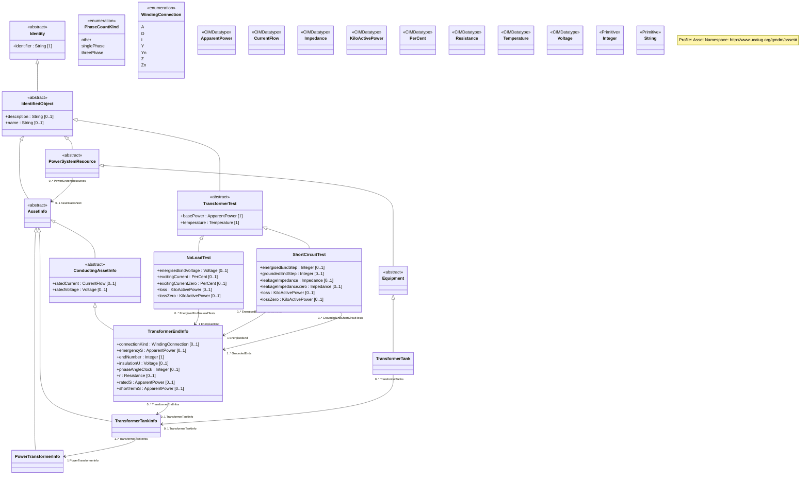

## Concrete Classes

Asset-NoLoadTest
### NoLoadTest

Inheritance path = [TransformerTest](Asset-TransformerTest) => [IdentifiedObject](Asset-IdentifiedObject) => [Identity](Asset-Identity)

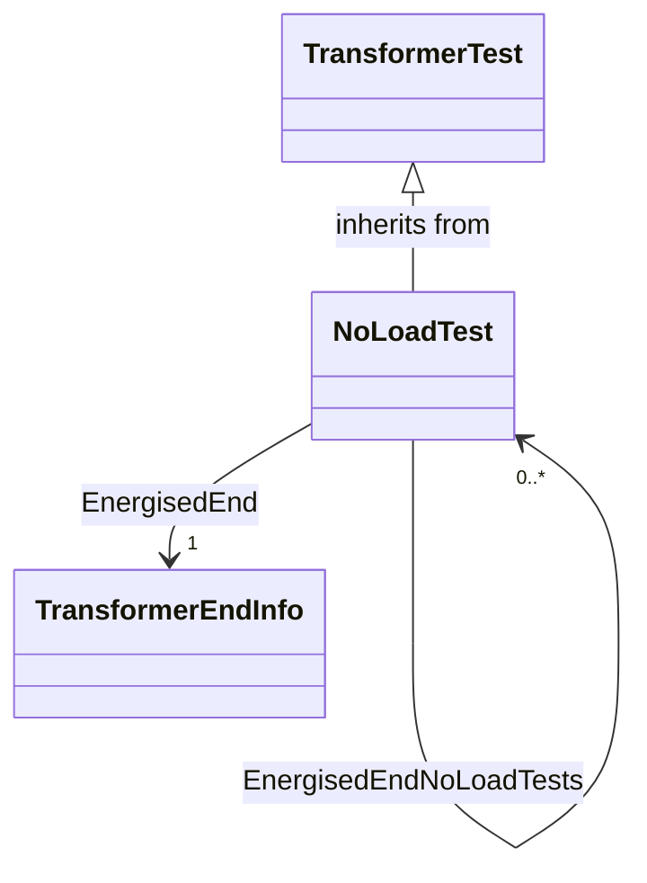

No-load test results determine core admittance parameters. They include exciting current and core loss measurements from applying voltage to one winding. The excitation may be positive sequence or zero sequence. The test may be repeated at different voltages to measure saturation.

#### Native Members

| name | type | description | mapping |
|------|------|-------------|---------|
| energisedEndVoltage [0..1] | [Voltage](Asset-Voltage) | Voltage applied to the winding (end) during test. | |
| excitingCurrent [0..1] | [PerCent](Asset-PerCent) | Exciting current measured from a positive-sequence or single-phase excitation test. | |
| excitingCurrentZero [0..1] | [PerCent](Asset-PerCent) | Exciting current measured from a zero-sequence open-circuit excitation test. | |
| loss [0..1] | [KiloActivePower](Asset-KiloActivePower) | Losses measured from a positive-sequence or single-phase excitation test. | |
| lossZero [0..1] | [KiloActivePower](Asset-KiloActivePower) | Losses measured from a zero-sequence excitation test. | |
| EnergisedEnd [1] | [TransformerEndInfo](Asset-TransformerEndInfo) | Transformer end that current is applied to in this no-load test. | |

#### Inherited Members

| name | type | description | mapping |
|------|------|-------------|---------|
| basePower [1] | [ApparentPower](Asset-ApparentPower) | see [TransformerTest](Asset-TransformerTest) | |
| temperature [1] | [Temperature](Asset-Temperature) | see [TransformerTest](Asset-TransformerTest) | |
| description [0..1] | [String](Asset-String) | see [IdentifiedObject](Asset-IdentifiedObject) | |
| name [0..1] | [String](Asset-String) | see [IdentifiedObject](Asset-IdentifiedObject) | |
| identifier [1] | [String](Asset-String) | see [Identity](Asset-Identity) | |

Asset-PowerTransformerInfo
### PowerTransformerInfo

Inheritance path = [AssetInfo](Asset-AssetInfo) => [IdentifiedObject](Asset-IdentifiedObject) => [Identity](Asset-Identity)

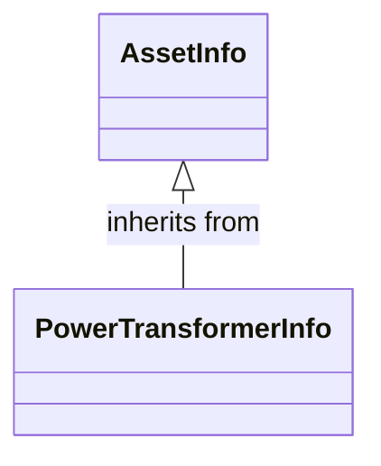

Set of power transformer data, from an equipment library.

#### Inherited Members

| name | type | description | mapping |
|------|------|-------------|---------|
| description [0..1] | [String](Asset-String) | see [IdentifiedObject](Asset-IdentifiedObject) | |
| name [0..1] | [String](Asset-String) | see [IdentifiedObject](Asset-IdentifiedObject) | |
| identifier [1] | [String](Asset-String) | see [Identity](Asset-Identity) | |

Asset-ShortCircuitTest
### ShortCircuitTest

Inheritance path = [TransformerTest](Asset-TransformerTest) => [IdentifiedObject](Asset-IdentifiedObject) => [Identity](Asset-Identity)

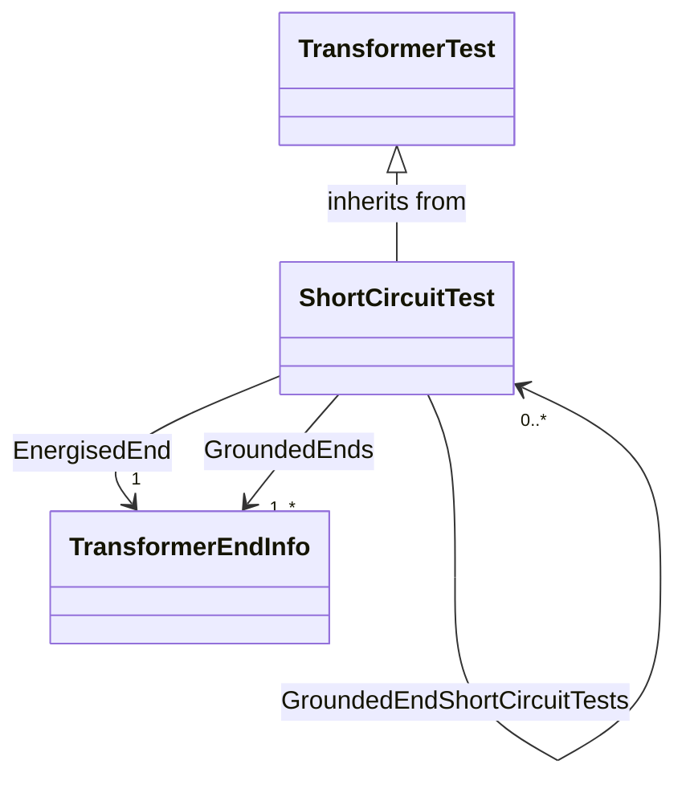

Short-circuit test results determine mesh impedance parameters. They include load losses and leakage impedances. For three-phase windings, the excitation can be a positive sequence (the default) or a zero sequence. There shall be at least one grounded winding.

#### Native Members

| name | type | description | mapping |
|------|------|-------------|---------|
| energisedEndStep [0..1] | [Integer](Asset-Integer) | Tap step number for the energised end of the test pair. | |
| groundedEndStep [0..1] | [Integer](Asset-Integer) | Tap step number for the grounded end of the test pair. | |
| leakageImpedance [0..1] | [Impedance](Asset-Impedance) | Leakage impedance measured from a positive-sequence or single-phase short-circuit test. | |
| leakageImpedanceZero [0..1] | [Impedance](Asset-Impedance) | Leakage impedance measured from a zero-sequence short-circuit test. | |
| loss [0..1] | [KiloActivePower](Asset-KiloActivePower) | Load losses from a positive-sequence or single-phase short-circuit test. | |
| lossZero [0..1] | [KiloActivePower](Asset-KiloActivePower) | Load losses from a zero-sequence short-circuit test. | |
| EnergisedEnd [1] | [TransformerEndInfo](Asset-TransformerEndInfo) | Transformer end that voltage is applied to in this short-circuit test. The test voltage is chosen to induce rated current in the energised end. | |
| GroundedEnds [1..*] | [TransformerEndInfo](Asset-TransformerEndInfo) | All ends short-circuited in this short-circuit test. | |

#### Inherited Members

| name | type | description | mapping |
|------|------|-------------|---------|
| basePower [1] | [ApparentPower](Asset-ApparentPower) | see [TransformerTest](Asset-TransformerTest) | |
| temperature [1] | [Temperature](Asset-Temperature) | see [TransformerTest](Asset-TransformerTest) | |
| description [0..1] | [String](Asset-String) | see [IdentifiedObject](Asset-IdentifiedObject) | |
| name [0..1] | [String](Asset-String) | see [IdentifiedObject](Asset-IdentifiedObject) | |
| identifier [1] | [String](Asset-String) | see [Identity](Asset-Identity) | |

Asset-TransformerEndInfo
### TransformerEndInfo

Inheritance path = [ConductingAssetInfo](Asset-ConductingAssetInfo) => [AssetInfo](Asset-AssetInfo) => [IdentifiedObject](Asset-IdentifiedObject) => [Identity](Asset-Identity)

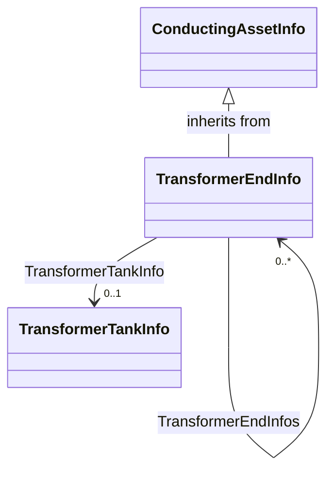

Transformer end data.

#### Native Members

| name | type | description | mapping |
|------|------|-------------|---------|
| connectionKind [0..1] | [WindingConnection](Asset-WindingConnection) | Kind of connection. | |
| emergencyS [0..1] | [ApparentPower](Asset-ApparentPower) | Apparent power that the winding can carry under emergency conditions (also called long-term emergency power). | |
| endNumber [1] | [Integer](Asset-Integer) | Number for this transformer end, corresponding to the end's order in the PowerTransformer.vectorGroup attribute. Highest voltage winding should be 1. | |
| insulationU [0..1] | [Voltage](Asset-Voltage) | Basic insulation level voltage rating. | |
| phaseAngleClock [0..1] | [Integer](Asset-Integer) | Winding phase angle where 360 degrees are represented with clock hours, so the valid values are {0, ..., 11}. For example, to express the second winding in code 'Dyn11', set attributes as follows: 'endNumber'=2, 'connectionKind' = Yn and 'phaseAngleClock' = 11. | |
| r [0..1] | [Resistance](Asset-Resistance) | DC resistance. | |
| ratedS [0..1] | [ApparentPower](Asset-ApparentPower) | Normal apparent power rating. | |
| shortTermS [0..1] | [ApparentPower](Asset-ApparentPower) | Apparent power that this winding can carry for a short period of time (in emergency). | |
| `TransformerTankInfo [0..1]` (ShadowExtension, gmdm) | [TransformerTankInfo](Asset-TransformerTankInfo) | Transformer tank data that this end description is part of. | |

#### Inherited Members

| name | type | description | mapping |
|------|------|-------------|---------|
| ratedCurrent [0..1] | [CurrentFlow](Asset-CurrentFlow) | see [ConductingAssetInfo](Asset-ConductingAssetInfo) | |
| ratedVoltage [0..1] | [Voltage](Asset-Voltage) | see [ConductingAssetInfo](Asset-ConductingAssetInfo) | |
| description [0..1] | [String](Asset-String) | see [IdentifiedObject](Asset-IdentifiedObject) | |
| name [0..1] | [String](Asset-String) | see [IdentifiedObject](Asset-IdentifiedObject) | |
| identifier [1] | [String](Asset-String) | see [Identity](Asset-Identity) | |

Asset-TransformerTank
### (Description) TransformerTank

Inheritance path = [Equipment](Asset-Equipment) => [PowerSystemResource](Asset-PowerSystemResource) => [IdentifiedObject](Asset-IdentifiedObject) => [Identity](Asset-Identity)

> **Note:** This class is tagged in this profile with the 'Description' tag. To refer to the full definition of this class as defined in the profile this one depends on visit [TransformerTank](Asset-description-profile-TransformerTank).

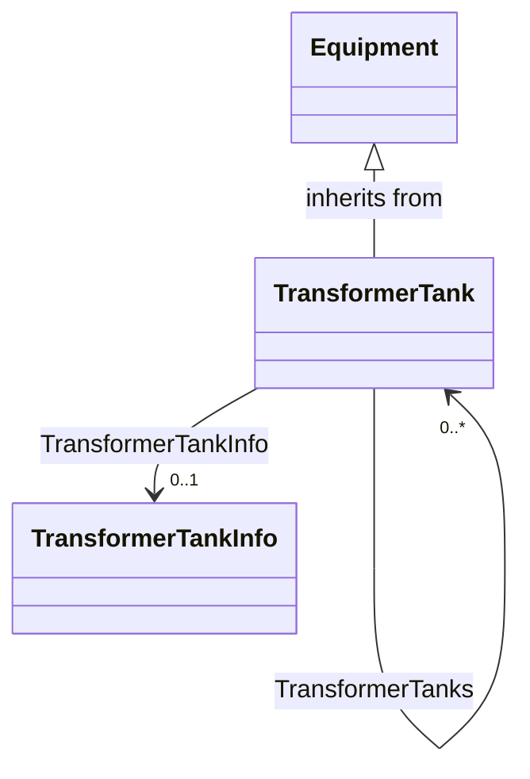

An assembly of two or more coupled windings that transform electrical power between voltage levels. These windings are bound on a common core and placed in the same tank. Transformer tank can be used to model both single-phase and 3-phase transformers.

#### Native Members

| name | type | description | mapping |
|------|------|-------------|---------|
| `TransformerTankInfo [0..1]` (ShadowExtension, gmdm) | [TransformerTankInfo](Asset-TransformerTankInfo) | | |

#### Inherited Members

| name | type | description | mapping |
|------|------|-------------|---------|
| AssetDatasheet [0..1] | [AssetInfo](Asset-AssetInfo) | see [PowerSystemResource](Asset-PowerSystemResource) | |
| description [0..1] | [String](Asset-String) | see [IdentifiedObject](Asset-IdentifiedObject) | |
| name [0..1] | [String](Asset-String) | see [IdentifiedObject](Asset-IdentifiedObject) | |
| identifier [1] | [String](Asset-String) | see [Identity](Asset-Identity) | |

Asset-TransformerTankInfo
### TransformerTankInfo

Inheritance path = [AssetInfo](Asset-AssetInfo) => [IdentifiedObject](Asset-IdentifiedObject) => [Identity](Asset-Identity)

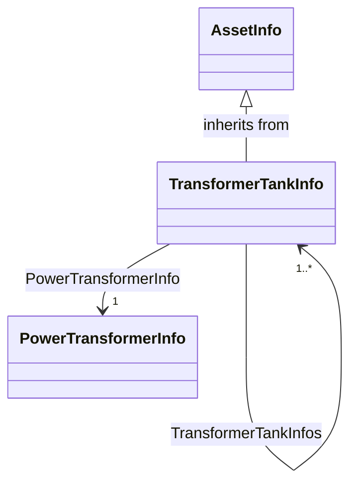

Set of transformer tank data, from an equipment library.

#### Native Members

| name | type | description | mapping |
|------|------|-------------|---------|
| PowerTransformerInfo [1] | [PowerTransformerInfo](Asset-PowerTransformerInfo) | Power transformer data that this tank description is part of. | |

#### Inherited Members

| name | type | description | mapping |
|------|------|-------------|---------|
| description [0..1] | [String](Asset-String) | see [IdentifiedObject](Asset-IdentifiedObject) | |
| name [0..1] | [String](Asset-String) | see [IdentifiedObject](Asset-IdentifiedObject) | |
| identifier [1] | [String](Asset-String) | see [Identity](Asset-Identity) | |

## Abstract Classes

Asset-AssetInfo
### AssetInfo

Inheritance path = [IdentifiedObject](Asset-IdentifiedObject) => [Identity](Asset-Identity)

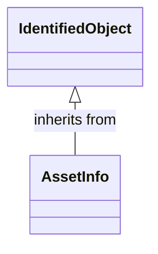

Set of attributes of an asset, representing typical datasheet information of a physical device that can be instantiated and shared in different data exchange contexts:

- as attributes of an asset instance (installed or in stock)

- as attributes of an asset model (product by a manufacturer)

- as attributes of a type asset (generic type of an asset as used in designs/extension planning).

#### Inherited Members

| name | type | description | mapping |
|------|------|-------------|---------|
| description [0..1] | [String](Asset-String) | see [IdentifiedObject](Asset-IdentifiedObject) | |
| name [0..1] | [String](Asset-String) | see [IdentifiedObject](Asset-IdentifiedObject) | |
| identifier [1] | [String](Asset-String) | see [Identity](Asset-Identity) | |

Asset-ConductingAssetInfo
### ConductingAssetInfo

Inheritance path = [AssetInfo](Asset-AssetInfo) => [IdentifiedObject](Asset-IdentifiedObject) => [Identity](Asset-Identity)

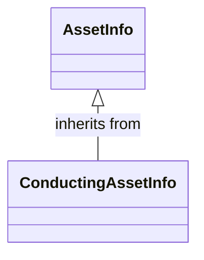

Generic information for conducting asset

#### Native Members

| name | type | description | mapping |
|------|------|-------------|---------|
| ratedCurrent [0..1] | [CurrentFlow](Asset-CurrentFlow) | Rated current. | |
| ratedVoltage [0..1] | [Voltage](Asset-Voltage) | Rated voltage. | |

#### Inherited Members

| name | type | description | mapping |
|------|------|-------------|---------|
| description [0..1] | [String](Asset-String) | see [IdentifiedObject](Asset-IdentifiedObject) | |
| name [0..1] | [String](Asset-String) | see [IdentifiedObject](Asset-IdentifiedObject) | |
| identifier [1] | [String](Asset-String) | see [Identity](Asset-Identity) | |

Asset-Equipment
### Equipment

Inheritance path = [PowerSystemResource](Asset-PowerSystemResource) => [IdentifiedObject](Asset-IdentifiedObject) => [Identity](Asset-Identity)

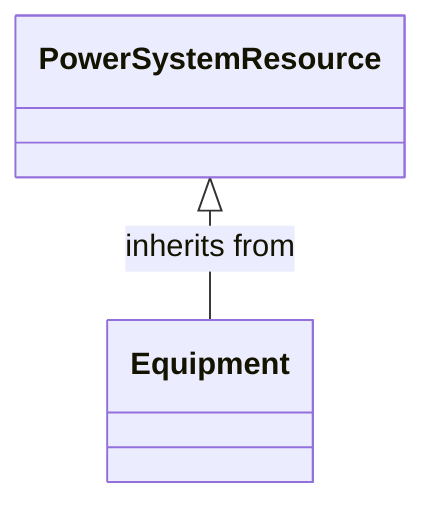

The parts of a power system that are physical devices, electronic or mechanical.

#### Inherited Members

| name | type | description | mapping |
|------|------|-------------|---------|
| AssetDatasheet [0..1] | [AssetInfo](Asset-AssetInfo) | see [PowerSystemResource](Asset-PowerSystemResource) | |
| description [0..1] | [String](Asset-String) | see [IdentifiedObject](Asset-IdentifiedObject) | |
| name [0..1] | [String](Asset-String) | see [IdentifiedObject](Asset-IdentifiedObject) | |
| identifier [1] | [String](Asset-String) | see [Identity](Asset-Identity) | |

Asset-IdentifiedObject
### IdentifiedObject

Inheritance path = [Identity](Asset-Identity)

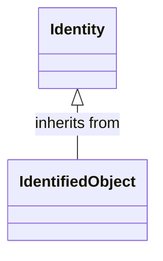

This is a class that provides common identification for all classes needing identification and naming attributes.

#### Native Members

| name | type | description | mapping |
|------|------|-------------|---------|
| description [0..1] | [String](Asset-String) | The description is a free human readable text describing or naming the object. It may be non unique and may not correlate to a naming hierarchy. | |
| name [0..1] | [String](Asset-String) | The name is any free human readable and possibly non unique text naming the object. | |

#### Inherited Members

| name | type | description | mapping |
|------|------|-------------|---------|
| identifier [1] | [String](Asset-String) | see [Identity](Asset-Identity) | |

Asset-Identity
### Identity

This is a root class to provide common identification for all classes. IdentifiedObject and any class to be exchanged with RDF XML now inherits from Identity. mRID is superseded by Identity.identifier, which is typed to be a UUID.

#### Native Members

| name | type | description | mapping |
|------|------|-------------|---------|
| identifier [1] | [String](Asset-String) | A universally unique object identifier. Used to uniquely identify persistent objects between CIM messages. | |

Asset-PowerSystemResource
### PowerSystemResource

Inheritance path = [IdentifiedObject](Asset-IdentifiedObject) => [Identity](Asset-Identity)

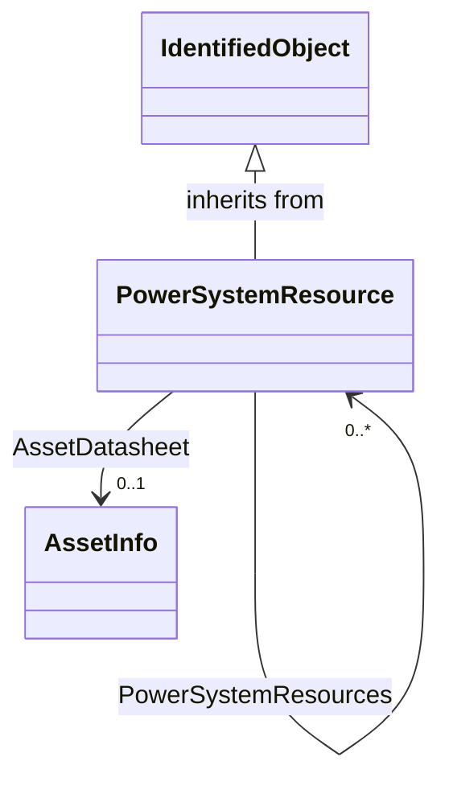

A power system resource (PSR) can be an item of equipment such as a switch, an equipment container containing many individual items of equipment such as a substation, or an organisational entity such as sub-control area. Power system resources can have measurements associated.

#### Native Members

| name | type | description | mapping |
|------|------|-------------|---------|
| AssetDatasheet [0..1] | [AssetInfo](Asset-AssetInfo) | Datasheet information for this power system resource. | |

#### Inherited Members

| name | type | description | mapping |
|------|------|-------------|---------|
| description [0..1] | [String](Asset-String) | see [IdentifiedObject](Asset-IdentifiedObject) | |
| name [0..1] | [String](Asset-String) | see [IdentifiedObject](Asset-IdentifiedObject) | |
| identifier [1] | [String](Asset-String) | see [Identity](Asset-Identity) | |

Asset-TransformerTest
### TransformerTest

Inheritance path = [IdentifiedObject](Asset-IdentifiedObject) => [Identity](Asset-Identity)

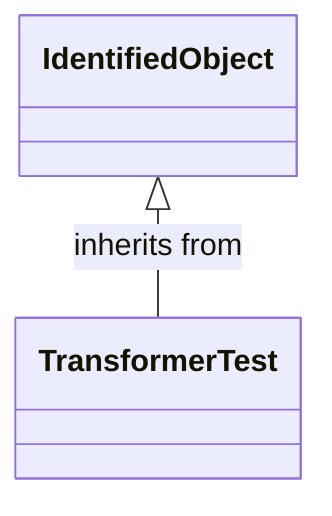

Test result for transformer ends, such as short-circuit, open-circuit (excitation) or no-load test.

#### Native Members

| name | type | description | mapping |
|------|------|-------------|---------|
| basePower [1] | [ApparentPower](Asset-ApparentPower) | Base power at which the tests are conducted, usually equal to the rateds of one of the involved transformer ends. | |
| temperature [1] | [Temperature](Asset-Temperature) | Temperature at which the test is conducted. | |

#### Inherited Members

| name | type | description | mapping |
|------|------|-------------|---------|
| description [0..1] | [String](Asset-String) | see [IdentifiedObject](Asset-IdentifiedObject) | |
| name [0..1] | [String](Asset-String) | see [IdentifiedObject](Asset-IdentifiedObject) | |
| identifier [1] | [String](Asset-String) | see [Identity](Asset-Identity) | |

## Enumerations

Asset-PhaseCountKind
### (Attribute) PhaseCountKind

Number of phases supported by a device.

| name | description |
|------|-------------|
| other | Other |
| singlePhase | Single phase |
| threePhase | Three phases |

Asset-WindingConnection
### (Attribute) WindingConnection

Winding connection type.

| name | description |
|------|-------------|
| A | Autotransformer common winding. |
| D | Delta. |
| I | Independent winding, for single-phase connections. |
| Y | Wye. |
| Yn | Wye, with neutral brought out for grounding. |
| Z | ZigZag. |
| Zn | ZigZag, with neutral brought out for grounding. |

## Datatypes

Asset-ApparentPower
### ApparentPower

Product of the RMS value of the voltage and the RMS value of the current.

XSD type: `float`

Asset-CurrentFlow
### CurrentFlow

Electrical current with sign convention: positive flow is out of the conducting equipment into the connectivity node. Can be both AC and DC.

XSD type: `float`

Asset-Impedance
### Impedance

Ratio of voltage to current.

XSD type: `float`

Asset-KiloActivePower
### KiloActivePower

Active power in kilowatts.

XSD type: `float`

Asset-PerCent
### PerCent

Percentage on a defined base. For example, specify as 100 to indicate at the defined base.

XSD type: `float`

Asset-Resistance
### Resistance

Resistance (real part of impedance).

XSD type: `float`

Asset-Temperature
### Temperature

Value of temperature in degrees Celsius.

XSD type: `float`

Asset-Voltage
### Voltage

Electrical voltage, can be both AC and DC.

XSD type: `float`

## Primitive Types

Asset-Integer
### Integer

An integer number. The range is unspecified and not limited.

XSD type: `integer`

Asset-String
### String

A string consisting of a sequence of characters. The character encoding is UTF-8. The string length is unspecified and unlimited.

XSD type: `string`

