# UnbalancedConnectivity Profile Specification

Profile namespace: `http://www.ucaiug.org/gmdm/connectivity/unbalanced#`

## UnbalancedConnectivity Profile

```mermaid
classDiagram
direction TB

note "Profile: UnbalancedConnectivity Namespace: http://www.ucaiug.org/gmdm/connectivity/unbalanced#"

class ACDCTerminal {
<<abstract>>
+sequenceNumber : Integer [0..1]
}

class ACLineSegment {
}

class ACLineSegmentPhase {
+phase : SinglePhaseKind [1]
}

class AsynchronousMachine {
}

class BaseVoltage {
+nominalVoltage : Voltage [1]
}

class Breaker {
}

class BusbarSection {
}

class ConductingEquipment {
<<abstract>>
}

class Conductor {
<<abstract>>
}

class ConnectivityNode {
}

class ConnectivityNodeContainer {
<<abstract>>
}

class Connector {
<<abstract>>
}

class Disconnector {
}

class EnergyConnection {
<<abstract>>
}

class EnergyConsumer {
+customerCount : Integer [0..1]
+grounded : Boolean [0..1]
+phaseConnection : PhaseShuntConnectionKind [1]
}

class EnergyConsumerPhase {
+phase : SinglePhaseKind [1]
}

class EnergySource {
}

class Equipment {
<<abstract>>
+aggregate : Boolean [0..1]
+normallyInService : Boolean [0..1]
}

class EquipmentContainer {
<<abstract>>
}

class Feeder {
}

class Fuse {
}

class IdentifiedObject {
<<abstract>>
+description : String [0..1]
+name : String [0..1]
}

class Identity {
<<abstract>>
+identifier : String [1]
}

class Line {
}

class LinearShuntCompensator {
}

class LinearShuntCompensatorPhase {
}

class LoadBreakSwitch {
}

class OrderedPhaseCodeKind {
<<enumeration>>
A
AB
ABC
ABCN
ABN
AC
ACB
ACBN
ACN
AN
B
BA
BAC
BACN
BAN
BC
BCA
BCAN
BCN
BN
[Remaining 28 literals hidden]
}

class PhaseCode {
<<enumeration>>
A
AB
ABC
ABCN
ABN
AC
ACN
AN
B
BC
BCN
BN
C
CN
N
X
XN
XY
XYN
none
[Remaining 6 literals hidden]
}

class PhaseShuntConnectionKind {
<<enumeration>>
D
G
I
Y
Yn
}

class PowerElectronicsConnection {
}

class PowerElectronicsConnectionPhase {
+phase : SinglePhaseKind [1]
}

class PowerSystemResource {
<<abstract>>
}

class PowerTransformer {
+vectorGroup : String [1]
}

class PowerTransformerEnd {
+connectionKind : WindingConnection [0..1]
}

class ProtectedSwitch {
<<abstract>>
}

class Recloser {
}

class RegulatingCondEq {
<<abstract>>
}

class RotatingMachine {
<<abstract>>
}

class Sectionaliser {
}

class SeriesCompensator {
}

class ShuntCompensator {
<<abstract>>
+grounded : Boolean [0..1]
+phaseConnection : PhaseShuntConnectionKind [0..1]
}

class ShuntCompensatorPhase {
<<abstract>>
+phase : SinglePhaseKind [1]
}

class SinglePhaseKind {
<<enumeration>>
A
B
C
N
s1
s2
}

class Substation {
}

class Switch {
<<abstract>>
+locked : Boolean [0..1]
+normalOpen : Boolean [1]
}

class SwitchPhase {
+normalOpen : Boolean [0..1]
+phaseSide1 : SinglePhaseKind [1]
+phaseSide2 : SinglePhaseKind [1]
}

class SynchronousMachine {
}

class Terminal {
}

class TransformerEnd {
<<abstract>>
+endNumber : Integer [1]
}

class TransformerTank {
}

class TransformerTankEnd {
+orderedPhases : OrderedPhaseCodeKind [0..1]
}

class UsagePoint {
+phaseCode : PhaseCode [0..1]
}

class VoltageLevel {
}

class WindingConnection {
<<enumeration>>
A
D
I
Y
Yn
Z
Zn
}

IdentifiedObject <|-- ACDCTerminal
Conductor <|-- ACLineSegment
PowerSystemResource <|-- ACLineSegmentPhase
RotatingMachine <|-- AsynchronousMachine
IdentifiedObject <|-- BaseVoltage
ProtectedSwitch <|-- Breaker
Connector <|-- BusbarSection
Equipment <|-- ConductingEquipment
ConductingEquipment <|-- Conductor
IdentifiedObject <|-- ConnectivityNode
PowerSystemResource <|-- ConnectivityNodeContainer
ConductingEquipment <|-- Connector
Switch <|-- Disconnector
ConductingEquipment <|-- EnergyConnection
EnergyConnection <|-- EnergyConsumer
PowerSystemResource <|-- EnergyConsumerPhase
EnergyConnection <|-- EnergySource
PowerSystemResource <|-- Equipment
ConnectivityNodeContainer <|-- EquipmentContainer
EquipmentContainer <|-- Feeder
Switch <|-- Fuse
Identity <|-- IdentifiedObject
EquipmentContainer <|-- Line
ShuntCompensator <|-- LinearShuntCompensator
ShuntCompensatorPhase <|-- LinearShuntCompensatorPhase
ProtectedSwitch <|-- LoadBreakSwitch
RegulatingCondEq <|-- PowerElectronicsConnection
PowerSystemResource <|-- PowerElectronicsConnectionPhase
IdentifiedObject <|-- PowerSystemResource
ConductingEquipment <|-- PowerTransformer
TransformerEnd <|-- PowerTransformerEnd
Switch <|-- ProtectedSwitch
ProtectedSwitch <|-- Recloser
EnergyConnection <|-- RegulatingCondEq
RegulatingCondEq <|-- RotatingMachine
Switch <|-- Sectionaliser
ConductingEquipment <|-- SeriesCompensator
RegulatingCondEq <|-- ShuntCompensator
PowerSystemResource <|-- ShuntCompensatorPhase
EquipmentContainer <|-- Substation
ConductingEquipment <|-- Switch
PowerSystemResource <|-- SwitchPhase
RotatingMachine <|-- SynchronousMachine
ACDCTerminal <|-- Terminal
IdentifiedObject <|-- TransformerEnd
Equipment <|-- TransformerTank
TransformerEnd <|-- TransformerTankEnd
IdentifiedObject <|-- UsagePoint
EquipmentContainer <|-- VoltageLevel
ACLineSegmentPhase "0..4 ACLineSegmentPhases" --> "0..1 ACLineSegment" ACLineSegment
ConductingEquipment "0..* ConductingEquipment" --> "0..1 BaseVoltage" BaseVoltage
ConnectivityNode "0..* ConnectivityNodes" --> "1 ConnectivityNodeContainer" ConnectivityNodeContainer
EnergyConsumerPhase "0..3 EnergyConsumerPhase" --> "1 EnergyConsumer" EnergyConsumer
Equipment "0..* AdditionalGroupedEquipment" --> "0..1 AdditionalEquipmentContainer" EquipmentContainer
Equipment "0..* Equipments" --> "0..1 EquipmentContainer" EquipmentContainer
Feeder "0..* NormalEnergizedFeeder" o-- "1 NormalEnergizingSubstation" Substation
PowerElectronicsConnectionPhase "0..* PowerElectronicsConnectionPhase" --> "1 PowerElectronicsConnection" PowerElectronicsConnection
PowerTransformerEnd "0..3 PowerTransformerEnd" --> "1 PowerTransformer" PowerTransformer
ShuntCompensatorPhase "0..3 ShuntCompensatorPhase" --> "1 ShuntCompensator" ShuntCompensator
SwitchPhase "0..3 SwitchPhase" --> "1 Switch" Switch
Terminal "0..* Terminals" --> "1 ConductingEquipment" ConductingEquipment
Terminal "0..* Terminals" --> "0..1 ConnectivityNode" ConnectivityNode
Terminal "0..* NormalHeadTerminal" --> "0..1 NormalHeadFeeder" Feeder
TransformerEnd "0..* TransformerEnds" --> "0..1 BaseVoltage" BaseVoltage
TransformerEnd "0..* TransformerEnd" --> "1 Terminal" Terminal
TransformerTank "0..* TransformerTanks" --> "1 PowerTransformer" PowerTransformer
TransformerTankEnd "0..* TransformerTankEnds" --> "1 TransformerTank" TransformerTank
UsagePoint "0..1 UsagePoint" --> "1 Terminal" Terminal
VoltageLevel "0..* VoltageLevel" --> "1 BaseVoltage" BaseVoltage
VoltageLevel "0..* VoltageLevels" o-- "0..1 Substation" Substation
```




## Concrete Classes

{#UnbalancedConnectivity-ACLineSegment}
### ACLineSegment

Inheritance path = [Conductor](#UnbalancedConnectivity-Conductor) => [ConductingEquipment](#UnbalancedConnectivity-ConductingEquipment) => [Equipment](#UnbalancedConnectivity-Equipment) => [PowerSystemResource](#UnbalancedConnectivity-PowerSystemResource) => [IdentifiedObject](#UnbalancedConnectivity-IdentifiedObject) => [Identity](#UnbalancedConnectivity-Identity)


A line segment is a conductor or combination of conductors, with consistent electrical characteristics along its length, building a single electrical system that carries alternating current between two points in the power system.

The BaseVoltage at the two ends of a line segment shall have the same BaseVoltage.nominalVoltage. However, boundary lines may have slightly different BaseVoltage.nominalVoltages and variation is allowed. Larger voltage difference in general requires use of an equivalent branch.

Line segment impedances can be either directly described in electrical terms or physical line detail can be provided from which impedances can be calculated.

<b>Directly described impedances</b>

For symmetrical, transposed three phase line segments, it is sufficient to use attributes of the line segment, which describe impedances and admittances for the entire length of the line segment. Additionally, line segment impedances can be computed by using line segment length and associated per length impedances.

Unbalanced modeling of impedances is supported by the per length phase impedance matrix (PerLengthPhaseImpedance) in conjunction with phase-to-sequence number mapping supplied by either ACLineSegmentPhase or WirePosition. The sequence numbers are referenced by the row and column attributes of the per length phase impedance matrix. This method enables single-phase and two-phase line segments, and transpositions of phases, to be described using the same per length phase impedance matrix. The length of the line segment is used in the computation of total impedance values for the line segment.

<b>Line detail characteristics</b>

There are three approaches to providing line detail and all use WireAssembly to supply line positions:

<ul>

<li>Option 1 - WireAssembly supplies only line positions. ACLineSegmentPhase points to wire type and intraphase spacing and supplies the phase-to-sequence number mapping.</li>

<li>Option 2 - WireAssembly supplies line position and, for each position, also supplies wire type and intraphase spacing. ACLineSegmentPhase supplies the phase-to-sequence number mapping.</li>

<li>Option 3 - WireAssembly supplies line position and, for each position, also supplies wire type and intraphase spacing and phase. WireAssembly therefore supplies the phase-to-sequence number mapping and ACLineSegmentPhase is not needed.</li>

</ul>


#### Inherited Members

| name | type | description | mapping |
|------|------|-------------|---------|
| BaseVoltage [0..1] | [BaseVoltage](#UnbalancedConnectivity-BaseVoltage) | see [ConductingEquipment](UnbalancedConnectivity-ConductingEquipment) | |
| aggregate [0..1] | [Boolean](#UnbalancedConnectivity-Boolean) | see [Equipment](#UnbalancedConnectivity-Equipment) | |
| normallyInService [0..1] | [Boolean](#UnbalancedConnectivity-Boolean) | see [Equipment](#UnbalancedConnectivity-Equipment) | |
| AdditionalEquipmentContainer [0..1] | [EquipmentContainer](#UnbalancedConnectivity-EquipmentContainer) | see [Equipment](UnbalancedConnectivity-Equipment) | |
| EquipmentContainer [0..1] | [EquipmentContainer](#UnbalancedConnectivity-EquipmentContainer) | see [Equipment](UnbalancedConnectivity-Equipment) | |
| description [0..1] | [String](#UnbalancedConnectivity-String) | see [IdentifiedObject](#UnbalancedConnectivity-IdentifiedObject) | |
| name [0..1] | [String](#UnbalancedConnectivity-String) | see [IdentifiedObject](#UnbalancedConnectivity-IdentifiedObject) | |
| identifier [1] | [String](#UnbalancedConnectivity-String) | see [Identity](#UnbalancedConnectivity-Identity) | |

{#UnbalancedConnectivity-ACLineSegmentPhase}
### ACLineSegmentPhase

Inheritance path = [PowerSystemResource](#UnbalancedConnectivity-PowerSystemResource) => [IdentifiedObject](#UnbalancedConnectivity-IdentifiedObject) => [Identity](#UnbalancedConnectivity-Identity)


A line segment phase represents one phase (or optionally the neutral) of an alternating current line segment.

Under most circumstances there is not a line segment phase for the neutral. However, if a wire assembly is being used and it does not specify phase, a line segment phase must exist for each position in the assembly (including the neutral).


#### Native Members

| name | type | description | mapping |
|------|------|-------------|---------|
| phase [1] | [SinglePhaseKind](#UnbalancedConnectivity-SinglePhaseKind) | Phase identifies the phase or neutral connection of the conductor at both ends. | |
| ACLineSegment [0..1] | [ACLineSegment](#UnbalancedConnectivity-ACLineSegment) | The line segment to which the phase belongs. | |

#### Inherited Members

| name | type | description | mapping |
|------|------|-------------|---------|
| description [0..1] | [String](#UnbalancedConnectivity-String) | see [IdentifiedObject](#UnbalancedConnectivity-IdentifiedObject) | |
| name [0..1] | [String](#UnbalancedConnectivity-String) | see [IdentifiedObject](#UnbalancedConnectivity-IdentifiedObject) | |
| identifier [1] | [String](#UnbalancedConnectivity-String) | see [Identity](#UnbalancedConnectivity-Identity) | |

{#UnbalancedConnectivity-AsynchronousMachine}
### AsynchronousMachine

Inheritance path = [RotatingMachine](#UnbalancedConnectivity-RotatingMachine) => [RegulatingCondEq](#UnbalancedConnectivity-RegulatingCondEq) => [EnergyConnection](#UnbalancedConnectivity-EnergyConnection) => [ConductingEquipment](#UnbalancedConnectivity-ConductingEquipment) => [Equipment](#UnbalancedConnectivity-Equipment) => [PowerSystemResource](#UnbalancedConnectivity-PowerSystemResource) => [IdentifiedObject](#UnbalancedConnectivity-IdentifiedObject) => [Identity](#UnbalancedConnectivity-Identity)


A rotating machine whose shaft rotates asynchronously with the electrical field. Also known as an induction machine with no external connection to the rotor windings, e.g. squirrel-cage induction machine.


#### Inherited Members

| name | type | description | mapping |
|------|------|-------------|---------|
| BaseVoltage [0..1] | [BaseVoltage](#UnbalancedConnectivity-BaseVoltage) | see [ConductingEquipment](UnbalancedConnectivity-ConductingEquipment) | |
| aggregate [0..1] | [Boolean](#UnbalancedConnectivity-Boolean) | see [Equipment](#UnbalancedConnectivity-Equipment) | |
| normallyInService [0..1] | [Boolean](#UnbalancedConnectivity-Boolean) | see [Equipment](#UnbalancedConnectivity-Equipment) | |
| AdditionalEquipmentContainer [0..1] | [EquipmentContainer](#UnbalancedConnectivity-EquipmentContainer) | see [Equipment](UnbalancedConnectivity-Equipment) | |
| EquipmentContainer [0..1] | [EquipmentContainer](#UnbalancedConnectivity-EquipmentContainer) | see [Equipment](UnbalancedConnectivity-Equipment) | |
| description [0..1] | [String](#UnbalancedConnectivity-String) | see [IdentifiedObject](#UnbalancedConnectivity-IdentifiedObject) | |
| name [0..1] | [String](#UnbalancedConnectivity-String) | see [IdentifiedObject](#UnbalancedConnectivity-IdentifiedObject) | |
| identifier [1] | [String](#UnbalancedConnectivity-String) | see [Identity](#UnbalancedConnectivity-Identity) | |

{#UnbalancedConnectivity-BaseVoltage}
### BaseVoltage

Inheritance path = [IdentifiedObject](#UnbalancedConnectivity-IdentifiedObject) => [Identity](#UnbalancedConnectivity-Identity)


Defines a system base voltage which is referenced. This may be different than the rated voltage.


#### Native Members

| name | type | description | mapping |
|------|------|-------------|---------|
| nominalVoltage [1] | [Voltage](#UnbalancedConnectivity-Voltage) | The power system resource's base voltage, expressed on a phase-to-phase (line-to-line) basis. Shall be a positive value and not zero. | |

#### Inherited Members

| name | type | description | mapping |
|------|------|-------------|---------|
| description [0..1] | [String](#UnbalancedConnectivity-String) | see [IdentifiedObject](#UnbalancedConnectivity-IdentifiedObject) | |
| name [0..1] | [String](#UnbalancedConnectivity-String) | see [IdentifiedObject](#UnbalancedConnectivity-IdentifiedObject) | |
| identifier [1] | [String](#UnbalancedConnectivity-String) | see [Identity](#UnbalancedConnectivity-Identity) | |

{#UnbalancedConnectivity-Breaker}
### Breaker

Inheritance path = [ProtectedSwitch](#UnbalancedConnectivity-ProtectedSwitch) => [Switch](#UnbalancedConnectivity-Switch) => [ConductingEquipment](#UnbalancedConnectivity-ConductingEquipment) => [Equipment](#UnbalancedConnectivity-Equipment) => [PowerSystemResource](#UnbalancedConnectivity-PowerSystemResource) => [IdentifiedObject](#UnbalancedConnectivity-IdentifiedObject) => [Identity](#UnbalancedConnectivity-Identity)


A mechanical switching device capable of making, carrying, and breaking currents under normal circuit conditions and also making, carrying for a specified time, and breaking currents under specified abnormal circuit conditions e.g. those of short circuit.


#### Inherited Members

| name | type | description | mapping |
|------|------|-------------|---------|
| locked [0..1] | [Boolean](#UnbalancedConnectivity-Boolean) | see [Switch](#UnbalancedConnectivity-Switch) | |
| normalOpen [1] | [Boolean](#UnbalancedConnectivity-Boolean) | see [Switch](#UnbalancedConnectivity-Switch) | |
| BaseVoltage [0..1] | [BaseVoltage](#UnbalancedConnectivity-BaseVoltage) | see [ConductingEquipment](UnbalancedConnectivity-ConductingEquipment) | |
| aggregate [0..1] | [Boolean](#UnbalancedConnectivity-Boolean) | see [Equipment](#UnbalancedConnectivity-Equipment) | |
| normallyInService [0..1] | [Boolean](#UnbalancedConnectivity-Boolean) | see [Equipment](#UnbalancedConnectivity-Equipment) | |
| AdditionalEquipmentContainer [0..1] | [EquipmentContainer](#UnbalancedConnectivity-EquipmentContainer) | see [Equipment](UnbalancedConnectivity-Equipment) | |
| EquipmentContainer [0..1] | [EquipmentContainer](#UnbalancedConnectivity-EquipmentContainer) | see [Equipment](UnbalancedConnectivity-Equipment) | |
| description [0..1] | [String](#UnbalancedConnectivity-String) | see [IdentifiedObject](#UnbalancedConnectivity-IdentifiedObject) | |
| name [0..1] | [String](#UnbalancedConnectivity-String) | see [IdentifiedObject](#UnbalancedConnectivity-IdentifiedObject) | |
| identifier [1] | [String](#UnbalancedConnectivity-String) | see [Identity](#UnbalancedConnectivity-Identity) | |

{#UnbalancedConnectivity-BusbarSection}
### BusbarSection

Inheritance path = [Connector](#UnbalancedConnectivity-Connector) => [ConductingEquipment](#UnbalancedConnectivity-ConductingEquipment) => [Equipment](#UnbalancedConnectivity-Equipment) => [PowerSystemResource](#UnbalancedConnectivity-PowerSystemResource) => [IdentifiedObject](#UnbalancedConnectivity-IdentifiedObject) => [Identity](#UnbalancedConnectivity-Identity)


A conductor, or group of conductors, with negligible impedance, that serve to connect other conducting equipment within a single substation. The BusbarSection class is intended to represent physical parts of bus bars no matter how that bus bar is constructed.

Voltage measurements are typically obtained from voltage transformers that are connected to busbar sections. A bus bar section may have many physical terminals but for analysis is modelled with exactly one logical terminal.


#### Inherited Members

| name | type | description | mapping |
|------|------|-------------|---------|
| BaseVoltage [0..1] | [BaseVoltage](#UnbalancedConnectivity-BaseVoltage) | see [ConductingEquipment](UnbalancedConnectivity-ConductingEquipment) | |
| aggregate [0..1] | [Boolean](#UnbalancedConnectivity-Boolean) | see [Equipment](#UnbalancedConnectivity-Equipment) | |
| normallyInService [0..1] | [Boolean](#UnbalancedConnectivity-Boolean) | see [Equipment](#UnbalancedConnectivity-Equipment) | |
| AdditionalEquipmentContainer [0..1] | [EquipmentContainer](#UnbalancedConnectivity-EquipmentContainer) | see [Equipment](UnbalancedConnectivity-Equipment) | |
| EquipmentContainer [0..1] | [EquipmentContainer](#UnbalancedConnectivity-EquipmentContainer) | see [Equipment](UnbalancedConnectivity-Equipment) | |
| description [0..1] | [String](#UnbalancedConnectivity-String) | see [IdentifiedObject](#UnbalancedConnectivity-IdentifiedObject) | |
| name [0..1] | [String](#UnbalancedConnectivity-String) | see [IdentifiedObject](#UnbalancedConnectivity-IdentifiedObject) | |
| identifier [1] | [String](#UnbalancedConnectivity-String) | see [Identity](#UnbalancedConnectivity-Identity) | |

{#UnbalancedConnectivity-ConnectivityNode}
### ConnectivityNode

Inheritance path = [IdentifiedObject](#UnbalancedConnectivity-IdentifiedObject) => [Identity](#UnbalancedConnectivity-Identity)


Connectivity nodes are points where terminals of AC conducting equipment are connected together with zero impedance.


#### Native Members

| name | type | description | mapping |
|------|------|-------------|---------|
| ConnectivityNodeContainer [1] | [ConnectivityNodeContainer](#UnbalancedConnectivity-ConnectivityNodeContainer) | Container of this connectivity node. | |

#### Inherited Members

| name | type | description | mapping |
|------|------|-------------|---------|
| description [0..1] | [String](#UnbalancedConnectivity-String) | see [IdentifiedObject](#UnbalancedConnectivity-IdentifiedObject) | |
| name [0..1] | [String](#UnbalancedConnectivity-String) | see [IdentifiedObject](#UnbalancedConnectivity-IdentifiedObject) | |
| identifier [1] | [String](#UnbalancedConnectivity-String) | see [Identity](#UnbalancedConnectivity-Identity) | |

{#UnbalancedConnectivity-Disconnector}
### Disconnector

Inheritance path = [Switch](#UnbalancedConnectivity-Switch) => [ConductingEquipment](#UnbalancedConnectivity-ConductingEquipment) => [Equipment](#UnbalancedConnectivity-Equipment) => [PowerSystemResource](#UnbalancedConnectivity-PowerSystemResource) => [IdentifiedObject](#UnbalancedConnectivity-IdentifiedObject) => [Identity](#UnbalancedConnectivity-Identity)


A mechanical switching device which provides, in the open position, an isolating distance in accordance with specified requirements.

A disconnector is capable of opening and closing a circuit when either negligible current is broken or made, or when no significant change in the voltage across the terminals of each of the poles of the disconnector occurs. It is also capable of carrying currents under normal circuit conditions and carrying for a specified time currents under abnormal conditions such as those of short circuit.


#### Inherited Members

| name | type | description | mapping |
|------|------|-------------|---------|
| locked [0..1] | [Boolean](#UnbalancedConnectivity-Boolean) | see [Switch](#UnbalancedConnectivity-Switch) | |
| normalOpen [1] | [Boolean](#UnbalancedConnectivity-Boolean) | see [Switch](#UnbalancedConnectivity-Switch) | |
| BaseVoltage [0..1] | [BaseVoltage](#UnbalancedConnectivity-BaseVoltage) | see [ConductingEquipment](UnbalancedConnectivity-ConductingEquipment) | |
| aggregate [0..1] | [Boolean](#UnbalancedConnectivity-Boolean) | see [Equipment](#UnbalancedConnectivity-Equipment) | |
| normallyInService [0..1] | [Boolean](#UnbalancedConnectivity-Boolean) | see [Equipment](#UnbalancedConnectivity-Equipment) | |
| AdditionalEquipmentContainer [0..1] | [EquipmentContainer](#UnbalancedConnectivity-EquipmentContainer) | see [Equipment](UnbalancedConnectivity-Equipment) | |
| EquipmentContainer [0..1] | [EquipmentContainer](#UnbalancedConnectivity-EquipmentContainer) | see [Equipment](UnbalancedConnectivity-Equipment) | |
| description [0..1] | [String](#UnbalancedConnectivity-String) | see [IdentifiedObject](#UnbalancedConnectivity-IdentifiedObject) | |
| name [0..1] | [String](#UnbalancedConnectivity-String) | see [IdentifiedObject](#UnbalancedConnectivity-IdentifiedObject) | |
| identifier [1] | [String](#UnbalancedConnectivity-String) | see [Identity](#UnbalancedConnectivity-Identity) | |

{#UnbalancedConnectivity-EnergyConsumer}
### EnergyConsumer

Inheritance path = [EnergyConnection](#UnbalancedConnectivity-EnergyConnection) => [ConductingEquipment](#UnbalancedConnectivity-ConductingEquipment) => [Equipment](#UnbalancedConnectivity-Equipment) => [PowerSystemResource](#UnbalancedConnectivity-PowerSystemResource) => [IdentifiedObject](#UnbalancedConnectivity-IdentifiedObject) => [Identity](#UnbalancedConnectivity-Identity)


Generic user of energy - a point of consumption on the power system model.

EnergyConsumer.pfixed, .qfixed, .pfixedPct and .qfixedPct have meaning only if there is no LoadResponseCharacteristic associated with EnergyConsumer or if LoadResponseCharacteristic.exponentModel is set to False.


#### Native Members

| name | type | description | mapping |
|------|------|-------------|---------|
| customerCount [0..1] | [Integer](#UnbalancedConnectivity-Integer) | Number of individual customers represented by this demand. | |
| grounded [0..1] | [Boolean](#UnbalancedConnectivity-Boolean) | Required for Yn and I connections (as represented by EnergyConsumer.phaseConnection). True if the neutral is solidly grounded. | |
| phaseConnection [1] | [PhaseShuntConnectionKind](#UnbalancedConnectivity-PhaseShuntConnectionKind) | The type of phase connection, such as wye or delta. | |

#### Inherited Members

| name | type | description | mapping |
|------|------|-------------|---------|
| BaseVoltage [0..1] | [BaseVoltage](#UnbalancedConnectivity-BaseVoltage) | see [ConductingEquipment](UnbalancedConnectivity-ConductingEquipment) | |
| aggregate [0..1] | [Boolean](#UnbalancedConnectivity-Boolean) | see [Equipment](#UnbalancedConnectivity-Equipment) | |
| normallyInService [0..1] | [Boolean](#UnbalancedConnectivity-Boolean) | see [Equipment](#UnbalancedConnectivity-Equipment) | |
| AdditionalEquipmentContainer [0..1] | [EquipmentContainer](#UnbalancedConnectivity-EquipmentContainer) | see [Equipment](UnbalancedConnectivity-Equipment) | |
| EquipmentContainer [0..1] | [EquipmentContainer](#UnbalancedConnectivity-EquipmentContainer) | see [Equipment](UnbalancedConnectivity-Equipment) | |
| description [0..1] | [String](#UnbalancedConnectivity-String) | see [IdentifiedObject](#UnbalancedConnectivity-IdentifiedObject) | |
| name [0..1] | [String](#UnbalancedConnectivity-String) | see [IdentifiedObject](#UnbalancedConnectivity-IdentifiedObject) | |
| identifier [1] | [String](#UnbalancedConnectivity-String) | see [Identity](#UnbalancedConnectivity-Identity) | |

{#UnbalancedConnectivity-EnergyConsumerPhase}
### EnergyConsumerPhase

Inheritance path = [PowerSystemResource](#UnbalancedConnectivity-PowerSystemResource) => [IdentifiedObject](#UnbalancedConnectivity-IdentifiedObject) => [Identity](#UnbalancedConnectivity-Identity)


A single phase of an energy consumer.


#### Native Members

| name | type | description | mapping |
|------|------|-------------|---------|
| phase [1] | [SinglePhaseKind](#UnbalancedConnectivity-SinglePhaseKind) | Phase of this energy consumer component. If the energy consumer is wye connected, the connection is from the indicated phase to the central ground or neutral point. If the energy consumer is delta connected, the phase indicates an energy consumer connected from the indicated phase to the next logical non-neutral phase. | |
| EnergyConsumer [1] | [EnergyConsumer](#UnbalancedConnectivity-EnergyConsumer) | The energy consumer to which this phase belongs. | |

#### Inherited Members

| name | type | description | mapping |
|------|------|-------------|---------|
| description [0..1] | [String](#UnbalancedConnectivity-String) | see [IdentifiedObject](#UnbalancedConnectivity-IdentifiedObject) | |
| name [0..1] | [String](#UnbalancedConnectivity-String) | see [IdentifiedObject](#UnbalancedConnectivity-IdentifiedObject) | |
| identifier [1] | [String](#UnbalancedConnectivity-String) | see [Identity](#UnbalancedConnectivity-Identity) | |

{#UnbalancedConnectivity-EnergySource}
### EnergySource

Inheritance path = [EnergyConnection](#UnbalancedConnectivity-EnergyConnection) => [ConductingEquipment](#UnbalancedConnectivity-ConductingEquipment) => [Equipment](#UnbalancedConnectivity-Equipment) => [PowerSystemResource](#UnbalancedConnectivity-PowerSystemResource) => [IdentifiedObject](#UnbalancedConnectivity-IdentifiedObject) => [Identity](#UnbalancedConnectivity-Identity)


A generic equivalent for an energy supplier on a transmission or distribution voltage level.


#### Inherited Members

| name | type | description | mapping |
|------|------|-------------|---------|
| BaseVoltage [0..1] | [BaseVoltage](#UnbalancedConnectivity-BaseVoltage) | see [ConductingEquipment](UnbalancedConnectivity-ConductingEquipment) | |
| aggregate [0..1] | [Boolean](#UnbalancedConnectivity-Boolean) | see [Equipment](#UnbalancedConnectivity-Equipment) | |
| normallyInService [0..1] | [Boolean](#UnbalancedConnectivity-Boolean) | see [Equipment](#UnbalancedConnectivity-Equipment) | |
| AdditionalEquipmentContainer [0..1] | [EquipmentContainer](#UnbalancedConnectivity-EquipmentContainer) | see [Equipment](UnbalancedConnectivity-Equipment) | |
| EquipmentContainer [0..1] | [EquipmentContainer](#UnbalancedConnectivity-EquipmentContainer) | see [Equipment](UnbalancedConnectivity-Equipment) | |
| description [0..1] | [String](#UnbalancedConnectivity-String) | see [IdentifiedObject](#UnbalancedConnectivity-IdentifiedObject) | |
| name [0..1] | [String](#UnbalancedConnectivity-String) | see [IdentifiedObject](#UnbalancedConnectivity-IdentifiedObject) | |
| identifier [1] | [String](#UnbalancedConnectivity-String) | see [Identity](#UnbalancedConnectivity-Identity) | |

{#UnbalancedConnectivity-Feeder}
### Feeder

Inheritance path = [EquipmentContainer](#UnbalancedConnectivity-EquipmentContainer) => [ConnectivityNodeContainer](#UnbalancedConnectivity-ConnectivityNodeContainer) => [PowerSystemResource](#UnbalancedConnectivity-PowerSystemResource) => [IdentifiedObject](#UnbalancedConnectivity-IdentifiedObject) => [Identity](#UnbalancedConnectivity-Identity)


A collection of equipment for organizational purposes, used for grouping distribution resources.

The organization a feeder does not necessarily reflect connectivity or current operation state.


#### Native Members

| name | type | description | mapping |
|------|------|-------------|---------|
| `NormalEnergizingSubstation [1]` (OfAggregate) | [Substation](#UnbalancedConnectivity-Substation) | The substation that nominally energizes the feeder. Also used for naming purposes. | |

#### Inherited Members

| name | type | description | mapping |
|------|------|-------------|---------|
| description [0..1] | [String](#UnbalancedConnectivity-String) | see [IdentifiedObject](#UnbalancedConnectivity-IdentifiedObject) | |
| name [0..1] | [String](#UnbalancedConnectivity-String) | see [IdentifiedObject](#UnbalancedConnectivity-IdentifiedObject) | |
| identifier [1] | [String](#UnbalancedConnectivity-String) | see [Identity](#UnbalancedConnectivity-Identity) | |

{#UnbalancedConnectivity-Fuse}
### Fuse

Inheritance path = [Switch](#UnbalancedConnectivity-Switch) => [ConductingEquipment](#UnbalancedConnectivity-ConductingEquipment) => [Equipment](#UnbalancedConnectivity-Equipment) => [PowerSystemResource](#UnbalancedConnectivity-PowerSystemResource) => [IdentifiedObject](#UnbalancedConnectivity-IdentifiedObject) => [Identity](#UnbalancedConnectivity-Identity)


An overcurrent protective device with a circuit opening fusible part that is heated and severed by the passage of overcurrent through it. A fuse is considered a switching device because it breaks current.


#### Inherited Members

| name | type | description | mapping |
|------|------|-------------|---------|
| locked [0..1] | [Boolean](#UnbalancedConnectivity-Boolean) | see [Switch](#UnbalancedConnectivity-Switch) | |
| normalOpen [1] | [Boolean](#UnbalancedConnectivity-Boolean) | see [Switch](#UnbalancedConnectivity-Switch) | |
| BaseVoltage [0..1] | [BaseVoltage](#UnbalancedConnectivity-BaseVoltage) | see [ConductingEquipment](UnbalancedConnectivity-ConductingEquipment) | |
| aggregate [0..1] | [Boolean](#UnbalancedConnectivity-Boolean) | see [Equipment](#UnbalancedConnectivity-Equipment) | |
| normallyInService [0..1] | [Boolean](#UnbalancedConnectivity-Boolean) | see [Equipment](#UnbalancedConnectivity-Equipment) | |
| AdditionalEquipmentContainer [0..1] | [EquipmentContainer](#UnbalancedConnectivity-EquipmentContainer) | see [Equipment](UnbalancedConnectivity-Equipment) | |
| EquipmentContainer [0..1] | [EquipmentContainer](#UnbalancedConnectivity-EquipmentContainer) | see [Equipment](UnbalancedConnectivity-Equipment) | |
| description [0..1] | [String](#UnbalancedConnectivity-String) | see [IdentifiedObject](#UnbalancedConnectivity-IdentifiedObject) | |
| name [0..1] | [String](#UnbalancedConnectivity-String) | see [IdentifiedObject](#UnbalancedConnectivity-IdentifiedObject) | |
| identifier [1] | [String](#UnbalancedConnectivity-String) | see [Identity](#UnbalancedConnectivity-Identity) | |

{#UnbalancedConnectivity-Line}
### Line

Inheritance path = [EquipmentContainer](#UnbalancedConnectivity-EquipmentContainer) => [ConnectivityNodeContainer](#UnbalancedConnectivity-ConnectivityNodeContainer) => [PowerSystemResource](#UnbalancedConnectivity-PowerSystemResource) => [IdentifiedObject](#UnbalancedConnectivity-IdentifiedObject) => [Identity](#UnbalancedConnectivity-Identity)


Contains equipment beyond a substation belonging to a power transmission line.


#### Inherited Members

| name | type | description | mapping |
|------|------|-------------|---------|
| description [0..1] | [String](#UnbalancedConnectivity-String) | see [IdentifiedObject](#UnbalancedConnectivity-IdentifiedObject) | |
| name [0..1] | [String](#UnbalancedConnectivity-String) | see [IdentifiedObject](#UnbalancedConnectivity-IdentifiedObject) | |
| identifier [1] | [String](#UnbalancedConnectivity-String) | see [Identity](#UnbalancedConnectivity-Identity) | |

{#UnbalancedConnectivity-LinearShuntCompensator}
### LinearShuntCompensator

Inheritance path = [ShuntCompensator](#UnbalancedConnectivity-ShuntCompensator) => [RegulatingCondEq](#UnbalancedConnectivity-RegulatingCondEq) => [EnergyConnection](#UnbalancedConnectivity-EnergyConnection) => [ConductingEquipment](#UnbalancedConnectivity-ConductingEquipment) => [Equipment](#UnbalancedConnectivity-Equipment) => [PowerSystemResource](#UnbalancedConnectivity-PowerSystemResource) => [IdentifiedObject](#UnbalancedConnectivity-IdentifiedObject) => [Identity](#UnbalancedConnectivity-Identity)


A linear shunt compensator has banks or sections with equal admittance values.


#### Inherited Members

| name | type | description | mapping |
|------|------|-------------|---------|
| grounded [0..1] | [Boolean](#UnbalancedConnectivity-Boolean) | see [ShuntCompensator](#UnbalancedConnectivity-ShuntCompensator) | |
| phaseConnection [0..1] | [PhaseShuntConnectionKind](#UnbalancedConnectivity-PhaseShuntConnectionKind) | see [ShuntCompensator](UnbalancedConnectivity-ShuntCompensator) | |
| BaseVoltage [0..1] | [BaseVoltage](#UnbalancedConnectivity-BaseVoltage) | see [ConductingEquipment](UnbalancedConnectivity-ConductingEquipment) | |
| aggregate [0..1] | [Boolean](#UnbalancedConnectivity-Boolean) | see [Equipment](#UnbalancedConnectivity-Equipment) | |
| normallyInService [0..1] | [Boolean](#UnbalancedConnectivity-Boolean) | see [Equipment](#UnbalancedConnectivity-Equipment) | |
| AdditionalEquipmentContainer [0..1] | [EquipmentContainer](#UnbalancedConnectivity-EquipmentContainer) | see [Equipment](UnbalancedConnectivity-Equipment) | |
| EquipmentContainer [0..1] | [EquipmentContainer](#UnbalancedConnectivity-EquipmentContainer) | see [Equipment](UnbalancedConnectivity-Equipment) | |
| description [0..1] | [String](#UnbalancedConnectivity-String) | see [IdentifiedObject](#UnbalancedConnectivity-IdentifiedObject) | |
| name [0..1] | [String](#UnbalancedConnectivity-String) | see [IdentifiedObject](#UnbalancedConnectivity-IdentifiedObject) | |
| identifier [1] | [String](#UnbalancedConnectivity-String) | see [Identity](#UnbalancedConnectivity-Identity) | |

{#UnbalancedConnectivity-LinearShuntCompensatorPhase}
### LinearShuntCompensatorPhase

Inheritance path = [ShuntCompensatorPhase](#UnbalancedConnectivity-ShuntCompensatorPhase) => [PowerSystemResource](#UnbalancedConnectivity-PowerSystemResource) => [IdentifiedObject](#UnbalancedConnectivity-IdentifiedObject) => [Identity](#UnbalancedConnectivity-Identity)


A per phase linear shunt compensator has banks or sections with equal admittance values.


#### Inherited Members

| name | type | description | mapping |
|------|------|-------------|---------|
| phase [1] | [SinglePhaseKind](#UnbalancedConnectivity-SinglePhaseKind) | see [ShuntCompensatorPhase](UnbalancedConnectivity-ShuntCompensatorPhase) | |
| ShuntCompensator [1] | [ShuntCompensator](#UnbalancedConnectivity-ShuntCompensator) | see [ShuntCompensatorPhase](UnbalancedConnectivity-ShuntCompensatorPhase) | |
| description [0..1] | [String](#UnbalancedConnectivity-String) | see [IdentifiedObject](#UnbalancedConnectivity-IdentifiedObject) | |
| name [0..1] | [String](#UnbalancedConnectivity-String) | see [IdentifiedObject](#UnbalancedConnectivity-IdentifiedObject) | |
| identifier [1] | [String](#UnbalancedConnectivity-String) | see [Identity](#UnbalancedConnectivity-Identity) | |

{#UnbalancedConnectivity-LoadBreakSwitch}
### LoadBreakSwitch

Inheritance path = [ProtectedSwitch](#UnbalancedConnectivity-ProtectedSwitch) => [Switch](#UnbalancedConnectivity-Switch) => [ConductingEquipment](#UnbalancedConnectivity-ConductingEquipment) => [Equipment](#UnbalancedConnectivity-Equipment) => [PowerSystemResource](#UnbalancedConnectivity-PowerSystemResource) => [IdentifiedObject](#UnbalancedConnectivity-IdentifiedObject) => [Identity](#UnbalancedConnectivity-Identity)


A mechanical switching device capable of making, carrying, and breaking currents under normal operating conditions.


#### Inherited Members

| name | type | description | mapping |
|------|------|-------------|---------|
| locked [0..1] | [Boolean](#UnbalancedConnectivity-Boolean) | see [Switch](#UnbalancedConnectivity-Switch) | |
| normalOpen [1] | [Boolean](#UnbalancedConnectivity-Boolean) | see [Switch](#UnbalancedConnectivity-Switch) | |
| BaseVoltage [0..1] | [BaseVoltage](#UnbalancedConnectivity-BaseVoltage) | see [ConductingEquipment](UnbalancedConnectivity-ConductingEquipment) | |
| aggregate [0..1] | [Boolean](#UnbalancedConnectivity-Boolean) | see [Equipment](#UnbalancedConnectivity-Equipment) | |
| normallyInService [0..1] | [Boolean](#UnbalancedConnectivity-Boolean) | see [Equipment](#UnbalancedConnectivity-Equipment) | |
| AdditionalEquipmentContainer [0..1] | [EquipmentContainer](#UnbalancedConnectivity-EquipmentContainer) | see [Equipment](UnbalancedConnectivity-Equipment) | |
| EquipmentContainer [0..1] | [EquipmentContainer](#UnbalancedConnectivity-EquipmentContainer) | see [Equipment](UnbalancedConnectivity-Equipment) | |
| description [0..1] | [String](#UnbalancedConnectivity-String) | see [IdentifiedObject](#UnbalancedConnectivity-IdentifiedObject) | |
| name [0..1] | [String](#UnbalancedConnectivity-String) | see [IdentifiedObject](#UnbalancedConnectivity-IdentifiedObject) | |
| identifier [1] | [String](#UnbalancedConnectivity-String) | see [Identity](#UnbalancedConnectivity-Identity) | |

{#UnbalancedConnectivity-PowerElectronicsConnection}
### PowerElectronicsConnection

Inheritance path = [RegulatingCondEq](#UnbalancedConnectivity-RegulatingCondEq) => [EnergyConnection](#UnbalancedConnectivity-EnergyConnection) => [ConductingEquipment](#UnbalancedConnectivity-ConductingEquipment) => [Equipment](#UnbalancedConnectivity-Equipment) => [PowerSystemResource](#UnbalancedConnectivity-PowerSystemResource) => [IdentifiedObject](#UnbalancedConnectivity-IdentifiedObject) => [Identity](#UnbalancedConnectivity-Identity)


A connection to the AC network for energy production or consumption that uses power electronics rather than rotating machines.


#### Inherited Members

| name | type | description | mapping |
|------|------|-------------|---------|
| BaseVoltage [0..1] | [BaseVoltage](#UnbalancedConnectivity-BaseVoltage) | see [ConductingEquipment](UnbalancedConnectivity-ConductingEquipment) | |
| aggregate [0..1] | [Boolean](#UnbalancedConnectivity-Boolean) | see [Equipment](#UnbalancedConnectivity-Equipment) | |
| normallyInService [0..1] | [Boolean](#UnbalancedConnectivity-Boolean) | see [Equipment](#UnbalancedConnectivity-Equipment) | |
| AdditionalEquipmentContainer [0..1] | [EquipmentContainer](#UnbalancedConnectivity-EquipmentContainer) | see [Equipment](UnbalancedConnectivity-Equipment) | |
| EquipmentContainer [0..1] | [EquipmentContainer](#UnbalancedConnectivity-EquipmentContainer) | see [Equipment](UnbalancedConnectivity-Equipment) | |
| description [0..1] | [String](#UnbalancedConnectivity-String) | see [IdentifiedObject](#UnbalancedConnectivity-IdentifiedObject) | |
| name [0..1] | [String](#UnbalancedConnectivity-String) | see [IdentifiedObject](#UnbalancedConnectivity-IdentifiedObject) | |
| identifier [1] | [String](#UnbalancedConnectivity-String) | see [Identity](#UnbalancedConnectivity-Identity) | |

{#UnbalancedConnectivity-PowerElectronicsConnectionPhase}
### PowerElectronicsConnectionPhase

Inheritance path = [PowerSystemResource](#UnbalancedConnectivity-PowerSystemResource) => [IdentifiedObject](#UnbalancedConnectivity-IdentifiedObject) => [Identity](#UnbalancedConnectivity-Identity)


A single phase of a power electronics connection.


#### Native Members

| name | type | description | mapping |
|------|------|-------------|---------|
| phase [1] | [SinglePhaseKind](#UnbalancedConnectivity-SinglePhaseKind) | Phase of this energy producer component. If the energy producer is wye connected, the connection is from the indicated phase to the central ground or neutral point. If the energy producer is delta connected, the phase indicates an energy producer connected from the indicated phase to the next logical non-neutral phase. | |
| PowerElectronicsConnection [1] | [PowerElectronicsConnection](#UnbalancedConnectivity-PowerElectronicsConnection) | Power electronics connection of this power electronics connection phase. | |

#### Inherited Members

| name | type | description | mapping |
|------|------|-------------|---------|
| description [0..1] | [String](#UnbalancedConnectivity-String) | see [IdentifiedObject](#UnbalancedConnectivity-IdentifiedObject) | |
| name [0..1] | [String](#UnbalancedConnectivity-String) | see [IdentifiedObject](#UnbalancedConnectivity-IdentifiedObject) | |
| identifier [1] | [String](#UnbalancedConnectivity-String) | see [Identity](#UnbalancedConnectivity-Identity) | |

{#UnbalancedConnectivity-PowerTransformer}
### PowerTransformer

Inheritance path = [ConductingEquipment](#UnbalancedConnectivity-ConductingEquipment) => [Equipment](#UnbalancedConnectivity-Equipment) => [PowerSystemResource](#UnbalancedConnectivity-PowerSystemResource) => [IdentifiedObject](#UnbalancedConnectivity-IdentifiedObject) => [Identity](#UnbalancedConnectivity-Identity)

```mermaid
classDiagram
direction TB

class PowerTransformer {
+ vectorGroup : String [1]
}

class ConductingEquipment {
<<abstract>>
}

ConductingEquipment <|-- PowerTransformer : inherits from
```

An electrical device consisting of two or more coupled windings, with or without a magnetic core, for introducing mutual coupling between electric circuits. Transformers can be used to control voltage and phase shift (active power flow).

A power transformer may be composed of separate transformer tanks that need not be identical.

A power transformer can be modelled with or without tanks and is intended for use in both balanced and unbalanced representations. A power transformer typically has two terminals, but may have one (grounding), three or more terminals.

The inherited association ConductingEquipment.BaseVoltage should not be used. The association from TransformerEnd to BaseVoltage should be used instead.


#### Native Members

| name | type | description | mapping |
|------|------|-------------|---------|
| vectorGroup [1] | [String](#UnbalancedConnectivity-String) | Vector group of the transformer for protective relaying, e.g., Dyn1. For unbalanced transformers, this may not be simply determined from the constituent winding connections and phase angle displacements.The vectorGroup string consists of the following components in the order listed: high voltage winding connection, mid voltage winding connection (for three winding transformers), phase displacement clock number from 0 to 11, low voltage winding connectionphase displacement clock number from 0 to 11. The winding connections are D (delta), Y (wye), YN (wye with neutral), Z (zigzag), ZN (zigzag with neutral), A (auto transformer). Upper case means the high voltage, lower case mid or low. The high voltage winding always has clock position 0 and is not included in the vector group string. Some examples: YNy0 (two winding wye to wye with no phase displacement), YNd11 (two winding wye to delta with 330 degrees phase displacement), YNyn0d5 (three winding transformer wye with neutral high voltage, wye with neutral mid voltage and no phase displacement, delta low voltage with 150 degrees displacement).Phase displacement is defined as the angular difference between the phasors representing the voltages between the neutral point (real or imaginary) and the corresponding terminals of two windings, a positive sequence voltage system being applied to the high-voltage terminals, following each other in alphabetical sequence if they are lettered, or in numerical sequence if they are numbered: the phasors are assumed to rotate in a counter-clockwise sense. | |

#### Inherited Members

| name | type | description | mapping |
|------|------|-------------|---------|
| BaseVoltage [0..1] | [BaseVoltage](#UnbalancedConnectivity-BaseVoltage) | see [ConductingEquipment](UnbalancedConnectivity-ConductingEquipment) | |
| aggregate [0..1] | [Boolean](#UnbalancedConnectivity-Boolean) | see [Equipment](#UnbalancedConnectivity-Equipment) | |
| normallyInService [0..1] | [Boolean](#UnbalancedConnectivity-Boolean) | see [Equipment](#UnbalancedConnectivity-Equipment) | |
| AdditionalEquipmentContainer [0..1] | [EquipmentContainer](#UnbalancedConnectivity-EquipmentContainer) | see [Equipment](UnbalancedConnectivity-Equipment) | |
| EquipmentContainer [0..1] | [EquipmentContainer](#UnbalancedConnectivity-EquipmentContainer) | see [Equipment](UnbalancedConnectivity-Equipment) | |
| description [0..1] | [String](#UnbalancedConnectivity-String) | see [IdentifiedObject](#UnbalancedConnectivity-IdentifiedObject) | |
| name [0..1] | [String](#UnbalancedConnectivity-String) | see [IdentifiedObject](#UnbalancedConnectivity-IdentifiedObject) | |
| identifier [1] | [String](#UnbalancedConnectivity-String) | see [Identity](#UnbalancedConnectivity-Identity) | |

{#UnbalancedConnectivity-PowerTransformerEnd}
### PowerTransformerEnd

Inheritance path = [TransformerEnd](#UnbalancedConnectivity-TransformerEnd) => [IdentifiedObject](#UnbalancedConnectivity-IdentifiedObject) => [Identity](#UnbalancedConnectivity-Identity)

```mermaid
classDiagram
direction TB

class PowerTransformerEnd {
+ connectionKind : enum:WindingConnection [0..1]
}

class TransformerEnd {
<<abstract>>
}

TransformerEnd <|-- PowerTransformerEnd : inherits from
class PowerTransformer {
}

PowerTransformerEnd --> "1" PowerTransformer : PowerTransformer
```

A PowerTransformerEnd is associated with each Terminal of a PowerTransformer.

The impedance values r, r0, x, and x0 of a PowerTransformerEnd represents a star equivalent as follows.

1) two PowerTransformerEnd-s shall be defined for a two Terminal PowerTransformer even if the two PowerTransformerEnd-s have the same rated voltage. The high voltage PowerTransformerEnd (TransformerEnd.endNumber=1) is the one used to exchange resistances (r, r0) and reactances (x, x0) of the PowerTransformer while the low voltage PowerTransformerEnd (TransformerEnd.endNumber=2) shall have zero impedance values.

2) for a three Terminal PowerTransformer the three PowerTransformerEnds represent a star equivalent with each leg in the star represented by r, r0, x, and x0 values.

3) For a three Terminal transformer each PowerTransformerEnd shall have g, g0, b and b0 values corresponding to the no load losses distributed on the three PowerTransformerEnds. The total no load loss shunt impedances may also be placed at one of the PowerTransformerEnds, preferably the end numbered 1, having the shunt values on end 1. This is the preferred way.

4) for a PowerTransformer with more than three Terminals the PowerTransformerEnd impedance values cannot be used. Instead use the TransformerMeshImpedance or split the transformer into multiple PowerTransformers.

Each PowerTransformerEnd must be contained by a PowerTransformer. Because a PowerTransformerEnd (or any other object) can not be contained by more than one parent, a PowerTransformerEnd can not have an association to an EquipmentContainer (Substation, VoltageLevel, etc).


#### Native Members

| name | type | description | mapping |
|------|------|-------------|---------|
| connectionKind [0..1] | [WindingConnection](#UnbalancedConnectivity-WindingConnection) | Kind of connection. | |
| PowerTransformer [1] | [PowerTransformer](#UnbalancedConnectivity-PowerTransformer) | The power transformer of this power transformer end. | |

#### Inherited Members

| name | type | description | mapping |
|------|------|-------------|---------|
| endNumber [1] | [Integer](#UnbalancedConnectivity-Integer) | see [TransformerEnd](#UnbalancedConnectivity-TransformerEnd) | |
| BaseVoltage [0..1] | [BaseVoltage](#UnbalancedConnectivity-BaseVoltage) | see [TransformerEnd](UnbalancedConnectivity-TransformerEnd) | |
| Terminal [1] | [Terminal](#UnbalancedConnectivity-Terminal) | see [TransformerEnd](UnbalancedConnectivity-TransformerEnd) | |
| description [0..1] | [String](#UnbalancedConnectivity-String) | see [IdentifiedObject](#UnbalancedConnectivity-IdentifiedObject) | |
| name [0..1] | [String](#UnbalancedConnectivity-String) | see [IdentifiedObject](#UnbalancedConnectivity-IdentifiedObject) | |
| identifier [1] | [String](#UnbalancedConnectivity-String) | see [Identity](#UnbalancedConnectivity-Identity) | |

{#UnbalancedConnectivity-Recloser}
### Recloser

Inheritance path = [ProtectedSwitch](#UnbalancedConnectivity-ProtectedSwitch) => [Switch](#UnbalancedConnectivity-Switch) => [ConductingEquipment](#UnbalancedConnectivity-ConductingEquipment) => [Equipment](#UnbalancedConnectivity-Equipment) => [PowerSystemResource](#UnbalancedConnectivity-PowerSystemResource) => [IdentifiedObject](#UnbalancedConnectivity-IdentifiedObject) => [Identity](#UnbalancedConnectivity-Identity)

```mermaid
classDiagram
direction TB

class Recloser {
}

class ProtectedSwitch {
<<abstract>>
}

ProtectedSwitch <|-- Recloser : inherits from
```

Pole-mounted fault interrupter with built-in phase and ground relays, current transformer (CT), and supplemental controls.


#### Inherited Members

| name | type | description | mapping |
|------|------|-------------|---------|
| locked [0..1] | [Boolean](#UnbalancedConnectivity-Boolean) | see [Switch](#UnbalancedConnectivity-Switch) | |
| normalOpen [1] | [Boolean](#UnbalancedConnectivity-Boolean) | see [Switch](#UnbalancedConnectivity-Switch) | |
| BaseVoltage [0..1] | [BaseVoltage](#UnbalancedConnectivity-BaseVoltage) | see [ConductingEquipment](UnbalancedConnectivity-ConductingEquipment) | |
| aggregate [0..1] | [Boolean](#UnbalancedConnectivity-Boolean) | see [Equipment](#UnbalancedConnectivity-Equipment) | |
| normallyInService [0..1] | [Boolean](#UnbalancedConnectivity-Boolean) | see [Equipment](#UnbalancedConnectivity-Equipment) | |
| AdditionalEquipmentContainer [0..1] | [EquipmentContainer](#UnbalancedConnectivity-EquipmentContainer) | see [Equipment](UnbalancedConnectivity-Equipment) | |
| EquipmentContainer [0..1] | [EquipmentContainer](#UnbalancedConnectivity-EquipmentContainer) | see [Equipment](UnbalancedConnectivity-Equipment) | |
| description [0..1] | [String](#UnbalancedConnectivity-String) | see [IdentifiedObject](#UnbalancedConnectivity-IdentifiedObject) | |
| name [0..1] | [String](#UnbalancedConnectivity-String) | see [IdentifiedObject](#UnbalancedConnectivity-IdentifiedObject) | |
| identifier [1] | [String](#UnbalancedConnectivity-String) | see [Identity](#UnbalancedConnectivity-Identity) | |

{#UnbalancedConnectivity-Sectionaliser}
### Sectionaliser

Inheritance path = [Switch](#UnbalancedConnectivity-Switch) => [ConductingEquipment](#UnbalancedConnectivity-ConductingEquipment) => [Equipment](#UnbalancedConnectivity-Equipment) => [PowerSystemResource](#UnbalancedConnectivity-PowerSystemResource) => [IdentifiedObject](#UnbalancedConnectivity-IdentifiedObject) => [Identity](#UnbalancedConnectivity-Identity)

```mermaid
classDiagram
direction TB

class Sectionaliser {
}

class Switch {
<<abstract>>
}

Switch <|-- Sectionaliser : inherits from
```

Automatic switch that will lock open to isolate a faulted section. It may, or may not, have load breaking capability. Its primary purpose is to provide fault sectionalising at locations where the fault current is either too high, or too low, for proper coordination of fuses.


#### Inherited Members

| name | type | description | mapping |
|------|------|-------------|---------|
| locked [0..1] | [Boolean](#UnbalancedConnectivity-Boolean) | see [Switch](#UnbalancedConnectivity-Switch) | |
| normalOpen [1] | [Boolean](#UnbalancedConnectivity-Boolean) | see [Switch](#UnbalancedConnectivity-Switch) | |
| BaseVoltage [0..1] | [BaseVoltage](#UnbalancedConnectivity-BaseVoltage) | see [ConductingEquipment](UnbalancedConnectivity-ConductingEquipment) | |
| aggregate [0..1] | [Boolean](#UnbalancedConnectivity-Boolean) | see [Equipment](#UnbalancedConnectivity-Equipment) | |
| normallyInService [0..1] | [Boolean](#UnbalancedConnectivity-Boolean) | see [Equipment](#UnbalancedConnectivity-Equipment) | |
| AdditionalEquipmentContainer [0..1] | [EquipmentContainer](#UnbalancedConnectivity-EquipmentContainer) | see [Equipment](UnbalancedConnectivity-Equipment) | |
| EquipmentContainer [0..1] | [EquipmentContainer](#UnbalancedConnectivity-EquipmentContainer) | see [Equipment](UnbalancedConnectivity-Equipment) | |
| description [0..1] | [String](#UnbalancedConnectivity-String) | see [IdentifiedObject](#UnbalancedConnectivity-IdentifiedObject) | |
| name [0..1] | [String](#UnbalancedConnectivity-String) | see [IdentifiedObject](#UnbalancedConnectivity-IdentifiedObject) | |
| identifier [1] | [String](#UnbalancedConnectivity-String) | see [Identity](#UnbalancedConnectivity-Identity) | |

{#UnbalancedConnectivity-SeriesCompensator}
### SeriesCompensator

Inheritance path = [ConductingEquipment](#UnbalancedConnectivity-ConductingEquipment) => [Equipment](#UnbalancedConnectivity-Equipment) => [PowerSystemResource](#UnbalancedConnectivity-PowerSystemResource) => [IdentifiedObject](#UnbalancedConnectivity-IdentifiedObject) => [Identity](#UnbalancedConnectivity-Identity)

```mermaid
classDiagram
direction TB

class SeriesCompensator {
}

class ConductingEquipment {
<<abstract>>
}

ConductingEquipment <|-- SeriesCompensator : inherits from
```

A Series Compensator is a series capacitor or reactor or an AC transmission line without charging susceptance. It is a two terminal device.


#### Inherited Members

| name | type | description | mapping |
|------|------|-------------|---------|
| BaseVoltage [0..1] | [BaseVoltage](#UnbalancedConnectivity-BaseVoltage) | see [ConductingEquipment](UnbalancedConnectivity-ConductingEquipment) | |
| aggregate [0..1] | [Boolean](#UnbalancedConnectivity-Boolean) | see [Equipment](#UnbalancedConnectivity-Equipment) | |
| normallyInService [0..1] | [Boolean](#UnbalancedConnectivity-Boolean) | see [Equipment](#UnbalancedConnectivity-Equipment) | |
| AdditionalEquipmentContainer [0..1] | [EquipmentContainer](#UnbalancedConnectivity-EquipmentContainer) | see [Equipment](UnbalancedConnectivity-Equipment) | |
| EquipmentContainer [0..1] | [EquipmentContainer](#UnbalancedConnectivity-EquipmentContainer) | see [Equipment](UnbalancedConnectivity-Equipment) | |
| description [0..1] | [String](#UnbalancedConnectivity-String) | see [IdentifiedObject](#UnbalancedConnectivity-IdentifiedObject) | |
| name [0..1] | [String](#UnbalancedConnectivity-String) | see [IdentifiedObject](#UnbalancedConnectivity-IdentifiedObject) | |
| identifier [1] | [String](#UnbalancedConnectivity-String) | see [Identity](#UnbalancedConnectivity-Identity) | |

{#UnbalancedConnectivity-Substation}
### Substation

Inheritance path = [EquipmentContainer](#UnbalancedConnectivity-EquipmentContainer) => [ConnectivityNodeContainer](#UnbalancedConnectivity-ConnectivityNodeContainer) => [PowerSystemResource](#UnbalancedConnectivity-PowerSystemResource) => [IdentifiedObject](#UnbalancedConnectivity-IdentifiedObject) => [Identity](#UnbalancedConnectivity-Identity)

```mermaid
classDiagram
direction TB

class Substation {
}

class EquipmentContainer {
<<abstract>>
}

EquipmentContainer <|-- Substation : inherits from
```

A collection of equipment for purposes other than generation or utilization, through which electric energy in bulk is passed for the purposes of switching or modifying its characteristics.


#### Inherited Members

| name | type | description | mapping |
|------|------|-------------|---------|
| description [0..1] | [String](#UnbalancedConnectivity-String) | see [IdentifiedObject](#UnbalancedConnectivity-IdentifiedObject) | |
| name [0..1] | [String](#UnbalancedConnectivity-String) | see [IdentifiedObject](#UnbalancedConnectivity-IdentifiedObject) | |
| identifier [1] | [String](#UnbalancedConnectivity-String) | see [Identity](#UnbalancedConnectivity-Identity) | |

{#UnbalancedConnectivity-SwitchPhase}
### SwitchPhase

Inheritance path = [PowerSystemResource](#UnbalancedConnectivity-PowerSystemResource) => [IdentifiedObject](#UnbalancedConnectivity-IdentifiedObject) => [Identity](#UnbalancedConnectivity-Identity)

```mermaid
classDiagram
direction TB

class SwitchPhase {
+ normalOpen : Boolean [0..1]
+ phaseSide1 : enum:SinglePhaseKind [1]
+ phaseSide2 : enum:SinglePhaseKind [1]
}

class PowerSystemResource {
<<abstract>>
}

PowerSystemResource <|-- SwitchPhase : inherits from
class Switch {
<<abstract>>
}

SwitchPhase --> "1" Switch : Switch
```

Single phase of a multi-phase switch when its attributes might be different per phase.


#### Native Members

| name | type | description | mapping |
|------|------|-------------|---------|
| normalOpen [0..1] | [Boolean](#UnbalancedConnectivity-Boolean) | Used in cases when no Measurement for the status value is present. If the SwitchPhase has a status measurement the Discrete.normalValue is expected to match with this value. | |
| phaseSide1 [1] | [SinglePhaseKind](#UnbalancedConnectivity-SinglePhaseKind) | Phase of this SwitchPhase on the side with terminal sequence number equal to 1. Should be a phase contained in that terminal's phases attribute. | |
| phaseSide2 [1] | [SinglePhaseKind](#UnbalancedConnectivity-SinglePhaseKind) | Phase of this SwitchPhase on the side with terminal sequence number equal to 2. Should be a phase contained in that terminal's Terminal.phases attribute. | |
| Switch [1] | [Switch](#UnbalancedConnectivity-Switch) | The switch of the switch phase. | |

#### Inherited Members

| name | type | description | mapping |
|------|------|-------------|---------|
| description [0..1] | [String](#UnbalancedConnectivity-String) | see [IdentifiedObject](#UnbalancedConnectivity-IdentifiedObject) | |
| name [0..1] | [String](#UnbalancedConnectivity-String) | see [IdentifiedObject](#UnbalancedConnectivity-IdentifiedObject) | |
| identifier [1] | [String](#UnbalancedConnectivity-String) | see [Identity](#UnbalancedConnectivity-Identity) | |

{#UnbalancedConnectivity-SynchronousMachine}
### SynchronousMachine

Inheritance path = [RotatingMachine](#UnbalancedConnectivity-RotatingMachine) => [RegulatingCondEq](#UnbalancedConnectivity-RegulatingCondEq) => [EnergyConnection](#UnbalancedConnectivity-EnergyConnection) => [ConductingEquipment](#UnbalancedConnectivity-ConductingEquipment) => [Equipment](#UnbalancedConnectivity-Equipment) => [PowerSystemResource](#UnbalancedConnectivity-PowerSystemResource) => [IdentifiedObject](#UnbalancedConnectivity-IdentifiedObject) => [Identity](#UnbalancedConnectivity-Identity)

```mermaid
classDiagram
direction TB

class SynchronousMachine {
}

class RotatingMachine {
<<abstract>>
}

RotatingMachine <|-- SynchronousMachine : inherits from
```

An electromechanical device that operates with shaft rotating synchronously with the network. It is a single machine operating either as a generator or synchronous condenser or pump.


#### Inherited Members

| name | type | description | mapping |
|------|------|-------------|---------|
| BaseVoltage [0..1] | [BaseVoltage](#UnbalancedConnectivity-BaseVoltage) | see [ConductingEquipment](UnbalancedConnectivity-ConductingEquipment) | |
| aggregate [0..1] | [Boolean](#UnbalancedConnectivity-Boolean) | see [Equipment](#UnbalancedConnectivity-Equipment) | |
| normallyInService [0..1] | [Boolean](#UnbalancedConnectivity-Boolean) | see [Equipment](#UnbalancedConnectivity-Equipment) | |
| AdditionalEquipmentContainer [0..1] | [EquipmentContainer](#UnbalancedConnectivity-EquipmentContainer) | see [Equipment](UnbalancedConnectivity-Equipment) | |
| EquipmentContainer [0..1] | [EquipmentContainer](#UnbalancedConnectivity-EquipmentContainer) | see [Equipment](UnbalancedConnectivity-Equipment) | |
| description [0..1] | [String](#UnbalancedConnectivity-String) | see [IdentifiedObject](#UnbalancedConnectivity-IdentifiedObject) | |
| name [0..1] | [String](#UnbalancedConnectivity-String) | see [IdentifiedObject](#UnbalancedConnectivity-IdentifiedObject) | |
| identifier [1] | [String](#UnbalancedConnectivity-String) | see [Identity](#UnbalancedConnectivity-Identity) | |

{#UnbalancedConnectivity-Terminal}
### Terminal

Inheritance path = [ACDCTerminal](#UnbalancedConnectivity-ACDCTerminal) => [IdentifiedObject](#UnbalancedConnectivity-IdentifiedObject) => [Identity](#UnbalancedConnectivity-Identity)

```mermaid
classDiagram
direction TB

class Terminal {
}

class ACDCTerminal {
<<abstract>>
}

ACDCTerminal <|-- Terminal : inherits from
class ConductingEquipment {
<<abstract>>
}

Terminal --> "1" ConductingEquipment : ConductingEquipment
class ConnectivityNode {
}

Terminal --> "0..1" ConnectivityNode : ConnectivityNode
class Feeder {
}

Terminal --> "0..1" Feeder : NormalHeadFeeder
```

An AC electrical connection point to a piece of conducting equipment. Terminals are connected at physical connection points called connectivity nodes.


#### Native Members

| name | type | description | mapping |
|------|------|-------------|---------|
| ConductingEquipment [1] | [ConductingEquipment](#UnbalancedConnectivity-ConductingEquipment) | The conducting equipment of the terminal. Conducting equipment have terminals that may be connected to other conducting equipment terminals via connectivity nodes or topological nodes. | |
| ConnectivityNode [0..1] | [ConnectivityNode](#UnbalancedConnectivity-ConnectivityNode) | The connectivity node to which this terminal connects with zero impedance. | |
| NormalHeadFeeder [0..1] | [Feeder](#UnbalancedConnectivity-Feeder) | The feeder that this terminal normally feeds. Only specified for the terminals at head of feeders. | |

#### Inherited Members

| name | type | description | mapping |
|------|------|-------------|---------|
| sequenceNumber [0..1] | [Integer](#UnbalancedConnectivity-Integer) | see [ACDCTerminal](#UnbalancedConnectivity-ACDCTerminal) | |
| description [0..1] | [String](#UnbalancedConnectivity-String) | see [IdentifiedObject](#UnbalancedConnectivity-IdentifiedObject) | |
| name [0..1] | [String](#UnbalancedConnectivity-String) | see [IdentifiedObject](#UnbalancedConnectivity-IdentifiedObject) | |
| identifier [1] | [String](#UnbalancedConnectivity-String) | see [Identity](#UnbalancedConnectivity-Identity) | |

{#UnbalancedConnectivity-TransformerTank}
### TransformerTank

Inheritance path = [Equipment](#UnbalancedConnectivity-Equipment) => [PowerSystemResource](#UnbalancedConnectivity-PowerSystemResource) => [IdentifiedObject](#UnbalancedConnectivity-IdentifiedObject) => [Identity](#UnbalancedConnectivity-Identity)

```mermaid
classDiagram
direction TB

class TransformerTank {
}

class Equipment {
<<abstract>>
}

Equipment <|-- TransformerTank : inherits from
class PowerTransformer {
}

TransformerTank --> "1" PowerTransformer : PowerTransformer
```

An assembly of two or more coupled windings that transform electrical power between voltage levels. These windings are bound on a common core and placed in the same tank. Transformer tank can be used to model both single-phase and 3-phase transformers.


#### Native Members

| name | type | description | mapping |
|------|------|-------------|---------|
| PowerTransformer [1] | [PowerTransformer](#UnbalancedConnectivity-PowerTransformer) | Bank this transformer belongs to. | |

#### Inherited Members

| name | type | description | mapping |
|------|------|-------------|---------|
| aggregate [0..1] | [Boolean](#UnbalancedConnectivity-Boolean) | see [Equipment](#UnbalancedConnectivity-Equipment) | |
| normallyInService [0..1] | [Boolean](#UnbalancedConnectivity-Boolean) | see [Equipment](#UnbalancedConnectivity-Equipment) | |
| AdditionalEquipmentContainer [0..1] | [EquipmentContainer](#UnbalancedConnectivity-EquipmentContainer) | see [Equipment](UnbalancedConnectivity-Equipment) | |
| EquipmentContainer [0..1] | [EquipmentContainer](#UnbalancedConnectivity-EquipmentContainer) | see [Equipment](UnbalancedConnectivity-Equipment) | |
| description [0..1] | [String](#UnbalancedConnectivity-String) | see [IdentifiedObject](#UnbalancedConnectivity-IdentifiedObject) | |
| name [0..1] | [String](#UnbalancedConnectivity-String) | see [IdentifiedObject](#UnbalancedConnectivity-IdentifiedObject) | |
| identifier [1] | [String](#UnbalancedConnectivity-String) | see [Identity](#UnbalancedConnectivity-Identity) | |

{#UnbalancedConnectivity-TransformerTankEnd}
### TransformerTankEnd

Inheritance path = [TransformerEnd](#UnbalancedConnectivity-TransformerEnd) => [IdentifiedObject](#UnbalancedConnectivity-IdentifiedObject) => [Identity](#UnbalancedConnectivity-Identity)

```mermaid
classDiagram
direction TB

class TransformerTankEnd {
+ orderedPhases : enum:OrderedPhaseCodeKind [0..1]
}

class TransformerEnd {
<<abstract>>
}

TransformerEnd <|-- TransformerTankEnd : inherits from
class TransformerTank {
}

TransformerTankEnd --> "1" TransformerTank : TransformerTank
```

Transformer tank end represents an individual winding for unbalanced models or for transformer tanks connected into a bank (and bank is modelled with the PowerTransformer).


#### Native Members

| name | type | description | mapping |
|------|------|-------------|---------|
| `orderedPhases [0..1]` (gmdm) | [OrderedPhaseCodeKind](#UnbalancedConnectivity-OrderedPhaseCodeKind) | | |
| TransformerTank [1] | [TransformerTank](#UnbalancedConnectivity-TransformerTank) | Transformer this winding belongs to. | |

#### Inherited Members

| name | type | description | mapping |
|------|------|-------------|---------|
| endNumber [1] | [Integer](#UnbalancedConnectivity-Integer) | see [TransformerEnd](#UnbalancedConnectivity-TransformerEnd) | |
| BaseVoltage [0..1] | [BaseVoltage](#UnbalancedConnectivity-BaseVoltage) | see [TransformerEnd](UnbalancedConnectivity-TransformerEnd) | |
| Terminal [1] | [Terminal](#UnbalancedConnectivity-Terminal) | see [TransformerEnd](UnbalancedConnectivity-TransformerEnd) | |
| description [0..1] | [String](#UnbalancedConnectivity-String) | see [IdentifiedObject](#UnbalancedConnectivity-IdentifiedObject) | |
| name [0..1] | [String](#UnbalancedConnectivity-String) | see [IdentifiedObject](#UnbalancedConnectivity-IdentifiedObject) | |
| identifier [1] | [String](#UnbalancedConnectivity-String) | see [Identity](#UnbalancedConnectivity-Identity) | |

{#UnbalancedConnectivity-UsagePoint}
### UsagePoint

Inheritance path = [IdentifiedObject](#UnbalancedConnectivity-IdentifiedObject) => [Identity](#UnbalancedConnectivity-Identity)

```mermaid
classDiagram
direction TB

class UsagePoint {
+ phaseCode : enum:PhaseCode [0..1]
}

class IdentifiedObject {
<<abstract>>
}

IdentifiedObject <|-- UsagePoint : inherits from
class Terminal {
}

UsagePoint --> "1" Terminal : Terminal
```

Logical or physical point in the network to which readings or events may be attributed. Used at the place where a physical or virtual meter may be located; however, it is not required that a meter be present.


#### Native Members

| name | type | description | mapping |
|------|------|-------------|---------|
| phaseCode [0..1] | [PhaseCode](#UnbalancedConnectivity-PhaseCode) | Phase code. Number of wires and specific nominal phases can be deduced from enumeration literal values. For example, ABCN is three-phase, four-wire, s12n (splitSecondary12N) is single-phase, three-wire, and s1n and s2n are single-phase, two-wire. | |
| `Terminal [1]` (ShadowExtension, gmdm) | [Terminal](#UnbalancedConnectivity-Terminal) | | |

#### Inherited Members

| name | type | description | mapping |
|------|------|-------------|---------|
| description [0..1] | [String](#UnbalancedConnectivity-String) | see [IdentifiedObject](#UnbalancedConnectivity-IdentifiedObject) | |
| name [0..1] | [String](#UnbalancedConnectivity-String) | see [IdentifiedObject](#UnbalancedConnectivity-IdentifiedObject) | |
| identifier [1] | [String](#UnbalancedConnectivity-String) | see [Identity](#UnbalancedConnectivity-Identity) | |

{#UnbalancedConnectivity-VoltageLevel}
### VoltageLevel

Inheritance path = [EquipmentContainer](#UnbalancedConnectivity-EquipmentContainer) => [ConnectivityNodeContainer](#UnbalancedConnectivity-ConnectivityNodeContainer) => [PowerSystemResource](#UnbalancedConnectivity-PowerSystemResource) => [IdentifiedObject](#UnbalancedConnectivity-IdentifiedObject) => [Identity](#UnbalancedConnectivity-Identity)

```mermaid
classDiagram
direction TB

class VoltageLevel {
}

class EquipmentContainer {
<<abstract>>
}

EquipmentContainer <|-- VoltageLevel : inherits from
class BaseVoltage {
}

VoltageLevel --> "1" BaseVoltage : BaseVoltage
class Substation {
}

VoltageLevel --> "0..1" Substation : Substation
```

A collection of equipment at one common system voltage forming a switchgear. The equipment typically consists of breakers, busbars, instrumentation, control, regulation and protection devices as well as assemblies of all these.


#### Native Members

| name | type | description | mapping |
|------|------|-------------|---------|
| BaseVoltage [1] | [BaseVoltage](#UnbalancedConnectivity-BaseVoltage) | The base voltage used for all equipment within the voltage level. | |
| `Substation [0..1]` (OfAggregate) | [Substation](#UnbalancedConnectivity-Substation) | The substation of the voltage level. | |

#### Inherited Members

| name | type | description | mapping |
|------|------|-------------|---------|
| description [0..1] | [String](#UnbalancedConnectivity-String) | see [IdentifiedObject](#UnbalancedConnectivity-IdentifiedObject) | |
| name [0..1] | [String](#UnbalancedConnectivity-String) | see [IdentifiedObject](#UnbalancedConnectivity-IdentifiedObject) | |
| identifier [1] | [String](#UnbalancedConnectivity-String) | see [Identity](#UnbalancedConnectivity-Identity) | |


## Abstract Classes

{#UnbalancedConnectivity-ACDCTerminal}
### ACDCTerminal

Inheritance path = [IdentifiedObject](#UnbalancedConnectivity-IdentifiedObject) => [Identity](#UnbalancedConnectivity-Identity)

```mermaid
classDiagram
direction TB

class ACDCTerminal {
<<abstract>>
+ sequenceNumber : Integer [0..1]
}

class IdentifiedObject {
<<abstract>>
}

IdentifiedObject <|-- ACDCTerminal : inherits from
```

An electrical connection point (AC or DC) to a piece of conducting equipment. Terminals are connected at physical connection points called connectivity nodes.


#### Native Members

| name | type | description | mapping |
|------|------|-------------|---------|
| sequenceNumber [0..1] | [Integer](#UnbalancedConnectivity-Integer) | The orientation of the terminal connections for a multiple terminal conducting equipment. The sequence numbering starts with 1 and additional terminals should follow in increasing order. The first terminal is the "starting point" for a two terminal branch. | |

#### Inherited Members

| name | type | description | mapping |
|------|------|-------------|---------|
| description [0..1] | [String](#UnbalancedConnectivity-String) | see [IdentifiedObject](#UnbalancedConnectivity-IdentifiedObject) | |
| name [0..1] | [String](#UnbalancedConnectivity-String) | see [IdentifiedObject](#UnbalancedConnectivity-IdentifiedObject) | |
| identifier [1] | [String](#UnbalancedConnectivity-String) | see [Identity](#UnbalancedConnectivity-Identity) | |

{#UnbalancedConnectivity-ConductingEquipment}
### ConductingEquipment

Inheritance path = [Equipment](#UnbalancedConnectivity-Equipment) => [PowerSystemResource](#UnbalancedConnectivity-PowerSystemResource) => [IdentifiedObject](#UnbalancedConnectivity-IdentifiedObject) => [Identity](#UnbalancedConnectivity-Identity)

```mermaid
classDiagram
direction TB

class ConductingEquipment {
<<abstract>>
}

class Equipment {
<<abstract>>
}

Equipment <|-- ConductingEquipment : inherits from
class BaseVoltage {
}

ConductingEquipment --> "0..1" BaseVoltage : BaseVoltage
```

The parts of the AC power system that are designed to carry current or that are conductively connected through terminals.


#### Native Members

| name | type | description | mapping |
|------|------|-------------|---------|
| BaseVoltage [0..1] | [BaseVoltage](#UnbalancedConnectivity-BaseVoltage) | Base voltage of this conducting equipment. Use only when there is no voltage level container used and only one base voltage applies. For example, not used for transformers. | |

#### Inherited Members

| name | type | description | mapping |
|------|------|-------------|---------|
| aggregate [0..1] | [Boolean](#UnbalancedConnectivity-Boolean) | see [Equipment](#UnbalancedConnectivity-Equipment) | |
| normallyInService [0..1] | [Boolean](#UnbalancedConnectivity-Boolean) | see [Equipment](#UnbalancedConnectivity-Equipment) | |
| AdditionalEquipmentContainer [0..1] | [EquipmentContainer](#UnbalancedConnectivity-EquipmentContainer) | see [Equipment](UnbalancedConnectivity-Equipment) | |
| EquipmentContainer [0..1] | [EquipmentContainer](#UnbalancedConnectivity-EquipmentContainer) | see [Equipment](UnbalancedConnectivity-Equipment) | |
| description [0..1] | [String](#UnbalancedConnectivity-String) | see [IdentifiedObject](#UnbalancedConnectivity-IdentifiedObject) | |
| name [0..1] | [String](#UnbalancedConnectivity-String) | see [IdentifiedObject](#UnbalancedConnectivity-IdentifiedObject) | |
| identifier [1] | [String](#UnbalancedConnectivity-String) | see [Identity](#UnbalancedConnectivity-Identity) | |

{#UnbalancedConnectivity-Conductor}
### Conductor

Inheritance path = [ConductingEquipment](#UnbalancedConnectivity-ConductingEquipment) => [Equipment](#UnbalancedConnectivity-Equipment) => [PowerSystemResource](#UnbalancedConnectivity-PowerSystemResource) => [IdentifiedObject](#UnbalancedConnectivity-IdentifiedObject) => [Identity](#UnbalancedConnectivity-Identity)

```mermaid
classDiagram
direction TB

class Conductor {
<<abstract>>
}

class ConductingEquipment {
<<abstract>>
}

ConductingEquipment <|-- Conductor : inherits from
```

Combination of conducting material with consistent electrical characteristics, building a single electrical system, used to carry current between points in the power system.


#### Inherited Members

| name | type | description | mapping |
|------|------|-------------|---------|
| BaseVoltage [0..1] | [BaseVoltage](#UnbalancedConnectivity-BaseVoltage) | see [ConductingEquipment](UnbalancedConnectivity-ConductingEquipment) | |
| aggregate [0..1] | [Boolean](#UnbalancedConnectivity-Boolean) | see [Equipment](#UnbalancedConnectivity-Equipment) | |
| normallyInService [0..1] | [Boolean](#UnbalancedConnectivity-Boolean) | see [Equipment](#UnbalancedConnectivity-Equipment) | |
| AdditionalEquipmentContainer [0..1] | [EquipmentContainer](#UnbalancedConnectivity-EquipmentContainer) | see [Equipment](UnbalancedConnectivity-Equipment) | |
| EquipmentContainer [0..1] | [EquipmentContainer](#UnbalancedConnectivity-EquipmentContainer) | see [Equipment](UnbalancedConnectivity-Equipment) | |
| description [0..1] | [String](#UnbalancedConnectivity-String) | see [IdentifiedObject](#UnbalancedConnectivity-IdentifiedObject) | |
| name [0..1] | [String](#UnbalancedConnectivity-String) | see [IdentifiedObject](#UnbalancedConnectivity-IdentifiedObject) | |
| identifier [1] | [String](#UnbalancedConnectivity-String) | see [Identity](#UnbalancedConnectivity-Identity) | |

{#UnbalancedConnectivity-ConnectivityNodeContainer}
### ConnectivityNodeContainer

Inheritance path = [PowerSystemResource](#UnbalancedConnectivity-PowerSystemResource) => [IdentifiedObject](#UnbalancedConnectivity-IdentifiedObject) => [Identity](#UnbalancedConnectivity-Identity)

```mermaid
classDiagram
direction TB

class ConnectivityNodeContainer {
<<abstract>>
}

class PowerSystemResource {
<<abstract>>
}

PowerSystemResource <|-- ConnectivityNodeContainer : inherits from
```

A base class for all objects that may contain connectivity nodes or topological nodes.


#### Inherited Members

| name | type | description | mapping |
|------|------|-------------|---------|
| description [0..1] | [String](#UnbalancedConnectivity-String) | see [IdentifiedObject](#UnbalancedConnectivity-IdentifiedObject) | |
| name [0..1] | [String](#UnbalancedConnectivity-String) | see [IdentifiedObject](#UnbalancedConnectivity-IdentifiedObject) | |
| identifier [1] | [String](#UnbalancedConnectivity-String) | see [Identity](#UnbalancedConnectivity-Identity) | |

{#UnbalancedConnectivity-Connector}
### Connector

Inheritance path = [ConductingEquipment](#UnbalancedConnectivity-ConductingEquipment) => [Equipment](#UnbalancedConnectivity-Equipment) => [PowerSystemResource](#UnbalancedConnectivity-PowerSystemResource) => [IdentifiedObject](#UnbalancedConnectivity-IdentifiedObject) => [Identity](#UnbalancedConnectivity-Identity)

```mermaid
classDiagram
direction TB

class Connector {
<<abstract>>
}

class ConductingEquipment {
<<abstract>>
}

ConductingEquipment <|-- Connector : inherits from
```

A conductor, or group of conductors, with negligible impedance, that serve to connect other conducting equipment within a single substation and are modelled with a single logical terminal.


#### Inherited Members

| name | type | description | mapping |
|------|------|-------------|---------|
| BaseVoltage [0..1] | [BaseVoltage](#UnbalancedConnectivity-BaseVoltage) | see [ConductingEquipment](UnbalancedConnectivity-ConductingEquipment) | |
| aggregate [0..1] | [Boolean](#UnbalancedConnectivity-Boolean) | see [Equipment](#UnbalancedConnectivity-Equipment) | |
| normallyInService [0..1] | [Boolean](#UnbalancedConnectivity-Boolean) | see [Equipment](#UnbalancedConnectivity-Equipment) | |
| AdditionalEquipmentContainer [0..1] | [EquipmentContainer](#UnbalancedConnectivity-EquipmentContainer) | see [Equipment](UnbalancedConnectivity-Equipment) | |
| EquipmentContainer [0..1] | [EquipmentContainer](#UnbalancedConnectivity-EquipmentContainer) | see [Equipment](UnbalancedConnectivity-Equipment) | |
| description [0..1] | [String](#UnbalancedConnectivity-String) | see [IdentifiedObject](#UnbalancedConnectivity-IdentifiedObject) | |
| name [0..1] | [String](#UnbalancedConnectivity-String) | see [IdentifiedObject](#UnbalancedConnectivity-IdentifiedObject) | |
| identifier [1] | [String](#UnbalancedConnectivity-String) | see [Identity](#UnbalancedConnectivity-Identity) | |

{#UnbalancedConnectivity-EnergyConnection}
### EnergyConnection

Inheritance path = [ConductingEquipment](#UnbalancedConnectivity-ConductingEquipment) => [Equipment](#UnbalancedConnectivity-Equipment) => [PowerSystemResource](#UnbalancedConnectivity-PowerSystemResource) => [IdentifiedObject](#UnbalancedConnectivity-IdentifiedObject) => [Identity](#UnbalancedConnectivity-Identity)

```mermaid
classDiagram
direction TB

class EnergyConnection {
<<abstract>>
}

class ConductingEquipment {
<<abstract>>
}

ConductingEquipment <|-- EnergyConnection : inherits from
```

A connection of energy generation or consumption on the power system model.


#### Inherited Members

| name | type | description | mapping |
|------|------|-------------|---------|
| BaseVoltage [0..1] | [BaseVoltage](#UnbalancedConnectivity-BaseVoltage) | see [ConductingEquipment](UnbalancedConnectivity-ConductingEquipment) | |
| aggregate [0..1] | [Boolean](#UnbalancedConnectivity-Boolean) | see [Equipment](#UnbalancedConnectivity-Equipment) | |
| normallyInService [0..1] | [Boolean](#UnbalancedConnectivity-Boolean) | see [Equipment](#UnbalancedConnectivity-Equipment) | |
| AdditionalEquipmentContainer [0..1] | [EquipmentContainer](#UnbalancedConnectivity-EquipmentContainer) | see [Equipment](UnbalancedConnectivity-Equipment) | |
| EquipmentContainer [0..1] | [EquipmentContainer](#UnbalancedConnectivity-EquipmentContainer) | see [Equipment](UnbalancedConnectivity-Equipment) | |
| description [0..1] | [String](#UnbalancedConnectivity-String) | see [IdentifiedObject](#UnbalancedConnectivity-IdentifiedObject) | |
| name [0..1] | [String](#UnbalancedConnectivity-String) | see [IdentifiedObject](#UnbalancedConnectivity-IdentifiedObject) | |
| identifier [1] | [String](#UnbalancedConnectivity-String) | see [Identity](#UnbalancedConnectivity-Identity) | |

{#UnbalancedConnectivity-Equipment}
### Equipment

Inheritance path = [PowerSystemResource](#UnbalancedConnectivity-PowerSystemResource) => [IdentifiedObject](#UnbalancedConnectivity-IdentifiedObject) => [Identity](#UnbalancedConnectivity-Identity)

```mermaid
classDiagram
direction TB

class Equipment {
<<abstract>>
+ aggregate : Boolean [0..1]
+ normallyInService : Boolean [0..1]
}

class PowerSystemResource {
<<abstract>>
}

PowerSystemResource <|-- Equipment : inherits from
class EquipmentContainer {
<<abstract>>
}

Equipment --> "0..1" EquipmentContainer : AdditionalEquipmentContainer
class EquipmentContainer {
<<abstract>>
}

Equipment --> "0..1" EquipmentContainer : EquipmentContainer
```

The parts of a power system that are physical devices, electronic or mechanical.


#### Native Members

| name | type | description | mapping |
|------|------|-------------|---------|
| aggregate [0..1] | [Boolean](#UnbalancedConnectivity-Boolean) | The aggregate flag provides an alternative way of representing an aggregated (equivalent) element. It is applicable in cases when the dedicated classes for equivalent equipment do not have all of the attributes necessary to represent the required level of detail. In case the flag is set to "true" the single instance of equipment represents multiple pieces of equipment that have been modelled together as an aggregate equivalent obtained by a network reduction procedure. Examples would be power transformers or synchronous machines operating in parallel modelled as a single aggregate power transformer or aggregate synchronous machine.The attribute is not used for EquivalentBranch, EquivalentShunt, EquivalentInjection and ExternalNetworkInjection. | |
| normallyInService [0..1] | [Boolean](#UnbalancedConnectivity-Boolean) | Specifies the availability of the equipment under normal operating conditions. True means the equipment is available for topology processing, which determines if the equipment is energized or not. False means that the equipment is treated by network applications as if it is not in the model. | |
| AdditionalEquipmentContainer [0..1] | [EquipmentContainer](#UnbalancedConnectivity-EquipmentContainer) | Additional equipment container beyond the primary equipment container. The equipment is contained in another equipment container, but also grouped with this equipment container. | |
| EquipmentContainer [0..1] | [EquipmentContainer](#UnbalancedConnectivity-EquipmentContainer) | Container of this equipment. | |

#### Inherited Members

| name | type | description | mapping |
|------|------|-------------|---------|
| description [0..1] | [String](#UnbalancedConnectivity-String) | see [IdentifiedObject](#UnbalancedConnectivity-IdentifiedObject) | |
| name [0..1] | [String](#UnbalancedConnectivity-String) | see [IdentifiedObject](#UnbalancedConnectivity-IdentifiedObject) | |
| identifier [1] | [String](#UnbalancedConnectivity-String) | see [Identity](#UnbalancedConnectivity-Identity) | |

{#UnbalancedConnectivity-EquipmentContainer}
### EquipmentContainer

Inheritance path = [ConnectivityNodeContainer](#UnbalancedConnectivity-ConnectivityNodeContainer) => [PowerSystemResource](#UnbalancedConnectivity-PowerSystemResource) => [IdentifiedObject](#UnbalancedConnectivity-IdentifiedObject) => [Identity](#UnbalancedConnectivity-Identity)

```mermaid
classDiagram
direction TB

class EquipmentContainer {
<<abstract>>
}

class ConnectivityNodeContainer {
<<abstract>>
}

ConnectivityNodeContainer <|-- EquipmentContainer : inherits from
```

A modelling construct to provide a root class for containing equipment.


#### Inherited Members

| name | type | description | mapping |
|------|------|-------------|---------|
| description [0..1] | [String](#UnbalancedConnectivity-String) | see [IdentifiedObject](#UnbalancedConnectivity-IdentifiedObject) | |
| name [0..1] | [String](#UnbalancedConnectivity-String) | see [IdentifiedObject](#UnbalancedConnectivity-IdentifiedObject) | |
| identifier [1] | [String](#UnbalancedConnectivity-String) | see [Identity](#UnbalancedConnectivity-Identity) | |

{#UnbalancedConnectivity-IdentifiedObject}
### IdentifiedObject

Inheritance path = [Identity](#UnbalancedConnectivity-Identity)

```mermaid
classDiagram
direction TB

class IdentifiedObject {
<<abstract>>
+ description : String [0..1]
+ name : String [0..1]
}

class Identity {
<<abstract>>
}

Identity <|-- IdentifiedObject : inherits from
```

This is a class that provides common identification for all classes needing identification and naming attributes.


#### Native Members

| name | type | description | mapping |
|------|------|-------------|---------|
| description [0..1] | [String](#UnbalancedConnectivity-String) | The description is a free human readable text describing or naming the object. It may be non unique and may not correlate to a naming hierarchy. | |
| name [0..1] | [String](#UnbalancedConnectivity-String) | The name is any free human readable and possibly non unique text naming the object. | |

#### Inherited Members

| name | type | description | mapping |
|------|------|-------------|---------|
| identifier [1] | [String](#UnbalancedConnectivity-String) | see [Identity](#UnbalancedConnectivity-Identity) | |

{#UnbalancedConnectivity-Identity}
### Identity


```mermaid
classDiagram
direction TB

class Identity {
<<abstract>>
+ identifier : String [1]
}

```

This is a root class to provide common identification for all classes. IdentifiedObject and any class to be exchanged with RDF XML now inherits from Identity. mRID is superseded by Identity.identifier, which is typed to be a UUID.


#### Native Members

| name | type | description | mapping |
|------|------|-------------|---------|
| identifier [1] | [String](#UnbalancedConnectivity-String) | A universally unique object identifier. Used to uniquely identify persistent objects between CIM messages. | |

{#UnbalancedConnectivity-PowerSystemResource}
### PowerSystemResource

Inheritance path = [IdentifiedObject](#UnbalancedConnectivity-IdentifiedObject) => [Identity](#UnbalancedConnectivity-Identity)

```mermaid
classDiagram
direction TB

class PowerSystemResource {
<<abstract>>
}

class IdentifiedObject {
<<abstract>>
}

IdentifiedObject <|-- PowerSystemResource : inherits from
```

A power system resource (PSR) can be an item of equipment such as a switch, an equipment container containing many individual items of equipment such as a substation, or an organisational entity such as sub-control area. Power system resources can have measurements associated.


#### Inherited Members

| name | type | description | mapping |
|------|------|-------------|---------|
| description [0..1] | [String](#UnbalancedConnectivity-String) | see [IdentifiedObject](#UnbalancedConnectivity-IdentifiedObject) | |
| name [0..1] | [String](#UnbalancedConnectivity-String) | see [IdentifiedObject](#UnbalancedConnectivity-IdentifiedObject) | |
| identifier [1] | [String](#UnbalancedConnectivity-String) | see [Identity](#UnbalancedConnectivity-Identity) | |

{#UnbalancedConnectivity-ProtectedSwitch}
### ProtectedSwitch

Inheritance path = [Switch](#UnbalancedConnectivity-Switch) => [ConductingEquipment](#UnbalancedConnectivity-ConductingEquipment) => [Equipment](#UnbalancedConnectivity-Equipment) => [PowerSystemResource](#UnbalancedConnectivity-PowerSystemResource) => [IdentifiedObject](#UnbalancedConnectivity-IdentifiedObject) => [Identity](#UnbalancedConnectivity-Identity)

```mermaid
classDiagram
direction TB

class ProtectedSwitch {
<<abstract>>
}

class Switch {
<<abstract>>
}

Switch <|-- ProtectedSwitch : inherits from
```

A ProtectedSwitch is a switching device that can be operated by ProtectionEquipment.


#### Inherited Members

| name | type | description | mapping |
|------|------|-------------|---------|
| locked [0..1] | [Boolean](#UnbalancedConnectivity-Boolean) | see [Switch](#UnbalancedConnectivity-Switch) | |
| normalOpen [1] | [Boolean](#UnbalancedConnectivity-Boolean) | see [Switch](#UnbalancedConnectivity-Switch) | |
| BaseVoltage [0..1] | [BaseVoltage](#UnbalancedConnectivity-BaseVoltage) | see [ConductingEquipment](UnbalancedConnectivity-ConductingEquipment) | |
| aggregate [0..1] | [Boolean](#UnbalancedConnectivity-Boolean) | see [Equipment](#UnbalancedConnectivity-Equipment) | |
| normallyInService [0..1] | [Boolean](#UnbalancedConnectivity-Boolean) | see [Equipment](#UnbalancedConnectivity-Equipment) | |
| AdditionalEquipmentContainer [0..1] | [EquipmentContainer](#UnbalancedConnectivity-EquipmentContainer) | see [Equipment](UnbalancedConnectivity-Equipment) | |
| EquipmentContainer [0..1] | [EquipmentContainer](#UnbalancedConnectivity-EquipmentContainer) | see [Equipment](UnbalancedConnectivity-Equipment) | |
| description [0..1] | [String](#UnbalancedConnectivity-String) | see [IdentifiedObject](#UnbalancedConnectivity-IdentifiedObject) | |
| name [0..1] | [String](#UnbalancedConnectivity-String) | see [IdentifiedObject](#UnbalancedConnectivity-IdentifiedObject) | |
| identifier [1] | [String](#UnbalancedConnectivity-String) | see [Identity](#UnbalancedConnectivity-Identity) | |

{#UnbalancedConnectivity-RegulatingCondEq}
### RegulatingCondEq

Inheritance path = [EnergyConnection](#UnbalancedConnectivity-EnergyConnection) => [ConductingEquipment](#UnbalancedConnectivity-ConductingEquipment) => [Equipment](#UnbalancedConnectivity-Equipment) => [PowerSystemResource](#UnbalancedConnectivity-PowerSystemResource) => [IdentifiedObject](#UnbalancedConnectivity-IdentifiedObject) => [Identity](#UnbalancedConnectivity-Identity)

```mermaid
classDiagram
direction TB

class RegulatingCondEq {
<<abstract>>
}

class EnergyConnection {
<<abstract>>
}

EnergyConnection <|-- RegulatingCondEq : inherits from
```

A type of conducting equipment that can regulate a quantity (i.e. voltage or flow) at a specific point in the network.


#### Inherited Members

| name | type | description | mapping |
|------|------|-------------|---------|
| BaseVoltage [0..1] | [BaseVoltage](#UnbalancedConnectivity-BaseVoltage) | see [ConductingEquipment](UnbalancedConnectivity-ConductingEquipment) | |
| aggregate [0..1] | [Boolean](#UnbalancedConnectivity-Boolean) | see [Equipment](#UnbalancedConnectivity-Equipment) | |
| normallyInService [0..1] | [Boolean](#UnbalancedConnectivity-Boolean) | see [Equipment](#UnbalancedConnectivity-Equipment) | |
| AdditionalEquipmentContainer [0..1] | [EquipmentContainer](#UnbalancedConnectivity-EquipmentContainer) | see [Equipment](UnbalancedConnectivity-Equipment) | |
| EquipmentContainer [0..1] | [EquipmentContainer](#UnbalancedConnectivity-EquipmentContainer) | see [Equipment](UnbalancedConnectivity-Equipment) | |
| description [0..1] | [String](#UnbalancedConnectivity-String) | see [IdentifiedObject](#UnbalancedConnectivity-IdentifiedObject) | |
| name [0..1] | [String](#UnbalancedConnectivity-String) | see [IdentifiedObject](#UnbalancedConnectivity-IdentifiedObject) | |
| identifier [1] | [String](#UnbalancedConnectivity-String) | see [Identity](#UnbalancedConnectivity-Identity) | |

{#UnbalancedConnectivity-RotatingMachine}
### RotatingMachine

Inheritance path = [RegulatingCondEq](#UnbalancedConnectivity-RegulatingCondEq) => [EnergyConnection](#UnbalancedConnectivity-EnergyConnection) => [ConductingEquipment](#UnbalancedConnectivity-ConductingEquipment) => [Equipment](#UnbalancedConnectivity-Equipment) => [PowerSystemResource](#UnbalancedConnectivity-PowerSystemResource) => [IdentifiedObject](#UnbalancedConnectivity-IdentifiedObject) => [Identity](#UnbalancedConnectivity-Identity)

```mermaid
classDiagram
direction TB

class RotatingMachine {
<<abstract>>
}

class RegulatingCondEq {
<<abstract>>
}

RegulatingCondEq <|-- RotatingMachine : inherits from
```

A rotating machine which may be used as a generator or motor.


#### Inherited Members

| name | type | description | mapping |
|------|------|-------------|---------|
| BaseVoltage [0..1] | [BaseVoltage](#UnbalancedConnectivity-BaseVoltage) | see [ConductingEquipment](UnbalancedConnectivity-ConductingEquipment) | |
| aggregate [0..1] | [Boolean](#UnbalancedConnectivity-Boolean) | see [Equipment](#UnbalancedConnectivity-Equipment) | |
| normallyInService [0..1] | [Boolean](#UnbalancedConnectivity-Boolean) | see [Equipment](#UnbalancedConnectivity-Equipment) | |
| AdditionalEquipmentContainer [0..1] | [EquipmentContainer](#UnbalancedConnectivity-EquipmentContainer) | see [Equipment](UnbalancedConnectivity-Equipment) | |
| EquipmentContainer [0..1] | [EquipmentContainer](#UnbalancedConnectivity-EquipmentContainer) | see [Equipment](UnbalancedConnectivity-Equipment) | |
| description [0..1] | [String](#UnbalancedConnectivity-String) | see [IdentifiedObject](#UnbalancedConnectivity-IdentifiedObject) | |
| name [0..1] | [String](#UnbalancedConnectivity-String) | see [IdentifiedObject](#UnbalancedConnectivity-IdentifiedObject) | |
| identifier [1] | [String](#UnbalancedConnectivity-String) | see [Identity](#UnbalancedConnectivity-Identity) | |

{#UnbalancedConnectivity-ShuntCompensator}
### ShuntCompensator

Inheritance path = [RegulatingCondEq](#UnbalancedConnectivity-RegulatingCondEq) => [EnergyConnection](#UnbalancedConnectivity-EnergyConnection) => [ConductingEquipment](#UnbalancedConnectivity-ConductingEquipment) => [Equipment](#UnbalancedConnectivity-Equipment) => [PowerSystemResource](#UnbalancedConnectivity-PowerSystemResource) => [IdentifiedObject](#UnbalancedConnectivity-IdentifiedObject) => [Identity](#UnbalancedConnectivity-Identity)

```mermaid
classDiagram
direction TB

class ShuntCompensator {
<<abstract>>
+ grounded : Boolean [0..1]
+ phaseConnection : enum:PhaseShuntConnectionKind [0..1]
}

class RegulatingCondEq {
<<abstract>>
}

RegulatingCondEq <|-- ShuntCompensator : inherits from
```

A shunt capacitor or reactor or switchable bank of shunt capacitors or reactors. A section of a shunt compensator is an individual capacitor or reactor. A negative value for bPerSection indicates that the compensator is a reactor. ShuntCompensator is a single terminal device. Ground is implied.


#### Native Members

| name | type | description | mapping |
|------|------|-------------|---------|
| grounded [0..1] | [Boolean](#UnbalancedConnectivity-Boolean) | Required for Yn and I connections (as represented by ShuntCompensator.phaseConnection). True if the neutral is solidly grounded. | |
| phaseConnection [0..1] | [PhaseShuntConnectionKind](#UnbalancedConnectivity-PhaseShuntConnectionKind) | The type of phase connection, such as wye or delta. | |

#### Inherited Members

| name | type | description | mapping |
|------|------|-------------|---------|
| BaseVoltage [0..1] | [BaseVoltage](#UnbalancedConnectivity-BaseVoltage) | see [ConductingEquipment](UnbalancedConnectivity-ConductingEquipment) | |
| aggregate [0..1] | [Boolean](#UnbalancedConnectivity-Boolean) | see [Equipment](#UnbalancedConnectivity-Equipment) | |
| normallyInService [0..1] | [Boolean](#UnbalancedConnectivity-Boolean) | see [Equipment](#UnbalancedConnectivity-Equipment) | |
| AdditionalEquipmentContainer [0..1] | [EquipmentContainer](#UnbalancedConnectivity-EquipmentContainer) | see [Equipment](UnbalancedConnectivity-Equipment) | |
| EquipmentContainer [0..1] | [EquipmentContainer](#UnbalancedConnectivity-EquipmentContainer) | see [Equipment](UnbalancedConnectivity-Equipment) | |
| description [0..1] | [String](#UnbalancedConnectivity-String) | see [IdentifiedObject](#UnbalancedConnectivity-IdentifiedObject) | |
| name [0..1] | [String](#UnbalancedConnectivity-String) | see [IdentifiedObject](#UnbalancedConnectivity-IdentifiedObject) | |
| identifier [1] | [String](#UnbalancedConnectivity-String) | see [Identity](#UnbalancedConnectivity-Identity) | |

{#UnbalancedConnectivity-ShuntCompensatorPhase}
### ShuntCompensatorPhase

Inheritance path = [PowerSystemResource](#UnbalancedConnectivity-PowerSystemResource) => [IdentifiedObject](#UnbalancedConnectivity-IdentifiedObject) => [Identity](#UnbalancedConnectivity-Identity)

```mermaid
classDiagram
direction TB

class ShuntCompensatorPhase {
<<abstract>>
+ phase : enum:SinglePhaseKind [1]
}

class PowerSystemResource {
<<abstract>>
}

PowerSystemResource <|-- ShuntCompensatorPhase : inherits from
class ShuntCompensator {
<<abstract>>
}

ShuntCompensatorPhase --> "1" ShuntCompensator : ShuntCompensator
```

Single phase of a multi-phase shunt compensator when its attributes might be different per phase.


#### Native Members

| name | type | description | mapping |
|------|------|-------------|---------|
| phase [1] | [SinglePhaseKind](#UnbalancedConnectivity-SinglePhaseKind) | Phase of this shunt compensator component. If the shunt compensator is wye connected, the connection is from the indicated phase to the central ground or neutral point. If the shunt compensator is delta connected, the phase indicates a shunt compensator connected from the indicated phase to the next logical non-neutral phase. | |
| ShuntCompensator [1] | [ShuntCompensator](#UnbalancedConnectivity-ShuntCompensator) | Shunt compensator of this shunt compensator phase. | |

#### Inherited Members

| name | type | description | mapping |
|------|------|-------------|---------|
| description [0..1] | [String](#UnbalancedConnectivity-String) | see [IdentifiedObject](#UnbalancedConnectivity-IdentifiedObject) | |
| name [0..1] | [String](#UnbalancedConnectivity-String) | see [IdentifiedObject](#UnbalancedConnectivity-IdentifiedObject) | |
| identifier [1] | [String](#UnbalancedConnectivity-String) | see [Identity](#UnbalancedConnectivity-Identity) | |

{#UnbalancedConnectivity-Switch}
### Switch

Inheritance path = [ConductingEquipment](#UnbalancedConnectivity-ConductingEquipment) => [Equipment](#UnbalancedConnectivity-Equipment) => [PowerSystemResource](#UnbalancedConnectivity-PowerSystemResource) => [IdentifiedObject](#UnbalancedConnectivity-IdentifiedObject) => [Identity](#UnbalancedConnectivity-Identity)

```mermaid
classDiagram
direction TB

class Switch {
<<abstract>>
+ locked : Boolean [0..1]
+ normalOpen : Boolean [1]
}

class ConductingEquipment {
<<abstract>>
}

ConductingEquipment <|-- Switch : inherits from
```

A generic device designed to close, or open, or both, one or more electric circuits. All switches are two terminal devices including grounding switches. The ACDCTerminal.connected at the two sides of the switch shall not be considered for assessing switch connectivity, i.e. only Switch.open, .normalOpen and .locked are relevant.


#### Native Members

| name | type | description | mapping |
|------|------|-------------|---------|
| locked [0..1] | [Boolean](#UnbalancedConnectivity-Boolean) | If true, the switch is locked. The resulting switch state is a combination of locked and Switch.open attributes as follows:<ul> <li>locked=true and Switch.open=true. The resulting state is open and locked;</li> <li>locked=false and Switch.open=true. The resulting state is open;</li> <li>locked=false and Switch.open=false. The resulting state is closed.</li></ul> | |
| normalOpen [1] | [Boolean](#UnbalancedConnectivity-Boolean) | The attribute is used in cases when no Measurement for the status value is present. If the Switch has a status measurement the Discrete.normalValue is expected to match with the Switch.normalOpen. | |

#### Inherited Members

| name | type | description | mapping |
|------|------|-------------|---------|
| BaseVoltage [0..1] | [BaseVoltage](#UnbalancedConnectivity-BaseVoltage) | see [ConductingEquipment](UnbalancedConnectivity-ConductingEquipment) | |
| aggregate [0..1] | [Boolean](#UnbalancedConnectivity-Boolean) | see [Equipment](#UnbalancedConnectivity-Equipment) | |
| normallyInService [0..1] | [Boolean](#UnbalancedConnectivity-Boolean) | see [Equipment](#UnbalancedConnectivity-Equipment) | |
| AdditionalEquipmentContainer [0..1] | [EquipmentContainer](#UnbalancedConnectivity-EquipmentContainer) | see [Equipment](UnbalancedConnectivity-Equipment) | |
| EquipmentContainer [0..1] | [EquipmentContainer](#UnbalancedConnectivity-EquipmentContainer) | see [Equipment](UnbalancedConnectivity-Equipment) | |
| description [0..1] | [String](#UnbalancedConnectivity-String) | see [IdentifiedObject](#UnbalancedConnectivity-IdentifiedObject) | |
| name [0..1] | [String](#UnbalancedConnectivity-String) | see [IdentifiedObject](#UnbalancedConnectivity-IdentifiedObject) | |
| identifier [1] | [String](#UnbalancedConnectivity-String) | see [Identity](#UnbalancedConnectivity-Identity) | |

{#UnbalancedConnectivity-TransformerEnd}
### TransformerEnd

Inheritance path = [IdentifiedObject](#UnbalancedConnectivity-IdentifiedObject) => [Identity](#UnbalancedConnectivity-Identity)

```mermaid
classDiagram
direction TB

class TransformerEnd {
<<abstract>>
+ endNumber : Integer [1]
}

class IdentifiedObject {
<<abstract>>
}

IdentifiedObject <|-- TransformerEnd : inherits from
class BaseVoltage {
}

TransformerEnd --> "0..1" BaseVoltage : BaseVoltage
class Terminal {
}

TransformerEnd --> "1" Terminal : Terminal
```

A conducting connection point of a power transformer. It corresponds to a physical transformer winding terminal. In earlier CIM versions, the TransformerWinding class served a similar purpose, but this class is more flexible because it associates to terminal but is not a specialization of ConductingEquipment.


#### Native Members

| name | type | description | mapping |
|------|------|-------------|---------|
| endNumber [1] | [Integer](#UnbalancedConnectivity-Integer) | Number for this transformer end, corresponding to the end's order in the power transformer vector group or phase angle clock number. Highest voltage winding should be 1. Each end within a power transformer should have a unique subsequent end number. Note the transformer end number need not match the terminal sequence number. | |
| BaseVoltage [0..1] | [BaseVoltage](#UnbalancedConnectivity-BaseVoltage) | Base voltage of the transformer end. This is essential for PU calculation. | |
| Terminal [1] | [Terminal](#UnbalancedConnectivity-Terminal) | Terminal of the power transformer to which this transformer end belongs. | |

#### Inherited Members

| name | type | description | mapping |
|------|------|-------------|---------|
| description [0..1] | [String](#UnbalancedConnectivity-String) | see [IdentifiedObject](#UnbalancedConnectivity-IdentifiedObject) | |
| name [0..1] | [String](#UnbalancedConnectivity-String) | see [IdentifiedObject](#UnbalancedConnectivity-IdentifiedObject) | |
| identifier [1] | [String](#UnbalancedConnectivity-String) | see [Identity](#UnbalancedConnectivity-Identity) | |


## Enumerations

UnbalancedConnectivity-OrderedPhaseCodeKind
### (gmdm) OrderedPhaseCodeKind

In some use cases, the ordering of phases is important. The PhaseCode class does not represent order, but this class addresses such use cases. When two or more phases are present, the individual phases may occur in any order, but the neutral must always occur last. When only one phase and the neutral is present, that phase and the neutral may be re-ordered.


| name | description |
|------|-------------|
| A | |
| AB | |
| ABC | |
| ABCN | |
| ABN | |
| AC | |
| ACB | |
| ACBN | |
| ACN | |
| AN | |
| B | |
| BA | |
| BAC | |
| BACN | |
| BAN | |
| BC | |
| BCA | |
| BCAN | |
| BCN | |
| BN | |
| C | |
| CA | |
| CAB | |
| CABN | |
| CAN | |
| CB | |
| CBA | |
| CBAN | |
| CBN | |
| CN | |
| NA | |
| NB | |
| NC | |
| Ns1 | |
| Ns2 | |
| X | |
| XN | |
| XY | |
| XYN | |
| none | |
| s1 | |
| s12 | |
| s12N | |
| s1N | |
| s2 | |
| s21 | |
| s21N | |
| s2N | |

UnbalancedConnectivity-PhaseCode
### PhaseCode

Enumeration of phase identifiers used to designate the combination of phase and/or neutral conductors at a terminal, measurement or equipment modelled as a single-line balanced equivalent.

This is an unordered enumeration of phase identifiers. Allows designation of phases for both transmission and distribution equipment, circuits and loads. The enumeration, by itself, does not describe how the phases are connected together or connected to ground. Ground is not explicitly denoted as a phase.

Residential and small commercial loads are often served from single-phase, or split-phase, secondary circuits. For the example of s12N, phases 1 and 2 refer to hot wires that are 180 degrees out of phase, while N refers to the neutral wire. Through single-phase transformer connections, these secondary circuits may be served from one or two of the primary phases A, B, and C. For three-phase loads, use the A, B, C phase codes instead of s12N.

The integer values are from IEC 61968-9 to support revenue metering applications.


| name | description |
|------|-------------|
| A | Phase A. |
| AB | Phases A and B. |
| ABC | Phases A, B, and C. |
| ABCN | Phases A, B, C, and N. |
| ABN | Phases A, B, and neutral. |
| AC | Phases A and C. |
| ACN | Phases A, C and neutral. |
| AN | Phases A and neutral. |
| B | Phase B. |
| BC | Phases B and C. |
| BCN | Phases B, C, and neutral. |
| BN | Phases B and neutral. |
| C | Phase C. |
| CN | Phases C and neutral. |
| N | Neutral phase. |
| X | Unknown non-neutral phase. |
| XN | Unknown non-neutral phase plus neutral. |
| XY | Two unknown non-neutral phases. |
| XYN | Two unknown non-neutral phases plus neutral. |
| none | No phases specified. |
| s1 | Secondary phase 1. |
| s12 | Secondary phase 1 and 2. |
| s12N | Secondary phases 1, 2, and neutral. |
| s1N | Secondary phase 1 and neutral. |
| s2 | Secondary phase 2. |
| s2N | Secondary phase 2 and neutral. |

UnbalancedConnectivity-PhaseShuntConnectionKind
### (Attribute) PhaseShuntConnectionKind

The configuration of phase connections for a single terminal device such as a load or capacitor.


| name | description |
|------|-------------|
| D | Delta connection. |
| G | Ground connection; use when explicit connection to ground needs to be expressed in combination with the phase code, such as for electrical wire/cable or for meters. |
| I | Independent winding, for single-phase connections. |
| Y | Wye connection. |
| Yn | Wye, with neutral brought out for grounding. |

UnbalancedConnectivity-SinglePhaseKind
### (Attribute) SinglePhaseKind

Enumeration of phase identifiers used to designate the specific phase of conducting equipment modelled as individual unbalanced phases.

Allows designation of specific phases for transmission and distribution equipment, circuits and loads.


| name | description |
|------|-------------|
| A | Phase A. |
| B | Phase B. |
| C | Phase C. |
| N | Neutral. |
| s1 | Secondary phase 1. |
| s2 | Secondary phase 2. |

UnbalancedConnectivity-WindingConnection
### (Attribute) WindingConnection

Winding connection type.


| name | description |
|------|-------------|
| A | Autotransformer common winding. |
| D | Delta. |
| I | Independent winding, for single-phase connections. |
| Y | Wye. |
| Yn | Wye, with neutral brought out for grounding. |
| Z | ZigZag. |
| Zn | ZigZag, with neutral brought out for grounding. |


## Datatypes

## UnbalancedConnectivity-Voltage
### Voltage

Electrical voltage, can be both AC and DC.


XSD type: `float`


## Primitive Types

## UnbalancedConnectivity-Boolean
### Boolean

A type with the value space "true" and "false".


XSD type: `boolean`

## UnbalancedConnectivity-Integer
### Integer

An integer number. The range is unspecified and not limited.


XSD type: `integer`

## UnbalancedConnectivity-String
### String

A string consisting of a sequence of characters. The character encoding is UTF-8. The string length is unspecified and unlimited.


XSD type: `string`
