# UnbalancedElectrical Profile Specification

Profile namespace: `http://www.ucaiug.org/gmdm/electrical/unbalanced#`

## UnbalancedElectrical Profile

```mermaid
classDiagram
direction TB

note "Profile: UnbalancedElectrical Namespace: http://www.ucaiug.org/gmdm/electrical/unbalanced#"

class ACDCTerminal {
<<abstract>>
}

class ACLineSegment {
}

class ACLineSegmentPhase {
+sequenceNumber : Integer [1]
}

class AsynchronousMachine {
}

class BatteryUnit {
+ratedE : RealEnergy [0..1]
}

class Breaker {
}

class ConductingEquipment {
<<abstract>>
}

class Conductor {
<<abstract>>
+length : Length [1]
}

class ConnectivityNodeContainer {
<<abstract>>
}

class ConverterControlModeKind {
<<enumeration>>
constantPowerFactor
constantReactivePower
dynamic
}

class Disconnector {
}

class EnergyConnection {
<<abstract>>
}

class EnergyConsumer {
}

class EnergySource {
+nominalVoltage : Voltage [1]
+r : Resistance [1]
+x : Reactance [1]
}

class Equipment {
<<abstract>>
}

class FossilFuel {
}

class FuelType {
<<enumeration>>
FuelType.diesel
brownCoalLignite
coal
coalDerivedGas
gas
hardCoal
lignite
oil
oilShale
other
peat
}

class Fuse {
}

class GeneratingUnit {
<<abstract>>
+ratedGrossMaxP : ActivePower [0..1]
}

class IdentifiedObject {
<<abstract>>
+description : String [0..1]
+name : String [0..1]
}

class Identity {
<<abstract>>
+identifier : String [1]
}

class LinearShuntCompensator {
+bPerSection : Susceptance [1]
+gPerSection : Conductance [1]
}

class LinearShuntCompensatorPhase {
+bPerSection : Susceptance [1]
+gPerSection : Conductance [1]
}

class LoadBreakSwitch {
}

class LoadResponseCharacteristic {
+exponentModel : Boolean [0..1]
+pConstantCurrent : Float [0..1]
+pConstantImpedance : Float [0..1]
+pConstantPower : Float [0..1]
+pFrequencyExponent : Float [0..1]
+pVoltageExponent : Float [0..1]
+qConstantCurrent : Float [0..1]
+qConstantImpedance : Float [0..1]
+qConstantPower : Float [0..1]
+qFrequencyExponent : Float [0..1]
+qVoltageExponent : Float [0..1]
}

class PerLengthImpedance {
<<abstract>>
}

class PerLengthLineParameter {
<<abstract>>
}

class PerLengthPhaseImpedance {
+conductorCount : Integer [1]
}

class PhaseCode {
<<enumeration>>
A
AB
ABC
ABCN
ABN
AC
ACN
AN
B
BC
BCN
BN
C
CN
N
X
XN
XY
XYN
none
[Remaining 6 literals hidden]
}

class PhaseImpedanceData {
+b : SusceptancePerLength [1]
+column : Integer [1]
+r : ResistancePerLength [1]
+row : Integer [1]
+x : ReactancePerLength [1]
}

class PhotoVoltaicUnit {
}

class PowerElectronicsConnection {
+controlMode : ConverterControlModeKind [0..1]
+maxQ : ReactivePower [0..1]
+minQ : ReactivePower [0..1]
+ratedS : ApparentPower [0..1]
+ratedU : Voltage [0..1]
}

class PowerElectronicsThermalUnit {
}

class PowerElectronicsUnit {
<<abstract>>
+maxP : ActivePower [1]
+minP : ActivePower [1]
}

class PowerElectronicsWindUnit {
}

class PowerSystemResource {
<<abstract>>
}

class PowerTransformer {
}

class PowerTransformerEnd {
+b : Susceptance [0..1]
+g : Conductance [0..1]
+phaseAngleClock : Integer [0..1]
+r : Resistance [1]
+ratedS : ApparentPower [1]
+ratedU : Voltage [1]
+x : Reactance [0..1]
}

class ProtectedSwitch {
<<abstract>>
+breakingCapacity : CurrentFlow [0..1]
}

class RatioTapChanger {
+stepVoltageIncrement : PerCent [0..1]
}

class Recloser {
}

class RegulatingCondEq {
<<abstract>>
}

class RegulatingControl {
<<abstract>>
+discrete : Boolean [1]
+enabled : Boolean [1]
+mode : RegulatingControlModeKind [0..1]
+monitoredPhase : PhaseCode [0..1]
+targetDeadband : Float [0..1]
+targetValue : Float [0..1]
}

class RegulatingControlModeKind {
<<enumeration>>
activePower
admittance
currentFlow
powerFactor
reactivePower
temperature
timeScheduled
voltage
}

class RotatingMachine {
<<abstract>>
+ratedS : ApparentPower [1]
+ratedU : Voltage [1]
}

class Sectionaliser {
}

class SeriesCompensator {
+r : Resistance [1]
+x : Reactance [1]
}

class ShuntCompensator {
<<abstract>>
+aVRDelay : Seconds [0..1]
+maximumSections : Integer [1]
+nomU : Voltage [1]
+normalSections : Integer [1]
}

class ShuntCompensatorPhase {
<<abstract>>
+maximumSections : Integer [1]
+normalSections : Integer [1]
}

class Switch {
<<abstract>>
+ratedCurrent : CurrentFlow [1]
}

class SynchronousMachine {
}

class TapChanger {
<<abstract>>
+controlEnabled : Boolean [0..1]
+ctRating : Float [0..1]
+ctRatio : Float [0..1]
+highStep : Integer [1]
+initialDelay : Seconds [0..1]
+lowStep : Integer [1]
+ltcFlag : Boolean [1]
+neutralStep : Integer [1]
+neutralU : Voltage [1]
+ptRatio : Float [0..1]
+subsequentDelay : Seconds [0..1]
}

class TapChangerControl {
+lineDropCompensation : Boolean [0..1]
+lineDropR : Resistance [0..1]
+lineDropX : Reactance [0..1]
+maxLimitVoltage : Voltage [0..1]
+minLimitVoltage : Voltage [0..1]
+reverseLineDropR : Resistance [0..1]
+reverseLineDropX : Reactance [0..1]
+reverseTargetDeadband : Voltage [0..1]
+reverseTargetValue : Voltage [0..1]
+reverseToNeutral : Boolean [0..1]
+reversible : Boolean [0..1]
+reversingDelay : Seconds [0..1]
+reversingPowerThreshold : ApparentPower [0..1]
}

class Terminal {
}

class ThermalGeneratingUnit {
}

class TransformerCoreAdmittance {
+b : Susceptance [1]
+g : Conductance [1]
}

class TransformerEnd {
<<abstract>>
+grounded : Boolean [1]
+rground : Resistance [0..1]
+xground : Reactance [0..1]
}

class TransformerMeshImpedance {
+r : Resistance [1]
+x : Reactance [1]
}

class TransformerTankEnd {
}

class WindGenUnitKind {
<<enumeration>>
offshore
onshore
}

class WindGeneratingUnit {
+windGenUnitType : WindGenUnitKind [0..1]
}

IdentifiedObject <|-- ACDCTerminal
Conductor <|-- ACLineSegment
PowerSystemResource <|-- ACLineSegmentPhase
RotatingMachine <|-- AsynchronousMachine
PowerElectronicsUnit <|-- BatteryUnit
ProtectedSwitch <|-- Breaker
Equipment <|-- ConductingEquipment
ConductingEquipment <|-- Conductor
PowerSystemResource <|-- ConnectivityNodeContainer
Switch <|-- Disconnector
ConductingEquipment <|-- EnergyConnection
EnergyConnection <|-- EnergyConsumer
EnergyConnection <|-- EnergySource
PowerSystemResource <|-- Equipment
IdentifiedObject <|-- FossilFuel
Switch <|-- Fuse
Equipment <|-- GeneratingUnit
Identity <|-- IdentifiedObject
ShuntCompensator <|-- LinearShuntCompensator
ShuntCompensatorPhase <|-- LinearShuntCompensatorPhase
ProtectedSwitch <|-- LoadBreakSwitch
IdentifiedObject <|-- LoadResponseCharacteristic
PerLengthLineParameter <|-- PerLengthImpedance
IdentifiedObject <|-- PerLengthLineParameter
PerLengthImpedance <|-- PerLengthPhaseImpedance
Identity <|-- PhaseImpedanceData
PowerElectronicsUnit <|-- PhotoVoltaicUnit
RegulatingCondEq <|-- PowerElectronicsConnection
PowerElectronicsUnit <|-- PowerElectronicsThermalUnit
Equipment <|-- PowerElectronicsUnit
PowerElectronicsUnit <|-- PowerElectronicsWindUnit
IdentifiedObject <|-- PowerSystemResource
ConductingEquipment <|-- PowerTransformer
TransformerEnd <|-- PowerTransformerEnd
Switch <|-- ProtectedSwitch
TapChanger <|-- RatioTapChanger
ProtectedSwitch <|-- Recloser
EnergyConnection <|-- RegulatingCondEq
PowerSystemResource <|-- RegulatingControl
RegulatingCondEq <|-- RotatingMachine
Switch <|-- Sectionaliser
ConductingEquipment <|-- SeriesCompensator
RegulatingCondEq <|-- ShuntCompensator
PowerSystemResource <|-- ShuntCompensatorPhase
ConductingEquipment <|-- Switch
RotatingMachine <|-- SynchronousMachine
PowerSystemResource <|-- TapChanger
RegulatingControl <|-- TapChangerControl
ACDCTerminal <|-- Terminal
GeneratingUnit <|-- ThermalGeneratingUnit
IdentifiedObject <|-- TransformerCoreAdmittance
IdentifiedObject <|-- TransformerEnd
IdentifiedObject <|-- TransformerMeshImpedance
TransformerEnd <|-- TransformerTankEnd
GeneratingUnit <|-- WindGeneratingUnit
ACLineSegment "0..* ACLineSegments" --> "1 PerLengthImpedance" PerLengthImpedance
EnergyConsumer "0..* EnergyConsumer" --> "0..1 LoadResponse" LoadResponseCharacteristic
FossilFuel "0..* FossilFuels" --> "0..1 ThermalGeneratingUnit" ThermalGeneratingUnit
PhaseImpedanceData "0..* PhaseImpedanceData" --> "0..1 PhaseImpedance" PerLengthPhaseImpedance
PowerElectronicsThermalUnit "0..* PowerElectronicsThermalUnit" --> "1 FossilFuels" FossilFuel
PowerElectronicsUnit "0..* PowerElectronicsUnit" --> "0..1 PowerElectronicsConnection" PowerElectronicsConnection
RatioTapChanger "0..1 RatioTapChanger" --> "1 TransformerEnd" TransformerEnd
RegulatingCondEq "0..* RegulatingCondEq" --> "0..1 RegulatingControl" RegulatingControl
RegulatingControl "0..* RegulatingControl" --> "1 Terminal" Terminal
RotatingMachine "1..* RotatingMachine" --> "0..1 GeneratingUnit" GeneratingUnit
TapChanger "0..* TapChanger" --> "0..1 TapChangerControl" TapChangerControl
TransformerEnd "0..* TransformerEnd" --> "0..1 CoreAdmittance" TransformerCoreAdmittance
TransformerMeshImpedance "0..* FromMeshImpedance" --> "0..1 FromTransformerEnd" TransformerEnd
TransformerMeshImpedance "0..* ToMeshImpedance" --> "0..* ToTransformerEnd" TransformerEnd
```


## Concrete Classes

{#UnbalancedElectrical-ACLineSegment}
### (Description) ACLineSegment

Inheritance path = [Conductor](#UnbalancedElectrical-Conductor) => [ConductingEquipment](#UnbalancedElectrical-ConductingEquipment) => [Equipment](#UnbalancedElectrical-Equipment) => [PowerSystemResource](#UnbalancedElectrical-PowerSystemResource) => [IdentifiedObject](#UnbalancedElectrical-IdentifiedObject) => [Identity](#UnbalancedElectrical-Identity)

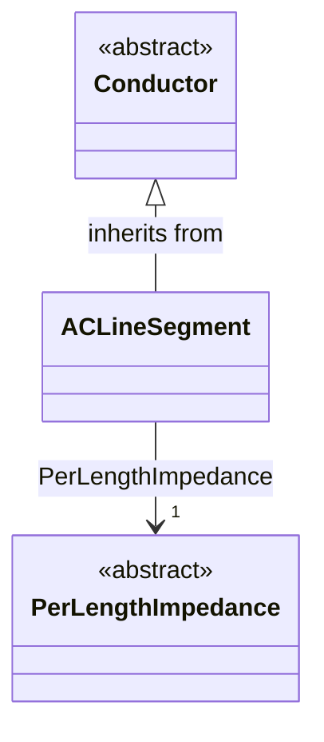

> **Note:** This class is tagged in this profile with the 'Description' tag. To refer to the full definition of this class as defined in the profile this one depends on visit [ACLineSegment](#{UnbalancedElectrical-description-profile}-ACLineSegment).

A line segment is a conductor or combination of conductors, with consistent electrical characteristics along its length, building a single electrical system that carries alternating current between two points in the power system.

The BaseVoltage at the two ends of a line segment shall have the same BaseVoltage.nominalVoltage. However, boundary lines may have slightly different BaseVoltage.nominalVoltages and variation is allowed. Larger voltage difference in general requires use of an equivalent branch.

Line segment impedances can be either directly described in electrical terms or physical line detail can be provided from which impedances can be calculated.

<b>Directly described impedances</b>

For symmetrical, transposed three phase line segments, it is sufficient to use attributes of the line segment, which describe impedances and admittances for the entire length of the line segment. Additionally, line segment impedances can be computed by using line segment length and associated per length impedances.

Unbalanced modeling of impedances is supported by the per length phase impedance matrix (PerLengthPhaseImpedance) in conjunction with phase-to-sequence number mapping supplied by either ACLineSegmentPhase or WirePosition. The sequence numbers are referenced by the row and column attributes of the per length phase impedance matrix. This method enables single-phase and two-phase line segments, and transpositions of phases, to be described using the same per length phase impedance matrix. The length of the line segment is used in the computation of total impedance values for the line segment.

<b>Line detail characteristics</b>

There are three approaches to providing line detail and all use WireAssembly to supply line positions:

<ul>

<li>Option 1 - WireAssembly supplies only line positions. ACLineSegmentPhase points to wire type and intraphase spacing and supplies the phase-to-sequence number mapping.</li>

<li>Option 2 - WireAssembly supplies line position and, for each position, also supplies wire type and intraphase spacing. ACLineSegmentPhase supplies the phase-to-sequence number mapping.</li>

<li>Option 3 - WireAssembly supplies line position and, for each position, also supplies wire type and intraphase spacing and phase. WireAssembly therefore supplies the phase-to-sequence number mapping and ACLineSegmentPhase is not needed.</li>

</ul>


#### Native Members

| name | type | description | mapping |
|------|------|-------------|---------|
| PerLengthImpedance [1] | [PerLengthImpedance](#UnbalancedElectrical-PerLengthImpedance) | Per-length impedance of this line segment. | |

#### Inherited Members

| name | type | description | mapping |
|------|------|-------------|---------|
| length [1] | [Length](#UnbalancedElectrical-Length) | see [Conductor](UnbalancedElectrical-Conductor) | |
| description [0..1] | [String](#UnbalancedElectrical-String) | see [IdentifiedObject](#UnbalancedElectrical-IdentifiedObject) | |
| name [0..1] | [String](#UnbalancedElectrical-String) | see [IdentifiedObject](#UnbalancedElectrical-IdentifiedObject) | |
| identifier [1] | [String](#UnbalancedElectrical-String) | see [Identity](#UnbalancedElectrical-Identity) | |

{#UnbalancedElectrical-ACLineSegmentPhase}
### (Description) ACLineSegmentPhase

Inheritance path = [PowerSystemResource](#UnbalancedElectrical-PowerSystemResource) => [IdentifiedObject](#UnbalancedElectrical-IdentifiedObject) => [Identity](#UnbalancedElectrical-Identity)

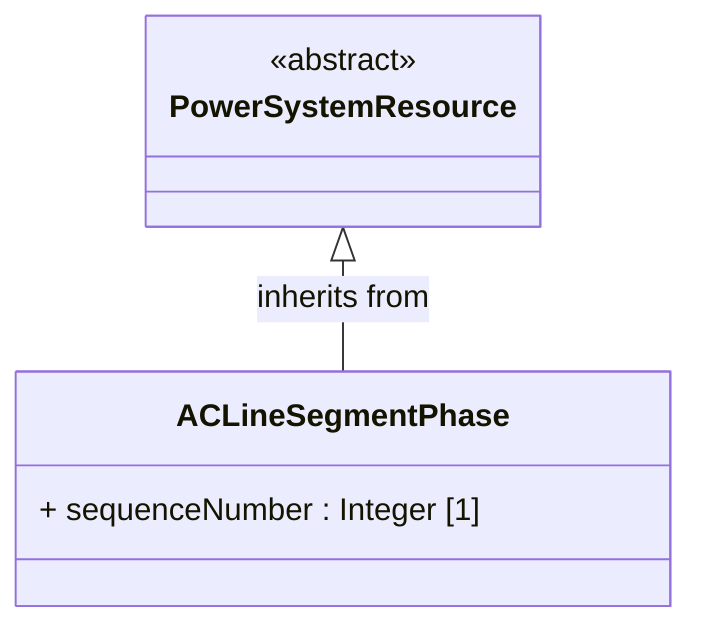

> **Note:** This class is tagged in this profile with the 'Description' tag. To refer to the full definition of this class as defined in the profile this one depends on visit [ACLineSegmentPhase](#{UnbalancedElectrical-description-profile}-ACLineSegmentPhase).

A line segment phase represents one phase (or optionally the neutral) of an alternating current line segment.

Under most circumstances there is not a line segment phase for the neutral. However, if a wire assembly is being used and it does not specify phase, a line segment phase must exist for each position in the assembly (including the neutral).


#### Native Members

| name | type | description | mapping |
|------|------|-------------|---------|
| sequenceNumber [1] | [Integer](#UnbalancedElectrical-Integer) | Sequence number provides the numbering for this line segment phase. When impedance is directly described, sequence number binds the phase to the column and row for entries in the per length phase impedance matrix (PhaseImpedanceData of PerLengthPhaseImpedance). When used in conjunction with a wire assembly description, sequence number associates the line segment phase to a position.For a line segment not a part of a parallel line segment group, sequence number starts at one and increments by one through each line segment phase associated with the line segment. If there is a line segment phase for neutral, it is numbered last. | |

#### Inherited Members

| name | type | description | mapping |
|------|------|-------------|---------|
| description [0..1] | [String](#UnbalancedElectrical-String) | see [IdentifiedObject](#UnbalancedElectrical-IdentifiedObject) | |
| name [0..1] | [String](#UnbalancedElectrical-String) | see [IdentifiedObject](#UnbalancedElectrical-IdentifiedObject) | |
| identifier [1] | [String](#UnbalancedElectrical-String) | see [Identity](#UnbalancedElectrical-Identity) | |

{#UnbalancedElectrical-AsynchronousMachine}
### (Description) AsynchronousMachine

Inheritance path = [RotatingMachine](#UnbalancedElectrical-RotatingMachine) => [RegulatingCondEq](#UnbalancedElectrical-RegulatingCondEq) => [EnergyConnection](#UnbalancedElectrical-EnergyConnection) => [ConductingEquipment](#UnbalancedElectrical-ConductingEquipment) => [Equipment](#UnbalancedElectrical-Equipment) => [PowerSystemResource](#UnbalancedElectrical-PowerSystemResource) => [IdentifiedObject](#UnbalancedElectrical-IdentifiedObject) => [Identity](#UnbalancedElectrical-Identity)

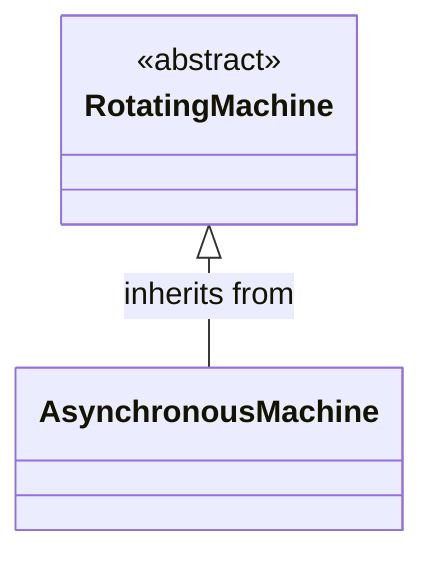

> **Note:** This class is tagged in this profile with the 'Description' tag. To refer to the full definition of this class as defined in the profile this one depends on visit [AsynchronousMachine](#{UnbalancedElectrical-description-profile}-AsynchronousMachine).

A rotating machine whose shaft rotates asynchronously with the electrical field. Also known as an induction machine with no external connection to the rotor windings, e.g. squirrel-cage induction machine.


#### Inherited Members

| name | type | description | mapping |
|------|------|-------------|---------|
| ratedS [1] | [ApparentPower](#UnbalancedElectrical-ApparentPower) | see [RotatingMachine](UnbalancedElectrical-RotatingMachine) | |
| ratedU [1] | [Voltage](#UnbalancedElectrical-Voltage) | see [RotatingMachine](UnbalancedElectrical-RotatingMachine) | |
| GeneratingUnit [0..1] | [GeneratingUnit](#UnbalancedElectrical-GeneratingUnit) | see [RotatingMachine](UnbalancedElectrical-RotatingMachine) | |
| RegulatingControl [0..1] | [RegulatingControl](#UnbalancedElectrical-RegulatingControl) | see [RegulatingCondEq](UnbalancedElectrical-RegulatingCondEq) | |
| description [0..1] | [String](#UnbalancedElectrical-String) | see [IdentifiedObject](#UnbalancedElectrical-IdentifiedObject) | |
| name [0..1] | [String](#UnbalancedElectrical-String) | see [IdentifiedObject](#UnbalancedElectrical-IdentifiedObject) | |
| identifier [1] | [String](#UnbalancedElectrical-String) | see [Identity](#UnbalancedElectrical-Identity) | |

{#UnbalancedElectrical-BatteryUnit}
### BatteryUnit

Inheritance path = [PowerElectronicsUnit](#UnbalancedElectrical-PowerElectronicsUnit) => [Equipment](#UnbalancedElectrical-Equipment) => [PowerSystemResource](#UnbalancedElectrical-PowerSystemResource) => [IdentifiedObject](#UnbalancedElectrical-IdentifiedObject) => [Identity](#UnbalancedElectrical-Identity)

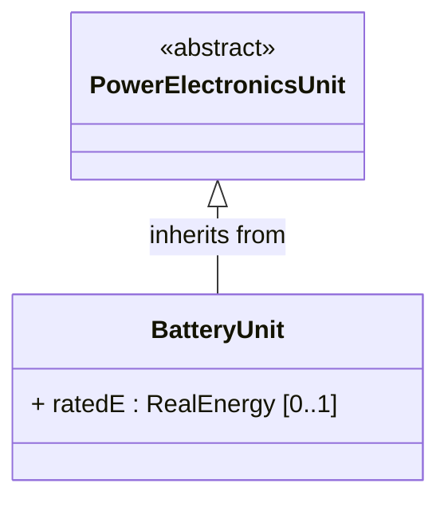

An electrochemical energy storage device.


#### Native Members

| name | type | description | mapping |
|------|------|-------------|---------|
| ratedE [0..1] | [RealEnergy](#UnbalancedElectrical-RealEnergy) | Full energy storage capacity of the battery. The attribute shall be a positive value. | |

#### Inherited Members

| name | type | description | mapping |
|------|------|-------------|---------|
| maxP [1] | [ActivePower](#UnbalancedElectrical-ActivePower) | see [PowerElectronicsUnit](UnbalancedElectrical-PowerElectronicsUnit) | |
| minP [1] | [ActivePower](#UnbalancedElectrical-ActivePower) | see [PowerElectronicsUnit](UnbalancedElectrical-PowerElectronicsUnit) | |
| PowerElectronicsConnection [0..1] | [PowerElectronicsConnection](#UnbalancedElectrical-PowerElectronicsConnection) | see [PowerElectronicsUnit](UnbalancedElectrical-PowerElectronicsUnit) | |
| description [0..1] | [String](#UnbalancedElectrical-String) | see [IdentifiedObject](#UnbalancedElectrical-IdentifiedObject) | |
| name [0..1] | [String](#UnbalancedElectrical-String) | see [IdentifiedObject](#UnbalancedElectrical-IdentifiedObject) | |
| identifier [1] | [String](#UnbalancedElectrical-String) | see [Identity](#UnbalancedElectrical-Identity) | |

{#UnbalancedElectrical-Breaker}
### (Description) Breaker

Inheritance path = [ProtectedSwitch](#UnbalancedElectrical-ProtectedSwitch) => [Switch](#UnbalancedElectrical-Switch) => [ConductingEquipment](#UnbalancedElectrical-ConductingEquipment) => [Equipment](#UnbalancedElectrical-Equipment) => [PowerSystemResource](#UnbalancedElectrical-PowerSystemResource) => [IdentifiedObject](#UnbalancedElectrical-IdentifiedObject) => [Identity](#UnbalancedElectrical-Identity)

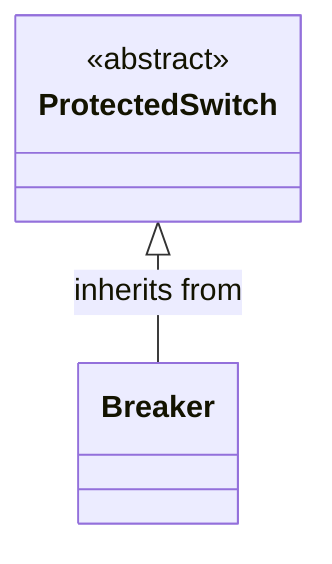

> **Note:** This class is tagged in this profile with the 'Description' tag. To refer to the full definition of this class as defined in the profile this one depends on visit [Breaker](#{UnbalancedElectrical-description-profile}-Breaker).

A mechanical switching device capable of making, carrying, and breaking currents under normal circuit conditions and also making, carrying for a specified time, and breaking currents under specified abnormal circuit conditions e.g. those of short circuit.


#### Inherited Members

| name | type | description | mapping |
|------|------|-------------|---------|
| breakingCapacity [0..1] | [CurrentFlow](#UnbalancedElectrical-CurrentFlow) | see [ProtectedSwitch](UnbalancedElectrical-ProtectedSwitch) | |
| ratedCurrent [1] | [CurrentFlow](#UnbalancedElectrical-CurrentFlow) | see [Switch](UnbalancedElectrical-Switch) | |
| description [0..1] | [String](#UnbalancedElectrical-String) | see [IdentifiedObject](#UnbalancedElectrical-IdentifiedObject) | |
| name [0..1] | [String](#UnbalancedElectrical-String) | see [IdentifiedObject](#UnbalancedElectrical-IdentifiedObject) | |
| identifier [1] | [String](#UnbalancedElectrical-String) | see [Identity](#UnbalancedElectrical-Identity) | |

{#UnbalancedElectrical-Disconnector}
### (Description) Disconnector

Inheritance path = [Switch](#UnbalancedElectrical-Switch) => [ConductingEquipment](#UnbalancedElectrical-ConductingEquipment) => [Equipment](#UnbalancedElectrical-Equipment) => [PowerSystemResource](#UnbalancedElectrical-PowerSystemResource) => [IdentifiedObject](#UnbalancedElectrical-IdentifiedObject) => [Identity](#UnbalancedElectrical-Identity)

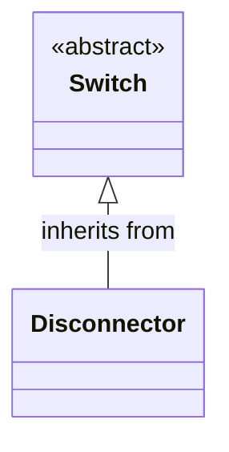

> **Note:** This class is tagged in this profile with the 'Description' tag. To refer to the full definition of this class as defined in the profile this one depends on visit [Disconnector](#{UnbalancedElectrical-description-profile}-Disconnector).

A mechanical switching device which provides, in the open position, an isolating distance in accordance with specified requirements.

A disconnector is capable of opening and closing a circuit when either negligible current is broken or made, or when no significant change in the voltage across the terminals of each of the poles of the disconnector occurs. It is also capable of carrying currents under normal circuit conditions and carrying for a specified time currents under abnormal conditions such as those of short circuit.


#### Inherited Members

| name | type | description | mapping |
|------|------|-------------|---------|
| ratedCurrent [1] | [CurrentFlow](#UnbalancedElectrical-CurrentFlow) | see [Switch](UnbalancedElectrical-Switch) | |
| description [0..1] | [String](#UnbalancedElectrical-String) | see [IdentifiedObject](#UnbalancedElectrical-IdentifiedObject) | |
| name [0..1] | [String](#UnbalancedElectrical-String) | see [IdentifiedObject](#UnbalancedElectrical-IdentifiedObject) | |
| identifier [1] | [String](#UnbalancedElectrical-String) | see [Identity](#UnbalancedElectrical-Identity) | |

{#UnbalancedElectrical-EnergyConsumer}
### (Description) EnergyConsumer

Inheritance path = [EnergyConnection](#UnbalancedElectrical-EnergyConnection) => [ConductingEquipment](#UnbalancedElectrical-ConductingEquipment) => [Equipment](#UnbalancedElectrical-Equipment) => [PowerSystemResource](#UnbalancedElectrical-PowerSystemResource) => [IdentifiedObject](#UnbalancedElectrical-IdentifiedObject) => [Identity](#UnbalancedElectrical-Identity)

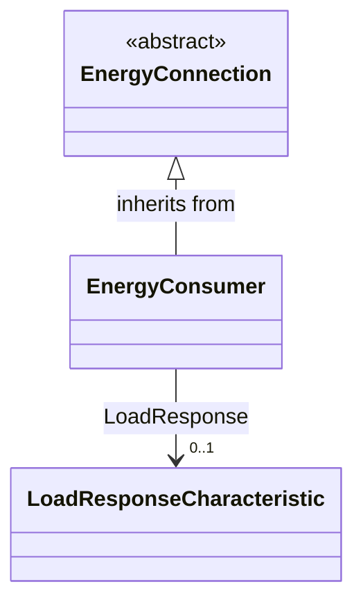

> **Note:** This class is tagged in this profile with the 'Description' tag. To refer to the full definition of this class as defined in the profile this one depends on visit [EnergyConsumer](#{UnbalancedElectrical-description-profile}-EnergyConsumer).

Generic user of energy - a point of consumption on the power system model.

EnergyConsumer.pfixed, .qfixed, .pfixedPct and .qfixedPct have meaning only if there is no LoadResponseCharacteristic associated with EnergyConsumer or if LoadResponseCharacteristic.exponentModel is set to False.


#### Native Members

| name | type | description | mapping |
|------|------|-------------|---------|
| LoadResponse [0..1] | [LoadResponseCharacteristic](#UnbalancedElectrical-LoadResponseCharacteristic) | The load response characteristic of this load. If missing, this load is assumed to be constant power. | |

#### Inherited Members

| name | type | description | mapping |
|------|------|-------------|---------|
| description [0..1] | [String](#UnbalancedElectrical-String) | see [IdentifiedObject](#UnbalancedElectrical-IdentifiedObject) | |
| name [0..1] | [String](#UnbalancedElectrical-String) | see [IdentifiedObject](#UnbalancedElectrical-IdentifiedObject) | |
| identifier [1] | [String](#UnbalancedElectrical-String) | see [Identity](#UnbalancedElectrical-Identity) | |

{#UnbalancedElectrical-EnergySource}
### (Description) EnergySource

Inheritance path = [EnergyConnection](#UnbalancedElectrical-EnergyConnection) => [ConductingEquipment](#UnbalancedElectrical-ConductingEquipment) => [Equipment](#UnbalancedElectrical-Equipment) => [PowerSystemResource](#UnbalancedElectrical-PowerSystemResource) => [IdentifiedObject](#UnbalancedElectrical-IdentifiedObject) => [Identity](#UnbalancedElectrical-Identity)

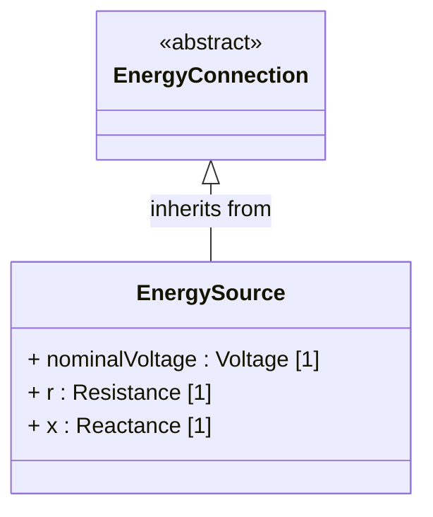

> **Note:** This class is tagged in this profile with the 'Description' tag. To refer to the full definition of this class as defined in the profile this one depends on visit [EnergySource](#{UnbalancedElectrical-description-profile}-EnergySource).

A generic equivalent for an energy supplier on a transmission or distribution voltage level.


#### Native Members

| name | type | description | mapping |
|------|------|-------------|---------|
| nominalVoltage [1] | [Voltage](#UnbalancedElectrical-Voltage) | Phase-to-phase nominal voltage. | |
| r [1] | [Resistance](#UnbalancedElectrical-Resistance) | Positive sequence Thevenin resistance. | |
| x [1] | [Reactance](#UnbalancedElectrical-Reactance) | Positive sequence Thevenin reactance. | |

#### Inherited Members

| name | type | description | mapping |
|------|------|-------------|---------|
| description [0..1] | [String](#UnbalancedElectrical-String) | see [IdentifiedObject](#UnbalancedElectrical-IdentifiedObject) | |
| name [0..1] | [String](#UnbalancedElectrical-String) | see [IdentifiedObject](#UnbalancedElectrical-IdentifiedObject) | |
| identifier [1] | [String](#UnbalancedElectrical-String) | see [Identity](#UnbalancedElectrical-Identity) | |

{#UnbalancedElectrical-FossilFuel}
### FossilFuel

Inheritance path = [IdentifiedObject](#UnbalancedElectrical-IdentifiedObject) => [Identity](#UnbalancedElectrical-Identity)

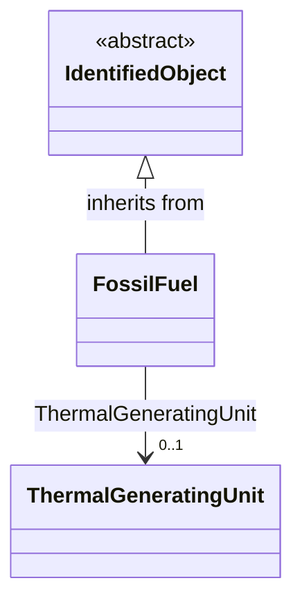

The fossil fuel consumed by the non-nuclear thermal generating unit. For example, coal, oil, gas, etc. These are the specific fuels that the generating unit can consume.


#### Native Members

| name | type | description | mapping |
|------|------|-------------|---------|
| ThermalGeneratingUnit [0..1] | [ThermalGeneratingUnit](#UnbalancedElectrical-ThermalGeneratingUnit) | A thermal generating unit may have one or more fossil fuels. | |

#### Inherited Members

| name | type | description | mapping |
|------|------|-------------|---------|
| description [0..1] | [String](#UnbalancedElectrical-String) | see [IdentifiedObject](#UnbalancedElectrical-IdentifiedObject) | |
| name [0..1] | [String](#UnbalancedElectrical-String) | see [IdentifiedObject](#UnbalancedElectrical-IdentifiedObject) | |
| identifier [1] | [String](#UnbalancedElectrical-String) | see [Identity](#UnbalancedElectrical-Identity) | |

{#UnbalancedElectrical-Fuse}
### (Description) Fuse

Inheritance path = [Switch](#UnbalancedElectrical-Switch) => [ConductingEquipment](#UnbalancedElectrical-ConductingEquipment) => [Equipment](#UnbalancedElectrical-Equipment) => [PowerSystemResource](#UnbalancedElectrical-PowerSystemResource) => [IdentifiedObject](#UnbalancedElectrical-IdentifiedObject) => [Identity](#UnbalancedElectrical-Identity)

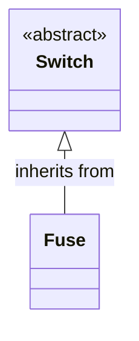

> **Note:** This class is tagged in this profile with the 'Description' tag. To refer to the full definition of this class as defined in the profile this one depends on visit [Fuse](#{UnbalancedElectrical-description-profile}-Fuse).

An overcurrent protective device with a circuit opening fusible part that is heated and severed by the passage of overcurrent through it. A fuse is considered a switching device because it breaks current.


#### Inherited Members

| name | type | description | mapping |
|------|------|-------------|---------|
| ratedCurrent [1] | [CurrentFlow](#UnbalancedElectrical-CurrentFlow) | see [Switch](UnbalancedElectrical-Switch) | |
| description [0..1] | [String](#UnbalancedElectrical-String) | see [IdentifiedObject](#UnbalancedElectrical-IdentifiedObject) | |
| name [0..1] | [String](#UnbalancedElectrical-String) | see [IdentifiedObject](#UnbalancedElectrical-IdentifiedObject) | |
| identifier [1] | [String](#UnbalancedElectrical-String) | see [Identity](#UnbalancedElectrical-Identity) | |

{#UnbalancedElectrical-LinearShuntCompensator}
### (Description) LinearShuntCompensator

Inheritance path = [ShuntCompensator](#UnbalancedElectrical-ShuntCompensator) => [RegulatingCondEq](#UnbalancedElectrical-RegulatingCondEq) => [EnergyConnection](#UnbalancedElectrical-EnergyConnection) => [ConductingEquipment](#UnbalancedElectrical-ConductingEquipment) => [Equipment](#UnbalancedElectrical-Equipment) => [PowerSystemResource](#UnbalancedElectrical-PowerSystemResource) => [IdentifiedObject](#UnbalancedElectrical-IdentifiedObject) => [Identity](#UnbalancedElectrical-Identity)

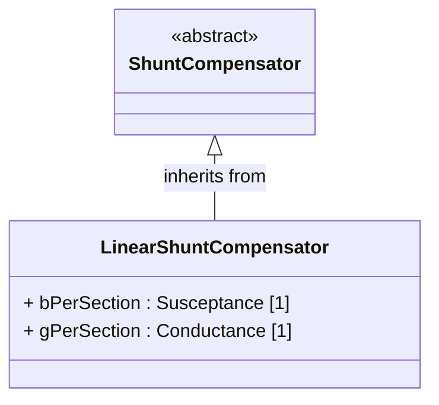

> **Note:** This class is tagged in this profile with the 'Description' tag. To refer to the full definition of this class as defined in the profile this one depends on visit [LinearShuntCompensator](#{UnbalancedElectrical-description-profile}-LinearShuntCompensator).

A linear shunt compensator has banks or sections with equal admittance values.


#### Native Members

| name | type | description | mapping |
|------|------|-------------|---------|
| bPerSection [1] | [Susceptance](#UnbalancedElectrical-Susceptance) | Positive sequence shunt (charging) susceptance per section. | |
| gPerSection [1] | [Conductance](#UnbalancedElectrical-Conductance) | Positive sequence shunt (charging) conductance per section. | |

#### Inherited Members

| name | type | description | mapping |
|------|------|-------------|---------|
| aVRDelay [0..1] | [Seconds](#UnbalancedElectrical-Seconds) | see [ShuntCompensator](UnbalancedElectrical-ShuntCompensator) | |
| maximumSections [1] | [Integer](#UnbalancedElectrical-Integer) | see [ShuntCompensator](#UnbalancedElectrical-ShuntCompensator) | |
| nomU [1] | [Voltage](#UnbalancedElectrical-Voltage) | see [ShuntCompensator](UnbalancedElectrical-ShuntCompensator) | |
| normalSections [1] | [Integer](#UnbalancedElectrical-Integer) | see [ShuntCompensator](#UnbalancedElectrical-ShuntCompensator) | |
| RegulatingControl [0..1] | [RegulatingControl](#UnbalancedElectrical-RegulatingControl) | see [RegulatingCondEq](UnbalancedElectrical-RegulatingCondEq) | |
| description [0..1] | [String](#UnbalancedElectrical-String) | see [IdentifiedObject](#UnbalancedElectrical-IdentifiedObject) | |
| name [0..1] | [String](#UnbalancedElectrical-String) | see [IdentifiedObject](#UnbalancedElectrical-IdentifiedObject) | |
| identifier [1] | [String](#UnbalancedElectrical-String) | see [Identity](#UnbalancedElectrical-Identity) | |

{#UnbalancedElectrical-LinearShuntCompensatorPhase}
### (Description) LinearShuntCompensatorPhase

Inheritance path = [ShuntCompensatorPhase](#UnbalancedElectrical-ShuntCompensatorPhase) => [PowerSystemResource](#UnbalancedElectrical-PowerSystemResource) => [IdentifiedObject](#UnbalancedElectrical-IdentifiedObject) => [Identity](#UnbalancedElectrical-Identity)

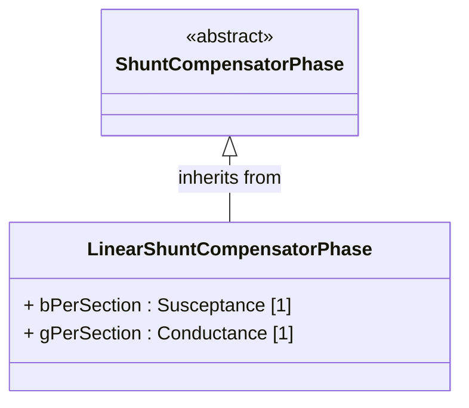

> **Note:** This class is tagged in this profile with the 'Description' tag. To refer to the full definition of this class as defined in the profile this one depends on visit [LinearShuntCompensatorPhase](#{UnbalancedElectrical-description-profile}-LinearShuntCompensatorPhase).

A per phase linear shunt compensator has banks or sections with equal admittance values.


#### Native Members

| name | type | description | mapping |
|------|------|-------------|---------|
| bPerSection [1] | [Susceptance](#UnbalancedElectrical-Susceptance) | Susceptance per section of the phase if shunt compensator is wye connected. Susceptance per section phase to phase if shunt compensator is delta connected. | |
| gPerSection [1] | [Conductance](#UnbalancedElectrical-Conductance) | Conductance per section for this phase if shunt compensator is wye connected. Conductance per section phase to phase if shunt compensator is delta connected. | |

#### Inherited Members

| name | type | description | mapping |
|------|------|-------------|---------|
| maximumSections [1] | [Integer](#UnbalancedElectrical-Integer) | see [ShuntCompensatorPhase](#UnbalancedElectrical-ShuntCompensatorPhase) | |
| normalSections [1] | [Integer](#UnbalancedElectrical-Integer) | see [ShuntCompensatorPhase](#UnbalancedElectrical-ShuntCompensatorPhase) | |
| description [0..1] | [String](#UnbalancedElectrical-String) | see [IdentifiedObject](#UnbalancedElectrical-IdentifiedObject) | |
| name [0..1] | [String](#UnbalancedElectrical-String) | see [IdentifiedObject](#UnbalancedElectrical-IdentifiedObject) | |
| identifier [1] | [String](#UnbalancedElectrical-String) | see [Identity](#UnbalancedElectrical-Identity) | |

{#UnbalancedElectrical-LoadBreakSwitch}
### (Description) LoadBreakSwitch

Inheritance path = [ProtectedSwitch](#UnbalancedElectrical-ProtectedSwitch) => [Switch](#UnbalancedElectrical-Switch) => [ConductingEquipment](#UnbalancedElectrical-ConductingEquipment) => [Equipment](#UnbalancedElectrical-Equipment) => [PowerSystemResource](#UnbalancedElectrical-PowerSystemResource) => [IdentifiedObject](#UnbalancedElectrical-IdentifiedObject) => [Identity](#UnbalancedElectrical-Identity)

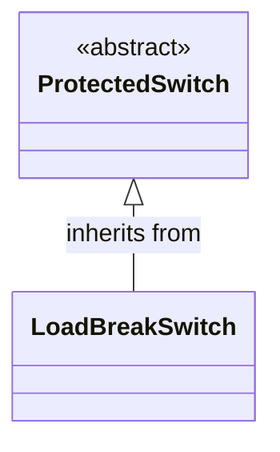

> **Note:** This class is tagged in this profile with the 'Description' tag. To refer to the full definition of this class as defined in the profile this one depends on visit [LoadBreakSwitch](#{UnbalancedElectrical-description-profile}-LoadBreakSwitch).

A mechanical switching device capable of making, carrying, and breaking currents under normal operating conditions.


#### Inherited Members

| name | type | description | mapping |
|------|------|-------------|---------|
| breakingCapacity [0..1] | [CurrentFlow](#UnbalancedElectrical-CurrentFlow) | see [ProtectedSwitch](UnbalancedElectrical-ProtectedSwitch) | |
| ratedCurrent [1] | [CurrentFlow](#UnbalancedElectrical-CurrentFlow) | see [Switch](UnbalancedElectrical-Switch) | |
| description [0..1] | [String](#UnbalancedElectrical-String) | see [IdentifiedObject](#UnbalancedElectrical-IdentifiedObject) | |
| name [0..1] | [String](#UnbalancedElectrical-String) | see [IdentifiedObject](#UnbalancedElectrical-IdentifiedObject) | |
| identifier [1] | [String](#UnbalancedElectrical-String) | see [Identity](#UnbalancedElectrical-Identity) | |

{#UnbalancedElectrical-LoadResponseCharacteristic}
### LoadResponseCharacteristic

Inheritance path = [IdentifiedObject](#UnbalancedElectrical-IdentifiedObject) => [Identity](#UnbalancedElectrical-Identity)

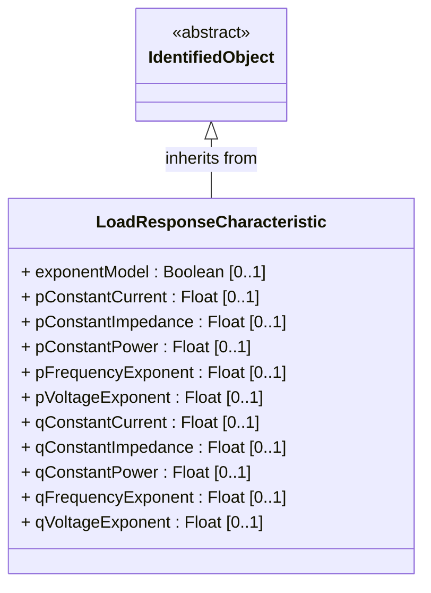

Models the characteristic response of the load demand due to changes in system conditions such as voltage and frequency. It is not related to demand response.

If LoadResponseCharacteristic.exponentModel is True, the exponential voltage or frequency dependent models are specified and used as to calculate active and reactive power components of the load model.

The equations to calculate active and reactive power components of the load model are internal to the power flow calculation, hence they use different quantities depending on the use case of the data exchange.

The equations for exponential voltage dependent load model injected power are:

pInjection= Pnominal* (Voltage/cim:BaseVoltage.nominalVoltage) ** cim:LoadResponseCharacteristic.pVoltageExponent

qInjection= Qnominal* (Voltage/cim:BaseVoltage.nominalVoltage) ** cim:LoadResponseCharacteristic.qVoltageExponent

pInjection = Pnominal* (Frequency/(Nominal frequency))**cim:LoadResponseCharacteristic.pFrequencyExponent

qInjection = Qnominal* (Frequency/(Nominal frequency))**cim:LoadResponseCharacteristic.qFrequencyExponent

Note that both voltage and frequency exponents could be used together so the full equation would be:

pInjection = Pnominal* (Voltage/(cim:BaseVoltage.nominalVoltage))**cim:LoadResponseCharacteristic.pVoltageExponent * (Frequency/(base frequency))**cim:LoadResponseCharacteristic.pFrequencyExponent

qInjection = Qnominal* (Voltage/(cim:BaseVoltage.nominalVoltage))**cim:LoadResponseCharacteristic.qVoltageExponent * (Frequency/(base frequency))**cim:LoadResponseCharacteristic.qFrequencyExponent

The voltage and frequency expressed in the equation are values obtained from solved power flow. Base voltage and base frequency are those derived from the connectivity of the static network model.

Where:

1) * means "multiply" and ** is "raised to the power of";

2) Pnominal and Qnominal represent the active power and reactive power at nominal voltage as any load described by the voltage exponential model shall be given at nominal voltage. This means that EnergyConsumer.p and EnergyConsumer.q are at nominal voltage.

3) After power flow is solved:

-pInjection and qInjection correspond to SvPowerflow.p and SvPowerflow.q respectively.

- Voltage corresponds to SvVoltage.v at the TopologicalNode where the load is connected.


#### Native Members

| name | type | description | mapping |
|------|------|-------------|---------|
| exponentModel [0..1] | [Boolean](#UnbalancedElectrical-Boolean) | Indicates the exponential voltage dependency model is to be used. If false, the coefficient model is to be used.The exponential voltage dependency model consist of the attributes:- pVoltageExponent- qVoltageExponent- pFrequencyExponent- qFrequencyExponent.The coefficient model consist of the attributes:- pConstantImpedance- pConstantCurrent- pConstantPower- qConstantImpedance- qConstantCurrent- qConstantPower.The sum of pConstantImpedance, pConstantCurrent and pConstantPower shall equal 1.The sum of qConstantImpedance, qConstantCurrent and qConstantPower shall equal 1. | |
| pConstantCurrent [0..1] | [Float](#UnbalancedElectrical-Float) | Portion of active power load modelled as constant current. | |
| pConstantImpedance [0..1] | [Float](#UnbalancedElectrical-Float) | Portion of active power load modelled as constant impedance. | |
| pConstantPower [0..1] | [Float](#UnbalancedElectrical-Float) | Portion of active power load modelled as constant power. | |
| pFrequencyExponent [0..1] | [Float](#UnbalancedElectrical-Float) | Exponent of per unit frequency effecting active power. | |
| pVoltageExponent [0..1] | [Float](#UnbalancedElectrical-Float) | Exponent of per unit voltage effecting real power. | |
| qConstantCurrent [0..1] | [Float](#UnbalancedElectrical-Float) | Portion of reactive power load modelled as constant current. | |
| qConstantImpedance [0..1] | [Float](#UnbalancedElectrical-Float) | Portion of reactive power load modelled as constant impedance. | |
| qConstantPower [0..1] | [Float](#UnbalancedElectrical-Float) | Portion of reactive power load modelled as constant power. | |
| qFrequencyExponent [0..1] | [Float](#UnbalancedElectrical-Float) | Exponent of per unit frequency effecting reactive power. | |
| qVoltageExponent [0..1] | [Float](#UnbalancedElectrical-Float) | Exponent of per unit voltage effecting reactive power. | |

#### Inherited Members

| name | type | description | mapping |
|------|------|-------------|---------|
| description [0..1] | [String](#UnbalancedElectrical-String) | see [IdentifiedObject](#UnbalancedElectrical-IdentifiedObject) | |
| name [0..1] | [String](#UnbalancedElectrical-String) | see [IdentifiedObject](#UnbalancedElectrical-IdentifiedObject) | |
| identifier [1] | [String](#UnbalancedElectrical-String) | see [Identity](#UnbalancedElectrical-Identity) | |

{#UnbalancedElectrical-PerLengthPhaseImpedance}
### PerLengthPhaseImpedance

Inheritance path = [PerLengthImpedance](#UnbalancedElectrical-PerLengthImpedance) => [PerLengthLineParameter](#UnbalancedElectrical-PerLengthLineParameter) => [IdentifiedObject](#UnbalancedElectrical-IdentifiedObject) => [Identity](#UnbalancedElectrical-Identity)

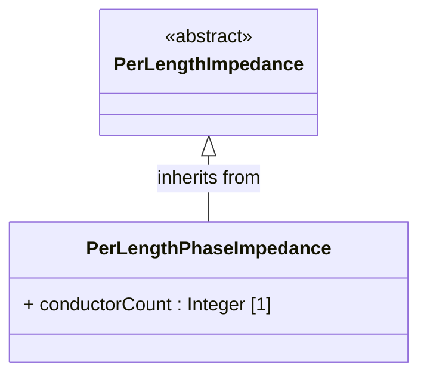

The per length phase impedance matrix expresses impedance and admittance parameters per unit length for n-conductor unbalanced line segments. A phase impedance matrix contains both self impedances for each phase and mutual impedances between pairs of phases. The matrix is stored in symmetric lower triangular format where the diagonal entries represent self-impedances (and have the same value in row and column) and the off diagonal entries represent phase-to-phase impedances (and have different row and column values).

The matrix can be use to express impedances for both non-coupled and coupled line segments. Coupled line segments share a single per length phase impedance matrix whose entries reflect the self and mutual impedances of all the phases of all the wires.


#### Native Members

| name | type | description | mapping |
|------|------|-------------|---------|
| conductorCount [1] | [Integer](#UnbalancedElectrical-Integer) | Conductor count identifies the number of phase, neutral, and other wires represented in the phase impedance matrix and constrains the number of elements in the matrix. Typically, Kron reduction is used for incorporating effects of neutral impedance in the phase conductor values (so conductor count only considers phase wires), but neutrals can be included in the matrix (in which case conductor count would include the neutral wire(s)). For a phase impedance matrix associated with the lines of a coupled line segment group, the conductor count reflects the total of the conductors associated with all the coupled line segments in the group. | |

#### Inherited Members

| name | type | description | mapping |
|------|------|-------------|---------|
| description [0..1] | [String](#UnbalancedElectrical-String) | see [IdentifiedObject](#UnbalancedElectrical-IdentifiedObject) | |
| name [0..1] | [String](#UnbalancedElectrical-String) | see [IdentifiedObject](#UnbalancedElectrical-IdentifiedObject) | |
| identifier [1] | [String](#UnbalancedElectrical-String) | see [Identity](#UnbalancedElectrical-Identity) | |

{#UnbalancedElectrical-PhaseImpedanceData}
### PhaseImpedanceData

Inheritance path = [Identity](#UnbalancedElectrical-Identity)

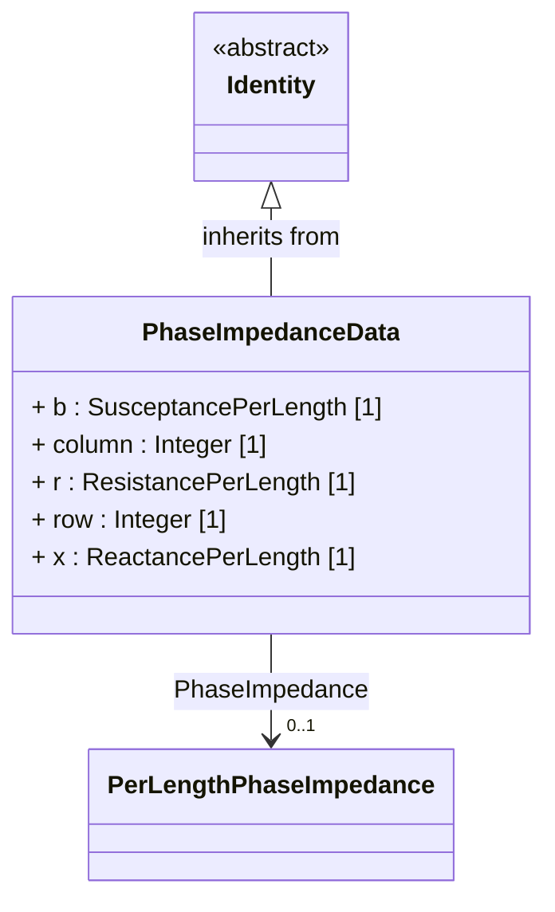

Per length phase impedance matrix entry describes impedance and conductance matrix element values for a specific row and column of the matrix.

The phases to which each entry applies can be determined by means of the row and column attributes which bind to a sequence number provided in either ACLineSegmentPhase or WirePosition (which also specify phase). Due to physical symmetry that is reflected in the matrix, only the lower triangle of the matrix is populated with the row and column method. That is, the column attribute is always less than or equal to the row attribute.


#### Native Members

| name | type | description | mapping |
|------|------|-------------|---------|
| b [1] | [SusceptancePerLength](#UnbalancedElectrical-SusceptancePerLength) | Susceptance matrix entry value, per length of unit. | |
| column [1] | [Integer](#UnbalancedElectrical-Integer) | The matrix entry's column number has a range of possible values from 1 to the conductor count of the matrix, but due to symmetry, only entries in the lower triangle (including diagonal) of the matrix need be defined. Column number binds to the sequence number in either ACLineSegmentPhase or WirePosition, which then identifies the phase for this entry. | |
| r [1] | [ResistancePerLength](#UnbalancedElectrical-ResistancePerLength) | Resistance matrix entry value, per length of unit. | |
| row [1] | [Integer](#UnbalancedElectrical-Integer) | The matrix entry's row number has a range of possible values from 1 to the conductor count of the matrix, but due to symmetry, only entries in the lower triangle (including diagonal) of the matrix need be defined. Row number binds to the sequence number in either ACLineSegmentPhase or WirePosition, which then identifies the phase for this entry. | |
| x [1] | [ReactancePerLength](#UnbalancedElectrical-ReactancePerLength) | Reactance matrix entry value, per length of unit. | |
| PhaseImpedance [0..1] | [PerLengthPhaseImpedance](#UnbalancedElectrical-PerLengthPhaseImpedance) | Conductor phase impedance to which this data belongs. | |

#### Inherited Members

| name | type | description | mapping |
|------|------|-------------|---------|
| identifier [1] | [String](#UnbalancedElectrical-String) | see [Identity](#UnbalancedElectrical-Identity) | |

{#UnbalancedElectrical-PhotoVoltaicUnit}
### PhotoVoltaicUnit

Inheritance path = [PowerElectronicsUnit](#UnbalancedElectrical-PowerElectronicsUnit) => [Equipment](#UnbalancedElectrical-Equipment) => [PowerSystemResource](#UnbalancedElectrical-PowerSystemResource) => [IdentifiedObject](#UnbalancedElectrical-IdentifiedObject) => [Identity](#UnbalancedElectrical-Identity)

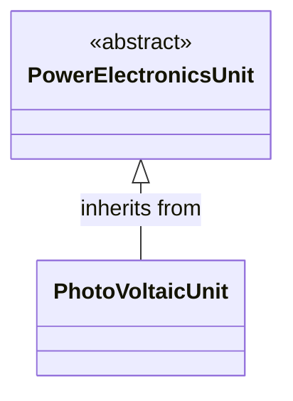

A photovoltaic device or an aggregation of such devices.


#### Inherited Members

| name | type | description | mapping |
|------|------|-------------|---------|
| maxP [1] | [ActivePower](#UnbalancedElectrical-ActivePower) | see [PowerElectronicsUnit](UnbalancedElectrical-PowerElectronicsUnit) | |
| minP [1] | [ActivePower](#UnbalancedElectrical-ActivePower) | see [PowerElectronicsUnit](UnbalancedElectrical-PowerElectronicsUnit) | |
| PowerElectronicsConnection [0..1] | [PowerElectronicsConnection](#UnbalancedElectrical-PowerElectronicsConnection) | see [PowerElectronicsUnit](UnbalancedElectrical-PowerElectronicsUnit) | |
| description [0..1] | [String](#UnbalancedElectrical-String) | see [IdentifiedObject](#UnbalancedElectrical-IdentifiedObject) | |
| name [0..1] | [String](#UnbalancedElectrical-String) | see [IdentifiedObject](#UnbalancedElectrical-IdentifiedObject) | |
| identifier [1] | [String](#UnbalancedElectrical-String) | see [Identity](#UnbalancedElectrical-Identity) | |

{#UnbalancedElectrical-PowerElectronicsConnection}
### (Description) PowerElectronicsConnection

Inheritance path = [RegulatingCondEq](#UnbalancedElectrical-RegulatingCondEq) => [EnergyConnection](#UnbalancedElectrical-EnergyConnection) => [ConductingEquipment](#UnbalancedElectrical-ConductingEquipment) => [Equipment](#UnbalancedElectrical-Equipment) => [PowerSystemResource](#UnbalancedElectrical-PowerSystemResource) => [IdentifiedObject](#UnbalancedElectrical-IdentifiedObject) => [Identity](#UnbalancedElectrical-Identity)

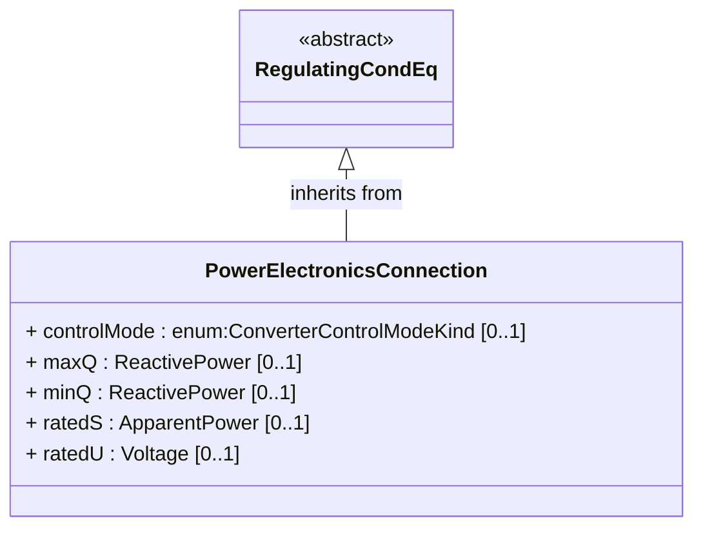

> **Note:** This class is tagged in this profile with the 'Description' tag. To refer to the full definition of this class as defined in the profile this one depends on visit [PowerElectronicsConnection](#{UnbalancedElectrical-description-profile}-PowerElectronicsConnection).

A connection to the AC network for energy production or consumption that uses power electronics rather than rotating machines.


#### Native Members

| name | type | description | mapping |
|------|------|-------------|---------|
| `controlMode [0..1]` (gmdm) | [ConverterControlModeKind](#UnbalancedElectrical-ConverterControlModeKind) | Inverter control mode indicating whether reactive power output is based on constant PF or constant Q | |
| maxQ [0..1] | [ReactivePower](#UnbalancedElectrical-ReactivePower) | Maximum reactive power limit. This is the maximum (nameplate) limit for the unit. | |
| minQ [0..1] | [ReactivePower](#UnbalancedElectrical-ReactivePower) | Minimum reactive power limit for the unit. This is the minimum (nameplate) limit for the unit. | |
| ratedS [0..1] | [ApparentPower](#UnbalancedElectrical-ApparentPower) | Nameplate apparent power rating for the unit.The attribute shall have a positive value. | |
| ratedU [0..1] | [Voltage](#UnbalancedElectrical-Voltage) | Rated voltage (nameplate data, Ur in IEC 60909-0). It is primarily used for short circuit data exchange according to IEC 60909.The attribute shall be a positive value. | |

#### Inherited Members

| name | type | description | mapping |
|------|------|-------------|---------|
| RegulatingControl [0..1] | [RegulatingControl](#UnbalancedElectrical-RegulatingControl) | see [RegulatingCondEq](UnbalancedElectrical-RegulatingCondEq) | |
| description [0..1] | [String](#UnbalancedElectrical-String) | see [IdentifiedObject](#UnbalancedElectrical-IdentifiedObject) | |
| name [0..1] | [String](#UnbalancedElectrical-String) | see [IdentifiedObject](#UnbalancedElectrical-IdentifiedObject) | |
| identifier [1] | [String](#UnbalancedElectrical-String) | see [Identity](#UnbalancedElectrical-Identity) | |

{#UnbalancedElectrical-PowerElectronicsThermalUnit}
### (gmdm) PowerElectronicsThermalUnit

Inheritance path = [PowerElectronicsUnit](#UnbalancedElectrical-PowerElectronicsUnit) => [Equipment](#UnbalancedElectrical-Equipment) => [PowerSystemResource](#UnbalancedElectrical-PowerSystemResource) => [IdentifiedObject](#UnbalancedElectrical-IdentifiedObject) => [Identity](#UnbalancedElectrical-Identity)

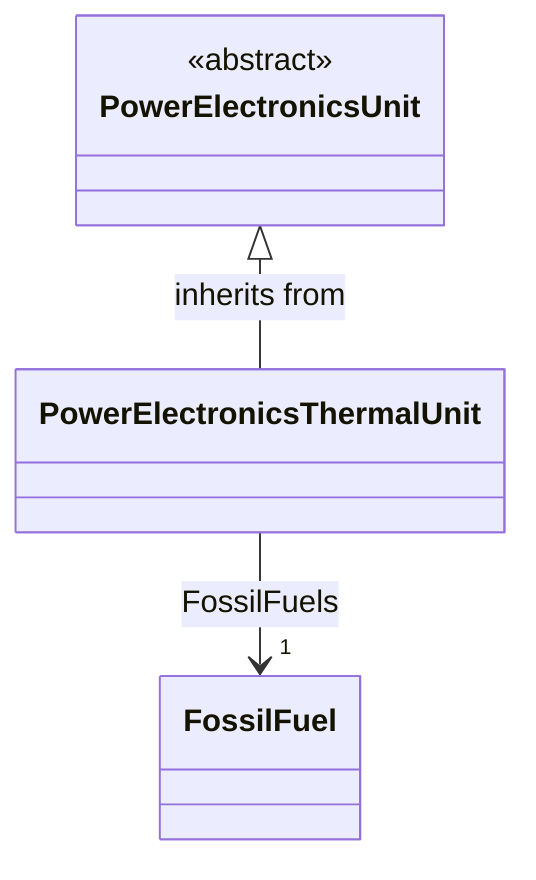

A thermal unit that is connected via an inverter such as through a back-to-back converter


#### Native Members

| name | type | description | mapping |
|------|------|-------------|---------|
| `FossilFuels [1]` | [FossilFuel](#UnbalancedElectrical-FossilFuel) | | |

#### Inherited Members

| name | type | description | mapping |
|------|------|-------------|---------|
| maxP [1] | [ActivePower](#UnbalancedElectrical-ActivePower) | see [PowerElectronicsUnit](UnbalancedElectrical-PowerElectronicsUnit) | |
| minP [1] | [ActivePower](#UnbalancedElectrical-ActivePower) | see [PowerElectronicsUnit](UnbalancedElectrical-PowerElectronicsUnit) | |
| PowerElectronicsConnection [0..1] | [PowerElectronicsConnection](#UnbalancedElectrical-PowerElectronicsConnection) | see [PowerElectronicsUnit](UnbalancedElectrical-PowerElectronicsUnit) | |
| description [0..1] | [String](#UnbalancedElectrical-String) | see [IdentifiedObject](#UnbalancedElectrical-IdentifiedObject) | |
| name [0..1] | [String](#UnbalancedElectrical-String) | see [IdentifiedObject](#UnbalancedElectrical-IdentifiedObject) | |
| identifier [1] | [String](#UnbalancedElectrical-String) | see [Identity](#UnbalancedElectrical-Identity) | |

{#UnbalancedElectrical-PowerElectronicsWindUnit}
### PowerElectronicsWindUnit

Inheritance path = [PowerElectronicsUnit](#UnbalancedElectrical-PowerElectronicsUnit) => [Equipment](#UnbalancedElectrical-Equipment) => [PowerSystemResource](#UnbalancedElectrical-PowerSystemResource) => [IdentifiedObject](#UnbalancedElectrical-IdentifiedObject) => [Identity](#UnbalancedElectrical-Identity)

```mermaid
classDiagram
direction TB

class PowerElectronicsWindUnit {
}

class PowerElectronicsUnit {
<<abstract>>
}

PowerElectronicsUnit <|-- PowerElectronicsWindUnit : inherits from
```

A wind generating unit that connects to the AC network with power electronics rather than rotating machines or an aggregation of such units.


#### Inherited Members

| name | type | description | mapping |
|------|------|-------------|---------|
| maxP [1] | [ActivePower](#UnbalancedElectrical-ActivePower) | see [PowerElectronicsUnit](UnbalancedElectrical-PowerElectronicsUnit) | |
| minP [1] | [ActivePower](#UnbalancedElectrical-ActivePower) | see [PowerElectronicsUnit](UnbalancedElectrical-PowerElectronicsUnit) | |
| PowerElectronicsConnection [0..1] | [PowerElectronicsConnection](#UnbalancedElectrical-PowerElectronicsConnection) | see [PowerElectronicsUnit](UnbalancedElectrical-PowerElectronicsUnit) | |
| description [0..1] | [String](#UnbalancedElectrical-String) | see [IdentifiedObject](#UnbalancedElectrical-IdentifiedObject) | |
| name [0..1] | [String](#UnbalancedElectrical-String) | see [IdentifiedObject](#UnbalancedElectrical-IdentifiedObject) | |
| identifier [1] | [String](#UnbalancedElectrical-String) | see [Identity](#UnbalancedElectrical-Identity) | |

{#UnbalancedElectrical-PowerTransformer}
### (Description) PowerTransformer

Inheritance path = [ConductingEquipment](#UnbalancedElectrical-ConductingEquipment) => [Equipment](#UnbalancedElectrical-Equipment) => [PowerSystemResource](#UnbalancedElectrical-PowerSystemResource) => [IdentifiedObject](#UnbalancedElectrical-IdentifiedObject) => [Identity](#UnbalancedElectrical-Identity)

```mermaid
classDiagram
direction TB

class PowerTransformer {
}

class ConductingEquipment {
<<abstract>>
}

ConductingEquipment <|-- PowerTransformer : inherits from
```

> **Note:** This class is tagged in this profile with the 'Description' tag. To refer to the full definition of this class as defined in the profile this one depends on visit [PowerTransformer](#{UnbalancedElectrical-description-profile}-PowerTransformer).

An electrical device consisting of two or more coupled windings, with or without a magnetic core, for introducing mutual coupling between electric circuits. Transformers can be used to control voltage and phase shift (active power flow).

A power transformer may be composed of separate transformer tanks that need not be identical.

A power transformer can be modelled with or without tanks and is intended for use in both balanced and unbalanced representations. A power transformer typically has two terminals, but may have one (grounding), three or more terminals.

The inherited association ConductingEquipment.BaseVoltage should not be used. The association from TransformerEnd to BaseVoltage should be used instead.


#### Inherited Members

| name | type | description | mapping |
|------|------|-------------|---------|
| description [0..1] | [String](#UnbalancedElectrical-String) | see [IdentifiedObject](#UnbalancedElectrical-IdentifiedObject) | |
| name [0..1] | [String](#UnbalancedElectrical-String) | see [IdentifiedObject](#UnbalancedElectrical-IdentifiedObject) | |
| identifier [1] | [String](#UnbalancedElectrical-String) | see [Identity](#UnbalancedElectrical-Identity) | |

{#UnbalancedElectrical-PowerTransformerEnd}
### (Description) PowerTransformerEnd

Inheritance path = [TransformerEnd](#UnbalancedElectrical-TransformerEnd) => [IdentifiedObject](#UnbalancedElectrical-IdentifiedObject) => [Identity](#UnbalancedElectrical-Identity)

```mermaid
classDiagram
direction TB

class PowerTransformerEnd {
+ b : Susceptance [0..1]
+ g : Conductance [0..1]
+ phaseAngleClock : Integer [0..1]
+ r : Resistance [1]
+ ratedS : ApparentPower [1]
+ ratedU : Voltage [1]
+ x : Reactance [0..1]
}

class TransformerEnd {
<<abstract>>
}

TransformerEnd <|-- PowerTransformerEnd : inherits from
```

> **Note:** This class is tagged in this profile with the 'Description' tag. To refer to the full definition of this class as defined in the profile this one depends on visit [PowerTransformerEnd](#{UnbalancedElectrical-description-profile}-PowerTransformerEnd).

A PowerTransformerEnd is associated with each Terminal of a PowerTransformer.

The impedance values r, r0, x, and x0 of a PowerTransformerEnd represents a star equivalent as follows.

1) two PowerTransformerEnd-s shall be defined for a two Terminal PowerTransformer even if the two PowerTransformerEnd-s have the same rated voltage. The high voltage PowerTransformerEnd (TransformerEnd.endNumber=1) is the one used to exchange resistances (r, r0) and reactances (x, x0) of the PowerTransformer while the low voltage PowerTransformerEnd (TransformerEnd.endNumber=2) shall have zero impedance values.

2) for a three Terminal PowerTransformer the three PowerTransformerEnds represent a star equivalent with each leg in the star represented by r, r0, x, and x0 values.

3) For a three Terminal transformer each PowerTransformerEnd shall have g, g0, b and b0 values corresponding to the no load losses distributed on the three PowerTransformerEnds. The total no load loss shunt impedances may also be placed at one of the PowerTransformerEnds, preferably the end numbered 1, having the shunt values on end 1. This is the preferred way.

4) for a PowerTransformer with more than three Terminals the PowerTransformerEnd impedance values cannot be used. Instead use the TransformerMeshImpedance or split the transformer into multiple PowerTransformers.

Each PowerTransformerEnd must be contained by a PowerTransformer. Because a PowerTransformerEnd (or any other object) can not be contained by more than one parent, a PowerTransformerEnd can not have an association to an EquipmentContainer (Substation, VoltageLevel, etc).


#### Native Members

| name | type | description | mapping |
|------|------|-------------|---------|
| b [0..1] | [Susceptance](#UnbalancedElectrical-Susceptance) | Magnetizing branch susceptance (B mag). The value can be positive or negative. | |
| g [0..1] | [Conductance](#UnbalancedElectrical-Conductance) | Magnetizing branch conductance. | |
| phaseAngleClock [0..1] | [Integer](#UnbalancedElectrical-Integer) | Terminal voltage phase angle displacement where 360 degrees are represented with clock hours. The valid values are 0 to 11. For example, for the secondary side end of a transformer with vector group code of 'Dyn11', specify the connection kind as wye with neutral and specify the phase angle of the clock as 11. The clock value of the transformer end number specified as 1, is assumed to be zero. Note the transformer end number is not assumed to be the same as the terminal sequence number. | |
| r [1] | [Resistance](#UnbalancedElectrical-Resistance) | Resistance (star-model) of the transformer end.The attribute shall be equal to or greater than zero for non-equivalent transformers. | |
| ratedS [1] | [ApparentPower](#UnbalancedElectrical-ApparentPower) | Normal apparent power rating.The attribute shall be a positive value. For a two-winding transformer the values for the high and low voltage sides shall be identical. | |
| ratedU [1] | [Voltage](#UnbalancedElectrical-Voltage) | Rated voltage: phase-phase for three-phase windings, and either phase-phase or phase-neutral for single-phase windings.A high voltage side, as given by TransformerEnd.endNumber, shall have a ratedU that is greater than or equal to ratedU for the lower voltage sides.The attribute shall be a positive value. | |
| x [0..1] | [Reactance](#UnbalancedElectrical-Reactance) | Positive sequence series reactance (star-model) of the transformer end. | |

#### Inherited Members

| name | type | description | mapping |
|------|------|-------------|---------|
| grounded [1] | [Boolean](#UnbalancedElectrical-Boolean) | see [TransformerEnd](#UnbalancedElectrical-TransformerEnd) | |
| rground [0..1] | [Resistance](#UnbalancedElectrical-Resistance) | see [TransformerEnd](UnbalancedElectrical-TransformerEnd) | |
| xground [0..1] | [Reactance](#UnbalancedElectrical-Reactance) | see [TransformerEnd](UnbalancedElectrical-TransformerEnd) | |
| CoreAdmittance [0..1] | [TransformerCoreAdmittance](#UnbalancedElectrical-TransformerCoreAdmittance) | see [TransformerEnd](UnbalancedElectrical-TransformerEnd) | |
| description [0..1] | [String](#UnbalancedElectrical-String) | see [IdentifiedObject](#UnbalancedElectrical-IdentifiedObject) | |
| name [0..1] | [String](#UnbalancedElectrical-String) | see [IdentifiedObject](#UnbalancedElectrical-IdentifiedObject) | |
| identifier [1] | [String](#UnbalancedElectrical-String) | see [Identity](#UnbalancedElectrical-Identity) | |

{#UnbalancedElectrical-RatioTapChanger}
### RatioTapChanger

Inheritance path = [TapChanger](#UnbalancedElectrical-TapChanger) => [PowerSystemResource](#UnbalancedElectrical-PowerSystemResource) => [IdentifiedObject](#UnbalancedElectrical-IdentifiedObject) => [Identity](#UnbalancedElectrical-Identity)

```mermaid
classDiagram
direction TB

class RatioTapChanger {
+ stepVoltageIncrement : PerCent [0..1]
}

class TapChanger {
<<abstract>>
}

TapChanger <|-- RatioTapChanger : inherits from
class TransformerEnd {
<<abstract>>
}

RatioTapChanger --> "1" TransformerEnd : TransformerEnd
```

A tap changer that changes the voltage ratio impacting the voltage magnitude but not the phase angle across the transformer.

Angle sign convention (general): Positive value indicates a positive phase shift from the winding where the tap is located to the other winding (for a two-winding transformer).


#### Native Members

| name | type | description | mapping |
|------|------|-------------|---------|
| stepVoltageIncrement [0..1] | [PerCent](#UnbalancedElectrical-PerCent) | Tap step increment, in per cent of rated voltage of the power transformer end, per step position.When the increment is negative, the voltage decreases when the tap step increases. | |
| TransformerEnd [1] | [TransformerEnd](#UnbalancedElectrical-TransformerEnd) | Transformer end to which this ratio tap changer belongs. | |

#### Inherited Members

| name | type | description | mapping |
|------|------|-------------|---------|
| controlEnabled [0..1] | [Boolean](#UnbalancedElectrical-Boolean) | see [TapChanger](#UnbalancedElectrical-TapChanger) | |
| `ctRating [0..1]` (gmdm) | [Float](#UnbalancedElectrical-Float) | see [TapChanger](#UnbalancedElectrical-TapChanger) | |
| ctRatio [0..1] | [Float](#UnbalancedElectrical-Float) | see [TapChanger](#UnbalancedElectrical-TapChanger) | |
| highStep [1] | [Integer](#UnbalancedElectrical-Integer) | see [TapChanger](#UnbalancedElectrical-TapChanger) | |
| initialDelay [0..1] | [Seconds](#UnbalancedElectrical-Seconds) | see [TapChanger](UnbalancedElectrical-TapChanger) | |
| lowStep [1] | [Integer](#UnbalancedElectrical-Integer) | see [TapChanger](#UnbalancedElectrical-TapChanger) | |
| ltcFlag [1] | [Boolean](#UnbalancedElectrical-Boolean) | see [TapChanger](#UnbalancedElectrical-TapChanger) | |
| neutralStep [1] | [Integer](#UnbalancedElectrical-Integer) | see [TapChanger](#UnbalancedElectrical-TapChanger) | |
| neutralU [1] | [Voltage](#UnbalancedElectrical-Voltage) | see [TapChanger](UnbalancedElectrical-TapChanger) | |
| ptRatio [0..1] | [Float](#UnbalancedElectrical-Float) | see [TapChanger](#UnbalancedElectrical-TapChanger) | |
| subsequentDelay [0..1] | [Seconds](#UnbalancedElectrical-Seconds) | see [TapChanger](UnbalancedElectrical-TapChanger) | |
| TapChangerControl [0..1] | [TapChangerControl](#UnbalancedElectrical-TapChangerControl) | see [TapChanger](UnbalancedElectrical-TapChanger) | |
| description [0..1] | [String](#UnbalancedElectrical-String) | see [IdentifiedObject](#UnbalancedElectrical-IdentifiedObject) | |
| name [0..1] | [String](#UnbalancedElectrical-String) | see [IdentifiedObject](#UnbalancedElectrical-IdentifiedObject) | |
| identifier [1] | [String](#UnbalancedElectrical-String) | see [Identity](#UnbalancedElectrical-Identity) | |

{#UnbalancedElectrical-Recloser}
### (Description) Recloser

Inheritance path = [ProtectedSwitch](#UnbalancedElectrical-ProtectedSwitch) => [Switch](#UnbalancedElectrical-Switch) => [ConductingEquipment](#UnbalancedElectrical-ConductingEquipment) => [Equipment](#UnbalancedElectrical-Equipment) => [PowerSystemResource](#UnbalancedElectrical-PowerSystemResource) => [IdentifiedObject](#UnbalancedElectrical-IdentifiedObject) => [Identity](#UnbalancedElectrical-Identity)

```mermaid
classDiagram
direction TB

class Recloser {
}

class ProtectedSwitch {
<<abstract>>
}

ProtectedSwitch <|-- Recloser : inherits from
```

> **Note:** This class is tagged in this profile with the 'Description' tag. To refer to the full definition of this class as defined in the profile this one depends on visit [Recloser](#{UnbalancedElectrical-description-profile}-Recloser).

Pole-mounted fault interrupter with built-in phase and ground relays, current transformer (CT), and supplemental controls.


#### Inherited Members

| name | type | description | mapping |
|------|------|-------------|---------|
| breakingCapacity [0..1] | [CurrentFlow](#UnbalancedElectrical-CurrentFlow) | see [ProtectedSwitch](UnbalancedElectrical-ProtectedSwitch) | |
| ratedCurrent [1] | [CurrentFlow](#UnbalancedElectrical-CurrentFlow) | see [Switch](UnbalancedElectrical-Switch) | |
| description [0..1] | [String](#UnbalancedElectrical-String) | see [IdentifiedObject](#UnbalancedElectrical-IdentifiedObject) | |
| name [0..1] | [String](#UnbalancedElectrical-String) | see [IdentifiedObject](#UnbalancedElectrical-IdentifiedObject) | |
| identifier [1] | [String](#UnbalancedElectrical-String) | see [Identity](#UnbalancedElectrical-Identity) | |

{#UnbalancedElectrical-Sectionaliser}
### (Description) Sectionaliser

Inheritance path = [Switch](#UnbalancedElectrical-Switch) => [ConductingEquipment](#UnbalancedElectrical-ConductingEquipment) => [Equipment](#UnbalancedElectrical-Equipment) => [PowerSystemResource](#UnbalancedElectrical-PowerSystemResource) => [IdentifiedObject](#UnbalancedElectrical-IdentifiedObject) => [Identity](#UnbalancedElectrical-Identity)

```mermaid
classDiagram
direction TB

class Sectionaliser {
}

class Switch {
<<abstract>>
}

Switch <|-- Sectionaliser : inherits from
```

> **Note:** This class is tagged in this profile with the 'Description' tag. To refer to the full definition of this class as defined in the profile this one depends on visit [Sectionaliser](#{UnbalancedElectrical-description-profile}-Sectionaliser).

Automatic switch that will lock open to isolate a faulted section. It may, or may not, have load breaking capability. Its primary purpose is to provide fault sectionalising at locations where the fault current is either too high, or too low, for proper coordination of fuses.


#### Inherited Members

| name | type | description | mapping |
|------|------|-------------|---------|
| ratedCurrent [1] | [CurrentFlow](#UnbalancedElectrical-CurrentFlow) | see [Switch](UnbalancedElectrical-Switch) | |
| description [0..1] | [String](#UnbalancedElectrical-String) | see [IdentifiedObject](#UnbalancedElectrical-IdentifiedObject) | |
| name [0..1] | [String](#UnbalancedElectrical-String) | see [IdentifiedObject](#UnbalancedElectrical-IdentifiedObject) | |
| identifier [1] | [String](#UnbalancedElectrical-String) | see [Identity](#UnbalancedElectrical-Identity) | |

{#UnbalancedElectrical-SeriesCompensator}
### (Description) SeriesCompensator

Inheritance path = [ConductingEquipment](#UnbalancedElectrical-ConductingEquipment) => [Equipment](#UnbalancedElectrical-Equipment) => [PowerSystemResource](#UnbalancedElectrical-PowerSystemResource) => [IdentifiedObject](#UnbalancedElectrical-IdentifiedObject) => [Identity](#UnbalancedElectrical-Identity)

```mermaid
classDiagram
direction TB

class SeriesCompensator {
+ r : Resistance [1]
+ x : Reactance [1]
}

class ConductingEquipment {
<<abstract>>
}

ConductingEquipment <|-- SeriesCompensator : inherits from
```

> **Note:** This class is tagged in this profile with the 'Description' tag. To refer to the full definition of this class as defined in the profile this one depends on visit [SeriesCompensator](#{UnbalancedElectrical-description-profile}-SeriesCompensator).

A Series Compensator is a series capacitor or reactor or an AC transmission line without charging susceptance. It is a two terminal device.


#### Native Members

| name | type | description | mapping |
|------|------|-------------|---------|
| r [1] | [Resistance](#UnbalancedElectrical-Resistance) | Positive sequence resistance. | |
| x [1] | [Reactance](#UnbalancedElectrical-Reactance) | Positive sequence reactance. | |

#### Inherited Members

| name | type | description | mapping |
|------|------|-------------|---------|
| description [0..1] | [String](#UnbalancedElectrical-String) | see [IdentifiedObject](#UnbalancedElectrical-IdentifiedObject) | |
| name [0..1] | [String](#UnbalancedElectrical-String) | see [IdentifiedObject](#UnbalancedElectrical-IdentifiedObject) | |
| identifier [1] | [String](#UnbalancedElectrical-String) | see [Identity](#UnbalancedElectrical-Identity) | |

{#UnbalancedElectrical-SynchronousMachine}
### (Description) SynchronousMachine

Inheritance path = [RotatingMachine](#UnbalancedElectrical-RotatingMachine) => [RegulatingCondEq](#UnbalancedElectrical-RegulatingCondEq) => [EnergyConnection](#UnbalancedElectrical-EnergyConnection) => [ConductingEquipment](#UnbalancedElectrical-ConductingEquipment) => [Equipment](#UnbalancedElectrical-Equipment) => [PowerSystemResource](#UnbalancedElectrical-PowerSystemResource) => [IdentifiedObject](#UnbalancedElectrical-IdentifiedObject) => [Identity](#UnbalancedElectrical-Identity)

```mermaid
classDiagram
direction TB

class SynchronousMachine {
}

class RotatingMachine {
<<abstract>>
}

RotatingMachine <|-- SynchronousMachine : inherits from
```

> **Note:** This class is tagged in this profile with the 'Description' tag. To refer to the full definition of this class as defined in the profile this one depends on visit [SynchronousMachine](#{UnbalancedElectrical-description-profile}-SynchronousMachine).

An electromechanical device that operates with shaft rotating synchronously with the network. It is a single machine operating either as a generator or synchronous condenser or pump.


#### Inherited Members

| name | type | description | mapping |
|------|------|-------------|---------|
| ratedS [1] | [ApparentPower](#UnbalancedElectrical-ApparentPower) | see [RotatingMachine](UnbalancedElectrical-RotatingMachine) | |
| ratedU [1] | [Voltage](#UnbalancedElectrical-Voltage) | see [RotatingMachine](UnbalancedElectrical-RotatingMachine) | |
| GeneratingUnit [0..1] | [GeneratingUnit](#UnbalancedElectrical-GeneratingUnit) | see [RotatingMachine](UnbalancedElectrical-RotatingMachine) | |
| RegulatingControl [0..1] | [RegulatingControl](#UnbalancedElectrical-RegulatingControl) | see [RegulatingCondEq](UnbalancedElectrical-RegulatingCondEq) | |
| description [0..1] | [String](#UnbalancedElectrical-String) | see [IdentifiedObject](#UnbalancedElectrical-IdentifiedObject) | |
| name [0..1] | [String](#UnbalancedElectrical-String) | see [IdentifiedObject](#UnbalancedElectrical-IdentifiedObject) | |
| identifier [1] | [String](#UnbalancedElectrical-String) | see [Identity](#UnbalancedElectrical-Identity) | |

{#UnbalancedElectrical-TapChangerControl}
### TapChangerControl

Inheritance path = [RegulatingControl](#UnbalancedElectrical-RegulatingControl) => [PowerSystemResource](#UnbalancedElectrical-PowerSystemResource) => [IdentifiedObject](#UnbalancedElectrical-IdentifiedObject) => [Identity](#UnbalancedElectrical-Identity)

```mermaid
classDiagram
direction TB

class TapChangerControl {
+ lineDropCompensation : Boolean [0..1]
+ lineDropR : Resistance [0..1]
+ lineDropX : Reactance [0..1]
+ maxLimitVoltage : Voltage [0..1]
+ minLimitVoltage : Voltage [0..1]
+ reverseLineDropR : Resistance [0..1]
+ reverseLineDropX : Reactance [0..1]
+ reverseTargetDeadband : Voltage [0..1]
+ reverseTargetValue : Voltage [0..1]
+ reverseToNeutral : Boolean [0..1]
+ reversible : Boolean [0..1]
+ reversingDelay : Seconds [0..1]
+ reversingPowerThreshold : ApparentPower [0..1]
}

class RegulatingControl {
<<abstract>>
}

RegulatingControl <|-- TapChangerControl : inherits from
```

Describes behaviour specific to tap changers, e.g. how the voltage at the end of a line varies with the load level and compensation of the voltage drop by tap adjustment. When TapChanger.ctRatio and .ptRatio are present, RegulatingControl.targetVoltage RegulatingControl.targetDeadband, RegulatingControl.maxAllowedTargetValue, RegulatingControl.minAllowedTargetValue as well as TapChangerControl.maxLimitVoltage and TapChangerControl.minLimitVoltage shall be expressed in terms of secondary CT currents and PT voltages.


#### Native Members

| name | type | description | mapping |
|------|------|-------------|---------|
| lineDropCompensation [0..1] | [Boolean](#UnbalancedElectrical-Boolean) | If true, the line drop compensation is to be applied. | |
| lineDropR [0..1] | [Resistance](#UnbalancedElectrical-Resistance) | Line drop compensator resistance setting for normal (forward) power flow. | |
| lineDropX [0..1] | [Reactance](#UnbalancedElectrical-Reactance) | Line drop compensator reactance setting for normal (forward) power flow. | |
| maxLimitVoltage [0..1] | [Voltage](#UnbalancedElectrical-Voltage) | Maximum allowed regulated voltage on the PT secondary. This is the locally measured secondary voltage, including the effect of any line drop compensation. Typically used for distribution circuit voltage regulator. Sometimes referred to as first-house protection. If utilized, then TapChanger.ptRatio must be supplied. | |
| minLimitVoltage [0..1] | [Voltage](#UnbalancedElectrical-Voltage) | Minimum allowed regulated voltage on the PT secondary. This is the locally measured secondary voltage, including the effect of any line drop compensation. Typically used for distribution circuit voltage regulator. Sometimes referred to as last-house protection. If utilized, then TapChanger.ptRatio must be supplied. | |
| reverseLineDropR [0..1] | [Resistance](#UnbalancedElectrical-Resistance) | Line drop compensator resistance setting for reverse power flow. | |
| reverseLineDropX [0..1] | [Reactance](#UnbalancedElectrical-Reactance) | Line drop compensator reactance setting for reverse power flow. | |
| `reverseTargetDeadband [0..1]` (gmdm) | [Voltage](#UnbalancedElectrical-Voltage) | | |
| `reverseTargetValue [0..1]` (gmdm) | [Voltage](#UnbalancedElectrical-Voltage) | | |
| `reverseToNeutral [0..1]` (gmdm) | [Boolean](#UnbalancedElectrical-Boolean) | | |
| `reversible [0..1]` (gmdm) | [Boolean](#UnbalancedElectrical-Boolean) | | |
| `reversingDelay [0..1]` (gmdm) | [Seconds](#UnbalancedElectrical-Seconds) | | |
| `reversingPowerThreshold [0..1]` (gmdm) | [ApparentPower](#UnbalancedElectrical-ApparentPower) | | |

#### Inherited Members

| name | type | description | mapping |
|------|------|-------------|---------|
| discrete [1] | [Boolean](#UnbalancedElectrical-Boolean) | see [RegulatingControl](#UnbalancedElectrical-RegulatingControl) | |
| enabled [1] | [Boolean](#UnbalancedElectrical-Boolean) | see [RegulatingControl](#UnbalancedElectrical-RegulatingControl) | |
| mode [0..1] | [RegulatingControlModeKind](#UnbalancedElectrical-RegulatingControlModeKind) | see [RegulatingControl](UnbalancedElectrical-RegulatingControl) | |
| monitoredPhase [0..1] | [PhaseCode](#UnbalancedElectrical-PhaseCode) | see [RegulatingControl](UnbalancedElectrical-RegulatingControl) | |
| targetDeadband [0..1] | [Float](#UnbalancedElectrical-Float) | see [RegulatingControl](#UnbalancedElectrical-RegulatingControl) | |
| targetValue [0..1] | [Float](#UnbalancedElectrical-Float) | see [RegulatingControl](#UnbalancedElectrical-RegulatingControl) | |
| Terminal [1] | [Terminal](#UnbalancedElectrical-Terminal) | see [RegulatingControl](UnbalancedElectrical-RegulatingControl) | |
| description [0..1] | [String](#UnbalancedElectrical-String) | see [IdentifiedObject](#UnbalancedElectrical-IdentifiedObject) | |
| name [0..1] | [String](#UnbalancedElectrical-String) | see [IdentifiedObject](#UnbalancedElectrical-IdentifiedObject) | |
| identifier [1] | [String](#UnbalancedElectrical-String) | see [Identity](#UnbalancedElectrical-Identity) | |

{#UnbalancedElectrical-Terminal}
### (Description) Terminal

Inheritance path = [ACDCTerminal](#UnbalancedElectrical-ACDCTerminal) => [IdentifiedObject](#UnbalancedElectrical-IdentifiedObject) => [Identity](#UnbalancedElectrical-Identity)

```mermaid
classDiagram
direction TB

class Terminal {
}

class ACDCTerminal {
<<abstract>>
}

ACDCTerminal <|-- Terminal : inherits from
```

> **Note:** This class is tagged in this profile with the 'Description' tag. To refer to the full definition of this class as defined in the profile this one depends on visit [Terminal](#{UnbalancedElectrical-description-profile}-Terminal).

An AC electrical connection point to a piece of conducting equipment. Terminals are connected at physical connection points called connectivity nodes.


#### Inherited Members

| name | type | description | mapping |
|------|------|-------------|---------|
| description [0..1] | [String](#UnbalancedElectrical-String) | see [IdentifiedObject](#UnbalancedElectrical-IdentifiedObject) | |
| name [0..1] | [String](#UnbalancedElectrical-String) | see [IdentifiedObject](#UnbalancedElectrical-IdentifiedObject) | |
| identifier [1] | [String](#UnbalancedElectrical-String) | see [Identity](#UnbalancedElectrical-Identity) | |

{#UnbalancedElectrical-ThermalGeneratingUnit}
### ThermalGeneratingUnit

Inheritance path = [GeneratingUnit](#UnbalancedElectrical-GeneratingUnit) => [Equipment](#UnbalancedElectrical-Equipment) => [PowerSystemResource](#UnbalancedElectrical-PowerSystemResource) => [IdentifiedObject](#UnbalancedElectrical-IdentifiedObject) => [Identity](#UnbalancedElectrical-Identity)

```mermaid
classDiagram
direction TB

class ThermalGeneratingUnit {
}

class GeneratingUnit {
<<abstract>>
}

GeneratingUnit <|-- ThermalGeneratingUnit : inherits from
```

A generating unit whose prime mover could be a steam turbine, combustion turbine, or diesel engine.


#### Inherited Members

| name | type | description | mapping |
|------|------|-------------|---------|
| ratedGrossMaxP [0..1] | [ActivePower](#UnbalancedElectrical-ActivePower) | see [GeneratingUnit](UnbalancedElectrical-GeneratingUnit) | |
| description [0..1] | [String](#UnbalancedElectrical-String) | see [IdentifiedObject](#UnbalancedElectrical-IdentifiedObject) | |
| name [0..1] | [String](#UnbalancedElectrical-String) | see [IdentifiedObject](#UnbalancedElectrical-IdentifiedObject) | |
| identifier [1] | [String](#UnbalancedElectrical-String) | see [Identity](#UnbalancedElectrical-Identity) | |

{#UnbalancedElectrical-TransformerCoreAdmittance}
### TransformerCoreAdmittance

Inheritance path = [IdentifiedObject](#UnbalancedElectrical-IdentifiedObject) => [Identity](#UnbalancedElectrical-Identity)

```mermaid
classDiagram
direction TB

class TransformerCoreAdmittance {
+ b : Susceptance [1]
+ g : Conductance [1]
}

class IdentifiedObject {
<<abstract>>
}

IdentifiedObject <|-- TransformerCoreAdmittance : inherits from
```

The transformer core admittance. Used to specify the core admittance of a transformer in a manner that can be shared among power transformers.


#### Native Members

| name | type | description | mapping |
|------|------|-------------|---------|
| b [1] | [Susceptance](#UnbalancedElectrical-Susceptance) | Magnetizing branch susceptance (B mag). The value can be positive or negative. | |
| g [1] | [Conductance](#UnbalancedElectrical-Conductance) | Magnetizing branch conductance (G mag). | |

#### Inherited Members

| name | type | description | mapping |
|------|------|-------------|---------|
| description [0..1] | [String](#UnbalancedElectrical-String) | see [IdentifiedObject](#UnbalancedElectrical-IdentifiedObject) | |
| name [0..1] | [String](#UnbalancedElectrical-String) | see [IdentifiedObject](#UnbalancedElectrical-IdentifiedObject) | |
| identifier [1] | [String](#UnbalancedElectrical-String) | see [Identity](#UnbalancedElectrical-Identity) | |

{#UnbalancedElectrical-TransformerMeshImpedance}
### TransformerMeshImpedance

Inheritance path = [IdentifiedObject](#UnbalancedElectrical-IdentifiedObject) => [Identity](#UnbalancedElectrical-Identity)

```mermaid
classDiagram
direction TB

class TransformerMeshImpedance {
+ r : Resistance [1]
+ x : Reactance [1]
}

class IdentifiedObject {
<<abstract>>
}

IdentifiedObject <|-- TransformerMeshImpedance : inherits from
class TransformerEnd {
<<abstract>>
}

TransformerMeshImpedance --> "0..1" TransformerEnd : FromTransformerEnd
class TransformerEnd {
<<abstract>>
}

TransformerMeshImpedance --> "0..*" TransformerEnd : ToTransformerEnd
```

Transformer mesh impedance (Delta-model) between transformer ends.

The typical case is that this class describes the impedance between two transformer ends pair-wise, i.e. the cardinalities at both transformer end associations are 1. However, in cases where two or more transformer ends are modelled the cardinalities are larger than 1.


#### Native Members

| name | type | description | mapping |
|------|------|-------------|---------|
| r [1] | [Resistance](#UnbalancedElectrical-Resistance) | Resistance between the 'from' and the 'to' end, seen from the 'from' end. | |
| x [1] | [Reactance](#UnbalancedElectrical-Reactance) | Reactance between the 'from' and the 'to' end, seen from the 'from' end. | |
| FromTransformerEnd [0..1] | [TransformerEnd](#UnbalancedElectrical-TransformerEnd) | From end this mesh impedance is connected to. It determines the voltage reference. | |
| ToTransformerEnd [0..*] | [TransformerEnd](#UnbalancedElectrical-TransformerEnd) | All transformer ends this mesh impedance is connected to. | |

#### Inherited Members

| name | type | description | mapping |
|------|------|-------------|---------|
| description [0..1] | [String](#UnbalancedElectrical-String) | see [IdentifiedObject](#UnbalancedElectrical-IdentifiedObject) | |
| name [0..1] | [String](#UnbalancedElectrical-String) | see [IdentifiedObject](#UnbalancedElectrical-IdentifiedObject) | |
| identifier [1] | [String](#UnbalancedElectrical-String) | see [Identity](#UnbalancedElectrical-Identity) | |

{#UnbalancedElectrical-TransformerTankEnd}
### (Description) TransformerTankEnd

Inheritance path = [TransformerEnd](#UnbalancedElectrical-TransformerEnd) => [IdentifiedObject](#UnbalancedElectrical-IdentifiedObject) => [Identity](#UnbalancedElectrical-Identity)

```mermaid
classDiagram
direction TB

class TransformerTankEnd {
}

class TransformerEnd {
<<abstract>>
}

TransformerEnd <|-- TransformerTankEnd : inherits from
```

> **Note:** This class is tagged in this profile with the 'Description' tag. To refer to the full definition of this class as defined in the profile this one depends on visit [TransformerTankEnd](#{UnbalancedElectrical-description-profile}-TransformerTankEnd).

Transformer tank end represents an individual winding for unbalanced models or for transformer tanks connected into a bank (and bank is modelled with the PowerTransformer).


#### Inherited Members

| name | type | description | mapping |
|------|------|-------------|---------|
| grounded [1] | [Boolean](#UnbalancedElectrical-Boolean) | see [TransformerEnd](#UnbalancedElectrical-TransformerEnd) | |
| rground [0..1] | [Resistance](#UnbalancedElectrical-Resistance) | see [TransformerEnd](UnbalancedElectrical-TransformerEnd) | |
| xground [0..1] | [Reactance](#UnbalancedElectrical-Reactance) | see [TransformerEnd](UnbalancedElectrical-TransformerEnd) | |
| CoreAdmittance [0..1] | [TransformerCoreAdmittance](#UnbalancedElectrical-TransformerCoreAdmittance) | see [TransformerEnd](UnbalancedElectrical-TransformerEnd) | |
| description [0..1] | [String](#UnbalancedElectrical-String) | see [IdentifiedObject](#UnbalancedElectrical-IdentifiedObject) | |
| name [0..1] | [String](#UnbalancedElectrical-String) | see [IdentifiedObject](#UnbalancedElectrical-IdentifiedObject) | |
| identifier [1] | [String](#UnbalancedElectrical-String) | see [Identity](#UnbalancedElectrical-Identity) | |

{#UnbalancedElectrical-WindGeneratingUnit}
### WindGeneratingUnit

Inheritance path = [GeneratingUnit](#UnbalancedElectrical-GeneratingUnit) => [Equipment](#UnbalancedElectrical-Equipment) => [PowerSystemResource](#UnbalancedElectrical-PowerSystemResource) => [IdentifiedObject](#UnbalancedElectrical-IdentifiedObject) => [Identity](#UnbalancedElectrical-Identity)

```mermaid
classDiagram
direction TB

class WindGeneratingUnit {
+ windGenUnitType : enum:WindGenUnitKind [0..1]
}

class GeneratingUnit {
<<abstract>>
}

GeneratingUnit <|-- WindGeneratingUnit : inherits from
```

A wind driven generating unit, connected to the grid by means of a rotating machine. May be used to represent a single turbine or an aggregation.


#### Native Members

| name | type | description | mapping |
|------|------|-------------|---------|
| windGenUnitType [0..1] | [WindGenUnitKind](#UnbalancedElectrical-WindGenUnitKind) | The kind of wind generating unit. | |

#### Inherited Members

| name | type | description | mapping |
|------|------|-------------|---------|
| ratedGrossMaxP [0..1] | [ActivePower](#UnbalancedElectrical-ActivePower) | see [GeneratingUnit](UnbalancedElectrical-GeneratingUnit) | |
| description [0..1] | [String](#UnbalancedElectrical-String) | see [IdentifiedObject](#UnbalancedElectrical-IdentifiedObject) | |
| name [0..1] | [String](#UnbalancedElectrical-String) | see [IdentifiedObject](#UnbalancedElectrical-IdentifiedObject) | |
| identifier [1] | [String](#UnbalancedElectrical-String) | see [Identity](#UnbalancedElectrical-Identity) | |


## Abstract Classes

{#UnbalancedElectrical-ACDCTerminal}
### ACDCTerminal

Inheritance path = [IdentifiedObject](#UnbalancedElectrical-IdentifiedObject) => [Identity](#UnbalancedElectrical-Identity)

```mermaid
classDiagram
direction TB

class ACDCTerminal {
<<abstract>>
}

class IdentifiedObject {
<<abstract>>
}

IdentifiedObject <|-- ACDCTerminal : inherits from
```

An electrical connection point (AC or DC) to a piece of conducting equipment. Terminals are connected at physical connection points called connectivity nodes.


#### Inherited Members

| name | type | description | mapping |
|------|------|-------------|---------|
| description [0..1] | [String](#UnbalancedElectrical-String) | see [IdentifiedObject](#UnbalancedElectrical-IdentifiedObject) | |
| name [0..1] | [String](#UnbalancedElectrical-String) | see [IdentifiedObject](#UnbalancedElectrical-IdentifiedObject) | |
| identifier [1] | [String](#UnbalancedElectrical-String) | see [Identity](#UnbalancedElectrical-Identity) | |

{#UnbalancedElectrical-ConductingEquipment}
### ConductingEquipment

Inheritance path = [Equipment](#UnbalancedElectrical-Equipment) => [PowerSystemResource](#UnbalancedElectrical-PowerSystemResource) => [IdentifiedObject](#UnbalancedElectrical-IdentifiedObject) => [Identity](#UnbalancedElectrical-Identity)

```mermaid
classDiagram
direction TB

class ConductingEquipment {
<<abstract>>
}

class Equipment {
<<abstract>>
}

Equipment <|-- ConductingEquipment : inherits from
```

The parts of the AC power system that are designed to carry current or that are conductively connected through terminals.


#### Inherited Members

| name | type | description | mapping |
|------|------|-------------|---------|
| description [0..1] | [String](#UnbalancedElectrical-String) | see [IdentifiedObject](#UnbalancedElectrical-IdentifiedObject) | |
| name [0..1] | [String](#UnbalancedElectrical-String) | see [IdentifiedObject](#UnbalancedElectrical-IdentifiedObject) | |
| identifier [1] | [String](#UnbalancedElectrical-String) | see [Identity](#UnbalancedElectrical-Identity) | |

{#UnbalancedElectrical-Conductor}
### Conductor

Inheritance path = [ConductingEquipment](#UnbalancedElectrical-ConductingEquipment) => [Equipment](#UnbalancedElectrical-Equipment) => [PowerSystemResource](#UnbalancedElectrical-PowerSystemResource) => [IdentifiedObject](#UnbalancedElectrical-IdentifiedObject) => [Identity](#UnbalancedElectrical-Identity)

```mermaid
classDiagram
direction TB

class Conductor {
<<abstract>>
+ length : Length [1]
}

class ConductingEquipment {
<<abstract>>
}

ConductingEquipment <|-- Conductor : inherits from
```

Combination of conducting material with consistent electrical characteristics, building a single electrical system, used to carry current between points in the power system.


#### Native Members

| name | type | description | mapping |
|------|------|-------------|---------|
| length [1] | [Length](#UnbalancedElectrical-Length) | Segment length for calculating line segment capabilities. | |

#### Inherited Members

| name | type | description | mapping |
|------|------|-------------|---------|
| description [0..1] | [String](#UnbalancedElectrical-String) | see [IdentifiedObject](#UnbalancedElectrical-IdentifiedObject) | |
| name [0..1] | [String](#UnbalancedElectrical-String) | see [IdentifiedObject](#UnbalancedElectrical-IdentifiedObject) | |
| identifier [1] | [String](#UnbalancedElectrical-String) | see [Identity](#UnbalancedElectrical-Identity) | |

{#UnbalancedElectrical-ConnectivityNodeContainer}
### ConnectivityNodeContainer

Inheritance path = [PowerSystemResource](#UnbalancedElectrical-PowerSystemResource) => [IdentifiedObject](#UnbalancedElectrical-IdentifiedObject) => [Identity](#UnbalancedElectrical-Identity)

```mermaid
classDiagram
direction TB

class ConnectivityNodeContainer {
<<abstract>>
}

class PowerSystemResource {
<<abstract>>
}

PowerSystemResource <|-- ConnectivityNodeContainer : inherits from
```

A base class for all objects that may contain connectivity nodes or topological nodes.


#### Inherited Members

| name | type | description | mapping |
|------|------|-------------|---------|
| description [0..1] | [String](#UnbalancedElectrical-String) | see [IdentifiedObject](#UnbalancedElectrical-IdentifiedObject) | |
| name [0..1] | [String](#UnbalancedElectrical-String) | see [IdentifiedObject](#UnbalancedElectrical-IdentifiedObject) | |
| identifier [1] | [String](#UnbalancedElectrical-String) | see [Identity](#UnbalancedElectrical-Identity) | |

{#UnbalancedElectrical-EnergyConnection}
### EnergyConnection

Inheritance path = [ConductingEquipment](#UnbalancedElectrical-ConductingEquipment) => [Equipment](#UnbalancedElectrical-Equipment) => [PowerSystemResource](#UnbalancedElectrical-PowerSystemResource) => [IdentifiedObject](#UnbalancedElectrical-IdentifiedObject) => [Identity](#UnbalancedElectrical-Identity)

```mermaid
classDiagram
direction TB

class EnergyConnection {
<<abstract>>
}

class ConductingEquipment {
<<abstract>>
}

ConductingEquipment <|-- EnergyConnection : inherits from
```

A connection of energy generation or consumption on the power system model.


#### Inherited Members

| name | type | description | mapping |
|------|------|-------------|---------|
| description [0..1] | [String](#UnbalancedElectrical-String) | see [IdentifiedObject](#UnbalancedElectrical-IdentifiedObject) | |
| name [0..1] | [String](#UnbalancedElectrical-String) | see [IdentifiedObject](#UnbalancedElectrical-IdentifiedObject) | |
| identifier [1] | [String](#UnbalancedElectrical-String) | see [Identity](#UnbalancedElectrical-Identity) | |

{#UnbalancedElectrical-Equipment}
### Equipment

Inheritance path = [PowerSystemResource](#UnbalancedElectrical-PowerSystemResource) => [IdentifiedObject](#UnbalancedElectrical-IdentifiedObject) => [Identity](#UnbalancedElectrical-Identity)

```mermaid
classDiagram
direction TB

class Equipment {
<<abstract>>
}

class PowerSystemResource {
<<abstract>>
}

PowerSystemResource <|-- Equipment : inherits from
```

The parts of a power system that are physical devices, electronic or mechanical.


#### Inherited Members

| name | type | description | mapping |
|------|------|-------------|---------|
| description [0..1] | [String](#UnbalancedElectrical-String) | see [IdentifiedObject](#UnbalancedElectrical-IdentifiedObject) | |
| name [0..1] | [String](#UnbalancedElectrical-String) | see [IdentifiedObject](#UnbalancedElectrical-IdentifiedObject) | |
| identifier [1] | [String](#UnbalancedElectrical-String) | see [Identity](#UnbalancedElectrical-Identity) | |

{#UnbalancedElectrical-GeneratingUnit}
### GeneratingUnit

Inheritance path = [Equipment](#UnbalancedElectrical-Equipment) => [PowerSystemResource](#UnbalancedElectrical-PowerSystemResource) => [IdentifiedObject](#UnbalancedElectrical-IdentifiedObject) => [Identity](#UnbalancedElectrical-Identity)

```mermaid
classDiagram
direction TB

class GeneratingUnit {
<<abstract>>
+ ratedGrossMaxP : ActivePower [0..1]
}

class Equipment {
<<abstract>>
}

Equipment <|-- GeneratingUnit : inherits from
```

A single or set of synchronous machines for converting mechanical power into alternating-current power. For example, individual machines within a set may be defined for scheduling purposes while a single control signal is derived for the set. In this case there would be a GeneratingUnit for each member of the set and an additional GeneratingUnit corresponding to the set.


#### Native Members

| name | type | description | mapping |
|------|------|-------------|---------|
| ratedGrossMaxP [0..1] | [ActivePower](#UnbalancedElectrical-ActivePower) | The unit's gross rated maximum capacity (book value).The attribute shall be a positive value. | |

#### Inherited Members

| name | type | description | mapping |
|------|------|-------------|---------|
| description [0..1] | [String](#UnbalancedElectrical-String) | see [IdentifiedObject](#UnbalancedElectrical-IdentifiedObject) | |
| name [0..1] | [String](#UnbalancedElectrical-String) | see [IdentifiedObject](#UnbalancedElectrical-IdentifiedObject) | |
| identifier [1] | [String](#UnbalancedElectrical-String) | see [Identity](#UnbalancedElectrical-Identity) | |

{#UnbalancedElectrical-IdentifiedObject}
### IdentifiedObject

Inheritance path = [Identity](#UnbalancedElectrical-Identity)

```mermaid
classDiagram
direction TB

class IdentifiedObject {
<<abstract>>
+ description : String [0..1]
+ name : String [0..1]
}

class Identity {
<<abstract>>
}

Identity <|-- IdentifiedObject : inherits from
```

This is a class that provides common identification for all classes needing identification and naming attributes.


#### Native Members

| name | type | description | mapping |
|------|------|-------------|---------|
| description [0..1] | [String](#UnbalancedElectrical-String) | The description is a free human readable text describing or naming the object. It may be non unique and may not correlate to a naming hierarchy. | |
| name [0..1] | [String](#UnbalancedElectrical-String) | The name is any free human readable and possibly non unique text naming the object. | |

#### Inherited Members

| name | type | description | mapping |
|------|------|-------------|---------|
| identifier [1] | [String](#UnbalancedElectrical-String) | see [Identity](#UnbalancedElectrical-Identity) | |

{#UnbalancedElectrical-Identity}
### Identity


```mermaid
classDiagram
direction TB

class Identity {
<<abstract>>
+ identifier : String [1]
}

```

This is a root class to provide common identification for all classes. IdentifiedObject and any class to be exchanged with RDF XML now inherits from Identity. mRID is superseded by Identity.identifier, which is typed to be a UUID.


#### Native Members

| name | type | description | mapping |
|------|------|-------------|---------|
| identifier [1] | [String](#UnbalancedElectrical-String) | A universally unique object identifier. Used to uniquely identify persistent objects between CIM messages. | |

{#UnbalancedElectrical-PerLengthImpedance}
### PerLengthImpedance

Inheritance path = [PerLengthLineParameter](#UnbalancedElectrical-PerLengthLineParameter) => [IdentifiedObject](#UnbalancedElectrical-IdentifiedObject) => [Identity](#UnbalancedElectrical-Identity)

```mermaid
classDiagram
direction TB

class PerLengthImpedance {
<<abstract>>
}

class PerLengthLineParameter {
<<abstract>>
}

PerLengthLineParameter <|-- PerLengthImpedance : inherits from
```

Common type for per-length electrical impedances.


#### Inherited Members

| name | type | description | mapping |
|------|------|-------------|---------|
| description [0..1] | [String](#UnbalancedElectrical-String) | see [IdentifiedObject](#UnbalancedElectrical-IdentifiedObject) | |
| name [0..1] | [String](#UnbalancedElectrical-String) | see [IdentifiedObject](#UnbalancedElectrical-IdentifiedObject) | |
| identifier [1] | [String](#UnbalancedElectrical-String) | see [Identity](#UnbalancedElectrical-Identity) | |

{#UnbalancedElectrical-PerLengthLineParameter}
### PerLengthLineParameter

Inheritance path = [IdentifiedObject](#UnbalancedElectrical-IdentifiedObject) => [Identity](#UnbalancedElectrical-Identity)

```mermaid
classDiagram
direction TB

class PerLengthLineParameter {
<<abstract>>
}

class IdentifiedObject {
<<abstract>>
}

IdentifiedObject <|-- PerLengthLineParameter : inherits from
```

Common type for per-length electrical line parameters.


#### Inherited Members

| name | type | description | mapping |
|------|------|-------------|---------|
| description [0..1] | [String](#UnbalancedElectrical-String) | see [IdentifiedObject](#UnbalancedElectrical-IdentifiedObject) | |
| name [0..1] | [String](#UnbalancedElectrical-String) | see [IdentifiedObject](#UnbalancedElectrical-IdentifiedObject) | |
| identifier [1] | [String](#UnbalancedElectrical-String) | see [Identity](#UnbalancedElectrical-Identity) | |

{#UnbalancedElectrical-PowerElectronicsUnit}
### PowerElectronicsUnit

Inheritance path = [Equipment](#UnbalancedElectrical-Equipment) => [PowerSystemResource](#UnbalancedElectrical-PowerSystemResource) => [IdentifiedObject](#UnbalancedElectrical-IdentifiedObject) => [Identity](#UnbalancedElectrical-Identity)

```mermaid
classDiagram
direction TB

class PowerElectronicsUnit {
<<abstract>>
+ maxP : ActivePower [1]
+ minP : ActivePower [1]
}

class Equipment {
<<abstract>>
}

Equipment <|-- PowerElectronicsUnit : inherits from
class PowerElectronicsConnection {
}

PowerElectronicsUnit --> "0..1" PowerElectronicsConnection : PowerElectronicsConnection
```

A generating unit or battery or aggregation that connects to the AC network using power electronics rather than rotating machines.


#### Native Members

| name | type | description | mapping |
|------|------|-------------|---------|
| maxP [1] | [ActivePower](#UnbalancedElectrical-ActivePower) | Maximum active power limit. This is the maximum (nameplate) limit for the unit. | |
| minP [1] | [ActivePower](#UnbalancedElectrical-ActivePower) | Minimum active power limit. This is the minimum (nameplate) limit for the unit. | |
| PowerElectronicsConnection [0..1] | [PowerElectronicsConnection](#UnbalancedElectrical-PowerElectronicsConnection) | A power electronics unit has a connection to the AC network. | |

#### Inherited Members

| name | type | description | mapping |
|------|------|-------------|---------|
| description [0..1] | [String](#UnbalancedElectrical-String) | see [IdentifiedObject](#UnbalancedElectrical-IdentifiedObject) | |
| name [0..1] | [String](#UnbalancedElectrical-String) | see [IdentifiedObject](#UnbalancedElectrical-IdentifiedObject) | |
| identifier [1] | [String](#UnbalancedElectrical-String) | see [Identity](#UnbalancedElectrical-Identity) | |

{#UnbalancedElectrical-PowerSystemResource}
### PowerSystemResource

Inheritance path = [IdentifiedObject](#UnbalancedElectrical-IdentifiedObject) => [Identity](#UnbalancedElectrical-Identity)

```mermaid
classDiagram
direction TB

class PowerSystemResource {
<<abstract>>
}

class IdentifiedObject {
<<abstract>>
}

IdentifiedObject <|-- PowerSystemResource : inherits from
```

A power system resource (PSR) can be an item of equipment such as a switch, an equipment container containing many individual items of equipment such as a substation, or an organisational entity such as sub-control area. Power system resources can have measurements associated.


#### Inherited Members

| name | type | description | mapping |
|------|------|-------------|---------|
| description [0..1] | [String](#UnbalancedElectrical-String) | see [IdentifiedObject](#UnbalancedElectrical-IdentifiedObject) | |
| name [0..1] | [String](#UnbalancedElectrical-String) | see [IdentifiedObject](#UnbalancedElectrical-IdentifiedObject) | |
| identifier [1] | [String](#UnbalancedElectrical-String) | see [Identity](#UnbalancedElectrical-Identity) | |

{#UnbalancedElectrical-ProtectedSwitch}
### ProtectedSwitch

Inheritance path = [Switch](#UnbalancedElectrical-Switch) => [ConductingEquipment](#UnbalancedElectrical-ConductingEquipment) => [Equipment](#UnbalancedElectrical-Equipment) => [PowerSystemResource](#UnbalancedElectrical-PowerSystemResource) => [IdentifiedObject](#UnbalancedElectrical-IdentifiedObject) => [Identity](#UnbalancedElectrical-Identity)

```mermaid
classDiagram
direction TB

class ProtectedSwitch {
<<abstract>>
+ breakingCapacity : CurrentFlow [0..1]
}

class Switch {
<<abstract>>
}

Switch <|-- ProtectedSwitch : inherits from
```

A ProtectedSwitch is a switching device that can be operated by ProtectionEquipment.


#### Native Members

| name | type | description | mapping |
|------|------|-------------|---------|
| breakingCapacity [0..1] | [CurrentFlow](#UnbalancedElectrical-CurrentFlow) | The maximum fault current a breaking device can break safely under prescribed conditions of use. | |

#### Inherited Members

| name | type | description | mapping |
|------|------|-------------|---------|
| ratedCurrent [1] | [CurrentFlow](#UnbalancedElectrical-CurrentFlow) | see [Switch](UnbalancedElectrical-Switch) | |
| description [0..1] | [String](#UnbalancedElectrical-String) | see [IdentifiedObject](#UnbalancedElectrical-IdentifiedObject) | |
| name [0..1] | [String](#UnbalancedElectrical-String) | see [IdentifiedObject](#UnbalancedElectrical-IdentifiedObject) | |
| identifier [1] | [String](#UnbalancedElectrical-String) | see [Identity](#UnbalancedElectrical-Identity) | |

{#UnbalancedElectrical-RegulatingCondEq}
### RegulatingCondEq

Inheritance path = [EnergyConnection](#UnbalancedElectrical-EnergyConnection) => [ConductingEquipment](#UnbalancedElectrical-ConductingEquipment) => [Equipment](#UnbalancedElectrical-Equipment) => [PowerSystemResource](#UnbalancedElectrical-PowerSystemResource) => [IdentifiedObject](#UnbalancedElectrical-IdentifiedObject) => [Identity](#UnbalancedElectrical-Identity)

```mermaid
classDiagram
direction TB

class RegulatingCondEq {
<<abstract>>
}

class EnergyConnection {
<<abstract>>
}

EnergyConnection <|-- RegulatingCondEq : inherits from
class RegulatingControl {
<<abstract>>
}

RegulatingCondEq --> "0..1" RegulatingControl : RegulatingControl
```

A type of conducting equipment that can regulate a quantity (i.e. voltage or flow) at a specific point in the network.


#### Native Members

| name | type | description | mapping |
|------|------|-------------|---------|
| RegulatingControl [0..1] | [RegulatingControl](#UnbalancedElectrical-RegulatingControl) | The regulating control scheme in which this equipment participates. | |

#### Inherited Members

| name | type | description | mapping |
|------|------|-------------|---------|
| description [0..1] | [String](#UnbalancedElectrical-String) | see [IdentifiedObject](#UnbalancedElectrical-IdentifiedObject) | |
| name [0..1] | [String](#UnbalancedElectrical-String) | see [IdentifiedObject](#UnbalancedElectrical-IdentifiedObject) | |
| identifier [1] | [String](#UnbalancedElectrical-String) | see [Identity](#UnbalancedElectrical-Identity) | |

{#UnbalancedElectrical-RegulatingControl}
### RegulatingControl

Inheritance path = [PowerSystemResource](#UnbalancedElectrical-PowerSystemResource) => [IdentifiedObject](#UnbalancedElectrical-IdentifiedObject) => [Identity](#UnbalancedElectrical-Identity)

```mermaid
classDiagram
direction TB

class RegulatingControl {
<<abstract>>
+ discrete : Boolean [1]
+ enabled : Boolean [1]
+ mode : enum:RegulatingControlModeKind [0..1]
+ monitoredPhase : enum:PhaseCode [0..1]
+ targetDeadband : Float [0..1]
+ targetValue : Float [0..1]
}

class PowerSystemResource {
<<abstract>>
}

PowerSystemResource <|-- RegulatingControl : inherits from
class Terminal {
}

RegulatingControl --> "1" Terminal : Terminal
```

Specifies a set of equipment that works together to control a power system quantity such as voltage or flow.

Remote bus voltage control is possible by specifying the controlled terminal located at some place remote from the controlling equipment.

The specified terminal shall be associated with the connectivity node of the controlled point. The most specific subtype of RegulatingControl shall be used in case such equipment participate in the control, e.g. TapChangerControl for tap changers.

For flow control, load sign convention is used, i.e. positive sign means flow out from a TopologicalNode (bus) into the conducting equipment.

The attribute minAllowedTargetValue and maxAllowedTargetValue are required in the following cases:

- For a power generating module operated in power factor control mode to specify maximum and minimum power factor values;

- Whenever it is necessary to have an off center target voltage for the tap changer regulator. For instance, due to long cables to off shore wind farms and the need to have a simpler setup at the off shore transformer platform, the voltage is controlled from the land at the connection point for the off shore wind farm. Since there usually is a voltage rise along the cable, there is typical and overvoltage of up 3 to 4 kV compared to the on shore station. Thus in normal operation the tap changer on the on shore station is operated with a target set point, which is in the lower parts of the dead band.

The attributes minAllowedTargetValue and maxAllowedTargetValue are not related to the attribute targetDeadband and thus they are not treated as an alternative of the targetDeadband. They are needed due to limitations in the local substation controller. The attribute targetDeadband is used to prevent the power flow from moving the tap position in circles (hunting) that is to be used regardless of the attributes minAllowedTargetValue and maxAllowedTargetValue.


#### Native Members

| name | type | description | mapping |
|------|------|-------------|---------|
| discrete [1] | [Boolean](#UnbalancedElectrical-Boolean) | If true, indicates that regulation is performed in the simulation in a discrete mode. If false, indicates that non-discrete regulation is used in the simulation. This applies to equipment with discrete controls, e.g. tap changers and shunt compensators. | |
| enabled [1] | [Boolean](#UnbalancedElectrical-Boolean) | The flag tells if regulation is enabled. | |
| mode [0..1] | [RegulatingControlModeKind](#UnbalancedElectrical-RegulatingControlModeKind) | The regulating control mode presently available. This specification allows for determining the kind of regulation without need for obtaining the units from a schedule. | |
| monitoredPhase [0..1] | [PhaseCode](#UnbalancedElectrical-PhaseCode) | Phase voltage controlling this regulator, measured at regulator location. | |
| targetDeadband [0..1] | [Float](#UnbalancedElectrical-Float) | This is the deadband set on the controller. It is used with discrete control to avoid excessive tap changes in tap changers and state changes in shunt compensator banks while regulating. The units in which deadband is expressed are based on RegulatingControl.mode. The attribute shall be a positive value or zero. If RegulatingControl.discrete is set to "false", the RegulatingControl.targetDeadband is to be ignored in simulations. If TapChanger.ctRatio or TapChanger.ptRatio are populated, deadband shall be expressed in secondary units.Note that for instance, if the targetValue is 100 kV and the targetDeadband is 2 kV the range is from 99 to 101 kV. | |
| targetValue [0..1] | [Float](#UnbalancedElectrical-Float) | The target value set on the controller. It is the starting value for a steady state solution. This value can be used for the target value without the use of schedules. The value has the units appropriate to the mode attribute.If used for a TapChangerControl and if TapChanger.ctRatio or TapChanger.ptRatio are populated, the target value shall be expressed in secondary units. As an example, with PT ratio of 60 on a 12.47 KV distribution system, a phase to ground PT has a ratio of 7200 volts primary to 120 volts secondary. If the required primary target is 7128 volts for a single phase tap changer then the value of targetValue would equal 118.8 volts secondary (7128/60). | |
| Terminal [1] | [Terminal](#UnbalancedElectrical-Terminal) | The terminal associated with this regulating control. The terminal is associated instead of a node, since the terminal could connect into either a topological node or a connectivity node. Sometimes it is useful to model regulation at a terminal of a bus bar object. | |

#### Inherited Members

| name | type | description | mapping |
|------|------|-------------|---------|
| description [0..1] | [String](#UnbalancedElectrical-String) | see [IdentifiedObject](#UnbalancedElectrical-IdentifiedObject) | |
| name [0..1] | [String](#UnbalancedElectrical-String) | see [IdentifiedObject](#UnbalancedElectrical-IdentifiedObject) | |
| identifier [1] | [String](#UnbalancedElectrical-String) | see [Identity](#UnbalancedElectrical-Identity) | |

{#UnbalancedElectrical-RotatingMachine}
### RotatingMachine

Inheritance path = [RegulatingCondEq](#UnbalancedElectrical-RegulatingCondEq) => [EnergyConnection](#UnbalancedElectrical-EnergyConnection) => [ConductingEquipment](#UnbalancedElectrical-ConductingEquipment) => [Equipment](#UnbalancedElectrical-Equipment) => [PowerSystemResource](#UnbalancedElectrical-PowerSystemResource) => [IdentifiedObject](#UnbalancedElectrical-IdentifiedObject) => [Identity](#UnbalancedElectrical-Identity)

```mermaid
classDiagram
direction TB

class RotatingMachine {
<<abstract>>
+ ratedS : ApparentPower [1]
+ ratedU : Voltage [1]
}

class RegulatingCondEq {
<<abstract>>
}

RegulatingCondEq <|-- RotatingMachine : inherits from
class GeneratingUnit {
<<abstract>>
}

RotatingMachine --> "0..1" GeneratingUnit : GeneratingUnit
```

A rotating machine which may be used as a generator or motor.


#### Native Members

| name | type | description | mapping |
|------|------|-------------|---------|
| ratedS [1] | [ApparentPower](#UnbalancedElectrical-ApparentPower) | Nameplate apparent power rating for the unit.The attribute shall have a positive value. | |
| ratedU [1] | [Voltage](#UnbalancedElectrical-Voltage) | Rated voltage (nameplate data, Ur in IEC 60909-0). It is primarily used for short circuit data exchange according to IEC 60909.The attribute shall be a positive value. | |
| GeneratingUnit [0..1] | [GeneratingUnit](#UnbalancedElectrical-GeneratingUnit) | A synchronous machine may operate as a generator and as such becomes a member of a generating unit. | |

#### Inherited Members

| name | type | description | mapping |
|------|------|-------------|---------|
| RegulatingControl [0..1] | [RegulatingControl](#UnbalancedElectrical-RegulatingControl) | see [RegulatingCondEq](UnbalancedElectrical-RegulatingCondEq) | |
| description [0..1] | [String](#UnbalancedElectrical-String) | see [IdentifiedObject](#UnbalancedElectrical-IdentifiedObject) | |
| name [0..1] | [String](#UnbalancedElectrical-String) | see [IdentifiedObject](#UnbalancedElectrical-IdentifiedObject) | |
| identifier [1] | [String](#UnbalancedElectrical-String) | see [Identity](#UnbalancedElectrical-Identity) | |

{#UnbalancedElectrical-ShuntCompensator}
### ShuntCompensator

Inheritance path = [RegulatingCondEq](#UnbalancedElectrical-RegulatingCondEq) => [EnergyConnection](#UnbalancedElectrical-EnergyConnection) => [ConductingEquipment](#UnbalancedElectrical-ConductingEquipment) => [Equipment](#UnbalancedElectrical-Equipment) => [PowerSystemResource](#UnbalancedElectrical-PowerSystemResource) => [IdentifiedObject](#UnbalancedElectrical-IdentifiedObject) => [Identity](#UnbalancedElectrical-Identity)

```mermaid
classDiagram
direction TB

class ShuntCompensator {
<<abstract>>
+ aVRDelay : Seconds [0..1]
+ maximumSections : Integer [1]
+ nomU : Voltage [1]
+ normalSections : Integer [1]
}

class RegulatingCondEq {
<<abstract>>
}

RegulatingCondEq <|-- ShuntCompensator : inherits from
```

A shunt capacitor or reactor or switchable bank of shunt capacitors or reactors. A section of a shunt compensator is an individual capacitor or reactor. A negative value for bPerSection indicates that the compensator is a reactor. ShuntCompensator is a single terminal device. Ground is implied.


#### Native Members

| name | type | description | mapping |
|------|------|-------------|---------|
| aVRDelay [0..1] | [Seconds](#UnbalancedElectrical-Seconds) | An automatic voltage regulation delay (AVRDelay) which is the time delay from a change in voltage to when the capacitor is allowed to change state. This filters out temporary changes in voltage. | |
| maximumSections [1] | [Integer](#UnbalancedElectrical-Integer) | The maximum number of sections that may be switched in. | |
| nomU [1] | [Voltage](#UnbalancedElectrical-Voltage) | The voltage at which the nominal reactive power may be calculated. This should normally be within 10% of the voltage at which the capacitor is connected to the network. | |
| normalSections [1] | [Integer](#UnbalancedElectrical-Integer) | The normal number of sections switched in. The value shall be between zero and ShuntCompensator.maximumSections. | |

#### Inherited Members

| name | type | description | mapping |
|------|------|-------------|---------|
| RegulatingControl [0..1] | [RegulatingControl](#UnbalancedElectrical-RegulatingControl) | see [RegulatingCondEq](UnbalancedElectrical-RegulatingCondEq) | |
| description [0..1] | [String](#UnbalancedElectrical-String) | see [IdentifiedObject](#UnbalancedElectrical-IdentifiedObject) | |
| name [0..1] | [String](#UnbalancedElectrical-String) | see [IdentifiedObject](#UnbalancedElectrical-IdentifiedObject) | |
| identifier [1] | [String](#UnbalancedElectrical-String) | see [Identity](#UnbalancedElectrical-Identity) | |

{#UnbalancedElectrical-ShuntCompensatorPhase}
### ShuntCompensatorPhase

Inheritance path = [PowerSystemResource](#UnbalancedElectrical-PowerSystemResource) => [IdentifiedObject](#UnbalancedElectrical-IdentifiedObject) => [Identity](#UnbalancedElectrical-Identity)

```mermaid
classDiagram
direction TB

class ShuntCompensatorPhase {
<<abstract>>
+ maximumSections : Integer [1]
+ normalSections : Integer [1]
}

class PowerSystemResource {
<<abstract>>
}

PowerSystemResource <|-- ShuntCompensatorPhase : inherits from
```

Single phase of a multi-phase shunt compensator when its attributes might be different per phase.


#### Native Members

| name | type | description | mapping |
|------|------|-------------|---------|
| maximumSections [1] | [Integer](#UnbalancedElectrical-Integer) | The maximum number of sections that may be switched in for this phase. | |
| normalSections [1] | [Integer](#UnbalancedElectrical-Integer) | For the capacitor phase, the normal number of sections switched in. The value shall be between zero and ShuntCompensatorPhase.maximumSections. | |

#### Inherited Members

| name | type | description | mapping |
|------|------|-------------|---------|
| description [0..1] | [String](#UnbalancedElectrical-String) | see [IdentifiedObject](#UnbalancedElectrical-IdentifiedObject) | |
| name [0..1] | [String](#UnbalancedElectrical-String) | see [IdentifiedObject](#UnbalancedElectrical-IdentifiedObject) | |
| identifier [1] | [String](#UnbalancedElectrical-String) | see [Identity](#UnbalancedElectrical-Identity) | |

{#UnbalancedElectrical-Switch}
### Switch

Inheritance path = [ConductingEquipment](#UnbalancedElectrical-ConductingEquipment) => [Equipment](#UnbalancedElectrical-Equipment) => [PowerSystemResource](#UnbalancedElectrical-PowerSystemResource) => [IdentifiedObject](#UnbalancedElectrical-IdentifiedObject) => [Identity](#UnbalancedElectrical-Identity)

```mermaid
classDiagram
direction TB

class Switch {
<<abstract>>
+ ratedCurrent : CurrentFlow [1]
}

class ConductingEquipment {
<<abstract>>
}

ConductingEquipment <|-- Switch : inherits from
```

A generic device designed to close, or open, or both, one or more electric circuits. All switches are two terminal devices including grounding switches. The ACDCTerminal.connected at the two sides of the switch shall not be considered for assessing switch connectivity, i.e. only Switch.open, .normalOpen and .locked are relevant.


#### Native Members

| name | type | description | mapping |
|------|------|-------------|---------|
| ratedCurrent [1] | [CurrentFlow](#UnbalancedElectrical-CurrentFlow) | The maximum continuous current carrying capacity in amps governed by the device material and construction.The attribute shall be a positive value. | |

#### Inherited Members

| name | type | description | mapping |
|------|------|-------------|---------|
| description [0..1] | [String](#UnbalancedElectrical-String) | see [IdentifiedObject](#UnbalancedElectrical-IdentifiedObject) | |
| name [0..1] | [String](#UnbalancedElectrical-String) | see [IdentifiedObject](#UnbalancedElectrical-IdentifiedObject) | |
| identifier [1] | [String](#UnbalancedElectrical-String) | see [Identity](#UnbalancedElectrical-Identity) | |

{#UnbalancedElectrical-TapChanger}
### TapChanger

Inheritance path = [PowerSystemResource](#UnbalancedElectrical-PowerSystemResource) => [IdentifiedObject](#UnbalancedElectrical-IdentifiedObject) => [Identity](#UnbalancedElectrical-Identity)

```mermaid
classDiagram
direction TB

class TapChanger {
<<abstract>>
+ controlEnabled : Boolean [0..1]
+ ctRating : Float [0..1]
+ ctRatio : Float [0..1]
+ highStep : Integer [1]
+ initialDelay : Seconds [0..1]
+ lowStep : Integer [1]
+ ltcFlag : Boolean [1]
+ neutralStep : Integer [1]
+ neutralU : Voltage [1]
+ ptRatio : Float [0..1]
+ subsequentDelay : Seconds [0..1]
}

class PowerSystemResource {
<<abstract>>
}

PowerSystemResource <|-- TapChanger : inherits from
class TapChangerControl {
}

TapChanger --> "0..1" TapChangerControl : TapChangerControl
```

Mechanism for changing transformer winding tap positions.


#### Native Members

| name | type | description | mapping |
|------|------|-------------|---------|
| controlEnabled [0..1] | [Boolean](#UnbalancedElectrical-Boolean) | Specifies the regulation status of the equipment. True is regulating, false is not regulating. | |
| `ctRating [0..1]` (gmdm) | [Float](#UnbalancedElectrical-Float) | | |
| ctRatio [0..1] | [Float](#UnbalancedElectrical-Float) | Built-in current transformer ratio. If a value is specified, then RegulatingControl.targetValue (and RegulatingControl.targetDeadband, RegulatingControl.maxAllowedTargetValue and RegulatingControl.minAllowedTargetValue) are expressed in secondary units. | |
| highStep [1] | [Integer](#UnbalancedElectrical-Integer) | Highest possible tap step position, advance from neutral.The attribute shall be greater than lowStep. | |
| initialDelay [0..1] | [Seconds](#UnbalancedElectrical-Seconds) | For an LTC, the delay for initial tap changer operation (first step change). | |
| lowStep [1] | [Integer](#UnbalancedElectrical-Integer) | Lowest possible tap step position, retard from neutral. | |
| ltcFlag [1] | [Boolean](#UnbalancedElectrical-Boolean) | Specifies whether or not a TapChanger has load tap changing capabilities. | |
| neutralStep [1] | [Integer](#UnbalancedElectrical-Integer) | The neutral tap step position for this winding.The attribute shall be equal to or greater than lowStep and equal or less than highStep.It is the step position where the voltage is neutralU when the other terminals of the transformer are at the ratedU. If there are other tap changers on the transformer those taps are kept constant at their neutralStep. | |
| neutralU [1] | [Voltage](#UnbalancedElectrical-Voltage) | Voltage at which the winding operates at the neutral tap setting. It is the voltage at the terminal of the PowerTransformerEnd associated with the tap changer when all tap changers on the transformer are at their neutralStep position. Normally neutralU of the tap changer is the same as ratedU of the PowerTransformerEnd, but it can differ in special cases such as when the tapping mechanism is separate from the winding more common on lower voltage transformers.This attribute is not relevant for PhaseTapChangerAsymmetrical, PhaseTapChangerSymmetrical and PhaseTapChangerLinear. | |
| ptRatio [0..1] | [Float](#UnbalancedElectrical-Float) | Built-in potential (voltage) transformer ratio. If a value is specified, then RegulatingControl.targetValue (and RegulatingControl.targetDeadband, RegulatingControl.maxAllowedTargetValue, RegulatingControl.minAllowedTargetValue as well as TapChangerControl.maxLimitVoltage and TapChangerControl.minLimitVoltage) are expressed in secondary units. | |
| subsequentDelay [0..1] | [Seconds](#UnbalancedElectrical-Seconds) | For an LTC, the delay for subsequent tap changer operation (second and later step changes). | |
| TapChangerControl [0..1] | [TapChangerControl](#UnbalancedElectrical-TapChangerControl) | The regulating control scheme in which this tap changer participates. | |

#### Inherited Members

| name | type | description | mapping |
|------|------|-------------|---------|
| description [0..1] | [String](#UnbalancedElectrical-String) | see [IdentifiedObject](#UnbalancedElectrical-IdentifiedObject) | |
| name [0..1] | [String](#UnbalancedElectrical-String) | see [IdentifiedObject](#UnbalancedElectrical-IdentifiedObject) | |
| identifier [1] | [String](#UnbalancedElectrical-String) | see [Identity](#UnbalancedElectrical-Identity) | |

{#UnbalancedElectrical-TransformerEnd}
### TransformerEnd

Inheritance path = [IdentifiedObject](#UnbalancedElectrical-IdentifiedObject) => [Identity](#UnbalancedElectrical-Identity)

```mermaid
classDiagram
direction TB

class TransformerEnd {
<<abstract>>
+ grounded : Boolean [1]
+ rground : Resistance [0..1]
+ xground : Reactance [0..1]
}

class IdentifiedObject {
<<abstract>>
}

IdentifiedObject <|-- TransformerEnd : inherits from
class TransformerCoreAdmittance {
}

TransformerEnd --> "0..1" TransformerCoreAdmittance : CoreAdmittance
```

A conducting connection point of a power transformer. It corresponds to a physical transformer winding terminal. In earlier CIM versions, the TransformerWinding class served a similar purpose, but this class is more flexible because it associates to terminal but is not a specialization of ConductingEquipment.


#### Native Members

| name | type | description | mapping |
|------|------|-------------|---------|
| grounded [1] | [Boolean](#UnbalancedElectrical-Boolean) | Used only for Yn and Zn connections indicated by PowerTransformerEnd.connectionKind. If true, the neutral is grounded and attributes TransformerEnd.rground and TransformerEnd.xground are required. If false, the attributes TransformerEnd.rground and TransformerEnd.xground are not considered. | |
| rground [0..1] | [Resistance](#UnbalancedElectrical-Resistance) | Resistance part of neutral impedance. Zero indicates solidly grounded or grounded through a reactor. | |
| xground [0..1] | [Reactance](#UnbalancedElectrical-Reactance) | Reactance part of neutral impedance. Zero indicates solidly grounded or grounded through a reactor. | |
| CoreAdmittance [0..1] | [TransformerCoreAdmittance](#UnbalancedElectrical-TransformerCoreAdmittance) | Core admittance of this transformer end, representing magnetising current and core losses. The full values of the transformer should be supplied for one transformer end only. | |

#### Inherited Members

| name | type | description | mapping |
|------|------|-------------|---------|
| description [0..1] | [String](#UnbalancedElectrical-String) | see [IdentifiedObject](#UnbalancedElectrical-IdentifiedObject) | |
| name [0..1] | [String](#UnbalancedElectrical-String) | see [IdentifiedObject](#UnbalancedElectrical-IdentifiedObject) | |
| identifier [1] | [String](#UnbalancedElectrical-String) | see [Identity](#UnbalancedElectrical-Identity) | |


## Enumerations

UnbalancedElectrical-ConverterControlModeKind
### (gmdm) ConverterControlModeKind


| name | description |
|------|-------------|
| constantPowerFactor | |
| constantReactivePower | |
| dynamic | |

UnbalancedElectrical-FuelType
### (gmdm, Attribute) FuelType

Type of fuel.


| name | description |
|------|-------------|
| FuelType.diesel | |
| brownCoalLignite | Brown coal lignite. |
| coal | Generic coal, not including lignite type. |
| coalDerivedGas | Coal derived gas. |
| gas | Natural gas. |
| hardCoal | Hard coal. |
| lignite | The fuel is lignite coal. Note that this is a special type of coal, so the other enum of coal is reserved for hard coal types or if the exact type of coal is not known. |
| oil | Oil. |
| oilShale | Oil Shale. |
| other | Any fuel type not included in the rest of the enumerated value. |
| peat | Peat. |

UnbalancedElectrical-PhaseCode
### (Attribute) PhaseCode

Enumeration of phase identifiers used to designate the combination of phase and/or neutral conductors at a terminal, measurement or equipment modelled as a single-line balanced equivalent.

This is an unordered enumeration of phase identifiers. Allows designation of phases for both transmission and distribution equipment, circuits and loads. The enumeration, by itself, does not describe how the phases are connected together or connected to ground. Ground is not explicitly denoted as a phase.

Residential and small commercial loads are often served from single-phase, or split-phase, secondary circuits. For the example of s12N, phases 1 and 2 refer to hot wires that are 180 degrees out of phase, while N refers to the neutral wire. Through single-phase transformer connections, these secondary circuits may be served from one or two of the primary phases A, B, and C. For three-phase loads, use the A, B, C phase codes instead of s12N.

The integer values are from IEC 61968-9 to support revenue metering applications.


| name | description |
|------|-------------|
| A | Phase A. |
| AB | Phases A and B. |
| ABC | Phases A, B, and C. |
| ABCN | Phases A, B, C, and N. |
| ABN | Phases A, B, and neutral. |
| AC | Phases A and C. |
| ACN | Phases A, C and neutral. |
| AN | Phases A and neutral. |
| B | Phase B. |
| BC | Phases B and C. |
| BCN | Phases B, C, and neutral. |
| BN | Phases B and neutral. |
| C | Phase C. |
| CN | Phases C and neutral. |
| N | Neutral phase. |
| X | Unknown non-neutral phase. |
| XN | Unknown non-neutral phase plus neutral. |
| XY | Two unknown non-neutral phases. |
| XYN | Two unknown non-neutral phases plus neutral. |
| none | No phases specified. |
| s1 | Secondary phase 1. |
| s12 | Secondary phase 1 and 2. |
| s12N | Secondary phases 1, 2, and neutral. |
| s1N | Secondary phase 1 and neutral. |
| s2 | Secondary phase 2. |
| s2N | Secondary phase 2 and neutral. |

UnbalancedElectrical-RegulatingControlModeKind
### (Attribute) RegulatingControlModeKind

The kind of regulation model. For example regulating voltage, reactive power, active power, etc.


| name | description |
|------|-------------|
| activePower | Active power is specified. |
| admittance | Admittance is specified. |
| currentFlow | Current flow is specified. |
| powerFactor | Power factor is specified. |
| reactivePower | Reactive power is specified. |
| temperature | Control switches on/off based on the local temperature (i.e., a thermostat). |
| timeScheduled | Control switches on/off by time of day. The times may change on the weekend, or in different seasons. |
| voltage | Voltage is specified. |

UnbalancedElectrical-WindGenUnitKind
### WindGenUnitKind

Kind of wind generating unit.


| name | description |
|------|-------------|
| offshore | The wind generating unit is located offshore. |
| onshore | The wind generating unit is located onshore. |


## Datatypes

## UnbalancedElectrical-ActivePower
### ActivePower

Product of RMS value of the voltage and the RMS value of the in-phase component of the current.


XSD type: `float`

## UnbalancedElectrical-ApparentPower
### ApparentPower

Product of the RMS value of the voltage and the RMS value of the current.


XSD type: `float`

## UnbalancedElectrical-Conductance
### Conductance

Factor by which voltage must be multiplied to give corresponding power lost from a circuit. Real part of admittance.


XSD type: `float`

## UnbalancedElectrical-CurrentFlow
### CurrentFlow

Electrical current with sign convention: positive flow is out of the conducting equipment into the connectivity node. Can be both AC and DC.


XSD type: `float`

## UnbalancedElectrical-Length
### Length

Unit of length. It shall be a positive value or zero.


XSD type: `float`

## UnbalancedElectrical-PerCent
### PerCent

Percentage on a defined base. For example, specify as 100 to indicate at the defined base.


XSD type: `float`

## UnbalancedElectrical-Reactance
### Reactance

Reactance (imaginary part of impedance), at rated frequency.


XSD type: `float`

## UnbalancedElectrical-ReactancePerLength
### ReactancePerLength

Reactance (imaginary part of impedance) per unit of length, at rated frequency.


XSD type: `float`

## UnbalancedElectrical-ReactivePower
### ReactivePower

Product of RMS value of the voltage and the RMS value of the quadrature component of the current.


XSD type: `float`

## UnbalancedElectrical-RealEnergy
### RealEnergy

Real electrical energy.


XSD type: `float`

## UnbalancedElectrical-Resistance
### Resistance

Resistance (real part of impedance).


XSD type: `float`

## UnbalancedElectrical-ResistancePerLength
### ResistancePerLength

Resistance (real part of impedance) per unit of length.


XSD type: `float`

## UnbalancedElectrical-Seconds
### Seconds

Time, in seconds.


XSD type: `float`

## UnbalancedElectrical-Susceptance
### Susceptance

Imaginary part of admittance.


XSD type: `float`

## UnbalancedElectrical-SusceptancePerLength
### SusceptancePerLength

Imaginary part of admittance per unit of length.


XSD type: `float`

## UnbalancedElectrical-Voltage
### Voltage

Electrical voltage, can be both AC and DC.


XSD type: `float`


## Primitive Types

## UnbalancedElectrical-Boolean
### Boolean

A type with the value space "true" and "false".


XSD type: `boolean`

## UnbalancedElectrical-Float
### Float

A floating point number. The range is unspecified and not limited.


XSD type: `float`

## UnbalancedElectrical-Integer
### Integer

An integer number. The range is unspecified and not limited.


XSD type: `integer`

## UnbalancedElectrical-String
### String

A string consisting of a sequence of characters. The character encoding is UTF-8. The string length is unspecified and unlimited.


XSD type: `string`
