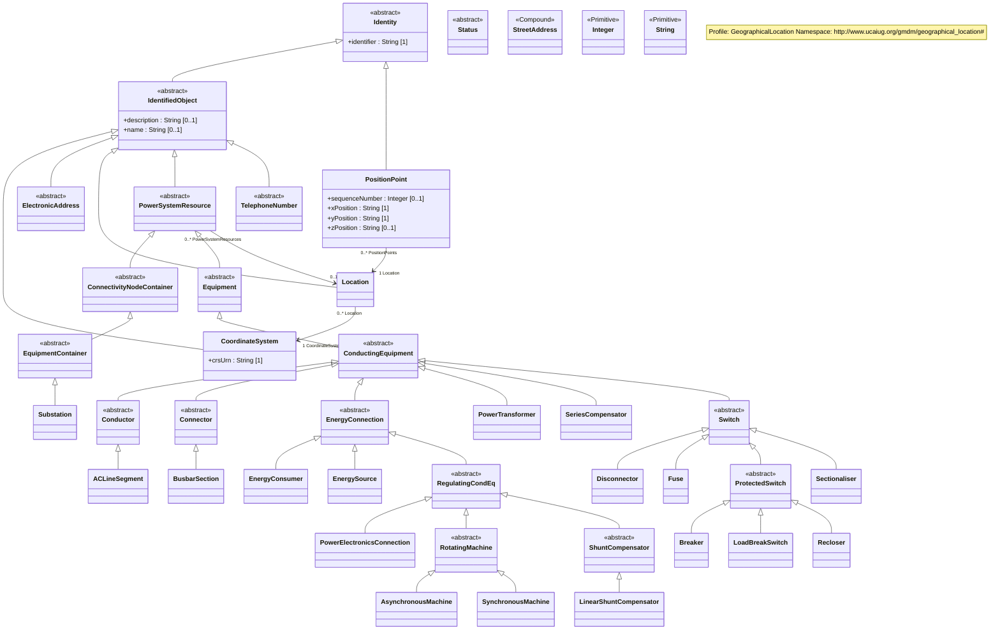

# GeographicalLocation Profile Specification

Profile namespace: `http://www.ucaiug.org/gmdm/geographical_location#`

## GeographicalLocation Profile

## Concrete Classes

{#GeographicalLocation-ACLineSegment}
### (Description) ACLineSegment

Inheritance path = [Conductor](#{GeographicalLocation-Conductor}) => [ConductingEquipment](#{GeographicalLocation-ConductingEquipment}) => [Equipment](#{GeographicalLocation-Equipment}) => [PowerSystemResource](#{GeographicalLocation-PowerSystemResource}) => [IdentifiedObject](#{GeographicalLocation-IdentifiedObject}) => [Identity](#{GeographicalLocation-Identity})

> **Note:** This class is tagged in this profile with the 'Description' tag. To refer to the full definition of this class as defined in the profile this one depends on visit [ACLineSegment](#{GeographicalLocation-description-profile}-ACLineSegment).

A line segment is a conductor or combination of conductors, with consistent electrical characteristics along its length, building a single electrical system that carries alternating current between two points in the power system.

The BaseVoltage at the two ends of a line segment shall have the same BaseVoltage.nominalVoltage. However, boundary lines may have slightly different BaseVoltage.nominalVoltages and variation is allowed. Larger voltage difference in general requires use of an equivalent branch.

Line segment impedances can be either directly described in electrical terms or physical line detail can be provided from which impedances can be calculated.

{lt}b{gt}Directly described impedances{lt}/b{gt}

For symmetrical, transposed three phase line segments, it is sufficient to use attributes of the line segment, which describe impedances and admittances for the entire length of the line segment. Additionally, line segment impedances can be computed by using line segment length and associated per length impedances.

Unbalanced modeling of impedances is supported by the per length phase impedance matrix (PerLengthPhaseImpedance) in conjunction with phase-to-sequence number mapping supplied by either ACLineSegmentPhase or WirePosition. The sequence numbers are referenced by the row and column attributes of the per length phase impedance matrix. This method enables single-phase and two-phase line segments, and transpositions of phases, to be described using the same per length phase impedance matrix. The length of the line segment is used in the computation of total impedance values for the line segment.

{lt}b{gt}Line detail characteristics{lt}/b{gt}

There are three approaches to providing line detail and all use WireAssembly to supply line positions:

{lt}ul{gt}

{lt}li{gt}Option 1 - WireAssembly supplies only line positions. ACLineSegmentPhase points to wire type and intraphase spacing and supplies the phase-to-sequence number mapping.{lt}/li{gt}

{lt}li{gt}Option 2 - WireAssembly supplies line position and, for each position, also supplies wire type and intraphase spacing. ACLineSegmentPhase supplies the phase-to-sequence number mapping.{lt}/li{gt}

{lt}li{gt}Option 3 - WireAssembly supplies line position and, for each position, also supplies wire type and intraphase spacing and phase. WireAssembly therefore supplies the phase-to-sequence number mapping and ACLineSegmentPhase is not needed.{lt}/li{gt}

{lt}/ul{gt}

#### Inherited Members

| name | type | description | mapping |
|------|------|-------------|---------|
| Location [0..1] | [Location](#{GeographicalLocation-Location}) | see [PowerSystemResource](#{GeographicalLocation-PowerSystemResource}) | |
| description [0..1] | [String](#{GeographicalLocation-String}) | see [IdentifiedObject](#{GeographicalLocation-IdentifiedObject}) | |
| name [0..1] | [String](#{GeographicalLocation-String}) | see [IdentifiedObject](#{GeographicalLocation-IdentifiedObject}) | |
| identifier [1..1] | [String](#{GeographicalLocation-String}) | see [Identity](#{GeographicalLocation-Identity}) | |

{#GeographicalLocation-AsynchronousMachine}
### (Description) AsynchronousMachine

Inheritance path = [RotatingMachine](#{GeographicalLocation-RotatingMachine}) => [RegulatingCondEq](#{GeographicalLocation-RegulatingCondEq}) => [EnergyConnection](#{GeographicalLocation-EnergyConnection}) => [ConductingEquipment](#{GeographicalLocation-ConductingEquipment}) => [Equipment](#{GeographicalLocation-Equipment}) => [PowerSystemResource](#{GeographicalLocation-PowerSystemResource}) => [IdentifiedObject](#{GeographicalLocation-IdentifiedObject}) => [Identity](#{GeographicalLocation-Identity})

> **Note:** This class is tagged in this profile with the 'Description' tag. To refer to the full definition of this class as defined in the profile this one depends on visit [AsynchronousMachine](#{GeographicalLocation-description-profile}-AsynchronousMachine).

A rotating machine whose shaft rotates asynchronously with the electrical field. Also known as an induction machine with no external connection to the rotor windings, e.g. squirrel-cage induction machine.

#### Inherited Members

| name | type | description | mapping |
|------|------|-------------|---------|
| Location [0..1] | [Location](#{GeographicalLocation-Location}) | see [PowerSystemResource](#{GeographicalLocation-PowerSystemResource}) | |
| description [0..1] | [String](#{GeographicalLocation-String}) | see [IdentifiedObject](#{GeographicalLocation-IdentifiedObject}) | |
| name [0..1] | [String](#{GeographicalLocation-String}) | see [IdentifiedObject](#{GeographicalLocation-IdentifiedObject}) | |
| identifier [1..1] | [String](#{GeographicalLocation-String}) | see [Identity](#{GeographicalLocation-Identity}) | |

{#GeographicalLocation-Breaker}
### (Description) Breaker

Inheritance path = [ProtectedSwitch](#{GeographicalLocation-ProtectedSwitch}) => [Switch](#{GeographicalLocation-Switch}) => [ConductingEquipment](#{GeographicalLocation-ConductingEquipment}) => [Equipment](#{GeographicalLocation-Equipment}) => [PowerSystemResource](#{GeographicalLocation-PowerSystemResource}) => [IdentifiedObject](#{GeographicalLocation-IdentifiedObject}) => [Identity](#{GeographicalLocation-Identity})

> **Note:** This class is tagged in this profile with the 'Description' tag. To refer to the full definition of this class as defined in the profile this one depends on visit [Breaker](#{GeographicalLocation-description-profile}-Breaker).

A mechanical switching device capable of making, carrying, and breaking currents under normal circuit conditions and also making, carrying for a specified time, and breaking currents under specified abnormal circuit conditions e.g. those of short circuit.

#### Inherited Members

| name | type | description | mapping |
|------|------|-------------|---------|
| Location [0..1] | [Location](#{GeographicalLocation-Location}) | see [PowerSystemResource](#{GeographicalLocation-PowerSystemResource}) | |
| description [0..1] | [String](#{GeographicalLocation-String}) | see [IdentifiedObject](#{GeographicalLocation-IdentifiedObject}) | |
| name [0..1] | [String](#{GeographicalLocation-String}) | see [IdentifiedObject](#{GeographicalLocation-IdentifiedObject}) | |
| identifier [1..1] | [String](#{GeographicalLocation-String}) | see [Identity](#{GeographicalLocation-Identity}) | |

{#GeographicalLocation-BusbarSection}
### (Description) BusbarSection

Inheritance path = [Connector](#{GeographicalLocation-Connector}) => [ConductingEquipment](#{GeographicalLocation-ConductingEquipment}) => [Equipment](#{GeographicalLocation-Equipment}) => [PowerSystemResource](#{GeographicalLocation-PowerSystemResource}) => [IdentifiedObject](#{GeographicalLocation-IdentifiedObject}) => [Identity](#{GeographicalLocation-Identity})

> **Note:** This class is tagged in this profile with the 'Description' tag. To refer to the full definition of this class as defined in the profile this one depends on visit [BusbarSection](#{GeographicalLocation-description-profile}-BusbarSection).

A conductor, or group of conductors, with negligible impedance, that serve to connect other conducting equipment within a single substation. The BusbarSection class is intended to represent physical parts of bus bars no matter how that bus bar is constructed.

Voltage measurements are typically obtained from voltage transformers that are connected to busbar sections. A bus bar section may have many physical terminals but for analysis is modelled with exactly one logical terminal.

#### Inherited Members

| name | type | description | mapping |
|------|------|-------------|---------|
| Location [0..1] | [Location](#{GeographicalLocation-Location}) | see [PowerSystemResource](#{GeographicalLocation-PowerSystemResource}) | |
| description [0..1] | [String](#{GeographicalLocation-String}) | see [IdentifiedObject](#{GeographicalLocation-IdentifiedObject}) | |
| name [0..1] | [String](#{GeographicalLocation-String}) | see [IdentifiedObject](#{GeographicalLocation-IdentifiedObject}) | |
| identifier [1..1] | [String](#{GeographicalLocation-String}) | see [Identity](#{GeographicalLocation-Identity}) | |

{#GeographicalLocation-CoordinateSystem}
### CoordinateSystem

Inheritance path = [IdentifiedObject](#{GeographicalLocation-IdentifiedObject}) => [Identity](#{GeographicalLocation-Identity})

Coordinate reference system.

#### Native Members

| name | type | description | mapping |
|------|------|-------------|---------|
| crsUrn [1..1] | [String](#{GeographicalLocation-String}) | A Uniform Resource Name (URN) for the coordinate reference system (crs) used to define 'Location.PositionPoints'. An example would be the European Petroleum Survey Group (EPSG) code for a coordinate reference system, defined in URN under the Open Geospatial Consortium (OGC) namespace as: urn:ogc:def:crs:EPSG::XXXX, where XXXX is an EPSG code (a full list of codes can be found at the EPSG Registry web site http://www.epsg-registry.org/). To define the coordinate system as being WGS84 (latitude, longitude) using an EPSG OGC, this attribute would be urn:ogc:def:crs:EPSG::4236. A profile should limit this code to a set of allowed URNs agreed to by all sending and receiving parties. | |

#### Inherited Members

| name | type | description | mapping |
|------|------|-------------|---------|
| description [0..1] | [String](#{GeographicalLocation-String}) | see [IdentifiedObject](#{GeographicalLocation-IdentifiedObject}) | |
| name [0..1] | [String](#{GeographicalLocation-String}) | see [IdentifiedObject](#{GeographicalLocation-IdentifiedObject}) | |
| identifier [1..1] | [String](#{GeographicalLocation-String}) | see [Identity](#{GeographicalLocation-Identity}) | |

{#GeographicalLocation-Disconnector}
### (Description) Disconnector

Inheritance path = [Switch](#{GeographicalLocation-Switch}) => [ConductingEquipment](#{GeographicalLocation-ConductingEquipment}) => [Equipment](#{GeographicalLocation-Equipment}) => [PowerSystemResource](#{GeographicalLocation-PowerSystemResource}) => [IdentifiedObject](#{GeographicalLocation-IdentifiedObject}) => [Identity](#{GeographicalLocation-Identity})

> **Note:** This class is tagged in this profile with the 'Description' tag. To refer to the full definition of this class as defined in the profile this one depends on visit [Disconnector](#{GeographicalLocation-description-profile}-Disconnector).

A mechanical switching device which provides, in the open position, an isolating distance in accordance with specified requirements.

A disconnector is capable of opening and closing a circuit when either negligible current is broken or made, or when no significant change in the voltage across the terminals of each of the poles of the disconnector occurs. It is also capable of carrying currents under normal circuit conditions and carrying for a specified time currents under abnormal conditions such as those of short circuit.

#### Inherited Members

| name | type | description | mapping |
|------|------|-------------|---------|
| Location [0..1] | [Location](#{GeographicalLocation-Location}) | see [PowerSystemResource](#{GeographicalLocation-PowerSystemResource}) | |
| description [0..1] | [String](#{GeographicalLocation-String}) | see [IdentifiedObject](#{GeographicalLocation-IdentifiedObject}) | |
| name [0..1] | [String](#{GeographicalLocation-String}) | see [IdentifiedObject](#{GeographicalLocation-IdentifiedObject}) | |
| identifier [1..1] | [String](#{GeographicalLocation-String}) | see [Identity](#{GeographicalLocation-Identity}) | |

{#GeographicalLocation-EnergyConsumer}
### (Description) EnergyConsumer

Inheritance path = [EnergyConnection](#{GeographicalLocation-EnergyConnection}) => [ConductingEquipment](#{GeographicalLocation-ConductingEquipment}) => [Equipment](#{GeographicalLocation-Equipment}) => [PowerSystemResource](#{GeographicalLocation-PowerSystemResource}) => [IdentifiedObject](#{GeographicalLocation-IdentifiedObject}) => [Identity](#{GeographicalLocation-Identity})

> **Note:** This class is tagged in this profile with the 'Description' tag. To refer to the full definition of this class as defined in the profile this one depends on visit [EnergyConsumer](#{GeographicalLocation-description-profile}-EnergyConsumer).

Generic user of energy - a point of consumption on the power system model.

EnergyConsumer.pfixed, .qfixed, .pfixedPct and .qfixedPct have meaning only if there is no LoadResponseCharacteristic associated with EnergyConsumer or if LoadResponseCharacteristic.exponentModel is set to False.

#### Inherited Members

| name | type | description | mapping |
|------|------|-------------|---------|
| Location [0..1] | [Location](#{GeographicalLocation-Location}) | see [PowerSystemResource](#{GeographicalLocation-PowerSystemResource}) | |
| description [0..1] | [String](#{GeographicalLocation-String}) | see [IdentifiedObject](#{GeographicalLocation-IdentifiedObject}) | |
| name [0..1] | [String](#{GeographicalLocation-String}) | see [IdentifiedObject](#{GeographicalLocation-IdentifiedObject}) | |
| identifier [1..1] | [String](#{GeographicalLocation-String}) | see [Identity](#{GeographicalLocation-Identity}) | |

{#GeographicalLocation-EnergySource}
### (Description) EnergySource

Inheritance path = [EnergyConnection](#{GeographicalLocation-EnergyConnection}) => [ConductingEquipment](#{GeographicalLocation-ConductingEquipment}) => [Equipment](#{GeographicalLocation-Equipment}) => [PowerSystemResource](#{GeographicalLocation-PowerSystemResource}) => [IdentifiedObject](#{GeographicalLocation-IdentifiedObject}) => [Identity](#{GeographicalLocation-Identity})

> **Note:** This class is tagged in this profile with the 'Description' tag. To refer to the full definition of this class as defined in the profile this one depends on visit [EnergySource](#{GeographicalLocation-description-profile}-EnergySource).

A generic equivalent for an energy supplier on a transmission or distribution voltage level.

#### Inherited Members

| name | type | description | mapping |
|------|------|-------------|---------|
| Location [0..1] | [Location](#{GeographicalLocation-Location}) | see [PowerSystemResource](#{GeographicalLocation-PowerSystemResource}) | |
| description [0..1] | [String](#{GeographicalLocation-String}) | see [IdentifiedObject](#{GeographicalLocation-IdentifiedObject}) | |
| name [0..1] | [String](#{GeographicalLocation-String}) | see [IdentifiedObject](#{GeographicalLocation-IdentifiedObject}) | |
| identifier [1..1] | [String](#{GeographicalLocation-String}) | see [Identity](#{GeographicalLocation-Identity}) | |

{#GeographicalLocation-Fuse}
### (Description) Fuse

Inheritance path = [Switch](#{GeographicalLocation-Switch}) => [ConductingEquipment](#{GeographicalLocation-ConductingEquipment}) => [Equipment](#{GeographicalLocation-Equipment}) => [PowerSystemResource](#{GeographicalLocation-PowerSystemResource}) => [IdentifiedObject](#{GeographicalLocation-IdentifiedObject}) => [Identity](#{GeographicalLocation-Identity})

> **Note:** This class is tagged in this profile with the 'Description' tag. To refer to the full definition of this class as defined in the profile this one depends on visit [Fuse](#{GeographicalLocation-description-profile}-Fuse).

An overcurrent protective device with a circuit opening fusible part that is heated and severed by the passage of overcurrent through it. A fuse is considered a switching device because it breaks current.

#### Inherited Members

| name | type | description | mapping |
|------|------|-------------|---------|
| Location [0..1] | [Location](#{GeographicalLocation-Location}) | see [PowerSystemResource](#{GeographicalLocation-PowerSystemResource}) | |
| description [0..1] | [String](#{GeographicalLocation-String}) | see [IdentifiedObject](#{GeographicalLocation-IdentifiedObject}) | |
| name [0..1] | [String](#{GeographicalLocation-String}) | see [IdentifiedObject](#{GeographicalLocation-IdentifiedObject}) | |
| identifier [1..1] | [String](#{GeographicalLocation-String}) | see [Identity](#{GeographicalLocation-Identity}) | |

{#GeographicalLocation-LinearShuntCompensator}
### (Description) LinearShuntCompensator

Inheritance path = [ShuntCompensator](#{GeographicalLocation-ShuntCompensator}) => [RegulatingCondEq](#{GeographicalLocation-RegulatingCondEq}) => [EnergyConnection](#{GeographicalLocation-EnergyConnection}) => [ConductingEquipment](#{GeographicalLocation-ConductingEquipment}) => [Equipment](#{GeographicalLocation-Equipment}) => [PowerSystemResource](#{GeographicalLocation-PowerSystemResource}) => [IdentifiedObject](#{GeographicalLocation-IdentifiedObject}) => [Identity](#{GeographicalLocation-Identity})

> **Note:** This class is tagged in this profile with the 'Description' tag. To refer to the full definition of this class as defined in the profile this one depends on visit [LinearShuntCompensator](#{GeographicalLocation-description-profile}-LinearShuntCompensator).

A linear shunt compensator has banks or sections with equal admittance values.

#### Inherited Members

| name | type | description | mapping |
|------|------|-------------|---------|
| Location [0..1] | [Location](#{GeographicalLocation-Location}) | see [PowerSystemResource](#{GeographicalLocation-PowerSystemResource}) | |
| description [0..1] | [String](#{GeographicalLocation-String}) | see [IdentifiedObject](#{GeographicalLocation-IdentifiedObject}) | |
| name [0..1] | [String](#{GeographicalLocation-String}) | see [IdentifiedObject](#{GeographicalLocation-IdentifiedObject}) | |
| identifier [1..1] | [String](#{GeographicalLocation-String}) | see [Identity](#{GeographicalLocation-Identity}) | |

{#GeographicalLocation-LoadBreakSwitch}
### (Description) LoadBreakSwitch

Inheritance path = [ProtectedSwitch](#{GeographicalLocation-ProtectedSwitch}) => [Switch](#{GeographicalLocation-Switch}) => [ConductingEquipment](#{GeographicalLocation-ConductingEquipment}) => [Equipment](#{GeographicalLocation-Equipment}) => [PowerSystemResource](#{GeographicalLocation-PowerSystemResource}) => [IdentifiedObject](#{GeographicalLocation-IdentifiedObject}) => [Identity](#{GeographicalLocation-Identity})

> **Note:** This class is tagged in this profile with the 'Description' tag. To refer to the full definition of this class as defined in the profile this one depends on visit [LoadBreakSwitch](#{GeographicalLocation-description-profile}-LoadBreakSwitch).

A mechanical switching device capable of making, carrying, and breaking currents under normal operating conditions.

#### Inherited Members

| name | type | description | mapping |
|------|------|-------------|---------|
| Location [0..1] | [Location](#{GeographicalLocation-Location}) | see [PowerSystemResource](#{GeographicalLocation-PowerSystemResource}) | |
| description [0..1] | [String](#{GeographicalLocation-String}) | see [IdentifiedObject](#{GeographicalLocation-IdentifiedObject}) | |
| name [0..1] | [String](#{GeographicalLocation-String}) | see [IdentifiedObject](#{GeographicalLocation-IdentifiedObject}) | |
| identifier [1..1] | [String](#{GeographicalLocation-String}) | see [Identity](#{GeographicalLocation-Identity}) | |

{#GeographicalLocation-Location}
### Location

Inheritance path = [IdentifiedObject](#{GeographicalLocation-IdentifiedObject}) => [Identity](#{GeographicalLocation-Identity})

The place, scene, or point of something where someone or something has been, is, and/or will be at a given moment in time. It can be defined with one or more position points (coordinates) in a given coordinate system.

#### Native Members

| name | type | description | mapping |
|------|------|-------------|---------|
| CoordinateSystem [1..1] | [CoordinateSystem](#{GeographicalLocation-CoordinateSystem}) | Coordinate system used to describe position points of this location. | |

#### Inherited Members

| name | type | description | mapping |
|------|------|-------------|---------|
| description [0..1] | [String](#{GeographicalLocation-String}) | see [IdentifiedObject](#{GeographicalLocation-IdentifiedObject}) | |
| name [0..1] | [String](#{GeographicalLocation-String}) | see [IdentifiedObject](#{GeographicalLocation-IdentifiedObject}) | |
| identifier [1..1] | [String](#{GeographicalLocation-String}) | see [Identity](#{GeographicalLocation-Identity}) | |

{#GeographicalLocation-PositionPoint}
### PositionPoint

Inheritance path = [Identity](#{GeographicalLocation-Identity})

Set of spatial coordinates that determine a point, defined in the coordinate system specified in 'Location.CoordinateSystem'. Use a single position point instance to describe a point-oriented location. Use a sequence of position points to describe a line-oriented object (physical location of non-point oriented objects like cables or lines), or area of an object (like a substation or a geographical zone - in this case, have first and last position point with the same values).

#### Native Members

| name | type | description | mapping |
|------|------|-------------|---------|
| `sequenceNumber [0..1]` (gmdm) | [Integer](#{GeographicalLocation-Integer}) | | |
| xPosition [1..1] | [String](#{GeographicalLocation-String}) | X axis position. | |
| yPosition [1..1] | [String](#{GeographicalLocation-String}) | Y axis position. | |
| zPosition [0..1] | [String](#{GeographicalLocation-String}) | (if applicable) Z axis position. | |
| `Location [1..1]` (ShadowExtension, gmdm) | [Location](#{GeographicalLocation-Location}) | | |

#### Inherited Members

| name | type | description | mapping |
|------|------|-------------|---------|
| identifier [1..1] | [String](#{GeographicalLocation-String}) | see [Identity](#{GeographicalLocation-Identity}) | |

{#GeographicalLocation-PowerElectronicsConnection}
### (Description) PowerElectronicsConnection

Inheritance path = [RegulatingCondEq](#{GeographicalLocation-RegulatingCondEq}) => [EnergyConnection](#{GeographicalLocation-EnergyConnection}) => [ConductingEquipment](#{GeographicalLocation-ConductingEquipment}) => [Equipment](#{GeographicalLocation-Equipment}) => [PowerSystemResource](#{GeographicalLocation-PowerSystemResource}) => [IdentifiedObject](#{GeographicalLocation-IdentifiedObject}) => [Identity](#{GeographicalLocation-Identity})

> **Note:** This class is tagged in this profile with the 'Description' tag. To refer to the full definition of this class as defined in the profile this one depends on visit [PowerElectronicsConnection](#{GeographicalLocation-description-profile}-PowerElectronicsConnection).

A connection to the AC network for energy production or consumption that uses power electronics rather than rotating machines.

#### Inherited Members

| name | type | description | mapping |
|------|------|-------------|---------|
| Location [0..1] | [Location](#{GeographicalLocation-Location}) | see [PowerSystemResource](#{GeographicalLocation-PowerSystemResource}) | |
| description [0..1] | [String](#{GeographicalLocation-String}) | see [IdentifiedObject](#{GeographicalLocation-IdentifiedObject}) | |
| name [0..1] | [String](#{GeographicalLocation-String}) | see [IdentifiedObject](#{GeographicalLocation-IdentifiedObject}) | |
| identifier [1..1] | [String](#{GeographicalLocation-String}) | see [Identity](#{GeographicalLocation-Identity}) | |

{#GeographicalLocation-PowerTransformer}
### (Description) PowerTransformer

Inheritance path = [ConductingEquipment](#{GeographicalLocation-ConductingEquipment}) => [Equipment](#{GeographicalLocation-Equipment}) => [PowerSystemResource](#{GeographicalLocation-PowerSystemResource}) => [IdentifiedObject](#{GeographicalLocation-IdentifiedObject}) => [Identity](#{GeographicalLocation-Identity})

> **Note:** This class is tagged in this profile with the 'Description' tag. To refer to the full definition of this class as defined in the profile this one depends on visit [PowerTransformer](#{GeographicalLocation-description-profile}-PowerTransformer).

An electrical device consisting of two or more coupled windings, with or without a magnetic core, for introducing mutual coupling between electric circuits. Transformers can be used to control voltage and phase shift (active power flow).

A power transformer may be composed of separate transformer tanks that need not be identical.

A power transformer can be modelled with or without tanks and is intended for use in both balanced and unbalanced representations. A power transformer typically has two terminals, but may have one (grounding), three or more terminals.

The inherited association ConductingEquipment.BaseVoltage should not be used. The association from TransformerEnd to BaseVoltage should be used instead.

#### Inherited Members

| name | type | description | mapping |
|------|------|-------------|---------|
| Location [0..1] | [Location](#{GeographicalLocation-Location}) | see [PowerSystemResource](#{GeographicalLocation-PowerSystemResource}) | |
| description [0..1] | [String](#{GeographicalLocation-String}) | see [IdentifiedObject](#{GeographicalLocation-IdentifiedObject}) | |
| name [0..1] | [String](#{GeographicalLocation-String}) | see [IdentifiedObject](#{GeographicalLocation-IdentifiedObject}) | |
| identifier [1..1] | [String](#{GeographicalLocation-String}) | see [Identity](#{GeographicalLocation-Identity}) | |

{#GeographicalLocation-Recloser}
### (Description) Recloser

Inheritance path = [ProtectedSwitch](#{GeographicalLocation-ProtectedSwitch}) => [Switch](#{GeographicalLocation-Switch}) => [ConductingEquipment](#{GeographicalLocation-ConductingEquipment}) => [Equipment](#{GeographicalLocation-Equipment}) => [PowerSystemResource](#{GeographicalLocation-PowerSystemResource}) => [IdentifiedObject](#{GeographicalLocation-IdentifiedObject}) => [Identity](#{GeographicalLocation-Identity})

> **Note:** This class is tagged in this profile with the 'Description' tag. To refer to the full definition of this class as defined in the profile this one depends on visit [Recloser](#{GeographicalLocation-description-profile}-Recloser).

Pole-mounted fault interrupter with built-in phase and ground relays, current transformer (CT), and supplemental controls.

#### Inherited Members

| name | type | description | mapping |
|------|------|-------------|---------|
| Location [0..1] | [Location](#{GeographicalLocation-Location}) | see [PowerSystemResource](#{GeographicalLocation-PowerSystemResource}) | |
| description [0..1] | [String](#{GeographicalLocation-String}) | see [IdentifiedObject](#{GeographicalLocation-IdentifiedObject}) | |
| name [0..1] | [String](#{GeographicalLocation-String}) | see [IdentifiedObject](#{GeographicalLocation-IdentifiedObject}) | |
| identifier [1..1] | [String](#{GeographicalLocation-String}) | see [Identity](#{GeographicalLocation-Identity}) | |

{#GeographicalLocation-Sectionaliser}
### (Description) Sectionaliser

Inheritance path = [Switch](#{GeographicalLocation-Switch}) => [ConductingEquipment](#{GeographicalLocation-ConductingEquipment}) => [Equipment](#{GeographicalLocation-Equipment}) => [PowerSystemResource](#{GeographicalLocation-PowerSystemResource}) => [IdentifiedObject](#{GeographicalLocation-IdentifiedObject}) => [Identity](#{GeographicalLocation-Identity})

> **Note:** This class is tagged in this profile with the 'Description' tag. To refer to the full definition of this class as defined in the profile this one depends on visit [Sectionaliser](#{GeographicalLocation-description-profile}-Sectionaliser).

Automatic switch that will lock open to isolate a faulted section. It may, or may not, have load breaking capability. Its primary purpose is to provide fault sectionalising at locations where the fault current is either too high, or too low, for proper coordination of fuses.

#### Inherited Members

| name | type | description | mapping |
|------|------|-------------|---------|
| Location [0..1] | [Location](#{GeographicalLocation-Location}) | see [PowerSystemResource](#{GeographicalLocation-PowerSystemResource}) | |
| description [0..1] | [String](#{GeographicalLocation-String}) | see [IdentifiedObject](#{GeographicalLocation-IdentifiedObject}) | |
| name [0..1] | [String](#{GeographicalLocation-String}) | see [IdentifiedObject](#{GeographicalLocation-IdentifiedObject}) | |
| identifier [1..1] | [String](#{GeographicalLocation-String}) | see [Identity](#{GeographicalLocation-Identity}) | |

{#GeographicalLocation-SeriesCompensator}
### (Description) SeriesCompensator

Inheritance path = [ConductingEquipment](#{GeographicalLocation-ConductingEquipment}) => [Equipment](#{GeographicalLocation-Equipment}) => [PowerSystemResource](#{GeographicalLocation-PowerSystemResource}) => [IdentifiedObject](#{GeographicalLocation-IdentifiedObject}) => [Identity](#{GeographicalLocation-Identity})

> **Note:** This class is tagged in this profile with the 'Description' tag. To refer to the full definition of this class as defined in the profile this one depends on visit [SeriesCompensator](#{GeographicalLocation-description-profile}-SeriesCompensator).

A Series Compensator is a series capacitor or reactor or an AC transmission line without charging susceptance. It is a two terminal device.

#### Inherited Members

| name | type | description | mapping |
|------|------|-------------|---------|
| Location [0..1] | [Location](#{GeographicalLocation-Location}) | see [PowerSystemResource](#{GeographicalLocation-PowerSystemResource}) | |
| description [0..1] | [String](#{GeographicalLocation-String}) | see [IdentifiedObject](#{GeographicalLocation-IdentifiedObject}) | |
| name [0..1] | [String](#{GeographicalLocation-String}) | see [IdentifiedObject](#{GeographicalLocation-IdentifiedObject}) | |
| identifier [1..1] | [String](#{GeographicalLocation-String}) | see [Identity](#{GeographicalLocation-Identity}) | |

{#GeographicalLocation-Substation}
### (Description) Substation

Inheritance path = [EquipmentContainer](#{GeographicalLocation-EquipmentContainer}) => [ConnectivityNodeContainer](#{GeographicalLocation-ConnectivityNodeContainer}) => [PowerSystemResource](#{GeographicalLocation-PowerSystemResource}) => [IdentifiedObject](#{GeographicalLocation-IdentifiedObject}) => [Identity](#{GeographicalLocation-Identity})

> **Note:** This class is tagged in this profile with the 'Description' tag. To refer to the full definition of this class as defined in the profile this one depends on visit [Substation](#{GeographicalLocation-description-profile}-Substation).

A collection of equipment for purposes other than generation or utilization, through which electric energy in bulk is passed for the purposes of switching or modifying its characteristics.

#### Inherited Members

| name | type | description | mapping |
|------|------|-------------|---------|
| Location [0..1] | [Location](#{GeographicalLocation-Location}) | see [PowerSystemResource](#{GeographicalLocation-PowerSystemResource}) | |
| description [0..1] | [String](#{GeographicalLocation-String}) | see [IdentifiedObject](#{GeographicalLocation-IdentifiedObject}) | |
| name [0..1] | [String](#{GeographicalLocation-String}) | see [IdentifiedObject](#{GeographicalLocation-IdentifiedObject}) | |
| identifier [1..1] | [String](#{GeographicalLocation-String}) | see [Identity](#{GeographicalLocation-Identity}) | |

{#GeographicalLocation-SynchronousMachine}
### (Description) SynchronousMachine

Inheritance path = [RotatingMachine](#{GeographicalLocation-RotatingMachine}) => [RegulatingCondEq](#{GeographicalLocation-RegulatingCondEq}) => [EnergyConnection](#{GeographicalLocation-EnergyConnection}) => [ConductingEquipment](#{GeographicalLocation-ConductingEquipment}) => [Equipment](#{GeographicalLocation-Equipment}) => [PowerSystemResource](#{GeographicalLocation-PowerSystemResource}) => [IdentifiedObject](#{GeographicalLocation-IdentifiedObject}) => [Identity](#{GeographicalLocation-Identity})

> **Note:** This class is tagged in this profile with the 'Description' tag. To refer to the full definition of this class as defined in the profile this one depends on visit [SynchronousMachine](#{GeographicalLocation-description-profile}-SynchronousMachine).

An electromechanical device that operates with shaft rotating synchronously with the network. It is a single machine operating either as a generator or synchronous condenser or pump.

#### Inherited Members

| name | type | description | mapping |
|------|------|-------------|---------|
| Location [0..1] | [Location](#{GeographicalLocation-Location}) | see [PowerSystemResource](#{GeographicalLocation-PowerSystemResource}) | |
| description [0..1] | [String](#{GeographicalLocation-String}) | see [IdentifiedObject](#{GeographicalLocation-IdentifiedObject}) | |
| name [0..1] | [String](#{GeographicalLocation-String}) | see [IdentifiedObject](#{GeographicalLocation-IdentifiedObject}) | |
| identifier [1..1] | [String](#{GeographicalLocation-String}) | see [Identity](#{GeographicalLocation-Identity}) | |

## Abstract Classes

{#GeographicalLocation-ConductingEquipment}
### ConductingEquipment

Inheritance path = [Equipment](#{GeographicalLocation-Equipment}) => [PowerSystemResource](#{GeographicalLocation-PowerSystemResource}) => [IdentifiedObject](#{GeographicalLocation-IdentifiedObject}) => [Identity](#{GeographicalLocation-Identity})

The parts of the AC power system that are designed to carry current or that are conductively connected through terminals.

#### Inherited Members

| name | type | description | mapping |
|------|------|-------------|---------|
| Location [0..1] | [Location](#{GeographicalLocation-Location}) | see [PowerSystemResource](#{GeographicalLocation-PowerSystemResource}) | |
| description [0..1] | [String](#{GeographicalLocation-String}) | see [IdentifiedObject](#{GeographicalLocation-IdentifiedObject}) | |
| name [0..1] | [String](#{GeographicalLocation-String}) | see [IdentifiedObject](#{GeographicalLocation-IdentifiedObject}) | |
| identifier [1..1] | [String](#{GeographicalLocation-String}) | see [Identity](#{GeographicalLocation-Identity}) | |

{#GeographicalLocation-Conductor}
### Conductor

Inheritance path = [ConductingEquipment](#{GeographicalLocation-ConductingEquipment}) => [Equipment](#{GeographicalLocation-Equipment}) => [PowerSystemResource](#{GeographicalLocation-PowerSystemResource}) => [IdentifiedObject](#{GeographicalLocation-IdentifiedObject}) => [Identity](#{GeographicalLocation-Identity})

Combination of conducting material with consistent electrical characteristics, building a single electrical system, used to carry current between points in the power system.

#### Inherited Members

| name | type | description | mapping |
|------|------|-------------|---------|
| Location [0..1] | [Location](#{GeographicalLocation-Location}) | see [PowerSystemResource](#{GeographicalLocation-PowerSystemResource}) | |
| description [0..1] | [String](#{GeographicalLocation-String}) | see [IdentifiedObject](#{GeographicalLocation-IdentifiedObject}) | |
| name [0..1] | [String](#{GeographicalLocation-String}) | see [IdentifiedObject](#{GeographicalLocation-IdentifiedObject}) | |
| identifier [1..1] | [String](#{GeographicalLocation-String}) | see [Identity](#{GeographicalLocation-Identity}) | |

{#GeographicalLocation-ConnectivityNodeContainer}
### ConnectivityNodeContainer

Inheritance path = [PowerSystemResource](#{GeographicalLocation-PowerSystemResource}) => [IdentifiedObject](#{GeographicalLocation-IdentifiedObject}) => [Identity](#{GeographicalLocation-Identity})

A base class for all objects that may contain connectivity nodes or topological nodes.

#### Inherited Members

| name | type | description | mapping |
|------|------|-------------|---------|
| Location [0..1] | [Location](#{GeographicalLocation-Location}) | see [PowerSystemResource](#{GeographicalLocation-PowerSystemResource}) | |
| description [0..1] | [String](#{GeographicalLocation-String}) | see [IdentifiedObject](#{GeographicalLocation-IdentifiedObject}) | |
| name [0..1] | [String](#{GeographicalLocation-String}) | see [IdentifiedObject](#{GeographicalLocation-IdentifiedObject}) | |
| identifier [1..1] | [String](#{GeographicalLocation-String}) | see [Identity](#{GeographicalLocation-Identity}) | |

{#GeographicalLocation-Connector}
### Connector

Inheritance path = [ConductingEquipment](#{GeographicalLocation-ConductingEquipment}) => [Equipment](#{GeographicalLocation-Equipment}) => [PowerSystemResource](#{GeographicalLocation-PowerSystemResource}) => [IdentifiedObject](#{GeographicalLocation-IdentifiedObject}) => [Identity](#{GeographicalLocation-Identity})

A conductor, or group of conductors, with negligible impedance, that serve to connect other conducting equipment within a single substation and are modelled with a single logical terminal.

#### Inherited Members

| name | type | description | mapping |
|------|------|-------------|---------|
| Location [0..1] | [Location](#{GeographicalLocation-Location}) | see [PowerSystemResource](#{GeographicalLocation-PowerSystemResource}) | |
| description [0..1] | [String](#{GeographicalLocation-String}) | see [IdentifiedObject](#{GeographicalLocation-IdentifiedObject}) | |
| name [0..1] | [String](#{GeographicalLocation-String}) | see [IdentifiedObject](#{GeographicalLocation-IdentifiedObject}) | |
| identifier [1..1] | [String](#{GeographicalLocation-String}) | see [Identity](#{GeographicalLocation-Identity}) | |

{#GeographicalLocation-ElectronicAddress}
### (deprecated) ElectronicAddress

Inheritance path = [IdentifiedObject](#{GeographicalLocation-IdentifiedObject}) => [Identity](#{GeographicalLocation-Identity})

Electronic address information.

#### Inherited Members

| name | type | description | mapping |
|------|------|-------------|---------|
| description [0..1] | [String](#{GeographicalLocation-String}) | see [IdentifiedObject](#{GeographicalLocation-IdentifiedObject}) | |
| name [0..1] | [String](#{GeographicalLocation-String}) | see [IdentifiedObject](#{GeographicalLocation-IdentifiedObject}) | |
| identifier [1..1] | [String](#{GeographicalLocation-String}) | see [Identity](#{GeographicalLocation-Identity}) | |

{#GeographicalLocation-EnergyConnection}
### EnergyConnection

Inheritance path = [ConductingEquipment](#{GeographicalLocation-ConductingEquipment}) => [Equipment](#{GeographicalLocation-Equipment}) => [PowerSystemResource](#{GeographicalLocation-PowerSystemResource}) => [IdentifiedObject](#{GeographicalLocation-IdentifiedObject}) => [Identity](#{GeographicalLocation-Identity})

A connection of energy generation or consumption on the power system model.

#### Inherited Members

| name | type | description | mapping |
|------|------|-------------|---------|
| Location [0..1] | [Location](#{GeographicalLocation-Location}) | see [PowerSystemResource](#{GeographicalLocation-PowerSystemResource}) | |
| description [0..1] | [String](#{GeographicalLocation-String}) | see [IdentifiedObject](#{GeographicalLocation-IdentifiedObject}) | |
| name [0..1] | [String](#{GeographicalLocation-String}) | see [IdentifiedObject](#{GeographicalLocation-IdentifiedObject}) | |
| identifier [1..1] | [String](#{GeographicalLocation-String}) | see [Identity](#{GeographicalLocation-Identity}) | |

{#GeographicalLocation-Equipment}
### Equipment

Inheritance path = [PowerSystemResource](#{GeographicalLocation-PowerSystemResource}) => [IdentifiedObject](#{GeographicalLocation-IdentifiedObject}) => [Identity](#{GeographicalLocation-Identity})

The parts of a power system that are physical devices, electronic or mechanical.

#### Inherited Members

| name | type | description | mapping |
|------|------|-------------|---------|
| Location [0..1] | [Location](#{GeographicalLocation-Location}) | see [PowerSystemResource](#{GeographicalLocation-PowerSystemResource}) | |
| description [0..1] | [String](#{GeographicalLocation-String}) | see [IdentifiedObject](#{GeographicalLocation-IdentifiedObject}) | |
| name [0..1] | [String](#{GeographicalLocation-String}) | see [IdentifiedObject](#{GeographicalLocation-IdentifiedObject}) | |
| identifier [1..1] | [String](#{GeographicalLocation-String}) | see [Identity](#{GeographicalLocation-Identity}) | |

{#GeographicalLocation-EquipmentContainer}
### EquipmentContainer

Inheritance path = [ConnectivityNodeContainer](#{GeographicalLocation-ConnectivityNodeContainer}) => [PowerSystemResource](#{GeographicalLocation-PowerSystemResource}) => [IdentifiedObject](#{GeographicalLocation-IdentifiedObject}) => [Identity](#{GeographicalLocation-Identity})

A modelling construct to provide a root class for containing equipment.

#### Inherited Members

| name | type | description | mapping |
|------|------|-------------|---------|
| Location [0..1] | [Location](#{GeographicalLocation-Location}) | see [PowerSystemResource](#{GeographicalLocation-PowerSystemResource}) | |
| description [0..1] | [String](#{GeographicalLocation-String}) | see [IdentifiedObject](#{GeographicalLocation-IdentifiedObject}) | |
| name [0..1] | [String](#{GeographicalLocation-String}) | see [IdentifiedObject](#{GeographicalLocation-IdentifiedObject}) | |
| identifier [1..1] | [String](#{GeographicalLocation-String}) | see [Identity](#{GeographicalLocation-Identity}) | |

{#GeographicalLocation-IdentifiedObject}
### IdentifiedObject

Inheritance path = [Identity](#{GeographicalLocation-Identity})

This is a class that provides common identification for all classes needing identification and naming attributes.

#### Native Members

| name | type | description | mapping |
|------|------|-------------|---------|
| description [0..1] | [String](#{GeographicalLocation-String}) | The description is a free human readable text describing or naming the object. It may be non unique and may not correlate to a naming hierarchy. | |
| name [0..1] | [String](#{GeographicalLocation-String}) | The name is any free human readable and possibly non unique text naming the object. | |

#### Inherited Members

| name | type | description | mapping |
|------|------|-------------|---------|
| identifier [1..1] | [String](#{GeographicalLocation-String}) | see [Identity](#{GeographicalLocation-Identity}) | |

{#GeographicalLocation-Identity}
### Identity

This is a root class to provide common identification for all classes. IdentifiedObject and any class to be exchanged with RDF XML now inherits from Identity. mRID is superseded by Identity.identifier, which is typed to be a UUID.

#### Native Members

| name | type | description | mapping |
|------|------|-------------|---------|
| identifier [1..1] | [String](#{GeographicalLocation-String}) | A universally unique object identifier. Used to uniquely identify persistent objects between CIM messages. | |

{#GeographicalLocation-PowerSystemResource}
### PowerSystemResource

Inheritance path = [IdentifiedObject](#{GeographicalLocation-IdentifiedObject}) => [Identity](#{GeographicalLocation-Identity})

A power system resource (PSR) can be an item of equipment such as a switch, an equipment container containing many individual items of equipment such as a substation, or an organisational entity such as sub-control area. Power system resources can have measurements associated.

#### Native Members

| name | type | description | mapping |
|------|------|-------------|---------|
| Location [0..1] | [Location](#{GeographicalLocation-Location}) | Location of this power system resource. | |

#### Inherited Members

| name | type | description | mapping |
|------|------|-------------|---------|
| description [0..1] | [String](#{GeographicalLocation-String}) | see [IdentifiedObject](#{GeographicalLocation-IdentifiedObject}) | |
| name [0..1] | [String](#{GeographicalLocation-String}) | see [IdentifiedObject](#{GeographicalLocation-IdentifiedObject}) | |
| identifier [1..1] | [String](#{GeographicalLocation-String}) | see [Identity](#{GeographicalLocation-Identity}) | |

{#GeographicalLocation-ProtectedSwitch}
### ProtectedSwitch

Inheritance path = [Switch](#{GeographicalLocation-Switch}) => [ConductingEquipment](#{GeographicalLocation-ConductingEquipment}) => [Equipment](#{GeographicalLocation-Equipment}) => [PowerSystemResource](#{GeographicalLocation-PowerSystemResource}) => [IdentifiedObject](#{GeographicalLocation-IdentifiedObject}) => [Identity](#{GeographicalLocation-Identity})

A ProtectedSwitch is a switching device that can be operated by ProtectionEquipment.

#### Inherited Members

| name | type | description | mapping |
|------|------|-------------|---------|
| Location [0..1] | [Location](#{GeographicalLocation-Location}) | see [PowerSystemResource](#{GeographicalLocation-PowerSystemResource}) | |
| description [0..1] | [String](#{GeographicalLocation-String}) | see [IdentifiedObject](#{GeographicalLocation-IdentifiedObject}) | |
| name [0..1] | [String](#{GeographicalLocation-String}) | see [IdentifiedObject](#{GeographicalLocation-IdentifiedObject}) | |
| identifier [1..1] | [String](#{GeographicalLocation-String}) | see [Identity](#{GeographicalLocation-Identity}) | |

{#GeographicalLocation-RegulatingCondEq}
### RegulatingCondEq

Inheritance path = [EnergyConnection](#{GeographicalLocation-EnergyConnection}) => [ConductingEquipment](#{GeographicalLocation-ConductingEquipment}) => [Equipment](#{GeographicalLocation-Equipment}) => [PowerSystemResource](#{GeographicalLocation-PowerSystemResource}) => [IdentifiedObject](#{GeographicalLocation-IdentifiedObject}) => [Identity](#{GeographicalLocation-Identity})

A type of conducting equipment that can regulate a quantity (i.e. voltage or flow) at a specific point in the network.

#### Inherited Members

| name | type | description | mapping |
|------|------|-------------|---------|
| Location [0..1] | [Location](#{GeographicalLocation-Location}) | see [PowerSystemResource](#{GeographicalLocation-PowerSystemResource}) | |
| description [0..1] | [String](#{GeographicalLocation-String}) | see [IdentifiedObject](#{GeographicalLocation-IdentifiedObject}) | |
| name [0..1] | [String](#{GeographicalLocation-String}) | see [IdentifiedObject](#{GeographicalLocation-IdentifiedObject}) | |
| identifier [1..1] | [String](#{GeographicalLocation-String}) | see [Identity](#{GeographicalLocation-Identity}) | |

{#GeographicalLocation-RotatingMachine}
### RotatingMachine

Inheritance path = [RegulatingCondEq](#{GeographicalLocation-RegulatingCondEq}) => [EnergyConnection](#{GeographicalLocation-EnergyConnection}) => [ConductingEquipment](#{GeographicalLocation-ConductingEquipment}) => [Equipment](#{GeographicalLocation-Equipment}) => [PowerSystemResource](#{GeographicalLocation-PowerSystemResource}) => [IdentifiedObject](#{GeographicalLocation-IdentifiedObject}) => [Identity](#{GeographicalLocation-Identity})

A rotating machine which may be used as a generator or motor.

#### Inherited Members

| name | type | description | mapping |
|------|------|-------------|---------|
| Location [0..1] | [Location](#{GeographicalLocation-Location}) | see [PowerSystemResource](#{GeographicalLocation-PowerSystemResource}) | |
| description [0..1] | [String](#{GeographicalLocation-String}) | see [IdentifiedObject](#{GeographicalLocation-IdentifiedObject}) | |
| name [0..1] | [String](#{GeographicalLocation-String}) | see [IdentifiedObject](#{GeographicalLocation-IdentifiedObject}) | |
| identifier [1..1] | [String](#{GeographicalLocation-String}) | see [Identity](#{GeographicalLocation-Identity}) | |

{#GeographicalLocation-ShuntCompensator}
### ShuntCompensator

Inheritance path = [RegulatingCondEq](#{GeographicalLocation-RegulatingCondEq}) => [EnergyConnection](#{GeographicalLocation-EnergyConnection}) => [ConductingEquipment](#{GeographicalLocation-ConductingEquipment}) => [Equipment](#{GeographicalLocation-Equipment}) => [PowerSystemResource](#{GeographicalLocation-PowerSystemResource}) => [IdentifiedObject](#{GeographicalLocation-IdentifiedObject}) => [Identity](#{GeographicalLocation-Identity})

A shunt capacitor or reactor or switchable bank of shunt capacitors or reactors. A section of a shunt compensator is an individual capacitor or reactor. A negative value for bPerSection indicates that the compensator is a reactor. ShuntCompensator is a single terminal device. Ground is implied.

#### Inherited Members

| name | type | description | mapping |
|------|------|-------------|---------|
| Location [0..1] | [Location](#{GeographicalLocation-Location}) | see [PowerSystemResource](#{GeographicalLocation-PowerSystemResource}) | |
| description [0..1] | [String](#{GeographicalLocation-String}) | see [IdentifiedObject](#{GeographicalLocation-IdentifiedObject}) | |
| name [0..1] | [String](#{GeographicalLocation-String}) | see [IdentifiedObject](#{GeographicalLocation-IdentifiedObject}) | |
| identifier [1..1] | [String](#{GeographicalLocation-String}) | see [Identity](#{GeographicalLocation-Identity}) | |

{#GeographicalLocation-Status}
### Status

Current status information relevant to an entity.

{#GeographicalLocation-Switch}
### Switch

Inheritance path = [ConductingEquipment](#{GeographicalLocation-ConductingEquipment}) => [Equipment](#{GeographicalLocation-Equipment}) => [PowerSystemResource](#{GeographicalLocation-PowerSystemResource}) => [IdentifiedObject](#{GeographicalLocation-IdentifiedObject}) => [Identity](#{GeographicalLocation-Identity})

A generic device designed to close, or open, or both, one or more electric circuits. All switches are two terminal devices including grounding switches. The ACDCTerminal.connected at the two sides of the switch shall not be considered for assessing switch connectivity, i.e. only Switch.open, .normalOpen and .locked are relevant.

#### Inherited Members

| name | type | description | mapping |
|------|------|-------------|---------|
| Location [0..1] | [Location](#{GeographicalLocation-Location}) | see [PowerSystemResource](#{GeographicalLocation-PowerSystemResource}) | |
| description [0..1] | [String](#{GeographicalLocation-String}) | see [IdentifiedObject](#{GeographicalLocation-IdentifiedObject}) | |
| name [0..1] | [String](#{GeographicalLocation-String}) | see [IdentifiedObject](#{GeographicalLocation-IdentifiedObject}) | |
| identifier [1..1] | [String](#{GeographicalLocation-String}) | see [Identity](#{GeographicalLocation-Identity}) | |

{#GeographicalLocation-TelephoneNumber}
### TelephoneNumber

Inheritance path = [IdentifiedObject](#{GeographicalLocation-IdentifiedObject}) => [Identity](#{GeographicalLocation-Identity})

Telephone number information.

#### Inherited Members

| name | type | description | mapping |
|------|------|-------------|---------|
| description [0..1] | [String](#{GeographicalLocation-String}) | see [IdentifiedObject](#{GeographicalLocation-IdentifiedObject}) | |
| name [0..1] | [String](#{GeographicalLocation-String}) | see [IdentifiedObject](#{GeographicalLocation-IdentifiedObject}) | |
| identifier [1..1] | [String](#{GeographicalLocation-String}) | see [Identity](#{GeographicalLocation-Identity}) | |

## Compound Types

{#GeographicalLocation-StreetAddress}
### (deprecated) StreetAddress

General purpose street and postal address information.

#### Members

| name | type | description | mapping |
|------|------|-------------|---------|

## Primitive Types

{#GeographicalLocation-Integer}
### Integer

An integer number. The range is unspecified and not limited.

XSD type: `integer`

{#GeographicalLocation-String}
### String

A string consisting of a sequence of characters. The character encoding is UTF-8. The string length is unspecified and unlimited.

XSD type: `string`
