# cimhub_2023 Profile Specification

Profile namespace: `http://gridappsd.org/cimhub/2023#`

## Profile Profile

```mermaid
classDiagram
direction TB

note "Profile: Profile Namespace: http://gridappsd.org/cimhub/2023#"

class ACDCTerminal {
<<abstract>>
+connected : Boolean [0..1]
+sequenceNumber : Integer [0..1]
}

class ACLineSegment {
+b0ch : Susceptance [0..1]
+bch : Susceptance [0..1]
+g0ch : Conductance [0..1]
+gch : Conductance [0..1]
+r : Resistance [0..1]
+r0 : Resistance [0..1]
+shortCircuitEndTemperature : Temperature [0..1]
+x : Reactance [0..1]
+x0 : Reactance [0..1]
}

class ACLineSegmentPhase {
+phase : SinglePhaseKind [0..1]
+sequenceNumber : Integer [0..1]
}

class Accumulator {
<<abstract>>
+maxValue : Integer [0..1]
}

class AccumulatorLimit {
<<abstract>>
+value : Integer [0..1]
}

class AccumulatorLimitSet {
<<abstract>>
}

class AccumulatorReset {
<<abstract>>
}

class AccumulatorValue {
<<abstract>>
+value : Integer [0..1]
}

class ActivePowerLimit {
<<abstract>>
+normalValue : ActivePower [0..1]
+value : ActivePower [0..1]
}

class AirCompressor {
<<abstract>>
+airCompressorRating : Float [0..1]
}

class Analog {
+maxValue : Float [0..1]
+minValue : Float [0..1]
+normalValue : Float [0..1]
+positiveFlowIn : Boolean [0..1]
}

class AnalogControl {
<<abstract>>
+maxValue : Float [0..1]
+minValue : Float [0..1]
}

class AnalogLimit {
<<abstract>>
+value : Float [0..1]
}

class AnalogLimitSet {
<<abstract>>
}

class AnalogValue {
<<abstract>>
+value : Float [0..1]
}

class ApparentPowerLimit {
<<abstract>>
+normalValue : ApparentPower [0..1]
+value : ApparentPower [0..1]
}

class AreaConfiguration {
<<abstract>>
+priority : Integer [0..1]
}

class Asset {
}

class AssetInfo {
<<abstract>>
}

class AssetOwner {
<<abstract>>
}

class AsynchronousMachine {
+asynchronousMachineType : AsynchronousMachineKind [0..1]
+converterFedDrive : Boolean [0..1]
+efficiency : PerCent [0..1]
+iaIrRatio : Float [0..1]
+nominalFrequency : Frequency [0..1]
+nominalSpeed : RotationSpeed [0..1]
+polePairNumber : Integer [0..1]
+ratedMechanicalPower : ActivePower [0..1]
+reversible : Boolean [0..1]
+rxLockedRotorRatio : Float [0..1]
}

class AsynchronousMachineKind {
<<enumeration>>
generator
motor
}

class BaseFrequency {
+frequency : Frequency [0..1]
}

class BasePower {
+basePower : ApparentPower [0..1]
}

class BaseVoltage {
+nominalVoltage : Voltage [0..1]
}

class BasicIntervalSchedule {
<<abstract>>
+startTime : DateTime [0..1]
+value1Multiplier : UnitMultiplier [0..1]
+value1Unit : UnitSymbol [0..1]
+value2Multiplier : UnitMultiplier [0..1]
+value2Unit : UnitSymbol [0..1]
}

class BatteryStateKind {
<<enumeration>>
charging
discharging
empty
full
waiting
}

class BatteryUnit {
+batteryState : BatteryStateKind [0..1]
+ratedE : RealEnergy [0..1]
+storedE : RealEnergy [0..1]
}

class Bay {
+bayEnergyMeasFlag : Boolean [0..1]
+bayPowerMeasFlag : Boolean [0..1]
+breakerConfiguration : BreakerConfiguration [0..1]
+busBarConfiguration : BusbarConfiguration [0..1]
}

class BranchGroup {
<<abstract>>
+maximumActivePower : ActivePower [0..1]
+maximumReactivePower : ReactivePower [0..1]
+minimumActivePower : ActivePower [0..1]
+minimumReactivePower : ReactivePower [0..1]
+monitorActivePower : Boolean [0..1]
+monitorReactivePower : Boolean [0..1]
}

class BranchGroupTerminal {
<<abstract>>
+positiveFlowIn : Boolean [0..1]
}

class Breaker {
+inTransitTime : Seconds [0..1]
}

class BreakerConfiguration {
<<enumeration>>
breakerAndAHalf
doubleBreaker
noBreaker
singleBreaker
}

class BusNameMarker {
+priority : Integer [0..1]
}

class BusbarConfiguration {
<<enumeration>>
doubleBus
mainWithTransfer
ringBus
singleBus
}

class BusbarSection {
+ipMax : CurrentFlow [0..1]
}

class BusbarSectionInfo {
+ratedCurrent : CurrentFlow [0..1]
+ratedVoltage : Voltage [0..1]
}

class Bushing {
}

class BushingInfo {
+c1Capacitance : Capacitance [0..1]
+c1PowerFactor : PerCent [0..1]
+c2Capacitance : Capacitance [0..1]
+c2PowerFactor : PerCent [0..1]
+insulationKind : BushingInsulationKind [0..1]
+ratedCurrent : CurrentFlow [0..1]
+ratedImpulseWithstandVoltage : Voltage [0..1]
+ratedLineToGroundVoltage : Voltage [0..1]
+ratedVoltage : Voltage [0..1]
}

class BushingInsulationKind {
<<enumeration>>
compound
oilImpregnatedPaper
other
resinBondedPaper
resinImpregnatedPaper
solidPorcelain
}

class CAESPlant {
<<abstract>>
+energyStorageCapacity : RealEnergy [0..1]
+ratedCapacityP : ActivePower [0..1]
}

class CableConstructionKind {
<<enumeration>>
compacted
compressed
other
sector
segmental
solid
stranded
}

class CableInfo {
<<abstract>>
+constructionKind : CableConstructionKind [0..1]
+diameterOverCore : Length [0..1]
+diameterOverInsulation : Length [0..1]
+diameterOverJacket : Length [0..1]
+diameterOverScreen : Length [0..1]
+isStrandFill : Boolean [0..1]
+nominalTemperature : Temperature [0..1]
+outerJacketKind : CableOuterJacketKind [0..1]
+relativePermittivity : Float [0..1]
+sheathAsNeutral : Boolean [0..1]
+shieldMaterial : CableShieldMaterialKind [0..1]
}

class CableOuterJacketKind {
<<enumeration>>
insulating
linearLowDensityPolyethylene
none
other
polyethylene
pvc
semiconducting
}

class CableShieldMaterialKind {
<<enumeration>>
aluminum
copper
lead
other
steel
}

class Clamp {
<<abstract>>
+lengthFromTerminal1 : Length [0..1]
}

class CogenerationPlant {
<<abstract>>
+cogenHPSendoutRating : Float [0..1]
+cogenHPSteamRating : Float [0..1]
+cogenLPSendoutRating : Float [0..1]
+cogenLPSteamRating : Float [0..1]
+ratedP : ActivePower [0..1]
}

class CombinedCyclePlant {
<<abstract>>
+combCyclePlantRating : ActivePower [0..1]
}

class Command {
<<abstract>>
+normalValue : Integer [0..1]
+value : Integer [0..1]
}

class CompositeSwitch {
<<abstract>>
+compositeSwitchType : String [0..1]
}

class ConcentricNeutralCableInfo {
+diameterOverNeutral : Length [0..1]
+neutralStrandCount : Integer [0..1]
+neutralStrandGmr : Length [0..1]
+neutralStrandRadius : Length [0..1]
+neutralStrandRDC20 : ResistancePerLength [0..1]
}

class ConductingEquipment {
<<abstract>>
}

class Conductor {
<<abstract>>
+length : Length [0..1]
}

class ConformLoad {
<<abstract>>
}

class ConformLoadGroup {
<<abstract>>
}

class ConformLoadSchedule {
<<abstract>>
}

class ConnectivityNode {
}

class ConnectivityNodeContainer {
<<abstract>>
}

class Connector {
<<abstract>>
}

class Contingency {
+mustStudy : Boolean [0..1]
}

class ContingencyElement {
<<abstract>>
}

class ContingencyEquipment {
<<abstract>>
+contingentStatus : ContingencyEquipmentStatusKind [0..1]
}

class ContingencyEquipmentStatusKind {
<<enumeration>>
inService
outOfService
}

class Control {
<<abstract>>
+controlType : String [0..1]
+operationInProgress : Boolean [0..1]
+timeStamp : DateTime [0..1]
+unitMultiplier : UnitMultiplier [0..1]
+unitSymbol : UnitSymbol [0..1]
}

class ConverterControlModeKind {
<<enumeration>>
constantPowerFactor
constantReactivePower
dynamic
}

class CoolantType {
<<enumeration>>
air
hydrogenGas
water
}

class CoordinateSystem {
<<abstract>>
+crsUrn : String [0..1]
}

class Currency {
<<enumeration>>
AED
AFN
ALL
AMD
ANG
AOA
ARS
AUD
AWG
AZN
BAM
BBD
BDT
BGN
BHD
BIF
BMD
BND
BOB
BOV
[Remaining 141 literals hidden]
}

class CurrentLimit {
+normalValue : CurrentFlow [0..1]
+value : CurrentFlow [0..1]
}

class Curve {
<<abstract>>
+curveStyle : CurveStyle [0..1]
+xMultiplier : UnitMultiplier [0..1]
+xUnit : UnitSymbol [0..1]
+y1Multiplier : UnitMultiplier [0..1]
+y1Unit : UnitSymbol [0..1]
+y2Multiplier : UnitMultiplier [0..1]
+y2Unit : UnitSymbol [0..1]
+y3Multiplier : UnitMultiplier [0..1]
+y3Unit : UnitSymbol [0..1]
}

class CurveData {
<<abstract>>
+xvalue : Float [0..1]
+y1value : Float [0..1]
+y2value : Float [0..1]
+y3value : Float [0..1]
}

class CurveStyle {
<<enumeration>>
constantYValue
straightLineYValues
}

class Cut {
<<abstract>>
+lengthFromTerminal1 : Length [0..1]
}

class DERDynamics {
<<abstract>>
}

class DayType {
<<abstract>>
}

class Disconnector {
<<abstract>>
}

class Discrete {
+maxValue : Integer [0..1]
+minValue : Integer [0..1]
+normalValue : Integer [0..1]
}

class DiscreteCommand {
<<abstract>>
}

class DiscreteValue {
<<abstract>>
+value : Integer [0..1]
}

class DistributionArea {
}

class DuctBank {
<<abstract>>
}

class EV {
}

class EVCharger {
}

class EarthFaultCompensator {
<<abstract>>
+r : Resistance [0..1]
}

class EmissionAccount {
<<abstract>>
+emissionType : EmissionType [0..1]
+emissionValueSource : EmissionValueSource [0..1]
}

class EmissionCurve {
<<abstract>>
+emissionContent : Emission [0..1]
+emissionType : EmissionType [0..1]
+isNetGrossP : Boolean [0..1]
}

class EmissionType {
<<enumeration>>
carbonDioxide
carbonDisulfide
chlorine
hydrogenSulfide
nitrogenOxide
sulfurDioxide
}

class EmissionValueSource {
<<enumeration>>
calculated
measured
}

class EnergyArea {
<<abstract>>
}

class EnergyConnection {
<<abstract>>
}

class EnergyConnectionProfile {
<<abstract>>
+dssDaily : String [0..1]
+dssDuty : String [0..1]
+dssLoadCvrCurve : String [0..1]
+dssLoadGrowth : String [0..1]
+dssPVTDaily : String [0..1]
+dssPVTDuty : String [0..1]
+dssPVTYearly : String [0..1]
+dssSpectrum : String [0..1]
+dssYearly : String [0..1]
+gldPlayer : String [0..1]
+gldSchedule : String [0..1]
}

class EnergyConsumer {
+customerCount : Integer [0..1]
+grounded : Boolean [0..1]
+p : ActivePower [0..1]
+phaseConnection : PhaseShuntConnectionKind [0..1]
+q : ReactivePower [0..1]
}

class EnergyConsumerPhase {
+p : ActivePower [0..1]
+phase : SinglePhaseKind [0..1]
+q : ReactivePower [0..1]
}

class EnergySource {
+nominalVoltage : Voltage [0..1]
+r : Resistance [0..1]
+r0 : Resistance [0..1]
+voltageAngle : AngleRadians [0..1]
+voltageMagnitude : Voltage [0..1]
+x : Reactance [0..1]
+x0 : Reactance [0..1]
}

class EnergySourcePhase {
+phase : SinglePhaseKind [0..1]
}

class Equipment {
<<abstract>>
+aggregate : Boolean [0..1]
+inService : Boolean [0..1]
+networkAnalysisEnabled : Boolean [0..1]
+normallyInService : Boolean [0..1]
}

class EquipmentContainer {
<<abstract>>
}

class EquipmentFault {
<<abstract>>
}

class Estimate {
<<abstract>>
+timeStamp : DateTime [0..1]
}

class ExternalNetworkInjection {
<<abstract>>
+governorSCD : ActivePowerPerFrequency [0..1]
+ikSecond : Boolean [0..1]
+maxInitialSymShCCurrent : CurrentFlow [0..1]
+maxP : ActivePower [0..1]
+maxQ : ReactivePower [0..1]
+maxR0ToX0Ratio : Float [0..1]
+maxR1ToX1Ratio : Float [0..1]
+maxZ0ToZ1Ratio : Float [0..1]
+minInitialSymShCCurrent : CurrentFlow [0..1]
+minP : ActivePower [0..1]
+minQ : ReactivePower [0..1]
+minR0ToX0Ratio : Float [0..1]
+minR1ToX1Ratio : Float [0..1]
+minZ0ToZ1Ratio : Float [0..1]
+p : ActivePower [0..1]
+q : ReactivePower [0..1]
+referencePriority : Integer [0..1]
+voltageFactor : PU [0..1]
}

class Fault {
<<abstract>>
+kind : PhaseConnectedFaultKind [0..1]
+occurredDateTime : DateTime [0..1]
+phases : PhaseCode [0..1]
+stopDateTime : DateTime [0..1]
+impedance : FaultImpedance [0..1]
}

class FaultCauseType {
<<abstract>>
}

class Feeder {
}

class FeederArea {
}

class FossilFuel {
<<abstract>>
+fossilFuelType : FuelType [0..1]
+fuelCost : CostPerHeatUnit [0..1]
+fuelDispatchCost : CostPerHeatUnit [0..1]
+fuelEffFactor : PU [0..1]
+fuelHandlingCost : CostPerHeatUnit [0..1]
+fuelHeatContent : Float [0..1]
+fuelMixture : PerCent [0..1]
+fuelSulfur : PU [0..1]
+highBreakpointP : ActivePower [0..1]
+lowBreakpointP : ActivePower [0..1]
}

class FrequencyConverter {
<<abstract>>
+frequency : Frequency [0..1]
+maxP : ActivePower [0..1]
+maxU : Voltage [0..1]
+minP : ActivePower [0..1]
+minU : Voltage [0..1]
}

class FrequencyProtectionFunctionBlock {
<<abstract>>
+voltageBlockValue : Voltage [0..1]
}

class FuelAllocationSchedule {
<<abstract>>
+fuelAllocationEndDate : DateTime [0..1]
+fuelAllocationStartDate : DateTime [0..1]
+fuelType : FuelType [0..1]
+maxFuelAllocation : Float [0..1]
+minFuelAllocation : Float [0..1]
}

class FuelType {
<<enumeration>>
coal
gas
hardCoal
lignite
oil
oilShale
}

class FunctionBlock {
<<abstract>>
+enabled : Boolean [0..1]
+priority : Integer [0..1]
}

class FunctionInputVariable {
<<abstract>>
}

class FunctionOutputVariable {
<<abstract>>
}

class Fuse {
}

class GenUnitOpCostCurve {
<<abstract>>
+isNetGrossP : Boolean [0..1]
}

class GenUnitOpSchedule {
<<abstract>>
}

class GeneratingUnit {
<<abstract>>
+maxOperatingP : ActivePower [0..1]
+minOperatingP : ActivePower [0..1]
}

class GeneratorControlMode {
<<enumeration>>
pulse
setpoint
}

class GeneratorControlSource {
<<enumeration>>
offAGC
onAGC
plantControl
unavailable
}

class GeographicalRegion {
}

class GrossToNetActivePowerCurve {
<<abstract>>
}

class Ground {
<<abstract>>
}

class GroundDisconnector {
<<abstract>>
}

class GroundingImpedance {
<<abstract>>
+x : Reactance [0..1]
}

class HeatInputCurve {
<<abstract>>
+auxPowerMult : PU [0..1]
+auxPowerOffset : ActivePower [0..1]
+heatInputEff : PU [0..1]
+heatInputOffset : HeatRate [0..1]
+isNetGrossP : Boolean [0..1]
}

class HeatRateCurve {
<<abstract>>
+isNetGrossP : Boolean [0..1]
}

class House {
+coolingSetpoint : Temperature [0..1]
+coolingSystem : HouseCooling [0..1]
+floorArea : Area [0..1]
+heatingSetpoint : Temperature [0..1]
+heatingSystem : HouseHeating [0..1]
+thermalIntegrity : HouseThermalIntegrity [0..1]
}

class HouseCooling {
<<enumeration>>
electric
heatPump
none
}

class HouseHeating {
<<enumeration>>
gas
heatPump
none
resistance
}

class HouseThermalIntegrity {
<<enumeration>>
aboveNormal
belowNormal
good
little
normal
unknown
veryGood
veryLittle
}

class HydroEnergyConversionKind {
<<enumeration>>
generator
pumpAndGenerator
}

class HydroGeneratingEfficiencyCurve {
<<abstract>>
}

class HydroGeneratingUnit {
<<abstract>>
+energyConversionCapability : HydroEnergyConversionKind [0..1]
+hydroUnitWaterCost : CostPerVolume [0..1]
}

class HydroPlantStorageKind {
<<enumeration>>
pumpedStorage
runOfRiver
storage
}

class HydroPowerPlant {
<<abstract>>
+dischargeTravelDelay : Seconds [0..1]
+genRatedP : ActivePower [0..1]
+hydroPlantStorageType : HydroPlantStorageKind [0..1]
+penstockType : String [0..1]
+plantDischargeCapacity : VolumeFlowRate [0..1]
+plantRatedHead : Length [0..1]
+pumpRatedP : ActivePower [0..1]
+surgeTankCode : String [0..1]
+surgeTankCrestLevel : WaterLevel [0..1]
}

class HydroPump {
<<abstract>>
+pumpDischAtMaxHead : VolumeFlowRate [0..1]
+pumpDischAtMinHead : VolumeFlowRate [0..1]
+pumpPowerAtMaxHead : ActivePower [0..1]
+pumpPowerAtMinHead : ActivePower [0..1]
}

class HydroPumpOpSchedule {
<<abstract>>
}

class IEC61968CIMVersion {
<<abstract>>
+date : Date [0..1]
+version : String [0..1]
}

class IEC61970CIMVersion {
<<abstract>>
+date : Date [0..1]
+version : String [0..1]
}

class IEEE1547AbnormalPerfomanceCategory {
<<enumeration>>
CategoryI
CategoryII
CategoryIII
}

class IEEE1547ControlSettings {
<<abstract>>
}

class IEEE1547Info {
<<abstract>>
+abnormalPerformanceCategory : IEEE1547AbnormalPerfomanceCategory [0..1]
+islandingCategory : IEEE1547IslandingCategory [0..1]
+manufacturer : String [0..1]
+maximumU : Voltage [0..1]
+minimumU : Voltage [0..1]
+model : String [0..1]
+normalPerformanceCategory : IEEE1547NormalPerformanceCategory [0..1]
+overExcitedPF : Float [0..1]
+ratedPatUnityPF : ActivePower [0..1]
+ratedPcharge : ActivePower [0..1]
+ratedPoverExcited : ActivePower [0..1]
+ratedPunderExcited : ActivePower [0..1]
+ratedQabsorbed : ReactivePower [0..1]
+ratedQinjected : ReactivePower [0..1]
+ratedS : ApparentPower [0..1]
+ratedScharge : ApparentPower [0..1]
+ratedU : Voltage [0..1]
+serialNumber : String [0..1]
+supportsDynamicReactiveCurrent : Boolean [0..1]
+supportsIEC61850 : Boolean [0..1]
+supportsIEEE1815 : Boolean [0..1]
+supportsIEEE20305 : Boolean [0..1]
+supportsIslanding : Boolean [0..1]
+supportsSunSpecModBusEthernet : Boolean [0..1]
+supportsSunSpecModBusRS485 : Boolean [0..1]
+supportsVoltWatt : Boolean [0..1]
+supportsWattVar : Boolean [0..1]
+susceptanceCeaseToEnergize : Susceptance [0..1]
+underExcitedPF : Float [0..1]
+version : String [0..1]
}

class IEEE1547IslandingCategory {
<<enumeration>>
BlackStart
Capable
Isochronous
Uncategorized
}

class IEEE1547NormalPerformanceCategory {
<<enumeration>>
CategoryA
CategoryB
}

class IEEE1547Setting {
<<abstract>>
}

class IEEE1547TripSettings {
<<abstract>>
}

class IOPoint {
<<abstract>>
}

class IdentifiedObject {
<<abstract>>
+mRID : String [0..1]
+aliasName : String [0..1]
+description : String [0..1]
+name : String [0..1]
}

class IncrementalHeatRateCurve {
<<abstract>>
+isNetGrossP : Boolean [0..1]
}

class InflowForecast {
<<abstract>>
}

class InterrupterUnitInfo {
<<abstract>>
}

class IrregularIntervalSchedule {
<<abstract>>
}

class IrregularTimePoint {
<<abstract>>
+time : Seconds [0..1]
+value1 : Float [0..1]
+value2 : Float [0..1]
}

class Jumper {
<<abstract>>
}

class Junction {
<<abstract>>
}

class LevelVsVolumeCurve {
<<abstract>>
}

class Limit {
<<abstract>>
}

class LimitSet {
<<abstract>>
+isPercentageLimits : Boolean [0..1]
}

class Line {
}

class LineFault {
<<abstract>>
+lengthFromTerminal1 : Length [0..1]
}

class LinearShuntCompensator {
+b0PerSection : Susceptance [0..1]
+bPerSection : Susceptance [0..1]
+g0PerSection : Conductance [0..1]
+gPerSection : Conductance [0..1]
}

class LinearShuntCompensatorPhase {
+bPerSection : Susceptance [0..1]
+gPerSection : Conductance [0..1]
}

class LoadArea {
<<abstract>>
}

class LoadBreakSwitch {
<<abstract>>
}

class LoadGroup {
<<abstract>>
}

class LoadResponseCharacteristic {
<<abstract>>
+exponentModel : Boolean [0..1]
+pConstantCurrent : Float [0..1]
+pConstantImpedance : Float [0..1]
+pConstantPower : Float [0..1]
+pFrequencyExponent : Float [0..1]
+pVoltageExponent : Float [0..1]
+qConstantCurrent : Float [0..1]
+qConstantImpedance : Float [0..1]
+qConstantPower : Float [0..1]
+qFrequencyExponent : Float [0..1]
+qVoltageExponent : Float [0..1]
}

class Location {
<<abstract>>
+direction : String [0..1]
+geoInfoReference : String [0..1]
+type : String [0..1]
}

class Measurement {
<<abstract>>
+measurementType : String [0..1]
+phases : PhaseCode [0..1]
}

class MeasurementValue {
<<abstract>>
+sensorAccuracy : PerCent [0..1]
+timeStamp : DateTime [0..1]
}

class MeasurementValueQuality {
<<abstract>>
}

class MeasurementValueSource {
<<abstract>>
}

class Microgrid {
<<abstract>>
}

class MutualCoupling {
<<abstract>>
+b0ch : Susceptance [0..1]
+distance11 : Length [0..1]
+distance12 : Length [0..1]
+distance21 : Length [0..1]
+distance22 : Length [0..1]
+g0ch : Conductance [0..1]
+r0 : Resistance [0..1]
+x0 : Reactance [0..1]
}

class Name {
<<abstract>>
+name : String [0..1]
}

class NameType {
<<abstract>>
+description : String [0..1]
+name : String [0..1]
}

class NameTypeAuthority {
<<abstract>>
+description : String [0..1]
+name : String [0..1]
}

class NoLoadTest {
+energisedEndVoltage : Voltage [0..1]
+excitingCurrent : PerCent [0..1]
+excitingCurrentZero : PerCent [0..1]
+loss : KiloActivePower [0..1]
+lossZero : KiloActivePower [0..1]
}

class NonConformLoad {
}

class NonConformLoadGroup {
<<abstract>>
}

class NonConformLoadSchedule {
<<abstract>>
}

class NonlinearShuntCompensator {
}

class NonlinearShuntCompensatorPhase {
}

class NonlinearShuntCompensatorPhasePoint {
+b : Susceptance [0..1]
+g : Conductance [0..1]
+sectionNumber : Integer [0..1]
}

class NonlinearShuntCompensatorPoint {
+b : Susceptance [0..1]
+b0 : Susceptance [0..1]
+g : Conductance [0..1]
+g0 : Conductance [0..1]
+sectionNumber : Integer [0..1]
}

class NuclearGeneratingUnit {
}

class OpenCircuitTest {
+energisedEndStep : Integer [0..1]
+energisedEndVoltage : Voltage [0..1]
+openEndStep : Integer [0..1]
+openEndVoltage : Voltage [0..1]
+phaseShift : AngleDegrees [0..1]
}

class OperatingMechanismInfo {
<<abstract>>
+closeAmps : CurrentFlow [0..1]
+closeVoltage : Voltage [0..1]
+mechanismKind : OperatingMechanismKind [0..1]
+motorRunCurrent : CurrentFlow [0..1]
+motorStartCurrent : CurrentFlow [0..1]
+motorVoltage : Voltage [0..1]
+tripAmps : CurrentFlow [0..1]
+tripVoltage : Voltage [0..1]
}

class OperatingMechanismKind {
<<enumeration>>
capacitorTrip
hydraulic
pneudraulic
pneumatic
solenoid
spring
springHandCrank
springHydraulic
springMotor
}

class OperatingParticipant {
<<abstract>>
}

class OperatingShare {
<<abstract>>
+percentage : PerCent [0..1]
}

class OperationalLimit {
<<abstract>>
}

class OperationalLimitDirectionKind {
<<enumeration>>
absoluteValue
high
low
}

class OperationalLimitSet {
}

class OperationalLimitType {
+acceptableDuration : Seconds [0..1]
+direction : OperationalLimitDirectionKind [0..1]
}

class OrderedPhaseCodeKind {
<<enumeration>>
A
AB
ABC
ABCN
ABN
AC
ACB
ACBN
ACN
AN
B
BA
BAC
BACN
BAN
BC
BCA
BCAN
BCN
BN
[Remaining 28 literals hidden]
}

class OverheadWireInfo {
}

class Ownership {
<<abstract>>
+share : PerCent [0..1]
}

class PSRType {
<<abstract>>
}

class ParallelLineSegment {
+sequenceNumber : Integer [0..1]
}

class PenstockLossCurve {
<<abstract>>
}

class PerLengthImpedance {
<<abstract>>
}

class PerLengthLineParameter {
<<abstract>>
}

class PerLengthPhaseImpedance {
<<abstract>>
+conductorCount : Integer [0..1]
}

class PerLengthSequenceImpedance {
<<abstract>>
+b0ch : SusceptancePerLength [0..1]
+bch : SusceptancePerLength [0..1]
+g0ch : ConductancePerLength [0..1]
+gch : ConductancePerLength [0..1]
+r : ResistancePerLength [0..1]
+r0 : ResistancePerLength [0..1]
+x : ReactancePerLength [0..1]
+x0 : ReactancePerLength [0..1]
}

class PetersenCoil {
<<abstract>>
+mode : PetersenCoilModeKind [0..1]
+nominalU : Voltage [0..1]
+offsetCurrent : CurrentFlow [0..1]
+positionCurrent : CurrentFlow [0..1]
+xGroundMax : Reactance [0..1]
+xGroundMin : Reactance [0..1]
+xGroundNominal : Reactance [0..1]
}

class PetersenCoilModeKind {
<<enumeration>>
automaticPositioning
fixed
manual
}

class PhaseCode {
<<enumeration>>
A
AB
ABC
ABCN
ABN
AC
ACN
AN
B
BC
BCN
BN
C
CN
N
X
XN
XY
XYN
none
[Remaining 6 literals hidden]
}

class PhaseConnectedFaultKind {
<<enumeration>>
lineOpen
lineToGround
lineToLine
lineToLineToGround
}

class PhaseImpedanceData {
+b : SusceptancePerLength [0..1]
+column : Integer [0..1]
+g : ConductancePerLength [0..1]
+r : ResistancePerLength [0..1]
+row : Integer [0..1]
+x : ReactancePerLength [0..1]
}

class PhaseShuntConnectionKind {
<<enumeration>>
D
G
I
Y
Yn
}

class PhaseTapChanger {
}

class PhaseTapChangerAsymmetrical {
<<abstract>>
+windingConnectionAngle : AngleDegrees [0..1]
}

class PhaseTapChangerLinear {
<<abstract>>
+stepPhaseShiftIncrement : AngleDegrees [0..1]
+xMax : Reactance [0..1]
+xMin : Reactance [0..1]
}

class PhaseTapChangerNonLinear {
<<abstract>>
+voltageStepIncrement : PerCent [0..1]
+xMax : Reactance [0..1]
+xMin : Reactance [0..1]
}

class PhaseTapChangerSymmetrical {
<<abstract>>
}

class PhaseTapChangerTable {
<<abstract>>
}

class PhaseTapChangerTablePoint {
<<abstract>>
+angle : AngleDegrees [0..1]
}

class PhaseTapChangerTabular {
<<abstract>>
}

class PhotovoltaicUnit {
}

class Plant {
<<abstract>>
}

class PositionPoint {
<<abstract>>
+groupNumber : Integer [0..1]
+sequenceNumber : Integer [0..1]
+xPosition : String [0..1]
+yPosition : String [0..1]
+zPosition : String [0..1]
}

class PowerCutZone {
+cutLevel1 : PerCent [0..1]
+cutLevel2 : PerCent [0..1]
}

class PowerElectronicsConnection {
+controlMode : ConverterControlModeKind [0..1]
+maxIFault : PU [0..1]
+maxQ : ReactivePower [0..1]
+minQ : ReactivePower [0..1]
+p : ActivePower [0..1]
+q : ReactivePower [0..1]
+ratedS : ApparentPower [0..1]
+ratedU : Voltage [0..1]
}

class PowerElectronicsConnectionPhase {
+p : ActivePower [0..1]
+phase : SinglePhaseKind [0..1]
+q : ReactivePower [0..1]
}

class PowerElectronicsUnit {
<<abstract>>
+maxP : ActivePower [0..1]
+minP : ActivePower [0..1]
}

class PowerElectronicsWindUnit {
}

class PowerSystemResource {
<<abstract>>
}

class PowerTransformer {
+vectorGroup : String [0..1]
}

class PowerTransformerEnd {
+connectionKind : WindingConnection [0..1]
+phaseAngleClock : Integer [0..1]
+r : Resistance [0..1]
+ratedS : ApparentPower [0..1]
+ratedU : Voltage [0..1]
}

class PowerTransformerInfo {
<<abstract>>
}

class ProtectedSwitch {
<<abstract>>
+breakingCapacity : CurrentFlow [0..1]
}

class ProtectionEquipment {
+highLimit : Float [0..1]
+lowLimit : Float [0..1]
+powerDirectionFlag : Boolean [0..1]
+relayDelayTime : Seconds [0..1]
+unitMultiplier : UnitMultiplier [0..1]
+unitSymbol : UnitSymbol [0..1]
}

class ProtectionFunctionBlock {
<<abstract>>
+isEnabled : Boolean [0..1]
+operateDelayTime : Seconds [0..1]
+operateTime : Seconds [0..1]
+resetDelayTime : Seconds [0..1]
+resetTime : Seconds [0..1]
+startTime : Seconds [0..1]
+usage : String [0..1]
}

class ProtectionSettingsGroup {
<<abstract>>
+caseName : String [0..1]
+groupNumber : Integer [0..1]
+inService : Boolean [0..1]
}

class Quality61850 {
<<abstract>>
+badReference : Boolean [0..1]
+estimatorReplaced : Boolean [0..1]
+failure : Boolean [0..1]
+oldData : Boolean [0..1]
+operatorBlocked : Boolean [0..1]
+oscillatory : Boolean [0..1]
+outOfRange : Boolean [0..1]
+overFlow : Boolean [0..1]
+suspect : Boolean [0..1]
+test : Boolean [0..1]
+validity : Validity [0..1]
}

class RaiseLowerCommand {
<<abstract>>
}

class RatioTapChanger {
+stepVoltageIncrement : PerCent [0..1]
}

class RatioTapChangerTable {
<<abstract>>
}

class RatioTapChangerTablePoint {
<<abstract>>
}

class ReactiveCapabilityCurve {
<<abstract>>
+coolantTemperature : Temperature [0..1]
+hydrogenPressure : Pressure [0..1]
}

class Recloser {
}

class RegularIntervalSchedule {
<<abstract>>
+endTime : DateTime [0..1]
+timeStep : Seconds [0..1]
}

class RegularTimePoint {
<<abstract>>
+sequenceNumber : Integer [0..1]
+value1 : Float [0..1]
+value2 : Float [0..1]
}

class RegulatingCondEq {
<<abstract>>
+controlEnabled : Boolean [0..1]
}

class RegulatingControl {
<<abstract>>
+discrete : Boolean [0..1]
+enabled : Boolean [0..1]
+mode : RegulatingControlModeKind [0..1]
+monitoredPhase : PhaseCode [0..1]
+reverseTargetDeadband : Float [0..1]
+reverseTargetValue : Float [0..1]
+targetDeadband : Float [0..1]
+targetValue : Float [0..1]
}

class RegulatingControlModeKind {
<<enumeration>>
activePower
admittance
currentFlow
powerFactor
reactivePower
temperature
timeScheduled
voltage
}

class RegulationSchedule {
<<abstract>>
}

class ReportingGroup {
<<abstract>>
}

class ReportingSuperGroup {
<<abstract>>
}

class Reservoir {
<<abstract>>
+activeStorageCapacity : Volume [0..1]
+energyStorageRating : Float [0..1]
+fullSupplyLevel : WaterLevel [0..1]
+grossCapacity : Volume [0..1]
+normalMinOperateLevel : WaterLevel [0..1]
+riverOutletWorks : String [0..1]
+spillTravelDelay : Seconds [0..1]
+spillwayCapacity : Float [0..1]
+spillwayCrestLength : Length [0..1]
+spillwayCrestLevel : WaterLevel [0..1]
+spillWayGateType : String [0..1]
}

class RightOfWay {
<<abstract>>
}

class RotatingMachine {
<<abstract>>
+p : ActivePower [0..1]
+q : ReactivePower [0..1]
+ratedPowerFactor : Float [0..1]
+ratedS : ApparentPower [0..1]
+ratedU : Voltage [0..1]
}

class SVCControlMode {
<<enumeration>>
reactivePower
voltage
}

class SchedulingArea {
<<abstract>>
}

class Season {
<<abstract>>
+endDate : MonthDay [0..1]
+startDate : MonthDay [0..1]
}

class SeasonDayTypeSchedule {
<<abstract>>
}

class SecondaryArea {
+primaryPhase : PhaseCode [0..1]
}

class Sectionaliser {
}

class SeriesCompensator {
+r : Resistance [0..1]
+r0 : Resistance [0..1]
+varistorPresent : Boolean [0..1]
+varistorRatedCurrent : CurrentFlow [0..1]
+varistorVoltageThreshold : Voltage [0..1]
+x : Reactance [0..1]
+x0 : Reactance [0..1]
}

class SetPoint {
<<abstract>>
+normalValue : Float [0..1]
+value : Float [0..1]
}

class ShortCircuitRotorKind {
<<enumeration>>
salientPole1
salientPole2
turboSeries1
turboSeries2
}

class ShortCircuitTest {
+energisedEndStep : Integer [0..1]
+groundedEndStep : Integer [0..1]
+leakageImpedance : Impedance [0..1]
+leakageImpedanceZero : Impedance [0..1]
+loss : KiloActivePower [0..1]
+lossZero : KiloActivePower [0..1]
}

class ShuntCompensator {
<<abstract>>
+aVRDelay : Seconds [0..1]
+grounded : Boolean [0..1]
+maximumSections : Integer [0..1]
+nomU : Voltage [0..1]
+normalSections : Integer [0..1]
+phaseConnection : PhaseShuntConnectionKind [0..1]
+sections : Float [0..1]
}

class ShuntCompensatorInfo {
<<abstract>>
+maxPowerLoss : ApparentPower [0..1]
+ratedCurrent : CurrentFlow [0..1]
+ratedReactivePower : ReactivePower [0..1]
+ratedVoltage : Voltage [0..1]
}

class ShuntCompensatorPhase {
<<abstract>>
+maximumSections : Integer [0..1]
+normalSections : Integer [0..1]
+phase : SinglePhaseKind [0..1]
+sections : Float [0..1]
}

class ShutdownCurve {
<<abstract>>
+shutdownCost : Money [0..1]
+shutdownDate : DateTime [0..1]
}

class SinglePhaseKind {
<<enumeration>>
A
B
C
N
s1
s2
}

class SolarGeneratingUnit {
}

class StartIgnFuelCurve {
<<abstract>>
+ignitionFuelType : FuelType [0..1]
}

class StartMainFuelCurve {
<<abstract>>
+mainFuelType : FuelType [0..1]
}

class StartRampCurve {
<<abstract>>
+hotStandbyRamp : ActivePowerChangeRate [0..1]
}

class StartupModel {
<<abstract>>
+fixedMaintCost : CostRate [0..1]
+hotStandbyHeat : HeatRate [0..1]
+incrementalMaintCost : CostPerEnergyUnit [0..1]
+minimumDownTime : Hours [0..1]
+minimumRunTime : Hours [0..1]
+riskFactorCost : Money [0..1]
+startupCost : Money [0..1]
+startupDate : DateTime [0..1]
+startupPriority : Integer [0..1]
+stbyAuxP : ActivePower [0..1]
}

class StateVariable {
<<abstract>>
}

class StaticVarCompensator {
<<abstract>>
+capacitiveRating : Reactance [0..1]
+inductiveRating : Reactance [0..1]
+q : ReactivePower [0..1]
+slope : VoltagePerReactivePower [0..1]
+sVCControlMode : SVCControlMode [0..1]
+voltageSetPoint : Voltage [0..1]
}

class StationSupply {
<<abstract>>
}

class SteamSendoutSchedule {
<<abstract>>
}

class StringMeasurement {
<<abstract>>
}

class StringMeasurementValue {
<<abstract>>
+value : String [0..1]
}

class SubGeographicalRegion {
<<abstract>>
}

class SubLoadArea {
<<abstract>>
}

class SubSchedulingArea {
<<abstract>>
}

class Substation {
}

class SvEstVoltage {
<<abstract>>
+angleVariance : AngleDegrees [0..1]
+vVariance : Voltage [0..1]
}

class SvInjection {
<<abstract>>
+phase : SinglePhaseKind [0..1]
+pInjection : ActivePower [0..1]
+qInjection : ReactivePower [0..1]
}

class SvPowerFlow {
<<abstract>>
+p : ActivePower [0..1]
+phase : SinglePhaseKind [0..1]
+q : ReactivePower [0..1]
}

class SvShuntCompensatorSections {
<<abstract>>
+phase : SinglePhaseKind [0..1]
+sections : Float [0..1]
}

class SvStatus {
<<abstract>>
+inService : Boolean [0..1]
+phase : SinglePhaseKind [0..1]
}

class SvSwitch {
<<abstract>>
+phase : SinglePhaseKind [0..1]
}

class SvTapStep {
<<abstract>>
+position : Float [0..1]
}

class SvVoltage {
<<abstract>>
+angle : AngleDegrees [0..1]
+phase : SinglePhaseKind [0..1]
+v : Voltage [0..1]
}

class Switch {
<<abstract>>
+normalOpen : Boolean [0..1]
+open : Boolean [0..1]
+ratedCurrent : CurrentFlow [0..1]
+retained : Boolean [0..1]
}

class SwitchArea {
<<abstract>>
}

class SwitchInfo {
<<abstract>>
+breakingCapacity : CurrentFlow [0..1]
+isSinglePhase : Boolean [0..1]
+isUnganged : Boolean [0..1]
+lowPressureAlarm : Pressure [0..1]
+lowPressureLockOut : Pressure [0..1]
+oilVolumePerTank : Volume [0..1]
+ratedCurrent : CurrentFlow [0..1]
+ratedFrequency : Frequency [0..1]
+ratedImpulseWithstandVoltage : Voltage [0..1]
+ratedInterruptingTime : Seconds [0..1]
+ratedVoltage : Voltage [0..1]
}

class SwitchPhase {
+closed : Boolean [0..1]
+normalOpen : Boolean [0..1]
+phaseSide1 : SinglePhaseKind [0..1]
+phaseSide2 : SinglePhaseKind [0..1]
+ratedCurrent : CurrentFlow [0..1]
}

class SwitchSchedule {
<<abstract>>
}

class SynchronousMachine {
+ikk : CurrentFlow [0..1]
+maxQ : ReactivePower [0..1]
+minQ : ReactivePower [0..1]
+operatingMode : SynchronousMachineOperatingMode [0..1]
+type : SynchronousMachineKind [0..1]
}

class SynchronousMachineKind {
<<enumeration>>
condenser
generator
generatorOrCondenser
generatorOrCondenserOrMotor
generatorOrMotor
motor
motorOrCondenser
}

class SynchronousMachineOperatingMode {
<<enumeration>>
condenser
generator
motor
}

class TailbayLossCurve {
<<abstract>>
}

class TapChanger {
<<abstract>>
+controlEnabled : Boolean [0..1]
+ctRating : CurrentFlow [0..1]
+ctRatio : Float [0..1]
+highStep : Integer [0..1]
+initialDelay : Seconds [0..1]
+lowStep : Integer [0..1]
+ltcFlag : Boolean [0..1]
+neutralStep : Integer [0..1]
+neutralU : Voltage [0..1]
+normalStep : Integer [0..1]
+ptRatio : Float [0..1]
+step : Float [0..1]
+subsequentDelay : Seconds [0..1]
}

class TapChangerControl {
<<abstract>>
+lineDropCompensation : Boolean [0..1]
+lineDropR : Resistance [0..1]
+lineDropX : Reactance [0..1]
+maxLimitVoltage : Voltage [0..1]
+minLimitVoltage : Voltage [0..1]
+reverseLineDropR : Resistance [0..1]
+reverseLineDropX : Reactance [0..1]
+reverseToNeutral : Boolean [0..1]
+reversible : Boolean [0..1]
+reversingDelay : Seconds [0..1]
+reversingPowerThreshold : ActivePower [0..1]
}

class TapChangerInfo {
+ctRating : CurrentFlow [0..1]
+ctRatio : Float [0..1]
+ptRatio : Float [0..1]
}

class TapChangerTablePoint {
<<abstract>>
+b : PerCent [0..1]
+g : PerCent [0..1]
+r : PerCent [0..1]
+ratio : Float [0..1]
+step : Integer [0..1]
+x : PerCent [0..1]
}

class TapSchedule {
<<abstract>>
}

class TapeShieldCableInfo {
<<abstract>>
+tapeLap : PerCent [0..1]
+tapeThickness : Length [0..1]
}

class TargetLevelSchedule {
<<abstract>>
+highLevelLimit : WaterLevel [0..1]
+lowLevelLimit : WaterLevel [0..1]
}

class Terminal {
<<abstract>>
}

class ThermalGeneratingUnit {
<<abstract>>
+oMCost : CostPerHeatUnit [0..1]
}

class ThermostatControlMode {
<<enumeration>>
Cooling
Heating
}

class ThermostatController {
<<abstract>>
+baseSetpoint : Temperature [0..1]
+controlMode : ThermostatControlMode [0..1]
+priceCap : Money [0..1]
+rangeHigh : Temperature [0..1]
+rangeLow : Temperature [0..1]
}

class TopologicalIsland {
}

class TopologicalNode {
+pInjection : ActivePower [0..1]
+qInjection : ReactivePower [0..1]
}

class TransformerControlMode {
<<enumeration>>
reactive
volt
}

class TransformerCoreAdmittance {
+b : Susceptance [0..1]
+b0 : Susceptance [0..1]
+g : Conductance [0..1]
+g0 : Conductance [0..1]
}

class TransformerEnd {
<<abstract>>
+endNumber : Integer [0..1]
+grounded : Boolean [0..1]
+rground : Resistance [0..1]
+xground : Reactance [0..1]
}

class TransformerEndInfo {
<<abstract>>
+connectionKind : WindingConnection [0..1]
+emergencyS : ApparentPower [0..1]
+endNumber : Integer [0..1]
+insulationU : Voltage [0..1]
+phaseAngleClock : Integer [0..1]
+r : Resistance [0..1]
+ratedS : ApparentPower [0..1]
+ratedU : Voltage [0..1]
+shortTermS : ApparentPower [0..1]
}

class TransformerMeshImpedance {
+r : Resistance [0..1]
+r0 : Resistance [0..1]
+x : Reactance [0..1]
+x0 : Reactance [0..1]
}

class TransformerStarImpedance {
+r : Resistance [0..1]
+r0 : Resistance [0..1]
+x : Reactance [0..1]
+x0 : Reactance [0..1]
}

class TransformerTank {
}

class TransformerTankEnd {
+orderedPhases : OrderedPhaseCodeKind [0..1]
}

class TransformerTankInfo {
}

class TransformerTest {
<<abstract>>
+basePower : ApparentPower [0..1]
+temperature : Temperature [0..1]
}

class UnderFrequencyProtectionFunctionBlock {
+operateValue : Frequency [0..1]
}

class UnitMultiplier {
<<enumeration>>
E
G
M
P
T
Y
Z
a
c
d
da
f
h
k
m
micro
n
none
p
y
[Remaining 1 literals hidden]
}

class UnitSymbol {
<<enumeration>>
A
A2
A2h
A2s
APerA
APerm
Ah
As
Bq
Btu
C
CPerkg
CPerm2
CPerm3
F
FPerm
G
Gy
GyPers
H
[Remaining 121 literals hidden]
}

class UsagePoint {
<<abstract>>
}

class Validity {
<<enumeration>>
GOOD
INVALID
QUESTIONABLE
}

class ValueAliasSet {
<<abstract>>
}

class ValueToAlias {
<<abstract>>
+value : Integer [0..1]
}

class VoltageControlZone {
<<abstract>>
}

class VoltageLevel {
+highVoltageLimit : Voltage [0..1]
+lowVoltageLimit : Voltage [0..1]
}

class VoltageLimit {
+normalValue : Voltage [0..1]
+value : Voltage [0..1]
}

class WideAreaProtectionFunctionBlock {
<<abstract>>
}

class WindGenUnitKind {
<<enumeration>>
offshore
onshore
}

class WindGeneratingUnit {
+windGenUnitType : WindGenUnitKind [0..1]
}

class WindingConnection {
<<enumeration>>
A
D
I
Y
Yn
Z
Zn
}

class WireAssemblyInfo {
<<abstract>>
}

class WireInfo {
<<abstract>>
+coreRadius : Length [0..1]
+coreStrandCount : Integer [0..1]
+gmr : Length [0..1]
+insulated : Boolean [0..1]
+insulationMaterial : WireInsulationKind [0..1]
+insulationThickness : Length [0..1]
+material : WireMaterialKind [0..1]
+rAC25 : ResistancePerLength [0..1]
+rAC50 : ResistancePerLength [0..1]
+rAC75 : ResistancePerLength [0..1]
+radius : Length [0..1]
+ratedCurrent : CurrentFlow [0..1]
+rDC20 : ResistancePerLength [0..1]
+sizeDescription : String [0..1]
+strandCount : Integer [0..1]
}

class WireInsulationKind {
<<enumeration>>
asbestosAndVarnishedCambric
beltedPilc
butyl
crosslinkedPolyethylene
ethylenePropyleneRubber
highMolecularWeightPolyethylene
highPressureFluidFilled
lowCapacitanceRubber
oilPaper
other
ozoneResistantRubber
rubber
siliconRubber
treeResistantHighMolecularWeightPolyethylene
treeRetardantCrosslinkedPolyethylene
unbeltedPilc
varnishedCambricCloth
varnishedDacronGlass
}

class WireMaterialKind {
<<enumeration>>
aaac
acsr
aluminum
aluminumAlloy
aluminumAlloySteel
aluminumSteel
copper
other
steel
}

class WirePhaseInfo {
<<abstract>>
+phaseInfo : SinglePhaseKind [0..1]
+sequenceNumber : Integer [0..1]
}

class WirePosition {
+sequenceNumber : Integer [0..1]
+xCoord : Displacement [0..1]
+yCoord : Displacement [0..1]
}

class WireSpacingInfo {
+isCable : Boolean [0..1]
+phaseWireCount : Integer [0..1]
+phaseWireSpacing : Length [0..1]
+usage : WireUsageKind [0..1]
}

class WireUsageKind {
<<enumeration>>
distribution
other
secondary
transmission
}

IdentifiedObject <|-- ACDCTerminal
Conductor <|-- ACLineSegment
PowerSystemResource <|-- ACLineSegmentPhase
Measurement <|-- Accumulator
Limit <|-- AccumulatorLimit
LimitSet <|-- AccumulatorLimitSet
Control <|-- AccumulatorReset
MeasurementValue <|-- AccumulatorValue
OperationalLimit <|-- ActivePowerLimit
PowerSystemResource <|-- AirCompressor
Measurement <|-- Analog
Control <|-- AnalogControl
Limit <|-- AnalogLimit
LimitSet <|-- AnalogLimitSet
MeasurementValue <|-- AnalogValue
OperationalLimit <|-- ApparentPowerLimit
IdentifiedObject <|-- Asset
IdentifiedObject <|-- AssetInfo
RotatingMachine <|-- AsynchronousMachine
IdentifiedObject <|-- BaseFrequency
IdentifiedObject <|-- BasePower
IdentifiedObject <|-- BaseVoltage
IdentifiedObject <|-- BasicIntervalSchedule
PowerElectronicsUnit <|-- BatteryUnit
EquipmentContainer <|-- Bay
IdentifiedObject <|-- BranchGroup
ProtectedSwitch <|-- Breaker
IdentifiedObject <|-- BusNameMarker
Connector <|-- BusbarSection
AssetInfo <|-- BusbarSectionInfo
Asset <|-- Bushing
AssetInfo <|-- BushingInfo
PowerSystemResource <|-- CAESPlant
WireInfo <|-- CableInfo
ConductingEquipment <|-- Clamp
PowerSystemResource <|-- CogenerationPlant
PowerSystemResource <|-- CombinedCyclePlant
Control <|-- Command
Equipment <|-- CompositeSwitch
CableInfo <|-- ConcentricNeutralCableInfo
Equipment <|-- ConductingEquipment
ConductingEquipment <|-- Conductor
EnergyConsumer <|-- ConformLoad
LoadGroup <|-- ConformLoadGroup
SeasonDayTypeSchedule <|-- ConformLoadSchedule
IdentifiedObject <|-- ConnectivityNode
PowerSystemResource <|-- ConnectivityNodeContainer
ConductingEquipment <|-- Connector
IdentifiedObject <|-- Contingency
IdentifiedObject <|-- ContingencyElement
ContingencyElement <|-- ContingencyEquipment
IOPoint <|-- Control
IdentifiedObject <|-- CoordinateSystem
OperationalLimit <|-- CurrentLimit
IdentifiedObject <|-- Curve
Switch <|-- Cut
IdentifiedObject <|-- DayType
Switch <|-- Disconnector
Measurement <|-- Discrete
Command <|-- DiscreteCommand
MeasurementValue <|-- DiscreteValue
SubSchedulingArea <|-- DistributionArea
Asset <|-- DuctBank
ConductingEquipment <|-- EarthFaultCompensator
Curve <|-- EmissionAccount
Curve <|-- EmissionCurve
IdentifiedObject <|-- EnergyArea
ConductingEquipment <|-- EnergyConnection
IdentifiedObject <|-- EnergyConnectionProfile
EnergyConnection <|-- EnergyConsumer
PowerSystemResource <|-- EnergyConsumerPhase
EnergyConnection <|-- EnergySource
PowerSystemResource <|-- EnergySourcePhase
PowerSystemResource <|-- Equipment
ConnectivityNodeContainer <|-- EquipmentContainer
Fault <|-- EquipmentFault
RegulatingCondEq <|-- ExternalNetworkInjection
IdentifiedObject <|-- Fault
IdentifiedObject <|-- FaultCauseType
EquipmentContainer <|-- Feeder
SubSchedulingArea <|-- FeederArea
IdentifiedObject <|-- FossilFuel
RegulatingCondEq <|-- FrequencyConverter
WideAreaProtectionFunctionBlock <|-- FrequencyProtectionFunctionBlock
Curve <|-- FuelAllocationSchedule
IdentifiedObject <|-- FunctionBlock
IdentifiedObject <|-- FunctionInputVariable
IdentifiedObject <|-- FunctionOutputVariable
Switch <|-- Fuse
Curve <|-- GenUnitOpCostCurve
RegularIntervalSchedule <|-- GenUnitOpSchedule
Equipment <|-- GeneratingUnit
IdentifiedObject <|-- GeographicalRegion
Curve <|-- GrossToNetActivePowerCurve
ConductingEquipment <|-- Ground
Switch <|-- GroundDisconnector
EarthFaultCompensator <|-- GroundingImpedance
Curve <|-- HeatInputCurve
Curve <|-- HeatRateCurve
IdentifiedObject <|-- House
Curve <|-- HydroGeneratingEfficiencyCurve
GeneratingUnit <|-- HydroGeneratingUnit
PowerSystemResource <|-- HydroPowerPlant
Equipment <|-- HydroPump
RegularIntervalSchedule <|-- HydroPumpOpSchedule
AssetInfo <|-- IEEE1547Info
IdentifiedObject <|-- IOPoint
Curve <|-- IncrementalHeatRateCurve
RegularIntervalSchedule <|-- InflowForecast
AssetInfo <|-- InterrupterUnitInfo
BasicIntervalSchedule <|-- IrregularIntervalSchedule
Switch <|-- Jumper
Connector <|-- Junction
Curve <|-- LevelVsVolumeCurve
IdentifiedObject <|-- Limit
IdentifiedObject <|-- LimitSet
EquipmentContainer <|-- Line
Fault <|-- LineFault
ShuntCompensator <|-- LinearShuntCompensator
ShuntCompensatorPhase <|-- LinearShuntCompensatorPhase
EnergyArea <|-- LoadArea
ProtectedSwitch <|-- LoadBreakSwitch
IdentifiedObject <|-- LoadGroup
IdentifiedObject <|-- LoadResponseCharacteristic
IdentifiedObject <|-- Location
IdentifiedObject <|-- Measurement
IOPoint <|-- MeasurementValue
Quality61850 <|-- MeasurementValueQuality
IdentifiedObject <|-- MeasurementValueSource
SwitchArea <|-- Microgrid
IdentifiedObject <|-- MutualCoupling
TransformerTest <|-- NoLoadTest
EnergyConsumer <|-- NonConformLoad
LoadGroup <|-- NonConformLoadGroup
SeasonDayTypeSchedule <|-- NonConformLoadSchedule
ShuntCompensator <|-- NonlinearShuntCompensator
ShuntCompensatorPhase <|-- NonlinearShuntCompensatorPhase
GeneratingUnit <|-- NuclearGeneratingUnit
TransformerTest <|-- OpenCircuitTest
AssetInfo <|-- OperatingMechanismInfo
IdentifiedObject <|-- OperatingParticipant
IdentifiedObject <|-- OperationalLimit
IdentifiedObject <|-- OperationalLimitSet
IdentifiedObject <|-- OperationalLimitType
WireInfo <|-- OverheadWireInfo
IdentifiedObject <|-- Ownership
IdentifiedObject <|-- PSRType
IdentifiedObject <|-- ParallelLineSegment
Curve <|-- PenstockLossCurve
PerLengthLineParameter <|-- PerLengthImpedance
IdentifiedObject <|-- PerLengthLineParameter
PerLengthImpedance <|-- PerLengthPhaseImpedance
PerLengthImpedance <|-- PerLengthSequenceImpedance
EarthFaultCompensator <|-- PetersenCoil
TapChanger <|-- PhaseTapChanger
PhaseTapChangerNonLinear <|-- PhaseTapChangerAsymmetrical
PhaseTapChanger <|-- PhaseTapChangerLinear
PhaseTapChanger <|-- PhaseTapChangerNonLinear
PhaseTapChangerNonLinear <|-- PhaseTapChangerSymmetrical
IdentifiedObject <|-- PhaseTapChangerTable
TapChangerTablePoint <|-- PhaseTapChangerTablePoint
PhaseTapChanger <|-- PhaseTapChangerTabular
PowerElectronicsUnit <|-- PhotovoltaicUnit
EquipmentContainer <|-- Plant
PowerSystemResource <|-- PowerCutZone
RegulatingCondEq <|-- PowerElectronicsConnection
PowerSystemResource <|-- PowerElectronicsConnectionPhase
Equipment <|-- PowerElectronicsUnit
PowerElectronicsUnit <|-- PowerElectronicsWindUnit
IdentifiedObject <|-- PowerSystemResource
ConductingEquipment <|-- PowerTransformer
TransformerEnd <|-- PowerTransformerEnd
AssetInfo <|-- PowerTransformerInfo
Switch <|-- ProtectedSwitch
Equipment <|-- ProtectionEquipment
FunctionBlock <|-- ProtectionFunctionBlock
IdentifiedObject <|-- ProtectionSettingsGroup
AnalogControl <|-- RaiseLowerCommand
TapChanger <|-- RatioTapChanger
IdentifiedObject <|-- RatioTapChangerTable
TapChangerTablePoint <|-- RatioTapChangerTablePoint
Curve <|-- ReactiveCapabilityCurve
ProtectedSwitch <|-- Recloser
BasicIntervalSchedule <|-- RegularIntervalSchedule
EnergyConnection <|-- RegulatingCondEq
PowerSystemResource <|-- RegulatingControl
SeasonDayTypeSchedule <|-- RegulationSchedule
IdentifiedObject <|-- ReportingGroup
IdentifiedObject <|-- ReportingSuperGroup
PowerSystemResource <|-- Reservoir
IdentifiedObject <|-- RightOfWay
RegulatingCondEq <|-- RotatingMachine
PowerSystemResource <|-- SchedulingArea
IdentifiedObject <|-- Season
RegularIntervalSchedule <|-- SeasonDayTypeSchedule
SubSchedulingArea <|-- SecondaryArea
Switch <|-- Sectionaliser
ConductingEquipment <|-- SeriesCompensator
AnalogControl <|-- SetPoint
TransformerTest <|-- ShortCircuitTest
RegulatingCondEq <|-- ShuntCompensator
AssetInfo <|-- ShuntCompensatorInfo
PowerSystemResource <|-- ShuntCompensatorPhase
Curve <|-- ShutdownCurve
GeneratingUnit <|-- SolarGeneratingUnit
Curve <|-- StartIgnFuelCurve
Curve <|-- StartMainFuelCurve
Curve <|-- StartRampCurve
IdentifiedObject <|-- StartupModel
RegulatingCondEq <|-- StaticVarCompensator
EnergyConsumer <|-- StationSupply
RegularIntervalSchedule <|-- SteamSendoutSchedule
Measurement <|-- StringMeasurement
MeasurementValue <|-- StringMeasurementValue
IdentifiedObject <|-- SubGeographicalRegion
EnergyArea <|-- SubLoadArea
SchedulingArea <|-- SubSchedulingArea
EquipmentContainer <|-- Substation
SvVoltage <|-- SvEstVoltage
StateVariable <|-- SvInjection
StateVariable <|-- SvPowerFlow
StateVariable <|-- SvShuntCompensatorSections
StateVariable <|-- SvStatus
StateVariable <|-- SvSwitch
StateVariable <|-- SvTapStep
StateVariable <|-- SvVoltage
ConductingEquipment <|-- Switch
SubSchedulingArea <|-- SwitchArea
AssetInfo <|-- SwitchInfo
PowerSystemResource <|-- SwitchPhase
SeasonDayTypeSchedule <|-- SwitchSchedule
RotatingMachine <|-- SynchronousMachine
Curve <|-- TailbayLossCurve
PowerSystemResource <|-- TapChanger
RegulatingControl <|-- TapChangerControl
AssetInfo <|-- TapChangerInfo
SeasonDayTypeSchedule <|-- TapSchedule
CableInfo <|-- TapeShieldCableInfo
Curve <|-- TargetLevelSchedule
ACDCTerminal <|-- Terminal
GeneratingUnit <|-- ThermalGeneratingUnit
IdentifiedObject <|-- ThermostatController
IdentifiedObject <|-- TopologicalIsland
IdentifiedObject <|-- TopologicalNode
IdentifiedObject <|-- TransformerCoreAdmittance
IdentifiedObject <|-- TransformerEnd
AssetInfo <|-- TransformerEndInfo
IdentifiedObject <|-- TransformerMeshImpedance
IdentifiedObject <|-- TransformerStarImpedance
Equipment <|-- TransformerTank
TransformerEnd <|-- TransformerTankEnd
AssetInfo <|-- TransformerTankInfo
IdentifiedObject <|-- TransformerTest
FrequencyProtectionFunctionBlock <|-- UnderFrequencyProtectionFunctionBlock
IdentifiedObject <|-- UsagePoint
IdentifiedObject <|-- ValueAliasSet
IdentifiedObject <|-- ValueToAlias
PowerSystemResource <|-- VoltageControlZone
EquipmentContainer <|-- VoltageLevel
OperationalLimit <|-- VoltageLimit
ProtectionFunctionBlock <|-- WideAreaProtectionFunctionBlock
GeneratingUnit <|-- WindGeneratingUnit
AssetInfo <|-- WireAssemblyInfo
AssetInfo <|-- WireInfo
IdentifiedObject <|-- WirePosition
AssetInfo <|-- WireSpacingInfo
ACDCTerminal "0..* Terminal" --> "0..1 BusNameMarker" BusNameMarker
ACLineSegment "0..1 ACLineSegment" --> "0..1 ParallelLineSegment" ParallelLineSegment
ACLineSegment "0..* ACLineSegments" --> "0..1 PerLengthImpedance" PerLengthImpedance
ACLineSegment "0..* ACLineSegments" --> "0..1 WireSpacingInfo" WireSpacingInfo
ACLineSegmentPhase "0..* ACLineSegmentPhases" --> "0..1 ACLineSegment" ACLineSegment
ACLineSegmentPhase "0..* ACLineSegmentPhases" --> "0..1 WireInfo" WireInfo
AccumulatorLimit "0..* Limits" o-- "0..1 LimitSet" AccumulatorLimitSet
AccumulatorReset "0..1 AccumulatorReset" --> "0..1 AccumulatorValue" AccumulatorValue
AccumulatorValue "0..* AccumulatorValues" --> "0..1 Accumulator" Accumulator
AccumulatorValue "0..1 AccumulatorValue" --> "0..1 AccumulatorReset" AccumulatorReset
AirCompressor "0..1 AirCompressor" o-- "0..1 CAESPlant" CAESPlant
AnalogControl "0..1 AnalogControl" --> "0..1 AnalogValue" AnalogValue
AnalogLimit "0..* Limits" o-- "0..1 LimitSet" AnalogLimitSet
AnalogValue "0..* AnalogValues" --> "0..1 Analog" Analog
AnalogValue "0..1 AnalogValue" --> "0..1 AnalogControl" AnalogControl
AreaConfiguration "0..* SinkConfiguration" --> "0..1 EnergizedArea" SubSchedulingArea
AreaConfiguration "0..* SourceConfiguration" --> "0..1 EnergizingArea" SubSchedulingArea
AsynchronousMachine "0..* AsynchronousMachine" --> "0..1 DERDynamics" DERDynamics
Bay "0..* Bays" o-- "0..1 Substation" Substation
Bay "0..* Bays" o-- "0..1 VoltageLevel" VoltageLevel
BranchGroupTerminal "0..* BranchGroupTerminal" o-- "0..1 BranchGroup" BranchGroup
BranchGroupTerminal "0..* BranchGroupTerminal" --> "0..1 Terminal" Terminal
BusNameMarker "0..* BusNameMarker" --> "0..1 ReportingGroup" ReportingGroup
BusNameMarker "0..* BusNameMarker" --> "0..1 TopologicalNode" TopologicalNode
BusbarSection "0..1 BusbarSection" --> "0..1 VoltageControlZone" VoltageControlZone
CAESPlant "0..1 CAESPlant" o-- "0..1 AirCompressor" AirCompressor
CAESPlant "0..1 CAESPlant" --> "0..1 ThermalGeneratingUnit" ThermalGeneratingUnit
Clamp "0..* Clamp" --> "0..1 ACLineSegment" ACLineSegment
CogenerationPlant "0..1 CogenerationPlant" o-- "0..1 SteamSendoutSchedule" SteamSendoutSchedule
Command "0..1 Command" --> "0..1 DiscreteValue" DiscreteValue
Command "0..* Commands" --> "0..1 ValueAliasSet" ValueAliasSet
ConductingEquipment "0..* ConductingEquipment" --> "0..1 BaseVoltage" BaseVoltage
ConformLoad "0..* EnergyConsumers" --> "0..1 LoadGroup" ConformLoadGroup
ConformLoadSchedule "0..* ConformLoadSchedules" o-- "0..1 ConformLoadGroup" ConformLoadGroup
ConnectivityNode "0..* ConnectivityNodes" --> "0..1 ConnectivityNodeContainer" ConnectivityNodeContainer
ConnectivityNode "0..1 ConnectivityNode" --> "0..1 SvVoltage" SvVoltage
ConnectivityNode "0..* ConnectivityNodes" o-- "0..1 TopologicalNode" TopologicalNode
ContingencyElement "0..* ContingencyElement" o-- "0..1 Contingency" Contingency
ContingencyEquipment "0..* ContingencyEquipment" --> "0..1 Equipment" Equipment
Control "0..* Controls" --> "0..1 PowerSystemResource" PowerSystemResource
CurveData "0..* CurveDatas" o-- "0..1 Curve" Curve
Cut "0..* Cut" --> "0..1 ACLineSegment" ACLineSegment
Discrete "0..* Discretes" --> "0..1 ValueAliasSet" ValueAliasSet
DiscreteValue "0..1 DiscreteValue" --> "0..1 Command" Command
DiscreteValue "0..* DiscreteValues" --> "0..1 Discrete" Discrete
EmissionAccount "0..* EmmissionAccounts" o-- "0..1 ThermalGeneratingUnit" ThermalGeneratingUnit
EmissionCurve "0..* EmissionCurves" o-- "0..1 ThermalGeneratingUnit" ThermalGeneratingUnit
EnergyConnection "0..* EnergyConnections" --> "0..1 EnergyConnectionProfile" EnergyConnectionProfile
EnergyConsumer "0..1 EnergyConsumer" --> "0..1 House" House
EnergyConsumer "0..* EnergyConsumer" --> "0..1 LoadResponse" LoadResponseCharacteristic
EnergyConsumer "0..* EnergyConsumers" o-- "0..1 PowerCutZone" PowerCutZone
EnergyConsumerPhase "0..* EnergyConsumerPhase" --> "0..1 EnergyConsumer" EnergyConsumer
EnergySourcePhase "0..* EnergySourcePhase" --> "0..1 EnergySource" EnergySource
Equipment "0..* Equipments" o-- "0..1 EquipmentContainer" EquipmentContainer
Equipment "0..* ContainedEquipment" o-- "0..1 SubSchedulingArea" SubSchedulingArea
Equipment "0..* Equipments" --> "0..1 UsagePoints" UsagePoint
EquipmentFault "0..* EquipmentFaults" --> "0..1 Terminal" Terminal
Fault "0..* Faults" --> "0..1 FaultyEquipment" Equipment
Fault "0..* Fault" --> "0..1 Location" Location
Feeder "0..* Feeders" --> "0..1 DistributionArea" DistributionArea
Feeder "0..1 Feeder" --> "0..1 FeederArea" FeederArea
Feeder "0..* NormalEnergizedFeeder" o-- "0..1 NormalEnergizingSubstation" Substation
FeederArea "0..* FeederAreas" o-- "0..1 DistributionArea" DistributionArea
FeederArea "0..1 FeederArea" --> "0..1 Feeder" Feeder
FossilFuel "0..* FossilFuels" --> "0..1 ThermalGeneratingUnit" ThermalGeneratingUnit
FuelAllocationSchedule "0..* FuelAllocationSchedules" --> "0..1 FossilFuel" FossilFuel
FuelAllocationSchedule "0..* FuelAllocationSchedules" o-- "0..1 ThermalGeneratingUnit" ThermalGeneratingUnit
FunctionInputVariable "0..* Input" --> "0..1 Function" FunctionBlock
FunctionOutputVariable "0..* FunctionOutputVariable" o-- "0..1 FunctionBlock" FunctionBlock
GenUnitOpCostCurve "0..* GenUnitOpCostCurves" o-- "0..1 GeneratingUnit" GeneratingUnit
GenUnitOpSchedule "0..1 GenUnitOpSchedule" o-- "0..1 GeneratingUnit" GeneratingUnit
GeneratingUnit "0..1 GeneratingUnit" o-- "0..1 GenUnitOpSchedule" GenUnitOpSchedule
GrossToNetActivePowerCurve "0..* GrossToNetActivePowerCurves" o-- "0..1 GeneratingUnit" GeneratingUnit
HeatInputCurve "0..1 HeatInputCurve" o-- "0..1 ThermalGeneratingUnit" ThermalGeneratingUnit
HeatRateCurve "0..1 HeatRateCurve" o-- "0..1 ThermalGeneratingUnit" ThermalGeneratingUnit
House "0..1 House" --> "0..1 EnergyConsumer" EnergyConsumer
House "0..1 House" --> "0..1 ThermostatController" ThermostatController
HydroGeneratingEfficiencyCurve "0..* HydroGeneratingEfficiencyCurves" o-- "0..1 HydroGeneratingUnit" HydroGeneratingUnit
HydroGeneratingUnit "0..* HydroGeneratingUnits" o-- "0..1 HydroPowerPlant" HydroPowerPlant
HydroGeneratingUnit "0..1 HydroGeneratingUnit" o-- "0..1 PenstockLossCurve" PenstockLossCurve
HydroPowerPlant "0..* UpstreamFromHydroPowerPlants" --> "0..1 GenSourcePumpDischargeReservoir" Reservoir
HydroPowerPlant "0..* HydroPowerPlants" --> "0..1 Reservoir" Reservoir
HydroPump "0..* HydroPumps" o-- "0..1 HydroPowerPlant" HydroPowerPlant
HydroPump "0..1 HydroPump" o-- "0..1 HydroPumpOpSchedule" HydroPumpOpSchedule
HydroPump "0..1 HydroPump" --> "0..1 RotatingMachine" RotatingMachine
HydroPumpOpSchedule "0..1 HydroPumpOpSchedule" o-- "0..1 HydroPump" HydroPump
IncrementalHeatRateCurve "0..1 IncrementalHeatRateCurve" o-- "0..1 ThermalGeneratingUnit" ThermalGeneratingUnit
InflowForecast "0..* InflowForecasts" o-- "0..1 Reservoir" Reservoir
IrregularTimePoint "0..* TimePoints" o-- "0..1 IntervalSchedule" IrregularIntervalSchedule
LevelVsVolumeCurve "0..* LevelVsVolumeCurves" o-- "0..1 Reservoir" Reservoir
Line "0..* Lines" o-- "0..1 Region" SubGeographicalRegion
LineFault "0..* LineFaults" --> "0..1 ACLineSegment" ACLineSegment
LoadGroup "0..* LoadGroups" o-- "0..1 SubLoadArea" SubLoadArea
Location "0..* Locations" --> "0..1 CoordinateSystem" CoordinateSystem
Location "0..* Locations" --> "0..* Measurements" Measurement
Measurement "0..* Measurements" --> "0..1 Asset" Asset
Measurement "0..* Measurements" o-- "0..1 PowerSystemResource" PowerSystemResource
Measurement "0..* Measurements" --> "0..1 Terminal" ACDCTerminal
MeasurementValue "0..1 MeasurementValue" o-- "0..1 MeasurementValueQuality" MeasurementValueQuality
MeasurementValue "0..* MeasurementValues" --> "0..1 MeasurementValueSource" MeasurementValueSource
MeasurementValueQuality "0..1 MeasurementValueQuality" o-- "0..1 MeasurementValue" MeasurementValue
MutualCoupling "0..* HasFirstMutualCoupling" --> "0..1 First_Terminal" Terminal
MutualCoupling "0..* HasSecondMutualCoupling" --> "0..1 Second_Terminal" Terminal
Name "0..* Names" --> "0..1 IdentifiedObject" IdentifiedObject
Name "0..* Names" --> "0..1 NameType" NameType
NameType "0..* NameTypes" --> "0..1 NameTypeAuthority" NameTypeAuthority
NoLoadTest "0..* EnergisedEndNoLoadTests" --> "0..1 EnergisedEnd" TransformerEndInfo
NonConformLoad "0..* EnergyConsumers" --> "0..1 LoadGroup" NonConformLoadGroup
NonConformLoadSchedule "0..* NonConformLoadSchedules" o-- "0..1 NonConformLoadGroup" NonConformLoadGroup
NonlinearShuntCompensatorPhasePoint "0..* NonlinearShuntCompensatorPhasePoints" o-- "0..1 NonlinearShuntCompensatorPhase" NonlinearShuntCompensatorPhase
NonlinearShuntCompensatorPoint "0..* NonlinearShuntCompensatorPoints" o-- "0..1 NonlinearShuntCompensator" NonlinearShuntCompensator
OpenCircuitTest "0..* EnergisedEndOpenCircuitTests" --> "0..1 EnergisedEnd" TransformerEndInfo
OpenCircuitTest "0..* OpenEndOpenCircuitTests" --> "0..1 OpenEnd" TransformerEndInfo
OperatingShare "0..* OperatingShare" --> "0..1 OperatingParticipant" OperatingParticipant
OperatingShare "0..* OperatingShare" --> "0..1 PowerSystemResource" PowerSystemResource
OperationalLimit "0..* OperationalLimitValue" o-- "0..1 OperationalLimitSet" OperationalLimitSet
OperationalLimit "0..* OperationalLimit" --> "0..1 OperationalLimitType" OperationalLimitType
OperationalLimitSet "0..* OperationalLimitSet" --> "0..1 ConnectivityNode" ConnectivityNode
OperationalLimitSet "0..* OperationalLimitSet" --> "0..1 Equipment" Equipment
OperationalLimitSet "0..* OperationalLimitSet" --> "0..1 Terminal" ACDCTerminal
Ownership "0..* Ownerships" --> "0..1 Asset" Asset
Ownership "0..* Ownerships" --> "0..1 AssetOwner" AssetOwner
ParallelLineSegment "0..1 ParallelLineSegment" --> "0..1 ACLineSegment" ACLineSegment
ParallelLineSegment "0..* ParallelLineSegments" --> "0..1 RightOfWay" RightOfWay
PenstockLossCurve "0..1 PenstockLossCurve" o-- "0..1 HydroGeneratingUnit" HydroGeneratingUnit
PerLengthLineParameter "0..* PerLengthLineParameter" --> "0..1 WireAssemblyInfo" WireAssemblyInfo
PhaseImpedanceData "0..* PhaseImpedanceData" --> "0..1 PhaseImpedance" PerLengthPhaseImpedance
PhaseTapChanger "0..1 PhaseTapChanger" --> "0..1 TransformerEnd" TransformerEnd
PhaseTapChangerTablePoint "0..* PhaseTapChangerTablePoint" --> "0..1 PhaseTapChangerTable" PhaseTapChangerTable
PhaseTapChangerTabular "0..* PhaseTapChangerTabular" --> "0..1 PhaseTapChangerTable" PhaseTapChangerTable
PositionPoint "0..* PositionPoints" --> "0..1 Location" Location
PowerElectronicsConnection "0..* PowerElectronicsConnection" --> "0..1 DERDynamics" DERDynamics
PowerElectronicsConnection "0..* PowerElectronicsConnections" --> "0..1 IEEE1547ControlSettings" IEEE1547ControlSettings
PowerElectronicsConnection "0..* PowerElectronicsConnections" --> "0..1 IEEE1547Info" IEEE1547Info
PowerElectronicsConnection "0..* PowerElectronicsConnections" --> "0..1 IEEE1547Setting" IEEE1547Setting
PowerElectronicsConnection "0..* PowerElectronicsConnections" --> "0..1 IEEE1547TripSettings" IEEE1547TripSettings
PowerElectronicsConnectionPhase "0..* PowerElectronicsConnectionPhases" --> "0..1 PowerElectronicsConnection" PowerElectronicsConnection
PowerElectronicsUnit "0..* PowerElectronicsUnit" --> "0..1 PowerElectronicsConnection" PowerElectronicsConnection
PowerSystemResource "0..* PowerSystemResources" --> "0..1 AssetDatasheet" AssetInfo
PowerSystemResource "0..* PowerSystemResources" --> "0..1 Location" Location
PowerSystemResource "0..* PowerSystemResources" --> "0..1 PSRType" PSRType
PowerTransformerEnd "0..* PowerTransformerEnd" --> "0..1 PowerTransformer" PowerTransformer
ProtectionFunctionBlock "0..* ProtectionRelayFunction" --> "0..1 ProtectedSwitch" ProtectedSwitch
ProtectionFunctionBlock "0..* ProtectionFunctionBlock" --> "0..1 ProtectionEquipment" ProtectionEquipment
RaiseLowerCommand "0..* RaiseLowerCommands" --> "0..1 ValueAliasSet" ValueAliasSet
RatioTapChanger "0..* RatioTapChanger" --> "0..1 RatioTapChangerTable" RatioTapChangerTable
RatioTapChanger "0..1 RatioTapChanger" --> "0..1 TransformerEnd" TransformerEnd
RatioTapChangerTablePoint "0..* RatioTapChangerTablePoint" --> "0..1 RatioTapChangerTable" RatioTapChangerTable
RegularTimePoint "0..* TimePoints" o-- "0..1 IntervalSchedule" RegularIntervalSchedule
RegulatingCondEq "0..* RegulatingCondEq" --> "0..1 RegulatingControl" RegulatingControl
RegulatingControl "0..* RegulatingControl" --> "0..1 Terminal" Terminal
RegulationSchedule "0..* RegulationSchedule" --> "0..1 RegulatingControl" RegulatingControl
ReportingGroup "0..* ReportingGroup" o-- "0..1 ReportingSuperGroup" ReportingSuperGroup
Reservoir "0..* SpillsIntoReservoirs" --> "0..1 SpillsFromReservoir" Reservoir
Reservoir "0..1 Reservoir" o-- "0..1 TargetLevelSchedule" TargetLevelSchedule
RotatingMachine "0..* RotatingMachine" --> "0..1 GeneratingUnit" GeneratingUnit
RotatingMachine "0..1 RotatingMachine" --> "0..1 HydroPump" HydroPump
RotatingMachine "0..* RotatingMachines" --> "0..1 IEEE1547ControlSettings" IEEE1547ControlSettings
RotatingMachine "0..* RotatingMachines" --> "0..1 IEEE1547Info" IEEE1547Info
RotatingMachine "0..* RotatingMachines" --> "0..1 IEEE1547Setting" IEEE1547Setting
RotatingMachine "0..* RotatingMachines" --> "0..1 IEEE1547TripSettings" IEEE1547TripSettings
SeasonDayTypeSchedule "0..* SeasonDayTypeSchedules" --> "0..1 DayType" DayType
SeasonDayTypeSchedule "0..* SeasonDayTypeSchedules" --> "0..1 Season" Season
SecondaryArea "0..* SecondaryAreas" o-- "0..1 SwitchArea" SwitchArea
ShortCircuitTest "0..* EnergisedEndShortCircuitTests" --> "0..1 EnergisedEnd" TransformerEndInfo
ShortCircuitTest "0..* GroundedEndShortCircuitTests" --> "0..* GroundedEnds" TransformerEndInfo
ShuntCompensator "0..1 ShuntCompensator" --> "0..1 SvShuntCompensatorSections" SvShuntCompensatorSections
ShuntCompensatorPhase "0..* ShuntCompensatorPhase" --> "0..1 ShuntCompensator" ShuntCompensator
ShutdownCurve "0..1 ShutdownCurve" o-- "0..1 ThermalGeneratingUnit" ThermalGeneratingUnit
StartIgnFuelCurve "0..1 StartIgnFuelCurve" o-- "0..1 StartupModel" StartupModel
StartMainFuelCurve "0..1 StartMainFuelCurve" o-- "0..1 StartupModel" StartupModel
StartRampCurve "0..1 StartRampCurve" o-- "0..1 StartupModel" StartupModel
StartupModel "0..1 StartupModel" o-- "0..1 StartIgnFuelCurve" StartIgnFuelCurve
StartupModel "0..1 StartupModel" o-- "0..1 StartMainFuelCurve" StartMainFuelCurve
StartupModel "0..1 StartupModel" o-- "0..1 StartRampCurve" StartRampCurve
StartupModel "0..1 StartupModel" o-- "0..1 ThermalGeneratingUnit" ThermalGeneratingUnit
SteamSendoutSchedule "0..1 SteamSendoutSchedule" o-- "0..1 CogenerationPlant" CogenerationPlant
StringMeasurementValue "0..* StringMeasurementValues" --> "0..1 StringMeasurement" StringMeasurement
SubGeographicalRegion "0..* Regions" o-- "0..1 Region" GeographicalRegion
SubLoadArea "0..* SubLoadAreas" o-- "0..1 LoadArea" LoadArea
Substation "0..* NamingSecondarySubstation" o-- "0..1 NamingFeeder" Feeder
Substation "0..* Substations" o-- "0..1 Region" SubGeographicalRegion
Substation "0..* Substations" --> "0..1 SchedulingArea" SchedulingArea
SvEstVoltage "0..* SvEstVoltages" --> "0..1 Estimate" Estimate
SvInjection "0..* SvInjection" --> "0..1 ConnectivityNode" ConnectivityNode
SvInjection "0..* SvInjection" --> "0..1 TopologicalNode" TopologicalNode
SvPowerFlow "0..* SvPowerFlow" --> "0..1 Terminal" Terminal
SvShuntCompensatorSections "0..1 SvShuntCompensatorSections" --> "0..1 ShuntCompensator" ShuntCompensator
SvStatus "0..* SvStatus" --> "0..1 ConductingEquipment" ConductingEquipment
SvSwitch "0..* SvSwitch" --> "0..1 Switch" Switch
SvTapStep "0..1 SvTapStep" --> "0..1 TapChanger" TapChanger
SvVoltage "0..1 SvVoltage" --> "0..1 ConnectivityNode" ConnectivityNode
SvVoltage "0..* SvVoltage" --> "0..1 TopologicalNode" TopologicalNode
Switch "0..* Switches" o-- "0..1 CompositeSwitch" CompositeSwitch
SwitchArea "0..* SwitchAreas" o-- "0..1 FeederArea" FeederArea
SwitchPhase "0..* SwitchPhase" --> "0..1 Switch" Switch
SwitchSchedule "0..* SwitchSchedules" --> "0..1 Switch" Switch
SynchronousMachine "0..* SynchronousMachine" --> "0..1 DERDynamics" DERDynamics
SynchronousMachine "0..* InitiallyUsedBySynchronousMachines" --> "0..1 InitialReactiveCapabilityCurve" ReactiveCapabilityCurve
TailbayLossCurve "0..* TailbayLossCurve" o-- "0..1 HydroGeneratingUnit" HydroGeneratingUnit
TapChanger "0..1 TapChanger" --> "0..1 SvTapStep" SvTapStep
TapChanger "0..* TapChanger" --> "0..1 TapChangerControl" TapChangerControl
TapSchedule "0..* TapSchedules" --> "0..1 TapChanger" TapChanger
TargetLevelSchedule "0..1 TargetLevelSchedule" o-- "0..1 Reservoir" Reservoir
Terminal "0..* BoundaryTerminals" --> "0..1 BoundedSchedulingArea" SubSchedulingArea
Terminal "0..1 Terminal" --> "0..1 Bushing" Bushing
Terminal "0..* Terminals" --> "0..1 ConductingEquipment" ConductingEquipment
Terminal "0..* Terminals" --> "0..1 ConnectivityNode" ConnectivityNode
Terminal "0..* NormalHeadTerminal" --> "0..1 NormalHeadFeeder" Feeder
Terminal "0..* Terminal" o-- "0..1 TopologicalNode" TopologicalNode
ThermalGeneratingUnit "0..1 ThermalGeneratingUnit" --> "0..1 CAESPlant" CAESPlant
ThermalGeneratingUnit "0..* ThermalGeneratingUnits" --> "0..1 CogenerationPlant" CogenerationPlant
ThermalGeneratingUnit "0..* ThermalGeneratingUnits" --> "0..1 CombinedCyclePlant" CombinedCyclePlant
ThermalGeneratingUnit "0..1 ThermalGeneratingUnit" o-- "0..1 HeatInputCurve" HeatInputCurve
ThermalGeneratingUnit "0..1 ThermalGeneratingUnit" o-- "0..1 HeatRateCurve" HeatRateCurve
ThermalGeneratingUnit "0..1 ThermalGeneratingUnit" o-- "0..1 IncrementalHeatRateCurve" IncrementalHeatRateCurve
ThermalGeneratingUnit "0..1 ThermalGeneratingUnit" o-- "0..1 ShutdownCurve" ShutdownCurve
ThermalGeneratingUnit "0..1 ThermalGeneratingUnit" o-- "0..1 StartupModel" StartupModel
ThermostatController "0..1 ThermostatController" --> "0..1 House" House
TopologicalIsland "0..1 AngleRefTopologicalIsland" --> "0..1 AngleRefTopologicalNode" TopologicalNode
TopologicalNode "0..1 AngleRefTopologicalNode" --> "0..1 AngleRefTopologicalIsland" TopologicalIsland
TopologicalNode "0..* TopologicalNode" --> "0..1 BaseVoltage" BaseVoltage
TopologicalNode "0..* TopologicalNode" --> "0..1 ConnectivityNodeContainer" ConnectivityNodeContainer
TopologicalNode "0..* TopologicalNode" --> "0..1 ReportingGroup" ReportingGroup
TopologicalNode "0..* TopologicalNodes" o-- "0..1 TopologicalIsland" TopologicalIsland
TransformerCoreAdmittance "0..1 CoreAdmittance" --> "0..1 TransformerEndInfo" TransformerEndInfo
TransformerEnd "0..* TransformerEnds" --> "0..1 BaseVoltage" BaseVoltage
TransformerEnd "0..* TransformerEnd" --> "0..1 CoreAdmittance" TransformerCoreAdmittance
TransformerEnd "0..1 TransformerEnd" --> "0..1 PhaseTapChanger" PhaseTapChanger
TransformerEnd "0..1 TransformerEnd" --> "0..1 RatioTapChanger" RatioTapChanger
TransformerEnd "0..* TransformerEnd" --> "0..1 StarImpedance" TransformerStarImpedance
TransformerEnd "0..* TransformerEnd" --> "0..1 Terminal" Terminal
TransformerEndInfo "0..1 TransformerEndInfo" --> "0..1 CoreAdmittance" TransformerCoreAdmittance
TransformerEndInfo "0..1 TransformerEndInfo" --> "0..1 TransformerStarImpedance" TransformerStarImpedance
TransformerEndInfo "0..* TransformerEndInfos" --> "0..1 TransformerTankInfo" TransformerTankInfo
TransformerMeshImpedance "0..* FromMeshImpedance" --> "0..1 FromTransformerEnd" TransformerEnd
TransformerMeshImpedance "0..* FromMeshImpedances" --> "0..1 FromTransformerEndInfo" TransformerEndInfo
TransformerMeshImpedance "0..* ToMeshImpedance" --> "0..* ToTransformerEnd" TransformerEnd
TransformerStarImpedance "0..1 TransformerStarImpedance" --> "0..1 TransformerEndInfo" TransformerEndInfo
TransformerTank "0..* TransformerTanks" --> "0..1 PowerTransformer" PowerTransformer
TransformerTank "0..* TransformerTanks" --> "0..1 TransformerTankInfo" TransformerTankInfo
TransformerTankEnd "0..* TransformerTankEnds" --> "0..1 TransformerTank" TransformerTank
TransformerTankInfo "0..* TransformerTankInfos" --> "0..1 PowerTransformerInfo" PowerTransformerInfo
ValueToAlias "0..* Values" o-- "0..1 ValueAliasSet" ValueAliasSet
VoltageControlZone "0..1 VoltageControlZone" --> "0..1 BusbarSection" BusbarSection
VoltageControlZone "0..* VoltageControlZones" --> "0..1 RegulationSchedule" RegulationSchedule
VoltageLevel "0..* VoltageLevel" --> "0..1 BaseVoltage" BaseVoltage
VoltageLevel "0..* VoltageLevels" o-- "0..1 Substation" Substation
WireAssemblyInfo "0..* WireAssemblyInfo" --> "0..1 WireSpacingInfo" WireSpacingInfo
WirePhaseInfo "0..* WirePhaseInfo" --> "0..1 WireAssemblyInfo" WireAssemblyInfo
WirePhaseInfo "0..* WirePhaseInfo" --> "0..1 WireInfo" WireInfo
WirePhaseInfo "0..* WirePhaseInfo" --> "0..1 WirePosition" WirePosition
WirePosition "0..* WirePositions" --> "0..1 WireSpacingInfo" WireSpacingInfo
WireSpacingInfo "0..* WireSpacingInfos" --> "0..1 DuctBank" DuctBank
```


## Concrete Classes

{#cimhub_2023-ACLineSegment}
### ACLineSegment

Inheritance path = [Conductor](#cimhub_2023-Conductor) => [ConductingEquipment](#cimhub_2023-ConductingEquipment) => [Equipment](#cimhub_2023-Equipment) => [PowerSystemResource](#cimhub_2023-PowerSystemResource) => [IdentifiedObject](#cimhub_2023-IdentifiedObject)

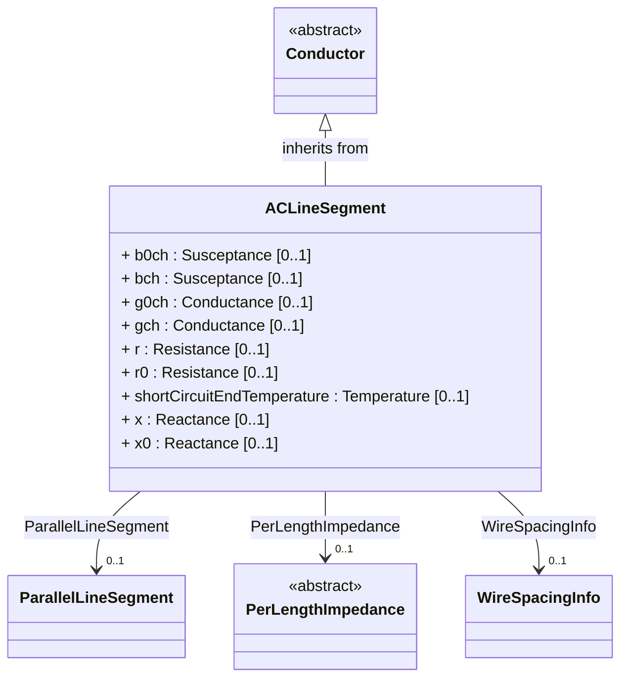
```mermaid
classDiagram
direction TB

class ACLineSegment {
+ b0ch : Susceptance [0..1]
+ bch : Susceptance [0..1]
+ g0ch : Conductance [0..1]
+ gch : Conductance [0..1]
+ r : Resistance [0..1]
+ r0 : Resistance [0..1]
+ shortCircuitEndTemperature : Temperature [0..1]
+ x : Reactance [0..1]
+ x0 : Reactance [0..1]
}

class Conductor {
<<abstract>>
}

Conductor <|-- ACLineSegment : inherits from
class ParallelLineSegment {
}

ACLineSegment --> "0..1" ParallelLineSegment : ParallelLineSegment
class PerLengthImpedance {
<<abstract>>
}

ACLineSegment --> "0..1" PerLengthImpedance : PerLengthImpedance
class WireSpacingInfo {
}

ACLineSegment --> "0..1" WireSpacingInfo : WireSpacingInfo
```

A wire or combination of wires, with consistent electrical characteristics, building a single electrical system, used to carry alternating current between points in the power system.

For symmetrical, transposed 3ph lines, it is sufficient to use attributes of the line segment, which describe impedances and admittances for the entire length of the segment. Additionally impedances can be computed by using length and associated per length impedances.

The BaseVoltage at the two ends of ACLineSegments in a Line shall have the same BaseVoltage.nominalVoltage. However, boundary lines may have slightly different BaseVoltage.nominalVoltages and variation is allowed. Larger voltage difference in general requires use of an equivalent branch.


#### Native Members

| name | type | description | mapping |
|------|------|-------------|---------|
| b0ch [0..1] | [Susceptance](#cimhub_2023-Susceptance) | Zero sequence shunt (charging) susceptance, uniformly distributed, of the entire line section. | |
| bch [0..1] | [Susceptance](#cimhub_2023-Susceptance) | Positive sequence shunt (charging) susceptance, uniformly distributed, of the entire line section. This value represents the full charging over the full length of the line. | |
| g0ch [0..1] | [Conductance](#cimhub_2023-Conductance) | Zero sequence shunt (charging) conductance, uniformly distributed, of the entire line section. | |
| gch [0..1] | [Conductance](#cimhub_2023-Conductance) | Positive sequence shunt (charging) conductance, uniformly distributed, of the entire line section. | |
| r [0..1] | [Resistance](#cimhub_2023-Resistance) | Positive sequence series resistance of the entire line section. | |
| r0 [0..1] | [Resistance](#cimhub_2023-Resistance) | Zero sequence series resistance of the entire line section. | |
| shortCircuitEndTemperature [0..1] | [Temperature](#cimhub_2023-Temperature) | Maximum permitted temperature at the end of SC for the calculation of minimum short-circuit currents. Used for short circuit data exchange according to IEC 60909 | |
| x [0..1] | [Reactance](#cimhub_2023-Reactance) | Positive sequence series reactance of the entire line section. | |
| x0 [0..1] | [Reactance](#cimhub_2023-Reactance) | Zero sequence series reactance of the entire line section. | |
| ParallelLineSegment [0..1] | [ParallelLineSegment](#cimhub_2023-ParallelLineSegment) | | |
| PerLengthImpedance [0..1] | [PerLengthImpedance](#cimhub_2023-PerLengthImpedance) | Per-length impedance of this line segment. | |
| WireSpacingInfo [0..1] | [WireSpacingInfo](#cimhub_2023-WireSpacingInfo) | | |

#### Inherited Members

| name | type | description | mapping |
|------|------|-------------|---------|
| length [0..1] | [Length](#cimhub_2023-Length) | see [Conductor](cimhub_2023-Conductor) | |
| BaseVoltage [0..1] | [BaseVoltage](#cimhub_2023-BaseVoltage) | see [ConductingEquipment](cimhub_2023-ConductingEquipment) | |
| aggregate [0..1] | [Boolean](#cimhub_2023-Boolean) | see [Equipment](#cimhub_2023-Equipment) | |
| inService [0..1] | [Boolean](#cimhub_2023-Boolean) | see [Equipment](#cimhub_2023-Equipment) | |
| networkAnalysisEnabled [0..1] | [Boolean](#cimhub_2023-Boolean) | see [Equipment](#cimhub_2023-Equipment) | |
| normallyInService [0..1] | [Boolean](#cimhub_2023-Boolean) | see [Equipment](#cimhub_2023-Equipment) | |
| `EquipmentContainer [0..1]` (OfAggregate) | [EquipmentContainer](#cimhub_2023-EquipmentContainer) | see [Equipment](cimhub_2023-Equipment) | |
| `SubSchedulingArea [0..1]` (OfAggregate) | [SubSchedulingArea](#cimhub_2023-SubSchedulingArea) | see [Equipment](cimhub_2023-Equipment) | |
| UsagePoints [0..1] | [UsagePoint](#cimhub_2023-UsagePoint) | see [Equipment](cimhub_2023-Equipment) | |
| AssetDatasheet [0..1] | [AssetInfo](#cimhub_2023-AssetInfo) | see [PowerSystemResource](cimhub_2023-PowerSystemResource) | |
| Location [0..1] | [Location](#cimhub_2023-Location) | see [PowerSystemResource](cimhub_2023-PowerSystemResource) | |
| PSRType [0..1] | [PSRType](#cimhub_2023-PSRType) | see [PowerSystemResource](cimhub_2023-PowerSystemResource) | |
| mRID [0..1] | [String](#cimhub_2023-String) | see [IdentifiedObject](#cimhub_2023-IdentifiedObject) | |
| aliasName [0..1] | [String](#cimhub_2023-String) | see [IdentifiedObject](#cimhub_2023-IdentifiedObject) | |
| description [0..1] | [String](#cimhub_2023-String) | see [IdentifiedObject](#cimhub_2023-IdentifiedObject) | |
| name [0..1] | [String](#cimhub_2023-String) | see [IdentifiedObject](#cimhub_2023-IdentifiedObject) | |

{#cimhub_2023-ACLineSegmentPhase}
### ACLineSegmentPhase

Inheritance path = [PowerSystemResource](#cimhub_2023-PowerSystemResource) => [IdentifiedObject](#cimhub_2023-IdentifiedObject)

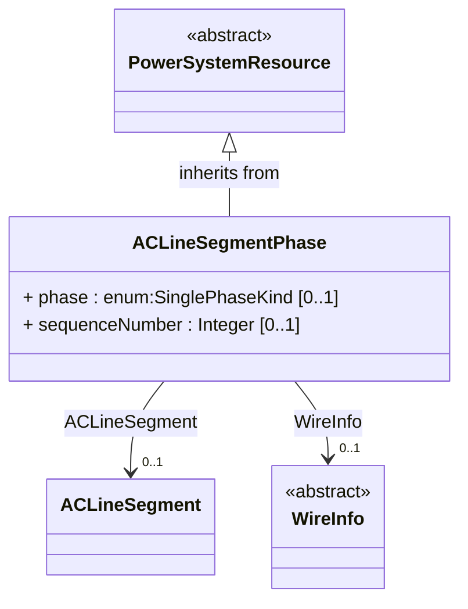
```mermaid
classDiagram
direction TB

class ACLineSegmentPhase {
+ phase : enum:SinglePhaseKind [0..1]
+ sequenceNumber : Integer [0..1]
}

class PowerSystemResource {
<<abstract>>
}

PowerSystemResource <|-- ACLineSegmentPhase : inherits from
class ACLineSegment {
}

ACLineSegmentPhase --> "0..1" ACLineSegment : ACLineSegment
class WireInfo {
<<abstract>>
}

ACLineSegmentPhase --> "0..1" WireInfo : WireInfo
```

Represents a single wire of an alternating current line segment.


#### Native Members

| name | type | description | mapping |
|------|------|-------------|---------|
| phase [0..1] | [SinglePhaseKind](#cimhub_2023-SinglePhaseKind) | The phase connection of the wire at both ends. | |
| sequenceNumber [0..1] | [Integer](#cimhub_2023-Integer) | Number designation for this line segment phase. Each line segment phase within a line segment should have a unique sequence number. This is useful for unbalanced modeling to bind the mathematical model (PhaseImpedanceData of PerLengthPhaseImpedance) with the connectivity model (this class) and the physical model (WirePosition, WirePhaseInfo) without tight coupling. Multiple circuits on the same pole, tower or right-of-way can be included with unique sequence numbers for the phases, and identical sequence numbers for any shared neutrals. | |
| ACLineSegment [0..1] | [ACLineSegment](#cimhub_2023-ACLineSegment) | The line segment to which the phase belongs. | |
| WireInfo [0..1] | [WireInfo](#cimhub_2023-WireInfo) | | |

#### Inherited Members

| name | type | description | mapping |
|------|------|-------------|---------|
| AssetDatasheet [0..1] | [AssetInfo](#cimhub_2023-AssetInfo) | see [PowerSystemResource](cimhub_2023-PowerSystemResource) | |
| Location [0..1] | [Location](#cimhub_2023-Location) | see [PowerSystemResource](cimhub_2023-PowerSystemResource) | |
| PSRType [0..1] | [PSRType](#cimhub_2023-PSRType) | see [PowerSystemResource](cimhub_2023-PowerSystemResource) | |
| mRID [0..1] | [String](#cimhub_2023-String) | see [IdentifiedObject](#cimhub_2023-IdentifiedObject) | |
| aliasName [0..1] | [String](#cimhub_2023-String) | see [IdentifiedObject](#cimhub_2023-IdentifiedObject) | |
| description [0..1] | [String](#cimhub_2023-String) | see [IdentifiedObject](#cimhub_2023-IdentifiedObject) | |
| name [0..1] | [String](#cimhub_2023-String) | see [IdentifiedObject](#cimhub_2023-IdentifiedObject) | |

{#cimhub_2023-Analog}
### Analog

Inheritance path = [Measurement](#cimhub_2023-Measurement) => [IdentifiedObject](#cimhub_2023-IdentifiedObject)

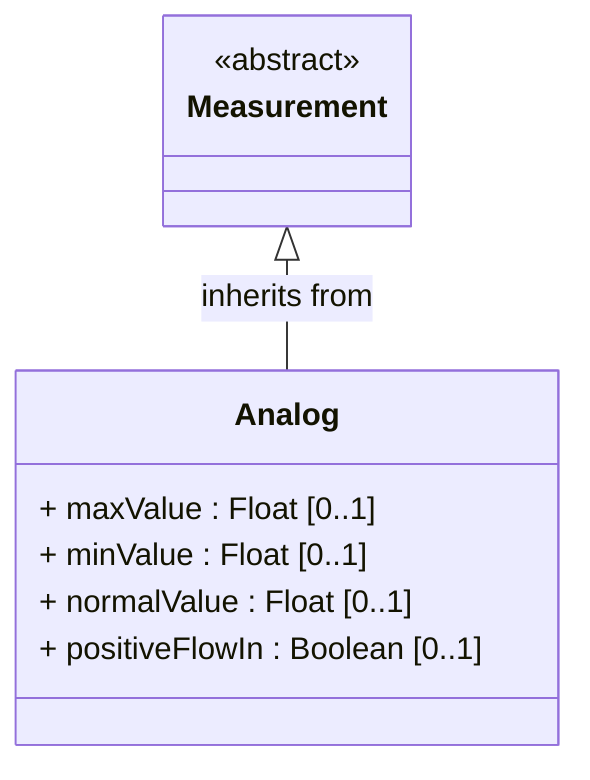
```mermaid
classDiagram
direction TB

class Analog {
+ maxValue : Float [0..1]
+ minValue : Float [0..1]
+ normalValue : Float [0..1]
+ positiveFlowIn : Boolean [0..1]
}

class Measurement {
<<abstract>>
}

Measurement <|-- Analog : inherits from
```

Analog represents an analog Measurement.


#### Native Members

| name | type | description | mapping |
|------|------|-------------|---------|
| maxValue [0..1] | [Float](#cimhub_2023-Float) | Normal value range maximum for any of the MeasurementValue.values. Used for scaling, e.g. in bar graphs or of telemetered raw values. | |
| minValue [0..1] | [Float](#cimhub_2023-Float) | Normal value range minimum for any of the MeasurementValue.values. Used for scaling, e.g. in bar graphs or of telemetered raw values. | |
| normalValue [0..1] | [Float](#cimhub_2023-Float) | Normal measurement value, e.g., used for percentage calculations. | |
| positiveFlowIn [0..1] | [Boolean](#cimhub_2023-Boolean) | If true then this measurement is an active power, reactive power or current with the convention that a positive value measured at the Terminal means power is flowing into the related PowerSystemResource. | |

#### Inherited Members

| name | type | description | mapping |
|------|------|-------------|---------|
| measurementType [0..1] | [String](#cimhub_2023-String) | see [Measurement](#cimhub_2023-Measurement) | |
| phases [0..1] | [PhaseCode](#cimhub_2023-PhaseCode) | see [Measurement](cimhub_2023-Measurement) | |
| Asset [0..1] | [Asset](#cimhub_2023-Asset) | see [Measurement](cimhub_2023-Measurement) | |
| `PowerSystemResource [0..1]` (OfAggregate) | [PowerSystemResource](#cimhub_2023-PowerSystemResource) | see [Measurement](cimhub_2023-Measurement) | |
| Terminal [0..1] | [ACDCTerminal](#cimhub_2023-ACDCTerminal) | see [Measurement](cimhub_2023-Measurement) | |
| mRID [0..1] | [String](#cimhub_2023-String) | see [IdentifiedObject](#cimhub_2023-IdentifiedObject) | |
| aliasName [0..1] | [String](#cimhub_2023-String) | see [IdentifiedObject](#cimhub_2023-IdentifiedObject) | |
| description [0..1] | [String](#cimhub_2023-String) | see [IdentifiedObject](#cimhub_2023-IdentifiedObject) | |
| name [0..1] | [String](#cimhub_2023-String) | see [IdentifiedObject](#cimhub_2023-IdentifiedObject) | |

{#cimhub_2023-Asset}
### Asset

Inheritance path = [IdentifiedObject](#cimhub_2023-IdentifiedObject)

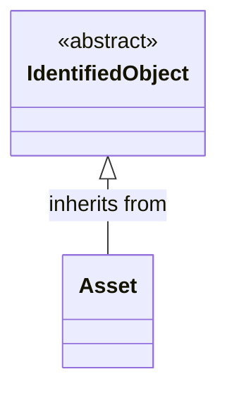
```mermaid
classDiagram
direction TB

class Asset {
}

class IdentifiedObject {
<<abstract>>
}

IdentifiedObject <|-- Asset : inherits from
```

Tangible resource of the utility, including power system equipment, various end devices, cabinets, buildings, etc. For electrical network equipment, the role of the asset is defined through PowerSystemResource and its subclasses, defined mainly in the Wires model (refer to IEC61970-301 and model package IEC61970::Wires). Asset description places emphasis on the physical characteristics of the equipment fulfilling that role.


#### Inherited Members

| name | type | description | mapping |
|------|------|-------------|---------|
| mRID [0..1] | [String](#cimhub_2023-String) | see [IdentifiedObject](#cimhub_2023-IdentifiedObject) | |
| aliasName [0..1] | [String](#cimhub_2023-String) | see [IdentifiedObject](#cimhub_2023-IdentifiedObject) | |
| description [0..1] | [String](#cimhub_2023-String) | see [IdentifiedObject](#cimhub_2023-IdentifiedObject) | |
| name [0..1] | [String](#cimhub_2023-String) | see [IdentifiedObject](#cimhub_2023-IdentifiedObject) | |

{#cimhub_2023-AsynchronousMachine}
### AsynchronousMachine

Inheritance path = [RotatingMachine](#cimhub_2023-RotatingMachine) => [RegulatingCondEq](#cimhub_2023-RegulatingCondEq) => [EnergyConnection](#cimhub_2023-EnergyConnection) => [ConductingEquipment](#cimhub_2023-ConductingEquipment) => [Equipment](#cimhub_2023-Equipment) => [PowerSystemResource](#cimhub_2023-PowerSystemResource) => [IdentifiedObject](#cimhub_2023-IdentifiedObject)

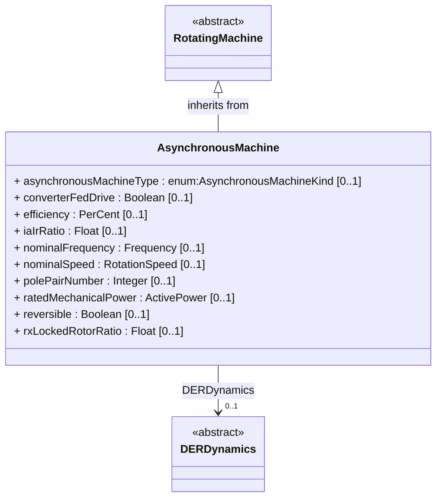
```mermaid
classDiagram
direction TB

class AsynchronousMachine {
+ asynchronousMachineType : enum:AsynchronousMachineKind [0..1]
+ converterFedDrive : Boolean [0..1]
+ efficiency : PerCent [0..1]
+ iaIrRatio : Float [0..1]
+ nominalFrequency : Frequency [0..1]
+ nominalSpeed : RotationSpeed [0..1]
+ polePairNumber : Integer [0..1]
+ ratedMechanicalPower : ActivePower [0..1]
+ reversible : Boolean [0..1]
+ rxLockedRotorRatio : Float [0..1]
}

class RotatingMachine {
<<abstract>>
}

RotatingMachine <|-- AsynchronousMachine : inherits from
class DERDynamics {
<<abstract>>
}

AsynchronousMachine --> "0..1" DERDynamics : DERDynamics
```

A rotating machine whose shaft rotates asynchronously with the electrical field. Also known as an induction machine with no external connection to the rotor windings, e.g squirrel-cage induction machine.


#### Native Members

| name | type | description | mapping |
|------|------|-------------|---------|
| asynchronousMachineType [0..1] | [AsynchronousMachineKind](#cimhub_2023-AsynchronousMachineKind) | Indicates the type of Asynchronous Machine (motor or generator). | |
| converterFedDrive [0..1] | [Boolean](#cimhub_2023-Boolean) | Indicates whether the machine is a converter fed drive. Used for short circuit data exchange according to IEC 60909 | |
| efficiency [0..1] | [PerCent](#cimhub_2023-PerCent) | Efficiency of the asynchronous machine at nominal operation in percent. Indicator for converter drive motors. Used for short circuit data exchange according to IEC 60909 | |
| iaIrRatio [0..1] | [Float](#cimhub_2023-Float) | Ratio of locked-rotor current to the rated current of the motor (Ia/Ir). Used for short circuit data exchange according to IEC 60909 | |
| nominalFrequency [0..1] | [Frequency](#cimhub_2023-Frequency) | Nameplate data indicates if the machine is 50 or 60 Hz. | |
| nominalSpeed [0..1] | [RotationSpeed](#cimhub_2023-RotationSpeed) | Nameplate data. Depends on the slip and number of pole pairs. | |
| polePairNumber [0..1] | [Integer](#cimhub_2023-Integer) | Number of pole pairs of stator. Used for short circuit data exchange according to IEC 60909 | |
| ratedMechanicalPower [0..1] | [ActivePower](#cimhub_2023-ActivePower) | Rated mechanical power (Pr in the IEC 60909-0). Used for short circuit data exchange according to IEC 60909. | |
| reversible [0..1] | [Boolean](#cimhub_2023-Boolean) | Indicates for converter drive motors if the power can be reversible. Used for short circuit data exchange according to IEC 60909 | |
| rxLockedRotorRatio [0..1] | [Float](#cimhub_2023-Float) | Locked rotor ratio (R/X). Used for short circuit data exchange according to IEC 60909 | |
| DERDynamics [0..1] | [DERDynamics](#cimhub_2023-DERDynamics) | DER dynamics model associated with this asynchronous machine model. | |

#### Inherited Members

| name | type | description | mapping |
|------|------|-------------|---------|
| p [0..1] | [ActivePower](#cimhub_2023-ActivePower) | see [RotatingMachine](cimhub_2023-RotatingMachine) | |
| q [0..1] | [ReactivePower](#cimhub_2023-ReactivePower) | see [RotatingMachine](cimhub_2023-RotatingMachine) | |
| ratedPowerFactor [0..1] | [Float](#cimhub_2023-Float) | see [RotatingMachine](#cimhub_2023-RotatingMachine) | |
| ratedS [0..1] | [ApparentPower](#cimhub_2023-ApparentPower) | see [RotatingMachine](cimhub_2023-RotatingMachine) | |
| ratedU [0..1] | [Voltage](#cimhub_2023-Voltage) | see [RotatingMachine](cimhub_2023-RotatingMachine) | |
| GeneratingUnit [0..1] | [GeneratingUnit](#cimhub_2023-GeneratingUnit) | see [RotatingMachine](cimhub_2023-RotatingMachine) | |
| HydroPump [0..1] | [HydroPump](#cimhub_2023-HydroPump) | see [RotatingMachine](cimhub_2023-RotatingMachine) | |
| IEEE1547ControlSettings [0..1] | [IEEE1547ControlSettings](#cimhub_2023-IEEE1547ControlSettings) | see [RotatingMachine](cimhub_2023-RotatingMachine) | |
| IEEE1547Info [0..1] | [IEEE1547Info](#cimhub_2023-IEEE1547Info) | see [RotatingMachine](cimhub_2023-RotatingMachine) | |
| IEEE1547Setting [0..1] | [IEEE1547Setting](#cimhub_2023-IEEE1547Setting) | see [RotatingMachine](cimhub_2023-RotatingMachine) | |
| IEEE1547TripSettings [0..1] | [IEEE1547TripSettings](#cimhub_2023-IEEE1547TripSettings) | see [RotatingMachine](cimhub_2023-RotatingMachine) | |
| controlEnabled [0..1] | [Boolean](#cimhub_2023-Boolean) | see [RegulatingCondEq](#cimhub_2023-RegulatingCondEq) | |
| RegulatingControl [0..1] | [RegulatingControl](#cimhub_2023-RegulatingControl) | see [RegulatingCondEq](cimhub_2023-RegulatingCondEq) | |
| EnergyConnectionProfile [0..1] | [EnergyConnectionProfile](#cimhub_2023-EnergyConnectionProfile) | see [EnergyConnection](cimhub_2023-EnergyConnection) | |
| BaseVoltage [0..1] | [BaseVoltage](#cimhub_2023-BaseVoltage) | see [ConductingEquipment](cimhub_2023-ConductingEquipment) | |
| aggregate [0..1] | [Boolean](#cimhub_2023-Boolean) | see [Equipment](#cimhub_2023-Equipment) | |
| inService [0..1] | [Boolean](#cimhub_2023-Boolean) | see [Equipment](#cimhub_2023-Equipment) | |
| networkAnalysisEnabled [0..1] | [Boolean](#cimhub_2023-Boolean) | see [Equipment](#cimhub_2023-Equipment) | |
| normallyInService [0..1] | [Boolean](#cimhub_2023-Boolean) | see [Equipment](#cimhub_2023-Equipment) | |
| `EquipmentContainer [0..1]` (OfAggregate) | [EquipmentContainer](#cimhub_2023-EquipmentContainer) | see [Equipment](cimhub_2023-Equipment) | |
| `SubSchedulingArea [0..1]` (OfAggregate) | [SubSchedulingArea](#cimhub_2023-SubSchedulingArea) | see [Equipment](cimhub_2023-Equipment) | |
| UsagePoints [0..1] | [UsagePoint](#cimhub_2023-UsagePoint) | see [Equipment](cimhub_2023-Equipment) | |
| AssetDatasheet [0..1] | [AssetInfo](#cimhub_2023-AssetInfo) | see [PowerSystemResource](cimhub_2023-PowerSystemResource) | |
| Location [0..1] | [Location](#cimhub_2023-Location) | see [PowerSystemResource](cimhub_2023-PowerSystemResource) | |
| PSRType [0..1] | [PSRType](#cimhub_2023-PSRType) | see [PowerSystemResource](cimhub_2023-PowerSystemResource) | |
| mRID [0..1] | [String](#cimhub_2023-String) | see [IdentifiedObject](#cimhub_2023-IdentifiedObject) | |
| aliasName [0..1] | [String](#cimhub_2023-String) | see [IdentifiedObject](#cimhub_2023-IdentifiedObject) | |
| description [0..1] | [String](#cimhub_2023-String) | see [IdentifiedObject](#cimhub_2023-IdentifiedObject) | |
| name [0..1] | [String](#cimhub_2023-String) | see [IdentifiedObject](#cimhub_2023-IdentifiedObject) | |

{#cimhub_2023-BaseFrequency}
### BaseFrequency

Inheritance path = [IdentifiedObject](#cimhub_2023-IdentifiedObject)

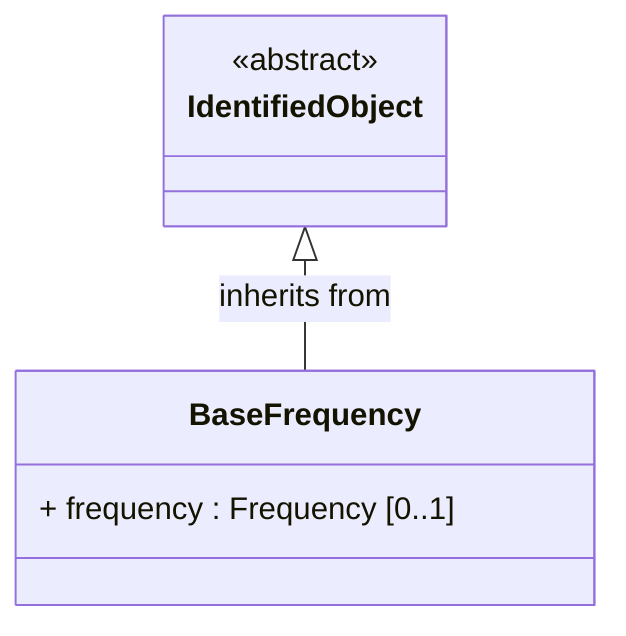
```mermaid
classDiagram
direction TB

class BaseFrequency {
+ frequency : Frequency [0..1]
}

class IdentifiedObject {
<<abstract>>
}

IdentifiedObject <|-- BaseFrequency : inherits from
```

The class describe a base frequency for a power system network. In case of multiple power networks with different frequencies, e.g. 50 or 60 Hertz each network will have it's own base frequency class. Hence it is assumed that power system objects having different base frequencies appear in separate documents where each document has a single base frequency instance.


#### Native Members

| name | type | description | mapping |
|------|------|-------------|---------|
| frequency [0..1] | [Frequency](#cimhub_2023-Frequency) | The base frequency. | |

#### Inherited Members

| name | type | description | mapping |
|------|------|-------------|---------|
| mRID [0..1] | [String](#cimhub_2023-String) | see [IdentifiedObject](#cimhub_2023-IdentifiedObject) | |
| aliasName [0..1] | [String](#cimhub_2023-String) | see [IdentifiedObject](#cimhub_2023-IdentifiedObject) | |
| description [0..1] | [String](#cimhub_2023-String) | see [IdentifiedObject](#cimhub_2023-IdentifiedObject) | |
| name [0..1] | [String](#cimhub_2023-String) | see [IdentifiedObject](#cimhub_2023-IdentifiedObject) | |

{#cimhub_2023-BasePower}
### BasePower

Inheritance path = [IdentifiedObject](#cimhub_2023-IdentifiedObject)

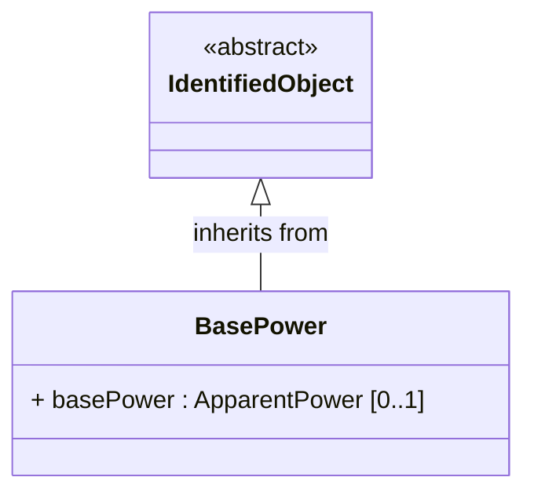
```mermaid
classDiagram
direction TB

class BasePower {
+ basePower : ApparentPower [0..1]
}

class IdentifiedObject {
<<abstract>>
}

IdentifiedObject <|-- BasePower : inherits from
```

The BasePower class defines the base power used in the per unit calculations.


#### Native Members

| name | type | description | mapping |
|------|------|-------------|---------|
| basePower [0..1] | [ApparentPower](#cimhub_2023-ApparentPower) | Value used as base power. | |

#### Inherited Members

| name | type | description | mapping |
|------|------|-------------|---------|
| mRID [0..1] | [String](#cimhub_2023-String) | see [IdentifiedObject](#cimhub_2023-IdentifiedObject) | |
| aliasName [0..1] | [String](#cimhub_2023-String) | see [IdentifiedObject](#cimhub_2023-IdentifiedObject) | |
| description [0..1] | [String](#cimhub_2023-String) | see [IdentifiedObject](#cimhub_2023-IdentifiedObject) | |
| name [0..1] | [String](#cimhub_2023-String) | see [IdentifiedObject](#cimhub_2023-IdentifiedObject) | |

{#cimhub_2023-BaseVoltage}
### BaseVoltage

Inheritance path = [IdentifiedObject](#cimhub_2023-IdentifiedObject)

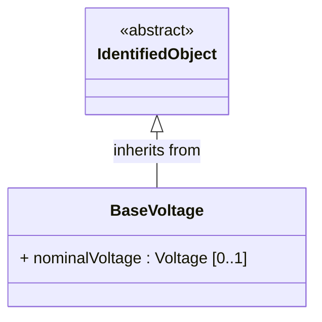
```mermaid
classDiagram
direction TB

class BaseVoltage {
+ nominalVoltage : Voltage [0..1]
}

class IdentifiedObject {
<<abstract>>
}

IdentifiedObject <|-- BaseVoltage : inherits from
```

Defines a system base voltage which is referenced.


#### Native Members

| name | type | description | mapping |
|------|------|-------------|---------|
| nominalVoltage [0..1] | [Voltage](#cimhub_2023-Voltage) | The power system resource's base voltage. | |

#### Inherited Members

| name | type | description | mapping |
|------|------|-------------|---------|
| mRID [0..1] | [String](#cimhub_2023-String) | see [IdentifiedObject](#cimhub_2023-IdentifiedObject) | |
| aliasName [0..1] | [String](#cimhub_2023-String) | see [IdentifiedObject](#cimhub_2023-IdentifiedObject) | |
| description [0..1] | [String](#cimhub_2023-String) | see [IdentifiedObject](#cimhub_2023-IdentifiedObject) | |
| name [0..1] | [String](#cimhub_2023-String) | see [IdentifiedObject](#cimhub_2023-IdentifiedObject) | |

{#cimhub_2023-BatteryUnit}
### BatteryUnit

Inheritance path = [PowerElectronicsUnit](#cimhub_2023-PowerElectronicsUnit) => [Equipment](#cimhub_2023-Equipment) => [PowerSystemResource](#cimhub_2023-PowerSystemResource) => [IdentifiedObject](#cimhub_2023-IdentifiedObject)

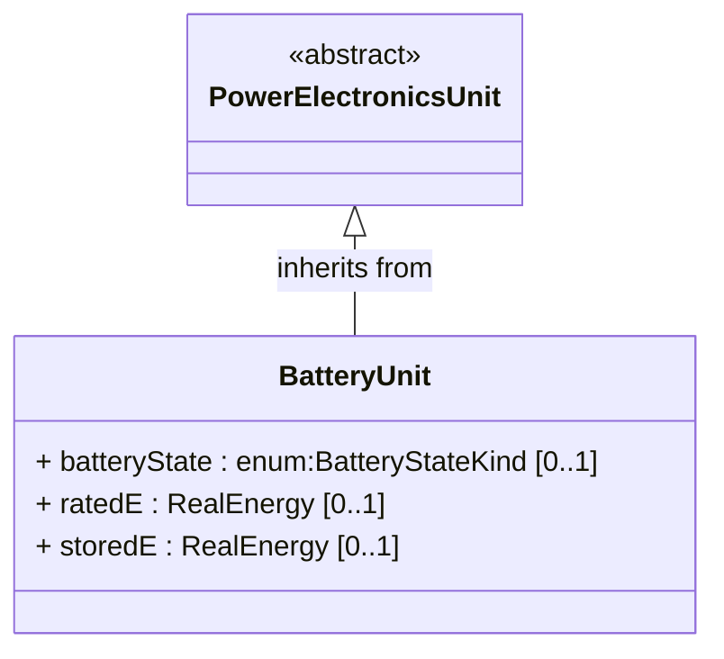
```mermaid
classDiagram
direction TB

class BatteryUnit {
+ batteryState : enum:BatteryStateKind [0..1]
+ ratedE : RealEnergy [0..1]
+ storedE : RealEnergy [0..1]
}

class PowerElectronicsUnit {
<<abstract>>
}

PowerElectronicsUnit <|-- BatteryUnit : inherits from
```

An electrochemical energy storage device


#### Native Members

| name | type | description | mapping |
|------|------|-------------|---------|
| batteryState [0..1] | [BatteryStateKind](#cimhub_2023-BatteryStateKind) | indicates whether the battery is charging, discharging or idle | |
| ratedE [0..1] | [RealEnergy](#cimhub_2023-RealEnergy) | full energy storage capacity of the battery | |
| storedE [0..1] | [RealEnergy](#cimhub_2023-RealEnergy) | amount of energy currently stored; no more than ratedE | |

#### Inherited Members

| name | type | description | mapping |
|------|------|-------------|---------|
| maxP [0..1] | [ActivePower](#cimhub_2023-ActivePower) | see [PowerElectronicsUnit](cimhub_2023-PowerElectronicsUnit) | |
| minP [0..1] | [ActivePower](#cimhub_2023-ActivePower) | see [PowerElectronicsUnit](cimhub_2023-PowerElectronicsUnit) | |
| PowerElectronicsConnection [0..1] | [PowerElectronicsConnection](#cimhub_2023-PowerElectronicsConnection) | see [PowerElectronicsUnit](cimhub_2023-PowerElectronicsUnit) | |
| aggregate [0..1] | [Boolean](#cimhub_2023-Boolean) | see [Equipment](#cimhub_2023-Equipment) | |
| inService [0..1] | [Boolean](#cimhub_2023-Boolean) | see [Equipment](#cimhub_2023-Equipment) | |
| networkAnalysisEnabled [0..1] | [Boolean](#cimhub_2023-Boolean) | see [Equipment](#cimhub_2023-Equipment) | |
| normallyInService [0..1] | [Boolean](#cimhub_2023-Boolean) | see [Equipment](#cimhub_2023-Equipment) | |
| `EquipmentContainer [0..1]` (OfAggregate) | [EquipmentContainer](#cimhub_2023-EquipmentContainer) | see [Equipment](cimhub_2023-Equipment) | |
| `SubSchedulingArea [0..1]` (OfAggregate) | [SubSchedulingArea](#cimhub_2023-SubSchedulingArea) | see [Equipment](cimhub_2023-Equipment) | |
| UsagePoints [0..1] | [UsagePoint](#cimhub_2023-UsagePoint) | see [Equipment](cimhub_2023-Equipment) | |
| AssetDatasheet [0..1] | [AssetInfo](#cimhub_2023-AssetInfo) | see [PowerSystemResource](cimhub_2023-PowerSystemResource) | |
| Location [0..1] | [Location](#cimhub_2023-Location) | see [PowerSystemResource](cimhub_2023-PowerSystemResource) | |
| PSRType [0..1] | [PSRType](#cimhub_2023-PSRType) | see [PowerSystemResource](cimhub_2023-PowerSystemResource) | |
| mRID [0..1] | [String](#cimhub_2023-String) | see [IdentifiedObject](#cimhub_2023-IdentifiedObject) | |
| aliasName [0..1] | [String](#cimhub_2023-String) | see [IdentifiedObject](#cimhub_2023-IdentifiedObject) | |
| description [0..1] | [String](#cimhub_2023-String) | see [IdentifiedObject](#cimhub_2023-IdentifiedObject) | |
| name [0..1] | [String](#cimhub_2023-String) | see [IdentifiedObject](#cimhub_2023-IdentifiedObject) | |

{#cimhub_2023-Bay}
### Bay

Inheritance path = [EquipmentContainer](#cimhub_2023-EquipmentContainer) => [ConnectivityNodeContainer](#cimhub_2023-ConnectivityNodeContainer) => [PowerSystemResource](#cimhub_2023-PowerSystemResource) => [IdentifiedObject](#cimhub_2023-IdentifiedObject)

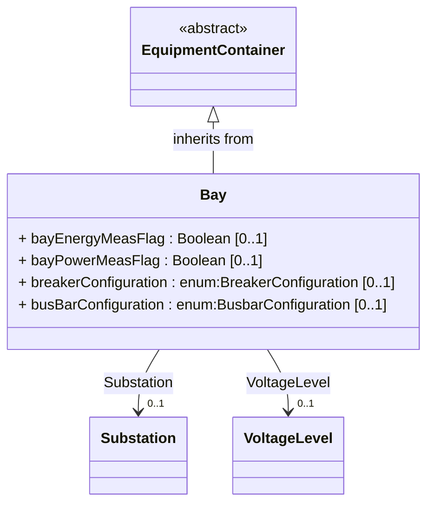
```mermaid
classDiagram
direction TB

class Bay {
+ bayEnergyMeasFlag : Boolean [0..1]
+ bayPowerMeasFlag : Boolean [0..1]
+ breakerConfiguration : enum:BreakerConfiguration [0..1]
+ busBarConfiguration : enum:BusbarConfiguration [0..1]
}

class EquipmentContainer {
<<abstract>>
}

EquipmentContainer <|-- Bay : inherits from
class Substation {
}

Bay --> "0..1" Substation : Substation
class VoltageLevel {
}

Bay --> "0..1" VoltageLevel : VoltageLevel
```

A collection of power system resources (within a given substation) including conducting equipment, protection relays, measurements, and telemetry. A bay typically represents a physical grouping related to modularization of equipment.


#### Native Members

| name | type | description | mapping |
|------|------|-------------|---------|
| bayEnergyMeasFlag [0..1] | [Boolean](#cimhub_2023-Boolean) | Indicates the presence/absence of energy measurements. | |
| bayPowerMeasFlag [0..1] | [Boolean](#cimhub_2023-Boolean) | Indicates the presence/absence of active/reactive power measurements. | |
| breakerConfiguration [0..1] | [BreakerConfiguration](#cimhub_2023-BreakerConfiguration) | Breaker configuration. | |
| busBarConfiguration [0..1] | [BusbarConfiguration](#cimhub_2023-BusbarConfiguration) | Bus bar configuration. | |
| `Substation [0..1]` (OfAggregate) | [Substation](#cimhub_2023-Substation) | Substation containing the bay. | |
| `VoltageLevel [0..1]` (OfAggregate) | [VoltageLevel](#cimhub_2023-VoltageLevel) | The voltage level containing this bay. | |

#### Inherited Members

| name | type | description | mapping |
|------|------|-------------|---------|
| AssetDatasheet [0..1] | [AssetInfo](#cimhub_2023-AssetInfo) | see [PowerSystemResource](cimhub_2023-PowerSystemResource) | |
| Location [0..1] | [Location](#cimhub_2023-Location) | see [PowerSystemResource](cimhub_2023-PowerSystemResource) | |
| PSRType [0..1] | [PSRType](#cimhub_2023-PSRType) | see [PowerSystemResource](cimhub_2023-PowerSystemResource) | |
| mRID [0..1] | [String](#cimhub_2023-String) | see [IdentifiedObject](#cimhub_2023-IdentifiedObject) | |
| aliasName [0..1] | [String](#cimhub_2023-String) | see [IdentifiedObject](#cimhub_2023-IdentifiedObject) | |
| description [0..1] | [String](#cimhub_2023-String) | see [IdentifiedObject](#cimhub_2023-IdentifiedObject) | |
| name [0..1] | [String](#cimhub_2023-String) | see [IdentifiedObject](#cimhub_2023-IdentifiedObject) | |

{#cimhub_2023-Breaker}
### Breaker

Inheritance path = [ProtectedSwitch](#cimhub_2023-ProtectedSwitch) => [Switch](#cimhub_2023-Switch) => [ConductingEquipment](#cimhub_2023-ConductingEquipment) => [Equipment](#cimhub_2023-Equipment) => [PowerSystemResource](#cimhub_2023-PowerSystemResource) => [IdentifiedObject](#cimhub_2023-IdentifiedObject)

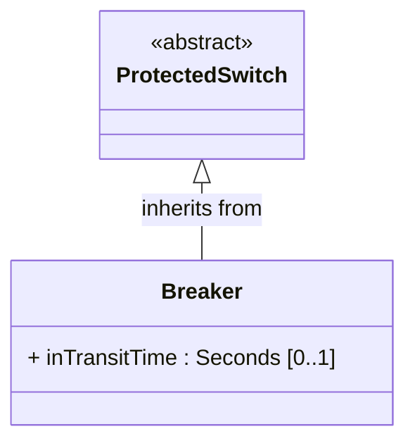
```mermaid
classDiagram
direction TB

class Breaker {
+ inTransitTime : Seconds [0..1]
}

class ProtectedSwitch {
<<abstract>>
}

ProtectedSwitch <|-- Breaker : inherits from
```

A mechanical switching device capable of making, carrying, and breaking currents under normal circuit conditions and also making, carrying for a specified time, and breaking currents under specified abnormal circuit conditions e.g. those of short circuit.


#### Native Members

| name | type | description | mapping |
|------|------|-------------|---------|
| inTransitTime [0..1] | [Seconds](#cimhub_2023-Seconds) | The transition time from open to close. | |

#### Inherited Members

| name | type | description | mapping |
|------|------|-------------|---------|
| breakingCapacity [0..1] | [CurrentFlow](#cimhub_2023-CurrentFlow) | see [ProtectedSwitch](cimhub_2023-ProtectedSwitch) | |
| normalOpen [0..1] | [Boolean](#cimhub_2023-Boolean) | see [Switch](#cimhub_2023-Switch) | |
| open [0..1] | [Boolean](#cimhub_2023-Boolean) | see [Switch](#cimhub_2023-Switch) | |
| ratedCurrent [0..1] | [CurrentFlow](#cimhub_2023-CurrentFlow) | see [Switch](cimhub_2023-Switch) | |
| retained [0..1] | [Boolean](#cimhub_2023-Boolean) | see [Switch](#cimhub_2023-Switch) | |
| `CompositeSwitch [0..1]` (OfAggregate) | [CompositeSwitch](#cimhub_2023-CompositeSwitch) | see [Switch](cimhub_2023-Switch) | |
| BaseVoltage [0..1] | [BaseVoltage](#cimhub_2023-BaseVoltage) | see [ConductingEquipment](cimhub_2023-ConductingEquipment) | |
| aggregate [0..1] | [Boolean](#cimhub_2023-Boolean) | see [Equipment](#cimhub_2023-Equipment) | |
| inService [0..1] | [Boolean](#cimhub_2023-Boolean) | see [Equipment](#cimhub_2023-Equipment) | |
| networkAnalysisEnabled [0..1] | [Boolean](#cimhub_2023-Boolean) | see [Equipment](#cimhub_2023-Equipment) | |
| normallyInService [0..1] | [Boolean](#cimhub_2023-Boolean) | see [Equipment](#cimhub_2023-Equipment) | |
| `EquipmentContainer [0..1]` (OfAggregate) | [EquipmentContainer](#cimhub_2023-EquipmentContainer) | see [Equipment](cimhub_2023-Equipment) | |
| `SubSchedulingArea [0..1]` (OfAggregate) | [SubSchedulingArea](#cimhub_2023-SubSchedulingArea) | see [Equipment](cimhub_2023-Equipment) | |
| UsagePoints [0..1] | [UsagePoint](#cimhub_2023-UsagePoint) | see [Equipment](cimhub_2023-Equipment) | |
| AssetDatasheet [0..1] | [AssetInfo](#cimhub_2023-AssetInfo) | see [PowerSystemResource](cimhub_2023-PowerSystemResource) | |
| Location [0..1] | [Location](#cimhub_2023-Location) | see [PowerSystemResource](cimhub_2023-PowerSystemResource) | |
| PSRType [0..1] | [PSRType](#cimhub_2023-PSRType) | see [PowerSystemResource](cimhub_2023-PowerSystemResource) | |
| mRID [0..1] | [String](#cimhub_2023-String) | see [IdentifiedObject](#cimhub_2023-IdentifiedObject) | |
| aliasName [0..1] | [String](#cimhub_2023-String) | see [IdentifiedObject](#cimhub_2023-IdentifiedObject) | |
| description [0..1] | [String](#cimhub_2023-String) | see [IdentifiedObject](#cimhub_2023-IdentifiedObject) | |
| name [0..1] | [String](#cimhub_2023-String) | see [IdentifiedObject](#cimhub_2023-IdentifiedObject) | |

{#cimhub_2023-BusNameMarker}
### BusNameMarker

Inheritance path = [IdentifiedObject](#cimhub_2023-IdentifiedObject)

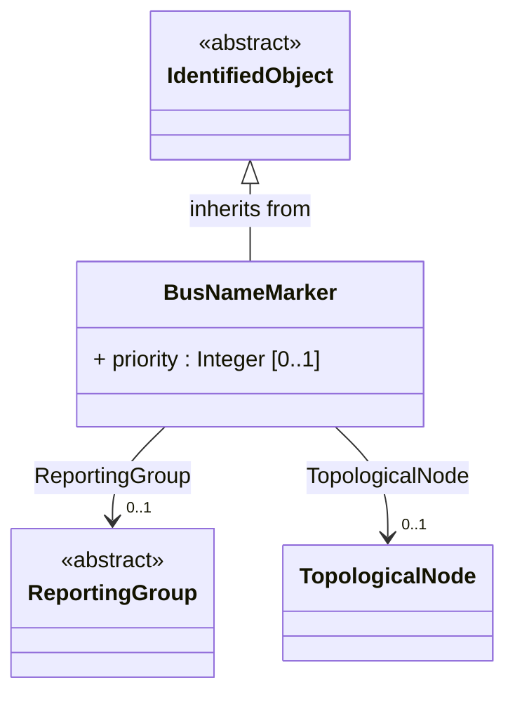
```mermaid
classDiagram
direction TB

class BusNameMarker {
+ priority : Integer [0..1]
}

class IdentifiedObject {
<<abstract>>
}

IdentifiedObject <|-- BusNameMarker : inherits from
class ReportingGroup {
<<abstract>>
}

BusNameMarker --> "0..1" ReportingGroup : ReportingGroup
class TopologicalNode {
}

BusNameMarker --> "0..1" TopologicalNode : TopologicalNode
```

Used to apply user standard names to topology buses. Typically used for "bus/branch" case generation. Associated with one or more terminals that are normally connected with the bus name. The associated terminals are normally connected by non-retained switches. For a ring bus station configuration, all busbar terminals in the ring are typically associated. For a breaker and a half scheme, both busbars would normally be associated. For a ring bus, all busbars would normally be associated. For a "straight" busbar configuration, normally only the main terminal at the busbar would be associated.


#### Native Members

| name | type | description | mapping |
|------|------|-------------|---------|
| priority [0..1] | [Integer](#cimhub_2023-Integer) | Priority of bus name marker for use as topology bus name. Use 0 for don t care. Use 1 for highest priority. Use 2 as priority is less than 1 and so on. | |
| ReportingGroup [0..1] | [ReportingGroup](#cimhub_2023-ReportingGroup) | The reporting group to which this bus name marker belongs. | |
| TopologicalNode [0..1] | [TopologicalNode](#cimhub_2023-TopologicalNode) | A user defined topological node that was originally defined in a planning model not yet having topology described by ConnectivityNodes. Once ConnectivityNodes has been created they may linked to user defined ToplogicalNdes using BusNameMarkers. | |

#### Inherited Members

| name | type | description | mapping |
|------|------|-------------|---------|
| mRID [0..1] | [String](#cimhub_2023-String) | see [IdentifiedObject](#cimhub_2023-IdentifiedObject) | |
| aliasName [0..1] | [String](#cimhub_2023-String) | see [IdentifiedObject](#cimhub_2023-IdentifiedObject) | |
| description [0..1] | [String](#cimhub_2023-String) | see [IdentifiedObject](#cimhub_2023-IdentifiedObject) | |
| name [0..1] | [String](#cimhub_2023-String) | see [IdentifiedObject](#cimhub_2023-IdentifiedObject) | |

{#cimhub_2023-BusbarSection}
### BusbarSection

Inheritance path = [Connector](#cimhub_2023-Connector) => [ConductingEquipment](#cimhub_2023-ConductingEquipment) => [Equipment](#cimhub_2023-Equipment) => [PowerSystemResource](#cimhub_2023-PowerSystemResource) => [IdentifiedObject](#cimhub_2023-IdentifiedObject)

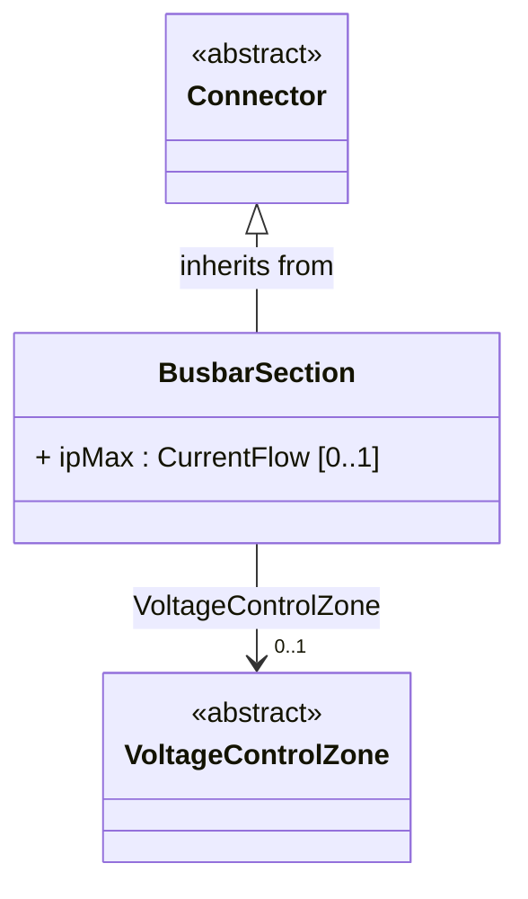
```mermaid
classDiagram
direction TB

class BusbarSection {
+ ipMax : CurrentFlow [0..1]
}

class Connector {
<<abstract>>
}

Connector <|-- BusbarSection : inherits from
class VoltageControlZone {
<<abstract>>
}

BusbarSection --> "0..1" VoltageControlZone : VoltageControlZone
```

A conductor, or group of conductors, with negligible impedance, that serve to connect other conducting equipment within a single substation.

Voltage measurements are typically obtained from VoltageTransformers that are connected to busbar sections. A bus bar section may have many physical terminals but for analysis is modelled with exactly one logical terminal.


#### Native Members

| name | type | description | mapping |
|------|------|-------------|---------|
| ipMax [0..1] | [CurrentFlow](#cimhub_2023-CurrentFlow) | Maximum allowable peak short-circuit current of busbar (Ipmax in the IEC 60909-0).Mechanical limit of the busbar in the substation itself. Used for short circuit data exchange according to IEC 60909 | |
| VoltageControlZone [0..1] | [VoltageControlZone](#cimhub_2023-VoltageControlZone) | A VoltageControlZone is controlled by a designated BusbarSection. | |

#### Inherited Members

| name | type | description | mapping |
|------|------|-------------|---------|
| BaseVoltage [0..1] | [BaseVoltage](#cimhub_2023-BaseVoltage) | see [ConductingEquipment](cimhub_2023-ConductingEquipment) | |
| aggregate [0..1] | [Boolean](#cimhub_2023-Boolean) | see [Equipment](#cimhub_2023-Equipment) | |
| inService [0..1] | [Boolean](#cimhub_2023-Boolean) | see [Equipment](#cimhub_2023-Equipment) | |
| networkAnalysisEnabled [0..1] | [Boolean](#cimhub_2023-Boolean) | see [Equipment](#cimhub_2023-Equipment) | |
| normallyInService [0..1] | [Boolean](#cimhub_2023-Boolean) | see [Equipment](#cimhub_2023-Equipment) | |
| `EquipmentContainer [0..1]` (OfAggregate) | [EquipmentContainer](#cimhub_2023-EquipmentContainer) | see [Equipment](cimhub_2023-Equipment) | |
| `SubSchedulingArea [0..1]` (OfAggregate) | [SubSchedulingArea](#cimhub_2023-SubSchedulingArea) | see [Equipment](cimhub_2023-Equipment) | |
| UsagePoints [0..1] | [UsagePoint](#cimhub_2023-UsagePoint) | see [Equipment](cimhub_2023-Equipment) | |
| AssetDatasheet [0..1] | [AssetInfo](#cimhub_2023-AssetInfo) | see [PowerSystemResource](cimhub_2023-PowerSystemResource) | |
| Location [0..1] | [Location](#cimhub_2023-Location) | see [PowerSystemResource](cimhub_2023-PowerSystemResource) | |
| PSRType [0..1] | [PSRType](#cimhub_2023-PSRType) | see [PowerSystemResource](cimhub_2023-PowerSystemResource) | |
| mRID [0..1] | [String](#cimhub_2023-String) | see [IdentifiedObject](#cimhub_2023-IdentifiedObject) | |
| aliasName [0..1] | [String](#cimhub_2023-String) | see [IdentifiedObject](#cimhub_2023-IdentifiedObject) | |
| description [0..1] | [String](#cimhub_2023-String) | see [IdentifiedObject](#cimhub_2023-IdentifiedObject) | |
| name [0..1] | [String](#cimhub_2023-String) | see [IdentifiedObject](#cimhub_2023-IdentifiedObject) | |

{#cimhub_2023-BusbarSectionInfo}
### BusbarSectionInfo

Inheritance path = [AssetInfo](#cimhub_2023-AssetInfo) => [IdentifiedObject](#cimhub_2023-IdentifiedObject)

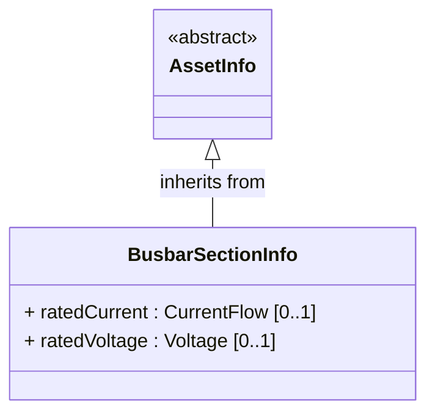
```mermaid
classDiagram
direction TB

class BusbarSectionInfo {
+ ratedCurrent : CurrentFlow [0..1]
+ ratedVoltage : Voltage [0..1]
}

class AssetInfo {
<<abstract>>
}

AssetInfo <|-- BusbarSectionInfo : inherits from
```

Busbar section data.


#### Native Members

| name | type | description | mapping |
|------|------|-------------|---------|
| ratedCurrent [0..1] | [CurrentFlow](#cimhub_2023-CurrentFlow) | Rated current. | |
| ratedVoltage [0..1] | [Voltage](#cimhub_2023-Voltage) | Rated voltage. | |

#### Inherited Members

| name | type | description | mapping |
|------|------|-------------|---------|
| mRID [0..1] | [String](#cimhub_2023-String) | see [IdentifiedObject](#cimhub_2023-IdentifiedObject) | |
| aliasName [0..1] | [String](#cimhub_2023-String) | see [IdentifiedObject](#cimhub_2023-IdentifiedObject) | |
| description [0..1] | [String](#cimhub_2023-String) | see [IdentifiedObject](#cimhub_2023-IdentifiedObject) | |
| name [0..1] | [String](#cimhub_2023-String) | see [IdentifiedObject](#cimhub_2023-IdentifiedObject) | |

{#cimhub_2023-Bushing}
### Bushing

Inheritance path = [Asset](#cimhub_2023-Asset) => [IdentifiedObject](#cimhub_2023-IdentifiedObject)

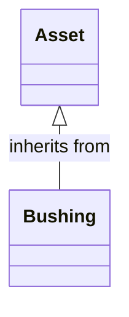
```mermaid
classDiagram
direction TB

class Bushing {
}

class Asset {
}

Asset <|-- Bushing : inherits from
```

Bushing asset.


#### Inherited Members

| name | type | description | mapping |
|------|------|-------------|---------|
| mRID [0..1] | [String](#cimhub_2023-String) | see [IdentifiedObject](#cimhub_2023-IdentifiedObject) | |
| aliasName [0..1] | [String](#cimhub_2023-String) | see [IdentifiedObject](#cimhub_2023-IdentifiedObject) | |
| description [0..1] | [String](#cimhub_2023-String) | see [IdentifiedObject](#cimhub_2023-IdentifiedObject) | |
| name [0..1] | [String](#cimhub_2023-String) | see [IdentifiedObject](#cimhub_2023-IdentifiedObject) | |

{#cimhub_2023-BushingInfo}
### BushingInfo

Inheritance path = [AssetInfo](#cimhub_2023-AssetInfo) => [IdentifiedObject](#cimhub_2023-IdentifiedObject)

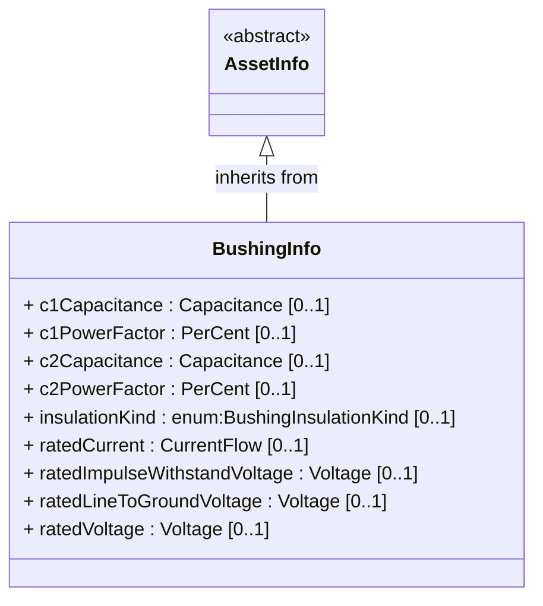
```mermaid
classDiagram
direction TB

class BushingInfo {
+ c1Capacitance : Capacitance [0..1]
+ c1PowerFactor : PerCent [0..1]
+ c2Capacitance : Capacitance [0..1]
+ c2PowerFactor : PerCent [0..1]
+ insulationKind : enum:BushingInsulationKind [0..1]
+ ratedCurrent : CurrentFlow [0..1]
+ ratedImpulseWithstandVoltage : Voltage [0..1]
+ ratedLineToGroundVoltage : Voltage [0..1]
+ ratedVoltage : Voltage [0..1]
}

class AssetInfo {
<<abstract>>
}

AssetInfo <|-- BushingInfo : inherits from
```

Bushing datasheet information.


#### Native Members

| name | type | description | mapping |
|------|------|-------------|---------|
| c1Capacitance [0..1] | [Capacitance](#cimhub_2023-Capacitance) | Factory measured capacitance, measured between the power factor tap and the bushing conductor. | |
| c1PowerFactor [0..1] | [PerCent](#cimhub_2023-PerCent) | Factory measured insulation power factor, measured between the power factor tap and the bushing conductor. | |
| c2Capacitance [0..1] | [Capacitance](#cimhub_2023-Capacitance) | Factory measured capacitance measured between the power factor tap and ground. | |
| c2PowerFactor [0..1] | [PerCent](#cimhub_2023-PerCent) | Factory measured insulation power factor, measured between the power factor tap and ground. | |
| insulationKind [0..1] | [BushingInsulationKind](#cimhub_2023-BushingInsulationKind) | Kind of insulation. | |
| ratedCurrent [0..1] | [CurrentFlow](#cimhub_2023-CurrentFlow) | Rated current for bushing as installed. | |
| ratedImpulseWithstandVoltage [0..1] | [Voltage](#cimhub_2023-Voltage) | Rated impulse withstand voltage, also known as BIL (Basic Impulse Level). | |
| ratedLineToGroundVoltage [0..1] | [Voltage](#cimhub_2023-Voltage) | Rated line-to-ground voltage. Also referred to as U<sub>y</sub> on bushing nameplate. | |
| ratedVoltage [0..1] | [Voltage](#cimhub_2023-Voltage) | Rated voltage. Can be referred to as U<sub>m</sub>, system voltage or class on bushing nameplate. | |

#### Inherited Members

| name | type | description | mapping |
|------|------|-------------|---------|
| mRID [0..1] | [String](#cimhub_2023-String) | see [IdentifiedObject](#cimhub_2023-IdentifiedObject) | |
| aliasName [0..1] | [String](#cimhub_2023-String) | see [IdentifiedObject](#cimhub_2023-IdentifiedObject) | |
| description [0..1] | [String](#cimhub_2023-String) | see [IdentifiedObject](#cimhub_2023-IdentifiedObject) | |
| name [0..1] | [String](#cimhub_2023-String) | see [IdentifiedObject](#cimhub_2023-IdentifiedObject) | |

{#cimhub_2023-ConcentricNeutralCableInfo}
### ConcentricNeutralCableInfo

Inheritance path = [CableInfo](#cimhub_2023-CableInfo) => [WireInfo](#cimhub_2023-WireInfo) => [AssetInfo](#cimhub_2023-AssetInfo) => [IdentifiedObject](#cimhub_2023-IdentifiedObject)

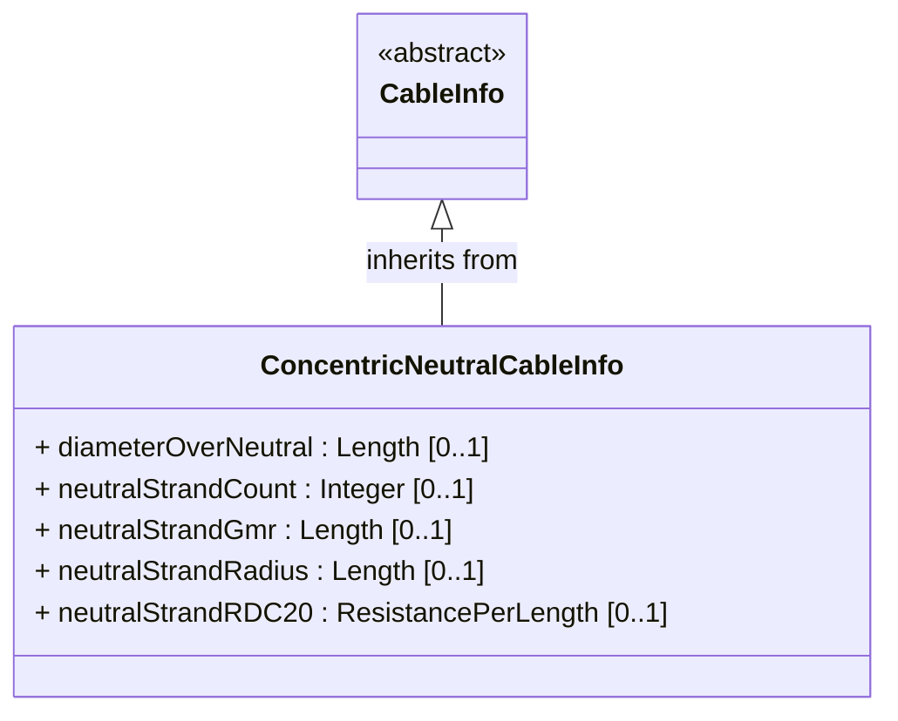
```mermaid
classDiagram
direction TB

class ConcentricNeutralCableInfo {
+ diameterOverNeutral : Length [0..1]
+ neutralStrandCount : Integer [0..1]
+ neutralStrandGmr : Length [0..1]
+ neutralStrandRadius : Length [0..1]
+ neutralStrandRDC20 : ResistancePerLength [0..1]
}

class CableInfo {
<<abstract>>
}

CableInfo <|-- ConcentricNeutralCableInfo : inherits from
```

Concentric neutral cable data.


#### Native Members

| name | type | description | mapping |
|------|------|-------------|---------|
| diameterOverNeutral [0..1] | [Length](#cimhub_2023-Length) | Diameter over the concentric neutral strands. | |
| neutralStrandCount [0..1] | [Integer](#cimhub_2023-Integer) | Number of concentric neutral strands. | |
| neutralStrandGmr [0..1] | [Length](#cimhub_2023-Length) | Geometric mean radius of the neutral strand. | |
| neutralStrandRadius [0..1] | [Length](#cimhub_2023-Length) | Outside radius of the neutral strand. | |
| neutralStrandRDC20 [0..1] | [ResistancePerLength](#cimhub_2023-ResistancePerLength) | DC resistance per unit length of the neutral strand at 20 �C. | |

#### Inherited Members

| name | type | description | mapping |
|------|------|-------------|---------|
| constructionKind [0..1] | [CableConstructionKind](#cimhub_2023-CableConstructionKind) | see [CableInfo](cimhub_2023-CableInfo) | |
| diameterOverCore [0..1] | [Length](#cimhub_2023-Length) | see [CableInfo](cimhub_2023-CableInfo) | |
| diameterOverInsulation [0..1] | [Length](#cimhub_2023-Length) | see [CableInfo](cimhub_2023-CableInfo) | |
| diameterOverJacket [0..1] | [Length](#cimhub_2023-Length) | see [CableInfo](cimhub_2023-CableInfo) | |
| diameterOverScreen [0..1] | [Length](#cimhub_2023-Length) | see [CableInfo](cimhub_2023-CableInfo) | |
| isStrandFill [0..1] | [Boolean](#cimhub_2023-Boolean) | see [CableInfo](#cimhub_2023-CableInfo) | |
| nominalTemperature [0..1] | [Temperature](#cimhub_2023-Temperature) | see [CableInfo](cimhub_2023-CableInfo) | |
| outerJacketKind [0..1] | [CableOuterJacketKind](#cimhub_2023-CableOuterJacketKind) | see [CableInfo](cimhub_2023-CableInfo) | |
| relativePermittivity [0..1] | [Float](#cimhub_2023-Float) | see [CableInfo](#cimhub_2023-CableInfo) | |
| sheathAsNeutral [0..1] | [Boolean](#cimhub_2023-Boolean) | see [CableInfo](#cimhub_2023-CableInfo) | |
| shieldMaterial [0..1] | [CableShieldMaterialKind](#cimhub_2023-CableShieldMaterialKind) | see [CableInfo](cimhub_2023-CableInfo) | |
| coreRadius [0..1] | [Length](#cimhub_2023-Length) | see [WireInfo](cimhub_2023-WireInfo) | |
| coreStrandCount [0..1] | [Integer](#cimhub_2023-Integer) | see [WireInfo](#cimhub_2023-WireInfo) | |
| gmr [0..1] | [Length](#cimhub_2023-Length) | see [WireInfo](cimhub_2023-WireInfo) | |
| insulated [0..1] | [Boolean](#cimhub_2023-Boolean) | see [WireInfo](#cimhub_2023-WireInfo) | |
| insulationMaterial [0..1] | [WireInsulationKind](#cimhub_2023-WireInsulationKind) | see [WireInfo](cimhub_2023-WireInfo) | |
| insulationThickness [0..1] | [Length](#cimhub_2023-Length) | see [WireInfo](cimhub_2023-WireInfo) | |
| material [0..1] | [WireMaterialKind](#cimhub_2023-WireMaterialKind) | see [WireInfo](cimhub_2023-WireInfo) | |
| rAC25 [0..1] | [ResistancePerLength](#cimhub_2023-ResistancePerLength) | see [WireInfo](cimhub_2023-WireInfo) | |
| rAC50 [0..1] | [ResistancePerLength](#cimhub_2023-ResistancePerLength) | see [WireInfo](cimhub_2023-WireInfo) | |
| rAC75 [0..1] | [ResistancePerLength](#cimhub_2023-ResistancePerLength) | see [WireInfo](cimhub_2023-WireInfo) | |
| radius [0..1] | [Length](#cimhub_2023-Length) | see [WireInfo](cimhub_2023-WireInfo) | |
| ratedCurrent [0..1] | [CurrentFlow](#cimhub_2023-CurrentFlow) | see [WireInfo](cimhub_2023-WireInfo) | |
| rDC20 [0..1] | [ResistancePerLength](#cimhub_2023-ResistancePerLength) | see [WireInfo](cimhub_2023-WireInfo) | |
| sizeDescription [0..1] | [String](#cimhub_2023-String) | see [WireInfo](#cimhub_2023-WireInfo) | |
| strandCount [0..1] | [Integer](#cimhub_2023-Integer) | see [WireInfo](#cimhub_2023-WireInfo) | |
| mRID [0..1] | [String](#cimhub_2023-String) | see [IdentifiedObject](#cimhub_2023-IdentifiedObject) | |
| aliasName [0..1] | [String](#cimhub_2023-String) | see [IdentifiedObject](#cimhub_2023-IdentifiedObject) | |
| description [0..1] | [String](#cimhub_2023-String) | see [IdentifiedObject](#cimhub_2023-IdentifiedObject) | |
| name [0..1] | [String](#cimhub_2023-String) | see [IdentifiedObject](#cimhub_2023-IdentifiedObject) | |

{#cimhub_2023-ConnectivityNode}
### ConnectivityNode

Inheritance path = [IdentifiedObject](#cimhub_2023-IdentifiedObject)

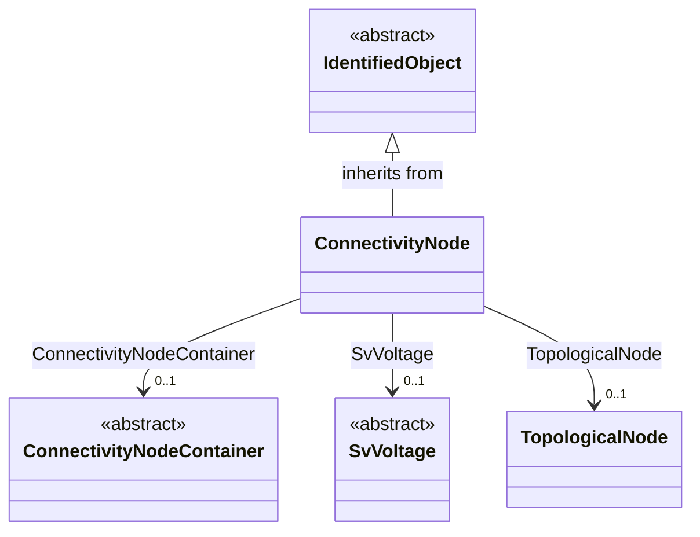
```mermaid
classDiagram
direction TB

class ConnectivityNode {
}

class IdentifiedObject {
<<abstract>>
}

IdentifiedObject <|-- ConnectivityNode : inherits from
class ConnectivityNodeContainer {
<<abstract>>
}

ConnectivityNode --> "0..1" ConnectivityNodeContainer : ConnectivityNodeContainer
class SvVoltage {
<<abstract>>
}

ConnectivityNode --> "0..1" SvVoltage : SvVoltage
class TopologicalNode {
}

ConnectivityNode --> "0..1" TopologicalNode : TopologicalNode
```

Connectivity nodes are points where terminals of AC conducting equipment are connected together with zero impedance.


#### Native Members

| name | type | description | mapping |
|------|------|-------------|---------|
| ConnectivityNodeContainer [0..1] | [ConnectivityNodeContainer](#cimhub_2023-ConnectivityNodeContainer) | Container of this connectivity node. | |
| SvVoltage [0..1] | [SvVoltage](#cimhub_2023-SvVoltage) | | |
| `TopologicalNode [0..1]` (OfAggregate) | [TopologicalNode](#cimhub_2023-TopologicalNode) | The topological node to which this connectivity node is assigned. May depend on the current state of switches in the network. | |

#### Inherited Members

| name | type | description | mapping |
|------|------|-------------|---------|
| mRID [0..1] | [String](#cimhub_2023-String) | see [IdentifiedObject](#cimhub_2023-IdentifiedObject) | |
| aliasName [0..1] | [String](#cimhub_2023-String) | see [IdentifiedObject](#cimhub_2023-IdentifiedObject) | |
| description [0..1] | [String](#cimhub_2023-String) | see [IdentifiedObject](#cimhub_2023-IdentifiedObject) | |
| name [0..1] | [String](#cimhub_2023-String) | see [IdentifiedObject](#cimhub_2023-IdentifiedObject) | |

{#cimhub_2023-Contingency}
### Contingency

Inheritance path = [IdentifiedObject](#cimhub_2023-IdentifiedObject)

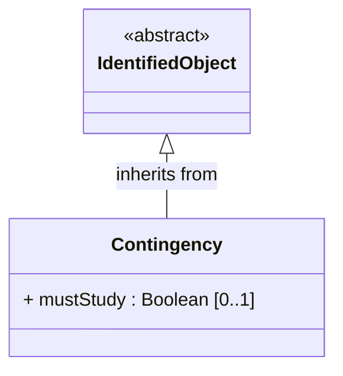
```mermaid
classDiagram
direction TB

class Contingency {
+ mustStudy : Boolean [0..1]
}

class IdentifiedObject {
<<abstract>>
}

IdentifiedObject <|-- Contingency : inherits from
```

An event threatening system reliability, consisting of one or more contingency elements.


#### Native Members

| name | type | description | mapping |
|------|------|-------------|---------|
| mustStudy [0..1] | [Boolean](#cimhub_2023-Boolean) | Set true if must study this contingency. | |

#### Inherited Members

| name | type | description | mapping |
|------|------|-------------|---------|
| mRID [0..1] | [String](#cimhub_2023-String) | see [IdentifiedObject](#cimhub_2023-IdentifiedObject) | |
| aliasName [0..1] | [String](#cimhub_2023-String) | see [IdentifiedObject](#cimhub_2023-IdentifiedObject) | |
| description [0..1] | [String](#cimhub_2023-String) | see [IdentifiedObject](#cimhub_2023-IdentifiedObject) | |
| name [0..1] | [String](#cimhub_2023-String) | see [IdentifiedObject](#cimhub_2023-IdentifiedObject) | |

{#cimhub_2023-CurrentLimit}
### CurrentLimit

Inheritance path = [OperationalLimit](#cimhub_2023-OperationalLimit) => [IdentifiedObject](#cimhub_2023-IdentifiedObject)

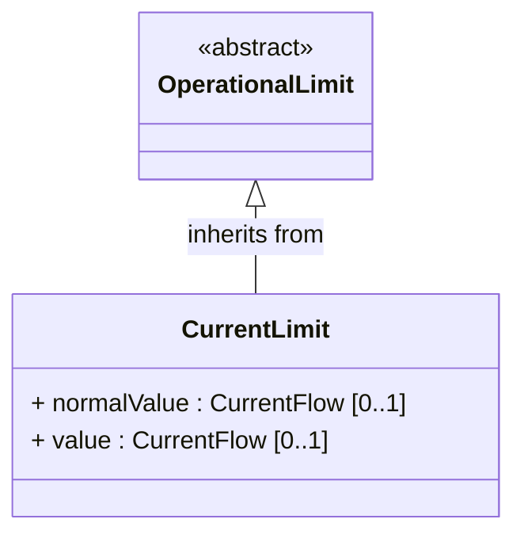
```mermaid
classDiagram
direction TB

class CurrentLimit {
+ normalValue : CurrentFlow [0..1]
+ value : CurrentFlow [0..1]
}

class OperationalLimit {
<<abstract>>
}

OperationalLimit <|-- CurrentLimit : inherits from
```

Operational limit on current.


#### Native Members

| name | type | description | mapping |
|------|------|-------------|---------|
| normalValue [0..1] | [CurrentFlow](#cimhub_2023-CurrentFlow) | The normal value for limit on current flow. | |
| value [0..1] | [CurrentFlow](#cimhub_2023-CurrentFlow) | Limit on current flow. | |

#### Inherited Members

| name | type | description | mapping |
|------|------|-------------|---------|
| `OperationalLimitSet [0..1]` (OfAggregate) | [OperationalLimitSet](#cimhub_2023-OperationalLimitSet) | see [OperationalLimit](cimhub_2023-OperationalLimit) | |
| OperationalLimitType [0..1] | [OperationalLimitType](#cimhub_2023-OperationalLimitType) | see [OperationalLimit](cimhub_2023-OperationalLimit) | |
| mRID [0..1] | [String](#cimhub_2023-String) | see [IdentifiedObject](#cimhub_2023-IdentifiedObject) | |
| aliasName [0..1] | [String](#cimhub_2023-String) | see [IdentifiedObject](#cimhub_2023-IdentifiedObject) | |
| description [0..1] | [String](#cimhub_2023-String) | see [IdentifiedObject](#cimhub_2023-IdentifiedObject) | |
| name [0..1] | [String](#cimhub_2023-String) | see [IdentifiedObject](#cimhub_2023-IdentifiedObject) | |

{#cimhub_2023-Discrete}
### Discrete

Inheritance path = [Measurement](#cimhub_2023-Measurement) => [IdentifiedObject](#cimhub_2023-IdentifiedObject)

```mermaid
classDiagram
direction TB

class Discrete {
+ maxValue : Integer [0..1]
+ minValue : Integer [0..1]
+ normalValue : Integer [0..1]
}

class Measurement {
<<abstract>>
}

Measurement <|-- Discrete : inherits from
class ValueAliasSet {
<<abstract>>
}

Discrete --> "0..1" ValueAliasSet : ValueAliasSet
```

Discrete represents a discrete Measurement, i.e. a Measurement representing discrete values, e.g. a Breaker position.


#### Native Members

| name | type | description | mapping |
|------|------|-------------|---------|
| maxValue [0..1] | [Integer](#cimhub_2023-Integer) | Normal value range maximum for any of the MeasurementValue.values. Used for scaling, e.g. in bar graphs or of telemetered raw values. | |
| minValue [0..1] | [Integer](#cimhub_2023-Integer) | Normal value range minimum for any of the MeasurementValue.values. Used for scaling, e.g. in bar graphs or of telemetered raw values. | |
| normalValue [0..1] | [Integer](#cimhub_2023-Integer) | Normal measurement value, e.g., used for percentage calculations. | |
| ValueAliasSet [0..1] | [ValueAliasSet](#cimhub_2023-ValueAliasSet) | The ValueAliasSet used for translation of a MeasurementValue.value to a name. | |

#### Inherited Members

| name | type | description | mapping |
|------|------|-------------|---------|
| measurementType [0..1] | [String](#cimhub_2023-String) | see [Measurement](#cimhub_2023-Measurement) | |
| phases [0..1] | [PhaseCode](#cimhub_2023-PhaseCode) | see [Measurement](cimhub_2023-Measurement) | |
| Asset [0..1] | [Asset](#cimhub_2023-Asset) | see [Measurement](cimhub_2023-Measurement) | |
| `PowerSystemResource [0..1]` (OfAggregate) | [PowerSystemResource](#cimhub_2023-PowerSystemResource) | see [Measurement](cimhub_2023-Measurement) | |
| Terminal [0..1] | [ACDCTerminal](#cimhub_2023-ACDCTerminal) | see [Measurement](cimhub_2023-Measurement) | |
| mRID [0..1] | [String](#cimhub_2023-String) | see [IdentifiedObject](#cimhub_2023-IdentifiedObject) | |
| aliasName [0..1] | [String](#cimhub_2023-String) | see [IdentifiedObject](#cimhub_2023-IdentifiedObject) | |
| description [0..1] | [String](#cimhub_2023-String) | see [IdentifiedObject](#cimhub_2023-IdentifiedObject) | |
| name [0..1] | [String](#cimhub_2023-String) | see [IdentifiedObject](#cimhub_2023-IdentifiedObject) | |

{#cimhub_2023-DistributionArea}
### DistributionArea

Inheritance path = [SubSchedulingArea](#cimhub_2023-SubSchedulingArea) => [SchedulingArea](#cimhub_2023-SchedulingArea) => [PowerSystemResource](#cimhub_2023-PowerSystemResource) => [IdentifiedObject](#cimhub_2023-IdentifiedObject)

```mermaid
classDiagram
direction TB

class DistributionArea {
}

class SubSchedulingArea {
<<abstract>>
}

SubSchedulingArea <|-- DistributionArea : inherits from
```

A persistent connectivity-based containment of medium-voltage and high-voltage distribution ConductingEquipment with clearly defined electrical boundaries based on electrical connectivity of a distribution substation or multiple substations.


#### Inherited Members

| name | type | description | mapping |
|------|------|-------------|---------|
| AssetDatasheet [0..1] | [AssetInfo](#cimhub_2023-AssetInfo) | see [PowerSystemResource](cimhub_2023-PowerSystemResource) | |
| Location [0..1] | [Location](#cimhub_2023-Location) | see [PowerSystemResource](cimhub_2023-PowerSystemResource) | |
| PSRType [0..1] | [PSRType](#cimhub_2023-PSRType) | see [PowerSystemResource](cimhub_2023-PowerSystemResource) | |
| mRID [0..1] | [String](#cimhub_2023-String) | see [IdentifiedObject](#cimhub_2023-IdentifiedObject) | |
| aliasName [0..1] | [String](#cimhub_2023-String) | see [IdentifiedObject](#cimhub_2023-IdentifiedObject) | |
| description [0..1] | [String](#cimhub_2023-String) | see [IdentifiedObject](#cimhub_2023-IdentifiedObject) | |
| name [0..1] | [String](#cimhub_2023-String) | see [IdentifiedObject](#cimhub_2023-IdentifiedObject) | |

{#cimhub_2023-EV}
### EV


```mermaid
classDiagram
direction TB

class EV {
}

```


{#cimhub_2023-EVCharger}
### EVCharger


```mermaid
classDiagram
direction TB

class EVCharger {
}

```


{#cimhub_2023-EnergyConsumer}
### EnergyConsumer

Inheritance path = [EnergyConnection](#cimhub_2023-EnergyConnection) => [ConductingEquipment](#cimhub_2023-ConductingEquipment) => [Equipment](#cimhub_2023-Equipment) => [PowerSystemResource](#cimhub_2023-PowerSystemResource) => [IdentifiedObject](#cimhub_2023-IdentifiedObject)

```mermaid
classDiagram
direction TB

class EnergyConsumer {
+ customerCount : Integer [0..1]
+ grounded : Boolean [0..1]
+ p : ActivePower [0..1]
+ phaseConnection : enum:PhaseShuntConnectionKind [0..1]
+ q : ReactivePower [0..1]
}

class EnergyConnection {
<<abstract>>
}

EnergyConnection <|-- EnergyConsumer : inherits from
class House {
}

EnergyConsumer --> "0..1" House : House
class LoadResponseCharacteristic {
<<abstract>>
}

EnergyConsumer --> "0..1" LoadResponseCharacteristic : LoadResponse
class PowerCutZone {
}

EnergyConsumer --> "0..1" PowerCutZone : PowerCutZone
```

Generic user of energy - a point of consumption on the power system model.


#### Native Members

| name | type | description | mapping |
|------|------|-------------|---------|
| customerCount [0..1] | [Integer](#cimhub_2023-Integer) | Number of individual customers represented by this demand. | |
| grounded [0..1] | [Boolean](#cimhub_2023-Boolean) | Used for Yn and Zn connections. True if the neutral is solidly grounded. | |
| p [0..1] | [ActivePower](#cimhub_2023-ActivePower) | Active power of the load. Load sign convention is used, i.e. positive sign means flow out from a node.For voltage dependent loads the value is at rated voltage.Starting value for a steady state solution. | |
| phaseConnection [0..1] | [PhaseShuntConnectionKind](#cimhub_2023-PhaseShuntConnectionKind) | The type of phase connection, such as wye or delta. | |
| q [0..1] | [ReactivePower](#cimhub_2023-ReactivePower) | Reactive power of the load. Load sign convention is used, i.e. positive sign means flow out from a node.For voltage dependent loads the value is at rated voltage.Starting value for a steady state solution. | |
| House [0..1] | [House](#cimhub_2023-House) | | |
| LoadResponse [0..1] | [LoadResponseCharacteristic](#cimhub_2023-LoadResponseCharacteristic) | The load response characteristic of this load. If missing, this load is assumed to be constant power. | |
| `PowerCutZone [0..1]` (OfAggregate) | [PowerCutZone](#cimhub_2023-PowerCutZone) | The energy consumer is assigned to this power cut zone. | |

#### Inherited Members

| name | type | description | mapping |
|------|------|-------------|---------|
| EnergyConnectionProfile [0..1] | [EnergyConnectionProfile](#cimhub_2023-EnergyConnectionProfile) | see [EnergyConnection](cimhub_2023-EnergyConnection) | |
| BaseVoltage [0..1] | [BaseVoltage](#cimhub_2023-BaseVoltage) | see [ConductingEquipment](cimhub_2023-ConductingEquipment) | |
| aggregate [0..1] | [Boolean](#cimhub_2023-Boolean) | see [Equipment](#cimhub_2023-Equipment) | |
| inService [0..1] | [Boolean](#cimhub_2023-Boolean) | see [Equipment](#cimhub_2023-Equipment) | |
| networkAnalysisEnabled [0..1] | [Boolean](#cimhub_2023-Boolean) | see [Equipment](#cimhub_2023-Equipment) | |
| normallyInService [0..1] | [Boolean](#cimhub_2023-Boolean) | see [Equipment](#cimhub_2023-Equipment) | |
| `EquipmentContainer [0..1]` (OfAggregate) | [EquipmentContainer](#cimhub_2023-EquipmentContainer) | see [Equipment](cimhub_2023-Equipment) | |
| `SubSchedulingArea [0..1]` (OfAggregate) | [SubSchedulingArea](#cimhub_2023-SubSchedulingArea) | see [Equipment](cimhub_2023-Equipment) | |
| UsagePoints [0..1] | [UsagePoint](#cimhub_2023-UsagePoint) | see [Equipment](cimhub_2023-Equipment) | |
| AssetDatasheet [0..1] | [AssetInfo](#cimhub_2023-AssetInfo) | see [PowerSystemResource](cimhub_2023-PowerSystemResource) | |
| Location [0..1] | [Location](#cimhub_2023-Location) | see [PowerSystemResource](cimhub_2023-PowerSystemResource) | |
| PSRType [0..1] | [PSRType](#cimhub_2023-PSRType) | see [PowerSystemResource](cimhub_2023-PowerSystemResource) | |
| mRID [0..1] | [String](#cimhub_2023-String) | see [IdentifiedObject](#cimhub_2023-IdentifiedObject) | |
| aliasName [0..1] | [String](#cimhub_2023-String) | see [IdentifiedObject](#cimhub_2023-IdentifiedObject) | |
| description [0..1] | [String](#cimhub_2023-String) | see [IdentifiedObject](#cimhub_2023-IdentifiedObject) | |
| name [0..1] | [String](#cimhub_2023-String) | see [IdentifiedObject](#cimhub_2023-IdentifiedObject) | |

{#cimhub_2023-EnergyConsumerPhase}
### EnergyConsumerPhase

Inheritance path = [PowerSystemResource](#cimhub_2023-PowerSystemResource) => [IdentifiedObject](#cimhub_2023-IdentifiedObject)

```mermaid
classDiagram
direction TB

class EnergyConsumerPhase {
+ p : ActivePower [0..1]
+ phase : enum:SinglePhaseKind [0..1]
+ q : ReactivePower [0..1]
}

class PowerSystemResource {
<<abstract>>
}

PowerSystemResource <|-- EnergyConsumerPhase : inherits from
class EnergyConsumer {
}

EnergyConsumerPhase --> "0..1" EnergyConsumer : EnergyConsumer
```

A single phase of an energy consumer.


#### Native Members

| name | type | description | mapping |
|------|------|-------------|---------|
| p [0..1] | [ActivePower](#cimhub_2023-ActivePower) | Active power of the load. Load sign convention is used, i.e. positive sign means flow out from a node.For voltage dependent loads the value is at rated voltage.Starting value for a steady state solution. | |
| phase [0..1] | [SinglePhaseKind](#cimhub_2023-SinglePhaseKind) | Phase of this energy consumer component. If the energy consumer is wye connected, the connection is from the indicated phase to the central ground or neutral point. If the energy consumer is delta connected, the phase indicates an energy consumer connected from the indicated phase to the next logical non-neutral phase. | |
| q [0..1] | [ReactivePower](#cimhub_2023-ReactivePower) | Reactive power of the load. Load sign convention is used, i.e. positive sign means flow out from a node.For voltage dependent loads the value is at rated voltage.Starting value for a steady state solution. | |
| EnergyConsumer [0..1] | [EnergyConsumer](#cimhub_2023-EnergyConsumer) | The energy consumer to which this phase belongs. | |

#### Inherited Members

| name | type | description | mapping |
|------|------|-------------|---------|
| AssetDatasheet [0..1] | [AssetInfo](#cimhub_2023-AssetInfo) | see [PowerSystemResource](cimhub_2023-PowerSystemResource) | |
| Location [0..1] | [Location](#cimhub_2023-Location) | see [PowerSystemResource](cimhub_2023-PowerSystemResource) | |
| PSRType [0..1] | [PSRType](#cimhub_2023-PSRType) | see [PowerSystemResource](cimhub_2023-PowerSystemResource) | |
| mRID [0..1] | [String](#cimhub_2023-String) | see [IdentifiedObject](#cimhub_2023-IdentifiedObject) | |
| aliasName [0..1] | [String](#cimhub_2023-String) | see [IdentifiedObject](#cimhub_2023-IdentifiedObject) | |
| description [0..1] | [String](#cimhub_2023-String) | see [IdentifiedObject](#cimhub_2023-IdentifiedObject) | |
| name [0..1] | [String](#cimhub_2023-String) | see [IdentifiedObject](#cimhub_2023-IdentifiedObject) | |

{#cimhub_2023-EnergySource}
### EnergySource

Inheritance path = [EnergyConnection](#cimhub_2023-EnergyConnection) => [ConductingEquipment](#cimhub_2023-ConductingEquipment) => [Equipment](#cimhub_2023-Equipment) => [PowerSystemResource](#cimhub_2023-PowerSystemResource) => [IdentifiedObject](#cimhub_2023-IdentifiedObject)

```mermaid
classDiagram
direction TB

class EnergySource {
+ nominalVoltage : Voltage [0..1]
+ r : Resistance [0..1]
+ r0 : Resistance [0..1]
+ voltageAngle : AngleRadians [0..1]
+ voltageMagnitude : Voltage [0..1]
+ x : Reactance [0..1]
+ x0 : Reactance [0..1]
}

class EnergyConnection {
<<abstract>>
}

EnergyConnection <|-- EnergySource : inherits from
```

A generic equivalent for an energy supplier on a transmission or distribution voltage level.


#### Native Members

| name | type | description | mapping |
|------|------|-------------|---------|
| nominalVoltage [0..1] | [Voltage](#cimhub_2023-Voltage) | Phase-to-phase nominal voltage. | |
| r [0..1] | [Resistance](#cimhub_2023-Resistance) | Positive sequence Thevenin resistance. | |
| r0 [0..1] | [Resistance](#cimhub_2023-Resistance) | Zero sequence Thevenin resistance. | |
| voltageAngle [0..1] | [AngleRadians](#cimhub_2023-AngleRadians) | Phase angle of a-phase open circuit. | |
| voltageMagnitude [0..1] | [Voltage](#cimhub_2023-Voltage) | Phase-to-phase open circuit voltage magnitude. | |
| x [0..1] | [Reactance](#cimhub_2023-Reactance) | Positive sequence Thevenin reactance. | |
| x0 [0..1] | [Reactance](#cimhub_2023-Reactance) | Zero sequence Thevenin reactance. | |

#### Inherited Members

| name | type | description | mapping |
|------|------|-------------|---------|
| EnergyConnectionProfile [0..1] | [EnergyConnectionProfile](#cimhub_2023-EnergyConnectionProfile) | see [EnergyConnection](cimhub_2023-EnergyConnection) | |
| BaseVoltage [0..1] | [BaseVoltage](#cimhub_2023-BaseVoltage) | see [ConductingEquipment](cimhub_2023-ConductingEquipment) | |
| aggregate [0..1] | [Boolean](#cimhub_2023-Boolean) | see [Equipment](#cimhub_2023-Equipment) | |
| inService [0..1] | [Boolean](#cimhub_2023-Boolean) | see [Equipment](#cimhub_2023-Equipment) | |
| networkAnalysisEnabled [0..1] | [Boolean](#cimhub_2023-Boolean) | see [Equipment](#cimhub_2023-Equipment) | |
| normallyInService [0..1] | [Boolean](#cimhub_2023-Boolean) | see [Equipment](#cimhub_2023-Equipment) | |
| `EquipmentContainer [0..1]` (OfAggregate) | [EquipmentContainer](#cimhub_2023-EquipmentContainer) | see [Equipment](cimhub_2023-Equipment) | |
| `SubSchedulingArea [0..1]` (OfAggregate) | [SubSchedulingArea](#cimhub_2023-SubSchedulingArea) | see [Equipment](cimhub_2023-Equipment) | |
| UsagePoints [0..1] | [UsagePoint](#cimhub_2023-UsagePoint) | see [Equipment](cimhub_2023-Equipment) | |
| AssetDatasheet [0..1] | [AssetInfo](#cimhub_2023-AssetInfo) | see [PowerSystemResource](cimhub_2023-PowerSystemResource) | |
| Location [0..1] | [Location](#cimhub_2023-Location) | see [PowerSystemResource](cimhub_2023-PowerSystemResource) | |
| PSRType [0..1] | [PSRType](#cimhub_2023-PSRType) | see [PowerSystemResource](cimhub_2023-PowerSystemResource) | |
| mRID [0..1] | [String](#cimhub_2023-String) | see [IdentifiedObject](#cimhub_2023-IdentifiedObject) | |
| aliasName [0..1] | [String](#cimhub_2023-String) | see [IdentifiedObject](#cimhub_2023-IdentifiedObject) | |
| description [0..1] | [String](#cimhub_2023-String) | see [IdentifiedObject](#cimhub_2023-IdentifiedObject) | |
| name [0..1] | [String](#cimhub_2023-String) | see [IdentifiedObject](#cimhub_2023-IdentifiedObject) | |

{#cimhub_2023-EnergySourcePhase}
### EnergySourcePhase

Inheritance path = [PowerSystemResource](#cimhub_2023-PowerSystemResource) => [IdentifiedObject](#cimhub_2023-IdentifiedObject)

```mermaid
classDiagram
direction TB

class EnergySourcePhase {
+ phase : enum:SinglePhaseKind [0..1]
}

class PowerSystemResource {
<<abstract>>
}

PowerSystemResource <|-- EnergySourcePhase : inherits from
class EnergySource {
}

EnergySourcePhase --> "0..1" EnergySource : EnergySource
```

Represents the single phase information of an unbalanced energy source.


#### Native Members

| name | type | description | mapping |
|------|------|-------------|---------|
| phase [0..1] | [SinglePhaseKind](#cimhub_2023-SinglePhaseKind) | Phase of this energy source component. If the energy source wye connected, the connection is from the indicated phase to the central ground or neutral point. If the energy source is delta connected, the phase indicates an energy source connected from the indicated phase to the next logical non-neutral phase. | |
| EnergySource [0..1] | [EnergySource](#cimhub_2023-EnergySource) | The energy sourceto which the phase belongs. | |

#### Inherited Members

| name | type | description | mapping |
|------|------|-------------|---------|
| AssetDatasheet [0..1] | [AssetInfo](#cimhub_2023-AssetInfo) | see [PowerSystemResource](cimhub_2023-PowerSystemResource) | |
| Location [0..1] | [Location](#cimhub_2023-Location) | see [PowerSystemResource](cimhub_2023-PowerSystemResource) | |
| PSRType [0..1] | [PSRType](#cimhub_2023-PSRType) | see [PowerSystemResource](cimhub_2023-PowerSystemResource) | |
| mRID [0..1] | [String](#cimhub_2023-String) | see [IdentifiedObject](#cimhub_2023-IdentifiedObject) | |
| aliasName [0..1] | [String](#cimhub_2023-String) | see [IdentifiedObject](#cimhub_2023-IdentifiedObject) | |
| description [0..1] | [String](#cimhub_2023-String) | see [IdentifiedObject](#cimhub_2023-IdentifiedObject) | |
| name [0..1] | [String](#cimhub_2023-String) | see [IdentifiedObject](#cimhub_2023-IdentifiedObject) | |

{#cimhub_2023-Feeder}
### Feeder

Inheritance path = [EquipmentContainer](#cimhub_2023-EquipmentContainer) => [ConnectivityNodeContainer](#cimhub_2023-ConnectivityNodeContainer) => [PowerSystemResource](#cimhub_2023-PowerSystemResource) => [IdentifiedObject](#cimhub_2023-IdentifiedObject)

```mermaid
classDiagram
direction TB

class Feeder {
}

class EquipmentContainer {
<<abstract>>
}

EquipmentContainer <|-- Feeder : inherits from
class DistributionArea {
}

Feeder --> "0..1" DistributionArea : DistributionArea
class FeederArea {
}

Feeder --> "0..1" FeederArea : FeederArea
class Substation {
}

Feeder --> "0..1" Substation : NormalEnergizingSubstation
```

A collection of equipment for organizational purposes, used for grouping distribution resources.

The organization a feeder does not necessarily reflect connectivity or current operation state.


#### Native Members

| name | type | description | mapping |
|------|------|-------------|---------|
| DistributionArea [0..1] | [DistributionArea](#cimhub_2023-DistributionArea) | The DistributionArea to which the feeder belongs | |
| FeederArea [0..1] | [FeederArea](#cimhub_2023-FeederArea) | The FeederArea (which contains Equipment not contained in | |
| `NormalEnergizingSubstation [0..1]` (OfAggregate) | [Substation](#cimhub_2023-Substation) | The substation that nominally energizes the feeder. Also used for naming purposes. | |

#### Inherited Members

| name | type | description | mapping |
|------|------|-------------|---------|
| AssetDatasheet [0..1] | [AssetInfo](#cimhub_2023-AssetInfo) | see [PowerSystemResource](cimhub_2023-PowerSystemResource) | |
| Location [0..1] | [Location](#cimhub_2023-Location) | see [PowerSystemResource](cimhub_2023-PowerSystemResource) | |
| PSRType [0..1] | [PSRType](#cimhub_2023-PSRType) | see [PowerSystemResource](cimhub_2023-PowerSystemResource) | |
| mRID [0..1] | [String](#cimhub_2023-String) | see [IdentifiedObject](#cimhub_2023-IdentifiedObject) | |
| aliasName [0..1] | [String](#cimhub_2023-String) | see [IdentifiedObject](#cimhub_2023-IdentifiedObject) | |
| description [0..1] | [String](#cimhub_2023-String) | see [IdentifiedObject](#cimhub_2023-IdentifiedObject) | |
| name [0..1] | [String](#cimhub_2023-String) | see [IdentifiedObject](#cimhub_2023-IdentifiedObject) | |

{#cimhub_2023-FeederArea}
### FeederArea

Inheritance path = [SubSchedulingArea](#cimhub_2023-SubSchedulingArea) => [SchedulingArea](#cimhub_2023-SchedulingArea) => [PowerSystemResource](#cimhub_2023-PowerSystemResource) => [IdentifiedObject](#cimhub_2023-IdentifiedObject)

```mermaid
classDiagram
direction TB

class FeederArea {
}

class SubSchedulingArea {
<<abstract>>
}

SubSchedulingArea <|-- FeederArea : inherits from
class DistributionArea {
}

FeederArea --> "0..1" DistributionArea : DistributionArea
class Feeder {
}

FeederArea --> "0..1" Feeder : Feeder
```

A persistent connectivity-based containment of medium-voltage distribution ConductingEquipment with clearly defined electrical boundaries based on electrical connectivity of a distribution feeder.

The FeederArea contains all medium voltage equipment not contained in a SwitchArea or Substation / Bay. It also includes all Sectionalisers, Reclosers, and all other poletop and pad-mounted switchgear that form the boundary of a SwitchArea.


#### Native Members

| name | type | description | mapping |
|------|------|-------------|---------|
| `DistributionArea [0..1]` (OfAggregate) | [DistributionArea](#cimhub_2023-DistributionArea) | | |
| Feeder [0..1] | [Feeder](#cimhub_2023-Feeder) | The Feeder (which contains the ConnectivityNode and all Equipment) associated with the FeeederArea | |

#### Inherited Members

| name | type | description | mapping |
|------|------|-------------|---------|
| AssetDatasheet [0..1] | [AssetInfo](#cimhub_2023-AssetInfo) | see [PowerSystemResource](cimhub_2023-PowerSystemResource) | |
| Location [0..1] | [Location](#cimhub_2023-Location) | see [PowerSystemResource](cimhub_2023-PowerSystemResource) | |
| PSRType [0..1] | [PSRType](#cimhub_2023-PSRType) | see [PowerSystemResource](cimhub_2023-PowerSystemResource) | |
| mRID [0..1] | [String](#cimhub_2023-String) | see [IdentifiedObject](#cimhub_2023-IdentifiedObject) | |
| aliasName [0..1] | [String](#cimhub_2023-String) | see [IdentifiedObject](#cimhub_2023-IdentifiedObject) | |
| description [0..1] | [String](#cimhub_2023-String) | see [IdentifiedObject](#cimhub_2023-IdentifiedObject) | |
| name [0..1] | [String](#cimhub_2023-String) | see [IdentifiedObject](#cimhub_2023-IdentifiedObject) | |

{#cimhub_2023-Fuse}
### Fuse

Inheritance path = [Switch](#cimhub_2023-Switch) => [ConductingEquipment](#cimhub_2023-ConductingEquipment) => [Equipment](#cimhub_2023-Equipment) => [PowerSystemResource](#cimhub_2023-PowerSystemResource) => [IdentifiedObject](#cimhub_2023-IdentifiedObject)

```mermaid
classDiagram
direction TB

class Fuse {
}

class Switch {
<<abstract>>
}

Switch <|-- Fuse : inherits from
```

An overcurrent protective device with a circuit opening fusible part that is heated and severed by the passage of overcurrent through it. A fuse is considered a switching device because it breaks current.


#### Inherited Members

| name | type | description | mapping |
|------|------|-------------|---------|
| normalOpen [0..1] | [Boolean](#cimhub_2023-Boolean) | see [Switch](#cimhub_2023-Switch) | |
| open [0..1] | [Boolean](#cimhub_2023-Boolean) | see [Switch](#cimhub_2023-Switch) | |
| ratedCurrent [0..1] | [CurrentFlow](#cimhub_2023-CurrentFlow) | see [Switch](cimhub_2023-Switch) | |
| retained [0..1] | [Boolean](#cimhub_2023-Boolean) | see [Switch](#cimhub_2023-Switch) | |
| `CompositeSwitch [0..1]` (OfAggregate) | [CompositeSwitch](#cimhub_2023-CompositeSwitch) | see [Switch](cimhub_2023-Switch) | |
| BaseVoltage [0..1] | [BaseVoltage](#cimhub_2023-BaseVoltage) | see [ConductingEquipment](cimhub_2023-ConductingEquipment) | |
| aggregate [0..1] | [Boolean](#cimhub_2023-Boolean) | see [Equipment](#cimhub_2023-Equipment) | |
| inService [0..1] | [Boolean](#cimhub_2023-Boolean) | see [Equipment](#cimhub_2023-Equipment) | |
| networkAnalysisEnabled [0..1] | [Boolean](#cimhub_2023-Boolean) | see [Equipment](#cimhub_2023-Equipment) | |
| normallyInService [0..1] | [Boolean](#cimhub_2023-Boolean) | see [Equipment](#cimhub_2023-Equipment) | |
| `EquipmentContainer [0..1]` (OfAggregate) | [EquipmentContainer](#cimhub_2023-EquipmentContainer) | see [Equipment](cimhub_2023-Equipment) | |
| `SubSchedulingArea [0..1]` (OfAggregate) | [SubSchedulingArea](#cimhub_2023-SubSchedulingArea) | see [Equipment](cimhub_2023-Equipment) | |
| UsagePoints [0..1] | [UsagePoint](#cimhub_2023-UsagePoint) | see [Equipment](cimhub_2023-Equipment) | |
| AssetDatasheet [0..1] | [AssetInfo](#cimhub_2023-AssetInfo) | see [PowerSystemResource](cimhub_2023-PowerSystemResource) | |
| Location [0..1] | [Location](#cimhub_2023-Location) | see [PowerSystemResource](cimhub_2023-PowerSystemResource) | |
| PSRType [0..1] | [PSRType](#cimhub_2023-PSRType) | see [PowerSystemResource](cimhub_2023-PowerSystemResource) | |
| mRID [0..1] | [String](#cimhub_2023-String) | see [IdentifiedObject](#cimhub_2023-IdentifiedObject) | |
| aliasName [0..1] | [String](#cimhub_2023-String) | see [IdentifiedObject](#cimhub_2023-IdentifiedObject) | |
| description [0..1] | [String](#cimhub_2023-String) | see [IdentifiedObject](#cimhub_2023-IdentifiedObject) | |
| name [0..1] | [String](#cimhub_2023-String) | see [IdentifiedObject](#cimhub_2023-IdentifiedObject) | |

{#cimhub_2023-GeographicalRegion}
### GeographicalRegion

Inheritance path = [IdentifiedObject](#cimhub_2023-IdentifiedObject)

```mermaid
classDiagram
direction TB

class GeographicalRegion {
}

class IdentifiedObject {
<<abstract>>
}

IdentifiedObject <|-- GeographicalRegion : inherits from
```

A geographical region of a power system network model.


#### Inherited Members

| name | type | description | mapping |
|------|------|-------------|---------|
| mRID [0..1] | [String](#cimhub_2023-String) | see [IdentifiedObject](#cimhub_2023-IdentifiedObject) | |
| aliasName [0..1] | [String](#cimhub_2023-String) | see [IdentifiedObject](#cimhub_2023-IdentifiedObject) | |
| description [0..1] | [String](#cimhub_2023-String) | see [IdentifiedObject](#cimhub_2023-IdentifiedObject) | |
| name [0..1] | [String](#cimhub_2023-String) | see [IdentifiedObject](#cimhub_2023-IdentifiedObject) | |

{#cimhub_2023-House}
### House

Inheritance path = [IdentifiedObject](#cimhub_2023-IdentifiedObject)

```mermaid
classDiagram
direction TB

class House {
+ coolingSetpoint : Temperature [0..1]
+ coolingSystem : enum:HouseCooling [0..1]
+ floorArea : Area [0..1]
+ heatingSetpoint : Temperature [0..1]
+ heatingSystem : enum:HouseHeating [0..1]
+ thermalIntegrity : enum:HouseThermalIntegrity [0..1]
}

class IdentifiedObject {
<<abstract>>
}

IdentifiedObject <|-- House : inherits from
class EnergyConsumer {
}

House --> "0..1" EnergyConsumer : EnergyConsumer
class ThermostatController {
<<abstract>>
}

House --> "0..1" ThermostatController : ThermostatController
```

In GridLAB-D, a single-family residence with building envelope represented by the equivalent thermal parameter (ETP) model, heating, ventilating and air conditioning (HVAC), other appliances, lights and plug loads. In power flow, these house loads aggregate into ZIP loads. These house parameters are the minimal set required to consistently initialize or repeat a GridLAB-D simulation.


#### Native Members

| name | type | description | mapping |
|------|------|-------------|---------|
| coolingSetpoint [0..1] | [Temperature](#cimhub_2023-Temperature) | | |
| coolingSystem [0..1] | [HouseCooling](#cimhub_2023-HouseCooling) | | |
| floorArea [0..1] | [Area](#cimhub_2023-Area) | | |
| heatingSetpoint [0..1] | [Temperature](#cimhub_2023-Temperature) | | |
| heatingSystem [0..1] | [HouseHeating](#cimhub_2023-HouseHeating) | | |
| thermalIntegrity [0..1] | [HouseThermalIntegrity](#cimhub_2023-HouseThermalIntegrity) | | |
| EnergyConsumer [0..1] | [EnergyConsumer](#cimhub_2023-EnergyConsumer) | | |
| ThermostatController [0..1] | [ThermostatController](#cimhub_2023-ThermostatController) | | |

#### Inherited Members

| name | type | description | mapping |
|------|------|-------------|---------|
| mRID [0..1] | [String](#cimhub_2023-String) | see [IdentifiedObject](#cimhub_2023-IdentifiedObject) | |
| aliasName [0..1] | [String](#cimhub_2023-String) | see [IdentifiedObject](#cimhub_2023-IdentifiedObject) | |
| description [0..1] | [String](#cimhub_2023-String) | see [IdentifiedObject](#cimhub_2023-IdentifiedObject) | |
| name [0..1] | [String](#cimhub_2023-String) | see [IdentifiedObject](#cimhub_2023-IdentifiedObject) | |

{#cimhub_2023-Line}
### Line

Inheritance path = [EquipmentContainer](#cimhub_2023-EquipmentContainer) => [ConnectivityNodeContainer](#cimhub_2023-ConnectivityNodeContainer) => [PowerSystemResource](#cimhub_2023-PowerSystemResource) => [IdentifiedObject](#cimhub_2023-IdentifiedObject)

```mermaid
classDiagram
direction TB

class Line {
}

class EquipmentContainer {
<<abstract>>
}

EquipmentContainer <|-- Line : inherits from
class SubGeographicalRegion {
<<abstract>>
}

Line --> "0..1" SubGeographicalRegion : Region
```

Contains equipment beyond a substation belonging to a power transmission line.


#### Native Members

| name | type | description | mapping |
|------|------|-------------|---------|
| `Region [0..1]` (OfAggregate) | [SubGeographicalRegion](#cimhub_2023-SubGeographicalRegion) | The sub-geographical region of the line. | |

#### Inherited Members

| name | type | description | mapping |
|------|------|-------------|---------|
| AssetDatasheet [0..1] | [AssetInfo](#cimhub_2023-AssetInfo) | see [PowerSystemResource](cimhub_2023-PowerSystemResource) | |
| Location [0..1] | [Location](#cimhub_2023-Location) | see [PowerSystemResource](cimhub_2023-PowerSystemResource) | |
| PSRType [0..1] | [PSRType](#cimhub_2023-PSRType) | see [PowerSystemResource](cimhub_2023-PowerSystemResource) | |
| mRID [0..1] | [String](#cimhub_2023-String) | see [IdentifiedObject](#cimhub_2023-IdentifiedObject) | |
| aliasName [0..1] | [String](#cimhub_2023-String) | see [IdentifiedObject](#cimhub_2023-IdentifiedObject) | |
| description [0..1] | [String](#cimhub_2023-String) | see [IdentifiedObject](#cimhub_2023-IdentifiedObject) | |
| name [0..1] | [String](#cimhub_2023-String) | see [IdentifiedObject](#cimhub_2023-IdentifiedObject) | |

{#cimhub_2023-LinearShuntCompensator}
### LinearShuntCompensator

Inheritance path = [ShuntCompensator](#cimhub_2023-ShuntCompensator) => [RegulatingCondEq](#cimhub_2023-RegulatingCondEq) => [EnergyConnection](#cimhub_2023-EnergyConnection) => [ConductingEquipment](#cimhub_2023-ConductingEquipment) => [Equipment](#cimhub_2023-Equipment) => [PowerSystemResource](#cimhub_2023-PowerSystemResource) => [IdentifiedObject](#cimhub_2023-IdentifiedObject)

```mermaid
classDiagram
direction TB

class LinearShuntCompensator {
+ b0PerSection : Susceptance [0..1]
+ bPerSection : Susceptance [0..1]
+ g0PerSection : Conductance [0..1]
+ gPerSection : Conductance [0..1]
}

class ShuntCompensator {
<<abstract>>
}

ShuntCompensator <|-- LinearShuntCompensator : inherits from
```

A linear shunt compensator has banks or sections with equal admittance values.


#### Native Members

| name | type | description | mapping |
|------|------|-------------|---------|
| b0PerSection [0..1] | [Susceptance](#cimhub_2023-Susceptance) | Zero sequence shunt (charging) susceptance per section | |
| bPerSection [0..1] | [Susceptance](#cimhub_2023-Susceptance) | Positive sequence shunt (charging) susceptance per section | |
| g0PerSection [0..1] | [Conductance](#cimhub_2023-Conductance) | Zero sequence shunt (charging) conductance per section | |
| gPerSection [0..1] | [Conductance](#cimhub_2023-Conductance) | Positive sequence shunt (charging) conductance per section | |

#### Inherited Members

| name | type | description | mapping |
|------|------|-------------|---------|
| aVRDelay [0..1] | [Seconds](#cimhub_2023-Seconds) | see [ShuntCompensator](cimhub_2023-ShuntCompensator) | |
| grounded [0..1] | [Boolean](#cimhub_2023-Boolean) | see [ShuntCompensator](#cimhub_2023-ShuntCompensator) | |
| maximumSections [0..1] | [Integer](#cimhub_2023-Integer) | see [ShuntCompensator](#cimhub_2023-ShuntCompensator) | |
| nomU [0..1] | [Voltage](#cimhub_2023-Voltage) | see [ShuntCompensator](cimhub_2023-ShuntCompensator) | |
| normalSections [0..1] | [Integer](#cimhub_2023-Integer) | see [ShuntCompensator](#cimhub_2023-ShuntCompensator) | |
| phaseConnection [0..1] | [PhaseShuntConnectionKind](#cimhub_2023-PhaseShuntConnectionKind) | see [ShuntCompensator](cimhub_2023-ShuntCompensator) | |
| sections [0..1] | [Float](#cimhub_2023-Float) | see [ShuntCompensator](#cimhub_2023-ShuntCompensator) | |
| SvShuntCompensatorSections [0..1] | [SvShuntCompensatorSections](#cimhub_2023-SvShuntCompensatorSections) | see [ShuntCompensator](cimhub_2023-ShuntCompensator) | |
| controlEnabled [0..1] | [Boolean](#cimhub_2023-Boolean) | see [RegulatingCondEq](#cimhub_2023-RegulatingCondEq) | |
| RegulatingControl [0..1] | [RegulatingControl](#cimhub_2023-RegulatingControl) | see [RegulatingCondEq](cimhub_2023-RegulatingCondEq) | |
| EnergyConnectionProfile [0..1] | [EnergyConnectionProfile](#cimhub_2023-EnergyConnectionProfile) | see [EnergyConnection](cimhub_2023-EnergyConnection) | |
| BaseVoltage [0..1] | [BaseVoltage](#cimhub_2023-BaseVoltage) | see [ConductingEquipment](cimhub_2023-ConductingEquipment) | |
| aggregate [0..1] | [Boolean](#cimhub_2023-Boolean) | see [Equipment](#cimhub_2023-Equipment) | |
| inService [0..1] | [Boolean](#cimhub_2023-Boolean) | see [Equipment](#cimhub_2023-Equipment) | |
| networkAnalysisEnabled [0..1] | [Boolean](#cimhub_2023-Boolean) | see [Equipment](#cimhub_2023-Equipment) | |
| normallyInService [0..1] | [Boolean](#cimhub_2023-Boolean) | see [Equipment](#cimhub_2023-Equipment) | |
| `EquipmentContainer [0..1]` (OfAggregate) | [EquipmentContainer](#cimhub_2023-EquipmentContainer) | see [Equipment](cimhub_2023-Equipment) | |
| `SubSchedulingArea [0..1]` (OfAggregate) | [SubSchedulingArea](#cimhub_2023-SubSchedulingArea) | see [Equipment](cimhub_2023-Equipment) | |
| UsagePoints [0..1] | [UsagePoint](#cimhub_2023-UsagePoint) | see [Equipment](cimhub_2023-Equipment) | |
| AssetDatasheet [0..1] | [AssetInfo](#cimhub_2023-AssetInfo) | see [PowerSystemResource](cimhub_2023-PowerSystemResource) | |
| Location [0..1] | [Location](#cimhub_2023-Location) | see [PowerSystemResource](cimhub_2023-PowerSystemResource) | |
| PSRType [0..1] | [PSRType](#cimhub_2023-PSRType) | see [PowerSystemResource](cimhub_2023-PowerSystemResource) | |
| mRID [0..1] | [String](#cimhub_2023-String) | see [IdentifiedObject](#cimhub_2023-IdentifiedObject) | |
| aliasName [0..1] | [String](#cimhub_2023-String) | see [IdentifiedObject](#cimhub_2023-IdentifiedObject) | |
| description [0..1] | [String](#cimhub_2023-String) | see [IdentifiedObject](#cimhub_2023-IdentifiedObject) | |
| name [0..1] | [String](#cimhub_2023-String) | see [IdentifiedObject](#cimhub_2023-IdentifiedObject) | |

{#cimhub_2023-LinearShuntCompensatorPhase}
### LinearShuntCompensatorPhase

Inheritance path = [ShuntCompensatorPhase](#cimhub_2023-ShuntCompensatorPhase) => [PowerSystemResource](#cimhub_2023-PowerSystemResource) => [IdentifiedObject](#cimhub_2023-IdentifiedObject)

```mermaid
classDiagram
direction TB

class LinearShuntCompensatorPhase {
+ bPerSection : Susceptance [0..1]
+ gPerSection : Conductance [0..1]
}

class ShuntCompensatorPhase {
<<abstract>>
}

ShuntCompensatorPhase <|-- LinearShuntCompensatorPhase : inherits from
```

A per phase linear shunt compensator has banks or sections with equal admittance values.


#### Native Members

| name | type | description | mapping |
|------|------|-------------|---------|
| bPerSection [0..1] | [Susceptance](#cimhub_2023-Susceptance) | Susceptance per section of the phase if shunt compensator is wye connected. Susceptance per section phase to phase if shunt compensator is delta connected. | |
| gPerSection [0..1] | [Conductance](#cimhub_2023-Conductance) | Conductance per section for this phase if shunt compensator is wye connected. Conductance per section phase to phase if shunt compensator is delta connected. | |

#### Inherited Members

| name | type | description | mapping |
|------|------|-------------|---------|
| maximumSections [0..1] | [Integer](#cimhub_2023-Integer) | see [ShuntCompensatorPhase](#cimhub_2023-ShuntCompensatorPhase) | |
| normalSections [0..1] | [Integer](#cimhub_2023-Integer) | see [ShuntCompensatorPhase](#cimhub_2023-ShuntCompensatorPhase) | |
| phase [0..1] | [SinglePhaseKind](#cimhub_2023-SinglePhaseKind) | see [ShuntCompensatorPhase](cimhub_2023-ShuntCompensatorPhase) | |
| sections [0..1] | [Float](#cimhub_2023-Float) | see [ShuntCompensatorPhase](#cimhub_2023-ShuntCompensatorPhase) | |
| ShuntCompensator [0..1] | [ShuntCompensator](#cimhub_2023-ShuntCompensator) | see [ShuntCompensatorPhase](cimhub_2023-ShuntCompensatorPhase) | |
| AssetDatasheet [0..1] | [AssetInfo](#cimhub_2023-AssetInfo) | see [PowerSystemResource](cimhub_2023-PowerSystemResource) | |
| Location [0..1] | [Location](#cimhub_2023-Location) | see [PowerSystemResource](cimhub_2023-PowerSystemResource) | |
| PSRType [0..1] | [PSRType](#cimhub_2023-PSRType) | see [PowerSystemResource](cimhub_2023-PowerSystemResource) | |
| mRID [0..1] | [String](#cimhub_2023-String) | see [IdentifiedObject](#cimhub_2023-IdentifiedObject) | |
| aliasName [0..1] | [String](#cimhub_2023-String) | see [IdentifiedObject](#cimhub_2023-IdentifiedObject) | |
| description [0..1] | [String](#cimhub_2023-String) | see [IdentifiedObject](#cimhub_2023-IdentifiedObject) | |
| name [0..1] | [String](#cimhub_2023-String) | see [IdentifiedObject](#cimhub_2023-IdentifiedObject) | |

{#cimhub_2023-NoLoadTest}
### NoLoadTest

Inheritance path = [TransformerTest](#cimhub_2023-TransformerTest) => [IdentifiedObject](#cimhub_2023-IdentifiedObject)

```mermaid
classDiagram
direction TB

class NoLoadTest {
+ energisedEndVoltage : Voltage [0..1]
+ excitingCurrent : PerCent [0..1]
+ excitingCurrentZero : PerCent [0..1]
+ loss : KiloActivePower [0..1]
+ lossZero : KiloActivePower [0..1]
}

class TransformerTest {
<<abstract>>
}

TransformerTest <|-- NoLoadTest : inherits from
class TransformerEndInfo {
<<abstract>>
}

NoLoadTest --> "0..1" TransformerEndInfo : EnergisedEnd
```

No-load test results determine core admittance parameters. They include exciting current and core loss measurements from applying voltage to one winding. The excitation may be positive sequence or zero sequence. The test may be repeated at different voltages to measure saturation.


#### Native Members

| name | type | description | mapping |
|------|------|-------------|---------|
| energisedEndVoltage [0..1] | [Voltage](#cimhub_2023-Voltage) | Voltage applied to the winding (end) during test. | |
| excitingCurrent [0..1] | [PerCent](#cimhub_2023-PerCent) | Exciting current measured from a positive-sequence or single-phase excitation test. | |
| excitingCurrentZero [0..1] | [PerCent](#cimhub_2023-PerCent) | Exciting current measured from a zero-sequence open-circuit excitation test. | |
| loss [0..1] | [KiloActivePower](#cimhub_2023-KiloActivePower) | Losses measured from a positive-sequence or single-phase excitation test. | |
| lossZero [0..1] | [KiloActivePower](#cimhub_2023-KiloActivePower) | Losses measured from a zero-sequence excitation test. | |
| EnergisedEnd [0..1] | [TransformerEndInfo](#cimhub_2023-TransformerEndInfo) | Transformer end that current is applied to in this no-load test. | |

#### Inherited Members

| name | type | description | mapping |
|------|------|-------------|---------|
| basePower [0..1] | [ApparentPower](#cimhub_2023-ApparentPower) | see [TransformerTest](cimhub_2023-TransformerTest) | |
| temperature [0..1] | [Temperature](#cimhub_2023-Temperature) | see [TransformerTest](cimhub_2023-TransformerTest) | |
| mRID [0..1] | [String](#cimhub_2023-String) | see [IdentifiedObject](#cimhub_2023-IdentifiedObject) | |
| aliasName [0..1] | [String](#cimhub_2023-String) | see [IdentifiedObject](#cimhub_2023-IdentifiedObject) | |
| description [0..1] | [String](#cimhub_2023-String) | see [IdentifiedObject](#cimhub_2023-IdentifiedObject) | |
| name [0..1] | [String](#cimhub_2023-String) | see [IdentifiedObject](#cimhub_2023-IdentifiedObject) | |

{#cimhub_2023-NonConformLoad}
### NonConformLoad

Inheritance path = [EnergyConsumer](#cimhub_2023-EnergyConsumer) => [EnergyConnection](#cimhub_2023-EnergyConnection) => [ConductingEquipment](#cimhub_2023-ConductingEquipment) => [Equipment](#cimhub_2023-Equipment) => [PowerSystemResource](#cimhub_2023-PowerSystemResource) => [IdentifiedObject](#cimhub_2023-IdentifiedObject)

```mermaid
classDiagram
direction TB

class NonConformLoad {
}

class EnergyConsumer {
}

EnergyConsumer <|-- NonConformLoad : inherits from
class NonConformLoadGroup {
<<abstract>>
}

NonConformLoad --> "0..1" NonConformLoadGroup : LoadGroup
```

NonConformLoad represent loads that do not follow a daily load change pattern and changes are not correlated with the daily load change pattern.


#### Native Members

| name | type | description | mapping |
|------|------|-------------|---------|
| LoadGroup [0..1] | [NonConformLoadGroup](#cimhub_2023-NonConformLoadGroup) | Group of this ConformLoad. | |

#### Inherited Members

| name | type | description | mapping |
|------|------|-------------|---------|
| customerCount [0..1] | [Integer](#cimhub_2023-Integer) | see [EnergyConsumer](#cimhub_2023-EnergyConsumer) | |
| grounded [0..1] | [Boolean](#cimhub_2023-Boolean) | see [EnergyConsumer](#cimhub_2023-EnergyConsumer) | |
| p [0..1] | [ActivePower](#cimhub_2023-ActivePower) | see [EnergyConsumer](cimhub_2023-EnergyConsumer) | |
| phaseConnection [0..1] | [PhaseShuntConnectionKind](#cimhub_2023-PhaseShuntConnectionKind) | see [EnergyConsumer](cimhub_2023-EnergyConsumer) | |
| q [0..1] | [ReactivePower](#cimhub_2023-ReactivePower) | see [EnergyConsumer](cimhub_2023-EnergyConsumer) | |
| House [0..1] | [House](#cimhub_2023-House) | see [EnergyConsumer](cimhub_2023-EnergyConsumer) | |
| LoadResponse [0..1] | [LoadResponseCharacteristic](#cimhub_2023-LoadResponseCharacteristic) | see [EnergyConsumer](cimhub_2023-EnergyConsumer) | |
| `PowerCutZone [0..1]` (OfAggregate) | [PowerCutZone](#cimhub_2023-PowerCutZone) | see [EnergyConsumer](cimhub_2023-EnergyConsumer) | |
| EnergyConnectionProfile [0..1] | [EnergyConnectionProfile](#cimhub_2023-EnergyConnectionProfile) | see [EnergyConnection](cimhub_2023-EnergyConnection) | |
| BaseVoltage [0..1] | [BaseVoltage](#cimhub_2023-BaseVoltage) | see [ConductingEquipment](cimhub_2023-ConductingEquipment) | |
| aggregate [0..1] | [Boolean](#cimhub_2023-Boolean) | see [Equipment](#cimhub_2023-Equipment) | |
| inService [0..1] | [Boolean](#cimhub_2023-Boolean) | see [Equipment](#cimhub_2023-Equipment) | |
| networkAnalysisEnabled [0..1] | [Boolean](#cimhub_2023-Boolean) | see [Equipment](#cimhub_2023-Equipment) | |
| normallyInService [0..1] | [Boolean](#cimhub_2023-Boolean) | see [Equipment](#cimhub_2023-Equipment) | |
| `EquipmentContainer [0..1]` (OfAggregate) | [EquipmentContainer](#cimhub_2023-EquipmentContainer) | see [Equipment](cimhub_2023-Equipment) | |
| `SubSchedulingArea [0..1]` (OfAggregate) | [SubSchedulingArea](#cimhub_2023-SubSchedulingArea) | see [Equipment](cimhub_2023-Equipment) | |
| UsagePoints [0..1] | [UsagePoint](#cimhub_2023-UsagePoint) | see [Equipment](cimhub_2023-Equipment) | |
| AssetDatasheet [0..1] | [AssetInfo](#cimhub_2023-AssetInfo) | see [PowerSystemResource](cimhub_2023-PowerSystemResource) | |
| Location [0..1] | [Location](#cimhub_2023-Location) | see [PowerSystemResource](cimhub_2023-PowerSystemResource) | |
| PSRType [0..1] | [PSRType](#cimhub_2023-PSRType) | see [PowerSystemResource](cimhub_2023-PowerSystemResource) | |
| mRID [0..1] | [String](#cimhub_2023-String) | see [IdentifiedObject](#cimhub_2023-IdentifiedObject) | |
| aliasName [0..1] | [String](#cimhub_2023-String) | see [IdentifiedObject](#cimhub_2023-IdentifiedObject) | |
| description [0..1] | [String](#cimhub_2023-String) | see [IdentifiedObject](#cimhub_2023-IdentifiedObject) | |
| name [0..1] | [String](#cimhub_2023-String) | see [IdentifiedObject](#cimhub_2023-IdentifiedObject) | |

{#cimhub_2023-NonlinearShuntCompensator}
### NonlinearShuntCompensator

Inheritance path = [ShuntCompensator](#cimhub_2023-ShuntCompensator) => [RegulatingCondEq](#cimhub_2023-RegulatingCondEq) => [EnergyConnection](#cimhub_2023-EnergyConnection) => [ConductingEquipment](#cimhub_2023-ConductingEquipment) => [Equipment](#cimhub_2023-Equipment) => [PowerSystemResource](#cimhub_2023-PowerSystemResource) => [IdentifiedObject](#cimhub_2023-IdentifiedObject)

```mermaid
classDiagram
direction TB

class NonlinearShuntCompensator {
}

class ShuntCompensator {
<<abstract>>
}

ShuntCompensator <|-- NonlinearShuntCompensator : inherits from
```

A non linear shunt compensator has bank or section admittance values that differs.


#### Inherited Members

| name | type | description | mapping |
|------|------|-------------|---------|
| aVRDelay [0..1] | [Seconds](#cimhub_2023-Seconds) | see [ShuntCompensator](cimhub_2023-ShuntCompensator) | |
| grounded [0..1] | [Boolean](#cimhub_2023-Boolean) | see [ShuntCompensator](#cimhub_2023-ShuntCompensator) | |
| maximumSections [0..1] | [Integer](#cimhub_2023-Integer) | see [ShuntCompensator](#cimhub_2023-ShuntCompensator) | |
| nomU [0..1] | [Voltage](#cimhub_2023-Voltage) | see [ShuntCompensator](cimhub_2023-ShuntCompensator) | |
| normalSections [0..1] | [Integer](#cimhub_2023-Integer) | see [ShuntCompensator](#cimhub_2023-ShuntCompensator) | |
| phaseConnection [0..1] | [PhaseShuntConnectionKind](#cimhub_2023-PhaseShuntConnectionKind) | see [ShuntCompensator](cimhub_2023-ShuntCompensator) | |
| sections [0..1] | [Float](#cimhub_2023-Float) | see [ShuntCompensator](#cimhub_2023-ShuntCompensator) | |
| SvShuntCompensatorSections [0..1] | [SvShuntCompensatorSections](#cimhub_2023-SvShuntCompensatorSections) | see [ShuntCompensator](cimhub_2023-ShuntCompensator) | |
| controlEnabled [0..1] | [Boolean](#cimhub_2023-Boolean) | see [RegulatingCondEq](#cimhub_2023-RegulatingCondEq) | |
| RegulatingControl [0..1] | [RegulatingControl](#cimhub_2023-RegulatingControl) | see [RegulatingCondEq](cimhub_2023-RegulatingCondEq) | |
| EnergyConnectionProfile [0..1] | [EnergyConnectionProfile](#cimhub_2023-EnergyConnectionProfile) | see [EnergyConnection](cimhub_2023-EnergyConnection) | |
| BaseVoltage [0..1] | [BaseVoltage](#cimhub_2023-BaseVoltage) | see [ConductingEquipment](cimhub_2023-ConductingEquipment) | |
| aggregate [0..1] | [Boolean](#cimhub_2023-Boolean) | see [Equipment](#cimhub_2023-Equipment) | |
| inService [0..1] | [Boolean](#cimhub_2023-Boolean) | see [Equipment](#cimhub_2023-Equipment) | |
| networkAnalysisEnabled [0..1] | [Boolean](#cimhub_2023-Boolean) | see [Equipment](#cimhub_2023-Equipment) | |
| normallyInService [0..1] | [Boolean](#cimhub_2023-Boolean) | see [Equipment](#cimhub_2023-Equipment) | |
| `EquipmentContainer [0..1]` (OfAggregate) | [EquipmentContainer](#cimhub_2023-EquipmentContainer) | see [Equipment](cimhub_2023-Equipment) | |
| `SubSchedulingArea [0..1]` (OfAggregate) | [SubSchedulingArea](#cimhub_2023-SubSchedulingArea) | see [Equipment](cimhub_2023-Equipment) | |
| UsagePoints [0..1] | [UsagePoint](#cimhub_2023-UsagePoint) | see [Equipment](cimhub_2023-Equipment) | |
| AssetDatasheet [0..1] | [AssetInfo](#cimhub_2023-AssetInfo) | see [PowerSystemResource](cimhub_2023-PowerSystemResource) | |
| Location [0..1] | [Location](#cimhub_2023-Location) | see [PowerSystemResource](cimhub_2023-PowerSystemResource) | |
| PSRType [0..1] | [PSRType](#cimhub_2023-PSRType) | see [PowerSystemResource](cimhub_2023-PowerSystemResource) | |
| mRID [0..1] | [String](#cimhub_2023-String) | see [IdentifiedObject](#cimhub_2023-IdentifiedObject) | |
| aliasName [0..1] | [String](#cimhub_2023-String) | see [IdentifiedObject](#cimhub_2023-IdentifiedObject) | |
| description [0..1] | [String](#cimhub_2023-String) | see [IdentifiedObject](#cimhub_2023-IdentifiedObject) | |
| name [0..1] | [String](#cimhub_2023-String) | see [IdentifiedObject](#cimhub_2023-IdentifiedObject) | |

{#cimhub_2023-NonlinearShuntCompensatorPhase}
### NonlinearShuntCompensatorPhase

Inheritance path = [ShuntCompensatorPhase](#cimhub_2023-ShuntCompensatorPhase) => [PowerSystemResource](#cimhub_2023-PowerSystemResource) => [IdentifiedObject](#cimhub_2023-IdentifiedObject)

```mermaid
classDiagram
direction TB

class NonlinearShuntCompensatorPhase {
}

class ShuntCompensatorPhase {
<<abstract>>
}

ShuntCompensatorPhase <|-- NonlinearShuntCompensatorPhase : inherits from
```

A per phase non linear shunt compensator has bank or section admittance values that differs.


#### Inherited Members

| name | type | description | mapping |
|------|------|-------------|---------|
| maximumSections [0..1] | [Integer](#cimhub_2023-Integer) | see [ShuntCompensatorPhase](#cimhub_2023-ShuntCompensatorPhase) | |
| normalSections [0..1] | [Integer](#cimhub_2023-Integer) | see [ShuntCompensatorPhase](#cimhub_2023-ShuntCompensatorPhase) | |
| phase [0..1] | [SinglePhaseKind](#cimhub_2023-SinglePhaseKind) | see [ShuntCompensatorPhase](cimhub_2023-ShuntCompensatorPhase) | |
| sections [0..1] | [Float](#cimhub_2023-Float) | see [ShuntCompensatorPhase](#cimhub_2023-ShuntCompensatorPhase) | |
| ShuntCompensator [0..1] | [ShuntCompensator](#cimhub_2023-ShuntCompensator) | see [ShuntCompensatorPhase](cimhub_2023-ShuntCompensatorPhase) | |
| AssetDatasheet [0..1] | [AssetInfo](#cimhub_2023-AssetInfo) | see [PowerSystemResource](cimhub_2023-PowerSystemResource) | |
| Location [0..1] | [Location](#cimhub_2023-Location) | see [PowerSystemResource](cimhub_2023-PowerSystemResource) | |
| PSRType [0..1] | [PSRType](#cimhub_2023-PSRType) | see [PowerSystemResource](cimhub_2023-PowerSystemResource) | |
| mRID [0..1] | [String](#cimhub_2023-String) | see [IdentifiedObject](#cimhub_2023-IdentifiedObject) | |
| aliasName [0..1] | [String](#cimhub_2023-String) | see [IdentifiedObject](#cimhub_2023-IdentifiedObject) | |
| description [0..1] | [String](#cimhub_2023-String) | see [IdentifiedObject](#cimhub_2023-IdentifiedObject) | |
| name [0..1] | [String](#cimhub_2023-String) | see [IdentifiedObject](#cimhub_2023-IdentifiedObject) | |

{#cimhub_2023-NonlinearShuntCompensatorPhasePoint}
### NonlinearShuntCompensatorPhasePoint


```mermaid
classDiagram
direction TB

class NonlinearShuntCompensatorPhasePoint {
+ b : Susceptance [0..1]
+ g : Conductance [0..1]
+ sectionNumber : Integer [0..1]
}

class NonlinearShuntCompensatorPhase {
}

NonlinearShuntCompensatorPhasePoint --> "0..1" NonlinearShuntCompensatorPhase : NonlinearShuntCompensatorPhase
```

A per phase non linear shunt compensator bank or section admittance value.


#### Native Members

| name | type | description | mapping |
|------|------|-------------|---------|
| b [0..1] | [Susceptance](#cimhub_2023-Susceptance) | Positive sequence shunt (charging) susceptance per section | |
| g [0..1] | [Conductance](#cimhub_2023-Conductance) | Positive sequence shunt (charging) conductance per section | |
| sectionNumber [0..1] | [Integer](#cimhub_2023-Integer) | The number of the section. | |
| `NonlinearShuntCompensatorPhase [0..1]` (OfAggregate) | [NonlinearShuntCompensatorPhase](#cimhub_2023-NonlinearShuntCompensatorPhase) | Non-linear shunt compensator phase owning this point. | |

{#cimhub_2023-NonlinearShuntCompensatorPoint}
### NonlinearShuntCompensatorPoint


```mermaid
classDiagram
direction TB

class NonlinearShuntCompensatorPoint {
+ b : Susceptance [0..1]
+ b0 : Susceptance [0..1]
+ g : Conductance [0..1]
+ g0 : Conductance [0..1]
+ sectionNumber : Integer [0..1]
}

class NonlinearShuntCompensator {
}

NonlinearShuntCompensatorPoint --> "0..1" NonlinearShuntCompensator : NonlinearShuntCompensator
```

A non linear shunt compensator bank or section admittance value.


#### Native Members

| name | type | description | mapping |
|------|------|-------------|---------|
| b [0..1] | [Susceptance](#cimhub_2023-Susceptance) | Positive sequence shunt (charging) susceptance per section | |
| b0 [0..1] | [Susceptance](#cimhub_2023-Susceptance) | Zero sequence shunt (charging) susceptance per section | |
| g [0..1] | [Conductance](#cimhub_2023-Conductance) | Positive sequence shunt (charging) conductance per section | |
| g0 [0..1] | [Conductance](#cimhub_2023-Conductance) | Zero sequence shunt (charging) conductance per section | |
| sectionNumber [0..1] | [Integer](#cimhub_2023-Integer) | The number of the section. | |
| `NonlinearShuntCompensator [0..1]` (OfAggregate) | [NonlinearShuntCompensator](#cimhub_2023-NonlinearShuntCompensator) | Non-linear shunt compensator owning this point. | |

{#cimhub_2023-NuclearGeneratingUnit}
### NuclearGeneratingUnit

Inheritance path = [GeneratingUnit](#cimhub_2023-GeneratingUnit) => [Equipment](#cimhub_2023-Equipment) => [PowerSystemResource](#cimhub_2023-PowerSystemResource) => [IdentifiedObject](#cimhub_2023-IdentifiedObject)

```mermaid
classDiagram
direction TB

class NuclearGeneratingUnit {
}

class GeneratingUnit {
<<abstract>>
}

GeneratingUnit <|-- NuclearGeneratingUnit : inherits from
```

A nuclear generating unit.


#### Inherited Members

| name | type | description | mapping |
|------|------|-------------|---------|
| maxOperatingP [0..1] | [ActivePower](#cimhub_2023-ActivePower) | see [GeneratingUnit](cimhub_2023-GeneratingUnit) | |
| minOperatingP [0..1] | [ActivePower](#cimhub_2023-ActivePower) | see [GeneratingUnit](cimhub_2023-GeneratingUnit) | |
| `GenUnitOpSchedule [0..1]` (AggregateOf) | [GenUnitOpSchedule](#cimhub_2023-GenUnitOpSchedule) | see [GeneratingUnit](cimhub_2023-GeneratingUnit) | |
| aggregate [0..1] | [Boolean](#cimhub_2023-Boolean) | see [Equipment](#cimhub_2023-Equipment) | |
| inService [0..1] | [Boolean](#cimhub_2023-Boolean) | see [Equipment](#cimhub_2023-Equipment) | |
| networkAnalysisEnabled [0..1] | [Boolean](#cimhub_2023-Boolean) | see [Equipment](#cimhub_2023-Equipment) | |
| normallyInService [0..1] | [Boolean](#cimhub_2023-Boolean) | see [Equipment](#cimhub_2023-Equipment) | |
| `EquipmentContainer [0..1]` (OfAggregate) | [EquipmentContainer](#cimhub_2023-EquipmentContainer) | see [Equipment](cimhub_2023-Equipment) | |
| `SubSchedulingArea [0..1]` (OfAggregate) | [SubSchedulingArea](#cimhub_2023-SubSchedulingArea) | see [Equipment](cimhub_2023-Equipment) | |
| UsagePoints [0..1] | [UsagePoint](#cimhub_2023-UsagePoint) | see [Equipment](cimhub_2023-Equipment) | |
| AssetDatasheet [0..1] | [AssetInfo](#cimhub_2023-AssetInfo) | see [PowerSystemResource](cimhub_2023-PowerSystemResource) | |
| Location [0..1] | [Location](#cimhub_2023-Location) | see [PowerSystemResource](cimhub_2023-PowerSystemResource) | |
| PSRType [0..1] | [PSRType](#cimhub_2023-PSRType) | see [PowerSystemResource](cimhub_2023-PowerSystemResource) | |
| mRID [0..1] | [String](#cimhub_2023-String) | see [IdentifiedObject](#cimhub_2023-IdentifiedObject) | |
| aliasName [0..1] | [String](#cimhub_2023-String) | see [IdentifiedObject](#cimhub_2023-IdentifiedObject) | |
| description [0..1] | [String](#cimhub_2023-String) | see [IdentifiedObject](#cimhub_2023-IdentifiedObject) | |
| name [0..1] | [String](#cimhub_2023-String) | see [IdentifiedObject](#cimhub_2023-IdentifiedObject) | |

{#cimhub_2023-OpenCircuitTest}
### OpenCircuitTest

Inheritance path = [TransformerTest](#cimhub_2023-TransformerTest) => [IdentifiedObject](#cimhub_2023-IdentifiedObject)

```mermaid
classDiagram
direction TB

class OpenCircuitTest {
+ energisedEndStep : Integer [0..1]
+ energisedEndVoltage : Voltage [0..1]
+ openEndStep : Integer [0..1]
+ openEndVoltage : Voltage [0..1]
+ phaseShift : AngleDegrees [0..1]
}

class TransformerTest {
<<abstract>>
}

TransformerTest <|-- OpenCircuitTest : inherits from
class TransformerEndInfo {
<<abstract>>
}

OpenCircuitTest --> "0..1" TransformerEndInfo : EnergisedEnd
class TransformerEndInfo {
<<abstract>>
}

OpenCircuitTest --> "0..1" TransformerEndInfo : OpenEnd
```

Open-circuit test results verify winding turn ratios and phase shifts. They include induced voltage and phase shift measurements on open-circuit windings, with voltage applied to the energised end. For three-phase windings, the excitation can be a positive sequence (the default) or a zero sequence.


#### Native Members

| name | type | description | mapping |
|------|------|-------------|---------|
| energisedEndStep [0..1] | [Integer](#cimhub_2023-Integer) | Tap step number for the energised end of the test pair. | |
| energisedEndVoltage [0..1] | [Voltage](#cimhub_2023-Voltage) | Voltage applied to the winding (end) during test. | |
| openEndStep [0..1] | [Integer](#cimhub_2023-Integer) | Tap step number for the open end of the test pair. | |
| openEndVoltage [0..1] | [Voltage](#cimhub_2023-Voltage) | Voltage measured at the open-circuited end, with the energised end set to rated voltage and all other ends open. | |
| phaseShift [0..1] | [AngleDegrees](#cimhub_2023-AngleDegrees) | Phase shift measured at the open end with the energised end set to rated voltage and all other ends open. | |
| EnergisedEnd [0..1] | [TransformerEndInfo](#cimhub_2023-TransformerEndInfo) | Transformer end that current is applied to in this open-circuit test. | |
| OpenEnd [0..1] | [TransformerEndInfo](#cimhub_2023-TransformerEndInfo) | Transformer end measured for induced voltage and angle in this open-circuit test. | |

#### Inherited Members

| name | type | description | mapping |
|------|------|-------------|---------|
| basePower [0..1] | [ApparentPower](#cimhub_2023-ApparentPower) | see [TransformerTest](cimhub_2023-TransformerTest) | |
| temperature [0..1] | [Temperature](#cimhub_2023-Temperature) | see [TransformerTest](cimhub_2023-TransformerTest) | |
| mRID [0..1] | [String](#cimhub_2023-String) | see [IdentifiedObject](#cimhub_2023-IdentifiedObject) | |
| aliasName [0..1] | [String](#cimhub_2023-String) | see [IdentifiedObject](#cimhub_2023-IdentifiedObject) | |
| description [0..1] | [String](#cimhub_2023-String) | see [IdentifiedObject](#cimhub_2023-IdentifiedObject) | |
| name [0..1] | [String](#cimhub_2023-String) | see [IdentifiedObject](#cimhub_2023-IdentifiedObject) | |

{#cimhub_2023-OperationalLimitSet}
### OperationalLimitSet

Inheritance path = [IdentifiedObject](#cimhub_2023-IdentifiedObject)

```mermaid
classDiagram
direction TB

class OperationalLimitSet {
}

class IdentifiedObject {
<<abstract>>
}

IdentifiedObject <|-- OperationalLimitSet : inherits from
class ConnectivityNode {
}

OperationalLimitSet --> "0..1" ConnectivityNode : ConnectivityNode
class Equipment {
<<abstract>>
}

OperationalLimitSet --> "0..1" Equipment : Equipment
class ACDCTerminal {
<<abstract>>
}

OperationalLimitSet --> "0..1" ACDCTerminal : Terminal
```

A set of limits associated with equipment. Sets of limits might apply to a specific temperature, or season for example. A set of limits may contain different severities of limit levels that would apply to the same equipment. The set may contain limits of different types such as apparent power and current limits or high and low voltage limits that are logically applied together as a set.


#### Native Members

| name | type | description | mapping |
|------|------|-------------|---------|
| ConnectivityNode [0..1] | [ConnectivityNode](#cimhub_2023-ConnectivityNode) | | |
| Equipment [0..1] | [Equipment](#cimhub_2023-Equipment) | The equipment to which the limit set applies. | |
| Terminal [0..1] | [ACDCTerminal](#cimhub_2023-ACDCTerminal) | | |

#### Inherited Members

| name | type | description | mapping |
|------|------|-------------|---------|
| mRID [0..1] | [String](#cimhub_2023-String) | see [IdentifiedObject](#cimhub_2023-IdentifiedObject) | |
| aliasName [0..1] | [String](#cimhub_2023-String) | see [IdentifiedObject](#cimhub_2023-IdentifiedObject) | |
| description [0..1] | [String](#cimhub_2023-String) | see [IdentifiedObject](#cimhub_2023-IdentifiedObject) | |
| name [0..1] | [String](#cimhub_2023-String) | see [IdentifiedObject](#cimhub_2023-IdentifiedObject) | |

{#cimhub_2023-OperationalLimitType}
### OperationalLimitType

Inheritance path = [IdentifiedObject](#cimhub_2023-IdentifiedObject)

```mermaid
classDiagram
direction TB

class OperationalLimitType {
+ acceptableDuration : Seconds [0..1]
+ direction : enum:OperationalLimitDirectionKind [0..1]
}

class IdentifiedObject {
<<abstract>>
}

IdentifiedObject <|-- OperationalLimitType : inherits from
```

The operational meaning of a category of limits.


#### Native Members

| name | type | description | mapping |
|------|------|-------------|---------|
| acceptableDuration [0..1] | [Seconds](#cimhub_2023-Seconds) | The nominal acceptable duration of the limit. Limits are commonly expressed in terms of the a time limit for which the limit is normally acceptable. The actual acceptable duration of a specific limit may depend on other local factors such as temperature or wind speed. | |
| direction [0..1] | [OperationalLimitDirectionKind](#cimhub_2023-OperationalLimitDirectionKind) | The direction of the limit. | |

#### Inherited Members

| name | type | description | mapping |
|------|------|-------------|---------|
| mRID [0..1] | [String](#cimhub_2023-String) | see [IdentifiedObject](#cimhub_2023-IdentifiedObject) | |
| aliasName [0..1] | [String](#cimhub_2023-String) | see [IdentifiedObject](#cimhub_2023-IdentifiedObject) | |
| description [0..1] | [String](#cimhub_2023-String) | see [IdentifiedObject](#cimhub_2023-IdentifiedObject) | |
| name [0..1] | [String](#cimhub_2023-String) | see [IdentifiedObject](#cimhub_2023-IdentifiedObject) | |

{#cimhub_2023-OverheadWireInfo}
### OverheadWireInfo

Inheritance path = [WireInfo](#cimhub_2023-WireInfo) => [AssetInfo](#cimhub_2023-AssetInfo) => [IdentifiedObject](#cimhub_2023-IdentifiedObject)

```mermaid
classDiagram
direction TB

class OverheadWireInfo {
}

class WireInfo {
<<abstract>>
}

WireInfo <|-- OverheadWireInfo : inherits from
```

Overhead wire data.


#### Inherited Members

| name | type | description | mapping |
|------|------|-------------|---------|
| coreRadius [0..1] | [Length](#cimhub_2023-Length) | see [WireInfo](cimhub_2023-WireInfo) | |
| coreStrandCount [0..1] | [Integer](#cimhub_2023-Integer) | see [WireInfo](#cimhub_2023-WireInfo) | |
| gmr [0..1] | [Length](#cimhub_2023-Length) | see [WireInfo](cimhub_2023-WireInfo) | |
| insulated [0..1] | [Boolean](#cimhub_2023-Boolean) | see [WireInfo](#cimhub_2023-WireInfo) | |
| insulationMaterial [0..1] | [WireInsulationKind](#cimhub_2023-WireInsulationKind) | see [WireInfo](cimhub_2023-WireInfo) | |
| insulationThickness [0..1] | [Length](#cimhub_2023-Length) | see [WireInfo](cimhub_2023-WireInfo) | |
| material [0..1] | [WireMaterialKind](#cimhub_2023-WireMaterialKind) | see [WireInfo](cimhub_2023-WireInfo) | |
| rAC25 [0..1] | [ResistancePerLength](#cimhub_2023-ResistancePerLength) | see [WireInfo](cimhub_2023-WireInfo) | |
| rAC50 [0..1] | [ResistancePerLength](#cimhub_2023-ResistancePerLength) | see [WireInfo](cimhub_2023-WireInfo) | |
| rAC75 [0..1] | [ResistancePerLength](#cimhub_2023-ResistancePerLength) | see [WireInfo](cimhub_2023-WireInfo) | |
| radius [0..1] | [Length](#cimhub_2023-Length) | see [WireInfo](cimhub_2023-WireInfo) | |
| ratedCurrent [0..1] | [CurrentFlow](#cimhub_2023-CurrentFlow) | see [WireInfo](cimhub_2023-WireInfo) | |
| rDC20 [0..1] | [ResistancePerLength](#cimhub_2023-ResistancePerLength) | see [WireInfo](cimhub_2023-WireInfo) | |
| sizeDescription [0..1] | [String](#cimhub_2023-String) | see [WireInfo](#cimhub_2023-WireInfo) | |
| strandCount [0..1] | [Integer](#cimhub_2023-Integer) | see [WireInfo](#cimhub_2023-WireInfo) | |
| mRID [0..1] | [String](#cimhub_2023-String) | see [IdentifiedObject](#cimhub_2023-IdentifiedObject) | |
| aliasName [0..1] | [String](#cimhub_2023-String) | see [IdentifiedObject](#cimhub_2023-IdentifiedObject) | |
| description [0..1] | [String](#cimhub_2023-String) | see [IdentifiedObject](#cimhub_2023-IdentifiedObject) | |
| name [0..1] | [String](#cimhub_2023-String) | see [IdentifiedObject](#cimhub_2023-IdentifiedObject) | |

{#cimhub_2023-ParallelLineSegment}
### ParallelLineSegment

Inheritance path = [IdentifiedObject](#cimhub_2023-IdentifiedObject)

```mermaid
classDiagram
direction TB

class ParallelLineSegment {
+ sequenceNumber : Integer [0..1]
}

class IdentifiedObject {
<<abstract>>
}

IdentifiedObject <|-- ParallelLineSegment : inherits from
class ACLineSegment {
}

ParallelLineSegment --> "0..1" ACLineSegment : ACLineSegment
class RightOfWay {
<<abstract>>
}

ParallelLineSegment --> "0..1" RightOfWay : RightOfWay
```


#### Native Members

| name | type | description | mapping |
|------|------|-------------|---------|
| sequenceNumber [0..1] | [Integer](#cimhub_2023-Integer) | | |
| ACLineSegment [0..1] | [ACLineSegment](#cimhub_2023-ACLineSegment) | | |
| RightOfWay [0..1] | [RightOfWay](#cimhub_2023-RightOfWay) | | |

#### Inherited Members

| name | type | description | mapping |
|------|------|-------------|---------|
| mRID [0..1] | [String](#cimhub_2023-String) | see [IdentifiedObject](#cimhub_2023-IdentifiedObject) | |
| aliasName [0..1] | [String](#cimhub_2023-String) | see [IdentifiedObject](#cimhub_2023-IdentifiedObject) | |
| description [0..1] | [String](#cimhub_2023-String) | see [IdentifiedObject](#cimhub_2023-IdentifiedObject) | |
| name [0..1] | [String](#cimhub_2023-String) | see [IdentifiedObject](#cimhub_2023-IdentifiedObject) | |

{#cimhub_2023-PhaseImpedanceData}
### PhaseImpedanceData


```mermaid
classDiagram
direction TB

class PhaseImpedanceData {
+ b : SusceptancePerLength [0..1]
+ column : Integer [0..1]
+ g : ConductancePerLength [0..1]
+ r : ResistancePerLength [0..1]
+ row : Integer [0..1]
+ x : ReactancePerLength [0..1]
}

class PerLengthPhaseImpedance {
<<abstract>>
}

PhaseImpedanceData --> "0..1" PerLengthPhaseImpedance : PhaseImpedance
```

Impedance and conductance matrix element values.

The diagonal elements are described by the elements having the same toPhase and fromPhase value and the off diagonal elements have different toPhase and fromPhase values. The matrix can also be stored in symmetric lower triangular format using the row and column attributes, which map to ACLineSegmentPhase.sequenceNumber.


#### Native Members

| name | type | description | mapping |
|------|------|-------------|---------|
| b [0..1] | [SusceptancePerLength](#cimhub_2023-SusceptancePerLength) | Susceptance matrix element value, per length of unit. | |
| column [0..1] | [Integer](#cimhub_2023-Integer) | This matrix element's column number, in the range 1 to row. Only the lower triangle needs to be stored. Neutrals should be numbered last. Multiple circuits on the same pole, tower or right-of-way can be included with unique sequence numbers for the phases, and identical sequence numbers for any shared neutrals. This solumn number matches ACLineSegmentPhase.sequenceNumber, WirePosition.sequenceNumber and WirePhaseInfo.sequenceNumber as applicable.. | |
| g [0..1] | [ConductancePerLength](#cimhub_2023-ConductancePerLength) | Conductance matrix element value, per length of unit. | |
| r [0..1] | [ResistancePerLength](#cimhub_2023-ResistancePerLength) | Resistance matrix element value, per length of unit. | |
| row [0..1] | [Integer](#cimhub_2023-Integer) | This matrix element's row number, in the range 1 to PerLengthPhaseImpedance.conductorCount. Only the lower triangle needs to be stored. Neutrals should be numbered last. Multiple circuits on the same pole, tower or right-of-way can be included with unique sequence numbers for the phases, and identical sequence numbers for any shared neutrals. This row number matches ACLineSegmentPhase.sequenceNumber, WirePosition.sequenceNumber and WirePhaseInfo.sequenceNumber as applicable.. | |
| x [0..1] | [ReactancePerLength](#cimhub_2023-ReactancePerLength) | Reactance matrix element value, per length of unit. | |
| PhaseImpedance [0..1] | [PerLengthPhaseImpedance](#cimhub_2023-PerLengthPhaseImpedance) | Conductor phase impedance to which this data belongs. | |

{#cimhub_2023-PhaseTapChanger}
### PhaseTapChanger

Inheritance path = [TapChanger](#cimhub_2023-TapChanger) => [PowerSystemResource](#cimhub_2023-PowerSystemResource) => [IdentifiedObject](#cimhub_2023-IdentifiedObject)

```mermaid
classDiagram
direction TB

class PhaseTapChanger {
}

class TapChanger {
<<abstract>>
}

TapChanger <|-- PhaseTapChanger : inherits from
class TransformerEnd {
<<abstract>>
}

PhaseTapChanger --> "0..1" TransformerEnd : TransformerEnd
```

A transformer phase shifting tap model that controls the phase angle difference across the power transformer and potentially the active power flow through the power transformer. This phase tap model may also impact the voltage magnitude.


#### Native Members

| name | type | description | mapping |
|------|------|-------------|---------|
| TransformerEnd [0..1] | [TransformerEnd](#cimhub_2023-TransformerEnd) | Transformer end to which this phase tap changer belongs. | |

#### Inherited Members

| name | type | description | mapping |
|------|------|-------------|---------|
| controlEnabled [0..1] | [Boolean](#cimhub_2023-Boolean) | see [TapChanger](#cimhub_2023-TapChanger) | |
| ctRating [0..1] | [CurrentFlow](#cimhub_2023-CurrentFlow) | see [TapChanger](cimhub_2023-TapChanger) | |
| ctRatio [0..1] | [Float](#cimhub_2023-Float) | see [TapChanger](#cimhub_2023-TapChanger) | |
| highStep [0..1] | [Integer](#cimhub_2023-Integer) | see [TapChanger](#cimhub_2023-TapChanger) | |
| initialDelay [0..1] | [Seconds](#cimhub_2023-Seconds) | see [TapChanger](cimhub_2023-TapChanger) | |
| lowStep [0..1] | [Integer](#cimhub_2023-Integer) | see [TapChanger](#cimhub_2023-TapChanger) | |
| ltcFlag [0..1] | [Boolean](#cimhub_2023-Boolean) | see [TapChanger](#cimhub_2023-TapChanger) | |
| neutralStep [0..1] | [Integer](#cimhub_2023-Integer) | see [TapChanger](#cimhub_2023-TapChanger) | |
| neutralU [0..1] | [Voltage](#cimhub_2023-Voltage) | see [TapChanger](cimhub_2023-TapChanger) | |
| normalStep [0..1] | [Integer](#cimhub_2023-Integer) | see [TapChanger](#cimhub_2023-TapChanger) | |
| ptRatio [0..1] | [Float](#cimhub_2023-Float) | see [TapChanger](#cimhub_2023-TapChanger) | |
| step [0..1] | [Float](#cimhub_2023-Float) | see [TapChanger](#cimhub_2023-TapChanger) | |
| subsequentDelay [0..1] | [Seconds](#cimhub_2023-Seconds) | see [TapChanger](cimhub_2023-TapChanger) | |
| SvTapStep [0..1] | [SvTapStep](#cimhub_2023-SvTapStep) | see [TapChanger](cimhub_2023-TapChanger) | |
| TapChangerControl [0..1] | [TapChangerControl](#cimhub_2023-TapChangerControl) | see [TapChanger](cimhub_2023-TapChanger) | |
| AssetDatasheet [0..1] | [AssetInfo](#cimhub_2023-AssetInfo) | see [PowerSystemResource](cimhub_2023-PowerSystemResource) | |
| Location [0..1] | [Location](#cimhub_2023-Location) | see [PowerSystemResource](cimhub_2023-PowerSystemResource) | |
| PSRType [0..1] | [PSRType](#cimhub_2023-PSRType) | see [PowerSystemResource](cimhub_2023-PowerSystemResource) | |
| mRID [0..1] | [String](#cimhub_2023-String) | see [IdentifiedObject](#cimhub_2023-IdentifiedObject) | |
| aliasName [0..1] | [String](#cimhub_2023-String) | see [IdentifiedObject](#cimhub_2023-IdentifiedObject) | |
| description [0..1] | [String](#cimhub_2023-String) | see [IdentifiedObject](#cimhub_2023-IdentifiedObject) | |
| name [0..1] | [String](#cimhub_2023-String) | see [IdentifiedObject](#cimhub_2023-IdentifiedObject) | |

{#cimhub_2023-PhotovoltaicUnit}
### PhotovoltaicUnit

Inheritance path = [PowerElectronicsUnit](#cimhub_2023-PowerElectronicsUnit) => [Equipment](#cimhub_2023-Equipment) => [PowerSystemResource](#cimhub_2023-PowerSystemResource) => [IdentifiedObject](#cimhub_2023-IdentifiedObject)

```mermaid
classDiagram
direction TB

class PhotovoltaicUnit {
}

class PowerElectronicsUnit {
<<abstract>>
}

PowerElectronicsUnit <|-- PhotovoltaicUnit : inherits from
```

A photovoltaic device or an aggregation of such devices


#### Inherited Members

| name | type | description | mapping |
|------|------|-------------|---------|
| maxP [0..1] | [ActivePower](#cimhub_2023-ActivePower) | see [PowerElectronicsUnit](cimhub_2023-PowerElectronicsUnit) | |
| minP [0..1] | [ActivePower](#cimhub_2023-ActivePower) | see [PowerElectronicsUnit](cimhub_2023-PowerElectronicsUnit) | |
| PowerElectronicsConnection [0..1] | [PowerElectronicsConnection](#cimhub_2023-PowerElectronicsConnection) | see [PowerElectronicsUnit](cimhub_2023-PowerElectronicsUnit) | |
| aggregate [0..1] | [Boolean](#cimhub_2023-Boolean) | see [Equipment](#cimhub_2023-Equipment) | |
| inService [0..1] | [Boolean](#cimhub_2023-Boolean) | see [Equipment](#cimhub_2023-Equipment) | |
| networkAnalysisEnabled [0..1] | [Boolean](#cimhub_2023-Boolean) | see [Equipment](#cimhub_2023-Equipment) | |
| normallyInService [0..1] | [Boolean](#cimhub_2023-Boolean) | see [Equipment](#cimhub_2023-Equipment) | |
| `EquipmentContainer [0..1]` (OfAggregate) | [EquipmentContainer](#cimhub_2023-EquipmentContainer) | see [Equipment](cimhub_2023-Equipment) | |
| `SubSchedulingArea [0..1]` (OfAggregate) | [SubSchedulingArea](#cimhub_2023-SubSchedulingArea) | see [Equipment](cimhub_2023-Equipment) | |
| UsagePoints [0..1] | [UsagePoint](#cimhub_2023-UsagePoint) | see [Equipment](cimhub_2023-Equipment) | |
| AssetDatasheet [0..1] | [AssetInfo](#cimhub_2023-AssetInfo) | see [PowerSystemResource](cimhub_2023-PowerSystemResource) | |
| Location [0..1] | [Location](#cimhub_2023-Location) | see [PowerSystemResource](cimhub_2023-PowerSystemResource) | |
| PSRType [0..1] | [PSRType](#cimhub_2023-PSRType) | see [PowerSystemResource](cimhub_2023-PowerSystemResource) | |
| mRID [0..1] | [String](#cimhub_2023-String) | see [IdentifiedObject](#cimhub_2023-IdentifiedObject) | |
| aliasName [0..1] | [String](#cimhub_2023-String) | see [IdentifiedObject](#cimhub_2023-IdentifiedObject) | |
| description [0..1] | [String](#cimhub_2023-String) | see [IdentifiedObject](#cimhub_2023-IdentifiedObject) | |
| name [0..1] | [String](#cimhub_2023-String) | see [IdentifiedObject](#cimhub_2023-IdentifiedObject) | |

{#cimhub_2023-PowerCutZone}
### PowerCutZone

Inheritance path = [PowerSystemResource](#cimhub_2023-PowerSystemResource) => [IdentifiedObject](#cimhub_2023-IdentifiedObject)

```mermaid
classDiagram
direction TB

class PowerCutZone {
+ cutLevel1 : PerCent [0..1]
+ cutLevel2 : PerCent [0..1]
}

class PowerSystemResource {
<<abstract>>
}

PowerSystemResource <|-- PowerCutZone : inherits from
```

An area or zone of the power system which is used for load shedding purposes.


#### Native Members

| name | type | description | mapping |
|------|------|-------------|---------|
| cutLevel1 [0..1] | [PerCent](#cimhub_2023-PerCent) | First level (amount) of load to cut as a percentage of total zone load. | |
| cutLevel2 [0..1] | [PerCent](#cimhub_2023-PerCent) | Second level (amount) of load to cut as a percentage of total zone load. | |

#### Inherited Members

| name | type | description | mapping |
|------|------|-------------|---------|
| AssetDatasheet [0..1] | [AssetInfo](#cimhub_2023-AssetInfo) | see [PowerSystemResource](cimhub_2023-PowerSystemResource) | |
| Location [0..1] | [Location](#cimhub_2023-Location) | see [PowerSystemResource](cimhub_2023-PowerSystemResource) | |
| PSRType [0..1] | [PSRType](#cimhub_2023-PSRType) | see [PowerSystemResource](cimhub_2023-PowerSystemResource) | |
| mRID [0..1] | [String](#cimhub_2023-String) | see [IdentifiedObject](#cimhub_2023-IdentifiedObject) | |
| aliasName [0..1] | [String](#cimhub_2023-String) | see [IdentifiedObject](#cimhub_2023-IdentifiedObject) | |
| description [0..1] | [String](#cimhub_2023-String) | see [IdentifiedObject](#cimhub_2023-IdentifiedObject) | |
| name [0..1] | [String](#cimhub_2023-String) | see [IdentifiedObject](#cimhub_2023-IdentifiedObject) | |

{#cimhub_2023-PowerElectronicsConnection}
### PowerElectronicsConnection

Inheritance path = [RegulatingCondEq](#cimhub_2023-RegulatingCondEq) => [EnergyConnection](#cimhub_2023-EnergyConnection) => [ConductingEquipment](#cimhub_2023-ConductingEquipment) => [Equipment](#cimhub_2023-Equipment) => [PowerSystemResource](#cimhub_2023-PowerSystemResource) => [IdentifiedObject](#cimhub_2023-IdentifiedObject)

```mermaid
classDiagram
direction TB

class PowerElectronicsConnection {
+ controlMode : enum:ConverterControlModeKind [0..1]
+ maxIFault : PU [0..1]
+ maxQ : ReactivePower [0..1]
+ minQ : ReactivePower [0..1]
+ p : ActivePower [0..1]
+ q : ReactivePower [0..1]
+ ratedS : ApparentPower [0..1]
+ ratedU : Voltage [0..1]
}

class RegulatingCondEq {
<<abstract>>
}

RegulatingCondEq <|-- PowerElectronicsConnection : inherits from
class DERDynamics {
<<abstract>>
}

PowerElectronicsConnection --> "0..1" DERDynamics : DERDynamics
class IEEE1547ControlSettings {
<<abstract>>
}

PowerElectronicsConnection --> "0..1" IEEE1547ControlSettings : IEEE1547ControlSettings
class IEEE1547Info {
<<abstract>>
}

PowerElectronicsConnection --> "0..1" IEEE1547Info : IEEE1547Info
class IEEE1547Setting {
<<abstract>>
}

PowerElectronicsConnection --> "0..1" IEEE1547Setting : IEEE1547Setting
class IEEE1547TripSettings {
<<abstract>>
}

PowerElectronicsConnection --> "0..1" IEEE1547TripSettings : IEEE1547TripSettings
```

A connection to the AC network for energy production or consumption that uses power electronics rather than rotating machines.


#### Native Members

| name | type | description | mapping |
|------|------|-------------|---------|
| controlMode [0..1] | [ConverterControlModeKind](#cimhub_2023-ConverterControlModeKind) | | |
| maxIFault [0..1] | [PU](#cimhub_2023-PU) | Maximum fault current this device will contribute, in per-unit of rated current, before the converter protection will trip or bypass. | |
| maxQ [0..1] | [ReactivePower](#cimhub_2023-ReactivePower) | Maximum reactive power limit. This is the maximum (nameplate) limit for the unit. | |
| minQ [0..1] | [ReactivePower](#cimhub_2023-ReactivePower) | Minimum reactive power limit for the unit. This is the minimum (nameplate) limit for the unit. | |
| p [0..1] | [ActivePower](#cimhub_2023-ActivePower) | Active power injection. Load sign convention is used, i.e. positive sign means flow out from a node.Starting value for a steady state solution. | |
| q [0..1] | [ReactivePower](#cimhub_2023-ReactivePower) | Reactive power injection. Load sign convention is used, i.e. positive sign means flow out from a node.Starting value for a steady state solution. | |
| ratedS [0..1] | [ApparentPower](#cimhub_2023-ApparentPower) | Nameplate apparent power rating for the unit.The attribute shall have a positive value. | |
| ratedU [0..1] | [Voltage](#cimhub_2023-Voltage) | Rated voltage (nameplate data, Ur in IEC 60909-0). It is primarily used for short circuit data exchange according to IEC 60909. | |
| DERDynamics [0..1] | [DERDynamics](#cimhub_2023-DERDynamics) | DER dynamics model associated with this power electronics connection model. | |
| IEEE1547ControlSettings [0..1] | [IEEE1547ControlSettings](#cimhub_2023-IEEE1547ControlSettings) | | |
| IEEE1547Info [0..1] | [IEEE1547Info](#cimhub_2023-IEEE1547Info) | | |
| IEEE1547Setting [0..1] | [IEEE1547Setting](#cimhub_2023-IEEE1547Setting) | | |
| IEEE1547TripSettings [0..1] | [IEEE1547TripSettings](#cimhub_2023-IEEE1547TripSettings) | | |

#### Inherited Members

| name | type | description | mapping |
|------|------|-------------|---------|
| controlEnabled [0..1] | [Boolean](#cimhub_2023-Boolean) | see [RegulatingCondEq](#cimhub_2023-RegulatingCondEq) | |
| RegulatingControl [0..1] | [RegulatingControl](#cimhub_2023-RegulatingControl) | see [RegulatingCondEq](cimhub_2023-RegulatingCondEq) | |
| EnergyConnectionProfile [0..1] | [EnergyConnectionProfile](#cimhub_2023-EnergyConnectionProfile) | see [EnergyConnection](cimhub_2023-EnergyConnection) | |
| BaseVoltage [0..1] | [BaseVoltage](#cimhub_2023-BaseVoltage) | see [ConductingEquipment](cimhub_2023-ConductingEquipment) | |
| aggregate [0..1] | [Boolean](#cimhub_2023-Boolean) | see [Equipment](#cimhub_2023-Equipment) | |
| inService [0..1] | [Boolean](#cimhub_2023-Boolean) | see [Equipment](#cimhub_2023-Equipment) | |
| networkAnalysisEnabled [0..1] | [Boolean](#cimhub_2023-Boolean) | see [Equipment](#cimhub_2023-Equipment) | |
| normallyInService [0..1] | [Boolean](#cimhub_2023-Boolean) | see [Equipment](#cimhub_2023-Equipment) | |
| `EquipmentContainer [0..1]` (OfAggregate) | [EquipmentContainer](#cimhub_2023-EquipmentContainer) | see [Equipment](cimhub_2023-Equipment) | |
| `SubSchedulingArea [0..1]` (OfAggregate) | [SubSchedulingArea](#cimhub_2023-SubSchedulingArea) | see [Equipment](cimhub_2023-Equipment) | |
| UsagePoints [0..1] | [UsagePoint](#cimhub_2023-UsagePoint) | see [Equipment](cimhub_2023-Equipment) | |
| AssetDatasheet [0..1] | [AssetInfo](#cimhub_2023-AssetInfo) | see [PowerSystemResource](cimhub_2023-PowerSystemResource) | |
| Location [0..1] | [Location](#cimhub_2023-Location) | see [PowerSystemResource](cimhub_2023-PowerSystemResource) | |
| PSRType [0..1] | [PSRType](#cimhub_2023-PSRType) | see [PowerSystemResource](cimhub_2023-PowerSystemResource) | |
| mRID [0..1] | [String](#cimhub_2023-String) | see [IdentifiedObject](#cimhub_2023-IdentifiedObject) | |
| aliasName [0..1] | [String](#cimhub_2023-String) | see [IdentifiedObject](#cimhub_2023-IdentifiedObject) | |
| description [0..1] | [String](#cimhub_2023-String) | see [IdentifiedObject](#cimhub_2023-IdentifiedObject) | |
| name [0..1] | [String](#cimhub_2023-String) | see [IdentifiedObject](#cimhub_2023-IdentifiedObject) | |

{#cimhub_2023-PowerElectronicsConnectionPhase}
### PowerElectronicsConnectionPhase

Inheritance path = [PowerSystemResource](#cimhub_2023-PowerSystemResource) => [IdentifiedObject](#cimhub_2023-IdentifiedObject)

```mermaid
classDiagram
direction TB

class PowerElectronicsConnectionPhase {
+ p : ActivePower [0..1]
+ phase : enum:SinglePhaseKind [0..1]
+ q : ReactivePower [0..1]
}

class PowerSystemResource {
<<abstract>>
}

PowerSystemResource <|-- PowerElectronicsConnectionPhase : inherits from
class PowerElectronicsConnection {
}

PowerElectronicsConnectionPhase --> "0..1" PowerElectronicsConnection : PowerElectronicsConnection
```


#### Native Members

| name | type | description | mapping |
|------|------|-------------|---------|
| p [0..1] | [ActivePower](#cimhub_2023-ActivePower) | Active power injection. Load sign convention is used, i.e. positive sign means flow into the equipment from the network. | |
| phase [0..1] | [SinglePhaseKind](#cimhub_2023-SinglePhaseKind) | Phase of this energy producer component. If the energy producer is wye connected, the connection is from the indicated phase to the central ground or neutral point. If the energy producer is delta connected, the phase indicates an energy producer connected from the indicated phase to the next logical non-neutral phase. | |
| q [0..1] | [ReactivePower](#cimhub_2023-ReactivePower) | Reactive power injection. Load sign convention is used, i.e. positive sign means flow into the equipment from the network. | |
| PowerElectronicsConnection [0..1] | [PowerElectronicsConnection](#cimhub_2023-PowerElectronicsConnection) | | |

#### Inherited Members

| name | type | description | mapping |
|------|------|-------------|---------|
| AssetDatasheet [0..1] | [AssetInfo](#cimhub_2023-AssetInfo) | see [PowerSystemResource](cimhub_2023-PowerSystemResource) | |
| Location [0..1] | [Location](#cimhub_2023-Location) | see [PowerSystemResource](cimhub_2023-PowerSystemResource) | |
| PSRType [0..1] | [PSRType](#cimhub_2023-PSRType) | see [PowerSystemResource](cimhub_2023-PowerSystemResource) | |
| mRID [0..1] | [String](#cimhub_2023-String) | see [IdentifiedObject](#cimhub_2023-IdentifiedObject) | |
| aliasName [0..1] | [String](#cimhub_2023-String) | see [IdentifiedObject](#cimhub_2023-IdentifiedObject) | |
| description [0..1] | [String](#cimhub_2023-String) | see [IdentifiedObject](#cimhub_2023-IdentifiedObject) | |
| name [0..1] | [String](#cimhub_2023-String) | see [IdentifiedObject](#cimhub_2023-IdentifiedObject) | |

{#cimhub_2023-PowerElectronicsWindUnit}
### PowerElectronicsWindUnit

Inheritance path = [PowerElectronicsUnit](#cimhub_2023-PowerElectronicsUnit) => [Equipment](#cimhub_2023-Equipment) => [PowerSystemResource](#cimhub_2023-PowerSystemResource) => [IdentifiedObject](#cimhub_2023-IdentifiedObject)

```mermaid
classDiagram
direction TB

class PowerElectronicsWindUnit {
}

class PowerElectronicsUnit {
<<abstract>>
}

PowerElectronicsUnit <|-- PowerElectronicsWindUnit : inherits from
```

A wind generating unit that connects to the AC network with power electronics rather than rotating machines or an aggregation of such units.


#### Inherited Members

| name | type | description | mapping |
|------|------|-------------|---------|
| maxP [0..1] | [ActivePower](#cimhub_2023-ActivePower) | see [PowerElectronicsUnit](cimhub_2023-PowerElectronicsUnit) | |
| minP [0..1] | [ActivePower](#cimhub_2023-ActivePower) | see [PowerElectronicsUnit](cimhub_2023-PowerElectronicsUnit) | |
| PowerElectronicsConnection [0..1] | [PowerElectronicsConnection](#cimhub_2023-PowerElectronicsConnection) | see [PowerElectronicsUnit](cimhub_2023-PowerElectronicsUnit) | |
| aggregate [0..1] | [Boolean](#cimhub_2023-Boolean) | see [Equipment](#cimhub_2023-Equipment) | |
| inService [0..1] | [Boolean](#cimhub_2023-Boolean) | see [Equipment](#cimhub_2023-Equipment) | |
| networkAnalysisEnabled [0..1] | [Boolean](#cimhub_2023-Boolean) | see [Equipment](#cimhub_2023-Equipment) | |
| normallyInService [0..1] | [Boolean](#cimhub_2023-Boolean) | see [Equipment](#cimhub_2023-Equipment) | |
| `EquipmentContainer [0..1]` (OfAggregate) | [EquipmentContainer](#cimhub_2023-EquipmentContainer) | see [Equipment](cimhub_2023-Equipment) | |
| `SubSchedulingArea [0..1]` (OfAggregate) | [SubSchedulingArea](#cimhub_2023-SubSchedulingArea) | see [Equipment](cimhub_2023-Equipment) | |
| UsagePoints [0..1] | [UsagePoint](#cimhub_2023-UsagePoint) | see [Equipment](cimhub_2023-Equipment) | |
| AssetDatasheet [0..1] | [AssetInfo](#cimhub_2023-AssetInfo) | see [PowerSystemResource](cimhub_2023-PowerSystemResource) | |
| Location [0..1] | [Location](#cimhub_2023-Location) | see [PowerSystemResource](cimhub_2023-PowerSystemResource) | |
| PSRType [0..1] | [PSRType](#cimhub_2023-PSRType) | see [PowerSystemResource](cimhub_2023-PowerSystemResource) | |
| mRID [0..1] | [String](#cimhub_2023-String) | see [IdentifiedObject](#cimhub_2023-IdentifiedObject) | |
| aliasName [0..1] | [String](#cimhub_2023-String) | see [IdentifiedObject](#cimhub_2023-IdentifiedObject) | |
| description [0..1] | [String](#cimhub_2023-String) | see [IdentifiedObject](#cimhub_2023-IdentifiedObject) | |
| name [0..1] | [String](#cimhub_2023-String) | see [IdentifiedObject](#cimhub_2023-IdentifiedObject) | |

{#cimhub_2023-PowerTransformer}
### PowerTransformer

Inheritance path = [ConductingEquipment](#cimhub_2023-ConductingEquipment) => [Equipment](#cimhub_2023-Equipment) => [PowerSystemResource](#cimhub_2023-PowerSystemResource) => [IdentifiedObject](#cimhub_2023-IdentifiedObject)

```mermaid
classDiagram
direction TB

class PowerTransformer {
+ vectorGroup : String [0..1]
}

class ConductingEquipment {
<<abstract>>
}

ConductingEquipment <|-- PowerTransformer : inherits from
```

An electrical device consisting of two or more coupled windings, with or without a magnetic core, for introducing mutual coupling between electric circuits. Transformers can be used to control voltage and phase shift (active power flow).

A power transformer may be composed of separate transformer tanks that need not be identical.

A power transformer can be modeled with or without tanks and is intended for use in both balanced and unbalanced representations. A power transformer typically has two terminals, but may have one (grounding), three or more terminals.

The inherited association ConductingEquipment.BaseVoltage should not be used. The association from TransformerEnd to BaseVoltage should be used instead.


#### Native Members

| name | type | description | mapping |
|------|------|-------------|---------|
| vectorGroup [0..1] | [String](#cimhub_2023-String) | Vector group of the transformer for protective relaying, e.g., Dyn1. For unbalanced transformers, this may not be simply determined from the constituent winding connections and phase angle dispacements.The vectorGroup string consists of the following components in the order listed: high voltage winding connection, mid voltage winding connection (for three winding transformers), phase displacement clock number from 0 to 11, low voltage winding connectionphase displacement clock number from 0 to 11. The winding connections are D (delta), Y (wye), YN (wye with neutral), Z (zigzag), ZN (zigzag with neutral), A (auto transformer). Upper case means the high voltage, lower case mid or low. The high voltage winding always has clock postion 0 and is not included in the vector group string. Some examples: YNy0 (two winding wye to wye with no phase displacement), YNd11 (two winding wye to delta with 330 degrees phase displacement), YNyn0d5 (three winding transformer wye with neutral high voltgage, wye with neutral mid voltgage and no phase displacement, delta low voltage with 150 degrees displacement).Phase displacement is defined as the angular difference between the phasors representing the voltages between the neutral point (real or imaginary) and the corresponding terminals of two windings, a positive sequence voltage system being applied to the high-voltage terminals, following each other in alphabetical sequence if they are lettered, or in numerical sequence if they are numbered: the phasors are assumed to rotate in a counter-clockwise sense. | |

#### Inherited Members

| name | type | description | mapping |
|------|------|-------------|---------|
| BaseVoltage [0..1] | [BaseVoltage](#cimhub_2023-BaseVoltage) | see [ConductingEquipment](cimhub_2023-ConductingEquipment) | |
| aggregate [0..1] | [Boolean](#cimhub_2023-Boolean) | see [Equipment](#cimhub_2023-Equipment) | |
| inService [0..1] | [Boolean](#cimhub_2023-Boolean) | see [Equipment](#cimhub_2023-Equipment) | |
| networkAnalysisEnabled [0..1] | [Boolean](#cimhub_2023-Boolean) | see [Equipment](#cimhub_2023-Equipment) | |
| normallyInService [0..1] | [Boolean](#cimhub_2023-Boolean) | see [Equipment](#cimhub_2023-Equipment) | |
| `EquipmentContainer [0..1]` (OfAggregate) | [EquipmentContainer](#cimhub_2023-EquipmentContainer) | see [Equipment](cimhub_2023-Equipment) | |
| `SubSchedulingArea [0..1]` (OfAggregate) | [SubSchedulingArea](#cimhub_2023-SubSchedulingArea) | see [Equipment](cimhub_2023-Equipment) | |
| UsagePoints [0..1] | [UsagePoint](#cimhub_2023-UsagePoint) | see [Equipment](cimhub_2023-Equipment) | |
| AssetDatasheet [0..1] | [AssetInfo](#cimhub_2023-AssetInfo) | see [PowerSystemResource](cimhub_2023-PowerSystemResource) | |
| Location [0..1] | [Location](#cimhub_2023-Location) | see [PowerSystemResource](cimhub_2023-PowerSystemResource) | |
| PSRType [0..1] | [PSRType](#cimhub_2023-PSRType) | see [PowerSystemResource](cimhub_2023-PowerSystemResource) | |
| mRID [0..1] | [String](#cimhub_2023-String) | see [IdentifiedObject](#cimhub_2023-IdentifiedObject) | |
| aliasName [0..1] | [String](#cimhub_2023-String) | see [IdentifiedObject](#cimhub_2023-IdentifiedObject) | |
| description [0..1] | [String](#cimhub_2023-String) | see [IdentifiedObject](#cimhub_2023-IdentifiedObject) | |
| name [0..1] | [String](#cimhub_2023-String) | see [IdentifiedObject](#cimhub_2023-IdentifiedObject) | |

{#cimhub_2023-PowerTransformerEnd}
### PowerTransformerEnd

Inheritance path = [TransformerEnd](#cimhub_2023-TransformerEnd) => [IdentifiedObject](#cimhub_2023-IdentifiedObject)

```mermaid
classDiagram
direction TB

class PowerTransformerEnd {
+ connectionKind : enum:WindingConnection [0..1]
+ phaseAngleClock : Integer [0..1]
+ r : Resistance [0..1]
+ ratedS : ApparentPower [0..1]
+ ratedU : Voltage [0..1]
}

class TransformerEnd {
<<abstract>>
}

TransformerEnd <|-- PowerTransformerEnd : inherits from
class PowerTransformer {
}

PowerTransformerEnd --> "0..1" PowerTransformer : PowerTransformer
```

A PowerTransformerEnd is associated with each Terminal of a PowerTransformer.

The impedance values r, r0, x, and x0 of a PowerTransformerEnd represents a star equivalent as follows

1) for a two Terminal PowerTransformer the high voltage (TransformerEnd.endNumber=1) PowerTransformerEnd has non zero values on r, r0, x, and x0 while the low voltage (TransformerEnd.endNumber=0) PowerTransformerEnd has zero values for r, r0, x, and x0.

2) for a three Terminal PowerTransformer the three PowerTransformerEnds represents a star equivalent with each leg in the star represented by r, r0, x, and x0 values.

3) For a three Terminal transformer each PowerTransformerEnd shall have g, g0, b and b0 values corresponding the no load losses distributed on the three PowerTransformerEnds. The total no load loss shunt impedances may also be placed at one of the PowerTransformerEnds, preferably the end numbered 1, having the shunt values on end 1 is the preferred way.

4) for a PowerTransformer with more than three Terminals the PowerTransformerEnd impedance values cannot be used. Instead use the TransformerMeshImpedance or split the transformer into multiple PowerTransformers.


#### Native Members

| name | type | description | mapping |
|------|------|-------------|---------|
| connectionKind [0..1] | [WindingConnection](#cimhub_2023-WindingConnection) | Kind of connection. | |
| phaseAngleClock [0..1] | [Integer](#cimhub_2023-Integer) | Terminal voltage phase angle displacement where 360 degrees are represented with clock hours. The valid values are 0 to 11. For example, for the secondary side end of a transformer with vector group code of 'Dyn11', specify the connection kind as wye with neutral and specify the phase angle of the clock as 11. The clock value of the transformer end number specified as 1, is assumed to be zero. Note the transformer end number is not assumed to be the same as the terminal sequence number. | |
| r [0..1] | [Resistance](#cimhub_2023-Resistance) | Resistance (star-model) of the transformer end.The attribute shall be equal or greater than zero for non-equivalent transformers. | |
| ratedS [0..1] | [ApparentPower](#cimhub_2023-ApparentPower) | Normal apparent power rating.The attribute shall be a positive value. For a two-winding transformer the values for the high and low voltage sides shall be identical. | |
| ratedU [0..1] | [Voltage](#cimhub_2023-Voltage) | Rated voltage: phase-phase for three-phase windings, and either phase-phase or phase-neutral for single-phase windings.A high voltage side, as given by TransformerEnd.endNumber, shall have a ratedU that is greater or equal than ratedU for the lower voltage sides. | |
| PowerTransformer [0..1] | [PowerTransformer](#cimhub_2023-PowerTransformer) | The power transformer of this power transformer end. | |

#### Inherited Members

| name | type | description | mapping |
|------|------|-------------|---------|
| endNumber [0..1] | [Integer](#cimhub_2023-Integer) | see [TransformerEnd](#cimhub_2023-TransformerEnd) | |
| grounded [0..1] | [Boolean](#cimhub_2023-Boolean) | see [TransformerEnd](#cimhub_2023-TransformerEnd) | |
| rground [0..1] | [Resistance](#cimhub_2023-Resistance) | see [TransformerEnd](cimhub_2023-TransformerEnd) | |
| xground [0..1] | [Reactance](#cimhub_2023-Reactance) | see [TransformerEnd](cimhub_2023-TransformerEnd) | |
| BaseVoltage [0..1] | [BaseVoltage](#cimhub_2023-BaseVoltage) | see [TransformerEnd](cimhub_2023-TransformerEnd) | |
| CoreAdmittance [0..1] | [TransformerCoreAdmittance](#cimhub_2023-TransformerCoreAdmittance) | see [TransformerEnd](cimhub_2023-TransformerEnd) | |
| PhaseTapChanger [0..1] | [PhaseTapChanger](#cimhub_2023-PhaseTapChanger) | see [TransformerEnd](cimhub_2023-TransformerEnd) | |
| RatioTapChanger [0..1] | [RatioTapChanger](#cimhub_2023-RatioTapChanger) | see [TransformerEnd](cimhub_2023-TransformerEnd) | |
| StarImpedance [0..1] | [TransformerStarImpedance](#cimhub_2023-TransformerStarImpedance) | see [TransformerEnd](cimhub_2023-TransformerEnd) | |
| Terminal [0..1] | [Terminal](#cimhub_2023-Terminal) | see [TransformerEnd](cimhub_2023-TransformerEnd) | |
| mRID [0..1] | [String](#cimhub_2023-String) | see [IdentifiedObject](#cimhub_2023-IdentifiedObject) | |
| aliasName [0..1] | [String](#cimhub_2023-String) | see [IdentifiedObject](#cimhub_2023-IdentifiedObject) | |
| description [0..1] | [String](#cimhub_2023-String) | see [IdentifiedObject](#cimhub_2023-IdentifiedObject) | |
| name [0..1] | [String](#cimhub_2023-String) | see [IdentifiedObject](#cimhub_2023-IdentifiedObject) | |

{#cimhub_2023-ProtectionEquipment}
### ProtectionEquipment

Inheritance path = [Equipment](#cimhub_2023-Equipment) => [PowerSystemResource](#cimhub_2023-PowerSystemResource) => [IdentifiedObject](#cimhub_2023-IdentifiedObject)

```mermaid
classDiagram
direction TB

class ProtectionEquipment {
+ highLimit : Float [0..1]
+ lowLimit : Float [0..1]
+ powerDirectionFlag : Boolean [0..1]
+ relayDelayTime : Seconds [0..1]
+ unitMultiplier : enum:UnitMultiplier [0..1]
+ unitSymbol : enum:UnitSymbol [0..1]
}

class Equipment {
<<abstract>>
}

Equipment <|-- ProtectionEquipment : inherits from
```

An electrical device designed to respond to input conditions in a prescribed manner and after specified conditions are met to cause contact operation or similar abrupt change in associated electric control circuits, or simply to display the detected condition. Protection equipment is associated with conducting equipment and usually operate circuit breakers.


#### Native Members

| name | type | description | mapping |
|------|------|-------------|---------|
| highLimit [0..1] | [Float](#cimhub_2023-Float) | The maximum allowable value. | |
| lowLimit [0..1] | [Float](#cimhub_2023-Float) | The minimum allowable value. | |
| powerDirectionFlag [0..1] | [Boolean](#cimhub_2023-Boolean) | Direction same as positive active power flow value. | |
| relayDelayTime [0..1] | [Seconds](#cimhub_2023-Seconds) | The time delay from detection of abnormal conditions to relay operation. | |
| unitMultiplier [0..1] | [UnitMultiplier](#cimhub_2023-UnitMultiplier) | The unit multiplier of the value. | |
| unitSymbol [0..1] | [UnitSymbol](#cimhub_2023-UnitSymbol) | The unit of measure of the value. | |

#### Inherited Members

| name | type | description | mapping |
|------|------|-------------|---------|
| aggregate [0..1] | [Boolean](#cimhub_2023-Boolean) | see [Equipment](#cimhub_2023-Equipment) | |
| inService [0..1] | [Boolean](#cimhub_2023-Boolean) | see [Equipment](#cimhub_2023-Equipment) | |
| networkAnalysisEnabled [0..1] | [Boolean](#cimhub_2023-Boolean) | see [Equipment](#cimhub_2023-Equipment) | |
| normallyInService [0..1] | [Boolean](#cimhub_2023-Boolean) | see [Equipment](#cimhub_2023-Equipment) | |
| `EquipmentContainer [0..1]` (OfAggregate) | [EquipmentContainer](#cimhub_2023-EquipmentContainer) | see [Equipment](cimhub_2023-Equipment) | |
| `SubSchedulingArea [0..1]` (OfAggregate) | [SubSchedulingArea](#cimhub_2023-SubSchedulingArea) | see [Equipment](cimhub_2023-Equipment) | |
| UsagePoints [0..1] | [UsagePoint](#cimhub_2023-UsagePoint) | see [Equipment](cimhub_2023-Equipment) | |
| AssetDatasheet [0..1] | [AssetInfo](#cimhub_2023-AssetInfo) | see [PowerSystemResource](cimhub_2023-PowerSystemResource) | |
| Location [0..1] | [Location](#cimhub_2023-Location) | see [PowerSystemResource](cimhub_2023-PowerSystemResource) | |
| PSRType [0..1] | [PSRType](#cimhub_2023-PSRType) | see [PowerSystemResource](cimhub_2023-PowerSystemResource) | |
| mRID [0..1] | [String](#cimhub_2023-String) | see [IdentifiedObject](#cimhub_2023-IdentifiedObject) | |
| aliasName [0..1] | [String](#cimhub_2023-String) | see [IdentifiedObject](#cimhub_2023-IdentifiedObject) | |
| description [0..1] | [String](#cimhub_2023-String) | see [IdentifiedObject](#cimhub_2023-IdentifiedObject) | |
| name [0..1] | [String](#cimhub_2023-String) | see [IdentifiedObject](#cimhub_2023-IdentifiedObject) | |

{#cimhub_2023-RatioTapChanger}
### RatioTapChanger

Inheritance path = [TapChanger](#cimhub_2023-TapChanger) => [PowerSystemResource](#cimhub_2023-PowerSystemResource) => [IdentifiedObject](#cimhub_2023-IdentifiedObject)

```mermaid
classDiagram
direction TB

class RatioTapChanger {
+ stepVoltageIncrement : PerCent [0..1]
}

class TapChanger {
<<abstract>>
}

TapChanger <|-- RatioTapChanger : inherits from
class RatioTapChangerTable {
<<abstract>>
}

RatioTapChanger --> "0..1" RatioTapChangerTable : RatioTapChangerTable
class TransformerEnd {
<<abstract>>
}

RatioTapChanger --> "0..1" TransformerEnd : TransformerEnd
```

A tap changer that changes the voltage ratio impacting the voltage magnitude but not the phase angle across the transformer.


#### Native Members

| name | type | description | mapping |
|------|------|-------------|---------|
| stepVoltageIncrement [0..1] | [PerCent](#cimhub_2023-PerCent) | Tap step increment, in per cent of neutral voltage, per step position.When the increment is negative, the voltage decreases when the tap step increases. | |
| RatioTapChangerTable [0..1] | [RatioTapChangerTable](#cimhub_2023-RatioTapChangerTable) | The tap ratio table for this ratio tap changer. | |
| TransformerEnd [0..1] | [TransformerEnd](#cimhub_2023-TransformerEnd) | Transformer end to which this ratio tap changer belongs. | |

#### Inherited Members

| name | type | description | mapping |
|------|------|-------------|---------|
| controlEnabled [0..1] | [Boolean](#cimhub_2023-Boolean) | see [TapChanger](#cimhub_2023-TapChanger) | |
| ctRating [0..1] | [CurrentFlow](#cimhub_2023-CurrentFlow) | see [TapChanger](cimhub_2023-TapChanger) | |
| ctRatio [0..1] | [Float](#cimhub_2023-Float) | see [TapChanger](#cimhub_2023-TapChanger) | |
| highStep [0..1] | [Integer](#cimhub_2023-Integer) | see [TapChanger](#cimhub_2023-TapChanger) | |
| initialDelay [0..1] | [Seconds](#cimhub_2023-Seconds) | see [TapChanger](cimhub_2023-TapChanger) | |
| lowStep [0..1] | [Integer](#cimhub_2023-Integer) | see [TapChanger](#cimhub_2023-TapChanger) | |
| ltcFlag [0..1] | [Boolean](#cimhub_2023-Boolean) | see [TapChanger](#cimhub_2023-TapChanger) | |
| neutralStep [0..1] | [Integer](#cimhub_2023-Integer) | see [TapChanger](#cimhub_2023-TapChanger) | |
| neutralU [0..1] | [Voltage](#cimhub_2023-Voltage) | see [TapChanger](cimhub_2023-TapChanger) | |
| normalStep [0..1] | [Integer](#cimhub_2023-Integer) | see [TapChanger](#cimhub_2023-TapChanger) | |
| ptRatio [0..1] | [Float](#cimhub_2023-Float) | see [TapChanger](#cimhub_2023-TapChanger) | |
| step [0..1] | [Float](#cimhub_2023-Float) | see [TapChanger](#cimhub_2023-TapChanger) | |
| subsequentDelay [0..1] | [Seconds](#cimhub_2023-Seconds) | see [TapChanger](cimhub_2023-TapChanger) | |
| SvTapStep [0..1] | [SvTapStep](#cimhub_2023-SvTapStep) | see [TapChanger](cimhub_2023-TapChanger) | |
| TapChangerControl [0..1] | [TapChangerControl](#cimhub_2023-TapChangerControl) | see [TapChanger](cimhub_2023-TapChanger) | |
| AssetDatasheet [0..1] | [AssetInfo](#cimhub_2023-AssetInfo) | see [PowerSystemResource](cimhub_2023-PowerSystemResource) | |
| Location [0..1] | [Location](#cimhub_2023-Location) | see [PowerSystemResource](cimhub_2023-PowerSystemResource) | |
| PSRType [0..1] | [PSRType](#cimhub_2023-PSRType) | see [PowerSystemResource](cimhub_2023-PowerSystemResource) | |
| mRID [0..1] | [String](#cimhub_2023-String) | see [IdentifiedObject](#cimhub_2023-IdentifiedObject) | |
| aliasName [0..1] | [String](#cimhub_2023-String) | see [IdentifiedObject](#cimhub_2023-IdentifiedObject) | |
| description [0..1] | [String](#cimhub_2023-String) | see [IdentifiedObject](#cimhub_2023-IdentifiedObject) | |
| name [0..1] | [String](#cimhub_2023-String) | see [IdentifiedObject](#cimhub_2023-IdentifiedObject) | |

{#cimhub_2023-Recloser}
### Recloser

Inheritance path = [ProtectedSwitch](#cimhub_2023-ProtectedSwitch) => [Switch](#cimhub_2023-Switch) => [ConductingEquipment](#cimhub_2023-ConductingEquipment) => [Equipment](#cimhub_2023-Equipment) => [PowerSystemResource](#cimhub_2023-PowerSystemResource) => [IdentifiedObject](#cimhub_2023-IdentifiedObject)

```mermaid
classDiagram
direction TB

class Recloser {
}

class ProtectedSwitch {
<<abstract>>
}

ProtectedSwitch <|-- Recloser : inherits from
```

Pole-mounted fault interrupter with built-in phase and ground relays, current transformer (CT), and supplemental controls.


#### Inherited Members

| name | type | description | mapping |
|------|------|-------------|---------|
| breakingCapacity [0..1] | [CurrentFlow](#cimhub_2023-CurrentFlow) | see [ProtectedSwitch](cimhub_2023-ProtectedSwitch) | |
| normalOpen [0..1] | [Boolean](#cimhub_2023-Boolean) | see [Switch](#cimhub_2023-Switch) | |
| open [0..1] | [Boolean](#cimhub_2023-Boolean) | see [Switch](#cimhub_2023-Switch) | |
| ratedCurrent [0..1] | [CurrentFlow](#cimhub_2023-CurrentFlow) | see [Switch](cimhub_2023-Switch) | |
| retained [0..1] | [Boolean](#cimhub_2023-Boolean) | see [Switch](#cimhub_2023-Switch) | |
| `CompositeSwitch [0..1]` (OfAggregate) | [CompositeSwitch](#cimhub_2023-CompositeSwitch) | see [Switch](cimhub_2023-Switch) | |
| BaseVoltage [0..1] | [BaseVoltage](#cimhub_2023-BaseVoltage) | see [ConductingEquipment](cimhub_2023-ConductingEquipment) | |
| aggregate [0..1] | [Boolean](#cimhub_2023-Boolean) | see [Equipment](#cimhub_2023-Equipment) | |
| inService [0..1] | [Boolean](#cimhub_2023-Boolean) | see [Equipment](#cimhub_2023-Equipment) | |
| networkAnalysisEnabled [0..1] | [Boolean](#cimhub_2023-Boolean) | see [Equipment](#cimhub_2023-Equipment) | |
| normallyInService [0..1] | [Boolean](#cimhub_2023-Boolean) | see [Equipment](#cimhub_2023-Equipment) | |
| `EquipmentContainer [0..1]` (OfAggregate) | [EquipmentContainer](#cimhub_2023-EquipmentContainer) | see [Equipment](cimhub_2023-Equipment) | |
| `SubSchedulingArea [0..1]` (OfAggregate) | [SubSchedulingArea](#cimhub_2023-SubSchedulingArea) | see [Equipment](cimhub_2023-Equipment) | |
| UsagePoints [0..1] | [UsagePoint](#cimhub_2023-UsagePoint) | see [Equipment](cimhub_2023-Equipment) | |
| AssetDatasheet [0..1] | [AssetInfo](#cimhub_2023-AssetInfo) | see [PowerSystemResource](cimhub_2023-PowerSystemResource) | |
| Location [0..1] | [Location](#cimhub_2023-Location) | see [PowerSystemResource](cimhub_2023-PowerSystemResource) | |
| PSRType [0..1] | [PSRType](#cimhub_2023-PSRType) | see [PowerSystemResource](cimhub_2023-PowerSystemResource) | |
| mRID [0..1] | [String](#cimhub_2023-String) | see [IdentifiedObject](#cimhub_2023-IdentifiedObject) | |
| aliasName [0..1] | [String](#cimhub_2023-String) | see [IdentifiedObject](#cimhub_2023-IdentifiedObject) | |
| description [0..1] | [String](#cimhub_2023-String) | see [IdentifiedObject](#cimhub_2023-IdentifiedObject) | |
| name [0..1] | [String](#cimhub_2023-String) | see [IdentifiedObject](#cimhub_2023-IdentifiedObject) | |

{#cimhub_2023-SecondaryArea}
### SecondaryArea

Inheritance path = [SubSchedulingArea](#cimhub_2023-SubSchedulingArea) => [SchedulingArea](#cimhub_2023-SchedulingArea) => [PowerSystemResource](#cimhub_2023-PowerSystemResource) => [IdentifiedObject](#cimhub_2023-IdentifiedObject)

```mermaid
classDiagram
direction TB

class SecondaryArea {
+ primaryPhase : enum:PhaseCode [0..1]
}

class SubSchedulingArea {
<<abstract>>
}

SubSchedulingArea <|-- SecondaryArea : inherits from
class SwitchArea {
<<abstract>>
}

SecondaryArea --> "0..1" SwitchArea : SwitchArea
```

A persistent connectivity-based containment of low-voltage distribution ConductingEquipment with clearly defined electrical boundaries formed by one or more PowerTransformer objects.


#### Native Members

| name | type | description | mapping |
|------|------|-------------|---------|
| primaryPhase [0..1] | [PhaseCode](#cimhub_2023-PhaseCode) | Used to represent the ABC phase to which the secondary split-phase transformer is connected in North American systems. For secondary areas served by a center-tap transformer, the phase connection of equipment will generally be SinglePhaseKind.s1 or SinglePhaseKind.s2, and it is not readily apparent what phase serves the loads at the medium voltage level. | |
| `SwitchArea [0..1]` (OfAggregate) | [SwitchArea](#cimhub_2023-SwitchArea) | The SwitchArea that normally energizes the SecondaryArea | |

#### Inherited Members

| name | type | description | mapping |
|------|------|-------------|---------|
| AssetDatasheet [0..1] | [AssetInfo](#cimhub_2023-AssetInfo) | see [PowerSystemResource](cimhub_2023-PowerSystemResource) | |
| Location [0..1] | [Location](#cimhub_2023-Location) | see [PowerSystemResource](cimhub_2023-PowerSystemResource) | |
| PSRType [0..1] | [PSRType](#cimhub_2023-PSRType) | see [PowerSystemResource](cimhub_2023-PowerSystemResource) | |
| mRID [0..1] | [String](#cimhub_2023-String) | see [IdentifiedObject](#cimhub_2023-IdentifiedObject) | |
| aliasName [0..1] | [String](#cimhub_2023-String) | see [IdentifiedObject](#cimhub_2023-IdentifiedObject) | |
| description [0..1] | [String](#cimhub_2023-String) | see [IdentifiedObject](#cimhub_2023-IdentifiedObject) | |
| name [0..1] | [String](#cimhub_2023-String) | see [IdentifiedObject](#cimhub_2023-IdentifiedObject) | |

{#cimhub_2023-Sectionaliser}
### Sectionaliser

Inheritance path = [Switch](#cimhub_2023-Switch) => [ConductingEquipment](#cimhub_2023-ConductingEquipment) => [Equipment](#cimhub_2023-Equipment) => [PowerSystemResource](#cimhub_2023-PowerSystemResource) => [IdentifiedObject](#cimhub_2023-IdentifiedObject)

```mermaid
classDiagram
direction TB

class Sectionaliser {
}

class Switch {
<<abstract>>
}

Switch <|-- Sectionaliser : inherits from
```

Automatic switch that will lock open to isolate a faulted section. It may, or may not, have load breaking capability. Its primary purpose is to provide fault sectionalising at locations where the fault current is either too high, or too low, for proper coordination of fuses.


#### Inherited Members

| name | type | description | mapping |
|------|------|-------------|---------|
| normalOpen [0..1] | [Boolean](#cimhub_2023-Boolean) | see [Switch](#cimhub_2023-Switch) | |
| open [0..1] | [Boolean](#cimhub_2023-Boolean) | see [Switch](#cimhub_2023-Switch) | |
| ratedCurrent [0..1] | [CurrentFlow](#cimhub_2023-CurrentFlow) | see [Switch](cimhub_2023-Switch) | |
| retained [0..1] | [Boolean](#cimhub_2023-Boolean) | see [Switch](#cimhub_2023-Switch) | |
| `CompositeSwitch [0..1]` (OfAggregate) | [CompositeSwitch](#cimhub_2023-CompositeSwitch) | see [Switch](cimhub_2023-Switch) | |
| BaseVoltage [0..1] | [BaseVoltage](#cimhub_2023-BaseVoltage) | see [ConductingEquipment](cimhub_2023-ConductingEquipment) | |
| aggregate [0..1] | [Boolean](#cimhub_2023-Boolean) | see [Equipment](#cimhub_2023-Equipment) | |
| inService [0..1] | [Boolean](#cimhub_2023-Boolean) | see [Equipment](#cimhub_2023-Equipment) | |
| networkAnalysisEnabled [0..1] | [Boolean](#cimhub_2023-Boolean) | see [Equipment](#cimhub_2023-Equipment) | |
| normallyInService [0..1] | [Boolean](#cimhub_2023-Boolean) | see [Equipment](#cimhub_2023-Equipment) | |
| `EquipmentContainer [0..1]` (OfAggregate) | [EquipmentContainer](#cimhub_2023-EquipmentContainer) | see [Equipment](cimhub_2023-Equipment) | |
| `SubSchedulingArea [0..1]` (OfAggregate) | [SubSchedulingArea](#cimhub_2023-SubSchedulingArea) | see [Equipment](cimhub_2023-Equipment) | |
| UsagePoints [0..1] | [UsagePoint](#cimhub_2023-UsagePoint) | see [Equipment](cimhub_2023-Equipment) | |
| AssetDatasheet [0..1] | [AssetInfo](#cimhub_2023-AssetInfo) | see [PowerSystemResource](cimhub_2023-PowerSystemResource) | |
| Location [0..1] | [Location](#cimhub_2023-Location) | see [PowerSystemResource](cimhub_2023-PowerSystemResource) | |
| PSRType [0..1] | [PSRType](#cimhub_2023-PSRType) | see [PowerSystemResource](cimhub_2023-PowerSystemResource) | |
| mRID [0..1] | [String](#cimhub_2023-String) | see [IdentifiedObject](#cimhub_2023-IdentifiedObject) | |
| aliasName [0..1] | [String](#cimhub_2023-String) | see [IdentifiedObject](#cimhub_2023-IdentifiedObject) | |
| description [0..1] | [String](#cimhub_2023-String) | see [IdentifiedObject](#cimhub_2023-IdentifiedObject) | |
| name [0..1] | [String](#cimhub_2023-String) | see [IdentifiedObject](#cimhub_2023-IdentifiedObject) | |

{#cimhub_2023-SeriesCompensator}
### SeriesCompensator

Inheritance path = [ConductingEquipment](#cimhub_2023-ConductingEquipment) => [Equipment](#cimhub_2023-Equipment) => [PowerSystemResource](#cimhub_2023-PowerSystemResource) => [IdentifiedObject](#cimhub_2023-IdentifiedObject)

```mermaid
classDiagram
direction TB

class SeriesCompensator {
+ r : Resistance [0..1]
+ r0 : Resistance [0..1]
+ varistorPresent : Boolean [0..1]
+ varistorRatedCurrent : CurrentFlow [0..1]
+ varistorVoltageThreshold : Voltage [0..1]
+ x : Reactance [0..1]
+ x0 : Reactance [0..1]
}

class ConductingEquipment {
<<abstract>>
}

ConductingEquipment <|-- SeriesCompensator : inherits from
```

A Series Compensator is a series capacitor or reactor or an AC transmission line without charging susceptance. It is a two terminal device.


#### Native Members

| name | type | description | mapping |
|------|------|-------------|---------|
| r [0..1] | [Resistance](#cimhub_2023-Resistance) | Positive sequence resistance. | |
| r0 [0..1] | [Resistance](#cimhub_2023-Resistance) | Zero sequence resistance. | |
| varistorPresent [0..1] | [Boolean](#cimhub_2023-Boolean) | Describe if a metal oxide varistor (mov) for over voltage protection is configured at the series compensator. | |
| varistorRatedCurrent [0..1] | [CurrentFlow](#cimhub_2023-CurrentFlow) | The maximum current the varistor is designed to handle at specified duration. | |
| varistorVoltageThreshold [0..1] | [Voltage](#cimhub_2023-Voltage) | The dc voltage at which the varistor start conducting. | |
| x [0..1] | [Reactance](#cimhub_2023-Reactance) | Positive sequence reactance. | |
| x0 [0..1] | [Reactance](#cimhub_2023-Reactance) | Zero sequence reactance. | |

#### Inherited Members

| name | type | description | mapping |
|------|------|-------------|---------|
| BaseVoltage [0..1] | [BaseVoltage](#cimhub_2023-BaseVoltage) | see [ConductingEquipment](cimhub_2023-ConductingEquipment) | |
| aggregate [0..1] | [Boolean](#cimhub_2023-Boolean) | see [Equipment](#cimhub_2023-Equipment) | |
| inService [0..1] | [Boolean](#cimhub_2023-Boolean) | see [Equipment](#cimhub_2023-Equipment) | |
| networkAnalysisEnabled [0..1] | [Boolean](#cimhub_2023-Boolean) | see [Equipment](#cimhub_2023-Equipment) | |
| normallyInService [0..1] | [Boolean](#cimhub_2023-Boolean) | see [Equipment](#cimhub_2023-Equipment) | |
| `EquipmentContainer [0..1]` (OfAggregate) | [EquipmentContainer](#cimhub_2023-EquipmentContainer) | see [Equipment](cimhub_2023-Equipment) | |
| `SubSchedulingArea [0..1]` (OfAggregate) | [SubSchedulingArea](#cimhub_2023-SubSchedulingArea) | see [Equipment](cimhub_2023-Equipment) | |
| UsagePoints [0..1] | [UsagePoint](#cimhub_2023-UsagePoint) | see [Equipment](cimhub_2023-Equipment) | |
| AssetDatasheet [0..1] | [AssetInfo](#cimhub_2023-AssetInfo) | see [PowerSystemResource](cimhub_2023-PowerSystemResource) | |
| Location [0..1] | [Location](#cimhub_2023-Location) | see [PowerSystemResource](cimhub_2023-PowerSystemResource) | |
| PSRType [0..1] | [PSRType](#cimhub_2023-PSRType) | see [PowerSystemResource](cimhub_2023-PowerSystemResource) | |
| mRID [0..1] | [String](#cimhub_2023-String) | see [IdentifiedObject](#cimhub_2023-IdentifiedObject) | |
| aliasName [0..1] | [String](#cimhub_2023-String) | see [IdentifiedObject](#cimhub_2023-IdentifiedObject) | |
| description [0..1] | [String](#cimhub_2023-String) | see [IdentifiedObject](#cimhub_2023-IdentifiedObject) | |
| name [0..1] | [String](#cimhub_2023-String) | see [IdentifiedObject](#cimhub_2023-IdentifiedObject) | |

{#cimhub_2023-ShortCircuitTest}
### ShortCircuitTest

Inheritance path = [TransformerTest](#cimhub_2023-TransformerTest) => [IdentifiedObject](#cimhub_2023-IdentifiedObject)

```mermaid
classDiagram
direction TB

class ShortCircuitTest {
+ energisedEndStep : Integer [0..1]
+ groundedEndStep : Integer [0..1]
+ leakageImpedance : Impedance [0..1]
+ leakageImpedanceZero : Impedance [0..1]
+ loss : KiloActivePower [0..1]
+ lossZero : KiloActivePower [0..1]
}

class TransformerTest {
<<abstract>>
}

TransformerTest <|-- ShortCircuitTest : inherits from
class TransformerEndInfo {
<<abstract>>
}

ShortCircuitTest --> "0..1" TransformerEndInfo : EnergisedEnd
class TransformerEndInfo {
<<abstract>>
}

ShortCircuitTest --> "0..*" TransformerEndInfo : GroundedEnds
```

Short-circuit test results determine mesh impedance parameters. They include load losses and leakage impedances. For three-phase windings, the excitation can be a positive sequence (the default) or a zero sequence. There shall be at least one grounded winding.


#### Native Members

| name | type | description | mapping |
|------|------|-------------|---------|
| energisedEndStep [0..1] | [Integer](#cimhub_2023-Integer) | Tap step number for the energised end of the test pair. | |
| groundedEndStep [0..1] | [Integer](#cimhub_2023-Integer) | Tap step number for the grounded end of the test pair. | |
| leakageImpedance [0..1] | [Impedance](#cimhub_2023-Impedance) | Leakage impedance measured from a positive-sequence or single-phase short-circuit test. | |
| leakageImpedanceZero [0..1] | [Impedance](#cimhub_2023-Impedance) | Leakage impedance measured from a zero-sequence short-circuit test. | |
| loss [0..1] | [KiloActivePower](#cimhub_2023-KiloActivePower) | Load losses from a positive-sequence or single-phase short-circuit test. | |
| lossZero [0..1] | [KiloActivePower](#cimhub_2023-KiloActivePower) | Load losses from a zero-sequence short-circuit test. | |
| EnergisedEnd [0..1] | [TransformerEndInfo](#cimhub_2023-TransformerEndInfo) | Transformer end that voltage is applied to in this short-circuit test. The test voltage is chosen to induce rated current in the energised end. | |
| GroundedEnds [0..*] | [TransformerEndInfo](#cimhub_2023-TransformerEndInfo) | All ends short-circuited in this short-circuit test. | |

#### Inherited Members

| name | type | description | mapping |
|------|------|-------------|---------|
| basePower [0..1] | [ApparentPower](#cimhub_2023-ApparentPower) | see [TransformerTest](cimhub_2023-TransformerTest) | |
| temperature [0..1] | [Temperature](#cimhub_2023-Temperature) | see [TransformerTest](cimhub_2023-TransformerTest) | |
| mRID [0..1] | [String](#cimhub_2023-String) | see [IdentifiedObject](#cimhub_2023-IdentifiedObject) | |
| aliasName [0..1] | [String](#cimhub_2023-String) | see [IdentifiedObject](#cimhub_2023-IdentifiedObject) | |
| description [0..1] | [String](#cimhub_2023-String) | see [IdentifiedObject](#cimhub_2023-IdentifiedObject) | |
| name [0..1] | [String](#cimhub_2023-String) | see [IdentifiedObject](#cimhub_2023-IdentifiedObject) | |

{#cimhub_2023-SolarGeneratingUnit}
### SolarGeneratingUnit

Inheritance path = [GeneratingUnit](#cimhub_2023-GeneratingUnit) => [Equipment](#cimhub_2023-Equipment) => [PowerSystemResource](#cimhub_2023-PowerSystemResource) => [IdentifiedObject](#cimhub_2023-IdentifiedObject)

```mermaid
classDiagram
direction TB

class SolarGeneratingUnit {
}

class GeneratingUnit {
<<abstract>>
}

GeneratingUnit <|-- SolarGeneratingUnit : inherits from
```

A solar thermal generating unit, connected to the grid by means of a rotating machine. This class does not represent photovoltaic (PV) generation.


#### Inherited Members

| name | type | description | mapping |
|------|------|-------------|---------|
| maxOperatingP [0..1] | [ActivePower](#cimhub_2023-ActivePower) | see [GeneratingUnit](cimhub_2023-GeneratingUnit) | |
| minOperatingP [0..1] | [ActivePower](#cimhub_2023-ActivePower) | see [GeneratingUnit](cimhub_2023-GeneratingUnit) | |
| `GenUnitOpSchedule [0..1]` (AggregateOf) | [GenUnitOpSchedule](#cimhub_2023-GenUnitOpSchedule) | see [GeneratingUnit](cimhub_2023-GeneratingUnit) | |
| aggregate [0..1] | [Boolean](#cimhub_2023-Boolean) | see [Equipment](#cimhub_2023-Equipment) | |
| inService [0..1] | [Boolean](#cimhub_2023-Boolean) | see [Equipment](#cimhub_2023-Equipment) | |
| networkAnalysisEnabled [0..1] | [Boolean](#cimhub_2023-Boolean) | see [Equipment](#cimhub_2023-Equipment) | |
| normallyInService [0..1] | [Boolean](#cimhub_2023-Boolean) | see [Equipment](#cimhub_2023-Equipment) | |
| `EquipmentContainer [0..1]` (OfAggregate) | [EquipmentContainer](#cimhub_2023-EquipmentContainer) | see [Equipment](cimhub_2023-Equipment) | |
| `SubSchedulingArea [0..1]` (OfAggregate) | [SubSchedulingArea](#cimhub_2023-SubSchedulingArea) | see [Equipment](cimhub_2023-Equipment) | |
| UsagePoints [0..1] | [UsagePoint](#cimhub_2023-UsagePoint) | see [Equipment](cimhub_2023-Equipment) | |
| AssetDatasheet [0..1] | [AssetInfo](#cimhub_2023-AssetInfo) | see [PowerSystemResource](cimhub_2023-PowerSystemResource) | |
| Location [0..1] | [Location](#cimhub_2023-Location) | see [PowerSystemResource](cimhub_2023-PowerSystemResource) | |
| PSRType [0..1] | [PSRType](#cimhub_2023-PSRType) | see [PowerSystemResource](cimhub_2023-PowerSystemResource) | |
| mRID [0..1] | [String](#cimhub_2023-String) | see [IdentifiedObject](#cimhub_2023-IdentifiedObject) | |
| aliasName [0..1] | [String](#cimhub_2023-String) | see [IdentifiedObject](#cimhub_2023-IdentifiedObject) | |
| description [0..1] | [String](#cimhub_2023-String) | see [IdentifiedObject](#cimhub_2023-IdentifiedObject) | |
| name [0..1] | [String](#cimhub_2023-String) | see [IdentifiedObject](#cimhub_2023-IdentifiedObject) | |

{#cimhub_2023-Substation}
### Substation

Inheritance path = [EquipmentContainer](#cimhub_2023-EquipmentContainer) => [ConnectivityNodeContainer](#cimhub_2023-ConnectivityNodeContainer) => [PowerSystemResource](#cimhub_2023-PowerSystemResource) => [IdentifiedObject](#cimhub_2023-IdentifiedObject)

```mermaid
classDiagram
direction TB

class Substation {
}

class EquipmentContainer {
<<abstract>>
}

EquipmentContainer <|-- Substation : inherits from
class Feeder {
}

Substation --> "0..1" Feeder : NamingFeeder
class SubGeographicalRegion {
<<abstract>>
}

Substation --> "0..1" SubGeographicalRegion : Region
class SchedulingArea {
<<abstract>>
}

Substation --> "0..1" SchedulingArea : SchedulingArea
```

A collection of equipment for purposes other than generation or utilization, through which electric energy in bulk is passed for the purposes of switching or modifying its characteristics.


#### Native Members

| name | type | description | mapping |
|------|------|-------------|---------|
| `NamingFeeder [0..1]` (OfAggregate) | [Feeder](#cimhub_2023-Feeder) | The primary feeder that normally energizes the secondary substation. Used for naming purposes. Either this association or the substation to subgeographical region should be used for hiearchical containment specification. | |
| `Region [0..1]` (OfAggregate) | [SubGeographicalRegion](#cimhub_2023-SubGeographicalRegion) | The SubGeographicalRegion containing the substation. | |
| SchedulingArea [0..1] | [SchedulingArea](#cimhub_2023-SchedulingArea) | The SchedulingArea to which the substation is assigned. The highest-level area (e.g. DistributionArea) should be used. | |

#### Inherited Members

| name | type | description | mapping |
|------|------|-------------|---------|
| AssetDatasheet [0..1] | [AssetInfo](#cimhub_2023-AssetInfo) | see [PowerSystemResource](cimhub_2023-PowerSystemResource) | |
| Location [0..1] | [Location](#cimhub_2023-Location) | see [PowerSystemResource](cimhub_2023-PowerSystemResource) | |
| PSRType [0..1] | [PSRType](#cimhub_2023-PSRType) | see [PowerSystemResource](cimhub_2023-PowerSystemResource) | |
| mRID [0..1] | [String](#cimhub_2023-String) | see [IdentifiedObject](#cimhub_2023-IdentifiedObject) | |
| aliasName [0..1] | [String](#cimhub_2023-String) | see [IdentifiedObject](#cimhub_2023-IdentifiedObject) | |
| description [0..1] | [String](#cimhub_2023-String) | see [IdentifiedObject](#cimhub_2023-IdentifiedObject) | |
| name [0..1] | [String](#cimhub_2023-String) | see [IdentifiedObject](#cimhub_2023-IdentifiedObject) | |

{#cimhub_2023-SwitchPhase}
### SwitchPhase

Inheritance path = [PowerSystemResource](#cimhub_2023-PowerSystemResource) => [IdentifiedObject](#cimhub_2023-IdentifiedObject)

```mermaid
classDiagram
direction TB

class SwitchPhase {
+ closed : Boolean [0..1]
+ normalOpen : Boolean [0..1]
+ phaseSide1 : enum:SinglePhaseKind [0..1]
+ phaseSide2 : enum:SinglePhaseKind [0..1]
+ ratedCurrent : CurrentFlow [0..1]
}

class PowerSystemResource {
<<abstract>>
}

PowerSystemResource <|-- SwitchPhase : inherits from
class Switch {
<<abstract>>
}

SwitchPhase --> "0..1" Switch : Switch
```

Single phase of a multi-phase switch when its attributes might be different per phase.


#### Native Members

| name | type | description | mapping |
|------|------|-------------|---------|
| closed [0..1] | [Boolean](#cimhub_2023-Boolean) | The attribute tells if the switch is considered closed when used as input to topology processing. | |
| normalOpen [0..1] | [Boolean](#cimhub_2023-Boolean) | Used in cases when no Measurement for the status value is present. If the SwitchPhase has a status measurement the Discrete.normalValue is expected to match with this value. | |
| phaseSide1 [0..1] | [SinglePhaseKind](#cimhub_2023-SinglePhaseKind) | Phase of this SwitchPhase on the side with terminal sequence number equal 1. Should be a phase contained in that terminal&rsquo;s phases attribute. | |
| phaseSide2 [0..1] | [SinglePhaseKind](#cimhub_2023-SinglePhaseKind) | Phase of this SwitchPhase on the side with terminal sequence number equal 2. Should be a phase contained in that terminal&rsquo;s Terminal.phases attribute. | |
| ratedCurrent [0..1] | [CurrentFlow](#cimhub_2023-CurrentFlow) | Rated current through this phase, if different from the others. | |
| Switch [0..1] | [Switch](#cimhub_2023-Switch) | The switch of the switch phase. | |

#### Inherited Members

| name | type | description | mapping |
|------|------|-------------|---------|
| AssetDatasheet [0..1] | [AssetInfo](#cimhub_2023-AssetInfo) | see [PowerSystemResource](cimhub_2023-PowerSystemResource) | |
| Location [0..1] | [Location](#cimhub_2023-Location) | see [PowerSystemResource](cimhub_2023-PowerSystemResource) | |
| PSRType [0..1] | [PSRType](#cimhub_2023-PSRType) | see [PowerSystemResource](cimhub_2023-PowerSystemResource) | |
| mRID [0..1] | [String](#cimhub_2023-String) | see [IdentifiedObject](#cimhub_2023-IdentifiedObject) | |
| aliasName [0..1] | [String](#cimhub_2023-String) | see [IdentifiedObject](#cimhub_2023-IdentifiedObject) | |
| description [0..1] | [String](#cimhub_2023-String) | see [IdentifiedObject](#cimhub_2023-IdentifiedObject) | |
| name [0..1] | [String](#cimhub_2023-String) | see [IdentifiedObject](#cimhub_2023-IdentifiedObject) | |

{#cimhub_2023-SynchronousMachine}
### SynchronousMachine

Inheritance path = [RotatingMachine](#cimhub_2023-RotatingMachine) => [RegulatingCondEq](#cimhub_2023-RegulatingCondEq) => [EnergyConnection](#cimhub_2023-EnergyConnection) => [ConductingEquipment](#cimhub_2023-ConductingEquipment) => [Equipment](#cimhub_2023-Equipment) => [PowerSystemResource](#cimhub_2023-PowerSystemResource) => [IdentifiedObject](#cimhub_2023-IdentifiedObject)

```mermaid
classDiagram
direction TB

class SynchronousMachine {
+ ikk : CurrentFlow [0..1]
+ maxQ : ReactivePower [0..1]
+ minQ : ReactivePower [0..1]
+ operatingMode : enum:SynchronousMachineOperatingMode [0..1]
+ type : enum:SynchronousMachineKind [0..1]
}

class RotatingMachine {
<<abstract>>
}

RotatingMachine <|-- SynchronousMachine : inherits from
class DERDynamics {
<<abstract>>
}

SynchronousMachine --> "0..1" DERDynamics : DERDynamics
class ReactiveCapabilityCurve {
<<abstract>>
}

SynchronousMachine --> "0..1" ReactiveCapabilityCurve : InitialReactiveCapabilityCurve
```

An electromechanical device that operates with shaft rotating synchronously with the network. It is a single machine operating either as a generator or synchronous condenser or pump.


#### Native Members

| name | type | description | mapping |
|------|------|-------------|---------|
| ikk [0..1] | [CurrentFlow](#cimhub_2023-CurrentFlow) | Steady-state short-circuit current (in A for the profile) of generator with compound excitation during 3-phase short circuit.- Ikk=0: Generator with no compound excitation.- Ikk?0: Generator with compound excitation.Ikk is used to calculate the minimum steady-state short-circuit current for generators with compound excitation(Section 4.6.1.2 in the IEC 60909-0)Used only for single fed short circuit on a generator. (Section 4.3.4.2. in the IEC 60909-0) | |
| maxQ [0..1] | [ReactivePower](#cimhub_2023-ReactivePower) | Maximum reactive power limit. This is the maximum (nameplate) limit for the unit. | |
| minQ [0..1] | [ReactivePower](#cimhub_2023-ReactivePower) | Minimum reactive power limit for the unit. | |
| operatingMode [0..1] | [SynchronousMachineOperatingMode](#cimhub_2023-SynchronousMachineOperatingMode) | Current mode of operation. | |
| type [0..1] | [SynchronousMachineKind](#cimhub_2023-SynchronousMachineKind) | Modes that this synchronous machine can operate in. | |
| DERDynamics [0..1] | [DERDynamics](#cimhub_2023-DERDynamics) | DER dynamics model associated with this synchronous machine model. | |
| InitialReactiveCapabilityCurve [0..1] | [ReactiveCapabilityCurve](#cimhub_2023-ReactiveCapabilityCurve) | The default reactive capability curve for use by a synchronous machine. | |

#### Inherited Members

| name | type | description | mapping |
|------|------|-------------|---------|
| p [0..1] | [ActivePower](#cimhub_2023-ActivePower) | see [RotatingMachine](cimhub_2023-RotatingMachine) | |
| q [0..1] | [ReactivePower](#cimhub_2023-ReactivePower) | see [RotatingMachine](cimhub_2023-RotatingMachine) | |
| ratedPowerFactor [0..1] | [Float](#cimhub_2023-Float) | see [RotatingMachine](#cimhub_2023-RotatingMachine) | |
| ratedS [0..1] | [ApparentPower](#cimhub_2023-ApparentPower) | see [RotatingMachine](cimhub_2023-RotatingMachine) | |
| ratedU [0..1] | [Voltage](#cimhub_2023-Voltage) | see [RotatingMachine](cimhub_2023-RotatingMachine) | |
| GeneratingUnit [0..1] | [GeneratingUnit](#cimhub_2023-GeneratingUnit) | see [RotatingMachine](cimhub_2023-RotatingMachine) | |
| HydroPump [0..1] | [HydroPump](#cimhub_2023-HydroPump) | see [RotatingMachine](cimhub_2023-RotatingMachine) | |
| IEEE1547ControlSettings [0..1] | [IEEE1547ControlSettings](#cimhub_2023-IEEE1547ControlSettings) | see [RotatingMachine](cimhub_2023-RotatingMachine) | |
| IEEE1547Info [0..1] | [IEEE1547Info](#cimhub_2023-IEEE1547Info) | see [RotatingMachine](cimhub_2023-RotatingMachine) | |
| IEEE1547Setting [0..1] | [IEEE1547Setting](#cimhub_2023-IEEE1547Setting) | see [RotatingMachine](cimhub_2023-RotatingMachine) | |
| IEEE1547TripSettings [0..1] | [IEEE1547TripSettings](#cimhub_2023-IEEE1547TripSettings) | see [RotatingMachine](cimhub_2023-RotatingMachine) | |
| controlEnabled [0..1] | [Boolean](#cimhub_2023-Boolean) | see [RegulatingCondEq](#cimhub_2023-RegulatingCondEq) | |
| RegulatingControl [0..1] | [RegulatingControl](#cimhub_2023-RegulatingControl) | see [RegulatingCondEq](cimhub_2023-RegulatingCondEq) | |
| EnergyConnectionProfile [0..1] | [EnergyConnectionProfile](#cimhub_2023-EnergyConnectionProfile) | see [EnergyConnection](cimhub_2023-EnergyConnection) | |
| BaseVoltage [0..1] | [BaseVoltage](#cimhub_2023-BaseVoltage) | see [ConductingEquipment](cimhub_2023-ConductingEquipment) | |
| aggregate [0..1] | [Boolean](#cimhub_2023-Boolean) | see [Equipment](#cimhub_2023-Equipment) | |
| inService [0..1] | [Boolean](#cimhub_2023-Boolean) | see [Equipment](#cimhub_2023-Equipment) | |
| networkAnalysisEnabled [0..1] | [Boolean](#cimhub_2023-Boolean) | see [Equipment](#cimhub_2023-Equipment) | |
| normallyInService [0..1] | [Boolean](#cimhub_2023-Boolean) | see [Equipment](#cimhub_2023-Equipment) | |
| `EquipmentContainer [0..1]` (OfAggregate) | [EquipmentContainer](#cimhub_2023-EquipmentContainer) | see [Equipment](cimhub_2023-Equipment) | |
| `SubSchedulingArea [0..1]` (OfAggregate) | [SubSchedulingArea](#cimhub_2023-SubSchedulingArea) | see [Equipment](cimhub_2023-Equipment) | |
| UsagePoints [0..1] | [UsagePoint](#cimhub_2023-UsagePoint) | see [Equipment](cimhub_2023-Equipment) | |
| AssetDatasheet [0..1] | [AssetInfo](#cimhub_2023-AssetInfo) | see [PowerSystemResource](cimhub_2023-PowerSystemResource) | |
| Location [0..1] | [Location](#cimhub_2023-Location) | see [PowerSystemResource](cimhub_2023-PowerSystemResource) | |
| PSRType [0..1] | [PSRType](#cimhub_2023-PSRType) | see [PowerSystemResource](cimhub_2023-PowerSystemResource) | |
| mRID [0..1] | [String](#cimhub_2023-String) | see [IdentifiedObject](#cimhub_2023-IdentifiedObject) | |
| aliasName [0..1] | [String](#cimhub_2023-String) | see [IdentifiedObject](#cimhub_2023-IdentifiedObject) | |
| description [0..1] | [String](#cimhub_2023-String) | see [IdentifiedObject](#cimhub_2023-IdentifiedObject) | |
| name [0..1] | [String](#cimhub_2023-String) | see [IdentifiedObject](#cimhub_2023-IdentifiedObject) | |

{#cimhub_2023-TapChangerInfo}
### TapChangerInfo

Inheritance path = [AssetInfo](#cimhub_2023-AssetInfo) => [IdentifiedObject](#cimhub_2023-IdentifiedObject)

```mermaid
classDiagram
direction TB

class TapChangerInfo {
+ ctRating : CurrentFlow [0..1]
+ ctRatio : Float [0..1]
+ ptRatio : Float [0..1]
}

class AssetInfo {
<<abstract>>
}

AssetInfo <|-- TapChangerInfo : inherits from
```

Tap changer data.


#### Native Members

| name | type | description | mapping |
|------|------|-------------|---------|
| ctRating [0..1] | [CurrentFlow](#cimhub_2023-CurrentFlow) | Built-in current transformer primary rating. | |
| ctRatio [0..1] | [Float](#cimhub_2023-Float) | Built-in current transducer ratio. | |
| ptRatio [0..1] | [Float](#cimhub_2023-Float) | Built-in voltage transducer ratio. | |

#### Inherited Members

| name | type | description | mapping |
|------|------|-------------|---------|
| mRID [0..1] | [String](#cimhub_2023-String) | see [IdentifiedObject](#cimhub_2023-IdentifiedObject) | |
| aliasName [0..1] | [String](#cimhub_2023-String) | see [IdentifiedObject](#cimhub_2023-IdentifiedObject) | |
| description [0..1] | [String](#cimhub_2023-String) | see [IdentifiedObject](#cimhub_2023-IdentifiedObject) | |
| name [0..1] | [String](#cimhub_2023-String) | see [IdentifiedObject](#cimhub_2023-IdentifiedObject) | |

{#cimhub_2023-TopologicalIsland}
### TopologicalIsland

Inheritance path = [IdentifiedObject](#cimhub_2023-IdentifiedObject)

```mermaid
classDiagram
direction TB

class TopologicalIsland {
}

class IdentifiedObject {
<<abstract>>
}

IdentifiedObject <|-- TopologicalIsland : inherits from
class TopologicalNode {
}

TopologicalIsland --> "0..1" TopologicalNode : AngleRefTopologicalNode
```

An electrically connected subset of the network. Topological islands can change as the current network state changes: e.g. due to

- disconnect switches or breakers change state in a SCADA/EMS

- manual creation, change or deletion of topological nodes in a planning tool.


#### Native Members

| name | type | description | mapping |
|------|------|-------------|---------|
| AngleRefTopologicalNode [0..1] | [TopologicalNode](#cimhub_2023-TopologicalNode) | The angle reference for the island. Normally there is one TopologicalNode that is selected as the angle reference for each island. Other reference schemes exist, so the association is typically optional. | |

#### Inherited Members

| name | type | description | mapping |
|------|------|-------------|---------|
| mRID [0..1] | [String](#cimhub_2023-String) | see [IdentifiedObject](#cimhub_2023-IdentifiedObject) | |
| aliasName [0..1] | [String](#cimhub_2023-String) | see [IdentifiedObject](#cimhub_2023-IdentifiedObject) | |
| description [0..1] | [String](#cimhub_2023-String) | see [IdentifiedObject](#cimhub_2023-IdentifiedObject) | |
| name [0..1] | [String](#cimhub_2023-String) | see [IdentifiedObject](#cimhub_2023-IdentifiedObject) | |

{#cimhub_2023-TopologicalNode}
### TopologicalNode

Inheritance path = [IdentifiedObject](#cimhub_2023-IdentifiedObject)

```mermaid
classDiagram
direction TB

class TopologicalNode {
+ pInjection : ActivePower [0..1]
+ qInjection : ReactivePower [0..1]
}

class IdentifiedObject {
<<abstract>>
}

IdentifiedObject <|-- TopologicalNode : inherits from
class TopologicalIsland {
}

TopologicalNode --> "0..1" TopologicalIsland : AngleRefTopologicalIsland
class BaseVoltage {
}

TopologicalNode --> "0..1" BaseVoltage : BaseVoltage
class ConnectivityNodeContainer {
<<abstract>>
}

TopologicalNode --> "0..1" ConnectivityNodeContainer : ConnectivityNodeContainer
class ReportingGroup {
<<abstract>>
}

TopologicalNode --> "0..1" ReportingGroup : ReportingGroup
class TopologicalIsland {
}

TopologicalNode --> "0..1" TopologicalIsland : TopologicalIsland
```

For a detailed substation model a topological node is a set of connectivity nodes that, in the current network state, are connected together through any type of closed switches, including jumpers. Topological nodes change as the current network state changes (i.e., switches, breakers, etc. change state).

For a planning model, switch statuses are not used to form topological nodes. Instead they are manually created or deleted in a model builder tool. Topological nodes maintained this way are also called "busses".


#### Native Members

| name | type | description | mapping |
|------|------|-------------|---------|
| pInjection [0..1] | [ActivePower](#cimhub_2023-ActivePower) | The active power injected into the bus at this location in addition to injections from equipment. Positive sign means injection into the TopologicalNode (bus).Starting value for a steady state solution. | |
| qInjection [0..1] | [ReactivePower](#cimhub_2023-ReactivePower) | The reactive power injected into the bus at this location in addition to injections from equipment. Positive sign means injection into the TopologicalNode (bus).Starting value for a steady state solution. | |
| AngleRefTopologicalIsland [0..1] | [TopologicalIsland](#cimhub_2023-TopologicalIsland) | The island for which the node is an angle reference. Normally there is one angle reference node for each island. | |
| BaseVoltage [0..1] | [BaseVoltage](#cimhub_2023-BaseVoltage) | The base voltage of the topologocial node. | |
| ConnectivityNodeContainer [0..1] | [ConnectivityNodeContainer](#cimhub_2023-ConnectivityNodeContainer) | The connectivity node container to which the toplogical node belongs. | |
| ReportingGroup [0..1] | [ReportingGroup](#cimhub_2023-ReportingGroup) | The reporting group to which the topological node belongs. | |
| `TopologicalIsland [0..1]` (OfAggregate) | [TopologicalIsland](#cimhub_2023-TopologicalIsland) | A topological node belongs to a topological island. | |

#### Inherited Members

| name | type | description | mapping |
|------|------|-------------|---------|
| mRID [0..1] | [String](#cimhub_2023-String) | see [IdentifiedObject](#cimhub_2023-IdentifiedObject) | |
| aliasName [0..1] | [String](#cimhub_2023-String) | see [IdentifiedObject](#cimhub_2023-IdentifiedObject) | |
| description [0..1] | [String](#cimhub_2023-String) | see [IdentifiedObject](#cimhub_2023-IdentifiedObject) | |
| name [0..1] | [String](#cimhub_2023-String) | see [IdentifiedObject](#cimhub_2023-IdentifiedObject) | |

{#cimhub_2023-TransformerCoreAdmittance}
### TransformerCoreAdmittance

Inheritance path = [IdentifiedObject](#cimhub_2023-IdentifiedObject)

```mermaid
classDiagram
direction TB

class TransformerCoreAdmittance {
+ b : Susceptance [0..1]
+ b0 : Susceptance [0..1]
+ g : Conductance [0..1]
+ g0 : Conductance [0..1]
}

class IdentifiedObject {
<<abstract>>
}

IdentifiedObject <|-- TransformerCoreAdmittance : inherits from
class TransformerEndInfo {
<<abstract>>
}

TransformerCoreAdmittance --> "0..1" TransformerEndInfo : TransformerEndInfo
```

The transformer core admittance. Used to specify the core admittance of a transformer in a manner that can be shared among power transformers.


#### Native Members

| name | type | description | mapping |
|------|------|-------------|---------|
| b [0..1] | [Susceptance](#cimhub_2023-Susceptance) | Magnetizing branch susceptance (B mag). The value can be positive or negative. | |
| b0 [0..1] | [Susceptance](#cimhub_2023-Susceptance) | Zero sequence magnetizing branch susceptance. | |
| g [0..1] | [Conductance](#cimhub_2023-Conductance) | Magnetizing branch conductance (G mag). | |
| g0 [0..1] | [Conductance](#cimhub_2023-Conductance) | Zero sequence magnetizing branch conductance. | |
| TransformerEndInfo [0..1] | [TransformerEndInfo](#cimhub_2023-TransformerEndInfo) | Transformer end datasheet used to calculate this core admittance. | |

#### Inherited Members

| name | type | description | mapping |
|------|------|-------------|---------|
| mRID [0..1] | [String](#cimhub_2023-String) | see [IdentifiedObject](#cimhub_2023-IdentifiedObject) | |
| aliasName [0..1] | [String](#cimhub_2023-String) | see [IdentifiedObject](#cimhub_2023-IdentifiedObject) | |
| description [0..1] | [String](#cimhub_2023-String) | see [IdentifiedObject](#cimhub_2023-IdentifiedObject) | |
| name [0..1] | [String](#cimhub_2023-String) | see [IdentifiedObject](#cimhub_2023-IdentifiedObject) | |

{#cimhub_2023-TransformerMeshImpedance}
### TransformerMeshImpedance

Inheritance path = [IdentifiedObject](#cimhub_2023-IdentifiedObject)

```mermaid
classDiagram
direction TB

class TransformerMeshImpedance {
+ r : Resistance [0..1]
+ r0 : Resistance [0..1]
+ x : Reactance [0..1]
+ x0 : Reactance [0..1]
}

class IdentifiedObject {
<<abstract>>
}

IdentifiedObject <|-- TransformerMeshImpedance : inherits from
class TransformerEnd {
<<abstract>>
}

TransformerMeshImpedance --> "0..1" TransformerEnd : FromTransformerEnd
class TransformerEndInfo {
<<abstract>>
}

TransformerMeshImpedance --> "0..1" TransformerEndInfo : FromTransformerEndInfo
class TransformerEnd {
<<abstract>>
}

TransformerMeshImpedance --> "0..*" TransformerEnd : ToTransformerEnd
```

Transformer mesh impedance (Delta-model) between transformer ends.

The typical case is that this class describes the impedance between two transformer ends pair-wise, i.e. the cardinalities at both tranformer end associations are 1. But in cases where two or more transformer ends are modeled the cardinalities are larger than 1.


#### Native Members

| name | type | description | mapping |
|------|------|-------------|---------|
| r [0..1] | [Resistance](#cimhub_2023-Resistance) | Resistance between the 'from' and the 'to' end, seen from the 'from' end. | |
| r0 [0..1] | [Resistance](#cimhub_2023-Resistance) | Zero-sequence resistance between the 'from' and the 'to' end, seen from the 'from' end. | |
| x [0..1] | [Reactance](#cimhub_2023-Reactance) | Reactance between the 'from' and the 'to' end, seen from the 'from' end. | |
| x0 [0..1] | [Reactance](#cimhub_2023-Reactance) | Zero-sequence reactance between the 'from' and the 'to' end, seen from the 'from' end. | |
| FromTransformerEnd [0..1] | [TransformerEnd](#cimhub_2023-TransformerEnd) | From end this mesh impedance is connected to. It determines the voltage reference. | |
| FromTransformerEndInfo [0..1] | [TransformerEndInfo](#cimhub_2023-TransformerEndInfo) | 'from' transformer end datasheet this mesh impedance is calculated from. It determines the voltage reference. | |
| ToTransformerEnd [0..*] | [TransformerEnd](#cimhub_2023-TransformerEnd) | All transformer ends this mesh impedance is connected to. | |

#### Inherited Members

| name | type | description | mapping |
|------|------|-------------|---------|
| mRID [0..1] | [String](#cimhub_2023-String) | see [IdentifiedObject](#cimhub_2023-IdentifiedObject) | |
| aliasName [0..1] | [String](#cimhub_2023-String) | see [IdentifiedObject](#cimhub_2023-IdentifiedObject) | |
| description [0..1] | [String](#cimhub_2023-String) | see [IdentifiedObject](#cimhub_2023-IdentifiedObject) | |
| name [0..1] | [String](#cimhub_2023-String) | see [IdentifiedObject](#cimhub_2023-IdentifiedObject) | |

{#cimhub_2023-TransformerStarImpedance}
### TransformerStarImpedance

Inheritance path = [IdentifiedObject](#cimhub_2023-IdentifiedObject)

```mermaid
classDiagram
direction TB

class TransformerStarImpedance {
+ r : Resistance [0..1]
+ r0 : Resistance [0..1]
+ x : Reactance [0..1]
+ x0 : Reactance [0..1]
}

class IdentifiedObject {
<<abstract>>
}

IdentifiedObject <|-- TransformerStarImpedance : inherits from
class TransformerEndInfo {
<<abstract>>
}

TransformerStarImpedance --> "0..1" TransformerEndInfo : TransformerEndInfo
```

Transformer star impedance (Pi-model) that accurately reflects impedance for transformers with 2 or 3 windings. For transformers with 4 or more windings, you must use TransformerMeshImpedance class.

For transmission networks use PowerTransformerEnd impedances (r, r0, x, x0, b, b0, g and g0).


#### Native Members

| name | type | description | mapping |
|------|------|-------------|---------|
| r [0..1] | [Resistance](#cimhub_2023-Resistance) | Resistance of the transformer end. | |
| r0 [0..1] | [Resistance](#cimhub_2023-Resistance) | | |
| x [0..1] | [Reactance](#cimhub_2023-Reactance) | Positive sequence series reactance of the transformer end. | |
| x0 [0..1] | [Reactance](#cimhub_2023-Reactance) | Zero sequence series reactance of the transformer end. | |
| TransformerEndInfo [0..1] | [TransformerEndInfo](#cimhub_2023-TransformerEndInfo) | Transformer end datasheet used to calculate this transformer star impedance. | |

#### Inherited Members

| name | type | description | mapping |
|------|------|-------------|---------|
| mRID [0..1] | [String](#cimhub_2023-String) | see [IdentifiedObject](#cimhub_2023-IdentifiedObject) | |
| aliasName [0..1] | [String](#cimhub_2023-String) | see [IdentifiedObject](#cimhub_2023-IdentifiedObject) | |
| description [0..1] | [String](#cimhub_2023-String) | see [IdentifiedObject](#cimhub_2023-IdentifiedObject) | |
| name [0..1] | [String](#cimhub_2023-String) | see [IdentifiedObject](#cimhub_2023-IdentifiedObject) | |

{#cimhub_2023-TransformerTank}
### TransformerTank

Inheritance path = [Equipment](#cimhub_2023-Equipment) => [PowerSystemResource](#cimhub_2023-PowerSystemResource) => [IdentifiedObject](#cimhub_2023-IdentifiedObject)

```mermaid
classDiagram
direction TB

class TransformerTank {
}

class Equipment {
<<abstract>>
}

Equipment <|-- TransformerTank : inherits from
class PowerTransformer {
}

TransformerTank --> "0..1" PowerTransformer : PowerTransformer
class TransformerTankInfo {
}

TransformerTank --> "0..1" TransformerTankInfo : TransformerTankInfo
```

An assembly of two or more coupled windings that transform electrical power between voltage levels. These windings are bound on a common core and place in the same tank. Transformer tank can be used to model both single-phase and 3-phase transformers.


#### Native Members

| name | type | description | mapping |
|------|------|-------------|---------|
| PowerTransformer [0..1] | [PowerTransformer](#cimhub_2023-PowerTransformer) | Bank this transformer belongs to. | |
| TransformerTankInfo [0..1] | [TransformerTankInfo](#cimhub_2023-TransformerTankInfo) | | |

#### Inherited Members

| name | type | description | mapping |
|------|------|-------------|---------|
| aggregate [0..1] | [Boolean](#cimhub_2023-Boolean) | see [Equipment](#cimhub_2023-Equipment) | |
| inService [0..1] | [Boolean](#cimhub_2023-Boolean) | see [Equipment](#cimhub_2023-Equipment) | |
| networkAnalysisEnabled [0..1] | [Boolean](#cimhub_2023-Boolean) | see [Equipment](#cimhub_2023-Equipment) | |
| normallyInService [0..1] | [Boolean](#cimhub_2023-Boolean) | see [Equipment](#cimhub_2023-Equipment) | |
| `EquipmentContainer [0..1]` (OfAggregate) | [EquipmentContainer](#cimhub_2023-EquipmentContainer) | see [Equipment](cimhub_2023-Equipment) | |
| `SubSchedulingArea [0..1]` (OfAggregate) | [SubSchedulingArea](#cimhub_2023-SubSchedulingArea) | see [Equipment](cimhub_2023-Equipment) | |
| UsagePoints [0..1] | [UsagePoint](#cimhub_2023-UsagePoint) | see [Equipment](cimhub_2023-Equipment) | |
| AssetDatasheet [0..1] | [AssetInfo](#cimhub_2023-AssetInfo) | see [PowerSystemResource](cimhub_2023-PowerSystemResource) | |
| Location [0..1] | [Location](#cimhub_2023-Location) | see [PowerSystemResource](cimhub_2023-PowerSystemResource) | |
| PSRType [0..1] | [PSRType](#cimhub_2023-PSRType) | see [PowerSystemResource](cimhub_2023-PowerSystemResource) | |
| mRID [0..1] | [String](#cimhub_2023-String) | see [IdentifiedObject](#cimhub_2023-IdentifiedObject) | |
| aliasName [0..1] | [String](#cimhub_2023-String) | see [IdentifiedObject](#cimhub_2023-IdentifiedObject) | |
| description [0..1] | [String](#cimhub_2023-String) | see [IdentifiedObject](#cimhub_2023-IdentifiedObject) | |
| name [0..1] | [String](#cimhub_2023-String) | see [IdentifiedObject](#cimhub_2023-IdentifiedObject) | |

{#cimhub_2023-TransformerTankEnd}
### TransformerTankEnd

Inheritance path = [TransformerEnd](#cimhub_2023-TransformerEnd) => [IdentifiedObject](#cimhub_2023-IdentifiedObject)

```mermaid
classDiagram
direction TB

class TransformerTankEnd {
+ orderedPhases : enum:OrderedPhaseCodeKind [0..1]
}

class TransformerEnd {
<<abstract>>
}

TransformerEnd <|-- TransformerTankEnd : inherits from
class TransformerTank {
}

TransformerTankEnd --> "0..1" TransformerTank : TransformerTank
```

Transformer tank end represents an individual winding for unbalanced models or for transformer tanks connected into a bank (and bank is modelled with the PowerTransformer).


#### Native Members

| name | type | description | mapping |
|------|------|-------------|---------|
| orderedPhases [0..1] | [OrderedPhaseCodeKind](#cimhub_2023-OrderedPhaseCodeKind) | Identifies the phases present and the order of their connection on this winding (end) of the transformer. In some use cases, such as open-wye, open-delta transformers and single-phase, center-tap secondary transformers, the order of phase connection is important, so the OrderedPhaseCodeKind enumeration is used instead of PhaseCode. | |
| TransformerTank [0..1] | [TransformerTank](#cimhub_2023-TransformerTank) | Transformer this winding belongs to. | |

#### Inherited Members

| name | type | description | mapping |
|------|------|-------------|---------|
| endNumber [0..1] | [Integer](#cimhub_2023-Integer) | see [TransformerEnd](#cimhub_2023-TransformerEnd) | |
| grounded [0..1] | [Boolean](#cimhub_2023-Boolean) | see [TransformerEnd](#cimhub_2023-TransformerEnd) | |
| rground [0..1] | [Resistance](#cimhub_2023-Resistance) | see [TransformerEnd](cimhub_2023-TransformerEnd) | |
| xground [0..1] | [Reactance](#cimhub_2023-Reactance) | see [TransformerEnd](cimhub_2023-TransformerEnd) | |
| BaseVoltage [0..1] | [BaseVoltage](#cimhub_2023-BaseVoltage) | see [TransformerEnd](cimhub_2023-TransformerEnd) | |
| CoreAdmittance [0..1] | [TransformerCoreAdmittance](#cimhub_2023-TransformerCoreAdmittance) | see [TransformerEnd](cimhub_2023-TransformerEnd) | |
| PhaseTapChanger [0..1] | [PhaseTapChanger](#cimhub_2023-PhaseTapChanger) | see [TransformerEnd](cimhub_2023-TransformerEnd) | |
| RatioTapChanger [0..1] | [RatioTapChanger](#cimhub_2023-RatioTapChanger) | see [TransformerEnd](cimhub_2023-TransformerEnd) | |
| StarImpedance [0..1] | [TransformerStarImpedance](#cimhub_2023-TransformerStarImpedance) | see [TransformerEnd](cimhub_2023-TransformerEnd) | |
| Terminal [0..1] | [Terminal](#cimhub_2023-Terminal) | see [TransformerEnd](cimhub_2023-TransformerEnd) | |
| mRID [0..1] | [String](#cimhub_2023-String) | see [IdentifiedObject](#cimhub_2023-IdentifiedObject) | |
| aliasName [0..1] | [String](#cimhub_2023-String) | see [IdentifiedObject](#cimhub_2023-IdentifiedObject) | |
| description [0..1] | [String](#cimhub_2023-String) | see [IdentifiedObject](#cimhub_2023-IdentifiedObject) | |
| name [0..1] | [String](#cimhub_2023-String) | see [IdentifiedObject](#cimhub_2023-IdentifiedObject) | |

{#cimhub_2023-TransformerTankInfo}
### TransformerTankInfo

Inheritance path = [AssetInfo](#cimhub_2023-AssetInfo) => [IdentifiedObject](#cimhub_2023-IdentifiedObject)

```mermaid
classDiagram
direction TB

class TransformerTankInfo {
}

class AssetInfo {
<<abstract>>
}

AssetInfo <|-- TransformerTankInfo : inherits from
class PowerTransformerInfo {
<<abstract>>
}

TransformerTankInfo --> "0..1" PowerTransformerInfo : PowerTransformerInfo
```

Set of transformer tank data, from an equipment library.


#### Native Members

| name | type | description | mapping |
|------|------|-------------|---------|
| PowerTransformerInfo [0..1] | [PowerTransformerInfo](#cimhub_2023-PowerTransformerInfo) | Power transformer data that this tank description is part of. | |

#### Inherited Members

| name | type | description | mapping |
|------|------|-------------|---------|
| mRID [0..1] | [String](#cimhub_2023-String) | see [IdentifiedObject](#cimhub_2023-IdentifiedObject) | |
| aliasName [0..1] | [String](#cimhub_2023-String) | see [IdentifiedObject](#cimhub_2023-IdentifiedObject) | |
| description [0..1] | [String](#cimhub_2023-String) | see [IdentifiedObject](#cimhub_2023-IdentifiedObject) | |
| name [0..1] | [String](#cimhub_2023-String) | see [IdentifiedObject](#cimhub_2023-IdentifiedObject) | |

{#cimhub_2023-UnderFrequencyProtectionFunctionBlock}
### UnderFrequencyProtectionFunctionBlock

Inheritance path = [FrequencyProtectionFunctionBlock](#cimhub_2023-FrequencyProtectionFunctionBlock) => [WideAreaProtectionFunctionBlock](#cimhub_2023-WideAreaProtectionFunctionBlock) => [ProtectionFunctionBlock](#cimhub_2023-ProtectionFunctionBlock) => [FunctionBlock](#cimhub_2023-FunctionBlock) => [IdentifiedObject](#cimhub_2023-IdentifiedObject)

```mermaid
classDiagram
direction TB

class UnderFrequencyProtectionFunctionBlock {
+ operateValue : Frequency [0..1]
}

class FrequencyProtectionFunctionBlock {
<<abstract>>
}

FrequencyProtectionFunctionBlock <|-- UnderFrequencyProtectionFunctionBlock : inherits from
```


#### Native Members

| name | type | description | mapping |
|------|------|-------------|---------|
| operateValue [0..1] | [Frequency](#cimhub_2023-Frequency) | | |

#### Inherited Members

| name | type | description | mapping |
|------|------|-------------|---------|
| voltageBlockValue [0..1] | [Voltage](#cimhub_2023-Voltage) | see [FrequencyProtectionFunctionBlock](cimhub_2023-FrequencyProtectionFunctionBlock) | |
| isEnabled [0..1] | [Boolean](#cimhub_2023-Boolean) | see [ProtectionFunctionBlock](#cimhub_2023-ProtectionFunctionBlock) | |
| operateDelayTime [0..1] | [Seconds](#cimhub_2023-Seconds) | see [ProtectionFunctionBlock](cimhub_2023-ProtectionFunctionBlock) | |
| operateTime [0..1] | [Seconds](#cimhub_2023-Seconds) | see [ProtectionFunctionBlock](cimhub_2023-ProtectionFunctionBlock) | |
| resetDelayTime [0..1] | [Seconds](#cimhub_2023-Seconds) | see [ProtectionFunctionBlock](cimhub_2023-ProtectionFunctionBlock) | |
| resetTime [0..1] | [Seconds](#cimhub_2023-Seconds) | see [ProtectionFunctionBlock](cimhub_2023-ProtectionFunctionBlock) | |
| startTime [0..1] | [Seconds](#cimhub_2023-Seconds) | see [ProtectionFunctionBlock](cimhub_2023-ProtectionFunctionBlock) | |
| usage [0..1] | [String](#cimhub_2023-String) | see [ProtectionFunctionBlock](#cimhub_2023-ProtectionFunctionBlock) | |
| ProtectedSwitch [0..1] | [ProtectedSwitch](#cimhub_2023-ProtectedSwitch) | see [ProtectionFunctionBlock](cimhub_2023-ProtectionFunctionBlock) | |
| ProtectionEquipment [0..1] | [ProtectionEquipment](#cimhub_2023-ProtectionEquipment) | see [ProtectionFunctionBlock](cimhub_2023-ProtectionFunctionBlock) | |
| enabled [0..1] | [Boolean](#cimhub_2023-Boolean) | see [FunctionBlock](#cimhub_2023-FunctionBlock) | |
| priority [0..1] | [Integer](#cimhub_2023-Integer) | see [FunctionBlock](#cimhub_2023-FunctionBlock) | |
| mRID [0..1] | [String](#cimhub_2023-String) | see [IdentifiedObject](#cimhub_2023-IdentifiedObject) | |
| aliasName [0..1] | [String](#cimhub_2023-String) | see [IdentifiedObject](#cimhub_2023-IdentifiedObject) | |
| description [0..1] | [String](#cimhub_2023-String) | see [IdentifiedObject](#cimhub_2023-IdentifiedObject) | |
| name [0..1] | [String](#cimhub_2023-String) | see [IdentifiedObject](#cimhub_2023-IdentifiedObject) | |

{#cimhub_2023-VoltageLevel}
### VoltageLevel

Inheritance path = [EquipmentContainer](#cimhub_2023-EquipmentContainer) => [ConnectivityNodeContainer](#cimhub_2023-ConnectivityNodeContainer) => [PowerSystemResource](#cimhub_2023-PowerSystemResource) => [IdentifiedObject](#cimhub_2023-IdentifiedObject)

```mermaid
classDiagram
direction TB

class VoltageLevel {
+ highVoltageLimit : Voltage [0..1]
+ lowVoltageLimit : Voltage [0..1]
}

class EquipmentContainer {
<<abstract>>
}

EquipmentContainer <|-- VoltageLevel : inherits from
class BaseVoltage {
}

VoltageLevel --> "0..1" BaseVoltage : BaseVoltage
class Substation {
}

VoltageLevel --> "0..1" Substation : Substation
```

A collection of equipment at one common system voltage forming a switchgear. The equipment typically consist of breakers, busbars, instrumentation, control, regulation and protection devices as well as assemblies of all these.


#### Native Members

| name | type | description | mapping |
|------|------|-------------|---------|
| highVoltageLimit [0..1] | [Voltage](#cimhub_2023-Voltage) | The bus bar's high voltage limit | |
| lowVoltageLimit [0..1] | [Voltage](#cimhub_2023-Voltage) | The bus bar's low voltage limit | |
| BaseVoltage [0..1] | [BaseVoltage](#cimhub_2023-BaseVoltage) | The base voltage used for all equipment within the voltage level. | |
| `Substation [0..1]` (OfAggregate) | [Substation](#cimhub_2023-Substation) | The substation of the voltage level. | |

#### Inherited Members

| name | type | description | mapping |
|------|------|-------------|---------|
| AssetDatasheet [0..1] | [AssetInfo](#cimhub_2023-AssetInfo) | see [PowerSystemResource](cimhub_2023-PowerSystemResource) | |
| Location [0..1] | [Location](#cimhub_2023-Location) | see [PowerSystemResource](cimhub_2023-PowerSystemResource) | |
| PSRType [0..1] | [PSRType](#cimhub_2023-PSRType) | see [PowerSystemResource](cimhub_2023-PowerSystemResource) | |
| mRID [0..1] | [String](#cimhub_2023-String) | see [IdentifiedObject](#cimhub_2023-IdentifiedObject) | |
| aliasName [0..1] | [String](#cimhub_2023-String) | see [IdentifiedObject](#cimhub_2023-IdentifiedObject) | |
| description [0..1] | [String](#cimhub_2023-String) | see [IdentifiedObject](#cimhub_2023-IdentifiedObject) | |
| name [0..1] | [String](#cimhub_2023-String) | see [IdentifiedObject](#cimhub_2023-IdentifiedObject) | |

{#cimhub_2023-VoltageLimit}
### VoltageLimit

Inheritance path = [OperationalLimit](#cimhub_2023-OperationalLimit) => [IdentifiedObject](#cimhub_2023-IdentifiedObject)

```mermaid
classDiagram
direction TB

class VoltageLimit {
+ normalValue : Voltage [0..1]
+ value : Voltage [0..1]
}

class OperationalLimit {
<<abstract>>
}

OperationalLimit <|-- VoltageLimit : inherits from
```

Operational limit applied to voltage.


#### Native Members

| name | type | description | mapping |
|------|------|-------------|---------|
| normalValue [0..1] | [Voltage](#cimhub_2023-Voltage) | The normal limit on voltage. High or low limit nature of the limit depends upon the properties of the operational limit type. | |
| value [0..1] | [Voltage](#cimhub_2023-Voltage) | Limit on voltage. High or low limit nature of the limit depends upon the properties of the operational limit type. | |

#### Inherited Members

| name | type | description | mapping |
|------|------|-------------|---------|
| `OperationalLimitSet [0..1]` (OfAggregate) | [OperationalLimitSet](#cimhub_2023-OperationalLimitSet) | see [OperationalLimit](cimhub_2023-OperationalLimit) | |
| OperationalLimitType [0..1] | [OperationalLimitType](#cimhub_2023-OperationalLimitType) | see [OperationalLimit](cimhub_2023-OperationalLimit) | |
| mRID [0..1] | [String](#cimhub_2023-String) | see [IdentifiedObject](#cimhub_2023-IdentifiedObject) | |
| aliasName [0..1] | [String](#cimhub_2023-String) | see [IdentifiedObject](#cimhub_2023-IdentifiedObject) | |
| description [0..1] | [String](#cimhub_2023-String) | see [IdentifiedObject](#cimhub_2023-IdentifiedObject) | |
| name [0..1] | [String](#cimhub_2023-String) | see [IdentifiedObject](#cimhub_2023-IdentifiedObject) | |

{#cimhub_2023-WindGeneratingUnit}
### WindGeneratingUnit

Inheritance path = [GeneratingUnit](#cimhub_2023-GeneratingUnit) => [Equipment](#cimhub_2023-Equipment) => [PowerSystemResource](#cimhub_2023-PowerSystemResource) => [IdentifiedObject](#cimhub_2023-IdentifiedObject)

```mermaid
classDiagram
direction TB

class WindGeneratingUnit {
+ windGenUnitType : enum:WindGenUnitKind [0..1]
}

class GeneratingUnit {
<<abstract>>
}

GeneratingUnit <|-- WindGeneratingUnit : inherits from
```

A wind driven generating unit, connected to the grid by means of a rotating machine. May be used to represent a single turbine or an aggregation.


#### Native Members

| name | type | description | mapping |
|------|------|-------------|---------|
| windGenUnitType [0..1] | [WindGenUnitKind](#cimhub_2023-WindGenUnitKind) | The kind of wind generating unit | |

#### Inherited Members

| name | type | description | mapping |
|------|------|-------------|---------|
| maxOperatingP [0..1] | [ActivePower](#cimhub_2023-ActivePower) | see [GeneratingUnit](cimhub_2023-GeneratingUnit) | |
| minOperatingP [0..1] | [ActivePower](#cimhub_2023-ActivePower) | see [GeneratingUnit](cimhub_2023-GeneratingUnit) | |
| `GenUnitOpSchedule [0..1]` (AggregateOf) | [GenUnitOpSchedule](#cimhub_2023-GenUnitOpSchedule) | see [GeneratingUnit](cimhub_2023-GeneratingUnit) | |
| aggregate [0..1] | [Boolean](#cimhub_2023-Boolean) | see [Equipment](#cimhub_2023-Equipment) | |
| inService [0..1] | [Boolean](#cimhub_2023-Boolean) | see [Equipment](#cimhub_2023-Equipment) | |
| networkAnalysisEnabled [0..1] | [Boolean](#cimhub_2023-Boolean) | see [Equipment](#cimhub_2023-Equipment) | |
| normallyInService [0..1] | [Boolean](#cimhub_2023-Boolean) | see [Equipment](#cimhub_2023-Equipment) | |
| `EquipmentContainer [0..1]` (OfAggregate) | [EquipmentContainer](#cimhub_2023-EquipmentContainer) | see [Equipment](cimhub_2023-Equipment) | |
| `SubSchedulingArea [0..1]` (OfAggregate) | [SubSchedulingArea](#cimhub_2023-SubSchedulingArea) | see [Equipment](cimhub_2023-Equipment) | |
| UsagePoints [0..1] | [UsagePoint](#cimhub_2023-UsagePoint) | see [Equipment](cimhub_2023-Equipment) | |
| AssetDatasheet [0..1] | [AssetInfo](#cimhub_2023-AssetInfo) | see [PowerSystemResource](cimhub_2023-PowerSystemResource) | |
| Location [0..1] | [Location](#cimhub_2023-Location) | see [PowerSystemResource](cimhub_2023-PowerSystemResource) | |
| PSRType [0..1] | [PSRType](#cimhub_2023-PSRType) | see [PowerSystemResource](cimhub_2023-PowerSystemResource) | |
| mRID [0..1] | [String](#cimhub_2023-String) | see [IdentifiedObject](#cimhub_2023-IdentifiedObject) | |
| aliasName [0..1] | [String](#cimhub_2023-String) | see [IdentifiedObject](#cimhub_2023-IdentifiedObject) | |
| description [0..1] | [String](#cimhub_2023-String) | see [IdentifiedObject](#cimhub_2023-IdentifiedObject) | |
| name [0..1] | [String](#cimhub_2023-String) | see [IdentifiedObject](#cimhub_2023-IdentifiedObject) | |

{#cimhub_2023-WirePosition}
### WirePosition

Inheritance path = [IdentifiedObject](#cimhub_2023-IdentifiedObject)

```mermaid
classDiagram
direction TB

class WirePosition {
+ sequenceNumber : Integer [0..1]
+ xCoord : Displacement [0..1]
+ yCoord : Displacement [0..1]
}

class IdentifiedObject {
<<abstract>>
}

IdentifiedObject <|-- WirePosition : inherits from
class WireSpacingInfo {
}

WirePosition --> "0..1" WireSpacingInfo : WireSpacingInfo
```

Identification, spacing and configuration of the wires of a conductor with respect to a structure.


#### Native Members

| name | type | description | mapping |
|------|------|-------------|---------|
| sequenceNumber [0..1] | [Integer](#cimhub_2023-Integer) | Numbering for wires on a WireSpacingInfo. Neutrals should be numbered last. Multiple circuits on the same pole, tower or right-of-way can be included with unique sequence numbers for the phases, and identical sequence numbers for any shared neutrals. | |
| xCoord [0..1] | [Displacement](#cimhub_2023-Displacement) | Signed horizontal distance from the wire at this position to a common reference point. | |
| yCoord [0..1] | [Displacement](#cimhub_2023-Displacement) | Signed vertical distance from the wire at this position: above ground (positive value) or burial depth below ground (negative value). | |
| WireSpacingInfo [0..1] | [WireSpacingInfo](#cimhub_2023-WireSpacingInfo) | Wire spacing data this wire position belongs to. | |

#### Inherited Members

| name | type | description | mapping |
|------|------|-------------|---------|
| mRID [0..1] | [String](#cimhub_2023-String) | see [IdentifiedObject](#cimhub_2023-IdentifiedObject) | |
| aliasName [0..1] | [String](#cimhub_2023-String) | see [IdentifiedObject](#cimhub_2023-IdentifiedObject) | |
| description [0..1] | [String](#cimhub_2023-String) | see [IdentifiedObject](#cimhub_2023-IdentifiedObject) | |
| name [0..1] | [String](#cimhub_2023-String) | see [IdentifiedObject](#cimhub_2023-IdentifiedObject) | |

{#cimhub_2023-WireSpacingInfo}
### WireSpacingInfo

Inheritance path = [AssetInfo](#cimhub_2023-AssetInfo) => [IdentifiedObject](#cimhub_2023-IdentifiedObject)

```mermaid
classDiagram
direction TB

class WireSpacingInfo {
+ isCable : Boolean [0..1]
+ phaseWireCount : Integer [0..1]
+ phaseWireSpacing : Length [0..1]
+ usage : enum:WireUsageKind [0..1]
}

class AssetInfo {
<<abstract>>
}

AssetInfo <|-- WireSpacingInfo : inherits from
class DuctBank {
<<abstract>>
}

WireSpacingInfo --> "0..1" DuctBank : DuctBank
```

Wire spacing data that associates multiple wire positions with the line segment, and allows to calculate line segment impedances. Number of phases can be derived from the number of associated wire positions whose phase is not neutral.


#### Native Members

| name | type | description | mapping |
|------|------|-------------|---------|
| isCable [0..1] | [Boolean](#cimhub_2023-Boolean) | If true, this spacing data describes a cable. | |
| phaseWireCount [0..1] | [Integer](#cimhub_2023-Integer) | Number of wire sub-conductors in the symmetrical bundle (typically between 1 and 4). | |
| phaseWireSpacing [0..1] | [Length](#cimhub_2023-Length) | Distance between wire sub-conductors in a symmetrical bundle. | |
| usage [0..1] | [WireUsageKind](#cimhub_2023-WireUsageKind) | Usage of the associated wires. | |
| `DuctBank [0..1]` (informative) | [DuctBank](#cimhub_2023-DuctBank) | | |

#### Inherited Members

| name | type | description | mapping |
|------|------|-------------|---------|
| mRID [0..1] | [String](#cimhub_2023-String) | see [IdentifiedObject](#cimhub_2023-IdentifiedObject) | |
| aliasName [0..1] | [String](#cimhub_2023-String) | see [IdentifiedObject](#cimhub_2023-IdentifiedObject) | |
| description [0..1] | [String](#cimhub_2023-String) | see [IdentifiedObject](#cimhub_2023-IdentifiedObject) | |
| name [0..1] | [String](#cimhub_2023-String) | see [IdentifiedObject](#cimhub_2023-IdentifiedObject) | |


## Abstract Classes

{#cimhub_2023-ACDCTerminal}
### ACDCTerminal

Inheritance path = [IdentifiedObject](#cimhub_2023-IdentifiedObject)

```mermaid
classDiagram
direction TB

class ACDCTerminal {
<<abstract>>
+ connected : Boolean [0..1]
+ sequenceNumber : Integer [0..1]
}

class IdentifiedObject {
<<abstract>>
}

IdentifiedObject <|-- ACDCTerminal : inherits from
class BusNameMarker {
}

ACDCTerminal --> "0..1" BusNameMarker : BusNameMarker
```

An electrical connection point (AC or DC) to a piece of conducting equipment. Terminals are connected at physical connection points called connectivity nodes.


#### Native Members

| name | type | description | mapping |
|------|------|-------------|---------|
| connected [0..1] | [Boolean](#cimhub_2023-Boolean) | The connected status is related to a bus-branch model and the topological node to terminal relation. True implies the terminal is connected to the related topological node and false implies it is not.In a bus-branch model, the connected status is used to tell if equipment is disconnected without having to change the connectivity described by the topological node to terminal relation. A valid case is that conducting equipment can be connected in one end and open in the other. In particular for an AC line segment, where the reactive line charging can be significant, this is a relevant case. | |
| sequenceNumber [0..1] | [Integer](#cimhub_2023-Integer) | The orientation of the terminal connections for a multiple terminal conducting equipment. The sequence numbering starts with 1 and additional terminals should follow in increasing order. The first terminal is the "starting point" for a two terminal branch. | |
| BusNameMarker [0..1] | [BusNameMarker](#cimhub_2023-BusNameMarker) | The bus name marker used to name the bus (topological node). | |

#### Inherited Members

| name | type | description | mapping |
|------|------|-------------|---------|
| mRID [0..1] | [String](#cimhub_2023-String) | see [IdentifiedObject](#cimhub_2023-IdentifiedObject) | |
| aliasName [0..1] | [String](#cimhub_2023-String) | see [IdentifiedObject](#cimhub_2023-IdentifiedObject) | |
| description [0..1] | [String](#cimhub_2023-String) | see [IdentifiedObject](#cimhub_2023-IdentifiedObject) | |
| name [0..1] | [String](#cimhub_2023-String) | see [IdentifiedObject](#cimhub_2023-IdentifiedObject) | |

{#cimhub_2023-Accumulator}
### Accumulator

Inheritance path = [Measurement](#cimhub_2023-Measurement) => [IdentifiedObject](#cimhub_2023-IdentifiedObject)

```mermaid
classDiagram
direction TB

class Accumulator {
<<abstract>>
+ maxValue : Integer [0..1]
}

class Measurement {
<<abstract>>
}

Measurement <|-- Accumulator : inherits from
```

Accumulator represents an accumulated (counted) Measurement, e.g. an energy value.


#### Native Members

| name | type | description | mapping |
|------|------|-------------|---------|
| maxValue [0..1] | [Integer](#cimhub_2023-Integer) | Normal value range maximum for any of the MeasurementValue.values. Used for scaling, e.g. in bar graphs or of telemetered raw values. | |

#### Inherited Members

| name | type | description | mapping |
|------|------|-------------|---------|
| measurementType [0..1] | [String](#cimhub_2023-String) | see [Measurement](#cimhub_2023-Measurement) | |
| phases [0..1] | [PhaseCode](#cimhub_2023-PhaseCode) | see [Measurement](cimhub_2023-Measurement) | |
| Asset [0..1] | [Asset](#cimhub_2023-Asset) | see [Measurement](cimhub_2023-Measurement) | |
| `PowerSystemResource [0..1]` (OfAggregate) | [PowerSystemResource](#cimhub_2023-PowerSystemResource) | see [Measurement](cimhub_2023-Measurement) | |
| Terminal [0..1] | [ACDCTerminal](#cimhub_2023-ACDCTerminal) | see [Measurement](cimhub_2023-Measurement) | |
| mRID [0..1] | [String](#cimhub_2023-String) | see [IdentifiedObject](#cimhub_2023-IdentifiedObject) | |
| aliasName [0..1] | [String](#cimhub_2023-String) | see [IdentifiedObject](#cimhub_2023-IdentifiedObject) | |
| description [0..1] | [String](#cimhub_2023-String) | see [IdentifiedObject](#cimhub_2023-IdentifiedObject) | |
| name [0..1] | [String](#cimhub_2023-String) | see [IdentifiedObject](#cimhub_2023-IdentifiedObject) | |

{#cimhub_2023-AccumulatorLimit}
### AccumulatorLimit

Inheritance path = [Limit](#cimhub_2023-Limit) => [IdentifiedObject](#cimhub_2023-IdentifiedObject)

```mermaid
classDiagram
direction TB

class AccumulatorLimit {
<<abstract>>
+ value : Integer [0..1]
}

class Limit {
<<abstract>>
}

Limit <|-- AccumulatorLimit : inherits from
class AccumulatorLimitSet {
<<abstract>>
}

AccumulatorLimit --> "0..1" AccumulatorLimitSet : LimitSet
```

Limit values for Accumulator measurements.


#### Native Members

| name | type | description | mapping |
|------|------|-------------|---------|
| value [0..1] | [Integer](#cimhub_2023-Integer) | The value to supervise against. The value is positive. | |
| `LimitSet [0..1]` (OfAggregate) | [AccumulatorLimitSet](#cimhub_2023-AccumulatorLimitSet) | The set of limits. | |

#### Inherited Members

| name | type | description | mapping |
|------|------|-------------|---------|
| mRID [0..1] | [String](#cimhub_2023-String) | see [IdentifiedObject](#cimhub_2023-IdentifiedObject) | |
| aliasName [0..1] | [String](#cimhub_2023-String) | see [IdentifiedObject](#cimhub_2023-IdentifiedObject) | |
| description [0..1] | [String](#cimhub_2023-String) | see [IdentifiedObject](#cimhub_2023-IdentifiedObject) | |
| name [0..1] | [String](#cimhub_2023-String) | see [IdentifiedObject](#cimhub_2023-IdentifiedObject) | |

{#cimhub_2023-AccumulatorLimitSet}
### AccumulatorLimitSet

Inheritance path = [LimitSet](#cimhub_2023-LimitSet) => [IdentifiedObject](#cimhub_2023-IdentifiedObject)

```mermaid
classDiagram
direction TB

class AccumulatorLimitSet {
<<abstract>>
}

class LimitSet {
<<abstract>>
}

LimitSet <|-- AccumulatorLimitSet : inherits from
```

An AccumulatorLimitSet specifies a set of Limits that are associated with an Accumulator measurement.


#### Inherited Members

| name | type | description | mapping |
|------|------|-------------|---------|
| isPercentageLimits [0..1] | [Boolean](#cimhub_2023-Boolean) | see [LimitSet](#cimhub_2023-LimitSet) | |
| mRID [0..1] | [String](#cimhub_2023-String) | see [IdentifiedObject](#cimhub_2023-IdentifiedObject) | |
| aliasName [0..1] | [String](#cimhub_2023-String) | see [IdentifiedObject](#cimhub_2023-IdentifiedObject) | |
| description [0..1] | [String](#cimhub_2023-String) | see [IdentifiedObject](#cimhub_2023-IdentifiedObject) | |
| name [0..1] | [String](#cimhub_2023-String) | see [IdentifiedObject](#cimhub_2023-IdentifiedObject) | |

{#cimhub_2023-AccumulatorReset}
### AccumulatorReset

Inheritance path = [Control](#cimhub_2023-Control) => [IOPoint](#cimhub_2023-IOPoint) => [IdentifiedObject](#cimhub_2023-IdentifiedObject)

```mermaid
classDiagram
direction TB

class AccumulatorReset {
<<abstract>>
}

class Control {
<<abstract>>
}

Control <|-- AccumulatorReset : inherits from
class AccumulatorValue {
<<abstract>>
}

AccumulatorReset --> "0..1" AccumulatorValue : AccumulatorValue
```

This command reset the counter value to zero.


#### Native Members

| name | type | description | mapping |
|------|------|-------------|---------|
| AccumulatorValue [0..1] | [AccumulatorValue](#cimhub_2023-AccumulatorValue) | The accumulator value that is reset by the command. | |

#### Inherited Members

| name | type | description | mapping |
|------|------|-------------|---------|
| controlType [0..1] | [String](#cimhub_2023-String) | see [Control](#cimhub_2023-Control) | |
| operationInProgress [0..1] | [Boolean](#cimhub_2023-Boolean) | see [Control](#cimhub_2023-Control) | |
| timeStamp [0..1] | [DateTime](#cimhub_2023-DateTime) | see [Control](#cimhub_2023-Control) | |
| unitMultiplier [0..1] | [UnitMultiplier](#cimhub_2023-UnitMultiplier) | see [Control](cimhub_2023-Control) | |
| unitSymbol [0..1] | [UnitSymbol](#cimhub_2023-UnitSymbol) | see [Control](cimhub_2023-Control) | |
| PowerSystemResource [0..1] | [PowerSystemResource](#cimhub_2023-PowerSystemResource) | see [Control](cimhub_2023-Control) | |
| mRID [0..1] | [String](#cimhub_2023-String) | see [IdentifiedObject](#cimhub_2023-IdentifiedObject) | |
| aliasName [0..1] | [String](#cimhub_2023-String) | see [IdentifiedObject](#cimhub_2023-IdentifiedObject) | |
| description [0..1] | [String](#cimhub_2023-String) | see [IdentifiedObject](#cimhub_2023-IdentifiedObject) | |
| name [0..1] | [String](#cimhub_2023-String) | see [IdentifiedObject](#cimhub_2023-IdentifiedObject) | |

{#cimhub_2023-AccumulatorValue}
### AccumulatorValue

Inheritance path = [MeasurementValue](#cimhub_2023-MeasurementValue) => [IOPoint](#cimhub_2023-IOPoint) => [IdentifiedObject](#cimhub_2023-IdentifiedObject)

```mermaid
classDiagram
direction TB

class AccumulatorValue {
<<abstract>>
+ value : Integer [0..1]
}

class MeasurementValue {
<<abstract>>
}

MeasurementValue <|-- AccumulatorValue : inherits from
class Accumulator {
<<abstract>>
}

AccumulatorValue --> "0..1" Accumulator : Accumulator
class AccumulatorReset {
<<abstract>>
}

AccumulatorValue --> "0..1" AccumulatorReset : AccumulatorReset
```

AccumulatorValue represents an accumulated (counted) MeasurementValue.


#### Native Members

| name | type | description | mapping |
|------|------|-------------|---------|
| value [0..1] | [Integer](#cimhub_2023-Integer) | The value to supervise. The value is positive. | |
| Accumulator [0..1] | [Accumulator](#cimhub_2023-Accumulator) | Measurement to which this value is connected. | |
| AccumulatorReset [0..1] | [AccumulatorReset](#cimhub_2023-AccumulatorReset) | The command that reset the accumulator value. | |

#### Inherited Members

| name | type | description | mapping |
|------|------|-------------|---------|
| sensorAccuracy [0..1] | [PerCent](#cimhub_2023-PerCent) | see [MeasurementValue](cimhub_2023-MeasurementValue) | |
| timeStamp [0..1] | [DateTime](#cimhub_2023-DateTime) | see [MeasurementValue](#cimhub_2023-MeasurementValue) | |
| `MeasurementValueQuality [0..1]` (AggregateOf) | [MeasurementValueQuality](#cimhub_2023-MeasurementValueQuality) | see [MeasurementValue](cimhub_2023-MeasurementValue) | |
| MeasurementValueSource [0..1] | [MeasurementValueSource](#cimhub_2023-MeasurementValueSource) | see [MeasurementValue](cimhub_2023-MeasurementValue) | |
| mRID [0..1] | [String](#cimhub_2023-String) | see [IdentifiedObject](#cimhub_2023-IdentifiedObject) | |
| aliasName [0..1] | [String](#cimhub_2023-String) | see [IdentifiedObject](#cimhub_2023-IdentifiedObject) | |
| description [0..1] | [String](#cimhub_2023-String) | see [IdentifiedObject](#cimhub_2023-IdentifiedObject) | |
| name [0..1] | [String](#cimhub_2023-String) | see [IdentifiedObject](#cimhub_2023-IdentifiedObject) | |

{#cimhub_2023-ActivePowerLimit}
### ActivePowerLimit

Inheritance path = [OperationalLimit](#cimhub_2023-OperationalLimit) => [IdentifiedObject](#cimhub_2023-IdentifiedObject)

```mermaid
classDiagram
direction TB

class ActivePowerLimit {
<<abstract>>
+ normalValue : ActivePower [0..1]
+ value : ActivePower [0..1]
}

class OperationalLimit {
<<abstract>>
}

OperationalLimit <|-- ActivePowerLimit : inherits from
```

Limit on active power flow.


#### Native Members

| name | type | description | mapping |
|------|------|-------------|---------|
| normalValue [0..1] | [ActivePower](#cimhub_2023-ActivePower) | The normal value of active power limit. | |
| value [0..1] | [ActivePower](#cimhub_2023-ActivePower) | Value of active power limit. | |

#### Inherited Members

| name | type | description | mapping |
|------|------|-------------|---------|
| `OperationalLimitSet [0..1]` (OfAggregate) | [OperationalLimitSet](#cimhub_2023-OperationalLimitSet) | see [OperationalLimit](cimhub_2023-OperationalLimit) | |
| OperationalLimitType [0..1] | [OperationalLimitType](#cimhub_2023-OperationalLimitType) | see [OperationalLimit](cimhub_2023-OperationalLimit) | |
| mRID [0..1] | [String](#cimhub_2023-String) | see [IdentifiedObject](#cimhub_2023-IdentifiedObject) | |
| aliasName [0..1] | [String](#cimhub_2023-String) | see [IdentifiedObject](#cimhub_2023-IdentifiedObject) | |
| description [0..1] | [String](#cimhub_2023-String) | see [IdentifiedObject](#cimhub_2023-IdentifiedObject) | |
| name [0..1] | [String](#cimhub_2023-String) | see [IdentifiedObject](#cimhub_2023-IdentifiedObject) | |

{#cimhub_2023-AirCompressor}
### AirCompressor

Inheritance path = [PowerSystemResource](#cimhub_2023-PowerSystemResource) => [IdentifiedObject](#cimhub_2023-IdentifiedObject)

```mermaid
classDiagram
direction TB

class AirCompressor {
<<abstract>>
+ airCompressorRating : Float [0..1]
}

class PowerSystemResource {
<<abstract>>
}

PowerSystemResource <|-- AirCompressor : inherits from
class CAESPlant {
<<abstract>>
}

AirCompressor --> "0..1" CAESPlant : CAESPlant
```

Combustion turbine air compressor which is an integral part of a compressed air energy storage (CAES) plant.


#### Native Members

| name | type | description | mapping |
|------|------|-------------|---------|
| airCompressorRating [0..1] | [Float](#cimhub_2023-Float) | Rating of the CAES air compressor. | |
| `CAESPlant [0..1]` (OfAggregate) | [CAESPlant](#cimhub_2023-CAESPlant) | An air compressor may be a member of a compressed air energy storage plant. | |

#### Inherited Members

| name | type | description | mapping |
|------|------|-------------|---------|
| AssetDatasheet [0..1] | [AssetInfo](#cimhub_2023-AssetInfo) | see [PowerSystemResource](cimhub_2023-PowerSystemResource) | |
| Location [0..1] | [Location](#cimhub_2023-Location) | see [PowerSystemResource](cimhub_2023-PowerSystemResource) | |
| PSRType [0..1] | [PSRType](#cimhub_2023-PSRType) | see [PowerSystemResource](cimhub_2023-PowerSystemResource) | |
| mRID [0..1] | [String](#cimhub_2023-String) | see [IdentifiedObject](#cimhub_2023-IdentifiedObject) | |
| aliasName [0..1] | [String](#cimhub_2023-String) | see [IdentifiedObject](#cimhub_2023-IdentifiedObject) | |
| description [0..1] | [String](#cimhub_2023-String) | see [IdentifiedObject](#cimhub_2023-IdentifiedObject) | |
| name [0..1] | [String](#cimhub_2023-String) | see [IdentifiedObject](#cimhub_2023-IdentifiedObject) | |

{#cimhub_2023-AnalogControl}
### AnalogControl

Inheritance path = [Control](#cimhub_2023-Control) => [IOPoint](#cimhub_2023-IOPoint) => [IdentifiedObject](#cimhub_2023-IdentifiedObject)

```mermaid
classDiagram
direction TB

class AnalogControl {
<<abstract>>
+ maxValue : Float [0..1]
+ minValue : Float [0..1]
}

class Control {
<<abstract>>
}

Control <|-- AnalogControl : inherits from
class AnalogValue {
<<abstract>>
}

AnalogControl --> "0..1" AnalogValue : AnalogValue
```

An analog control used for supervisory control.


#### Native Members

| name | type | description | mapping |
|------|------|-------------|---------|
| maxValue [0..1] | [Float](#cimhub_2023-Float) | Normal value range maximum for any of the Control.value. Used for scaling, e.g. in bar graphs. | |
| minValue [0..1] | [Float](#cimhub_2023-Float) | Normal value range minimum for any of the Control.value. Used for scaling, e.g. in bar graphs. | |
| AnalogValue [0..1] | [AnalogValue](#cimhub_2023-AnalogValue) | The MeasurementValue that is controlled. | |

#### Inherited Members

| name | type | description | mapping |
|------|------|-------------|---------|
| controlType [0..1] | [String](#cimhub_2023-String) | see [Control](#cimhub_2023-Control) | |
| operationInProgress [0..1] | [Boolean](#cimhub_2023-Boolean) | see [Control](#cimhub_2023-Control) | |
| timeStamp [0..1] | [DateTime](#cimhub_2023-DateTime) | see [Control](#cimhub_2023-Control) | |
| unitMultiplier [0..1] | [UnitMultiplier](#cimhub_2023-UnitMultiplier) | see [Control](cimhub_2023-Control) | |
| unitSymbol [0..1] | [UnitSymbol](#cimhub_2023-UnitSymbol) | see [Control](cimhub_2023-Control) | |
| PowerSystemResource [0..1] | [PowerSystemResource](#cimhub_2023-PowerSystemResource) | see [Control](cimhub_2023-Control) | |
| mRID [0..1] | [String](#cimhub_2023-String) | see [IdentifiedObject](#cimhub_2023-IdentifiedObject) | |
| aliasName [0..1] | [String](#cimhub_2023-String) | see [IdentifiedObject](#cimhub_2023-IdentifiedObject) | |
| description [0..1] | [String](#cimhub_2023-String) | see [IdentifiedObject](#cimhub_2023-IdentifiedObject) | |
| name [0..1] | [String](#cimhub_2023-String) | see [IdentifiedObject](#cimhub_2023-IdentifiedObject) | |

{#cimhub_2023-AnalogLimit}
### AnalogLimit

Inheritance path = [Limit](#cimhub_2023-Limit) => [IdentifiedObject](#cimhub_2023-IdentifiedObject)

```mermaid
classDiagram
direction TB

class AnalogLimit {
<<abstract>>
+ value : Float [0..1]
}

class Limit {
<<abstract>>
}

Limit <|-- AnalogLimit : inherits from
class AnalogLimitSet {
<<abstract>>
}

AnalogLimit --> "0..1" AnalogLimitSet : LimitSet
```

Limit values for Analog measurements.


#### Native Members

| name | type | description | mapping |
|------|------|-------------|---------|
| value [0..1] | [Float](#cimhub_2023-Float) | The value to supervise against. | |
| `LimitSet [0..1]` (OfAggregate) | [AnalogLimitSet](#cimhub_2023-AnalogLimitSet) | The set of limits. | |

#### Inherited Members

| name | type | description | mapping |
|------|------|-------------|---------|
| mRID [0..1] | [String](#cimhub_2023-String) | see [IdentifiedObject](#cimhub_2023-IdentifiedObject) | |
| aliasName [0..1] | [String](#cimhub_2023-String) | see [IdentifiedObject](#cimhub_2023-IdentifiedObject) | |
| description [0..1] | [String](#cimhub_2023-String) | see [IdentifiedObject](#cimhub_2023-IdentifiedObject) | |
| name [0..1] | [String](#cimhub_2023-String) | see [IdentifiedObject](#cimhub_2023-IdentifiedObject) | |

{#cimhub_2023-AnalogLimitSet}
### AnalogLimitSet

Inheritance path = [LimitSet](#cimhub_2023-LimitSet) => [IdentifiedObject](#cimhub_2023-IdentifiedObject)

```mermaid
classDiagram
direction TB

class AnalogLimitSet {
<<abstract>>
}

class LimitSet {
<<abstract>>
}

LimitSet <|-- AnalogLimitSet : inherits from
```

An AnalogLimitSet specifies a set of Limits that are associated with an Analog measurement.


#### Inherited Members

| name | type | description | mapping |
|------|------|-------------|---------|
| isPercentageLimits [0..1] | [Boolean](#cimhub_2023-Boolean) | see [LimitSet](#cimhub_2023-LimitSet) | |
| mRID [0..1] | [String](#cimhub_2023-String) | see [IdentifiedObject](#cimhub_2023-IdentifiedObject) | |
| aliasName [0..1] | [String](#cimhub_2023-String) | see [IdentifiedObject](#cimhub_2023-IdentifiedObject) | |
| description [0..1] | [String](#cimhub_2023-String) | see [IdentifiedObject](#cimhub_2023-IdentifiedObject) | |
| name [0..1] | [String](#cimhub_2023-String) | see [IdentifiedObject](#cimhub_2023-IdentifiedObject) | |

{#cimhub_2023-AnalogValue}
### AnalogValue

Inheritance path = [MeasurementValue](#cimhub_2023-MeasurementValue) => [IOPoint](#cimhub_2023-IOPoint) => [IdentifiedObject](#cimhub_2023-IdentifiedObject)

```mermaid
classDiagram
direction TB

class AnalogValue {
<<abstract>>
+ value : Float [0..1]
}

class MeasurementValue {
<<abstract>>
}

MeasurementValue <|-- AnalogValue : inherits from
class Analog {
}

AnalogValue --> "0..1" Analog : Analog
class AnalogControl {
<<abstract>>
}

AnalogValue --> "0..1" AnalogControl : AnalogControl
```

AnalogValue represents an analog MeasurementValue.


#### Native Members

| name | type | description | mapping |
|------|------|-------------|---------|
| value [0..1] | [Float](#cimhub_2023-Float) | The value to supervise. | |
| Analog [0..1] | [Analog](#cimhub_2023-Analog) | Measurement to which this value is connected. | |
| AnalogControl [0..1] | [AnalogControl](#cimhub_2023-AnalogControl) | The Control variable associated with the MeasurementValue. | |

#### Inherited Members

| name | type | description | mapping |
|------|------|-------------|---------|
| sensorAccuracy [0..1] | [PerCent](#cimhub_2023-PerCent) | see [MeasurementValue](cimhub_2023-MeasurementValue) | |
| timeStamp [0..1] | [DateTime](#cimhub_2023-DateTime) | see [MeasurementValue](#cimhub_2023-MeasurementValue) | |
| `MeasurementValueQuality [0..1]` (AggregateOf) | [MeasurementValueQuality](#cimhub_2023-MeasurementValueQuality) | see [MeasurementValue](cimhub_2023-MeasurementValue) | |
| MeasurementValueSource [0..1] | [MeasurementValueSource](#cimhub_2023-MeasurementValueSource) | see [MeasurementValue](cimhub_2023-MeasurementValue) | |
| mRID [0..1] | [String](#cimhub_2023-String) | see [IdentifiedObject](#cimhub_2023-IdentifiedObject) | |
| aliasName [0..1] | [String](#cimhub_2023-String) | see [IdentifiedObject](#cimhub_2023-IdentifiedObject) | |
| description [0..1] | [String](#cimhub_2023-String) | see [IdentifiedObject](#cimhub_2023-IdentifiedObject) | |
| name [0..1] | [String](#cimhub_2023-String) | see [IdentifiedObject](#cimhub_2023-IdentifiedObject) | |

{#cimhub_2023-ApparentPowerLimit}
### ApparentPowerLimit

Inheritance path = [OperationalLimit](#cimhub_2023-OperationalLimit) => [IdentifiedObject](#cimhub_2023-IdentifiedObject)

```mermaid
classDiagram
direction TB

class ApparentPowerLimit {
<<abstract>>
+ normalValue : ApparentPower [0..1]
+ value : ApparentPower [0..1]
}

class OperationalLimit {
<<abstract>>
}

OperationalLimit <|-- ApparentPowerLimit : inherits from
```

Apparent power limit.


#### Native Members

| name | type | description | mapping |
|------|------|-------------|---------|
| normalValue [0..1] | [ApparentPower](#cimhub_2023-ApparentPower) | The normal apparent power limit. | |
| value [0..1] | [ApparentPower](#cimhub_2023-ApparentPower) | The apparent power limit. | |

#### Inherited Members

| name | type | description | mapping |
|------|------|-------------|---------|
| `OperationalLimitSet [0..1]` (OfAggregate) | [OperationalLimitSet](#cimhub_2023-OperationalLimitSet) | see [OperationalLimit](cimhub_2023-OperationalLimit) | |
| OperationalLimitType [0..1] | [OperationalLimitType](#cimhub_2023-OperationalLimitType) | see [OperationalLimit](cimhub_2023-OperationalLimit) | |
| mRID [0..1] | [String](#cimhub_2023-String) | see [IdentifiedObject](#cimhub_2023-IdentifiedObject) | |
| aliasName [0..1] | [String](#cimhub_2023-String) | see [IdentifiedObject](#cimhub_2023-IdentifiedObject) | |
| description [0..1] | [String](#cimhub_2023-String) | see [IdentifiedObject](#cimhub_2023-IdentifiedObject) | |
| name [0..1] | [String](#cimhub_2023-String) | see [IdentifiedObject](#cimhub_2023-IdentifiedObject) | |

{#cimhub_2023-AreaConfiguration}
### AreaConfiguration


```mermaid
classDiagram
direction TB

class AreaConfiguration {
<<abstract>>
+ priority : Integer [0..1]
}

class SubSchedulingArea {
<<abstract>>
}

AreaConfiguration --> "0..1" SubSchedulingArea : EnergizedArea
class SubSchedulingArea {
<<abstract>>
}

AreaConfiguration --> "0..1" SubSchedulingArea : EnergizingArea
```

Alternate configurations for abnormal feeder switching conditions. The distribution feeder can be segmented into source and sink SubSchedulingArea to represent upstream and downstream sections relative to the head terminal.


#### Native Members

| name | type | description | mapping |
|------|------|-------------|---------|
| priority [0..1] | [Integer](#cimhub_2023-Integer) | Value 0 means ignore priority. 1 means the highest priority, 2 is the second highest priority. | |
| EnergizedArea [0..1] | [SubSchedulingArea](#cimhub_2023-SubSchedulingArea) | The sink area being energized by the source area. | |
| EnergizingArea [0..1] | [SubSchedulingArea](#cimhub_2023-SubSchedulingArea) | The source area which is energizing the sink area | |

{#cimhub_2023-AssetInfo}
### AssetInfo

Inheritance path = [IdentifiedObject](#cimhub_2023-IdentifiedObject)

```mermaid
classDiagram
direction TB

class AssetInfo {
<<abstract>>
}

class IdentifiedObject {
<<abstract>>
}

IdentifiedObject <|-- AssetInfo : inherits from
```

Set of attributes of an asset, representing typical datasheet information of a physical device that can be instantiated and shared in different data exchange contexts:

- as attributes of an asset instance (installed or in stock)

- as attributes of an asset model (product by a manufacturer)

- as attributes of a type asset (generic type of an asset as used in designs/extension planning).


#### Inherited Members

| name | type | description | mapping |
|------|------|-------------|---------|
| mRID [0..1] | [String](#cimhub_2023-String) | see [IdentifiedObject](#cimhub_2023-IdentifiedObject) | |
| aliasName [0..1] | [String](#cimhub_2023-String) | see [IdentifiedObject](#cimhub_2023-IdentifiedObject) | |
| description [0..1] | [String](#cimhub_2023-String) | see [IdentifiedObject](#cimhub_2023-IdentifiedObject) | |
| name [0..1] | [String](#cimhub_2023-String) | see [IdentifiedObject](#cimhub_2023-IdentifiedObject) | |

{#cimhub_2023-AssetOwner}
### AssetOwner


```mermaid
classDiagram
direction TB

class AssetOwner {
<<abstract>>
}

```

Owner of the asset.


{#cimhub_2023-BasicIntervalSchedule}
### BasicIntervalSchedule

Inheritance path = [IdentifiedObject](#cimhub_2023-IdentifiedObject)

```mermaid
classDiagram
direction TB

class BasicIntervalSchedule {
<<abstract>>
+ startTime : DateTime [0..1]
+ value1Multiplier : enum:UnitMultiplier [0..1]
+ value1Unit : enum:UnitSymbol [0..1]
+ value2Multiplier : enum:UnitMultiplier [0..1]
+ value2Unit : enum:UnitSymbol [0..1]
}

class IdentifiedObject {
<<abstract>>
}

IdentifiedObject <|-- BasicIntervalSchedule : inherits from
```

Schedule of values at points in time.


#### Native Members

| name | type | description | mapping |
|------|------|-------------|---------|
| startTime [0..1] | [DateTime](#cimhub_2023-DateTime) | The time for the first time point. The value can be a time of day, not a specific date. | |
| value1Multiplier [0..1] | [UnitMultiplier](#cimhub_2023-UnitMultiplier) | Multiplier for value1. | |
| value1Unit [0..1] | [UnitSymbol](#cimhub_2023-UnitSymbol) | Value1 units of measure. | |
| value2Multiplier [0..1] | [UnitMultiplier](#cimhub_2023-UnitMultiplier) | Multiplier for value2. | |
| value2Unit [0..1] | [UnitSymbol](#cimhub_2023-UnitSymbol) | Value2 units of measure. | |

#### Inherited Members

| name | type | description | mapping |
|------|------|-------------|---------|
| mRID [0..1] | [String](#cimhub_2023-String) | see [IdentifiedObject](#cimhub_2023-IdentifiedObject) | |
| aliasName [0..1] | [String](#cimhub_2023-String) | see [IdentifiedObject](#cimhub_2023-IdentifiedObject) | |
| description [0..1] | [String](#cimhub_2023-String) | see [IdentifiedObject](#cimhub_2023-IdentifiedObject) | |
| name [0..1] | [String](#cimhub_2023-String) | see [IdentifiedObject](#cimhub_2023-IdentifiedObject) | |

{#cimhub_2023-BranchGroup}
### BranchGroup

Inheritance path = [IdentifiedObject](#cimhub_2023-IdentifiedObject)

```mermaid
classDiagram
direction TB

class BranchGroup {
<<abstract>>
+ maximumActivePower : ActivePower [0..1]
+ maximumReactivePower : ReactivePower [0..1]
+ minimumActivePower : ActivePower [0..1]
+ minimumReactivePower : ReactivePower [0..1]
+ monitorActivePower : Boolean [0..1]
+ monitorReactivePower : Boolean [0..1]
}

class IdentifiedObject {
<<abstract>>
}

IdentifiedObject <|-- BranchGroup : inherits from
```

A group of branch terminals whose directed flow summation is to be monitored. A branch group need not form a cutset of the network.


#### Native Members

| name | type | description | mapping |
|------|------|-------------|---------|
| maximumActivePower [0..1] | [ActivePower](#cimhub_2023-ActivePower) | The maximum active power flow. | |
| maximumReactivePower [0..1] | [ReactivePower](#cimhub_2023-ReactivePower) | The maximum reactive power flow. | |
| minimumActivePower [0..1] | [ActivePower](#cimhub_2023-ActivePower) | The minimum active power flow. | |
| minimumReactivePower [0..1] | [ReactivePower](#cimhub_2023-ReactivePower) | The minimum reactive power flow. | |
| monitorActivePower [0..1] | [Boolean](#cimhub_2023-Boolean) | Monitor the active power flow. | |
| monitorReactivePower [0..1] | [Boolean](#cimhub_2023-Boolean) | Monitor the reactive power flow. | |

#### Inherited Members

| name | type | description | mapping |
|------|------|-------------|---------|
| mRID [0..1] | [String](#cimhub_2023-String) | see [IdentifiedObject](#cimhub_2023-IdentifiedObject) | |
| aliasName [0..1] | [String](#cimhub_2023-String) | see [IdentifiedObject](#cimhub_2023-IdentifiedObject) | |
| description [0..1] | [String](#cimhub_2023-String) | see [IdentifiedObject](#cimhub_2023-IdentifiedObject) | |
| name [0..1] | [String](#cimhub_2023-String) | see [IdentifiedObject](#cimhub_2023-IdentifiedObject) | |

{#cimhub_2023-BranchGroupTerminal}
### BranchGroupTerminal


```mermaid
classDiagram
direction TB

class BranchGroupTerminal {
<<abstract>>
+ positiveFlowIn : Boolean [0..1]
}

class BranchGroup {
<<abstract>>
}

BranchGroupTerminal --> "0..1" BranchGroup : BranchGroup
class Terminal {
<<abstract>>
}

BranchGroupTerminal --> "0..1" Terminal : Terminal
```

A specific directed terminal flow for a branch group.


#### Native Members

| name | type | description | mapping |
|------|------|-------------|---------|
| positiveFlowIn [0..1] | [Boolean](#cimhub_2023-Boolean) | The flow into the terminal is summed if set true. The flow out of the terminanl is summed if set false. | |
| `BranchGroup [0..1]` (OfAggregate) | [BranchGroup](#cimhub_2023-BranchGroup) | The branch group to which the directed branch group terminals belong. | |
| Terminal [0..1] | [Terminal](#cimhub_2023-Terminal) | The terminal to be summed. | |

{#cimhub_2023-CAESPlant}
### CAESPlant

Inheritance path = [PowerSystemResource](#cimhub_2023-PowerSystemResource) => [IdentifiedObject](#cimhub_2023-IdentifiedObject)

```mermaid
classDiagram
direction TB

class CAESPlant {
<<abstract>>
+ energyStorageCapacity : RealEnergy [0..1]
+ ratedCapacityP : ActivePower [0..1]
}

class PowerSystemResource {
<<abstract>>
}

PowerSystemResource <|-- CAESPlant : inherits from
class AirCompressor {
<<abstract>>
}

CAESPlant --> "0..1" AirCompressor : AirCompressor
class ThermalGeneratingUnit {
<<abstract>>
}

CAESPlant --> "0..1" ThermalGeneratingUnit : ThermalGeneratingUnit
```

Compressed air energy storage plant.


#### Native Members

| name | type | description | mapping |
|------|------|-------------|---------|
| energyStorageCapacity [0..1] | [RealEnergy](#cimhub_2023-RealEnergy) | The rated energy storage capacity. | |
| ratedCapacityP [0..1] | [ActivePower](#cimhub_2023-ActivePower) | The CAES plant's gross rated generating capacity. | |
| `AirCompressor [0..1]` (AggregateOf) | [AirCompressor](#cimhub_2023-AirCompressor) | An air compressor may be a member of a compressed air energy storage plant. | |
| ThermalGeneratingUnit [0..1] | [ThermalGeneratingUnit](#cimhub_2023-ThermalGeneratingUnit) | A thermal generating unit may be a member of a compressed air energy storage plant. | |

#### Inherited Members

| name | type | description | mapping |
|------|------|-------------|---------|
| AssetDatasheet [0..1] | [AssetInfo](#cimhub_2023-AssetInfo) | see [PowerSystemResource](cimhub_2023-PowerSystemResource) | |
| Location [0..1] | [Location](#cimhub_2023-Location) | see [PowerSystemResource](cimhub_2023-PowerSystemResource) | |
| PSRType [0..1] | [PSRType](#cimhub_2023-PSRType) | see [PowerSystemResource](cimhub_2023-PowerSystemResource) | |
| mRID [0..1] | [String](#cimhub_2023-String) | see [IdentifiedObject](#cimhub_2023-IdentifiedObject) | |
| aliasName [0..1] | [String](#cimhub_2023-String) | see [IdentifiedObject](#cimhub_2023-IdentifiedObject) | |
| description [0..1] | [String](#cimhub_2023-String) | see [IdentifiedObject](#cimhub_2023-IdentifiedObject) | |
| name [0..1] | [String](#cimhub_2023-String) | see [IdentifiedObject](#cimhub_2023-IdentifiedObject) | |

{#cimhub_2023-CableInfo}
### CableInfo

Inheritance path = [WireInfo](#cimhub_2023-WireInfo) => [AssetInfo](#cimhub_2023-AssetInfo) => [IdentifiedObject](#cimhub_2023-IdentifiedObject)

```mermaid
classDiagram
direction TB

class CableInfo {
<<abstract>>
+ constructionKind : enum:CableConstructionKind [0..1]
+ diameterOverCore : Length [0..1]
+ diameterOverInsulation : Length [0..1]
+ diameterOverJacket : Length [0..1]
+ diameterOverScreen : Length [0..1]
+ isStrandFill : Boolean [0..1]
+ nominalTemperature : Temperature [0..1]
+ outerJacketKind : enum:CableOuterJacketKind [0..1]
+ relativePermittivity : Float [0..1]
+ sheathAsNeutral : Boolean [0..1]
+ shieldMaterial : enum:CableShieldMaterialKind [0..1]
}

class WireInfo {
<<abstract>>
}

WireInfo <|-- CableInfo : inherits from
```

Cable data.


#### Native Members

| name | type | description | mapping |
|------|------|-------------|---------|
| constructionKind [0..1] | [CableConstructionKind](#cimhub_2023-CableConstructionKind) | Kind of construction of this cable. | |
| diameterOverCore [0..1] | [Length](#cimhub_2023-Length) | Diameter over the core, including any semi-con screen; should be the insulating layer's inside diameter. | |
| diameterOverInsulation [0..1] | [Length](#cimhub_2023-Length) | Diameter over the insulating layer, excluding outer screen. | |
| diameterOverJacket [0..1] | [Length](#cimhub_2023-Length) | Diameter over the outermost jacketing layer. | |
| diameterOverScreen [0..1] | [Length](#cimhub_2023-Length) | Diameter over the outer screen; should be the shield's inside diameter. | |
| isStrandFill [0..1] | [Boolean](#cimhub_2023-Boolean) | True if wire strands are extruded in a way to fill the voids in the cable. | |
| nominalTemperature [0..1] | [Temperature](#cimhub_2023-Temperature) | Maximum nominal design operating temperature. | |
| outerJacketKind [0..1] | [CableOuterJacketKind](#cimhub_2023-CableOuterJacketKind) | Kind of outer jacket of this cable. | |
| relativePermittivity [0..1] | [Float](#cimhub_2023-Float) | | |
| sheathAsNeutral [0..1] | [Boolean](#cimhub_2023-Boolean) | True if sheath / shield is used as a neutral (i.e., bonded). | |
| shieldMaterial [0..1] | [CableShieldMaterialKind](#cimhub_2023-CableShieldMaterialKind) | Material of the shield. | |

#### Inherited Members

| name | type | description | mapping |
|------|------|-------------|---------|
| coreRadius [0..1] | [Length](#cimhub_2023-Length) | see [WireInfo](cimhub_2023-WireInfo) | |
| coreStrandCount [0..1] | [Integer](#cimhub_2023-Integer) | see [WireInfo](#cimhub_2023-WireInfo) | |
| gmr [0..1] | [Length](#cimhub_2023-Length) | see [WireInfo](cimhub_2023-WireInfo) | |
| insulated [0..1] | [Boolean](#cimhub_2023-Boolean) | see [WireInfo](#cimhub_2023-WireInfo) | |
| insulationMaterial [0..1] | [WireInsulationKind](#cimhub_2023-WireInsulationKind) | see [WireInfo](cimhub_2023-WireInfo) | |
| insulationThickness [0..1] | [Length](#cimhub_2023-Length) | see [WireInfo](cimhub_2023-WireInfo) | |
| material [0..1] | [WireMaterialKind](#cimhub_2023-WireMaterialKind) | see [WireInfo](cimhub_2023-WireInfo) | |
| rAC25 [0..1] | [ResistancePerLength](#cimhub_2023-ResistancePerLength) | see [WireInfo](cimhub_2023-WireInfo) | |
| rAC50 [0..1] | [ResistancePerLength](#cimhub_2023-ResistancePerLength) | see [WireInfo](cimhub_2023-WireInfo) | |
| rAC75 [0..1] | [ResistancePerLength](#cimhub_2023-ResistancePerLength) | see [WireInfo](cimhub_2023-WireInfo) | |
| radius [0..1] | [Length](#cimhub_2023-Length) | see [WireInfo](cimhub_2023-WireInfo) | |
| ratedCurrent [0..1] | [CurrentFlow](#cimhub_2023-CurrentFlow) | see [WireInfo](cimhub_2023-WireInfo) | |
| rDC20 [0..1] | [ResistancePerLength](#cimhub_2023-ResistancePerLength) | see [WireInfo](cimhub_2023-WireInfo) | |
| sizeDescription [0..1] | [String](#cimhub_2023-String) | see [WireInfo](#cimhub_2023-WireInfo) | |
| strandCount [0..1] | [Integer](#cimhub_2023-Integer) | see [WireInfo](#cimhub_2023-WireInfo) | |
| mRID [0..1] | [String](#cimhub_2023-String) | see [IdentifiedObject](#cimhub_2023-IdentifiedObject) | |
| aliasName [0..1] | [String](#cimhub_2023-String) | see [IdentifiedObject](#cimhub_2023-IdentifiedObject) | |
| description [0..1] | [String](#cimhub_2023-String) | see [IdentifiedObject](#cimhub_2023-IdentifiedObject) | |
| name [0..1] | [String](#cimhub_2023-String) | see [IdentifiedObject](#cimhub_2023-IdentifiedObject) | |

{#cimhub_2023-Clamp}
### Clamp

Inheritance path = [ConductingEquipment](#cimhub_2023-ConductingEquipment) => [Equipment](#cimhub_2023-Equipment) => [PowerSystemResource](#cimhub_2023-PowerSystemResource) => [IdentifiedObject](#cimhub_2023-IdentifiedObject)

```mermaid
classDiagram
direction TB

class Clamp {
<<abstract>>
+ lengthFromTerminal1 : Length [0..1]
}

class ConductingEquipment {
<<abstract>>
}

ConductingEquipment <|-- Clamp : inherits from
class ACLineSegment {
}

Clamp --> "0..1" ACLineSegment : ACLineSegment
```

A Clamp is a galvanic connection at a line segment where other equipment is connected. A Clamp does not cut the line segment.

A Clamp is ConductingEquipment and has one Terminal with an associated ConnectivityNode. Any other ConductingEquipment can be connected to the Clamp ConnectivityNode.


#### Native Members

| name | type | description | mapping |
|------|------|-------------|---------|
| lengthFromTerminal1 [0..1] | [Length](#cimhub_2023-Length) | The length to the place where the clamp is located starting from side one of the line segment, i.e. the line segment terminal with sequence number equal to 1. | |
| ACLineSegment [0..1] | [ACLineSegment](#cimhub_2023-ACLineSegment) | The line segment to which the clamp is connected. | |

#### Inherited Members

| name | type | description | mapping |
|------|------|-------------|---------|
| BaseVoltage [0..1] | [BaseVoltage](#cimhub_2023-BaseVoltage) | see [ConductingEquipment](cimhub_2023-ConductingEquipment) | |
| aggregate [0..1] | [Boolean](#cimhub_2023-Boolean) | see [Equipment](#cimhub_2023-Equipment) | |
| inService [0..1] | [Boolean](#cimhub_2023-Boolean) | see [Equipment](#cimhub_2023-Equipment) | |
| networkAnalysisEnabled [0..1] | [Boolean](#cimhub_2023-Boolean) | see [Equipment](#cimhub_2023-Equipment) | |
| normallyInService [0..1] | [Boolean](#cimhub_2023-Boolean) | see [Equipment](#cimhub_2023-Equipment) | |
| `EquipmentContainer [0..1]` (OfAggregate) | [EquipmentContainer](#cimhub_2023-EquipmentContainer) | see [Equipment](cimhub_2023-Equipment) | |
| `SubSchedulingArea [0..1]` (OfAggregate) | [SubSchedulingArea](#cimhub_2023-SubSchedulingArea) | see [Equipment](cimhub_2023-Equipment) | |
| UsagePoints [0..1] | [UsagePoint](#cimhub_2023-UsagePoint) | see [Equipment](cimhub_2023-Equipment) | |
| AssetDatasheet [0..1] | [AssetInfo](#cimhub_2023-AssetInfo) | see [PowerSystemResource](cimhub_2023-PowerSystemResource) | |
| Location [0..1] | [Location](#cimhub_2023-Location) | see [PowerSystemResource](cimhub_2023-PowerSystemResource) | |
| PSRType [0..1] | [PSRType](#cimhub_2023-PSRType) | see [PowerSystemResource](cimhub_2023-PowerSystemResource) | |
| mRID [0..1] | [String](#cimhub_2023-String) | see [IdentifiedObject](#cimhub_2023-IdentifiedObject) | |
| aliasName [0..1] | [String](#cimhub_2023-String) | see [IdentifiedObject](#cimhub_2023-IdentifiedObject) | |
| description [0..1] | [String](#cimhub_2023-String) | see [IdentifiedObject](#cimhub_2023-IdentifiedObject) | |
| name [0..1] | [String](#cimhub_2023-String) | see [IdentifiedObject](#cimhub_2023-IdentifiedObject) | |

{#cimhub_2023-CogenerationPlant}
### CogenerationPlant

Inheritance path = [PowerSystemResource](#cimhub_2023-PowerSystemResource) => [IdentifiedObject](#cimhub_2023-IdentifiedObject)

```mermaid
classDiagram
direction TB

class CogenerationPlant {
<<abstract>>
+ cogenHPSendoutRating : Float [0..1]
+ cogenHPSteamRating : Float [0..1]
+ cogenLPSendoutRating : Float [0..1]
+ cogenLPSteamRating : Float [0..1]
+ ratedP : ActivePower [0..1]
}

class PowerSystemResource {
<<abstract>>
}

PowerSystemResource <|-- CogenerationPlant : inherits from
class SteamSendoutSchedule {
<<abstract>>
}

CogenerationPlant --> "0..1" SteamSendoutSchedule : SteamSendoutSchedule
```

A set of thermal generating units for the production of electrical energy and process steam (usually from the output of the steam turbines). The steam sendout is typically used for industrial purposes or for municipal heating and cooling.


#### Native Members

| name | type | description | mapping |
|------|------|-------------|---------|
| cogenHPSendoutRating [0..1] | [Float](#cimhub_2023-Float) | The high pressure steam sendout. | |
| cogenHPSteamRating [0..1] | [Float](#cimhub_2023-Float) | The high pressure steam rating. | |
| cogenLPSendoutRating [0..1] | [Float](#cimhub_2023-Float) | The low pressure steam sendout. | |
| cogenLPSteamRating [0..1] | [Float](#cimhub_2023-Float) | The low pressure steam rating. | |
| ratedP [0..1] | [ActivePower](#cimhub_2023-ActivePower) | The rated output active power of the cogeneration plant. | |
| `SteamSendoutSchedule [0..1]` (AggregateOf) | [SteamSendoutSchedule](#cimhub_2023-SteamSendoutSchedule) | A cogeneration plant has a steam sendout schedule. | |

#### Inherited Members

| name | type | description | mapping |
|------|------|-------------|---------|
| AssetDatasheet [0..1] | [AssetInfo](#cimhub_2023-AssetInfo) | see [PowerSystemResource](cimhub_2023-PowerSystemResource) | |
| Location [0..1] | [Location](#cimhub_2023-Location) | see [PowerSystemResource](cimhub_2023-PowerSystemResource) | |
| PSRType [0..1] | [PSRType](#cimhub_2023-PSRType) | see [PowerSystemResource](cimhub_2023-PowerSystemResource) | |
| mRID [0..1] | [String](#cimhub_2023-String) | see [IdentifiedObject](#cimhub_2023-IdentifiedObject) | |
| aliasName [0..1] | [String](#cimhub_2023-String) | see [IdentifiedObject](#cimhub_2023-IdentifiedObject) | |
| description [0..1] | [String](#cimhub_2023-String) | see [IdentifiedObject](#cimhub_2023-IdentifiedObject) | |
| name [0..1] | [String](#cimhub_2023-String) | see [IdentifiedObject](#cimhub_2023-IdentifiedObject) | |

{#cimhub_2023-CombinedCyclePlant}
### CombinedCyclePlant

Inheritance path = [PowerSystemResource](#cimhub_2023-PowerSystemResource) => [IdentifiedObject](#cimhub_2023-IdentifiedObject)

```mermaid
classDiagram
direction TB

class CombinedCyclePlant {
<<abstract>>
+ combCyclePlantRating : ActivePower [0..1]
}

class PowerSystemResource {
<<abstract>>
}

PowerSystemResource <|-- CombinedCyclePlant : inherits from
```

A set of combustion turbines and steam turbines where the exhaust heat from the combustion turbines is recovered to make steam for the steam turbines, resulting in greater overall plant efficiency.


#### Native Members

| name | type | description | mapping |
|------|------|-------------|---------|
| combCyclePlantRating [0..1] | [ActivePower](#cimhub_2023-ActivePower) | The combined cycle plant's active power output rating. | |

#### Inherited Members

| name | type | description | mapping |
|------|------|-------------|---------|
| AssetDatasheet [0..1] | [AssetInfo](#cimhub_2023-AssetInfo) | see [PowerSystemResource](cimhub_2023-PowerSystemResource) | |
| Location [0..1] | [Location](#cimhub_2023-Location) | see [PowerSystemResource](cimhub_2023-PowerSystemResource) | |
| PSRType [0..1] | [PSRType](#cimhub_2023-PSRType) | see [PowerSystemResource](cimhub_2023-PowerSystemResource) | |
| mRID [0..1] | [String](#cimhub_2023-String) | see [IdentifiedObject](#cimhub_2023-IdentifiedObject) | |
| aliasName [0..1] | [String](#cimhub_2023-String) | see [IdentifiedObject](#cimhub_2023-IdentifiedObject) | |
| description [0..1] | [String](#cimhub_2023-String) | see [IdentifiedObject](#cimhub_2023-IdentifiedObject) | |
| name [0..1] | [String](#cimhub_2023-String) | see [IdentifiedObject](#cimhub_2023-IdentifiedObject) | |

{#cimhub_2023-Command}
### Command

Inheritance path = [Control](#cimhub_2023-Control) => [IOPoint](#cimhub_2023-IOPoint) => [IdentifiedObject](#cimhub_2023-IdentifiedObject)

```mermaid
classDiagram
direction TB

class Command {
<<abstract>>
+ normalValue : Integer [0..1]
+ value : Integer [0..1]
}

class Control {
<<abstract>>
}

Control <|-- Command : inherits from
class DiscreteValue {
<<abstract>>
}

Command --> "0..1" DiscreteValue : DiscreteValue
class ValueAliasSet {
<<abstract>>
}

Command --> "0..1" ValueAliasSet : ValueAliasSet
```

A Command is a discrete control used for supervisory control.


#### Native Members

| name | type | description | mapping |
|------|------|-------------|---------|
| normalValue [0..1] | [Integer](#cimhub_2023-Integer) | Normal value for Control.value e.g. used for percentage scaling. | |
| value [0..1] | [Integer](#cimhub_2023-Integer) | The value representing the actuator output. | |
| DiscreteValue [0..1] | [DiscreteValue](#cimhub_2023-DiscreteValue) | The MeasurementValue that is controlled. | |
| ValueAliasSet [0..1] | [ValueAliasSet](#cimhub_2023-ValueAliasSet) | The ValueAliasSet used for translation of a Control value to a name. | |

#### Inherited Members

| name | type | description | mapping |
|------|------|-------------|---------|
| controlType [0..1] | [String](#cimhub_2023-String) | see [Control](#cimhub_2023-Control) | |
| operationInProgress [0..1] | [Boolean](#cimhub_2023-Boolean) | see [Control](#cimhub_2023-Control) | |
| timeStamp [0..1] | [DateTime](#cimhub_2023-DateTime) | see [Control](#cimhub_2023-Control) | |
| unitMultiplier [0..1] | [UnitMultiplier](#cimhub_2023-UnitMultiplier) | see [Control](cimhub_2023-Control) | |
| unitSymbol [0..1] | [UnitSymbol](#cimhub_2023-UnitSymbol) | see [Control](cimhub_2023-Control) | |
| PowerSystemResource [0..1] | [PowerSystemResource](#cimhub_2023-PowerSystemResource) | see [Control](cimhub_2023-Control) | |
| mRID [0..1] | [String](#cimhub_2023-String) | see [IdentifiedObject](#cimhub_2023-IdentifiedObject) | |
| aliasName [0..1] | [String](#cimhub_2023-String) | see [IdentifiedObject](#cimhub_2023-IdentifiedObject) | |
| description [0..1] | [String](#cimhub_2023-String) | see [IdentifiedObject](#cimhub_2023-IdentifiedObject) | |
| name [0..1] | [String](#cimhub_2023-String) | see [IdentifiedObject](#cimhub_2023-IdentifiedObject) | |

{#cimhub_2023-CompositeSwitch}
### CompositeSwitch

Inheritance path = [Equipment](#cimhub_2023-Equipment) => [PowerSystemResource](#cimhub_2023-PowerSystemResource) => [IdentifiedObject](#cimhub_2023-IdentifiedObject)

```mermaid
classDiagram
direction TB

class CompositeSwitch {
<<abstract>>
+ compositeSwitchType : String [0..1]
}

class Equipment {
<<abstract>>
}

Equipment <|-- CompositeSwitch : inherits from
```

A model of a set of individual Switches normally enclosed within the same cabinet and possibly with interlocks that restrict the combination of switch positions. These are typically found in medium voltage distribution networks.

A CompositeSwitch could represent a Ring-Main-Unit (RMU), or pad-mounted switchgear, with primitive internal devices such as an internal bus-bar plus 3 or 4 internal switches each of which may individually be open or closed. A CompositeSwitch and a set of contained Switches can also be used to represent a multi-position switch e.g. a switch that can connect a circuit to Ground, Open or Busbar.


#### Native Members

| name | type | description | mapping |
|------|------|-------------|---------|
| compositeSwitchType [0..1] | [String](#cimhub_2023-String) | An alphanumeric code that can be used as a reference to extra information such as the description of the interlocking scheme if any. | |

#### Inherited Members

| name | type | description | mapping |
|------|------|-------------|---------|
| aggregate [0..1] | [Boolean](#cimhub_2023-Boolean) | see [Equipment](#cimhub_2023-Equipment) | |
| inService [0..1] | [Boolean](#cimhub_2023-Boolean) | see [Equipment](#cimhub_2023-Equipment) | |
| networkAnalysisEnabled [0..1] | [Boolean](#cimhub_2023-Boolean) | see [Equipment](#cimhub_2023-Equipment) | |
| normallyInService [0..1] | [Boolean](#cimhub_2023-Boolean) | see [Equipment](#cimhub_2023-Equipment) | |
| `EquipmentContainer [0..1]` (OfAggregate) | [EquipmentContainer](#cimhub_2023-EquipmentContainer) | see [Equipment](cimhub_2023-Equipment) | |
| `SubSchedulingArea [0..1]` (OfAggregate) | [SubSchedulingArea](#cimhub_2023-SubSchedulingArea) | see [Equipment](cimhub_2023-Equipment) | |
| UsagePoints [0..1] | [UsagePoint](#cimhub_2023-UsagePoint) | see [Equipment](cimhub_2023-Equipment) | |
| AssetDatasheet [0..1] | [AssetInfo](#cimhub_2023-AssetInfo) | see [PowerSystemResource](cimhub_2023-PowerSystemResource) | |
| Location [0..1] | [Location](#cimhub_2023-Location) | see [PowerSystemResource](cimhub_2023-PowerSystemResource) | |
| PSRType [0..1] | [PSRType](#cimhub_2023-PSRType) | see [PowerSystemResource](cimhub_2023-PowerSystemResource) | |
| mRID [0..1] | [String](#cimhub_2023-String) | see [IdentifiedObject](#cimhub_2023-IdentifiedObject) | |
| aliasName [0..1] | [String](#cimhub_2023-String) | see [IdentifiedObject](#cimhub_2023-IdentifiedObject) | |
| description [0..1] | [String](#cimhub_2023-String) | see [IdentifiedObject](#cimhub_2023-IdentifiedObject) | |
| name [0..1] | [String](#cimhub_2023-String) | see [IdentifiedObject](#cimhub_2023-IdentifiedObject) | |

{#cimhub_2023-ConductingEquipment}
### ConductingEquipment

Inheritance path = [Equipment](#cimhub_2023-Equipment) => [PowerSystemResource](#cimhub_2023-PowerSystemResource) => [IdentifiedObject](#cimhub_2023-IdentifiedObject)

```mermaid
classDiagram
direction TB

class ConductingEquipment {
<<abstract>>
}

class Equipment {
<<abstract>>
}

Equipment <|-- ConductingEquipment : inherits from
class BaseVoltage {
}

ConductingEquipment --> "0..1" BaseVoltage : BaseVoltage
```

The parts of the AC power system that are designed to carry current or that are conductively connected through terminals.


#### Native Members

| name | type | description | mapping |
|------|------|-------------|---------|
| BaseVoltage [0..1] | [BaseVoltage](#cimhub_2023-BaseVoltage) | Base voltage of this conducting equipment. Use only when there is no voltage level container used and only one base voltage applies. For example, not used for transformers. | |

#### Inherited Members

| name | type | description | mapping |
|------|------|-------------|---------|
| aggregate [0..1] | [Boolean](#cimhub_2023-Boolean) | see [Equipment](#cimhub_2023-Equipment) | |
| inService [0..1] | [Boolean](#cimhub_2023-Boolean) | see [Equipment](#cimhub_2023-Equipment) | |
| networkAnalysisEnabled [0..1] | [Boolean](#cimhub_2023-Boolean) | see [Equipment](#cimhub_2023-Equipment) | |
| normallyInService [0..1] | [Boolean](#cimhub_2023-Boolean) | see [Equipment](#cimhub_2023-Equipment) | |
| `EquipmentContainer [0..1]` (OfAggregate) | [EquipmentContainer](#cimhub_2023-EquipmentContainer) | see [Equipment](cimhub_2023-Equipment) | |
| `SubSchedulingArea [0..1]` (OfAggregate) | [SubSchedulingArea](#cimhub_2023-SubSchedulingArea) | see [Equipment](cimhub_2023-Equipment) | |
| UsagePoints [0..1] | [UsagePoint](#cimhub_2023-UsagePoint) | see [Equipment](cimhub_2023-Equipment) | |
| AssetDatasheet [0..1] | [AssetInfo](#cimhub_2023-AssetInfo) | see [PowerSystemResource](cimhub_2023-PowerSystemResource) | |
| Location [0..1] | [Location](#cimhub_2023-Location) | see [PowerSystemResource](cimhub_2023-PowerSystemResource) | |
| PSRType [0..1] | [PSRType](#cimhub_2023-PSRType) | see [PowerSystemResource](cimhub_2023-PowerSystemResource) | |
| mRID [0..1] | [String](#cimhub_2023-String) | see [IdentifiedObject](#cimhub_2023-IdentifiedObject) | |
| aliasName [0..1] | [String](#cimhub_2023-String) | see [IdentifiedObject](#cimhub_2023-IdentifiedObject) | |
| description [0..1] | [String](#cimhub_2023-String) | see [IdentifiedObject](#cimhub_2023-IdentifiedObject) | |
| name [0..1] | [String](#cimhub_2023-String) | see [IdentifiedObject](#cimhub_2023-IdentifiedObject) | |

{#cimhub_2023-Conductor}
### Conductor

Inheritance path = [ConductingEquipment](#cimhub_2023-ConductingEquipment) => [Equipment](#cimhub_2023-Equipment) => [PowerSystemResource](#cimhub_2023-PowerSystemResource) => [IdentifiedObject](#cimhub_2023-IdentifiedObject)

```mermaid
classDiagram
direction TB

class Conductor {
<<abstract>>
+ length : Length [0..1]
}

class ConductingEquipment {
<<abstract>>
}

ConductingEquipment <|-- Conductor : inherits from
```

Combination of conducting material with consistent electrical characteristics, building a single electrical system, used to carry current between points in the power system.


#### Native Members

| name | type | description | mapping |
|------|------|-------------|---------|
| length [0..1] | [Length](#cimhub_2023-Length) | Segment length for calculating line section capabilities | |

#### Inherited Members

| name | type | description | mapping |
|------|------|-------------|---------|
| BaseVoltage [0..1] | [BaseVoltage](#cimhub_2023-BaseVoltage) | see [ConductingEquipment](cimhub_2023-ConductingEquipment) | |
| aggregate [0..1] | [Boolean](#cimhub_2023-Boolean) | see [Equipment](#cimhub_2023-Equipment) | |
| inService [0..1] | [Boolean](#cimhub_2023-Boolean) | see [Equipment](#cimhub_2023-Equipment) | |
| networkAnalysisEnabled [0..1] | [Boolean](#cimhub_2023-Boolean) | see [Equipment](#cimhub_2023-Equipment) | |
| normallyInService [0..1] | [Boolean](#cimhub_2023-Boolean) | see [Equipment](#cimhub_2023-Equipment) | |
| `EquipmentContainer [0..1]` (OfAggregate) | [EquipmentContainer](#cimhub_2023-EquipmentContainer) | see [Equipment](cimhub_2023-Equipment) | |
| `SubSchedulingArea [0..1]` (OfAggregate) | [SubSchedulingArea](#cimhub_2023-SubSchedulingArea) | see [Equipment](cimhub_2023-Equipment) | |
| UsagePoints [0..1] | [UsagePoint](#cimhub_2023-UsagePoint) | see [Equipment](cimhub_2023-Equipment) | |
| AssetDatasheet [0..1] | [AssetInfo](#cimhub_2023-AssetInfo) | see [PowerSystemResource](cimhub_2023-PowerSystemResource) | |
| Location [0..1] | [Location](#cimhub_2023-Location) | see [PowerSystemResource](cimhub_2023-PowerSystemResource) | |
| PSRType [0..1] | [PSRType](#cimhub_2023-PSRType) | see [PowerSystemResource](cimhub_2023-PowerSystemResource) | |
| mRID [0..1] | [String](#cimhub_2023-String) | see [IdentifiedObject](#cimhub_2023-IdentifiedObject) | |
| aliasName [0..1] | [String](#cimhub_2023-String) | see [IdentifiedObject](#cimhub_2023-IdentifiedObject) | |
| description [0..1] | [String](#cimhub_2023-String) | see [IdentifiedObject](#cimhub_2023-IdentifiedObject) | |
| name [0..1] | [String](#cimhub_2023-String) | see [IdentifiedObject](#cimhub_2023-IdentifiedObject) | |

{#cimhub_2023-ConformLoad}
### ConformLoad

Inheritance path = [EnergyConsumer](#cimhub_2023-EnergyConsumer) => [EnergyConnection](#cimhub_2023-EnergyConnection) => [ConductingEquipment](#cimhub_2023-ConductingEquipment) => [Equipment](#cimhub_2023-Equipment) => [PowerSystemResource](#cimhub_2023-PowerSystemResource) => [IdentifiedObject](#cimhub_2023-IdentifiedObject)

```mermaid
classDiagram
direction TB

class ConformLoad {
<<abstract>>
}

class EnergyConsumer {
}

EnergyConsumer <|-- ConformLoad : inherits from
class ConformLoadGroup {
<<abstract>>
}

ConformLoad --> "0..1" ConformLoadGroup : LoadGroup
```

ConformLoad represent loads that follow a daily load change pattern where the pattern can be used to scale the load with a system load.


#### Native Members

| name | type | description | mapping |
|------|------|-------------|---------|
| LoadGroup [0..1] | [ConformLoadGroup](#cimhub_2023-ConformLoadGroup) | Group of this ConformLoad. | |

#### Inherited Members

| name | type | description | mapping |
|------|------|-------------|---------|
| customerCount [0..1] | [Integer](#cimhub_2023-Integer) | see [EnergyConsumer](#cimhub_2023-EnergyConsumer) | |
| grounded [0..1] | [Boolean](#cimhub_2023-Boolean) | see [EnergyConsumer](#cimhub_2023-EnergyConsumer) | |
| p [0..1] | [ActivePower](#cimhub_2023-ActivePower) | see [EnergyConsumer](cimhub_2023-EnergyConsumer) | |
| phaseConnection [0..1] | [PhaseShuntConnectionKind](#cimhub_2023-PhaseShuntConnectionKind) | see [EnergyConsumer](cimhub_2023-EnergyConsumer) | |
| q [0..1] | [ReactivePower](#cimhub_2023-ReactivePower) | see [EnergyConsumer](cimhub_2023-EnergyConsumer) | |
| House [0..1] | [House](#cimhub_2023-House) | see [EnergyConsumer](cimhub_2023-EnergyConsumer) | |
| LoadResponse [0..1] | [LoadResponseCharacteristic](#cimhub_2023-LoadResponseCharacteristic) | see [EnergyConsumer](cimhub_2023-EnergyConsumer) | |
| `PowerCutZone [0..1]` (OfAggregate) | [PowerCutZone](#cimhub_2023-PowerCutZone) | see [EnergyConsumer](cimhub_2023-EnergyConsumer) | |
| EnergyConnectionProfile [0..1] | [EnergyConnectionProfile](#cimhub_2023-EnergyConnectionProfile) | see [EnergyConnection](cimhub_2023-EnergyConnection) | |
| BaseVoltage [0..1] | [BaseVoltage](#cimhub_2023-BaseVoltage) | see [ConductingEquipment](cimhub_2023-ConductingEquipment) | |
| aggregate [0..1] | [Boolean](#cimhub_2023-Boolean) | see [Equipment](#cimhub_2023-Equipment) | |
| inService [0..1] | [Boolean](#cimhub_2023-Boolean) | see [Equipment](#cimhub_2023-Equipment) | |
| networkAnalysisEnabled [0..1] | [Boolean](#cimhub_2023-Boolean) | see [Equipment](#cimhub_2023-Equipment) | |
| normallyInService [0..1] | [Boolean](#cimhub_2023-Boolean) | see [Equipment](#cimhub_2023-Equipment) | |
| `EquipmentContainer [0..1]` (OfAggregate) | [EquipmentContainer](#cimhub_2023-EquipmentContainer) | see [Equipment](cimhub_2023-Equipment) | |
| `SubSchedulingArea [0..1]` (OfAggregate) | [SubSchedulingArea](#cimhub_2023-SubSchedulingArea) | see [Equipment](cimhub_2023-Equipment) | |
| UsagePoints [0..1] | [UsagePoint](#cimhub_2023-UsagePoint) | see [Equipment](cimhub_2023-Equipment) | |
| AssetDatasheet [0..1] | [AssetInfo](#cimhub_2023-AssetInfo) | see [PowerSystemResource](cimhub_2023-PowerSystemResource) | |
| Location [0..1] | [Location](#cimhub_2023-Location) | see [PowerSystemResource](cimhub_2023-PowerSystemResource) | |
| PSRType [0..1] | [PSRType](#cimhub_2023-PSRType) | see [PowerSystemResource](cimhub_2023-PowerSystemResource) | |
| mRID [0..1] | [String](#cimhub_2023-String) | see [IdentifiedObject](#cimhub_2023-IdentifiedObject) | |
| aliasName [0..1] | [String](#cimhub_2023-String) | see [IdentifiedObject](#cimhub_2023-IdentifiedObject) | |
| description [0..1] | [String](#cimhub_2023-String) | see [IdentifiedObject](#cimhub_2023-IdentifiedObject) | |
| name [0..1] | [String](#cimhub_2023-String) | see [IdentifiedObject](#cimhub_2023-IdentifiedObject) | |

{#cimhub_2023-ConformLoadGroup}
### ConformLoadGroup

Inheritance path = [LoadGroup](#cimhub_2023-LoadGroup) => [IdentifiedObject](#cimhub_2023-IdentifiedObject)

```mermaid
classDiagram
direction TB

class ConformLoadGroup {
<<abstract>>
}

class LoadGroup {
<<abstract>>
}

LoadGroup <|-- ConformLoadGroup : inherits from
```

A group of loads conforming to an allocation pattern.


#### Inherited Members

| name | type | description | mapping |
|------|------|-------------|---------|
| `SubLoadArea [0..1]` (OfAggregate) | [SubLoadArea](#cimhub_2023-SubLoadArea) | see [LoadGroup](cimhub_2023-LoadGroup) | |
| mRID [0..1] | [String](#cimhub_2023-String) | see [IdentifiedObject](#cimhub_2023-IdentifiedObject) | |
| aliasName [0..1] | [String](#cimhub_2023-String) | see [IdentifiedObject](#cimhub_2023-IdentifiedObject) | |
| description [0..1] | [String](#cimhub_2023-String) | see [IdentifiedObject](#cimhub_2023-IdentifiedObject) | |
| name [0..1] | [String](#cimhub_2023-String) | see [IdentifiedObject](#cimhub_2023-IdentifiedObject) | |

{#cimhub_2023-ConformLoadSchedule}
### ConformLoadSchedule

Inheritance path = [SeasonDayTypeSchedule](#cimhub_2023-SeasonDayTypeSchedule) => [RegularIntervalSchedule](#cimhub_2023-RegularIntervalSchedule) => [BasicIntervalSchedule](#cimhub_2023-BasicIntervalSchedule) => [IdentifiedObject](#cimhub_2023-IdentifiedObject)

```mermaid
classDiagram
direction TB

class ConformLoadSchedule {
<<abstract>>
}

class SeasonDayTypeSchedule {
<<abstract>>
}

SeasonDayTypeSchedule <|-- ConformLoadSchedule : inherits from
class ConformLoadGroup {
<<abstract>>
}

ConformLoadSchedule --> "0..1" ConformLoadGroup : ConformLoadGroup
```

A curve of load versus time (X-axis) showing the active power values (Y1-axis) and reactive power (Y2-axis) for each unit of the period covered. This curve represents a typical pattern of load over the time period for a given day type and season.


#### Native Members

| name | type | description | mapping |
|------|------|-------------|---------|
| `ConformLoadGroup [0..1]` (OfAggregate) | [ConformLoadGroup](#cimhub_2023-ConformLoadGroup) | The ConformLoadGroup where the ConformLoadSchedule belongs. | |

#### Inherited Members

| name | type | description | mapping |
|------|------|-------------|---------|
| DayType [0..1] | [DayType](#cimhub_2023-DayType) | see [SeasonDayTypeSchedule](cimhub_2023-SeasonDayTypeSchedule) | |
| Season [0..1] | [Season](#cimhub_2023-Season) | see [SeasonDayTypeSchedule](cimhub_2023-SeasonDayTypeSchedule) | |
| endTime [0..1] | [DateTime](#cimhub_2023-DateTime) | see [RegularIntervalSchedule](#cimhub_2023-RegularIntervalSchedule) | |
| timeStep [0..1] | [Seconds](#cimhub_2023-Seconds) | see [RegularIntervalSchedule](cimhub_2023-RegularIntervalSchedule) | |
| startTime [0..1] | [DateTime](#cimhub_2023-DateTime) | see [BasicIntervalSchedule](#cimhub_2023-BasicIntervalSchedule) | |
| value1Multiplier [0..1] | [UnitMultiplier](#cimhub_2023-UnitMultiplier) | see [BasicIntervalSchedule](cimhub_2023-BasicIntervalSchedule) | |
| value1Unit [0..1] | [UnitSymbol](#cimhub_2023-UnitSymbol) | see [BasicIntervalSchedule](cimhub_2023-BasicIntervalSchedule) | |
| value2Multiplier [0..1] | [UnitMultiplier](#cimhub_2023-UnitMultiplier) | see [BasicIntervalSchedule](cimhub_2023-BasicIntervalSchedule) | |
| value2Unit [0..1] | [UnitSymbol](#cimhub_2023-UnitSymbol) | see [BasicIntervalSchedule](cimhub_2023-BasicIntervalSchedule) | |
| mRID [0..1] | [String](#cimhub_2023-String) | see [IdentifiedObject](#cimhub_2023-IdentifiedObject) | |
| aliasName [0..1] | [String](#cimhub_2023-String) | see [IdentifiedObject](#cimhub_2023-IdentifiedObject) | |
| description [0..1] | [String](#cimhub_2023-String) | see [IdentifiedObject](#cimhub_2023-IdentifiedObject) | |
| name [0..1] | [String](#cimhub_2023-String) | see [IdentifiedObject](#cimhub_2023-IdentifiedObject) | |

{#cimhub_2023-ConnectivityNodeContainer}
### ConnectivityNodeContainer

Inheritance path = [PowerSystemResource](#cimhub_2023-PowerSystemResource) => [IdentifiedObject](#cimhub_2023-IdentifiedObject)

```mermaid
classDiagram
direction TB

class ConnectivityNodeContainer {
<<abstract>>
}

class PowerSystemResource {
<<abstract>>
}

PowerSystemResource <|-- ConnectivityNodeContainer : inherits from
```

A base class for all objects that may contain connectivity nodes or topological nodes.


#### Inherited Members

| name | type | description | mapping |
|------|------|-------------|---------|
| AssetDatasheet [0..1] | [AssetInfo](#cimhub_2023-AssetInfo) | see [PowerSystemResource](cimhub_2023-PowerSystemResource) | |
| Location [0..1] | [Location](#cimhub_2023-Location) | see [PowerSystemResource](cimhub_2023-PowerSystemResource) | |
| PSRType [0..1] | [PSRType](#cimhub_2023-PSRType) | see [PowerSystemResource](cimhub_2023-PowerSystemResource) | |
| mRID [0..1] | [String](#cimhub_2023-String) | see [IdentifiedObject](#cimhub_2023-IdentifiedObject) | |
| aliasName [0..1] | [String](#cimhub_2023-String) | see [IdentifiedObject](#cimhub_2023-IdentifiedObject) | |
| description [0..1] | [String](#cimhub_2023-String) | see [IdentifiedObject](#cimhub_2023-IdentifiedObject) | |
| name [0..1] | [String](#cimhub_2023-String) | see [IdentifiedObject](#cimhub_2023-IdentifiedObject) | |

{#cimhub_2023-Connector}
### Connector

Inheritance path = [ConductingEquipment](#cimhub_2023-ConductingEquipment) => [Equipment](#cimhub_2023-Equipment) => [PowerSystemResource](#cimhub_2023-PowerSystemResource) => [IdentifiedObject](#cimhub_2023-IdentifiedObject)

```mermaid
classDiagram
direction TB

class Connector {
<<abstract>>
}

class ConductingEquipment {
<<abstract>>
}

ConductingEquipment <|-- Connector : inherits from
```

A conductor, or group of conductors, with negligible impedance, that serve to connect other conducting equipment within a single substation and are modelled with a single logical terminal.


#### Inherited Members

| name | type | description | mapping |
|------|------|-------------|---------|
| BaseVoltage [0..1] | [BaseVoltage](#cimhub_2023-BaseVoltage) | see [ConductingEquipment](cimhub_2023-ConductingEquipment) | |
| aggregate [0..1] | [Boolean](#cimhub_2023-Boolean) | see [Equipment](#cimhub_2023-Equipment) | |
| inService [0..1] | [Boolean](#cimhub_2023-Boolean) | see [Equipment](#cimhub_2023-Equipment) | |
| networkAnalysisEnabled [0..1] | [Boolean](#cimhub_2023-Boolean) | see [Equipment](#cimhub_2023-Equipment) | |
| normallyInService [0..1] | [Boolean](#cimhub_2023-Boolean) | see [Equipment](#cimhub_2023-Equipment) | |
| `EquipmentContainer [0..1]` (OfAggregate) | [EquipmentContainer](#cimhub_2023-EquipmentContainer) | see [Equipment](cimhub_2023-Equipment) | |
| `SubSchedulingArea [0..1]` (OfAggregate) | [SubSchedulingArea](#cimhub_2023-SubSchedulingArea) | see [Equipment](cimhub_2023-Equipment) | |
| UsagePoints [0..1] | [UsagePoint](#cimhub_2023-UsagePoint) | see [Equipment](cimhub_2023-Equipment) | |
| AssetDatasheet [0..1] | [AssetInfo](#cimhub_2023-AssetInfo) | see [PowerSystemResource](cimhub_2023-PowerSystemResource) | |
| Location [0..1] | [Location](#cimhub_2023-Location) | see [PowerSystemResource](cimhub_2023-PowerSystemResource) | |
| PSRType [0..1] | [PSRType](#cimhub_2023-PSRType) | see [PowerSystemResource](cimhub_2023-PowerSystemResource) | |
| mRID [0..1] | [String](#cimhub_2023-String) | see [IdentifiedObject](#cimhub_2023-IdentifiedObject) | |
| aliasName [0..1] | [String](#cimhub_2023-String) | see [IdentifiedObject](#cimhub_2023-IdentifiedObject) | |
| description [0..1] | [String](#cimhub_2023-String) | see [IdentifiedObject](#cimhub_2023-IdentifiedObject) | |
| name [0..1] | [String](#cimhub_2023-String) | see [IdentifiedObject](#cimhub_2023-IdentifiedObject) | |

{#cimhub_2023-ContingencyElement}
### ContingencyElement

Inheritance path = [IdentifiedObject](#cimhub_2023-IdentifiedObject)

```mermaid
classDiagram
direction TB

class ContingencyElement {
<<abstract>>
}

class IdentifiedObject {
<<abstract>>
}

IdentifiedObject <|-- ContingencyElement : inherits from
class Contingency {
}

ContingencyElement --> "0..1" Contingency : Contingency
```

An element of a system event to be studied by contingency analysis, representing a change in status of a single piece of equipment.


#### Native Members

| name | type | description | mapping |
|------|------|-------------|---------|
| `Contingency [0..1]` (OfAggregate) | [Contingency](#cimhub_2023-Contingency) | A contingency element belongs to one contingency. | |

#### Inherited Members

| name | type | description | mapping |
|------|------|-------------|---------|
| mRID [0..1] | [String](#cimhub_2023-String) | see [IdentifiedObject](#cimhub_2023-IdentifiedObject) | |
| aliasName [0..1] | [String](#cimhub_2023-String) | see [IdentifiedObject](#cimhub_2023-IdentifiedObject) | |
| description [0..1] | [String](#cimhub_2023-String) | see [IdentifiedObject](#cimhub_2023-IdentifiedObject) | |
| name [0..1] | [String](#cimhub_2023-String) | see [IdentifiedObject](#cimhub_2023-IdentifiedObject) | |

{#cimhub_2023-ContingencyEquipment}
### ContingencyEquipment

Inheritance path = [ContingencyElement](#cimhub_2023-ContingencyElement) => [IdentifiedObject](#cimhub_2023-IdentifiedObject)

```mermaid
classDiagram
direction TB

class ContingencyEquipment {
<<abstract>>
+ contingentStatus : enum:ContingencyEquipmentStatusKind [0..1]
}

class ContingencyElement {
<<abstract>>
}

ContingencyElement <|-- ContingencyEquipment : inherits from
class Equipment {
<<abstract>>
}

ContingencyEquipment --> "0..1" Equipment : Equipment
```

Equipment whose in service status is to change, such as a power transformer or AC line segment.


#### Native Members

| name | type | description | mapping |
|------|------|-------------|---------|
| contingentStatus [0..1] | [ContingencyEquipmentStatusKind](#cimhub_2023-ContingencyEquipmentStatusKind) | The status for the associated equipment when in the contingency state. This status is independent of the case to which the contingency is originally applied, but defines the equipment status when the contingency is applied. | |
| Equipment [0..1] | [Equipment](#cimhub_2023-Equipment) | The single piece of equipment to which to apply the contingency. | |

#### Inherited Members

| name | type | description | mapping |
|------|------|-------------|---------|
| `Contingency [0..1]` (OfAggregate) | [Contingency](#cimhub_2023-Contingency) | see [ContingencyElement](cimhub_2023-ContingencyElement) | |
| mRID [0..1] | [String](#cimhub_2023-String) | see [IdentifiedObject](#cimhub_2023-IdentifiedObject) | |
| aliasName [0..1] | [String](#cimhub_2023-String) | see [IdentifiedObject](#cimhub_2023-IdentifiedObject) | |
| description [0..1] | [String](#cimhub_2023-String) | see [IdentifiedObject](#cimhub_2023-IdentifiedObject) | |
| name [0..1] | [String](#cimhub_2023-String) | see [IdentifiedObject](#cimhub_2023-IdentifiedObject) | |

{#cimhub_2023-Control}
### Control

Inheritance path = [IOPoint](#cimhub_2023-IOPoint) => [IdentifiedObject](#cimhub_2023-IdentifiedObject)

```mermaid
classDiagram
direction TB

class Control {
<<abstract>>
+ controlType : String [0..1]
+ operationInProgress : Boolean [0..1]
+ timeStamp : DateTime [0..1]
+ unitMultiplier : enum:UnitMultiplier [0..1]
+ unitSymbol : enum:UnitSymbol [0..1]
}

class IOPoint {
<<abstract>>
}

IOPoint <|-- Control : inherits from
class PowerSystemResource {
<<abstract>>
}

Control --> "0..1" PowerSystemResource : PowerSystemResource
```

Control is used for supervisory/device control. It represents control outputs that are used to change the state in a process, e.g. close or open breaker, a set point value or a raise lower command.


#### Native Members

| name | type | description | mapping |
|------|------|-------------|---------|
| controlType [0..1] | [String](#cimhub_2023-String) | Specifies the type of Control, e.g. BreakerOn/Off, GeneratorVoltageSetPoint, TieLineFlow etc. The ControlType.name shall be unique among all specified types and describe the type. | |
| operationInProgress [0..1] | [Boolean](#cimhub_2023-Boolean) | Indicates that a client is currently sending control commands that has not completed. | |
| timeStamp [0..1] | [DateTime](#cimhub_2023-DateTime) | The last time a control output was sent. | |
| unitMultiplier [0..1] | [UnitMultiplier](#cimhub_2023-UnitMultiplier) | The unit multiplier of the controlled quantity. | |
| unitSymbol [0..1] | [UnitSymbol](#cimhub_2023-UnitSymbol) | The unit of measure of the controlled quantity. | |
| PowerSystemResource [0..1] | [PowerSystemResource](#cimhub_2023-PowerSystemResource) | Regulating device governed by this control output. | |

#### Inherited Members

| name | type | description | mapping |
|------|------|-------------|---------|
| mRID [0..1] | [String](#cimhub_2023-String) | see [IdentifiedObject](#cimhub_2023-IdentifiedObject) | |
| aliasName [0..1] | [String](#cimhub_2023-String) | see [IdentifiedObject](#cimhub_2023-IdentifiedObject) | |
| description [0..1] | [String](#cimhub_2023-String) | see [IdentifiedObject](#cimhub_2023-IdentifiedObject) | |
| name [0..1] | [String](#cimhub_2023-String) | see [IdentifiedObject](#cimhub_2023-IdentifiedObject) | |

{#cimhub_2023-CoordinateSystem}
### CoordinateSystem

Inheritance path = [IdentifiedObject](#cimhub_2023-IdentifiedObject)

```mermaid
classDiagram
direction TB

class CoordinateSystem {
<<abstract>>
+ crsUrn : String [0..1]
}

class IdentifiedObject {
<<abstract>>
}

IdentifiedObject <|-- CoordinateSystem : inherits from
```

Coordinate reference system.


#### Native Members

| name | type | description | mapping |
|------|------|-------------|---------|
| crsUrn [0..1] | [String](#cimhub_2023-String) | A Uniform Resource Name (URN) for the coordinate reference system (crs) used to define 'Location.PositionPoints'.An example would be the European Petroleum Survey Group (EPSG) code for a coordinate reference system, defined in URN under the Open Geospatial Consortium (OGC) namespace as: urn:ogc:def:uom:EPSG::XXXX, where XXXX is an EPSG code (a full list of codes can be found at the EPSG Registry web site http://www.epsg-registry.org/). To define the coordinate system as being WGS84 (latitude, longitude) using an EPSG OGC, this attribute would be urn:ogc:def:uom:EPSG::4236.A profile should limit this code to a set of allowed URNs agreed to by all sending and receiving parties. | |

#### Inherited Members

| name | type | description | mapping |
|------|------|-------------|---------|
| mRID [0..1] | [String](#cimhub_2023-String) | see [IdentifiedObject](#cimhub_2023-IdentifiedObject) | |
| aliasName [0..1] | [String](#cimhub_2023-String) | see [IdentifiedObject](#cimhub_2023-IdentifiedObject) | |
| description [0..1] | [String](#cimhub_2023-String) | see [IdentifiedObject](#cimhub_2023-IdentifiedObject) | |
| name [0..1] | [String](#cimhub_2023-String) | see [IdentifiedObject](#cimhub_2023-IdentifiedObject) | |

{#cimhub_2023-Curve}
### Curve

Inheritance path = [IdentifiedObject](#cimhub_2023-IdentifiedObject)

```mermaid
classDiagram
direction TB

class Curve {
<<abstract>>
+ curveStyle : enum:CurveStyle [0..1]
+ xMultiplier : enum:UnitMultiplier [0..1]
+ xUnit : enum:UnitSymbol [0..1]
+ y1Multiplier : enum:UnitMultiplier [0..1]
+ y1Unit : enum:UnitSymbol [0..1]
+ y2Multiplier : enum:UnitMultiplier [0..1]
+ y2Unit : enum:UnitSymbol [0..1]
+ y3Multiplier : enum:UnitMultiplier [0..1]
+ y3Unit : enum:UnitSymbol [0..1]
}

class IdentifiedObject {
<<abstract>>
}

IdentifiedObject <|-- Curve : inherits from
```

A multi-purpose curve or functional relationship between an independent variable (X-axis) and dependent (Y-axis) variables.


#### Native Members

| name | type | description | mapping |
|------|------|-------------|---------|
| curveStyle [0..1] | [CurveStyle](#cimhub_2023-CurveStyle) | The style or shape of the curve. | |
| xMultiplier [0..1] | [UnitMultiplier](#cimhub_2023-UnitMultiplier) | Multiplier for X-axis. | |
| xUnit [0..1] | [UnitSymbol](#cimhub_2023-UnitSymbol) | The X-axis units of measure. | |
| y1Multiplier [0..1] | [UnitMultiplier](#cimhub_2023-UnitMultiplier) | Multiplier for Y1-axis. | |
| y1Unit [0..1] | [UnitSymbol](#cimhub_2023-UnitSymbol) | The Y1-axis units of measure. | |
| y2Multiplier [0..1] | [UnitMultiplier](#cimhub_2023-UnitMultiplier) | Multiplier for Y2-axis. | |
| y2Unit [0..1] | [UnitSymbol](#cimhub_2023-UnitSymbol) | The Y2-axis units of measure. | |
| y3Multiplier [0..1] | [UnitMultiplier](#cimhub_2023-UnitMultiplier) | Multiplier for Y3-axis. | |
| y3Unit [0..1] | [UnitSymbol](#cimhub_2023-UnitSymbol) | The Y3-axis units of measure. | |

#### Inherited Members

| name | type | description | mapping |
|------|------|-------------|---------|
| mRID [0..1] | [String](#cimhub_2023-String) | see [IdentifiedObject](#cimhub_2023-IdentifiedObject) | |
| aliasName [0..1] | [String](#cimhub_2023-String) | see [IdentifiedObject](#cimhub_2023-IdentifiedObject) | |
| description [0..1] | [String](#cimhub_2023-String) | see [IdentifiedObject](#cimhub_2023-IdentifiedObject) | |
| name [0..1] | [String](#cimhub_2023-String) | see [IdentifiedObject](#cimhub_2023-IdentifiedObject) | |

{#cimhub_2023-CurveData}
### CurveData


```mermaid
classDiagram
direction TB

class CurveData {
<<abstract>>
+ xvalue : Float [0..1]
+ y1value : Float [0..1]
+ y2value : Float [0..1]
+ y3value : Float [0..1]
}

class Curve {
<<abstract>>
}

CurveData --> "0..1" Curve : Curve
```

Multi-purpose data points for defining a curve. The use of this generic class is discouraged if a more specific class can be used to specify the x and y axis values along with their specific data types.


#### Native Members

| name | type | description | mapping |
|------|------|-------------|---------|
| xvalue [0..1] | [Float](#cimhub_2023-Float) | The data value of the X-axis variable, depending on the X-axis units. | |
| y1value [0..1] | [Float](#cimhub_2023-Float) | The data value of the first Y-axis variable, depending on the Y-axis units. | |
| y2value [0..1] | [Float](#cimhub_2023-Float) | The data value of the second Y-axis variable (if present), depending on the Y-axis units. | |
| y3value [0..1] | [Float](#cimhub_2023-Float) | The data value of the third Y-axis variable (if present), depending on the Y-axis units. | |
| `Curve [0..1]` (OfAggregate) | [Curve](#cimhub_2023-Curve) | The curve of this curve data point. | |

{#cimhub_2023-Cut}
### Cut

Inheritance path = [Switch](#cimhub_2023-Switch) => [ConductingEquipment](#cimhub_2023-ConductingEquipment) => [Equipment](#cimhub_2023-Equipment) => [PowerSystemResource](#cimhub_2023-PowerSystemResource) => [IdentifiedObject](#cimhub_2023-IdentifiedObject)

```mermaid
classDiagram
direction TB

class Cut {
<<abstract>>
+ lengthFromTerminal1 : Length [0..1]
}

class Switch {
<<abstract>>
}

Switch <|-- Cut : inherits from
class ACLineSegment {
}

Cut --> "0..1" ACLineSegment : ACLineSegment
```

A cut separates a line segment into two parts. The cut appears as a switch inserted between these two parts and connects them together. As the cut is normally open there is no galvanic connection between the two line segment parts. But it is possible to close the cut to get galvanic connection.

The cut terminals are oriented towards the line segment terminals with the same sequence number. Hence the cut terminal with sequence number equal to 1 is oriented to the line segment's terminal with sequence number equal to 1.

The cut terminals also act as connection points for jumpers and other equipment, e.g. a mobile generator. To enable this, connectivity nodes are placed at the cut terminals. Once the connectivity nodes are in place any conducting equipment can be connected at them.


#### Native Members

| name | type | description | mapping |
|------|------|-------------|---------|
| lengthFromTerminal1 [0..1] | [Length](#cimhub_2023-Length) | The length to the place where the cut is located starting from side one of the cut line segment, i.e. the line segment Terminal with sequenceNumber equal to 1. | |
| ACLineSegment [0..1] | [ACLineSegment](#cimhub_2023-ACLineSegment) | The line segment to which the cut is applied. | |

#### Inherited Members

| name | type | description | mapping |
|------|------|-------------|---------|
| normalOpen [0..1] | [Boolean](#cimhub_2023-Boolean) | see [Switch](#cimhub_2023-Switch) | |
| open [0..1] | [Boolean](#cimhub_2023-Boolean) | see [Switch](#cimhub_2023-Switch) | |
| ratedCurrent [0..1] | [CurrentFlow](#cimhub_2023-CurrentFlow) | see [Switch](cimhub_2023-Switch) | |
| retained [0..1] | [Boolean](#cimhub_2023-Boolean) | see [Switch](#cimhub_2023-Switch) | |
| `CompositeSwitch [0..1]` (OfAggregate) | [CompositeSwitch](#cimhub_2023-CompositeSwitch) | see [Switch](cimhub_2023-Switch) | |
| BaseVoltage [0..1] | [BaseVoltage](#cimhub_2023-BaseVoltage) | see [ConductingEquipment](cimhub_2023-ConductingEquipment) | |
| aggregate [0..1] | [Boolean](#cimhub_2023-Boolean) | see [Equipment](#cimhub_2023-Equipment) | |
| inService [0..1] | [Boolean](#cimhub_2023-Boolean) | see [Equipment](#cimhub_2023-Equipment) | |
| networkAnalysisEnabled [0..1] | [Boolean](#cimhub_2023-Boolean) | see [Equipment](#cimhub_2023-Equipment) | |
| normallyInService [0..1] | [Boolean](#cimhub_2023-Boolean) | see [Equipment](#cimhub_2023-Equipment) | |
| `EquipmentContainer [0..1]` (OfAggregate) | [EquipmentContainer](#cimhub_2023-EquipmentContainer) | see [Equipment](cimhub_2023-Equipment) | |
| `SubSchedulingArea [0..1]` (OfAggregate) | [SubSchedulingArea](#cimhub_2023-SubSchedulingArea) | see [Equipment](cimhub_2023-Equipment) | |
| UsagePoints [0..1] | [UsagePoint](#cimhub_2023-UsagePoint) | see [Equipment](cimhub_2023-Equipment) | |
| AssetDatasheet [0..1] | [AssetInfo](#cimhub_2023-AssetInfo) | see [PowerSystemResource](cimhub_2023-PowerSystemResource) | |
| Location [0..1] | [Location](#cimhub_2023-Location) | see [PowerSystemResource](cimhub_2023-PowerSystemResource) | |
| PSRType [0..1] | [PSRType](#cimhub_2023-PSRType) | see [PowerSystemResource](cimhub_2023-PowerSystemResource) | |
| mRID [0..1] | [String](#cimhub_2023-String) | see [IdentifiedObject](#cimhub_2023-IdentifiedObject) | |
| aliasName [0..1] | [String](#cimhub_2023-String) | see [IdentifiedObject](#cimhub_2023-IdentifiedObject) | |
| description [0..1] | [String](#cimhub_2023-String) | see [IdentifiedObject](#cimhub_2023-IdentifiedObject) | |
| name [0..1] | [String](#cimhub_2023-String) | see [IdentifiedObject](#cimhub_2023-IdentifiedObject) | |

{#cimhub_2023-DERDynamics}
### DERDynamics


```mermaid
classDiagram
direction TB

class DERDynamics {
<<abstract>>
}

```

Parent class supporting relationships to DER dynamics models.


{#cimhub_2023-DayType}
### DayType

Inheritance path = [IdentifiedObject](#cimhub_2023-IdentifiedObject)

```mermaid
classDiagram
direction TB

class DayType {
<<abstract>>
}

class IdentifiedObject {
<<abstract>>
}

IdentifiedObject <|-- DayType : inherits from
```

Group of similar days. For example it could be used to represent weekdays, weekend, or holidays.


#### Inherited Members

| name | type | description | mapping |
|------|------|-------------|---------|
| mRID [0..1] | [String](#cimhub_2023-String) | see [IdentifiedObject](#cimhub_2023-IdentifiedObject) | |
| aliasName [0..1] | [String](#cimhub_2023-String) | see [IdentifiedObject](#cimhub_2023-IdentifiedObject) | |
| description [0..1] | [String](#cimhub_2023-String) | see [IdentifiedObject](#cimhub_2023-IdentifiedObject) | |
| name [0..1] | [String](#cimhub_2023-String) | see [IdentifiedObject](#cimhub_2023-IdentifiedObject) | |

{#cimhub_2023-Disconnector}
### Disconnector

Inheritance path = [Switch](#cimhub_2023-Switch) => [ConductingEquipment](#cimhub_2023-ConductingEquipment) => [Equipment](#cimhub_2023-Equipment) => [PowerSystemResource](#cimhub_2023-PowerSystemResource) => [IdentifiedObject](#cimhub_2023-IdentifiedObject)

```mermaid
classDiagram
direction TB

class Disconnector {
<<abstract>>
}

class Switch {
<<abstract>>
}

Switch <|-- Disconnector : inherits from
```

A manually operated or motor operated mechanical switching device used for changing the connections in a circuit, or for isolating a circuit or equipment from a source of power. It is required to open or close circuits when negligible current is broken or made.


#### Inherited Members

| name | type | description | mapping |
|------|------|-------------|---------|
| normalOpen [0..1] | [Boolean](#cimhub_2023-Boolean) | see [Switch](#cimhub_2023-Switch) | |
| open [0..1] | [Boolean](#cimhub_2023-Boolean) | see [Switch](#cimhub_2023-Switch) | |
| ratedCurrent [0..1] | [CurrentFlow](#cimhub_2023-CurrentFlow) | see [Switch](cimhub_2023-Switch) | |
| retained [0..1] | [Boolean](#cimhub_2023-Boolean) | see [Switch](#cimhub_2023-Switch) | |
| `CompositeSwitch [0..1]` (OfAggregate) | [CompositeSwitch](#cimhub_2023-CompositeSwitch) | see [Switch](cimhub_2023-Switch) | |
| BaseVoltage [0..1] | [BaseVoltage](#cimhub_2023-BaseVoltage) | see [ConductingEquipment](cimhub_2023-ConductingEquipment) | |
| aggregate [0..1] | [Boolean](#cimhub_2023-Boolean) | see [Equipment](#cimhub_2023-Equipment) | |
| inService [0..1] | [Boolean](#cimhub_2023-Boolean) | see [Equipment](#cimhub_2023-Equipment) | |
| networkAnalysisEnabled [0..1] | [Boolean](#cimhub_2023-Boolean) | see [Equipment](#cimhub_2023-Equipment) | |
| normallyInService [0..1] | [Boolean](#cimhub_2023-Boolean) | see [Equipment](#cimhub_2023-Equipment) | |
| `EquipmentContainer [0..1]` (OfAggregate) | [EquipmentContainer](#cimhub_2023-EquipmentContainer) | see [Equipment](cimhub_2023-Equipment) | |
| `SubSchedulingArea [0..1]` (OfAggregate) | [SubSchedulingArea](#cimhub_2023-SubSchedulingArea) | see [Equipment](cimhub_2023-Equipment) | |
| UsagePoints [0..1] | [UsagePoint](#cimhub_2023-UsagePoint) | see [Equipment](cimhub_2023-Equipment) | |
| AssetDatasheet [0..1] | [AssetInfo](#cimhub_2023-AssetInfo) | see [PowerSystemResource](cimhub_2023-PowerSystemResource) | |
| Location [0..1] | [Location](#cimhub_2023-Location) | see [PowerSystemResource](cimhub_2023-PowerSystemResource) | |
| PSRType [0..1] | [PSRType](#cimhub_2023-PSRType) | see [PowerSystemResource](cimhub_2023-PowerSystemResource) | |
| mRID [0..1] | [String](#cimhub_2023-String) | see [IdentifiedObject](#cimhub_2023-IdentifiedObject) | |
| aliasName [0..1] | [String](#cimhub_2023-String) | see [IdentifiedObject](#cimhub_2023-IdentifiedObject) | |
| description [0..1] | [String](#cimhub_2023-String) | see [IdentifiedObject](#cimhub_2023-IdentifiedObject) | |
| name [0..1] | [String](#cimhub_2023-String) | see [IdentifiedObject](#cimhub_2023-IdentifiedObject) | |

{#cimhub_2023-DiscreteCommand}
### DiscreteCommand

Inheritance path = [Command](#cimhub_2023-Command) => [Control](#cimhub_2023-Control) => [IOPoint](#cimhub_2023-IOPoint) => [IdentifiedObject](#cimhub_2023-IdentifiedObject)

```mermaid
classDiagram
direction TB

class DiscreteCommand {
<<abstract>>
}

class Command {
<<abstract>>
}

Command <|-- DiscreteCommand : inherits from
```


#### Inherited Members

| name | type | description | mapping |
|------|------|-------------|---------|
| normalValue [0..1] | [Integer](#cimhub_2023-Integer) | see [Command](#cimhub_2023-Command) | |
| value [0..1] | [Integer](#cimhub_2023-Integer) | see [Command](#cimhub_2023-Command) | |
| DiscreteValue [0..1] | [DiscreteValue](#cimhub_2023-DiscreteValue) | see [Command](cimhub_2023-Command) | |
| ValueAliasSet [0..1] | [ValueAliasSet](#cimhub_2023-ValueAliasSet) | see [Command](cimhub_2023-Command) | |
| controlType [0..1] | [String](#cimhub_2023-String) | see [Control](#cimhub_2023-Control) | |
| operationInProgress [0..1] | [Boolean](#cimhub_2023-Boolean) | see [Control](#cimhub_2023-Control) | |
| timeStamp [0..1] | [DateTime](#cimhub_2023-DateTime) | see [Control](#cimhub_2023-Control) | |
| unitMultiplier [0..1] | [UnitMultiplier](#cimhub_2023-UnitMultiplier) | see [Control](cimhub_2023-Control) | |
| unitSymbol [0..1] | [UnitSymbol](#cimhub_2023-UnitSymbol) | see [Control](cimhub_2023-Control) | |
| PowerSystemResource [0..1] | [PowerSystemResource](#cimhub_2023-PowerSystemResource) | see [Control](cimhub_2023-Control) | |
| mRID [0..1] | [String](#cimhub_2023-String) | see [IdentifiedObject](#cimhub_2023-IdentifiedObject) | |
| aliasName [0..1] | [String](#cimhub_2023-String) | see [IdentifiedObject](#cimhub_2023-IdentifiedObject) | |
| description [0..1] | [String](#cimhub_2023-String) | see [IdentifiedObject](#cimhub_2023-IdentifiedObject) | |
| name [0..1] | [String](#cimhub_2023-String) | see [IdentifiedObject](#cimhub_2023-IdentifiedObject) | |

{#cimhub_2023-DiscreteValue}
### DiscreteValue

Inheritance path = [MeasurementValue](#cimhub_2023-MeasurementValue) => [IOPoint](#cimhub_2023-IOPoint) => [IdentifiedObject](#cimhub_2023-IdentifiedObject)

```mermaid
classDiagram
direction TB

class DiscreteValue {
<<abstract>>
+ value : Integer [0..1]
}

class MeasurementValue {
<<abstract>>
}

MeasurementValue <|-- DiscreteValue : inherits from
class Command {
<<abstract>>
}

DiscreteValue --> "0..1" Command : Command
class Discrete {
}

DiscreteValue --> "0..1" Discrete : Discrete
```

DiscreteValue represents a discrete MeasurementValue.


#### Native Members

| name | type | description | mapping |
|------|------|-------------|---------|
| value [0..1] | [Integer](#cimhub_2023-Integer) | The value to supervise. | |
| Command [0..1] | [Command](#cimhub_2023-Command) | The Control variable associated with the MeasurementValue. | |
| Discrete [0..1] | [Discrete](#cimhub_2023-Discrete) | Measurement to which this value is connected. | |

#### Inherited Members

| name | type | description | mapping |
|------|------|-------------|---------|
| sensorAccuracy [0..1] | [PerCent](#cimhub_2023-PerCent) | see [MeasurementValue](cimhub_2023-MeasurementValue) | |
| timeStamp [0..1] | [DateTime](#cimhub_2023-DateTime) | see [MeasurementValue](#cimhub_2023-MeasurementValue) | |
| `MeasurementValueQuality [0..1]` (AggregateOf) | [MeasurementValueQuality](#cimhub_2023-MeasurementValueQuality) | see [MeasurementValue](cimhub_2023-MeasurementValue) | |
| MeasurementValueSource [0..1] | [MeasurementValueSource](#cimhub_2023-MeasurementValueSource) | see [MeasurementValue](cimhub_2023-MeasurementValue) | |
| mRID [0..1] | [String](#cimhub_2023-String) | see [IdentifiedObject](#cimhub_2023-IdentifiedObject) | |
| aliasName [0..1] | [String](#cimhub_2023-String) | see [IdentifiedObject](#cimhub_2023-IdentifiedObject) | |
| description [0..1] | [String](#cimhub_2023-String) | see [IdentifiedObject](#cimhub_2023-IdentifiedObject) | |
| name [0..1] | [String](#cimhub_2023-String) | see [IdentifiedObject](#cimhub_2023-IdentifiedObject) | |

{#cimhub_2023-DuctBank}
### (informative) DuctBank

Inheritance path = [Asset](#cimhub_2023-Asset) => [IdentifiedObject](#cimhub_2023-IdentifiedObject)

```mermaid
classDiagram
direction TB

class DuctBank {
<<abstract>>
}

class Asset {
}

Asset <|-- DuctBank : inherits from
```

A duct contains individual wires in the layout as specified with associated wire spacing instances; number of them gives the number of conductors in this duct.


#### Inherited Members

| name | type | description | mapping |
|------|------|-------------|---------|
| mRID [0..1] | [String](#cimhub_2023-String) | see [IdentifiedObject](#cimhub_2023-IdentifiedObject) | |
| aliasName [0..1] | [String](#cimhub_2023-String) | see [IdentifiedObject](#cimhub_2023-IdentifiedObject) | |
| description [0..1] | [String](#cimhub_2023-String) | see [IdentifiedObject](#cimhub_2023-IdentifiedObject) | |
| name [0..1] | [String](#cimhub_2023-String) | see [IdentifiedObject](#cimhub_2023-IdentifiedObject) | |

{#cimhub_2023-EarthFaultCompensator}
### EarthFaultCompensator

Inheritance path = [ConductingEquipment](#cimhub_2023-ConductingEquipment) => [Equipment](#cimhub_2023-Equipment) => [PowerSystemResource](#cimhub_2023-PowerSystemResource) => [IdentifiedObject](#cimhub_2023-IdentifiedObject)

```mermaid
classDiagram
direction TB

class EarthFaultCompensator {
<<abstract>>
+ r : Resistance [0..1]
}

class ConductingEquipment {
<<abstract>>
}

ConductingEquipment <|-- EarthFaultCompensator : inherits from
```

A conducting equipment used to represent a connection to ground which is typically used to compensate earth faults.. An earth fault compensator device modeled with a single terminal implies a second terminal solidly connected to ground. If two terminals are modeled, the ground is not assumed and normal connection rules apply.


#### Native Members

| name | type | description | mapping |
|------|------|-------------|---------|
| r [0..1] | [Resistance](#cimhub_2023-Resistance) | Nominal resistance of device. | |

#### Inherited Members

| name | type | description | mapping |
|------|------|-------------|---------|
| BaseVoltage [0..1] | [BaseVoltage](#cimhub_2023-BaseVoltage) | see [ConductingEquipment](cimhub_2023-ConductingEquipment) | |
| aggregate [0..1] | [Boolean](#cimhub_2023-Boolean) | see [Equipment](#cimhub_2023-Equipment) | |
| inService [0..1] | [Boolean](#cimhub_2023-Boolean) | see [Equipment](#cimhub_2023-Equipment) | |
| networkAnalysisEnabled [0..1] | [Boolean](#cimhub_2023-Boolean) | see [Equipment](#cimhub_2023-Equipment) | |
| normallyInService [0..1] | [Boolean](#cimhub_2023-Boolean) | see [Equipment](#cimhub_2023-Equipment) | |
| `EquipmentContainer [0..1]` (OfAggregate) | [EquipmentContainer](#cimhub_2023-EquipmentContainer) | see [Equipment](cimhub_2023-Equipment) | |
| `SubSchedulingArea [0..1]` (OfAggregate) | [SubSchedulingArea](#cimhub_2023-SubSchedulingArea) | see [Equipment](cimhub_2023-Equipment) | |
| UsagePoints [0..1] | [UsagePoint](#cimhub_2023-UsagePoint) | see [Equipment](cimhub_2023-Equipment) | |
| AssetDatasheet [0..1] | [AssetInfo](#cimhub_2023-AssetInfo) | see [PowerSystemResource](cimhub_2023-PowerSystemResource) | |
| Location [0..1] | [Location](#cimhub_2023-Location) | see [PowerSystemResource](cimhub_2023-PowerSystemResource) | |
| PSRType [0..1] | [PSRType](#cimhub_2023-PSRType) | see [PowerSystemResource](cimhub_2023-PowerSystemResource) | |
| mRID [0..1] | [String](#cimhub_2023-String) | see [IdentifiedObject](#cimhub_2023-IdentifiedObject) | |
| aliasName [0..1] | [String](#cimhub_2023-String) | see [IdentifiedObject](#cimhub_2023-IdentifiedObject) | |
| description [0..1] | [String](#cimhub_2023-String) | see [IdentifiedObject](#cimhub_2023-IdentifiedObject) | |
| name [0..1] | [String](#cimhub_2023-String) | see [IdentifiedObject](#cimhub_2023-IdentifiedObject) | |

{#cimhub_2023-EmissionAccount}
### EmissionAccount

Inheritance path = [Curve](#cimhub_2023-Curve) => [IdentifiedObject](#cimhub_2023-IdentifiedObject)

```mermaid
classDiagram
direction TB

class EmissionAccount {
<<abstract>>
+ emissionType : enum:EmissionType [0..1]
+ emissionValueSource : enum:EmissionValueSource [0..1]
}

class Curve {
<<abstract>>
}

Curve <|-- EmissionAccount : inherits from
class ThermalGeneratingUnit {
<<abstract>>
}

EmissionAccount --> "0..1" ThermalGeneratingUnit : ThermalGeneratingUnit
```

Accounts for tracking emissions usage and credits for thermal generating units. A unit may have zero or more emission accounts, and will typically have one for tracking usage and one for tracking credits.


#### Native Members

| name | type | description | mapping |
|------|------|-------------|---------|
| emissionType [0..1] | [EmissionType](#cimhub_2023-EmissionType) | The type of emission, for example sulfur dioxide (SO2). The y1AxisUnits of the curve contains the unit of measure (e.g. kg) and the emissionType is the type of emission (e.g. sulfer dioxide). | |
| emissionValueSource [0..1] | [EmissionValueSource](#cimhub_2023-EmissionValueSource) | The source of the emission value. | |
| `ThermalGeneratingUnit [0..1]` (OfAggregate) | [ThermalGeneratingUnit](#cimhub_2023-ThermalGeneratingUnit) | A thermal generating unit may have one or more emission allowance accounts. | |

#### Inherited Members

| name | type | description | mapping |
|------|------|-------------|---------|
| curveStyle [0..1] | [CurveStyle](#cimhub_2023-CurveStyle) | see [Curve](cimhub_2023-Curve) | |
| xMultiplier [0..1] | [UnitMultiplier](#cimhub_2023-UnitMultiplier) | see [Curve](cimhub_2023-Curve) | |
| xUnit [0..1] | [UnitSymbol](#cimhub_2023-UnitSymbol) | see [Curve](cimhub_2023-Curve) | |
| y1Multiplier [0..1] | [UnitMultiplier](#cimhub_2023-UnitMultiplier) | see [Curve](cimhub_2023-Curve) | |
| y1Unit [0..1] | [UnitSymbol](#cimhub_2023-UnitSymbol) | see [Curve](cimhub_2023-Curve) | |
| y2Multiplier [0..1] | [UnitMultiplier](#cimhub_2023-UnitMultiplier) | see [Curve](cimhub_2023-Curve) | |
| y2Unit [0..1] | [UnitSymbol](#cimhub_2023-UnitSymbol) | see [Curve](cimhub_2023-Curve) | |
| y3Multiplier [0..1] | [UnitMultiplier](#cimhub_2023-UnitMultiplier) | see [Curve](cimhub_2023-Curve) | |
| y3Unit [0..1] | [UnitSymbol](#cimhub_2023-UnitSymbol) | see [Curve](cimhub_2023-Curve) | |
| mRID [0..1] | [String](#cimhub_2023-String) | see [IdentifiedObject](#cimhub_2023-IdentifiedObject) | |
| aliasName [0..1] | [String](#cimhub_2023-String) | see [IdentifiedObject](#cimhub_2023-IdentifiedObject) | |
| description [0..1] | [String](#cimhub_2023-String) | see [IdentifiedObject](#cimhub_2023-IdentifiedObject) | |
| name [0..1] | [String](#cimhub_2023-String) | see [IdentifiedObject](#cimhub_2023-IdentifiedObject) | |

{#cimhub_2023-EmissionCurve}
### EmissionCurve

Inheritance path = [Curve](#cimhub_2023-Curve) => [IdentifiedObject](#cimhub_2023-IdentifiedObject)

```mermaid
classDiagram
direction TB

class EmissionCurve {
<<abstract>>
+ emissionContent : Emission [0..1]
+ emissionType : enum:EmissionType [0..1]
+ isNetGrossP : Boolean [0..1]
}

class Curve {
<<abstract>>
}

Curve <|-- EmissionCurve : inherits from
class ThermalGeneratingUnit {
<<abstract>>
}

EmissionCurve --> "0..1" ThermalGeneratingUnit : ThermalGeneratingUnit
```

Relationship between the unit's emission rate in units of mass per hour (Y-axis) and output active power (X-axis) for a given type of emission. This curve applies when only one type of fuel is being burned.


#### Native Members

| name | type | description | mapping |
|------|------|-------------|---------|
| emissionContent [0..1] | [Emission](#cimhub_2023-Emission) | The emission content per quantity of fuel burned. | |
| emissionType [0..1] | [EmissionType](#cimhub_2023-EmissionType) | The type of emission, which also gives the production rate measurement unit. The y1AxisUnits of the curve contains the unit of measure (e.g. kg) and the emissionType is the type of emission (e.g. sulfer dioxide). | |
| isNetGrossP [0..1] | [Boolean](#cimhub_2023-Boolean) | Flag is set to true when output is expressed in net active power. | |
| `ThermalGeneratingUnit [0..1]` (OfAggregate) | [ThermalGeneratingUnit](#cimhub_2023-ThermalGeneratingUnit) | A thermal generating unit may have one or more emission curves. | |

#### Inherited Members

| name | type | description | mapping |
|------|------|-------------|---------|
| curveStyle [0..1] | [CurveStyle](#cimhub_2023-CurveStyle) | see [Curve](cimhub_2023-Curve) | |
| xMultiplier [0..1] | [UnitMultiplier](#cimhub_2023-UnitMultiplier) | see [Curve](cimhub_2023-Curve) | |
| xUnit [0..1] | [UnitSymbol](#cimhub_2023-UnitSymbol) | see [Curve](cimhub_2023-Curve) | |
| y1Multiplier [0..1] | [UnitMultiplier](#cimhub_2023-UnitMultiplier) | see [Curve](cimhub_2023-Curve) | |
| y1Unit [0..1] | [UnitSymbol](#cimhub_2023-UnitSymbol) | see [Curve](cimhub_2023-Curve) | |
| y2Multiplier [0..1] | [UnitMultiplier](#cimhub_2023-UnitMultiplier) | see [Curve](cimhub_2023-Curve) | |
| y2Unit [0..1] | [UnitSymbol](#cimhub_2023-UnitSymbol) | see [Curve](cimhub_2023-Curve) | |
| y3Multiplier [0..1] | [UnitMultiplier](#cimhub_2023-UnitMultiplier) | see [Curve](cimhub_2023-Curve) | |
| y3Unit [0..1] | [UnitSymbol](#cimhub_2023-UnitSymbol) | see [Curve](cimhub_2023-Curve) | |
| mRID [0..1] | [String](#cimhub_2023-String) | see [IdentifiedObject](#cimhub_2023-IdentifiedObject) | |
| aliasName [0..1] | [String](#cimhub_2023-String) | see [IdentifiedObject](#cimhub_2023-IdentifiedObject) | |
| description [0..1] | [String](#cimhub_2023-String) | see [IdentifiedObject](#cimhub_2023-IdentifiedObject) | |
| name [0..1] | [String](#cimhub_2023-String) | see [IdentifiedObject](#cimhub_2023-IdentifiedObject) | |

{#cimhub_2023-EnergyArea}
### EnergyArea

Inheritance path = [IdentifiedObject](#cimhub_2023-IdentifiedObject)

```mermaid
classDiagram
direction TB

class EnergyArea {
<<abstract>>
}

class IdentifiedObject {
<<abstract>>
}

IdentifiedObject <|-- EnergyArea : inherits from
```

Describes an area having energy production or consumption. Specializations are intended to support the load allocation function as typically required in energy management systems or planning studies to allocate hypothesized load levels to individual load points for power flow analysis. Often the energy area can be linked to both measured and forecast load levels.


#### Inherited Members

| name | type | description | mapping |
|------|------|-------------|---------|
| mRID [0..1] | [String](#cimhub_2023-String) | see [IdentifiedObject](#cimhub_2023-IdentifiedObject) | |
| aliasName [0..1] | [String](#cimhub_2023-String) | see [IdentifiedObject](#cimhub_2023-IdentifiedObject) | |
| description [0..1] | [String](#cimhub_2023-String) | see [IdentifiedObject](#cimhub_2023-IdentifiedObject) | |
| name [0..1] | [String](#cimhub_2023-String) | see [IdentifiedObject](#cimhub_2023-IdentifiedObject) | |

{#cimhub_2023-EnergyConnection}
### EnergyConnection

Inheritance path = [ConductingEquipment](#cimhub_2023-ConductingEquipment) => [Equipment](#cimhub_2023-Equipment) => [PowerSystemResource](#cimhub_2023-PowerSystemResource) => [IdentifiedObject](#cimhub_2023-IdentifiedObject)

```mermaid
classDiagram
direction TB

class EnergyConnection {
<<abstract>>
}

class ConductingEquipment {
<<abstract>>
}

ConductingEquipment <|-- EnergyConnection : inherits from
class EnergyConnectionProfile {
<<abstract>>
}

EnergyConnection --> "0..1" EnergyConnectionProfile : EnergyConnectionProfile
```


#### Native Members

| name | type | description | mapping |
|------|------|-------------|---------|
| EnergyConnectionProfile [0..1] | [EnergyConnectionProfile](#cimhub_2023-EnergyConnectionProfile) | | |

#### Inherited Members

| name | type | description | mapping |
|------|------|-------------|---------|
| BaseVoltage [0..1] | [BaseVoltage](#cimhub_2023-BaseVoltage) | see [ConductingEquipment](cimhub_2023-ConductingEquipment) | |
| aggregate [0..1] | [Boolean](#cimhub_2023-Boolean) | see [Equipment](#cimhub_2023-Equipment) | |
| inService [0..1] | [Boolean](#cimhub_2023-Boolean) | see [Equipment](#cimhub_2023-Equipment) | |
| networkAnalysisEnabled [0..1] | [Boolean](#cimhub_2023-Boolean) | see [Equipment](#cimhub_2023-Equipment) | |
| normallyInService [0..1] | [Boolean](#cimhub_2023-Boolean) | see [Equipment](#cimhub_2023-Equipment) | |
| `EquipmentContainer [0..1]` (OfAggregate) | [EquipmentContainer](#cimhub_2023-EquipmentContainer) | see [Equipment](cimhub_2023-Equipment) | |
| `SubSchedulingArea [0..1]` (OfAggregate) | [SubSchedulingArea](#cimhub_2023-SubSchedulingArea) | see [Equipment](cimhub_2023-Equipment) | |
| UsagePoints [0..1] | [UsagePoint](#cimhub_2023-UsagePoint) | see [Equipment](cimhub_2023-Equipment) | |
| AssetDatasheet [0..1] | [AssetInfo](#cimhub_2023-AssetInfo) | see [PowerSystemResource](cimhub_2023-PowerSystemResource) | |
| Location [0..1] | [Location](#cimhub_2023-Location) | see [PowerSystemResource](cimhub_2023-PowerSystemResource) | |
| PSRType [0..1] | [PSRType](#cimhub_2023-PSRType) | see [PowerSystemResource](cimhub_2023-PowerSystemResource) | |
| mRID [0..1] | [String](#cimhub_2023-String) | see [IdentifiedObject](#cimhub_2023-IdentifiedObject) | |
| aliasName [0..1] | [String](#cimhub_2023-String) | see [IdentifiedObject](#cimhub_2023-IdentifiedObject) | |
| description [0..1] | [String](#cimhub_2023-String) | see [IdentifiedObject](#cimhub_2023-IdentifiedObject) | |
| name [0..1] | [String](#cimhub_2023-String) | see [IdentifiedObject](#cimhub_2023-IdentifiedObject) | |

{#cimhub_2023-EnergyConnectionProfile}
### EnergyConnectionProfile

Inheritance path = [IdentifiedObject](#cimhub_2023-IdentifiedObject)

```mermaid
classDiagram
direction TB

class EnergyConnectionProfile {
<<abstract>>
+ dssDaily : String [0..1]
+ dssDuty : String [0..1]
+ dssLoadCvrCurve : String [0..1]
+ dssLoadGrowth : String [0..1]
+ dssPVTDaily : String [0..1]
+ dssPVTDuty : String [0..1]
+ dssPVTYearly : String [0..1]
+ dssSpectrum : String [0..1]
+ dssYearly : String [0..1]
+ gldPlayer : String [0..1]
+ gldSchedule : String [0..1]
}

class IdentifiedObject {
<<abstract>>
}

IdentifiedObject <|-- EnergyConnectionProfile : inherits from
```

Optional references to shapes for OpenDSS, and players or schedules for GridLAB-D. See attribute documentation for applicability. The shapes, players, and schedules are not maintained in CIM, i.e., they must be made available to the simulator from an external source.


#### Native Members

| name | type | description | mapping |
|------|------|-------------|---------|
| dssDaily [0..1] | [String](#cimhub_2023-String) | Reference to OpenDSS Daily curve, for Load, Storage, PVSystem, Generator, and WindGen power | |
| dssDuty [0..1] | [String](#cimhub_2023-String) | Reference to OpenDSS Duty Cycle curve, for Load, Storage, PVSystem, Generator, and WindGen power | |
| dssLoadCvrCurve [0..1] | [String](#cimhub_2023-String) | Reference to OpenDSS CvrCurve, for Load objects | |
| dssLoadGrowth [0..1] | [String](#cimhub_2023-String) | Reference to OpenDSS Growth curve, for Load objects | |
| dssPVTDaily [0..1] | [String](#cimhub_2023-String) | Reference to OpenDSS Daily curve, for PVSystem temperature | |
| dssPVTDuty [0..1] | [String](#cimhub_2023-String) | Reference to OpenDSS Duty Cycle curve, for PVSystem temperature | |
| dssPVTYearly [0..1] | [String](#cimhub_2023-String) | Reference to OpenDSS Yearly curve, for PVSystem temperature | |
| dssSpectrum [0..1] | [String](#cimhub_2023-String) | Reference to OpenDSS harmonic current Spectrum, for Load, Storage, PVSystem, Generator, and WindGen power | |
| dssYearly [0..1] | [String](#cimhub_2023-String) | Reference to OpenDSS Yearly curve, for Load, Storage, PVSystem, Generator, and WindGen power | |
| gldPlayer [0..1] | [String](#cimhub_2023-String) | GridLAB-D Player for base_power attributes on Load and Triplex_Load objects, and P_Out for Battery objects. Netlisted as player.value. | |
| gldSchedule [0..1] | [String](#cimhub_2023-String) | GridLAB-D schedule for base_power attributes on Load and Triplex_Load objects, and P_Out attributes on Battery objects. | |

#### Inherited Members

| name | type | description | mapping |
|------|------|-------------|---------|
| mRID [0..1] | [String](#cimhub_2023-String) | see [IdentifiedObject](#cimhub_2023-IdentifiedObject) | |
| aliasName [0..1] | [String](#cimhub_2023-String) | see [IdentifiedObject](#cimhub_2023-IdentifiedObject) | |
| description [0..1] | [String](#cimhub_2023-String) | see [IdentifiedObject](#cimhub_2023-IdentifiedObject) | |
| name [0..1] | [String](#cimhub_2023-String) | see [IdentifiedObject](#cimhub_2023-IdentifiedObject) | |

{#cimhub_2023-Equipment}
### Equipment

Inheritance path = [PowerSystemResource](#cimhub_2023-PowerSystemResource) => [IdentifiedObject](#cimhub_2023-IdentifiedObject)

```mermaid
classDiagram
direction TB

class Equipment {
<<abstract>>
+ aggregate : Boolean [0..1]
+ inService : Boolean [0..1]
+ networkAnalysisEnabled : Boolean [0..1]
+ normallyInService : Boolean [0..1]
}

class PowerSystemResource {
<<abstract>>
}

PowerSystemResource <|-- Equipment : inherits from
class EquipmentContainer {
<<abstract>>
}

Equipment --> "0..1" EquipmentContainer : EquipmentContainer
class SubSchedulingArea {
<<abstract>>
}

Equipment --> "0..1" SubSchedulingArea : SubSchedulingArea
class UsagePoint {
<<abstract>>
}

Equipment --> "0..1" UsagePoint : UsagePoints
```

The parts of a power system that are physical devices, electronic or mechanical.


#### Native Members

| name | type | description | mapping |
|------|------|-------------|---------|
| aggregate [0..1] | [Boolean](#cimhub_2023-Boolean) | The single instance of equipment represents multiple pieces of equipment that have been modeled together as an aggregate. Examples would be power transformers or synchronous machines operating in parallel modeled as a single aggregate power transformer or aggregate synchronous machine. This is not to be used to indicate equipment that is part of a group of interdependent equipment produced by a network production program. | |
| inService [0..1] | [Boolean](#cimhub_2023-Boolean) | If true, the equipment is in service. | |
| networkAnalysisEnabled [0..1] | [Boolean](#cimhub_2023-Boolean) | The equipment is enabled to participate in network analysis. If unspecified, the value is assumed to be true. | |
| normallyInService [0..1] | [Boolean](#cimhub_2023-Boolean) | If true, the equipment is normally in service. | |
| `EquipmentContainer [0..1]` (OfAggregate) | [EquipmentContainer](#cimhub_2023-EquipmentContainer) | Container of this equipment. | |
| `SubSchedulingArea [0..1]` (OfAggregate) | [SubSchedulingArea](#cimhub_2023-SubSchedulingArea) | The SubSchedulingArea in which the equipment is contained and controlled. | |
| UsagePoints [0..1] | [UsagePoint](#cimhub_2023-UsagePoint) | All usage points connected to the electrical grid through this equipment. | |

#### Inherited Members

| name | type | description | mapping |
|------|------|-------------|---------|
| AssetDatasheet [0..1] | [AssetInfo](#cimhub_2023-AssetInfo) | see [PowerSystemResource](cimhub_2023-PowerSystemResource) | |
| Location [0..1] | [Location](#cimhub_2023-Location) | see [PowerSystemResource](cimhub_2023-PowerSystemResource) | |
| PSRType [0..1] | [PSRType](#cimhub_2023-PSRType) | see [PowerSystemResource](cimhub_2023-PowerSystemResource) | |
| mRID [0..1] | [String](#cimhub_2023-String) | see [IdentifiedObject](#cimhub_2023-IdentifiedObject) | |
| aliasName [0..1] | [String](#cimhub_2023-String) | see [IdentifiedObject](#cimhub_2023-IdentifiedObject) | |
| description [0..1] | [String](#cimhub_2023-String) | see [IdentifiedObject](#cimhub_2023-IdentifiedObject) | |
| name [0..1] | [String](#cimhub_2023-String) | see [IdentifiedObject](#cimhub_2023-IdentifiedObject) | |

{#cimhub_2023-EquipmentContainer}
### EquipmentContainer

Inheritance path = [ConnectivityNodeContainer](#cimhub_2023-ConnectivityNodeContainer) => [PowerSystemResource](#cimhub_2023-PowerSystemResource) => [IdentifiedObject](#cimhub_2023-IdentifiedObject)

```mermaid
classDiagram
direction TB

class EquipmentContainer {
<<abstract>>
}

class ConnectivityNodeContainer {
<<abstract>>
}

ConnectivityNodeContainer <|-- EquipmentContainer : inherits from
```

A modeling construct to provide a root class for containing equipment.


#### Inherited Members

| name | type | description | mapping |
|------|------|-------------|---------|
| AssetDatasheet [0..1] | [AssetInfo](#cimhub_2023-AssetInfo) | see [PowerSystemResource](cimhub_2023-PowerSystemResource) | |
| Location [0..1] | [Location](#cimhub_2023-Location) | see [PowerSystemResource](cimhub_2023-PowerSystemResource) | |
| PSRType [0..1] | [PSRType](#cimhub_2023-PSRType) | see [PowerSystemResource](cimhub_2023-PowerSystemResource) | |
| mRID [0..1] | [String](#cimhub_2023-String) | see [IdentifiedObject](#cimhub_2023-IdentifiedObject) | |
| aliasName [0..1] | [String](#cimhub_2023-String) | see [IdentifiedObject](#cimhub_2023-IdentifiedObject) | |
| description [0..1] | [String](#cimhub_2023-String) | see [IdentifiedObject](#cimhub_2023-IdentifiedObject) | |
| name [0..1] | [String](#cimhub_2023-String) | see [IdentifiedObject](#cimhub_2023-IdentifiedObject) | |

{#cimhub_2023-EquipmentFault}
### EquipmentFault

Inheritance path = [Fault](#cimhub_2023-Fault) => [IdentifiedObject](#cimhub_2023-IdentifiedObject)

```mermaid
classDiagram
direction TB

class EquipmentFault {
<<abstract>>
}

class Fault {
<<abstract>>
}

Fault <|-- EquipmentFault : inherits from
class Terminal {
<<abstract>>
}

EquipmentFault --> "0..1" Terminal : Terminal
```

A fault applied at the terminal, external to the equipment. This class is not used to specify faults internal to the equipment.


#### Native Members

| name | type | description | mapping |
|------|------|-------------|---------|
| Terminal [0..1] | [Terminal](#cimhub_2023-Terminal) | The terminal connecting to the bus to which the fault is applied. | |

#### Inherited Members

| name | type | description | mapping |
|------|------|-------------|---------|
| kind [0..1] | [PhaseConnectedFaultKind](#cimhub_2023-PhaseConnectedFaultKind) | see [Fault](cimhub_2023-Fault) | |
| occurredDateTime [0..1] | [DateTime](#cimhub_2023-DateTime) | see [Fault](#cimhub_2023-Fault) | |
| phases [0..1] | [PhaseCode](#cimhub_2023-PhaseCode) | see [Fault](cimhub_2023-Fault) | |
| stopDateTime [0..1] | [DateTime](#cimhub_2023-DateTime) | see [Fault](#cimhub_2023-Fault) | |
| FaultyEquipment [0..1] | [Equipment](#cimhub_2023-Equipment) | see [Fault](cimhub_2023-Fault) | |
| impedance [0..1] | [FaultImpedance](#cimhub_2023-FaultImpedance) | see [Fault](cimhub_2023-Fault) | |
| Location [0..1] | [Location](#cimhub_2023-Location) | see [Fault](cimhub_2023-Fault) | |
| mRID [0..1] | [String](#cimhub_2023-String) | see [IdentifiedObject](#cimhub_2023-IdentifiedObject) | |
| aliasName [0..1] | [String](#cimhub_2023-String) | see [IdentifiedObject](#cimhub_2023-IdentifiedObject) | |
| description [0..1] | [String](#cimhub_2023-String) | see [IdentifiedObject](#cimhub_2023-IdentifiedObject) | |
| name [0..1] | [String](#cimhub_2023-String) | see [IdentifiedObject](#cimhub_2023-IdentifiedObject) | |

{#cimhub_2023-Estimate}
### Estimate


```mermaid
classDiagram
direction TB

class Estimate {
<<abstract>>
+ timeStamp : DateTime [0..1]
}

```


#### Native Members

| name | type | description | mapping |
|------|------|-------------|---------|
| timeStamp [0..1] | [DateTime](#cimhub_2023-DateTime) | | |

{#cimhub_2023-ExternalNetworkInjection}
### ExternalNetworkInjection

Inheritance path = [RegulatingCondEq](#cimhub_2023-RegulatingCondEq) => [EnergyConnection](#cimhub_2023-EnergyConnection) => [ConductingEquipment](#cimhub_2023-ConductingEquipment) => [Equipment](#cimhub_2023-Equipment) => [PowerSystemResource](#cimhub_2023-PowerSystemResource) => [IdentifiedObject](#cimhub_2023-IdentifiedObject)

```mermaid
classDiagram
direction TB

class ExternalNetworkInjection {
<<abstract>>
+ governorSCD : ActivePowerPerFrequency [0..1]
+ ikSecond : Boolean [0..1]
+ maxInitialSymShCCurrent : CurrentFlow [0..1]
+ maxP : ActivePower [0..1]
+ maxQ : ReactivePower [0..1]
+ maxR0ToX0Ratio : Float [0..1]
+ maxR1ToX1Ratio : Float [0..1]
+ maxZ0ToZ1Ratio : Float [0..1]
+ minInitialSymShCCurrent : CurrentFlow [0..1]
+ minP : ActivePower [0..1]
+ minQ : ReactivePower [0..1]
+ minR0ToX0Ratio : Float [0..1]
+ minR1ToX1Ratio : Float [0..1]
+ minZ0ToZ1Ratio : Float [0..1]
+ p : ActivePower [0..1]
+ q : ReactivePower [0..1]
+ referencePriority : Integer [0..1]
+ voltageFactor : PU [0..1]
}

class RegulatingCondEq {
<<abstract>>
}

RegulatingCondEq <|-- ExternalNetworkInjection : inherits from
```

This class represents external network and it is used for IEC 60909 calculations.


#### Native Members

| name | type | description | mapping |
|------|------|-------------|---------|
| governorSCD [0..1] | [ActivePowerPerFrequency](#cimhub_2023-ActivePowerPerFrequency) | Power Frequency Bias. This is the change in power injection divided by the change in frequency and negated. A positive value of the power frequency bias provides additional power injection upon a drop in frequency. | |
| ikSecond [0..1] | [Boolean](#cimhub_2023-Boolean) | Indicates whether initial symmetrical short-circuit current and power have been calculated according to IEC (Ik"). | |
| maxInitialSymShCCurrent [0..1] | [CurrentFlow](#cimhub_2023-CurrentFlow) | Maximum initial symmetrical short-circuit currents (Ik" max) in A (Ik" = Sk"/(SQRT(3) Un)). Used for short circuit data exchange according to IEC 60909 | |
| maxP [0..1] | [ActivePower](#cimhub_2023-ActivePower) | Maximum active power of the injection. | |
| maxQ [0..1] | [ReactivePower](#cimhub_2023-ReactivePower) | Not for short circuit modelling; It is used for modelling of infeed for load flow exchange. If maxQ and minQ are not used ReactiveCapabilityCurve can be used | |
| maxR0ToX0Ratio [0..1] | [Float](#cimhub_2023-Float) | Maximum ratio of zero sequence resistance of Network Feeder to its zero sequence reactance (R(0)/X(0) max). Used for short circuit data exchange according to IEC 60909 | |
| maxR1ToX1Ratio [0..1] | [Float](#cimhub_2023-Float) | Maximum ratio of positive sequence resistance of Network Feeder to its positive sequence reactance (R(1)/X(1) max). Used for short circuit data exchange according to IEC 60909 | |
| maxZ0ToZ1Ratio [0..1] | [Float](#cimhub_2023-Float) | Maximum ratio of zero sequence impedance to its positive sequence impedance (Z(0)/Z(1) max). Used for short circuit data exchange according to IEC 60909 | |
| minInitialSymShCCurrent [0..1] | [CurrentFlow](#cimhub_2023-CurrentFlow) | Minimum initial symmetrical short-circuit currents (Ik" min) in A (Ik" = Sk"/(SQRT(3) Un)). Used for short circuit data exchange according to IEC 60909 | |
| minP [0..1] | [ActivePower](#cimhub_2023-ActivePower) | Minimum active power of the injection. | |
| minQ [0..1] | [ReactivePower](#cimhub_2023-ReactivePower) | Not for short circuit modelling; It is used for modelling of infeed for load flow exchange. If maxQ and minQ are not used ReactiveCapabilityCurve can be used | |
| minR0ToX0Ratio [0..1] | [Float](#cimhub_2023-Float) | Indicates whether initial symmetrical short-circuit current and power have been calculated according to IEC (Ik"). Used for short circuit data exchange according to IEC 6090 | |
| minR1ToX1Ratio [0..1] | [Float](#cimhub_2023-Float) | Minimum ratio of positive sequence resistance of Network Feeder to its positive sequence reactance (R(1)/X(1) min). Used for short circuit data exchange according to IEC 60909 | |
| minZ0ToZ1Ratio [0..1] | [Float](#cimhub_2023-Float) | Minimum ratio of zero sequence impedance to its positive sequence impedance (Z(0)/Z(1) min). Used for short circuit data exchange according to IEC 60909 | |
| p [0..1] | [ActivePower](#cimhub_2023-ActivePower) | Active power injection. Load sign convention is used, i.e. positive sign means flow out from a node.Starting value for steady state solutions. | |
| q [0..1] | [ReactivePower](#cimhub_2023-ReactivePower) | Reactive power injection. Load sign convention is used, i.e. positive sign means flow out from a node.Starting value for steady state solutions. | |
| referencePriority [0..1] | [Integer](#cimhub_2023-Integer) | Priority of unit for use as powerflow voltage phase angle reference bus selection. 0 = don t care (default) 1 = highest priority. 2 is less than 1 and so on. | |
| voltageFactor [0..1] | [PU](#cimhub_2023-PU) | Voltage factor in pu, which was used to calculate short-circuit current Ik" and power Sk". | |

#### Inherited Members

| name | type | description | mapping |
|------|------|-------------|---------|
| controlEnabled [0..1] | [Boolean](#cimhub_2023-Boolean) | see [RegulatingCondEq](#cimhub_2023-RegulatingCondEq) | |
| RegulatingControl [0..1] | [RegulatingControl](#cimhub_2023-RegulatingControl) | see [RegulatingCondEq](cimhub_2023-RegulatingCondEq) | |
| EnergyConnectionProfile [0..1] | [EnergyConnectionProfile](#cimhub_2023-EnergyConnectionProfile) | see [EnergyConnection](cimhub_2023-EnergyConnection) | |
| BaseVoltage [0..1] | [BaseVoltage](#cimhub_2023-BaseVoltage) | see [ConductingEquipment](cimhub_2023-ConductingEquipment) | |
| aggregate [0..1] | [Boolean](#cimhub_2023-Boolean) | see [Equipment](#cimhub_2023-Equipment) | |
| inService [0..1] | [Boolean](#cimhub_2023-Boolean) | see [Equipment](#cimhub_2023-Equipment) | |
| networkAnalysisEnabled [0..1] | [Boolean](#cimhub_2023-Boolean) | see [Equipment](#cimhub_2023-Equipment) | |
| normallyInService [0..1] | [Boolean](#cimhub_2023-Boolean) | see [Equipment](#cimhub_2023-Equipment) | |
| `EquipmentContainer [0..1]` (OfAggregate) | [EquipmentContainer](#cimhub_2023-EquipmentContainer) | see [Equipment](cimhub_2023-Equipment) | |
| `SubSchedulingArea [0..1]` (OfAggregate) | [SubSchedulingArea](#cimhub_2023-SubSchedulingArea) | see [Equipment](cimhub_2023-Equipment) | |
| UsagePoints [0..1] | [UsagePoint](#cimhub_2023-UsagePoint) | see [Equipment](cimhub_2023-Equipment) | |
| AssetDatasheet [0..1] | [AssetInfo](#cimhub_2023-AssetInfo) | see [PowerSystemResource](cimhub_2023-PowerSystemResource) | |
| Location [0..1] | [Location](#cimhub_2023-Location) | see [PowerSystemResource](cimhub_2023-PowerSystemResource) | |
| PSRType [0..1] | [PSRType](#cimhub_2023-PSRType) | see [PowerSystemResource](cimhub_2023-PowerSystemResource) | |
| mRID [0..1] | [String](#cimhub_2023-String) | see [IdentifiedObject](#cimhub_2023-IdentifiedObject) | |
| aliasName [0..1] | [String](#cimhub_2023-String) | see [IdentifiedObject](#cimhub_2023-IdentifiedObject) | |
| description [0..1] | [String](#cimhub_2023-String) | see [IdentifiedObject](#cimhub_2023-IdentifiedObject) | |
| name [0..1] | [String](#cimhub_2023-String) | see [IdentifiedObject](#cimhub_2023-IdentifiedObject) | |

{#cimhub_2023-Fault}
### Fault

Inheritance path = [IdentifiedObject](#cimhub_2023-IdentifiedObject)

```mermaid
classDiagram
direction TB

class Fault {
<<abstract>>
+ kind : enum:PhaseConnectedFaultKind [0..1]
+ occurredDateTime : DateTime [0..1]
+ phases : enum:PhaseCode [0..1]
+ stopDateTime : DateTime [0..1]
+ impedance : FaultImpedance [0..1]
}

class IdentifiedObject {
<<abstract>>
}

IdentifiedObject <|-- Fault : inherits from
class Equipment {
<<abstract>>
}

Fault --> "0..1" Equipment : FaultyEquipment
class Location {
<<abstract>>
}

Fault --> "0..1" Location : Location
```

Abnormal condition causing current flow through conducting equipment, such as caused by equipment failure or short circuits from objects not typically modeled (for example, a tree falling on a line).


#### Native Members

| name | type | description | mapping |
|------|------|-------------|---------|
| kind [0..1] | [PhaseConnectedFaultKind](#cimhub_2023-PhaseConnectedFaultKind) | The kind of phase fault. | |
| occurredDateTime [0..1] | [DateTime](#cimhub_2023-DateTime) | The date and time at which the fault occurred. | |
| phases [0..1] | [PhaseCode](#cimhub_2023-PhaseCode) | The phases participating in the fault. The fault connections into these phases are further specified by the type of fault. | |
| stopDateTime [0..1] | [DateTime](#cimhub_2023-DateTime) | Time when the fault is repaired. If not specified, the fault is temporary and will clear itself as soon as it's deenergized. | |
| FaultyEquipment [0..1] | [Equipment](#cimhub_2023-Equipment) | Equipment carrying this fault. | |
| impedance [0..1] | [FaultImpedance](#cimhub_2023-FaultImpedance) | Fault impedance. Its usage is described by 'kind'. | |
| Location [0..1] | [Location](#cimhub_2023-Location) | | |

#### Inherited Members

| name | type | description | mapping |
|------|------|-------------|---------|
| mRID [0..1] | [String](#cimhub_2023-String) | see [IdentifiedObject](#cimhub_2023-IdentifiedObject) | |
| aliasName [0..1] | [String](#cimhub_2023-String) | see [IdentifiedObject](#cimhub_2023-IdentifiedObject) | |
| description [0..1] | [String](#cimhub_2023-String) | see [IdentifiedObject](#cimhub_2023-IdentifiedObject) | |
| name [0..1] | [String](#cimhub_2023-String) | see [IdentifiedObject](#cimhub_2023-IdentifiedObject) | |

{#cimhub_2023-FaultCauseType}
### FaultCauseType

Inheritance path = [IdentifiedObject](#cimhub_2023-IdentifiedObject)

```mermaid
classDiagram
direction TB

class FaultCauseType {
<<abstract>>
}

class IdentifiedObject {
<<abstract>>
}

IdentifiedObject <|-- FaultCauseType : inherits from
```

Type of cause of the fault.


#### Inherited Members

| name | type | description | mapping |
|------|------|-------------|---------|
| mRID [0..1] | [String](#cimhub_2023-String) | see [IdentifiedObject](#cimhub_2023-IdentifiedObject) | |
| aliasName [0..1] | [String](#cimhub_2023-String) | see [IdentifiedObject](#cimhub_2023-IdentifiedObject) | |
| description [0..1] | [String](#cimhub_2023-String) | see [IdentifiedObject](#cimhub_2023-IdentifiedObject) | |
| name [0..1] | [String](#cimhub_2023-String) | see [IdentifiedObject](#cimhub_2023-IdentifiedObject) | |

{#cimhub_2023-FossilFuel}
### FossilFuel

Inheritance path = [IdentifiedObject](#cimhub_2023-IdentifiedObject)

```mermaid
classDiagram
direction TB

class FossilFuel {
<<abstract>>
+ fossilFuelType : enum:FuelType [0..1]
+ fuelCost : CostPerHeatUnit [0..1]
+ fuelDispatchCost : CostPerHeatUnit [0..1]
+ fuelEffFactor : PU [0..1]
+ fuelHandlingCost : CostPerHeatUnit [0..1]
+ fuelHeatContent : Float [0..1]
+ fuelMixture : PerCent [0..1]
+ fuelSulfur : PU [0..1]
+ highBreakpointP : ActivePower [0..1]
+ lowBreakpointP : ActivePower [0..1]
}

class IdentifiedObject {
<<abstract>>
}

IdentifiedObject <|-- FossilFuel : inherits from
class ThermalGeneratingUnit {
<<abstract>>
}

FossilFuel --> "0..1" ThermalGeneratingUnit : ThermalGeneratingUnit
```

The fossil fuel consumed by the non-nuclear thermal generating unit. For example, coal, oil, gas, etc. This a the specific fuels that the generating unit can consume.


#### Native Members

| name | type | description | mapping |
|------|------|-------------|---------|
| fossilFuelType [0..1] | [FuelType](#cimhub_2023-FuelType) | The type of fossil fuel, such as coal, oil, or gas. | |
| fuelCost [0..1] | [CostPerHeatUnit](#cimhub_2023-CostPerHeatUnit) | The cost in terms of heat value for the given type of fuel. | |
| fuelDispatchCost [0..1] | [CostPerHeatUnit](#cimhub_2023-CostPerHeatUnit) | The cost of fuel used for economic dispatching which includes: fuel cost, transportation cost, and incremental maintenance cost. | |
| fuelEffFactor [0..1] | [PU](#cimhub_2023-PU) | The efficiency factor for the fuel (per unit) in terms of the effective energy absorbed. | |
| fuelHandlingCost [0..1] | [CostPerHeatUnit](#cimhub_2023-CostPerHeatUnit) | Handling and processing cost associated with this fuel. | |
| fuelHeatContent [0..1] | [Float](#cimhub_2023-Float) | The amount of heat per weight (or volume) of the given type of fuel. | |
| fuelMixture [0..1] | [PerCent](#cimhub_2023-PerCent) | Relative amount of the given type of fuel, when multiple fuels are being consumed. | |
| fuelSulfur [0..1] | [PU](#cimhub_2023-PU) | The fuel's fraction of pollution credit per unit of heat content. | |
| highBreakpointP [0..1] | [ActivePower](#cimhub_2023-ActivePower) | The active power output level of the unit at which the given type of fuel is switched on. This fuel (e.g., oil) is sometimes used to supplement the base fuel (e.g., coal) at high active power output levels. | |
| lowBreakpointP [0..1] | [ActivePower](#cimhub_2023-ActivePower) | The active power output level of the unit at which the given type of fuel is switched off. This fuel (e.g., oil) is sometimes used to stabilize the base fuel (e.g., coal) at low active power output levels. | |
| ThermalGeneratingUnit [0..1] | [ThermalGeneratingUnit](#cimhub_2023-ThermalGeneratingUnit) | A thermal generating unit may have one or more fossil fuels. | |

#### Inherited Members

| name | type | description | mapping |
|------|------|-------------|---------|
| mRID [0..1] | [String](#cimhub_2023-String) | see [IdentifiedObject](#cimhub_2023-IdentifiedObject) | |
| aliasName [0..1] | [String](#cimhub_2023-String) | see [IdentifiedObject](#cimhub_2023-IdentifiedObject) | |
| description [0..1] | [String](#cimhub_2023-String) | see [IdentifiedObject](#cimhub_2023-IdentifiedObject) | |
| name [0..1] | [String](#cimhub_2023-String) | see [IdentifiedObject](#cimhub_2023-IdentifiedObject) | |

{#cimhub_2023-FrequencyConverter}
### FrequencyConverter

Inheritance path = [RegulatingCondEq](#cimhub_2023-RegulatingCondEq) => [EnergyConnection](#cimhub_2023-EnergyConnection) => [ConductingEquipment](#cimhub_2023-ConductingEquipment) => [Equipment](#cimhub_2023-Equipment) => [PowerSystemResource](#cimhub_2023-PowerSystemResource) => [IdentifiedObject](#cimhub_2023-IdentifiedObject)

```mermaid
classDiagram
direction TB

class FrequencyConverter {
<<abstract>>
+ frequency : Frequency [0..1]
+ maxP : ActivePower [0..1]
+ maxU : Voltage [0..1]
+ minP : ActivePower [0..1]
+ minU : Voltage [0..1]
}

class RegulatingCondEq {
<<abstract>>
}

RegulatingCondEq <|-- FrequencyConverter : inherits from
```

A device to convert from one frequency to another (e.g., frequency F1 to F2) comprises a pair of FrequencyConverter instances. One converts from F1 to DC, the other converts the DC to F2.


#### Native Members

| name | type | description | mapping |
|------|------|-------------|---------|
| frequency [0..1] | [Frequency](#cimhub_2023-Frequency) | Frequency on the AC side. | |
| maxP [0..1] | [ActivePower](#cimhub_2023-ActivePower) | The maximum active power on the DC side at which the frequence converter should operate. | |
| maxU [0..1] | [Voltage](#cimhub_2023-Voltage) | The maximum voltage on the DC side at which the frequency converter should operate. | |
| minP [0..1] | [ActivePower](#cimhub_2023-ActivePower) | The minimum active power on the DC side at which the frequence converter should operate. | |
| minU [0..1] | [Voltage](#cimhub_2023-Voltage) | The minimum voltage on the DC side at which the frequency converter should operate. | |

#### Inherited Members

| name | type | description | mapping |
|------|------|-------------|---------|
| controlEnabled [0..1] | [Boolean](#cimhub_2023-Boolean) | see [RegulatingCondEq](#cimhub_2023-RegulatingCondEq) | |
| RegulatingControl [0..1] | [RegulatingControl](#cimhub_2023-RegulatingControl) | see [RegulatingCondEq](cimhub_2023-RegulatingCondEq) | |
| EnergyConnectionProfile [0..1] | [EnergyConnectionProfile](#cimhub_2023-EnergyConnectionProfile) | see [EnergyConnection](cimhub_2023-EnergyConnection) | |
| BaseVoltage [0..1] | [BaseVoltage](#cimhub_2023-BaseVoltage) | see [ConductingEquipment](cimhub_2023-ConductingEquipment) | |
| aggregate [0..1] | [Boolean](#cimhub_2023-Boolean) | see [Equipment](#cimhub_2023-Equipment) | |
| inService [0..1] | [Boolean](#cimhub_2023-Boolean) | see [Equipment](#cimhub_2023-Equipment) | |
| networkAnalysisEnabled [0..1] | [Boolean](#cimhub_2023-Boolean) | see [Equipment](#cimhub_2023-Equipment) | |
| normallyInService [0..1] | [Boolean](#cimhub_2023-Boolean) | see [Equipment](#cimhub_2023-Equipment) | |
| `EquipmentContainer [0..1]` (OfAggregate) | [EquipmentContainer](#cimhub_2023-EquipmentContainer) | see [Equipment](cimhub_2023-Equipment) | |
| `SubSchedulingArea [0..1]` (OfAggregate) | [SubSchedulingArea](#cimhub_2023-SubSchedulingArea) | see [Equipment](cimhub_2023-Equipment) | |
| UsagePoints [0..1] | [UsagePoint](#cimhub_2023-UsagePoint) | see [Equipment](cimhub_2023-Equipment) | |
| AssetDatasheet [0..1] | [AssetInfo](#cimhub_2023-AssetInfo) | see [PowerSystemResource](cimhub_2023-PowerSystemResource) | |
| Location [0..1] | [Location](#cimhub_2023-Location) | see [PowerSystemResource](cimhub_2023-PowerSystemResource) | |
| PSRType [0..1] | [PSRType](#cimhub_2023-PSRType) | see [PowerSystemResource](cimhub_2023-PowerSystemResource) | |
| mRID [0..1] | [String](#cimhub_2023-String) | see [IdentifiedObject](#cimhub_2023-IdentifiedObject) | |
| aliasName [0..1] | [String](#cimhub_2023-String) | see [IdentifiedObject](#cimhub_2023-IdentifiedObject) | |
| description [0..1] | [String](#cimhub_2023-String) | see [IdentifiedObject](#cimhub_2023-IdentifiedObject) | |
| name [0..1] | [String](#cimhub_2023-String) | see [IdentifiedObject](#cimhub_2023-IdentifiedObject) | |

{#cimhub_2023-FrequencyProtectionFunctionBlock}
### FrequencyProtectionFunctionBlock

Inheritance path = [WideAreaProtectionFunctionBlock](#cimhub_2023-WideAreaProtectionFunctionBlock) => [ProtectionFunctionBlock](#cimhub_2023-ProtectionFunctionBlock) => [FunctionBlock](#cimhub_2023-FunctionBlock) => [IdentifiedObject](#cimhub_2023-IdentifiedObject)

```mermaid
classDiagram
direction TB

class FrequencyProtectionFunctionBlock {
<<abstract>>
+ voltageBlockValue : Voltage [0..1]
}

class WideAreaProtectionFunctionBlock {
<<abstract>>
}

WideAreaProtectionFunctionBlock <|-- FrequencyProtectionFunctionBlock : inherits from
```


#### Native Members

| name | type | description | mapping |
|------|------|-------------|---------|
| voltageBlockValue [0..1] | [Voltage](#cimhub_2023-Voltage) | | |

#### Inherited Members

| name | type | description | mapping |
|------|------|-------------|---------|
| isEnabled [0..1] | [Boolean](#cimhub_2023-Boolean) | see [ProtectionFunctionBlock](#cimhub_2023-ProtectionFunctionBlock) | |
| operateDelayTime [0..1] | [Seconds](#cimhub_2023-Seconds) | see [ProtectionFunctionBlock](cimhub_2023-ProtectionFunctionBlock) | |
| operateTime [0..1] | [Seconds](#cimhub_2023-Seconds) | see [ProtectionFunctionBlock](cimhub_2023-ProtectionFunctionBlock) | |
| resetDelayTime [0..1] | [Seconds](#cimhub_2023-Seconds) | see [ProtectionFunctionBlock](cimhub_2023-ProtectionFunctionBlock) | |
| resetTime [0..1] | [Seconds](#cimhub_2023-Seconds) | see [ProtectionFunctionBlock](cimhub_2023-ProtectionFunctionBlock) | |
| startTime [0..1] | [Seconds](#cimhub_2023-Seconds) | see [ProtectionFunctionBlock](cimhub_2023-ProtectionFunctionBlock) | |
| usage [0..1] | [String](#cimhub_2023-String) | see [ProtectionFunctionBlock](#cimhub_2023-ProtectionFunctionBlock) | |
| ProtectedSwitch [0..1] | [ProtectedSwitch](#cimhub_2023-ProtectedSwitch) | see [ProtectionFunctionBlock](cimhub_2023-ProtectionFunctionBlock) | |
| ProtectionEquipment [0..1] | [ProtectionEquipment](#cimhub_2023-ProtectionEquipment) | see [ProtectionFunctionBlock](cimhub_2023-ProtectionFunctionBlock) | |
| enabled [0..1] | [Boolean](#cimhub_2023-Boolean) | see [FunctionBlock](#cimhub_2023-FunctionBlock) | |
| priority [0..1] | [Integer](#cimhub_2023-Integer) | see [FunctionBlock](#cimhub_2023-FunctionBlock) | |
| mRID [0..1] | [String](#cimhub_2023-String) | see [IdentifiedObject](#cimhub_2023-IdentifiedObject) | |
| aliasName [0..1] | [String](#cimhub_2023-String) | see [IdentifiedObject](#cimhub_2023-IdentifiedObject) | |
| description [0..1] | [String](#cimhub_2023-String) | see [IdentifiedObject](#cimhub_2023-IdentifiedObject) | |
| name [0..1] | [String](#cimhub_2023-String) | see [IdentifiedObject](#cimhub_2023-IdentifiedObject) | |

{#cimhub_2023-FuelAllocationSchedule}
### FuelAllocationSchedule

Inheritance path = [Curve](#cimhub_2023-Curve) => [IdentifiedObject](#cimhub_2023-IdentifiedObject)

```mermaid
classDiagram
direction TB

class FuelAllocationSchedule {
<<abstract>>
+ fuelAllocationEndDate : DateTime [0..1]
+ fuelAllocationStartDate : DateTime [0..1]
+ fuelType : enum:FuelType [0..1]
+ maxFuelAllocation : Float [0..1]
+ minFuelAllocation : Float [0..1]
}

class Curve {
<<abstract>>
}

Curve <|-- FuelAllocationSchedule : inherits from
class FossilFuel {
<<abstract>>
}

FuelAllocationSchedule --> "0..1" FossilFuel : FossilFuel
class ThermalGeneratingUnit {
<<abstract>>
}

FuelAllocationSchedule --> "0..1" ThermalGeneratingUnit : ThermalGeneratingUnit
```

The amount of fuel of a given type which is allocated for consumption over a specified period of time.


#### Native Members

| name | type | description | mapping |
|------|------|-------------|---------|
| fuelAllocationEndDate [0..1] | [DateTime](#cimhub_2023-DateTime) | The end time and date of the fuel allocation schedule. | |
| fuelAllocationStartDate [0..1] | [DateTime](#cimhub_2023-DateTime) | The start time and date of the fuel allocation schedule. | |
| fuelType [0..1] | [FuelType](#cimhub_2023-FuelType) | The type of fuel, which also indicates the corresponding measurement unit. | |
| maxFuelAllocation [0..1] | [Float](#cimhub_2023-Float) | The maximum amount fuel that is allocated for consumption for the scheduled time period. | |
| minFuelAllocation [0..1] | [Float](#cimhub_2023-Float) | The minimum amount fuel that is allocated for consumption for the scheduled time period, e.g., based on a "take-or-pay" contract. | |
| FossilFuel [0..1] | [FossilFuel](#cimhub_2023-FossilFuel) | A fuel allocation schedule must have a fossil fuel. | |
| `ThermalGeneratingUnit [0..1]` (OfAggregate) | [ThermalGeneratingUnit](#cimhub_2023-ThermalGeneratingUnit) | A thermal generating unit may have one or more fuel allocation schedules. | |

#### Inherited Members

| name | type | description | mapping |
|------|------|-------------|---------|
| curveStyle [0..1] | [CurveStyle](#cimhub_2023-CurveStyle) | see [Curve](cimhub_2023-Curve) | |
| xMultiplier [0..1] | [UnitMultiplier](#cimhub_2023-UnitMultiplier) | see [Curve](cimhub_2023-Curve) | |
| xUnit [0..1] | [UnitSymbol](#cimhub_2023-UnitSymbol) | see [Curve](cimhub_2023-Curve) | |
| y1Multiplier [0..1] | [UnitMultiplier](#cimhub_2023-UnitMultiplier) | see [Curve](cimhub_2023-Curve) | |
| y1Unit [0..1] | [UnitSymbol](#cimhub_2023-UnitSymbol) | see [Curve](cimhub_2023-Curve) | |
| y2Multiplier [0..1] | [UnitMultiplier](#cimhub_2023-UnitMultiplier) | see [Curve](cimhub_2023-Curve) | |
| y2Unit [0..1] | [UnitSymbol](#cimhub_2023-UnitSymbol) | see [Curve](cimhub_2023-Curve) | |
| y3Multiplier [0..1] | [UnitMultiplier](#cimhub_2023-UnitMultiplier) | see [Curve](cimhub_2023-Curve) | |
| y3Unit [0..1] | [UnitSymbol](#cimhub_2023-UnitSymbol) | see [Curve](cimhub_2023-Curve) | |
| mRID [0..1] | [String](#cimhub_2023-String) | see [IdentifiedObject](#cimhub_2023-IdentifiedObject) | |
| aliasName [0..1] | [String](#cimhub_2023-String) | see [IdentifiedObject](#cimhub_2023-IdentifiedObject) | |
| description [0..1] | [String](#cimhub_2023-String) | see [IdentifiedObject](#cimhub_2023-IdentifiedObject) | |
| name [0..1] | [String](#cimhub_2023-String) | see [IdentifiedObject](#cimhub_2023-IdentifiedObject) | |

{#cimhub_2023-FunctionBlock}
### FunctionBlock

Inheritance path = [IdentifiedObject](#cimhub_2023-IdentifiedObject)

```mermaid
classDiagram
direction TB

class FunctionBlock {
<<abstract>>
+ enabled : Boolean [0..1]
+ priority : Integer [0..1]
}

class IdentifiedObject {
<<abstract>>
}

IdentifiedObject <|-- FunctionBlock : inherits from
```

Function block is a function described as a set of elementary blocks. The blocks describe the function between input variables and output variables.


#### Native Members

| name | type | description | mapping |
|------|------|-------------|---------|
| enabled [0..1] | [Boolean](#cimhub_2023-Boolean) | True, if the function block is enabled (active). Otherwise false. | |
| priority [0..1] | [Integer](#cimhub_2023-Integer) | Value 0 means ignore priority. 1 means the highest priority, 2 is the second highest priority. | |

#### Inherited Members

| name | type | description | mapping |
|------|------|-------------|---------|
| mRID [0..1] | [String](#cimhub_2023-String) | see [IdentifiedObject](#cimhub_2023-IdentifiedObject) | |
| aliasName [0..1] | [String](#cimhub_2023-String) | see [IdentifiedObject](#cimhub_2023-IdentifiedObject) | |
| description [0..1] | [String](#cimhub_2023-String) | see [IdentifiedObject](#cimhub_2023-IdentifiedObject) | |
| name [0..1] | [String](#cimhub_2023-String) | see [IdentifiedObject](#cimhub_2023-IdentifiedObject) | |

{#cimhub_2023-FunctionInputVariable}
### FunctionInputVariable

Inheritance path = [IdentifiedObject](#cimhub_2023-IdentifiedObject)

```mermaid
classDiagram
direction TB

class FunctionInputVariable {
<<abstract>>
}

class IdentifiedObject {
<<abstract>>
}

IdentifiedObject <|-- FunctionInputVariable : inherits from
class FunctionBlock {
<<abstract>>
}

FunctionInputVariable --> "0..1" FunctionBlock : Function
```

Functional input variable defines the domain of the function.


#### Native Members

| name | type | description | mapping |
|------|------|-------------|---------|
| Function [0..1] | [FunctionBlock](#cimhub_2023-FunctionBlock) | Function block describe the function that function input variable provides the domain for. | |

#### Inherited Members

| name | type | description | mapping |
|------|------|-------------|---------|
| mRID [0..1] | [String](#cimhub_2023-String) | see [IdentifiedObject](#cimhub_2023-IdentifiedObject) | |
| aliasName [0..1] | [String](#cimhub_2023-String) | see [IdentifiedObject](#cimhub_2023-IdentifiedObject) | |
| description [0..1] | [String](#cimhub_2023-String) | see [IdentifiedObject](#cimhub_2023-IdentifiedObject) | |
| name [0..1] | [String](#cimhub_2023-String) | see [IdentifiedObject](#cimhub_2023-IdentifiedObject) | |

{#cimhub_2023-FunctionOutputVariable}
### FunctionOutputVariable

Inheritance path = [IdentifiedObject](#cimhub_2023-IdentifiedObject)

```mermaid
classDiagram
direction TB

class FunctionOutputVariable {
<<abstract>>
}

class IdentifiedObject {
<<abstract>>
}

IdentifiedObject <|-- FunctionOutputVariable : inherits from
class FunctionBlock {
<<abstract>>
}

FunctionOutputVariable --> "0..1" FunctionBlock : FunctionBlock
```

Functional output variable defines the codomain of the function.


#### Native Members

| name | type | description | mapping |
|------|------|-------------|---------|
| `FunctionBlock [0..1]` (OfAggregate) | [FunctionBlock](#cimhub_2023-FunctionBlock) | Function block describe the function that function output variable provides the codomain for. | |

#### Inherited Members

| name | type | description | mapping |
|------|------|-------------|---------|
| mRID [0..1] | [String](#cimhub_2023-String) | see [IdentifiedObject](#cimhub_2023-IdentifiedObject) | |
| aliasName [0..1] | [String](#cimhub_2023-String) | see [IdentifiedObject](#cimhub_2023-IdentifiedObject) | |
| description [0..1] | [String](#cimhub_2023-String) | see [IdentifiedObject](#cimhub_2023-IdentifiedObject) | |
| name [0..1] | [String](#cimhub_2023-String) | see [IdentifiedObject](#cimhub_2023-IdentifiedObject) | |

{#cimhub_2023-GenUnitOpCostCurve}
### GenUnitOpCostCurve

Inheritance path = [Curve](#cimhub_2023-Curve) => [IdentifiedObject](#cimhub_2023-IdentifiedObject)

```mermaid
classDiagram
direction TB

class GenUnitOpCostCurve {
<<abstract>>
+ isNetGrossP : Boolean [0..1]
}

class Curve {
<<abstract>>
}

Curve <|-- GenUnitOpCostCurve : inherits from
class GeneratingUnit {
<<abstract>>
}

GenUnitOpCostCurve --> "0..1" GeneratingUnit : GeneratingUnit
```

Relationship between unit operating cost (Y-axis) and unit output active power (X-axis). The operating cost curve for thermal units is derived from heat input and fuel costs. The operating cost curve for hydro units is derived from water flow rates and equivalent water costs.


#### Native Members

| name | type | description | mapping |
|------|------|-------------|---------|
| isNetGrossP [0..1] | [Boolean](#cimhub_2023-Boolean) | Flag is set to true when output is expressed in net active power. | |
| `GeneratingUnit [0..1]` (OfAggregate) | [GeneratingUnit](#cimhub_2023-GeneratingUnit) | A generating unit may have one or more cost curves, depending upon fuel mixture and fuel cost. | |

#### Inherited Members

| name | type | description | mapping |
|------|------|-------------|---------|
| curveStyle [0..1] | [CurveStyle](#cimhub_2023-CurveStyle) | see [Curve](cimhub_2023-Curve) | |
| xMultiplier [0..1] | [UnitMultiplier](#cimhub_2023-UnitMultiplier) | see [Curve](cimhub_2023-Curve) | |
| xUnit [0..1] | [UnitSymbol](#cimhub_2023-UnitSymbol) | see [Curve](cimhub_2023-Curve) | |
| y1Multiplier [0..1] | [UnitMultiplier](#cimhub_2023-UnitMultiplier) | see [Curve](cimhub_2023-Curve) | |
| y1Unit [0..1] | [UnitSymbol](#cimhub_2023-UnitSymbol) | see [Curve](cimhub_2023-Curve) | |
| y2Multiplier [0..1] | [UnitMultiplier](#cimhub_2023-UnitMultiplier) | see [Curve](cimhub_2023-Curve) | |
| y2Unit [0..1] | [UnitSymbol](#cimhub_2023-UnitSymbol) | see [Curve](cimhub_2023-Curve) | |
| y3Multiplier [0..1] | [UnitMultiplier](#cimhub_2023-UnitMultiplier) | see [Curve](cimhub_2023-Curve) | |
| y3Unit [0..1] | [UnitSymbol](#cimhub_2023-UnitSymbol) | see [Curve](cimhub_2023-Curve) | |
| mRID [0..1] | [String](#cimhub_2023-String) | see [IdentifiedObject](#cimhub_2023-IdentifiedObject) | |
| aliasName [0..1] | [String](#cimhub_2023-String) | see [IdentifiedObject](#cimhub_2023-IdentifiedObject) | |
| description [0..1] | [String](#cimhub_2023-String) | see [IdentifiedObject](#cimhub_2023-IdentifiedObject) | |
| name [0..1] | [String](#cimhub_2023-String) | see [IdentifiedObject](#cimhub_2023-IdentifiedObject) | |

{#cimhub_2023-GenUnitOpSchedule}
### GenUnitOpSchedule

Inheritance path = [RegularIntervalSchedule](#cimhub_2023-RegularIntervalSchedule) => [BasicIntervalSchedule](#cimhub_2023-BasicIntervalSchedule) => [IdentifiedObject](#cimhub_2023-IdentifiedObject)

```mermaid
classDiagram
direction TB

class GenUnitOpSchedule {
<<abstract>>
}

class RegularIntervalSchedule {
<<abstract>>
}

RegularIntervalSchedule <|-- GenUnitOpSchedule : inherits from
class GeneratingUnit {
<<abstract>>
}

GenUnitOpSchedule --> "0..1" GeneratingUnit : GeneratingUnit
```

The generating unit's Operator-approved current operating schedule (or plan), typically produced with the aid of unit commitment type analyses. The X-axis represents absolute time. The Y1-axis represents the status (0=off-line and unavailable: 1=available: 2=must run: 3=must run at fixed power value: etc.). The Y2-axis represents the must run fixed power value where required.


#### Native Members

| name | type | description | mapping |
|------|------|-------------|---------|
| `GeneratingUnit [0..1]` (OfAggregate) | [GeneratingUnit](#cimhub_2023-GeneratingUnit) | A generating unit may have an operating schedule, indicating the planned operation of the unit. | |

#### Inherited Members

| name | type | description | mapping |
|------|------|-------------|---------|
| endTime [0..1] | [DateTime](#cimhub_2023-DateTime) | see [RegularIntervalSchedule](#cimhub_2023-RegularIntervalSchedule) | |
| timeStep [0..1] | [Seconds](#cimhub_2023-Seconds) | see [RegularIntervalSchedule](cimhub_2023-RegularIntervalSchedule) | |
| startTime [0..1] | [DateTime](#cimhub_2023-DateTime) | see [BasicIntervalSchedule](#cimhub_2023-BasicIntervalSchedule) | |
| value1Multiplier [0..1] | [UnitMultiplier](#cimhub_2023-UnitMultiplier) | see [BasicIntervalSchedule](cimhub_2023-BasicIntervalSchedule) | |
| value1Unit [0..1] | [UnitSymbol](#cimhub_2023-UnitSymbol) | see [BasicIntervalSchedule](cimhub_2023-BasicIntervalSchedule) | |
| value2Multiplier [0..1] | [UnitMultiplier](#cimhub_2023-UnitMultiplier) | see [BasicIntervalSchedule](cimhub_2023-BasicIntervalSchedule) | |
| value2Unit [0..1] | [UnitSymbol](#cimhub_2023-UnitSymbol) | see [BasicIntervalSchedule](cimhub_2023-BasicIntervalSchedule) | |
| mRID [0..1] | [String](#cimhub_2023-String) | see [IdentifiedObject](#cimhub_2023-IdentifiedObject) | |
| aliasName [0..1] | [String](#cimhub_2023-String) | see [IdentifiedObject](#cimhub_2023-IdentifiedObject) | |
| description [0..1] | [String](#cimhub_2023-String) | see [IdentifiedObject](#cimhub_2023-IdentifiedObject) | |
| name [0..1] | [String](#cimhub_2023-String) | see [IdentifiedObject](#cimhub_2023-IdentifiedObject) | |

{#cimhub_2023-GeneratingUnit}
### GeneratingUnit

Inheritance path = [Equipment](#cimhub_2023-Equipment) => [PowerSystemResource](#cimhub_2023-PowerSystemResource) => [IdentifiedObject](#cimhub_2023-IdentifiedObject)

```mermaid
classDiagram
direction TB

class GeneratingUnit {
<<abstract>>
+ maxOperatingP : ActivePower [0..1]
+ minOperatingP : ActivePower [0..1]
}

class Equipment {
<<abstract>>
}

Equipment <|-- GeneratingUnit : inherits from
class GenUnitOpSchedule {
<<abstract>>
}

GeneratingUnit --> "0..1" GenUnitOpSchedule : GenUnitOpSchedule
```

A single or set of synchronous machines for converting mechanical power into alternating-current power. For example, individual machines within a set may be defined for scheduling purposes while a single control signal is derived for the set. In this case there would be a GeneratingUnit for each member of the set and an additional GeneratingUnit corresponding to the set.


#### Native Members

| name | type | description | mapping |
|------|------|-------------|---------|
| maxOperatingP [0..1] | [ActivePower](#cimhub_2023-ActivePower) | This is the maximum operating active power limit the dispatcher can enter for this unit. | |
| minOperatingP [0..1] | [ActivePower](#cimhub_2023-ActivePower) | This is the minimum operating active power limit the dispatcher can enter for this unit. | |
| `GenUnitOpSchedule [0..1]` (AggregateOf) | [GenUnitOpSchedule](#cimhub_2023-GenUnitOpSchedule) | A generating unit may have an operating schedule, indicating the planned operation of the unit. | |

#### Inherited Members

| name | type | description | mapping |
|------|------|-------------|---------|
| aggregate [0..1] | [Boolean](#cimhub_2023-Boolean) | see [Equipment](#cimhub_2023-Equipment) | |
| inService [0..1] | [Boolean](#cimhub_2023-Boolean) | see [Equipment](#cimhub_2023-Equipment) | |
| networkAnalysisEnabled [0..1] | [Boolean](#cimhub_2023-Boolean) | see [Equipment](#cimhub_2023-Equipment) | |
| normallyInService [0..1] | [Boolean](#cimhub_2023-Boolean) | see [Equipment](#cimhub_2023-Equipment) | |
| `EquipmentContainer [0..1]` (OfAggregate) | [EquipmentContainer](#cimhub_2023-EquipmentContainer) | see [Equipment](cimhub_2023-Equipment) | |
| `SubSchedulingArea [0..1]` (OfAggregate) | [SubSchedulingArea](#cimhub_2023-SubSchedulingArea) | see [Equipment](cimhub_2023-Equipment) | |
| UsagePoints [0..1] | [UsagePoint](#cimhub_2023-UsagePoint) | see [Equipment](cimhub_2023-Equipment) | |
| AssetDatasheet [0..1] | [AssetInfo](#cimhub_2023-AssetInfo) | see [PowerSystemResource](cimhub_2023-PowerSystemResource) | |
| Location [0..1] | [Location](#cimhub_2023-Location) | see [PowerSystemResource](cimhub_2023-PowerSystemResource) | |
| PSRType [0..1] | [PSRType](#cimhub_2023-PSRType) | see [PowerSystemResource](cimhub_2023-PowerSystemResource) | |
| mRID [0..1] | [String](#cimhub_2023-String) | see [IdentifiedObject](#cimhub_2023-IdentifiedObject) | |
| aliasName [0..1] | [String](#cimhub_2023-String) | see [IdentifiedObject](#cimhub_2023-IdentifiedObject) | |
| description [0..1] | [String](#cimhub_2023-String) | see [IdentifiedObject](#cimhub_2023-IdentifiedObject) | |
| name [0..1] | [String](#cimhub_2023-String) | see [IdentifiedObject](#cimhub_2023-IdentifiedObject) | |

{#cimhub_2023-GrossToNetActivePowerCurve}
### GrossToNetActivePowerCurve

Inheritance path = [Curve](#cimhub_2023-Curve) => [IdentifiedObject](#cimhub_2023-IdentifiedObject)

```mermaid
classDiagram
direction TB

class GrossToNetActivePowerCurve {
<<abstract>>
}

class Curve {
<<abstract>>
}

Curve <|-- GrossToNetActivePowerCurve : inherits from
class GeneratingUnit {
<<abstract>>
}

GrossToNetActivePowerCurve --> "0..1" GeneratingUnit : GeneratingUnit
```

Relationship between the generating unit's gross active power output on the X-axis (measured at the terminals of the machine(s)) and the generating unit's net active power output on the Y-axis (based on utility-defined measurements at the power station). Station service loads, when modeled, should be treated as non-conforming bus loads. There may be more than one curve, depending on the auxiliary equipment that is in service.


#### Native Members

| name | type | description | mapping |
|------|------|-------------|---------|
| `GeneratingUnit [0..1]` (OfAggregate) | [GeneratingUnit](#cimhub_2023-GeneratingUnit) | A generating unit may have a gross active power to net active power curve, describing the losses and auxiliary power requirements of the unit. | |

#### Inherited Members

| name | type | description | mapping |
|------|------|-------------|---------|
| curveStyle [0..1] | [CurveStyle](#cimhub_2023-CurveStyle) | see [Curve](cimhub_2023-Curve) | |
| xMultiplier [0..1] | [UnitMultiplier](#cimhub_2023-UnitMultiplier) | see [Curve](cimhub_2023-Curve) | |
| xUnit [0..1] | [UnitSymbol](#cimhub_2023-UnitSymbol) | see [Curve](cimhub_2023-Curve) | |
| y1Multiplier [0..1] | [UnitMultiplier](#cimhub_2023-UnitMultiplier) | see [Curve](cimhub_2023-Curve) | |
| y1Unit [0..1] | [UnitSymbol](#cimhub_2023-UnitSymbol) | see [Curve](cimhub_2023-Curve) | |
| y2Multiplier [0..1] | [UnitMultiplier](#cimhub_2023-UnitMultiplier) | see [Curve](cimhub_2023-Curve) | |
| y2Unit [0..1] | [UnitSymbol](#cimhub_2023-UnitSymbol) | see [Curve](cimhub_2023-Curve) | |
| y3Multiplier [0..1] | [UnitMultiplier](#cimhub_2023-UnitMultiplier) | see [Curve](cimhub_2023-Curve) | |
| y3Unit [0..1] | [UnitSymbol](#cimhub_2023-UnitSymbol) | see [Curve](cimhub_2023-Curve) | |
| mRID [0..1] | [String](#cimhub_2023-String) | see [IdentifiedObject](#cimhub_2023-IdentifiedObject) | |
| aliasName [0..1] | [String](#cimhub_2023-String) | see [IdentifiedObject](#cimhub_2023-IdentifiedObject) | |
| description [0..1] | [String](#cimhub_2023-String) | see [IdentifiedObject](#cimhub_2023-IdentifiedObject) | |
| name [0..1] | [String](#cimhub_2023-String) | see [IdentifiedObject](#cimhub_2023-IdentifiedObject) | |

{#cimhub_2023-Ground}
### Ground

Inheritance path = [ConductingEquipment](#cimhub_2023-ConductingEquipment) => [Equipment](#cimhub_2023-Equipment) => [PowerSystemResource](#cimhub_2023-PowerSystemResource) => [IdentifiedObject](#cimhub_2023-IdentifiedObject)

```mermaid
classDiagram
direction TB

class Ground {
<<abstract>>
}

class ConductingEquipment {
<<abstract>>
}

ConductingEquipment <|-- Ground : inherits from
```

A point where the system is grounded used for connecting conducting equipment to ground. The power system model can have any number of grounds.


#### Inherited Members

| name | type | description | mapping |
|------|------|-------------|---------|
| BaseVoltage [0..1] | [BaseVoltage](#cimhub_2023-BaseVoltage) | see [ConductingEquipment](cimhub_2023-ConductingEquipment) | |
| aggregate [0..1] | [Boolean](#cimhub_2023-Boolean) | see [Equipment](#cimhub_2023-Equipment) | |
| inService [0..1] | [Boolean](#cimhub_2023-Boolean) | see [Equipment](#cimhub_2023-Equipment) | |
| networkAnalysisEnabled [0..1] | [Boolean](#cimhub_2023-Boolean) | see [Equipment](#cimhub_2023-Equipment) | |
| normallyInService [0..1] | [Boolean](#cimhub_2023-Boolean) | see [Equipment](#cimhub_2023-Equipment) | |
| `EquipmentContainer [0..1]` (OfAggregate) | [EquipmentContainer](#cimhub_2023-EquipmentContainer) | see [Equipment](cimhub_2023-Equipment) | |
| `SubSchedulingArea [0..1]` (OfAggregate) | [SubSchedulingArea](#cimhub_2023-SubSchedulingArea) | see [Equipment](cimhub_2023-Equipment) | |
| UsagePoints [0..1] | [UsagePoint](#cimhub_2023-UsagePoint) | see [Equipment](cimhub_2023-Equipment) | |
| AssetDatasheet [0..1] | [AssetInfo](#cimhub_2023-AssetInfo) | see [PowerSystemResource](cimhub_2023-PowerSystemResource) | |
| Location [0..1] | [Location](#cimhub_2023-Location) | see [PowerSystemResource](cimhub_2023-PowerSystemResource) | |
| PSRType [0..1] | [PSRType](#cimhub_2023-PSRType) | see [PowerSystemResource](cimhub_2023-PowerSystemResource) | |
| mRID [0..1] | [String](#cimhub_2023-String) | see [IdentifiedObject](#cimhub_2023-IdentifiedObject) | |
| aliasName [0..1] | [String](#cimhub_2023-String) | see [IdentifiedObject](#cimhub_2023-IdentifiedObject) | |
| description [0..1] | [String](#cimhub_2023-String) | see [IdentifiedObject](#cimhub_2023-IdentifiedObject) | |
| name [0..1] | [String](#cimhub_2023-String) | see [IdentifiedObject](#cimhub_2023-IdentifiedObject) | |

{#cimhub_2023-GroundDisconnector}
### GroundDisconnector

Inheritance path = [Switch](#cimhub_2023-Switch) => [ConductingEquipment](#cimhub_2023-ConductingEquipment) => [Equipment](#cimhub_2023-Equipment) => [PowerSystemResource](#cimhub_2023-PowerSystemResource) => [IdentifiedObject](#cimhub_2023-IdentifiedObject)

```mermaid
classDiagram
direction TB

class GroundDisconnector {
<<abstract>>
}

class Switch {
<<abstract>>
}

Switch <|-- GroundDisconnector : inherits from
```

A manually operated or motor operated mechanical switching device used for isolating a circuit or equipment from ground.


#### Inherited Members

| name | type | description | mapping |
|------|------|-------------|---------|
| normalOpen [0..1] | [Boolean](#cimhub_2023-Boolean) | see [Switch](#cimhub_2023-Switch) | |
| open [0..1] | [Boolean](#cimhub_2023-Boolean) | see [Switch](#cimhub_2023-Switch) | |
| ratedCurrent [0..1] | [CurrentFlow](#cimhub_2023-CurrentFlow) | see [Switch](cimhub_2023-Switch) | |
| retained [0..1] | [Boolean](#cimhub_2023-Boolean) | see [Switch](#cimhub_2023-Switch) | |
| `CompositeSwitch [0..1]` (OfAggregate) | [CompositeSwitch](#cimhub_2023-CompositeSwitch) | see [Switch](cimhub_2023-Switch) | |
| BaseVoltage [0..1] | [BaseVoltage](#cimhub_2023-BaseVoltage) | see [ConductingEquipment](cimhub_2023-ConductingEquipment) | |
| aggregate [0..1] | [Boolean](#cimhub_2023-Boolean) | see [Equipment](#cimhub_2023-Equipment) | |
| inService [0..1] | [Boolean](#cimhub_2023-Boolean) | see [Equipment](#cimhub_2023-Equipment) | |
| networkAnalysisEnabled [0..1] | [Boolean](#cimhub_2023-Boolean) | see [Equipment](#cimhub_2023-Equipment) | |
| normallyInService [0..1] | [Boolean](#cimhub_2023-Boolean) | see [Equipment](#cimhub_2023-Equipment) | |
| `EquipmentContainer [0..1]` (OfAggregate) | [EquipmentContainer](#cimhub_2023-EquipmentContainer) | see [Equipment](cimhub_2023-Equipment) | |
| `SubSchedulingArea [0..1]` (OfAggregate) | [SubSchedulingArea](#cimhub_2023-SubSchedulingArea) | see [Equipment](cimhub_2023-Equipment) | |
| UsagePoints [0..1] | [UsagePoint](#cimhub_2023-UsagePoint) | see [Equipment](cimhub_2023-Equipment) | |
| AssetDatasheet [0..1] | [AssetInfo](#cimhub_2023-AssetInfo) | see [PowerSystemResource](cimhub_2023-PowerSystemResource) | |
| Location [0..1] | [Location](#cimhub_2023-Location) | see [PowerSystemResource](cimhub_2023-PowerSystemResource) | |
| PSRType [0..1] | [PSRType](#cimhub_2023-PSRType) | see [PowerSystemResource](cimhub_2023-PowerSystemResource) | |
| mRID [0..1] | [String](#cimhub_2023-String) | see [IdentifiedObject](#cimhub_2023-IdentifiedObject) | |
| aliasName [0..1] | [String](#cimhub_2023-String) | see [IdentifiedObject](#cimhub_2023-IdentifiedObject) | |
| description [0..1] | [String](#cimhub_2023-String) | see [IdentifiedObject](#cimhub_2023-IdentifiedObject) | |
| name [0..1] | [String](#cimhub_2023-String) | see [IdentifiedObject](#cimhub_2023-IdentifiedObject) | |

{#cimhub_2023-GroundingImpedance}
### GroundingImpedance

Inheritance path = [EarthFaultCompensator](#cimhub_2023-EarthFaultCompensator) => [ConductingEquipment](#cimhub_2023-ConductingEquipment) => [Equipment](#cimhub_2023-Equipment) => [PowerSystemResource](#cimhub_2023-PowerSystemResource) => [IdentifiedObject](#cimhub_2023-IdentifiedObject)

```mermaid
classDiagram
direction TB

class GroundingImpedance {
<<abstract>>
+ x : Reactance [0..1]
}

class EarthFaultCompensator {
<<abstract>>
}

EarthFaultCompensator <|-- GroundingImpedance : inherits from
```

A fixed impedance device used for grounding.


#### Native Members

| name | type | description | mapping |
|------|------|-------------|---------|
| x [0..1] | [Reactance](#cimhub_2023-Reactance) | Reactance of device. | |

#### Inherited Members

| name | type | description | mapping |
|------|------|-------------|---------|
| r [0..1] | [Resistance](#cimhub_2023-Resistance) | see [EarthFaultCompensator](cimhub_2023-EarthFaultCompensator) | |
| BaseVoltage [0..1] | [BaseVoltage](#cimhub_2023-BaseVoltage) | see [ConductingEquipment](cimhub_2023-ConductingEquipment) | |
| aggregate [0..1] | [Boolean](#cimhub_2023-Boolean) | see [Equipment](#cimhub_2023-Equipment) | |
| inService [0..1] | [Boolean](#cimhub_2023-Boolean) | see [Equipment](#cimhub_2023-Equipment) | |
| networkAnalysisEnabled [0..1] | [Boolean](#cimhub_2023-Boolean) | see [Equipment](#cimhub_2023-Equipment) | |
| normallyInService [0..1] | [Boolean](#cimhub_2023-Boolean) | see [Equipment](#cimhub_2023-Equipment) | |
| `EquipmentContainer [0..1]` (OfAggregate) | [EquipmentContainer](#cimhub_2023-EquipmentContainer) | see [Equipment](cimhub_2023-Equipment) | |
| `SubSchedulingArea [0..1]` (OfAggregate) | [SubSchedulingArea](#cimhub_2023-SubSchedulingArea) | see [Equipment](cimhub_2023-Equipment) | |
| UsagePoints [0..1] | [UsagePoint](#cimhub_2023-UsagePoint) | see [Equipment](cimhub_2023-Equipment) | |
| AssetDatasheet [0..1] | [AssetInfo](#cimhub_2023-AssetInfo) | see [PowerSystemResource](cimhub_2023-PowerSystemResource) | |
| Location [0..1] | [Location](#cimhub_2023-Location) | see [PowerSystemResource](cimhub_2023-PowerSystemResource) | |
| PSRType [0..1] | [PSRType](#cimhub_2023-PSRType) | see [PowerSystemResource](cimhub_2023-PowerSystemResource) | |
| mRID [0..1] | [String](#cimhub_2023-String) | see [IdentifiedObject](#cimhub_2023-IdentifiedObject) | |
| aliasName [0..1] | [String](#cimhub_2023-String) | see [IdentifiedObject](#cimhub_2023-IdentifiedObject) | |
| description [0..1] | [String](#cimhub_2023-String) | see [IdentifiedObject](#cimhub_2023-IdentifiedObject) | |
| name [0..1] | [String](#cimhub_2023-String) | see [IdentifiedObject](#cimhub_2023-IdentifiedObject) | |

{#cimhub_2023-HeatInputCurve}
### HeatInputCurve

Inheritance path = [Curve](#cimhub_2023-Curve) => [IdentifiedObject](#cimhub_2023-IdentifiedObject)

```mermaid
classDiagram
direction TB

class HeatInputCurve {
<<abstract>>
+ auxPowerMult : PU [0..1]
+ auxPowerOffset : ActivePower [0..1]
+ heatInputEff : PU [0..1]
+ heatInputOffset : HeatRate [0..1]
+ isNetGrossP : Boolean [0..1]
}

class Curve {
<<abstract>>
}

Curve <|-- HeatInputCurve : inherits from
class ThermalGeneratingUnit {
<<abstract>>
}

HeatInputCurve --> "0..1" ThermalGeneratingUnit : ThermalGeneratingUnit
```

Relationship between unit heat input in energy per time for main fuel (Y1-axis) and supplemental fuel (Y2-axis) versus unit output in active power (X-axis). The quantity of main fuel used to sustain generation at this output level is prorated for throttling between definition points. The quantity of supplemental fuel used at this output level is fixed and not prorated.


#### Native Members

| name | type | description | mapping |
|------|------|-------------|---------|
| auxPowerMult [0..1] | [PU](#cimhub_2023-PU) | Power output - auxiliary power multiplier adjustment factor. | |
| auxPowerOffset [0..1] | [ActivePower](#cimhub_2023-ActivePower) | Power output - auxiliary power offset adjustment factor. | |
| heatInputEff [0..1] | [PU](#cimhub_2023-PU) | Heat input - efficiency multiplier adjustment factor. | |
| heatInputOffset [0..1] | [HeatRate](#cimhub_2023-HeatRate) | Heat input - offset adjustment factor. | |
| isNetGrossP [0..1] | [Boolean](#cimhub_2023-Boolean) | Flag is set to true when output is expressed in net active power. | |
| `ThermalGeneratingUnit [0..1]` (OfAggregate) | [ThermalGeneratingUnit](#cimhub_2023-ThermalGeneratingUnit) | A thermal generating unit may have a heat input curve. | |

#### Inherited Members

| name | type | description | mapping |
|------|------|-------------|---------|
| curveStyle [0..1] | [CurveStyle](#cimhub_2023-CurveStyle) | see [Curve](cimhub_2023-Curve) | |
| xMultiplier [0..1] | [UnitMultiplier](#cimhub_2023-UnitMultiplier) | see [Curve](cimhub_2023-Curve) | |
| xUnit [0..1] | [UnitSymbol](#cimhub_2023-UnitSymbol) | see [Curve](cimhub_2023-Curve) | |
| y1Multiplier [0..1] | [UnitMultiplier](#cimhub_2023-UnitMultiplier) | see [Curve](cimhub_2023-Curve) | |
| y1Unit [0..1] | [UnitSymbol](#cimhub_2023-UnitSymbol) | see [Curve](cimhub_2023-Curve) | |
| y2Multiplier [0..1] | [UnitMultiplier](#cimhub_2023-UnitMultiplier) | see [Curve](cimhub_2023-Curve) | |
| y2Unit [0..1] | [UnitSymbol](#cimhub_2023-UnitSymbol) | see [Curve](cimhub_2023-Curve) | |
| y3Multiplier [0..1] | [UnitMultiplier](#cimhub_2023-UnitMultiplier) | see [Curve](cimhub_2023-Curve) | |
| y3Unit [0..1] | [UnitSymbol](#cimhub_2023-UnitSymbol) | see [Curve](cimhub_2023-Curve) | |
| mRID [0..1] | [String](#cimhub_2023-String) | see [IdentifiedObject](#cimhub_2023-IdentifiedObject) | |
| aliasName [0..1] | [String](#cimhub_2023-String) | see [IdentifiedObject](#cimhub_2023-IdentifiedObject) | |
| description [0..1] | [String](#cimhub_2023-String) | see [IdentifiedObject](#cimhub_2023-IdentifiedObject) | |
| name [0..1] | [String](#cimhub_2023-String) | see [IdentifiedObject](#cimhub_2023-IdentifiedObject) | |

{#cimhub_2023-HeatRateCurve}
### HeatRateCurve

Inheritance path = [Curve](#cimhub_2023-Curve) => [IdentifiedObject](#cimhub_2023-IdentifiedObject)

```mermaid
classDiagram
direction TB

class HeatRateCurve {
<<abstract>>
+ isNetGrossP : Boolean [0..1]
}

class Curve {
<<abstract>>
}

Curve <|-- HeatRateCurve : inherits from
class ThermalGeneratingUnit {
<<abstract>>
}

HeatRateCurve --> "0..1" ThermalGeneratingUnit : ThermalGeneratingUnit
```

Relationship between unit heat rate per active power (Y-axis) and unit output (X-axis). The heat input is from all fuels.


#### Native Members

| name | type | description | mapping |
|------|------|-------------|---------|
| isNetGrossP [0..1] | [Boolean](#cimhub_2023-Boolean) | Flag is set to true when output is expressed in net active power. | |
| `ThermalGeneratingUnit [0..1]` (OfAggregate) | [ThermalGeneratingUnit](#cimhub_2023-ThermalGeneratingUnit) | A thermal generating unit may have a heat rate curve. | |

#### Inherited Members

| name | type | description | mapping |
|------|------|-------------|---------|
| curveStyle [0..1] | [CurveStyle](#cimhub_2023-CurveStyle) | see [Curve](cimhub_2023-Curve) | |
| xMultiplier [0..1] | [UnitMultiplier](#cimhub_2023-UnitMultiplier) | see [Curve](cimhub_2023-Curve) | |
| xUnit [0..1] | [UnitSymbol](#cimhub_2023-UnitSymbol) | see [Curve](cimhub_2023-Curve) | |
| y1Multiplier [0..1] | [UnitMultiplier](#cimhub_2023-UnitMultiplier) | see [Curve](cimhub_2023-Curve) | |
| y1Unit [0..1] | [UnitSymbol](#cimhub_2023-UnitSymbol) | see [Curve](cimhub_2023-Curve) | |
| y2Multiplier [0..1] | [UnitMultiplier](#cimhub_2023-UnitMultiplier) | see [Curve](cimhub_2023-Curve) | |
| y2Unit [0..1] | [UnitSymbol](#cimhub_2023-UnitSymbol) | see [Curve](cimhub_2023-Curve) | |
| y3Multiplier [0..1] | [UnitMultiplier](#cimhub_2023-UnitMultiplier) | see [Curve](cimhub_2023-Curve) | |
| y3Unit [0..1] | [UnitSymbol](#cimhub_2023-UnitSymbol) | see [Curve](cimhub_2023-Curve) | |
| mRID [0..1] | [String](#cimhub_2023-String) | see [IdentifiedObject](#cimhub_2023-IdentifiedObject) | |
| aliasName [0..1] | [String](#cimhub_2023-String) | see [IdentifiedObject](#cimhub_2023-IdentifiedObject) | |
| description [0..1] | [String](#cimhub_2023-String) | see [IdentifiedObject](#cimhub_2023-IdentifiedObject) | |
| name [0..1] | [String](#cimhub_2023-String) | see [IdentifiedObject](#cimhub_2023-IdentifiedObject) | |

{#cimhub_2023-HydroGeneratingEfficiencyCurve}
### HydroGeneratingEfficiencyCurve

Inheritance path = [Curve](#cimhub_2023-Curve) => [IdentifiedObject](#cimhub_2023-IdentifiedObject)

```mermaid
classDiagram
direction TB

class HydroGeneratingEfficiencyCurve {
<<abstract>>
}

class Curve {
<<abstract>>
}

Curve <|-- HydroGeneratingEfficiencyCurve : inherits from
class HydroGeneratingUnit {
<<abstract>>
}

HydroGeneratingEfficiencyCurve --> "0..1" HydroGeneratingUnit : HydroGeneratingUnit
```

Relationship between unit efficiency in percent and unit output active power for a given net head in meters. The relationship between efficiency, discharge, head, and power output is expressed as follows: E =KP/HQ

Where: (E=percentage) (P=active power) (H=height) (Q=volume/time unit) (K=constant)

For example, a curve instance for a given net head could relate efficiency (Y-axis) versus active power output (X-axis) or versus discharge on the X-axis.


#### Native Members

| name | type | description | mapping |
|------|------|-------------|---------|
| `HydroGeneratingUnit [0..1]` (OfAggregate) | [HydroGeneratingUnit](#cimhub_2023-HydroGeneratingUnit) | A hydro generating unit has an efficiency curve. | |

#### Inherited Members

| name | type | description | mapping |
|------|------|-------------|---------|
| curveStyle [0..1] | [CurveStyle](#cimhub_2023-CurveStyle) | see [Curve](cimhub_2023-Curve) | |
| xMultiplier [0..1] | [UnitMultiplier](#cimhub_2023-UnitMultiplier) | see [Curve](cimhub_2023-Curve) | |
| xUnit [0..1] | [UnitSymbol](#cimhub_2023-UnitSymbol) | see [Curve](cimhub_2023-Curve) | |
| y1Multiplier [0..1] | [UnitMultiplier](#cimhub_2023-UnitMultiplier) | see [Curve](cimhub_2023-Curve) | |
| y1Unit [0..1] | [UnitSymbol](#cimhub_2023-UnitSymbol) | see [Curve](cimhub_2023-Curve) | |
| y2Multiplier [0..1] | [UnitMultiplier](#cimhub_2023-UnitMultiplier) | see [Curve](cimhub_2023-Curve) | |
| y2Unit [0..1] | [UnitSymbol](#cimhub_2023-UnitSymbol) | see [Curve](cimhub_2023-Curve) | |
| y3Multiplier [0..1] | [UnitMultiplier](#cimhub_2023-UnitMultiplier) | see [Curve](cimhub_2023-Curve) | |
| y3Unit [0..1] | [UnitSymbol](#cimhub_2023-UnitSymbol) | see [Curve](cimhub_2023-Curve) | |
| mRID [0..1] | [String](#cimhub_2023-String) | see [IdentifiedObject](#cimhub_2023-IdentifiedObject) | |
| aliasName [0..1] | [String](#cimhub_2023-String) | see [IdentifiedObject](#cimhub_2023-IdentifiedObject) | |
| description [0..1] | [String](#cimhub_2023-String) | see [IdentifiedObject](#cimhub_2023-IdentifiedObject) | |
| name [0..1] | [String](#cimhub_2023-String) | see [IdentifiedObject](#cimhub_2023-IdentifiedObject) | |

{#cimhub_2023-HydroGeneratingUnit}
### HydroGeneratingUnit

Inheritance path = [GeneratingUnit](#cimhub_2023-GeneratingUnit) => [Equipment](#cimhub_2023-Equipment) => [PowerSystemResource](#cimhub_2023-PowerSystemResource) => [IdentifiedObject](#cimhub_2023-IdentifiedObject)

```mermaid
classDiagram
direction TB

class HydroGeneratingUnit {
<<abstract>>
+ energyConversionCapability : enum:HydroEnergyConversionKind [0..1]
+ hydroUnitWaterCost : CostPerVolume [0..1]
}

class GeneratingUnit {
<<abstract>>
}

GeneratingUnit <|-- HydroGeneratingUnit : inherits from
class HydroPowerPlant {
<<abstract>>
}

HydroGeneratingUnit --> "0..1" HydroPowerPlant : HydroPowerPlant
class PenstockLossCurve {
<<abstract>>
}

HydroGeneratingUnit --> "0..1" PenstockLossCurve : PenstockLossCurve
```

A generating unit whose prime mover is a hydraulic turbine (e.g., Francis, Pelton, Kaplan).


#### Native Members

| name | type | description | mapping |
|------|------|-------------|---------|
| energyConversionCapability [0..1] | [HydroEnergyConversionKind](#cimhub_2023-HydroEnergyConversionKind) | Energy conversion capability for generating. | |
| hydroUnitWaterCost [0..1] | [CostPerVolume](#cimhub_2023-CostPerVolume) | The equivalent cost of water that drives the hydro turbine. | |
| `HydroPowerPlant [0..1]` (OfAggregate) | [HydroPowerPlant](#cimhub_2023-HydroPowerPlant) | The hydro generating unit belongs to a hydro power plant. | |
| `PenstockLossCurve [0..1]` (AggregateOf) | [PenstockLossCurve](#cimhub_2023-PenstockLossCurve) | A hydro generating unit has a penstock loss curve. | |

#### Inherited Members

| name | type | description | mapping |
|------|------|-------------|---------|
| maxOperatingP [0..1] | [ActivePower](#cimhub_2023-ActivePower) | see [GeneratingUnit](cimhub_2023-GeneratingUnit) | |
| minOperatingP [0..1] | [ActivePower](#cimhub_2023-ActivePower) | see [GeneratingUnit](cimhub_2023-GeneratingUnit) | |
| `GenUnitOpSchedule [0..1]` (AggregateOf) | [GenUnitOpSchedule](#cimhub_2023-GenUnitOpSchedule) | see [GeneratingUnit](cimhub_2023-GeneratingUnit) | |
| aggregate [0..1] | [Boolean](#cimhub_2023-Boolean) | see [Equipment](#cimhub_2023-Equipment) | |
| inService [0..1] | [Boolean](#cimhub_2023-Boolean) | see [Equipment](#cimhub_2023-Equipment) | |
| networkAnalysisEnabled [0..1] | [Boolean](#cimhub_2023-Boolean) | see [Equipment](#cimhub_2023-Equipment) | |
| normallyInService [0..1] | [Boolean](#cimhub_2023-Boolean) | see [Equipment](#cimhub_2023-Equipment) | |
| `EquipmentContainer [0..1]` (OfAggregate) | [EquipmentContainer](#cimhub_2023-EquipmentContainer) | see [Equipment](cimhub_2023-Equipment) | |
| `SubSchedulingArea [0..1]` (OfAggregate) | [SubSchedulingArea](#cimhub_2023-SubSchedulingArea) | see [Equipment](cimhub_2023-Equipment) | |
| UsagePoints [0..1] | [UsagePoint](#cimhub_2023-UsagePoint) | see [Equipment](cimhub_2023-Equipment) | |
| AssetDatasheet [0..1] | [AssetInfo](#cimhub_2023-AssetInfo) | see [PowerSystemResource](cimhub_2023-PowerSystemResource) | |
| Location [0..1] | [Location](#cimhub_2023-Location) | see [PowerSystemResource](cimhub_2023-PowerSystemResource) | |
| PSRType [0..1] | [PSRType](#cimhub_2023-PSRType) | see [PowerSystemResource](cimhub_2023-PowerSystemResource) | |
| mRID [0..1] | [String](#cimhub_2023-String) | see [IdentifiedObject](#cimhub_2023-IdentifiedObject) | |
| aliasName [0..1] | [String](#cimhub_2023-String) | see [IdentifiedObject](#cimhub_2023-IdentifiedObject) | |
| description [0..1] | [String](#cimhub_2023-String) | see [IdentifiedObject](#cimhub_2023-IdentifiedObject) | |
| name [0..1] | [String](#cimhub_2023-String) | see [IdentifiedObject](#cimhub_2023-IdentifiedObject) | |

{#cimhub_2023-HydroPowerPlant}
### HydroPowerPlant

Inheritance path = [PowerSystemResource](#cimhub_2023-PowerSystemResource) => [IdentifiedObject](#cimhub_2023-IdentifiedObject)

```mermaid
classDiagram
direction TB

class HydroPowerPlant {
<<abstract>>
+ dischargeTravelDelay : Seconds [0..1]
+ genRatedP : ActivePower [0..1]
+ hydroPlantStorageType : enum:HydroPlantStorageKind [0..1]
+ penstockType : String [0..1]
+ plantDischargeCapacity : VolumeFlowRate [0..1]
+ plantRatedHead : Length [0..1]
+ pumpRatedP : ActivePower [0..1]
+ surgeTankCode : String [0..1]
+ surgeTankCrestLevel : WaterLevel [0..1]
}

class PowerSystemResource {
<<abstract>>
}

PowerSystemResource <|-- HydroPowerPlant : inherits from
class Reservoir {
<<abstract>>
}

HydroPowerPlant --> "0..1" Reservoir : GenSourcePumpDischargeReservoir
class Reservoir {
<<abstract>>
}

HydroPowerPlant --> "0..1" Reservoir : Reservoir
```

A hydro power station which can generate or pump. When generating, the generator turbines receive water from an upper reservoir. When pumping, the pumps receive their water from a lower reservoir.


#### Native Members

| name | type | description | mapping |
|------|------|-------------|---------|
| dischargeTravelDelay [0..1] | [Seconds](#cimhub_2023-Seconds) | Water travel delay from tailbay to next downstream hydro power station. | |
| genRatedP [0..1] | [ActivePower](#cimhub_2023-ActivePower) | The hydro plant's generating rating active power for rated head conditions. | |
| hydroPlantStorageType [0..1] | [HydroPlantStorageKind](#cimhub_2023-HydroPlantStorageKind) | The type of hydro power plant water storage. | |
| penstockType [0..1] | [String](#cimhub_2023-String) | Type and configuration of hydro plant penstock(s). | |
| plantDischargeCapacity [0..1] | [VolumeFlowRate](#cimhub_2023-VolumeFlowRate) | Total plant discharge capacity. | |
| plantRatedHead [0..1] | [Length](#cimhub_2023-Length) | The plant's rated gross head. | |
| pumpRatedP [0..1] | [ActivePower](#cimhub_2023-ActivePower) | The hydro plant's pumping rating active power for rated head conditions. | |
| surgeTankCode [0..1] | [String](#cimhub_2023-String) | A code describing the type (or absence) of surge tank that is associated with the hydro power plant. | |
| surgeTankCrestLevel [0..1] | [WaterLevel](#cimhub_2023-WaterLevel) | The level at which the surge tank spills. | |
| GenSourcePumpDischargeReservoir [0..1] | [Reservoir](#cimhub_2023-Reservoir) | Generators are supplied water from or pumps discharge water to an upstream reservoir. | |
| Reservoir [0..1] | [Reservoir](#cimhub_2023-Reservoir) | Generators discharge water to or pumps are supplied water from a downstream reservoir. | |

#### Inherited Members

| name | type | description | mapping |
|------|------|-------------|---------|
| AssetDatasheet [0..1] | [AssetInfo](#cimhub_2023-AssetInfo) | see [PowerSystemResource](cimhub_2023-PowerSystemResource) | |
| Location [0..1] | [Location](#cimhub_2023-Location) | see [PowerSystemResource](cimhub_2023-PowerSystemResource) | |
| PSRType [0..1] | [PSRType](#cimhub_2023-PSRType) | see [PowerSystemResource](cimhub_2023-PowerSystemResource) | |
| mRID [0..1] | [String](#cimhub_2023-String) | see [IdentifiedObject](#cimhub_2023-IdentifiedObject) | |
| aliasName [0..1] | [String](#cimhub_2023-String) | see [IdentifiedObject](#cimhub_2023-IdentifiedObject) | |
| description [0..1] | [String](#cimhub_2023-String) | see [IdentifiedObject](#cimhub_2023-IdentifiedObject) | |
| name [0..1] | [String](#cimhub_2023-String) | see [IdentifiedObject](#cimhub_2023-IdentifiedObject) | |

{#cimhub_2023-HydroPump}
### HydroPump

Inheritance path = [Equipment](#cimhub_2023-Equipment) => [PowerSystemResource](#cimhub_2023-PowerSystemResource) => [IdentifiedObject](#cimhub_2023-IdentifiedObject)

```mermaid
classDiagram
direction TB

class HydroPump {
<<abstract>>
+ pumpDischAtMaxHead : VolumeFlowRate [0..1]
+ pumpDischAtMinHead : VolumeFlowRate [0..1]
+ pumpPowerAtMaxHead : ActivePower [0..1]
+ pumpPowerAtMinHead : ActivePower [0..1]
}

class Equipment {
<<abstract>>
}

Equipment <|-- HydroPump : inherits from
class HydroPowerPlant {
<<abstract>>
}

HydroPump --> "0..1" HydroPowerPlant : HydroPowerPlant
class HydroPumpOpSchedule {
<<abstract>>
}

HydroPump --> "0..1" HydroPumpOpSchedule : HydroPumpOpSchedule
class RotatingMachine {
<<abstract>>
}

HydroPump --> "0..1" RotatingMachine : RotatingMachine
```

A synchronous motor-driven pump, typically associated with a pumped storage plant.


#### Native Members

| name | type | description | mapping |
|------|------|-------------|---------|
| pumpDischAtMaxHead [0..1] | [VolumeFlowRate](#cimhub_2023-VolumeFlowRate) | The pumping discharge under maximum head conditions, usually at full gate. | |
| pumpDischAtMinHead [0..1] | [VolumeFlowRate](#cimhub_2023-VolumeFlowRate) | The pumping discharge under minimum head conditions, usually at full gate. | |
| pumpPowerAtMaxHead [0..1] | [ActivePower](#cimhub_2023-ActivePower) | The pumping power under maximum head conditions, usually at full gate. | |
| pumpPowerAtMinHead [0..1] | [ActivePower](#cimhub_2023-ActivePower) | The pumping power under minimum head conditions, usually at full gate. | |
| `HydroPowerPlant [0..1]` (OfAggregate) | [HydroPowerPlant](#cimhub_2023-HydroPowerPlant) | The hydro pump may be a member of a pumped storage plant or a pump for distributing water. | |
| `HydroPumpOpSchedule [0..1]` (AggregateOf) | [HydroPumpOpSchedule](#cimhub_2023-HydroPumpOpSchedule) | The hydro pump has a pumping schedule over time, indicating when pumping is to occur. | |
| RotatingMachine [0..1] | [RotatingMachine](#cimhub_2023-RotatingMachine) | The synchronous machine drives the turbine which moves the water from a low elevation to a higher elevation. The direction of machine rotation for pumping may or may not be the same as for generating. | |

#### Inherited Members

| name | type | description | mapping |
|------|------|-------------|---------|
| aggregate [0..1] | [Boolean](#cimhub_2023-Boolean) | see [Equipment](#cimhub_2023-Equipment) | |
| inService [0..1] | [Boolean](#cimhub_2023-Boolean) | see [Equipment](#cimhub_2023-Equipment) | |
| networkAnalysisEnabled [0..1] | [Boolean](#cimhub_2023-Boolean) | see [Equipment](#cimhub_2023-Equipment) | |
| normallyInService [0..1] | [Boolean](#cimhub_2023-Boolean) | see [Equipment](#cimhub_2023-Equipment) | |
| `EquipmentContainer [0..1]` (OfAggregate) | [EquipmentContainer](#cimhub_2023-EquipmentContainer) | see [Equipment](cimhub_2023-Equipment) | |
| `SubSchedulingArea [0..1]` (OfAggregate) | [SubSchedulingArea](#cimhub_2023-SubSchedulingArea) | see [Equipment](cimhub_2023-Equipment) | |
| UsagePoints [0..1] | [UsagePoint](#cimhub_2023-UsagePoint) | see [Equipment](cimhub_2023-Equipment) | |
| AssetDatasheet [0..1] | [AssetInfo](#cimhub_2023-AssetInfo) | see [PowerSystemResource](cimhub_2023-PowerSystemResource) | |
| Location [0..1] | [Location](#cimhub_2023-Location) | see [PowerSystemResource](cimhub_2023-PowerSystemResource) | |
| PSRType [0..1] | [PSRType](#cimhub_2023-PSRType) | see [PowerSystemResource](cimhub_2023-PowerSystemResource) | |
| mRID [0..1] | [String](#cimhub_2023-String) | see [IdentifiedObject](#cimhub_2023-IdentifiedObject) | |
| aliasName [0..1] | [String](#cimhub_2023-String) | see [IdentifiedObject](#cimhub_2023-IdentifiedObject) | |
| description [0..1] | [String](#cimhub_2023-String) | see [IdentifiedObject](#cimhub_2023-IdentifiedObject) | |
| name [0..1] | [String](#cimhub_2023-String) | see [IdentifiedObject](#cimhub_2023-IdentifiedObject) | |

{#cimhub_2023-HydroPumpOpSchedule}
### HydroPumpOpSchedule

Inheritance path = [RegularIntervalSchedule](#cimhub_2023-RegularIntervalSchedule) => [BasicIntervalSchedule](#cimhub_2023-BasicIntervalSchedule) => [IdentifiedObject](#cimhub_2023-IdentifiedObject)

```mermaid
classDiagram
direction TB

class HydroPumpOpSchedule {
<<abstract>>
}

class RegularIntervalSchedule {
<<abstract>>
}

RegularIntervalSchedule <|-- HydroPumpOpSchedule : inherits from
class HydroPump {
<<abstract>>
}

HydroPumpOpSchedule --> "0..1" HydroPump : HydroPump
```

The hydro pump's Operator-approved current operating schedule (or plan), typically produced with the aid of unit commitment type analyses.The unit's operating schedule status is typically given as: (0=unavailable) (1=avilable to startup or shutdown) (2=must pump).


#### Native Members

| name | type | description | mapping |
|------|------|-------------|---------|
| `HydroPump [0..1]` (OfAggregate) | [HydroPump](#cimhub_2023-HydroPump) | The hydro pump has a pumping schedule over time, indicating when pumping is to occur. | |

#### Inherited Members

| name | type | description | mapping |
|------|------|-------------|---------|
| endTime [0..1] | [DateTime](#cimhub_2023-DateTime) | see [RegularIntervalSchedule](#cimhub_2023-RegularIntervalSchedule) | |
| timeStep [0..1] | [Seconds](#cimhub_2023-Seconds) | see [RegularIntervalSchedule](cimhub_2023-RegularIntervalSchedule) | |
| startTime [0..1] | [DateTime](#cimhub_2023-DateTime) | see [BasicIntervalSchedule](#cimhub_2023-BasicIntervalSchedule) | |
| value1Multiplier [0..1] | [UnitMultiplier](#cimhub_2023-UnitMultiplier) | see [BasicIntervalSchedule](cimhub_2023-BasicIntervalSchedule) | |
| value1Unit [0..1] | [UnitSymbol](#cimhub_2023-UnitSymbol) | see [BasicIntervalSchedule](cimhub_2023-BasicIntervalSchedule) | |
| value2Multiplier [0..1] | [UnitMultiplier](#cimhub_2023-UnitMultiplier) | see [BasicIntervalSchedule](cimhub_2023-BasicIntervalSchedule) | |
| value2Unit [0..1] | [UnitSymbol](#cimhub_2023-UnitSymbol) | see [BasicIntervalSchedule](cimhub_2023-BasicIntervalSchedule) | |
| mRID [0..1] | [String](#cimhub_2023-String) | see [IdentifiedObject](#cimhub_2023-IdentifiedObject) | |
| aliasName [0..1] | [String](#cimhub_2023-String) | see [IdentifiedObject](#cimhub_2023-IdentifiedObject) | |
| description [0..1] | [String](#cimhub_2023-String) | see [IdentifiedObject](#cimhub_2023-IdentifiedObject) | |
| name [0..1] | [String](#cimhub_2023-String) | see [IdentifiedObject](#cimhub_2023-IdentifiedObject) | |

{#cimhub_2023-IEC61968CIMVersion}
### IEC61968CIMVersion


```mermaid
classDiagram
direction TB

class IEC61968CIMVersion {
<<abstract>>
+ date : Date [0..1]
+ version : String [0..1]
}

```

IEC 61968 version number assigned to this UML model.


#### Native Members

| name | type | description | mapping |
|------|------|-------------|---------|
| date [0..1] | [Date](#cimhub_2023-Date) | Form is YYYY-MM-DD for example for January 5, 2009 it is 2009-01-05. | |
| version [0..1] | [String](#cimhub_2023-String) | Form is IEC61968CIMXXvYY where XX is the major CIM package version and the YY is the minor version. For example IEC61968CIM10v17. | |

{#cimhub_2023-IEC61970CIMVersion}
### IEC61970CIMVersion


```mermaid
classDiagram
direction TB

class IEC61970CIMVersion {
<<abstract>>
+ date : Date [0..1]
+ version : String [0..1]
}

```

This is the IEC 61970 CIM version number assigned to this UML model.


#### Native Members

| name | type | description | mapping |
|------|------|-------------|---------|
| date [0..1] | [Date](#cimhub_2023-Date) | Form is YYYY-MM-DD for example for January 5, 2009 it is 2009-01-05. | |
| version [0..1] | [String](#cimhub_2023-String) | Form is IEC61970CIMXXvYY where XX is the major CIM package version and the YY is the minor version. For example IEC61970CIM13v18. | |

{#cimhub_2023-IEEE1547ControlSettings}
### IEEE1547ControlSettings


```mermaid
classDiagram
direction TB

class IEEE1547ControlSettings {
<<abstract>>
}

```


{#cimhub_2023-IEEE1547Info}
### IEEE1547Info

Inheritance path = [AssetInfo](#cimhub_2023-AssetInfo) => [IdentifiedObject](#cimhub_2023-IdentifiedObject)

```mermaid
classDiagram
direction TB

class IEEE1547Info {
<<abstract>>
+ abnormalPerformanceCategory : enum:IEEE1547AbnormalPerfomanceCategory [0..1]
+ islandingCategory : enum:IEEE1547IslandingCategory [0..1]
+ manufacturer : String [0..1]
+ maximumU : Voltage [0..1]
+ minimumU : Voltage [0..1]
+ model : String [0..1]
+ normalPerformanceCategory : enum:IEEE1547NormalPerformanceCategory [0..1]
+ overExcitedPF : Float [0..1]
+ ratedPatUnityPF : ActivePower [0..1]
+ ratedPcharge : ActivePower [0..1]
+ ratedPoverExcited : ActivePower [0..1]
+ ratedPunderExcited : ActivePower [0..1]
+ ratedQabsorbed : ReactivePower [0..1]
+ ratedQinjected : ReactivePower [0..1]
+ ratedS : ApparentPower [0..1]
+ ratedScharge : ApparentPower [0..1]
+ ratedU : Voltage [0..1]
+ serialNumber : String [0..1]
+ supportsDynamicReactiveCurrent : Boolean [0..1]
+ supportsIEC61850 : Boolean [0..1]
+ supportsIEEE1815 : Boolean [0..1]
+ supportsIEEE20305 : Boolean [0..1]
+ supportsIslanding : Boolean [0..1]
+ supportsSunSpecModBusEthernet : Boolean [0..1]
+ supportsSunSpecModBusRS485 : Boolean [0..1]
+ supportsVoltWatt : Boolean [0..1]
+ supportsWattVar : Boolean [0..1]
+ susceptanceCeaseToEnergize : Susceptance [0..1]
+ underExcitedPF : Float [0..1]
+ version : String [0..1]
}

class AssetInfo {
<<abstract>>
}

AssetInfo <|-- IEEE1547Info : inherits from
```


#### Native Members

| name | type | description | mapping |
|------|------|-------------|---------|
| abnormalPerformanceCategory [0..1] | [IEEE1547AbnormalPerfomanceCategory](#cimhub_2023-IEEE1547AbnormalPerfomanceCategory) | | |
| islandingCategory [0..1] | [IEEE1547IslandingCategory](#cimhub_2023-IEEE1547IslandingCategory) | | |
| manufacturer [0..1] | [String](#cimhub_2023-String) | | |
| maximumU [0..1] | [Voltage](#cimhub_2023-Voltage) | | |
| minimumU [0..1] | [Voltage](#cimhub_2023-Voltage) | | |
| model [0..1] | [String](#cimhub_2023-String) | | |
| normalPerformanceCategory [0..1] | [IEEE1547NormalPerformanceCategory](#cimhub_2023-IEEE1547NormalPerformanceCategory) | | |
| overExcitedPF [0..1] | [Float](#cimhub_2023-Float) | | |
| ratedPatUnityPF [0..1] | [ActivePower](#cimhub_2023-ActivePower) | | |
| ratedPcharge [0..1] | [ActivePower](#cimhub_2023-ActivePower) | | |
| ratedPoverExcited [0..1] | [ActivePower](#cimhub_2023-ActivePower) | | |
| ratedPunderExcited [0..1] | [ActivePower](#cimhub_2023-ActivePower) | | |
| ratedQabsorbed [0..1] | [ReactivePower](#cimhub_2023-ReactivePower) | | |
| ratedQinjected [0..1] | [ReactivePower](#cimhub_2023-ReactivePower) | | |
| ratedS [0..1] | [ApparentPower](#cimhub_2023-ApparentPower) | | |
| ratedScharge [0..1] | [ApparentPower](#cimhub_2023-ApparentPower) | | |
| ratedU [0..1] | [Voltage](#cimhub_2023-Voltage) | | |
| serialNumber [0..1] | [String](#cimhub_2023-String) | | |
| supportsDynamicReactiveCurrent [0..1] | [Boolean](#cimhub_2023-Boolean) | | |
| supportsIEC61850 [0..1] | [Boolean](#cimhub_2023-Boolean) | | |
| supportsIEEE1815 [0..1] | [Boolean](#cimhub_2023-Boolean) | | |
| supportsIEEE20305 [0..1] | [Boolean](#cimhub_2023-Boolean) | | |
| supportsIslanding [0..1] | [Boolean](#cimhub_2023-Boolean) | | |
| supportsSunSpecModBusEthernet [0..1] | [Boolean](#cimhub_2023-Boolean) | | |
| supportsSunSpecModBusRS485 [0..1] | [Boolean](#cimhub_2023-Boolean) | | |
| supportsVoltWatt [0..1] | [Boolean](#cimhub_2023-Boolean) | | |
| supportsWattVar [0..1] | [Boolean](#cimhub_2023-Boolean) | | |
| susceptanceCeaseToEnergize [0..1] | [Susceptance](#cimhub_2023-Susceptance) | | |
| underExcitedPF [0..1] | [Float](#cimhub_2023-Float) | | |
| version [0..1] | [String](#cimhub_2023-String) | | |

#### Inherited Members

| name | type | description | mapping |
|------|------|-------------|---------|
| mRID [0..1] | [String](#cimhub_2023-String) | see [IdentifiedObject](#cimhub_2023-IdentifiedObject) | |
| aliasName [0..1] | [String](#cimhub_2023-String) | see [IdentifiedObject](#cimhub_2023-IdentifiedObject) | |
| description [0..1] | [String](#cimhub_2023-String) | see [IdentifiedObject](#cimhub_2023-IdentifiedObject) | |
| name [0..1] | [String](#cimhub_2023-String) | see [IdentifiedObject](#cimhub_2023-IdentifiedObject) | |

{#cimhub_2023-IEEE1547Setting}
### IEEE1547Setting


```mermaid
classDiagram
direction TB

class IEEE1547Setting {
<<abstract>>
}

```


{#cimhub_2023-IEEE1547TripSettings}
### IEEE1547TripSettings


```mermaid
classDiagram
direction TB

class IEEE1547TripSettings {
<<abstract>>
}

```


{#cimhub_2023-IOPoint}
### IOPoint

Inheritance path = [IdentifiedObject](#cimhub_2023-IdentifiedObject)

```mermaid
classDiagram
direction TB

class IOPoint {
<<abstract>>
}

class IdentifiedObject {
<<abstract>>
}

IdentifiedObject <|-- IOPoint : inherits from
```

The class describe a measurement or control value. The purpose is to enable having attributes and associations common for measurement and control.


#### Inherited Members

| name | type | description | mapping |
|------|------|-------------|---------|
| mRID [0..1] | [String](#cimhub_2023-String) | see [IdentifiedObject](#cimhub_2023-IdentifiedObject) | |
| aliasName [0..1] | [String](#cimhub_2023-String) | see [IdentifiedObject](#cimhub_2023-IdentifiedObject) | |
| description [0..1] | [String](#cimhub_2023-String) | see [IdentifiedObject](#cimhub_2023-IdentifiedObject) | |
| name [0..1] | [String](#cimhub_2023-String) | see [IdentifiedObject](#cimhub_2023-IdentifiedObject) | |

{#cimhub_2023-IdentifiedObject}
### IdentifiedObject


```mermaid
classDiagram
direction TB

class IdentifiedObject {
<<abstract>>
+ mRID : String [0..1]
+ aliasName : String [0..1]
+ description : String [0..1]
+ name : String [0..1]
}

```

This is a root class to provide common identification for all classes needing identification and naming attributes.


#### Native Members

| name | type | description | mapping |
|------|------|-------------|---------|
| mRID [0..1] | [String](#cimhub_2023-String) | Master resource identifier issued by a model authority. The mRID is unique within an exchange context. Global uniqueness is easily achieved by using a UUID, as specified in RFC 4122, for the mRID. The use of UUID is strongly recommended.For CIMXML data files in RDF syntax conforming to IEC 61970-552 Edition 1, the mRID is mapped to rdf:ID or rdf:about attributes that identify CIM object elements. | |
| aliasName [0..1] | [String](#cimhub_2023-String) | The aliasName is free text human readable name of the object alternative to IdentifiedObject.name. It may be non unique and may not correlate to a naming hierarchy.The attribute aliasName is retained because of backwards compatibility between CIM relases. It is however recommended to replace aliasName with the Name class as aliasName is planned for retirement at a future time. | |
| description [0..1] | [String](#cimhub_2023-String) | The description is a free human readable text describing or naming the object. It may be non unique and may not correlate to a naming hierarchy. | |
| name [0..1] | [String](#cimhub_2023-String) | The name is any free human readable and possibly non unique text naming the object. | |

{#cimhub_2023-IncrementalHeatRateCurve}
### IncrementalHeatRateCurve

Inheritance path = [Curve](#cimhub_2023-Curve) => [IdentifiedObject](#cimhub_2023-IdentifiedObject)

```mermaid
classDiagram
direction TB

class IncrementalHeatRateCurve {
<<abstract>>
+ isNetGrossP : Boolean [0..1]
}

class Curve {
<<abstract>>
}

Curve <|-- IncrementalHeatRateCurve : inherits from
class ThermalGeneratingUnit {
<<abstract>>
}

IncrementalHeatRateCurve --> "0..1" ThermalGeneratingUnit : ThermalGeneratingUnit
```

Relationship between unit incremental heat rate in (delta energy/time) per (delta active power) and unit output in active power. The IHR curve represents the slope of the HeatInputCurve. Note that the "incremental heat rate" and the "heat rate" have the same engineering units.


#### Native Members

| name | type | description | mapping |
|------|------|-------------|---------|
| isNetGrossP [0..1] | [Boolean](#cimhub_2023-Boolean) | Flag is set to true when output is expressed in net active power. | |
| `ThermalGeneratingUnit [0..1]` (OfAggregate) | [ThermalGeneratingUnit](#cimhub_2023-ThermalGeneratingUnit) | A thermal generating unit may have an incremental heat rate curve. | |

#### Inherited Members

| name | type | description | mapping |
|------|------|-------------|---------|
| curveStyle [0..1] | [CurveStyle](#cimhub_2023-CurveStyle) | see [Curve](cimhub_2023-Curve) | |
| xMultiplier [0..1] | [UnitMultiplier](#cimhub_2023-UnitMultiplier) | see [Curve](cimhub_2023-Curve) | |
| xUnit [0..1] | [UnitSymbol](#cimhub_2023-UnitSymbol) | see [Curve](cimhub_2023-Curve) | |
| y1Multiplier [0..1] | [UnitMultiplier](#cimhub_2023-UnitMultiplier) | see [Curve](cimhub_2023-Curve) | |
| y1Unit [0..1] | [UnitSymbol](#cimhub_2023-UnitSymbol) | see [Curve](cimhub_2023-Curve) | |
| y2Multiplier [0..1] | [UnitMultiplier](#cimhub_2023-UnitMultiplier) | see [Curve](cimhub_2023-Curve) | |
| y2Unit [0..1] | [UnitSymbol](#cimhub_2023-UnitSymbol) | see [Curve](cimhub_2023-Curve) | |
| y3Multiplier [0..1] | [UnitMultiplier](#cimhub_2023-UnitMultiplier) | see [Curve](cimhub_2023-Curve) | |
| y3Unit [0..1] | [UnitSymbol](#cimhub_2023-UnitSymbol) | see [Curve](cimhub_2023-Curve) | |
| mRID [0..1] | [String](#cimhub_2023-String) | see [IdentifiedObject](#cimhub_2023-IdentifiedObject) | |
| aliasName [0..1] | [String](#cimhub_2023-String) | see [IdentifiedObject](#cimhub_2023-IdentifiedObject) | |
| description [0..1] | [String](#cimhub_2023-String) | see [IdentifiedObject](#cimhub_2023-IdentifiedObject) | |
| name [0..1] | [String](#cimhub_2023-String) | see [IdentifiedObject](#cimhub_2023-IdentifiedObject) | |

{#cimhub_2023-InflowForecast}
### InflowForecast

Inheritance path = [RegularIntervalSchedule](#cimhub_2023-RegularIntervalSchedule) => [BasicIntervalSchedule](#cimhub_2023-BasicIntervalSchedule) => [IdentifiedObject](#cimhub_2023-IdentifiedObject)

```mermaid
classDiagram
direction TB

class InflowForecast {
<<abstract>>
}

class RegularIntervalSchedule {
<<abstract>>
}

RegularIntervalSchedule <|-- InflowForecast : inherits from
class Reservoir {
<<abstract>>
}

InflowForecast --> "0..1" Reservoir : Reservoir
```

Natural water inflow to a reservoir, usually forecasted from predicted rain and snowmelt. Typically in one hour increments for up to 10 days. The forecast is given in average cubic meters per second over the time increment.


#### Native Members

| name | type | description | mapping |
|------|------|-------------|---------|
| `Reservoir [0..1]` (OfAggregate) | [Reservoir](#cimhub_2023-Reservoir) | A reservoir may have a "natural" inflow forecast. | |

#### Inherited Members

| name | type | description | mapping |
|------|------|-------------|---------|
| endTime [0..1] | [DateTime](#cimhub_2023-DateTime) | see [RegularIntervalSchedule](#cimhub_2023-RegularIntervalSchedule) | |
| timeStep [0..1] | [Seconds](#cimhub_2023-Seconds) | see [RegularIntervalSchedule](cimhub_2023-RegularIntervalSchedule) | |
| startTime [0..1] | [DateTime](#cimhub_2023-DateTime) | see [BasicIntervalSchedule](#cimhub_2023-BasicIntervalSchedule) | |
| value1Multiplier [0..1] | [UnitMultiplier](#cimhub_2023-UnitMultiplier) | see [BasicIntervalSchedule](cimhub_2023-BasicIntervalSchedule) | |
| value1Unit [0..1] | [UnitSymbol](#cimhub_2023-UnitSymbol) | see [BasicIntervalSchedule](cimhub_2023-BasicIntervalSchedule) | |
| value2Multiplier [0..1] | [UnitMultiplier](#cimhub_2023-UnitMultiplier) | see [BasicIntervalSchedule](cimhub_2023-BasicIntervalSchedule) | |
| value2Unit [0..1] | [UnitSymbol](#cimhub_2023-UnitSymbol) | see [BasicIntervalSchedule](cimhub_2023-BasicIntervalSchedule) | |
| mRID [0..1] | [String](#cimhub_2023-String) | see [IdentifiedObject](#cimhub_2023-IdentifiedObject) | |
| aliasName [0..1] | [String](#cimhub_2023-String) | see [IdentifiedObject](#cimhub_2023-IdentifiedObject) | |
| description [0..1] | [String](#cimhub_2023-String) | see [IdentifiedObject](#cimhub_2023-IdentifiedObject) | |
| name [0..1] | [String](#cimhub_2023-String) | see [IdentifiedObject](#cimhub_2023-IdentifiedObject) | |

{#cimhub_2023-InterrupterUnitInfo}
### InterrupterUnitInfo

Inheritance path = [AssetInfo](#cimhub_2023-AssetInfo) => [IdentifiedObject](#cimhub_2023-IdentifiedObject)

```mermaid
classDiagram
direction TB

class InterrupterUnitInfo {
<<abstract>>
}

class AssetInfo {
<<abstract>>
}

AssetInfo <|-- InterrupterUnitInfo : inherits from
```


#### Inherited Members

| name | type | description | mapping |
|------|------|-------------|---------|
| mRID [0..1] | [String](#cimhub_2023-String) | see [IdentifiedObject](#cimhub_2023-IdentifiedObject) | |
| aliasName [0..1] | [String](#cimhub_2023-String) | see [IdentifiedObject](#cimhub_2023-IdentifiedObject) | |
| description [0..1] | [String](#cimhub_2023-String) | see [IdentifiedObject](#cimhub_2023-IdentifiedObject) | |
| name [0..1] | [String](#cimhub_2023-String) | see [IdentifiedObject](#cimhub_2023-IdentifiedObject) | |

{#cimhub_2023-IrregularIntervalSchedule}
### IrregularIntervalSchedule

Inheritance path = [BasicIntervalSchedule](#cimhub_2023-BasicIntervalSchedule) => [IdentifiedObject](#cimhub_2023-IdentifiedObject)

```mermaid
classDiagram
direction TB

class IrregularIntervalSchedule {
<<abstract>>
}

class BasicIntervalSchedule {
<<abstract>>
}

BasicIntervalSchedule <|-- IrregularIntervalSchedule : inherits from
```

The schedule has time points where the time between them varies.


#### Inherited Members

| name | type | description | mapping |
|------|------|-------------|---------|
| startTime [0..1] | [DateTime](#cimhub_2023-DateTime) | see [BasicIntervalSchedule](#cimhub_2023-BasicIntervalSchedule) | |
| value1Multiplier [0..1] | [UnitMultiplier](#cimhub_2023-UnitMultiplier) | see [BasicIntervalSchedule](cimhub_2023-BasicIntervalSchedule) | |
| value1Unit [0..1] | [UnitSymbol](#cimhub_2023-UnitSymbol) | see [BasicIntervalSchedule](cimhub_2023-BasicIntervalSchedule) | |
| value2Multiplier [0..1] | [UnitMultiplier](#cimhub_2023-UnitMultiplier) | see [BasicIntervalSchedule](cimhub_2023-BasicIntervalSchedule) | |
| value2Unit [0..1] | [UnitSymbol](#cimhub_2023-UnitSymbol) | see [BasicIntervalSchedule](cimhub_2023-BasicIntervalSchedule) | |
| mRID [0..1] | [String](#cimhub_2023-String) | see [IdentifiedObject](#cimhub_2023-IdentifiedObject) | |
| aliasName [0..1] | [String](#cimhub_2023-String) | see [IdentifiedObject](#cimhub_2023-IdentifiedObject) | |
| description [0..1] | [String](#cimhub_2023-String) | see [IdentifiedObject](#cimhub_2023-IdentifiedObject) | |
| name [0..1] | [String](#cimhub_2023-String) | see [IdentifiedObject](#cimhub_2023-IdentifiedObject) | |

{#cimhub_2023-IrregularTimePoint}
### IrregularTimePoint


```mermaid
classDiagram
direction TB

class IrregularTimePoint {
<<abstract>>
+ time : Seconds [0..1]
+ value1 : Float [0..1]
+ value2 : Float [0..1]
}

class IrregularIntervalSchedule {
<<abstract>>
}

IrregularTimePoint --> "0..1" IrregularIntervalSchedule : IntervalSchedule
```

TimePoints for a schedule where the time between the points varies.


#### Native Members

| name | type | description | mapping |
|------|------|-------------|---------|
| time [0..1] | [Seconds](#cimhub_2023-Seconds) | The time is relative to the schedule starting time. | |
| value1 [0..1] | [Float](#cimhub_2023-Float) | The first value at the time. The meaning of the value is defined by the derived type of the associated schedule. | |
| value2 [0..1] | [Float](#cimhub_2023-Float) | The second value at the time. The meaning of the value is defined by the derived type of the associated schedule. | |
| `IntervalSchedule [0..1]` (OfAggregate) | [IrregularIntervalSchedule](#cimhub_2023-IrregularIntervalSchedule) | An IrregularTimePoint belongs to an IrregularIntervalSchedule. | |

{#cimhub_2023-Jumper}
### Jumper

Inheritance path = [Switch](#cimhub_2023-Switch) => [ConductingEquipment](#cimhub_2023-ConductingEquipment) => [Equipment](#cimhub_2023-Equipment) => [PowerSystemResource](#cimhub_2023-PowerSystemResource) => [IdentifiedObject](#cimhub_2023-IdentifiedObject)

```mermaid
classDiagram
direction TB

class Jumper {
<<abstract>>
}

class Switch {
<<abstract>>
}

Switch <|-- Jumper : inherits from
```

A short section of conductor with negligible impedance which can be manually removed and replaced if the circuit is de-energized. Note that zero-impedance branches can potentially be modeled by other equipment types.


#### Inherited Members

| name | type | description | mapping |
|------|------|-------------|---------|
| normalOpen [0..1] | [Boolean](#cimhub_2023-Boolean) | see [Switch](#cimhub_2023-Switch) | |
| open [0..1] | [Boolean](#cimhub_2023-Boolean) | see [Switch](#cimhub_2023-Switch) | |
| ratedCurrent [0..1] | [CurrentFlow](#cimhub_2023-CurrentFlow) | see [Switch](cimhub_2023-Switch) | |
| retained [0..1] | [Boolean](#cimhub_2023-Boolean) | see [Switch](#cimhub_2023-Switch) | |
| `CompositeSwitch [0..1]` (OfAggregate) | [CompositeSwitch](#cimhub_2023-CompositeSwitch) | see [Switch](cimhub_2023-Switch) | |
| BaseVoltage [0..1] | [BaseVoltage](#cimhub_2023-BaseVoltage) | see [ConductingEquipment](cimhub_2023-ConductingEquipment) | |
| aggregate [0..1] | [Boolean](#cimhub_2023-Boolean) | see [Equipment](#cimhub_2023-Equipment) | |
| inService [0..1] | [Boolean](#cimhub_2023-Boolean) | see [Equipment](#cimhub_2023-Equipment) | |
| networkAnalysisEnabled [0..1] | [Boolean](#cimhub_2023-Boolean) | see [Equipment](#cimhub_2023-Equipment) | |
| normallyInService [0..1] | [Boolean](#cimhub_2023-Boolean) | see [Equipment](#cimhub_2023-Equipment) | |
| `EquipmentContainer [0..1]` (OfAggregate) | [EquipmentContainer](#cimhub_2023-EquipmentContainer) | see [Equipment](cimhub_2023-Equipment) | |
| `SubSchedulingArea [0..1]` (OfAggregate) | [SubSchedulingArea](#cimhub_2023-SubSchedulingArea) | see [Equipment](cimhub_2023-Equipment) | |
| UsagePoints [0..1] | [UsagePoint](#cimhub_2023-UsagePoint) | see [Equipment](cimhub_2023-Equipment) | |
| AssetDatasheet [0..1] | [AssetInfo](#cimhub_2023-AssetInfo) | see [PowerSystemResource](cimhub_2023-PowerSystemResource) | |
| Location [0..1] | [Location](#cimhub_2023-Location) | see [PowerSystemResource](cimhub_2023-PowerSystemResource) | |
| PSRType [0..1] | [PSRType](#cimhub_2023-PSRType) | see [PowerSystemResource](cimhub_2023-PowerSystemResource) | |
| mRID [0..1] | [String](#cimhub_2023-String) | see [IdentifiedObject](#cimhub_2023-IdentifiedObject) | |
| aliasName [0..1] | [String](#cimhub_2023-String) | see [IdentifiedObject](#cimhub_2023-IdentifiedObject) | |
| description [0..1] | [String](#cimhub_2023-String) | see [IdentifiedObject](#cimhub_2023-IdentifiedObject) | |
| name [0..1] | [String](#cimhub_2023-String) | see [IdentifiedObject](#cimhub_2023-IdentifiedObject) | |

{#cimhub_2023-Junction}
### Junction

Inheritance path = [Connector](#cimhub_2023-Connector) => [ConductingEquipment](#cimhub_2023-ConductingEquipment) => [Equipment](#cimhub_2023-Equipment) => [PowerSystemResource](#cimhub_2023-PowerSystemResource) => [IdentifiedObject](#cimhub_2023-IdentifiedObject)

```mermaid
classDiagram
direction TB

class Junction {
<<abstract>>
}

class Connector {
<<abstract>>
}

Connector <|-- Junction : inherits from
```

A point where one or more conducting equipments are connected with zero resistance.


#### Inherited Members

| name | type | description | mapping |
|------|------|-------------|---------|
| BaseVoltage [0..1] | [BaseVoltage](#cimhub_2023-BaseVoltage) | see [ConductingEquipment](cimhub_2023-ConductingEquipment) | |
| aggregate [0..1] | [Boolean](#cimhub_2023-Boolean) | see [Equipment](#cimhub_2023-Equipment) | |
| inService [0..1] | [Boolean](#cimhub_2023-Boolean) | see [Equipment](#cimhub_2023-Equipment) | |
| networkAnalysisEnabled [0..1] | [Boolean](#cimhub_2023-Boolean) | see [Equipment](#cimhub_2023-Equipment) | |
| normallyInService [0..1] | [Boolean](#cimhub_2023-Boolean) | see [Equipment](#cimhub_2023-Equipment) | |
| `EquipmentContainer [0..1]` (OfAggregate) | [EquipmentContainer](#cimhub_2023-EquipmentContainer) | see [Equipment](cimhub_2023-Equipment) | |
| `SubSchedulingArea [0..1]` (OfAggregate) | [SubSchedulingArea](#cimhub_2023-SubSchedulingArea) | see [Equipment](cimhub_2023-Equipment) | |
| UsagePoints [0..1] | [UsagePoint](#cimhub_2023-UsagePoint) | see [Equipment](cimhub_2023-Equipment) | |
| AssetDatasheet [0..1] | [AssetInfo](#cimhub_2023-AssetInfo) | see [PowerSystemResource](cimhub_2023-PowerSystemResource) | |
| Location [0..1] | [Location](#cimhub_2023-Location) | see [PowerSystemResource](cimhub_2023-PowerSystemResource) | |
| PSRType [0..1] | [PSRType](#cimhub_2023-PSRType) | see [PowerSystemResource](cimhub_2023-PowerSystemResource) | |
| mRID [0..1] | [String](#cimhub_2023-String) | see [IdentifiedObject](#cimhub_2023-IdentifiedObject) | |
| aliasName [0..1] | [String](#cimhub_2023-String) | see [IdentifiedObject](#cimhub_2023-IdentifiedObject) | |
| description [0..1] | [String](#cimhub_2023-String) | see [IdentifiedObject](#cimhub_2023-IdentifiedObject) | |
| name [0..1] | [String](#cimhub_2023-String) | see [IdentifiedObject](#cimhub_2023-IdentifiedObject) | |

{#cimhub_2023-LevelVsVolumeCurve}
### LevelVsVolumeCurve

Inheritance path = [Curve](#cimhub_2023-Curve) => [IdentifiedObject](#cimhub_2023-IdentifiedObject)

```mermaid
classDiagram
direction TB

class LevelVsVolumeCurve {
<<abstract>>
}

class Curve {
<<abstract>>
}

Curve <|-- LevelVsVolumeCurve : inherits from
class Reservoir {
<<abstract>>
}

LevelVsVolumeCurve --> "0..1" Reservoir : Reservoir
```

Relationship between reservoir volume and reservoir level. The volume is at the y-axis and the reservoir level at the x-axis.


#### Native Members

| name | type | description | mapping |
|------|------|-------------|---------|
| `Reservoir [0..1]` (OfAggregate) | [Reservoir](#cimhub_2023-Reservoir) | A reservoir may have a level versus volume relationship. | |

#### Inherited Members

| name | type | description | mapping |
|------|------|-------------|---------|
| curveStyle [0..1] | [CurveStyle](#cimhub_2023-CurveStyle) | see [Curve](cimhub_2023-Curve) | |
| xMultiplier [0..1] | [UnitMultiplier](#cimhub_2023-UnitMultiplier) | see [Curve](cimhub_2023-Curve) | |
| xUnit [0..1] | [UnitSymbol](#cimhub_2023-UnitSymbol) | see [Curve](cimhub_2023-Curve) | |
| y1Multiplier [0..1] | [UnitMultiplier](#cimhub_2023-UnitMultiplier) | see [Curve](cimhub_2023-Curve) | |
| y1Unit [0..1] | [UnitSymbol](#cimhub_2023-UnitSymbol) | see [Curve](cimhub_2023-Curve) | |
| y2Multiplier [0..1] | [UnitMultiplier](#cimhub_2023-UnitMultiplier) | see [Curve](cimhub_2023-Curve) | |
| y2Unit [0..1] | [UnitSymbol](#cimhub_2023-UnitSymbol) | see [Curve](cimhub_2023-Curve) | |
| y3Multiplier [0..1] | [UnitMultiplier](#cimhub_2023-UnitMultiplier) | see [Curve](cimhub_2023-Curve) | |
| y3Unit [0..1] | [UnitSymbol](#cimhub_2023-UnitSymbol) | see [Curve](cimhub_2023-Curve) | |
| mRID [0..1] | [String](#cimhub_2023-String) | see [IdentifiedObject](#cimhub_2023-IdentifiedObject) | |
| aliasName [0..1] | [String](#cimhub_2023-String) | see [IdentifiedObject](#cimhub_2023-IdentifiedObject) | |
| description [0..1] | [String](#cimhub_2023-String) | see [IdentifiedObject](#cimhub_2023-IdentifiedObject) | |
| name [0..1] | [String](#cimhub_2023-String) | see [IdentifiedObject](#cimhub_2023-IdentifiedObject) | |

{#cimhub_2023-Limit}
### Limit

Inheritance path = [IdentifiedObject](#cimhub_2023-IdentifiedObject)

```mermaid
classDiagram
direction TB

class Limit {
<<abstract>>
}

class IdentifiedObject {
<<abstract>>
}

IdentifiedObject <|-- Limit : inherits from
```

Specifies one limit value for a Measurement. A Measurement typically has several limits that are kept together by the LimitSet class. The actual meaning and use of a Limit instance (i.e., if it is an alarm or warning limit or if it is a high or low limit) is not captured in the Limit class. However the name of a Limit instance may indicate both meaning and use.


#### Inherited Members

| name | type | description | mapping |
|------|------|-------------|---------|
| mRID [0..1] | [String](#cimhub_2023-String) | see [IdentifiedObject](#cimhub_2023-IdentifiedObject) | |
| aliasName [0..1] | [String](#cimhub_2023-String) | see [IdentifiedObject](#cimhub_2023-IdentifiedObject) | |
| description [0..1] | [String](#cimhub_2023-String) | see [IdentifiedObject](#cimhub_2023-IdentifiedObject) | |
| name [0..1] | [String](#cimhub_2023-String) | see [IdentifiedObject](#cimhub_2023-IdentifiedObject) | |

{#cimhub_2023-LimitSet}
### LimitSet

Inheritance path = [IdentifiedObject](#cimhub_2023-IdentifiedObject)

```mermaid
classDiagram
direction TB

class LimitSet {
<<abstract>>
+ isPercentageLimits : Boolean [0..1]
}

class IdentifiedObject {
<<abstract>>
}

IdentifiedObject <|-- LimitSet : inherits from
```

Specifies a set of Limits that are associated with a Measurement. A Measurement may have several LimitSets corresponding to seasonal or other changing conditions. The condition is captured in the name and description attributes. The same LimitSet may be used for several Measurements. In particular percentage limits are used this way.


#### Native Members

| name | type | description | mapping |
|------|------|-------------|---------|
| isPercentageLimits [0..1] | [Boolean](#cimhub_2023-Boolean) | Tells if the limit values are in percentage of normalValue or the specified Unit for Measurements and Controls. | |

#### Inherited Members

| name | type | description | mapping |
|------|------|-------------|---------|
| mRID [0..1] | [String](#cimhub_2023-String) | see [IdentifiedObject](#cimhub_2023-IdentifiedObject) | |
| aliasName [0..1] | [String](#cimhub_2023-String) | see [IdentifiedObject](#cimhub_2023-IdentifiedObject) | |
| description [0..1] | [String](#cimhub_2023-String) | see [IdentifiedObject](#cimhub_2023-IdentifiedObject) | |
| name [0..1] | [String](#cimhub_2023-String) | see [IdentifiedObject](#cimhub_2023-IdentifiedObject) | |

{#cimhub_2023-LineFault}
### LineFault

Inheritance path = [Fault](#cimhub_2023-Fault) => [IdentifiedObject](#cimhub_2023-IdentifiedObject)

```mermaid
classDiagram
direction TB

class LineFault {
<<abstract>>
+ lengthFromTerminal1 : Length [0..1]
}

class Fault {
<<abstract>>
}

Fault <|-- LineFault : inherits from
class ACLineSegment {
}

LineFault --> "0..1" ACLineSegment : ACLineSegment
```

A fault that occurs on an AC line segment at some point along the length.


#### Native Members

| name | type | description | mapping |
|------|------|-------------|---------|
| lengthFromTerminal1 [0..1] | [Length](#cimhub_2023-Length) | The length to the place where the fault is located starting from terminal with sequence number 1 of the faulted line segment. | |
| ACLineSegment [0..1] | [ACLineSegment](#cimhub_2023-ACLineSegment) | The line segment of this line fault. | |

#### Inherited Members

| name | type | description | mapping |
|------|------|-------------|---------|
| kind [0..1] | [PhaseConnectedFaultKind](#cimhub_2023-PhaseConnectedFaultKind) | see [Fault](cimhub_2023-Fault) | |
| occurredDateTime [0..1] | [DateTime](#cimhub_2023-DateTime) | see [Fault](#cimhub_2023-Fault) | |
| phases [0..1] | [PhaseCode](#cimhub_2023-PhaseCode) | see [Fault](cimhub_2023-Fault) | |
| stopDateTime [0..1] | [DateTime](#cimhub_2023-DateTime) | see [Fault](#cimhub_2023-Fault) | |
| FaultyEquipment [0..1] | [Equipment](#cimhub_2023-Equipment) | see [Fault](cimhub_2023-Fault) | |
| impedance [0..1] | [FaultImpedance](#cimhub_2023-FaultImpedance) | see [Fault](cimhub_2023-Fault) | |
| Location [0..1] | [Location](#cimhub_2023-Location) | see [Fault](cimhub_2023-Fault) | |
| mRID [0..1] | [String](#cimhub_2023-String) | see [IdentifiedObject](#cimhub_2023-IdentifiedObject) | |
| aliasName [0..1] | [String](#cimhub_2023-String) | see [IdentifiedObject](#cimhub_2023-IdentifiedObject) | |
| description [0..1] | [String](#cimhub_2023-String) | see [IdentifiedObject](#cimhub_2023-IdentifiedObject) | |
| name [0..1] | [String](#cimhub_2023-String) | see [IdentifiedObject](#cimhub_2023-IdentifiedObject) | |

{#cimhub_2023-LoadArea}
### LoadArea

Inheritance path = [EnergyArea](#cimhub_2023-EnergyArea) => [IdentifiedObject](#cimhub_2023-IdentifiedObject)

```mermaid
classDiagram
direction TB

class LoadArea {
<<abstract>>
}

class EnergyArea {
<<abstract>>
}

EnergyArea <|-- LoadArea : inherits from
```

The class is the root or first level in a hierarchical structure for grouping of loads for the purpose of load flow load scaling.


#### Inherited Members

| name | type | description | mapping |
|------|------|-------------|---------|
| mRID [0..1] | [String](#cimhub_2023-String) | see [IdentifiedObject](#cimhub_2023-IdentifiedObject) | |
| aliasName [0..1] | [String](#cimhub_2023-String) | see [IdentifiedObject](#cimhub_2023-IdentifiedObject) | |
| description [0..1] | [String](#cimhub_2023-String) | see [IdentifiedObject](#cimhub_2023-IdentifiedObject) | |
| name [0..1] | [String](#cimhub_2023-String) | see [IdentifiedObject](#cimhub_2023-IdentifiedObject) | |

{#cimhub_2023-LoadBreakSwitch}
### LoadBreakSwitch

Inheritance path = [ProtectedSwitch](#cimhub_2023-ProtectedSwitch) => [Switch](#cimhub_2023-Switch) => [ConductingEquipment](#cimhub_2023-ConductingEquipment) => [Equipment](#cimhub_2023-Equipment) => [PowerSystemResource](#cimhub_2023-PowerSystemResource) => [IdentifiedObject](#cimhub_2023-IdentifiedObject)

```mermaid
classDiagram
direction TB

class LoadBreakSwitch {
<<abstract>>
}

class ProtectedSwitch {
<<abstract>>
}

ProtectedSwitch <|-- LoadBreakSwitch : inherits from
```

A mechanical switching device capable of making, carrying, and breaking currents under normal operating conditions.


#### Inherited Members

| name | type | description | mapping |
|------|------|-------------|---------|
| breakingCapacity [0..1] | [CurrentFlow](#cimhub_2023-CurrentFlow) | see [ProtectedSwitch](cimhub_2023-ProtectedSwitch) | |
| normalOpen [0..1] | [Boolean](#cimhub_2023-Boolean) | see [Switch](#cimhub_2023-Switch) | |
| open [0..1] | [Boolean](#cimhub_2023-Boolean) | see [Switch](#cimhub_2023-Switch) | |
| ratedCurrent [0..1] | [CurrentFlow](#cimhub_2023-CurrentFlow) | see [Switch](cimhub_2023-Switch) | |
| retained [0..1] | [Boolean](#cimhub_2023-Boolean) | see [Switch](#cimhub_2023-Switch) | |
| `CompositeSwitch [0..1]` (OfAggregate) | [CompositeSwitch](#cimhub_2023-CompositeSwitch) | see [Switch](cimhub_2023-Switch) | |
| BaseVoltage [0..1] | [BaseVoltage](#cimhub_2023-BaseVoltage) | see [ConductingEquipment](cimhub_2023-ConductingEquipment) | |
| aggregate [0..1] | [Boolean](#cimhub_2023-Boolean) | see [Equipment](#cimhub_2023-Equipment) | |
| inService [0..1] | [Boolean](#cimhub_2023-Boolean) | see [Equipment](#cimhub_2023-Equipment) | |
| networkAnalysisEnabled [0..1] | [Boolean](#cimhub_2023-Boolean) | see [Equipment](#cimhub_2023-Equipment) | |
| normallyInService [0..1] | [Boolean](#cimhub_2023-Boolean) | see [Equipment](#cimhub_2023-Equipment) | |
| `EquipmentContainer [0..1]` (OfAggregate) | [EquipmentContainer](#cimhub_2023-EquipmentContainer) | see [Equipment](cimhub_2023-Equipment) | |
| `SubSchedulingArea [0..1]` (OfAggregate) | [SubSchedulingArea](#cimhub_2023-SubSchedulingArea) | see [Equipment](cimhub_2023-Equipment) | |
| UsagePoints [0..1] | [UsagePoint](#cimhub_2023-UsagePoint) | see [Equipment](cimhub_2023-Equipment) | |
| AssetDatasheet [0..1] | [AssetInfo](#cimhub_2023-AssetInfo) | see [PowerSystemResource](cimhub_2023-PowerSystemResource) | |
| Location [0..1] | [Location](#cimhub_2023-Location) | see [PowerSystemResource](cimhub_2023-PowerSystemResource) | |
| PSRType [0..1] | [PSRType](#cimhub_2023-PSRType) | see [PowerSystemResource](cimhub_2023-PowerSystemResource) | |
| mRID [0..1] | [String](#cimhub_2023-String) | see [IdentifiedObject](#cimhub_2023-IdentifiedObject) | |
| aliasName [0..1] | [String](#cimhub_2023-String) | see [IdentifiedObject](#cimhub_2023-IdentifiedObject) | |
| description [0..1] | [String](#cimhub_2023-String) | see [IdentifiedObject](#cimhub_2023-IdentifiedObject) | |
| name [0..1] | [String](#cimhub_2023-String) | see [IdentifiedObject](#cimhub_2023-IdentifiedObject) | |

{#cimhub_2023-LoadGroup}
### LoadGroup

Inheritance path = [IdentifiedObject](#cimhub_2023-IdentifiedObject)

```mermaid
classDiagram
direction TB

class LoadGroup {
<<abstract>>
}

class IdentifiedObject {
<<abstract>>
}

IdentifiedObject <|-- LoadGroup : inherits from
class SubLoadArea {
<<abstract>>
}

LoadGroup --> "0..1" SubLoadArea : SubLoadArea
```

The class is the third level in a hierarchical structure for grouping of loads for the purpose of load flow load scaling.


#### Native Members

| name | type | description | mapping |
|------|------|-------------|---------|
| `SubLoadArea [0..1]` (OfAggregate) | [SubLoadArea](#cimhub_2023-SubLoadArea) | The SubLoadArea where the Loadgroup belongs. | |

#### Inherited Members

| name | type | description | mapping |
|------|------|-------------|---------|
| mRID [0..1] | [String](#cimhub_2023-String) | see [IdentifiedObject](#cimhub_2023-IdentifiedObject) | |
| aliasName [0..1] | [String](#cimhub_2023-String) | see [IdentifiedObject](#cimhub_2023-IdentifiedObject) | |
| description [0..1] | [String](#cimhub_2023-String) | see [IdentifiedObject](#cimhub_2023-IdentifiedObject) | |
| name [0..1] | [String](#cimhub_2023-String) | see [IdentifiedObject](#cimhub_2023-IdentifiedObject) | |

{#cimhub_2023-LoadResponseCharacteristic}
### LoadResponseCharacteristic

Inheritance path = [IdentifiedObject](#cimhub_2023-IdentifiedObject)

```mermaid
classDiagram
direction TB

class LoadResponseCharacteristic {
<<abstract>>
+ exponentModel : Boolean [0..1]
+ pConstantCurrent : Float [0..1]
+ pConstantImpedance : Float [0..1]
+ pConstantPower : Float [0..1]
+ pFrequencyExponent : Float [0..1]
+ pVoltageExponent : Float [0..1]
+ qConstantCurrent : Float [0..1]
+ qConstantImpedance : Float [0..1]
+ qConstantPower : Float [0..1]
+ qFrequencyExponent : Float [0..1]
+ qVoltageExponent : Float [0..1]
}

class IdentifiedObject {
<<abstract>>
}

IdentifiedObject <|-- LoadResponseCharacteristic : inherits from
```

Models the characteristic response of the load demand due to changes in system conditions such as voltage and frequency. This is not related to demand response.

If LoadResponseCharacteristic.exponentModel is True, the voltage exponents are specified and used as to calculate:

Active power component = Pnominal * (Voltage/cim:BaseVoltage.nominalVoltage) ** cim:LoadResponseCharacteristic.pVoltageExponent

Reactive power component = Qnominal * (Voltage/cim:BaseVoltage.nominalVoltage)** cim:LoadResponseCharacteristic.qVoltageExponent

Where * means "multiply" and ** is "raised to power of".


#### Native Members

| name | type | description | mapping |
|------|------|-------------|---------|
| exponentModel [0..1] | [Boolean](#cimhub_2023-Boolean) | Indicates the exponential voltage dependency model is to be used. If false, the coefficient model is to be used.The exponential voltage dependency model consist of the attributes- pVoltageExponent- qVoltageExponent.The coefficient model consist of the attributes- pConstantImpedance- pConstantCurrent- pConstantPower- qConstantImpedance- qConstantCurrent- qConstantPower.The sum of pConstantImpedance, pConstantCurrent and pConstantPower shall equal 1.The sum of qConstantImpedance, qConstantCurrent and qConstantPower shall equal 1. | |
| pConstantCurrent [0..1] | [Float](#cimhub_2023-Float) | Portion of active power load modeled as constant current. | |
| pConstantImpedance [0..1] | [Float](#cimhub_2023-Float) | Portion of active power load modeled as constant impedance. | |
| pConstantPower [0..1] | [Float](#cimhub_2023-Float) | Portion of active power load modeled as constant power. | |
| pFrequencyExponent [0..1] | [Float](#cimhub_2023-Float) | | |
| pVoltageExponent [0..1] | [Float](#cimhub_2023-Float) | Exponent of per unit voltage effecting real power. | |
| qConstantCurrent [0..1] | [Float](#cimhub_2023-Float) | Portion of reactive power load modeled as constant current. | |
| qConstantImpedance [0..1] | [Float](#cimhub_2023-Float) | Portion of reactive power load modeled as constant impedance. | |
| qConstantPower [0..1] | [Float](#cimhub_2023-Float) | Portion of reactive power load modeled as constant power. | |
| qFrequencyExponent [0..1] | [Float](#cimhub_2023-Float) | | |
| qVoltageExponent [0..1] | [Float](#cimhub_2023-Float) | Exponent of per unit voltage effecting reactive power. | |

#### Inherited Members

| name | type | description | mapping |
|------|------|-------------|---------|
| mRID [0..1] | [String](#cimhub_2023-String) | see [IdentifiedObject](#cimhub_2023-IdentifiedObject) | |
| aliasName [0..1] | [String](#cimhub_2023-String) | see [IdentifiedObject](#cimhub_2023-IdentifiedObject) | |
| description [0..1] | [String](#cimhub_2023-String) | see [IdentifiedObject](#cimhub_2023-IdentifiedObject) | |
| name [0..1] | [String](#cimhub_2023-String) | see [IdentifiedObject](#cimhub_2023-IdentifiedObject) | |

{#cimhub_2023-Location}
### Location

Inheritance path = [IdentifiedObject](#cimhub_2023-IdentifiedObject)

```mermaid
classDiagram
direction TB

class Location {
<<abstract>>
+ direction : String [0..1]
+ geoInfoReference : String [0..1]
+ type : String [0..1]
}

class IdentifiedObject {
<<abstract>>
}

IdentifiedObject <|-- Location : inherits from
class CoordinateSystem {
<<abstract>>
}

Location --> "0..1" CoordinateSystem : CoordinateSystem
class Measurement {
<<abstract>>
}

Location --> "0..*" Measurement : Measurements
```

The place, scene, or point of something where someone or something has been, is, and/or will be at a given moment in time. It can be defined with one or more postition points (coordinates) in a given coordinate system.


#### Native Members

| name | type | description | mapping |
|------|------|-------------|---------|
| direction [0..1] | [String](#cimhub_2023-String) | (if applicable) Direction that allows field crews to quickly find a given asset. For a given location, such as a street address, this is the relative direction in which to find the asset. For example, a streetlight may be located at the 'NW' (northwest) corner of the customer's site, or a usage point may be located on the second floor of an apartment building. | |
| geoInfoReference [0..1] | [String](#cimhub_2023-String) | (if applicable) Reference to geographical information source, often external to the utility. | |
| type [0..1] | [String](#cimhub_2023-String) | Classification by utility's corporate standards and practices, relative to the location itself (e.g., geographical, functional accounting, etc., not a given property that happens to exist at that location). | |
| CoordinateSystem [0..1] | [CoordinateSystem](#cimhub_2023-CoordinateSystem) | Coordinate system used to describe position points of this location. | |
| Measurements [0..*] | [Measurement](#cimhub_2023-Measurement) | | |

#### Inherited Members

| name | type | description | mapping |
|------|------|-------------|---------|
| mRID [0..1] | [String](#cimhub_2023-String) | see [IdentifiedObject](#cimhub_2023-IdentifiedObject) | |
| aliasName [0..1] | [String](#cimhub_2023-String) | see [IdentifiedObject](#cimhub_2023-IdentifiedObject) | |
| description [0..1] | [String](#cimhub_2023-String) | see [IdentifiedObject](#cimhub_2023-IdentifiedObject) | |
| name [0..1] | [String](#cimhub_2023-String) | see [IdentifiedObject](#cimhub_2023-IdentifiedObject) | |

{#cimhub_2023-Measurement}
### Measurement

Inheritance path = [IdentifiedObject](#cimhub_2023-IdentifiedObject)

```mermaid
classDiagram
direction TB

class Measurement {
<<abstract>>
+ measurementType : String [0..1]
+ phases : enum:PhaseCode [0..1]
}

class IdentifiedObject {
<<abstract>>
}

IdentifiedObject <|-- Measurement : inherits from
class Asset {
}

Measurement --> "0..1" Asset : Asset
class PowerSystemResource {
<<abstract>>
}

Measurement --> "0..1" PowerSystemResource : PowerSystemResource
class ACDCTerminal {
<<abstract>>
}

Measurement --> "0..1" ACDCTerminal : Terminal
```

A Measurement represents any measured, calculated or non-measured non-calculated quantity. Any piece of equipment may contain Measurements, e.g. a substation may have temperature measurements and door open indications, a transformer may have oil temperature and tank pressure measurements, a bay may contain a number of power flow measurements and a Breaker may contain a switch status measurement.

The PSR - Measurement association is intended to capture this use of Measurement and is included in the naming hierarchy based on EquipmentContainer. The naming hierarchy typically has Measurements as leafs, e.g. Substation-VoltageLevel-Bay-Switch-Measurement.

Some Measurements represent quantities related to a particular sensor location in the network, e.g. a voltage transformer (PT) at a busbar or a current transformer (CT) at the bar between a breaker and an isolator. The sensing position is not captured in the PSR - Measurement association. Instead it is captured by the Measurement - Terminal association that is used to define the sensing location in the network topology. The location is defined by the connection of the Terminal to ConductingEquipment.

If both a Terminal and PSR are associated, and the PSR is of type ConductingEquipment, the associated Terminal should belong to that ConductingEquipment instance.

When the sensor location is needed both Measurement-PSR and Measurement-Terminal are used. The Measurement-Terminal association is never used alone.


#### Native Members

| name | type | description | mapping |
|------|------|-------------|---------|
| measurementType [0..1] | [String](#cimhub_2023-String) | Specifies the type of measurement. For example, this specifies if the measurement represents an indoor temperature, outdoor temperature, bus voltage, line flow, etc.When the measurementType is set to "Specialization", the type of Measurement is defined in more detail by the specialized class which inherits from Measurement. | |
| phases [0..1] | [PhaseCode](#cimhub_2023-PhaseCode) | Indicates to which phases the measurement applies and avoids the need to use 'measurementType' to also encode phase information (which would explode the types). The phase information in Measurement, along with 'measurementType' and 'phases' uniquely defines a Measurement for a device, based on normal network phase. Their meaning will not change when the computed energizing phasing is changed due to jumpers or other reasons.If the attribute is missing three phases (ABC) shall be assumed. | |
| Asset [0..1] | [Asset](#cimhub_2023-Asset) | | |
| `PowerSystemResource [0..1]` (OfAggregate) | [PowerSystemResource](#cimhub_2023-PowerSystemResource) | The power system resource that contains the measurement. | |
| Terminal [0..1] | [ACDCTerminal](#cimhub_2023-ACDCTerminal) | One or more measurements may be associated with a terminal in the network. | |

#### Inherited Members

| name | type | description | mapping |
|------|------|-------------|---------|
| mRID [0..1] | [String](#cimhub_2023-String) | see [IdentifiedObject](#cimhub_2023-IdentifiedObject) | |
| aliasName [0..1] | [String](#cimhub_2023-String) | see [IdentifiedObject](#cimhub_2023-IdentifiedObject) | |
| description [0..1] | [String](#cimhub_2023-String) | see [IdentifiedObject](#cimhub_2023-IdentifiedObject) | |
| name [0..1] | [String](#cimhub_2023-String) | see [IdentifiedObject](#cimhub_2023-IdentifiedObject) | |

{#cimhub_2023-MeasurementValue}
### MeasurementValue

Inheritance path = [IOPoint](#cimhub_2023-IOPoint) => [IdentifiedObject](#cimhub_2023-IdentifiedObject)

```mermaid
classDiagram
direction TB

class MeasurementValue {
<<abstract>>
+ sensorAccuracy : PerCent [0..1]
+ timeStamp : DateTime [0..1]
}

class IOPoint {
<<abstract>>
}

IOPoint <|-- MeasurementValue : inherits from
class MeasurementValueQuality {
<<abstract>>
}

MeasurementValue --> "0..1" MeasurementValueQuality : MeasurementValueQuality
class MeasurementValueSource {
<<abstract>>
}

MeasurementValue --> "0..1" MeasurementValueSource : MeasurementValueSource
```

The current state for a measurement. A state value is an instance of a measurement from a specific source. Measurements can be associated with many state values, each representing a different source for the measurement.


#### Native Members

| name | type | description | mapping |
|------|------|-------------|---------|
| sensorAccuracy [0..1] | [PerCent](#cimhub_2023-PerCent) | The limit, expressed as a percentage of the sensor maximum, that errors will not exceed when the sensor is used under reference conditions. | |
| timeStamp [0..1] | [DateTime](#cimhub_2023-DateTime) | The time when the value was last updated | |
| `MeasurementValueQuality [0..1]` (AggregateOf) | [MeasurementValueQuality](#cimhub_2023-MeasurementValueQuality) | A MeasurementValue has a MeasurementValueQuality associated with it. | |
| MeasurementValueSource [0..1] | [MeasurementValueSource](#cimhub_2023-MeasurementValueSource) | A reference to the type of source that updates the MeasurementValue, e.g. SCADA, CCLink, manual, etc. User conventions for the names of sources are contained in the introduction to IEC 61970-301. | |

#### Inherited Members

| name | type | description | mapping |
|------|------|-------------|---------|
| mRID [0..1] | [String](#cimhub_2023-String) | see [IdentifiedObject](#cimhub_2023-IdentifiedObject) | |
| aliasName [0..1] | [String](#cimhub_2023-String) | see [IdentifiedObject](#cimhub_2023-IdentifiedObject) | |
| description [0..1] | [String](#cimhub_2023-String) | see [IdentifiedObject](#cimhub_2023-IdentifiedObject) | |
| name [0..1] | [String](#cimhub_2023-String) | see [IdentifiedObject](#cimhub_2023-IdentifiedObject) | |

{#cimhub_2023-MeasurementValueQuality}
### MeasurementValueQuality

Inheritance path = [Quality61850](#cimhub_2023-Quality61850)

```mermaid
classDiagram
direction TB

class MeasurementValueQuality {
<<abstract>>
}

class Quality61850 {
<<abstract>>
}

Quality61850 <|-- MeasurementValueQuality : inherits from
class MeasurementValue {
<<abstract>>
}

MeasurementValueQuality --> "0..1" MeasurementValue : MeasurementValue
```

Measurement quality flags. Bits 0-10 are defined for substation automation in draft IEC 61850 part 7-3. Bits 11-15 are reserved for future expansion by that document. Bits 16-31 are reserved for EMS applications.


#### Native Members

| name | type | description | mapping |
|------|------|-------------|---------|
| `MeasurementValue [0..1]` (OfAggregate) | [MeasurementValue](#cimhub_2023-MeasurementValue) | A MeasurementValue has a MeasurementValueQuality associated with it. | |

#### Inherited Members

| name | type | description | mapping |
|------|------|-------------|---------|
| badReference [0..1] | [Boolean](#cimhub_2023-Boolean) | see [Quality61850](#cimhub_2023-Quality61850) | |
| estimatorReplaced [0..1] | [Boolean](#cimhub_2023-Boolean) | see [Quality61850](#cimhub_2023-Quality61850) | |
| failure [0..1] | [Boolean](#cimhub_2023-Boolean) | see [Quality61850](#cimhub_2023-Quality61850) | |
| oldData [0..1] | [Boolean](#cimhub_2023-Boolean) | see [Quality61850](#cimhub_2023-Quality61850) | |
| operatorBlocked [0..1] | [Boolean](#cimhub_2023-Boolean) | see [Quality61850](#cimhub_2023-Quality61850) | |
| oscillatory [0..1] | [Boolean](#cimhub_2023-Boolean) | see [Quality61850](#cimhub_2023-Quality61850) | |
| outOfRange [0..1] | [Boolean](#cimhub_2023-Boolean) | see [Quality61850](#cimhub_2023-Quality61850) | |
| overFlow [0..1] | [Boolean](#cimhub_2023-Boolean) | see [Quality61850](#cimhub_2023-Quality61850) | |
| suspect [0..1] | [Boolean](#cimhub_2023-Boolean) | see [Quality61850](#cimhub_2023-Quality61850) | |
| test [0..1] | [Boolean](#cimhub_2023-Boolean) | see [Quality61850](#cimhub_2023-Quality61850) | |
| validity [0..1] | [Validity](#cimhub_2023-Validity) | see [Quality61850](cimhub_2023-Quality61850) | |

{#cimhub_2023-MeasurementValueSource}
### MeasurementValueSource

Inheritance path = [IdentifiedObject](#cimhub_2023-IdentifiedObject)

```mermaid
classDiagram
direction TB

class MeasurementValueSource {
<<abstract>>
}

class IdentifiedObject {
<<abstract>>
}

IdentifiedObject <|-- MeasurementValueSource : inherits from
```

MeasurementValueSource describes the alternative sources updating a MeasurementValue. User conventions for how to use the MeasurementValueSource attributes are described in the introduction to IEC 61970-301.


#### Inherited Members

| name | type | description | mapping |
|------|------|-------------|---------|
| mRID [0..1] | [String](#cimhub_2023-String) | see [IdentifiedObject](#cimhub_2023-IdentifiedObject) | |
| aliasName [0..1] | [String](#cimhub_2023-String) | see [IdentifiedObject](#cimhub_2023-IdentifiedObject) | |
| description [0..1] | [String](#cimhub_2023-String) | see [IdentifiedObject](#cimhub_2023-IdentifiedObject) | |
| name [0..1] | [String](#cimhub_2023-String) | see [IdentifiedObject](#cimhub_2023-IdentifiedObject) | |

{#cimhub_2023-Microgrid}
### Microgrid

Inheritance path = [SwitchArea](#cimhub_2023-SwitchArea) => [SubSchedulingArea](#cimhub_2023-SubSchedulingArea) => [SchedulingArea](#cimhub_2023-SchedulingArea) => [PowerSystemResource](#cimhub_2023-PowerSystemResource) => [IdentifiedObject](#cimhub_2023-IdentifiedObject)

```mermaid
classDiagram
direction TB

class Microgrid {
<<abstract>>
}

class SwitchArea {
<<abstract>>
}

SwitchArea <|-- Microgrid : inherits from
```

A persistent connectivity-based containment of distribution ConductingEquipment that 1) has clearly-defined electrical boundaries formed by one or more point of common coupling Switch objects and 2) that acts as a single controllable entity which can be operated in grid-connected or islanded mode.


#### Inherited Members

| name | type | description | mapping |
|------|------|-------------|---------|
| `FeederArea [0..1]` (OfAggregate) | [FeederArea](#cimhub_2023-FeederArea) | see [SwitchArea](cimhub_2023-SwitchArea) | |
| AssetDatasheet [0..1] | [AssetInfo](#cimhub_2023-AssetInfo) | see [PowerSystemResource](cimhub_2023-PowerSystemResource) | |
| Location [0..1] | [Location](#cimhub_2023-Location) | see [PowerSystemResource](cimhub_2023-PowerSystemResource) | |
| PSRType [0..1] | [PSRType](#cimhub_2023-PSRType) | see [PowerSystemResource](cimhub_2023-PowerSystemResource) | |
| mRID [0..1] | [String](#cimhub_2023-String) | see [IdentifiedObject](#cimhub_2023-IdentifiedObject) | |
| aliasName [0..1] | [String](#cimhub_2023-String) | see [IdentifiedObject](#cimhub_2023-IdentifiedObject) | |
| description [0..1] | [String](#cimhub_2023-String) | see [IdentifiedObject](#cimhub_2023-IdentifiedObject) | |
| name [0..1] | [String](#cimhub_2023-String) | see [IdentifiedObject](#cimhub_2023-IdentifiedObject) | |

{#cimhub_2023-MutualCoupling}
### MutualCoupling

Inheritance path = [IdentifiedObject](#cimhub_2023-IdentifiedObject)

```mermaid
classDiagram
direction TB

class MutualCoupling {
<<abstract>>
+ b0ch : Susceptance [0..1]
+ distance11 : Length [0..1]
+ distance12 : Length [0..1]
+ distance21 : Length [0..1]
+ distance22 : Length [0..1]
+ g0ch : Conductance [0..1]
+ r0 : Resistance [0..1]
+ x0 : Reactance [0..1]
}

class IdentifiedObject {
<<abstract>>
}

IdentifiedObject <|-- MutualCoupling : inherits from
class Terminal {
<<abstract>>
}

MutualCoupling --> "0..1" Terminal : First_Terminal
class Terminal {
<<abstract>>
}

MutualCoupling --> "0..1" Terminal : Second_Terminal
```

This class represents the zero sequence line mutual coupling.


#### Native Members

| name | type | description | mapping |
|------|------|-------------|---------|
| b0ch [0..1] | [Susceptance](#cimhub_2023-Susceptance) | Zero sequence mutual coupling shunt (charging) susceptance, uniformly distributed, of the entire line section. | |
| distance11 [0..1] | [Length](#cimhub_2023-Length) | Distance to the start of the coupled region from the first line's terminal having sequence number equal to 1. | |
| distance12 [0..1] | [Length](#cimhub_2023-Length) | Distance to the end of the coupled region from the first line's terminal with sequence number equal to 1. | |
| distance21 [0..1] | [Length](#cimhub_2023-Length) | Distance to the start of coupled region from the second line's terminal with sequence number equal to 1. | |
| distance22 [0..1] | [Length](#cimhub_2023-Length) | Distance to the end of coupled region from the second line's terminal with sequence number equal to 1. | |
| g0ch [0..1] | [Conductance](#cimhub_2023-Conductance) | Zero sequence mutual coupling shunt (charging) conductance, uniformly distributed, of the entire line section. | |
| r0 [0..1] | [Resistance](#cimhub_2023-Resistance) | Zero sequence branch-to-branch mutual impedance coupling, resistance. | |
| x0 [0..1] | [Reactance](#cimhub_2023-Reactance) | Zero sequence branch-to-branch mutual impedance coupling, reactance. | |
| First_Terminal [0..1] | [Terminal](#cimhub_2023-Terminal) | The starting terminal for the calculation of distances along the first branch of the mutual coupling. Normally MutualCoupling would only be used for terminals of AC line segments. The first and second terminals of a mutual coupling should point to different AC line segments. | |
| Second_Terminal [0..1] | [Terminal](#cimhub_2023-Terminal) | The starting terminal for the calculation of distances along the second branch of the mutual coupling. | |

#### Inherited Members

| name | type | description | mapping |
|------|------|-------------|---------|
| mRID [0..1] | [String](#cimhub_2023-String) | see [IdentifiedObject](#cimhub_2023-IdentifiedObject) | |
| aliasName [0..1] | [String](#cimhub_2023-String) | see [IdentifiedObject](#cimhub_2023-IdentifiedObject) | |
| description [0..1] | [String](#cimhub_2023-String) | see [IdentifiedObject](#cimhub_2023-IdentifiedObject) | |
| name [0..1] | [String](#cimhub_2023-String) | see [IdentifiedObject](#cimhub_2023-IdentifiedObject) | |

{#cimhub_2023-Name}
### Name


```mermaid
classDiagram
direction TB

class Name {
<<abstract>>
+ name : String [0..1]
}

class IdentifiedObject {
<<abstract>>
}

Name --> "0..1" IdentifiedObject : IdentifiedObject
class NameType {
<<abstract>>
}

Name --> "0..1" NameType : NameType
```

The Name class provides the means to define any number of human readable names for an object. A name is <b>not</b> to be used for defining inter-object relationships. For inter-object relationships instead use the object identification 'mRID'.


#### Native Members

| name | type | description | mapping |
|------|------|-------------|---------|
| name [0..1] | [String](#cimhub_2023-String) | Any free text that name the object. | |
| IdentifiedObject [0..1] | [IdentifiedObject](#cimhub_2023-IdentifiedObject) | Identified object that this name designates. | |
| NameType [0..1] | [NameType](#cimhub_2023-NameType) | Type of this name. | |

{#cimhub_2023-NameType}
### NameType


```mermaid
classDiagram
direction TB

class NameType {
<<abstract>>
+ description : String [0..1]
+ name : String [0..1]
}

class NameTypeAuthority {
<<abstract>>
}

NameType --> "0..1" NameTypeAuthority : NameTypeAuthority
```

Type of name. Possible values for attribute 'name' are implementation dependent but standard profiles may specify types. An enterprise may have multiple IT systems each having its own local name for the same object, e.g. a planning system may have different names from an EMS. An object may also have different names within the same IT system, e.g. localName as defined in CIM version 14. The definition from CIM14 is:

The localName is a human readable name of the object. It is a free text name local to a node in a naming hierarchy similar to a file directory structure. A power system related naming hierarchy may be: Substation, VoltageLevel, Equipment etc. Children of the same parent in such a hierarchy have names that typically are unique among them.


#### Native Members

| name | type | description | mapping |
|------|------|-------------|---------|
| description [0..1] | [String](#cimhub_2023-String) | Description of the name type. | |
| name [0..1] | [String](#cimhub_2023-String) | Name of the name type. | |
| NameTypeAuthority [0..1] | [NameTypeAuthority](#cimhub_2023-NameTypeAuthority) | Authority responsible for managing names of this type. | |

{#cimhub_2023-NameTypeAuthority}
### NameTypeAuthority


```mermaid
classDiagram
direction TB

class NameTypeAuthority {
<<abstract>>
+ description : String [0..1]
+ name : String [0..1]
}

```

Authority responsible for creation and management of names of a given type; typically an organization or an enterprise system.


#### Native Members

| name | type | description | mapping |
|------|------|-------------|---------|
| description [0..1] | [String](#cimhub_2023-String) | Description of the name type authority. | |
| name [0..1] | [String](#cimhub_2023-String) | Name of the name type authority. | |

{#cimhub_2023-NonConformLoadGroup}
### NonConformLoadGroup

Inheritance path = [LoadGroup](#cimhub_2023-LoadGroup) => [IdentifiedObject](#cimhub_2023-IdentifiedObject)

```mermaid
classDiagram
direction TB

class NonConformLoadGroup {
<<abstract>>
}

class LoadGroup {
<<abstract>>
}

LoadGroup <|-- NonConformLoadGroup : inherits from
```

Loads that do not follow a daily and seasonal load variation pattern.


#### Inherited Members

| name | type | description | mapping |
|------|------|-------------|---------|
| `SubLoadArea [0..1]` (OfAggregate) | [SubLoadArea](#cimhub_2023-SubLoadArea) | see [LoadGroup](cimhub_2023-LoadGroup) | |
| mRID [0..1] | [String](#cimhub_2023-String) | see [IdentifiedObject](#cimhub_2023-IdentifiedObject) | |
| aliasName [0..1] | [String](#cimhub_2023-String) | see [IdentifiedObject](#cimhub_2023-IdentifiedObject) | |
| description [0..1] | [String](#cimhub_2023-String) | see [IdentifiedObject](#cimhub_2023-IdentifiedObject) | |
| name [0..1] | [String](#cimhub_2023-String) | see [IdentifiedObject](#cimhub_2023-IdentifiedObject) | |

{#cimhub_2023-NonConformLoadSchedule}
### NonConformLoadSchedule

Inheritance path = [SeasonDayTypeSchedule](#cimhub_2023-SeasonDayTypeSchedule) => [RegularIntervalSchedule](#cimhub_2023-RegularIntervalSchedule) => [BasicIntervalSchedule](#cimhub_2023-BasicIntervalSchedule) => [IdentifiedObject](#cimhub_2023-IdentifiedObject)

```mermaid
classDiagram
direction TB

class NonConformLoadSchedule {
<<abstract>>
}

class SeasonDayTypeSchedule {
<<abstract>>
}

SeasonDayTypeSchedule <|-- NonConformLoadSchedule : inherits from
class NonConformLoadGroup {
<<abstract>>
}

NonConformLoadSchedule --> "0..1" NonConformLoadGroup : NonConformLoadGroup
```

An active power (Y1-axis) and reactive power (Y2-axis) schedule (curves) versus time (X-axis) for non-conforming loads, e.g., large industrial load or power station service (where modeled).


#### Native Members

| name | type | description | mapping |
|------|------|-------------|---------|
| `NonConformLoadGroup [0..1]` (OfAggregate) | [NonConformLoadGroup](#cimhub_2023-NonConformLoadGroup) | The NonConformLoadGroup where the NonConformLoadSchedule belongs. | |

#### Inherited Members

| name | type | description | mapping |
|------|------|-------------|---------|
| DayType [0..1] | [DayType](#cimhub_2023-DayType) | see [SeasonDayTypeSchedule](cimhub_2023-SeasonDayTypeSchedule) | |
| Season [0..1] | [Season](#cimhub_2023-Season) | see [SeasonDayTypeSchedule](cimhub_2023-SeasonDayTypeSchedule) | |
| endTime [0..1] | [DateTime](#cimhub_2023-DateTime) | see [RegularIntervalSchedule](#cimhub_2023-RegularIntervalSchedule) | |
| timeStep [0..1] | [Seconds](#cimhub_2023-Seconds) | see [RegularIntervalSchedule](cimhub_2023-RegularIntervalSchedule) | |
| startTime [0..1] | [DateTime](#cimhub_2023-DateTime) | see [BasicIntervalSchedule](#cimhub_2023-BasicIntervalSchedule) | |
| value1Multiplier [0..1] | [UnitMultiplier](#cimhub_2023-UnitMultiplier) | see [BasicIntervalSchedule](cimhub_2023-BasicIntervalSchedule) | |
| value1Unit [0..1] | [UnitSymbol](#cimhub_2023-UnitSymbol) | see [BasicIntervalSchedule](cimhub_2023-BasicIntervalSchedule) | |
| value2Multiplier [0..1] | [UnitMultiplier](#cimhub_2023-UnitMultiplier) | see [BasicIntervalSchedule](cimhub_2023-BasicIntervalSchedule) | |
| value2Unit [0..1] | [UnitSymbol](#cimhub_2023-UnitSymbol) | see [BasicIntervalSchedule](cimhub_2023-BasicIntervalSchedule) | |
| mRID [0..1] | [String](#cimhub_2023-String) | see [IdentifiedObject](#cimhub_2023-IdentifiedObject) | |
| aliasName [0..1] | [String](#cimhub_2023-String) | see [IdentifiedObject](#cimhub_2023-IdentifiedObject) | |
| description [0..1] | [String](#cimhub_2023-String) | see [IdentifiedObject](#cimhub_2023-IdentifiedObject) | |
| name [0..1] | [String](#cimhub_2023-String) | see [IdentifiedObject](#cimhub_2023-IdentifiedObject) | |

{#cimhub_2023-OperatingMechanismInfo}
### OperatingMechanismInfo

Inheritance path = [AssetInfo](#cimhub_2023-AssetInfo) => [IdentifiedObject](#cimhub_2023-IdentifiedObject)

```mermaid
classDiagram
direction TB

class OperatingMechanismInfo {
<<abstract>>
+ closeAmps : CurrentFlow [0..1]
+ closeVoltage : Voltage [0..1]
+ mechanismKind : enum:OperatingMechanismKind [0..1]
+ motorRunCurrent : CurrentFlow [0..1]
+ motorStartCurrent : CurrentFlow [0..1]
+ motorVoltage : Voltage [0..1]
+ tripAmps : CurrentFlow [0..1]
+ tripVoltage : Voltage [0..1]
}

class AssetInfo {
<<abstract>>
}

AssetInfo <|-- OperatingMechanismInfo : inherits from
```

Breaker operating mechanism datasheet information.


#### Native Members

| name | type | description | mapping |
|------|------|-------------|---------|
| closeAmps [0..1] | [CurrentFlow](#cimhub_2023-CurrentFlow) | Close current (nominal). | |
| closeVoltage [0..1] | [Voltage](#cimhub_2023-Voltage) | Close voltage in volts DC. | |
| mechanismKind [0..1] | [OperatingMechanismKind](#cimhub_2023-OperatingMechanismKind) | Kind of breaker operating mechanism. | |
| motorRunCurrent [0..1] | [CurrentFlow](#cimhub_2023-CurrentFlow) | Rated motor run current in amps. | |
| motorStartCurrent [0..1] | [CurrentFlow](#cimhub_2023-CurrentFlow) | Rated motor start current in amps. | |
| motorVoltage [0..1] | [Voltage](#cimhub_2023-Voltage) | Nominal motor voltage in volts DC. | |
| tripAmps [0..1] | [CurrentFlow](#cimhub_2023-CurrentFlow) | Trip current (nominal). | |
| tripVoltage [0..1] | [Voltage](#cimhub_2023-Voltage) | Trip voltage in volts DC. | |

#### Inherited Members

| name | type | description | mapping |
|------|------|-------------|---------|
| mRID [0..1] | [String](#cimhub_2023-String) | see [IdentifiedObject](#cimhub_2023-IdentifiedObject) | |
| aliasName [0..1] | [String](#cimhub_2023-String) | see [IdentifiedObject](#cimhub_2023-IdentifiedObject) | |
| description [0..1] | [String](#cimhub_2023-String) | see [IdentifiedObject](#cimhub_2023-IdentifiedObject) | |
| name [0..1] | [String](#cimhub_2023-String) | see [IdentifiedObject](#cimhub_2023-IdentifiedObject) | |

{#cimhub_2023-OperatingParticipant}
### OperatingParticipant

Inheritance path = [IdentifiedObject](#cimhub_2023-IdentifiedObject)

```mermaid
classDiagram
direction TB

class OperatingParticipant {
<<abstract>>
}

class IdentifiedObject {
<<abstract>>
}

IdentifiedObject <|-- OperatingParticipant : inherits from
```

An operator of multiple power system resource objects. Note multple operating participants may operate the same power system resource object. This can be used for modeling jointly owned units where each owner operates as a contractual share.


#### Inherited Members

| name | type | description | mapping |
|------|------|-------------|---------|
| mRID [0..1] | [String](#cimhub_2023-String) | see [IdentifiedObject](#cimhub_2023-IdentifiedObject) | |
| aliasName [0..1] | [String](#cimhub_2023-String) | see [IdentifiedObject](#cimhub_2023-IdentifiedObject) | |
| description [0..1] | [String](#cimhub_2023-String) | see [IdentifiedObject](#cimhub_2023-IdentifiedObject) | |
| name [0..1] | [String](#cimhub_2023-String) | see [IdentifiedObject](#cimhub_2023-IdentifiedObject) | |

{#cimhub_2023-OperatingShare}
### OperatingShare


```mermaid
classDiagram
direction TB

class OperatingShare {
<<abstract>>
+ percentage : PerCent [0..1]
}

class OperatingParticipant {
<<abstract>>
}

OperatingShare --> "0..1" OperatingParticipant : OperatingParticipant
class PowerSystemResource {
<<abstract>>
}

OperatingShare --> "0..1" PowerSystemResource : PowerSystemResource
```

Specifies the operations contract relationship between a power system resource and a contract participant.


#### Native Members

| name | type | description | mapping |
|------|------|-------------|---------|
| percentage [0..1] | [PerCent](#cimhub_2023-PerCent) | Percentage operational ownership between the pair (power system resource and operatging participant) associated with this share. The total percentage ownership for a power system resource should add to 100%. | |
| OperatingParticipant [0..1] | [OperatingParticipant](#cimhub_2023-OperatingParticipant) | The operating participant having this share with the associated power system resource. | |
| PowerSystemResource [0..1] | [PowerSystemResource](#cimhub_2023-PowerSystemResource) | The power system resource to which the share applies. | |

{#cimhub_2023-OperationalLimit}
### OperationalLimit

Inheritance path = [IdentifiedObject](#cimhub_2023-IdentifiedObject)

```mermaid
classDiagram
direction TB

class OperationalLimit {
<<abstract>>
}

class IdentifiedObject {
<<abstract>>
}

IdentifiedObject <|-- OperationalLimit : inherits from
class OperationalLimitSet {
}

OperationalLimit --> "0..1" OperationalLimitSet : OperationalLimitSet
class OperationalLimitType {
}

OperationalLimit --> "0..1" OperationalLimitType : OperationalLimitType
```

A value associated with a specific kind of limit.

The sub class value attribute shall be positive.

The sub class value attribute is inversely proportional to OperationalLimitType.acceptableDuration (acceptableDuration for short). A pair of value_x and acceptableDuration_x are related to each other as follows:

if value_1 &gt; value_2 &gt; value_3 &gt;... then

acceptableDuration_1 &lt; acceptableDuration_2 &lt; acceptableDuration_3 &lt; ...

A value_x with direction="high" shall be greater than a value_y with direction="low".


#### Native Members

| name | type | description | mapping |
|------|------|-------------|---------|
| `OperationalLimitSet [0..1]` (OfAggregate) | [OperationalLimitSet](#cimhub_2023-OperationalLimitSet) | The limit set to which the limit values belong. | |
| OperationalLimitType [0..1] | [OperationalLimitType](#cimhub_2023-OperationalLimitType) | The limit type associated with this limit. | |

#### Inherited Members

| name | type | description | mapping |
|------|------|-------------|---------|
| mRID [0..1] | [String](#cimhub_2023-String) | see [IdentifiedObject](#cimhub_2023-IdentifiedObject) | |
| aliasName [0..1] | [String](#cimhub_2023-String) | see [IdentifiedObject](#cimhub_2023-IdentifiedObject) | |
| description [0..1] | [String](#cimhub_2023-String) | see [IdentifiedObject](#cimhub_2023-IdentifiedObject) | |
| name [0..1] | [String](#cimhub_2023-String) | see [IdentifiedObject](#cimhub_2023-IdentifiedObject) | |

{#cimhub_2023-Ownership}
### Ownership

Inheritance path = [IdentifiedObject](#cimhub_2023-IdentifiedObject)

```mermaid
classDiagram
direction TB

class Ownership {
<<abstract>>
+ share : PerCent [0..1]
}

class IdentifiedObject {
<<abstract>>
}

IdentifiedObject <|-- Ownership : inherits from
class Asset {
}

Ownership --> "0..1" Asset : Asset
class AssetOwner {
<<abstract>>
}

Ownership --> "0..1" AssetOwner : AssetOwner
```

Ownership of e.g. asset.


#### Native Members

| name | type | description | mapping |
|------|------|-------------|---------|
| share [0..1] | [PerCent](#cimhub_2023-PerCent) | Share of this ownership. | |
| Asset [0..1] | [Asset](#cimhub_2023-Asset) | Asset that is object of this ownership. | |
| AssetOwner [0..1] | [AssetOwner](#cimhub_2023-AssetOwner) | Asset owner that is subject in this ownership. | |

#### Inherited Members

| name | type | description | mapping |
|------|------|-------------|---------|
| mRID [0..1] | [String](#cimhub_2023-String) | see [IdentifiedObject](#cimhub_2023-IdentifiedObject) | |
| aliasName [0..1] | [String](#cimhub_2023-String) | see [IdentifiedObject](#cimhub_2023-IdentifiedObject) | |
| description [0..1] | [String](#cimhub_2023-String) | see [IdentifiedObject](#cimhub_2023-IdentifiedObject) | |
| name [0..1] | [String](#cimhub_2023-String) | see [IdentifiedObject](#cimhub_2023-IdentifiedObject) | |

{#cimhub_2023-PSRType}
### PSRType

Inheritance path = [IdentifiedObject](#cimhub_2023-IdentifiedObject)

```mermaid
classDiagram
direction TB

class PSRType {
<<abstract>>
}

class IdentifiedObject {
<<abstract>>
}

IdentifiedObject <|-- PSRType : inherits from
```

Classifying instances of the same class, e.g. overhead and underground ACLineSegments. This classification mechanism is intended to provide flexibility outside the scope of this standard, i.e. provide customisation that is non standard.


#### Inherited Members

| name | type | description | mapping |
|------|------|-------------|---------|
| mRID [0..1] | [String](#cimhub_2023-String) | see [IdentifiedObject](#cimhub_2023-IdentifiedObject) | |
| aliasName [0..1] | [String](#cimhub_2023-String) | see [IdentifiedObject](#cimhub_2023-IdentifiedObject) | |
| description [0..1] | [String](#cimhub_2023-String) | see [IdentifiedObject](#cimhub_2023-IdentifiedObject) | |
| name [0..1] | [String](#cimhub_2023-String) | see [IdentifiedObject](#cimhub_2023-IdentifiedObject) | |

{#cimhub_2023-PenstockLossCurve}
### PenstockLossCurve

Inheritance path = [Curve](#cimhub_2023-Curve) => [IdentifiedObject](#cimhub_2023-IdentifiedObject)

```mermaid
classDiagram
direction TB

class PenstockLossCurve {
<<abstract>>
}

class Curve {
<<abstract>>
}

Curve <|-- PenstockLossCurve : inherits from
class HydroGeneratingUnit {
<<abstract>>
}

PenstockLossCurve --> "0..1" HydroGeneratingUnit : HydroGeneratingUnit
```

Relationship between penstock head loss (in meters) and total discharge through the penstock (in cubic meters per second). One or more turbines may be connected to the same penstock.


#### Native Members

| name | type | description | mapping |
|------|------|-------------|---------|
| `HydroGeneratingUnit [0..1]` (OfAggregate) | [HydroGeneratingUnit](#cimhub_2023-HydroGeneratingUnit) | A hydro generating unit has a penstock loss curve. | |

#### Inherited Members

| name | type | description | mapping |
|------|------|-------------|---------|
| curveStyle [0..1] | [CurveStyle](#cimhub_2023-CurveStyle) | see [Curve](cimhub_2023-Curve) | |
| xMultiplier [0..1] | [UnitMultiplier](#cimhub_2023-UnitMultiplier) | see [Curve](cimhub_2023-Curve) | |
| xUnit [0..1] | [UnitSymbol](#cimhub_2023-UnitSymbol) | see [Curve](cimhub_2023-Curve) | |
| y1Multiplier [0..1] | [UnitMultiplier](#cimhub_2023-UnitMultiplier) | see [Curve](cimhub_2023-Curve) | |
| y1Unit [0..1] | [UnitSymbol](#cimhub_2023-UnitSymbol) | see [Curve](cimhub_2023-Curve) | |
| y2Multiplier [0..1] | [UnitMultiplier](#cimhub_2023-UnitMultiplier) | see [Curve](cimhub_2023-Curve) | |
| y2Unit [0..1] | [UnitSymbol](#cimhub_2023-UnitSymbol) | see [Curve](cimhub_2023-Curve) | |
| y3Multiplier [0..1] | [UnitMultiplier](#cimhub_2023-UnitMultiplier) | see [Curve](cimhub_2023-Curve) | |
| y3Unit [0..1] | [UnitSymbol](#cimhub_2023-UnitSymbol) | see [Curve](cimhub_2023-Curve) | |
| mRID [0..1] | [String](#cimhub_2023-String) | see [IdentifiedObject](#cimhub_2023-IdentifiedObject) | |
| aliasName [0..1] | [String](#cimhub_2023-String) | see [IdentifiedObject](#cimhub_2023-IdentifiedObject) | |
| description [0..1] | [String](#cimhub_2023-String) | see [IdentifiedObject](#cimhub_2023-IdentifiedObject) | |
| name [0..1] | [String](#cimhub_2023-String) | see [IdentifiedObject](#cimhub_2023-IdentifiedObject) | |

{#cimhub_2023-PerLengthImpedance}
### PerLengthImpedance

Inheritance path = [PerLengthLineParameter](#cimhub_2023-PerLengthLineParameter) => [IdentifiedObject](#cimhub_2023-IdentifiedObject)

```mermaid
classDiagram
direction TB

class PerLengthImpedance {
<<abstract>>
}

class PerLengthLineParameter {
<<abstract>>
}

PerLengthLineParameter <|-- PerLengthImpedance : inherits from
```

Common type for per-length impedance electrical catalogues.


#### Inherited Members

| name | type | description | mapping |
|------|------|-------------|---------|
| WireAssemblyInfo [0..1] | [WireAssemblyInfo](#cimhub_2023-WireAssemblyInfo) | see [PerLengthLineParameter](cimhub_2023-PerLengthLineParameter) | |
| mRID [0..1] | [String](#cimhub_2023-String) | see [IdentifiedObject](#cimhub_2023-IdentifiedObject) | |
| aliasName [0..1] | [String](#cimhub_2023-String) | see [IdentifiedObject](#cimhub_2023-IdentifiedObject) | |
| description [0..1] | [String](#cimhub_2023-String) | see [IdentifiedObject](#cimhub_2023-IdentifiedObject) | |
| name [0..1] | [String](#cimhub_2023-String) | see [IdentifiedObject](#cimhub_2023-IdentifiedObject) | |

{#cimhub_2023-PerLengthLineParameter}
### PerLengthLineParameter

Inheritance path = [IdentifiedObject](#cimhub_2023-IdentifiedObject)

```mermaid
classDiagram
direction TB

class PerLengthLineParameter {
<<abstract>>
}

class IdentifiedObject {
<<abstract>>
}

IdentifiedObject <|-- PerLengthLineParameter : inherits from
class WireAssemblyInfo {
<<abstract>>
}

PerLengthLineParameter --> "0..1" WireAssemblyInfo : WireAssemblyInfo
```

Common type for per-length electrical catalogues describing line parameters.


#### Native Members

| name | type | description | mapping |
|------|------|-------------|---------|
| WireAssemblyInfo [0..1] | [WireAssemblyInfo](#cimhub_2023-WireAssemblyInfo) | | |

#### Inherited Members

| name | type | description | mapping |
|------|------|-------------|---------|
| mRID [0..1] | [String](#cimhub_2023-String) | see [IdentifiedObject](#cimhub_2023-IdentifiedObject) | |
| aliasName [0..1] | [String](#cimhub_2023-String) | see [IdentifiedObject](#cimhub_2023-IdentifiedObject) | |
| description [0..1] | [String](#cimhub_2023-String) | see [IdentifiedObject](#cimhub_2023-IdentifiedObject) | |
| name [0..1] | [String](#cimhub_2023-String) | see [IdentifiedObject](#cimhub_2023-IdentifiedObject) | |

{#cimhub_2023-PerLengthPhaseImpedance}
### PerLengthPhaseImpedance

Inheritance path = [PerLengthImpedance](#cimhub_2023-PerLengthImpedance) => [PerLengthLineParameter](#cimhub_2023-PerLengthLineParameter) => [IdentifiedObject](#cimhub_2023-IdentifiedObject)

```mermaid
classDiagram
direction TB

class PerLengthPhaseImpedance {
<<abstract>>
+ conductorCount : Integer [0..1]
}

class PerLengthImpedance {
<<abstract>>
}

PerLengthImpedance <|-- PerLengthPhaseImpedance : inherits from
```

Impedance and admittance parameters per unit length for n-wire unbalanced lines, in matrix form.


#### Native Members

| name | type | description | mapping |
|------|------|-------------|---------|
| conductorCount [0..1] | [Integer](#cimhub_2023-Integer) | Number of phase, neutral, and other wires retained. Constrains the number of matrix elements and the phase codes that can be used with this matrix. | |

#### Inherited Members

| name | type | description | mapping |
|------|------|-------------|---------|
| WireAssemblyInfo [0..1] | [WireAssemblyInfo](#cimhub_2023-WireAssemblyInfo) | see [PerLengthLineParameter](cimhub_2023-PerLengthLineParameter) | |
| mRID [0..1] | [String](#cimhub_2023-String) | see [IdentifiedObject](#cimhub_2023-IdentifiedObject) | |
| aliasName [0..1] | [String](#cimhub_2023-String) | see [IdentifiedObject](#cimhub_2023-IdentifiedObject) | |
| description [0..1] | [String](#cimhub_2023-String) | see [IdentifiedObject](#cimhub_2023-IdentifiedObject) | |
| name [0..1] | [String](#cimhub_2023-String) | see [IdentifiedObject](#cimhub_2023-IdentifiedObject) | |

{#cimhub_2023-PerLengthSequenceImpedance}
### PerLengthSequenceImpedance

Inheritance path = [PerLengthImpedance](#cimhub_2023-PerLengthImpedance) => [PerLengthLineParameter](#cimhub_2023-PerLengthLineParameter) => [IdentifiedObject](#cimhub_2023-IdentifiedObject)

```mermaid
classDiagram
direction TB

class PerLengthSequenceImpedance {
<<abstract>>
+ b0ch : SusceptancePerLength [0..1]
+ bch : SusceptancePerLength [0..1]
+ g0ch : ConductancePerLength [0..1]
+ gch : ConductancePerLength [0..1]
+ r : ResistancePerLength [0..1]
+ r0 : ResistancePerLength [0..1]
+ x : ReactancePerLength [0..1]
+ x0 : ReactancePerLength [0..1]
}

class PerLengthImpedance {
<<abstract>>
}

PerLengthImpedance <|-- PerLengthSequenceImpedance : inherits from
```

Sequence impedance and admittance parameters per unit length, for transposed lines of 1, 2, or 3 phases. For 1-phase lines, define x=x0=xself. For 2-phase lines, define x=xs-xm and x0=xs+xm.


#### Native Members

| name | type | description | mapping |
|------|------|-------------|---------|
| b0ch [0..1] | [SusceptancePerLength](#cimhub_2023-SusceptancePerLength) | Zero sequence shunt (charging) susceptance, per unit of length. | |
| bch [0..1] | [SusceptancePerLength](#cimhub_2023-SusceptancePerLength) | Positive sequence shunt (charging) susceptance, per unit of length. | |
| g0ch [0..1] | [ConductancePerLength](#cimhub_2023-ConductancePerLength) | Zero sequence shunt (charging) conductance, per unit of length. | |
| gch [0..1] | [ConductancePerLength](#cimhub_2023-ConductancePerLength) | Positive sequence shunt (charging) conductance, per unit of length. | |
| r [0..1] | [ResistancePerLength](#cimhub_2023-ResistancePerLength) | Positive sequence series resistance, per unit of length. | |
| r0 [0..1] | [ResistancePerLength](#cimhub_2023-ResistancePerLength) | Zero sequence series resistance, per unit of length. | |
| x [0..1] | [ReactancePerLength](#cimhub_2023-ReactancePerLength) | Positive sequence series reactance, per unit of length. | |
| x0 [0..1] | [ReactancePerLength](#cimhub_2023-ReactancePerLength) | Zero sequence series reactance, per unit of length. | |

#### Inherited Members

| name | type | description | mapping |
|------|------|-------------|---------|
| WireAssemblyInfo [0..1] | [WireAssemblyInfo](#cimhub_2023-WireAssemblyInfo) | see [PerLengthLineParameter](cimhub_2023-PerLengthLineParameter) | |
| mRID [0..1] | [String](#cimhub_2023-String) | see [IdentifiedObject](#cimhub_2023-IdentifiedObject) | |
| aliasName [0..1] | [String](#cimhub_2023-String) | see [IdentifiedObject](#cimhub_2023-IdentifiedObject) | |
| description [0..1] | [String](#cimhub_2023-String) | see [IdentifiedObject](#cimhub_2023-IdentifiedObject) | |
| name [0..1] | [String](#cimhub_2023-String) | see [IdentifiedObject](#cimhub_2023-IdentifiedObject) | |

{#cimhub_2023-PetersenCoil}
### PetersenCoil

Inheritance path = [EarthFaultCompensator](#cimhub_2023-EarthFaultCompensator) => [ConductingEquipment](#cimhub_2023-ConductingEquipment) => [Equipment](#cimhub_2023-Equipment) => [PowerSystemResource](#cimhub_2023-PowerSystemResource) => [IdentifiedObject](#cimhub_2023-IdentifiedObject)

```mermaid
classDiagram
direction TB

class PetersenCoil {
<<abstract>>
+ mode : enum:PetersenCoilModeKind [0..1]
+ nominalU : Voltage [0..1]
+ offsetCurrent : CurrentFlow [0..1]
+ positionCurrent : CurrentFlow [0..1]
+ xGroundMax : Reactance [0..1]
+ xGroundMin : Reactance [0..1]
+ xGroundNominal : Reactance [0..1]
}

class EarthFaultCompensator {
<<abstract>>
}

EarthFaultCompensator <|-- PetersenCoil : inherits from
```

A tunable impedance device normally used to offset line charging during single line faults in an ungrounded section of network.


#### Native Members

| name | type | description | mapping |
|------|------|-------------|---------|
| mode [0..1] | [PetersenCoilModeKind](#cimhub_2023-PetersenCoilModeKind) | The mode of operation of the Petersen coil. | |
| nominalU [0..1] | [Voltage](#cimhub_2023-Voltage) | The nominal voltage for which the coil is designed. | |
| offsetCurrent [0..1] | [CurrentFlow](#cimhub_2023-CurrentFlow) | The offset current that the Petersen coil controller is operating from the resonant point. This is normally a fixed amount for which the controller is configured and could be positive or negative. Typically 0 to 60 Amperes depending on voltage and resonance conditions. | |
| positionCurrent [0..1] | [CurrentFlow](#cimhub_2023-CurrentFlow) | The control current used to control the Petersen coil also known as the position current. Typically in the range of 20-200mA. | |
| xGroundMax [0..1] | [Reactance](#cimhub_2023-Reactance) | The maximum reactance. | |
| xGroundMin [0..1] | [Reactance](#cimhub_2023-Reactance) | The minimum reactance. | |
| xGroundNominal [0..1] | [Reactance](#cimhub_2023-Reactance) | The nominal reactance. This is the operating point (normally over compensation) that is defined based on the resonance point in the healthy network condition. The impedance is calculated based on nominal voltage divided by position current. | |

#### Inherited Members

| name | type | description | mapping |
|------|------|-------------|---------|
| r [0..1] | [Resistance](#cimhub_2023-Resistance) | see [EarthFaultCompensator](cimhub_2023-EarthFaultCompensator) | |
| BaseVoltage [0..1] | [BaseVoltage](#cimhub_2023-BaseVoltage) | see [ConductingEquipment](cimhub_2023-ConductingEquipment) | |
| aggregate [0..1] | [Boolean](#cimhub_2023-Boolean) | see [Equipment](#cimhub_2023-Equipment) | |
| inService [0..1] | [Boolean](#cimhub_2023-Boolean) | see [Equipment](#cimhub_2023-Equipment) | |
| networkAnalysisEnabled [0..1] | [Boolean](#cimhub_2023-Boolean) | see [Equipment](#cimhub_2023-Equipment) | |
| normallyInService [0..1] | [Boolean](#cimhub_2023-Boolean) | see [Equipment](#cimhub_2023-Equipment) | |
| `EquipmentContainer [0..1]` (OfAggregate) | [EquipmentContainer](#cimhub_2023-EquipmentContainer) | see [Equipment](cimhub_2023-Equipment) | |
| `SubSchedulingArea [0..1]` (OfAggregate) | [SubSchedulingArea](#cimhub_2023-SubSchedulingArea) | see [Equipment](cimhub_2023-Equipment) | |
| UsagePoints [0..1] | [UsagePoint](#cimhub_2023-UsagePoint) | see [Equipment](cimhub_2023-Equipment) | |
| AssetDatasheet [0..1] | [AssetInfo](#cimhub_2023-AssetInfo) | see [PowerSystemResource](cimhub_2023-PowerSystemResource) | |
| Location [0..1] | [Location](#cimhub_2023-Location) | see [PowerSystemResource](cimhub_2023-PowerSystemResource) | |
| PSRType [0..1] | [PSRType](#cimhub_2023-PSRType) | see [PowerSystemResource](cimhub_2023-PowerSystemResource) | |
| mRID [0..1] | [String](#cimhub_2023-String) | see [IdentifiedObject](#cimhub_2023-IdentifiedObject) | |
| aliasName [0..1] | [String](#cimhub_2023-String) | see [IdentifiedObject](#cimhub_2023-IdentifiedObject) | |
| description [0..1] | [String](#cimhub_2023-String) | see [IdentifiedObject](#cimhub_2023-IdentifiedObject) | |
| name [0..1] | [String](#cimhub_2023-String) | see [IdentifiedObject](#cimhub_2023-IdentifiedObject) | |

{#cimhub_2023-PhaseTapChangerAsymmetrical}
### PhaseTapChangerAsymmetrical

Inheritance path = [PhaseTapChangerNonLinear](#cimhub_2023-PhaseTapChangerNonLinear) => [PhaseTapChanger](#cimhub_2023-PhaseTapChanger) => [TapChanger](#cimhub_2023-TapChanger) => [PowerSystemResource](#cimhub_2023-PowerSystemResource) => [IdentifiedObject](#cimhub_2023-IdentifiedObject)

```mermaid
classDiagram
direction TB

class PhaseTapChangerAsymmetrical {
<<abstract>>
+ windingConnectionAngle : AngleDegrees [0..1]
}

class PhaseTapChangerNonLinear {
<<abstract>>
}

PhaseTapChangerNonLinear <|-- PhaseTapChangerAsymmetrical : inherits from
```

Describes the tap model for an asymmetrical phase shifting transformer in which the difference voltage vector adds to the primary side voltage. The angle between the primary side voltage and the difference voltage is named the winding connection angle. The phase shift depends on both the difference voltage magnitude and the winding connection angle.


#### Native Members

| name | type | description | mapping |
|------|------|-------------|---------|
| windingConnectionAngle [0..1] | [AngleDegrees](#cimhub_2023-AngleDegrees) | The phase angle between the in-phase winding and the out-of -phase winding used for creating phase shift. The out-of-phase winding produces what is known as the difference voltage. Setting this angle to 90 degrees is not the same as a symmetrical transformer. | |

#### Inherited Members

| name | type | description | mapping |
|------|------|-------------|---------|
| voltageStepIncrement [0..1] | [PerCent](#cimhub_2023-PerCent) | see [PhaseTapChangerNonLinear](cimhub_2023-PhaseTapChangerNonLinear) | |
| xMax [0..1] | [Reactance](#cimhub_2023-Reactance) | see [PhaseTapChangerNonLinear](cimhub_2023-PhaseTapChangerNonLinear) | |
| xMin [0..1] | [Reactance](#cimhub_2023-Reactance) | see [PhaseTapChangerNonLinear](cimhub_2023-PhaseTapChangerNonLinear) | |
| TransformerEnd [0..1] | [TransformerEnd](#cimhub_2023-TransformerEnd) | see [PhaseTapChanger](cimhub_2023-PhaseTapChanger) | |
| controlEnabled [0..1] | [Boolean](#cimhub_2023-Boolean) | see [TapChanger](#cimhub_2023-TapChanger) | |
| ctRating [0..1] | [CurrentFlow](#cimhub_2023-CurrentFlow) | see [TapChanger](cimhub_2023-TapChanger) | |
| ctRatio [0..1] | [Float](#cimhub_2023-Float) | see [TapChanger](#cimhub_2023-TapChanger) | |
| highStep [0..1] | [Integer](#cimhub_2023-Integer) | see [TapChanger](#cimhub_2023-TapChanger) | |
| initialDelay [0..1] | [Seconds](#cimhub_2023-Seconds) | see [TapChanger](cimhub_2023-TapChanger) | |
| lowStep [0..1] | [Integer](#cimhub_2023-Integer) | see [TapChanger](#cimhub_2023-TapChanger) | |
| ltcFlag [0..1] | [Boolean](#cimhub_2023-Boolean) | see [TapChanger](#cimhub_2023-TapChanger) | |
| neutralStep [0..1] | [Integer](#cimhub_2023-Integer) | see [TapChanger](#cimhub_2023-TapChanger) | |
| neutralU [0..1] | [Voltage](#cimhub_2023-Voltage) | see [TapChanger](cimhub_2023-TapChanger) | |
| normalStep [0..1] | [Integer](#cimhub_2023-Integer) | see [TapChanger](#cimhub_2023-TapChanger) | |
| ptRatio [0..1] | [Float](#cimhub_2023-Float) | see [TapChanger](#cimhub_2023-TapChanger) | |
| step [0..1] | [Float](#cimhub_2023-Float) | see [TapChanger](#cimhub_2023-TapChanger) | |
| subsequentDelay [0..1] | [Seconds](#cimhub_2023-Seconds) | see [TapChanger](cimhub_2023-TapChanger) | |
| SvTapStep [0..1] | [SvTapStep](#cimhub_2023-SvTapStep) | see [TapChanger](cimhub_2023-TapChanger) | |
| TapChangerControl [0..1] | [TapChangerControl](#cimhub_2023-TapChangerControl) | see [TapChanger](cimhub_2023-TapChanger) | |
| AssetDatasheet [0..1] | [AssetInfo](#cimhub_2023-AssetInfo) | see [PowerSystemResource](cimhub_2023-PowerSystemResource) | |
| Location [0..1] | [Location](#cimhub_2023-Location) | see [PowerSystemResource](cimhub_2023-PowerSystemResource) | |
| PSRType [0..1] | [PSRType](#cimhub_2023-PSRType) | see [PowerSystemResource](cimhub_2023-PowerSystemResource) | |
| mRID [0..1] | [String](#cimhub_2023-String) | see [IdentifiedObject](#cimhub_2023-IdentifiedObject) | |
| aliasName [0..1] | [String](#cimhub_2023-String) | see [IdentifiedObject](#cimhub_2023-IdentifiedObject) | |
| description [0..1] | [String](#cimhub_2023-String) | see [IdentifiedObject](#cimhub_2023-IdentifiedObject) | |
| name [0..1] | [String](#cimhub_2023-String) | see [IdentifiedObject](#cimhub_2023-IdentifiedObject) | |

{#cimhub_2023-PhaseTapChangerLinear}
### PhaseTapChangerLinear

Inheritance path = [PhaseTapChanger](#cimhub_2023-PhaseTapChanger) => [TapChanger](#cimhub_2023-TapChanger) => [PowerSystemResource](#cimhub_2023-PowerSystemResource) => [IdentifiedObject](#cimhub_2023-IdentifiedObject)

```mermaid
classDiagram
direction TB

class PhaseTapChangerLinear {
<<abstract>>
+ stepPhaseShiftIncrement : AngleDegrees [0..1]
+ xMax : Reactance [0..1]
+ xMin : Reactance [0..1]
}

class PhaseTapChanger {
}

PhaseTapChanger <|-- PhaseTapChangerLinear : inherits from
```

Describes a tap changer with a linear relation between the tap step and the phase angle difference across the transformer. This is a mathematical model that is an approximation of a real phase tap changer.

The phase angle is computed as stepPhaseShitfIncrement times the tap position.

The secondary side voltage magnitude is the same as at the primary side.


#### Native Members

| name | type | description | mapping |
|------|------|-------------|---------|
| stepPhaseShiftIncrement [0..1] | [AngleDegrees](#cimhub_2023-AngleDegrees) | Phase shift per step position. A positive value indicates a positive phase shift from the winding where the tap is located to the other winding (for a two-winding transformer).The actual phase shift increment might be more accurately computed from the symmetrical or asymmetrical models or a tap step table lookup if those are available. | |
| xMax [0..1] | [Reactance](#cimhub_2023-Reactance) | The reactance depend on the tap position according to a "u" shaped curve. The maximum reactance (xMax) appear at the low and high tap positions. | |
| xMin [0..1] | [Reactance](#cimhub_2023-Reactance) | The reactance depend on the tap position according to a "u" shaped curve. The minimum reactance (xMin) appear at the mid tap position. | |

#### Inherited Members

| name | type | description | mapping |
|------|------|-------------|---------|
| TransformerEnd [0..1] | [TransformerEnd](#cimhub_2023-TransformerEnd) | see [PhaseTapChanger](cimhub_2023-PhaseTapChanger) | |
| controlEnabled [0..1] | [Boolean](#cimhub_2023-Boolean) | see [TapChanger](#cimhub_2023-TapChanger) | |
| ctRating [0..1] | [CurrentFlow](#cimhub_2023-CurrentFlow) | see [TapChanger](cimhub_2023-TapChanger) | |
| ctRatio [0..1] | [Float](#cimhub_2023-Float) | see [TapChanger](#cimhub_2023-TapChanger) | |
| highStep [0..1] | [Integer](#cimhub_2023-Integer) | see [TapChanger](#cimhub_2023-TapChanger) | |
| initialDelay [0..1] | [Seconds](#cimhub_2023-Seconds) | see [TapChanger](cimhub_2023-TapChanger) | |
| lowStep [0..1] | [Integer](#cimhub_2023-Integer) | see [TapChanger](#cimhub_2023-TapChanger) | |
| ltcFlag [0..1] | [Boolean](#cimhub_2023-Boolean) | see [TapChanger](#cimhub_2023-TapChanger) | |
| neutralStep [0..1] | [Integer](#cimhub_2023-Integer) | see [TapChanger](#cimhub_2023-TapChanger) | |
| neutralU [0..1] | [Voltage](#cimhub_2023-Voltage) | see [TapChanger](cimhub_2023-TapChanger) | |
| normalStep [0..1] | [Integer](#cimhub_2023-Integer) | see [TapChanger](#cimhub_2023-TapChanger) | |
| ptRatio [0..1] | [Float](#cimhub_2023-Float) | see [TapChanger](#cimhub_2023-TapChanger) | |
| step [0..1] | [Float](#cimhub_2023-Float) | see [TapChanger](#cimhub_2023-TapChanger) | |
| subsequentDelay [0..1] | [Seconds](#cimhub_2023-Seconds) | see [TapChanger](cimhub_2023-TapChanger) | |
| SvTapStep [0..1] | [SvTapStep](#cimhub_2023-SvTapStep) | see [TapChanger](cimhub_2023-TapChanger) | |
| TapChangerControl [0..1] | [TapChangerControl](#cimhub_2023-TapChangerControl) | see [TapChanger](cimhub_2023-TapChanger) | |
| AssetDatasheet [0..1] | [AssetInfo](#cimhub_2023-AssetInfo) | see [PowerSystemResource](cimhub_2023-PowerSystemResource) | |
| Location [0..1] | [Location](#cimhub_2023-Location) | see [PowerSystemResource](cimhub_2023-PowerSystemResource) | |
| PSRType [0..1] | [PSRType](#cimhub_2023-PSRType) | see [PowerSystemResource](cimhub_2023-PowerSystemResource) | |
| mRID [0..1] | [String](#cimhub_2023-String) | see [IdentifiedObject](#cimhub_2023-IdentifiedObject) | |
| aliasName [0..1] | [String](#cimhub_2023-String) | see [IdentifiedObject](#cimhub_2023-IdentifiedObject) | |
| description [0..1] | [String](#cimhub_2023-String) | see [IdentifiedObject](#cimhub_2023-IdentifiedObject) | |
| name [0..1] | [String](#cimhub_2023-String) | see [IdentifiedObject](#cimhub_2023-IdentifiedObject) | |

{#cimhub_2023-PhaseTapChangerNonLinear}
### PhaseTapChangerNonLinear

Inheritance path = [PhaseTapChanger](#cimhub_2023-PhaseTapChanger) => [TapChanger](#cimhub_2023-TapChanger) => [PowerSystemResource](#cimhub_2023-PowerSystemResource) => [IdentifiedObject](#cimhub_2023-IdentifiedObject)

```mermaid
classDiagram
direction TB

class PhaseTapChangerNonLinear {
<<abstract>>
+ voltageStepIncrement : PerCent [0..1]
+ xMax : Reactance [0..1]
+ xMin : Reactance [0..1]
}

class PhaseTapChanger {
}

PhaseTapChanger <|-- PhaseTapChangerNonLinear : inherits from
```

The non-linear phase tap changer describes the non-linear behavior of a phase tap changer. This is a base class for the symmetrical and asymmetrical phase tap changer models. The details of these models can be found in the IEC 61970-301 document.


#### Native Members

| name | type | description | mapping |
|------|------|-------------|---------|
| voltageStepIncrement [0..1] | [PerCent](#cimhub_2023-PerCent) | The voltage step increment on the out of phase winding specified in percent of neutral voltage of the tap changer.When the increment is negative, the voltage decreases when the tap step increases. | |
| xMax [0..1] | [Reactance](#cimhub_2023-Reactance) | The reactance depend on the tap position according to a "u" shaped curve. The maximum reactance (xMax) appear at the low and high tap positions. | |
| xMin [0..1] | [Reactance](#cimhub_2023-Reactance) | The reactance depend on the tap position according to a "u" shaped curve. The minimum reactance (xMin) appear at the mid tap position. | |

#### Inherited Members

| name | type | description | mapping |
|------|------|-------------|---------|
| TransformerEnd [0..1] | [TransformerEnd](#cimhub_2023-TransformerEnd) | see [PhaseTapChanger](cimhub_2023-PhaseTapChanger) | |
| controlEnabled [0..1] | [Boolean](#cimhub_2023-Boolean) | see [TapChanger](#cimhub_2023-TapChanger) | |
| ctRating [0..1] | [CurrentFlow](#cimhub_2023-CurrentFlow) | see [TapChanger](cimhub_2023-TapChanger) | |
| ctRatio [0..1] | [Float](#cimhub_2023-Float) | see [TapChanger](#cimhub_2023-TapChanger) | |
| highStep [0..1] | [Integer](#cimhub_2023-Integer) | see [TapChanger](#cimhub_2023-TapChanger) | |
| initialDelay [0..1] | [Seconds](#cimhub_2023-Seconds) | see [TapChanger](cimhub_2023-TapChanger) | |
| lowStep [0..1] | [Integer](#cimhub_2023-Integer) | see [TapChanger](#cimhub_2023-TapChanger) | |
| ltcFlag [0..1] | [Boolean](#cimhub_2023-Boolean) | see [TapChanger](#cimhub_2023-TapChanger) | |
| neutralStep [0..1] | [Integer](#cimhub_2023-Integer) | see [TapChanger](#cimhub_2023-TapChanger) | |
| neutralU [0..1] | [Voltage](#cimhub_2023-Voltage) | see [TapChanger](cimhub_2023-TapChanger) | |
| normalStep [0..1] | [Integer](#cimhub_2023-Integer) | see [TapChanger](#cimhub_2023-TapChanger) | |
| ptRatio [0..1] | [Float](#cimhub_2023-Float) | see [TapChanger](#cimhub_2023-TapChanger) | |
| step [0..1] | [Float](#cimhub_2023-Float) | see [TapChanger](#cimhub_2023-TapChanger) | |
| subsequentDelay [0..1] | [Seconds](#cimhub_2023-Seconds) | see [TapChanger](cimhub_2023-TapChanger) | |
| SvTapStep [0..1] | [SvTapStep](#cimhub_2023-SvTapStep) | see [TapChanger](cimhub_2023-TapChanger) | |
| TapChangerControl [0..1] | [TapChangerControl](#cimhub_2023-TapChangerControl) | see [TapChanger](cimhub_2023-TapChanger) | |
| AssetDatasheet [0..1] | [AssetInfo](#cimhub_2023-AssetInfo) | see [PowerSystemResource](cimhub_2023-PowerSystemResource) | |
| Location [0..1] | [Location](#cimhub_2023-Location) | see [PowerSystemResource](cimhub_2023-PowerSystemResource) | |
| PSRType [0..1] | [PSRType](#cimhub_2023-PSRType) | see [PowerSystemResource](cimhub_2023-PowerSystemResource) | |
| mRID [0..1] | [String](#cimhub_2023-String) | see [IdentifiedObject](#cimhub_2023-IdentifiedObject) | |
| aliasName [0..1] | [String](#cimhub_2023-String) | see [IdentifiedObject](#cimhub_2023-IdentifiedObject) | |
| description [0..1] | [String](#cimhub_2023-String) | see [IdentifiedObject](#cimhub_2023-IdentifiedObject) | |
| name [0..1] | [String](#cimhub_2023-String) | see [IdentifiedObject](#cimhub_2023-IdentifiedObject) | |

{#cimhub_2023-PhaseTapChangerSymmetrical}
### PhaseTapChangerSymmetrical

Inheritance path = [PhaseTapChangerNonLinear](#cimhub_2023-PhaseTapChangerNonLinear) => [PhaseTapChanger](#cimhub_2023-PhaseTapChanger) => [TapChanger](#cimhub_2023-TapChanger) => [PowerSystemResource](#cimhub_2023-PowerSystemResource) => [IdentifiedObject](#cimhub_2023-IdentifiedObject)

```mermaid
classDiagram
direction TB

class PhaseTapChangerSymmetrical {
<<abstract>>
}

class PhaseTapChangerNonLinear {
<<abstract>>
}

PhaseTapChangerNonLinear <|-- PhaseTapChangerSymmetrical : inherits from
```

Describes a symmetrical phase shifting transformer tap model in which the secondary side voltage magnitude is the same as at the primary side. The difference voltage magnitude is the base in an equal-sided triangle where the sides corresponds to the primary and secondary voltages. The phase angle difference corresponds to the top angle and can be expressed as twice the arctangent of half the total difference voltage.


#### Inherited Members

| name | type | description | mapping |
|------|------|-------------|---------|
| voltageStepIncrement [0..1] | [PerCent](#cimhub_2023-PerCent) | see [PhaseTapChangerNonLinear](cimhub_2023-PhaseTapChangerNonLinear) | |
| xMax [0..1] | [Reactance](#cimhub_2023-Reactance) | see [PhaseTapChangerNonLinear](cimhub_2023-PhaseTapChangerNonLinear) | |
| xMin [0..1] | [Reactance](#cimhub_2023-Reactance) | see [PhaseTapChangerNonLinear](cimhub_2023-PhaseTapChangerNonLinear) | |
| TransformerEnd [0..1] | [TransformerEnd](#cimhub_2023-TransformerEnd) | see [PhaseTapChanger](cimhub_2023-PhaseTapChanger) | |
| controlEnabled [0..1] | [Boolean](#cimhub_2023-Boolean) | see [TapChanger](#cimhub_2023-TapChanger) | |
| ctRating [0..1] | [CurrentFlow](#cimhub_2023-CurrentFlow) | see [TapChanger](cimhub_2023-TapChanger) | |
| ctRatio [0..1] | [Float](#cimhub_2023-Float) | see [TapChanger](#cimhub_2023-TapChanger) | |
| highStep [0..1] | [Integer](#cimhub_2023-Integer) | see [TapChanger](#cimhub_2023-TapChanger) | |
| initialDelay [0..1] | [Seconds](#cimhub_2023-Seconds) | see [TapChanger](cimhub_2023-TapChanger) | |
| lowStep [0..1] | [Integer](#cimhub_2023-Integer) | see [TapChanger](#cimhub_2023-TapChanger) | |
| ltcFlag [0..1] | [Boolean](#cimhub_2023-Boolean) | see [TapChanger](#cimhub_2023-TapChanger) | |
| neutralStep [0..1] | [Integer](#cimhub_2023-Integer) | see [TapChanger](#cimhub_2023-TapChanger) | |
| neutralU [0..1] | [Voltage](#cimhub_2023-Voltage) | see [TapChanger](cimhub_2023-TapChanger) | |
| normalStep [0..1] | [Integer](#cimhub_2023-Integer) | see [TapChanger](#cimhub_2023-TapChanger) | |
| ptRatio [0..1] | [Float](#cimhub_2023-Float) | see [TapChanger](#cimhub_2023-TapChanger) | |
| step [0..1] | [Float](#cimhub_2023-Float) | see [TapChanger](#cimhub_2023-TapChanger) | |
| subsequentDelay [0..1] | [Seconds](#cimhub_2023-Seconds) | see [TapChanger](cimhub_2023-TapChanger) | |
| SvTapStep [0..1] | [SvTapStep](#cimhub_2023-SvTapStep) | see [TapChanger](cimhub_2023-TapChanger) | |
| TapChangerControl [0..1] | [TapChangerControl](#cimhub_2023-TapChangerControl) | see [TapChanger](cimhub_2023-TapChanger) | |
| AssetDatasheet [0..1] | [AssetInfo](#cimhub_2023-AssetInfo) | see [PowerSystemResource](cimhub_2023-PowerSystemResource) | |
| Location [0..1] | [Location](#cimhub_2023-Location) | see [PowerSystemResource](cimhub_2023-PowerSystemResource) | |
| PSRType [0..1] | [PSRType](#cimhub_2023-PSRType) | see [PowerSystemResource](cimhub_2023-PowerSystemResource) | |
| mRID [0..1] | [String](#cimhub_2023-String) | see [IdentifiedObject](#cimhub_2023-IdentifiedObject) | |
| aliasName [0..1] | [String](#cimhub_2023-String) | see [IdentifiedObject](#cimhub_2023-IdentifiedObject) | |
| description [0..1] | [String](#cimhub_2023-String) | see [IdentifiedObject](#cimhub_2023-IdentifiedObject) | |
| name [0..1] | [String](#cimhub_2023-String) | see [IdentifiedObject](#cimhub_2023-IdentifiedObject) | |

{#cimhub_2023-PhaseTapChangerTable}
### PhaseTapChangerTable

Inheritance path = [IdentifiedObject](#cimhub_2023-IdentifiedObject)

```mermaid
classDiagram
direction TB

class PhaseTapChangerTable {
<<abstract>>
}

class IdentifiedObject {
<<abstract>>
}

IdentifiedObject <|-- PhaseTapChangerTable : inherits from
```

Describes a tabular curve for how the phase angle difference and impedance varies with the tap step.


#### Inherited Members

| name | type | description | mapping |
|------|------|-------------|---------|
| mRID [0..1] | [String](#cimhub_2023-String) | see [IdentifiedObject](#cimhub_2023-IdentifiedObject) | |
| aliasName [0..1] | [String](#cimhub_2023-String) | see [IdentifiedObject](#cimhub_2023-IdentifiedObject) | |
| description [0..1] | [String](#cimhub_2023-String) | see [IdentifiedObject](#cimhub_2023-IdentifiedObject) | |
| name [0..1] | [String](#cimhub_2023-String) | see [IdentifiedObject](#cimhub_2023-IdentifiedObject) | |

{#cimhub_2023-PhaseTapChangerTablePoint}
### PhaseTapChangerTablePoint

Inheritance path = [TapChangerTablePoint](#cimhub_2023-TapChangerTablePoint)

```mermaid
classDiagram
direction TB

class PhaseTapChangerTablePoint {
<<abstract>>
+ angle : AngleDegrees [0..1]
}

class TapChangerTablePoint {
<<abstract>>
}

TapChangerTablePoint <|-- PhaseTapChangerTablePoint : inherits from
class PhaseTapChangerTable {
<<abstract>>
}

PhaseTapChangerTablePoint --> "0..1" PhaseTapChangerTable : PhaseTapChangerTable
```

Describes each tap step in the phase tap changer tabular curve.


#### Native Members

| name | type | description | mapping |
|------|------|-------------|---------|
| angle [0..1] | [AngleDegrees](#cimhub_2023-AngleDegrees) | The angle difference in degrees. A positive value indicates a positive phase shift from the winding where the tap is located to the other winding (for a two-winding transformer). | |
| PhaseTapChangerTable [0..1] | [PhaseTapChangerTable](#cimhub_2023-PhaseTapChangerTable) | The table of this point. | |

#### Inherited Members

| name | type | description | mapping |
|------|------|-------------|---------|
| b [0..1] | [PerCent](#cimhub_2023-PerCent) | see [TapChangerTablePoint](cimhub_2023-TapChangerTablePoint) | |
| g [0..1] | [PerCent](#cimhub_2023-PerCent) | see [TapChangerTablePoint](cimhub_2023-TapChangerTablePoint) | |
| r [0..1] | [PerCent](#cimhub_2023-PerCent) | see [TapChangerTablePoint](cimhub_2023-TapChangerTablePoint) | |
| ratio [0..1] | [Float](#cimhub_2023-Float) | see [TapChangerTablePoint](#cimhub_2023-TapChangerTablePoint) | |
| step [0..1] | [Integer](#cimhub_2023-Integer) | see [TapChangerTablePoint](#cimhub_2023-TapChangerTablePoint) | |
| x [0..1] | [PerCent](#cimhub_2023-PerCent) | see [TapChangerTablePoint](cimhub_2023-TapChangerTablePoint) | |

{#cimhub_2023-PhaseTapChangerTabular}
### PhaseTapChangerTabular

Inheritance path = [PhaseTapChanger](#cimhub_2023-PhaseTapChanger) => [TapChanger](#cimhub_2023-TapChanger) => [PowerSystemResource](#cimhub_2023-PowerSystemResource) => [IdentifiedObject](#cimhub_2023-IdentifiedObject)

```mermaid
classDiagram
direction TB

class PhaseTapChangerTabular {
<<abstract>>
}

class PhaseTapChanger {
}

PhaseTapChanger <|-- PhaseTapChangerTabular : inherits from
class PhaseTapChangerTable {
<<abstract>>
}

PhaseTapChangerTabular --> "0..1" PhaseTapChangerTable : PhaseTapChangerTable
```


#### Native Members

| name | type | description | mapping |
|------|------|-------------|---------|
| PhaseTapChangerTable [0..1] | [PhaseTapChangerTable](#cimhub_2023-PhaseTapChangerTable) | The phase tap changer table for this phase tap changer. | |

#### Inherited Members

| name | type | description | mapping |
|------|------|-------------|---------|
| TransformerEnd [0..1] | [TransformerEnd](#cimhub_2023-TransformerEnd) | see [PhaseTapChanger](cimhub_2023-PhaseTapChanger) | |
| controlEnabled [0..1] | [Boolean](#cimhub_2023-Boolean) | see [TapChanger](#cimhub_2023-TapChanger) | |
| ctRating [0..1] | [CurrentFlow](#cimhub_2023-CurrentFlow) | see [TapChanger](cimhub_2023-TapChanger) | |
| ctRatio [0..1] | [Float](#cimhub_2023-Float) | see [TapChanger](#cimhub_2023-TapChanger) | |
| highStep [0..1] | [Integer](#cimhub_2023-Integer) | see [TapChanger](#cimhub_2023-TapChanger) | |
| initialDelay [0..1] | [Seconds](#cimhub_2023-Seconds) | see [TapChanger](cimhub_2023-TapChanger) | |
| lowStep [0..1] | [Integer](#cimhub_2023-Integer) | see [TapChanger](#cimhub_2023-TapChanger) | |
| ltcFlag [0..1] | [Boolean](#cimhub_2023-Boolean) | see [TapChanger](#cimhub_2023-TapChanger) | |
| neutralStep [0..1] | [Integer](#cimhub_2023-Integer) | see [TapChanger](#cimhub_2023-TapChanger) | |
| neutralU [0..1] | [Voltage](#cimhub_2023-Voltage) | see [TapChanger](cimhub_2023-TapChanger) | |
| normalStep [0..1] | [Integer](#cimhub_2023-Integer) | see [TapChanger](#cimhub_2023-TapChanger) | |
| ptRatio [0..1] | [Float](#cimhub_2023-Float) | see [TapChanger](#cimhub_2023-TapChanger) | |
| step [0..1] | [Float](#cimhub_2023-Float) | see [TapChanger](#cimhub_2023-TapChanger) | |
| subsequentDelay [0..1] | [Seconds](#cimhub_2023-Seconds) | see [TapChanger](cimhub_2023-TapChanger) | |
| SvTapStep [0..1] | [SvTapStep](#cimhub_2023-SvTapStep) | see [TapChanger](cimhub_2023-TapChanger) | |
| TapChangerControl [0..1] | [TapChangerControl](#cimhub_2023-TapChangerControl) | see [TapChanger](cimhub_2023-TapChanger) | |
| AssetDatasheet [0..1] | [AssetInfo](#cimhub_2023-AssetInfo) | see [PowerSystemResource](cimhub_2023-PowerSystemResource) | |
| Location [0..1] | [Location](#cimhub_2023-Location) | see [PowerSystemResource](cimhub_2023-PowerSystemResource) | |
| PSRType [0..1] | [PSRType](#cimhub_2023-PSRType) | see [PowerSystemResource](cimhub_2023-PowerSystemResource) | |
| mRID [0..1] | [String](#cimhub_2023-String) | see [IdentifiedObject](#cimhub_2023-IdentifiedObject) | |
| aliasName [0..1] | [String](#cimhub_2023-String) | see [IdentifiedObject](#cimhub_2023-IdentifiedObject) | |
| description [0..1] | [String](#cimhub_2023-String) | see [IdentifiedObject](#cimhub_2023-IdentifiedObject) | |
| name [0..1] | [String](#cimhub_2023-String) | see [IdentifiedObject](#cimhub_2023-IdentifiedObject) | |

{#cimhub_2023-Plant}
### Plant

Inheritance path = [EquipmentContainer](#cimhub_2023-EquipmentContainer) => [ConnectivityNodeContainer](#cimhub_2023-ConnectivityNodeContainer) => [PowerSystemResource](#cimhub_2023-PowerSystemResource) => [IdentifiedObject](#cimhub_2023-IdentifiedObject)

```mermaid
classDiagram
direction TB

class Plant {
<<abstract>>
}

class EquipmentContainer {
<<abstract>>
}

EquipmentContainer <|-- Plant : inherits from
```

A Plant is a collection of equipment for purposes of generation.


#### Inherited Members

| name | type | description | mapping |
|------|------|-------------|---------|
| AssetDatasheet [0..1] | [AssetInfo](#cimhub_2023-AssetInfo) | see [PowerSystemResource](cimhub_2023-PowerSystemResource) | |
| Location [0..1] | [Location](#cimhub_2023-Location) | see [PowerSystemResource](cimhub_2023-PowerSystemResource) | |
| PSRType [0..1] | [PSRType](#cimhub_2023-PSRType) | see [PowerSystemResource](cimhub_2023-PowerSystemResource) | |
| mRID [0..1] | [String](#cimhub_2023-String) | see [IdentifiedObject](#cimhub_2023-IdentifiedObject) | |
| aliasName [0..1] | [String](#cimhub_2023-String) | see [IdentifiedObject](#cimhub_2023-IdentifiedObject) | |
| description [0..1] | [String](#cimhub_2023-String) | see [IdentifiedObject](#cimhub_2023-IdentifiedObject) | |
| name [0..1] | [String](#cimhub_2023-String) | see [IdentifiedObject](#cimhub_2023-IdentifiedObject) | |

{#cimhub_2023-PositionPoint}
### PositionPoint


```mermaid
classDiagram
direction TB

class PositionPoint {
<<abstract>>
+ groupNumber : Integer [0..1]
+ sequenceNumber : Integer [0..1]
+ xPosition : String [0..1]
+ yPosition : String [0..1]
+ zPosition : String [0..1]
}

class Location {
<<abstract>>
}

PositionPoint --> "0..1" Location : Location
```

Set of spatial coordinates that determine a point, defined in the coordinate system specified in 'Location.CoordinateSystem'. Use a single position point instance to desribe a point-oriented location. Use a sequence of position points to describe a line-oriented object (physical location of non-point oriented objects like cables or lines), or area of an object (like a substation or a geographical zone - in this case, have first and last position point with the same values).


#### Native Members

| name | type | description | mapping |
|------|------|-------------|---------|
| groupNumber [0..1] | [Integer](#cimhub_2023-Integer) | Zero-relative sequence number of this group within a series of points; used when there is a need to express disjoint groups of points that are considered to be part of a single location. | |
| sequenceNumber [0..1] | [Integer](#cimhub_2023-Integer) | Zero-relative sequence number of this point within a series of points. | |
| xPosition [0..1] | [String](#cimhub_2023-String) | X axis position. | |
| yPosition [0..1] | [String](#cimhub_2023-String) | Y axis position. | |
| zPosition [0..1] | [String](#cimhub_2023-String) | (if applicable) Z axis position. | |
| Location [0..1] | [Location](#cimhub_2023-Location) | Location described by this position point. | |

{#cimhub_2023-PowerElectronicsUnit}
### PowerElectronicsUnit

Inheritance path = [Equipment](#cimhub_2023-Equipment) => [PowerSystemResource](#cimhub_2023-PowerSystemResource) => [IdentifiedObject](#cimhub_2023-IdentifiedObject)

```mermaid
classDiagram
direction TB

class PowerElectronicsUnit {
<<abstract>>
+ maxP : ActivePower [0..1]
+ minP : ActivePower [0..1]
}

class Equipment {
<<abstract>>
}

Equipment <|-- PowerElectronicsUnit : inherits from
class PowerElectronicsConnection {
}

PowerElectronicsUnit --> "0..1" PowerElectronicsConnection : PowerElectronicsConnection
```

A generating unit or battery or aggregation that connects to the AC network using power electronics rather than rotating machines.


#### Native Members

| name | type | description | mapping |
|------|------|-------------|---------|
| maxP [0..1] | [ActivePower](#cimhub_2023-ActivePower) | Maximum active power limit. This is the maximum (nameplate) limit for the unit. | |
| minP [0..1] | [ActivePower](#cimhub_2023-ActivePower) | Minimum active power limit. This is the minimum (nameplate) limit for the unit. | |
| PowerElectronicsConnection [0..1] | [PowerElectronicsConnection](#cimhub_2023-PowerElectronicsConnection) | | |

#### Inherited Members

| name | type | description | mapping |
|------|------|-------------|---------|
| aggregate [0..1] | [Boolean](#cimhub_2023-Boolean) | see [Equipment](#cimhub_2023-Equipment) | |
| inService [0..1] | [Boolean](#cimhub_2023-Boolean) | see [Equipment](#cimhub_2023-Equipment) | |
| networkAnalysisEnabled [0..1] | [Boolean](#cimhub_2023-Boolean) | see [Equipment](#cimhub_2023-Equipment) | |
| normallyInService [0..1] | [Boolean](#cimhub_2023-Boolean) | see [Equipment](#cimhub_2023-Equipment) | |
| `EquipmentContainer [0..1]` (OfAggregate) | [EquipmentContainer](#cimhub_2023-EquipmentContainer) | see [Equipment](cimhub_2023-Equipment) | |
| `SubSchedulingArea [0..1]` (OfAggregate) | [SubSchedulingArea](#cimhub_2023-SubSchedulingArea) | see [Equipment](cimhub_2023-Equipment) | |
| UsagePoints [0..1] | [UsagePoint](#cimhub_2023-UsagePoint) | see [Equipment](cimhub_2023-Equipment) | |
| AssetDatasheet [0..1] | [AssetInfo](#cimhub_2023-AssetInfo) | see [PowerSystemResource](cimhub_2023-PowerSystemResource) | |
| Location [0..1] | [Location](#cimhub_2023-Location) | see [PowerSystemResource](cimhub_2023-PowerSystemResource) | |
| PSRType [0..1] | [PSRType](#cimhub_2023-PSRType) | see [PowerSystemResource](cimhub_2023-PowerSystemResource) | |
| mRID [0..1] | [String](#cimhub_2023-String) | see [IdentifiedObject](#cimhub_2023-IdentifiedObject) | |
| aliasName [0..1] | [String](#cimhub_2023-String) | see [IdentifiedObject](#cimhub_2023-IdentifiedObject) | |
| description [0..1] | [String](#cimhub_2023-String) | see [IdentifiedObject](#cimhub_2023-IdentifiedObject) | |
| name [0..1] | [String](#cimhub_2023-String) | see [IdentifiedObject](#cimhub_2023-IdentifiedObject) | |

{#cimhub_2023-PowerSystemResource}
### PowerSystemResource

Inheritance path = [IdentifiedObject](#cimhub_2023-IdentifiedObject)

```mermaid
classDiagram
direction TB

class PowerSystemResource {
<<abstract>>
}

class IdentifiedObject {
<<abstract>>
}

IdentifiedObject <|-- PowerSystemResource : inherits from
class AssetInfo {
<<abstract>>
}

PowerSystemResource --> "0..1" AssetInfo : AssetDatasheet
class Location {
<<abstract>>
}

PowerSystemResource --> "0..1" Location : Location
class PSRType {
<<abstract>>
}

PowerSystemResource --> "0..1" PSRType : PSRType
```

A power system resource can be an item of equipment such as a switch, an equipment container containing many individual items of equipment such as a substation, or an organisational entity such as sub-control area. Power system resources can have measurements associated.


#### Native Members

| name | type | description | mapping |
|------|------|-------------|---------|
| AssetDatasheet [0..1] | [AssetInfo](#cimhub_2023-AssetInfo) | Datasheet information for this power system resource. | |
| Location [0..1] | [Location](#cimhub_2023-Location) | Location of this power system resource. | |
| PSRType [0..1] | [PSRType](#cimhub_2023-PSRType) | Custom classification for this power system resource. | |

#### Inherited Members

| name | type | description | mapping |
|------|------|-------------|---------|
| mRID [0..1] | [String](#cimhub_2023-String) | see [IdentifiedObject](#cimhub_2023-IdentifiedObject) | |
| aliasName [0..1] | [String](#cimhub_2023-String) | see [IdentifiedObject](#cimhub_2023-IdentifiedObject) | |
| description [0..1] | [String](#cimhub_2023-String) | see [IdentifiedObject](#cimhub_2023-IdentifiedObject) | |
| name [0..1] | [String](#cimhub_2023-String) | see [IdentifiedObject](#cimhub_2023-IdentifiedObject) | |

{#cimhub_2023-PowerTransformerInfo}
### PowerTransformerInfo

Inheritance path = [AssetInfo](#cimhub_2023-AssetInfo) => [IdentifiedObject](#cimhub_2023-IdentifiedObject)

```mermaid
classDiagram
direction TB

class PowerTransformerInfo {
<<abstract>>
}

class AssetInfo {
<<abstract>>
}

AssetInfo <|-- PowerTransformerInfo : inherits from
```

Set of power transformer data, from an equipment library.


#### Inherited Members

| name | type | description | mapping |
|------|------|-------------|---------|
| mRID [0..1] | [String](#cimhub_2023-String) | see [IdentifiedObject](#cimhub_2023-IdentifiedObject) | |
| aliasName [0..1] | [String](#cimhub_2023-String) | see [IdentifiedObject](#cimhub_2023-IdentifiedObject) | |
| description [0..1] | [String](#cimhub_2023-String) | see [IdentifiedObject](#cimhub_2023-IdentifiedObject) | |
| name [0..1] | [String](#cimhub_2023-String) | see [IdentifiedObject](#cimhub_2023-IdentifiedObject) | |

{#cimhub_2023-ProtectedSwitch}
### ProtectedSwitch

Inheritance path = [Switch](#cimhub_2023-Switch) => [ConductingEquipment](#cimhub_2023-ConductingEquipment) => [Equipment](#cimhub_2023-Equipment) => [PowerSystemResource](#cimhub_2023-PowerSystemResource) => [IdentifiedObject](#cimhub_2023-IdentifiedObject)

```mermaid
classDiagram
direction TB

class ProtectedSwitch {
<<abstract>>
+ breakingCapacity : CurrentFlow [0..1]
}

class Switch {
<<abstract>>
}

Switch <|-- ProtectedSwitch : inherits from
```

A ProtectedSwitch is a switching device that can be operated by ProtectionEquipment.


#### Native Members

| name | type | description | mapping |
|------|------|-------------|---------|
| breakingCapacity [0..1] | [CurrentFlow](#cimhub_2023-CurrentFlow) | The maximum fault current a breaking device can break safely under prescribed conditions of use. | |

#### Inherited Members

| name | type | description | mapping |
|------|------|-------------|---------|
| normalOpen [0..1] | [Boolean](#cimhub_2023-Boolean) | see [Switch](#cimhub_2023-Switch) | |
| open [0..1] | [Boolean](#cimhub_2023-Boolean) | see [Switch](#cimhub_2023-Switch) | |
| ratedCurrent [0..1] | [CurrentFlow](#cimhub_2023-CurrentFlow) | see [Switch](cimhub_2023-Switch) | |
| retained [0..1] | [Boolean](#cimhub_2023-Boolean) | see [Switch](#cimhub_2023-Switch) | |
| `CompositeSwitch [0..1]` (OfAggregate) | [CompositeSwitch](#cimhub_2023-CompositeSwitch) | see [Switch](cimhub_2023-Switch) | |
| BaseVoltage [0..1] | [BaseVoltage](#cimhub_2023-BaseVoltage) | see [ConductingEquipment](cimhub_2023-ConductingEquipment) | |
| aggregate [0..1] | [Boolean](#cimhub_2023-Boolean) | see [Equipment](#cimhub_2023-Equipment) | |
| inService [0..1] | [Boolean](#cimhub_2023-Boolean) | see [Equipment](#cimhub_2023-Equipment) | |
| networkAnalysisEnabled [0..1] | [Boolean](#cimhub_2023-Boolean) | see [Equipment](#cimhub_2023-Equipment) | |
| normallyInService [0..1] | [Boolean](#cimhub_2023-Boolean) | see [Equipment](#cimhub_2023-Equipment) | |
| `EquipmentContainer [0..1]` (OfAggregate) | [EquipmentContainer](#cimhub_2023-EquipmentContainer) | see [Equipment](cimhub_2023-Equipment) | |
| `SubSchedulingArea [0..1]` (OfAggregate) | [SubSchedulingArea](#cimhub_2023-SubSchedulingArea) | see [Equipment](cimhub_2023-Equipment) | |
| UsagePoints [0..1] | [UsagePoint](#cimhub_2023-UsagePoint) | see [Equipment](cimhub_2023-Equipment) | |
| AssetDatasheet [0..1] | [AssetInfo](#cimhub_2023-AssetInfo) | see [PowerSystemResource](cimhub_2023-PowerSystemResource) | |
| Location [0..1] | [Location](#cimhub_2023-Location) | see [PowerSystemResource](cimhub_2023-PowerSystemResource) | |
| PSRType [0..1] | [PSRType](#cimhub_2023-PSRType) | see [PowerSystemResource](cimhub_2023-PowerSystemResource) | |
| mRID [0..1] | [String](#cimhub_2023-String) | see [IdentifiedObject](#cimhub_2023-IdentifiedObject) | |
| aliasName [0..1] | [String](#cimhub_2023-String) | see [IdentifiedObject](#cimhub_2023-IdentifiedObject) | |
| description [0..1] | [String](#cimhub_2023-String) | see [IdentifiedObject](#cimhub_2023-IdentifiedObject) | |
| name [0..1] | [String](#cimhub_2023-String) | see [IdentifiedObject](#cimhub_2023-IdentifiedObject) | |

{#cimhub_2023-ProtectionFunctionBlock}
### ProtectionFunctionBlock

Inheritance path = [FunctionBlock](#cimhub_2023-FunctionBlock) => [IdentifiedObject](#cimhub_2023-IdentifiedObject)

```mermaid
classDiagram
direction TB

class ProtectionFunctionBlock {
<<abstract>>
+ isEnabled : Boolean [0..1]
+ operateDelayTime : Seconds [0..1]
+ operateTime : Seconds [0..1]
+ resetDelayTime : Seconds [0..1]
+ resetTime : Seconds [0..1]
+ startTime : Seconds [0..1]
+ usage : String [0..1]
}

class FunctionBlock {
<<abstract>>
}

FunctionBlock <|-- ProtectionFunctionBlock : inherits from
class ProtectedSwitch {
<<abstract>>
}

ProtectionFunctionBlock --> "0..1" ProtectedSwitch : ProtectedSwitch
class ProtectionEquipment {
}

ProtectionFunctionBlock --> "0..1" ProtectionEquipment : ProtectionEquipment
```


#### Native Members

| name | type | description | mapping |
|------|------|-------------|---------|
| isEnabled [0..1] | [Boolean](#cimhub_2023-Boolean) | | |
| operateDelayTime [0..1] | [Seconds](#cimhub_2023-Seconds) | | |
| operateTime [0..1] | [Seconds](#cimhub_2023-Seconds) | | |
| resetDelayTime [0..1] | [Seconds](#cimhub_2023-Seconds) | | |
| resetTime [0..1] | [Seconds](#cimhub_2023-Seconds) | | |
| startTime [0..1] | [Seconds](#cimhub_2023-Seconds) | | |
| usage [0..1] | [String](#cimhub_2023-String) | | |
| ProtectedSwitch [0..1] | [ProtectedSwitch](#cimhub_2023-ProtectedSwitch) | | |
| ProtectionEquipment [0..1] | [ProtectionEquipment](#cimhub_2023-ProtectionEquipment) | | |

#### Inherited Members

| name | type | description | mapping |
|------|------|-------------|---------|
| enabled [0..1] | [Boolean](#cimhub_2023-Boolean) | see [FunctionBlock](#cimhub_2023-FunctionBlock) | |
| priority [0..1] | [Integer](#cimhub_2023-Integer) | see [FunctionBlock](#cimhub_2023-FunctionBlock) | |
| mRID [0..1] | [String](#cimhub_2023-String) | see [IdentifiedObject](#cimhub_2023-IdentifiedObject) | |
| aliasName [0..1] | [String](#cimhub_2023-String) | see [IdentifiedObject](#cimhub_2023-IdentifiedObject) | |
| description [0..1] | [String](#cimhub_2023-String) | see [IdentifiedObject](#cimhub_2023-IdentifiedObject) | |
| name [0..1] | [String](#cimhub_2023-String) | see [IdentifiedObject](#cimhub_2023-IdentifiedObject) | |

{#cimhub_2023-ProtectionSettingsGroup}
### ProtectionSettingsGroup

Inheritance path = [IdentifiedObject](#cimhub_2023-IdentifiedObject)

```mermaid
classDiagram
direction TB

class ProtectionSettingsGroup {
<<abstract>>
+ caseName : String [0..1]
+ groupNumber : Integer [0..1]
+ inService : Boolean [0..1]
}

class IdentifiedObject {
<<abstract>>
}

IdentifiedObject <|-- ProtectionSettingsGroup : inherits from
```


#### Native Members

| name | type | description | mapping |
|------|------|-------------|---------|
| caseName [0..1] | [String](#cimhub_2023-String) | | |
| groupNumber [0..1] | [Integer](#cimhub_2023-Integer) | | |
| inService [0..1] | [Boolean](#cimhub_2023-Boolean) | | |

#### Inherited Members

| name | type | description | mapping |
|------|------|-------------|---------|
| mRID [0..1] | [String](#cimhub_2023-String) | see [IdentifiedObject](#cimhub_2023-IdentifiedObject) | |
| aliasName [0..1] | [String](#cimhub_2023-String) | see [IdentifiedObject](#cimhub_2023-IdentifiedObject) | |
| description [0..1] | [String](#cimhub_2023-String) | see [IdentifiedObject](#cimhub_2023-IdentifiedObject) | |
| name [0..1] | [String](#cimhub_2023-String) | see [IdentifiedObject](#cimhub_2023-IdentifiedObject) | |

{#cimhub_2023-Quality61850}
### Quality61850


```mermaid
classDiagram
direction TB

class Quality61850 {
<<abstract>>
+ badReference : Boolean [0..1]
+ estimatorReplaced : Boolean [0..1]
+ failure : Boolean [0..1]
+ oldData : Boolean [0..1]
+ operatorBlocked : Boolean [0..1]
+ oscillatory : Boolean [0..1]
+ outOfRange : Boolean [0..1]
+ overFlow : Boolean [0..1]
+ suspect : Boolean [0..1]
+ test : Boolean [0..1]
+ validity : enum:Validity [0..1]
}

```

Quality flags in this class are as defined in IEC 61850, except for estimatorReplaced, which has been included in this class for convenience.


#### Native Members

| name | type | description | mapping |
|------|------|-------------|---------|
| badReference [0..1] | [Boolean](#cimhub_2023-Boolean) | Measurement value may be incorrect due to a reference being out of calibration. | |
| estimatorReplaced [0..1] | [Boolean](#cimhub_2023-Boolean) | Value has been replaced by State Estimator. estimatorReplaced is not an IEC61850 quality bit but has been put in this class for convenience. | |
| failure [0..1] | [Boolean](#cimhub_2023-Boolean) | This identifier indicates that a supervision function has detected an internal or external failure, e.g. communication failure. | |
| oldData [0..1] | [Boolean](#cimhub_2023-Boolean) | Measurement value is old and possibly invalid, as it has not been successfully updated during a specified time interval. | |
| operatorBlocked [0..1] | [Boolean](#cimhub_2023-Boolean) | Measurement value is blocked and hence unavailable for transmission. | |
| oscillatory [0..1] | [Boolean](#cimhub_2023-Boolean) | To prevent some overload of the communication it is sensible to detect and suppress oscillating (fast changing) binary inputs. If a signal changes in a defined time (tosc) twice in the same direction (from 0 to 1 or from 1 to 0) then oscillation is detected and the detail quality identifier "oscillatory" is set. If it is detected a configured numbers of transient changes could be passed by. In this time the validity status "questionable" is set. If after this defined numbers of changes the signal is still in the oscillating state the value shall be set either to the opposite state of the previous stable value or to a defined default value. In this case the validity status "questionable" is reset and "invalid" is set as long as the signal is oscillating. If it is configured such that no transient changes should be passed by then the validity status "invalid" is set immediately in addition to the detail quality identifier "oscillatory" (used for status information only). | |
| outOfRange [0..1] | [Boolean](#cimhub_2023-Boolean) | Measurement value is beyond a predefined range of value. | |
| overFlow [0..1] | [Boolean](#cimhub_2023-Boolean) | Measurement value is beyond the capability of being represented properly. For example, a counter value overflows from maximum count back to a value of zero. | |
| suspect [0..1] | [Boolean](#cimhub_2023-Boolean) | A correlation function has detected that the value is not consitent with other values. Typically set by a network State Estimator. | |
| test [0..1] | [Boolean](#cimhub_2023-Boolean) | Measurement value is transmitted for test purposes. | |
| validity [0..1] | [Validity](#cimhub_2023-Validity) | Validity of the measurement value. | |

{#cimhub_2023-RaiseLowerCommand}
### RaiseLowerCommand

Inheritance path = [AnalogControl](#cimhub_2023-AnalogControl) => [Control](#cimhub_2023-Control) => [IOPoint](#cimhub_2023-IOPoint) => [IdentifiedObject](#cimhub_2023-IdentifiedObject)

```mermaid
classDiagram
direction TB

class RaiseLowerCommand {
<<abstract>>
}

class AnalogControl {
<<abstract>>
}

AnalogControl <|-- RaiseLowerCommand : inherits from
class ValueAliasSet {
<<abstract>>
}

RaiseLowerCommand --> "0..1" ValueAliasSet : ValueAliasSet
```

An analog control that increase or decrease a set point value with pulses. Unless otherwise specified, one pulse moves the set point by one.


#### Native Members

| name | type | description | mapping |
|------|------|-------------|---------|
| ValueAliasSet [0..1] | [ValueAliasSet](#cimhub_2023-ValueAliasSet) | The ValueAliasSet used for translation of a Control value to a name. | |

#### Inherited Members

| name | type | description | mapping |
|------|------|-------------|---------|
| maxValue [0..1] | [Float](#cimhub_2023-Float) | see [AnalogControl](#cimhub_2023-AnalogControl) | |
| minValue [0..1] | [Float](#cimhub_2023-Float) | see [AnalogControl](#cimhub_2023-AnalogControl) | |
| AnalogValue [0..1] | [AnalogValue](#cimhub_2023-AnalogValue) | see [AnalogControl](cimhub_2023-AnalogControl) | |
| controlType [0..1] | [String](#cimhub_2023-String) | see [Control](#cimhub_2023-Control) | |
| operationInProgress [0..1] | [Boolean](#cimhub_2023-Boolean) | see [Control](#cimhub_2023-Control) | |
| timeStamp [0..1] | [DateTime](#cimhub_2023-DateTime) | see [Control](#cimhub_2023-Control) | |
| unitMultiplier [0..1] | [UnitMultiplier](#cimhub_2023-UnitMultiplier) | see [Control](cimhub_2023-Control) | |
| unitSymbol [0..1] | [UnitSymbol](#cimhub_2023-UnitSymbol) | see [Control](cimhub_2023-Control) | |
| PowerSystemResource [0..1] | [PowerSystemResource](#cimhub_2023-PowerSystemResource) | see [Control](cimhub_2023-Control) | |
| mRID [0..1] | [String](#cimhub_2023-String) | see [IdentifiedObject](#cimhub_2023-IdentifiedObject) | |
| aliasName [0..1] | [String](#cimhub_2023-String) | see [IdentifiedObject](#cimhub_2023-IdentifiedObject) | |
| description [0..1] | [String](#cimhub_2023-String) | see [IdentifiedObject](#cimhub_2023-IdentifiedObject) | |
| name [0..1] | [String](#cimhub_2023-String) | see [IdentifiedObject](#cimhub_2023-IdentifiedObject) | |

{#cimhub_2023-RatioTapChangerTable}
### RatioTapChangerTable

Inheritance path = [IdentifiedObject](#cimhub_2023-IdentifiedObject)

```mermaid
classDiagram
direction TB

class RatioTapChangerTable {
<<abstract>>
}

class IdentifiedObject {
<<abstract>>
}

IdentifiedObject <|-- RatioTapChangerTable : inherits from
```

Describes a curve for how the voltage magnitude and impedance varies with the tap step.


#### Inherited Members

| name | type | description | mapping |
|------|------|-------------|---------|
| mRID [0..1] | [String](#cimhub_2023-String) | see [IdentifiedObject](#cimhub_2023-IdentifiedObject) | |
| aliasName [0..1] | [String](#cimhub_2023-String) | see [IdentifiedObject](#cimhub_2023-IdentifiedObject) | |
| description [0..1] | [String](#cimhub_2023-String) | see [IdentifiedObject](#cimhub_2023-IdentifiedObject) | |
| name [0..1] | [String](#cimhub_2023-String) | see [IdentifiedObject](#cimhub_2023-IdentifiedObject) | |

{#cimhub_2023-RatioTapChangerTablePoint}
### RatioTapChangerTablePoint

Inheritance path = [TapChangerTablePoint](#cimhub_2023-TapChangerTablePoint)

```mermaid
classDiagram
direction TB

class RatioTapChangerTablePoint {
<<abstract>>
}

class TapChangerTablePoint {
<<abstract>>
}

TapChangerTablePoint <|-- RatioTapChangerTablePoint : inherits from
class RatioTapChangerTable {
<<abstract>>
}

RatioTapChangerTablePoint --> "0..1" RatioTapChangerTable : RatioTapChangerTable
```

Describes each tap step in the ratio tap changer tabular curve.


#### Native Members

| name | type | description | mapping |
|------|------|-------------|---------|
| RatioTapChangerTable [0..1] | [RatioTapChangerTable](#cimhub_2023-RatioTapChangerTable) | Table of this point. | |

#### Inherited Members

| name | type | description | mapping |
|------|------|-------------|---------|
| b [0..1] | [PerCent](#cimhub_2023-PerCent) | see [TapChangerTablePoint](cimhub_2023-TapChangerTablePoint) | |
| g [0..1] | [PerCent](#cimhub_2023-PerCent) | see [TapChangerTablePoint](cimhub_2023-TapChangerTablePoint) | |
| r [0..1] | [PerCent](#cimhub_2023-PerCent) | see [TapChangerTablePoint](cimhub_2023-TapChangerTablePoint) | |
| ratio [0..1] | [Float](#cimhub_2023-Float) | see [TapChangerTablePoint](#cimhub_2023-TapChangerTablePoint) | |
| step [0..1] | [Integer](#cimhub_2023-Integer) | see [TapChangerTablePoint](#cimhub_2023-TapChangerTablePoint) | |
| x [0..1] | [PerCent](#cimhub_2023-PerCent) | see [TapChangerTablePoint](cimhub_2023-TapChangerTablePoint) | |

{#cimhub_2023-ReactiveCapabilityCurve}
### ReactiveCapabilityCurve

Inheritance path = [Curve](#cimhub_2023-Curve) => [IdentifiedObject](#cimhub_2023-IdentifiedObject)

```mermaid
classDiagram
direction TB

class ReactiveCapabilityCurve {
<<abstract>>
+ coolantTemperature : Temperature [0..1]
+ hydrogenPressure : Pressure [0..1]
}

class Curve {
<<abstract>>
}

Curve <|-- ReactiveCapabilityCurve : inherits from
```

Reactive power rating envelope versus the synchronous machine's active power, in both the generating and motoring modes. For each active power value there is a corresponding high and low reactive power limit value. Typically there will be a separate curve for each coolant condition, such as hydrogen pressure. The Y1 axis values represent reactive minimum and the Y2 axis values represent reactive maximum.


#### Native Members

| name | type | description | mapping |
|------|------|-------------|---------|
| coolantTemperature [0..1] | [Temperature](#cimhub_2023-Temperature) | The machine's coolant temperature (e.g., ambient air or stator circulating water). | |
| hydrogenPressure [0..1] | [Pressure](#cimhub_2023-Pressure) | The hydrogen coolant pressure | |

#### Inherited Members

| name | type | description | mapping |
|------|------|-------------|---------|
| curveStyle [0..1] | [CurveStyle](#cimhub_2023-CurveStyle) | see [Curve](cimhub_2023-Curve) | |
| xMultiplier [0..1] | [UnitMultiplier](#cimhub_2023-UnitMultiplier) | see [Curve](cimhub_2023-Curve) | |
| xUnit [0..1] | [UnitSymbol](#cimhub_2023-UnitSymbol) | see [Curve](cimhub_2023-Curve) | |
| y1Multiplier [0..1] | [UnitMultiplier](#cimhub_2023-UnitMultiplier) | see [Curve](cimhub_2023-Curve) | |
| y1Unit [0..1] | [UnitSymbol](#cimhub_2023-UnitSymbol) | see [Curve](cimhub_2023-Curve) | |
| y2Multiplier [0..1] | [UnitMultiplier](#cimhub_2023-UnitMultiplier) | see [Curve](cimhub_2023-Curve) | |
| y2Unit [0..1] | [UnitSymbol](#cimhub_2023-UnitSymbol) | see [Curve](cimhub_2023-Curve) | |
| y3Multiplier [0..1] | [UnitMultiplier](#cimhub_2023-UnitMultiplier) | see [Curve](cimhub_2023-Curve) | |
| y3Unit [0..1] | [UnitSymbol](#cimhub_2023-UnitSymbol) | see [Curve](cimhub_2023-Curve) | |
| mRID [0..1] | [String](#cimhub_2023-String) | see [IdentifiedObject](#cimhub_2023-IdentifiedObject) | |
| aliasName [0..1] | [String](#cimhub_2023-String) | see [IdentifiedObject](#cimhub_2023-IdentifiedObject) | |
| description [0..1] | [String](#cimhub_2023-String) | see [IdentifiedObject](#cimhub_2023-IdentifiedObject) | |
| name [0..1] | [String](#cimhub_2023-String) | see [IdentifiedObject](#cimhub_2023-IdentifiedObject) | |

{#cimhub_2023-RegularIntervalSchedule}
### RegularIntervalSchedule

Inheritance path = [BasicIntervalSchedule](#cimhub_2023-BasicIntervalSchedule) => [IdentifiedObject](#cimhub_2023-IdentifiedObject)

```mermaid
classDiagram
direction TB

class RegularIntervalSchedule {
<<abstract>>
+ endTime : DateTime [0..1]
+ timeStep : Seconds [0..1]
}

class BasicIntervalSchedule {
<<abstract>>
}

BasicIntervalSchedule <|-- RegularIntervalSchedule : inherits from
```

The schedule has time points where the time between them is constant.


#### Native Members

| name | type | description | mapping |
|------|------|-------------|---------|
| endTime [0..1] | [DateTime](#cimhub_2023-DateTime) | The time for the last time point. The value can be a time of day, not a specific date. | |
| timeStep [0..1] | [Seconds](#cimhub_2023-Seconds) | The time between each pair of subsequent regular time points in sequence order. | |

#### Inherited Members

| name | type | description | mapping |
|------|------|-------------|---------|
| startTime [0..1] | [DateTime](#cimhub_2023-DateTime) | see [BasicIntervalSchedule](#cimhub_2023-BasicIntervalSchedule) | |
| value1Multiplier [0..1] | [UnitMultiplier](#cimhub_2023-UnitMultiplier) | see [BasicIntervalSchedule](cimhub_2023-BasicIntervalSchedule) | |
| value1Unit [0..1] | [UnitSymbol](#cimhub_2023-UnitSymbol) | see [BasicIntervalSchedule](cimhub_2023-BasicIntervalSchedule) | |
| value2Multiplier [0..1] | [UnitMultiplier](#cimhub_2023-UnitMultiplier) | see [BasicIntervalSchedule](cimhub_2023-BasicIntervalSchedule) | |
| value2Unit [0..1] | [UnitSymbol](#cimhub_2023-UnitSymbol) | see [BasicIntervalSchedule](cimhub_2023-BasicIntervalSchedule) | |
| mRID [0..1] | [String](#cimhub_2023-String) | see [IdentifiedObject](#cimhub_2023-IdentifiedObject) | |
| aliasName [0..1] | [String](#cimhub_2023-String) | see [IdentifiedObject](#cimhub_2023-IdentifiedObject) | |
| description [0..1] | [String](#cimhub_2023-String) | see [IdentifiedObject](#cimhub_2023-IdentifiedObject) | |
| name [0..1] | [String](#cimhub_2023-String) | see [IdentifiedObject](#cimhub_2023-IdentifiedObject) | |

{#cimhub_2023-RegularTimePoint}
### RegularTimePoint


```mermaid
classDiagram
direction TB

class RegularTimePoint {
<<abstract>>
+ sequenceNumber : Integer [0..1]
+ value1 : Float [0..1]
+ value2 : Float [0..1]
}

class RegularIntervalSchedule {
<<abstract>>
}

RegularTimePoint --> "0..1" RegularIntervalSchedule : IntervalSchedule
```

Time point for a schedule where the time between the consecutive points is constant.


#### Native Members

| name | type | description | mapping |
|------|------|-------------|---------|
| sequenceNumber [0..1] | [Integer](#cimhub_2023-Integer) | The position of the regular time point in the sequence. Note that time points don't have to be sequential, i.e. time points may be omitted. The actual time for a RegularTimePoint is computed by multiplying the associated regular interval schedule's time step with the regular time point sequence number and adding the associated schedules start time. | |
| value1 [0..1] | [Float](#cimhub_2023-Float) | The first value at the time. The meaning of the value is defined by the derived type of the associated schedule. | |
| value2 [0..1] | [Float](#cimhub_2023-Float) | The second value at the time. The meaning of the value is defined by the derived type of the associated schedule. | |
| `IntervalSchedule [0..1]` (OfAggregate) | [RegularIntervalSchedule](#cimhub_2023-RegularIntervalSchedule) | Regular interval schedule containing this time point. | |

{#cimhub_2023-RegulatingCondEq}
### RegulatingCondEq

Inheritance path = [EnergyConnection](#cimhub_2023-EnergyConnection) => [ConductingEquipment](#cimhub_2023-ConductingEquipment) => [Equipment](#cimhub_2023-Equipment) => [PowerSystemResource](#cimhub_2023-PowerSystemResource) => [IdentifiedObject](#cimhub_2023-IdentifiedObject)

```mermaid
classDiagram
direction TB

class RegulatingCondEq {
<<abstract>>
+ controlEnabled : Boolean [0..1]
}

class EnergyConnection {
<<abstract>>
}

EnergyConnection <|-- RegulatingCondEq : inherits from
class RegulatingControl {
<<abstract>>
}

RegulatingCondEq --> "0..1" RegulatingControl : RegulatingControl
```

A type of conducting equipment that can regulate a quantity (i.e. voltage or flow) at a specific point in the network.


#### Native Members

| name | type | description | mapping |
|------|------|-------------|---------|
| controlEnabled [0..1] | [Boolean](#cimhub_2023-Boolean) | Specifies the regulation status of the equipment. True is regulating, false is not regulating. | |
| RegulatingControl [0..1] | [RegulatingControl](#cimhub_2023-RegulatingControl) | The regulating control scheme in which this equipment participates. | |

#### Inherited Members

| name | type | description | mapping |
|------|------|-------------|---------|
| EnergyConnectionProfile [0..1] | [EnergyConnectionProfile](#cimhub_2023-EnergyConnectionProfile) | see [EnergyConnection](cimhub_2023-EnergyConnection) | |
| BaseVoltage [0..1] | [BaseVoltage](#cimhub_2023-BaseVoltage) | see [ConductingEquipment](cimhub_2023-ConductingEquipment) | |
| aggregate [0..1] | [Boolean](#cimhub_2023-Boolean) | see [Equipment](#cimhub_2023-Equipment) | |
| inService [0..1] | [Boolean](#cimhub_2023-Boolean) | see [Equipment](#cimhub_2023-Equipment) | |
| networkAnalysisEnabled [0..1] | [Boolean](#cimhub_2023-Boolean) | see [Equipment](#cimhub_2023-Equipment) | |
| normallyInService [0..1] | [Boolean](#cimhub_2023-Boolean) | see [Equipment](#cimhub_2023-Equipment) | |
| `EquipmentContainer [0..1]` (OfAggregate) | [EquipmentContainer](#cimhub_2023-EquipmentContainer) | see [Equipment](cimhub_2023-Equipment) | |
| `SubSchedulingArea [0..1]` (OfAggregate) | [SubSchedulingArea](#cimhub_2023-SubSchedulingArea) | see [Equipment](cimhub_2023-Equipment) | |
| UsagePoints [0..1] | [UsagePoint](#cimhub_2023-UsagePoint) | see [Equipment](cimhub_2023-Equipment) | |
| AssetDatasheet [0..1] | [AssetInfo](#cimhub_2023-AssetInfo) | see [PowerSystemResource](cimhub_2023-PowerSystemResource) | |
| Location [0..1] | [Location](#cimhub_2023-Location) | see [PowerSystemResource](cimhub_2023-PowerSystemResource) | |
| PSRType [0..1] | [PSRType](#cimhub_2023-PSRType) | see [PowerSystemResource](cimhub_2023-PowerSystemResource) | |
| mRID [0..1] | [String](#cimhub_2023-String) | see [IdentifiedObject](#cimhub_2023-IdentifiedObject) | |
| aliasName [0..1] | [String](#cimhub_2023-String) | see [IdentifiedObject](#cimhub_2023-IdentifiedObject) | |
| description [0..1] | [String](#cimhub_2023-String) | see [IdentifiedObject](#cimhub_2023-IdentifiedObject) | |
| name [0..1] | [String](#cimhub_2023-String) | see [IdentifiedObject](#cimhub_2023-IdentifiedObject) | |

{#cimhub_2023-RegulatingControl}
### RegulatingControl

Inheritance path = [PowerSystemResource](#cimhub_2023-PowerSystemResource) => [IdentifiedObject](#cimhub_2023-IdentifiedObject)

```mermaid
classDiagram
direction TB

class RegulatingControl {
<<abstract>>
+ discrete : Boolean [0..1]
+ enabled : Boolean [0..1]
+ mode : enum:RegulatingControlModeKind [0..1]
+ monitoredPhase : enum:PhaseCode [0..1]
+ reverseTargetDeadband : Float [0..1]
+ reverseTargetValue : Float [0..1]
+ targetDeadband : Float [0..1]
+ targetValue : Float [0..1]
}

class PowerSystemResource {
<<abstract>>
}

PowerSystemResource <|-- RegulatingControl : inherits from
class Terminal {
<<abstract>>
}

RegulatingControl --> "0..1" Terminal : Terminal
```

Specifies a set of equipment that works together to control a power system quantity such as voltage or flow.

Remote bus voltage control is possible by specifying the controlled terminal located at some place remote from the controlling equipment.

In case multiple equipment, possibly of different types, control same terminal there must be only one RegulatingControl at that terminal. The most specific subtype of RegulatingControl shall be used in case such equipment participate in the control, e.g. TapChangerControl for tap changers.

For flow control load sign convention is used, i.e. positive sign means flow out from a TopologicalNode (bus) into the conducting equipment.


#### Native Members

| name | type | description | mapping |
|------|------|-------------|---------|
| discrete [0..1] | [Boolean](#cimhub_2023-Boolean) | The regulation is performed in a discrete mode. This applies to equipment with discrete controls, e.g. tap changers and shunt compensators. | |
| enabled [0..1] | [Boolean](#cimhub_2023-Boolean) | The flag tells if regulation is enabled. | |
| mode [0..1] | [RegulatingControlModeKind](#cimhub_2023-RegulatingControlModeKind) | The regulating control mode presently available. This specification allows for determining the kind of regulation without need for obtaining the units from a schedule. | |
| monitoredPhase [0..1] | [PhaseCode](#cimhub_2023-PhaseCode) | Phase voltage controlling this regulator, measured at regulator location. | |
| reverseTargetDeadband [0..1] | [Float](#cimhub_2023-Float) | | |
| reverseTargetValue [0..1] | [Float](#cimhub_2023-Float) | | |
| targetDeadband [0..1] | [Float](#cimhub_2023-Float) | This is a deadband used with discrete control to avoid excessive update of controls like tap changers and shunt compensator banks while regulating.The units of those appropriate for the mode. | |
| targetValue [0..1] | [Float](#cimhub_2023-Float) | The target value specified for case input. This value can be used for the target value without the use of schedules. The value has the units appropriate to the mode attribute. | |
| Terminal [0..1] | [Terminal](#cimhub_2023-Terminal) | The terminal associated with this regulating control. The terminal is associated instead of a node, since the terminal could connect into either a topological node (bus in bus-branch model) or a connectivity node (detailed switch model). Sometimes it is useful to model regulation at a terminal of a bus bar object since the bus bar can be present in both a bus-branch model or a model with switch detail. | |

#### Inherited Members

| name | type | description | mapping |
|------|------|-------------|---------|
| AssetDatasheet [0..1] | [AssetInfo](#cimhub_2023-AssetInfo) | see [PowerSystemResource](cimhub_2023-PowerSystemResource) | |
| Location [0..1] | [Location](#cimhub_2023-Location) | see [PowerSystemResource](cimhub_2023-PowerSystemResource) | |
| PSRType [0..1] | [PSRType](#cimhub_2023-PSRType) | see [PowerSystemResource](cimhub_2023-PowerSystemResource) | |
| mRID [0..1] | [String](#cimhub_2023-String) | see [IdentifiedObject](#cimhub_2023-IdentifiedObject) | |
| aliasName [0..1] | [String](#cimhub_2023-String) | see [IdentifiedObject](#cimhub_2023-IdentifiedObject) | |
| description [0..1] | [String](#cimhub_2023-String) | see [IdentifiedObject](#cimhub_2023-IdentifiedObject) | |
| name [0..1] | [String](#cimhub_2023-String) | see [IdentifiedObject](#cimhub_2023-IdentifiedObject) | |

{#cimhub_2023-RegulationSchedule}
### RegulationSchedule

Inheritance path = [SeasonDayTypeSchedule](#cimhub_2023-SeasonDayTypeSchedule) => [RegularIntervalSchedule](#cimhub_2023-RegularIntervalSchedule) => [BasicIntervalSchedule](#cimhub_2023-BasicIntervalSchedule) => [IdentifiedObject](#cimhub_2023-IdentifiedObject)

```mermaid
classDiagram
direction TB

class RegulationSchedule {
<<abstract>>
}

class SeasonDayTypeSchedule {
<<abstract>>
}

SeasonDayTypeSchedule <|-- RegulationSchedule : inherits from
class RegulatingControl {
<<abstract>>
}

RegulationSchedule --> "0..1" RegulatingControl : RegulatingControl
```

A pre-established pattern over time for a controlled variable, e.g., busbar voltage.


#### Native Members

| name | type | description | mapping |
|------|------|-------------|---------|
| RegulatingControl [0..1] | [RegulatingControl](#cimhub_2023-RegulatingControl) | Regulating controls that have this Schedule. | |

#### Inherited Members

| name | type | description | mapping |
|------|------|-------------|---------|
| DayType [0..1] | [DayType](#cimhub_2023-DayType) | see [SeasonDayTypeSchedule](cimhub_2023-SeasonDayTypeSchedule) | |
| Season [0..1] | [Season](#cimhub_2023-Season) | see [SeasonDayTypeSchedule](cimhub_2023-SeasonDayTypeSchedule) | |
| endTime [0..1] | [DateTime](#cimhub_2023-DateTime) | see [RegularIntervalSchedule](#cimhub_2023-RegularIntervalSchedule) | |
| timeStep [0..1] | [Seconds](#cimhub_2023-Seconds) | see [RegularIntervalSchedule](cimhub_2023-RegularIntervalSchedule) | |
| startTime [0..1] | [DateTime](#cimhub_2023-DateTime) | see [BasicIntervalSchedule](#cimhub_2023-BasicIntervalSchedule) | |
| value1Multiplier [0..1] | [UnitMultiplier](#cimhub_2023-UnitMultiplier) | see [BasicIntervalSchedule](cimhub_2023-BasicIntervalSchedule) | |
| value1Unit [0..1] | [UnitSymbol](#cimhub_2023-UnitSymbol) | see [BasicIntervalSchedule](cimhub_2023-BasicIntervalSchedule) | |
| value2Multiplier [0..1] | [UnitMultiplier](#cimhub_2023-UnitMultiplier) | see [BasicIntervalSchedule](cimhub_2023-BasicIntervalSchedule) | |
| value2Unit [0..1] | [UnitSymbol](#cimhub_2023-UnitSymbol) | see [BasicIntervalSchedule](cimhub_2023-BasicIntervalSchedule) | |
| mRID [0..1] | [String](#cimhub_2023-String) | see [IdentifiedObject](#cimhub_2023-IdentifiedObject) | |
| aliasName [0..1] | [String](#cimhub_2023-String) | see [IdentifiedObject](#cimhub_2023-IdentifiedObject) | |
| description [0..1] | [String](#cimhub_2023-String) | see [IdentifiedObject](#cimhub_2023-IdentifiedObject) | |
| name [0..1] | [String](#cimhub_2023-String) | see [IdentifiedObject](#cimhub_2023-IdentifiedObject) | |

{#cimhub_2023-ReportingGroup}
### ReportingGroup

Inheritance path = [IdentifiedObject](#cimhub_2023-IdentifiedObject)

```mermaid
classDiagram
direction TB

class ReportingGroup {
<<abstract>>
}

class IdentifiedObject {
<<abstract>>
}

IdentifiedObject <|-- ReportingGroup : inherits from
class ReportingSuperGroup {
<<abstract>>
}

ReportingGroup --> "0..1" ReportingSuperGroup : ReportingSuperGroup
```

A reporting group is used for various ad-hoc groupings used for reporting.


#### Native Members

| name | type | description | mapping |
|------|------|-------------|---------|
| `ReportingSuperGroup [0..1]` (OfAggregate) | [ReportingSuperGroup](#cimhub_2023-ReportingSuperGroup) | Reporting super group to which this reporting group belongs. | |

#### Inherited Members

| name | type | description | mapping |
|------|------|-------------|---------|
| mRID [0..1] | [String](#cimhub_2023-String) | see [IdentifiedObject](#cimhub_2023-IdentifiedObject) | |
| aliasName [0..1] | [String](#cimhub_2023-String) | see [IdentifiedObject](#cimhub_2023-IdentifiedObject) | |
| description [0..1] | [String](#cimhub_2023-String) | see [IdentifiedObject](#cimhub_2023-IdentifiedObject) | |
| name [0..1] | [String](#cimhub_2023-String) | see [IdentifiedObject](#cimhub_2023-IdentifiedObject) | |

{#cimhub_2023-ReportingSuperGroup}
### ReportingSuperGroup

Inheritance path = [IdentifiedObject](#cimhub_2023-IdentifiedObject)

```mermaid
classDiagram
direction TB

class ReportingSuperGroup {
<<abstract>>
}

class IdentifiedObject {
<<abstract>>
}

IdentifiedObject <|-- ReportingSuperGroup : inherits from
```

A reporting super group, groups reporting groups for a higher level report.


#### Inherited Members

| name | type | description | mapping |
|------|------|-------------|---------|
| mRID [0..1] | [String](#cimhub_2023-String) | see [IdentifiedObject](#cimhub_2023-IdentifiedObject) | |
| aliasName [0..1] | [String](#cimhub_2023-String) | see [IdentifiedObject](#cimhub_2023-IdentifiedObject) | |
| description [0..1] | [String](#cimhub_2023-String) | see [IdentifiedObject](#cimhub_2023-IdentifiedObject) | |
| name [0..1] | [String](#cimhub_2023-String) | see [IdentifiedObject](#cimhub_2023-IdentifiedObject) | |

{#cimhub_2023-Reservoir}
### Reservoir

Inheritance path = [PowerSystemResource](#cimhub_2023-PowerSystemResource) => [IdentifiedObject](#cimhub_2023-IdentifiedObject)

```mermaid
classDiagram
direction TB

class Reservoir {
<<abstract>>
+ activeStorageCapacity : Volume [0..1]
+ energyStorageRating : Float [0..1]
+ fullSupplyLevel : WaterLevel [0..1]
+ grossCapacity : Volume [0..1]
+ normalMinOperateLevel : WaterLevel [0..1]
+ riverOutletWorks : String [0..1]
+ spillTravelDelay : Seconds [0..1]
+ spillwayCapacity : Float [0..1]
+ spillwayCrestLength : Length [0..1]
+ spillwayCrestLevel : WaterLevel [0..1]
+ spillWayGateType : String [0..1]
}

class PowerSystemResource {
<<abstract>>
}

PowerSystemResource <|-- Reservoir : inherits from
class Reservoir {
<<abstract>>
}

Reservoir --> "0..1" Reservoir : SpillsFromReservoir
class TargetLevelSchedule {
<<abstract>>
}

Reservoir --> "0..1" TargetLevelSchedule : TargetLevelSchedule
```

A water storage facility within a hydro system, including: ponds, lakes, lagoons, and rivers. The storage is usually behind some type of dam.


#### Native Members

| name | type | description | mapping |
|------|------|-------------|---------|
| activeStorageCapacity [0..1] | [Volume](#cimhub_2023-Volume) | Storage volume between the full supply level and the normal minimum operating level. | |
| energyStorageRating [0..1] | [Float](#cimhub_2023-Float) | The reservoir's energy storage rating in energy for given head conditions. | |
| fullSupplyLevel [0..1] | [WaterLevel](#cimhub_2023-WaterLevel) | Full supply level, above which water will spill. This can be the spillway crest level or the top of closed gates. | |
| grossCapacity [0..1] | [Volume](#cimhub_2023-Volume) | Total capacity of reservoir. | |
| normalMinOperateLevel [0..1] | [WaterLevel](#cimhub_2023-WaterLevel) | Normal minimum operating level below which the penstocks will draw air. | |
| riverOutletWorks [0..1] | [String](#cimhub_2023-String) | River outlet works for riparian right releases or other purposes. | |
| spillTravelDelay [0..1] | [Seconds](#cimhub_2023-Seconds) | The spillway water travel delay to the next downstream reservoir. | |
| spillwayCapacity [0..1] | [Float](#cimhub_2023-Float) | The flow capacity of the spillway in cubic meters per second. | |
| spillwayCrestLength [0..1] | [Length](#cimhub_2023-Length) | The length of the spillway crest. | |
| spillwayCrestLevel [0..1] | [WaterLevel](#cimhub_2023-WaterLevel) | Spillway crest level above which water will spill. | |
| spillWayGateType [0..1] | [String](#cimhub_2023-String) | Type of spillway gate, including parameters. | |
| SpillsFromReservoir [0..1] | [Reservoir](#cimhub_2023-Reservoir) | A reservoir may spill into a downstream reservoir. | |
| `TargetLevelSchedule [0..1]` (AggregateOf) | [TargetLevelSchedule](#cimhub_2023-TargetLevelSchedule) | A reservoir may have a water level target schedule. | |

#### Inherited Members

| name | type | description | mapping |
|------|------|-------------|---------|
| AssetDatasheet [0..1] | [AssetInfo](#cimhub_2023-AssetInfo) | see [PowerSystemResource](cimhub_2023-PowerSystemResource) | |
| Location [0..1] | [Location](#cimhub_2023-Location) | see [PowerSystemResource](cimhub_2023-PowerSystemResource) | |
| PSRType [0..1] | [PSRType](#cimhub_2023-PSRType) | see [PowerSystemResource](cimhub_2023-PowerSystemResource) | |
| mRID [0..1] | [String](#cimhub_2023-String) | see [IdentifiedObject](#cimhub_2023-IdentifiedObject) | |
| aliasName [0..1] | [String](#cimhub_2023-String) | see [IdentifiedObject](#cimhub_2023-IdentifiedObject) | |
| description [0..1] | [String](#cimhub_2023-String) | see [IdentifiedObject](#cimhub_2023-IdentifiedObject) | |
| name [0..1] | [String](#cimhub_2023-String) | see [IdentifiedObject](#cimhub_2023-IdentifiedObject) | |

{#cimhub_2023-RightOfWay}
### RightOfWay

Inheritance path = [IdentifiedObject](#cimhub_2023-IdentifiedObject)

```mermaid
classDiagram
direction TB

class RightOfWay {
<<abstract>>
}

class IdentifiedObject {
<<abstract>>
}

IdentifiedObject <|-- RightOfWay : inherits from
```


#### Inherited Members

| name | type | description | mapping |
|------|------|-------------|---------|
| mRID [0..1] | [String](#cimhub_2023-String) | see [IdentifiedObject](#cimhub_2023-IdentifiedObject) | |
| aliasName [0..1] | [String](#cimhub_2023-String) | see [IdentifiedObject](#cimhub_2023-IdentifiedObject) | |
| description [0..1] | [String](#cimhub_2023-String) | see [IdentifiedObject](#cimhub_2023-IdentifiedObject) | |
| name [0..1] | [String](#cimhub_2023-String) | see [IdentifiedObject](#cimhub_2023-IdentifiedObject) | |

{#cimhub_2023-RotatingMachine}
### RotatingMachine

Inheritance path = [RegulatingCondEq](#cimhub_2023-RegulatingCondEq) => [EnergyConnection](#cimhub_2023-EnergyConnection) => [ConductingEquipment](#cimhub_2023-ConductingEquipment) => [Equipment](#cimhub_2023-Equipment) => [PowerSystemResource](#cimhub_2023-PowerSystemResource) => [IdentifiedObject](#cimhub_2023-IdentifiedObject)

```mermaid
classDiagram
direction TB

class RotatingMachine {
<<abstract>>
+ p : ActivePower [0..1]
+ q : ReactivePower [0..1]
+ ratedPowerFactor : Float [0..1]
+ ratedS : ApparentPower [0..1]
+ ratedU : Voltage [0..1]
}

class RegulatingCondEq {
<<abstract>>
}

RegulatingCondEq <|-- RotatingMachine : inherits from
class GeneratingUnit {
<<abstract>>
}

RotatingMachine --> "0..1" GeneratingUnit : GeneratingUnit
class HydroPump {
<<abstract>>
}

RotatingMachine --> "0..1" HydroPump : HydroPump
class IEEE1547ControlSettings {
<<abstract>>
}

RotatingMachine --> "0..1" IEEE1547ControlSettings : IEEE1547ControlSettings
class IEEE1547Info {
<<abstract>>
}

RotatingMachine --> "0..1" IEEE1547Info : IEEE1547Info
class IEEE1547Setting {
<<abstract>>
}

RotatingMachine --> "0..1" IEEE1547Setting : IEEE1547Setting
class IEEE1547TripSettings {
<<abstract>>
}

RotatingMachine --> "0..1" IEEE1547TripSettings : IEEE1547TripSettings
```

A rotating machine which may be used as a generator or motor.


#### Native Members

| name | type | description | mapping |
|------|------|-------------|---------|
| p [0..1] | [ActivePower](#cimhub_2023-ActivePower) | Active power injection. Load sign convention is used, i.e. positive sign means flow out from a node.Starting value for a steady state solution. | |
| q [0..1] | [ReactivePower](#cimhub_2023-ReactivePower) | Reactive power injection. Load sign convention is used, i.e. positive sign means flow out from a node.Starting value for a steady state solution. | |
| ratedPowerFactor [0..1] | [Float](#cimhub_2023-Float) | Power factor (nameplate data). It is primarily used for short circuit data exchange according to IEC 60909. | |
| ratedS [0..1] | [ApparentPower](#cimhub_2023-ApparentPower) | Nameplate apparent power rating for the unit.The attribute shall have a positive value. | |
| ratedU [0..1] | [Voltage](#cimhub_2023-Voltage) | Rated voltage (nameplate data, Ur in IEC 60909-0). It is primarily used for short circuit data exchange according to IEC 60909. | |
| GeneratingUnit [0..1] | [GeneratingUnit](#cimhub_2023-GeneratingUnit) | A synchronous machine may operate as a generator and as such becomes a member of a generating unit. | |
| HydroPump [0..1] | [HydroPump](#cimhub_2023-HydroPump) | The synchronous machine drives the turbine which moves the water from a low elevation to a higher elevation. The direction of machine rotation for pumping may or may not be the same as for generating. | |
| IEEE1547ControlSettings [0..1] | [IEEE1547ControlSettings](#cimhub_2023-IEEE1547ControlSettings) | | |
| IEEE1547Info [0..1] | [IEEE1547Info](#cimhub_2023-IEEE1547Info) | | |
| IEEE1547Setting [0..1] | [IEEE1547Setting](#cimhub_2023-IEEE1547Setting) | | |
| IEEE1547TripSettings [0..1] | [IEEE1547TripSettings](#cimhub_2023-IEEE1547TripSettings) | | |

#### Inherited Members

| name | type | description | mapping |
|------|------|-------------|---------|
| controlEnabled [0..1] | [Boolean](#cimhub_2023-Boolean) | see [RegulatingCondEq](#cimhub_2023-RegulatingCondEq) | |
| RegulatingControl [0..1] | [RegulatingControl](#cimhub_2023-RegulatingControl) | see [RegulatingCondEq](cimhub_2023-RegulatingCondEq) | |
| EnergyConnectionProfile [0..1] | [EnergyConnectionProfile](#cimhub_2023-EnergyConnectionProfile) | see [EnergyConnection](cimhub_2023-EnergyConnection) | |
| BaseVoltage [0..1] | [BaseVoltage](#cimhub_2023-BaseVoltage) | see [ConductingEquipment](cimhub_2023-ConductingEquipment) | |
| aggregate [0..1] | [Boolean](#cimhub_2023-Boolean) | see [Equipment](#cimhub_2023-Equipment) | |
| inService [0..1] | [Boolean](#cimhub_2023-Boolean) | see [Equipment](#cimhub_2023-Equipment) | |
| networkAnalysisEnabled [0..1] | [Boolean](#cimhub_2023-Boolean) | see [Equipment](#cimhub_2023-Equipment) | |
| normallyInService [0..1] | [Boolean](#cimhub_2023-Boolean) | see [Equipment](#cimhub_2023-Equipment) | |
| `EquipmentContainer [0..1]` (OfAggregate) | [EquipmentContainer](#cimhub_2023-EquipmentContainer) | see [Equipment](cimhub_2023-Equipment) | |
| `SubSchedulingArea [0..1]` (OfAggregate) | [SubSchedulingArea](#cimhub_2023-SubSchedulingArea) | see [Equipment](cimhub_2023-Equipment) | |
| UsagePoints [0..1] | [UsagePoint](#cimhub_2023-UsagePoint) | see [Equipment](cimhub_2023-Equipment) | |
| AssetDatasheet [0..1] | [AssetInfo](#cimhub_2023-AssetInfo) | see [PowerSystemResource](cimhub_2023-PowerSystemResource) | |
| Location [0..1] | [Location](#cimhub_2023-Location) | see [PowerSystemResource](cimhub_2023-PowerSystemResource) | |
| PSRType [0..1] | [PSRType](#cimhub_2023-PSRType) | see [PowerSystemResource](cimhub_2023-PowerSystemResource) | |
| mRID [0..1] | [String](#cimhub_2023-String) | see [IdentifiedObject](#cimhub_2023-IdentifiedObject) | |
| aliasName [0..1] | [String](#cimhub_2023-String) | see [IdentifiedObject](#cimhub_2023-IdentifiedObject) | |
| description [0..1] | [String](#cimhub_2023-String) | see [IdentifiedObject](#cimhub_2023-IdentifiedObject) | |
| name [0..1] | [String](#cimhub_2023-String) | see [IdentifiedObject](#cimhub_2023-IdentifiedObject) | |

{#cimhub_2023-SchedulingArea}
### SchedulingArea

Inheritance path = [PowerSystemResource](#cimhub_2023-PowerSystemResource) => [IdentifiedObject](#cimhub_2023-IdentifiedObject)

```mermaid
classDiagram
direction TB

class SchedulingArea {
<<abstract>>
}

class PowerSystemResource {
<<abstract>>
}

PowerSystemResource <|-- SchedulingArea : inherits from
```


#### Inherited Members

| name | type | description | mapping |
|------|------|-------------|---------|
| AssetDatasheet [0..1] | [AssetInfo](#cimhub_2023-AssetInfo) | see [PowerSystemResource](cimhub_2023-PowerSystemResource) | |
| Location [0..1] | [Location](#cimhub_2023-Location) | see [PowerSystemResource](cimhub_2023-PowerSystemResource) | |
| PSRType [0..1] | [PSRType](#cimhub_2023-PSRType) | see [PowerSystemResource](cimhub_2023-PowerSystemResource) | |
| mRID [0..1] | [String](#cimhub_2023-String) | see [IdentifiedObject](#cimhub_2023-IdentifiedObject) | |
| aliasName [0..1] | [String](#cimhub_2023-String) | see [IdentifiedObject](#cimhub_2023-IdentifiedObject) | |
| description [0..1] | [String](#cimhub_2023-String) | see [IdentifiedObject](#cimhub_2023-IdentifiedObject) | |
| name [0..1] | [String](#cimhub_2023-String) | see [IdentifiedObject](#cimhub_2023-IdentifiedObject) | |

{#cimhub_2023-Season}
### Season

Inheritance path = [IdentifiedObject](#cimhub_2023-IdentifiedObject)

```mermaid
classDiagram
direction TB

class Season {
<<abstract>>
+ endDate : MonthDay [0..1]
+ startDate : MonthDay [0..1]
}

class IdentifiedObject {
<<abstract>>
}

IdentifiedObject <|-- Season : inherits from
```

A specified time period of the year.


#### Native Members

| name | type | description | mapping |
|------|------|-------------|---------|
| endDate [0..1] | [MonthDay](#cimhub_2023-MonthDay) | Date season ends. | |
| startDate [0..1] | [MonthDay](#cimhub_2023-MonthDay) | Date season starts. | |

#### Inherited Members

| name | type | description | mapping |
|------|------|-------------|---------|
| mRID [0..1] | [String](#cimhub_2023-String) | see [IdentifiedObject](#cimhub_2023-IdentifiedObject) | |
| aliasName [0..1] | [String](#cimhub_2023-String) | see [IdentifiedObject](#cimhub_2023-IdentifiedObject) | |
| description [0..1] | [String](#cimhub_2023-String) | see [IdentifiedObject](#cimhub_2023-IdentifiedObject) | |
| name [0..1] | [String](#cimhub_2023-String) | see [IdentifiedObject](#cimhub_2023-IdentifiedObject) | |

{#cimhub_2023-SeasonDayTypeSchedule}
### SeasonDayTypeSchedule

Inheritance path = [RegularIntervalSchedule](#cimhub_2023-RegularIntervalSchedule) => [BasicIntervalSchedule](#cimhub_2023-BasicIntervalSchedule) => [IdentifiedObject](#cimhub_2023-IdentifiedObject)

```mermaid
classDiagram
direction TB

class SeasonDayTypeSchedule {
<<abstract>>
}

class RegularIntervalSchedule {
<<abstract>>
}

RegularIntervalSchedule <|-- SeasonDayTypeSchedule : inherits from
class DayType {
<<abstract>>
}

SeasonDayTypeSchedule --> "0..1" DayType : DayType
class Season {
<<abstract>>
}

SeasonDayTypeSchedule --> "0..1" Season : Season
```

A time schedule covering a 24 hour period, with curve data for a specific type of season and day.


#### Native Members

| name | type | description | mapping |
|------|------|-------------|---------|
| DayType [0..1] | [DayType](#cimhub_2023-DayType) | DayType for the Schedule. | |
| Season [0..1] | [Season](#cimhub_2023-Season) | Season for the Schedule. | |

#### Inherited Members

| name | type | description | mapping |
|------|------|-------------|---------|
| endTime [0..1] | [DateTime](#cimhub_2023-DateTime) | see [RegularIntervalSchedule](#cimhub_2023-RegularIntervalSchedule) | |
| timeStep [0..1] | [Seconds](#cimhub_2023-Seconds) | see [RegularIntervalSchedule](cimhub_2023-RegularIntervalSchedule) | |
| startTime [0..1] | [DateTime](#cimhub_2023-DateTime) | see [BasicIntervalSchedule](#cimhub_2023-BasicIntervalSchedule) | |
| value1Multiplier [0..1] | [UnitMultiplier](#cimhub_2023-UnitMultiplier) | see [BasicIntervalSchedule](cimhub_2023-BasicIntervalSchedule) | |
| value1Unit [0..1] | [UnitSymbol](#cimhub_2023-UnitSymbol) | see [BasicIntervalSchedule](cimhub_2023-BasicIntervalSchedule) | |
| value2Multiplier [0..1] | [UnitMultiplier](#cimhub_2023-UnitMultiplier) | see [BasicIntervalSchedule](cimhub_2023-BasicIntervalSchedule) | |
| value2Unit [0..1] | [UnitSymbol](#cimhub_2023-UnitSymbol) | see [BasicIntervalSchedule](cimhub_2023-BasicIntervalSchedule) | |
| mRID [0..1] | [String](#cimhub_2023-String) | see [IdentifiedObject](#cimhub_2023-IdentifiedObject) | |
| aliasName [0..1] | [String](#cimhub_2023-String) | see [IdentifiedObject](#cimhub_2023-IdentifiedObject) | |
| description [0..1] | [String](#cimhub_2023-String) | see [IdentifiedObject](#cimhub_2023-IdentifiedObject) | |
| name [0..1] | [String](#cimhub_2023-String) | see [IdentifiedObject](#cimhub_2023-IdentifiedObject) | |

{#cimhub_2023-SetPoint}
### SetPoint

Inheritance path = [AnalogControl](#cimhub_2023-AnalogControl) => [Control](#cimhub_2023-Control) => [IOPoint](#cimhub_2023-IOPoint) => [IdentifiedObject](#cimhub_2023-IdentifiedObject)

```mermaid
classDiagram
direction TB

class SetPoint {
<<abstract>>
+ normalValue : Float [0..1]
+ value : Float [0..1]
}

class AnalogControl {
<<abstract>>
}

AnalogControl <|-- SetPoint : inherits from
```

An analog control that issue a set point value.


#### Native Members

| name | type | description | mapping |
|------|------|-------------|---------|
| normalValue [0..1] | [Float](#cimhub_2023-Float) | Normal value for Control.value e.g. used for percentage scaling. | |
| value [0..1] | [Float](#cimhub_2023-Float) | The value representing the actuator output. | |

#### Inherited Members

| name | type | description | mapping |
|------|------|-------------|---------|
| maxValue [0..1] | [Float](#cimhub_2023-Float) | see [AnalogControl](#cimhub_2023-AnalogControl) | |
| minValue [0..1] | [Float](#cimhub_2023-Float) | see [AnalogControl](#cimhub_2023-AnalogControl) | |
| AnalogValue [0..1] | [AnalogValue](#cimhub_2023-AnalogValue) | see [AnalogControl](cimhub_2023-AnalogControl) | |
| controlType [0..1] | [String](#cimhub_2023-String) | see [Control](#cimhub_2023-Control) | |
| operationInProgress [0..1] | [Boolean](#cimhub_2023-Boolean) | see [Control](#cimhub_2023-Control) | |
| timeStamp [0..1] | [DateTime](#cimhub_2023-DateTime) | see [Control](#cimhub_2023-Control) | |
| unitMultiplier [0..1] | [UnitMultiplier](#cimhub_2023-UnitMultiplier) | see [Control](cimhub_2023-Control) | |
| unitSymbol [0..1] | [UnitSymbol](#cimhub_2023-UnitSymbol) | see [Control](cimhub_2023-Control) | |
| PowerSystemResource [0..1] | [PowerSystemResource](#cimhub_2023-PowerSystemResource) | see [Control](cimhub_2023-Control) | |
| mRID [0..1] | [String](#cimhub_2023-String) | see [IdentifiedObject](#cimhub_2023-IdentifiedObject) | |
| aliasName [0..1] | [String](#cimhub_2023-String) | see [IdentifiedObject](#cimhub_2023-IdentifiedObject) | |
| description [0..1] | [String](#cimhub_2023-String) | see [IdentifiedObject](#cimhub_2023-IdentifiedObject) | |
| name [0..1] | [String](#cimhub_2023-String) | see [IdentifiedObject](#cimhub_2023-IdentifiedObject) | |

{#cimhub_2023-ShuntCompensator}
### ShuntCompensator

Inheritance path = [RegulatingCondEq](#cimhub_2023-RegulatingCondEq) => [EnergyConnection](#cimhub_2023-EnergyConnection) => [ConductingEquipment](#cimhub_2023-ConductingEquipment) => [Equipment](#cimhub_2023-Equipment) => [PowerSystemResource](#cimhub_2023-PowerSystemResource) => [IdentifiedObject](#cimhub_2023-IdentifiedObject)

```mermaid
classDiagram
direction TB

class ShuntCompensator {
<<abstract>>
+ aVRDelay : Seconds [0..1]
+ grounded : Boolean [0..1]
+ maximumSections : Integer [0..1]
+ nomU : Voltage [0..1]
+ normalSections : Integer [0..1]
+ phaseConnection : enum:PhaseShuntConnectionKind [0..1]
+ sections : Float [0..1]
}

class RegulatingCondEq {
<<abstract>>
}

RegulatingCondEq <|-- ShuntCompensator : inherits from
class SvShuntCompensatorSections {
<<abstract>>
}

ShuntCompensator --> "0..1" SvShuntCompensatorSections : SvShuntCompensatorSections
```

A shunt capacitor or reactor or switchable bank of shunt capacitors or reactors. A section of a shunt compensator is an individual capacitor or reactor. A negative value for reactivePerSection indicates that the compensator is a reactor. ShuntCompensator is a single terminal device. Ground is implied.


#### Native Members

| name | type | description | mapping |
|------|------|-------------|---------|
| aVRDelay [0..1] | [Seconds](#cimhub_2023-Seconds) | Time delay required for the device to be connected or disconnected by automatic voltage regulation (AVR). | |
| grounded [0..1] | [Boolean](#cimhub_2023-Boolean) | Used for Yn and Zn connections. True if the neutral is solidly grounded. | |
| maximumSections [0..1] | [Integer](#cimhub_2023-Integer) | The maximum number of sections that may be switched in. | |
| nomU [0..1] | [Voltage](#cimhub_2023-Voltage) | The voltage at which the nominal reactive power may be calculated. This should normally be within 10% of the voltage at which the capacitor is connected to the network. | |
| normalSections [0..1] | [Integer](#cimhub_2023-Integer) | The normal number of sections switched in. | |
| phaseConnection [0..1] | [PhaseShuntConnectionKind](#cimhub_2023-PhaseShuntConnectionKind) | The type of phase connection, such as wye or delta. | |
| sections [0..1] | [Float](#cimhub_2023-Float) | Shunt compensator sections in use.Starting value for steady state solution. Non integer values are allowed to support continuous variables. The reasons for continuous value are to support study cases where no discrete shunt compensators has yet been designed, a solutions where a narrow voltage band force the sections to oscillate or accommodate for a continuous solution as input. | |
| SvShuntCompensatorSections [0..1] | [SvShuntCompensatorSections](#cimhub_2023-SvShuntCompensatorSections) | The state for the number of shunt compensator sections in service. | |

#### Inherited Members

| name | type | description | mapping |
|------|------|-------------|---------|
| controlEnabled [0..1] | [Boolean](#cimhub_2023-Boolean) | see [RegulatingCondEq](#cimhub_2023-RegulatingCondEq) | |
| RegulatingControl [0..1] | [RegulatingControl](#cimhub_2023-RegulatingControl) | see [RegulatingCondEq](cimhub_2023-RegulatingCondEq) | |
| EnergyConnectionProfile [0..1] | [EnergyConnectionProfile](#cimhub_2023-EnergyConnectionProfile) | see [EnergyConnection](cimhub_2023-EnergyConnection) | |
| BaseVoltage [0..1] | [BaseVoltage](#cimhub_2023-BaseVoltage) | see [ConductingEquipment](cimhub_2023-ConductingEquipment) | |
| aggregate [0..1] | [Boolean](#cimhub_2023-Boolean) | see [Equipment](#cimhub_2023-Equipment) | |
| inService [0..1] | [Boolean](#cimhub_2023-Boolean) | see [Equipment](#cimhub_2023-Equipment) | |
| networkAnalysisEnabled [0..1] | [Boolean](#cimhub_2023-Boolean) | see [Equipment](#cimhub_2023-Equipment) | |
| normallyInService [0..1] | [Boolean](#cimhub_2023-Boolean) | see [Equipment](#cimhub_2023-Equipment) | |
| `EquipmentContainer [0..1]` (OfAggregate) | [EquipmentContainer](#cimhub_2023-EquipmentContainer) | see [Equipment](cimhub_2023-Equipment) | |
| `SubSchedulingArea [0..1]` (OfAggregate) | [SubSchedulingArea](#cimhub_2023-SubSchedulingArea) | see [Equipment](cimhub_2023-Equipment) | |
| UsagePoints [0..1] | [UsagePoint](#cimhub_2023-UsagePoint) | see [Equipment](cimhub_2023-Equipment) | |
| AssetDatasheet [0..1] | [AssetInfo](#cimhub_2023-AssetInfo) | see [PowerSystemResource](cimhub_2023-PowerSystemResource) | |
| Location [0..1] | [Location](#cimhub_2023-Location) | see [PowerSystemResource](cimhub_2023-PowerSystemResource) | |
| PSRType [0..1] | [PSRType](#cimhub_2023-PSRType) | see [PowerSystemResource](cimhub_2023-PowerSystemResource) | |
| mRID [0..1] | [String](#cimhub_2023-String) | see [IdentifiedObject](#cimhub_2023-IdentifiedObject) | |
| aliasName [0..1] | [String](#cimhub_2023-String) | see [IdentifiedObject](#cimhub_2023-IdentifiedObject) | |
| description [0..1] | [String](#cimhub_2023-String) | see [IdentifiedObject](#cimhub_2023-IdentifiedObject) | |
| name [0..1] | [String](#cimhub_2023-String) | see [IdentifiedObject](#cimhub_2023-IdentifiedObject) | |

{#cimhub_2023-ShuntCompensatorInfo}
### ShuntCompensatorInfo

Inheritance path = [AssetInfo](#cimhub_2023-AssetInfo) => [IdentifiedObject](#cimhub_2023-IdentifiedObject)

```mermaid
classDiagram
direction TB

class ShuntCompensatorInfo {
<<abstract>>
+ maxPowerLoss : ApparentPower [0..1]
+ ratedCurrent : CurrentFlow [0..1]
+ ratedReactivePower : ReactivePower [0..1]
+ ratedVoltage : Voltage [0..1]
}

class AssetInfo {
<<abstract>>
}

AssetInfo <|-- ShuntCompensatorInfo : inherits from
```

Properties of shunt capacitor, shunt reactor or switchable bank of shunt capacitor or reactor assets.


#### Native Members

| name | type | description | mapping |
|------|------|-------------|---------|
| maxPowerLoss [0..1] | [ApparentPower](#cimhub_2023-ApparentPower) | Maximum allowed apparent power loss. | |
| ratedCurrent [0..1] | [CurrentFlow](#cimhub_2023-CurrentFlow) | Rated current. | |
| ratedReactivePower [0..1] | [ReactivePower](#cimhub_2023-ReactivePower) | Rated reactive power. | |
| ratedVoltage [0..1] | [Voltage](#cimhub_2023-Voltage) | Rated voltage. | |

#### Inherited Members

| name | type | description | mapping |
|------|------|-------------|---------|
| mRID [0..1] | [String](#cimhub_2023-String) | see [IdentifiedObject](#cimhub_2023-IdentifiedObject) | |
| aliasName [0..1] | [String](#cimhub_2023-String) | see [IdentifiedObject](#cimhub_2023-IdentifiedObject) | |
| description [0..1] | [String](#cimhub_2023-String) | see [IdentifiedObject](#cimhub_2023-IdentifiedObject) | |
| name [0..1] | [String](#cimhub_2023-String) | see [IdentifiedObject](#cimhub_2023-IdentifiedObject) | |

{#cimhub_2023-ShuntCompensatorPhase}
### ShuntCompensatorPhase

Inheritance path = [PowerSystemResource](#cimhub_2023-PowerSystemResource) => [IdentifiedObject](#cimhub_2023-IdentifiedObject)

```mermaid
classDiagram
direction TB

class ShuntCompensatorPhase {
<<abstract>>
+ maximumSections : Integer [0..1]
+ normalSections : Integer [0..1]
+ phase : enum:SinglePhaseKind [0..1]
+ sections : Float [0..1]
}

class PowerSystemResource {
<<abstract>>
}

PowerSystemResource <|-- ShuntCompensatorPhase : inherits from
class ShuntCompensator {
<<abstract>>
}

ShuntCompensatorPhase --> "0..1" ShuntCompensator : ShuntCompensator
```

Single phase of a multi-phase shunt compensator when its attributes might be different per phase.


#### Native Members

| name | type | description | mapping |
|------|------|-------------|---------|
| maximumSections [0..1] | [Integer](#cimhub_2023-Integer) | The maximum number of sections that may be switched in for this phase. | |
| normalSections [0..1] | [Integer](#cimhub_2023-Integer) | For the capacitor phase, the normal number of sections switched in. | |
| phase [0..1] | [SinglePhaseKind](#cimhub_2023-SinglePhaseKind) | Phase of this shunt compensator component. If the shunt compensator is wye connected, the connection is from the indicated phase to the central ground or neutral point. If the shunt compensator is delta connected, the phase indicates a shunt compensator connected from the indicated phase to the next logical non-neutral phase. | |
| sections [0..1] | [Float](#cimhub_2023-Float) | Number of sections in use for this phase, when controlled independently from the other phases. If not provided, may default to the parent ShuntCompensator.sections value (see ShuntCompensator documentation for more details). | |
| ShuntCompensator [0..1] | [ShuntCompensator](#cimhub_2023-ShuntCompensator) | Shunt compensator of this shunt compensator phase. | |

#### Inherited Members

| name | type | description | mapping |
|------|------|-------------|---------|
| AssetDatasheet [0..1] | [AssetInfo](#cimhub_2023-AssetInfo) | see [PowerSystemResource](cimhub_2023-PowerSystemResource) | |
| Location [0..1] | [Location](#cimhub_2023-Location) | see [PowerSystemResource](cimhub_2023-PowerSystemResource) | |
| PSRType [0..1] | [PSRType](#cimhub_2023-PSRType) | see [PowerSystemResource](cimhub_2023-PowerSystemResource) | |
| mRID [0..1] | [String](#cimhub_2023-String) | see [IdentifiedObject](#cimhub_2023-IdentifiedObject) | |
| aliasName [0..1] | [String](#cimhub_2023-String) | see [IdentifiedObject](#cimhub_2023-IdentifiedObject) | |
| description [0..1] | [String](#cimhub_2023-String) | see [IdentifiedObject](#cimhub_2023-IdentifiedObject) | |
| name [0..1] | [String](#cimhub_2023-String) | see [IdentifiedObject](#cimhub_2023-IdentifiedObject) | |

{#cimhub_2023-ShutdownCurve}
### ShutdownCurve

Inheritance path = [Curve](#cimhub_2023-Curve) => [IdentifiedObject](#cimhub_2023-IdentifiedObject)

```mermaid
classDiagram
direction TB

class ShutdownCurve {
<<abstract>>
+ shutdownCost : Money [0..1]
+ shutdownDate : DateTime [0..1]
}

class Curve {
<<abstract>>
}

Curve <|-- ShutdownCurve : inherits from
class ThermalGeneratingUnit {
<<abstract>>
}

ShutdownCurve --> "0..1" ThermalGeneratingUnit : ThermalGeneratingUnit
```

Relationship between the rate in gross active power/minute (Y-axis) at which a unit should be shutdown and its present gross MW output (X-axis).


#### Native Members

| name | type | description | mapping |
|------|------|-------------|---------|
| shutdownCost [0..1] | [Money](#cimhub_2023-Money) | Fixed shutdown cost. | |
| shutdownDate [0..1] | [DateTime](#cimhub_2023-DateTime) | The date and time of the most recent generating unit shutdown. | |
| `ThermalGeneratingUnit [0..1]` (OfAggregate) | [ThermalGeneratingUnit](#cimhub_2023-ThermalGeneratingUnit) | A thermal generating unit may have a shutdown curve. | |

#### Inherited Members

| name | type | description | mapping |
|------|------|-------------|---------|
| curveStyle [0..1] | [CurveStyle](#cimhub_2023-CurveStyle) | see [Curve](cimhub_2023-Curve) | |
| xMultiplier [0..1] | [UnitMultiplier](#cimhub_2023-UnitMultiplier) | see [Curve](cimhub_2023-Curve) | |
| xUnit [0..1] | [UnitSymbol](#cimhub_2023-UnitSymbol) | see [Curve](cimhub_2023-Curve) | |
| y1Multiplier [0..1] | [UnitMultiplier](#cimhub_2023-UnitMultiplier) | see [Curve](cimhub_2023-Curve) | |
| y1Unit [0..1] | [UnitSymbol](#cimhub_2023-UnitSymbol) | see [Curve](cimhub_2023-Curve) | |
| y2Multiplier [0..1] | [UnitMultiplier](#cimhub_2023-UnitMultiplier) | see [Curve](cimhub_2023-Curve) | |
| y2Unit [0..1] | [UnitSymbol](#cimhub_2023-UnitSymbol) | see [Curve](cimhub_2023-Curve) | |
| y3Multiplier [0..1] | [UnitMultiplier](#cimhub_2023-UnitMultiplier) | see [Curve](cimhub_2023-Curve) | |
| y3Unit [0..1] | [UnitSymbol](#cimhub_2023-UnitSymbol) | see [Curve](cimhub_2023-Curve) | |
| mRID [0..1] | [String](#cimhub_2023-String) | see [IdentifiedObject](#cimhub_2023-IdentifiedObject) | |
| aliasName [0..1] | [String](#cimhub_2023-String) | see [IdentifiedObject](#cimhub_2023-IdentifiedObject) | |
| description [0..1] | [String](#cimhub_2023-String) | see [IdentifiedObject](#cimhub_2023-IdentifiedObject) | |
| name [0..1] | [String](#cimhub_2023-String) | see [IdentifiedObject](#cimhub_2023-IdentifiedObject) | |

{#cimhub_2023-StartIgnFuelCurve}
### StartIgnFuelCurve

Inheritance path = [Curve](#cimhub_2023-Curve) => [IdentifiedObject](#cimhub_2023-IdentifiedObject)

```mermaid
classDiagram
direction TB

class StartIgnFuelCurve {
<<abstract>>
+ ignitionFuelType : enum:FuelType [0..1]
}

class Curve {
<<abstract>>
}

Curve <|-- StartIgnFuelCurve : inherits from
class StartupModel {
<<abstract>>
}

StartIgnFuelCurve --> "0..1" StartupModel : StartupModel
```

The quantity of ignition fuel (Y-axis) used to restart and repay the auxiliary power consumed versus the number of hours (X-axis) the unit was off line.


#### Native Members

| name | type | description | mapping |
|------|------|-------------|---------|
| ignitionFuelType [0..1] | [FuelType](#cimhub_2023-FuelType) | Type of ignition fuel. | |
| `StartupModel [0..1]` (OfAggregate) | [StartupModel](#cimhub_2023-StartupModel) | The unit's startup model may have a startup ignition fuel curve. | |

#### Inherited Members

| name | type | description | mapping |
|------|------|-------------|---------|
| curveStyle [0..1] | [CurveStyle](#cimhub_2023-CurveStyle) | see [Curve](cimhub_2023-Curve) | |
| xMultiplier [0..1] | [UnitMultiplier](#cimhub_2023-UnitMultiplier) | see [Curve](cimhub_2023-Curve) | |
| xUnit [0..1] | [UnitSymbol](#cimhub_2023-UnitSymbol) | see [Curve](cimhub_2023-Curve) | |
| y1Multiplier [0..1] | [UnitMultiplier](#cimhub_2023-UnitMultiplier) | see [Curve](cimhub_2023-Curve) | |
| y1Unit [0..1] | [UnitSymbol](#cimhub_2023-UnitSymbol) | see [Curve](cimhub_2023-Curve) | |
| y2Multiplier [0..1] | [UnitMultiplier](#cimhub_2023-UnitMultiplier) | see [Curve](cimhub_2023-Curve) | |
| y2Unit [0..1] | [UnitSymbol](#cimhub_2023-UnitSymbol) | see [Curve](cimhub_2023-Curve) | |
| y3Multiplier [0..1] | [UnitMultiplier](#cimhub_2023-UnitMultiplier) | see [Curve](cimhub_2023-Curve) | |
| y3Unit [0..1] | [UnitSymbol](#cimhub_2023-UnitSymbol) | see [Curve](cimhub_2023-Curve) | |
| mRID [0..1] | [String](#cimhub_2023-String) | see [IdentifiedObject](#cimhub_2023-IdentifiedObject) | |
| aliasName [0..1] | [String](#cimhub_2023-String) | see [IdentifiedObject](#cimhub_2023-IdentifiedObject) | |
| description [0..1] | [String](#cimhub_2023-String) | see [IdentifiedObject](#cimhub_2023-IdentifiedObject) | |
| name [0..1] | [String](#cimhub_2023-String) | see [IdentifiedObject](#cimhub_2023-IdentifiedObject) | |

{#cimhub_2023-StartMainFuelCurve}
### StartMainFuelCurve

Inheritance path = [Curve](#cimhub_2023-Curve) => [IdentifiedObject](#cimhub_2023-IdentifiedObject)

```mermaid
classDiagram
direction TB

class StartMainFuelCurve {
<<abstract>>
+ mainFuelType : enum:FuelType [0..1]
}

class Curve {
<<abstract>>
}

Curve <|-- StartMainFuelCurve : inherits from
class StartupModel {
<<abstract>>
}

StartMainFuelCurve --> "0..1" StartupModel : StartupModel
```

The quantity of main fuel (Y-axis) used to restart and repay the auxiliary power consumed versus the number of hours (X-axis) the unit was off line.


#### Native Members

| name | type | description | mapping |
|------|------|-------------|---------|
| mainFuelType [0..1] | [FuelType](#cimhub_2023-FuelType) | Type of main fuel. | |
| `StartupModel [0..1]` (OfAggregate) | [StartupModel](#cimhub_2023-StartupModel) | The unit's startup model may have a startup main fuel curve. | |

#### Inherited Members

| name | type | description | mapping |
|------|------|-------------|---------|
| curveStyle [0..1] | [CurveStyle](#cimhub_2023-CurveStyle) | see [Curve](cimhub_2023-Curve) | |
| xMultiplier [0..1] | [UnitMultiplier](#cimhub_2023-UnitMultiplier) | see [Curve](cimhub_2023-Curve) | |
| xUnit [0..1] | [UnitSymbol](#cimhub_2023-UnitSymbol) | see [Curve](cimhub_2023-Curve) | |
| y1Multiplier [0..1] | [UnitMultiplier](#cimhub_2023-UnitMultiplier) | see [Curve](cimhub_2023-Curve) | |
| y1Unit [0..1] | [UnitSymbol](#cimhub_2023-UnitSymbol) | see [Curve](cimhub_2023-Curve) | |
| y2Multiplier [0..1] | [UnitMultiplier](#cimhub_2023-UnitMultiplier) | see [Curve](cimhub_2023-Curve) | |
| y2Unit [0..1] | [UnitSymbol](#cimhub_2023-UnitSymbol) | see [Curve](cimhub_2023-Curve) | |
| y3Multiplier [0..1] | [UnitMultiplier](#cimhub_2023-UnitMultiplier) | see [Curve](cimhub_2023-Curve) | |
| y3Unit [0..1] | [UnitSymbol](#cimhub_2023-UnitSymbol) | see [Curve](cimhub_2023-Curve) | |
| mRID [0..1] | [String](#cimhub_2023-String) | see [IdentifiedObject](#cimhub_2023-IdentifiedObject) | |
| aliasName [0..1] | [String](#cimhub_2023-String) | see [IdentifiedObject](#cimhub_2023-IdentifiedObject) | |
| description [0..1] | [String](#cimhub_2023-String) | see [IdentifiedObject](#cimhub_2023-IdentifiedObject) | |
| name [0..1] | [String](#cimhub_2023-String) | see [IdentifiedObject](#cimhub_2023-IdentifiedObject) | |

{#cimhub_2023-StartRampCurve}
### StartRampCurve

Inheritance path = [Curve](#cimhub_2023-Curve) => [IdentifiedObject](#cimhub_2023-IdentifiedObject)

```mermaid
classDiagram
direction TB

class StartRampCurve {
<<abstract>>
+ hotStandbyRamp : ActivePowerChangeRate [0..1]
}

class Curve {
<<abstract>>
}

Curve <|-- StartRampCurve : inherits from
class StartupModel {
<<abstract>>
}

StartRampCurve --> "0..1" StartupModel : StartupModel
```

Rate in gross active power/minute (Y-axis) at which a unit can be loaded versus the number of hours (X-axis) the unit was off line.


#### Native Members

| name | type | description | mapping |
|------|------|-------------|---------|
| hotStandbyRamp [0..1] | [ActivePowerChangeRate](#cimhub_2023-ActivePowerChangeRate) | The startup ramp rate in gross for a unit that is on hot standby. | |
| `StartupModel [0..1]` (OfAggregate) | [StartupModel](#cimhub_2023-StartupModel) | The unit's startup model may have a startup ramp curve. | |

#### Inherited Members

| name | type | description | mapping |
|------|------|-------------|---------|
| curveStyle [0..1] | [CurveStyle](#cimhub_2023-CurveStyle) | see [Curve](cimhub_2023-Curve) | |
| xMultiplier [0..1] | [UnitMultiplier](#cimhub_2023-UnitMultiplier) | see [Curve](cimhub_2023-Curve) | |
| xUnit [0..1] | [UnitSymbol](#cimhub_2023-UnitSymbol) | see [Curve](cimhub_2023-Curve) | |
| y1Multiplier [0..1] | [UnitMultiplier](#cimhub_2023-UnitMultiplier) | see [Curve](cimhub_2023-Curve) | |
| y1Unit [0..1] | [UnitSymbol](#cimhub_2023-UnitSymbol) | see [Curve](cimhub_2023-Curve) | |
| y2Multiplier [0..1] | [UnitMultiplier](#cimhub_2023-UnitMultiplier) | see [Curve](cimhub_2023-Curve) | |
| y2Unit [0..1] | [UnitSymbol](#cimhub_2023-UnitSymbol) | see [Curve](cimhub_2023-Curve) | |
| y3Multiplier [0..1] | [UnitMultiplier](#cimhub_2023-UnitMultiplier) | see [Curve](cimhub_2023-Curve) | |
| y3Unit [0..1] | [UnitSymbol](#cimhub_2023-UnitSymbol) | see [Curve](cimhub_2023-Curve) | |
| mRID [0..1] | [String](#cimhub_2023-String) | see [IdentifiedObject](#cimhub_2023-IdentifiedObject) | |
| aliasName [0..1] | [String](#cimhub_2023-String) | see [IdentifiedObject](#cimhub_2023-IdentifiedObject) | |
| description [0..1] | [String](#cimhub_2023-String) | see [IdentifiedObject](#cimhub_2023-IdentifiedObject) | |
| name [0..1] | [String](#cimhub_2023-String) | see [IdentifiedObject](#cimhub_2023-IdentifiedObject) | |

{#cimhub_2023-StartupModel}
### StartupModel

Inheritance path = [IdentifiedObject](#cimhub_2023-IdentifiedObject)

```mermaid
classDiagram
direction TB

class StartupModel {
<<abstract>>
+ fixedMaintCost : CostRate [0..1]
+ hotStandbyHeat : HeatRate [0..1]
+ incrementalMaintCost : CostPerEnergyUnit [0..1]
+ minimumDownTime : Hours [0..1]
+ minimumRunTime : Hours [0..1]
+ riskFactorCost : Money [0..1]
+ startupCost : Money [0..1]
+ startupDate : DateTime [0..1]
+ startupPriority : Integer [0..1]
+ stbyAuxP : ActivePower [0..1]
}

class IdentifiedObject {
<<abstract>>
}

IdentifiedObject <|-- StartupModel : inherits from
class StartIgnFuelCurve {
<<abstract>>
}

StartupModel --> "0..1" StartIgnFuelCurve : StartIgnFuelCurve
class StartMainFuelCurve {
<<abstract>>
}

StartupModel --> "0..1" StartMainFuelCurve : StartMainFuelCurve
class StartRampCurve {
<<abstract>>
}

StartupModel --> "0..1" StartRampCurve : StartRampCurve
class ThermalGeneratingUnit {
<<abstract>>
}

StartupModel --> "0..1" ThermalGeneratingUnit : ThermalGeneratingUnit
```

Unit start up characteristics depending on how long the unit has been off line.


#### Native Members

| name | type | description | mapping |
|------|------|-------------|---------|
| fixedMaintCost [0..1] | [CostRate](#cimhub_2023-CostRate) | Fixed maintenance cost. | |
| hotStandbyHeat [0..1] | [HeatRate](#cimhub_2023-HeatRate) | The amount of heat input per time uint required for hot standby operation. | |
| incrementalMaintCost [0..1] | [CostPerEnergyUnit](#cimhub_2023-CostPerEnergyUnit) | Incremental maintenance cost. | |
| minimumDownTime [0..1] | [Hours](#cimhub_2023-Hours) | The minimum number of hours the unit must be down before restart. | |
| minimumRunTime [0..1] | [Hours](#cimhub_2023-Hours) | The minimum number of hours the unit must be operating before being allowed to shut down. | |
| riskFactorCost [0..1] | [Money](#cimhub_2023-Money) | The opportunity cost associated with the return in monetary unit. This represents the restart's "share" of the unit depreciation and risk of an event which would damage the unit. | |
| startupCost [0..1] | [Money](#cimhub_2023-Money) | Total miscellaneous start up costs. | |
| startupDate [0..1] | [DateTime](#cimhub_2023-DateTime) | The date and time of the most recent generating unit startup. | |
| startupPriority [0..1] | [Integer](#cimhub_2023-Integer) | Startup priority within control area where lower numbers indicate higher priorities. More than one unit in an area may be assigned the same priority. | |
| stbyAuxP [0..1] | [ActivePower](#cimhub_2023-ActivePower) | The unit's auxiliary active power consumption to maintain standby mode. | |
| `StartIgnFuelCurve [0..1]` (AggregateOf) | [StartIgnFuelCurve](#cimhub_2023-StartIgnFuelCurve) | The unit's startup model may have a startup ignition fuel curve. | |
| `StartMainFuelCurve [0..1]` (AggregateOf) | [StartMainFuelCurve](#cimhub_2023-StartMainFuelCurve) | The unit's startup model may have a startup main fuel curve. | |
| `StartRampCurve [0..1]` (AggregateOf) | [StartRampCurve](#cimhub_2023-StartRampCurve) | The unit's startup model may have a startup ramp curve. | |
| `ThermalGeneratingUnit [0..1]` (OfAggregate) | [ThermalGeneratingUnit](#cimhub_2023-ThermalGeneratingUnit) | A thermal generating unit may have a startup model. | |

#### Inherited Members

| name | type | description | mapping |
|------|------|-------------|---------|
| mRID [0..1] | [String](#cimhub_2023-String) | see [IdentifiedObject](#cimhub_2023-IdentifiedObject) | |
| aliasName [0..1] | [String](#cimhub_2023-String) | see [IdentifiedObject](#cimhub_2023-IdentifiedObject) | |
| description [0..1] | [String](#cimhub_2023-String) | see [IdentifiedObject](#cimhub_2023-IdentifiedObject) | |
| name [0..1] | [String](#cimhub_2023-String) | see [IdentifiedObject](#cimhub_2023-IdentifiedObject) | |

{#cimhub_2023-StateVariable}
### StateVariable


```mermaid
classDiagram
direction TB

class StateVariable {
<<abstract>>
}

```

An abstract class for state variables.


{#cimhub_2023-StaticVarCompensator}
### StaticVarCompensator

Inheritance path = [RegulatingCondEq](#cimhub_2023-RegulatingCondEq) => [EnergyConnection](#cimhub_2023-EnergyConnection) => [ConductingEquipment](#cimhub_2023-ConductingEquipment) => [Equipment](#cimhub_2023-Equipment) => [PowerSystemResource](#cimhub_2023-PowerSystemResource) => [IdentifiedObject](#cimhub_2023-IdentifiedObject)

```mermaid
classDiagram
direction TB

class StaticVarCompensator {
<<abstract>>
+ capacitiveRating : Reactance [0..1]
+ inductiveRating : Reactance [0..1]
+ q : ReactivePower [0..1]
+ slope : VoltagePerReactivePower [0..1]
+ sVCControlMode : enum:SVCControlMode [0..1]
+ voltageSetPoint : Voltage [0..1]
}

class RegulatingCondEq {
<<abstract>>
}

RegulatingCondEq <|-- StaticVarCompensator : inherits from
```

A facility for providing variable and controllable shunt reactive power. The SVC typically consists of a stepdown transformer, filter, thyristor-controlled reactor, and thyristor-switched capacitor arms.

The SVC may operate in fixed MVar output mode or in voltage control mode. When in voltage control mode, the output of the SVC will be proportional to the deviation of voltage at the controlled bus from the voltage setpoint. The SVC characteristic slope defines the proportion. If the voltage at the controlled bus is equal to the voltage setpoint, the SVC MVar output is zero.


#### Native Members

| name | type | description | mapping |
|------|------|-------------|---------|
| capacitiveRating [0..1] | [Reactance](#cimhub_2023-Reactance) | Maximum available capacitive reactance. | |
| inductiveRating [0..1] | [Reactance](#cimhub_2023-Reactance) | Maximum available inductive reactance. | |
| q [0..1] | [ReactivePower](#cimhub_2023-ReactivePower) | Reactive power injection. Load sign convention is used, i.e. positive sign means flow out from a node.Starting value for a steady state solution. | |
| slope [0..1] | [VoltagePerReactivePower](#cimhub_2023-VoltagePerReactivePower) | The characteristics slope of an SVC defines how the reactive power output changes in proportion to the difference between the regulated bus voltage and the voltage setpoint. | |
| sVCControlMode [0..1] | [SVCControlMode](#cimhub_2023-SVCControlMode) | SVC control mode. | |
| voltageSetPoint [0..1] | [Voltage](#cimhub_2023-Voltage) | The reactive power output of the SVC is proportional to the difference between the voltage at the regulated bus and the voltage setpoint. When the regulated bus voltage is equal to the voltage setpoint, the reactive power output is zero. | |

#### Inherited Members

| name | type | description | mapping |
|------|------|-------------|---------|
| controlEnabled [0..1] | [Boolean](#cimhub_2023-Boolean) | see [RegulatingCondEq](#cimhub_2023-RegulatingCondEq) | |
| RegulatingControl [0..1] | [RegulatingControl](#cimhub_2023-RegulatingControl) | see [RegulatingCondEq](cimhub_2023-RegulatingCondEq) | |
| EnergyConnectionProfile [0..1] | [EnergyConnectionProfile](#cimhub_2023-EnergyConnectionProfile) | see [EnergyConnection](cimhub_2023-EnergyConnection) | |
| BaseVoltage [0..1] | [BaseVoltage](#cimhub_2023-BaseVoltage) | see [ConductingEquipment](cimhub_2023-ConductingEquipment) | |
| aggregate [0..1] | [Boolean](#cimhub_2023-Boolean) | see [Equipment](#cimhub_2023-Equipment) | |
| inService [0..1] | [Boolean](#cimhub_2023-Boolean) | see [Equipment](#cimhub_2023-Equipment) | |
| networkAnalysisEnabled [0..1] | [Boolean](#cimhub_2023-Boolean) | see [Equipment](#cimhub_2023-Equipment) | |
| normallyInService [0..1] | [Boolean](#cimhub_2023-Boolean) | see [Equipment](#cimhub_2023-Equipment) | |
| `EquipmentContainer [0..1]` (OfAggregate) | [EquipmentContainer](#cimhub_2023-EquipmentContainer) | see [Equipment](cimhub_2023-Equipment) | |
| `SubSchedulingArea [0..1]` (OfAggregate) | [SubSchedulingArea](#cimhub_2023-SubSchedulingArea) | see [Equipment](cimhub_2023-Equipment) | |
| UsagePoints [0..1] | [UsagePoint](#cimhub_2023-UsagePoint) | see [Equipment](cimhub_2023-Equipment) | |
| AssetDatasheet [0..1] | [AssetInfo](#cimhub_2023-AssetInfo) | see [PowerSystemResource](cimhub_2023-PowerSystemResource) | |
| Location [0..1] | [Location](#cimhub_2023-Location) | see [PowerSystemResource](cimhub_2023-PowerSystemResource) | |
| PSRType [0..1] | [PSRType](#cimhub_2023-PSRType) | see [PowerSystemResource](cimhub_2023-PowerSystemResource) | |
| mRID [0..1] | [String](#cimhub_2023-String) | see [IdentifiedObject](#cimhub_2023-IdentifiedObject) | |
| aliasName [0..1] | [String](#cimhub_2023-String) | see [IdentifiedObject](#cimhub_2023-IdentifiedObject) | |
| description [0..1] | [String](#cimhub_2023-String) | see [IdentifiedObject](#cimhub_2023-IdentifiedObject) | |
| name [0..1] | [String](#cimhub_2023-String) | see [IdentifiedObject](#cimhub_2023-IdentifiedObject) | |

{#cimhub_2023-StationSupply}
### StationSupply

Inheritance path = [EnergyConsumer](#cimhub_2023-EnergyConsumer) => [EnergyConnection](#cimhub_2023-EnergyConnection) => [ConductingEquipment](#cimhub_2023-ConductingEquipment) => [Equipment](#cimhub_2023-Equipment) => [PowerSystemResource](#cimhub_2023-PowerSystemResource) => [IdentifiedObject](#cimhub_2023-IdentifiedObject)

```mermaid
classDiagram
direction TB

class StationSupply {
<<abstract>>
}

class EnergyConsumer {
}

EnergyConsumer <|-- StationSupply : inherits from
```

Station supply with load derived from the station output.


#### Inherited Members

| name | type | description | mapping |
|------|------|-------------|---------|
| customerCount [0..1] | [Integer](#cimhub_2023-Integer) | see [EnergyConsumer](#cimhub_2023-EnergyConsumer) | |
| grounded [0..1] | [Boolean](#cimhub_2023-Boolean) | see [EnergyConsumer](#cimhub_2023-EnergyConsumer) | |
| p [0..1] | [ActivePower](#cimhub_2023-ActivePower) | see [EnergyConsumer](cimhub_2023-EnergyConsumer) | |
| phaseConnection [0..1] | [PhaseShuntConnectionKind](#cimhub_2023-PhaseShuntConnectionKind) | see [EnergyConsumer](cimhub_2023-EnergyConsumer) | |
| q [0..1] | [ReactivePower](#cimhub_2023-ReactivePower) | see [EnergyConsumer](cimhub_2023-EnergyConsumer) | |
| House [0..1] | [House](#cimhub_2023-House) | see [EnergyConsumer](cimhub_2023-EnergyConsumer) | |
| LoadResponse [0..1] | [LoadResponseCharacteristic](#cimhub_2023-LoadResponseCharacteristic) | see [EnergyConsumer](cimhub_2023-EnergyConsumer) | |
| `PowerCutZone [0..1]` (OfAggregate) | [PowerCutZone](#cimhub_2023-PowerCutZone) | see [EnergyConsumer](cimhub_2023-EnergyConsumer) | |
| EnergyConnectionProfile [0..1] | [EnergyConnectionProfile](#cimhub_2023-EnergyConnectionProfile) | see [EnergyConnection](cimhub_2023-EnergyConnection) | |
| BaseVoltage [0..1] | [BaseVoltage](#cimhub_2023-BaseVoltage) | see [ConductingEquipment](cimhub_2023-ConductingEquipment) | |
| aggregate [0..1] | [Boolean](#cimhub_2023-Boolean) | see [Equipment](#cimhub_2023-Equipment) | |
| inService [0..1] | [Boolean](#cimhub_2023-Boolean) | see [Equipment](#cimhub_2023-Equipment) | |
| networkAnalysisEnabled [0..1] | [Boolean](#cimhub_2023-Boolean) | see [Equipment](#cimhub_2023-Equipment) | |
| normallyInService [0..1] | [Boolean](#cimhub_2023-Boolean) | see [Equipment](#cimhub_2023-Equipment) | |
| `EquipmentContainer [0..1]` (OfAggregate) | [EquipmentContainer](#cimhub_2023-EquipmentContainer) | see [Equipment](cimhub_2023-Equipment) | |
| `SubSchedulingArea [0..1]` (OfAggregate) | [SubSchedulingArea](#cimhub_2023-SubSchedulingArea) | see [Equipment](cimhub_2023-Equipment) | |
| UsagePoints [0..1] | [UsagePoint](#cimhub_2023-UsagePoint) | see [Equipment](cimhub_2023-Equipment) | |
| AssetDatasheet [0..1] | [AssetInfo](#cimhub_2023-AssetInfo) | see [PowerSystemResource](cimhub_2023-PowerSystemResource) | |
| Location [0..1] | [Location](#cimhub_2023-Location) | see [PowerSystemResource](cimhub_2023-PowerSystemResource) | |
| PSRType [0..1] | [PSRType](#cimhub_2023-PSRType) | see [PowerSystemResource](cimhub_2023-PowerSystemResource) | |
| mRID [0..1] | [String](#cimhub_2023-String) | see [IdentifiedObject](#cimhub_2023-IdentifiedObject) | |
| aliasName [0..1] | [String](#cimhub_2023-String) | see [IdentifiedObject](#cimhub_2023-IdentifiedObject) | |
| description [0..1] | [String](#cimhub_2023-String) | see [IdentifiedObject](#cimhub_2023-IdentifiedObject) | |
| name [0..1] | [String](#cimhub_2023-String) | see [IdentifiedObject](#cimhub_2023-IdentifiedObject) | |

{#cimhub_2023-SteamSendoutSchedule}
### SteamSendoutSchedule

Inheritance path = [RegularIntervalSchedule](#cimhub_2023-RegularIntervalSchedule) => [BasicIntervalSchedule](#cimhub_2023-BasicIntervalSchedule) => [IdentifiedObject](#cimhub_2023-IdentifiedObject)

```mermaid
classDiagram
direction TB

class SteamSendoutSchedule {
<<abstract>>
}

class RegularIntervalSchedule {
<<abstract>>
}

RegularIntervalSchedule <|-- SteamSendoutSchedule : inherits from
class CogenerationPlant {
<<abstract>>
}

SteamSendoutSchedule --> "0..1" CogenerationPlant : CogenerationPlant
```

The cogeneration plant's steam sendout schedule in volume per time unit.


#### Native Members

| name | type | description | mapping |
|------|------|-------------|---------|
| `CogenerationPlant [0..1]` (OfAggregate) | [CogenerationPlant](#cimhub_2023-CogenerationPlant) | A cogeneration plant has a steam sendout schedule. | |

#### Inherited Members

| name | type | description | mapping |
|------|------|-------------|---------|
| endTime [0..1] | [DateTime](#cimhub_2023-DateTime) | see [RegularIntervalSchedule](#cimhub_2023-RegularIntervalSchedule) | |
| timeStep [0..1] | [Seconds](#cimhub_2023-Seconds) | see [RegularIntervalSchedule](cimhub_2023-RegularIntervalSchedule) | |
| startTime [0..1] | [DateTime](#cimhub_2023-DateTime) | see [BasicIntervalSchedule](#cimhub_2023-BasicIntervalSchedule) | |
| value1Multiplier [0..1] | [UnitMultiplier](#cimhub_2023-UnitMultiplier) | see [BasicIntervalSchedule](cimhub_2023-BasicIntervalSchedule) | |
| value1Unit [0..1] | [UnitSymbol](#cimhub_2023-UnitSymbol) | see [BasicIntervalSchedule](cimhub_2023-BasicIntervalSchedule) | |
| value2Multiplier [0..1] | [UnitMultiplier](#cimhub_2023-UnitMultiplier) | see [BasicIntervalSchedule](cimhub_2023-BasicIntervalSchedule) | |
| value2Unit [0..1] | [UnitSymbol](#cimhub_2023-UnitSymbol) | see [BasicIntervalSchedule](cimhub_2023-BasicIntervalSchedule) | |
| mRID [0..1] | [String](#cimhub_2023-String) | see [IdentifiedObject](#cimhub_2023-IdentifiedObject) | |
| aliasName [0..1] | [String](#cimhub_2023-String) | see [IdentifiedObject](#cimhub_2023-IdentifiedObject) | |
| description [0..1] | [String](#cimhub_2023-String) | see [IdentifiedObject](#cimhub_2023-IdentifiedObject) | |
| name [0..1] | [String](#cimhub_2023-String) | see [IdentifiedObject](#cimhub_2023-IdentifiedObject) | |

{#cimhub_2023-StringMeasurement}
### StringMeasurement

Inheritance path = [Measurement](#cimhub_2023-Measurement) => [IdentifiedObject](#cimhub_2023-IdentifiedObject)

```mermaid
classDiagram
direction TB

class StringMeasurement {
<<abstract>>
}

class Measurement {
<<abstract>>
}

Measurement <|-- StringMeasurement : inherits from
```

StringMeasurement represents a measurement with values of type string.


#### Inherited Members

| name | type | description | mapping |
|------|------|-------------|---------|
| measurementType [0..1] | [String](#cimhub_2023-String) | see [Measurement](#cimhub_2023-Measurement) | |
| phases [0..1] | [PhaseCode](#cimhub_2023-PhaseCode) | see [Measurement](cimhub_2023-Measurement) | |
| Asset [0..1] | [Asset](#cimhub_2023-Asset) | see [Measurement](cimhub_2023-Measurement) | |
| `PowerSystemResource [0..1]` (OfAggregate) | [PowerSystemResource](#cimhub_2023-PowerSystemResource) | see [Measurement](cimhub_2023-Measurement) | |
| Terminal [0..1] | [ACDCTerminal](#cimhub_2023-ACDCTerminal) | see [Measurement](cimhub_2023-Measurement) | |
| mRID [0..1] | [String](#cimhub_2023-String) | see [IdentifiedObject](#cimhub_2023-IdentifiedObject) | |
| aliasName [0..1] | [String](#cimhub_2023-String) | see [IdentifiedObject](#cimhub_2023-IdentifiedObject) | |
| description [0..1] | [String](#cimhub_2023-String) | see [IdentifiedObject](#cimhub_2023-IdentifiedObject) | |
| name [0..1] | [String](#cimhub_2023-String) | see [IdentifiedObject](#cimhub_2023-IdentifiedObject) | |

{#cimhub_2023-StringMeasurementValue}
### StringMeasurementValue

Inheritance path = [MeasurementValue](#cimhub_2023-MeasurementValue) => [IOPoint](#cimhub_2023-IOPoint) => [IdentifiedObject](#cimhub_2023-IdentifiedObject)

```mermaid
classDiagram
direction TB

class StringMeasurementValue {
<<abstract>>
+ value : String [0..1]
}

class MeasurementValue {
<<abstract>>
}

MeasurementValue <|-- StringMeasurementValue : inherits from
class StringMeasurement {
<<abstract>>
}

StringMeasurementValue --> "0..1" StringMeasurement : StringMeasurement
```

StringMeasurementValue represents a measurement value of type string.


#### Native Members

| name | type | description | mapping |
|------|------|-------------|---------|
| value [0..1] | [String](#cimhub_2023-String) | The value to supervise. | |
| StringMeasurement [0..1] | [StringMeasurement](#cimhub_2023-StringMeasurement) | Measurement to which this value is connected. | |

#### Inherited Members

| name | type | description | mapping |
|------|------|-------------|---------|
| sensorAccuracy [0..1] | [PerCent](#cimhub_2023-PerCent) | see [MeasurementValue](cimhub_2023-MeasurementValue) | |
| timeStamp [0..1] | [DateTime](#cimhub_2023-DateTime) | see [MeasurementValue](#cimhub_2023-MeasurementValue) | |
| `MeasurementValueQuality [0..1]` (AggregateOf) | [MeasurementValueQuality](#cimhub_2023-MeasurementValueQuality) | see [MeasurementValue](cimhub_2023-MeasurementValue) | |
| MeasurementValueSource [0..1] | [MeasurementValueSource](#cimhub_2023-MeasurementValueSource) | see [MeasurementValue](cimhub_2023-MeasurementValue) | |
| mRID [0..1] | [String](#cimhub_2023-String) | see [IdentifiedObject](#cimhub_2023-IdentifiedObject) | |
| aliasName [0..1] | [String](#cimhub_2023-String) | see [IdentifiedObject](#cimhub_2023-IdentifiedObject) | |
| description [0..1] | [String](#cimhub_2023-String) | see [IdentifiedObject](#cimhub_2023-IdentifiedObject) | |
| name [0..1] | [String](#cimhub_2023-String) | see [IdentifiedObject](#cimhub_2023-IdentifiedObject) | |

{#cimhub_2023-SubGeographicalRegion}
### SubGeographicalRegion

Inheritance path = [IdentifiedObject](#cimhub_2023-IdentifiedObject)

```mermaid
classDiagram
direction TB

class SubGeographicalRegion {
<<abstract>>
}

class IdentifiedObject {
<<abstract>>
}

IdentifiedObject <|-- SubGeographicalRegion : inherits from
class GeographicalRegion {
}

SubGeographicalRegion --> "0..1" GeographicalRegion : Region
```

A subset of a geographical region of a power system network model.


#### Native Members

| name | type | description | mapping |
|------|------|-------------|---------|
| `Region [0..1]` (OfAggregate) | [GeographicalRegion](#cimhub_2023-GeographicalRegion) | The geographical region to which this sub-geographical region is within. | |

#### Inherited Members

| name | type | description | mapping |
|------|------|-------------|---------|
| mRID [0..1] | [String](#cimhub_2023-String) | see [IdentifiedObject](#cimhub_2023-IdentifiedObject) | |
| aliasName [0..1] | [String](#cimhub_2023-String) | see [IdentifiedObject](#cimhub_2023-IdentifiedObject) | |
| description [0..1] | [String](#cimhub_2023-String) | see [IdentifiedObject](#cimhub_2023-IdentifiedObject) | |
| name [0..1] | [String](#cimhub_2023-String) | see [IdentifiedObject](#cimhub_2023-IdentifiedObject) | |

{#cimhub_2023-SubLoadArea}
### SubLoadArea

Inheritance path = [EnergyArea](#cimhub_2023-EnergyArea) => [IdentifiedObject](#cimhub_2023-IdentifiedObject)

```mermaid
classDiagram
direction TB

class SubLoadArea {
<<abstract>>
}

class EnergyArea {
<<abstract>>
}

EnergyArea <|-- SubLoadArea : inherits from
class LoadArea {
<<abstract>>
}

SubLoadArea --> "0..1" LoadArea : LoadArea
```

The class is the second level in a hierarchical structure for grouping of loads for the purpose of load flow load scaling.


#### Native Members

| name | type | description | mapping |
|------|------|-------------|---------|
| `LoadArea [0..1]` (OfAggregate) | [LoadArea](#cimhub_2023-LoadArea) | The LoadArea where the SubLoadArea belongs. | |

#### Inherited Members

| name | type | description | mapping |
|------|------|-------------|---------|
| mRID [0..1] | [String](#cimhub_2023-String) | see [IdentifiedObject](#cimhub_2023-IdentifiedObject) | |
| aliasName [0..1] | [String](#cimhub_2023-String) | see [IdentifiedObject](#cimhub_2023-IdentifiedObject) | |
| description [0..1] | [String](#cimhub_2023-String) | see [IdentifiedObject](#cimhub_2023-IdentifiedObject) | |
| name [0..1] | [String](#cimhub_2023-String) | see [IdentifiedObject](#cimhub_2023-IdentifiedObject) | |

{#cimhub_2023-SubSchedulingArea}
### SubSchedulingArea

Inheritance path = [SchedulingArea](#cimhub_2023-SchedulingArea) => [PowerSystemResource](#cimhub_2023-PowerSystemResource) => [IdentifiedObject](#cimhub_2023-IdentifiedObject)

```mermaid
classDiagram
direction TB

class SubSchedulingArea {
<<abstract>>
}

class SchedulingArea {
<<abstract>>
}

SchedulingArea <|-- SubSchedulingArea : inherits from
```

A persistent connectivity-based containment of ConductingEquipment objects with clearly-defined electrical boundaries forming a local power system with one or more points of common coupling. Each piece of ConductingEquipment can be associated with one ResourceContainer. The boundaries of the ResourceContainer are specified through the Terminals of equipment forming the boundary (such as a Recloser or PowerTransformer)


#### Inherited Members

| name | type | description | mapping |
|------|------|-------------|---------|
| AssetDatasheet [0..1] | [AssetInfo](#cimhub_2023-AssetInfo) | see [PowerSystemResource](cimhub_2023-PowerSystemResource) | |
| Location [0..1] | [Location](#cimhub_2023-Location) | see [PowerSystemResource](cimhub_2023-PowerSystemResource) | |
| PSRType [0..1] | [PSRType](#cimhub_2023-PSRType) | see [PowerSystemResource](cimhub_2023-PowerSystemResource) | |
| mRID [0..1] | [String](#cimhub_2023-String) | see [IdentifiedObject](#cimhub_2023-IdentifiedObject) | |
| aliasName [0..1] | [String](#cimhub_2023-String) | see [IdentifiedObject](#cimhub_2023-IdentifiedObject) | |
| description [0..1] | [String](#cimhub_2023-String) | see [IdentifiedObject](#cimhub_2023-IdentifiedObject) | |
| name [0..1] | [String](#cimhub_2023-String) | see [IdentifiedObject](#cimhub_2023-IdentifiedObject) | |

{#cimhub_2023-SvEstVoltage}
### SvEstVoltage

Inheritance path = [SvVoltage](#cimhub_2023-SvVoltage) => [StateVariable](#cimhub_2023-StateVariable)

```mermaid
classDiagram
direction TB

class SvEstVoltage {
<<abstract>>
+ angleVariance : AngleDegrees [0..1]
+ vVariance : Voltage [0..1]
}

class SvVoltage {
<<abstract>>
}

SvVoltage <|-- SvEstVoltage : inherits from
class Estimate {
<<abstract>>
}

SvEstVoltage --> "0..1" Estimate : Estimate
```


#### Native Members

| name | type | description | mapping |
|------|------|-------------|---------|
| angleVariance [0..1] | [AngleDegrees](#cimhub_2023-AngleDegrees) | | |
| vVariance [0..1] | [Voltage](#cimhub_2023-Voltage) | | |
| Estimate [0..1] | [Estimate](#cimhub_2023-Estimate) | | |

#### Inherited Members

| name | type | description | mapping |
|------|------|-------------|---------|
| angle [0..1] | [AngleDegrees](#cimhub_2023-AngleDegrees) | see [SvVoltage](cimhub_2023-SvVoltage) | |
| phase [0..1] | [SinglePhaseKind](#cimhub_2023-SinglePhaseKind) | see [SvVoltage](cimhub_2023-SvVoltage) | |
| v [0..1] | [Voltage](#cimhub_2023-Voltage) | see [SvVoltage](cimhub_2023-SvVoltage) | |
| ConnectivityNode [0..1] | [ConnectivityNode](#cimhub_2023-ConnectivityNode) | see [SvVoltage](cimhub_2023-SvVoltage) | |
| TopologicalNode [0..1] | [TopologicalNode](#cimhub_2023-TopologicalNode) | see [SvVoltage](cimhub_2023-SvVoltage) | |

{#cimhub_2023-SvInjection}
### SvInjection

Inheritance path = [StateVariable](#cimhub_2023-StateVariable)

```mermaid
classDiagram
direction TB

class SvInjection {
<<abstract>>
+ phase : enum:SinglePhaseKind [0..1]
+ pInjection : ActivePower [0..1]
+ qInjection : ReactivePower [0..1]
}

class StateVariable {
<<abstract>>
}

StateVariable <|-- SvInjection : inherits from
class ConnectivityNode {
}

SvInjection --> "0..1" ConnectivityNode : ConnectivityNode
class TopologicalNode {
}

SvInjection --> "0..1" TopologicalNode : TopologicalNode
```

The SvInjection is reporting the calculated bus injection minus the sum of the terminal flows. The terminal flow is positive out from the bus (load sign convention) and bus injection has positive flow into the bus. SvInjection may have the remainder after state estimation or slack after power flow calculation.


#### Native Members

| name | type | description | mapping |
|------|------|-------------|---------|
| phase [0..1] | [SinglePhaseKind](#cimhub_2023-SinglePhaseKind) | The terminal phase at which the connection is applied. If missing, the injection is assumed to be balanced among non-neutral phases. | |
| pInjection [0..1] | [ActivePower](#cimhub_2023-ActivePower) | The active power mismatch between calculated injection and initial injection. Positive sign means injection into the TopologicalNode (bus). | |
| qInjection [0..1] | [ReactivePower](#cimhub_2023-ReactivePower) | The reactive power mismatch between calculated injection and initial injection. Positive sign means injection into the TopologicalNode (bus). | |
| ConnectivityNode [0..1] | [ConnectivityNode](#cimhub_2023-ConnectivityNode) | | |
| TopologicalNode [0..1] | [TopologicalNode](#cimhub_2023-TopologicalNode) | The topological node associated with the flow injection state variable. | |

#### Inherited Members

| name | type | description | mapping |
|------|------|-------------|---------|

{#cimhub_2023-SvPowerFlow}
### SvPowerFlow

Inheritance path = [StateVariable](#cimhub_2023-StateVariable)

```mermaid
classDiagram
direction TB

class SvPowerFlow {
<<abstract>>
+ p : ActivePower [0..1]
+ phase : enum:SinglePhaseKind [0..1]
+ q : ReactivePower [0..1]
}

class StateVariable {
<<abstract>>
}

StateVariable <|-- SvPowerFlow : inherits from
class Terminal {
<<abstract>>
}

SvPowerFlow --> "0..1" Terminal : Terminal
```

State variable for power flow. Load convention is used for flow direction. This means flow out from the TopologicalNode into the equipment is positive.


#### Native Members

| name | type | description | mapping |
|------|------|-------------|---------|
| p [0..1] | [ActivePower](#cimhub_2023-ActivePower) | The active power flow. Load sign convention is used, i.e. positive sign means flow out from a TopologicalNode (bus) into the conducting equipment. | |
| phase [0..1] | [SinglePhaseKind](#cimhub_2023-SinglePhaseKind) | The individual phase of the flow. If unspecified, then assumed to be balanced among phases. | |
| q [0..1] | [ReactivePower](#cimhub_2023-ReactivePower) | The reactive power flow. Load sign convention is used, i.e. positive sign means flow out from a TopologicalNode (bus) into the conducting equipment. | |
| Terminal [0..1] | [Terminal](#cimhub_2023-Terminal) | The terminal associated with the power flow state variable. | |

#### Inherited Members

| name | type | description | mapping |
|------|------|-------------|---------|

{#cimhub_2023-SvShuntCompensatorSections}
### SvShuntCompensatorSections

Inheritance path = [StateVariable](#cimhub_2023-StateVariable)

```mermaid
classDiagram
direction TB

class SvShuntCompensatorSections {
<<abstract>>
+ phase : enum:SinglePhaseKind [0..1]
+ sections : Float [0..1]
}

class StateVariable {
<<abstract>>
}

StateVariable <|-- SvShuntCompensatorSections : inherits from
class ShuntCompensator {
<<abstract>>
}

SvShuntCompensatorSections --> "0..1" ShuntCompensator : ShuntCompensator
```

State variable for the number of sections in service for a shunt compensator.


#### Native Members

| name | type | description | mapping |
|------|------|-------------|---------|
| phase [0..1] | [SinglePhaseKind](#cimhub_2023-SinglePhaseKind) | The terminal phase at which the connection is applied. If missing, the injection is assumed to be balanced among non-neutral phases. | |
| sections [0..1] | [Float](#cimhub_2023-Float) | The number of sections in service as a continous variable. To get integer value scale with ShuntCompensator.bPerSection. | |
| ShuntCompensator [0..1] | [ShuntCompensator](#cimhub_2023-ShuntCompensator) | The shunt compensator for which the state applies. | |

#### Inherited Members

| name | type | description | mapping |
|------|------|-------------|---------|

{#cimhub_2023-SvStatus}
### SvStatus

Inheritance path = [StateVariable](#cimhub_2023-StateVariable)

```mermaid
classDiagram
direction TB

class SvStatus {
<<abstract>>
+ inService : Boolean [0..1]
+ phase : enum:SinglePhaseKind [0..1]
}

class StateVariable {
<<abstract>>
}

StateVariable <|-- SvStatus : inherits from
class ConductingEquipment {
<<abstract>>
}

SvStatus --> "0..1" ConductingEquipment : ConductingEquipment
```

State variable for status.


#### Native Members

| name | type | description | mapping |
|------|------|-------------|---------|
| inService [0..1] | [Boolean](#cimhub_2023-Boolean) | The in service status as a result of topology processing. | |
| phase [0..1] | [SinglePhaseKind](#cimhub_2023-SinglePhaseKind) | The individual phase status. If the attribute is unspecified, then three phase model is assumed. | |
| ConductingEquipment [0..1] | [ConductingEquipment](#cimhub_2023-ConductingEquipment) | The conducting equipment associated with the status state variable. | |

#### Inherited Members

| name | type | description | mapping |
|------|------|-------------|---------|

{#cimhub_2023-SvSwitch}
### SvSwitch

Inheritance path = [StateVariable](#cimhub_2023-StateVariable)

```mermaid
classDiagram
direction TB

class SvSwitch {
<<abstract>>
+ phase : enum:SinglePhaseKind [0..1]
}

class StateVariable {
<<abstract>>
}

StateVariable <|-- SvSwitch : inherits from
class Switch {
<<abstract>>
}

SvSwitch --> "0..1" Switch : Switch
```

State variable for switch.


#### Native Members

| name | type | description | mapping |
|------|------|-------------|---------|
| phase [0..1] | [SinglePhaseKind](#cimhub_2023-SinglePhaseKind) | The terminal phase at which the connection is applied. If missing, the injection is assumed to be balanced among non-neutral phases. | |
| Switch [0..1] | [Switch](#cimhub_2023-Switch) | The switch associated with the switch state. | |

#### Inherited Members

| name | type | description | mapping |
|------|------|-------------|---------|

{#cimhub_2023-SvTapStep}
### SvTapStep

Inheritance path = [StateVariable](#cimhub_2023-StateVariable)

```mermaid
classDiagram
direction TB

class SvTapStep {
<<abstract>>
+ position : Float [0..1]
}

class StateVariable {
<<abstract>>
}

StateVariable <|-- SvTapStep : inherits from
class TapChanger {
<<abstract>>
}

SvTapStep --> "0..1" TapChanger : TapChanger
```

State variable for transformer tap step.


#### Native Members

| name | type | description | mapping |
|------|------|-------------|---------|
| position [0..1] | [Float](#cimhub_2023-Float) | The floating point tap position. This is not the tap ratio, but rather the tap step position as defined by the related tap changer model and normally is constrained to be within the range of minimum and maximum tap positions. | |
| TapChanger [0..1] | [TapChanger](#cimhub_2023-TapChanger) | The tap changer associated with the tap step state. | |

#### Inherited Members

| name | type | description | mapping |
|------|------|-------------|---------|

{#cimhub_2023-SvVoltage}
### SvVoltage

Inheritance path = [StateVariable](#cimhub_2023-StateVariable)

```mermaid
classDiagram
direction TB

class SvVoltage {
<<abstract>>
+ angle : AngleDegrees [0..1]
+ phase : enum:SinglePhaseKind [0..1]
+ v : Voltage [0..1]
}

class StateVariable {
<<abstract>>
}

StateVariable <|-- SvVoltage : inherits from
class ConnectivityNode {
}

SvVoltage --> "0..1" ConnectivityNode : ConnectivityNode
class TopologicalNode {
}

SvVoltage --> "0..1" TopologicalNode : TopologicalNode
```

State variable for voltage.


#### Native Members

| name | type | description | mapping |
|------|------|-------------|---------|
| angle [0..1] | [AngleDegrees](#cimhub_2023-AngleDegrees) | The voltage angle of the topological node complex voltage with respect to system reference. | |
| phase [0..1] | [SinglePhaseKind](#cimhub_2023-SinglePhaseKind) | If specified the voltage is the line to ground voltage of the individual phase. If unspecified, then the voltage is assumed balanced. | |
| v [0..1] | [Voltage](#cimhub_2023-Voltage) | The voltage magnitude at the topological node. | |
| ConnectivityNode [0..1] | [ConnectivityNode](#cimhub_2023-ConnectivityNode) | | |
| TopologicalNode [0..1] | [TopologicalNode](#cimhub_2023-TopologicalNode) | The topological node associated with the voltage state. | |

#### Inherited Members

| name | type | description | mapping |
|------|------|-------------|---------|

{#cimhub_2023-Switch}
### Switch

Inheritance path = [ConductingEquipment](#cimhub_2023-ConductingEquipment) => [Equipment](#cimhub_2023-Equipment) => [PowerSystemResource](#cimhub_2023-PowerSystemResource) => [IdentifiedObject](#cimhub_2023-IdentifiedObject)

```mermaid
classDiagram
direction TB

class Switch {
<<abstract>>
+ normalOpen : Boolean [0..1]
+ open : Boolean [0..1]
+ ratedCurrent : CurrentFlow [0..1]
+ retained : Boolean [0..1]
}

class ConductingEquipment {
<<abstract>>
}

ConductingEquipment <|-- Switch : inherits from
class CompositeSwitch {
<<abstract>>
}

Switch --> "0..1" CompositeSwitch : CompositeSwitch
```

A generic device designed to close, or open, or both, one or more electric circuits. All switches are two terminal devices including grounding switches.


#### Native Members

| name | type | description | mapping |
|------|------|-------------|---------|
| normalOpen [0..1] | [Boolean](#cimhub_2023-Boolean) | The attribute is used in cases when no Measurement for the status value is present. If the Switch has a status measurement the Discrete.normalValue is expected to match with the Switch.normalOpen. | |
| open [0..1] | [Boolean](#cimhub_2023-Boolean) | The attribute tells if the switch is considered open when used as input to topology processing. | |
| ratedCurrent [0..1] | [CurrentFlow](#cimhub_2023-CurrentFlow) | The maximum continuous current carrying capacity in amps governed by the device material and construction. | |
| retained [0..1] | [Boolean](#cimhub_2023-Boolean) | Branch is retained in a bus branch model. The flow through retained switches will normally be calculated in power flow. | |
| `CompositeSwitch [0..1]` (OfAggregate) | [CompositeSwitch](#cimhub_2023-CompositeSwitch) | Composite switch to which this Switch belongs. | |

#### Inherited Members

| name | type | description | mapping |
|------|------|-------------|---------|
| BaseVoltage [0..1] | [BaseVoltage](#cimhub_2023-BaseVoltage) | see [ConductingEquipment](cimhub_2023-ConductingEquipment) | |
| aggregate [0..1] | [Boolean](#cimhub_2023-Boolean) | see [Equipment](#cimhub_2023-Equipment) | |
| inService [0..1] | [Boolean](#cimhub_2023-Boolean) | see [Equipment](#cimhub_2023-Equipment) | |
| networkAnalysisEnabled [0..1] | [Boolean](#cimhub_2023-Boolean) | see [Equipment](#cimhub_2023-Equipment) | |
| normallyInService [0..1] | [Boolean](#cimhub_2023-Boolean) | see [Equipment](#cimhub_2023-Equipment) | |
| `EquipmentContainer [0..1]` (OfAggregate) | [EquipmentContainer](#cimhub_2023-EquipmentContainer) | see [Equipment](cimhub_2023-Equipment) | |
| `SubSchedulingArea [0..1]` (OfAggregate) | [SubSchedulingArea](#cimhub_2023-SubSchedulingArea) | see [Equipment](cimhub_2023-Equipment) | |
| UsagePoints [0..1] | [UsagePoint](#cimhub_2023-UsagePoint) | see [Equipment](cimhub_2023-Equipment) | |
| AssetDatasheet [0..1] | [AssetInfo](#cimhub_2023-AssetInfo) | see [PowerSystemResource](cimhub_2023-PowerSystemResource) | |
| Location [0..1] | [Location](#cimhub_2023-Location) | see [PowerSystemResource](cimhub_2023-PowerSystemResource) | |
| PSRType [0..1] | [PSRType](#cimhub_2023-PSRType) | see [PowerSystemResource](cimhub_2023-PowerSystemResource) | |
| mRID [0..1] | [String](#cimhub_2023-String) | see [IdentifiedObject](#cimhub_2023-IdentifiedObject) | |
| aliasName [0..1] | [String](#cimhub_2023-String) | see [IdentifiedObject](#cimhub_2023-IdentifiedObject) | |
| description [0..1] | [String](#cimhub_2023-String) | see [IdentifiedObject](#cimhub_2023-IdentifiedObject) | |
| name [0..1] | [String](#cimhub_2023-String) | see [IdentifiedObject](#cimhub_2023-IdentifiedObject) | |

{#cimhub_2023-SwitchArea}
### SwitchArea

Inheritance path = [SubSchedulingArea](#cimhub_2023-SubSchedulingArea) => [SchedulingArea](#cimhub_2023-SchedulingArea) => [PowerSystemResource](#cimhub_2023-PowerSystemResource) => [IdentifiedObject](#cimhub_2023-IdentifiedObject)

```mermaid
classDiagram
direction TB

class SwitchArea {
<<abstract>>
}

class SubSchedulingArea {
<<abstract>>
}

SubSchedulingArea <|-- SwitchArea : inherits from
class FeederArea {
}

SwitchArea --> "0..1" FeederArea : FeederArea
```

A persistent connectivity-based containment of medium-voltage distribution ConductingEquipment with clearly defined electrical boundaries formed by one or more Switch objects.

The SwitchArea contains all conductors, fuses, poletop equipment, and vault equipment. It also contains all secondary service transformers not contained in a SecondarySubstation.


#### Native Members

| name | type | description | mapping |
|------|------|-------------|---------|
| `FeederArea [0..1]` (OfAggregate) | [FeederArea](#cimhub_2023-FeederArea) | The FeederArea that normally energizes the SwitchArea | |

#### Inherited Members

| name | type | description | mapping |
|------|------|-------------|---------|
| AssetDatasheet [0..1] | [AssetInfo](#cimhub_2023-AssetInfo) | see [PowerSystemResource](cimhub_2023-PowerSystemResource) | |
| Location [0..1] | [Location](#cimhub_2023-Location) | see [PowerSystemResource](cimhub_2023-PowerSystemResource) | |
| PSRType [0..1] | [PSRType](#cimhub_2023-PSRType) | see [PowerSystemResource](cimhub_2023-PowerSystemResource) | |
| mRID [0..1] | [String](#cimhub_2023-String) | see [IdentifiedObject](#cimhub_2023-IdentifiedObject) | |
| aliasName [0..1] | [String](#cimhub_2023-String) | see [IdentifiedObject](#cimhub_2023-IdentifiedObject) | |
| description [0..1] | [String](#cimhub_2023-String) | see [IdentifiedObject](#cimhub_2023-IdentifiedObject) | |
| name [0..1] | [String](#cimhub_2023-String) | see [IdentifiedObject](#cimhub_2023-IdentifiedObject) | |

{#cimhub_2023-SwitchInfo}
### SwitchInfo

Inheritance path = [AssetInfo](#cimhub_2023-AssetInfo) => [IdentifiedObject](#cimhub_2023-IdentifiedObject)

```mermaid
classDiagram
direction TB

class SwitchInfo {
<<abstract>>
+ breakingCapacity : CurrentFlow [0..1]
+ isSinglePhase : Boolean [0..1]
+ isUnganged : Boolean [0..1]
+ lowPressureAlarm : Pressure [0..1]
+ lowPressureLockOut : Pressure [0..1]
+ oilVolumePerTank : Volume [0..1]
+ ratedCurrent : CurrentFlow [0..1]
+ ratedFrequency : Frequency [0..1]
+ ratedImpulseWithstandVoltage : Voltage [0..1]
+ ratedInterruptingTime : Seconds [0..1]
+ ratedVoltage : Voltage [0..1]
}

class AssetInfo {
<<abstract>>
}

AssetInfo <|-- SwitchInfo : inherits from
```

&lt;was Switch data.&gt;

Switch datasheet information.


#### Native Members

| name | type | description | mapping |
|------|------|-------------|---------|
| breakingCapacity [0..1] | [CurrentFlow](#cimhub_2023-CurrentFlow) | The maximum fault current a breaking device can break safely under prescribed conditions of use. | |
| isSinglePhase [0..1] | [Boolean](#cimhub_2023-Boolean) | If true, it is a single phase switch. | |
| isUnganged [0..1] | [Boolean](#cimhub_2023-Boolean) | If true, the switch is not ganged (i.e., a switch phase may be operated separately from other phases). | |
| lowPressureAlarm [0..1] | [Pressure](#cimhub_2023-Pressure) | Gas or air pressure at or below which a low pressure alarm is generated. | |
| lowPressureLockOut [0..1] | [Pressure](#cimhub_2023-Pressure) | Gas or air pressure below which the breaker will not open. | |
| oilVolumePerTank [0..1] | [Volume](#cimhub_2023-Volume) | Volume of oil in each tank of bulk oil breaker. | |
| ratedCurrent [0..1] | [CurrentFlow](#cimhub_2023-CurrentFlow) | Rated current. | |
| ratedFrequency [0..1] | [Frequency](#cimhub_2023-Frequency) | Frequency for which switch is rated. | |
| ratedImpulseWithstandVoltage [0..1] | [Voltage](#cimhub_2023-Voltage) | Rated impulse withstand voltage, also known as BIL (Basic Impulse Level). | |
| ratedInterruptingTime [0..1] | [Seconds](#cimhub_2023-Seconds) | Switch rated interrupting time in seconds. | |
| ratedVoltage [0..1] | [Voltage](#cimhub_2023-Voltage) | Rated voltage. | |

#### Inherited Members

| name | type | description | mapping |
|------|------|-------------|---------|
| mRID [0..1] | [String](#cimhub_2023-String) | see [IdentifiedObject](#cimhub_2023-IdentifiedObject) | |
| aliasName [0..1] | [String](#cimhub_2023-String) | see [IdentifiedObject](#cimhub_2023-IdentifiedObject) | |
| description [0..1] | [String](#cimhub_2023-String) | see [IdentifiedObject](#cimhub_2023-IdentifiedObject) | |
| name [0..1] | [String](#cimhub_2023-String) | see [IdentifiedObject](#cimhub_2023-IdentifiedObject) | |

{#cimhub_2023-SwitchSchedule}
### SwitchSchedule

Inheritance path = [SeasonDayTypeSchedule](#cimhub_2023-SeasonDayTypeSchedule) => [RegularIntervalSchedule](#cimhub_2023-RegularIntervalSchedule) => [BasicIntervalSchedule](#cimhub_2023-BasicIntervalSchedule) => [IdentifiedObject](#cimhub_2023-IdentifiedObject)

```mermaid
classDiagram
direction TB

class SwitchSchedule {
<<abstract>>
}

class SeasonDayTypeSchedule {
<<abstract>>
}

SeasonDayTypeSchedule <|-- SwitchSchedule : inherits from
class Switch {
<<abstract>>
}

SwitchSchedule --> "0..1" Switch : Switch
```

A schedule of switch positions. If RegularTimePoint.value1 is 0, the switch is open. If 1, the switch is closed.


#### Native Members

| name | type | description | mapping |
|------|------|-------------|---------|
| Switch [0..1] | [Switch](#cimhub_2023-Switch) | A SwitchSchedule is associated with a Switch. | |

#### Inherited Members

| name | type | description | mapping |
|------|------|-------------|---------|
| DayType [0..1] | [DayType](#cimhub_2023-DayType) | see [SeasonDayTypeSchedule](cimhub_2023-SeasonDayTypeSchedule) | |
| Season [0..1] | [Season](#cimhub_2023-Season) | see [SeasonDayTypeSchedule](cimhub_2023-SeasonDayTypeSchedule) | |
| endTime [0..1] | [DateTime](#cimhub_2023-DateTime) | see [RegularIntervalSchedule](#cimhub_2023-RegularIntervalSchedule) | |
| timeStep [0..1] | [Seconds](#cimhub_2023-Seconds) | see [RegularIntervalSchedule](cimhub_2023-RegularIntervalSchedule) | |
| startTime [0..1] | [DateTime](#cimhub_2023-DateTime) | see [BasicIntervalSchedule](#cimhub_2023-BasicIntervalSchedule) | |
| value1Multiplier [0..1] | [UnitMultiplier](#cimhub_2023-UnitMultiplier) | see [BasicIntervalSchedule](cimhub_2023-BasicIntervalSchedule) | |
| value1Unit [0..1] | [UnitSymbol](#cimhub_2023-UnitSymbol) | see [BasicIntervalSchedule](cimhub_2023-BasicIntervalSchedule) | |
| value2Multiplier [0..1] | [UnitMultiplier](#cimhub_2023-UnitMultiplier) | see [BasicIntervalSchedule](cimhub_2023-BasicIntervalSchedule) | |
| value2Unit [0..1] | [UnitSymbol](#cimhub_2023-UnitSymbol) | see [BasicIntervalSchedule](cimhub_2023-BasicIntervalSchedule) | |
| mRID [0..1] | [String](#cimhub_2023-String) | see [IdentifiedObject](#cimhub_2023-IdentifiedObject) | |
| aliasName [0..1] | [String](#cimhub_2023-String) | see [IdentifiedObject](#cimhub_2023-IdentifiedObject) | |
| description [0..1] | [String](#cimhub_2023-String) | see [IdentifiedObject](#cimhub_2023-IdentifiedObject) | |
| name [0..1] | [String](#cimhub_2023-String) | see [IdentifiedObject](#cimhub_2023-IdentifiedObject) | |

{#cimhub_2023-TailbayLossCurve}
### TailbayLossCurve

Inheritance path = [Curve](#cimhub_2023-Curve) => [IdentifiedObject](#cimhub_2023-IdentifiedObject)

```mermaid
classDiagram
direction TB

class TailbayLossCurve {
<<abstract>>
}

class Curve {
<<abstract>>
}

Curve <|-- TailbayLossCurve : inherits from
class HydroGeneratingUnit {
<<abstract>>
}

TailbayLossCurve --> "0..1" HydroGeneratingUnit : HydroGeneratingUnit
```

Relationship between tailbay head loss hight (y-axis) and the total discharge into the power station's tailbay volume per time unit (x-axis) . There could be more than one curve depending on the level of the tailbay reservoir or river level.


#### Native Members

| name | type | description | mapping |
|------|------|-------------|---------|
| `HydroGeneratingUnit [0..1]` (OfAggregate) | [HydroGeneratingUnit](#cimhub_2023-HydroGeneratingUnit) | A hydro generating unit has a tailbay loss curve. | |

#### Inherited Members

| name | type | description | mapping |
|------|------|-------------|---------|
| curveStyle [0..1] | [CurveStyle](#cimhub_2023-CurveStyle) | see [Curve](cimhub_2023-Curve) | |
| xMultiplier [0..1] | [UnitMultiplier](#cimhub_2023-UnitMultiplier) | see [Curve](cimhub_2023-Curve) | |
| xUnit [0..1] | [UnitSymbol](#cimhub_2023-UnitSymbol) | see [Curve](cimhub_2023-Curve) | |
| y1Multiplier [0..1] | [UnitMultiplier](#cimhub_2023-UnitMultiplier) | see [Curve](cimhub_2023-Curve) | |
| y1Unit [0..1] | [UnitSymbol](#cimhub_2023-UnitSymbol) | see [Curve](cimhub_2023-Curve) | |
| y2Multiplier [0..1] | [UnitMultiplier](#cimhub_2023-UnitMultiplier) | see [Curve](cimhub_2023-Curve) | |
| y2Unit [0..1] | [UnitSymbol](#cimhub_2023-UnitSymbol) | see [Curve](cimhub_2023-Curve) | |
| y3Multiplier [0..1] | [UnitMultiplier](#cimhub_2023-UnitMultiplier) | see [Curve](cimhub_2023-Curve) | |
| y3Unit [0..1] | [UnitSymbol](#cimhub_2023-UnitSymbol) | see [Curve](cimhub_2023-Curve) | |
| mRID [0..1] | [String](#cimhub_2023-String) | see [IdentifiedObject](#cimhub_2023-IdentifiedObject) | |
| aliasName [0..1] | [String](#cimhub_2023-String) | see [IdentifiedObject](#cimhub_2023-IdentifiedObject) | |
| description [0..1] | [String](#cimhub_2023-String) | see [IdentifiedObject](#cimhub_2023-IdentifiedObject) | |
| name [0..1] | [String](#cimhub_2023-String) | see [IdentifiedObject](#cimhub_2023-IdentifiedObject) | |

{#cimhub_2023-TapChanger}
### TapChanger

Inheritance path = [PowerSystemResource](#cimhub_2023-PowerSystemResource) => [IdentifiedObject](#cimhub_2023-IdentifiedObject)

```mermaid
classDiagram
direction TB

class TapChanger {
<<abstract>>
+ controlEnabled : Boolean [0..1]
+ ctRating : CurrentFlow [0..1]
+ ctRatio : Float [0..1]
+ highStep : Integer [0..1]
+ initialDelay : Seconds [0..1]
+ lowStep : Integer [0..1]
+ ltcFlag : Boolean [0..1]
+ neutralStep : Integer [0..1]
+ neutralU : Voltage [0..1]
+ normalStep : Integer [0..1]
+ ptRatio : Float [0..1]
+ step : Float [0..1]
+ subsequentDelay : Seconds [0..1]
}

class PowerSystemResource {
<<abstract>>
}

PowerSystemResource <|-- TapChanger : inherits from
class SvTapStep {
<<abstract>>
}

TapChanger --> "0..1" SvTapStep : SvTapStep
class TapChangerControl {
<<abstract>>
}

TapChanger --> "0..1" TapChangerControl : TapChangerControl
```

Mechanism for changing transformer winding tap positions.


#### Native Members

| name | type | description | mapping |
|------|------|-------------|---------|
| controlEnabled [0..1] | [Boolean](#cimhub_2023-Boolean) | Specifies the regulation status of the equipment. True is regulating, false is not regulating. | |
| ctRating [0..1] | [CurrentFlow](#cimhub_2023-CurrentFlow) | | |
| ctRatio [0..1] | [Float](#cimhub_2023-Float) | | |
| highStep [0..1] | [Integer](#cimhub_2023-Integer) | Highest possible tap step position, advance from neutral.The attribute shall be greater than lowStep. | |
| initialDelay [0..1] | [Seconds](#cimhub_2023-Seconds) | For an LTC, the delay for initial tap changer operation (first step change) | |
| lowStep [0..1] | [Integer](#cimhub_2023-Integer) | Lowest possible tap step position, retard from neutral | |
| ltcFlag [0..1] | [Boolean](#cimhub_2023-Boolean) | Specifies whether or not a TapChanger has load tap changing capabilities. | |
| neutralStep [0..1] | [Integer](#cimhub_2023-Integer) | The neutral tap step position for this winding.The attribute shall be equal or greater than lowStep and equal or less than highStep. | |
| neutralU [0..1] | [Voltage](#cimhub_2023-Voltage) | Voltage at which the winding operates at the neutral tap setting. | |
| normalStep [0..1] | [Integer](#cimhub_2023-Integer) | The tap step position used in "normal" network operation for this winding. For a "Fixed" tap changer indicates the current physical tap setting.The attribute shall be equal or greater than lowStep and equal or less than highStep. | |
| ptRatio [0..1] | [Float](#cimhub_2023-Float) | | |
| step [0..1] | [Float](#cimhub_2023-Float) | Tap changer position.Starting step for a steady state solution. Non integer values are allowed to support continuous tap variables. The reasons for continuous value are to support study cases where no discrete tap changers has yet been designed, a solutions where a narrow voltage band force the tap step to oscillate or accommodate for a continuous solution as input.The attribute shall be equal or greater than lowStep and equal or less than highStep. | |
| subsequentDelay [0..1] | [Seconds](#cimhub_2023-Seconds) | For an LTC, the delay for subsequent tap changer operation (second and later step changes) | |
| SvTapStep [0..1] | [SvTapStep](#cimhub_2023-SvTapStep) | The tap step state associated with the tap changer. | |
| TapChangerControl [0..1] | [TapChangerControl](#cimhub_2023-TapChangerControl) | The regulating control scheme in which this tap changer participates. | |

#### Inherited Members

| name | type | description | mapping |
|------|------|-------------|---------|
| AssetDatasheet [0..1] | [AssetInfo](#cimhub_2023-AssetInfo) | see [PowerSystemResource](cimhub_2023-PowerSystemResource) | |
| Location [0..1] | [Location](#cimhub_2023-Location) | see [PowerSystemResource](cimhub_2023-PowerSystemResource) | |
| PSRType [0..1] | [PSRType](#cimhub_2023-PSRType) | see [PowerSystemResource](cimhub_2023-PowerSystemResource) | |
| mRID [0..1] | [String](#cimhub_2023-String) | see [IdentifiedObject](#cimhub_2023-IdentifiedObject) | |
| aliasName [0..1] | [String](#cimhub_2023-String) | see [IdentifiedObject](#cimhub_2023-IdentifiedObject) | |
| description [0..1] | [String](#cimhub_2023-String) | see [IdentifiedObject](#cimhub_2023-IdentifiedObject) | |
| name [0..1] | [String](#cimhub_2023-String) | see [IdentifiedObject](#cimhub_2023-IdentifiedObject) | |

{#cimhub_2023-TapChangerControl}
### TapChangerControl

Inheritance path = [RegulatingControl](#cimhub_2023-RegulatingControl) => [PowerSystemResource](#cimhub_2023-PowerSystemResource) => [IdentifiedObject](#cimhub_2023-IdentifiedObject)

```mermaid
classDiagram
direction TB

class TapChangerControl {
<<abstract>>
+ lineDropCompensation : Boolean [0..1]
+ lineDropR : Resistance [0..1]
+ lineDropX : Reactance [0..1]
+ maxLimitVoltage : Voltage [0..1]
+ minLimitVoltage : Voltage [0..1]
+ reverseLineDropR : Resistance [0..1]
+ reverseLineDropX : Reactance [0..1]
+ reverseToNeutral : Boolean [0..1]
+ reversible : Boolean [0..1]
+ reversingDelay : Seconds [0..1]
+ reversingPowerThreshold : ActivePower [0..1]
}

class RegulatingControl {
<<abstract>>
}

RegulatingControl <|-- TapChangerControl : inherits from
```

Describes behavior specific to tap changers, e.g. how the voltage at the end of a line varies with the load level and compensation of the voltage drop by tap adjustment.


#### Native Members

| name | type | description | mapping |
|------|------|-------------|---------|
| lineDropCompensation [0..1] | [Boolean](#cimhub_2023-Boolean) | If true, the line drop compensation is to be applied. | |
| lineDropR [0..1] | [Resistance](#cimhub_2023-Resistance) | Line drop compensator resistance setting for normal (forward) power flow. | |
| lineDropX [0..1] | [Reactance](#cimhub_2023-Reactance) | Line drop compensator reactance setting for normal (forward) power flow. | |
| maxLimitVoltage [0..1] | [Voltage](#cimhub_2023-Voltage) | Maximum allowed regulated voltage on the PT secondary, regardless of line drop compensation. Sometimes referred to as first-house protection. | |
| minLimitVoltage [0..1] | [Voltage](#cimhub_2023-Voltage) | | |
| reverseLineDropR [0..1] | [Resistance](#cimhub_2023-Resistance) | Line drop compensator resistance setting for reverse power flow. | |
| reverseLineDropX [0..1] | [Reactance](#cimhub_2023-Reactance) | Line drop compensator reactance setting for reverse power flow. | |
| reverseToNeutral [0..1] | [Boolean](#cimhub_2023-Boolean) | | |
| reversible [0..1] | [Boolean](#cimhub_2023-Boolean) | | |
| reversingDelay [0..1] | [Seconds](#cimhub_2023-Seconds) | | |
| reversingPowerThreshold [0..1] | [ActivePower](#cimhub_2023-ActivePower) | | |

#### Inherited Members

| name | type | description | mapping |
|------|------|-------------|---------|
| discrete [0..1] | [Boolean](#cimhub_2023-Boolean) | see [RegulatingControl](#cimhub_2023-RegulatingControl) | |
| enabled [0..1] | [Boolean](#cimhub_2023-Boolean) | see [RegulatingControl](#cimhub_2023-RegulatingControl) | |
| mode [0..1] | [RegulatingControlModeKind](#cimhub_2023-RegulatingControlModeKind) | see [RegulatingControl](cimhub_2023-RegulatingControl) | |
| monitoredPhase [0..1] | [PhaseCode](#cimhub_2023-PhaseCode) | see [RegulatingControl](cimhub_2023-RegulatingControl) | |
| reverseTargetDeadband [0..1] | [Float](#cimhub_2023-Float) | see [RegulatingControl](#cimhub_2023-RegulatingControl) | |
| reverseTargetValue [0..1] | [Float](#cimhub_2023-Float) | see [RegulatingControl](#cimhub_2023-RegulatingControl) | |
| targetDeadband [0..1] | [Float](#cimhub_2023-Float) | see [RegulatingControl](#cimhub_2023-RegulatingControl) | |
| targetValue [0..1] | [Float](#cimhub_2023-Float) | see [RegulatingControl](#cimhub_2023-RegulatingControl) | |
| Terminal [0..1] | [Terminal](#cimhub_2023-Terminal) | see [RegulatingControl](cimhub_2023-RegulatingControl) | |
| AssetDatasheet [0..1] | [AssetInfo](#cimhub_2023-AssetInfo) | see [PowerSystemResource](cimhub_2023-PowerSystemResource) | |
| Location [0..1] | [Location](#cimhub_2023-Location) | see [PowerSystemResource](cimhub_2023-PowerSystemResource) | |
| PSRType [0..1] | [PSRType](#cimhub_2023-PSRType) | see [PowerSystemResource](cimhub_2023-PowerSystemResource) | |
| mRID [0..1] | [String](#cimhub_2023-String) | see [IdentifiedObject](#cimhub_2023-IdentifiedObject) | |
| aliasName [0..1] | [String](#cimhub_2023-String) | see [IdentifiedObject](#cimhub_2023-IdentifiedObject) | |
| description [0..1] | [String](#cimhub_2023-String) | see [IdentifiedObject](#cimhub_2023-IdentifiedObject) | |
| name [0..1] | [String](#cimhub_2023-String) | see [IdentifiedObject](#cimhub_2023-IdentifiedObject) | |

{#cimhub_2023-TapChangerTablePoint}
### TapChangerTablePoint


```mermaid
classDiagram
direction TB

class TapChangerTablePoint {
<<abstract>>
+ b : PerCent [0..1]
+ g : PerCent [0..1]
+ r : PerCent [0..1]
+ ratio : Float [0..1]
+ step : Integer [0..1]
+ x : PerCent [0..1]
}

```


#### Native Members

| name | type | description | mapping |
|------|------|-------------|---------|
| b [0..1] | [PerCent](#cimhub_2023-PerCent) | The magnetizing branch susceptance deviation in percent of nominal value. The actual susceptance is calculated as follows:calculated magnetizing susceptance = b(nominal) * (1 + b(from this class)/100). The b(nominal) is defined as the static magnetizing susceptance on the associated power transformer end or ends. This model assumes the star impedance (pi model) form. | |
| g [0..1] | [PerCent](#cimhub_2023-PerCent) | The magnetizing branch conductance deviation in percent of nominal value. The actual conductance is calculated as follows:calculated magnetizing conductance = g(nominal) * (1 + g(from this class)/100). The g(nominal) is defined as the static magnetizing conductance on the associated power transformer end or ends. This model assumes the star impedance (pi model) form. | |
| r [0..1] | [PerCent](#cimhub_2023-PerCent) | The resistance deviation in percent of nominal value. The actual reactance is calculated as follows:calculated resistance = r(nominal) * (1 + r(from this class)/100). The r(nominal) is defined as the static resistance on the associated power transformer end or ends. This model assumes the star impedance (pi model) form. | |
| ratio [0..1] | [Float](#cimhub_2023-Float) | The voltage at the tap step divided by rated voltage of the transformer end having the tap changer. Hence this is a value close to one.For example, if the ratio at step 1 is 1.01, and the rated voltage of the transformer end is 110kV, then the voltage obtained by setting the tap changer to step 1 to is 111.1kV. | |
| step [0..1] | [Integer](#cimhub_2023-Integer) | The tap step. | |
| x [0..1] | [PerCent](#cimhub_2023-PerCent) | The series reactance deviation in percent of nominal value. The actual reactance is calculated as follows:calculated reactance = x(nominal) * (1 + x(from this class)/100). The x(nominal) is defined as the static series reactance on the associated power transformer end or ends. This model assumes the star impedance (pi model) form. | |

{#cimhub_2023-TapSchedule}
### TapSchedule

Inheritance path = [SeasonDayTypeSchedule](#cimhub_2023-SeasonDayTypeSchedule) => [RegularIntervalSchedule](#cimhub_2023-RegularIntervalSchedule) => [BasicIntervalSchedule](#cimhub_2023-BasicIntervalSchedule) => [IdentifiedObject](#cimhub_2023-IdentifiedObject)

```mermaid
classDiagram
direction TB

class TapSchedule {
<<abstract>>
}

class SeasonDayTypeSchedule {
<<abstract>>
}

SeasonDayTypeSchedule <|-- TapSchedule : inherits from
class TapChanger {
<<abstract>>
}

TapSchedule --> "0..1" TapChanger : TapChanger
```

A pre-established pattern over time for a tap step.


#### Native Members

| name | type | description | mapping |
|------|------|-------------|---------|
| TapChanger [0..1] | [TapChanger](#cimhub_2023-TapChanger) | A TapSchedule is associated with a TapChanger. | |

#### Inherited Members

| name | type | description | mapping |
|------|------|-------------|---------|
| DayType [0..1] | [DayType](#cimhub_2023-DayType) | see [SeasonDayTypeSchedule](cimhub_2023-SeasonDayTypeSchedule) | |
| Season [0..1] | [Season](#cimhub_2023-Season) | see [SeasonDayTypeSchedule](cimhub_2023-SeasonDayTypeSchedule) | |
| endTime [0..1] | [DateTime](#cimhub_2023-DateTime) | see [RegularIntervalSchedule](#cimhub_2023-RegularIntervalSchedule) | |
| timeStep [0..1] | [Seconds](#cimhub_2023-Seconds) | see [RegularIntervalSchedule](cimhub_2023-RegularIntervalSchedule) | |
| startTime [0..1] | [DateTime](#cimhub_2023-DateTime) | see [BasicIntervalSchedule](#cimhub_2023-BasicIntervalSchedule) | |
| value1Multiplier [0..1] | [UnitMultiplier](#cimhub_2023-UnitMultiplier) | see [BasicIntervalSchedule](cimhub_2023-BasicIntervalSchedule) | |
| value1Unit [0..1] | [UnitSymbol](#cimhub_2023-UnitSymbol) | see [BasicIntervalSchedule](cimhub_2023-BasicIntervalSchedule) | |
| value2Multiplier [0..1] | [UnitMultiplier](#cimhub_2023-UnitMultiplier) | see [BasicIntervalSchedule](cimhub_2023-BasicIntervalSchedule) | |
| value2Unit [0..1] | [UnitSymbol](#cimhub_2023-UnitSymbol) | see [BasicIntervalSchedule](cimhub_2023-BasicIntervalSchedule) | |
| mRID [0..1] | [String](#cimhub_2023-String) | see [IdentifiedObject](#cimhub_2023-IdentifiedObject) | |
| aliasName [0..1] | [String](#cimhub_2023-String) | see [IdentifiedObject](#cimhub_2023-IdentifiedObject) | |
| description [0..1] | [String](#cimhub_2023-String) | see [IdentifiedObject](#cimhub_2023-IdentifiedObject) | |
| name [0..1] | [String](#cimhub_2023-String) | see [IdentifiedObject](#cimhub_2023-IdentifiedObject) | |

{#cimhub_2023-TapeShieldCableInfo}
### TapeShieldCableInfo

Inheritance path = [CableInfo](#cimhub_2023-CableInfo) => [WireInfo](#cimhub_2023-WireInfo) => [AssetInfo](#cimhub_2023-AssetInfo) => [IdentifiedObject](#cimhub_2023-IdentifiedObject)

```mermaid
classDiagram
direction TB

class TapeShieldCableInfo {
<<abstract>>
+ tapeLap : PerCent [0..1]
+ tapeThickness : Length [0..1]
}

class CableInfo {
<<abstract>>
}

CableInfo <|-- TapeShieldCableInfo : inherits from
```

Tape shield cable data.


#### Native Members

| name | type | description | mapping |
|------|------|-------------|---------|
| tapeLap [0..1] | [PerCent](#cimhub_2023-PerCent) | Percentage of the tape shield width that overlaps in each wrap, typically 10% to 25%. | |
| tapeThickness [0..1] | [Length](#cimhub_2023-Length) | Thickness of the tape shield, before wrapping. | |

#### Inherited Members

| name | type | description | mapping |
|------|------|-------------|---------|
| constructionKind [0..1] | [CableConstructionKind](#cimhub_2023-CableConstructionKind) | see [CableInfo](cimhub_2023-CableInfo) | |
| diameterOverCore [0..1] | [Length](#cimhub_2023-Length) | see [CableInfo](cimhub_2023-CableInfo) | |
| diameterOverInsulation [0..1] | [Length](#cimhub_2023-Length) | see [CableInfo](cimhub_2023-CableInfo) | |
| diameterOverJacket [0..1] | [Length](#cimhub_2023-Length) | see [CableInfo](cimhub_2023-CableInfo) | |
| diameterOverScreen [0..1] | [Length](#cimhub_2023-Length) | see [CableInfo](cimhub_2023-CableInfo) | |
| isStrandFill [0..1] | [Boolean](#cimhub_2023-Boolean) | see [CableInfo](#cimhub_2023-CableInfo) | |
| nominalTemperature [0..1] | [Temperature](#cimhub_2023-Temperature) | see [CableInfo](cimhub_2023-CableInfo) | |
| outerJacketKind [0..1] | [CableOuterJacketKind](#cimhub_2023-CableOuterJacketKind) | see [CableInfo](cimhub_2023-CableInfo) | |
| relativePermittivity [0..1] | [Float](#cimhub_2023-Float) | see [CableInfo](#cimhub_2023-CableInfo) | |
| sheathAsNeutral [0..1] | [Boolean](#cimhub_2023-Boolean) | see [CableInfo](#cimhub_2023-CableInfo) | |
| shieldMaterial [0..1] | [CableShieldMaterialKind](#cimhub_2023-CableShieldMaterialKind) | see [CableInfo](cimhub_2023-CableInfo) | |
| coreRadius [0..1] | [Length](#cimhub_2023-Length) | see [WireInfo](cimhub_2023-WireInfo) | |
| coreStrandCount [0..1] | [Integer](#cimhub_2023-Integer) | see [WireInfo](#cimhub_2023-WireInfo) | |
| gmr [0..1] | [Length](#cimhub_2023-Length) | see [WireInfo](cimhub_2023-WireInfo) | |
| insulated [0..1] | [Boolean](#cimhub_2023-Boolean) | see [WireInfo](#cimhub_2023-WireInfo) | |
| insulationMaterial [0..1] | [WireInsulationKind](#cimhub_2023-WireInsulationKind) | see [WireInfo](cimhub_2023-WireInfo) | |
| insulationThickness [0..1] | [Length](#cimhub_2023-Length) | see [WireInfo](cimhub_2023-WireInfo) | |
| material [0..1] | [WireMaterialKind](#cimhub_2023-WireMaterialKind) | see [WireInfo](cimhub_2023-WireInfo) | |
| rAC25 [0..1] | [ResistancePerLength](#cimhub_2023-ResistancePerLength) | see [WireInfo](cimhub_2023-WireInfo) | |
| rAC50 [0..1] | [ResistancePerLength](#cimhub_2023-ResistancePerLength) | see [WireInfo](cimhub_2023-WireInfo) | |
| rAC75 [0..1] | [ResistancePerLength](#cimhub_2023-ResistancePerLength) | see [WireInfo](cimhub_2023-WireInfo) | |
| radius [0..1] | [Length](#cimhub_2023-Length) | see [WireInfo](cimhub_2023-WireInfo) | |
| ratedCurrent [0..1] | [CurrentFlow](#cimhub_2023-CurrentFlow) | see [WireInfo](cimhub_2023-WireInfo) | |
| rDC20 [0..1] | [ResistancePerLength](#cimhub_2023-ResistancePerLength) | see [WireInfo](cimhub_2023-WireInfo) | |
| sizeDescription [0..1] | [String](#cimhub_2023-String) | see [WireInfo](#cimhub_2023-WireInfo) | |
| strandCount [0..1] | [Integer](#cimhub_2023-Integer) | see [WireInfo](#cimhub_2023-WireInfo) | |
| mRID [0..1] | [String](#cimhub_2023-String) | see [IdentifiedObject](#cimhub_2023-IdentifiedObject) | |
| aliasName [0..1] | [String](#cimhub_2023-String) | see [IdentifiedObject](#cimhub_2023-IdentifiedObject) | |
| description [0..1] | [String](#cimhub_2023-String) | see [IdentifiedObject](#cimhub_2023-IdentifiedObject) | |
| name [0..1] | [String](#cimhub_2023-String) | see [IdentifiedObject](#cimhub_2023-IdentifiedObject) | |

{#cimhub_2023-TargetLevelSchedule}
### TargetLevelSchedule

Inheritance path = [Curve](#cimhub_2023-Curve) => [IdentifiedObject](#cimhub_2023-IdentifiedObject)

```mermaid
classDiagram
direction TB

class TargetLevelSchedule {
<<abstract>>
+ highLevelLimit : WaterLevel [0..1]
+ lowLevelLimit : WaterLevel [0..1]
}

class Curve {
<<abstract>>
}

Curve <|-- TargetLevelSchedule : inherits from
class Reservoir {
<<abstract>>
}

TargetLevelSchedule --> "0..1" Reservoir : Reservoir
```

Reservoir water level targets from advanced studies or "rule curves". Typically in one hour increments for up to 10 days.


#### Native Members

| name | type | description | mapping |
|------|------|-------------|---------|
| highLevelLimit [0..1] | [WaterLevel](#cimhub_2023-WaterLevel) | High target level limit, above which the reservoir operation will be penalized. | |
| lowLevelLimit [0..1] | [WaterLevel](#cimhub_2023-WaterLevel) | Low target level limit, below which the reservoir operation will be penalized. | |
| `Reservoir [0..1]` (OfAggregate) | [Reservoir](#cimhub_2023-Reservoir) | A reservoir may have a water level target schedule. | |

#### Inherited Members

| name | type | description | mapping |
|------|------|-------------|---------|
| curveStyle [0..1] | [CurveStyle](#cimhub_2023-CurveStyle) | see [Curve](cimhub_2023-Curve) | |
| xMultiplier [0..1] | [UnitMultiplier](#cimhub_2023-UnitMultiplier) | see [Curve](cimhub_2023-Curve) | |
| xUnit [0..1] | [UnitSymbol](#cimhub_2023-UnitSymbol) | see [Curve](cimhub_2023-Curve) | |
| y1Multiplier [0..1] | [UnitMultiplier](#cimhub_2023-UnitMultiplier) | see [Curve](cimhub_2023-Curve) | |
| y1Unit [0..1] | [UnitSymbol](#cimhub_2023-UnitSymbol) | see [Curve](cimhub_2023-Curve) | |
| y2Multiplier [0..1] | [UnitMultiplier](#cimhub_2023-UnitMultiplier) | see [Curve](cimhub_2023-Curve) | |
| y2Unit [0..1] | [UnitSymbol](#cimhub_2023-UnitSymbol) | see [Curve](cimhub_2023-Curve) | |
| y3Multiplier [0..1] | [UnitMultiplier](#cimhub_2023-UnitMultiplier) | see [Curve](cimhub_2023-Curve) | |
| y3Unit [0..1] | [UnitSymbol](#cimhub_2023-UnitSymbol) | see [Curve](cimhub_2023-Curve) | |
| mRID [0..1] | [String](#cimhub_2023-String) | see [IdentifiedObject](#cimhub_2023-IdentifiedObject) | |
| aliasName [0..1] | [String](#cimhub_2023-String) | see [IdentifiedObject](#cimhub_2023-IdentifiedObject) | |
| description [0..1] | [String](#cimhub_2023-String) | see [IdentifiedObject](#cimhub_2023-IdentifiedObject) | |
| name [0..1] | [String](#cimhub_2023-String) | see [IdentifiedObject](#cimhub_2023-IdentifiedObject) | |

{#cimhub_2023-Terminal}
### Terminal

Inheritance path = [ACDCTerminal](#cimhub_2023-ACDCTerminal) => [IdentifiedObject](#cimhub_2023-IdentifiedObject)

```mermaid
classDiagram
direction TB

class Terminal {
<<abstract>>
}

class ACDCTerminal {
<<abstract>>
}

ACDCTerminal <|-- Terminal : inherits from
class SubSchedulingArea {
<<abstract>>
}

Terminal --> "0..1" SubSchedulingArea : BoundedSchedulingArea
class Bushing {
}

Terminal --> "0..1" Bushing : Bushing
class ConductingEquipment {
<<abstract>>
}

Terminal --> "0..1" ConductingEquipment : ConductingEquipment
class ConnectivityNode {
}

Terminal --> "0..1" ConnectivityNode : ConnectivityNode
class Feeder {
}

Terminal --> "0..1" Feeder : NormalHeadFeeder
class TopologicalNode {
}

Terminal --> "0..1" TopologicalNode : TopologicalNode
```

An AC electrical connection point to a piece of conducting equipment. Terminals are connected at physical connection points called connectivity nodes.


#### Native Members

| name | type | description | mapping |
|------|------|-------------|---------|
| BoundedSchedulingArea [0..1] | [SubSchedulingArea](#cimhub_2023-SubSchedulingArea) | The SubSchedulingArea bounded by the specific Terminal | |
| Bushing [0..1] | [Bushing](#cimhub_2023-Bushing) | | |
| ConductingEquipment [0..1] | [ConductingEquipment](#cimhub_2023-ConductingEquipment) | The conducting equipment of the terminal. Conducting equipment have terminals that may be connected to other conducting equipment terminals via connectivity nodes or topological nodes. | |
| ConnectivityNode [0..1] | [ConnectivityNode](#cimhub_2023-ConnectivityNode) | The connectivity node to which this terminal connects with zero impedance. | |
| NormalHeadFeeder [0..1] | [Feeder](#cimhub_2023-Feeder) | The feeder that this terminal normally feeds. Only specifed for the terminals at head of feeders. | |
| `TopologicalNode [0..1]` (OfAggregate) | [TopologicalNode](#cimhub_2023-TopologicalNode) | The topological node associated with the terminal. This can be used as an alternative to the connectivity node path to topological node, thus making it unneccesary to model connectivity nodes in some cases. Note that the if connectivity nodes are in the model, this association would probably not be used as an input specification. | |

#### Inherited Members

| name | type | description | mapping |
|------|------|-------------|---------|
| connected [0..1] | [Boolean](#cimhub_2023-Boolean) | see [ACDCTerminal](#cimhub_2023-ACDCTerminal) | |
| sequenceNumber [0..1] | [Integer](#cimhub_2023-Integer) | see [ACDCTerminal](#cimhub_2023-ACDCTerminal) | |
| BusNameMarker [0..1] | [BusNameMarker](#cimhub_2023-BusNameMarker) | see [ACDCTerminal](cimhub_2023-ACDCTerminal) | |
| mRID [0..1] | [String](#cimhub_2023-String) | see [IdentifiedObject](#cimhub_2023-IdentifiedObject) | |
| aliasName [0..1] | [String](#cimhub_2023-String) | see [IdentifiedObject](#cimhub_2023-IdentifiedObject) | |
| description [0..1] | [String](#cimhub_2023-String) | see [IdentifiedObject](#cimhub_2023-IdentifiedObject) | |
| name [0..1] | [String](#cimhub_2023-String) | see [IdentifiedObject](#cimhub_2023-IdentifiedObject) | |

{#cimhub_2023-ThermalGeneratingUnit}
### ThermalGeneratingUnit

Inheritance path = [GeneratingUnit](#cimhub_2023-GeneratingUnit) => [Equipment](#cimhub_2023-Equipment) => [PowerSystemResource](#cimhub_2023-PowerSystemResource) => [IdentifiedObject](#cimhub_2023-IdentifiedObject)

```mermaid
classDiagram
direction TB

class ThermalGeneratingUnit {
<<abstract>>
+ oMCost : CostPerHeatUnit [0..1]
}

class GeneratingUnit {
<<abstract>>
}

GeneratingUnit <|-- ThermalGeneratingUnit : inherits from
class CAESPlant {
<<abstract>>
}

ThermalGeneratingUnit --> "0..1" CAESPlant : CAESPlant
class CogenerationPlant {
<<abstract>>
}

ThermalGeneratingUnit --> "0..1" CogenerationPlant : CogenerationPlant
class CombinedCyclePlant {
<<abstract>>
}

ThermalGeneratingUnit --> "0..1" CombinedCyclePlant : CombinedCyclePlant
class HeatInputCurve {
<<abstract>>
}

ThermalGeneratingUnit --> "0..1" HeatInputCurve : HeatInputCurve
class HeatRateCurve {
<<abstract>>
}

ThermalGeneratingUnit --> "0..1" HeatRateCurve : HeatRateCurve
class IncrementalHeatRateCurve {
<<abstract>>
}

ThermalGeneratingUnit --> "0..1" IncrementalHeatRateCurve : IncrementalHeatRateCurve
class ShutdownCurve {
<<abstract>>
}

ThermalGeneratingUnit --> "0..1" ShutdownCurve : ShutdownCurve
class StartupModel {
<<abstract>>
}

ThermalGeneratingUnit --> "0..1" StartupModel : StartupModel
```

A generating unit whose prime mover could be a steam turbine, combustion turbine, or diesel engine.


#### Native Members

| name | type | description | mapping |
|------|------|-------------|---------|
| oMCost [0..1] | [CostPerHeatUnit](#cimhub_2023-CostPerHeatUnit) | Operating and maintenance cost for the thermal unit. | |
| CAESPlant [0..1] | [CAESPlant](#cimhub_2023-CAESPlant) | A thermal generating unit may be a member of a compressed air energy storage plant. | |
| CogenerationPlant [0..1] | [CogenerationPlant](#cimhub_2023-CogenerationPlant) | A thermal generating unit may be a member of a cogeneration plant. | |
| CombinedCyclePlant [0..1] | [CombinedCyclePlant](#cimhub_2023-CombinedCyclePlant) | A thermal generating unit may be a member of a combined cycle plant. | |
| `HeatInputCurve [0..1]` (AggregateOf) | [HeatInputCurve](#cimhub_2023-HeatInputCurve) | A thermal generating unit may have a heat input curve. | |
| `HeatRateCurve [0..1]` (AggregateOf) | [HeatRateCurve](#cimhub_2023-HeatRateCurve) | A thermal generating unit may have a heat rate curve. | |
| `IncrementalHeatRateCurve [0..1]` (AggregateOf) | [IncrementalHeatRateCurve](#cimhub_2023-IncrementalHeatRateCurve) | A thermal generating unit may have an incremental heat rate curve. | |
| `ShutdownCurve [0..1]` (AggregateOf) | [ShutdownCurve](#cimhub_2023-ShutdownCurve) | A thermal generating unit may have a shutdown curve. | |
| `StartupModel [0..1]` (AggregateOf) | [StartupModel](#cimhub_2023-StartupModel) | A thermal generating unit may have a startup model. | |

#### Inherited Members

| name | type | description | mapping |
|------|------|-------------|---------|
| maxOperatingP [0..1] | [ActivePower](#cimhub_2023-ActivePower) | see [GeneratingUnit](cimhub_2023-GeneratingUnit) | |
| minOperatingP [0..1] | [ActivePower](#cimhub_2023-ActivePower) | see [GeneratingUnit](cimhub_2023-GeneratingUnit) | |
| `GenUnitOpSchedule [0..1]` (AggregateOf) | [GenUnitOpSchedule](#cimhub_2023-GenUnitOpSchedule) | see [GeneratingUnit](cimhub_2023-GeneratingUnit) | |
| aggregate [0..1] | [Boolean](#cimhub_2023-Boolean) | see [Equipment](#cimhub_2023-Equipment) | |
| inService [0..1] | [Boolean](#cimhub_2023-Boolean) | see [Equipment](#cimhub_2023-Equipment) | |
| networkAnalysisEnabled [0..1] | [Boolean](#cimhub_2023-Boolean) | see [Equipment](#cimhub_2023-Equipment) | |
| normallyInService [0..1] | [Boolean](#cimhub_2023-Boolean) | see [Equipment](#cimhub_2023-Equipment) | |
| `EquipmentContainer [0..1]` (OfAggregate) | [EquipmentContainer](#cimhub_2023-EquipmentContainer) | see [Equipment](cimhub_2023-Equipment) | |
| `SubSchedulingArea [0..1]` (OfAggregate) | [SubSchedulingArea](#cimhub_2023-SubSchedulingArea) | see [Equipment](cimhub_2023-Equipment) | |
| UsagePoints [0..1] | [UsagePoint](#cimhub_2023-UsagePoint) | see [Equipment](cimhub_2023-Equipment) | |
| AssetDatasheet [0..1] | [AssetInfo](#cimhub_2023-AssetInfo) | see [PowerSystemResource](cimhub_2023-PowerSystemResource) | |
| Location [0..1] | [Location](#cimhub_2023-Location) | see [PowerSystemResource](cimhub_2023-PowerSystemResource) | |
| PSRType [0..1] | [PSRType](#cimhub_2023-PSRType) | see [PowerSystemResource](cimhub_2023-PowerSystemResource) | |
| mRID [0..1] | [String](#cimhub_2023-String) | see [IdentifiedObject](#cimhub_2023-IdentifiedObject) | |
| aliasName [0..1] | [String](#cimhub_2023-String) | see [IdentifiedObject](#cimhub_2023-IdentifiedObject) | |
| description [0..1] | [String](#cimhub_2023-String) | see [IdentifiedObject](#cimhub_2023-IdentifiedObject) | |
| name [0..1] | [String](#cimhub_2023-String) | see [IdentifiedObject](#cimhub_2023-IdentifiedObject) | |

{#cimhub_2023-ThermostatController}
### ThermostatController

Inheritance path = [IdentifiedObject](#cimhub_2023-IdentifiedObject)

```mermaid
classDiagram
direction TB

class ThermostatController {
<<abstract>>
+ baseSetpoint : Temperature [0..1]
+ controlMode : enum:ThermostatControlMode [0..1]
+ priceCap : Money [0..1]
+ rangeHigh : Temperature [0..1]
+ rangeLow : Temperature [0..1]
}

class IdentifiedObject {
<<abstract>>
}

IdentifiedObject <|-- ThermostatController : inherits from
class House {
}

ThermostatController --> "0..1" House : House
```

a price-responsive or bidding smart thermostat


#### Native Members

| name | type | description | mapping |
|------|------|-------------|---------|
| baseSetpoint [0..1] | [Temperature](#cimhub_2023-Temperature) | user's desired thermostat setpoint, including the effects of pre-programmed schedule | |
| controlMode [0..1] | [ThermostatControlMode](#cimhub_2023-ThermostatControlMode) | | |
| priceCap [0..1] | [Money](#cimhub_2023-Money) | maximum price per kwh that the controller will bid, regardless of the market's price cap | |
| rangeHigh [0..1] | [Temperature](#cimhub_2023-Temperature) | maximum postive offset to the thermostat setpoint | |
| rangeLow [0..1] | [Temperature](#cimhub_2023-Temperature) | maximum negative offset to the thermostat setpoint | |
| House [0..1] | [House](#cimhub_2023-House) | | |

#### Inherited Members

| name | type | description | mapping |
|------|------|-------------|---------|
| mRID [0..1] | [String](#cimhub_2023-String) | see [IdentifiedObject](#cimhub_2023-IdentifiedObject) | |
| aliasName [0..1] | [String](#cimhub_2023-String) | see [IdentifiedObject](#cimhub_2023-IdentifiedObject) | |
| description [0..1] | [String](#cimhub_2023-String) | see [IdentifiedObject](#cimhub_2023-IdentifiedObject) | |
| name [0..1] | [String](#cimhub_2023-String) | see [IdentifiedObject](#cimhub_2023-IdentifiedObject) | |

{#cimhub_2023-TransformerEnd}
### TransformerEnd

Inheritance path = [IdentifiedObject](#cimhub_2023-IdentifiedObject)

```mermaid
classDiagram
direction TB

class TransformerEnd {
<<abstract>>
+ endNumber : Integer [0..1]
+ grounded : Boolean [0..1]
+ rground : Resistance [0..1]
+ xground : Reactance [0..1]
}

class IdentifiedObject {
<<abstract>>
}

IdentifiedObject <|-- TransformerEnd : inherits from
class BaseVoltage {
}

TransformerEnd --> "0..1" BaseVoltage : BaseVoltage
class TransformerCoreAdmittance {
}

TransformerEnd --> "0..1" TransformerCoreAdmittance : CoreAdmittance
class PhaseTapChanger {
}

TransformerEnd --> "0..1" PhaseTapChanger : PhaseTapChanger
class RatioTapChanger {
}

TransformerEnd --> "0..1" RatioTapChanger : RatioTapChanger
class TransformerStarImpedance {
}

TransformerEnd --> "0..1" TransformerStarImpedance : StarImpedance
class Terminal {
<<abstract>>
}

TransformerEnd --> "0..1" Terminal : Terminal
```

A conducting connection point of a power transformer. It corresponds to a physical transformer winding terminal. In earlier CIM versions, the TransformerWinding class served a similar purpose, but this class is more flexible because it associates to terminal but is not a specialization of ConductingEquipment.


#### Native Members

| name | type | description | mapping |
|------|------|-------------|---------|
| endNumber [0..1] | [Integer](#cimhub_2023-Integer) | Number for this transformer end, corresponding to the end's order in the power transformer vector group or phase angle clock number. Highest voltage winding should be 1. Each end within a power transformer should have a unique subsequent end number. Note the transformer end number need not match the terminal sequence number. | |
| grounded [0..1] | [Boolean](#cimhub_2023-Boolean) | (for Yn and Zn connections) True if the neutral is solidly grounded. | |
| rground [0..1] | [Resistance](#cimhub_2023-Resistance) | (for Yn and Zn connections) Resistance part of neutral impedance where 'grounded' is true. | |
| xground [0..1] | [Reactance](#cimhub_2023-Reactance) | (for Yn and Zn connections) Reactive part of neutral impedance where 'grounded' is true. | |
| BaseVoltage [0..1] | [BaseVoltage](#cimhub_2023-BaseVoltage) | Base voltage of the transformer end. This is essential for PU calculation. | |
| CoreAdmittance [0..1] | [TransformerCoreAdmittance](#cimhub_2023-TransformerCoreAdmittance) | Core admittance of this transformer end, representing magnetising current and core losses. The full values of the transformer should be supplied for one transformer end only. | |
| PhaseTapChanger [0..1] | [PhaseTapChanger](#cimhub_2023-PhaseTapChanger) | Phase tap changer associated with this transformer end. | |
| RatioTapChanger [0..1] | [RatioTapChanger](#cimhub_2023-RatioTapChanger) | Ratio tap changer associated with this transformer end. | |
| StarImpedance [0..1] | [TransformerStarImpedance](#cimhub_2023-TransformerStarImpedance) | (accurate for 2- or 3-winding transformers only) Pi-model impedances of this transformer end. By convention, for a two winding transformer, the full values of the transformer should be entered on the high voltage end (endNumber=1). | |
| Terminal [0..1] | [Terminal](#cimhub_2023-Terminal) | Terminal of the power transformer to which this transformer end belongs. | |

#### Inherited Members

| name | type | description | mapping |
|------|------|-------------|---------|
| mRID [0..1] | [String](#cimhub_2023-String) | see [IdentifiedObject](#cimhub_2023-IdentifiedObject) | |
| aliasName [0..1] | [String](#cimhub_2023-String) | see [IdentifiedObject](#cimhub_2023-IdentifiedObject) | |
| description [0..1] | [String](#cimhub_2023-String) | see [IdentifiedObject](#cimhub_2023-IdentifiedObject) | |
| name [0..1] | [String](#cimhub_2023-String) | see [IdentifiedObject](#cimhub_2023-IdentifiedObject) | |

{#cimhub_2023-TransformerEndInfo}
### TransformerEndInfo

Inheritance path = [AssetInfo](#cimhub_2023-AssetInfo) => [IdentifiedObject](#cimhub_2023-IdentifiedObject)

```mermaid
classDiagram
direction TB

class TransformerEndInfo {
<<abstract>>
+ connectionKind : enum:WindingConnection [0..1]
+ emergencyS : ApparentPower [0..1]
+ endNumber : Integer [0..1]
+ insulationU : Voltage [0..1]
+ phaseAngleClock : Integer [0..1]
+ r : Resistance [0..1]
+ ratedS : ApparentPower [0..1]
+ ratedU : Voltage [0..1]
+ shortTermS : ApparentPower [0..1]
}

class AssetInfo {
<<abstract>>
}

AssetInfo <|-- TransformerEndInfo : inherits from
class TransformerCoreAdmittance {
}

TransformerEndInfo --> "0..1" TransformerCoreAdmittance : CoreAdmittance
class TransformerStarImpedance {
}

TransformerEndInfo --> "0..1" TransformerStarImpedance : TransformerStarImpedance
class TransformerTankInfo {
}

TransformerEndInfo --> "0..1" TransformerTankInfo : TransformerTankInfo
```

Transformer end data.


#### Native Members

| name | type | description | mapping |
|------|------|-------------|---------|
| connectionKind [0..1] | [WindingConnection](#cimhub_2023-WindingConnection) | Kind of connection. | |
| emergencyS [0..1] | [ApparentPower](#cimhub_2023-ApparentPower) | Apparent power that the winding can carry under emergency conditions (also called long-term emergency power). | |
| endNumber [0..1] | [Integer](#cimhub_2023-Integer) | Number for this transformer end, corresponding to the end's order in the PowerTransformer.vectorGroup attribute. Highest voltage winding should be 1. | |
| insulationU [0..1] | [Voltage](#cimhub_2023-Voltage) | Basic insulation level voltage rating. | |
| phaseAngleClock [0..1] | [Integer](#cimhub_2023-Integer) | Winding phase angle where 360 degrees are represented with clock hours, so the valid values are {0, ..., 11}. For example, to express the second winding in code 'Dyn11', set attributes as follows: 'endNumber'=2, 'connectionKind' = Yn and 'phaseAngleClock' = 11. | |
| r [0..1] | [Resistance](#cimhub_2023-Resistance) | DC resistance. | |
| ratedS [0..1] | [ApparentPower](#cimhub_2023-ApparentPower) | Normal apparent power rating. | |
| ratedU [0..1] | [Voltage](#cimhub_2023-Voltage) | Rated voltage: phase-phase for three-phase windings, and either phase-phase or phase-neutral for single-phase windings. | |
| shortTermS [0..1] | [ApparentPower](#cimhub_2023-ApparentPower) | Apparent power that this winding can carry for a short period of time (in emergency). | |
| CoreAdmittance [0..1] | [TransformerCoreAdmittance](#cimhub_2023-TransformerCoreAdmittance) | Core admittance calculated from this transformer end datasheet, representing magnetising current and core losses. The full values of the transformer should be supplied for one transformer end info only. | |
| TransformerStarImpedance [0..1] | [TransformerStarImpedance](#cimhub_2023-TransformerStarImpedance) | Transformer star impedance calculated from this transformer end datasheet. | |
| TransformerTankInfo [0..1] | [TransformerTankInfo](#cimhub_2023-TransformerTankInfo) | Transformer tank data that this end description is part of. | |

#### Inherited Members

| name | type | description | mapping |
|------|------|-------------|---------|
| mRID [0..1] | [String](#cimhub_2023-String) | see [IdentifiedObject](#cimhub_2023-IdentifiedObject) | |
| aliasName [0..1] | [String](#cimhub_2023-String) | see [IdentifiedObject](#cimhub_2023-IdentifiedObject) | |
| description [0..1] | [String](#cimhub_2023-String) | see [IdentifiedObject](#cimhub_2023-IdentifiedObject) | |
| name [0..1] | [String](#cimhub_2023-String) | see [IdentifiedObject](#cimhub_2023-IdentifiedObject) | |

{#cimhub_2023-TransformerTest}
### TransformerTest

Inheritance path = [IdentifiedObject](#cimhub_2023-IdentifiedObject)

```mermaid
classDiagram
direction TB

class TransformerTest {
<<abstract>>
+ basePower : ApparentPower [0..1]
+ temperature : Temperature [0..1]
}

class IdentifiedObject {
<<abstract>>
}

IdentifiedObject <|-- TransformerTest : inherits from
```

Test result for transformer ends, such as short-circuit, open-circuit (excitation) or no-load test.


#### Native Members

| name | type | description | mapping |
|------|------|-------------|---------|
| basePower [0..1] | [ApparentPower](#cimhub_2023-ApparentPower) | Base power at which the tests are conducted, usually equal to the rateds of one of the involved transformer ends. | |
| temperature [0..1] | [Temperature](#cimhub_2023-Temperature) | Temperature at which the test is conducted. | |

#### Inherited Members

| name | type | description | mapping |
|------|------|-------------|---------|
| mRID [0..1] | [String](#cimhub_2023-String) | see [IdentifiedObject](#cimhub_2023-IdentifiedObject) | |
| aliasName [0..1] | [String](#cimhub_2023-String) | see [IdentifiedObject](#cimhub_2023-IdentifiedObject) | |
| description [0..1] | [String](#cimhub_2023-String) | see [IdentifiedObject](#cimhub_2023-IdentifiedObject) | |
| name [0..1] | [String](#cimhub_2023-String) | see [IdentifiedObject](#cimhub_2023-IdentifiedObject) | |

{#cimhub_2023-UsagePoint}
### UsagePoint

Inheritance path = [IdentifiedObject](#cimhub_2023-IdentifiedObject)

```mermaid
classDiagram
direction TB

class UsagePoint {
<<abstract>>
}

class IdentifiedObject {
<<abstract>>
}

IdentifiedObject <|-- UsagePoint : inherits from
```

Logical or physical point in the network to which readings or events may be attributed. Used at the place where a physical or virtual meter may be located; however, it is not required that a meter be present.


#### Inherited Members

| name | type | description | mapping |
|------|------|-------------|---------|
| mRID [0..1] | [String](#cimhub_2023-String) | see [IdentifiedObject](#cimhub_2023-IdentifiedObject) | |
| aliasName [0..1] | [String](#cimhub_2023-String) | see [IdentifiedObject](#cimhub_2023-IdentifiedObject) | |
| description [0..1] | [String](#cimhub_2023-String) | see [IdentifiedObject](#cimhub_2023-IdentifiedObject) | |
| name [0..1] | [String](#cimhub_2023-String) | see [IdentifiedObject](#cimhub_2023-IdentifiedObject) | |

{#cimhub_2023-ValueAliasSet}
### ValueAliasSet

Inheritance path = [IdentifiedObject](#cimhub_2023-IdentifiedObject)

```mermaid
classDiagram
direction TB

class ValueAliasSet {
<<abstract>>
}

class IdentifiedObject {
<<abstract>>
}

IdentifiedObject <|-- ValueAliasSet : inherits from
```

Describes the translation of a set of values into a name and is intendend to facilitate cusom translations. Each ValueAliasSet has a name, description etc. A specific Measurement may represent a discrete state like Open, Closed, Intermediate etc. This requires a translation from the MeasurementValue.value number to a string, e.g. 0-&gt;"Invalid", 1-&gt;"Open", 2-&gt;"Closed", 3-&gt;"Intermediate". Each ValueToAlias member in ValueAliasSet.Value describe a mapping for one particular value to a name.


#### Inherited Members

| name | type | description | mapping |
|------|------|-------------|---------|
| mRID [0..1] | [String](#cimhub_2023-String) | see [IdentifiedObject](#cimhub_2023-IdentifiedObject) | |
| aliasName [0..1] | [String](#cimhub_2023-String) | see [IdentifiedObject](#cimhub_2023-IdentifiedObject) | |
| description [0..1] | [String](#cimhub_2023-String) | see [IdentifiedObject](#cimhub_2023-IdentifiedObject) | |
| name [0..1] | [String](#cimhub_2023-String) | see [IdentifiedObject](#cimhub_2023-IdentifiedObject) | |

{#cimhub_2023-ValueToAlias}
### ValueToAlias

Inheritance path = [IdentifiedObject](#cimhub_2023-IdentifiedObject)

```mermaid
classDiagram
direction TB

class ValueToAlias {
<<abstract>>
+ value : Integer [0..1]
}

class IdentifiedObject {
<<abstract>>
}

IdentifiedObject <|-- ValueToAlias : inherits from
class ValueAliasSet {
<<abstract>>
}

ValueToAlias --> "0..1" ValueAliasSet : ValueAliasSet
```

Describes the translation of one particular value into a name, e.g. 1 as "Open".


#### Native Members

| name | type | description | mapping |
|------|------|-------------|---------|
| value [0..1] | [Integer](#cimhub_2023-Integer) | The value that is mapped. | |
| `ValueAliasSet [0..1]` (OfAggregate) | [ValueAliasSet](#cimhub_2023-ValueAliasSet) | The ValueAliasSet having the ValueToAlias mappings. | |

#### Inherited Members

| name | type | description | mapping |
|------|------|-------------|---------|
| mRID [0..1] | [String](#cimhub_2023-String) | see [IdentifiedObject](#cimhub_2023-IdentifiedObject) | |
| aliasName [0..1] | [String](#cimhub_2023-String) | see [IdentifiedObject](#cimhub_2023-IdentifiedObject) | |
| description [0..1] | [String](#cimhub_2023-String) | see [IdentifiedObject](#cimhub_2023-IdentifiedObject) | |
| name [0..1] | [String](#cimhub_2023-String) | see [IdentifiedObject](#cimhub_2023-IdentifiedObject) | |

{#cimhub_2023-VoltageControlZone}
### VoltageControlZone

Inheritance path = [PowerSystemResource](#cimhub_2023-PowerSystemResource) => [IdentifiedObject](#cimhub_2023-IdentifiedObject)

```mermaid
classDiagram
direction TB

class VoltageControlZone {
<<abstract>>
}

class PowerSystemResource {
<<abstract>>
}

PowerSystemResource <|-- VoltageControlZone : inherits from
class BusbarSection {
}

VoltageControlZone --> "0..1" BusbarSection : BusbarSection
class RegulationSchedule {
<<abstract>>
}

VoltageControlZone --> "0..1" RegulationSchedule : RegulationSchedule
```

An area of the power system network which is defined for secondary voltage control purposes. A voltage control zone consists of a collection of substations with a designated bus bar section whose voltage will be controlled.


#### Native Members

| name | type | description | mapping |
|------|------|-------------|---------|
| BusbarSection [0..1] | [BusbarSection](#cimhub_2023-BusbarSection) | A VoltageControlZone is controlled by a designated BusbarSection. | |
| RegulationSchedule [0..1] | [RegulationSchedule](#cimhub_2023-RegulationSchedule) | A VoltageControlZone may have a voltage regulation schedule. | |

#### Inherited Members

| name | type | description | mapping |
|------|------|-------------|---------|
| AssetDatasheet [0..1] | [AssetInfo](#cimhub_2023-AssetInfo) | see [PowerSystemResource](cimhub_2023-PowerSystemResource) | |
| Location [0..1] | [Location](#cimhub_2023-Location) | see [PowerSystemResource](cimhub_2023-PowerSystemResource) | |
| PSRType [0..1] | [PSRType](#cimhub_2023-PSRType) | see [PowerSystemResource](cimhub_2023-PowerSystemResource) | |
| mRID [0..1] | [String](#cimhub_2023-String) | see [IdentifiedObject](#cimhub_2023-IdentifiedObject) | |
| aliasName [0..1] | [String](#cimhub_2023-String) | see [IdentifiedObject](#cimhub_2023-IdentifiedObject) | |
| description [0..1] | [String](#cimhub_2023-String) | see [IdentifiedObject](#cimhub_2023-IdentifiedObject) | |
| name [0..1] | [String](#cimhub_2023-String) | see [IdentifiedObject](#cimhub_2023-IdentifiedObject) | |

{#cimhub_2023-WideAreaProtectionFunctionBlock}
### WideAreaProtectionFunctionBlock

Inheritance path = [ProtectionFunctionBlock](#cimhub_2023-ProtectionFunctionBlock) => [FunctionBlock](#cimhub_2023-FunctionBlock) => [IdentifiedObject](#cimhub_2023-IdentifiedObject)

```mermaid
classDiagram
direction TB

class WideAreaProtectionFunctionBlock {
<<abstract>>
}

class ProtectionFunctionBlock {
<<abstract>>
}

ProtectionFunctionBlock <|-- WideAreaProtectionFunctionBlock : inherits from
```


#### Inherited Members

| name | type | description | mapping |
|------|------|-------------|---------|
| isEnabled [0..1] | [Boolean](#cimhub_2023-Boolean) | see [ProtectionFunctionBlock](#cimhub_2023-ProtectionFunctionBlock) | |
| operateDelayTime [0..1] | [Seconds](#cimhub_2023-Seconds) | see [ProtectionFunctionBlock](cimhub_2023-ProtectionFunctionBlock) | |
| operateTime [0..1] | [Seconds](#cimhub_2023-Seconds) | see [ProtectionFunctionBlock](cimhub_2023-ProtectionFunctionBlock) | |
| resetDelayTime [0..1] | [Seconds](#cimhub_2023-Seconds) | see [ProtectionFunctionBlock](cimhub_2023-ProtectionFunctionBlock) | |
| resetTime [0..1] | [Seconds](#cimhub_2023-Seconds) | see [ProtectionFunctionBlock](cimhub_2023-ProtectionFunctionBlock) | |
| startTime [0..1] | [Seconds](#cimhub_2023-Seconds) | see [ProtectionFunctionBlock](cimhub_2023-ProtectionFunctionBlock) | |
| usage [0..1] | [String](#cimhub_2023-String) | see [ProtectionFunctionBlock](#cimhub_2023-ProtectionFunctionBlock) | |
| ProtectedSwitch [0..1] | [ProtectedSwitch](#cimhub_2023-ProtectedSwitch) | see [ProtectionFunctionBlock](cimhub_2023-ProtectionFunctionBlock) | |
| ProtectionEquipment [0..1] | [ProtectionEquipment](#cimhub_2023-ProtectionEquipment) | see [ProtectionFunctionBlock](cimhub_2023-ProtectionFunctionBlock) | |
| enabled [0..1] | [Boolean](#cimhub_2023-Boolean) | see [FunctionBlock](#cimhub_2023-FunctionBlock) | |
| priority [0..1] | [Integer](#cimhub_2023-Integer) | see [FunctionBlock](#cimhub_2023-FunctionBlock) | |
| mRID [0..1] | [String](#cimhub_2023-String) | see [IdentifiedObject](#cimhub_2023-IdentifiedObject) | |
| aliasName [0..1] | [String](#cimhub_2023-String) | see [IdentifiedObject](#cimhub_2023-IdentifiedObject) | |
| description [0..1] | [String](#cimhub_2023-String) | see [IdentifiedObject](#cimhub_2023-IdentifiedObject) | |
| name [0..1] | [String](#cimhub_2023-String) | see [IdentifiedObject](#cimhub_2023-IdentifiedObject) | |

{#cimhub_2023-WireAssemblyInfo}
### WireAssemblyInfo

Inheritance path = [AssetInfo](#cimhub_2023-AssetInfo) => [IdentifiedObject](#cimhub_2023-IdentifiedObject)

```mermaid
classDiagram
direction TB

class WireAssemblyInfo {
<<abstract>>
}

class AssetInfo {
<<abstract>>
}

AssetInfo <|-- WireAssemblyInfo : inherits from
class WireSpacingInfo {
}

WireAssemblyInfo --> "0..1" WireSpacingInfo : WireSpacingInfo
```

Describes the construction of a multi-conductor wire


#### Native Members

| name | type | description | mapping |
|------|------|-------------|---------|
| WireSpacingInfo [0..1] | [WireSpacingInfo](#cimhub_2023-WireSpacingInfo) | | |

#### Inherited Members

| name | type | description | mapping |
|------|------|-------------|---------|
| mRID [0..1] | [String](#cimhub_2023-String) | see [IdentifiedObject](#cimhub_2023-IdentifiedObject) | |
| aliasName [0..1] | [String](#cimhub_2023-String) | see [IdentifiedObject](#cimhub_2023-IdentifiedObject) | |
| description [0..1] | [String](#cimhub_2023-String) | see [IdentifiedObject](#cimhub_2023-IdentifiedObject) | |
| name [0..1] | [String](#cimhub_2023-String) | see [IdentifiedObject](#cimhub_2023-IdentifiedObject) | |

{#cimhub_2023-WireInfo}
### WireInfo

Inheritance path = [AssetInfo](#cimhub_2023-AssetInfo) => [IdentifiedObject](#cimhub_2023-IdentifiedObject)

```mermaid
classDiagram
direction TB

class WireInfo {
<<abstract>>
+ coreRadius : Length [0..1]
+ coreStrandCount : Integer [0..1]
+ gmr : Length [0..1]
+ insulated : Boolean [0..1]
+ insulationMaterial : enum:WireInsulationKind [0..1]
+ insulationThickness : Length [0..1]
+ material : enum:WireMaterialKind [0..1]
+ rAC25 : ResistancePerLength [0..1]
+ rAC50 : ResistancePerLength [0..1]
+ rAC75 : ResistancePerLength [0..1]
+ radius : Length [0..1]
+ ratedCurrent : CurrentFlow [0..1]
+ rDC20 : ResistancePerLength [0..1]
+ sizeDescription : String [0..1]
+ strandCount : Integer [0..1]
}

class AssetInfo {
<<abstract>>
}

AssetInfo <|-- WireInfo : inherits from
```

Wire data that can be specified per line segment phase, or for the line segment as a whole in case its phases all have the same wire characteristics.


#### Native Members

| name | type | description | mapping |
|------|------|-------------|---------|
| coreRadius [0..1] | [Length](#cimhub_2023-Length) | (if there is a different core material) Radius of the central core. | |
| coreStrandCount [0..1] | [Integer](#cimhub_2023-Integer) | (if used) Number of strands in the steel core. | |
| gmr [0..1] | [Length](#cimhub_2023-Length) | Geometric mean radius. If we replace the conductor by a thin walled tube of radius GMR, then its reactance is identical to the reactance of the actual conductor. | |
| insulated [0..1] | [Boolean](#cimhub_2023-Boolean) | True if conductor is insulated. | |
| insulationMaterial [0..1] | [WireInsulationKind](#cimhub_2023-WireInsulationKind) | (if insulated conductor) Material used for insulation. | |
| insulationThickness [0..1] | [Length](#cimhub_2023-Length) | (if insulated conductor) Thickness of the insulation. | |
| material [0..1] | [WireMaterialKind](#cimhub_2023-WireMaterialKind) | Conductor material. | |
| rAC25 [0..1] | [ResistancePerLength](#cimhub_2023-ResistancePerLength) | AC resistance per unit length of the conductor at 25 �C. | |
| rAC50 [0..1] | [ResistancePerLength](#cimhub_2023-ResistancePerLength) | AC resistance per unit length of the conductor at 50 �C. | |
| rAC75 [0..1] | [ResistancePerLength](#cimhub_2023-ResistancePerLength) | AC resistance per unit length of the conductor at 75 �C. | |
| radius [0..1] | [Length](#cimhub_2023-Length) | Outside radius of the wire. | |
| ratedCurrent [0..1] | [CurrentFlow](#cimhub_2023-CurrentFlow) | Current carrying capacity of the wire under stated thermal conditions. | |
| rDC20 [0..1] | [ResistancePerLength](#cimhub_2023-ResistancePerLength) | DC resistance per unit length of the conductor at 20 �C. | |
| sizeDescription [0..1] | [String](#cimhub_2023-String) | Describes the wire gauge or cross section (e.g., 4/0, #2, 336.5). | |
| strandCount [0..1] | [Integer](#cimhub_2023-Integer) | Number of strands in the conductor. | |

#### Inherited Members

| name | type | description | mapping |
|------|------|-------------|---------|
| mRID [0..1] | [String](#cimhub_2023-String) | see [IdentifiedObject](#cimhub_2023-IdentifiedObject) | |
| aliasName [0..1] | [String](#cimhub_2023-String) | see [IdentifiedObject](#cimhub_2023-IdentifiedObject) | |
| description [0..1] | [String](#cimhub_2023-String) | see [IdentifiedObject](#cimhub_2023-IdentifiedObject) | |
| name [0..1] | [String](#cimhub_2023-String) | see [IdentifiedObject](#cimhub_2023-IdentifiedObject) | |

{#cimhub_2023-WirePhaseInfo}
### WirePhaseInfo


```mermaid
classDiagram
direction TB

class WirePhaseInfo {
<<abstract>>
+ phaseInfo : enum:SinglePhaseKind [0..1]
+ sequenceNumber : Integer [0..1]
}

class WireAssemblyInfo {
<<abstract>>
}

WirePhaseInfo --> "0..1" WireAssemblyInfo : WireAssemblyInfo
class WireInfo {
<<abstract>>
}

WirePhaseInfo --> "0..1" WireInfo : WireInfo
class WirePosition {
}

WirePhaseInfo --> "0..1" WirePosition : WirePosition
```


#### Native Members

| name | type | description | mapping |
|------|------|-------------|---------|
| phaseInfo [0..1] | [SinglePhaseKind](#cimhub_2023-SinglePhaseKind) | | |
| sequenceNumber [0..1] | [Integer](#cimhub_2023-Integer) | Numbering for wires on a WireSpacingInfo. Neutrals should be numbered last. | |
| WireAssemblyInfo [0..1] | [WireAssemblyInfo](#cimhub_2023-WireAssemblyInfo) | | |
| WireInfo [0..1] | [WireInfo](#cimhub_2023-WireInfo) | | |
| WirePosition [0..1] | [WirePosition](#cimhub_2023-WirePosition) | | |


## Compound Types

## cimhub_2023-DateInterval
### DateInterval

Interval between two dates.

```mermaid
classDiagram
direction TB

Interval between two dates.End date of this interval.http://langdale.com.au/2005/UML#attributeStart date of this interval.http://langdale.com.au/2005/UML#attribute
```


#### Members

| name | type | description | mapping |
|------|------|-------------|---------|
| end [0..1] | [Date](#cimhub_2023-Date) | End date of this interval. | |
| start [0..1] | [Date](#cimhub_2023-Date) | Start date of this interval. | |

## cimhub_2023-DateTimeInterval
### DateTimeInterval

Interval between two date and time points.

```mermaid
classDiagram
direction TB

Interval between two date and time points.End date and time of this interval.http://langdale.com.au/2005/UML#attributeStart date and time of this interval.http://langdale.com.au/2005/UML#attribute
```


#### Members

| name | type | description | mapping |
|------|------|-------------|---------|
| end [0..1] | [DateTime](#cimhub_2023-DateTime) | End date and time of this interval. | |
| start [0..1] | [DateTime](#cimhub_2023-DateTime) | Start date and time of this interval. | |

## cimhub_2023-DecimalQuantity
### DecimalQuantity

```mermaid
classDiagram
direction TB

Quantity with decimal value and associated unit or currency information.http://langdale.com.au/2005/UML#enumerationhttp://langdale.com.au/2005/UML#attributehttp://langdale.com.au/2005/UML#enumerationhttp://langdale.com.au/2005/UML#attributehttp://langdale.com.au/2005/UML#enumerationhttp://langdale.com.au/2005/UML#attributehttp://langdale.com.au/2005/UML#attribute
```


#### Members

| name | type | description | mapping |
|------|------|-------------|---------|
| currency [0..1] | [Currency](#cimhub_2023-Currency) | Quantity with decimal value and associated unit or currency information. | |
| multiplier [0..1] | [UnitMultiplier](#cimhub_2023-UnitMultiplier) | | |
| unit [0..1] | [UnitSymbol](#cimhub_2023-UnitSymbol) | | |
| value [0..1] | [Decimal](#cimhub_2023-Decimal) | | |

## cimhub_2023-FaultImpedance
### (Attribute) FaultImpedance

Impedance description for the fault.

```mermaid
classDiagram
direction TB

Impedance description for the fault.http://langdale.com.au/2005/UML#compoundhttp://langdale.com.au/2005/UML#attributeThe resistance of the fault between phases and ground.http://langdale.com.au/2005/UML#attributeThe resistance of the fault between phases.http://langdale.com.au/2005/UML#attributeThe reactance of the fault between phases and ground.http://langdale.com.au/2005/UML#attributeThe reactance of the fault between phases.http://langdale.com.au/2005/UML#attribute
```


#### Members

| name | type | description | mapping |
|------|------|-------------|---------|
| rGround [0..1] | [Resistance](#cimhub_2023-Resistance) | The resistance of the fault between phases and ground. | |
| rLineToLine [0..1] | [Resistance](#cimhub_2023-Resistance) | The resistance of the fault between phases. | |
| xGround [0..1] | [Reactance](#cimhub_2023-Reactance) | The reactance of the fault between phases and ground. | |
| xLineToLine [0..1] | [Reactance](#cimhub_2023-Reactance) | The reactance of the fault between phases. | |

## cimhub_2023-FloatQuantity
### FloatQuantity

Quantity with float value and associated unit information.

```mermaid
classDiagram
direction TB

Quantity with float value and associated unit information.http://langdale.com.au/2005/UML#enumerationhttp://langdale.com.au/2005/UML#attributehttp://langdale.com.au/2005/UML#enumerationhttp://langdale.com.au/2005/UML#attributehttp://langdale.com.au/2005/UML#attribute
```


#### Members

| name | type | description | mapping |
|------|------|-------------|---------|
| multiplier [0..1] | [UnitMultiplier](#cimhub_2023-UnitMultiplier) | | |
| unit [0..1] | [UnitSymbol](#cimhub_2023-UnitSymbol) | | |
| value [0..1] | [Float](#cimhub_2023-Float) | | |

## cimhub_2023-IntegerQuantity
### IntegerQuantity

Quantity with integer value and associated unit information.

```mermaid
classDiagram
direction TB

Quantity with integer value and associated unit information.http://langdale.com.au/2005/UML#enumerationhttp://langdale.com.au/2005/UML#attributehttp://langdale.com.au/2005/UML#enumerationhttp://langdale.com.au/2005/UML#attributehttp://langdale.com.au/2005/UML#attribute
```


#### Members

| name | type | description | mapping |
|------|------|-------------|---------|
| multiplier [0..1] | [UnitMultiplier](#cimhub_2023-UnitMultiplier) | | |
| unit [0..1] | [UnitSymbol](#cimhub_2023-UnitSymbol) | | |
| value [0..1] | [Integer](#cimhub_2023-Integer) | | |

## cimhub_2023-MonthDayInterval
### MonthDayInterval

Interval between two times specified as mont and date.

```mermaid
classDiagram
direction TB

Interval between two times specified as mont and date.End time of this interval.http://langdale.com.au/2005/UML#attributeStart time of this interval.http://langdale.com.au/2005/UML#attribute
```


#### Members

| name | type | description | mapping |
|------|------|-------------|---------|
| end [0..1] | [MonthDay](#cimhub_2023-MonthDay) | End time of this interval. | |
| start [0..1] | [MonthDay](#cimhub_2023-MonthDay) | Start time of this interval. | |

## cimhub_2023-StringQuantity
### StringQuantity

Quantity with string value (when it is not important whether it is an integral or a floating point number) and associated unit information.

```mermaid
classDiagram
direction TB

Quantity with string value (when it is not important whether it is an integral or a floating point number) and associated unit information.http://langdale.com.au/2005/UML#enumerationhttp://langdale.com.au/2005/UML#attributehttp://langdale.com.au/2005/UML#enumerationhttp://langdale.com.au/2005/UML#attributehttp://langdale.com.au/2005/UML#attribute
```


#### Members

| name | type | description | mapping |
|------|------|-------------|---------|
| multiplier [0..1] | [UnitMultiplier](#cimhub_2023-UnitMultiplier) | | |
| unit [0..1] | [UnitSymbol](#cimhub_2023-UnitSymbol) | | |
| value [0..1] | [String](#cimhub_2023-String) | | |

## cimhub_2023-TimeInterval
### TimeInterval

Interval between two times.

```mermaid
classDiagram
direction TB

Interval between two times.End time of this interval.http://langdale.com.au/2005/UML#attributeStart time of this interval.http://langdale.com.au/2005/UML#attribute
```


#### Members

| name | type | description | mapping |
|------|------|-------------|---------|
| end [0..1] | [Time](#cimhub_2023-Time) | End time of this interval. | |
| start [0..1] | [Time](#cimhub_2023-Time) | Start time of this interval. | |


## Enumerations

cimhub_2023-AsynchronousMachineKind
### (Attribute) AsynchronousMachineKind

Kind of Asynchronous Machine.


| name | description |
|------|-------------|
| generator | The Asynchronous Machine is a generator. |
| motor | The Asynchronous Machine is a motor. |

cimhub_2023-BatteryStateKind
### (Attribute) BatteryStateKind


| name | description |
|------|-------------|
| charging | storedE is increasing |
| discharging | storedE is decreasing |
| empty | unable to Discharge, and not Charging |
| full | unable to Charge, and not Discharging |
| waiting | neither Charging nor Discharging, but able to do so |

cimhub_2023-BreakerConfiguration
### (Attribute) BreakerConfiguration

Switching arrangement for bay.


| name | description |
|------|-------------|
| breakerAndAHalf | Breaker and a half. |
| doubleBreaker | Double breaker. |
| noBreaker | No breaker. |
| singleBreaker | Single breaker. |

cimhub_2023-BusbarConfiguration
### (Attribute) BusbarConfiguration

Busbar layout for bay.


| name | description |
|------|-------------|
| doubleBus | Double bus. |
| mainWithTransfer | Main bus with transfer bus. |
| ringBus | Ring bus. |
| singleBus | Single bus. |

cimhub_2023-BushingInsulationKind
### (Attribute) BushingInsulationKind

Insulation kind for bushings.


| name | description |
|------|-------------|
| compound | |
| oilImpregnatedPaper | &lt;was paperoil&gt;. |
| other | |
| resinBondedPaper | |
| resinImpregnatedPaper | |
| solidPorcelain | |

cimhub_2023-CableConstructionKind
### (Attribute) CableConstructionKind

Kind of cable construction.


| name | description |
|------|-------------|
| compacted | Compacted cable. |
| compressed | Compressed cable. |
| other | Other kind of cable construction. |
| sector | Sector cable. |
| segmental | Segmental cable. |
| solid | Solid cable. |
| stranded | Stranded cable. |

cimhub_2023-CableOuterJacketKind
### (Attribute) CableOuterJacketKind

Kind of cable outer jacket.


| name | description |
|------|-------------|
| insulating | Insulating cable outer jacket. |
| linearLowDensityPolyethylene | Linear low density polyethylene cable outer jacket. |
| none | Cable has no outer jacket. |
| other | Pther kind of cable outer jacket. |
| polyethylene | Polyethylene cable outer jacket. |
| pvc | PVC cable outer jacket. |
| semiconducting | Semiconducting cable outer jacket. |

cimhub_2023-CableShieldMaterialKind
### (Attribute) CableShieldMaterialKind

Kind of cable shield material.


| name | description |
|------|-------------|
| aluminum | Aluminum cable shield. |
| copper | Copper cable shield. |
| lead | Lead cable shield. |
| other | Other kind of cable shield material. |
| steel | Steel cable shield. |

cimhub_2023-ContingencyEquipmentStatusKind
### (Attribute) ContingencyEquipmentStatusKind

Indicates the state which the contingency equipment is to be in when the contingency is applied.


| name | description |
|------|-------------|
| inService | The equipment is to be put into service. |
| outOfService | The equipment is to be taken out of service. |

cimhub_2023-ConverterControlModeKind
### (Attribute) ConverterControlModeKind


| name | description |
|------|-------------|
| constantPowerFactor | hold q/p constant |
| constantReactivePower | Holds constant Q; may change both P and Q by dispatch commands |
| dynamic | use association with DERIEEEType1 |

cimhub_2023-CoolantType
### CoolantType

Method of cooling a machine.


| name | description |
|------|-------------|
| air | Air. |
| hydrogenGas | Hydrogen gas. |
| water | Water. |

cimhub_2023-Currency
### (Attribute) Currency

Monetary currencies. ISO 4217 standard including 3-character currency code.


| name | description |
|------|-------------|
| AED | United Arab Emirates dirham. |
| AFN | Afghan afghani. |
| ALL | Albanian lek. |
| AMD | Armenian dram. |
| ANG | Netherlands Antillean guilder. |
| AOA | Angolan kwanza. |
| ARS | Argentine peso. |
| AUD | Australian dollar. |
| AWG | Aruban florin. |
| AZN | Azerbaijani manat. |
| BAM | Bosnia and Herzegovina convertible mark. |
| BBD | Barbados dollar. |
| BDT | Bangladeshi taka. |
| BGN | Bulgarian lev. |
| BHD | Bahraini dinar. |
| BIF | Burundian franc. |
| BMD | Bermudian dollar (customarily known as Bermuda dollar). |
| BND | Brunei dollar. |
| BOB | Boliviano. |
| BOV | Bolivian Mvdol (funds code). |
| BRL | Brazilian real. |
| BSD | Bahamian dollar. |
| BTN | Bhutanese ngultrum. |
| BWP | Botswana pula. |
| BYR | Belarusian ruble. |
| BZD | Belize dollar. |
| CAD | Canadian dollar |
| CDF | Congolese franc. |
| CHF | Swiss franc. |
| CLF | Unidad de Fomento (funds code), Chile. |
| CLP | Chilean peso. |
| CNY | Chinese yuan. |
| COP | Colombian peso. |
| COU | Unidad de Valor Real. |
| CRC | Costa Rican colon. |
| CUC | Cuban convertible peso. |
| CUP | Cuban peso. |
| CVE | Cape Verde escudo. |
| CZK | Czech koruna. |
| DJF | Djiboutian franc. |
| DKK | Danish krone. |
| DOP | Dominican peso. |
| DZD | Algerian dinar. |
| EEK | Estonian kroon. |
| EGP | Egyptian pound. |
| ERN | Eritrean nakfa. |
| ETB | Ethiopian birr. |
| EUR | Euro. |
| FJD | Fiji dollar. |
| FKP | Falkland Islands pound. |
| GBP | Pound sterling. |
| GEL | Georgian lari. |
| GHS | Ghanaian cedi. |
| GIP | Gibraltar pound. |
| GMD | Gambian dalasi. |
| GNF | Guinean franc. |
| GTQ | Guatemalan quetzal. |
| GYD | Guyanese dollar. |
| HKD | Hong Kong dollar. |
| HNL | Honduran lempira. |
| HRK | Croatian kuna. |
| HTG | Haitian gourde. |
| HUF | Hungarian forint. |
| IDR | Indonesian rupiah. |
| ILS | Israeli new sheqel. |
| INR | Indian rupee. |
| IQD | Iraqi dinar. |
| IRR | Iranian rial. |
| ISK | Icelandic kr�na. |
| JMD | Jamaican dollar. |
| JOD | Jordanian dinar. |
| JPY | Japanese yen. |
| KES | Kenyan shilling. |
| KGS | Kyrgyzstani som. |
| KHR | Cambodian riel. |
| KMF | Comoro franc. |
| KPW | North Korean won. |
| KRW | South Korean won. |
| KWD | Kuwaiti dinar. |
| KYD | Cayman Islands dollar. |
| KZT | Kazakhstani tenge. |
| LAK | Lao kip. |
| LBP | Lebanese pound. |
| LKR | Sri Lanka rupee. |
| LRD | Liberian dollar. |
| LSL | Lesotho loti. |
| LTL | Lithuanian litas. |
| LVL | Latvian lats. |
| LYD | Libyan dinar. |
| MAD | Moroccan dirham. |
| MDL | Moldovan leu. |
| MGA | Malagasy ariary. |
| MKD | Macedonian denar. |
| MMK | Myanma kyat. |
| MNT | Mongolian tugrik. |
| MOP | Macanese pataca. |
| MRO | Mauritanian ouguiya. |
| MUR | Mauritian rupee. |
| MVR | Maldivian rufiyaa. |
| MWK | Malawian kwacha. |
| MXN | Mexican peso. |
| MYR | Malaysian ringgit. |
| MZN | Mozambican metical. |
| NAD | Namibian dollar. |
| NGN | Nigerian naira. |
| NIO | Cordoba oro. |
| NOK | Norwegian krone. |
| NPR | Nepalese rupee. |
| NZD | New Zealand dollar. |
| OMR | Omani rial. |
| PAB | Panamanian balboa. |
| PEN | Peruvian nuevo sol. |
| PGK | Papua New Guinean kina. |
| PHP | Philippine peso. |
| PKR | Pakistani rupee. |
| PLN | Polish zloty. |
| PYG | Paraguayan guaran�. |
| QAR | Qatari rial. |
| RON | Romanian new leu. |
| RSD | Serbian dinar. |
| RUB | Russian rouble. |
| RWF | Rwandan franc. |
| SAR | Saudi riyal. |
| SBD | Solomon Islands dollar. |
| SCR | Seychelles rupee. |
| SDG | Sudanese pound. |
| SEK | Swedish krona/kronor. |
| SGD | Singapore dollar. |
| SHP | Saint Helena pound. |
| SLL | Sierra Leonean leone. |
| SOS | Somali shilling. |
| SRD | Surinamese dollar. |
| STD | S�o Tom� and Pr�ncipe dobra. |
| SYP | Syrian pound. |
| SZL | Lilangeni. |
| THB | Thai baht. |
| TJS | Tajikistani somoni. |
| TMT | Turkmenistani manat. |
| TND | Tunisian dinar. |
| TOP | Tongan pa?anga. |
| TRY | Turkish lira. |
| TTD | Trinidad and Tobago dollar. |
| TWD | New Taiwan dollar. |
| TZS | Tanzanian shilling. |
| UAH | Ukrainian hryvnia. |
| UGX | Ugandan shilling. |
| USD | United States dollar. |
| UYU | Uruguayan peso. |
| UZS | Uzbekistan som. |
| VEF | Venezuelan bol�var fuerte. |
| VND | Vietnamese Dong. |
| VUV | Vanuatu vatu. |
| WST | Samoan tala. |
| XAF | CFA franc BEAC. |
| XCD | East Caribbean dollar. |
| XOF | CFA Franc BCEAO. |
| XPF | CFP franc. |
| YER | Yemeni rial. |
| ZAR | South African rand. |
| ZMK | Zambian kwacha. |
| ZWL | Zimbabwe dollar. |

cimhub_2023-CurveStyle
### (Attribute) CurveStyle

Style or shape of curve.


| name | description |
|------|-------------|
| constantYValue | The Y-axis values are assumed constant until the next curve point and prior to the first curve point. |
| straightLineYValues | The Y-axis values are assumed to be a straight line between values. Also known as linear interpolation. |

cimhub_2023-EmissionType
### (Attribute) EmissionType

The type of emission.


| name | description |
|------|-------------|
| carbonDioxide | Carbon diaoxide. |
| carbonDisulfide | Carbon disulfide. |
| chlorine | Clorine. |
| hydrogenSulfide | Hydrogen sulfide. |
| nitrogenOxide | Nitrogen oxide. |
| sulfurDioxide | Sulfer dioxide. |

cimhub_2023-EmissionValueSource
### (Attribute) EmissionValueSource

The source of the emission value.


| name | description |
|------|-------------|
| calculated | Calculated. |
| measured | Measured. |

cimhub_2023-FuelType
### (Attribute) FuelType

Type of fuel.


| name | description |
|------|-------------|
| coal | Generic coal, not including lignite type. |
| gas | Natural gas. |
| hardCoal | Hard coal |
| lignite | The fuel is lignite coal. Note that this is a special type of coal, so the other enum of coal is reserved for hard coal types or if the exact type of coal is not known. |
| oil | Oil. |
| oilShale | Oil Shale |

cimhub_2023-GeneratorControlMode
### GeneratorControlMode

Unit control modes.


| name | description |
|------|-------------|
| pulse | Pulse control mode. |
| setpoint | Setpoint control mode. |

cimhub_2023-GeneratorControlSource
### GeneratorControlSource

The source of controls for a generating unit.


| name | description |
|------|-------------|
| offAGC | Off of automatic generation control (AGC). |
| onAGC | On automatic generation control (AGC). |
| plantControl | Plant is controlling. |
| unavailable | Not available. |

cimhub_2023-HouseCooling
### (Attribute) HouseCooling


| name | description |
|------|-------------|
| electric | |
| heatPump | |
| none | |

cimhub_2023-HouseHeating
### (Attribute) HouseHeating


| name | description |
|------|-------------|
| gas | |
| heatPump | |
| none | |
| resistance | |

cimhub_2023-HouseThermalIntegrity
### (Attribute) HouseThermalIntegrity


| name | description |
|------|-------------|
| aboveNormal | |
| belowNormal | |
| good | |
| little | |
| normal | |
| unknown | |
| veryGood | |
| veryLittle | |

cimhub_2023-HydroEnergyConversionKind
### (Attribute) HydroEnergyConversionKind

Specifies the capability of the hydro generating unit to convert energy as a generator or pump.


| name | description |
|------|-------------|
| generator | Able to generate power, but not able to pump water for energy storage. |
| pumpAndGenerator | Able to both generate power and pump water for energy storage. |

cimhub_2023-HydroPlantStorageKind
### (Attribute) HydroPlantStorageKind

The type of hydro power plant.


| name | description |
|------|-------------|
| pumpedStorage | Pumped storage. |
| runOfRiver | Run of river. |
| storage | Storage. |

cimhub_2023-IEEE1547AbnormalPerfomanceCategory
### (Attribute) IEEE1547AbnormalPerfomanceCategory


| name | description |
|------|-------------|
| CategoryI | |
| CategoryII | |
| CategoryIII | |

cimhub_2023-IEEE1547IslandingCategory
### (Attribute) IEEE1547IslandingCategory

See clause 8.2


| name | description |
|------|-------------|
| BlackStart | |
| Capable | |
| Isochronous | |
| Uncategorized | |

cimhub_2023-IEEE1547NormalPerformanceCategory
### (Attribute) IEEE1547NormalPerformanceCategory


| name | description |
|------|-------------|
| CategoryA | |
| CategoryB | |

cimhub_2023-OperatingMechanismKind
### (Attribute) OperatingMechanismKind


| name | description |
|------|-------------|
| capacitorTrip | |
| hydraulic | |
| pneudraulic | |
| pneumatic | |
| solenoid | |
| spring | |
| springHandCrank | |
| springHydraulic | |
| springMotor | |

cimhub_2023-OperationalLimitDirectionKind
### (Attribute) OperationalLimitDirectionKind

The direction attribute describes the side of a limit that is a violation.


| name | description |
|------|-------------|
| absoluteValue | An absoluteValue limit means that a monitored absolute value above the limit value is a violation. |
| high | High means that a monitored value above the limit value is a violation. If applied to a terminal flow, the positive direction is into the terminal. |
| low | Low means a monitored value below the limit is a violation. If applied to a terminal flow, the positive direction is into the terminal. |

cimhub_2023-OrderedPhaseCodeKind
### (Attribute) OrderedPhaseCodeKind

In some use cases, the ordering of phases is important. The PhaseCode class does not represent order, but this class addresses such use cases. When two or more phases are present, the individual phases may occur in any order, but the neutral must always occur last. When only one phase and the neutral is present, that phase and the neutral may be re-ordered.


| name | description |
|------|-------------|
| A | |
| AB | |
| ABC | |
| ABCN | |
| ABN | |
| AC | |
| ACB | |
| ACBN | |
| ACN | |
| AN | |
| B | |
| BA | |
| BAC | |
| BACN | |
| BAN | |
| BC | |
| BCA | |
| BCAN | |
| BCN | |
| BN | |
| C | |
| CA | |
| CAB | |
| CABN | |
| CAN | |
| CB | |
| CBA | |
| CBAN | |
| CBN | |
| CN | |
| NA | |
| NB | |
| NC | |
| Ns1 | |
| Ns2 | |
| X | |
| XN | |
| XY | |
| XYN | |
| none | |
| s1 | |
| s12 | |
| s12N | |
| s1N | |
| s2 | |
| s21 | |
| s21N | |
| s2N | |

cimhub_2023-PetersenCoilModeKind
### (Attribute) PetersenCoilModeKind

The mode of operation for a Petersen coil.


| name | description |
|------|-------------|
| automaticPositioning | Automatic positioning. |
| fixed | Fixed position. |
| manual | Manual positioning. |

cimhub_2023-PhaseCode
### (Attribute) PhaseCode

An unordered enumeration of phase identifiers. Allows designation of phases for both transmission and distribution equipment, circuits and loads. The enumeration, by itself, does not describe how the phases are connected together or connected to ground. Ground is not explicitly denoted as a phase.

Residential and small commercial loads are often served from single-phase, or split-phase, secondary circuits. For example of s12N, phases 1 and 2 refer to hot wires that are 180 degrees out of phase, while N refers to the neutral wire. Through single-phase transformer connections, these secondary circuits may be served from one or two of the primary phases A, B, and C. For three-phase loads, use the A, B, C phase codes instead of s12N.


| name | description |
|------|-------------|
| A | Phase A. |
| AB | Phases A and B. |
| ABC | Phases A, B, and C. |
| ABCN | Phases A, B, C, and N. |
| ABN | Phases A, B, and neutral. |
| AC | Phases A and C. |
| ACN | Phases A, C and neutral. |
| AN | Phases A and neutral. |
| B | Phase B. |
| BC | Phases B and C. |
| BCN | Phases B, C, and neutral. |
| BN | Phases B and neutral. |
| C | Phase C. |
| CN | Phases C and neutral. |
| N | Neutral phase. |
| X | Unknown non-neutral phase. |
| XN | Unknown non-neutral phase plus neutral. |
| XY | Two unknown non-neutral phases. |
| XYN | Two unknown non-neutral phases plus neutral. |
| none | No phases specified. |
| s1 | Secondary phase 1. |
| s12 | Secondary phase 1 and 2. |
| s12N | Secondary phases 1, 2, and neutral. |
| s1N | Secondary phase 1 and neutral. |
| s2 | Secondary phase 2. |
| s2N | Secondary phase 2 and neutral. |

cimhub_2023-PhaseConnectedFaultKind
### (Attribute) PhaseConnectedFaultKind

The type of fault connection among phases.


| name | description |
|------|-------------|
| lineOpen | The fault is when the conductor path is broken between two terminals. Additional coexisting faults may be required if the broken conductor also causes connections to grounds or other lines or phases. |
| lineToGround | The fault connects the indicated phases to ground. The line to line fault impedance is not used and assumed infinite. The full ground impedance is connected between each phase specified in the fault and ground, but not between the phases. |
| lineToLine | The fault connects the specified phases together without a connection to ground. The ground impedance of this fault is ignored. The line to line impedance is connected between each of the phases specified in the fault. For example three times for a three phase fault, one time for a two phase fault. A single phase fault should not be specified. |
| lineToLineToGround | The fault connects the indicated phases to ground and to each other. The line to line impedance is connected between each of the phases specified in the fault in a full mesh. For example three times for a three phase fault, one time for a two phase fault. A single phase fault should not be specified. The full ground impedance is connected between each phase specified in the fault and ground. |

cimhub_2023-PhaseShuntConnectionKind
### (Attribute) PhaseShuntConnectionKind

The configuration of phase connections for a single terminal device such as a load or capacitor.


| name | description |
|------|-------------|
| D | Delta connection. |
| G | Ground connection; use when explicit connection to ground needs to be expressed in combination with the phase code, such as for electrical wire/cable or for meters. |
| I | Independent winding, for single-phase connections. |
| Y | Wye connection. |
| Yn | Wye, with neutral brought out for grounding. |

cimhub_2023-RegulatingControlModeKind
### (Attribute) RegulatingControlModeKind

The kind of regulation model. For example regulating voltage, reactive power, active power, etc.


| name | description |
|------|-------------|
| activePower | Active power is specified. |
| admittance | Admittance is specified. |
| currentFlow | Current flow is specified. |
| powerFactor | Power factor is specified. |
| reactivePower | Reactive power is specified. |
| temperature | Control switches on/off based on the local temperature (i.e., a thermostat). |
| timeScheduled | Control switches on/off by time of day. The times may change on the weekend, or in different seasons. |
| voltage | Voltage is specified. |

cimhub_2023-SVCControlMode
### (Attribute) SVCControlMode

Static VAr Compensator control mode.


| name | description |
|------|-------------|
| reactivePower | |
| voltage | |

cimhub_2023-ShortCircuitRotorKind
### ShortCircuitRotorKind

Type of rotor, used by short circuit applications.


| name | description |
|------|-------------|
| salientPole1 | Salient pole 1 in the IEC 60909 |
| salientPole2 | Salient pole 2 in IEC 60909 |
| turboSeries1 | Turbo Series 1 in the IEC 60909 |
| turboSeries2 | Turbo series 2 in IEC 60909 |

cimhub_2023-SinglePhaseKind
### (Attribute) SinglePhaseKind

Enumeration of single phase identifiers. Allows designation of single phases for both transmission and distribution equipment, circuits and loads.


| name | description |
|------|-------------|
| A | Phase A. |
| B | Phase B. |
| C | Phase C. |
| N | Neutral. |
| s1 | Secondary phase 1. |
| s2 | Secondary phase 2. |

cimhub_2023-SynchronousMachineKind
### (Attribute) SynchronousMachineKind

Synchronous machine type.


| name | description |
|------|-------------|
| condenser | |
| generator | |
| generatorOrCondenser | |
| generatorOrCondenserOrMotor | |
| generatorOrMotor | |
| motor | |
| motorOrCondenser | |

cimhub_2023-SynchronousMachineOperatingMode
### (Attribute) SynchronousMachineOperatingMode

Synchronous machine operating mode.


| name | description |
|------|-------------|
| condenser | |
| generator | |
| motor | |

cimhub_2023-ThermostatControlMode
### (Attribute) ThermostatControlMode


| name | description |
|------|-------------|
| Cooling | |
| Heating | |

cimhub_2023-TransformerControlMode
### TransformerControlMode

Control modes for a transformer.


| name | description |
|------|-------------|
| reactive | Reactive power flow control |
| volt | Voltage control |

cimhub_2023-UnitMultiplier
### (Attribute) UnitMultiplier

The unit multipliers defined for the CIM. When applied to unit symbols, the unit symbol is treated as a derived unit. Regardless of the contents of the unit symbol text, the unit symbol shall be treated as if it were a single-character unit symbol. Unit symbols should not contain multipliers, and it should be left to the multiplier to define the multiple for an entire data type.

For example, if a unit symbol is "A2Perh" and the multiplier is "k", then the value is k(A^2/h), and the multiplier applies to the entire final value, not to any individual part of the value. This can be conceptualized by substituting a derived unit symbol for the unit type. If one imagines that the symbol "�" represents the derived unit "A2Perh", then applying the multiplier "k" can be conceptualized simply as "k�".

For example, the SI unit for mass is "kg" and not "g". If the unit symbol is defined as "kg", then the multiplier is applied to "kg" as a whole and does not replace the "k" in front of the "g". In this case, the multiplier of "m" would be used with the unit symbol of "kg" to represent one gram. As a text string, this violates the instructions in IEC 80000-1. However, because the unit symbol in CIM is treated as a derived unit instead of as an SI unit, it makes more sense to conceptualize the "kg" as if it were replaced by one of the proposed replacements for the SI mass symbol. If one imagines that the "kg" were replaced by a symbol "�", then it is easier to conceptualize the multiplier "m" as creating the proper unit "m�", and not the forbidden unit "mkg".


| name | description |
|------|-------------|
| E | Exa 10**18. |
| G | Giga 10**9. |
| M | Mega 10**6. |
| P | Peta 10**15 |
| T | Tera 10**12. |
| Y | Yotta 10**24 |
| Z | Zetta 10**21 |
| a | atto 10**-18. |
| c | Centi 10**-2. |
| d | Deci 10**-1. |
| da | deca 10**1. |
| f | femto 10**-15. |
| h | hecto 10**2. |
| k | Kilo 10**3. |
| m | Milli 10**-3. |
| micro | Micro 10**-6. |
| n | Nano 10**-9. |
| none | No multiplier or equivalently multiply by 1. |
| p | Pico 10**-12. |
| y | yocto 10**-24. |
| z | zepto 10**-21. |

cimhub_2023-UnitSymbol
### (Attribute) UnitSymbol

The derived units defined for usage in the CIM. In some cases, the derived unit is equal to an SI unit. Whenever possible, the standard derived symbol is used instead of the formula for the derived unit. For example, the unit symbol Farad is defined as "F" instead of "CPerV". In cases where a standard symbol does not exist for a derived unit, the formula for the unit is used as the unit symbol. For example, density does not have a standard symbol and so it is represented as "kgPerm3". With the exception of the "kg", which is an SI unit, the unit symbols do not contain multipliers and therefore represent the base derived unit to which a multiplier can be applied as a whole.

Every unit symbol is treated as an unparseable text as if it were a single-letter symbol. The meaning of each unit symbol is defined by the accompanying descriptive text and not by the text contents of the unit symbol.

To allow the widest possible range of serializations without requiring special character handling, several substitutions are made which deviate from the format described in IEC 80000-1. The division symbol "/" is replaced by the letters"Per". Exponents are written in plain text after the unit as "m3" instead of being formatted as in "m<sup>3</sup>" or introducing a symbol as in "m^3". The degree symbol "�" is replaced with the letters "deg". Any clarification of the meaning for a substitution is included in the description for the unit symbol.

Non-SI units are included in list of unit symbols to allow sources of data to be correctly labeled with their non-SI units (for example, a GPS sensor that is reporting numbers that represent feet instead of meters). This allows software to use the unit symbol information correctly convert and scale the raw data of those sources into SI-based units.


| name | description |
|------|-------------|
| A | Current in Ampere. |
| A2 | Ampere squared (A�). |
| A2h | ampere-squared hour, Ampere-squared hour. |
| A2s | Ampere squared time in square ampere (A�s). |
| APerA | Current, Ratio of Amperages Note: Users may need to supply a prefix such as �m� to show rates such as �mA/A�. |
| APerm | A/m, magnetic field strength, Ampere per metre. |
| Ah | Ampere-hours, Ampere-hours. |
| As | Ampere seconds (A�s). |
| Bq | Radioactivity in Becquerel (1/s). |
| Btu | Energy, British Thermal Unit. |
| C | Electric charge in Coulomb (A�s). |
| CPerkg | exposure (x rays), Coulomb per kilogram. |
| CPerm2 | surface charge density, Coulomb per square metre. |
| CPerm3 | electric charge density, Coulomb per cubic metre. |
| F | Electric capacitance in Farad (C/V). |
| FPerm | permittivity, Farad per metre. |
| G | Magnetic flux density, Gauss (1 G = 10-4 T). |
| Gy | Absorbed dose in Gray (J/kg). |
| GyPers | absorbed dose rate, Gray per second. |
| H | Electric inductance in Henry (Wb/A). |
| HPerm | permeability, Henry per metre. |
| Hz | Frequency in Hertz (1/s). |
| HzPerHz | Frequency, Rate of frequency change Note: Users may need to supply a prefix such as �m� to show rates such as �mHz/Hz�. |
| HzPers | Rate of change of frequency in Hertz per second. |
| J | Energy in joule (N�m = C�V = W�s). |
| JPerK | Heat capacity in Joule/Kelvin. |
| JPerkg | Specific energy, Joule / kg. |
| JPerkgK | Specific heat capacity, specific entropy, Joule per kilogram Kelvin. |
| JPerm2 | Insulation energy density, Joule per square metre or watt second per square metre. |
| JPerm3 | energy density, Joule per cubic metre. |
| JPermol | molar energy, Joule per mole. |
| JPermolK | molar entropy, molar heat capacity, Joule per mole kelvin. |
| JPers | Energy rate joule per second (J/s), |
| K | Temperature in Kelvin. |
| KPers | Temperature change rate in Kelvin per second. |
| M | Length, nautical mile (1 M = 1852 m). |
| Mx | Magnetic flux, Maxwell (1 Mx = 10-8 Wb). |
| N | Force in Newton (kg�m/s�). |
| NPerm | Surface tension, Newton per metre. |
| Nm | Moment of force, Newton metre. |
| Oe | Magnetic field, �rsted (1 Oe = (103/4p) A/m). |
| Pa | Pressure in Pascal (N/m�). Note: the absolute or relative measurement of pressure is implied with this entry. See below for more explicit forms. |
| PaPers | Pressure change rate in Pascal per second. |
| Pas | Dynamic viscosity, Pascal second. |
| Q | Quantity power, Q. |
| Qh | Quantity energy, Qh. |
| S | Conductance in Siemens. |
| SPerm | Conductance per length (F/m). |
| Sv | Dose equivalent in Sievert (J/kg). |
| T | Magnetic flux density in Tesla (Wb/m2). |
| V | Electric potential in Volt (W/A). |
| V2 | Volt squared (W�/A�). |
| V2h | volt-squared hour, Volt-squared-hours. |
| VA | Apparent power in Volt Ampere (See also real power and reactive power.) |
| VAh | Apparent energy in Volt Ampere hours. |
| VAr | Reactive power in Volt Ampere reactive. The �reactive� or �imaginary� component of electrical power (VIsin(phi)). (See also real power and apparent power).Note: Different meter designs use different methods to arrive at their results. Some meters may compute reactive power as an arithmetic value, while others compute the value vectorially. The data consumer should determine the method in use and the suitability of the measurement for the intended purpose. |
| VArh | Reactive energy in Volt Ampere reactive hours. |
| VPerHz | Magnetic flux in Volt per Hertz. |
| VPerV | Voltage, Ratio of voltages Note: Users may need to supply a prefix such as �m� to show rates such as �mV/V�. |
| VPerVA | Power factor, PF, the ratio of the active power to the apparent power. Note: The sign convention used for power factor will differ between IEC meters and EEI (ANSI) meters. It is assumed that the data consumers understand the type of meter being used and agree on the sign convention in use at any given utility. |
| VPerVAr | Power factor, PF, the ratio of the active power to the apparent power. Note: The sign convention used for power factor will differ between IEC meters and EEI (ANSI) meters. It is assumed that the data consumers understand the type of meter being used and agree on the sign convention in use at any given utility. |
| VPerm | electric field strength, Volt per metre. |
| Vh | Volt-hour, Volt hours. |
| Vs | Volt second (Ws/A). |
| W | Real power in Watt (J/s). Electrical power may have real and reactive components. The real portion of electrical power (I�R or VIcos(phi)), is expressed in Watts. (See also apparent power and reactive power.) |
| WPerA | Active power per current flow, watt per Ampere. |
| WPerW | Signal Strength, Ratio of power Note: Users may need to supply a prefix such as �m� to show rates such as �mW/W�. |
| WPerm2 | Heat flux density, irradiance, Watt per square metre. |
| WPerm2sr | radiance, Watt per square metre steradian. |
| WPermK | Thermal conductivity in Watt/metre Kelvin. |
| WPers | Ramp rate in Watt per second. |
| WPersr | Radiant intensity, Watt per steradian. |
| Wb | Magnetic flux in Weber (V�s). |
| Wh | Real energy in Watt hours. |
| anglemin | Plane angle, minute. |
| anglesec | Plane angle, second. |
| bar | Pressure, bar (1 bar = 100 kPa). |
| cd | Luminous intensity in candela. |
| charPers | Data rate (baud) in characters per second. |
| character | Number of characters. |
| cosPhi | Power factor, dimensionless.Note 1: This definition of power factor only holds for balanced systems. See the alternative definition under code 153.Note 2�: Beware of differing sign conventions in use between the IEC and EEI. It is assumed that the data consumer understands the type of meter in use and the sign convention in use by the utility. |
| count | Amount of substance, Counter value. |
| d | Time, day = 24 h = 86400 s. |
| dB | Sound pressure level in decibel. Note: multiplier �d� is included in this unit symbol for compatibility with IEC 61850-7-3. |
| dBm | Power level (logrithmic ratio of signal strength , Bel-mW), normalized to 1mW. Note: multiplier �d� is included in this unit symbol for compatibility with IEC 61850-7-3. |
| deg | Plane angle in degrees. |
| degC | Relative temperature in degrees Celsius.In the SI unit system the symbol is �C. Electric charge is measured in coulomb that has the unit symbol C. To distinguish degree Celsius form coulomb the symbol used in the UML is degC. Reason for not using �C is the special character � is difficult to manage in software. |
| ft3 | Volume, cubic foot. |
| gPerg | Concentration, The ratio of the mass of a solute divided by the mass of the solution. Note: Users may need use a prefix such a ��� to express a quantity such as ��g/g�. |
| gal | Volume, US gallon (1 gal = 231 in3 = 128 fl ounce). |
| h | Time, hour = 60 min = 3600 s. |
| ha | Area, hectare. |
| kat | Catalytic activity, katal = mol / s. |
| katPerm3 | catalytic activity concentration, katal per cubic metre. |
| kg | Mass in kilogram. Note: multiplier �k� is included in this unit symbol for compatibility with IEC 61850-7-3. |
| kgPerJ | Weigh per energy in kilogram/joule (kg/J). Note: multiplier �k� is included in this unit symbol for compatibility with IEC 61850-7-3. |
| kgPerm3 | Density in kilogram/cubic metre (kg/m�). Note: multiplier �k� is included in this unit symbol for compatibility with IEC 61850-7-3. |
| kgm | Moment of mass in kilogram metre (kg�m) (first moment of mass). Note: multiplier �k� is included in this unit symbol for compatibility with IEC 61850-7-3. |
| kgm2 | Moment of mass in kilogram square metre (kg�m�) (Second moment of mass, commonly called the moment of inertia). Note: multiplier �k� is included in this unit symbol for compatibility with IEC 61850-7-3. |
| kn | Speed, knot (1 kn = 1852/3600) m/s. |
| l | Volume, litre = dm3 = m3/1000. |
| lPerh | Volumetric flow rate, litre per hour. |
| lPerl | Concentration, The ratio of the volume of a solute divided by the volume of the solution. Note: Users may need use a prefix such a ��� to express a quantity such as ��L/L�. |
| lPers | Volumetric flow rate in litre per second. |
| lm | Luminous flux in lumen (cd�sr). |
| lx | Illuminance in lux (lm/m�). |
| m | Length in meter. |
| m2 | Area in square metre (m�). |
| m2Pers | Viscosity in metre square / second (m�/s). |
| m3 | Volume in cubic metre (m�). |
| m3Compensated | Volume, cubic metre, with the value compensated for weather effects. |
| m3Perh | Volumetric flow rate, cubic metre per hour. |
| m3Perkg | Specific volume, cubic metre per kilogram, v. |
| m3Pers | Volumetric flow rate in cubic metres per second (m�/s). |
| m3Uncompensated | Volume, cubic metre, with the value uncompensated for weather effects. |
| mPerm3 | Fuel efficiency in metre per cubic metre (m/m�). |
| mPers | Velocity in metre per second (m/s). |
| mPers2 | Acceleration in metre per second squared (m/s�). |
| min | Time, minute = 60 s. |
| mmHg | Pressure, millimeter of mercury (1 mmHg is approximately 133.3 Pa). |
| mol | Amount of substance in mole. |
| molPerkg | Concentration, Molality, the amount of solute in moles and the amount of solvent in kilograms. |
| molPerm3 | Concentration, The amount of substance concentration, (c), the amount of solvent in moles divided by the volume of solution in m�. |
| molPermol | Concentration, Molar fraction (?), the ratio of the molar amount of a solute divided by the molar amount of the solution. |
| none | Dimension less quantity, e.g. count, per unit, etc. |
| ohm | Electric resistance in ohm (V/A). |
| ohmPerm | Electric resistance per length in ohm per metre ((V/A)/m). |
| ohmm | resistivity, Ohm metre, (rho). |
| onePerHz | Reciprocal of frequency (1/Hz). |
| onePerm | Wavenumber, reciprocal metre, (1/m). |
| ppm | Concentration in parts per million. |
| rad | Plane angle in radian (m/m). |
| radPers | Angular velocity in radians per second (rad/s). |
| radPers2 | Angular acceleration, radian per second squared. |
| rev | Amount of rotation, Revolutions. |
| rotPers | Rotations per second (1/s). See also Hz (1/s). |
| s | Time in seconds. |
| sPers | Time, Ratio of time Note: Users may need to supply a prefix such as ��� to show rates such as ��s/s� |
| sr | Solid angle in steradian (m2/m2). |
| therm | Energy, Therm. |
| tonne | mass, �tonne� or �metric ton� (1000 kg = 1 Mg). |

cimhub_2023-Validity
### (Attribute) Validity

Validity for MeasurementValue.


| name | description |
|------|-------------|
| GOOD | The value is marked good if no abnormal condition of the acquisition function or the information source is detected. |
| INVALID | The value is marked invalid when a supervision function recognises abnormal conditions of the acquisition function or the information source (missing or non-operating updating devices). The value is not defined under this condition. The mark invalid is used to indicate to the client that the value may be incorrect and shall not be used. |
| QUESTIONABLE | The value is marked questionable if a supervision function detects an abnormal behaviour, however the value could still be valid. The client is responsible for determining whether or not values marked "questionable" should be used. |

cimhub_2023-WindGenUnitKind
### (Attribute) WindGenUnitKind

Kind of wind generating unit.


| name | description |
|------|-------------|
| offshore | The wind generating unit is located offshore. |
| onshore | The wind generating unit is located onshore. |

cimhub_2023-WindingConnection
### (Attribute) WindingConnection

Winding connection type.


| name | description |
|------|-------------|
| A | Autotransformer common winding |
| D | Delta |
| I | Independent winding, for single-phase connections |
| Y | Wye |
| Yn | Wye, with neutral brought out for grounding. |
| Z | ZigZag |
| Zn | ZigZag, with neutral brought out for grounding. |

cimhub_2023-WireInsulationKind
### (Attribute) WireInsulationKind

Kind of wire insulation.


| name | description |
|------|-------------|
| asbestosAndVarnishedCambric | Asbestos and varnished cambric wire insulation. |
| beltedPilc | Belted pilc wire insulation. |
| butyl | Butyl wire insulation. |
| crosslinkedPolyethylene | Crosslinked polyethylene wire insulation. |
| ethylenePropyleneRubber | Ethylene propylene rubber wire insulation. |
| highMolecularWeightPolyethylene | High nolecular weight polyethylene wire insulation. |
| highPressureFluidFilled | High pressure fluid filled wire insulation. |
| lowCapacitanceRubber | Low capacitance rubber wire insulation. |
| oilPaper | Oil paper wire insulation. |
| other | Other kind of wire insulation. |
| ozoneResistantRubber | Ozone resistant rubber wire insulation. |
| rubber | Rubber wire insulation. |
| siliconRubber | Silicon rubber wire insulation. |
| treeResistantHighMolecularWeightPolyethylene | Tree resistant high molecular weight polyethylene wire insulation. |
| treeRetardantCrosslinkedPolyethylene | Tree retardant crosslinked polyethylene wire insulation. |
| unbeltedPilc | Unbelted pilc wire insulation. |
| varnishedCambricCloth | Varnished cambric cloth wire insulation. |
| varnishedDacronGlass | Varnished dacron glass wire insulation. |

cimhub_2023-WireMaterialKind
### (Attribute) WireMaterialKind

Kind of wire material.


| name | description |
|------|-------------|
| aaac | Aluminum-alloy conductor steel reinforced. |
| acsr | Aluminum conductor steel reinforced. |
| aluminum | Aluminum wire. |
| aluminumAlloy | Aluminum-alloy wire. |
| aluminumAlloySteel | Aluminum-alloy-steel wire. |
| aluminumSteel | Aluminum-steel wire. |
| copper | Copper wire. |
| other | Other wire material. |
| steel | Steel wire. |

cimhub_2023-WireUsageKind
### (Attribute) WireUsageKind

Kind of wire usage.


| name | description |
|------|-------------|
| distribution | Wire is used in medium voltage network. |
| other | Other kind of wire usage. |
| secondary | Wire is used in low voltage circuit. |
| transmission | Wire is used in extra-high voltage or high voltage network. |


## Datatypes

## cimhub_2023-ActivePower
### ActivePower

Product of RMS value of the voltage and the RMS value of the in-phase component of the current.


XSD type: `float`

## cimhub_2023-ActivePowerChangeRate
### ActivePowerChangeRate

Rate of change of active power per time.


XSD type: `float`

## cimhub_2023-ActivePowerPerFrequency
### ActivePowerPerFrequency

Active power variation with frequency.


XSD type: `float`

## cimhub_2023-AngleDegrees
### AngleDegrees

Measurement of angle in degrees.


XSD type: `float`

## cimhub_2023-AngleRadians
### AngleRadians

Phase angle in radians.


XSD type: `float`

## cimhub_2023-ApparentPower
### ApparentPower

Product of the RMS value of the voltage and the RMS value of the current.


XSD type: `float`

## cimhub_2023-Area
### Area

Area.


XSD type: `float`

## cimhub_2023-Capacitance
### Capacitance

Capacitive part of reactance (imaginary part of impedance), at rated frequency.


XSD type: `float`

## cimhub_2023-Conductance
### Conductance

Factor by which voltage must be multiplied to give corresponding power lost from a circuit. Real part of admittance.


XSD type: `float`

## cimhub_2023-ConductancePerLength
### ConductancePerLength

Real part of admittance per unit of length.


XSD type: `float`

## cimhub_2023-CostPerEnergyUnit
### CostPerEnergyUnit

Cost, in units of currency, per quantity of electrical energy generated.


XSD type: `float`

## cimhub_2023-CostPerHeatUnit
### CostPerHeatUnit

Cost, in units of currency, per quantity of heat generated.


XSD type: `float`

## cimhub_2023-CostPerVolume
### CostPerVolume

Cost per unit volume.


XSD type: `float`

## cimhub_2023-CostRate
### CostRate

Cost, in units of currency, per elapsed time.


XSD type: `float`

## cimhub_2023-CurrentFlow
### CurrentFlow

Electrical current with sign convention: positive flow is out of the conducting equipment into the connectivity node. Can be both AC and DC.


XSD type: `float`

## cimhub_2023-Displacement
### Displacement

Unit of displacement relative a reference position, hence can be negative.


XSD type: `float`

## cimhub_2023-Emission
### Emission

Quantity of emission per fuel heat content.


XSD type: `float`

## cimhub_2023-Frequency
### Frequency

Cycles per second.


XSD type: `float`

## cimhub_2023-HeatRate
### HeatRate

Heat generated, in energy pertime unit of elapsed time.


XSD type: `float`

## cimhub_2023-Hours
### Hours

Time specified in hours.


XSD type: `float`

## cimhub_2023-Impedance
### Impedance

Ratio of voltage to current.


XSD type: `float`

## cimhub_2023-KiloActivePower
### KiloActivePower

Active power in kilowatts.


XSD type: `float`

## cimhub_2023-Length
### Length

Unit of length. Never negative.


XSD type: `float`

## cimhub_2023-Money
### Money

Amount of money.


XSD type: `decimal`

## cimhub_2023-PU
### PU

Per Unit - a positive or negative value referred to a defined base. Values typically range from -10 to +10.


XSD type: `float`

## cimhub_2023-PerCent
### PerCent

Percentage on a defined base. For example, specify as 100 to indicate at the defined base.


XSD type: `float`

## cimhub_2023-Pressure
### Pressure

Pressure in Pascal.


XSD type: `float`

## cimhub_2023-Reactance
### Reactance

Reactance (imaginary part of impedance), at rated frequency.


XSD type: `float`

## cimhub_2023-ReactancePerLength
### ReactancePerLength

Reactance (imaginary part of impedance) per unit of length, at rated frequency.


XSD type: `float`

## cimhub_2023-ReactivePower
### ReactivePower

Product of RMS value of the voltage and the RMS value of the quadrature component of the current.


XSD type: `float`

## cimhub_2023-RealEnergy
### RealEnergy

Real electrical energy.


XSD type: `float`

## cimhub_2023-Resistance
### Resistance

Resistance (real part of impedance).


XSD type: `float`

## cimhub_2023-ResistancePerLength
### ResistancePerLength

Resistance (real part of impedance) per unit of length.


XSD type: `float`

## cimhub_2023-RotationSpeed
### RotationSpeed

Number of revolutions per second.


XSD type: `float`

## cimhub_2023-Seconds
### Seconds

Time, in seconds.


XSD type: `float`

## cimhub_2023-Susceptance
### Susceptance

Imaginary part of admittance.


XSD type: `float`

## cimhub_2023-SusceptancePerLength
### SusceptancePerLength

Imaginary part of admittance per unit of length.


XSD type: `float`

## cimhub_2023-Temperature
### Temperature

Value of temperature in degrees Celsius.


XSD type: `float`

## cimhub_2023-Voltage
### Voltage

Electrical voltage, can be both AC and DC.


XSD type: `float`

## cimhub_2023-VoltagePerReactivePower
### VoltagePerReactivePower

Voltage variation with reactive power.


XSD type: `float`

## cimhub_2023-Volume
### Volume

Volume.


XSD type: `float`

## cimhub_2023-VolumeFlowRate
### VolumeFlowRate

Volume per time.


XSD type: `float`

## cimhub_2023-WaterLevel
### WaterLevel

Reservoir water level referred to a given datum such as mean sea level.


XSD type: `float`


## Primitive Types

## cimhub_2023-Boolean
### Boolean

A type with the value space "true" and "false".


XSD type: `boolean`

## cimhub_2023-Date
### Date

Date as "yyyy-mm-dd", which conforms with ISO 8601. UTC time zone is specified as "yyyy-mm-ddZ". A local timezone relative UTC is specified as "yyyy-mm-dd(+/-)hh:mm".


XSD type: `date`

## cimhub_2023-DateTime
### DateTime

Date and time as "yyyy-mm-ddThh:mm:ss.sss", which conforms with ISO 8601. UTC time zone is specified as "yyyy-mm-ddThh:mm:ss.sssZ". A local timezone relative UTC is specified as "yyyy-mm-ddThh:mm:ss.sss-hh:mm". The second component (shown here as "ss.sss") could have any number of digits in its fractional part to allow any kind of precision beyond seconds.


XSD type: `dateTime`

## cimhub_2023-Decimal
### Decimal

Decimal is the base-10 notational system for representing real numbers.


XSD type: `decimal`

## cimhub_2023-Float
### Float

A floating point number. The range is unspecified and not limited.


XSD type: `float`

## cimhub_2023-Integer
### Integer

An integer number. The range is unspecified and not limited.


XSD type: `integer`

## cimhub_2023-MonthDay
### MonthDay

MonthDay format as "--mm-dd", which conforms with XSD data type gMonthDay.


XSD type: `gMonthDay`

## cimhub_2023-String
### String

A string consisting of a sequence of characters. The character encoding is UTF-8. The string length is unspecified and unlimited.


XSD type: `string`

## cimhub_2023-Time
### Time

Time as "hh:mm:ss.sss", which conforms with ISO 8601. UTC time zone is specified as "hh:mm:ss.sssZ". A local timezone relative UTC is specified as "hh:mm:ss.sss�hh:mm". The second component (shown here as "ss.sss") could have any number of digits in its fractional part to allow any kind of precision beyond seconds.


XSD type: `time`


