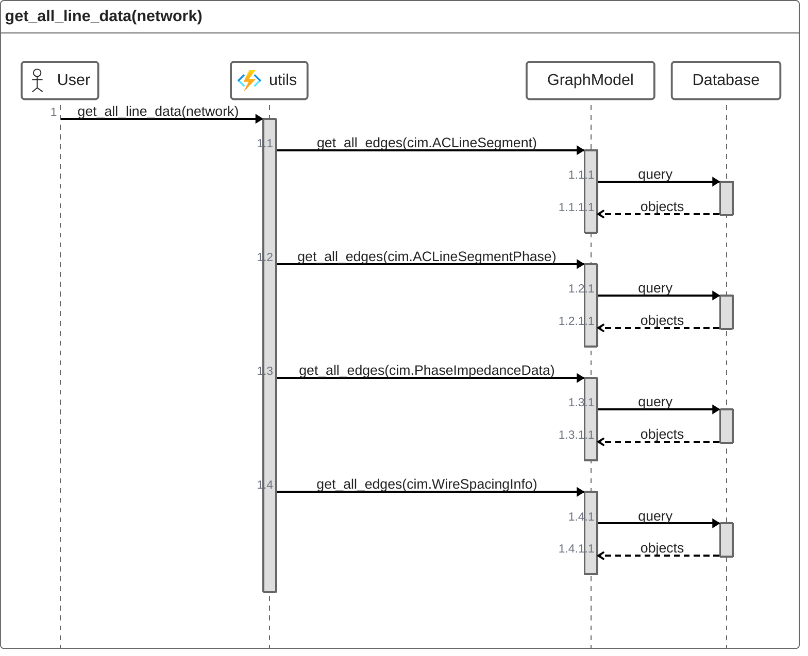

# CIM-Graph Utils

## Overview

## Query Shortcuts

### `get_all_line_data(network)`

```mermaid

zenuml
    title get_all_line_data(network)
    @Actor User
    @AzureFunction utils
    @PubSub GraphModel
    @AzureBackup Database


    User -> utils.get_all_line_data(network) {
        GraphModel.get_all_edges(cim.ACLineSegment) {
            Database.query {
                return objects
            }
        }
        GraphModel.get_all_edges(cim.ACLineSegmentPhase) {
            Database.query {
                return objects
            }
        }
        GraphModel.get_all_edges(cim.PhaseImpedanceData) {
            Database.query {
                return objects
            }
        }
        GraphModel.get_all_edges(cim.WireSpacingInfo) {
            Database.query {
                return objects
            }
        }
    }
```
