.. CIMantic Graphs

================================================
CIMantic Graphs Library Documentation
================================================

CIMantic Graphs is an open-source library for creating, parsing, and editing CIM power system models using in-memory knowledge graphs to reduce the burden and learning curve associated with using the Common Information Model.

Key features:

* Single API method to obtain data for any CIM class. No more custom database queries.
* Single API method to obtain data for EMS node-breaker transmission models, bus-branch planning models, and distribution feeder models.
* Singe API method for both centralized and distributed architectures.
* Support for multiple databases and query languages with no changes to upper-level graph data or API calls. Only need to change host/port specified in ConnectionParameters data object.
* Ability to create CIM models "from scratch".
* Open-source data engineering tool for management of CIM models.
* Knowledge graph approach based on semantic understanding of CIM.
* Object-oriented data structure with enforcement of CIM Schema.
* Data profiles generated directly from Enterprise Architect UML
* Support for custom profiles using CIMTool.
* Support for direct creation / editing / parsing of CIM XML, JSON-LD.
* API support for centralized/distributed transmission + distribution models.

To install CIMantic Graphs clone the github repository or use pip install: pip install cim-graph

.. toctree::
   :caption: Overview
   :maxdepth: 2

   01_overview/1_1_overview
   01_overview/1_2_installation
   01_overview/1_3_structure
   01_overview/1_4_contributing

.. toctree::
   :caption: CIM Profiles
   :maxdepth: 2

   02_cim_profiles/2_1_profiles_overview
   02_cim_profiles/2_2_building_profiles
   02_cim_profiles/2_3_using_objects

.. toctree::
   :caption: Databases
   :maxdepth: 2

   03_databases/3_1_databases_overview
   03_databases/3_2_env_variables
   03_databases/3_3_blazegraph
   03_databases/3_4_neo4j
   03_databases/3_5_graphdb
   03_databases/3_6_mysql
   03_databases/3_7_gridappsd
   03_databases/3_8_xml_file_parser

.. toctree::
   :caption: Graph Models
   :maxdepth: 2

   04_graph_models/4_1_graph_models
   04_graph_models/4_2_feeder_model
   04_graph_models/4_3_node_breaker
   04_graph_models/4_4_bus_branch
   04_graph_models/4_5_distributed_area

.. toctree::
   :caption: Utils Shortcuts
   :maxdepth: 2
   
   05_utils/5_1_file_writers
   05_utils/5_2_get_all_data
   05_utils/5_3_mermaid

.. image:: ./images/CIM_Graph_Logo.png