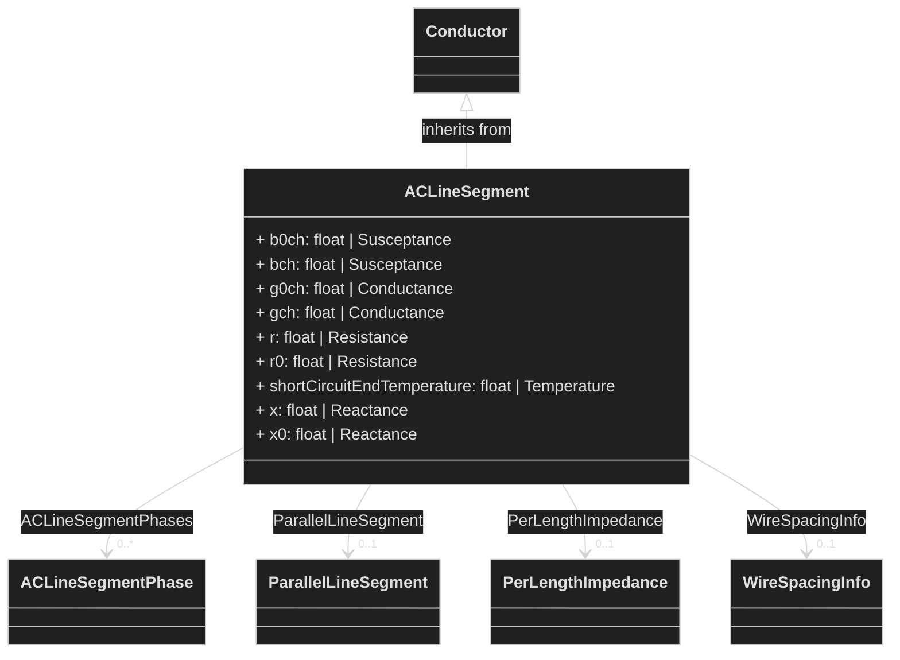

# Mermaid Usage with CIM-Graph Utils

CIM-Graph now provides in-built visualization of CIM classes and objects using Mermaid

The functionality is available through the `utils` module, which can be imported using

```python
from cimgraph import utils
```

When running in a Jupyter notebook, the `mermaid-python` library can be used to display the generated diagrams and can be imported using
```python
from mermaid import Mermaid
```


## Visualizing Classes

### Displaying Individual Classes

CIM-Graph Utils now provides the ability to visualize individual classes as a graph network through the `utils.get_mermaid()` method:

```python
diagram_text = utils.get_mermaid(cim.ACLineSegment)
Mermaid(diagram_text)
```




## Visualizing Objects

CIM-Graph Utils now provides the ability to visualize objects as a graph network through the `utils.get_mermaid()` method
