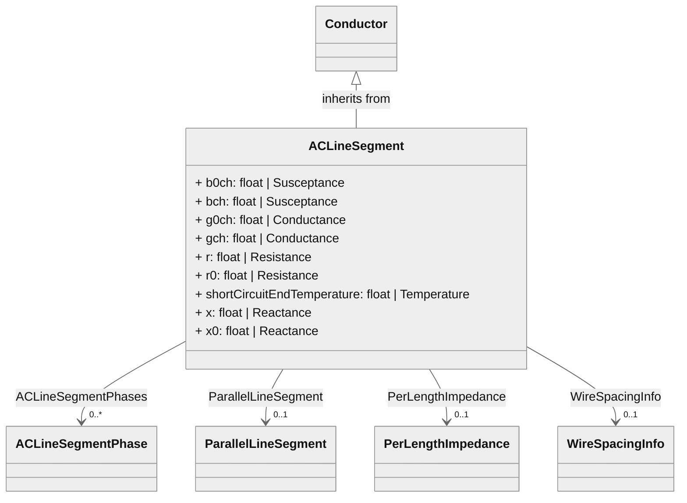

# Mermaid Usage with CIM-Graph Utils

CIM-Graph now provides in-built visualization of CIM classes and objects using Mermaid. The diagrams are plain text (enabling git tracking) and can be rendered in markdown and most web tools using the mermaid.js library.

The functionality is available through the `utils` module, which can be imported using

```python
from cimgraph import utils
```

When running in a Jupyter notebook, the `mermaid-python` library can be used to display the generated diagrams and can be imported using

```python
from mermaid import Mermaid
```

All diagrams are specific to a given CIM profile, which can be exported from CIM-Tool and placed into the appropriate directory in the `data_profile` module. The custom CIM profile should then be imported using

```python
import cimgraph.data_profile.cimhub_2023 as cim
```


## Visualizing Classes

### Displaying Individual Classes

CIM-Graph Utils now provides the ability to visualize individual classes as a graph network through the `utils.get_mermaid()` method:

```python
diagram_text = utils.get_mermaid(cim.ACLineSegment)
Mermaid(diagram_text)
```



Control over attribute visibility and inherited attribute/association visibility are provided through a set of boolean flags:

```python
diagram_text = utils.get_mermaid(cim.ACLineSegment, show_attributes=True, show_inherited=True)
Mermaid(diagram_text)
```


### Displaying a List of Classes

An arbitrary classes can displayed by providing a list of specific classes:

```python
diagram_text = utils.get_mermaid([cim.ACLineSegment,
                          cim.ACLineSegmentPhase,
                          cim.PerLengthImpedance,
                          cim.PerLengthPhaseImpedance,
                          cim.PhaseImpedanceData,
                          cim.WireSpacingInfo])
Mermaid(diagram_text)
```


## Visualizing Objects

CIM-Graph Utils now provides the ability to visualize objects as a graph network through the `utils.get_mermaid()` method

### Visualizing Objects from a File or Database

CIM objects loaded from an XML file or database can be visualized by loading the model and then passing the individual object into the `utils.get_mermaid()` method:

To open an XML file of a sample feeder model:
```python
from cimgraph.models import FeederModel
from cimgraph.databases import XMLFile
params = ConnectionParameters(filename="my_model.xml", cim_profile=cim_profile, iec61970_301=8) # using urn:uuid instead of rdf:id
xml_file = XMLFile(params)
network = FeederModel(connection=xml_file, container=cim.Feeder())
```

An individual object can then be visualized by passing the object (as specified by the Identity.identifier UUID):
```python
line = network.graph[cim.ACLineSegment][UUID('a04cdfb1-e951-4fc4-8882-0323cd70ae3c')]
diagram_text = utils.get_mermaid(line)
Mermaid(utils.get_mermaid(line))
```


### Visualizing Object Created Dynamically

CIM-Graph offers powerful object creation capabilities for building models "from scrath" by invoking the class and attribute names. The example below shows how to create a breaker and associated objects

```python
breaker = cim.Breaker(name = 'breaker12', open=False, inService=True)
substation = cim.Substation(name = 'sub1234')
t1 = cim.Terminal(name = 'brk12_t1', ConductingEquipment=breaker)
t2 = cim.Terminal(name = 'brk12_t2', ConductingEquipment=breaker)
basev = cim.BaseVoltage(name = 'base12kv', nominalVoltage=12470)
breaker.EquipmentContainer = substation
breaker.Terminals = [t1, t2]
breaker.BaseVoltage = basev

breaker.pprint() # Print as JSON-LD
```

```json
{
    "@id": "59cee258-1784-466f-b586-9e883ac7199f",
    "@type": "Breaker",
    "name": "breaker12",
    "inService": "True",
    "EquipmentContainer": {
        "@id": "3245888f-3733-47c8-bc9b-b4bece8e10f2",
        "@type": "Substation"
    },
    "BaseVoltage": {
        "@id": "df2c5a0a-27e7-4ff6-afe5-50ba6c6a8bbc",
        "@type": "BaseVoltage"
    },
    "Terminals": [
        {
            "@id": "593b10ed-0d6c-4d90-987b-a32aeff61996",
            "@type": "Terminal"
        },
        {
            "@id": "f2cb5de7-150d-4f9e-adb7-c1cebf73f3fb",
            "@type": "Terminal"
        }
    ],
    "open": "False"
}
```

This object can now be displayed by passing it to the `utils.get_mermaid()` method:

```python
diagram_text = utils.get_mermaid(breaker)
Mermaid(diagram_text)
```


## Visualizing Graph Traversal Paths

### Visualing Graph Traversal of Object Instances

The graph traversal path for individual objects can be displayed using the `utils.get_mermaid_path(root,path)` method and passing in the starting object and the associations and attributes from the UML as list of strings.

The graph path to get the nominal voltage of a line can be displayed using

```python
diagram_text = utils.get_mermaid_path(line, ['BaseVoltage','nominalVoltage'])
Mermaid(diagram_text)
```


Additional graph paths can be added by using `utils.add_mermaid_path()` method:

```python
diagram_text = utils.add_mermaid_path(line, ['ACLineSegmentPhases','[0]','Location'], diagram_text)
diagram_text = utils.add_mermaid_path(line, ['ACLineSegmentPhases','[1]','Location'], diagram_text)
diagram_text = utils.add_mermaid_path(line, ['ACLineSegmentPhases','[2]','Location'], diagram_text)
Mermaid(diagram_text)
```


### Visualizing Graph Traversal of UML Classes

Custom UML diagrams can also be created by specifying the graph traversal path using the association names between classes with the `utils.get_mermaid_path()` method:

```python
diagram_text = utils.get_mermaid_path(cim.ACLineSegment,
                    ['ACLineSegmentPhases','WireInfo'], show_attributes=False)
Mermaid(diagram_text)
```


Additional UML graph traversal paths can be created using the `utils.add_mermaid_path()` method:

```python
extra_path = [
    'PerLengthImpedance',
    '__subclasses__()[0]', #TODO: Find better inheritance path
    'PhaseImpedanceData'
]
diagram_text = utils.add_mermaid_path(cim.ACLineSegment, extra_path,
                    diagram_text, show_attributes=True)
Mermaid(diagram_text)
```


