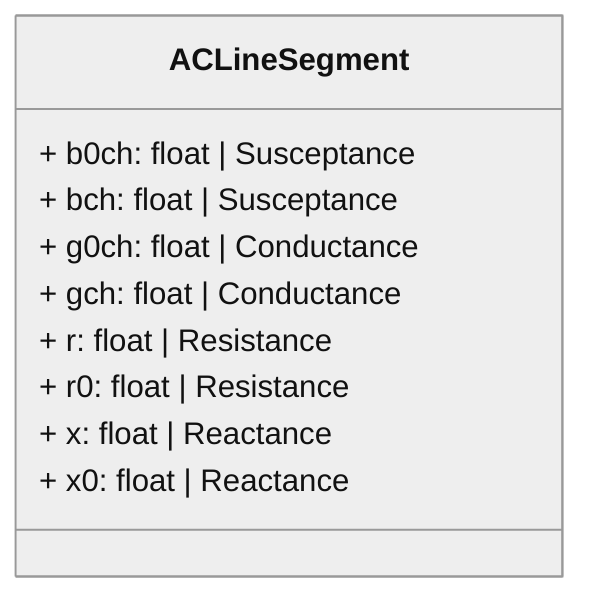
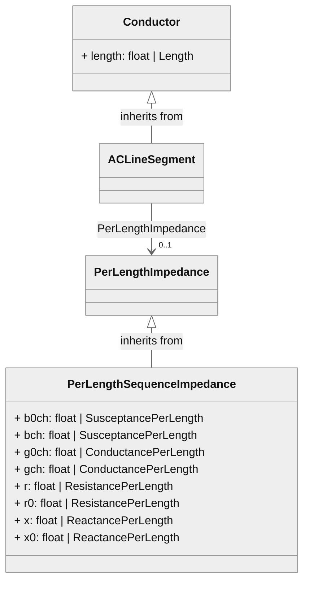
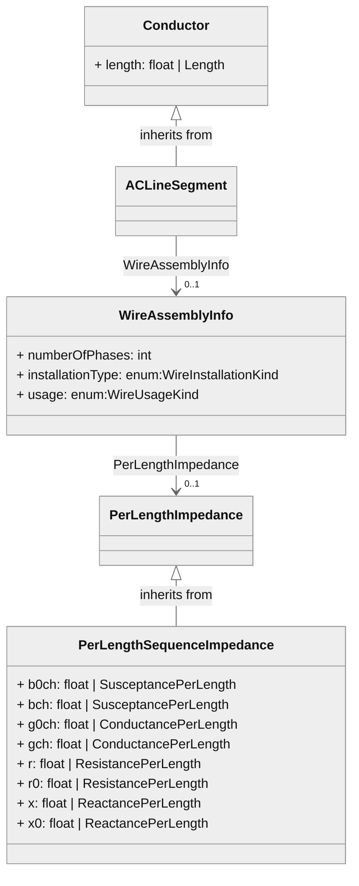
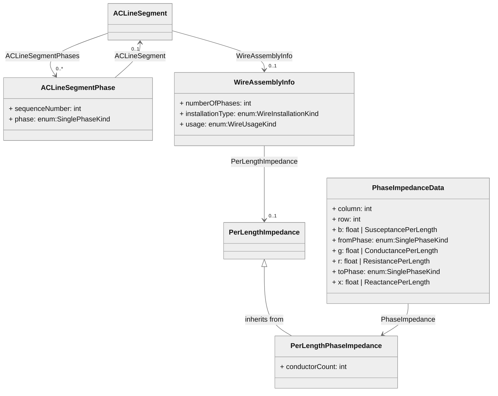
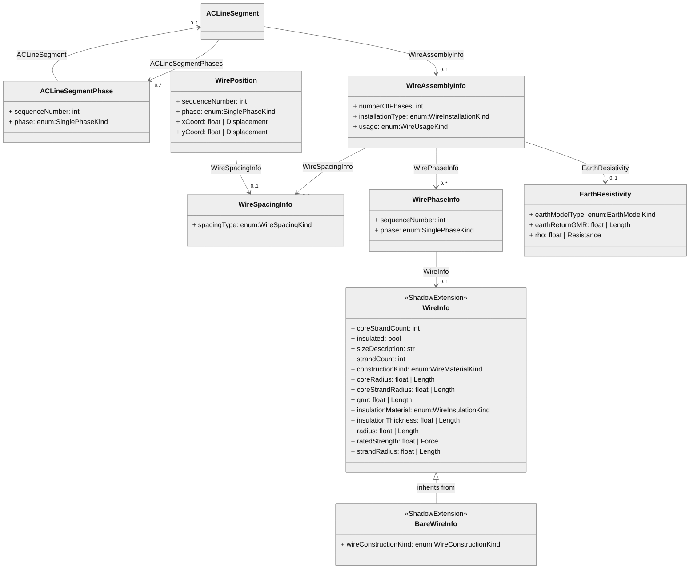
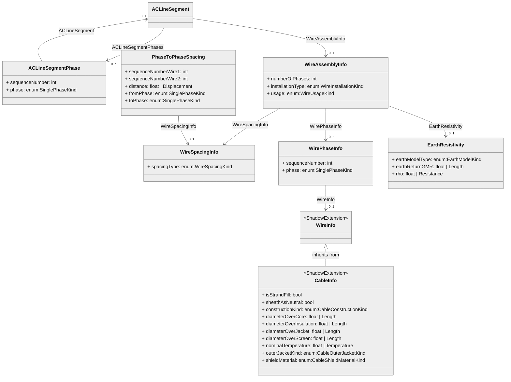
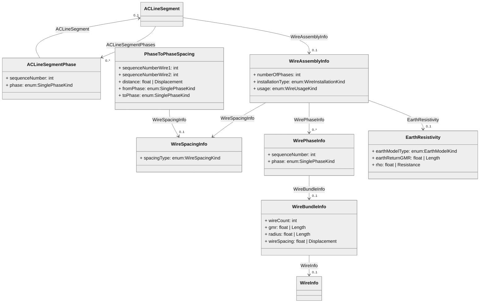
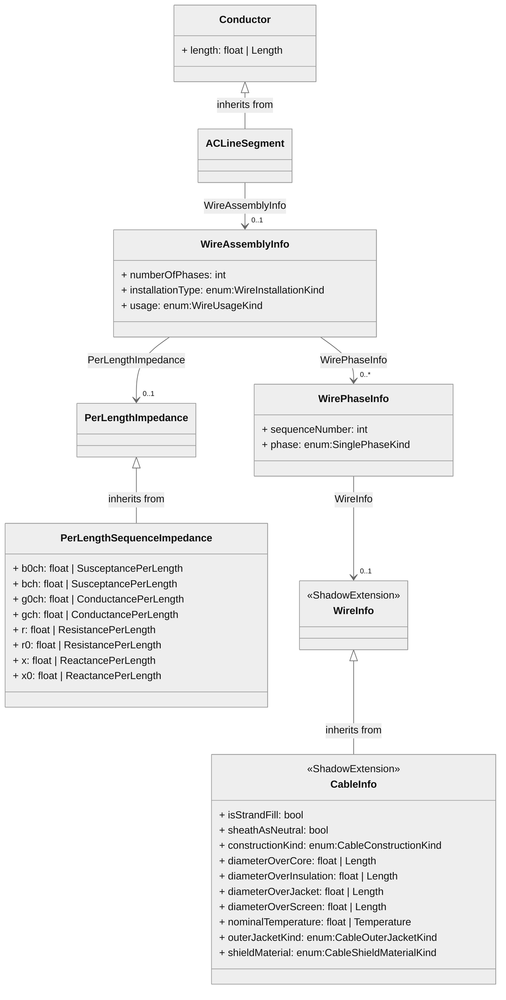

# Proposed CIM18 modeling options


## Model Option 1

Positive/zero sequence impedance



#### CIM-Graph Python


```python
# ignore values, numbers are just keysmash
line_1 = cim.ACLineSegment(name='line_1')
line_1.r = cim.Resistance(0.5, 'ohm')
line_1.x = cim.Reactance(5.0, 'ohm')
line_1.bch = cim.Susceptance(2.0)
```

```xml
<cim:ACLineSegment rdf:about="urn:uuid:35f9a904-693d-4163-9460-3e2f6984f955">
  <cim:ACLineSegment.bch>2.0</cim:ACLineSegment.bch>
  <cim:ACLineSegment.r>0.5</cim:ACLineSegment.r>
  <cim:ACLineSegment.x>5.0</cim:ACLineSegment.x>
  <cim:IdentifiedObject.mRID>35f9a904-693d-4163-9460-3e2f6984f955</cim:IdentifiedObject.mRID>
  <cim:IdentifiedObject.name>line_1</cim:IdentifiedObject.name>
  <cim:Identity.identifier>35f9a904-693d-4163-9460-3e2f6984f955</cim:Identity.identifier>
</cim:ACLineSegment>
```

-----

## Model Option 1'

Instance of ACLineSegment with per-length impedance values. Suggestion is to use existing association for this case where no template is used



#### CIM-Graph Python


```python
# Ignore values, just random numbers to show template
line_1a = cim.ACLineSegment(name='line_1a')
line_1a.length = cim.Length(100, 'm')

impedance_1a = cim.PerLengthSequenceImpedance(name='imped_1a')
impedance_1a.r = cim.ResistancePerLength(1, 'ohm/m')
impedance_1a.x = cim.ReactancePerLength(10, 'ohm/m')
impedance_1a.bch = cim.SusceptancePerLength(0.5, 'siemens/m')

line_1a.PerLengthImpedance = impedance_1a
```

```xml
<cim:ACLineSegment rdf:about="urn:uuid:e16c5af3-bb43-442b-b8c2-22a9bfea7ece">
  <cim:ACLineSegment.PerLengthImpedance rdf:resource="urn:uuid:b1340b9b-d141-4a51-8f2e-6623cef234a8"/>
  <cim:Conductor.length>100.0</cim:Conductor.length>
  <cim:IdentifiedObject.mRID>e16c5af3-bb43-442b-b8c2-22a9bfea7ece</cim:IdentifiedObject.mRID>
  <cim:IdentifiedObject.name>line_1a</cim:IdentifiedObject.name>
  <cim:Identity.identifier>e16c5af3-bb43-442b-b8c2-22a9bfea7ece</cim:Identity.identifier>
</cim:ACLineSegment>
<cim:PerLengthSequenceImpedance rdf:about="urn:uuid:b1340b9b-d141-4a51-8f2e-6623cef234a8">
  <cim:PerLengthSequenceImpedance.bch>0.5</cim:PerLengthSequenceImpedance.bch>
  <cim:PerLengthSequenceImpedance.r>1.0</cim:PerLengthSequenceImpedance.r>
  <cim:PerLengthSequenceImpedance.x>10.0</cim:PerLengthSequenceImpedance.x>
  <cim:IdentifiedObject.mRID>b1340b9b-d141-4a51-8f2e-6623cef234a8</cim:IdentifiedObject.mRID>
  <cim:IdentifiedObject.name>imped_1a</cim:IdentifiedObject.name>
  <cim:Identity.identifier>b1340b9b-d141-4a51-8f2e-6623cef234a8</cim:Identity.identifier>
</cim:PerLengthSequenceImpedance>
```

------------

## Model Option 2A

Proposed template-based approach to per-length sequence impedance



#### CIM-Graph Python


```python
# Ignore values, just random numbers to show template
line_2a = cim.ACLineSegment(name='line_2a')
line_2a.length = cim.Length(100, 'm')

template_2a = cim.WireAssemblyInfo(name = 'template_2a')
template_2a.numberOfPhases = 3
template_2a.installationType = cim.WireInstallationKind.overheadBare
template_2a.usage = cim.WireUsageKind.transmission

impedance_2a = cim.PerLengthSequenceImpedance(name='impedance_template_2a')
impedance_2a.r = cim.ResistancePerLength(1, 'ohm/m')
impedance_2a.x = cim.ReactancePerLength(10, 'ohm/m')
impedance_2a.bch = cim.SusceptancePerLength(0.5, 'siemens/m')

line_2a.WireAssemblyInfo = template_2a
impedance_2a.WireAssemblyInfo = template_2a
```

```xml
<cim:ACLineSegment rdf:about="urn:uuid:867a7d82-bc35-4c7c-bf56-748cc63fca3f">
  <gad:ACLineSegment.WireAssemblyInfo rdf:resource="urn:uuid:79517bcb-7952-42bb-a3ad-01a4836d7e31"/>
  <cim:Conductor.length>100.0</cim:Conductor.length>
  <cim:IdentifiedObject.mRID>867a7d82-bc35-4c7c-bf56-748cc63fca3f</cim:IdentifiedObject.mRID>
  <cim:IdentifiedObject.name>line_2a</cim:IdentifiedObject.name>
  <cim:Identity.identifier>867a7d82-bc35-4c7c-bf56-748cc63fca3f</cim:Identity.identifier>
</cim:ACLineSegment>
<cim:PerLengthSequenceImpedance rdf:about="urn:uuid:7c5b6c95-231f-4365-a129-8548bf6e2f28">
  <cim:PerLengthSequenceImpedance.bch>0.5</cim:PerLengthSequenceImpedance.bch>
  <cim:PerLengthSequenceImpedance.r>1.0</cim:PerLengthSequenceImpedance.r>
  <cim:PerLengthSequenceImpedance.x>10.0</cim:PerLengthSequenceImpedance.x>
  <gad:PerLengthImpedance.WireAssemblyInfo rdf:resource="urn:uuid:79517bcb-7952-42bb-a3ad-01a4836d7e31"/>
  <cim:IdentifiedObject.mRID>7c5b6c95-231f-4365-a129-8548bf6e2f28</cim:IdentifiedObject.mRID>
  <cim:IdentifiedObject.name>impedance_template_2a</cim:IdentifiedObject.name>
  <cim:Identity.identifier>7c5b6c95-231f-4365-a129-8548bf6e2f28</cim:Identity.identifier>
</cim:PerLengthSequenceImpedance>
<cim:WireAssemblyInfo rdf:about="urn:uuid:79517bcb-7952-42bb-a3ad-01a4836d7e31">
  <gad:WireAssemblyInfo.numberOfPhases>3</gad:WireAssemblyInfo.numberOfPhases>
  <gad:WireAssemblyInfo.installationType rdf:resource="http://gridappsd.org/CIM/extension#WireInstallationKind.overheadBare"/>
  <gad:WireAssemblyInfo.usage rdf:resource="http://gridappsd.org/CIM/extension#WireUsageKind.transmission"/>
  <cim:IdentifiedObject.mRID>79517bcb-7952-42bb-a3ad-01a4836d7e31</cim:IdentifiedObject.mRID>
  <cim:IdentifiedObject.name>template_2a</cim:IdentifiedObject.name>
  <cim:Identity.identifier>79517bcb-7952-42bb-a3ad-01a4836d7e31</cim:Identity.identifier>
</cim:WireAssemblyInfo>
```

------

## Model Option 2B

Template for lower impedance matrix



#### CIM-Graph Python


```python
# Ignore values, just random numbers to show template
line_2b = cim.ACLineSegment(name='line_2b')
line_2b.length = cim.Length(100, 'm')

line_phs_a = cim.ACLineSegmentPhase(name='line_2b_a')
line_phs_a.sequenceNumber = 1
line_phs_a.phase = cim.SinglePhaseKind.A
line_phs_b = cim.ACLineSegmentPhase(name='line_2b_b')
line_phs_b.sequenceNumber = 2
line_phs_b.phase = cim.SinglePhaseKind.B

template_2b = cim.WireAssemblyInfo(name = 'template_2b')
template_2b.numberOfPhases = 2
template_2b.installationType = cim.WireInstallationKind.overheadBare
template_2b.usage = cim.WireUsageKind.distribution

impedance_2b = cim.PerLengthPhaseImpedance(name='impedance_template_2b')
impedance_2b.conductorCount = 3

matrix_2b_12 = cim.PhaseImpedanceData(name='imped_11')
matrix_2b_12.row = 1
matrix_2b_12.column = 2
matrix_2b_12.r = cim.ResistancePerLength(1.0, 'ohm/km')
matrix_2b_12.x = cim.ReactancePerLength(10.0, 'ohm/km')
matrix_2b_12.b = cim.SusceptancePerLength(1.0, 'siemens/km')

matrix_2b_12.PhaseImpedance = impedance_2b
impedance_2b.WireAssemblyInfo = template_2b
line_2b.WireAssemblyInfo = template_2b
```

```xml
<cim:ACLineSegment rdf:about="urn:uuid:e1a96ae8-1ac8-42d0-9a4d-40e968be1993">
  <gad:ACLineSegment.WireAssemblyInfo rdf:resource="urn:uuid:bfafd82c-d5f6-401c-8eda-6478fa3cc912"/>
  <cim:Conductor.length>100.0</cim:Conductor.length>
  <cim:IdentifiedObject.mRID>e1a96ae8-1ac8-42d0-9a4d-40e968be1993</cim:IdentifiedObject.mRID>
  <cim:IdentifiedObject.name>line_2b</cim:IdentifiedObject.name>
  <cim:Identity.identifier>e1a96ae8-1ac8-42d0-9a4d-40e968be1993</cim:Identity.identifier>
</cim:ACLineSegment>
<cim:PerLengthPhaseImpedance rdf:about="urn:uuid:4c38767f-a86d-4ebc-bad9-d358dc1dfa86">
  <cim:PerLengthPhaseImpedance.conductorCount>3</cim:PerLengthPhaseImpedance.conductorCount>
  <gad:PerLengthImpedance.WireAssemblyInfo rdf:resource="urn:uuid:bfafd82c-d5f6-401c-8eda-6478fa3cc912"/>
  <cim:IdentifiedObject.mRID>4c38767f-a86d-4ebc-bad9-d358dc1dfa86</cim:IdentifiedObject.mRID>
  <cim:IdentifiedObject.name>impedance_template_2b</cim:IdentifiedObject.name>
  <cim:Identity.identifier>4c38767f-a86d-4ebc-bad9-d358dc1dfa86</cim:Identity.identifier>
</cim:PerLengthPhaseImpedance>
<cim:PhaseImpedanceData rdf:about="urn:uuid:7af1a672-23db-48f3-ac34-a57566efba66">
  <cim:PhaseImpedanceData.column>2</cim:PhaseImpedanceData.column>
  <cim:PhaseImpedanceData.row>1</cim:PhaseImpedanceData.row>
  <cim:PhaseImpedanceData.b>0.001</cim:PhaseImpedanceData.b>
  <cim:PhaseImpedanceData.r>0.001</cim:PhaseImpedanceData.r>
  <cim:PhaseImpedanceData.x>0.01</cim:PhaseImpedanceData.x>
  <cim:PhaseImpedanceData.PhaseImpedance rdf:resource="urn:uuid:4c38767f-a86d-4ebc-bad9-d358dc1dfa86"/>
  <cim:IdentifiedObject.mRID>7af1a672-23db-48f3-ac34-a57566efba66</cim:IdentifiedObject.mRID>
  <cim:IdentifiedObject.name>imped_11</cim:IdentifiedObject.name>
  <cim:Identity.identifier>7af1a672-23db-48f3-ac34-a57566efba66</cim:Identity.identifier>
</cim:PhaseImpedanceData>
<cim:WireAssemblyInfo rdf:about="urn:uuid:bfafd82c-d5f6-401c-8eda-6478fa3cc912">
  <gad:WireAssemblyInfo.numberOfPhases>2</gad:WireAssemblyInfo.numberOfPhases>
  <gad:WireAssemblyInfo.installationType rdf:resource="http://gridappsd.org/CIM/extension#WireInstallationKind.overheadBare"/>
  <gad:WireAssemblyInfo.usage rdf:resource="http://gridappsd.org/CIM/extension#WireUsageKind.distribution"/>
  <cim:IdentifiedObject.mRID>bfafd82c-d5f6-401c-8eda-6478fa3cc912</cim:IdentifiedObject.mRID>
  <cim:IdentifiedObject.name>template_2b</cim:IdentifiedObject.name>
  <cim:Identity.identifier>bfafd82c-d5f6-401c-8eda-6478fa3cc912</cim:Identity.identifier>
</cim:WireAssemblyInfo>
```

----

## Model 3a

Template for single line definition



#### CIM-Graph Python


```python

# Ignore values, just random numbers to show template
line_3a = cim.ACLineSegment(name='line_3a')
line_3a.length = cim.Length(100, 'm')

line_phs_a = cim.ACLineSegmentPhase(name='line_3a_a')
line_phs_a.sequenceNumber = 1
line_phs_a.phase = cim.SinglePhaseKind.A

template_3a = cim.WireAssemblyInfo(name = 'template_3a')
template_3a.numberOfPhases = 1
template_3a.installationType = cim.WireInstallationKind.overheadBare
template_3a.usage = cim.WireUsageKind.distribution

spacing_3a = cim.WireSpacingInfo(name='spacing_3a')
spacing_3a.spacingType = cim.WireSpacingKind.flatSpaced

position_3a = cim.WirePosition(name='postion_3a_a')
position_3a.xCoord = cim.Displacement(-1.5, 'm')
position_3a.yCoord = cim.Displacement(14, 'm')
position_3a.sequenceNumber = 1

wire_phs_3a=cim.WirePhaseInfo()
wire_phs_3a.sequenceNumber = 1
wire_phs_3a.phase = cim.SinglePhaseKind.A

wire = cim.BareWireInfo(name='Turkey')
wire.sizeDescription = 2156
wire.strandCount = 6
wire.coreStrandCount = 1
wire.strandRadius = cim.Length(value = 0.0661/2, input_unit = 'in')
wire.coreStrandRadius = cim.Length(value = 0.0661/2, input_unit = 'in')
wire.coreRadius = cim.Length(value = 0.0661/2, input_unit = 'in')
wire.radius = cim.Length(value=0.198/2, input_unit='in')
wire.massPerLength = cim.MassPerLength(value=36, input_unit='lb/ft')
# wire.ratedStrength = cim.Force(value=1190, input_unit='lb')
wire.rDC20 = cim.ResistancePerLength(value=0.641, input_unit='ohm/kft')
wire.rAC75 = cim.ResistancePerLength(value=0.806, input_unit='ohm/kft')
wire.ratedCurrent = cim.CurrentFlow(value=105, input_unit='amp')

wire_phs_3a.WireInfo = wire
wire_phs_3a.WireAssemblyInfo = template_3a
spacing_3a.WireAssemblyInfo = template_3a
position_3a.WireSpacingInfo = spacing_3a

line_3a.WireAssemblyInfo = template_3a
```

```xml
<cim:ACLineSegment rdf:about="urn:uuid:03cd9142-b865-4529-a6f4-fdb54e10e7e4">
  <gad:ACLineSegment.WireAssemblyInfo rdf:resource="urn:uuid:4568e9a7-ce09-4c73-b1a6-ae81dea7cd76"/>
  <cim:Conductor.length>100.0</cim:Conductor.length>
  <cim:IdentifiedObject.mRID>03cd9142-b865-4529-a6f4-fdb54e10e7e4</cim:IdentifiedObject.mRID>
  <cim:IdentifiedObject.name>line_3a</cim:IdentifiedObject.name>
  <cim:Identity.identifier>03cd9142-b865-4529-a6f4-fdb54e10e7e4</cim:Identity.identifier>
</cim:ACLineSegment>
<cim:BareWireInfo rdf:about="urn:uuid:583ddada-1afe-4bd1-87fb-cb83406a632c">
  <cim:WireInfo.coreStrandCount>1</cim:WireInfo.coreStrandCount>
  <cim:WireInfo.sizeDescription>2156</cim:WireInfo.sizeDescription>
  <cim:WireInfo.strandCount>6</cim:WireInfo.strandCount>
  <cim:WireInfo.coreRadius>0.00083947</cim:WireInfo.coreRadius>
  <cim:WireInfo.coreStrandRadius>0.00083947</cim:WireInfo.coreStrandRadius>
  <cim:WireInfo.radius>0.0025146</cim:WireInfo.radius>
  <cim:WireInfo.strandRadius>0.00083947</cim:WireInfo.strandRadius>
  <cim:ConductorInfo.massPerLength>53.57390196850394</cim:ConductorInfo.massPerLength>
  <cim:ConductorInfo.rAC75>0.0026443569553805777</cim:ConductorInfo.rAC75>
  <cim:ConductorInfo.rDC20>0.0021030183727034123</cim:ConductorInfo.rDC20>
  <cim:ConductingAssetInfo.ratedCurrent>105.0</cim:ConductingAssetInfo.ratedCurrent>
  <cim:IdentifiedObject.mRID>583ddada-1afe-4bd1-87fb-cb83406a632c</cim:IdentifiedObject.mRID>
  <cim:IdentifiedObject.name>Turkey</cim:IdentifiedObject.name>
  <cim:Identity.identifier>583ddada-1afe-4bd1-87fb-cb83406a632c</cim:Identity.identifier>
</cim:BareWireInfo>
<cim:WireAssemblyInfo rdf:about="urn:uuid:4568e9a7-ce09-4c73-b1a6-ae81dea7cd76">
  <gad:WireAssemblyInfo.numberOfPhases>1</gad:WireAssemblyInfo.numberOfPhases>
  <gad:WireAssemblyInfo.installationType rdf:resource="http://gridappsd.org/CIM/extension#WireInstallationKind.overheadBare"/>
  <gad:WireAssemblyInfo.usage rdf:resource="http://gridappsd.org/CIM/extension#WireUsageKind.distribution"/>
  <cim:IdentifiedObject.mRID>4568e9a7-ce09-4c73-b1a6-ae81dea7cd76</cim:IdentifiedObject.mRID>
  <cim:IdentifiedObject.name>template_3a</cim:IdentifiedObject.name>
  <cim:Identity.identifier>4568e9a7-ce09-4c73-b1a6-ae81dea7cd76</cim:Identity.identifier>
</cim:WireAssemblyInfo>
<cim:WirePhaseInfo rdf:about="urn:uuid:2dd9443c-c992-49a8-8295-e4e3b1687705">
  <gad:WirePhaseInfo.sequenceNumber>1</gad:WirePhaseInfo.sequenceNumber>
  <gad:WirePhaseInfo.phase rdf:resource="http://gridappsd.org/CIM/extension#SinglePhaseKind.A"/>
  <cim:WirePhaseInfo.WireAssemblyInfo rdf:resource="urn:uuid:4568e9a7-ce09-4c73-b1a6-ae81dea7cd76"/>
  <cim:WirePhaseInfo.WireInfo rdf:resource="urn:uuid:583ddada-1afe-4bd1-87fb-cb83406a632c"/>
  <cim:Identity.identifier>2dd9443c-c992-49a8-8295-e4e3b1687705</cim:Identity.identifier>
</cim:WirePhaseInfo>
<cim:WirePosition rdf:about="urn:uuid:b3984df7-4720-4f9d-ad2b-9e84e59e153a">
  <cim:WirePosition.sequenceNumber>1</cim:WirePosition.sequenceNumber>
  <cim:WirePosition.xCoord>-1.5</cim:WirePosition.xCoord>
  <cim:WirePosition.yCoord>14.0</cim:WirePosition.yCoord>
  <cim:WirePosition.WireSpacingInfo rdf:resource="urn:uuid:c127a346-fdd1-4532-800d-843973a604b0"/>
  <cim:IdentifiedObject.mRID>b3984df7-4720-4f9d-ad2b-9e84e59e153a</cim:IdentifiedObject.mRID>
  <cim:IdentifiedObject.name>postion_3a_a</cim:IdentifiedObject.name>
  <cim:Identity.identifier>b3984df7-4720-4f9d-ad2b-9e84e59e153a</cim:Identity.identifier>
</cim:WirePosition>
<cim:WireSpacingInfo rdf:about="urn:uuid:c127a346-fdd1-4532-800d-843973a604b0">
  <gad:WireSpacingInfo.WireAssemblyInfo rdf:resource="urn:uuid:4568e9a7-ce09-4c73-b1a6-ae81dea7cd76"/>
  <gad:WireSpacingInfo.spacingType rdf:resource="http://gridappsd.org/CIM/extension#WireSpacingKind.flatSpaced"/>
  <cim:IdentifiedObject.mRID>c127a346-fdd1-4532-800d-843973a604b0</cim:IdentifiedObject.mRID>
  <cim:IdentifiedObject.name>spacing_3a</cim:IdentifiedObject.name>
  <cim:Identity.identifier>c127a346-fdd1-4532-800d-843973a604b0</cim:Identity.identifier>
</cim:WireSpacingInfo>
```

---------
## Model 3B

Template with phase-to-phase spacing
See [RTL-46 Datasheet](https://www.marmonutility.com/wp-content/uploads/2023/02/PDS_RTL-46.pdf)



#### CIM-Graph Python


```python
# Ignore values, just random numbers to show template
line_3b = cim.ACLineSegment(name='line_3b')
line_3b.length = cim.Length(100, 'm')

line_phs_a = cim.ACLineSegmentPhase(name='line_3b_a')
line_phs_a.sequenceNumber = 1
line_phs_a.phase = cim.SinglePhaseKind.A
line_phs_a = cim.ACLineSegmentPhase(name='line_3b_b')
line_phs_a.sequenceNumber = 2
line_phs_a.phase = cim.SinglePhaseKind.B
# etc.

template_3b = cim.WireAssemblyInfo(name = 'template_3b')
template_3b.numberOfPhases = 1
template_3b.installationType = cim.WireInstallationKind.overheadSpacerCable
template_3b.usage = cim.WireUsageKind.distribution

spacing_3b = cim.WireSpacingInfo(name='spacing_3b')
spacing_3b.spacingType = cim.WireSpacingKind.other

phs_spacing_ab = cim.PhaseToPhaseSpacing(name='RTL-46')
phs_spacing_ab.fromPhase = cim.SinglePhaseKind.A
phs_spacing_ab.toPhase = cim.SinglePhaseKind.B
phs_spacing_ab.distance = cim.Displacement(11.5, 'in')

wire_phs_3b=cim.WirePhaseInfo()
wire_phs_3b.sequenceNumber = 1
wire_phs_3b.phase = cim.SinglePhaseKind.A

cable = cim.CableInfo(name='Spacer_Wire')
cable.diameterOverCore

wire_phs_3b.WireInfo = wire
wire_phs_3b.WireAssemblyInfo = template_3b
spacing_3b.WireAssemblyInfo = template_3b
phs_spacing_ab.WireSpacingInfo = spacing_3b

line_3b.WireAssemblyInfo = template_3b
```

```xml
<cim:ACLineSegment rdf:about="urn:uuid:aad6c40f-3ed0-43bf-b1ba-6f788ee813c3">
  <gad:ACLineSegment.WireAssemblyInfo rdf:resource="urn:uuid:2bd0cda0-3c1b-4a75-9f00-999aee723706"/>
  <cim:Conductor.length>100.0</cim:Conductor.length>
  <cim:IdentifiedObject.mRID>aad6c40f-3ed0-43bf-b1ba-6f788ee813c3</cim:IdentifiedObject.mRID>
  <cim:IdentifiedObject.name>line_3b</cim:IdentifiedObject.name>
  <cim:Identity.identifier>aad6c40f-3ed0-43bf-b1ba-6f788ee813c3</cim:Identity.identifier>
</cim:ACLineSegment>
<cim:BareWireInfo rdf:about="urn:uuid:583ddada-1afe-4bd1-87fb-cb83406a632c">
  <cim:WireInfo.coreStrandCount>1</cim:WireInfo.coreStrandCount>
  <cim:WireInfo.sizeDescription>2156</cim:WireInfo.sizeDescription>
  <cim:WireInfo.strandCount>6</cim:WireInfo.strandCount>
  <cim:WireInfo.coreRadius>0.00083947</cim:WireInfo.coreRadius>
  <cim:WireInfo.coreStrandRadius>0.00083947</cim:WireInfo.coreStrandRadius>
  <cim:WireInfo.radius>0.0025146</cim:WireInfo.radius>
  <cim:WireInfo.strandRadius>0.00083947</cim:WireInfo.strandRadius>
  <cim:ConductorInfo.massPerLength>53.57390196850394</cim:ConductorInfo.massPerLength>
  <cim:ConductorInfo.rAC75>0.0026443569553805777</cim:ConductorInfo.rAC75>
  <cim:ConductorInfo.rDC20>0.0021030183727034123</cim:ConductorInfo.rDC20>
  <cim:ConductingAssetInfo.ratedCurrent>105.0</cim:ConductingAssetInfo.ratedCurrent>
  <cim:IdentifiedObject.mRID>583ddada-1afe-4bd1-87fb-cb83406a632c</cim:IdentifiedObject.mRID>
  <cim:IdentifiedObject.name>Turkey</cim:IdentifiedObject.name>
  <cim:Identity.identifier>583ddada-1afe-4bd1-87fb-cb83406a632c</cim:Identity.identifier>
</cim:BareWireInfo>
<cim:PhaseToPhaseSpacing rdf:about="urn:uuid:e5c71110-d6a5-40f8-aa6b-f76ce305001f">
  <gad:PhaseToPhaseSpacing.distance>0.29209999999999997</gad:PhaseToPhaseSpacing.distance>
  <gad:PhaseToPhaseSpacing.fromPhase rdf:resource="http://gridappsd.org/CIM/extension#SinglePhaseKind.A"/>
  <gad:PhaseToPhaseSpacing.toPhase rdf:resource="http://gridappsd.org/CIM/extension#SinglePhaseKind.B"/>
  <gad:PhaseToPhaseSpacing.WireSpacingInfo rdf:resource="urn:uuid:3efa1831-e58c-4fc9-aab6-734c8a6f7195"/>
  <cim:IdentifiedObject.mRID>e5c71110-d6a5-40f8-aa6b-f76ce305001f</cim:IdentifiedObject.mRID>
  <cim:IdentifiedObject.name>RTL-46</cim:IdentifiedObject.name>
  <cim:Identity.identifier>e5c71110-d6a5-40f8-aa6b-f76ce305001f</cim:Identity.identifier>
</cim:PhaseToPhaseSpacing>
<cim:WireAssemblyInfo rdf:about="urn:uuid:2bd0cda0-3c1b-4a75-9f00-999aee723706">
  <gad:WireAssemblyInfo.numberOfPhases>1</gad:WireAssemblyInfo.numberOfPhases>
  <gad:WireAssemblyInfo.installationType rdf:resource="http://gridappsd.org/CIM/extension#WireInstallationKind.overheadSpacerCable"/>
  <gad:WireAssemblyInfo.usage rdf:resource="http://gridappsd.org/CIM/extension#WireUsageKind.distribution"/>
  <cim:IdentifiedObject.mRID>2bd0cda0-3c1b-4a75-9f00-999aee723706</cim:IdentifiedObject.mRID>
  <cim:IdentifiedObject.name>template_3b</cim:IdentifiedObject.name>
  <cim:Identity.identifier>2bd0cda0-3c1b-4a75-9f00-999aee723706</cim:Identity.identifier>
</cim:WireAssemblyInfo>
<cim:WirePhaseInfo rdf:about="urn:uuid:5bd67b2c-b055-49d8-8bbf-0f077a5d0150">
  <gad:WirePhaseInfo.sequenceNumber>1</gad:WirePhaseInfo.sequenceNumber>
  <gad:WirePhaseInfo.phase rdf:resource="http://gridappsd.org/CIM/extension#SinglePhaseKind.A"/>
  <cim:WirePhaseInfo.WireAssemblyInfo rdf:resource="urn:uuid:2bd0cda0-3c1b-4a75-9f00-999aee723706"/>
  <cim:WirePhaseInfo.WireInfo rdf:resource="urn:uuid:583ddada-1afe-4bd1-87fb-cb83406a632c"/>
  <cim:Identity.identifier>5bd67b2c-b055-49d8-8bbf-0f077a5d0150</cim:Identity.identifier>
</cim:WirePhaseInfo>
<cim:WireSpacingInfo rdf:about="urn:uuid:3efa1831-e58c-4fc9-aab6-734c8a6f7195">
  <gad:WireSpacingInfo.WireAssemblyInfo rdf:resource="urn:uuid:2bd0cda0-3c1b-4a75-9f00-999aee723706"/>
  <gad:WireSpacingInfo.spacingType rdf:resource="http://gridappsd.org/CIM/extension#WireSpacingKind.other"/>
  <cim:IdentifiedObject.mRID>3efa1831-e58c-4fc9-aab6-734c8a6f7195</cim:IdentifiedObject.mRID>
  <cim:IdentifiedObject.name>spacing_3b</cim:IdentifiedObject.name>
  <cim:Identity.identifier>3efa1831-e58c-4fc9-aab6-734c8a6f7195</cim:Identity.identifier>
</cim:WireSpacingInfo>
```


------


## Model 3C

Transmission wire bundles & spacing



#### CIM-Graph Python

```python
# Ignore values, just random numbers to show template
line_3c = cim.ACLineSegment(name='line_3c')
line_3c.length = cim.Length(100, 'km')

line_phs_a = cim.ACLineSegmentPhase(name='line_3c_a')
line_phs_a.sequenceNumber = 1
line_phs_a.phase = cim.SinglePhaseKind.A
line_phs_a = cim.ACLineSegmentPhase(name='line_3c_b')
line_phs_a.sequenceNumber = 2
line_phs_a.phase = cim.SinglePhaseKind.B
# etc.

template_3c = cim.WireAssemblyInfo(name = 'template_3c')
template_3c.numberOfPhases = 1
template_3c.installationType = cim.WireInstallationKind.overheadBare
template_3c.usage = cim.WireUsageKind.transmission

spacing_3c = cim.WireSpacingInfo(name='spacing_3c')
spacing_3c.spacingType = cim.WireSpacingKind.other

phs_spacing_ab = cim.PhaseToPhaseSpacing(name='spc_ab')
phs_spacing_ab.fromPhase = cim.SinglePhaseKind.A
phs_spacing_ab.toPhase = cim.SinglePhaseKind.B
phs_spacing_ab.distance = cim.Displacement(30, 'ft')
# etc.

wire_phs_3c=cim.WirePhaseInfo()
wire_phs_3c.sequenceNumber = 1
wire_phs_3c.phase = cim.SinglePhaseKind.A
# etc.

bundle = cim.WireBundleInfo(name='triangle_bundle')
bundle.wireCount = 3
bundle.gmr = cim.Length(12, 'in')
bundle.radius = cim.Length(7, 'in')
bundle.wireSpacing = cim.Displacement(5, 'in')
bundle.WireInfo = wire

wire_phs_3c.WireInfo = bundle
wire_phs_3c.WireAssemblyInfo = template_3c
spacing_3c.WireAssemblyInfo = template_3c
phs_spacing_ab.WireSpacingInfo = spacing_3c

line_3c.WireAssemblyInfo = template_3c
```

```xml
<cim:ACLineSegment rdf:about="urn:uuid:058c28dc-b84b-465e-9e6f-d56bfa522357">
  <gad:ACLineSegment.WireAssemblyInfo rdf:resource="urn:uuid:37341de4-9c47-4c68-ae5b-e0b081d9186e"/>
  <cim:Conductor.length>100000.0</cim:Conductor.length>
  <cim:IdentifiedObject.mRID>058c28dc-b84b-465e-9e6f-d56bfa522357</cim:IdentifiedObject.mRID>
  <cim:IdentifiedObject.name>line_3c</cim:IdentifiedObject.name>
  <cim:Identity.identifier>058c28dc-b84b-465e-9e6f-d56bfa522357</cim:Identity.identifier>
</cim:ACLineSegment>
<cim:BareWireInfo rdf:about="urn:uuid:583ddada-1afe-4bd1-87fb-cb83406a632c">
  <cim:WireInfo.coreStrandCount>1</cim:WireInfo.coreStrandCount>
  <cim:WireInfo.sizeDescription>2156</cim:WireInfo.sizeDescription>
  <cim:WireInfo.strandCount>6</cim:WireInfo.strandCount>
  <cim:WireInfo.coreRadius>0.00083947</cim:WireInfo.coreRadius>
  <cim:WireInfo.coreStrandRadius>0.00083947</cim:WireInfo.coreStrandRadius>
  <cim:WireInfo.radius>0.0025146</cim:WireInfo.radius>
  <cim:WireInfo.strandRadius>0.00083947</cim:WireInfo.strandRadius>
  <cim:ConductorInfo.massPerLength>53.57390196850394</cim:ConductorInfo.massPerLength>
  <cim:ConductorInfo.rAC75>0.0026443569553805777</cim:ConductorInfo.rAC75>
  <cim:ConductorInfo.rDC20>0.0021030183727034123</cim:ConductorInfo.rDC20>
  <cim:ConductingAssetInfo.ratedCurrent>105.0</cim:ConductingAssetInfo.ratedCurrent>
  <cim:IdentifiedObject.mRID>583ddada-1afe-4bd1-87fb-cb83406a632c</cim:IdentifiedObject.mRID>
  <cim:IdentifiedObject.name>Turkey</cim:IdentifiedObject.name>
  <cim:Identity.identifier>583ddada-1afe-4bd1-87fb-cb83406a632c</cim:Identity.identifier>
</cim:BareWireInfo>
<cim:PhaseToPhaseSpacing rdf:about="urn:uuid:76f57e9b-df61-41a2-9748-7ea9851b4489">
  <gad:PhaseToPhaseSpacing.distance>9.143999999999998</gad:PhaseToPhaseSpacing.distance>
  <gad:PhaseToPhaseSpacing.fromPhase rdf:resource="http://gridappsd.org/CIM/extension#SinglePhaseKind.A"/>
  <gad:PhaseToPhaseSpacing.toPhase rdf:resource="http://gridappsd.org/CIM/extension#SinglePhaseKind.B"/>
  <gad:PhaseToPhaseSpacing.WireSpacingInfo rdf:resource="urn:uuid:a01e4cbc-9b0c-418d-9a65-3982224439a9"/>
  <cim:IdentifiedObject.mRID>76f57e9b-df61-41a2-9748-7ea9851b4489</cim:IdentifiedObject.mRID>
  <cim:IdentifiedObject.name>spc_ab</cim:IdentifiedObject.name>
  <cim:Identity.identifier>76f57e9b-df61-41a2-9748-7ea9851b4489</cim:Identity.identifier>
</cim:PhaseToPhaseSpacing>
<cim:WireAssemblyInfo rdf:about="urn:uuid:37341de4-9c47-4c68-ae5b-e0b081d9186e">
  <gad:WireAssemblyInfo.numberOfPhases>1</gad:WireAssemblyInfo.numberOfPhases>
  <gad:WireAssemblyInfo.installationType rdf:resource="http://gridappsd.org/CIM/extension#WireInstallationKind.overheadBare"/>
  <gad:WireAssemblyInfo.usage rdf:resource="http://gridappsd.org/CIM/extension#WireUsageKind.transmission"/>
  <cim:IdentifiedObject.mRID>37341de4-9c47-4c68-ae5b-e0b081d9186e</cim:IdentifiedObject.mRID>
  <cim:IdentifiedObject.name>template_3c</cim:IdentifiedObject.name>
  <cim:Identity.identifier>37341de4-9c47-4c68-ae5b-e0b081d9186e</cim:Identity.identifier>
</cim:WireAssemblyInfo>
<cim:WireBundleInfo rdf:about="urn:uuid:74f935f2-f823-42c3-b391-feadff4b2131">
  <gad:WireBundleInfo.wireCount>3</gad:WireBundleInfo.wireCount>
  <gad:WireBundleInfo.gmr>0.30479999999999996</gad:WireBundleInfo.gmr>
  <gad:WireBundleInfo.radius>0.17779999999999999</gad:WireBundleInfo.radius>
  <gad:WireBundleInfo.wireSpacing>0.127</gad:WireBundleInfo.wireSpacing>
  <gad:WireBundleInfo.WireInfo rdf:resource="urn:uuid:583ddada-1afe-4bd1-87fb-cb83406a632c"/>
  <cim:IdentifiedObject.mRID>74f935f2-f823-42c3-b391-feadff4b2131</cim:IdentifiedObject.mRID>
  <cim:IdentifiedObject.name>triangle_bundle</cim:IdentifiedObject.name>
  <cim:Identity.identifier>74f935f2-f823-42c3-b391-feadff4b2131</cim:Identity.identifier>
</cim:WireBundleInfo>
<cim:WirePhaseInfo rdf:about="urn:uuid:6941fd29-45da-4e09-9ce7-f05e7004d1d4">
  <gad:WirePhaseInfo.sequenceNumber>1</gad:WirePhaseInfo.sequenceNumber>
  <gad:WirePhaseInfo.phase rdf:resource="http://gridappsd.org/CIM/extension#SinglePhaseKind.A"/>
  <cim:WirePhaseInfo.WireAssemblyInfo rdf:resource="urn:uuid:37341de4-9c47-4c68-ae5b-e0b081d9186e"/>
  <cim:WirePhaseInfo.WireInfo rdf:resource="urn:uuid:74f935f2-f823-42c3-b391-feadff4b2131"/>
  <cim:Identity.identifier>6941fd29-45da-4e09-9ce7-f05e7004d1d4</cim:Identity.identifier>
</cim:WirePhaseInfo>
<cim:WireSpacingInfo rdf:about="urn:uuid:a01e4cbc-9b0c-418d-9a65-3982224439a9">
  <gad:WireSpacingInfo.WireAssemblyInfo rdf:resource="urn:uuid:37341de4-9c47-4c68-ae5b-e0b081d9186e"/>
  <gad:WireSpacingInfo.spacingType rdf:resource="http://gridappsd.org/CIM/extension#WireSpacingKind.other"/>
  <cim:IdentifiedObject.mRID>a01e4cbc-9b0c-418d-9a65-3982224439a9</cim:IdentifiedObject.mRID>
  <cim:IdentifiedObject.name>spacing_3c</cim:IdentifiedObject.name>
  <cim:Identity.identifier>a01e4cbc-9b0c-418d-9a65-3982224439a9</cim:Identity.identifier>
</cim:WireSpacingInfo>
```

------

## Option 3D / 3'

Line referencing wire datasheet and wire impedances



#### CIM-Graph Python

```python

# Ignore values, just random numbers to show template
line_3d = cim.ACLineSegment(name='line_3d')
line_3d.length = cim.Length(100, 'm')

template_3d = cim.WireAssemblyInfo(name = 'template_3d')
template_3d.numberOfPhases = 3
template_3d.installationType = cim.WireInstallationKind.undergroundDirectBury
template_3d.usage = cim.WireUsageKind.transmission

impedance_3d = cim.PerLengthSequenceImpedance(name='impedance_template_3d')
impedance_3d.r = cim.ResistancePerLength(1, 'ohm/m')
impedance_3d.x = cim.ReactancePerLength(10, 'ohm/m')
impedance_3d.bch = cim.SusceptancePerLength(0.5, 'siemens/m')

wire_phs_3d=cim.WirePhaseInfo()
wire_phs_3d.sequenceNumber = 1
wire_phs_3d.phase = cim.SinglePhaseKind.A

cable = cim.CableInfo(name='Buried_Cable')
# cable.diameterOverCore

wire_phs_3d.WireInfo = cable
wire_phs_3d.WireAssemblyInfo = template_3d
line_3d.WireAssemblyInfo = template_3d
impedance_3d.WireAssemblyInfo = template_3d

```

```xml
<cim:ACLineSegment rdf:about="urn:uuid:c5ccb362-10ae-486b-9958-0c3d30b8485c">
  <gad:ACLineSegment.WireAssemblyInfo rdf:resource="urn:uuid:2330e25d-21c5-4fa3-8338-4be5412d105c"/>
  <cim:Conductor.length>100.0</cim:Conductor.length>
  <cim:IdentifiedObject.mRID>c5ccb362-10ae-486b-9958-0c3d30b8485c</cim:IdentifiedObject.mRID>
  <cim:IdentifiedObject.name>line_3d</cim:IdentifiedObject.name>
  <cim:Identity.identifier>c5ccb362-10ae-486b-9958-0c3d30b8485c</cim:Identity.identifier>
</cim:ACLineSegment>
<cim:CableInfo rdf:about="urn:uuid:487187ef-3bad-41c6-9725-4efccc5e544f">
  <cim:IdentifiedObject.mRID>487187ef-3bad-41c6-9725-4efccc5e544f</cim:IdentifiedObject.mRID>
  <cim:IdentifiedObject.name>Buried_Cable</cim:IdentifiedObject.name>
  <cim:Identity.identifier>487187ef-3bad-41c6-9725-4efccc5e544f</cim:Identity.identifier>
</cim:CableInfo>
<cim:PerLengthSequenceImpedance rdf:about="urn:uuid:8b76f5db-b069-4185-8892-6fb449c44f82">
  <cim:PerLengthSequenceImpedance.bch>0.5</cim:PerLengthSequenceImpedance.bch>
  <cim:PerLengthSequenceImpedance.r>1.0</cim:PerLengthSequenceImpedance.r>
  <cim:PerLengthSequenceImpedance.x>10.0</cim:PerLengthSequenceImpedance.x>
  <gad:PerLengthImpedance.WireAssemblyInfo rdf:resource="urn:uuid:2330e25d-21c5-4fa3-8338-4be5412d105c"/>
  <cim:IdentifiedObject.mRID>8b76f5db-b069-4185-8892-6fb449c44f82</cim:IdentifiedObject.mRID>
  <cim:IdentifiedObject.name>impedance_template_3d</cim:IdentifiedObject.name>
  <cim:Identity.identifier>8b76f5db-b069-4185-8892-6fb449c44f82</cim:Identity.identifier>
</cim:PerLengthSequenceImpedance>
<cim:WireAssemblyInfo rdf:about="urn:uuid:2330e25d-21c5-4fa3-8338-4be5412d105c">
  <gad:WireAssemblyInfo.numberOfPhases>3</gad:WireAssemblyInfo.numberOfPhases>
  <gad:WireAssemblyInfo.installationType rdf:resource="http://gridappsd.org/CIM/extension#WireInstallationKind.undergroundDirectBury"/>
  <gad:WireAssemblyInfo.usage rdf:resource="http://gridappsd.org/CIM/extension#WireUsageKind.transmission"/>
  <cim:IdentifiedObject.mRID>2330e25d-21c5-4fa3-8338-4be5412d105c</cim:IdentifiedObject.mRID>
  <cim:IdentifiedObject.name>template_3d</cim:IdentifiedObject.name>
  <cim:Identity.identifier>2330e25d-21c5-4fa3-8338-4be5412d105c</cim:Identity.identifier>
</cim:WireAssemblyInfo>
<cim:WirePhaseInfo rdf:about="urn:uuid:c308c694-a525-4f3f-a861-6f086a2a4862">
  <gad:WirePhaseInfo.sequenceNumber>1</gad:WirePhaseInfo.sequenceNumber>
  <gad:WirePhaseInfo.phase rdf:resource="http://gridappsd.org/CIM/extension#SinglePhaseKind.A"/>
  <cim:WirePhaseInfo.WireAssemblyInfo rdf:resource="urn:uuid:2330e25d-21c5-4fa3-8338-4be5412d105c"/>
  <cim:WirePhaseInfo.WireInfo rdf:resource="urn:uuid:487187ef-3bad-41c6-9725-4efccc5e544f"/>
  <cim:Identity.identifier>c308c694-a525-4f3f-a861-6f086a2a4862</cim:Identity.identifier>
</cim:WirePhaseInfo>
```
